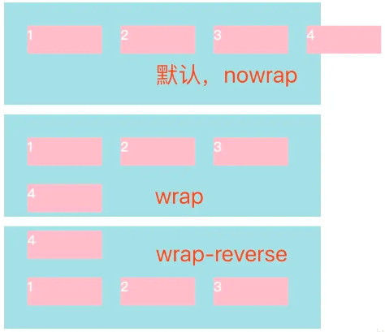

# CSS 面试知识点集合

# 一、CSS 基础

MDN 文档：[CSS 基础 - 学习 Web 开发 | MDN (mozilla.org)](https://developer.mozilla.org/zh-CN/docs/Learn/Getting_started_with_the_web/CSS_basics)

1. **选择器**：类选择器 (`.class`)，ID 选择器 (`#id`)，属性选择器 (`[attribute=value]`)，伪类和伪元素选择器 (`:hover`，`::before`)。
2. **颜色和背景**：`color`，`background-color`，`background-image`。
3. **文本属性**：`font-family`，`font-size`，`text-align`，`text-decoration`。
4. **盒模型**：`margin`，`border`，`padding`，`width`，`height`。
5. **布局**：`display`，`position`，`flexbox`，`grid`。
6. **过渡和动画**：`transition`，`animation`。
7. **响应式设计**：媒体查询 (`@media`)。
8. **变换**：`transform` (如 `rotate`，`scale`)。
9. **浮动和清除**：`float`，`clear`。
10. **定位**：`relative`，`absolute`，`fixed`，`sticky`。

## 0.CSS 介绍/初始化/加载原理

知识点：了解 CSS 的定义、历史、版本以及它如何与 HTML 一起工作。

### 1.CSS 是什么？

CSS（层叠样式表）是一种用于控制网页样式的语言，它允许你独立于 HTML 来设置网页的布局、颜色和字体等。它还可以与任何 XML 文档一起使用，包括纯 XML、SVG 和 XUL。

更多细节：[What is CSS - javatpoint](https://www.javatpoint.com/what-is-css)

### 2.CSS 的历史和发展

了解 CSS 的起源，它是如何随着时间发展而演变的，以及当前的版本是什么。

### 2）CSS 的起源是什么？

SGML（标准通用标记语言）是 CSS 的起源。它是一种定义标记语言的语言。

---

### 3） CSS 有哪些不同的变体？

以下是 CSS 的不同变体：

- CSS1 的
- CSS2 的
- CSS2.1
- CSS3 的
- CSS4 的

### 3.为什么使用 CSS？

CSS 可以节省时间，通过编写一次并在多个 HTML 页面上重用。它还可以提高网页的性能，并使内容与样式分离。

### 4.CSS 的工作原理

描述 CSS 如何与 HTML 文档一起工作，以及如何通过选择器将样式应用到特定元素上。

### 5.CSS 的优势和缺点

讨论使用 CSS 的好处，比如提高网页的可维护性和可访问性，以及可能遇到的挑战。

### 5） CSS 的优点是什么？

- 带宽
- 全站一致性
- 页面重新格式化
- 可及性
- 内容与演示文稿分离

---

### 6） CSS 的局限性是什么？

- 无法通过选择器升序
- 垂直控制的局限性
- 无表达式
- 无列声明
- 不受动态行为控制的伪类
- 无法制定规则、样式、针对特定文本

### 6.如何将 CSS 应用到网页上？

解释内联样式、内部样式表和外部样式表的不同使用方法。

### 7.CSS 规则的结构是怎样的？

描述 CSS 规则的基本组成，包括选择器、属性和值。

### 8.CSS 的三种主要方式是什么？

介绍三种方式将 CSS 应用到 HTML 文档中的方法。

内联样式

内部样式表

外部链接样式表

### 内联、嵌入式和外部样式表之间有什么区别？ 内联：内联样式表用于仅对一小部分代码进行样式设计。

语法：`<html style="css属性1:值; css属性2:值;"> </html>`

嵌入式：嵌入式样式表放在`<head>…</head>`标签之间。

语法：

```html
<style>
	body {
		background-color: linen;
	}
	h1 {
		color: red;
		margin-left: 80px;
	}
</style>
```

外部：这用于通过更改一个样式表来对您网站内的所有页面应用样式。

语法

```html
<head>
	<link rel="stylesheet" type="text/css" href="mystyle.css" />
</head>
```

### 外部样式表的优点是什么？

- z-index 您可以创建用于在许多文档中重用它的类。
- 通过使用它，您可以从一个文件控制多个文档的样式。
- 在复杂情况下，可以使用选择器和分组方法来应用样式。

### 9.style 标签写在 body 后与 body 前有什么区别？

页面加载自上而下 当然是先加载样式。

写在 body 标签后由于浏览器以逐行方式对 HTML 文档进行解析，当解析到写在尾部的样式表（外联或写在 style 标签）会导致浏览器停止之前的渲染，等待加载且解析样式表完成之后重新渲染，在 windows 的 IE 下可能会出现 FOUC 现象（即样式失效导致的页面闪烁问题）

- 写在 body 标签前有利于浏览器逐步渲染： resources downloading --> cssDOM + DOM --> Render Tree --> layout --> paint
- 写在 body 标签后： 由于浏览器以逐行方式对 HTML 文档进行解析，当解析到写在尾部的样式表（外联或写在 style 标签）会导致浏览器停止之前的渲染，等待加载且解析样式完成后重新渲染；在 windows 的 IE 下可能出现样式失效导致的页面闪烁问题。

### 10.为什么要初始化 CSS 样式

因为浏览器的兼容问题，不同浏览器对有些标签的默认值是不同的，如果没对 CSS 初始化往往会出现浏览器之间的页面显示差异。

但是初始化 CSS 会对搜索引擎优化造成小影响

### 11.有哪项方式可以对一个 DOM 设置它的 CSS 样式？

外部样式表：引入一个外部 css 文件

内部样式表：将 css 代码放在 `<head>` 标签内部

内联样式：将 css 样式直接定义在 HTML 元素内部

### 12.描述一个"reset"的 CSS 文件并如何使用它。知道 normalize.css 吗？你了解他们的不同之处吗？

重置样式非常多，凡是一个前端开发人员肯定有一个常用的重置 CSS 文件并知道如何使用它们。他们是盲目的在做还是知道为什么这么做呢？原因是不同的浏览器对一些元素有不同的默认样式，如果你不处理，在不同的浏览器下会存在必要的风险，或者更有戏剧性的性发生。

你可能会用 Normalize 来代替你的重置样式文件。它没有重置所有的样式风格，但仅提供了一套合理的默认样式值。既能让众多浏览器达到一致和合理，但又不扰乱其他的东西（如粗体的标题）。

在这一方面，无法做每一个复位重置。它也确实有些超过一个重置，它处理了你永远都不用考虑的怪癖，像 HTML 的 audio 元素不一致或 line-height 不一致。

### 13.BEM 命名法，有什么优势，有什么劣势

**BEM（Block, Element, Modifier）** 是一种流行的 HTML 和 CSS 类命名约定，旨在帮助开发人员更好地理解 HTML 和 CSS 之间的关系。让我们来看看 BEM 的优势和劣势：

**优势**：

1. **清晰的命名规则**：
   - BEM 的命名规则清晰明了，使开发人员能够快速理解每个类的作用。
   - 命名约定遵循一致的模式，使团队成员之间的沟通更容易。
2. **避免样式冲突**：
   - BEM 确保每个类都是唯一的，避免了样式冲突。
   - 开发人员可以放心地创建自己的组件并修改现有的块。
3. **易于维护和扩展**：
   - BEM 使代码更易于维护，因为开发人员可以快速找到特定组件的样式。
   - 可以轻松地添加新的块、元素和修饰符。
4. **一致性**：
   - BEM 为整个项目提供了一致的命名规则，使所有人都能使用相同的语法。

**劣势**：

1. **较长的类名**：
   - BEM 的类名可能会变得较长，尤其是在有多个修饰符和嵌套元素的情况下。
   - 需要权衡可读性和类名长度。
2. **不适合深度嵌套**：
   - BEM 不适合处理深度嵌套的元素。
   - 如果你的 DOM 结构非常复杂，BEM 可能不是最佳选择。

总之，BEM 是一种有助于创建可维护、清晰且一致的 CSS 代码的命名约定。它适用于大多数项目，但在某些情况下，你可能需要权衡使用 BEM 的优势和劣势。

### 14.解释将 CSS 样式应用于网页的三种主要方法。

当然，您需要知道如何将 CSS 添加到页面中，主要有三种方法：

#### 在`style`元素上使用 inline 属性

```html
<div>
	<p style="color: maroon;"></p>
</div>
```

#### 在 HTML `<style>`、`<head>`部分中使用块

```html
<head>
	<title>CSS Refresher</title>
	<style>
		body {
			font-family: sans-serif;
			font-size: 1.2em;
		}
	</style>
</head>
```

#### 使用`<link>`标签加载外部 CSS 文件

```html
<head>
	<title>CSS Refresher</title>
	<link rel="stylesheet" href="/css/styles.css" />
</head>
```

前两个很有用，但你几乎总是要加载外部 CSS 文件。将样式保存在单独的文件中更易于维护，更不用说它很好地分离了关注点。

## 1.CSS 选择器

**知识点**：类选择器 (`.class`)，ID 选择器 (`#id`)，属性选择器 (`[attribute=value]`)，伪类和伪元素选择器 (`:hover`，`::before`)。

### CSS 的基本语句构成是?

```css
选择器{属性 1:值 1;属性 2:值 2;……}
```

### CSS 选择器有哪些？哪些属性可以继承？优先级算法如何计算？

#### 选择器

- 1.id 选择器（#myid）
- 2.类选择器（.myclassname）
- 3.标签(派生)选择器（div, h1, p）
- 4.相邻选择器（h1 + p）
- 5.子选择器（ul < li）
- 6.后代选择器（li a）
- 7.通配符选择器（\*）
- 8.属性选择器（a[rel = "external"]）
- 9.伪类选择器（a: hover, li: nth - child）
- 10.伪元素选择器(p::first-line)
- 扩展选择器：

  - 后代选择器（利用空格间隔，比如 div .a{ }）

  - 群组选择器（利用逗号间隔，比如 p,div,#a{ }）

#### CSS 选择器属性继承

- 可继承： font-size、font-family、color、UL、LI、DL、DD、DT；
- 不可继承 ：border、padding、margin、width、height；

#### CSS 选择器优先级算法

- 优先级：就近原则，同权重情况下，样式定义最近者为准；

- 载入样式：以最后载入的定位为准；

- 优先级为：

  - !important > ID 选择器 > 类选择器 > tag 标签 > 通配符 > 继承 > 浏览器默认属性 ;

  - !important 比 style=""的内联优先级高

    - !important 声明的样式优先级最高，如果冲突再进行计算。

    - 如果优先级相同，则选择最后出现的样式。
    - 继承得到的样式的优先级最低。

复杂的计算方法：

- 关系选择器 / 通配符选择器：0
- 标签选择器 / 伪元素选择器的优先级：1
- 类选择器 / 属性选择器 / 伪类选择器的优先级：10
- ID 选择器的优先级：100
- 内联样式的优先级：1000

计算例子：

- div.test1 .span var 优先级：1+10 +10 +1

- span#xxx .songs li 优先级：1+100 + 10 + 1

- xxx li 优先级：100 +1

#### 那么问题来了，看下列代码，`<p>`标签内的文字是什么颜色的？

```html
<style>
	.classA {
		color: blue;
	}
	.classB {
		color: red;
	}
</style>
<body>
	<p class="classB classA">123</p>
</body>
```

答案：red。与样式定义在文件中的先后顺序有关，即是后面的覆盖前面的，与在`<p class='classB classA'>`中的先后关系无关。

### 能描述一下不同类型的选择器吗？

CSS 中的选择器是大括号前的位，例如`body`，或 `.nav-item`，用于选择要设置样式的内容。不同类型的选择器包括标签、类和 ID：

- 标签引用 HTML 标签
- 类引用 HTML 标记上的属性`class`
- 同样，ID 引用 HTML 标记上的属性`id`

```html
<!-- tag -->
<section>
	<!-- class -->
	<div class="button-cta">
		<!-- id -->
		<a href="cta-click">Click me!</a>
	</div>
</section>
```

### 解释目标元素的三种主要方式。

现在，为了设置页面上某些元素的样式，您需要知道如何指定这些元素。有三种主要方法可以定位某些内容：

- 通过标记，例如，您可以定位 `body`或`p` 或`span`
- 按您在 HTML 中指定的类。例如 `nav-item`、`.nav-item`，如果类有三个列表项，则可以使用它们作为目标
- 通过您在 HTML 中指定的 ID。例如`home-button`、`#home-button`，如果您有一个带有 ID 的链接，则可以使用它进行定位

```css
/* tag */
body {
	...;
}
/* class */
.nav-item {
	...;
}
/* id */
#home-button {
	...;
}
```

请记住，ID 应该是唯一的，这意味着一个页面上不应有多个具有特定 ID 的项目。通常，最好将代码定位到非常通用的站点范围样式，并将类定位到更具体的样式。如果您确实需要以单个项目为目标，则可以使用唯一类或修饰符类而不是 ID。

如果要以具有两个或多个类或 ID 的内容为目标，只需将它们全部连接在一起即可：

```css
.button.nav {
	...;
}
```

### css 的常用选择器

**考察点：css 选择器**

::: details 查看参考回答

id 选择器，类选择器，伪类选择器等

:::

### CSS 选择器有哪些，优先级呢

**考察点：CSS 选择器**

::: details 查看参考回答

id 选择器，class 选择器，标签选择器，伪元素选择器，伪类选择器等

优先级：

- 同一元素引用了多个样式时，排在后面的样式属性的优先级高；

- 样式选择器的类型不同时，优先级顺序为：id 选择器 > class 选择器 > 标签选择器；

- 标签之间存在层级包含关系时，后代元素会继承祖先元素的样式。如果后代元素定义了与祖先元素相同的样式，则祖先元素的相同的样式属性会被覆盖。继承的样式的优先级比较低，至少比标签选择器的优先级低；

- 带有!important 标记的样式属性的优先级最高；

- 样式表的来源不同时，优先级顺序为：内联样式> 内部样式 > 外部样式 > 浏览器用户自定义样式 > 浏览器默认样式

:::

### 浏览器是如何解析 css 选择器的？

**CSS 选择器的解析是从右向左解析的**

若从左向右的匹配，发现不符合规则，需要进行回溯，会损失很多性能。若从右向左匹配，先找到所有的最右节点，对于每一个节点，向上寻找其父节点直到找到根元素或满足条件的匹配规则，则结束这个分支的遍历。

两种匹配规则的性能差别很大，是因为从右向左的匹配在第一步就筛选掉了大量的不符合条件的最右节点（叶子节点），而从左向右的匹配规则的性能都浪费在了失败的查找上面。

而在 CSS 解析完毕后，需要将解析的结果与 DOM Tree 的内容一起进行分析建立一棵 Render Tree，最终用来进行绘图。在建立 Render Tree 时（WebKit 中的「Attachment」过程），浏览器就要为每个 DOM Tree 中的元素根据 CSS 的解析结果（Style Rules）来确定生成怎样的 Render Tree。

### !important 意义，是否应当规避使用？

`!important` 是 CSS 中的一个关键字，用于为某个属性/值添加比正常更高的优先级。如果使用了 `!important`，它将会覆盖该元素上之前所有样式规则中的相同属性。

以下是关于 `!important` 的一些重要事项：

1. **使用 `!important` 的意义**：
   - 当你需要确保某个样式在所有情况下都生效，即使其他样式规则的优先级更高时，可以使用 `!important`。
   - 例如，如果你在一个按钮上设置了特定的样式，但在某些情况下其他样式规则可能覆盖它，你可以使用 `!important` 来强制应用你的样式。
2. **避免滥用 `!important`**：
   - 不应该频繁使用 `!important`，因为它会使代码变得难以维护。
   - 如果你在大型样式表中过度使用 `!important`，会导致样式优先级的混乱，增加调试难度。
3. **合理使用 `!important` 的情况**：
   - **覆盖无法通过其他方式覆盖的样式**：例如，当你无法编辑某些样式（例如使用内容管理系统时），可以使用 `!important` 来覆盖一些默认样式。
   - **确保特定样式一致性**：例如，如果你想要所有按钮都具有相同的外观，不受其他样式规则的影响，可以使用 `!important`。

总之，虽然 `!important` 有其用途，但应该谨慎使用。只有在确实需要覆盖其他样式或确保一致性时，才应该使用 `!important`。

```css
/* high specificity */
.large .navigation.navigation-large {
	font-size: 2em;
}

/* 会覆盖上面的内容，但这很危险! */
.navigation {
	font-size: 3em !important;
}
```

### 什么是属性以及如何使用它们？

您已经了解了类，这意味着您已经了解了属性，将类视为类只是 HTML 标签可以具有的众多属性之一。有一些适用于所有标签，例如 `class` 和 `id`，但很多标签都有自己的标签。例如`input`、`type`，标签可以有（文本、数字、广播等），标签可以有 `a`、`href`。

您可以使用方括号来定位具有特定属性的元素：`[attribute="value"]`。例如，可以定位以下类型的所有输入字段：`radio`

```css
input[type="radio"] {
	background-color: #eee;
}
```

## 1.1 选择器：伪类伪元素

- **伪类**：是一种选择器，用于定义元素的特殊状态，例如:hover（鼠标悬停时的状态）或:first-child（选择第一个子元素）。
- **伪元素**：用于样式化页面上的某些部分，而不需要添加额外的 HTML，例如::before 和::after。

### 什么是伪元素，它们的用途是什么？

伪元素用于设置元素的特定部分的样式，而不是整个元素的样式。例如，您可以使用它来设置段落的第一行或第一个字母、所选文本的样式，也可以使用它在元素之前或之后插入文本或形状。

它们总是以双冒号开头 - 尽管为了向后兼容，仍然允许使用单冒号 - 它们看起来像这样：

```css
p::first-line {
	...;
}
span::first-letter {
	...;
}
::selection {
	...;
}
.header::after {
	...;
}
.tooltip::before {
	...;
}
```

### 什么是伪类，它们的用途是什么？

伪类类似于伪元素，但它们不是设置元素的一部分的样式，而是在元素处于特定状态时应用样式。例如，您可以根据用户是否将鼠标指针放在按钮上或单击按钮的时间来设置不同的样式。

另一个常见的用例是仅设置连续出现的某些元素的样式。例如，设置一系列选项卡中的第一个选项卡的样式，或每隔一个选项卡设置样式。

它们都以一个冒号开头，如下所示：

```css
.link:hover {
	...;
}
.link:active {
	...;
}
.tab:first-child {
	...;
}
.tab:last-child {
	...;
}
.avatar:nth-child(2n) {
	...;
}
```

### 属性选择器和伪类选择器的优先级

考察点：选择器

::: details 查看参考回答

属性选择器和伪类选择器优先级相同

:::

### CSS3 新增伪类有那些？

CSS3 新增伪类举例：

- `elem:first-of-type`：选中父元素下第一个 elem 类型元素。
- `elem:last-of-type`：选中父元素下最后一个 elem 类型元素。
- `elem:only-of-type`：如果父元素下的子元素只有一个 elem 类型元素，则选中该元素。
- `ele:nth-child(n)` 选中父元素下的第 n 个子元素，并且这个子元素的标签名为 elem，n 可以接受具体的数值，也可以接受函数。
- `elem:nth-last-child(n)`：作用同上，不过是从后开始查找。`elem:nth-last-child(n)`：作用同上，不过是从后开始查找。
- `elem:last-child`：选中最后一个子元素。
- `elem:only-child`：如果 elem 是父元素下唯一的子元素，则选中之。
- `elem:nth-of-type(n)`：选中父元素下第 n 个 elem 类型元素，n 可以接受具体的数值，也可以接受函数。
- `elem:empty`：选中不包含子元素和内容的 elem 类型元素。elem:target 选择当前活动的 elem 元素。
- `:not(elem)`：选择非 elem 元素的每个元素。
- `:enabled`、`:disabled` 控制表单控件的禁用状态。
- `:checked`，单选框或复选框被选中。

### 超链接访问过后 hover 样式就不出现的问题是什么？如何解决？

被点击访问过的超链接样式不在具有 hover 和 active 了，解决方法是改变 CSS 属性的排列顺序：L-V-H-A（link，visited，hover，active）

### ::before 和 :after 中双冒号和单冒号 有什么区别？解释一下这 2 个伪元素的作用

1. **单冒号( : )**用于 CSS3 伪类，**双冒号( :: )**用于 CSS3 伪元素
2. ::before 就是以一个子元素的存在，定义在元素主体内容之前的一个伪元素。并不存在于 dom 之中，只存在在页面之中。

作用：用于区分伪类和伪元素

:before 和 :after 这两个伪元素，是在 CSS2.1 里新出现的。起初，伪元素的前缀使用的是单冒号语法，但随着 Web 的进化，在 CSS3 的规范里，伪元素的语法被修改成使用双冒号，成为::before ::after

### 伪类和伪元素的区别

- 伪类表状态
- 伪元素是真的有元素
- 前者单冒号，后者双冒号

### 伪类是什么？有哪些？会有哪些兼容性问题？如何处理？

伪类是 CSS 中的一个特性，它允许根据元素的状态来定义不同的样式。伪类可以基于用户与页面的交互（如:hover 或:focus），或者是元素在文档树中的特定位置（如:first-child 或:last-of-type）来应用样式。以下是一些常见的 CSS 伪类：

- `:hover` — 当用户将鼠标悬停在元素上时。
- `:focus` — 当元素获得焦点时。
- `:active` — 当元素被激活（例如，通过点击）时。
- `:visited` 和 `:link` — 分别用于已访问和未访问的链接。
- `:first-child` — 选择作为其父元素的第一个子元素的元素。
- `:last-child` — 选择作为其父元素的最后一个子元素的元素。
- `:nth-child()` — 选择其父元素的特定顺序的子元素。

关于兼容性问题，旧版浏览器（特别是早期的 IE 版本）可能不支持某些 CSS 伪类。例如，IE6 只支持`:hover`伪类应用于链接元素，而不支持其他类型的元素。随着时间的推移，现代浏览器已经改善了对 CSS 伪类的支持，但仍然建议在使用较新的伪类时进行兼容性测试。

处理兼容性问题的方法包括：

- 使用 JavaScript 作为回退方案，特别是在旧浏览器中模拟伪类行为。
- 利用条件注释或特性检测来提供不同的样式或脚本。
- 尽量使用广泛支持的伪类，以确保在大多数浏览器中都能正常工作。

### 写一个表格以及对应的 CSS，使表格奇数行为白色背景，偶数行为灰色，鼠标一上去为黄色背景

```html
<!DOCTYPE html>
<html lang="zh-CN">
	<head>
		<meta charset="UTF-8" />
		<title>交替行颜色的表格</title>
		<style>
			table {
				width: 100%;
				border-collapse: collapse;
			}
			th,
			td {
				border: 1px solid #ddd;
				padding: 8px;
				text-align: left;
			}
			tr:nth-child(odd) {
				background-color: #fff;
			}
			tr:nth-child(even) {
				background-color: #f2f2f2;
			}
			tr:hover {
				background-color: #ffff99;
			}
		</style>
	</head>
	<body>
		<table>
			<tr>
				<th>标题1</th>
				<th>标题2</th>
				<th>标题3</th>
			</tr>
			<tr>
				<td>数据1</td>
				<td>数据2</td>
				<td>数据3</td>
			</tr>
			<tr>
				<td>数据4</td>
				<td>数据5</td>
				<td>数据6</td>
			</tr>
			<!-- 更多行数据 -->
		</table>
	</body>
</html>
```

在这个例子中，`tr:nth-child(odd)` 选择器用于为奇数行设置白色背景，`tr:nth-child(even)` 选择器用于为偶数行设置灰色背景。`tr:hover` 选择器则用于设置当鼠标悬停在行上时的背景颜色为黄色。

### 知道 css 有个 content 属性吗？有什么作用？有什么应用？

css 的 content 属性专门应用在 before/after 伪元素上，用于来插入生成内容。

最常见的应用是：利用伪类清除浮动。

```css
/** 一种常见利用伪类清除浮动的代码 **/
.clearfix:after {
	content: "."; /** 这里利用到了content属性 **/
	display: block;
	height: 0;
	visibility: hidden;
	clear: both;
}
.clearfix {
	*zoom: 1;
}
```

## 2.颜色和背景

CSS 颜色属于**CSS 基础知识**中的**颜色和背景**部分。这包括了解如何使用颜色值（如十六进制、RGB、RGBA、HSL、HSLA 等）来设置元素的前景色和背景色。此外，还涉及到颜色的应用，比如如何使用颜色来提高可访问性和用户体验。

**颜色和背景**：`color`，`background-color`，`background-image`。

### rgba()和 opacity 的透明效果有什么不同？

rgba()和 opacity 都能实现透明效果，但最大的不同是 opacity 作用于元素，以及元素内的所有内容的透明度，而 rgba()只作用于元素的颜色或其背景色。（设置 rgba 透明的元素的子元素不会继承透明效果！）

### png、jpg、gif 这些图片格式解释一下，分别什么时候用。有没有了解过 webp？

1. png 是便携式网络图片（Portable Network Graphics）是一种无损数据压缩位图文件格式.优点是：压缩比高，色彩好。 大多数地方都可以用。
2. jpg 是一种针对相片使用的一种失真压缩方法，是一种破坏性的压缩，在色调及颜色平滑变化做的不错。在 www 上，被用来储存和传输照片的格式。
3. gif 是一种位图文件格式，以 8 位色重现真色彩的图像。可以实现动画效果.
4. webp 格式是谷歌在 2010 年推出的图片格式，压缩率只有 jpg 的 2/3，大小比 png 小了 45%。缺点是压缩的时间更久了，兼容性不好，目前谷歌和 opera 支持。

### 阐述一下 CSS Sprites

CSSSprites（精灵图），将一个页面涉及到的所有图片都包含到一张大图中去，然后利用 CSS 的 background-image，background-repeat，background-position 属性的组合进行背景定位。

- 利用 CSS Sprites 能很好地减少网页的 http 请求，从而大大的提高页面的性能；
- CSS Sprites 能减少图片的字节。

#### 优点：

利用 CSS Sprites 能很好地减少网页的 http 请求，从而大大提高了页面的性能，这是 CSS Sprites 最大的优点；

CSS Sprites 能减少图片的字节，把 3 张图片合并成 1 张图片的字节总是小于这 3 张图片的字节总和。

#### 缺点：

在图片合并时，要把多张图片有序的、合理的合并成一张图片，还要留好足够的空间，防止板块内出现不必要的背景。在宽屏及高分辨率下的自适应页面，如果背景不够宽，很容易出现背景断裂；

CSSSprites 在开发的时候相对来说有点麻烦，需要借助 photoshop 或其他工具来对每个背景单元测量其准确的位置。

维护方面：CSS Sprites 在维护的时候比较麻烦，页面背景有少许改动时，就要改这张合并的图片，无需改的地方尽量不要动，这样避免改动更多的 CSS，如果在原来的地方放不下，又只能（最好）往下加图片，这样图片的字节就增加了，还要改动 CSS。

### sprite 图（雪碧图/精灵图）知道吗？ 优缺点如何

雪碧图（Sprite 图）是一种 CSS 图像合成技术，它通过将多个小图标合并到一张大图上，然后使用 CSS 的 `background-image、background-repeat、background-position ` 属性来组合进行背景定位，从而显示所需的图标部分。这种方法可以减少 HTTP 请求的数量，从而提高页面加载速度。

优点：

- 减少 HTTP 请求数，极大地提高页面加载速度
- 增加图片信息重复度，提高压缩比，减少图片大小
- 更换⻛格方便，只需在一张或几张图片上修改颜⾊或样式即可实现

缺点：

- 图片合并麻烦
- 维护麻烦，不能随便改变大小，会失真模糊；修改一个图片可能需要从新布局整个图片，样式

### svg 雪碧图了解吗？

SVG 雪碧图是雪碧图的一种变体，它使用 SVG 格式的图像。与传统的雪碧图相比，SVG 雪碧图具有更好的缩放性和清晰度，特别适合用于高分辨率显示设备。SVG 雪碧图通常是通过 `和` 元素来实现的。`元素用于定义图形模板，而` 元素用于在页面上多次引用这些模板。

处理 SVG 雪碧图时，您可以使用一些工具和插件来简化生成和维护的过程。例如，`vite-plugin-svg-icons` 是一个可以帮助您将 SVG 图标转换为雪碧图的插件。此外，还有一些在线服务和平台，如 `iconfont` 和 `icomoon`，它们允许您上传 SVG 文件并生成雪碧图

### 如果想要改变一个 DOM 元素的字体颜色，不在它本身上进行操作？

**考察点：CSS**

::: details 查看参考回答

可以更改父元素的 color

:::

### 设置一个元素的背景颜色，背景颜色会填充哪些区域？

**考察点：CSS**

::: details 查看参考回答

background-color 设置的背景颜色会填充元素的 content、padding、border 区域

:::

## 3.CSS 语法：单位

**单位**：涉及到 CSS 中用于测量的各种单位，如像素(px)、百分比(%)、em、rem 等。

### 说说 css 中的单位有哪些

在 CSS 中，常见的单位包括：

1. 像素（px）：最常用的单位，相对于显示器屏幕的一个像素。

2. 百分比（%）：相对于父元素的百分比。

3. em：相对于当前元素的字体大小。

4. rem：相对于根元素（html 元素）的字体大小。

5. vw：视口宽度的百分比，1vw 等于视口宽度的 1%。

6. vh：视口高度的百分比，1vh 等于视口高度的 1%。

7. px : 像素单位 ，屏幕上的发光点

8. rem : 相对单位， 相对于根字体大小，html 默认就是 16px

9. em : 相对单位，用于字体上其会继承父容器的字体大小，用在它处，是相对于当前容器自己的字体大小来定的

   ```html
   <!DOCTYPE html>
   <html lang="en">
   	<head>
   		<meta charset="UTF-8" />
   		<meta name="viewport" content="width=device-width, initial-scale=1.0" />
   		<title>Document</title>
   		<style>
   			.box {
   				font-size: 30px;
   			}
   			.wrap {
   				font-size: 20px;
   			}
   			h2 {
   				font-size: 1em;
   			}
   		</style>
   	</head>
   	<body>
   		<div class="box">
   			<div class="wrap">
   				<h2>hello world</h2>
   			</div>
   		</div>
   	</body>
   </html>
   ```

   这种情况，h2 的字体大小就是 20px。如果把 wrap 样式删掉就是 30px，所以这个父容器字体大小是可以被继承的

   ```html
   <!DOCTYPE html>
   <html lang="en">
   	<head>
   		<meta charset="UTF-8" />
   		<meta name="viewport" content="width=device-width, initial-scale=1.0" />
   		<title>Document</title>
   		<style>
   			h2 {
   				font-size: 10px;
   				width: 10em;
   				height: 10em;
   				background-color: blue;
   			}
   		</style>
   	</head>
   	<body>
   		<div class="box">
   			<div class="wrap">
   				<h2>hello world</h2>
   			</div>
   		</div>
   	</body>
   </html>
   ```

   这里没用在字体上，此时的 h2 容器就是宽高各 100px

10. vw / vh : 相对单位，相对于窗口宽高比

11. % : 相对单位，相对于父容器

### px 、 em 、 rem 、 vw 、 vh ？ rem 的根节点样式在什么时候设置？

当涉及到 CSS 中的长度单位时，有几种常见的选项。让我们来看看这些单位以及如何使用它们：

1. **px（像素）**：像素是最常见的长度单位。在 CSS 中，1 像素被定义为 1/96 英寸。尽管不同设备上的像素大小可能会有所不同，但在屏幕上通常使用像素作为单位。
2. **em**：`em` 是相对于元素的字体大小的单位。例如，如果父元素的字体大小是 16px，那么 1em 等于 16px。`em` 可以用于设置字体大小、内外边距等。
3. **rem**：`rem` 是相对于根元素（通常是 `<html>` 元素）的字体大小的单位。默认情况下，大多数浏览器的根元素字体大小是 16px。因此，1rem 等于 16px。`rem` 通常用于创建一致的字体大小和间距。
4. **vw（视口宽度的百分比）**：`vw` 是相对于视口宽度的单位。1vw 等于视口宽度的 1%。例如，如果视口宽度是 375px，那么 1vw 等于 3.75px。
5. **vh（视口高度的百分比）**：`vh` 是相对于视口高度的单位。1vh 等于视口高度的 1%。

关于 `rem` 的根节点样式设置，您应该在 CSS 中的根元素（通常是 `<html>` 元素）上设置 `font-size` 属性。例如，如果您希望基本字体大小为 10px，可以这样设置：

```css
html {
	font-size: 10px;
}
```

这样，所有使用 `rem` 的地方都将参考根元素的字体大小，从而避免了嵌套导致的复杂问题。`rem` 单位非常适合创建可伸缩的布局。

### 1. px 和 em 的区别

**📢 参考回答：**

`px`全称`pixel`像素，是相对于屏幕分辨率而言的，它是一个绝对单位，但同时具有一定的相对性。因为在同一个设备上每个像素代表的物理长度是固定不变的，这点表现的是绝对性。但是在不同的设备之间每个设备像素所代表的物理长度是可以变化的，这点表现的是相对性

`em`是一个相对长度单位，具体的大小需要相对于父元素计算，比如父元素的字体大小为 80px，那么子元素 1em 就表示大小和父元素一样为 80px，0.5em 就表示字体大小是父元素的一半为 40px。

- px 和 em 都是长度单位，区别是：px 的值是固定的，指定是多少就是多少，计算比较容易。

- em 得值不是固定的，并且 em 会继承父级元素的字体大小。

- 浏览器的默认字体高都是 16px。所以未经调整的浏览器都符合: 1em=16px。那么 12px=0.75em,10px=0.625em。

### 2. vw、vh 是什么？

**📢 参考回答：**

_vw_ 和 _vh_ 是 _CSS3_ 新单位，即 _view width_ 可视窗口宽度 和 _view height_ 可视窗口高度。1*vw* 就等于可视窗口宽度的百分之一，1*vh* 就等于可视窗口高度的百分之一。

### rem 和 vm 的转换

在 CSS 中，`rem` 和 `vw`（视口宽度的百分比）是两种流行的长度单位，用于响应式设计。`rem` 是相对于根元素（即 HTML 元素）的字体大小的单位，而 `vw` 是相对于视口宽度的单位。以下是它们之间的转换方法：

1. **确定基准大小**：首先，您需要知道根元素的字体大小。例如，如果 `html` 的 `font-size` 是 `16px`，那么 `1rem` 等于 `16px`。
2. **计算 `vw` 单位**：视口宽度的 `1vw` 等于视口宽度的 `1%`。例如，如果视口宽度是 `375px`，那么 `1vw` 等于 `3.75px`。
3. **从 `px` 到 `rem`**：要将 `px` 转换为 `rem`，您可以使用公式 `px / root font-size`。例如，`32px / 16px = 2rem`。
4. **从 `px` 到 `vw`**：要将 `px` 转换为 `vw`，您可以使用公式 `(px / viewport width) * 100`。例如，`(32px / 375px) * 100 ≈ 8.53vw`。

这里有一个简单的例子，假设根元素的字体大小是 `16px`，视口宽度是 `375px`：

```css
/* 根元素字体大小 */
html {
	font-size: 16px;
}

/* 使用 rem 单位 */
.element {
	margin-top: 2rem; /* 2rem = 32px */
}

/* 使用 vw 单位 */
.element {
	margin-top: 8.53vw; /* 8.53vw ≈ 32px */
}
```

### 说说设备像素，css 像素，设备独立像素，dpr, dpi 之间的区别？

**设备像素（Device Pixel）**：设备像素是物理屏幕上的一个点，是显示器或移动设备屏幕的最小单位。设备像素的数量决定了屏幕的分辨率。

**CSS 像素（CSS Pixel）**：CSS 像素是 Web 开发中使用的抽象单位，它与设备像素之间存在一定的关系，但并不直接映射到具体的物理像素上。浏览器会根据设备像素比（Device Pixel Ratio，简称 DPR）将 CSS 像素转换为实际的设备像素。

**设备独立像素（Device-Independent Pixel，也称为密度无关像素）**：设备独立像素是一个抽象的单位，用来在不同设备上保持一致的显示效果。在 CSS 中，1 个设备独立像素通常等于 1 个 CSS 像素。设备独立像素的概念有助于实现响应式设计和跨设备兼容性。

**设备像素比（Device Pixel Ratio，DPR）**：设备像素比是指设备像素与设备独立像素的比值，表示一个 CSS 像素对应的设备像素数目。例如，如果一个设备的 DPR 为 2，那么 1 个 CSS 像素将对应 4 个设备像素（2x2）。

**像素密度（Pixels Per Inch，PPI）**：像素密度是指每英寸（inch）的屏幕上的像素数量，通常用于描述屏幕的清晰度和显示质量。PPI 越高，屏幕显示的细节就越丰富。

1. pc 端 1px == 1 个物理像素
   如今的手机两倍屏 1px === 0.5 物理发光点，也就是一个设备独立像素 === 两个物理像素
2. 页面缩放比为 1:1=时， 1px == 1 个物理像素

> 设备像素就是物理屏幕上的实际像素，比如分辨率 1920 \* 1080 的屏幕有 1920 个水平像素和 1080 个垂直像素
>
> css 像素就是浏览器使用的单位，就是通常说的 px
>
> 设备独立像素在不同的设备上会映射到不同数量的物理像素，取决于设备

- 设备像素 == 物理像素

- css 像素 == 1px

- 设备独立像素 == 分辨率
- dpr(Device Pixel Ratio 设备像素比) === 设备像素 / 设备独立像素
- dpi === 像素密度
- ppi === 像素的密度

iphone6 是两倍屏手机 就是 宽`750 / 375 = 2` 就是高清屏，iPhone6 plus 的 dpr 为 3 就是超高清屏

## 4.文本属性和字体

### 让页面里的字体变清晰，变细用 CSS 怎么做？

-webkit-font-smoothing：在 window 系统下没有起作用，但是在 IOS 设备上起作用

-webkit-font-smoothing：antialiased 是最佳的，灰度平滑。

### 什么是字体图标？

字体图标简单的说，就是一种特殊的字体，通过这种字体，显示给用户的就像一个个图片一样。

字体图标是一种特殊的字体，它包含一系列的图标而不是传统的字母或数字字符。这些图标可以像文字一样通过 CSS 控制大小、颜色和样式，因此非常适合用于网页设计。

字体图标的优点包括：字体图标最大的好处，在于它不会变形和加载速度快。字体图标可以像文字一样，随意通过 css 来控制它的大小和颜色，非常方便。

- **文件大小小**：相比于图片文件，字体图标通常文件更小，加载更快。
- **可缩放性**：作为矢量图形，字体图标可以无限放大或缩小而不失真。
- **易于样式化**：可以通过 CSS 轻松改变图标的颜色、大小、阴影等。
- **减少 HTTP 请求**：将多个图标合并到一个字体文件中，减少了加载网页时的 HTTP 请求次数。

字体图标的使用流程通常包括以下几个步骤：

1. **选择或创建图标**：您可以自己设计 SVG 图标，或者使用现成的图标库，如 Font Awesome。
2. **生成字体文件**：将 SVG 图标转换成字体文件格式，如 ttf 或 woff。
3. **引入到网页**：通过@font-face 在 CSS 中引入字体文件，并为每个图标定义一个 class。
4. **在 HTML 中使用**：在 HTML 元素中通过 class 引用图标。

例如，使用 Font Awesome 时，您只需在 HTML 中添加相应的 class，就可以显示图标：

```html
<i class="fa fa-camera-retro"></i>
<!-- 显示相机图标 -->
```

字体图标也有一些局限性，比如它们通常只能是单色的，不能像图片那样有多种颜色。但是，对于大多数网页设计需求来说，字体图标是一个非常实用的工具。

### 怎么让 Chrome 支持小于 12px 的文字？

**如何让 chrome 支持 10px 的文字？**

1. `font-size: 12px; -webkit-transform: scale(0.84);`
2. `font-size: 20px; -webkit-transform: scale(0.5);`

```css
p {
	font-size: 10px;
	-webkit-transform: scale(0.8); // 0.8是缩放比例
}
```

### 如何实现小于 12px 的字体效果

transform:scale() 这个属性只可以缩放可以定义宽高的元素，而行内元素
是没有宽高的，我们可以加上一个 display:inline-block ;

```css
transform: scale(0.7);
```

css 的属性，可以缩放大小

### 如何用 css 或 js 实现单行和多行文本溢出省略效果，考虑兼容性

#### CSS 实现方式

##### 单行：

```css
p {
	overflow: hidden;
	text-overflow: ellipsis;
	white-space: nowrap;
}
```

##### 多行：

```css
p {
	display: -webkit-box;
	-webkit-box-orient: vertical;
	-webkit-line-clamp: 3; /* 设置显示的行数 */
	overflow: hidden;
}
```

- 请注意，这种方法依赖于 WebKit 的 CSS 属性扩展，因此在兼容性方面，适用于大多数 PC 端和移动端的 WebKit 内核浏览器（如 Chrome、Safari、QQ 浏览器等）。

##### 兼容：

```css
p {
	position: relative;
	line-height: 20px;
	max-height: 40px;
	overflow: hidden;
}
p::after {
	content: "...";
	position: absolute;
	bottom: 0;
	right: 0;
	padding-left: 40px;
	background: -webkit-linear-gradient(left, transparent, #fff 55%);
	background: -o-linear-gradient(right, transparent, #fff 55%);
	background: -moz-linear-gradient(right, transparent, #fff 55%);
	background: linear-gradient(to right, transparent, #fff 55%);
}
```

#### JS 实现方式：

- 使用 split + 正则表达式将单词与单个文字切割出来存入 words
- 加上 '...'
- 判断 scrollHeight 与 clientHeight，超出的话就从 words 中 pop 一个出来

**基于高度截断的多行文本溢出省略**：

使用 CSS 和 JavaScript：

```html
<div
	id="view"
	style="border: 1px solid red; width: 200px; height: 70px; overflow: auto;"
></div>

<script>
	const s =
		"这是一个文本这是一个文本这是一个文本这是一个文本这是一个文本这是一个文本";
	const el = document.getElementById("view");
	const n = el.offsetHeight;
	for (let i = 0; i < s.length; i++) {
		el.innerHTML = s.substr(0, i);
		if (n < el.scrollHeight) {
			el.style.overflow = "hidden";
			el.innerHTML = s.substr(0, i - 3) + "...";
			break;
		}
	}
</script>
```

### 其他文本溢出的省略效果

#### 1.基于 JavaScript 的动态计算省略号

```js
function ellipsizeTextBox(id) {
	var el = document.getElementById(id);
	var wordArray = el.innerHTML.split(" ");
	while (el.scrollHeight > el.offsetHeight) {
		wordArray.pop();
		el.innerHTML = wordArray.join(" ") + "...";
	}
}
```

调用 `ellipsizeTextBox` 函数并传入元素的 ID，它会根据容器的高度动态地截断文本。

- 使用 JavaScript 来动态计算文本的长度，然后根据容器的宽度决定是否显示省略号。
- 这种方法可以适用于不同长度的文本，并且可以在运行时根据实际情况进行处理。

#### 2.CSS 中的 mix-blend-mode 属性

```css
.text-ellipsis {
	position: relative;
	color: transparent;
	mix-blend-mode: difference;
}

.text-ellipsis::after {
	content: "...";
	position: absolute;
	right: 0;
	bottom: 0;
}
```

这里使用 `mix-blend-mode` 属性来实现文本与背景的混合效果，从而产生省略号的视觉效果。

- 使用`mix-blend-mode`属性可以将文本与背景混合，从而实现省略号的效果。
- 这种方法需要一定的 CSS 技巧，但可以在某些情况下产生有趣的效果。

#### 3.使用伪元素和背景渐变：

```css
.text-ellipsis {
	position: relative;
	overflow: hidden;
}

.text-ellipsis::after {
	content: "...";
	position: absolute;
	right: 0;
	bottom: 0;
	background: linear-gradient(
		to right,
		rgba(255, 255, 255, 0),
		rgba(255, 255, 255, 1) 50%
	);
}
```

通过设置伪元素的背景渐变，可以在文本末尾创建一个省略号的效果。

- 在文本容器中使用伪元素（如`::after`）来添加省略号。
- 通过设置伪元素的背景渐变，可以实现省略号的效果。

#### 4.基于服务器端的文本截断：

```css
function truncateText($text, $maxLength) {
  if (strlen($text) > $maxLength) {
    $text = substr($text, 0, $maxLength - 3) . '...';
  }
  return $text;
}
```

在服务器端调用 `truncateText` 函数，传入文本和最大长度，它会返回截断后带有省略号的文本。

- 这样可以避免在前端处理文本溢出的问题。

### 什么是 Web 安全字体和后备字体？

并非所有操作系统和浏览器都安装了相同的字体。Web 安全字体是通常预安装在许多计算机系统上的字体，例如 Arial 和 Times New Roman。如果浏览器或操作系统无法识别您设置的第一个字体（例如 Ubuntu），您应该选择要显示的 Web 安全后备字体（例如 Arial），然后是通用字体系列（例如 sans-serif）。如果回退字体也没有显示，浏览器可以选择无衬线字体系列中的通用字体。

### 您喜欢的字体大小调整方式是什么？

我几乎总是想到的是您的文本大小，主要集中在您使用的单位上。当然，您可以使用像素（**px**），但也有**em**、**rem**、**%**、**vw**和**vh**，以及其他一些单位。有些人仍然不喜欢使用像素，但浏览器已经改进，它们通常处理得很好。

定义字体大小允许您根据在更高级别定义的大小更改文本大小。例如，如果容器已将**font-size**指定为**2em**，而您在该容器内的元素上指定了**font-size**为**2em**，则该元素的有效**font-size**为**4em**！但是，这可能有点令人困惑，因为您可能并不总是看到您期望的大小！

```css
.container {
	font-size: 2em;
}

.container > p {
	font-size: 2em; /* this is 2em x 2em = 4em![^2^][2] */
}
```

**rem**单位的创建是为了纠正这种混淆。它在浏览器中可以很好地缩放，就像**em**和**px**一样，但它使用基本大小。由此计算出所有进一步的**rem**值。例如，如果基**rem**值等于**16px**，则**1rem**将始终等于**16px**，**2rem**将始终等于**32px**，依此类推。

注意：虽然我已经使用**font-sizes**解释了这些单位，但相同的规则适用于您使用**px**、**em**或**rem**的任何尺寸。

## 5.CSS 盒模型

在最初接触 CSS 的时候，对于 CSS 盒模型的不了解，撞了很多次的南墙呀。盒模型是网页布局的基础，它制定了元素如何在页面中显示，如果足够地掌握，那使用 CSS 布局那将会容易得多。

### 文档相关

- [css 盒模型全面解析](https://www.cnblogs.com/ylliap/p/6119740.html)
- [CSS 盒子模型 | 菜鸟教程 (runoob.com)](https://www.runoob.com/css/css-boxmodel.html)
- [盒模型 - 学习 Web 开发 | MDN (mozilla.org)](https://developer.mozilla.org/zh-CN/docs/Learn/CSS/Building_blocks/The_box_model)
- [CSS 基础框盒模型 - CSS（层叠样式表） | MDN (mozilla.org)](https://developer.mozilla.org/zh-CN/docs/Web/CSS/CSS_Box_Model)
- [CSS 基础框盒模型介绍 - CSS（层叠样式表） | MDN (mozilla.org)](https://developer.mozilla.org/zh-CN/docs/Web/CSS/CSS_Box_Model/Introduction_to_the_CSS_box_model)

相关属性组成：内容(content)、内边距(padding)、边框(border)、外边距(margin)

CSS 盒模型是前端的基石，这个问题由浅入深，由易到难，可以依次问出下面几个问题

- 基本概念：标准模型 + IE 模型
- 标准模型 和 IE 模型的区别
- CSS 如何设置这两种模型
- JS 如何设置和获取盒模型对应的宽和高
- 实例题（根据盒模型解释边距重叠）
- BFC（边距重叠解决方案）

### 1、盒模型基本概念

所有 HTML 元素可以看作盒子，在 CSS 中，"box model"这一术语是用来设计和布局时使用。

CSS 盒模型本质上是一个盒子，封装周围的 HTML 元素，它包括：边距，边框，填充，和实际内容。

盒模型允许我们在其它元素和周围元素边框之间的空间放置元素。

下面的图片说明了盒子模型(Box Model)：


### 介绍 CSS 盒子模型

CSS 盒子模型是 Web 设计和布局的基础。它包括以下几个部分：

#### 四个组成部分

- **内容（Content）**：这是盒子中的文本和图像等实际内容。
- **内边距（Padding）**：内容区域周围的空间，通常用于在内容和边框之间提供缓冲。
- **边框（Border）**：围绕内边距和内容的线框，可以设置大小和样式。
- **外边距（Margin）**：盒子外部的空间，用于将一个盒子与其他盒子分隔开。

#### 两种盒子模型和特殊的盒子模型

##### content-box（内容盒子—标准 W3C 盒子模型）

**content-box（内容盒子—标准 W3C 盒子模型）**：这是默认的盒子模型。在这个模型中，元素的`width`和`height`只包括内容区域，不包括内边距（padding）、边框（border）和外边距（margin）。如果你设置了一个元素的宽度为 100px，那么这个宽度只包含内容的宽度，内边距和边框会额外增加到这个高度和宽度上。你需要额外计算内边距和边框来确定元素在页面上占用的实际空间。

- **概念：** 标准盒模型是 W3C 规定的盒模型标准，它包括内容区域、内边距、边框和外边距。元素的宽度和高度不包括内边距和边框。
- 在标准盒模型中，元素的宽度和高度不包括内边距和边框。换句话说，元素的实际宽度/高度等于 CSS 中定义的 width/height 属性值加上内边距和边框的宽度。因此，内边距和边框不会影响元素的宽度和高度，只会影响元素内容的排列和显示。

例如，如果你设置一个元素的`width`为 100px，并且有 10px 的内边距和 5px 的边框，那么元素在页面上的实际宽度将会是 130px（100 + 10 + 10 + 5 + 5）。

- 这是大多数现代浏览器遵循的模型。
- `width`和`height`属性设置的是内容区域的宽度和高度，内边距和边框会额外增加到这个宽度上。

**标准盒子模型**：宽度=内容的宽度（content）+ border + padding + margin

##### border-box（边框盒子—IE 盒子模型(怪异模型)）

**border-box（边框盒子—IE 盒子模型(怪异模型)）**：当设置`box-sizing: border-box;`时，元素的`width`和`height`将包括内容、内边距和边框的宽度。这意味着，如果你设置一个元素的宽度为 100px，那么这个宽度将包括内容、内边距和边框的总宽度。

- **概念：** 怪异盒模型是 IE5 及以下版本的浏览器采用的盒模型，它的计算方式与标准盒模型有所不同在怪异盒模型中，元素的宽度和高度包括内边距和边框。
- 换句话说，元素的实际宽度/高度等于 CSS 中定义的 width/height 属性值，包括内边距和边框的宽度。因此，内边距和边框会影响元素的宽度和高度，可能会导致元素在页面布局时出现意外的效果。

- 在 IE 5 和 6 中，盒子的`width`属性不仅包括内容的宽度，还包括内边距和边框的宽度的总和。
- 这与标准的 W3C 盒子模型不同，导致在怪异模式下呈现不正确。

**低版本 IE 盒子模型**：宽度=内容宽度（content+border+padding）+ margin

##### 两个盒子模型图例


##### 替换元素(特殊的盒子模型)

- 替换元素加载外部内容，例如``、`<iframe>`或`<video>`等。
- 它们的尺寸可能由外部内容决定，而不完全受 CSS 盒子模型的规则影响。
- 替换元素的布局可以通过 CSS 控制，但不会受当前页面的 CSS 影响。

##### 总结

- content-box（标准盒模型）：默认值，总宽度 = margin + border + padding + width
- border-box（IE 盒模型） ：盒子宽度包含 padding 和 border ， 总宽度 = margin + width
- inherit ：从父元素继承 box-sizing 属性

使用 `window.top.document.compatMode` 可显示出 什么盒模型

#### 盒子模型的工作方式

盒子模型的工作方式是，你设置的宽度和高度直接应用于内容区域。如果你想要计算整个盒子的大小，你需要加上内边距、边框和外边距的大小。例如，如果你有一个宽度为 300px 的盒子，20px 的内边距和 5px 的边框，那么整个盒子的总宽度将是 350px（300 + 20 + 20 + 5 + 5）。

浏览器兼容性也是一个考虑因素。例如，早期的 IE 浏览器在"怪异模式"下不会按照标准盒子模型渲染元素，而是将内边距和边框包含在你设置的宽度和高度内。这可以通过设置正确的 DOCTYPE 或使用 CSS 的`box-sizing`属性来解决。

CSS 的`box-sizing`属性允许我们更改用于计算盒子大小的盒模型。默认情况下，它设置为`content-box`，这意味着元素的宽度和高度只包括内容区域。如果你将`box-sizing`设置为`border-box`，浏览器会将内边距和边框的宽度包含在元素的总宽度和高度内。

### box-sizing 属性 3. 应用场景和解决方案

**标准盒模型的应用场景：**

- 现代的大多数浏览器都遵循标准盒模型，因此在开发中一般都采用标准盒模型。
- 通过设置 CSS 的 box-sizing 属性为 content-box 来明确使用标准盒模型。

**怪异盒模型的应用场景：**

- 一些古老的网站可能会在遗留系统中使用怪异盒模型，需要做一些兼容性处理。
- 通过设置 CSS 的 box-sizing 属性为 border-box 来模拟怪异盒模型，以便在现代浏览器中实现相同的效果。

### 控制元素的盒子模型的解析模式

用来控制元素的盒子模型的解析模式，默认为 content-box
context-box：W3C 的标准盒子模型，设置元素的 height/width 属性指的是 content 部分的高/宽
border-box：IE 传统盒子模型。设置元素的 height/width 属性指的是 border + padding + content 部分的高/宽

1. `content-box`，对应标准盒模型。
2. `border-box`，IE 盒模型。
3. `inherit`，继承父元素的 box-sizing 值。

### 弹性盒子模型? flex|box 区别?

1）引入弹性盒布局模型的目的是提供一种更加有效的方式来对一个容器中的条目进行排列、对齐和分配空白空间。

- 即便容器中条目的尺寸未知或是动态变化的，弹性盒布局模型也能正常的工作。在该布局模型中，容器会根据布局的需要，调整其中包含的条目的尺寸和顺序来最好地填充所有可用的空间。

- 当容器的尺寸由于屏幕大小或窗口尺寸发生变化时，其中包含的条目也会被动态地调整。比如当容器尺寸变大时，其中包含的条目会被拉伸以占满多余的空白空间；当容器尺寸变小时，条目会被缩小以防止超出容器的范围。弹性盒布局是与方向无关的。

- 在传统的布局方式中，block 布局是把块在垂直方向从上到下依次排列的；

- 而 inline 布局则是在水平方向来排列。弹性盒布局并没有这样内在的方向限制，可以由开发人员自由操作。

2）flex 和 box 的区别: display：box 是老规范，要兼顾古董机子就加上它； 父级元素有 display:box;属性之后。他的子元素里面加上 box-flex 属性。可以让子元素按照父元素的宽度进行一定比例的分占空间。

- flex 是最新的，董机老机子不支持的；

- 父元素设置 display:flex 后，子元素宽度会随父元素宽度的改变而改变，而 display:box 不会。 Android

- UC 浏览器只支持 display: box 语法；而 iOS UC 浏览器则支持两种方式。

### 解释在 ie 低版本下的怪异盒模型和 c3 的怪异盒模型 和 弹性盒模型?

IE 当 padding+border 的值小于 width 或者 height：

- 盒模型的宽度=margin(左右)+width（width 已经包含了 padding 和 border 的值）

- 盒模型的高度=margin(上下)+height（height 已经包含了 padding 和 border 的值）

当 padding+border 的值大于 width 或者 height:

- 盒模型的宽度=margin(左右)+padding(左右)+border(左右)

- 盒模型的高度=margin(上下)+padding(上下)+border(上下)+19px （加一个默认行高 19px） 所以相当于是 padding+border 和 width 或者 height 比大小，谁大取谁。

以上几种 DOCTYPE 都是标准的文档类型，无论使用哪种模式完整定义 DOCTYPE，都会触发标准模式，而如果 DOCTYPE 缺失则在 ie6，ie7，ie8 下将会触发怪异模式（quirks 模式） CSS3box-sizing 有两个值：

- 一个是 content-box，另一个是 border-box。

- 当设置为 box-sizing:content-box 时，将采用标准模式解析计算，也是默认模式；

- 当设置为 box-sizing:border-box 时，将采用怪异模式解析计算；

Css3 弹性盒模型引入了新的盒子模型—弹性盒模型，该模型决定一个盒子在其他盒子中的分布方式以及如何处理可用的空间。使用该模型，可以很轻松的创建自适应浏览器窗口的流动布局或自适应字体大小的弹性布局。

### 标准模型与 IE 模型的区别

**📢 参考回答：**

盒模型也称为框模型，就是从盒子顶部俯视所得的一张平面图，用于描述元素所占用的空间。它有两种盒模型，W3C 盒模型和 IE 盒模型（IE6 以下，不包括 IE6 以及怪异模式下的 IE5.5+）

理论上两者的主要区别是二者的盒子宽高是否包括元素的边框和内边距。当用 CSS 给给某个元素定义高或宽时，IE 盒模型中内容的宽或高将会包含内边距和边框，而 W3C 盒模型并不会。

#### 标准模型与 IE 模型的区别在于宽高的计算方式不同。

- 标准模型计算元素的宽高只算 content 的宽高
- IE 模型是 content + padding + border 的总尺寸。

假如 content 宽高是 100 \* 100px，padding 为 10px，border 为 10px，margin 为 10px，那么在标准模型下，这个元素的宽为 100px，高为 100px。

##### IE 模型下：宽高(包括)计算 border 和 padding

- 宽为 100px + 2 _ 10px(左右 padding) + 2 _ 10px(左右 border) = 140px;
- 高为 100px + 2 _ 10px(上下 padding) + 2 _ 10px(上下 border) = 140px;

```bash
width = content-width + padding-width + border-width
height = content-height + padding-height + border-height
```


##### 标准盒模型：宽高(不包括)不计算 border 和 padding

标准模型宽高(包括)不计算 border 和 padding

```bash

```


### 如何设置标准模型与 IE 模型这两种盒子模型

```css
/** 设置标准模型 **/
box-sizing: content-box;
/** 设置IE模型 **/
box-sizing: border-box;
```

box-sizing 的默认值是 content-box，即默认为 标准模型。

### JS 如何设置盒模型的宽和高

dom 元素属性获取

假设已经获取的节点为 `dom`

```js
// 局限性：只能获取内联样式设置的宽高
// CSS 内联元素的盒子属性样式：display 属性，visibility，overflow 属性
dom.style.width / height;

// IE 特有的获取属性：获取渲染后即时运行的宽高，值是准确的。但只支持 IE
dom.currentStyle.width / height;

// 所有浏览器都支持的获取宽高的方法：获取渲染后即时运行的宽高，值是准确的。兼容性更好
window.getComputedStyle(dom).width / height;

// 计算一个元素的绝对位置：获取渲染后即时运行的宽高，值是准确的。兼容性也很好，一般用来获取元素的绝对位置，getBoundingClientRect()会得到4个值：left, top, width, height
dom.getBoundingClientRect().width / height;

// 浏览器样式调试设置：会在所有盒子显示红线，方便看盒子区块的宽高调试
[].forEach.call(document.querySelectorAll("*"), function (a) {
	a.style.outline = "1px solid red";
});
```

### box-sizing 的语法和基本用处

考察点：CSS

::: details 查看参考回答

box-sizing 规定两个并排的带边框的框，语法为 box-sizing：content-box/border-box/inherit

content-box：宽度和高度分别应用到元素的内容框，在宽度和高度之外绘制元素的内边距和边框

border-box：为元素设定的宽度和高度决定了元素的边框盒，

inherit：继承父元素的 box-sizing

:::

## 6.布局技术

[CSS：层叠样式表 | MDN (mozilla.org)](https://developer.mozilla.org/zh-CN/docs/Web/CSS)

MDN 文档：[CSS 布局手册 - CSS：层叠样式表 | MDN (mozilla.org)](https://developer.mozilla.org/zh-CN/docs/Web/CSS/Layout_cookbook)

### BFC 概念、前置、创建、作用、效果

MDN 文档：[区块格式化上下文 - CSS：层叠样式表 | MDN (mozilla.org)](https://developer.mozilla.org/zh-CN/docs/Web/CSS/CSS_display/Block_formatting_context)

#### BFC 概念定义（什么是 BFC？）

> BFC(Block formatting context)直译为"块级格式化上下文"。
> 它是一个独立的渲染区域(布局环境)，只有 Block-level box 参与， 它规定了内部的 Block-level Box 如何布局，并且与这个区域外部毫不相干，该区域内所有元素的布局不会影响到区域外元素的布局，这个渲染区域只对块级元素起作用。。

BFC 是页面上的一个独立容器，子元素不会影响到外面计算 BFC 的高度时，浮动元素也会参与计算那些元素会生成 BFC

BFC 它决定了元素如何对其内容进行定位，以及与其他元素的关系和相互作用。

在解释什么是 BFC 之前，我们需要先知道 Box、Formatting Context 的概念。

#### Box：css 布局的基本单位

Box 是 CSS 布局的对象和基本单位， 直观点来说，就是一个页面是由很多个 Box 组成的。元素的类型和 display 属性，决定了这个 Box 的类型。

不同类型的 Box， 会参与不同的 Formatting Context（一个决定如何渲染文档的容器），因此 Box 内的元素会以不同的方式渲染。让我们看看有哪些盒子：

- block-level box:display 属性为 block, list-item, table 的元素，会生成 block-level box。并且参与 block fomatting context；
- inline-level box:display 属性为 inline, inline-block, inline-table 的元素，会生成 inline-level box。并且参与 inline formatting context；
- run-in box: css3 中才有， 这儿先不讲了。

#### Formatting Context

Formatting context 是 W3C CSS2.1 规范中的一个概念。它是页面中的一块渲染区域，并且有一套渲染规则，它决定了其子元素将如何定位，以及和其他元素的关系和相互作用。最常见的 Formatting context 有 Block fomatting context (简称 BFC)和 Inline formatting context (简称 IFC)。

> BFC 是一个独立的布局环境，其中的元素布局是不受外界的影响，并且在一个 BFC 中，块盒与行盒（行盒由一行中所有的内联元素所组成）都会垂直的沿着其父元素的边框排列。

#### BFC 的布局(渲染)规则(特性)

- 1.内部的 Box 会在垂直方向，一个接一个地放置。
- 2.Box 垂直方向的距离由 margin 决定。属于同一个 BFC 的两个相邻 Box 的 margin 会发生重叠。
- 3.每个元素盒子（块盒与行盒）的 margin box 的左边，与包含块 border box 的左边相接触(对于从左往右的格式化，否则相反)。即使存在浮动也是如此。
- 4.BFC 的区域不会与 float box 重叠。
- 5.BFC 就是页面上的一个隔离的独立容器，容器里面的子元素不会影响到外面的元素。反之也如此。
- 6.计算 BFC 的高度时，浮动元素也参与计算。

如果一个浮动元素后面跟着一个非浮动的元素，那么就会产生一个重叠的现象。常规流（也称标准流、普通流）是一个文档在被显示时最常见的布局形态，当 float 不为 none 时，position 为 absolute、fixed 时元素将脱离标准流

（1）BFC 垂直方向边距重叠
（2）BFC 的区域不会与浮动元素的 box 重叠
（3）BFC 是一个独立的容器，外面的元素不会影响里面的元素
（4）计算 BFC 高度的时候浮动元素也会参与计算

#### 如何创建(产生)BFC—块级格式化上下文(block formatting context)（触发 BFC）

以下一个或多个条件即可为他们的内容创建新的 BFC（Block Fromatting Context， 即块级格式上下文）。

- 1、根元素，即 html
- 2、设置浮动：float 的值不是 none。
- 3、绝对定位元素：position 的值不是 static 或者 relative（position 取值为 absolute 或 fixed）。
- 4、display 的值为以下之一的元素：
  - inline-block（行内块元素）
  - table-cell（表格单元格—HTML 表格单元格默认为该值）
  - table-caption（表格标题—HTML 表格标题默认为该值）
  - flex（弹性元素）
  - inline-flex（元素的直接子元素）
- 5、网格元素（display 为 grid 或 inline-grid 元素的直接子元素） 等等。
- 6、多列容器（元素的 column 或者 column-width 不为 auto，包括 column-count 为 1）
- 7、匿名表格单元格元素（元素的 display 为 table、table-row、 table-row-group、table-header-group、table-footer-group（分别是 HTML table、row、tbody、thead、tfoot 的默认属性）或 inline-table）
- 8、清除浮动：overflow 的值不是 visible：overflow 的值为：auto、scroll、hidden

#### BFC 的作用（使用|应用场景）

##### 1.利用 BFC 避免 margin 外边距重叠

**解决非浮动元素被浮动元素覆盖问题**

两个块同一个 BFC 会造成外边距折叠，但如果对这两个块分别设置 BFC，那么边距重叠的问题就不存在了。


一起来看一个例子：

```html
<!DOCTYPE html>
<html lang="en">
	<head>
		<meta charset="UTF-8" />
		<meta name="viewport" content="width=device-width, initial-scale=1.0" />
		<meta http-equiv="X-UA-Compatible" content="ie=edge" />
		<title>防止margin重叠</title>
	</head>
	<style>
		* {
			margin: 0;
			padding: 0;
		}
		p {
			color: #f55;
			background: yellow;
			width: 200px;
			line-height: 100px;
			text-align: center;
			margin: 30px;
		}
	</style>
	<body>
		<p>看看我的 margin是多少</p>
		<p>看看我的 margin是多少</p>
	</body>
</html>
```

页面生成的效果就是这样的：


根据第二条，属于同一个 BFC 的两个相邻的 Box 会发生 margin 重叠，所以我们可以设置，两个不同的 BFC，也就是我们可以让把第二个 p 用 div 包起来，然后激活它使其成为一个 BFC

```html
<!DOCTYPE html>
<html lang="en">
	<head>
		<meta charset="UTF-8" />
		<meta name="viewport" content="width=device-width, initial-scale=1.0" />
		<meta http-equiv="X-UA-Compatible" content="ie=edge" />
		<title>防止margin重叠</title>
	</head>
	<style>
		* {
			margin: 0;
			padding: 0;
		}
		p {
			color: #f55;
			background: yellow;
			width: 200px;
			line-height: 100px;
			text-align: center;
			margin: 30px;
		}
		div {
			overflow: hidden; /** 避免外边距重叠 **/
		}
	</style>
	<body>
		<p>看看我的 margin是多少</p>
		<div>
			<p>看看我的 margin是多少</p>
		</div>
	</body>
</html>
```

效果：


例子 2

```html
<div class="container">
	<div class="item">Item</div>
</div>
<style>
	.container {
		background-color: #cccccc;
	}
	.item {
		margin: 10px 0;
		background-color: #ff66aa;
	}
</style>

<!-- 为了不让外边距溢出，我们只需要创建一个 BFC 即可 -->

<!-- 外边距合并 -->

<div class="container">
	<div class="item">Item 1</div>
	<div class="item">Item 2</div>
</div>
<style>
	.container {
		background-color: #cccccc;
		overflow: hidden;
	}
	.item {
		margin: 10px 0;
		background-color: #ff66aa;
	}
</style>

<!-- Item 1 和 Item 2 之间的间隔并不是 10px + 10px，而是 10px。 -->
<!-- 我们想要间隔变为 20px ，只需要将 Item1 或者Item 2 创建在一个 -->
<!-- 新的 BFC 中。 -->

<div class="container">
	<div class="item">Item 1</div>
	<div class="item-container">
		<div class="item">Item 2</div>
	</div>
</div>

<style>
	.container {
		background-color: #cccccc;
		overflow: hidden;
	}
	.item-container {
		overflow: hidden;
	}
	.item {
		margin: 10px 0;
		background-color: #ff66aa;
	}
</style>
```

方案二

```html
<!DOCTYPE html>
<html>
	<head>
		<meta charset="utf-8" />
		<title>CSS盒模型</title>
		<style media="screen">
			html * {
				margin: 0;
				padding: 0;
			}
		</style>
	</head>
	<body>
		<!--  -->
		<section class="box" id="sec">
			<style media="screen">
				#sec {
					background: #f00;
				}
				.child {
					height: 100px;
					margin-top: 10px;
					background: yellow;
				}
			</style>
			<article class="child"></article>
		</section>

		<!-- BFC垂直方向边距重叠 -->
		<section id="margin">
			<style>
				#margin {
					background: pink;
					overflow: hidden;
				}
				#margin > p {
					margin: 5px auto 25px;
					background: red;
				}
			</style>
			<p>1</p>
			<div style="overflow:hidden">
				<p>2</p>
			</div>
			<p>3</p>
		</section>

		<!-- BFC不与float重叠 -->
		<section id="layout">
			<style media="screen">
				#layout {
					background: red;
				}
				#layout .left {
					float: left;
					width: 100px;
					height: 100px;
					background: pink;
				}
				#layout .right {
					height: 110px;
					background: #ccc;
					overflow: auto;
				}
			</style>
			<div class="left"></div>
			<div class="right"></div>
		</section>

		<!-- BFC子元素即使是float也会参与计算 -->
		<section id="float">
			<style media="screen">
				#float {
					background: red;
					overflow: auto;
					/*float: left;*/
				}
				#float .float {
					float: left;
					font-size: 30px;
				}
			</style>
			<div class="float">我是浮动元素</div>
		</section>
	</body>
</html>
```

##### 2.自适应多栏布局

**解决外边距垂直方向重合的问题**

根据：

- 每个盒子的 margin box 的左边，与包含块 border box 的左边相接触(对于从左往右的格式化，否则相反)。即使存在浮动也是如此。

```html
<!DOCTYPE html>
<html lang="en">
	<head>
		<meta charset="UTF-8" />
		<meta name="viewport" content="width=device-width, initial-scale=1.0" />
		<meta http-equiv="X-UA-Compatible" content="ie=edge" />
		<title>Document</title>
	</head>
	<style>
		* {
			margin: 0;
			padding: 0;
		}
		body {
			width: 100%;
			position: relative;
		}

		.left {
			width: 100px;
			height: 150px;
			float: left;
			background: rgb(139, 214, 78);
			text-align: center;
			line-height: 150px;
			font-size: 20px;
		}

		.right {
			height: 300px;
			background: rgb(170, 54, 236);
			text-align: center;
			line-height: 300px;
			font-size: 40px;
		}
	</style>
	<body>
		<div class="left">LEFT</div>
		<div class="right">RIGHT</div>
	</body>
</html>
```

页面：


又因为：

- BFC 的区域不会与 float box 重叠。

所以我们让 right 单独成为一个 BFC

```html
<!DOCTYPE html>
<html lang="en">
	<head>
		<meta charset="UTF-8" />
		<meta name="viewport" content="width=device-width, initial-scale=1.0" />
		<meta http-equiv="X-UA-Compatible" content="ie=edge" />
		<title>Document</title>
	</head>
	<style>
		* {
			margin: 0;
			padding: 0;
		}
		body {
			width: 100%;
			position: relative;
		}

		.left {
			width: 100px;
			height: 150px;
			float: left;
			background: rgb(139, 214, 78);
			text-align: center;
			line-height: 150px;
			font-size: 20px;
		}

		.right {
			overflow: hidden;
			height: 300px;
			background: rgb(170, 54, 236);
			text-align: center;
			line-height: 300px;
			font-size: 40px;
		}
	</style>
	<body>
		<div class="left">LEFT</div>
		<div class="right">RIGHT</div>
	</body>
</html>
```

页面：


right 会自动的适应宽度，这时候就形成了一个两栏自适应的布局。

**左边定宽右边自适应**

```html
<div class="container">
	<div class="left"></div>
	<div class="right"></div>
</div>
<style>
	.container {
		background-color: #cccccc;
	}
	.left {
		float: left;
		width: 200px;
		height: 200px;
		background-color: #ff66aa;
	}
	.right {
		overflow: hidden;
		height: 200px;
		background-color: #2222aa;
	}
</style>
```

###### BFC 实例题(根据盒模型解释边距重叠)


##### 3.清楚浮动(防止浮动导致父元素高度塌陷)

**解决浮动元素令父元素高度坍塌的问题**

当我们不给父节点设置高度，子节点设置浮动的时候，会发生高度塌陷，这个时候我们就要清楚浮动。

浮动元素会脱离文档流，如果父元素的高度没有或者 auto ，那么父元素的高度不会被撑开。

比如这样：

```html
<!DOCTYPE html>
<html lang="en">
	<head>
		<meta charset="UTF-8" />
		<meta name="viewport" content="width=device-width, initial-scale=1.0" />
		<meta http-equiv="X-UA-Compatible" content="ie=edge" />
		<title>清除浮动</title>
	</head>
	<style>
		.par {
			border: 5px solid rgb(91, 243, 30);
			width: 300px;
		}

		.child {
			border: 5px solid rgb(233, 250, 84);
			width: 100px;
			height: 100px;
			float: left; /** 元素设为浮动:会产生塌陷效果 **/
		}
	</style>
	<body>
		<div class="par">
			<div class="child"></div>
			<div class="child"></div>
		</div>
	</body>
</html>
```

页面：


这个时候我们根据最后一条：

- 计算 BFC 的高度时，浮动元素也参与计算。

给父节点激活 BFC

```html
<!DOCTYPE html>
<html lang="en">
	<head>
		<meta charset="UTF-8" />
		<meta name="viewport" content="width=device-width, initial-scale=1.0" />
		<meta http-equiv="X-UA-Compatible" content="ie=edge" />
		<title>清除浮动</title>
	</head>
	<style>
		.par {
			border: 5px solid rgb(91, 243, 30);
			width: 300px;
			overflow: hidden; /** 对父元素设置 BFC 后, 这样的问题就解决了 **/
			/** 同时这也是清除浮动的一种方式 **/
		}

		.child {
			border: 5px solid rgb(233, 250, 84);
			width: 100px;
			height: 100px;
			float: left; /** 元素设为浮动:会产生塌陷效果 **/
		}
	</style>
	<body>
		<div class="par">
			<div class="child"></div>
			<div class="child"></div>
		</div>
	</body>
</html>
```

页面：


一般我们用伪元素来 clear: both 来清楚浮动。

```html
<div class="container">
	<div class="item">Item</div>
</div>
<style>
	.container {
		background-color: #cccccc;
	}
	.item {
		float: left;
		width: 100px;
		height: 100px;
		background-color: #ff66aa;
	}
	/* 只需要给父元素创建新的 BFC 则可以撑开高度。 */
	.container {
		background-color: #cccccc;
		overflow: hidden;
	}
	.item {
		float: left;
		width: 100px;
		height: 100px;
		background-color: #ff66aa;
	}
</style>
```

#### 总结

以上例子都体现了：

BFC 就是页面上的一个隔离的独立容器，容器里面的子元素不会影响到外面的元素。反之也如此。

因为 BFC 内部的元素和外部的元素绝对不会互相影响，因此， 当 BFC 外部存在浮动时，它不应该影响 BFC 内部 Box 的布局，BFC 会通过变窄，而不与浮动有重叠。同样的，当 BFC 内部有浮动时，为了不影响外部元素的布局，BFC 计算高度时会包括浮动的高度。避免 margin 重叠也是这样的一个道理。

### 介绍下 BFC、IFC、GFC 和 FFC

**📢 参考回答：**

- BFC：块级格式上下文，指的是一个独立的布局环境，BFC 内部的元素布局与外部互不影响，反之也是如此(按照这个理念来想，只要脱离文档流，肯定就能产生
  BFC)，是布局过程中生成块级盒子的区域，也是浮动元素和其他元素的交互限定区域。

  - 常规流（也称标准流、普通流）是一个文档在被显示时最常见的布局形态。一个框在常规流中必须属于一个格式化上下文，你可以把 BFC 想象成一个大箱子，箱子外边的元素将不与箱子内的元素产生作用。
  - 在普通流中的 Box(框) 属于一种 formatting context(格式化上下文) ，类型可以是 block ，或者是 inline ，但不能同时属于这两者。并且， Block boxes(块框) 在 block formatting context(块格式化上下文) 里格式化， Inline boxes(块内框) 则在 Inline Formatting Context(行内格式化上下文) 里格式化

- IFC（Inline Formatting Contexts）：行内(内联)格式化上下文，将一块区域以行内元素的形式来格式化，IFC 的 line box （线框）高度由其包含行内元素中最高的实际高度计算而来（不受到竖直方向的 padding/margin 影响)。

  - IFC 中的 line box 一般左右都贴紧整个 IFC ，但是会因为 float 元素而扰乱。 float 元素会位于 IFC 与 line box 之间，使得 line box 宽度缩短。 同个 ifc 下的多个 line box 高度会不同。 IFC 中时不可能有块级元素的，当插入块级元素时（如 p 中插入 div ）会产生两个匿名块与 div 分隔开，即产生两个 IFC ，每个 IFC 对外表现为块级元素，与 div 垂直排列。

  - **用处？**

    水平居中：当一个块要在环境中水平居中时，设置其为 inline-block 则会在外层产生 IFC ，通过 text-align 则可以使其水平居中。

    垂直居中：创建一个 IFC ，用其中一个元素撑开父元素的高度，然后设置其 vertical-align : middle ，其他行内元素则可以在此父元素下垂直居中

- GFC：网格布局格式化上下文（ display: grid ），将一块区域以 grid 网格的形式来格式化。

- FFC：弹性格式化上下文（ display: flex ），将一块区域以弹性盒的形式来格式化。

### IFC 原理和实现

#### IFC 是什么？

> IFC（Inline Formatting Contexts）直译为"内联格式化上下文"，IFC 的 line box（框）高度由其包含行内元素中最高的实际高度计算而来（不受到竖直方向的 padding/margin 影响)。

符合以下条件即会生成一个 IFC

- 块级元素中仅包含内联级别元素

形成条件非常简单，需要注意的是当 IFC 中有块级元素插入时，会产生两个匿名块将父元素分割开来，产生两个 IFC。

#### IFC 布局渲染规则

- 1.子元素水平方向横向排列，并且垂直方向起点为元素顶部
- 2.子元素只会计算横向样式空间，【padding、border、margin】，垂直方向样式空间不会被计算，【padding、border、margin】
- 3.在垂直方向上，子元素会以不同形式来对齐（vertical-align）
- 4.float 元素优先排列
- 5.能把在一行上的框都完全包含进去的一个矩形区域，被称为该行的行框（line box）。行框的宽度是由包含块（containing box）和与其中的浮动来决定
- 6.IFC 中的“line box”一般左右边贴紧其包含块，但 float 元素会优先排列
- 7.IFC 中的“line box”高度由 CSS 行高计算规则来确定，同个 IFC 下的多个 line box 高度可能会不同
- 8.当 inline-level boxes 的总宽度少于包含它们的 line box 时，其水平渲染规则由 text-align 属性值来决定
- 9.当一个“inline box”超过父元素的宽度时，它会被分割成多个 boxes，这些 boxes 分布在多个“line box”中。如果子元素未设置强制换行的情况下，“inline box”将不可被分割，将会溢出父元素

IFC 作用：解决元素垂直居中

#### IFC 的应用

##### 1.只计算水平方向的 padding、margin、border

```html
<div class="container">
	<span class="text">文本一</span>
	<span class="text">文本二</span>
</div>
<style>
	.container {
		background-color: #cccccc;
	}
	.text {
		margin: 20px;
		background-color: #ff66aa;
	}
</style>
```

##### 2.元素水平垂直居中

```html
<div class="container">
	<p>这是一个垂直水平居中的块</p>
</div>
<style>
	.container {
		width: 500px;
		height: 300px;
		line-height: 300px;
		text-align: center;
		background-color: #cccccc;
	}
	p {
		display: inline-block;
		width: 120px;
		height: 90px;
		vertical-align: middle;
		line-height: normal;
		background-color: #333333;
		color: #ffffff;
	}
</style>
```

### clearfix 是解决什么问题的（另一种问法 div 塌陷问题如何解决的，或者说一下 BFC）

答：解决的方法有很多，主要目的是让父级元素有高度

方法一：给父级元素设置绝对定位：position:absolute

方法二：给父级元素设置 overflow:hidden;

方法三：通过伪对象来实现

```css
.clearfix:after {
	content: " ";
	display: block;
	clear: both;
	height: 0;
}
```

### 什么是层叠上下文？

MDN 文档：[层叠上下文 - CSS：层叠样式表 | MDN (mozilla.org)](https://developer.mozilla.org/zh-CN/docs/Web/CSS/CSS_positioned_layout/Understanding_z-index/Stacking_context)

层叠上下文（Stacking Context）是 CSS 中的一个重要概念，它决定了页面中元素沿 Z 轴的堆叠顺序。简单来说，层叠上下文是一个元素在三维空间中的一个层级，这个层级决定了元素及其子元素的堆叠顺序。

在层叠上下文中，每个元素都有一个层叠等级（Stacking Level），这个等级决定了元素在 Z 轴上的前后位置。层叠上下文可以包含在其他层叠上下文中，形成一个层级结构。每个层叠上下文都是独立的，它的子元素的层叠顺序只在这个上下文中有效。

创建层叠上下文的条件包括：

- 文档根元素（`<html>`）。
- `position`属性值为`absolute`或`relative`，且`z-index`值不为`auto`的元素。
- `position`属性值为`fixed`或`sticky`的元素。
- `flex`容器的子元素，且`z-index`值不为`auto`。
- `opacity`属性值小于 1 的元素。
- `transform`、`filter`、`perspective`等属性值不为`none`的元素。
- `isolation`属性值为`isolate`的元素。
- `will-change`属性指定的属性值会创建层叠上下文的元素。
- `contain`属性值为`layout`、`paint`或包含它们的合成值的元素。

了解层叠上下文对于解决复杂布局中的层级问题、实现特定的视觉效果非常重要。

### 元素的层叠顺序

层叠顺序，英文称作 stacking order，表示元素发生层叠时有着特定的垂直显示顺序。下面是盒模型的层叠规则：


对于上图，由上到下分别是：

- （1）背景和边框：建立当前层叠上下文元素的背景和边框。
- （2）负的 z-index：当前层叠上下文中，z-index 属性值为负的元素。
- （3）块级盒：文档流内非行内级非定位后代元素。
- （4）浮动盒：非定位浮动元素。
- （5）行内盒：文档流内行内级非定位后代元素。
- （6）z-index:0：层叠级数为 0 的定位元素。
- （7）正 z-index：z-index 属性值为正的定位元素。

注意: 当定位元素 z-index:auto，生成盒在当前层叠上下文中的层级为 0，不会建立新的层叠上下文，除非是根元素。

### z-index 的目的是什么，它是如何使用的？

`z-index`是 CSS 中的一个属性，它用于指定一个元素在页面上的堆叠顺序。具有更高`z-index`值的元素会覆盖具有较低`z-index`值的元素。这个属性只适用于定位元素（即`position`属性值为`absolute`、`relative`、`fixed`或`sticky`的元素），以及 flex 容器的直接子元素。

例如，如果你有两个重叠的元素，你可以使用`z-index`来控制哪个元素显示在上面。如果没有指定`z-index`，则后面在 HTML 代码中出现的元素将显示在上面。

这里有一个简单的例子来说明`z-index`的使用：

```css
/* 设置定位和z-index */
.front {
	position: relative;
	z-index: 2; /* 这个元素会显示在上面 */
}

.back {
	position: relative;
	z-index: 1; /* 这个元素会显示在下面 */
}
```

在这个例子中，`.front`类的元素将覆盖`.back`类的元素。你可以通过调整`z-index`值来改变这些元素的堆叠顺序。

### 有那些行内元素、有哪些块级元素、盒模型？

1.内联元素(inline element)

- a – 锚点
- abbr – 缩写
- acronym – 首字
- b – 粗体(不推荐)
- big – 大字体
- br – 换行
- em – 强调
- font – 字体设定(不推荐)
- i – 斜体
- img – 图片
- input – 输入框
- label – 表格标签
- s – 中划线(不推荐)
- select – 项目选择
- small – 小字体文本
- span – 常用内联容器，定义文本内区块
- strike – 中划线
- strong – 粗体强调
- sub – 下标
- sup – 上标
- textarea – 多行文本输入框
- tt – 电传文本
- u – 下划线
- var – 定义变量

2、块级元素

- address – 地址

- blockquote – 块引用

- center – 举中对齐块

- dir – 目录列表

- div – 常用块级容易，也是 css layout 的主要标签

- dl – 定义列表

- fieldset – form 控制组

- form – 交互表单

- h1 – 大标题

- h2 – 副标题

- h3 – 3 级标题

- h4 – 4 级标题

- h5 – 5 级标题

- h6 – 6 级标题

- hr – 水平分隔线

- isindex – input prompt

- menu – 菜单列表

- noframes – frames 可选内容，（对于不支持 frame 的浏览器显示此区块内容）

- noscript – ）可选脚本内容（对于不支持 script 的浏览器显示此内容）

- ol – 排序表单

- p – 段落

- pre – 格式化文本

- table – 表格

- ul – 非排序列表

  3.CSS 盒子模型包含四个部分组成：

- 内容

- 填充（padding）

- 边框（border）

- 外边界（margin）

-

### 说一下块元素和行元素

参考回答：

块元素：独占一行，并且有自动填满父元素，可以设置 margin 和 pading 以及高度和宽度

行元素：不会独占一行，width 和 height 会失效，并且在垂直方向的 padding 和 margin 会失效。

### 在网页中的应该使用奇数还是偶数的字体？为什么呢？

使用偶数字体。偶数字号相对更容易和 web 设计的其他部分构成比例关系。Windows 自带的点阵宋体（中易宋体）从 Vista 开始只提供 12、14、16 px 这三个大小的点阵，而 13、15、17 px 时用的是小一号的点。（即每个字占的空间大了 1 px，但点阵没变），于是略显稀疏。

### calc 属性

**考察点：CSS**

::: details 查看参考回答

Calc 用户动态计算长度值，任何长度值都可以使用 calc()函数计算，需要注意的是，运算符前后都需要保留一个空格，例如：width: calc(100% - 10px)；

:::

### z-index 的定位方法

**考察点：CSS**

::: details 查看参考回答

z-index 属性设置元素的堆叠顺序，拥有更好堆叠顺序的元素会处于较低顺序元素之前，z-index 可以为负，且 z-index 只能在定位元素上奏效，该属性设置一个定位元素沿 z 轴的位置，如果为正数，离用户越近，为负数，离用户越远，它的属性值有 auto，默认，堆叠顺序与父元素相等，number，inherit，从父元素继承 z-index 属性的值。

:::

## 6.1 内边距：padding；和外边距：margin

### CSS 盒模型(Box Model)包括哪些部分？

CSS 盒模型由内容(content)、内边距(padding)、边框(border)和外边距(margin)组成。内容是盒子里的文本或图片，内边距是内容与边框之间的空间，边框围绕着内边距和内容，外边距是边框外部的空间。

### 内边距和外边距有什么区别？

内边距(padding)是元素内容与边框之间的空间，而外边距(margin)是元素边框与其他元素之间的空间。内边距会影响元素的背景颜色，外边距则不会。

### 如何使用 CSS 缩写语法设置内外边距？

CSS 缩写语法遵循顺时针方向：上(top)、右(right)、下(bottom)、左(left)。例如，`margin: 10px 20px 10px 20px;`会分别设置上、右、下、左的外边距。

### 内联元素(inline elements)的上下外边距(margin-top 和 margin-bottom)可以设置吗？

不可以。内联元素只能设置左右外边距。

### 外边距折叠(margin collapsing)是什么？

当两个垂直外边距相遇时，它们会合并为一个外边距，这个外边距的大小是两个相遇外边距中较大的一个。

### 双边距重叠问题（外边距折叠）

::: details 查看参考回答

多个相邻（兄弟或者父子关系）普通流的块元素垂直方向 marigin 会重叠

折叠的结果为：

- 两个相邻的外边距都是正数时，折叠结果是它们两者之间较大的值。
- 两个相邻的外边距都是负数时，折叠结果是两者绝对值的较大值。
- 两个外边距一正一负时，折叠结果是两者的相加的和。

:::

### 什么是外边距重叠？重叠的结果是什么？

外边距重叠就是 margin-collapse

在 CSS 当中，相邻的两个盒子（可能是兄弟关系也可能是祖先关系）的外边距可以结合成一个单独的外边距。这种合并外边距的方式被称为折叠，并且因而所结合成的外边距称为折叠外边距。

折叠结果遵循下列计算规则：

- 两个相邻的外边距都是正数时，折叠结果是它们两者之间较大的值。
- 两个相邻的外边距都是负数时，折叠结果是两者绝对值的较大值。
- 两个外边距一正一负时，折叠结果是两者的相加的和。

### 上下 margin 重合的问题

在重合元素外包裹一层容器，并触发该容器生成一个 BFC。

例子：

```html
<div class="aside"></div>
<div class="text">
	<div class="main"></div>
</div>
<!--下面是css代码-->
.aside { margin-bottom: 100px; width: 100px; height: 150px; background: #f66; }
.main { margin-top: 100px; height: 200px; background: #fcc; } .text{
/*盒子main的外面包一个div，通过改变此div的属性使两个盒子分属于两个不同的BFC，以此来阻止margin重叠*/
overflow: hidden; //此时已经触发了BFC属性。 }
```

### margin 和 padding 分别适合什么场景使用？

何时使用 margin：

1. 需要在 border 外侧添加空白
2. 空白处不需要背景色
3. 上下相连的两个盒子之间的空白，需要相互抵消时。

何时使用 padding：

1. 需要在 border 内侧添加空白
2. 空白处需要背景颜色
3. 上下相连的两个盒子的空白，希望为两者之和。

兼容性的问题：在 IE5 IE6 中，为 float 的盒子指定 margin 时，左侧的 margin 可能会变成两倍的宽度。通过改变 padding 或者指定盒子的 display：inline 解决。

### 元素竖向的百分比设定是相对于容器的高度吗？

当按百分比设定一个元素的宽度时，它是相对于父容器的宽度计算的，但是，对于一些表示竖向距离的属性，例如 padding-top , padding-bottom , margin-top , margin-bottom 等，当按百分比设定它们时，依据的也是父容器的宽度，而不是高度。

## 6.2 overflow

### CSS 属性 overflow 属性定义溢出元素内容区的内容会如何处理?

- 参数是 scroll 时候，必会出现滚动条。

- 参数是 auto 时候，子元素内容大于父元素时出现滚动条。
- 参数是 visible 时候，溢出的内容出现在父元素之外。
- 参数是 hidden 时候，溢出隐藏。

### overflow 的原理

考察点：CSS

::: details 查看参考回答

要讲清楚这个解决方案的原理，首先需要了解块格式化上下文：A block formatting context is a part of a visual CSS rendering of a Web page. It is the region in which the layout of block boxes occurs and in which floats interact with each other.

翻译过来就是

格式化上下文是 CSS 可视化渲染的一部分，它是一块区域，规定了内部块盒 的渲染方式，以及浮动相互之间的影响关系当元素设置了 overflow 样式且值部位 visible 时，该元素就构建了一个 BFC，BFC 在计算高度时，内部浮动元素的高度也要计算在内，也就是说技术 BFC 区域内只有一个浮动元素，BFC 的高度也不会发生塌缩，所以达到了清除浮动的目的。

:::

## 6.3 display

### display

**考察点：display**

::: details 查看参考回答

主要取值有 none、block、inline-block、inline、flex 等。

具体可参考 MDN 文档：https://developer.mozilla.org/zh-CN/docs/Web/CSS/display

:::

### 说 display 属性值有哪些？可以做什么？

- display: block：行内元素转换为块级元素

- display: inline：块级元素转换为行内元素

- display: inline-block：转为内联元素：象行内元素一样显示，但其内容象块类型元素一样显示。
- none 设置元素不可见。
- ist-item 象块类型元素一样显示，并添加样式列表标记。
- table 此元素会作为块级表格来显示
- inherit 规定应该从父元素继承 display 属性的值

### block、inline、inline-block 的区别

考察点：display

::: details 查看参考回答

Block 是块级元素，其前后都会有换行符，能设置宽度，高度，margin/padding 水平垂直方向都有效。

- block 元素会独占一行，多个 block 元素会各自新起一行。默认情况下，block 元素宽度自动填满其父元素宽度。

- block 元素可以设置 width,height 属性。块级元素即使设置了宽度,仍然是独占一行。

- block 元素可以设置 margin 和 padding 属性。

inline 元素不会独占一行，多个相邻的行内元素会排列在同一行里，直到一行排列不下，才会新换一行，其宽度随元素的内容而变化。

- inline 元素设置 width,height 属性无效。

- inline 元素的 margin 和 padding 属性，水平方向的 padding-left, padding-right,margin-left, margin-right 都产生边距效果；但竖直方向的 padding-top, padding-bottom,margin-top, margin-bottom 不会产生边距效果。

Inline-block：能设置宽度高度，margin/padding 水平垂直方向 都有效，前后无换行符

- inline-block：简单来说就是将对象呈现为 inline 对象，但是对象的内容作为 block 对象呈现。

- 之后的内联对象会被排列在同一行内。比如我们可以给一个 link（a 元素）inline-block 属性值，使其既具有 block 的宽度高度特性又具有 inline 的同行特性。

:::

### 让行内元素跟上面的元素距离 10px，加 margin-top 和 padding-top 可以吗？

margin-top,padding-top 无效

### 行内元素和块级元素的具体区别是什么？行内元素的 padding 和 margin 可设置吗？

块级元素(block)特性：

- 总是独占一行，表现为另起一行开始，而且其后的元素也必须另起一行显示;
- 宽度(width)、高度(height)、内边距(padding)和外边距(margin)都可控制;

内联元素(inline)特性：

- 和相邻的内联元素在同一行;
- 宽度(width)、高度(height)、内边距的 top/bottom(padding-top/padding-bottom)和外边距的 top/bottom(margin-top/margin-bottom)都不可改变（也就是 padding 和 margin 的 left 和 right 是可以设置的），就是里面文字或图片的大小。

#### 那么问题来了，浏览器还有默认的天生 inline-block 元素（拥有内在尺寸，可设置高宽，但不会自动换行），有哪些？

答案：`<input>` 、`` 、`<button>` 、`<textarea>` 、`<label>`

### display:inline-block 什么时候不会显示间隙？(携程)

- 移除空格
- 使用 margin 负值
- 使用 font-size:0
- letter-spacing
- word-spacing

1. 有空格时候会有间隙。解决：移除空格
2. margin 正值的时候。解决：margin 使用负值
3. 使用 font-size 时候。解决：font-size:0、letter-spacing、word-spacing

### display 的 block、inline 和 inline-block 的区别

（1）block：会独占一行，多个元素会另起一行，可以设置 width、height、margin 和 padding 属性；

（2）inline：元素不会独占一行，设置 width、height 属性无效。

但可以设置水平方向的 margin 和 padding 属性，不能设置垂直方向
的 padding 和 margin；

（3）inline-block：将对象设置为 inline 对象，但对象的内容作为 block 对象呈现，之后的内联对象会被排列在同一行内。

对于行内元素和块级元素，其特点如下：

（1）行内元素

- 设置宽高无效；
- 可以设置水平方向的 margin 和 padding 属性，不能设置垂直方向的
- padding 和 margin；
- 不会自动换行；

（2）块级元素

- 可以设置宽高；
- 设置 margin 和 padding 都有效；
- 可以自动换行；
- 多个块状，默认排列从上到下。

### 使用 display:inline-block 会产生什么问题？解决方法？

#### 问题复现

问题: 两个 display：inline-block 元素放到一起会产生一段空白。

#### 如代码

```html
<!DOCTYPE html>
<html lang="en">
	<head>
		<meta charset="UTF-8" />
		<meta name="viewport" content="width=device-width, initial-scale=1.0" />
		<meta http-equiv="X-UA-Compatible" content="ie=edge" />
		<title>Document</title>
		<style>
			.container {
				width: 800px;
				height: 200px;
			}
			.left {
				font-size: 14px;
				background: red;
				display: inline-block;
				width: 100px;
				height: 100px;
			}
			.right {
				font-size: 14px;
				background: blue;
				display: inline-block;
				width: 100px;
				height: 100px;
			}
		</style>
	</head>
	<body>
		<div class="container">
			<div class="left">左</div>
			<div class="right">右</div>
		</div>
	</body>
</html>
```

#### 效果如下：


#### 产生空白的原因

元素被当成行内元素排版的时候，元素之间的空白符（空格、回车换行等）都会被浏览器处理，根据 CSS 中 white-space 属性的处理方式（默认是 normal，合并多余空白），原来 HTML 代码中的回车换行被转成一个空白符，在字体不为 0 的情况下，空白符占据一定宽度，所以 inline-block 的元素之间就出现了
空隙。

#### 解决办法

（1）将子元素标签的结束符和下一个标签的开始符写在同一行或把所有子标签写在同一行

```html
<div class="container">
	<div class="left">左</div>
	<div class="right">右</div>
</div>
```

（2）父元素中设置 font-size: 0，在子元素上重置正确的 font-size

```css
.container {
	width: 800px;
	height: 200px;
	font-size: 0;
}
```

（3）为子元素设置 float:left

```css
.left {
	float: left;
	font-size: 14px;
	background: red;
	display: inline-block;
	width: 100px;
	height: 100px;
}
// right是同理
```

### display：table 和本身的 table 有什么区别

**考察点：CSS**

::: details 查看参考回答

Display:table 和本身 table 是相对应的，区别在于，display：table 的 css 声明能够让一个 html 元素和它的子节点像 table 元素一样，使用基于表格的 css 布局，是我们能够轻松定义一个单元格的边界，背景等样式，而不会产生因为使用了 table 那样的制表标签导致的语义化问题。

之所以现在逐渐淘汰了 table 系表格元素，是因为用 div+css 编写出来的文件比用 table 边写出来的文件小，而且 table 必须在页面完全加载后才显示，div 则是逐行显示，table 的嵌套性太多，没有 div 简洁。

:::

### 你对 line-height 是如何理解的？

行高是指一行文字的高度，具体说是两行文字间基线的距离。CSS 中起高度作用的是 height 和 line-height，没有定义 height 属性，最终其表现作用一定是 line-height。

单行文本垂直居中：把 line-height 值设置为 height 一样大小的值可以实现单行文字的垂直居中，其实也可以把 height 删除。

多行文本垂直居中：需要设置 display 属性为 inline-block。

## 6.4 定位

MDN 文档：[position - CSS：层叠样式表 | MDN (mozilla.org)](https://developer.mozilla.org/zh-CN/docs/Web/CSS/position)

### position 有哪些属性值？他们的定位原点是什么？

在 CSS 中，`position` 属性定义了元素的定位方式，有以下几种类型，每种类型的定位原点也不同：

**static（静态定位）**：

- 默认值，元素按照正常的文档流进行定位。
- `top`、`right`、`bottom`、`left` 和 `z-index` 属性对静态定位的元素没有影响。

**relative（相对定位）**：

- 元素首先按照正常文档流定位，然后相对于其原始位置进行偏移。
- 偏移不会影响其他元素的位置；元素占据的空间与 `position` 为 `static` 时相同。

**fixed（固定定位—老 IE 不支持）**：

- 元素相对于视口（viewport）进行定位，即使页面滚动，元素也会固定在屏幕的特定位置。
- 通常用于创建固定在页面某个位置的导航栏或按钮。

**absolute（绝对定位）**：

- 元素脱离正常文档流，并相对于最近的已定位祖先元素进行定位。
- 如果没有已定位的祖先元素，则相对于初始包含块（通常是文档的根元素）定位。

**sticky（粘性定位）**：

- 根据用户的滚动位置，元素在相对定位和固定定位之间切换。
- 元素会“粘”在最近的具有滚动机制的祖先元素上。

每种定位类型的**定位原点**是：

- **static** 和 **relative**：元素的原始位置或正常文档流位置。
- **fixed**：视口（viewport）。
- **absolute**：最近的已定位祖先元素或文档的根元素。
- **sticky**：最近的具有滚动机制的祖先元素和包含块。

了解这些定位类型及其定位原点对于实现复杂的布局和特定的布局效果非常重要。

position 属性把元素放置在一个静态的，相对的，绝对的，固定的位置中

- `static`（默认值）：没有定位，素出现在正常的文档流中（忽略 top，bottom，left，right 或 z-index 声明）
- `absolute`（绝对定位）：生成绝对定位的元素，相对于 static 定位以外的第一个父元素进行定位：元素的位置相对于最近的已定位的父元素，如果元素没有已定位的父元素，则相对于根元素（即 html 元素）定位。绝对定位的元素会脱离文档流，不占据空间，会与其他元素重叠。此元素可通过 left，top 等属性规定
- `fixed`（固定定位）：生成绝对定位的元素，相对于浏览器窗口进行定位：元素的位置相对于浏览器窗口是固定位置，即使窗口滚动它也不会移动。固定定位的元素会脱离文档流，不占据空间，会与其他元素重叠。可以通过 left，top，right 属性来定位。
- `relative`（相对定位）：生成相对定位的元素，相对于其正常位置进行定位：如果对一个元素进行相对定位，将出现在它所在的位置上。然后，可以通过设置垂直或水平位置，使其“相对于”它的起点进行移动。使用相对定位时，无论是否移动，元素仍然占据原来的空间；移动元素会导致其覆盖其他元素。
- `inherit`（继承父级定位）：规定从父元素继承 position 属性的值
- `sticky`（粘性定位）：粘性定位可以被认为是相对定位和固定定位的混合，元素在跨越特定阈值前为相对定位，之后为固定定位。top，right，buttom，left，必须指定这四个阈值中的一个，才可以使粘性定位生效，否则行为与其相对定位相同。

### position 属性 比较（position 相关属性）

**考察点：定位**

::: details 查看参考回答

#### 固定定位 fixed：

元素的位置相对于浏览器窗口是固定位置，即使窗口是滚动的它也不会移动。Fixed 定位使元素的位置与文档流无关，因此不占据空间。 Fixed 定位的元素和其他元素重叠。

#### 相对定位 relative：

如果对一个元素进行相对定位，它将出现在它所在的位置上。然后，可以通过设置垂直或水平位置，让这个元素“相对于”它的起点进行移动。 在使用相对定位时，无论是否进行移动，元素仍然占据原来的空间。因此，移动元素会导致它覆盖其它框。

#### 绝对定位 absolute：

绝对定位的元素的位置相对于最近的已定位父元素，如果元素没有已定位的父元素，那么它的位置相对于`<html>`。 absolute 定位使元素的位置与文档流无关，因此不占空间。 absolute 定位的元素和其他元素重叠。

#### 粘性定位 sticky：

元素先按照普通文档流定位，然后相对于该元素在流中的 flow root（BFC）和
containing block（最近的块级祖先元素）定位。而后，元素定位表现为在跨越特定阈值前为相对定位，之后为固定定位。

#### 默认定位 Static：

默认值。没有定位，元素出现在正常的流中（忽略 top, bottom, left, right 或者 z-index 声明）。

#### inherit:

规定应该从父元素继承 position 属性的值。

:::

### absolute 的 containing block 计算方式跟正常流有什么不同？

无论属于哪种，都要先找到其祖先元素中最近的 position 值不为 static 的元素，然后再判断：

1. 若此元素为 inline 元素，则 containing block 为能够包含这个元素生成的第一个和最后一个 inline box 的 padding box (除 margin, border 外的区域) 的最小矩形；
2. 否则,则由这个祖先元素的 padding box 构成。

如果都找不到，则为 initial containing block。

补充：

1. static(默认的)/relative：简单说就是它的父元素的内容框（即去掉 padding 的部分）
2. absolute: 向上找最近的定位为 absolute/relative 的元素
3. fixed: 它的 containing block 一律为根元素(html/body)

### 两个嵌套的 div，position 都是 absolute，子 div 设置 top 属性，那么这个 top 是相对于父元素的哪个位置定位的。

**考察点：定位**

::: details 查看参考回答

margin 的外边缘

:::

### position:fixed;在 android 下无效怎么处理？

```html
<meta
	name="viewport"
	content="width=device-width, initial-scale=1.0, maximum-scale=1.0, minimum-scale=1.0, user-scalable=no"
/>
```

### position:sticky

[杀了个回马枪，还是说说 position:sticky 吧](https://www.zhangxinxu.com/wordpress/2018/12/css-position-sticky/)

## 6.5 浮动布局

### 行内元素 `float:left` 后是否变为块级元素？

行内元素设置成浮动之后变得更加像是 inline-block （行内块级元素，设置成这个属性的元素会同时拥有行内和块级的特性，最明显的不同是它的默认宽度不是 100% ），这时候给行内元素设置 padding-top 和 padding-bottom 或者 width 、 height 都是有效果的。

### 知道 css 有个 content 属性吗？有什么作用？有什么应用？

知道。css 的 content 属性专门应用在 before/after 伪元素上，用来插入生成内容。
最常见的应用是利用伪类清除浮动。

```css
// 一种常见利用伪类清除浮动的代码
.clearfix:after {
	content: "."; // 这里利用到了 content 属性
	display: block;
	height: 0;
	visibility: hidden;
	clear: both;
}
.clearfix {
	*zoom: 1;
}
```

### 浮动布局的优点？有什么缺点？清除浮动有哪些方式？

#### 简介

当元素浮动以后可以向左或向右移动，直到它的外边缘碰到包含它的框或者另外一个浮动元素的边框为止。元素浮动以后会脱离正常的文档流，所以文档的普通流中的框就变现的好像浮动元素不存在一样。

#### 优点

- 在图文混排的时候可以很好的使文字环绕在图片周围。
- 另外当元素浮动了起来之后，它有着块级元素的一些性质例如可以设置宽高等，但它与 inline-block 还是有一些区别的，第一个就是关于横向排序的时候，float 可以设置方向而 inline-block 方向是固定的；
- inline-block 在使用时 有时会有空白间隙的问题

#### 缺点

最明显的缺点就是浮动元素一旦脱离了文档流，就无法撑起父元素，会造成父级元素高度塌陷。

#### 清除浮动的方式

##### 添加额外标签

```html
<div class="parent">
	//添加额外标签并且添加clear属性
	<div style="clear:both"></div>
	//也可以加一个br标签
</div>
```

##### 父级添加 overflow 属性，或者设置高度

```html
<div class="parent" style="overflow:hidden">
	//auto 也可以 // 将父元素的overflow设置为hidden
	<div class="f"></div>
</div>
```

##### 建立伪类选择器清除浮动（推荐）

```html
<style>
	/* 在css中添加:after伪元素  */
	.parent:after {
		/* 设置添加子元素的内容是空 */
		content: "";
		/* 设置添加子元素为块级元素 */
		display: block;
		/* 设置添加的子元素的高度0 */
		height: 0;
		/* 设置添加子元素看不见 */
		visibility: hidden;
		/* 设置clear：both */
		clear: both;
	}
</style>

<div class="parent">
	<div class="f"></div>
</div>
```

直接把 `<div style="clear: both;"></div>`作为最后一个子标签

- 优点：通俗易懂，容易掌握；
- 缺点：会添加较多无意义的空标签，有违结构与表现的分离，在后期维护中将是噩梦

```css
.clearfix {
	overflow: hidden;
	zoom: 1;
}
```

- 优点：不存在结构和语义化问题，代码量极少
- 缺点：内容增多时容易造成不自动换行，导致内容被隐藏掉，无法显示需要溢出的元素

建立伪类选择器

```css
.fix:after {
	content: ""; /* 设置添加子元素的内容为空 */
	display: block;
	height: 0;
	visibility: hidden;
	clear: both;
}
```

### 清除浮动的几种方式，各自的优缺点

当处理浮动元素时，我们需要确保它们不会影响其他元素的布局。以下是清除浮动的几种方式以及各自的优缺点：

#### 1.父级 div 定义 height 或 width

- **实现方式**：在父级 `div` 上设置一个固定的高度。
- **优点**：简单易用，不需要额外的 HTML 标记。
- **缺点**：如果内容超出高度，可能会导致溢出。

```html
<div class="parent" style="height: 200px;">
	<!-- 浮动元素 -->
</div>
```

- **优点**：简单易用，不需要额外的 HTML 标记。
- **缺点**：如果内容超出高度，可能会导致溢出。

##### 父级 div 也浮动，需要定义宽度

- **实现方式**：将父级 `div` 也设置为浮动，并为其定义一个固定的宽度。
- **优点**：适用于所有浏览器。
- **缺点**：需要添加额外的 HTML 标记。

```html
<div class="parent-float">
	<!-- 浮动元素 -->
</div>
```

```css
.parent-float {
	float: left;
	width: 100%;
}
```

- **优点**：适用于所有浏览器。
- **缺点**：需要添加额外的 HTML 标记。

#### 2.父级 div 定义伪类 :after 和 zoom

- **实现方式**：在父级 `div` 上添加伪元素 `::after`，并设置 `clear:both`。同时，为了触发 IE6/7 的 hasLayout 属性，可以设置 `zoom:1`。
- **优点**：适用于现代浏览器，不需要额外的 HTML 标记。
- **缺点**：需要了解伪元素和 IE6/7 的特性。

```html
<div class="parent clearfix">
	<!-- 浮动元素 -->
</div>
```

```css
.parent::after {
	content: "";
	display: table;
	clear: both;
}
.parent {
	zoom: 1;
}
```

- **优点**：适用于现代浏览器，不需要额外的 HTML 标记。
- **缺点**：需要了解伪元素和 IE6/7 的特性。

**方法 2**：在父元素上添加一个类，例如 `.clearfix`，并在 CSS 中定义该类来清除浮动。

```html
<div class="parent clearfix">
	<!-- 浮动元素 -->
</div>

.clearfix::after { content: ""; display: table; clear: both; }
```

- **优点**：适用于现代浏览器，不需要额外的 HTML 标记。
- **缺点**：有时在 Opera 浏览器上可能存在问题。

#### 3.使用 CSS 的 overflow 属性

##### 父级 div 定义 overflow: hidden

- **实现方式**：在父级 `div` 上设置 `overflow: hidden`。
- **优点**：简单易用，适用于大多数情况。
- **缺点**：在某些情况下，可能会导致滚动条出现。

```html
<div class="parent" style="overflow: hidden;">
	<!-- 浮动元素 -->
</div>
```

- **优点**：简单易用，适用于大多数情况。
- **缺点**：在某些情况下，可能会导致滚动条出现。

##### 父元素定义 overflow:auto

**方法**：将包含浮动元素的父元素添加 `overflow:auto` 属性。

```css
.parent {
	overflow: auto;
}
```

- **优点**：简单易用，适用于大多数情况，不需要添加额外的 HTML 标记。
- **缺点**：在某些情况下，可能会导致滚动条出现。

#### 4.结尾处加 br 标签 clear: both

- **实现方式**：在浮动元素后添加一个 `<br style="clear:both;">`。
- **优点**：适用于所有浏览器，不需要额外的 CSS。
- **缺点**：需要添加额外的 HTML 标记。

```html
<div class="parent">
	<!-- 浮动元素 -->
	<br style="clear:both;" />
</div>
```

- **优点**：适用于所有浏览器，不需要额外的 CSS。
- **缺点**：需要添加额外的 HTML 标记。

#### 5.使用空的 div 清除浮动

**方法**：在浮动元素后添加一个空的 `<div style="clear:both;"></div>`。

```css
<div class="parent">
    <!-- 浮动元素 -->
    <div style="clear:both;"></div>
</div>
```

- **优点**：适用于所有浏览器，不需要额外的 CSS。
- **缺点**：需要添加额外的 HTML 标记。

总之，选择清除浮动的方法取决于具体需求和目标浏览器。在现代 Web 开发中，更推荐使用 Flexbox 和 Grid 来创建布局，而不是依赖浮动。

### 为什么会出现浮动和什么时候需要清除浮动？

浮动元素碰到包含它的边框或者浮动元素的边框停留。由于浮动元素不在文档流中，所以文档流的块框表现得就像浮动框不存在一样。浮动元素会漂浮在文档流的块框上。

#### 浮动带来的问题：

1. 父元素的高度无法被撑开，影响与父元素同级的元素
2. 与浮动元素同级的非浮动元素（内联元素）会跟随其后
3. 若非第一个元素浮动，则该元素之前的元素也需要浮动，否则会影响页面显示的结构。

## 6.6 水平垂直居中元素

[CSS 居中的方式 15 种（水平垂直） - 随风去远方 - 博客园 (cnblogs.com)](https://www.cnblogs.com/19930521zhang/p/14749723.html)

### 块级元素（Block-level Elements）居中

- 这些元素通常会占据其父元素的整个宽度，形成一个“块”。
- 以下是块元素列表：
  - **address** - 地址
  - **blockquote** - 块引用
  - **center** - 居中对齐块（不推荐使用）
  - **dir** - 目录列表
  - **div** - 常用块级容器，也是 CSS 布局的主要标签
  - **dl** - 定义列表
  - **fieldset** - 表单控制组
  - **form** - 交互表单
  - **h1** - 大标题
  - **h2** - 副标题
  - **h3** - 3 级标题
  - **h4** - 4 级标题
  - **h5** - 5 级标题
  - **h6** - 6 级标题
  - **hr** - 水平分隔线
  - **isindex** - 输入提示（已废弃）
  - **menu** - 菜单列表
  - **noframes** - frames 可选内容（对于不支持 frame 的浏览器显示此区块内容）
  - **noscript** - 可选脚本内容（对于不支持 script 的浏览器显示此内容）
  - **ol** - 有序列表
  - **p** - 段落
  - **pre** - 格式化文本
  - **table** - 表格
  - **ul** - 无序列表

HTML 中的块级元素通常以新行开始（和结束），而内联元素在显示时通常不会以新行开始。下面是一些常见的 HTML 块级元素和它们的水平和垂直居中方法，以及相应的代码示例：

#### 水平居中方法：

##### 确定宽度的块级元素

- （1）width 和 margin 实现。margin: 0 auto;
- （2）绝对定位和 margin-left: -width/2, 前提是父元素 position: relative

##### 对于宽度未知的块级元素

- （1）table 标签配合 margin 左右 auto 实现水平居中。使用 table 标签（或直接将块级元素设值为 display:table），再通过给该标签添加左右 margin 为 auto。
- （2）inline-block 实现水平居中方法。display：inline-block 和 text-align:center 实现水平居中。
- （3）绝对定位+transform，translateX 可以移动本身元素的 50%。
- （4）flex 布局使用 justify-content:center

使用 CSS 的`text-align: center;`属性来水平居中文本内容：

```html
<div style="text-align: center;">This text is horizontally centered.</div>
```

使用`margin: 0 auto;`来水平居中块级元素：

```html
<div style="margin: 0 auto; width: 50%;">
	This block is horizontally centered.
</div>
```

#### 垂直居中方法：

使用 CSS 的`display: flex;`和`align-items: center;`来垂直居中元素：

```html
<div style="display: flex; align-items: center; height: 200px;">
	This block is vertically centered.
</div>
```

使用`position: absolute;`和`top: 50%;`来垂直居中元素：

```html
<div style="position: relative; height: 200px;">
	<div style="position: absolute; top: 50%; transform: translateY(-50%);">
		This block is vertically centered.
	</div>
</div>
```

#### 如何居中 div，如何居中一个浮动元素?

- 第一种：定位：第一种思路：通过给 div 设置绝对定位，并且 left,right,top,bottom 设置为 0,margin:auto 即可以水平垂直居中
- 第二种思路：通过给 div 设置绝对定位，left 为 50%,top 为 50%,再给 div 设置距左是自身的一半即：margin-left:自身宽度/2,margin-top:自身高度/2。
- 第三种思路：通过给 div 设置绝对定位，left 为 50%,top 为 50%，再给 div 设置跨左和跟上是自身的一半：transform:translate3d(-50%,-50%,0)
- 第四种：flex 布局:思路：有两个 div，父级 div 和子级 div，给父级 div 设置 display:flex,并且设置父级 div 的水平居中 justify-content:center，并且给父级 div 设置垂直居中 align-items:center 即可

给 div 设置一个宽度，然后添加 margin:0 auto 属性

```css
div {
	width: 200px;
	margin: 0 auto;
}
```

居中一个浮动元素

确定容器的宽高 宽 500 高 300 的层

设置层的外边距

```css
.div {
	width: 500px;
	height: 300px; // 高度可以不设
	margin: -150px 0 0 -250px;
	position: relative; // 相对定位
	background-color: pink; // 方便看效果
	left: 50%;
	top: 50%;
}
```

其他

```css
/**方法一：已知元素的高宽**/
#div1 {
	background-color: #6699ff;
	width: 200px;
	height: 200px;
	position: absolute; //父元素需要相对定位
	top: 50%;
	left: 50%;
	margin-top: -100px; //二分之一的height，width
	margin-left: -100px;
}

/**方法二:**/
#div1 {
	width: 200px;
	height: 200px;
	background-color: #6699ff;
	margin: auto;
	position: absolute; //父元素需要相对定位
	left: 0;
	top: 0;
	right: 0;
	bottom: 0;
}
```

- px 和 em 都是长度单位，区别是， px 的值是固定的，指定是多少就是多少，计算比较容易。 em 得值不是固定的，并且 em 会继承父级元素的字体大小。
- 浏览器的默认字体高都是 16px 。所以未经调整的浏览器都符合: 1em=16px 。那么 12px=0.75em , 10px=0.625em 。

#### absolute

```css
div {
	width: 100px;
	height: 100px;
	position: absolute;
	top: 0;
	right: 0;
	bottom: 0;
	left: 0;
	margin: auto;
}
```

#### absolute + 负 margin

这种方式比较好理解，兼容性也很好，缺点是需要知道子元素的宽高

```html
<div class="out">
	<div class="inner">12345</div>
</div>

<style type="text/css">
	.out {
		position: relative;
		width: 300px;
		height: 300px;
		background: red;
	}

	.inner {
		position: absolute;
		width: 100px;
		height: 100px;
		background: yellow;
		left: 50%;
		top: 50%;
		margin-left: -50px;
		margin-top: -50px;
	}
</style>
```

#### absolute + auto margin

这种方法兼容性也很好，缺点是需要知道子元素的宽高

```html
<style type="text/css">
	.out {
		position: relative;
		width: 300px;
		height: 300px;
		background: red;
	}

	.inner {
		position: absolute;
		width: 100px;
		height: 100px;
		background: yellow;
		left: 0;
		top: 0;
		right: 0;
		bottom: 0;
		margin: auto;
	}
</style>
```

#### absolute + calc

这种方法的兼容性依赖于 calc，且也需要知道宽高

```html
<style type="text/css">
	.out {
		position: relative;
		width: 300px;
		height: 300px;
		background: red;
	}

	.inner {
		position: absolute;
		width: 100px;
		height: 100px;
		background: yellow;
		left: calc(50% - 50px);
		top: calc(50% - 50px);
	}
</style>
```

#### absolute + transform

兼容性依赖 translate，不需要知道子元素宽高

```html
<style type="text/css">
	.out {
		position: relative;
		width: 300px;
		height: 300px;
		background: red;
	}

	.inner {
		position: absolute;
		background: yellow;
		left: 50%;
		top: 50%;
		transform: translate(-50%, -50%);
	}
</style>
```

#### table

css 新增的 table 属性，可以让我们把普通元素，变为 table 元素的显示效果，通过这个特性也可以实现水平垂直居中。
这种方法兼容性也不错。

```html
<style type="text/css">
	.out {
		display: table-cell;
		width: 300px;
		height: 300px;
		text-align: center;
		vertical-align: middle;
		background: red;
	}

	.inner {
		display: inline-block;
		background: yellow;
		width: 100px;
		height: 100px;
	}
</style>
```

#### flex

flex 实现起来比较简单，三行代码即可搞定。可通过父元素指定子元素的对齐方式，也可通过 子元素自己指定自己的对齐方式来实现。第二种方式见 grid 布局。

```html
<style type="text/css">
	.out {
		display: flex;
		justify-content: center;
		align-items: center;
		width: 300px;
		height: 300px;
		background: red;
	}

	.inner {
		background: yellow;
		width: 100px;
		height: 100px;
	}
</style>
```

父级控制子集居中

```css
.parent {
	display: flex;
	justify-content: center;
	align-items: center;
}
```

#### grid

grid 布局也很强大，大体上属性跟 flex 差不多。

```html
//方法一：父元素指定子元素的对齐方式
<style type="text/css">
	.out {
		display: grid;
		align-content: center;
		justify-content: center;
		width: 300px;
		height: 300px;
		background: red;
	}

	.inner {
		background: yellow;
		width: 100px;
		height: 100px;
	}
</style>

//方法二：子元素自己指定自己的对齐方式
<style type="text/css">
	.out {
		display: grid;
		width: 300px;
		height: 300px;
		background: red;
	}

	.inner {
		background: yellow;
		width: 100px;
		height: 100px;
		align-self: center;
		justify-self: center;
	}
</style>
```

页面布局小结：

- 语义化掌握到位
- 页面布局理解深刻
- CSS 基础知识扎实
- 思维灵活且积极上进
- 代码书写规范

### 内联(行内)元素居中

内联元素（inline elements）通常用于包裹文本内容，不会独占一行，而是在同一行内显示。以下是一些常见的内联元素：

- `<a>`：锚点，用于创建超链接。
- `<abbr>`：缩写。
- `<b>`：粗体（不推荐使用，应使用 `<strong>`）。
- `<big>`：大字体（不推荐使用）。
- `<br>`：换行。
- `<cite>`：引用。
- `<code>`：计算机代码。
- `<em>`：强调。
- `<i>`：斜体。
- ``：**图片**
- `<input>`：输入框。
- `<kbd>`：定义键盘文本。
- `<label>`：表格标签。
- `<q>`：短引用。
- `<span>`：常用的内联容器，用于定义文本内的区块。
- `<strong>`：粗体强调。
- `<textarea>`：多行文本输入框。

内联元素可以通过多种方式在其父容器中实现水平和垂直居中。以下是一些常用的方法：

#### 水平居中：

对于内联元素，可以在其父容器上使用`text-align: center;`来实现水平居中。

```css
.parent {
  text-align: center;
}

<div style="text-align: center;">
    <span>This text is horizontally centered.</span>
</div>
```

使用`display: table;`和`margin: auto;`来水平居中内联元素：

```html
<div style="display: table; margin: auto;">
	<span>This text is horizontally centered.</span>
</div>
```

#### 垂直居中：

对于单行内联元素，可以通过设置`line-height`等于父容器的`height`来实现垂直居中。

```css
.parent {
	height: 50px;
	line-height: 50px;
}
.inline-element {
	/* 内联元素代码 */
}
```

使用`vertical-align: middle;`可以在某些情况下实现内联元素的垂直居中，但这并不总是精确的，因为它与字体和字号有关。

```css

```

使用`display: flex;`和`align-items: center;`来垂直居中内联元素

```html
<div style="display: flex; align-items: center; height: 50px;">
	<span>This text is vertically centered.</span>
</div>
```

#### 水平和垂直居中：

使用 Flex 布局，可以同时实现水平和垂直居中。

设置父容器为`display: flex;`，然后使用`justify-content: center;`和`align-items: center;`来分别实现水平和垂直居中。

```css
.parent {
	display: flex;
	justify-content: center;
	align-items: center;
}
```

对于内联块元素，也可以使用`display: inline-block;`和`text-align: center;`在父容器中水平居中，然后通过`vertical-align: middle;`实现垂直居中，但这可能需要调整`line-height`或使用其他方法来精确居中。

#### 一行水平居中，多行居左

```html
<div>
	<span
		>我是多行文字。我是多行文字。我是多行文字。我是多行文字。我是多行文字。我是多行文字。我是多行文字。我是多行文字。我是多行文字。我是多行文字。</span
	>
</div>
<div><span>我是一行文字</span></div>
<style>
	div {
		text-align: center;
	}
	div span {
		display: inline-block;
		text-align: left;
	}
</style>
```

### 内联块元素居中

- 现像内联元素，但是可以设置宽度和高度。
- 例如：`<input>`, `<button>`, `<select>`, `<textarea>`等。

#### 水平居中：

使用`text-align: center;	`在父元素上来水平居中内联块元素：

```html
<div style="text-align: center;">
	<span>This text is horizontally centered.</span>
</div>
```

使用`display: inline-block;`并将父元素的`text-align: center;`来水平居中内联块元素：

```html
<div style="text-align: center;">
	<span style="display: inline-block;"
		>This text is horizontally centered.</span
	>
</div>
```

#### 垂直居中：

使用`line-height`属性与父元素的`height`属性相同来垂直居中内联块元素：

```html
<div style="height: 50px; line-height: 50px;">
	<span>This text is vertically centered.</span>
</div>
```

使用`display: flex;`和`align-items: center;`来垂直居中内联块元素：

```html
<div style="display: flex; align-items: center; height: 50px;">
	<span>This text is vertically centered.</span>
</div>
```

### 表格（Table）元素居中

- 用于收集用户输入的元素。
- 例如：`<form>`, `<input>`, `<textarea>`, `<button>`, `<label>`, `<fieldset>`, `<legend>`, `<select>`, `<option>`等。

在 HTML 中，表格（`<table>`）元素的水平和垂直居中可以通过多种方法实现。以下是一些常用的方法：

#### 水平居中：

使用 CSS 的`margin`属性来水平居中表格：

```css
.center-table {
	margin-left: auto;
	margin-right: auto;
}
```

应用于 HTML：

```html
<table class="center-table">
	<!-- 表格内容 -->
</table>
```

#### 垂直居中：

使用 CSS 的`display: flex;`和`align-items: center;`

来垂直居中表格内的内容：

```css
.center-content {
	display: flex;
	align-items: center;
	height: 200px; /* 需要指定父元素的高度 */
}
```

应用于 HTML：

```html
<div class="center-content">
	<table>
		<!-- 表格内容 -->
	</table>
</div>
```

#### 水平和垂直居中：

结合使用`text-align: center;`和`vertical-align: middle;`来同时实现水平和垂直居中

```css
.center-both {
	text-align: center;
	vertical-align: middle;
}
```

应用于 HTML：

```html
<table class="center-both">
	<tr>
		<td>内容</td>
	</tr>
</table>
```

### 绝对定位元素居中

在 CSS 中，有几种方法可以实现绝对定位元素的居中：

#### 使用负边距：

如果您知道元素的尺寸，可以将元素移动到 50%的位置，然后使用负边距将其拉回到中心位置：

```css
.centered {
	position: absolute;
	left: 50%;
	top: 50%;
	width: 600px; /* 元素的宽度 */
	height: 400px; /* 元素的高度 */
	margin-top: -200px; /* 高度的一半 */
	margin-left: -300px; /* 宽度的一半 */
}
```

#### 使用 CSS3 的`transform`属性：

`transform`的`translate`函数可以用来移动元素的中心到其父元素的中心，而不需要知道元素的具体尺寸：

```css
.centered {
	position: absolute;
	left: 50%;
	top: 50%;
	transform: translate(-50%, -50%);
}
```

#### 使用`margin: auto`：

当元素绝对定位并且其`top`, `right`, `bottom`, `left`值都设置为 0 时，可以使用`margin: auto`来实现居中：

```css
.centered {
	position: absolute;
	left: 0;
	top: 0;
	right: 0;
	bottom: 0;
	width: 600px; /* 元素的宽度 */
	height: 400px; /* 元素的高度 */
	margin: auto;
}
```

#### 使用 Flexbox：

如果元素的父容器是一个 Flex 容器，可以使用 Flexbox 的居中功能来居中绝对定位的元素：

```css
.flex-container {
	display: flex;
	justify-content: center;
	align-items: center;
	position: relative;
	height: 400px; /* 容器的高度 */
}
.centered {
	position: absolute;
}
```

### 伪元素居中

伪元素是 CSS3 中的一种特殊选择器，用于在文档中创建虚拟的元素。常见的伪元素包括 `::before` 和 `::after`。这些伪元素允许我们在元素的内容之前或之后插入虚拟元素，并通过 CSS 样式对其进行设计。

以下是几种居中伪元素的方法：

#### 绝对定位和`transform`属性：

- 首先，给包含伪元素的容器设置相对定位。
- 然后，通过设置伪元素的 `top` 和 `left` 属性为 50%，以及使用 `translate` 函数将伪元素的位置在水平和垂直方向上向左上角移动 50%，使其居中。

```css
.container {
	position: relative;
}
.container::before {
	content: "";
	position: absolute;
	top: 50%;
	left: 50%;
	transform: translate(-50%, -50%);
}
```

#### Flexbox 布局：

- 将容器的 `display` 属性设置为 `flex`。
- 使用 `justify-content: center` 和 `align-items: center` 将内容在水平和垂直方向上都居中对齐。

```css
.container {
	display: flex;
	justify-content: center;
	align-items: center;
}
.container::before {
	content: "";
}
```

#### Grid 布局：

- 将容器的 `display` 属性设置为 `grid`。
- 使用 `justify-self` 和 `align-self` 将伪元素在水平和垂直方向上都居中。

```css
.container {
	display: grid;
}
.container::before {
	content: "";
	justify-self: center;
	align-self: center;
}
```

示例：

```html
<div class="container">
	<span class="icon"></span>
</div>
.container { position: relative; width: 200px; height: 200px; background: gray;
} .container::before { content: ""; position: absolute; top: 50%; left: 50%;
transform: translate(-50%, -50%); width: 50px; height: 50px; background: red; }
```

这样，我们就成功将伪元素居中在容器的中心位置。

### 语义化元素（Semantic Elements）居中

- 用于定义文档结构和内容意义的元素。
- 例如：`<article>`, `<aside>`, `<details>`, `<figcaption>`, `<figure>`, `<footer>`, `<header>`, `<main>`, `<mark>`, `<nav>`, `<section>`, `<summary>`, `<time>`等。

HTML 中的语义化元素（Semantic Elements）可以通过多种方法进行水平和垂直居中。以下是一些常用的方法：

#### 水平居中：

使用 CSS 的`margin`属性来水平居中语义化元素：

```css
.centered {
	position: absolute;
	left: 50%;
	transform: translateX(-50%);
}
```

应用于 HTML：

```html
<article class="centered">
	<!-- 元素内容 -->
</article>
```

#### 垂直居中：

使用 CSS 的`display: flex;`和`align-items: center;`来垂直居中语义化元素：

```css
.centered {
	display: flex;
	align-items: center;
	height: 200px; /* 需要指定父元素的高度 */
}
```

应用于 HTML：

```html
<div class="centered">
	<article>
		<!-- 元素内容 -->
	</article>
</div>
```

#### 水平和垂直居中：

使用`display: flex;`和`justify-content: center; align-items: center;`来同时实现水平和垂直居中

```css
.centered {
	display: flex;
	justify-content: center;
	align-items: center;
	height: 200px; /* 需要指定父元素的高度 */
}
```

应用于 HTML：

```html
<div class="centered">
	<article>
		<!-- 元素内容 -->
	</article>
</div>
```

其他方法

```css
/** 1 **/
.wraper {
	position: relative;
	.box {
		position: absolute;
		top: 50%;
		left: 50%;
		width: 100px;
		height: 100px;
		margin: -50px 0 0 -50px;
	}
}
/** 2 **/
.wraper {
	position: relative;
	.box {
		position: absolute;
		top: 50%;
		left: 50%;
		transform: translate(-50%, -50%);
	}
}
/** 3 **/
.wraper {
	.box {
		display: flex;
		justify-content: center;
		align-items: center;
		height: 100px;
	}
}
/** 4 **/
.wraper {
	display: table;
	.box {
		display: table-cell;
		vertical-align: middle;
	}
}
```

### 水平居中

一般水平居中还是比较容易的，我一般都是先看子元素是固定宽度还是宽度未知

- 行内元素，设置父元素 `text-align:center`
- 元素宽度固定块状元素：`左右 margin 值为 auto`
- 不定宽块状元素：`table 布局， position + transform`

- 如果元素为绝对定位，设置父元素 position 为 relative ，元素设 left:0;right:0;margin:auto;
- 使用 flex-box 布局，指定 justify-content 属性为 center
- display 设置为 tabel-cell

```css
/* 方案1 */
.wrap {
	text-align: center;
}
.center {
	display: inline;
	/* or */
	/* display: inline-block; */
}
/* 方案2 */
.center {
	width: 100px;
	margin: 0 auto;
}
/* 方案2 */
.wrap {
	position: relative;
}
.center {
	position: absulote;
	left: 50%;
	transform: translateX(-50%);
}
```

#### 固定宽度

这种方式是绝对定位居中，除了使用 `margin`，我们还可以使用 `transform`（注意浏览器兼容性，只适用于 ie9+，移动开发请忽略）

```css
.container {
	width: 300px;
	height: 200px;
	background: pink;
	position: relative;
}
.inner {
	width: 100px;
	height: 50px;
	position: absolute;
	top: 50%;
	left: 50%;
	margin-top: -25px;
	margin-left: -50px;
	background: #fff;
	text-align: center;
}

.container {
	width: 300px;
	height: 200px;
	background: pink;
	position: relative;
}
.inner {
	width: 100px;
	height: 50px;
	position: absolute;
	top: 50%;
	left: 50%;
	transform: translate(-50%, -50%);
	background: #fff;
	text-align: center;
}
```

或者使用 `magin:0 auto`；但一般情况下我都会使用上一种，因为习惯了(ಥ_ಥ)

#### 宽度未知

将子元素设置为行内元素，然后父元素设置 `text-align: center`。

```
.container{
    width: 300px;
    height: 200px;
    background: pink;
    position: relative;
    text-align: center;
}
.inner{
    display: inline-block;

}
```

#### 多个块状元素

上面的方式即使子元素不止一个也想实现水平居中也是有效的，（宽度固定不固定都可，不固定的话就不需要设置宽度，会被自动撑开，但是要考虑到撑爆的情况）例如：

```css
.container {
	width: 250px;
	height: 200px;
	background: pink;
	position: relative;
	text-align: center;
	padding: 20px;
}
.inner {
	display: inline-block;
	width: 50px;
	height: 150px;
	margin: 0 auto;
	background: #fff;
	text-align: center;
}
```

多个子元素水平居中


当然也可以使用我们刚刚介绍的 flex，我们只需要让子元素在主轴上的对齐方式设置为居中就可以

```css
.container {
	width: 250px;
	height: 200px;
	background: pink;
	display: flex;
	justify-content: center;
	padding: 20px;
}
.inner {
	background: #fff;
	width: 50px;
	height: 150px;
	margin-left: 10px;
}
```

### 垂直居中

- 1.父元素固定宽高：利用定位及设置子元素 margin 值为自身的一半。
- 2.父元素固定宽高：子元素设置 position: absolute，margin：auto 平均分配 margin css3 属性 transform。
- 3.绝对定位中固定高度时设置 top:50%，margin-top 值为高度一半的负值：子元素设置 position: absolute; left: 50%; top: 50%;transform: translate(-50%,-50%);即可。
- 4.将父元素设置成 display: table, 子元素设置为单元格 display: table-cell。
- 5.弹性布局 display: flex。设置 align-items: center; justify-content: center;
- 文本垂直居中设置：设置 line-height 等于 height
- 子级绝对定位，父级相对定位：子元素通过 margin 实现自适应居中
- 子级绝对定位，父级相对定位，通过位移 transform 实现
- flex 布局，`align-items: center;`
- 将显示方式设置为表格， 父级设置 display:table-cell ，子级设置 vertial-align：middle
- 绝对定位中设置 bottom:0,top:0 ,并设置 margin:auto
- 高度不确定用 transform：translateY（-50%）

定高： margin ， position + margin (负值)

```css
/* 定高方案1 */
.center {
	height: 100px;
	margin: 50px 0;
}
/* 定高方案2 */
.center {
	height: 100px;
	position: absolute;
	top: 50%;
	margin-top: -25px;
}
```

不定高： position + transform ， flex ， IFC + vertical-align:middle

```css
/* 不定高方案1 */
.center {
	position: absolute;
	top: 50%;
	transform: translateY(-50%);
}
/* 不定高方案2 */
.wrap {
	display: flex;
	align-items: center;
}
.center {
	width: 100%;
}
/* 不定高方案3 */
/* 设置 inline-block 则会在外层产生 IFC，高度设为 100% 撑开 wrap 的高度 */
.wrap::before {
	content: "";
	height: 100%;
	display: inline-block;
	vertical-align: middle;
}
.wrap {
	text-align: center;
}
.center {
	display: inline-block;
	vertical-align: middle;
}
```

已知元素宽高

```css
# div1 {
	background-color: #6699ff;
	width: 200px;
	height: 200px;
	position: absolute; // 父元素需要相对定位
	top: 50%;
	left: 50%;
	margin-top: -100px; // 二分之一的 height，width
	margin-left: -100px;
}
```

未知元素的高宽

```css
# div1 {
	width: 200px;
	height: 200px;
	background-color: #6699ff;
	margin: auto;
	position: absolute; // 父元素需要相对定位
	left: 0;
	top: 0;
	right: 0;
	bottom: 0;
}
```

#### 单行行内元素

单行海内元素居中，只需要将子元素的行高等于高度就可以了。

```css
#container {
	height: 400px;
	background: pink;
}
#inner {
	display: inline-block;
	height: 200px;
	line-height: 200px;
}
```

#### 多行元素

上面的这种方式只能处理单行的行内元素，对于多行的行内元素是处理不了的，因为给每一个子元素都设置了 `line-height`，看了很多方法，要不是没有效果，要不然就是又局限性，提到最多的是使用 `table-cell` 的方式（但是貌似这个方法也有一点弊端，那就是其子元素的表现形式和行内元素类似，子元素不能独占一行）：

```css
.container {
	width: 200px;
	height: 400px;
	background: pink;
	position: absolute;
	display: table;
	vertical-align: middle;
}

.inner {
	display: table-cell;
	vertical-align: middle;
}
```

还有一个方法是设置一个空的行内元素，使其 `height:100%`，`display:inline-block`,`vertical-align: middle;` 并且 `font-size:0`。但是这样方式的原理我还不是很清楚，只是知道要设置一个空元素，高度和父元素相等，并且设置垂直居中的属性。但是，这只是用与所有的行内元素的宽度和不超过父元素的宽度的情况。

```html
<div class="container">
	
	
	
	<p>123</p>
</div>

.container{ width: 400px; height: 100px; background: pink; text-align: center; }
img{ vertical-align: middle; } p{ display: inline-block; height: 100%;
line-height: 100%; vertical-align: middle; font-size: 0; }
```

效果：多行行内元素


另一个一劳永逸的方法就是 flex，但是要注意浏览器的兼容性。

### 图片水平垂直居中

只需要给图片一个 `vertical-align: middle;` 属性就可以：

```html
<div class="container">
	
	<p>123456</p>
</div>

.container { background: pink; padding: 20px; height: 400px; } .container img{
display: inline-block; vertical-align: middle; } .container p{ display:
inline-block; }
```

效果如下：图片和文字垂直居中


或者

```css
#container //``的容器设置如下
{
	display: table-cell;
	text-align: center;
	vertical-align: middle;
}
```

### 水平垂直居中的方法总结

#### 1.父元素固定宽高，利用定位及设置子元素 margin 值为自身的一半。

```css
/* 父元素固定宽高 */
.parent {
	position: relative;
	width: 300px;
	height: 200px;
}

/* 子元素 */
.child {
	position: absolute;
	top: 50%;
	left: 50%;
	transform: translate(-50%, -50%);
}
```

#### 2.父元素固定宽高，子元素设置 position: absolute，margin：auto 平均分配 margin

```css
/* 父元素固定宽高 */
.parent {
	position: relative;
	width: 300px;
	height: 200px;
}

/* 子元素 */
.child {
	position: absolute;
	top: 0;
	bottom: 0;
	left: 0;
	right: 0;
	margin: auto;
}
```

#### 3.css3 属性 transform：子元素设置 position: absolute; left: 50%; top:50%;transform: translate(-50%,-50%);即可。

```css
/* 父元素固定宽高 */
.parent {
	position: relative;
	width: 300px;
	height: 200px;
}

/* 子元素 */
.child {
	position: absolute;
	top: 50%;
	left: 50%;
	transform: translate(-50%, -50%);
}
```

#### 4.使用表格布局：将父元素设置成 display: table, 子元素设置为单元格 display: table-cell。

```css
/* 父元素 */
.parent {
	display: table;
	width: 100%;
	height: 100%;
}

/* 子元素 */
.child {
	display: table-cell;
	text-align: center;
	vertical-align: middle;
}
```

#### 5.使用绝对定位和 calc()：

```css
/* 父元素固定宽高 */
.parent {
	position: relative;
	width: 300px;
	height: 200px;
}

/* 子元素 */
.child {
	position: absolute;
	top: calc(50% - 50px); /* 50px 是子元素的高度的一半 */
	left: calc(50% - 75px); /* 75px 是子元素的宽度的一半 */
}
```

#### 6.弹性布局：display: flex。

##### 设置 align-items: center; justify-content: center

```css
/* 父元素 */
.parent {
	display: flex;
	align-items: center;
	justify-content: center;
	width: 300px;
	height: 200px;
}
```

#### 8.使用网格布局：

```css
/* 父元素 */
.parent {
	display: grid;
	place-items: center;
	width: 300px;
	height: 200px;
}
```

## 元素水平垂直居中方法

绝对定位和相对定位的---方法 1|方法 2|方法 3

```html
<!DOCTYPE html>
<html lang="en">
	<head>
		<meta charset="UTF-8" />
		<title>Title</title>

		<style type="text/css">
			* {
				margin: 0;
				padding: 0;
			}

			#wrap {
				width: 500px;
				height: 500px;
				background: grey;
				/* 绝对定位 */
				position: relative;
			}
			#box {
				/* 相对定位 */
				position: absolute;

				/* 方法1 */
				top: 0;
				left: 0;
				bottom: 0;
				right: 0;
				margin: auto;

				/* 方法2 */
				/*top: 50%;
            left: 50%;
            margin-top: -100px;
            margin-left: -100px;*/

				/* 方法3：CSS3的transform属性 */
				/*top: 50%;
            left: 50%;
            transform: translate(-50%,-50%);*/

				width: 200px;
				height: 200px;
				background: deeppink;
			}
		</style>
	</head>
	<body>
		<div id="wrap">
			<div id="box"></div>
		</div>
	</body>
	<script type="text/javascript">
		window.onload = function () {
			var box = document.getElementById("box");
		};
	</script>
</html>
```

方法 4：flex 元素水平垂直居中(新和老的方法)


```html
<!DOCTYPE html>
<html lang="en">
	<head>
		<meta charset="UTF-8" />
		<title>Title</title>

		<style type="text/css">
			* {
				margin: 0;
				padding: 0;
			}

			#wrap {
				width: 500px;
				height: 500px;
				background: grey;

				/* flex布局（新） */
				display: flex;
				justify-content: center;
				align-items: center;

				/* flex布局（老） */
				/*display: -webkit-box;
            -webkit-box-pack: center;
            -webkit-box-align: center;*/
			}
			#box {
				width: 200px;
				height: 200px;
				background: deeppink;
			}
		</style>
	</head>
	<body>
		<div id="wrap">
			<div id="box"></div>
		</div>
	</body>
	<script type="text/javascript">
		window.onload = function () {
			var box = document.getElementById("box");
		};
	</script>
</html>
```


### line-height 如何继承？

- 父元素的 `line-height` 是具体数值，则子元素 `line-height` 继承该值。
- 父元素的 `line-height` 是比例值，如'2'，则子元素 `line-height` 继承该比例。
- 父元素的 `line-height` 是百分比，则子元素 `line-height` 继承的是父元素的 font-size \* 百分比 计算出来的值。

### text-align:center 和 line-height 有什么区别？

text-align 是水平对齐，line-height 是行间。

### CSS 中可以让文字在垂直和水平方向上重叠的两个属性是什么？

垂直方向：line-height

水平方向：letter-spacing

#### 那么问题来了，关于 letter-spacing 的妙用知道有哪些么？

答案：可以用于消除 inline-block 元素间的换行符空格间隙问题。

### 让一个元素水平垂直居中，到底有多少种方案？

#### 水平居中

##### 行内元素

text-align: center;

##### 确定宽度的块级元素

- （1）width 和 margin 实现。margin: 0 auto;
- （2）绝对定位和 margin-left: -width/2, 前提是父元素 position: relative

##### 对于宽度未知的块级元素

- （1）table 标签配合 margin 左右 auto 实现水平居中。使用 table 标签（或直接将块级元素设值为 display:table），再通过给该标签添加左右 margin 为 auto。
- （2）inline-block 实现水平居中方法。display：inline-block 和 text-align:center 实现水平居中。
- （3）绝对定位+transform，translateX 可以移动本身元素的 50%。
- （4）flex 布局使用 justify-content:center

#### 垂直居中

- 利用 line-height 实现居中，这种方法适合纯文字类
- 通过设置父容器 相对定位 ，子级设置 绝对定位 ，标签通过 margin 实现自适应居中
- 弹性布局 flex :父级设置 display: flex; 子级设置 margin 为 auto 实现自适应居中
- 父级设置相对定位，子级设置绝对定位，并且通过位移 transform 实现
- table 布局，父级通过转换成表格形式，然后子级设置 vertical-align 实现。（需要注意的是：vertical-align: middle 使用的前提条件是内联元素以及 display 值为 table-cell 的元素）。

### 水平垂直居中的方式有哪些？

同样一个情景：两个方块，大的包含小的，让小的水平垂直居中

#### 方法一：定位 absolute + translate

给 top 和 left 分别一个 50%，然后自身再 top 和 left 负 50%

```html
<!DOCTYPE html>
<html lang="en">
	<head>
		<meta charset="UTF-8" />
		<meta name="viewport" content="width=device-width, initial-scale=1.0" />
		<title>Document</title>
		<style>
			.box {
				width: 500px;
				height: 500px;
				background-color: rgb(28, 101, 164);
				position: relative;
			}
			.wrap {
				width: 200px;
				height: 200px;
				background-color: green;
				position: absolute;
				top: 50%;
				left: 50%;
				transform: translate(-50%, -50%);
				/* margin-top: -100px; */
				/* margin-left: -100px; */
			}
		</style>
	</head>
	<body>
		<div class="box">
			<div class="wrap"></div>
		</div>
	</body>
</html>
```

当然，已知宽高的时候你也可以不用 translate，直接换成`margin-left: -100px;` 和`margin-top: -100px`

#### 方法二：弹性 flex

父容器弹性并且给子元素在父容器的主轴和交叉轴居中

```html
<!DOCTYPE html>
<html lang="en">
	<head>
		<meta charset="UTF-8" />
		<meta name="viewport" content="width=device-width, initial-scale=1.0" />
		<title>Document</title>
		<style>
			.box {
				width: 500px;
				height: 500px;
				background-color: rgb(28, 101, 164);
				display: flex;
				justify-content: center;
				align-items: center;
			}
			.wrap {
				width: 200px;
				height: 200px;
				background-color: green;
			}
		</style>
	</head>
	<body>
		<div class="box">
			<div class="wrap"></div>
		</div>
	</body>
</html>
```

`justify-content: center`是主轴居中，`align-item: center`是交叉轴居中

#### 方法三：网格布局 grid

写法和弹性一模一样

```html
<!DOCTYPE html>
<html lang="en">
	<head>
		<meta charset="UTF-8" />
		<meta name="viewport" content="width=device-width, initial-scale=1.0" />
		<title>Document</title>
		<style>
			.box {
				width: 500px;
				height: 500px;
				background-color: rgb(28, 101, 164);
				display: grid;
				justify-content: center;
				align-items: center;
			}
			.wrap {
				width: 200px;
				height: 200px;
				background-color: green;
			}
		</style>
	</head>
	<body>
		<div class="box">
			<div class="wrap">hhhhhh</div>
		</div>
	</body>
</html>
```

#### 方法四：表格布局 table，text-align 和 vertical-align

用表格布局就需要用上`text-align: center`来居中，那么就需要子元素是非块级元素，所以将子元素设置`display: inline-block`成为行内块，表格元素在 y 轴上居中用`vertical-align: middle;`

```html
<!DOCTYPE html>
<html lang="en">
	<head>
		<meta charset="UTF-8" />
		<meta name="viewport" content="width=device-width, initial-scale=1.0" />
		<title>Document</title>
		<style>
			.box {
				width: 500px;
				height: 500px;
				background-color: rgb(28, 101, 164);
				display: table-cell;
				text-align: center;
				vertical-align: middle;
			}
			.wrap {
				display: inline-block;
				width: 200px;
				height: 200px;
				background-color: green;
			}
		</style>
	</head>
	<body>
		<div class="box">
			<div class="wrap">hhhhhh</div>
		</div>
	</body>
</html>
```

#### 文字水平垂直居中 text-align、line-height

对于文字的水平垂直居中，你可以使用`text-align: center`和`line-height`来设置，`line-height`的参数设置成父容器的高即可

#### 块级元素仅水平居中 margin: 0 auto

`margin: 0 auto`常见于仅水平居中块级元素，无法垂直居中

### 元素高度不定

#### 1.可用 vertical-align 属性

而 vertical-align 只有在父层为 td 或者 th 时, 才会生效, 对于其他块级元素，例如 div、p 等, 默认情况是不支持的. 为了使用 vertical-align, 我们需要设置父元素 display:table, 子元素 display:table-cell;vertical-align:middle;

##### 优点

元素高度可以动态改变, 不需再 CSS 中定义, 如果父元素没有足够空间时, 该元素内容也不会被截断。

##### 缺点

IE6~7, 甚至 IE8 beta 中无效。

#### 2.可用 Flex 2012 版

这是 CSS 布局未来的趋势. Flexbox 是 CSS3 新增属性, 设计初衷是为了解决像垂直居中这样的常见布局问题. 相关的文章如《[弹性盒模型 Flex 指南](https://louiszhai.github.io/2017/01/13/flex/)》

父元素做如下设置即可保证子元素垂直居中：

```css
.parent {
	display: flex;
	align-items: center;
}
```

##### 优点

内容块的宽高任意, 优雅的溢出

可用于更复杂高级的布局技术中

##### 缺点

IE8/IE9 不支持

需要浏览器厂商前缀

渲染上可能会有一些问题

#### 3.使用 flex 2009 版

```css
.parent {
	display: box;
	box-orient: vertical;
	box-pack: center;
}
```

##### 优点

实现简单, 扩展性强

##### 缺点

兼容性差, 不支持 IE

#### 4.可用 transform , 设置父元素相对定位(position:relative), 子元素如下 css 样式：

```css
.son {
	position: absolute;
	top: 50%;
	-webkit-transform: translate(-50%, -50%);
	-ms-transform: translate(-50%, -50%);
	transform: translate(-50%, -50%);
}
```

##### 优点

代码量少

##### 缺点

IE8 不支持, 属性需要追加浏览器厂商前缀, 可能干扰其他 transform 效果, 某些情形下会出现文本或元素边界渲染模糊的现象。

### 元素高度固定

#### 6.设置父元素相对定位(position:relative)

子元素如下 css 样式：

```css
.son {
	position: absolute;
	top: 50%;
	height: 固定;
	margin-top: -0.5高度;
}
```

##### 优点

适用于所有浏览器.

##### 缺点

父元素空间不够时, 子元素可能不可见(当浏览器窗口缩小时,滚动条不出现时).如果子元素设置了 overflow:auto, 则高度不够时, 会出现滚动条.

#### 7.设置父元素相对定位(position:relative)

子元素如下 css 样式：

```css
.son {
	position: absolute;
	height: 固定;
	top: 0;
	bottom: 0;
	margin: auto 0;
}
```

##### 优点

简单

##### 缺点

没有足够空间时, 子元素会被截断, 但不会有滚动条.

### 总结居中的方法

#### 水平居中较为简单, 共提供了 8 种方法

一般情况下 text-align:center,marin:0 auto; 足矣

- ① text-align:center;
- ② margin:0 auto;
- ③ width:fit-content;
- ④ flex
- ⑤ 盒模型
- ⑥ transform
- ⑦ ⑧ 两种不同的绝对定位方法

#### 垂直居中, 共提供了 8 种方法

- ① 单行文本, line-height
- ② 行内块级元素, 使用 display: inline-block, vertical-align: middle; 加上伪元素辅助实现
- ③ vertical-align
- ④ flex
- ⑤ 盒模型
- ⑥ transform
- ⑦ ⑧ 两种不同的绝对定位方法

我们发现, flex, 盒模型, transform, 绝对定位, 这几种方法同时适用于水平居中和垂直居中。

#### 8、说一下块元素和行元素

::: details 查看参考回答

块元素：独占一行，并且有自动填满父元素，可以设置 margin 和 pading 以及高度和宽度

行元素：不会独占一行，width 和 height 会失效，并且在垂直方向的 padding 和 margin 会失效。

:::

### 实现水平垂直居中的和优缺点

---

标题：实现水平垂直居中的多种方式及比较

---

在前端开发中，实现元素的水平垂直居中是非常常见的需求，特别是在构建页面布局时。本文将介绍几种常见的实现水平垂直居中的方式，并比较它们的优缺点，以及适用场景。

#### 1. 使用 Flex 布局

**实现方式：** 使用 CSS 的 Flex 布局可以轻松实现水平垂直居中。通过设置容器的`display: flex; justify-content: center; align-items: center;`，即可实现容器内元素的水平垂直居中。

**优点：**

- 简单易用，代码量少。
- 支持动态调整布局，适用于响应式设计。

**缺点：**

- 不兼容低版本浏览器，需要做兼容性处理。

#### 2. 使用绝对定位和 transform 属性

**实现方式：** 使用 CSS 的绝对定位和 transform 属性也可以实现水平垂直居中。通过设置元素的`position: absolute; top: 50%; left: 50%; transform: translate(-50%, -50%);`，即可实现元素的水平垂直居中。

**优点：**

- 兼容性较好，适用于大多数现代浏览器。
- 可以实现复杂的居中效果，如元素大小未知时的居中等。

**缺点：**

- 需要手动计算位置，不够灵活。
- 容易受到父元素大小的影响，需要谨慎调整。

#### 3. 使用表格布局

**实现方式：** 使用 CSS 的表格布局也可以实现水平垂直居中。通过设置容器和元素的`display: table; display: table-cell; vertical-align: middle; text-align: center;`，即可实现元素的水平垂直居中。

**优点：**

- 兼容性较好，适用于大多数现代浏览器。
- 可以实现多个元素的居中效果，适用于多元素的情况。

**缺点：**

- 语义化较差，不推荐在布局中过多使用表格布局。

#### 4. 使用 Flex 布局的 margin:auto 方法

**实现方式：** 使用 Flex 布局的 margin:auto 方法也可以实现水平垂直居中。通过设置容器的`display: flex;`，然后在需要居中的元素上添加`margin: auto;`，即可实现元素的水平垂直居中。

**优点：**

- 简单易用，代码量少。
- 支持动态调整布局，适用于响应式设计。

**缺点：**

- 不支持在两个方向同时居中。

#### 结论

上述介绍了几种常见的实现水平垂直居中的方式，每种方式都有其优缺点。在选择合适的居中方式时，可以根据项目需求、兼容性要求、开发经验等因素进行综合考虑。灵活运用各种居中方式，可以更快速、高效地实现页面布局中元素的水平垂直居中效果。

### 有一个 width300，height300，怎么实现在屏幕上垂直水平居中

**考察点：CSS**

::: details 查看参考回答

#### 对于行内块级元素

1、父级元素设置 text-alig：center，然后设置 line-height 和 vertical-align 使其垂直居中，最后设置 font-size：0 消除近似居中的 bug

2、父级元素设置 display：table-cell，vertical-align：middle 达到水平垂直居中

3、采用绝对定位，原理是子绝父相，父元素设置 position：relative，子元素设置 position：absolute，然后通过 transform 或 margin 组合使用达到垂直居中效果，设置 top：50%，left：50%，transform：translate（-50%，-50%）

4、绝对居中，原理是当 top,bottom 为 0 时，margin-top&bottom 设置 auto 的话会无限延伸沾满空间并平分，当 left，right 为 0 时,margin-left&right 设置 auto 会无限延伸占满空间并平分，

5、采用 flex，父元素设置 display：flex，子元素设置 margin：auto

6、视窗居中，vh 为视口单位，50vh 即是视口高度的 50/100，设置 margin：50vh auto 0，transform：translate(-50%)

:::

### 布局题：div 垂直居中，左右 10px，高度始终为宽度一半

问题描述: 实现一个 div 垂直居中, 其距离屏幕左右两边各 10px, 其高度始终是宽度的 50%。同时 div 中有一个文字 A，文字需要水平垂直居中。

#### 思路一：利用 height:0; padding-bottom: 50%;

```html
<!DOCTYPE html>
<html lang="en">
	<head>
		<meta charset="UTF-8" />
		<meta name="viewport" content="width=device-width, initial-scale=1.0" />
		<meta http-equiv="X-UA-Compatible" content="ie=edge" />
		<title>Document</title>
		<style>
			* {
				margin: 0;
				padding: 0;
			}
			html,
			body {
				height: 100%;
				width: 100%;
			}
			.outer_wrapper {
				margin: 0 10px;
				height: 100%;
				/* flex布局让块垂直居中 */
				display: flex;
				align-items: center;
			}
			.inner_wrapper {
				background: red;
				position: relative;
				width: 100%;
				height: 0;
				padding-bottom: 50%;
			}
			.box {
				position: absolute;
				width: 100%;
				height: 100%;
				display: flex;
				justify-content: center;
				align-items: center;
				font-size: 20px;
			}
		</style>
	</head>
	<body>
		<div class="outer_wrapper">
			<div class="inner_wrapper">
				<div class="box">A</div>
			</div>
		</div>
	</body>
</html>
```

强调两点：

padding-bottom 究竟是相对于谁的？

答案是相对于 父元素的 width 值 。

那么对于这个 out_wrapper 的用意就很好理解了。 CSS 呈流式布局，div 默认宽度填满，即 100%大小，给 out_wrapper 设置 margin: 0 10px;相当于让左右分别减少了 10px。

父元素相对定位，那绝对定位下的子元素宽高若设为百分比，是相对谁而言的？

相对于父元素的(content + padding)值, 注意不含 border

延伸：如果子元素不是绝对定位，那宽高设为百分比是相对于父元素的宽高，标准盒模型下是 content, IE 盒模型是 content+padding+border。

#### 思路二: 利用 calc 和 vw

```html
<!DOCTYPE html>
<html lang="en">
	<head>
		<meta charset="UTF-8" />
		<meta name="viewport" content="width=device-width, initial-scale=1.0" />
		<meta http-equiv="X-UA-Compatible" content="ie=edge" />
		<title>Document</title>
		<style>
			* {
				padding: 0;
				margin: 0;
			}
			html,
			body {
				width: 100%;
				height: 100%;
			}
			.wrapper {
				position: relative;
				width: 100%;
				height: 100%;
			}
			.box {
				margin-left: 10px;
				/* vw是视口的宽度， 1vw代表1%的视口宽度 */
				width: calc(100vw - 20px);
				/* 宽度的一半 */
				height: calc(50vw - 10px);
				position: absolute;
				background: red;
				/* 下面两行让块垂直居中 */
				top: 50%;
				transform: translateY(-50%);
				display: flex;
				align-items: center;
				justify-content: center;
				font-size: 20px;
			}
		</style>
	</head>
	<body>
		<div class="wrapper">
			<div class="box">A</div>
		</div>
	</body>
</html>
```

效果如下：


### 居中为什么要使用 transform（为什么不使用 marginLeft/Top）（阿里）

**📢 参考回答：**

transform 属于合成属性（composite property），对合成属性进行 transition/animation 动画将会创建一个合成层（composite layer），这使得被动画元素在一个独立的层中进行动画。

通常情况下，浏览器会将一个层的内容先绘制进一个位图中，然后再作为纹理（texture）上传到 GPU，只要该层的内容不发生改变，就没必要进行重绘（repaint），浏览器会通过重新复合（recomposite）来形成一个新的帧。

top/left 属于布局属性，该属性的变化会导致重排（reflow/relayout），所谓重排即指对这些节点以及受这些节点影响的其它节点，进行 CSS 计算->布局->重绘过程，浏览器需要为整个层进行重绘并重新上传到 GPU，造成了极大的性能开销。

## 6.7.1 页面布局方案

MDN 文档：[CSS 布局 - Web 开发者指南 | MDN (mozilla.org)](https://developer.mozilla.org/zh-CN/docs/Web/Guide/CSS/CSS_Layout)

### 1.传统盒模型布局方式

我们的传统布局方式就是通过盒模型，使用 `display` 属性（文档流布局） + `position` 属性（定位布局） + `float`属性（浮动布局）。

```html
<!DOCTYPE html>
<html lang="zh">
	<head>
		<meta charset="UTF-8" />
		<meta name="viewport" content="width=device-width, initial-scale=1.0" />
		<title>传统盒模型布局示例</title>
		<style>
			/* 文档流布局 */
			.container {
				width: 80%;
				margin: auto;
				overflow: hidden; /* 清除浮动 */
			}
			.header,
			.footer {
				background-color: #333;
				color: white;
				text-align: center;
				padding: 10px 0;
			}
			.content {
				overflow: hidden; /* 清除浮动 */
			}
			.sidebar {
				width: 25%;
				float: left; /* 浮动布局 */
				background-color: #ddd;
				padding: 10px;
			}
			.main {
				width: 75%;
				float: right; /* 浮动布局 */
				background-color: #f3f3f3;
				padding: 10px;
			}

			/* 定位布局 */
			.fixed-element {
				position: fixed; /* 固定定位 */
				bottom: 10px;
				right: 10px;
				background-color: #555;
				color: white;
				padding: 5px;
			}
		</style>
	</head>
	<body>
		<div class="container">
			<div class="header">头部</div>
			<div class="content">
				<div class="sidebar">侧边栏</div>
				<div class="main">主内容区</div>
			</div>
			<div class="footer">底部</div>
		</div>

		<div class="fixed-element">固定元素</div>
	</body>
</html>
```

在这个示例中，`.container` 类用于创建一个居中的容器，`.header` 和 `.footer` 类用于头部和底部的布局，它们都是文档流布局的一部分。`.sidebar` 和 `.main` 类分别用于侧边栏和主内容区的布局，它们通过 `float` 属性实现并排布局。最后，`.fixed-element` 类用于创建一个固定在页面右下角的元素，无论滚动到哪里都会显示在同一个位置。

### 2.文档流布局

这是最基本的布局方式，就是按照文档的顺序一个一个显示出来，块元素独占一行，行内元素共享一行。

```html
<p>I love my cat.</p>
<ul>
	<li>Buy cat food</li>
	<li>Exercise</li>
	<li>Cheer up friend</li>
</ul>
<p>The end!</p>
```

### 3.浮动(Float)布局

浮动方式布局就是使用 `float` 属性，使元素脱离文档流，浮动起来。

```css
.left-column {
	float: left;
	width: 75%;
}
.right-column {
	float: left;
	width: 25%;
}
/** 清除浮动 **/
```

- 优点： 比较简单，兼容性也比较好。只要清除浮动做的好，是没有什么问题的。
- 缺点：浮动元素是脱离文档流，要做清除浮动，这个处理不好的话，会带来很多问题，比如高度塌陷等。

### 4.定位(Positioning)布局

使用 `position` 属性可以精确设置元素的位置。默认情况下，元素的定位为 `static`，但您可以使用其他值来改变元素的布局方式。

```css
.absolute-position {
	position: absolute;
	top: 0;
	left: 0;
}
```

#### 绝对定位布局（Absolute Positioning）：

使用 `position: absolute;` 可以将元素放置在相对于其最近的已定位祖先元素的精确位置。

示例：

```css
.absolute-box {
	position: absolute;
	top: 20px;
	right: 20px;
}
```

- 优点：很快捷，设置很方便，而且也不容易出问题。
- 缺点：绝对定位是脱离文档流的，意味着下面的所有子元素也会脱离文档流，这就导致了这种方法的有效性和可使用性是比较差的。

#### 固定定位布局（Fixed Positioning）：

使用 `position: fixed;` 可以将元素固定在视口的特定位置，即使页面滚动，元素也会保持在相同的位置。

示例：

```css
.fixed-box {
	position: fixed;
	bottom: 0;
	left: 0;
}
```

#### 粘性定位布局（Sticky Positioning）：

position 中的 sticky 值是 CSS3 新增的，设置了 sticky 值后，在屏幕范围（viewport）时该元素的位置并不受到定位影响（设置是 top、left 等属性无效），当该元素的位置将要移出偏移范围时，定位又会变成 fixed，根据设置的 left、top 等属性成固定位置的效果。

sticky 属性值有以下几个特点：

- 该元素并不脱离文档流，仍然保留元素原本在文档流中的位置。
- 当元素在容器中被滚动超过指定的偏移值时，元素在容器内固定在指定位置。亦即如果你设置了 top: 50px，那么在 sticky 元素到达距离相对定位的元素顶部 50px 的位置时固定，不再向上移动。
- 元素固定的相对偏移是相对于离它最近的具有滚动框的祖先元素，如果祖先元素都不可以滚动，那么是相对于 viewport 来计算元素的偏移量

使用 `position: sticky;` 可以在元素在页面上滚动到特定位置时变得固定。

示例：

```css
.sticky-box {
	position: sticky;
	top: 10px;
}
```

### 5.表格布局（Table Layout）

表格布局的好处是能使三栏的高度统一。

使用 `display: table;` 和相关的属性可以在非表格元素上模拟表格的布局方式。

```css
.table-like {
	display: table;
}
.table-row-like {
	display: table-row;
}
.table-cell-like {
	display: table-cell;
}
```

- 优点：实现简单，代码少。
- 缺点：当其中一个单元格高度超出的时候，两侧的单元格也是会跟着一起变高的，而有时候这种效果不是我们想要的。

### 6.多列布局

- 允许内容沿多列流动，类似于报纸的排版。
- 这种布局通过 `column-count` 和 `column-gap` 等属性来实现。

使用多列布局属性可以让块按列布局，例如报纸的内容就是一列一列排布的。

```css
.column {
	column-count: 3;
	column-gap: 20px;
}
```

### 7.Flexbox 弹性盒子布局

[Flex 布局教程：语法篇 - 阮一峰的网络日志 (ruanyifeng.com)](https://www.ruanyifeng.com/blog/2015/07/flex-grammar.html)

[Flex 布局语法教程 | 菜鸟教程 (runoob.com)](https://www.runoob.com/w3cnote/flex-grammar.html)

#### Flexbox 是什么

- 一种现代的布局方案，允许容器内的项目能够灵活地增长、缩小以及重新排列。
- Flexbox 是一维布局模型，非常适合用来处理对齐问题和复杂的布局结构。

Flexbox 是用于创建一维页面布局的 CSS 模块。通过设置父元素的 `display: flex`，子元素将自动按列或行进行排列。

使用 flex 布局方式可以实现几乎所有你想要的效果。但是要注意其浏览器的兼容性，flex 只支持 ie 10+，所有还是要根据你的项目情况使用。

flex 布局可以简便完整响应式的实现页面布局，容器默认存在两条轴，一个主轴，一个交叉轴，默认 x 轴为主轴，可以用`flex-direction`来修改主轴的方向。

#### 特征

1. 可以控制子元素在主轴上的对齐方式：`justify-content`
2. 可以控制子元素在交叉轴上的对齐方式：`align-items`
3. 可以控制元素的缩放比例，排列方式：`flex-grow, flex-shrink, order`

#### 属性

**容器有以下属性**：flex-direction，flex-wrap，flex-flow，justify-content，align-items，align-content。

- flex-direction 属性决定主轴的方向；

- flex-wrap 属性定义，如果一条轴线排不下，如何换行；

- flex-flow 属性是 flex-direction 属性和 flex-wrap 属性的简写形式，默认值为 row nowrap；

- justify-content 属性：定义了项目在主轴上的对齐方式。

- align-items 属性：定义项目在交叉轴上如何对齐。

- align-content 属性：定义了多根轴线的对齐方式。如果项目只有一根轴线，该属性不起作用。

```css
/*flex-direction：决定主轴的方向（即子 item 的排列方法）*/
.box {
	flex-direction: row | row-reverse | column | column-reverse;
}
/*flex-wrap：决定换行规则*/
.box {
	flex-wrap: nowrap | wrap | wrap-reverse;
}
/*flex-flow：*/
.box {
	flex-flow: <flex-direction> || <flex-wrap>;
}
```

**项目（子元素）也有一些属性**：order，flex-grow，flex-shrink，flex-basis，flex，align-self。

- 默认值为 auto，表示继承父元素的 align-items 属性，如果没有父元素，则等同于 stretch。
- 其他属性：
- order 属性：定义项目的排列顺序。数值越小，排列越靠前，默认为 0。
- flex-grow 属性：定义项目的放大比例，默认为 0，即如果存在剩余空间，也不放大。

- flex-shrink 属性：定义了项目的缩小比例，默认为 1，即如果空间不足，该项目将缩小。

- flex-basis 属性：定义了在分配多余空间之前，项目占据的主轴空间（main size）。

- flex 属性：是 flex-grow, flex-shrink 和 flex-basis 的简写，默认值为 0 1 auto。后两个属性可选。

- align-self 属性：允许单个项目有与其他项目不一样的对齐方式，可覆盖 align-items 属性。

#### 应用场景

1. 多栏布局
2. 居中

#### 优缺点

- 优点：简单快捷
- 缺点：不支持 IE8 及以下

#### 使用 flex 布局

flex 的使用方法很简单，只需要将其 `display` 属性设置为 `flex` 就可以，也可以设置行内的 flex，记得 Webkit 内核的浏览器，必须加上 `-webkit` 前缀。**注意，设为 Flex 布局以后，子元素的 `float`、`clear` 和 `vertical-align` 属性将失效。**

```css
.ele {
	display: -webkit-flex;
	display: flex;
	display: inline-flex;
	display: -webkit-inline-flex;
}
```

> 在 flex 中，最核心的概念就是容器和轴，所有的属性都是围绕容器和轴设置的。其中，容器分为父容器和子容器。轴分为主轴和交叉轴（主轴默认为水平方向，方向向右，交叉轴为主轴顺时针旋转 90°）。

在使用 flex 的元素中，默认存在两根轴：水平的主轴（main axis）和垂直的交叉轴（cross axis）
主轴开始的位置称为 `main start`，主轴结束的位置称为 `main end`。
同理，交叉轴开始的位置称为 `cross start`，交叉轴结束的位置称为 `cross end`。
在使用 flex 的子元素中，占据的主轴空间叫做 `main size`，占据的交叉轴空间叫做 `cross size`。

flex 基本概念


#### 父容器属性

父容器上有六个属性

- flex-direction：主轴的方向
- flex-wrap：超出父容器子容器的排列样式
- flex-flow：`flex-direction` 属性和 `flex-wrap` 属性的简写形式。
- justify-content：子容器在主轴的排列方向。
- align-items：子容器在交叉轴的排列方向。
- align-content：多根轴线的对齐方式。

##### flex-direction 属性

flex-direction 属性决定主轴的方向（**主轴的方向不一定是水平的，这个属性就是设置主轴的方向，主轴默认是水平方向，从左至右，如果主轴方向设置完毕，那么交叉轴就不需要设置，交叉轴永远是主轴顺时针旋转 90°**）。

```css
.ele {
	flex-direction: row; // 默认值，主轴为水平方向，起点在左端。
	flex-direction: row-reverse; // 主轴为水平方向，起点在右端。
	flex-direction: column; // 主轴为垂直方向，起点在上。
	flex-direction: column-reverse; // 主轴为垂直方向，起点在下。
}
```


##### flex-wrap 属性

`flex-wrap` 属性决定子容器如果在一条轴线排不下时，如何换行。

```css
.ele {
	flex-wrap: nowrap; // 默认，不换行
	flex-wrap: wrap; // 换行，第一行在上方。
	flex-wrap: wrap-reverse // 换行，第一行在下方。
;
}
```



##### justify-content 属性

`justify-content` 属性定义了子容器在主轴上的对齐方式。

```css
.ele {
	justify-content: flex-start; // 默认，左对齐
	justify-content: flex-end; // 右对齐
	justify-content: center; // 居中
	justify-content: space-between; // 两端对齐，项目之间的间隔都相等。
	justify-content: space-around; // 每个项目两侧的间隔相等。所以，项目之间的间隔比项目与边框的间隔大一倍。
}
```


##### flex-flow 属性

`flex-flow` 属性是 `flex-direction` 属性和 `flex-wrap` 属性的简写形式，默认值为 `row nowrap`。

```css
.ele {
	flex-flow: <flex-direction> || <flex-wrap>;
}
```

##### align-items 属性

`align-items`属性定义子容器在交叉轴上如何对齐。
具体的对齐方式与交叉轴的方向有关，下面假设交叉轴从上到下。

```css
.ele {
	align-items: flex-start; // 交叉轴的起点对齐。
	align-items: flex-end; // 交叉轴的终点对齐。
	align-items: center; // 交叉轴的中点对齐。
	align-items: baseline; // 项目的第一行文字的基线对齐。
	align-items: stretch; // 默认，如果项目未设置高度或设为auto，将占满整个容器的高度。
}
```


##### align-content 属性

`align-content` 属性定义了多根轴线的对齐方式。如果项目只有一根轴线，该属性不起作用。

```css
.ele{
    align-content: flex-start;   // 与交叉轴的起点对齐
    align-content; flex-end;     // 与交叉轴的终点对齐。
    align-content: center;       // 与交叉轴的中点对齐。
    align-content: space-between;// 与交叉轴两端对齐，轴线之间的间隔平均分布。
    align-content: space-around; // 每根轴线两侧的间隔都相等。所以，轴线之间的间隔比轴线与边框的间隔大一倍。
    align-content: stretch;     // 默认 轴线占满整个交叉轴。
}
```


#### 子容器属性

子容器也有 6 个属性：

- order：子容器的排列顺序
- flex-grow：子容器剩余空间的拉伸比例
- flex-shrink：子容器超出空间的压缩比例
- flex-basis：子容器在不伸缩情况下的原始尺寸
- flex：子元素的 `flex` 属性是 `flex-grow`,`flex-shrink` 和 `flex-basis` 的简写
- align-self

##### order 属性

`order` 属性定义项目的排列顺序。数值越小，排列越靠前，默认为 0。

```css
.ele {
	order: num;
}
```


##### flex-grow 属性

`flex-grow` 属性定义子容器的伸缩比例。按照该比例给子容器分配空间。

```css
.ele {
	flex-grow: <number>; /* default 0 */
}
```


##### flex-shrink 属性

`flex-shrink` 属性定义了子容器弹性收缩的比例。如图，超出的部分按 1:2 的比例从给子容器中减去。**此属性要生效，父容器的 `flex-wrap` 属性要设置为 `nowrap`**

```
.ele{
    flex-shrink: <number>; /* default 0 */
}
```


##### flex-basis 属性

`flex-basis` 属性定义了子容器在不伸缩情况下的原始尺寸，主轴为横向时代表宽度，主轴为纵向时代表高度。

```css
.ele {
	flex-basis: <length> | auto; /* default auto */
}
```


##### flex 属性

子元素的 `flex` 属性是 `flex-grow`,`flex-shrink` 和 `flex-basis` 的简写，默认值为 `0` `1` `auto`。后两个属性可选。

该属性有两个快捷值：auto (1 1 auto) 和 none (0 0 auto)。

##### align-self 属性

子容器的 `align-self` 属性允许单个项目有与其他项目不一样的对齐方式，可覆盖父容器 `align-items` 属性。默认值为 `auto`，表示继承父元素的 `align-items`属性，如果没有父元素，则等同于 `stretch`。

```css
.ele {
	align-self: auto; // 继承父元素的 align-items 属性
	align-self: flex-start; // 交叉轴的起点对齐。
	align-self: flex-end; // 交叉轴的终点对齐。
	align-self: center; // 交叉轴的中点对齐。
	align-self: baseline; // 项目的第一行文字的基线对齐。
	align-self: stretch; // 默认，如果项目未设置高度或设为auto，将占满整个容器的高度。
}
```


#### Flexbox 的进阶使用

Flexbox 不仅可以用于简单的一维布局，还可以通过嵌套使用来创建更复杂的布局。

```css
.flex-container {
	display: flex;
	flex-wrap: wrap;
}
.flex-item {
	flex: 1 200px; /* grow shrink basis */
}
```

### 8.Grid 网格布局

[CSS Grid 网格布局教程 - 阮一峰的网络日志 (ruanyifeng.com)](https://ruanyifeng.com/blog/2019/03/grid-layout-tutorial.html)

[CSS 网格布局模块 (w3school.com.cn)](https://www.w3school.com.cn/css/css_grid.asp)

- 一个二维布局系统，允许开发者创建复杂的网格结构，并在行和列上自由地放置元素。
- 网格布局提供了高度的灵活性和控制能力，适合于复杂的页面设计。

Grid 网格布局允许创建二维网格，将元素放置在行和列中。

grid 布局又称为“网格布局”，可以实现二维布局方式，和之前的 表格`table`布局差不多，然而，这是使用 CSS 控制的，不是使用 HTML 控制的，同时还可以依赖于媒体查询根据不同的上下文得新定义布局。

网格布局可能是最强大的布局方式了，使用起来极其方便，但目前而言，兼容性并不好。

网格布局，可以将页面分割成多个区域，或者用来定义内部元素的大小，位置，图层关系。

> 网格布局还可以让我们摆脱现在布局中存在的文档流限制，换句话说，你的结构不需要根据设计稿从上往上布置了。这也意味着您可以自由地更改页面元素位置。这最适合你在不同的断点位置实现你最需要的布局，而不再需要为响应你的设计而担心 HTML 结构的问题。

和 `table` 布局不同的是，`grid` 布局不需要在 HTML 中使用特定的标签布局，所有的布局都是在 CSS 中完成的，你可以随意定义你的 grid 网格。

> 没有 HTML 结构的网格布局有助于使用流体、调整顺序等技术管理或更改布局。通过结合 CSS 的媒体查询属性，可以控制网格布局容器和他们的子元素，使用页面的布局根据不同的设备和可用空间调整元素的显示风格与定位，而不需要去改变文档结构的本质内容。

Grid 网格布局 的 浏览器兼容性：["css grid " | Can I use... Support tables for HTML5, CSS3, etc](https://caniuse.com/?search=css grid )

#### 优缺点

- 优点：简单快捷
- 缺点：不支持 IE8 及以下

#### 网格线(Grid Lines)

网格线组成了网格，他是网格的水平和垂直的分界线。一个网格线存在行或列的两侧。我们可以引用它的数目或者定义的网格线名称。


#### 网格轨道(Grid Track)

网格轨道是就是相邻两条网格线之间的空间，就好比表格中行或列。所在在网格中其分为 grid column 和 grid row。每个网格轨道可以设置一个大小，用来控制宽度或高度。


#### 网格单元格(Grid Cell)

网格单元格是指四条网格线之间的空间。所以它是最小的单位，就像表格中的单元格。


#### 网格区域(Grid Area)

网格区域是由任意四条网格线组成的空间，所以他可能包含一个或多个单元格。相当于表格中的合并单元格之后的区域。


#### 使用 grid 布局

使用 grid 布局很简单，通过 display 属性设置属性值为 grid 或 inline-grid 或者是 subgrid（该元素父元素为网格，继承父元素的行和列的大小） 就可以了。

网格容器中的所有子元素就会自动变成网格项目（grid item），然后设置列（grid-template-columns）和 行（grid-template-rows）的大小，设置 `grid-template-columns` 有多少个参数生成的 grid 列表就有多少个列。

**注：当元素设置了网格布局，column、float、clear、vertical-align 属性无效。**

如果没有设置 `grid-template-columns`，那么默认只有一列，宽度为父元素的 100%，例如

比如我们设置如下的 HTML，

```html
<div class="grid-container">
	<div class="item item1">1</div>
	<div class="item item2">2</div>
	<div class="item item3">3</div>
	<div class="item item4">4</div>
	<div class="item item5">5</div>
	<div class="item item6">6</div>
</div>
```

在 CSS 中，我们不设置 `grid-template-columns`，只设置 `grid-template-row`

```css
.grid-container {
	display: grid;
	grid-template-rows: 50px 80px 100px;
	background: pink;
}
.item {
	border: 2px solid palegoldenrod;
	color: #fff;
	text-align: center;
	font-size: 20px;
}
```

显示如下


设置了 `grid-template-columns` 的话，设置了几个参数，就有几列（不超过 grid item 的个数），然后设置的 `grid-template-row` 参数就是每一列的高度（超出列数的高度无效）

比如：

```css
.grid-container {
	padding: 20px;
	display: grid;
	grid-template-rows: 50px 100px 60px 80px;
	grid-template-columns: 50px 40px 100px 80px;
	background: pink;
}
.item {
	border: 2px solid palegoldenrod;
	color: #fff;
}
```

虽然我们设置了四个 `grid-template-rows`，但是因为只有两行，所以只有前两个值生效。效果如下：


当然，我们也可以像 flex 一样设置每一列的宽度：

```css
.grid-container {
	padding: 20px;
	display: grid;
	grid-template-rows: 50px 100px 60px;
	grid-template-columns: 1fr 1fr 2fr;
	background: pink;
}
```

注意到我们使用了一个新的单位：`fr`

> css fr 单位是一个自适应单位，fr 单位被用于在一系列长度值中分配剩余空间，如果多个已指定了多个部分，则剩下的空间根据各自的数字按比例分配。

**tips：fr 是基于网格容器可用空间来计算的（flex 也是一样），所以我们可以和其他单位混合使用，如果需要的话**

是不是找到了 flex 的感觉，这样设置效果如下：

使用 fr 按比例设置宽度


#### 行或列最小和最大尺寸

`minmax()` 函数来创建行或列的最小或最大尺寸，第一个参数定义网格轨道的最小值，第二个参数定义网格轨道的最大值。可以接受任何长度值，也接受 `auto` 值。`auto` 值允许网格轨道基于内容的尺寸拉伸或挤压。

```css
.grid-container {
	padding: 20px;
	display: grid;
	grid-template-rows: minmax(100px, 200px) minmax(50px, 200px);
	grid-template-columns: 1fr 1fr 2fr;
	background: pink;
	height: 300px;
}
```

我们将第一行的高度设置为 `minmax(100px,200px)`，第二行的高度设置为`minmax(50px,200px)`，容器总高度设置为 `300px`，这时每一列的高度要怎么算呢？

先判断总高度是小于第一列高度的最大值和第二列高度的最大值之和的，如果大于最大值之和，那么第一列和第二列的高度都为设置的最大值，如果是小于最小值之和的话，那么第一列和第二列的高度都为设置的最小值。

现在问题来了，我们这种情况是总高度是小于第一列高度的最大值和第二列高度的最大值之和的，这样就是先用 总高度 `300px` - 第一列最小高度 `100px` - 第二列最小高度 `50px` = `150px`。
第一列高度：第一列最小高度 `100px` + `150px/2` = `175px`;
第二列高度：第一列最小高度 `50px` + `150px/2` = `125px`;

效果如下：最小和最大尺寸设置


#### 重复行或者列

`repeat()` 属性可以创建重复的网格轨道。这个适用于创建相等尺寸的网格项目和多个网格项目。

`repeat()` 也接受两个参数：第一个参数定义网格轨道应该重复的次数，第二个参数定义每个轨道的尺寸。

```css
.grid-container {
	padding: 20px;
	display: grid;
	grid-template-columns: repeat(2, 100px);
	grid-template-rows: repeat(3, 100px);
	background: pink;
}
```

效果如下：repeat()


#### 间距

`grid-column-gap`：创建列与列之间的距离。
`grid-row-gap`：行与行之间的距离。

```css
.grid-container {
	padding: 20px;
	display: grid;
	grid-template-columns: repeat(2, 100px);
	grid-template-rows: repeat(3, 100px);
	grid-column-gap: 50px;
	grid-row-gap: 15px;
	background: pink;
}
```


设置间距

或者使用 `grid-gap` 是 `grid-row-gap` 和 `grid-column-gap`两个属性的缩写。

#### 通过网格线定位 grid item

我们可以通过表格线行或者列来定位 grid item。比如：

```html
<div class="grid-container">
	<div class="item item1">1</div>
	<div class="item item2">2</div>
	<div class="item item3">3</div>
	<div class="item item4">4</div>
	<div class="item item5">5</div>
	<div class="item item6">6</div>
</div>

.grid-container{ padding: 20px; display: grid; grid-template-columns:
repeat(2,100px); grid-template-rows: repeat(3,100px); grid-column-gap: 50px;
grid-row-gap: 15px; background: pink; } .item{ border: 2px solid palegoldenrod;
color: #fff; text-align: center; font-size: 20px; } .item1{ grid-row-start: 2;
grid-row-end: 3; grid-column-start: 2; grid-column-end: 3; background: #fffa90;
color: #000; }
```

效果：


通过网格线定位 grid item

`grid-row` 是 `grid-row-start` 和 `grid-row-end` 的简写。`grid-column` 是 `grid-column-start` 和 `grid-column-end` 的简写。

如果只提供一个值，指定了 `grid-row-start` 和 `grid-column-start` 的值。

如果提供两个值，第一个值是 `grid-row-start` 或者 `grid-column-start` 的值，第二个值是 `grid-row-end` 或者 `grid-column-end` 的值，两者之间必须要用/隔开。

```css
grid-row: 2;
grid-column: 3 / 4;
```

这四个值可以用 `grid-area` 缩写，分别对应 `grid-row-start`、`grid-column-start`、`grid-row-end`、`grid-column-end`：

```css
grid-area: 2 / 2 / 3 / 3;
```

#### 合并单元行与合并单元列

这个就和 excel 中的合并单元行/列是相同的（**这个需要设置在 grid item 中**），

```css
grid-column-start: 1;
grid-column-end: 3;
grid-row-start: 2;
grid-row-end: 4;
grid-row-end: 4;
```

也可以使用 `grid-row` 和 `grid-column` 简写的形式，关键词 `span` 后面紧随数字，表示合并多少个列或行，`/` 前面是从第几行/列开始。

```css
grid-row: 2 / span 3;
grid-column: span 2;

.grid-container {
	padding: 20px;
	display: grid;
	grid-template-columns: repeat(4, 100px);
	grid-template-rows: repeat(3, 100px);
	grid-column-gap: 50px;
	grid-row-gap: 15px;
	background: pink;
}
.item {
	border: 2px solid palegoldenrod;
	color: #fff;
	text-align: center;
	font-size: 20px;
}
.item1 {
	grid-column-start: 1;
	grid-column-end: 3;
	grid-row-start: 2;
	grid-row-end: 4;
}
```

效果如图：合并单元行与合并单元列


#### 自定义网格线名称

在 grid 中，是可以自定义网格线的名称的，然后使用定义好的网格线来进行布局，**`[col1-start]` 网格线名称一定要使用 `[]` 括住**。

```html
<div class="grid-container">
	<div class="item a">a</div>
	<div class="item b">b</div>
	<div class="item c">c</div>
	<div class="item d">d</div>
	<div class="item e">e</div>
	<div class="item f">f</div>
	<div class="item g">g</div>
	<div class="item h">h</div>
	<div class="item i">i</div>
	<div class="item j">j</div>
</div>
.grid-container{ text-align: center; height: 400px; padding: 100px; display:
grid; grid-column-gap: 5px; grid-row-gap: 5px; background: pink;
grid-template-columns: [col1-start] 100px [col1-end] 5px [col2-start] 100px
[col2-end] 5px [col3-start] 100px [col3-end] 5px [col4-start] 100px [col4-end];
grid-template-rows: [row1-start] auto [row1-end] 5px [row2-start] auto
[row2-end] 5px [row3-start] auto [row3-end] 5px [row4-start] auto [row4-end] 5px
[row5-start] auto [row5-end]; } .a { grid-column: col1-start / col3-end;
grid-row: row1-start; background: #ffffff;} .b { grid-column: col4-start /
col4-end; grid-row: row1-start / row5-end; background: orange; } .c {
grid-column: col1-start; grid-row: row2-start; background: #ffffff;} .d {
grid-column: col2-start; grid-row: row2-start; background: #ffffff;} .e {
grid-column: col3-start; grid-row: row2-start; background: #ffffff;} .f {
grid-column: col1-start / col2-end; grid-row: row3-start; background: #ffffff;}
.g { grid-column: col3-start; grid-row: row3-start; background: #ffffff;} .h {
grid-column: col1-start; grid-row: row4-start; background: #ffffff;} .i {
grid-column: col2-start / col3-end; grid-row: row4-start; background: #ffffff;}
.j { grid-column: col1-start / col3-end; grid-row: row5-start; background:
#ffffff;}
```

最后的显示效果是这样的（文字和辅助线是后台添加的）：自定义网格线名称


#### 通过网格区域命名和定位网格项目

##### 什么是网格区域：

> 网格区域(grid-area)是一个逻辑空间，主要用来放置一个或多个网格单元格（Grid Cell）。他是由四条网格线(Grid line)，网格区域每边一条，四边相交组织的网格轨道(Grid Track)。简单点理解，网格区域是有四条网格线交织组成的网格空间，这个空间中可能是一个网格单元格，也可能是多个网格单元格。

##### 定义网格区域

在 CSS Grid Layout 中定义网格区域有两种方式，一种是通过网格线来定义，另一种是通过 grid-template-areas 来定义。接下来看看两种定义网格区域的方法在具体使用过程中有何不同。

##### 网格线定义网格区域

使用网格线定义网格区域的方法非常的简单，首先依赖于 `grid-template-columns` 和 `grid-template-rows` 显式定义网格线，甚至是由浏览器隐式创建网格线，然后通过 `grid-area` 属性通过取网格线，组成网格线交织区域，那么这个区域就是所讲的网格区域。在使用 `grid-area` 属性调用网格线，其遵循的规则是 `grid-area: row-start`/ `column-start` / `row-end` / `column-end`。

##### `grid-template-areas` 定义网格区域

除了使用网格线的交组来定义网格区域之外，在 CSS Grid Layout 中还可以通过 `grid-template-areas` 属性来定义网格区域的名称，然后需要放在对应网格区域的元素，可以通过 `grid-area` 属性来指定。而且重复区域可以使用同一个名称来实现跨区域。另外对于空的轨道区域，可以使用点号 `.` 来代表

```html
<div class="grid-container">
	<div class="header ">header</div>
	<div class="content ">content</div>
	<div class="sidebar ">sidebar</div>
	<div class="footer ">footer</div>
</div>

.grid-container{ text-align: center; padding: 20px; display: grid;
grid-column-gap: 5px; grid-row-gap: 5px; background: pink; grid-template-areas:
"header header header header header" "sidebar content content content content"
"footer footer footer footer footer"; grid-template-rows: 50px 150px 50px;
grid-template-columns: 200px 200px 200px; } .header { grid-area:header;
background: #fff} .content { grid-area: content; background: #fffa90} .sidebar {
grid-area: sidebar; background: #5bc0de} .footer { grid-area: footer;
background: #ffff00}
```

grid-template-areas 定义网格区域


**我发现这样布局的一个优点，在不设置高度的情况下（父容器和 `grid-template-rows` 的值，或者 `grid-template-rows` 设置为 `auto` 时，`slider` 和 `content` 的高度是一致的，并且会根据其内的高度自适应）**

例如：


#### Grid 的进阶使用

网格布局也可以通过使用 `grid-template-areas` 和 `grid-area` 属性来创建复杂的布局模式。

```css
.grid-container {
	display: grid;
	grid-template-areas:
		"header header header"
		"sidebar main main"
		"footer footer footer";
}
.header {
	grid-area: header;
}
.sidebar {
	grid-area: sidebar;
}
.main {
	grid-area: main;
}
.footer {
	grid-area: footer;
}
```

#### 子网格布局（Subgrid Layout）

- 子网格允许网格项的子元素继承并对齐到父网格的网格线上。
- 这是 CSS 网格布局的一个扩展。

子网格布局允许网格项的子元素继承并对齐到父网格的网格线上。这是 CSS 网格布局的一个扩展。

以下是一些子网格布局的代码示例：

```css
/* 创建一个父网格容器 */
.grid-container {
	display: grid;
	grid-template-columns: repeat(3, 1fr);
	gap: 10px;
}

/* 子网格项继承父网格的行和列 */
.subgrid-item {
	background-color: #f1f1f1;
	padding: 10px;
	/* 使用 subgrid 关键字 */
	grid-column: subgrid;
	grid-row: subgrid;
}
```

在上面的示例中，`.subgrid-item` 子元素继承了父网格的行和列，使其对齐到父网格的网格线上。

子网格布局可以帮助您更灵活地定义网格项的布局，特别是在嵌套网格中。

### 流体布局

CSS 流体布局，也称为流式布局或百分比布局，是一种灵活的布局方式，它允许元素的宽度或高度根据父容器的大小变化而自适应变化。这种布局特别适用于响应式设计，可以确保网页在不同设备和屏幕尺寸上都能良好显示。

以下是一个简单的流体布局实现代码：

```html
<!DOCTYPE html>
<html lang="zh">
	<head>
		<meta charset="UTF-8" />
		<meta name="viewport" content="width=device-width, initial-scale=1.0" />
		<title>流体布局示例</title>
		<style>
			/* 容器 */
			.container {
				width: 80%; /* 容器宽度为父元素宽度的80% */
				margin: 0 auto; /* 水平居中 */
			}
			/* 头部 */
			.header {
				background-color: #333;
				color: white;
				padding: 10px;
				text-align: center;
			}
			/* 内容区域 */
			.content {
				background-color: #f3f3f3;
				padding: 10px;
			}
			/* 侧边栏 */
			.sidebar {
				background-color: #ddd;
				padding: 10px;
				float: left;
				width: 20%; /* 侧边栏宽度为父元素宽度的20% */
			}
			/* 主要内容 */
			.main {
				background-color: #f9f9f9;
				padding: 10px;
				float: right;
				width: 75%; /* 主要内容宽度为父元素宽度的75% */
			}
			/* 清除浮动 */
			.clearfix::after {
				content: "";
				display: table;
				clear: both;
			}
			/* 底部 */
			.footer {
				background-color: #333;
				color: white;
				padding: 10px;
				text-align: center;
			}
		</style>
	</head>
	<body>
		<div class="container">
			<div class="header">头部</div>
			<div class="content clearfix">
				<div class="sidebar">侧边栏</div>
				<div class="main">主要内容</div>
			</div>
			<div class="footer">底部</div>
		</div>
	</body>
</html>
```

在这个示例中，`.container` 类定义了一个宽度为父元素宽度 80%的容器，`.sidebar` 和 `.main` 类分别定义了侧边栏和主要内容区域的宽度比例。

这样，当浏览器窗口大小变化时，这些元素的宽度也会相应地调整，从而实现流体布局的效果。

### 圣杯布局（Holy Grail Layout）

- 这是一种常见的网页布局模式，它包括头部、底部和三栏内容区域，其中中间栏放置主要内容，两侧栏放置导航和广告等。
- 实现方法通常涉及使用 `float` 或 `flexbox`，并通过负边距和相对定位来调整布局。

圣杯布局从上到下分为 header、container、footer，然后 container 部分定为三栏布局。

圣杯布局的缺陷在于 center 是在 container 的 padding 中的，因此宽度小的时候会出现混乱。

**圣杯布局是一种经典的三栏布局**，其中中间栏是主内容区域，两侧栏固定宽度。

**圣杯布局如图**：


而且要做到左右宽度固定，中间宽度自适应。

以下是一个简单的实现代码：

```html
<!DOCTYPE html>
<html>
	<head>
		<style>
			body {
				min-width: 550px;
			}
			#header,
			#footer {
				background-color: #999999;
				text-align: center;
				padding: 10px 0;
			}
			#container {
				padding-left: 200px; /* Left column width */
				padding-right: 150px; /* Right column width */
			}
			#container .column {
				float: left;
				position: relative;
				height: 200px;
			}
			#center {
				width: 100%;
				background-color: pink;
			}
			#left {
				width: 200px; /* Width */
				background-color: #ffff00;
				margin-left: -100%;
				right: 200px; /* Same as width */
			}
			#right {
				width: 150px; /* Width */
				background-color: #cccccc;
				margin-right: -150px; /* Same as width */
			}
			.clearfix:after {
				content: "";
				display: table;
				clear: both;
			}
		</style>
	</head>
	<body>
		<div id="header">Header</div>
		<div id="container" class="clearfix">
			<div id="center" class="column">Center</div>
			<div id="left" class="column">Left</div>
			<div id="right" class="column">Right</div>
		</div>
		<div id="footer">Footer</div>
	</body>
</html>
```

#### 利用 flex 布局

```html
<!DOCTYPE html>
<html lang="en">
	<head>
		<meta charset="UTF-8" />
		<title>Document</title>
		<style>
			* {
				margin: 0;
				padding: 0;
			}
			.header,
			.footer {
				height: 40px;
				width: 100%;
				background: red;
			}
			.container {
				display: flex;
			}
			.middle {
				flex: 1;
				background: yellow;
			}
			.left {
				width: 200px;
				background: pink;
			}
			.right {
				background: aqua;
				width: 300px;
			}
		</style>
	</head>
	<body>
		<div class="header">这里是头部</div>
		<div class="container">
			<div class="left">左边</div>
			<div class="middle">中间部分</div>
			<div class="right">右边</div>
		</div>
		<div class="footer">这里是底部</div>
	</body>
</html>
```

#### float 布局(全部 float:left)

```html
<!DOCTYPE html>
<html lang="en">
	<head>
		<meta charset="UTF-8" />
		<meta name="viewport" content="width=device-width, initial-scale=1.0" />
		<meta http-equiv="X-UA-Compatible" content="ie=edge" />
		<title>Document</title>
		<style>
			* {
				margin: 0;
				padding: 0;
			}
			.header,
			.footer {
				height: 40px;
				width: 100%;
				background: red;
			}
			.footer {
				clear: both;
			}
			.container {
				padding-left: 200px;
				padding-right: 250px;
			}
			.container div {
				position: relative;
				float: left;
			}
			.middle {
				width: 100%;
				background: yellow;
			}
			.left {
				width: 200px;
				background: pink;
				margin-left: -100%;
				left: -200px;
			}
			.right {
				width: 250px;
				background: aqua;
				margin-left: -250px;
				left: 250px;
			}
		</style>
	</head>
	<body>
		<div class="header">这里是头部</div>
		<div class="container">
			<div class="middle">中间部分</div>
			<div class="left">左边</div>
			<div class="right">右边</div>
		</div>
		<div class="footer">这里是底部</div>
	</body>
</html>
```

这种 float 布局是最难理解的，主要是浮动后的负 margin 操作，这里重点强调一下。

设置负 margin 和 left 值之前是这样子：


左边的盒子设置 margin-left: -100%是将盒子拉上去，效果：

```css
.left {
	/* ... */
	margin-left: -100%;
}
```


然后向左移动 200px 来填充空下来的 padding-left 部分

```css
.left {
	/* ... */
	margin-left: -100%;
	left: -200px;
}
```

效果呈现：


右边的盒子设置 margin-left: -250px 后，盒子在该行所占空间为 0，因此直接到上面的 middle 块中,效果:

```css
.right {
	/* ... */
	margin-left: -250px;
}
```


然后向右移动 250px, 填充父容器的 padding-right 部分:

```css
.right {
	/* ... */
	margin-left: -250px;
	left: 250px;
}
```

现在就达到最后的效果了：


#### float 布局(左边 float: left, 右边 float: right)

```html
<!DOCTYPE html>
<html lang="en">
	<head>
		<meta charset="UTF-8" />
		<meta name="viewport" content="width=device-width, initial-scale=1.0" />
		<meta http-equiv="X-UA-Compatible" content="ie=edge" />
		<title>Document</title>
		<style>
			* {
				margin: 0;
				padding: 0;
			}
			.header,
			.footer {
				height: 40px;
				width: 100%;
				background: red;
			}
			.container {
				overflow: hidden;
			}
			.middle {
				background: yellow;
			}
			.left {
				float: left;
				width: 200px;
				background: pink;
			}
			.right {
				float: right;
				width: 250px;
				background: aqua;
			}
		</style>
	</head>
	<body>
		<div class="header">这里是头部</div>
		<div class="container">
			<div class="left">左边</div>
			<div class="right">右边</div>
			<div class="middle">中间部分</div>
		</div>
		<div class="footer">这里是底部</div>
	</body>
</html>
```

#### 绝对定位

```html
<!DOCTYPE html>
<html lang="en">
	<head>
		<meta charset="UTF-8" />
		<meta name="viewport" content="width=device-width, initial-scale=1.0" />
		<meta http-equiv="X-UA-Compatible" content="ie=edge" />
		<title>Document</title>
		<style>
			* {
				margin: 0;
				padding: 0;
			}
			.header,
			.footer {
				height: 40px;
				width: 100%;
				background: red;
			}
			.container {
				min-height: 1.2em;
				position: relative;
			}
			.container > div {
				position: absolute;
			}
			.middle {
				left: 200px;
				right: 250px;
				background: yellow;
			}
			.left {
				left: 0;
				width: 200px;
				background: pink;
			}
			.right {
				right: 0;
				width: 250px;
				background: aqua;
			}
		</style>
	</head>
	<body>
		<div class="header">这里是头部</div>
		<div class="container">
			<div class="left">左边</div>
			<div class="right">右边</div>
			<div class="middle">中间部分</div>
		</div>
		<div class="footer">这里是底部</div>
	</body>
</html>
```

#### grid 布局

```html
<!DOCTYPE html>
<html lang="en">
<head>
<meta charset="UTF-8">
<meta name="viewport" content="width=device-width, initial-scale=1.0">
<meta http-equiv="X-UA-Compatible" content="ie=edge">
<title>Document</title>
<style>
body{
display: grid;
}
#header{
background: red;
grid-row:1;
grid-column:1/5;
}
#left{
grid-row:2;
grid-column:1/2;
background: orange;
}
#right{
grid-row:2;
grid-column:4/5;
background: cadetblue;
}
#middle{
grid-row:2;
grid-column:2/4;
background: rebeccapurple
}
#footer{
background: gold;
grid-row:3;
grid-column:1/5;
}
</style>
</head>
<body>
<div id="header">header</div>
<div id="left">left</div>
<div id="middle">middle</div>
<div id="right">right</div>
<div id="footer">footer</footer></div>
</body>
</html>
```

### 双飞翼布局（Double Wing Layout）

双飞翼布局是为了解决圣杯布局的弊端提出的。

- 类似于圣杯布局，但它通过在主内容区域外添加额外的容器来解决一些与圣杯布局相关的问题。
- 这种布局通常使用 `float` 和 `margin` 来实现。

双飞翼布局与圣杯布局类似，但它通过在主内容区域外添加额外的容器来解决一些与圣杯布局相关的问题。

给 center 部分包裹了一个 main 通过设置 margin 主动地把页面撑开。

**双飞翼布局如图**：

以下是一个简单的实现代码：

```html
<!DOCTYPE html>
<html>
	<head>
		<style>
			body {
				min-width: 550px;
			}
			.col {
				float: left;
			}
			#main {
				width: 100%;
				height: 200px;
				background-color: #ffc0cb;
			}
			#main-wrap {
				margin: 0 200px 0 150px; /* Left and right column widths */
			}
			#left {
				width: 150px;
				height: 200px;
				background-color: #ffff00;
				margin-left: -100%;
			}
			#right {
				width: 200px;
				height: 200px;
				background-color: #cccccc;
				margin-left: -200px;
			}
		</style>
	</head>
	<body>
		<div id="main" class="col">
			<div id="main-wrap">Main Content</div>
		</div>
		<div id="left" class="col">Left</div>
		<div id="right" class="col">Right</div>
	</body>
</html>
```

##### 方案 2

```css
.content { float: left; width: 100%; }
.main { height: 200px; margin-left:110px; margin-right: 220px; background: green; }
.main::after { content: '';display: block; font-size:0; height: 0; zoom: 1; clear: both; }
.left {float:left; height: 200px; width: 100px; margin-left: -100%; background: red; }
.right { float: right; height: 200px; width: 200px; margin-left: -200px;background: blue; }

<div class="content">
	<div class="main"></div>
</div>
<div class="left"></div>
<div class="right"></div>
```

##### 方案 3

```css
<div
	class="container"
	> <div
	class="middle"
	> 中间内容中间内容中间内容中间内容中间内容</div
	> <div
	class="left"
	> left</div
	> <div
	class="right"
	> right</div
	> </div
	> .container {
	padding: 0 200px;
}
.middle {
	width: 100%;
	background: paleturquoise;
	height: 200px;
	float: left;
}
.left {
	background: palevioletred;
	width: 200px;
	height: 200px;
	float: left;
	font-size: 40px;
	color: #fff;
	margin-left: -100%;
}
.right {
	width: 200px;
	height: 200px;
	background: purple;
	font-size: 40px;
	float: left;
	color: #fff;
	margin-left: -200px;
}
```

方案 4

```css
<div
	class="container"
	> <div
	class="middle-container"
	> <div
	class="middle"
	> 中间内容中间内容中间内容中间内容</div
	> </div
	> <div
	class="left"
	> left</div
	> <div
	class="right"
	> right</div
	> </div
	> .middle-container {
	width: 100%;
	background: paleturquoise;
	height: 200px;
	float: left;
}

.middle {
	margin-left: 200px;
	margin-right: 200px;
}
.left {
	background: palevioletred;
	width: 200px;
	height: 200px;
	float: left;
	font-size: 40px;
	color: #fff;
	margin-left: -100%;
}
.right {
	width: 200px;
	height: 200px;
	background: purple;
	font-size: 40px;
	float: left;
	color: #fff;
	margin-left: -200px;
}
```

有了圣杯布局的铺垫，双飞翼布局也就问题不大啦。这里采用经典的 float 布局来完成。

```html
<!DOCTYPE html>
<html lang="en">
	<head>
		<meta charset="UTF-8" />
		<meta name="viewport" content="width=device-width, initial-scale=1.0" />
		<meta http-equiv="X-UA-Compatible" content="ie=edge" />
		<title>Document</title>
		<style>
			* {
				margin: 0;
				padding: 0;
			}
			.container {
				min-width: 600px;
			}
			.left {
				float: left;
				width: 200px;
				height: 400px;
				background: red;
				margin-left: -100%;
			}
			.center {
				float: left;
				width: 100%;
				height: 500px;
				background: yellow;
			}
			.center .inner {
				margin: 0 200px;
			}
			.right {
				float: left;
				width: 200px;
				height: 400px;
				background: blue;
				margin-left: -200px;
			}
		</style>
	</head>
	<body>
		<article class="container">
			<div class="center">
				<div class="inner">双飞翼布局</div>
			</div>
			<div class="left"></div>
			<div class="right"></div>
		</article>
	</body>
</html>
```

### 品字布局

#### 第一种

```html
<!DOCTYPE html>
<html>
	<head>
		<meta charset="utf-8" />
		<title>品字布局</title>
		<style>
			* {
				margin: 0;
				padding: 0;
			}
			body {
				overflow: hidden;
			}
			div {
				margin: auto 0;
				width: 100px;
				height: 100px;
				background: red;
				font-size: 40px;
				line-height: 100px;
				color: #fff;
				text-align: center;
			}
			.div1 {
				margin: 100px auto 0;
			}
			.div2 {
				margin-left: 50%;
				background: green;
				float: left;
				transform: translateX(-100%);
			}
			.div3 {
				background: blue;
				float: left;
				transform: translateX(-100%);
			}
		</style>
	</head>
	<body>
		<div class="div1">1</div>
		<div class="div2">2</div>
		<div class="div3">3</div>
	</body>
</html>
```

##### 效果：


#### 第二种(全屏版)

```html
<!DOCTYPE html>
<html>
	<head>
		<meta charset="utf-8" />
		<title>品字布局</title>
		<style>
			* {
				margin: 0;
				padding: 0;
			}
			div {
				width: 100%;
				height: 100px;
				background: red;
				font-size: 40px;
				line-height: 100px;
				color: #fff;
				text-align: center;
			}
			.div1 {
				margin: 0 auto 0;
			}
			.div2 {
				background: green;
				float: left;
				width: 50%;
			}
			.div3 {
				background: blue;
				float: left;
				width: 50%;
			}
		</style>
	</head>
	<body>
		<div class="div1">1</div>
		<div class="div2">2</div>
		<div class="div3">3</div>
	</body>
</html>
```

##### 效果：


品字布局要求实现三个盒子中第一个盒子放在第一层居中，第二个盒子放在第二层靠右，第三个盒子放在第二层靠左，像“品”字一样排列。以下是几种实现品字布局的方法：

#### 使用 `float` 和 `margin` 实现：

```html
<div class="div1">1</div>
<div class="div2">2</div>
<div class="div3">3</div>
```

```css
.div1 {
	margin: 0 auto;
}
.div2 {
	float: left;
	margin-left: 50%;
}
.div3 {
	float: left;
	margin-left: -200px;
}
```

#### 使用 `float` 和 `relative` 实现：

```css
.div3 {
	float: left;
	position: relative;
	left: -200px;
}
```

#### 使用 `float` 和 `transform` 实现：

```css
.div3 {
	float: left;
	transform: translate(-200%);
}
```

#### 使用 `inline-block` 实现：

```css
.div2,
.div3 {
	display: inline-block;
	margin-left: 50%;
}
.div3 {
	margin-left: -200px;
}
```

### 响应式布局（Responsive Layout）

- 使用媒体查询（Media Queries）来创建能够适应不同屏幕尺寸和分辨率的布局。
- 响应式布局允许网页在不同设备上提供优化的浏览体验。

响应式布局使用媒体查询（Media Queries）来创建能够适应不同屏幕尺寸和分辨率的布局。

以下是一个简单的实现代码：

```html
<!DOCTYPE html>
<html>
	<head>
		<style>
			* {
				box-sizing: border-box;
			}
			.column {
				float: left;
				width: 33.33%;
				padding: 15px;
			}
			/* Clearfix (clear floats) */
			.row::after {
				content: "";
				clear: both;
				display: table;
			}
			@media screen and (max-width: 600px) {
				.column {
					width: 100%;
				}
			}
		</style>
	</head>
	<body>
		<div class="row">
			<div class="column" style="background-color:#aaa;">Column 1</div>
			<div class="column" style="background-color:#bbb;">Column 2</div>
			<div class="column" style="background-color:#ccc;">Column 3</div>
		</div>
	</body>
</html>
```

### 砌体布局（Masonry Layout）

- 一种灵活的布局模式，允许元素根据可用空间自动排列，类似于砖墙的结构。
- 这种布局通常通过 JavaScript 或 CSS 的 `column-width` 属性来实现。

砌体布局是一种灵活的布局模式，允许元素根据可用空间自动排列，类似于砖墙的结构。

以下是一个简单的实现代码：

```html
<!DOCTYPE html>
<html>
	<head>
		<style>
			.masonry {
				column-count: 4;
				column-gap: 1em;
			}
			.item {
				background-color: #f2f2f2;
				display: inline-block;
				margin: 0 0 1em;
				width: 100%;
			}
		</style>
	</head>
	<body>
		<div class="masonry">
			<div class="item">Item 1</div>
			<div class="item">Item 2</div>
			<div class="item">Item 3</div>
			<!-- More items -->
		</div>
	</body>
</html>
```

### 视觉格式化模型（Visual Formatting Model）

- 视觉格式化模型是 CSS 中用于处理文档和视觉呈现元素的框架。
- 它涵盖了盒模型、定位和浮动等概念。

视觉格式化模型是 CSS 中用于处理和在视觉媒体上显示文档时使用的计算规则。它将文档中的元素转换为一个个盒子，每个盒子的布局由以下因素决定：

1. **盒子的尺寸**：可以精确指定、由约束条件指定或没有指定。
2. **盒子的类型**：行内盒子（inline）、行内级盒子（inline-level）、原子行内级盒子（atomic inline-level）、块盒子（block）。
3. **定位方案**：普通流定位、浮动定位或绝对定位。
4. **文档树中的其他元素**：即当前盒子的子元素或兄弟元素。
5. **视口尺寸与位置**。
6. **所包含的图片的尺寸**。
7. **其他的某些外部因素**。

视觉格式化模型会根据盒子的包含块（containing block）的边界来渲染盒子。通常，盒子会创建一个包含其后代元素的包含块，但是盒子并不由包含块所限制，当盒子的布局跑到包含块的外面时称为溢出（overflow）。

#### 基本概念

**容器和项目**：

- 容器是采用网格布局的区域，容器内部的子元素称为项目。
- 项目只能是容器的顶层子元素，不包含项目的子元素。
- Grid 布局只对项目生效。

**行和列**：

- 容器里的水平区域称为“行”，垂直区域称为“列”。

**单元格**：

- 行和列的交叉区域称为“单元格”。

**网格线**：

- 划分网格的线，分为水平网格线和垂直网格线。

### CSS Shapes 布局

CSS Shapes 允许你将元素外围的流动内容包裹成不同的形状，如圆形或椭圆形。

示例：

```css
.shape-outside {
	shape-outside: circle(50%);
	float: left;
	width: 100px;
	height: 100px;
}
```

## 6.7.2 布局案例实现方案

### 两栏布局：左边定宽，右边自适应

有以下：

- 左宽度固定，右自适应
- 右宽度固定，左自适应
- 上高度固定、下自适应
- 下高度固定，上自适应

两栏布局：左边一栏固定，右边一栏自适应。常见于后台管理系统

html 结构：

```html
<div class="wrap">
	<div class="left">固定宽度</div>
	<div class="right">自适应宽度</div>
</div>
```

#### 方法一：flex 弹性布局

```css
.wrap {
	display: flex;
	height: 200px;
	flex-direction: row;
}
.left {
	width: 200px;
	height: 100%;
	background-color: antiquewhite;
}
.right {
	flex: 1;
	background-color: aqua;
	height: 100%;
}
```

一方固定宽度，另一方 flex 给 1 继承其余的宽度即可

#### 方法二：网格 grid

```css
.wrap {
	display: grid;
	grid-template-columns: 200px 1fr;
	height: 200px;
}
.left {
	height: 100%;
	background-color: antiquewhite;
}
.right {
	background-color: aqua;
	height: 100%;
}
```

网格布局，一方固定，另一方给 1 列即可

#### 方法三：float + margin-left

```css
.wrap {
	height: 200px;
}
.left {
	width: 200px;
	height: 100%;
	background-color: antiquewhite;
	float: left;
}
.right {
	background-color: aqua;
	height: 100%;
	margin-left: 200px;
}
```

仅仅给左侧加左浮，右边的区域会被左侧覆盖，但你会发现文字没被覆盖，为何右侧文字不被覆盖？这就是浮动的初衷，文字环绕。如何解决覆盖问题，加个`margin-left`即可

#### 方法四：float + calc

```css
.wrap {
	height: 200px;
}
.left {
	width: 120px;
	float: left;
}
.right {
	width: calc(100% - 120px);
	float: left;
}
```

#### 方法五：对右侧 div 进行绝对定位，然后再设置 right=0，即可以实现宽度自适应

绝对定位元素的第一个高级特性就是其具有自动伸缩的功能，当我们将
width 设置为 auto 的时候（或者不设置，默认为 auto ），绝对定位元
素会根据其 left 和 right 自动伸缩其大小

```css
.wrap {
	width: 100%;
	height: 500px;
	background-color: yellow;
	position: relative;
}
.left {
	width: 200px;
	height: 200px;
	background-color: red;
}
.right {
	height: 200px;
	background-color: blue;
	position: absolute;
	left: 200px;
	top: 0;
	right: 0;
}
```

#### 方法六：将左侧 div 进行绝对定位，然后右侧 div 设置 margin-left: 200px

```css
.wrap {
	width: 100%;
	height: 500px;
	background-color: yellow;
	position: relative;
}
.left {
	width: 200px;
	height: 200px;
	background-color: red;
	position: absolute;
}
.right {
	height: 200px;
	background-color: blue;
	margin-left: 200px;
}
```

### 三栏布局：左右两边定宽，中间自适应

- 左右宽度固定，中间自适应
- 上下高度固定，中间自适应

> 提到三栏布局大家脑海肯定先蹦出个圣杯，双飞翼布局

所谓三栏布局就是，两边固定中间自适应变化，比如`vant`官网这里


#### 方法一：flex 弹性

```html
<!DOCTYPE html>
<html lang="en">
	<head>
		<meta charset="UTF-8" />
		<meta name="viewport" content="width=device-width, initial-scale=1.0" />
		<title>Document</title>
		<style>
			.wrap {
				height: 200px;
				display: flex;
			}
			.left {
				width: 200px;
				height: 100%;
				background-color: aqua;
			}
			.content {
				height: 100%;
				background-color: red;
				flex: 1;
			}
			.right {
				width: 200px;
				height: 100%;
				background-color: blue;
			}
		</style>
	</head>
	<body>
		<div class="wrap clear">
			<div class="left">left</div>
			<div class="content">content</div>
			<div class="right">right</div>
		</div>
	</body>
</html>
```

一样的道理，两边固定，中间给`flex: 1`即可

#### 方法二：网格 grid

```html
<!DOCTYPE html>
<html lang="en">
	<head>
		<meta charset="UTF-8" />
		<meta name="viewport" content="width=device-width, initial-scale=1.0" />
		<title>Document</title>
		<style>
			.wrap {
				height: 200px;
				display: grid;
				grid-template-columns: 200px 1fr 200px;
			}
			.left {
				height: 100%;
				background-color: aqua;
			}
			.content {
				height: 100%;
				background-color: red;
			}
			.right {
				height: 100%;
				background-color: blue;
			}
		</style>
	</head>
	<body>
		<div class="wrap clear">
			<div class="left">left</div>
			<div class="content">content</div>
			<div class="right">right</div>
		</div>
	</body>
</html>
```

同样的，两边固定宽度，中间给一列

#### 方法三：左右先加载，中间后加载 float + margin

> 用浮动做三栏布局才是最经典的

```html
<!DOCTYPE html>
<html lang="en">
	<head>
		<meta charset="UTF-8" />
		<meta name="viewport" content="width=device-width, initial-scale=1.0" />
		<title>Document</title>
		<style>
			.wrap {
				height: 200px;
			}
			.left {
				width: 200px;
				height: 100%;
				background-color: aqua;
				float: left;
			}
			.right {
				width: 200px;
				height: 100%;
				background-color: blue;
				float: right;
			}
			.content {
				height: 100%;
				background-color: red;
				margin-left: 200px;
				margin-right: 200px;
			}
		</style>
	</head>
	<body>
		<div class="wrap clear">
			<div class="left">left</div>
			<div class="content">content</div>
			<div class="right">right</div>
		</div>
	</body>
</html>
```

这里如果你直接用左边左浮，右边右浮，然后中间给左右一个 margin 会发现效果是这样的


为什么右边的下去了？左边的左浮了，脱离了文档流，`content`紧接着占据了一整行，没有脱离文档流，`margin`也算上自身的宽度，然后`right`发现，第一行被`content`全占了，而且有个左边的左浮，已经没有容身之所让右边在第一行右浮了。这讲究一个先来后到，既然如此，我在`body`中把`content`放到最后加载不就可以了，确实可以，但是这样不优雅，一般给用户看三栏布局一定是中间的内容最先出来

所以目前来看，这个方法就是左右先加载，中间后加载的浮动

```html
<!DOCTYPE html>
<html lang="en">
	<head>
		<meta charset="UTF-8" />
		<meta name="viewport" content="width=device-width, initial-scale=1.0" />
		<title>Document</title>
		<style>
			.wrap {
				height: 200px;
			}
			.left {
				width: 200px;
				height: 100%;
				background-color: aqua;
				float: left;
			}
			.right {
				width: 200px;
				height: 100%;
				background-color: blue;
				float: right;
			}
			.content {
				height: 100%;
				background-color: red;
				margin-left: 200px;
				margin-right: 200px;
			}
		</style>
	</head>
	<body>
		<div class="wrap clear">
			<div class="left">left</div>
			<div class="right">right</div>
			<div class="content">content</div>
		</div>
	</body>
</html>
```

#### 方法四：float

```css
.wrap {
	width: 100%;
	height: 200px;
}
.wrap > div {
	height: 100%;
}

.left {
	width: 120px;
	float: left;
}
.right {
	float: right;
	width: 120px;
}
.center {
	margin: 0 120px;
}
```

#### 方法四：float + calc

```css
.wrap {
	width: 100%;
	height: 200px;
}
.wrap > div {
	height: 100%;
}

.left {
	width: 120px;
	float: left;
}
.right {
	float: right;
	width: 120px;
}
.center {
	width: calc(100% - 240px);
	margin-left: 120px;
}
```

#### 方法四：圣杯布局 float + margin 负值 + position: relative

继续，如果把 content 放在最上面，优先加载，那么效果是这样的我们可以理解


解决这个办法有个响当当的名词就是圣杯布局，这个方法非常巧妙

既然 content 占据了文档流，致使后面两个浮动下移了，那我就全部都浮动起来，右边的一部分也改其为左浮，这样，三个模块就会在同一行，并且是 content，left，right 依次排序。这个时候给整个容器 wrap 加上两边的内边距，位置不够，致使 left 和 right 下移，其实还是在同一行，只是因为同一行站不下了才导致的换行。

```html
<style>
	.wrap {
		height: 200px;
		padding: 0 200px 0 200px;
	}
	.left {
		width: 200px;
		height: 100%;
		background-color: aqua;
		float: left;
	}
	.right {
		width: 200px;
		height: 100%;
		background-color: blue;
		float: left;
	}
	.content {
		float: left;
		width: 100%;
		height: 100%;
		background-color: red;
	}
</style>
```


注意，这个时候一定要记住，left，right 都是在 content 的同一行，紧随其后，所以我给 left 部分加上一个`margin-left: -100%`让他跑到父容器的最左边


然后给让其向左移动自身的宽度 200px 即可，也就是相对自身距离右边 200px


现在操作 right，right 也是在 content 后面，我先让他向左移动 200px，也就是`margin-left: -200px`此时效果


此时再让他相对自身右移 200px 即可。也就是距离左边 200px。

最终实现代码如下

```html
<!DOCTYPE html>
<html lang="en">
	<head>
		<meta charset="UTF-8" />
		<meta name="viewport" content="width=device-width, initial-scale=1.0" />
		<title>Document</title>
		<style>
			.wrap {
				height: 200px;
				padding: 0 200px 0 200px;
			}
			.left {
				width: 200px;
				height: 100%;
				background-color: aqua;
				float: left;
				margin-left: -100%;
				position: relative;
				right: 200px;
			}
			.right {
				width: 200px;
				height: 100%;
				background-color: blue;
				float: left;
				margin-left: -200px;
				position: relative;
				left: 200px;
			}
			.content {
				float: left;
				width: 100%;
				height: 100%;
				background-color: red;
			}
		</style>
	</head>
	<body>
		<div class="wrap clear">
			<div class="content">content</div>
			<div class="left">left</div>
			<div class="right">right</div>
		</div>
	</body>
</html>
```

#### 方法五：双飞翼布局 float + margin 负值

双飞翼布局和圣杯布局有异曲同工之妙，先有圣杯后有的双飞翼

先丢份完整代码

```html
<!DOCTYPE html>
<html lang="en">
	<head>
		<meta charset="UTF-8" />
		<meta name="viewport" content="width=device-width, initial-scale=1.0" />
		<title>Document</title>
		<style>
			.wrap {
				height: 200px;
			}
			.container {
				height: 100%;
				width: 100%;
				background-color: red;
				padding: 0 200px 0 200px;
				box-sizing: border-box;
				float: left;
			}
			.left {
				width: 200px;
				height: 100%;
				background-color: aqua;
				float: left;
				margin-left: -100%;
			}
			.right {
				width: 200px;
				height: 100%;
				background-color: blue;
				float: left;
				margin-left: -200px;
			}
		</style>
	</head>
	<body>
		<div class="wrap clear">
			<div class="container">
				<div class="content">content</div>
			</div>
			<div class="left">left</div>
			<div class="right">right</div>
		</div>
	</body>
</html>
```

双飞翼布局同样是保证优先加载`content`，与圣杯布局不同点在于它给中间的`content`套了层容器包裹，样式重新从那个新包裹下手，新包裹`container`给上一个两边的内边距，同样三个部分都需要向左浮动，由于有了`padding`，这里需要打上 IE 盒模型，防止撑大，然后给`left`置左，给`right`向左移动 200px 即可

相比较圣杯布局，为何双飞翼布局不需要定位就可以实现这个效果？

因为中间的部分被包裹的容器就是`wrap`的大小，然后`left`和`right`的父容器又恰好是 wrap，刚好直接排在`container`的右边，让`left`置左，让`right`向左移动即可。

### 三栏布局的实现方式，尽可能多写，浮动布局时，三个 div 的生成顺序有没有影响

**考察点：CSS**

::: details 查看参考回答

三列布局又分为两种，两列定宽一列自适应，以及两侧定宽中间自适应

两列定宽一列自适应：

#### 1、使用 float+margin：

给 div 设置 float：left，left 的 div 添加属性 margin-right：left 和 center 的间隔 px,right 的 div 添加属性 margin-left：left 和 center 的宽度之和加上间隔

#### 2、使用 float+overflow：

给 div 设置 float：left，再给 right 的 div 设置 overflow:hidden。这样子两个盒子浮动，另一个盒子触发 bfc 达到自适应

#### 3、使用 position：

父级 div 设置 position：relative，三个子级 div 设置 position：absolute，这个要计算好盒子的宽度和间隔去设置位置，兼容性比较好，

#### 4、使用 table 实现：

父级 div 设置 display：table，设置 border-spacing：10px//设置间距，取值随意，子级 div 设置 display:table-cell，这种方法兼容性好，适用于高度宽度未知的情况，但是 margin 失效，设计间隔比较麻烦，

#### 5、flex 实现：

parent 的 div 设置 display：flex；left 和 center 的 div 设置 margin-right；然后 right 的 div 设置 flex：1；这样子 right 自适应，但是 flex 的兼容性不好

#### 6、grid 实现：

parent 的 div 设置 display：grid，设置 grid-template-columns 属性，固定第一列第二列宽度，第三列 auto，对于两侧定宽中间自适应的布局，对于这种布局需要把 center 放在前面，可以采用双飞翼布局：圣杯布局，来实现，也可以使用上述方法中的 grid，table，flex，position 实现

:::

### 如何实现左右等高布局

table 布局兼容性最好，当然 flex 布局的 align-items: stretch; 也行

```html
<div class="layout">
	<div class="layout left">left</div>
	<div class="layout right">center</div>
</div>
<style>
	.layout {
		display: table;
		width: 100%;
	}
	.layout div {
		display: table-cell;
	}
	.layout .left {
		width: 50%;
		height: 200px;
		background: red;
	}
	.layout .right {
		width: 50%;
		background: yellow;
	}
</style>
```

### 假设高度已知，请写出三栏布局，其中左栏、右栏宽度各为 300px，中间自适应

可以有很多种布局方式，这里列出五种：float 布局，absolute 布局，flex 布局，table 布局，grid 布局，代码如下：

##### 列出可以实现该布局的方案，优缺点和兼容性，高度超出预定分别会怎样

- 表格布局解决方案
  - 高度超出，也会全部撑开，不影响视觉
  - 较老的实现方式，不推荐，但兼容性最好
- 浮动解决方案
  - 半脱离文档流，float 虽然脱离了文档流但是仍然会占据位置
  - 高度超出会挤开超出的地方，且会向页面最左边挤。解决办法需要创建 BFC
- 绝对定位解决方案
  - 脱离文档流
  - 高度超出的部分向下挤撑开
- flexbox 解决方案
  - 最优
  - 兼容性不错，其他的列都会相应根据高度把盒子撑开，不会变形
- Grid 网格布局解决方案
  - CSS 新特性，兼容性较差
  - 内容高度超出，不会撑开盒子，只会把内容超出

##### 具体实现布局

```html
<!DOCTYPE html>
<html>
	<head>
		<meta charset="utf-8" />
		<title>三栏布局实现</title>
		<style type="text/css" media="screen">
			html * {
				padding: 0;
				margin: 0;
			}
			.layout article div {
				min-height: 100px;
			}
		</style>
	</head>
	<body>
		<!--浮动布局  -->
		<section class="layout float">
			<style media="screen">
				.layout.float .left {
					float: left;
					width: 300px;
					background: red;
				}
				.layout.float .center {
					background: yellow;
				}
				.layout.float .right {
					float: right;
					width: 300px;
					background: blue;
				}
			</style>
			<h1>三栏布局</h1>
			<article class="left-right-center">
				<div class="left"></div>
				<div class="right"></div>
				<div class="center">
					<h2>float浮动解决方案</h2>
					1.这是三栏布局的浮动解决方案； 2.这是三栏布局的浮动解决方案；
					3.这是三栏布局的浮动解决方案；
				</div>
			</article>
		</section>

		<!-- 绝对定位布局 -->
		<section class="layout absolute">
			<style>
				.layout.absolute .left-center-right > div {
					position: absolute;
				}
				.layout.absolute .left {
					left: 0;
					width: 300px;
					background: red;
				}
				.layout.absolute .center {
					left: 300px;
					right: 300px;
					background: yellow;
				}
				.layout.absolute .right {
					right: 0;
					width: 300px;
					background: blue;
				}
			</style>
			<h1>三栏布局</h1>
			<article class="left-center-right">
				<div class="left"></div>
				<div class="center">
					<h2>绝对定位解决方案</h2>
					1.这是三栏布局的绝对定位解决方案； 2.这是三栏布局的绝对定位解决方案；
					3.这是三栏布局的绝对定位解决方案；
				</div>
				<div class="right"></div>
			</article>
		</section>

		<!-- flexbox布局 -->
		<section class="layout flexbox">
			<style>
				.layout.flexbox {
					margin-top: 110px;
				}
				.layout.flexbox .left-center-right {
					display: flex;
				}
				.layout.flexbox .left {
					width: 300px;
					background: red;
				}
				.layout.flexbox .center {
					flex: 1;
					background: yellow;
				}
				.layout.flexbox .right {
					width: 300px;
					background: blue;
				}
			</style>
			<h1>三栏布局</h1>
			<article class="left-center-right">
				<div class="left"></div>
				<div class="center">
					<h2>flexbox解决方案</h2>
					1.这是三栏布局的flexbox解决方案； 2.这是三栏布局的flexbox解决方案；
					3.这是三栏布局的flexbox解决方案；
				</div>
				<div class="right"></div>
			</article>
		</section>

		<!-- 表格布局 -->
		<section class="layout table">
			<style>
				.layout.table .left-center-right {
					width: 100%;
					height: 100px;
					display: table;
				}
				.layout.table .left-center-right > div {
					display: table-cell;
				}
				.layout.table .left {
					width: 300px;
					background: red;
				}
				.layout.table .center {
					background: yellow;
				}
				.layout.table .right {
					width: 300px;
					background: blue;
				}
			</style>
			<h1>三栏布局</h1>
			<article class="left-center-right">
				<div class="left"></div>
				<div class="center">
					<h2>表格布局解决方案</h2>
					1.这是三栏布局的表格布局解决方案； 2.这是三栏布局的表格布局解决方案；
					3.这是三栏布局的表格布局解决方案；
				</div>
				<div class="right"></div>
			</article>
		</section>

		<!-- 网格布局 -->
		<section class="layout grid">
			<style>
				.layout.grid .left-center-right {
					width: 100%;
					display: grid;
					grid-template-rows: 100px;
					grid-template-columns: 300px auto 300px;
				}
				.layout.grid .left-center-right > div {
				}
				.layout.grid .left {
					width: 300px;
					background: red;
				}
				.layout.grid .center {
					background: yellow;
				}
				.layout.grid .right {
					background: blue;
				}
			</style>
			<h1>三栏布局</h1>
			<article class="left-center-right">
				<div class="left"></div>
				<div class="center">
					<h2>grid网格布局解决方案</h2>
					1.这是三栏布局的grid网格布局解决方案；
					2.这是三栏布局的grid网格布局解决方案；
					3.这是三栏布局的grid网格布局解决方案；
				</div>
				<div class="right"></div>
			</article>
		</section>
	</body>
</html>
```

面试时至少写出三种。

接下来问题可能会有三个延伸方向：

1. 每种方案的优缺点？
2. 如果高度不固定，实践中一般用哪种？
3. 以上几种方案的兼容性如何？

### 上中下布局，你会怎么做

---

#### 1. 使用 Flex 布局

**实现方式：** 使用 CSS 的 Flex 布局可以轻松实现上中下布局。通过设置容器的`display: flex; flex-direction: column;`，然后分别设置上、中、下三个部分的高度或者 flex 属性，即可实现上中下布局。

**优点：**

- 简单易用，代码量少。
- 灵活性强，可以轻松调整布局结构。

**缺点：**

- 不兼容低版本浏览器，需要做兼容性处理。
- 需要理解 Flex 布局的一些概念和属性。

#### 2. 使用 Grid 布局

**实现方式：** 使用 CSS 的 Grid 布局同样可以实现上中下布局。通过设置容器的`display: grid; grid-template-rows: auto 1fr auto;`，然后分别设置上、中、下三个部分的高度，即可实现上中下布局。

**优点：**

- 灵活性高，支持复杂的布局结构。
- 兼容性较好，适用于大多数现代浏览器。

**缺点：**

- 兼容性较差，在 IE 等低版本浏览器中不支持。

#### 3. 使用绝对定位

**实现方式：** 使用 CSS 的绝对定位可以实现上中下布局。分别设置上、中、下三个部分的位置和高度，然后通过`position: absolute;`将它们定位到相应的位置。

**优点：**

- 兼容性较好，适用于大多数现代浏览器。
- 可以实现复杂的布局结构，如侧边栏布局等。

**缺点：**

- 需要手动设置位置和高度，不够灵活。
- 容易出现布局混乱的情况，需要谨慎调整。

#### 4. 使用 CSS 网格系统

**实现方式：** 使用现成的 CSS 网格系统，如 Bootstrap、Tailwind CSS 等，可以快速实现上中下布局。这些网格系统提供了预定义的栅格结构，只需要按照规定的方式使用即可实现布局。

**优点：**

- 快速方便，无需手动编写复杂的 CSS。
- 兼容性较好，适用于大多数现代浏览器。

**缺点：**

- 可能会增加项目的体积，需要额外引入网格系统的 CSS 文件。
- 需要学习和理解网格系统的使用方式。

### 实现一个两列等高布局，讲讲思路

参考回答：

为了实现两列等高，可以给每列加上：

```css
padding-bottom: 9999px;
margin-bottom: -9999px;
```

同时父元素设置

```css
overflow: hidden;
```

## 6.8 其他布局面试题

### 一个满屏品字布局如何设计?

第一种真正的品字：

1. 三块高宽是确定的；
2. 上面那块用 margin: 0 auto;居中；
3. 下面两块用 float 或者 inline-block 不换行；
4. 用 margin 调整位置使他们居中。

第二种全屏的品字布局:

上面的 div 设置成 100%，下面的 div 分别宽 50%，然后使用 float 或者 inline 使其不换行。

### 有一个高度自适应的 div，里面有两个 div，一个高度 100px，希望另一个填满剩下的高度

外层 div 使用 position：relative；高度要求自适应的 div 使用 position: absolute; top: 100px; bottom: 0; left: 0

### 双飞翼和圣杯布局区别

圣杯布局和双飞翼布局解决问题的方案在前一半是相同的，也就是三栏全部 float 浮动，但左右两栏加上负 margin 让其跟中间栏 div 并排，以形成三栏布局。

不同：在于解决”中间栏 div 内容不被遮挡“问题的思路不一样：

- 圣杯布局，为了中间 div 内容不被遮挡，将中间 div 设置了左右 padding-left 和 padding-right 后，将左右两个 div 用相对布局 position: relative 并分别配合 right 和 left 属性，以便左右两栏 div 移动后不遮挡中间 div。
- 双飞翼布局，为了中间 div 内容不被遮挡，直接在中间 div 内部创建子 div 用于放置内容，在该子 div 里用 margin-left 和 margin-right 为左右两栏 div 留出位置。

### div+css 的布局较 table 布局有什么优点

正常场景一般都适用 div+CSS 布局，

优点：

- 1）结构与样式分离
- 2）代码语义性好
- 3）更符合 HTML 标准规范
- 4） SEO 友好

Table 布局的适用场景：

某种原因不方便加载外部 CSS 的场景，例如邮件正文，此时用 table 布局可以在无 css 情况下保持页面布局正常

改版的时候更方便 只要改 css 文件。

页面加载速度更快、结构化清晰、页面显示简洁。

表现与结构相分离。

易于优化（seo）搜索引擎更友好，排名更容易靠前。

### 常见的 CSS 布局单位

常用的布局单位包括像素（px），百分比（%），em，rem，vw/vh。

（1）像素（px）是页面布局的基础，一个像素表示终端（电脑、手
机、平板等）屏幕所能显示的最小的区域，像素分为两种类型：CSS
像素和物理像素：

CSS 像素：为 web 开发者提供，在 CSS 中使用的一个抽象单位；

物理像素：只与设备的硬件密度有关，任何设备的物理像素都是固定的。

（2）百分比（%），当浏览器的宽度或者高度发生变化时，通过百分比单位可以使得浏览器中的组件的宽和高随着浏览器的变化而变化，从而实现响应式的效果。一般认为子元素的百分比相对于直接父元素。

（3）em 和 rem 相对于 px 更具灵活性，它们都是相对长度单位，它们之间的区别：em 相对于父元素，rem 相对于根元素。

em： 文本相对长度单位。相对于当前对象内文本的字体尺寸。如果当前行内文本的字体尺寸未被人为设置，则相对于浏览器的默认字体尺寸(默认 16px)。(相对父元素的字体大小倍数)。

rem： rem 是 CSS3 新增的一个相对单位，相对于根元素（html 元素）的 font-size 的倍数。作用：利用 rem 可以实现简单的响应式布局，可以利用 html 元素中字体的大小与屏幕间的比值来设置 font-size 的值，以此实现当屏幕分辨率变化时让元素也随之变化。

（4）vw/vh 是与视图窗口有关的单位，vw 表示相对于视图窗口的宽度，vh 表示相对于视图窗口高度，除了 vw 和 vh 外，还有 vmin 和 vmax 两个相关的单位。

- vw：相对于视窗的宽度，视窗宽度是 100vw；
- vh：相对于视窗的高度，视窗高度是 100vh；
- vmin：vw 和 vh 中的较小值；
- vmax：vw 和 vh 中的较大值；
- vw/vh 和百分比很类似，两者的区别：
  - 百分比（%）：大部分相对于祖先元素，也有相对于自身的情况比如（border-radius、translate 等)
  - vw/vm：相对于视窗的尺寸

### 说出 flex 的 space-between 和 space-around 的区别？

**📢 参考回答：**

这个是 flex 布局的内容，其实就是一个边距的区别，按水平布局来说，`space-between`是两端对齐，在左右两侧没有边距，而`space-around`是每个 子项目左右方向的 margin 相等，所以两个 item 中间的间距会比较大。

### 列出你所知道可以改变页面布局的属性

position 、 display 、 float 、 width 、 height 、 margin 、 padding 、top 、 left 、 right

## 6.9 综合

### 隐藏页面元素的方法

- display: none: 元素不会占用空间，在页面中不显示，子元素也不会显示。
- opacity: 0: 元素透明度将为`0`，但元素仍然存在，绑定的事件仍旧有效仍可触发执行。
- visibility: hidden：元素隐藏，但元素仍旧存在，占用空间，页面中无法触发该元素的事件。

### position 跟 display、margin collapse、overflow、float 这些特性相互叠加后会怎么样？

在 CSS 中，`position`、`display`、`margin collapse`、`overflow` 和 `float` 这些属性相互叠加时，会产生一系列复杂的交互效果。以下是这些属性相互作用时的一些规则和行为：

1. **`position` 和 `display`**：
   - `position` 属性用于确定元素的定位方式，而 `display` 属性决定了元素的显示类型。
   - 当元素设置为 `position: absolute` 或 `position: fixed` 时，`display` 属性通常会被忽略，因为绝对定位或固定定位的元素会脱离文档流。
2. **`margin collapse`（外边距合并）**：
   - 外边距合并是一个块级元素的顶部和底部外边距可能合并为一个外边距的现象。
   - 当元素设置为 `float` 或 `position: absolute/fixed` 时，外边距合并不会发生。
3. **`overflow`**：
   - `overflow` 属性决定了当内容超出元素盒子大小时如何处理。
   - 当 `overflow` 设置为 `hidden`、`scroll` 或 `auto` 时，可以创建一个新的块格式化上下文（BFC），这可以防止外边距合并。
4. **`float`**：
   - `float` 属性使元素脱离文档流，并可以向左或向右浮动。
   - 浮动元素的外边距不会与相邻元素的外边距合并。
   - 浮动元素后面的元素可能会环绕浮动元素，除非设置了 `clear` 属性。
5. **`position` 和 `float`**：
   - 当元素设置为 `position: absolute/fixed` 时，`float` 属性将不起作用，因为绝对或固定定位的元素已经脱离了文档流。
6. **`position` 和 `overflow`**：
   - 当元素设置为 `position: absolute/fixed` 并且父元素设置了 `overflow: hidden/scroll/auto` 时，如果子元素超出了父元素的盒子范围，它可能会被裁剪。
7. **`position` 和 `margin collapse`**：
   - 绝对定位的元素不参与外边距合并。
8. **`display`、`overflow` 和 `float`**：
   - 当元素设置为 `display: inline-block` 或 `display: table-cell` 等内联级别的块元素时，`float` 属性不会生效。
   - 设置 `overflow` 不为 `visible` 的内联级别块元素也会创建新的块格式化上下文，防止外边距合并。

这些属性的组合使用可以创建各种布局效果，但也可能导致一些不预期的行为。因此，在使用这些属性时，需要仔细考虑它们之间的相互影响。

### 如何理解浮动？和绝对定位的区别是什么？

浮动（**float**）和绝对定位（**absolute positioning**）是 CSS 中常用的布局技术，它们在不同情况下有不同的用途。让我们来看看它们之间的区别：

#### 浮动（Float）：

- **用途**：浮动通常用于创建多列布局，使元素在水平方向上排列。
- 特点：
  - 浮动的元素会从正常的文档流中脱离，但仍然影响其他元素的布局。
  - 浮动元素会向左或向右移动，直到遇到父元素的边界或其他浮动元素。
  - 常用于图像、导航菜单、侧边栏等的布局。
- **示例**：如果您希望多个元素并排显示，可以使用浮动。

#### 绝对定位（Absolute Positioning）：

- **用途**：绝对定位用于将元素放置在页面上的特定位置，不受其他元素的影响。
- 特点：
  - 绝对定位的元素完全脱离文档流，不影响其他元素的布局。
  - 元素的位置相对于最近的已定位祖先元素（通常是具有`position: relative;`的父元素）。
  - 常用于创建悬浮窗口、工具提示、模态框等。
- **示例**：如果您希望一个元素独立于其他内容，可以使用绝对定位。

总之，如果元素之间不应该相互影响，使用绝对定位；如果它们应该相互交互，使用浮动。

请注意，这只是一个简单的概述，实际使用时还需根据具体情况选择合适的布局方法。

### display:none 和 visibilty:hidden 的区别

**考察点：元素隐藏**

::: details 查看参考回答

1、 visibility：hidden，该元素隐藏起来了，但不会改变页面布局，但是不会触发该元素已经绑定的事件

2、 display：none，把元素隐藏起来，并且会改变页面布局，可以理解成在页面中把该元素删除掉。

- display: none 隐藏后不占用文档流；而 visibility: hidden 会占用文档流。
- visibility 具有继承性，给父元素设置 "visibility: hidden"，子元素也会继承该属性，但如果重新给子元素设置 "visibility: visible"，则子元素又会显示出来。
- visibility: hidden 不会影响计数器的计数，虽然隐藏了，但计数器依然运行着。
- 在 css3 中 transition 支持 visibility 属性，但不支持 display。因为 transition 可以延迟执行，因此配合 visibility 使用纯 css 延时显示效果可以提高用户体验。
- display: none 会引起回流（重排）和重绘；visibility: hidden 会引起重绘。

:::

### li 与 li 之间有看不见的空白间隔是什么原因引起的？有什么解决办法？

行框的排列会受到中间空白（回车空格）等的影响，因为空格也属于字符,这些空白也会被应用样式，占据空间，所以会有间隔，把字符大小设为 0，就没有空格了。
解决方法：

1. 可以将`<li>`代码全部写在一排
2. 浮动 li 中 float：left
3. 在 ul 中用 font-size：0（谷歌不支持）；可以使用 letter-space：-3px

### 全屏滚动的原理是什么？用到了 CSS 的哪些属性？

1. 原理：有点类似于轮播，整体的元素一直排列下去，假设有 5 个需要展示的全屏页面，那么高度是 500%，只是展示 100%，剩下的可以通过 transform 进行 y 轴定位，也可以通过 margin-top 实现
2. overflow：hidden；transition：all 1000ms ease；

### 溢出的处理

**考察点：溢出**

::: details 查看参考回答

text-overflow 属性，值为 clip 是修剪文本；

ellipsis 为显示省略符号来表被修剪的文本；

string 为使用给定的字符串来代表被修剪的文本。

:::

### 隐藏页面中某个元素的方法

**考察点：隐藏元素**

::: details 查看参考回答

- display:none;
- visibility:hidden;
- opacity: 0;
- position 移到外部
- z-index 涂层遮盖
- 等等

:::

### 使元素消失的方法有哪些？

考察点：css

::: details 查看参考回答

1、 opacity：0，该元素隐藏起来了，但不会改变页面布局，并且，如果该元素已经绑定一些事件，如 click 事件，那么点击该区域，也能触发点击事件的

2、 visibility：hidden，该元素隐藏起来了，但不会改变页面布局，但是不会触发该元素已经绑定的事件

3、 display：none，把元素隐藏起来，并且会改变页面布局，可以理解成在页面中把该元素删除掉。

:::

### 关于 css 中，有哪些方式可以隐藏页面的元素，区别是什么

隐藏元素有`display`，`visibility`，`opacity`，`position`，`clip-path`这些方法，要讨论其区别就需要涉及到文档流，事件，回流重绘。

> 回流就是计算布局，重绘就是上色，详情见[输入 url 到页面渲染后半段：回流，重绘，优化【一次性带你搞明白】 - 掘金 (juejin.cn)](https://juejin.cn/post/7320288265034006538)

我们可以给隐藏的元素添加一个点击事件，最后会发现，这些方法中仅有修改透明度的方法是可以响应事件的。另外 opacity 还非常特殊，如果是有动画的 opacity，那么它还不会重绘

```html
<!DOCTYPE html>
<html lang="en">
	<head>
		<meta charset="UTF-8" />
		<meta name="viewport" content="width=device-width, initial-scale=1.0" />
		<title>Document</title>
		<style>
			.box {
				width: 200px;
				height: 200px;
				background-color: blue;
				opacity: 0;
				animation: hide 2s ease; /* GPU有个加速能力，动用了这个能力是不会重绘的 */
			}

			@keyframes hide {
				/* css定义动画的语法 */
				0% {
					opacity: 1;
				}
				100% {
					opacity: 0;
				}
			}
		</style>
	</head>
	<body>
		<div class="box"></div>

		<script>
			let box = document.querySelector(".box");

			box.addEventListener("click", () => {
				console.log("box");
			});
		</script>
	</body>
</html>
```

animation 动画属性非常特殊，只要动用了这个属性就不会发生重绘，因为是 GPU 的加速模式在发挥作用，不发挥这个作用那么动画就会发生重绘

用 position 定位隐藏就是将其飞出屏幕之外，比如`left: -9999px`，`top: -9999px`。

```bash
relative是相对自身的位置作定位，absolute是相对于外层具有position属性的容器，无论什么参数，没有的话就是相对于html
```

clip-path 是裁剪的属性，可以将元素裁剪为指定的形状，使得元素只显示裁剪区域的内容，隐藏裁剪外的元素

| display: none         | 脱离文档流 | 无响应事件 | 发生回流重绘                                   |
| --------------------- | ---------- | ---------- | ---------------------------------------------- |
| visibility: hidden    | 占据文档流 | 无响应事件 | 不发生回流，但重绘                             |
| opacity: 0            | 占据文档流 | 可响应事件 | 不发生回流，但重绘，若是动画，则不发生回流重绘 |
| position: absolute    | 脱离文档流 | 无响应事件 | 发生回流重绘                                   |
| clip-path: circle(0%) | 占据文档流 | 无响应事件 | 不发生回流，但重绘                             |

前四个方法都是非常常见的，最后一个方法如果能答出，那么就非常棒了

### 怎么隐藏一个元素

**考察点：元素隐藏**

::: details 查看参考回答

1、 opacity：0，该元素隐藏起来了，但不会改变页面布局，并且，如果该元素已经绑定一些事件，如 click 事件，那么点击该区域，也能触发点击事件的

2、 visibility：hidden，该元素隐藏起来了，但不会改变页面布局，但是不会触发该元素已经绑定的事件

3、 display：none，把元素隐藏起来，并且会改变页面布局，可以理解成在页面中把该元素删除掉。

:::

### 隐藏页面中的某个元素的方法有哪些？

**📢 参考回答：**

**隐藏类型**

屏幕并不是唯一的输出机制，比如说屏幕上看不见的元素（隐藏的元素），其中一些依然能够被读屏软件阅读出来（因为读屏软件依赖于可访问性树来阐述）。为了消除它们之间的歧义，我们将其归为三大类：

- 完全隐藏：元素从渲染树中消失，不占据空间。
- 视觉上的隐藏：屏幕中不可见，占据空间。
- 语义上的隐藏：读屏软件不可读，但正常占据空。

**完全隐藏**

(1) display 属性

```css
display: none;
```

(2) hidden 属性 HTML5 新增属性，相当于 display: none

```html
<div hidden></div>
```

**视觉上的隐藏**

(1) 设置 posoition 为 absolute 或 fixed，通过设置 top、left 等值，将其移出可视区域。

```css
position: absolute;
left: -99999px;
```

(2) 设置 position 为 relative，通过设置 top、left 等值，将其移出可视区域。

```css
position: relative;
left: -99999px;
height: 0;
```

(3) 设置 margin 值，将其移出可视区域范围（可视区域占位）。

```css
margin-left: -99999px;
height: 0;
```

**语义上隐藏**

aria-hidden 属性

读屏软件不可读，占据空间，可见。

```html
<div aria-hidden="true"></div>
```

### CSS 中可以通过哪些属性定义，使得一个 DOM 元素不显示在浏览器可视范围内？

最基本的：

设置 display 属性为 none，或者设置 visibility 属性为 hidden

技巧性：

设置宽高为 0，设置透明度为 0，设置 z-index 位置在-1000

### 讲讲怎么样让一个元素消失

**考察点：CSS**

::: details 查看参考回答

- display: none;
- visibility: hidden;
- opacity: 0;
- 等等

:::

### CSS 中可以通过哪些属性定义，使得一个 DOM 元素不显示在浏览器可视范围内？

最基本的：

设置 display 属性为 none，或者设置 visibility 属性为 hidden

技巧性：

设置宽高为 0，设置透明度为 0，设置 z-index 位置在-1000

### visibility=hidden, opacity=0，display:none

::: details 查看参考回答

opacity=0，该元素隐藏起来了，但不会改变页面布局，并且，如果该元素已经绑定一些事件，如 click 事件，那么点击该区域，也能触发点击事件的 visibility=hidden，该元素隐藏起来了，但不会改变页面布局，但是不会触发该元素已经绑定的事件 display=none，把元素隐藏起来，并且会改变页面布局，可以理解成在页面中把该元素删除掉一样。

:::

### line-height 和 height 的区别

**考察点：CSS**

::: details 查看参考回答

line-height 一般是指布局里面一段文字上下行之间的高度，是针对字体来设置的，height 一般是指容器的整体高度

:::

### 分析比较 opacity: 0、visibility: hidden、display: none 优劣和适用场景。

**📢 参考回答：**

- 结构： display:none: 会让元素完全从渲染树中消失，渲染的时候不占据任何空间, 不能点击， visibility: hidden:不会让元素从渲染树消失，渲染元素继续占据空间，只是内容不可见，不能点击 opacity: 0: 不会让元素从渲染树消失，渲染元素继续占据空间，只是内容不可见，可以点击
- 继承： display: none 和 opacity: 0：是非继承属性，子孙节点消失由于元素从渲染树消失造成，通过修改子孙节点属性无法显示。 visibility: hidden：是继承属性，子孙节点消失由于继承了 hidden，通过设置 visibility: visible;可以让子孙节点显式。
- 性能： displaynone : 修改元素会造成文档回流,读屏器不会读取 display: none 元素内容，性能消耗较大 visibility:hidden: 修改元素只会造成本元素的重绘,性能消耗较少读屏器读取 visibility: hidden 元素内容 opacity: 0 ： 修改元素会造成重绘，性能消耗较少

### 分析比较 opacity: 0、visibility: hidden、display: none 优劣和适用场景

**📢 参考回答：**

1. display: none (不占空间，不能点击)（场景，显示出原来这里不存在的结构）
2. visibility: hidden（占据空间，不能点击）（场景：显示不会导致页面结构发生变动，不会撑开）
3. opacity: 0（占据空间，可以点击）（场景：可以跟 transition 搭配）

### 什么是外边距重叠？重叠的结果是什么？

外边距重叠就是 margin-collapse。

在 CSS 当中，相邻的两个盒子（可能是兄弟关系也可能是祖先关系）的外边距可以结合成一个单独的外边距。这种合并外边距的方式被称为折叠，并且因而所结合成的外边距称为折叠外边距。

折叠结果遵循下列计算规则：

两个相邻的外边距都是正数时，折叠结果是它们两者之间较大的值。

两个相邻的外边距都是负数时，折叠结果是两者绝对值的较大值。

两个外边距一正一负时，折叠结果是两者的相加的和。

### display:none 与 visibility:hidden 的区别是什么？

display : 隐藏对应的元素但不挤占该元素原来的空间。

visibility: 隐藏对应的元素并且挤占该元素原来的空间。

即是，使用 CSS display:none 属性后，HTML 元素（对象）的宽度、高度等各种属性值都将"丢失";而使用 visibility:hidden 属性后，HTML 元素（对象）仅仅是在视觉上看不见（完全透明），而它所占据的空间位置仍然存在。

### display: none; 与 visibility: hidden; 的区别

**联系：它们都能让元素不可见**

区别：

- display:none ;会让元素完全从渲染树中消失，渲染的时候不占据任何空间；visibility: hidden ;不会让元素从渲染树消失，渲染师元素继续占据空间，只是内容不可见。
- display: none ;是非继承属性，子孙节点消失由于元素从渲染树消失造成，通过修改子孙节点属性无法显示 ；visibility: hidden; 是继承属性，子孙节点消失由于继承了 hidden ，通过设置 visibility: visible; 可以让子孙节点显式。
- 修改常规流中元素的 display 通常会造成文档重排。修改 visibility 属性只会造成本元素的重绘。
- 读屏器不会读取 display: none ;元素内容；会读取 visibility: hidden; 元素内容。

### display、float、position 的关系

- 如果 display 取值为 none ，那么 position 和 float 都不起作用，这种情况下元素不产生框
- 否则，如果 position 取值为 absolute 或者 fixed ，框就是绝对定位的， float 的计算值为 none ， display 根据下面的表格进行调整。
- 否则，如果 float 不是 none ，框是浮动的， display 根据下表进行调整
- 否则，如果元素是根元素， display 根据下表进行调整
- 其他情况下 display 的值为指定值
- 总结起来：**绝对定位、浮动、根元素都需要调整 display**

### float 后的元素，display 是什么

**考察点：浮动**

::: details 查看参考回答

display 为 block

:::

### 设置元素浮动后，该元素的 display 值是多少？

自动变成 display:block

### CSS 里的 visibility 属性有个 collapse 属性值？在不同浏览器下以后什么区别？

当一个元素的 visibility 属性被设置成 collapse 值后，对于一般的元素，它的表现跟 hidden 是一样的。

1. chrome 中，使用 collapse 值和使用 hidden 没有区别。
2. firefox，opera 和 IE，使用 collapse 值和使用 display：none 没有什么区别。

### display:none 与 visibility：hidden 的区别？

display：none 不显示对应的元素，在文档布局中不再分配空间（回流+重绘）

visibility：hidden 隐藏对应元素，在文档布局中仍保留原来的空间（重绘）

### position 跟 display、overflow、float 这些特性相互叠加后会怎么样？

display 属性规定元素应该生成的框的类型；position 属性规定元素的定位类型；float 属性是一种布局方式，定义元素在哪个方向浮动。

类似于优先级机制：position：absolute/fixed 优先级最高，有他们在时，float 不起作用，display 值需要调整。float 或者 absolute 定位的元素，只能是块元素或表格。

## 7.响应式设计和媒体查询

### 什么是响应式？

- 响应式是跟随用户设备尺寸的变化，页面实现自动的适配
- 实现方案

1. flex (适用于某个容器内的响应式)
2. 百分比 % （常适用于外层大容器） ---------继承父容器的大小
3. rem + 媒体查询 （可用于任何地方） ---------虽然也要写多个媒体查询，但是每个媒体查询中的代码量少
4. 直接媒体查询 （可用于任何地方） ---------代码量很大
5. vw/vh （常适用于外层大容器） ----------相对于 window 的大小

这里的响应式可不是 vue 里面的那种响应式数据，可千万不要搞混了，这里主要介绍一下媒体查询，媒体查询可以`实时监听屏幕窗口`的变化，以便于实现适配。

```css
/* 媒体查询 */
@media screen and (min-width: 1000px) {
	html {
		font-size: 30px;
	}
}
@media screen and (min-width: 1200px) and (max-width: 1500px) {
	html {
		font-size: 35px;
	}
}
@media screen and (max-width: 500px) {
	html {
		font-size: 20px;
	}
}
```

当谈到 CSS 响应式设计和媒体查询时，这些面试题可能会涉及到不同方面的知识。以下是一些常见的 CSS 响应式设计和媒体查询面试题及其答案：

### 什么是响应式布局？

响应式布局是指同一个页面在不同屏幕尺寸下有不同的布局。

传统的开发方式是为 PC 端开发一套，为移动端开发一套。有了响应式布局以后，PC 和移动端只需要开发一套就够了。

响应式布局能够一套代码兼容多个终端。

优点：

- 面对不同分辨率的设置，灵活性比较强，能够快速解决多设备显示适应问题。

缺点：

- 仅适用于不复杂的网站。
- 代码累赘，需要写很多冗余的代码来隐藏一些无用的元素，渲染页面的时间较长。
- 改变了页面原有的布局结构。

### 响应式和自适应的区别是什么？

- **响应式**：一套代码在不同尺寸的屏幕上显示不同的布局和内容。
- **自适应**：需要开发多套代码，根据视口的分辨率判断当前访问的设备，从而请求服务器返回不同的页面。

### 如何使用媒体查询实现响应式布局？

- 使用`@media`规则，根据不同的屏幕尺寸应用不同的样式。

- 示例：

  ```css
  @media only screen and (min-width: 375px) and (max-width: 413px) {
  	/* 样式适用于iPhone 6、7、8和iPhone X */
  	/* ... */
  }
  ```

### 媒体查询用 css 好还是用 js 好？

在响应式设计中，使用**CSS 媒体查询**通常是更好的选择，而不是使用 JavaScript。让我解释一下两者之间的区别和优劣势：

#### CSS 媒体查询：

- **优点**：
  - **性能更好**：CSS 在加载和渲染方面比 JavaScript 更高效。
  - **可维护性**：CSS 媒体查询允许你在样式表中直接定义不同上下文下的样式，使代码更易于维护。
  - **浏览器支持广泛**：CSS 媒体查询在现代浏览器中得到广泛支持，包括移动设备。
  - **适用于样式变化**：如果你只需要在不同上下文中应用不同的样式，那么 CSS 媒体查询是理想的选择。
- **缺点**：
  - **有限的条件判断**：CSS 媒体查询只能根据视口大小、颜色方案等条件进行样式变化，无法处理复杂的逻辑。

#### JavaScript：

- **优点**：
  - **更灵活**：JavaScript 可以处理更复杂的逻辑，例如用户交互、设备检测等。
  - **适用于动态变化**：如果你需要根据用户操作或其他动态因素来改变样式，JavaScript 是更好的选择。
- **缺点**：
  - **性能开销**：JavaScript 的加载和执行会比 CSS 更耗费资源。
  - **复杂性**：使用 JavaScript 需要更多的代码和逻辑，可能增加维护成本。

总之，如果你只需要根据视口大小或其他简单条件来改变样式，那么使用 CSS 媒体查询是最佳实践。如果你需要更复杂的逻辑或动态变化，那么 JavaScript 可能更适合。

### 如何使用`rem`和`em`实现响应式布局？

- `rem`：相对于根元素字体大小的单位。

- `em`：相对于父元素字体大小的单位。

- 示例：

  ```css
  html {
  	font-size: 10px; /* 1rem = 10px */
  }
  ```

### 如何使用百分比实现响应式布局？

- 百分比单位可以用于定义元素的宽高，相对于父元素的宽高进行调整。

### 如何使用`vw`和`vh`实现响应式布局？

- `vw`：相对于视口宽度的百分比。
- `vh`：相对于视口高度的百分比。

### 如何使用 Flex 弹性布局实现响应式设计？

- 使用`display: flex`属性，通过设置弹性布局的属性来实现页面元素的自适应排列。

### 响应式布局的原理

响应式布局是一种设计方法，旨在使网页能够自动适应不同屏幕尺寸和设备，以提供更好的用户体验。以下是响应式布局的一些原理和实现方法：

1. **媒体查询**：
   - 使用 CSS3 的媒体查询可以根据不同的媒体类型（如屏幕、打印机等）定义不同的样式。
   - 通过检测视口分辨率，页面可以根据浏览器的高度和宽度重新渲染，从而实现响应式布局。
2. **百分比布局**：
   - 使用百分比单位，可以使得网页中的组件的宽高随浏览器的高度变化而变化。
   - 百分比布局可以用于定义元素的宽高，使其相对于父元素的宽高进行调整。
3. **rem 响应式布局**：
   - 使用 rem 单位，将固定值转换为相对于根元素的字体大小的单位。
   - 通过动态设置根元素的字体大小，可以实现在不同设备上的自适应。
4. **视口单位**：
   - 使用 vw（相对于视口宽度）和 vh（相对于视口高度）单位，可以根据视口的尺寸来定义元素的宽高。
   - 视口单位可以用于创建灵活的布局，适应不同屏幕尺寸。

总之，响应式布局通过使用不同的技术和方法，使网页能够根据不同设备的屏幕尺寸自动调整布局和样式，以提供更好的用户体验。

### 什么是响应式设计？响应式设计的基本原理是什么？如何兼容低版本的 IE？

响应式网站设计(Responsive Web design)是一个网站能够兼容多个终端，而不是为每一个终端做一个特定的版本。

基本原理是通过媒体查询检测不同的设备屏幕尺寸做处理。
页面头部必须有 meta 声明的 viewport。

```html
<meta
	name="’viewport’"
	content="”width"
	="device-width,"
	initial-scale="1."
	maximum-scale="1,user-scalable"
	="no”"
/>
```

### 如何在移动优先的方法中使用媒体查询？

现在没有办法避免这些，每个人都希望他们的网站可以在移动设备上运行，即使他们没有特别要求。

最常见的方法是移动优先的方法。媒体查询之外的所有样式都面向移动设备。然后，通过逐渐变大的媒体查询，您可以一步一步地设置更大的屏幕样式。

```css
/* mobile styles */
body {
	font-size: 1em;
}

/* desktop styles */
@media only screen and (min-width: 768px) {
	body {
		font-size: 1.5em;
	}
}
```

### 物理像素的实现

#### 方式 1

```html
<!DOCTYPE html>
<html>
	<head>
		<meta charset="UTF-8" />
		<meta
			name="viewport"
			content="width=device-width,initial-scale=1,user-scalable=no"
		/>
		<title></title>
		<style type="text/css">
			* {
				margin: 0;
				padding: 0;
			}
			#box {
				width: 8rem;
				height: 8rem;
				border: 1px solid #000000;
			}
		</style>
	</head>
	<body>
		<div id="box"></div>
	</body>
	<script type="text/javascript">
		var box = document.getElementById("box");

		// 获取设备像素比
		var dpr = window.devicePixelRatio;
		// 把上面的rem换成像素px，在浏览器中分别使用不同的像素和手机型号调试，看输出的是什么
		console.log(dpr);
		// 比例
		var scale = 1 / dpr;

		// 获取屏幕宽度 375
		var width = document.documentElement.clientWidth;

		// 获取meta标签
		var metaNode = document.querySelector('meta[name="viewport"]');
		metaNode.setAttribute(
			"content",
			"width=device-width,initial-scale=" + scale + ",user-scalable=no"
		);

		// 元素比例乘回来
		var htmlNode = document.querySelector("html");
		htmlNode.style.fontSize = (width / 16) * dpr + "px";
	</script>
</html>
```

#### 方式 2

```html
<!DOCTYPE html>
<html>
	<head>
		<meta charset="UTF-8" />
		<meta
			name="viewport"
			content="width=device-width,initial-scale=1,user-scalable=no"
		/>
		<title></title>
		<style type="text/css">
			* {
				margin: 0;
				padding: 0;
			}
			#box {
				width: 200px;
				height: 200px;
				position: relative;
			}
			/* 元素 */
			#box:after {
				content: "";
				position: absolute;
				left: 0;
				bottom: 0;
				width: 100%;
				height: 1px;
				background: #000000;
			}
			/* 利用媒体选择器监测物理元素：来缩放改变元素，来达到物理像素的方案 */
			@media screen and (-webkit-min-device-pixel-ratio: 2) {
				#box:after {
					transform: scaleY(0.5);
				}
			}
			@media screen and (-webkit-min-device-pixel-ratio: 3) {
				#box:after {
					transform: scaleY(0.333333333333);
				}
			}
		</style>
	</head>
	<body>
		<div id="box"></div>
	</body>
</html>
```

## 8.问题

### 如何修改美化 radio 单选框、CheckBox 复选框的样式

原理：大致原理都是使用原生的 checkbox 或 input 标签，在其后面设置相关联的 label 元素。给`<input>`元素设置为透明，然后通过定位让用户看到的是`<label>`元素，利用 css 的原生属性来判断用户的操作，设置选中后的 label 样式，即**input[type=checkbox]:checked+label{}**

#### 1.原生 radio 单选框美化

##### 1.1 利用 css3 伪元素实现样式修改

html

```html
<p>您的性别：</p>
<div class="radio-sex">
	<input type="radio" id="sex1" name="sex" />
	<label for="sex1"></label>
	<span>男</span>
</div>
<div class="radio-sex">
	<input type="radio" id="sex2" name="sex" />
	<label for="sex2"></label> 女
</div>
```

css 样式

```css
.radio-sex {
	position: relative;
	display: inline-block;
	margin-right: 12px;
}

.radio-sex input {
	vertical-align: middle;
	margin-top: -2px;
	margin-bottom: 1px;
	/* 前面三行代码是为了让radio单选按钮与文字对齐 */
	width: 20px;
	height: 20px;
	appearance: none; /*清楚默认样式*/
	-webkit-appearance: none;
	opacity: 0;
	outline: none;
	/* 注意不能设置为display:none*/
}

.radio-sex label {
	position: absolute;
	left: 0;
	top: 0;
	z-index: -1;
	/*注意层级关系，如果不把label层级设为最低，会遮挡住input而不能单选*/
	width: 20px;
	height: 20px;
	border: 1px solid #3582e9;
	border-radius: 100%;
}

.radio-sex input:checked + label {
	background: #3582e9;
}

.radio-sex input:checked + label::after {
	content: "";
	position: absolute;
	left: 8px;
	top: 2px;
	width: 5px;
	height: 12px;
	border-right: 1px solid #fff;
	border-bottom: 1px solid #fff;
	transform: rotate(45deg);
}
```

优点：充分借助了 CSS3 的优势，无需使用 js 和图片，仅用纯 CSS3 就可搞定

缺点：兼容性较差，仅支持 IE9+

案例：


##### 1.2 利用图片实现样式修改

1.设置 input 属性 hidden 对该 input 进行隐藏

```html
<input type="radio" name="type" id="adviceRadio1" value="1" checked hidden />
```

2.借助 label for 标签通过 id 绑定 input ，这样在点击 label 时实际就是点击了 input

```html
<input type="radio" name="type" id="adviceRadio1" value="1" checked hidden />
<label for="adviceRadio1" class="advice"></label>
```

3.定义 label 的样式，设置未选中状态的背景图

```css
.advice {
	height: 12px;
	width: 12px;
	display: inline-block;
	background-image: url("https://caiyunupload.b0.upaiyun.com/newweb/imgs/icon-unchecked.png");
	background-repeat: no-repeat;
	background-position: center;
	vertical-align: middle;
	margin-top: -4px;
}
```

4.使用相邻选择器设置选中状态 label 的样式

```css
input[type="radio"]:checked + .advice {
	background-image: url("https://caiyunupload.b0.upaiyun.com/newweb/imgs/icon-checked.png");
}
```

以上是 radio 单选框的实现代码，checkbox 也是类似 将 input type 定义成 checkbox 即可

#### 2.原生的 Checkbox 复选框美化

```css
<input class="sure" type="checkbox" name="" value="">
```

- `<label>` 属性 for 和 id
- 隐藏原生的 `<input>`
- :checked + `<label>`

  1.首先，需要添加一段 CSS 隐藏所有的 Checkbox 复选框。之后我们改变它的外观

```css
input[type="checkbox"] {
	visibility: hidden;
}
```

2.隐藏掉所有的 Checkbox 复选框后，我们需要添加一个 label HTML 元素。

由于，当点击的有 for 属性的 label 标签时，对应的 Checkbox 复选框会被选中。这意味着可以通过 label 的点击事件来处理我们的 Checkbox 复选框。

```html
<div class="checkBox">
	<input class="sure" type="checkbox" name="" value="1" id="checkBoxInput" />
	<label for="checkBoxInput"></label>
</div>
```

因此，一个 label 不足以完成任务，我们用一个 DIV 元素包含 checkbox，我们需要使用它们来做样式。

```css
.checkBox {
	position: relative;
	width: 0.48rem;
	height: 0.48rem;
	background: #ffffff;
}
```

3.label 标签用于 Click 事件和我们要定义的复选框的方框样式。

```css
.checkBox label {
	cursor: pointer;
	position: absolute;
	width: 0.48rem;
	height: 0.48rem;
	top: 0;
	left: 0;
	background: #ffffff;
	border: 0.01rem solid #c2c2c2;
	border-radius: 0.04rem;
}
```

4.接下来，我们要创建方框中的对勾，对于这一点，我们可以使用:after 伪类创建一个新的元素，为了实现这个样式，我们可以创建一个的长方形并给他加上边框。这时候我们去掉上面和右边的边框之后，它会看起来像一个字母 L。然后我们可以使用 CSS 的 transform 属性让它旋转一下，这样看起来就像是一个对勾。

```css
.checkBox label:after {
	opacity: 0.5; /*修改为0*/
	content: "";
	position: absolute;
	width: 0.3rem;
	height: 0.2rem;
	background: transparent;
	top: 0.09rem;
	left: 0.07rem;
	border: 0.05rem solid #2381d8;
	border-top: none;
	border-right: none;

	-webkit-transform: rotate(-45deg);
	-moz-transform: rotate(-45deg);
	-o-transform: rotate(-45deg);
	-ms-transform: rotate(-45deg);
	transform: rotate(-45deg);
}
```

5.在上面的 CSS 中，我们已经设置它的透明度为 0.5，所以你直接可以看到复选框有一个半透明的对勾。可以最后修改其为透明，悬停的时候加深一点，在选中时把设置为不透明。

```css
.checkBox label:hover::after {
	opacity: 0;
}
.checkBox input[type="checkbox"]:checked + label:after {
	opacity: 1;
}
```

至此，就完成了 checkbox 的样式修改，你可以按照你的 UI 修改其颜色大小即可。

#### 3.利用 pretty.css 插件实现

pretty.css 是一款纯 css3 漂亮的 checkbox 和 radio 美化效果。pretty.css 可以和多种字体图标结合使用，对原生的 checkbox 和 radio 进行美化，还可以制作按钮点击时的动画效果。

演示地址：[纯 css3 漂亮的 checkbox 和 radio 美化效果演示\_jQuery 之家-自由分享 jQuery、html5、css3 的插件库 (htmleaf.com)](http://www.htmleaf.com/Demo/201708164688.html)
插件下载：[pretty-checkbox (v3.0.3) - A pure CSS library to beautify checkbox and radio buttons | BootCDN - Bootstrap 中文网开源项目免费 CDN 加速服务](https://www.bootcdn.cn/pretty-checkbox/)

官网：https://lokesh-coder.github.io/pretty-checkbox

GitHub：https://github.com/lokesh-coder/pretty-checkbox


## 9.其他

### 讲一下 png8、png16、png32 的区别，并简单讲讲 png 的压缩原理

**📢 参考回答：**

PNG 图片主要有三个类型，分别为 PNG 8/ PNG 24 / PNG 32。

- `PNG 8`：PNG 8 中的 8，其实指的是 8bits，相当于用 2^8（2 的 8 次方）大小来存储一张图片的颜色种类，2^8 等于 256，也就是说 PNG 8 能存储 256 种颜色，一张图片如果颜色种类很少，将它设置成 PNG 8 得图片类型是非常适合的。
- `PNG 24`：PNG 24 中的 24，相当于 3 乘以 8 等于 24，就是用三个 8bits 分别去表示 R（红）、G（绿）、B（蓝）。R(0-255),G(0-255),B(0-255)，可以表达 256 乘以 256 乘以 256=16777216 种颜色的图片，这样 PNG 24 就能比 PNG 8 表示色彩更丰富的图片。但是所占用的空间相对就更大了。
- `PNG 32`：PNG 32 中的 32，相当于 PNG 24 加上 8bits 的透明颜色通道，就相当于 R（红）、G（绿）、B（蓝）、A（透明）。R(0~~255),G(0~~255),B(0~~255),A(0~~255)。比 PNG 24 多了一个 A（透明），也就是说 PNG 32 能表示跟 PNG 24 一样多的色彩，并且还支持 256 种透明的颜色，能表示更加丰富的图片颜色类型。

PNG 图片的压缩，分两个阶段：

- `预解析（Prediction）`：这个阶段就是对 png 图片进行一个预处理，处理后让它更方便后续的压缩。
- `压缩（Compression）`：执行 Deflate 压缩，该算法结合了 LZ77 算法和 Huffman 算法对图片进行编码。

# 二、CSS3

## CSS3 新增了那些东西？

::: details 📢 查看参考回答

### **CSS3** 新增特性

- **新增各种 CSS 选择器 （: not(.input)**：比如`nth-of-type`, `last-child`, `first-of-type` 等。所有 class 不是“input” 的节点）
- **盒子模型属性**：border-radius(圆角)、box-shadow(盒阴影)、border-image(边框图片)、box-sizing
- **背景**：background-size、background-origin(content-box/padding-box/border-box)、background-clip、background-image、background-repeat
- **边框**：`border-radius`（圆角边框）、`box-shadow`（阴影）、`border-image`（边框图片）。
- **文本特效效果**：`text-shadow: 5px 5px 5px #FF0000;`（文字阴影）、`word-wrap: break-word;`（对长的不可分割的单词换行）
- **文字渲染 （Text-decoration）**
- **rgba 和 透明度**
- **颜色**：RGBA 颜色模式、HSLA 颜色模式
- **渐变**：线性渐变（gradient）、径向渐变
- **字体**：@font-face 属性，定义自己的字体
- **2D/3D 转换变换（`transform`属性）（旋转，缩放，定位，倾斜）**：transform:rotate(9deg) scale(0.85,0.90) translate(0px,-30px)（旋转）、transform-origin
- **过渡（`transition`属性）**：用于在不同状态之间平滑过渡。
- **动画（`animation`属性）**：用于创建复杂的动画效果。
- **多列(栏)布局（`column-count` 和 `column-gap` 等属性）**：，用于创建多列布局。
- **灵活盒子布局（multi-column layout：flex 布局、Grid 布局）**：`flexbox`，提供了一种更有效的方式来布局、对齐和分配容器中项目的空间，即使它们的大小未知或动态变化。
- **媒体查询**：定义多套 css，当浏览器尺寸发生变化时采用不同的属性

### CSS3 新增伪类

- `elem:first-of-type`：选中父元素下第一个 elem 类型元素。
- `elem:last-of-type`：选中父元素下最后一个 elem 类型元素。
- `elem:only-of-type`：如果父元素下的子元素只有一个 elem 类型元素，则选中该元素。
- `ele:nth-child(n)` 选中父元素下的第 n 个子元素，并且这个子元素的标签名为 elem，n 可以接受具体的数值，也可以接受函数。
- `elem:nth-last-child(n)`：作用同上，不过是从后开始查找。`elem:nth-last-child(n)`：作用同上，不过是从后开始查找。
- `elem:last-child`：选中最后一个子元素。
- `elem:only-child`：如果 elem 是父元素下唯一的子元素，则选中之。
- `elem:nth-of-type(n)`：选中父元素下第 n 个 elem 类型元素，n 可以接受具体的数值，也可以接受函数。
- `elem:empty`：选中不包含子元素和内容的 elem 类型元素。elem:target 选择当前活动的 elem 元素。
- `:not(elem)`：选择非 elem 元素的每个元素。
- `:enabled`、`:disabled` 控制表单控件的禁用状态。
- `:checked`，单选框或复选框被选中。

### CSS3 中唯一引入的伪元素

- 伪元素`::selection`

:::

## `first-child`与`first-of-type`的区别是什么？

- `first-child`匹配的是父元素的第一个子元素，可以说是结构上的第一个子元素。
- `first-of-type`匹配的是该类型的第一个元素，类型就是指冒号前面匹配到的元素，并不限制是第一个子元素，只要是该类型元素的第一个即可。

## 当使用`transform: translate`属性时会出现闪烁现象，如何解决？

解决方案如下：

- `-webkit-backface-visibility: hidden;`：隐藏转换的元素的背面。
- `-webkit-transform-style: preserve-3d;`：使被转换的元素的子元素保留其 3D 转换。
- `-webkit-transform: translate3d(0, 0, 0);`：开启 GPU 硬件加速模式，使用 GPU 代替 CPU 渲染动画。

## CSS3 动画如何在动作结束时保持该状态不变？

使用

```css
animation-fill-mode
```

属性：

- `none`：不改变默认行为。
- `forwards`：当动画完成后，保持最后一个属性值（在最后一个关键帧中定义）。
- `backwards`：在`animation-delay`所指定的一段时间内，在动画显示之前，应用开始属性值（在第一个关键帧中定义）。
- `both`：向前和向后填充模式都可以应用。

## 请解释一下 CSS3 的 flexbox（弹性盒布局模型），以及适用场景？

该布局模型的目的是提供一种更加高效的方式来对容器中的条目进行布局、对齐和分配空间。在传统的布局方式中，block 布局是把块在垂直方向从上到下依次排列的；

而 inline 布局则是在水平方向来排列。弹性盒布局并没有这样内在的方向限制，可以由开发人员自由操作。

试用场景：弹性布局适合于移动前端开发，在 Android 和 ios 上也完美支持。

## CSS 中优雅降级和渐进增强有什么区别？

优雅降级和渐进增强是随着 css3 流出来的一个概念。由于低级浏览器不支持 css3， 但 css3 的效果又很优秀不忍放弃，所以在高级浏览器中使用 css3 ，而在低级浏览器只保证最基本的功能。二者最关键的区别是它们所侧重的内容，以及这种不同所造成的工作流程的差异。

- `优雅降级`：一开始就构建完整的功能，然后针对浏览器测试和修复。
- `渐进增强`：一开始就针对低版本浏览器进行构建页面，完成基本的功能，然后再针对高级浏览器进行效果、交互、追加功能以达到更好的体验。

## 实现不使用 border 画出 1px 高的线，在不同浏览器的标准模式与怪异模式下都能保持一致的效果

```html
<div style="height:1px;overflow:hidden;background:red"></div>
```

## 画一条 0.5px 的线

::: details 查看参考回答

### 1.使用 meta viewport 的方式

通过设置`<meta name="viewport" content="width=device-width, initial-scale=1">`，你可以确保在不同设备上页面以适当的比例显示。然后，你可以使用 CSS 中的`border`或`height`属性来创建细线，并依赖设备的高分辨率来显示更细的线条。

```html
<!DOCTYPE html>
<html>
	<head>
		<meta name="viewport" content="width=device-width, initial-scale=1" />
		<style>
			.thin-line {
				border-top: 0.5px solid black;
			}
		</style>
	</head>
	<body>
		<div class="thin-line"></div>
	</body>
</html>
```

这方法的效果可能会因浏览器和设备的不同而有所差异。特别是在低分辨率屏幕上，0.5px 的线可能不会像预期的那样显示。

### 2.使用 border-image 的方式

`border-image`属性允许你使用图片作为元素的边框。你可以创建一个包含 0.5px 线的图片，并使用`border-image`来应用它。

```css
.thin-border-image {
	border: 1px solid transparent;
	border-image: url("path-to-your-half-px-line-image.png") 1 stretch;
}
```

这方法的效果可能会因浏览器和设备的不同而有所差异。特别是在低分辨率屏幕上，0.5px 的线可能不会像预期的那样显示。

### 3.使用伪元素和缩放

**使用伪元素和缩放**： 利用伪元素画出 200%宽高的边，然后使用`transform: scale(0.5)`来缩小尺寸，达到 0.5px 的效果。同时，设置`pointer-events: none`以去除点击/聚焦事件。

```css
.half-1px-line::after {
	content: "";
	position: absolute;
	width: 200%;
	height: 200%;
	transform-origin: 0 0;
	border-width: 1px;
	border-style: solid;
	transform: scale(0.5);
	pointer-events: none;
}
```

利用伪元素创建一个 1px 的线，然后使用`transform: scale(0.5)`来缩小尺寸。

```css
.half-px-line-transform::after {
	content: "";
	display: block;
	width: 100%;
	border-bottom: 1px solid black;
	transform: scaleY(0.5);
}
```

### 4.使用 SVG

SVG 可以精确控制线的宽度，即使是 0.5px。你可以创建一个 SVG 元素，并设置其描边属性为 0.5px。

```html
<svg xmlns="http://www.w3.org/2000/svg" width="100%" height="1px">
	<line x1="0" y1="0" x2="100%" y2="0" stroke="#000" stroke-width="0.5"></line>
</svg>

<svg width="100%" height="0.5">
	<line x1="0" y1="0" x2="100%" y2="0" stroke="black" stroke-width="0.5" />
</svg>
```

### 5.使用`box-shadow`

`box-shadow`属性可以创建出类似于边框的效果，但它允许使用小数点后的像素值。

```css
.half-1px-shadow {
	box-shadow: 0 0.5px 0 0 #000;
}
```

### 6.使用 transform: scale()属性

通过设置元素的`transform`属性，可以将元素的高度缩放到 0.5px。

```css
.scale-half {
	height: 1px;
	transform: scaleY(0.5);
}
```

### 7.线性渐变（Linear Gradient）：

使用`background-image`属性创建一个线性渐变，只在 0.5px 的位置变化颜色，从而模拟出一条细线。

```css
.half-px-line-gradient {
	height: 1px;
	background-image: linear-gradient(to right, #000 50%, transparent 50%);
}
```

:::

## CSS 动画和变换

- CSS3 动画、过渡和关键帧
- 2D 和 3D 变换
- 动画性能优化技巧

### 如果需要手动写动画，你认为最小时间间隔是多久，为什么？

多数显示器默认频率是 60Hz，即 1 秒刷新 60 次，所以理论上最小间隔为 1/60＊1000ms ＝ 16.7ms。

### css3 动画

在 CSS3 出现之前，动画都是通过 JavaScript 动态的改变元素的样式属性来完成了，这种方式虽然能够实现动画，但是在性能上存在一些问题。CSS3 的出现，让动画变得更加容易，性能也更加好。

答：哦，您问的 css3 动画啊，css3 动画大致上包括两种：

第一种：过渡动画：主要通过 transition 来实现，通过设置过渡属性，运动时间，延迟时间和运动速度实现。

第二种：关键帧动画：主要通过 animation 配合@keyframes 实现

transition 动画和 animation 动画的主要区别有两点：

第一点 transition 动画需要事件来触发，animation 不需要

第二点:transition 只要开始结束两种状态，而 animation 可以实现多种状态，并且 animation 是可以做循环次数甚至是无限运动

### css 动画如何实现

**考察点：动画**

::: details 查看参考回答

创建动画序列，需要使用 animation 属性或其子属性，该属性允许配置动画时间、时长以及其他动画细节，但该属性不能配置动画的实际表现，动画的实际表现是由 @keyframes 规则实现，具体情况参见使用 keyframes 定义动画序列小节部分。

transition 也可实现动画。transition 强调过渡，是元素的一个或多个属性发生变化时产生的过渡效果，同一个元素通过两个不同的途径获取样式，而第二个途径当某种改变发生（例如 hover）时才能获取样式，这样就会产生过渡动画。

:::

### 说一说 css3 的 animation

- css3 的 animation 是 css3 新增的动画属性，这个 css3 动画的每一帧是通过 @keyframes 来声明的， keyframes 声明了动画的名称，通过 from 、 to 或者是百分比来定义
- 每一帧动画元素的状态，通过 animation-name 来引用这个动画，同时 css3 动画也可以定义动画运行的时长、动画开始时间、动画播放方向、动画循环次数、动画播放的方式，
- 这些相关的动画子属性有： animation-name 定义动画名、 animation-duration 定义动画播放的时长、 animation-delay 定义动画延迟播放的时间、 animation-direction 定义 动画的播放方向、 animation-iteration-count 定义播放次数、animation-fill-mode 定义动画播放之后的状态、 animation-play-state 定义播放状态，如暂停运行等、 animation-timing-function
- 定义播放的方式，如恒速播放、艰涩播放等。

### CSS3 动画（简单动画的实现，如旋转等）

- 依靠 CSS3 中提出的三个属性： transition 、 transform 、 animation
- transition ：定义了元素在变化过程中是怎么样的，包含 transition-property 、transition-duration 、 transition-timing-function 、 transition-delay 。
- transform ：定义元素的变化结果，包含 rotate 、 scale 、 skew 、 translate 。
- animation ：动画定义了动作的每一帧（ @keyframes ）有什么效果，包括 animation-name ， animation-duration 、 animation-timing-function 、 animation-delay 、 animation-iteration-count 、 animation-direction

### CSS 中 transition 和 animation 的属性分别有哪些（哔哩哔哩）

**📢 参考回答：**

_transition_ 过渡动画：

- transition-property：指定过渡的 _CSS_ 属性
- transition-duration：指定过渡所需的完成时间
- transition-timing-function：指定过渡函数
- transition-delay：指定过渡的延迟时间

_animation_ 关键帧动画：

- animation-name：指定要绑定到选择器的关键帧的名称
- animation-duration：动画指定需要多少秒或毫秒完成
- animation-timing-function：设置动画将如何完成一个周期
- animation-delay：设置动画在启动前的延迟间隔
- animation-iteration-count：定义动画的播放次数
- animation-direction：指定是否应该轮流反向播放动画
- animation-fill-mode：规定当动画不播放时（当动画完成时，或当动画有一个延迟未开始播放时），要应用到元素的样式
- animation-play-state：指定动画是否正在运行或已暂停

### 请用 CSS 写一个简单的幻灯片效果页面

答案：知道是要用 css3。使用 animation 动画实现一个简单的幻灯片效果。

```css
/**HTML**/
div.ani
/**css**/
.ani {
	width: 480px;
	height: 320px;
	margin: 50px auto;
	overflow: hidden;
	box-shadow: 0 0 5px rgba(0, 0, 0, 1);
	background-size: cover;
	background-position: center;
	-webkit-animation-name: "loops";
	-webkit-animation-duration: 20s;
	-webkit-animation-iteration-count: infinite;
}
@-webkit-keyframes "loops" {
	0% {
		background: url(<http://d.hiphotos.baidu.com/image/w=400/sign=c01e6adca964034f0fcdc3069fc27980/e824b899a9014c08e5e38ca4087b02087af4f4d3.jpg>)
			no-repeat;
	}
	25% {
		background: url(<http://b.hiphotos.baidu.com/image/w=400/sign=edee1572e9f81a4c2632edc9e72b6029/30adcbef76094b364d72bceba1cc7cd98c109dd0.jpg>)
			no-repeat;
	}
	50% {
		background: url(<http://b.hiphotos.baidu.com/image/w=400/sign=937dace2552c11dfded1be2353266255/d8f9d72a6059252d258e7605369b033b5bb5b912.jpg>)
			no-repeat;
	}
	75% {
		background: url(<http://g.hiphotos.baidu.com/image/w=400/sign=7d37500b8544ebf86d71653fe9f9d736/0df431adcbef76095d61f0972cdda3cc7cd99e4b.jpg>)
			no-repeat;
	}
	100% {
		background: url(<http://c.hiphotos.baidu.com/image/w=400/sign=cfb239ceb0fb43161a1f7b7a10a54642/3b87e950352ac65ce2e73f76f9f2b21192138ad1.jpg>)
			no-repeat;
	}
}
```

### 关于 js 动画和 css3 动画的差异性

::: details 查看参考回答

渲染线程分为 main thread 和 compositor thread，如果 css 动画只改变 transform 和 opacity，这时整个 CSS 动画得以在 compositor trhead 完成（而 js 动画则会在 main thread 执行，然后出发 compositor thread 进行下一步操作），特别注意的是如果改变 transform 和 opacity 是不会 layout 或者 paint 的。

区别：

- 功能涵盖面，js 比 css 大

- 实现/重构难度不一，CSS3 比 js 更加简单，性能跳优方向固定

- 对帧速表现不好的低版本浏览器，css3 可以做到自然降级

- css 动画有天然事件支持

- css3 有兼容性问题

:::

### 用 css 实现一个硬币旋转的效果

**考察点：CSS**

::: details 查看参考回答

虽然不认为很多人能在面试中写出来

```css
#euro {
	width: 150px;
	height: 150px;
	margin-left: -75px;
	margin-top: -75px;
	position: absolute;
	top: 50%;
	left: 50%;
	transform-style: preserve-3d;
	animation: spin 2.5s linear infinite;
}
.back {
	background-image: url("/uploads/160101/backeuro.png");
	width: 150px;
	height: 150px;
}
.middle {
	background-image: url("/uploads/160101/faceeuro.png");
	width: 150px;
	height: 150px;
	transform: translateZ(1px);
	position: absolute;
	top: 0;
}
.front {
	background-image: url("/uploads/160101/faceeuro.png");
	height: 150px;
	position: absolute;
	top: 0;
	transform: translateZ(10px);
	width: 150px;
}
@keyframes spin {
	0% {
		transform: rotateY(0deg);
	}
	100% {
		transform: rotateY(360deg);
	}
}
```

:::

### 简述 transform，transition，animation 的作用

1. `transform`：描述了元素的静态样式，本身不会呈现动画效果，可以对元素进行旋转 rotate、扭曲 skew、缩放 scale 和移动 translate 以及矩阵变形 matrix。`transition` 和 `animation` 两者都能实现动画效果。`transform` 常配合`transition` 和 `animation` 使用。
2. `transition`：样式过渡，从一种效果逐渐改变为另一种效果，它是一个合写属性。transition: transition-property transition-duration transition-timing-function transition-delay 从左到右，依次是：过渡效果的 css 属性名称、过渡效果花费时间、速度曲线、过渡开始的延迟时间 `transition` 通常和 hover 等事件配合使用，需要由事件来触发过渡。
3. `animation`：动画，有 `@keyframes` 来描述每一帧的样式。

区别：

- `transform` 仅描述元素的静态样式，常配合`transition` 和 `animation` 使用。
- `transition` 通常和 hover 等事件配合使用；`animation` 是自发的，立即播放。
- `animation` 可以设置循环次数。
- `animation` 可以设置每一帧的样式和时间，`transition` 只能设置头尾。
- `transition` 可以与 js 配合使用， js 设定要变化的样式，`transition` 负责动画效果。

### transition 和 animation 的区别

::: details 查看参考回答

Animation 和 transition 大部分属性是相同的，他们都是随时间改变元素的属性值，他们的主要区别是 transition 需要触发一个事件才能改变属性，而 animation 不需要触发任何事件的情况下才会随时间改变属性值，并且 transition 为 2 帧，从 from .... to，而 animation 可以一帧一帧的。

:::

### 视差滚动效果如何实现？

**视差滚动**（Parallax Scrolling）是指多层背景以不同的速度移动，形成立体的运动效果，带来非常出色的视觉体验，实现视觉上的落差。


视差滚动（Parallax Scrolling）通过在网页向下滚动的时候，控制背景的移动速度比前景的移动速度慢来创建出令人惊叹的 3D 效果。

#### 1.CSS3 实现

优点：开发时间短、性能和开发效率比较好，缺点是不能兼容到低版本的浏览器

#### 2.jQuery 实现

通过控制不同层滚动速度，计算每一层的时间，控制滚动效果。

- 优点：能兼容到各个版本的，效果可控性好
- 缺点：开发起来对制作者要求高

#### 3.插件实现方式

例如：parallax-scrolling，兼容性十分好

#### 1. background-attachment: fixed

```css
<style>
        *{
            margin: 0;
            padding: 0;
        }
        div{
            height: 100vh;
            background-color: rgba(0,0,0,0.7);
            color: aliceblue;
            font-size: 20vh;
            text-align: center;
            line-height: 100vh;
        }
        .img:nth-child(2){
            background-image: url('https://ts1.cn.mm.bing.net/th/id/R-C.63d5b5b56c13a332e8e3166d5ad25eb5?rik=X3APh75B3fN0Kg&riu=http%3a%2f%2fimg.pconline.com.cn%2fimages%2fupload%2fupc%2ftx%2fwallpaper%2f1307%2f10%2fc2%2f23151595_1373424485109.jpg&ehk=lr%2fmn25zYXJ1EVHvD%2ft1B4lyNY9rm8u6ws37L%2bMH5NQ%3d&risl=&pid=ImgRaw&r=0');
            background-attachment: fixed;
        }
        .img:nth-child(4){
            background-image: url('https://tse1-mm.cn.bing.net/th/id/OIP-C.sOomj6G-J50RJInOg61GlgHaEo?w=297&h=185&c=7&r=0&o=5&dpr=1.3&pid=1.7');
            background-size: cover;
            background-attachment: fixed;

        }
        .img:nth-child(6){
            background-image: url('https://ts1.cn.mm.bing.net/th/id/R-C.6674818270668e9c886b476256b791de?rik=lVcmG1WarOEqUg&riu=http%3a%2f%2fwww.sogoupc.com%2fuploads%2fallimg%2f120308%2f1-12030R10T9.jpg&ehk=IYfp7zUvGD7KPFVSPxK2f4aYOdJk2eervO4Z12Ko57c%3d&risl=&pid=ImgRaw&r=0');
            background-attachment: fixed;

        }
        .img:nth-child(8){
            background-image: url('https://tse3-mm.cn.bing.net/th/id/OIP-C.Kr4y5yp_Ct9GkxqcPWylqgHaEo?w=297&h=185&c=7&r=0&o=5&dpr=1.3&pid=1.7');
            background-attachment: fixed;

        }
    </style>
<body>
    <div class="box">1</div>
    <div class="box img">2</div>

    <div class="box">3</div>
    <div class="box img">4</div>

    <div class="box">5</div>
    <div class="box img">6</div>

    <div class="box">7</div>
    <div class="box img">8</div>
</body>
```

当设置 `background-attachment: fixed` 时，背景图片会固定在视口中，不随页面的滚动而滚动，即在页面滚动时，背景图片的位置固定不变，始终保持在视口中相对于浏览器窗口固定。

#### 2. perspective + translateZ

```css
<style>
        *{margin: 0;padding: 0;}
        html{
            height: 100%;
            overflow: hidden;
        }
        body{
            height: 100%;
        }
        #app{
            width: 100vw;
            height: 400px;
            text-align: center;
            font-size: 30px;
            padding-top: 100px;

            overflow-y: scroll;
            perspective: 1px;
        }
        .box1{
            width: 500px;
            height: 200px;
            background: antiquewhite;
        }
        .box2{
            width: 500px;
            height: 200px;
            background:aqua;
            transform: translateZ(-3px);
        }
        .box3{
            width: 500px;
            height: 200px;
            background:chocolate;
            transform: translateZ(-1px);
        }
    </style>
<body>
    <div id="app">
        <div class="box1">1</div>
        <div class="box2">2</div>
        <div class="box3">3</div>
    </div>
</body>
```

这种方法通过`3D透视`，让容器向 z 轴里面移动，形成`视觉上的落差`，在视觉上实现不同的背景以不同的速度移动，从而实现视差滚动效果


# CSS 新特性面试题

# 三、CSS 绘制图形

## 绘制三角形、矩形、菱形、梯形

**考察点：CSS**

::: details 查看参考回答

三角形原理：边框的均分原理

### 画三角形

首先，需要把元素的宽度、高度设为 0。然后设置边框样式。

```css
.triangle {
	width: 0;
	height: 0;
	border-top: 50px solid blue;
	border-right: 50px solid red;
	border-bottom: 50px solid green;
	border-left: 50px solid yellow;
	background: white;
}

/** 方法2 **/
.triangle {
	width: 0;
	height: 0;
	border-left: 50px solid transparent;
	border-right: 50px solid transparent;
	border-bottom: 100px solid red;
}
```

### 画正方体

```html
<!DOCTYPE html>
<html lang="en">
	<head>
		<meta charset="UTF-8" />
		<title>perspective</title>
		<style>
			.wrapper {
				width: 50%;
				float: left;
			}
			.cube {
				font-size: 4em;
				width: 2em;
				margin: 1.5em auto;
				transform-style: preserve-3d;
				transform: rotateX(-35deg) rotateY(30deg);
			}
			.side {
				position: absolute;
				width: 2em;
				height: 2em;
				background: rgba(255, 99, 71, 0.6);
				border: 1px solid rgba(0, 0, 0, 0.5);
				color: white;
				text-align: center;
				line-height: 2em;
			}
			.front {
				transform: translateZ(1em);
			}
			.bottom {
				transform: rotateX(-90deg) translateZ(1em);
			}
			.top {
				transform: rotateX(90deg) translateZ(1em);
			}
			.left {
				transform: rotateY(-90deg) translateZ(1em);
			}
			.right {
				transform: rotateY(90deg) translateZ(1em);
			}
			.back {
				transform: translateZ(-1em);
			}
		</style>
	</head>
	<body>
		<div class="wrapper w1">
			<div class="cube">
				<div class="side front">1</div>
				<div class="side back">6</div>
				<div class="side right">4</div>
				<div class="side left">3</div>
				<div class="side top">5</div>
				<div class="side bottom">2</div>
			</div>
		</div>
		<div class="wrapper w2">
			<div class="cube">
				<div class="side front">1</div>
				<div class="side back">6</div>
				<div class="side right">4</div>
				<div class="side left">3</div>
				<div class="side top">5</div>
				<div class="side bottom">2</div>
			</div>
		</div>
	</body>
</html>
```

### 矩形：

```css
.rectangle {
	width: 200px;
	height: 100px;
	background-color: blue;
}
```

### 菱形：

```css
.diamond {
	width: 0;
	height: 0;
	border: 50px solid transparent;
	border-bottom: 100px solid green;
	position: relative;
	top: -50px;
}
.diamond::after {
	content: "";
	position: absolute;
	top: 100px;
	left: -50px;
	width: 0;
	height: 0;
	border: 50px solid transparent;
	border-top: 100px solid green;
}
```

### 梯形：

```css
.trapezoid {
	border-bottom: 100px solid orange;
	border-left: 25px solid transparent;
	border-right: 25px solid transparent;
	height: 0;
	width: 150px;
}
```

:::

## 如何用 CSS 实现一个三角形

**📢 参考回答：**

可以利用 border 属性

利用盒模型的 `border` 属性上下左右边框交界处会呈现出平滑的斜线这个特点，通过设置不同的上下左右边框宽度或者颜色即可得到三角形或者梯形。

如果想实现其中的任一个三角形，把其他方向上的 `border-color` 都设置成透明即可。

示例代码如下：

```html
<div></div>
div{ 
	width: 0; 
	height: 0; 
	border: 10px solid red; 
	border-top-color: transparent;
	border-left-color: transparent; 
	border-right-color: transparent; 
}
```

示例2

```html
<!DOCTYPE html>
<html lang="en">
	<head>
		<meta charset="UTF-8" />
		<title>Title</title>

		<style type="text/css">
			* {
				margin: 0;
				padding: 0;
			}

			#box {
				/* 高度和宽度设置为0 */
				width: 0px;
				height: 0px;
				/* 线条加长 */
				border: 100px solid transparent;
				/* 需要的部分设置成真实的颜色，不需要的部分设置成：transparent 透明 */
				border-top-color: red;
				border-left-color: red;
				border-right-color: transparent;
				border-bottom-color: transparent;
				/*border-right-color: deeppink;*/
				/*border-bottom-color: deeppink;*/
			}
		</style>
	</head>
	<body>
		<div id="box"></div>
	</body>
	<script type="text/javascript">
		window.onload = function () {
			var box = document.getElementById("box");
		};
	</script>
</html>
```


## 如何实现一个自适应的正方形

**📢 参考回答：**

**方法 1：利用 CSS3 的 vw 单位**

`vw` 会把视口的宽度平均分为 100 份

```css
.square {
	width: 10vw;
	height: 10vw;
	background: red;
}
```

**方法 2：利用 margin 或者 padding 的百分比计算是参照父元素的 width 属性**

```css
.square {
	width: 10%;
	padding-bottom: 10%;
	height: 0; // 防止内容撑开多余的高度
	background: red;
}
```

## 实现一个最大的正方形

用 padding-bottom 撑开边距

```css
section {
	width: 100%;
	padding-bottom: 100%;
	background: #333;
}
```

## 画一个对话框

要画一个对话框，首先来学习做一个三角形。

```html
<!DOCTYPE html>
<html lang="en">
	<head>
		<meta charset="UTF-8" />
		<meta name="viewport" content="width=device-width, initial-scale=1.0" />
		<meta http-equiv="X-UA-Compatible" content="ie=edge" />
		<title>Document</title>
		<style>
			.triangle {
				width: 0;
				height: 0;
				border: 50px solid;
				border-color: #f00 #0f0 #ccc #00f;
			}
		</style>
	</head>
	<body>
		<div class="triangle"></div>
	</body>
	h
</html>
```

出现如下效果：


已经知道 border 的构成原理，然后只需改一行代码：

```css
// 四个参数对应 ：上 右 下 左
border-color: transparent transparent #ccc transparent;
```

于是就只剩下面的三角形部分啦！


现在来利用三角形技术做对话框：

```html
<!DOCTYPE html>
<html lang="en">
	<head>
		<meta charset="UTF-8" />
		<meta name="viewport" content="width=device-width, initial-scale=1.0" />
		<meta http-equiv="X-UA-Compatible" content="ie=edge" />
		<title>Document</title>
		<style>
			.dialog {
				position: relative;
				margin-top: 50px;
				margin-left: 50px;
				padding-left: 20px;
				width: 300px;
				line-height: 2;
				background: lightblue;
				color: #fff;
			}
			.dialog::before {
				content: "";
				position: absolute;
				border: 8px solid;
				border-color: transparent lightblue transparent transparent;
				left: -16px;
				top: 8px;
			}
		</style>
	</head>
	<body>
		<div class="dialog">这是一个对话框鸭！</div>
	</body>
</html>
```

效果如下：


## 画一个平行四边形

利用 skew 特性，第一个参数为 x 轴倾斜的角度，第二个参数为 y 轴倾斜的角度。

```html
<!DOCTYPE html>
<html lang="en">
	<head>
		<meta charset="UTF-8" />
		<meta name="viewport" content="width=device-width, initial-scale=1.0" />
		<meta http-equiv="X-UA-Compatible" content="ie=edge" />
		<title>Document</title>
		<style>
			.parallel {
				margin-top: 50px;
				margin-left: 50px;
				width: 200px;
				height: 100px;
				background: lightblue;
				transform: skew(-20deg, 0);
			}
		</style>
	</head>
	<body>
		<div class="parallel"></div>
	</body>
</html>
```

效果如下：


## 用一个 div 画五角星

对于这个五角星而言，我们可以拆分成三个部分，想一想是不是这样？


对于这个五角星而言，我们可以拆分成三个部分，想一想是不是这样？


那我们现在就来实现这三个部分。 对于最上面的三角，我们在第一个部分已经实现了三角形，这个不难。但是下面的两个如何实现呢？

其实也非常的简单，想一想，下面这两个是不是就是一个向上的三角形旋转而来呢？明白了这一点，就可以动手实现啦！

```html
<!DOCTYPE html>
<html lang="en">
	<head>
		<meta charset="UTF-8" />
		<meta name="viewport" content="width=device-width, initial-scale=1.0" />
		<meta http-equiv="X-UA-Compatible" content="ie=edge" />
		<title>Document</title>
		<style>
			#star {
				position: relative;
				margin: 200px auto;
				width: 0;
				height: 0;
				border-style: solid;
				border-color: transparent transparent red transparent;
				border-width: 70px 100px;
				transform: rotate(35deg);
			}
			#star::before {
				position: absolute;
				content: "";
				width: 0;
				height: 0;
				top: -128px;
				left: -95px;
				border-style: solid;
				border-color: transparent transparent red transparent;
				border-width: 80px 30px;
				transform: rotate(-35deg);
			}
			#star::after {
				position: absolute;
				content: "";
				width: 0;
				height: 0;
				top: -45px;
				left: -140px;
				border-style: solid;
				border-color: transparent transparent red transparent;
				border-width: 70px 100px;
				transform: rotate(-70deg);
			}
		</style>
	</head>
	<body>
		<div id="star"></div>
	</body>
</html>
```

## 使用 css 写出一个三角形角标

元素宽高设置为`0`，通过`border`属性来设置，让其它三个方向的`border`颜色为透明或者和背景色保持一致，剩余一条`border`的颜色设置为需要的颜色。

```css
div {
	width: 0;
	height: 0;
	border: 5px solid #transparent;
	border-top-color: red;
}
```

# 四、CSS 浏览器兼容性和调试

- 常见的浏览器兼容性问题和解决方案
- 使用开发者工具进行调试和性能分析

## 为什么要初始化样式？

由于浏览器兼容的问题，不同的浏览器对标签的默认样式值不同，若不初始化会造成不同浏览器之间的显示差异但是初始化 CSS 会对搜索引擎优化造成小影响

## 浏览器的内核分别是什么?经常遇到的浏览器的兼容性有哪些？原因，解决方法是什么，常用 hack 的技巧 ？

- IE 浏览器的内核 Trident、Mozilla 的 Gecko、google 的 WebKit、Opera 内核 Presto；

- png24 为的图片在 iE6 浏览器上出现背景，解决方案是做成 PNG8.

- 浏 览 器 默 认 的 margin 和 padding 不 同 。 解 决 方 案 是 加 一 个 全 局 的
  {margin:0;padding:0;}来统一。

- IE6 双边距 bug:块属性标签 float 后，又有横行的 margin 情况下，在 ie6 显示 margin 比设置的大。

  - 浮动 ie 产生的双倍距离 #box{ float:left; width:10px; margin:0 0 0 100px;}
    这种情况之下 IE 会产生 20px 的距离，解决方案是在 float 的标签样式控制中加入 —— `display:inline;` 将其转化为行内属性。(\_这个符号只有 ie6 会识别)渐进识别的方式，从总体中逐渐排除局部。

  - 首先，巧妙的使用"\9"这一标记，将 IE 游览器从所有情况中分离出来。

  - 接着，再次使用"+"将 IE8 和 IE7、IE6 分离开来，这样 IE8 已经独立识别。

    ```css
    .bb {
    	background-color: #f1ee18; /*所有识别*/
    	.background-color: #00deff\9; /*IE6、7、8 识别*/
    	+background-color: #a200ff; /*IE6、7 识别*/
    	_background-color: #1e0bd1; /*IE6 识别*/
    }
    ```

- IE 下,可以使用获取常规属性的方法来获取自定义属性, 也可以使用 getAttribute()获取自定义属性;
  Firefox 下,只能使用 getAttribute()获取自定义属性。解决方法：统一通过 getAttribute()获取自定义属性.

- IE 下,even 对象有 x,y 属性,但是没有 pageX,pageY 属性;
  Firefox 下,event 对象有 pageX,pageY 属性,但是没有 x,y 属性.

- （条件注释）缺点是在 IE 浏览器下可能会增加额外的 HTTP 请求数。

- Chrome 中文界面下默认会将小于 12px 的文本强制按照 12px 显示, 可通过加入
  CSS 属性 -webkit-text-size-adjust: none; 解决. 超链接访问过后 hover 样式就不出现了 被点击访问过的超链接样式不在具有 hover 和 active 了解决方法是改变 CSS 属性的排列顺序：
  L-V-H-A : a:link {} a:visited {} a:hover {} a:active {}

## css 低版本浏览器兼容问题，额外需要什么后缀来声明浏览器兼容

为了确保 CSS 样式在低版本浏览器中也能正确应用，我们需要使用特定的浏览器前缀。这些前缀可以帮助我们在不同浏览器的旧版本中实现兼容性。以下是一些常见的 CSS 浏览器前缀：

- **-webkit-**：用于 Chrome、Safari、几乎所有 iOS 浏览器以及 Opera 的新版本。
- **-moz-**：用于 Firefox。
- **-o-**：用于 Opera 的旧版本。
- **-ms-**：用于 Internet Explorer 和 Microsoft Edge。

例如，如果你想要在所有浏览器中使用`transition`属性，你可能需要写下如下代码：

```css
.example {
	-webkit-transition: all 0.5s;
	-moz-transition: all 0.5s;
	-o-transition: all 0.5s;
	-ms-transition: all 0.5s;
	transition: all 0.5s;
}
```

这样，无论用户使用哪种浏览器，`transition`效果都能被应用。不过，随着浏览器的更新和标准化，现代浏览器对这些前缀的需求越来越少。你可以使用工具如 Autoprefixer 来自动添加这些前缀，这样可以简化开发过程。

## 什么是 Css Hack？ie6,7,8 的 hack 分别是什么？

答案：针对不同的浏览器写不同的 CSS code 的过程，就是 CSS hack。

示例如下：

```css
#test {
	width: 300px;
	height: 300px;
	background-color: blue; /*firefox*/
	background-color: red\9; /*all ie*/
	background-color: yellow\0; /*ie8*/
	+background-color: pink; /*ie7*/
	_background-color: orange; /*ie6*/
}
:root #test {
	background-color: purple\9;
} /*ie9*/
@media all and (min-width: 0px) {
	#test {
		background-color: black\0;
	}
} /*opera*/
@media screen and (-webkit-min-device-pixel-ratio: 0) {
	#test {
		background-color: gray;
	}
} /*chrome and safari*/
```

## 主流浏览器内核私有属性 css 前缀？

- mozilla(firefox、flock 等): -moz
- webkit 内核(safari、chrome 等): -webkit
- opera 内核(opera 浏览器): -o
- trident 内核(ie 浏览器): -ms

## 常见的兼容性问题？

1. 不同浏览器的标签默认的 margin 和 padding 不一样。

   ```css
   * {
   	margin: 0;
   	padding: 0;
   }
   ```

2. IE6 双边距 bug：块属性标签 float 后，又有横行的 margin 情况下，在 IE6 显示 margin 比设置的大。hack：display:inline;将其转化为行内属性。

3. 渐进识别的方式，从总体中逐渐排除局部。首先，巧妙的使用“9”这一标记，将 IE 浏览器从所有情况中分离出来。接着，再次使用“+”将 IE8 和 IE7、IE6 分离开来，这样 IE8 已经独立识别。

   ```css
    {
   	background-color: #f1ee18; /*所有识别*/
   	.background-color: #00deff\9; /*IE6、7、8识别*/
   	+background-color: #a200ff; /*IE6、7识别*/
   	_background-color: #1e0bd1; /*IE6识别*/
   }
   ```

4. 设置较小高度标签（一般小于 10px），在 IE6，IE7 中高度超出自己设置高度。hack：给超出高度的标签设置 overflow:hidden;或者设置行高 line-height 小于你设置的高度。

5. IE 下，可以使用获取常规属性的方法来获取自定义属性,也可以使用 getAttribute()获取自定义属性；Firefox 下，只能使用 getAttribute()获取自定义属性。解决方法:统一通过 getAttribute()获取自定义属性。

6. Chrome 中文界面下默认会将小于 12px 的文本强制按照 12px 显示,可通过加入 CSS 属性 -webkit-text-size-adjust: none; 解决。

7. 超链接访问过后 hover 样式就不出现了，被点击访问过的超链接样式不再具有 hover 和 active 了。解决方法是改变 CSS 属性的排列顺序:L-V-H-A ( love hate ): a:link {} a:visited {} a:hover {} a:active {}

## IE 的双边距 BUG：块级元素 float 后设置横向 margin，ie6 显示的 margin 比设置的较大。

解决：加入\_display：inline

## 如何处理用户群中的浏览器差异？

在过去的几年里，浏览器已经取得了长足的进步。现代浏览器会自动更新并提供相当不错的功能覆盖率。浏览器之间仍然存在差异，虽然有些浏览器支持某些功能（如某些 CSS 样式），但其他浏览器则不支持或以不同的方式显示它们。

最担心的是旧版浏览器。您可能已经看过有关 Internet Explorer 的笑话，虽然新版本并没有那么糟糕，但仍然有很多人使用旧版本。如今，仍然支持 IE9 的情况并不少见，有时甚至支持 IE8。

这可能会严重限制您可以使用的样式类型，尽管大多数样式都可以使用回退样式进行近似。CSS 中的查询对于扫描用户当前浏览器是否具有特定功能非常有用。如果是这样，您可以放心地应用这些样式。如果没有，您可以使用一些`@supports`回退样式作为备份。

有关更多信息：[@supports - CSS：层叠样式表 | MDN (mozilla.org)](https://developer.mozilla.org/zh-CN/docs/Web/CSS/@supports)

## 在线工具来监测 CSS 属性支持的浏览器

我最喜欢的在线工具之一是 [caniuse.com](https://caniuse.com/)。

这是一个网站，可以准确地告诉您哪些浏览器支持哪些功能，包括 CSS 和 JavaScript，这对于了解可以使用和不能使用的内容非常有帮助！

# 五、CSS 性能优化

## 重绘和回流（重排）是什么，如何减少或避免？让文档脱离文档流有哪些方法

考察点：CSS

::: details 查看参考回答

DOM 的变化影响到了预算内宿的几何属性比如宽高，浏览器重新计算元素的几何属性，其他元素的几何属性也会受到影响，浏览器需要重新构造渲染书，这个过程称之为重排，浏览器将受到影响的部分重新绘制在屏幕上 的过程称为重绘。

引起重排重绘的原因有：

- 添加或者删除可见的 DOM 元素，
- 元素尺寸位置的改变
- 浏览器页面初始化，
- 浏览器窗口大小发生改变，重排一定导致重绘，重绘不一定导致重排，

减少重绘重排的方法有：

- 不在布局信息改变时做 DOM 查询，
- 使用 csstext,className 一次性改变属性
- 使用 fragment
- 对于多次重排的元素，比如说动画。使用绝对定位脱离文档流，使其不影响其他元素

:::

## 如何触发重排和重绘？

**📢 参考回答：**

任何改变用来构建渲染树的信息都会导致一次重排或重绘：

- 添加、删除、更新 DOM 节点
- 通过 display: none 隐藏一个 DOM 节点-触发重排和重绘
- 通过 visibility: hidden 隐藏一个 DOM 节点-只触发重绘，因为没有几何变化
- 移动或者给页面中的 DOM 节点添加动画
- 添加一个样式表，调整样式属性
- 用户行为，例如调整窗口大小，改变字号，或者滚动。

## 重绘与重排的区别？

**📢 参考回答：**

**重排:** 部分渲染树（或者整个渲染树）需要重新分析并且节点尺寸需要重新计算，表现为重新生成布局，重新排列元素

**重绘:** 由于节点的几何属性发生改变或者由于样式发生改变，例如改变元素背景色时，屏幕上的部分内容需要更新，表现为某些元素的外观被改变

单单改变元素的外观，肯定不会引起网页重新生成布局，但当浏览器完成重排之后，将会重新绘制受到此次重排影响的部分

重排和重绘代价是高昂的，它们会破坏用户体验，并且让 UI 展示非常迟缓，而相比之下重排的性能影响更大，在两者无法避免的情况下，一般我们宁可选择代价更小的重绘。

『重绘』不一定会出现『重排』，『重排』必然会出现『重绘』。

## 为什么要把图片转成 base64 的的格式

- 用于减少 HTTP 请求
- 适用于小图片
- base64 的体积约为原图的 4/3

## 如何使用 CSS 实现硬件加速？

硬件加速是指通过创建独立的复合图层，让 GPU 来渲染这个图层，从而提高性
能。

一般触发硬件加速的 CSS 属性有 transform 、 opacity 、 filter ，为了避免 2D 动画在 开始和结束的时候的 repaint 操作，一般使用 tranform:translateZ(0)

## CSS 优化和提高性能的方法有哪些？

#### 加载性能：

- （1）css 压缩与合并、 Gzip 压缩：将写好的 css 进行打包压缩，可以减小文件体积。
- （2）css 单一样式：当需要下边距和左边距的时候，很多时候会选择 使 用 margin:top 0 bottom 0 ； 但 margin-bottom:bottom;margin-left:left;执行效率会更高。
- （3）css 文件放在 head 里、不要用 @import：减少使用@import，建议使用 link，因为后者在页面加载时一起加载，前者是等待页面加载完成之后再进行加载。
- （4）尽量用缩写、避免用滤镜、合理使用选择器

1. 避免过度约束
2. 避免后代选择符
3. 避免链式选择符
4. 使用紧凑的语法
5. 避免不必要的命名空间
6. 避免不必要的重复
7. 最好使用表示语义的名字。一个好的类名应该是描述他是什么而不是像什么
8. 避免！important，可以选择其他选择器
9. 尽可能的精简规则，你可以合并不同类里的重复规则

#### 选择器性能：

- （1）关键选择器（key selector）。选择器的最后面的部分为关键选择器（即用来匹配目标元素的部分）。CSS 选择符是从右到左进行匹配的。当使用后代选择器的时候，浏览器会遍历所有子元素来确定是否是指定的元素等等；
- （2）如果规则拥有 ID 选择器作为其关键选择器，则不要为规则增加标签。过滤掉无关的规则（这样样式系统就不会浪费时间去匹配它们了）。
- （3）避免使用通配规则，如\*{}计算次数惊人，只对需要用到的元素进行选择。
- （4）尽量少的去对标签进行选择，而是用 class。
- （5）尽量少的去使用后代选择器，降低选择器的权重值。后代选择器的开销是最高的，尽量将选择器的深度降到最低，最高不要超过三层，更多的使用类来关联每一个标签元素。
- （6）了解哪些属性是可以通过继承而来的，然后避免对这些属性重复指定规则。

#### 渲染性能：

- （1）慎重使用高性能属性：浮动、定位。
- （2）尽量减少页面重排、重绘。
- （3）去除空规则：｛｝。空规则的产生原因一般来说是为了预留样式。去除这些空规则无疑能减少 css 文档体积。
- （4）属性值为 0 时，不加单位。
- （5）属性值为浮动小数 0.\*\*，可以省略小数点之前的 0。
- （6）标准化各种浏览器前缀：带浏览器前缀的在前。标准属性在后。
- （7）不使用@import 前缀，它会影响 css 的加载速度。
- （8）选择器优化嵌套，尽量避免层级过深。
- （9）css 雪碧图，同一页面相近部分的小图标，方便使用，减少页面的请求次数，但是同时图片本身会变大，使用时，优劣考虑清楚，再使用。
- （10）正确使用 display 的属性，由于 display 的作用，某些样式组合会无效，徒增样式体积的同时也影响解析性能。
- （11）不滥用 web 字体。对于中文网站来说 WebFonts 可能很陌生，国外却很流行。web fonts 通常体积庞大，而且一些浏览器在下载 webfonts 时会阻塞页面渲染损伤性能。

可维护性、健壮性：

（1）将具有相同属性的样式抽离出来，整合并通过 class 在页面中进行使用，提高 css 的可维护性。

（2）样式与内容分离：将 css 代码定义到外部 css 中。

## 如何优化图片

**📢 参考回答：**

1. 对于很多装饰类图片，尽量不用图片，因为这类修饰图片完全可以用 CSS 去代替。
2. 对于移动端来说，屏幕宽度就那么点，完全没有必要去加载原图浪费带宽。一般图片都用 CDN 加载，可以计算出适配屏幕的宽度，然后去请求相应裁剪好的图片。
3. 小图使用 _base64_ 格式
4. 将多个图标文件整合到一张图片中（雪碧图）
5. 选择正确的图片格式：

- 对于能够显示 WebP 格式的浏览器尽量使用 WebP 格式。因为 WebP 格式具有更好的图像数据压缩算法，能带来更小的图片体积，而且拥有肉眼识别无差异的图像质量，缺点就是兼容性并不好
- 小图使用 PNG，其实对于大部分图标这类图片，完全可以使用 SVG 代替
- 照片使用 JPEG

## 能描述一下渐进增强和优雅降级之间的不同吗?

**📢 参考回答：**

**渐进增强 （progressive enhancement）**：针对低版本浏览器进行构建页面，保证最基本的功能，然后再针对高级浏览器进行效果、交互等改进和追加功能达到更好的用户体验。

**优雅降级 （graceful degradation）**：一开始就构建完整的功能，然后再针对低版本浏览器进行兼容。

`区别`：优雅降级是从复杂的现状开始，并试图减少用户体验的供给，而渐进增强则是从一个非常基础的，能够起作用的版本开始，并不断扩充，以适应未来环境的需要。降级（功能衰减）意味着往回看；而渐进增强则意味着朝前看，同时保证其根基处于安全地带。

# 六、CSS 预处理器和后处理器

当谈到 CSS 预处理器和后处理器时，这些工具都是用来增强或优化 CSS 的编写和维护过程的。

详细介绍一下：

**CSS 预处理器**：

- CSS 预处理器是一种工具，用于将其他语法的样式文件编译为浏览器可识别的 CSS 文件。
- 主要代表有`Less`和`Sass`。
- 优点：
  - 增加了 CSS 语法的灵活性，如变量、循环、嵌套等功能。
  - 提高了代码的可维护性和复用性。
- 缺点：
  - 需要编译过程，增加了开发流程的复杂性。

**CSS 后处理器**：

- CSS 后处理器通常在完成的样式表中根据 CSS 规范处理 CSS，使其更有效。
- 主要用途是对 CSS 文件进行压缩、添加浏览器私有前缀等。
- 例如，`PostCSS`是一个常用的后处理器，它可以根据定义的浏览器列表自动添加前缀。

**优劣比较**：

- 预处理器的优点在于增强了 CSS 语法，提高了开发效率和代码的可读性。
- 后处理器的优点在于处理 CSS 文件，例如自动添加浏览器前缀，提高了兼容性。

选择使用哪种工具取决于项目需求和个人偏好。

当谈到 CSS 预处理器和后处理器时，这些是前端开发中的重要概念。让我们来看看一些与这些主题相关的常见面试题目及答案。

## CSS 预处理器和后处理器的区别

- **CSS 预处理器**是一种将类似于编程语言的语法添加到 CSS 中的工具。它允许开发人员使用变量、嵌套、混合、函数等功能，然后将其编译成标准的 CSS。
- **CSS 后处理器**是对现有 CSS 进行处理的工具，通常用于自动添加浏览器前缀、压缩、优化等。它不会引入新的语法，而是对现有 CSS 进行转换。

## 常见的 CSS 预处理器

- **Less**：使用类似于 CSS 的语法，但添加了变量、嵌套、混合等功能。
- **Sass**：更强大的 CSS 预处理器，支持嵌套、变量、混合、继承等功能。

## 常见的 CSS 后处理器

- **Autoprefixer**：自动添加浏览器前缀，以确保 CSS 在不同浏览器中正常工作。
- **PostCSS**：一个强大的 CSS 后处理器，可以执行各种转换和优化。

## 为什么使用 CSS 预处理器和后处理器

- **预处理器**：提高代码的可维护性，减少重复，使 CSS 更具表现力。
- **后处理器**：自动化任务，优化 CSS，提高性能。

## BEM 命名规范

- **BEM**（块、元素、修饰符）是一种命名规范，用于创建清晰、可维护的 CSS 类名。
- **块**：代表一个独立的组件或模块。
- **元素**：块内的子元素。
- **修饰符**：用于修改块或元素的状态。

总之，了解 CSS 预处理器和后处理器以及命名规范对于前端开发人员来说非常重要。

## 谈谈 less 、 sass 、 postcss 、 prefix

当我们谈论`Less`、`Sass`、`PostCSS`和前缀（`prefix`）时，我们实际上在讨论的是 CSS 预处理器和后处理器，以及它们如何帮助开发者更高效地编写和维护 CSS 代码。

1. **Less**：
   - `Less`是一个 CSS 预处理器，它扩展了 CSS 语言，增加了变量、Mixin（混入）、函数等特性，使 CSS 更易于维护和扩展。
   - `Less`可以运行在 Node 或浏览器端，并且通常需要一个编译过程将 Less 代码转换为标准的 CSS 代码。
2. **Sass**：
   - `Sass`（和`Scss`）也是一个 CSS 预处理器，它提供了丰富的语法功能，如变量、嵌套、运算、混入（Mixin）、继承、颜色处理等。
   - `Sass`的语法分为两种：原始的缩进语法（Sass）和类 CSS 语法（Scss）。Scss 是 Sass 的新语法，使用大括号和分号，更接近原始的 CSS 语法。
3. **PostCSS**：
   - `PostCSS`是一个工具，它使用 JavaScript 插件转换 CSS 代码。它的核心功能是将 CSS 解析成抽象语法树（AST），然后通过插件来处理这个 AST。
   - `PostCSS`可以与其他构建工具集成，如 Webpack，并且可以使用各种插件，例如自动添加浏览器前缀的`Autoprefixer`。
4. **前缀（Prefix）**：
   - 在 CSS 中，前缀通常指的是浏览器特定的标识符，用于实现新的 CSS 特性，这些特性尚未成为标准或者在不同浏览器中有不同的实现。
   - `Autoprefixer`是一个常用的 PostCSS 插件，它根据 Can I Use 的数据自动添加这些前缀，确保 CSS 规则在不同浏览器中的兼容性。

这些工具和技术使得开发者能够写出更干净、更可维护的 CSS 代码，并且能够利用最新的 CSS 特性，同时保持跨浏览器的兼容性。

## css 预处理器知道吗？用过哪些？有什么优劣？后处理器知道吗？

当谈到 CSS 预处理器和后处理器时，这些工具都是用来增强或优化 CSS 的编写和维护过程的。

详细介绍一下：

### 1.CSS 预处理器：

- CSS 预处理器是一种工具，用于将其他语法的样式文件编译为浏览器可识别的 CSS 文件。
- 主要代表有`Less`和`Sass`。
- 优点：
  - 增加了 CSS 语法的灵活性，如变量、循环、嵌套等功能。
  - 提高了代码的可维护性和复用性。
- 缺点：
  - 需要编译过程，增加了开发流程的复杂性。

### 2.CSS 后处理器：

- CSS 后处理器通常在完成的样式表中根据 CSS 规范处理 CSS，使其更有效。
- 主要用途是对 CSS 文件进行压缩、添加浏览器私有前缀等。
- 例如，`PostCSS`是一个常用的后处理器，它可以根据定义的浏览器列表自动添加前缀。

### 3.优劣比较：

- 预处理器的优点在于增强了 CSS 语法，提高了开发效率和代码的可读性。
- 后处理器的优点在于处理 CSS 文件，例如自动添加浏览器前缀，提高了兼容性。
- 选择使用哪种工具取决于项目需求和个人偏好。

总之，CSS 预处理器和后处理器都是前端工程化中重要的一部分，它们可以帮助我们更高效地编写和维护 CSS 代码。

## 使用过哪些 CSS 预处理器，更喜欢哪种？

如果正在处理一个大中型项目，使用 CSS 预处理器是个好主意。

它们允许你编写更简洁的 CSS，将其拆分为多个文件，并使用大量非常有用的函数和 mixin（你甚至可以创建自己的！），以及变量。

主要参与者是 Sass（也称为 SCSS）、LESS 和 Stylus，尽管可以说 Sass 是最大的。我将在下面的示例中使用 Sass。

## stylus/sass/less 区别

- 均具有“变量”、“混合”、“嵌套”、“继承”、“颜⾊混合”五大基本特性
- Scss 和 LESS 语法较为严谨， LESS 要求一定要使用大括号“{}”， Scss 和 Stylus 可以通过缩进表示层次与嵌套关系
- Scss 无全局变量的概念， LESS 和 Stylus 有类似于其它语⾔的作用域概念
- Sass 是基于 Ruby 语⾔的，而 LESS 和 Stylus 可以基于 NodeJS NPM 下载相应库后进行编译；

## Sass、LESS 是什么？大家为什么要使用他们？

他们是 CSS 预处理器。他是 CSS 上的一种抽象层。他们是一种特殊的语法/语言编译成 CSS。

例如 Less 是一种动态样式语言。将 CSS 赋予了动态语言的特性，如变量，继承，运算， 函数. LESS 既可以在客户端上运行 (支持 IE 6+, Webkit, Firefox)，也可一在服务端运行(借助 Node.js)。

### 为什么要使用 Sass、LESS？

#### 结构清晰，便于扩展。

可以方便地屏蔽浏览器私有语法差异。这个不用多说，封装对浏览器语法差异的重复处理，减少无意义的机械劳动。

#### 可以轻松实现多重继承。

完全兼容 CSS 代码，可以方便地应用到老项目中。LESS 只是在 CSS 语法上做了扩展，所以老的 CSS 代码也可以与 LESS 代码一同编译。

## 你平时怎么写 css（或者说用过 css 预处理器吗，用过 Less 和 SASS 吗？）

一般咱们说我平时写 css 用 less，可以定义变量，嵌套，混入等功能，sass 语法和 less 类似都是 css 预处理器，方便开发人员写快速高效写 css。

## postcss 的作用

- 可以直观的理解为：它就是一个平台。为什么说它是一个平台呢？因为我们直接用它，感觉不能⼲什么事情，但是如果让一些插件在它上面跑，那么将会很强大
- PostCSS 提供了一个解析器，它能够将 CSS 解析成抽象语法树
- 通过在 PostCSS 这个平台上，我们能够开发一些插件，来处理我们的 CSS ，比如热⻔的： autoprefixer
- postcss 可以对 sass 处理过后的 css 再处理 最常见的就是 autoprefixer。

## 对 CSS 工程化的理解

CSS 工程化是为了解决以下问题：

1.宏观设计：CSS 代码如何组织、如何拆分、模块结构怎样设计？ 2.编码优化：怎样写出更好的 CSS？ 3.构建：如何处理我的 CSS，才能让它的打包结果最优？ 4.可维护性：代码写完了，如何最小化它后续的变更成本？如何确保任何一个同事都能轻松接手？

以下三个方向都是时下比较流行的、普适性非常好的 CSS 工程化实践：

- 预处理器：Less、 Sass 等；
- 重要的工程化插件： PostCss；
- Webpack loader 等 。

基于这三个方向，可以衍生出一些具有典型意义的子问题，这里我们逐个来看：

（1）预处理器：为什么要用预处理器？它的出现是为了解决什么问题？

预处理器，其实就是 CSS 世界的“轮子”。预处理器支持我们写一种类似 CSS、但实际并不是 CSS 的语言，然后把它编译成 CSS 代码：


那为什么写 CSS 代码写得好好的，偏偏要转去写“类 CSS”呢？这就和本来用 JS 也可以实现所有功能，但最后却写 React 的 jsx 或者 Vue 的模板语法一样——为了爽！要想知道有了预处理器有多爽，首先要知道的是传统 CSS 有多不爽。随着前端业务复杂度的提高，前端工程中对 CSS 提出了以下的诉求：

1.宏观设计上：我们希望能优化 CSS 文件的目录结构，对现有的 CSS 文件实现复用；

2.编码优化上：我们希望能写出结构清晰、简明易懂的 CSS，需要它具有一目了然的嵌套层级关系，而不是无差别的一铺到底写法；我们希望它具有变量特征、计算能力、循环能力等等更强的可编程性，这样我们可以少写一些无用的代码；

3.可维护性上：更强的可编程性意味着更优质的代码结构，实现复用意味着更简单的目录结构和更强的拓展能力，这两点如果能做到，自然会带来更强的可维护性。

这三点是传统 CSS 所做不到的，也正是预处理器所解决掉的问题。

预处理器普遍会具备这样的特性：

嵌套代码的能力，通过嵌套来反映不同 css 属性之间的层级关系 ；

支持定义 css 变量；

提供计算函数；

允许对代码片段进行 extend 和 mixin；

支持循环语句的使用；

支持将 CSS 文件模块化，实现复用。

（2）PostCss：PostCss 是如何工作的？我们在什么场景下会使用 PostCss？

PostCss 仍然是一个对 CSS 进行解析和处理的工具，它会对 CSS 做这样的事情：


它和预处理器的不同就在于，预处理器处理的是 类 CSS，而 PostCss 处理的就是 CSS 本身。Babel 可以将高版本的 JS 代码转换为低版本的 JS 代码。PostCss 做的是类似的事情：它可以编译尚未被浏览器广泛支持的先进的 CSS 语法，还可以自动为一些需要额外兼容的语法增加前缀。更强的是，由于 PostCss 有着强大的插件机制，支持各种各样的扩展，极大地强化了 CSS 的能力。

PostCss 在业务中的使用场景非常多：

提高 CSS 代码的可读性：PostCss 其实可以做类似预处理器能做的工作；

当 我 们 的 CSS 代 码 需 要 适 配 低 版 本 浏 览 器 时 ， PostCss 的 Autoprefixer 插件可以帮助我们自动增加浏览器前缀；

允许我们编写面向未来的 CSS：PostCss 能够帮助我们编译 CSSnext 代码；

（3）Webpack 能处理 CSS 吗？如何实现？

Webpack 能处理 CSS 吗：

Webpack 在裸奔的状态下，是不能处理 CSS 的，Webpack 本身是一个面向 JavaScript 且只能处理 JavaScript 代码的模块化打包工具；

Webpack 在 loader 的辅助下，是可以处理 CSS 的。

如何用 Webpack 实现对 CSS 的处理：

Webpack 中操作 CSS 需要使用的两个关键的 loader：css-loader 和 style-loader

注意，答出“用什么”有时候可能还不够，面试官会怀疑你是不是在背答案，所以你还需要了解每个 loader 都做了什么事情：

css-loader：导入 CSS 模块，对 CSS 代码进行编译处理；
style-loader：创建 style 标签，把 CSS 内容写入标签。

在实际使用中，css-loader 的执行顺序一定要安排在 style-loader 的前面。因为只有完成了编译过程，才可以对 css 代码进行插入；

若提前插入了未编译的代码，那么 webpack 是无法理解这坨东西的，它会无情报错。

## link @import 导入 css

1. link 是 XHTML 标签，除了加载 CSS 外，还可以定义 RSS 等其他事务；@import 属于 CSS 范畴，只能加载 CSS
2. link 引用 CSS 时，在页面载入时同时加载；@import 需要页面网页完全载入以后加载
3. link 无兼容问题；@import 是在 CSS2.1 提出的，低版本的浏览器不支持
4. link 支持使用 Javascript 控制 DOM 去改变样式；而@import 不支持

## CSS 合并方法

避免使用 @import 引入多个 css 文件，可以使用 CSS ⼯具将 CSS 合并为一个 CSS 文件，例如使用 Sass\Compass 等

## link 与 @import 的区别

::: details 查看参考回答

两者都是外部引用 CSS 的方式，它们的区别如下：

- Link 属于 html 标签，而@import 是 CSS 中提供的
- 在页面加载的时候，link 会同时被加载，而@import 引用的 CSS 会在页面加载完成后才会加载引用的 CSS
- @import 只有在 ie5 以上才可以被识别，而 link 是 html 标签，不存在浏览器兼容性问题
- Link 引入样式的权重大于@import 的引用（@import 是将引用的样式导入到当前的页面中）

1. link 最大限度支持并行下载， @import 过多嵌套导致串行下载，出现 FOUC (文档样式短暂失效)
2. link 可以通过 rel="alternate stylesheet" 指定候选样式
3. 浏览器对 link 支持早于 @import ，可以使用 @import 对老浏览器隐藏样式
4. @import 必须在样式规则之前，可以在 css 文件中引用其他文件
5. 总体来说： link 优于 @import

:::

## CSS 变量的用途是什么？

变量对于颜色、字体、字体大小和某些尺寸等内容非常有用，因为您可以确定您始终使用相同的变量，而不是大致相同颜色的 4 个不同版本。

```scss
$primary-font-stack: "Helvetica", sans-serif;
$primary-color: #fccd48;

body {
	color: $primary-color;
	font-family: $primary-font-stack;
}
```

## 什么是函数/混合？

Mixins 是一种非常方便的方法，可以根据特定的输入参数添加许多样式。例如，在添加`border-radius`时，可能总是希望添加回退样式，但不一定知道可能需要什么值。

```scss
@mixin border-radius($radius) {
	-webkit-border-radius: $radius;
	-moz-border-radius: $radius;
	-ms-border-radius: $radius;
	border-radius: $radius;
}

.box {
	@include border-radius(10px);
}
```

## 什么是文件拆分，为什么要使用它？

文件拆分有助于将 CSS 组织成多个文件，减少页面加载时间并使事情更易于管理。如果您使用的是上述任何预处理器，则可以开始拆分文件。

在使用 Sass 进行 CSS 文件拆分时，重要的是要确保 `@import` 语句正确地放置在主 Sass 文件（通常是 `app.scss`）中。您提供的代码片段 `_buttons.scss_header.scss_app.scss@import 'buttons';` 看起来是一个错误的导入语句，因为它混合了文件名和 `@import` 指令。

正确的做法是在 `app.scss` 文件中单独导入每个部分，如下所示：

```css
// app.scss
@import "buttons";
@import "header";
// ...其他导入
```

这样，每个组件的样式都被组织到它们各自的文件中（例如，按钮样式在 `_buttons.scss`，标题样式在 `_header.scss`），然后通过 `app.scss` 文件统一导入。这种方法有助于保持代码的清晰和组织，同时也允许更灵活的样式管理。

文件拆分的目的是为了更好地组织代码，使其易于维护，同时也可以提高性能。通过仅导入需要的样式，可以减少不必要的 CSS 加载，从而加快页面的加载速度。

# 七、CSS 框架

CSS 框架是一组预先制作的 CSS 文件，包含了一套完整的设计模板，可以用来快速开发网页或应用。在面试中，关于 CSS 框架的问题可能会包括以下几个方面：

1. **CSS 框架的定义和用途**：
   - 面试官可能会问你对 CSS 框架的理解，以及它们在前端开发中的作用。
2. **常见的 CSS 框架**：
   - 你可能会被问到你熟悉哪些 CSS 框架，如 Bootstrap、Foundation、Tailwind CSS 等。
3. **CSS 框架的优缺点**：
   - 面试官可能会询问使用 CSS 框架的优势和潜在的缺点。
4. **定制和扩展 CSS 框架**：
   - 如何根据项目需求定制和扩展现有的 CSS 框架。
5. **响应式设计与 CSS 框架**：
   - 如何利用 CSS 框架实现响应式设计，以及框架如何处理不同设备的显示问题。
6. **与 CSS 预处理器的关系**：
   - 面试官可能会探讨 CSS 框架与预处理器（如 Sass 或 Less）的集成方式。
7. **性能考虑**：
   - 使用 CSS 框架可能对网站性能产生的影响，以及如何优化。
8. **CSS 框架与组件化**：
   - 如何将 CSS 框架与 Web 组件或 JavaScript 框架（如 React、Vue）结合使用。
9. **网格系统**：
   - 面试官可能会询问你对 CSS 框架中网格系统的理解和使用经验。
10. **实际案例分析**：
    - 可能会要求你举例说明在项目中如何使用 CSS 框架解决特定的布局或样式问题。

## TaiwindCSS

[前 50 名 Tailwind CSS 面试问题和答案（2024 年） (geeksforgeeks.org)](https://www.geeksforgeeks.org/tailwind-css-interview-questions-and-answers/?ref=lbp)

## unocss
