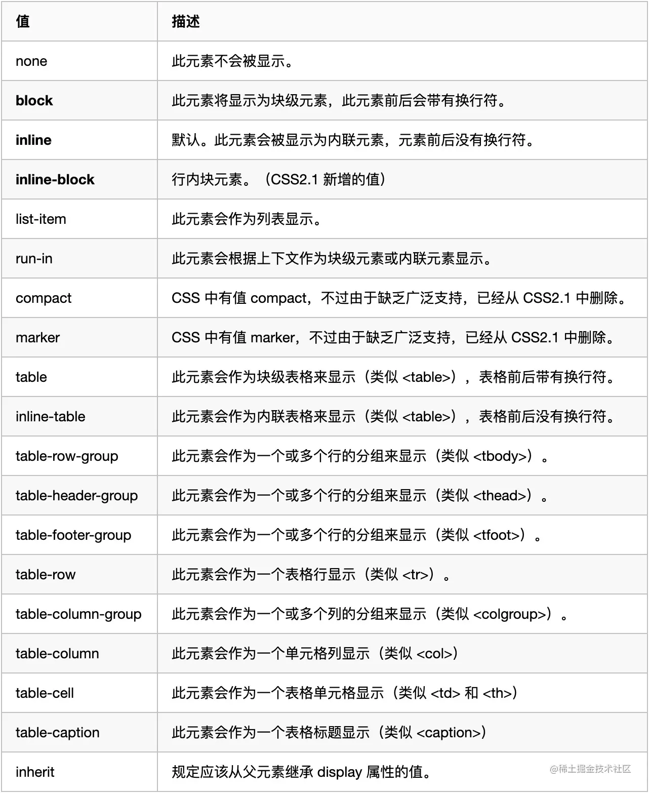
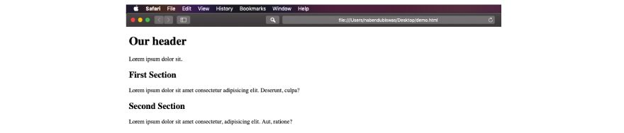
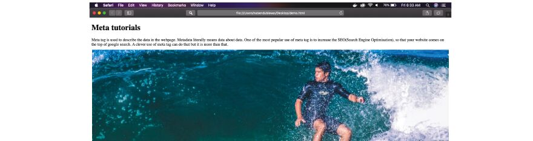
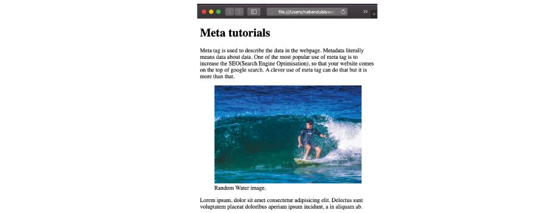
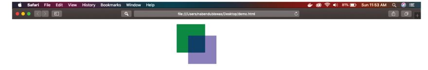
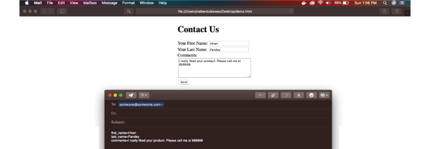
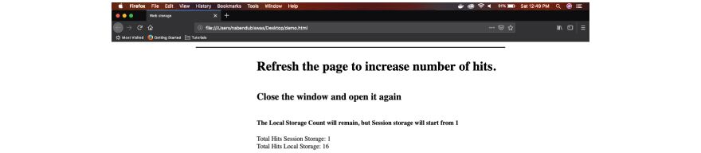
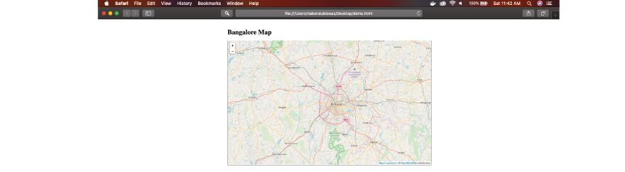

# HTML基础知识点

**MDN文档**：[HTML 基础 - 学习 Web 开发 | MDN (mozilla.org)](https://developer.mozilla.org/zh-CN/docs/Learn/Getting_started_with_the_web/HTML_basics)

## HTML基础知识

**HTML基础**：理解HTML是超文本标记语言（Hyper Text Markup Language）的缩写，它是用来创建和显示网页的标准文本格式化语言。

1. **基础标签**: 如 `<div>`, `<span>`, `<a>` 等。
2. **文档结构**: 如 `<!DOCTYPE>`, `<html>`, `<head>`, `<body>`。
3. **元数据标签**: 如 `<meta>`, `<title>`, `<link>`。
4. **文本格式化**: 如 `<p>`, `<h1>`-`<h6>`, `<strong>`, `<em>`。
5. **列表**: 有序 (`<ol>`) 和无序 (`<ul>`) 列表。
6. **表格**: `<table>`, `<tr>`, `<td>`。
7. **表单**: `<form>`、`label`、`<input>`、 `<textarea>`、 `<button>`。
8. **媒体和图像**: ``, `<audio>`, `<video>`。
9. **链接**: `<a href='...'>`。
10. **HTML5新特性**: 如语义化标签 (`<article>`, `<section>`, `<nav>`, `<footer>`)，表单控件 (`<datalist>`, `<keygen>`, `<output>`)。

## 0.W3C标准

### 对于 Web 标准以及 W3C 的理解与认识

`Web标准`简单来说可以分为结构、表现、行为。其中结构是由 HTML 各种标签组成，简单来说就是 body 里面写入标签是为了页面的结构。表现指的是 CSS 层叠样式表，通过 CSS 可以让我们的页面结构标签更具美感。行为指的是页面和用户具有一定的交互，这部分主要由 JS 组成

`W3C`，全称：world wide web consortium 是一个制定各种标准的非盈利性组织，也叫万维网联盟，标准包括 HTML、CSS、ECMAScript 等等，web 标准的制定有很多好处，比如说：

- 可以统一开发流程，统一使用标准化开发工具（VSCode、WebStorm、Sublime），方便多人协作
- 学习成本降低，只需要学习标准就行，否则就要学习各个浏览器厂商标准
- 跨平台，方便迁移都不同设备
- 降低代码维护成本


标签闭合、标签小写、不乱嵌套、提高搜索机器人搜索几率、使用外 链 css 和 js 脚本、结构行为表现的分离、文件下载与页面速度更快、内容能被更多的用户所访问、内容能被更广泛的设备所访问、更少的代码和组件，容易维 护、改版方便，不需要变动页面内容、提供打印版本而不需要复制内容、提高网站易用性；

### 什么是HTML？

[HTML](https://www.geeksforgeeks.org/html-introduction/) 代表超文本标记语言。它是一种由不同标签组成的标记语言。它用于定义网页的结构。

### HTML 与 XHTML——二者有什么区别？

一个是功能上的差别：主要是 XHTML 可兼容各大浏览器、手机以及 PDA ，并且浏览器也能快速正确地编译网页

另外是书写习惯的差别：XHTML 元素必须被正确地嵌套，闭合，区分大小写，文档必须拥有根元素

1. 所有的标记都必须要有一个相应的结束标记
2. 所有标签的元素和属性的名字都必须使用小写
3. 所有的 XML 标记都必须合理嵌套
4. 所有的属性必须用引号 "" 括起来
5. 把所有 < 和 & 特殊符号用编码表示
6. 给所有属性赋一个值
7. 不要在注释内容中使用 "--"
8. 图片必须有说明文字

### XML 与 JSON 的区别？

- 数据体积方面：JSON 相对 于 XML 来讲，数据的体积小，传递的速度更快些。
- 数据交互方面：JSON 与 JavaScript 的交互更加方便，更容易解析处理，更好的数据交互
- 数据描述方面：JSON 对数据的描述性比 XML 较差
- 传输速度方面：JSON 的速度要远远快于 XML

### HTML 与 XML 的区别？

(1)XML 用来传输和存储数据，HTML 用来显示数据；
(2)XML 使用的标签不用预先定义
(3)XML 标签必须成对出现
(4)XML 对大小写敏感
(5)XML 中空格不会被删减
(6)XML 中所有特殊符号必须用编码表示
(7)XML 中的图片必须有文字说明


## 1.基础标签和属性

**标签和元素**：知道HTML标签由开始标签、内容和结束标签组成，以及并非所有标签都需要闭合。

**基础标签**: 如 `<div>`, `<span>`, `<a>` 等。

### src 和 href 的区别

src 用于替换当前元素，href 用于在当前文档和引用资源之间确立联系。

src 是 source 的缩写，指向外部资源的位置，指向的内容将会嵌入到文档中当前标签所在位置；在请求 src 资源时会将其指向的资源下载并应用到文档内，例如 js 脚本，img 图片和 frame 等元素。

```html
<script src=""js.js""></script>
```

当浏览器解析到该元素时，会暂停其他资源的下载和处理，直到将该资源加载、编译、执行完毕，图片和框架等元素也如此，类似于将所指向资源嵌入当前标签内。这也是为什么将 js 脚本放在底部而不是头部。

href 是 Hypertext Reference 的缩写，指向网络资源所在位置，建立和当前元素（锚点）或当前文档（链接）之间的链接，如果我们在文档中添加

```html
<link href="common.css" rel="stylesheet" />
```

那么浏览器会识别该文档为 css 文件，就会并行下载资源并且不会停止对当前文档的处理。这也是为什么建议使用 link 方式来加载 css，而不是使用@import 方式。

src 和 href 都是 HTML 中特定元素的属性，都可以用来引入外部的资源。两者区别如下：

- src：全称`source`，它通常用于 img、video、audio、script 元素，通过 src 指向请求外部资源的来源地址，指向的内容会嵌入到文档中当前标签所在位置，在请求 src 资源时，它会将资源下载并应用到文档内，比如说：js 脚本、img 图片、frame 等元素。当浏览器解析到该元素时，会暂停其它资源下载，直到将该资源加载、编译、执行完毕。这也是为什么将 js 脚本放在底部而不是头部的原因。
- href：全称`hyper reference`，意味着超链接，指向网络资源，当浏览器识别到它指向的⽂件时，就会并⾏下载资源，不会停⽌对当前⽂档的处理，通常用于 a、link 元素。

### 在 HTML 中使用“role”属性的目的是什么？

`role 属性`定义元素的功能和用途，主要是辅助功能。它为辅助技术（如屏幕阅读器）提供附加信息，以向残障用户传达元素的确切含义。

### HTML 中的空元素是什么？

HTML 中的空元素是不需要的元素，然后是结束标记，然后是开始标记。这些元素也称为自闭合元素。示例：`、<input>、<br>、<hr>` 等。

### 块级元素和内联元素有什么区别？

HTML 中使用各种元素来构建网页。所有元素都分为两类，即它们是块级元素或内联元素。

- **块级元素：**

块级元素是从新行开始并占据父元素的整个可用水平空间的元素，它尽可能地向左和向右延伸。

块级元素的示例包括：

`<div>` 用作块级元素。它总是从新行开始。

`<p>` p 元素或 paragraph 元素也用作块级元素，因为它占用整个可用空间。

以同样的方式，页眉、页脚、旁白、地址、部分都是块级元素，在右侧和左侧都占用了整个可用空间。

- **内联元素：**

内联元素是仅采用适合线条所需的宽度的元素。如果我们有两个内联元素，那么每个元素都将采用它所需的宽度来适应线条。当它们无法放入行中时，它们通常会换行到下一行。

一些内联元素是 `<span>、<a>、<b>、<label>`

在下面的代码中，我们有两个 `<div>` 和 7 个 `<span>` 元素。

```html
<!DOCTYPE html>
<html>
	<head>
		<title>Block Inline Demo</title>
	</head>
	<style>
		div,
		span {
			font-size: 1.5rem;
		}
	</style>
	<body>
		<div>Lorem?</div>
		<div>ipsum?</div>
		<span>dolor</span>
		<span>amet</span>
		<span>consectetur</span>
		<span>adipisicing</span>
		<span>Quidem</span>
		<span>quibusdam</span>
	</body>
</html>
```

将上述代码另存为**demo.html**并在任何浏览器中打开。您可以看到 `<div>` 元素采用一条线，而 `<span>` 元素都在一条线中。


### 行内元素、块级元素、 空(void)元素都有那些？它们有何区别？怎样转换？

#### 行内元素、块级元素、 空(void)元素

- 块级元素： `div、form、ul、ol、li、table、dl、dt、dd、h1、h2、h3、h4、h5、h6、 p`
  - 总是在新行上开始，就是每个块级元素独占一行，默认从上到下排列
  - 宽度缺少时是它的容器的 100%，除非设置一个宽度
  - 高度、行高以及外边距和内边距都是可以设置的
  - 块级元素可以容纳其它行级元素和块级元素
- 行内元素： `a、b、span、img、input、select、strong`
  - 和其它元素都会在一行显示
  - 高、行高以及外边距和内边距可以设置
  - 宽度就是文字或者图片的宽度，不能改变
  - 行级元素只能容纳文本或者其它行内元素
  - 使用行内元素需要注意的是：

    - 行内元素设置宽度`width`无效
    - 行内元素设置`height`无效，但是可以通过`line-height`来设置
    - 设置`margin`只有左右有效，上下无效
    - 设置`padding`只有左右有效，上下无效
- 知名的空元素： `<br> <hr>  <input> <link> <meta>`
  - 鲜为人知的空元素： `<area><base><col><command><embed><keygen><param><source><track><wbr>`

CSS 规范规定，每个元素都有 display 属性，确定该元素的类型：

- 每个元素都有默认的 display 值，比如 div 默认 display 属性值为"block"，成为"块级"元素；
- span 默认 display 属性值为"inline"，是"行内"元素。

#### 行内元素和块级元素有什么区别？

- 行内元素：不可以设置宽高，不独占一行
- 块级元素：可以设置宽高，独占一行
- 空元素：

可以通过`display`属性对行内元素和块级元素进行切换(主要看第 `2、3、4`三个值)：



### 有那些行内元素、有哪些块级元素、盒模型？

#### 1.内联元素(inline element)

a – 锚点
abbr – 缩写
acronym – 首字
b – 粗体(不推荐)
big – 大字体
br – 换行
em – 强调
font – 字体设定(不推荐)
i – 斜体
img – 图片
input – 输入框
label – 表格标签
s – 中划线(不推荐)
select – 项目选择
small – 小字体文本
span – 常用内联容器，定义文本内区块
strike – 中划线
strong – 粗体强调
sub – 下标
sup – 上标
textarea – 多行文本输入框
tt – 电传文本
u – 下划线
var – 定义变量

#### 2、块级元素

address – 地址
blockquote – 块引用
center – 举中对齐块
dir – 目录列表
div – 常用块级容易，也是 css layout 的主要标签
dl – 定义列表
fieldset – form 控制组
form – 交互表单
h1 – 大标题
h2 – 副标题
h3 – 3 级标题
h4 – 4 级标题
h5 – 5 级标题
h6 – 6 级标题
hr – 水平分隔线
isindex – input prompt
menu – 菜单列表
noframes – frames 可选内容，（对于不支持 frame 的浏览器显示此区块内容）
noscript – ）可选脚本内容（对于不支持 script 的浏览器显示此内容）
ol – 排序表单
p – 段落
pre – 格式化文本
table – 表格
ul – 非排序列表

### script、script async 和 script defer 的区别

- `<script>` - HTML 解析中断，脚本被提取并立即执行。执行结束后，HTML 解析继续。
- `<script async>` - 脚本的提取、执行的过程与 HTML 解析过程并行，脚本执行完毕可能在 HTML 解析完毕之前。当脚本与页面上其他脚本独立时，可以使用 `async`，比如用作页面统计分析。
- `<script defer>` - 脚本仅提取过程与 HTML 解析过程并行，脚本的执行将在 HTML 解析完毕后进行。如果有多个含 `defer` 的脚本，脚本的执行顺序将按照在 document 中出现的位置，从上到下顺序执行。

注意：没有 `src` 属性的脚本，`async` 和 `defer` 属性会被忽略。

### input 和 textarea 的区别

`input` 和 `textarea` 是 HTML 表单中用于文本输入的两种不同元素。以下是它们之间的区别：

1. **`input` 元素**：
   - `input` 元素用于创建单行文本输入框。
   - 通常用于输入短文本，如姓名、电话号码、电子邮件等。
   - 只能输入一行文本。
   - 适合用于较短的输入。
2. **`textarea` 元素**：
   - `textarea` 元素用于创建多行文本输入框。
   - 可以输入多行文本，用户可以按 Enter 键换行。
   - 通常用于输入较长的文本，如评论、消息等。
   - 可以通过设置 `cols` 和 `rows` 属性来控制文本框的大小。

总之，如果您需要用户输入较短的文本，可以使用 `input` 元素；如果需要用户输入较长的文本，可以使用 `textarea` 元素。

例如：

```html
<!-- 使用 input 元素 -->
<input type="text" name="username" placeholder="Enter your username">

<!-- 使用 textarea 元素 -->
<textarea name="comment" rows="4" cols="50" placeholder="Enter your comment"></textarea>
```

### 请用一个 div 模拟 textarea

使用 `div` 元素以及一些 CSS 和 JavaScript 来实现。以下是一种方法：

1. **创建一个 `div` 元素**：
   - 创建一个 `div` 元素，设置其样式以模拟 `textarea`。
   - 设置 `contenteditable="true"` 属性，以便用户可以编辑其中的文本。
2. **设置样式**：
   - 使用 CSS 设置 `div` 的样式，使其具有类似于 `textarea` 的外观和行为。
   - 设置 `white-space: pre-wrap;` 以支持多行文本和换行。
   - 设置 `overflow: auto;` 以支持滚动。
3. **添加事件监听器**：
   - 使用 JavaScript 监听 `div` 元素的 `input` 事件，以获取用户输入的文本。

以下是一个示例代码：

```html
<div id="my-textarea" contenteditable="true" style="width: 300px; height: 100px; border: 1px solid #ccc; white-space: pre-wrap; overflow: auto;"></div>

<script>
  const textareaDiv = document.getElementById('my-textarea');
  textareaDiv.addEventListener('input', function() {
    console.log('User input:', this.innerText);
  });
</script>
```

在这个示例中，用户可以在 `div` 中输入多行文本，可以通过监听 `input` 事件来获取其内容。请根据需求调整样式和事件处理逻辑。

### 什么是HTML中的列表？解释 HTML 中可用的不同类型的列表。

在 HTML 中，列表用于表示不同项的集合。HTML 中提供了三种类型的列表，如下所示：

1. 无序列表：使用 `<ul> `和 `<li>` 标签定义。默认情况下，它用项目符号点表示项目。

```html
<ul>
    <li>List Item 1</li>
    <li>List Item 3</li>
    <li>List Item 3</li>
</ul>
```

2. 有序列表：使用 `<ol>` 和 `<li>` 标签定义。默认情况下，它用数字表示列表项。

```html
<ol>     
    <li>List Item 1</li>
    <li>List Item 3</li>
    <li>List Item 3</li>
 </ol>
```

3. 定义列表：它是一种特殊的列表，用于列出 or 术语及其定义。可以使用 `<dl>`、`<dt>` 和 `<dd>` 标记来定义它。DT – 定义术语，DD – 定义描述

```html
<dl>
    <dt>First  term</dt>
    <dd>Definition 1</dd>

    <dt>Second term</dt>
    <dd>Definition 2</dd>

    <dt>Third term</dt>
    <dd>Definition 3</dd>
</dl>
```

### HTML 全局属性(global attribute)有哪些

- class :为元素设置类标识
- data- : 为元素增加自定义属性
- draggable : 设置元素是否可拖拽
- id : 元素 id ，文档内唯一
- lang : 元素内容的的语⾔
- style : 行内 css 样式
- title : 元素相关的建议信息

### 可以在占位符属性中使用 HTML 标记吗？我想插入图像，或者更改颜色

**占 位 符：**占位符属性只能包含文本，不能包含 HTML 标记。但是，有一些特定于供应商的 CSS 扩展允许您在某些浏览器中设置占位符文本的样式。不支持占位符属性的浏览器将直接忽略它。没有伤害，没有犯规。查看你的浏览器是否支持占位符文本。

以下是在自己的 Web 表单中包含占位符文本的方法：

```html
<form>
	<input name="q" placeholder="Go to a Website" />
	<input type="submit" value="Search" />
</form>
```

### 如何禁用网页上的右键单击？

您可以通过从 body 元素的 oncontextmenu 属性返回 false 来禁用网页上的右键单击。

```html
<body oncontextmenu="return false;"></body>
```

### 简述 attribute 和 property 的区别 ?

**定义不同**：

**`attribute`** 是 HTML 标签上的特性，它的值只能够是字符串；

**`property`** 是 DOM 中的属性，是 JavaScript 里的对象。

**获取方式不同：**

**`attribute`** 通过 getAttribute()方法获取；

**`property`** 通过点符号(.)或方括号([])来访问；

**包含内容不同：**

**`attribute`** 包含的是 HTML 元素上的附加信息，用于提供元素的更多描述和行为；

**`property`** 包含的是对象的状态或数据，并可以通过访问器方法(getter 和 setter)来控制对属性的读取和修改。

**兼容性：** document.ready 是 jQuery 库中的一个事件，而非原生 JavaScript 的一部分。在不这意味着使用 jQuery 的情况下，你将无法使用 document.ready。相比之下，document.onload 是原生 JavaScript 的一部分，具有更好的兼容性。

### `<iframe>`标签有什么用？

`<iframe>` 标记用于通过指定外部文档或网页的链接来嵌入当前文档或网页。主要用于嵌入外部视频、地图等外部内容。

## 2.文档结构

**文档结构**: 如 `<!DOCTYPE>`, `<html>`, `<head>`, `<body>`。

### 每个 HTML 文件里开头都有个DOCTYPE,什么是 DOCTYPE？有何作用？

`Doctype`是 HTML5 的文档声明，通过它可以告诉浏览器，使用哪一个 HTML 版本标准解析文档。

在浏览器发展的过程中，HTML 出现过很多版本，不同的版本之间格式书写上略有差异。

如果没有事先告诉浏览器，那么浏览器就不知道文档解析标准是什么？此时，大部分浏览器将开启最大兼容模式来解析网页，我们一般称为`怪异模式`，这不仅会降低解析效率，而且会在解析过程中产生一些难以预知的`bug`，所以文档声明是必须的。

### 解释 HTML 文档基本结构中使用的元素。

HTML 文档的基本结构中使用的元素解释如下：

- `<！DOCTYPE html>`：它表示 HTML 的 HTML5 版本。
- `<html>`：它是 HTML 文档的根元素。
- `<head>`：它包含元数据，即关于数据的数据。此标记包含的内容在网页上不可见。
- `<title>`：它包含文档的标题，该标题将在浏览器选项卡中可见。
- `<body>`：它以 HTML 标签的形式包含网页的内容，如 div、anchor、paragraph、headings 等。

### Doctype 作用? 严格模式与混杂模式如何区分？它们有何意义?

::: details 查看参考回答

`<!DOCTYPE>`用于告知浏览器该以何种模式来渲染文档

Doctype 声明于文档最前面，告诉浏览器以何种方式来渲染页面，这里有两种模式，严格模式和混杂模式。

#### 严格模式与混杂模式？

- 严格模式：严格模式的排版和 JS 运作模式是 以该浏览器支持的最高标准运行。
- 混杂模式：页面以宽松向下兼容的方式显示，模拟老式浏览器的行为，防止浏览器无法兼容页面。

#### 触发者两种模式

- （1）、`<!DOCTYPE>` 声明位于文档中的最前面，处于 `<html>` 标签之前。告知浏览器的解析器，用什么文档类型 规范来解析这个文档。
- （2）、严格模式的排版和 JS 运作模式是 以该浏览器支持的最高标准运行。
- （3）、在混杂模式中，页面以宽松的向后兼容的方式显示。模拟老式浏览器的行为以防止站点无法工作。
- （4）、DOCTYPE 不存在或格式不正确会导致文档以混杂模式呈现。

#### 加载

- 页面被加载的时， link 会同时被加载，而 @imort 页面被加载的时， link 会同时被加载，而 @import 引用的 CSS 会等到页面被加载完再加载 import 只在 IE5 以上才能识别，而 link 是 XHTML 标签，无兼容问题 link 方式的样式的权重 高于 @import 的权重
- `<!DOCTYPE> 声明位于文档中的最前面，处于 <html> 标签之前。告知浏览器的解析器， 用什么文档类型 规范来解析这个文档`
- 严格模式的排版和 JS 运作模式是 以该浏览器支持的最高标准运行。
- 在混杂模式中，页面以宽松的向后兼容的方式显示。模拟⽼式浏览器的行为以防止站点无法⼯作。 DOCTYPE 不存在或格式不正确会导致文档以混杂模式呈现

:::

### 前端页面有哪三层构成，分别是什么？

构成：`结构层`、`表示层`、`行为层`

1. 结构层（structural layer）

   结构层类似于盖房子需要打地基以及房子的悬梁框架，它是由 HTML 超文本标记语言来创建的，也就是页面中的各种标签，在结构层中保存了用户可以看到的所有内容，比如说：一段文字、一张图片、一段视频等等

2. 表示层（presentation layer）

   表示层是由 CSS 负责创建，它的作用是如何显示有关内容，学名：`层叠样式表`，也就相当于装修房子，看你要什么风格的，田园的、中式的、地中海的，总之 CSS 都能办妥

3. 行为层（behaviorlayer）

   行为层表示网页内容跟用户之间产生交互性，简单来说就是用户操作了网页，网页给用户一个反馈，这是`JavaScript`和`DOM`主宰的领域

### 解释 HTML 网页的结构

HTML 结构没有规则，如果我们不遵循结构，网页不会抛出错误。但是，还有一组规则是创建网页的事实标准。

- **`<doctype>`**

要在网页中使用的第一个标记是 doctype 标记。它是出于历史原因而使用的，其目的是防止浏览器切换到怪癖模式。在过去，网页是为当时的两种浏览器编写的 - Netscape Navigator 和 Internet Explorer。当 W3C 制定 Web 标准时，`<doctype>` 标签用于告诉浏览器以完整模式运行以下网页，而不是 Netscape Navigator 和 Internet Explorer 的 quirks 模式。HTML5 中描述的最新方法是使用 `<！DOCTYPE html>` 在网页顶部。

- **`<html>`**

之后**`<！DOCTYPE html>`**我们将整个代码包装在一对 `<html>...</html>` 标记。

- **`<head>`**

head 标签主要用于浏览器，而不是直接呈现。它包含 `<title>` 标签，这是网页的标题。它还包含 `<meta>` 标签，其中包含网页的各种信息。还包含用于链接外部 javascript 文件的 `<script>` 标记，还可以包含用于链接外部样式表的 `<link>` 标记。

- **`<body>`**

它包含我们页面的主体。其中的代码就是我们在网页中看到的。在 body 标签中，我们可以正常包含所有元素，也可以使用语义标签以更好的方式组织它。

下面是一个例子

```html
<!DOCTYPE html>
<html>
	<head>
		<meta charset="utf-8" />
		<meta http-equiv="X-UA-Compatible" content="IE=edge" />
		<title>Our Title</title>
		<meta name="viewport" content="width=device-width, initial-scale=1" />
		<link rel="stylesheet" type="text/css" media="screen" href="main.css" />
		<script src="main.js"></script>
	</head>
	<body>
		<h1>Our header</h1>
		<p>Lorem ipsum dolor sit.</p>
		<h2>First Section</h2>
		<p>
			Lorem ipsum dolor sit amet consectetur adipisicing elit. Deserunt, culpa?
		</p>
		<h2>Second Section</h2>
		<p>
			Lorem ipsum dolor sit amet consectetur, adipisicing elit. Aut, ratione?
		</p>
	</body>
</html>
```



将上述代码另存为**demo.html**并在任何浏览器中打开。

## 3.元数据标签

**元数据标签**，如：`<meta>`, `<title>`, `<link>`。

### 为什么使用 `<meta charset = “UTF-8">`  标签？

它用于将文档字符的字符编码设置为 **UTF-8**，以便在网页上正确显示文本和特殊字符。

### 为什么在 HTML 中使用元标记？

React 面试问题的主要内容，请准备好回答这个问题。

元标记用于描述网页中的数据。元数据的字面意思是关于数据的数据。元标记最流行的用途之一是增加 SEO（搜索引擎优化），以便您的网站在谷歌搜索中名列前茅。巧妙地使用元标记可以做到这一点，但远不止于此。

`<meta>` 标签通过将其放置在 `<head>.. 中包含在网页中。</head>` 在您的网页中。它们包含定义它们的各种属性。

**关键字**

此属性用于指定网页中使用的关键字。它被谷歌等搜索引擎的爬虫用来查找网站。因此，给出正确的关键字对于良好的 SEO 是非常必要的。

```html
<meta name="keywords" content="HTML, Meta, Metadata, Meta tutorial" />
```

**描述**

此属性用于描述网页的内容。它再次被谷歌等搜索引擎用来索引您的网站。因此，对你的网站进行正确的描述对于 SEO 也非常重要。

```html
<meta name="description" content="Learn Meta in one hour" />
```

**修订日期**

此属性用于提供您网站的上次修订日期。浏览器使用它来刷新您的页面。浏览器通常会保留网站的缓存版本以供显示，因此，如果修订日期更新，它将在您的计算机中刷新其版本。

```html
<meta name="revised" content="MetaTutorials, 5/9/2019" />
```

**刷新**

此属性用于通知浏览器在上述持续时间后刷新您的网站。浏览器使用它来刷新您的页面。浏览器通常会保留网站的缓存版本进行显示，因此此属性将强制浏览器在上述时间（以秒为单位）刷新我们的网站。

```html
<meta http-equiv="refresh" content="300" />
```

**重定向**

您可以使用 refresh 属性在上述持续时间（以秒为单位）之后将您的网站重定向到其他网页。它是通过向内容添加一个额外的 URL 来完成的。以下示例会在 5 秒后将您的网站重定向到 sometutorial.com。

```html
<meta http-equiv="refresh" content="5, url="sometutorial.com" />
```

**Cookie**

Cookie 是存储在您的计算机网络浏览器中的数据，并与托管网站的网络服务器交换。最常见的用途之一是将您的身份验证详细信息存储在 Web 浏览器上，并使用它来与服务器通信，这样您就不必每次都输入凭据。在 meta 的 cookie 属性中，我们提到了 cookie 存储在您的系统中的时间。

```html
<meta
	http-equiv="cookie"
	content="userid = nabs;  expires = Wednesday, 08-Aug-22 23:59:59 GMT;"
/>
```

**作者**

此属性用于设置网页的作者姓名。它再次被谷歌等搜索引擎使用。

```html
<meta name="author" content="Hiren Pandey" />
```

**字符集**

此属性用于指定网页的字符集。默认情况下，Web 服务器使用 ISO-8859-1 （Latin1） 编码来处理您的网页。这是一种旧编码，只有非常有限的 256 个字符。您可以通过此属性使用更现代的 UTF-8 编码，或者如果您的网站是中文的，则可以使用 Big5 编码。

```html
<meta http-equiv="Content-Type" content="text/html; charset = UTF-8" />
<meta http-equiv="Content-Type" content="text/html; charset = Big5" />
```

**视窗**

一个非常重要的属性，它根据您正在渲染网页的设备设置查看区域。因此，通过使用这个网站，它本身变得有点响应，并根据设备进行调整。

```html
<meta name="viewport" content="width=device-width, initial-scale=1.0" />
```

现在，我们将使用这些元标记制作一个完整的网页，包括令人惊叹的视口。

```html
<!DOCTYPE html>
<html>
	<head>
		<title>Meta tutorials</title>
		<meta name="keywords" content="HTML, Meta, Metadata, Meta tutorial" />
		<meta name="description" content="Learn Meta in one hour" />
		<meta name="revised" content="MetaTutorials, 5/9/2019" />
		<meta http-equiv="refresh" content="300" />
		<meta
			http-equiv="cookie"
			content="userid = nabs;  expires = Wednesday, 08-Aug-22 23:59:59 GMT;"
		/>
		<meta http-equiv="Content-Type" content="text/html; charset = UTF-8" />
		<meta name="viewport" content="width=device-width, initial-scale=1.0" />
	</head>
	<body>
		<h1>Meta tutorials</h1>
		<p>
			Meta tag is used to describe the data in the webpage. Metadata literally
			means data about data. One of the most popular uses of the meta tag is to
			increase the SEO(Search Engine Optimisation) so that your website comes on
			the top of google search. A clever use of meta tag can do that but it is
			more than that.
		</p>
		<figure>
			
			<figcaption>Random Water image.</figcaption>
		</figure>
		<p>
			Lorem ipsum, dolor sit amet consectetur adipisicing elit. Delectus sunt
			voluptatem placeat doloribus aperiam ipsum incidunt, a in aliquam ab.
		</p>
	</body>
</html>
```

将上述代码另存为**demo.html**并在任何浏览器中打开。



现在，调整浏览器大小以检查移动视图。您可以看到正在播放的视口元标记，并将增加对网页的响应能力。




## 4.文本格式化

**文本格式化**，熟悉如何使用不同的标签来格式化文本，使其加粗、斜体或下划线。 如 `<p>`, `<h1>`-`<h6>`, `<strong>`, `<em>`。

### strong 与 em 的异同？

- em：斜体强调标签，更强烈强调语气，表示内容的强调点
- strong：粗体强调标签，强调语气，强调程度超过 em，表示内容的重要性

### title 与 h1 的区别、b 与 strong 的区别、i 与 em 的区别？

- `title` 属性没有明确意义只表示是个标题，H1 则表示层次明确的标题，对页面信息的抓取也有很大的影响；
- `strong` 是标明重点内容，有语气加强的含义，使用阅读设备阅读网络时：` <strong>` 会重读，而 `<b>` 是展示强调内容。
- `i` 内容展示为斜体，me 表示强调的文本；

Physical Style Elements -- 自然样式标签：b, i, u, s, pre

Semantic Style Elements -- 语义样式标签：strong, em, ins, del, code

应该准确使用语义样式标签, 但不能滥用, 如果不能确定时首选使用自然样式标签。


## 5.列表

**列表**：识别不同类型的列表，例如有序列表`ul`和无序列表`ol`，以及如何设计页面时使用它们。

### 1.HTML 中有哪些类型的列表？

- 有序列表 (`<ol>`)，无序列表 (`<ul>`) 和定义列表 (`<dl>`)。

### 2.如何创建一个有序列表？

- 使用 `<ol>` 标签，每个列表项用 `<li>` 标签包裹。

### 3.无序列表和有序列表有什么区别？

- 无序列表 (`<ul>`) 不显示项目编号，而有序列表 (`<ol>`) 会显示项目编号。

### 4.定义列表是什么，它通常用于什么场景？

- 定义列表 (`<dl>`) 用于列出术语和描述，通常用于词汇表或元数据描述。

### 5.如何改变列表项的标记或编号类型？

- 对于无序列表，可以通过 CSS 的 `list-style-type` 属性来改变。
- 对于有序列表，可以使用 `type` 属性或 CSS 的 `list-style-type` 属性。

### 6.在 HTML5 中，`<li>` 元素可以包含哪些类型的子元素？

- `<li>` 元素可以包含流内容（flow content），即几乎所有类型的 HTML 元素。

### 7.如何使用 CSS 来自定义列表的样式？

- 可以使用 `list-style-type`、`list-style-image` 和 `list-style-position` 等属性来自定义列表样式。

### 8.HTML 列表中可以嵌套哪些元素？

- 列表中可以嵌套其他列表，以及任何流内容元素。

### 9.`<dl>` 元素中的 `<dt>` 和 `<dd>` 分别代表什么？

- `<dt>` 代表定义列表中的术语（term），而 `<dd>` 代表术语的描述（description）。

### 10.如何在列表中添加图标或图片作为列表项的标记？

- 可以使用 CSS 的 `list-style-image` 属性或在 `<li>` 元素内部使用 `` 标签。

## 6.表格

**表格**: `<table>`, `<tr>`, `<td>`。

### 1.如何在 HTML 表格中设置表头？

- 使用 `<th>` 标签来定义表头单元格。

### 2.如何在 HTML 表格中创建行和列？

- 使用 `<tr>` 标签来定义表格的行，使用 `<td>` 标签来定义表格的列。

### 3.如何合并表格单元格？

- 使用 `rowspan` 属性来合并行，使用 `colspan` 属性来合并列。

### 4.如何设置表格边框和样式？

- 使用 CSS 来设置表格的样式，例如 `border`, `padding`, `margin` 等。

### 5.如何为表格添加标题或摘要？

- 使用 `<caption>` 标签来添加表格标题或摘要。

### 6.如何设置表格的宽度和高度？

- 使用 CSS 的 `width` 和 `height` 属性来设置表格的宽度和高度。

### 编写 HTML 代码以创建一个 包含 3 列和 3 行的表格

下面的代码创建一个包含 3 行和 3 列的表：

```html
<table border="1px">
    <thead>
        <tr>
            <th>col 11</th>
            <th>col 12</th>
            <th>col 13</th>
        </tr>
    </thead>
    <tbody>
        <tr>
            <td>col 21</td>
            <td>col 22</td>
            <td>col 23</td>
        </tr>
        <tr>
            <td>col 31</td>
            <td>col 32</td>
            <td>col 33</td>
        </tr>
    </tbody>
</table>
```

### 如何合并 HTML 表格的行和列？

可以将 **colspan** 和 **rowspan** 属性与 **`<td>`** 元素一起使用，并通过向定义的属性传递数值来指定要合并的行数和列数。**colspan** 属性可用于合并列，而 **rowspan** 可用于合并行。


## 7.表单元素和验证

**表单**: `<form>`、`label`、`<input>`、 `<textarea>`、 `<button>`。

### 1.什么是 HTML 表单？

- HTML 表单是用于收集用户输入的一组元素。它可以包含文本输入框、单选按钮、复选框、下拉列表、提交按钮等。

### 2.如何创建一个简单的 HTML 表单？

- 使用 `<form>` 标签来定义表单，然后在其中添加各种输入元素。

### 3.如何验证用户输入？

- 可以使用 HTML5 的表单验证属性，例如 `required`、`minlength`、`maxlength`、`pattern` 等。
- 也可以使用 JavaScript 来自定义验证逻辑。

### 4.如何禁用表单的自动提交？

- 使用 `event.preventDefault()` 来阻止表单的默认提交行为。

### 5.如何在表单中使用下拉列表？

- 使用 `<select>` 标签来创建下拉列表，然后添加 `<option>` 标签作为选项。

### 6.如何在表单中上传文件？

- 使用 `<input type="file">` 来创建文件上传字段。

### 7.如何设置表单的布局和样式

- 使用 CSS 来设置表单的样式，例如调整输入框的大小、添加边框、设置背景颜色等。

### 8.如何处理表单的提交

- 使用 `<form>` 标签的 `action` 属性来指定表单提交的 URL。
- 使用 `<input type="submit">` 或 `<button type="submit">` 来创建提交按钮。

### 9.如何在表单中使用复选框和单选按钮

- 使用 `<input type="checkbox">` 来创建复选框。
- 使用 `<input type="radio">` 来创建单选按钮。

### 10.如何在表单中添加标签和描述

- 使用 `<label>` 标签来关联表单元素和其标签。


### label 的作用是什么？是怎么用的？

label 标签来定义表单控制间的关系，当用户选择该标签时，浏览器会自动将焦点转到和标签相关的表单控件上。


`label`元素不会向用户呈现任何特殊效果，但是，它为鼠标用户改进了可用性，当我们在 label 元素内点击文本时就会触发此控件。

也就是说，当用户选择该标签时，浏览器就会自动将焦点转到和标签相关的表单控件上。

最常用 label 的地方就是表单中的性别单选框了，当点击文字时也能够自动聚焦绑定的表单控件。

```html
<form>
	<label for="male">男</label>
	<input type="radio" name="sex" id="male" />
	<label for="female">女</label>
	<input type="radio" name="sex" id="female" />
    
    <label for="Name">Number:</label>
    <input type=""text"name" ="Name" id="Name" />
    <label>Date:<input type="text" name="B" /></label>
</form>
```

### 区分 HTML 表单中的 GET 和 POST 方法。

下表将解释 HTML 表单中 GET 和 POST 方法之间的差异：

|                 GET 方法                 |                     POST 方法                      |
| :--------------------------------------: | :------------------------------------------------: |
| 这是一种在服务器上发送数据的不安全方式。 |          这是发送表单数据的一种安全方式。          |
|     所有表单数据参数在URL中都可见。      |            任何参数在任何地方都不可见。            |
|     它的 URL 长度限制因浏览器而异。      | 与 GET 方法的限制相比，它具有更大的 URL 长度限制。 |
|      默认情况下，结果由浏览器缓存。      |        默认情况下，不会在浏览器中缓存响应。        |
|       用户可以为表单提交添加书签。       |             回复可以很容易地添加书签。             |

## 8.媒体和图像

**媒体和图像**: ``, `<audio>`, `<video>`。

### 如何为图片添加字幕

重写以下代码以应用标题 "This is an image of something interesting"

```html

<p>Image of Mars.</p>
```

没有简单或语义的方法将包装在段落标签中的标题与图像元素本身相关联。

使用 HTML5 `<figure>` 元素和 `<figcaption>` 元素，我们现在可以在语义上将标题与其图像对应项相关联。

**例**

```html
<figure>
	
	<figcaption>
		<p>This is an image of something interesting.</p>
	</figcaption>
</figure>
```

输出


### 知道的网页制作会用到的图片格式有哪些

png-8，png-24，jpeg，gif，svg。

但是上面的那些都不是面试官想要的最后答案。面试官希望听到是 Webp。（是否有关注新技术，新鲜事物）

科普一下 Webp：WebP 格式，谷歌（google）开发的一种旨在加快图片加载速度的图片格式。图片压缩体积大约只有 JPEG 的 2/3，并能节省大量的服务器带宽资源和数据空间。Facebook Ebay 等知名网站已经开始测试并使用 WebP 格式。

在质量相同的情况下，WebP 格式图像的体积要比 JPEG 格式图像小 40%

### 1.HTML 中的 `img` 标签有什么作用？

- `img` 标签用于在网页上嵌入图像。

### 2.如何为图像提供替代文本？

使用 `img` 标签的 `alt` 属性来提供替代文本，这对于屏幕阅读器和图像无法加载时非常重要。

```html

```

### 如何在 HTML 中添加背景图像？*

使用 CSS 设置元素的 `background-image` 属性来添加背景图像。

示例：

```html
<style>
  .container {
    background-image: url('background.jpg');
    background-size: cover;
    /* Other styling properties */
  }
</style>

<div class="container">
  <!-- Content goes here -->
</div>
```

### 如何优化图像以加快网页加载速度？

- 通过压缩图像、使用正确的图像格式、利用 CSS Sprite 技术、以及懒加载图像来优化。

### 如何创建一个响应式图像，使其根据屏幕大小自动缩放？

使用 CSS 的 `max-width: 100%` 来确保图像在不超出父容器宽度的情况下自动缩放。

示例：

```html
<style>
  img {
    max-width: 100%;
    height: auto;
  }
</style>


```

### `picture` 元素在响应式设计中有什么作用？

- `picture` 元素允许开发者为不同的屏幕尺寸和分辨率指定不同的图像源。

### 如何在 HTML 中嵌入 SVG 图像？

使用 `<svg>` 标签并在其中包含 SVG 代码来嵌入可缩放矢量图形。

示例：

```html
<svg width="100" height="100">
  <circle cx="50" cy="50" r="40" stroke="black" stroke-width="2" fill="red" />
</svg>
```

### SVG 和位图图像有什么区别？

- SVG 是一种基于 XML 的矢量图形格式，可以无限缩放而不失真；而位图图像（如 JPEG、PNG）在放大时会失真。

### 如何实现图像的预加载？

- 可以使用 JavaScript 创建 `Image` 对象并设置其 `src` 属性，或者使用 HTML 的 `link` 标签的 `rel="preload"` 属性。

### img 的 alt 与 title 有何异同？

- a:alt(alt text)：全称`alternate`，切换的意思，如果无法显示图像、窗体或 applets 的用户代理（UA），浏览器将显示 alt 属性用来指定替换文字。
  - 替换文字的语言由 lang 属性指定。(在 IE 浏览器下会在没有 title 时把 alt 当成 tool tip 显示)
- title(tool tip)：该属性为设置该属性的元素提供建议性的信息，鼠标移动到元素上时显示 title 的内容。

相同：

- 两个属性都是当鼠标滑动到元素上的时候显示

区别：

一般当鼠标滑动到元素身上的时候显示`title`，而`alt`是 img 标签特有的属性，是图片内容的等价描述，用于图片无法加载时显示，这样用户还能看到关于丢失了什么东西的一些信息，相对来说比较友好。

- alt 是 img 的特有属性，是图片内容的等价描述，图片无法正常显示时候的替代文字。
- title 属性可以用在除了 base，basefont，head，html，meta，param，script 和 title 之外的所有标签，是对 dom 元素的一种类似注释说明

### 如何实现在一张图片上的某个区域做到点击事件

我们可以通过图片热区技术：

1. 插入一张图片，并设置好图像的有关参数，在``标记中设置参数`usemap="#Map"`，以表示对图像地图的引用。
2. 用`<map>`标记设定图像地图的作用区域，并取名：Map；
3. 分别用`<area>`标记针对相应位置互粉出多个矩形作用区域，并设定好链接参数`href`

例：

```html
<body>
	
	　　<map name="Map" id="Map">
		<area
			alt=""
			title=""
			href="#"
			shape="poly"
			coords="65,71,98,58,114,90,108,112,79,130,56,116,38,100,41,76,52,53,83,34,110,33,139,46,141,75,145,101,127,115,113,133,85,132,82,131,159,117"
		/>
		<area
			alt=""
			title=""
			href="#"
			shape="poly"
			coords="28,22,57,20,36,39,27,61"
		/>
	</map>
</body>
```

### `audio` 和 `video` 标签在 HTML5 中是如何使用的？

- `audio` 和 `video` 标签用于在网页上嵌入音频和视频内容，可以包含多个 `source` 元素来指定不同的媒体格式。

```html
<audio controls>
  <source src="song.mp3" type="audio/mpeg">
  Your browser does not support the audio element.
</audio>

<video controls>
  <source src="video.mp4" type="video/mp4">
  Your browser does not support the video element.
</video>
```

### 如何解决移动端 HTML5 音频标签 audio 的 autoplay 属性失效问题?

**使用交互触发播放**：

最直接的方法是在用户进行某些交互(如点击按钮)后再播放音频。这种方法通常能得到最好的兼容性和用户体验。

```html
<button onclick="playAudio()">播放音频</button>
<script>
	function playAudio() {
		var audio = document.getElementById("myAudio");
		audio.play();
	}
</script>
```

**使用静音属性**：

在某些情况下，如果你将音频设置为静音，那么浏览器可能会允许自动播放。然后，你可以通过其他方式(如使用 JavaScript)控制音量。

```html
<audio id="myAudio" autoplay muted>
	<source src="audiofile.mp3" type="audio/mpeg" />
</audio>
```

**监听页面可见性变化**：

你可以监听 `visibilitychange` 事件，当页面变为可见时尝试播放音频。

```javascript
document.addEventListener("visibilitychange", function () {
	if (document.visibilityState === "visible") {
		var audio = document.getElementById("myAudio");
		audio.play().catch(function (error) {
			console.log("播放失败: ", error);
		});
	}
});
```

**使用服务工作者**：

在某些情况下，你可以尝试使用服务工作者(Service Worker)来在后台播放音频。然而，这种方法可能并不总是有效，并且可能增加实现的复杂性。

### 如何控制媒体内容的播放？

- 使用 `audio` 和 `video` 标签的属性，如 `autoplay`、`controls`、`loop` 等，来控制媒体内容的播放。

### 如何处理不支持 JavaScript 的浏览器中的媒体内容？

- 提供回退内容，例如在 `audio` 或 `video` 标签内部使用 `object` 或 `embed` 标签，或者提供下载链接。

### Canvas和图像

[允许图片和 canvas 跨源使用 - HTML（超文本标记语言） | MDN (mozilla.org)](https://developer.mozilla.org/zh-CN/docs/Web/HTML/CORS_enabled_image)

## 9.链接

**超链接**：掌握如何使用锚标签`a`创建指向其他页面的超链接。`<a href='...'>`。

### 编写代码来演示定位点标签/超链接方案

网络是建立在超链接的基础上的。每个网页都包含指向其他网页的活动链接，而其他网页又链接到更多网页，直到整个网页（或至少是其中的一大块）绑定在一起。事实上，这就是"网络"这个名字的由来。超链接可以连接到网页上的其他位置、网站内的其他页面、网站外部的页面以及许多类型的 Web 和非 Web 内容。

#### 方案 1：超链接到网页

超链接的语法以 `<a>` 标记开头，并使用 `href=attribute`，该属性提供指向目标的 URL 或路径。

```html
E.g <a href="http://www.microsoft.com"></a>
```

后面是显示为用户单击的链接文本的下划线文本的文本，或者是对将用作超链接的图像的引用

```html
E.g Visit <a href="http://www.microsoft.com">Microsoft.com</a> for the latest
information.
```

#### 方案 2：使用部分路径和文件名

为了链接到特定页面，应指定完整的文件名。示例，若要提供指向用户可以下载 Windows Media Player 的页面的直接链接，它应具有以下标记：

```html
<a href="http://www.microsoft.com/windows/windowsmedia/player/download/download.aspx">Download Windows Media Player</a>
```

#### 方案 3：使用相对路径和绝对路径

包含任何人都可用于访问该页面的完整地址的路径称为绝对路径。绝对路径非常可靠，但它们也很长，打字很笨拙。

```html
E.g <a href="http://www.microsoft.com/articles/Windows10.htm">Windows 10</a>
```

它不是仅提供目标文件的完整路径，而是称为相对路径。以下是相对路径示例。

```html
<a href=" Windows10.htm">Windows 10</a>
<a href="articles/ Windows10.htm">Windows 10</a>
```

#### 方案 4：设置目标窗口

要指示超链接在新窗口中打开页面，请将属性 `target="_blank"` 添加到 `<a>` 标记中。例如，要在新窗口中打开 `foliage.htm` 文件，标记的结构如下：

```html
<a href=" Windows10.htm " target="_blank">Windows10</a>
```

#### 方案 5：超链接到电子邮件地址

超链接不仅可以指向网页，还可以指向电子邮件地址。电子邮件超链接可用于直接向特定人员发送消息。

```html
<a href="mailto:support@microsoft.com">Contact Us</a>
```

#### 方案 6：创建锚点并超链接到锚点

锚点是 HTML 文档中的标记，大致类似于 Word 文档中的书签。使用锚点名称定义文档中的特定位置，然后直接超链接到该锚点。锚点在具有多个部分的长文档中最有价值。它们为用户提供了一种直接跳转到他们想要的任何部分的方法，而不必阅读或滚动浏览整个文档。

**例如**

```html
<div id="top">conclusion</div>
<a href="#conclusion">View the Conclusion</a> # plays a critical for identifying
the section
```


### a 元素除了用于超链接导航外，还有什么作用？

href 属性中的 url 可以是浏览器支持的任何协议。

#### 用来手机拨号

```html
<a href="tel:110">Call 110</a>
```

#### 用来发送短信

```html
<a href="sms:110">Send SMS to 110</a>
```

#### 还有邮件等等

```html
<a href="mailto:info@example.com">Email Us</a>
```

#### a 元素最常见的就是用来做锚点

- `<a>` 元素可以用作页面内的锚点，以便在点击时快速定位到页面的某个位置。

```html
<a href="#section1">Jump to Section 1</a>
<!-- ... -->
<h2 id="section1">Section 1 Content</h2>
```

#### 下载文件

而下载的原理在于 a 标签所对应的资源浏览器无法解析，于是浏览器会选择将其下载下来。

```html
<a href="document.pdf" download>Download PDF</a>
```

# HTML高级和实用的主题

## 1.HTML5新特性

### 1.什么是 HTML5？HTML5引入的新标签元素、特性和API；移除了哪些元素？

#### 什么是 HTML5

HTML5 的开发考虑了当前和未来的浏览器开发以及过去、现在和未来的 Web 开发工作。因此，HTML5 获得了巨大的发展势头。在实用性的推动下，它已成为 W3C 加速开发的选择。

HTML5 向后兼容，它包含 HTML4 规范的所有功能，但有一些更改和改进。它还包含用于构建动态 Web 应用程序和创建更高质量标记的附加功能。

#### HTML5 的特点

- **新的语义元素**，允许我们明确地在语义上定义标记的更多部分，而不是使用大量的类和 ID。
- **用于**将视频、音频、可编写脚本的图形和其他丰富的应用程序类型内容添加到我们的网站的 API。
- HTML5 是特意构建的，旨在与 Flash 和 Silverlight 等专有插件竞争。
- 用于标准化功能的新功能，我们已经以定制的、黑客的方式构建了这些功能。服务器发送的更新和表单验证立即浮现在脑海中。
- **微数据**：微数据允许将机器可读的数据嵌入到 HTML 文档中，以便浏览器和搜索引擎可以从页面中提取数据。
- **Web Workers**：允许 JavaScript 操作在后台工作，而不会干扰用户的浏览。
- **Web 存储**：这是一种更强大的 cookie 形式。它可以在客户端存储大量数据。它可以存储多达 5MB 的数据，而 cookie 限制为大约 4KB。
- **Web 套接字**：允许页面使用 WebSocket 协议在浏览器和服务器之间发送双向消息。
- **跨文档和渠道消息传递**：跨文档消息传递提供了交换文档的功能，而不考虑源域，并且不会启用跨站点攻击。频道消息传递使用独立的代码块片段进行直接通信。
- **服务器发送事件**：使用此功能，可以将推送通知作为 DOM 事件从服务器发送到客户端浏览器。
- **新功能**填补了我们传统上在开放标准中可用的功能中的空白，例如定义浏览器应如何处理标记错误，允许 Web 应用程序离线工作，允许我们使用始终打开的套接字连接进行应用程序数据传输，以及音频、视频和可编写脚本的图像 （canvas）。

#### HTML5 主要是关于图像、位置、存储、多任务等功能API的增加：

- 语义化更好的内容标签，如：article、footer、header、nav、aside、section等
- 音视频：视频 video、音频 audio
- 画布 Canvas 和 SVG
- 表单控件：calemdar、date、time、email、url、search 等
  - 表单属性：Datalist、datetime、output、keygen、date、month、week、time、datetime-local、number、range、email、url
  - 为了增强表单，为 input 增加了 color，emial，data ，range 等类型

- 地理(Geolocation) API
- 拖拽释放(Drag and drop) API
- 本地离线存储：localStorage：长期存储数据，浏览器关闭后数据不丢失；sessionStorage：的数据在浏览器关闭后自动删除
- 新的技术：websocket协议、多线程编程webworkers

#### 移除的元素：

- 纯表现的元素：`basefont、font、s、strike、tt、u、big、center`
- 对可选用性产生负面影响的元素：`frame、frameset、noframes`

### 怎么处理 HTML5 新标签兼容问题？

主要有两种方式：

- 1.IE8/IE7/IE6 支持通过 document.createElement 方法产生的标签，可以利用这一特性让这些浏览器支持 HTML5 新标签，浏览器支持新标签后，还需要添加标签默认的样式。
  - 实现标签被识别：通过`document.createElement(tagName)`方法可以让浏览器识别新的标签，浏览器支持新标签后。还可以为新标签添加 CSS 样式

- 2.用 JavaScript 解决：使用 HTML5 的 shim|html5shim框架，在`head`标签中调用以下代码：

```html
<!--[if lt IE 9]>
	<script>
		src= "http://html5shim.googlecode.com/svn/trunk/html5.js";
	</script>
<![endif]-->
```

### html 常见兼容性问题？

1.双边距 BUG float 引起的 使用 display

2.3 像素问题 使用 float 引起的 使用 dislpay:inline -3px

3.超链接 hover 点击后失效 使用正确的书写顺序 link visited hover active

4.Ie z-index 问题 给父级添加 position:relative

5.Png 透明 使用 js 代码 改

6.Min-height 最小高度 ！Important 解决'

7.select 在 ie6 下遮盖 使用 iframe 嵌套

为 什 么 没 有 办 法 定 义 1px 左 右 的 宽 度 容 器 （ IE6 默 认 的 行 高 造 成 的 ， 使 用 over:hidden,zoom:0.08 line-height:1px）

9.IE5-8 不支持 opacity，解决办法：

```css
.opacity {
opacity: 0.4
filter: alpha(opacity=60); /*for IE5-7*/
-ms-filter: "progid:DXImageTransform.Microsoft.Alpha(Opacity=60)"; /*for IE
8*/
}
```

IE6 不支持 PNG 透明背景，解决办法: IE6 下使用 gif 图片

### 如何使用 Modernizr 库检测浏览器是否支持特定功能。

Modernizr 是一个开源的、获得 MIT 许可的 JavaScript 库，它检测对许多 HTML5 和 CSS3 功能的支持。您应该始终使用最新版本。要使用它，请在页面顶部包含以下突出显示的 `<script>` 元素。

```html
<!DOCTYPE html>
<html>
	<head>
		<meta charset="utf-8" />
		<title>Dive Into HTML5</title>
		<script src="modernizr.min.js"></script>
	</head>
	<body></body>
</html>
```

以下是 Modernizr 支持的 API

- Modernizr.canvas 属性用于检测对画布 API 的支持。
- Modernizr.canvastext 属性用于检测对画布文本 API 的支持。
- Modernizr.video 属性用于检测对 HTML5 视频的支持。
- Modernizr.localstorage 属性用于检测对 HTML5 本地存储的支持。
- Modernizr.webworkers 属性用于检测对 Web Worker 的支持。
- Modernizr.applicationcache 用于检测对脱机 Web 应用程序的支持。
- Modernizr.geolocation 用于检测对地理位置 API 的支持。

### 说一下 HTML5 drag api

参考回答：

- dragstart：事件主体是被拖放元素，在开始拖放被拖放元素时触发。
- darg：事件主体是被拖放元素，在正在拖放被拖放元素时触发。
- dragenter：事件主体是目标元素，在被拖放元素进入某元素时触发。
- dragover：事件主体是目标元素，在被拖放在某元素内移动时触发。
- dragleave：事件主体是目标元素，在被拖放元素移出目标元素是触发。
- drop：事件主体是目标元素，在目标元素完全接受被拖放元素时触发。
- dragend：事件主体是被拖放元素，在整个拖放操作结束时触发

### HTML5 为表单提供了哪些新的输入类型？

期待在 HTML 面试问题和答案中遇到这个热门问题。

HTML5 为表单引入了十几种新的输入类型。新的输入类型具有双重优势

- 更短的开发时间
- 改善用户体验。

以下是新的输入类型及其用法。

- **search ：**搜索是每天在网络上执行的最常见的操作。搜索不仅适用于 Google、Bing 或 Yahoo，还可以是电子商务网站上的一个字段，我们可以从网络、维基百科甚至个人博客上购买。搜索的语法是

```html
<input type="search" name="search" />
```

- **email：** 电子邮件输入类型与标准文本输入类型没有什么不同，但它允许输入一个或多个带有 required 属性的电子邮件地址。浏览器会查找模式，以确保输入了有效的电子邮件地址。电子邮件的语法是

```html
<input type="email" name="email" required />
```

URL 输入类型适用于 Web 地址。浏览器将执行简单的验证，并在表单提交时显示错误消息。这可能包括查找正斜杠、句点和空格，并可能检测有效的顶级域（如 .com 或 .co.uk）。它还支持多个地址。Url 的语法是

```html
<input type="url" name="url" required />
```

- **Tel：**tel 没有强制执行任何特定的语法。世界各地的电话号码各不相同，因此除了只允许输入数字和 + 符号外，很难保证任何类型的特定符号。可以使用客户端验证来针对特定电话号码格式进行验证。tel 的语法是

```html
<input type="tel" name="tel" id="tel" required />
```

- **number：** Number 用于指定数值。它、Safari 和 Chrome 的数字输入被呈现为一个旋转框控件，用户可以单击箭头向上或向下移动或直接进入字段。另一方面，Firefox 将字段呈现为标准文本框。IE 10 中也支持 type="number"。使用附加属性 min、max 和 step，我们可以更改此 spinbox 控件的默认步长值，以及设置最小值、最大值和起始值（使用标准 HTML value 属性）。number 的语法是

```html
<input type="number" min="5" max="18" step="0.5" value="9" name="shoe-size" />
```

- **range**：范围输入类型类似于数字，但更具体。它表示给定范围内的数值。在 Opera、Safari 和 Chrome 中，type="range" 呈现为滑块。range 的语法是

```html
<input id="skill" type="range" min="1" max="100" value="0" />
```

- **date**：HTML5 提供日期控件，该控件提供日期选择器功能，并与浏览器集成，无需任何外部库。日期控制允许选择单个日期;使用不同的输入类型选择一周、一个月、时间、日期和时间，甚至带有时区的日期和时间。标记非常简单。Date 的语法是

```html
<input id="dob" name="dob" type="date" />
```

此外，使用 min 和 max 属性来确保用户只能从指定的日期范围内进行选择。

```html
<input
	id="startdate"
	name="startdate"
	min="2012-01-01"
	max="2013-01-01"
	type="date"
/>
```

- **month**：月份用于在网页上选择特定月份。它可用于信用卡到期日。month 的语法是

```html
<input id="expiry" name="expiry" type="month" required />
```

- **week**：周用于选择一个月中的特定周。week 的语法是

```html
<input id="vacation" name="vacation" type="week" />
```

- **time ：**时间渲染一个旋转框，用于选择精确的时间。time 的语法是

```html
<input id="exit-time" name="exit-time" type="time" />
```

- **datetime：** 我们可以通过使用 type="datetime" 来组合日期和时间，以指定给定日期的精确时间。datetime 的语法是

```html
<input id="entry-day-time" name="entry-day-time" type="datetime" />
```

- **datetime-local：** 使用 datetime-local，用户可以选择给定日期的精确时间，并具有本地时区变化。datetime-local 的语法是

```html
<input id="arrival-time" name="arrival-time " type="datetime-local" />
```

- **color：**颜色输入类型允许用户选择一种颜色并返回该颜色的十六进制值。预计用户将能够键入值或从颜色选择器中进行选择。颜色的语法是

```html
<input id="color" name="color" type="color" />
```


### H5 和 HTML5 区别

- H5 是一个产品名词，包含了最新的 HTML5、CSS3、ES6 等新技术来制作的应用
- HTML5 是一个技术名词，指的就是第五代 HTML

### HTML5 为什么只需要写`<!DOCTYPE html>`?

为什么 HTML5 只需要写一段：

```html
<!DOCTYPE html>
```

而 HTML4 却需要写很长的一段

```html
<!DOCTYPE html PUBLIC "-//W3C//DTD HTML 4.01 Transitional//EN" "http://www.w3.org/TR/html4/loose.dtd">
```

- HTML5 不基于 SGML，所以不需要引用 DTD，但是需要 doctype 来规范浏览器的行为。
- 在 HTML4 中，`<!DOCTYPE>`声明引用 DTD，因为 HTML4 基于 SGML。DTD 规定了标记语言的规则，这样浏览器才知道所使用的文档类型，从而正确的呈现内容。

### 如何区分 HTML 和 HTML5？

DOCTYPE 声明新增的结构元素、功能元素

### 什么是 DOCTYPE， 有何作用？

`Doctype`是 HTML5 的文档声明，通过它可以告诉浏览器，使用哪一个 HTML 版本标准解析文档。在浏览器发展的过程中，HTML 出现过很多版本，不同的版本之间格式书写上略有差异。如果没有事先告诉浏览器，那么浏览器就不知道文档解析标准是什么？此时，大部分浏览器将开启最大兼容模式来解析网页，我们一般称为`怪异模式`，这不仅会降低解析效率，而且会在解析过程中产生一些难以预知的`bug`，所以文档声明是必须的。

### 新的 HTML5 文档类型和字符集是？

答：HTML5 文档类型：`<!doctype html>`

HTML5 使用的编码：`<meta charset="UTF-8">`

### 什么是 canvas，有什么作用？基本用法是什么？

canvas 元素是 HTML5 的一部分，用于在网页上绘制图形，允许脚步语言动态渲染位图像。canvas 由一个可控制区域 HTML 代码中的属性定义决定高度和宽度。

该元素标签强大之处在于可以直接在 HTML 上进行图形操作。

JavaScript 代码可以访问该区域，通过一套完整的绘图功能类似于其他通用二维的 API，从而生成动态的图形。

作用：Canvas 元素用于在网页上绘制图形，该元素标签强大之处在于可以直接在 HTML 上进行图形操作。

1.创建 canvas 标签

```html
<canvas id="myCanvas" width="150" height="150">该浏览器不支持canvas</canvas>
```

2.渲染上下文

```js
var canvas = document.getElementById("myCanvas");
var ctx = canvas.getContext("2d");
```

代码第一行通过使用 `document.getElementById()` 方法获取 `<canvas>` 元素对应的 DOM 对象，然后可以通过使用它的 `getContext()` 方法来绘制上下文。 创建 canvas 标签时可以在标签内写上不支持的提示信息；也可以通过 `getContext()` 方法判读是否支持编程。

```js
var canvas = document.getElementById("myCanvas");
if (canvas.getContext) {
	var ctx = canvas.getContext("2d");
	// other code
} else {
	// 不支持 canvas 的其他代码
}
```

用途：

canvas 可用于游戏和图表（echarts.js、heightchart.js 都是基于 canvas 来绘图）制作。

### 如何使用 HTML5 中的 Canvas 元素绘制图形？

Canvas 元素允许在网页上使用 JavaScript 绘制图形和动画。以下是一个简单的绘制矩形的示例：

```html
<canvas id="myCanvas" width="200" height="200"></canvas>
<script>
	var canvas = document.getElementById("myCanvas");
	var ctx = canvas.getContext("2d");
	ctx.fillStyle = "red";
	ctx.fillRect(50, 50, 100, 100);
</script>
```

在这个示例中，使用 `document.getElementById()` 方法获取 `Canvas` 元素，并通过 `getContext("2d")` 获取 2D 绘图上下文。 然后，使用 `fillStyle` 属性设置填充颜色，`fillRect()` 方法绘制一个矩形。

### canvas 如何绘制一个三角形|正方形

moveto 是移动到某个坐标， lineto 是从当前坐标连线到某个坐标。

这两个函数加起来就是画一条直线。 画线要用"笔"，那么 MoveTo()把笔要画的起始位置固定了（x,y）然后要固定终止位置要用到 LineTo 函数确定终止位置（xend,yend）,这样一条线就画出来了。 每次与前面一个坐标相连 。

stroke() 方法会实际地绘制出通过 moveTo() 和 lineTo() 方法定义的路径。默认颜色是黑色。

```html
<!DOCTYPE HTML5>
<html>
	<head>
		<meta http-equiv="Content-Type" content="text/html; charset=utf-8" />
		<title>画布</title>
	</head>
	<body>
		<canvas
			id="myCanvas"
			width="200"
			height="100"
			style="border:1px solid
#c3c3c3;"
		>
			Your browser does not support the canvas element.
		</canvas>
		<script type="text/javascript">
			var c = document.getElementById("myCanvas"); //三角形
			var cxt = c.getContext("2d");
			cxt.moveTo(10, 10);
			cxt.lineTo(50, 50);
			cxt.lineTo(10, 50);
			cxt.lineTo(10, 10);
			cxt.stroke(); //正方形
			var cxt2 = c.getContext("2d");
			cxt2.moveTo(60, 10);
			cxt2.lineTo(100, 10);
			cxt2.lineTo(100, 50);
			cxt2.lineTo(60, 50);
			cxt2.lineTo(60, 10);
			cxt2.stroke();
		</script>
	</body>
</html>
```

### Canvas 和 SVG 有什么区别？

- svg 绘制出来的每一个图形的元素都是独立的 DOM 节点，能够方便的绑定事件或用来修改。 canvas 输出的是一整幅画布
- svg 输出的图形是⽮量图形，后期可以修改参数来自由放大缩小，不会失真和锯⻮。而 canvas 输出标量画布，就像一张图片一样，放大会失真或者锯齿

### canvas 相关

使用前需要获得上下文环境，暂不支持 3 d

常用 api:

- fillRect(x,y,width,height)实心矩形
- strokeRect(x,y,width,height)空心矩形
- fillText( "Hello world" , 200 , 200 );实心文字
- strokeText( "Hello world" , 200 , 300 )空心文字

新标签兼容低版本

- ie9 之前版本通过 createElement 创建 html5 新标签
- 引入 html5shiv.js：https://github.com/aFarkas/html5shiv

### svg 和 canvas 的区别？

- canvas 时 h5 提供的新的绘图方法 ；svg 已经有了十多年的历史
- canvas 画图基于像素点，是位图，如果进行放大或缩小会失真 ；svg 基于图形，用 html 标签描绘形状，放大缩小不会失真
- canvas 需要在 js 中绘制 ；svg 在 html 绘制
- canvas 支持颜色比 svg 多
- canvas 无法对已经绘制的图像进行修改、操作 ；svg 可以获取到标签进行操作

### 用示例解释`<canvas>`标签

`<canvas>` 标记可帮助用户在画布区域中绘制任何内容。它通常用于在页面中创建图形或动画。

可以使用标签 canvas> 创建游戏图形和其他视觉图像。在 `<canvas>` 标签中，我们还可以指定 height 和 width 属性。

下面是创建两个不同颜色的简单重叠方块的示例。我们在 HTML 中创建一个 `<canvas>` 标签，然后其余的编码都在 JavaScript 中。在这里，首先，我们获取 id，然后我们告诉浏览器它是 `canvas.getContext('2d')` 的 2d 画布。

然后我们通过 `fillStyle` 传达颜色，通过 `fillRect（10, 10, 100, 100）` 传达矩形的尺寸，这意味着它将从位置 10,10 开始，宽度和高度为 100。

```html
<!DOCTYPE html>
<html>
	<head>
		<title>Canvas Demo</title>
		<style>
			.grid__iframe {
				display: grid;
				place-content: center;
			}
		</style>
		<script type="text/javascript">
			window.onload = function () {
				var canvas = document.getElementById("canvas");
				var ctx = canvas.getContext("2d");
				//square 1
				ctx.fillStyle = "green";
				ctx.fillRect(10, 10, 100, 100);
				//square 2
				ctx.fillStyle = "rgba(0, 0, 200, 0.5)";
				ctx.fillRect(50, 50, 100, 100);
			};
		</script>
	</head>
	<body>
		<div class="grid__iframe">
			<canvas id="canvas" width="300" height="300">
				This canvas shows two overlapping squares.
			</canvas>
		</div>
	</body>
</html>
```



画布的主题非常大，我们可以创建一些复杂的形状，还可以在网页上渲染动画。

### 如何使用 HTML 在网页上显示代码行？

我们可以使用 `<pre>` 和 `<code>` 标签的组合在 HTML 中显示代码块。`<code>` 标签只代表一行，如果我们将完整的代码包装在 `<code>` 标签中，它将显示在一行中。

因此，我们将它与 `<pre>` 标签结合使用。我们基本上将所有内容都包装在一个 `<pre>` 标签中。`<pre>` 标签代表重新格式化的测试。因此，我们在其中提供的任何内容（包括换行符）都将显示出来。

我们将添加一些代码以显示在问题 18 的画布示例中。

```html
<!DOCTYPE html>
<html>
	<head>
		<title>Code Demo</title>
		<style>
			.grid__iframe {
				display: grid;
				place-content: center;
			}
			h1,
			h4 {
				text-align: center;
			}
		</style>
		<script type="text/javascript">
			window.onload = function () {
				var canvas = document.getElementById("canvas");
				var ctx = canvas.getContext("2d");
				//square 1
				ctx.fillStyle = "green";
				ctx.fillRect(100, 10, 100, 100);
				//square 2
				ctx.fillStyle = "rgba(0, 0, 200, 0.5)";
				ctx.fillRect(150, 50, 100, 100);
			};
		</script>
	</head>
	<body>
		<div class="grid__iframe">
			<h1>HTML Canvas</h1>
			<canvas id="canvas" width="300" height="300">
				This canvas shows two operlapping squares.
			</canvas>
			<h4>Code for the canvas</h4>
			<pre>
            <code>
                window.onload = function () {
                    var canvas = document.getElementById('canvas');
                    var ctx = canvas.getContext('2d');
                    //square 1
                    ctx.fillStyle = 'green';
                    ctx.fillRect(100, 10, 100, 100);
                    //square 2
                    ctx.fillStyle = 'rgba(0, 0, 200, 0.5)';
                    ctx.fillRect(150, 50, 100, 100);
                }
            </code>
        </pre>
		</div>
	</body>
</html>
```

### 如何使用 mailto 以 HTML 形式发送邮件？

任何网站的共同功能，即使是最基本的静态网站也是**“联系我们**”表格。在这里，用户将输入他/她的基本信息，当点击提交时，它将向我们发送一封电子邮件。

在表单的属性**操作**中使用 **mailto** 可以很容易地实现此功能。下面是一个简单的**“联系我们**”表格，其中包含此邮件。

```html
<!DOCTYPE html>
<html>
	<head>
		<title>Code Demo</title>
		<style>
			.grid__iframe {
				display: grid;
				place-content: center;
			}
		</style>
	</head>
	<body>
		<div class="grid__iframe">
			<h1>Contact Us</h1>
			<form
				enctype="text/plain"
				method="post"
				action="mailto:someone@someone.com"
			>
				Your First Name: <input type="text" name="first_name" /><br />
				Your Last Name: <input type="text" name="last_name" /><br />
				Comments: <br />
				<textarea rows="5" cols="35" name="comments"></textarea>
				<br />
				<input type="submit" value="Send" />
			</form>
		</div>
	</body>
</html>
```

一旦我们点击提交，它就会使用计算机的本地电子邮件客户端发送电子邮件。在 Mac 上，它将打开默认的“邮件”客户端，如屏幕截图所示。



### 解释 HTML 中的表单

在网上冲浪时，我们会遇到许多网站来获取我们想要获取的信息，与此同时，我们还会遇到一些在底部形成的网站，或者它们会弹出一个表格供用户输入他/她的信息。

为了在我们的网站上创建表单，我们使用 `<form>` 标签。在表单标签中，我们创建文本区域、复选框、单选按钮、下拉按钮等来收集网站访问者的信息。通常，一旦用户填写表单并单击“提交”按钮，所有数据都会被获取并发送到某个后端服务器。在后端服务器上，它存储在某个数据库中。

`<form>` 标记有两个重要属性 - **操作**和**方法**。action 属性指定后端脚本，以像 PHP 脚本一样处理数据。该方法指定 API 调用的方法 - 主要是 GET 或 POST。

表单示例如下。

```html
<!DOCTYPE html>
<html>
<head>
   <title>Form tutorials</title>
   <style>
       form{
           display: grid;
           place-content: center;
       }
   </style>
</head>
<body>
   <form action="/action_page.php" method="get">
       <h1>Complete Form</h1>
       <div class="form-example">
           <label for="name">Enter your name: </label>
           <input type="text" name="name" id="name" required>
       </div>
       <div class="form-example">
           <label for="email">Enter your email: </label>
           <input type="email" name="email" id="email" required>
       </div>
       <div class="form-example"></div>
           <label for="desc">Enter your description: </label>
           <br>
           <textarea id="desc" rows="5" cols="35" name="description">
                       Enter description here...
                    </textarea>
       </div>
       <div class="form-example">
           <input type="submit" value="Subscribe!">
       </div>
   </form>
</body>
</html>
```


### sessionStorage 和 localStorage 的细节

无痕模式会有㇐些影响，以在 Chrome 测试得出的结论为准。

#### sessionStorage

● 基于会话级的存储，浏览器会话结束时，sessionStorage 会被清除。
● 刷新页面不会重置 sessionStorage。
● 由㇐个父窗口打开的新窗口会共享同㇐个 sessionStorage。
● 手动通过 URL 打开各自的标签页，sessionStorage 不共享。
● 受同源策略限制。
● 无痕模式下，从父窗口打开同源新窗口也无法共享 sessionStorage。

#### localStorage

● 除非用户手动清除，localStorage 永远不会自动失效。
● 受同源策略限制。
● 浏览器无痕浏览模式下，localStorage 会在私密窗口下最后㇐个标签页关闭时清除。

### cookie、sessionStorage 和 localStorage 的区别

|                                                    | cookie                                               | localStorage | sessionStorage |
| -------------------------------------------------- | ---------------------------------------------------- | ------------ | -------------- |
| 由谁初始化                                         | 客户端或服务器，服务器可以使用 `Set-Cookie` 请求头。 | 客户端       | 客户端         |
| 过期时间                                           | 手动设置                                             | 永不过期     | 当前页面关闭时 |
| 在当前浏览器会话（browser sessions）中是否保持不变 | 取决于是否设置了过期时间                             | 是           | 否             |
| 是否随着每个 HTTP 请求发送给服务器                 | 是，Cookies 会通过 `Cookie` 请求头，自动发送给服务器 | 否           | 否             |
| 容量（每个域名）                                   | 4kb                                                  | 5MB          | 5MB            |
| 访问权限                                           | 任意窗口                                             | 任意窗口     | 当前页面窗口   |

### 浏览器是怎么对 HTML5 的离线储存资源进行管理和加载的呢

在线的情况下，浏览器发现 html 头部有 manifest 属性，它会请求 manifest 文件，如果是第一次访问 app，那么浏览器就会根据 manifest 文件的内容下载相应的资源并且进行离线存储。

如果已经访问过 app 并且资源已经离线存储了，那么浏览器就会使用离线的资源加载页面，然后浏览器会对比新的 manifest 文件与旧的 manifest 文件，如果文件没有发生改变，就不做任何操作，如果文件改变了，那么就会重新下载文件中的资源并进行离线存储。

离线的情况下，浏览器就直接使用离线存储的资源

### 请描述一下 cookies，sessionStorage 和 localStorage 的区别

cookie 是网站为了标示用户身份而储存在用户本地终端（Client Side）上的数据（通常经过加密）

cookie 数据始终在同源的 http 请求中携带（即使不需要），记会在浏览器和服务器间来回传递

sessionStorage 和 localStorage 不会自动把数据发给服务器，仅在本地保存

sessionStorage （session）中的数据，这些数据只有在同一个会话中的页面才能访问并且当会话结束后数据也随之销毁。因此 sessionStorage 不是一种持久化的本地存储，仅仅是会话级别的存储。而 localStorage 用于持久化的本地存储，除非主动删除数据，否则数据是永远不会过期的。

存储大小：

- cookie 数据大小不能超过 4k

- sessionStorage 和 localStorage 虽然也有存储大小的限制，但比 cookie 大得多，可以达到 5M 或更大

有期时间：

- localStorage 存储持久数据，浏览器关闭后数据不丢失除非主动删除数据

- sessionStorage 数据在当前浏览器窗口关闭后自动删除

- cookie 设置的 cookie 过期时间之前一直有效，即使窗口或浏览器关闭

#### web storage(sessionStorage 和 localStorage) 和 cookie 的区别

Web Storage 的概念和 cookie 相似，区别是它是为了更大容量存储设计的。

Cookie 的大小是受限的，并且每次你请求一个新的页面的时候 Cookie 都会被发送过去，这样无形中浪费了带宽，另外 cookie 还需要指定作用域，不可以跨域调用。

Web Storage 拥有 setItem、getItem、removeItem、clear 等方法。

而cookie 需要前端开发者自己封装 setCookie，getCookie。

但是 Cookie 也是不可或缺的：Cookie 的作用是与服务器进行交互，作为 HTTP 规范的一部分而存在 ，而 Web Storage 仅仅是为了在本地"存储"数据而生。

### sessionStorage 和 localStorage 区别

- sessionStorage 和 localStorage 的存储空间更大；
- sessionStorage 和 localStorage 有更多丰富易用的接口；
- sessionStorage 和 localStorage 各自独立的存储空间；

### 本地存储（Local Storage ）和 cookies（储存在用户本地终端上的数据）之间的区别是什么？

Cookies：服务器和客户端都可以访问；大小只有 4KB 左右；有有效期，过期后将会删除；

本地存储：只有本地浏览器端可访问数据，服务器不能访问本地存储直到故意通过 POST 或者 GET 的通道发送到服务器；每个域 5MB；没有过期数据，它将保留知道用户从浏览器清除或者使用 Javascript 代码移除

### localStorage 在 Html5 中有什么用？

毫不奇怪，这个问题经常出现在应届生的 HTML 面试问题和答案中。

HTML5 为 Web 开发人员引入了不同的方法来将持久性内容保存在用户的机器上，即本地存储，又名 Web 存储和 WebSQL 存储。本地存储功能很简单，这里是用于存储和检索的语法。

```html
<script>
	localStorage.setItem("Name", "Sreekanth");
	var firstName = localStorage.getItem("Name");
</script>
```

信息存储为键值对，可以使用简单的 API 轻松存储和检索。还可以注册事件处理程序以监视对 localStorage 值的更改。localStorage 在现代浏览器中得到了很好的支持，并且在桌面和移动浏览器中始终受支持。

localStorage 对象提供的空间比旧工具提供的空间要多得多。现代浏览器支持至少 5 MB 的数据，这远远超过通过 cookie（每个限制为 4 KB）允许的数据。

如果达到存储限制，或者用户手动关闭存储功能，则会引发 QuotaExceededError 异常。以下代码用于防止用户异常。

```js
try {
	localStorage.setItem("firstName", $("#firstName").val());
} catch (e) {
	// degrade gracefully
}
```

目前，只有字符串值可以存储在 Web 存储中，但有时我们可能需要存储数组或 JavaScript 对象。为此，我们需要使用 JavaScript 对象表示法 （JSON） 实用程序方法。

下面的示例创建一个 JSON 对象，并使用 stringify（） 方法将值转换为字符串，然后可以将其放置在 Web 存储中，并使用 parse（） 方法从存储的对象的字符串表示形式反序列化对象的新实例

```js
var person = { firstName: sreekanth', lastName: boya' };
localStorage.setItem(‘person', JSON.stringify(person));
var person = JSON.parse(localStorage.getItem(‘person '));
```

localStorage 旨在跨多个会话保留数据。

### Html5 中的 SessionStorage 对象是什么？如何创建和访问？

sessionStorage 是用于存储数据的 Web 存储。它仅保留单个会话的数据。如果用户关闭浏览器窗口，则存储的记录将自动清除。这是一个重要的优势，因为可用的空间有限。

SessionStorage 坚定地致力于各自的浏览上下文。sessionStorage 的上下文在设计上非常受限。它仅限于单个浏览器选项卡或窗口。其数据不能从一个选项卡传递到下一个选项卡。但是，数据可以在页面上存在的任何 `<iframe>` 元素之间共享。

**用于显示 sessionStorage 用法的代码**

```js
window.onload = function () {
	var currDate = new Date();
	sessionStorage.setItem("currenttime", currDate.toLocaleString());
};
function updateHTML() {
	document.getElementById("currenttime").innerHTML =
		sessionStorage.getItem("currenttime");
}
```

### 解释 HTML5 中的 Web 存储

HTML5 引入了在浏览器中存储数据的功能。这是一个非常有用的功能，开发人员可以在访问网站时使用它来存储用户数据。

HTML5 中有两种类型的 Web 存储

- **会话存储** - 顾名思义，它仅存储当前会话的数据。换句话说，一旦我们关闭浏览器，存储的数据将被清除。
- **本地存储** - 它是另一种类型的 Web 存储，存储在本地存储中的数据即使浏览器关闭也不会被清除。

可以使用 **localStorage** 访问本地存储，并使用 **sessionStorage** 访问会话存储。在下面的示例中，我们将点击数存储在 **localStorage** 和 **sessionStorage** 中。但是，如果我们关闭浏览器，会话存储计数再次从 1 开始，但在本地存储中，它仍然存在。

```html
<!DOCTYPE html>
<html>
	<head>
		<title>Web storage</title>
		<style>
			.grid__iframe {
				display: grid;
				place-content: center;
			}
		</style>
		<script type="text/javascript">
			window.onload = function () {
				if (sessionStorage.hits) {
					sessionStorage.hits = Number(sessionStorage.hits) + 1;
				} else {
					sessionStorage.hits = 1;
				}
				if (localStorage.hits) {
					localStorage.hits = Number(localStorage.hits) + 1;
				} else {
					localStorage.hits = 1;
				}
				document.getElementById(
					"local"
				).innerHTML = `Total Hits Local Storage: ${localStorage.hits}`;
				document.getElementById(
					"session"
				).innerHTML = `Total Hits Session Storage: ${sessionStorage.hits}`;
			};
		</script>
	</head>
	<body>
		<div class="grid__iframe">
			<h1>Refresh the page to increase number of hits.</h1>
			<h2>Close the window and open it again</h2>
			<h4>
				The Local Storage Count will remain, but Session storage will start from
				1
			</h4>
			<div id="session"></div>
			<div id="local"></div>
		</div>
	</body>
</html>
```




### HTML5 存储类型有什么区别？

答：Media API、Text Track API、Application Cache API、User Interaction、Data Transfer API、Command API、Constraint Validation API、History API

### HTML5 的离线储存怎么使用，工作原理能不能解释一下？

- 在用户没有与因特网连接时，可以正常访问站点或应用，在用户与因特网连接时，更新用户机器上的缓存文件
- 原理： HTML5 的离线存储是基于一个新建的 .appcache 文件的缓存机制(不是存储技术)，通过这个文件上的解析清单离线存储资源，这些资源就会像 cookie 一样被存储了下来。之后当网络在处于离线状态下时，浏览器会通过被离线存储的数据进行页面展示

如何使用：

- 页面头部像下面一样加入一个 manifest 的属性；
- 在 cache.manifest 文件的编写离线存储的资源
- 在离线状态时，操作 window.applicationCache 进行需求实现

```bash
CACHE MANIFEST
#v0.11
CACHE:
js/app.js
css/style.css
NETWORK:
resourse/logo.png
FALLBACK:
/offline.html
```

### 浏览器是怎么对 HTML5 的离线储存资源进行管理和加载的呢

在线的情况下，浏览器发现 html 头部有 manifest 属性，它会请求 manifest 文件，如果是第一次访问 app ，那么浏览器就会根据 manifest 文件的内容下载相应的资源并且进行离线存储。如果已经访问过 app 并且资源已经离线存储了，那么浏览器就会使用离线的资源加载页面，然后浏览器会对比新的 manifest 文件与旧的 manifest 文件，如果文件没有发生改变，就不做任何操作，如果文件改变了，那么就会重新下载文件中的资源并进行离线存储。

离线的情况下，浏览器就直接使用离线存储的资源。

### 如何实现浏览器内多个标签页之间的通信?

调用 localstorge、cookies 等本地存储方式

### HTML5 的 form 如何关闭自动完成功能

给不想要提示的 `form` 或某个 `input` 设置为 `autocomplete="off"`

### 说一下 HTML5 drag api

::: details 查看参考回答

dragstart：事件主体是被拖放元素，在开始拖放被拖放元素时触发。

darg：事件主体是被拖放元素，在正在拖放被拖放元素时触发。

dragenter：事件主体是目标元素，在被拖放元素进入某元素时触发。

dragover：事件主体是目标元素，在被拖放在某元素内移动时触发。

dragleave：事件主体是目标元素，在被拖放元素移出目标元素是触发。

drop：事件主体是目标元素，在目标元素完全接受被拖放元素时触发。

dragend：事件主体是被拖放元素，在整个拖放操作结束时触发

:::

### section和article有什么区别？提供使用示例。

`<section>` 最好用作`<article>`的子部分，并且应始终包含并括起标题，如下所示：

- 不要将 `<section>` 用作样式或脚本的目标;为此使用 `<div>`
- 如果`<article>`、`<aside>`或`<nav>`更合适，请不要使用`<section>`。
- 不要使用 `<section>`除非该部分的开头自然有一个标题。

```html
<article>
	<h1>A heading, any level from h1 to h6</h1>
	<section>
		<h1>A heading, any level from h1 to h6</h1>
		some content
	</section>
	<section>
		<h1>A heading, any level from h1 to h6</h1>
		some content
	</section>
</article>
```

`<article>`是一个独立的项目，例如可以从页面中提取并在论坛、杂志、RSS 源或报纸上发布的独立信息。它应该包含并包含一个标题（h1 到 h6），并且可以包含两个或多个部分。关键词是 STAND ALONE。

## 2.表单和输入类型

### 1.HTML5 中的 `datalist` 元素有什么用途？

- `datalist` 元素提供了一个数据列表，用户可以从中选择输入值，通常与 `input` 元素结合使用来提供自动完成功能。

### 2.如何使用 HTML5 进行表单验证，而不依赖 JavaScript？

- HTML5 提供了多种表单验证属性，如 `required`、`pattern`、`min`、`max`、`step` 等，可以在不使用 JavaScript 的情况下进行基本的表单验证。

### 3.`novalidate` 属性在表单中有什么作用？

- `novalidate` 属性可以应用于 `<form>` 元素，用于禁用表单的 HTML5 验证。

### 4.`fieldset` 和 `legend` 元素在表单中如何使用

- `fieldset` 元素用于将表单中的相关元素分组，而 `legend` 元素为 `fieldset` 提供标题。

### 5.如何实现自定义的表单验证消息？

- 可以使用 `setCustomValidity()` 方法来设置自定义的验证消息，该方法是 HTML5 约束验证 API 的一部分。

### 6.`input` 元素的 `autofocus` 属性有什么作用？

- `autofocus` 属性可以设置页面加载时自动聚焦到特定的 `input` 元素。

### 7.如何在表单中使用 `progress` 和 `meter` 元素？

- `progress` 元素用于显示任务的完成进度，而 `meter` 元素用于显示已知范围内的标量测量或分数值。

### 8.`output` 元素在表单中有什么作用？

- `output` 元素用于显示表单计算的结果，例如两个输入值的总和。

### 9.如何使用 HTML 和 CSS 创建一个带有星级评分的表单控件？

- 可以使用一组 `input` 元素类型为 `radio` 和相应的 `label` 元素来创建星级评分控件，然后使用 CSS 对其进行样式化。

### 10.`formaction`、`formmethod`、`formenctype`、`formtarget` 这些属性在 `input` 元素中有什么作用？

- 这些属性允许在 `input` 元素级别覆盖表单的 `action`、`method`、`enctype` 和 `target` 属性。

## 3.响应式设计

学习如何使用媒体查询（Media Queries）和其他CSS技术来创建适应不同屏幕尺寸的网页。

### 什么是响应式设计？

响应式网页设计（Responsive Web Design, RWD）是一种网页设计方法，是关于网页制作的过程中让不同的设备有不同的尺寸和不同的功能。

旨在使网页能够对不同设备的屏幕尺寸做出响应和适应，在这些设备上让网站运行正常。

### 响应式设计的核心原则是什么？

- 使用流动网格布局、媒体查询和可伸缩的图片来创建灵活的布局，使网站能够适应不同设备的显示需求。

### CSS 中的媒体查询是如何工作的？

- 媒体查询允许根据设备的特定特征（如屏幕宽度、分辨率等）应用不同的样式规则。

### 如何使用 CSS3 的 `flexbox` 来创建响应式布局？

- `flexbox` 提供了一种更灵活的方式来布置、对齐和分配容器内项目的空间，即使它们的大小未知或动态变化。

### 移动优先（Mobile First）策略是什么意思？

- 移动优先是一种设计策略，先为移动设备设计网站，然后再使用媒体查询扩展其功能和布局以适应更大的屏幕。

### 如何处理不同分辨率的图像以实现响应式设计？

- 可以使用 `<picture>` 元素或 `srcset` 和 `sizes` 属性来为不同分辨率提供不同大小的图像。

### 什么是断点，它们在响应式设计中如何使用？

- 断点是媒体查询中定义的一个点，当设备屏幕达到特定宽度时，会触发不同的样式规则。

### 如何测试和调试响应式网页？

- 可以使用开发者工具中的设备模拟器，或者在不同的设备上进行实际测试来检查布局和功能。

### 响应式网页设计与自适应网页设计有什么区别？

- 自适应设计通常涉及为不同的屏幕尺寸创建多个固定布局，而响应式设计是一个流动的、灵活的单一布局。

### 如何优化响应式网站的性能？

- 优化图像、最小化代码、使用服务端组件或客户端脚本来加载适合设备的资源。

### 如何使用 CSS 的 `@media` 规则来实现响应式设计？

- `@media` 规则用于在不同的屏幕尺寸或设备上应用不同的样式。通过设置断点，可以为不同的视口宽度指定不同的 CSS 规则。

### 使用百分比布局和固定布局有什么区别？

- 百分比布局是响应式设计的常用技术，它允许元素的大小根据父容器的大小动态变化。而固定布局使用固定的像素值，不会随着视口大小的变化而改变。

### 什么是 REM 单位，它如何促进响应式设计？

- REM（Root EM）是一个相对单位，相对于根元素（html）的字体大小。它可以帮助实现更一致的布局缩放，因为所有的 REM 值都是基于单一参考点。

### 如何使用 Flexbox 或 Grid 布局来创建复杂的响应式设计？

- Flexbox 和 Grid 是 CSS 的强大布局工具，它们提供了更灵活的方式来创建复杂的响应式布局。Flexbox 适合一维布局，而 Grid 适合二维布局。

### 如何处理高分辨率屏幕（如 Retina 显示屏）上的图像？

- 可以使用矢量图形（如 SVG），或者提供两倍分辨率的位图图像，并使用 CSS 或 HTML 的 `srcset` 属性来确保在高分辨率屏幕上图像清晰。

### 响应式图片和背景图片在实现上有什么不同？

- 响应式图片通常使用 `img` 标签与 `srcset` 和 `sizes` 属性来实现，而响应式背景图片则需要在 CSS 中使用媒体查询和不同的背景属性来调整。

### 如何优化响应式网站的加载时间？

- 可以通过懒加载图片、优化图像大小、使用 CDN、压缩 CSS 和 JavaScript 文件等方法来减少加载时间。

### 如何使用媒体查询来改变元素的布局？

- 媒体查询可以根据屏幕尺寸的变化来改变元素的宽度、高度、显示属性等，从而改变布局。

### 在响应式设计中，如何处理跨浏览器的兼容性问题？

- 需要测试不同的浏览器，并可能需要使用 CSS 前缀、polyfills 或条件注释来确保在所有浏览器中的一致性。

### 如何在响应式设计中实现动态字体大小？

- 可以使用视口单位（如 vw、vh）或者基于媒体查询的 CSS 规则来动态调整字体大小，以适应不同的屏幕尺寸。

### meta viewport 是做什么用的，怎么写？

MDN文档：[viewport meta 标记](https://developer.mozilla.org/zh-CN/docs/Web/HTML/Viewport_meta_tag)

Viewport，适配移动端，可以控制视口的大小和比例：

- `<meta name="viewport" content="width=device-width, initial-scale=1, maximum-scale=1">`

其中，content 参数有以下几种：

- width viewport ：宽度(数值/device-width)
- height viewport ：高度(数值/device-height)
- initial-scale ：初始缩放比例
- maximum-scale ：最大缩放比例
- minimum-scale ：最小缩放比例
- user-scalable ：是否允许用户缩放(yes/no）

### click 在 ios 上有 300ms 延迟，原因及如何解决？

参考回答：

#### (1) 粗暴型，禁用缩放

```html
<meta name="viewport" content="width=device-width, user-scalable=no" />
```

#### (2) 利用 FastClick，其原理是：

检测到 touchend 事件后，立刻出发模拟 click 事件，并且把浏览器 300 毫秒之后真正出发的事件给阻断掉。

### meta viewport 相关

```html
<!DOCTYPE html>
<!--H5标准声明，使用 HTML5 doctype，不区分大小写-->
<head lang=""en"">
	<!--标准的 lang 属性写法-->
	<meta charset="’utf-8′" />
	<!--声明文档使用的字符编码-->
	<meta http-equiv=""X-UA-Compatible"" content=""IE" ="edge,chrome" ="1″" />
	<!--优先使
<meta name="description" content="不超过150个字符"/> <!--页面描述-->
	<meta name=""keywords"" content="""" />
	<!-- 页面关键词-->
	<meta name=""author"" content=""name," email@gmail.com" />
	<!--网页作者-->
	<meta name=""robots"" content=""index,follow"" />
	<!--搜索引擎抓取-->
	<meta
		name=""viewport""
		content=""initial-scale"
		="1,"
		maximum-scale="3,"
		minimum-sc
		<meta
		name=""apple-mobile-web-app-title""
		content=""标题""
	/>
	<!--iOS 设备 begin-->
	<meta name=""apple-mobile-web-app-capable"" content=""yes"" />
	<!--添加到主屏后的标
是否启用 WebApp 全屏模式，删除苹果默认的⼯具栏和菜单栏-->
	<meta
		name=""apple-itunes-app""
		content=""app-id"
		="myAppStoreID,"
		affiliate-data="<!--添加智能"
		App
		⼴告条
		Smart
		App
		Banner（iOS
		6+
		Safari）--
	/>
	<meta name=""apple-mobile-web-app-status-bar-style"" content=""black"" />
	<meta name=""format-detection"" content=""telphone" ="no," email="no"" />
	<!--设置苹果
<meta name="renderer" content="webkit"> <!-- 启用360浏览器的极速模式(webkit)-->
	<meta http-equiv=""X-UA-Compatible"" content=""IE" ="edge"" />
	<!--避免IE使用兼容模
<meta http-equiv="Cache-Control" content="no-siteapp" /> <!--不让百度转码-
<meta name="HandheldFriendly" content="true"> <!--针对手持设备优化，主要是针
<meta name="MobileOptimized" content="320″> <!--微软的⽼式浏览器-->
	<meta name=""screen-orientation"" content=""portrait"" />
	<!--uc强制竖屏-->
	<meta name=""x5-orientation"" content=""portrait"" />
	<!--QQ强制竖屏-->
	<meta name=""full-screen"" content=""yes"" />
	<!--UC强制全屏-->
	<meta name=""x5-fullscreen"" content=""true"" />
	<!--QQ强制全屏-->
	<meta name=""browsermode"" content=""application"" />
	<!--UC应用模式-->
	<meta name=""x5-page-mode"" content=""app"" />
	<!-- QQ应用模式-->
	<meta name=""msapplication-tap-highlight"" content=""no"" />
	<!--windows phone
设置页面不缓存-->
	<meta http-equiv=""pragma"" content=""no-cache"" />
	<meta http-equiv=""cache-control"" content=""no-cache"" />
	<meta http-equiv=""expires"" content=""0″" />
</head>
```


## 4.语义化HTML

理解如何使用更具语义的标签来提高内容的可访问性和搜索引擎优化。

### 什么是语义化的 HTML？

- 语义化的 HTML 是一种编写代码的方式，目的是为了更好地描述网页内容的含义，而不仅仅是外观。它有助于提高可访问性、搜索引擎优化和代码可维护性。

### 为什么我们应该使用语义化的 HTML？

- 语义化的 HTML 有助于改善网页的可读性和可维护性。
- 它使搜索引擎更容易理解页面的内容，从而提高 SEO。
- 对于屏幕阅读器等辅助技术，语义化的 HTML 可以提供更好的用户体验。

### 举例说明一些语义化的 HTML 元素

- 一些常见的语义化元素包括：
  - `<header>`：表示页面或部分的页眉。
  - `<nav>`：表示导航链接。
  - `<article>`：表示独立的内容块，如博客文章。
  - `<section>`：表示页面中的一个区块。
  - `<aside>`：表示与页面内容相关但不是主要内容的部分，如侧边栏。
  - `<footer>`：表示页面或部分的页脚。

### `<div>` 和 `<span>` 元素是否是语义化的？

- `<div>` 和 `<span>` 元素是非语义化的，因为它们没有明确的含义，只是用于样式和布局。

### 如何使用 `<figure>` 和 `<figcaption>` 元素来表示图像和其标题？

- `<figure>` 元素用于包裹图像，而 `<figcaption>` 元素用于表示图像的标题或说明。

### 如何使用 `<time>` 元素来表示日期和时间？

- `<time>` 元素用于标记日期、时间或时间范围。

### 如何使用 `<mark>` 元素来标记文本中的关键词？

- `<mark>` 元素用于突出显示文本中的关键词或短语。

### 如何使用 `<abbr>` 元素来表示缩写或首字母缩略词？

- `<abbr>` 元素用于表示缩写，可以通过 `title` 属性提供完整的解释。

### 如何使用 `<cite>` 元素来表示引用的作品名称？

- `<cite>` 元素用于表示引用的作品名称，如书籍、电影、歌曲等。

### 如何使用 `<address>` 元素来表示联系信息？

- `<address>` 元素用于表示联系信息，如作者的联系方式或网页的联系地址。

### 说说对 html 语义化的理解

::: details 查看参考回答

HTML 标签的语义化，简单来说，就是用正确的标签做正确的事情，给某块内容用上一个最恰当最合适的标签，使页面有良好的结构，页面元素有含义，无论是谁都能看懂这块内容是什么。

是指正确的标签包含了正确的内容，结构良好，便于阅读，比如 nav 表示导航条，类似的还有 article、header、footer 等等标签。

语义化的优点如下：

- 在没有 CSS 样式情况下也能够让页面呈现出清晰的结构
- 有利于 SEO 和搜索引擎建立良好的沟通，有助于爬虫抓取更多的有效信息，爬虫是依赖于标签来确定上下文和各个关键字的权重
- 方便团队开发和维护，使 html 代码语义化更具可读性，遵循 W3C 标准的团队都遵循这个标准，可以减少差异化，便于其他设备解析。

:::

### 如何理解 HTML 结构的语义化

在我看来，语义化就是比如说一个段落， 那么我们就应该用 `<p>`标签来修饰，标题就应该用 `<h?>`标签等。符合文档语义的标签。

- 1）更符合 W3C 统一的规范标准，是技术趋势。
- 2）没有样式时浏览器的默认样式也能让页面结构很清晰。
- 3）对功能障碍用户友好。屏幕阅读器（如果访客有视障）会完全根据你的标记来"读"你的网页。
- 4）对其他非主流终端设备友好。例如机顶盒、PDA、各种移动终端。
- 5）对 SEO 友好。

### (写)描述一段语义的 html 代码

HTML5 中新增加的很多标签（如：`<article>、<nav>、<header>`和`<footer>`等）就是基于语义化设计原则

```html
< div id="header">
    < h1>标题< /h1>
    < h2>专注 Web 前端技术</h2>
< /div>
```

语义 HTML 具有以下特性：

文字包裹在元素中，用以反映内容。例如：

段落包含在 `<p>` 元素中。

顺序表包含在`<ol>`元素中。

从其他来源引用的大型文字块包含在`<blockquote>`元素中。

HTML 元素不能用作语义用途以外的其他目的。

例如：

```html
<h1>
	包含标题，但并非用于放大文本。
	<blockquote>
		包含大段引述，但并非用于文本缩进。 空白段落元素 (
		<p></p>
		) 并非用于跳行。 文本并不直接包含任何样式信息。例如： 不使用
		<font>
			或
			<center>等格式标记。</center></font
		>
	</blockquote>
</h1>
```

类或 ID 中不引用颜色或位置。

### HTML 中的语义元素是什么？

语义元素是对浏览器和开发人员都有意义的标签。换句话说，语义元素是简单英语中的标签，它说明了它的作用。

例如，考虑**`<div>`**和**`<span>`**它们对正常人来说没有说明他们做什么或他们是什么。它们是非语义元素。

另一方面，**像 `<form>`** 和 **`<table>`** 这样的元素告诉它们是什么，并且做完全相同的事情。它们是语义元素。

一些语义元素及其简要描述是 -

- `<article>` 它指定了网站上的一些内容。用于包装文章，例如网站上的博客文章。
- `<section>` 它指定了文章中的某些部分。一篇文章可以有很多段落，它们应该被包装在章节标签中。
- `<header>` 它指定网站中的标题部分。它用于包装内容，这将形成网站的标题。
- `<footer>` 它指定网站的页脚部分。一般包含联系我们、版权信息。
- `<nav>` 它用于包装您网站的所有导航部分。所有导航链接都应放在这里。
- **<**aside**>** 它用于包装网站的所有内容，这些内容将位于侧边栏中。在大多数网站中，侧边栏包含广告，旁边可用于包装它们。
- `<main>` 它指定了网站的主要内容。它将包装您的所有文章和其他部分。
- `<figure>` 它用于包装图像标签并传达以下包含图像的消息。它通常与无花果标题标签一起使用。
- `<figcaption>` 它与图像标签一起用于图形标签内，并用于指定标题。

下面是使用语义元素创建的网站示例。

```html
<!DOCTYPE html>
<html>
	<style>
		nav {
			background: yellow;
			padding: 2%;
			font-size: 1.2rem;
		}
		footer {
			background: yellow;
			padding: 1%;
			font-size: 1rem;
		}
		main,
		header {
			text-align: center;
		}
	</style>
	<body>
		<nav>
			<a href="https://en.wikipedia.org/wiki/Google_Chrome">Chrome</a> |
			<a href="https://en.wikipedia.org/wiki/Firefox">Firefox</a> |
			<a href="https://en.wikipedia.org/wiki/Safari_(web_browser)">Safari</a> |
			<a href="https://en.wikipedia.org/wiki/Internet_Explorer"
				>Internet Explorer</a
			>
		</nav>
		<header>
			<h1>Web Browsers</h1>
			<p>Google Chrome and Firefox are the most used browsers today.</p>
			<hr />
		</header>
		<main>
			<article>
				<section>
					<h1>Google Chrome</h1>
					<p>
						Google Chrome is a free, open-source web browser developed by
						Google, released in 2008.
					</p>
					<figure>
						
						<figcaption>Random Nature image</figcaption>
					</figure>
				</section>
				<section>
					<h2>More Information</h2>
					<p>
						Lorem ipsum dolor sit amet consectetur adipisicing elit. Unde
						consequatur doloremque reiciendis saepe! Iure dicta harum molestias
						laborum accusantium reprehenderit sunt, repudiandae eos aut itaque
						dolores et repellendus. Dignissimos, voluptate.
					</p>
					<hr />
				</section>
			</article>
			<article>
				<section>
					<h1>Mozilla Firefox</h1>
					<p>
						Firefox is a free, open-source web browser from Mozilla, released in
						2004.
					</p>
					<figure>
						
						<figcaption>Random Water image.</figcaption>
					</figure>
				</section>
				<section>
					<h2>More Information</h2>
					<p>
						Lorem ipsum dolor sit amet consectetur adipisicing elit. Unde
						consequatur doloremque reiciendis saepe! Iure dicta harum molestias
						laborum accusantium reprehenderit sunt, repudiandae eos aut itaque
						dolores et repellendus. Dignissimos, voluptate.
					</p>
				</section>
			</article>
		</main>
		<footer>
			<p>Posted by: Sam Paul</p>
			<p>
				Contact information:
				<a href="mailto:someone@example.com"> someone@example.com</a>.
			</p>
		</footer>
	</body>
</html>
```

将上述代码另存为**demo.html**并在任何浏览器中打开。

### 如何构建文档，以便 Web 浏览器可以呈现文档的增强视图，搜索引擎可以确定重要的关键字？

使用块元素标记文档以标识其结构。结构有意义，当 HTML 标记的结构反映文档主题的层次结构和关系时，它最有意义。

由于父元素包含子元素，因此它们在结构上是相关的。这意味着它们的内容是相关的。例如，孩子的内容通常是其父主题的子主题，而兄弟姐妹通常具有相关的子主题。HTML 的分层性质中隐含着文档组织是分层的假设。

结构块只能包含块元素。它们具有结构意义，但几乎没有语义意义。换句话说，他们不会告诉你某物是什么，他们告诉你它是如何组织的。

有四个主要的结构块单元（`<ol>`、`<ul>`、`<dl>` 和 `<table>`）和 9 个支撑结构单元（`<li>`、`<dt>`、`<dd>`、`<caption>`、`<thead>`、`<tfoot>`、`<tbody>`、`<colgroup>` 和 `<col>`）

### 知道微格式吗？谈谈理解，在前端构建中应该考虑微格式吗？

MDN文档：https://developer.mozilla.org/en-US/docs/Web/HTML/microformats

文档2：[微格式 ： 有意义的 HTML (microformats.io)](https://microformats.io/)


微格式（Microformats）是一种让机器可读的语义化 XHTML 词汇的集合，是结构化数据的开放标准。是为特殊应用而制定的特殊格式。是建立在已有的、被广泛采用的标准基础之上的一组简单的、开放的数据格式。

具体表现是把语义嵌入到 HTML 中，以便有助于分离式开发，并通过制定一些简单的约定，来兼顾 HTML 文档的人机可读性，相当于对 web 网页进行语义注解。

采用微格式的 web 页面，在 HTML 文档中给一些标签增加一些属性，这些属性对信息的语义结构进行注解，有助于处理 HTML 文档的软件，更好的理解 HTML 文档。当爬取 web 内容时，能够更为准确地识别内容块的语义，微格式可以对网站进行 SEO 优化。

微格式优点：将智能数据添加到网页上，让网站内容在搜索引擎结果界面可以显示额外的提示。（应用范例：豆瓣，有兴趣自行 google）


微格式（Microformats）是一种标准，用于在 HTML 中嵌入语义和结构化数据。它们提供了一种简单的方式，通过使用 HTML 类名来标记人员、组织、事件和地点等实体的信息。微格式属于 HTML 的语义化标记知识领域，旨在使网页内容对于搜索引擎、社交网络应用程序、聚合器和其他工具更加易于理解和使用。

微格式通过使用预定义的类名（如 `h-card`、`p-name` 等）来标记 HTML 元素，从而为这些元素提供额外的语义含义。这样，机器和浏览器扩展就可以识别这些数据，并据此执行各种操作，例如在搜索结果中显示更丰富的信息，或者允许用户将信息下载到他们的联系人、日历和地图应用中。

例如，一个简单的联系信息 HTML 代码可以通过添加微格式类名来增强其语义：

```html
<div class="h-card">
  <span class="p-name">Emma Goldman</span>
  <span class="p-street-address">123 Main St</span>
  <span class="p-locality">Some Town</span>, <span class="p-region">CA</span>
  <span class="p-postal-code">90210</span>
  <a class="u-email" href="mailto:emma.goldman@example.com">emma.goldman@example.com</a><br>
  <a class="u-url" rel="me" href="https://twitter.com/emmagoldman">@emmagoldman</a>
</div>
```

在这个例子中，`h-card` 类标识了整个联系信息卡片，而 `p-name`、`p-street-address` 等类则分别标识了姓名、街道地址等属性。

微格式是 HTML 语义化的一部分，它们使得 HTML 不仅仅是展示内容，还能传达内容的意义。


## 5.微数据（Microdata）

学习如何使用微数据来丰富HTML文档，使搜索引擎能更好地理解页面内容。

### 1.什么是 HTML5 微数据？

- HTML5 微数据是一种简单的语义标记，用于向 HTML 文档添加嵌套的名称和值对，这些信息通常基于网页内容。

### 2.微数据的主要用途是什么？

- 微数据的主要用途是为网页内容添加结构化数据，以便搜索引擎和其他机器可读的客户端能够更好地理解网页内容。

### 3.如何在 HTML 中实现微数据？

- 可以通过添加 `itemscope`、`itemtype`、`itemprop` 等属性来实现微数据。`itemscope` 创建一个数据项，`itemtype` 指定数据项的类型，而 `itemprop` 用于标记数据项的属性。

### 4.微数据与 RDFa 和 JSON-LD 有什么不同？

- RDFa 是另一种嵌入结构化数据的方法，它基于 RDF（资源描述框架）标准。JSON-LD 是一种将链接数据嵌入到 JSON 对象中的方法。微数据、RDFa 和 JSON-LD 都用于相同的目的，但它们的语法和实现方式不同。

### 5.使用微数据有哪些好处？

- 使用微数据可以提高网页的搜索引擎优化（SEO），因为它提供了更丰富的搜索结果。它还有助于提高网页的可发现性和互操作性。

### 6.如何测试微数据的实现是否正确？

- 可以使用 Google 的结构化数据测试工具来测试微数据的实现是否正确，并查看搜索引擎如何解析这些数据。

### 7.微数据在 HTML5 中的兼容性如何？

- 微数据在现代浏览器中得到了很好的支持，但在旧版浏览器中可能需要额外的脚本或样式来确保正确的显示和功能。

### 8.在 HTML5 中，哪些元素可以包含微数据属性？

- 几乎所有的 HTML 元素都可以包含微数据属性，但通常是与内容直接相关的元素，如 `<div>`、`<span>`、`<article>` 等。

### 9.微数据对网站性能有影响吗？

- 微数据通常不会对网站性能产生显著影响，因为它只是额外的属性标记，并不会增加大量的数据传输。

### 10.如何选择合适的 `itemtype`？

- `itemtype` 应该基于内容的语义含义选择，通常可以从 Schema.org 等在线词汇表中找到合适的类型。


## 6.Web Component

探索如何使用HTML模板、自定义元素和Shadow DOM来创建可重用的Web组件。

MDN文档：[Web Component - Web API 接口参考 | MDN (mozilla.org)](https://developer.mozilla.org/zh-CN/docs/Web/API/Web_components)

文档2：[Web Components Guide](https://webcomponents.guide/)

文档3：[Web 组件：您需要知道的一切 - Apiumhub](https://apiumhub.com/tech-blog-barcelona/web-component/)

文档4：[WebComponents.org](https://webcomponents.github.io/)


### 1.什么是 Web Components？

Web Components是一组允许开发者创建可重用组件的标准，允许开发者创建可重用的自定义元素，并在 Web 应用中封装它们的功能。

这些组件是自包含的，可以在任何Web应用程序中使用

### 2.Web Components 包含哪些技术？

包括 Custom Elements、Shadow DOM、HTML Templates 和 ES Modules。

### 3.Custom Elements 是什么？

Custom Elements 允许开发者定义自己的 HTML 标签，以及与之关联的类。

### 4.Shadow DOM 有什么用途？

Shadow DOM 允许开发者将一个隐藏的、独立的 DOM 附加到元素上，这样可以保护元素内部的样式和脚本不受外部影响。

### 5.HTML Templates 是如何工作的？

`<template>` 标签用于声明一段不会被立即渲染的 HTML，它可以在 JavaScript 中被克隆并插入到文档中。

### 6.如何在 Web Components 中实现数据绑定？

数据绑定通常需要额外的库或框架来实现，因为 Web Components 标准本身不包括数据绑定功能。

### 7.Web Components 如何与现有的框架或库（如 React、Angular）一起使用？

Web Components 可以作为自定义元素在任何框架中使用，但可能需要一些额外的配置来确保框架能够正确处理它们。

### 8.如何测试 Web Components？

可以使用像 Jest 这样的 JavaScript 测试框架来测试 Web Components，可能还需要使用一些额外的工具或配置来处理 Shadow DOM。

### 9.Web Components 的性能如何？

Web Components 的性能通常很好，因为它们是浏览器原生支持的，但性能也会受到组件实现方式的影响。

### 10.Web Components 的兼容性如何？

Web Components的兼容性非常广泛。以下是一些关于Web Components技术的浏览器支持情况：

1. **Custom Elements（自定义元素）**：Custom Elements是Web Components的一部分，允许你创建自定义HTML元素。目前，Custom Elements在现代浏览器中得到广泛支持，包括Chrome、Edge、Safari、Firefox等。
2. **Shadow DOM（影子DOM）**：Shadow DOM也是Web Components的关键技术之一，它允许你将DOM树的一部分封装起来，使其与文档的其他部分隔离。Shadow DOM在现代浏览器中也得到了广泛支持。
3. **HTML Templates（HTML模板）**：HTML模板允许你定义可重用的结构，然后在需要时进行实例化。这个特性同样在现代浏览器中得到了广泛支持。

总的来说，所有现代浏览器（如Chrome、Firefox、Edge等）都支持Web Components的各项技术，包括Custom Elements、Shadow DOM和HTML Templates。因此，你可以放心使用Web Components来创建可重用的自定义元素，而无需担心浏览器兼容性问题。

如果你已经使用了其他前端框架，Web Components也可以很好地与之配合使用。它们是标准的JavaScript，可以在任何支持HTML的地方工作。

兼容性查询：["web components" | Can I use... Support tables for HTML5, CSS3, etc](https://caniuse.com/?search=web components)

#### 旧版浏览器中，如果不兼容web components

1. **使用Polyfills**：Polyfills是一种JavaScript代码片段，可以在不支持某些Web Components特性的浏览器中提供这些特性。例如，`webcomponents.js` 是一个流行的polyfill，它可以添加对Custom Elements和Shadow DOM的支持。
2. **渐进增强**：采用渐进增强的策略，首先为所有浏览器提供基本功能，然后在支持Web Components的浏览器中增加额外功能。这样可以确保所有用户都能获得核心体验，同时在支持的浏览器中提供更丰富的交互。
3. **使用库和框架**：有些库和框架提供了对Web Components的支持，即使在旧版浏览器中也能正常工作。例如，`X-Tag`和`Bosonic`都是支持在不太现代的浏览器中构建Web Components的工具。
4. **条件加载**：根据浏览器的支持情况，有条件地加载不同的脚本。如果浏览器不支持Web Components，可以加载一个包含polyfills和备用实现的脚本。
5. **特性检测**：在JavaScript中使用特性检测来确定浏览器是否支持特定的Web Components特性。如果不支持，可以采取相应的回退措施。

通过这些方法，可以确保Web Components在不同的浏览器中都能提供一致的用户体验。

### Web Components和Angular组件有什么区别?

 Angular组件是Web Components的一个子集。

Web Components是一组标准，允许你创建可重用、自包含和独立的HTML元素。而Angular组件是使用Angular框架创建的Web Components。

### 如何使用JavaScript创建自定义元素?

 你可以使用`document.registerElement`方法创建一个自定义元素。

这个方法需要两个参数：元素的名称和一个包含元素原型的对象。

### Shadow DOM是什么，它与Web Components有什么关系?

 Shadow DOM是一个DOM特性，允许你在Web Component内部封装DOM的一部分，使其与文档的其余部分隔离。这意味着你可以为组件设置样式，而不必担心会影响文档的其余部分，反之亦然。

### 使用Web Components相比其他框架（如Angular或React）有什么优势?

 Web Components的一些优势包括：它们是框架无关的，可以与任何框架或完全不使用框架一起使用；它们是自包含的，意味着它们是可以根据需要重复使用的自包含单元；它们易于使用，意味着它们易于在你自己的Web项目中实现和使用。

## SEO面试题

### 谈谈以前端角度出发做好 SEO 需要考虑什么

- 了解搜索引擎如何抓取网页和如何索引网页
- 你需要知道一些搜索引擎的基本工作原理，各个搜索引擎之间的区别，搜索机器人
  （SE robot 或叫 web crawler）如何进行工作，搜索引擎如何对搜索结果进行排序等
  等。

#### 搜索引擎主要以：

外链数量和质量，网页内容和结构等来决定某关键字下的网页搜索排名。

前端应该注意网页结构和内容方面的情况：

1）Meta 标签优化：主要包括主题（Title)，网站描述(Description)。还有一些其它的隐藏文字比如 Author（作者），Category（目录），Language（编码语种）等，符合 W3C 规范的语义性标签的使用

2）如何选取关键词并在网页中放置关键词：搜索就得用关键词。关键词分析和选择是 SEO 最重要的工作之一。首先要给网站确定主关键词（一般在 5 个上下），然后针对这些关键词进行优化，包括关键词密度（Density），相关度（Relavancy），突出性（Prominency）等等。

#### 谈谈以前端角度出发做好 SEO 需要考虑什么？

##### 了解搜索引擎如何抓取网页和如何索引网页

你需要知道一些搜索引擎的基本工作原理，各个搜索引擎之间的区别，搜索机器人（SE robot 或叫 web crawler）如何进行工作，搜索引擎如何对搜索结果进行排序等等。

##### Meta 标签优化

主要包括主题（Title)，网站描述(Description)，和关键词（Keywords）。还有一些其它的隐藏文字比如 Author（作者），Category（目录），Language（编码语种）等。

##### 如何选取关键词并在网页中放置关键词

搜索就得用关键词。关键词分析和选择是 SEO 最重要的工作之一。首先要给网站确定主关键词（一般在 5 个上下），然后针对这些关键词进行优化，包括关键词密度（Density），相关度（Relavancy），突出性（Prominency）等等。

##### 了解主要的搜索引擎

虽然搜索引擎有很多，但是对网站流量起决定作用的就那么几个。比如英文的主要有 Google，Yahoo，Bing 等；中文的有百度，搜狗，有道等。不同的搜索引擎对页面的抓取和索引、排序的规则都不一样。还要了解各搜索门户和搜索引擎之间的关系，比如 AOL 网页搜索用的是 Google 的搜索技术，MSN 用的是 Bing 的技术。

##### 主要的互联网目录

Open Directory 自身不是搜索引擎，而是一个大型的网站目录，他和搜索引擎的主要区别是网站内容的收集方式不同。目录是人工编辑的，主要收录网站主页；搜索引擎是自动收集的，除了主页外还抓取大量的内容页面。

##### 按点击付费的搜索引擎

搜索引擎也需要生存，随着互联网商务的越来越成熟，收费的搜索引擎也开始大行其道。最典型的有 Overture 和百度，当然也包括 Google 的广告项目 Google Adwords。越来越多的人通过搜索引擎的点击广告来定位商业网站，这里面也大有优化和排名的学问，你得学会用最少的广告投入获得最多的点击。

##### 搜索引擎登录

网站做完了以后，别躺在那里等着客人从天而降。要让别人找到你，最简单的办法就是将网站提交（submit）到搜索引擎。如果你的是商业网站，主要的搜索引擎和目录都会要求你付费来获得收录（比如 Yahoo 要 299 美元），但是好消息是（至少到目前为止）最大的搜索引擎 Google 目前还是免费，而且它主宰着 60％以上的搜索市场。

##### 链接交换和链接广泛度（Link Popularity）

网页内容都是以超文本（Hypertext）的方式来互相链接的，网站之间也是如此。除了搜索引擎以外，人们也每天通过不同网站之间的链接来 Surfing（"冲浪"）。其它网站到你的网站的链接越多，你也就会获得更多的访问量。更重要的是，你的网站的外部链接数越多，会被搜索引擎认为它的重要性越大，从而给你更高的排名。

##### 合理的标签使用

...

### 你知道 SEO 中的 TDK 吗？

在 SEO 中，TDK 其实就是`title`、`description`、`keywords`这三个标签，title 表示标题标签，description 是描述标签，keywords 是关键词标签

## 性能优化面试题

### 如何通过缓存通用文件来提高性能

缓存通常是指将 Web 资源（HTML 文档、图像等）存储在临时位置以提高性能。缓存可以由大多数 Web 浏览器、外围（中间）Web 代理以及大型内部网络的网关实现。许多 Internet 服务提供商 （ISP） 使用透明代理（缓存），反向代理位于 Web 服务器前面，并且 Web 服务器本身使用缓存。

下面将介绍不同类型的缓存。

- **通过浏览器缓存**

Web 浏览器实现缓存以保存最近和经常访问的资源。从缓存中检索资源比从 Web 服务器再次请求资源要快得多。在决定缓存内容时，浏览器通常表现良好，并遵守服务器规定的缓存策略。

浏览器缓存存在几个问题。默认情况下，缓存的大小往往非常小，当缓存已满时，决定删除内容的算法很粗糙。通常，最近最少使用的 （LRU） 算法用于清除旧项目。

- **中间缓存：**

中间缓存/代理通常由 ISP 和大型组织使用。当 ISP 使用时，它通常采用透明缓存代理的形式，以静默方式拦截 HTTP 流量。当客户端发出请求时，代理会截获该请求，并检查其本地缓存中是否有资源的副本。如果未找到任何请求，它将代表客户端发出请求，然后将其中继回客户端，并在此过程中缓存副本本身。当同一 ISP 上的另一个客户端请求相同的资源时，将返回缓存的副本。

反向代理 浏览器缓存和中间代理通常是为了客户端的利益，反向代理通常用于 Web 服务器的利益。这些代理位于 Web 服务器的前面，有两个目的（尽管有时它们仅用于其中一个原因）：缓存和负载平衡。对于缓存，它们可用于通过提供动态生成的页面的缓存版本来减轻后端 Web 服务器的负载（从而减少 CPU 使用率）。对于负载平衡，它们可用于对多个后端 Web 服务器进行负载平衡。

以下是控制缓存的不同方法。

- **控制缓存**
- **条件 GET：**发送条件 GET 请求，请求知道资源的本地缓存副本是否仍然有效。"If-Modified-Since 标头"在请求中发送。如果服务器确定自此标头中给出的日期以来已修改资源，则将正常返回该资源。否则，将返回 304 未修改状态。
- **利用 Cache-Control 和 Expires 标头：** 除了"If-Modified-Since 标头"之外，还有两个标头可以控制缓存：Expires 和 Cache-Control： max-age。这些标头有效地对客户端说："此资源在某某日期到期。在此之前，请使用本地缓存的副本（如果有的话）。结果是客户端不需要发出条件 GET。
  - ExpiresByType image/gif "access plus 2 months"
  - ExpiresByType image/jpeg "访问加 2 个月"

### 如何通过缩小和压缩文件来提高性能

缩小是从代码中去除不必要的字符以减小大小的行为，而缩小器是执行此操作的工具。大多数情况下，该术语适用于 JavaScript，但正如您将看到的，该技术也可以用于 JavaScript、CSS 和 HTML。

**JavaScript 缩小：** JavaScript 提供了最大的缩小潜力。除了删除空格和注释外，Windows 样式的换行符 （CRLF） 可以转换为 UNIX 样式的换行符 （LF），并且可以缩短变量名称。

```js
function toggle(elementID) {
     if ( document.getElementById(elementID).style.display != 'none’ ) {
        document.getElementById(elementID).style.display  = 'none';
     } else {
         document.getElementById(elementID).style.display = '';
    }}
function toggle(elementID) {
   var el = document.getElementById(elementID);
   if ( el.style.display != 'none' ) {
        el.style.display = 'none’;
    } else {
   el.style.display = '';
}}
```

**CSS 缩小：** 为 JavaScript 缩小概述的许多缩小技术也适用于 CSS——删除多余的空格、删除注释以及将 CRLF 转换为 LF。

```css
.myclass {
	margin-left: 10px;
	margin-right: 10px;
	margin-bottom: 20px;
	margin-top: 20px;
}
myclass {
	margin: 20px 10px;
}
```

**Html 缩小：**Html 缩小是较新的，并且仍处于实验阶段。以下是可用选项：

- 删除评论。
- 从 JavaScript 和 CSS 块中删除注释。
- 从 CSS 和 JavaScript 中删除字符数据 （CDATA） 块。
- 折叠空格。
- 折叠布尔属性（例如，selected="selected"）。
- 删除属性引号（在安全的情况下）。
- 删除冗余属性（例如，language="JavaScript"）。
- 使用简短的文档类型。
- 删除空属性（例如，title=""）。
- 删除可选的结束标记。
- 删除空元素，例如 `<p></p>`。
- 从内联脚本中删除 `type="text/javascript"`。

**优化图像：**在影响质量的情况下对图像进行压缩可以减小图像的大小。当存在图像时，有不同的方法可以提高网页的性能。

- 减小图像大小
- 消除对 favicon 的 Http 请求，改用数据 URI
- 使用延迟加载
- 避免空 src 属性
- 设置适当的宽度和高度属性

### 渲染优化

禁止使用 iframe （阻塞父文档 onload 事件）

- iframe 会阻塞主页面的 Onload 事件
- 搜索引擎的检索程序无法解读这种页面，不利于 SEO
- iframe 和主页面共享连接池，而浏览器对相同域的连接有限制，所以会影响页面的并行加载
- 使用 iframe 之前需要考虑这两个缺点。如果需要使用 iframe ，最好是通过 javascript
- 动态给 iframe 添加 src 属性值，这样可以绕开以上两个问题

禁止使用 gif 图片实现 loading 效果（降低 CPU 消耗，提升渲染性能）

使用 CSS3 代码代替 JS 动画（尽可能避免重绘重排以及回流）

对于一些小图标，可以使用 base64 位编码，以减少网络请求。但不建议大图使用，比较耗费 CPU

- 小图标优势在于
  - 减少 HTTP 请求
  - 避免文件跨域
  - 修改及时生效

页面头部的 `<style></style>` 、`<script></script>` 会阻塞页面；（因为 Renderer 进程中 JS 线程和渲染线程是互斥的）

页面中空的 href 和 src 会阻塞页面其他资源的加载 (阻塞下载进程)

网页 gzip ， CDN 托管， data 缓存 ，图片服务器

前端模板 JS+数据，减少由于 HTML 标签导致的带宽浪费，前端用变量保存 AJAX 请求结果，每次操作本地变量，不用请求，减少请求次数

用 innerHTML 代替 DOM 操作，减少 DOM 操作次数，优化 javascript 性能

当需要设置的样式很多时设置 className 而不是直接操作 style

少用全局变量、缓存 DOM 节点查找的结果。减少 IO 读取操作

图片预加载，将样式表放在顶部，将脚本放在底部 加上时间戳

对普通的网站有一个统一的思路，就是尽量向前端优化、减少数据库操作、减少磁盘 IO

### 解释缩短页面加载时间的最佳做法

以下是提高页面加载时间性能的一些最佳实践。

- 减少 HTTP 请求
  - 实现并行 HTTP 请求将提高性能。
  - 合并较小的资源文件并创建单个文件将减少 HTTP 请求的数量。
  - 使用图像精灵组合图像文件，并在浏览器相对较少的并行连接数上更快地交付内容。
- 使用内容分发网络 （CDN）
  - 将所有静态内容放在靠近用户的位置确实可以提高性能。
- 避免空 src 或 href 属性
  - 避免创建具有空 src 属性的 img 元素，然后在使用 JavaScript 加载页面期间动态分配 src 属性的值。使用这种方法，元素总是在运行脚本之前进行评估。浏览器尝试计算该空属性，并创建一个 HTTP 请求来执行此操作。
  - 对于 href 属性，通常在锚元素中也会出现类似的模式和问题。如果 href 属性为空，则浏览器会在用户触发交互时向服务器发送 HTTP 请求。这不会影响页面加载时间，但确实会在服务器上产生不必要的流量，
  - 浪费带宽并可能减慢所有访客的交付速度。此问题的简单解决方法是将 href 属性的值设置为 JavaScript 命令，例如 `<a href="javascript：;" class="triggerName">Trigger</a>`
- 添加过期标头
  - 将日期为远在将来的 Expires 标题添加到所有静态组件（图像、样式表、脚本、Flash、PDF 等）中，可以由浏览器缓存静态内容。浏览器不必为后续访问获取静态内容，并且它们的加载时间要快得多。

例如：到期时间：2020 年 1 月 1 日星期三 00：00：00 GMT

- 使用 GZIP 压缩组件
  - 使用"Accept-Encoding"标头，可以压缩 HTTP 请求中的内容。这样的标头如下所示
  - 接受编码：gzip、deflate。

标头指定两种压缩方式。GZIP 更常见，因为它是可用的最有效的压缩方案。GZIP 将响应的大小减少了约 70%。

- 将 CSS 放在首位

如果页面包含样式信息，请将该信息放在顶部（在 head 元素中）。为了避免重绘，许多 Web 浏览器在浏览器具有所有样式信息之前不会开始呈现页面。

- 将 JavaScript 放在底部
- 避免使用 CSS 表达式
- 删除未使用的 CSS
- 缩小 JavaScript 和 CSS
- 最小化重绘

### 一个页面上有大量的图片（大型电商网站），加载很慢，你有哪些方法优化这些图片的加载，给用户更好的体验

- 1）图片懒加载，在页面上的未可视区域可以添加一个滚动条事件，判断图片位置与浏览器顶端的距离与页面的距离，如果前者小于后者，优先加载。
- 2）如果为幻灯片、相册等，可以使用图片预加载技术，将当前展示图片的前一张和后一张优先下载。
- 3）如果图片为 css 图片，可以使用 CSSsprite，SVGsprite，Iconfont、Base64 等技术。
- 4）如果图片过大，可以使用特殊编码的图片，加载时会先加载一张压缩的特别厉害的缩略图，以提高用户体验。
- 5）如果图片展示区域小于图片的真实大小，则因在服务器端根据业务需要先行进行图片压缩，图片压缩后大小与展示一致


### 你如何对网站的文件和资源进行优化？

- 文件合并
- 文件最小化/文件压缩
- 使用 CDN 托管
- 缓存的使用

### 在 css/js 代码上线之后开发人员经常会优化性能，从用户刷新网页开始，一次 js 请求一般情况下有哪些地方会有缓存处理

dns 缓存，cdn 缓存，浏览器缓存，服务器缓存

### 为什么利用多个域名来存储网站资源会更有效？

- CDN 缓存更方便
- 突破浏览器并发限制
- 节约 cookie 带宽
- 节约主域名的连接数，优化页面响应速度
- 防止不必要的安全问题


## 其他面试题

### 什么是虚拟节点？如何解决？

虽然对标题进行分组会导致文档大纲出现问题；此问题称为幻像节点。要避免虚拟节点，请使用 `<hgroup>` 对两个或多个标题（h1、h2、h3、h4、h5 和 h6）进行分组。

`<hgroup></hgroup>` 是两个或多个标题（h1、h2、h3、h4、h5 和 h6）的容器。它表示标题密切相关，因此它将用于将标题与副标题、标题和副标题组合在一起。使用 `<hgroup>` 可以避免幻像节点问题，因为它将两个标题合并到一个节点中。`<hgroup>` 标记只能包含标题。

下面是一个示例：

**例**

```html
<!DOCTYPE html>
<html>
    <head>
          <meta charset ="UTF-8">
          <title>Images</title>
    <style type="text/css">
       h1 { font-size:160%; font-weight:bold; margin-top:5px; margin-bottom:0; }
       h2 { font-size:130%; font-weight:bold; margin-top:0; margin-bottom:5px; }
       article { width:445px; text-align:left;  }
    </head>
    <body>
         <article> <hgroup> <h1>I put our holiday dates and address on a social network</h1>
               <h2>An idiot's tale</h2>  </hgroup> <p>We returned to a ransacked house, even the furniture was taken.<br> Your friend, <br>Sreekanth</p>
          </article>
    <body>
</html>
```

输出


### 请谈一下你对网页标准和标准制定机构重要性的理解。

（无标准答案）网页标准和标准制定机构都是为了能让 web 发展的更‘健康’，开发者
遵循统一的标准，降低开发难度，开发成本，SEO 也会更好做，也不会因为滥用代码导致各种 BUG、安全问题，最终提高网站易用性。

### iframe 是什么？作用以及优缺点

iframe 元素也称作嵌入式框架，嵌入式框架和框架网页类似，它可以把一个网页的框架和内容嵌入到现有的网页中（会创建包含另一个文档的内联框架）。

最常见的用途之一是在我们的网页中显示地图。

提示：可以将提示文字放在`<iframe></iframe>`之间，来提示某些不支持 iframe 的浏览器

#### 优点

- 可以在页面上独立显示一个页面或者内容，不会与页面其他元素产生冲突。
- 可以在多个页面中重用同一个页面或者内容，可以减少代码的冗余。
  - 如果有多个网页引用 iframe，只需修改 iframe 的内容，就可以实现调用每一个页面的更改，方便快捷。

- 加载是异步的，页面可以在不等待 iframe 加载完成的情况下进行展示。
- 方便地实现跨域访问。
- 网页如果为了统一风格，头部和版本都是一样的，就可以写成一个页面，用 iframe 来嵌套，可以增加代码的可重用性。
- 如果遇到加载缓慢的第三方内容，如图标和广告等，可以用 iframe 来解决。

#### 缺点

- 1.iframe 会阻塞主页面的 onload 事件
- 2.iframe 和主页面共享链接池，而浏览器对相同域的链接有限制，所以会影响页面的并行加载。
  - 注意：通过javascript 动态给 iframe 添加 src 属性值，可解决 第1、第2个 问题。
- 3.搜索引擎可能无法正确解析 iframe 中的内容
  - 不利于 SEO，代码复杂，无法一下被搜索引擎索引到。
- 4.iframe 框架页面会增加服务器的 http 请求，对于大型网站不可取。
- 5.很多移动设备（PDA 手机）无法完全显示框架，设备兼容性差。
- 6.会产生很多页面，不易于管理。
- 7.在几个框架中都出现上下、左右滚动条时，这些滚动条除了会挤占已经非常有限的页面空间外，还会分散访问者的注意力。
- 8.使用框架结构时，必须保证正确设置所有的导航链接，否则会给访问者带来很大的麻烦。比如被链接的页面出现在导航框架内，这种情况下会导致链接死循环。
- 9.浏览器的后退按钮没有作用。

### 在 HTML 中解释 `<iframe>`

`<iframe>` 标记也称为 HTML 内联框架元素。它通常用于在我们的网页内显示另一个网站的内容。最常见的用途之一是在我们的网页中显示地图。我们在示例中也这样做。

`<iframe>` 标记具有许多属性，例如 - `src、width、height`。

- **src** 属性是要显示的网站的地址。
- **宽度**和**高度**指定 iframe 的尺寸。

```html
<!DOCTYPE html>
<html>
	<head>
		<title>iframe tutorials</title>
		<style>
			.grid__iframe {
				display: grid;
				place-content: center;
			}
		</style>
	</head>
	<body>
		<div class="grid__iframe">
			<h1>Bangalore Map</h1>
			<iframe
				width="980"
				height="600"
				src="https://www.openstreetmap.org/export/embed.html?bbox=77.24761962890626%2C12.746176829427839%2C77.82440185546876%2C13.231924637991806&amp;layer=mapnik"
				style="border: 1px solid black"
			>
			</iframe>
		</div>
	</body>
</html>
```




### Quirks 模式是什么？它和 Standards 模式有什么区别

从 IE6 开始，引入了 Standards 模式，标准模式中，浏览器尝试给符合标准的文档在规范上的正确处理达到在指定浏览器中的程度。

在 IE6 之前 CSS 还不够成熟，所以 IE5 等之前的浏览器对 CSS 的支持很差， IE6 将对 CSS 提供更好的支持，然而这时的问题就来了，因为有很多页面是基于旧的布局方式写的，而如果 IE6 支持 CSS 则将令这些页面显示不正常，如何在即保证不破坏现有页面，又提供新的渲染机制呢？

在写程序时我们也会经常遇到这样的问题，如何保证原来的接口不变，又提供更强大的功能，尤其是新功能不兼容旧功能时。遇到这种问题时的一个常见做法是增加参数和分支，即当某个参数为真时，我们就使用新功能，而如果这个参数 不为真时，就使用旧功能，这样就能不破坏原有的程序，又提供新功能。IE6 也是类似这样做的，它将 DTD 当成了这个"参数"，因为以前的页面大家都不会去写 DTD，所以 IE6 就假定 如果写了 DTD，就意味着这个页面将采用对 CSS 支持更好的布局，而如果没有，则采用兼容之前的布局方式。这就是 Quirks 模式（怪癖模式，诡异模式，怪异模式）。

#### 区别：

总体会有布局、样式解析和脚本执行三个方面的区别。

盒模型：在 W3C 标准中，如果设置一个元素的宽度和高度，指的是元素内容的宽度和高度，而在 Quirks 模式下，IE 的宽度和高度还包含了 padding 和 border。

设置行内元素的高宽：在 Standards 模式下，给 `<span>` 等行内元素设置 wdith 和 height 都不会生效，而在 quirks 模式下，则会生效。

设置百分比的高度：在 standards 模式下，一个元素的高度是由其包含的内容来决定的，如果父元素没有设置百分比的高度，子元素设置一个百分比的高度是无效的用
margin:0 auto 设置水平居中：使用 margin:0 auto 在 standards 模式下可以使元素水平居中，但在 quirks 模式下却会失效。

（还有很多，答出什么不重要，关键是看他答出的这些是不是自己经验遇到的，还是说都是看文章看的，甚至完全不知道。）

### Quirks（怪癖）模式是什么？它和 Standards（标准）有什么区别？

页面如果写了 DTD，就意味着这个页面采用对 CSS 支持更好的布局，而如果没有，则采用兼容之前的布局方式，这就是 Quirks 模式，有时候也叫怪癖模式、诡异模式、怪异模式。

区别：总体会有布局、样式解析、脚本执行三个方面区别，这里列举一些比较常见的区别：

- `盒模型`：在 W3C 标准中，如果设置一个元素的宽度和高度，指的是元素内容的宽度和高度，然而在 Quirks 模式下，IE 的宽度和高度还包含了 padding 和 border
- `设置行内元素的高宽`：在 Standards 模式下，给行内元素设置 width 和 height 都不会生效，而在 Quriks 模式下会生效
- `用margin：0 auto设置水平居中`:在 Standards 模式下，设置 margin：0 auto；可以使元素水平居中，但是在 Quriks 模式下失效
- `设置百分比高度`:在 Standards 模式下，元素的高度是由包含的内容决定的，如果父元素没有设置百分比的高度，子元素设置百分比的高度是无效的

### 说一下 web Quality （无障碍）

::: details 查看参考回答

能够被残障人士使用的网站才能称得上一个易用的（易访问的）网站。

残障人士指的是那些带有残疾或者身体不健康的用户。

使用 alt 属性：

```html

```

有时候浏览器会无法显示图像。具体的原因有：

- 用户关闭了图像显示
- 浏览器是不支持图形显示的迷你浏览器
- 浏览器是语音浏览器（供盲人和弱视人群使用）
- 如果您使用了 alt 属性，那么浏览器至少可以显示或读出有关图像的描述。

:::

### 如何实现浏览器内多个标签页之间的通信? (阿里)

1）WebSocket、SharedWorker；

2）也可以调用 localstorge、cookies 等本地存储方式；localstorge 另一 个浏览上下文里被添加、修改或删除时，它都会触发一个事件，我们通 过监听事件，控制它的值来进行页面信息通信；

3）注意 quirks：Safari 在无痕模式下设置 localstorge 值时会抛出 QuotaExceededError 的异常；

### 你能描述一下渐进增强和优雅降级之间的不同吗?

渐进增强 progressive enhancement：针对低版本浏览器进行构建页面，保证最基本的功能，然后再针对高级浏览器进行效果、交互等改进和追加功能达到更好的用户体验。

优雅降级 graceful degradation：一开始就构建完整的功能，然后再针对低版本浏览器进行兼容。

区别：优雅降级是从复杂的现状开始，并试图减少用户体验的供给，而渐进增强则是从一个非常基础的，能够起作用的版本开始，并不断扩充，以适应未来环境的需要。降级（功能衰减）意味着往回看；而渐进增强则意味着朝前看，同时保证其根基处于安全地带。

#### "优雅降级"观点

"优雅降级"观点认为应该针对那些最高级、最完善的浏览器来设计网站。而将那些被认为"过时"或有功能缺失的浏览器下的测试工作安排在开发周期的最后阶段，并把测试对象限定为主流浏览器（如 IE、Mozilla 等）的前一个版本。

在这种设计范例下，旧版的浏览器被认为仅能提供"简陋却无妨 (poor, but passable)" 的浏览体验。你可以做一些小的调整来适应某个特定的浏览器。但由于它们并非我们所关注的焦点，因此除了修复较大的错误之外，其它的差异将被直接忽略。

#### "渐进增强"观点

"渐进增强"观点则认为应关注于内容本身。

内容是我们建立网站的诱因。有的网站展示它，有的则收集它，有的寻求，有的操作，还有的网站甚至会包含以上的种种，但相同点是它们全都涉及到内容。这使得"渐进增强"成为一种更为合理的设计范例。这也是它立即被 Yahoo! 所采纳并用以构建其"分级式浏览器支持 (Graded Browser Support)"策略的原因所在。

那么问题来了。现在产品经理看到 IE6,7,8 网页效果相对高版本现代浏览器少了很多圆角，阴影（CSS3），要求兼容（使用图片背景，放弃 CSS3），你会如何说服他？

