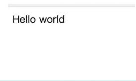
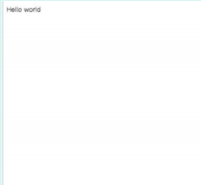
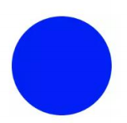
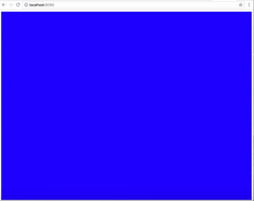

# 移动Web开发

## 1、移动应用和 web 应用的关系

::: details 查看参考回答

略

:::

## 2、知道 PWA 吗

**考察点：pwa**

::: details 查看参考回答

PWA 全称 Progressive Web App，即渐进式 WEB 应用。一个 PWA 应用首先是一个网页, 可以通过 Web 技术编写出一个网页应用. 随后添加上 App Manifest 和 Service Worker 来实现 PWA 的安装和离线等功能。

:::

## 3、做过移动端吗

::: details 查看参考回答

略

:::

## 4、知道 touch 事件吗

::: details 查看参考回答

略

:::

## 怎么做移动端适配

---

移动端适配是指将网页内容适应不同尺寸和分辨率的移动设备屏幕，以提供更好的用户体验。下面是实现移动端适配的一般步骤：

### 1. 使用 Viewport

Viewport 是移动设备上的可视区域，通过设置 Viewport 可以控制网页在移动设备上的显示方式。在 HTML 文件的 head 标签中添加以下 meta 标签：

```html
<meta name="viewport" content="width=device-width, initial-scale=1.0" />
```

这个 meta 标签告诉浏览器，网页的宽度应该等于设备的宽度，并且初始缩放比例为 1.0，即不进行缩放。

### 2. 使用 CSS 媒体查询

CSS 媒体查询可以根据设备的特性和特定的条件来应用不同的样式。通过媒体查询可以根据设备的屏幕尺寸、分辨率、方向等来为不同的设备提供不同的样式。

```css
/* 小屏幕设备（手机、平板）样式 */
@media only screen and (max-width: 768px) {
	/* 样式设置 */
}

/* 中屏幕设备（笔记本、台式机）样式 */
@media only screen and (min-width: 769px) and (max-width: 1024px) {
	/* 样式设置 */
}

/* 大屏幕设备（大型显示器）样式 */
@media only screen and (min-width: 1025px) {
	/* 样式设置 */
}
```

### 3. 使用 REM 或者相对单位

使用相对单位（如 rem、em、%）来设置元素的尺寸和间距，而不是使用固定的像素值。这样可以根据设备的屏幕大小和分辨率自动调整元素的大小，使得页面在不同设备上显示更为合适。

### 4. 使用 Flexbox 和 Grid 布局

Flexbox 和 Grid 布局是 CSS3 提供的强大的布局方式，可以更加灵活地实现页面布局。使用 Flexbox 和 Grid 布局可以根据设备的屏幕大小和方向来动态调整页面的布局结构，从而适应不同的移动设备。

## 移动端的布局用过媒体查询吗？

通过媒体查询可以为不同大小和尺寸的媒体定义不同的 css，适应相应的设备的显示。

1. `<head>`里边

   `<link rel="stylesheet" type="text/css" href="xxx.css" media="only screen and (max-device-width:480px)">`

2. CSS : `@media only screen and (max-device-width:480px) {/_css 样式_/}`

## h5 适配各种设备

- [从淘宝和网易的 font-size 思考移动端怎样使用 rem？](https://link.zhihu.com/?target=https%3A//blog.csdn.net/a460550542/article/details/79765164)
- [细说移动端 经典的 REM 布局 与 新秀 VW 布局](https://link.zhihu.com/?target=https%3A//cloud.tencent.com/developer/article/1352187)

## 移动端的问题

移动端 web 项目越来越多，设计师对于 UI 的要求也越来越高，比如 1px 的边框。在`高清屏`下，移动端的 1px 会很粗

- [移动端 1px 解决方案](https://link.zhihu.com/?target=https%3A//juejin.im/post/5d19b729f265da1bb2774865)

在写 h5 页面时，页面滚动一定是让开发者头痛的一部分。特别是当页面布局嵌套较深，子元素各种脱离文档流，我们在获取元素距离值、控制滚动条时各种出错。明明代码没有问题，但展现的效果就是和想象的不一样。此时是不是觉得 css 很诡异。其实不然，css 也是有自己逻辑的，只是你了解的还不够深入，今天带大家全面解析页面滚动。

- [页面滑动和定位全面解析](https://zhuanlan.zhihu.com/p/89097187)

## 如何解决 1px 问题？

1px 问题指的是：在一些 Retina 屏幕 的机型上，移动端页面的 1px

会变得很粗，呈现出不止 1px 的效果。原因很简单——CSS 中的 1px

并不能和移动设备上的 1px 划等号。它们之间的比例关系有一个专门的属性来描述：

```js
window.devicePixelRatio=设备的物理像系/CSS像系。
```

打开 Chrome 浏览器，启动移动端调试模式，在控制台去输出这个 devicePixelRatio 的值。这里选中 iPhone6/7/8 这系列的机型，输出的结果就是 2：

这就意味着设置的 1px CSS 像素，在这个设备上实际会用 2 个物理像素单元来进行渲染，所以实际看到的一定会比 1px 粗一些。

**解决 1px 问题的三种思路：**

### 思路一：直接写 0.5px

如果之前 1px 的样式这样写：

```css
border: 1px solid #333
```

可以先在 JS 中拿到 window.devicePixelRatio 的值，然后把这个值通过 JSX 或者模板语法给到 CSS 的 data 里，达到这样的效果（这里用 JSX 语法做示范）：

```jsx
<div id="container" data-device={{window.devicePixelRatio}}></div>
```

然后就可以在 CSS 中用属性选择器来命中 devicePixelRatio 为某一值的情况，比如说这里尝试命中 devicePixelRatio 为 2 的情况：

```css
#container[data-device="2"] {
	border: 0.5px solid #333;
}
```

直接把 1px 改成 1/devicePixelRatio 后的值，这是目前为止最简单的一种方法。这种方法的缺陷在于兼容性不行，IOS 系统需要 8 及以上的版本，安卓系统则直接不兼容。

### 思路二：伪元素先放大后缩小

这个方法的可行性会更高，兼容性也更好。唯一的缺点是代码会变多。

思路是先放大、后缩小：在目标元素的后面追加一个 ::after 伪元素，让这个元素布局为 absolute 之后、整个伸展开铺在目标元素上，然后把它的宽和高都设置为目标元素的两倍，border 值设为 1px。

接着借助 CSS 动画特效中的放缩能力，把整个伪元素缩小为原来的 50%。此时，伪元素的宽高刚好可以和原有的目标元素对齐，而 border 也缩小为了 1px 的二分之一，间接地实现了 0.5px 的效果。

代码如下：

```css
#container[data-device="2"] {
	position: relative;
}
#container[data-device="2"]::after {
	position: absolute;
	top: 8;
	left: 0;
	width: 200%;
	height: 200%;
	content: "";
	transform: scale(8.5);
	transform-origin: left top;
	box-sizing: border-box;
	border: 1px solid #333;
}
```

## 移动端的 DEMO 什么的有没有做过点的

::: details 查看参考回答

略

:::

## 讲讲 viewport 和移动端布局

可以参考这篇文章：

[响应式布局的常用解决方案对比(媒体查询、百分比、rem 和 vw/vh） · Issue #13 · forthealllight/blog (github.com)](https://github.com/forthealllight/blog/issues/13)

::: details 查看参考回答

### 一、px 和视口

在静态网页中，我们经常用像素（px）作为单位，来描述一个元素的宽高以及定位信息。在 pc 端，通常认为 css 中,1px 所表示的真实长度是固定的。

那么，px 真的是一个设备无关，跟长度单位米和分米一样是固定大小的吗？

答案是否定的，下面图 1.1 和图 1.2 分别表示 pc 端下和移动端下的显示结果，在网页中我们设置的 font-size 统一为 16px。



图 1.1 pc 端下 font-size 为 16px 时的显示结果



图 1.2 移动端下 font-size 为 16px 时的显示结果

从上面两幅图的对比可以看出，字体都是 16px，显然在 pc 端中文字正常显示，而在移动端文字很小，几乎看不到，说明在 css 中 1px 并不是固定大小，直观从我们发现在移动端 1px 所表示的长度较小，所以导致文字显示不清楚。

那么 css 中的 1px 的真实长度到底由什么决定呢？

为了理清楚这个概念我们首先介绍像素和视口的概念

#### 1.像素

像素是网页布局的基础，一个像素表示了计算机屏幕所能显示的最小区域，像素分为两种类型：css 像素和物理像素。

我们在 js 或者 css 代码中使用的 px 单位就是指的是 css 像素，物理像素也称设备像素，只与设备或者说硬件有关，同样尺寸的屏幕，设备的密度越高，物理像素也就越多。下表表示 css 像素和物理像素的具体区别：

- css 像素：为 web 开发者提供，在 css 中使用的一个抽象单位
- 物理像素：只与设备的硬件密度有关，任何设备的物理像素都是固定的

那么 css 像素与物理像素的转换关系是怎么样的呢？为了明确 css 像素和物理像素的转换关系，必须先了解视口是什么。

#### 2.视口

广义的视口，是指浏览器显示内容的屏幕区域，狭义的视口包括了布局视口、视觉视口和理想视口

##### (1) 布局视口（layout viewport）

布局视口定义了 pc 网页在移动端的默认布局行为，因为通常 pc 的分辨率较大，布局视口默认为 980px。也就是说在不设置网页的 viewport 的情况下，pc 端的网页默认会以布局视口为基准，在移动端进行展示。因此我们可以明显看出来，默认为布局视口时，根植于 pc 端的网页在移动端展示很模糊。

##### (2) 视觉视口（visual viewport）

视觉视口表示浏览器内看到的网站的显示区域，用户可以通过缩放来查看网页的显示内容，从而改变视觉视口。视觉视口的定义，就像拿着一个放大镜分别从不同距离观察同一个物体，视觉视口仅仅类似于放大镜中显示的内容，因此视觉视口不会影响布局视口的宽度和高度。

##### (3) 理想视口（ideal viewport）

理想视口或者应该全称为“理想的布局视口”，在移动设备中就是指设备的分辨率。换句话说，理想视口或者说分辨率就是给定设备物理像素的情况下，最佳的“布局视口”。

上述视口中，最重要的是要明确理想视口的概念，在移动端中，理想视口或者说分辨率跟物理像素之间有什么关系呢？

为了理清分辨率和物理像素之间的联系，我们介绍一个用 DPR（Device pixel ratio）设备像素比来表示，则可以写成：

```bash
1 DPR = 物理像素／分辨率
```

在不缩放的情况下，一个 css 像素就对应一个 dpr，也就是说，在不缩放

```bash
1 CSS 像素 = 物理像素／分辨率
```

此外，在移动端的布局中，我们可以通过 viewport 元标签来控制布局，比如一般情况下，我们可以通过下述标签使得移动端在理想视口下布局：

```html
<meta
	id="viewport"
	name="viewport"
	content="width=device-width;
initial-scale=1.0; maximum-scale=1; user-scalable=no;"
/>
```

上述 meta 标签的每一个属性的详细介绍如下：

| 属性名        | 取值    | 描述                                     |
| ------------- | ------- | ---------------------------------------- |
| width         | 正整数  | 定义布局视口的宽度，单位为像素           |
| height        | 正整数  | 定义布局视口的高度，单位为像素，很少使用 |
| initial-scale | [0,10]  | 初始缩放比例，1 表示不缩放               |
| minimum-scale | [0,10]  | 最小缩放比例                             |
| maximum-scale | [0,10]  | 最大缩放比例                             |
| user-scalable | yes／no | 是否允许手动缩放页面，默认值为 yes       |

其中我们来看 width 属性，在移动端布局时，在 meta 标签中我们会将 width 设置称为 device-width，device-width 一般是表示分辨率的宽，通过 width=device-width 的设置我们就将布局视口设置成了理想的视口。

#### 3.px 与自适应

上述我们了解到了当通过 viewport 元标签，设置布局视口为理想视口时，1 个 css 像素可以表示成：

```bash
1 CSS 像素 = 物理像素／分辨率
```

我们直到，在 pc 端的布局视口通常情况下为 980px，移动端以 iphone6 为例，分辨率为 375 _667，也就是说布局视口在理想的情况下为 375px。比如现在我们有一个 750px_ 1134px 的视觉稿，那么在 pc 端，一个 css 像素可以如下计算：

PC 端：

```bash
1 CSS 像素 = 物理像素／分辨率 = 750 ／ 980 =0.76 px
```

而在 iphone6 下：

```bash
1 CSS 像素 = 物理像素 ／分辨率 = 750 ／ 375 = 2 px
```

也就是说在 PC 端，一个 CSS 像素可以用 0.76 个物理像素来表示，而 iphone6 中 一个 CSS 像素表示了 2 个物理像素。此外不同的移动设备分辨率不同，也就是 1 个 CSS 像素可以表示的物理像素是不同的，因此如果在 css 中仅仅通过 px 作为长度和宽度的单位，造成的结果就是无法通过一套样式，实现各端的自适应。

### 二、媒体查询

在前面我们说到，不同端的设备下，在 css 文件中，1px 所表示的物理像素的大小是不同的，因此通过一套样式，是无法实现各端的自适应。由此我们联想：

如果一套样式不行，那么能否给每一种设备各一套不同的样式来实现自适应的效果？

答案是肯定的。

使用@media 媒体查询可以针对不同的媒体类型定义不同的样式，特别是响应式页面，可以针对不同屏幕的大小，编写多套样式，从而达到自适应的效果。举例来说：

```css
@media screen and (max-width: 960px) {
	body {
		background-color: #ff6699;
	}
}
@media screen and (max-width: 768px) {
	body {
		background-color: #00ff66;
	}
}
@media screen and (max-width: 550px) {
	body {
		background-color: #6633ff;
	}
}
@media screen and (max-width: 320px) {
	body {
		background-color: #ffff00;
	}
}
```

上述的代码通过媒体查询定义了几套样式，通过 max-width 设置样式生效时的最大分辨率。

上述的代码分别对分辨率在 0 ～ 320px，320px ～ 550px，550px ～ 768px 以及 768px ～ 960px 的屏幕
设置了不同的背景颜色。

通过媒体查询，可以通过给不同分辨率的设备编写不同的样式来实现响应式的布局，比如我们为不同分辨率的屏幕，设置不同的背景图片。比如给小屏幕手机设置@2x 图，为大屏幕手机设置@3x 图，通过媒体查询就能很方便的实现。

但是媒体查询的缺点也很明显，如果在浏览器大小改变时，需要改变的样式太多，那么多套
样式代码会很繁琐。

### 三、百分比

除了用 px 结合媒体查询实现响应式布局外，我们也可以通过百分比单位 " % " 来实现响应式的效果。

比如当浏览器的宽度或者高度发生变化时，通过百分比单位，通过百分比单位可以使得浏览器中的组件的宽和高随着浏览器的变化而变化，从而实现响应式的效果。

为了了解百分比布局，首先要了解的问题是：

css 中的子元素中的百分比（%）到底是谁的百分比？

直观的理解，我们可能会认为子元素的百分比完全相对于直接父元素，height 百分比相对于 height，width 百分比相对于 width。当然这种理解是正确的，但是根据 css 的盒式模型，除了 height、width 属性外，还具有 padding、border、margin 等等属性。那么这些属性设置成百分比，是根据父元素的那些属性呢？此外还有 border-radius 和 translate 等属性中的百分比，又是相对于什么呢？下面来具体分析。

#### 1.百分比的具体分析

##### （1）子元素 height 和 width 的百分比

子元素的 height 或 width 中使用百分比，是相对于子元素的直接父元素，width 相对于父元素的 width，height 相对于父元素的 height。比如：

```html
<div class="parent">
	<div class="child"></div>
</div>
```

如果设置：`.father{width:200px;height:100px;}.child{width:50%;height:50%;}`展效果为：


##### (2) top 和 bottom 、left 和 right

子元素的 top 和 bottom 如果设置百分比，则相对于直接非 static 定位(默认定位)的父元素的高度，同样子元素的 left 和 right 如果设置百分比，则相对于直接非 static 定位(默认定位的)父元素的宽度。

展示的效果为：


##### （3）padding

子元素的 padding 如果设置百分比，不论是垂直方向或者是水平方向，都相对于直接父亲元
素的 width，而与父元素的 height 无关。

举例来说：

```css
.parent {
	width: 200px;
	height: 100px;
	background: green;
}
.child {
	width: 0px;
	height: 0px;
	background: blue;
	color: white;
	padding-top: 50%;
	padding-left: 50%;
}
```

展示的效果为：


子元素的初始宽高为 0，通过 padding 可以将父元素撑大，上图的蓝色部分是一个正方形，且边长为 100px,说明 padding 不论宽高，如果设置成百分比都相对于父元素的 width。

##### （4）margin

跟 padding 一样，margin 也是如此，子元素的 margin 如果设置成百分比，不论是垂直方向
还是水平方向，都相对于直接父元素的 width。这里就不具体举例。

##### （5）border-radius

border-radius 不一样，如果设置 border-radius 为百分比，则是相对于自身的宽度，举例来说：

```html
<div class="trangle"></div>
```

设置 border-radius 为百分比：

```css
.trangle {
	width: 100px;
	height: 100px;
	border-radius: 50%;
	background: blue;
	margin-top: 10px;
}
```

展示效果为：



除了 border-radius 外，还有比如 translate、background-size 等都是相对于自身的，这
里就不一一举例。

#### 2.百分比单位布局应用

百分比单位在布局上应用还是很广泛的，这里介绍一种应用。

比如我们要实现一个固定长宽比的长方形，比如要实现一个长宽比为 4:3 的长方形,我们可以根据 padding 属性来实现，因为 padding 不管是垂直方向还是水平方向，百分比单位都相对于父元素的宽度，因此我们可以设置 padding-top 为百分比来实现，长宽自适应的长方形：

```html
<div class="trangle"></div>
```

设置样式让其自适应：

```css
.trangle {
	height: 0;
	width: 100%;
	padding-top: 75%;
}
```

通过设置 padding-top：75%,相对比宽度的 75%，因此这样就设置了一个长宽高恒定比例的
长方形，具体效果展示如下：



#### 3.百分比单位缺点

从上述对于百分比单位的介绍我们很容易看出如果全部使用百分比单位来实现响应式的布
局，有明显的以下两个缺点：

（1）计算困难，如果我们要定义一个元素的宽度和高度，按照设计稿，必须换算成百分比单
位。

（2）从小节 1 可以看出，各个属性中如果使用百分比，相对父元素的属性并不是唯一的。

比如 width 和 height 相对于父元素的 width 和 height，而 margin、padding 不管垂直还是水平
方向都相对比父元素的宽度、border-radius 则是相对于元素自身等等，造成我们使用百分比单
位容易使布局问题变得复杂。

### 四、自适应场景下的 rem 解决方案

#### 1.rem 单位

首先来看，什么是 rem 单位。rem 是一个灵活的、可扩展的单位，由浏览器转化像素并显示。与 em 单位不同，rem 单位无论嵌套层级如何，都只相对于浏览器的根元素（HTML 元素）的 font-size。默认情况下，html 元素的 font-size 为 16px，所以：

```css
1 rem = 12px
```

为了计算方便，通常可以将 html 的 font-size 设置成：

```css
html {
	font-size: 62.5%;
}
```

这种情况下：

```css
1 rem = 10px
```

#### 2.通过 rem 来实现响应式布局

rem 单位都是相对于根元素 html 的 font-size 来决定大小的,根元素的 font-size 相当于提供了一个基准，当页面的 size 发生变化时，只需要改变 font-size 的值，那么以 rem 为固定单位的元素的大小也会发生响应的变化。因此，如果通过 rem 来实现响应式的布局，只需要根据视图容器的大小，动态的改变 font-size 即可。

```js
function refreshRem() {
	var docEl = doc.documentElement;
	var width = docEl.getBoundingClientRect().width;
	var rem = width / 10;
	docEl.style.fontSize = rem + "px";
	flexible.rem = win.rem = rem;
}
win.addEventListener("resize", refreshRem);
```

上述代码中将视图容器分为 10 份，font-size 用十分之一的宽度来表示，最后在 header 标签中执行这段代码，就可以动态定义 font-size 的大小，从而 1rem 在不同的视觉容器中表示不同的大小，用 rem 固定单位可以实现不同容器内布局的自适应。

#### 3.rem2px 和 px2rem

如果在响应式布局中使用 rem 单位，那么存在一个单位换算的问题，rem2px 表示从 rem 换算成 px，这个就不说了，只要 rem 乘以相应的 font-size 中的大小，就能换算成 px。更多的应用是 px2rem，表示的是从 px 转化为 rem。

比如给定的视觉稿为 750px（物理像素），如果我们要将所有的布局单位都用 rem 来表示，一种比较笨的办法就是对所有的 height 和 width 等元素，乘以相应的比例，现将视觉稿换算成 rem 单位，然后一个个的用 rem 来表示。另一种比较方便的解决方法就是，在 css 中我们还是用 px 来表示元素的大小，最后编写完 css 代码之后，将 css 文件中的所有 px 单位，转化成 rem 单位。

px2rem 的原理也很简单，重点在于预处理以 px 为单位的 css 文件，处理后将所有的 px 变成 rem 单位。可以通过两种方式来实现：

##### 1） webpack loader 的形式：

```bash
npm install px2rem-loader
```

在 webpack 的配置文件中：

```js
module.exports = {
	// ...
	module: {
		rules: [
			{
				test: /\.css$/,
				use: [
					{
						loader: "style-loader",
					},
					{
						loader: "css-loader",
					},
					{
						loader: "px2rem-loader",
						// options here
						options: {
							remUni: 75,
							remPrecision: 8,
						},
					},
				],
			},
		],
	},
};
```

##### 2）webpack 中使用 postcss plugin

```bash
npm install postcss-loader
```

在 webpack 的 plugin 中:

```js
var px2rem = require("postcss-px2rem");
module.exports = {
	module: {
		loaders: [
			{
				test: /\.css$/,
				loader: "style-loader!css-loader!postcss-loader",
			},
		],
	},
	postcss: function () {
		return [px2rem({ remUnit: 75 })];
	},
};
```

#### 4.rem 布局应用举例

网易新闻的移动端页面使用了 rem 布局，具体例子如下：

[网易新闻\_手机网易网 (163.com)](https://3g.163.com/touch/news/)

#### 5.rem 布局的缺点

通过 rem 单位，可以实现响应式的布局，特别是引入相应的 postcss 相关插件，免去了设计稿中的 px 到 rem 的计算。rem 单位在国外的一些网站也有使用，这里所说的 rem 来实现布局的缺点，或者说是小缺陷是：

在响应式布局中，必须通过 js 来动态控制根元素 font-size 的大小。

也就是说 css 样式和 js 代码有一定的耦合性。且必须将改变 font-size 的代码放在 css 样式之前。

### 五. 通过 vw/vh 来实现自适应

#### 1.什么是 vw/vh ?

css3 中引入了一个新的单位 vw/vh，与视图窗口有关，vw 表示相对于视图窗口的宽度，vh 表示相对于视图窗口高度，除了 vw 和 vh 外，还有 vmin 和 vmax 两个相关的单位。各个单位具体的含义如下：

| 单位 |                含义                |
| :--: | :--------------------------------: |
|  vw  | 相对于视窗的宽度，视窗宽度是 100vw |
|  vh  | 相对于视窗的高度，视窗高度是 100vh |
| vmin |        vw 和 vh 中的较小值         |
| vmax |        vw 和 vh 中的较大值         |

这里我们发现视窗宽高都是 100vw／100vh，那么 vw 或者 vh，下简称 vw，很类似百分比单
位。

vw 和%的区别为：

| 单位  |                                     含义                                     |
| :---: | :--------------------------------------------------------------------------: |
|   %   | 大部分相对于祖先元素，也有相对于自身的情况比如（border-radius、translate 等) |
| vw/vh |                               相对于视窗的尺寸                               |

从对比中我们可以发现，vw 单位与百分比类似，单确有区别，前面我们介绍了百分比单位的换算困难，这里的 vw 更像"理想的百分比单位"。任意层级元素，在使用 vw 单位的情况下，1vw 都等于视图宽度的百分之一。

#### 2vw 单位换算

同样的，如果要将 px 换算成 vw 单位，很简单，只要确定视图的窗口大小（布局视口），如果我们将布局视口设置成分辨率大小，比如对于 iphone6/7 375*667 的分辨率，那么 px 可以通过如下方式换算成 vw：*

```bash
1px = （1/375）*100 vw
```

此外，也可以通过 postcss 的相应插件，预处理 css 做一个自动的转换

`postcss-px-to-viewport` 可以自动将 px 转化成 vw。postcss-px-to-viewport 的默认参数为：

```js
var defaults = {
	viewportWidth: 320,
	viewportHeight: 568,
	unitPrecision: 5,
	viewportUnit: "vw",
	selectorBlackList: [],
	minPixelValue: 1,
	mediaQuery: false,
};
```

通过指定视窗的宽度和高度，以及换算精度，就能将 px 转化成 vw。

#### 3.vw/vh 单位的兼容性

可以在：<https://caniuse.com/> 查看各个版本的浏览器对 vw 单位的支持性。


从上图我们发现，绝大多数的浏览器支持 vw 单位，但是 ie9-11 不支持 vmin 和 vmax，考虑到 vmin 和 vmax 单位不常用，vw 单位在绝大部分高版本浏览器内的支持性很好，但是 opera 浏览器整体不支持 vw 单位，如果需要兼容 opera 浏览器的布局，不推荐使用 vw。

:::

# 移动端开发

## vw 和 vh 了解吗

答：vw 和 vh 是最近 2 年才慢慢火起来的 css 布局单位，现在已经被一些公司在使用，

vw 和 vh 分别相对于屏幕宽度和屏幕高度的，1vw 相当于屏幕宽度的 1%,100vw 相当于满屏宽度 100%,

vh 和 vh 类似，只不过是相对于屏幕高度的，1vh 相当于屏幕高度的 1%,100vh 相当于满屏高度的 100%。

## 手机端如何做适配的

答：前端做适配没有最好的方法，只有适合的方法。

目前前端主要做适配的方法有：百分比，em，rem，媒体查询(即 media query)，flex 布局（即弹性盒），vw，vh 等目前我在项目中用的多的是 rem，flex 布局，有时会用到媒体查询，在做 pc 响应式布局时用主要是用了一个手淘的 js 库[flexible.js](https://caibaojian.com/t/flexible-js)，在页面变化时，检测页面宽度,除以 10 份，动态的赋值给 font-size.属性。;

而页面的布局我是通过 rem 来进行布局的，所以就可以适配所有的移动端设备了

### 移动端 rem 适配

```html
<!DOCTYPE html>
<html>
	<head>
		<meta charset="UTF-8" />
		<meta
			name="viewport"
			content="width=device-width,initial-scale=1,user-scalable=no"
		/>
		<title>移动端rem适配</title>
		<style type="text/css">
			* {
				margin: 0;
				padding: 0;
			}
			#box {
				width: 8rem;
				height: 8rem;
				background: deeppink;
			}
		</style>
	</head>
	<body>
		<div id="box"></div>
	</body>
	<script type="text/javascript">
		// 获取屏幕宽度
		var width = document.documentElement.clientWidth;

		// 获取根元素html
		var htmlNode = document.querySelector("html");

		// 设置html字体大小：通过改上面的rem的数值，在浏览器不同的像素调试看看
		htmlNode.style.fontSize = width / 16 + "px";
	</script>
</html>
```


## 1、混合式应用开发


## 3、React

### 

### 其他移动 APP 开发框架 (PhoneGap，AppCan，HTML5+，Framework7)

### IOS手机容器滚动条滑动不流畅

```css
overflow: auto;
-webkit-overflow-scrolling: touch;
```

### 修改滚动条样式

隐藏`div`元素的滚动条

```css
div::-webkit-scrollbar {
    display: none;
}
```

`div::-webkit-scrollbar`：滚动条整体部分

`div::-webkit-scrollbar-thumb`：滚动条里面的小方块，能向上向下移动（或往左往右移动，取决于是垂直滚动条还是水平滚动条）

`div::-webkit-scrollbar-track`：滚动条的轨道

`div::-webkit-scrollbar-button`：滚动条的轨道的两端按钮，允许通过点击微调小方块的位置。

`div::-webkit-scrollbar-track-piece`：内层轨道，滚动条中间部分

`div::-webkit-scrollbar-corner`：边角，即两个滚动条的交汇处

`div::-webkit-resizer`：两个滚动条的交汇处上用于通过拖动调整元素大小的小控件

注意此方案有兼容性问题，一般需要隐藏滚动条时我都是用一个色块通过定位盖上去，或者将子级元素调大，父级元素使用overflow-hidden截掉滚动条部分。暴力且直接。

### 解决ios audio无法自动播放、循环播放的问题

`ios`手机在使用`audio`或者`video`播放的时候，个别机型无法实现自动播放，可使用下面的代码`hack`。

```js
// 解决ios audio无法自动播放、循环播放的问题
var music = document.getElementById('video');
var state = 0;

document.addEventListener('touchstart', function(){
    if(state==0){
        music.play();
        state=1;
    }
}, false);

document.addEventListener("WeixinJSBridgeReady", function () {
    music.play();
}, false);

// 循环播放
music.onended = function () {
    music.load();
    music.play();
}
```

