# JavaScript引擎运行原理

掌握下面几个要点：

- 理解 JS 的单线程概念
- 理解任务队列
- 理解 EventLoop
- 理解哪些语句会放入异步任务队列
- 理解语句放入异步任务队列的时机

说到JavaScript的运行原理，自然绕不开JS引擎，运行上下文，单线程，事件循环，事件驱动，回调函数等概念。本文主要参考文章[1,2]。

为了更好的理解JavaScript如何工作的，首先要理解以下几个概念。

- JS Engine（JS引擎）
- Runtime（运行上下文）
- Call Stack (调用栈)
- Event Loop（事件循环）
- Callback (回调)

## JS 执行流程

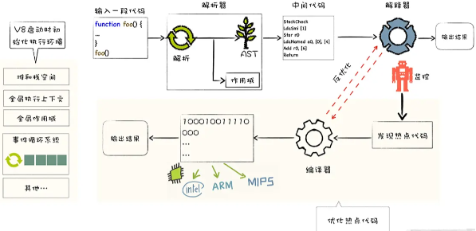

### 准备工作

需要准备执行 `JS` 时所需要的一些**基础环境**

- 初始化了**内存**中的`堆和栈`结构

- JS 全局执行上下文

  - 包含了执行过程中的全局信息， 比如一些`内置函数`，`全局变量`等信息

- 全局作用域

  - 包含了一些`全局变量`， 在执行过程中的数据都需要存放在内存中

- 初始化

  消息循环系统

  - 消息驱动器
  - 消息队列

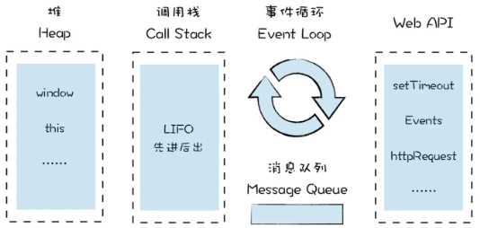

### 执行流程

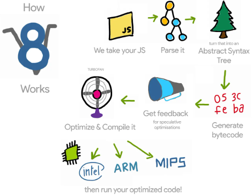

1. V8接收到要执行的JS 源代码
   - `源代码`对 `V8` 来说只是**一堆字符串**，`V8` 并不能直接理解这段字符串的含义

2. `V8`结构化这段字符串,生成了`{抽象语法树|AST}`,同时还会生成相关的**作用域**

3. 生成字节码(介于 `AST` 和 `机器代码` 的中间代码)

   - **与特定类型的机器代码无关**

4. **解释器**(`ignition`)，**按照顺序解释执行字节码**，并输出执行结果。

> 从图中得出一个结论：执行 JS 代码核心流程
>
> 1. **先编译**
> 2. **后执行**

通过`V8`将`js`转换为`字节码`然后经过`解释器`执行输出结果的方式执行`JS`，有一个弊端就是，如果在浏览器中**再次打开相同的页面**，当页面中的 `JavaScript` 文件没有被修改，再次编译之后的二进制代码也会保持不变，意味着编译这一步**浪费了 CPU 资源**。

为了，更好的利用 CPU 资源，V8 采用**JIT**(Just In Time)技术提升效率:而是**混合编译执行和解释执行这两种手段**。

> 1. 解释执行的**启动速度快**，但是执行时的速度慢
> 2. 编译执行的**启动速度慢**，但是执行时的速度快

#### Just-in-time 编译器：综合了解释器和编译器的优点

为了解决**解释器**的低效问题，后来的浏览器把**编译器**也引入进来，形成**混合模式**。

在 `JavaScript` 引擎中增加一个**监视器**(也叫分析器)。监视器监控着代码的运行情况，**记录代码一共运行了多少次、如何运行的等信息**。

> 如果同一行代码运行了几次，这个代码段就被标记成了 `warm`，如果运行了很多次，则被标记成 `hot`。

---

##### 基线编译器

如果一段代码变成了 `warm`，那么 `JIT` 就把它送到**编译器**去编译，并且**把编译结果存储起来**。

代码段的每一行都会被编译成一个"桩"(`stub`)，同时给这个桩分配一个以`行号 + 变量类型`的索引。如果监视器监视到了执行同样的代码和同样的变量类型，那么就直接把这个已编译的版本 `push` 出来给浏览器。

---

##### 优化编译器

如果一个代码段变得 `very hot`，`监视器`会把它发送到**优化编译器**中。**生成一个更快速和高效的代码版本出来，并且存储之**。

> 为了生成一个更快速的代码版本，优化编译器必须做一些**假设**。

例如，它会假设由**同一个构造函数生成的实例都有相同的形状**

> 就是说**所有的实例**
>
> - 都有`相同的属性名`
> - 并且都以`同样的顺序初始化`

那么就可以针对这一模式进行优化。

整个`优化器`起作用的链条是这样的

1. **监视器**从他所监视代码的执行情况**做出自己的判断**
2. 接下来把它所整理的信息传递给**优化器进行优化**
3. 如果某个循环中先前每次迭代的对象都有相同的形状，那么就可以认为它以后迭代的对象的形状都是相同的。

可是对于 `JavaScript` 从来就没有保证这么一说，前 99 个对象保持着形状，可能第 100 个就少了某个属性。

正是由于这样的情况，所以**编译代码需要在运行之前检查其假设是不是合理的**。

- 如果合理，那么优化的编译代码会运行

- 如果不合理，那么`JIT`会认为做了一个错误的假设，并且把优化代码丢掉

  - 这时(发生优化代码丢弃的情况)执行过程将会回到解释器或者基线编译器，这一过程叫做**去优化**。

##### 类型特化|Type specialization

`优化编译器`最成功一个特点叫做**类型特化**。

`JavaScript` 所使用的**动态类型体系**在运行时需要进行额外的解释工作，例如下面代码：

```javascript
function arraySum(arr) {
	var sum = 0;
	for (var i = 0; i < arr.length; i++) {
		sum += arr[i];
	}
}
```

我们假设 `arr` 是一个有 100 个**整数的数组**。当代码被标记为 "warm" 时，**基线编译器**就为函数中的每一个操作生成一个桩。`sum += arr[i]` 会有一个相应的桩，并且把里面的 `+=` 操作当成整数加法。

但是，`sum` 和 `arr[i]` 两个数**并不保证都是整数**。因为在 `JavaScript` 中类型都是**动态类型**，在接下来的循环当中，`arr[i]` 很有可能变成了 `string` 类型。整数加法和字符串连接是完全不同的两个操作，会**被编译成不同的机器码**。

`JIT` 处理这个问题的方法是编译**多基线桩**。

- 如果一个代码段是单一形态的(即总是以同一类型被调用)，则只生成一个桩。
- 如果是**多形态**的(即调用的过程中，类型不断变化)，则会为操作所调用的每一个类型组合生成一个桩。

这就是说 `JIT` 在选择一个桩之前，会进行多分枝选择，类似于`决策树`，问自己很多问题才会确定最终选择哪个，见下图：

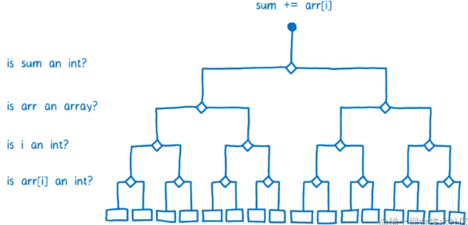


## 1.JS Engine

简单来说，JS引擎主要是对JS代码进行词法、语法等分析，通过编译器将代码编译成可执行的机器码让计算机去执行。

目前最流行的JS引擎非V8莫属了，Chrome浏览器和Node.js采用的引擎就是V8引擎。引擎的结构可以简单由下图表示：

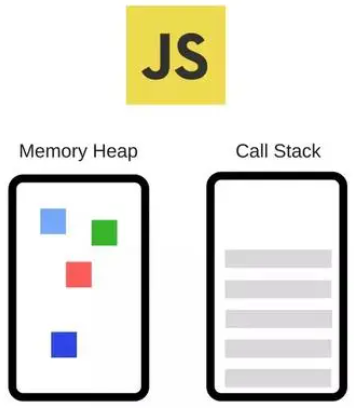

就如JVM虚拟机一样，JS引擎中也有堆(Memory Heap)和栈(Call Stack)的概念。

- 栈。用来存储方法调用的地方，以及基础数据类型(如var a = 1)也是存储在栈里面的，会随着方法调用结束而自动销毁掉(入栈-->方法调用后-->出栈)。
- 堆。JS引擎中给对象分配的内存空间是放在堆中的。如var foo = {name: 'foo'} 那么这个foo所指向的对象是存储在堆中的。

此外，JS中存在闭包的概念，对于基本类型变量如果存在与闭包当中，那么也将存储在堆中。详细可见此处1,3

关于闭包的情况，就涉及到**Captured Variables**。我们知道**Local Variables**是最简单的情形，是直接存储在栈中的。而**Captured Variables**是对于存在闭包情况和with,try catch情况的变量。

```js
function foo () {
 var x; // local variables
 var y; // captured variable, bar中引用了y
 function bar () {
     // bar 中的context会capture变量y
     use(y);
 }
 return bar;
}
```

如上述情况，变量y存在与bar()的闭包中，因此y是captured variable，是存储在堆中的。

## 2.RunTime

JS在浏览器中可以调用浏览器提供的API，如window对象，DOM相关API等。这些接口并不是由V8引擎提供的，是存在与浏览器当中的。因此简单来说，对于这些相关的外部接口，可以在运行时供JS调用，以及JS的事件循环(Event Loop)和事件队列(Callback Queue)，把这些称为RunTime。有些地方也把JS所用到的core lib核心库也看作RunTime的一部分。

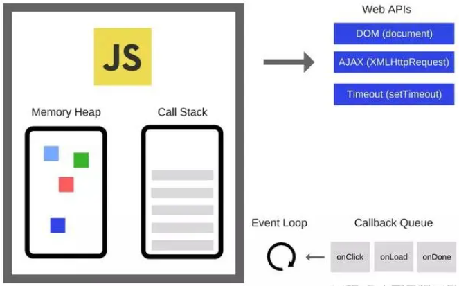

同样，在Node.js中，可以把Node的各种库提供的API称为RunTime。所以可以这么理解，Chrome和Node.js都采用相同的V8引擎，但拥有不同的运行环境(RunTime Environments)[4]。

## 3.Call Stack

JS被设计为单线程运行的，这是因为JS主要用来实现很多交互相关的操作，如DOM相关操作，如果是多线程会造成复杂的同步问题。因此JS自诞生以来就是单线程的，而且主线程都是用来进行界面相关的渲染操作 **(为什么说是主线程，因为HTML5 提供了Web Worker，独立的一个后台JS，用来处理一些耗时数据操作。因为不会修改相关DOM及页面元素，因此不影响页面性能)**，如果有阻塞产生会导致浏览器卡死。

如果一个递归调用没有终止条件，是一个死循环的话，会导致调用栈内存不够而溢出，如：

```js
function foo() {
 foo();
}
foo();
```

例子中foo函数循环调用其本身，且没有终止条件，浏览器控制台输出调用栈达到最大调用次数。


JS线程如果遇到比较耗时操作，如读取文件，AJAX请求操作怎么办？这里JS用到了Callback回调函数来处理。

对于Call Stack中的每个方法调用，都会形成它自己的一个执行上下文Execution Context，关于执行上下文的详细阐述请看这篇文章

4.Event Loop & Callback

JS通过回调的方式，异步处理耗时的任务。一个简单的例子：

```js
var result = ajax('...');
console.log(result);
```

此时并不会得到result的值，result是undefined。这是因为ajax的调用是异步的，当前线程并不会等到ajax请求到结果后才执行console.log语句。而是调用ajax后请求的操作交给回调函数，自己是立刻返回。正确的写法应该是：

```js
ajax('...', function(result) {
 console.log(result);
})
```

此时才能正确输出请求返回的结果。

JS引擎其实并不提供异步的支持，异步支持主要依赖于运行环境(浏览器或Node.js)。

> So, for example, when your JavaScript program makes an Ajax request to fetch some data from the server, you set up the “response” code in a function (the “callback”), and the JS Engine tells the hosting environment: “Hey, I’m going to suspend execution for now, but whenever you finish with that network request, and you have some data, please call this function back.”
> The browser is then set up to listen for the response from the network, and when it has something to return to you, it will schedule the callback function to be executed by inserting it into the event loop.

上面这两段话摘自于How JavaScript works，以通俗的方式解释了JS如何调用回调函数实现异步处理。

### 所以什么是Event Loop?

Event Loop只做一件事情，负责监听Call Stack和Callback Queue。当Call Stack里面的调用栈运行完变成空了，Event Loop就把Callback Queue里面的第一条事件(其实就是回调函数)放到调用栈中并执行它，后续不断循环执行这个操作。

一个setTimeout的例子以及对应的Event Loop动态图：

```js
console.log('Hi');
setTimeout(function cb1() { 
 console.log('cb1');
}, 5000);
console.log('Bye');
```

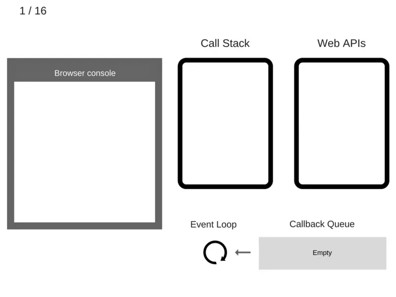

**setTimeout**有个要注意的地方，如上述例子延迟5s执行，不是严格意义上的5s，正确来说是至少5s以后会执行。因为Web API会设定一个5s的定时器，时间到期后将回调函数加到队列中，此时该回调函数还不一定会马上运行，因为队列中可能还有之前加入的其他回调函数，而且还必须等到Call Stack空了之后才会从队列中取一个回调执行。

所以常见的**setTimeout(callback, 0)** 的做法就是为了在常规的调用介绍后马上运行回调函数。

```js
console.log('Hi');
setTimeout(function() {
 console.log('callback');
}, 0);
console.log('Bye');
// 输出
// Hi
// Bye
// callback
```

在说一个容易犯错的栗子：

```js
for (var i = 0; i < 5; i++) {
 setTimeout(function() {
 console.log(i);
 }, 1000 * i);
}
	
// 输出：5 5 5 5 5
```

上面这个栗子并不是输出0，1，2，3，4，第一反应觉得应该是这样。但梳理了JS的时间循环后，应该很容易明白。

调用栈先执行 for(var i = 0; i < 5; i++) {...}方法，里面的定时器会到时间后会直接把回调函数放到事件队列中，等for循环执行完在依次取出放进调用栈。当for循环执行完时，i的值已经变成5，所以最后输出全都是5。

关于定时器又可以看看这篇有意思的文章

最后关于Event Loop，可以参考下这个视频。到目前为止说的event loop是前端浏览器中的event loop，关于Nodejs的Event Loop的细节阐述，请看我的另一篇文章Node.js design pattern : Reactor (Event Loop)。两者的区别对比可查看这篇文章你不知道的Event Loop，对两种event loop做了相关总结和比较。

总结

最后总结一下，JS的运行原理主要有以下几个方面：

- JS引擎主要负责把JS代码转为机器能执行的机器码，而JS代码中调用的一些WEB API则由其运行环境提供，这里指的是浏览器。
- JS是单线程运行，每次都从调用栈出取出代码进行调用。如果当前代码非常耗时，则会阻塞当前线程导致浏览器卡顿。
- 回调函数是通过加入到事件队列中，等待Event Loop拿出并放到调用栈中进行调用。只有Event Loop监听到调用栈为空时，才会从事件队列中从队头拿出回调函数放进调用栈里。

# JavaScript引擎垃圾回收机制|Garbage Collecation

### 垃圾回收算法

1. 通过 `GC Root` 标记空间中活动对象和非活动对象

   - V8 采用的`{可访问性| reachability}`算法,来判断堆中的对象是否是**活动对象**
   - 这个算法是将一些 `GC Root` 作为**初始存活**的对象的集合
   - 从 `GC Roots` 对象出发,遍历 `GC Root` 中的所有对象
   - 通过 `GC Roots` 遍历到的对象,认为该对象是`{可访问的| reachable}`,也称可访问的对象为**活动对象**
   - 通过 `GC Roots` 没有遍历到的对象,是`{不可访问的| unreachable}`,不可访问的对象为**非活动对象**
   - 浏览器环境中，`GC Root` 包括 1.**全局的 `window` 对象**,2.**文档 `DOM` 树**,由可以通过遍历文档到达的所有原生 `DOM` 节点组成,3.存放**栈上变量**

2. 回收 非活动对象 所占据的内存

3. 内存整理

   - 频繁回收对象后，内存中就会存在大量不连续空间
   - 这些不连续的内存空间称为**内存碎片**

### 代际假说

**代际假说**是垃圾回收领域中一个重要的术语

两个特点

1.第一个是大部分对象都是朝生夕死的

- 大部分对象在内存中存活的时间很短

比如函数内部声明的变量，或者块级作用域中的变量

2.第二个是不死的对象，会活得更久

- 比如全局的 `window`、`DOM`、`Web API` 等对象

### 堆空间

在 `V8` 中，会把`堆`分为

1. 新生代
   - 存放的是生存时间短的对象
   - 新生代通常只支持 1 ～ 8M 的容量
   - `{副垃圾回收器| Minor GC}` (Scavenger)
   - 负责新生代的垃圾回收
2. 老生代
   - 存放生存时间久的对象
   - `{主垃圾回收器| Major GC}`
   - 负责老生代的垃圾回收

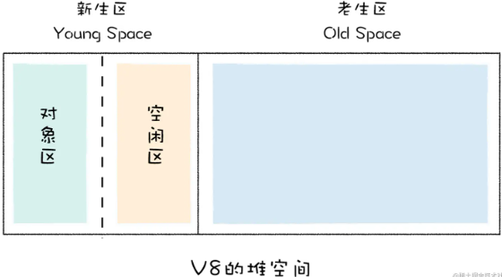

### `{副垃圾回收器| Minor GC}`

新生代中的垃圾数据用 `Scavenge` 算法来处理。

所谓 `Scavenge` 算法，把新生代空间对半划分为两个区域:

- 一半是**对象区域** (`from-space`)
- 一半是**空闲区域** (`to-space`)

当对象区域快被写满时，就需要执行一次垃圾清理操作,

1. 首先要对对象区域中的垃圾**做标记**,
2. 标记完成之后，就进入垃圾清理阶段,
   - 把这些存活的对象**复制到空闲区域**中,把这些对象有序地排列起来
   - 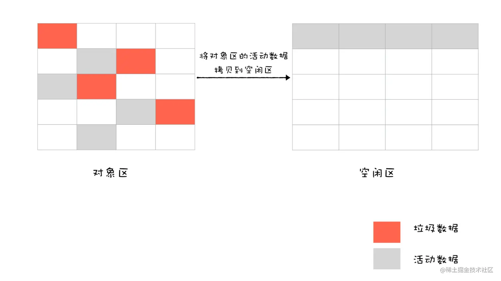
3. 完成复制后，**对象区域与空闲区域进行角色翻转**
   - 

副垃圾回收器采用**对象晋升策略**：**移动那些经过两次垃圾回收依然还存活的对象到老生代中**。

---

### `{主垃圾回收器| Major GC}`

负责老生代中的垃圾回收，除了新生代中晋升的对象，大的对象会**直接**被分配到老生代里。

老生代中的对象有两个特点

1. 对象占用空间大
2. 对象存活时间长

#### `{标记 - 清除|Mark-Sweep}`算法

1. 标记过程阶段
   - 从一组根元素开始，递归遍历这组根元素
   - 这个遍历过程中，能到达的元素称为活动对象，没有到达的元素就可以判断为垃圾数据
2. 垃圾的清除过程
   - `主垃圾回收器会直接将标记为垃圾的数据清理掉`
     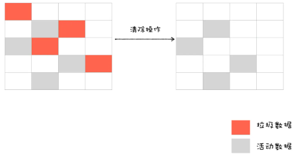

#### `{标记 - 整理|Mark-Compact}`

1. 标记可回收对象
2. 垃圾清除
   - 不是直接对可回收对象进行清理
   - `而是让所有存活的对象都向一端移动`
   - **直接清理掉这一端之外的内存**


# 面试题

## 什么是栈内存，什么是堆内存？

`栈内存`：是自动分配的内存区域，主要用于存储基本数据类型和对象的引用(而非对象本身)。在 JavaScript 中，局部变量(包括函数参数)就是栈内存中分配的。栈内存有一个重要的特性，既它是按照后进先出(LIFO)的原则进行管理的。当定义一个变量时，它会在栈内存中占据一定的空间，而当该变量不在需要时(例如函数执行完毕后)，其占用的空间会自动被释放。这种自动的内存管理使得栈内存的操作非常高效且错误率较低。

`堆内存`：用于动态分配内存区域，主要用于存储对象(包括数组和函数)。在 JavaScript 中，当使用 new 关键字创建一个对象时，这个对象就会被分配在堆内存中。与栈内存不同，堆内存的对象生命周期是由 JavaScript 的垃圾收集机制来管理的。当没有任何引用指向一个对象时，垃圾收集器会将其标记为可回收，并在适当的

## 栈和堆的区别？

栈(stack)：由编译器自动分配释放，存放函数的参数值，局部变量等；
堆(heap)：一般由程序员分配释放，若程序员不释放，程序结束时可能由操作系统释放。

## JS 如何实现多线程？

JavaScript 通常被视为单线程语言，因为它只有一个主线程来处理所有的任务。这意味着 JavaScript 代码在任何给定的时间只能执行一个任务。然而，JavaScript 提供了一些机制，使得它能够在某种程度上实现多线程的效果。以下是一些实现方式：

1. **Web Workers：** Web Workers 是运行在后台的 JavaScript，独立于其他脚本，不会影响页面的性能。它们被设计为在 Web 内容在用户的浏览器上运行时运行后台任务。Web Workers 是运行在浏览器中的一个独立线程，它们不能访问 DOM，但可以通过 postMessage/onmessage 方法与主线程进行通信。

**`创建 Web Worker 的步骤：`**

- 创建一个新的 Worker 对象，指向一个 JavaScript 文件。
- 使用 postMessage 方法向 Worker 发送数据。
- 在 Worker 内部，监听 message 事件以接收数据，然后处理它。
- 使用 Worker 的 onerror 事件处理程序来处理任何错误。

1. **SharedArrayBuffer 和 Atomics：** 这两个 API 允许在多个 Worker 之间共享内存，并且提供了原子操作来确保内存访问的同步。SharedArrayBuffer 提供了一个用于存储固定长度的原始二进制数据的缓冲区，而 Atomics 提供了一种方法来以原子方式读取和写入 SharedArrayBuffer。
2. **Promise 和 async/await：** 虽然它们并不直接提供多线程，但它们提供了一种编写异步代码的方式，可以避免阻塞主线程。Promise 对象用于表示一个异步操作的最终完成(或失败)及其结果值。async/await 是基于 Promise 的语法糖，使得异步代码的书写和理解更接近同步代码。时机释放其占用内存。

## JavaScript数据是如何存储的？

基本数据类型用 `栈` 存储，引用数据类型用 `堆` 存储。

看起来没有错误，但实际上是有问题的。可以考虑一下闭包的情况，如果变量存在栈中，那函数调用完栈顶空间销毁 ，闭包变量不就没了吗？

其实还是需要补充一句：

闭包变量是存在堆内存中的。

具体而言，以下数据类型存储在栈中：

- boolean
- null
- undefined
- number
- string
- symbol
- bigint

而所有的对象数据类型存放在堆中。

值得注意的是，对于 赋值 操作，原始类型的数据直接完整地变量值，对象数据类型的数据则是引用地址。

因此会有下面的情况：

```js
let obj = { a: 1 };
let newObj = obj;
newObj.a = 2;
console.log(obj.a); // 变成了2
```

之所以会这样，是因为 obj 和 newObj 是同一份堆空间的地址，改变 newObj，等于改变了共同的堆内存，这时候通过 obj 来获取这块内存的值当然会改变。

为什么不全部用栈来保存呢？

首先，对于系统栈来说，它的功能除了保存变量之外，还有创建并切换函数执行上下文的功能。举个例子：

```js
function f(a) {
	console.log(a);
}
function func(a) {
	f(a);
}
func(1);
```

假设用 ESP 指针来保存当前的执行状态，在系统栈中会产生如下的过程：

- 1）调用 func, 将 func 函数的上下文压栈，ESP 指向栈顶。
- 2）执行 func，又调用 f 函数，将 f 函数的上下文压栈，ESP 指针上移。
- 3）执行完 f 函数，将 ESP 下移，f 函数对应的栈顶空间被回收。
- 4）执行完 func，ESP 下移，func 对应的空间被回收。

图示如下：


因此你也看到了，如果采用栈来存储相对基本类型更加复杂的对象数据，那么切换上下文的开销将变得巨大！

不过堆内存虽然空间大，能存放大量的数据，但与此同时垃圾内存的回收会带来更大的开销。

## 什么是堆？什么是栈？它们之间有什么区别和联系？

堆和栈的概念存在于数据结构中和操作系统内存中。

在数据结构中，栈中数据的存取方式为先进后出。而堆是一个优先队列，是按优先级来进行排序的，优先级可以按照大小来规定。完全
二叉树是堆的一种实现方式。

在操作系统中，内存被分为栈区和堆区。

栈区内存由编译器自动分配释放，存放函数的参数值，局部变量的值等。其操作方式类似于数据结构中的栈。

堆区内存一般由程序员分配释放，若程序员不释放，程序结束时可能由垃圾回收机制回收。

## JavaScript 引擎是如何工作的？

JavaScript 引擎，如 V8，首先对 JavaScript 代码进行词法和语法分析，然后通过编译器将代码编译成可执行的机器码。引擎的结构包括堆（用于对象存储）和调用栈（用于方法调用和基本数据类型存储）。

## 什么是 V8 引擎，它在 Node.js 和浏览器中的作用是什么？

V8 引擎是 Google 开发的开源 JavaScript 引擎，它在 Chrome 浏览器和 Node.js 中被使用。V8 负责编译 JavaScript 代码到机器码，同时优化执行速度和内存使用。

## 什么是执行上下文（Execution Context）？

执行上下文是 JavaScript 代码被评估和执行时的环境。每当函数被调用时，一个新的执行上下文就会被创建并推入调用栈。执行上下文包括变量对象、作用域链和 this 指针。

## 单线程和事件循环如何协同工作？

JavaScript 是单线程的，意味着在同一时间只能执行一个任务。事件循环允许 JavaScript 引擎执行异步任务，通过回调队列和调用栈来协调同步和异步代码的执行。


## 描述一下 V8 执行一段 JS 代码的过程？

前端相对来说是一个比较新兴的领域，因此各种前端框架和工具层出不穷，让人眼花缭乱，尤其是各大厂商推出 小程序 之后 各自制定标准 ，让前端开发的工作更加繁琐，在此背景下为了抹平平台之间的差异，诞生的各种 编译工具/框架 也数不胜数。但无论如何，想要赶上这些框架和工具的更新速度是非常难的，即使赶上了也很难产生自己的 技术积淀 ，一个更好的方式便是学习那些 本质的知识 ，抓住上层应用中不变的 底层机制 ，这样我们便能轻松理解上层的框架而不仅仅是被动地使用，甚至能够在适当的场景下自己造出轮子，以满足开发效率的需求。

站在 V8 的角度，理解其中的执行机制，也能够帮助我们理解很多的上层应用，包括 Babel、Eslint、前端框架的底层机制。那么，一段 JavaScript 代码放在 V8 当中究竟是如何执行的呢？

首先需要明白的是，机器是读不懂 JS 代码，机器只能理解特定的机器码，那如果要让 JS 的逻辑在机器上运行起来，就必须将 JS 的代码翻译成机器码，然后让机器识别。JS 属于解释型语言，对于解释型的语言说，解释器会对源代码做如下分析：

- 通过词法分析和语法分析生成 AST(抽象语法树)
- 生成字节码

然后解释器根据字节码来执行程序。但 JS 整个执行的过程其实会比这个更加复杂，接下来就来一一地拆解。

### 生成 AST

生成 AST 分为两步——词法分析和语法分析。

词法分析即分词，它的工作就是将一行行的代码分解成一个个 token。 比如下面一行代码：

```js
let name = "sanyuan";
```

其中会把句子分解成四个部分：


即解析成了四个 token，这就是词法分析的作用。

接下来语法分析阶段，将生成的这些 token 数据，根据一定的语法规则转化为 AST。举个例子：

```js
let name = "sanyuan";
console.log(name);
```

最后生成的 AST 是这样的：


当生成了 AST 之后，编译器/解释器后续的工作都要依靠 AST 而不是源代码。顺便补充一句，babel 的工作原理就是将 ES6 的代码解析生成 ES6 的 AST ，然后将 ES6 的 AST 转换为 ES5 的 AST ,最后才将 ES5 的 AST 转化为具体的 ES5 代码。

生成 AST 后，接下来会生成执行上下文

### 生成字节码

开头就已经提到过了，生成 AST 之后，直接通过 V8 的解释器(也叫 Ignition)来生成字节码。但是字节码并不能让机器直接运行，那你可能就会说了，不能执行还转成字节码干嘛，直接把 AST 转换成机器码不就得了，让机器直接执行。确实，在 V8 的早期是这么做的，但后来因为机器码的体积太大，引发了严重的内存占用问题。

给一张对比图让大家直观地感受以下三者代码量的差异：


很容易得出，字节码是比机器码轻量得多的代码。那 V8 为什么要使用字节码，字节码到底是个什么东西？

> 字节码是介于 AST 和 机器码之间的一种代码，但是与特定类型的机器码无关，字节码需要通过解释器将其转换为机器码然后执行。

字节码仍然需要转换为机器码，但和原来不同的是，现在不用一次性将全部的字节码都转换成机器码，而是通过解释器来逐行执行字节码，省去了生成二进制文件的操作，这样就大大降低了内存的压力。

### 执行代码

在执行字节码的过程中，如果发现某一部分代码重复出现，那么 V8 将它记做 热点代码 (HotSpot)，然后将这么代码编译成 机器码 保存起来，这个用来编译的工具就是 V8 的 编译器 (也叫做 TurboFan ) , 因此在这样的机制下，代码执行的时间越久，那么执行效率会越来越高，因为有越来越多的字节码被标记为 热点代码 ，遇到它们时直接执行相应的机器码，不用再次将转换为机器码。

其实当你听到有人说 JS 就是一门解释器语言的时候，其实这个说法是有问题的。因为字节码不仅配合了解释器，而且还和编译器打交道，所以 JS 并不是完全的解释型语言。而编译器和解释器的 根本区别在于前者会编译生成二进制文件但后者不会。

并且，这种字节码跟编译器和解释器结合的技术，我们称之为 即时编译 , 也就是我们经常听到的 JIT 。

这就是 V8 中执行一段 JS 代码的整个过程，梳理一下：

- 1）首先通过词法分析和语法分析生成 AST
- 2）将 AST 转换为字节码
- 3）由解释器逐行执行字节码，遇到热点代码启动编译器进行编译，生成对应的机器码, 以优化执行效率

## 简单介绍一下 V8 引擎的垃圾回收机制

v8 的垃圾回收机制基于分代回收机制，这个机制又基于世代假说，这个假说有两个特点，一是新生的对象容易早死，另一个是不死的对象会活得更久。基于这个假说，v8 引擎将内存分为了新生代和老生代。

新创建的对象或者只经历过一次的垃圾回收的对象被称为新生代。经历过多次垃圾回收的对象被称为老生代。

新生代被分为 From 和 To 两个空间，To 一般是闲置的。当 From 空间满了的时候会执行 Scavenge 算法进行垃圾回收。当我们执行垃圾回收算法的时候应用逻辑将会停止，等垃圾回收结束后再继续执行。这个算法分为三步：

(1)首先检查 From 空间的存活对象，如果对象存活则判断对象是否满足晋升到老生代的条件，如果满足条件则晋升到老生代。如果不满足条件则移动 To 空间。

(2)如果对象不存活，则释放对象的空间。

(3)最后将 From 空间和 To 空间角色进行交换。

新生代对象晋升到老生代有两个条件：

(1)第一个是判断是对象否已经经过一次 Scavenge 回收。若经历过，则将对象从 From 空间复制到老生代中；若没有经历，则复制到 To 空间。

(2)第二个是 To 空间的内存使用占比是否超过限制。当对象从 From 空间复制到 To 空间时，若 To 空间使用超过 25%，则对象直接晋升到老生代中。设置 25% 的原因主要是因为算法结束后，两个空间结束后会交换位置，如果 To 空间的内存太小，会影响后续的内存分配。

老生代采用了标记清除法和标记压缩法。标记清除法首先会对内存中存活的对象进行标记，标记结束后清除掉那些没有标记的对象。由于标记清除后会造成很多的内存碎片，不便于后面的内存分配。所以了解决内存碎片的问题引入了标记压缩法。

由于在进行垃圾回收的时候会暂停应用的逻辑，对于新生代方法由于内存小，每次停顿的时间不会太长，但对于老生代来说每次垃圾回收的时间长，停顿会造成很大的影响。 为了解决这个问题 V8 引入了增量标记的方法，将一次停顿进行的过程分为了多步，每次执行完一小步就让运行逻辑执行一会，就这样交替运行。

## V8 引擎如何进行垃圾内存的回收？

JS 语言不像 C/C++, 让程序员自己去开辟或者释放内存，而是类似 Java，采用自己的一套垃圾回收算法进行自动的内存管理。作为一名资深的前端工程师，对于 JS 内存回收的机制是需要非常清楚, 以便于在极端的环境下能够分析出系统性能的瓶颈，另一方面，学习这其中的机制，也对我们深入理解 JS 的闭包特性、以及对内存的高效使用，都有很大的帮助。

### V8 内存限制

在其他的后端语言中，如 Java/Go, 对于内存的使用没有什么限制，但是 JS 不一样，V8 只能使用系统的一部分内存，具体来说，在 64 位系统下，V8 最多只能分配 1.4G , 在 32 位系统中，最多只能分配 0.7G 。

你想想在前端这样的大内存需求其实并不大，但对于后端而言，nodejs 如果遇到一个 2G 多的文件，那么将无法全部将其读入内存进行各种操作了。

我们知道对于栈内存而言，当 ESP 指针下移，也就是上下文切换之后，栈顶的空间会自动被回收。但对于堆内存而言就比较复杂了，我们下面着重分析堆内存的垃圾回收。

所有的对象类型的数据在 JS 中都是通过堆进行空间分配的。当我们构造一个对象进行赋值操作的时候，其实相应的内存已经分配到了堆上。你可以不断的这样创建对象，让 V8 为它分配空间，直到堆的大小达到上限。

那么问题来了，V8 为什么要给它设置内存上限？明明我的机器大几十 G 的内存，只能让我用这么一点？

究其根本，是由两个因素所共同决定的，一个是 JS 单线程的执行机制，另一个是 JS 垃圾回收机制的限制。

首先 JS 是单线程运行的，这意味着一旦进入到垃圾回收，那么其它的各种运行逻辑都要暂停; 另一方面垃圾回收其实是非常耗时间的操作，V8 官方是这样形容的：

> 以 1.5GB 的垃圾回收堆内存为例，V8 做一次小的垃圾回收需要 50ms 以上，做一次非增量式(ps:后面会解释)的垃圾回收甚至要 1s 以上。

可见其耗时之久，而且在这么长的时间内，我们的 JS 代码执行会一直没有响应，造成应用卡顿，导致应用性能和响应能力直线下降。因此，V8 做了一个简单粗暴的选择，那就是限制堆内存，也算是一种权衡的手段，因为大部分情况是不会遇到操作几个 G 内存这样的场景的。

不过，如果你想调整这个内存的限制也不是不行。配置命令如下：

```bash
// 这是调整老生代这部分的内存，单位是MB。后面会详细介绍新生代和老生代内存
node --max-old-space-size=2048 xxx.js
```

或者

```bash
// 这是调整新生代这部分的内存，单位是 KB。
node --max-new-space-size=2048 xxx.js
```

### 新生代内存的回收

V8 把堆内存分成了两部分进行处理——新生代内存和老生代内存。顾名思义，新生代就是临时分配的内存，存活时间短， 老生代是常驻内存，存活的时间长。V8 的堆内存，也就是两个内存之和。


根据这两种不同种类的堆内存，V8 采用了不同的回收策略，来根据不同的场景做针对性的优化。

首先是新生代的内存，刚刚已经介绍了调整新生代内存的方法，那它的内存默认限制是多少？在 64 位和 32 位系统下分别为 32MB 和 16MB。够小吧，不过也很好理解，新生代中的变量存活时间短，来了马上就走，不容易产生太大的内存负担，因此可以将它设的足够小。

那好了，新生代的垃圾回收是怎么做的呢？

首先将新生代内存空间一分为二：

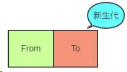

其中 From 部分表示正在使用的内存，To 是目前闲置的内存。

当进行垃圾回收时，V8 将 From 部分的对象检查一遍，如果是存活对象那么到 To 内存中(在 To 内存中按照顺序从头放置的)，如果是非存活对象直接回收即可。

当所有的 From 中的存活对象按照顺序进入到 To 内存之后，From 和 To 两者的角色 对调 ，From 现在被闲置，To 为正在使用，如此循环。

那你很可能会问了，直接将非存活对象回收了不就万事大吉了嘛，为什么还要后面的一系列操作？

注意，我刚刚特别说明了，在 To 内存中按照顺序从头放置的，这是为了应对这样的场景：

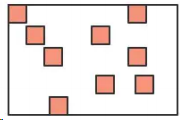

深色的小方块代表存活对象，白色部分表示待分配的内存，由于堆内存是连续分配的，这样零零散散的空间可能会导致稍微大一点的对象没有办法进行空间分配，这种零散的空间也叫做内存碎片。刚刚介绍的新生代垃圾回收算法也叫 Scavenge 算法。

Scavenge 算法主要就是解决内存碎片的问题，在进行一顿之后，To 空间变成了这个样子：


是不是整齐了许多？这样就大大方便了后续连续空间的分配。

不过 Scavenge 算法的劣势也非常明显，就是内存只能使用新生代内存的一半，但是它只存放生命周期短的对象，这种对象 一般很少 ，因此 时间 性能非常优秀。

### 老生代内存的回收

刚刚介绍了新生代的回收方式，那么新生代中的变量如果经过多次回收后依然存在，那么就会被放入到老生代内存 中，这种现象就叫 晋升 。

发生晋升其实不只是这一种原因，我们来梳理一下会有那些情况触发晋升：

已经经历过一次 Scavenge 回收。

To（闲置）空间的内存占用超过 25%。

现在进入到老生代的垃圾回收机制当中，老生代中累积的变量空间一般都是很大的，当然不能用 Scavenge 算法啦，浪费一半空间不说，对庞大的内存空间进行岂不是劳民伤财？

那么对于老生代而言，究竟是采取怎样的策略进行垃圾回收的呢？

第一步，进行标记-清除。这个过程在《JavaScript 高级程序设计(第三版)》中有过详细的介绍，主要分成两个阶段，即标记阶段和清除阶段。首先会遍历堆中的所有对象，对它们做上标记，然后对于代码环境中 使用的变量 以及被 强引用 的变量取消标记，剩下的就是要删除的变量了，在随后的 清除阶段 对其进行空间的回收。

当然这又会引发内存碎片的问题，存活对象的空间不连续对后续的空间分配造成障碍。老生代又是如何处理这个问题的呢？

第二步，整理内存碎片。V8 的解决方式非常简单粗暴，在清除阶段结束后，把存活的对象全部往一端靠拢。

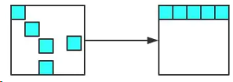

由于是移动对象，它的执行速度不可能很快，事实上也是整个过程中最耗时间的部分。

### 增量标记

由于 JS 的单线程机制，V8 在进行垃圾回收的时候，不可避免地会阻塞业务逻辑的执行，倘若老生代的垃圾回收任务很重，那么耗时会非常可怕，严重影响应用的性能。

那这个时候为了避免这样问题，V8 采取了增量标记的方案，即将一口气完成的标记任务分为很多小的部分完成，每做完一个小的部分就"歇"一下，就 js 应用逻辑执行一会儿，然后再执行下面的部分，如果循环，直到标记阶段完成才进入内存碎片的整理上面来。其实这个过程跟 React Fiber 的思路有点像，这里就不展开了。

经过增量标记之后，垃圾回收过程对 JS 应用的阻塞时间减少到原来了 1 / 6, 可以看到，这是一个非常成功的改进。

## javascript 的垃圾回收机制讲一下

在 Javascript 中，如果一个对象不再被引用，那么这个对象就会被 GC 回收。如果两个对象互相引用，而不再 被第 3 者所引用，那么这两个互相引用的对象也会被回收。因为函数 a 被 b 引用，b 又被 a 外的 c 引用，这就是为什么 函数 a 执行后不会被回收的原因。


1.标记清除：

这个算法把“对象是否不再需要”简化定义为“对象是否可以获得”。

这个算法假定设置一个叫做根(root)的对象(在 Javascript 里，根是全局对象)。

定期的，垃圾回收器将从根开始，找所有从根开始引用的对象，然后找这些对象引用的对象。从根开始，垃圾回收器将找到所有可以获得的对象和所有不能获得的对象。

2.引用计数：

这是最简单的垃圾收集算法。此算法把“对象是否不再需要”简化定义为“对象有没有其他对象引用到它”。如果没有引用指向该对象(零引用)，对象将被垃圾回收机制回收。

该算法有个限制：无法处理循环引用。两个对象被创建，并互相引用，形成了一个循环。它们被调用之后不会离开函数作用域，所以它们已经没有用了，可以被回收了。然而，引用计数算法考虑到它们互相都有至少一次引用，所以它们不会被回收。


定义：指一块被分配的内存既不能使用，又不能回收，直到浏览器进程结束。

像 C 这样的编程语言，具有低级内存管理原语，如 malloc()和 free()。开发人员使用这些原语显式地对操作系统的内存进行分配和释放。

而 JavaScript 在创建对象(对象、字符串等)时会为它们分配内存，不再使用对时会"自动"释放内存，这个过程称为垃圾收集。

内存生命周期中的每一个阶段:

分配内存 —  内存是由操作系统分配的，它允许您的程序使用它。在低级语言(例如 C 语言)中，这是一个开发人员需要自己处理的显式执行的操作。然而，在高级语言中，系统会自动为你分配内在。

使用内存 — 这是程序实际使用之前分配的内存，在代码中使用分配的变量时，就会发生读和写操作。

释放内存 — 释放所有不再使用的内存,使之成为自由内存,并可以被重利用。与分配内存操作一样,这一操作在低级语言中也是需要显式地执行。


必要性：由于字符串、对象和数组没有固定大小，所有当他们的大小已知时，才能对他们进行动态的存储分配。JavaScript 程序每次创建字符串、数组或对象时，解释器都必须分配内存来存储那个实体。只要像这样动态地分配了内存，最终都要释放这些内存以便他们能够被再用，否则，JavaScript 的解释器将会消耗完系统中所有可用的内存，造成系统崩溃。

这段话解释了为什么需要系统需要垃圾回收，JS 不像 C/C++，他有自己的一套垃圾回收机制(Garbage Collection)。JavaScript 的解释器可以检测到何时程序不再使用一个对象了，当他确定了一个对象是无用的时候，他就知道不再需要这个对象，可以把它所占用的内存释放掉了。例如：

```js
var a = "hello world";
var b = "world";
var a = b;
//这时，会释放掉"hello world"，释放内存以便再引用
```

垃圾回收的方法：标记清除、计数引用。

### 标记清除

这是最常见的垃圾回收方式，当变量进入环境时，就标记这个变量为"进入环境",从逻辑上讲，永远不能释放进入环境的变量所占的内存，永远不能释放进入环境变量所占用的内存，只要执行流程进入相应的环境，就可能用到他们。当离开环境时，就标记为离开环境。

垃圾回收器在运行的时候会给存储在内存中的变量都加上标记(所有都加)，然后去掉环境变量中的变量，以及被环境变量中的变量所引用的变量(条件性去除标记)，删除所有被标记的变量，删除的变量无法在环境变量中被访问所以会被删除，最后垃圾回收器，完成了内存的清除工作，并回收他们所占用的内存。

### 引用计数法

另一种不太常见的方法就是引用计数法，引用计数法的意思就是每个值没引用的次数，当声明了一个变量，并用一个引用类型的值赋值给改变量，则这个值的引用次数为 1,；相反的，如果包含了对这个值引用的变量又取得了另外一个值，则原先的引用值引用次数就减 1，当这个值的引用次数为 0 的时候，说明没有办法再访问这个值了，因此就把所占的内存给回收进来，这样垃圾收集器再次运行的时候，就会释放引用次数为 0 的这些值。

用引用计数法会存在内存泄露，下面来看原因：

```js
function problem() {
	var objA = new Object();
	var objB = new Object();
	objA.someOtherObject = objB;
	objB.anotherObject = objA;
}
```

在这个例子里面，objA 和 objB 通过各自的属性相互引用，这样的话，两个对象的引用次数都为 2，在采用引用计数的策略中，由于函数执行之后，这两个对象都离开了作用域，函数执行完成之后，因为计数不为 0，这样的相互引用如果大量存在就会导致内存泄露。

特别是在 DOM 对象中，也容易存在这种问题：

```js
var element=document.getElementById(’‘)；
var myObj=new Object();
myObj.element=element;
element.someObject=myObj;
```

这样就不会有垃圾回收的过程。

## JavaScript 的垃圾回收机制是如何工作的？

JavaScript 使用自动垃圾回收机制来管理内存。最常见的方法是标记清除（Mark-and-Sweep），引擎会定期查找那些不再被应用程序引用的对象，并释放它们占用的内存。


GC(garbage collection)，GC 执行时，中断代码，停止其他操作，遍历所有对象，对于不可访问的对象进行回收，在 V8 引擎中使用两种优化方法：

分代回收，2、增量 GC，目的是通过对象的使用频率，存在时长来区分新生代和老生代对象，多回收新生代区，少回收老生代区，减少每次遍历的时间，从而减少 GC 的耗时

回收方法：

引用计次，当对象被引用的次数为零时进行回收，但是循环引用时，两个对象都至少被引用了一次，因此导致内存泄漏

标记清除

## JavaScript引擎的垃圾回收机制

::: details 查看参考回答

必要性：由于字符串、对象和数组没有固定大小，所有当他们的大小已知时，才能对他们进行动态的存储分配。JavaScript 程序每次创建字符串、数组或对象时，解释器都必须分配内存来存储那个实体。

只要像这样动态地分配了内存，最终都要释放这些内存以便他们能够被再用，否则，JavaScript 的解释器将会消耗完系统中所有可用的内存，造成系统崩溃。这段话解释了为什么需要系统需要垃圾回收，JS 不像 C/C++，他有自己的一套垃圾回收机制(Garbage Collection)。

JavaScript 的解释器可以检测到何时程序不再使用一个对象了，当他确定了一个对象是无用的时候，他就知道不再需要这个对象，可以把它所占用的内存释放掉了。

例如：

```js
var a = "hello world";
var b = "world";
var a = b;
//这时，会释放掉"hello world"，释放内存以便再引用
```

垃圾回收的方法：标记清除、计数引用。

##### 标记清除

这是最常见的垃圾回收方式，当变量进入环境时，就标记这个变量为"进入环境",从逻辑上讲，永远不能释放进入环境的变量所占的内存，永远不能释放进入环境变量所占用的内存，只要执行流程进入相应的环境，就可能用到他们。当离开环境时，就标记为离开环境。

垃圾回收器在运行的时候会给存储在内存中的变量都加上标记(所有都加)，然后去掉环境变量中的变量，以及被环境变量中的变量所引用的变量(条件性去除标记)，删除所有被标记的变量，删除的变量无法在环境变量中被访问所以会被删除，最后垃圾回收器，完成了内存的清除工作，并回收他们所占用的内存。

##### 引用计数法

另一种不太常见的方法就是引用计数法，引用计数法的意思就是每个值没引用的次数，当声明了一个变量，并用一个引用类型的值赋值给改变量，则这个值的引用次数为 1,；相反的，如果包含了对这个值引用的变量又取得了另外一个值，则原先的引用值引用次数就减 1，当这个值的引用次数为 0 的时候，说明没有办法再访问这个值了，因此就把所占的内存给回收进来，这样垃圾收集器再次运行的时候，就会释放引用次数为 0 的这些值。

用引用计数法会存在内存泄露，下面来看原因：

```js
function problem() {
	var objA = new Object();
	var objB = new Object();
	objA.someOtherObject = objB;
	objB.anotherObject = objA;
}
```

在这个例子里面，objA 和 objB 通过各自的属性相互引用，这样的话，两个对象的引用次数都为 2，在采用引用计数的策略中，由于函数执行之后，这两个对象都离开了作用域，函数执行完成之后，因为计数不为 0，这样的相互引用如果大量存在就会导致内存泄露。

特别是在 DOM 对象中，也容易存在这种问题：

```js
var element=document.getElementById(’‘)；
var myObj=new Object();
myObj.element=element;
element.someObject=myObj;
```

这样就不会有垃圾回收的过程。

:::

### 简单介绍一下 V8 引擎的垃圾回收机制

v8 的垃圾回收机制基于分代回收机制，这个机制又基于世代假说，这个假说有两个特点，一是新生的对象容易早死，另一个是不死的对象会活得更久。基于这个假说，v8 引擎将内存分为了新生代和老生代。

新创建的对象或者只经历过一次的垃圾回收的对象被称为新生代。经历过多次垃圾回收的对象被称为老生代。

新生代被分为 From 和 To 两个空间，To 一般是闲置的。当 From 空间满了的时候会执行 Scavenge 算法进行垃圾回收。当我们执行垃圾回收算法的时候应用逻辑将会停止，等垃圾回收结束后再继续执行。这个算法分为三步：

(1)首先检查 From 空间的存活对象，如果对象存活则判断对象是否满足晋升到老生代的条件，如果满足条件则晋升到老生代。如果不满足条件则移动 To 空间。

(2)如果对象不存活，则释放对象的空间。

(3)最后将 From 空间和 To 空间角色进行交换。

新生代对象晋升到老生代有两个条件：

(1)第一个是判断是对象否已经经过一次 Scavenge 回收。若经历过，则将对象从 From 空间复制到老生代中；若没有经历，则复制到 To 空间。

(2)第二个是 To 空间的内存使用占比是否超过限制。当对象从 From 空间复制到 To 空间时，若 To 空间使用超过 25%，则对象直接晋升到老生代中。设置 25% 的原因主要是因为算法结束后，两个空间结束后会交换位置，如果 To 空间的内存太小，会影响后续的内存分配。

老生代采用了标记清除法和标记压缩法。标记清除法首先会对内存中存活的对象进行标记，标记结束后清除掉那些没有标记的对象。由于标记清除后会造成很多的内存碎片，不便于后面的内存分配。所以了解决内存碎片的问题引入了标记压缩法。

由于在进行垃圾回收的时候会暂停应用的逻辑，对于新生代方法由于内存小，每次停顿的时间不会太长，但对于老生代来说每次垃圾回收的时间长，停顿会造成很大的影响。 为了解决这个问题 V8 引入了增量标记的方法，将一次停顿进行的过程分为了多步，每次执行完一小步就让运行逻辑执行一会，就这样交替运行。

相关资料：

[深入理解 V8 的垃圾回收原理 - 简书 (jianshu.com)](https://www.jianshu.com/p/b8ed21e8a4fb)

[JavaScript 中的垃圾回收 - 知乎 (zhihu.com)](https://zhuanlan.zhihu.com/p/23992332)


## JavaScript 引擎如何处理异步回调？

当 JavaScript 代码执行异步操作（如 AJAX 请求）时，回调函数会被放入事件队列。一旦调用栈为空，事件循环会将事件队列中的回调函数推入调用栈执行。


## JIT 编译


## 垃圾回收和内存管理


### 1 为什么 JavaScript 是单线程

JavaScript 语言的一大特点就是单线程，也就是说，同一个时间只能做一件事。那么，为什么 JavaScript 不能有多个线程呢？这样能提高效率啊。

JavaScript 的单线程，与它的用途有关。作为浏览器脚本语言，JavaScript 的主要用途是与用户互动，以及操作 DOM。这决定了它只能是单线程，否则会带来很复杂的同步问题。比如，假定 JavaScript 同时有两个线程，一个线程在某个 DOM 节点上添加内容，另一个线程删除了这个节点，这时浏览器应该以哪个线程为准？

所以，为了避免复杂性，从一诞生，JavaScript 就是单线程，这已经成了这门语言的核心特征，将来也不会改变。

为了利用多核 CPU 的计算能力，HTML5 提出 Web Worker 标准，允许 JavaScript 脚本创建多个线程，但是子线程完全受主线程控制，且不得操作 DOM。所以，这个新标准并没有改变 JavaScript 单线程的本质。


一个简单的原因就是，`js`在设计之初只是进行一些简单的表单校验，这完全不需要多线程，单线程完全可以胜任这项工作。即便后来前端发展迅速，承载的能力越来越多，也没有发展到非多线程不可的程度。

而且还有一个主要的原因，设想一下，如果`js`是多线程的，在运行时多个线程同时对`DOM`元素进行操作，那具体以哪个线程为主就是个问题了，线程的调度问题是一个比较复杂的问题。

`HTML5`新的标准中允许使用`new Worker`的方式来开启一个新的线程，去运行一段单独的`js`文件脚本，但是在这个新线程中严格的要求了可以使用的功能，比如说他只能使用`ECMAScript`, 不能访问`DOM`和`BOM`。这也就限制死了多个线程同时操作`DOM`元素的可能。

### 2 任务队列

单线程就意味着，所有任务需要排队，前一个任务结束，才会执行后一个任务。如果前一个任务耗时很长，后一个任务就不得不一直等着。
所有任务可以分成两种，一种是**同步任务**（synchronous），另一种是**异步任务**（asynchronous）。同步任务指的是，在主线程上排队执行的任务，只有前一个任务执行完毕，才能执行后一个任务；异步任务指的是，不进入主线程、而进入"任务队列"（task queue）的任务，只有"任务队列"通知主线程，某个异步任务可以执行了，该任务才会进入主线程执行。
具体来说，异步执行的运行机制如下:（同步执行也是如此，因为它可以被视为没有异步任务的异步执行。）

- （1）所有同步任务都在主线程上执行，形成一个执行栈（execution context stack）。
- （2）主线程之外，还存在一个"任务队列"（task queue）。只要异步任务有了运行结果，就在"任务队列"之中放置一个事件。
- （3）一旦"执行栈"中的所有同步任务执行完毕，系统就会读取"任务队列"，看看里面有哪些事件。那些对应的异步任务，于是结束等待状态，进入执行栈，开始执行。
- （4）主线程不断重复上面的第三步。

只要主线程空了，就会去读取"任务队列"，这就是 JavaScript 的运行机制。这个过程会不断重复。

### 3 宏任务 & 微任务

这里需要注意的是 new Promise 是会进入到主线程中立刻执行，而 promise.then 则属于微任务

- 宏任务(macro-task)：整体代码 script、setTimeOut、setInterval
- 微任务(mincro-task)：promise.then、promise.nextTick(node)

### 4 EventLoop 事件循环

主线程从"任务队列"中读取事件，这个过程是循环不断的，所以整个的这种运行机制又称为 Event Loop（事件循环）。

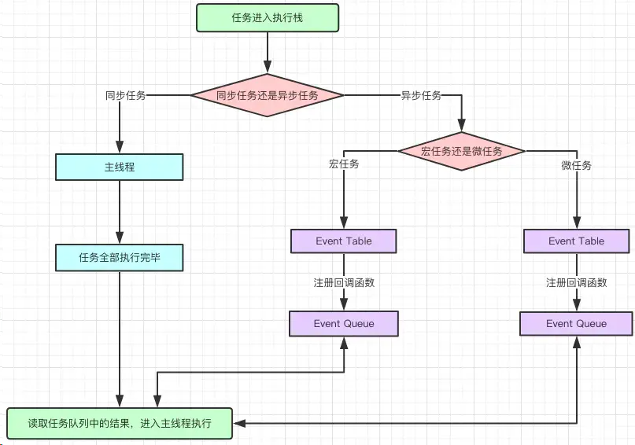

1. 整体的 script(作为第一个宏任务)开始执行的时候，会把所有代码分为两部分：“同步任务”、“异步任务”；
2. 同步任务会直接进入主线程依次执行；
3. 异步任务会再分为宏任务和微任务；
4. 宏任务进入到 Event Table 中，并在里面注册回调函数，每当指定的事件完成时，Event Table 会将这个函数移到 Event Queue 中；
5. 微任务也会进入到另一个 Event Table 中，并在里面注册回调函数，每当指定的事件完成时，Event Table 会将这个函数移到 Event Queue 中；
6. 当主线程内的任务执行完毕，主线程为空时，会检查微任务的 Event Queue，如果有任务，就全部执行，如果没有就执行下一个宏任务；
7. 上述过程会不断重复，这就是 Event Loop 事件循环；

### 5 定时器

除了放置异步任务的事件，"任务队列"还可以放置定时事件，即指定某些代码在多少时间之后执行。这叫做"定时器"（timer）功能，也就是定时执行的代码。

定时器功能主要由 setTimeout()和 setInterval()这两个函数来完成，它们的内部运行机制完全一样，区别在于前者指定的代码是一次性执行，后者则为反复执行。以下主要讨论 setTimeout()。

setTimeout()接受两个参数，第一个是回调函数，第二个是推迟执行的毫秒数。

```javascript
console.log(1);
setTimeout(function () {
	console.log(2);
}, 1000);
console.log(3);
```

上面代码的执行结果是 1，3，2，因为 setTimeout()将第二行推迟到 1000 毫秒之后执行。

如果将 setTimeout()的第二个参数设为 0，就表示当前代码执行完（执行栈清空）以后，立即执行（0 毫秒间隔）指定的回调函数。

```javascript
setTimeout(function () {
	console.log(1);
}, 0);
console.log(2);
```

上面代码的执行结果总是 2，1，因为只有在执行完第二行以后，系统才会去执行"任务队列"中的回调函数。

总之，setTimeout(fn,0)的含义是，指定某个任务在主线程最早可得的空闲时间执行，也就是说，尽可能早得执行。它在"任务队列"的尾部添加一个事件，因此要等到同步任务和"任务队列"现有的事件都处理完，才会得到执行。

HTML5 标准规定了 setTimeout()的第二个参数的最小值（最短间隔），不得低于**4 毫秒**，如果低于这个值，就会自动增加。在此之前，老版本的浏览器都将最短间隔设为 10 毫秒。另外，对于那些 DOM 的变动（尤其是涉及页面重新渲染的部分），通常不会立即执行，而是**每 16 毫秒执行一次**。这时使用 requestAnimationFrame()的效果要好于 setTimeout()。

需要注意的是，setTimeout()只是将事件插入了"任务队列"，必须等到当前代码（执行栈）执行完，主线程才会去执行它指定的回调函数。要是当前代码耗时很长，有可能要等很久，所以并没有办法保证，回调函数一定会在 setTimeout()指定的时间执行。

### 6 哪些是异步任务

1. setTimeout 和 setInterval
2. DOM 事件
3. Promise
4. 网络请求
5. I/O

### 7 常考题

#### 1) 第一题

下面代码的输出结果是什么？

```javascript
console.log(1);
setTimeout(function () {
	console.log(2);
}, 0);
console.log(3);
```

答案：1，3，2

解析： `console.log()` 是同步任务， `setTimeout` 是异步任务。异步任务会等同步任务执行完再执行。虽然 `setTimeout` 设置的延迟是 0，但浏览器规定延迟最小为 4ms，所以 `console.log(2)` 在 4ms 后被放入任务队列。当同步任务执行完，即打印完 1，3 之后，主线程再从任务队列中取任务，打印 2。

#### 2) 第二题

下面的代码输出结果是什么

```javascript
console.log("A");
while (true) {}
console.log("B");
```

答案：A

解析：代码从上往下执行，先打印 A，然后 while 循环，因为条件一直是 true，所以会进入死循环。while 不执行完就不会执行到第三行。

这个题目还有个变种：

```javascript
console.log("A");
setTimeout(function () {
	console.log("B");
}, 0);
while (1) {}
```

同样只会输出 A。因为异步任务需要等同步任务执行完之后才执行，while 进入了死循环，所以不会打印 B。

#### 3) 第三题

下面代码输出结果

```javascript
for (var i = 0; i < 4; i++) {
	setTimeout(function () {
		console.log(i);
	}, 0);
}
```

结果：4 个 4。
解析：这题主要考察异步任务放入任务队列的时机。当执行到 `setTimeout` 即定时器时，并不会马上把这个异步任务放入任务队列，而是等时间到了之后才放入。然后等执行栈中的同步任务执行完毕后，再从任务队列中依次取出任务执行。

for 循环是同步任务，会先执行完循环，此时 i 的值是 4。4ms 后 `console.log(i)` 被依次放入任务队列，此时如果执行栈中没有同步任务了，就从任务队列中依次取出任务，所以打印出 4 个 4。

那么如何才能按照期望打印出 0, 1，2，3 呢？有三个方法：

```javascript
//方法1：把 var 换成 let
for (let i = 0; i < 4; i++) {
	setTimeout(function () {
		console.log(i);
	}, 0);
}

//方法2：使用立即执行函数
for (let i = 0; i < 4; i++) {
	(function (i) {
		setTimeout(function () {
			console.log(i);
		}, 0);
	})(i);
}

//方法3：加闭包
for (let i = 0; i < 4; i++) {
	var a = function () {
		var j = i;
		setTimeout(function () {
			console.log(j);
		}, 0);
	};
	a();
}
```

#### 4) 第四题

```javascript
setTimeout(function(){
    console.log(1)
});
new Promise(function(resolve){
    console.log(2);
    for(var i = 0; i < 10000; i++){
        i == 9999 && resolve();
    }
}).then(function(){
    console.log(3)
});
console.log(4);
执行结果：
// 2， 4， 3， 1
```

分析：

- 1.setTimeout 是异步，且是宏函数，放到宏函数队列中；
- 2.new Promise 是同步任务，直接执行，打印 2，并执行 for 循环；
- 3.promise.then 是微任务，放到微任务队列中；
- 4.console.log(4)同步任务，直接执行，打印 4； 
- 5.此时主线程任务执行完毕，检查微任务队列中，有 promise.then，执行微任务，打印 3； 
- 6.微任务执行完毕，第一次循环结束；从宏任务队列中取出第一个宏任务到主线程执行，打印 1； 
- 7.结果：2，4，3，1

#### 5) 第五题

```javascript
console.log(1);

setTimeout(function() {
  console.log(2);
}, 0);

Promise.resolve().then(function() {
  console.log(3);
}).then(function() {
  console.log('4.我是新增的微任务');
});

console.log(5);

执行结果：
// 1，5，3，4.我是新增的微任务，2
```

分析：

- 1.console.log(1)是同步任务，直接执行，打印 1；
- 2.setTimeout 是异步，且是宏函数，放到宏函数队列中；
- 3.Promise.resolve().then 是微任务，放到微任务队列中；
- 4.console.log(5)是同步任务，直接执行，打印 5； 
- 5.此时主线程任务执行完毕，检查微任务队列中，有 Promise.resolve().then，执行微任务，打印 3； 
- 6.此时发现第二个.then 任务，属于微任务，添加到微任务队列，并执行，打印 4.我是新增的微任务；
- 7.这里强调一下，微任务执行过程中，发现新的微任务，会把这个新的微任务添加到队列中，微任务队列依次执行完毕后，才会执行下一个循环； 
- 8.微任务执行完毕，第一次循环结束；取出宏任务队列中的第一个宏任务 setTimeout 到主线程执行，打印 2； 
- 9.结果：1，5，3，4.我是新增的微任务，2

#### 6) 第六题

```javascript
function add(x, y) {
	console.log(1);
	setTimeout(function () {
		// timer1
		console.log(2);
	}, 1000);
}
add();

setTimeout(function () {
	// timer2
	console.log(3);
});

new Promise(function (resolve) {
	console.log(4);
	setTimeout(function () {
		// timer3
		console.log(5);
	}, 100);
	for (var i = 0; i < 100; i++) {
		i == 99 && resolve();
	}
}).then(function () {
	setTimeout(function () {
		// timer4
		console.log(6);
	}, 0);
	console.log(7);
});

console.log(8);

执行结果;
// 1，4，8，7，3，6，5，2
```

分析：

- 1.add()是同步任务，直接执行，打印 1；
- 2.add()里面的 setTimeout 是异步任务且宏函数，记做 timer1 放到宏函数队列；
- 3.add()下面的 setTimeout 是异步任务且宏函数，记做 timer2 放到宏函数队列；
- 4.new Promise 是同步任务，直接执行，打印 4；
- 5.Promise 里面的 setTimeout 是异步任务且宏函数，记做 timer3 放到宏函数队列；
- 6.Promise 里面的 for 循环，同步任务，执行代码；
- 7.Promise.then 是微任务，放到微任务队列；
- 8.console.log(8)是同步任务，直接执行，打印 8； 
- 9.此时主线程任务执行完毕，检查微任务队列中，有 Promise.then，执行微任务，发现有 setTimeout 是异步任务且宏函数，记做 timer4 放到宏函数队列； 
- 10.微任务队列中的 console.log(7)是同步任务，直接执行，打印 7； 
- 11.微任务执行完毕，第一次循环结束； 
- 12.检查宏任务 Event Table，里面有 timer1、timer2、timer3、timer4，四个定时器宏任务，按照定时器延迟时间得到可以执行的顺序，即 Event Queue：timer2、timer4、timer3、timer1，取出排在第一个的 timer2； 
- 13.取出 timer2 执行，console.log(3)同步任务，直接执行，打印 3； 
- 14.没有微任务，第二次 Event Loop 结束； 
- 15.取出 timer4 执行，console.log(6)同步任务，直接执行，打印 6； 
- 16.没有微任务，第三次 Event Loop 结束； 
- 17.取出 timer3 执行，console.log(5)同步任务，直接执行，打印 5； 
- 18.没有微任务，第四次 Event Loop 结束； 
- 19.取出 timer1 执行，console.log(2)同步任务，直接执行，打印 2； 
- 20.没有微任务，也没有宏任务，第五次 Event Loop 结束； 
- 21.结果：1，4，8，7，3，6，5，2

#### 7) 第七题

```javascript
setTimeout(function () {
	// timer1
	console.log(1);
	setTimeout(function () {
		// timer3
		console.log(2);
	});
}, 0);
setTimeout(function () {
	// timer2
	console.log(3);
}, 0);

执行结果;
//1，3，2
```

分析： 

- 1.第一个 setTimeout 是异步任务且宏函数，记做 timer1 放到宏函数队列； 
- 2.第三个 setTimeout 是异步任务且宏函数，记做 timer2 放到宏函数队列； 
- 3.没有微任务，第一次 Event Loop 结束； 
- 4.取出 timer1，console.log(1)同步任务，直接执行，打印 1；
- 5.timer1 里面的 setTimeout 是异步任务且宏函数，记做 timer3 放到宏函数队列； 
- 6.没有微任务，第二次 Event Loop 结束； 
- 7.取出 timer2，console.log(3)同步任务，直接执行，打印 3； 
- 8.没有微任务，第三次 Event Loop 结束； 
- 9.取出 timer3，console.log(2)同步任务，直接执行，打印 2； 
- 10.没有微任务，也没有宏任务，第四次 Event Loop 结束； 
- 11.结果：1，3，2

## 内存泄漏

参考答案：

内存泄漏(`Memory Leak`)是指程序中己动态分配的堆内存由于某种原因程序未释放或无法释放，造成系统内存的浪费，导致程序运行速度减慢甚至系统崩溃等严重后果。

`Javascript` 是一种高级语言，它不像 `C` 语言那样要手动申请内存，然后手动释放，`Javascript` 在声明变量的时候自动会分配内存，普通的类型比如 `number`，一般放在栈内存里，对象放在堆内存里，声明一个变量，就分配一些内存，然后定时进行垃圾回收。垃圾回收的任务由 `JavaScript` 引擎中的垃圾回收器来完成，它监视所有对象，并删除那些不可访问的对象。

基本的垃圾回收算法称为**"标记-清除"**，定期执行以下"垃圾回收"步骤:

- 垃圾回收器获取根并**"标记"**(记住)它们。
- 然后它访问并"标记"所有来自它们的引用。
- 然后它访问标记的对象并标记它们的引用。所有被访问的对象都被记住，以便以后不再访问同一个对象两次。
- 以此类推，直到有未访问的引用(可以从根访问)为止。
- 除标记的对象外，所有对象都被删除。

### JS的垃圾回收站机制

参考答案：

`JS` 具有自动垃圾回收机制。垃圾收集器会按照固定的时间间隔周期性的执行。

`JS` 常见的垃圾回收方式：标记清除、引用计数方式。

1、标记清除方式：

- 工作原理：当变量进入环境时，将这个变量标记为"进入环境"。当变量离开环境时，则将其标记为"离开环境"。标记"离开环境"的就回收内存。
- 工作流程：
- 垃圾回收器，在运行的时候会给存储在内存中的所有变量都加上标记；
- 去掉环境中的变量以及被环境中的变量引用的变量的标记；
- 被加上标记的会被视为准备删除的变量；
- 垃圾回收器完成内存清理工作，销毁那些带标记的值并回收他们所占用的内存空间。

2、引用计数方式：

- 工作原理：跟踪记录每个值被引用的次数。
- 工作流程：
- 声明了一个变量并将一个引用类型的值赋值给这个变量，这个引用类型值的引用次数就是 `1`；
- 同一个值又被赋值给另一个变量，这个引用类型值的引用次数加 1；
- 当包含这个引用类型值的变量又被赋值成另一个值了，那么这个引用类型值的引用次数减 `1`；
- 当引用次数变成 `0` 时，说明没办法访问这个值了；
- 当垃圾收集器下一次运行时，它就会释放引用次数是 0 的值所占的内存。

## JS 中什么是垃圾回收机制？有什么好处？

在 JavaScript 中，垃圾回收机制是一种自动内存管理的过程，它负责跟踪和释放不再使用的对象所占用的内存。这种机制使得开发者无需手动管理内存，从而减少了内存泄漏和内存管理错误的风险。

找出那些不再继续使用的变 量，然后释放其占用的内存。为此，垃圾收集器会按照固定的时间间隔(或代码执行中预定的收集时间)， 周期性地执行这一操作。

**JS 中的垃圾回收机制**： JavaScript 的垃圾回收机制主要依赖于两种策略：标记-清除（Mark-and-Sweep）和分代收集（Generational Collection）。

### `标记-清除（Mark-and-Sweep）`：

- 垃圾回收器从根对象（如全局对象）开始，递归地访问对象的属性，并为这些对象加上标记。
- 然后，它会遍历整个堆内存，找出那些没有被标记的对象，这些对象就是不再被引用的对象，因此可以被回收。

### `分代收集（Generational Collection）`：

- 这种策略基于一个假设：很多对象都是“朝生夕死”的，即它们很快就会被回收。
- 因此，垃圾回收器将内存划分为新生代和老生代，对新生代更频繁地进行垃圾回收，而对老生代则较少进行垃圾回收。

### **好处**：

- **`简化内存管理`**：开发者无需关心内存的分配和释放，可以专注于实现业务逻辑。
- **`减少错误`**：手动管理内存时，很容易出现内存泄漏或野指针等问题。自动垃圾回收机制大大减少了这类错误的可能性。
- **`优化性能`**：垃圾回收器通常经过高度优化，可以高效地回收不再使用的内存，从而确保程序的高效运行。
- **`跨平台一致性`**：无论你的代码在哪个 JavaScript 引擎上运行，都可以期望有相似的内存管理行为，这有助于跨平台开发的一致性。

### 以下是一些常见的导致内存泄漏的情况：

- 全局变量的不当使用。
- 闭包中的循环引用。
- DOM 元素的引用未释放。
- 定时器或回调未清除。

## JavaScript 中的数组和函数在内存中是如何存储的？

参考答案：

在 `JavaScript` 中，数组不是以一段连续的区域存储在内存中，而是一种哈希映射的形式存储在堆内容里面。它可以通过多种数据结构实现，其中一种是链表。如下图所示：

JavaScript 中的函数是存储在堆内存中的，具体的步骤如下：

1. 开辟堆内存(`16` 进制得到内存地址)
2. 声明当前函数的作用域(函数创建的上下文才是他的作用域，和在那执行的无关)
3. 把函数的代码以字符串的形式存储在堆内存中(函数再不执行的情况下，只是存储在堆内存中的字符串)
4. 将函数堆的地址，放在栈中供变量调用(函数名)

## 宏任务(MacroTask)引入

在 JS 中，大部分的任务都是在主线程上执行，常见的任务有：

- 1）渲染事件
- 2）用户交互事件
- 3）js 脚本执行
- 4）网络请求、文件读写完成事件等等。

为了让这些事件有条不紊地进行，JS 引擎需要对之执行的顺序做一定的安排，V8 其实采用的是一种 队列的方式来存储这些任务， 即先进来的先执行。模拟如下：

```c
bool keep`running = true;
void MainTherad(){
    for(;;){
        //执行队列中的任务
        Task task = task`queue.takeTask();
        ProcessTask(task);
        //执行延迟队列中的任务
        ProcessDelayTask()
        if(!keep`running) // 如果设置了退出标志，那么直接退出线程循环
            break;
    }
}
```

这里用到了一个 for 循环，将队列中的任务一一取出，然后执行，这个很好理解。但是其中包含了两种任务队列，除了上述提到的任务队列， 还有一个延迟队列，它专门处理诸如 setTimeout/setInterval 这样的定时器回调任务。

上述提到的，普通任务队列和延迟队列中的任务，都属于宏任务。

## 微任务(MicroTask)引入

对于每个宏任务而言，其内部都有一个微任务队列。那为什么要引入微任务？微任务在什么时候执行呢？

其实引入微任务的初衷是为了解决异步回调的问题。想一想，对于异步回调的处理，有多少种方式？总结起来有两点:

- 1）将异步回调进行宏任务队列的入队操作。
- 2）将异步回调放到当前宏任务的末尾。

如果采用第一种方式，那么执行回调的时机应该是在前面 所有的宏任务 完成之后，倘若现在的任务队列非常长，那么回调迟迟得不到执行，造成 应用卡顿 。

为了规避这样的问题，V8 引入了第二种方式，这就是 微任务 的解决方式。在每一个宏任务中定义一个微任务队列，当该宏任务执行完成，会检查其中的微任务队列，如果为空则直接执行下一个宏任务，如果不为空，则 依次执行微任务 ，执行完成才去执行下一个宏任务。

常见的微任务有 MutationObserver、Promise.then(或.reject) 以及以 Promise 为基础开发的其他技术(比如 fetch API), 还包括 V8 的垃圾回收过程。

Ok, 这便是 宏任务 和 微任务 的概念，接下来正式介绍 JS 非常重要的运行机制——EventLoop。

## 同步和异步任务

### JS 的单线程

javascript 语言的执行环境是"单线程"。也就是指一次只能完成一件任务。如果有多个任务，就必须排队，前面一个任务完成，在执行后面一个任务

这种模式虽然实现起来比较简单，执行环境相对单纯，但是只要一个任务耗时很长，后面的任务都必须排队等着，会拖延整个程序的执行。常见的浏览器无响应（假死），往往是因为莫一段 javascript 代码长时间运行（比如死循环），导致整个页面卡在这个地方，其他任务无法运行。

为了解决这个问题 Javascript 语言将任务的执行模式分成两种：同步和异步

### 任务队列

所有异步任务都是在同步任务执行结束之后，从任务队列中依次取出执行。

### Event Loop(事件循环机制)


### 异步队列任务方法

#### 回调函数

回调函数是异步操作最基本的方法

**假如有两个函数 fn1 和 fn2，后者等待前者的执行结果。如果 fn1 是一个很耗时的任务，可以考虑改写 fn1，把 fn2 写成 f1 的回调函数。**

```js
function fn1(callback) {
	setTimeout(function () {
		callback();
	}, 1000);
}
fn1(fn2);
```

采用这种方式，我们把同步操作变成了异步操作，fn1 不会堵塞程序的运行，相当于先执行程序的主要逻辑，将耗时的操作推迟执行。

回调函数：优点是简单、容易理解和部署。

缺点是不利于代码的阅读和维护，各个部分之间高度耦合（Coupling），流程会很混乱，而且每个任务只能指定一个回调函数。

#### 事件监听

采用事件驱动模式：`on`监听 和 `trigger` 调用

任务的执行不取决于代码的顺序，而取决与某个事件的发生。

**以 fn3 和 fn4 为例。先为 fn3 绑定事件**

```js
fn3.on("done", fn4);
function fn3() {
	setTimeout(function () {
		// fn3的任务代码
		fn3.trigger("done");
	}, 1000);
}
```

fn3.trigger(‘done’)表示，执行完成之后，立即触发 done 事件，从而开始执行 fn4。

事件监听：优点是可以绑定多个事件，每个事件可以指定多个回调函数，而且可以“去耦合”（Decoupling），有利于实现模块化。

缺点是：整个程序都要变成事件驱动型，运动流程会变得很不清晰。

#### setTimeout 定时器和 setInterval

```js
console.log(1);
setTimeout(function () {
	console.log(2);
}, 0);
console.log(3);
console.log(4);

console.log("A");
setTimeout(function () {
	console.log("B");
}, 0);
```

一次把同步任务执行完成，才会执行 setTimeout 定时器里面的任务

所以依次输出的是：1、3、4、A、2、B

`setInterval`方法同理

#### 发布和订阅

发布/订阅模式，又称观察者模式

我们假定，存在一个“信号中心”，某个任务执行完成，就向信号中心“发布”（publish）一个信号，其他任务可以向信号中心“订阅”（subcribe）这个信号，从而知道什么时候自己可以开始执行。

```js
// fn7向信号中心Jquery订阅done信号
jQuery.subscribe("done", fn6);
function fn5() {
	setTimeout(function () {
		// f1的任务代码
		//发布done信号
		jQuery.publish("done");
	}, 1000);
}
// f2执行完成后，取消订阅
jQuery.unsubscribe("done", fn6);
```

发布/订阅，性质与“事件监听类似”，但是明显优于后者，因为我们可以通过查看”消息中心“，了解存在多少信号，多少个订阅者，从而监听程序的运行。

#### Promise 对象

Promises 对象是 ES6 的 CommonJs 工作提出的一种规范，目的是为了异步编程提供统一接口

他的思想是每一个异步任务返回一个 Promise 对象，该对象有一个 then 方法，允许指定回调函数，比如 fn7 的回调函数 fn8，可以写成：

```js
fn7().then(fn8);
function fn7() {
	// deferred对象就是jQuery的回调函数解决方案。
	var dfd = $.Deferred();
	setTimeout(function () {
		// f1的任务代码
		// 将dtd对象的执行状态从"未完成"改为"已完成"，从而触发done()方法
		dfd.resolve();
	}, 500);
	// 返回promise对象
	// deferred.promise()方法。它的作用是，在原来的deferred对象上返回另一个deferred对象，
	// 后者只开放与改变执行状态无关的方法（比如done()方法和fail()方法），
	// 屏蔽与改变执行状态有关的方法（比如resolve()方法和reject()方法），
	// 从而使得执行状态不能被改变。
	return dfd.promise;
}

fn7().then(fn8).then(fn9); // 指定多个回调函数
fn7().then(fn8).fail(fn9); // 指定发生错误时的回调函数
```

Promises 对象这种方法优点在于，回调函数变成了链式写法，程序的流程可以看得很清楚，而且有一整套的配套方法，可以实现许多强大的功能。

#### 生成器 Generators/yield

Generator 函数是 ES6 提供的一种异步编程解决方案。

**yield 表达式可以暂停函数执行，next 方法用于恢复函数执行，这使得 Generator 函数非常适合将异步任务同步化。**

**yield 表达式本身没有返回值，或者说总是返回 undefined。next 方法可以带一个参数，该参数就会被当作上一个 yield 表达式的返回值。**

**每个 yield 返回的是｛value:yield 返回的值，done:true/false(执行状态)｝**

```js
function* generatorDemo() {
	yield "hello";
	yield 1 + 2;
	return "ok";
}

var demo = generatorDemo();

demo.next(); // { value: 'hello', done: false }
demo.next(); // { value: 3, done: false }
demo.next(); // { value: 'ok', done: ture }
demo.next(); // { value: undefined, done: ture }
```

Generator 并不是为异步而设计出来的，它还有其他功能（对象迭代、控制输出、部署 Interator 接口…）

#### async/await

async 是“异步”的意思，而 await 是等待的意思。所以应该很好理解 async 用于申明一个 异步的 function （实际上是 asnyc function 对象）

await 用于等待一个异步任务执行完成的结果，并且 await 只等出现在 async 函数中

**一个函数如果加上 asnyc，那么该函数就会返回一个 Promise**

```js
async function async1() {
	return "1";
}
console.log(async1()); // -> Promise {<resolved>: "1"}
```

**async 函数返回的是一个 Promise 对象，可以使用 then 方法添加回调函数，async 函数内部 return 语句返回的值，会成为 then 方法回调函数的参数。当函数执行的时候，一旦遇到 await 就会先返回，等到异步操作完成，再接着执行函数体内后面的语句。**

**1.await 命令后面返回的是 Promise 对象，运行结果可能是 rejected，所以最好把 await 命令放在 try…catch 代码块中。**

```js
async function test() {
	let newTime = await new Promise((resolve, reject) => {
		//这里等待异步返回结果，再继续向下执行
		let time = 3000;
		setTimeout(() => {
			resolve(time);
		}, time);
	});
	console.log(newTime + "毫秒后执行");
	let content = "test";
	console.log(content); //3s后，先输出  “3000毫秒后执行”，再输出 "test"
}
test();
```
