# 浏览器原理知识点

MDN 文档：[渲染页面：浏览器的工作原理 - Web 性能 | MDN (mozilla.org)](https://developer.mozilla.org/zh-CN/docs/Web/Performance/How_browsers_work)

## 一、进程与线程

### 1. 进程与线程的概念 ⭐️⭐️

从本质上说，进程和线程都是 CPU 工作时间片的一个描述：

- 进程描述了 CPU 在运行指令及加载和保存上下文所需的时间，放在应用上来说就代表了一个程序。
- 线程是进程中的更小单位，描述了执行一段指令所需的时间。

**⭐️ 进程是资源分配的最小单位，线程是 CPU 调度的最小单位。**（两个最小单位）

**一个进程就是一个程序的运行实例：**

详细解释就是，启动一个程序的时候，操作系统会为该程序创建一块内存，用来存放代码、运行中的数据和一个执行任务的主线程，我们把这样的一个运行环境叫进程。进程是运行在虚拟内存上的，虚拟内存是用来解决用户对硬件资源的无限需求和有限的硬件资源之间的矛盾的。从操作系统角度来看，虚拟内存即交换文件；从处理器角度看，虚拟内存即虚拟地址空间。

如果程序很多时，内存可能会不够，操作系统为每个进程提供一套独立的虚拟地址空间，从而使得同一块物理内存在不同的进程中可以对应到不同或相同的虚拟地址，变相的增加了程序可以使用的内存。

进程和线程之间的关系有以下四个特点：

**（1）进程中的任意一线程执行出错，都会导致整个进程的崩溃。**

**（2）线程之间共享进程中的数据。**

**（3）当一个进程关闭之后，操作系统会回收进程所占用的内存，** 当一个进程退出时，操作系统会回收该进程所申请的所有资源；即使其中任意线程因为操作不当导致内存泄漏，当进程退出时，这些内存也会被正确回收。

**（4）进程之间的内容相互隔离。** 进程隔离就是为了使操作系统中的进程互不干扰，每一个进程只能访问自己占有的数据，也就避免出现进程 A 写入数据到进程 B 的情况。正是因为进程之间的数据是严格隔离的，所以一个进程如果崩溃了，或者挂起了，是不会影响到其他进程的。如果进程之间需要进行数据的通信，这时候，就需要使用用于进程间通信的机制了。

**Chrome 浏览器的架构图**：

> 启动时至少启动 4 个进程
> 网络，浏览器，GPU，渲染

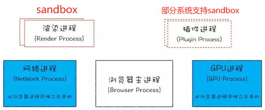

从图中可以看出，最新的 Chrome 浏览器包括 5 个主要进行：

- **1 个浏览器主进程**
- **1 个 GPU 进程**
- **1 个网络进程**
- **多个渲染进程**
- **多个插件进程**

这些进程的功能：

- **浏览器进程**：主要负责界面显示、用户交互、子进程管理，同时提供存储等功能。
- **渲染进程（Renderer）**：核心任务是将 HTML、CSS 和 JavaScript 转换为用户可以与之交互的网页，排版引擎 Blink 和 JavaScript 引擎 V8 都是运行在该进程中，默认情况下，Chrome 会为每个 Tab 标签创建一个渲染进程。出于安全考虑，渲染进程都是运行在沙箱模式下。
- **GPU 进程**：其实， GPU 的使用初衷是为了实现 3D CSS 的效果，只是随后网页、Chrome 的 UI 界面都选择采用 GPU 来绘制，这使得 GPU 成为浏览器普遍的需求。最后，Chrome 在其多进程架构上也引入了 GPU 进程。
- **网络进程**：主要负责页面的网络资源加载，之前是作为一个模块运行在浏览器进程里面的，直至最近才独立出来，成为一个单独的进程。
- **插件进程**：主要是负责插件的运行，因插件易崩溃，所以需要通过插件进程来隔离，以保证插件进程崩溃不会对浏览器和页面造成影响。

所以，**打开一个网页，最少需要四个进程**：1 个网络进程、1 个浏览器进程、1 个 GPU 进程以及 1 个渲染进程。如果打开的页面有运行插件的话，还需要再加上 1 个插件进程。

虽然多进程模型提升了浏览器的稳定性、流畅性和安全性，但同样不可避免地带来了一些问题：

- **更高的资源占用**：因为每个进程都会包含公共基础结构的副本（如 JavaScript 运行环境），这就意味着浏览器会消耗更多的内存资源。
- **更复杂的体系架构**：浏览器各模块之间耦合性高、扩展性差等问题，会导致现在的架构已经很难适应新的需求了。

### 2. 进程和线程的区别 ⭐️⭐️

- 进程可以看做独立应用，线程不能
- **资源：**进程是 cpu 资源分配的最小单位（是能拥有资源和独立运行的最小单位）；线程是 cpu 调度的最小单位（线程是建立在进程的基础上的一次程序运行单位，一个进程中可以有多个线程）。
- **通信方面：**线程间可以通过直接共享同一进程中的资源，而进程通信需要借助进程间通信方案。
- **调度：**进程切换比线程切换的开销要大。线程是 CPU 调度的基本单位，线程的切换不会引起进程切换，但某个进程中的线程切换到另一个进程中的线程时，会引起进程切换。
- **系统开销：**由于创建或撤销进程时，系统都要为之分配或回收资源，如内存、I/O 等，其开销远大于创建或撤销线程时的开销。同理，在进行进程切换时，涉及当前执行进程 CPU 环境还有各种各样状态的保存及新调度进程状态的设置，而线程切换时只需保存和设置少量寄存器内容，开销较小。

### 3. 浏览器渲染进程（Renderer 进程）的线程有哪些

浏览器的渲染进程的线程总共有五种：

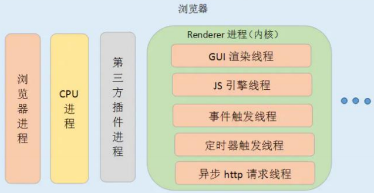

**（1）GUI 渲染线程**。 负责渲染浏览器页面，解析 HTML、CSS，构建 DOM 树、构建 CSSOM 树、构建渲染树和绘制页面；当界面需要**重绘**或由于某种操作引发**回流**时，该线程就会执行。

注意：GUI 渲染线程和 JS 引擎线程是互斥的，当 JS 引擎执行时 GUI 线程会被挂起，GUI 更新会被保存在一个队列中等到 JS 引擎空闲时立即被执行。

**（2）JS 引擎线程**。JS 引擎线程也称为 JS 内核，负责处理 Javascript 脚本程序，解析 Javascript 脚本，运行代码；JS 引擎线程一直等待着任务队列中任务的到来，然后加以处理，一个 Tab 页中无论什么时候都只有一个 JS 引擎线程在运行 JS 程序；

注意：GUI 渲染线程与 JS 引擎线程的互斥关系，所以如果 JS 执行的时间过长，会造成页面的渲染不连贯，导致页面渲染加载阻塞。

**（3）时间触发线程**。 **时间触发线程**属于浏览器而不是 JS 引擎，用来控制事件循环；当 JS 引擎执行代码块如 setTimeOut 时（也可是来自浏览器内核的其他线程,如鼠标点击、AJAX 异步请求等），会将对应任务添加到事件触发线程中；当对应的事件符合触发条件被触发时，该线程会把事件添加到待处理队列的队尾，等待 JS 引擎的处理；

注意：由于 JS 的单线程关系，所以这些待处理队列中的事件都得排队等待 JS 引擎处理（当 JS 引擎空闲时才会去执行）；

**（4）定时器触发进程** **定时器触发进程**即 setInterval 与 setTimeout 所在线程；浏览器定时计数器并不是由 JS 引擎计数的，因为 JS 引擎是单线程的，如果处于阻塞线程状态就会影响记计时的准确性；因此使用单独线程来计时并触发定时器，计时完毕后，添加到事件队列中，等待 JS 引擎空闲后执行，所以定时器中的任务在设定的时间点不一定能够准时执行，定时器只是在指定时间点将任务添加到事件队列中；

注意：W3C 在 HTML 标准中规定，定时器的定时时间不能小于 4ms，如果是小于 4ms，则默认为 4ms。

**（5）异步 http 请求线程**

- XMLHttpRequest 连接后通过浏览器新开一个线程请求；
- 检测到状态变更时，如果设置有回调函数，异步线程就产生状态变更事件，将回调函数放入事件队列中，等待 JS 引擎空闲后执行；

### **4. 进程之间的通信方式 ⭐️⭐️**

> 死的次数比较多

**（1）管道通信**

> 开辟缓冲区，拷贝交互数据

管道是一种最基本的进程间通信机制。**管道就是操作系统在内核中开辟的一段缓冲区，进程 1 可以将需要交互的数据拷贝到这段缓冲区，进程 2 就可以读取了。**

管道的特点：

- 只能单向通信
- 只能有**血缘关系**的进程进行通信
- 依赖于文件系统
- 生命周期随进程
- 面向字节流的服务
- 管道内部提供了同步机制

**（2）消息队列通信**

> 维护一个数据块的消息列表

消息队列就是一个消息的列表。用户可以在消息队列中添加消息、读取消息等。消息队列提供了一种从一个进程向另一个进程发送一个数据块的方法。 每个数据块都被认为含有一个类型，接收进程可以独立地接收含有不同类型的数据结构。可以通过发送消息来避免命名管道的同步和阻塞问题。但是消息队列与命名管道一样，每个数据块都有一个最大长度的限制。

使用消息队列进行进程间通信，可能会收到数据块最大长度的限制约束等，这也是这种通信方式的缺点。如果频繁的发生进程间的通信行为，那么进程需要频繁地读取队列中的数据到内存，相当于间接地从一个进程拷贝到另一个进程，这需要花费时间。

**（3）信号量通信**

> 通过控制访问呢

共享内存最大的问题就是多进程竞争内存的问题，就像类似于线程安全问题。我们可以使用信号量来解决这个问题。信号量的本质就是一个计数器，用来实现进程之间的互斥与同步。例如信号量的初始值是 1，然后 a 进程来访问内存 1 的时候，我们就把信号量的值设为 0，然后进程 b 也要来访问内存 1 的时候，看到信号量的值为 0 就知道已经有进程在访问内存 1 了，这个时候进程 b 就会访问不了内存 1。所以说，信号量也是进程之间的一种通信方式。

**（4）信号通信**

信号（Signals ）是 Unix 系统中使用的最古老的进程间通信的方法之一。操作系统通过信号来通知进程系统中发生了某种预先规定好的事件（一组事件中的一个），它也是用户进程之间通信和同步的一种原始机制。

**（5）共享内存通信**

**共享内存就是映射一段能被其他进程所访问的内存**，这段共享内存由一个进程创建，但多个进程都可以访问（使多个进程可以访问同一块内存空间）。共享内存是最快的 IPC 方式，它是针对其他进程间通信方式运行效率低而专门设计的。它往往与其他通信机制，如信号量，配合使用，来实现进程间的同步和通信。

**（6）socket 套接字通信**

上面说的共享内存、管道、信号量、消息队列，他们都是多个进程在**一台主机**之间的通信，那两个相隔几千里的进程能够进行通信吗？答是必须的，这个时候 Socket 这家伙就派上用场了，例如我们平时通过浏览器发起一个 http 请求，然后服务器给你返回对应的数据，这种就是采用 Socket 的通信方式了。

### **5. 僵尸进程和孤儿进程是什么？**

- **孤儿进程**：父进程退出了，而它的一个或多个进程还在运行，那这些子进程都会成为孤儿进程。孤儿进程将被 init 进程(进程号为 1)所收养，并由 init 进程对它们完成状态收集工作。
- **僵尸进程**：子进程比父进程先结束，而父进程又没有释放子进程占用的资源，那么子进程的进程描述符仍然保存在系统中，这种进程称之为僵尸进程（死了但是以为活着）。

### **6. 死锁产生的原因？ 如果解决死锁的问题？⭐️⭐️**

> 感觉 JS 不太可能遇到这个

所谓死锁，是指多个进程在运行过程中因争夺资源而造成的一种僵局，当进程处于这种僵持状态时，若无外力作用，它们都将无法再向前推进。

系统中的资源可以分为两类：

- 可剥夺资源，是指某进程在获得这类资源后，该资源可以再被其他进程或系统剥夺，CPU 和主存均属于可剥夺性资源；
- 不可剥夺资源，当系统把这类资源分配给某进程后，再不能强行收回，只能在进程用完后自行释放，如磁带机、打印机等。

**产生死锁的原因：**

**（1）竞争资源**

- 产生死锁中的竞争资源之一指的是**竞争不可剥夺资源**（例如：系统中只有一台打印机，可供进程 P1 使用，假定 P1 已占用了打印机，若 P2 继续要求打印机打印将阻塞）
- 产生死锁中的竞争资源另外一种资源指的是**竞争临时资源**（临时资源包括硬件中断、信号、消息、缓冲区内的消息等），通常消息通信顺序进行不当，则会产生死锁

**（2）进程间推进顺序非法**

若 P1 保持了资源 R1，P2 保持了资源 R2，系统处于不安全状态，因为这两个进程再向前推进，便可能发生死锁。例如，当 P1 运行到 P1：Request（R2）时，将因 R2 已被 P2 占用而阻塞；当 P2 运行到 P2：Request（R1）时，也将因 R1 已被 P1 占用而阻塞，于是发生进程死锁

**产生死锁的必要条件：**

- **互斥条件**：进程要求对所分配的资源进行排它性控制，即在一段时间内某资源仅为一进程所占用。
- **请求和保持条件**：当进程因请求资源而阻塞时，对已获得的资源保持不放。
- **不剥夺条件**：进程已获得的资源在未使用完之前，不能剥夺，只能在使用完时由自己释放。
- **环路等待条件**：在发生死锁时，必然存在一个进程——资源的环形链。

**预防死锁的方法：**

- 资源一次性分配：一次性分配所有资源，这样就不会再有请求了（破坏请求条件）
- 只要有一个资源得不到分配，也不给这个进程分配其他的资源（破坏请保持条件）
- 可剥夺资源：即当某进程获得了部分资源，但得不到其它资源，则释放已占有的资源（破坏不可剥夺条件）
- 资源有序分配法：系统给每类资源赋予一个编号，每一个进程按编号递增的顺序请求资源，释放则相反（破坏环路等待条件）

### **7. 如何实现浏览器内多个标签页之间的通信? ⭐️**

实现多个标签页之间的通信，本质上都是通过中介者模式来实现的。因为标签页之间没有办法直接通信，因此我们可以找一个中介者，让标签页和中介者进行通信，然后让这个中介者来进行消息的转发。通信方法如下：

- **使用 websocket 协议，以服务器为中介**，因为 websocket 协议可以实现服务器推送，所以服务器就可以用来当做这个中介者。标签页通过向服务器发送数据，然后由服务器向其他标签页推送转发。
- **使用 ShareWorker 的方式**，shareWorker 会在页面存在的生命周期内创建一个唯一的线程，并且开启多个页面也只会使用同一个线程。这个时候共享线程就可以充当中介者的角色。标签页间通过共享一个线程，然后**通过共享的线程来实现数据的交换**。
  SharedWorker 接口代表一种特定类型的 worker，可以从几个浏览上下文中访问，例如几个窗口、iframe 或其他 worker。
  `SharedWorker()` 创建一个执行指定 url 脚本的共享 web worker。
- **使用 LocalStorage 的方式**，我们可以在一个标签页对 localStorage 的变化事件进行监听，然后当另一个标签页修改数据的时候，我们就可以通过这个监听事件来获取到数据。这个时候 localStorage 对象就是充当的中介者的角色。
- **使用 postMessage 方法**，如果我们能够获得对应标签页的引用，就可以使用 postMessage 方法，进行通信。

### **8. 对 Service Worker 的理解**

Service Worker 是运行在浏览器 GUI 线程背后的**独立线程**，一般可以用来实现**缓存功能**。使用 Service Worker 的话，传输协议必须为 **HTTPS**。因为 Service Worker 中涉及到**请求拦截**，所以必须使用 HTTPS 协议来保障安全。

Service Worker 实现缓存功能一般分为三个步骤：

1. 首先需要先注册 Service Worker，
2. 然后监听到 `install` 事件以后就可以缓存需要的文件，那么在下次用户访问的时候就可以通过拦截请求的方式查询是否存在缓存
3. 存在缓存的话就可以直接读取缓存文件，否则就去请求数据。以下是这个步骤的实现：

```js
// index.js
if (navigator.serviceWorker) {
	navigator.serviceWorker
		.register("sw.js")
		.then(function (registration) {
			console.log("service worker 注册成功");
		})
		.catch(function (err) {
			console.log("servcie worker 注册失败");
		});
}
// sw.js
// 监听 `install` 事件，回调中缓存所需文件
self.addEventListener("install", (e) => {
	e.waitUntil(
		caches.open("my-cache").then(function (cache) {
			return cache.addAll(["./index.html", "./index.js"]);
		})
	);
});
// 拦截所有请求事件
// 如果缓存中已经有请求的数据就直接用缓存，否则去请求数据
self.addEventListener("fetch", (e) => {
	e.respondWith(
		caches.match(e.request).then(function (response) {
			if (response) {
				return response;
			}
			console.log("fetch source");
		})
	);
});
```

## 二、浏览器组成

### 浏览器架构

- 用户界面
- 主进程
- 内核
  - 渲染引擎
  - JS 引擎
    - 执行栈
- 事件触发线程
  - 消息队列
    - 微任务
    - 宏任务
- 网络异步线程
- 定时器线程

### 1. 对浏览器的理解

浏览器的主要功能是将用户选择的 web 资源呈现出来，它需要从服务器请求资源，并将其显示在浏览器窗口中，资源的格式通常是 HTML，也包括 PDF、image 及其他格式。用户用 URI（Uniform Resource Identifier 统一资源标识符）来指定所请求资源的位置。

HTML 和 CSS 规范中规定了浏览器解释 html 文档的方式，由 W3C 组织对这些规范进行维护，W3C 是负责制定 web 标准的组织。但是浏览器厂商纷纷开发自己的扩展，对规范的遵循并不完善，这为 web 开发者带来了严重的兼容性问题。

浏览器可以分为两部分，shell 和 内核。其中 shell 的种类相对比较多，内核则比较少。也有一些浏览器并不区分外壳和内核。从 Mozilla 将 Gecko 独立出来后，才有了外壳和内核的明确划分。

- shell 是指浏览器的外壳：例如菜单，工具栏等。主要是提供给用户界面操作，参数设置等等。它是调用内核来实现各种功能的。
- 内核是浏览器的核心。内核是基于标记语言显示内容的程序或模块。

### 2. 对浏览器内核的理解 ⭐️

浏览器内核主要分成两部分：

- 渲染引擎的职责就是渲染，即在浏览器窗口中显示所请求的内容。默认情况下，渲染引擎可以显示 html、xml 文档及图片，它也可以借助插件显示其他类型数据，例如使用 PDF 阅读器插件，可以显示 PDF 格式。
- JS 引擎：解析和执行 javascript 来实现网页的动态效果。

最开始渲染引擎和 JS 引擎并没有区分的很明确，后来 JS 引擎越来越独立，内核就倾向于只指渲染引擎。

### 3. 常见的浏览器内核比较 ⭐️

| 浏览器/RunTime |         内核（渲染引擎）         |    JavaScript 引擎     |
| :------------: | :------------------------------: | :--------------------: |
|     Chrome     | Blink（28~） Webkit（Chrome 27） |           V8           |
|    FireFox     |              Gecko               |      SpiderMonkey      |
|     Safari     |              Webkit              |     JavaScriptCore     |
|      Edge      |             EdgeHTML             | Chakra(for JavaScript) |
|       IE       |             Trident              |  Chakra(for JScript)   |
|   PhantomJS    |              Webkit              |     JavaScriptCore     |
|    Node.js     |                -                 |           V8           |

- **Trident：** 这种浏览器内核是 IE 浏览器用的内核，因为在早期 IE 占有大量的市场份额，所以这种内核比较流行，以前有很多网页也是根据这个内核的标准来编写的，但是实际上这个内核对真正的网页标准支持不是很好。但是由于 IE 的高市场占有率，微软也很长时间没有更新 Trident 内核，就导致了 Trident 内核和 W3C 标准脱节。还有就是 Trident 内核的大量 Bug 等安全问题没有得到解决，加上一些专家学者公开自己认为 IE 浏览器不安全的观点，使很多用户开始转向其他浏览器。
- **Gecko：** 这是 Firefox 和 Flock 所采用的内核，这个内核的优点就是功能强大、丰富，可以支持很多复杂网页效果和浏览器扩展接口，但是代价是也显而易见就是要消耗很多的资源，比如内存。
- **Presto：** Opera 曾经采用的就是 Presto 内核，Presto 内核被称为公认的浏览网页速度最快的内核，这得益于它在开发时的天生优势，在处理 JS 脚本等脚本语言时，会比其他的内核快 3 倍左右，缺点就是为了达到很快的速度而丢掉了一部分网页兼容性。
- **Webkit：** Webkit 是 Safari 采用的内核，它的优点就是网页浏览速度较快，虽然不及 Presto 但是也胜于 Gecko 和 Trident，缺点是对于网页代码的容错性不高，也就是说对网页代码的兼容性较低，会使一些编写不标准的网页无法正确显示。WebKit 前身是 KDE 小组的 KHTML 引擎，可以说 WebKit 是 KHTML 的一个开源的分支。
- **Blink：** 谷歌在 Chromium Blog 上发表博客，称将与苹果的开源浏览器核心 Webkit 分道扬镳，在 Chromium 项目中研发 Blink 渲染引擎（即浏览器核心），内置于 Chrome 浏览器之中。其实 Blink 引擎就是 Webkit 的一个分支，就像 webkit 是 KHTML 的分支一样。Blink 引擎现在是谷歌公司与 Opera Software 共同研发，上面提到过的，Opera 弃用了自己的 Presto 内核，加入 Google 阵营，跟随谷歌一起研发 Blink。

### 4. 常见浏览器所用内核 ⭐️

（1） IE 浏览器内核：Trident 内核，也是俗称的 IE 内核；

（2） Chrome 浏览器内核：统称为 Chromium 内核或 Chrome 内核，以前是 Webkit 内核，现在是 Blink 内核；

（3） Firefox 浏览器内核：Gecko 内核，俗称 Firefox 内核；

（4） Safari 浏览器内核：Webkit 内核；

### 5. 浏览器的主要组成部分 ⭐️

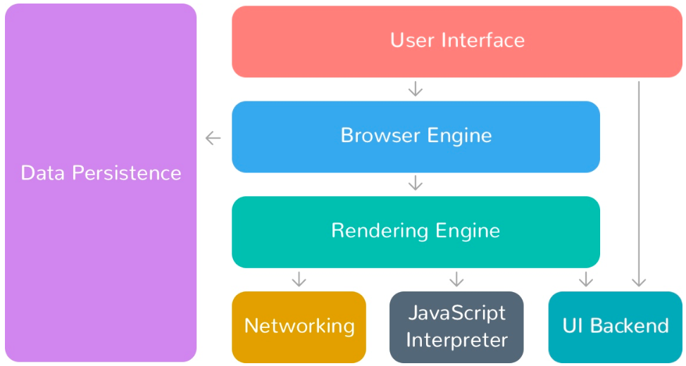

- **用户界面（user interface）**：包括地址栏、前进/后退按钮、书签菜单等。除了浏览器主窗口显示的请求的页面外，其他显示的各个部分都属于用户界面。

  - 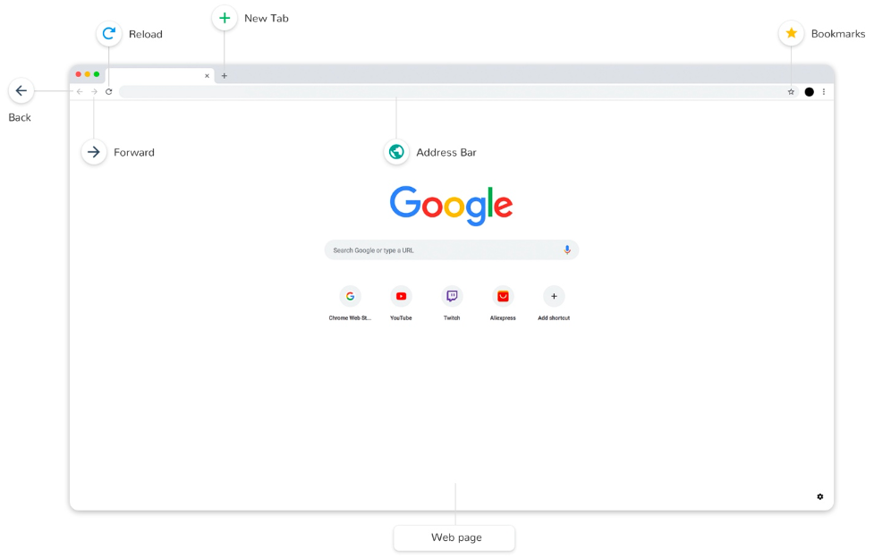

- **浏览器引擎（browser engine）**：在用户界面和呈现引擎之间传送指令。

  - 它是 UI 和渲染引擎之间的桥梁。接收来自 UI 的输入，然后通过操纵渲染引擎将网页或者其他资源显示在浏览器中。

- **呈现|渲染引擎（rendering engine）**：负责显示请求的内容。如果请求的内容是 HTML，它就负责解析 HTML 和 CSS 内容，并将解析后的内容显示在屏幕上。

  - 负责在浏览器窗口上显示请求的内容。例如，用户请求一个 *HTML* 页面，则它负责解析 *HTML* 文档和 *CSS*，并将解析和格式化的内容显示在屏幕上。我们平时说的浏览器内核就是指这部分。

    现代网络浏览器的渲染引擎：

    - *Firefox：Gecko Software*
    - *Safari：WebKit*
    - *Chrome、Opera* (*15* 版本之后)：*Blink*
    - *Internet Explorer：Trident*

    为了在屏幕上绘制像素（第一次渲染），浏览器在从网络接收数据（*HTML、CSS、JavaScript*）后必须经过一系列称为关键渲染路径的过程/技术。这包括 *DOM*、*CSSOM*、渲染树、布局和绘画。

- **网络（networking）**：用于网络调用，比如 HTTP 请求。其接口与平台无关，并为所有平台提供底层实现。

  - 该模块处理浏览器内的各种网络通信。它使用一组通信协议，如 *HTTP、HTTPs、FTP*，同时通过 *URL* 获取请求的资源。

- **用户界面后端（UI backend）**：用于绘制基本的窗口小部件，比如组合框和窗口。其公开了与平台无关的通用接口，而在底层使用操作系统的用户界面方法。

  - 用于绘制基本的窗口小部件，比如下拉列表、文本框、按钮等，向上提供公开的接口，向下调用操作系统的用户界面。

- **JavaScript 解释器（JavaScript interpreter）**：用于解析和执⾏ JavaScript 代码。

  - JavaScript 是一种脚本语言，允许我们动态更新 *Web* 内容、控制由浏览器的 *JS* 引擎执行的多媒体和动画图像。

    *DOM* 和 *CSSOM* 为 *JS* 提供了一个接口，可以改变 *DOM* 和 *CSSOM*。由于浏览器不确定特定的 *JS* 会做什么，它会在遇到 *script* 标签后立即暂停 *DOM* 树的构建。

    每个脚本都是一个解析拦截器，会让 *DOM* 树的构建停止。

    *JS* 引擎在从服务器获取并输入 *JS* 解析器后立即开始解析代码。它将它们转换为机器理解的代表性对象。在抽象句法结构的树表示中存储所有解析器信息的对象称为对象语法树（AST）。这些对象被送入一个解释器，该解释器将这些对象翻译成字节码。

    这些是即时 (*JIT*) 编译器，这意味着从服务器下载的 *JavaScript* 文件在客户端的计算机上实时编译。解释器和编译器是结合在一起的。解释器几乎立即执行源代码；编译器生成客户端系统直接执行的机器代码。

    不同的浏览器使用不同的 *JS* 引擎：

    - *Chrome*： *V8* (*JavaScript* 引擎) (*Node JS* 建立在此之上)
    - *Mozilla*： *SpiderMonkey* (旧称“松鼠鱼”)
    - *Microsoft Edge*：*Chakra*
    - *Safari*：*JavaScriptCore / Nitro WebKit*

- **数据存储（data storage）**：这是持久层。浏览器需要在硬盘上保存各种数据，例如 Cookie。新的 HTML 规范 (HTML5) 定义了“网络数据库”，这是⼀个完整（但是轻便）的浏览器内数据库。

  - 这是一个持久层。浏览器可能需要在本地保存各种数据，例如 *cookie*。浏览器还支持 *localStorage、IndexedDB、WebSQL* 和 *FileSystem* 等存储机制。


值得注意的是，和⼤多数浏览器不同，Chrome 浏览器的每个标签页都分别对应⼀个呈现引擎实例。每个标签页都是⼀个独立的进程。

## 三、浏览器工作渲染原理

### 浏览器渲染流程 ⭐️⭐️

#### 1.导航（Navigation）

- 用户输入网址、点击链接或提交表单等操作触发导航。
- 浏览器向服务器发送请求，获取响应。

#### 2.构建 DOM 树

- 1.HTML 被解析成 DOM 树，表示网页的结构，DOM 树是由 DOM 元素及属性节点组成的。
- 2.CSS 被解析成 CSSOM 规则树，表示样式规则。
- 3.生成渲染树：DOM 树和 CSSOM 树结合，生成渲染树（Render Tree）。
  - 根据 DOM 树和 CSSOM 规则树构建渲染树。
  - 渲染树的节点被称为渲染对象，渲染对象是一个包含有颜色和大小等属性的矩形，渲染对象和 DOM 元素相对应，但这种对应关系不是一对一的，不可见的 DOM 元素不会被插入渲染树。还有一些 DOM 元素对应几个可见对象，它们一般是一些具有复杂结构的元素，无法用一个矩形来描述。

##### 从数据到 DOM

来自网络层的请求内容以二进制流格式在渲染引擎中接收（通常为 *8kb* 块）。然后将原始字节转换为 *HTML* 文件的字符（基于字符编码）。

然后将字符转换为标记。词法分析器执行词法分析，将输入分解为标记。在标记化期间，文件中的每个开始和结束标记都被考虑在内。它知道如何去除不相关的字符，如空格和换行符。然后解析器进行语法分析，通过分析文档结构，应用语言语法规则来构建解析树。

解析过程是迭代的。它将向词法分析器询问新的标记，如果语言语法规则匹配，则该标记将被添加到解析树中。然后解析器将要求另一个令牌。如果没有规则匹配，解析器将在内部存储令牌并不断询问令牌，直到找到与所有内部存储的令牌匹配的规则。如果未找到规则，则解析器将引发异常。这意味着该文档无效并且包含语法错误。

这些节点在称为 *DOM*（文档对象模型）的树数据结构中链接，该结构建立了父子关系、相邻兄弟关系。

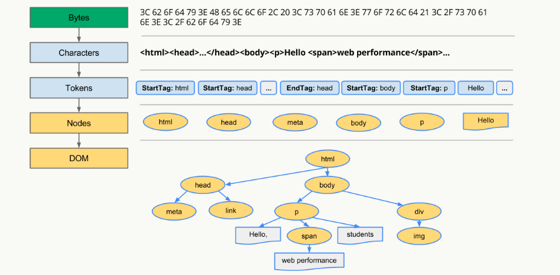

##### CSS 数据到 CSSOM

*CSS* 数据的原始字节被转换成字符、标记、节点，最后在 *CSSOM*（*CSS* 对象模型）中。 因为 *CSS* 存在层叠机制，该机制决定了将什么样式应用于元素，也就是说，元素的样式数据可以来自父项（通过继承）或设置为元素本身。因此浏览器必须递归遍历 *CSS* 树结构并确定特定元素的样式。

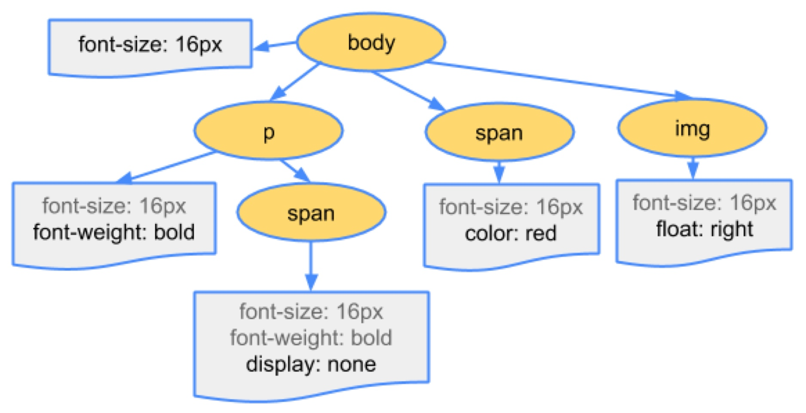

- 不显示（`display: none`）的元素不会被生成
- 有了`RenderTree`，我们就知道了所有节点的样式，然后计算他们在页面上的大小和位置（布局），最后把节点绘制到页面上（绘制）。
- 由于浏览器使用流式布局，对`Render Tree`的计算通常只需要遍历一次就可以完成，**但`table`及其内部元素除外，他们可能需要多次计算，通常要花 3 倍于同等元素的时间，这也是为什么要避免使用`table`布局的原因之一**。

##### DOM 和 CSSOM 渲染树

*DOM* 树包含有关 *HTML* 元素关系的信息，而 *CSSOM* 树包含有关如何设置这些元素样式的信息。

渲染引擎会将样式信息和 *HTML* 元素关系信息进行汇总，用于创建另一棵树，称为“渲染树”。

渲染树包含具有视觉属性（如颜色和尺寸）的矩形。矩形按正确的顺序显示在屏幕上。

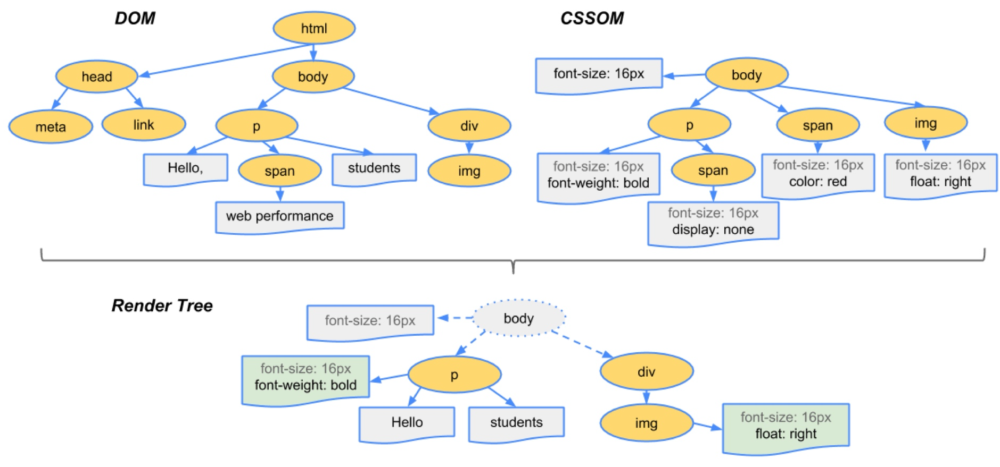

#### 3.布局（Layout）

- 渲染引擎计算每个节点的位置和大小。
- 生成布局，即将渲染树的节点进行平面合成。
- 过程：
  - 当渲染对象被创建并添加到树中，它们并没有位置和大小，所以当浏览器生成渲染树以后，就会根据渲染树来进行布局（也可以叫做**回流**）。
  - 这一阶段浏览器要做的事情是要弄清楚各个节点在页面中的确切位置和大小。通常这一行为也被称为“自动重排”。

在构建渲染树之后，它会经历一个“布局”过程。布局过程的输出是一个“盒子模型”，它精确地捕获视口内每个元素的确切位置和大小：所有相对测量值都转换为屏幕上的绝对像素。

在下面的屏幕截图中，您可以看到为 *body* 元素计算的“框模型”（边距、边框、填充、宽度和高度）信息。

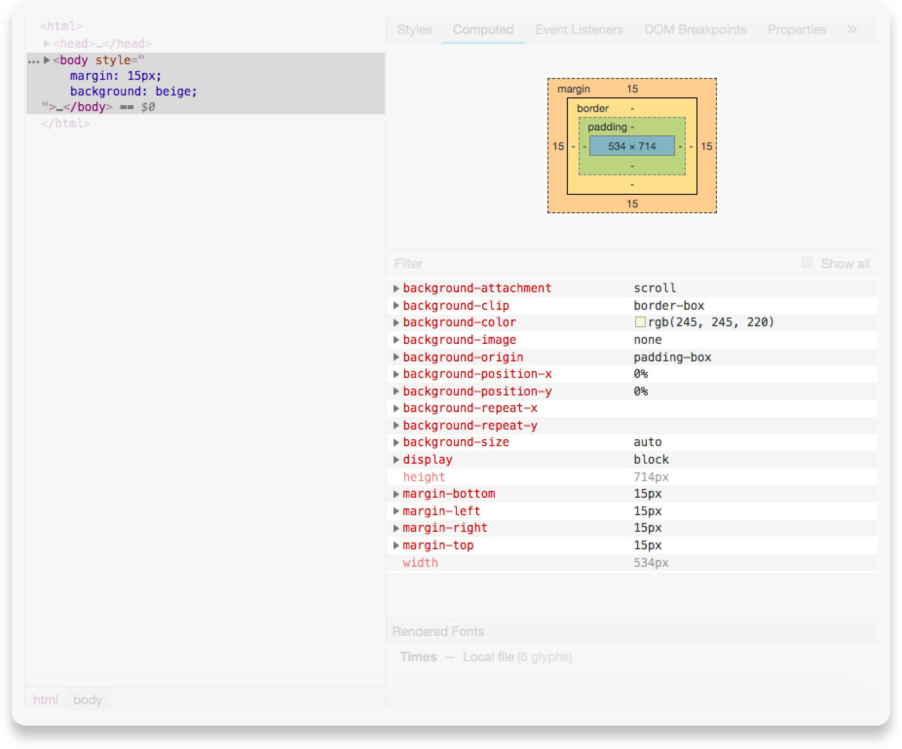

#### 4.绘制（Paint）——渲染阶段

- 过程：遍历渲染树并调用渲染对象的 paint 方法将它们的内容绘制显示在屏幕上，生成像素，绘制使用 UI 基础组件。
- 最终呈现给用户的页面就是这些像素。

在这一阶段渲染树会被遍历，并且会只用 *UI* 后端层绘制每个节点。这个过程也被称为“光栅化”。在这个阶段，渲染树中每个节点的计算布局信息被转换为屏幕上的实际像素。

绘画是一个渐进的过程，其中一些部分被解析和渲染，而该过程继续处理来自网络的项目的其余部分。

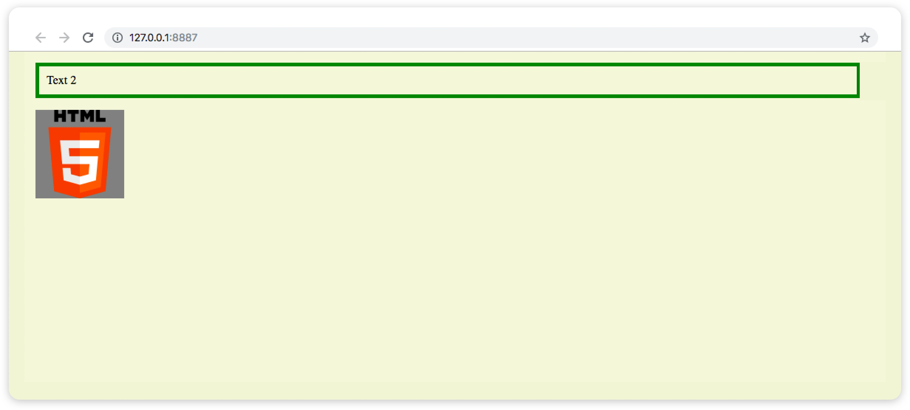

#### 以上整体四个步骤图例如下：

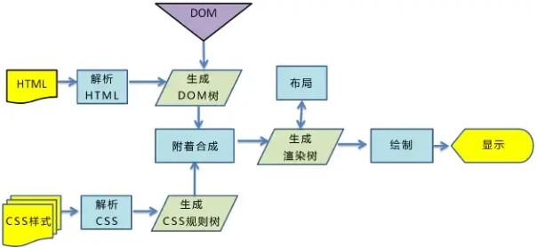

图例2：

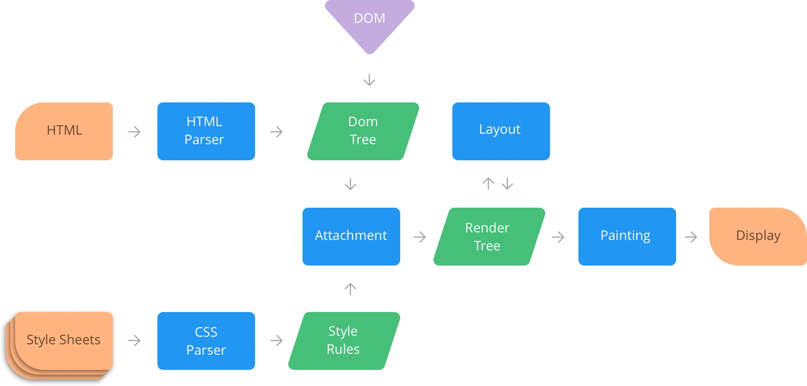

**注意：** 这个过程是逐步完成的，为了更好的用户体验，渲染引擎将会尽可能早的将内容呈现到屏幕上，并不会等到所有的 html 都解析完成之后再去构建和布局 render 树。它是解析完一部分内容就显示一部分内容，同时，可能还在通过网络下载其余内容。

### 浏览器渲染页面的机制和原理

#### 扫盲：

- ① 进程：Process（开了多个饭店）
- ② 线程：Thread（一个饭店雇佣一个服务员是单线程，雇佣多个服务员是多线程）
- ③ 栈内存：Stack （提供一个环境，运行代码）

#### 第一阶段：

当输入url后，比如：http://www.baidu.com，客户端（浏览器）向服务器端（web服务器）发起请求，**开始进入Request请求阶段**，这个阶段包含：DNS解析、TCP协议的三次握手和四次挥手、HTTPS和HTTP的区别（HTTP2）

#### 第二阶段：

在服务器端的项目磁盘中保存着相对应的页面，这些页面是源代码的格式，请求到以后就**开始进入Response阶段**：HTTP状态码、304缓存、HTTP报文

#### 第三阶段：

浏览器拿到源代码以后，浏览器在**内存条中开辟出一块栈内存**，用来给代码的执行提供环境。

只有执行环境是不够的，这时候浏览器同时分配**一个主线程**去**一行一行**的解析和执行代码。（**前端js是单线程的，原理是浏览器只会分配一个线程来去解析代码**）（内存条的空间越高越好，因为这样分出来的空间就越多，做的事情也越多）

而这一个线程去解析源代码的过程：它得先进栈才能执行，所以首先进栈，每一个页面第一行都是：`<!DOCTYPE html>`声明文档类型是html，因为单线程一次只能干一件事，所以当前代码执行完以后，**主线程一定要出栈，只有出栈，主线程才有时间执行下一行代码。然后再进栈出栈如此这般一行一行的解析。**

解析过程中，会遇到`<link href="1.css"/>`，这时候主线程有两种选择。

第一种：自己亲自去服务器，但这个时候浏览器就没人了，下面的代码无法执行，所以必须得将1.css搬过来才能执行，这种方法是不好的。

第二种：让自己的朋友帮忙去服务器搬1.css，自己（主线程）继续执行下面的代码，这个时候浏览器中就有两个人干活了。所以**当代码中遇到`<link/>`、``、`<script/>`、`<audio/>`、`<video/>`等这些所有需要额外加载外部资源文件的请求后，都会单独开辟新的线程去加载资源文件，主线程继续向下执行。**

因此可以看出浏览器是多线程程序，但是它只分配了一个线程用来执行页面当中的代码，所以js是单线程的。

打个比方，你去餐厅吃饭，点餐后，服务员（线程）会通知厨师去做饭，而服务员再去招呼其他客人点餐，厨师属于新雇的（属于另外一个线程）,但是，这个餐必须得知道是给谁做的，这时候就得拿出一个本记上：当前谁点了什么菜，记一个点菜单。

同样的，浏览器也会做类似的事情，它会开辟一个新的内存空间--**等待任务队列（Task Queue）**。它是一个新的空间，比如任务一：（需要请求1.css）交给张三去做，任务二：（需要请求2.css）交给李四去做......，同时，主线程继续执行下面的代码，当执行完最后一行代码后，这个时候需要搬运的css文件全都搬回来了吗？答案是不一定。这个时候只是把html标签，也就是DOM结构渲染完了。

所以，浏览器加载页面**第一个环节是：DOM树渲染**

只有DOM树，页面是不会渲染出来的，接着就要把做好的饭端上来，也就是，当DOM树渲染完以后，它会到等待任务队列中去看哪个任务完成了，哪个任务完成，就把哪个任务拿回到栈内存中去执行。

比如任务二完成先拿回来了，主线程就先执行任务二，当在执行任务二的时候，任务一也完成了，js是不会去马上执行任务一的，必须要等到任务二执行完成以后才可以，因为js是单线程的，一次只能执行一件事情。当任务一执行完以后，再去任务队列中看其他任务是否完成，如果任务三完成了再拿回到执行栈中执行任务三，如此循环往复，这就是前端著名的**事件循环（Event Loop）。**

等待任务队列中还分为**宏任务**（setTimeout、setInterval）和**微任务**（promise），微任务是优先于宏任务执行的。

当css处理完成以后，会生成**CSSOM**

这个时候，浏览器会将DOM和CSSDOM结合起来生成**Render Tree（渲染树）**

一切准备就绪后，开始绘制：**通知电脑的gpu（显卡）**，按照渲染树，一点点的画。

其实在生成render tree（渲染数）后，还有两个阶段，第一个是，回流（Layout）：根据生成的渲染树，计算它们在设备视口（viewport）内的确切位置和大小，这个计算的阶段就是回流。

回流以后还不行，我该画几像素，画成什么颜色呢？这就需要重绘

第二个就是：重绘（Painting）:根据渲染树已经回流得到几何信息，得到节点的绝对像素。

#### 总结：

DOM树渲染——> CSSDOM树渲染 ——>生成Render Tree（渲染树）——>Layout（回流）——>Painting（重绘）——>Display（GPU展现在页面）

### 为什么操作 DOM 慢

**想必大家都听过操作 DOM 性能很差，但是这其中的原因是什么呢？**

因为 DOM 是属于渲染引擎中的东⻄，而 JS ⼜是 JS 引擎中的东⻄。当我们通过 JS 操作 DOM 的时候，其实这个操作涉及到了两个线程之间的通信，那么势必会带来一些性能上的损耗。操作 DOM 次数一多，也就等同于一直在进行线程之间的通信，并且操作 DOM 可能还会带来重绘回流的情况，所以也就导致了性能上的问题。

#### 经典面试题：插入几万个 DOM，如何实现页面不卡顿？

对于这道题目来说，首先我们肯定不能一次性把几万个 DOM 全部插入，这样肯定会造成卡顿，所以解决问题的重点应该是如何分批次部分渲染 DOM 。大部分⼈应该可以想到通过 requestAnimationFrame 的方式去循环的插入 DOM ，其实还有种方式去解决这个问题：虚拟滚动（ virtualized scroller ）。

这种技术的原理就是只渲染可视区域内的内容，非可见区域的那就完全不渲染了，当用户在滚动的时候就实时去替换渲染的内容

从上图中我们可以发现，即使列表很长，但是渲染的 DOM 元素永远只有那么
几个，当我们滚动页面的时候就会实时去更新 DOM ，这个技术就能顺利解决
这道经典面试题。

### 什么情况阻塞渲染

- 首先渲染的前提是生成渲染树，所以 HTML 和 CSS 肯定会阻塞渲染。如果你想渲染的越快，你越应该降低一开始需要渲染的文件大小，并且扁平层级，优化选择器。
- 然后当浏览器在解析到 script 标签时，会暂停构建 DOM ，完成后才会从暂停的地方重新开始。也就是说，如果你想首屏渲染的越快，就越不应该在首屏就加载 JS 文件，这也是都建议将 script 标签放在 body 标签底部的原因。
- 当然在当下，并不是说 script 标签必须放在底部，因为你可以给 script 标签添加 defer 或者 async 属性。
- 当 script 标签加上 defer 属性以后，表示该 JS 文件会并行下载，但是会放到 HTML 解析完成后顺序执行，所以对于这种情况你可以把 script 标签放在任意位置。
- 对于没有任何依赖的 JS 文件可以加上 async 属性，表示 JS 文件下载和解析不会阻塞渲染。

### 重绘（Repaint）和回流（Reflow）

当元素的样式发生变化时，浏览器需要触发更新，重新绘制元素。这个过程中，有两种类型的操作，即重绘与回流。

#### 重绘（Repaint）

当元素的样式改变，但不影响其布局时，浏览器只需重新绘制这部分元素。

- 由于节点的几何属性发生改变或者由于样式发生改变而不会影响布局的，称为重绘，例如`outline`, `visibility`, `color`、`background-color`等，重绘的代价是高昂的，因为浏览器必须验证 DOM 树上其他节点元素的可见性。
- 当元素样式的改变不影响布局时，浏览器将使用重绘对元素进行更新，此时由于只需要 UI 层面的重新像素绘制，因此 损耗较少

#### 回流（Reflow）

当元素的布局属性发生变化，导致整个页面布局需要重新计算时，浏览器会触发回流，重新生成布局。

- 回流是布局或者几何属性需要改变就称为回流。回流是影响浏览器性能的关键因素，因为其变化涉及到部分页面（或是整个页面）的布局更新。一个元素的回流可能会导致了其所有子元素以及 DOM 中紧随其后的节点、祖先节点元素的随后的回流。
- 当元素的尺⼨、结构或触发某些属性时，浏览器会重新渲染页面，称为回流。此时，浏览器需要重新经过计算，计算后还需要重新页面布局，因此是较重的操作。

##### 触发回流：

- 页面初次渲染
- 添加或删除可见的DOM元素；
- 元素的位置、尺寸、内容（文字数量或图片大小等等）发生变化；
- 页面一开始渲染的时候（这个无法避免）；
- 元素字体大小变化
- 浏览器窗口大小改变：因为回流是根据视口的大小来计算元素的位置和大小的，所以浏览器的窗口尺寸变化也会引发回流。
- 激活 CSS 伪类（例如： `:hover`）

##### 查询触发回流某些属性或调用某些方法：

- clientWidth、clientHeight、clientTop、clientLeft
- offsetWidth、offsetHeight、offsetTop、offsetLeft
- scrollWidth、scrollHeight、scrollTop、scrollLeft
- getComputedStyle()
- getBoundingClientRect()
- scrollTo()

> **注意：回流一定会触发重绘，而重绘不一定触发回流**
>
> **重绘的开销较小，回流的代价较高。**
>
> 回流和重绘都会影响性能，尤其是回流，所以**优化法则：尽可能减少避免DOM的重绘和回流**


#### 重绘和回流会在我们设置节点样式时频繁出现，同时也会很大程度上影响性能。

- 重绘是当节点需要更改外观而不会影响布局的，比如改变 color 就叫称为重绘
- 回流是布局或者几何属性需要改变就称为回流。
- 回流必定会发生重绘，重绘不一定会引发回流。回流所需的成本比重绘高的多，改变父节点里的子节点很可能会导致父节点的一系列回流。

#### 以下几个动作可能会导致性能问题：

- 改变 window 大小
- 改变字体
- 添加或删除样式
- 文字改变
- 定位或者浮动
- 盒模型

#### 重绘和回流其实也和 Eventloop 有关：

1. 当 Event loop 执行完 Microtasks 后，会判断 document 是否需要更新。因为浏览器是 60Hz 的刷新率，每 16ms 才会更新一次。
2. 然后判断是否有 `resize` 或者 `scroll` ，有的话会去触发事件，所以 `resize` 和 `scroll` 事件也是至少 16ms 才会触发一次，并且自带节流功能。
3. 判断是否触发了 media query
4. 更新动画并且发送事件
5. 判断是否有全屏操作事件
6. 执行 `requestAnimationFrame` 回调
7. 执行 `IntersectionObserver` 回调，该方法用于判断元素是否可见，可以用于懒加载上，但是兼容性不好
8. 更新界面
9. 以上就是一帧中可能会做的事情。如果在一帧中有空闲时间，就会去执行 `requestIdleCallback` 回调。

#### 总结

- 重绘和回流是渲染步骤中的一小节，但是这两个步骤对于性能影响很大。
- 重绘是当节点需要更改外观而不会影响布局的，比如改变 color 就叫称为重绘
- 回流是布局或者几何属性需要改变就称为回流。
- 回流必定会发生重绘，重绘不一定会引发回流。回流所需的成本比重绘高的多，改变深层次的节点很可能导致父节点的一系列回流。

### 减少重绘和回流

#### 1.增加多个节点使用documentFragment：不是真实dom的部分，不会引起重绘和回流

#### 2.使用 transform 替代 top

```html
<div class="test"></div>
<style>
	.test {
		position: absolute;
		top: 10px;
		width: 100px;
		height: 100px;
		background: red;
	}
</style>
<script>
	setTimeout(() => {
		// 引起回流
		document.querySelector(".test").style.top = "100px";
	}, 1000);
</script>
```

#### 3.使用 visibility 替换 display: none ，因为前者只会引起重绘，后者会引发回流（改变了布局）

#### 4.不要把节点的属性值放在一个循环里当成循环里的变量

```js
for (let i = 0; i < 1000; i++) {
	// 获取 offsetTop 会导致回流，因为需要去获取正确的值
	console.log(document.querySelector(".test").style.offsetTop);
}
```

#### 5.不要使用 table 布局，可能很小的一个小改动会造成整个 table 的重新布局

#### 6.把 DOM 离线后修改，比如：先把 DOM 给 `display:none` (有一次 Reflow)，然后你修改 100 次，然后再把它显示出来

#### 7.不要把 DOM 结点的属性值放在一个循环里当成循环里的变量

```js
for (let i = 0; i < 1000; i++) {
  console.log(document.querySelector('.test').style.offsetTop)
}
```

#### 8.最好别频繁去操作DOM节点

最好把需要操作的样式，提前写成class，之后需要修改。只需要修改一次，需要修改的时候，直接修改className，做成一次性更新多条css DOM属性，一次回流重绘总比多次回流重绘要付出的成本低得多；

#### 9.DOM的偏移量属性进行值缓存

每次访问DOM的偏移量属性的时候，例如获取一个元素的scrollTop、scrollLeft、scrollWidth、offsetTop、offsetLeft、offsetWidth、offsetHeight之类的属性，浏览器为了保证值的正确也会回流取得最新的值，所以如果你要多次操作，最取完做个缓存。更加不要for循环中访问DOM偏移量属性，而且使用的时候，最好定义一个变量，把要需要的值赋值进去，进行值缓存，把回流重绘的次数减少；

#### 10.动画实现的速度的选择，动画速度越快，回流次数越多，也可以选择使用requestAnimationFrame

#### 11.CSS 选择符从右往左匹配查找，避免节点层级过多

#### 12.将频繁重绘或者回流的节点设置为图层，图层能够阻止该节点的渲染行为影响别的节点。

比如对于 video 标签来说，浏览器会自动将该节点变为图层。

设置节点为图层的方式有很多，我们可以通过以下几个常用属性可以生成新图层

- will-change
- video 、 iframe 标签


#### 13.CDN

静态资源尽量使用 CDN 加载，由于浏览器对于单个域名有并发请求上限，可以考虑使用多个 CDN 域名。对于 CDN 加载静态资源需要注意 CDN 域名要与主站不同，否则每次请求都会带上主站的 Cookie

#### 14.使用 Webpack 优化项目

- 对于 Webpack4 ，打包项目使用 production 模式，这样会自动开启代码压缩
- 使用 ES6 模块来开启 tree shaking ，这个技术可以移除没有使用的代码
- 优化图片，对于小图可以使用 base64 的方式写入文件中
- 按照路由拆分代码，实现按需加载

#### 最佳实践

##### css

- 避免使用 table 布局
- 将动画效果应用到 position 属性为 absolute 或 fixed 的元素上

##### javascript

- 避免频繁操作样式，可汇总后统一 一次修改
- 尽量使用 class 进行样式修改
- 减少 dom 的增删次数，可使用 字符串 或者 documentFragment 一次性插入
- 极限优化时，修改样式可将其 display: none 后修改
- 避免多次触发上面提到的那些会触发回流的方法，可以的话尽量用 变量存住


## 四、浏览器缓存

### 1. 对浏览器的缓存机制的理解 ⭐️⭐️

**浏览器缓存的全过程：**

- 浏览器第一次加载资源，服务器返回 200，浏览器从服务器下载资源文件，并缓存资源文件与 response header，以供下次加载时对比使用；
- 下一次加载资源时，由于强制缓存优先级较高，先比较当前时间与上一次返回 200 时的时间差，如果没有超过 cache-control 设置的 max-age，则没有过期，并命中强缓存，直接从本地读取资源。如果浏览器不支持 HTTP1.1，则使用 expires 头判断是否过期；
- 如果资源已过期，则表明强制缓存没有被命中，则开始协商缓存，向服务器发送带有 If-None-Match 和 If-Modified-Since 的请求；
- 服务器收到请求后，优先根据 Etag 的值判断被请求的文件有没有做修改，Etag 值一致则没有修改，命中协商缓存，返回 304；如果不一致则有改动，直接返回新的资源文件带上新的 Etag 值并返回 200；
- 如果服务器收到的请求没有 Etag 值，则将 If-Modified-Since 和被请求文件的最后修改时间做比对，一致则命中协商缓存，返回 304；不一致则返回新的 last-modified 和文件并返回 200；

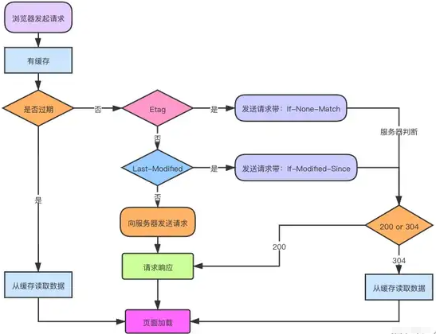

很多网站的资源后面都加了版本号，这样做的目的是：每次升级了 JS 或 CSS 文件后，为了防止浏览器进行缓存，强制改变版本号，客户端浏览器就会重新下载新的 JS 或 CSS 文件 ，以保证用户能够及时获得网站的最新更新。

### 2. 浏览器资源缓存的位置有哪些？⭐️

资源缓存的位置一共有 4 种，按优先级从高到低分别是：

1. **Service Worker：**Service Worker 运行在 JavaScript 主线程之外，虽然由于脱离了浏览器窗体无法直接访问 DOM，但是它可以完成离线缓存、消息推送、网络代理等功能。它可以让我们自由控制**缓存哪些文件、如何匹配缓存、如何读取缓存，并且**缓存是持续性的**。当 Service Worker 没有命中缓存的时候，需要去调用 `fetch` 函数获取 数据。也就是说，如果没有在 Service Worker 命中缓存，会根据缓存查找优先级去查找数据。**但是不管是从 Memory Cache 中还是从网络请求中获取的数据，浏览器都会显示是从 Service Worker 中获取的内容。
2. **Memory Cache：** Memory Cache 就是内存缓存，它的效率最快，**但是内存缓存虽然读取高效，可是缓存持续性很短，会随着进程的释放而释放。**一旦我们关闭 Tab 页面，内存中的缓存也就被释放了。
3. **Disk Cache：** Disk Cache 也就是存储在硬盘中的缓存，读取速度慢点，但是什么都能存储到磁盘中，比之 Memory Cache **胜在容量和存储时效性上。**在所有浏览器缓存中，Disk Cache 覆盖面基本是最大的。它会根据 HTTP Herder 中的字段判断哪些资源需要缓存，哪些资源可以不请求直接使用，哪些资源已经过期需要重新请求。**并且即使在跨站点的情况下，相同地址的资源一旦被硬盘缓存下来，就不会再次去请求数据。**
4. **Push Cache：** Push Cache 是 HTTP/2 中的内容，当以上三种缓存都没有命中时，它才会被使用。并且缓存时间也很短暂，只在会话（Session）中存在，一旦会话结束就被释放。其具有以下特点：

- 所有的资源都能被推送，但是 Edge 和 Safari 浏览器兼容性不怎么好
- 可以推送 `no-cache` 和 `no-store` 的资源
- 一旦连接被关闭，Push Cache 就被释放
- 多个页面可以使用相同的 HTTP/2 连接，也就是说能使用同样的缓存
- Push Cache 中的缓存只能被使用一次
- 浏览器可以拒绝接受已经存在的资源推送
- 可以给其他域名推送资源

### 3. 协商缓存和强缓存的区别 ⭐️⭐️

#### （1）强缓存

使用强缓存策略时，如果缓存资源有效，则直接使用缓存资源，不必再向服务器发起请求。

强缓存策略可以通过两种方式来设置，分别是 http 头信息中的 Expires 属性和 Cache-Control 属性。

（1）**服务器**通过在响应头中添加 Expires 属性，来指定资源的过期时间。在过期时间以内，该资源可以被缓存使用，不必再向服务器发送请求。这个时间是一个绝对时间，它是服务器的时间，因此可能存在这样的问题，就是客户端的时间和服务器端的时间不一致，或者用户可以对客户端时间进行修改的情况，这样就可能会影响缓存命中的结果。

（2）Expires 是 http1.0 中的方式，因为它的一些缺点，在 HTTP 1.1 中提出了一个新的头部属性就是 Cache-Control 属性，它提供了对资源的缓存的更精确的控制。它有很多不同的值，

`Cache-Control`可设置的字段：

- `public`：设置了该字段值的资源表示可以被任何对象（包括：发送请求的客户端、代理服务器等等）缓存。这个字段值不常用，一般还是使用 max-age=来精确控制；
- `private`：设置了该字段值的资源只能被用户浏览器缓存，不允许任何代理服务器缓存。在实际开发当中，对于一些含有用户信息的 HTML，通常都要设置这个字段值，避免代理服务器(CDN)缓存；
- `no-cache`：设置了该字段需要先和服务端确认返回的资源是否发生了变化（不直接使用浏览器缓存，你需要先跟服务器进行确认），如果资源未发生变化，则直接使用缓存好的资源；
- `no-store`：设置了该字段表示禁止任何缓存，每次都会向服务端发起新的请求，拉取最新的资源；
- `max-age=`：设置缓存的最大有效期，单位为秒；
- `s-maxage=`：优先级高于 max-age=，仅适用于共享缓存(CDN)，优先级高于 max-age 或者 Expires 头；
- `max-stale[=]`：设置了该字段表明客户端愿意接收已经过期的资源，但是不能超过给定的时间限制。

一般来说只需要设置其中一种方式就可以实现强缓存策略，当两种方式一起使用时，Cache-Control 的优先级要高于 Expires。

**no-cache 和 no-store 很容易混淆：**

- no-cache 是指先要和服务器确认是否有资源更新，在进行判断。也就是说没有强缓存，但是会有协商缓存；
- no-store 是指不使用任何缓存，每次请求都**直接从服务器获取资源**。

#### （2）协商缓存

如果命中强制缓存，我们无需发起新的请求，直接使用缓存内容，如果没有命中强制缓存，如果设置了协商缓存，这个时候协商缓存就会发挥作用了。

上面已经说到了，命中协商缓存的条件有两个：

- `max-age=xxx` 过期了
- 值为`no-store`

使用协商缓存策略时，会先向服务器发送一个请求，如果资源没有发生修改，则返回一个 304 状态，让浏览器使用本地的缓存副本。如果资源发生了修改，则返回修改后的资源。

协商缓存也可以通过两种方式来设置，分别是 http 头信息中的**Etag** 和**Last-Modified**属性。

（1）服务器通过在响应头中添加 Last-Modified 属性来指出资源最后一次修改的时间，当浏览器下一次发起请求时，会在请求头中添加一个 If-Modified-Since 的属性，属性值为上一次资源返回时的 Last-Modified 的值。当请求发送到服务器后服务器会通过这个属性来和资源的最后一次的修改时间来进行比较，以此来判断资源是否做了修改。如果资源没有修改，那么返回 304 状态，让客户端使用本地的缓存。如果资源已经被修改了，则返回修改后的资源。使用这种方法有一个缺点，就是 Last-Modified 标注的最后修改时间只能精确到秒级，如果某些文件在 1 秒钟以内，被修改多次的话，那么文件已将改变了但是 Last-Modified 却没有改变，这样会造成缓存命中的不准确。

（2）因为 Last-Modified 的这种可能发生的不准确性，http 中提供了另外一种方式，那就是 Etag 属性。服务器在返回资源的时候，在头信息中添加了 Etag 属性，这个属性是资源生成的唯一标识符，当资源发生改变的时候，这个值也会发生改变。在下一次资源请求时，浏览器会在请求头中添加一个 If-None-Match 属性，这个属性的值就是上次返回的资源的 Etag 的值。服务接收到请求后会根据这个值来和资源当前的 Etag 的值来进行比较，以此来判断资源是否发生改变，是否需要返回资源。通过这种方式，比 Last-Modified 的方式更加精确。

当 Last-Modified 和 Etag 属性同时出现的时候，Etag 的优先级更高。使用协商缓存的时候，服务器需要考虑负载平衡的问题，因此多个服务器上资源的 Last-Modified 应该保持一致，因为每个服务器上 Etag 的值都不一样，因此在考虑负载平衡时，最好不要设置 Etag 属性。

**总结：**

强缓存策略和协商缓存策略在缓存命中时都会直接使用本地的缓存副本，区别只在于协商缓存会向服务器发送一次请求。它们缓存不命中时，都会向服务器发送请求来获取资源。在实际的缓存机制中，强缓存策略和协商缓存策略是一起合作使用的。浏览器首先会根据请求的信息判断，强缓存是否命中，如果命中则直接使用资源。如果不命中则根据头信息向服务器发起请求，使用协商缓存，如果协商缓存命中的话，则服务器不返回资源，浏览器直接使用本地资源的副本，如果协商缓存不命中，则浏览器返回最新的资源给浏览器。

### 4. 为什么需要浏览器缓存？

对于浏览器的缓存，主要针对的是前端的静态资源，最好的效果就是，在发起请求之后，拉取相应的静态资源，并保存在本地。如果服务器的静态资源没有更新，那么在下次请求的时候，就直接从本地读取即可，如果服务器的静态资源已经更新，那么我们再次请求的时候，就到服务器拉取新的资源，并保存在本地。这样就大大的减少了请求的次数，提高了网站的性能。这就要用到浏览器的缓存策略了。

所谓的**浏览器缓存**指的是浏览器将用户请求过的静态资源，存储到电脑本地磁盘中，当浏览器再次访问时，就可以直接从本地加载，不需要再去服务端请求了。

使用浏览器缓存，有以下优点：

- 减少了服务器的负担，提高了网站的性能
- 加快了客户端网页的加载速度
- 减少了多余网络数据传输

### 5. 点击刷新按钮或者按 F5、按 Ctrl+F5 （强制刷新）、地址栏回车有什么区别？

- **点击刷新按钮或者按 F5：** 浏览器直接对本地的缓存文件过期，但是会带上 If-Modifed-Since，If-None-Match，这就意味着服务器会对文件检查新鲜度，返回结果可能是 304，也有可能是 200。
- **用户按 Ctrl+F5（强制刷新）：** 浏览器不仅会对本地文件过期，而且不会带上 If-Modifed-Since，If-None-Match，相当于之前从来没有请求过，返回结果是 200。
- 地址栏回车： 浏览器发起请求，按照正常流程，本地检查是否过期，然后服务器检查新鲜度，最后返回内容。

## 五、浏览器本地存储

### 1. 浏览器本地存储方式及使用场景 ⭐️⭐️

#### （1）Cookie

Cookie 是最早被提出来的本地存储方式，在此之前，服务端是无法判断网络中的两个请求是否是同一用户发起的，为解决这个问题，Cookie 就出现了。Cookie 的大小只有 4kb，它是一种纯文本文件，每次发起 HTTP 请求都会携带 Cookie。

**Cookie 的特性：**

- Cookie 一旦创建成功，名称就无法修改
- Cookie 是无法跨域名的，也就是说 a 域名和 b 域名下的 cookie 是无法共享的，这也是由 Cookie 的隐私安全性决定的，这样就能够阻止非法获取其他网站的 Cookie
- 每个域名下 Cookie 的数量不能超过 20 个，每个 Cookie 的大小不能超过 4kb
- 有安全问题，如果 Cookie 被拦截了，那就可获得 session 的所有信息，即使加密也于事无补，无需知道 cookie 的意义，只要转发 cookie 就能达到目的
- Cookie 在请求一个新的页面的时候都会被发送过去

如果需要域名之间跨域共享 Cookie，有两种方法：

1. 使用 Nginx 反向代理
2. 在一个站点登陆之后，往其他网站写 Cookie。服务端的 Session 存储到一个节点，Cookie 存储 sessionId

**Cookie 的使用场景：**

- 最常见的使用场景就是 Cookie 和 session 结合使用，我们将 sessionId 存储到 Cookie 中，每次发请求都会携带这个 sessionId，这样服务端就知道是谁发起的请求，从而响应相应的信息。
- 可以用来统计页面的点击次数

#### （2）LocalStorage

LocalStorage 是 HTML5 新引入的特性，由于有的时候我们存储的信息较大，Cookie 就不能满足我们的需求，这时候 LocalStorage 就派上用场了。

**LocalStorage 的优点：**

- 在大小方面，LocalStorage 的大小一般为 5MB，可以储存更多的信息
- LocalStorage 是持久储存，并不会随着页面的关闭而消失，除非主动清理，不然会永久存在
- 仅储存在本地，不像 Cookie 那样每次 HTTP 请求都会被携带

**LocalStorage 的缺点：**

- 存在浏览器兼容问题，IE8 以下版本的浏览器不支持
- 如果浏览器设置为隐私模式，那我们将无法读取到 LocalStorage
- LocalStorage 受到同源策略的限制，即端口、协议、主机地址有任何一个不相同，都不会访问

**LocalStorage 的常用 API：**

```js
// 保存数据到 localStorage
localStorage.setItem("key", "value");

// 从 localStorage 获取数据
let data = localStorage.getItem("key");

// 从 localStorage 删除保存的数据
localStorage.removeItem("key");

// 从 localStorage 删除所有保存的数据
localStorage.clear();

// 获取某个索引的Key
localStorage.key(index);
```

**LocalStorage 的使用场景：**

- 有些网站有换肤的功能，这时候就可以将换肤的信息存储在本地的 LocalStorage 中，当需要换肤的时候，直接操作 LocalStorage 即可
- 在网站中的用户浏览信息也会存储在 LocalStorage 中，还有网站的一些不常变动的个人信息等也可以存储在本地的 LocalStorage 中

#### （3）SessionStorage

SessionStorage 和 LocalStorage 都是在 HTML5 才提出来的存储方案，SessionStorage 主要用于临时保存同一窗口(或标签页)的数据，刷新页面时不会删除，关闭窗口或标签页之后将会删除这些数据。

**SessionStorage 与 LocalStorage 对比：**

- SessionStorage 和 LocalStorage 都在**本地进行数据存储**；
- SessionStorage 也有同源策略的限制，但是 SessionStorage 有一条更加严格的限制，SessionStorage**只有在同一浏览器的同一窗口下才能够共享**；
- LocalStorage 和 SessionStorage**都不能被爬虫爬取**；

**SessionStorage 的常用 API：**

```js
// 保存数据到 sessionStorage
sessionStorage.setItem("key", "value");

// 从 sessionStorage 获取数据
let data = sessionStorage.getItem("key");

// 从 sessionStorage 删除保存的数据
sessionStorage.removeItem("key");

// 从 sessionStorage 删除所有保存的数据
sessionStorage.clear();

// 获取某个索引的Key
sessionStorage.key(index);
```

**SessionStorage 的使用场景**

- 由于 SessionStorage 具有时效性，所以可以用来存储一些网站的游客登录的信息，还有临时的浏览记录的信息。当关闭网站之后，这些信息也就随之消除了。

### 2. Cookie 有哪些字段，作用分别是什么 ⭐️

**Cookie 由以下字段组成：**

- **Name**：cookie 的名称
- **Value**：cookie 的值，对于认证 cookie，value 值包括 web 服务器所提供的访问令牌；
- **Size**： cookie 的大小
- **Path**：可以访问此 cookie 的页面路径。 比如 domain 是[http://abc.com](https://link.zhihu.com/?target=http%3A//abc.com)，path 是`/test`，那么只有`/test`路径下的页面可以读取此 cookie。
- **Secure**： 指定是否使用 HTTPS 安全协议发送 Cookie。使用 HTTPS 安全协议，可以保护 Cookie 在浏览器和 Web 服务器间的传输过程中不被窃取和篡改。该方法也可用于 Web 站点的身份鉴别，即在 HTTPS 的连接建立阶段，浏览器会检查 Web 网站的 SSL 证书的有效性。但是基于兼容性的原因（比如有些网站使用自签署的证书）在检测到 SSL 证书无效时，浏览器并不会立即终止用户的连接请求，而是显示安全风险信息，用户仍可以选择继续访问该站点。
- **Domain**：可以访问该 cookie 的域名，Cookie 机制并未遵循严格的同源策略，允许一个子域可以设置或获取其父域的 Cookie。当需要实现单点登录方案时，Cookie 的上述特性非常有用，然而也增加了 Cookie 受攻击的危险，比如攻击者可以借此发动会话定置攻击。因而，浏览器禁止在 Domain 属性中设置.org、.com 等通用顶级域名、以及在国家及地区顶级域下注册的二级域名，以减小攻击发生的范围。
- **HTTP**： 该字段包含`HTTPOnly` 属性 ，该属性用来设置 cookie 能否通过脚本来访问，默认为空，即可以通过脚本访问。在客户端是不能通过 js 代码去设置一个 httpOnly 类型的 cookie 的，这种类型的 cookie 只能通过服务端来设置。该属性用于防止客户端脚本通过`document.cookie`属性访问 Cookie，有助于保护 Cookie 不被跨站脚本攻击窃取或篡改。但是，HTTPOnly 的应用仍存在局限性，一些浏览器可以阻止客户端脚本对 Cookie 的读操作，但允许写操作；此外大多数浏览器仍允许通过 XMLHTTP 对象读取 HTTP 响应中的 Set-Cookie 头。
- **Expires/Max-size** ： 此 cookie 的超时时间。若设置其值为一个时间，那么当到达此时间后，此 cookie 失效。不设置的话默认值是 Session，意思是 cookie 会和 session 一起失效。当浏览器关闭(不是浏览器标签页，而是整个浏览器) 后，此 cookie 失效。

**总结：** 服务器端可以使用 Set-Cookie 的响应头部来配置 cookie 信息。**一条 cookie 包括了 5 个属性值 expires、domain、path、secure、HttpOnly**。其中 expires 指定了 cookie 失效的时间，domain 是域名、path 是路径，domain 和 path 一起限制了 cookie 能够被哪些 url 访问。secure 规定了 cookie 只能在确保安全的情况下传输，HttpOnly 规定了这个 cookie 只能被服务器访问，不能使用 js 脚本访问。

### 3. Cookie、LocalStorage、SessionStorage 区别 ⭐️⭐️

浏览器端常用的存储技术是 cookie 、localStorage 和 sessionStorage。

- **cookie：** 其实最开始是服务器端用于记录用户状态的一种方式，由服务器设置，在客户端存储，然后每次发起同源请求时，发送给服务器端。cookie 最多能存储 4 k 数据，它的生存时间由 expires 属性指定，并且 cookie 只能被同源的页面访问共享。
- **sessionStorage：** html5 提供的一种浏览器本地存储的方法，它借鉴了服务器端 session 的概念，代表的是一次会话中所保存的数据。它一般能够存储 5M 或者更大的数据，它在当前窗口关闭后就失效了，并且 sessionStorage 只能被同一个窗口的同源页面所访问共享。
- **localStorage：** html5 提供的一种浏览器本地存储的方法，它一般也能够存储 5M 或者更大的数据。它和 sessionStorage 不同的是，除非手动删除它，否则它不会失效，并且 localStorage 也只能被同源页面所访问共享。

上面几种方式都是存储少量数据的时候的存储方式，当需要在本地存储大量数据的时候，我们可以使用浏览器的 indexDB 这是浏览器提供的一种本地的数据库存储机制。它不是关系型数据库，它内部采用对象仓库的形式存储数据，它更接近 NoSQL 数据库。

### 4. 前端储存的方式有哪些？ ⭐️⭐️

- **cookies**： 在 HTML5 标准前本地储存的主要方式，优点是兼容性好，请求头⾃带 cookie 方便，缺点是⼤小只有 4k，⾃动请求头加⼊ cookie 浪费流量，每个 domain 限制 20 个 cookie，使用起来麻烦，需要⾃⾏封装；
- **localStorage**：HTML5 加⼊的以键值对(Key-Value)为标准的方式，优点是操作方便，永久性储存（除⾮⼿动删除），⼤小为 5M，兼容 IE8+ ；
- **sessionStorage**：与 localStorage 基本类似，区别是 sessionStorage 当页面关闭后会被清理，而且与 cookie、localStorage 不同，他不能在所有同源窗口中共享，是会话级别的储存方式；
- **Web SQL**：2010 年被 W3C 废弃的本地数据库数据存储方案，但是主流浏览器（⽕狐除外）都已经有了相关的实现，web sql 类似于 SQLite，是真正意义上的关系型数据库，用 sql 进⾏操作，当我们用 JavaScript 时要进⾏转换，较为繁琐；
- **IndexedDB**： 是被正式纳⼊ HTML5 标准的数据库储存方案，它是 NoSQL 数据库，用键值对进⾏储存，可以进⾏快速读取操作，⾮常适合 web 场景，同时用 JavaScript 进⾏操作会⾮常便。

### 5. IndexedDB 有哪些特点？

IndexedDB 具有以下特点：

- **键值对储存**：IndexedDB 内部采用对象仓库（object store）存放数据。所有类型的数据都可以直接存入，包括 JavaScript 对象。对象仓库中，数据以"键值对"的形式保存，每一个数据记录都有对应的主键，主键是独一无二的，不能有重复，否则会抛出一个错误。
- **异步**：IndexedDB 操作时不会锁死浏览器，用户依然可以进行其他操作，这与 LocalStorage 形成对比，后者的操作是同步的。异步设计是为了防止大量数据的读写，拖慢网页的表现。
- **支持事务**：IndexedDB 支持事务（transaction），这意味着一系列操作步骤之中，只要有一步失败，整个事务就都取消，数据库回滚到事务发生之前的状态，不存在只改写一部分数据的情况。
- **同源限制：** IndexedDB 受到同源限制，每一个数据库对应创建它的域名。网页只能访问自身域名下的数据库，而不能访问跨域的数据库。
- **储存空间大**：IndexedDB 的储存空间比 LocalStorage 大得多，一般来说不少于 250MB，甚至没有上限。
- **支持二进制储存**：IndexedDB 不仅可以储存字符串，还可以储存二进制数据（ArrayBuffer 对象和 Blob 对象）。

### cookie 和 localSrorage、session、indexDB 的区别

|     特性     |                   cookie                   |       localStorage       | sessionStorage | indexDB                  |
| :----------: | :----------------------------------------: | :----------------------: | :------------: | ------------------------ |
| 数据生命周期 |     一般由服务器生成，可以设置过期时间     | 除非被清理，否则一直存在 | 页面关闭就清理 | 除非被清理，否则一直存在 |
| 数据存储大小 |                     4K                     |            5M            |       5M       | 无限                     |
| 与服务端通信 | 每次都会携带在 header 中，对于请求性能影响 |          不参与          |     不参与     | 不参与                   |

从上表可以看到， cookie 已经不建议用于存储。如果没有大量数据存储需求的话，可以使用 localStorage 和 sessionStorage 。对于不怎么改变的数据尽量使用 localStorage 存储，否则可以用 sessionStorage 存储。

对于 cookie ，我们还需要注意安全性

|   属性    |                             作用                             |
| :-------: | :----------------------------------------------------------: |
|   value   | 如果用于保存用户登录态，应该将该值加密，不能使用明文的用户标识 |
| http-only |           不能通过 JS 访问 Cookie ，减少 XSS 攻击            |
|  secure   |               只能在协议为 HTTPS 的请求中携带                |
| same-site |    规定浏览器不能在跨域请求中携带 Cookie ，减少 CSRF 攻击    |

#### Service worker

Service workers 本质上充当 Web 应用程序与浏览器之间的代理服务器，也可以在网络可用时作为浏览器和网络间的代理。它们旨在（除其他之外）使得能够创建有效的离线体验，拦截网络请求并基于网络是否可用以及更新的资源是否驻留在服务器上来采取适当的动作。他们还允许访问推送通知和后台同步 API。

目前该技术通常用来做缓存文件，**提高首屏速度**，可以试着来实现这个功能

Service Worker 是运行在浏览器背后的独立线程，一般可以用来实现缓存功能。使用 Service Worker 的话，传输协议必须为 HTTPS 。因为 Service Worker 中涉及到请求拦截，所以必须使用 HTTPS 协议来保障安全。

Service Worker 实现缓存功能一般分为三个步骤：首先需要先注册 Service
Worker ，然后监听到 install 事件以后就可以缓存需要的文件，那么在下次用户访问的时候就可以通过拦截请求的方式查询是否存在缓存，存在缓存的话就可以直接读取缓存文件，否则就去请求数据。以下是这个步骤的实现：

```js
// index.js
if (navigator.serviceWorker) {
	navigator.serviceWorker
		.register("sw.js")
		.then(function (registration) {
			console.log("service worker 注册成功");
		})
		.catch(function (err) {
			console.log("servcie worker 注册失败");
		});
}

// sw.js
// 监听 `install` 事件，回调中缓存所需文件
self.addEventListener("install", (e) => {
	e.waitUntil(
		caches.open("my-cache").then(function (cache) {
			return cache.addAll(["./index.html", "./index.js"]);
		})
	);
});
// 拦截所有请求事件
// 如果缓存中已经有请求的数据就直接用缓存，否则去请求数据
self.addEventListener("fetch", (e) => {
	e.respondWith(
		caches.match(e.request).then(function (response) {
			if (response) {
				return response;
			}
			console.log("fetch source");
		})
	);
});
```

打开页面，可以在开发者工具中的 Application 看到 Service Worker 已经启动了。

在 Cache 中也可以发现我们所需的文件已被缓存

当我们重新刷新页面可以发现我们缓存的数据是从 Service Worker 中读取
的

## 六、浏览器同源策略

### 1. 什么是同源策略 ⭐️⭐️

跨域问题其实就是浏览器的同源策略造成的。

> 同源策略限制了从同一个源加载的文档或脚本如何与另一个源的资源进行交互。这是浏览器的一个用于隔离潜在恶意文件的重要的安全机制。
>
> 同源指的是：**协议**、**端口号**、**域名**必须一致。

下表给出了与 URL http://store.company.com/dir/page.ht… 的源进行对比的示例:

| URL                                                                                   | 是否跨域 | 原因                              |
| ------------------------------------------------------------------------------------- | -------- | --------------------------------- |
| [http://store.company.com/dir/page.ht](https://lstore.company.com/dir/page.ht)…       | 同源     | 完全相同                          |
| [http://store.company.com/dir/inner/a](https://lstore.company.com/dir/inner/a)…       | 同源     | 只有路径不同                      |
| [http://store.company.com/secure.html](https://lstore.company.com/secure.html)        | 跨域     | 协议不同                          |
| [http://store.company.com:81/dir/etc.htm](https://lstore.company.com:81/dir/etc.htm)… | 跨域     | 端口不同 ( http:// 默认端口是 80) |
| [http://news.company.com/dir/other.h](https://lnews.company.com/dir/other.h)…         | 跨域     | 主机不同                          |

**同源策略：protocol（协议）、domain（域名）、port（端口）三者必须一致(相同)。**

#### 同源的目的

浏览器安全的基石是”同源政策”。

保证用户信息的安全，防止恶意的网站窃取数据。

设想这样一种情况：A网站是一家银行，用户登录以后，又去浏览其他网站。如果其他网站可以读取A网站的 Cookie，会发生什么？

很显然，如果Cookie 包含隐私（比如存款总额），这些信息就会泄漏。更可怕的是，Cookie 往往用来保存用户的登录状态，如果用户没有退出登录，其他网站就可以冒充用户，为所欲为。因为浏览器同时还规定，提交表单不受同源政策的限制。

#### 同源政策主要限制了三个方面：

- 当前域下的 js 脚本不能够访问其他域下的 cookie、localStorage 和 indexDB。
- 当前域下的 js 脚本不能够操作访问操作其他域下的 DOM。
- 当前域下 ajax 无法发送跨域请求。

同源政策的目的主要是为了保证用户的信息安全，它只是对 js 脚本的一种限制，并不是对浏览器的限制，对于一般的 img、或者 script 脚本请求都不会有跨域的限制，这是因为这些操作都不会通过响应结果来进行可能出现安全问题的操作。

### 2. 如何解决跨越问题 ⭐️⭐️

#### （1）CORS

下面是 MDN 对于 CORS 的定义：

> 跨域资源共享(CORS) 是一种机制，它使用额外的 HTTP 头来告诉浏览器 让运行在一个 origin (domain)上的 Web 应用被准许访问来自不同源服务器上的指定的资源。当一个资源从与该资源本身所在的服务器不同的域、协议或端口请求一个资源时，资源会发起一个跨域 HTTP 请求。

CORS 需要浏览器和服务器同时支持，整个 CORS 过程都是浏览器完成的，无需用户参与。因此实现**CORS 的关键就是服务器，只要服务器实现了 CORS 请求**，就可以跨源通信了。

浏览器将 CORS 分为**简单请求**和**非简单请求**：

简单请求不会触发 CORS 预检请求。

**若该请求满足以下两个条件，就可以看作是简单请求：**

**1）请求方法是以下三种方法之一：**

- HEAD
- GET
- POST

**2）HTTP 的头信息不超出以下几种字段：**

- Accept
- Accept-Language
- Content-Language
- Last-Event-ID
- Content-Type：只限于三个值 application/x-www-form-urlencoded、multipart/form-data、text/plain

这是为了兼容表单（form），因为历史上表单一直可以发出跨域请求。AJAX 的跨域设计就是，只要表单可以发，AJAX 就可以直接发。

**若不满足以上条件，就属于非简单请求了。**


浏览器对这两种请求的处理，是不一样的。

##### （1）简单请求过程：

对于简单请求，浏览器会直接发出 CORS 请求，它会在请求的头信息中增加一个 Orign 字段，该字段用来说明本次请求来自哪个源（协议+端口+域名），服务器会根据这个值来决定是否同意这次请求。

下面是一个例子，浏览器发现这次跨源AJAX请求是简单请求，就自动在头信息之中，添加一个Origin字段。

```bash
GET /cors HTTP/1.1
Origin: http://api.bob.com
Host: api.alice.com
Accept-Language: en-US
Connection: keep-alive
User-Agent: Mozilla/5.0...
```

上面的头信息中，Origin字段用来说明，本次请求来自哪个源（协议 + 域名 + 端口）。服务器根据这个值，决定是否同意这次请求。

如果Origin指定的源，不在许可范围内，**服务器会返回一个正常的HTTP回应**。浏览器发现，这个回应的头信息没有包含Access-Control-Allow-Origin字段（详见下文），就知道出错了，从而抛出一个错误，被XMLHttpRequest的onerror回调函数捕获。**注意，这种错误无法通过状态码识别，因为HTTP回应的状态码有可能是200。**


如果 Orign 指定的域名在许可范围之内，服务器返回的响应就会多出以下信息头：

```js
Access-Control-Allow-Origin: http://api.bob.com  // 和Orign一直
Access-Control-Allow-Credentials: true   // 表示是否允许发送Cookie
Access-Control-Expose-Headers: FooBar   // 指定返回其他字段的值
Content-Type: text/html; charset=utf-8   // 表示文档类型
```

如果 Orign 指定的域名不在许可范围之内，服务器会返回一个正常的 HTTP 回应，浏览器发现没有上面的 Access-Control-Allow-Origin 头部信息，就知道出错了。这个错误无法通过状态码识别，因为返回的状态码可能是 200。

上面的头信息之中，有三个与CORS请求相关的字段，都以Access-Control-开头。

（1）Access-Control-Allow-Origin

该字段是必须的。它的值要么是请求时Origin字段的值，要么是一个*，表示接受任意域名的请求。

（2）Access-Control-Allow-Credentials

该字段可选。它的值是一个布尔值，表示是否允许发送Cookie。默认情况下，Cookie不包括在CORS请求之中。设为true，即表示服务器明确许可，Cookie可以包含在请求中，一起发给服务器。这个值也只能设为true，如果服务器不要浏览器发送Cookie，删除该字段即可。

（3）Access-Control-Expose-Headers

该字段可选。CORS请求时，XMLHttpRequest对象的getResponseHeader()方法只能拿到6个基本字段：

- Cache-Control
- Content-Language
- Content-Type
- Expires
- Last-Modified
- Pragma

如果想拿到其他字段，就必须在Access-Control-Expose-Headers里面指定。上面的例子指定，getResponseHeader('FooBar')可以返回FooBar字段的值。

##### withCredentials 属性

上面说到，CORS请求默认不发送Cookie和HTTP认证信息。如果要把Cookie发到服务器，一方面要服务器同意，指定Access-Control-Allow-Credentials字段。

```bash
Access-Control-Allow-Credentials: true
```

另一方面，开发者必须在AJAX请求中打开withCredentials属性。

```js
var xhr = new XMLHttpRequest()
xhr.withCredentials = true
```

否则，即使服务器同意发送Cookie，浏览器也不会发送。或者，服务器要求设置Cookie，浏览器也不会处理。

但是，如果省略withCredentials设置，有的浏览器还是会一起发送Cookie。这时，可以显式关闭withCredentials。

```js
xhr.withCredentials = false
```

需要注意的是，如果要发送Cookie，Access-Control-Allow-Origin就不能设为星号，必须指定明确的、与请求网页一致的域名。同时，Cookie依然遵循同源政策，只有用服务器域名设置的Cookie才会上传，其他域名的Cookie并不会上传，且（跨源）原网页代码中的document.cookie也无法读取服务器域名下的Cookie。

**在简单请求中，在服务器内，至少需要设置字段：**`Access-Control-Allow-Origin`

##### （2）非简单请求过程：

**预检请求**

非简单请求是对服务器有特殊要求的请求，比如请求方法为**DELETE 或者 PUT**等。非简单请求的 CORS 请求会在正式通信之前进行一次 HTTP 查询请求，**称为预检请求**。

非简单请求的CORS请求，会在正式通信之前，增加一次HTTP查询请求，称为”预检”请求（preflight）。

浏览器会询问服务器，当前所在的网页是否在服务器允许访问的范围内，以及可以使用哪些 HTTP 请求方式和头信息字段，只有得到肯定的回复，才会进行正式的 HTTP 请求，否则就会报错。

下面是一段浏览器的JavaScript脚本。

```js
var url = 'http://api.alice.com/cors'
var xhr = new XMLHttpRequest()
xhr.open('PUT', url, true)
xhr.setRequestHeader('X-Custom-Header', 'value')
xhr.send()
```

上面代码中，HTTP请求的方法是PUT，并且发送一个自定义头信息X-Custom-Header。

浏览器发现，这是一个非简单请求，就自动发出一个”预检”请求，要求服务器确认可以这样请求。下面是这个”预检”请求的HTTP头信息。

```bash
OPTIONS /cors HTTP/1.1
Origin: http://api.bob.com
Access-Control-Request-Method: PUT
Access-Control-Request-Headers: X-Custom-Header
Host: api.alice.com
Accept-Language: en-US
Connection: keep-alive
User-Agent: Mozilla/5.0...
```

“预检”请求用的请求方法是OPTIONS，表示这个请求是用来询问的。头信息里面，关键字段是Origin，表示请求来自哪个源。

除了Origin字段，”预检”请求的头信息包括两个特殊字段。

（1）Access-Control-Request-Method

该字段是必须的，用来列出浏览器的CORS请求会用到哪些HTTP方法，上例是PUT。

（2）Access-Control-Request-Headers

该字段是一个逗号分隔的字符串，指定浏览器CORS请求会额外发送的头信息字段，上例是X-Custom-Header。

**预检请求的回应**：

预检请求使用的**请求方法是 OPTIONS**，表示这个请求是来询问的。他的头信息中的关键字段是 Orign，表示请求来自哪个源。除此之外，头信息中还包括两个字段：

- **Access-Control-Request-Method**：该字段是必须的，用来列出浏览器的 CORS 请求会用到哪些 HTTP 方法。
- **Access-Control-Request-Headers**： 该字段是一个逗号分隔的字符串，指定浏览器 CORS 请求会额外发送的头信息字段。

服务器在收到浏览器的预检请求之后，会根据头信息的三个字段：Origin、Access-Control-Request-Method和Access-Control-Request-Headers字段来进行判断，如果返回的头信息在中有 Access-Control-Allow-Origin 这个字段就是允许跨域请求，如果没有，就是不同意这个预检请求，就会报错。

服务器回应的 CORS 的字段如下：

```js
HTTP/1.1 200 OK
Date: Mon, 01 Dec 2008 01:15:39 GMT
Server: Apache/2.0.61 (Unix)
Access-Control-Allow-Origin: http://api.bob.com  // 允许跨域的源地址
Access-Control-Allow-Methods: GET, POST, PUT // 服务器支持的所有跨域请求的方法
Access-Control-Allow-Headers: X-Custom-Header  // 服务器支持的所有头信息字段
Access-Control-Allow-Credentials: true   // 表示是否允许发送Cookie
Access-Control-Max-Age: 1728000  // 用来指定本次预检请求的有效期，单位为秒
Content-Type: text/html; charset=utf-8
Content-Encoding: gzip
Content-Length: 0
Keep-Alive: timeout=2, max=100
Connection: Keep-Alive
```

只要服务器通过了预检请求，在以后每次的 CORS 请求都会自带一个 Origin 头信息字段。服务器的回应，也都会有一个 Access-Control-Allow-Origin 头信息字段。

上面的HTTP回应中，关键的是Access-Control-Allow-Origin字段，表示api.bob.com可以请求数据。该字段也可以设为星号，表示同意任意跨源请求。

如果服务器否定了”预检”请求，会返回一个正常的HTTP回应，但是没有任何CORS相关的头信息字段。这时，浏览器就会认定，服务器不同意预检请求，因此触发一个错误，被XMLHttpRequest对象的onerror回调函数捕获。控制台会打印出如下的报错信息。

```bash
XMLHttpRequest cannot load http:
Origin http:
```

服务器回应的其他CORS相关字段如下。

```bash
Access-Control-Allow-Methods: GET, POST, PUT
Access-Control-Allow-Headers: X-Custom-Header
Access-Control-Allow-Credentials: true
Access-Control-Max-Age: 1728000
```

（1）Access-Control-Allow-Methods

该字段必需，它的值是逗号分隔的一个字符串，表明服务器支持的所有跨域请求的方法。注意，返回的是所有支持的方法，而不单是浏览器请求的那个方法。这是为了避免多次”预检”请求。

（2）Access-Control-Allow-Headers

如果浏览器请求包括Access-Control-Request-Headers字段，则Access-Control-Allow-Headers字段是必需的。它也是一个逗号分隔的字符串，表明服务器支持的所有头信息字段，不限于浏览器在”预检”中请求的字段。

（3）Access-Control-Allow-Credentials

该字段与简单请求时的含义相同。

（4）Access-Control-Max-Age

该字段可选，用来指定本次预检请求的有效期，单位为秒。上面结果中，有效期是20天（1728000秒），即允许缓存该条回应1728000秒（即20天），在此期间，不用发出另一条预检请求。

**在非简单请求中，至少需要设置以下字段：**

```js
"Access-Control-Allow-Origin";
"Access-Control-Allow-Methods";
"Access-Control-Allow-Headers";
```

##### 浏览器的正常请求和回应

一旦服务器通过了”预检”请求，以后每次浏览器正常的CORS请求，就都跟简单请求一样，会有一个Origin头信息字段。服务器的回应，也都会有一个Access-Control-Allow-Origin头信息字段。

下面是”预检”请求之后，浏览器的正常CORS请求。

```bash
PUT /cors HTTP/1.1
Origin: http://api.bob.com
Host: api.alice.com
X-Custom-Header: value
Accept-Language: en-US
Connection: keep-alive
User-Agent: Mozilla/5.0...
```

上面头信息的Origin字段是浏览器自动添加的。

下面是服务器正常的回应。

```bash
Access-Control-Allow-Origin: http:
Content-Type: text/html; charset=utf-8
```

上面头信息中，Access-Control-Allow-Origin字段是每次回应都必定包含的。


**减少 OPTIONS 请求次数：**

OPTIONS 请求次数过多就会损耗页面加载的性能，降低用户体验度。所以尽量要减少 OPTIONS 请求次数。

**减少 OPTIONS 请求次数**：可以后端在请求的返回头部添加：Access-Control-Max-Age：number。它表示预检请求的返回结果可以被缓存多久，单位是秒。

该字段只对完全一样的 URL 的缓存设置生效，所以设置了缓存时间，在这个时间范围内，再次发送请求就不需要进行预检请求了。

**CORS 中 Cookie 相关问题：**

在 CORS 请求中，如果想要传递 Cookie，就要满足以下三个条件：

- 在请求中设置 `withCredentials`

默认情况下在跨域请求，浏览器是不带 cookie 的。但是我们可以通过设置 withCredentials 来进行传递 cookie.

```js
// 原生 xml 的设置方式
var xhr = new XMLHttpRequest();
xhr.withCredentials = true;
// axios 设置方式
axios.defaults.withCredentials = true;
```

- Access-Control-Allow-Credentials 设置为 true
- Access-Control-Allow-Origin 设置为非 `*`

#### （2）JSONP

**jsonp**的原理就是利用`<script>`标签没有跨域限制，通过`<script>`标签 src 属性，**发送带有 callback 参数的 GET 请求**，服务端将接口返回数据拼凑到 callback 函数中，返回给浏览器，浏览器解析执行，从而前端拿到 callback 函数返回的数据。

1）原生 JS 实现：

```html
<script>
	var script = document.createElement("script");
	script.type = "text/javascript";
	// 传参一个回调函数名给后端，方便后端返回时执行这个在前端定义的回调函数
	script.src =
		"http://www.domain2.com:8080/login?user=admin&callback=handleCallback";
	document.head.appendChild(script);
	// 回调执行函数
	function handleCallback(res) {
		alert(JSON.stringify(res));
	}
</script>
```

服务端返回如下（返回时即执行全局函数）：

```js
handleCallback({ success: true, user: "admin" });
```

> 解析：
> 回传脚本内带有对`handleCallback`的调用，调用参数在脚本内，作为响应数据

2）Vue axios 实现：

```js
this.$http = axios;
this.$http
	.jsonp("http://www.domain2.com:8080/login", {
		params: {},
		jsonp: "handleCallback",
	})
	.then((res) => {
		console.log(res);
	});
```

后端 node.js 代码：

```js
var querystring = require("querystring");
var http = require("http");
var server = http.createServer();
server.on("request", function (req, res) {
	var params = querystring.parse(req.url.split("?")[1]);
	var fn = params.callback;
	// jsonp返回设置
	res.writeHead(200, { "Content-Type": "text/javascript" });
	res.write(fn + "(" + JSON.stringify(params) + ")");
	res.end();
});
server.listen("8080");
console.log("Server is running at port 8080...");
```

**JSONP 的缺点：**

- 具有局限性， 仅支持 get 方法
- 不安全，可能会遭受 XSS 攻击

#### （3）HTML5的 postMessage 跨域

postMessage 是 HTML5 XMLHttpRequest Level 2 中的 API，且是为数不多可以跨域操作的 window 属性之一，postMessage()方法允许来自不同源的脚本采用异步方式进行有限的通信，可以实现跨文本档、多窗口、跨域消息传递。

它可用于解决以下方面的问题：

- **页面和其打开的新窗口的数据传递**
- **多窗口之间消息传递**
- **页面与嵌套的 iframe 消息传递**

**上面三个场景的跨域数据传递**

用法：postMessage(data,origin)方法接受两个参数：

- **data**： html5 规范支持任意基本类型或可复制的对象，但部分浏览器只支持字符串，所以传参时最好用 JSON.stringify()序列化。
- **origin**： 协议+主机+端口号，也可以设置为"\*"，表示可以传递给任意窗口，如果要指定和当前窗口同源的话设置为"/"。

1）a.html：([http://domain1.com/a.html](https://ldomain1.com/a.html))

```html
<iframe
	id="iframe"
	src="http://www.domain2.com/b.html"
	style="display:none;"
></iframe>
<script>
	var iframe = document.getElementById("iframe");
	iframe.onload = function () {
		var data = {
			name: "aym",
		};
		// 向domain2传送跨域数据
		iframe.contentWindow.postMessage(
			JSON.stringify(data),
			"http://www.domain2.com"
		);
	};
	// 接受domain2返回数据
	window.addEventListener(
		"message",
		function (e) {
			alert("data from domain2 ---> " + e.data);
		},
		false
	);
</script>
```

2）b.html：([http://domain2.com/b.html](https://ldomain2.com/b.html))

```html
<script>
	// 接收domain1的数据
	window.addEventListener(
		"message",
		function (e) {
			alert("data from domain1 ---> " + e.data);
			var data = JSON.parse(e.data);
			if (data) {
				data.number = 16;
				// 处理后再发回domain1
				window.parent.postMessage(
					JSON.stringify(data),
					"http://www.domain1.com"
				);
			}
		},
		false
	);
</script>
```

#### （4）nginx 代理跨域(最方便)

nginx 代理跨域，实质和 CORS 跨域原理一样，通过配置文件设置请求响应头 Access-Control-Allow-Origin…等字段。

1）nginx 配置解决**iconfont**跨域 浏览器跨域访问 js、css、img 等常规静态资源被同源策略许可，但 iconfont 字体文件(eot|otf|ttf|woff|svg)例外，此时可在 nginx 的静态资源服务器中加入以下配置。

```bash
location / {
  add_header Access-Control-Allow-Origin *;
}
```

2）nginx 反向代理接口跨域 跨域问题：同源策略仅是针对浏览器的安全策略。服务器端调用 HTTP 接口只是使用 HTTP 协议，不需要同源策略，也就不存在跨域问题。 实现思路：通过 Nginx 配置一个代理服务器域名与 domain1 相同，端口不同）做跳板机，反向代理访问 domain2 接口，并且可以顺便修改 cookie 中 domain 信息，方便当前域 cookie 写入，实现跨域访问。

nginx 具体配置：

```js
#proxy服务器
server {
    listen       81;
    server_name  www.domain1.com;
    location / {
        proxy_pass   http://www.domain2.com:8080;  #反向代理
        proxy_cookie_domain www.domain2.com www.domain1.com; #修改cookie里域名
        index  index.html index.htm;
        # 当用webpack-dev-server等中间件代理接口访问nignx时，此时无浏览器参与，故没有同源限制，下面的跨域配置可不启用
        add_header Access-Control-Allow-Origin http://www.domain1.com;  #当前端只跨域不带cookie时，可为*
        add_header Access-Control-Allow-Credentials true;
    }
}
```

#### （5）nodejs 中间件代理跨域(最流行)

node 中间件实现跨域代理，**原理大致与 nginx 相同，都是通过启一个代理服务器，实现数据的转发，**也可以通过设置 cookieDomainRewrite 参数修改响应头中 cookie 中域名，实现当前域的 cookie 写入，方便接口登录认证。

**1）非 vue 框架的跨域** 使用 node + express + http-proxy-middleware 搭建一个 proxy 服务器。

- 前端代码：

```js
var xhr = new XMLHttpRequest();
// 前端开关：浏览器是否读写cookie
xhr.withCredentials = true;
// 访问http-proxy-middleware代理服务器
xhr.open("get", "http://www.domain1.com:3000/login?user=admin", true);
xhr.send();
```

- 中间件服务器代码：

```js
var express = require("express");
var proxy = require("http-proxy-middleware");
var app = express();
app.use(
	"/",
	proxy({
		// 代理跨域目标接口
		target: "http://www.domain2.com:8080",
		changeOrigin: true,
		// 修改响应头信息，实现跨域并允许带cookie
		onProxyRes: function (proxyRes, req, res) {
			res.header("Access-Control-Allow-Origin", "http://www.domain1.com");
			res.header("Access-Control-Allow-Credentials", "true");
		},
		// 修改响应信息中的cookie域名
		cookieDomainRewrite: "www.domain1.com", // 可以为false，表示不修改
	})
);
app.listen(3000);
console.log("Proxy server is listen at port 3000...");
```

**2）vue 框架的跨域（本地服务器代理）**

node + vue + webpack + webpack-dev-server 搭建的项目，跨域请求接口，直接修改 webpack.config.js 配置。开发环境下，vue 渲染服务和接口代理服务都是 webpack-dev-server 同一个，所以页面与代理接口之间不再跨域。

webpack.config.js 部分配置：

```js
module.exports = {
    entry: {},
    module: {},
    ...
    devServer: {
        historyApiFallback: true,
        proxy: [{
            context: '/login',
            target: 'http://www.domain2.com:8080',  // 代理跨域目标接口
            changeOrigin: true,
            secure: false,  // 当代理某些https服务报错时用
            cookieDomainRewrite: 'www.domain1.com'  // 可以为false，表示不修改
        }],
        noInfo: true
    }
}
```

#### （6）document.domain + iframe 跨域

window.name属性值在不同的页面（甚至不同域名）加载后依旧存在，并且可以支持非常长的 name 值，我们可以利用这个特点进行跨域。

此方案仅限主域相同，子域不同的跨域应用场景。实现原理：两个页面都通过 js 强制设置 document.domain 为基础主域，就实现了同域。 

1）父窗口：([http://domain.com/a.html](https://ldomain.com/a.html))

```html
<iframe id="iframe" src="http://child.domain.com/b.html"></iframe>
<script>
    document.domain = 'domain.com';
    var user = 'admin';
</script>
```

1）子窗口：([http://child.domain.com/a.html](https://lchild.domain.com/a.html))

```html
<script>
	document.domain = 'domain.com'; // 获取父窗口中变量 console.log('get js data
	from parent ---> ' + window.parent.user);
</script>
```

#### （7）location.hash + iframe 跨域

实现原理：a.html 欲与 b.html 跨域相互通信，通过中间页 c.html 来实现。 三个页面，不同域之间利用 iframe 的 location.hash 传值，相同域之间直接 js 访问来通信。

具体实现：A 域：a.html -> B 域：b.html -> A 域：c.html，a 与 b 不同域只能通过 hash 值单向通信，b 与 c 也不同域也只能单向通信，但 c 与 a 同域，所以 c 可通过 parent.parent 访问 a 页面所有对象。

1）a.html：([http://domain1.com/a.html](https://ldomain1.com/a.html))

```html
<iframe id="iframe" src="http://www.domain2.com/b.html" style="display:none;"></iframe>
<script>
    var iframe = document.getElementById('iframe');
    // 向b.html传hash值
    setTimeout(function() {
        iframe.src = iframe.src + '#user=admin';
    }, 1000);

    // 开放给同域c.html的回调方法
    function onCallback(res) {
        alert('data from c.html ---> ' + res);
    }
</script>
```

2）b.html：(.[http://domain2.com/b.html](https://ldomain2.com/b.html))

```html
<iframe id="iframe" src="http://www.domain1.com/c.html" style="display:none;"></iframe>
<script>
    var iframe = document.getElementById('iframe');
    // 监听a.html传来的hash值，再传给c.html
    window.onhashchange = function () {
        iframe.src = iframe.src + location.hash;
    };
</script>
```

3）c.html：(http://www.domain1.com/c.html)

```html
<script>
    // 监听b.html传来的hash值
    window.onhashchange = function () {
        // 再通过操作同域a.html的js回调，将结果传回
        window.parent.parent.onCallback('hello: ' + location.hash.replace('#user=', ''));
    };
</script>
```

#### （8）window.name + iframe 跨域

该方式只能用于二级域名相同的情况下，比如 a.test.com 和 b.test.com 适用于该方式，我们只需要给页面添加 document.domain ='test.com' 表示二级域名都相同就可以实现跨域，两个页面都通过js强制设置document.domain为基础主域，就实现了同域。

window.name 属性的独特之处：name 值在不同的页面（甚至不同域名）加载后依旧存在，并且可以支持非常长的 name 值（2MB）。

1）a.html：([http://domain1.com/a.html](https://ldomain1.com/a.html))

```js
var proxy = function (url, callback) {
	var state = 0;
	var iframe = document.createElement("iframe");
	// 加载跨域页面
	iframe.src = url;
	// onload事件会触发2次，第1次加载跨域页，并留存数据于window.name
	iframe.onload = function () {
		if (state === 1) {
			// 第2次onload(同域proxy页)成功后，读取同域window.name中数据
			callback(iframe.contentWindow.name);
			destoryFrame();
		} else if (state === 0) {
			// 第1次onload(跨域页)成功后，切换到同域代理页面
			iframe.contentWindow.location = "http://www.domain1.com/proxy.html";
			state = 1;
		}
	};
	document.body.appendChild(iframe);
	// 获取数据以后销毁这个iframe，释放内存；这也保证了安全（不被其他域frame js访问）
	function destoryFrame() {
		iframe.contentWindow.document.write("");
		iframe.contentWindow.close();
		document.body.removeChild(iframe);
	}
};
// 请求跨域b页面数据
proxy("http://www.domain2.com/b.html", function (data) {
	alert(data);
});
```

2）proxy.html：([http://domain1.com/proxy.html](https://ldomain1.com/proxy.html))

中间代理页，与 a.html 同域，内容为空即可。 3）b.html：([http://domain2.com/b.html](https://ldomain2.com/b.html))

```js
<script>window.name = 'This is domain2 data!';</script>
```

通过 iframe 的 src 属性由外域转向本地域，跨域数据即由 iframe 的 window.name 从外域传递到本地域。这个就巧妙地绕过了浏览器的跨域访问限制，但同时它又是安全操作。

#### （9）WebSocket 协议跨域

WebSocket 是一种双向通信协议，在建立连接之后，WebSocket 的 server 与 client 都能主动向对方发送或接收数据，连接建立好了之后 client 与 server 之间的双向通信就与 HTTP 无关了，因此可以跨域。

WebSocket protocol 是 HTML5 一种新的协议。它实现了浏览器与服务器全双工通信，**同时允许跨域通讯**，是 server push 技术的一种很好的实现。

原生 WebSocket API 使用起来不太方便，我们使用[http://Socket.io](https://lSocket.io)，它很好地封装了 webSocket 接口，提供了更简单、灵活的接口，也对不支持 webSocket 的浏览器提供了向下兼容。

1）前端代码：

```js
<div>user input：<input type="text"></div>
<script src="https://cdn.bootcss.com/socket.io/2.2.0/socket.io.js"></script>
<script>
var socket = io('http://www.domain2.com:8080');
// 连接成功处理
socket.on('connect', function() {
    // 监听服务端消息
    socket.on('message', function(msg) {
        console.log('data from server: ---> ' + msg);
    });
    // 监听服务端关闭
    socket.on('disconnect', function() {
        console.log('Server socket has closed.');
    });
});
document.getElementsByTagName('input')[0].onblur = function() {
    socket.send(this.value);
};
</script>
```

2）Nodejs socket 后台：

```js
var http = require("http");
var socket = require("socket.io");
// 启http服务
var server = http.createServer(function (req, res) {
	res.writeHead(200, {
		"Content-type": "text/html",
	});
	res.end();
});
server.listen("8080");
console.log("Server is running at port 8080...");
// 监听socket连接
socket.listen(server).on("connection", function (client) {
	// 接收信息
	client.on("message", function (msg) {
		client.send("hello：" + msg);
		console.log("data from client: ---> " + msg);
	});
	// 断开处理
	client.on("disconnect", function () {
		console.log("Client socket has closed.");
	});
});
```

### 3. 正向代理和反向代理的区别

- **正向代理（隐藏真实客户端）：**

客户端想获得一个服务器的数据，但是因为种种原因无法直接获取。于是客户端设置了一个代理服务器，并且指定目标服务器，之后代理服务器向目标服务器转交请求并将获得的内容发送给客户端。这样本质上起到了对真实服务器隐藏真实客户端的目的。实现正向代理需要修改客户端，比如修改浏览器配置。

- **反向代理（隐藏真实服务器）：**

服务器为了能够将工作负载分不到多个服务器来提高网站性能 (负载均衡)等目的，当其受到请求后，会首先根据转发规则来确定请求应该被转发到哪个服务器上，然后将请求转发到对应的真实服务器上。这样本质上起到了对客户端隐藏真实服务器的作用。 一般使用反向代理后，需要通过修改 DNS 让域名解析到代理服务器 IP，这时浏览器无法察觉到真正服务器的存在，当然也就不需要修改配置了。

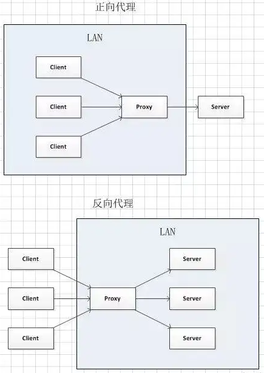

向代理和反向代理的结构是一样的，都是 client-proxy-server 的结构，它们主要的区别就在于中间这个 proxy 是哪一方设置的。在正向代理中，proxy 是 client 设置的，用来隐藏 client；而在反向代理中，proxy 是 server 设置的，用来隐藏 server。

### 4. Nginx 的概念及其工作原理

Nginx 是一款轻量级的 Web 服务器，也可以用于反向代理、负载平衡和 HTTP 缓存等。Nginx 使用异步事件驱动的方法来处理请求，是一款面向性能设计的 HTTP 服务器。

传统的 Web 服务器如 Apache 是 process-based 模型的，而 Nginx 是基于 event-driven 模型的。正是这个主要的区别带给了 Nginx 在性能上的优势。

Nginx 架构的最顶层是一个 master process，这个 master process 用于产生其他的 worker process，这一点和 Apache 非常像，但是 Nginx 的 worker process 可以同时处理大量的 HTTP 请求，而每个 Apache process 只能处理一个。

## 七、浏览器事件机制

### 事件机制

#### 事件触发三阶段

事件触发有三个阶段

- `window` 往事件触发处传播，遇到注册的捕获事件会触发
- 传播到事件触发处时触发注册的事件
- 从事件触发处往 `window` 传播，遇到注册的冒泡事件会触发

事件触发一般来说会按照上面的顺序进行，但是也有特例，如果给一个目标节点同时注册冒泡和捕获事件，事件触发会按照注册的顺序执行。

```javascript
node.addEventListener(
  'click',
  event => {
    console.log('冒泡')
  },
  false
)

node.addEventListener(
  'click',
  event => {
    console.log('捕获 ')
  },
  true
)
```

#### addEventListener第三个参数

addEventListener() 和 removeEventLinstener() 接收 3 个参数：事件名、事件处理函数 和 一个 option 对象或一个布尔值 useCapture（ true 表示在捕获阶段调用事件处理程序， false （默认值）表示在冒泡阶段调用事件处理程序，因为跨浏览器兼容性好，所以事件处理程序默认会被添加到事件流的冒泡阶段（也就是默认最后一个参数为 false ））。

> addEventListener(type, listener, useCapture | options)

option 参数有一下几个选择

- capture: Boolean，表示 listener 会在该类型的事件捕获阶段传播到该 EventTarget 时触发。
- once: Boolean，表示 listener 在添加之后最多只调用一次。如果是 true， listener 会在其被调用之后自动移除。
- passive: Boolean，设置为true时，表示 listener 永远不会调用 preventDefault()。如果 listener 仍然调用了这个函数，客户端将会忽略它并抛出一个控制台警告。

> useCapture

简单的说，我个人的理解是 useCapture 参数指定了该事件处理程序触发的“时机” ：是在事件流的捕获阶段还是冒泡阶段。但是，无论最后一个参数设置为什么，都不会阻碍事件流的传播。

#### target和currentTarget的区别

**currentTarget始终是监听事件者，而target是事件的真正发出者。**

**DOM事件处理程序中this和currentTarget永远相等** **HTML事件处理程序和IE事件处理程序this指向window**

```html
<!DOCTYPE html>
<html>
<head>
    <title>Example</title>
</head>
<body>
    <div id="A">
        A
        <div id="B">
            B
        </div>
    </div>
    <script>
        var a = document.getElementById('A'),
            b = document.getElementById('B');
        function handler(e) {
            console.log(e.target);
            console.log(e.currentTarget);
        }
        a.addEventListener('click', handler, false);
    </script>
</body>
</html>
```

当点击A时：输出：

```html
<div id="A">...<div>
<div id="A">...<div>
```

点击B时输出：

```html
<div id="B"></div>
<div id="A">...</div>
```

### Event loop（事件循环）

**进程**：是系统分配的独立资源，是CPU资源分配的基本单位，进程是由一个或多个线程组成的。

**线程**：线程是资源调度的最小单位，是进程的执行流，是CPU调度和分配的基本单位。同个进程之中的多个线程之间是共享进程的资源的。

**浏览器内核**：

1.浏览器是**多进程的**，浏览器的每一个tab标签都代表一个独立的进程（多个空白的tab标签会合并成一个进程），浏览器内核（浏览器渲染进程）属于浏览器多进程中的一种。

2.浏览器内核有**多种线**程在工作

1. GUI渲染线程：
   - 负责渲染页面，解析HTML、CSS构成DOM树等，当页面重绘或者由某种操作引起的回流都会调起该线程。
   - 和JS引擎线程是互斥的，当JS引擎线程在工作的时候，GUI渲染线程会被挂起，GUI更新被放在JS任务队列中，等待JS引擎线程空闲时继续进行。
2. JS引擎线程：
   - 单线程工作，负责解析运行JavaScript脚本。
   - 和GUI渲染线程互斥，JS运行耗时过程会导致页面阻塞
3. 事件触发线程：当事件符合触发条件触发时，该线程会把对应的事件回调函数添加到队列的队尾，等待JS引擎处理
4. 定时器触发线程
   - 浏览器定时计数器并不是由JS引擎计数的，阻塞会导致计时不准确。
   - 开启定时器触发线程来计时并处罚计时，计时后悔被添加到任务队列中，等待JS引擎处理。
5. HTTP请求线程：
   - http请求的时候会开启一条请求线程。
   - 处理请求有结果后，将回调函数添加到任务队列，等待JS处理。

#### 浏览器端事件循环

##### JS是单线程的

JS是单线程的，或者说只有一个主线程，也就是它一次只能执行一段代码。JS中其实是没有线程概念的，所谓的单线程也只是相对于多线程而言。JS的设计初衷就没有考虑这些，针对JS这种不具备并行任务处理的特性，我们称之为“单线程”。

JS 在执行的过程中会产生执行环境，这些执行环境会被顺序的加入到执行栈中。如果遇到异步的代码，会被挂起并加入到 Task（有多种 task） 队列中。一旦执行栈为空，Event Loop 就会从 Task 队列中拿出需要执行的代码并放入执行栈中执行，所以本质上来说 JS 中的异步还是同步行为。

虽然JS运行在浏览器中是单线程的，但是浏览器是事件驱动的（Event driven），浏览器中很多行为是异步（Asynchronized）的，会创建事件并放入执行队列中。浏览器中很多异步行为都是由浏览器新开一个线程去完成，一个浏览器至少实现三个常驻线程：

- JS引擎线程
- GUI渲染线程
- 事件触发线程

##### JS事件循环机制

JavaScript 事件循环机制分为浏览器和 Node 事件循环机制，两者的实现技术不一样，浏览器 Event Loop 是 HTML 中定义的规范，Node Event Loop 是由 libuv 库实现。这里主要讲的是浏览器部分。

JS有一个 `main thread`主线程和 `call-stack`调用栈（执行栈）所有的任务都会被防到调用栈等待主线程执行

**JS 调用栈**

- JS 调用栈是一种后进先出的数据结构。当函数被调用时，会被添加到栈中的顶部，执行完成之后就从栈顶部移出该函数，直到栈内被清空。

**同步任务、异步任务**

- JavaScript 单线程中的任务分为同步任务和异步任务。同步任务会在调用栈中按照顺序排队等待主线程执行，异步任务则会在异步有了结果后将注册的回调函数添加到任务队列(消息队列)中等待主线程空闲的时候，也就是栈内被清空的时候，被读取到栈中等待主线程执行。任务队列是先进先出的数据结构。

**Event Loop**

- 调用栈中的同步任务都执行完毕，栈内被清空了，就代表主线程空闲了，这个时候就会去任务队列中按照顺序读取一个任务放入到栈中执行。每次栈内被清空，都会去读取任务队列有没有任务，有就读取执行，一直循环读取-执行的操作，就形成了事件循环。

**定时器**

- 定时器会开启一条定时器触发线程来触发计时，定时器会在等待了指定的时间后将事件放入到任务队列中等待读取到主线程执行。
- 定时器指定的延时毫秒数其实并不准确，因为定时器只是在到了指定的时间时将事件放入到任务队列中，必须要等到同步的任务和现有的任务队列中的事件全部执行完成之后，才会去读取定时器的事件到主线程执行，中间可能会存在耗时比较久的任务，那么就不可能保证在指定的时间执行。
- 所以准确的来讲，定时器执行的条件是：经过指定的时间并且主线程空闲

**宏任务(macro-task)、微任务(micro-task)**

- 除了广义的同步任务和异步任务，JavaScript 单线程中的任务可以细分为宏任务和微任务。
- macro-task包括：script(整体代码), setTimeout, setInterval, setImmediate, I/O, UI rendering。
- micro-task包括：process.nextTick, Promises, Object.observe, MutationObserver。

注：JS的循环机制，即遇到宏任务，先执行宏任务，然后在执行微任务

```javascript
console.log(1);
setTimeout(function() {
    console.log(2);
})
var promise = new Promise(function(resolve, reject) {
    console.log(3);
    resolve();
})
promise.then(function() {
    console.log(4);
})
console.log(5);
```

示例中，setTimeout 和 Promise被称为任务源，来自不同的任务源注册的回调函数会被放入到不同的任务队列中。

有了宏任务和微任务的概念后，那 JS 的执行顺序是怎样的？是宏任务先还是微任务先？

第一次事件循环中，JavaScript 引擎会把整个 script 代码当成一个宏任务执行，执行完成之后，再检测本次循环中是否寻在微任务，存在的话就依次从微任务的任务队列中读取执行完所有的微任务，再读取宏任务的任务队列中的任务执行，再执行所有的微任务，如此循环。JS 的执行顺序就是每次事件循环中的宏任务-微任务。

- 上面的示例中，第一次事件循环，整段代码作为宏任务进入主线程执行。
- 遇到了 setTimeout ，就会等到过了指定的时间后将回调函数放入到宏任务的任务队列中。
- 遇到 Promise，将 then 函数放入到微任务的任务队列中。
- 整个事件循环完成之后，会去检测微任务的任务队列中是否存在任务，存在就执行。
- 第一次的循环结果打印为: 1,3,5,4。
- 接着再到宏任务的任务队列中按顺序取出一个宏任务到栈中让主线程执行，那么在这次循环中的宏任务就是 setTimeout 注册的回调函数，执行完这个回调函数，发现在这次循环中并不存在微任务，就准备进行下一次事件循环。
- 检测到宏任务队列中已经没有了要执行的任务，那么就结束事件循环。
- 最终的结果就是 1,3,5,4,2。

### 1. 事件是什么？事件模型？⭐️⭐️

> 事件捕获、事件处理和事件冒泡

事件是用户操作网页时发生的交互动作，比如 click/move， 事件除了用户触发的动作外，还可以是文档加载，窗口滚动和大小调整。事件被封装成一个 event 对象，包含了该事件发生时的所有相关信息（ event 的属性）以及可以对事件进行的操作（ event 的方法）。

事件是用户操作网页时发生的交互动作或者网页本身的一些操作，**现代浏览器一共有三种事件模型：**

- **DOM0 级事件模型**，这种模型不会传播，所以没有事件流的概念，但是现在有的浏览器支持以冒泡的方式实现，它可以在网页中直接定义监听函数，也可以通过 js 属性来指定监听函数。所有浏览器都兼容这种方式。直接在 dom 对象上注册事件名称，就是 DOM0 写法。
- **IE 事件模型**，在该事件模型中，一次事件共有两个过程，**事件处理阶段和事件冒泡阶段**。事件处理阶段会首先执行目标元素绑定的监听事件。然后是事件冒泡阶段，冒泡指的是事件从目标元素冒泡到 document，依次检查经过的节点是否绑定了事件监听函数，如果有则执行。这种模型通过 attachEvent 来添加监听函数，可以添加多个监听函数，会按顺序依次执行。
- **DOM2 级事件模型（常见）**，在该事件模型中，一次事件共有三个过程，**第一个过程是事件捕获阶段**。捕获指的是事件从 document 一直向下传播到目标元素，依次检查经过的节点是否绑定了事件监听函数，如果有则执行。后面两个阶段和 IE 事件模型的两个阶段相同（**事件处理阶段和事件冒泡阶段**）。这种事件模型，事件绑定的函数是 addEventListener，其中第三个参数可以指定事件是否在捕获阶段执行。

### 2. 如何阻止事件冒泡

- 普通浏览器使用：event.stopPropagation()
- IE 浏览器使用：event.cancelBubble = true;

### 3. 对事件委托的理解 ⭐️⭐️

#### （1）事件委托的概念

事件委托本质上是利用了**浏览器事件冒泡**的机制。因为事件在冒泡过程中会上传到父节点，父节点可以通过事件对象获取到目标节点，因此可以把子节点的监听函数定义在父节点上，由父节点的监听函数统一处理多个子元素的事件，这种方式称为事件委托（事件代理）。

使用事件委托可以不必要为每一个子元素都绑定一个监听事件，这样减少了内存上的消耗。并且使用事件代理还可以实现事件的动态绑定，比如说新增了一个子节点，并不需要单独地为它添加一个监听事件，它绑定的事件会交给父元素中的监听函数来处理。

#### （2）事件委托的特点

- **减少内存消耗**

如果有一个列表，列表之中有大量的列表项，需要在点击列表项的时候响应一个事件：

```html
<ul id="list">
	<li>item 1</li>
	<li>item 2</li>
	<li>item 3</li>
	......
	<li>item n</li>
</ul>
```

如果给每个列表项一一都绑定一个函数，那对于内存消耗是非常大的，效率上需要消耗很多性能。因此，比较好的方法就是把这个点击事件绑定到他的父层，也就是 ul 上，然后在执行事件时再去匹配判断目标元素，所以事件委托可以减少大量的内存消耗，节约效率。

- **动态绑定事件**

给上述的例子中每个列表项都绑定事件，在很多时候，需要通过 AJAX 或者用户操作动态的增加或者去除列表项元素，那么在每一次改变的时候都需要重新给新增的元素绑定事件，给即将删去的元素解绑事件；如果用了事件委托就没有这种麻烦了，因为事件是绑定在父层的，和目标元素的增减是没有关系的，执行到目标元素是在真正响应执行事件函数的过程中去匹配的，所以使用事件在动态绑定事件的情况下是可以减少很多重复工作的。

```js
// 来实现把 #list 下的 li 元素的事件代理委托到它的父层元素也就是 #list 上：
// 给父层元素绑定事件
document.getElementById("list").addEventListener("click", function (e) {
	// 兼容性处理
	var event = e || window.event;
	var target = event.target || event.srcElement;
	// 判断是否匹配目标元素
	if (target.nodeName.toLocaleLowerCase === "li") {
		console.log("the content is: ", target.innerHTML);
	}
});
```

在上述代码中， target 元素则是在 #list 元素之下具体被点击的元素，然后通过判断 target 的一些属性（比如：nodeName，id 等等）可以更精确地匹配到某一类 #list li 元素之上；

#### （3）局限性

当然，事件委托也是有局限的。比如 focus、blur 之类的事件没有事件冒泡机制，所以无法实现事件委托；mousemove、mouseout 这样的事件，虽然有事件冒泡，但是只能不断通过位置去计算定位，对性能消耗高，因此也是不适合于事件委托的。

当然事件委托不是只有优点，它也是有**缺点**的，事件委托会影响页面性能，主要影响因素有：

- 元素中，绑定事件委托的次数；
- 点击的最底层元素，到绑定事件元素之间的`DOM`层数；

在必须使用事件委托的地方，可以进行如下的处理：

- 只在必须的地方，使用事件委托，比如：`ajax`的局部刷新区域
- 尽量的减少绑定的层级，不在`body`元素上，进行绑定
- 减少绑定的次数，如果可以，那么把多个事件的绑定，合并到一次事件委托中去，由这个事件委托的回调，来进行分发。

### 4. 事件委托的使用场景 ⭐️⭐️

场景：给页面的所有的 a 标签添加 click 事件，代码如下：

```js
document.addEventListener(
	"click",
	function (e) {
		if (e.target.nodeName == "A") console.log("a");
	},
	false
);
```

但是这些 a 标签可能包含一些像 span、img 等元素，如果点击到了这些 a 标签中的元素（原生），就不会触发 click 事件，因为事件绑定上在 a 标签元素上，而触发这些内部的元素时，e.target 指向的是触发 click 事件的元素（span、img 等其他元素）。

这种情况下就可以使用事件委托来处理，将事件绑定在 a 标签的内部元素上，当点击它的时候，就会逐级向上查找，直到找到 a 标签为止，代码如下：

```js
document.addEventListener(
	"click",
	function (e) {
		var node = e.target;
		while (node.parentNode.nodeName != "BODY") {
			if (node.nodeName == "A") {
				console.log("a");
				break;
			}
			node = node.parentNode;
		}
	},
	false
);
```

### 5. 同步和异步的区别

- **同步**指的是当一个进程在执行某个请求时，如果这个请求需要等待一段时间才能返回，那么这个进程会一直等待下去，直到消息返回为止再继续向下执行。
- **异步**指的是当一个进程在执行某个请求时，如果这个请求需要等待一段时间才能返回，这个时候进程会继续往下执行，不会阻塞等待消息的返回，当消息返回时系统再通知进程进行处理。

### 6. 对事件循环的理解 ⭐️⭐️

因为 js 是单线程运行的，在代码执行时，通过将不同函数的**执行上下文压入执行栈中来保证代码的有序执行**。在执行同步代码时，如果遇到异步事件，js 引擎并不会一直等待其返回结果，而是会将这个事件**挂起**，继续执行执行栈中的其他任务。当异步事件执行完毕后，再将异步事件对应的回调加入到一个任务队列中等待执行。任务队列可以分为宏任务队列和微任务队列，当当前执行栈中的事件执行完毕后，js 引擎首先会判断微任务队列中是否有任务可以执行，如果有就将微任务队首的事件压入栈中执行。当微任务队列中的任务都执行完成后再去执行宏任务队列中的任务。

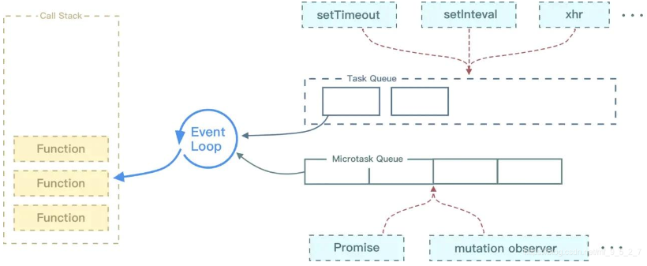

Event Loop 执行顺序如下所示：

- 首先执行同步代码，这属于宏任务
- 当执行完所有同步代码后，执行栈为空，查询是否有异步代码需要执行
- 执行所有微任务
- 当执行完所有微任务后，如**有必要会渲染页面（宏任务）**
- 然后开始下一轮 Event Loop，执行宏任务中的异步代码

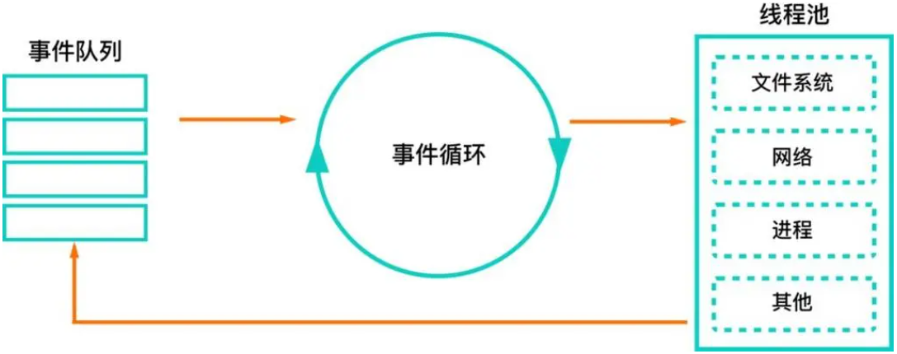

### **7. 宏任务和微任务分别有哪些 ⭐️⭐️**

- 微任务包括： **promise** 的回调、node 中的 process.**nextTick** 、对 Dom 变化监听的 **MutationObserver**。
- 宏任务包括： script 脚本的执行、**setTimeout** ，**setInterval** ，**setImmediate** 一类的定时事件，还有如 **I/O** 操作、**UI** 渲染等。

### **8. 什么是执行栈（调用栈）**

可以把执行栈认为是一个存储函数调用的**栈结构**，遵循先进后出的原则。

当开始执行 JS 代码时，根据先进后出的原则，后执行的函数会先弹出栈，可以看到，`foo` 函数后执行，当执行完毕后就从栈中弹出了。

### **9. Node 中的 Event Loop 和浏览器中的有什么区别？process.nextTick 执行顺序？⭐️⭐️**

> 过于复杂诶

**Node 中的 Event Loop 和浏览器中的是完全不相同的东西。**

**Node 的 Event Loop 分为 6 个阶段**，

> Timers
> Pending callbacks
> idle/Prepare
> Poll
> Check
> Close callbacks

它们会按照**顺序**反复运行。每当进入某一个阶段的时候，都会从对应的回调队列中取出函数去执行。当队列为空或者执行的回调函数数量到达系统设定的阈值，就会进入下一阶段。

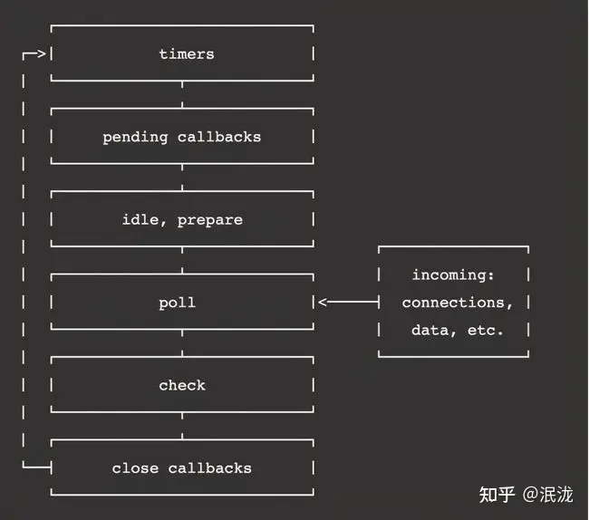

（1）**Timers（计时器阶段）**：初次进入事件循环，会从计时器阶段开始。此阶段会判断是否存在过期的计时器回调（包含 setTimeout 和 setInterval），如果存在则会执行所有过期的计时器回调，执行完毕后，如果回调中触发了相应的微任务，会接着执行所有微任务，执行完微任务后再进入 Pending callbacks 阶段。

（2）**Pending callbacks**：执行推迟到下一个循环迭代的 I / O 回调（系统调用相关的回调）。

（3）**Idle/Prepare**：仅供内部使用。

（4）**Poll（轮询阶段）**：

- 当回调队列不为空时：会执行回调，若回调中触发了相应的微任务，这里的微任务执行时机和其他地方有所不同，不会等到所有回调执行完毕后才执行，而是针对每一个回调执行完毕后，就执行相应微任务。执行完所有的回调后，变为下面的情况。
- 当回调队列为空时（没有回调或所有回调执行完毕）：但如果存在有计时器（setTimeout、setInterval 和 setImmediate）没有执行，会结束轮询阶段，进入 Check 阶段。否则会阻塞并等待任何正在执行的 I/O 操作完成，并马上执行相应的回调，直到所有回调执行完毕。

（5）**Check（查询阶段）**：会检查是否存在 setImmediate 相关的回调，如果存在则执行所有回调，执行完毕后，如果回调中触发了相应的微任务，会接着执行所有微任务，执行完微任务后再进入 Close callbacks 阶段。

（6）**Close callbacks**：执行一些关闭回调，比如 socket.on('close', ...)等。

下面来看一个例子，首先在有些情况下，定时器的执行顺序其实是**随机**的

```js
setTimeout(() => {
	console.log("setTimeout");
}, 0);
setImmediate(() => {
	console.log("setImmediate");
});
```

对于以上代码来说，`setTimeout` 可能执行在前，也可能执行在后

- 首先 `setTimeout(fn, 0) === setTimeout(fn, 1)`，这是由源码决定的
- 进入事件循环也是需要成本的，如果在准备时候花费了大于 1ms 的时间，那么在 timer 阶段就会直接执行 `setTimeout` 回调
- 那么如果准备时间花费小于 1ms，那么就是 `setImmediate` 回调先执行了

当然在某些情况下，他们的执行顺序一定是固定的，比如以下代码：

```js
const fs = require("fs");
fs.readFile(__filename, () => {
	setTimeout(() => {
		console.log("timeout");
	}, 0);
	setImmediate(() => {
		console.log("immediate");
	});
});
```

在上述代码中，`setImmediate` 永远**先执行**。因为两个代码写在 IO 回调中，IO 回调是在 poll 阶段执行，当回调执行完毕后队列为空，发现存在 `setImmediate` 回调，所以就直接跳转到 check 阶段去执行回调了。

上面都是 macrotask 的执行情况，对于 microtask 来说，它会在以上每个阶段完成前**清空** microtask 队列，下图中的 Tick 就代表了 microtask

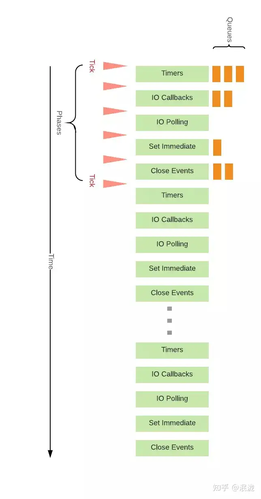

```js
setTimeout(() => {
	console.log("timer21");
}, 0);
Promise.resolve().then(function () {
	console.log("promise1");
});
```

对于以上代码来说，其实和浏览器中的输出是一样的，microtask 永远执行在 macrotask 前面。

最后来看 Node 中的 `process.nextTick`，这个函数其实是独立于 Event Loop 之外的，它有一个自己的队列，当每个阶段完成后，如果存在 nextTick 队列，就会**清空队列中的所有回调函数**，并且优先于其他 microtask 执行。

```js
setTimeout(() => {
	console.log("timer1");
	Promise.resolve().then(function () {
		console.log("promise1");
	});
}, 0);
process.nextTick(() => {
	console.log("nextTick");
	process.nextTick(() => {
		console.log("nextTick");
		process.nextTick(() => {
			console.log("nextTick");
			process.nextTick(() => {
				console.log("nextTick");
			});
		});
	});
});
```

对于以上代码，永远都是先把 nextTick 全部打印出来。

### **10. 事件触发的过程是怎样的**

事件触发有三个阶段：

- `window` 往事件触发处传播，遇到注册的捕获事件会触发
- 传播到事件触发处时触发注册的事件
- 从事件触发处往 `window` 传播，遇到注册的冒泡事件会触发

事件触发一般来说会按照上面的顺序进行，但是也有特例，**如果给一个 \*\*`body`\*\* 中的子节点同时注册冒泡和捕获事件，事件触发会按照注册的顺序执行。**

```js
// 以下会先打印冒泡然后是捕获
node.addEventListener(
	"click",
	(event) => {
		console.log("冒泡");
	},
	false
);
node.addEventListener(
	"click",
	(event) => {
		console.log("捕获 ");
	},
	true
);
```

通常使用 `addEventListener` 注册事件，该函数的第三个参数可以是布尔值，也可以是对象。对于布尔值 `useCapture` 参数来说，该参数默认值为 `false` ，`useCapture` 决定了注册的事件是捕获事件还是冒泡事件。对于对象参数来说，可以使用以下几个属性：

- `capture`：布尔值，和 `useCapture` 作用一样
- `once`：布尔值，值为 `true` 表示该回调只会调用一次，调用后会移除监听
- `passive`：布尔值，表示永远不会调用 `preventDefault`

一般来说，如果只希望事件只触发在目标上，这时候可以使用 `stopPropagation` 来阻止事件的进一步传播。通常认为 `stopPropagation` 是用来阻止事件冒泡的，其实该函数也可以阻止捕获事件。

`stopImmediatePropagation` 同样也能实现阻止事件，但是还能阻止该事件目标执行别的注册事件。

```js
node.addEventListener(
	"click",
	(event) => {
		event.stopImmediatePropagation();
		console.log("冒泡");
	},
	false
);
// 点击 node 只会执行上面的函数，该函数不会执行
node.addEventListener(
	"click",
	(event) => {
		console.log("捕获 ");
	},
	true
);
```

## 八、浏览器垃圾回收机制

### 1. V8 的垃圾回收机制是怎样的

> GC（Garbage Collection）算法，新旧分代，普通浏览器使用**标记清除**（很少使用引用计数）

V8 实现了准确式 GC，GC 算法采用了分代式垃圾回收机制。因此，V8 将内存（堆）分为新生代和老生代两部分。

#### （1）新生代算法 - GC 垃圾回收 算法

新生代中的对象一般存活时间较短，使用 Scavenge GC 算法。

在新生代空间中，内存空间分为两部分，分别为 From 空间和 To 空间。在这两个空间中，必定有一个空间是使用的，另一个空间是空闲的。新分配的对象会被放入 From 空间中，当 From 空间被占满时，新生代 GC 就会启动了。算法会检查 From 空间中存活的对象并复制到 To 空间中，如果有失活的对象就会销毁。当复制完成后将 From 空间和 To 空间互换，这样 GC 就结束了。

#### （2）老生代算法 - 标记清除算法和标记压缩算法

老生代中的对象一般存活时间较长且数量也多，**使用了两个算法，分别是标记清除算法和标记压缩算法。**

先来说下什么情况下对象会出现在老生代空间中：

- 新生代中的对象是否已经经历过一次 Scavenge 算法，如果经历过的话，会将对象从新生代空间移到老生代空间中。
- To 空间的对象占比大小超过 25 %。在这种情况下，为了不影响到内存分配，会将对象从新生代空间移到老生代空间中。

老生代中的空间很复杂，有如下几个空间

```js
enum AllocationSpace {
  // TODO(v8:7464): Actually map this space's memory as read-only.
  RO_SPACE,    // 不变的对象空间
  NEW_SPACE,   // 新生代用于 GC 复制算法的空间
  OLD_SPACE,   // 老生代常驻对象空间
  CODE_SPACE,  // 老生代代码对象空间
  MAP_SPACE,   // 老生代 map 对象
  LO_SPACE,    // 老生代大空间对象
  NEW_LO_SPACE,  // 新生代大空间对象
  FIRST_SPACE = RO_SPACE,
  LAST_SPACE = NEW_LO_SPACE,
  FIRST_GROWABLE_PAGED_SPACE = OLD_SPACE,
  LAST_GROWABLE_PAGED_SPACE = MAP_SPACE
};
```

在老生代中，以下情况会先启动标记清除算法：

- 某一个空间没有分块的时候
- 空间中被对象超过一定限制
- 空间不能保证新生代中的对象移动到老生代中

在这个阶段中，会遍历堆中所有的对象，然后标记活的对象，在标记完成后，销毁所有没有被标记的对象。在标记大型对内存时，可能需要几百毫秒才能完成一次标记。这就会导致一些性能上的问题。为了解决这个问题，2011 年，V8 从 stop-the-world 标记切换到增量标志。在增量标记期间，GC 将标记工作分解为更小的模块，可以让 JS 应用逻辑在模块间隙执行一会，从而不至于让应用出现停顿情况。但在 2018 年，GC 技术又有了一个重大突破，这项技术名为并发标记。该技术可以让 GC 扫描和标记对象时，同时允许 JS 运行。

清除对象后会造成堆内存出现碎片的情况，当碎片超过一定限制后会启动压缩算法。在压缩过程中，将活的对象向一端移动，直到所有对象都移动完成然后清理掉不需要的内存。

### 2. 哪些操作会造成内存泄漏？⭐️

> 全局变量，定时器，Dom 引用 or 监听，闭包，循环引用

- 第一种情况是由于使用未声明的变量，而意外的创建了一个全局变量，而使这个变量一直留在内存中无法被回收。
  全局变量被严格模式所避免
- 第二种情况是设置了 setInterval 定时器，而忘记取消它，如果循环函数有对外部变量的引用的话，那么这个变量会被一直留在内存中，而无法被回收。
- 第三种情况是获取一个 DOM 元素的引用，而后面这个元素被删除，由于我们一直保留了对这个元素的引用，所以它也无法被回收。
- 第四种情况是不合理的使用闭包，从而导致某些变量一直被留在内存当中。

# 浏览器缓存—深入了解

缓存策略的分类：

- 强缓存
- 协商缓存

缓存策略都是通过设置 HTTP Header 来实现的。

浏览器每次发起请求，都会先在浏览器缓存中查找该请求的结果以及缓存标识。

浏览器每次拿到返回的请求结果都会将该结果和缓存标识存入浏览器缓存中。

## 一、前言

缓存可以说是性能优化中简单高效的一种优化方式了。一个优秀的缓存策略可以缩短网页请求资源的距离，减少延迟，并且由于缓存文件可以重复利用，还可以减少带宽，降低网络负荷。

对于一个数据请求来说，可以分为发起网络请求、后端处理、浏览器响应三个步骤。浏览器缓存可以帮助我们在第一和第三步骤中优化性能。比如说直接使用缓存而不发起请求，或者发起了请求但后端存储的数据和前端一致，那么就没有必要再将数据回传回来，这样就减少了响应数据。

接下来的内容中我们将通过缓存位置、缓存策略以及实际场景应用缓存策略来探讨浏览器缓存机制。

## 二、缓存位置

从缓存位置上来说分为四种，并且各自有优先级，当依次查找缓存且都没有命中的时候，才会去请求网络。

- Service Worker
- Memory Cache
- Disk Cache
- Push Cache

### 1.Service Worker

Service Worker 是运行在浏览器背后的独立线程，一般可以用来实现缓存功能。使用 Service Worker 的话，传输协议必须为 HTTPS。因为 Service Worker 中涉及到请求拦截，所以必须使用 HTTPS 协议来保障安全。**Service Worker 的缓存与浏览器其他内建的缓存机制不同，它可以让我们自由控制缓存哪些文件、如何匹配缓存、如何读取缓存，并且缓存是持续性的**。

Service Worker 实现缓存功能一般分为三个步骤：首先需要先注册 Service Worker，然后监听到 install 事件以后就可以缓存需要的文件，那么在下次用户访问的时候就可以通过拦截请求的方式查询是否存在缓存，存在缓存的话就可以直接读取缓存文件，否则就去请求数据。

当 Service Worker 没有命中缓存的时候，我们需要去调用 fetch 函数获取数据。也就是说，如果我们没有在 Service Worker 命中缓存的话，会根据缓存查找优先级去查找数据。但是不管我们是从 Memory Cache 中还是从网络请求中获取的数据，浏览器都会显示我们是从 Service Worker 中获取的内容。

### 2.Memory Cache

Memory Cache 也就是内存中的缓存，主要包含的是当前中页面中已经抓取到的资源,例如页面上已经下载的样式、脚本、图片等。读取内存中的数据肯定比磁盘快,内存缓存虽然读取高效，可是缓存持续性很短，会随着进程的释放而释放。 **一旦我们关闭 Tab 页面，内存中的缓存也就被释放了**。

**那么既然内存缓存这么高效，我们是不是能让数据都存放在内存中呢？**
这是不可能的。计算机中的内存一定比硬盘容量小得多，操作系统需要精打细算内存的使用，所以能让我们使用的内存必然不多。

当我们访问过页面以后，再次刷新页面，可以发现很多数据都来自于内存缓存

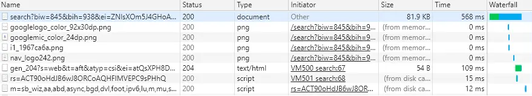

内存缓存中有一块重要的缓存资源是 preloader 相关指令（例如`<link rel="prefetch">`）下载的资源。总所周知 preloader 的相关指令已经是页面优化的常见手段之一，它可以一边解析 js/css 文件，一边网络请求下一个资源。

需要注意的事情是，**内存缓存在缓存资源时并不关心返回资源的 HTTP 缓存头 Cache-Control 是什么值，同时资源的匹配也并非仅仅是对 URL 做匹配，还可能会对 Content-Type，CORS 等其他特征做校验**。

### 3.Disk Cache

Disk Cache 也就是存储在硬盘中的缓存，读取速度慢点，但是什么都能存储到磁盘中，**比之 Memory Cache 胜在容量和存储时效性上**。

在所有浏览器缓存中，Disk Cache 覆盖面基本是最大的。它会根据 HTTP Herder 中的字段判断哪些资源需要缓存，哪些资源可以不请求直接使用，哪些资源已经过期需要重新请求。并且即使在跨站点的情况下，相同地址的资源一旦被硬盘缓存下来，就不会再次去请求数据。绝大部分的缓存都来自 Disk Cache，关于 HTTP 的协议头中的缓存字段，我们会在下文进行详细介绍。

#### 浏览器会把哪些文件丢进内存中？哪些丢进硬盘中？

关于这点，网上说法不一，不过以下观点比较靠得住：

- 对于大文件来说，大概率是不存储在内存中的，反之优先
- 当前系统内存使用率高的话，文件优先存储进硬盘

### 4.Push Cache

Push Cache（推送缓存）是 HTTP/2 中的内容，当以上三种缓存都没有命中时，它才会被使用。**它只在会话（Session）中存在，一旦会话结束就被释放，并且缓存时间也很短暂**，在 Chrome 浏览器中只有 5 分钟左右，同时它也并非严格执行 HTTP 头中的缓存指令。

Push Cache 在国内能够查到的资料很少，也是因为 HTTP/2 在国内不够普及。

几个结论：

- 所有的资源都能被推送，并且能够被缓存,但是 Edge 和 Safari 浏览器支持相对比较差
- 可以推送 no-cache 和 no-store 的资源
- 一旦连接被关闭，Push Cache 就被释放
- 多个页面可以使用同一个 HTTP/2 的连接，也就可以使用同一个 Push Cache。这主要还是依赖浏览器的实现而定，出于对性能的考虑，有的浏览器会对相同域名但不同的 tab 标签使用同一个 HTTP 连接。
- Push Cache 中的缓存只能被使用一次
- 浏览器可以拒绝接受已经存在的资源推送
- 你可以给其他域名推送资源

如果以上四种缓存都没有命中的话，那么只能发起请求来获取资源了。

那么为了性能上的考虑，大部分的接口都应该选择好缓存策略，**通常浏览器缓存策略分为两种：强缓存和协商缓存，并且缓存策略都是通过设置 HTTP Header 来实现的**。

## 三、缓存过程分析

浏览器与服务器通信的方式为应答模式，即是：浏览器发起 HTTP 请求 – 服务器响应该请求，**那么浏览器怎么确定一个资源该不该缓存，如何去缓存呢**？浏览器第一次向服务器发起该请求后拿到请求结果后，将请求结果和缓存标识存入浏览器缓存，**浏览器对于缓存的处理是根据第一次请求资源时返回的响应头来确定的**。具体过程如下图：

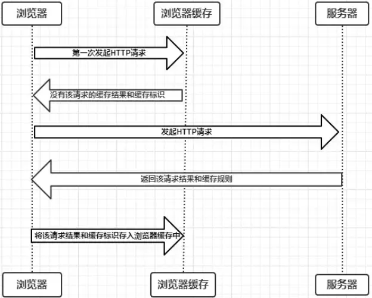

第一次发起 HTTP 请求

由上图我们可以知道：

- 浏览器每次发起请求，都会先在浏览器缓存中查找该请求的结果以及缓存标识
- 浏览器每次拿到返回的请求结果都会将该结果和缓存标识存入浏览器缓存中

以上两点结论就是浏览器缓存机制的关键，它确保了每个请求的缓存存入与读取，只要我们再理解浏览器缓存的使用规则，那么所有的问题就迎刃而解了，本文也将围绕着这点进行详细分析。为了方便大家理解，这里我们根据是否需要向服务器重新发起 HTTP 请求将缓存过程分为两个部分，分别是强缓存和协商缓存。

## 四、强缓存

**强缓存：不会向服务器发送请求，直接从缓存中读取资源，在 chrome 控制台的 Network 选项中可以看到该请求返回 200 的状态码，并且 Size 显示 from disk cache 或 from memory cache。强缓存可以通过设置两种 HTTP Header 实现：Expires 和 Cache-Control。**

### 1.Expires

**缓存过期时间，用来指定资源到期的时间，是服务器端的具体的时间点**。也就是说，Expires=max-age + 请求时间，需要和 Last-modified 结合使用。Expires 是 Web 服务器响应消息头字段，在响应 http 请求时告诉浏览器在过期时间前浏览器可以直接从浏览器缓存取数据，而无需再次请求。

**Expires 是 HTTP/1 的产物，受限于本地时间，如果修改了本地时间，可能会造成缓存失效**。`Expires: Wed, 22 Oct 2018 08:41:00 GMT`表示资源会在 Wed, 22 Oct 2018 08:41:00 GMT 后过期，需要再次请求。

### 2.Cache-Control

在 HTTP/1.1 中，Cache-Control 是最重要的规则，主要用于控制网页缓存。比如当`Cache-Control:max-age=300`时，则代表在这个请求正确返回时间（浏览器也会记录下来）的 5 分钟内再次加载资源，就会命中强缓存。

Cache-Control 可以在请求头或者响应头中设置，并且可以组合使用多种指令：

|     指令     |                           作用                           |
| :----------: | :------------------------------------------------------: |
|    public    |           表示响应可以被客户端和代理服务器缓存           |
|   private    |                表示响应只可以被客户端缓存                |
|  max-age=30  |             缓存 30 秒后就过期，需要重新请求             |
| s-maxage=30  |       覆盖 max-age，作用一样，只在代理服务器中生效       |
|   no-store   |                      不缓存任何响应                      |
|   no-cache   | 资源被缓存，但是立即失效，下次会发起请求验证资源是否过期 |
| max-stale=30 |           30 秒内，即使缓存过期，也使用该缓存            |
| min-fresh=30 |               希望在 30 秒内获取最新的响应               |

**public**：**所有内容都将被缓存（客户端和代理服务器都可缓存）**。具体来说响应可被任何中间节点缓存，如 Browser <-- proxy1 <-- proxy2 <-- Server，中间的 proxy 可以缓存资源，比如下次再请求同一资源 proxy1 直接把自己缓存的东西给 Browser 而不再向 proxy2 要。

**private**：**所有内容只有客户端可以缓存**，Cache-Control 的默认取值。具体来说，表示中间节点不允许缓存，对于 Browser <-- proxy1 <-- proxy2 <-- Server，proxy 会老老实实把 Server 返回的数据发送给 proxy1,自己不缓存任何数据。当下次 Browser 再次请求时 proxy 会做好请求转发而不是自作主张给自己缓存的数据。

**no-cache**：客户端缓存内容，是否使用缓存则需要经过协商缓存来验证决定。表示不使用 Cache-Control 的缓存控制方式做前置验证，而是使用 Etag 或者 Last-Modified 字段来控制缓存。**需要注意的是，no-cache 这个名字有一点误导。设置了 no-cache 之后，并不是说浏览器就不再缓存数据，只是浏览器在使用缓存数据时，需要先确认一下数据是否还跟服务器保持一致。**

**no-store**：所有内容都不会被缓存，即不使用强制缓存，也不使用协商缓存

**max-age**：max-age=xxx (xxx is numeric)表示缓存内容将在 xxx 秒后失效

**s-maxage**（单位为 s)：同 max-age 作用一样，只在代理服务器中生效（比如 CDN 缓存）。比如当 s-maxage=60 时，在这 60 秒中，即使更新了 CDN 的内容，浏览器也不会进行请求。max-age 用于普通缓存，而 s-maxage 用于代理缓存。**s-maxage 的优先级高于 max-age**。如果存在 s-maxage，则会覆盖掉 max-age 和 Expires header。

**max-stale**：能容忍的最大过期时间。max-stale 指令标示了客户端愿意接收一个已经过期了的响应。如果指定了 max-stale 的值，则最大容忍时间为对应的秒数。如果没有指定，那么说明浏览器愿意接收任何 age 的响应（age 表示响应由源站生成或确认的时间与当前时间的差值）。

**min-fresh**：能够容忍的最小新鲜度。min-fresh 标示了客户端不愿意接受新鲜度不多于当前的 age 加上 min-fresh 设定的时间之和的响应。

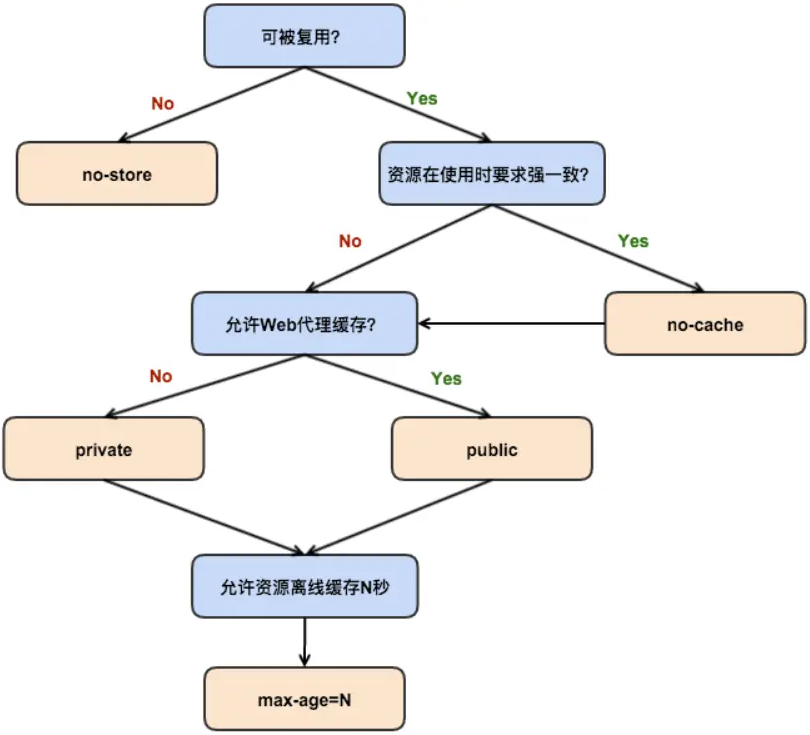

从图中我们可以看到，我们可以将多个指令配合起来一起使用，达到多个目的。比如说我们希望资源能被缓存下来，并且是客户端和代理服务器都能缓存，还能设置缓存失效时间等等。

### 3.Expires 和 Cache-Control 两者对比

其实这两者差别不大，区别就在于 Expires 是 http1.0 的产物，Cache-Control 是 http1.1 的产物，**两者同时存在的话，Cache-Control 优先级高于 Expires**；在某些不支持 HTTP1.1 的环境下，Expires 就会发挥用处。所以 Expires 其实是过时的产物，现阶段它的存在只是一种兼容性的写法。

强缓存判断是否缓存的依据来自于是否超出某个时间或者某个时间段，而不关心服务器端文件是否已经更新，这可能会导致加载文件不是服务器端最新的内容，**那我们如何获知服务器端内容是否已经发生了更新呢**？此时我们需要用到协商缓存策略。

## 五、协商缓存

**协商缓存就是强制缓存失效后，浏览器携带缓存标识向服务器发起请求，由服务器根据缓存标识决定是否使用缓存的过程，主要有以下两种情况**：

- **协商缓存生效，返回 304 和 Not Modified**

  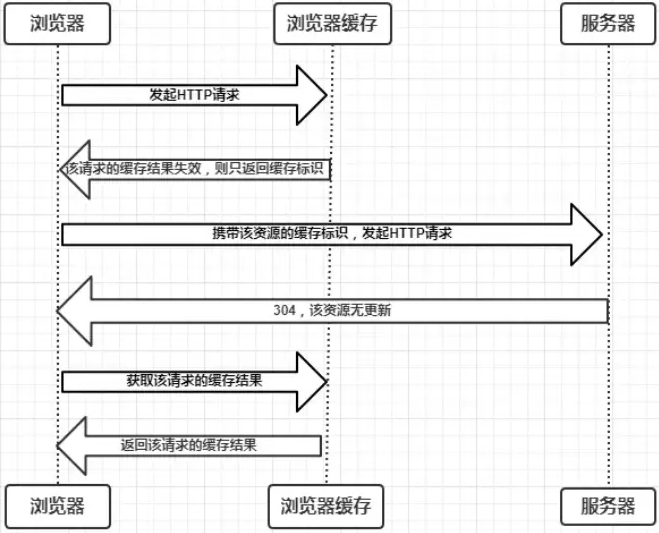

- **协商缓存失效，返回 200 和请求结果**

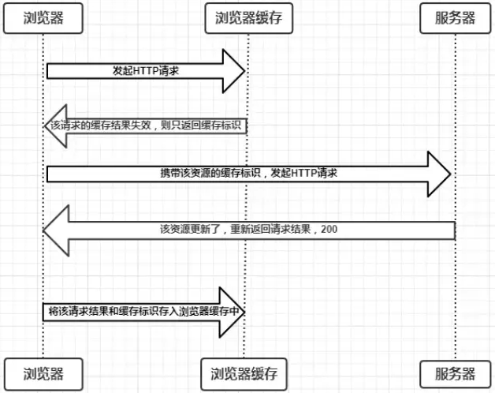

协商缓存可以通过设置两种 HTTP Header 实现：Last-Modified 和 ETag 。

### 1.Last-Modified 和 If-Modified-Since

浏览器在第一次访问资源时，服务器返回资源的同时，在 response header 中添加 Last-Modified 的 header，值是这个资源在服务器上的最后修改时间，浏览器接收后缓存文件和 header；

```bash
Last-Modified: Fri, 22 Jul 2016 01:47:00 GMT
```

浏览器下一次请求这个资源，浏览器检测到有 Last-Modified 这个 header，于是添加 If-Modified-Since 这个 header，值就是 Last-Modified 中的值；服务器再次收到这个资源请求，会根据 If-Modified-Since 中的值与服务器中这个资源的最后修改时间对比，如果没有变化，返回 304 和空的响应体，直接从缓存读取，如果 If-Modified-Since 的时间小于服务器中这个资源的最后修改时间，说明文件有更新，于是返回新的资源文件和 200

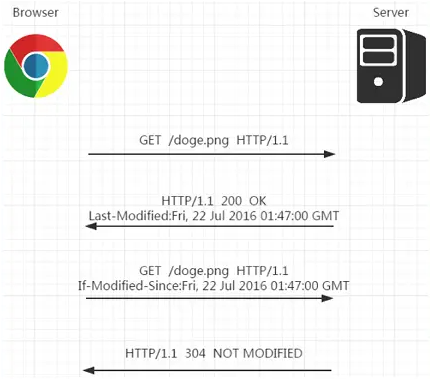

#### 但是 Last-Modified 存在一些弊端：

- 如果本地打开缓存文件，即使没有对文件进行修改，但还是会造成 Last-Modified 被修改，服务端不能命中缓存导致发送相同的资源
- 因为 Last-Modified 只能以秒计时，如果在不可感知的时间内修改完成文件，那么服务端会认为资源还是命中了，不会返回正确的资源

既然根据文件修改时间来决定是否缓存尚有不足，能否可以直接根据文件内容是否修改来决定缓存策略？所以在 HTTP / 1.1 出现了 `ETag` 和`If-None-Match`

### 2.ETag 和 If-None-Match

**Etag 是服务器响应请求时，返回当前资源文件的一个唯一标识(由服务器生成)，只要资源有变化，Etag 就会重新生成**。浏览器在下一次加载资源向服务器发送请求时，会将上一次返回的 Etag 值放到 request header 里的 If-None-Match 里，服务器只需要比较客户端传来的 If-None-Match 跟自己服务器上该资源的 ETag 是否一致，就能很好地判断资源相对客户端而言是否被修改过了。如果服务器发现 ETag 匹配不上，那么直接以常规 GET 200 回包形式将新的资源（当然也包括了新的 ETag）发给客户端；如果 ETag 是一致的，则直接返回 304 知会客户端直接使用本地缓存即可。

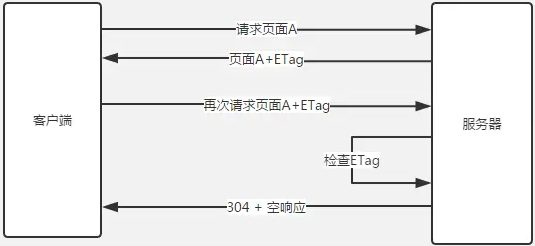

### 3.ETag 和 Last-Modified 之间对比

首先：**在精确度上**，Etag 要优于 Last-Modified。

- Last-Modified 的时间单位是秒，如果某个文件在 1 秒内改变了多次，那么他们的 Last-Modified 其实并没有体现出来修改，但是 Etag 每次都会改变确保了精度；如果是负载均衡的服务器，各个服务器生成的 Last-Modified 也有可能不一致。

第二：**在性能上**，Etag 要逊于 Last-Modified，毕竟 Last-Modified 只需要记录时间，而 Etag 需要服务器通过算法来计算出一个 hash 值。

第三：**在优先级上**，服务器校验优先考虑 Etag。

## 六、缓存机制

**强制缓存优先于协商缓存进行，若强制缓存(Expires 和 Cache-Control)生效则直接使用缓存，若不生效则进行协商缓存(Last-Modified / If-Modified-Since 和 Etag / If-None-Match)，协商缓存由服务器决定是否使用缓存，若协商缓存失效，那么代表该请求的缓存失效，返回 200，重新返回资源和缓存标识，再存入浏览器缓存中；生效则返回 304，继续使用缓存**。

具体流程图如下：

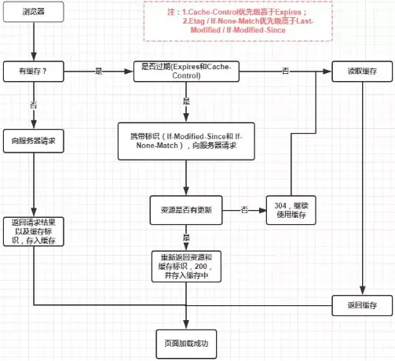

看到这里，不知道你是否存在这样一个疑问：**如果什么缓存策略都没设置，那么浏览器会怎么处理？**

对于这种情况，浏览器会采用一个启发式的算法，通常会取响应头中的 Date 减去 Last-Modified 值的 10% 作为缓存时间。

## 七、强缓存与协商缓存的区别

强缓存与协商缓存的区别可以用下表来表示：

| 缓存类型 | 获取资源形式 | 状态码              | 发送请求到服务器                 |
| -------- | ------------ | ------------------- | -------------------------------- |
| 强缓存   | 从缓存取     | 200（from cache）   | 否，直接从缓存取                 |
| 协商缓存 | 从缓存取     | 304（Not Modified） | 是，通过服务器来告知缓存是否可用 |

用户行为对缓存的影响

| 用户操作         | Expires/Cache-Control | Last-Modied/Etag |     |
| ---------------- | --------------------- | ---------------- | --- |
| 地址栏回车       | 有效                  | 有效             |     |
| 页面链接跳转     | 有效                  | 有效             |     |
| 新开窗口         | 有效                  | 有效             |     |
| 前进回退         | 有效                  | 有效             |     |
| F5 刷新          | 无效                  | 有效             |     |
| Ctrl+F5 强制刷新 | 无效                  | 无效             |     |

### from memory cache 与 from disk cache 对比

在 chrome 浏览器中的控制台 Network 中 size 栏通常会有三种状态

- 1.from memory cache
- 2.from disk cache
- 3.资源本身的大小(如：1.5k)

三种的区别：

- **from memory cache**：字面理解是从内存中，其实也是字面的含义，这个资源是直接从内存中拿到的，不会请求服务器一般已经加载过该资源且缓存在了内存当中，当关闭该页面时，此资源就被内存释放掉了，再次重新打开相同页面时不会出现 from memory cache 的情况。
- **from disk cache**：同上类似，此资源是从磁盘当中取出的，也是在已经在之前的某个时间加载过该资源，不会请求服务器但是此资源不会随着该页面的关闭而释放掉，因为是存在硬盘当中的，下次打开仍会 from disk cache
- **资源本身大小数值**：当 http 状态为 200 是实实在在从浏览器获取的资源，当 http 状态为 304 时该数字是与服务端通信报文的大小，并不是该资源本身的大小，该资源是从本地获取的

| 状态 | 类型              | 说明                                                                 |
| ---- | ----------------- | -------------------------------------------------------------------- |
| 200  | form memory cache | 不请求网络资源，资源在内存当中，一般脚本、字体、图片会存在内存当中。 |
| 200  | form disk ceche   | 不请求网络资源，在磁盘当中，一般非脚本会存在内存当中，如 css 等。    |
| 200  | 资源大小数值      | 资源大小数值 从服务器下载最新资源。                                  |
| 304  | 报文大小          | 请求服务端发现资源没有更新，使用本地资源，即命中协商缓存。           |

## 八、实际场景应用缓存策略

### 1.频繁变动的资源

> Cache-Control: no-cache

对于频繁变动的资源，首先需要使用`Cache-Control: no-cache` 使浏览器每次都请求服务器，然后配合 ETag 或者 Last-Modified 来验证资源是否有效。这样的做法虽然不能节省请求数量，但是能显著减少响应数据大小。

### 2.不常变化的资源

> Cache-Control: max-age=31536000

通常在处理这类资源时，给它们的 Cache-Control 配置一个很大的 `max-age=31536000` (一年)，这样浏览器之后请求相同的 URL 会命中强制缓存。而为了解决更新的问题，就需要在文件名(或者路径)中添加 hash， 版本号等动态字符，之后更改动态字符，从而达到更改引用 URL 的目的，让之前的强制缓存失效 (其实并未立即失效，只是不再使用了而已)。
在线提供的类库 (如 `jquery-3.3.1.min.js`, `lodash.min.js` 等) 均采用这个模式。

## 九、用户行为对浏览器缓存的影响

所谓用户行为对浏览器缓存的影响，指的就是用户在浏览器如何操作时，会触发怎样的缓存策略。主要有 3 种：

- 打开网页，地址栏输入地址： 查找 disk cache 中是否有匹配。如有则使用；如没有则发送网络请求。
- 普通刷新 (F5)：因为 TAB 并没有关闭，因此 memory cache 是可用的，会被优先使用(如果匹配的话)。其次才是 disk cache。
- 强制刷新 (Ctrl + F5)：浏览器不使用缓存，因此发送的请求头部均带有 `Cache-control: no-cache`(为了兼容，还带了 `Pragma: no-cache`),服务器直接返回 200 和最新内容。


# 浏览器渲染机制——深入了解

浏览器的渲染机制一般分为以下几个步骤

1. 处理 HTML 并构建 DOM 树。
2. 处理 CSS 构建 CSSOM 树。
3. 将 DOM 与 CSSOM 合并成一个渲染树。
4. 根据渲染树来布局，计算每个节点的位置。
5. 调用 GPU 绘制，合成图层，显示在屏幕上。

在构建 CSSOM 树时，会阻塞渲染，直至 CSSOM 树构建完成。并且构建 CSSOM 树是一个十分消耗性能的过程，所以应该尽量保证层级扁平，减少过度层叠，越是具体的 CSS 选择器，执行速度越慢。

当 HTML 解析到 script 标签时，会暂停构建 DOM，完成后才会从暂停的地方重新开始。也就是说，如果你想首屏渲染的越快，就越不应该在首屏就加载 JS 文件。并且 CSS 也会影响 JS 的执行，只有当解析完样式表才会执行 JS，所以也可以认为这种情况下，CSS 也会暂停构建 DOM。

### 什么是 DOCTYPE 及作用

DTD (document type definition，文档类型定义) 是一系列的语法规则，用来定义 XML 或(X)HTML 的文件类型。浏览器会使用它来判断文档类型，决定使用何种协议来解析以及切换浏览器模式

DOCTYPE 是用来声明文档类型和 DTD 规范的，一个主要的用途便是文件的合法性验证如果文件代码不合法，那么浏览器解析时便会出一些差错

#### 常见的 DOCTYPE 和作用

##### HTML5

```html
<!DOCTYPE html>
```

##### HTML 4.01 Strict(严格模式)

该 DTD 包含所有 HTML 元素和属性，但不包括展示性的和弃用的元素 (比如 font)

```html
<!DOCTYPE html PUBLIC"-/W3C//DTD HTML 4.01//EN""http://www.w3.org/TR/html4/strict.dtd">
```

##### HTML 4.01 Transitional(传统模式)

该 DTD 包含所有 HTML 元素和属性，包括展示性的和弃用的元素(比如 font)

```html
<!DOCTYPE html PUBLIC"-/W3C//DTD HTML 4.01 Transitional//EN""http://www.w3.org/TR/html4/loose.dtd">
```

### Load 和 DOMContentLoaded 区别

Load 事件触发代表页面中的 DOM，CSS，JS，图片已经全部加载完毕。

DOMContentLoaded 事件触发代表初始的 HTML 被完全加载和解析，不需要等待 CSS，JS，图片加载。

### 图层

一般来说，可以把普通文档流看成一个图层。特定的属性可以生成一个新的图层。**不同的图层渲染互不影响**，所以对于某些频繁需要渲染的建议单独生成一个新图层，提高性能。**但也不能生成过多的图层，会引起反作用。**

通过以下几个常用属性可以生成新图层

- 3D 变换：`translate3d`、`translateZ`
- `will-change`
- `video`、`iframe` 标签
- 通过动画实现的 `opacity` 动画转换
- `position: fixed`

### 浏览器渲染过程

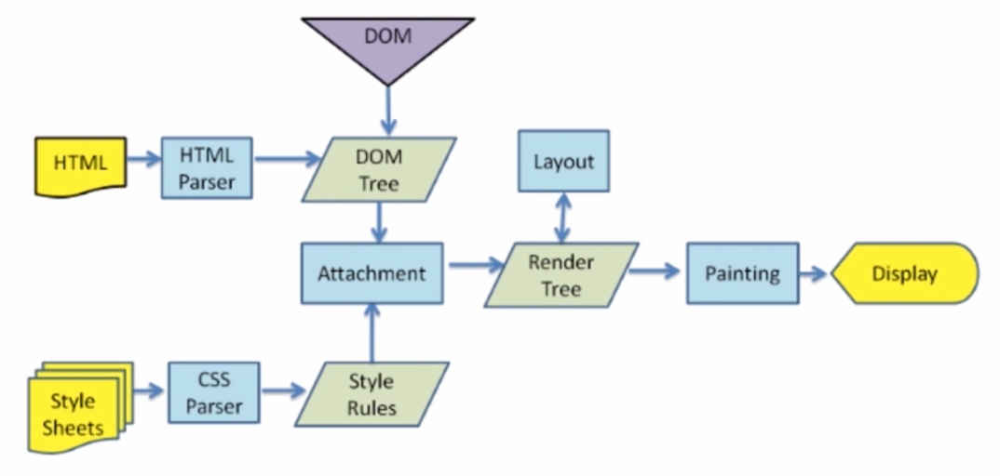

#### DOM Tree(DOM 树)

.jpg)

#### CSSOM Tree

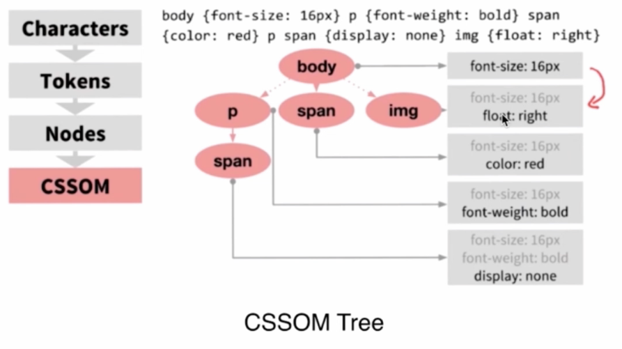

#### Render Tree

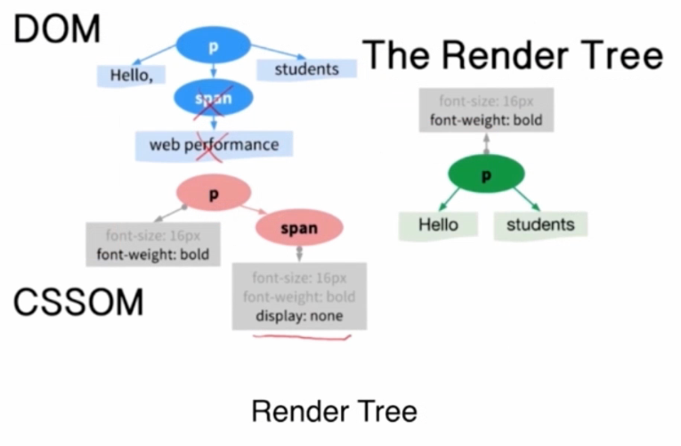

### 重排 Reflow

#### 定义

DOM 结构中的各个元素都有自己的盒子 (模型)，这些都需要浏览器根据各种样式来计算，并根据计算结果将元素

放到它该出现的位置，这个过程称之为 reflow

#### 触发 Reflow

- 当你增加、删除、修改 DOM 结点时，会导致 Reflow 或 Repaint
- 当你移动 DOM 的位置，或是搞个动画的时候
- 当你修改 CSS 样式的时候
- 当你 Resize 窗口的时候 (移动端没有这个问题)或是滚动的时候
- 当你修改网页的默认字体时

### 重绘 Repaint

#### 定义

当各种盒子的位置、大小以及其他属性，例如颜色、字体大小等都确定下来后，浏览器于是便把这些元素都按照各自的特性绘制了一遍，于是页面的内容出现了，这个过程称之为 repaint

#### 触发 Repaint

DOM 改动

CSS 改动

### 布局 Layout


# 浏览器事件机制——深入了解


## 弄懂 Event Loop

### 前言

`Event Loop`即事件循环，是指浏览器或`Node`的一种解决`javaScript`单线程运行时不会阻塞的一种机制，也就是我们经常使用**异步**的原理。

### 为啥要弄懂 Event Loop

- 是要增加自己技术的深度，也就是懂得`JavaScript`的运行机制。
- 现在在前端领域各种技术层出不穷，掌握底层原理，可以让自己以不变，应万变。
- 应对各大互联网公司的面试，懂其原理，题目任其发挥。

### 堆，栈、队列

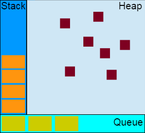

#### 堆（Heap）

**堆**是一种数据结构，是利用完全二叉树维护的一组数据，**堆**分为两种，一种为最大**堆**，一种为**最小堆**，将根节点**最大**的**堆**叫做**最大堆**或**大根堆**，根节点**最小**的**堆**叫做**最小堆**或**小根堆**。
**堆**是**线性数据结构**，相当于**一维数组**，有唯一后继。

如最大堆

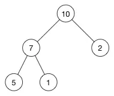

#### 栈（Stack）

**栈**在计算机科学中是限定仅在**表尾**进行**插入**或**删除**操作的线性表。 **栈**是一种数据结构，它按照**后进先出**的原则存储数据，**先进入**的数据被压入**栈底**，**最后的数据**在**栈顶**，需要读数据的时候从**栈顶**开始**弹出数据**。
**栈**是只能在**某一端插入**和**删除**的**特殊线性表**。

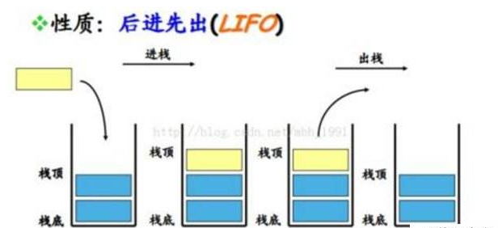

#### 队列（Queue）

特殊之处在于它只允许在表的前端（`front`）进行**删除**操作，而在表的后端（`rear`）进行**插入**操作，和**栈**一样，**队列**是一种操作受限制的线性表。
进行**插入**操作的端称为**队尾**，进行**删除**操作的端称为**队头**。 队列中没有元素时，称为**空队列**。

**队列**的数据元素又称为**队列元素**。在队列中插入一个队列元素称为**入队**，从**队列**中**删除**一个队列元素称为**出队**。因为队列**只允许**在一端**插入**，在另一端**删除**，所以只有**最早**进入**队列**的元素**才能最先从队列中**删除，故队列又称为**先进先出**（`FIFO—first in first out`）

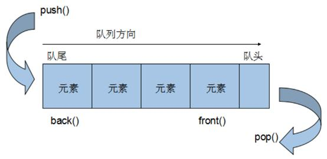

## Event Loop

在`JavaScript`中，任务被分为两种，一种宏任务（`MacroTask`）也叫`Task`，一种叫微任务（`MicroTask`）。

### MacroTask（宏任务）

- `script`全部代码、`setTimeout`、`setInterval`、`setImmediate`（浏览器暂时不支持，只有 IE10 支持，具体可见[`MDN`](https://developer.mozilla.org/zh-CN/docs/Web/API/Window/setImmediate)）、`I/O`、`UI Rendering`。

### MicroTask（微任务）

- `Process.nextTick（Node独有）`、`Promise`、`Object.observe(废弃)`、`MutationObserver`（具体使用方式查看[这里](https://javascript.ruanyifeng.com/dom/mutationobserver.html)）

### 浏览器中的 Event Loop

`Javascript` 有一个 `main thread` 主线程和 `call-stack` 调用栈(执行栈)，所有的任务都会被放到调用栈等待主线程执行。

#### JS 调用栈

JS 调用栈采用的是后进先出的规则，当函数执行的时候，会被添加到栈的顶部，当执行栈执行完成后，就会从栈顶移出，直到栈内被清空。

#### 同步任务和异步任务

`Javascript`单线程任务被分为**同步任务**和**异步任务**，同步任务会在调用栈中按照顺序等待主线程依次执行，异步任务会在异步任务有了结果后，将注册的回调函数放入任务队列中等待主线程空闲的时候（调用栈被清空），被读取到栈内等待主线程的执行。

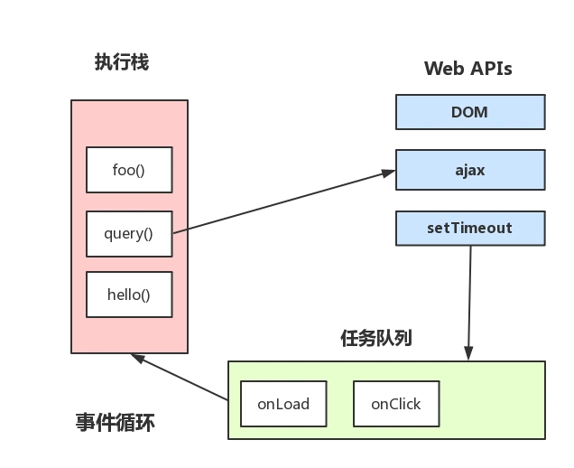

任务队列`Task Queue`，即队列，是一种先进先出的一种数据结构。

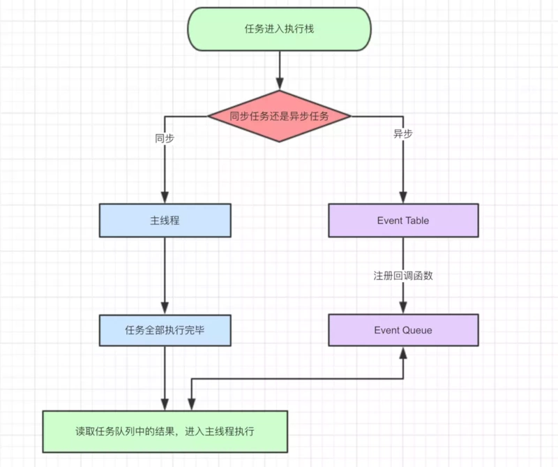

#### 事件循环的进程模型

- 选择当前要执行的任务队列，选择任务队列中最先进入的任务，如果任务队列为空即`null`，则执行跳转到微任务（`MicroTask`）的执行步骤。
- 将事件循环中的任务设置为已选择任务。
- 执行任务。
- 将事件循环中当前运行任务设置为 null。
- 将已经运行完成的任务从任务队列中删除。
- microtasks 步骤：进入 microtask 检查点。
- 更新界面渲染。
- 返回第一步。

#### 执行进入 microtask 检查点时，用户代理会执行以下步骤：

- 设置 microtask 检查点标志为 true。
- 当事件循环`microtask`执行不为空时：选择一个最先进入的`microtask`队列的`microtask`，将事件循环的`microtask`设置为已选择的`microtask`，运行`microtask`，将已经执行完成的`microtask`为`null`，移出`microtask`中的`microtask`。
- 清理 IndexDB 事务
- 设置进入 microtask 检查点的标志为 false。

上述可能不太好理解，下图是我做的一张图片。

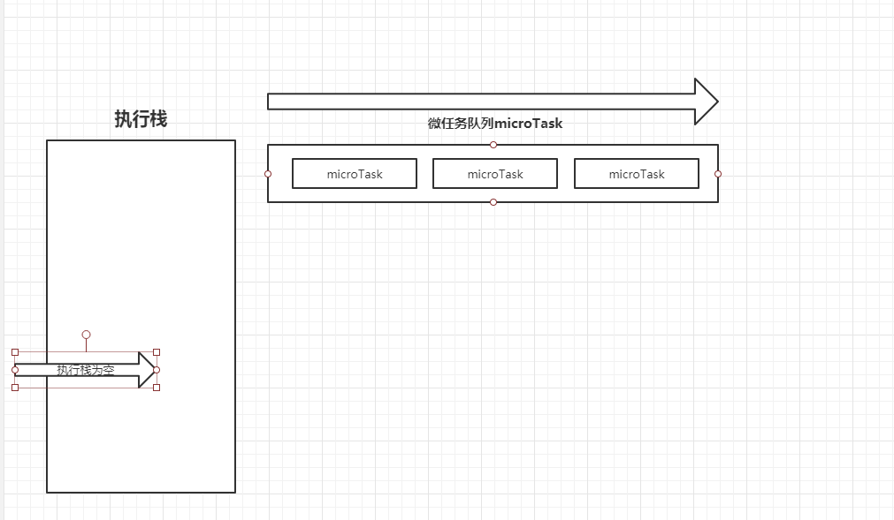

执行栈在执行完**同步任务**后，查看**执行栈**是否为空，如果执行栈为空，就会去检查**微任务**(`microTask`)队列是否为空，如果为空的话，就执行`Task`（宏任务），否则就一次性执行完所有微任务。
每次单个**宏任务**执行完毕后，检查**微任务**(`microTask`)队列是否为空，如果不为空的话，会按照**先入先**出的规则全部执行完**微任务**(`microTask`)后，设置**微任务**(`microTask`)队列为`null`，然后再执行**宏任务**，如此循环。

### 举个例子

```
console.log('script start');

setTimeout(function() {
  console.log('setTimeout');
}, 0);

Promise.resolve().then(function() {
  console.log('promise1');
}).then(function() {
  console.log('promise2');
});
console.log('script end');
```

首先我们划分几个分类：

#### 第一次执行：

```
Tasks：run script、 setTimeout callback

Microtasks：Promise then

JS stack: script
Log: script start、script end。
```

执行同步代码，将宏任务（`Tasks`）和微任务(`Microtasks`)划分到各自队列中。

#### 第二次执行：

```
Tasks：run script、 setTimeout callback

Microtasks：Promise2 then

JS stack: Promise2 callback
Log: script start、script end、promise1、promise2
```

执行宏任务后，检测到微任务(`Microtasks`)队列中不为空，执行`Promise1`，执行完成`Promise1`后，调用`Promise2.then`，放入微任务(`Microtasks`)队列中，再执行`Promise2.then`。

#### 第三次执行：

```
Tasks：setTimeout callback

Microtasks：

JS stack: setTimeout callback
Log: script start、script end、promise1、promise2、setTimeout
```

当微任务(`Microtasks`)队列中为空时，执行宏任务（`Tasks`），执行`setTimeout callback`，打印日志。

#### 第四次执行：

```
Tasks：setTimeout callback

Microtasks：

JS stack:
Log: script start、script end、promise1、promise2、setTimeout
```

清空**Tasks**队列和`JS stack`。

以上执行帧动画可以查看[Tasks, microtasks, queues and schedules](https://jakearchibald.com/2015/tasks-microtasks-queues-and-schedules/)
或许这张图也更好理解些。

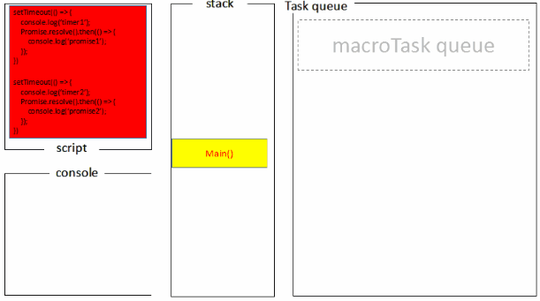

### 再举个例子

```
console.log('script start')

async function async1() {
  await async2()
  console.log('async1 end')
}
async function async2() {
  console.log('async2 end')
}
async1()

setTimeout(function() {
  console.log('setTimeout')
}, 0)

new Promise(resolve => {
  console.log('Promise')
  resolve()
})
  .then(function() {
    console.log('promise1')
  })
  .then(function() {
    console.log('promise2')
  })

console.log('script end')
```

这里需要先理解`async/await`。

`async/await` 在底层转换成了 `promise` 和 `then` 回调函数。
也就是说，这是 `promise` 的语法糖。
每次我们使用 `await`, 解释器都创建一个 `promise` 对象，然后把剩下的 `async` 函数中的操作放到 `then` 回调函数中。
`async/await` 的实现，离不开 `Promise`。从字面意思来理解，`async` 是“异步”的简写，而 `await` 是 `async wait` 的简写可以认为是等待异步方法执行完成。

#### 关于 73 以下版本和 73 版本的区别

- 在老版本版本以下，先执行`promise1`和`promise2`，再执行`async1`。
- 在 73 版本，先执行`async1`再执行`promise1`和`promise2`。

**主要原因是因为在谷歌(金丝雀)73 版本中更改了规范，如下图所示：**

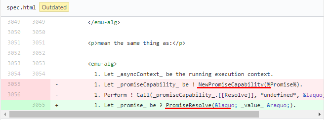

- 区别在于`RESOLVE(thenable)`和之间的区别`Promise.resolve(thenable)`。

#### 在老版本中

- 首先，传递给 `await` 的值被包裹在一个 `Promise` 中。然后，处理程序附加到这个包装的 `Promise`，以便在 `Promise` 变为 `fulfilled` 后恢复该函数，并且暂停执行异步函数，一旦 `promise` 变为 `fulfilled`，恢复异步函数的执行。
- 每个 `await` 引擎必须创建两个额外的 Promise（即使右侧已经是一个 `Promise`）并且它需要至少三个 `microtask` 队列 `ticks`（`tick`为系统的相对时间单位，也被称为系统的时基，来源于定时器的周期性中断（输出脉冲），一次中断表示一个`tick`，也被称做一个“时钟滴答”、时标。）。

#### 引用贺老师知乎上的一个例子

```js
async function f() {
  await p
  console.log('ok')
}
```

简化理解为：

```js
function f() {
  return RESOLVE(p).then(() => {
    console.log('ok')
  })
}
```

- 如果 `RESOLVE(p)` 对于 `p` 为 `promise` 直接返回 `p` 的话，那么 `p`的 `then` 方法就会被马上调用，其回调就立即进入 `job` 队列。
- 而如果 `RESOLVE(p)` 严格按照标准，应该是产生一个新的 `promise`，尽管该 `promise`确定会 `resolve` 为 `p`，但这个过程本身是异步的，也就是现在进入 `job` 队列的是新 `promise` 的 `resolve`过程，所以该 `promise` 的 `then` 不会被立即调用，而要等到当前 `job` 队列执行到前述 `resolve` 过程才会被调用，然后其回调（也就是继续 `await` 之后的语句）才加入 `job` 队列，所以时序上就晚了。

#### 谷歌（金丝雀）73 版本中

- 使用对`PromiseResolve`的调用来更改`await`的语义，以减少在公共`awaitPromise`情况下的转换次数。
- 如果传递给 `await` 的值已经是一个 `Promise`，那么这种优化避免了再次创建 `Promise` 包装器，在这种情况下，我们从最少三个 `microtick` 到只有一个 `microtick`。

#### 详细过程：

**73 以下版本**

- 首先，打印`script start`，调用`async1()`时，返回一个`Promise`，所以打印出来`async2 end`。
- 每个 `await`，会新产生一个`promise`,但这个过程本身是异步的，所以该`await`后面不会立即调用。
- 继续执行同步代码，打印`Promise`和`script end`，将`then`函数放入**微任务**队列中等待执行。
- 同步执行完成之后，检查**微任务**队列是否为`null`，然后按照先入先出规则，依次执行。
- 然后先执行打印`promise1`,此时`then`的回调函数返回`undefinde`，此时又有`then`的链式调用，又放入**微任务**队列中，再次打印`promise2`。
- 再回到`await`的位置执行返回的 `Promise` 的 `resolve` 函数，这又会把 `resolve` 丢到微任务队列中，打印`async1 end`。
- 当**微任务**队列为空时，执行宏任务,打印`setTimeout`。

**谷歌（金丝雀 73 版本）**

- 如果传递给 `await` 的值已经是一个 `Promise`，那么这种优化避免了再次创建 `Promise` 包装器，在这种情况下，我们从最少三个 `microtick` 到只有一个 `microtick`。
- 引擎不再需要为 `await` 创造 `throwaway Promise` - 在绝大部分时间。
- 现在 `promise` 指向了同一个 `Promise`，所以这个步骤什么也不需要做。然后引擎继续像以前一样，创建 `throwaway Promise`，安排 `PromiseReactionJob` 在 `microtask` 队列的下一个 `tick` 上恢复异步函数，暂停执行该函数，然后返回给调用者。

具体详情查看（[这里](https://v8.js.cn/blog/fast-async/)）。

### NodeJS 的 Event Loop

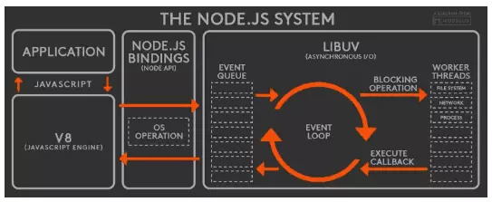

`Node`中的`Event Loop`是基于`libuv`实现的，而`libuv`是 `Node` 的新跨平台抽象层，libuv 使用异步，事件驱动的编程方式，核心是提供`i/o`的事件循环和异步回调。libuv 的`API`包含有时间，非阻塞的网络，异步文件操作，子进程等等。 `Event Loop`就是在`libuv`中实现的。

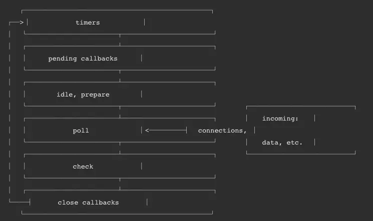

#### `Node`的`Event loop`一共分为 6 个阶段，每个细节具体如下：

- `timers`: 执行`setTimeout`和`setInterval`中到期的`callback`。
- `pending callback`: 上一轮循环中少数的`callback`会放在这一阶段执行。
- `idle, prepare`: 仅在内部使用。
- `poll`: 最重要的阶段，执行`pending callback`，在适当的情况下回阻塞在这个阶段。
- `check`: 执行`setImmediate`(`setImmediate()`是将事件插入到事件队列尾部，主线程和事件队列的函数执行完成之后立即执行`setImmediate`指定的回调函数)的`callback`。
- `close callbacks`: 执行`close`事件的`callback`，例如`socket.on('close'[,fn])`或者`http.server.on('close, fn)`。

具体细节如下：

#### timers

执行`setTimeout`和`setInterval`中到期的`callback`，执行这两者回调需要设置一个毫秒数，理论上来说，应该是时间一到就立即执行 callback 回调，但是由于`system`的调度可能会延时，达不到预期时间。
以下是官网文档解释的例子：

```
const fs = require('fs');

function someAsyncOperation(callback) {
  // Assume this takes 95ms to complete
  fs.readFile('/path/to/file', callback);
}

const timeoutScheduled = Date.now();

setTimeout(() => {
  const delay = Date.now() - timeoutScheduled;

  console.log(`${delay}ms have passed since I was scheduled`);
}, 100);


// do someAsyncOperation which takes 95 ms to complete
someAsyncOperation(() => {
  const startCallback = Date.now();

  // do something that will take 10ms...
  while (Date.now() - startCallback < 10) {
    // do nothing
  }
});
```

当进入事件循环时，它有一个空队列（`fs.readFile()`尚未完成），因此定时器将等待剩余毫秒数，当到达 95ms 时，`fs.readFile()`完成读取文件并且其完成需要 10 毫秒的回调被添加到轮询队列并执行。
当回调结束时，队列中不再有回调，因此事件循环将看到已达到最快定时器的**阈值**，然后回到**timers 阶段**以执行定时器的回调。

在此示例中，您将看到正在调度的计时器与正在执行的回调之间的总延迟将为 105 毫秒。

**以下是我测试时间：**

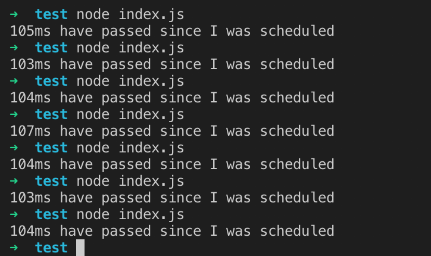

#### pending callbacks

此阶段执行某些系统操作（例如 TCP 错误类型）的回调。 例如，如果`TCP socket ECONNREFUSED`在尝试 connect 时 receives，则某些\* nix 系统希望等待报告错误。 这将在`pending callbacks`阶段执行。

#### poll

**该 poll 阶段有两个主要功能：**

- 执行`I/O`回调。
- 处理轮询队列中的事件。

**当事件循环进入`poll`阶段并且在`timers`中没有可以执行定时器时，将发生以下两种情况之一**

- 如果`poll`队列不为空，则事件循环将遍历其同步执行它们的`callback`队列，直到队列为空，或者达到`system-dependent`（系统相关限制）。

**如果`poll`队列为空，则会发生以下两种情况之一**

- 如果有`setImmediate()`回调需要执行，则会立即停止执行`poll`阶段并进入执行`check`阶段以执行回调。
- 如果没有`setImmediate()`回到需要执行，poll 阶段将等待`callback`被添加到队列中，然后立即执行。

**当然设定了 timer 的话且 poll 队列为空，则会判断是否有 timer 超时，如果有的话会回到 timer 阶段执行回调。**

#### check

**此阶段允许人员在 poll 阶段完成后立即执行回调。**
如果`poll`阶段闲置并且`script`已排队`setImmediate()`，则事件循环到达 check 阶段执行而不是继续等待。

`setImmediate()`实际上是一个特殊的计时器，它在事件循环的一个单独阶段运行。它使用`libuv API`来调度在`poll`阶段完成后执行的回调。

通常，当代码被执行时，事件循环最终将达到`poll`阶段，它将等待传入连接，请求等。
但是，如果已经调度了回调`setImmediate()`，并且轮询阶段变为空闲，则它将结束并且到达`check`阶段，而不是等待`poll`事件。

```
console.log('start')
setTimeout(() => {
  console.log('timer1')
  Promise.resolve().then(function() {
    console.log('promise1')
  })
}, 0)
setTimeout(() => {
  console.log('timer2')
  Promise.resolve().then(function() {
    console.log('promise2')
  })
}, 0)
Promise.resolve().then(function() {
  console.log('promise3')
})
console.log('end')
```

如果`node`版本为`v11.x`， 其结果与浏览器一致。

```
start
end
promise3
timer1
promise1
timer2
promise2
```

具体详情可以查看《[又被 node 的 eventloop 坑了，这次是 node 的锅](https://juejin.cn/post/6844903761979113479)》。

如果 v10 版本上述结果存在两种情况：

- 如果 time2 定时器已经在执行队列中了

```
start
end
promise3
timer1
timer2
promise1
promise2
```

- 如果 time2 定时器没有在执行对列中，执行结果为

```
start
end
promise3
timer1
promise1
timer2
promise2
```

具体情况可以参考`poll`阶段的两种情况。

从下图可能更好理解：

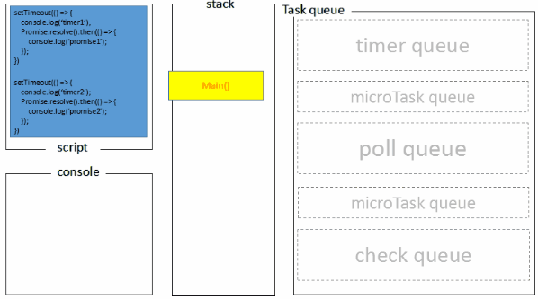

### setImmediate() 的 setTimeout()的区别

**`setImmediate`和`setTimeout()`是相似的，但根据它们被调用的时间以不同的方式表现。**

- `setImmediate()`设计用于在当前`poll`阶段完成后 check 阶段执行脚本 。
- `setTimeout()` 安排在经过最小（ms）后运行的脚本，在`timers`阶段执行。

#### 举个例子

```
setTimeout(() => {
  console.log('timeout');
}, 0);

setImmediate(() => {
  console.log('immediate');
});
```

**执行定时器的顺序将根据调用它们的上下文而有所不同。 如果从主模块中调用两者，那么时间将受到进程性能的限制。**

**其结果也不一致**

**如果在`I / O`周期内移动两个调用，则始终首先执行立即回调：**

```
const fs = require('fs');

fs.readFile(__filename, () => {
  setTimeout(() => {
    console.log('timeout');
  }, 0);
  setImmediate(() => {
    console.log('immediate');
  });
});
```

其结果可以确定一定是`immediate => timeout`。
主要原因是在`I/O阶段`读取文件后，事件循环会先进入`poll`阶段，发现有`setImmediate`需要执行，会立即进入`check`阶段执行`setImmediate`的回调。

然后再进入`timers`阶段，执行`setTimeout`，打印`timeout`。

```
   ┌───────────────────────────┐
┌─>│           timers          │
│  └─────────────┬─────────────┘
│  ┌─────────────┴─────────────┐
│  │     pending callbacks     │
│  └─────────────┬─────────────┘
│  ┌─────────────┴─────────────┐
│  │       idle, prepare       │
│  └─────────────┬─────────────┘      ┌───────────────┐
│  ┌─────────────┴─────────────┐      │   incoming:   │
│  │           poll            │<─────┤  connections, │
│  └─────────────┬─────────────┘      │   data, etc.  │
│  ┌─────────────┴─────────────┐      └───────────────┘
│  │           check           │
│  └─────────────┬─────────────┘
│  ┌─────────────┴─────────────┐
└──┤      close callbacks      │
   └───────────────────────────┘
```

#### Process.nextTick()

**`process.nextTick()`虽然它是异步 API 的一部分，但未在图中显示。这是因为`process.nextTick()`从技术上讲，它不是事件循环的一部分。**

- `process.nextTick()`方法将 `callback` 添加到`next tick`队列。 一旦当前事件轮询队列的任务全部完成，在`next tick`队列中的所有`callbacks`会被依次调用。

**换种理解方式：**

- 当每个阶段完成后，如果存在 `nextTick` 队列，就会清空队列中的所有回调函数，并且优先于其他 `microtask` 执行。

#### 例子

```
let bar;

setTimeout(() => {
  console.log('setTimeout');
}, 0)

setImmediate(() => {
  console.log('setImmediate');
})
function someAsyncApiCall(callback) {
  process.nextTick(callback);
}

someAsyncApiCall(() => {
  console.log('bar', bar); // 1
});

bar = 1;
```

在 NodeV10 中上述代码执行可能有两种答案，一种为：

```
bar 1
setTimeout
setImmediate
```

另一种为：

```
bar 1
setImmediate
setTimeout
```

无论哪种，始终都是先执行`process.nextTick(callback)`，打印`bar 1`。

# 浏览器的垃圾回收机制

### (1)垃圾回收的概念

**垃圾回收**：JavaScript 代码运行时，需要分配内存空间来储存变量和值。当变量不在参与运行时，就需要系统收回被占用的内存空间，这就是垃圾回收。

**回收机制**：

- Javascript 具有自动垃圾回收机制，会定期对那些不再使用的变量、对象所占用的内存进行释放，原理就是找到不再使用的变量，然后释放掉其占用的内存。
- JavaScript 中存在两种变量：局部变量和全局变量。全局变量的生命周期会持续要页面卸载；而局部变量声明在函数中，它的生命周期从函数执行开始，直到函数执行结束，在这个过程中，局部变量会在堆或栈中存储它们的值，当函数执行结束后，这些局部变量不再被使用，它们所占有的空间就会被释放。
- 不过，当局部变量被外部函数使用时，其中一种情况就是闭包，在函数执行结束后，函数外部的变量依然指向函数内部的局部变量，此时局部变量依然在被使用，所以不会回收。

### (2)垃圾回收的方式

浏览器通常使用的垃圾回收方法有两种：标记清除，引用计数。 

#### 1)标记清除

- 标记清除是浏览器常见的垃圾回收方式，当变量进入执行环境时，就标记这个变量"进入环境"，被标记为"进入环境"的变量是不能被回收的，因为他们正在被使用。当变量离开环境时，就会被标记为"离开环境"，被标记为"离开环境"的变量会被内存释放。
- 垃圾收集器在运行的时候会给存储在内存中的所有变量都加上标记。然后，它会去掉环境中的变量以及被环境中的变量引用的标记。而在此之后再被加上标记的变量将被视为准备删除的变量，原因是环境中的变量已经无法访问到这些变量了。最后。垃圾收集器完成内存清除工作，销毁那些带标记的值，并回收他们所占用的内存空间。

#### 2)引用计数

- 另外一种垃圾回收机制就是引用计数，这个用的相对较少。引用计数就是跟踪记录每个值被引用的次数。当声明了一个变量并将一个引用类型赋值给该变量时，则这个值的引用次数就是 1。相反，如果包含对这个值引用的变量又取得了另外一个值，则这个值的引用次数就减 1。当这个引用次数变为 0 时，说明这个变量已经没有价值，因此，在在机回收期下次再运行时，这个变量所占有的内存空间就会被释放出来。
- 这种方法会引起**循环引用**的问题：例如：`obj1`和`obj2`通过属性进行相互引用，两个对象的引用次数都是 2。当使用循环计数时，由于函数执行完后，两个对象都离开作用域，函数执行结束，`obj1`和`obj2`还将会继续存在，因此它们的引用次数永远不会是 0，就会引起循环引用。

```js
function fun() {
	let obj1 = {};
	let obj2 = {};
	obj1.a = obj2; // obj1 引用 obj2
	obj2.a = obj1; // obj2 引用 obj1
}
```

这种情况下，就要手动释放变量占用的内存：

```js
obj1.a = null;
obj2.a = null;
```

### (3)减少垃圾回收

虽然浏览器可以进行垃圾自动回收，但是当代码比较复杂时，垃圾回收所带来的代价比较大，所以应该尽量减少垃圾回收。

- **对数组进行优化：** 在清空一个数组时，最简单的方法就是给其赋值为[ ]，但是与此同时会创建一个新的空对象，可以将数组的长度设置为 0，以此来达到清空数组的目的。
- **对**`object`**进行优化：** 对象尽量复用，对于不再使用的对象，就将其设置为 null，尽快被回收。
- **对函数进行优化：** 在循环中的函数表达式，如果可以复用，尽量放在函数的外面。

# 浏览器工作原理面试题👇

# ❤一、进程和线程

## 为什么 JavaScript 是单线程的，与异步冲突吗

补充：JS 中其实是没有线程概念的，所谓的单线程也只是相对于多线程而言。JS 的设计初衷就没有考虑这些，针对 JS 这种不具备并行任务处理的特性，我们称之为“单线程”。

JS 的单线程是指一个浏览器进程中只有一个 JS 的执行线程，同一时刻内只会有一段代码在执行。

举个通俗例子，假设 JS 支持多线程操作的话，JS 可以操作 DOM，那么一个线程在删除 DOM，另外一个线程就在获取 DOM 数据，这样子明显不合理，这算是证明之一。

来看段代码 

```
function foo() {
    console.log("first");
    setTimeout(( function(){
        console.log( 'second' );
    }),5);
}

for (var i = 0; i < 1000000; i++) {
    foo();
}
```

打印结果就是首先是很多个 first,然后再是 second。

异步机制是浏览器的两个或以上常驻线程共同完成的，举个例子，比如异步请求由两个常驻线程，JS 执行线程和事件触发线程共同完成的。

- JS 执行线程发起异步请求（浏览器会开启一个 HTTP 请求线程来执行请求，这时 JS 的任务完成，继续执行线程队列中剩下任务）
- 然后在未来的某一时刻事件触发线程监视到之前的发起的 HTTP 请求已完成，它就会把完成事件插入到 JS 执行队列的尾部等待 JS 处理

再比如定时器触发(settimeout 和 setinterval) 是由**「浏览器的定时器线程」**执行的定时计数，然后在定时时间把定时处理函数的执行请求插入到 JS 执行队列的尾端（所以用这两个函数的时候，实际的执行时间是大于或等于指定时间的，不保证能准确定时的）。

所以这么说，JS 单线程与异步更多是浏览器行为，之间不冲突。

## 浏览器渲染进程的线程有哪些

浏览器的渲染进程的线程总共有五种：

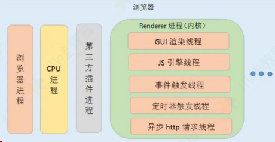

### （1）GUI 渲染线程

负责渲染浏览器页面，解析 HTML、CSS，构建 DOM 树、构建 CSSOM 树、构建渲染树和绘制页面；当界面需要重绘或由于某种操作引发回流时，该线程就会执行。

注意：GUI 渲染线程和 JS 引擎线程是互斥的，当 JS 引擎执行时 GUI 线程会被挂起，GUI 更新会被保存在一个队列中等到 JS 引擎空闲时立即被执行。

### （2）JS 引擎线程

JS 引擎线程也称为 JS 内核，负责处理 Javascript 脚本程序，解析 Javascript 脚本，运行代码；JS 引擎线程一直等待着任务队列中任务的到来，然后加以处理，一个 Tab 页中无论什么时候都只有一个 JS 引擎线程在运行 JS 程序；

注意：GUI 渲染线程与 JS 引擎线程的互斥关系，所以如果 JS 执行的时间过长，会造成页面的渲染不连贯，导致页面渲染加载阻塞。

### （3）时间触发线程

时间触发线程属于浏览器而不是 JS 引擎，用来控制事件循环；当 JS 引擎执行代码块如 setTimeOut 时（也可是来自浏览器内核的其他线程,如鼠标点击、AJAX 异步请求等），会将对应任务添加到事件触发线程中；当对应的事件符合触发条件被触发时，该线程会把事件添加到待处理队列的队尾，等待 JS 引擎的处理；

注意：由于 JS 的单线程关系，所以这些待处理队列中的事件都得排队等待 JS 引擎处理（当 JS 引擎空闲时才会去执行）；

### （4）定时器触发进程

定时器触发进程即 setInterval 与 setTimeout 所在线程；浏览器定时计数器并不是由 JS 引擎计数的，因为 JS 引擎是单线程的，如果处于阻塞线程状态就会影响记计时的准确性；因此使用单独线程来计时并触发定时器，计时完毕后，添加到事件队列中，等待 JS 引擎空闲后执行，所以定时器中的任务在设定的时间点不一定能够准时执行，定时器只是在指定时间点将任务添加到事件队列中；

注意：W3C 在 HTML 标准中规定，定时器的定时时间不能小于 4ms，如果是小于 4ms，则默认为 4ms。

### （5）异步 http 请求线程

XMLHttpRequest 连接后通过浏览器新开一个线程请求；

检测到状态变更时，如果设置有回调函数，异步线程就产生状态变更事件，将回调函数放入事件队列中，等待 JS 引擎空闲后执行；

## 僵尸进程和孤儿进程是什么？

孤儿进程：父进程退出了，而它的一个或多个进程还在运行，那这些子进程都会成为孤儿进程。孤儿进程将被 init 进程(进程号为 1)所收养，并由 init 进程对它们完成状态收集工作。

僵尸进程：子进程比父进程先结束，而父进程又没有释放子进程占用的资源，那么子进程的进程描述符仍然保存在系统中，这种进程称之为僵死进程。

# ❤二、浏览器组成

## 浏览器的主要组成部分是什么？

1. **「用户界面」** - 包括地址栏、前进/后退按钮、书签菜单等。
2. **「浏览器引擎」** - 在用户界面和呈现引擎之间传送指令。
3. **「呈现引擎」** - 负责显示请求的内容。如果请求的内容是 HTML，它就负责解析 HTML 和 CSS 内容，并将解析后的内容显示在屏幕上。
4. **「网络」** - 用于网络调用，比如 HTTP 请求。
5. **「用户界面后端」** -用于绘制基本的窗口小部件，比如组合框和窗口。
6. **「JavaScript 解释器」**- 用于解析和执行 JavaScript 代码。
7. **「数据存储」** - 这是持久层。浏览器需要在硬盘上保存各种数据，例如 Cookie。新的 HTML 规范 (HTML5) 定义了“网络数据库”，这是一个完整（但是轻便）的浏览器内数据库。

值得注意的是，和大多数浏览器不同，Chrome 浏览器的每个标签页都分别对应一个呈现引擎实例。每个标签页都是一个独立的进程。

## 你做的页面在哪些流览器测试过？这些浏览器的内核分别是什么?

IE: trident 内核

Firefox：gecko 内核

Safari：webkit 内核

Opera：以前是 presto 内核，Opera 现已改用 Google Chrome 的 Blink 内核

Chrome：Blink(基于 webkit，Google 与 Opera Software 共同开发)

## 对浏览器内核的理解

浏览器内核又可以分成两部分：渲染引擎和 JS 引擎。它负责取得网页的内容(HTML、XML、图像等等)、整理讯息(例如加入 CSS 等)，以及计算网页的显示方式，然后会输出至显示器或打印机。

JS 引擎则是解析 Javascript 语言，执行 javascript 语言来实现网页的态效果。


浏览器内核主要分成两部分：**渲染引擎**(layout engineer 或 Rendering Engine)和 **JS 引擎**

- **渲染引擎**：其职责就是渲染，即在浏览器窗口中显示所请求的内容。默认情况下，渲染引擎可以显示 网页的内容（HTML、 XML 文档及图片等待）、整理讯息（例如加入 CSS 等）、计算网页的显示方式，然后会输出⾄显示器或打印机。它也可以借助一些浏览器扩展插件显示其他类型数据，如：使用 PDF 阅读器插件可以显示 PDF 格式。
  - 浏览器的内核的不同对于网页的语法解释会有不同，所以渲染的效果也不相同。所有网页浏览器、电子邮件客户端以及其它需要编辑、显示网络内容的应用程序都需要内核

- **JS引擎**：解析和执行 JavaScript 来实现网页的动态效果。
  - 最开始渲染引擎和 JS 引擎并没有区分的很明显，后来 JS 引擎越来越独立，内核就倾向于只指渲染引擎了。


## 常见的浏览器内核有哪些?

| 浏览器/RunTime | 内核（渲染引擎） | JavaScript 引擎                                              |
| -------------- | ---------------- | ------------------------------------------------------------ |
| Chrome         | webkit->blink    | V8                                                           |
| FireFox        | Gecko            | SpiderMonkey                                                 |
| Safari         | Webkit           | JavaScriptCore                                               |
| Edge           | EdgeHTML         | Chakra(for JavaScript)                                       |
| IE             | Trident          | JScript（IE3.0-IE8.0）                                       |
| Opera          | Presto->blink    | Linear A（4.0-6.1）/ Linear B（7.0-9.2）/ Futhark（9.5-10.2）/ Carakan（10.5-） |
| PhantomJS      | Webkit           | JavaScriptCore                                               |
| Node.js        | -                | V8                                                           |

- IE：trident 内核
- Firefox：gecko 内核
- Safari：webkit 内核
- Opera：以前是 presto 内核， Opera 现已改用 Google - Chrome 的 Blink 内核
- Chrome：Blink (基于 webkit ，Google 与 Opera Software 共同开发)

## 浏览器的内核分别是什么?

- IE: trident 内核

- Mozilla Firefox：Gecko，俗称 Firefox 内核。

- Safari：webkit 内核

- Opera：以前是 presto 内核，现已改用 Google Chrome 的 Blink 内核

- Chrome：Blink(最初是基于 webkit 开发的，Google 与 Opera Software 共同开发)

- 微软 Edge 浏览器：其内核是 Chromium，基于 Blink 内核。

Trident：这种浏览器内核是 IE 浏览器用的内核，因为在早期 IE 占有大量的市场份额，所以这种内核比较流行，以前有很多网页也是根据这个内核的标准来编写的，但是实际上这个内核对真正的网页标准支持不是很好。但是由于 IE 的高市场占有率，微软也很长时间没有更新 Trident 内核，就导致了 Trident 内核和 W3C 标准脱节。还
有就是 Trident 内核的大量 Bug 等安全问题没有得到解决，加上一些专家学者公开自己认为 IE 浏览器不安全的观点，使很多用户开始转向其他浏览器。

Gecko：这是 Firefox 和 Flock 所采用的内核，这个内核的优点就是功能强大、丰富，可以支持很多复杂网页效果和浏览器扩展接口，但是代价是也显而易见就是要消耗很多的资源，比如内存。

Presto：Opera 曾经采用的就是 Presto 内核，Presto 内核被称为公认的浏览网页速度最快的内核，这得益于它在开发时的天生优势，在处理 JS 脚本等脚本语言时，会比其他的内核快 3 倍左右，缺点就是为了达到很快的速度而丢掉了一部分网页兼容性。

Webkit：Webkit 是 Safari 采用的内核，它的优点就是网页浏览速度较快，虽然不及 Presto 但是也胜于 Gecko 和 Trident，缺点是对于网页代码的容错性不高，也就是说对网页代码的兼容性较低，会使一些编写不标准的网页无法正确显示。WebKit 前身是 KDE 小组的 KHTML 引擎，可以说 WebKit 是 KHTML 的一个开源的分支。

Blink：谷歌在 Chromium Blog 上发表博客，称将与苹果的开源浏览器核心 Webkit 分道扬镳，在 Chromium 项目中研发 Blink 渲染引擎（即浏览器核心），内置于 Chrome 浏览器之中。其实 Blink 引擎就是 Webkit 的一个分支，就像 webkit 是 KHTML 的分支一样。

Blink 引擎现在是谷歌公司与 Opera Software 共同研发，上面提到过的，Opera 弃用了自己的 Presto 内核，加入 Google 阵营，跟随谷歌一起研发 Blink。

# ❤三、浏览器工作渲染原理

## (简洁版)从输入 URL 到看到页面的过程，发生了什么？

1. **URL解析**：

   - 当用户在浏览器地址栏中输入 URL。

   - 浏览器首先对这个 URL 进行解析是否是一个合法 url 还是关键词，并根据输入的内容进行相应的操作。

   - 解析包括协议（例如，`http` 或 `https`）、主机名、端口号、路径以及查询参数等。

2. **查找缓存**：

   - 浏览器会判断所请求的资源是否在浏览器缓存中，以及是否失效。

   - 如果没有失效就直接使用；如果没有缓存或失效了，就继续下一步。

3. **DNS解析**：浏览器需要将主机名（例如，www.example.com）解析为IP 地址。
   浏览器会依次查看`浏览器缓存`、`操作系统缓存`中是否有 ip 地址，如果缓存中没有就会向`本地域名服务器（DNS 服务器）`发起请求，获取 ip 地址。

   `本地域名服务器`也会先检查缓存，有则直接返回；如果也没有，则采用`迭代查询`方式，向上级域名服务器查询。先向`根域名服务器`发起请求，获取`顶级域名服务器`的地址；再向`顶级域名服务器`发起请求以获取`权限域名服务器`地址；然后向`权限域名服务器`发起请求并得到 url 中域名对应的 IP 地址。

   - 将域名地址解析为 ip 地址

     1. 浏览器 DNS 缓存
     2. 系统 DNS 缓存
     3. 路由器 DNS 缓存
     4. 网络运营商 DNS 缓存
     5. 递归搜索：blog.baidu.com
        1. com 或名下查找 DNS 解析
        2. baidu 域名下查找 DNS 解析
        3. blog 域名下查找 DNS 解析
        4. 出错了

4. **建立TCP连接**：使用获得的 IP 地址和端口号，浏览器尝试与服务器建立 TCP 连接。

   - 这个过程 TCP 三次握手，确保浏览器和服务器之间建立可靠的连接。

     1. 第一次握手，由浏览器发起，告诉服务器我要发送请求了
     2. 第二次握手，由服务器发起，告诉浏览器我准备接受了，你赶紧发送吧
     3. 第三次握手，由浏览器发送，告诉服务器，我马上就发了，准备接受吧

5. **发起HTTP请求**：浏览器向服务器发起 HTTP 请求，请求中包含了要获取的资源信息，如请求的方法（GET、POST 等）、资源路径、请求头等。

   - 浏览器决定要附带哪些 cookie 到请求头中
   - 浏览器自动设置好请求头、协议版本、cookie，发出 GET 请求。
   - 若使用了 HTTPS 协议，则还会进行 SSL 握手，建立加密信道。使用 SSL 握手时，会确定是否使用 HTTP2

6. **服务器响应处理请求**：服务器响应 HTTP 请求，将相应的 HTML 文件返回给浏览器。

   - 服务器：
     - 服务器接收到浏览器的请求后，根据请求的资源路径和其他信息，执行相应的处理逻辑。

     - 完成处理后，服务器响应一个 HTTP 报文给浏览器。

     - 服务器可能会查询数据库、调用后端服务等，最终生成响应。

7. **返回 HTTP 响应给客户端浏览器：**

   - 服务器将生成的 HTTP 响应返回给浏览器。
   - 响应包含状态码、响应头（包含了有关响应的元信息）以及响应体（包含了实际的资源数据）。

8. **客户端浏览器接收响应：**

   - 浏览器接收到服务器返回的 HTTP 响应后，首先检查状态码。2xx 表示成功，3xx 表示重定向，4xx 表示客户端错误，5xx 表示服务器错误。
   - 浏览器根据使用的协议版本，以及 Connection 字段的约定，决定是否要保留 TCP 连接。
   - 浏览器根据响应状态码决定如何处理这一次响应
   - 浏览器根据响应头中的 Content-Type 字段识别响应类型，如果是 text/html，则对响应体的内容进行 HTML 解析，否则做其他处理
   - 浏览器根据响应头中的信息处理响应，可能包括设置 Cookie、缓存处理等。

9. **浏览器解析渲染页面**：浏览器解析 HTML 内容，并开始渲染。

10. **断开连接(连接结束)**：TCP 的四次挥手关闭 TCP 连接。

    1. 第一次挥手：由浏览器发起的，发送给服务器，我东西发送完了 (请求报文)，你准备关闭吧
    2. 第二次挥手：由服务器发起的，告诉浏览器，我东西接受完了(请求报文)，我准备关闭了，你也准备吧
    3. 第三次挥手：由服务器发起，告诉浏览器，我东西发送完了 (响应报文)，你准备关闭吧
    4. 第四次挥手：由浏览器发起，告诉服务器，我东西接受完了，我准备关闭了(响应报文)，你也准备吧


第九：浏览器解析渲染页面过程详情如下：

- 1.**浏览器开始从上到下解析 HTML**，若遇到外部资源链接，则进一步请求资源
- 2.**解析过程中生成 DOM 树、CSSOM 树**，然后一边生成，一边把二者合并为渲染树（rendering tree）。
  - **构建DOM树**：词法分析然后解析成 DOM 树，DOM 树是由 DOM 元素及属性节点组成，树的根是 document 对象。
    - 遇见 HTML 标记，浏览器调用 HTML 解析器解析成 Token 并构建成 dom 树
  - **构建CSS规则树**：生成 CSS 规则树。
    - 遇见 style/link 标记，浏览器调用 css 解析器，处理 css 标记并构建 cssom 树
  - **遇到 script 标记——JavaScript 解析与执行**：调用 javascript 解析器，处理 script 代码(绑定事件，修改 dom 树/cssom 树)
    - 如果响应中包含了 JavaScript 脚本，浏览器会解析并执行这些脚本。
    - 脚本执行期间可能会修改 DOM 结构、样式和处理用户交互。
  - **构建渲染树**：将 DOM 树和 CSS 规则树结合，构建出渲染树。
    - 将 dom 树和 cssom 树合并成一个渲染树
  - 当 DOM 树完成后会触发 DOMContentLoaded 事件
- 3.**布局**：根据渲染树来计算布局，计算每个节点的位置：对渲染树中的每个节点计算 几何信息：位置和大小（reflow）。
- 4.**绘制**：使用浏览器的 UI 接口进行绘制。
  - 浏览器根据 DOM 树和 CSSOM 树计算出布局，把每个节点颜色利用 GPU 绘制到屏幕（repaint）上。
  - 这个过程可能会触发重新布局和重绘。
- 5.**页面加载完成**：
  - 当所有资源都加载完成，页面完成渲染后，触发 `load` 事件。
  - 开发者可以通过 JavaScript 监听该事件，执行一些页面加载完成后的操作。

这个过程涵盖了从用户输入 URL 到页面展现的主要步骤，其中每一步都是为了获取、处理和呈现页面所需的资源。

注意：这个五个步骤不一定按照顺序执行，如果 dom 树或 cssom 对被修改了，可能会执行多次布局和渲染往往实际页面中，这些步骤都会执行多次的。

## (详细版)说一说从输入 URL 到页面呈现发生了什么？

一旦问这个问题的话，我觉得肯定是一个非常深的问题了，无论从深度还是广度上，要真的答好这个题目，或者梳理清楚的话，挺难的，毕竟一个非常综合性的问题，我作为一个刚刚入门的小白，只能梳理部分知识，更深的知识可以去看看参考链接。

那么我们就开始吧，假设你输入的内容是 👇

```
https://www.baidu.com
```

### 1）网络请求

下面我们就来探讨一下从你输入 URL 后到响应，都经历了哪些过程。

- 首先，你需要在浏览器中的 URL 地址上，输入你想访问的地址，如下

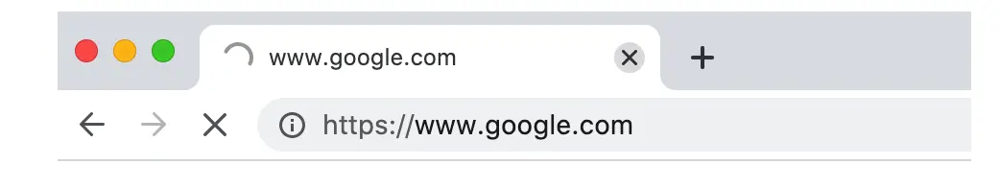

你应该访问不到

- 然后，浏览器会根据你输入的 URL 地址，去查找域名是否被本地 DNS 缓存，不同浏览器对 DNS 的设置不同，如果浏览器缓存了你想访问的 URL 地址，那就直接返回 ip。如果没有缓存你的 URL 地址，浏览器就会发起系统调用来查询本机 `hosts` 文件是否有配置 ip 地址，如果找到，直接返回。如果找不到，就向网络中发起一个 DNS 查询。

> 首先来看一下 DNS 是啥，互联网中识别主机的方式有两种，通过`主机名`和 `IP 地址`。我们人喜欢用名字的方式进行记忆，但是通信链路中的路由却喜欢定长、有层次结构的 IP 地址。所以就需要一种能够把主机名到 IP 地址的转换服务，这种服务就是由 DNS 提供的。DNS 的全称是 `Domain Name System` 域名系统。DNS 是一种由分层的 DNS 服务器实现的分布式数据库。DNS 运行在 UDP 上，使用 53 端口。

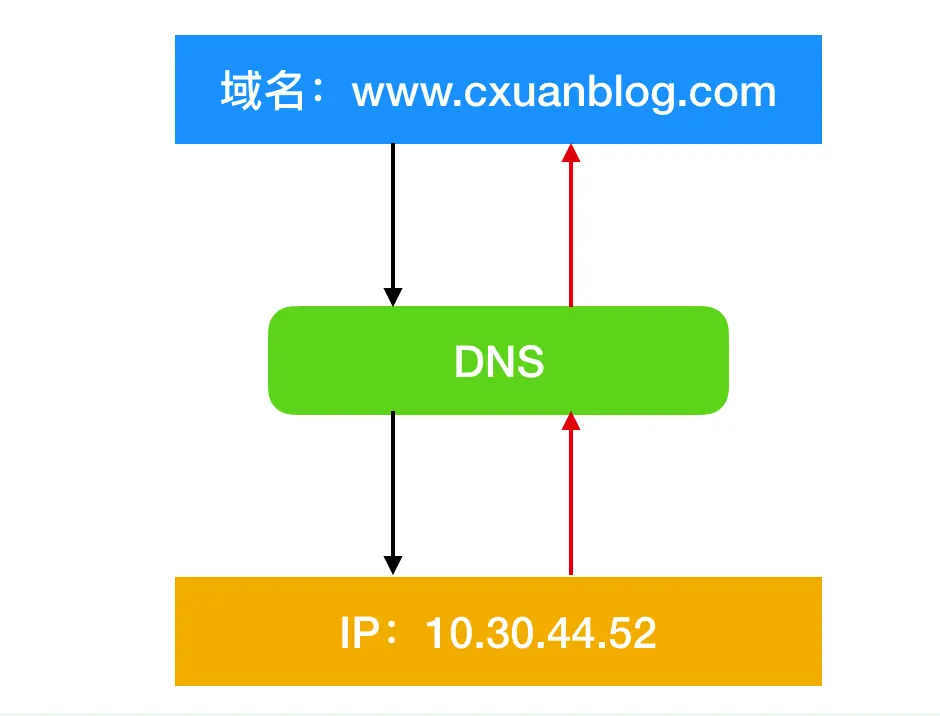

DNS 是一种分层数据库，它的主要层次结构如下

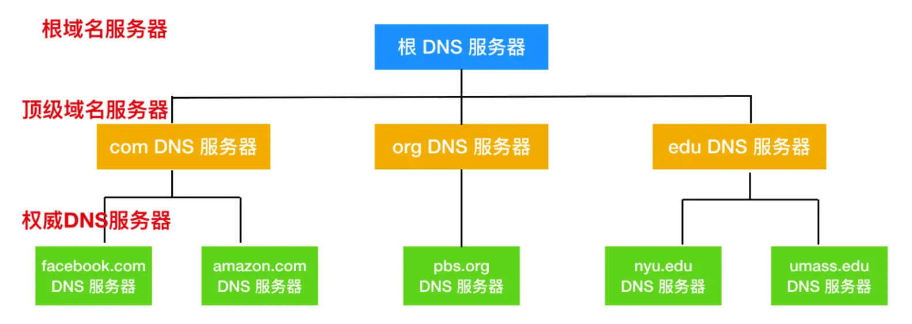

一般域名服务器的层次结构主要是以上三种，除此之外，还有另一类重要的 DNS 服务器，它是 `本地 DNS 服务器(local DNS server)`。严格来说，本地 DNS 服务器并不属于上述层次结构，但是本地 DNS 服务器又是至关重要的。每个 `ISP(Internet Service Provider)` 比如居民区的 ISP 或者一个机构的 ISP 都有一台本地 DNS 服务器。当主机和 ISP 进行连接时，该 ISP 会提供一台主机的 IP 地址，该主机会具有一台或多台其本地 DNS 服务器的 IP 地址。通过访问网络连接，用户能够容易的确定 DNS 服务器的 IP 地址。当主机发出 DNS 请求后，该请求被发往本地 DNS 服务器，它起着代理的作用，并将该请求转发到 DNS 服务器层次系统中。

首先，查询请求会先找到本地 DNS 服务器来查询是否包含 IP 地址，如果本地 DNS 无法查询到目标 IP 地址，就会向根域名服务器发起一个 DNS 查询。

> 注意：DNS 涉及两种查询方式：一种是`递归查询(Recursive query)` ，一种是`迭代查询(Iteration query)`。《计算机网络：自顶向下方法》竟然没有给出递归查询和迭代查询的区别，找了一下网上的资料大概明白了下。
>
> 如果根域名服务器无法告知本地 DNS 服务器下一步需要访问哪个顶级域名服务器，就会使用递归查询；
>
> 如果根域名服务器能够告知 DNS 服务器下一步需要访问的顶级域名服务器，就会使用迭代查询。

在由根域名服务器 -> 顶级域名服务器 -> 权威 DNS 服务器后，由权威服务器告诉本地服务器目标 IP 地址，再有本地 DNS 服务器告诉用户需要访问的 IP 地址。

#### 1. 构建请求

首先，浏览器构建**「请求行」**信息（如下所示），构建好后，浏览器准备发起网络请求 👇

```
GET / HTTP1.1
GET是请求方法，路径就是根路径，HTTP协议版本1.1
```

#### 2. 查找强缓存

在真正发起网络请求之前，浏览器会先在浏览器缓存中查询是否有要请求的文件。

先检查强缓存，如果命中的话直接使用，否则进入下一步，强缓存的知识点，上面 👆 梳理过了。

#### 3. DNS 解析

输入的域名的话，我们需要根据域名去获取对应的`ip地址`。 这个过程需要依赖一个服务系统，叫做是`DNS域名解析`, 从查找到获取到具体 IP 的过程叫做是`DNS解析`。

关于 DNS 篇，可以看看：[阮一峰的网络日志](https://www.ruanyifeng.com/blog/2016/06/dns.html)

首先，浏览器提供了 DNS 数据缓存功能，如果一个域名已经解析过了，那么就会把解析的结果缓存下来，下次查找的话，直接去缓存中找，不需要结果 DNS 解析。

**「解析过程总结如下」**👇

1. **「首先查看是否有对应的域名缓存，有的话直接用缓存的 ip 访问」**

   - ```bash
     ipconfig /displaydns
     // 输入这个命令就可以查看对应的电脑中是否有缓存
     ```

2. **「如果缓存中没有，则去查找 hosts 文件」** 一般在 `c:\windows\system32\drivers\etc\hosts`

3. 如果 hosts 文件里没找到想解析的域名，则将**「域名发往自己配置的 dns 服务器」**，也叫**「本地 dns 服务器」**。

   - ```bash
     ipconfig/all
     通过这个命令可以查看自己的本地dns服务器
     ```

4. 如果**「本地 dns 服务器有相应域名的记录」**，则返回记录。

   1. > 电脑的 dns 服务器一般是各大运营商如电信联通提供的，或者像 180.76.76.76，223.5.5.5，4 个 114 等知名 dns 服务商提供的，本身缓存了大量的常见域名的 ip，所以常见的网站，都是有记录的。不需要找根服务器。

5. 如果电脑自己的服务器没有记录，会去找根服务器。根服务器全球只要 13 组，回去找其中之一,找了根服务器后，**「根服务器会根据请求的域名，返回对应的“顶级域名服务器”」**，如：

   1. 如果请求的域名是[xxx.com](https://link.zhihu.com/%3Ftarget%3Dhttp://xxx.com)，则返回负责 com 域的服务器
   2. 如果是[xxx.cn](https://link.zhihu.com/%3Ftarget%3Dhttp://xxx.cn)，则发给负责 cn 域的服务器
   3. 如果是[xxx.ca](https://link.zhihu.com/%3Ftarget%3Dhttp://xxx.ca)，则发给负责 ca 域的服务器

6. **「顶级域服务器收到请求，会返回二级域服务器的地址」**

   1. 比如一个网址是`www.xxx.edu.cn`，则顶级域名服务器再转发给负责`.edu.cn`域的二级服务器

7. **「以此类推，最终会发到负责锁查询域名的，最精确的那台 dns，可以得到查询结果。」**

8. 最后一步，**「本地 dns 服务器，把最终的解析结果，返回给客户端，对客户端来讲，只是一去一回的事，客户端并不知道本地 dns 服务器经过了千山万水。」**

以上就是大概的过程了，有兴趣的话，可以仔细去看看。

#### 4.建立 TCP 链接

我们所了解的就是 👉Chrome 在同一个域名下要求同时最多只能有 6 个 TCP 连接，超过 6 个的话剩下的请求就得等待。

那么我们假设不需要等待，我们进入了 TCP 连接的建立阶段。

建立`TCP连接`经历下面三个阶段：

- 1.通过**「三次握手」**建立客户端和服务器之间的连接。
- 2.进行数据传输。
- 3.断开连接的阶段。数据传输完成，现在要断开连接了，通过**「四次挥手」**来断开连接。

从上面看得出来，TCP 连接通过什么手段来保证数据传输的可靠性，一是`三次握手`确认连接，二是`数据包校验`保证数据到达接收方，三是通过`四次挥手`断开连接。

#### 5.发送 HTTP 请求

TCP 连接完成后，接下来就可以与服务器通信了，也就是我们经常说的发送 HTTP 请求。

发送 HTTP 请求的话，需要携带三样东西：**「请求行」**，**「请求头」**，**「请求体」**。

我们看看大概是是什么样子的吧 👇

```bash
Accept: text/html,application/xhtml+xml,application/xml;q=0.9,image/webp,image/apng,*/*;q=0.8,application/signed-exchange;v=b3
Accept-Encoding: gzip, deflate, br
Accept-Language: zh-CN,zh;q=0.9
Cache-Control: no-cache
Connection: keep-alive
Cookie: /* 省略cookie信息 */
Host: juejin.im
Pragma: no-cache
Upgrade-Insecure-Requests: 1
User-Agent: Mozilla/5.0 (Windows NT 10.0; Win64; x64) AppleWebKit/537.36 (KHTML, like Gecko) Chrome/84.0.4147.89 Safari/537.36
```

最后就是请求体，请求体的话只有在`POST`请求场景下存在，常见的就是`表单提交`

### 2）网络响应

HTTP 请求到达服务器，服务器进行对应的处理。最后要把数据传给浏览器，也就是通常我们说的返回网络响应。

跟请求部分类似，网络响应具有三个部分:**「响应行」**、**「响应头」**和**「响应体」**。

响应行类似下面这样 👇

```
HTTP/1.1 200 OK
```

对应的响应头数据是怎么样的呢？我们来举个例子看看 👇

```bash
Cache-Control: no-cache
Connection: keep-alive
Content-Encoding: gzip
Content-Type: text/html;charset=utf-8
Date: Wed, 04 Dec 2019 12:29:13 GMT
Server: apache
Set-Cookie:
rsv_i=f9a0SIItKqzv7kqgAAgphbGyRts3RwTg/LyU3Y5Eh5LwyfOOrAsvdezbay0QqkDqFZ0DfQXb
y4wXKT8Au8O7ZT9UuMsBq2k; path=/; domain=.baidu.com
```

接下来，我们数据拿到了，你认为就会断开 TCP 连接吗？

这个的看响应头中的 Connection 字段。上面的字段值为 close，那么就会断开，一般情况下，HTTP1.1 版本的话，通常请求头会包含**「Connection: Keep-Alive」**表示建立了持久连接，这样`TCP`连接会一直保持，之后请求统一站点的资源会复用这个连接。

上面的情况就会断开`TCP`连接，请求-响应流程结束。

### 总结流程

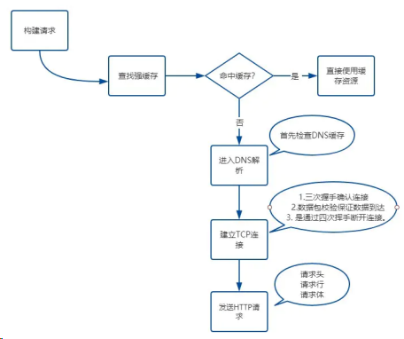

### 3）渲染阶段

完成了网络请求和响应，如果响应头中 Content-Type 的值是 text/html ，那么接下来就是浏览器的 解析 和 渲染 工作了。

首先来介绍解析部分，主要分为以下几个步骤:

- 构建 DOM 树
- 样式 计算
- 生成 布局树 ( Layout Tree )

较为专业的术语总结为以下阶段：

1. 构建 DOM 树
2. 样式计算
3. 布局阶段
4. 分层
5. 绘制
6. 分块
7. 光栅化
8. 合成

### 构建 DOM 树

由于浏览器无法直接理解 HTML 字符串 ，因此将这一系列的字节流转换为一种有意义并且方便操作的数据结构，这种数据结构就是 DOM 树 。 DOM 树 本质上是一个以 document 为根节点的多叉树。

那通过什么样的方式来进行解析呢？

#### （1）HTML 文法的本质

首先，我们应该清楚把握一点: HTML 的文法并不是 上下文无关文法 。

这里，有必要讨论一下什么是 上下文无关文法 。

在计算机科学的编译原理学科中，有非常明确的定义：

> 若一个形式文法 G = (N, Σ, P, S) 的产生式规则都取如下的形式：V->w，则叫上下文无关语法。其中 V∈N ，w∈(N∪Σ)\* 。

其中把 G = (N, Σ, P, S) 中各个参量的意义解释一下：

- N 是非终结符(顾名思义，就是说最后一个符号不是它, 下面同理)集合。
- Σ 是终结符集合。
- P 是开始符，它必须属于 N ，也就是非终结符。
- S 就是不同的产生式的集合。如 S -> aSb 等等。

通俗一点讲，上下文无关的文法就是说这个文法中所有产生式的左边都是一个非终结符。

看到这里，如果还有一点懵圈，我举个例子你就明白了。

比如：

```bash
A -> B
```

这个文法中，每个产生式左边都会有一个非终结符，这就是上下文无关的文法。在这种情况下，xBy 一定是可以规约出 xAy 的。

我们下面看看看一个反例：

```bash
aA -> B
Aa -> B
```

这种情况就是不是上下文无关的文法，当遇到 B 的时候，我们不知道到底能不能规约出 A，取决于左边或者右边是否有 a 存在，也就是说和上下文有关。

关于它为什么是非上下文无关文法，首先需要让大家注意的是，规范的 HTML 语法，是符合上下文无关文法的，能够体现它非上下文无关的是不标准的语法。在此我仅举一个反例即可证明。

比如解析器扫描到 form 标签的时候，上下文无关文法的处理方式是直接创建对应 form 的 DOM 对象，而真实的 HTML5 场景中却不是这样，解析器会查看 form 的上下文，如果这个 form 标签的父标签也是 form，那么直接跳过当前的 form 标签，否则才创建 DOM 对象。

常规的编程语言都是上下文无关的，而 HTML 却相反，也正是它非上下文无关的特性，决定了 HTML Parser 并不能使用常规编程语言的解析器来完成，需要另辟蹊径。

#### （2）解析算法

HTML5 规范详细地介绍了解析算法。这个算法分为两个阶段：

- 标记化。
- 建树。

对应的两个过程就是词法分析和语法分析。

##### 标记化算法

这个算法输入为 HTML 文本 ，输出为 HTML 标记 ，也成为标记生成器。其中运用有限自动状态机来完成。

即在当当前状态下，接收一个或多个字符，就会更新到下一个状态。

```html
<html>
	<body>
		Hello sanyuan
	</body>
</html>
```

通过一个简单的例子来演示一下 标记化 的过程。

遇到 < , 状态为标记打开。

接收 [a-z] 的字符，会进入标记名称状态。

这个状态一直保持，直到遇到 > ，表示标记名称记录完成，这时候变为数据状态。

接下来遇到 body 标签做同样的处理。

这个时候 html 和 body 的标记都记录好了。

现在来到 `<body>` 中的 > ，进入数据状态，之后保持这样状态接收后面的字符 hello sanyuan。
接着接收 `</body>` 中的 < ，回到标记打开, 接收下一个 / 后，这时候会创建一个 end tag 的 token。

随后进入标记名称状态, 遇到 > 回到数据状态。

接着以同样的样式处理 `</body>` 。

##### 建树算法

之前提到过，DOM 树是一个以 document 为根节点的多叉树。因此解析器首先会创建一个 document 对象。标记生成器会把每个标记的信息发送给建树器。建树器接收到相应的标记时，会创建对应的 DOM 对象。创建这个 DOM 对象 后会做两件事情：

1. 将 DOM 对象 加入 DOM 树中。
2. 将对应标记压入存放开放(与 闭合标签 意思对应)元素的栈中。

还是拿下面这个例子说：

```html
<html>
	<body>
		Hello sanyuan
	</body>
</html>
```

首先，状态为初始化状态。

接收到标记生成器传来的 html 标签，这时候状态变为 before html 状态。同时创建一个 HTMLHtmlElement 的 DOM 元素, 将其加到 document 根对象上，并进行压栈操作。

接着状态自动变为 before head, 此时从标记生成器那边传来 body ，表示并没有 head , 这时候建树器会自动创建一个 HTMLHeadElement 并将其加入到 DOM 树 中。

现在进入到 in head 状态, 然后直接跳到 after head。

现在标记生成器传来了 body 标记，创建 HTMLBodyElement, 插入到 DOM 树中，同时压入开放标记栈。

接着状态变为 in body，然后来接收后面一系列的字符: Hello sanyuan。接收到第一个字符的时候，会创建一个 Text 节点并把字符插入其中，然后把 Text 节点插入到 DOM 树中 body 元素 的下面。随着不断接收后面的字符，这些字符会附在 Text 节点上。

现在，标记生成器传过来一个 body 的结束标记，进入到 after body 状态。

标记生成器最后传过来一个 html 的结束标记, 进入到 after after body 的状态，表示解析过程到此结束。

##### 容错机制

讲到 HTML5 规范，就不得不说它强大的宽容策略, 容错能力非常强，虽然大家褒贬不一，不过我想作为一名资深的前端工程师，有必要知道 HTML Parser 在容错方面做了哪些事情。

接下来是 WebKit 中一些经典的容错示例，发现有其他的也欢迎来补充。

1.使用 `</br>` 而不是 `<br>`

```js
if (t->isCloseTag(brTag) && m_document->inCompatMode()) {
    reportError(MalformedBRError);
    t->beginTag = true;
}
```

全部换为 `<br>` 的形式。

表格离散

```html
<table>
	<table>
		<tr>
			<td>inner table</td>
		</tr>
	</table>
	<tr>
		<td>outer table</td>
	</tr>
</table>
```

WebKit 会自动转换为：

```html
<table>
	<tr>
		<td>outer table</td>
	</tr>
</table>
<table>
	<tr>
		<td>inner table</td>
	</tr>
</table>
```

表单元素嵌套

这时候直接忽略里面的 form 。

### 样式计算

关于 CSS 样式，它的来源一般是三种:
link 标签引用
style 标签中的样式
元素的内嵌 style 属性

#### (1）格式化样式表

首先，浏览器是无法直接识别 CSS 样式文本的，因此渲染引擎接收到 CSS 文本之后第一件事情就是将其转化为一个结构化的对象，即 styleSheets。

这个格式化的过程过于复杂，而且对于不同的浏览器会有不同的优化策略，这里就不展开了。

在浏览器控制台能够通过 document.styleSheets 来查看这个最终的结构。当然，这个结构包含了以上三种 CSS 来源，为后面的样式操作提供了基础。

#### （2）标准化样式属性

有一些 CSS 样式的数值并不容易被渲染引擎所理解，因此需要在计算样式之前将它们标准化，如 em -> px , red -> #ff0000 , bold -> 700 等等。

#### （3）计算每个节点的具体样式

样式已经被 格式化 和 标准化 ,接下来就可以计算每个节点的具体样式信息了。

其实计算的方式也并不复杂，主要就是两个规则: 继承和层叠。

每个子节点都会默认继承父节点的样式属性，如果父节点中没有找到，就会采用浏览器默认样式，也叫 UserAgent 样式 。这就是继承规则，非常容易理解。

然后是层叠规则，CSS 最大的特点在于它的层叠性，也就是最终的样式取决于各个属性共同作用的效果，甚至有很多诡异的层叠现象，看过《CSS 世界》的同学应该对此深有体会，具体的层叠规则属于深入 CSS 语言的范畴，这里就不过多介绍了。

不过值得注意的是，在计算完样式之后，所有的样式值会被挂在到 window.getComputedStyle 当中，也就是可以通过 JS 来获取计算后的样式，非常方便。

##### 生成布局树

现在已经生成了 DOM 树 和 DOM 样式 ，接下来要做的就是通过浏览器的布局系统 确定元素的位置 ，也就是要生成一棵 布局树 (Layout Tree)。

布局树生成的大致工作如下：

1）遍历生成的 DOM 树节点，并把他们添加到 布局树中 。
2）计算布局树节点的坐标位置。

值得注意的是，这棵布局树值包含可见元素，对于 head 标签和设置了 display: none 的元素，将不会被放入其中。

有人说首先会生成 Render Tree ，也就是渲染树，其实这还是 16 年之前的事情，现在 Chrome 团队已经做了大量的重构，已经没有生成 Render Tree 的过程了。而布局树的信息已经非常完善，完全拥有 Render Tree 的功能。

#### （3）总结

梳理一下这一节的主要脉络:

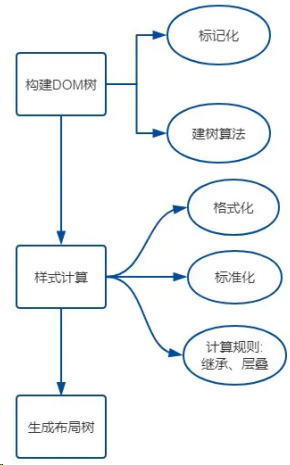


## 说说浏览器渲染页面的过程

1.首先输入一个网址，浏览器会向服务器发起 DNS 请求，得到对应的 IP 地址（会被缓存一段时间，后续访问就不用再去向服务器查询）。

2.之后会进行 TCP 三次握手与服务器建立连接，连接建立后，浏览器会代表用户发送一个初始的 GET 请求，通常是请求一个 HTML 文件。服务器收到对应请求后 ，会根据相关的响应头和 HTML 内容进行回复。

3.一旦浏览器拿到了数据，就会开始解析信息，这个过程中，浏览器会根据 HTML 文件去构建 DOM 树，当遇到一些阻塞资源时（如同步加载的 script 标签）会去加载阻塞资源而停止当前 DOM 树构建（所以能够异步的或延迟加载的就尽量异步或延迟，同时页面的脚本还是越少越好）。

4.在构建 DOM 树时，浏览器的主线程被占据着，不过浏览器的预加载扫描器会去请求高优先级的资源（如 css、js、字体），预加载扫描器很好的优化了阻塞问题。接下来浏览器会处理 CSS 生成 CSSDOM 树，将 CSS 规则转换为可以理解和使用的样式映射，这个过程非常快（通常小于一次 DNS 查询所需时间）。

5.有了 DOM 树和 CSSDOM 树，浏览器会将其组合生成一个 Render 树，计算样式或渲染树会从 DOM 的根节点开始构建，遍历每一个可见节点（将相关样式匹配到每一个可见节点，并根据 CSS 级联去的每个节点的计算样式）。

6.接下来开始布局，该过程（依旧是从根节点开始）会确定所有节点的宽高和位置，最后通过渲染器将其在页面上绘制。

7.绘制完成了，并不代表交互也都生效了，因为主线程可能还无法抽出时间去处理滚动、触摸等交互，要等到 js 加载完成，同时主线程空闲了整个页面才是正常可用的状态。


注意：这个过程是逐步完成的，为了更好的用户体验，渲染引擎将会尽可能早的将内容呈现到屏幕上，并不会等到所有的 html 都解析完成之后再去构建和布局 render 树。它是解析完一部分内容就显示一部分内容，同时，可能还在通过网络下载其余内容。

## 详细拆解页面渲染过程

接下来就来拆解下一个过程—— 渲染 。分为以下几个步骤：

- 建立 图层树 ( Layer Tree )
- 生成 绘制列表
- 生成 图块 并 栅格化
- 显示器显示内容

### 建图层树

如果你觉得现在 DOM 节点 也有了，样式和位置信息也都有了，可以开始绘制页面了，那你就错了。

因为你考虑掉了另外一些复杂的场景，比如 3D 动画如何呈现出变换效果，当元素含有层叠上下文时如何控制显示和隐藏等等。

为了解决如上所述的问题，浏览器在构建完 布局树 之后，还会对特定的节点进行分层，构建一棵 图层树( Layer Tree )。

**那这棵图层树是根据什么来构建的呢？**

一般情况下，节点的图层会默认属于父亲节点的图层(这些图层也称为合成层)。那什么时候会提升为一个单独的合成层呢？

有两种情况需要分别讨论，一种是显式合成，一种是隐式合成。

#### （1）显式合成

下面是 显式合成 的情况:

##### 一、 拥有层叠上下文的节点。

层叠上下文也基本上是有一些特定的 CSS 属性创建的，一般有以下情况：

- HTML 根元素本身就具有层叠上下文。
- 普通元素设置 position 不为 static 并且设置了 z-index 属性，会产生层叠上下文。
- 元素的 opacity 值不是 1
- 元素的 transform 值不是 none
- 元素的 filter 值不是 none
- 元素的 isolation 值是 isolate
- will-change 指定的属性值为上面任意一个。(will-change 的作用后面会详细介绍)

##### 二、需要剪裁的地方。

比如一个 div，你只给他设置 100 \* 100 像素的大小，而你在里面放了非常多的文字，那么超出的文字部分就需要被剪裁。当然如果出现了滚动条，那么滚动条会被单独提升为一个图层。

#### （2）隐式合成

接下来是 隐式合成 ，简单来说就是 层叠等级低 的节点被提升为单独的图层之后，那么 所有层叠等级比它高的节点都会成为一个单独的图层。

这个隐式合成其实隐藏着巨大的风险，如果在一个大型应用中，当一个 z-index 比较低的元素被提升为单独图层之后，层叠在它上面的的元素统统都会被提升为单独的图层，可能会增加上千个图层，大大增加内存的压力，甚至直接让页面崩溃。这就是层爆炸的原理。

值得注意的是，当需要 repaint 时，只需要 repaint 本身，而不会影响到其他的层。

### 生成绘制列表

接下来渲染引擎会将图层的绘制拆分成一个个绘制指令，比如先画背景、再描绘边框......然后将这些指令

按顺序组合成一个待绘制列表，相当于给后面的绘制操作做了一波计划。

这里我以百度首页为例，大家可以在 Chrome 开发者工具中在设置栏中展开 more tools , 然后选择 Layers 面板，就能看到下面的绘制列表：

![Image[196]](./浏览器工作原理和面试题.assets/Image[196].jpg)

### 生成图块和生成位图

现在开始绘制操作，实际上在渲染进程中绘制操作是由专门的线程来完成的，这个线程叫合成线程。

绘制列表准备好了之后，渲染进程的主线程会给 合成线程 发送 commit 消息，把绘制列表提交给合成线程。接下来就是合成线程一展宏图的时候啦。

首先，考虑到视口就这么大，当页面非常大的时候，要滑很长时间才能滑到底，如果要一口气全部绘制出来是相当浪费性能的。因此，合成线程要做的第一件事情就是将图层分块。这些块的大小一般不会特别大，通常是 256 _ 256 或者 512 _ 512 这个规格。这样可以大大加速页面的首屏展示。

因为后面图块数据要进入 GPU 内存，考虑到浏览器内存上传到 GPU 内存的操作比较慢，即使是绘制一部分图块，也可能会耗费大量时间。针对这个问题，Chrome 采用了一个策略: 在首次合成图块时只采用一个低分辨率的图片，这样首屏展示的时候只是展示出低分辨率的图片，这个时候继续进行合成操作，当正常的图块内容绘制完毕后，会将当前低分辨率的图块内容替换。这也是 Chrome 底层优化首屏加载速度的一个手段。

顺便提醒一点，渲染进程中专门维护了一个栅格化线程池，专门负责把图块转换为位图数据。

然后合成线程会选择视口附近的图块，把它交给栅格化线程池生成位图。

生成位图的过程实际上都会使用 GPU 进行加速，生成的位图最后发送给 合成线程 。

### 显示器显示内容

栅格化操作完成后，合成线程会生成一个绘制命令，即"DrawQuad"，并发送给浏览器进程。

浏览器进程中的 viz 组件 接收到这个命令，根据这个命令，把页面内容绘制到内存，也就是生成了页面，然后把这部分内存发送给显卡。为什么发给显卡呢？我想有必要先聊一聊显示器显示图像的原理。

无论是 PC 显示器还是手机屏幕，都有一个固定的刷新频率，一般是 60 HZ，即 60 帧，也就是一秒更新 60 张图片，一张图片停留的时间约为 16.7 ms。而每次更新的图片都来自显卡的前缓冲区。而显卡接收到浏览器进程传来的页面后，会合成相应的图像，并将图像保存到后缓冲区，然后系统自动将 前缓冲区和 后缓冲区 对换位置，如此循环更新。

看到这里你也就是明白，当某个动画大量占用内存的时候，浏览器生成图像的时候会变慢，图像传送给显卡就会不及时，而显示器还是以不变的频率刷新，因此会出现卡顿，也就是明显的掉帧现象。

### 总结

到这里，我们算是把整个过程给走通了，现在重新来梳理一下页面渲染的流程。

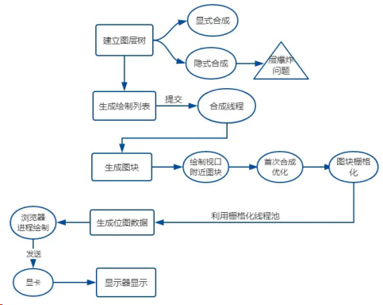


## 浏览器在生成页面的时候，会生成那两颗树？

参考回答：

构造两棵树，**DOM 树和 CSSOM 规则树**，

当浏览器接收到服务器相应来的 HTML 文档后，会遍历文档节点，生成 DOM 树，CSSOM 规则树由浏览器解析 CSS 文件生成。

## 什么是回流和重绘？

我们首先来看一下渲染流水线的流程：

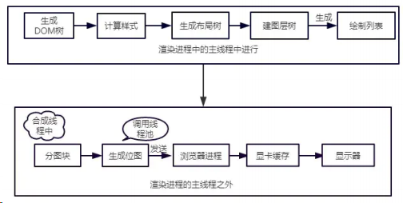

### 1.概念：

#### 回流

当 DOM 的变化影响了元素的几何信息，浏览器需要重新计算元素的几何属性，将其安放在界面中的正确位置，这个过程叫做回流（也可以叫做重排）。表现为重新生成布局，重新排列元素。

#### 重绘

当一个元素的外观发生改变，重新把元素外观绘制出来的过程，叫做重绘。表现为某些元素的外观被改变。

### 2.回流和重绘的触发条件（属性和方法）

#### 触发重绘：

当 DOM 的修改导致了样式的变化，并且没有影响几何属性的时候，会导致 重绘 ( repaint )。

#### 重绘过程

由于没有导致 DOM 几何属性的变化，因此元素的位置信息不需要更新，从而省去布局的过程。流程如下：

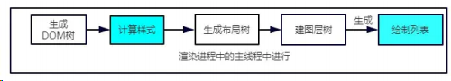

跳过了 生成布局树 和 建图层树 的阶段，直接生成绘制列表，然后继续进行分块、生成位图等后面一系列操作。

#### 触发回流:

- 1.一个 DOM 元素的几何属性变化，常见的几何属性有：width 、 height 、 padding 、 margin 、left 、 top 、 border 等等。
- 2.使 可见的 DOM 节点发生 增减 或者 移动 。
- 3.读写 offset 族：计算 offsetWidth 和 offsetHeight 属性、 scroll 族和 client 族属性的时候，浏览器为了获取这些值，需要进行回流操作。
- 4.浏览器尺寸改变：resize 事件发生时
- 5.调用 window.getComputedStyle 方法。
- 6.设置 style 属性的值：
- 7.修改网页默认字体

#### 回流过程

依照上面的渲染流水线，触发回流的时候，如果 DOM 结构发生改变，则重新渲染 DOM 树，然后将后面的流程(包括主线程之外的任务)全部走一遍。

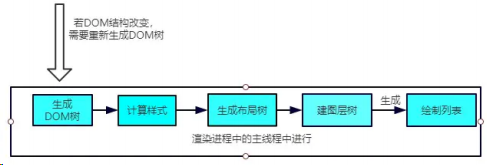

相当于将解析和合成的过程重新又走了一篇，开销是非常大的。

#### 总结

**回流必定会发生重绘，重绘不一定会引发回流。**

**回流所需的成本比重绘高得多**

### 合成

还有一种情况，是直接合成。比如利用 CSS3 的 transform 、 opacity 、 filter 这些属性就可以实现合成的效果，也就是大家常说的 GPU 加速。

#### （1）GPU 加速的原因

在合成的情况下，会直接跳过布局和绘制流程，直接进入 非主线程 处理的部分，即直接交给 合成线程 处理。交给它处理有两大好处：

能够充分发挥 GPU 的优势。合成线程生成位图的过程中会调用线程池，并在其中使用 GPU 进行加速生成，而 GPU 是擅长处理位图数据的。

没有占用主线程的资源，即使主线程卡住了，效果依然能够流畅地展示。

### 实践意义

- 知道上面的原理之后，对于开发过程有什么指导意义呢？
- 避免频繁使用 style，而是采用修改 class 的方式。
- 使用 createDocumentFragment 进行批量的 DOM 操作。
- 对于 resize、scroll 等进行防抖/节流处理。

添加 will-change: tranform ，让渲染引擎为其单独实现一个图层，当这些变换发生时，仅仅只是利用合成线程去处理这些变换，而不牵扯到主线程，大大提高渲染效率。当然这个变化不限于 tranform , 任何可以实现合成效果的 CSS 属性都能用 will-change 来声明。这里有一个实际的例子，一行 will-change: tranform 拯救一个项目。


### 下面例子中，触发了几次回流和重绘？

```js
var s = document.body.style;
s.padding = "2px"; // 回流+重绘
s.border = "1px solid red"; // 再一次 回流+重绘
s.color = "blue"; // 再一次重绘
s.backgroundColor = "#ccc"; // 再一次 重绘
s.fontSize = "14px"; // 再一次 回流+重绘
// 添加node，再一次 回流+重绘
document.body.appendChild(document.createTextNode('abc!'));
```


## 如何减少回流、重绘？

- 使用 transform 代替 top

- 使用 visibility 替换 display: none ，因为前者只会引起重绘，后者会引发回流（改变了布局）

- 不要把节点的属性值放在一个循环里，当成循环里的变量
  ```js
  for(let i = 0; i < 1000; i++) {
      // 获取 offsetTop 会导致回流，因为需要去获取正确的值
      console.log(document.querySelector('.test').style.offsetTop)
  }
  ```

- 不要使用 table 布局，可能很小的一个改动会造成整个 table 的重新布局

- 把 DOM 离线后修改。如：使用 documentFragment 对象在内存里操作 DOM

- 不要一条一条的修改样式，可以预先定义好 class，然后修改 DOM 的 className

- 使用 absolute 或 fixed 使元素脱离文档流

- 动画实现的速度的选择，动画速度越快，回流次数越多，也可以选择使用 requestAnimationFrame

- CSS 选择符从右往左匹配查找，避免节点层级过多

- 将频繁重绘或者回流的节点设置为图层，图层能够阻止该节点的渲染行为影响别的节点。比如对于 video 标签来说，浏览器会自动将该节点变为图层。

## 如何避免DOM的回流呢？

### ① 放弃传统操作DOM的时代，基于vue/react开始数据影响视图模式

mvvm/mvc/virtual dom/dom diff...

### ② 分离读写操作（现代的浏览器都有渲染队列的机制）

#### 什么叫分离读写呢？

举个例子

```html
<style>
  #box{
    width:100px;
    height:100px;
    border:10px solid #ddd;
  }
</style>

<body>
  <div id="box"></div>
  <script>
    let box = document.getElementById('box')
    box.style.width='200px';
    box.style.height='200px';
    box.style.margin='10px';
  </script>
</body>
```

一开始div会宽高为100px，这个时候我用js将div的宽高改变为200px，margin为10px，以前的老浏览器的话就会执行三次回流，因为改变了三次样式的大小；而现在新的浏览器增加了**渲染队列**，也就是当执行box.style.width的时候，浏览器会将它加入渲染队列中，然后顿一下，查看下一行是否还是修改样式，如果是则再加入到渲染队列，一直到下一行代码不是修改样式为止，然后统一刷新渲染队列进行一次回流，所以上面虽然修改了三次，但是只执行了一次回流。

但是如果在中间加入了一行不是修改样式的代码，比如console.log，则浏览器就会直接渲染一次（也就是执行回流），然后继续向下执行，这时候就要执行两次回流，修改样式的代码就是写，console.log获取数据就是读，所以读写分开写就会提升性能，这就是**读写分离**

```css
box.style.width='200px';
console.log(box.clientWidth);
box.style.height='200px';
box.style.margin='10px';
```

但是有一个问题，当下一行代码有这些时，及时下一行是修改样式，也会直接渲染执行回流。

> offsetTop、offsetLeft、offsetWidth、offsetHeight、clientTop、clientWidth、clientHeight、scrollTop、scrollLeft、scrollWidth、scrollHeight、getComputedStyle、currentStyle...会刷新渲染队列

### ③ 样式集中改变（批量处理）

需要修改的样式统一定一个类，然后加入到DOM中

```html
.a{
 height:200px;
 width:200px;
}
<script>
 box.className=’a’
</script>
```

### ④ 缓存布局信息

```html
<script>
  box.style.width = box.clientWidth +10 +’px’;
box.style.height= box.clientHeight +10 +’px’
</script>
```

因为每一行有clientWidth、clientHeight 所以还是会执行两次回流，想执行一次可以这样

```css
let a=box.clientWidth 
let b=box.clientHeight
box.style.width = a+10 +’px’;
box.style.height=  b+10 +’px’
```

这就是缓存处理

### ⑤ 元素批量修改

动态在ul中加入5个li

```html
<ul id=”box”></ul>
```

script部分

```js
for(let i=0; i<5;i++){
 let newLi = document.createElement(‘li’)
 newLi.innerHTML = i
 box.appendChild(newLI)
}
```

上面的for循环，每循环一次就会想ul中加一个li子节点然后就会发生一次回流，一共执行了五次回流。

#### 那如何才能批量处理呢？

##### 方案一：（这种方式不常用）

我们可以用文档碎片（临时容器）：createDocumentFragment

```js
let frg = document.createDocumentFragment();
for(let i=0; i<5;i++){
 let newLi = document.createElement(‘li’)
 newLi.innerHTML = i
 frg.appendChild(newLI)
//创建的li放到文档碎片中，页面中还没有，所以不会执行回流
}
box.appendChild(frg) //一次性把内容放到box中，执行一次回流
frg=null //销毁，释放内存
```

##### 方案二：字符串拼接

```js
let str =``;
for(let i=0;i<5;i++){
  str+=`<li>${i}</li>`
}
box.innerHTML = str;
```

### ⑥ 动画效果应用到postion属性

为absolute或fixed的元素上（脱离文档流）

### ⑦ 开启css3硬件加速（GPU加速）

能用transform做的就不要用其他的，因为transform可以开启硬件加速，而硬件加速可以规避回流。

```css
#box{
 postion:absolute;
 width:100px;
 height:100px;
 background:red;
}

script部分
box.style.left='100px' //向右移动100px，一次回流
box.style.ctransform='translateX(200)' //向右移动200px，不会引发回流
```

### ⑧ 牺牲平滑度换取速度

比如做一个动画，如果一像素一像素的移动，如果使用了100%CPU,动画会看上去是跳动的，因为浏览器正在与更新回流作斗争，每次移动3像素，虽然平滑度低了，但是不会导致cpu在较慢的机器中抖动

### ⑨ 避免table布局和使用css的JavaScript表达式

#### 浏览器工作流程大体分为如下三部分：

##### 1）浏览器会解析三个东西：

- 一个是HTML/SVG/XHTML，事实上，Webkit有三个C++的类对应这三类文档。解析这三种文件会产生一个DOM Tree。
- CSS，解析CSS会产生CSS规则树。
- Javascript，脚本，主要是通过DOM API和CSSOM API来操作DOM Tree和CSS Rule Tree.

##### 2）解析完成后，浏览器引擎会通过DOM Tree 和 CSS Rule Tree 来构造 Rendering Tree。

- Rendering Tree 渲染树并不等同于DOM树，因为一些像Header或display:none的东西就没必要放在渲染树中了。
- CSS 的 Rule Tree主要是为了完成匹配并把CSS Rule附加上Rendering Tree上的每个Element。也就是DOM结点。也就是所谓的Frame。
- 然后，计算每个Frame（也就是每个Element）的位置，这又叫layout和reflow过程。

##### 3）最后通过调用操作系统Native GUI的API绘制。

> *接下来我们针对这其中所经历的重要步骤，一一详细阐述。*

#### 构建DOM

浏览器会遵守一套步骤将HTML 文件转换为 DOM 树。宏观上，可以分为几个步骤：


- 浏览器从磁盘或网络读取HTML的原始字节，并根据文件的指定编码（例如 UTF-8）将它们转换成字符串。

在网络中传输的内容其实都是 0 和 1 这些字节数据。当浏览器接收到这些字节数据以后，它会将这些字节数据转换为字符串，也就是我们写的代码。

- 将字符串转换成Token，例如：`<html>`、`<body>`等。**Token中会标识出当前Token是“开始标签”或是“结束标签”亦或是“文本”等信息**。

这时候你一定会有疑问，节点与节点之间的关系如何维护？

事实上，这就是Token要标识“起始标签”和“结束标签”等标识的作用。例如“title”Token的起始标签和结束标签之间的节点肯定是属于“head”的子节点。

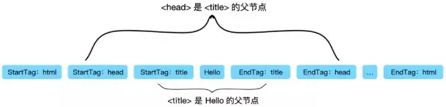


上图给出了节点之间的关系，例如：“Hello”Token位于“title”开始标签与“title”结束标签之间，表明“Hello”Token是“title”Token的子节点。同理“title”Token是“head”Token的子节点。

- 生成节点对象并构建DOM

事实上，构建DOM的过程中，不是等所有Token都转换完成后再去生成节点对象，而是一边生成Token一边消耗Token来生成节点对象。换句话说，每个Token被生成后，会立刻消耗这个Token创建出节点对象。**注意：带有结束标签标识的Token不会创建节点对象。**

接下来我们举个例子，假设有段HTML文本：

```html
<html>
<head>
    <title>Web page parsing</title>
</head>
<body>
    <div>
        <h1>Web page parsing</h1>
        <p>This is an example Web page.</p>
    </div>
</body>
</html>
```

上面这段HTML会解析成这样：


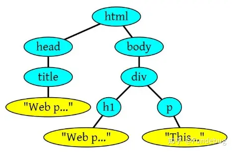


#### 构建CSSOM

DOM会捕获页面的内容，但浏览器还需要知道页面如何展示，所以需要构建CSSOM。

构建CSSOM的过程与构建DOM的过程非常相似，当浏览器接收到一段CSS，浏览器首先要做的是识别出Token，然后构建节点并生成CSSOM。

在这一过程中，浏览器会确定下每一个节点的样式到底是什么，并且这一过程其实是很消耗资源的。因为样式你可以自行设置给某个节点，也可以通过继承获得。在这一过程中，浏览器得递归 CSSOM 树，然后确定具体的元素到底是什么样式。

**注意：CSS匹配HTML元素是一个相当复杂和有性能问题的事情。所以，DOM树要小，CSS尽量用id和class，千万不要过渡层叠下去**。

#### 构建渲染树

当我们生成 DOM 树和 CSSOM 树以后，就需要将这两棵树组合为渲染树。


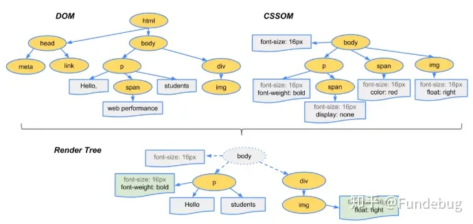


在这一过程中，不是简单的将两者合并就行了。**渲染树只会包括需要显示的节点和这些节点的样式信息**，如果某个节点是 `display: none`的，那么就不会在渲染树中显示。

#### 布局与绘制

当浏览器生成渲染树以后，就会根据渲染树来进行布局（也可以叫做回流）。这一阶段浏览器要做的事情是要弄清楚各个节点在页面中的确切位置和大小。通常这一行为也被称为“自动重排”。

布局流程的输出是一个“盒模型”，它会精确地捕获每个元素在视口内的确切位置和尺寸，所有相对测量值都将转换为屏幕上的绝对像素。

布局完成后，浏览器会立即发出“Paint Setup”和“Paint”事件，将渲染树转换成屏幕上的像素。

> *以上我们详细介绍了浏览器工作流程中的重要步骤，接下来我们讨论几个相关的问题：*

#### 渲染过程中遇到JS文件怎么处理？

JavaScript的加载、解析与执行会阻塞DOM的构建，也就是说，在构建DOM时，HTML解析器若遇到了JavaScript，那么它会暂停构建DOM，将控制权移交给JavaScript引擎，等JavaScript引擎运行完毕，浏览器再从中断的地方恢复DOM构建。

也就是说，如果你想首屏渲染的越快，就越不应该在首屏就加载 JS 文件，这也是都建议将 script 标签放在 body 标签底部的原因。当然在当下，并不是说 script 标签必须放在底部，因为你可以给 script 标签添加 defer 或者 async 属性（下文会介绍这两者的区别）。

JS文件不只是阻塞DOM的构建，它会导致CSSOM也阻塞DOM的构建。

原本DOM和CSSOM的构建是互不影响，井水不犯河水，但是一旦引入了JavaScript，CSSOM也开始阻塞DOM的构建，只有CSSOM构建完毕后，DOM再恢复DOM构建。

这是什么情况？

这是因为JavaScript不只是可以改DOM，它还可以更改样式，也就是它可以更改CSSOM。前面我们介绍，不完整的CSSOM是无法使用的，但JavaScript中想访问CSSOM并更改它，那么在执行JavaScript时，必须要能拿到完整的CSSOM。所以就导致了一个现象，如果浏览器尚未完成CSSOM的下载和构建，而我们却想在此时运行脚本，那么浏览器将延迟脚本执行和DOM构建，直至其完成CSSOM的下载和构建。也就是说，**在这种情况下，浏览器会先下载和构建CSSOM，然后再执行JavaScript，最后在继续构建DOM**。

### 浏览器重绘与重排的区别？

- 重排: 部分渲染树（或者整个渲染树）需要重新分析并且节点尺寸需要重新计算，表现为重新生成布局，重新排列元素
- 重绘: 由于节点的几何属性发生改变或者由于样式发生改变，例如改变元素背景色时，屏幕上的部分内容需要更新，表现为某些元素的外观被改变

单单改变元素的外观，肯定不会引起网页重新生成布局，但当浏览器完成重排之后，将会重新绘制受到此次重排影响的部分

重排和重绘代价是高昂的，它们会破坏用户体验，并且让UI展示非常迟缓，而相比之下重排的性能影响更大，在两者无法避免的情况下，一般我们宁可选择代价更小的重绘。

『重绘』不一定会出现『重排』，『重排』必然会出现『重绘』。

### 如何触发重排和重绘？

任何改变用来构建渲染树的信息都会导致一次重排或重绘：

- 添加、删除、更新DOM节点
- 通过display: none隐藏一个DOM节点-触发重排和重绘
- 通过visibility: hidden隐藏一个DOM节点-只触发重绘，因为没有几何变化
- 移动或者给页面中的DOM节点添加动画
- 添加一个样式表，调整样式属性
- 用户行为，例如调整窗口大小，改变字号，或者滚动。

### 如何避免重绘或者重排？

#### 集中改变样式

我们往往通过改变class的方式来集中改变样式

```js
// 判断是否是黑色系样式
const theme = isDark ? 'dark' : 'light'

// 根据判断来设置不同的class
ele.setAttribute('className', theme)
```

#### 使用DocumentFragment

我们可以通过createDocumentFragment创建一个游离于DOM树之外的节点，然后在此节点上批量操作，最后插入DOM树中，因此只触发一次重排

```js
var fragment = document.createDocumentFragment();

for (let i = 0;i<10;i++){
  let node = document.createElement("p");
  node.innerHTML = i;
  fragment.appendChild(node);
}

document.body.appendChild(fragment);
```

#### 提升为合成层

将元素提升为合成层有以下优点：

- 合成层的位图，会交由 GPU 合成，比 CPU 处理要快
- 当需要 repaint 时，只需要 repaint 本身，不会影响到其他的层
- 对于 transform 和 opacity 效果，不会触发 layout 和 paint

提升合成层的最好方式是使用 CSS 的 will-change 属性：

```css
#target {
  will-change: transform;
}
```

> 关于合成层的详解请移步[无线性能优化：Composite](http://taobaofed.org/blog/2016/04/25/performance-composite/)

### 前端如何实现即时通讯？

#### 短轮询

短轮询的原理很简单，每隔一段时间客户端就发出一个请求，去获取服务器最新的数据，一定程度上模拟实现了即时通讯。

- 优点：兼容性强，实现非常简单
- 缺点：延迟性高，非常消耗请求资源，影响性能

#### comet

comet有两种主要实现手段，一种是基于 AJAX 的长轮询（long-polling）方式，另一种是基于 Iframe 及 htmlfile 的流（streaming）方式，通常被叫做长连接。

> 具体两种手段的操作方法请移步[Comet技术详解：基于HTTP长连接的Web端实时通信技术](http://www.52im.net/thread-334-1-1.html)

长轮询优缺点：

- 优点：兼容性好，资源浪费较小
- 缺点：服务器hold连接会消耗资源，返回数据顺序无保证，难于管理维护

长连接优缺点：

- 优点：兼容性好，消息即时到达，不发无用请求
- 缺点：服务器维护长连接消耗资源

#### SSE

> 使用指南请看[Server-Sent Events 教程](https://www.ruanyifeng.com/blog/2017/05/server-sent_events.html)

SSE（Server-Sent Event，服务端推送事件）是一种允许服务端向客户端推送新数据的HTML5技术。

- 优点：基于HTTP而生，因此不需要太多改造就能使用，使用方便，而websocket非常复杂，必须借助成熟的库或框架
- 缺点：基于文本传输效率没有websocket高，不是严格的双向通信，客户端向服务端发送请求无法复用之前的连接，需要重新发出独立的请求

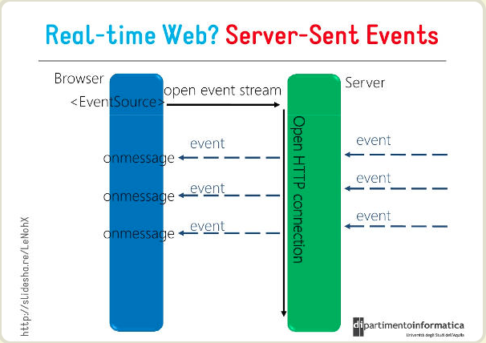

#### Websocket

> 使用指南请看[WebSocket 教程](http://www.ruanyifeng.com/blog/2017/05/websocket.html)

Websocket是一个全新的、独立的协议，基于TCP协议，与http协议兼容、却不会融入http协议，仅仅作为html5的一部分，其作用就是在服务器和客户端之间建立实时的双向通信。

- 优点：真正意义上的实时双向通信，性能好，低延迟
- 缺点：独立与http的协议，因此需要额外的项目改造，使用复杂度高，必须引入成熟的库，无法兼容低版本浏览器

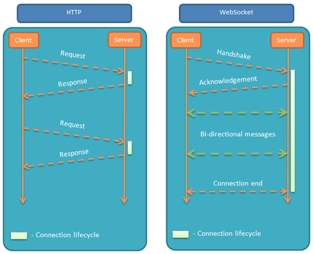

#### Web Worker

> 后面性能优化部分会用到，先做了解

Web Worker 的作用，就是为 JavaScript 创造多线程环境，允许主线程创建 Worker 线程，将一些任务分配给后者运行

[Web Worker教程](http://www.ruanyifeng.com/blog/2018/07/web-worker.html)

#### Service workers

> 后面性能优化部分会用到，先做了解

Service workers 本质上充当Web应用程序与浏览器之间的代理服务器，也可以在网络可用时作为浏览器和网络间的代理，创建有效的离线体验。

[Service workers教程](https://developer.mozilla.org/zh-CN/docs/Web/API/Service_Worker_API)

### 浏览器渲染性能优化⭐️⭐️

- 1.针对 JavaScript：异步加载 JavaScript：将脚本放在页面底部，使用`async`或`defer`属性。
- 2.针对 CSS：导入外部样式使用 link，而不用@import。如果 css 少，尽可能采用内嵌样式，直接写在 style 标签中。使用 CDN 导入样式库：加速资源加载。
- 3.针对 DOM 树、CSSOM 树：减少渲染时间
- 4.减少回流和重绘：避免频繁修改样式，使用 CSS 动画代替 JavaScript 动画。
- 5.图片懒加载：只加载可见区域内的图片。

#### 1、针对 JavaScript

 JavaScript 既会阻塞 HTML 的解析，也会阻塞 CSS 的解析。因此我们可以对 JavaScript 的加载方式进行改变，来进行优化：

（1）尽量将 JavaScript 文件放在 body 的最后

（2） body 中间尽量不要写`<script>`标签

（3）`<script>`标签的引入资源方式有三种，有一种就是我们常用的直接引入，还有两种就是使用 async 属性和 defer 属性来异步引入，两者都是去异步加载外部的 JS 文件，不会阻塞 DOM 的解析（尽量使用异步加载）。三者的区别如下：

- **script** 立即停止页面渲染去加载资源文件，当资源加载完毕后立即执行 js 代码，js 代码执行完毕后继续渲染页面；
- **async** 是在下载完成之后，立即异步加载，加载好后立即执行，多个带 async 属性的标签，不能保证加载的顺序；
- **defer** 是在下载完成之后，立即异步加载。加载好后，如果 DOM 树还没构建好，则先等 DOM 树解析好再执行；如果 DOM 树已经准备好，则立即执行。多个带 defer 属性的标签，按照顺序执行。

#### 2、针对 CSS

使用 CSS 有三种方式：使用**link、@import、内联样式**，其中 link 和@import 都是导入外部样式。它们之间的区别：

- **link**：浏览器会派发一个新的线程(HTTP 线程)去加载资源文件，与此同时 GUI 渲染线程会继续向下渲染代码
- **@import**：**GUI 渲染线程会暂时停止渲染**，去服务器加载资源文件，资源文件没有返回之前不会继续渲染**(阻碍浏览器渲染)**
- **style**：GUI 直接渲染

外部样式如果长时间没有加载完毕，浏览器为了用户体验，会使用浏览器会默认样式，确保首次渲染的速度。所以 CSS 一般写在 headr 中，让浏览器尽快发送请求去获取 css 样式。

所以，在开发过程中，导入外部样式使用 link，而不用@import。如果 css 少，尽可能采用内嵌样式，直接写在 style 标签中。

#### 3、针对 DOM 树、CSSOM 树

可以通过以下几种方式来减少渲染的时间：

- HTML 文件的代码层级尽量不要太深
- 使用语义化的标签，来避免不标准语义化的特殊处理
- 减少 CSSOM 代码的层级，因为选择器是从左向右进行解析的

#### 4、减少回流与重绘

- 操作 DOM 时，尽量在低层级的 DOM 节点进行操作
- 不要使用`table`布局， 一个小的改动可能会使整个`table`进行重新布局
- 使用 CSS 的表达式
- 不要频繁操作元素的样式，对于静态页面，可以修改类名，而不是样式。
- 使用 absolute 或者 fixed，使元素脱离文档流，这样他们发生变化就不会影响其他元素
- 避免频繁操作 DOM，可以创建一个文档片段`documentFragment`，在它上面应用所有 DOM 操作，最后再把它添加到文档中
- 将元素先设置`display: none`，操作结束后再把它显示出来。因为在 display 属性为 none 的元素上进行的 DOM 操作不会引发回流和重绘。
- 将 DOM 的多个读操作（或者写操作）放在一起，而不是读写操作穿插着写。这得益于**浏览器的渲染队列机制**。

浏览器针对页面的回流与重绘，进行了自身的优化——**渲染队列**

**浏览器会将所有的回流、重绘的操作放在一个队列中，当队列中的操作到了一定的数量或者到了一定的时间间隔，浏览器就会对队列进行批处理。这样就会让多次的回流、重绘变成一次回流重绘。**

将多个读操作（或者写操作）放在一起，就会等所有的读操作进入队列之后执行，这样，原本应该是触发多次回流，变成了只触发一次回流。


##### 1.CSS

1.**使用 `transform` 替代 `top`**

2.**使用 `visibility` 替换 `display: none`** ，因为前者只会引起重绘，后者会引发回流（改变了布局

3.**避免使用`table`布局**，可能很小的一个小改动会造成整个 `table` 的重新布局。

4.**尽可能在`DOM`树的最末端改变`class`**，回流是不可避免的，但可以减少其影响。尽可能在 DOM 树的最末端改变 class，可以限制了回流的范围，使其影响尽可能少的节点。

5.**避免设置多层内联样式**，CSS 选择符**从右往左**匹配查找，避免节点层级过多。

```html
<div>
	<a> <span></span> </a>
</div>
<style>
	span {
		color: red;
	}
	div > a > span {
		color: red;
	}
</style>
```

对于第一种设置样式的方式来说，浏览器只需要找到页面中所有的 `span` 标签然后设置颜色，但是对于第二种设置样式的方式来说，浏览器首先需要找到所有的 `span` 标签，然后找到 `span` 标签上的 `a` 标签，最后再去找到 `div` 标签，然后给符合这种条件的 `span` 标签设置颜色，这样的递归过程就很复杂。所以我们应该尽可能的避免写**过于具体**的 CSS 选择器，然后对于 HTML 来说也尽量少的添加无意义标签，保证**层级扁平**。

6.**将动画效果应用到`position`属性为`absolute`或`fixed`的元素上**，避免影响其他元素的布局，这样只是一个重绘，而不是回流，同时，控制动画速度可以选择 `requestAnimationFrame`，详见[探讨 requestAnimationFrame](https://github.com/LuNaHaiJiao/blog/issues/30)。

7.**避免使用`CSS`表达式**，可能会引发回流。

8.**将频繁重绘或者回流的节点设置为图层**，图层能够阻止该节点的渲染行为影响别的节点，例如`will-change`、`video`、`iframe`等标签，浏览器会自动将该节点变为图层。

9.**CSS3 硬件加速（GPU 加速）**，使用 css3 硬件加速，可以让`transform`、`opacity`、`filters`这些动画不会引起回流重绘 。但是对于动画的其它属性，比如`background-color`这些，还是会引起回流重绘的，不过它还是可以提升这些动画的性能。

##### 2.JavaScript

- 1.**避免频繁操作样式**，最好一次性重写`style`属性，或者将样式列表定义为`class`并一次性更改`class`属性。
- 2.**避免频繁操作`DOM`**，创建一个`documentFragment`，在它上面应用所有`DOM操作`，最后再把它添加到文档中。
- 3.**避免频繁读取会引发回流/重绘的属性**，如果确实需要多次使用，就用一个变量缓存起来。
- 4.**对具有复杂动画的元素使用绝对定位**，使它脱离文档流，否则会引起父元素及后续元素频繁回流。

#### 总结

深入理解浏览器渲染原理对于前端开发至关重要，它有助于优化性能、提升用户体验。

### 浏览器优化

现代浏览器大多都是通过队列机制来批量更新布局，浏览器会把修改操作放在队列中，至少一个浏览器刷新（即 16.6ms）才会清空队列，但当你**获取布局信息的时候，队列中可能有会影响这些属性或方法返回值的操作，即使没有，浏览器也会强制清空队列，触发回流与重绘来确保返回正确的值**。

主要包括以下属性或方法：

- `offsetTop`、`offsetLeft`、`offsetWidth`、`offsetHeight`
- `scrollTop`、`scrollLeft`、`scrollWidth`、`scrollHeight`
- `clientTop`、`clientLeft`、`clientWidth`、`clientHeight`
- `width`、`height`
- `getComputedStyle()`
- `getBoundingClientRect()`

所以，我们应该避免频繁的使用上述的属性，他们都会强制渲染刷新队列。

### 渲染过程中遇到 JS 文件如何处理？⭐️

JavaScript 的**加载、解析与执行会阻塞文档的解析**，也就是说，在构建 DOM 时，HTML 解析器若遇到了 JavaScript，那么它会暂停文档的解析，将控制权移交给 JavaScript 引擎，等 JavaScript 引擎运行完毕，浏览器再从中断的地方恢复继续解析文档。

也就是说，如果想要首屏渲染的越快，就越不应该在首屏就加载 JS 文件，这也是都建议将 script 标签放在 body 标签底部的原因。当然在当下，并不是说 script 标签必须放在底部，因为你可以给 script 标签添加 defer 或者 async 属性。

### JS 什么时候解析？

#### 1.`<script>`

渲染过程中，如果遇到 JS 就停止渲染，执行 JS 代码。

如果 JS 需要操作 CSSOM，则会先让 CSSOM 构建完，再执行 JS，最后构建 DOM

#### 2.`<script async>`

异步执行引入的 JavaScript，加载完成后就执行 JS，阻塞 DOM

#### 3.`<script defer>`

延迟执行。**载入 JavaScript 文件时不阻塞 HTML 的解析，执行阶段被放到 HTML 标签解析完成之后。**


### 什么是文档的预解析？

Webkit 和 Firefox 都做了这个优化，当执行 JavaScript 脚本时，另一个线程解析剩下的文档，并加载后面需要通过网络加载的资源。这种方式可以使资源并行加载从而使整体速度更快。需要注意的是，预解析并不改变 DOM 树，它将这个工作留给主解析过程，自己只解析外部资源的引用，比如外部脚本、样式表及图片。

### DOM Tree是如何构建的？

1. 转码: 浏览器将接收到的二进制数据按照指定编码格式转化为HTML字符串
2. 生成Tokens: 之后开始parser，浏览器会将HTML字符串解析成Tokens
3. 构建Nodes: 对Node添加特定的属性，通过指针确定 Node 的父、子、兄弟关系和所属 treeScope
4. 生成DOM Tree: 通过node包含的指针确定的关系构建出DOM
   Tree


### 浏览器如何解析css选择器？

浏览器会『从右往左』解析CSS选择器。

我们知道DOM Tree与Style Rules合成为 Render Tree，实际上是需要将*Style Rules*附着到DOM Tree上，因此需要根据选择器提供的信息对DOM Tree进行遍历，才能将样式附着到对应的DOM元素上。

以下这段css为例

```css
.mod-nav h3 span {font-size: 16px;}
```

我们对应的DOM Tree 如下


若从左向右的匹配，过程是：

1. 从 .mod-nav 开始，遍历子节点 header 和子节点 div
2. 然后各自向子节点遍历。在右侧 div 的分支中
3. 最后遍历到叶子节点 a ，发现不符合规则，需要回溯到 ul 节点，再遍历下一个 li-a，一颗DOM树的节点动不动上千，这种效率很低。

如果从右至左的匹配：

1. 先找到所有的最右节点 span，对于每一个 span，向上寻找节点 h3
2. 由 h3再向上寻找 class=mod-nav 的节点
3. 最后找到根元素 html 则结束这个分支的遍历。

后者匹配性能更好，是因为从右向左的匹配在第一步就筛选掉了大量的不符合条件的最右节点（叶子节点）；而从左向右的匹配规则的性能都浪费在了失败的查找上面。

### CSS 如何阻塞文档解析？

理论上，既然样式表不改变 DOM 树，也就没有必要停下文档的解析等待它们。然而，存在一个问题，**JavaScript 脚本执行时可能在文档的解析过程中请求样式信息**，如果样式还没有加载和解析，脚本将得到错误的值，显然这将会导致很多问题。所以如果浏览器尚未完成 CSSOM 的下载和构建，而我们却想在此时运行脚本，那么浏览器将延迟 JavaScript 脚本执行和文档的解析，直至其完成 CSSOM 的下载和构建。也就是说，在这种情况下，浏览器会先下载和构建 CSSOM，然后再执行 JavaScript，最后再继续文档的解析。

### 如何优化关键渲染路径？

为尽快完成首次渲染，我们需要最大限度减小以下三种可变因素：

（1）关键资源的数量。

（2）关键路径长度。

（3）关键字节的数量。

关键资源是可能阻止网页首次渲染的资源。这些资源越少，浏览器的工作量就越小，对 CPU 以及其他资源的占用也就越少。同样，关键路径长度受所有关键资源与其字节大小之间依赖关系图的影响：某些资源只能在上一资源处理完毕之后才能开始下载，并且资源越大，下载所需的往返次数就越多。最后，浏览器需要下载的关键字节越少，处理内容并让其出现在屏幕上的速度就越快。要减少字节数，我们可以减少资源数（将它们删除或设为非关键资源），此外还要压缩和优化各项资源，确保最大限度减小传送大小。

优化关键渲染路径的常规步骤如下：

（1）对关键路径进行分析和特性描述：资源数、字节数、长度。

（2）最大限度减少关键资源的数量：删除它们，延迟它们的下载，将它们标记为异步等。

（3）优化关键字节数以缩短下载时间（往返次数）。

（4）优化其余关键资源的加载顺序：您需要尽早下载所有关键资产，以缩短关键路径长度

### 什么情况会阻塞渲染？⭐️

首先渲染的前提是生成渲染树，所以 HTML 和 CSS 肯定会阻塞渲染。如果你想渲染的越快，你越应该降低一开始需要渲染的文件大小，并且扁平层级，优化选择器。然后当浏览器在解析到 script 标签时，会暂停构建 DOM，完成后才会从暂停的地方重新开始。也就是说，如果你想首屏渲染的越快，就越不应该在首屏就加载 JS 文件，这也是都建议将 script 标签放在 body 标签底部的原因。

当然在当下，并不是说 script 标签必须放在底部，因为你可以给 script 标签添加 defer 或者 async 属性。当 script 标签加上 defer 属性以后，表示该 JS 文件会并行下载，但是会放到 HTML 解析完成后顺序执行，所以对于这种情况你可以把 script 标签放在任意位置。对于没有任何依赖的 JS 文件可以加上 async 属性，表示 JS 文件下载和解析不会阻塞渲染。

## 重排和重绘，讲讲看

参考回答：

**重绘（repaint 或 redraw）**：当盒子的位置、大小以及其他属性，例如颜色、字体大小等都确定下来之后，浏览器便把这些原色都按照各自的特性绘制一遍，将内容呈现在页面上。

- 重绘是指一个元素外观的改变所触发的浏览器行为，浏览器会根据元素的新属性重新绘制，使元素呈现新的外观。


**触发重绘的条件**：改变元素外观属性。如：color，background-color 等。

注意：table 及其内部元素可能需要多次计算才能确定好其在渲染树中节点的属性值，比同等元素要多花两倍时间，这就是我们尽量避免使用 table 布局页面的原因之一。

- 重排（重构/回流/reflow）：当渲染树中的一部分(或全部)因为元素的规模尺寸，布局，隐藏等改变而需要重新构建, 这就称为回流(reflow)。每个页面至少需要一次回流，就是在页面第一次加载的时候。

重绘和重排的关系：在回流的时候，浏览器会使渲染树中受到影响的部分失效，并重新构造这部分渲染树，完成回流后，浏览器会重新绘制受影响的部分到屏幕中，该过程称为重绘。所以，重排必定会引发重绘，但重绘不一定会引发重排。

### 重绘与重排的区别

重排：部分渲染树（或者整个渲染树）需要重新分析并且节点尺寸需要重新计算，表现为重新生成布局，重新排列元素

重绘：由于节点的几何属性发生改变或者由于样式发生改变，例如改变元素背景色时，屏幕上的部分内容需要更新，表现为某些元素的外观被改变


单单改变元素的外观，肯定不会引起网页重新生成布局，但当浏览器完成重排之后，将会重新绘制受到此次重排影响的部分

重排和重绘代价是高昂的，它们会破坏用户体验，并且让UI展示非常迟缓，而相比之下重排的性能影响更大，在两者无法避免的情况下，一般我们宁可选择代价更小的重绘。

『重绘』不一定会出现『重排』，『重排』必然会出现『重绘』。

### 常见引起重绘属性和方法：

```bash
color
text-decoration

border-style
border-radius

visibility

background
background-image
background-position
background-repeat
background-size

outline
outline-color
outline-width
outline-style

box-shadow
```


### 常见引起重排属性和方法：

```bash
display
border

clientWidth
offsetWidth

width
height

clientTop
clientHeight
offsetHeight
offsetTop
clientLeft
offsetLeft
scrollLeft
scrollHeight
scrollTo()
scrollTop
scrollWidth
scrollIntoView()

margin
padding

position
overflow

getComputedStyle()
getBoundingClientRect()
scrolllntoViewlfNeeded()
```

## 如何触发重排和重绘？

任何改变用来构建渲染树的信息都会导致一次重排或重绘：

- 添加、删除、更新DOM节点
- 通过display: none隐藏一个DOM节点-触发重排和重绘
- 通过visibility: hidden隐藏一个DOM节点-只触发重绘，因为没有几何变化
- 移动或者给页面中的DOM节点添加动画
- 添加一个样式表，调整样式属性
- 用户行为，例如调整窗口大小，改变字号，或者滚动。

### 如何避免重绘或者重排？

#### 集中改变样式

我们往往通过改变class的方式来集中改变样式

```js
// 判断是否是黑色系样式
const theme = isDark ? ‘dark’ : ‘light’

// 根据判断来设置不同的class
ele.setAttribute(‘className’, theme)
```

#### 使用DocumentFragment

我们可以通过createDocumentFragment创建一个游离于DOM树之外的节点，然后在此节点上批量操作，最后插入DOM树中，因此只触发一次重排

```js
var fragment = document.createDocumentFragment();

for (let i = 0;i<10;i++){
let node = document.createElement(“p”);
node.innerHTML = i;
fragment.appendChild(node);
}

document.body.appendChild(fragment);
```

#### 提升为合成层

将元素提升为合成层有以下优点：

- 合成层的位图，会交由 GPU 合成，比 CPU 处理要快
- 当需要 repaint 时，只需要 repaint 本身，不会影响到其他的层
- 对于 transform 和 opacity 效果，不会触发 layout 和 paint

提升合成层的最好方式是使用 CSS 的 will-change 属性：

```css
#target {
will-change: transform;
}
```


## 浏览器在生成页面的时候，会生成那两颗树？

::: details 查看参考回答

构造两棵树，DOM 树和 CSSOM 规则树当浏览器接收到服务器相应来的 HTML 文档后，会遍历文档节点，生成 DOM 树，CSSOM 规则树由浏览器解析 CSS 文件生成，

:::


## 什么是文档的预解析？

当执行 JavaScript 脚本时，另一个线程解析剩下的文档，并加载后面需要通过网络加载的资源。这种方式可以使资源并行加载，从而使整体速度更快。

需要注意的是，预解析并不改变 DOM 树，它将这个工作交给主解析过程，自己只解析外部资源的引用，比如：外部脚本、样式及图片。

## 浏览器的渲染原理

简记： 生成 DOM 树 --> 生成 CSS 规则树 --> 构建渲染树 --> 布局 --> 绘制

1. 首先解析收到的文档，根据文档定义构建一颗 `DOM 树`，DOM 树是由 DOM 元素及属性节点组成的。
2. 然后对 CSS 进行解析，生成一颗 `CSS 规则树`。
3. 根据 DOM 树和 CSS 规则树构建`渲染树`。渲染树的节点被称为渲染对象，它是一个包含有颜色等属性的矩形。渲染对象和 DOM 元素相对应，但这种关系不是一对一的，不可见的 DOM 元素不会插入渲染树。还有一些 DOM 元素对应几个可见对象，它们一般是一些具有复杂结构的元素，无法用一个矩形来描述。
4. 当渲染对象被创建并添加到树中，它们没有位置和大小，所以当浏览器生成渲染树以后，就会根据渲染树来进行`布局`（也可以叫做回流）。这一阶段浏览器要做的是计算出各个节点在页面中确切位置和大小。通常这一行为也被称为自动重排。
5. 布局阶段结束后是`绘制`阶段，遍历渲染树并调用渲染对象的 paint 方法将它们的内容显示到屏幕上。值得注意的是，这个过程是逐步完成的，为了更好的用户体验，渲染引擎会尽早的将内容呈现到屏幕上，并不会等到所有 HMTL 内容都解析完之后再去构建和布局渲染树，它是解析完一部分内容就显示一部分内容，同时，可能还通过网络下载其余内容。

## 浏览器如何解析css选择器？

浏览器会『从右往左』解析CSS选择器。

我们知道DOM Tree与Style Rules合成为 Render Tree，实际上是需要将Style Rules附着到DOM Tree上，因此需要根据选择器提供的信息对DOM Tree进行遍历，才能将样式附着到对应的DOM元素上。

以下这段css为例

```css
.mod-nav h3 span {font-size: 16px;}
```

我们对应的DOM Tree 如下

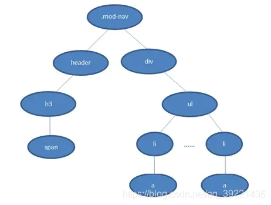

若从左向右的匹配，过程是：

- 从 .mod-nav 开始，遍历子节点 header 和子节点 div
- 然后各自向子节点遍历。在右侧 div 的分支中
- 最后遍历到叶子节点 a ，发现不符合规则，需要回溯到 ul 节点，再遍历下一个 li-a，一颗DOM树的节点动不动上千，这种效率很低。

如果从右至左的匹配：

- 先找到所有的最右节点 span，对于每一个 span，向上寻找节点 h3
- 由 h3再向上寻找 class=mod-nav 的节点
- 最后找到根元素 html 则结束这个分支的遍历。
- 后者匹配性能更好，是因为从右向左的匹配在第一步就筛选掉了大量的不符合条件的最右节点（叶子节点）；而从左向右的匹配规则的性能都浪费在了失败的查找上面。

## DOM Tree是如何构建的？

**转码**：浏览器将接收到的二进制数据按照指定编码格式转化为HTML字符串

**生成Tokens**：之后开始parser，浏览器会将HTML字符串解析成Tokens

**构建Nodes**：对Node添加特定的属性，通过指针确定 Node 的父、子、兄弟关系和所属 treeScope

**生成DOM Tree**：通过node包含的指针确定的关系构建出DOM Tree


## CSS 加载会造成阻塞吗

先给出结论

- `CSS`不会阻塞`DOM`解析，但会阻塞`DOM`渲染。
- `CSS`会阻塞 JS 执行，并不会阻塞 JS 文件下载

先讲一讲 CSSOM 作用

- 第一个是提供给 JavaScript 操作样式表的能力
- 第二个是为布局树的合成提供基础的样式信息
- 这个 CSSOM 体现在 DOM 中就是 document.styleSheets。

由之前讲过的浏览器渲染流程我们可以看出：

DOM 和 CSSOM 通常是并行构建的，所以**「CSS 加载不会阻塞 DOM 的解析」**。

然而由于 Render Tree 是依赖 DOM Tree 和 CSSOM Tree 的，所以它必须等到两者都加载完毕后，完成相应的构建，才开始渲染，因此，**「CSS 加载会阻塞 DOM 渲染」**。

由于 JavaScript 是可操纵 DOM 和 css 样式 的,如果在修改这些元素属性同时渲染界面（即 JavaScript 线程和 UI 线程同时运行）,那么渲染线程前后获得的元素数据就可能不一致了。

因此为了防止渲染出现不可预期的结果,浏览器设置 **「GUI 渲染线程与 JavaScript 引擎为互斥」**的关系。

有个需要注意的点就是：

**「有时候 JS 需要等到 CSS 的下载，这是为什么呢？」**

仔细思考一下，其实这样做是有道理的，如果脚本的内容是获取元素的样式，宽高等`CSS`控制的属性，浏览器是需要计算的，也就是依赖于`CSS`。浏览器也无法感知脚本内容到底是什么，为避免样式获取，因而只好等前面所有的样式下载完后，再执行`JS`。

JS 文件下载和 CSS 文件下载是并行的，有时候 CSS 文件很大，所以 JS 需要等待。

因此,样式表会在后面的 js 执行前先加载执行完毕,所以**「css 会阻塞后面 js 的执行」**。

## 渲染过程中遇到 JS 文件如何处理？

JavaScript 的加载、解析与执行会阻塞文档的解析，也就是说，在构建 DOM 时，HTML 解析器若遇到了 JavaScript，那么它会暂停文档的解析，将控制权移交给 JavaScript 引擎，等 JavaScript 引擎运行完毕，浏览器再从中断的地方恢复继续解析文档。

也就是说，如果想要首屏渲染的越快，就越不应该在首屏就加载 JS 文件，这也是都建议将 script 标签放在 body 标签底部的原因。当然在当下，并不是说 script 标签必须放在底部，因为你可以给 script 标签添加 defer 或者 async 属性。

## 为什么 JS 会阻塞页面加载

先给出结论 👇

- **「JS 阻塞 DOM 解析」**，也就会阻塞页面

这也是为什么说 JS 文件放在最下面的原因，那为什么会阻塞 DOM 解析呢

你可以这样子理解：

> 由于 JavaScript 是可操纵 DOM 的,如果在修改这些元素属性同时渲染界面（即 JavaScript 线程和 UI 线程同时运行）,那么渲染线程前后获得的元素数据就可能不一致了。
>
> 因此为了防止渲染出现不可预期的结果,浏览器设置 **「GUI 渲染线程与 JavaScript 引擎为互斥」**的关系。
>
> 当 JavaScript 引擎执行时 GUI 线程会被挂起,GUI 更新会被保存在一个队列中等到引擎线程空闲时立即被执行。
>
> 当浏览器在执行 JavaScript 程序的时候,GUI 渲染线程会被保存在一个队列中,直到 JS 程序执行完成,才会接着执行。
>
> 因此如果 JS 执行的时间过长,这样就会造成页面的渲染不连贯,导致页面渲染加载阻塞的感觉。

另外，如果 JavaScript 文件中没有操作 DOM 相关代码，就可以将该 JavaScript 脚本设置为异步加载，通过 async 或 defer 来标记代码

## async和defer的作用是什么？有什么区别?

接下来我们对比下 defer 和 async 属性的区别：


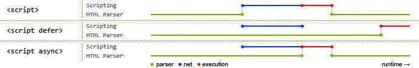


其中蓝色线代表JavaScript加载；红色线代表JavaScript执行；绿色线代表 HTML 解析。

### 1）情况1`<script src="script.js"></script>`

没有 defer 或 async，浏览器会立即加载并执行指定的脚本，也就是说不等待后续载入的文档元素，读到就加载并执行。

### 2）情况2`<script async src="script.js"></script>` (**异步下载**)

async 属性表示异步执行引入的 JavaScript，与 defer 的区别在于，如果已经加载好，就会开始执行——无论此刻是 HTML 解析阶段还是 DOMContentLoaded 触发之后。需要注意的是，这种方式加载的 JavaScript 依然会阻塞 load 事件。换句话说，async-script 可能在 DOMContentLoaded 触发之前或之后执行，但一定在 load 触发之前执行。

### 3）情况3 `<script defer src="script.js"></script>`(**延迟执行**)

defer 属性表示延迟执行引入的 JavaScript，即这段 JavaScript 加载时 HTML 并未停止解析，这两个过程是并行的。整个 document 解析完毕且 defer-script 也加载完成之后（这两件事情的顺序无关），会执行所有由 defer-script 加载的 JavaScript 代码，然后触发 DOMContentLoaded 事件。

defer 与相比普通 script，有两点区别：**载入 JavaScript 文件时不阻塞 HTML 的解析，执行阶段被放到 HTML 标签解析完成之后。

在加载多个JS脚本的时候，async是无顺序的加载，而defer是有顺序的加载。

## defer 和 async 的区别 ?

- 两者都是异步去加载外部 JS 文件，不会阻塞 DOM 解析
- Async 是在外部 JS 加载完成后，浏览器空闲时，Load 事件触发前执行，标记为 async 的脚本并不保证按照指定他们的先后顺序执行，该属性对于内联脚本无作用 (即没有**「src」**属性的脚本）。
- defer 是在 JS 加载完成后，整个文档解析完成后，触发 `DOMContentLoaded` 事件前执行，如果缺少 `src` 属性（即内嵌脚本），该属性不应被使用，因为这种情况下它不起作用

## DOMContentLoaded 与 load 的区别 ?

- DOMContentLoaded 事件触发时：仅当 DOM 解析完成后，不包括样式表，图片等资源。
- onload 事件触发时,页面上所有的 DOM,样式表,脚本,图片等资源已经加载完毕。

那么也就是先 DOMContentLoaded -> load,那么在 Jquery 中，使用(document).load(callback)监听的就是 load 事件。

那我们可以聊一聊它们与 async 和 defer 区别

> 带 async 的脚本一定会在 load 事件之前执行，可能会在 DOMContentLoaded 之前或之后执行。

- 情况 1： HTML 还没有被解析完的时候，async 脚本已经加载完了，那么 HTML 停止解析，去执行脚本，脚本执行完毕后触发 DOMContentLoaded 事件
- 情况 2： HTML 解析完了之后，async 脚本才加载完，然后再执行脚本，那么在 HTML 解析完毕、async 脚本还没加载完的时候就触发 DOMContentLoaded 事件

> 如果 script 标签中包含 defer，那么这一块脚本将不会影响 HTML 文档的解析，而是等到 HTML 解析完成后才会执行。而 DOMContentLoaded 只有在 defer 脚本执行结束后才会被触发。

- 情况 1：HTML 还没解析完成时，defer 脚本已经加载完毕，那么 defer 脚本将等待 HTML 解析完成后再执行。defer 脚本执行完毕后触发 DOMContentLoaded 事件
- 情况 2：HTML 解析完成时，defer 脚本还没加载完毕，那么 defer 脚本继续加载，加载完成后直接执行，执行完毕后触发 DOMContentLoaded 事件

## 为什么操作 DOM 慢

因为 DOM 是属于渲染引擎中的东西，而 JS 又是 JS 引擎中的东西。当我们通过 JS 操作 DOM 的时候，其实这个操作涉及到了两个线程之间的通信，那么势必会带来一些性能上的损耗。

操作 DOM 次数一多，也就等同于一直在进行线程之间的通信，并且操作 DOM 可能还会带来重绘回流的情况，所以也就导致了性能上的问题。

## 为什么 CSS 动画比 JavaScript 高效

我觉得这个题目说法上可能就是行不通，不能这么说，如果了解的话，都知道 will-change 只是一个优化的手段，使用 JS 改变 transform 也可以享受这个属性带来的变化，所以这个说法上有点不妥。

所以围绕这个问题展开话，更应该说建议推荐使用 CSS 动画，至于为什么呢，涉及的知识点大概就是重排重绘，合成，这方面的点，我在浏览器渲染流程中也提及了。

尽可能的避免重排和重绘，具体是哪些操作呢，如果非要去操作 JS 实现动画的话，有哪些优化的手段呢？

比如 👇

- 使用`createDocumentFragment`进行批量的 DOM 操作
- 对于 resize、scroll 等进行防抖/节流处理。
- rAF 优化等等

## 能不能实现事件防抖和节流

### 函数节流(throttle)

> 节流的意思是让函数有节制地执行，而不是毫无节制的触发一次就执行一次。什么叫有节制呢？就是在一段时间内，只执行一次。
>
> 规定在一个单位时间内，只能触发一次函数。如果这个单位时间内触发多次函数，只有一次生效。

抓取一个关键的点：就是执行的时机。要做到控制执行的时机，我们可以通过**「一个开关」**，与定时器 setTimeout 结合完成。

```js
function throttle(fn, delay) {
    let flag = true,
        timer = null;
    return function (...args) {
        let context = this;
        if (!flag) return;
        flag = false;
        clearTimeout(timer)
        timer = setTimeout(() => {
            fn.apply(context, args);
            flag = true;
        }, delay);
    };
};
```

### 函数防抖(debounce)

> 在事件被触发 n 秒后再执行回调，如果在这 n 秒内又被触发，则重新计时。

核心思想：每次事件触发都会删除原有定时器，建立新的定时器。通俗意思就是反复触发函数，只认最后一次，从最后一次开始计时。

代码：

```js
function debounce(fn, delay) {
    let timer = null
    return function (...args) {
        let context = this
        if(timer)   clearTimeout(timer)
        timer = setTimeout(function() {
            fn.apply(context, args)
        },delay)
    }
}
```

### 如何使用 debounce 和 throttle 以及常见的坑

自己造一个 debounce / throttle 的轮子看起来多么诱人，或者随便找个博文复制过来。**「我是建议直接使用 underscore 或 Lodash」** 。如果仅需要 `_.debounce` 和 `_.throttle` 方法，可以使用 Lodash 的自定义构建工具，生成一个 2KB 的压缩库。使用以下的简单命令即可：

```bash
npm i -g lodash-cli
npm i -g lodash-clilodash-cli include=debounce,throttle
```

常见的坑是，不止一次地调用 `_.debounce` 方法：

```js
// 错误
$(window).on('scroll', function() {
   _.debounce(doSomething, 300);
});
// 正确
$(window).on('scroll', _.debounce(doSomething, 200));
```

debounce 方法保存到一个变量以后，就可以用它的私有方法 `debounced_version.cancel()`，lodash 和 underscore.js 都有效。

```js
let debounced_version = _.debounce(doSomething, 200);

$(window).on('scroll', debounced_version);


// 如果需要的话debounced_version.cancel();
```

### 适合应用场景

防抖

- search 搜索，用户不断输入值时，用防抖来节约 Ajax 请求,也就是输入框事件。
- window 触发 resize 时，不断的调整浏览器窗口大小会不断的触发这个事件，用防抖来让其只触发一次

节流

- 鼠标的点击事件，比如 mousedown 只触发一次
- 监听滚动事件，比如是否滑到底部自动加载更多，用 throttle 判断
- 比如游戏中发射子弹的频率(1 秒发射一颗)

## 谈一谈你对 requestAnimationFrame（rAF）理解

正好跟节流有点关系，有点相似处，就准备梳理一下这个知识点。

### 高性能动画是什么，那它衡量的标准是什么呢？

动画帧率可以作为衡量标准，一般来说画面在 60fps 的帧率下效果比较好。

换算一下就是，每一帧要在 16.7ms (16.7 = 1000/60) 内完成渲染。

我们来看看 MDN 对它的解释吧 👇

> window.requestAnimationFrame() 方法告诉浏览器您希望执行动画并请求浏览器在下一次重绘之前调用指定的函数来更新动画。该方法使用一个回调函数作为参数，这个回调函数会在浏览器重绘之前调用。_-- MDN_

当我们调用这个函数的时候，我们告诉它需要做两件事：

1. 我们需要新的一帧；
2. 当你渲染新的一帧时需要执行我传给你的回调函数

### rAF 与 setTimeout 相比

rAF(requestAnimationFrame) 最大的优势是**「由系统来决定回调函数的执行时机」**。

具体一点讲就是，系统每次绘制之前会主动调用 rAF 中的回调函数，如果系统绘制率是 60Hz，那么回调函数就每 16.7ms 被执行一次，如果绘制频率是 75Hz，那么这个间隔时间就变成了 1000/75=13.3ms。

> 换句话说就是，rAF 的执行步伐跟着系统的绘制频率走。它能保证回调函数在屏幕每一次的绘制间隔中只被执行一次(上一个知识点刚刚梳理完**「函数节流」**)，这样就不会引起丢帧现象，也不会导致动画出现卡顿的问题。

另外它可以自动调节频率。如果 callback 工作太多无法在一帧内完成会自动降低为 30fps。虽然降低了，但总比掉帧好。

与 setTimeout 动画对比的话，有以下几点优势

- 当页面隐藏或者最小化时，setTimeout 仍然在后台执行动画，此时页面不可见或者是不可用状态，动画刷新没有意义，而言浪费 CPU。
- rAF 不一样，当页面处理未激活的状态时，该页面的屏幕绘制任务也会被系统暂停，因此跟着系统步伐走的 rAF 也会停止渲染，当页面被激活时，动画就从上次停留的地方继续执行，有效节省了 CPU 开销。

#### 什么时候调用呢

规范中似乎是这么去定义的：

- 在重新渲染前调用。
- 很可能在宏任务之后不去调用

这样子分析的话，似乎很合理嘛，为什么要在重新渲染前去调用呢？因为 rAF 作为官方推荐的一种做流畅动画所应该使用的 API，做动画不可避免的去操作 DOM，而如果是在渲染后去修改 DOM 的话，那就只能等到下一轮渲染机会的时候才能去绘制出来了，这样子似乎不合理。

> `rAF`在浏览器决定渲染之前给你最后一个机会去改变 DOM 属性，然后很快在接下来的绘制中帮你呈现出来，所以这是做流畅动画的不二选择。

至于宏任务，微任务，这可以说起来就要展开篇幅了，暂时不在这里梳理了。

#### rAF 与节流相比

跟 `_.throttle(dosomething, 16)` 等价。它是高保真的，如果追求更好的精确度的话，可以用浏览器原生的 API 。

可以使用 rAF API 替换 throttle 方法，考虑一下优缺点：

优点

- 动画保持 60fps（每一帧 16 ms），浏览器内部决定渲染的最佳时机
- 简洁标准的 API，后期维护成本低

缺点

- 动画的开始/取消需要开发者自己控制，不像 ‘.debounce’ 或 ‘.throttle’由函数内部处理。
- 浏览器标签未激活时，一切都不会执行。
- 尽管所有的现代浏览器[都支持 rAF](https://caniuse.com/requestanimationframe) ，IE9，Opera Mini 和 老的 Android 还是[需要打补丁](https://www.paulirish.com/2011/requestanimationframe-for-smart-animating/)。
- Node.js 不支持，无法在服务器端用于文件系统事件。

根据经验，如果 JavaScript 方法需要绘制或者直接改变属性，我会选择 `requestAnimationFrame`，只要涉及到重新计算元素位置，就可以使用它。

涉及到 AJAX 请求，添加/移除 class （可以触发 CSS 动画），我会选择 `_.debounce` 或者 `_.throttle` ，可以设置更低的执行频率（例子中的 200ms 换成 16ms）。

### 能不能实现图片的懒加载

```bash
页可见区域宽： document.body.clientWidth;
网页可见区域高： document.body.clientHeight;
网页可见区域宽： document.body.offsetWidth (包括边线的宽);
网页可见区域高： document.body.offsetHeight (包括边线的宽);
网页正文全文宽： document.body.scrollWidth;
网页正文全文高： document.body.scrollHeight;
网页被卷去的高： document.body.scrollTop;
网页被卷去的左： document.body.scrollLeft;
网页正文部分上： window.screenTop;
网页正文部分左： window.screenLeft;
屏幕分辨率的高： window.screen.height;
屏幕分辨率的宽： window.screen.width;
屏幕可用工作区高度： window.screen.availHeight;
```

关于 scrollTop,offsetTop,scrollLeft,offsetLeft 用法介绍，[点这里](https://i.jakeyu.top/2016/09/04/scrollTop-offsetTop-scrollLeft-offsetLeft/)

#### 「原理思路」

1. 拿到所以的图片`img dom`
2. 重点是第二步，判断当前图片是否到了可视区范围内
3. 到了可视区的高度以后，就将 img 的 data-src 属性设置给 src
4. 绑定 window 的`scroll`事件

当然了，为了用户的体验更加，默认的情况下，设置一个**「占位图」**

本次测试代码

CSS 代码 👇

```
<style>
        img{
            display: block;
            height: 320px;
            margin-top: 20px;
            margin: 10px auto;
        }
</style>
```

HTML👇

```

```

#### 第一种方式

**「clientHeight-scrollTop-offsetTop」**

直接上我运行的代码 👇

```
let Img = document.getElementsByTagName("img"),
            len = Img.length,
            count = 0;
        function lazyLoad () {
            let viewH = document.body.clientHeight, //可见区域高度
                scrollTop = document.body.scrollTop; //滚动条距离顶部高度
            for(let i = count; i < len; i++) {
                if(Img[i].offsetTop < scrollTop + viewH ){
                    if(Img[i].getAttribute('src') === 'default.png'){
                        Img[i].src = Img[i].getAttribute('data-src')
                        count++;
                    }
                }
            }
        }
        function throttle(fn, delay) {
            let flag = true,
                timer = null;
            return function (...args) {
                let context = this;
                if (!flag) return;
                flag = false;
                clearTimeout(timer)
                timer = setTimeout(() => {
                    fn.apply(context, args);
                    flag = true;
                }, delay);
            };
        };
        window.addEventListener('scroll', throttle(lazyLoad,1000))

        lazyLoad();  // 首次加载
```

#### 第二种方式

使用 `element.getBoundingClientRect()` API 直接得到 top 值。

代码 👇

```
let Img = document.getElementsByTagName("img"),
            len = Img.length,
            count = 0;
        function lazyLoad () {
            let viewH = document.body.clientHeight, //可见区域高度
                scrollTop = document.body.scrollTop; //滚动条距离顶部高度
            for(let i = count; i < len; i++) {
                if(Img[i].getBoundingClientRect().top < scrollTop + viewH ){
                    if(Img[i].getAttribute('src') === 'default.png'){
                        Img[i].src = Img[i].getAttribute('data-src')
                        count++;
                    }
                }
            }
        }
        function throttle(fn, delay) {
            let flag = true,
                timer = null;
            return function (...args) {
                let context = this;
                if (!flag) return;
                flag = false;
                clearTimeout(timer)
                timer = setTimeout(() => {
                    fn.apply(context, args);
                    flag = true;
                }, delay);
            };
        };
        window.addEventListener('scroll', throttle(lazyLoad,1000))

        lazyLoad();  // 首次加载
```

好像也差不多，不知道是不是我写的方式有问题(●'◡'●)，感觉差不多

来看看效果吧，我给这个事件加了一个节流，这样子操作看起来就更好了。

图片懒加载

## 能不能实现图片懒加载？

### 方案一：clientHeight、scrollTop 和 offsetTop

首先给图片一个占位资源：

```html

```

接着，通过监听 scroll 事件来判断图片是否到达视口：

```js
let img = document.getElementsByTagName("img");
let num = img.length;
let count = 0; //计数器，从第一张图片开始计
lazyload(); //首次加载别忘了显示图片
window.addEventListener("scroll", lazyload);
function lazyload() {
	let viewHeight = document.documentElement.clientHeight; //视口高度
	let scrollTop = document.documentElement.scrollTop || document.body.scrollTop; //滚动条卷去的高度
	for (let i = count; i < num; i++) {
		// 元素现在已经出现在视口中
		if (img[i].offsetTop < scrollHeight + viewHeight) {
			if (img[i].getAttribute("src") !== "default.jpg") continue;
			img[i].src = img[i].getAttribute("data-src");
			count++;
		}
	}
}
```

当然，最好对 scroll 事件做节流处理，以免频繁触发：

```js
// throttle函数我们上节已经实现
window.addEventListener("scroll", throttle(lazyload, 200));
```

### 方案二：getBoundingClientRect

现在我们用另外一种方式来判断图片是否出现在了当前视口, 即 DOM 元素的 getBoundingClientRect API。

上述的 lazyload 函数改成下面这样：

```js
function lazyload() {
	for (let i = count; i < num; i++) {
		// 元素现在已经出现在视口中
		if (
			img[i].getBoundingClientRect().top < document.documentElement.clientHeight
		) {
			if (img[i].getAttribute("src") !== "default.jpg") continue;
			img[i].src = img[i].getAttribute("data-src");
			count++;
		}
	}
}
```

### 方案三：IntersectionObserver

这是浏览器内置的一个 API ，实现了 监听 window 的 scroll 事件 、 判断是否在视口中 以及 节流 三大功能。

我们来具体试一把：

```js
let img = document.getElementsByTagName("img");
const observer = new IntersectionObserver((changes) => {
	// changes 是被观察的元素集合
	for (let i = 0, len = changes.length; i < len; i++) {
		let change = changes[i];
		// 通过这个属性判断是否在视口中
		if (change.isIntersecting) {
			const imgElement = change.target;
			imgElement.src = imgElement.getAttribute("data-src");
			observer.unobserve(imgElement);
		}
	}
});
Array.from(img).forEach((item) => observer.observe(item));
```

这样就很方便地实现了图片懒加载，当然这个 IntersectionObserver 也可以用作其他资源的预加载，功能非常强大。

## 渲染页面时常见哪些不良现象？

**由于浏览器的渲染机制不同，在渲染页面时会出现两种常见的不良现象—-白屏问题和FOUS（无样式内容闪烁）**

FOUC：由于浏览器渲染机制（比如firefox），再CSS加载之前，先呈现了HTML，就会导致展示出无样式内容，然后样式突然呈现的现象；

白屏：有些浏览器渲染机制（比如chrome）要先构建DOM树和CSSOM树，构建完成后再进行渲染，如果CSS部分放在HTML尾部，由于CSS未加载完成，浏览器迟迟未渲染，从而导致白屏；也可能是把js文件放在头部，脚本会阻塞后面内容的呈现，脚本会阻塞其后组件的下载，出现白屏问题。

### 渲染总结


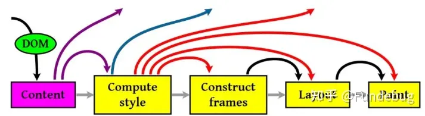


- 浏览器工作流程：构建DOM -> 构建CSSOM -> 构建渲染树 -> 布局 -> 绘制。
- CSSOM会阻塞渲染，只有当CSSOM构建完毕后才会进入下一个阶段构建渲染树。
- 通常情况下DOM和CSSOM是并行构建的，但是当浏览器遇到一个script标签时，DOM构建将暂停，直至脚本完成执行。但由于JavaScript可以修改CSSOM，所以需要等CSSOM构建完毕后再执行JS。
- 如果你想首屏渲染的越快，就越不应该在首屏就加载 JS 文件，建议将 script 标签放在 body 标签底部。


## 渲染引擎什么情况下才会为特定的节点创建新的图层？

`层叠上下文`是HTML元素的三维概念，这些HTML元素在一条假想的相对于面向（电脑屏幕的）视窗或者网页的用户的z轴上延伸，HTML元素依据其自身属性按照优先级顺序占用层叠上下文的空间。

#### 1.拥有层叠上下文属性的元素会被提升为单独的一层。

拥有层叠上下文属性：

- 根元素 (HTML),
- z-index 值不为 "auto"的 绝对/相对定位元素，
- position,固定（fixed） / 沾滞（sticky）定位（沾滞定位适配所有移动设备上的浏览器，但老的桌面浏览器不支持）
- z-index值不为 "auto"的 flex 子项 (flex item)，即：父元素 display: flex|inline-flex，
- z-index值不为"auto"的grid子项，即：父元素display：grid
- opacity 属性值小于 1 的元素（参考 the specification for opacity），
- transform 属性值不为 "none"的元素，
- mix-blend-mode 属性值不为 "normal"的元素，
- filter值不为"none"的元素，
- perspective值不为"none"的元素，
- clip-path值不为"none"的元素
- mask / mask-image / mask-border不为"none"的元素
- isolation 属性被设置为 "isolate"的元素
- 在 will-change 中指定了任意CSS属性（参考 这篇文章）
- -webkit-overflow-scrolling 属性被设置 "touch"的元素
- contain属性值为"layout"，"paint"，或者综合值比如"strict"，"content"

#### 2.需要剪裁（clip）的地方也会被创建为图层。

这里的剪裁指的是，假如我们把 div 的大小限定为 200 * 200 像素，而 div 里面的文字内容比较多，文字所显示的区域肯定会超出 200 * 200 的面积，这时候就产生了剪裁，渲染引擎会把裁剪文字内容的一部分用于显示在 div 区域。出现这种裁剪情况的时候，渲染引擎会为文字部分单独创建一个层，如果出现滚动条，滚动条也会被提升为单独的层。


# ❤四、浏览器缓存

## 对栈和堆内存有了解吗，二者的区别？

**栈内存：**

- 栈就是我们之前反复提及的调用栈，是用来存储执行上下文的。
- 栈空间都不会设置太大，栈主要用于来保存基本值和引用类型值的地址
- 自动分配的相对固定大小的内存空间，其数据读取快，写入速度快，但存储内容少，变量一旦不使用就由系统自动清理释放；

**堆内存：**

- 用来保存一组无序且唯一的引用类型值，可以使用栈中的键名来取得
- 堆的读取和写入速度慢，但存储的内容多，一般对象会存储在堆中，存储的数据对于大小在这方面都是未知的
- 堆是动态分配的内存，大小不定也不会自动释放。

**二者区别：**

- **空间分配区别**：栈由操作系统(编译器)自动分配释放 ，存放函数的参数值，局部变量的值等。其操作方式类似于数据结构中的栈。堆(操作系统) 一般由程序员分配释放， 若程序员不释放，程序结束时可能由 OS 回收，分配方式倒是类似于链表。
- **缓存方式区别**：栈使用的是一级缓存， 它们通常都是被调用时处于存储空间中，调用完毕立即释放。堆则是存放在二级缓存中，生命周期由虚拟机的垃圾回收算法来决定(并不是一旦成为孤儿对象就能被回收)。所以调用这些对象的速度要相对来得低一些。
- **数据结构区别**：堆可以被看成是一棵树，如：堆排序。栈是一种先进后出的数据结构。
- **存储类型区别**：栈一般来保存基本值和引用类型值的地址；堆用来保存一组无序且唯一的引用类型对象

## 浏览器缓存机制

**考察点：缓存**

::: details 查看参考回答

缓存分为两种：强缓存和协商缓存，根据响应的 header 内容来决定。

- 强缓存相关字段有 expires，cache-control。如果 cache-control 与 expires 同时存在的话，cache-control 的优先级高于 expires。

- 协商缓存相关字段有 Last-Modified/If-Modified-Since，Etag/If-None-Match


**注意**：该知识点属于性能优化领域，并且整一章节都是一个面试题

缓存可以说是性能优化中简单高效的一种优化方式了，它可以显著减少网络传输所带来的损耗。

对于一个数据请求来说，可以分为发起网络请求、后端处理、浏览器响应三个步骤。浏览器缓存可以帮助我们在第一和第三步骤中优化性能。比如说直接使用缓存而不发起请求，或者发起了请求但后端存储的数据和前端一致，那么就没有必要再将数据回传回来，这样就减少了响应数据。

接下来的内容中我们将通过以下几个部分来探讨浏览器缓存机制：

- 缓存位置
- 缓存策略
- 实际场景应用缓存策略

### 1 缓存位置

从缓存位置上来说分为四种，并且各自有优先级，当依次查找缓存且都没有命
中的时候，才会去请求网络

1. Service Worker
2. Memory Cache
3. Disk Cache
4. Push Cache
5. 网络请求

#### 1.Service Worker

service Worker 的缓存与浏览器其他内建的缓存机制不同，它可以让我们自由控制缓存哪些文件、如何匹配缓存、如何读取缓存，并且缓存是持续性的。
当 Service Worker 没有命中缓存的时候，我们需要去调用 fetch 函数获取数据。也就是说，如果我们没有在 Service Worker 命中缓存的话，会根据缓存查找优先级去查找数据。但是不管我们是从 Memory Cache 中还是从网络请求中获取的数据，浏览器都会显示我们是从 Service Worker 中获取的内容。

#### 2.Memory Cache

Memory Cache 也就是内存中的缓存，读取内存中的数据肯定比磁盘快。但是内存缓存虽然读取高效，可是缓存持续性很短，会随着进程的释放而释放。 一旦我们关闭 Tab 页面，内存中的缓存也就被释放了。

当我们访问过页面以后，再次刷新页面，可以发现很多数据都来自于内存缓存

**那么既然内存缓存这么高效，我们是不是能让数据都存放在内存中呢？**

先说结论，这是不可能的。首先计算机中的内存一定比硬盘容量小得多，操作系统需要精打细算内存的使用，所以能让我们使用的内存必然不多。内存中其实可以存储大部分的文件，比如说 JS 、 HTML 、 CSS 、图片等等。

**当然，我通过一些实践和猜测也得出了一些结论：**

对于大文件来说，大概率是不存储在内存中的，反之优先当前系统内存使用率高的话，文件优先存储进硬盘

#### 3.Disk Cache

Disk Cache 也就是存储在硬盘中的缓存，读取速度慢点，但是什么都能存储到磁盘中，比之 Memory Cache 胜在容量和存储时效性上。

在所有浏览器缓存中， Disk Cache 覆盖面基本是最大的。它会根据 ·HTTP Herder· 中的字段判断哪些资源需要缓存，哪些资源可以不请求直接使用，哪些资源已经过期需要重新请求。并且即使在跨站点的情况下，相同地址的资源一旦被硬盘缓存下来，就不会再次去请求数据

#### 4.Push Cache

- Push Cache 是 HTTP/2 中的内容，当以上三种缓存都没有命中时，它才会被使用。并且缓存时间也很短暂，只在会话（ Session ）中存在，一旦会话结束就被释放。
- Push Cache 在国内能够查到的资料很少，也是因为 HTTP/2 在国内不够普及，但是 HTTP/2 将会是⽇后的一个趋势

##### 结论

- 所有的资源都能被推送，但是 Edge 和 Safari 浏览器兼容性不怎么好
- 可以推送 no-cache 和 no-store 的资源
- 一旦连接被关闭， Push Cache 就被释放
- 多个页面可以使用相同的 HTTP/2 连接，也就是说能使用同样的缓存
- Push Cache 中的缓存只能被使用一次
- 浏览器可以拒绝接受已经存在的资源推送
- 你可以给其他域名推送资源

#### 5.网络请求

如果所有缓存都没有命中的话，那么只能发起请求来获取资源了。

那么为了性能上的考虑，大部分的接口都应该选择好缓存策略，接下来我们就来学习缓存策略这部分的内容。

### 2 缓存策略

通常浏览器缓存策略分为两种：强缓存和协商缓存，并且缓存策略都是通过设
置 HTTP Header 来实现的

#### 2.1 强缓存

强缓存可以通过设置两种 HTTP Header 实现： Expires 和 Cache-Control 。强缓存表示在缓存期间不需要请求， state code 为 200

##### Expires

```bash
Expires: Wed, 22 Oct 2018 08:41:00 GMT
```

Expires 是 HTTP/1 的产物，表示资源会在 Wed, 22 Oct 2018 08:41:00 GMT 后过期，需要再次请求。并且 Expires 受限于本地时间，如果修改了本地时间，可能会造成缓存失效。

##### Cache-control

```bash
Cache-control: max-age=30
```

Cache-Control 出现于 HTTP/1.1 ，优先级高于 Expires 。该属性值表示资源会在 30 秒后过期，需要再次请求。

Cache-Control 可以在请求头或者响应头中设置，并且可以组合使用多种指令

可以将多个指令配合起来一起使用，达到多个目的。比如说我们希望资源能被缓存下来，并且是客户端和代理服务器都能缓存，还能设置缓存失效时间等

#### 2.2 协商缓存

- 如果缓存过期了，就需要发起请求验证资源是否有更新。协商缓存可以通过设置两种 HTTP Header 实现： Last-Modified 和 ETag
- 当浏览器发起请求验证资源时，如果资源没有做改变，那么服务端就会返回 304 状态码，并且更新浏览器缓存有效期。

##### Last-Modified 和 If-Modified-Since

Last-Modified 表示本地文件最后修改⽇期， If-Modified-Since 会将 Last-Modified 的值发送给服务器，询问服务器在该⽇期后资源是否有更新，有更新的话就会将新的资源发送回来，否则返回 304 状态码。

但是 Last-Modified 存在一些弊端：

- 如果本地打开缓存文件，即使没有对文件进行修改，但还是会造成 Last-Modified 被修改，服务端不能命中缓存导致发送相同的资源
- 因为 Last-Modified 只能以秒计时，如果在不可感知的时间内修改完成文件，那么服务端会认为资源还是命中了，不会返回正确的资源 因为以上这些弊端，所以在 HTTP / 1.1 出现了 ETag

##### ETag 和 If-None-Match

ETag 类似于文件指纹， If-None-Match 会将当前 ETag 发送给服务器，询问该资源 ETag 是否变动，有变动的话就将新的资源发送回来。并且 ETag 优先级比 Last-Modified 高。

以上就是缓存策略的所有内容了，看到这里，不知道你是否存在这样一个疑问。**如果什么缓存策略都没设置，那么浏览器会怎么处理？**

对于这种情况，浏览器会采用一个启发式的算法，通常会取响应头中的 Date 减去 Last-Modified 值的 10% 作为缓存时间。

### 3 实际场景应用缓存策略

#### 频繁变动的资源

对于频繁变动的资源，首先需要使用 Cache-Control: no-cache 使浏览器每次都请求服务器，然后配合 ETag 或者 Last-Modified 来验证资源是否有效。这样的做法虽然不能节省请求数量，但是能显著减少响应数据大小。

#### 代码文件

这里特指除了 HTML 外的代码文件，因为 HTML 文件一般不缓存或者缓存时
间很短。

一般来说，现在都会使用工具来打包代码，那么我们就可以对文件名进行哈希处理，只有当代码修改后才会生成新的文件名。基于此，我们就可以给代码文件设置缓存有效期一年 Cache-Control: max-age=31536000 ，这样只有当 HTML 文件中引入的文件名发生了改变才会去下载最新的代码文件，否则就一直使用缓存

:::

## 聊一聊浏览器缓存

缓存是性能优化中非常重要的一环，浏览器的缓存机制对开发也是非常重要的知识点。接下来以三个部分来把浏览器的缓存机制说清楚：

- 强缓存
- 协商缓存
- 缓存位置

### 1）强缓存

强缓存两个相关字段，**「Expires」**，**「Cache-Control」**。

**「强缓存分为两种情况，一种是发送 HTTP 请求，一种不需要发送。」**

首先检查强缓存，这个阶段**不需要发送 HTTP 请求。**通过查找不同的字段来进行，不同的 HTTP 版本所以不同。

- HTTP1.0 版本，使用的是 Expires，HTTP1.1 使用的是 Cache-Control

#### （1）Expires

`Expires`即过期时间，时间是相对于服务器的时间而言的，存在于服务端返回的响应头中，在这个过期时间之前可以直接从缓存里面获取数据，无需再次请求。比如下面这样:

```bash
Expires:Mon, 29 Jun 2020 11:10:23 GMT
```

表示该资源在 2020 年`7月29日11:10:23`过期，过期时就会重新向服务器发起请求。

这个方式有一个问题：**「服务器的时间和浏览器的时间可能并不一致」**，所以 HTTP1.1 提出新的字段代替它。

#### （2）Cache-Control

HTTP1.1 版本中，使用的就是该字段，这个字段采用的时间是过期时长，对应的是 max-age。

```bash
Cache-Control:max-age=6000
```

上面代表该资源返回后 6000 秒，可以直接使用缓存。


它其实可以组合非常多的指令，完成更多场景的缓存判断, 将一些关键的属性列举如下: 

- public: 客户端和代理服务器都可以缓存。因为一个请求可能要经过不同的 代理服务器 最后才到达目标服务器，那么结果就是不仅仅浏览器可以缓存数据，中间的任何代理节点都可以进行缓存。
- private： 这种情况就是只有浏览器能缓存了，中间的代理服务器不能缓存。
- no-cache: 跳过当前的强缓存，发送 HTTP 请求，即直接进入 协商缓存阶段 。
- no-store：非常粗暴，不进行任何形式的缓存。
- Expires: Wed, 22 Nov 2019 08:41:00 GMT
- Cache-Control:max-age=3600
- s-maxage：这和 max-age 长得比较像，但是区别在于 s-maxage 是针对代理服务器的缓存时间。

值得注意的是，当 Expires 和 Cache-Control 同时存在的时候，*Cache-Control* 会优先考虑。

当然，还存在一种情况，当资源缓存时间超时了，也就是 强缓存 失效了，接下来怎么办？没错，这样就进入到第二级屏障——协商缓存了。

### 2）协商缓存

强缓存失效后，浏览器在请求头中携带响应的`缓存Tag`来向服务器发送请求，服务器根据对应的 tag，来决定是否使用缓存。

缓存分为两种，**「Last-Modified」** 和 **「ETag」**。两者各有优势，并不存在谁对谁有`绝对的优势`，与上面所讲的强缓存两个 Tag 所不同。

#### （1）Last-Modified

这个字段表示的是**「最后修改时间」**。在浏览器第一次给服务器发送请求后，服务器会在响应头中加上这个字段。

浏览器接收到后，**「如果再次请求」**，会在请求头中携带`If-Modified-Since`字段，这个字段的值也就是服务器传来的最后修改时间。

服务器拿到请求头中的`If-Modified-Since`的字段后，其实会和这个服务器中`该资源的最后修改时间`对比:

- 如果请求头中的这个值小于最后修改时间，说明是时候更新了。返回新的资源，跟常规的 HTTP 请求响应的流程一样。
- 否则返回 304，告诉浏览器直接使用缓存。

#### （2）ETag

ETag 是服务器根据当前文件的内容，对文件生成唯一的标识，比如 MD5 算法，只要里面的内容有改动，这个值就会修改，服务器通过把响应头把该字段给浏览器。

浏览器接受到 ETag 值，会在下次请求的时候，将这个值作为**「If-None-Match」**这个字段的内容，发给服务器。

服务器接收到**「If-None-Match」**后，会跟服务器上该资源的**「ETag」**进行比对 👇

- 如果两者一样的话，直接返回 304，告诉浏览器直接使用缓存
- 如果不一样的话，说明内容更新了，返回新的资源，跟常规的 HTTP 请求响应的流程一样

#### （3）两者对比

- 性能上，`Last-Modified`优于`ETag`，`Last-Modified`记录的是时间点，而`Etag`需要根据文件的 MD5 算法生成对应的 hash 值。

- 精度上，ETag优于Last-Modified。ETag按照内容给资源带上标识，能准确感知资源变化，Last-Modified在某些场景并不能准确感知变化，比如 👇

  - 编辑了资源文件，但是文件内容并没有更改，这样也会造成缓存失效。
  - Last-Modified 能够感知的单位时间是秒，如果文件在 1 秒内改变了多次，那么这时候的 Last-Modified 并没有体现出修改了。

最后，**「如果两种方式都支持的话，服务器会优先考虑`ETag`」**。

### 3）缓存位置

前面我们已经提到，当 强缓存 命中或者协商缓存中服务器返回 304 的时候，我们直接从缓存中获取资源。那这些资源究竟缓存在什么位置呢？

浏览器中的缓存位置一共有四种，按优先级从高到低排列分别是：

- Service Worker
- Memory Cache
- Disk Cache
- Push Cache

### 4）Service Worker

Service Worker 借鉴了 Web Worker 的 思路，即让 JS 运行在主线程之外，由于它脱离了浏览器的窗体，因此无法直接访问 DOM 。虽然如此，但它仍然能帮助我们完成很多有用的功能，比如 离线缓存 、 消息推送 和 网络代理 等功能。其中的 离线缓存 就是 Service Worker Cache。

Service Worker 同时也是 PWA 的重要实现机制，关于它的细节和特性，我们将会在后面的 PWA 的分享中详细介绍。

这个应用场景比如 PWA，它借鉴了 Web Worker 思路，由于它脱离了浏览器的窗体，因此无法直接访问 DOM。它能完成的功能比如：`离线缓存`、`消息推送`和`网络代理`，其中`离线缓存`就是**「Service Worker Cache」**。

### 5）Memory Cache

Memory Cache 指的是内存缓存，从效率上讲它是最快的，从存活时间来讲又是最短的，当渲染进程结束后，内存缓存也就不存在了。

### 6）Disk Cache

Disk Cache 就是存储在磁盘中的缓存，从存取效率上讲是比内存缓存慢的，但是他的优势在于存储容量和存储时长。

### 7）Disk Cache VS Memory Cache

两者对比，主要的策略 👇

- 内容使用率高的话，文件优先进入磁盘

- 比较大的 JS，CSS 文件会直接放入磁盘，反之放入内存。


### 8）Push Cache

推送缓存，这算是浏览器中最后一道防线吧，它是`HTTP/2`的内容，虽然现在应用的并不广泛，但随着 HTTP/2 的推广，它的应用越来越广泛。

### 总结

首先检查`Cache-Control`， 尝鲜，看强缓存是否可用

- 如果可用的话，直接使用
- 否则进入协商缓存，发送 HTTP 请求，服务器通过请求头中的`If-Modified-Since`或者`If-None-Match`字段检查资源是否更新
  - 资源更新，返回资源和 200 状态码。
  - 否则，返回 304，直接告诉浏览器直接从缓存中去资源。

## 对浏览器的缓存机制的理解

浏览器缓存的全过程：

浏览器第一次加载资源，服务器返回 200，浏览器从服务器下载资源文件，并缓存资源文件与 response header，以供下次加载时对比使用；

下一次加载资源时，由于强制缓存优先级较高，先比较当前时间与上一次返回 200 时的时间差，如果没有超过 cache-control 设置的 max-age，则没有过期，并命中强缓存，直接从本地读取资源。如果浏览器不支持 HTTP1.1，则使用 expires 头判断是否过期；

如果资源已过期，则表明强制缓存没有被命中，则开始协商缓存，向服务器发送带有 If-None-Match 和 If-Modified-Since 的请求；

服务器收到请求后，优先根据 Etag 的值判断被请求的文件有没有做修改，Etag 值一致则没有修改，命中协商缓存，返回 304；如果不一致则有改动，直接返回新的资源文件带上新的 Etag 值并返回 200；

如果服务器收到的请求没有 Etag 值，则将 If-Modified-Since 和被请求文件的最后修改时间做比对，一致则命中协商缓存，返回 304；

不一致则返回新的 last-modified 和文件并返回 200

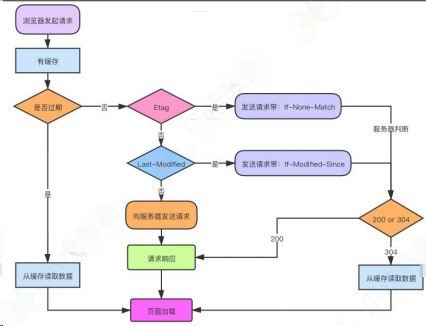

很多网站的资源后面都加了版本号，这样做的目的是：每次升级了 JS 或 CSS 文件后，为了防止浏览器进行缓存，强制改变版本号，客户端浏览器就会重新下载新的 JS 或 CSS 文件 ，以保证用户能够及时获得网站的最新更新。


## 协商缓存和强缓存的区别

### （1）强缓存

使用强缓存策略时，如果缓存资源有效，则直接使用缓存资源，不必再向服务器发起请求。

强缓存策略可以通过两种方式来设置，分别是 http 头信息中的 Expires 属性和 Cache-Control 属性

（1）服务器通过在响应头中添加 Expires 属性，来指定资源的过期时间。在过期时间以内，该资源可以被缓存使用，不必再向服务器发送请求。这个时间是一个绝对时间，它是服务器的时间，因此可能存在这样的问题，就是客户端的时间和服务器端的时间不一致，或者用户可以对客户端时间进行修改的情况，这样就可能会影响缓存命中的结果。

（2）Expires 是 http1.0 中的方式，因为它的一些缺点，在 HTTP1.1 中提出了一个新的头部属性就是 Cache-Control 属性，它提供了对资源的缓存的更精确的控制。它有很多不同的值，Cache-Control 可设置的字段：

- public：设置了该字段值的资源表示可以被任何对象（包括：发送请求的客户端、代理服务器等等）缓存。这个字段值不常用，一般还是使用 max-age=来精确控制；
- private：设置了该字段值的资源只能被用户浏览器缓存，不允许任何代理服务器缓存。在实际开发当中，对于一些含有用户信息的 HTML，通常都要设置这个字段值，避免代理服务器(CDN)缓存；
- no-cache：设置了该字段需要先和服务端确认返回的资源是否发生了变化，如果资源未发生变化，则直接使用缓存好的资源；
- no-store：设置了该字段表示禁止任何缓存，每次都会向服务端发起新的请求，拉取最新的资源；
- max-age=：设置缓存的最大有效期，单位为秒；
- s-maxage=：优先级高于 max-age=，仅适用于共享缓存(CDN)，优先级高于 max-age 或者 Expires 头；
- max-stale[=]：设置了该字段表明客户端愿意接收已经过期的资源，但是不能超过给定的时间限制。

一般来说只需要设置其中一种方式就可以实现强缓存策略，当两种方式一起使用时，Cache-Control 的优先级要高于 Expires。

no-cache 和 no-store 很容易混淆：

- no-cache 是指先要和服务器确认是否有资源更新，在进行判断。也就是说没有强缓存，但是会有协商缓存；
- no-store 是指不使用任何缓存，每次请求都直接从服务器获取资源。

### （2）协商缓存

如果命中强制缓存，我们无需发起新的请求，直接使用缓存内容，如果没有命中强制缓存，如果设置了协商缓存，这个时候协商缓存就会发挥作用了。

上面已经说到了，命中协商缓存的条件有两个：

- max-age=xxx 过期了
- 值为 no-store

使用协商缓存策略时，会先向服务器发送一个请求，如果资源没有发生修改，则返回一个 304 状态，让浏览器使用本地的缓存副本。如果资源发生了修改，则返回修改后的资源。

协商缓存也可以通过两种方式来设置，分别是 http 头信息中的 Etag 和 Last-Modified 属性。

（1）服务器通过在响应头中添加 Last-Modified 属性来指出资源最后一次修改的时间，当浏览器下一次发起请求时，会在请求头中添加一个 If-Modified-Since 的属性，属性值为上一次资源返回时的

- Last-Modified 的值。当请求发送到服务器后服务器会通过这个属性来和资源的最后一次的修改时间来进行比较，以此来判断资源是否做了修改。如果资源没有修改，那么返回 304 状态，让客户端使用本地的缓存。如果资源已经被修改了，则返回修改后的资源。使用这种方法有一个缺点，就是 Last-Modified 标注的最后修改时间只能精确到秒级，如果某些文件在 1 秒钟以内，被修改多次的话，那么文件已将改变了但是 Last-Modified 却没有改变，这样会造成缓存命中的不准确。

（2）因为 Last-Modified 的这种可能发生的不准确性，http 中提供了另外一种方式，那就是 Etag 属性。服务器在返回资源的时候，在头信息中添加了 Etag 属性，这个属性是资源生成的唯一标识符，当资源发生改变的时候，这个值也会发生改变。在下一次资源请求时，浏览器会在请求头中添加一个 If-None-Match 属性，这个属性的值就是上次返回的资源的 Etag 的值。服务接收到请求后会根据这个值来和资源当前的 Etag 的值来进行比较，以此来判断资源是否发生改变，是否需要返回资源。通过这种方式，比 Last-Modified 的方式更加精确。

- 当 Last-Modified 和 Etag 属性同时出现的时候，Etag 的优先级更高。使用协商缓存的时候，服务器需要考虑负载平衡的问题，因此多个服务器上资源的 Last-Modified 应该保持一致，因为每个服务器上 Etag 的值都不一样，因此在考虑负载平衡时，最好不要设置 Etag 属性。

### 总结：

强缓存策略和协商缓存策略在缓存命中时都会直接使用本地的缓存副本，区别只在于协商缓存会向服务器发送一次请求。

它们缓存不命中时，都会向服务器发送请求来获取资源。在实际的缓存机制中，强缓存策略和协商缓存策略是一起合作使用的。浏览器首先会根据请求的信息判断，强缓存是否命中，如果命中则直接使用资源。如果不命中则根据头信息向服务器发起请求，使用协商缓存，如果协商缓存命中的话，则服务器不返回资源，浏览器直接使用本地资源的副本，如果协商缓存不命中，则浏览器返回最新的资源给浏览器。

## 浏览器缓存

浏览器缓存分为强缓存和协商缓存。当客户端请求某个资源时，获取缓存的流
程如下：

- 先根据这个资源的一些 http header 判断它是否命中强缓存，如果命中，则直接从本地获取缓存资源，不会发请求到服务器；
- 当强缓存没有命中时，客户端会发送请求到服务器，服务器通过另一些 request header 验证这个资源是否命中协商缓存，称为 http 再验证，如果命中，服务器将请求返回，但不返回资源，而是告诉客户端直接从缓存中获取，客户端收到返回后就会从缓存中获取资源；
- 强缓存和协商缓存共同之处在于，如果命中缓存，服务器都不会返回资源； 区别是，强缓存不对发送请求到服务器，但协商缓存会。
- 当协商缓存也没命中时，服务器就会将资源发送回客户端。
- 当 ctrl+f5 强制刷新网页时，直接从服务器加载，跳过强缓存和协商缓存；
- 当 f5 刷新网页时，跳过强缓存，但是会检查协商缓存；

### 强缓存

实现强缓存可以通过两种响应头实现： Expires 和 Cache-Control 。强缓
存表示在缓存期间不需要请求， state code 为 200

- Expires （该字段是 http1.0 时的规范，值为一个绝对时间的 GMT 格式的时间字符串，代表缓存资源的过期时间）

  - 表示资源会在 Wed , 22 Oct 2018 08:41:00 GMT 后过期，需要再次请求。并且 Expires 受限于本地时间，如果修改了本地时间，可能会造成缓存失效

- Cache-Control:max-age （该字段是 http1.1 的规范，强缓存利用其 max-age 值来判断缓存资源的最大生命周期，它的值单位为秒）
  - Cache-control: max-age=30
  - 优先级高于 Expires 。该属性表示资源会在 30 秒后过期，需要再次请求。

### 协商缓存

如果缓存过期了，我们就可以使用协商缓存来解决问题。协商缓存需要请求，如果缓存有效会返回 304 。

协商缓存需要客户端和服务端共同实现，和强缓存一样，也有两种实现方式

- Last-Modified （值为资源最后更新时间，随服务器 response 返回）
- If-Modified-Since （通过比较两个时间来判断资源在两次请求期间是否有过修改，如果没有修改，则命中协商缓存）
- ETag （表示资源内容的唯一标识，随服务器 response 返回）
- If-None-Match （服务器通过比较请求头部的 If-None-Match 与当前资源的 ETag 是否一致来判断资源是否在两次请求之间有过修改，如果没有修改，则命中协商缓存）

### Last-Modified 和 If-Modified-Since

- Last-Modified 表示本地文件最后修改⽇期， If-Modified-Since 会将 Last-Modified 的值发送给服务器，询问服务器在该⽇期后资源是否有更新，有更新的话就会将新的资源发送回来。
- 但是如果在本地打开缓存文件，就会造成 Last-Modified 被修改，所以在 HTTP / 1.1 出现了 ETag

### ETag 和 If-None-Match

ETag 类似于文件指纹， If-None-Match 会将当前 ETag 发送给服务器，询问该资源 ETag 是否变动，有变动的话就将新的资源发送回来。并且 ETag 优先级比 Last-Modified 高

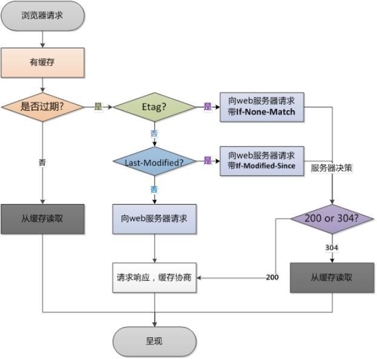

### 选择合适的缓存策略

对于大部分的场景都可以使用强缓存配合协商缓存解决，但是在一些特殊的地
方可能需要选择特殊的缓存策略

- 对于某些不需要缓存的资源，可以使用 Cache-control: no-store ，表示该资源不需要缓存
- 对于频繁变动的资源，可以使用 Cache-Control: no-cache 并配合 ETag 使用，表示该资源已被缓存，但是每次都会发送请求询问资源是否更新。
- 对于代码文件来说，通常使用 Cache-Control: max-age=31536000 并配合策略缓存使用，然后对文件进行指纹处理，一旦文件名变动就会立刻下载新的文件

## Ajax 解决浏览器缓存问题

- 1.在 ajax 发送请求前加上 anyAjaxObj.setRequestHeader("If-Modified-Since","0")。
- 2.在 ajax 发送请求前加上 anyAjaxObj.setRequestHeader("Cache-Control","no-cache")。
- 3.在 URL 后面加上一个随机数： "fresh=" + Math.random()。
- 4.在 URL 后面加上时间搓："nowtime=" + new Date().getTime()。
- 5.如果是使用 jQuery，直接这样就可以了 $.ajaxSetup({cache:false})。这样页面的所有 ajax 都会执行这条语句就是不需要保存缓存记录。

## 点击刷新按钮或者按 F5、按 Ctrl+F5 （强制刷新）、地址栏回车有什么区别？

点击刷新按钮或者按 F5：浏览器直接对本地的缓存文件过期，但是会带上 If-Modifed-Since，If-None-Match，这就意味着服务器会对文件检查新鲜度，返回结果可能是 304，也有可能是 200。

用户按 Ctrl+F5（强制刷新）：浏览器不仅会对本地文件过期，而且不会带上 If-Modifed-Since，If-None-Match，相当于之前从来没有请求过，返回结果是 200。

地址栏回车： 浏览器发起请求，按照正常流程，本地检查是否过期，然后服务器检查新鲜度，最后返回内容。


# ❤五、浏览器本地存储

## 浏览器的存储有哪些及它们间的区别

- cookie
- session storage
- local storage
- indexedDB:用于客户端存储大量的结构化数据（文件/二进制大型对象（blobs））。该 API 使用索引实现对数据的高性能搜索。
- cache storage：用于对 Cache 对象的存储。

## 能不能说一说浏览器的本地存储？各自优劣如何？

浏览器的本地存储主要分为 Cookie 、 WebStorage 和 IndexedDB , 其中 WebStorage 又可以分为 localStorage 和 sessionStorage 。接下来我们就来一一分析这些本地存储方案。

### 1）Cookie

Cookie 最开始被设计出来其实并不是来做本地存储的，而是为了弥补 HTTP 在状态管理上的不足。

HTTP 协议是一个无状态协议，客户端向服务器发请求，服务器返回响应，故事就这样结束了，但是下次发请求如何让服务端知道客户端是谁呢？

这种背景下，就产生了 Cookie。

Cookie 本质上就是浏览器里面存储的一个很小的文本文件，内部以键值对的方式来存储(在 chrome 开发者面板的 Application 这一栏可以看到)。向同一个域名下发送请求，都会携带相同的 Cookie，服务器拿到 Cookie 进行解析，便能拿到客户端的状态。

- Cookie 的作用很好理解，就是用来做状态存储的，但它也是有诸多致命的缺陷的：
  容量缺陷。Cookie 的体积上限只有 4KB ，只能用来存储少量的信息。
- 性能缺陷。Cookie 紧跟域名，不管域名下面的某一个地址需不需要这个 Cookie ，请求都会携带上完整的 Cookie，这样随着请求数的增多，其实会造成巨大的性能浪费的，因为请求携带了很多不必要的内容。
- 安全缺陷。由于 Cookie 以纯文本的形式在浏览器和服务器中传递，很容易被非法用户截获，然后进行一系列的篡改，在 Cookie 的有效期内重新发送给服务器，这是相当危险的。另外，在 HttpOnly 为 false 的情况下，Cookie 信息能直接通过 JS 脚本来读取。

### 2）localStorage 和 Cookie 异同

localStorage 有一点跟 Cookie 一样，就是针对一个域名，即在同一个域名下，会存储相同的一段 localStorage。

不过它相对 Cookie 还是有相当多的区别的：

- 容量。localStorage 的容量上限为 5M，相比于 Cookie 的 4K 大大增加。当然这个 5M 是针对一个域名的，因此对于一个域名是持久存储的。
- 只存在客户端，默认不参与与服务端的通信。这样就很好地避免了 Cookie 带来的性能问题和安全问题。
- 接口封装。通过 localStorage 暴露在全局，并通过它的 setItem 和 getItem 等方法进行操作，非常方便。

#### 操作方式

接下来我们来具体看看如何来操作 localStorage 。

```js
let obj = { name: "sanyuan", age: 18 };
localStorage.setItem("name", "sanyuan");
localStorage.setItem("info", JSON.stringify(obj));
```

接着进入相同的域名时就能拿到相应的值：

从这里可以看出， localStorage 其实存储的都是字符串，如果是存储对象需要调用 JSON 的 stringify 方法，并且用 JSON.parse 来解析成对象。

#### 应用场景

利用 localStorage 的较大容量和持久特性，可以利用 localStorage 存储一些内容稳定的资源，比如官网的 logo ，存储 Base64 格式的图片资源，因此利用 localStorage

### 3）sessionStorage

#### 特点

sessionStorage 以下方面和 localStorage 一致：

- 容量。容量上限也为 5M。
- 只存在客户端，默认不参与与服务端的通信。
- 接口封装。除了 sessionStorage 名字有所变化，存储方式、操作方式均和 localStorage 一样。

但 sessionStorage 和 localStorage 有一个本质的区别，那就是前者只是会话级别的存储，并不是持久化存储。会话结束，也就是页面关闭，这部分 sessionStorage 就不复存在了。

#### 应用场景

1）可以用它对表单信息进行维护，将表单信息存储在里面，可以保证页面即使刷新也不会让之前的表单信息丢失。

2）可以用它存储本次浏览记录。如果关闭页面后不需要这些记录，用 sessionStorage 就再合适不过了。事实上微博就采取了这样的存储方式。

### 4）IndexedDB

IndexedDB 是运行在浏览器中的 非关系型数据库 , 本质上是数据库，绝不是和刚才 WebStorage 的 5M 一个量级，理论上这个容量是没有上限的。

接着我们来分析一下 IndexedDB 的一些重要特性，除了拥有数据库本身的特性，比如 支持事务 ， 存储二进制数据 ，还有这样一些特性需要格外注意：

- 键值对存储。内部采用 对象仓库 存放数据，在这个对象仓库中数据采用键值对的方式来存储。
- 异步操作。数据库的读写属于 I/O 操作, 浏览器中对异步 I/O 提供了支持。
- 受同源策略限制，即无法访问跨域的数据库。

### 总结

浏览器中各种本地存储和缓存技术的发展，给前端应用带来了大量的机会，PWA 也正是依托了这些优秀的存储方案才得以发展起来。重新梳理一下这些本地存储方案:

（1） cookie 并不适合存储，而且存在非常多的缺陷。

（2） Web Storage 包括 localStorage 和 sessionStorage , 默认不会参与和服务器的通信。

（3） IndexedDB 为运行在浏览器上的非关系型数据库，为大型数据的存储提供了接口。


# ❤六、浏览器同源策略

## 说一说跨域是什么？如何解决跨域问题？

**`跨域`** 是指浏览器在执行一个脚本时，由于该脚本所在的源（协议、域名、端口）与目标资源所在的源不一致，而浏览器为了安全起见，限制脚本访问其他源的资源。这种安全机制称为同源策略，是浏览器对 JavaScript 等脚本语言施加的安全限制。

跨域问题的出现，主要是因为浏览器为了防止恶意脚本攻击而设定的安全限制。例如，如果 A 网站的脚本试图访问 B 网站的资源，但 A 和 B 的协议、域名或端口不同，那么浏览器的同源策略就会阻止这一访问行为。

**解决跨域的方法：**

1. **`JSONP`**：JSONP 是一种非官方的跨域数据交互协议。它利用`<script>`标签没有跨域限制的漏洞，通过动态创建`<script>`标签，以获取其他来源的 JavaScript 文件形式，使用回调函数的形式实现跨域数据访问。但 JSONP 只支持 GET 请求。
2. **`设置CORS`**：CORS 是一种官方的跨域解决方案，它通过在服务器端设置响应头信息来告诉浏览器，允许哪些源来访问资源。这样，浏览器在发送请求时，会检查这些响应头信息，从而决定是否允许跨域访问。CORS 支持各种 HTTP 请求方法，如 GET、POST 等。
3. **`代理服务器—配置 nginx 反向代理`**：通过在服务端设置一个代理服务器来转发请求，使得浏览器端的请求看似是同源的，从而绕过浏览器的同源策略限制。这种方法需要前后端配合，后端需要编写相应的代理逻辑。
4. **`使用 postMessage 和 message 事件`**：HTML5 引入了 window.postMessage 方法来安全地实现跨源通信。通过这个方法，你可以向其他的 window 对象发送数据，无论这个 window 对象是否与当前的脚本同源。同时，目标 window 对象可以通过监听'message'事件来接收数据。
5. 使用图片
6. 利用 iframe 实现
7. WebSocket
8. ...

## 谈一谈跨域，同源策略，以及跨域解决方案

### 什么是跨域

跨域，是指浏览器不能执行其他网站的脚本。它是由浏览器的同源策略造成的，是浏览器对 JavaScript 实施的安全限制。

### 同源策略

同源策略是一个安全策略。所谓的同源,指的是协议,域名,端口相同。

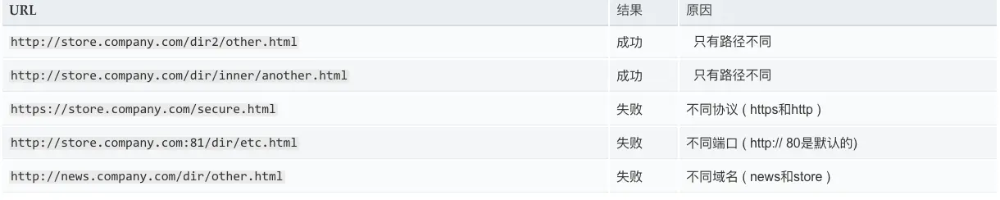同源策略

浏览器处于安全方面的考虑,只允许本域名下的接口交互,不同源的客户端脚本,在没有明确授权的情况下,不能读写对方的资源。

限制了一下行为：

- Cookie、LocalStorage 和 IndexDB 无法读取
- DOM 和 JS 对象无法获取
- Ajax 请求发送不出去

### 跨域解决方案

当然了，我梳理了几个我觉得工作中常用的，其他的自行去了解。

#### jsonp 跨域

利用 script 标签没有跨域限制的漏洞，网页可以拿到从其他来源产生动态 JSON 数据，当然了 JSONP 请求一定要对方的服务器做支持才可以。

**「与 AJAX 对比」**

JSONP 和 AJAX 相同，都是客户端向服务器发送请求，从服务器获取数据的方式。但是 AJAX 属于同源策略，JSONP 属于非同源策略(跨域请求)

**「JSONP 优点」**

实现简单，兼容性比较好，可用于解决主流浏览器的跨域数据访问的问题。缺点就是仅支持 get 请求，具有局限性，不安全，可能会受到 XSS 攻击。

**「思路 👇」**

- 创建 script 标签
- 设置 script 标签的 src 属性，以问号传递参数，设置好回调函数 callback 名称
- 插入 html 文本中
- 调用回调函数，res 参数就是获取的数据

```js
let script = document.createElement('script');

script.src = 'http://www.baidu.cn/login?username=TianTianUp&callback=callback';

document.body.appendChild(script);

function callback(res) {
  console.log(res);
 }
```

当然，jquery 也支持 jsonp 的实现方式

```js
$.ajax({
    url: 'http://www.baidu.cn/login',
    type: 'GET',
    dataType: 'jsonp', //请求方式为jsonp
    jsonpCallback: 'callback',
    data: {
        "username": "Nealyang"
    }
})
```

**「JSONP 优点」**

- 它不像 XMLHttpRequest 对象实现的 Ajax 请求那样受到同源策略的限制
- 它的兼容性更好，在更加古老的浏览器中都可以运行，不需要 XMLHttpRequest 或 ActiveX 的支持
- 并且在请求完毕后可以通过调用 callback 的方式回传结果。

**「JSONP 缺点」**

- 它只支持 GET 请求而不支持 POST 等其它类型的 HTTP 请求
- 它只支持跨域 HTTP 请求这种情况，不能解决不同域的两个页面之间如何进行 JavaScript 调用的问题

#### 跨域资源共享 CORS

> CORS（Cross-Origin Resource Sharing）跨域资源共享，定义了必须在访问跨域资源时，浏览器与服务器应该如何沟通。CORS 背后的基本思想就是使用自定义的 HTTP 头部让浏览器与服务器进行沟通，从而决定请求或响应是应该成功还是失败。目前，所有浏览器都支持该功能，IE 浏览器不能低于 IE10。整个 CORS 通信过程，都是浏览器自动完成，不需要用户参与。对于开发者来说，CORS 通信与同源的 AJAX 通信没有差别，代码完全一样。浏览器一旦发现 AJAX 请求跨源，就会自动添加一些附加的头信息，有时还会多出一次附加的请求，但用户不会有感觉。

**「CORS 需要浏览器和后端同时支持。IE 8 和 9 需要通过 XDomainRequest 来实现」**。

- **「浏览器会自动进行 CORS 通信，实现 CORS 通信的关键是后端。只要后端实现了 CORS，就实现了跨域。」**
- 服务端设置 Access-Control-Allow-Origin 就可以开启 CORS。 该属性表示哪些域名可以访问资源，如果设置通配符则表示所有网站都可以访问资源。

请求分为**「简单请求」**和**「非简单请求」**，所以我们的了解这两种情况。

**「简单请求」**

满足下面两个条件，就属于简单请求 👇

条件 1：使用下列方法之一：

- GET
- HEAD
- POST

条件 2：Content-Type 的值仅限于下列三者之一 👇

- text/plain
- multipart/form-data
- application/x-www-form-urlencoded

请求中的任意 XMLHttpRequestUpload 对象均没有注册任何事件监听器；

XMLHttpRequestUpload 对象可以使用 XMLHttpRequest.upload 属性访问。

**「复杂请求」**

不符合以上条件的请求就肯定是复杂请求了。 复杂请求的 CORS 请求，会在正式通信之前，增加一次 HTTP 查询请求，称为"预检"请求,该请求是 option 方法的，通过该请求来知道服务端是否允许跨域请求。

直接上一个例子吧 👇 看看一个完整的复杂请求吧，并且介绍一下 CORS 请求的字段。

```js
// server2.js
let express = require("express");
let app = express();
let whitList = ["http://localhost:3000"]; //设置白名单
app.use(function (req, res, next) {
	let origin = req.headers.origin;
	if (whitList.includes(origin)) {
		// 设置哪个源可以访问我
		res.setHeader("Access-Control-Allow-Origin", origin);
		// 允许携带哪个头访问我
		res.setHeader("Access-Control-Allow-Headers", "name");
		// 允许哪个方法访问我
		res.setHeader("Access-Control-Allow-Methods", "PUT");
		// 允许携带cookie
		res.setHeader("Access-Control-Allow-Credentials", true);
		// 预检的存活时间
		res.setHeader("Access-Control-Max-Age", 6);
		// 允许返回的头
		res.setHeader("Access-Control-Expose-Headers", "name");
		if (req.method === "OPTIONS") {
			res.end(); // OPTIONS请求不做任何处理
		}
	}
	next();
});
app.put("/getData", function (req, res) {
	console.log(req.headers);
	res.setHeader("name", "jw"); //返回一个响应头，后台需设置
	res.end("我不爱你");
});
app.get("/getData", function (req, res) {
	console.log(req.headers);
	res.end("我不爱你");
});
app.use(express.static(__dirname));
app.listen(4000);
```

上述代码由`http://localhost:3000/index.html`向`http://localhost:4000/`跨域请求，正如我们上面所说的，后端是实现 CORS 通信的关键。

如果你用express，可以这样在后端设置

```js
// CORS middleware
var allowCrossDomain = function(req, res, next) {
    res.header('Access-Control-Allow-Origin', 'http://example.com');
    res.header('Access-Control-Allow-Methods', 'GET,PUT,POST,DELETE');
    res.header('Access-Control-Allow-Headers', 'Content-Type');
    next();
}

    //…
    app.configure(function() {
    app.use(express.bodyParser());
    app.use(express.cookieParser());
    app.use(express.session({ secret: 'cool beans' }));
    app.use(express.methodOverride());
    app.use(allowCrossDomain);
    app.use(app.router);
    app.use(express.static(__dirname + '/public'));
});
```

在生产环境中建议用成熟的开源中间件解决问题。


**「与 JSONP 对比」**

- JSONP 只能实现 GET 请求，而 CORS 支持所有类型的 HTTP 请求。
- 使用 CORS，开发者可以使用普通的 XMLHttpRequest 发起请求和获得数据，比起 JSONP 有更好的错误处理。
- JSONP 主要被老的浏览器支持，它们往往不支持 CORS，而绝大多数现代浏览器都已经支持了 CORS）

#### WebSocket 协议跨域

Websocket 是 HTML5 的一个持久化的协议，它实现了浏览器与服务器的全双工通信，同时也是跨域的一种解决方案。

> WebSocket 和 HTTP 都是应用层协议，都基于 TCP 协议。但是 **「WebSocket 是一种双向通信协议，在建立连接之后，WebSocket 的 server 与 client 都能主动向对方发送或接收数据」**。同时，WebSocket 在建立连接时需要借助 HTTP 协议，连接建立好了之后 client 与 server 之间的双向通信就与 HTTP 无关了。

我们先来看个例子 👇

本地文件 socket.html 向`localhost:3000`发生数据和接受数据 👇

```html
// socket.html
<script>
    let socket = new WebSocket('ws://localhost:3000');
    socket.onopen = function () {
      socket.send('我爱你');//向服务器发送数据
    }
    socket.onmessage = function (e) {
      console.log(e.data);//接收服务器返回的数据
    }
</script>
```

后端部分 👇

```js
// server.js
let WebSocket = require('ws'); //记得安装ws
let wss = new WebSocket.Server({port:3000});
wss.on('connection',function(ws) {
  ws.on('message', function (data) {
    console.log(data);
    ws.send('我不爱你')
  });
})
```

如果 你想去尝试的话，建议可以去玩一玩`Socket.io`,

- 这是因为原生 WebSocket API 使用起来不太方便，它很好地封装了 webSocket 接口
- 提供了更简单、灵活的接口，也对不支持 webSocket 的浏览器提供了向下兼容。

#### 最方便的跨域方案Nginx

可以看上面的【浏览器原理知识】—【六、浏览器同源策略】

nginx是一款极其强大的web服务器，其优点就是轻量级、启动快、高并发。

现在的新项目中nginx几乎是首选，我们用node或者java开发的服务通常都需要经过nginx的反向代理。

反向代理的原理很简单，即所有客户端的请求都必须先经过nginx的处理，nginx作为代理服务器再讲请求转发给node或者java服务，这样就规避了同源策略。

```
#进程, 可更具cpu数量调整
worker_processes 1;

events {
#连接数
worker_connections 1024;
}

http {
include mime.types;
default_type application/octet-stream;
sendfile        on;

#连接超时时间，服务器会在这个时间过后关闭连接。
keepalive_timeout  10;

# gizp压缩
gzip  on;

# 直接请求nginx也是会报跨域错误的这里设置允许跨域
# 如果代理地址已经允许跨域则不需要这些, 否则报错(虽然这样nginx跨域就没意义了)
add_header Access-Control-Allow-Origin *;
add_header Access-Control-Allow-Headers X-Requested-With;
add_header Access-Control-Allow-Methods GET,POST,OPTIONS;

# srever模块配置是http模块中的一个子模块，用来定义一个虚拟访问主机
server {
    listen       80;
    server_name  localhost;
    
    # 根路径指到index.html
    location / {
        root   html;
        index  index.html index.htm;
    }

    # localhost/api 的请求会被转发到192.168.0.103:8080
    location /api {
        rewrite ^/b/(.*)$ /$1 break; # 去除本地接口/api前缀, 否则会出现404
        proxy_set_header Host $host;
        proxy_set_header X-Real-IP $remote_addr;
        proxy_set_header X-Forwarded-For $proxy_add_x_forwarded_for;
        proxy_pass http://192.168.0.103:8080; # 转发地址
    }
    
    # 重定向错误页面到/50x.html
    error_page   500 502 503 504  /50x.html;
    location = /50x.html {
        root   html;
    }

}
}
```

### 其它跨域方案

**HTML5 XMLHttpRequest 有一个API，postMessage()方法**：允许来自不同源的脚本采用异步方式进行有限的通信，可以实现跨文本档、多窗口、跨域消息传递。

**WebSocket** 是一种双向通信协议，在建立连接之后，WebSocket 的 server 与 client 都能主动向对方发送或接收数据，连接建立好了之后 client 与 server 之间的双向通信就与 HTTP 无关了，因此可以跨域。

**window.name + iframe**：window.name属性值在不同的页面（甚至不同域名）加载后依旧存在，并且可以支持非常长的 name 值，我们可以利用这个特点进行跨域。
location.hash + iframe：a.html欲与c.html跨域相互通信，通过中间页b.html来实现。 三个页面，不同域之间利用iframe的location.hash传值，相同域之间直接js访问来通信。

**document.domain + iframe**： 该方式只能用于二级域名相同的情况下，比如 a.test.com 和 b.test.com 适用于该方式，我们只需要给页面添加 document.domain =‘test.com’ 表示二级域名都相同就可以实现跨域，两个页面都通过js强制设置document.domain为基础主域，就实现了同域。

## 如何实现浏览器内多个标签页之间的通信?

实现多个标签页之间的通信，本质上都是通过中介者模式来实现的。

因为标签页之间没有办法直接通信，因此我们可以找一个中介者，让标签页和中介者进行通信，然后让这个中介者来进行消息的转发。通信方法如下：

使用 websocket 协议，因为 websocket 协议可以实现服务器推送，所以服务器就可以用来当做这个中介者。标签页通过向服务器发送数据，然后由服务器向其他标签页推送转发。

使用 ShareWorker 的方式，shareWorker 会在页面存在的生命周期内创建一个唯一的线程，并且开启多个页面也只会使用同一个线程。

这个时候共享线程就可以充当中介者的角色。标签页间通过共享一个线程，然后通过这个共享的线程来实现数据的交换。

使用 localStorage 的方式，我们可以在一个标签页对 localStorage 的变化事件进行监听，然后当另一个标签页修改数据的时候，我们就可以通过这个监听事件来获取到数据。这个时候 localStorage 对象就是充当的中介者的角色。

使用 postMessage 方法，如果我们能够获得对应标签页的引用，就可以使用 postMessage 方法，进行通信。


不同标签页间的通讯，本质原理就是去运用一些可以 共享的中间介质，因此比
较常用的有以下方法:

- 1.通过父页面 window.open() 和子页面 postMessage
  - 异步下，通过 window.open('about: blank') 和 tab.location.href = '\*'
- 2.设置同域下共享的 localStorage 与监听 window.onstorage
  - 重复写入相同的值无法触发
  - 会受到浏览器隐身模式等的限制
- 3.设置共享 cookie 与不断轮询脏检查( setInterval )
- 4.借助服务端或者中间层实现

## 即时通讯的实现方式？

主要有四种方式，它们分别是`轮询`、`长轮询(comet)`、`长连接(SSE)`、`WebSocket`。它们大体可以分为两类，一种是在 HTTP 基础上实现的，包括短轮询、comet 和 SSE；另一种不是在 HTTP 基础上实现是，即 WebSocket。

### 短轮询

短轮询的基本思路就是浏览器每隔一段时间向浏览器发送 http 请求，服务器在收到请求后，不论是否有数据更新，都直接进行响应。这种方式实现的即时通信，本质上还是浏览器发送请求，服务器接受请求的一个过程，通过让客户端不断的进行请求，使得客户端能够模拟实时地收到服务器端的数据的变化。

短轮询的原理：每隔一段时间客户端就发出一个请求，去获取服务器最新的数据，一定程度上模拟实现了即时通讯。

- 优点：兼容性强，比较简单，易于理解，实现起来没有什么技术难点。
- 缺点：由于需要不断的建立 http 连接，严重浪费了服务器端和客户端的资源，延迟性高，影响性能。

### comet👇

comet有两种主要实现手段，一种是基于 AJAX 的长轮询（long-polling）方式，另一种是基于 Iframe 及 htmlfile 的流（streaming）方式，通常被叫做长连接。

### 长轮询

当服务器收到客户端发来的请求后，服务器端不会直接进行响应，而是先将这个请求挂起，然后判断服务器端数据是否有更新。如果有更新，则进行响应；如果一直没有数据，则到达一定的时间限制(服务器端设置)才返回。

- 优点：兼容性好，资源浪费较小——长轮询和短轮询比起来，明显减少了很多不必要的 http 请求次数，相比之下节约了资源。
- 缺点：服务器hold挂起连接会消耗资源，会导致资源的浪费，返回数据顺序无保证，难于管理维护。

### 长连接

`SSE`是 HTML 5 新增的功能，全称为`Server-Sent Events`。它可以允许服务推送数据到客户端。SSE 在本质上就与之前的长轮询、短轮询不同，虽然都是基于 http 协议的，但是轮询需要客户端先发送请求。而 SSE 最大的特点就是不需要客户端发送请求，可以实现只要服务器端数据有更新，就可以马上发送到客户端。 优点：不需要建立或保持大量的客户端发往服务器端的请求，节约了很多资源，提升应用性能；实现非常简单，并且不需要依赖其他插件。

- 优点：兼容性好，消息即时到达，不发无用请求
- 缺点：服务器维护长连接消耗资源

### SSE

SSE（Server-Sent Event，服务端推送事件）是一种允许服务端向客户端推送新数据的HTML5技术。

- 优点：基于HTTP而生，因此不需要太多改造就能使用，使用方便，而websocket非常复杂，必须借助成熟的库或框架
- 缺点：基于文本传输效率没有websocket高，不是严格的双向通信，客户端向服务端发送请求无法复用之前的连接，需要重新发出独立的请求

### WebSocket

WebSocket 是 HTML 5 定义的一个新协议，与传统的 http 协议不同，该协议可以实现服务器与客户端之间全双工通信。简单来说，首先需要在客户端和服务器端建立起一个连接，这部分需要 http。连接一旦建立，客户端和服务器端就处于平等的地位，可以相互发送数据，不存在请求和响应的区别。

Websocket是一个全新的、独立的协议，基于TCP协议，与http协议兼容、却不会融入http协议，仅仅作为html5的一部分，其作用就是在服务器和客户端之间建立实时的双向通信。

- 优点：真正意义上的实时双向通信，性能好，低延迟。
- 缺点：1.服务器端的逻辑非常复杂。2.独立与http的协议，因此需要额外的项目改造，使用复杂度高，必须引入成熟的库，无法兼容低版本浏览器

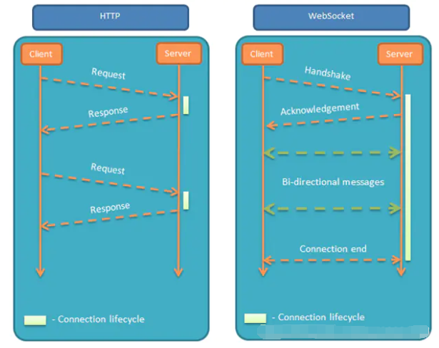

### Web Worker

性能优化部分会用到，做了解

Web Worker 的作用，就是为 JavaScript 创造多线程环境，允许主线程创建 Worker 线程，将一些任务分配给后者运行

### Service workers

性能优化部分会用到，做了解

Service workers 本质上充当Web应用程序与浏览器之间的代理服务器，也可以在网络可用时作为浏览器和网络间的代理，创建有效的离线体验。


参考原文链接：[轮询、长轮询、长连接、websocket-腾讯云开发者社区-腾讯云 (tencent.com)](https://cloud.tencent.com/developer/article/1076547)


# ❤七、浏览器事件机制

### 浏览器事件循环和 `node` 事件循环

#### 浏览器中的 `Event Loop`

事件循环中的异步队列有两种：`macro`(宏任务)队列和 `micro`(微任务)队列。**宏任务队列可以有多个，微任务队列只有一个**。

- 常见的 `macro-task` 比如：`setTimeout、setInterval、 setImmediate、script`(整体代码)、 `I/O` 操作、`UI` 渲染等。
- 常见的 `micro-task` 比如: `process.nextTick、new Promise( ).then`(回调)、`MutationObserver`(`html5` 新特性) 等。

当某个宏任务执行完后,会查看是否有微任务队列。如果有，先执行微任务队列中的所有任务，如果没有，会读取宏任务队列中排在最前的任务，执行宏任务的过程中，遇到微任务，依次加入微任务队列。栈空后，再次读取微任务队列里的任务，依次类推。

#### `Node` 中的事件循环

`Node` 中的 `Event Loop` 和浏览器中的是完全不相同的东西。`Node.js` 采用 `V8` 作为 `js` 的解析引擎，而 `I/O` 处理方面使用了自己设计的 `libuv`，`libuv` 是一个基于事件驱动的跨平台抽象层，封装了不同操作系统一些底层特性，对外提供统一的 `API`，事件循环机制也是它里面的实现。

`Node.JS` 的事件循环分为 `6` 个阶段：

- `timers` 阶段：这个阶段执行 `timer`( `setTimeout、setInterval` )的回调
- `I/O callbacks` 阶段：处理一些上一轮循环中的少数未执行的 `I/O` 回调
- `idle、prepare` 阶段：仅 `Node.js` 内部使用
- `poll` 阶段：获取新的 `I/O` 事件, 适当的条件下 `Node.js` 将阻塞在这里
- `check` 阶段：执行 `setImmediate( )` 的回调
- `close callbacks` 阶段：执行 `socket` 的 `close` 事件回调

`Node.js` 的运行机制如下:

- `V8` 引擎解析 `JavaScript` 脚本。
- 解析后的代码，调用 `Node API`。
- `libuv` 库负责 `Node API` 的执行。它将不同的任务分配给不同的线程，形成一个 `Event Loop`(事件循环)，以异步的方式将任务的执行结果返回给 `V8` 引擎。
- `V8` 引擎再将结果返回给用户。

## 浏览器事件循环和任务队列

参考答案：

`JavaScript` 的异步机制由事件循环和任务队列构成。

`JavaScript` 本身是单线程语言，所谓异步依赖于浏览器或者操作系统等完成。`JavaScript` 主线程拥有一个执行栈以及一个任务队列，主线程会依次执行代码，当遇到函数时，会先将函数入栈，函数运行完毕后再将该函数出栈，直到所有代码执行完毕。

遇到异步操作(例如：`setTimeout、Ajax`)时，异步操作会由浏览器(`OS`)执行，浏览器会在这些任务完成后，将事先定义的回调函数推入主线程的任务队列(`task queue`)中,当主线程的执行栈清空之后会读取任务队列中的回调函数，当任务队列被读取完毕之后,主线程接着执行，从而进入一个无限的循环，这就是事件循环。

## 事件是什么？事件模型？

事件是用户操作网页时发生的交互动作，比如 click/move， 事件除了用户触发的动作外，还可以是文档加载，窗口滚动和大小调整。事件被封装成一个 event 对象，包含了该事件发生时的所有相关信息（ event 的属性）以及可以对事件进行的操作（ event 的方法）。

事件是用户操作网页时发生的交互动作或者网页本身的一些操作，现代浏览器一共有三种事件模型：

DOM0 级事件模型，这种模型不会传播，所以没有事件流的概念，但是现在有的浏览器支持以冒泡的方式实现，它可以在网页中直接定义

监听函数，也可以通过 js 属性来指定监听函数。所有浏览器都兼容这种方式。直接在 dom 对象上注册事件名称，就是 DOM0 写法。

IE 事件模型，在该事件模型中，一次事件共有两个过程，事件处理阶段和事件冒泡阶段。事件处理阶段会首先执行目标元素绑定的监听事件。然后是事件冒泡阶段，冒泡指的是事件从目标元素冒泡到

document，依次检查经过的节点是否绑定了事件监听函数，如果有则执行。这种模型通过 attachEvent 来添加监听函数，可以添加多个监听函数，会按顺序依次执行。

DOM2 级事件模型，在该事件模型中，一次事件共有三个过程，第一个过程是事件捕获阶段。捕获指的是事件从 document 一直向下传播到目标元素，依次检查经过的节点是否绑定了事件监听函数，如果有则执行。后面两个阶段和 IE 事件模型的两个阶段相同。这种事件模型，事件绑定的函数是 addEventListener，其中第三个参数可以指
定事件是否在捕获阶段执行。

## 对事件循环的理解

因为 js 是单线程运行的，在代码执行时，通过将不同函数的执行上下文压入执行栈中来保证代码的有序执行。

在执行同步代码时，如果遇到异步事件，js 引擎并不会一直等待其返回结果，而是会将这个事件挂起，继续执行执行栈中的其他任务。当异步事件执行完毕后，再将异步事件对应的回调加入到一个任务队列中等待执行。

任务队列可以分为宏任务队列和微任务队列，当当前执行栈中的事件执行完毕后，js 引擎首先会判断微任务队列中是否有任务可以执行，如果有就将微任务队首的事件压入栈中执行。当微任务队列中的任务都执行完成后再去执行宏任务队列中的任务。


Event Loop 执行顺序如下所示：

- 首先执行同步代码，这属于宏任务
- 当执行完所有同步代码后，执行栈为空，查询是否有异步代码需要执行
- 执行所有微任务
- 当执行完所有微任务后，如有必要会渲染页面
- 然后开始下一轮 Event Loop，执行宏任务中的异步代码

## 浏览器下事件循环(Event Loop)

事件循环是指: 执行一个宏任务，然后执行清空微任务列表，循环再执行宏任
务，再清微任务列表

- 微任务 microtask(jobs): promise / ajax / Object.observe (该方法已废弃)
- 宏任务 macrotask(task): setTimout / script / IO / UI Rendering

## 怎么判断页面是否加载完成？

Load 事件触发代表页面中的 DOM ， CSS ， JS ，图片已经全部加载完毕。

DOMContentLoaded 事件触发代表初始的 HTML 被完全加载和解析，不需要等待 CSS ， JS ，图片加载。

## 理解 EventLoop：浏览器

例子：

```js
console.log("start");
setTimeout(() => {
	console.log("timeout");
});
Promise.resolve().then(() => {
	console.log("resolve");
});
console.log("end");
```

分析一下:

- 1）刚开始整个脚本作为一个宏任务来执行，因此先打印 start 和 end
- 2）setTimeout 作为一个宏任务放入宏任务队列
- 3）Promise.then 作为一个为微任务放入到微任务队列
- 4）当本次宏任务执行完，检查微任务队列，发现一个 Promise.then，执行
- 5）接下来进入到下一个宏任务——setTimeout，执行

因此最后的顺序是：

```js
start;
end;
resolve;
timeout;
```

这样就带大家直观地感受到了浏览器环境下 EventLoop 的执行流程。不过，这只是其中的一部分情况，接下来我们来做一个更完整的总结。

- 1）一开始整段脚本作为第一个宏任务执行
- 2）执行过程中同步代码直接执行，宏任务进入宏任务队列，微任务进入微任务队列
- 3）当前宏任务执行完出队，检查微任务队列，如果有则依次执行，直到微任务队列为空
- 4）执行浏览器 UI 线程的渲染工作
- 5）检查是否有 Web worker 任务，有则执行
- 6）执行队首新的宏任务，回到 2，依此循环，直到宏任务和微任务队列都为空

最后留一道题目练习：

```js
Promise.resolve().then(() => {
	console.log("Promise1");
	setTimeout(() => {
		console.log("setTimeout2");
	}, 0);
});
setTimeout(() => {
	console.log("setTimeout1");
	Promise.resolve().then(() => {
		console.log("Promise2");
	});
}, 0);
console.log("start");
// start
// Promise1
// setTimeout1
// Promise2
// setTimeout2
```

## 理解 EventLoop：nodejs

nodejs 和 浏览器的 eventLoop 还是有很大差别的，值得单独拿出来说一说。

不知你是否看过关于 nodejs 中 eventLoop 的一些文章, 是否被这些流程图搞得眼花缭乱、一头雾水：

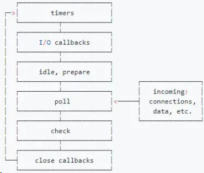

看到这你不用紧张，这里会抛开这些晦涩的流程图，以最清晰浅显的方式来一步步拆解 nodejs 的事件循环机制。

### 三大关键阶段

首先，梳理一下 nodejs 三个非常重要的执行阶段:

1）执行 定时器回调 的阶段。检查定时器，如果到了时间，就执行回调。这些定时器就是 setTimeout、setInterval。这个阶段暂且叫它 timer 。

2）轮询(英文叫 poll )阶段。因为在 node 代码中难免会有异步操作，比如文件 I/O，网络 I/O 等等，那么当这些异步操作做完了，就会来通知 JS 主线程，怎么通知呢？就是通过'data'、'connect'等事件使得事件循环到达 poll 阶段。到达了这个阶段后：

如果当前已经存在定时器，而且有定时器到时间了，拿出来执行，eventLoop 将回到 timer 阶段。

如果没有定时器, 会去看回调函数队列。

- 如果队列不为空，拿出队列中的方法依次执行
- 如果队列为空，检查是否有 setImmdiate 的回调
  - 有则前往 check 阶段
  - 没有则继续等待，相当于阻塞了一段时间(阻塞时间是有上限的), 等待 callback 函数加入队列，加入后会立刻执行。一段时间后自动进入 check 阶段。

3）check 阶段。这是一个比较简单的阶段，直接 执行 setImmdiate 的回调。

这三个阶段为一个循环过程。不过现在的 eventLoop 并不完整，我们现在就来一一地完善。

### 完善

首先，当第 1 阶段结束后，可能并不会立即等待到异步事件的响应，这时候 nodejs 会进入到 I/O 异常的回调阶段 。比如说 TCP 连接遇到 ECONNREFUSED，就会在这个时候执行回调。

并且在 check 阶段结束后还会进入到 关闭事件的回调阶段 。如果一个 socket 或句柄（handle）被突然关闭，例如 socket.destroy()， 'close' 事件的回调就会在这个阶段执行。

梳理一下，nodejs 的 eventLoop 分为下面的几个阶段：

1）timer 阶段
2）I/O 异常回调阶段
空闲、预备状态(第 2 阶段结束，poll 未触发之前)
3）poll 阶段
4）check 阶段
5）关闭事件的回调阶段

### 实例演示

```js
setTimeout(() => {
	console.log("timer1");
	Promise.resolve().then(function () {
		console.log("promise1");
	});
}, 0);
setTimeout(() => {
	console.log("timer2");
	Promise.resolve().then(function () {
		console.log("promise2");
	});
}, 0);
```

node 版本 >= 11 和在 11 以下的会有不同的表现。

首先说 node 版本 >= 11 的，它会和浏览器表现一致，一个定时器运行完立即运行相应的微任务。

```js
timer1;
promise1;
time2;
promise2;
```

而 node 版本小于 11 的情况下，对于定时器的处理是：

> 若第一个定时器任务出队并执行完，发现队首的任务仍然是一个定时器，那么就将微任务暂时保存，直接去执行新的定时器任务，当新的定时器任务执行完后，再一一执行中途产生的微任务。

因此会打印出这样的结果：

```js
timer1;
timer2;
promise1;
promise2;
```

## nodejs 和 浏览器关于 eventLoop 的主要区别

两者最主要的区别在于浏览器中的微任务是在 每个相应的宏任务 中执行的，而 nodejs 中的微任务是在 不同阶段之间 执行的。

## 关于 process.nextTick 的一点说明

process.nextTick 是一个独立于 eventLoop 的任务队列。
在每一个 eventLoop 阶段完成后会去检查这个队列，如果里面有任务，会让这部分任务 优先于微任务 执行。


# ❤八、浏览器垃圾回收机制

