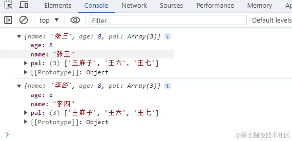
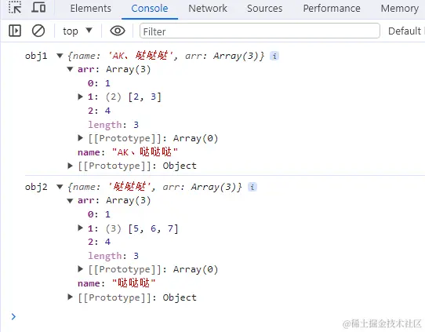
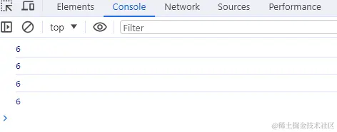
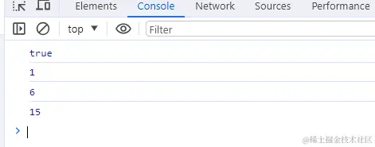
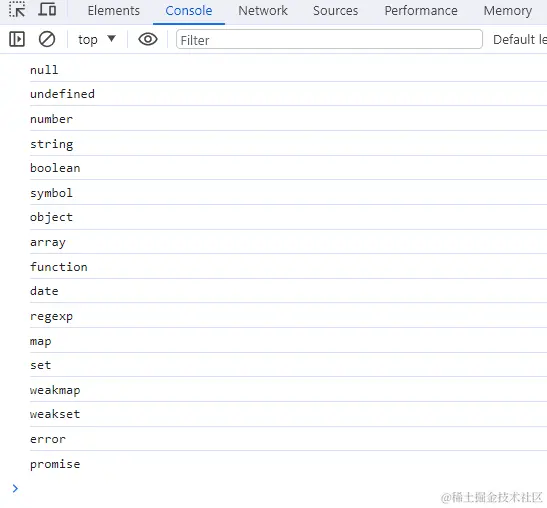
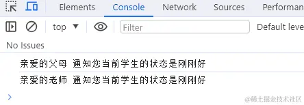
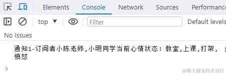
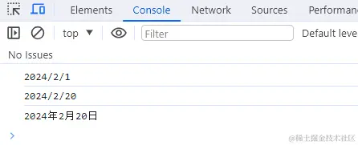
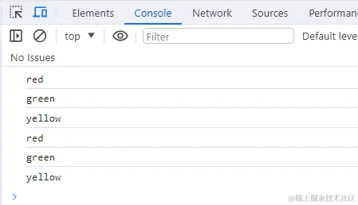
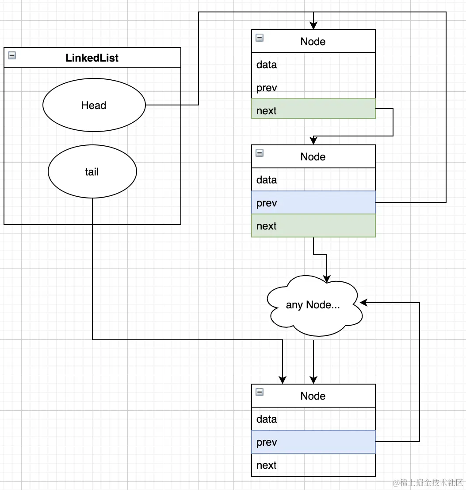

# 手写实现 JS 方法

## 🌟2022-2023 年 前端 JavaScript 手写题，编程题

前端手写题集锦 记录大厂**笔试，面试常考**手写题：<https://github.com/Sunny-117/js-challenges>

## 框架功能手写实现

### vue reactive

```javascript
// Dep module
class Dep {
	static stack = [];
	static target = null;
	deps = null;

	constructor() {
		this.deps = new Set();
	}

	depend() {
		if (Dep.target) {
			this.deps.add(Dep.target);
		}
	}

	notify() {
		this.deps.forEach((w) => w.update());
	}

	static pushTarget(t) {
		if (this.target) {
			this.stack.push(this.target);
		}
		this.target = t;
	}

	static popTarget() {
		this.target = this.stack.pop();
	}
}

// reactive
function reactive(o) {
	if (o && typeof o === "object") {
		Object.keys(o).forEach((k) => {
			defineReactive(o, k, o[k]);
		});
	}
	return o;
}

function defineReactive(obj, k, val) {
	let dep = new Dep();
	Object.defineProperty(obj, k, {
		get() {
			dep.depend();
			return val;
		},
		set(newVal) {
			val = newVal;
			dep.notify();
		},
	});
	if (val && typeof val === "object") {
		reactive(val);
	}
}

// watcher
class Watcher {
	constructor(effect) {
		this.effect = effect;
		this.update();
	}

	update() {
		Dep.pushTarget(this);
		this.value = this.effect();
		Dep.popTarget();
		return this.value;
	}
}

// 测试代码
const data = reactive({
	msg: "aaa",
});

new Watcher(() => {
	console.log("===> effect", data.msg);
});

setTimeout(() => {
	data.msg = "hello";
}, 1000);
```

### 将虚拟 Dom 转化为真实 Dom

题目描述：JSON 格式的虚拟 Dom 怎么转换成真实 Dom

```css
{
  tag: 'DIV',
  attrs:{
  id:'app'
  },
  children: [
    {
      tag: 'SPAN',
      children: [
        { tag: 'A', children: [] }
      ]
    },
    {
      tag: 'SPAN',
      children: [
        { tag: 'A', children: [] },
        { tag: 'A', children: [] }
      ]
    }
  ]
}
把上诉虚拟Dom转化成下方真实Dom
<div id="app">
  <span>
    <a></a>
  </span>
  <span>
    <a></a>
    <a></a>
  </span>
</div>
```

实现代码如下:

```javascript
// 真正的渲染函数
function _render(vnode) {
	// 如果是数字类型转化为字符串
	if (typeof vnode === "number") {
		vnode = String(vnode);
	}
	// 字符串类型直接就是文本节点
	if (typeof vnode === "string") {
		return document.createTextNode(vnode);
	}
	// 普通DOM
	const dom = document.createElement(vnode.tag);
	if (vnode.attrs) {
		// 遍历属性
		Object.keys(vnode.attrs).forEach((key) => {
			const value = vnode.attrs[key];
			dom.setAttribute(key, value);
		});
	}
	// 子数组进行递归操作
	vnode.children.forEach((child) => dom.appendChild(_render(child)));
	return dom;
}
```

### 实现模板字符串解析功能

题目描述:

```html
let template = '我是{{name}}，年龄{{age}}，性别{{sex}}'; let data = { name:
'姓名', age: 18 } render(template, data); // 我是姓名，年龄18，性别undefined
```

实现代码如下:

```javascript
function render(template, data) {
	let computed = template.replace(/\{\{(\w+)\}\}/g, function (match, key) {
		return data[key];
	});
	return computed;
}
```

### 请实现 DOM2JSON 一个函数，可以把一个 DOM 节点输出 JSON 的格式

题目描述:

```css
<div>
  <span>
    <a></a>
  </span>
  <span>
    <a></a>
    <a></a>
  </span>
</div>

把上诉dom结构转成下面的JSON格式

{
  tag: 'DIV',
  children: [
    {
      tag: 'SPAN',
      children: [
        { tag: 'A', children: [] }
      ]
    },
    {
      tag: 'SPAN',
      children: [
        { tag: 'A', children: [] },
        { tag: 'A', children: [] }
      ]
    }
  ]
}
```

实现代码如下:

```javascript
function dom2Json(domtree) {
	let obj = {};
	obj.name = domtree.tagName;
	obj.children = [];
	domtree.childNodes.forEach((child) => obj.children.push(dom2Json(child)));
	return obj;
}
```

> 扩展思考:如果给定的不是一个 Dom 树结构 而是一段 html 字符串 该如何解析?

那么这个问题就类似 Vue 的模板编译原理 我们可以利用正则 匹配 html 字符串 遇到开始标签 结束标签和文本 解析完毕之后生成对应的 ast 并建立相应的父子关联 不断的 advance 截取剩余的字符串 直到 html 全部解析完毕 感兴趣的可以看[这里](https://juejin.cn/post/6936024530016010276)

## 实现 Ajax

1. 创建一个 XMLHttpRequest 对象
2. 在这个对象上使用 open 方法创建一个 HTTP 请求（参数为请求方法、请求地址、是否异步和用户的认证信息）
3. 通过 send 方法来向服务器发起请求（post 请求可以入参作为发送的数据体）
4. 监听请求成功后的状态变化：根据状态码进行相应的出来。onreadystatechange 设置监听函数，当对象的 readyState 变为 4 的时候，代表服务器返回的数据接收完成，这个时候可以通过判断请求的状态，如果状态是 200 则为成功，404 或 500 为失败。

```javascript
function ajax(url) {
	//1.创建XMLHttpRequest对象
	const xhr = new XMLHttpRequest();
	//2.使用open方法创建一个GET请求
	xhr.open("GET", url);
	//xhr.open('GET',url,true);//true代表异步，已完成事务的通知可供事件监听器使用;如果为false，send() 方法直到收到答复前不会返回
	//3.发送请求
	xhr.send();
	//4.监听请求成功后的状态变化(readyState改变时触发)：根据状态码(0~5)进行相应的处理
	xhr.onreadystatechange = function () {
		//readyState为4代表服务器返回的数据接收完成
		if (xhr.readyState == 4) {
			//请求的状态为200或304代表成功
			if (xhr.status == 200 || xhr.status == 304) {
				//this.response代表返回的数据
				handle(this.response);
			} else {
				//this.statusText代表返回的文本信息
				console.error(this.statusText);
			}
		}
	};
}
```

使用 Promise 封装 Ajax：

```javascript
function ajax(url) {
	return new Promise((resolve, reject) => {
		let xhr = new XMLHttpRequest();
		xhr.open("get", url);
		xhr.send();
		xhr.onreadystatechange = () => {
			if (xhr.readyState == 4) {
				if (xhr.status == 200 || xhr.status == 304) {
					resolve(this.response);
				} else {
					reject(new Error(this.statusText));
				}
			}
		};
	});
}
// 使用
let url = "/data.json";
ajax(url)
	.then((res) => console.log(res))
	.catch((reason) => console.log(reason));
```

Promise 实现：

```js
const getJSON = function (url) {
	return new Promise((resolve, reject) => {
		const xhr = new XMLHttpRequest();
		xhr.open("GET", url, false);
		xhr.setRequestHeader("Content-Type", "application/json");
		xhr.onreadystatechange = function () {
			if (xhr.readyState !== 4) return;
			if (xhr.status === 200 || xhr.status === 304) {
				resolve(xhr.responseText);
			} else {
				reject(new Error(xhr.responseText));
			}
		};
		xhr.send();
	});
};
```

## 实现 retry 异步重试机制方法

在 JavaScript 中实现一个`retry`方法，可以通过递归或循环来重试一个函数直到它成功或者达到最大尝试次数。以下是一个简单的`retry`函数的实现，它接受一个函数`fn`，最大重试次数`maxRetries`，以及两次尝试之间的延迟时间`delay`：

```js
function retry(fn, maxRetries, delay) {
	return new Promise((resolve, reject) => {
		let attempts = 0;

		const execute = () => {
			fn()
				.then(resolve)
				.catch((error) => {
					if (attempts < maxRetries) {
						attempts++;
						setTimeout(execute, delay);
					} else {
						reject(error);
					}
				});
		};

		execute();
	});
}
```

使用这个`retry`函数，你可以传入任何返回 Promise 的函数。如果函数在最大尝试次数内成功执行，`retry`函数将解析为成功的值。如果所有尝试都失败了，它将解析为最后一次尝试的错误。

请注意，如果你的函数是同步的，你需要将它包装在一个返回 Promise 的函数中，以便使用这个`retry`方法。

### 实现 2

```js
/**
 * 实现一个函数：function retry（fn, interval, times）
 * fn是一个promise，
 * 重试上限为times次，
 * 重试间隔为interval，
 * 重试成功返回成功的结果，失败返回失败的结果
 * @param {*} fn
 * @param {*} interval
 * @param {*} times
 */

async function reTry(fn, interval, times) {
	let allTimes = 0;
	while (allTimes < times) {
		try {
			const res = await fn();
			return res;
		} catch (error) {
			allTimes++;
			if (allTimes === times) {
				throw error;
			} else {
				await new Promise((res, rej) => setTimeout(res, interval));
			}
		}
	}
}
```

这个`reTry`函数是一个异步重试机制，它尝试执行一个异步函数`fn`直到该函数成功或者达到指定的重试次数`times`。如果`fn`在重试次数内成功执行，`reTry`函数将返回`fn`的结果。如果`fn`每次都失败，当达到`times`次数时，`reTry`函数将抛出最后一次的错误。

函数参数解释：

- `fn`: 一个返回 Promise 的异步函数。
- `interval`: 两次重试之间的等待时间（毫秒）。
- `times`: 最大重试次数。

函数工作流程：

1. 初始化重试次数`allTimes`为 0。
2. 使用`while`循环来控制重试次数。
3. 在`try`块中，使用`await`关键字等待`fn`的执行结果。
4. 如果`fn`成功执行，返回结果`res`。
5. 如果`fn`执行过程中抛出错误，捕获该错误并增加重试次数`allTimes`。
6. 如果重试次数`allTimes`达到`times`，则抛出最后一次的错误。
7. 如果还没有达到最大重试次数，使用`setTimeout`在指定的`interval`后再次尝试。

这个函数特别适用于那些可能因为暂时性问题（如网络延迟或服务暂时不可用）而失败的操作，通过重试可以增加操作成功的机会。

## 实现版本号对比方法

```js
// 版本号对比
function versionCompare(v1, v2) {
	let v1 = v1.split("."),
		v2 = v2.split(".");
	let len = Math.max(v1.length, v2.length);
	for (var i = 0; i < len; i++) {
		var a = parseInt(v1[i]) || 0,
			b = parseInt(v2[i]) || 0;
		if (a < b) return -1;
		if (a > b) return 1;
	}
	return 0;
}

console.log(versionCompare("1.1", "1.1.0.1"));
```

## 写版本号排序的方法

题目描述:有一组版本号如下 `['0.1.1', '2.3.3', '0.302.1', '4.2', '4.3.5', '4.3.4.5']`。现在需要对其进行排序，排序的结果为 `['4.3.5','4.3.4.5','2.3.3','0.302.1','0.1.1']`

实现代码如下:

```javascript
arr.sort((a, b) => {
	let i = 0;
	const arr1 = a.split(".");
	const arr2 = b.split(".");

	while (true) {
		const s1 = arr1[i];
		const s2 = arr2[i];
		i++;
		if (s1 === undefined || s2 === undefined) {
			return arr2.length - arr1.length;
		}

		if (s1 === s2) continue;

		return s2 - s1;
	}
});
console.log(arr);
```

## 最长无重复子串

```js
function lengthOfLongestSubstring(str) {
	if (str.length == 0) return 0;
	let max = 0;
	let arr = [];
	for (let s of str) {
		if (!arr.includes(s)) {
			arr.push(s);
		} else {
			max = Math.max(max, arr.length);
			arr = [];
			arr.push(s);
		}
	}
	return max;
}
```

## 请设计一个 `combinations` 函数，它接收一个数字数组，要求返回这些数字的所有可能组合情况。

```javascript
function combinations(nums) { ... }

combinations([1]); // [[], [1]];
combinations([1, 2]); // [[], [1], [1, 2], [2]];
combinations([1, 2, 3]); // [[], [1], [2], [1, 2], [3], [1, 3], [2, 3], [1, 2, 3]];
```

初看这题目，Em...好像是一个无序组合，刷题刷到过 😃，心想这题稳了，一个二层循环就能搞定，完美拿下。

先贴最终代码：

```javascript
function combinations(nums) {
	// 开头加一个空组合，即不选择任何数字的情况
	const result = [[]];
	// 1. 遍历这些数字
	for (let n of nums) {
		// 获取当前结果一共有多少，作为子循环的次数
		const length = result.length;
		// 2. 子循环
		for (let i = 0; i < length; i++) {
			// 3. 重要点：把上一个结果和下一个数字组合成一个新的结果
			result.push([...result[i], n]);
		}
	}
	return result;
}
```

虽然当时心里想得挺简单，结果现场写得时候还是折腾了好一会儿，也有一些细微的错误 😔，所幸最终大体还是写出来。 （真的好想吐槽手写代码。。。。）

面试后，回来又重新写了一遍，整理了上面那个版本，还另外写了一个递归版本，原理都差不多，都可以看看，如下：

```javascript
function combinations(nums) {
	const result = [];
	function loop(currentResult, count) {
		result.push([...currentResult]);
		for (let i = count; i < nums.length; i++) {
			currentResult.push(nums[i]);
			// 递归
			loop(currentResult, i + 1);
			// 注意一定要删除临时保存的结果
			currentResult.pop();
		}
	}
	loop([], 0);
	return result;
}
```

## 实现一个字符串匹配算法，从长度为 n 的字符串 S 中，查找是否存在字符串 T，T 的长度是 m，若存在返回所在位置。

参考答案：

```js
// 完全不用 API var getIndexOf = function (s, t) { let n = s.length; let m =
t.length; if (!n || !m || n < m) return -1; for (let i = 0; i < n; i++) { let
j = 0; let k = i; if (s[k] === t[j]) { k++; j++; while (k < n && j < m) { if
(s[k] !== t[j]) break; else { k++; j++; } } if (j === m) return i; } } return
-1; } // 测试 console.log(getIndexOf("Hello World", "rl"))
```

## 打印出 `1~10000` 以内的对称数

参考答案：

```js
function isSymmetryNum(start, end) {
	for (var i = start; i < end + 1; i++) {
		var iInversionNumber = +i.toString().split("").reverse().join("");
		if (iInversionNumber === i && i > 10) {
			console.log(i);
		}
	}
}
isSymmetryNum(1, 10000);
```


## 设计一个方法(`isPalindrom`)以判断是否回文(颠倒后的字符串和原来的字符串一样为回文)

参考答案：

示例代码如下：

```js
function isPalindrome(str) {
	if (typeof str !== "string") {
		return false;
	}
	return str.split("").reverse().join("") === str;
}

// 测试
console.log(isPalindrome("HelleH")); // true
console.log(isPalindrome("Hello")); // false
```


## 设计一个方法(`findMaxDuplicateChar`)以统计字符串中出现最多次数的字符

参考答案：

示例代码如下：

```js
function findMaxDuplicateChar(str) { 
    let cnt = {},
    // 用来记录所有的字符的出现频次 
    c = ''; 
    //用来记录最大频次的字符 
    for (let i = 0; i < str.length; i++) { 
        let ci = str[i]; 
        if (!cnt[ci]) { 
            cnt[ci] = 1; 
        } else { 
            cnt[ci]++; } 
        if (c == '' || cnt[ci] > cnt[c]) { c = ci; } 
    }
    
    console.log(cnt); // { H: 1, e: 1, l: 3, o: 2, ' ': 1, W: 1, r: 1, d: 1 }
	return c; 
} // 测试 
console.log(findMaxDuplicateChar('Hello World')); // l
```

## 怎么实现一个计算一年中有多少周？

**考察点：算法**

::: details 查看参考回答

首先你得知道是不是闰年，也就是一年是 365 还是 366

其次你得知道当年 1 月 1 号是周几。假如是周五，一年 365 天把 1 号 2 号 3 号减去，也就是把第一个不到一周的天数减去等于 362

还得知道最后一天是周几，加入是周五，需要把周一到周五减去，也就是 362-5=357、正常情况 357 这个数计算出来是 7 的倍数。357/7=51 。即为周数。


:::

## 给 String 对象添加一个方法，传入一个 string 类型的参数，然后将 string 的每个字符间价格空格返回，例如

```js
addSpace("hello world"); // -> 'h e l l o ?w o r l d'
String.prototype.spacify = function () {
	return this.split("").join(" ");
};
```

## 生成 5 个不同的随机数；

```js
// 思路：5 个不同的数，每生成一次就和前面的所有数字相比较，如果有相同的，则放弃当前生成的数字！
var num1 = [];
for (var i = 0; i < 5; i++) {
	num1[i] = Math.floor(Math.random() * 10) + 1; // 范围是 [1, 10]
	for (var j = 0; j < i; j++) {
		if (num1[i] == num1[j]) {
			i--;
		}
	}
}
```

## 有这样一个 URL：`http://item.taobao.com/item.htm?a=1&b=2&c=&d=xxx&e`

请写一段 JS 程序提取 URL 中的各个 GET 参数(参数名和参数个数不确定)，将其按 key-value 形式返回到一个 json 结构中，如`{a:’1′, b:’2′, c:”, d:’xxx’, e:undefined}`。

```javascript
var url = "http://item.taobao.com/item.htm?a=1&b=2&c=&d=xxx&e";
var gets = url.split("?")[1];
var getsArr = gets.split("&");
var obj = {};
for (var i = 0; i < getsArr.length; i++) {
	obj[getsArr[i].split("=")[0]] = getsArr[i].split("=")[1];
}
return obj;
```

## 解析 URL 成一个对象？

```js
String.prototype.urlQueryString = function () {
	var url = this.split("?")[1].split("&"),
		len = url.length;
	this.url = {};
	for (var i = 0; i < len; i += 1) {
		var cell = url[i].split("="),
			key = cell[0],
			val = cell[1];
		this.url["" + key + ""] = val;
	}
	return this.url;
};
var url = "?name=12&age=23";
console.log(url.urlQueryString().age);
```

## 已知有字符串 foo="get-element-by-id",写一个 function 

答案：

```js
function combo(msg) {
	var arr = msg.split("-");
	var len = arr.length; // 将 arr.length 存储在一个局部变量可以提高 for 循环效率
	for (var i = 1; i < len; i++) {
		arr[i] =
			arr[i].charAt(0).toUpperCase() + arr[i].substr(1, arr[i].length - 1);
	}
	msg = arr.join("");
	return msg;
}
```


## 写出函数 DateDemo 的返回结果，系统时间假定为今天

```js
function DateDemo() {
	var d,
		s = "今天日期是：";
	d = new Date();
	s += d.getMonth() + "/";
	s += d.getDate() + "/";
	s += d.getFullYear();

	return s;
}
```

结果：今天日期是：7/17/2024

## 输出今天的日期

以 YYYY-MM-DD 的方式，比如今天是 2024 年 9 月 26 日，则输出 2024-09-26

```js
function log() {
	console.log.apply(console, arguments);
}
var d = new Date();
// 获取年，getFullYear()返回 4 位的数字
var year = d.getFullYear();
// 获取月，月份比较特殊，0 是 1 月，11 是 12 月
var month = d.getMonth() + 1;
// 变成两位
month = month < 10 ? "0" + month : month;
// 获取日
var day = d.getDate();
day = day < 10 ? "0" + day : day;
alert(year + "-" + month + "-" + day);
```


## 输出今天的日期，以 YYYY-MM-DD 的方式，比如今天是 2024 年 9 月 26 日，则输出 2024-09-26

```js
var d = new Date();
// 获取年，getFullYear()返回 4 位的数字
var year = d.getFullYear();
// 获取月，月份比较特殊，0 是 1 月，11 是 12 月
var month = d.getMonth() + 1;
// 变成两位
month = month < 10 ? "0" + month : month;
// 获取日
var day = d.getDate();
day = day < 10 ? "0" + day : day;
alert(year + "-" + month + "-" + day);
```


## 请设计一个计算器（Counter）类，它能使用加法、减法、乘法、除法的操作，并且有一个能获取结果（get）的方法，并通过可选链式调用而工作。

具体原题描述小编已经记不太清了 😗，反正就是搞一个计算器功能，关键步骤是要实现链式调用，有点像是柯里化函数，但可能稍微更简单一些。

（关于柯里化函数，可以看看小编之前写得一篇文章，[传送门](https://juejin.cn/post/6979778428505423886#heading-14)）

```javascript
class Counter {
	result = 0;
	// 加法
	addition(val) {
		this.result += val;
		return this;
	}
	// 减法
	subtraction(val) {
		this.result -= val;
		return this;
	}
	// 乘法
	multiplication(val) {
		this.result *= val;
		return this;
	}
	// 除法
	division(val) {
		this.result /= val;
		return this;
	}
	get() {
		return this.result;
	}
}
```

具体使用：

```javascript
const counter = new Counter();
const result = counter
	.addition(2)
	.subtraction(1)
	.addition(19)
	.division(2)
	.multiplication(2)
	.get(); // 20
```

基础功能还是相对比较简单，但后面好像还有一个要求是实现"先乘除后加减"的规则，奈何小编太菜就没写出来，如果有大佬写出来了，欢迎评论区留言 😁。

哦，对了，还有一个函数版本的，感兴趣可以瞧瞧：

```javascript
function counter() {
	let result = 0;
	function addition(val) {
		result += val;
		return this;
	}
	function subtraction(val) {
		result -= val;
		return this;
	}
	function multiplication(val) {
		result *= val;
		return this;
	}
	function division(val) {
		result /= val;
		return this;
	}
	function get() {
		return result;
	}
	return { addition, subtraction, multiplication, division, get };
}
```

## 实现一个函数 clone

可以对 JavaScript 中的 5 种主要的数据类型,包括 Number 、 String 、Object 、 Array 、 Boolean ）进行值复制

- 考察点 1：对于基本数据类型和引用数据类型在内存中存放的是值还是指针这一区别是否清楚
- 考察点 2：是否知道如何判断一个变量是什么类型的

```js
// 方法一：
Object.prototype.clone = function () {
	var o = this.constructor === Array ? [] : {};
	for (var e in this) {
		o[e] = typeof this[e] === "object" ? this[e].clone() : th;
	}
	return o;
};

// 方法二：
/**
 * 克隆一个对象
 * @param Obj
 * @returns
 */
function clone(Obj) {
	var buf;
	if (Obj instanceof Array) {
		buf = []; //创建一个空的数组
		var i = Obj.length;
		while (i--) {
			buf[i] = clone(Obj[i]);
		}
		return buf;
	} else if (Obj instanceof Object) {
		buf = {}; //创建一个空对象
		for (var k in Obj) {
			//为这个对象添加新的属性
			buf[k] = clone(Obj[k]);
		}
		return buf;
	} else {
		//普通变量直接赋值
		return Obj;
	}
}


/** * 对象克隆 * 支持基本数据类型及对象 * 递归方法 */ 
function clone(obj) {
    var o; 
    switch (typeof obj) { 
        case "undefined": 
            break; 
        case "string": 
            o = obj +""; 
            break; 
        case "number": 
            o = obj - 0; 
            break; 
        case "boolean": 
            o = obj; 
            break;
        case "object": 
            // object 分为两种情况 对象(Object)或数组(Array) 
        if (obj === null) { 
            o = null; 
        } else { 
            if (Object.prototype.toString.call(obj).slice(8, -1) === "Array") { 
                o = []; 
                for (var i = 0; i < obj.length; i++) { 
                    o.push(clone(obj[i])); 
                } 
            } else { 
                o = {};
                for (var k in obj) { 
                    o[k] = clone(obj[k]); 
                } 
            } 
        } 
            break; 
        default: 
            o = obj;
			break; 
    } 
    return o; 
}
```

#### 第三方库

可以使用第三方库来实现深拷贝。例如，Underscore.js 和 Lodash 都提供了深拷贝的方法。

## 实现一个函数 clone

**可以对 JavaScript 中的 5 种主要的数据类型（包括 Number、String、Object、Array、Boolean）进行值复制**

 考察点 1：对于基本数据类型和引用数据类型在内存中存放的是值还是指针这一区别是否清楚
 考察点 2：是否知道如何判断一个变量是什么类型的
 考察点 3：递归算法的设计

```js
// 方法一：
Object.prototype.clone = function () {
	var o = this.constructor === Array ? [] : {};
	for (var e in this) {
		o[e] = typeof this[e] === "object" ? this[e].clone() : this[e];
	}
	return o;
};
//方法二：
/**

克隆一个对象

@param Obj

@returns
*/
function clone(Obj) {
	var buf;
	if (Obj instanceof Array) {
		buf = []; //创建一个空的数组
		var i = Obj.length;
		while (i--) {
			buf[i] = clone(Obj[i]);
		}
		return buf;
	} else if (Obj instanceof Object) {
		buf = {}; //创建一个空对象
		for (var k in Obj) {
			//为这个对象添加新的属性
			buf[k] = clone(Obj[k]);
		}

		return buf;
	} else {
		//普通变量直接赋值
		return Obj;
	}
}
```


## 如何消除一个数组里面重复的元素？

```js
var arr = [1, 2, 3, 3, 4, 4, 5, 5, 6, 1, 9, 3, 25, 4];
function deRepeat() {
	var newArr = [];
	var obj = {};
	var index = 0;
	var l = arr.length;
	for (var i = 0; i < l; i++) {
		if (obj[arr[i]] == undefined) {
			obj[arr[i]] = 1;
			newArr[index++] = arr[i];
		} else if (obj[arr[i]] == 1) continue;
	}
	return newArr;
}
var newArr2 = deRepeat(arr);
alert(newArr2); //输出 1,2,3,4,5,6,9,25
```

## 小贤是一条可爱的小狗(Dog)，它的叫声很好听(wow)，每次看到主人的时候就会乖乖叫一声(yelp)

从这段描述可以得到以下对象：

```js
function Dog() {
	this.wow = function () {
		alert("Wow");
	};
	this.yelp = function () {
		this.wow();
	};
}
```

小芒和小贤一样，原来也是一条可爱的小狗，可是突然有一天疯了(MadDog)，一看到人就会每隔半秒叫一声(wow)地不停叫唤(yelp)。请根据描述，按示例的形式用代码来实。（继承，原型，setInterval）

```js
function MadDog() {
	this.yelp = function () {
		var self = this;
		setInterval(function () {
			self.wow();
		}, 500);
	};
}
MadDog.prototype = new Dog();
//for test
var dog = new Dog();
dog.yelp();
var madDog = new MadDog();
madDog.yelp();
```

## 下面这个 ul，如何点击每一列的时候 alert 其 index?（闭包）

```html
<ul id="test">
	<li>这是第一条</li>
	<li>这是第二条</li>
	<li>这是第三条</li>
</ul>
```

js

```js
// 方法一：
var lis = document.getElementById("2223").getElementsByTagName("li");
for (var i = 0; i < 3; i++) {
	lis[i].index = i;
	lis[i].onclick = function () {
		alert(this.index);
	};
}
//方法二：
var lis = document.getElementById("2223").getElementsByTagName("li");
for (var i = 0; i < 3; i++) {
	lis[i].index = i;
	lis[i].onclick = (function (a) {
		return function () {
			alert(a);
		};
	})(i);
}
```

## 编写一个 JavaScript 函数，要求实现：

输入指定类型的选择器(仅需支持 id，class，tagName 三种简单 CSS 选择器，无需兼容组合选择器)可以返回匹配的 DOM 节点，需考虑浏览器兼容性和性能。

```js
/*** @param selector {String} 传入的 CSS 选择器。* @return {Array}*/
var query = function (selector) {
	var reg = /^(#)?(\.)?(\w+)$/gim;
	var regResult = reg.exec(selector);
	var result = [];
	// 如果是 id 选择器
	if (regResult[1]) {
		if (regResult[3]) {
			if (typeof document.querySelector === "function") {
				result.push(document.querySelector(regResult[3]));
			} else {
				result.push(document.getElementById(regResult[3]));
			}
		}
	}
	// 如果是 class 选择器
	else if (regResult[2]) {
		if (regResult[3]) {
			if (typeof document.getElementsByClassName === "function") {
				var doms = document.getElementsByClassName(regResult[3]);
				if (doms) {
					result = converToArray(doms);
				}
			}

			// 如果不支持 getElementsByClassName 函数
			else {
				var allDoms = document.getElementsByTagName("*");
				for (var i = 0, len = allDoms.length; i < len; i++) {
					if (allDoms[i].className.search(new RegExp(regResult[2])) > -1) {
						result.push(allDoms[i]);
					}
				}
			}
		}
	}
	// 如果是标签选择器
	else if (regResult[3]) {
		var doms = document.getElementsByTagName(regResult[3].toLowerCase());
		if (doms) {
			result = converToArray(doms);
		}
	}
	return result;
};
function converToArray(nodes) {
	var array = null;
	try {
		array = Array.prototype.slice.call(nodes, 0); // 针对非 IE 浏览器
	} catch (ex) {
		array = new Array();
		for (var i = 0, len = nodes.length; i < len; i++) {
			array.push(nodes[i]);
		}
	}
	return array;
}
```


## 判断数组的深度

```js
/*
如何判断数组的最深层有多少层？
例如：[1,3,3[4,6,7,[5,6,7,43,[23,4]]]],返回4！
*/

//记录每一次到底的深度值，取最大
function getMaxDeepArr(arr) {
	let curDep = 1;
	let res = [];
	function forArr(arr) {
		for (i of arr) {
			if (Array.isArray(i)) {
				curDep += 1;
				forArr(i);
			}
		}
		res.push(curDep);
		curDep -= 1;
		console.log(arr, "到底了");
	}
	forArr(arr);
	return Math.max(...res);
}
console.log(
	getMaxDeepArr([1, 3, 3, [4, [6], 7, [5, 6, 7, 43, [23, 4]]], [1, 2]])
);

//遍历多层数组，把每个值换成当前深度
function fn(arr, dep = 0) {
	if (!Array.isArray(arr)) return dep;
	return Math.max(...arr.map((i) => fn(i, dep + 1)));
}
console.log(fn([[1, 2], 1, 3, 3, [4, [6], 7, [5, 6, 7, 43, [23, 4]]], [1, 2]]));

//打平数组，看打平多少次
function s(arr) {
	let i = 1;
	function l(arr) {
		if (arr.find((item) => Array.isArray(item))) {
			i += 1;
			l(arr.flat());
		}
	}
	l(arr);
	return i;
}
console.log(s([[1, 2], 1, 3, 3, [4, [6], 7, [5, 6, 7, 43, [23, 4]]], [1, 2]]));
/*
请实现抽奖函数rand，保证随机性
输入为表示对象数组，对象有属性n表示人名，w表示权重
随机返回一个中奖人名，中奖概率和w成正比
*/
let peoples = [
	{ n: "p1", w: 100 },
	{ n: "p2", w: 200 },
	{ n: "p3", w: 100 },
];
let rand = function (p) {
	let allW = 0;
	p.forEach((element) => {
		allW += element.w;
	});
	let randNum = Math.floor(Math.random() * (allW - 1)) + 1;
	console.log(randNum);
	let helpNum = 1;
	let res = p.filter((e) => {
		console.log(helpNum, e.w + helpNum);
		if (helpNum <= randNum && randNum < e.w + helpNum) {
			helpNum += e.w;
			return true;
		} else {
			helpNum += e.w;
			return false;
		}
	});
	console.log(res[0]);
	return res;
};
rand(peoples);
```

## 手写浅拷贝与深拷贝

### 深浅拷贝的区别

- **浅拷贝**：只是拷贝了基本类型的数据，而引用类型数据，复制后也是会发生引用，我们把这种拷贝叫做浅拷贝(浅复制)

  浅拷贝只复制指向某个对象的指针，而不复制对象本身，新旧对象还是共享同一块内存。

- **深拷贝**：在堆中重新分配内存，并且把源对象所有属性都进行新建拷贝，以保证深拷贝的对象的引用图不包含任何原有对象或对象图上的任何对象，拷贝后的对象与原来的对象是完全隔离，互不影响。

|        | 和原数据是否指向同一个对象 | 第一层数据为基本数据类型 | 原数据中包含的子对象 |
| ------ | -------------------------- | ------------------------ | -------------------- |
| 赋值   | 是                         | 会使原数据一起改变       | 会使原数据一起改变   |
| 浅拷贝 | 否                         | 不会使原数据一起改变     | 会使原数据一起改变   |
| 深拷贝 | 否                         | 不会使原数据一起改变     | 不会使原数据一起改变 |

### 常见情况：

1. **`基本数据类型`**：对于基本数据类型(如 Number、String、Boolean、Undefined、Null、Symbol)，浅拷贝和深拷贝实际上是一样的，因为它们都是值类型，复制的是值本身。
2. **`引用数据类型`**：对于引用数据类型(如 Object、Array、Function)，浅拷贝和深拷贝的区别就显现出来了。浅拷贝只复制引用，而深拷贝会复制引用指向的对象。
3. **`嵌套对象`**：当处理嵌套对象时，浅拷贝的问题尤为突出。因为浅拷贝只会复制最外层的引用，而内部的对象仍然是共享的。这可能导致在修改新对象时，原对象也被意外修改。而深拷贝则可以避免这个问题，因为它会递归地复制所有的子对象。

### 浅拷贝

浅拷贝是创建一个新对象，这个对象有着原始对象属性值的一份精确拷贝。如果属性是基本类型，拷贝的就是基本类型的值，如果属性是引用类型，拷贝的就是内存地址，所以如果其中一个对象改变了这个地址，就会影响到另一个对象。

如果是数组，我们可以利用数组的一些方法，比如 slice，concat 方法返回一个新数组的特性来实现拷贝，但假如数组嵌套了对象或者数组的话，使用 concat 方法克隆并不完整，如果数组元素是基本类型，就会拷贝一份，互不影响，而如果是对象或数组，就会只拷贝对象和数组的引用，这样我们无论在新旧数组进行了修改，两者都会发生变化，我们把这种复制引用的拷贝方法称为浅拷贝。

#### 浅拷贝方法

1. 直接赋值
2. `Object.assign` 方法：可以把任意多个的源对象自身的可枚举属性拷贝给目标对象，然后返回目标对象。当拷贝的 `object` 只有一层的时候，是深拷贝，但是当拷贝的对象属性值又是一个引用时，换句话说有多层时，就是一个浅拷贝。
3. `ES6` 扩展运算符，当 `object` 只有一层的时候，也是深拷贝。有多层时是浅拷贝。
4. `Array.prototype.concat` 方法
5. `Array.prototype.slice` 方法
6. `jQuery` 中的 `.extend`：在 `jQuery` 中，`.extend∗：在 ∗jQuery∗ 中，∗.extend(deep,target,object1,objectN)` 方法可以进行深浅拷贝。`deep` 如过设为 `true` 为深拷贝，默认是 `false` 浅拷贝。
7. `Object.getOwnPropertyDescriptors()`+`Object.defineProperties()`

#### 实现浅拷贝

深拷贝就是指完全的拷贝一个对象，即使嵌套了对象，两者也互相分离，修改一个对象的属性，不会影响另一个
如何深拷贝一个数组

1、这里介绍一个技巧，不仅适用于数组还适用于对象！那就是：

```js
var arr = ["old", 1, true, ["old1", "old2"], { old: 1 }];
var new_arr = JSON.parse(JSON.stringify(arr));
console.log(new_arr);
```

原理是 JOSN 对象中的 stringify 可以把一个 js 对象序列化为一个 JSON 字符串，parse 可以把 JSON 字符串反序列化为一个 js 对象，通过这两个方法，也可以实现对象的深复制。但是这个方法不能够拷贝函数

#### 浅拷贝的实现

以上三个方法 concat、slice 、JSON.stringify 都是技巧类，根据实际项目情况选择使用，我们可以思考下如何实现一个对象或数组的浅拷贝，遍历对象，然后把属性和属性值都放在一个新的对象里即可

```js
var shallowCopy = function (obj) {
	// 只拷贝对象
	if (typeof obj !== "object") return;
	// 根据 obj 的类型判断是新建一个数组还是对象
	var newObj = obj instanceof Array ? [] : {};
	// 遍历 obj，并且判断是 obj 的属性才拷贝
	for (var key in obj) {
		if (obj.hasOwnProperty(key)) {
			newObj[key] = obj[key];
		}
	}
	return newObj;
};
```


#### 实现浅拷贝

```js
// 实现浅拷贝
function shallowCopy(obj) {
	// 只拷贝对象，基本类型或null直接返回
	if (typeof obj !== "object" || obj === null) {
		return obj;
	}
	// 判断是新建一个数组还是对象
	let newObj = Array.isArray(obj) ? [] : {};
	//for…in会遍历对象的整个原型链，如果只考虑对象本身的属性，需要搭配hasOwnProperty
	for (let key in obj) {
		//hasOwnProperty判断是否是对象自身属性，会忽略从原型链上继承的属性
		if (obj.hasOwnProperty(key)) {
			newObj[key] = obj[key]; //只拷贝对象本身的属性
		}
	}
	return newObj;
}

// 测试
var obj = {
	name: "张三",
	age: 8,
	pal: ["王五", "王六", "王七"],
};
let obj2 = shallowCopy(obj);
obj2.name = "李四";
obj2.pal[0] = "王麻子";
console.log(obj); //{age: 8, name: "张三", pal: ['王麻子', '王六', '王七']}
console.log(obj2); //{age: 8, name: "李四", pal: ['王麻子', '王六', '王七']}
```

测试结果：



#### 实现 2

```js
const shallowClone = (target) => {
	if (typeof target === "object" && target !== null) {
		const cloneTarget = Array.isArray(target) ? [] : {};
		for (let prop in target) {
			if (target.hasOwnProperty(prop)) {
				cloneTarget[prop] = target[prop];
			}
		}
		return cloneTarget;
	} else {
		return target;
	}
};
```

#### 使用 Object.assign 实现浅拷贝

但是需要注意的是，Object.assgin() 拷贝的是对象的属性的引用，而不是对象本身。

```js
let obj = { name: "sy", age: 18 };
const obj2 = Object.assign({}, obj, { name: "sss" });
console.log(obj2); //{ name: 'sss', age: 18 }
```

#### concat 浅拷贝数组

```js
let arr = [1, 2, 3];
let newArr = arr.concat();
newArr[1] = 100;
console.log(arr); //[ 1, 2, 3 ]
```

#### slice 浅拷贝

```js
let arr = [1, 2, 3];
let newArr = arr.slice();
newArr[0] = 100;
console.log(arr); //[1, 2, 3]
```

#### 使用扩展(展开)运算符实现浅拷贝

```js
let arr = [1, 2, 3];
let newArr = [...arr]; // 跟arr.slice()是一样的效果

const copyOfObject = { ...originalObject };
const copyOfArray = [...originalArray];
```

扩展运算符不足和特性。

| 不足&特性                                                    |
| ------------------------------------------------------------ |
| 不能复制普通对象的`prototype`属性                            |
| 不能复制*内置对象*的**特殊属性**(internal slots)             |
| 只复制对象的本身的属性(非继承)                               |
| 只复制对象的可枚举属性(enumerable)                           |
| 复制的数据属性都是**可写的**(writable)和**可配置的**(configurable) |

#### Object.assign()

`Object.assign()`的工作方式和扩展运算符类似。

```javascript
const copy1 = { ...original };
const copy2 = Object.assign({}, original);
```

`Object.assign()`并非完全和扩展运算符等同，他们之间存在一些细微的差别。

- 扩展运算符在副本中**直接定义新的属性**
- `Object.assign()`通过**赋值的方式**来处理副本中对应属性

#### `object.assign` 和扩展运算法是深拷贝还是浅拷贝

这两个方式都是浅拷贝。

在拷贝的对象只有一层时是深拷贝，但是一旦对象的属性值又是一个对象，也就是有两层或者两层以上时，就会发现这两种方式都是浅拷贝。

#### `Object.getOwnPropertyDescriptors()`和`Object.defineProperties()`

`JavaScript`允许我们通过**属性描述符**来创建属性。

```javascript
function copyAllOwnProperties(original) {
	return Object.defineProperties(
		{},
		Object.getOwnPropertyDescriptors(original)
	);
}
```

1. 能够复制所有自有属性
2. 能够复制非枚举属性

### 深拷贝

深拷贝是将一个对象从内存中完整的拷贝一份出来，从堆内存中开辟一个新的区域存放新对象，且修改新对象不会影响原对象。

`深拷贝`：开辟一个新的栈，两个对象的属性完全相同，但是对应两个不同的地址，修改一个对象的属性，不会改变另一个对象的属性。

#### 深拷贝方法

1. `$.extend(deep,target,object1,objectN)` ，将 `deep` 设置为 `true`
2. `JSON.parse(JSON.stringify)` ：用 `JSON.stringify` 将对象转成 `JSON` 字符串，再用 `JSON.parse` 方法把字符串解析成对象，一去一来，新的对象产生了，而且对象会开辟新的栈，实现深拷贝。这种方法虽然可以实现数组或对象深拷贝，但不能处理函数。
3. 手写递归

#### 简易版及问题

```js
JSON.parse(JSON.stringify());
```

估计这个 api 能覆盖大多数的应用场景，没错，谈到深拷贝，我第一个想到的也是它。但是实际上，对于某些严格的场景来说，这个方法是有巨大的坑的。问题如下：

无法解决 循环引用 的问题。举个例子：

```js
const a = { val: 2 };
a.target = a;
```

- 拷贝 a 会出现系统栈溢出，因为出现了 无限递归 的情况。
- 无法拷贝一写 特殊的对象 ，诸如 RegExp, Date, Set, Map 等。
- 无法拷贝 函数 (划重点)。

因此这个 api 先 pass 掉，我们重新写一个深拷贝，简易版如下：

```js
const deepClone = (target) => {
	if (typeof target === "object" && target !== null) {
		const cloneTarget = Array.isArray(target) ? [] : {};
		for (let prop in target) {
			if (target.hasOwnProperty(prop)) {
				cloneTarget[prop] = deepClone(target[prop]);
			}
		}
		return cloneTarget;
	} else {
		return target;
	}
};
```

现在，我们以刚刚发现的三个问题为导向，一步步来完善、优化我们的深拷贝代码。

- 考虑基础类型
- 引用类型
  - RegExp、Date、函数 不是 JSON 安全的
  - 会丢失 constructor，所有的构造函数都指向 Object
  - 破解循环引用

```js
function deepCopy(obj) {
	if (typeof obj === "object") {
		var result = obj.constructor === Array ? [] : {};
		for (var i in obj) {
			result[i] = typeof obj[i] === "object" ? deepCopy(obj[i]) : obj[i];
		}
	} else {
		var result = obj;
	}
	return result;
}
```

##### 解决循环引用

现在问题如下：

```js
let obj = { val: 100 };
obj.target = obj;
deepClone(obj); // 报错: RangeError: Maximum call stack size exceeded
```

这就是循环引用。我们怎么来解决这个问题呢？

创建一个 Map。记录下已经拷贝过的对象，如果说已经拷贝过，那直接返回它行了。

```js
const isObject = (target) =>
	(typeof target === "object" || typeof target === "function") &&
	target !== null;
const deepClone = (target, map = new Map()) => {
	if (map.get(target)) return target;
	if (isObject(target)) {
		map.set(target, true);
		const cloneTarget = Array.isArray(target) ? [] : {};
		for (let prop in target) {
			if (target.hasOwnProperty(prop)) {
				cloneTarget[prop] = deepClone(target[prop], map);
			}
		}
		return cloneTarget;
	} else {
		return target;
	}
};
```

现在来试一试：

```js
const a = { val: 2 };
a.target = a;
let newA = deepClone(a);
console.log(newA); //{ val: 2, target: { val: 2, target: [Circular] } }
```

好像是没有问题了, 拷贝也完成了。但还是有一个潜在的坑, 就是 map 上的 key 和 map 构成了 强引用关系 ，这是相当危险的。我给你解释一下与之相对的弱引用的概念你就明白了：

> 在计算机程序设计中，弱引用与强引用相对，是指不能确保其引用的对象不会被垃圾回收器回收的引用。 一个对象若只被弱引用所引用，则被认为是不可访问（或弱可访问）的，并因此可能在任何时刻被回收。 --百度百科

大白话解释一下，被弱引用的对象可以在任何时候被回收，而对于强引用来说，只要这个强引用还在，那么对象无法被回收。拿上面的例子说，map 和 a 一直是强引用的关系， 在程序结束之前，a 所占的内存空间一直不会被释放。

**怎么解决这个问题？**

很简单，让 map 的 key 和 map 构成 弱引用 即可。ES6 给我们提供了这样的数据结构，它的名字叫 WeakMap ，它是一种特殊的 Map, 其中的键是 弱引用 的。其键必须是对象，而值可以是任意的。

稍微改造一下即可：

```js
const deepClone = (target, map = new WeakMap()) => {
	//...
};
```

##### 拷贝特殊对象

###### （1）可继续遍历

对于特殊的对象，我们使用以下方式来鉴别：

```js
Object.prototype.toString.call(obj);
```

梳理一下对于可遍历对象会有什么结果：

```bash
["object Map"]
["object Set"]
["object Array"]
["object Object"]
["object Arguments"]
```

好，以这些不同的字符串为依据，我们就可以成功地鉴别这些对象。

```js
const getType = Object.prototype.toString.call(obj);
const canTraverse = {
	"[object Map]": true,
	"[object Set]": true,
	"[object Array]": true,
	"[object Object]": true,
	"[object Arguments]": true,
};
const deepClone = (target, map = new Map()) => {
	if (!isObject(target)) return target;
	let type = getType(target);
	let cloneTarget;
	if (!canTraverse[type]) {
		// 处理不能遍历的对象
		return;
	} else {
		// 这波操作相当关键，可以保证对象的原型不丢失！
		let ctor = target.prototype;
		cloneTarget = new ctor();
	}
	if (map.get(target)) return target;
	map.put(target, true);
	if (type === mapTag) {
		//处理Map
		target.forEach((item, key) => {
			cloneTarget.set(deepClone(key), deepClone(item));
		});
	}
	if (type === setTag) {
		//处理Set
		target.forEach((item) => {
			target.add(deepClone(item));
		});
	}
	// 处理数组和对象
	for (let prop in target) {
		if (target.hasOwnProperty(prop)) {
			cloneTarget[prop] = deepClone(target[prop]);
		}
	}
	return cloneTarget;
};
```

###### （2）不可遍历的对象

```bash
const boolTag = '[object Boolean]';
const numberTag = '[object Number]';
const stringTag = '[object String]';
const dateTag = '[object Date]';
const errorTag = '[object Error]';
const regexpTag = '[object RegExp]';
const funcTag = '[object Function]';
```

对于不可遍历的对象，不同的对象有不同的处理。

```js
const handleRegExp = (target) => {
	const { source, flags } = target;
	return new target.constructor(source, flags);
};
const handleFunc = (target) => {
	// 待会的重点部分
};
const handleNotTraverse = (target, tag) => {
	const Ctor = targe.constructor;
	switch (tag) {
		case boolTag:
		case numberTag:
		case stringTag:
		case errorTag:
		case dateTag:
			return new Ctor(target);
		case regexpTag:
			return handleRegExp(target);
		case funcTag:
			return handleFunc(target);
		default:
			return new Ctor(target);
	}
};
```

##### 拷贝函数

虽然函数也是对象，但是它过于特殊，我们单独把它拿出来拆解。

提到函数，在 JS 种有两种函数，一种是普通函数，另一种是箭头函数。每个普通函数都是 Function 的实例，而箭头函数不是任何类的实例，每次调用都是不一样的引用。那我们只需要 处理普通函数的情况，箭头函数直接返回它本身就好了。

**那么如何来区分两者呢？**

答案是：利用原型。箭头函数是不存在原型的。

代码如下：

```js
const handleFunc = (func) => {
	// 箭头函数直接返回自身
	if (!func.prototype) return func;
	const bodyReg = /(?<={)(.|\n)+(?=})/m;
	const paramReg = /(?<=\().+(?=\)\s+{)/;
	const funcString = func.toString();
	// 分别匹配 函数参数 和 函数体
	const param = paramReg.exec(funcString);
	const body = bodyReg.exec(funcString);
	if (!body) return null;
	if (param) {
		const paramArr = param[0].split(",");
		return new Function(...paramArr, body[0]);
	} else {
		return new Function(body[0]);
	}
};
```

到现在，我们的深拷贝就实现地比较完善了。不过在测试的过程中，我也发现了一个小小的 bug。

##### 小小的 bug

如下所示：

```js
const target = new Boolean(false);
const Ctor = target.constructor;
new Ctor(target); // 结果为 Boolean {true} 而不是 false。
```

对于这样一个 bug，我们可以对 Boolean 拷贝做最简单的修改， 调用 valueOf: new
target.constructor(target.valueOf())。

但实际上，这种写法是不推荐的。因为在 ES6 后不推荐使用【new 基本类型()】这 样的语法，所以 es6 中的新类型 Symbol 是不能直接 new 的，只能通过 new Object(SymbelType)。

因此我们接下来统一一下：

```js
const handleNotTraverse = (target, tag) => {
	const Ctor = targe.constructor;
	switch (tag) {
		case boolTag:
			return new Object(Boolean.prototype.valueOf.call(target));
		case numberTag:
			return new Object(Number.prototype.valueOf.call(target));
		case stringTag:
			return new Object(String.prototype.valueOf.call(target));
		case errorTag:
		case dateTag:
			return new Ctor(target);
		case regexpTag:
			return handleRegExp(target);
		case funcTag:
			return handleFunc(target);
		default:
			return new Ctor(target);
	}
};
```

##### 完整代码展示

完整版的深拷贝：

```js
const getType = (obj) => Object.prototype.toString.call(obj);
const isObject = (target) =>
	(typeof target === "object" || typeof target === "function") &&
	target !== null;
const canTraverse = {
	"[object Map]": true,
	"[object Set]": true,
	"[object Array]": true,
	"[object Object]": true,
	"[object Arguments]": true,
};
const mapTag = "[object Map]";
const setTag = "[object Set]";
const boolTag = "[object Boolean]";
const numberTag = "[object Number]";
const stringTag = "[object String]";
const symbolTag = "[object Symbol]";
const dateTag = "[object Date]";
const errorTag = "[object Error]";
const regexpTag = "[object RegExp]";
const funcTag = "[object Function]";
const handleRegExp = (target) => {
	const { source, flags } = target;
	return new target.constructor(source, flags);
};
const handleFunc = (func) => {
	// 箭头函数直接返回自身
	if (!func.prototype) return func;
	const bodyReg = /(?<={)(.|\n)+(?=})/m;
	const paramReg = /(?<=\().+(?=\)\s+{)/;
	const funcString = func.toString();
	// 分别匹配 函数参数 和 函数体
	const param = paramReg.exec(funcString);
	const body = bodyReg.exec(funcString);
	if (!body) return null;
	if (param) {
		const paramArr = param[0].split(",");
		return new Function(...paramArr, body[0]);
	} else {
		return new Function(body[0]);
	}
};
const handleNotTraverse = (target, tag) => {
	const Ctor = target.constructor;
	switch (tag) {
		case boolTag:
			return new Object(Boolean.prototype.valueOf.call(target));
		case numberTag:
			return new Object(Number.prototype.valueOf.call(target));
		case stringTag:
			return new Object(String.prototype.valueOf.call(target));
		case symbolTag:
			return new Object(Symbol.prototype.valueOf.call(target));
		case errorTag:
		case dateTag:
			return new Ctor(target);
		case regexpTag:
			return handleRegExp(target);
		case funcTag:
			return handleFunc(target);
		default:
			return new Ctor(target);
	}
};
const deepClone = (target, map = new WeakMap()) => {
	if (!isObject(target)) return target;
	let type = getType(target);
	let cloneTarget;
	if (!canTraverse[type]) {
		// 处理不能遍历的对象
		return handleNotTraverse(target, type);
	} else {
		// 这波操作相当关键，可以保证对象的原型不丢失！
		let ctor = target.constructor;
		cloneTarget = new ctor();
	}
	if (map.get(target)) return target;
	map.set(target, true);
	if (type === mapTag) {
		//处理Map
		target.forEach((item, key) => {
			cloneTarget.set(deepClone(key, map), deepClone(item, map));
		});
	}
	if (type === setTag) {
		//处理Set
		target.forEach((item) => {
			cloneTarget.add(deepClone(item, map));
		});
	}
	// 处理数组和对象
	for (let prop in target) {
		if (target.hasOwnProperty(prop)) {
			cloneTarget[prop] = deepClone(target[prop], map);
		}
	}
	return cloneTarget;
};
```

#### 深拷贝的实现

那如何实现一个深拷贝呢？说起来也好简单，我们在拷贝的时候判断一下属性值的类型，如果是对象，我们递归调用深拷贝函数不就好了~

```js
var deepCopy = function (obj) {
	if (typeof obj !== "object") return;
	var newObj = obj instanceof Array ? [] : {};
	for (var key in obj) {
		if (obj.hasOwnProperty(key)) {
			newObj[key] =
				typeof obj[key] === "object" ? deepCopy(obj[key]) : obj[key];
		}
	}
	return newObj;
};
```

#### 实现

```js
function deepCopy(oldObj, newobj) {
 for (var key in oldObj) {
    var item = oldObj[key];
     // 判断是否是对象
    if (item instanceof Object) {
         if (item instanceof Function) {
            newobj[key] = oldObj[key];
         } else {
            newobj[key] = {};  //定义一个空的对象来接收拷贝的内容
             deepCopy(item, newobj[key]); //递归调用
         }

         // 判断是否是数组
     } else if (item instanceof Array) {
         newobj[key] = [];  //定义一个空的数组来接收拷贝的内容
        deepCopy(item, newobj[key]); //递归调用
     } else {
        newobj[key] = oldObj[key];
     }
 }
}
```

#### 实现

```js
/**
 * 深拷贝
 * @param {Object} obj 要拷贝的对象
 * @param {Map} map 用于存储循环引用对象的地址
 */

function deepClone(obj = {}, map = new Map()) {
	if (obj === null) return obj; // 如果是null或者undefined我就不进行拷贝操作
	if (obj instanceof Date) return new Date(obj);
	if (obj instanceof RegExp) return new RegExp(obj);
	// 可能是对象或者普通的值  如果是函数的话是不需要深拷贝
	if (typeof obj !== "object") return obj;
	if (map.get(obj)) {
		return map.get(obj);
	}
	let result = {}; // 初始化返回结果
	if (
		obj instanceof Array ||
		// 加 || 的原因是为了防止 Array 的 prototype 被重写，Array.isArray 也是如此
		Object.prototype.toString(obj) === "[object Array]"
	) {
		result = [];
	}
	// 防止循环引用
	map.set(obj, result);
	for (const key in obj) {
		// 保证 key 不是原型属性
		if (obj.hasOwnProperty(key)) {
			// 递归调用
			result[key] = deepClone(obj[key], map);
		}
	}
	return result;
}
```


#### 实现简易深拷贝 2

```js
function deepCopy(obj, map = new WeakMap()) {
	// 基本类型或null直接返回
	if (typeof obj !== "object" || obj === null) {
		return obj;
	}
	// 判断是新建一个数组还是对象
	let newObj = Array.isArray(obj) ? [] : {};
	// 利用map解决循环引用
	if (map.has(obj)) {
		return map.get(obj);
	}
	map.set(obj, newObj); // 将当前对象作为key，克隆对象作为value
	for (let key in obj) {
		if (obj.hasOwnProperty(key)) {
			newObj[key] = deepCopy(obj[key], map); // 递归
		}
	}
	return newObj;
}

// 测试
let obj1 = {
	name: "AK、哒哒哒",
	arr: [1, [2, 3], 4],
};
let obj2 = deepCopy(obj1);
obj2.name = "哒哒哒";
obj2.arr[1] = [5, 6, 7]; // 新对象跟原对象不共享内存

console.log("obj1", obj1); // obj1 { name: 'AK、哒哒哒', arr: [ 1, [ 2, 3 ], 4 ] }
console.log("obj2", obj2); // obj2 { name: '哒哒哒', arr: [ 1, [ 5, 6, 7 ], 4 ] }
```

测试结果：



#### 简易版深拷贝

没有考虑循环引用的情况和 Buffer、Promise、Set、Map 的处理，如果一一实现，过于复杂，面试短时间写出来不太现实

```js
const clone = (parent) => {
	// 判断类型
	const isType = (target, type) =>
		`[object ${type}]` === Object.prototype.toString.call(target);
	// 处理正则
	const getRegExp = (re) => {
		let flags = "";
		if (re.global) flags += "g";
		if (re.ignoreCase) flags += "i";
		if (re.multiline) flags += "m";
		return flags;
	};
	const _clone = (parent) => {
		if (parent === null) return null;
		if (typeof parent !== "object") return parent;
		let child, proto;
		if (isType(parent, "Array")) {
			// 对数组做特殊处理
			child = [];
		} else if (isType(parent, "RegExp")) {
			// 对正则对象做特殊处理
			child = new RegExp(parent.source, getRegExp(parent));
			if (parent.lastIndex) child.lastIndex = parent.lastIndex;
		} else if (isType(parent, "Date")) {
			// 对Date对象做特殊处理
			child = new Date(parent.getTime());
		} else {
			// 处理对象原型
			proto = Object.getPrototypeOf(parent);
			// 利用Object.create切断原型链
			child = Object.create(proto);
		}
		for (let i in parent) {
			// 递归
			child[i] = _clone(parent[i]);
		}
		return child;
	};
	return _clone(parent);
};
```

#### 简易深拷贝 3

```javascript
function deepClone(val) {
	var type = getType(val);
	if (type === "object") {
		var result = {};
		Object.keys(val).forEach((key) => {
			result[key] = deepClone(val[key]);
		});
	} else if (type === "array") {
		return val.map((item) => deepClone(item));
	} else if (type === "date") {
		return new Date(val.getTime());
	} else if (type === "regexp") {
		return new RegExp(val.source, val.flags);
	} else if (type === "function") {
		return eval("(" + val.tostring() + ")");
	} else if (type === "map" || type === "set") {
		return new val.constructor(val);
	} else {
		return val;
	}
}
```

#### 实现

```js
function clone(obj) {
	var copy;
	switch (typeof obj) {
		case "undefined":
			break;
		case "number":
			copy = obj - 0;
			break;
		case "string":
			copy = obj + "";
			break;
		case "boolean":
			copy = obj;
			break;
		case "object": //object 分为两种情况 对象(Object)和数组(Array)
			if (obj === null) {
				copy = null;
			} else {
				if (Object.prototype.toString.call(obj).slice(8, -1) === "Array") {
					copy = [];
					for (var i = 0; i < obj.length; i++) {
						copy.push(clone(obj[i]));
					}
				} else {
					copy = {};
					for (var j in obj) {
						copy[j] = clone(obj[j]);
					}
				}
			}
			break;
		default:
			copy = obj;
			break;
	}
	return copy;
}
```


#### 简易深拷贝 4

```js
function deepClone(obj) {
	var newObj = obj instanceof Array ? [] : {};
	for (var item in obj) {
		var temple =
			typeof obj[item] == "object" ? deepClone(obj[item]) : obj[item];
		newObj[item] = temple;
	}
	return newObj;
}
```

ES5 的常用的对象克隆的一种方式。注意数组是对象，但是跟对象又有一定区别，所以我们一开始判断了一些类型，决定 newObj 是对象还是数组~

#### 递归函数实现深复制

实现逻辑就是(`FHT`)

1. 利用 `for-in`对对象的属性进行遍历(**自身属性+继承属性**)
2. `source.hasOwnProperty(i)`判断是否是**非继承**的**可枚举**属性
3. `typeof source[i] === 'object'`判断值的类型，如果是对象，递归处理

```javascript
function clone(source) {
	let target = {};
	for (let i in source) {
		if (source.hasOwnProperty(i)) {
			if (typeof source[i] === "object") {
				target[i] = clone(source[i]); // 递归处理
			} else {
				target[i] = source[i];
			}
		}
	}

	return target;
}
```


#### 实现 js 中所有对象的深度克隆(包装对象，Date 对象，正则对象)

通过递归可以简单实现对象的深度克隆，但是这种方法不管是 ES6 还是 ES5 实现，都有同样的缺陷，就是只能实现特定的 object 的深度复制(比如数组和函数)，不能实现包装对象 Number，String ， Boolean，以及 Date 对象，RegExp 对象的复制。

(1)前文的方法

```js
function deepClone(obj) {
	var newObj = obj instanceof Array ? [] : {};
	for (var i in obj) {
		newObj[i] = typeof obj[i] == "object" ? deepClone(obj[i]) : obj[i];
	}
	return newObj;
}
```

这种方法可以实现一般对象和数组对象的克隆，比如：

```js
var arr = [1, 2, 3];
var newArr = deepClone(arr);
// newArr->[1,2,3]
var obj = {
	x: 1,
	y: 2,
};
var newObj = deepClone(obj);
// newObj={x:1,y:2}
```

但是不能实现例如包装对象 Number,String,Boolean,以及正则对象 RegExp 和 Date 对象的克隆，比如：

```js
//Number 包装对象
var num=new Number(1);
typeof num // "object"
var newNum=deepClone(num);
//newNum -> {} 空对象
//String 包装对象
var str=new String("hello");
typeof str //"object"
var newStr=deepClone(str);


//newStr-> {0:'h',1:'e',2:'l',3:'l',4:'o'};
//Boolean 包装对象
var bol=new Boolean(true);
typeof bol //"object"
var newBol=deepClone(bol);
// newBol ->{} 空对象
...
```

(2)valueof()函数

所有对象都有 valueOf 方法，valueOf 方法对于：如果存在任意原始值，它就默认将对象转换为表示它的原始值。对象是复合值，而且大多数对象无法真正表示为一个原始值，因此默认的 valueOf()方法简单地返回对象本身，而不是返回一个原始值。数组、函数和正则表达式简单地继承了这个默认方法，调用这些类型的实例的 valueOf()方法只是简单返回这个对象本身。

对于原始值或者包装类：

```js
function baseClone(base) {
	return base.valueOf();
}
//Number
var num = new Number(1);
var newNum = baseClone(num);
//newNum->1
//String
var str = new String("hello");

var newStr = baseClone(str);
// newStr->"hello"
//Boolean
var bol = new Boolean(true);
var newBol = baseClone(bol);
//newBol-> true
```

其实对于包装类，完全可以用=号来进行克隆，其实没有深度克隆一说，这里用 valueOf 实现，语法上比较符合规范。

对于 Date 类型：

因为 valueOf 方法，日期类定义的 valueOf()方法会返回它的一个内部表示：1970 年 1 月 1 日以来的毫秒数.因此我们可以在 Date 的原型上定义克隆的方法：

```js
Date.prototype.clone = function () {
	return new Date(this.valueOf());
};
var date = new Date("2010");
var newDate = date.clone();
// newDate-> Fri Jan 01 2010 08:00:00 GMT+0800
```

对于正则对象 RegExp：

```js
RegExp.prototype.clone = function () {
	var pattern = this.valueOf();
	var flags = "";
	flags += pattern.global ? "g" : "";
	flags += pattern.ignoreCase ? "i" : "";
	flags += pattern.multiline ? "m" : "";

	return new RegExp(pattern.source, flags);
};
var reg = new RegExp("/111/");
var newReg = reg.clone();
//newReg-> /\/111\//
```

#### 通过嵌套扩展运算符实现深复制

```javascript
const original = { name: "789", work: { address: "BeiJing" } };
const copy = { name: original.name, work: { ...original.work } };

original.work !== copy.work; // 指向不同的引用地址
```

#### 使用 JSON 实现数据的深复制

先将普通对象，

1. 先转换为`JSON`串(`stringify`)
2. 然后再解析(`parse`)该串

```javascript
function jsonDeepCopy(original) {
	return JSON.parse(JSON.stringify(original));
}
```

而通过这种方式有一个很明显的缺点就是：

> 只能处理`JSON`所能识别的`key`和`value`。对于不支持的类型，会被直接忽略掉。

#### assign 的深拷贝

```js
function clone(obj) {
	var copy;
	switch (typeof obj) {
		case "undefined":
			break;
		case "number":
			copy = obj - 0;
			break;
		case "string":
			copy = obj + "";
			break;
		case "boolean":
			copy = obj;

			break;
		case "object": //object 分为两种情况 对象(Object)和数组(Array)
			if (obj === null) {
				copy = null;
			} else {
				if (Object.prototype.toString.call(obj).slice(8, -1) === "Array") {
					copy = [];
					for (var i = 0; i < obj.length; i++) {
						copy.push(clone(obj[i]));
					}
				} else {
					copy = {};
					for (var j in obj) {
						copy[j] = clone(obj[j]);
					}
				}
			}
			break;
		default:
			copy = obj;
			break;
	}
	return copy;
}
```

#### 通过 JSON.parse(JSON.stringify(object)) 来实现深拷贝

```js
let a = {
	age: 1,
	jobs: {
		first: "FE",
	},
};

let b = JSON.parse(JSON.stringify(a));
a.jobs.first = "native";
console.log(b.jobs.first); // FE
```

该方法也是有局限性的

- 会忽略 undefined
- 不能序列化函数
- 不能解决循环引用的对象

```js
let obj = {
	a: 1,
	b: {
		c: 2,
		d: 3,
	},
};
obj.c = obj.b;
obj.e = obj.a;
obj.b.c = obj.c;
obj.b.d = obj.b;
obj.b.e = obj.b.c;
let newObj = JSON.parse(JSON.stringify(obj));
console.log(newObj);
```

在遇到函数、 undefined 或者 symbol 的时候，该对象也不能正常的序列化。

```js
let a = {
	age: undefined,
	sex: Symbol("male"),
	jobs: function () {},
	name: "yck",
};
let b = JSON.parse(JSON.stringify(a));
console.log(b); // {name: "yck"}
```

但是在通常情况下，复杂数据都是可以序列化的，所以这个函数可以解决大部分问题，并且该函数是内置函数中处理深拷⻉性能最快的。当然如果你的数据中含有以上三种情况下，可以使用 lodash 的深拷⻉函数。

#### 5

```js
function clone(obj) {
	var copy;
	switch (typeof obj) {
		case "undefined":
			break;
		case "number":
			copy = obj - 0;
			break;
		case "string":
			copy = obj + "";
			break;
		case "boolean":
			copy = obj;
			break;
		case "object": //object 分为两种情况 对象(Object)和数组(Array)
			if (obj === null) {
				copy = null;
			} else {
				if (Object.prototype.toString.call(obj).slice(8, -1) === "Array") {
					copy = [];
					for (var i = 0; i < obj.length; i++) {
						copy.push(clone(obj[i]));
					}
				} else {
					copy = {};
					for (var j in obj) {
						copy[j] = clone(obj[j]);
					}
				}
			}
			break;
		default:
			copy = obj;
			break;
	}
	return copy;
}
```

### ES5 深拷贝函数封装

```js
// ES5实现深拷贝
function deepClone(origin, target) {
	var tar = target || {};
	var toStr = Object.prototype.toString;
	var arrType = "[object Array]";

	for (var k in origin) {
		if (origin.has0wnProperty(k)) {
			// 对象自身属性中是否具有指定的k属性
			if (typeof origin[k] === "object" && origin[k] !== null) {
				// toString方法通过call调用之后 === arrType 就是数组，如果是"[object object]"就是对象
				tar[k] = toStr.call(origin[k]) === arrType ? [] : {};
				deepClone(origin[k], tar[k]);
			} else {
				tar[k] = origin[k];
			}
		}
	}

	return tar;
}
```

---

WeakMap 知识铺垫：[WeakMap - JavaScript | MDN (mozilla.org)](https://developer.mozilla.org/zh-CN/docs/Web/JavaScript/Reference/Global_Objects/WeakMap)

new WeakMap()实例化后使用 set 方法，是弱引用，一引用了元素，引用便回断开，元素就会被内存垃圾回收，不占用内存（设置弱引用，在 new WeakMap()实例化的内存中存起来，引用后会删掉节点，节省内存）

`Map` 和 `WeakMap` 是两种数据结构，可用于操纵键和值之间的关系。

区别：

我们可以对 `Map` 的键和值使用对象或任何基本类型。

但是，`WeakMap` 仅接受对象。这意味着我们不能将基本类型用作 `WeakMap` 的键。

```js
const attrs = new WeakMap();

attrs.set("color", "plum"); // error
```

与 `Map`不同，`WeakMap` 不支持对键和值进行迭代。无法获取 `WeakMap` 的所有键或值。此外，也没有办法清除 `WeakMap`。

**最重要的区别是，`WeakMap` 不会阻止在没有对键的引用时对键进行垃圾收集。**

另一方面，`Map` 无限期地维护对键和值的引用。一旦创建了键和值，它们将占用内存，即使没有对它们的引用，也不会被垃圾收集。这可能会导致内存泄漏问题。

考虑下面的一个简单代码，我们将一个唯一的 ID 映射到特定的人的信息：

```js
let id = { value: 1 };

const people = new Map();
people.set(id, {
	name: "Foo",
	age: 20,
	address: "Bar",
});

// 移除 id
id = null;
```

删除键对象 `id` 后，它仍然能够通过映射键访问其引用：

```js
people.keys().next().value; // { value: 1 }
```

由于这种差异，`WeakMap`（顾名思义）保存对键的弱引用。它解释了为什么它的键不可枚举，这在前面的区别中已经提到。

由于 `WeakMap` 保存对键的弱引用，且无法枚举，因此无法使用 `keys()`、`values()`、`entries()` 这些方法。

### ES6 实现深拷贝

```js
// ES6实现深拷贝
function deepClone(origin, hashMap = new WeakMap()) {
	if (origin == undefined || typeof origin !== "object") {
		return origin;
	}
	// 如果是时间构造函数
	if (origin instanceof Date) {
		return new Date(origin);
	}
	// 如果是正则构造函数
	if (origin instanceof RegExp) {
		return new RegExp(origin);
	}

	// 判断是否弱引用，两个对象-相互把对方作为键名赋值给对方
	const hashKey = hashMap.get(origin);
	if (hashKey) {
		return hashKey;
	}
	// 执行继承来的构造器，实例化构造器得到新的对象，就不用判断
	const target = new origin.constructor();
	// 设置弱引用，引用后会删掉节点，节省内存
	hashMap.set(origin, target);
	for (let k in origin) {
		if (origin.hasOwnProperty(k)) {
			// 对象自身属性中是否具有指定的k属性
			target[k] = deepClone(origin[k], hashMap); // 递归再赋值
		}
	}

	return target;
}
```

## 手写防抖和节流

### 防抖和节流区别

`防抖`：多次触发事件，事件处理函数只执行一次，并且是在触发操作结束时执行。也就是说，当一个事件被触发，准备执行事件函数前，会等待一定的时间，在这个等待时间内，如果没有再次被触发，那么就执行，如果又触发了，那就本次作废，重置等待时间，直到最终能执行。
主要应用场景：搜索框搜索输入，用户最后一次输入完，再发送请求；手机号、邮箱验证输入检测

`节流`：事件触发后，规定时间内，事件处理函数不能再次被调用。也就是说在规定的时间内，函数只能被调用一次，且是最先被触发调用的那次。
主要应用场景：高频点击、表单重复提交等。

### 对节流与防抖的理解

- 函数防抖是指在事件被触发 n 秒后再执行回调，如果在这 n 秒内事件又被触发，则重新计时。这可以使用在一些点击请求的事件上，避免因为用户的多次点击向后端发送多次请求。
- 函数节流是指规定一个单位时间，在这个单位时间内，只能有一次触发事件的回调函数执行，如果在同一个单位时间内某事件被触发多次，只有一次能生效。节流可以使用在 scroll 函数的事件监听上，通过事件节流来降低事件调用的频率。

**防抖函数的应用场景：**

- 按钮提交场景：防⽌多次提交按钮，只执⾏最后提交的⼀次
- 服务端验证场景：表单验证需要服务端配合，只执⾏⼀段连续的输入事件的最后⼀次，还有搜索联想词功能类似⽣存环境请用 lodash.debounce

**节流函数的适用场景：**

- 拖拽场景：固定时间内只执⾏⼀次，防⽌超⾼频次触发位置变动
- 缩放场景：监控浏览器 resize
- 动画场景：避免短时间内多次触发动画引起性能问题

### 防抖

防抖是指在事件被触发 n 秒后在执行回调，如果在这 n 秒内时间又被触发，则重新计时。

可以使用在一些点击请求的事件上，避免因为用户的多次点击向后端发送多次请求。

用处：在滚动事件中需要做个复杂计算或者实现一个按钮的防二次点击操作。

#### 原理：

防抖（ debounce ）：不管事件触发频率多高，㇐定在事件触发 n 秒后才执行，如果你在㇐个事件触发的 n 秒内⼜触发了这个事件，就以新的事件的时间为准， n 秒后才执行，总之，触发完事件 n 秒内不再触发事件， n 秒后再执行。（频繁触发就执行最后㇐次）

核心要点：如果在定时器的时间范围内再次触发，则重新计时

#### 应用场景：

1. 窗口大小变化，调整样式
2. 搜索框，输入后 1000 毫秒搜索
3. 表单验证，输入 1000 毫秒后验证
4. 频繁点击按钮，使用防抖避免重复提交请求

#### 防抖实现：

##### 简单实现

```js
const debounce = (fn, delay) => {
	let timer = null;
	return (...args) => {
		clearTimeout(timer);
		timer = setTimeout(() => {
			fn.apply(this, args);
		}, delay);
	};
	// 或者
	// return function () {
	// 	if (timer != null) {
	// 		clearTimeout(timer);
	// 	}
	// 	timer = setTimeout(() => {
	// 		fn();
	// 	}, delay);
	// };
};

// 测试
function handle() {
	console.log(Math.random());
}
// 窗口大小改变，触发防抖，执行handle
window.addEventListener("resize", debounce(handle, 1000));
```

- debunce 实则是个包装函数，通过传入操作函数和时间间隔，来返回㇐个新函数
- 新函数中主要是通过定时器来设置函数调用的频率
- flag 只有第㇐次触发的时候会立即执行

```javascript
// fn是需要防抖的函数,delay是等待时间,flag：是否立即执行
function debounce(fn, delay = 500, flag) {
	let timer = null;
	// 这里返回的函数是每次用户实际调用的防抖函数
	return function (...args) {
		// ...args是es6的剩余参数语法，将多余的参数放入数组，用来代替arguments对象
		// 如果已经设定过定时器了就清空上一次的定时器
		if (timer) {
			clearTimeout(timer);
		}

		if (flag && !timer) {
			fn.apply(this, args);
		}
		// 开始一个新的定时器，延迟执行用户传入的方法；注：定时器的返回值是一个数值，作为定时器的编号，可以传入clearTimeout来取消定时器
		timer = setTimeout(() => {
			// 这里必须是箭头函数，不然this指向window,要让this就指向fn的调用者
			fn.apply(this, args);
		}, delay);
	};
}

// use
window.addEventListener("resize", debounce(handler, 1000));
function handler() {
	console.log("ok");
}
```

#### 使用 underscore 的源码来解释防抖动

```js
/**
 * underscore 防抖函数，返回函数连续调用时，空闲时间必须大于或等于 wait，func 才会执行
 *
 * @param {function} func 回调函数
 * @param {number} wait 表示时间窗口的间隔
 * @param {boolean} immediate 设置为ture时，是否立即调用函数
 * @return {function} 返回客户调用函数
 */
_.debounce = function (func, wait, immediate) {
	var timeout, args, context, timestamp, result;
	var later = function () {
		// 现在和上一次时间戳比较
		var last = _.now() - timestamp;
		// 如果当前间隔时间少于设定时间且大于0就重新设置定时器
		if (last < wait && last >= 0) {
			timeout = setTimeout(later, wait - last);
		} else {
			// 否则的话就是时间到了执行回调函数
			timeout = null;
			if (!immediate) {
				result = func.apply(context, args);
				if (!timeout) context = args = null;
			}
		}
	};
	return function () {
		context = this;
		args = arguments;
		// 获得时间戳
		timestamp = _.now();
		// 如果定时器不存在且立即执行函数
		var callNow = immediate && !timeout;
		// 如果定时器不存在就创建一个
		if (!timeout) timeout = setTimeout(later, wait);
		if (callNow) {
			// 如果需要立即执行函数的话 通过 apply 执行
			result = func.apply(context, args);
			context = args = null;
		}
		return result;
	};
};
```

#### 整体函数实现

对于按钮防点击来说的实现

- 开始一个定时器，只要我定时器还在，不管你怎么点击都不会执行回调函数。一旦定时器结束并设置为 null，就可以再次点击了
- 对于延时执行函数来说的实现：每次调用防抖动函数都会判断本次调用和之前的时间间隔，如果小于需要的时间间隔，就会重新创建一个定时器，并且定时器的延时为设定时间减去之前的时间间隔。一旦时间到了，就会执行相应的回调函数

#### 实现2

```js
/*** 防抖函数 n 秒后再执行该事件，若在 n 秒内被重复触发，则重新计时
 * @param func 要被防抖的函数
 * @param wait 规定的时间
 */
function debounce(func, wait) {
	let timeout;
	return function () {
		let context = this; // 保存this指向
		let args = arguments; // 拿到event对象

		clearTimeout(timeout);
		timeout = setTimeout(function () {
			func.apply(context, args);
		}, wait);
	};
}
```


### 节流

节流就是一定时间内执行一次事件，即使重复触发，也只有一次生效。

例如页面滚动的时候，每隔一段时间发一次请求。

可以使用在监听滚动 scroll 事件上，通过事件节流来降低事件调用的频率。

核心要点：如果在定时器的时间范围内再次触发，则不予理睬，等当前定时器完成，才能启动下一个定时器。

#### 原理：

节流（ throttle ）:不管事件触发频率多高，只在单位时间内执行㇐次。（频繁触发，还是按照时间间隔执行）

#### 应用场景：

1. ⿏标不断点击触发，mousedown(单位时间内只触发㇐次)
2. 监听滚动事件，比如是否滑到底部自动加载更多，用 throttle 来判断

#### 节流实现

- 和防抖不同的是，防抖中是取消定时器，节流中是定时器到时间自动执行，仅仅是将 timer 变量设置为 null
- 防抖动和节流本质是不一样的。防抖动是将多次执行变为最后一次执行，节流是将多次执行变成每隔一段时间执行
- 定时器版：第一次不执行，最后一次执行
- 时间戳版：第㇐次执行，最后㇐次不执行

#### 简单实现

```js
const throttle = (fn, delay = 500) => {
	let flag = true;
	return (...args) => {
		if (!flag) return;
		flag = false;
		setTimeout(() => {
			fn.apply(this, args);
			flag = true;
		}, delay);
	};
};

/*** 节流函数 n 秒内只运行一次，若在 n 秒内重复触发，只有一次生效
 * @param fn 要被节流的函数
 * @param wait 规定的时间
 */
function throttled(fn, wait) {
	let timer = null;
	return function (...args) {
		if (!timer) {
			timer = setTimeout(() => {
				fn.apply(this, args);
				timer = null;
			}, wait);
		}
	};
}
```

#### 1. 定时器版本

第一次不执行，最后一次执行

```js
function throttle(fn, delay = 500) {
	let timer = null;
	return function (...args) {
		// 当前有任务了，直接返回
		if (timer) {
			return;
		}
		timer = setTimeout(() => {
			fn.apply(this, args);
			//执行完后，需重置定时器，不然timer一直有值，无法开启下一个定时器
			timer = null;
		}, delay);
	};
}
```

#### 2. 时间戳版本

第㇐次执行，最后㇐次不执行

```javascript
// 节流
function throttle(fn, delay = 500) {
	let prev = 0; // 上一次执行该函数的时间
	return function (...args) {
		let now = Date.now(); // 返回从UTC到当前时间的毫秒数
		// 如果差值大于等于设置的等待时间就执行函数
		if (now - prev >= delay) {
			fn.apply(this, args);
			prev = Date.now();
		}
	};
}
```

实现 2

```js
function throttle(fn, wait, ...args) {
	var pre = Date.now();
	return function () {
		// 函数可能会有入参
		var context = this;
		var now = Date.now();
		if (now - pre >= wait) {
			// 将执行函数的this指向当前作用域
			fn.apply(context, args);
			pre = Date.now();
		}
	};
}

// 测试
var name = "mu";
function handle(val) {
	console.log(val + this.name);
}
// 滚动鼠标，触发防抖，执行handle
window.addEventListener("scroll", throttle(handle, 1000, "木由"));
```

待定版本

```js
/**
 * underscore 节流函数，返回函数连续调用时，func 执行频率限定为 次 / wait
 *
 * @param {function} func 回调函数
 * @param {number} wait 表示时间窗口的间隔
 * @param {object} options 如果想忽略开始函数的的调用，传入{leading: false
 * 如果想忽略结尾函数的调用，传入{trailing: false
 * 两者不能共存，否则函数不能执行
 * @return {function} 返回客户调用函数
 */

_.throttle = function (func, wait, options) {
	var context, args, result;
	var timeout = null;
	// 之前的时间戳
	var previous = 0;
	// 如果 options 没传则设为空对象
	if (!options) options = {};
	// 定时器回调函数
	var later = function () {
		// 如果设置了 leading，就将 previous 设为 0
		// 用于下面函数的第一个 if 判断
		previous = options.leading === false ? 0 : _.now();
		// 置空一是为了防止内存泄漏，二是为了下面的定时器判断
		timeout = null;
		result = func.apply(context, args);
		if (!timeout) context = args = null;
	};
	return function () {
		// 获得当前时间戳
		var now = _.now();
		// 首次进入前者肯定为 true
		// 如果需要第一次不执行函数
		// 就将上次时间戳设为当前的
		// 这样在接下来计算 remaining 的值时会大于0
		if (!previous && options.leading === false) previous = now;
		// 计算剩余时间
		var remaining = wait - (now - previous);
		context = this;
		args = arguments;
		// 如果当前调用已经大于上次调用时间 + wait
		// 或者用户手动调了时间
		// 如果设置了 trailing，只会进入这个条件
		// 如果没有设置 leading，那么第一次会进入这个条件
		// 还有一点，你可能会觉得开启了定时器那么应该不会进入这个 if 条件了
		// 其实还是会进入的，因为定时器的延时
		// 并不是准确的时间，很可能你设置了2秒
		// 但是他需要2.2秒才触发，这时候就会进入这个条件
		if (remaining <= 0 || remaining > wait) {
			// 如果存在定时器就清理掉否则会调用二次回调
			if (timeout) {
				clearTimeout(timeout);
				timeout = null;
			}
			previous = now;
			result = func.apply(context, args);
			if (!timeout) context = args = null;
		} else if (!timeout && options.trailing !== false) {
			// 判断是否设置了定时器和 trailing
			// 没有的话就开启一个定时器
			// 并且不能不能同时设置 leading 和 trailing
			timeout = setTimeout(later, remaining);
		}
		return result;
	};
};
```

## 函数柯里化

函数柯里化指的是：将使用多个参数的函数转换成使用单一参数的函数，并返回接受余下参数且返回结果的新函数的技术。

**作用**：可以**参数复用**（公共的参数已经通过柯里化预置了）和**延迟执行**（柯里化时只是返回一个**预置参数的新函数**，并没有立刻执行，在满足条件后才会执行）。

柯里化函数实现的原理：利用闭包原理在执行可以形成一个不销毁的作用域，然后把需要预先处理的内容都储存在这个不销毁的作用域中，并且返回一个最少参数函数。

比如：

```js
function add(a, b) {
	return a + b;
}
var add1 = function (val) {
	return add(1 + val);
};
```

### 参数定长的柯里化

**思路**：通过函数的 length 属性获取函数的形参个数，形参的个数就是所需参数的个数。维护一个数组，当数组的长度与函数接收参数的个数一致，再执行该函数。

柯里化有延迟计算的作用，参数的缓存是通过闭包实现的，所以实现上可以是：

```javascript
// 实现函数柯里化
function curry(fn) {
	// 返回一个新函数
	return function curried(...args) {
		if (args.length >= fn.length) {
			return fn.apply(this, args); // 如果参数够了，就执行原函数，返回结果
		} else {
			//返回一个新函数，继续递归去进行柯里化，利用闭包，将当前已经传入的参数保存下来
			return function (...args2) {
				//递归调用 curried 函数
				return curried.apply(this, [...args, ...args2]); //新函数调用时会继续传参，拼接参数
			};
		}
	};
}

// 测试
function sum(a, b, c) {
	return a + b + c;
}
var curried = curry(sum);
console.log(curried(1, 2, 3)); //6
console.log(curried(1, 2)(3)); //6
console.log(curried(1)(2, 3)); //6
console.log(curried(1)(2)(3)); //6

// 实现2
/**
* 实现要点：柯里化函数接收到足够参数后，就会执行原函数，那么我们如何去确定何时达到足够的参数呢？
* 柯里化函数需要记住你已经给过他的参数，如果没给的话，则默认为一个空数组。
* 接下来每次调用的时候，需要检查参数是否给够，如果够了，则执行fn，没有的话则返回一个新的 curry
函数，将现有的参数塞给他。
*
*/
// 待柯里化处理的函数
let sum = (a, b, c, d) => {
return a + b + c + d
}
// 柯里化函数，返回一个被处理过的函数
let curry = (fn, ...arr) => { // arr 记录已有参数
return (...args) => { // args 接收新参数
if (fn.length <= (...arr,...args)) { // 参数够时，触发执行
return fn(...arr, ...args)
} else { // 继续添加参数
return curry(fn, [...arr, ...args])
}
}
}
var sumPlus = curry(sum)
sumPlus(1)(2)(3)(4)
sumPlus(1, 2)(3)(4)
sumPlus(1, 2, 3)(4)
```

测试结果：



### 参数不定长的柯里化

**题目**：如何实现一个方法，使计算结果能够满足如下预期。

```js
add(1, 2, 3); // 6
add(1); // 1
add(1)(2); // 3
add(1, 2)(3); // 6
add(1)(2)(3); // 6
add(1)(2)(3)(4); // 10
```

**思路**：利用闭包和递归，如果参数为空，则判断递归结束，求和，返回结果。

```javascript
function addCurry() {
	// 利用闭包的特性收集所有参数值
	let arr = [...arguments];
	//返回函数
	return function fn() {
		// 如果参数为空，则判断递归结束，即传入一个()执行函数
		if (arguments.length === 0) {
			return arr.reduce((a, b) => a + b); // 求和
		} else {
			arr.push(...arguments);
			return fn; //递归
		}
	};
}

// 测试
console.log(addCurry(1)()); //1
console.log(addCurry(1)(2)()); //3
console.log(addCurry(1)(2)(3)()); //6
console.log(addCurry(1, 2)(3)()); //6
console.log(addCurry(1, 2, 3)()); //6
```

上述写法，总是要以空括号()结尾，于是再改进为隐式转换`.toString`写法，原理：当用 Function 的值做计算的时候，会调用 toString 做隐式转换。注意一些旧版本的浏览器隐式转换会默认执行，新版本不行了。可以利用隐式转换或者 alert。

```javascript
function addCurry() {
	let arr = [...arguments];
	// 利用闭包的特性收集所有参数值
	var fn = function () {
		arr.push(...arguments);
		return fn; //递归
	};
	// 利用 toString 隐式转换，转换的时候再返回结果
	fn.toString = function () {
		return arr.reduce(function (a, b) {
			return a + b;
		});
	};
	return fn;
}

// 测试
console.log(addCurry(1)(2) == 3); //true 利用隐式转换，自动调用toString方法得到柯里化的结果
//alert(addCurry(1)(2)(3))//6 alert参数只能是字符串，如果其他类型的值，会转换成字符串，会调用toString方法
console.log(addCurry(1).toString()); //1 手动调用toString
console.log(addCurry(1, 2)(3).toString()); //6
console.log(addCurry(1, 2)(3)(4)(5).toString()); //15
```

测试结果：



不固定传入参数，随时执行

```js
/**
 * 当然了，柯里化函数的主要作用还是延迟执行，执行的触发条件不一定是参数个数相等，也可以是其他的条件。
 * 例如参数个为0的情况，那么我们需要对上面curry函数稍微做修改
 */
// 待柯里化处理的函数
let sum = (arr) => {
	return arr.reduce((a, b) => {
		return a + b;
	});
};
let curry = (fn, ...arr) => {
	// arr 记录已有参数
	return (...args) => {
		// args 接收新参数
		if (args.length === 0) {
			// 参数为空时，触发执行
			return fn(...arr, ...args);
		} else {
			// 继续添加参数
			return curry(fn, ...arr, ...args);
		}
	};
};
var sumPlus = curry(sum);
sumPlus(1)(2)(3)(4)();
sumPlus(1, 2)(3)(4)();
sumPlus(1, 2, 3)(4)();
```

### 结合实现

```js
// 按定义实现
function curry(fn, presetParam) {
	return function () {
		return fn.apply(this, [presetParam, ...arguments]);
	};
}

// 扩展多参数
function curry(fn, ...args) {
	return function () {
		return fn.apply(this, [...args, ...arguments]);
	};
}

// 定长柯里化，执行时机判断
function curry(fn, ...args) {
	var len = fn.length;
	return function () {
		var allArgs = [...args, ...arguments];
		if (allArgs.length >= len) {
			return fn.apply(this, allArgs);
		} else {
			return curry.call(null, fn.bind(this), ...allArgs);
		}
	};
}

// 不定长柯里化
function curry(fn) {
	var len = fn.length;
	return function (...args) {
		if (args.length >= len) {
			return fn.apply(this, args);
		} else {
			return curry.call(null, fn.bind(this), ...args);
		}
	};
}
```

实现 3

```js
// 函数柯里化指的是一种将使用多个参数的一个函数转换成一系列使用一个参数的函数的技术。

function curry(fn, args) {
	// 获取函数需要的参数长度
	let length = fn.length;

	args = args || [];

	return function () {
		let subArgs = args.slice(0);

		// 拼接得到现有的所有参数
		for (let i = 0; i < arguments.length; i++) {
			subArgs.push(arguments[i]);
		}

		// 判断参数的长度是否已经满足函数所需参数的长度
		if (subArgs.length >= length) {
			// 如果满足，执行函数
			return fn.apply(this, subArgs);
		} else {
			// 如果不满足，递归返回科里化的函数，等待参数的传入
			return curry.call(this, fn, subArgs);
		}
	};
}

// es6 实现
function curry(fn, ...args) {
	return fn.length <= args.length ? fn(...args) : curry.bind(null, fn, ...args);
}
```

## 数组扁平化

数组扁平化其实就是将多维数组转为一维数组。

**1. ES6 中的 flat**

```javascript
const arr = [1, [2, [3, [4, 5]]], 6];
//  arr.flat([depth]) flat的参数代表的是需要展开几层，如果是Infinity的话，就是不管嵌套几层，全部都展开
console.log(arr.flat(Infinity)); // [1,2,3,4,5,6]
```

**2. 递归**

```js
function flatten(arr) {
	let result = [];

	for (let i = 0; i < arr.length; i++) {
		// 如果当前元素还是一个数组
		if (Array.isArray(arr[i])) {
			result = result.concat(flatten(arr[i])); // 递归拼接
		} else {
			result.push(arr[i]);
			// 或
			// result = result.concat(arr[i]);
		}
	}
	return result;
}

let arr = [1, [2, [3, 4]]];
console.log(flatten(arr)); //  [1, 2, 3, 4]
```

**3. reduce 函数迭代**

从上面普通的递归函数中可以看出，其实就是对数组的每一项进行处理，那么其实也可以用 reduce 来实现数组的拼接，从而简化第一种方法的代码。

```javascript
function flatten(arr) {
	if (!arr.length) return [];
	return arr.reduce((total, cur) => {
		return total.concat(Array.isArray(cur) ? flatten(cur) : cur);
		// 递归实现版
		// return Array.isArray(cur) ? [...total, ...flatter(cur)] : [...pre, cur]
	}, []); // 传递初始值空数组[]，就会从数组索引为 0 的元素开始执行
}
console.log(flatten([1, [2, [3, 4]]])); //  [1, 2, 3, 4]
// console.log(flatter([1, 2, [1, [2, 3, [4, 5, [6]]]]]));
```

some 函数迭代

```js
function flatter(arr) {
	if (!arr.length) return;
	while (arr.some((item) => Array.isArray(item))) {
		arr = [].concat(...arr);
	}
	return arr;
}
// console.log(flatter([1, 2, [1, [2, 3, [4, 5, [6]]]]]));
```

**4. split 和 toString**

数组的`toString`方法可以把数组直接转换成逗号分隔的字符串。如`[1, [2, [3, 4]]] => "1,2,3,4"`

```javascript
let arr = [1, [2, [3, 4]]];
function flatten(arr) {
	// 先把数组直接转换成逗号分隔的字符串，然后再用 split 方法把字符串重新转换为数组
	return arr.toString().split(",").map(Number);
}
console.log(flatten(arr)); //  [ 1, 2, 3, 4 ]
```

实现

```js
Array.prototype.allFlat = function () {
	let arr = this;
	let hasArr = true;
	while (hasArr) {
		arr = [].concat(...arr);
		hasArr = arr.some(Array.isArray);
	}
	return arr;
};
```

其他待定

```js
// 方案 1
function recursionFlat(ary = []) {
	const res = [];
	ary.forEach((item) => {
		if (Array.isArray(item)) {
			res.push(...recursionFlat(item));
		} else {
			res.push(item);
		}
	});
	return res;
}
// 方案 2
function reduceFlat(ary = []) {
	return ary.reduce(
		(res, item) => res.concat(Array.isArray(item) ? reduceFlat(item) : item),
		[]
	);
}

// 测试
const source = [1, 2, [3, 4, [5, 6]], "7"];
console.log(recursionFlat(source));
console.log(reduceFlat(source));
```

- 1.递归

```
function flat1 (arr) {
    let result = []
    arr.forEach(element => {
        if (Array.isArray(element)) {
            result = result.concat(flat1(element))
        } else {
            result.push(element)
        }
    });
    return result
}
```

- 2.toString

```
function flat2 (arr) {
    // 有缺陷，toString 后无法保持之前的类型
    return arr.toString().split(',')
}
```

- 3.reduce

```
function flat3 (arr) {
    // 本质和 flat1 一样的，都是递归
    return arr.reduce((pre, next) => {
        return pre.concat(Array.isArray(next) ? flat3(next) : next)
    }, [])
}
```

- 4.rest 运算符

```
function flat4 (arr) {
    while (arr.some(item => Array.isArray(item))) {
        // 相当于 [].concat('1', 2, [3, 4])
        // concat 方法本身就会把参数中的数组展开
        arr = [].concat(...arr);
    }
    return arr;
}
```

- 5.ES6 flat

```
function flat5 (arr: any[]) {
    // flat() 方法会移除数组中的空项
    return arr.flat(Infinity)
}
```

## 对象扁平化

```javascript
function objectFlat(obj = {}) {
	const res = {};
	function flat(item, preKey = "") {
		Object.entries(item).forEach(([key, val]) => {
			const newKey = preKey ? `${preKey}.${key}` : key;
			if (val && typeof val === "object") {
				flat(val, newKey);
			} else {
				res[newKey] = val;
			}
		});
	}
	flat(obj);
	return res;
}

// 测试
const source = { a: { b: { c: 1, d: 2 }, e: 3 }, f: { g: 2 } };
console.log(objectFlat(source));
```

## 实现一个对象的 flatten 方法

题目描述:

```css
const obj = {
 a: {
        b: 1,
        c: 2,
        d: {e: 5}
    },
 b: [1, 3, {a: 2, b: 3}],
 c: 3
}

flatten(obj) 结果返回如下
// {
//  'a.b': 1,
//  'a.c': 2,
//  'a.d.e': 5,
//  'b[0]': 1,
//  'b[1]': 3,
//  'b[2].a': 2,
//  'b[2].b': 3
//   c: 3
// }
```

实现代码如下:

```javascript
function isObject(val) {
	return typeof val === "object" && val !== null;
}

function flatten(obj) {
	if (!isObject(obj)) {
		return;
	}
	let res = {};
	const dfs = (cur, prefix) => {
		if (isObject(cur)) {
			if (Array.isArray(cur)) {
				cur.forEach((item, index) => {
					dfs(item, `${prefix}[${index}]`);
				});
			} else {
				for (let k in cur) {
					dfs(cur[k], `${prefix}${prefix ? "." : ""}${k}`);
				}
			}
		} else {
			res[prefix] = cur;
		}
	};
	dfs(obj, "");

	return res;
}
flatten();
```

## 数组去重

**利用 Set**。new 一个 Set，参数为需要去重的数组，Set 会自动删除重复的元素，在 Array.form 将 Set 转为数组返回

```javascript
const arr = [1, 2, 3, 5, 1, 5, 9, 1, 2, 8];
console.log([...new Set(arr)]); //[ 1, 2, 3, 5, 9, 8 ]
console.log(Array.from(new Set(arr))); //[ 1, 2, 3, 5, 9, 8 ]

// 直接使用：
Array.from(new Set([1, 1, 2, 2]));
```

**利用数组的 filter（）+indexOf**去重。利用 filter 方法，返回 arr.indexOf(num)等于 index 的值。原理就是 indexOf 会返回先找到的数字的索引。

```javascript
function unique(arr) {
	return arr.filter((item, index, array) => {
		return array.indexOf(item) === index;
	});
}
const arr = [1, 2, 3, 5, 1, 5, 9, 1, 2, 8];
console.log(unique(arr)); // [1, 2, 3, 5, 9, 8]
```

**利用 Map**。新建一个数组和 map，如果当前值在 map 中没有出现过，就加入数组，最后返回数组

```javascript
const unique = (arr) => {
	const map = new Map();
	const res = [];
	for (let item of arr) {
		if (!map.has(item)) {
			map.set(item, true);
			res.push(item);
		}
	}
	return res;
};
const arr = [1, 2, 3, 5, 1, 5, 9, 1, 2, 8];
console.log(unique(arr)); // [1, 2, 3, 5, 9, 8]
```

## 列表转成树形结构

题目描述:

```yaml
[
    {
        id: 1,
        text: '节点1',
        parentId: 0 //这里用0表示为顶级节点
    },
    {
        id: 2,
        text: '节点1_1',
        parentId: 1 //通过这个字段来确定子父级
    }
    ...
]

转成
[
    {
        id: 1,
        text: '节点1',
        parentId: 0,
        children: [
            {
                id:2,
                text: '节点1_1',
                parentId:1
            }
        ]
    }
]
```

实现代码如下:

```javascript
function listToTree(data) {
	let temp = {};
	let treeData = [];
	for (let i = 0; i < data.length; i++) {
		temp[data[i].id] = data[i];
	}
	for (let i in temp) {
		if (+temp[i].parentId != 0) {
			if (!temp[temp[i].parentId].children) {
				temp[temp[i].parentId].children = [];
			}
			temp[temp[i].parentId].children.push(temp[i]);
		} else {
			treeData.push(temp[i]);
		}
	}
	return treeData;
}
```

## 树形结构转成列表

题目描述:

```yaml
[
    {
        id: 1,
        text: '节点1',
        parentId: 0,
        children: [
            {
                id:2,
                text: '节点1_1',
                parentId:1
            }
        ]
    }
]
转成
[
    {
        id: 1,
        text: '节点1',
        parentId: 0 //这里用0表示为顶级节点
    },
    {
        id: 2,
        text: '节点1_1',
        parentId: 1 //通过这个字段来确定子父级
    }
    ...
]
```

实现代码如下:

```javascript
function treeToList(data) {
	let res = [];
	const dfs = (tree) => {
		tree.forEach((item) => {
			if (item.children) {
				dfs(item.children);
				delete item.children;
			}
			res.push(item);
		});
	};
	dfs(data);
	return res;
}
```

## 类数组转化为数组的方法

题目描述:类数组拥有 length 属性 可以使用下标来访问元素 但是不能使用数组的方法 如何把类数组转化为数组?

实现代码如下:

```javascript
const arrayLike=document.querySelectorAll('div')

// 1.扩展运算符
[...arrayLike]
// 2.Array.from
Array.from(arrayLike)
// 3.Array.prototype.slice
Array.prototype.slice.call(arrayLike)
// 4.Array.apply
Array.apply(null, arrayLike)
// 5.Array.prototype.concat
Array.prototype.concat.apply([], arrayLike)
```

## 手写类型判断函数

**思路**：如果是 null，直接返回 String(null)；基本类型和函数，直接使用 typeof`；`其它引用类型，使用 Object.prototype.toString.call。

```typescript
function getType(value) {
	// 判断数据是 null 的情况
	let type;
	if (value === null) {
		return String(value);
	}
	// 判断数据是基本数据类型的情况和函数的情况，使用typeof
	if (typeof value !== "object") {
		return typeof value;
	} else {
		// 判断数据是引用类型的情况，设当前类型为date
		let valueClass = Object.prototype.toString.call(value); //"[object Date]"
		type = valueClass.split(" ")[1].split(""); //[ 'D', 'a', 't', 'e', ']' ] 截取类型并转换为数组
		type.pop(); //[ 'D', 'a', 't', 'e' ]，去掉数组最后的右括号"]"
		return type.join("").toLowerCase(); //[ 'D', 'a', 't', 'e' ] => "Date" => "date" 数组转小写字符串
	}
}

// 测试
console.info(getType(null)); // null
console.info(getType(undefined)); // undefined
console.info(getType(100)); // number
console.info(getType("abc")); // string
console.info(getType(true)); // boolean
console.info(getType(Symbol())); // symbol
console.info(getType({})); // object
console.info(getType([])); // array
console.info(getType(() => {})); // function
console.info(getType(new Date())); // date
console.info(getType(new RegExp(""))); // regexp
console.info(getType(new Map())); // map
console.info(getType(new Set())); // set
console.info(getType(new WeakMap())); // weakmap
console.info(getType(new WeakSet())); // weakset
console.info(getType(new Error())); // error
console.info(getType(new Promise(() => {}))); // promise
```

测试结果：



## 实现观察者模式

`观察者模式`：定义对象间的一种一对多的依赖关系，当一个对象的状态发生改变时，所有依赖于它的对象都将得到通知。

### 发布订阅模式和观察者模式的区别

**发布订阅模式是㇐个多事件的事件总线；而观察者模式是针对单主题的，这是二者最大的区别。**

举个例子：发布订阅模式就是，我请了一个私家侦探，要求监视目标的一举一动;而观察者模式就是，我只关注目标有没有和另一个人在一起这一个举动。

由于观察者模式界限明确，有主题和观察者两部分，所以分别用 Subject 和 Observer 类来实现。

```javascript
// 被观察者 学生
class Subject {
	constructor(name) {
		this.name = name;
		this.state = "happy";
		this.observers = []; // 存储所有的观察者
	}
	// 新增观察者
	add(observer) {
		this.observers.push(observer);
	}
	// 移除观察者
	remove(observer) {
		const index = this.observers.findIndex((item) => item.id === observer.id);
		if (index !== 1) {
			this.observers.splice(index, 1);
		}
	}
	// 获取状态
	getState() {
		return this.state;
	}
	// 更新状态并通知
	setState(newState) {
		this.state = newState;
		this.notify();
	}
	// 通知所有的观察者
	notify(observer) {
		this.observers.forEach((observer) => observer.update(this));
	}
	// 通知所有的观察者
	// notify(...args) {
	// 	this.observers.forEach(observer => {
	//         observer.complete(...args)
	//     });
	// }
}

// 观察者 父母和老师
class Observer {
	static autoIncreaseId = 1;

	constructor(id, name, callback) {
		this.id = id;
		this.name = name;
		this.callback = callback;
	}
	// 更新
	update(student) {
		console.log(
			`亲爱的${this.name} 通知您当前学生的状态是${student.getState()}`
		);
	}
	// 暴露一个接口，让被观察者去调用，complete是约定的命名
	complete(...args) {
		this.callback(...args);
	}
}

let student = new Subject();
let parent = new Observer("父母");
let teacher = new Observer("老师");
// 添加观察者
student.add(parent);
student.add(teacher);
// 设置被观察者的状态
student.setState("刚刚好");
```

测试结果：



## 实现发布-订阅模式

发布订阅模式本质上是实现㇐个事件总线。只要实现其核⼼的 on, emit, off, remove, once 等方法即可。

### 订阅模式—Evenbus 是什么东西？

EventBus（事件总线）是一种在软件架构中用于组件间通信的模式或工具。它通常被用于解耦组件之间的直接依赖关系，使得组件之间可以更灵活地进行通信和交互。

在前端开发中，特别是在 Vue.js 等现代 JavaScript 框架中，EventBus 通常指的是一个全局事件总线实例，用于在不同组件之间进行通信。它可以帮助组件之间进行解耦，使得组件的通信更加简单和灵活。

EventBus 通常具有以下特点：

1. **全局单例：** EventBus 通常是一个全局单例对象，可以在应用的任何地方被访问和使用。
2. **发布订阅模式：** EventBus 基于发布-订阅模式，它允许组件订阅特定类型的事件，并在其他组件发布该类型的事件时接收到通知。
3. **事件类型：** EventBus 通常支持多种事件类型，开发者可以自定义事件类型来满足不同的需求。
4. **异步通信：** EventBus 通常支持同步和异步两种通信方式，使得组件之间的通信更加灵活。

在 `Vue.js` 版本 2 中，可以使用 Vue 实例作为 EventBus，通过`$emit`方法触发事件，通过`$on`方法监听事件，从而实现组件之间的通信。例如：

```javascript
// 创建一个全局的EventBus实例：发布者
const EventBus = new Vue();

// 订阅者
const vm = new Vue({
	el: "#app",
	data() {
		return {
			count: 0,
		};
	},
	created() {
		eventBus.$on("increment", () => {
			this.count++;
		});
	},
});

// 在组件A中发布事件
EventBus.$emit("event-name", eventData);

// 在组件B中订阅事件
EventBus.$on("event-name", (eventData) => {
	// 处理事件数据
});
```

总之，EventBus 是一种用于在组件间进行解耦的通信机制，它可以帮助开发者构建更灵活和可维护的应用程序。

### 使用 JavaScript 手写实现发布订阅模式

```js
// 发布者
function Publisher() {
	this.events = {};
}

Publisher.prototype.on = function (event, callback) {
	if (!this.events[event]) {
		this.events[event] = [];
	}
	this.events[event].push(callback);
};

// 订阅者
function Subscriber() {
	this.events = {};
}

Subscriber.prototype.on = function (event, callback) {
	if (!this.events[event]) {
		this.events[event] = [];
	}
	this.events[event].push(callback);
};

Subscriber.prototype.off = function (event, callback) {
	if (!this.events[event]) {
		return;
	}
	const index = this.events[event].indexOf(callback);
	if (index > -1) {
		this.events[event].splice(index, 1);
	}
};

Subscriber.prototype.emit = function (event, data) {
	if (!this.events[event]) {
		return;
	}
	this.events[event].forEach((callback) => {
		callback(data);
	});
};

// 发布者
const publisher = new Publisher();

// 订阅者
const subscriber1 = new Subscriber();
const subscriber2 = new Subscriber();

// 订阅者1订阅事件
subscriber1.on("event1", (data) => {
	console.log("subscriber1接收到事件1的消息：" + data);
});

// 订阅者2订阅事件
subscriber2.on("event1", (data) => {
	console.log("subscriber2接收到事件1的消息：" + data);
});

// 发布者发布事件
publisher.emit("event1", "hello world");
```

使用 class 类实现

```js
class Listener {
	constructor(id, eventName, callback) {
		this.id = id;
		this.eventName = eventName;
		this.callback = callback;
	}
}

class EventBus {
	constructor() {
		this.events = {};
		this.autoIncreaseId = 1;
	}

	addListener(listener) {
		if (!this.events[listener.eventName]) {
			this.events[listener.eventName].push(listener);
		} else {
			this.events[listener.eventName] = [listener];
		}
		return listener;
	}

	on(eventName, callback) {
		const listener = new Listener(this.autoIncreaseId++, eventName, callback);
	}

	emit(eventName, ...args) {
		if (this.events[eventName]) {
			this.events[eventName].forEach((listener) => {
				listener.callback(...args);
			});
		}
	}

	off(eventName, listener) {
		const listeners = this.events[eventName];
		if (listeners && listeners.length) {
			const index = listeners.findIndex((l) => l.id === listener.id);
			if (index !== -1) {
				listeners.splice(index, 1);
			}
		}
	}

	remove(eventName) {
		if (this.events[eventName]) {
			delete this.events[eventName];
		}
	}

	removeAllListeners(eventName) {
		if (this.events[eventName]) {
			this.events[eventName] = [];
		}
	}

	once(eventName, callback) {
		const that = this;
		const id = this.autoIncreaseId++;
		// 需要搞一个listenenr对象，然后在callback中调用off方法，这样就实现了一次性订阅
		const listener = new Listener(id, eventName, (...args) => {
			callback(...args);
			const index = that.events[eventName].findIndex((l) => l.id === id);
			if (index !== -1) {
				that.events[eventName].splice(index, 1);
			}
		});
		return this.addListener(listener);
	}
}
```

第二种：

发布订阅模式跟观察者模式很像，但它发布和订阅是不互相依赖的，因为有一个`统一调度中心`

```javascript
class EventBus {
	constructor() {
		// 缓存列表，用来存放注册的事件与回调
		this.cache = {};
	}

	// 订阅事件
	on(name, cb) {
		// 如果当前事件没有订阅过，就给事件创建一个队列
		if (!this.cache[name]) {
			this.cache[name] = []; //由于一个事件可能注册多个回调函数，所以使用数组来存储事件队列
		}
		this.cache[name].push(cb);
	}

	// 触发事件
	emit(name, ...args) {
		// 检查目标事件是否有监听函数队列
		if (this.cache[name]) {
			// 逐个调用队列里的回调函数
			this.cache[name].forEach((callback) => {
				callback(...args);
			});
		}
	}

	// 取消订阅
	off(name, cb) {
		const callbacks = this.cache[name];
		const index = callbacks.indexOf(cb);
		if (index !== -1) {
			callbacks.splice(index, 1);
		}
	}

	// 只订阅一次
	once(name, cb) {
		// 执行完第一次回调函数后，自动删除当前订阅事件
		const fn = (...args) => {
			cb(...args);
			this.off(name, fn);
		};
		this.on(name, fn);
	}
}

// 测试
let eventBus = new EventBus();
let event1 = function (...args) {
	console.log(`通知1-订阅者小陈老师,小明同学当前心情状态：${args}`);
};
// 订阅事件，只订阅一次
eventBus.once("teacherName1", event1);
// 发布事件
eventBus.emit("teacherName1", "教室", "上课", "打架", "愤怒");
eventBus.emit("teacherName1", "教室", "上课", "打架", "愤怒");
eventBus.emit("teacherName1", "教室", "上课", "打架", "愤怒");
```

测试结果：



简易实现：

```js
// 组件通信，一个触发与监听的过程
class EventEmitter {
	constructor() {
		// 存储事件
		this.events = this.events || new Map();
	}
	// 监听事件
	addListener(type, fn) {
		if (!this.events.get(type)) {
			this.events.set(type, fn);
		}
	}
	// 触发事件
	emit(type) {
		let handle = this.events.get(type);
		handle.apply(this, [...arguments].slice(1));
	}
}
// 测试
let emitter = new EventEmitter();
// 监听事件
emitter.addListener("ages", (age) => {
	console.log(age);
});
// 触发事件
emitter.emit("ages", 18); // 18
```

实现 3

```js
class EventEmitter {
	constructor() {
		this.cache = {};
	}

	on(name, fn) {
		if (this.cache[name]) {
			this.cache[name].push(fn);
		} else {
			this.cache[name] = [fn];
		}
	}

	off(name, fn) {
		const tasks = this.cache[name];
		if (tasks) {
			const index = tasks.findIndex((f) => f === fn || f.callback === fn);
			if (index >= 0) {
				tasks.splice(index, 1);
			}
		}
	}

	emit(name) {
		if (this.cache[name]) {
			// 创建副本，如果回调函数内继续注册相同事件，会造成死循环
			const tasks = this.cache[name].slice();
			for (let fn of tasks) {
				fn();
			}
		}
	}

	emit(name, once = false) {
		if (this.cache[name]) {
			// 创建副本，如果回调函数内继续注册相同事件，会造成死循环
			const tasks = this.cache[name].slice();
			for (let fn of tasks) {
				fn();
			}
			if (once) {
				delete this.cache[name];
			}
		}
	}
}

// 测试
const eventBus = new EventEmitter();
const task1 = () => {
	console.log("task1");
};
const task2 = () => {
	console.log("task2");
};
eventBus.on("task", task1);
eventBus.on("task", task2);

setTimeout(() => {
	eventBus.emit("task");
}, 1000);
```

简易实现 2

```js
class Event {
	constructor() {
		this.events = {};
	}
	on(key, cb) {
		this.events[key] = cb;
	}
	emit(key, params = {}) {
		this.events[key] && this.events[key](params);
	}
	remove(key) {
		this.events[key] = null;
	}
}
```

实现 5

```js
class EventEmitter {
	constructor() {
		this.events = {};
	}
	// 实现订阅
	on(type, callBack) {
		if (!this.events[type]) {
			this.events[type] = [callBack];
		} else {
			this.events[type].push(callBack);
		}
	}
	// 删除订阅
	off(type, callBack) {
		if (!this.events[type]) return;
		this.events[type] = this.events[type].filter((item) => {
			return item !== callBack;
		});
	}
	// 只执行一次订阅事件
	once(type, callBack) {
		function fn() {
			callBack();
			this.off(type, fn);
		}
		this.on(type, fn);
	}
	// 触发事件
	emit(type, ...rest) {
		this.events[type] &&
			this.events[type].forEach((fn) => fn.apply(this, rest));
	}
}
// 使用如下
// const event = new EventEmitter();

// const handle = (...rest) => {
//   console.log(rest);
// };

// event.on("click", handle);

// event.emit("click", 1, 2, 3, 4);

// event.off("click", handle);

// event.emit("click", 1, 2);

// event.once("dbClick", () => {
//   console.log(123456);
// });
// event.emit("dbClick");
// event.emit("dbClick");
```

### 第三种

[【前端面试】当面试官叫你手写一个前端发布订阅模式 - 掘金 (juejin.cn)](https://juejin.cn/post/7329336551007191077)

## 实现日期格式化函数

```javascript
const dateFormat = (dateInput, format) => {
	var day = dateInput.getDate();
	var month = dateInput.getMonth() + 1;
	var year = dateInput.getFullYear();
	format = format.replace(/yyyy/, year);
	format = format.replace(/MM/, month);
	format = format.replace(/dd/, day);
	console.log(format);
	return format;
};

dateFormat(new Date("2024-02-01"), "yyyy/MM/dd"); // 2024/02/01
dateFormat(new Date("2024-02-20"), "yyyy/MM/dd"); // 2024/02/20
dateFormat(new Date("2024-02-20"), "yyyy年MM月dd日"); // 2024年02月20日
```

测试结果：



## 手写限流调度器

实现：进㇐个任务，taskCount+1，等 Promise finally 后，才 taskCount-1；如果 taskCount 达到 taskCountLimit 上限，不能进任务。

限流器的作用：防止某些请求过多，导致服务器压力过大，甚至崩溃。

### 限流器的实现：

1.引入一个变量 taskCount，初始值为 0；

2.对于每个请求，在发送前，判断 taskCount 是否达到上限，如果达到上限，则等待；如果未达到上限，则 taskCount+1，发送请求，请求成功后，taskCount-1。

```js
class Scheduler {
	constructor(taskCountLimit) {
		this.taskCount = 0;
		this.taskCountLimit = taskCountLimit;
	}

	async schedule(task) {
		if (this.taskCount >= this.taskCountLimit) {
			throw new Error("Task count limit reached");
		}
		this.taskCount++;
		try {
			return await task();
		} finally {
			this.taskCount--;
		}
	}
}

// 使用示例：
const scheduler = new Scheduler(3);

async function task1() {
	console.log("task1 start");
	await new Promise((resolve) => setTimeout(resolve, 1000));
	console.log("task1 end");
}

async function task2() {
	console.log("task2 start");
	await new Promise((resolve) => setTimeout(resolve, 2000));
	console.log("task2 end");
}

async function task3() {
	console.log("task3 start");
	await new Promise((resolve) => setTimeout(resolve, 3000));
	console.log("task3 end");
}

async function task4() {
	console.log("task4 start");
	await new Promise((resolve) => setTimeout(resolve, 4000));
	console.log("task4 end");
}

(async () => {
	try {
		await scheduler.schedule(task1);
		await scheduler.schedule(task2);
		await scheduler.schedule(task3);
		await scheduler.schedule(task4);
	} catch (error) {
		console.error(error);
	}
})();
```

## 实现双向数据绑定

参考 vue 的双向数据绑定实现

```js
let obj = {};
let input = document.getElementById("input");
let span = document.getElementById("span");
// 数据劫持
Object.defineProperty(obj, "text", {
	configurable: true,
	enumerable: true,
	get() {
		console.log("获取数据了");
	},
	set(newVal) {
		console.log("数据更新了");
		input.value = newVal;
		span.innerHTML = newVal;
	},
});
// 输入监听
input.addEventListener("keyup", function (e) {
	obj.text = e.target.value;
});
```

## 实现一个简单路由

```js
// hash路由
class Route {
	constructor() {
		// 路由存储对象
		this.routes = {};
		// 当前hash
		this.currentHash = "";
		// 绑定this，避免监听时this指向改变
		this.freshRoute = this.freshRoute.bind(this);
		// 监听
		window.addEventListener("load", this.freshRoute, false);
		window.addEventListener("hashchange", this.freshRoute, false);
	}
	// 存储
	storeRoute(path, cb) {
		this.routes[path] = cb || function () {};
	}
	// 更新
	freshRoute() {
		this.currentHash = location.hash.slice(1) || "/";
		this.routes[this.currentHash]();
	}
}
```

## 拖放

```js
var DragDrop = (function () {
	var dragging = null;
	function handleEvent(event) {
		//获取事件和目标
		event = EventUtil.getEvent(event);
		var target = EventUtil.getTarget(event);

		//确定事件类型
		switch (event.type) {
			case "mousedown":
				if (target.className.indexOf("draggable") > -1) {
					dragging = target;
				}
				break;
			case "mousemove":
				if (dragging !== null) {
					//指定位置
					dragging.style.left = event.clientX + "px";
					dragging.style.top = event.clientY + "px";
				}
				break;
			case "mouseup":
				dragging = null;
				break;
		}
	}
	//公共接口
	return {
		enable: function () {
			EventUtil.addHandler(document, "mousedown", handleEvent);
			EventUtil.addHandler(document, "mousemove", handleEvent);
			EventUtil.addHandler(document, "mouseup", handleEvent);
		},
		disable: function () {
			EventUtil.removeHandler(document, "mousedown", handleEvent);
			EventUtil.removeHandler(document, "mousemove", handleEvent);
			EventUtil.removeHandler(document, "mouseup", handleEvent);
		},
	};
})();
```

- 1.DragDrop 对象封装了拖放的所有基本功能。这是一个单例对象，并使用了模块模式来隐藏某些实 现细节。dragging 变量起初是 null，将会存放被拖动的元素，所以当该变量不为 null 时，就知道正 在拖动某个东西。handleEvent()函数处理拖放功能中的所有的三个鼠标事件。它首先获取 event 对 象和事件目标的引用。之后，用一个 switch 语句确定要触发哪个事件样式。当 mousedown 事件发生 时，会检查 target 的 class 是否包含"draggable"类，如果是，那么将 target 存放到 dragging 中。这个技巧可以很方便地通过标记语言而非 JavaScript 脚本来确定可拖动的元素。

- 2.handleEvent()的 mousemove 情况和前面的代码一样，不过要检查 dragging 是否为 null。当 它不是 null，就知道 dragging 就是要拖动的元素，这样就会把它放到恰当的位置上。mouseup 情况 就仅仅是将 dragging 重置为 null，让 mousemove 事件中的判断失效。

- 3.DragDrop 还有两个公共方法:enable()和 disable()，它们只是相应添加和删除所有的事件处 理程序。这两个函数提供了额外的对拖放功能的控制手段。

- 4.要使用 DragDrop 对象，只要在页面上包含这些代码并调用 enable()。拖放会自动针对所有包含 "draggable"类的元素启用，如下例所示:

  ```html
  <div class="draggable" style="position:absolute;background:red"></div>
  ```

  注意为了元素能被拖放，它必须是绝对定位的。

## 实现懒加载

```html
<ul>
	<li></li>
	<li></li>
	<li></li>
	<li></li>
	<li></li>
	<li></li>
	<li></li>
	<li></li>
	<li></li>
	<li></li>
</ul>

<script>
	let imgs = document.querySelectorAll("img");
	// 可视区高度
	let clientHeight =
		window.innerHeight ||
		document.documentElement.clientHeight ||
		document.body.clientHeight;
	function lazyLoad() {
		// 滚动卷去的高度
		let scrollTop =
			window.pageYOffset ||
			document.documentElement.scrollTop ||
			document.body.scrollTop;
		for (let i = 0; i < imgs.length; i++) {
			// 图片在可视区冒出的高度
			let x = clientHeight + scrollTop - imgs[i].offsetTop;
			// 图片在可视区内
			if (x > 0 && x < clientHeight + imgs[i].height) {
				imgs[i].src = imgs[i].getAttribute("data");
			}
		}
	}
	// addEventListener('scroll', lazyLoad) or setInterval(lazyLoad, 1000)
</script>
```

## rem 基本设置

```js
// 提前执行，初始化 resize 事件不会执行
setRem();
// 原始配置
function setRem() {
	let doc = document.documentElement;
	let width = doc.getBoundingClientRect().width;
	let rem = width / 75;
	doc.style.fontSize = rem + "px";
}
// 监听窗口变化
addEventListener("resize", setRem);
```

## 手写实现 AJAX

### 1、ajax 返回的状态

**考察点：ajax**

::: details 查看参考回答

0 － （未初始化）还没有调用 send()方法

1 － （载入）已调用 send()方法，正在发送请求

2 － （载入完成）send()方法执行完成，已经接收到全部响应内容

3 － （交互）正在解析响应内容

4 － （完成）响应内容解析完成，可以在客户端调用了

:::

### 2、实现一个 Ajax

**考察点：ajax**

::: details 查看参考回答

AJAX 创建异步对象 XMLHttpRequest

操作 XMLHttpRequest 对象

（1）设置请求参数（请求方式，请求页面的相对路径，是否异步）

（2）设置回调函数，一个处理服务器响应的函数，使用 onreadystatechange ，类似函数指针

（3）获取异步对象的 readyState 属性：该属性存有服务器响应的状态信息。每当 readyState 改变时，onreadystatechange 函数就会被执行。

（4）判断响应报文的状态，若为 200 说明服务器正常运行并返回响应数据。

（5）读取响应数据，可以通过 responseText 属性来取回由服务器返回的数据。

:::

### 3、如何实现 ajax 请求，假如我有多个请求，我需要让这些 ajax 请求按照某种顺序一次执行，有什么办法呢？如何处理 ajax 跨域

**考察点：JS**

::: details 查看参考回答

通过实例化一个 XMLHttpRequest 对象得到一个实例，调用实例的 open 方法为这次 ajax 请求设定相应的 http 方法，相应的地址和是否异步，以异步为例，调用 send 方法，这个方法可以设定需要发送的报文主体，然后通过监听 readystatechange 事件，通过这个实例 的 readyState 属性来判断这个 ajax 请求状态，其中分为 0，1，2，3，4 这四种状态（0 未初始化，1 载入/正在发送请求 2 载入完成/数据接收，3 交互/解析数据，4 接收数据完成），当状态为 4 的时候也就是接受数据完成的时候，这时候可以通过实例的 status 属性判断这个请求是否成功

```js
var xhr = new XMLHttpRequest();
xhr.open("get", "aabb.php", true);
xhr.send(null);
xhr.onreadystatechange = function () {
	if (xhr.readyState == 4) {
		if (xhr.status == 200) {
			console.log(xhr.responseText);
		}
	}
};
```

使 ajax 请求按照队列顺序执行，通过调用递归函数：

```js
// 按顺序执行多个 ajax 命令，因为数量不定，所以采用递归
function send(action, arg2) {
	// 将多个命令按顺序封装成数组对象，递归执行
	// 利用了 deferred 对象控制回调函数的特点
	$.when(send_action(action[0], arg2))
		.done(function () {
			// 前一个 ajax 回调函数完毕之后判断队列长度
			if (action.length > 1) {
				// 队列长度大于 1，则弹出第一个，继续递归执行该队列
				action.shift();
				send(action, arg2);
			}
		})
		.fail(function () {
			// 队列中元素请求失败后的逻辑
			//
			// 重试发送
			//send(action, arg2);
			//
			// 忽略错误进行下个
			// if (action.length > 1) {
			// 队列长度大于 1，则弹出第一个，继续递归执行该队列
			//  action.shift();
			//  send(action, arg2);
			// }
		});
}

// 处理每个命令的 ajax 请求以及回调函数
function send_action(command, arg2) {
	var dtd = $.Deferred(); // 定义 deferred 对象
	$.post("url", {
		command: command,
		arg2: arg2,
	})
		.done(function (json) {
			json = $.parseJSON(json);
			// 每次请求回调函数的处理逻辑
			//
			//
			//
			// 逻辑结束
			dtd.resolve();
		})
		.fail(function () {
			// ajax 请求失败的逻辑
			dtd.reject();
		});
	return dtd.promise(); // 返回 Deferred 对象的 promise，防止在外部修改状态
}
```

:::

#### 写出原生 Ajax

**考察点：ajax**

::: details 查看参考回答

Ajax 能够在不重新加载整个页面的情况下与服务器交换数据并更新部分网页内容，实现局部刷新，大大降低了资源的浪费，是一门用于快速创建动态网页的技术，ajax 的使用分为四部分：

1、创建 XMLHttpRequest 对象 var xhr = new XMLHttpRequest();

2、向服务器发送请求，使用 xmlHttpRequest 对象的 open 和 send 方法

3、监听状态变化，执行相应回调函数

```js
// 1. 简单流程
// 实例化
let xhr = new XMLHttpRequest();
// 初始化
xhr.open(method, url, async);
// 发送请求
xhr.send(data);
// 设置状态变化回调处理请求结果
xhr.onreadystatechange = () => {
	if (xhr.readyStatus === 4 && xhr.status === 200) {
		console.log(xhr.responseText);
	}
};

// 2. 基于promise实现
function ajax(options) {
	// 请求地址
	const url = options.url;
	// 请求方法
	const method = options.method.toLocaleLowerCase() || "get";
	// 默认为异步true
	const async = options.async;
	// 请求参数
	const data = options.data;
	// 实例化
	const xhr = new XMLHttpRequest();
	// 请求超时
	if (options.timeout && options.timeout > 0) {
		xhr.timeout = options.timeout;
	}
	// 返回一个Promise实例
	return new Promise((resolve, reject) => {
		xhr.ontimeout = () => reject && reject("请求超时");
		// 监听状态变化回调
		xhr.onreadystatechange = () => {
			if (xhr.readyState == 4) {
				// 200-300 之间表示请求成功，304资源未变，取缓存
				if ((xhr.status >= 200 && xhr.status < 300) || xhr.status == 304) {
					resolve && resolve(xhr.responseText);
				} else {
					reject && reject();
				}
			}
		};
		// 错误回调
		xhr.onerror = (err) => reject && reject(err);
		let paramArr = [];
		let encodeData;
		// 处理请求参数
		if (data instanceof Object) {
			for (let key in data) {
				// 参数拼接需要通过 encodeURIComponent 进行编码
				paramArr.push(
					encodeURIComponent(key) + "=" + encodeURIComponent(data[key])
				);
			}
			encodeData = paramArr.join("&");
		}
		// get请求拼接参数
		if (method === "get") {
			// 检测url中是否已存在 ? 及其位置
			const index = url.indexOf("?");
			if (index === -1) url += "?";
			else if (index !== url.length - 1) url += "&";
			// 拼接url
			url += encodeData;
		}
		// 初始化
		xhr.open(method, url, async);
		// 发送请求
		if (method === "get") xhr.send(null);
		else {
			// post 方式需要设置请求头
			xhr.setRequestHeader(
				"Content-Type",
				"application/x-www-form￾urlencoded;charset=UTF-8"
			);
			xhr.send(encodeData);
		}
	});
}
```

:::

### 5、如何实现一个 ajax 请求？如果我想发出两个有顺序的 ajax 需要怎么做？

**考察点：ajax**

::: details 查看参考回答

AJAX 创建异步对象 XMLHttpRequest

操作 XMLHttpRequest 对象

（1）设置请求参数（请求方式，请求页面的相对路径，是否异步）

（2）设置回调函数，一个处理服务器响应的函数，使用 onreadystatechange ，类似函数指针

（3）获取异步对象的 readyState 属性：该属性存有服务器响应的状态信息。每当 readyState 改变时，onreadystatechange 函数就会被执行。

（4）判断响应报文的状态，若为 200 说明服务器正常运行并返回响应数据。

（5）读取响应数据，可以通过 responseText 属性来取回由服务器返回的数据。

发出两个有顺序的 ajax，可以用回调函数，也可以使用 Promise.then 或者 async 等。

:::

### 6、Fetch 和 Ajax 比有什么优缺点？

**考察点：ajax**

::: details 查看参考回答

promise 方便异步，在不想用 jQuery 的情况下，相比原生的 ajax，也比较好写。

:::

### 7、原生 JS 的 ajax

**考察点：ajax**

::: details 查看参考回答

AJAX 创建异步对象 XMLHttpRequest

操作 XMLHttpRequest 对象

（1）设置请求参数（请求方式，请求页面的相对路径，是否异步）

（2）设置回调函数，一个处理服务器响应的函数，使用 onreadystatechange ，类似函数指针

（3）获取异步对象的 readyState 属性：该属性存有服务器响应的状态信息。每当 readyState 改变时，onreadystatechange 函数就会被执行。

（4）判断响应报文的状态，若为 200 说明服务器正常运行并返回响应数据。

（5）读取响应数据，可以通过 responseText 属性来取回由服务器返回的数据。

:::

## 实现每隔一秒打印 1,2,3,4

```js
// 1.使用 let 块级作用域
for (let i = 0; i < 5; i++) {
	setTimeout(() => {
		console.log(i);
	}, i * 1000);
}

// 2.使用闭包实现
for (var i = 0; i < 5; i++) {
	(function (j) {
		setTimeout(() => {
			console.log(j);
		}, j * 1000);
	})(i);
}
```

## 循环打印红黄绿

场景：红灯 3s 亮一次，绿灯 1s 亮一次，黄灯 2s 亮一次；如何让三个灯不断**交替重复**亮灯？

**红绿灯函数**

```javascript
function red() {
	console.log("red");
}
function green() {
	console.log("green");
}
function yellow() {
	console.log("yellow");
}
```

### promise 实现

```javascript
const task = (timer, light) =>
	new Promise((resolve, reject) => {
		setTimeout(() => {
			if (light === "red") {
				red();
			} else if (light === "green") {
				green();
			} else if (light === "yellow") {
				yellow();
			}
			resolve();
		}, timer);
	});
const step = () => {
	task(3000, "red")
		.then(() => task(2000, "green"))
		.then(() => task(1000, "yellow"))
		.then(step);
};
step();
```

### async/await 实现

```javascript
const task = (timer, light) => {
	return new Promise((resolve, reject) => {
		setTimeout(() => {
			if (light === "red") {
				red();
			} else if (light === "green") {
				green();
			} else if (light === "yellow") {
				yellow();
			}
			resolve(); //注意，要resolve让Promise状态变成fulfilled，不然会一直是pending，无法往下执行
		}, timer);
	});
};
const taskRunner = async () => {
	await task(3000, "red");
	await task(2000, "green");
	await task(1000, "yellow");
	taskRunner(); //递归
};
taskRunner();
```

测试结果：



## 写一个倒计时功能

[阿里面试：写一个倒计时功能刷掉了80% 的人 - 掘金 (juejin.cn)](https://juejin.cn/post/7343921389084426277)


## 写一个通用的事件侦听器函数

```js
// event(事件)工具集，来源：github.com/markyun
markyun.Event = {
	// 视能⼒分别使用dom0||dom2||IE方式 来绑定事件
	// 参数： 操作的元素,事件名称 ,事件处理程序
	addEvent: function (element, type, handler) {
		if (element.addEventListener) {
			//事件类型、需要执行的函数、是否捕捉
			element.addEventListener(type, handler, false);
		} else if (element.attachEvent) {
			element.attachEvent("on" + type, function () {
				handler.call(element);
			});
		} else {
			element["on" + type] = handler;
		}
	},
	// 移除事件
	removeEvent: function (element, type, handler) {
		if (element.removeEventListener) {
			element.removeEventListener(type, handler, false);
		} else if (element.datachEvent) {
			element.detachEvent("on" + type, handler);
		} else {
			element["on" + type] = null;
		}
	},
	// 阻止事件 (主要是事件冒泡，因为IE不支持事件捕获)
	stopPropagation: function (ev) {
		if (ev.stopPropagation) {
			ev.stopPropagation();
		} else {
			ev.cancelBubble = true;
		}
	},
	// 取消事件的默认行为
	preventDefault: function (event) {
		if (event.preventDefault) {
			event.preventDefault();
		} else {
			event.returnValue = false;
		}
	},
	// 获取事件目标
	getTarget: function (event) {
		return event.target || event.srcElement;
	},
};
```

## 如何判断一个对象是否为数组

```js
function isArray(arg) {
	if (typeof arg === "object") {
		return Object.prototype.toString.call(arg) === "[object Array]";
	}
	return false;
}
```

## 编写一个方法 求一个字符串的字节长度

假设：一个英文字符占用一个字节，一个中文字符占用两个字节

```js
function GetBytes(str) {
	var len = str.length;
	var bytes = len;
	for (var i = 0; i < len; i++) {
		if (str.charCodeAt(i) > 255) bytes++;
	}
	return bytes;
}
alert(GetBytes("你好,as"));
```

## 异步并发数限制

```javascript
/**
 * 关键点
 * 1. new promise 一经创建，立即执行
 * 2. 使用 Promise.resolve().then 可以把任务加到微任务队列，防止立即执行迭代方法
 * 3. 微任务处理过程中，产生的新的微任务，会在同一事件循环内，追加到微任务队列里
 * 4. 使用 race 在某个任务完成时，继续添加任务，保持任务按照最大并发数进行执行
 * 5. 任务完成后，需要从 doingTasks 中移出
 */
function limit(count, array, iterateFunc) {
	const tasks = [];
	const doingTasks = [];
	let i = 0;
	const enqueue = () => {
		if (i === array.length) {
			return Promise.resolve();
		}
		const task = Promise.resolve().then(() => iterateFunc(array[i++]));
		tasks.push(task);
		const doing = task.then(() =>
			doingTasks.splice(doingTasks.indexOf(doing), 1)
		);
		doingTasks.push(doing);
		const res =
			doingTasks.length >= count ? Promise.race(doingTasks) : Promise.resolve();
		return res.then(enqueue);
	};
	return enqueue().then(() => Promise.all(tasks));
}

// test
const timeout = (i) =>
	new Promise((resolve) => setTimeout(() => resolve(i), i));
limit(2, [1000, 1000, 1000, 1000], timeout).then((res) => {
	console.log(res);
});
```

## 异步串行 | 异步并行

```javascript
// 字节面试题，实现一个异步加法
function asyncAdd(a, b, callback) {
	setTimeout(function () {
		callback(null, a + b);
	}, 500);
}

// 解决方案
// 1. promisify
const promiseAdd = (a, b) =>
	new Promise((resolve, reject) => {
		asyncAdd(a, b, (err, res) => {
			if (err) {
				reject(err);
			} else {
				resolve(res);
			}
		});
	});

// 2. 串行处理
async function serialSum(...args) {
	return args.reduce(
		(task, now) => task.then((res) => promiseAdd(res, now)),
		Promise.resolve(0)
	);
}

// 3. 并行处理
async function parallelSum(...args) {
	if (args.length === 1) return args[0];
	const tasks = [];
	for (let i = 0; i < args.length; i += 2) {
		tasks.push(promiseAdd(args[i], args[i + 1] || 0));
	}
	const results = await Promise.all(tasks);
	return parallelSum(...results);
}

// 测试
(async () => {
	console.log("Running...");
	const res1 = await serialSum(1, 2, 3, 4, 5, 8, 9, 10, 11, 12);
	console.log(res1);
	const res2 = await parallelSum(1, 2, 3, 4, 5, 8, 9, 10, 11, 12);
	console.log(res2);
	console.log("Done");
})();
```

## 图片懒加载

```javascript
// 
function isVisible(el) {
	const position = el.getBoundingClientRect();
	const windowHeight = document.documentElement.clientHeight;
	// 顶部边缘可见
	const topVisible = position.top > 0 && position.top < windowHeight;
	// 底部边缘可见
	const bottomVisible = position.bottom < windowHeight && position.bottom > 0;
	return topVisible || bottomVisible;
}

function imageLazyLoad() {
	const images = document.querySelectorAll("img");
	for (let img of images) {
		const realSrc = img.dataset.src;
		if (!realSrc) continue;
		if (isVisible(img)) {
			img.src = realSrc;
			img.dataset.src = "";
		}
	}
}

// 测试
window.addEventListener("load", imageLazyLoad);
window.addEventListener("scroll", imageLazyLoad);
// or
window.addEventListener("scroll", throttle(imageLazyLoad, 1000));
```

欢迎一起补充 ~ [Github 地址](https://github.com/iboying/interview-snippets)

最近用心总结了一篇[《系统的准备前端面试》](https://juejin.cn/post/6887563385886474254)，文章故意没有写明很多具体的知识细节，而是从整体上分析了面试的各个环节与重点，希望能够给面试新手一些指导，不过由于"我理解不了"的原因，这篇文章一直无法上推荐，到目前为止还没有人能看到，如果感兴趣的话，可以点击查看，我自认为该文章是能作为面试新手的一份行动指南的，希望能帮到需要的人。

## compose 函数实现

题目描述：实现一个 compose 函数

```javascript
// 用法如下:
function fn1(x) {
	return x + 1;
}
function fn2(x) {
	return x + 2;
}
function fn3(x) {
	return x + 3;
}
function fn4(x) {
	return x + 4;
}
const a = compose(fn1, fn2, fn3, fn4);
console.log(a(1)); // 1+4+3+2+1=11
```

实现代码如下:

```javascript
function compose(...fn) {
	if (!fn.length) return (v) => v;
	if (fn.length === 1) return fn[0];
	return fn.reduce(
		(pre, cur) =>
			(...args) =>
				pre(cur(...args))
	);
}
```

## 寄生组合继承

题目描述:实现一个你认为不错的 js 继承方式

实现代码如下:

```javascript
function Parent(name) {
	this.name = name;
	this.say = () => {
		console.log(111);
	};
}
Parent.prototype.play = () => {
	console.log(222);
};
function Children(name) {
	Parent.call(this);
	this.name = name;
}
Children.prototype = Object.create(Parent.prototype);
Children.prototype.constructor = Children;
// let child = new Children("111");
// // console.log(child.name);
// // child.say();
// // child.play();
```

## 实现有并行限制的 Promise 调度器

题目描述:JS 实现一个带并发限制的异步调度器 Scheduler，保证同时运行的任务最多有两个

```javascript
 addTask(1000,"1");
 addTask(500,"2");
 addTask(300,"3");
 addTask(400,"4");
 的输出顺序是：2 3 1 4

 整个的完整执行流程：

一开始1、2两个任务开始执行
500ms时，2任务执行完毕，输出2，任务3开始执行
800ms时，3任务执行完毕，输出3，任务4开始执行
1000ms时，1任务执行完毕，输出1，此时只剩下4任务在执行
1200ms时，4任务执行完毕，输出4
```

实现代码如下:

```javascript
class Scheduler {
	constructor(limit) {
		this.queue = [];
		this.maxCount = limit;
		this.runCounts = 0;
	}
	add(time, order) {
		const promiseCreator = () => {
			return new Promise((resolve, reject) => {
				setTimeout(() => {
					console.log(order);
					resolve();
				}, time);
			});
		};
		this.queue.push(promiseCreator);
	}
	taskStart() {
		for (let i = 0; i < this.maxCount; i++) {
			this.request();
		}
	}
	request() {
		if (!this.queue || !this.queue.length || this.runCounts >= this.maxCount) {
			return;
		}
		this.runCounts++;
		this.queue
			.shift()()
			.then(() => {
				this.runCounts--;
				this.request();
			});
	}
}
const scheduler = new Scheduler(2);
const addTask = (time, order) => {
	scheduler.add(time, order);
};
addTask(1000, "1");
addTask(500, "2");
addTask(300, "3");
addTask(400, "4");
scheduler.taskStart();
```

# 常用方法实现

## 封装函数将字符串进行驼峰命名

```html
<!DOCTYPE html>
<html>
	<head>
		<meta charset="UTF-8" />
		<title></title>
	</head>

	<body>
		<script type="text/javascript">
			// 已知有字符串foo='get-element-by-id'
			// 写一个function将其转化成驼峰表示法"getElementById"

			// 自定义函数
			function toString(foo) {
				// 根据某个字符进行切割
				var arr = foo.split("-");
				// 获取每个元素中的第一个字符并转换成大写：拿出第一个字符转大写并拼接后面的字符
				console.log(
					arr[1].charAt(0).toUpperCase() + arr[1].substr(1, arr[1].length - 1)
				);
				for (var i = 1; i < arr.length; i++) {
					arr[i] =
						arr[i].charAt(0).toUpperCase() +
						arr[i].substr(1, arr[i].length - 1);
				}
				// 根据某个字符将数组转成字符串
				return arr.join("");
			}

			console.log(toString("get-element-by-id"));
		</script>
	</body>
</html>
```

## 反转数组

```html
<!DOCTYPE html>
<html>
	<head>
		<meta charset="UTF-8" />
		<title></title>
	</head>
	<body>
		<script type="text/javascript">
			var arr = [1, 2, 3, 4, 5, 6, 7, 8];
			// 交换的次数：arr.length/2
			for (var i = 0; i < arr.length / 2; i++) {
				// arr[0]    arr[arr.length-1-0];
				// arr[1]    arr[arr.length-1-1];
				// arr[2]    arr[arr.length-1-2];
				// arr[3]    arr[arr.length-1-3];

				// 借助第三方变量交换两个变量的值，位置：arr.length-1-i
				var temp = arr[i];
				arr[i] = arr[arr.length - 1 - i];
				arr[arr.length - 1 - i] = temp;
			}
			console.log(arr);
		</script>
	</body>
</html>
```

## 去掉数组中重复性的数据

```html
<!DOCTYPE html>
<html>
	<head>
		<meta charset="UTF-8" />
		<title></title>
	</head>
	<body>
		<script type="text/javascript">
			/*
			 * 1.创建一个新数组,把原数组中的第一个元素插入到新数组中
			 * 2.遍历原数组中的每一个元素分别和新数组中的每一个元素进行比较，不相同的插入新数组。
			 */
			// 原数组
			var arr = [8, 11, 20, 5, 20, 8, 0, 2, 4, 0, 8];
			// 新数组
			var t = []; //var t = [8,11];
			t[0] = arr[0];
			// arr中的每个元素
			for (var i = 0; i < arr.length; i++) {
				// t中的每个元素
				for (var k = 0; k < t.length; k++) {
					// 当原数组中的值和新数组中的值相同的时候,就没有必要再继续比较了,跳出内循环
					if (t[k] == arr[i]) {
						break;
					}
					// 拿原数组中的某个元素比较到新数组中的最后一个元素还没有重复
					if (k == t.length - 1) {
						// 将数据插入新数组
						t.push(arr[i]);
					}
				}
			}
			console.log(t);
		</script>
	</body>
</html>
```

## 写一个函数判断变量类型

参考答案：

```typescript
function getType(data) {
	let type = typeof data;
	if (type !== "object") {
		return type;
	}
	return Object.prototype.toString.call(data).replace(/^[object (\S+)]$/, "$1");
}
function Person() {}
console.log(getType(1)); // number
console.log(getType(true)); // boolean
console.log(getType([1, 2, 3])); // Array
console.log(getType(/abc/)); // RegExp
console.log(getType(new Date())); // Date
console.log(getType(new Person())); // Object
console.log(getType({})); // Object
```

## 实现一个函数，对一个 url 进行请求,失败就再次请求,超过最大次数就走失败回调，任何一次成功都走成功回调

示例代码如下：

```javascript
/**
@params url: 请求接口地址;
@params body: 设置的请求体;
@params succ: 请求成功后的回调
@params error: 请求失败后的回调
@params maxCount: 设置请求的数量
*/
function request(url, body, succ, error, maxCount = 5) {
	return fetch(url, body)
		.then((res) => succ(res))
		.catch((err) => {
			if (maxCount <= 0) return error("请求超时");
			return request(url, body, succ, error, --maxCount);
		});
}

// 调用请求函数
request(
	"https://java.some.com/pc/reqCount",
	{ method: "GET", headers: {} },
	(res) => {
		console.log(res.data);
	},
	(err) => {
		console.log(err);
	}
);
```

## 实现一个 `sleep` 函数

参考答案：

```javascript
function sleep(delay) {
	var start = new Date().getTime();
	while (new Date().getTime() - start < delay) {
		continue;
	}
}

function test() {
	console.log("111");
	sleep(2000);
	console.log("222");
}

test();
```

这种实现方式是利用一个伪死循环阻塞主线程。因为 `JS` 是单线程的。所以通过这种方式可以实现真正意义上的 `sleep`。

## 如何实现 sleep 的效果(es5 或者 es6)

参考回答：

(1)while 循环的方式

```js
function sleep(ms) {
	var start = Date.now(),
		expire = start + ms;
	while (Date.now() < expire);
	console.log("1111");
	return;
}
```

执行 sleep(1000)之后，休眠了 1000ms 之后输出了 1111。上述循环的方式缺点很明显，容易造成死循环。

(2)通过 promise 来实现

```js
function sleep(ms) {
	var temple = new Promise((resolve) => {
		console.log(111);
		setTimeout(resolve, ms);
	});
	return temple;
}
sleep(500).then(function () {
	// console.log(222)
});
// 先输出了 111，延迟 500ms 后输出 222
```

(3)通过 async 封装

```js
function sleep(ms) {
	return new Promise((resolve) => setTimeout(resolve, ms));
}
async function test() {
	var temple = await sleep(1000);
	console.log(1111);
	return temple;
}
test();
// 延迟 1000ms 输出了 1111
```

(4).通过 generate 来实现

```js
function* sleep(ms) {
	yield new Promise(function (resolve, reject) {
		console.log(111);
		setTimeout(resolve, ms);
	});
}
sleep(500)
	.next()
	.value.then(function () {
		console.log(2222);
	});
```


## 产生一个不重复的随机数组

参考答案：

示例代码如下：

```javascript
// 生成随机数
function randomNumBoth(Min, Max) {
	var Range = Max - Min;
	var Rand = Math.random();
	var num = Min + Math.round(Rand * Range); //四舍五入
	return num;
}
// 生成数组
function randomArr(len, min, max) {
	if (max - min < len) {
		//可生成数的范围小于数组长度
		return null;
	}
	var hash = [];

	while (hash.length < len) {
		var num = randomNumBoth(min, max);

		if (hash.indexOf(num) == -1) {
			hash.push(num);
		}
	}
	return hash;
}
// 测试
console.log(randomArr(10, 1, 100));
```

在上面的代码中，我们封装了一个 `randomArr` 方法来生成这个不重复的随机数组，该方法接收三个参数，`len、min` 和 `max`，分别表示数组的长度、最小值和最大值。`randomNumBoth` 方法用来生成随机数。

## 手写用 `proxy` 如何实现 `arr[-1]` 的访问

参考答案：

示例代码如下：

```js
const proxyArray = (arr) => {
	const length = arr.length;
	return new Proxy(arr, {
		get(target, key) {
			key = +key;
			while (key < 0) {
				key += length;
			}
			return target[key];
		},
	});
};
var a = proxyArray([1, 2, 3, 4, 5, 6, 7, 8, 9]);
console.log(a[1]); // 2
console.log(a[-10]); // 9
console.log(a[-20]); // 8
```

## 实现一个 once 函数，传入函数参数只执行一次

::: details 查看参考回答

```js
function ones(func) {
	var tag = true;
	return function () {
		if (tag == true) {
			func.apply(null, arguments);
			tag = false;
		}
		return undefined;
	};
}
```

:::

## 写一个函数，第一秒打印 1，第二秒打印 2

**考察点：数据结构算法**

::: details 查看参考回答

两个方法，第一个是用 let 块级作用域

```js
for (let i = 0; i < 5; i++) {
	setTimeout(function () {
		console.log(i);
	}, 1000 * i);
}
```

第二个方法闭包

```js
for (var i = 0; i < 5; i++) {
	(function (i) {
		setTimeout(function () {
			console.log(i);
		}, 1000 * i);
	})(i);
}
```

:::

## 写一个 function，清除字符串前后的空格。(兼容所有浏览器)

使用自带接口 trim()，考虑兼容性：

```js
if (!String.prototype.trim) {
	String.prototype.trim = function () {
		return this.replace(/^\s+/, "").replace(/\s+$/, "");
		// \s 匹配空白字符：回车、换行、制表符 tab 空格
	};
}

// test the function
var str = " \t\n test string ".trim();
alert(str == "test string"); // alerts "true"
```

## 怎么实现一个计算一年中有多少周？

首先你得知道是不是闰年，也就是一年是 365 还是 366.

其次你得知道当年 1 月 1 号是周几。假如是周五，一年 365 天把 1 号 2 号 3 号减去，也就是把第一个不到一周的天数减去等于 362

还得知道最后一天是周几，加入是周五，需要把周一到周五减去，也就是 362-5=357.

正常情况 357 这个数计算出来是 7 的倍数。357/7=51 。即为周数。


## 写个函数，可以转化下划线命名到驼峰命名

**考察点：JS**

::: details 查看参考回答

```js
public static String UnderlineToHump(String para){
StringBuilder result=new StringBuilder();
String a[]=para.split("`");
for(String s:a){
if(result.length()==0){
result.append(s.toLowerCase());
}else{
result.append(s.substring(0, 1).toUpperCase());
result.append(s.substring(1).toLowerCase());
}
}
return result.toString();
}
}
```

:::

## 写一个函数可以计算 sum(5,0,-5);输出 0; sum(1,2,3,4);输出 10

```js
function calc() {
	var result = 0;
	for (var i = 0; i < arguments.length; i++) {
		var obj = arguments[i];
		result += obj;
	}
	return result;
}
alert(calc(1, 2, 3, 4));
```

## 定义一个 log 方法，让它可以代理 console.log 的方法

可行的方法一：

```js
function log(msg) {
	console.log(msg);
}
log("hello world!"); // hello world!
```

如果要传入多个参数呢？显然上面的方法不能满足要求，所以更好的方法是：

```js
function log() {
	console.log.apply(console, arguments);
}
```

## 用 js 实现随机选取 10–100 之间的 10 个数字，存入一个数组，并排序

```js
var iArray = [];
function getRandom(istart, iend) {
	var iChoice = istart - iend + 1;
	return Math.floor(Math.random() * iChoice + istart);
}
for (var i = 0; i < 10; i++) {
	iArray.push(getRandom(10, 100));
}
iArray.sort();
```

## 写一段 JS 程序提取 URL 中的各个 GET 参数

有这样一个 URL ： `http://item.taobao.com/item.htm?a=1&b=2&c=&d=xxx&e` ，请写一段 JS 程序提取 URL 中的各个 GET 参数(参数名和参数个数不确定)，将其按 key-value 形式返回到一个 json 结构中，如 `{a:'1', b:'2', c:'', d:'xxx', e:undefined}`

```js
function serilizeUrl(url) {
	var result = {};
	url = url.split("?")[1];
	var map = url.split("&");
	for (var i = 0, len = map.length; i < len; i++) {
		result[map[i].split("=")[0]] = map[i].split("=")[1];
	}
	return result;
}
```

## 写一个 function ，清除字符串前后的空格

使用自带接口 trim() ，考虑兼容性：

```js
if (!String.prototype.trim) {
	String.prototype.trim = function () {
		return this.replace(/^\s+/, "").replace(/\s+$/, "");
	};
}
// test the function
var str = " \t\n test string ".trim();
alert(str == "test string"); // alerts "true"
```

## 实现每隔一秒钟输出 1,2,3...数字

```js
for (var i = 0; i < 10; i++) {
	(function (j) {
		setTimeout(function () {
			console.log(j + 1);
		}, j * 1000);
	})(i);
}
```

## 写一个 function，清除字符串前后的空格。(兼容所有浏览器)

```javascript
if (!String.prototype.trim) {
	String.prototype.trim = function () {
		return this.replace(/^\s+/, "").replace(/\s+$/, "");
	};
}
```

## 如何检查一个数字是否为整数？

检查一个数字是小数还是整数，可以使用一种非常简单的方法，就是将它对 1 进行取模，看看是否有余数。

```javascript
function isInt(num) {
	return num % 1 === 0;
}
console.log(isInt(4)); // true
console.log(isInt(12.2)); // false
console.log(isInt(0.3)); // false
```

## 写一个获取非行间样式的函数

```javascript
function getStyle(obj, attr) {
	if (obj.currentStyle) {
		return obj.currentStyle[attr];
	} else {
		getComputedStyle(obi, false)[attr];
	}
}
```


## 写一个获取非行间样式的函数

```js
function getStyle(obj, attr, value) {
	if (!value) {
		if (obj.currentStyle) {
			//ie
			return obj.currentStyle(attr);
		} else {
			//标准浏览器
			obj.getComputedStyle(attr, false);
		}
	} else {
		obj.style[attr] = value;
	}
}
```

## 封装一个函数，参数是定时器的时间，.then 执行回调函数

```js
function sleep(time) {
	return new Promise((resolve) => setTimeout(resolve, time));
}
```

## 实现一个函数，判断输入是不是回文字符串

```js
function run(input) {
	if (typeof input !== "string") return false;
	return input.split("").reverse().join("") === input;
}
```

## 数组扁平化处理

实现一个 flatten 方法，使得输入一个数组，该数组里面的元素也可以是数
组，该方法会输出一个扁平化的数组

```js
function flatten(arr) {
	return arr.reduce(function (prev, item) {
		return prev.concat(Array.isArray(item) ? flatten(item) : item);
	}, []);
}
```

## 数组降维

```js
[1, [2], 3].flatMap((v) => v);
// -> [1, 2, 3]
```

如果想将一个多维数组彻底的降维，可以这样实现

```js
const flattenDeep = (arr) =>
	Array.isArray(arr)
		? arr.reduce((a, b) => [...a, ...flattenDeep(b)], [])
		: [arr];
flattenDeep([1, [[2], [3, [4]], 5]]);
```

## 手写一个数组排序方法？

**冒泡排序：**

```javascript
var arr = [3, 4, 1, 2, 21, 5, 15, 6, 63];
function BubbleSort(ary) {
	for (var i = 0; i < ary.length - 1; i++) {
		for (var j = i + 1; j < ary.length; j++) {
			var current = ary[i];
			if (current > ary[j]) {
				var tmp = ary[j];
				ary[j] = current;
				ary[i] = tmp;
			}
		}
	}
	return ary;
}
1;
BubbleSort(arr); // [1, 2, 3, 4, 5, 6, 15, 21, 63]

1234567891011121314151617;
```

点击[Javscript 数组中最常用的方法(建议收藏)](https://blog.csdn.net/qq_44182284/article/details/120840824)查看详解

## 使用递归完成 1 到 100 的累加

```javascript
function add(x, y) {
	if (x === y) {
		return x;
	} else {
		return y + add(x, y - 1);
	}
}

console.log(add(1, 100));
```


## 封装一个能够统计重复的字符的函数

**例如 `aaabbbdddddfff` 转化为 `3a3b5d3f`**

参考答案：

```js
function compression(str) {
	if (str.length == 0) {
		return 0;
	}
	var len = str.length;
	var str2 = "";
	var i = 0;
	var num = 1;
	while (i < len) {
		if (str.charAt(i) == str.charAt(i + 1)) {
			num++;
		} else {
			str2 += num;
			str2 += str.charAt(i);
			num = 1;
		}
		i++;
	}
	return str2;
} // 测试：
console.log(compression("aaabbbdddddfff")); // 3a3b5d3f
```


## 实现一个 add 方法

题目描述：实现一个 add 方法 使计算结果能够满足如下预期：

```js
add(1)(2)(3)()=6 add(1,2,3)(4)()=10
```

其实就是考函数柯里化

实现代码如下：

```javascript
function add(...args) {
	let allArgs = [...args];
	function fn(...newArgs) {
		allArgs = [...allArgs, ...newArgs];
		return fn;
	}
	fn.toString = function () {
		if (!allArgs.length) {
			return;
		}
		return allArgs.reduce((sum, cur) => sum + cur);
	};
	return fn;
}
```

## 动态规划求解硬币找零问题

题目描述:给定不同面额的硬币 coins 和一个总金额 amount。编写一个函数来计算可以凑成总金额所需的最少的硬币个数。如果没有任何一种硬币组合能组成总金额，返回 -1

```bash
示例1： 输入: coins = [1, 2, 5], amount = 11 输出: 3 解释: 11 = 5 + 5 + 1
示例2： 输入: coins = [2], amount = 3 输出: -1
```

实现代码如下:

```javascript
const coinChange = function (coins, amount) {
	// 用于保存每个目标总额对应的最小硬币个数
	const f = [];
	// 提前定义已知情况
	f[0] = 0;
	// 遍历 [1, amount] 这个区间的硬币总额
	for (let i = 1; i <= amount; i++) {
		// 求的是最小值，因此我们预设为无穷大，确保它一定会被更小的数更新
		f[i] = Infinity;
		// 循环遍历每个可用硬币的面额
		for (let j = 0; j < coins.length; j++) {
			// 若硬币面额小于目标总额，则问题成立
			if (i - coins[j] >= 0) {
				// 状态转移方程
				f[i] = Math.min(f[i], f[i - coins[j]] + 1);
			}
		}
	}
	// 若目标总额对应的解为无穷大，则意味着没有一个符合条件的硬币总数来更新它，本题无解，返回-1
	if (f[amount] === Infinity) {
		return -1;
	}
	// 若有解，直接返回解的内容
	return f[amount];
};
```

## 分片思想解决大数据量渲染问题

题目描述：渲染百万条结构简单的大数据时 怎么使用分片思想优化渲染

实现代码如下：

```javascript
let ul = document.getElementById("container");
// 插入十万条数据
let total = 100000;
// 一次插入 20 条
let once = 20;
//总页数
let page = total / once;
//每条记录的索引
let index = 0;
//循环加载数据
function loop(curTotal, curIndex) {
	if (curTotal <= 0) {
		return false;
	}
	//每页多少条
	let pageCount = Math.min(curTotal, once);
	window.requestAnimationFrame(function () {
		for (let i = 0; i < pageCount; i++) {
			let li = document.createElement("li");
			li.innerText = curIndex + i + " : " + ~~(Math.random() * total);
			ul.appendChild(li);
		}
		loop(curTotal - pageCount, curIndex + pageCount);
	});
}
loop(total, index);
```

> 扩展思考：对于大数据量的简单 dom 结构渲染可以用分片思想解决 如果是复杂的 dom 结构渲染如何处理？

这时候就需要使用虚拟列表了 大家自行百度哈 虚拟列表和虚拟表格在日常项目使用还是很频繁的

## 大数相加

题目描述：实现一个 add 方法完成两个大数相加

```javascript
let a = "9007199254740991";
let b = "1234567899999999999";

function add(a, b) {
	//...
}
```

实现代码如下:

```javascript
function add(a, b) {
	//取两个数字的最大长度
	let maxLength = Math.max(a.length, b.length);
	//用0去补齐长度
	a = a.padStart(maxLength, 0); //"0009007199254740991"
	b = b.padStart(maxLength, 0); //"1234567899999999999"
	//定义加法过程中需要用到的变量
	let t = 0;
	let f = 0; //"进位"
	let sum = "";
	for (let i = maxLength - 1; i >= 0; i--) {
		t = parseInt(a[i]) + parseInt(b[i]) + f;
		f = Math.floor(t / 10);
		sum = (t % 10) + sum;
	}
	if (f !== 0) {
		sum = "" + f + sum;
	}
	return sum;
}
```

## 模拟链表结构

主要思路就是要时刻清楚对应 Node 的 next 和 prev 的指向，并利用 while 循环去做对应的增删改查操作。



```js
class Node {
	constructor(data) {
		this.data = data; // 节点数据
		this.next = null; // 指向下一个节点
		this.prev = null; // 指向前一个节点
	}
}

class LinkedList {
	constructor() {
		this.head = null; // 链表头
		this.tail = null; // 链表尾
	}

	// 在链表尾部添加新节点
	add(item) {
		let node = new Node(item);
		if (!this.head) {
			this.head = node;
			this.tail = node;
		} else {
			node.prev = this.tail;
			this.tail.next = node;
			this.tail = node;
		}
	}

	// 链表指定位置添加新节点
	addAt(index, item) {
		let current = this.head;
		let counter = 1;
		let node = new Node(item);

		if (index === 0) {
			this.head.prev = node;
			node.next = this.head;
			this.head = node;
		} else {
			while (current) {
				current = current.next;
				if (counter === index) {
					node.prev = current.prev;
					current.prev.next = node;
					node.next = current;
					current.prev = node;
				}
				counter++;
			}
		}
	}

	remove(item) {
		let current = this.head;
		while (current) {
			if (current.data === item) {
				if (current == this.head && current == this.tail) {
					this.head = null;
					this.tail = null;
				} else if (current == this.head) {
					this.head = this.head.next;
					this.head.prev = null;
				} else if (current == this.tail) {
					this.tail = this.tail.prev;
					this.tail.next = null;
				} else {
					current.prev.next = current.next;
					current.next.prev = current.prev;
				}
			}
			current = current.next;
		}
	}

	removeAt(index) {
		let current = this.head;
		let counter = 1;

		if (index === 0) {
			this.head = this.head.next;
			this.head.prev = null;
		} else {
			while (current) {
				current = current.next;
				if (current == this.tail) {
					this.tail = this.tail.prev;
					this.tail.next = null;
				} else if (counter === index) {
					current.prev.next = current.next;
					current.next.prev = current.prev;
					break;
				}
				counter++;
			}
		}
	}

	reverse() {
		let current = this.head;
		let prev = null;
		while (current) {
			let next = current.next;
			current.next = prev;
			current.prev = next;
			prev = current;
			current = next;
		}

		this.tail = this.head;
		this.head = prev;
	}

	swap(index1, index2) {
		if (index1 > index2) {
			return this.swap(index2, index1);
		}

		let current = this.head;
		let counter = 0;
		let firstNode;

		while (current !== null) {
			if (counter === index1) {
				firstNode = current;
			} else if (counter === index2) {
				let temp = current.data;
				current.data = firstNode.data;
				firstNode.data = temp;
			}

			current = current.next;
			counter++;
		}
		return true;
	}

	traverse(fn) {
		let current = this.head;
		while (current !== null) {
			fn(current);
			current = current.next;
		}
		return true;
	}

	find(item) {
		let current = this.head;
		let counter = 0;
		while (current) {
			if (current.data == item) {
				return counter;
			}
			current = current.next;
			counter++;
		}
		return false;
	}

	isEmpty() {
		return this.length() < 1;
	}

	length() {
		let current = this.head;
		let counter = 0;
		while (current !== null) {
			counter++;
			current = current.next;
		}
		return counter;
	}
}
```

## 手写快速排序

```ts
function quickSort(arr: number[], startIndex = 0): number[] {
	if (arr.length <= 1) return arr;
	const right: number[] = [],
		left: number[] = [],
		startNum = arr.splice(startIndex, 1)[0];
	for (let i = 0; i < arr.length; i++) {
		if (arr[i] < startNum) {
			left.push(arr[i]);
		} else {
			right.push(arr[i]);
		}
	}
	return [...quickSort(left), startNum, ...quickSort(right)];
}
```

## 如何实现数组的随机排序？

```javascript
// (1)使用数组 sort 方法对数组元素随机排序，让 Math.random() 出来的数与 0.5 比较，如果大于就返回 1 交换位置，如果小于就返回 -1，不交换位置。

function randomSort(a, b) {
	return Math.random() > 0.5 ? -1 : 1;
}

//  缺点：每个元素被派到新数组的位置不是随机的，原因是 sort() 方法是依次比较的。

// (2)随机从原数组抽取一个元素，加入到新数组

function randomSort(arr) {
	var result = [];

	while (arr.length > 0) {
		var randomIndex = Math.floor(Math.random() * arr.length);
		result.push(arr[randomIndex]);
		arr.splice(randomIndex, 1);
	}

	return result;
}

// (3)随机交换数组内的元素(洗牌算法类似)

function randomSort(arr) {
	var index,
		randomIndex,
		temp,
		len = arr.length;

	for (index = 0; index < len; index++) {
		randomIndex = Math.floor(Math.random() * (len - index)) + index;

		temp = arr[index];
		arr[index] = arr[randomIndex];
		arr[randomIndex] = temp;
	}

	return arr;
}

// es6
function randomSort(array) {
	let length = array.length;

	if (!Array.isArray(array) || length <= 1) return;

	for (let index = 0; index < length - 1; index++) {
		let randomIndex = Math.floor(Math.random() * (length - index)) + index;

		[array[index], array[randomIndex]] = [array[randomIndex], array[index]];
	}

	return array;
}
```


## 输入为两个一维数组，将这两个数组合并，去重，不要求排序，返回一维数组

```ts
function dealArr(arr1: any[], arr2: any[]): any[] {
	return Array.from(new Set([...arr1.flat(), ...arr2.flat()]));
}

const arr1 = ["a", 1, 2, 3, ["b", "c", 5, 6]];
const arr2 = [1, 2, 4, "d", ["e", "f", "5", 6, 7]];

console.log("dealArr(arr1, arr2 ); :>> ", dealArr(arr1, arr2)); // dealArr(arr1, arr2 ); :>>  [ 'a', 1, 2, 3,'b', 'c', 5,6, 4, 'd', 'e', 'f','5', 7]
```

## 编写函数 convert(money) ，传入金额，将金额转换为千分位表示法。ex:-87654.3 => -87,654.3

思路：判断是否是负数，判断是否有小数点，将整数部分进行处理。

```ts
function convert(money: number): string {
	let result: string[] = []; // 用于存放整数部分
	let negativeFlag: string = ""; // 是否要负号
	let tail: string = ""; // 用于存放小数点后面部分
	let arr: string[] = [...String(money)];

	// 判断是否是负数
	if (arr[0] === "-") {
		negativeFlag = "-";
		arr.shift();
	}

	// 判断是否存在小数点
	const dotIndex: number = arr.indexOf(".");
	if (dotIndex !== -1) {
		tail = arr.splice(dotIndex, arr.length - dotIndex).join("");
	}

	// 处理整数部分加上千分位
	const reverseArray: string[] = arr.reverse();
	for (let i = 0; i < reverseArray.length; i++) {
		if ((i + 1) % 3 === 0 && i + 1 < reverseArray.length) {
			result[i] = "," + reverseArray[i];
		} else {
			result[i] = reverseArray[i];
		}
	}
	return negativeFlag + result.reverse().join("") + tail;
}
```
