# 手写实现 JS 底层方法

使用 JavaScript 模拟实现 JavaScript 的底层方法

## 🌟2022-2023 年 前端 JavaScript 手写题，编程题

前端手写题集锦 记录大厂**笔试，面试常考**手写题：<https://github.com/Sunny-117/js-challenges>

## 实现 JSON.parse

```js
var json = '{"name":"cxk", "age":25}';
var obj = eval("(" + json + ")");
```

此方法属于⿊魔法，eval();极易容易被 xss 攻击，还有一种 new Function 大同小异。

## 手写 Object.create 方法

Object.create()方法创建一个新对象，使用现有的对象来提供新创建的对象的 proto。

```js
// 模拟 Object.create
function create(proto) {
	function F() {}
	F.prototype = proto;
	F.prototype.constructor = F;

	return new F();
}
```

## Object.is 实现

题目描述:

```js
Object.is不会转换被比较的两个值的类型，这点和===更为相似，他们之间也存在一些区别。
    1. NaN在===中是不相等的，而在Object.is中是相等的
    2. +0和-0在===中是相等的，而在Object.is中是不相等的
```

实现代码如下:

```javascript
Object.is = function (x, y) {
	if (x === y) {
		// 当前情况下，只有一种情况是特殊的，即 +0 -0
		// 如果 x !== 0，则返回true
		// 如果 x === 0，则需要判断+0和-0，则可以直接使用 1/+0 === Infinity 和 1/-0 === -Infinity来进行判断
		return x !== 0 || 1 / x === 1 / y;
	}

	// x !== y 的情况下，只需要判断是否为NaN，如果x!==x，则说明x是NaN，同理y也一样
	// x和y同时为NaN时，返回true
	return x !== x && y !== y;
};
```

## 1.手写实现 New 关键字(操作符)

new 被调用后做了三件事情:

- 1）让实例可以访问到私有属性
- 2）让实例可以访问构造函数原型(constructor.prototype)所在原型链上的属性
- 3）如果构造函数返回的结果不是引用数据类型

实现步骤：

1. 首先创建一个新的空对象
2. 设置原型，将对象的原型设置为函数的 prototype 对象
3. 让函数的 this 指向这个对象，执行构造函数的代码
4. 判断函数的返回值类型，如果是值类型，返回创建的对象。如果是引用类型，就返回这个引用类型的对象

```javascript
function myNew(constructor, ...args) {
	// 如果不是一个函数，就报错
	if (typeof constructor !== "function") {
		throw "myNew function the first param must be a function";
	}

	// 基于原型链 创建一个新对象，继承构造函数constructor的原型对象上的属性
	let newObj = Object.create(constructor.prototype);
	// 将newObj作为this，执行 constructor ，传入参数
	let res = constructor.apply(newObj, args);
	// 判断函数的执行结果是否是对象，typeof null 也是'object'所以要排除null
	let isObject = typeof res === "object" && res !== null;
	// 判断函数的执行结果是否是函数
	let isFunction = typeof res === "function";
	// 如果函数的执行结果是一个对象或函数, 则返回执行的结果, 否则, 返回新创建的对象
	return isObject || isFunction ? res : newObj;
}

// 用法
function Person(name, age) {
	this.name = name;
	this.age = age;
	// 如果构造函数内部，return 一个引用类型的对象，则整个构造函数失效，而是返回这个引用类型的对象
}

Person.prototype.say = function () {
	console.log(this.age);
};

let p1 = myNew(Person, "poety", 18);
console.log(p1.name); //poety
console.log(p1); //Person {name: 'poety', age: 18}
p1.say(); //18
```

测试结果：

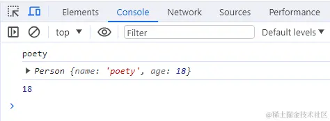

第二种实现

```js
function newOperator(ctor, ...args) {
    if(typeof ctor !== 'function'){
    	throw 'newOperator function the first param must be a function';
    }
    let obj = Object.create(ctor.prototype);
    let res = ctor.apply(obj, args);
    let isObject = typeof res === 'object' && res !== null;
    let isFunction = typoof res === 'function';
    return isObect || isFunction ? res : obj;
};
```

实现 3

```js
function myNew(fn, ...args) {
	let instance = Object.create(fn.prototype);
	let res = fn.apply(instance, args);
	return typeof res === "object" ? res : instance;
}
```

实现 4

```js
function my_new(fn, ...arg) {
	// 首先创建空对象
	const obj = {};
	// 将空对象的原型proto指向构造函数的原型prototype
	Object.setPrototypeOf(obj, fn.prototype);
	// 将this指向新创建的对象，并且执行构造函数
	const result = fn.apply(obj, arg);
	// 执行结果有返回值并且是一个对象，返回执行的结果，否侧返回新创建的对象
	return result instanceof Object ? result : obj;
}

// 验证mu_new函数
function Dog(name) {
	this.name = name;
	this.say = function () {
		console.log("my name is" + this.name);
	};
}

const dog = mu_new(Dog, "傻🐶");
dog.say(); //my name is傻🐶
```


首先我们需要明白 `new` 的原理。关于 `new` 的原理，主要分为以下几步：

- 创建一个空对象 。
- 由 `this` 变量引用该对象 。
- 该对象继承该函数的原型(更改原型链的指向) 。
- 把属性和方法加入到 `this` 引用的对象中。
- 新创建的对象由 `this` 引用 ，最后隐式地返回 `this`

明白了这个原理后，我们就可以尝试来实现一个 `new` 方法，参考示例如下：

```javascript
// 构造器函数
let Parent = function (name, age) {
    [this.name](http://this.name) = name;
    this.age = age;
};
Parent.prototype.sayName = function () {
	console.log([this.name](http://this.name));
};
// 自己定义的new方法
let newMethod = function (Parent, ...rest) {
    // 1.以构造器的prototype属性为原型，创建新对象；
    let child = Object.create(Parent.prototype);
    // 2.将this和调用参数传给构造器执行
    let result = Parent.apply(child, rest);
    // 3.如果构造器没有手动返回对象，则返回第一步的对象
    return typeof result === 'object' ? result : child;
};
// 创建实例，将构造函数Parent与形参作为参数传入
const child = newMethod(Parent, 'echo', 26);
child.sayName() //'echo';
// 最后检验，与使用new的效果相同
console.log(child instanceof Parent)//true
console.log(child.hasOwnProperty('name'))//true
console.log(child.hasOwnProperty('age'))//true
console.log(child.hasOwnProperty('sayName'))//false
```


## 2.call、apply、bind

**call apply bind**

- [JavaScript 基础心法——call apply bind](https://github.com/axuebin/articles/issues/7)
- [JavaScript 深入之 call 和 apply 的模拟实现](https://github.com/mqyqingfeng/Blog/issues/11)
- [JavaScript 深入之 bind 的模拟实现](https://github.com/mqyqingfeng/Blog/issues/12)

### 实现 call

**思路**：接受传入的 context 上下文，如果不传默认为 window，将被调用的方法设置为上下文的属性，使用上下文对象来调用这个方法，删除新增属性，返回结果。

```javascript
// 写在函数的原型上
Function.prototype.myCall = function (context) {
	// 如果要调用的方法不是一个函数，则报错
	if (typeof this !== "function") {
		throw new Error("Error: this is not a function");
	}
	// 判断 context 是否传入,如果没有传就设置为 window
	context = context || window;
	// 获取参数，[...arguments]把类数组转为数组
	let args = [...arguments].slice(1);
	let result = null;
	// 将被调用的方法设置为context的属性,this即为要调用的方法
	context.fn = this;
	// 执行要被调用的方法
	result = context.fn(...args);
	// 删除手动增加的属性方法
	delete context.fn;
	// 将执行结果返回
	return result;
};

//测试
function f(a, b) {
	console.log(a + b);
	console.log(this.name);
}
let obj = {
	name: "jack",
};

console.log(add.myCall(obj, 1, 2)); // 3
console.log(add.myCall(null, 1, 2)); // 3
console.log(add.myCall(undefined, 1, 2)); // 3
console.log(add.myCall(window, 1, 2)); // 3
```

实现 2

```js
Function.prototype.call = function (context) {
	let context = context || window;

	let fn = Symbol("fn");
	context.fn = this;

	let args = [];
	for (let i = 1, len = arguments.length; i < len; i++) {
		args.push("arguments[" + i + "]");
	}
	let result = eval("context.fn(" + args + ")");

	delete context.fn;
	return result;
};
```

实现 3

```js
// 实现apply只要把下一行中的...args换成args即可
Function.prototype.myCall = function (context = window, ...args) {
	let _that = this;
	let fn = Symbol("fn");
	context[fn] = _that;

	let res = context[fn](...args); // 重点代码，利用this指向，相当于
	context.caller(...args);
	delete context[fn];
	return res;
};
```

不过我认为换成 ES6 的语法会更精炼一些：

```js
Function.prototype.call = function (context, ...args) {
	let context = context || window;

	let fn = Symbol("fn");
	context.fn = this;

	let result = eval("context.fn(...args)");

	delete context.fn;
	return result;
};

Function.prototype.call = function (context, ...args) {
	context = context || window;

	const fnSymbol = Symbol("fn");
	context[fnSymbol] = this;

	context[fnSymbol](...args);
	delete context[fnSymbol];
};
```

实现 4

**实现步骤：**

- 处理边界：
  - 对象不存在，this 指向 window；
- 将「调用函数」_挂载到_「this 指向的对象」的 fn 属性上。
- 执行「this 指向的对象」上的 fn 函数，并传入参数，返回结果。

```js
Function.prototype.my_call = function (context, ...args) {
	//obj不存在指向window
	if (!context || context === null) {
		context = window;
	}
	// 创造唯一的key值  作为我们构造的context内部方法名
	let fn = Symbol();

	//this指向调用call的函数
	context[fn] = this;

	// 执行函数并返回结果 相当于把自身作为传入的context的方法进行调用了
	return context[fn](...args);
};

// 测试
var value = 2;
var obj1 = {
	value: 1,
};
function bar(name, age) {
	var myObj = {
		name: name,
		age: age,
		value: this.value,
	};
	console.log(this.value, myObj);
}
bar.my_call(null); //打印 2 {name: undefined, age: undefined, value: 2}
bar.my_call(obj1, "tom", "110"); // 打印 1 {name: "tom", age: "110", value: 1}
```

### 实现 apply

**思路**：除了传参方式是数组，其它与 call 没区别

```javascript
Function.prototype.myApply = function (context) {
	if (typeof this !== "function") {
		throw new Error("Type error");
	}
	let result = null;
	context = context || window;
	// 与上面代码相比，我们使用 Symbol 来保证属性唯一,也就是保证不会重写用户自己原来定义在 context 中的同名属性
	const fnSymbol = Symbol();
	context[fnSymbol] = this;
	// 执行要被调用的方法,处理参数和 call 有区别，判断是否传了参数数组
	if (arguments[1]) {
		// 传了参数数组
		result = context[fnSymbol](...arguments[1]);
	} else {
		// 没传参数数组
		result = context[fnSymbol]();
	}
	delete context[fnSymbol];
	return result;
};

// 测试
function f(a, b) {
	console.log(a, b);
	console.log(this.name);
}
let obj = {
	name: "张三",
};
f.myApply(obj, [1, 2]); // 1 2, 张三
```

测试结果：

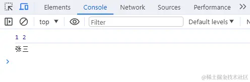

实现 2

```js
Function.prototype.apply = function (context, args) {
	let context = context || window;
	context.fn = this;
	let result = eval("context.fn(...args)");
	delete context.fn;
	return result;
};

Function.prototype.apply = function (context, argsArr) {
	context = context || window;

	const fnSymbol = Symbol("fn");
	context[fnSymbol] = this;

	context[fnSymbol](...argsArr);
	delete context[fnSymbol];
};
```

实现 3

- 与 call 一致
- 区别于参数的形式

```js
Function.prototype.my_apply = function (context, args) {
	// obj不存在指向window
	if (!context || context === null) {
		context = Window;
	} // 创造唯一的key值	作为我们构造的context内部方法名
	let fn = Symbol(); // this指向调用call的函数
	context[fn] = this; // 执行函数并返回结果	相当于把自身作为传入的context的方法进行调用了
	return context[fn](...args);
};
// 测试
var value = 2;
var obj1 = { value: 1 };
function bar(name, age) {
	var myObj = { name: name, age: age, value: this.value };
	console.log(this.value, myObj);
}
bar.my_apply(obj1, ["tom", "110"]); // 打印 1   {name: "tom", age:	"110", value: 1}
```

### 实现 bind

**实现 bind 之前，我们首先要知道它做了哪些事情。**

- 1）对于普通函数，绑定 this 指向
- 2）对于构造函数，要保证原函数的原型对象上的属性不能丢失

**思路**：bind 返回的是一个函数，需要判断函数作为构造函数的情况，当作为构造函数时，this 指向实例，不会被任何方式改变 this，所以要忽略传入的 context 上下文。

bind 的作用与 call 和 apply 相同，区别是 call 和 apply 是立即调用函数，而
bind 是返回了一个函数，需要调用的时候再执行。

bind 可以分开传递参数，所以需要将参数拼接。如果绑定的是构造函数，还需要继承构造函数原型上的属性和方法，保证不丢失。

```javascript
Function.prototype.myBind = function (context) {
	// 判断调用对象是否为函数
	if (typeof this !== "function") {
		throw new Error("Type error");
	}
	// 获取参数
	const args = [...arguments].slice(1);
	const fn = this; // 保存this的值，代表调用bind的函数
	//返回一个函数，此函数可以被作为构造函数调用，也可以作为普通函数调用
	const Fn = function () {
		// 根据调用方式，传入不同绑定值
		// 当作为构造函数时,this 指向实例，不会被任何方式改变 this，要忽略传入的context上下文
		return fn.apply(
			this instanceof Fn ? this : context,
			// bind可以分开传递参数(如f.bind(obj, 1)(2))，所以需要将参数拼接，这里使用apply，参数拼接成一个数组
			args.concat(...arguments) //当前的这个 arguments 是指 Fn 的参数，也可以用剩余参数的方式
		);
	};
	//对于构造函数，要保证原函数的原型对象上的属性不能丢失
	Fn.prototype = Object.create(fn.prototype);
	return Fn;
};

// 1.先测试作为构造函数调用
function Person(name, age) {
	console.log(name);
	console.log(age);
	console.log(this); //构造函数this指向实例对象
}
// 构造函数原型的方法
Person.prototype.say = function () {
	console.log("say");
};
var obj = {
	name: "cc",
	age: 18,
};
var bindFun = Person.myBind(obj, "cxx");
var a = new bindFun(10);
// cxx
// 10
// Person {}
a.say(); // say

// 2.再测试作为普通函数调用
function normalFun(name, age) {
	console.log(name);
	console.log(age);
	console.log(this); // 普通函数this指向绑定bind的第一个参数 也就是例子中的obj
}
var obj = {
	name: "aa",
	age: 18,
};
var bindNormalFun = normalFun.myBind(obj, "cc");
bindNormalFun(12);
// cc
// 12
// { name: 'aa', age: 18 }
```

测试结果：

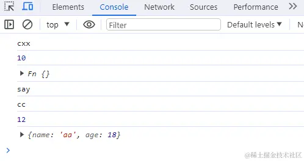

实现 2

```js
Function.prototype.bind = function (context, ...args) {
    // 异常处理
    if (typeof this !== "function") {
        throw new Error("Function.prototype.bind - what is trying to be bound is
        not callable");
    }
    // 保存this的值，它代表调用 bind 的函数
    var self = this;
    var fNOP = function () {};
    var fbound = function () {
        self.apply(this instanceof self ?
        this :
        context, args.concat(Array.prototype.slice.call(arguments)));
    }
    fNOP.prototype = this.prototype;
    fbound.prototype = new fNOP();
    return fbound;
}
```

实现 3

```js
Function.prototype.bind = function (context, ...args) {
	let self = this; // 谨记this表示调用bind的函数
	let fBound = function () {
		// this instanceof fBound为true表示构造函数的情况。如new func.bind(obj)
		return self.apply(
			this instanceof fBound ? this : context || window,
			args.concat(Array.prototype.slice.call(arguments))
		);
	};
	// 保证原函数的原型对象上的属性不丢失
	fBound.prototype = Object.create(this.prototype);
	return fBound;
};

Function.prototype.bind = function (context, ...args) {
	context = context || window;
	const fnSymbol = Symbol("fn");
	context[fnSymbol] = this;

	return function (..._args) {
		args = args.concat(_args);
		context[fnSymbol](...args);
		delete context[fnSymbol];
	};
};
```

也可以用 Object.create 来处理原型：

```js
Function.prototype.bind = function (context, ...args) {
    if (typeof this !== "function") {
        throw new Error("Function.prototype.bind - what is trying to be bound is
        not callable");
    }
    var self = this;
    var fbound = function () {
        self.apply(this instanceof self ?
        this :
        context, args.concat(Array.prototype.slice.call(arguments)));
    }
    fbound.prototype = Object.create(self.prototype);
    return fbound;
}
```

实现 4

```js
Function.prototype.my_bind = function (context, ...args) {
	if (!context || context === null) {
		context = window;
	} // 创造唯一的key值	作为我们构造的context内部方法名
	let fn = Symbol();
	context[fn] = this;
	let _this = this; // bind情况要复杂一点
	const result = function (...innerArgs) {
		//	第一种情况 :若是将 bind 绑定之后的函数当作构造函数，通过 new	操作符使用，则不绑定传入的 this，而是将 this 指向实例化出来的对象
		// 	此时由于new操作符作用 this指向result实例对象 而result又继承自传入的_this	根据原型链知识可得出以下结论
		// this.__proto__ === result.prototype
		//this	instanceof result =>true
		// this.__proto__.__proto__ ===
		result.prototype.__proto__ === _this.prototype; // this instanceof _this =>true
		if (this instanceof _this === true) {
			// 此时this指向指向result的实例	这时候不需要改变this指向
			this[fn] = _this;
			this[fn](...[...args, ...innerArgs]);
			//这里使用es6的方法让bind支持参数合并
			delete this[fn];
		} else {
			//	如果只是作为普通函数调用 那就很简单了 直接改变this指向为传入的context

			context[fn](...[...args, ...innerArgs]);
			delete context[fn];
		}
	};
	//	如果绑定的是构造函数 那么需要继承构造函数原型属性和方法

	// 实现继承的方式:	使用Object.create
	result.prototype = Object.create(this.prototype);
	return;
	result;
};
function Person(name, age) {
	console.log(name);
	//'我是参数传进来的name'
	console.log(age);
	//'我是参数传进来的age'

	console.log(this);
	//构造函数this指向实例对象
}
// 构造函数原型的方法
Person.prototype.say = function () {
	console.log(123);
}; // 普通函数
function normalFun(name, age) {
	console.log(name);
	//'我是参数传进来的name'
	console.log(age);
	//'我是参数传进来的age'
	console.log(this);
	//普通函数this指向绑定bind的第一个参数 也就是例子中的obj
	console.log(this.objName);
	//'我是obj传进来的name'
	console.log(this.objAge);
	//'我是obj传进来的age'
}
let obj = { objName: "我是obj传进来的name", objAge: "我是obj传进来的age" };
// 先测试作为构造函数调用
// let bindFun =	Person.my_bind(obj, '我是参数传进来的name');
// let a = newbindFun('我是参数传进来的age');
// a.say();
// 123
// 再测试作为普通函数调用a;
let bindFun = normalFun.my_bind(obj, "我是参数传进来的name");
bindFun("我是参数传进来的age");
```

## 3.手写实现 instanceof

### instanceof 的优缺点是什么

**优缺点：**

- **「优点」**：能够区分 Array、Object 和 Function，适合用于判断自定义的类实例对象
- **「缺点」**：Number，Boolean，String 基本数据类型不能判断

**实现步骤：**

- 传入参数为左侧的实例 L，和右侧的构造函数 R
- 处理边界，如果要检测对象为基本类型则返回 false
- 分别取传入参数的原型
- 判断左侧的原型是否取到了 null，如果是 null 返回 false；如果两侧原型相等，返回 true，否则继续取左侧原型的原型。

### 核心实现要点：原型链的向上查找。

instanceof 用于检测构造函数的 prototype 属性是否出现在某个实例对象的原型链上。

instanceof 判断的是右操作数的 prototype 属性是否出现在左操作数的原型链上。核心是要拿到左操作数的原型进行检查，要顺着原型链检查。取得原型是利用了 Object.getPrototypeOf(obj)。

```js
function myInstanceof(instance, constructor) {
	// 如果不是对象，或者是null，直接返回false
	if (typeof instance !== "object" || instance === null) {
		return false;
	}
	// 如果不是一个函数，就报错
	if (typeof constructor !== "function") {
		throw "myInstanceof function the first param must be a function";
	}

	// 获取对象的原型
	let proto = Object.getPrototypeOf(instance);
	// 获取构造函数的 prototype 对象
	let prototype = constructor.prototype;
	// 判断构造函数的 prototype对象是否在对象的原型链上
	while (true) {
		// 到达原型链终点null，说明没找到
		if (!proto) {
			return false;
		}
		if (proto === prototype) {
			return true;
		}
		// 如果没有找到，就继续从其原型上找
		proto = Object.getPrototypeOf(proto);
	}
}

// 测试
let Fn = function () {};
let p1 = new Fn();
console.log(myInstanceof(p1, Fn)); // true
console.log(myInstanceof([], Fn)); // false
console.log(myInstanceof([], Array)); // true
console.log(myInstanceof(function () {}, Function)); // true
```

测试结果：

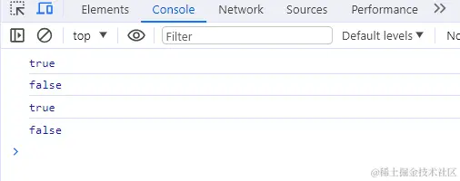

简单版

```js
function instanceof(left, right) {
    // 获得类型的原型
    let prototype = right.prototype
    // 获得对象的原型
    left = left.__proto__
    // 判断对象的类型是否等于类型的原型
    while (true) {
        if (left === null)
        return false
        if (prototype === left)
        return true
        left = left.__proto__
    }
}
```

实现 3

```js
function myInstanceof(left, right) {
	let proto = Object.getPrototypeOf(left);
	while (true) {
		if (proto == null) return false;
		if (proto == right.prototype) return true;
		proto = Object.getPrototypeof(proto);
	}
}
```

实现 4

```js
// 传入参数左侧为实例L, 右侧为构造函数R
function mu_instanceof(L, R) {
	// 处理边界：检测实例类型是否为原始类型
	const baseTypes = ["string", "number", "boolean", "symbol", "undefined"];
	if (baseTypes.includes(typeof L) || L === null) return false;
	// 分别取传入参数的原型
	let Lp = L.__proto__;
	let Rp = R.prototype; // 函数才拥有prototype属性
	// 判断原型
	while (true) {
		if (Lp === null) return false;
		if (Lp === Rp) return true;
		Lp = Lp.__proto__;
	}
}
// 验证
const isArray = mu_instanceof([], Array);
console.log(isArray); // true const
isDate = mu_instanceof("2023-01-09", Date);
console.log(isDate); // false
```

## `intanceof` 操作符的实现原理及实现

参考答案：

`instanceof` 主要作用就是判断一个实例是否属于某种类型

例如：

```js
let Dog = function () {};
let tidy = new Dog();
tidy instanceof Dog; //true
```

`intanceof` 操作符实现原理

```js
function wonderFulInstanceOf(instance, constructorFn) {
	let constructorFnProto = constructorFn.prototype; // 取右表达式的 prototype 值，函数构造器指向的function
	instanceProto = instance.__proto__; // 取左表达式的__proto__值，实例的__proto__
	while (true) {
		if (instanceProto === null) {
			return false;
		}
		if (instanceProto === constructorFnProto) {
			return true;
		}
		instanceProto = instanceProto.__proto__;
	}
}
```

其实 `instanceof` 主要的实现原理就是只要 `constructorFn` 的 `prototype` 在*instance*的原型链上即可。

因此，`instanceof` 在查找的过程中会遍历左边变量的原型链，直到找到右边变量的 `prototype`，如果查找失败，则会返回 `false`，告诉我们左边变量并非是右边变量的实例。

## 4.实现数组方法

### 数组 sort 排序

#### sort 排序

```javascript
// 对数字进行排序，简写
let arr = [3, 2, 4, 1, 5];
arr.sort((a, b) => a - b);
console.log(arr); // [1, 2, 3, 4, 5]

// 对字母进行排序
let arr = ["b", "c", "a", "e", "d"];
arr.sort((a, b) => {
	if (a > b) return 1;
	else if (a < b) return -1;
	else return 0;
});
console.log(arr); // ['a', 'b', 'c', 'd', 'e']
```

测试结果：

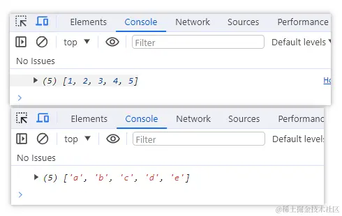

### 冒泡排序

```javascript
function bubbleSort(arr) {
	let len = arr.length;
	for (let i = 0; i < len - 1; i++) {
		// 从第一个元素开始，比较相邻的两个元素，前者大就交换位置
		for (let j = 0; j < len - 1 - i; j++) {
			if (arr[j] > arr[j + 1]) {
				let num = arr[j];
				arr[j] = arr[j + 1];
				arr[j + 1] = num;
			}
		}
		// 每次遍历结束，都能找到一个最大值，放在数组最后
	}
	return arr;
}

// 测试
console.log(bubbleSort([2, 3, 1, 5, 4])); // [ 1, 2, 3, 4, 5 ]
```

测试结果：

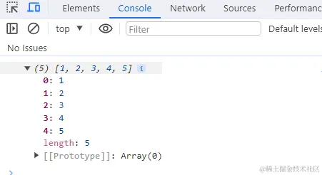

### 手写 reduce

#### reduce 的使用

```javascript
// 普通数组求和
let arr = [1, 2, 3, 4, 5, 6, 7, 8, 9, 10];
arr.reduce((prev, cur) => {
	return prev + cur;
}, 0); // 55
// 多维数组求和
let arr = [1, 2, 3, [[4, 5], 6], 7, 8, 9];
arr.flat(Infinity).reduce((prev, cur) => {
	return prev + cur;
}, 0); // 45
// 对象数组求和
let arr = [{ a: 9, b: 3, c: 4 }, { a: 1, b: 3 }, { a: 3 }];
arr.reduce((prev, cur) => {
	return prev + cur["a"]; // 13 求对象数组中所有属性为a的和
}, 0);
```

#### reduce 的实现

核心要点：

- 1）初始值不传怎么处理
- 2）回调函数的参数有哪些，返回值如何处理。

```javascript
Array.prototype.myReduce = function (cb, initialValue) {
	const arr = this; // this就是调用reduce方法的数组
	let total = initialValue ? initialValue : arr[0]; // 不传默认取数组第一项
	let startIndex = initialValue ? 0 : 1; // 有初始值的话从0遍历，否则从1遍历
	for (let i = startIndex; i < arr.length; i++) {
		total = cb(total, arr[i], i, arr); // 参数为初始值、当前值、索引、当前数组
	}
	return total;
};

// 测试
let arr = [1, 2, 3, 4, 5, 6, 7, 8, 9, 10];
let res = arr.myReduce((total, cur) => {
	return total + cur;
}, 0);
console.log(res); // 55
```

实现 2

```js
Array.prototype.myReduce = function (fn, initialValue) {
	var arr = Array.prototype.slice.call(this);
	var res, startIndex;
	res = initialValue ? initialValue : arr[0];
	startIndex = initialValue ? 0 : 1;
	for (var i = startIndex; i < arr.length; i++) {
		res = fn.call(null, res, arr[i], i, this);
	}
	return res;
};

// 实现3
Array.prototype.myReduce = function (cb, ...args) {
	const isInit = args.length > 0;
	const init = args[0];
	let res = isInit ? init : this[0];
	let index = isInit ? 0 : 1;
	let len = this.length;
	for (let i = index; i < len; i++) {
		res = cb(res, this[i]);
	}
	return res;
};
```

### 实现数组 forEach 方法

```js
// 实现forEach方法
Array.prototype.myForEach = function (cb) {
	var _arr = this;
	var _len = _arr.length;
	var _arg2 = arguments[1] || window; // 剩余第二个参数，如果没有第二个参数，就指向window

	for (var i = 0; i < _len; i++) {
		// 回调函数apply调用，this指向更改成剩余参数_arg2或者window
		cb.apply(_arg2, [_arr[i], i, _arr]); // apply的第二个参数数组里面的，就是回调函数的参数
	}
};
```

### 实现 map 方法

#### 用 ES5 实现数组的 map 方法

核心要点：

1）回调函数的参数有哪些，返回值如何处理。
2）不修改原来的数组。

```js
Array.prototype.MyMap = function (fn, context) {
	var arr = Array.prototype.slice.call(this); //由于是ES5所以就不用...展开符了
	var mappedArr = [];
	for (var i = 0; i < arr.length; i++) {
		mappedArr.push(fn.call(context, arr[i], i, this));
	}
	return mappedArr;
};
```

##### 第二种

```js
// 实现map方法
Array.prototype.myMap = function (cb) {
	var _arr = this;
	var _len = _arr.length;
	var _arg2 = arguments[1] || window; // 剩余第二个参数，如果没有第二个参数，就指向window
	var _newArr = [];
	var _item;
	var _res;

	for (var i = 0; i < _len; i++) {
		_item = deepClone(_arr[i]); // 结合上面的深拷贝方法
		// 回调函数apply调用，this指向更改成剩余参数_arg2或者window
		// apply的第二个参数数组里面的，就是回调函数的参数
		_res = cb.apply(_arg2, [_item, i, _arr]);

		_res && _newArr.push(_res); // 是否有返回值才执行push
	}
	return _newArr;
};
```

### 实现 filter 方法

```js
// 实现filter方法
Array.prototype.myFilter = function (cb) {
	var _arr = this;
	var _len = _arr.length;
	var _arg2 = arguments[1] || window; // 剩余第二个参数，如果没有第二个参数，就指向window
	var _newArr = [];
	var _item;

	for (var i = 0; i < _len; i++) {
		_item = deepClone(_arr[i]); // 深拷贝
		// 回调函数apply调用，this指向更改成剩余参数_arg2或者window
		// apply的第二个参数数组里面的，就是回调函数的参数
		cb.apply(_arg2, [_item, i, _arr]) ? _newArr.push(_item) : "";
	}
	return _newArr;
};
```

### 实现 evey 方法

```js
// 实现every方法
Array.prototype.myEvery = function (cb) {
	var _arr = this;
	var _len = _arr.length;
	var _arg2 = arguments[1] || window; // 剩余第二个参数，如果没有第二个参数，就指向window
	var _res = true;

	for (var i = 0; i < _len; i++) {
		if (!cb.apply(_arg2, [_arr[i], i, _arr])) {
			_res = false;
			break;
		}
	}
	return _res;
};
```

### 实现 some 方法

```js
// 实现some方法
Array.prototype.mySome = function (cb) {
	var _arr = this;
	var _len = _arr.length;
	var _arg2 = arguments[1] || window; // 剩余第二个参数，如果没有第二个参数，就指向window
	var _res = false;

	for (var i = 0; i < _len; i++) {
		if (cb.apply(_arg2, [_arr[i], i, _arr])) {
			_res = true;
			break;
		}
	}
	return _res;
};
```

### 实现 reduce 与 reduceRight 方法

```js
// 实现reduce方法
Array.prototype.myReduce = function (cb, initialValue) {
	var _arr = this;
	var _len = _arr.length;
	// 如果有第三个参数就指向它，没有就指向window
	var _arg3 = arguments[2] || window;
	var _item;

	for (var i = 0; i < _len; i++) {
		_item = deepClone(_arr[i]); // 深克隆
		// 指向_arg3
		initialValue = cb.apply(_arg3, [initialValue, _item, i, _arr]);
	}
	return initialValue;
};

// 实现reduceRight方法
Array.prototype.myReduceRight = function (cb, initialValue) {
	var _arr = this;
	var _len = _arr.length;
	// 如果有第三个参数就指向它，没有就指向window
	var _arg3 = arguments[2] || window;
	var _item;

	for (var i = _len - 1; i >= 0; i--) {
		// 倒叙插入
		_item = deepClone(_arr[i]); // 深克隆
		// 指向_arg3的this，并传四个参数回去
		initialValue = cb.apply(_arg3, [initialValue, _item, i, _arr]);
	}
	return initialValue;
};
```

### 所有的重写实现数组方法练习

index.html：

```html
<!DOCTYPE html>
<html lang="en">
	<head>
		<meta charset="UTF-8" />
		<meta http-equiv="X-UA-Compatible" content="IE=edge" />
		<meta name="viewport" content="width=device-width, initial-scale=1.0" />
		<title>js的底层方法实现</title>
	</head>
	<body></body>
	<script src="./utils.js"></script>
	<script src="./index.js"></script>
</html>
```

utils.js：重写工具方法

```js
// ES6实现深拷贝
function deepClone(origin, hashMap = new WeakMap()) {
	if (origin == undefined || typeof origin !== "object") {
		return origin;
	}
	// 如果是时间构造函数
	if (origin instanceof Date) {
		return new Date(origin);
	}
	// 如果是正则构造函数
	if (origin instanceof RegExp) {
		return new RegExp(origin);
	}

	// 判断是否弱引用，两个对象-相互把对方作为键名赋值给对方
	const hashKey = hashMap.get(origin);
	if (hashKey) {
		return hashKey;
	}
	// 执行继承来的构造器，实例化构造器得到新的对象，就不用判断
	const target = new origin.constructor();
	// 设置弱引用，引用后会删掉节点，节省内存
	hashMap.set(origin, target);
	for (let k in origin) {
		if (origin.hasOwnProperty(k)) {
			// 对象自身属性中是否具有指定的k属性
			target[k] = deepClone(origin[k], hashMap); // 递归再赋值
		}
	}

	return target;
}

// 实现forEach方法
Array.prototype.myForEach = function (cb) {
	var _arr = this;
	var _len = _arr.length;
	var _arg2 = arguments[1] || window; // 剩余第二个参数，如果没有第二个参数，就指向window

	for (var i = 0; i < _len; i++) {
		// 回调函数apply调用，this指向更改成剩余参数_arg2或者window
		cb.apply(_arg2, [_arr[i], i, _arr]); // apply的第二个参数数组里面的，就是回调函数的参数
	}
};

// 实现map方法
Array.prototype.myMap = function (cb) {
	var _arr = this;
	var _len = _arr.length;
	var _arg2 = arguments[1] || window; // 剩余第二个参数，如果没有第二个参数，就指向window
	var _newArr = [];
	var _item;
	var _res;

	for (var i = 0; i < _len; i++) {
		_item = deepClone(_arr[i]); // 结合上面的深拷贝方法
		// 回调函数apply调用，this指向更改成剩余参数_arg2或者window
		// apply的第二个参数数组里面的，就是回调函数的参数
		_res = cb.apply(_arg2, [_item, i, _arr]);

		_res && _newArr.push(_res); // 是否有返回值才执行push
	}
	return _newArr;
};

// 实现filter方法
Array.prototype.myFilter = function (cb) {
	var _arr = this;
	var _len = _arr.length;
	var _arg2 = arguments[1] || window; // 剩余第二个参数，如果没有第二个参数，就指向window
	var _newArr = [];
	var _item;

	for (var i = 0; i < _len; i++) {
		_item = deepClone(_arr[i]); // 深拷贝
		// 回调函数apply调用，this指向更改成剩余参数_arg2或者window
		// apply的第二个参数数组里面的，就是回调函数的参数
		cb.apply(_arg2, [_item, i, _arr]) ? _newArr.push(_item) : "";
	}
	return _newArr;
};

// 实现every方法
Array.prototype.myEvery = function (cb) {
	var _arr = this;
	var _len = _arr.length;
	var _arg2 = arguments[1] || window; // 剩余第二个参数，如果没有第二个参数，就指向window
	var _res = true;

	for (var i = 0; i < _len; i++) {
		if (!cb.apply(_arg2, [_arr[i], i, _arr])) {
			_res = false;
			break;
		}
	}
	return _res;
};

// 实现some方法
Array.prototype.mySome = function (cb) {
	var _arr = this;
	var _len = _arr.length;
	var _arg2 = arguments[1] || window; // 剩余第二个参数，如果没有第二个参数，就指向window
	var _res = false;

	for (var i = 0; i < _len; i++) {
		if (cb.apply(_arg2, [_arr[i], i, _arr])) {
			_res = true;
			break;
		}
	}
	return _res;
};

// 实现reduce方法
Array.prototype.myReduce = function (cb, initialValue) {
	var _arr = this;
	var _len = _arr.length;
	// 如果有第三个参数就指向它，没有就指向window
	var _arg3 = arguments[2] || window;
	var _item;

	for (var i = 0; i < _len; i++) {
		_item = deepClone(_arr[i]); // 深克隆
		// 指向_arg3
		initialValue = cb.apply(_arg3, [initialValue, _item, i, _arr]);
	}
	return initialValue;
};

// 实现reduceRight方法
Array.prototype.myReduceRight = function (cb, initialValue) {
	var _arr = this;
	var _len = _arr.length;
	// 如果有第三个参数就指向它，没有就指向window
	var _arg3 = arguments[2] || window;
	var _item;

	for (var i = _len - 1; i >= 0; i--) {
		// 倒叙插入
		_item = deepClone(_arr[i]); // 深克隆
		// 指向_arg3的this，并传四个参数回去
		initialValue = cb.apply(_arg3, [initialValue, _item, i, _arr]);
	}
	return initialValue;
};
```

index.js：调用比较

```js
var obj = {
	name: "Jacky",
	age: 8,
};
var arr = [
	{
		name: "周一",
		age: 20,
	},
	{
		name: "刘二",
		age: 28,
	},
	{
		name: "张三",
		age: 25,
	},

	{
		name: "李四",
		age: 30,
	},
	{
		name: "王五",
		age: 27,
	},
	{
		name: "赵六",
		age: 36,
	},
	{
		name: "胡七",
		age: 35,
	},
];

// forEach方法输出
// arr.forEach(function (item, index , array) {
//   console.log(this.name);
//   console.log(item, index, array);
// }, obj);

// console.log('------');

// arr.myForEach(function (item, index , array) {
//   console.log(this.name);
//   console.log(item, index, array);
// }, obj);

// map方法输出
// var newArr = arr.map(function (item, index , array) {
//   console.log(this);
//   console.log(item, index, array);
//   return item;
// }, obj);
// console.log(newArr);

// console.log('----------');

// var newArr2 = arr.myMap(function (item, index , array) {
//   console.log(this);
//   console.log(item, index, array);
//   return item;
// }, obj);
// console.log(newArr2);

// filter方法输出
// var newArr = arr.filter(function (item, index , array) {
//   console.log(this);
//   return item.age > 30;
// }, obj);
// console.log(newArr);

// console.log('----------');

// var newArr2 = arr.myFilter(function (item, index , array) {
//   console.log(this);
//   return item.age > 30;
// }, obj);
// console.log(newArr2);

// every方法输出
// var res = arr.every(function (item, index , array) {
//   console.log(this);
//   return item.age < 40;
// }, obj);
// console.log(res);

// console.log('------');

// var res2 = arr.myEvery(function (item, index , array) {
//   console.log(this);
//   return item.age < 40;
// }, obj);
// console.log(res2);

// some方法输出
// var res = arr.some(function (item, index , array) {
//   console.log(this);
//   return item.age < 40;
// }, obj);
// console.log(res);

// console.log('------');

// var res2 = arr.mySome(function (item, index , array) {
//   console.log(this);
//   return item.age < 40;
// }, obj);
// console.log(res2);

// reduce方法输出
// var initialValue = [
//   {
//     name: '大哥',
//     age: 18
//   }
// ];
// var newArr = arr.reduce(function (prev, item, index, array) {
//   console.log(this);
//   item.age >= 25 && prev.push(item);
//   return prev;
// }, initialValue, obj);

// console.log(newArr);

// console.log('----------');

// var initialValue2 = [
//   {
//     name: '二哥',
//     age: 18
//   }
// ];
// var newArr2 = arr.myReduce(function (prev, item, index, array) {
//   console.log(this);
//   item.age >= 25 && prev.push(item);
//   return prev;
// }, initialValue2, obj);

// console.log(newArr2);

// reduceRight方法输出
var initialValue = [
	{
		name: "大哥",
		age: 18,
	},
];
var newArr = arr.reduceRight(function (prev, item, index, array) {
	console.log(this);
	item.age >= 25 && prev.push(item);
	return prev;
}, initialValue);

console.log(newArr);

console.log("----------");

var initialValue2 = [
	{
		name: "二哥",
		age: 18,
	},
];
var newArr2 = arr.myReduceRight(function (prev, item, index, array) {
	console.log(this);
	item.age >= 25 && prev.push(item);
	return prev;
}, initialValue2);

console.log(newArr2);
```

## 手动实现 Array.prototype.map 方法

map() 方法创建一个新数组，其结果是该数组中的每个元素都调用一个提供的函数后返回的结果。

```javascript
function map(arr, mapCallback) {
	// 首先，检查传递的参数是否正确。
	if (!Array.isArray(arr) || !arr.length || typeof mapCallback !== "function") {
		return [];
	} else {
		let result = [];
		// 每次调用此函数时，我们都会创建一个 result 数组
		// 因为我们不想改变原始数组。
		for (let i = 0, len = arr.length; i < len; i++) {
			result.push(mapCallback(arr[i], i, arr));
			// 将 mapCallback 返回的结果 push 到 result 数组中
		}
		return result;
	}
}
```

## 手动实现 Array.prototype.filter 方法

filter() 方法创建一个新数组, 其包含通过所提供函数实现的测试的所有元素。

```javascript
function filter(arr, filterCallback) {
	// 首先，检查传递的参数是否正确。
	if (
		!Array.isArray(arr) ||
		!arr.length ||
		typeof filterCallback !== "function"
	) {
		return [];
	} else {
		let result = [];
		// 每次调用此函数时，我们都会创建一个 result 数组
		// 因为我们不想改变原始数组。
		for (let i = 0, len = arr.length; i < len; i++) {
			// 检查 filterCallback 的返回值是否是真值
			if (filterCallback(arr[i], i, arr)) {
				// 如果条件为真，则将数组元素 push 到 result 中
				result.push(arr[i]);
			}
		}
		return result; // return the result array
	}
}
```

## 手动实现 Array.prototype.reduce 方法

reduce() 方法对数组中的每个元素执行一个由您提供的 reducer 函数(升序执行)，将其结果汇总为单个返回值。

```javascript
function reduce(arr, reduceCallback, initialValue) {
  // 首先，检查传递的参数是否正确。
  if (!Array.isArray(arr) || !arr.length || typeof reduceCallback !== 'function')
  {
    return [];
  } else {
    // 如果没有将initialValue传递给该函数，我们将使用第一个数组项作为initialValue
    let hasInitialValue = initialValue !== undefined;
    let value = hasInitialValue ? initialValue : arr[0];
  

    // 如果有传递 initialValue，则索引从 1 开始，否则从 0 开始
    for (let i = hasInitialValue ? 0 : 1, len = arr.length; i < len; i++) {
      value = reduceCallback(value, arr[i], i, arr);
    }
    return value;
  }
}
```

## 手写 `reduce flat`

参考答案：

`reduce` 实现：

```javascript
Array.prototype.my_reduce = function (callback, initialValue) {
	if (
		!Array.isArray(this) ||
		!this.length ||
		typeof callback !== "function"
	) {
		return [];
	} else {
		// 判断是否有初始值
		let hasInitialValue = initialValue !== undefined;
		let value = hasInitialValue ? initialValue : tihs[0];
		for (let index = hasInitialValue ? 0 : 1; index < this.length; index++) {
			const element = this[index];
			value = callback(value, element, index, this);
		}
		return value;
	}
};

let arr = [1, 2, 3, 4, 5];
let res = arr.my_reduce((pre, cur, i, arr) => {
	console.log(pre, cur, i, arr);
	return pre + cur;
}, 10);
console.log(res); //25
```

`flat` 实现：

```js
let arr = [
	1,
	[2, 3, [4, 5, [12, 3, "zs"], 7, [8, 9, [10, 11, [1, 2, [3, 4]]]]]],
];

//万能的类型检测方法
const checkType = (arr) => {
	return Object.prototype.toString.call(arr).slice(8, -1);
};
//自定义flat方法，注意：不可以使用箭头函数，使用后内部的this会指向window
Array.prototype.myFlat = function (num) {
	//判断第一层数组的类型
	let type = checkType(this);
	//创建一个新数组，用于保存拆分后的数组
	let result = [];
	//若当前对象非数组则返回undefined
	if (!Object.is(type, "Array")) {
		return;
	}
	//遍历所有子元素并判断类型，若为数组则继续递归，若不为数组则直接加入新数组
	this.forEach((item) => {
		let cellType = checkType(item);
		if (Object.is(cellType, "Array")) {
			//形参num，表示当前需要拆分多少层数组，传入Infinity则将多维直接降为一维
			num--;
			if (num < 0) {
				let newArr = result.push(item);
				return newArr;
			}
			//使用三点运算符解构，递归函数返回的数组，并加入新数组
			result.push(...item.myFlat(num));
		} else {
			result.push(item);
		}
	});
	return result;
};
console.time();

console.log(arr.flat(Infinity)); //[1, 2, 3, 4, 5, 12, 3, "zs", 7, 8, 9, 10, 11, 1, 2, 3, 4];

console.log(arr.myFlat(Infinity)); //[1, 2, 3, 4, 5, 12, 3, "zs", 7, 8, 9, 10, 11, 1, 2, 3, 4];
// 自定义方法和自带的flat返回结果一致!!!!
console.timeEnd();
```


## 实现数组 map 方法 ?

依照 ecma262 草案，实现的 map 的规范如下：

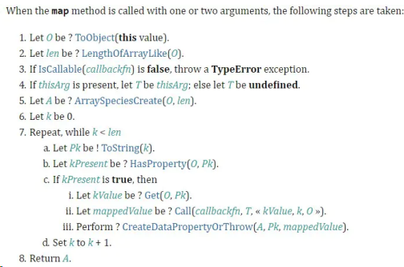

下面根据草案的规定一步步来模拟实现 map 函数：

```js
Array.prototype.map = function (callbackFn, thisArg) {
	// 处理数组类型异常
	if (this === null || this === undefined) {
		throw new TypeError("Cannot read property 'map' of null or undefined");
	}
	// 处理回调类型异常
	if (Object.prototype.toString.call(callbackfn) != "[object Function]") {
		throw new TypeError(callbackfn + " is not a function");
	}
	// 草案中提到要先转换为对象
	let O = Object(this);
	let T = thisArg;
	let len = O.length >>> 0;
	let A = new Array(len);
	for (let k = 0; k < len; k++) {
		// 还记得原型链那一节提到的 in 吗？in 表示在原型链查找
		// 如果用 hasOwnProperty 是有问题的，它只能找私有属性
		if (k in O) {
			let kValue = O[k];
			// 依次传入this, 当前项，当前索引，整个数组
			let mappedValue = callbackfn.call(T, KValue, k, O);
			A[k] = mappedValue;
		}
	}
	return A;
};
```

这里解释一下, length >>> 0, 字面意思是指"右移 0 位"，但实际上是把前面的空位用 0 填充，这里的作用是保证 len 为数字且为整数。

举几个特例：

```js
null >>> 0 //0
undefined >>> 0 //0
void(0) >>> 0 //0
function a (){}; a >>> 0 //0
[] >>> 0 //0
var a = {}; a >>> 0 //0
123123 >>> 0 //123123
45.2 >>> 0 //45
0 >>> 0 //0
-0 >>> 0 //0
-1 >>> 0 //4294967295
-1212 >>> 0 //4294966084
```

总体实现起来并没那么难，需要注意的就是使用 in 来进行原型链查找。同时，如果没有找到就不处理，能有效处理稀疏数组的情况。

最后给大家奉上 V8 源码，参照源码检查一下，其实还是实现得很完整了。

```js
function ArrayMap(f, receiver) {
	CHECK_OBJECT_COERCIBLE(this, "Array.prototype.map");
	// Pull out the length so that modifications to the length in the
	// loop will not affect the looping and side effects are visible.
	var array = TO_OBJECT(this);
	var length = TO_LENGTH(array.length);
	if (!IS_CALLABLE(f)) throw %make_type_error(kCalledNonCallable, f);
	var result = ArraySpeciesCreate(array, length);
	for (var i = 0; i < length; i++) {
		if (i in array) {
			var element = array[i];
			%CreateDataProperty(result, i, %_Call(f, receiver, element, i, array));
		}
	}
	return result;
}
```

## 实现数组 reduce 方法 ?

依照 ecma262 草案，实现的 reduce 的规范如下：

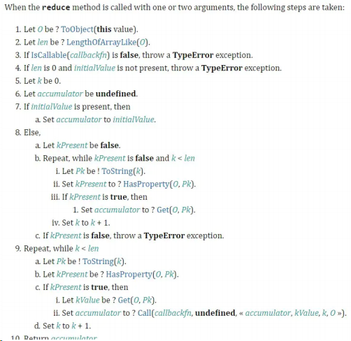

其中有几个核心要点：

1）初始值不传怎么处理
2）回调函数的参数有哪些，返回值如何处理。

```js
Array.prototype.reduce = function (callbackfn, initialValue) {
	// 异常处理，和 map 一样
	// 处理数组类型异常
	if (this === null || this === undefined) {
		throw new TypeError("Cannot read property 'reduce' of null or undefined");
	}
	// 处理回调类型异常
	if (Object.prototype.toString.call(callbackfn) != "[object Function]") {
		throw new TypeError(callbackfn + " is not a function");
	}
	let O = Object(this);
	let len = O.length >>> 0;
	let k = 0;
	let accumulator = initialValue;
	if (accumulator === undefined) {
		for (; k < len; k++) {
			// 查找原型链
			if (k in O) {
				accumulator = O[k];
				k++;
				break;
			}
		}
	}
	// 表示数组全为空
	if (k === len && accumulator === undefined)
		throw new Error("Each element of the array is empty");
	for (; k < len; k++) {
		if (k in O) {
			// 注意，核心！
			accumulator = callbackfn.call(undefined, accumulator, O[k], k, O);
		}
	}
	return accumulator;
};
```

其实是从最后一项开始遍历，通过原型链查找跳过空项。

最后给大家奉上 V8 源码，以供大家检查：

```js
function ArrayReduce(callback, current) {
	CHECK_OBJECT_COERCIBLE(this, "Array.prototype.reduce");
	// Pull out the length so that modifications to the length in the
	// loop will not affect the looping and side effects are visible.
	var array = TO_OBJECT(this);
	var length = TO_LENGTH(array.length);
	return InnerArrayReduce(callback, current, array, length, arguments.length);
}
function InnerArrayReduce(callback, current, array, length, argumentsLength) {
	if (!IS_CALLABLE(callback)) {
		throw %make_type_error(kCalledNonCallable, callback);
	}
	var i = 0;
	find_initial: if (argumentsLength < 2) {
		for (; i < length; i++) {
			if (i in array) {
				current = array[i++];
				break find_initial;
			}
		}
		throw %make_type_error(kReduceNoInitial);
	}
	for (; i < length; i++) {
		if (i in array) {
			var element = array[i];
			current = callback(current, element, i, array);
		}
	}
	return current;
}
```

## 实现数组 push、pop 方法 ?

参照 ecma262 草案的规定，关于 push 和 pop 的规范如下图所示：

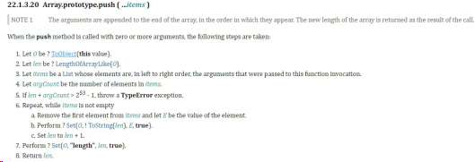

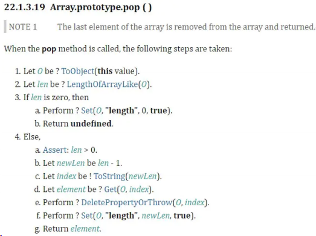

实现 push 方法：

```js
Array.prototype.push = function (...items) {
	let O = Object(this);
	let len = this.length >>> 0;
	let argCount = items.length >>> 0;
	// 2 ** 53 - 1 为JS能表示的最大正整数
	if (len + argCount > 2 ** 53 - 1) {
		throw new TypeError(
			"The number of array is over the max value restricted!"
		);
	}
	for (let i = 0; i < argCount; i++) {
		O[len + i] = items[i];
	}
	let newLength = len + argCount;
	O.length = newLength;
	return newLength;
};
```

实现 pop 方法:

```js
Array.prototype.pop = function () {
	let O = Object(this);
	let len = this.length >>> 0;
	if (len === 0) {
		O.length = 0;
		return undefined;
	}
	len--;
	let value = O[len];
	delete O[len];
	O.length = len;
	return value;
};
```

## 实现数组 filter 方法 ?

代码如下：

```js
Array.prototype.filter = function (callbackfn, thisArg) {
	// 处理数组类型异常
	if (this === null || this === undefined) {
		throw new TypeError("Cannot read property 'filter' of null or undefined");
	}
	// 处理回调类型异常
	if (Object.prototype.toString.call(callbackfn) != "[object Function]") {
		throw new TypeError(callbackfn + " is not a function");
	}
	let O = Object(this);
	let len = O.length >>> 0;
	let resLen = 0;
	let res = [];
	for (let i = 0; i < len; i++) {
		if (i in O) {
			let element = O[i];
			if (callbackfn.call(thisArg, O[i], i, O)) {
				res[resLen++] = element;
			}
		}
	}
	return res;
};
```

## 实现数组 splice 方法 ?

splice 可以说是最受欢迎的数组方法之一，api 灵活，使用方便。现在来梳理一下用法：

- splice(position, count) 表示从 position 索引的位置开始，删除 count 个元素
- splice(position, 0, ele1, ele2, ...) 表示从 position 索引的元素后面插入一系列的元素
- splice(postion, count, ele1, ele2, ...) 表示从 position 索引的位置开始，删除 count 个元素，然后再插入一系列的元素
- 返回值为 被删除元素 组成的 数组 。

**接下来我们实现数组 splice 方法。**

首先我们梳理一下实现的思路：

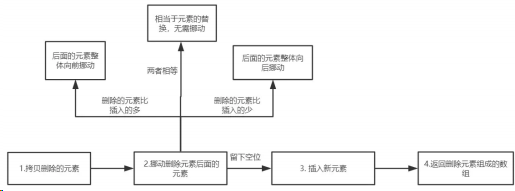

初步实现：

```js
Array.prototype.splice = function (startIndex, deleteCount, ...addElements) {
	let argumentsLen = arguments.length;
	let array = Object(this);
	let len = array.length;
	let deleteArr = new Array(deleteCount);
	// 拷贝删除的元素
	sliceDeleteElements(array, startIndex, deleteCount, deleteArr);
	// 移动删除元素后面的元素
	movePostElements(array, startIndex, len, deleteCount, addElements);
	// 插入新元素
	for (let i = 0; i < addElements.length; i++) {
		array[startIndex + i] = addElements[i];
	}
	array.length = len - deleteCount + addElements.length;
	return deleteArr;
};
```

先拷贝删除的元素，如下所示：

```js
const sliceDeleteElements = (array, startIndex, deleteCount, deleteArr) => {
	for (let i = 0; i < deleteCount; i++) {
		let index = startIndex + i;
		if (index in array) {
			let current = array[index];
			deleteArr[i] = current;
		}
	}
};
```

然后对删除元素后面的元素进行挪动, 挪动分为三种情况：

1）添加的元素和删除的元素个数相等
2）添加的元素个数小于删除的元素
3）添加的元素个数大于删除的元素

当两者相等时，

```js
const movePostElements = (array, startIndex, len, deleteCount, addElements) => {
	if (deleteCount === addElements.length) return;
};
```

当添加的元素个数小于删除的元素时, 如图所示：

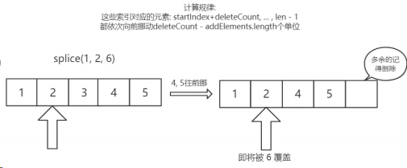

```js
const movePostElements = (array, startIndex, len, deleteCount, addElements) => {
	//...
	// 如果添加的元素和删除的元素个数不相等，则移动后面的元素
	if (deleteCount > addElements.length) {
		// 删除的元素比新增的元素多，那么后面的元素整体向前挪动
		// 一共需要挪动 len - startIndex - deleteCount 个元素
		for (let i = startIndex + deleteCount; i < len; i++) {
			let fromIndex = i;
			// 将要挪动到的目标位置
			let toIndex = i - (deleteCount - addElements.length);
			if (fromIndex in array) {
				array[toIndex] = array[fromIndex];
			} else {
				delete array[toIndex];
			}
		}
		// 注意注意！这里我们把后面的元素向前挪，相当于数组长度减小了，需要删除冗余元素
		// 目前长度为 len + addElements - deleteCount
		for (let i = len - 1; i >= len + addElements.length - deleteCount; i--) {
			delete array[i];
		}
	}
};
```

当添加的元素个数大于删除的元素时, 如图所示：

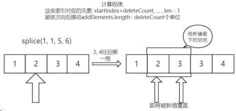

```js
const movePostElements = (array, startIndex, len, deleteCount, addElements) => {
	//...
	if (deleteCount < addElements.length) {
		// 删除的元素比新增的元素少，那么后面的元素整体向后挪动
		// 思考一下: 这里为什么要从后往前遍历？从前往后会产生什么问题？
		for (let i = len - 1; i >= startIndex + deleteCount; i--) {
			let fromIndex = i;
			// 将要挪动到的目标位置
			let toIndex = i + (addElements.length - deleteCount);
			if (fromIndex in array) {
				array[toIndex] = array[fromIndex];
			} else {
				delete array[toIndex];
			}
		}
	}
};
```

#### 优化一: 参数的边界情况

当用户传来非法的 startIndex 和 deleteCount 或者负索引的时候，需要我们做出特殊的处理。

```js
const computeStartIndex = (startIndex, len) => {
	// 处理索引负数的情况
	if (startIndex < 0) {
		return startIndex + len > 0 ? startIndex + len : 0;
	}
	return startIndex >= len ? len : startIndex;
};
const computeDeleteCount = (startIndex, len, deleteCount, argumentsLen) => {
	// 删除数目没有传，默认删除startIndex及后面所有的
	if (argumentsLen === 1) return len - startIndex;
	// 删除数目过小
	if (deleteCount < 0) return 0;
	// 删除数目过大
	if (deleteCount > len - startIndex) return len - startIndex;
	return deleteCount;
};
Array.prototype.splice = function (startIndex, deleteCount, ...addElements) {
	//,...
	let deleteArr = new Array(deleteCount);
	// 下面参数的清洗工作
	startIndex = computeStartIndex(startIndex, len);
	deleteCount = computeDeleteCount(startIndex, len, deleteCount, argumentsLen);
	// 拷贝删除的元素
	sliceDeleteElements(array, startIndex, deleteCount, deleteArr);
	//...
};
```

#### 优化二：数组为密封对象或冻结对象

##### 什么是密封对象?

密封对象是不可扩展的对象，而且已有成员的[[Configurable]]属性被设置为 false，这意味着不能添加、删除方法和属性。但是属性值是可以修改的。

##### 什么是冻结对象？

冻结对象是最严格的防篡改级别，除了包含密封对象的限制外，还不能修改属性值。
接下来，我们来把这两种情况一一排除。

```js
// 判断 sealed 对象和 frozen 对象, 即 密封对象 和 冻结对象
if (Object.isSealed(array) && deleteCount !== addElements.length) {
	throw new TypeError("the object is a sealed object!");
} else if (
	Object.isFrozen(array) &&
	(deleteCount > 0 || addElements.length > 0)
) {
	throw new TypeError("the object is a frozen object!");
}
```

好了，现在就写了一个比较完整的 splice，如下：

```js
const sliceDeleteElements = (array, startIndex, deleteCount, deleteArr) => {
	for (let i = 0; i < deleteCount; i++) {
		let index = startIndex + i;
		if (index in array) {
			let current = array[index];
			deleteArr[i] = current;
		}
	}
};
const movePostElements = (array, startIndex, len, deleteCount, addElements) => {
	// 如果添加的元素和删除的元素个数相等，相当于元素的替换，数组长度不变，被删除元素后面的元素不需要挪动;
	if (deleteCount === addElements.length) return;
	// 如果添加的元素和删除的元素个数不相等，则移动后面的元素
	else if (deleteCount > addElements.length) {
		// 删除的元素比新增的元素多，那么后面的元素整体向前挪动
		// 一共需要挪动 len - startIndex - deleteCount 个元素
		for (let i = startIndex + deleteCount; i < len; i++) {
			let fromIndex = i;
			// 将要挪动到的目标位置
			let toIndex = i - (deleteCount - addElements.length);
			if (fromIndex in array) {
				array[toIndex] = array[fromIndex];
			} else {
				delete array[toIndex];
			}
		}
		// 注意注意！这里我们把后面的元素向前挪，相当于数组长度减小了，需要删除冗余元素
		// 目前长度为 len + addElements - deleteCount
		for (let i = len - 1; i >= len + addElements.length - deleteCount; i--) {
			delete array[i];
		}
	} else if (deleteCount < addElements.length) {
		// 删除的元素比新增的元素少，那么后面的元素整体向后挪动
		// 思考一下: 这里为什么要从后往前遍历？从前往后会产生什么问题？
		for (let i = len - 1; i >= startIndex + deleteCount; i--) {
			let fromIndex = i;
			// 将要挪动到的目标位置
			let toIndex = i + (addElements.length - deleteCount);
			if (fromIndex in array) {
				array[toIndex] = array[fromIndex];
			} else {
				delete array[toIndex];
			}
		}
	}
};
const computeStartIndex = (startIndex, len) => {
	// 处理索引负数的情况
	if (startIndex < 0) {
		return startIndex + len > 0 ? startIndex + len : 0;
	}
	return startIndex >= len ? len : startIndex;
};
const computeDeleteCount = (startIndex, len, deleteCount, argumentsLen) => {
	// 删除数目没有传，默认删除startIndex及后面所有的
	if (argumentsLen === 1) return len - startIndex;
	// 删除数目过小
	if (deleteCount < 0) return 0;
	// 删除数目过大
	if (deleteCount > len - startIndex) return len - startIndex;
	return deleteCount;
};
Array.prototype.splice = function (startIndex, deleteCount, ...addElements) {
	let argumentsLen = arguments.length;
	let array = Object(this);
	let len = array.length >>> 0;
	let deleteArr = new Array(deleteCount);
	startIndex = computeStartIndex(startIndex, len);
	deleteCount = computeDeleteCount(startIndex, len, deleteCount, argumentsLen);
	// 判断 sealed 对象和 frozen 对象, 即 密封对象 和 冻结对象
	if (Object.isSealed(array) && deleteCount !== addElements.length) {
		throw new TypeError("the object is a sealed object!");
	} else if (
		Object.isFrozen(array) &&
		(deleteCount > 0 || addElements.length > 0)
	) {
		throw new TypeError("the object is a frozen object!");
	}
	// 拷贝删除的元素
	sliceDeleteElements(array, startIndex, deleteCount, deleteArr);
	// 移动删除元素后面的元素
	movePostElements(array, startIndex, len, deleteCount, addElements);
	// 插入新元素
	for (let i = 0; i < addElements.length; i++) {
		array[startIndex + i] = addElements[i];
	}
	array.length = len - deleteCount + addElements.length;
	return deleteArr;
};
```

## 实现数组 sort 方法？

估计大家对 JS 数组的 sort 方法已经不陌生了，之前也对它的用法做了详细的总结。那，它的内部是如何来实现的呢？如果说我们能够进入它的内部去看一看， 理解背后的设计，会使我们的思维和素养得到不错的提升。

sort 方法在 V8 内部相对与其他方法而言是一个比较高深的算法，对于很多边界情况做了反复的优化，但是这里我们不会直接拿源码来干讲。我们会来根据源码的思路，实现一个 跟引擎性能一样的排序算法，并且一步步拆解其中的奥秘。

#### V8 引擎的思路分析

首先大概梳理一下源码中排序的思路：

设要排序的元素个数是 n：

当 n <= 10 时，采用 插入排序

当 n > 10 时，采用：**三路快速排序**

- 10 < n <= 1000, 采用中位数作为哨兵元素
- n > 1000, 每隔 200~215 个元素挑出一个元素，放到一个新数组，然后对它排序，找到中间位置的数，以此作为中位数

在动手之前，我觉得我们有必要为什么这么做搞清楚。

**第一、为什么元素个数少的时候要采用插入排序？**

虽然 插入排序 理论上说是 O(n^2)的算法， 快速排序 是一个 O(nlogn)级别的算法。但是别忘了，这只是理论上的估算，在实际情况中两者的算法复杂度前面都会有一个系数的， 当 n 足够小的时候，快速排序 nlogn 的优势会越来越小，倘若插入排序 O(n^2)前面的系数足够小，那么就会超过快排。而事实上正是如此， 插入排序 经过优化以后对于小数据集的排序会有非常优越的性能，很多时候甚至会超过快排。

因此，对于很小的数据量，应用 插入排序 是一个非常不错的选择。

**第二、为什么要花这么大的力气选择哨兵元素？**

因为 快速排序 的性能瓶颈在于递归的深度，最坏的情况是每次的哨兵都是最小元素或者最大元素，那么进行 partition(一边是小于哨兵的元素，另一边是大于哨兵的元素)时，就会有一边是空的，那么这么排下去，递归的层数就达到了 n, 而每一层的复杂度是 O(n)，因此快排这时候会退化成 O(n^2)级别。

**这种情况是要尽力避免的！如果来避免？**

就是让哨兵元素进可能地处于数组的中间位置，让最大或者最小的情况尽可能少。这时候，你就能理解 V8 里面所做的种种优化了。

接下来，我们来一步步实现的这样的官方排序算法。

#### 插入排序及优化

最初的插入排序可能是这样写的：

```js
const insertSort = (arr, start = 0, end) => {
	end = end || arr.length;
	for (let i = start; i < end; i++) {
		let j;
		for (j = i; j > start && arr[j - 1] > arr[j]; j--) {
			let temp = arr[j];
			arr[j] = arr[j - 1];
			arr[j - 1] = temp;
		}
	}
	return;
};
```

看似可以正确的完成排序，但实际上交换元素会有相当大的性能消耗，我们完全可以用变量覆盖的方式来完成，如图所示：

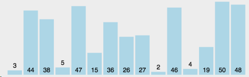

优化后代码如下：

```js
const insertSort = (arr, start = 0, end) => {
	end = end || arr.length;
	for (let i = start; i < end; i++) {
		let e = arr[i];
		let j;
		for (j = i; j > start && arr[j - 1] > e; j--) arr[j] = arr[j - 1];
		arr[j] = e;
	}
	return;
};
```

接下来正式进入到 sort 方法。

#### 寻找哨兵元素

sort 的骨架大致如下：

```js
Array.prototype.sort = (comparefn) => {
	let array = Object(this);
	let length = array.length >>> 0;
	return InnerArraySort(array, length, comparefn);
};
const InnerArraySort = (array, length, comparefn) => {
	// 比较函数未传入
	if (Object.prototype.toString.call(callbackfn) !== "[object Function]") {
		comparefn = function (x, y) {
			if (x === y) return 0;
			x = x.toString();
			y = y.toString();
			if (x == y) return 0;
			else return x < y ? -1 : 1;
		};
	}
	const insertSort = () => {
		//...
	};
	const getThirdIndex = (a, from, to) => {
		// 元素个数大于1000时寻找哨兵元素
	};
	const quickSort = (a, from, to) => {
		//哨兵位置
		let thirdIndex = 0;
		while (true) {
			if (to - from <= 10) {
				insertSort(a, from, to);
				return;
			}
			if (to - from > 1000) {
				thirdIndex = getThirdIndex(a, from, to);
			} else {
				// 小于1000 直接取中点
				thirdIndex = from + ((to - from) >> 2);
			}
		}
		// 下面开始快排
	};
};
```

先来把求取哨兵位置的代码实现一下：

```js
const getThirdIndex = (a, from, to) => {
	let tmpArr = [];
	let increment = 200 + ((to - from) & 15);
	let j = 0;
	from += 1;
	to -= 1;
	for (let i = from; i < to; i += increment) {
		tmpArr[j] = [i, a[i]];
		j++;
	}
	// 把临时数组排序，取中间的值，确保哨兵的值接近平均位置
	tmpArr.sort(function (a, b) {
		return comparefn(a[1], b[1]);
	});
	let thirdIndex = tmpArr[tmpArr.length >> 1][0];
	return thirdIndex;
};
```

#### 完成快排

接下来我们来完成快排的具体代码：

```js
const _sort = (a, b, c) => {
	let arr = [a, b, c];
	insertSort(arr, 0, 3);
	return arr;
};
const quickSort = (a, from, to) => {
	//...
	// 上面我们拿到了thirdIndex
	// 现在我们拥有三个元素，from, thirdIndex, to
	// 为了再次确保 thirdIndex 不是最值，把这三个值排序
	[a[from], a[thirdIndex], a[to - 1]] = _sort(
		a[from],
		a[thirdIndex],
		a[to - 1]
	);
	// 现在正式把 thirdIndex 作为哨兵
	let pivot = a[thirdIndex];
	// 正式进入快排
	let lowEnd = from + 1;
	let highStart = to - 1;
	// 现在正式把 thirdIndex 作为哨兵, 并且lowEnd和thirdIndex交换
	let pivot = a[thirdIndex];
	a[thirdIndex] = a[lowEnd];
	a[lowEnd] = pivot;
	// [lowEnd, i)的元素是和pivot相等的
	// [i, highStart) 的元素是需要处理的
	for (let i = lowEnd + 1; i < highStart; i++) {
		let element = a[i];
		let order = comparefn(element, pivot);
		if (order < 0) {
			a[i] = a[lowEnd];
			a[lowEnd] = element;
			lowEnd++;
		} else if (order > 0) {
			do {
				highStart--;
				if (highStart === i) break;
				order = comparefn(a[highStart], pivot);
			} while (order > 0);
			// 现在 a[highStart] <= pivot
			// a[i] > pivot
			// 两者交换
			a[i] = a[highStart];
			a[highStart] = element;
			if (order < 0) {
				// a[i] 和 a[lowEnd] 交换
				element = a[i];
				a[i] = a[lowEnd];
				a[lowEnd] = element;
				lowEnd++;
			}
		}
	}
	// 永远切分大区间
	if (lowEnd - from > to - highStart) {
		// 继续切分lowEnd ~ from 这个区间
		to = lowEnd;
		// 单独处理小区间
		quickSort(a, highStart, to);
	} else if (lowEnd - from <= to - highStart) {
		from = highStart;
		quickSort(a, from, lowEnd);
	}
};
```

### 测试结果

测试结果如下：

一万条数据：

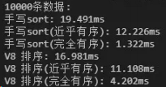

十万条数据：

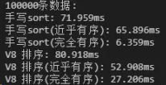

一百万条数据：

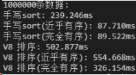

一千万条数据：

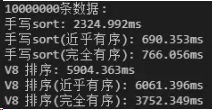

结果仅供大家参考，因为不同的 node 版本对于部分细节的实现可能不一样，我现在的版本是 v10.15。

从结果可以看到，目前版本的 node 对于有序程度较高的数据是处理的不够好的，而我们刚刚实现的排序通过反复确定哨兵的位置就能 有效的规避快排在这一场景下的劣势。

最后给大家完整版的 sort 代码：

```js
const sort = (arr, comparefn) => {
	let array = Object(arr);
	let length = array.length >>> 0;
	return InnerArraySort(array, length, comparefn);
};
const InnerArraySort = (array, length, comparefn) => {
	// 比较函数未传入
	if (Object.prototype.toString.call(comparefn) !== "[object Function]") {
		comparefn = function (x, y) {
			if (x === y) return 0;
			x = x.toString();
			y = y.toString();
			if (x == y) return 0;
			else return x < y ? -1 : 1;
		};
	}
	const insertSort = (arr, start = 0, end) => {
		end = end || arr.length;
		for (let i = start; i < end; i++) {
			let e = arr[i];
			let j;
			for (j = i; j > start && comparefn(arr[j - 1], e) > 0; j--)
				arr[j] = arr[j - 1];
			arr[j] = e;
		}
		return;
	};
	const getThirdIndex = (a, from, to) => {
		let tmpArr = [];
		// 递增量，200~215 之间，因为任何正数和15做与操作，不会超过15，当然是大于0的
		let increment = 200 + ((to - from) & 15);
		let j = 0;
		from += 1;
		to -= 1;
		for (let i = from; i < to; i += increment) {
			tmpArr[j] = [i, a[i]];
			j++;
		}
		// 把临时数组排序，取中间的值，确保哨兵的值接近平均位置
		tmpArr.sort(function (a, b) {
			return comparefn(a[1], b[1]);
		});
		let thirdIndex = tmpArr[tmpArr.length >> 1][0];
		return thirdIndex;
	};
	const _sort = (a, b, c) => {
		let arr = [];
		arr.push(a, b, c);
		insertSort(arr, 0, 3);
		return arr;
	};
	const quickSort = (a, from, to) => {
		//哨兵位置
		let thirdIndex = 0;
		while (true) {
			if (to - from <= 10) {
				insertSort(a, from, to);
				return;
			}
			if (to - from > 1000) {
				thirdIndex = getThirdIndex(a, from, to);
			} else {
				// 小于1000 直接取中点
				thirdIndex = from + ((to - from) >> 2);
			}
			let tmpArr = _sort(a[from], a[thirdIndex], a[to - 1]);
			a[from] = tmpArr[0];
			a[thirdIndex] = tmpArr[1];
			a[to - 1] = tmpArr[2];
			// 现在正式把 thirdIndex 作为哨兵
			let pivot = a[thirdIndex];
			[a[from], a[thirdIndex]] = [a[thirdIndex], a[from]];
			// 正式进入快排
			let lowEnd = from + 1;
			let highStart = to - 1;
			a[thirdIndex] = a[lowEnd];
			a[lowEnd] = pivot;
			// [lowEnd, i)的元素是和pivot相等的
			// [i, highStart) 的元素是需要处理的
			for (let i = lowEnd + 1; i < highStart; i++) {
				let element = a[i];
				let order = comparefn(element, pivot);
				if (order < 0) {
					a[i] = a[lowEnd];
					a[lowEnd] = element;
					lowEnd++;
				} else if (order > 0) {
					do {
						highStart--;
						if (highStart === i) break;
						order = comparefn(a[highStart], pivot);
					} while (order > 0);
					// 现在 a[highStart] <= pivot
					// a[i] > pivot
					// 两者交换
					a[i] = a[highStart];
					a[highStart] = element;
					if (order < 0) {
						// a[i] 和 a[lowEnd] 交换
						element = a[i];
						a[i] = a[lowEnd];
						a[lowEnd] = element;
						lowEnd++;
					}
				}
			}
			// 永远切分大区间
			if (lowEnd - from > to - highStart) {
				// 单独处理小区间
				quickSort(a, highStart, to);
				// 继续切分lowEnd ~ from 这个区间
				to = lowEnd;
			} else if (lowEnd - from <= to - highStart) {
				quickSort(a, from, lowEnd);
				from = highStart;
			}
		}
	};
	quickSort(array, 0, length);
};
```

## 5.手写实现函数的 call、apply、bind 方法

### call 方法实现

```js
// 手写自己的call方法
Function.prototype.myCall = function (thisArg, ...args) {
	// ...args：...把剩余参数args展开
	// 1.获取需要被执行的函数
	var fn = this;

	// 2.对thisArg转成对象类型（防止它传入的是非对象类型）
	thisArg = thisArg ? Object(thisArg) : window;

	// 3.执行传入的第一个参数为对象
	thisArg.fn = fn;
	var res = thisArg.fn(...args); // 传入剩余参数，执行this指向的函数
	delete thisArg; // 删除参数

	// 4.返回结果
	return res;
};

// 示例函数1
function foo() {
	console.log("foo函数被执行");
}
// 示例函数2
function sum(num1, num2) {
	return num1 + num2;
}

// 系统内置call方法
foo.call(undefined);
foo.call();

var sumResult1 = sum.call({}, 10, 20, 30);
console.log(sumResult1); //

// 自己实现的call方法
foo.myCall();
foo.myCall(123);
foo.myCall({ name: "哈哈" });
foo.myCall("呵呵");
foo.myCall(true);
foo.myCall(false);

var sumResult2 = sum.call({}, 10, 20, 30);
console.log(sumResult2); //
```

### apply 方法实现

```js
// 手写自己的apply方法
Function.prototype.myApply = function (thisArg, argArray) {
	// 1.获取需要被执行的函数
	var fn = this;

	// 2.判断参数对象是什么数值，进行转换，或者指向全局
	thisArg =
		thisArg !== null && thisArg !== undefined ? Object(thisArg) : window;

	// 3.执行传入的第一个参数为对象
	thisArg.fn = fn;

	// ***** 判断是否传了第二个数组参数 *****
	// 方法1：
	// var res;
	// if(!argArray) { // 没有传第二个参数argArray
	//     res = thisArg.fn();
	// } else{ // 有传参数
	//     res = thisArg.fn(...argArray);// 展开传入剩余数组参数，执行this指向的函数
	// }
	// 方法2：
	argArray = argArray ? argArray : []; // 如果没有第二个参数，就默认赋值空数组给第二个参数
	// argArray = argArray || []; // 逻辑或判断替代三元运算👆
	var res = thisArg.fn(...argArray); // 展开传入剩余数组参数，执行this指向的函数

	delete thisArg.fn; // 删除参数属性

	// 4.返回结果
	return res;
};

// 示例函数1
function sum(num1, num2) {
	return num1 + num2;
}
// 示例函数2
function foo(num) {
	return num;
}
// 示例函数3
function bar() {
	console.log("bar函数被执行");
}

// 系统内置apply方法
foo.apply(undefined);
foo.apply();

var sumResult1 = sum.apply("abc", [10, 20, 30]);
console.log(sumResult1); //

// 自己实现的call方法

foo.myApply();
foo.myApply(123);
foo.myApply({ name: "哈哈" });
foo.myApply("呵呵");
foo.myApply(true);
foo.myApply(false);
// 第二种情况：数组参数
var sumResult2 = sum.myApply("嘿嘿", [10, 20, 30]);
console.log(sumResult2);
// 第三种情况：没有参数
bar.myApply("abcBar");
```

### bind 方法实现

```js
// 手写自己的bind方法
Function.prototype.myBind = function (thisArg, ...argArray) {
	// 1.获取需要被执行的函数
	var fn = this;

	// 2.判断参数对象是什么数值，进行转换，或者指向全局
	thisArg =
		thisArg !== null && thisArg !== undefined ? Object(thisArg) : window;

	// 返回出去的函数
	function proxyFn() {
		thisArg.fn = fn;
		// 对两个传入的参数进行合并
		var finalArgs = [...argArrar, ...args];
		var res = thisArg.fn(...finalArgs); // 展开数组参数 传入
		delete thisArg.fn; // 删除参数属性
		return res;
	}
	// 4.返回函数
	return proxyFn;
};

// 示例函数1
function sum(num1, num2, num3, num4) {
	console.log(num1 + num2 + num3 + num4);
}
// 示例函数2
function foo() {
	console.log("foo函数被执行");
	return 20;
}

// 系统内置的bind方法使用示例

// 自己手写实现的bind方法使用示例
var bar = foo.myBind("abc");
var res = bar();
cosole.log(res);

var newSum = sum.myBind("abc", 10, 20);
var numRes = newSum(30, 40);
cosole.log(numRes);
```

## 7.实现继承

说出中⼼思想，而不是列举被博客炒了㇐遍⼜㇐遍的冷饭。

实现继承有两个方面要考虑，㇐个是原型属性和方法的继承，另㇐个是构造器的继承。

### **ES5** 继承（寄生组合式继承）

寄生组合式继承是对组合式继承（调用了 2 次父构造方法）的改进，使用父类的原型的副本来作为子类的原型，这样就只调用一次父构造函数，避免了创建不必要的属性。

```javascript
function Parent(name) {
	this.name = name;
	this.colors = ["red", "blue", "green"];
}
Parent.prototype.getName = function () {
	console.log(this.name);
};
function Child(name, age) {
	Parent.call(this, name); //借用构造函数的方式来实现属性的继承和传参
	this.age = age;
}

//这里不用Child.prototype = new Parent()原型链方式的原因是会调用2次父类的构造方法，导致子类的原型上多了不需要的父类属性
Child.prototype = Object.create(Parent.prototype); //这里就是对组合继承的改进,创建了父类原型的副本
Child.prototype.constructor = Child; //把子类的构造指向子类本身

var child1 = new Child("AK、dadada", "18");
console.log(child1.colors); //[ 'red', 'blue', 'green' ]
child1.getName(); //AK、dadada
```

测试结果：

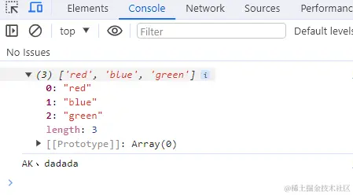

实现 2

```js
function create(proto) {
	function F() {}
	F.prototype = proto;
	return new F();
}

// Parent
function Parent(name) {
	this.name = name;
}

Parent.prototype.sayName = function () {
	console.log(this.name);
};

// Child
function Child(age, name) {
	Parent.call(this, name);
	this.age = age;
}
Child.prototype = create(Parent.prototype);
Child.prototype.constructor = Child;

Child.prototype.sayAge = function () {
	console.log(this.age);
};

// 测试
const child = new Child(18, "Jack");
child.sayName();
child.sayAge();
```

### ES6 继承

在 ES6 中，可以使用 class 类去实现继承。使用 extends 表明继承自哪个父类，并且在子类构造函数中必须调用 super。

```javascript
class Parent {
	constructor(name) {
		this.name = name;
	}
	getName() {
		console.log(this.name);
	}
}

class Child extends Parent {
	constructor(name, age) {
		//使用this之前必须先调用super(),它调用父类的构造函数并绑定父类的属性和方法
		super(name);
		//之后子类的构造函数再进一步访问和修改 this
		this.age = age;
	}
}

// 测试
let child = new Child("AK、dadada", 18);
console.log(child.name); // AK、dadada
console.log(child.age); // 18
child.getName(); // AK、dadada
```

测试结果：

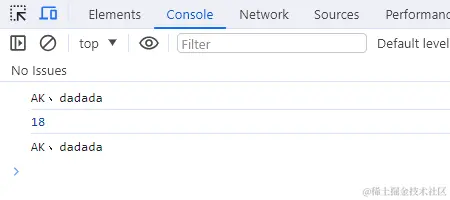

### ES5 继承和 ES6 继承的**区别**：

- `ES5`继承是先创建子类的实例对象，然后再将父类方法添加到 this（`Parent.call(this)`）上。
- `ES6`的继承不同，实质是先将父类实例对象的属性和方法，加到 this 上面（所以必须先调用 super 方法），然后再用子类的构造函数修改 this。

## 8.手写实现 Promise

### 手写实现 Promise

这个㇐般不会直接出现吧，因为如果按 [Promise/A+规范](https://promisesaplus.com/)来，代码量不少，如果做题时能提供 Promise/A+规范原文做参考，应该是能写出来的。

我可以跟面试官说我 github 已经写过㇐个实现了吗？promises-aplus-robin
<https://github.com/cumt-robin/promises-aplus-robin>

```js
可以看同级的文档：【手写Promise.md】
```

### 手写 Promise.prototype.catch

catch 是基于 Promise.prototype.then 实现的，所以就有点简单了。

```js
Promise.prototype.myCatch = function (onRejected) {
	return this.then(undefined, onRejected);
};
```

### 手写 Promise.prototype.finally

这个是有可能考的，比如微信小程序就不支持 finally。可以基于 .then 来实现，不管 fulfilled 还是 rejected 都要执行 onFinally。

但是要注意，不管当前 Promise 的状态是 fulfilled 还是 rejected，只要在 onFinally 中没有发生以下任何一条情况，finally 方法返回的新的 Promise 实例的状态就会与当前 Promise 的状态保持一致!

这也意味着即使在 onFinally 中返回一个状态为 fulfilled 的 Promise 也不能阻止新的 Promise 实例采纳当前 Promise 的状态或值！

- 返回一个状态为或将为 rejected 的 Promise
- 抛出错误

总的来说，在 finally 情况下，rejected 优先！

```js
Promise.prototype.myFinally = function(onFinally){
    return this.then(
        value => {
            return Promise.resolve(onFinally()).then(()=> value)
        },
        reason => {
        return Promise.resolve(onFinally()).then(() => { throw reason }
	);
};
```

### 手写实现 Promise.all

这个主要是考察如何收集每㇐个 Promise 的状态变化，在最后㇐个 Promise 状态变化时，对外发出信号。

- 判断 iterable 是否空
- 判断 iterable 是否全部不是 Promise
- 遍历，如果某项是 Promise，利用 .then 获取结果，如果 fulfilled，将 value 存在 values 中，并用 fulfillCount 计数；如果是 rejected，直接 reject reason。
- 如果某项不是 Promise，直接将值存起来，并计数。
- 等所有异步都 fulfilled，fulfillCount 必将是 iterable 的长度（在 onFulfilled 中判断 fulfillCount），此时可以 resolve values。

```javascript
function PromiseAll(promises) {
	return new Promise(function (resolve, reject) {
		// 传入参数为一个空的可迭代对象，直接resolve
		if (promises.length === 0) {
			resolve([]);
		} else {
			const res = [];
			let count = 0;
			for (let i = 0; i < promises.length; i++) {
				//为什么不直接promise[i].then, 因为promise[i]可能不是一个promise, 也可能是普通值
				Promise.resolve(promises[i])
					.then((data) => {
						res[i] = data;
						count++;
						if (count === promises.length) {
							resolve(res); //如果所有Promise都成功，则返回成功结果数组
						}
					})
					.catch((err) => {
						reject(err); //如果有一个Promise失败，则返回这个失败结果
					});
			}
		}
	});
}

// 测试
const promise1 = Promise.resolve(5);
const promise2 = 4;
const promise3 = new Promise((resolve, reject) => {
	setTimeout(resolve, 100, "AK、DADADA");
});

PromiseAll([promise1, promise2, promise3]).then((values) => {
	console.log(values); //[5, 4, "AK、DADADA"]
});
```

测试结果：

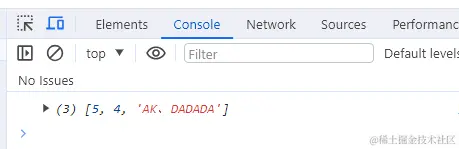

方法 2

```js
function PromiseAll(promises) {
	return new Promise((resolve, reject) => {
		const result = [];
		let count = 0;
		const len = promises.length;
		for (let i = 0; i < len; i++) {
			promises[i].then(
				(value) => {
					result[i] = value;
					count++;
					if (count === len) {
						resolve(result);
					}
				},
				(reason) => {
					reject(reason);
				}
			);
		}
	});
}

// Usage
const p1 = new Promise((resolve) => {
	setTimeout(() => {
		resolve(1);
	}, 1000);
});

const p2 = new Promise((resolve) => {
	setTimeout(() => {
		resolve(2);
	}, 500);
});

const p3 = new Promise((resolve) => {
	setTimeout(() => {
		resolve(3);
	}, 1500);
});

PromiseAll([p1, p2, p3]).then((result) => {
	console.log(result); // [1, 2, 3]
});
```

方法 3：

```js
function PromiseAll(iterable) {
	var tasks = Array.from(iterable);
	if (tasks.length === 0) {
		return Promise.resolve([]);
	}
	if (tasks.every((task) => !(task instanceof Promise))) {
		return Promise.resolve(tasks);
	}

	return new Promise((resolve, reject) => {
		var values = new Array(tasks.length).fill(null);
		var fulfillCount = 0;
		tasks.forEach((task, index, arr) => {
			if (task instanceof Promise) {
				task.then(
					(value) => {
						fulfillCount++;
						values[index] = value;
						if (fulfillCount === arr.length) {
							resolve(values);
						}
					},
					(reason) => {
						reject(reason);
					}
				);
			} else {
				fulfillCount++;

				values[index] = task;
			}
		});
	});
}
```

#### 方法 4

##### 何为 Promise.all？

`Promise.all` 是 es6 `Promise` 对象上的一个方法，它的功能就是将多个`Promise`实例包装成一个`promise`实例。以下是 MDN 对 `Promise.all` 的描述：

> Promise.all() 方法接收一个 promise 的 iterable 类型（注：Array，Map，Set 都属于 ES6 的 iterable 类型）的输入，并且只返回一个[`Promise`](https://developer.mozilla.org/zh-CN/docs/Web/JavaScript/Reference/Global_Objects/Promise)实例， 那个输入的所有 promise 的 resolve 回调的结果是一个数组。这个[`Promise`](https://developer.mozilla.org/zh-CN/docs/Web/JavaScript/Reference/Global_Objects/Promise)的 resolve 回调执行是在所有输入的 promise 的 resolve 回调都结束，或者输入的 iterable 里没有 promise 了的时候。它的 reject 回调执行是，只要任何一个输入的 promise 的 reject 回调执行或者输入不合法的 promise 就会立即抛出错误，并且 reject 的是第一个抛出的错误信息。

我戴上我的 300 度近视眼镜，仔细地提取出这段描述中的**关键字**：

1. `Promise.all` 的返回值是一个新的 `Promise` 实例。
2. `Promise.all` 接受一个可遍历的数据容器，容器中每个元素都应是 `Promise` 实例。咱就是说，假设这个容器就是数组。
3. 数组中每个 `Promise` 实例都成功时（由`pendding`状态转化为`fulfilled`状态），`Promise.all` 才成功。这些 `Promise` 实例所有的 `resolve` 结果会按照原来的顺序集合在一个数组中作为 `Promise.all` 的 `resolve` 的结果。
4. 数组中只要有一个 `Promise` 实例失败（由`pendding`状态转化为`rejected`状态），`Promise.all` 就失败。`Promise.all` 的 `.catch()` 会捕获到这个 `reject`。

##### 原生 Promise.all 测试

咱先看看原生的`Promise.all`的是啥效果。

```js
const p1 = Promise.resolve("p1");

const p2 = new Promise((resolve, reject) => {
	setTimeout(() => {
		resolve("p2 延时一秒");
	}, 1000);
});

const p3 = new Promise((resolve, reject) => {
	setTimeout(() => {
		resolve("p3 延时两秒");
	}, 2000);
});

const p4 = Promise.reject("p4 rejected");

const p5 = new Promise((resolve, reject) => {
	setTimeout(() => {
		reject("p5 rejected 延时1.5秒");
	}, 1500);
});

// 所有Promise实例都成功
Promise.all([p1, p2, p3])
	.then((res) => {
		console.log(res);
	})
	.catch((err) => console.log(err)); // 2秒后打印 [ 'p1', 'p2 延时一秒', 'p3 延时两秒' ]

// 一个Promise实例失败
Promise.all([p1, p2, p4])
	.then((res) => {
		console.log(res);
	})
	.catch((err) => console.log(err)); // p4 rejected

// 一个延时失败的Promise
Promise.all([p1, p2, p5])
	.then((res) => {
		console.log(res);
	})
	.catch((err) => console.log(err)); // 1.5秒后打印 p5 rejected

// 两个Promise实例失败
Promise.all([p1, p4, p5])
	.then((res) => {
		console.log(res);
	})
	.catch((err) => console.log(err)); // p4 rejected
```

**注意**

上面 `p4` 和 `p5` 在未传入 `Promise.all` 时需要注释掉，因为一个调用了 `reject` 的 `Promise` 实例如果没有使用 `.catch()` 方法去捕获错误会报错。但如果 `Promise` 实例定义了自己的 `.catch`，就不会触发 `Promise.all` 的 `.catch()` 方法。

OK，理论存在，实践开始！

##### 手动实现 Promise.all

1. `Promise.all` 接受一个数组，返回值是一个新的 `Promise` 实例

```js
Promise.MyAll = function (promises) {
	return new Promise((resolve, reject) => {});
};
```

1. 数组中所有 `Promise` 实例都成功，`Promise.all` 才成功。不难想到，咱得需要一个数组来收集这些 `Promise` 实例的 `resolve` 结果。但有句俗话说得好：“不怕一万，就怕万一”，万一数组里面有元素不是 `Promise`咋办 —— 那就得用 `Promise.resolve()` 把它办了。这里还有一个问题，`Promise` 实例是不能直接调用 `resolve` 方法的，咱得在 `.then()` 中去收集结果。注意要保持结果的顺序。

```js
Promise.MyAll = function (promises) {
	let arr = [];
	return new Promise((resolve, reject) => {
		promises.forEach((item, i) => {
			Promise.resolve(item).then((res) => {
				arr[i] = res;
			});
		});
	});
};
```

1. 将收集到的结果（数组`arr`）作为参数传给外层的 `resolve` 方法。这里咱们肯定是有一个判断条件的，如何判断所有 `Promise` 实例都成功了呢？新手容易写出这句代码（没错就是我本人了 😭）：

```js
if (arr.length === promises.length) resolve(a);
```

咱仔细想想 `Promise` 使用来干嘛的 —— 处理异步任务。对呀，异步任务很多都需要花时间呀，如果这些 `Promise` 中最后一个先完成呢？那 `arr` 数组不就只有最后一项了，前面的所有项都是 `empty`。所以这里咱们应该创建一个计数器，每有一个 `Promise` 实例成功，计数器加一：

```js
Promise.MyAll = function (promises) {
	let arr = [],
		count = 0;
	return new Promise((resolve, reject) => {
		promises.forEach((item, i) => {
			Promise.resolve(item).then((res) => {
				arr[i] = res;
				count += 1;
				if (count === promises.length) resolve(arr);
			});
		});
	});
};
```

1. 最后就是处理失败的情况了，这里有两种写法，第一种是用 `.catch()` 方法捕获失败：

```js
Promise.MyAll = function (promises) {
	let arr = [],
		count = 0;
	return new Promise((resolve, reject) => {
		promises.forEach((item, i) => {
			Promise.resolve(item)
				.then((res) => {
					arr[i] = res;
					count += 1;
					if (count === promises.length) resolve(arr);
				})
				.catch(reject);
		});
	});
};
```

第二种写法就是给 `.then()` 方法传入第二个参数，这个函数是处理错误的回调函数：

```js
Promise.MyAll = function (promises) {
	let arr = [],
		count = 0;
	return new Promise((resolve, reject) => {
		promises.forEach((item, i) => {
			Promise.resolve(item).then((res) => {
				arr[i] = res;
				count += 1;
				if (count === promises.length) resolve(arr);
			}, reject);
		});
	});
};
```

##### 测试案例

致此 `Promise.all` 大功告成，赶紧拿来测试一下（摩拳擦掌）：

```js
const p1 = Promise.resolve("p1");
const p2 = new Promise((resolve, reject) => {
	setTimeout(() => {
		resolve("p2 延时一秒");
	}, 1000);
});
const p3 = new Promise((resolve, reject) => {
	setTimeout(() => {
		resolve("p3 延时两秒");
	}, 2000);
});

const p4 = Promise.reject("p4 rejected");

const p5 = new Promise((resolve, reject) => {
	setTimeout(() => {
		reject("p5 rejected 延时1.5秒");
	}, 1500);
});

// 所有 Promsie 都成功
Promise.MyAll([p1, p2, p3])
	.then((res) => console.log(res))
	.catch((err) => console.log(err)); // 2秒后打印 [ 'p1', 'p2 延时一秒', 'p3 延时两秒' ]

// 一个 Promise 失败
Promise.MyAll([p1, p2, p4])
	.then((res) => console.log(res))
	.catch((err) => console.log(err)); // p4 rejected

// 一个延时失败的 Promise
Promise.MyAll([p1, p2, p5])
	.then((res) => console.log(res))
	.catch((err) => console.log(err)); // 1.5秒后打印 p5 rejected 延时1.5秒

// 两个失败的 Promise
Promise.MyAll([p1, p4, p5])
	.then((res) => console.log(res))
	.catch((err) => console.log(err)); // p4 rejected
```

“OhOhOhOh~~~~”，与原生的 `Promise.all`运行结果不能说很像，只能说一模一样。老话说的好，趁热打铁——正在火候上。我打开某个学习网站（[MDN Web Docs (mozilla.org)](https://developer.mozilla.org/zh-CN/)），了解到 `Promise` 对象用于同时处理多个 `Promise` 的方法还有 `Promise.race`、`Promise.any`、`Promise.allSettle`。从小老师就教会了咱们举一反三，仔细看了这三个方法的描述之后，我还真给反出来了 😄。

##### Promise.race

`Promise.race` 从字面意思理解就是赛跑，以状态变化最快的那个 `Promise` 实例为准，最快的 `Promise` 成功 `Promise.race` 就成功，最快的 `Promise` 失败 `Promise.race` 就失败。

咱来看看原生 `Promise.race` 效果

###### 原生 Promise.race 测试

```js
const p1 = Promise.resolve("p1");
const p2 = new Promise((resolve, reject) => {
	setTimeout(() => {
		resolve("p2 延时一秒");
	}, 1000);
});
const p3 = new Promise((resolve, reject) => {
	setTimeout(() => {
		resolve("p3 延时两秒");
	}, 2000);
});

const p4 = Promise.reject("p4 rejected");

const p5 = new Promise((resolve, reject) => {
	setTimeout(() => {
		reject("p5 rejected 延时1秒");
	}, 1500);
});

// p1无延时，p2延时1s，p3延时2s
Promise.race([p1, p2, p3])
	.then((res) => console.log(res))
	.catch((err) => console.log(err)); // p1

// p4无延时reject
Promise.race([p4, p2, p3])
	.then((res) => console.log(res))
	.catch((err) => console.log(err)); // p4 rejected

// p5 延时1.5秒reject，p2延时1s
Promise.race([p5, p2, p3])
	.then((res) => console.log(res))
	.catch((err) => console.log(err)); // 1s后打印: p2 延时一秒
```

理论存在，实践开始

###### 手写 Promise.race

整体流程与 `Promise` 差不多，只是对数组中的 `Promise` 实例处理的逻辑不一样，这里我们需要将最快改变状态的 `Promise` 结果作为 `Promise.race` 的结果，相对来说就比较简单了，代码如下：

```js
Promise.MyRace = function (promises) {
	return new Promise((resolve, reject) => {
		// 这里不需要使用索引，只要能循环出每一项就行
		for (const item of promises) {
			Promise.resolve(item).then(resolve, reject);
		}
	});
};
```

###### 测试案例

还是刚才几个案例，咱就不重复写了 😁

```js
// p1无延时，p2延时1s，p3延时2s
Promise.MyRace([p1, p2, p3])
	.then((res) => console.log(res))
	.catch((err) => console.log(err)); // p1

// p4无延时reject
Promise.MyRace([p4, p2, p3])
	.then((res) => console.log(res))
	.catch((err) => console.log(err)); // p4 rejected

// p5 延时1.5秒reject，p2延时1s
Promise.MyRace([p5, p2, p3])
	.then((res) => console.log(res))
	.catch((err) => console.log(err)); // 1s后打印: p2 延时一秒
```

可以看到，结果与原生的 `Promise.race` 是一致的，成功！

##### Promise.any

`Promise.any` 与 `Promise.all` 可以看做是相反的。`Promise.any` 中只要有一个 `Promise` 实例成功就成功，只有当所有的 `Promise` 实例失败时 `Promise.any` 才失败，此时`Promise.any` 会把所有的失败/错误集合在一起，返回一个失败的 `promise `和[`AggregateError`](https://developer.mozilla.org/zh-CN/docs/Web/JavaScript/Reference/Global_Objects/AggregateError)类型的实例。MDN 上说这个方法还处于试验阶段，如果 `node` 或者浏览器版本过低可能无法使用，各位看官自行测试下。

###### 原生 Promise.any 测试

```js
const p1 = Promise.resolve("p1");
const p2 = new Promise((resolve, reject) => {
	setTimeout(() => {
		resolve("p2 延时一秒");
	}, 1000);
});
const p3 = new Promise((resolve, reject) => {
	setTimeout(() => {
		resolve("p3 延时两秒");
	}, 2000);
});

const p4 = Promise.reject("p4 rejected");

const p5 = new Promise((resolve, reject) => {
	setTimeout(() => {
		reject("p5 rejected 延时1.5秒");
	}, 1500);
});

// 所有 Promise 都成功
Promise.any([p1, p2, p3])
	.then((res) => console.log(res))
	.catch((err) => console.log(err)); // p1

// 两个 Promise 成功
Promise.any([p1, p2, p4])
	.then((res) => console.log(res))
	.catch((err) => console.log(err)); // p1

// 只有一个延时成功的 Promise
Promise.any([p2, p4, p5])
	.then((res) => console.log(res))
	.catch((err) => console.log(err)); // p2 延时1秒

// 所有 Promise 都失败
Promise.any([p4, p5])
	.then((res) => console.log(res))
	.catch((err) => console.log(err)); // AggregateError: All promises were rejected
```

可以看出，如果 `Promise.any` 中有多个成功的 `Promise` 实例，则以最快成功的那个结果作为自身 `resolve` 的结果。

OK，理论存在，实践开始

###### 手写 Promise.any

1. 依葫芦画瓢，咱们先写出 `Promise.any` 的整体结构：

```js
Promise.MyAny = function (promises) {
	return new Promise((resolve, reject) => {
		promises.forEach((item, i) => {});
	});
};
```

1. 这里跟`Promise.all` 的逻辑是反的，咱们需要收集 `reject` 的 `Promise`，也需要一个数组和计数器，用计数器判断是否所有的 `Promise` 实例都失败。另外在收集失败的 `Promise` 结果时咱需要打上一个失败的标记方便分析结果。

```js
Promise.MyAny = function (promises) {
	let arr = [],
		count = 0;
	return new Promise((resolve, reject) => {
		promises.forEach((item, i) => {
			Promise.resolve(item).then(resolve, (err) => {
				arr[i] = { status: "rejected", val: err };
				count += 1;
				if (count === promises.length) reject(new Error("没有promise成功"));
			});
		});
	});
};
```

这里我没有使用 MDN 上规定的 `AggregateError` 实例，手写嘛，随心所欲一点，写自己看着舒服的 😄

###### 测试案例

```js
// 所有 Promise 都成功
Promise.MyAny([p1, p2, p3])
	.then((res) => console.log(res))
	.catch((err) => console.log(err)); // p1

// 两个 Promise 成功
Promise.MyAny([p1, p2, p4])
	.then((res) => console.log(res))
	.catch((err) => console.log(err)); // p1

// 只有一个延时成功的 Promise
Promise.MyAny([p2, p4, p5])
	.then((res) => console.log(res))
	.catch((err) => console.log(err)); // p2 延时1秒

// 所有 Promise 都失败
Promise.MyAny([p4, p5])
	.then((res) => console.log(res))
	.catch((err) => console.log(err)); // 没有promise成功
```

##### Promise.allSettled

有时候，咱代码人总是会有点特殊的需求：如果咱希望一组 `Promise` 实例无论成功与否，都等它们异步操作结束了在继续执行下一步操作，这可如何是好？于是就出现了 `Promise.allSettled`。

###### 原生 `Promise.allSettled` 测试

```js
const p1 = Promise.resolve("p1");
const p2 = new Promise((resolve, reject) => {
	setTimeout(() => {
		resolve("p2 延时一秒");
	}, 1000);
});
const p3 = new Promise((resolve, reject) => {
	setTimeout(() => {
		resolve("p3 延时两秒");
	}, 2000);
});

const p4 = Promise.reject("p4 rejected");

const p5 = new Promise((resolve, reject) => {
	setTimeout(() => {
		reject("p5 rejected 延时1.5秒");
	}, 1500);
});

// 所有 Promise 实例都成功
Promise.allSettled([p1, p2, p3])
	.then((res) => console.log(res))
	.catch((err) => console.log(err));
// [
//   { status: 'fulfilled', value: 'p1' },
//   { status: 'fulfilled', value: 'p2 延时一秒' },
//   { status: 'fulfilled', value: 'p3 延时两秒' }
// ]

// 有一个 Promise 失败
Promise.allSettled([p1, p2, p4])
	.then((res) => console.log(res))
	.catch((err) => console.log(err));
// [
//   { status: 'fulfilled', value: 'p1' },
//   { status: 'fulfilled', value: 'p2 延时一秒' },
//   { status: 'rejected' , value: 'p4 rejected' }
// ]

// 所有 Promise 都失败
Promise.allSettled([p4, p5])
	.then((res) => console.log(res))
	.catch((err) => console.log(err));
// [
//   { status: 'rejected', reason: 'p4 rejected' },
//   { status: 'rejected', reason: 'p5 rejected 延时1.5秒' }
// ]
```

可以看到，与 `Promise.any` 类似，`Promise.allSettled` 也给所有收集到的结果打上了标记。而且 `Promise.allSettled` 是不会变成 `rejected` 状态的，不管一组 `Promise` 实例的各自结果如何，`Promise.allSettled` 都会转变为 `fulfilled` 状态。

OK，理论存在，实践开始

###### 手写 Promise.allSettled

咱就是说，得用个数组把所有的 `Promise` 实例的结果（无论成功与否）都收集起来，判断收集完了（所有 `Promise` 实例状态都改变了），咱就将这个收集到的结果 `resolve` 掉。收集成功 `Promise` 结果的逻辑咱们在 `Promise.all` 中实现过，收集失败 `Promise` 结果咱们在 `Promise.any` 中处理过。这波，这波是依葫芦画瓢——照样。

```js
Promise.MyAllSettled = function (promises) {
	let arr = [],
		count = 0;
	return new Promise((resolve, reject) => {
		promises.forEach((item, i) => {
			Promise.resolve(item).then(
				(res) => {
					arr[i] = { status: "fulfilled", val: res };
					count += 1;
					if (count === promises.length) resolve(arr);
				},
				(err) => {
					arr[i] = { status: "rejected", val: err };
					count += 1;
					if (count === promises.length) resolve(arr);
				}
			);
		});
	});
};
```

这代码，逻辑上虽说没问题，但各位优秀的程序员们肯定是看不顺眼的，怎么会有两段重复的代码捏，不行，咱得封装一下。

```js
Promise.MyAllSettled = function (promises) {
	let arr = [],
		count = 0;
	return new Promise((resolve, reject) => {
		const processResult = (res, index, status) => {
			arr[index] = { status: status, val: res };
			count += 1;
			if (count === promises.length) resolve(arr);
		};

		promises.forEach((item, i) => {
			Promise.resolve(item).then(
				(res) => {
					processResult(res, i, "fulfilled");
				},
				(err) => {
					processResult(err, i, "rejected");
				}
			);
		});
	});
};
```

perfect，俗话说得好：没病走两步。老样子，给代码跑几个案例。

###### 测试案例

```js
// 所有 Promise 实例都成功
Promise.MyAllSettled([p1, p2, p3])
	.then((res) => console.log(res))
	.catch((err) => console.log(err));
// [
//   { status: 'fulfilled', value: 'p1' },
//   { status: 'fulfilled', value: 'p2 延时一秒' },
//   { status: 'fulfilled', value: 'p3 延时两秒' }
// ]

// 有一个 MyAllSettled 失败
Promise.allSettled([p1, p2, p4])
	.then((res) => console.log(res))
	.catch((err) => console.log(err));
// [
//   { status: 'fulfilled', value: 'p1' },
//   { status: 'fulfilled', value: 'p2 延时一秒' },
//   { status: 'rejected' , value: 'p4 rejected' }
// ]

// 所有 MyAllSettled 都失败
Promise.allSettled([p4, p5])
	.then((res) => console.log(res))
	.catch((err) => console.log(err));
// [
//   { status: 'rejected', reason: 'p4 rejected' },
//   { status: 'rejected', reason: 'p5 rejected 延时1.5秒' }
// ]
```

致此，大功告成，我可以骄傲地对妈妈说：“妈妈，我再也不怕 Promise.all”了

## 手写 `async/await`

### 什么是 `async/await` 及其如何工作

1、Async—声明一个异步函数

- 自动将常规函数转换成 Promise，返回值也是一个 Promise 对象
- 只有 async 函数内部的异步操作执行完，才会执行 then 方法指定的回调函数
- 异步函数内部可以使用 await

2、Await—暂停异步的功能执行(var result = await someAsyncCall();)

- 放置在 Promise 调用之前，await 强制其他代码等待，直到 Promise 完成并返回结果
- 只能与 Promise 一起使用，不适用与回调
- 只能在 async 函数内部使用

来看下 MDN 的概念

> async 函数是使用`async`关键字声明的函数。async 函数是[AsyncFunction](https://developer.mozilla.org/zh-CN/docs/Web/JavaScript/Reference/Global_Objects/AsyncFunction) 构造函数的实例，并且其中允许使用 `await` 关键字
>
> `await` 操作符用于等待一个 [Promise](https://developer.mozilla.org/zh-CN/docs/Web/JavaScript/Reference/Global_Objects/Promise)兑现并获取它兑现之后的值。它只能在[async function](https://developer.mozilla.org/zh-CN/docs/Web/JavaScript/Reference/Statements/async_function)或者[JavaScript 模块](https://developer.mozilla.org/zh-CN/docs/Web/JavaScript/Guide/Modules)顶层中使用。
>
> `async` 和 `await` 关键字让我们可以用一种更简洁的方式写出基于 [`Promise`](https://link.juejin.cn?target=https%3A%2F%2Fdeveloper.mozilla.org%2Fzh-CN%2Fdocs%2FWeb%2FJavaScript%2FReference%2FGlobal_Objects%2FPromise) 的异步行为，而无需刻意地链式调用 `promise`。

### async

`async`在字面上的意思呢，是`异步`的概念，根据 MDN 的概念呢，说明 async 声明的是一个异步构造函数，来看如下示例

```javascript
const fn1 = async function fn() {
	return 1;
};
console.log(fn1());
// Promise {<fulfilled>: 1}
```

根据上述示例内容，表述 async 声明了一个异步构造函数，并且调用了该函数，返回结果是一个`Promise`对象。

那问题来了，在看上述代码异步函数中 return 的是 1，结果却是一个`Promise`对象，不急，答案来了。

如果在函数中 return 的不是一个 promise,那么将等同于使用 Promise.resolve(x)给包装起来

```javascript
function fn() {
	return Promise.resolve(1);
}
```

> 将常规函数转换成 Promise，返回值也是一个 Promise 对象

那这么看 async 与 Promise 有什么区别呢，看着是没什么区别，先不着急，再接着看下`await`

### await

`await`字面意思呢等待等候的意思，那到底是在等什么呢，等 promise 对象吗？

```javascript
const fn1 = function fn() {
	return Promise.resolve(1);
};
async function result() {
	const r1 = await fn1();
	console.log(r1); // 1
}
result();
```

还可以等其它值吗？

```javascript
const fn1 = function fn() {
	return Promise.resolve(1);
};
const fn2 = function test() {
	return "test";
};
async function result() {
	const r1 = await fn1();
	const r2 = await fn2();
	console.log(r1, r2); // 1 'test'
}
result();
```

结果呢，不是 promise 对象的值也等到了。

> await 不仅仅用于等 Promise 对象，它可以等任意表达式的结果。并且返回处理结果
>
> 只能在 async 函数内部使用

### async/await 作用

根据上述内容呢，了解到 async 与 await 如何使用以及返回结果，那它们的作用体现到哪了呢？

先看下列有一个业务，业务内容呢需要重复请求操作，但是接口参数呢都需要在上一个请求结果中获取，先看下例子

```typescript
function getFetch(type) {
	setTimeout(() => {
		let result = type + 1;
		return result;
	}, 1000);
}
getFetch(a).then((b) => {
	getFetch(b).then((c) => {
		getFetch(c).then((data) => {
			return data;
		});
	});
});
```

多重的异步操这是不是传说中的回调地狱呢，那怎么解决呢

用 promise 方法来解决

```typescript
function getFetch(type) {
	return new Promise((resolve, reject) => {
		let result = type + 1;
		resolve(result);
	});
}

getFetch(0)
	.then((res) => {
		console.log(res);
		return getFetch(res);
	})
	.then((res) => {
		console.log(res);
		return getFetch(res);
	})
	.then((res) => {
		console.log(res);
	});
```

来用 async/await 来解决

```javascript
function getFetch(type) {
	let result = type + 1;
	return result;
}

async function getResult(a) {
	const n1 = await getFetch(a);
	const n2 = await getFetch(n1);
	const n3 = await getFetch(n2);
	console.log(n1, n2, n3);
}
getResult(0);
```

输出结果呢与`Promise`解决方案是一致的，但是代码看起来简洁明了

> **用同步方式，执行异步操作**达到排队效果，解决回调地狱

### Generator

async/await 为什么说是语法糖呢，是谁的语法糖呢？

在阮一峰的 ES6 入门教程中有说到：

async 函数是什么？一句话，它就是 Generator 函数的语法糖。

> Generator 函数就是一个封装的异步任务，或者说是异步任务的容器。
>
> 异步操作需要暂停的地方，都用 yield 语句注明
>
> 调用 Generator 函数，返回的是指针对象(这是它和普通函数的不同之处),。调用指针对象的 next 方法，会移动内部指针。
>
> next 方法的作用是分阶段执行 Generator 函数。每次调用 next 方法，会返回一个对象，表示当前阶段的信息（ value 属性和 done 属性）。value 属性是 yield 语句后面表达式的值，表示当前阶段的值；done 属性是一个布尔值，表示 Generator 函数是否执行完毕，即是否还有下一个阶段。

了解 generator 用法

```javascript
function* Generator() {
	yield "1";
	yield Promise.resolve(2);
	return "3";
}
var gen = Generator();
console.log(gen); //返回一个指针对象 Generator {<suspended>}
```

调用 next 方法

```javascript
let res1 = gen.next();
console.log(res1); // 返回当前阶段的值 { value: '1', done: false }

let res2 = gen.next();
console.log(res2); // 返回当前阶段的值 { value: Promise { 2 }, done: false }

res2.value.then((res) => {
	console.log(res); // 2
});

let res3 = gen.next();
console.log(res3); // { value: '3', done: true }

let res4 = gen.next();
console.log(res4); // { value: undefined, done: true }
```

### 实现 async/await

**async/await 的理解**

- **async 函数执行结果返回的是一个 Promise**
- **async 函数就是将 Generator 函数的星号（\*）替换成 async，将 yield 替换成 await**
- **async/await 就是 Generator 的语法糖，其核心逻辑是迭代执行 next 函数**

先来初步实现一个执行结果返回 Promise 的函数

```javascript
function muYouAsync() {
	// 返回一个函数
	return function () {
		// 返回一个promise
		return new Promise((resolve, reject) => {});
	};
}
```

并且呢 muYouAsync 接受一个 Generator 函数作为参数的，那我们再来完善一下

```javascript
function* gen() {}
// 接受一个Generator函数作为参数
function muYouAsync(gen) {
	// 返回一个函数
	return function () {
		// 返回一个promise
		return new Promise((resolve, reject) => {});
	};
}
```

我们来测试下看下执行结果是否返回 Promise

```javascript
const asyncGen = muYouAsync(gen);
console.log(asyncGen()); //Promise {<pending>}
```

看输出结果的话与执行结果返回 Promise 是一致的

至此呢第一部分函数执行返回结果已完成，那我们来完善一下 Generator 函数

```javascript
const getFetch = (nums) =>
	new Promise((resolve) => {
		setTimeout(() => {
			resolve(nums + 1);
		}, 1000);
	});

function* gen() {
	let res1 = yield getFetch(1);
	let res2 = yield getFetch(res1);
	let res3 = yield getFetch(res2);
	return res3;
}
```

Generator 函数也编写完成了，在下一步我们要想，怎么让它执行起来了呢，那就需要用到 Generator 核心逻辑迭代执行 next 函数，**注意点是需要将 next 迭代执行**

```javascript
//接受一个Generator函数作为参数
function muYouAsync(gen) {
	// 返回一个函数
	return function () {
		// 返回一个promise
		return new Promise((resolve, reject) => {
			// 执行Generator函数
			let g = gen();
			const next = (context) => {
				const { done, value } = g.next(context);
				if (done) {
					// 这时候说明已经是完成了，需要返回结果
					resolve(value);
				} else {
					// 继续执行next函数,传入执行结果
					return Promise.resolve(value).then((val) => next(val));
				}
			};
			next();
		});
	};
}
```

整体的逻辑已经全都补充好了，那我们还需要在完善下最后一步，async 返回的是 promise，所以我们可以用 try catch 来捕获。

### 完整代码

```javascript
// 接受一个Generator函数作为参数
function muYouAsync(gen) {
	// 返回一个函数
	return function () {
		// 返回一个promise
		return new Promise((resolve, reject) => {
			// 执行Generator函数
			let g = gen();
			const next = (context) => {
				let res;
				try {
					res = g.next(context);
				} catch (error) {
					reject(error);
				}
				if (res.done) {
					// 这时候说明已经是完成了，需要返回结果
					resolve(res.value);
				} else {
					// 继续执行next函数,传入执行结果
					return Promise.resolve(res.value).then(
						(val) => next(val),
						(err) => next(err)
					);
				}
			};
			next();
		});
	};
}
```

那我们最后来测试一下

```javascript
const getFetch = (nums) =>
	new Promise((resolve) => {
		setTimeout(() => {
			resolve(nums + 1);
		}, 1000);
	});

function* gen() {
	let res1 = yield getFetch(1);
	let res2 = yield getFetch(res1);
	let res3 = yield getFetch(res2);
	return res3;
}

const asyncGen = muYouAsync(gen);
asyncGen().then((res) => {
	console.log(res);
}); // 4
```

## 9. 使用 setTimeout 实现 setInterval

(1)用 setTimeout()方法来模拟 setInterval()与 setInterval()之间的什么区别？

首先来看 setInterval 的缺陷，使用 setInterval()创建的定时器确保了定时器代码规则地插入队列中。

这个问题在于：如果定时器代码在代码再次添加到队列之前还没完成执行，结果就会导致定时器代码连续运行好几次。而之间没有间隔。不过幸运的是：javascript 引擎足够聪明，能够避免这个问题。

当且仅当没有该定时器的如何代码实例时，才会将定时器代码添加到队列中。这确保了定时器代码加入队列中最小的时间间隔为指定时间。

这种重复定时器的规则有两个问题：1.某些间隔会被跳过 2.多个定时器的代码执行时间可能会比预期小。

下面举例子说明：

假设，某个 onclick 事件处理程序使用啦 setInterval()来设置了一个 200ms 的重复定时器。如果事件处理程序花了 300ms 多一点的时间完成。

这个例子中的第一个定时器是在 205ms 处添加到队列中，但是要过 300ms 才能执行。

在 405ms 又添加了一个副本。在一个间隔，605ms 处，第一个定时器代码还在执行中，而且队列中已经有了一个定时器实例，结果是 605ms 的定时器代码不会添加到队列中。结果是在 5ms 处添加的定时器代码执行结束后，405 处的代码立即执行。

```js
function say() {
	//something
	setTimeout(say, 200);
}
setTimeout(say, 200);

// 或者
setTimeout(function () {
	//do something
	setTimeout(arguments.callee, 200);
}, 200);
```


`setInterval的缺点`：setInterval 的作用是`每隔一段时间执行一个函数`，但是这个执行不是真的到了时间立即执行，它真正的作用是每隔一段时间将事件加入事件队列中去，只有当当前的执行栈为空的时候，才能去从事件队列中取出事件执行。所以可能会出现这样的情况，就是当前执行栈执行的时间很长，导致事件队列里边积累多个定时器加入的事件，当执行栈结束的时候，这些事件会依次执行，因此就不能到间隔一段时间执行的效果。

```bash
针对 setInterval 的这个缺点，我们可以使用 setTimeout 递归调用来模拟 setInterval，这样我们就确保了只有一个事件结束了，我们才会触发下一个定时器事件，这样解决了 setInterval 的问题。
```

实现思路是使用递归函数，不断地去执行 setTimeout 从而达到 setInterval 的效果。

```javascript
function mySetInterval(fn, timeout) {
	// 控制器，控制定时器是否继续执行
	var timer = {
		flag: true,
	};
	// 设置递归函数，模拟定时器执行
	function interval() {
		if (timer.flag) {
			fn();
			setTimeout(interval, timeout); //递归
		}
	}
	// 启动定时器
	setTimeout(interval, timeout);
	// 返回控制器
	return timer;
}

let timer = mySetInterval(() => {
	console.log("1");
}, 1000);
//3秒后停止定时器
setTimeout(() => (timer.flag = false), 3000);
```

题目描述：setinterval 用来实现循环定时调用 可能会存在一定的问题 能用 settimeout 解决吗

实现代码如下:

```javascript
function mySettimeout(fn, t) {
	let timer = null;
	function interval() {
		fn();
		timer = setTimeout(interval, t);
	}
	interval();
	return {
		cancel: () => {
			clearTimeout(timer);
		},
	};
}
// let a=mySettimeout(()=>{
//   console.log(111);
// },1000)
// let b=mySettimeout(() => {
//   console.log(222)
// }, 1000)
```

> 扩展：我们能反过来使用 setinterval 模拟实现 settimeout 吗？

```javascript
const mySetTimeout = (fn, time) => {
	const timer = setInterval(() => {
		clearInterval(timer);
		fn();
	}, time);
};
// mySetTimeout(()=>{
//   console.log(1);
// },1000)
```

> 扩展思考：为什么要用 settimeout 模拟实现 setinterval？setinterval 的缺陷是什么？

答案请自行百度哈 这个其实面试官问的也挺多的 小编这里就不展开了

### 写一个 `mySetInterVal(fn, a, b)`

**每次间隔 `a,a+b,a+2b` 的时间，然后写一个 `myClear`，停止上面的 `mySetInterVal`**

参考答案：

该题的思路就是每一次在定时器中重启定时器并且在时间每一次都加 `b`，并且要把定时器返回回来，可以作为*myClear*的参数。

代码如下：

```js
var mySetInterVal = function (fn, a, b) {
	var timer = null;
	var settimer = function (fn, a, b) {
		timer = setTimeout(() => {
			fn();
			settimer(fn, a + b, b);
		}, a);
	};
	settimer(fn, a, b);
	return timer;
};

var timer = mySetInterVal(
	() => {
		console.log("timer");
	},
	1000,
	1000
);
var myClear = function (timer) {
	timer && clearTimeout(timer);
};
```


## 手写实现 generator

### generator 原理

Generator 是 ES6 中新增的语法，和 Promise 一样，都可以用来异步编
程

```js
var a = 0;
var b = async () => {
	a = a + (await 10);
	console.log("2", a); // -> '2' 10
	a = (await 10) + a;
	console.log("3", a); // -> '3' 20
};
b();
a++;
console.log("1", a); // -> '1' 1
// 使用 * 表示这是一个 Generator 函数
// 内部可以通过 yield 暂停代码
// 通过调用 next 恢复执行
function* test() {
	let a = 1 + 2;
	yield 2;
	yield 3;
}
let b = test();
console.log(b.next()); // > { value: 2, done: false }
console.log(b.next()); // > { value: 3, done: false }
console.log(b.next()); // > { value: undefined, done: true }
```

从以上代码可以发现，加上 \* 的函数执行后拥有了 next 函数，也就是说
函数执行后返回了一个对象。每次调用 next 函数可以继续执行被暂停的代
码。

### 以下是 Generator 函数的简单实现

```js
// cb 也就是编译过的 test 函数
function generator(cb) {
	return (function () {
		var object = {
			next: 0,
			stop: function () {},
		};
		return {
			next: function () {
				var ret = cb(object);
				if (ret === undefined) return { value: undefined, done: true };
				return {
					value: ret,
					done: false,
				};
			},
		};
	})();
}
// 如果你使用 babel 编译后可以发现 test 函数变成了这样
function test() {
	var a;
	return generator(function (_context) {
		while (1) {
			switch ((_context.prev = _context.next)) {
				// 可以发现通过 yield 将代码分割成几块
				// 每次执行 next 函数就执行一块代码
				// 并且表明下次需要执行哪块代码
				case 0:
					a = 1 + 2;
					_context.next = 4;
					return 2;
				case 4:
					_context.next = 6;
					return 3;
				// 执行完毕
				case 6:
				case "end":
					return _context.stop();
			}
		}
	});
}
```
