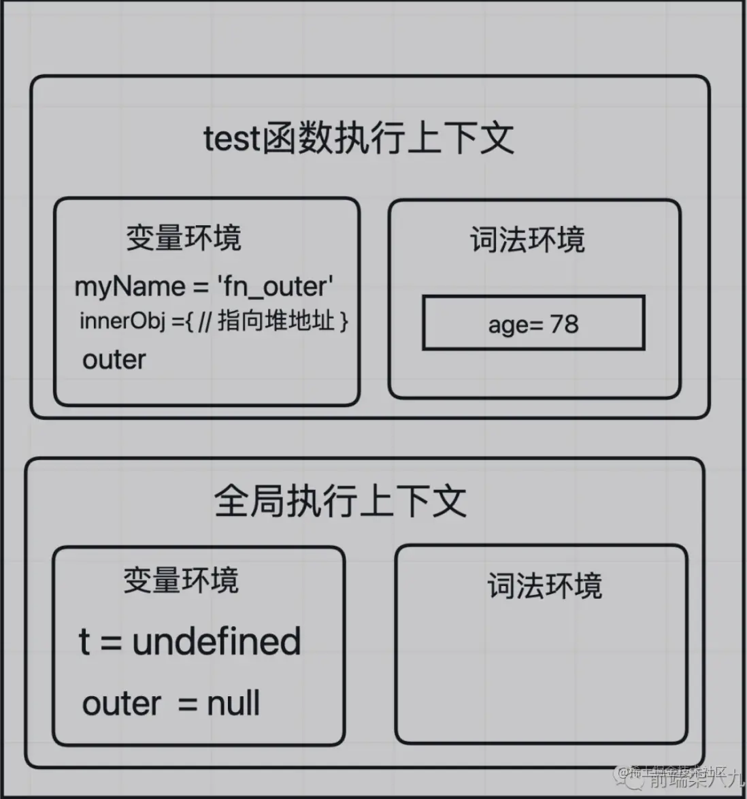

# JavaScript 的知识点

**MDN 文档**：[JavaScript | MDN (mozilla.org)](https://developer.mozilla.org/zh-CN/docs/Web/JavaScript)


[JavaScript 教程 - 网道 (wangdoc.com)](https://wangdoc.com/javascript/)

[ECMAScript 6 入门教程](https://es6.ruanyifeng.com/)

## 知识点

数据类型、运算、对象、Function、继承、闭包、作用域、原型链、事件、 RegExp 、JSON 、 Ajax 、 DOM 、 BOM 、内存泄漏、跨域、异步装载、模板引擎、前端 MVC 、路由、模块化、 Canvas 、 ECMAScript

1. **基础语法和操作**：
   - 变量声明(var, let, const)
   - 数据类型(原始类型和引用类型)
   - 操作符(算术、比较、逻辑等)
   - 控制结构(if-else, switch, for, while, do-while)
2. **函数和作用域**：
   - 函数声明和表达式
   - 作用域(全局、局部)
   - 闭包
   - 高阶函数
3. **对象和原型**：
   - 对象创建和原型链
   - 继承和原型方法
   - JSON 对象处理
4. **异步编程**：
   - 回调函数
   - Promises
   - async/await
   - 事件循环和任务队列
5. **DOM 操作**：
   - DOM 选择器
   - DOM 事件
   - DOM 操作(创建、插入、删除元素)
6. **BOM 操作**：
   - 窗口(window)对象
   - 定时器(setTimeout 和 setInterval)
   - 位置(location)对象
7. **ES6+ 新特性**：
   - 箭头函数
   - 模板字符串
   - 解构赋值
   - 模块导入和导出
8. **错误处理和调试**：
   - try/catch/finally
   - 抛出异常(throw)
   - 调试技巧和工具
9. **Web API 和 HTTP 通信**：
   - XMLHttpRequest
   - Fetch API
   - CORS 和同源策略

# JavaScript 语言相关面试题

## 说说 C++、Java、JavaScript 这三种语言的区别

**考察点：编程语言**

::: details 查看参考回答

### 从静态类型还是动态类型来看

**静态类型**：编译的时候就能够知道每个变量的类型，编程的时候也需要给定类型，如 Java 中的整型 int，浮点型 float 等。C、C++、Java 都属于静态类型语言。

**动态类型**：运行的时候才知道每个变量的类型，编程的时候无需显示指定类型，如 JavaScript 中的 var、PHP 中的$。JavaScript、Ruby、Python 都属于动态类型语言。

静态类型还是动态类型对语言的性能有很大影响。

对于静态类型，在编译后会大量利用已知类型的优势，如 int 类型，占用 4 个字节，编译后的代码就可以用内存地址加偏移量的方法存取变量，而地址加偏移量的算法汇编很容易实现。

对于动态类型，会当做字符串通通存下来，之后存取就用字符串匹配。

### 从编译型还是解释型来看编译型语言

像 C、C++，需要编译器编译成本地可执行程序后才能运行，由开发人员在编写完成后手动实施。用户只使用这些编译好的本地代码，这些本地代码由系统加载器执行，由操作系统的 CPU 直接执行，无需其他额外的虚拟机等。

**编译型语言**：源代码 => 抽象语法树 => 中间表示 => 本地代码

解释性语言，像 JavaScript、Python，开发语言写好后直接将代码交给用户，用户使用脚本解释器将脚本文件解释执行。对于脚本语言，没有开发人员的编译过程，当然，也不绝对。

**解释型语言**：源代码 => 抽象语法树 => 解释器解释执行。

对于 JavaScript，随着 Java 虚拟机 JIT 技术的引入，工作方式也发生了改变。可以将抽象语法树转成中间表示(字节码)，再转成本地代码，如 JavaScriptCore，这样可以大大提高执行效率。也可以从抽象语法树直接转成本地代码，如 V8

### Java 语言，分为两个阶段。

首先像 C++语言一样，经过编译器编译。和 C++的不同，C++编译生成本地代码，Java 编译后，生成字节码，字节码与平台无关。第二阶段，由 Java 的运行环境也就是 Java 虚拟机运行字节码，使用解释器执行这些代码。一般情况下，Java 虚拟机都引入了 JIT 技术，将字节码转换成本地代码来提高执行效率。

注意，在上述情况中，编译器的编译过程没有时间要求，所以编译器可以做大量的代码优化措施。

### 对于 JavaScript 与 Java 它们还有的不同：

对于 Java，Java 语言将源代码编译成字节码，这个同执行阶段是分开的。也就是从源代码到抽象语法树到字节码这段时间的长短是无所谓的。

对于 JavaScript，这些都是在网页和 JavaScript 文件下载后同执行阶段一起在网页的加载和渲染过程中实施的，所以对于它们的处理时间有严格要求。

:::

## JavaScript 是静态类型语言还是动态类型语言？这是什么意思？

JavaScript 是动态类型的。

这意味着在运行时检查对象的类型。(在静态类型语言中，在编译时检查类型。)

换句话说，JavaScript 变量与类型无关。这意味着你可以毫无问题地更改数据类型。

```javascript
var num = 10;

num = "Test";
```

在静态类型语言(例如 C++)中，不可能以这种方式将整数更改为字符串。

## JavaScript 是静态类型语言还是动态类型语言?有什么区别?

JavaScript 是一种**动态类型语言**。这意味着在 JavaScript 中，变量的类型在运行时确定，而不是在声明时。你可以在同一个变量中存储不同类型的值，比如一开始存储一个数字，后来存储一个字符串，而无需进行任何显式的类型转换。

**主要区别：**

**动态类型语言(如 JavaScript)**：

1. **`类型灵活性`**：你可以在运行时改变变量的类型。这增加了编程的灵活性，使得代码编写更为简洁。
2. **`隐式类型转换`**：JavaScript 会自动在需要时进行类型转换，例如当你尝试将一个数字和一个字符串相加时，数字会被转换为字符串。
3. **`运行时类型检查`**：类型错误通常在运行时抛出，这可能使得调试更为困难，尤其是在复杂的程序中。

**静态类型语言(如 Java、C++)**：

1. **`类型明确性`**：变量的类型在声明时确定，并且在整个程序的运行期间都不能改变。这有助于减少类型错误。
2. **`强制类型转换`**：如果需要改变变量的类型，你必须显式地进行类型转换。
3. **`编译时类型检查`**：类型错误通常在编译时就被捕获，这有助于在代码运行前发现和修复问题。

## 什么是 JavaScript？

[什么是 JavaScript？](https://developer.mozilla.org/zh-CN/docs/Learn/JavaScript/First_steps/What_is_JavaScript#广义的定义)

JavaScript 是一种高级脚本语言。它是一种基于对象的动态类型的语言。JavaScript 用于向 HTML 文档添加动态元素和样式，使网页更具交互性和吸引力。JavaScript 在前端和后端都使用。

JavaScript 广泛用于客户端验证。 JavaScript 转换器(嵌入在浏览器中)负责为 Web 浏览器翻译 JavaScript 代码。

有很多可用的 JavaScript 框架和库可用于前端，如 ReactJS、Vue.JS、AngularJS、NextJS 等。只有一个 JavaScript 框架可用于后端开发，即 Node.JS。

## JavaScript 的主要特性

JavaScript 提供了许多功能，下面列出了其中一些功能：

- 它是一种单线程语言。
- 运行在客户端浏览器上；
- 不用预编译，直接解析执行代码；
- 是弱类型语言，较为灵活；
- 与操作系统无关，跨平台的语言；
- 脚本语言、解释性语言
- 动态变量类型。
- 原型和经典继承
- 一流的函数
- 高阶函数。
- 吊装和封盖等

## 说下对 JS 的了解吧

是基于原型的动态语言，主要独特特性有 this、原型和原型链。

JS 严格意义上来说分为：语言标准部分(ECMAScript)+ 宿主环境部分

**语言标准部分**

2015 年发布 ES6，引入诸多新特性使得能够编写大型项目变成可能，标准自 2015 之后以年号代号，每年一更

**宿主环境部分**

- 在浏览器宿主环境包括 DOM + BOM 等
- 在 Node，宿主环境包括一些文件、数据库、网络、与操作系统的交互等

## JavaScript 中有多少个线程？

JavaScript 使用单线程。它不允许编写解释器可以在多个线程或进程中并行运行的代码。

这意味着它按顺序执行代码并且必须执行完一段代码才能移动到下一段代码。

当您在网页上显示警报时，就是一个很好的例子。警报弹出后，您无法与页面交互，直到警报关闭。

```javascript
alert("Hello there!");
```


## JavaScript 是编译语言还是解释语言？

JavaScript 是一种解释型语言。

浏览器中的解释器读取 JavaScript 代码、解释每一行并运行它。

## 解释型语言和编译型语言的差异是什么？

电脑能认得的是二进制数，不能够识别高级语言。所有高级语言在电脑上执行都需要先转变为机器语言。但是高级语言有两种类型：编译型语言和解释型语言。常见的编译型语言语言有 C/C++、Pascal/Object 等等。常见的解释性语言有 python、JavaScript 等等。

编译型语言先要进行编译，然后转为特定的可执行文件，这个可执行文件是针对平台的(CPU 类型)，可以这么理解你在 PC 上编译一个 C 源文件，需要经过预处理，编译，汇编等等过程生成一个可执行的二进制文件。当你需要再次运行改代码时，不需要重新编译代码，只需要运行该可执行的二进制文件。优点，编译一次，永久执行。还有一个优点是，你不需要提供你的源代码，你只需要发布你的可执行文件就可以为客户提供服务，从而保证了你的源代码的安全性。但是，如果你的代码需要迁移到 linux、ARM 下时，这时你的可执行文件就不起作用了，需要根据新的平台编译出一个可执行的文件。这也就是多个平台需要软件的多个版本。缺点是，跨平台能力差。

解释型语言需要一个解释器，在源代码执行的时候被解释器翻译为一个与平台无关的中间代码，解释器会把这些代码翻译为及其语言。打个比方，编译型中的编译相当于一个翻译官，它只能翻译英语，而且中文文章翻译一次就不需要重新对文章进行二次翻译了，但是如果需要叫这个翻译官翻译德语就不行了。而解释型语言中的解释器相当于一个会各种语言的机器人，而且这个机器人回一句一句的翻译你的语句。对于不同的国家，翻译成不同的语言，所以，你只需要带着这个机器人就可以。解释型语言的有点是，跨平台，缺点是运行时需要源代码，知识产权保护性差，运行效率低。

## JavaScript 是区分大小写的语言吗

JavaScript 是一种区分大小写的语言。

关键字、变量、函数名等需要大写一致。

为了演示，这段代码有效

```javascript
let i = 1;

while (i < 2) {
	console.log(i);

	i++;
}
```

但这并没有，因为 while 被大写了，尽管它不应该大写。

```javascript
let i = 1;

WHILE(i < 2) {
  console.log(i);
  i++;
}
```


## 说下对 JavaScript 语言 的了解吧

是基于原型的动态语言，主要独特特性有 this、原型和原型链。

JS 严格意义上来说分为：语言标准部分（ECMAScript）+ 宿主环境部分

### 语言标准部分

2015 年发布 ES6，引入诸多新特性使得能够编写大型项目变成可能，标准自 2015 之后以年号代号，每年一更

### 宿主环境部分

在浏览器宿主环境包括 DOM + BOM 等

在 Node，宿主环境包括一些文件、数据库、网络、与操作系统的交互等

## JavaScript 是一门什么样的语言，它有哪些特点？

没有标准答案。

JavaScript 是一门强大的编程语言，是一种专为与网页交互而设计的脚本语言，是一种动态类型、弱类型、基于原型的语言。

JavaScript 是客户端和服务器端脚本语言，可以插入到 HTML 页面中，并且是目前较热门的 Web 开发语言。同时，JavaScript 也是面向对象编程语言。

特点：

1. 脚本语言。JavaScript 是一种解释型的脚本语言,C、C++等语言先编译后执行,而 JavaScript 是在程序的运行过程中逐行进行解释。
2. 基于对象。JavaScript 是一种基于对象的脚本语言,它不仅可以创建对象,也能使用现有的对象。
3. 简单。JavaScript 语言中采用的是弱类型的变量类型,对使用的数据类型未做出严格的要求,是基于 Java 基本语句和控制的脚本语言,其设计简单紧凑。
4. 动态性。JavaScript 是一种采用事件驱动的脚本语言,它不需要经过 Web 服务器就可以对用户的输入做出响应。在访问一个网页时,鼠标在网页中进行鼠标点击或上下移、窗口移动等操作 JavaScript 都可直接对这些事件给出相应的响应。
5. 跨平台性。JavaScript 脚本语言不依赖于操作系统,仅需要浏览器的支持。因此一个 JavaScript 脚本在编写后可以带到任意机器上使用,前提上机器上的浏览器支 持 JavaScript 脚本语言,目前 JavaScript 已被大多数的浏览器所支持。


运行环境：浏览器中的 JS 引擎(v8)

语言特性：面向对象，动态语言：

```js
// 动态语言的特性
var num = 10; // num 是一个数字类型
num = "jim"; // 此时 num 又变成一个字符串类型
// 我们把一个变量用来保存不同数据类型的语言称之为一个动态语言
// 静态语言：c# java c c++
// 静态语言在声明一个变量就已经确定了这个变量的数据类型，
//  而且在任何时候都不可以改变他的数据类型
```


## 列出 JavaScript 的一些功能和优缺点

JavaScript 的一些功能包括：

- 轻巧的
- 解释性编程语言
- 适用于以网络为中心的应用
- 与 Java 互补
- 与 HTML 互补
- 开源的
- 跨平台

### 列出 JavaScript 的一些优点

JavaScript 的一些优点是：

- 服务器交互较少
- 立即反馈给访客
- 互动性高
- 界面更丰富

### **列出 JavaScript 的一些缺点。**

JavaScript 的一些缺点是：

- 不支持多线程
- 不支持多处理
- 不允许读写文件
- 不支持网络应用程序。

## Java 和 JavaScript 有什么区别？

JavaScript 是一种客户端脚本语言，而 Java 是面向对象的编程语言。他们俩完全不同。

- [JavaScript](https://www.geeksforgeeks.org/javascript-tutorial/)：它是一种轻量级编程语言(“脚本语言”)，用于开发交互式网页。它可以将动态文本插入到 HTML 元素中。JavaScript 也称为浏览器的语言。
- [Java](https://www.geeksforgeeks.org/java/)：Java 是最流行的编程语言之一。它是一种面向对象的编程语言，具有一个虚拟机平台，允许您创建在几乎所有平台上运行的编译程序。Java 承诺，“一次编写，随处运行”。

## JavaScript 和 ECMA 脚本 有什么关系？

JavaScript 是主要的语言，必须维护一些规则和规定，即 ECMA 脚本，这些规则也为 JavaScript 语言带来了新的功能。

## 什么是 ECMAScript？

ECMAScript 是构成 JavaScript 基础的脚本语言。

ECMAScript 由 ECMA 国际标准组织标准化(查看 ECMA-262 和 ECMA-402 规范)。

## ECMAScript 是什么？

ECMAScript 是编写脚本语言的标准，这意味着 JavaScript 遵循 ECMAScript 标准中的规范变化，因为它是 JavaScript 的蓝图。

ECMAScript 和 Javascript，本质上都跟一门语言有关，一个是语言本身的名字，一个是语言的约束条件只不过发明 JavaScript 的那个人(Netscape 公司)，把东西交给了 ECMA(European Computer Manufacturers Association)，这个人规定一下他的标准，因为当时有 java 语言了，又想强调这个东西是让 ECMA 这个人定的规则，所以就这样一个神奇的东西诞生了，这个东西的名称就叫做 ECMAScript。

javaScript = ECMAScript + DOM + BOM(自认为是一种广义的 JavaScript)

ECMAScript 说什么 JavaScript 就得做什么！

JavaScript(狭义的 JavaScript)做什么都要问问 ECMAScript 我能不能这样干！如果不能我就错了！能我就是对的！

# 加载JavaScript、CSS、资源

## 什么是按需加载

参考回答：

当用户触发了动作时才加载对应的功能。触发的动作，是要看具体的业务场景而言，包括但不限于以下几个情况：鼠标点击、输入文字、拉动滚动条，鼠标移动、窗口大小更改等。加载的文件，可以是 JS、图片、CSS、HTML 等。

## 为什么利用多个域名来存储网站资源会更有效？

确保用户在不同地区能用最快的速度打开网站，其中某个域名崩溃用户也能通过其他郁闷访问网站，并且不同的资源放到不同的服务器上有利于减轻单台服务器的压力。

## 请说出三种减低页面加载时间的方法

1、压缩 css、js 文件
2、合并 js、css 文件，减少 http 请求
3、外部 js、css 文件放在最底下
4、减少 dom 操作，尽可能用变量替代不必要的 dom 操作

## js 延迟加载的方式有哪些？

- 方案一：`<script>`标签的 async="async"属性(详细参见：script 标签的 async 属性)
- 方案二：`<script>`标签的 defer="defer"属性
- 方案三：动态创建`<script>`标签
- 方案四：AJAX eval(使用 AJAX 得到脚本内容，然后通 eval r(xmlhttp.responseText)来运行脚本)
- 方案五：iframe 方式

## 如何判断 `img` 加载完成

参考答案：

- 为 `img DOM` 节点绑定 `load` 事件
- `readystatechange` 事件：`readyState` 为 `complete` 和 `loaded` 则表明图片已经加载完毕。测试 `IE6-IE10` 支持该事件，其它浏览器不支持。
- `img` 的 `complete` 属性：轮询不断监测 `img` 的 `complete` 属性，如果为 `true` 则表明图片已经加载完毕，停止轮询。该属性所有浏览器都支持。

## JS 怎么控制一次加载一张图片，加载完后再加载下一张

参考回答：

(1)方法 1

```html
<script type="text/javascript">
	var obj=new Image();
	obj.src="http://www.phpernote.com/uploadfiles/editor/2011072405022011
	79.jpg";
	obj.onload=function(){
	alert('图片的宽度为：'+obj.width+'；图片的高度为：'+obj.height);
	document.getElementById("mypic").innnerHTML="";
	}
</script>
<div id="mypic">onloading……</div>
```

(2)方法 2

```html
<script type="text/javascript">
	var obj=new Image();
	obj.src="http://www.phpernote.com/uploadfiles/editor/201107240502201179.jpg";
	obj.onreadystatechange=function(){
	if(this.readyState=="complete"){
	alert('图片的宽度为：'+obj.width+'；图片的高度为：'+obj.height);
	document.getElementById("mypic").innnerHTML="";
	}
	}
</script>
<div id="mypic">onloading……</div>
```


## 简述 link 和 import 的区别？

区别 1：link 是 XHTML 标签，除了加载 CSS 外，还可以定义 RSS 等其他事务；@import 属于 CSS 范畴，只能加载 CSS。

区别 2：link 引用 CSS 时，在页面载入时同时加载；@import 需要页面网页完全载入
以后加载。

区别 3：link 是 XHTML 标签，无兼容问题；@import 是在 CSS2.1 提出的，低版本的浏览器不支持。

区别 4：link 支持使用 Javascript 控制 DOM 去改变样式；而@import 不支持。

## 把 Script 标签 放在页面的最底部的 body 封闭之前 和封闭之后有什么区别？浏览器会如何解析它们？

如果说放在 body 的封闭之前，将会阻塞其他资源的加载
如果放在 body 封闭之后，不会影响 body 内元素的加载


## `<script src=’xxx’ ’xxx’/>`外部 js 文件先加载还是 onload 先执行，为什么？

onload 是所以加载完成之后执行的

## 如何在页面加载后执行 JavaScript 代码？

您可以通过三种方式执行此操作：

将属性 `window.onload` 设置为在页面加载后执行的函数：

```javascript
window.onload = function ...
```

将属性 document.onload 设置为在页面加载后执行的函数：

```javascript
document.onload = function ...
```

将 HTML 属性的 onload 属性设置为 JS 函数：

```html
<body onload="script();"></body>
```

## NoScript 标签有什么作用？

Noscript 标签用于检测和响应禁用 JavaScript 的浏览器。

您可以使用 noscript 标签来执行一段通知用户的代码。

例如，您的 HTML 页面可以有一个像这样的 noscript 标签：

```html
<script>
	document.write("Hello World!");
</script>

<noscript> Your browser does not support JavaScript! </noscript>
```


## 阐述一下异步(延迟)加载

延迟加载就是等页面加载完成之后再加载 JavaScript 文件。js 延迟加载有助于提高页面加载速度。

1. 异步加载的方案： 动态插入 script 标签

2. 通过 ajax 去获取 js 代码，然后通过 eval 执行

3. 加载阻塞解决方法：script 标签上添加 defer(只支持 IE) 或者 async 属性

   1. 如果 async="async"，脚本相对于页面的其余部分异步地执行(当页面继续进行解析时，脚本将被执行)

      如果不使用 async 且 defer="defer"：脚本将在页面完成解析时执行

4. 创建并插入 iframe，让它异步执行 js

5. 动态创建 DOM 方式(创建 script，插入到 DOM 中，加载完毕后 callBack)

   1. documen.write 和 innerHTML 的区别
   2. document.write 只能重绘整个页面
   3. innerHTML 可以重绘页面的一部分

- `defer` 属性
- `async` 属性
- 使用 `jQuery` 的 `getScript`( ) 方法
- 使用 `setTimeout` 延迟方法
- 把 `JS` 外部引入的文件放到页面底部，来让 `JS` 最后引入

defer 属性：给 js 脚本添加 defer 属性，这个属性会让脚本的加载与文档的解析同步解析，然后在文档解析完成后再执行这个脚本文件，这样的话就能使页面的渲染不被阻塞。多个设置了 defer 属性的脚本按规范来说最后是顺序执行的，但是在一些浏览器中可能不是这样。

async 属性：给 js 脚本添加 async 属性，这个属性会使脚本异步加载，不会阻塞页面的解析过程，但是当脚本加载完成后立即执行 js 脚本，这个时候如果文档没有解析完成的话同样会阻塞。多个 async 属性的脚本的执行顺序是不可预测的，一般不会按照代码的顺序依次执行。

动态创建 DOM 方式：动态创建 DOM 标签的方式，可以对文档的加载事件进行监听，当文档加载完成后再动态的创建 script 标签来引入 js 脚本。

使用 setTimeout 延迟方法：设置一个定时器来延迟加载 js 脚本文件

让 JS 最后加载：将 js 脚本放在文档的底部，来使 js 脚本尽可能的在最后来加载执行。

1. **`defer 属性：`** 给 js 脚本添加 defer 属性，这个属性会让脚本的加载与文档的解析同步解析，然后在文档解析完成后再执行这个脚本文件，这样的话就能使页面的渲染不被阻塞。多个设置了 defer 属性的脚本按规范来说最后是顺序执行的，但是在一些浏览器中可能不是这样。
2. **`async 属性：`** 给 js 脚本添加 async 属性，这个属性会使脚本异步加载，不会阻塞页面的解析过程，但是当脚本加载完成后立即执行 js 脚本，这个时候如果文档没有解析完成的话同样会阻塞。多个 async 属性的脚本的执行顺序是不可预测的，一般不会按照代码的顺序依次执行。
3. **`动态创建 DOM 方式：`** 动态创建 DOM 标签的方式，可以对文档的加载事件进行监听，当文档加载完成后再动态的创建 script 标签来引入 js 脚本。
4. **`使用 setTimeout 延迟方法：`** 设置一个定时器来延迟加载 js 脚本文件。
5. **`让 JS 最后加载：`** 将 js 脚本放在文档的底部，来使 js 脚本尽可能的在最后来加载执行。

## `defer` 与 `async` 的区别

1. **`执行时间不同`**：defer 是表明脚本在执行时不会影响页面的构造，脚本会被延迟到整个页面都解析完毕后再运行；async 是浏览器立即异步下载文件，下载完成会立即执行，此时会阻塞 DOM 渲染。
2. **`执行顺序不同`**：defer 是按照顺序下载执行；async 是不能保证多个加载时的先后顺序。
3. **`用途不同`**：defer 是表明脚本在执行时不会影响页面的构造；async 是为了实现并行加载，加速页面渲染。

参考答案：

按照惯例，所有 `script` 元素都应该放在页面的 `head` 元素中。这种做法的目的就是把**所有外部文件(CSS 文件和 JavaScript 文件)的引用都放在相同的地方**。可是，在文档的 `head` 元素中包含所有 `JavaScript` 文件，意味着必须等到全部 `JavaScript` 代码都被下载、解析和执行完成以后，才能开始呈现页面的内容(浏览器在遇到 `body` 标签时才开始呈现内容)。

对于那些需要很多 `JavaScript` 代码的页面来说，这无疑会导致浏览器在呈现页面时出现明显的延迟，而延迟期间的浏览器窗口中将是一片空白。为了避免这个问题，现在 **Web 应用程序一般都全部 JavaScript 引用放在 body 元素中页面的内容后面**。这样一来，在解析包含的 `JavaScript` 代码之前，页面的内容将完全呈现在浏览器中。而用户也会因为浏览器窗口显示空白页面的时间缩短而感到打开页面的速度加快了。

有了 `defer` 和 `async` 后，这种局面得到了改善。

**defer (延迟脚本)**

延迟脚本：`defer` 属性只适用于外部脚本文件。

如果给 `script` 标签定义了*defer* 属性，这个属性的作用是表明脚本在执行时不会影响页面的构造。也就是说，脚本会被延迟到整个页面都解析完毕后再运行。因此，如果 `script` 元素中设置了 `defer` 属性，相当于告诉浏览器立即下载，但延迟执行。

**async(异步脚本)**

异步脚本：`async` 属性也只适用于外部脚本文件，并告诉浏览器立即下载文件。

**但与 defer 不同的是：标记为 async 的脚本并不保证按照指定它们的先后顺序执行。**

所以总结起来，两者之间最大的差异就是在于脚本下载完之后何时执行，显然 `defer` 是最接近我们对于应用脚本加载和执行的要求的。

`defer` 是立即下载但延迟执行，加载后续文档元素的过程将和脚本的加载并行进行(异步)，但是脚本的执行要在所有元素解析完成之后，`DOMContentLoaded` 事件触发之前完成。`async` 是立即下载并执行，加载和渲染后续文档元素的过程将和 `js` 脚本的加载与执行并行进行(异步)。


defer：只支持 IE 如果您的脚本不会改变文档的内容，可将 defer 属性加入到`<script>`标签中，以便加快处理文档的速度。因为浏览器知道它将能够安全地读取文档的剩余部分而不用执行脚本，它将推迟对脚本的解释，直到文档已经显示给用户为止。

async，HTML5 属性仅适用于外部脚本，并且如果在 IE 中，同时存在 defer 和 async，那么 defer 的优先级比较高，脚本将在页面完成时执行。

创建 script 标签，插入到 DOM 中

## 将 defer 或 async 属性传递给 script 标签的目的是什么？

defer 和 async 属性用于以特定方式加载脚本，如下所述：

- defer：它并行获取 HTML 和脚本，一旦获取整个脚本，它就会停止获取 HTML 并首先执行脚本，然后再次开始获取 HTML 并在完全获取后执行它。

```
<script src="script_file_path" defer></script>
```

- async：async 属性使服务器并行获取脚本和 HTML，一旦它同时获取它们，它就会开始执行脚本，并且只有在那之后它才会执行 HTML。

```
<script src="script_file_path" async></script>
```


## 加载

#### (1).异步加载 js 的方法

- defer：只支持 IE 如果您的脚本不会改变文档的内容，可将 defer 属性加入到`<script>`标签中，以便加快处理文档的速度。因为浏览器知道它将能够安全地读取文档的剩余部分而不用执行脚本，它将推迟对脚本的解释，直到文档已经显示给用户为止。
- async：HTML5 属性，仅适用于外部脚本；并且如果在 IE 中，同时存在 defer 和 async，那么 defer 的优先级比较高；脚本将在页面完成时执行。

#### (2).图片的懒加载和预加载

- 预加载：提前加载图片，当用户需要查看时可直接从本地缓存中渲染。
- 懒加载：懒加载的主要目的是作为服务器前端的优化，减少请求数或延迟请求数。

**两种技术的本质：两者的行为是相反的，一个是提前加载，一个是迟缓甚至不加载。懒加载对服务器前端有一定的缓解压力作用，预加载则会增加服务器前端压力。**


# JavaScript语法模式

## 什么是 JavaScript 中的“严格”模式，如何启用它？

严格模式是 ECMAScript 5 中的一项新功能，它允许您将程序或函数置于“严格”操作上下文中。这种严格的上下文会阻止执行某些操作并引发更多异常。语句 “use strict” 指示浏览器使用 Strict 模式，这是 JavaScript 的一个简化且更安全的功能集。

## 严格模式在 JavaScript 中起什么作用？

JavaScript 严格模式用于生成静默错误。它提供”严格使用”；表达式以启用严格模式。该表达式只能作为脚本或函数中的第一条语句放置。例如：

```javascript
"use strict";
x = 10;
console.log(x);
```

## JavaScript 中“use strict”指令有什么用？

使用 strict diretive 用于编写不易出错的干净 JavaScript 代码。它捕获常见的编码错误，例如在不声明变量的情况下分配变量或将具有相同名称的不同参数传递给函数等。

## JavaScript 中的严格模式是什么？

严格模式允许你设置程序在严格的上下文中运行。这可以防止执行某些操作。此外，还会引发更多异常。

表达“严格使用”；告诉浏览器启用严格模式。

例如：

```javascript
"use strict";

number = 1000;
```

这会导致错误，因为严格模式会阻止您为未声明的变量赋值。

## 为什么在 JavaScript 中使用严格模式？

严格模式有助于编写“安全”的 JavaScript 代码。这意味着糟糕的语法实践会转化为真正的错误。

例如，严格模式阻止创建全局变量。

要声明严格模式，请添加`“use strict”`；在要在严格模式下的语句之前的语句：

```javascript
"use strict";

const sentence = "Hello, this is very strict";
```


## `use strict` 是什么意思 ? 使用它区别是什么？

参考答案：

`use strict` 代表开启严格模式，这种模式使得 `Javascript` 在更严格的条件下运行，实行更严格解析和错误处理。

开启"严格模式"的优点：

- 消除 `Javascript` 语法的一些不合理、不严谨之处，减少一些怪异行为;
- 消除代码运行的一些不安全之处，保证代码运行的安全；
- 提高编译器效率，增加运行速度；
- 为未来新版本的 `Javascript` 做好铺垫。

## Javascript 代码中的"use strict";是什么意思

use strict 是一种 ECMAscript 5 添加的(严格)运行模式,这种模式使得 Javascript 在更严格的条件下运行，使 JS 编码更加规范化的模式，消除 Javascript 语法的一些不合理、不严谨之处，减少一些怪异行为

## 'use strict' 是干嘛用的？

"use strict" 是 ES5 特性，它使我们的代码在函数或整个脚本中处于严格模式。严格模式帮助我们在代码的早期避免 bug，并为其添加限制。

严格模式的一些限制：

- 变量必须声明后再使用
- 函数的参数不能有同名属性，否则报错
- 不能使用 with 语句
- 不能对只读属性赋值，否则报错
- 不能使用前缀 0 表示八进制数，否则报错
- 不能删除不可删除的属性，否则报错
- 不能删除变量 delete prop，会报错，只能删除属性 `delete global[prop]`
- eval 不能在它的外层作用域引入变量
- eval 和 arguments 不能被重新赋值
- arguments 不会自动反映函数参数的变化
- 不能使用 arguments.callee
- 不能使用 arguments.caller
- 禁止 this 指向全局对象
- 不能使用 fn.caller 和 fn.arguments 获取函数调用的堆栈
- 增加了保留字(比如 protected、static 和 interface)

设立”严格模式”的目的，主要有以下几个：

- 消除 Javascript 语法的一些不合理、不严谨之处，减少一些怪异行为;
- 消除代码运行的一些不安全之处，保证代码运行的安全；
- 提高编译器效率，增加运行速度；
- 为未来新版本的 Javascript 做好铺垫。

## javascript 代码中的"use strict";是什么意思 ? 使用它区别是什么？

use strict 是一种 ECMAscript5 添加的(严格)运行模式，这种模式使得 Javascript 在更严格的条件下运行。

除了正常模式运行外，ECMAscript 添加了第二种运行模式：“严格模式”。

作用：

1. 消除 js 不合理，不严谨地方，减少怪异行为
2. 消除代码运行的不安全之处，
3. 提高编译器的效率，增加运行速度
4. 为未来的 js 新版本做铺垫。

设立"严格模式"的目的，主要有以下几个：

- 消除 Javascript 语法的一些不合理、不严谨之处，减少一些怪异行为;
- 消除代码运行的一些不安全之处，保证代码运行的安全；
- 提高编译器效率，增加运行速度；
- 为未来新版本的 Javascript 做好铺垫。

**区别：**

- 禁止使用 with 语句。
- 禁止 this 关键字指向全局对象。
- 对象不能有重名的属性。

**回答**
use strict 指的是严格运行模式，在这种模式对 js 的使用添加了一些限制。比如说禁止 this 指向全局对象，还有禁止使用 with 语句等。

设立严格模式的目的，主要是为了消除代码使用中的一些不安全的使用方式，也是为了消除 js 语法本身的一些不合理的地方，以此来减少一些运行时的怪异的行为。同时使用严格运行模式也能够提高编译的效率，从而提高代码的运行速度。

我认为严格模式代表了 js 一种更合理、更安全、更严谨的发展方向。

## 解释 JavaScript 中的严格模式?

严格模式是 ES5 引入的一种 JavaScript 运行模式，它为 JavaScript 提供了一种更加严格的运行环境。这种模式通过在代码开头添加一个特定的编译指示符"use strict"来启用。严格模式的设计目的是使 JavaScript 代码在更严格的条件下执行，以便开发者更容易发现并修正错误，使代码更加健壮、安全和高效。

在严格模式下，JavaScript 引擎会执行更严格的语法和运行时检查，包括但不限于以下几点：

1. 变量必须先声明后使用。未声明的变量在严格模式下会被视为错误。
2. 严格模式不允许删除变量、函数或函数的参数。尝试这样做会导致运行时错误。
3. 在严格模式下，`this` 关键字的行为也发生了一些变化。例如，全局上下文中的 `this` 不再指向全局对象(如 `window`)，而是 `undefined`，除非函数被显式地通过 `call()` 或 `apply()` 方法调用。

**优点：**

1. **`帮助捕获常见错误`**：通过引入更严格的语法和运行时检查，严格模式能够帮助开发者捕获到一些在宽松模式下可能会被忽略的错误。比如，变量必须先声明后使用，未声明的变量会导致错误；删除变量、函数或函数参数在严格模式下也是不允许的。
2. **`提高代码质量和可维护性`**：由于严格模式对代码进行了更严格的检查，这有助于开发者编写更加规范、高质量的代码。同时，严格的错误检查也使得代码调试更加容易，能够更早地发现并修复潜在的问题，从而提高代码的可维护性。
3. **`防止全局污染`**：在严格模式下，全局变量必须显式声明，这有助于防止因意外创建全局变量而导致的全局污染问题。

**缺点：**

1. **`兼容性问题`**：虽然现代浏览器大多支持严格模式，但在一些较旧的浏览器或环境中可能存在兼容性问题。因此，在使用严格模式时，需要考虑到目标用户群体的浏览器兼容性情况。
2. **`学习成本`**：对于不熟悉严格模式的开发者来说，可能需要一定的学习成本来适应这种更严格的编程环境。需要了解哪些操作在严格模式下是被禁止的，以及如何正确地编写符合严格模式要求的代码。`CommonJS`推崇依赖就绪，只有在代码执行时，才去 require 所依赖的模块。

## Javascript 中， 什么是 use strict?使用它的好处和坏处分别是什么?

在 JavaScript 中，"use strict" 是一种特殊的字面量表达式，它被用在脚本或函数的开头，用于启用严格模式。严格模式使得 JavaScript 在执行时更加严格，有助于捕捉一些常见的编码错误，如使用未声明的变量等。

**使用 "use strict" 的好处：**

1. **`防止全局变量`**：在严格模式下，如果你尝试隐式地创建一个全局变量(例如，忘记使用 var 关键字)，JavaScript 会抛出一个错误。这有助于防止意外的全局污染。
2. **`更严格的错误检查`**：严格模式会执行更严格的错误检查，例如，当你尝试删除一个不可删除的属性时，它会抛出一个错误。
3. **`防止函数参数重名`**：在严格模式下，函数中的参数不能有相同的名称。
4. **`防止对象字面量属性的重复`**：在严格模式下，对象字面量不能有重复的属性名称。
5. **`更好的性能`**：严格模式可以帮助 JavaScript 引擎进行某些优化，从而提高代码的性能。
6. **`改进调试`**：严格模式可以使调试过程更容易，因为它有助于识别潜在的错误。

**使用 "use strict" 的坏处：**

1. **`代码兼容性`**：不是所有的 JavaScript 代码都能在严格模式下运行。一些旧的库和框架可能无法与严格模式兼容。
2. **`增加代码复杂度`**：如果你的项目中的代码不需要严格模式的特性，那么在代码中添加"use strict"可能会增加不必要的复杂性。
3. **`额外的错误检查`**：虽然严格模式可以帮助识别错误，但它也可能导致一些在宽松模式下可以运行的代码在严格模式下失败。这可能需要额外的调试和修复工作。

总的来说，"use strict"是一个有用的工具，可以帮助你编写更安全、更可靠的 JavaScript 代码。然而，在使用它之前，你应该确保你的代码和依赖项都能够在严格模式下运行，并且你准备好处理可能出现的额外错误检查。

## javascript 代码中的"use strict";是什么意思 ? 使用它区别是什么？

意思是使用严格模式，使用严格模式，一些不规范的语法将不再支持

严格模式

链接：<http://www.ruanyifeng.com/blog/2013/01/javascriptmode.html>

全局变量显式声明

静态绑定

禁止使用 with 语句

eval 中定义的变量都是局部变量

禁止 this 关键字指向全局对象

禁止在函数内部遍历调用栈

严格模式下无法删除变量。只有 configurable 设置为 true 的对象属性，才能被删除

正常模式下，对一个对象的只读属性进行赋值，不会报错，只会默默地失败。

严格模式下，将报错。

严格模式下，对一个使用 getter 方法读取的属性进行赋值，会报错。

严格模式下，对禁止扩展的对象添加新属性，会报错。

严格模式下，删除一个不可删除的属性，会报错。

正常模式下，如果对象有多个重名属性，最后赋值的那个属性会覆盖前面的值。严格模式下，这属于语法错误。

正常模式下，如果函数有多个重名的参数，可以用 arguments[i]读取。严格模式下，这属于语法错误。

正常模式下，整数的第一位如果是 0，表示这是八进制数，比如 0100 等于十进制的 64。严格模式禁止这种表示法，整数第一位为 0，将报错。

不允许对 arguments 赋值

arguments 不再追踪参数的变化

禁止使用 arguments.callee

严格模式只允许在全局作用域或函数作用域的顶层声明函数。也就是说，不允许在非函数的代码块内声明函数

严格模式新增了一些保留字：implements, interface, let, package, private, protected, public, static, yield。

## 说说严格模式的限制

参考答案：

什么是严格模式？

严格模式对 `JavaScript` 的语法和行为都做了一些更改，消除了语言中一些不合理、不确定、不安全之处；提供高效严谨的差错机制，保证代码安全运行；禁用在未来版本中可能使用的语法，为新版本做好铺垫。在脚本文件第一行或函数内第一行中引入"use strict"这条指令，就能触发严格模式，这是一条没有副作用的指令，老版的浏览器会将其作为一行字符串直接忽略。

例如：

```javascript
"use strict"; //脚本第一行
function add(a, b) {
	"use strict"; //函数内第一行
	return a + b;
}
```

进入严格模式后的限制

- 变量必须声明后再赋值
- 不能有重复的参数名，函数的参数也不能有同名属性
- 不能使用*with*语句
- 不能对只读属性赋值
- 不能使用前缀 *0*表示八进制数
- 不能删除不可删除的属性
- `eval` 不会在它的外层作用域引入变量。
- *eval*和*arguments*不能被重新赋值
- `arguments` 不会自动反应函数的变化
- 不能使用 `arguments.callee`
- 不能使用 `arguments.caller`
- 禁止 `this` 指向全局对象
- 不能使用 `fn.caller` 和 `fn.arguments` 获取函数调用的堆栈
- 增加了保留字

## 严格模式要注意的地方

● Module code is always strict mode code.
● All parts of a ClassDeclaration or a ClassExpression are strict mode code.
● 禁止意外创建全局变量，直接抛出错误
● this 问题
● arguments 和参数列表的独立性，并且 arguments 不可修改
● 给 NaN 赋值会抛出错误
● 对象操作：给不可写属性赋值(writable: false)；给只读属性赋值(只有 get，没有 set)；给不可扩展对象新增属性
● 严格模式要求参数名唯㇐，属性名唯㇐
● 禁止⼋进制数字
● 禁止对 primitive type 的变量加属性或方法
● 禁止使用 with
● eval 不再为 surrounding scope 添加新的变量
● 禁止 delete 声明的变量，禁止 delete 不可删除的属性或方法


## 说说严格模式的限制

- 变量必须声明后再使用
- 函数的参数不能有同名属性，否则报错
- 不能使用 with 语句
- 禁止 this 指向全局对象

## JavaScript 中的命名空间

JavaScript 中的命名空间是基本的编程范式，它为某些函数变量提供封装。因此，如果定义了具有相同名称的函数和变量，则其他地方的程序不会崩溃并按预期工作。您还可以使用这些对象来实现相同的效果。

```js
//Declaring namespace
let myNamespace = {
    nameSpace: "Creating a name space in JavaScript"
}

//Accessing namespace identifiers
console.log(myNamespace.nameSpace);

//Output: Creating a name space in JavaScript
```

## JavaScript 是否区分大小写？

是的, JavaScript 是区分大小写的语言。例如：

```javascript
Var msg = "JavaScript is a case-sensitive language"; //Here, var should be used to declare a variable
function display()
{
document.writeln(msg); // It will not display the result.
}
display();
```

## 如何用 JavaScript 编写注释？

JavaScript 有两种类型的注释。

1. 单行注释：用`// `表示(双正斜杠)
2. 多行注释：斜杠用星号表示为`/** 在此处写注释 */`

# 语句和声明

## JavaScript 以下哪条语句会产生运行错误

```js
A. var obj = (); 
B. var obj = []; 
C. var obj = {}; 
D. var obj = //;
```

答案：AD

## `var myArray = [[]]` 是什么意思？

在 JavaScript 中，此语句用于声明二维数组。

## 什么是入口控制循环？

在入口控制循环中，在进入循环体之前测试条件。

例如，for 循环和 while 循环就属于这一类：

```javascript
let nums = [1, 2, 3];

for (let num of nums) {
	console.log(num);
}
```

输出：

```go
1
2
3
```

## 什么是退出控制循环？

在退出控制循环中，在循环结束时评估条件。这意味着无论条件为真还是假，循环体至少执行一次。

例如，do-while 循环就属于这一类：

```javascript
const i = 0;

do {
	console.log("The number is", i);
} while (i !== 0);
```

输出：

```cs
The number is 0
```


## 什么是 for of 循环？

`for…of` 循环可用于迭代 JavaScript 中的可迭代对象。

例如，您可以使用 for...of 循环打印数组的内容：

```javascript
const nums = [1, 2, 3];

for (const num of nums) {
	console.log(num);
}
```

输出：

```go
1
2
3
```

## 为什么普通 `for` 循环的性能远远高于 `forEach` 的性能，请解释其中的原因。

参考答案：

`for` 循环按顺序遍历，`forEach` 使用 `iterator` 迭代器遍历

下面是一段性能测试的代码：

```javascript
let arrs = new Array(100000);
console.time('for');
for (let i = 0; i < arrs.length; i++) {
};
console.timeEnd('for');
console.time('forEach');
arrs.forEach((arr) => {
});
console.timeEnd('forEach');

for: 2.263ms
forEach: 0.254ms
```

在 10 万这个级别下，`forEach`的性能是`for`的十倍

```makefile
for: 2.263ms
forEach: 0.254ms
```

在 100 万这个量级下，`forEach`的性能是和`for`的一致

```makefile
for: 2.844ms
forEach: 2.652ms
```

在 1000 万级以上的量级上 ，`forEach`的性能远远低于`for`的性能

```makefile
for: 8.422ms
forEach: 30.328m
```

我们从语法上面来观察：

```css
css
arr.forEach(callback(currentValue [, index [, array]])[, thisArg])
```

可以看到 `forEach` 是有回调的，它会按升序为数组中含有效值的每一项执行一次 `callback`，且除了抛出异常以外，也没有办法中止或者跳出 `forEach` 循环。那这样的话执行就会额外的调用栈和函数内的上下文。

而 `for` 循环则是底层写法，不会产生额外的消耗。

在实际业务中没有很大的数组时，`for` 和 `forEach` 的性能差距其实很小，`forEach` 甚至会优于 `for` 的时间，且更加简洁，可读性也更高，一般也会优先使用 `forEach` 方法来进行数组的循环处理。

## “break”语句有什么作用？

break 语句跳出循环，继续执行循环外的代码。

例如，此循环在遇到数字 5 后终止：

```javascript
for (var i = 0; i < 100; i++) {
  if (i === 5) {
    break;
  }
  console.log('Number is ', i);
}


console.log('Yay');
Number is 0
Number is 1
Number is 2
Number is 3
Number is 4
Yay
```

## “continue”语句的作用是什么？

continue 语句跳过一轮循环。

例如，此循环会跳过数字 2 和 3：

```javascript
for (var i = 0; i < 5; i++) {
	if (i === 2 || i === 3) {
		continue;
	}

	console.log("Number is ", i);
}
```

输出：

```go
0
1
4
```


## `continue` 和 `break` 的区别

参考答案：

- `break`：用于永久终止循环。即不执行本次循环中 `break` 后面的语句，直接跳出循环。
- `continue`：用于终止本次循环。即本次循环中 `continue` 后面的代码不执行，进行下一次循环的入口判断。

## for...in 和 for...of 的区别

1. **`遍历的数据结构类型`**：for...in 循环主要是为遍历对象而生，它遍历的是对象的属性名称，包括对象本身的属性和其原型链上的属性。因此，使用 for...in 可能会遍历到预期外的属性，性能较差。而 for...of 循环则是 ES6 新增的遍历方式，它允许遍历一个含有 iterator 接口的数据结构(如数组、对象、类数组对象、字符串、Set、Map 以及 Generator 对象等)，并且返回各项的值。for...of 只遍历当前对象，不会遍历原型链，因此性能更优。
2. **`返回值类型`**：for...in 循环返回的是对象的键名，无论是遍历对象还是数组，它都会返回相应的键名。而 for...of 循环返回的是键值对中的值，对于数组，它会返回数组下标对应的属性值。
3. **`与其他控制结构的配合`**：for...of 循环可以与 break、continue 和 return 配合使用，使得在遍历过程中可以随时退出循环。而 for...in 循环则没有这样的特性。


`for…of` 是 ES6 新增的遍历方式，允许遍历一个含有 iterator 接口的数据结构(数组、对象等)并且返回各项的值，和 ES3 中的 `for…in` 的区别如下

- `for…of` 遍历获取的是对象的键值，for…in 获取的是对象的键名；

- `for…in` 会遍历对象的整个原型链，性能非常差不推荐使用，而 for … of 只遍历当前对象不会遍历原型链；

- 对于数组的遍历，`for…in` 会返回数组中所有可枚举的属性(包括原型链上可枚举的属性)，for…of 只返回数组的下标对应的属性值；

总结：

`for...in` 循环主要是为了遍历对象而生，不适用于遍历数组；

`for...of` 循环可以用来遍历数组、类数组对象，字符串、Set、Map 以及 Generator 对象。


`JavaScript` 原有的 `for...in` 循环，只能获得对象的键名，不能直接获取键值。`ES6` 提供 `for...of` 循环，允许遍历获得键值。

例如：

```js
var arr = ["a", "b", "c", "d"];

for (let a in arr) {
	console.log(a); // 0 1 2 3
}

for (let a of arr) {
	console.log(a); // a b c d
}
```


## JavaScript 的循环语句有哪些？

while、for、do while、for…in、for…of

## 将下面 for 循环改成 for...of 形式

```js
letarr = [11, 22, 33, 44, 55];
letsum = 0;
for (leti = 0; i < arr.length; i++) {
	sum += arr[i];
}
```

答案：

```js
let arr = [11, 22, 33, 44, 55];

letsum = 0;
for (value of arr) {
	sum += value;
}
```


# 1.基础语法和操作符

- 变量声明(var, let, const)
- 数据类型(原始类型和引用类型)
- 类型转换
- 操作符(算术、比较、逻辑等)
- 控制结构(if-else, switch, for, while, do-while)

其他问题：[解决 JavaSctript 代码的常见问题 - 学习 Web 开发 | MDN (mozilla.org)](https://developer.mozilla.org/zh-CN/docs/Learn/JavaScript/Howto#初学者常见的错误)

## 常量和变量声明

### const 对象的属性可以修改吗

const 保证的并不是变量的值不能改动，而是变量指向的那个内存地址不能改动。对于基本类型的数据(数值、字符串、布尔值)，其值就保存在变量指向的那个内存地址，因此等同于常量。

但对于引用类型的数据(主要是对象和数组)来说，变量指向数据的内存地址，保存的只是一个指针，const 只能保证这个指针是固定不变的，至于它指向的数据结构是不是可变的，就完全不能控制了。

### `JavaScript` 中的 `const` 数组可以进行 `push` 操作吗？为什么？

参考答案：

可以进行 `push` 操作。虽然 `const` 表示常量，但是当我们把一个数组赋值给 `const` 声明的变量时，实际上是把这个数组的地址赋值给该变量。而 `push` 操作是在数组地址所指向的堆区添加元素，地址本身并没有发生改变。

示例代码：

```js
const arr = [1];
arr.push(2);
console.log(arr); // [1, 2]
```

### 声明变量的方式

ES5

1. `var`命令
2. `function`命令

ES6

1. `let`
2. `const`
3. `import`
4. `class`

注意：`let`、`const`、`class`声明的全局变量再也不会和全局对象的属性挂钩

### let，const

let 产生块级作用域(通常配合 for 循环或者 {} 进行使用产生块级作用域)， const 申明的变量是常量(内存地址不变)

### var,let 和 const 的区别是什么？

var 声明的变量会挂载在 window 上，而 let 和 const 声明的变量不会：

```javascript
var a = 100;
console.log(a, window.a); // 100 100

let b = 10;
console.log(b, window.b); // 10 undefined

const c = 1;
console.log(c, window.c); // 1 undefined
```

var 声明变量存在变量提升，let 和 const 不存在变量提升:

```javascript
console.log(a); // undefined  ===>  a已声明还没赋值，默认得到undefined值
var a = 100;

console.log(b); // 报错：b is not defined  ===> 找不到b这个变量
let b = 10;

console.log(c); // 报错：c is not defined  ===> 找不到c这个变量
const c = 10;
```

let 和 const 声明形成块作用域

```javascript
if(1){
  var a = 100;
  let b = 10;
}

console.log(a); // 100
console.log(b)  // 报错：b is not defined  ===> 找不到b这个变量

-------------------------------------------------------------

if(1){
  var a = 100;
  const c = 1;
}
console.log(a); // 100
console.log(c)  // 报错：c is not defined  ===> 找不到c这个变量
```

同一作用域下 let 和 const 不能声明同名变量，而 var 可以

```javascript
var a = 100;
console.log(a); // 100

var a = 10;
console.log(a); // 10
-------------------------------------
let a = 100;
let a = 10;

//  控制台报错：Identifier 'a' has already been declared  ===> 标识符a已经被声明了。
```

暂存死区

```javascript
var a = 100;

if(1){
    a = 10;
    //在当前块作用域中存在a使用let/const声明的情况下，给a赋值10时，只会在当前作用域找变量a，
    // 而这时，还未到声明时候，所以控制台Error:a is not defined
    let a = 1;
}
const

/*
* 　　1、一旦声明必须赋值,不能使用null占位。
*
* 　　2、声明后不能再修改
*
* 　　3、如果声明的是复合类型数据，可以修改其属性
*
* */

const a = 100;

const list = [];
list[0] = 10;
console.log(list);　　// [10]

const obj = {a:100};
obj.name = 'apple';
obj.a = 10000;
console.log(obj);　　// {a:10000,name:'apple'}
```


### 说一说 var、let 和 const 的区别?

- var 声明变量可以重复声明，而 let 不可以重复声明
- var 是不受限于块级的，而 let 是受限于块级
- var 会与 window 相映射(会挂一个属性)，而 let 不与 window 相映射
- var 可以在声明的上面访问变量，而 let 有暂存死区，在声明的上面访问变量会报错
- const 声明之后必须赋值，否则会报错
- const 定义不可变的量，改变了就会报错
- const 和 let 一样不会与 window 相映射、支持块级作用域、在声明的上面访问变量会报错

#### let

- 允许你声明一个作用域被限制在块级中的变量、语句或者表达式
- let 绑定不受变量提升的约束，这意味着 let 声明不会被提升到当前
- 该变量处于从块开始到初始化处理的"暂存死区"

#### var

- 声明变量的作用域限制在其声明位置的上下文中，而非声明变量总是全局的
- 由于变量声明(以及其他声明)总是在任意代码执行之前处理的，所以在代码中的任意位置声明变量总是等效于在代码开头声明

#### const

- 声明创建一个值的只读引用 (即指针)
- 基本数据当值发生改变时，那么其对应的指针也将发生改变，故造成 const 申明基本数据类型时
- 再将其值改变时，将会造成报错， 例如 const a = 3 ; a = 5 时 将会报错
- 但是如果是复合类型时，如果只改变复合类型的其中某个 Value 项时， 将还是正常使用


- var 声明的变量存在变量提升，即变量可以在声明之前调用，值为 undefined；let 和 const 不存在变量提升，即它们所声明的变量一定要在声明后使用，否则报错
- var 不存在暂时性死区；let 和 const 存在暂时性死区，只有等到声明变量的那一行代码出现，才可以获取和使用该变量
- var 不存在块级作用域；let 和 const 存在块级作用域
- var 允许重复声明变量；let 和 const 在同一作用域不允许重复声明变量
- var 和 let 可以修改；const 声明一个只读的常量。一旦声明，常量的值就不能改变

1. `var` 定义的变量，没有块的概念，可以跨块访问, 不能跨函数访问，有变量提升。
2. `let` 定义的变量，只能在块作用域里访问，不能跨块访问，也不能跨函数访问，无变量提升，不可以重复声明。
3. `const` 用来定义常量，使用时必须初始化(即必须赋值)，只能在块作用域里访问，而且不能修改，无变量提升，不可以重复声明。


- let 命令不存在变量提升，如果在 let 前使用，会导致报错
- 如果块区中存在 let 和 const 命令，就会形成封闭作用域
- 不允许重复声明，因此，不能在函数内部重新声明参数


**(1)块级作用域：** 块作用域由 `{ }`包括，let 和 const 具有块级作用域，var 不存在块级作用域。块级作用域解决了 ES5 中的两个问题：

- 内层变量可能覆盖外层变量
- 用来计数的循环变量泄露为全局变量

**(2)变量提升：** var 存在变量提升，let 和 const 不存在变量提升，即在变量只能在声明之后使用，否在会报错。

**(3)给全局添加属性：** 浏览器的全局对象是 window，Node 的全局对象是 global。var 声明的变量为全局变量，并且会将该变量添加为全局对象的属性，但是 let 和 const 不会。

**(4)重复声明：** var 声明变量时，可以重复声明变量，后声明的同名变量会覆盖之前声明的遍历。const 和 let 不允许重复声明变量。

**(5)暂时性死区：** 在使用 let、const 命令声明变量之前，该变量都是不可用的。这在语法上，称为**暂时性死区**。使用 var 声明的变量不存在暂时性死区。

**(6)初始值设置：** 在变量声明时，var 和 let 可以不用设置初始值。而 const 声明变量必须设置初始值。

**(7)指针指向：** let 和 const 都是 ES6 新增的用于创建变量的语法。 let 创建的变量是可以更改指针指向(可以重新赋值)。但 const 声明的变量是不允许改变指针的指向。

| **区别**           | **var** | **let** | **const** |
| ------------------ | ------- | ------- | --------- |
| 是否有块级作用域   | ×       | ✔️       | ✔️         |
| 是否存在变量提升   | ✔️       | ×       | ×         |
| 是否添加全局属性   | ✔️       | ×       | ×         |
| 能否重复声明变量   | ✔️       | ×       | ×         |
| 是否存在暂时性死区 | ×       | ✔️       | ✔️         |
| 是否必须设置初始值 | ×       | ×       | ✔️         |
| 能否改变指针指向   | ✔️       | ✔️       | ×         |


`var`、`let`和`const`是 JavaScript 中用于声明变量的关键字，它们之间有一些关键的区别，主要体现在作用域、重复声明、重新赋值以及初始化等方面。

**作用域**：

- `var`声明的变量具有函数作用域或全局作用域，取决于它在哪里被声明。如果在函数内部声明，则作用域为该函数；如果在全局上下文中声明，则作用域为全局。
- `let`和`const`声明的变量具有块级作用域，即它们的作用域被限制在声明它们的块(大括号 `{}`)内，无论是循环、条件语句还是任何其他块。

**重复声明**：

- `var`允许在相同的作用域内重复声明同一个变量，但这样做会导致变量值被重新赋值，而不是报错。
- `let`不允许在相同的作用域内重复声明同一个变量。如果尝试这样做，JavaScript 会抛出一个错误。
- `const`也不允许重复声明。此外，由于`const`声明的变量是只读的，一旦赋值后就不能再改变其指向的值(但如果是对象或数组，其内部属性或元素是可以修改的)。

**重新赋值**：

- `var`和`let`声明的变量都可以被重新赋值。
- `const`声明的变量则不能重新赋值。一旦赋值后，就不能再改变其指向的值。

**初始化**：

- `var`声明的变量如果不初始化，会被赋予`undefined`的值。
- `let`声明的变量如果不初始化，同样会被赋予`undefined`的值，但如果在引用前未初始化，使用前会被暂时提升(hoisting)，但此时其值为`undefined`。
- `const`声明的变量必须在声明时立即初始化，否则会导致语法错误。

综上所述，`var`、`let`和`const`的主要区别在于它们的作用域、重复声明、重新赋值以及初始化的行为。在编写 JavaScript 代码时，根据具体的需求和上下文，选择适当的声明关键字是很重要的。

### let 和 const 声明的变量暂时性死区

let 、 const 暂时性锁区知道吗？表现是怎样的？

通过 let 或 const 声明的变量是在包围它的词法环境实例化时被创建，但是在变量的词法绑定执行前，该变量不能被访问。

var 是没有这个问题的，var 声明变量有变量提升，并且变量的初始值是 undefined 。

警告：养成先声明再使用的好习惯，别花里胡哨的！

### let 闭包

let 会产生临时性死区，在当前的执行上下文中，会进行变量提升，但是未被初始化，所以在执行上下文执行阶段，执行代码如果还没有执行到变量赋值，就引用此变量就会报错，此变量未初始化。

### 什么是暂时性死区?

在代码块内，使用 let、const 命令声明变量之前，该变量都是不可用的。这在语法上，称为"暂时性死区"


在 JavaScript 中，"暂时性死区"是 ES6 引入 let 和 const 关键字后所引入的一个概念。在 ES5 及之前的版本中，我们使用 var 关键字来声明变量。

var 声明的变量存在变量提升的现象，即无论变量在何处声明，它都会被提升到其所在作用域的最顶部。但是，变量的赋值操作并不会被提升，因此如果在声明之前就访问这个变量，它的值是 undefined。然而，在 ES6 中，let 和 const 声明的变量不存在变量提升，而是进入了暂时性死区。这意味着在声明之前的任何代码都不能访问这个变量，如果尝试访问，JavaScript 引擎会抛出一个引用错误。

例如：

```javascript
console.log(x); // ReferenceError: x is not defined
let x = "hello";
```

在这个例子中，变量 x 在声明之前就被访问了，所以抛出了一个引用错误。在变量 x 被声明之前的区域，就是 x 的暂时性死区。

**`总结：`**

暂时性死区的本质就是，只要一进入当前作用域，所要使用的变量就已经存在了，但是不可获取，只有等到声明变量的那一行代码出现，才可以获取和使用该变量。

### 什么是时间死区？

时间死区意味着变量无法访问，即使它已经在范围内。

让我们首先看一下当您尝试在未初始化的情况下将变量记录到控制台时会发生什么：

```javascript
console.log(x);

var x = "Yay";
```

输出：

```javascript
undefined;
```

您可能希望这会导致错误，但它会打印出 undefined。

发生这种情况是因为 hoisting，这意味着所有声明都被移动到范围的顶部。由于 hoisting，上面的代码在幕后表现如下：

```javascript
var x;

console.log(x);

x = "Yay";
```

这里 undefined 自动分配给顶部的变量，这使得在定义它之前使用它成为可能。

但是让我们看看当我们使用 let 而不是 var 做同样的事情时会发生什么：

```javascript
console.log(x);

let x = 10;
```

输出：

```javascript
error: Uncaught ReferenceError: Cannot access 'x' before initialization
```

发生这种情况是因为 let 的 hoisting 方式与 var 不同。当一个 let 变量被 hoisting 时，它不会变成未定义的。相反，它是不可访问的，或者在时间死区中，直到它被分配一个值。

## 暂停死区

参考回答：

在代码块内，使用 let、const 命令声明变量之前，该变量都是不可用的。这在语法上，称为"暂时性死区"

### 什么是全局变量？

全局变量在代码中随处可见。

要创建全局变量，请省略 var 关键字：

```javascript
x = 100; // Creates a global variable.
```

此外，如果你在任何函数之外使用 var 创建变量，你也将创建一个全局变量。

### 如何为变量分配默认值？

使用逻辑运算符 || 在赋值中提供一个默认值。

```javascript
const a = b || c;
```

这样一来，如果 b 为假，那么 c 将被分配给 a。 (Falsy 表示 null、false、undefined、0、空字符串或 NaN。)


### 实现一个私有变量

1.配置属性

```js
obj = {
	name: "xujiahui",
	getName: function () {
		return this.name;
	},
};
object.defineProperty(obj, "name", {
	//不可枚举不可配置
});
```

2.代码

```js
function product() {
	var name = "xujiahui";
	this.getName = function () {
		return name;
	};
}
var obj = new product();
```

### 如何实现一个私有变量，用 getName 方法可以访问，不能直接访问

::: details 查看参考回答

(1)通过 defineProperty 来实现

```js
obj = {
	name: yuxiaoliang,
	getName: function () {
		return this.name;
	},
};

object.defineProperty(obj, "name", {
	//不可枚举不可配置
});
```

(2)通过函数的创建形式

```js
function product() {
	var name = "yuxiaoliang";
	this.getName = function () {
		return name;
	};
}
var obj = new product();
```

:::

### 如果没有第三个变量，如何交换两个变量？

使用解构从数组中分离值。这也可以用于在没有第三个助手的情况下交换两个变量：

```javascript
let a = 1;

let b = 2;

[a, b] = [b, a];

console.log(a, b);
```

输出：

```properties
2 1
```

### 为什么在调用这个函数时，代码中的 b 会变成一个全局变量?

```javascript
function myFunc() {
	let a = (b = 0);
}

myFunc();
```

原因是赋值运算符是从右到左的求值的。这意味着当多个赋值运算符出现在一个表达式中时，它们是从右向左求值的。所以上面代码变成了这样：

```javascript
function myFunc() {
	let a = (b = 0);
}

myFunc();
```

首先，表达式 b = 0 求值，在本例中 b 没有声明。因此，JS 引擎在这个函数外创建了一个全局变量 b，之后表达式 b = 0 的返回值为 0，并赋给新的局部变量 a。

我们可以通过在赋值之前先声明变量来解决这个问题。

```javascript
function myFunc() {
	let a, b;
	a = b = 0;
}
myFunc();
```


### javaScript 的 2 种变量范围有什么不同？

全局变量：当前页面内有效

局部变量：函数方法内有效

### 有效的 javascript 变量定义规则

第一个字符必须是一个字母、下划线(\_)或一个美元符号($)；其他字符可以是字母、下划线、美元符号或数字。

## 变量是什么？

[如何存储你需要的信息——变量 - 学习 Web 开发 | MDN (mozilla.org)](https://developer.mozilla.org/zh-CN/docs/Learn/JavaScript/First_steps/Variables#变量是什么？)

## 字符串是什么？

[文本处理——JavaScript 中的字符串 - 学习 Web 开发 | MDN (mozilla.org)](https://developer.mozilla.org/zh-CN/docs/Learn/JavaScript/First_steps/Strings)

## 数组是什么？

[数组 - 学习 Web 开发 | MDN (mozilla.org)](https://developer.mozilla.org/zh-CN/docs/Learn/JavaScript/First_steps/Arrays#数组是什么？)

## 循环是什么？

[循环吧，代码 - 学习 Web 开发 | MDN (mozilla.org)](https://developer.mozilla.org/zh-CN/docs/Learn/JavaScript/Building_blocks/Looping_code)

## 什么是函数？

[函数——可复用的代码块 - 学习 Web 开发 | MDN (mozilla.org)](https://developer.mozilla.org/zh-CN/docs/Learn/JavaScript/Building_blocks/Functions)

## 什么是事件？

[事件介绍 - 学习 Web 开发 | MDN (mozilla.org)](https://developer.mozilla.org/zh-CN/docs/Learn/JavaScript/Building_blocks/Events)

事件是发生在你正在编程的系统中的事情——当事件发生时，系统产生(或“触发”)某种信号，并提供一种机制，当事件发生时，可以自动采取某种行动(即运行一些代码)。事件是在浏览器窗口内触发的，并倾向于附加到驻留在其中的特定项目。这可能是一个单一的元素，一组元素，当前标签中加载的 HTML 文档，或整个浏览器窗口。有许多不同类型的事件可以发生。

例如：

- 用户选择、点击或将光标悬停在某一元素上。
- 用户在键盘中按下某个按键。
- 用户调整浏览器窗口的大小或者关闭浏览器窗口。
- 网页结束加载。
- 表单提交。
- 视频播放、暂停或结束。
- 发生错误。

## 什么是对象？

[JavaScript 对象基础 - 学习 Web 开发 | MDN (mozilla.org)](https://developer.mozilla.org/zh-CN/docs/Learn/JavaScript/Objects/Basics#对象基础)

对象是一个包含相关数据和方法的集合(通常由一些变量和函数组成，我们称之为对象里面的属性和方法)

## 什么是 JSON?

[使用 JSON - 学习 Web 开发 | MDN (mozilla.org)](https://developer.mozilla.org/zh-CN/docs/Learn/JavaScript/Objects/JSON#什么是_json)

[JSON](https://developer.mozilla.org/zh-CN/docs/Glossary/JSON) 是一种按照 JavaScript 对象语法的数据格式，这是[道格拉斯·克罗克福特](https://zh.wikipedia.org/wiki/道格拉斯·克羅克福特)推广的。虽然它是基于 JavaScript 语法，但它独立于 JavaScript，这也是为什么许多程序环境能够读取(解读)和生成 JSON。

JSON 可以作为一个对象或者字符串存在，前者用于解读 JSON 中的数据，后者用于通过网络传输 JSON 数据。这不是一个大事件——JavaScript 提供一个全局的 可访问的 [JSON](https://developer.mozilla.org/zh-CN/docs/Web/JavaScript/Reference/Global_Objects/JSON) 对象来对这两种数据进行转换。

**备注：** 将字符串转换为原生对象称为*反序列化*(deserialization)，而将原生对象转换为可以通过网络传输的字符串称为*序列化*(serialization)。

一个 JSON 对象可以被储存在它自己的文件中，这基本上就是一个文本文件，扩展名为 `.json`，还有 `application/json` [MIME 类型](https://developer.mozilla.org/zh-CN/docs/Glossary/MIME_type)。

## 什么是 API?

[Web API 简介 - 学习 Web 开发 | MDN (mozilla.org)](https://developer.mozilla.org/zh-CN/docs/Learn/JavaScript/Client-side_web_APIs/Introduction#什么是_api)

应用程序接口(API，Application Programming Interface)是基于编程语言构建的结构，使开发人员更容易地创建复杂的功能。它们抽象了复杂的代码，并提供一些简单的接口规则直接使用。

来看一个现实中的例子：想想你的房子、公寓或其他住宅的供电方式，如果你想在你的房子里用电，只要把电器的插头插入插座就可以，而不是直接把它连接到电线上——这样做非常低效，而且对于不是电工的人会是困难和危险的。


_图片来自：[Overloaded plug socket](https://www.flickr.com/photos/easy-pics/9518184890/in/photostream/lightbox/) 提供者： [The Clear Communication People](https://www.flickr.com/photos/easy-pics/)于 Flickr。_

同样，比如说，编程来显示一些 3D 图形，使用以更高级语言编写的 API(例如 JavaScript 或 Python)将会比直接编写直接控制计算机的 GPU 或其他图形功能的低级代码(比如 C 或 C++)来执行操作要容易得多。

**备注：** 详细说明请见[API - Glossary](https://developer.mozilla.org/zh-CN/docs/Glossary/API)。

### [客户端 JavaScript 中的 API](https://developer.mozilla.org/zh-CN/docs/Learn/JavaScript/Client-side_web_APIs/Introduction#客户端_javascript_中的_api)

客户端 JavaScript 中有很多可用的 API — 他们本身并不是 JavaScript 语言的一部分，却建立在 JavaScript 语言核心的顶部，为使用 JavaScript 代码提供额外的超强能力。他们通常分为两类：

- **浏览器 API**内置于 Web 浏览器中，能从浏览器和电脑周边环境中提取数据，并用来做有用的复杂的事情。例如[Geolocation API](https://developer.mozilla.org/zh-CN/docs/Web/API/Geolocation_API)提供了一些简单的 JavaScript 结构以获得位置数据，因此你可以在 Google 地图上标示你的位置。在后台，浏览器确实使用一些复杂的低级代码(例如 C++)与设备的 GPS 硬件(或可以决定位置数据的任何设施)通信来获取位置数据并把这些数据返回给你的代码中使用浏览器环境；但是，这种复杂性通过 API 抽象出来，因而与你无关。
- **第三方 API**缺省情况下不会内置于浏览器中，通常必须在 Web 中的某个地方获取代码和信息。例如[Twitter API](https://dev.twitter.com/overview/documentation) 使你能做一些显示最新推文这样的事情，它提供一系列特殊的结构，可以用来请求 Twitter 服务并返回特殊的信息。


### [JavaScript，API 和其他 JavaScript 工具之间的关系](https://developer.mozilla.org/zh-CN/docs/Learn/JavaScript/Client-side_web_APIs/Introduction#javascript，api_和其他_javascript_工具之间的关系)

如上所述，我们讨论了什么是客户端 JavaScript API，以及它们与 JavaScript 语言的关系。让我们回顾一下，使其更清晰，并提及其他 JavaScript 工具的适用位置：

- JavaScript——一种内置于浏览器的高级脚本语言，你可以用来实现 Web 页面/应用中的功能。注意 JavaScript 也可用于其他像 [Node](https://developer.mozilla.org/zh-CN/docs/Learn/Server-side/Express_Nodejs/Introduction) 这样的编程环境。但现在你不必考虑这些。
- 客户端 API — 内置于浏览器的结构程序，位于 JavaScript 语言顶部，使你可以更容易的实现功能。
- 第三方 API — 置于第三方普通的结构程序(例如 Twitter，Facebook)，使你可以在自己的 Web 页面中使用那些平台的某些功能(例如在你的 Web 页面显示最新的 Tweets)。
- JavaScript 库 — 通常是包含具有[特定功能](https://developer.mozilla.org/zh-CN/docs/Learn/JavaScript/Building_blocks/Functions#custom_functions)的一个或多个 JavaScript 文件，把这些文件关联到你的 Web 页以快速或授权编写常见的功能。例如包含 jQuery 和 Mootools
- JavaScript 框架 — 从库开始的下一步，JavaScript 框架视图把 HTML、CSS、JavaScript 和其他安装的技术打包在一起，然后用来从头编写一个完整的 Web 应用。

## 1.JS 中使用 typeof 能得到的哪些类型?(JS 的变量类型)

MDN 文档：[typeof - JavaScript | MDN (mozilla.org)](https://developer.mozilla.org/zh-CN/docs/Web/JavaScript/Reference/Operators/typeof)

```js
typeof "abc"; // string
typeof 123; // number
typeof undefined; // undefined
typeof true; // boolean
typeof []; // object
typeof {}; // object
typeof null; // object
typeof console.log; // function
typeof NaN; // 'number'
typeof Symbol(); // symbol
```

## 3.window.onload 和 DOMContentLoaded 的区别?(浏览器渲染过程)

## 4.用 JS 创建 10 个`<a>`标签，点击的时候弹出来对应的序号(作用域)

## 5.简述如何实现一个模块加载器，实现类似 requirejs 的基本功能(JS 模块化)

## 6.实现数组的随机排序(JS 基础算法)

### 转换

```js
var len1 = ({} + {}).length; // 类型转换 toString => 30
var len2 = ([] + []).ength; // 类型转换 toString => 0

var len3 = function () {}.length; // 形参个数 0

function test(a, b, c) {
	console.log(arguments.length); // 实参个数4
}
test(1, 2, 3, 4);
console.log(test.length); // 形参个数 3
```

## 表达式和语句有什么区别？如何把语句转换为表达式？

## 什么叫执行上下文栈(Execution Context Stack)?

## 一个函数调用会产生多少上下文环境？

## 如何激活一个上下文，什么叫 caller(调用者)，什么叫 callee(被调用者)？

## 给你一段代码能否画出执行过程中的上下文堆栈变化？

## 执行上下文包括哪些结构(状态/属性)，如何追踪关联代码的执行进度？

## eval 在调用的时候有哪些特别的地方？

## eval 函数自身会产生上下文吗？会影响当前的调用上下文吗？

## 什么叫变量对象？什么叫活动对象？

## 词法作用域是什么？闭包是如何形成的？

## var foo = function bar () {} 命名函数表达式中(上述的 foo 函数)bar 变量是定义在哪一层作用域的？

## (0, 1, 2) 的结果是什么？

## 以下代码(foo.bar,foo.bar)() 的 this 值是什么？

```bash
var foo = {
    value: 2,
    bar: function () {
    	return this.value;
    }
}
```

答：

下面两个呢？

```js
(foo.bar = foo.bar)()(
	// this值是

	false || foo.bar
)(); // this值是
```

### 下面代码中，`a` 在什么情况下会执行输出语句打印 `1` ？

```js
var a = ?;
if(a == 1 && a == 2 && a == 3){
 	console.log(1);
}
```

参考答案：

分析：

这道题考查的知识点是：相等运算符(==)在作比较时会进行隐式转换，而如果操作数是引用类型，则会调用 `toString()` 或 `valueOf()` 方法对引用类型数据进行隐式转换。

```js
// 方法一：利用 toString()
let a = {
	i: 1,
	toString() {
		return a.i++;
	},
};
if (a == 1 && a == 2 && a == 3) {
	console.log("1");
}

// 方法二：利用 valueOf()
let a = {
	i: 1,
	valueOf() {
		return a.i++;
	},
};
if (a == 1 && a == 2 && a == 3) {
	console.log("1");
}

// 方法三：利用数组(这个是真的骚)
var a = [1, 2, 3];
a.join = a.shift;
if (a == 1 && a == 2 && a == 3) {
	console.log("1");
}

// 方法四：利用 Symbol
let a = {
	[Symbol.toPrimitive]: (
		(i) => () =>
			++i
	)(0),
};
if (a == 1 && a == 2 && a == 3) {
	console.log("1");
}
```

方法一和方法二没啥解释的了，解释下方法三和方法四。

方法三：

`a.join = a.shift` 的目的是将数组的 `join` 方法替换成 `shift` 方法。因为数组在参与相等比较时也会通过 `toString()` 将数组转为字符串，而该字符串实际上是数组中每个元素的 `toString()` 返回值经调用 `join()` 方法拼接(由逗号隔开)组成。现在我们将 `join()` 方法替换为了 `shift()` 方法，也就意味着数组在通过 `toString()` 隐式转换后，得到是 `shift()` 的返回值，每次返回数组中的第一个元素，而原数组删除第一个值，正好可以使判断成立。

方法四：

`ES6` 中提供了 `11` 个内置的 `Symbo` 值，指向语言内部使用的方法。`Symbol.toPrimitive` 就是其中一个，它指向一个方法，当该对象被转为原始类型的值时，会调用这个方法，并返回该对象对应的原始类型值。这里就是改变这个属性，把它的值改为一个闭包返回的函数。

## 为什么 0.1 + 0.2 != 0.3，请详述理由

因为 JS 采用 IEEE 754 双精度版本（64 位），并且只要采用 IEEE 754 的语言都有该问题。

我们都知道计算机表示十进制是采用二进制表示的，所以 `0.1` 在二进制表示为

```
// (0011) 表示循环
0.1 = 2^-4 * 1.10011(0011)
```

小数算二进制和整数不同。乘法计算时，只计算小数位，整数位用作每一位的二进制，并且得到的第一位为最高位。所以我们得出 `0.1 = 2^-4 * 1.10011(0011)`，那么 `0.2` 的演算也基本如上所示，只需要去掉第一步乘法，所以得出 `0.2 = 2^-3 * 1.10011(0011)`。

回来继续说 IEEE 754 双精度。六十四位中符号位占一位，整数位占十一位，其余五十二位都为小数位。因为 `0.1` 和 `0.2` 都是无限循环的二进制了，所以在小数位末尾处需要判断是否进位（就和十进制的四舍五入一样）。

所以 `2^-4 * 1.10011...001` 进位后就变成了 `2^-4 * 1.10011(0011 * 12次)010` 。那么把这两个二进制加起来会得出 `2^-2 * 1.0011(0011 * 11次)0100` , 这个值算成十进制就是 `0.30000000000000004`

下面说一下原生解决办法，如下代码所示

```
parseFloat((0.1 + 0.2).toFixed(10))
```

## JavaScript 中的循环结构是什么？

- **while 循环**：while 循环是一个控制流语句，它允许根据给定的布尔条件重复执行代码。while 循环可以看作是一个重复的 if 语句。
- **for 循环**：for 循环提供了一种编写循环结构的简洁方法。与 while 循环不同，for 语句在一行中使用初始化、条件和递增/递减，从而提供更短、更易于调试的循环结构。
- **do while**：do-while 循环类似于 while 循环，唯一的区别是它在执行语句后检查条件，因此是退出控制循环的一个示例。

# 数据类型

js 可以分为两种类型的值，一种是基本数据类型，一种是复杂数据类型。

基本数据类型

复杂数据类型指的是 Object 类型，所有其他的如 Array、Date 等数据类型都可以理解为 Object 类型的子类。

两种类型间的主要区别是它们的存储位置不同，基本数据类型的值直接保存在栈中，而复杂数据类型的值保存在堆中，通过使用在栈中保存对应的指针来获取堆中的值。

## 基本数据类型

JavaScript 共有 8 种数据类型：`String、Number、Boolean、Object、Function、Null、Symbol、BigInt`

**区别：** 主要区别体现在它们所表示的值和它们在内存中的存储方式：

**`原始类型`**：String、Number、Boolean、Null、Undefined 和 Symbol 是原始数据类型。它们的值是不可变的，当你试图去改变一个原始对象类型的值时，实际上是在创建一个新的原始类型的值。原始类型的值直接存储在栈内存中。

**`引用类型`**：Object、Function 和 BigInt 是引用类型。它们的值是可以改变的，并且存储的是对实际数据(堆内存中的对象)的引用。当你创建一个对象时，JavaScript 引擎会在堆内存中为该对象分配空间，并在栈内存中保存一个指向该对象的引用。


原始数据类型具有原始值。JavaScript 中有七种不同的原始数据类型：

- string——单词。例如，“John”。
- number— 数值。例如, 12。
- boolean——真或假。例如，true。
- null — 没有值。例如，`let x = null;`
- undefined——声明变量但没有值的类型。例如，当以这种方式创建变量 x 时，let x; , x 变得 undefined。
- bigint — 用于表示大于 2^53–1 的整数的对象。例如 `BigInt(121031393454720292)`
- symbol — 用于创建独特符号的内置对象。例如，`let sym1 = Symbol('test')`


JavaScript 是一种动态类型的语言，这意味着与 C，C++等其他编程语言不同，变量的类型是在运行时而不是编译时决定的。在 JavaScript 中，有两种类型的数据类型可用：

- 原始数据类型：这些是预定义的数据类型，如字符串、数字、布尔值、未定义、null、BigInt 等。
- 非原始数据类型：这些是从基元数据类型(如数组和对象)派生的数据类型。

### 基本数据类型

- Number、String 、Boolean 、Null、Undefined

- Object 是 JavaScript 中所有对象的父对象
- 数据封装类对象：Object、Array、Boolean、Number 和 String
- 其他对象：Function、Arguments、Math、Date、RegExp、Error
- 新类型：Symbol

基本数据类型：String,Boolean,Number,Undefined,Null

string boolean number null undefined object

字符串 布尔 数值 空值 未定义 对象

引用数据类型：Object(Array,Date,RegExp,Function)

基本数据类型：String,Boolean,number,undefined,object,Null

引用数据类型：Object(Array,Date,RegExp,Function)

基础类型有：boolean、string、number、bigint、undefined、symbol、null。


Undefined、Null、Boolean、Number 、String、Symbol


- 基本数据类型(值类型)：`Number`、`String`、`Boolean`、`Null`、`Undefined`、`Symbol`、`BigInt`。保存在栈内存中。
- 复杂数据类型(引用类型)：`Object`、`Function`、`Array`、`RegExp`、`Date` 基本包装类型及单体内置对象(`Global`、`Math`)等。

**基本数据类型保存在栈里面，可以直接访问它的值；引用数据类型保存在堆里面，栈里面保存的是地址，通过栈里面的地址去访问堆里面的值。**


NaN 是什么的缩写，JS 的作用域类型，undefined==null 返回的结果是什么，undefined 与 null 的区别在哪，写一个函数判断变量类型

**考察点：JS**

::: details 查看参考回答

JS 的基本数据类型有字符串，数字，布尔，数组，对象，Null，Undefined,基本数据类型
是按值访问的，也就是说我们可以操作保存在变量中的实际的值。

#### 基本数据类型和引用数据类型的区别如下

- 基本数据类型的值是不可变的，任何方法都无法改变一个基本类型的值，当这个变量重新赋值后看起来变量的值是改变了，但是这里变量名只是指向变量的一个指针，所以改变的是指针的指向改变，该变量是不变的，但是引用类型可以改变
- 基本数据类型不可以添加属性和方法，但是引用类型可以基本数据类型的赋值是简单赋值，如果从一个变量向另一个变量赋值基本类型的值，会在变量对象上创建一个新值，然后把该值复制到为新变量分配的位置上，引用数据类型的赋值是对象引用，
- 基本数据类型的比较是值的比较，引用类型的比较是引用的比较，比较对象的内存地址是否相同
- 基本数据类型是存放在栈区的，引用数据类型同事保存在栈区和堆区

NaN 是 JS 中的特殊值，表示非数字，NaN 不是数字，但是他的数据类型是数字，它不等于任何值，包括自身，在布尔运算时被当做 false，NaN 与任何数运算得到的结果都是 NaN，党员算失败或者运算无法返回正确的数值的就会返回 NaN，一些数学函数的运算结果也会出现 NaN


基本类型：Number、Boolean、String、null、undefined、symbol(ES6 新增的)，BigInt(ES2020) 引用类型：Object，对象子类型(Array，Function)


### 基础类型(原始类型)

`JavaScript` 中的基础数据类型，一共有 `6` 种：

`string，symbol，number，boolean，undefined，null`

其中 `symbol` 类型是在 `ES6` 里面新添加的基本数据类型。


### 数据类型分类

字符串，数字，布尔，数组，null，Undefined，symbol，对象。

1. `undefined`

2. `null`

3. `Boolean`

4. `String`

5. `Number`

6. `Symbol`(`es6`)

7. `BigInt`(`es2020`)

8. Object
   1. `{常规对象|Ordinary Object}`
   2. `{异质对象|Exotic Object}`

存储位置不同

- (1 - 7) :栈内存 (基本 primary 数据类型)
- (8)： 堆内存

### 引用类型有哪些，有什么特点

参考答案：

JS 中七种内置类型(`null，undefined，boolean，number，string，symbol，object`)又分为两大类型

两大类型：

- 基本类型： `null`，`undefined`，`boolean`，`number`，`string`，`symbol`
- 引用类型 Object： `Array` ，`Function`， `Date`， `RegExp`等

### JS的7种内置类型

#### 基本类型

null：空值
underfined：未定义
boolean：布尔值
number：数字
string：字符串
symbol：符号(ES6新增)

#### 引用类型(Object对象)

#### object的“子类型”

Function：函数
Array：数组
Date：日期
RegExp：正则

#### 基本包装类型

Boolean
Number
String

### 基本类型和引用类型的主要区别有以下几点：

**存放位置：**

- 基本数据类型：基本类型值在内存中占据固定大小，直接存储在**栈内存**中的数据
- 引用数据类型：引用类型在栈中存储了指针，这个指针指向堆内存中的地址，真实的数据存放在**堆内存**里。


**值的可变性：**

- 基本数据类型： 值不可变，`javascript` 中的原始值(`undefined、null`、布尔值、数字和字符串)是不可更改的
- 引用数据类型：引用类型是可以直接改变其值的

**比较：**

- 基本数据类型： 基本类型的比较是值的比较，只要它们的值相等就认为他们是相等的
- 引用数据类型： 引用数据类型的比较是引用的比较，看其的引用是否指向同一个对象


avaScript 中有两种类型的数据类型：

**原始数据类型-原始数据类型如下：**

|            数据类型            | Description |
| :----------------------------: | :---------: |
| 代表一个字符序列, 例如” hello” |             |
|       代表数值, 例如 100       |             |
|    表示布尔值 false 或 true    |             |
|         代表未定义的值         |             |
|    代表 null, 即完全没有值     |             |

**非原始数据类型-非原始数据类型如下：**

|            Data Type             | Description |
| :------------------------------: | :---------: |
| 表示我们可以通过其访问成员的实例 |             |
|         代表一组相似的值         |             |
|          代表正则表达式          |             |

## 什么是 JavaScript 中的包装类型？

在 JavaScript 中，基本类型是没有属性和方法的，但是为了便于操作基本类型的值，在调用基本类型的属性或方法时 JavaScript 会在后台隐式地将基本类型的值转换为对象，如：

```js
const a = "abc";
a.length; // 3
a.toUpperCase(); // 'ABC'
```

在 访 问 'abc'.length 时 ， JavaScript 将 'abc' 在 后 台 转 换 成 String('abc')，然后再访问其 length 属性。

JavaScript 也可以使用 Object 函数显式地将基本类型转换为包装类型：

```js
var a = "abc";
Object(a); // String{'abc'}
```

也可以使用 valueOf 方法将包装类型倒转成基本类型：

```js
var a = "abc";
var b = Object(a);
var c = b.valueOf(); // 'abc'
```

看看如下代码会打印出什么：

```js
var a = new Boolean(false);

if (!a) {
	console.log("Oops"); // never runs
}
```

答案是什么都不会打印，因为虽然包裹的基本类型是 false，但是 false 被包裹成包装类型后就成了对象，所以其非值为 false，所以循环体中的内容不会运行。

## 原始值与引用值

参考答案：

**原始值是表示 JavaScript 中可用的数据或信息的最底层形式或最简单形式。简单类型的值被称为原始值，是因为它们是不可细化**的。

也就是说，数字是数字，字符是字符，布尔值是 `true` 或 `false`，`null` 和 `undefined` 就是 `null` 和 `undefined`。这些值本身很简单，不能够再进行拆分。由于原始值的数据大小是固定的，所以**原始值的数据是存储于内存中的栈区里面的。**

在 `JavaScript` 中，对象就是一个引用值。因为对象可以向下拆分，拆分成多个简单值或者复杂值。**引用值在内存中的大小是未知的，因为引用值可以包含任何值，而不是一个特定的已知值，所以引用值的数据都是存储于堆区里面。**

最后总结一下两者的区别：

1. 访问方式
   - 原始值：访问到的是值
   - 引用值：访问到的是引用地址
2. 比较方式
   - 原始值：比较的是值
   - 引用值：比较的是地址
3. 动态属性
   - 原始值：无法添加动态属性
   - 引用值：可以添加动态属性
4. 变量赋值
   - 原始值：赋值的是值
   - 引用值：赋值的是地址

## `array` 和 `object` 的区别

参考答案：

数组表示有序数据的集合，对象表示无序数据的集合。如果数据顺序很重要的话，就用数组，否则就用对象。

## 什么是包装对象(wrapper object)？

我们现在复习一下 JS 的数据类型，JS 数据类型被分为两大类，基本类型和引用类型。

基本类型：Undefined,Null,Boolean,Number,String,Symbol,BigInt

引用类型：Object,Array,Date,RegExp 等，说白了就是对象。

其中引用类型有方法和属性，但是基本类型是没有的，但我们经常会看到下面的代码：

```javascript
let name = "marko";

console.log(typeof name); // "string"
console.log(name.toUpperCase()); // "MARKO"
```

name 类型是 string，属于基本类型，所以它没有属性和方法，但是在这个例子中，我们调用了一个 toUpperCase()方法，它不会抛出错误，还返回了对象的变量值。

原因是基本类型的值被临时转换或强制转换为对象，因此 name 变量的行为类似于对象。除 null 和 undefined 之外的每个基本类型都有自己包装对象。也就是：String，Number，Boolean，Symbol 和 BigInt。在这种情况下，name.toUpperCase()在幕后看起来如下：

```javascript
console.log(new String(name).toUpperCase()); // "MARKO"
```

在完成访问属性或调用方法之后，新创建的对象将立即被丢弃。


## JavaScript 有几种类型的值？你能画一下他们的内存图吗？

基本数据类型存储在栈中，引用数据类型(对象)存储在堆中，指针放在栈中。

两种类型的区别是：存储位置不同；原始数据类型直接存储在栈中的简单数据段，占据空间小、大小固定，属于被频繁使用数据，所以放入栈中存储；引用数据类型存储在堆中的对象,占据空间大、大小不固定,如果存储在栈中，将会影响程序运行的性能
引用数据类型在栈中存储了指针，该指针指向堆中该实体的起始地址。当解释器寻找引用值时，会首先检索其在栈中的地址，取得地址后从堆中获得实体。

## JavaScript 有几种类型的值

- 栈：原始数据类型( Undefined ， Null ， Boolean ， Number 、 String )
- 堆：引用数据类型(对象、数组和函数)
- 两种类型的区别是：存储位置不同；
- 原始数据类型直接存储在栈( stack )中的简单数据段，占据空间小、大小固定，属于被频繁使用数据，所以放入栈中存储；
- 引用数据类型存储在堆( heap )中的对象,占据空间大、大小不固定,如果存储在栈中，将会影响程序运行的性能；引用数据类型在栈中存储了指针，该指针指向堆中该实体的起始地址。当解释器寻找引用值时，会首先检索其
- 在栈中的地址，取得地址后从堆中获得实体


## JavaScript 中的 null 是什么？

null 表示没有值。它突出显示变量不指向任何对象。

null 的类型是一个对象：

```javascript
var name = null;

console.log(typeof name);
```

## null 和 undefined 的区别？

首先 Undefined 和 Null 都是基本数据类型，这两个基本数据类型分别都只有一个值，就是 undefined 和 null。

undefined 代表的含义是未定义，null 代表的含义是空对象。一般变量声明了但还没有定义的时候会返回 undefined，null 主要用于赋值给一些可能会返回对象的变量，作为初始化。

undefined 在 js 中不是一个保留字，这意味着我们可以使用 undefined 来作为一个变量名，这样的做法是非常危险的，它会影响我们对 undefined 值的判断。但是我们可以通过一些方法获得安全的 undefined 值，比如说 void 0。

当我们对两种类型使用 typeof 进行判断的时候，Null 类型化会返回 “object”，这是一个历史遗留的问题。当我们使用双等号对两种类型的值进行比较时会返回 true，使用三个等号时会返回 false。

## undefined 和 null 有什么区别？

**相似之处**：

它们属于 JavaScript 的 7 种基本类型。

使用 Boolean(value)或!!value 将其转换为布尔值时，值为 false

```javascript
console.log(!!undefined); // false
console.log(!!null); // false

console.log(Boolean(null)); // false
console.log(Boolean(undefined)); // false
```

**区别**：

undefined 是指未指定值的变量的默认值，或者函数没有指定返回值，会默认返回 undefined

```javascript
let _undefined;
let fun = function () {};
let obj = {
	name: "Aiva",
	age: 1,
};

console.log(_undefined); // undefined
console.log(fun()); // undefined
console.log(obj.sex); // undefined
```

null 是“不代表任何值的值”。 null 是已明确定义给变量的值。

在比较 null 和 undefined 时，我们使用==时得到 true，使用===时得到 false:

```javascript
console.log(undefined == null); // true
console.log(undefined === null); // false
```

使用 typeof 判断数据类型时，undefined 会返回 undefined,null 会返回 object。

```javascript
console.log(undefined); // undefined
console.log(null); // object
```

## `undefined==null` 返回的结果是什么？`undefined` 与 `null` 的区别在哪？

参考答案：

返回 `true`。

这两个值都表示"无"的意思。

通常情况下， 当我们试图访问某个不存在的或者没有赋值的变量时，就会得到一个 `undefined` 值。`Javascript` 会自动将声明是没有进行初始化的变量设为 `undifined`。

而 `null` 值表示空，`null` 不能通过 `Javascript` 来自动赋值，也就是说必须要我们自己手动来给某个变量赋值为 `null`。

解析：

那么为什么 `JavaScript` 要设置两个表示"无"的值呢？这其实是历史原因。

`1995` 年 `JavaScript` 诞生时，最初像 `Java` 一样，只设置了 `null` 作为表示"无"的值。根据 `C` 语言的传统，`null` 被设计成可以自动转为*0*。

但是，`JavaScript` 的设计者，觉得这样做还不够，主要有以下两个原因。

1. `null` 像在 `Java` 里一样，被当成一个对象。但是，`JavaScript` 的数据类型分成原始类型(`primitive`)和合成类型(`complex`)两大类，作者觉得表示"无"的值最好不是对象。
2. `JavaScript` 的最初版本没有包括错误处理机制，发生数据类型不匹配时，往往是自动转换类型或者默默地失败。作者觉得，如果 `null` 自动转为 `0`，很不容易发现错误。

因此，作者又设计了一个 `undefined`。

**这里注意：先有 null 后有 undefined 出来，undefined 是为了填补之前的坑。**

`JavaScript` 的最初版本是这样区分的：

`null` 是一个表示"无"的对象(空对象指针)，转为数值时为 `0`；

典型用法是：

- 作为函数的参数，表示该函数的参数不是对象。
- 作为对象原型链的终点。

`undefined` 是一个表示"无"的原始值，转为数值时为 `NaN`。

典型用法是：

- 变量被声明了，但没有赋值时，就等于 `undefined`。
- 调用函数时，应该提供的参数没有提供，该参数等于 `undefined`。
- 对象没有赋值的属性，该属性的值为 `undefined`。
- 函数没有返回值时，默认返回 `undefined`。

## 如何获取安全的 undefined 值？

因为 undefined 是一个标识符，所以可以被当作变量来使用和赋值，但是这样会影响 undefined 的正常判断。

表达式 void \_\_\_ 没有返回值，因此返回结果是 undefined。void 并不改变表达式的结果，只是让表达式不返回值。

按惯例我们用 void 0 来获得 undefined。

## 为什么 null == undefined

**考察点：隐式转换**

::: details 查看参考回答

要比较相等性之前，不能将 null 和 undefined 转换成其他任何值，但 null == undefined 会返回 true 。ECMAScript 规范中是这样定义的。

:::

## null 和 undefined 的区别？

**null：**

- 是一个值，指示变量不指向任何对象。
- 是对象类型。
- 表示 null、null 或不存在的引用。
- 表示没有变量值。
- 使用原始操作转换为 0。

**undefined：**

- 是表示已声明但没有值的变量的值
- 是未定义的类型。
- 表示没有变量。
- 使用原始操作转换为 NaN。


null 是一个表示"无"的对象，转为数值时为 0；undefined 是一个表示"无"的原始值，转为数值时为 NaN。

当声明的变量还未被初始化时，变量的默认值为 undefined。 null 用来表示尚未存在的对象

undefined 表示"缺少值"，就是此处应该有一个值，但是还没有定义。典型用法是：

(1)变量被声明了，但没有赋值时，就等于 undefined。

(2)调用函数时，应该提供的参数没有提供，该参数等于 undefined。

(3)对象没有赋值的属性，该属性的值为 undefined。

(4)函数没有返回值时，默认返回 undefined。

null 表示"没有对象"，即该处不应该有值。典型用法是：

(1) 作为函数的参数，表示该函数的参数不是对象。

(2) 作为对象原型链的终点。


null 表示一个对象被定义了，但存放了空指针，转换为数值时为 0。
undefined 表示声明的变量未初始化，转换为数值时为 NAN。
typeof(null) -- object;
typeof(undefined) -- undefined


undefined 和 null 基本上是变量或函数默认获取的值。这两个值的含义是不同的，不要互换使用这些值。

未定义值：

- undefined 是分配给已声明但未初始化的变量的默认值。
- 它也是函数的默认返回值。
- 当您尝试访问某些不在对象部分中的值或属性时，它将返回 undefined。

空值：

- 可以将其分配给变量以使其成为空变量。
- 它表示代码中不存在访问变量。


`null`表示一个对象被定义了，值为"空值"。用法：

① 作为函数的参数，表示该函数的参数不是对象。
② 作为对象原型链的终点。


`undefined`表示不存在这个值。就是此处应该有一个值，但是还没有定义，当尝试读取时就会返回 undefined。用法：

① 函数没有返回值时，默认返回 undefined。
② 变量已声明，没有赋值时，为 undefined。
③ 对象中没有赋值的属性，该属性的值为 undefined。
④ 调用函数时，应该提供的参数没有提供，该参数等于 undefined。


在 JavaScript 中，`null`和`undefined`都表示某种形式的"无"或"没有值"，但它们之间存在一些关键区别。

**null**

- `null`表示一个空的值，即该处不应该有值。它是 JavaScript 中的一个字面量，表示一个空对象引用。换句话说，`null`值表示一个对象预期存在，但实际上并不存在。
- `null`常常用作函数的参数，表示该函数的参数不是对象。它也可以用作对象原型链的终点。
- 当一个对象被显式地设置为`null`时，它表示该对象不再指向任何有效的内存地址。

**undefined**

- `undefined`表示一个变量已被声明，但尚未被赋值。它是一个原始值，用来表示变量处于初始状态，尚未被赋予任何值。
- 当尝试读取一个未声明的变量，或者访问一个对象上不存在的属性，或者函数定义了形参但没有传递实参时，都会返回`undefined`。
- `undefined`还用于表示函数没有返回值时的默认返回值，或者变量被声明但未初始化时的状态。

**主要区别**

1. **`语义和用途`**：`null`表示一个对象预期存在但实际上是空的；而`undefined`表示一个变量或属性已声明但未定义或未赋值。
2. **`类型转换`**：当`null`被转换为数值时，它的值为 0；而`undefined`被转换为数值时，其值为 NaN(Not a Number)。
3. **`检测`**：在比较`null`和`undefined`时，建议使用严格相等运算符`===`，因为使用抽象相等运算符`==`时，`null`和`undefined`会相互等价。但严格相等运算符可以区分它们。

## undefined未定义值和null空值有什么区别？

未定义值：未定义且没有关键字的值称为未定义值。例如：

```javascript
int number; // Here, a number has an undefined value.
```

空值：由关键字” null”显式指定的值称为空值。例如：

```javascript
String str=null; // Here, str has a null value.
```

## undefined 与 undeclared 的区别？

已在作用域中声明但还没有赋值的变量，是 undefined 的。相反，还没有在作用域中声明过的变量，是 undeclared 的。

对于 undeclared 变量的引用，浏览器会报引用错误，如 ReferenceError: b is not defined 。但是我们可以使用 typeof 的安全防范机制来避免报错，因为对于 undeclared(或者 not defined )变量，typeof 会返回 "undefined"。


## 如何获取安全的 undefined 值？

因为 undefined 是一个标识符，所以可以被当作变量来使用和赋值，但是这样会影响 undefined 的正常判断。表达式 void 没有返回值，因此返回结果是 undefined。void 并不改变表达式的结果，只是让表达式不返回值。因此可以用 void 0 来获得 undefined。

## `NaN` 的缩写和特点

参考答案：

`NaN` 的全称为 `Not a Number`，表示非数，或者说不是一个数。虽然 NaN 表示非数，但是它却属于 `number` 类型。

`NaN` 有两个特点：

1. 任何涉及 `NaN` 的操作都会返回 `NaN`
2. `NaN` 和任何值都不相等，包括它自己本身

## 看下列代码,输出什么？解释原因。

```javascript
var undefined;
undefined == null; //true
1 == true; //true
2 == true; //false
0 == false; //true
0 == ""; // true
NaN == NaN; //false
[] == false; //true
[] == ![]; //true
```

- undefined 与 null 在 if 语句中会被自动转为 false，相等运算符直接报告两者相等。(如果是全等的话结果为 false)
- 数字和布尔值进行比较会把布尔值变为数字，true 为 1，false 为 0。
- 0 为假即 false，空值或者空格也为 false。
- NaN 和任何值都不相等。
- `[]` 被当作数组处理，空数组转换为 0，所以等于 false。
- `![]` 想做将数组转换为布尔值的运算，`[]` 为一个数组对象，所以 `![]` 为 false。

## 引用类型常见的对象

**考察点：引用类型**

::: details 查看参考回答

Object、Array、RegExp、Date、Function、特殊的基本包装类型(String、Number、Boolean)以及单体内置对象(Global、Math)等

:::

## js 基本数据类型有哪些及它们的区别

JavaScript 共有八种数据类型，分别是 Undefined、Null、Boolean、Number、String、Object、Symbol、BigInt。

其中 Symbol 和 BigInt 是 ES6 中新增的数据类型：

- Symbol 代表创建后独一无二且不可变的数据类型，它主要是为了解决可能出现的全局变量冲突的问题。
- BigInt 是一种数字类型的数据，它可以表示任意精度格式的整数，使用 BigInt 可以安全地存储和操作大整数，即使这个数已经超出了 Number 能够表示的安全整数范围。

这些数据可以分为原始数据类型和引用数据类型：

- 栈：原始数据类型(Undefined、Null、Boolean、Number、String、Symbol、BigInt)
- 堆：引用数据类型(对象、数组和函数)

两种类型的区别在于**存储位置的不同：**

- 原始数据类型直接存储在栈(stack)中的简单数据段，占据空间小、大小固定，属于被频繁使用数据，所以放入栈中存储；
- 引用数据类型存储在堆(heap)中的对象，占据空间大、大小不固定。如果存储在栈中，将会影响程序运行的性能；引用数据类型在栈中存储了指针，该指针指向堆中该实体的起始地址。当解释器寻找引用值时，会首先检索其在栈中的地址，取得地址后从堆中获得实体。

堆和栈的概念存在于数据结构和操作系统内存中，在数据结构中：

- 在数据结构中，栈中数据的存取方式为先进后出。
- 堆是一个优先队列，是按优先级来进行排序的，优先级可以按照大小来规定。

在操作系统中，内存被分为栈区和堆区：

- 栈区内存由编译器自动分配释放，存放函数的参数值，局部变量的值等。其操作方式类似于数据结构中的栈。
- 堆区内存一般由开发着分配释放，若开发者不释放，程序结束时可能由垃圾回收机制回收。

## JS 对象类型，基本对象类型以及引用对象类型的区别

参考回答：

分为基本对象类型和引用对象类型

基本数据类型：按值访问，可操作保存在变量中的实际的值。基本类型值指的是简单的数据段。基本数据类型有这六种:undefined、null、string/number、boolean、symbol。

引用类型：当保存着对象的某个变量时，操作的是对象的引用，但在为对象添加属性时，操作的是实际的对象。引用类型值指那些可能为多个值构成的对象。

引用类型有这几种：Object、Array、RegExp、Date、Function、特殊的基本包装类型(String、Number、Boolean)以及单体内置对象(Global、Math)。

## JavaScript 的数据对象有哪些属性值？

**数值(Number)**：可以是整数或浮点数。

```javascript
let obj = {
	age: 30,
	price: 19.99,
};
```

**字符串(String)**：文本值。

```javascript
let obj = {
	name: "John Doe",
	email: "johndoe@example.com",
};
```

**布尔值(Boolean)**：`true` 或 `false`。

```javascript
let obj = {
	isAdmin: true,
	hasAccess: false,
};
```

**对象(Object)**：可以是另一个对象字面量、数组、函数等。

```javascript
let obj = {
	address: {
		street: "123 Main St",
		city: "Anytown",
		state: "CA",
	},
	hobbies: ["reading", "hiking", "coding"],
};
```

**数组(Array)**：有序的元素集合。

```javascript
let obj = {
	scores: [90, 85, 88, 92],
};
```

**函数(Function)**：可以作为对象的方法。

```javascript
let obj = {
	greet: function () {
		console.log("Hello, my name is " + this.name);
	},
};
```

**null**：表示一个空值或"无"的值。

```javascript
let obj = {
	nothingHere: null,
};
```

**undefined**：表示变量未定义或没有赋值。

```javascript
let obj = {
	somethingMissing: undefined,
};
```

**Symbol**：唯一且不可变的数据类型，通常用作对象的属性键。

```javascript
let sym = Symbol("uniqueKey");
let obj = {
	[sym]: "unique value",
};
```

**BigInt**：可以表示任意大的整数。

```javascript
let obj = {
	bigNumber: BigInt("9007199254740991"),
};
```


## `JS` 的基本数据类型有哪些？基本数据类型和引用数据类型的区别

参考答案：

在 `JavaScript` 中，数据类型整体上来讲可以分为两大类：**基本类型**和**引用数据类型**

基本数据类型，一共有 `6` 种：

```typescript
string，symbol，number，boolean，undefined，null
```

其中 `symbol` 类型是在 `ES6` 里面新添加的基本数据类型。

引用数据类型，就只有 `1` 种：

```js
object;
```

基本数据类型的值又被称之为原始值或简单值，而引用数据类型的值又被称之为复杂值或引用值。

两者的区别在于：

**原始值是表示 JavaScript 中可用的数据或信息的最底层形式或最简单形式。简单类型的值被称为原始值，是因为它们是不可细化**的。

也就是说，数字是数字，字符是字符，布尔值是 `true` 或 `false`，`null` 和 `undefined` 就是 `null` 和 `undefined`。这些值本身很简单，不能够再进行拆分。由于原始值的数据大小是固定的，所以**原始值的数据是存储于内存中的栈区里面的。**

在 `JavaScript` 中，对象就是一个引用值。因为对象可以向下拆分，拆分成多个简单值或者复杂值。**引用值在内存中的大小是未知的，因为引用值可以包含任何值，而不是一个特定的已知值，所以引用值的数据都是存储于堆区里面。**

最后总结一下两者的区别：

1. 访问方式
   - 原始值：访问到的是值
   - 引用值：访问到的是引用地址
2. 比较方式
   - 原始值：比较的是值
   - 引用值：比较的是地址
3. 动态属性
   - 原始值：无法添加动态属性
   - 引用值：可以添加动态属性
4. 变量赋值
   - 原始值：赋值的是值
   - 引用值：赋值的是地址


## JS 的原始(基本)数据类型

参考回答：

在 JS 中，存在着 7 种原始值，分别是：

- boolean：布尔
- null
- undefined
- number：数字
- string：字符串
- symbol
- bigint

## 引用类型常见的对象

参考回答：

**对象 Object**(包含普通对象-Object，数组对象-Array，正则对象-RegExp，日期对象-
Date，数学函数-Math，函数对象-Function)

特殊的基本包装类型(String、Number、Boolean)以及单体内置对象(Global、Math)等。

### 基础数据类型和引用数据类型，哪个是保存在栈内存中？哪个是在堆内存中？

参考答案：

在 `ECMAScript` 规范中，共定义了 `7` 种数据类型，分为 **基本类型** 和 **引用类型** 两大类，如下所示：

- **基本类型**：`String、Number、Boolean、Symbol、Undefined、Null`
- **引用类型**：`Object`

基本类型也称为简单类型，由于其占据空间固定，是简单的数据段，为了便于提升变量查询速度，将其存储在栈中，即按值访问。

引用类型也称为复杂类型，由于其值的大小会改变，所以不能将其存放在栈中，否则会降低变量查询速度，因此，其值存储在堆(`heap`)中，而存储在变量处的值，是一个指针，指向存储对象的内存处，即按址访问。

引用类型除 `Object` 外，还包括 `Function 、Array、RegExp、Date` 等等。

## `JS` 基本数据类型有哪些？栈和堆有什么区别，为什么要这样存储

参考答案：

关于 `JS` 基本数据类型有哪些这个问题，可以参阅前面 `26` 题。

栈和堆的区别在于堆是动态分配内存，内存大小不一，也不会自动释放。栈是自动分配相对固定大小的内存空间，并由系统自动释放。

在 `js` 中，基本数据都是直接按值存储在栈中的，每种类型的数据占用的内存空间的大小是确定的，并由系统自动分配和自动释放。这样带来的好处就是，内存可以及时得到回收，相对于堆来说，更加容易管理内存空间。

`js` 中其他类型的数据被称为引用类型的数据(如对象、数组、函数等)，它们是通过拷贝和 `new` 出来的，这样的数据存储于堆中。其实，说存储于堆中，也不太准确，因为，引用类型的数据的地址指针是存储于栈中的，当我们想要访问引用类型的值的时候，需要先从栈中获得对象的地址指针，然后，在通过地址指针找到堆中的所需要的数据。

## symbol

#### 1.语法：

```js
// 不能用 new
let s = Symbol();

// 可以接受一个字符串作为参数，表示对 Symbol 实例的描述，主要是为了在控制台显示，或者转为字符串时，比较容易区分。
let s1 = Symbol("foo");
let s2 = Symbol("bar");

s1; // Symbol(foo)
s2; // Symbol(bar)

s1.toString(); // "Symbol(foo)"
s2.toString(); // "Symbol(bar)"
```

#### 2.作用：定义一个独一无二的值

- 1.用作对象的属性名

  - 1.不会出现在`for...in`、`for...of`循环中，也不会被`Object.keys()`、`Object.getOwnPropertyNames()`、`JSON.stringify()`返回。
  - 2.`Object.getOwnPropertySymbols()`方法，可以获取指定对象的所有 Symbol 属性名。该方法返回一个数组，成员是当前对象的所有用作属性名的 Symbol 值。
  - 3.`Reflect.ownKeys()`方法可以返回所有类型的键名，包括常规键名和 Symbol 键名。

- 2.用于定义一组常量

  ```js
  log.levels = {
  	DEBUG: Symbol("debug"),
  	INFO: Symbol("info"),
  	WARN: Symbol("warn"),
  };
  ```

#### 3.类型转换：

1.转成字符串

```js
String(sym); // 'Symbol(My symbol)'
sym.toString(); // 'Symbol(My symbol)'
```

2.转成布尔值

```js
Boolean(sym);
!sym;
```

3.不能转成数字

4.不能与其他类型的值进行运算

```js
let sym = Symbol("My symbol");

"your symbol is " +
	sym // TypeError: can't convert symbol to string
	`your symbol is ${sym}`;
// TypeError: can't convert symbol to string
```

#### 4.属性：Symbol.prototype.description

#### 5.Symbol.for()，Symbol.keyFor()

- 在全局环境中登记 Symbol 值。之后不会再重复生成

### 如何判断类型

typeof()，instanceof，Object.prototype.toString.call()

1.`typeof`操作符

- 1."undefined"——如果这个值未定义;

- 2."boolean"——如果这个值是布尔值;

- 3."string"——如果这个值是字符串;

- 4."number"——如果这个值是数值;

- 5."object"——如果这个值是对象或 null;

- 6."function"——如果这个值是函数。

- 7."symbol"——es6 新增的 symbol 类型

  2.`instanceof`：用来判断对象是不是某个构造函数的实例。会沿着原型链找的

  3.`Object.prototype.toString.call()`

```js
var toString = Object.prototype.toString;

toString.call(new Date()); // [object Date]
toString.call(new String()); // [object String]
toString.call(Math); // [object Math]
toString.call([]); // [Object Array]
toString.call(new Number()); // [object Number]
toString.call(true); // [object Boolean]
toString.call(function () {}); // [object Function]
toString.call({}); // [object Object]
toString.call(new Promise(() => {})); // [object Promise]

toString.call(new Map()); // [object Map]
toString.call(new RegExp()); // [object RegExp]
toString.call(Symbol()); // [object Symbol]
toString.call(function* a() {}); // [object GeneratorFunction]
toString.call(new DOMException()); // [object DOMException]
toString.call(new Error()); // [object Error]

toString.call(undefined); // [object Undefined]
toString.call(null); // [object Null]

// 还有 WeakMap、 WeakSet、Proxy 等
```

## 简单介绍一下 symbol

**考察点：ES6**

::: details 查看参考回答

Symbol 是 ES6 的新增属性，代表用给定名称作为唯一标识，这种类型的值可以这样创建，let id=symbol("id")

Symbl 确保唯一，即使采用相同的名称，也会产生不同的值，我们创建一个字段，仅为知道对应 symbol 的人能访问，使用 symbol 很有用，symbol 并不是 100%隐藏，有内置方法 Object.getOwnPropertySymbols(obj)可以获得所有的 symbol。

也有一个方法 Reflect.ownKeys(obj)返回对象所有的键，包括 symbol。

所以并不是真正隐藏。但大多数库内置方法和语法结构遵循通用约定他们是隐藏的，

:::

##  `symbol` 用途

参考答案：

可以用来表示一个独一无二的变量防止命名冲突。但是面试官问还有吗?我没想出其他的用处就直接答我不知道了，还可以利用 symbol 不会被常规的方法(除了 Object.getOwnPropertySymbols 外)遍历到，所以可以用来模拟私有变量。

主要用来提供遍历接口，布置了 symbol.iterator 的对象才可以使用 for···of 循环，可以统一处理数据结构。调用之后回返回一个遍历器对象，包含有一个 next 方法，使用 next 方法后有两个返回值 value 和 done 分别表示函数当前执行位置的值和是否遍历完毕。

Symbol.for() 可以在全局访问 symbol

## 设计一个对象，键名的类型至少包含一个 symbol 类型，并且实现遍历所有 key

```js
letname = Symbol("name");
letproduct = {
	[name]: "洗衣机",
	price: 799,
};
Reflect.ownKeys(product);
```


## 原始类型有哪几种？

参考答案：

在 `JavaScript` 中，数据类型整体上来讲可以分为两大类：**基本类型**和**引用数据类型**

基本数据类型，一共有 `6` 种：

```typescript
string，symbol，number，boolean，undefined，null
```

其中 `symbol` 类型是在 `ES6` 里面新添加的基本数据类型。

引用数据类型，就只有 `1` 种：

```javascript
object;
```

基本数据类型的值又被称之为原始值或简单值，而引用数据类型的值又被称之为复杂值或引用值。


## 谈谈 Javascript 中类型转变机制？

常见的类型转换有：

- 强制转换(显示转换)
- 自动转换(隐式转换)

点击[js 的六种数据类型、强制类型转换和隐式类型转换](https://blog.csdn.net/qq_44182284/article/details/108398170)查看详解

## 说一下 `JS` 中类型转换的规则？

参考答案：

类型转换可以分为两种，**隐性转换**和**显性转换**。

**1. 隐性转换**

当不同数据类型之间进行相互运算，或者当对非布尔类型的数据求布尔值的时候，会发生隐性转换。

预期为数字的时候：算术运算的时候，我们的结果和运算的数都是数字，数据会转换为数字来进行计算。

| 类型      | 转换前    | 转换后 |
| --------- | --------- | ------ |
| number    | 4         | 4      |
| string    | "1"       | 1      |
| string    | "abc"     | NaN    |
| string    | ""        | 0      |
| boolean   | true      | 1      |
| boolean   | false     | 0      |
| undefined | undefined | NaN    |
| null      | null      | 0      |

预期为字符串的时候：如果有一个操作数为字符串时，使用`+`符号做相加运算时，会自动转换为字符串。

预期为布尔的时候：前面在介绍布尔类型时所提到的 9 个值会转为 false，其余转为 true

**2. 显性转换**

所谓显性转换，就是只程序员强制将一种类型转换为另外一种类型。显性转换往往会使用到一些转换方法。常见的转换方法如下：

- 转换为数值类型：`Number()`，`parseInt()`，`parseFloat()`
- 转换为布尔类型：`Boolean()`
- 转换为字符串类型：`toString()`，`String()`

当然，除了使用上面的转换方法，我们也可以通过一些快捷方式来进行数据类型的显性转换，如下：

- 转换字符串：直接和一个空字符串拼接，例如：`a = "" + 数据`
- 转换布尔：!!数据类型，例如：`!!"Hello"`
- 转换数值：数据*1 或 /1，例如：`"Hello * 1"`

### 强制类型转换方法有哪些？

首先需要了解隐式转换所调用的函数。

当程序员显式调用 Boolean(value)、Number(value)、String(value) 完成的类型转换，叫做显示类型转换。

当通过 new Boolean(value)、new Number(value)、new String(value) 传入各自对应的原始类型的值，可以实现"装箱"，将原始类型封装成一个对象。

其实这三个函数不仅仅可以当作构造函数，它们可以直接当作普通的函数来使用，将任何类型的参数转化成原始类型的值：

```javascript
Boolean("sdfsd"); //  true
Number("23"); //  23
String({ a: 24 }); //  "[object Object]"
```

其实这三个函数用于类型转换的时候，调用的就是 js 内部的 `ToBoolean ( argument )、ToNumber ( argument )、ToString ( argument )` 方法，从而达到显式转换的效果。


参考答案：

JavaScript 中的数据类型转换，主要有三种方式：

#### 转换函数

`js` 提供了诸如 `parseInt` 和 `parseFloat` 这些转换函数，通过这些转换函数可以进行数据类型的转换 。

#### 强制类型转换

还可使用强制类型转换(`type casting`)处理转换值的类型。

例如：

- `Boolean`(`value`) 把给定的值转换成 `Boolean` 型；
- `Number`(`value`)——把给定的值转换成数字(可以是整数或浮点数)；
- `String`(`value`)——把给定的值转换成字符串。

#### 利用 `js` 变量弱类型转换。

例如：

- 转换字符串：直接和一个空字符串拼接，例如：`a = "" + 数据`
- 转换布尔：!!数据类型，例如：`!!"Hello"`
- 转换数值：数据*1 或 /1，例如：`"Hello * 1"`

## 不同数据类型的值的比较，是怎么转换的，有什么规则

**考察点：类型转换**

::: details 查看参考回答

比较运算 x=my，其中 x 和 y 是值，产生 true 或者 false。这样的比较按如下方式进行：

1.若 Type(x)与 Type(y)相同，则

- a.若 Type(x)为 Undefined，返回 true。

- b.若 Type(x)为 Null，返回 trues

- c 若 Type(x)为 Number，则

  - i 若 x 为 NaN，返回 false。
  - i.若 y 为 NaN，返回 false。
  - ll 若 x 与 y 为相等数值，返回 true。
  - iv.若 x 为+0 且 y 为-0，返回 true。
  - v.若 x 为-0 且 y 为+0，返回 true。
  - vi 返回 false。

- d.若 Type(x)为 Sting.则当 x 和 y 为完全相同的字符序列(长度相等且相同字符在相同位置)时返回 true。否则返回 false。

- e,若 Type(x)为 Boolean,当 x 和 y 为同为 true 或者同为 false 时返回 true。否则，返回 false。

- f.当 x 和 y 为引用同一对象时返回 true。否则，这回 faise。

  2.若 x 为 null 且 y 为 undefined， 返回 true。

  3.若 x 为 undefined 且 y 为 null，返回 true。

  4.若 Type(x)为 Number 且 Type(y)为 String，返回 comparison x== ToNumber(y)的结果。

  5.若 Type(x)为 String 且 Tpe(y)为 Number。

  6.返回比较 ToNumber(x) == y 的结果。

  7.若 Type(x)为 Boolean， 返回比较 ToNumber(x)== y 的结果。

  8.若 Type(y)为 Boolean，返回比较 x == ToNumben(y)的结果。

  9.若 Type(x)为 String 或 Number，且 Type(y)为 Object，返回比较 x== ToPrimitive(y)的结果

  10.若 Type(x)为 Object 且 Type(y)为 String 或 Number，返回比较 ToPrimitive(x)== y 的结果。

  11.返回 false.

:::

## 何时使用 === 何时使用 == ?(强制类型转换)

变量计算时使用

- 同类型变量对比使用 === 全等
- 不同类型变量使用==，因为这个运算符有隐式的强制转换类型功能

##### 2.1.字符串拼接

```js
var a = 100 + 10; // 110
var b = 100 + "10"; // 110010
```

##### 2.2.== 运算符

```js
100 == "100";
0 == "";
null == undefined;
```

##### 2.3.if 语句

```js
var a = true;
if (a) {
	//
}

var b = 100;
if (b) {
	//
}

var c = "";
if (c) {
	//
}
```

##### 2.4.逻辑运算

```js
console.log(10 && 0); // 0
console.log("abc" || ""); // 'abc'
console.log(!window.abc); // true
// 判断一个变量会被当做 true 还是 false
var a = 100;
console.log(!!a);
```


## 例举 3 种强制类型转换和 2 种隐式类型转换?

强制类型转换

```js
parseInt;
parseFloat;
Number();

转换成字符串: toString()、String()
转换成数字：Number()、parseInt()、parseFloat()
转换成布尔类型：Boolean()
```


`Number()`：这个方法可以将几乎任何类型的值转换为数字。例如，对于字符串，它会尝试解析字符串的开始部分，直到遇到不能转换为数字的字符为止。对于布尔值，`true`会被转换为 1，`false`会被转换为 0。对于对象，如果对象有一个名为`valueOf`的方法，该方法会被调用并返回结果。如果`valueOf`返回的不是原始值，那么`toString`方法会被调用。

```javascript
Number("123"); // 123
Number(true); // 1
Number(false); // 0
```

`String()`：这个方法可以将任何类型的值转换为字符串。对于数字，它会返回数字的文本形式。对于布尔值，`true`和`false`会分别转换为字符串"true"和"false"。对于对象，如果对象有一个名为`toString`的方法，该方法会被调用并返回结果。

```javascript
String(123); // "123"
String(true); // "true"
String(false); // "false"
```

`Boolean()`：这个方法可以将任何类型的值转换为布尔值。以下值会被转换为`false`：`false`、`0`、`""`(空字符串)、`null`、`undefined`和`NaN`。其他所有值都会被转换为`true`。

```javascript
Boolean(0); // false
Boolean(""); // false
Boolean(null); // false
Boolean(undefined); // false
Boolean(NaN); // false
```


隐式转换(==)

```js
// == 符号
1 == "1"; // true
null == undefined; // true

拼接字符串：let str = 1 + "";
```

`加法运算符(+)`：当加法运算符的一个操作数是字符串时，另一个操作数会被转换为字符串，然后执行字符串连接。如果两个操作数都是数字，那么执行数字加法。

```javascript
1 + "2"; // "12"
"1" + 2; // "12"
```

`比较运算符(== 和 ===)`：在 JavaScript 中，`==`和`===`是两个不同的比较运算符。`===`是严格相等运算符，它不会进行类型转换。而`==`会进行类型转换，以便比较不同类型的值。例如，当使用`==`比较一个字符串和一个数字时，字符串会被转换为数字，然后进行比较。

```javascript
"1" == 1; // true，因为'1'被转换为数字1
"1" === 1; // false，因为类型不同，不进行类型转换
```


## JS 隐式转换，显示转换

一般非基础类型进行转换时会先调用 valueOf，如果 valueOf 无法返回基本类型值，就会调用 toString

### 1)字符串和数字

"+" 操作符，如果有一个为字符串，那么都转化到字符串然后执行字符串拼接
"-" 操作符，转换为数字，相减 (-a, a 1 a/1) 都能进行隐式强制类型转换

```bash
[] + {} 和 {} + []
```

### 2)布尔值到数字

- 1 + true = 2
- 1 + false = 1

### 3)转换为布尔值

- for 中第二个
- while
- if
- 三元表达式
- || (逻辑或) && (逻辑与)左边的操作数

### 4)符号

不能被转换为数字
能被转换为布尔值(都是 true)
可以被转换成字符串 "Symbol(cool)"

### 5)宽松相等和严格相等

宽松相等允许进行强制类型转换，而严格相等不允许

#### (1)字符串与数字

转换为数字然后比较

#### (2)其他类型与布尔类型

先把布尔类型转换为数字，然后继续进行比较

#### (3)对象与非对象

执行对象的 ToPrimitive(对象)然后继续进行比较

#### (4)假值列表

- undefined
- null
- false
- +0, -0, NaN
- ""

### == 隐试转换的原理？是怎么转换的

参考答案：

**两个与类型转换有关的函数：valueOf()和 toString()**

- valueOf()的语义是，返回这个对象逻辑上对应的原始类型的值。比如说，String 包装对象的 valueOf()，应该返回这个对象所包装的字符串。
- toString()的语义是，返回这个对象的字符串表示。用一个字符串来描述这个对象的内容。

valueOf()和 toString()是定义在 Object.prototype 上的方法，也就是说，所有的对象都会继承到这两个方法。但是在 Object.prototype 上定义的这两个方法往往不能满足我们的需求(Object.prototype.valueOf()仅仅返回对象本身)，因此 js 的许多内置对象都重写了这两个函数，以实现更适合自身的功能需要(比如说，String.prototype.valueOf 就覆盖了在 Object.prototype 中定义的 valueOf)。当我们自定义对象的时候，最好也重写这个方法。重写这个方法时要遵循上面所说的语义。

**js 内部用于实现类型转换的 4 个函数**

这 4 个方法实际上是 ECMAScript 定义的 4 个抽象的操作，它们在 js 内部使用，进行类型转换。js 的使用者不能直接调用这些函数。

- ToPrimitive ( input [ , PreferredType ] )
- ToBoolean ( argument )
- ToNumber ( argument )
- ToString ( argument )

需要区分这里的 ToString() 和上文谈到的 toString()，一个是 js 引擎内部使用的函数，另一个是定义在对象上的函数。

(1)ToPrimitive ( input [ , PreferredType ] )

将 input 转化成一个原始类型的值。PreferredType 参数要么不传入，要么是 Number 或 String。**如果 PreferredType 参数是 Number**，ToPrimitive 这样执行：

1. 如果 input 本身就是原始类型，直接返回 input。
2. 调用**input.valueOf()** ，如果结果是原始类型，则返回这个结果。
3. 调用**input.toString()** ，如果结果是原始类型，则返回这个结果。
4. 抛出 TypeError 异常。

**以下是 PreferredType 不为 Number 时的执行顺序。**

- 如果 PreferredType 参数是 String，则交换上面这个过程的第 2 和第 3 步的顺序，其他执行过程相同。
- 如果 PreferredType 参数没有传入
  - 如果 input 是内置的 Date 类型，PreferredType 视为 String
  - 否则 PreferredType 视为 Number

**可以看出，ToPrimitive 依赖于 valueOf 和 toString 的实现。**

(2)ToBoolean ( argument )

| Argument Type | Result                                                       |
| ------------- | ------------------------------------------------------------ |
| Undefined     | Return false                                                 |
| Null          | Return false                                                 |
| Boolean       | Return argument                                              |
| Number        | 仅当argument为+0,-0,or NaN时，return false; 否则一律 return true |
| String        | 仅当argument是空字符串(长度为0)时,return false;否则一律 return true |
| Symbol        | Return true                                                  |
| Object        | Return true                                                  |


只需要记忆 `0, null, undefined, NaN, ""` 返回 `false` 就可以了，其他一律返回 `true`。

(3)ToNumber ( argument )

| Argument Type | Result                                                       |
| ------------- | ------------------------------------------------------------ |
| Undefined     | Return NaN                                                   |
| Null          | Return +0                                                    |
| Boolean       | 仅当argument为 true 时，return 1;如果argument为false，return +0 |
| Number        | 直接返回argument                                             |
| String        | 将字符串中的内容转化为数字(比如"23"->23)，如果转化失败则返回NaN(比如"23a"->NaN) |
| Symbol        | 抛出 TypeError 异常                                          |
| Object        | 先primValue =ToPrimitive(argument,Number)，再对primValue 使用ToNumber(primValue) |

ToNumber 的转化并不总是成功，有时会转化成 NaN，有时则直接抛出异常。

(4)ToString ( argument )

| Argument Type | Result                                                       |
| ------------- | ------------------------------------------------------------ |
| Undefined     | Return "undefined"                                           |
| Null          | Return "null"                                                |
| Boolean       | 仅当argument为 true 时，return "true";如果argument为false，return "false" |
| Number        | 用字符串来表示这个数字                                       |
| String        | 直接返回argument                                             |
| Symbol        | 抛出 TypeError 异常                                          |
| Object        | 先primValue =ToPrimitive(argument,hintString)，再对primValue 使用ToNumber(primValue) |

当 js 期望得到某种类型的值，而实际在那里的值是其他的类型，就会发生隐式类型转换。系统内部会自动调用我们前面说 ToBoolean ( argument )、ToNumber ( argument )、ToString ( argument )，尝试转换成期望的数据类型。

## 列举几种 `JavaScript` 中数据类型的强制转换和隐式转换。

参考答案：

强制转换：

- 转换为 `number`：`parseInt()`、`parseFloat()`、`Number()`
- 转换为 `string`：`String()`、`toString()`
- 转换为 `boolean`：`Boolean()`

隐式转换：

- 隐式转换为 `number`：算术运算/比较运算，例如加、减、乘、除、相等(==)、大于、小于等；
- 隐式转换为 `string`：与字符串拼接，例如 + ""；
- 隐式转换为 `boolean`：逻辑运算，例如或(||)、与(&&)、非(!)；

## 隐式类型强制有什么作用？举个例子

隐式类型强制意味着一个值在幕后从一种类型转换为另一种类型。当表达式的操作数是不同类型时会发生这种情况。

例如，字符串强制意味着在数字上应用运算符 + ，字符串会自动将数字转换为字符串。

例如：

```javascript
var x = 1;

var y = "2";

x + y; // Returns "12"
```

但是在处理减法时，强制以另一种方式起作用。它将字符串转换为数字。

例如：

```javascript
var x = 10;

var y = "10";

x - y; // Returns 0
```


## == 操作符的强制类型转换规则？

(1)字符串和数字之间的相等比较，将字符串转换为数字之后再进行比较。

(2)其他类型和布尔类型之间的相等比较，先将布尔值转换为数字后，再应用其他规则进行比较。

(3)null 和 undefined 之间的相等比较，结果为真。其他值和它们进行比较都返回假值。

(4)对象和非对象之间的相等比较，对象先调用 ToPrimitive 抽象操作后，再进行比较。

(5)如果一个操作值为 NaN ，则相等比较返回 false( NaN 本身也不等于 NaN )。

(6)如果两个操作值都是对象，则比较它们是不是指向同一个对象。如果两个操作数都指向同一个对象，则相等操作符返回 true，否则，返回 false。

## Object.is 方法比较的是什么

[object.is](https://object.is/)

参考答案：

`Object.is` 方法是 `ES6` 新增的用来比较两个值是否严格相等的方法，与 === (严格相等)的行为基本一致。不过有两处不同：

- +0 不等于 -0。
- `NaN` 等于自身。

所以可以将 Object.is 方法看作是加强版的严格相等。

## `Object.is`( ) 与比较操作符 "==="、"==" 的区别

参考答案：

== (或者 !=) 操作在需要的情况下自动进行了类型转换。=== (或 !==)操作不会执行任何转换。

===在比较值和类型时，可以说比==更快。

而在*ES6*中，`Object.is`( ) 类似于 ===，但在三等号判等的基础上特别处理了 `NaN` 、-0 和 +0 ，保证 -0 和 +0 不再相同，但 `Object.is(NaN, NaN)` 会返回 `true`。

## ==和===、以及 Object.is 的区别

::: details 查看参考回答

(1) == 主要存在：强制转换成 number,null==undefined

```js
" " == 0; //true
"0" == 0; //true
" " != "0"; //true
123 == "123"; //true
null == undefined; //true
```

(2)Object.js

主要的区别就是+0！=-0 而 NaN==NaN

(相对比===和==的改进)

:::

## == 和 ===区别，什么情况用 ==

`==`：两个等号称为等值符，当等号两边的值为相同类型时比较值是否相同，类型不同时会发生类型的自动转换，转换为相同的类型后再做比较。

`===`：三个等号称为等同符，当等号两边的值为相同类型时，直接比较等号两边的值，值相同则返回 true；若等号两边值的类型不同时直接返回 false。也就是三个等号既要判断类型也要判断值是否相等。

这里来解析一道题目 [] == ![] // -> true ，下面是这个表达式为何为 true 的步骤

```js
// [] 转成 true，然后取反变成 false
[] == false
// 根据第 8 条得出
[] == ToNumber(false)
[] == 0
// 根据第 10 条得出
ToPrimitive([]) == 0
// [].toString() -> ''
'' == 0
// 根据第 6 条得出
0 == 0 // -> true

```

=== 用于判断两者类型和值是否相同。 在开发中，对于后端返回的 code ，可以通过 == 去判断

## `==`和`===`、以及`Object.is`的区别

(1) ==

主要存在：强制转换成 number,null==undefined

- " "==0 //true
- "0"==0 //true
- " " !="0" //true
- 123=="123" //true
- null==undefined //true

(2)Object.js

- 主要的区别就是+0！=-0 而 NaN==NaN (相对比===和==的改进)


1.`==`

- 1.会进行强制类型转换(!=也是)
- 2.在转换不同的数据类型时，相等和不相等操作符遵循下列基本规则:
  - 3.如果有一个操作数是布尔值，则在比较相等性之前先将其转换为数值——false 转换为 0，而 true 转换为 1
  - 4.如果一个操作数是字符串，另一个操作数是数值，在比较相等性之前先将字符串转换为数值;
  - 5.如果一个操作数是对象，另一个操作数不是，则调用对象的 valueOf()方法，用得到的基本类型值按照前面的规则进行比较; 这两个操作符在进行比较时则要遵循下列规则。
  - 6.null 和 undefined 是相等的。
  - 7.要比较相等性之前，不能将 null 和 undefined 转换成其他任何值。
  - 8.如果有一个操作数是 NaN，则相等操作符返回 false，而不相等操作符返回 true。重要提示 ⚠️：即使两个操作数都是 NaN，相等操作符也返回 false;因为按照规则，NaN 不等于 NaN。
  - 9.如果两个操作数都是对象，则比较它们是不是同一个对象。如果两个操作数都指向同一个对象，则相等操作符返回 true;否则，返回 false。

2.`===`：全等于，不转换

3.`Object.is`

- 1.也不会进行强制类型转换。

- 2.与 `===`有以下几点不同：
  - 1.`+0===-0`，`Object.is(+0, -0)`为 false
  - 2.`NaN !== NaN`，`Object.is(NaN, NaN)`为 true

## Object.is() 与比较操作符 "==="、"==" 的区别？

使用双等号(==)进行相等判断时，如果两边的类型不一致，则会进行强制类型转化后再进行比较。

使用三等号(===)进行相等判断时，如果两边的类型不一致时，不会做强制类型准换，直接返回 false。

使用 Object.is 来进行相等判断时，一般情况下和三等号的判断相同，它处理了一些特殊的情况，比如 -0 和 +0 不再相等，两个 NaN 是相等的。

## Object.is() 与比较操作符 "==="、"= =" 的区别？

JavaScript 中的`Object.is()`方法和比较操作符`===`(严格相等)以及`==`(抽象相等)在比较两个值时存在一些重要的区别。

1. **===(严格相等)**：

`===`操作符比较两个值是否严格相等。这意味着它会比较值和类型。如果两个操作数都是相同的类型并且具有相同的值，那么`===`将返回`true`，否则返回`false`。

例如：

```javascript
0 === 0; // true
0 === "0"; // false，因为类型不同
```

1. **==(抽象相等)**：

`==`操作符在比较时会进行类型转换。如果两个操作数不是同一类型，JavaScript 会尝试将它们转换为相同的类型，然后再进行比较。这通常会导致一些不易预测的结果，因此许多开发者倾向于避免使用`==`，并坚持使用`===`。

例如：

```javascript
0 == "0"; // true，因为JavaScript将字符串'0'转换为数字0进行比较
```

1. **Object.is()**： `Object.is()`方法用于比较两个值是否完全相同，它与`===`操作符几乎相同，但在处理两个特殊的值时有所不同：`NaN`和`-0`。

- 对于`NaN`，`Object.is(NaN, NaN)`会返回`true`，而`NaN === NaN`会返回`false`。这是因为`NaN`是一个特殊的值，它不等于任何值，包括它自己。但是，`Object.is()`提供了一个方法来识别两个`NaN`值是否相等。
- 对于`-0`和`+0`，`Object.is(-0, +0)`会返回`false`，而`-0 === +0`会返回`true`。这是因为虽然`-0`和`+0`在数值上是相等的，但它们在数学上是不同的，`Object.is()`能够识别这种区别。

例如：

```javascript
Object.is(NaN, NaN); // true
Object.is(-0, +0); // false
```

总的来说，`Object.is()`提供了比`===`更严格的相等性检查，特别是在处理特殊值如`NaN`和`-0`时。在大多数情况下，使用`===`进行值比较是足够的，但在需要处理这些特殊值的情况下，`Object.is()`可能会更有用。而`==`由于其类型转换的特性，可能会导致不可预测的结果，因此应尽量避免使用。

## Object.is() 与原来的比较操作符 “===”、“==” 的区别？

使用双等号进行相等判断时，如果两边的类型不一致，则会进行强制类型转化后再进行比较。

使用三等号进行相等判断时，如果两边的类型不一致时，不会做强制类型准换，直接返回 false。

使用 Object.is 来进行相等判断时，一般情况下和三等号的判断相同，它处理了一些特殊的情况，比如 -0 和 +0 不再相等，两个 NaN 认定为是相等的。

## == 和 === 的区别和使用场景？

**等于操作符：**

> 等于操作符用两个等于号( == )表示，如果操作数相等，则会返回 true；
> 等于操作符(==)在比较中会先进行类型转换，再确定操作数是否相等；

- 两个都为简单类型，字符串和布尔值都会转换成数值，再比较
- 简单类型与引用类型比较，对象转化成其原始类型的值，再比较
- 两个都为引用类型，则比较它们是否指向同一个对象
- null 和 undefined 相等
- 存在 NaN 则返回 false

**全等操作符：**

> 全等操作符由 3 个等于号( === )表示，只有两个操作数在不转换的前提下相等才返回 true。即类型相同，值也需相同

**区别：**

- 相等操作符(==)会做类型转换，再进行值的比较，全等运算符不会做类型转换
- null 和 undefined 比较，相等操作符(==)为 true，全等为 false

除了在比较对象属性为 null 或者 undefined 的情况下，我们可以使用相等操作符==，其他情况建议一律使用全等操作符===；

## 相等性判断

文档：[JavaScript 中的相等性判断 - JavaScript | MDN (mozilla.org)](https://developer.mozilla.org/zh-CN/docs/Web/JavaScript/Equality`comparisons`and`sameness)

```js
// JS中相等性的判断
// ES6版本，四种相等判断的算法
// 全等 三等 ===
// 等于 ==
// 零值相等：-0 === +0
// 同值相等：-0 !== +0    NaN === NaN

// JS中提供有关相等判断的操作方法

// 严格相等 === Strict Equality
// 非严格 (抽象/非约束) 相等 == Loose(自由的，不受限制的) Equality
// 0bject.is(v1，v2) ES6新的API，判断两个参数是否是同一个值

// === 严格相等
// 不进行隐式类型转换 - 类型相同/值也相同
// 1 === '1' ? false  1 === 2 ? false
// 引用值必须是同一地址
// var obj = {}    obj === obj ? true  {} === {} ? false
// 两个NaN 或者是NaN跟其他值都不相等
// NaN===·NaN ? false     NaN === undefined ? false
// +0和-0相等
// +0 === -0 ? true
// + Infinity 与 - Infinity  相等
// + Infinity === - Infinity 不相等

// 如何定义变量a不能等于变量a：a !== a;  true  => var a = NaN;  因为NaN !== NaN

// 非严格相等  Abstract equality
// 隐式类型转换 - 等式两边都有可能被转换
// 转换以后还是用严格相等进行比较：https://developer.mozilla.org/zh-CN/docs/Web/JavaScript/Equality`comparisons`and`sameness#%E9%9D%9E%E4%B8%A5%E6%A0%BC%E7%9B%B8%E7%AD%89

// ToNumber(A) 尝试在比较前将参数 A 转换为数字，这与 +A(单目运算符 +)的效果相同。ToPrimitive(A)通过尝试调用 A 的A.toString() 和 A.valueOf() 方法，将参数 A 转换为原始值(Primitive)

// 任何对象都与undefined和null不相等

// ===全等对结果的预测是更加清晰明确的
// 全等在不隐式类型转换的前提下，更快

// falsy值(假的值) 有8个
// false 0，+0/-0，8n，""，''，``，null，undefined，NaN

// 同值相等(same-value)  -0 !== +0 但 NaN === NaN  (正常情况NaN !== NaN)
// 零值相等   same-value-zero -0 === +0

// 同值相等的底层实现 Object.is() -- 同值相等的实现
// Object.is() ES6抛出来的方法
// ES5并没有暴露JS引擎的同值相等的方法
// 同值相等例子：https://developer.mozilla.org/zh-CN/docs/Web/JavaScript/Equality`comparisons`and`sameness#%E7%90%86%E8%A7%A3%E7%9B%B8%E7%AD%89%E6%AF%94%E8%BE%83%E7%9A%84%E6%A8%A1%E5%9E%8B
// const res1 = Object.is(NaN, NaN)
// const res2 = Object.is(null, null)
// const res3 = Object.is(undefined, undefined)
// const res4 = Object.is("1", "1")
// const res5 = Object.is(1, 1)
// const res6 = Object.is(-0, +0)
// console.log(res1)
// console.log(res2)
// console.log(res3)
// console.log(res4)
// console.log(res5)
// console.log(res6)

// 实现同值相等
// Object.myIs = function (a, b) {
//   if(a === b) {
//     // (1 / a === 1 / b) 解析：1 / +0  等于Infinity， 1 / -0 等于 -Infinity，所以+0和-0为false
//     return a !== 0 || 1 / a === 1 / b;
//   }
//   // NaN === NaN的原理
//   return a !== a && b !== b;
// }
```

## == 和 === 的区别是什么

参考答案：

简单来说： == 代表相同， === 代表严格相同(数据类型和值都相等)。

当进行双等号比较时候，先检查两个操作数数据类型，如果相同，则进行===比较，如果不同，则愿意为你进行一次类型转换，转换成相同类型后再进行比较，而 === 比较时，如果类型不同，直接就是 false。

从这个过程来看，大家也能发现，某些情况下我们使用 === 进行比较效率要高些，因此，没有歧义的情况下，不会影响结果的情况下，在 `JS` 中首选 === 进行逻辑比较。


在做==比较时。不同类型的数据会先转换成一致后在做比较，===中如果类型不一致就直接返回 false，一致的才会比较类型判断函数，使用 typeof 即可，首先判断是否为 null，之后用 typeof 哦按段，如果是 object 的话，再用 array.isarray 判断是否为数组，如果是数字的话用 isNaN 判断是否是 NaN 即可

#### 扩展学习

JS 采用的是词法作用域，也就是静态作用域，所以函数的作用域在函数定义的时候就决定了，看如下例子：

```js
var value = 1;
function foo() {
	console.log(value);
}
function bar() {
	var value = 2;
	foo();
}
bar();
```

**假设 JavaScript 采用静态作用域**，让我们分析下执行过程：

执行 foo 函数，先从 foo 函数内部查找是否有局部变量 value，如果没有，就根据书写的位置，查找上面一层的代码，也就是 value 等于 1，所以结果会打印 1。

**假设 JavaScript 采用动态作用域**，让我们分析下执行过程：

执行 foo 函数，依然是从 foo 函数内部查找是否有局部变量 value。如果没有，就从调用函数的作用域，也就是 bar 函数内部查找 value 变量，所以结果会打印 2。

前面我们已经说了，JavaScript 采用的是静态作用域，所以这个例子的结果是 1。


## `[] == ![]` 对这个理解

这个问题首先我们要理解对象数据类型转换的顺序


[] == ![] 在这里我们要看逻辑运算符的`==`和`！`俩的优先级谁的大 当然是！的优先级大 当`[]`转为简单数据类型

```markdown
1.  **对`!`后面的操作数转换成布尔值**
2.  **将这个布尔值取反**
```

在这里我们就要用到`valueof`讲对象转换为布尔值时为`false` 则这里取反 为`true`所有 `![]`为 true
等号的左边我们就要用到数据类型转换的`ToPrimitive`函数 ，它有两种方法将引用数据类型转换为 number 和 string
`[]`经过`ToPrimitive`会被转换成字符串`""`。再将等号两边的字符串`""`和布尔值`false`转换成数字 `0` ，得到 `0 == 0` 。打印得到 `true`。 所有总结

```js
[] == ![] [] == !true // 将空数组这个对象类型转换成布尔值 [] == false // !
运算符对 true 进行取反 '' == false // 对 [] 进行 ToPrimitive
操作，返回一个空对象 0 == 0 // 将等号两边都转换成数字类型
```

## == 和 === 的区别？

`==` 存在隐式类型转换 比较最后的数值
`===` 比较数值 还比较数据类型 还比较存储位置

## JavaScript 中的 == 和 === 有什么区别？

== 运算符在 JavaScript 中称为 double equal to 运算符，=== 是 triple equal to 运算符。这两个运算符都是比较运算符，用于比较操作数的值。这些运算符几乎相同，它们之间只有一个区别。== 运算符仅检查操作数的值，如果值相同，则返回 true。另一方面，=== 运算符不仅检查操作数的值，还检查操作数的类型。仅当操作数的值和类型相同时，它才返回 true。

```
3 == "3" // Returns true
3 === "3" // Returns false
```

## == 和 === 有什么区别？

==用于一般比较，===用于严格比较，==在比较的时候可以转换数据类型，===严格比较，只要类型不匹配就返回 flase。

先来看看 == ：

强制是将值转换为另一种类型的过程。在这种情况下，==会执行隐式强制。在比较两个值之前，==需要执行一些规则。

假设我们要比较 x == y 的值。

- 如果 x 和 y 的类型相同，则 JS 会换成===操作符进行比较。
- 如果 x 为 null, y 为 undefined，则返回 true。
- 如果 x 为 undefined 且 y 为 null，则返回 true。
- 如果 x 的类型是 number, y 的类型是 string，那么返回 x == toNumber(y)。
- 如果 x 的类型是 string, y 的类型是 number，那么返回 toNumber(x) == y。
- 如果 x 为类型是 boolean，则返回 toNumber(x)== y。
- 如果 y 为类型是 boolean，则返回 x == toNumber(y)。
- 如果 x 是 string、symbol 或 number，而 y 是 object 类型，则返回 x == toPrimitive(y)。
- 如果 x 是 object，y 是 string，symbol 则返回 toPrimitive(x) == y。
- 剩下的 返回 false

注意：toPrimitive 首先在对象中使用 valueOf 方法，然后使用 toString 方法来获取该对象的原始值。

举个例子

| x                 | y         | x == y |
| ----------------- | --------- | ------ |
| 5                 | 5         | true   |
| 1                 | '1'       | true   |
| null              | undefined | true   |
| 0                 | false     | true   |
| '1,2'             | [1,2]     | true   |
| '[object Object]' | {}        | true   |

这些例子都返回 true。

第一个示例符合条件 1，因为 x 和 y 具有相同的类型和值。

第二个示例符合条件 4，在比较之前将 y 转换为数字。

第三个例子符合条件 2。

第四个例子符合条件 7，因为 y 是 boolean 类型。

第五个示例符合条件 8。使用 toString()方法将数组转换为字符串，该方法返回 1,2。

最后一个示例符合条件 8。使用 toString()方法将对象转换为字符串，该方法返回[object Object]。

| x                 | y         | x === y |
| ----------------- | --------- | ------- |
| 5                 | 5         | true    |
| 1                 | '1'       | false   |
| null              | undefined | false   |
| 0                 | false     | false   |
| '1,2'             | [1,2]     | false   |
| '[object Object]' | {}        | false   |

如果使用===运算符，则第一个示例以外的所有比较将返回 false，因为它们的类型不同，而第一个示例将返回 true，因为两者的类型和值相同。


## == 和 === 有什么区别？

== 比较值

=== 比较值和类型

例子：

```javascript
var x = 100;

var y = "100";

(x == y)(
	// --> true because the value of x and y are the same

	x === y
); // --> false because the type of x is "number" and type of y is "string"
```


## 什么情况下会发生布尔值的隐式强制类型转换？

(1)`if (..)` 语句中的条件判断表达式。
(2) `for ( .. ; .. ; .. )` 语句中的条件判断表达式(第二个)。
(3) `while (..)` 和 `do..while(..)` 循环中的条件判断表达式。
(4) `?` : 中的条件判断表达式。
(5) 逻辑运算符 ||(逻辑或)和 &&(逻辑与)左边的操作数(作为条件判断表达式)。

## 隐式和显式转换有什么区别？

隐式强制转换是一种将值转换为另一种类型的方法，这个过程是自动完成的，无需我们手动操作。

假设我们下面有一个例子。

```javascript
console.log(1 + "6"); // 16
console.log(false + true); // 1
console.log(6 * "2"); // 12
```

第一个 console.log 语句结果为 16。在其他语言中，这会抛出编译时错误，但在 JS 中，1 被转换成字符串，然后与+运算符连接。我们没有做任何事情，它是由 JS 自动完成。

第二个 console.log 语句结果为 1，JS 将 false 转换为 boolean 值为 0，,true 为 1，因此结果为 1。

第三个 console.log 语句结果 12，它将'2'转换为一个数字，然后乘以 6 2，结果是 12。

而显式强制是将值转换为另一种类型的方法，我们需要手动转换。

```javascript
console.log(1 + parseInt("6"));
```

在本例中，我们使用 parseInt 函数将'6'转换为 number ，然后使用+运算符将 1 和 6 相加。

## 在 JS 中有哪些会被隐式转换为 false

Undefined、null、布尔值 false、NaN、0、空字符串

## 解析字符串中的数字和将字符串强制类型转换为数字的返回结果都是数字，它们之间的区别是什么？

解析允许字符串(如 parseInt() )中含有非数字字符，解析按从左到右的顺序，如果遇到非数字字符就停止。而转换(如 Number ())不允许出现非数字字符，否则会失败并返回 NaN。

## 其他值到字符串的转换规则？

规范的 9.8 节中定义了抽象操作 ToString ，它负责处理非字符串到字符串的强制类型转换。

(1)Null 和 Undefined 类型 ，null 转换为 "null"，undefined 转换为 "undefined"，

(2)Boolean 类型，true 转换为 "true"，false 转换为 "false"。

(3)Number 类型的值直接转换，不过那些极小和极大的数字会使用指数形式。

(4)Symbol 类型的值直接转换，但是只允许显式强制类型转换，使用隐式强制类型转换会产生错误。

(3)对普通对象来说，除非自行定义 toString() 方法，否则会调用 `toString((Object.prototype.toString())`来返回内部属性 `[[Class]]` 的值，如`"[object Object]"`。如果对象有自己的 `toString()` 方法，字符串化时就会调用该方法并使用其返回值。

## 其他值到数字值的转换规则？

有时我们需要将非数字值当作数字来使用，比如数学运算。为此 ES5 规范在 9.3 节定义了抽象操作 ToNumber。

(1)Undefined 类型的值转换为 NaN。

(2)Null 类型的值转换为 0。

(3)Boolean 类型的值，true 转换为 1，false 转换为 0。

(4)String 类型的值转换如同使用 Number() 函数进行转换，如果包含非数字值则转换为 NaN，空字符串为 0。

(5)Symbol 类型的值不能转换为数字，会报错。

(6)对象(包括数组)会首先被转换为相应的基本类型值，如果返回的是非数字的基本类型值，则再遵循以上规则将其强制转换为数字。

为了将值转换为相应的基本类型值，抽象操作 ToPrimitive 会首先(通过内部操作 DefaultValue)检查该值是否有 valueOf() 方法。如果有并且返回基本类型值，就使用该值进行强制类型转换。如果没有就使用 toString() 的返回值(如果存在)来进行强制类型转换。

如果 valueOf() 和 toString() 均不返回基本类型值，会产生 TypeError 错误。

## 其他值到布尔类型的值的转换规则？

ES5 规范 9.2 节中定义了抽象操作 ToBoolean，列举了布尔强制类型转换所有可能出现的结果。

以下这些是假值：

• undefined
• null
• false
• +0、-0 和 NaN
• ""

假值的布尔强制类型转换结果为 false。从逻辑上说，假值列表以外的都应该是真值。

## Symbol 值的强制类型转换？

ES6 允许从符号到字符串的显式强制类型转换，然而隐式强制类型转换会产生错误。

Symbol 值不能够被强制类型转换为数字(显式和隐式都会产生错误)，但可以被强制类型转换为布尔值(显式和隐式结果都是 true )。

## 谈谈 js 中的类型转换机制

类型转换机制是一种类型转换为另一种类型，分别有隐式类型转换和显示类型转换这俩种转换。 说到类型转换我们要聊到的是有哪些数据类型
简单数据类型：`Number string boolean null undefined symbol Bigint`
复杂数据类型：`[] {} Data Regexp(正则) map set 函数` 通常开发过程中，会用到一些显示类型转换的手段来完成逻辑开发 Number() ...等一些 在 V8 执行过程中还存在另一种类型转换 --- 隐式类型转换

通常发生在 比较运算符 和 算术运算符

```bash
== != < > if while
```

- / % 对不懂类型转换的同学可以看看我下面的文章
- [JavaScript 中的原始类型转换详解](https://juejin.cn/post/7308894877461479474)

## null，undefined 的区别

undefined 表示不存在这个值。

undefined :是一个表示"无"的原始值或者说表示"缺少值"，就是此处应该有一个值，但是还没有定义。当尝试读取时会返回 undefined

例如变量被声明了，但没有赋值时，就等于 undefined

null 表示一个对象被定义了，值为"空值"

null : 是一个对象(空对象, 没有任何属性和方法)

例如作为函数的参数，表示该函数的参数不是对象；

在验证 null 时，一定要使用 === ，因为 == 无法分别 null 和 undefined

## ["1", "2", "3"].map(parseInt) 答案是多少

**[1, NaN, NaN]**

因为 parseInt 需要两个参数 (val, radix) ，其中 radix 表示解析时用的基数。

map 传了 3 个 (element, index, array) ，对应的 radix 不合法导致解析失败。

## JavaScript 的数据类型

**原始数据类型：**

- **Number(数字)**：表示数字，可以是整数或浮点数。
- **String(字符串)**：表示文本数据，使用单引号或双引号括起来。
- **Boolean(布尔值)**：表示逻辑值，只有 true 和 false 两个值。
- **Null(空值)**：表示空值或者不存在的值。
- **Undefined(未定义)**：表示未定义的值。
- **Symbol(符号，ES6 新增)**：表示唯一的标识符。

**引用数据类型：**

- **Object(对象)**：表示复杂数据类型，可以是对象、数组、函数等。

## 介绍 js 有哪些内置对象

- Object 是 JavaScript 中所有对象的父对象
- 数据封装类对象： Object 、 Array 、 Boolean 、 Number 和 String
- 其他对象： Function 、 Arguments 、 Math 、 Date 、 RegExp 、 Error

## 为什么说 Symbol 是基本数据类型？

Symbol 是没有构造函数 constructor 的，不能通过 new Symbol() 获得实例。

## 类型引用类型的传递

```html
<!DOCTYPE html>
<html>
	<head>
		<meta charset="UTF-8" />
		<title></title>
	</head>
	<body>
		<script type="text/javascript">
			function Person(name, age, salary) {
				this.name = name;
				this.age = age;
				this.salary = salary;
			}

			function f1(person) {
				//var person = p;
				person.name = "ls";
				person = new Person("aa", 18, 10);
			}

			var p = new Person("zs", 18, 1000);
			console.log(p.name); // zs
			f1(p);
			console.log(p.name); // ls
		</script>
	</body>
</html>
```


## 基本类型为什么也可以调方法，比如.toFixed() ？

基本类型都有对应的包装类，可以调方法是因为进行了自动装箱。

## 解释什么是 Json

(1)JSON 是一种轻量级的数据交换格式。

(2)JSON 独立于语言和平台，JSON 解析器和 JSON 库支持许多不同的编程语言。

(3)JSON 的语法表示三种类型值，简单值(字符串，数值，布尔值，null),数组，对象


## 对 JSON 的了解？

全称：JavaScript Object Notation

JSON 中对象通过`{}`来标识，一个`{}`代表一个对象，如`{“AreaId”:”123”}`，对象的值是键值对的形式(key：value)。

JSON 是 JS 的一个严格的子集，一种轻量级的数据交换格式，类似于 xml。数据格式简单，易于读写，占用带宽小。

两个函数：

`JSON.parse(str)`

解析 JSON 字符串 把 JSON 字符串变成 JavaScript 值或对象

`JSON.stringify(obj)`

将一个 JavaScript 值(对象或者数组)转换为一个 JSON 字符串

`eval('('＋ json ＋')')`

用 eval 方法注意加括号 而且这种方式更容易被攻击


JSON 是一种基于文本的轻量级的数据交换格式。它可以被任何的编程语言读取和作为数据格式来传递。

在项目开发中，使用 JSON 作为前后端数据交换的方式。在前端通过将一个符合 JSON 格式的数据结构序列化为 JSON 字符串，然后将它传递到后端，后端通过 JSON 格式的字符串解析后生成对应的数据结构，以此来实现前后端数据的一个传递。

因为 JSON 的语法是基于 js 的，因此很容易将 JSON 和 js 中的对象弄混，但是应该注意的是 JSON 和 js 中的对象不是一回事，JSON 中对象格式更加严格，比如说在 JSON 中属性值不能为函数，不能出现 NaN 这样的属性值等，因此大多数的 js 对象是不符合 JSON 对象的格式的。

在 js 中提供了两个函数来实现 js 数据结构和 JSON 格式的转换处理，JSON.stringify 函数，通过传入一个符合 JSON 格式的数据结构，将其转换为一个 JSON 字符串。如果传入的数据结构不符合 JSON 格式，那么在序列化的时候会对这些值进行对应的特殊处理，使其符合规范。在前端向后端发送数据时，可以调用这个函数将数据对象转化为 JSON 格式的字符串。

JSON.parse() 函数，这个函数用来将 JSON 格式的字符串转换为一个 js 数据结构，如果传入的字符串不是标准的 JSON 格式的字符串的话，将会抛出错误。当从后端接收到 JSON 格式的字符串时，可以通过这个方法来将其解析为一个 js 数据结构，以此来进行数据的访问。


JSON(JavaScript Object Notation) 是一种轻量级的数据交换格式。它是基于 JavaScript

的一个子集。数据格式简单, 易于读写, 占用带宽小

```js
{'age':'12', 'name':'back'}
```


JSON(JavaScript Object Notation) 是一种轻量级的数据交换格式。

它是基于 JavaScript 的一个子集。数据格式简单, 易于读写, 占用带宽小

JSON 字符串转换为 JSON 对象:

```js
var obj = eval("(" + str + ")");
var obj = str.parseJSON();
var obj = JSON.parse(str);
```

JSON 对象转换为 JSON 字符串：

```js
var last = obj.toJSONString();
var last = JSON.stringify(obj);
```


JSON(JavaScript Object Notation)是一种用于交换数据的轻量级数据格式。

例如，这是一个 JSON 对象：

```javascript
{
    'name': 'Matt',
    'address': 'Imaginary Road 22',
    'age': 32,
    'married': false,
    'hobbies': ['Jogging', 'Tennis', 'Padel']
}
```

JSON 的语法规则是：

- 数据以键值对的形式存在。
- 数据以逗号分隔。
- 花括号定义一个对象。
- 方括号定义了一个数组。

## JSON 用在什么地方？

当向服务器发送数据时，反之亦然，数据必须是文本格式。

JSON 是一种纯文本格式，允许将数据发送到服务器，并将数据从服务器发送到浏览器。几乎所有编程语言都支持 JSON，因此它也可以与其他语言一起使用。

## 为什么要使用 JSON 字符串化？

当你向服务器发送数据时，它必须是一个字符串。

要将 JavaScript 对象转换为字符串，你可以使用 JSON.stringify() 方法。

```javascript
var dataJSON = { name: "Matt", age: 51 };

var dataString = JSON.stringify(dataJSON);

console.log(dataString);
```

输出：

```swift
'{"name":"Matt","age":51}'
```

## 如何将 JSON 字符串转换为 JSON 对象？

当你从服务器接收数据时，它始终是字符串格式。要将 JSON 字符串转换为 JavaScript 对象，请使用 JSON.parse() 方法。

```javascript
var data = '{"name":"Matt", "age":51}';

var dataJSON = JSON.parse(data);

console.log(dataJSON);
```

输出：

```css
{
    name:"Matt",
    age:51
}
```

### 分析以下代码的执行结果并解释为什么。

```js
// example 1
var a = {},
	b = "123",
	c = 123;
a[b] = "b";
a[c] = "c";
console.log(a[b]);

// example 2
var a = {},
	b = Symbol("123"),
	c = Symbol("123");
a[b] = "b";
a[c] = "c";
console.log(a[b]);

// example 3
var a = {},
	b = { key: "123" },
	c = { key: "456" };
a[b] = "b";
a[c] = "c";
console.log(a[b]);
```

参考答案：

运行结果：

`example 1`：`c`

`example 2`：`b`

`example 3`：`c`

分析：

这题考察的是对象的键名的转换。

- 对象的键名只能是字符串和 `Symbol` 类型。
- 其他类型的键名会被转换成字符串类型。
- 对象转字符串默认会调用 `String` 方法。

因此 `example 1` 中 `c` 作为键名后也是 `'123'`，直接覆盖 `a[b]` 的值；而 `example 2` 中，`Symbol` 作为 `ES6` 中新增的基本数据类型，它的特点就是唯一，`Symbol()` 方法生成的值都是唯一的，里面的参数不会影响结果。因此在 `example 2` 中 `b` 和 `c` 是两个不同的键名；`example 3` 中，对象不能作为键名，因此 `b` 和 `c` 都会通过 `String()` 方法转为字符串 `[object Object]`。

# 数据类型属性方法

# 数组属性方法

## `[,,,]` 的长度？

尾后逗号 (有时叫做“终止逗号”)在向 JavaScript 代码添加元素、参数、属性时十分有用。如果你想要添加新的属性，并且上一行已经使用了尾后逗号，你可以仅仅添加新的一行，而不需要修改上一行。这使得版本控制更加清晰，以及代码维护麻烦更少。

JavaScript 一开始就支持数组字面值中的尾后逗号，随后向对象字面值(ECMAScript 5)中添加了尾后逗号。最近(ECMAScript 2017)，又将其添加到函数参数中。但是 JSON 不支持尾后逗号。

如果使用了多于一个尾后逗号，会产生间隙。 带有间隙的数组叫做稀疏数组(密致数组没有间隙)。稀疏数组的长度为逗号的数量。

## JavaScript 类数组对象的定义？

常见的类数组转换为数组的方法有这样几种：

(1)通过 call 调用数组的 slice 方法来实现转换

```javascript
Array.prototype.slice.call(arrayLike);
```

(2)通过 call 调用数组的 splice 方法来实现转换

```javascript
Array.prototype.splice.call(arrayLike, 0);
```

(3)通过 apply 调用数组的 concat 方法来实现转换

```javascript
Array.prototype.concat.apply([], arrayLike);
```

(4)通过 Array.from 方法来实现转换

```javascript
Array.from(arrayLike);
```


## Array 构造函数只有一个参数值时的表现？

Array 构造函数只带一个数字参数的时候，该参数会被作为数组的预设长度(length)，而非只充当数组中的一个元素。这样创建出来的只是一个空数组，只不过它的 length 属性被设置成了指定的值。

构造函数 `Array(..)` 不要求必须带 new 关键字。不带时，它会被自动补上。


## 内部属性 `[[Class]]` 是什么？

所有 typeof 返回值为 "object" 的对象(如数组)都包含一个内部属性 `[[Class]]`(我们可以把它看作一个内部的分类，而非
传统的面向对象意义上的类)。这个属性无法直接访问，一般通过 `Object.prototype.toString(..)` 来查看。例如：

```js
Object.prototype.toString.call( [1,2,3] );
// "[object Array]"

Object.prototype.toString.call( /regex-literal/i );
// "[object RegExp]"
```


## 这是什么`[[[]]]`？

这是三维数组。

```javascript
var myArray = [[[]]];
```


## JS如何用 JavaScript 创建数组？

使用 JavaScript 创建数组的方法有 3 种。

1. 按数组文字
2. 通过创建 Array 的实例
3. 通过使用数组构造函数

让我们看一个简单的代码, 使用对象文字创建数组。

```javascript
var emp = ["Shyam", "Vimal", "Ratan"];
```


## Javascript 字符串常见的方法有哪些？

**操作方法：**

- 增：concat()、
- 删：slice()、substr()、substring()
- 改：trim()、trimLeft()、trimRight()、repeat()、toLowerCase()、 toUpperCase()
- 查：chatAt()、indexOf()、startWith()、includes()

**转换方法：**

- split

**模板匹配方法：**

- match()
- search()
- replace()

点击[Javascript 字符串常见的方法](https://mp.weixin.qq.com/s/sYI8eQhNkx1CoYjdVWbV7w)查看详解

## JavaScript 中的 unshift 方法是什么？

它用于在数组的前面插入元素。它就像一个在数组开头插入元素的**推送**方法。

## 数组能够调用的函数有那些？

- push
- pop
- splice
- slice
- shift
- unshift
- sort
- find
- findIndex
- map/filter/reduce 等函数式编程方法
- 还有一些原型链上的方法：toString/valudOf

## 如何向 Array 对象添加自定义方法，让下面的代码可以运行？

JavaScript 不是基于类的，但它是基于原型的语言。这意味着每个对象都链接到另一个对象(也就是对象的原型)，并继承原型对象的方法。你可以跟踪每个对象的原型链，直到到达没有原型的 null 对象。我们需要通过修改 Array 原型来向全局 Array 对象添加方法。

```javascript
Array.prototype.average = function () {
	// 计算 sum 的值
	var sum = this.reduce(function (prev, cur) {
		return prev + cur;
	});
	// 将 sum 除以元素个数并返回
	return sum / this.length;
};
var arr = [1, 2, 3, 4, 5];
var avg = arr.average();
console.log(avg); // => 3
```


## Javascript Array数组常见的方法有哪些？

`Array` 的常用方法很多，挑选几个自己在实际开发中用的比较多的方法回答即可。

[JavaScript 数组参考手册 (w3school.com.cn)](https://www.w3school.com.cn/jsref/jsref_obj_array.asp)

[JavaScript 数组迭代 (w3school.com.cn)](https://www.w3school.com.cn/js/js_array_iteration.asp)

**操作方法：**

- 增：push()、unshift()、splice()、concat()
- 删：pop()、shift()、splice()、slice()
- 改：splice()
- 查：indexOf()、includes()、find()

**排序方法：**

- 数组本身有两个方法：reverse()、sort()
- 定义排序函数：冒泡排序、插入排序、递并排序、计数排序

**转换方法：**

- join()

**迭代方法：**

- some()
- every()
- forEach()
- filter()
- map()

点击[Javscript 数组中最常用的方法(建议收藏)](https://blog.csdn.net/qq_44182284/article/details/120840824)查看详解


### 改变原数组(7)

1. `push`
2. `pop`
3. `shift`
4. `unshift`
5. `reverse`
6. `sort`
7. `splice`

### 不会改变(7)

1. `concat`
2. `join`
3. `slice`
4. `filter`
5. `reduce`
6. `find`
7. `findIndex`

## 数组有哪些原生方法？

- map : 遍历数组，返回回调返回值组成的新数组
- forEach : 无法 break ，可以用 try/catch 中 throw new Error 来停止
- filter : 过滤
- some : 有一项返回 true ，则整体为 true
- every : 有一项返回 false ，则整体为 false
- join : 通过指定连接符生成字符串
- push / pop : 末尾推入和弹出，改变原数组， 返回推入/弹出项
- unshift / shift : 头部推入和弹出，改变原数组，返回操作项
- sort(fn) / reverse : 排序与反转，改变原数组
- concat : 连接数组，不影响原数组， 浅拷⻉
- slice(start, end) : 返回截断后的新数组，不改变原数组
- splice(start, number, value...) : 返回删除元素组成的数组， value 为插入项，改变原数组
- indexOf / lastIndexOf(value, fromIndex) : 查找数组项，返回对应的下标
- reduce / reduceRight(fn(prev, cur) ， defaultPrev) : 两两执行， prev 为上次化简函数的 return 值， cur 为当前值(从第二项开始)

数组乱序：

```js
var arr = [1, 2, 3, 4, 5, 6, 7, 8, 9, 10];
arr.sort(function () {
	return Math.random() - 0.5;
});
```

数组拆解: flat: [1,[2,3]] --> [1, 2, 3]

```js
Array.prototype.flat = function () {
	this.toString()
		.split(",")
		.map((item) => +item);
};
```


### 数组的原生方法

Array.concat( ) 连接数组
Array.join( ) 将数组元素连接起来以构建一个字符串
Array.length 数组的大小
Array.pop( ) 删除并返回数组的最后一个元素
Array.push( ) 给数组添加元素
Array.reverse( ) 颠倒数组中元素的顺序
Array.shift( ) 将元素移出数组
Array.slice( ) 返回数组的一部分
Array.sort( ) 对数组元素进行排序
Array.splice( ) 插入、删除或替换数组的元素
Array.toLocaleString( ) 把数组转换成局部字符串
Array.toString( ) 将数组转换成一个字符串
Array.unshift( ) 在数组头部插入一个元素


#### 添加/删除元素:

push(...items)-从结尾添加元素
pop()- 从结尾提取元素，
shift()- 从开头提取元素,
unshift(...items)一从开头添加元素，
splice(pos, deletecount, ...items)-从 index 开始：删除 `deleteCount` 元素并在当前位置插入元素
.slice(start, end)一它从所有元素的开始索引“start”复制到“end"(不包括“end”)返回一个新的数组。
concat(...items)一返回一个新数组：复制当前数组的所有成员并向其中添加 items 。如果有任何 items 是一个数组，那么就取其元素。

#### 查询元索

index0f/lastIndex0f(item,pos)一从pos 找到 item，则返回家引否则返回 -1。includes(value)一如果数组有 value ，则返回 true，否则返回 false 。
find/fi1ter(func)一通过函数过滤元素，返回 true 条件的符合 fnd 图数的第一个值或符合 fihter 函数的全部值。
findIndex 和 find 类似，但返回家引而不是值

#### 转换数组:

map(func)一从每个元素调用 func 的结果创建一个新数组。
sort(func)-将数组倒序排列，然后返回。
reverse()-在原地颠倒数组，然后返回它，
split/join -将字符串转换为数组并返回.
reduce(func，initial)一通过为每个元表调用 func 计算数组上的单个值并在调用之间传递中间结果

#### 选代元素

forEach(func)一为每个元表调用 func，不返回任何东西。

#### 其他

Array.isArray(arr)检查 arr 是否是一个数组。

Array.from() 将伪数组转换为真数组

Array.of() 将一组值转换为数组


请注意，sort，reverse和splice方法修改教组本身

这些方法是最常用的方法，它们覆盖 99% 的用例。但是还有其他几个:

`arr.some(fn)`/`arr.every(fn)` 检查数组。
在类似于 map 的数姐的每个元素上调用函数 fn。如果任何/所有结果为 true ，则返回 true ，否则返回 false，

`arr,fill(wvalue,start,end)`-从start 到 end 用 value 重复埴充数组

`arr.copyWithin(target, start, end)` - copies its elements from position start till position end into itself at position target(overwrites existing).将其元家从 start 到 end 在 target 位置复制到 本身(覆盖现有)


concat() 连接两个或更多的数组，并返回结果。
join() 把数组的所有元素放入一个字符串。元素通过指定的分隔符进行分隔。
pop() 删除并返回数组的最后一个元素
push() 向数组的末尾添加一个或更多元素，并返回新的长度。
reverse() 颠倒数组中元素的顺序。
shift() 删除并返回数组的第一个元素
slice() 从某个已有的数组返回选定的元素
sort() 对数组的元素进行排序
splice() 删除元素，并向数组添加新元素。
toSource() 返回该对象的源代码。
toString() 把数组转换为字符串，并返回结果。
toLocaleString() 把数组转换为本地数组，并返回结果。
unshift() 向数组的开头添加一个或更多元素，并返回新的长度。
valueOf() 返回数组对象的原始值


数组和字符串的转换方法：toString()、toLocalString()、join() 其中 join() 方法可以指定转换为字符串时的分隔符。

数组尾部操作的方法 pop() 和 push()，push 方法可以传入多个参数。

数组首部操作的方法 shift() 和 unshift() 重排序的方法 reverse() 和 sort()，sort() 方法可以传入一个函数来进行比较，传入前后两个值，如果返回值为正数，则交换两个参数的位置。

数组连接的方法 concat() ，返回的是拼接好的数组，不影响原数组。

数组截取办法 slice()，用于截取数组中的一部分返回，不影响原数组。

数组插入方法 splice()，影响原数组查找特定项的索引的方法，indexOf() 和 lastIndexOf() 迭代方法 every()、some()、filter()、map() 和 forEach() 方法

数组归并方法 reduce() 和 reduceRight() 方法

### 数组的遍历方法有哪些？

| **方法**                  | **是否改变原数组** | **特点**                                                     |
| ------------------------- | ------------------ | ------------------------------------------------------------ |
| forEach()                 | 否                 | 数组方法，值是基本类型, 改变不了;如果是引用类型分两种情况：1、没有修改形参元素的地址值, 只是修改形参元素内部的某些属性，会改变原数组；2、直接修改整个元素对象时，无法改变原数组，没有返回值 |
| map()                     | 否                 | 数组方法，不改变原数组，有返回值，可链式调用                 |
| filter()                  | 否                 | 数组方法，过滤数组，返回包含符合条件的元素的数组，可链式调用 |
| for...of                  | 否                 | for...of 遍历具有 Iterator 迭代器的对象的属性，返回的是数组的元素、对象的属性值，不能遍历普通的 obj 对象，将异步循环变成同步循环 |
| every() 和 some()         | 否                 | 数组方法，some()只要有一个是 true，便返回 true；而 every()只要有一个是 false，便返回 false. |
| find() 和 findIndex()     | 否                 | 数组方法，find()返回的是第一个符合条件的值；findIndex()返回的是第一个返回条件的值的索引值 |
| reduce() 和 reduceRight() | 否                 | 数组方法，reduce()对数组正序操作；reduceRight()对数组逆序操作 |

## forEach 和 map 的区别

这方法都是用来遍历数组的，两者区别如下：

- forEach()方法会针对每一个元素执行提供的函数，对数据的操作会改变原数组，该方法没有返回值；
- map()方法不会改变原数组的值，返回一个新数组，新数组中的值为原数组调用函数处理之后的值；

## js 中如何实现一个 map

数组的 map 方法： 概述 map() 方法返回一个由原数组中的每个元素调用一个指定方法后的返回值组成的新数组。 语法 array.map(callback[, thisArg])

参数
callback
原数组中的元素经过该方法后返回一个新的元素。
currentValue
callback 的第一个参数，数组中当前被传递的元素。
index
callback 的第二个参数，数组中当前被传递的元素的索引。
array
callback 的第三个参数，调用 map 方法的数组。
thisArg
执行 callback 函数时 this 指向的对象。

实现：

```js
Array.prototype.map2=function(callback){
    for (var i = 0; i < this.length; i++) {
    	this[i]=callback(this[i]);
    }
};
```

## 数组的 fill 方法？

fill() 方法用一个固定值填充一个数组中从起始索引到终止索引内的全部元素。不包括终止索引。

fill 方法接受三个参数 value，start 以及 end，start 和 end 参数是可选的，其默认值分别为 0 和 this 对象的 length 属性值。

## 常用的数组方法？

JavaScript 提供了许多内置的数组方法，用于处理数组数据。以下是一些常用的数组方法：

1. **迭代方法**
   - **`forEach()`**: 对数组的每个元素执行一次提供的函数。
2. **映射方法**
   - **`map()`**: 创建一个新数组，其结果是该数组中的每个元素都调用一个提供的函数后返回的结果。
3. **过滤方法**
   - **`filter()`**: 创建一个新数组，其包含通过所提供函数实现的测试的所有元素。
4. **查找方法**
   - **`find()`**: 返回数组中满足提供的测试函数的第一个元素的值。否则返回 undefined。
   - **`findIndex()`**: 返回数组中满足提供的测试函数的第一个元素的索引。否则返回 -1。
   - **`includes()`**: 判断一个数组是否包含一个指定的值，根据情况，如果需要，搜索也可使用值来与 NaN 进行比较。
   - **`indexOf()`**: 返回在数组中可以找到给定元素的第一个索引，如果不存在，则返回 -1。
   - **`lastIndexOf()`**: 返回指定元素在数组中的最后一个索引，如果不存在则返回 -1。
5. **缩减方法**
   - **`reduce()`**: 对累加器和数组中的每个元素(从左到右)应用一个函数，将其减少为单个输出值。
6. **修改原数组的方法**
   - **`push()`**: 向数组的末尾添加一个或更多元素，并返回新的长度。
   - **`pop()`**: 删除并返回数组的最后一个元素。
   - **`shift()`**: 删除并返回数组的第一个元素。
   - **`unshift()`**: 向数组的开头添加一个或更多元素，并返回新的长度。
   - **`splice()`**: 通过删除或替换现有元素或者添加新元素来修改数组，并以数组形式返回被修改的内容。
   - **`sort()`**: 对数组的元素进行排序，并返回数组。
   - **`reverse()`**: 颠倒数组中元素的顺序，并返回该数组。
   - **`fill()`**: 用一个固定值填充一个数组中从起始索引到终止索引内的全部元素。不包括终止索引。
7. **其他方法**
   - **`concat()`**: 用于合并两个或多个数组。此方法不会更改现有数组，而是返回一个新数组。
   - **`slice()`**: 返回一个新的数组对象，是一个由开始到结束(不包括结束)选择的、由原数组的浅拷贝构成。原始数组不会被改变。
   - **`join()`**: 把数组的所有元素放入一个字符串。元素通过指定的分隔符进行分隔。
   - **`toString()`**: 返回一个字符串，表示指定的数组及其元素。
   - **`flat()` 和 `flatMap()`**: 用于将嵌套的数组"拉平"，即将多维数组转换为一维数组。

这些只是 JavaScript 数组方法的一部分，但它们是日常开发中最为常用的。理解并熟练使用这些方法，可以大大提高处理数组数据的效率。

## JavaScript 数组元素添加、删除、排序等方法有哪些？

Array.concat( ) 连接数组
Array.join( ) 将数组元素连接起来以构建一个字符串
Array.length 数组的大小
Array.pop( ) 删除并返回数组的最后一个元素
Array.push( ) 给数组添加元素
Array.reverse( ) 颠倒数组中元素的顺序
Array.shift( ) 将元素移出数组
Array.slice( ) 返回数组的一部分
Array.sort( ) 对数组元素进行排序
Array.splice( ) 插入、删除或替换数组的元素
Array.toLocaleString( ) 把数组转换成局部字符串
Array.toString( ) 将数组转换成一个字符串
Array.unshift( ) 在数组头部插入一个元素

## split() 、join() 的区别

split()：是切割成数组的形式

join()：是将数组转换成字符串

## 分别阐述 split(),slice(),splice(),join()？

join()用于把数组中的所有元素拼接起来放入一个字符串。所带的参数为分割字符串的分隔符，默认是以逗号分开。归属于 Array

split()即把字符串分离开，以数组方式存储。归属于 Stringstring

slice() 方法可从已有的数组中返回选定的元素。该方法并不会修改数组，而是返回一个子数组。如果想删除数组中的一段元素，应该使用方法 Array.splice()

splice() 方法向/从数组中添加/删除项目，然后返回被删除的项目。返回的是含有被删除的元素的数组。

## JavaScript 中的 split、slice、splice 函数区别?

**主要区别：**

**`split()`** split()是字符串对象的一个方法，用于将字符串分割成子字符串数组，并返回这个新数组。这个方法基于指定的分隔符来分割字符串。

```javascript
const str = "Hello,World,How,Are,You";
const arr = str.split(","); // ["Hello", "World", "How", "Are", "You"]
```

**`slice()`** slice()是数组和字符串对象的一个方法，用于提取某个范围内的元素或字符，并返回这些元素或字符组成的新数组或字符串。原数组或字符串不会被改变。

```javascript
// 对于数组：
const arr = [1, 2, 3, 4, 5];
const newArr = arr.slice(1, 3); // [2, 3] // 对于字符串：
const str = "Hello,World";
const newStr = str.slice(0, 5); // "Hello"
```

**`splice()`** splice() 是数组对象的一个方法，用于在任意的位置给数组添加/删除任意个元素，并返回被删除的元素组成的数组。原数组会被改变。

```javascript
const arr = [1, 2, 3, 4, 5];
const deletedArr = arr.splice(1, 2, "a", "b"); // [2, 3]
console.log(arr); // [1, "a", "b", 4, 5]
```

**`总结`**

- `split()` 是字符串的方法，用于将字符串分割成数组。
- `slice()` 是数组和字符串的方法，用于提取子数组或子字符串，不改变原数组或字符串。
- `splice()` 是数组的方法，用于添加/删除元素，并返回被删除的元素，改变原数组。

## 数组的 forEach 和 map 方法有哪些区别？常用哪些方法去对数组进行增、删、改

- forEach 是对数组的每一个元素执行一次给定的函数。
- map 是创建一个新数组,该新数组由原数组的每个元素都调用一次提供的函数返回的值。
- pop():删除数组后面的最后一个元素,返回值为被删除的那个元素。
- push():将一个元素或多个元素添加到数组末尾，并返回新的长度。
- shift():删除数组中的第一个元素，并返回被删除元素的值。
- unshift():将一个或多个元素添加到数组的**开头**，并返回该数组的**新长度**。
- splice():通过删除或替换现有元素或者原地添加新的元素来修改数组，并以数组形式返回被修改的内容。
- reverse(): 反转数组。

```js
const arr = [1, 2, 3, 4, 5, 6];

arr.forEach((x) => {
	x = x + 1;
	console.log("x :>> ", x);
});
// x :>>  2
// x :>>  3
// x :>>  4
// x :>>  5
// x :>>  6
// x :>>  7

console.log("arr :>> ", arr); // arr :>>  [ 1, 2, 3, 4, 5, 6 ]

const mapArr = arr.map((x) => {
	x = x * 2;
	return x;
});
console.log("mapArr :>> ", mapArr); // mapArr :>>  [ 2, 4, 6, 8, 10, 12 ]
console.log("arr :>> ", arr); // arr :>>  [ 1, 2, 3, 4, 5, 6 ]

const popArr = arr.pop();
console.log("popArr :>> ", popArr); // popArr :>>  6
console.log("arr :>> ", arr); // arr :>>  [ 1, 2, 3, 4, 5 ]

const pushArr = arr.push("a");
console.log("pushArr :>> ", pushArr); // pushArr :>>  6
console.log("arr :>> ", arr); // arr :>>  [ 1, 2, 3, 4, 5, 'a' ]

const shiftArr = arr.shift();
console.log("shiftArr :>> ", shiftArr); // shiftArr :>>  1
console.log("arr :>> ", arr); // arr :>>  [ 2, 3, 4, 5, 'a' ]

const unshiftArr = arr.unshift("b", "c");
console.log("unshiftArr :>> ", unshiftArr); // unshiftArr :>>  7
console.log("arr :>> ", arr); // arr :>>  ['b', 'c', 2,3,4,5,'a']

const spliceArr = arr.splice(2, 4, "d", "e");
console.log("spliceArr :>> ", spliceArr); // spliceArr :>>  [ 2, 3, 4, 5 ]
console.log("arr :>> ", arr); // arr :>>  [ 'b', 'c', 'd', 'e', 'a' ]

const reverseArr = arr.reverse();
console.log("reverseArr :>> ", reverseArr); // reverseArr :>>  [ 'a', 'e', 'd', 'c', 'b' ]
console.log("arr :>> ", arr); // arr :>>  [ 'a', 'e', 'd', 'c', 'b' ]
console.log("reverseArr === arr :>> ", reverseArr === arr); // reverseArr === arr :>>  true
```

## 说一下 JS 数组常用方法(至少 6 个)

答：在开发中，数组使用频率很频繁，JS 数组常用方法

push,pop,unshift,shift,splice,join,concat,forEach,filter,map,sort,some,every ，不过都是平时开发中很常用的方法，大家可以补充一点儿 es6 的

push()，pop()，shift()，unshift()，splice()，sort()，reverse()，map()等

## `map` 和 `forEach` 的区别？

参考答案：

**两者区别**

`forEach()`方法不会返回执行结果，而是`undefined`。

也就是说，`forEach()`会修改原来的数组。而`map()`方法会得到一个新的数组并返回。

**适用场景**

`forEach`适合于你并不打算改变数据的时候，而只是想用数据做一些事情 – 比如存入数据库或则打印出来。

`map()`适用于你要改变数据值的时候。不仅仅在于它更快，而且返回一个新的数组。这样的优点在于你可以使用复合(`composition`)(`map, filter, reduce` 等组合使用)来玩出更多的花样。


forEach 方法，是最基本的方法，就是遍历与循环，默认有 3 个传参：分别是遍历的数组内容 item 、数组索引 index 、和当前遍历数组 Array

map 方法，基本用法与 forEach 一致，但是不同的，它会返回一个新的数组，所以在
callback 需要有 return 值，如果没有，会返回 undefined


JavaScript 中的 `map` 和 `forEach` 都是数组的方法，用于遍历数组并对数组中的每个元素执行某种操作。尽管它们的功能在某些方面相似，但它们之间存在一些重要的区别。

1. **返回值**

- `forEach`：此方法主要用于遍历数组，对数组中的每个元素执行某个操作。`forEach` 没有返回值，或者说它返回 `undefined`。它主要用于执行某种副作用(例如，打印每个元素的值或修改外部变量的值)。
- `map`：此方法也用于遍历数组，但它会返回一个新的数组，新数组中的元素是通过调用提供的函数在原数组上生成的结果。换句话说，`map` 会根据原数组生成一个新的数组。

1. **用途**

- `forEach`：当你需要遍历数组并对每个元素执行某种操作，但不关心返回结果时，可以使用 `forEach`。
- `map`：当你需要遍历数组，并基于每个元素生成一个新的数组时，应该使用 `map`。例如，将数组中的每个元素乘以 2，或者将数组中的每个字符串转换为大写。

1. **中断遍历**

- `forEach`：在 `forEach` 中，你不能使用 `break` 或 `return` 来提前退出循环。如果你需要这样的功能，可能需要考虑使用 `for` 循环或其他方法。
- `map`：同样，`map` 也不支持使用 `break` 或 `return` 来提前退出循环。

1. **链式调用**

- 由于 `map` 返回一个新的数组，因此它可以与其他数组方法(如 `filter`、`reduce` 等)进行链式调用，从而创建一个处理数据的流水线。而 `forEach` 由于没有返回值，因此不能用于链式调用。

总的来说，选择使用 `map` 还是 `forEach` 取决于你的具体需求。如果你需要生成一个新的数组，那么应该使用 `map`。如果你只是需要遍历数组并执行某种操作，而不关心返回值，那么可以使用 `forEach`。

## 说一下 JS 数组内置遍历方法有哪些和区别

答：

JS 数组内置遍历(遍历就是循环的意思)方法主要有：

**forEach:**这个方法是为了取代 for 循环遍历数组的，返回值为 undefined 例如：

```js
let arrInfo=[4,6,6,8,5,7,87]
arrInfo.forEach((item,index,arr)=>{
//遍历逻辑
})
其中：
item 代码遍历的每一项,
index:代表遍历的每项的索引，
arr 代表数组本身
```

**filter:**是一个过滤遍历的方法，如果返回条件为 true，则返回满足条件为 true 的新数组

```js
let arrInfo = [4, 16, 6, 8, 45, 7, 87];
let resultArr = arrInfo.filter((item, index, arr) => {
	//例如返回数组每项值大于 9 的数组
	return item > 9;
});
```

**map:**这个 map 方法主要对数组的复杂逻辑处理时用的多，特别是 react 中遍历数据，也经常用到，写法和 forEach 类似
**some:**这个 some 方法用于只要数组中至少存在一个满足条件的结果，返回值就为 true,否则返回 fasel, 写法和 forEach 类似
**every:**这个 every 方法用于数组中每一项都得满足条件时，才返回 true，否则返回 false, 写法和 forEach 类似

## 快速的让一个数组乱序

```js
var arr = [1, 2, 3, 4, 5, 6, 7, 8, 9, 10];
arr.sort(function () {
	return Math.random() - 0.5;
});
console.log(arr);
```

## 数组去重方法总结

### 方法一、利用 ES6 Set 去重(ES6 中最常用)

```js
function unique(arr) {
	return Array.from(new Set(arr));
}

var arr = [
	1,
	1,
	"true",
	"true",
	true,
	true,
	15,
	15,
	false,
	false,
	undefined,
	undefined,
];
console.log(unique(arr));
//[1, "true", 15, false, undefined, NaN, NaN, "NaN", "a", {…}, {…}]
```

### 方法二、利用 for 嵌套 for，然后 splice 去重(ES5 中最常用)

```js
function unique(arr) {
	for (var i = 0; i < arr.length; i++) {
		for (var j = i + 1; j < arr.length; j++) {
			if (arr[i] == arr[j]) {
				//第一个等同于第二个，splice方法删除
				arr.splice(j, 1);
				j--;
			}
		}
	}
	return arr;
}
var arr = [
	1,
	1,
	"true",
	"true",
	true,
	true,
	15,
	15,
	false,
	false,
	undefined,
	undefined,
];
console.log(unique(arr));
//[1, "true", 15, false, undefined, NaN, NaN, "NaN", "a", {…}, {…}]
```

- 双层循环，外层循环元素，内层循环时比较值。值相同时，则删去这个值。
- 想快速学习更多常用的 ES6 语法

### 方法三、利用 indexOf 去重

新建一个空的结果数组， for 循环原数组，判断结果数组是否存在当前元素，如果有相同的值则跳过，不相同则 push 进数组

```js
function unique(arr) {
	if (!Array.isArray(arr)) {
		console.log("type error!");
		return;
	}
	var array = [];
	for (var i = 0; i < arr.length; i++) {
		if (array.indexOf(arr[i]) === -1) {
			array.push(arr[i]);
		}
	}
	return array;
}
var arr = [
	1,
	1,
	"true",
	"true",
	true,
	true,
	15,
	15,
	false,
	false,
	undefined,
	undefined,
];
console.log(unique(arr));
//[1, "true", 15, false, undefined, NaN, NaN, "NaN", "a", {…}, {…}]
```

### 方法四、利用 sort()

利用 sort() 排序方法，然后根据排序后的结果进行遍历及相邻元素比对

```js
function unique(arr) {
	if (!Array.isArray(arr)) {
		console.log("type error!");
		return;
	}
	arr = arr.sort();
	var arrry = [arr[0]];
	for (var i = 1; i < arr.length; i++) {
		if (arr[i] !== arr[i - 1]) {
			arrry.push(arr[i]);
		}
	}
	return arrry;
}

var arr = [
	1,
	1,
	"true",
	"true",
	true,
	true,
	15,
	15,
	false,
	false,
	undefined,
	undefined,
];
console.log(unique(arr));
//[1, "true", 15, false, undefined, NaN, NaN, "NaN", "a", {…}, {…}]
```

### 方法五、利用对象的属性不能相同的特点进行去重

```js
function unique(arr) {
	if (!Array.isArray(arr)) {
		console.log("type error!");
		return;
	}
	var arrry = [];
	var obj = {};
	for (var i = 0; i < arr.length; i++) {
		if (!obj[arr[i]]) {
			arrry.push(arr[i]);
			obj[arr[i]] = 1;
		} else {
			obj[arr[i]]++;
		}
	}
	return arrry;
}

var arr = [
	1,
	1,
	"true",
	"true",
	true,
	true,
	15,
	15,
	false,
	false,
	undefined,
	undefined,
];
console.log(unique(arr));
//[1, "true", 15, false, undefined, NaN, NaN, "NaN", "a", {…}, {…}]
```

#### 方法六、利用 includes

```js
function unique(arr) {
	if (!Array.isArray(arr)) {
		console.log("type error!");
		return;
	}
	var array = [];
	for (var i = 0; i < arr.length; i++) {
		if (!array.includes(arr[i])) {
			//includes 检测数组是否有某个值
			array.push(arr[i]);
		}
	}
	return array;
}

var arr = [
	1,
	1,
	"true",
	"true",
	true,
	true,
	15,
	15,
	false,
	false,
	undefined,
	undefined,
];
console.log(unique(arr));
//[1, "true", 15, false, undefined, NaN, NaN, "NaN", "a", {…}, {…}]
```

#### 方法七、利用 hasOwnProperty

利用 hasOwnProperty 判断是否存在对象属性

```js
function unique(arr) {
	var obj = {};
	return arr.filter(function (item, index, arr) {
		return obj.hasOwnProperty(typeof item + item)
			? false
			: (obj[typeof item + item] = true);
	});
}

var arr = [
	1,
	1,
	"true",
	"true",
	true,
	true,
	15,
	15,
	false,
	false,
	undefined,
	undefined,
];
console.log(unique(arr));
//[1, "true", 15, false, undefined, NaN, NaN, "NaN", "a", {…}, {…}]
```

#### 方法八、利用 filter

```js
function unique(arr) {
	return arr.filter(function (item, index, arr) {
		// 当前元素，在原始数组中的第一个索引==当前索引值，否则返回当前元素
		return arr.indexOf(item, 0) === index;
	});
}

var arr = [
	1,
	1,
	"true",
	"true",
	true,
	true,
	15,
	15,
	false,
	false,
	undefined,
	undefined,
];
console.log(unique(arr));
//[1, "true", 15, false, undefined, NaN, NaN, "NaN", "a", {…}, {…}]
```

#### 方法九、利用递归去重

```js
function unique(arr) {
	var array = arr;
	var len = array.length;
	array.sort(function (a, b) {
		//排序后更加方便去重
		return a - b;
	});
	function loop(index) {
		if (index >= 1) {
			if (array[index] === array[index - 1]) {
				array.splice(index, 1);
			}
			loop(index - 1); //递归loop，然后数组去重
		}
	}
	loop(len - 1);
	return array;
}

var arr = [
	1,
	1,
	"true",
	"true",
	true,
	true,
	15,
	15,
	false,
	false,
	undefined,
	undefined,
];
console.log(unique(arr));
//[1, "true", 15, false, undefined, NaN, NaN, "NaN", "a", {…}, {…}]
```

#### 方法十、利用 Map 数据结构去重

创建一个空 Map 数据结构，遍历需要去重的数组，把数组的每一个元素作为
key 存到 Map 中。由于 Map 中不会出现相同的 key 值，所以最终得到的就
是去重后的结果

```js
function arrayNonRepeatfy(arr) {
	let map = new Map();
	let array = new Array(); // 数组用于返回结果
	for (let i = 0; i < arr.length; i++) {
		if (map.has(arr[i])) {
			// 如果有该key值
			map.set(arr[i], true);
		} else {
			map.set(arr[i], false); // 如果没有该key值
			array.push(arr[i]);
		}
	}
	return array;
}

var arr = [
	1,
	1,
	"true",
	"true",
	true,
	true,
	15,
	15,
	false,
	false,
	undefined,
	undefined,
];
console.log(arrayNonRepeatfy(arr));
//[1, "true", 15, false, undefined, NaN, NaN, "NaN", "a", {…}, {…}]
```

#### 方法十一、利用 reduce+includes

```js
function unique(arr) {
	return arr.reduce(
		(prev, cur) => (prev.includes(cur) ? prev : [...prev, cur]),
		[]
	);
}

var arr = [
	1,
	1,
	"true",
	"true",
	true,
	true,
	15,
	15,
	false,
	false,
	undefined,
	undefined,
];
console.log(unique(arr));
//[1, "true", 15, false, undefined, NaN, NaN, "NaN", "a", {…}, {…}]
```

#### 方法十二、[...new Set(arr)]

```js
var arr = [
	1,
	1,
	"true",
	"true",
	true,
	true,
	15,
	15,
	false,
	false,
	undefined,
	undefined,
];

// 代码就是这么少----(其实，严格来说并不算是一种，相对于第一种方法来说只是简化了代码)
console.log([...new Set(arr)]);
//[1, "true", 15, false, undefined, NaN, NaN, "NaN", "a", {…}, {…}]
```


## 数组去重有哪些方法？

**使用 Set 数据结构** Set 是一种特殊的类型，它类似于数组，但是成员的值都是唯一的，没有重复的值。利用这个特性，我们可以很容易地实现数组去重。

```javascript
function uniqueArray(arr) {
	return [...new Set(arr)];
}
```

**使用 filter 方法** filter() 方法创建一个新数组, 其包含通过所提供函数实现的测试的所有元素。

```javascript
function uniqueArray(arr) {
	return arr.filter((item, index) => {
		return arr.indexOf(item) === index;
	});
}
```

**使用 reduce 方法** reduce() 方法对累加器和数组中的每个元素(从左到右)应用一个函数，将其减少为单个输出值。

```javascript
function uniqueArray(arr) {
	return arr.reduce(
		(prev, cur) => (prev.includes(cur) ? prev : [...prev, cur]),
		[]
	);
}
```

**使用 Map 数据结构**

Map 对象保存键值对，并且能够记住键的原始插入顺序。任何值(对象或者原始值)都可以作为一个键或一个值。

```javascript
function uniqueArray(arr) {
	let map = new Map();
	let result = [];
	for (let i = 0; i < arr.length; i++) {
		if (!map.has(arr[i])) {
			map.set(arr[i], true);
			result.push(arr[i]);
		}
	}
	return result;
}
```

**双重循环遍历**

这是最基础的方法，通过两层循环比较数组中的元素是否重复。

```javascript
function uniqueArray(arr) {
	let newArr = [];
	for (let i = 0; i < arr.length; i++) {
		let isRepeat = false;
		for (let j = 0; j < newArr.length; j++) {
			if (arr[i] === newArr[j]) {
				isRepeat = true;
				break;
			}
		}
		if (!isRepeat) {
			newArr.push(arr[i]);
		}
	}
	return newArr;
}
```


#### 1.ES6 的 Set

```javascript
let arr = [1, 1, 2, 3, 4, 5, 5, 6];
let arr2 = [...new Set(arr)];
```

#### 2.reduce()

```javascript
let arr = [1, 1, 2, 3, 4, 5, 5, 6];
let arr2 = arr.reduce(function (ar, cur) {
	if (!ar.includes(cur)) {
		ar.push(cur);
	}

	return ar;
}, []);
```

#### 3.filter()

```javascript
// 这种方法会有一个问题：[1,'1']会被当做相同元素，最终输入[1]
let arr = [1, 1, 2, 3, 4, 5, 5, 6];
let arr2 = arr.filter(function (item, index) {
	// indexOf() 方法可返回某个指定的 字符串值 在字符串中首次出现的位置
	return arr.indexOf(item) === index;
});
```


参考答案：

法一：indexOf 循环去重

法二：ES6 Set 去重；Array.from(new Set(array))

法三：Object 键值对去重；把数组的值存成 Object 的 key 值，比如 Object[value1] = true，在判断另一个值的时候，如果 Object[value2]存在的话，就说明该值是重复的。

```javascript
// 数字或字符串数组去重，效率高
function unique(arr) {
	var result = {}; // 利用对象属性名的唯一性来保证不重复
	for (var i = 0; i < arr.length; i++) {
		if (!result[arr[i]]) {
			result[arr[i]] = true;
		}
	}
	return Object.keys(result); // 获取对象所有属性名的数组
}

// 任意数组去重，适配范围光，效率低
function unique(arr) {
	var result = []; // 结果数组
	for (var i = 0; i < arr.length; i++) {
		if (!result.includes(arr[i])) {
			result.push(arr[i]);
		}
	}
	return result;
}

// 利用ES6的Set去重，适配范围广，效率一般，书写简单
function unique(arr) {
	return [...new Set(arr)];
}
```


var arr=[1,1,3,4,2,4,7]; =>[1,3,4,2,7] 一个比较简单的实现就是：

1、 先创建一个空数组，用来保存最终的结果

2、 循环原数组中的每个元素

3、 再对每个元素进行二次循环，判断是否有与之相同的元素，如果没有，将把这个元素放到新数组中

4、 返回这个新数组

```js
function oSort(arr) {
var result ={};
var newArr=[];
for(var i=0;i<arr.length;i++){
if(!result[arr]) {
newArr.push(arr)
result[arr]=1
}
}
return newArr
}<arr.length;i++)
```

## 把两个数组合并，并删除第二个元素

```js
var array1 = ["a", "b", "c"];
var bArray = ["d", "e", "f"];
var cArray = array1;
```

答案：

```js
array1 = array1.concat(bArray);
array1.splice(1, 1);
```

## var numberArray=[3,6,2,4,1,5]; (考察基础 API)

1)实现对该数组的倒排，输出[5,1,4,2,6,3]

2)实现对该数组的降序排列，输出[6,5,4,3,2,1]

```js
function combo(msg) {
	var arr = msg.split("-");
	for (var i = 1; i < arr.length; i++) {
		arr[i] =
			arr[i].charAt(0).toUpperCase() + arr[i].substr(1, arr[i].length - 1);
	}
	msg = arr.join("");
	return msg;
}
```

## 如何消除一个数组里面重复的元素？

```js
var arr=[1,2,3,3,4,4,5,5,6,1,9,3,25,4];
function deRepeat(){
var newArr=[];
var obj={};
var index=0;
var l=arr.length;
for(var i=0;i<l;i++){
if(obj[arr[i]]==undefined)

{
obj[arr[i]]=1;
newArr[index++]=arr[i];
}
else if(obj[arr[i]]==1)
}
return newArr;
}
var newArr2=deRepeat(arr);
alert(newArr2); //输出 1,2,3,4,5,6,9,25
```

## 用 js 实现随机选取 10–100 之间的 10 个数字，存入一个数组，并排序

```js
var iArray = [];
funtion getRandom(istart, iend){
var iChoice = istart - iend +1;
return Math.floor(Math.random() * iChoice + istart;
}
for(var i=0; i<10; i++){
iArray.push(getRandom(10,100));
}
iArray.sort();
```


## 取数组的最大值(`ES5、ES6`)

参考答案：

```js
var arr = [3, 5, 8, 1];
// ES5 方式
console.log(Math.max.apply(null, arr)); // 8
// ES6 方式
console.log(Math.max(...arr)); // 8
```

## 数组降维

参考答案：

数组降维就是将一个嵌套多层的数组进行降维操作，也就是对数组进行扁平化。在 `ES5` 时代我们需要自己手写方法或者借助函数库来完成，但是现在可以使用 `ES6` 新提供的数组方法 `flat` 来完成数组降维操作。

解析：使用 `flat` 方法会接收一个参数，这个参数是数值类型，是要处理扁平化数组的深度，生成后的新数组是独立存在的，不会对原数组产生影响。

`flat` 方法的语法如下：

```js
var newArray = arr.flat([depth]);
```

其中 `depth` 指定要提取嵌套数组结构的深度，默认值为 `1`。

示例如下：

```js
var arr = [1, 2, [3, 4, [5, 6]]];
console.log(arr.flat()); // [1, 2, 3, 4, [5, 6]]
console.log(arr.flat(2)); // [1, 2, 3, 4, 5, 6]
```

上面的代码定义了一个层嵌套的数组，默认情况下只会拍平一层数组，也就是把原来的三维数组降低到了二维数组。在传入的参数为 `2` 时，则会降低两维，成为一个一维数组。

使用 `Infinity`，可展开任意深度的嵌套数组，示例如下：

```js
var arr = [1, 2, [3, 4, [5, 6, [7, 8]]]];
console.log(arr.flat(Infinity)); // [1, 2, 3, 4, 5, 6, 7, 8]
```

在数组中有空项的时候，使用 `flat` 方法会将中的空项进行移除。

```js
var arr = [1, 2, , 4, 5];
console.log(arr.flat()); // [1, 2, 4, 5]
```

上面的代码中，数组中第三项是空值，在使用 `flat` 后会对空项进行移除。

## ['1', '2', '3'].map(parseInt) 结果是什么，为什么

参考答案：

[1, NaN, NaN]

解析：

#### 一、为什么会是这个结果？

##### `map` 函数

将数组的每个元素传递给指定的函数处理，并返回处理后的数组，所以 `['1','2','3'].map(parseInt)` 就是将字符串 `1，2，3` 作为元素；`0，1，2` 作为下标分别调用 `parseInt` 函数。即分别求出 `parseInt('1',0), parseInt('2',1), parseInt('3',2)` 的结果。

##### `parseInt` 函数(重点)

概念：以第二个参数为基数来解析第一个参数字符串，通常用来做十进制的向上取整(省略小数)如：parseInt(2.7) //结果为 2

特点：接收两个参数 `parseInt(string,radix)`

`string`：字母(大小写均可)、数组、特殊字符(不可放在开头,特殊字符及特殊字符后面的内容不做解析)的任意字符串，如 '2'、'2w'、'2!'

`radix`：解析字符串的基数，基数规则如下：

##### 区间范围介于 `2~36` 之间；

2 ) 当参数为 `0`，`parseInt( )` 会根据十进制来解析；

3 ) 如果忽略该参数，默认的基数规则：

如果 `string` 以 "0x" 开头，parseInt() 会把 string 的其余部分解析为十六进制的整数；

```js
parseInt("0xf") // 15
```

如果 `string` 以 0 开头，其后的字符解析为八进制或十六进制的数字；

```js
parseInt("08") // 8
```

如果 `string` 以 1 ~ 9 的数字开头，parseInt() 将把它解析为十进制的整数；

```js
parseInt("88.99f") // 88
```

只有字符串中的第一个数字会被返回。

```js
parseInt("10.33") // 返回 10；
```

开头和结尾的空格是允许的。

```js
parseInt(" 69 10 ") // 返回 69
```

如果字符串的第一个字符不能被转换为数字，返回 NaN。

```js
parseInt("f") // 返回 NaN 而 
parseInt("f", 16) // 返回 15
```


#### 二、`parseInt` 方法解析的运算过程

parseInt('101.55',10); // 以十进制解析，运算过程：向上取整数(不做四舍五入，省略小数)，结果为 101。

parseInt('101',2); // 以二进制解析，运算过程：1*2 的 2 次方+0*2 的 1 次方+12 的 0 次方=4+0+1=5，结果为 5。

parseInt('101',8); // 以八进制解析，运算过程：1*8 的 2 次方+0*8 的 1 次方+18 的 0 次方=64+0+1=65，结果为 65。

parseInt('101',16); // 以十六进制解析，运算过程：1*16 的 2 次方+0*16 的 1 次方+116 的 0 次方=256+0+1=257，结果为 257。

#### 三、再来分析一下结果

`['1','2','3'].map(parseInt)` 即

parseInt('1',0); radix 为 0，parseInt( ) 会根据十进制来解析，所以结果为 `1`；

parseInt('2',1); radix 为 1，超出区间范围，所以结果为 `NaN`；

parseInt('3',2); radix 为 2，用 2 进制来解析，应以 `0` 和 `1` 开头，所以结果为 `NaN`。

## 使用 sort() 对数组 [3, 15, 8, 29, 102, 22] 进行排序，输出结果 

参考答案：

`sort` 方法默认按照 `ASCII` 码来排序，如果要按照数字大小来排序，需要传入一个回调函数，如下：

```js
[3, 15, 8, 29, 102, 22].sort((a, b) => {
	return a - b;
});
```

## JS 实现的全排列

**考察点：全排列**

::: details 查看参考回答

```js
function permutate(str) {
var result = [];
if(str.length > 1) {
var left = str[0];
var rest = str.slice(1, str.length);
var preResult = permutate(rest);
for(var i=0; i<preResult.length; i++) {
for(var j=0; j<preResult[i].length; j++) {
var tmp = preResult[i],slice(0, j) + left +
preResult[i].slice(j, preResult[i].length);
result.push(tmp);
}
}

} else if (str.length == 1) {
return [str];
}
return result;
}
```

:::


## 给定两个数组，求交集

参考答案：

示例代码如下：

```js
function intersect(nums1, nums2) {
	let i = (j = 0),
		len1 = nums1.length,
		len2 = nums2.length,
		newArr = [];
	if (len1 === 0 || len2 === 0) {
		return newArr;
	}
	nums1.sort(function (a, b) {
		return a - b;
	});
	nums2.sort(function (a, b) {
		return a - b;
	});
	while (i < len1 || j < len2) {
		if (nums1[i] > nums2[j]) {
			j++;
		} else if (nums1[i] < nums2[j]) {
			i++;
		} else {
			if (nums1[i] === nums2[j]) {
				newArr.push(nums1[i]);
			}
			if (i < len1 - 1) {
				i++;
			} else {
				break;
			}
			if (j < len2 - 1) {
				j++;
			} else {
				break;
			}
		}
	}
	return newArr;
} // 测试
console.log(intersect([3, 5, 8, 1], [2, 3]));
```

## 数组里面有 `10` 万个数据，取第一个元素和第 `10` 万个元素的时间相差多少

参考答案：

消耗时间几乎一致，差异可以忽略不计

解析：

- 数组可以直接根据索引取的对应的元素，所以不管取哪个位置的元素的时间复杂度都是 O(1)
- `JavaScript` 没有真正意义上的数组，所有的数组其实是对象，其"索引"看起来是数字，其实会被转换成字符串，作为属性名(对象的 `key`)来使用。所以无论是取第 `1` 个还是取第 `10` 万个元素，都是用 `key` 精确查找哈希表的过程，其消耗时间大致相同。

## 给你一个数组，计算每个数出现的次数，如果每个数组返回的数都是独一无二的就返回 `true` 相反则返回的 `flase`

参考答案：

输入：arr = [1,2,2,1,1,3]

输出：true

解释：在该数组中，1 出现了 3 次，2 出现了 2 次，3 只出现了 1 次。没有两个数的出现次数相同。

代码示例：

```js
function uniqueOccurrences(arr) { let uniqueArr = [...new Set(arr)] let
countArr = [] for (let i = 0; i < uniqueArr.length; i++) {
countArr.push(arr.filter(item => item == uniqueArr[i]).length) } return
countArr.length == new Set(countArr).size }; // 测试
console.log(uniqueOccurrences([1, 2, 2, 1, 1, 3])); // true
console.log(uniqueOccurrences([1, 2, 2, 1, 1, 3, 2])); // false
```

## 如何对数组的元素进行排序？

使用 `sort()` 对数组的项目进行排序。这不会创建一个新数组，而是“就地”对原始数组进行排序，即直接修改它。

```javascript
let months = ["Adam", "Sam", "Jack", "Bill"];

months.sort();

console.log(months);
```

输出：

```json
["Adam", "Bill", "Jack", "Sam"]
```


## 合并二维有序数组成一维有序数组，归并排序的思路

参考答案：

示例代码如下：

```js
function merge(left, right) {
	let result = [];
	while (left.length > 0 && right.length > 0) {
		if (left[0] < right[0]) {
			result.push(left.shift());
		} else {
			result.push(right.shift());
		}
	}
	return result.concat(left).concat(right);
}
function mergeSort(arr) {
	if (arr.length === 1) {
		return arr;
	}
	while (arr.length > 1) {
		let arrayItem1 = arr.shift();
		let arrayItem2 = arr.shift();
		let mergeArr = merge(arrayItem1, arrayItem2);
		arr.push(mergeArr);
	}
	return arr[0];
}

let arr1 = [
	[1, 2, 3],
	[4, 5, 6],
	[7, 8, 9],
	[1, 2, 3],
	[4, 5, 6],
];
let arr2 = [
	[1, 4, 6],
	[7, 8, 10],
	[2, 6, 9],
	[3, 7, 13],
	[1, 5, 12],
];
console.log(mergeSort(arr1));
console.log(mergeSort(arr2));
```

## 列举几种你知道的数组排序的方法。

参考答案：

```js
// 方法一：选择排序
let ary = [5, 7, 8, 11, 3, 6, 4];
for (let i = 0; i < ary.length - 1; i++) {
	for (let j = i + 1; j < ary.length; j++) {
		if (ary[i] < ary[j]) {
			[ary[i], ary[j]] = [ary[j], ary[i]];
		}
	}
}
// 方法二：冒泡排序
let ary = [5, 7, 8, 11, 3, 6, 4];
for (let i = 1; i < ary.length; i++) {
	for (let j = 0; j < ary.length - i; j++) {
		if (ary[j] < ary[j + 1]) {
			[ary[j], ary[j + 1]] = [ary[j + 1], ary[j]];
		}
	}
}
```


## `javascript` 中什么是伪数组？如何将伪数组转换为标准数组

伪数组(类数组)：无法直接调用数组方法或期望 length 属性有什么特殊的行为，但仍可以对真正数组遍历方法来遍历它们。典型的是函数的 argument 参数，还有像调用 getElementsByTagName,document.childNodes 之类的,它们都返回 NodeList 对象都属于伪数组。

可以使用 Array.prototype.slice.call(fakeArray)将数组转化为真正的 Array 对象。


假设接第八题题干，我们要给每个 log 方法添加一个"(app)"前缀，比如'hello world!'

->'(app)hello world!'。方法如下：

```js
function log(){
var args = Array.prototype.slice.call(arguments); // 为了使用 unshift数组方法，将 argument 转化为真正的数组
args.unshift('(app)');
console.log.apply(console, args);
};
```

对作用域上下文和 this 的理解，看下列代码

```js
var User = {
	count: 1,
	getCount: function () {
		return this.count;
	},
};
console.log(User.getCount()); // what?
var func = User.getCount;
console.log(func()); // what?
```

问两处 console 输出什么？为什么？

答案是 1 和 undefined。

func 是在 winodw 的上下文中被执行的，所以会访问不到 count 属性。

继续追问，那么如何确保 Uesr 总是能访问到 func 的上下文，即正确返回 1。正确的方法是使用 Function.prototype.bind。

兼容各个浏览器完整代码如下：

```js
Function.prototype.bind =
	Function.prototype.bind ||
	function (context) {
		var self = this;
		return function () {
			return self.apply(context, arguments);
		};
	};
var func = User.getCount.bind(User);
console.log(func());
```


参考答案：

在 `JavaScript` 中，`arguments` 就是一个伪数组对象。关于 `arguments` 具体可以参阅后面 `250` 题。

可以使用 `ES6` 的扩展运算符来将伪数组转换为标准数组

例如：

```js
var arr = [...arguments];
```


`伪数组`指的是具有 length 属性和按索引访问元素能力的对象，但它并不是真正的数组。伪数组没有数组的内置方法，例如 push()、pop()、forEach() 等。常见的伪数组包括函数的 arguments 对象和 jQuery 选择器返回的对象。

要将伪数组转化为标准数组，可以使用以下几种方法：

**使用 Array.prototype.slice.call():** 利用了 call 方法来改变 slice 方法的上下文，使其作用于伪数组。

```javascript
var arrayLike = { 0: "a", 1: "b", 2: "c", length: 3 };
var realArray = Array.prototype.slice.call(arrayLike);
console.log(realArray); // 输出: ['a', 'b', 'c']
```

**使用扩展运算符(...):** 可以将伪数组转化为标准数组。

```javascript
var arrayLike = { 0: "a", 1: "b", 2: "c", length: 3 };
var realArray = [...arrayLike];
console.log(realArray); // 输出: ['a', 'b', 'c']
```

**使用 Array.from()：** 方法也可以将伪数组转化为标准数组。

```javascript
var arrayLike = { 0: "a", 1: "b", 2: "c", length: 3 };
var realArray = Array.from(arrayLike);
console.log(realArray); // 输出: ['a', 'b', 'c']
```


## 阅读以下代码，请分析出结果：

```js
var arr = new Array(1, 3, 5);
arr[4] = "z"; // [1,3,5,undefined,’z’]
arr2 = arr.reverse(); // arr2=[’z’,undefined,5,3,1];
// arr=[’z’,undefined,5,3,1]
arr3 = arr.concat(arr2);
alert(arr3);
```

弹出提示对话框：z,,5,3,1,z,,5,3,1

reverse 方法颠倒数组中元素的位置，并返回该数组的引用。

## 有一堆整数，请把他们分成三份，确保每一份和尽量相等(11，42，23，4，5，6 4 5 6 11 23 42 56 78 90)

参考答案：

本道题目是一道考察算法的题目，主要是考察编程基本功和一定的想像力。

具体的实现如下：

```js
function fun(total, n) {
	//先对整个数组进行排序
	total.sort((a, b) => a - b);

	//求和
	var sum = 0;
	for (var i = 0; i < total.length; i++) {
		sum += total[i];
	}

	var avg = Math.ceil(sum / n);

	//结果数组
	var result = []; //长度为n

	for (var i = 0; i < n; i++) {
		result[i] = [total.pop()];
		result[i].sum = result[i][0];

		//组成一个分数组
		while (result[i].sum < avg && total.length > 0) {
			for (var j = 0; j < total.length; j++) {
				if (result[i].sum + total[j] >= avg) {
					result[i].push(total[j]);
					result[i].sum += total[j];
					break;
				}
			}

			if (j == total.length) {
				result[i].push(total.pop());
				result[i].sum += result[i][result[i].length - 1];
			} else {
				//从数组中移除此元素
				total.splice(j, 1);
			}
		}

		sum -= result[i].sum;
		avg = Math.ceil(sum / (n - 1 - i));
	}
	return result;
}

// 测试
var arr = [11, 42, 23, 4, 5, 6, 4, 5, 6, 11, 23, 42, 56, 78, 90];
console.log(fun(arr, 3));
// [
//     [ 90, 56, sum: 146 ],
//     [ 78, 42, 11, sum: 131 ],
//     [ 42, 23, 23, 11, 6, 6, 5, 5, 4, 4, sum: 129 ]
// ]
```


## 已知数组

```js
var stringArray = ["This", "is", "Baidu", "Campus"];
// Alert出"This is Baidu Campus"。
```

答案：alert(stringArray.join(" "))

## 已知数组

```js
var stringArray = [“This”, “is”, “Baidu”, “Campus”]
// Alert 出"This is Baidu Campus"

stringArray.join(" ");
```

**已知有字符串 foo=“get-element-by-id”,写一个 function 将其转化成驼峰表示法“getElementById”。**

```javascript
var fooArr = foo.split("-");
var newFoo = fooArr[0];
for (var i = 1; i < fooArr.length; i++) {
	newFoo += fooArr[i].charAt(0).toUpperCase() + fooArr[i].slice(1);
}
return newFoo;
```


## var numberArray = [3,6,2,4,1,5];

1. 实现对该数组的倒排，输出[5,1,4,2,6,3]，使用：numberArray.reverse();
2. 实现对该数组的降序排列，输出[6,5,4,3,2,1]

```js
function combo(msg) {
	var arr = msg.split("-");
	for (var i = 1; i < arr.length; i++) {
		arr[i] =
			arr[i].charAt(0).toUpperCase() + arr[i].substr(1, arr[i].length - 1);
	}
	msg = arr.join("");
	return msg;
}
```

## 用 js 实现随机选取 10–100 之间的 10 个数字，存入一个数组，并排序。

```js
var iArray = [];
funtion getRandom(istart, iend){
    var iChoice = istart - iend +1;
    return Math.floor(Math.random() * iChoice + istart;
}
Math.random() // 就是获取 0-1 之间的随机数(永远获取不到 1)
for(var i=0; i<10; i++){
    var result= getRandom(10,100);
    iArray.push(result);
}
iArray.sort();


// 实现2
var arr = [];
for (var i = 0; i < 10; i++) {
	arr.push(Math.random() * 0.9 * 100 + 10);
}
arr.sort(function (a, b) {
	return a - b;
});
```

## 去掉数组中重复的数字 

### 方法一

```js
// 思路：每遍历一次就和之前的所有做比较，不相等则放入新的数组中！
// 这里用的原型 个人做法；
Array.prototype.unique = function () {
	var len = this.length,
		newArr = [],
		flag = 1;
	for (var i = 0; i < len; i++, flag = 1) {
		for (var j = 0; j < i; j++) {
			if (this[i] == this[j]) {
				flag = 0; // 找到相同的数字后，不执行添加数据
			}
		}
		flag ? newArr.push(this[i]) : "";
	}
	return newArr;
};
```

### 方法二：

```js
(function(arr){
var len = arr.length,
newArr = [],
flag;
for(var i = 0; i < len; i+=1, flag = 1){
for(var j = 0; j < i; j++){
if(arr[i] == arr[j]){
flag = 0;
}
}
flag?newArr.push(arr[i]):'';
}
alert(newArr);
})([1, 1, 22, 3, 4, 55, 66]);
```


## 把两个数组合并，并删除第二个元素

```js
var array1 = ["a", "b", "c"];
var bArray = ["d", "e", "f"];
var cArray = array1.concat(bArray);
cArray.splice(1, 1);
```

## 不使用循环，创建一个长度为 100 的数组，并且每个元素的值等于它的小标。

```js
new Array(100).fill(0).map((\_, c) => c)
```

## 给定一个数组例如[1,3,4,6,7] ，再给定一个目标数，例如 9。 

写一个算法找出两个数他们相加等于目标数，返回他们在数组中的位置。

```javascript
function func(arr, target) {
	var obj = {};
	for (var i = 0; i < arr.length; i++) {
		var item = arr[i];
		if (obj[item] === undefined) {
			var x = target - item;
			obj[x] = i;
		} else {
			return [obj[item], i];
		}
	}
	return null;
}

console.log(func([1, 3, 7, 6, 9, 11], 9));
```

## 如何从一个数组中删除一个元素？

答案：可以使用 splice()方法从一个数组中删除一个元素。

示例：

```javascript
const arr = [1, 2, 3];
arr.splice(1, 1);
console.log(arr); // [1, 3]
```

## `["1", "2", "3"].map(parseInt)` 答案是多少？

`[1,NaN,NaN]`

解析：

```js
Array.prototype.map()
array.map(callback[, thisArg])
callback 函数的执行规则
参数：自动传入三个参数
currentValue(当前被传递的元素)；
index(当前被传递的元素的索引)；
array(调用 map 方法的数组)

parseInt 方法接收两个参数
第三个参数["1", "2", "3"]将被忽略。parseInt 方法将会通过以下方式被调用
parseInt("1", 0)
parseInt("2", 1)
parseInt("3", 2)

parseInt 的第二个参数 radix 为 0 时，ECMAScript5 将 string 作为十进制数字的字符串解析；
parseInt 的第二个参数 radix 为 1 时，解析结果为 NaN；
parseInt 的第二个参数 radix 在 2—36 之间时，如果 string 参数的第一个字符(除空白以外)，不属于 radix 指定进制下的字符，解析结果为 NaN。
parseInt("3", 2)执行时，由于"3"不属于二进制字符，解析结果为 NaN。
```


# 对象属性方法

Object.hasOwnProperty( ) 检查属性是否被继承
Object.isPrototypeOf( ) 一个对象是否是另一个对象的原型
Object.propertyIsEnumerable( ) 是否可以通过 for/in 循环看到属性
Object.toLocaleString( ) 返回对象的本地字符串表示
Object.toString( ) 定义一个对象的字符串表示
Object.valueOf( ) 指定对象的原始值

# 公共数据类型的属性和方法

## {}和 [] 的 valueOf 和 toString 的结果是什么？

- `{}` 的 valueOf 结果为 `{}` ，toString 的结果为 `"[object Object]"`
- `[]` 的 valueOf 结果为 `[]` ，toString 的结果为 `""`

## 什么是对象解构？

对象解构是一种从对象(或数组)中提取属性的方法。

在 ES6 之前，你需要这样做来提取对象的属性：

```javascript
const PersonDetails = {
	name: "Matty",

	age: 42,

	married: false,
};

const name = PersonDetails.name;

const age = PersonDetails.age;

const married = PersonDetails.married;

console.log(name);

console.log(age);

console.log(married);
```

但是自 ES6 以来，您可以通过利用对象解构来使用一行代码来完成此操作：

```javascript
const PersonDetails = {
	name: "Matty",
	age: 42,
	married: false,
};

const { name, age, married } = PersonDetails;

console.log(name);
console.log(age);
console.log(married);
```


对象析构是从对象或数组中获取或提取值的一种新的、更简洁的方法。假设有如下的对象：

```javascript
const employee = {
	firstName: "Marko",
	lastName: "Polo",
	position: "Software Developer",
	yearHired: 2017,
};
```

从对象获取属性，早期方法是创建一个与对象属性同名的变量。这种方法很麻烦，因为我们要为每个属性创建一个新变量。假设我们有一个大对象，它有很多属性和方法，用这种方法提取属性会很麻烦。

```javascript
var firstName = employee.firstName;
var lastName = employee.lastName;
var position = employee.position;
var yearHired = employee.yearHired;
```

使用解构方式语法就变得简洁多了：

```javascript
{ firstName, lastName, position, yearHired } = employee;
```

我们还可以为属性取别名：

```javascript
let { firstName: fName, lastName: lName, position, yearHired } = employee;
```

当然如果属性值为 undefined 时，我们还可以指定默认值：

```javascript
let { firstName = "Mark", lastName: lName, position, yearHired } = employee;
```


## 对象与数组的解构的理解

参考答案：

解构是 `ES6` 的一种语法规则，可以将一个对象或数组的某个属性提取到某个变量中。

解构对象示例：

```js
//  var/let/const{属性名}=被解构的对象
const user = {
	name: "abc",
	age: 18,
	sex: "男",
	address: {
		province: "重庆",
		city: "重庆",
	},
};
let { name, age, sex, address } = user;
console.log(name, age, sex, address);
```

解构数组示例：

```js
const[(a, b, c)] = [1, 2, 3];
```


解构是 ES6 提供的一种新的提取数据的模式，这种模式能够从对象或数组里有针对性地拿到想要的数值。 

**1)数组的解构** 在解构数组时，以元素的位置为匹配条件来提取想要的数据的：

```javascript
const [a, b, c] = [1, 2, 3];
```

最终，a、b、c 分别被赋予了数组第 0、1、2 个索引位的值：

数组里的 0、1、2 索引位的元素值，精准地被映射到了左侧的第 0、1、2 个变量里去，这就是数组解构的工作模式。还可以通过给左侧变量数组设置空占位的方式，实现对数组中某几个元素的精准提取：

```javascript
const [a, , c] = [1, 2, 3];
```

通过把中间位留空，可以顺利地把数组第一位和最后一位的值赋给 a、c 两个变量：

**2)对象的解构** 对象解构比数组结构稍微复杂一些，也更显强大。在解构对象时，是以属性的名称为匹配条件，来提取想要的数据的。现在定义一个对象：

```javascript
const stu = {
	name: "Bob",
	age: 24,
};
```

假如想要解构它的两个自有属性，可以这样：

```javascript
const { name, age } = stu;
```

这样就得到了 name 和 age 两个和 stu 平级的变量：

注意，对象解构严格以属性名作为定位依据，所以就算调换了 name 和 age 的位置，结果也是一样的：

```javascript
const { age, name } = stu;
```

## 如何让 `var [a, b] = {a: 1, b: 2}` 解构赋值成功？

在 JavaScript 中，解构赋值语法的左侧是一个数组，而右侧则应该是一个具有迭代器接口的对象(如数组、Map、Set 等)。因此，将对象 `{a: 1, b: 2}` 解构赋值给 `[a, b]` 会导致语法错误。

### 错误思路

既然将一个对象解构赋值给数组，是一个语法错误，那我们直接把这个解构语法变为对象的解构赋值语法不就好了。直接改成`var { a, b } = { a: 1, b: 2 };` 如果这样做的话，哈哈哈哈哈哈，恭喜你面试结束了。

所以我们得好好想清楚，这可是一个字节的面试题，它的考点可不是这么显而易见的。

### 正确解题思路

我们首先来看看报错是什么样的：

```js
var [a, b] = {a: 1, b: 2}
```

> TypeError: `{(intermediate value)(intermediate value)} is not iterable`

这个错误是个类型错误，并且是对象有问题，因为对象是一个不具备迭代器属性的数据结构。所以我们可以知道，这个面试题就是考验我们对于迭代器属性的认识，我们再来个场景加深下理解。

```javascript
slet arr = [1, 2, 3]
let obj = {
    a: 1,
    b: 2,
    c: 3
}
for(let item of arr){
    console.log(item)
}
for(let item of obj){
    console.log(item)
}
```

我们知道`for of` 只能遍历具有迭代器属性的，在遍历数组的时候会打印出`1 2 3`，遍历对象时会报这样的一个错误`TypeError: obj is not iterable`，那么数组上的迭代器属性究竟是什么样的呢，我们来看一看。


我们可以在最下面发现，数组原型上有`Symbol.iterator`这样一个属性，这个属性显然是从`Array`身上继承到的，并且这个属性的值是一个函数体，如果我们调用一下这个函数体会怎么样？我们打印来看看

```javascript
console.log(arr.__proto__[Symbol.iterator]());
// Object [Array Iterator] {}
```

**最重要的点来了**🔥🔥🔥🔥

它返回的是一个对象类型，并且是一个迭代器对象！！！所以一个可迭代对象的基本结构是这样的：

```javascript
interable
{
    [Symbol.iterator]: function () {
        return 迭代器 (可通过next()就能读取到值)
    }
}
```

我们可以得出只要一个数据结构身上，具有`[Symbol.iterator]`这样一个属性，且值是一个函数体，可以返回一个迭代器的话，我们就称这个数据结构是可迭代的。

这时候我们回到面试题之中，面试官要我们让 `var [a, b] = {a: 1, b: 2}` 这个等式成立，那么有了上面的铺垫，我们可以知道，我们接下来的操作就是：人为的为对象打造一个迭代器出来，也就是让对象的隐式原型可以继承到迭代器属性，我们可以先这样做：

```js
Object.prototype[Symbol.iterator] = function () {};

var [a, b] = { a: 1, b: 2 };
console.log(a, b);
```

这样的话，报错就改变了，变成：

> TypeError: Result of the Symbol.iterator method is not an object

接下来，我们知道`var [a, b] = [1, 2]`这是肯定没有问题的，所以我们可以将对象身上的迭代器，打造成和数组身上的迭代器(`arr[Symbol.iterator]`)一样，代码如下：

```javascript
Object.prototype[Symbol.iterator] = function () {
	// 使用 Object.values(this) 方法获取对象的所有值，并返回这些值的迭代器对象
	return Object.values(this)[Symbol.iterator]();
};
```

这段代码是将 `Object.prototype` 上的 `[Symbol.iterator]` 方法重新定义为一个新的函数。新的函数通过调用 `Object.values(this)` 方法获取对象的所有值，并返回这些值的迭代器对象。

通过这个代码，我们可以使得任何 JavaScript 对象都具有了迭代能力。例如，对于一个对象 `obj`，我们可以直接使用 `for...of` 循环或者 `...` 操作符来遍历它的所有值。


# 数字类型属性方法

## 简述 JavaScript 中的 NaN 是什么?

NaN 的意思是“非数字”。这意味着一个值在 JavaScript 中不是正式的数字。

可能令人困惑的是，使用 typeof() 函数对 NaN 进行类型检查的结果是 Number。

```javascript
console.log(typeof NaN);
```

输出：

```javascript
Number;
```

为避免混淆，请使用 isNaN() 来检查值的类型是否为 NaN 或不是数字。


在 JavaScript 中，NaN 是一个特殊的数值，表示非数字(Not-a-Number)。它是一个全局属性，通常作为一个无效或未定义的数值结果出现。

当进行数学运算失败或将非数字字符串转换为数字时，通常会得到 NaN。

**例如，以下情况会产生 NaN：**

- 将非数字字符串转换为数字：parseInt("hello") 或 Number("abc")；
- 0 除以 0 或任何产生无穷大的操作：0/0 或 Infinity - Infinity；
- 对非数字值进行数学运算：NaN + 5 或 Math.sqrt(-1)；

**NaN 具有一些特殊的行为：**

- 任何与 NaN 进行数学运算的结果仍然是 NaN。
- NaN 与任何值(包括自身)进行比较，结果都是 false。
- 使用 isNaN() 函数可以检查一个值是否为 NaN。

以下是一些示例：

```javascript
console.log(NaN); // 输出: NaN
console.log(typeof NaN); // 输出: "number"

console.log(NaN + 5); // 输出: NaN
console.log(NaN - NaN); // 输出: NaN
console.log(NaN === NaN); // 输出: false

console.log(isNaN(NaN)); // 输出: true
console.log(isNaN("hello")); // 输出: true
console.log(isNaN(123)); // 输出: false
```

NaN 是一个特殊的数值，与任何其他值进行比较都不会相等，包括它本身。因此，要使用 isNaN() 函数来检查一个值是否为 NaN，而不是使用相等运算符。

## 简述 Javascript isNan()函数?

isNaN() 是 JavaScript 中的一个全局函数，用于确定一个值是否是 "NaN"(Not a Number，即非数字)。这个函数接受一个参数，并返回一个布尔值：如果参数是 NaN，或者可以被转换为 NaN 的值(比如一个非数字字符串)，那么返回 true；否则返回 false。

但是，需要注意的是，isNaN() 的行为并不总是完全符合直觉。例如，它会对空字符串、空对象、undefined 和 null 返回 false，尽管这些值在某种意义上也不是数字。

这是因为 isNaN() 在处理这些值时，会首先尝试将参数转换为数字。如果转换成功(例如，空字符串转换为 0，null 转换为 0，undefined 转换为 NaN)，那么 isNaN() 将返回 false。只有当转换失败时(例如，一个包含字母的字符串)，isNaN() 才会返回 true。

因此，对于非数字值的检查，更推荐使用 Number.isNaN() 函数。这个函数的行为更符合直觉：它只对真正的 NaN 和可以被转换为 NaN 的值(比如 "NaN" 字符串)返回 true，对其他所有非数字值返回 false。

例如：

```javascript
console.log(isNaN("123")); // false，因为 "123" 可以被转换为数字
console.log(isNaN("abc")); // true，因为 "abc" 不能被转换为数字
console.log(isNaN(null)); // false，因为 null 可以被转换为 0
console.log(isNaN(undefined)); // false，因为 undefined 可以被转换为 NaN
console.log(Number.isNaN("123")); // false，因为 "123" 可以被转换为数字
console.log(Number.isNaN("abc")); // false，因为 "abc" 不能被转换为数字
console.log(Number.isNaN(null)); // false，因为 null 可以被转换为 0
console.log(Number.isNaN(undefined)); // true，因为 undefined 可以被转换为 NaN
```

总的来说，isNaN() 和 Number.isNaN() 都可以用来检查一个值是否是 NaN，但 Number.isNaN() 的行为更符合直觉，因此在可能的情况下，推荐使用 Number.isNaN()。

## isNan() 函数有什么作用？

你可以使用 isNan() 函数来检查值的类型是否为数字且是否为 NaN。

(是的， NaN 是数字类型，即使它的名称是“非数字”。这是因为它在底层是数字类型，即使它没有数字值。)

例如：

```javascript
function toPounds(kilos) {
	if (isNaN(kilos)) {
		return "Not a Number! Cannot be a weight.";
	}

	return kilos * 2.2;
}

console.log(toPounds("this is a test"));

console.log(toPounds("100"));
```

输出：

```javascript
Not a Number! Cannot be a weight.


220.00000000000003
```


如果变量值不是数字, 则 isNan()函数将返回 true。例如：

```javascript
function number(num) {
	if (isNaN(num)) {
		return "Not a Number";
	}
	return "Number";
}
console.log(number("1000F"));
// expected output: "Not a Number"

console.log(number("1000"));
// expected output: "Number"
```


## JavaScript 中的负无穷大是什么?

如果在 JavaScript 中将负数除以零，则会得到负无穷大。

例如：

```javascript
console.log(-10 / 0);
```

输出：

```javascript
-Infinity;
```


在 JavaScript 中，负无穷大(Negative Infinity)是一个特殊的浮点数值，它表示比任何可表示的负数都要小的值。当你尝试将一个负数除以零时，JavaScript 会返回负无穷大。负无穷大在 JavaScript 中是一个特殊的值，你可以使用 Number.NEGATIVE`INFINITY 来访问它。

以下是一个示例，展示了如何得到负无穷大：

```javascript
let num = -1 / 0;
console.log(num); // 输出: -Infinity
console.log(Number.NEGATIVE_INFINITY === num); // 输出: true
```

在这个例子中，num 的值被设置为负无穷大，因为它是一个负数除以零。然后我们使用 Number.NEGATIVE`INFINITY 来检查 num 是否真的等于负无穷大，结果确实如此。

在比较运算中，负无穷大小于任何其他数值，包括负数和零。同时，负无穷大也小于正无穷大 (Number.POSITIVE_INFINITY)。


负无穷大是 JavaScript 中的一个数字, 可以通过将负数除以零来得出。例如：

```javascript
var num = -5;
function display() {
	document.writeln(num / 0);
}
display();
//expected output: -Infinity
```

## js 中整数的安全范围是多少？

安全整数指的是，在这个范围内的整数转化为二进制存储的时候不会出现精度丢失，能够被“安全”呈现的最大整数是 `2^53 - 1`，即 `9007199254740991`，在 ES6 中被定义为 `Number.MAX_SAFE_INTEGER`。最小整数是`-9007199254740991`，在 ES6 中被定义 `Number.MIN_SAFE_INTEGER`。

如果某次计算的结果得到了一个超过 JavaScript 数值范围的值，那么这个值会被自动转换为特殊的 Infinity 值。如果某次计算返回了正或负的 Infinity 值，那么该值将无法参与下一次的计算。判断一个数是不是有穷的，可以使用 isFinite 函数来判断。

## isNaN 和 Number.isNaN 函数的区别？

函数 isNaN 接收参数后，会尝试将这个参数转换为数值，任何不能被转换为数值的的值都会返回 true，因此非数字值传入也会返回 true ，会影响 NaN 的判断。

函数 Number.isNaN 会首先判断传入参数是否为数字，如果是数字再继续判断是否为 NaN ，这种方法对于 NaN 的判断更为准确。

## Number() 的存储空间是多大？如果后台发送了一个超过最大自己的数字怎么办

参考答案：

Math.pow(2, 53) ，53 为有效数字，会发生截断，等于 JS 能支持的最大数字。

## Number() 的存储空间是多大？如果后台发送了一个超过最大自己的数字怎么办

Math.pow(2, 53) ，53 为有效数字

会发生截断，等于 JS 能支持的最大数字。

## 为什么会有 BigInt 的提案？

JavaScript 中 Number.MAX`SAFE`INTEGER 表示最⼤安全数字，计算结果是 9007199254740991，即在这个数范围内不会出现精度丢失(小数除外)。

但是一旦超过这个范围，js 就会出现计算不准确的情况，这在⼤数计算的时候不得不依靠一些第三方库进⾏解决，因此官方提出了 BigInt 来解决此问题。

## 在 js 中不同进制数字的表示方式

- 以 0X、0x 开头的表示为十六进制。
- 以 0、0O、0o 开头的表示为八进制。
- 以 0B、0b 开头的表示为二进制格式。

## JS 整数是怎么表示的？

通过 Number 类型来表示，遵循 IEEE754 标准，通过 64 位来表示一个数字，(1 + 11 + 52)，最大安全数字是 Math.pow(2, 53) - 1，对于 16 位十进制。(符号位 + 指数位 + 小数部分有效位)

## 如何获取 javascript 三个数中的最大值和最小值？

```js
Math.max(a, b, c); //最大值

Math.min(a, b, c); //最小值
```


## 如何将一个数字转换为字符串？

答案：可以使用 toString()方法将一个数字转换为字符串。

示例：

```javascript
const num = 123;
const str = num.toString(); // "123"
```


## 如何将浮点数点左边的数每三位添加一个逗号，如 12000000.11 转化为『12,000,000.11』?

```javascript
function format(number) {
	return number && number.replace(/(?!^)(?=(\d{3})+\.)/g, ",");
}
```

## `["1", "2", "3"].map(parseInt)` 答案是多少？

parseInt() 函数能解析一个字符串，并返回一个整数，需要两个参数 (val, radix)，其中 radix 表示要解析的数字的基数。(该值介于 2 ~ 36 之间，并且字符串中的数字不能大于 radix 才能正确返回数字结果值)。

此处 map 传了 3 个参数 (element, index, array)，默认第三个参数被忽略掉，因此三次传入的参数分别为 `"1-0"`,`"2-1"`, `"3-2"`

因为字符串的值不能大于基数，因此后面两次调用均失败，返回 NaN ，第一次基数为 0 ，按十进制解析返回 1。

# 字符串属性方法

## Unicode 和 UTF-8 之间的关系？

Unicode 是一种字符集合，现在可容纳 100 多万个字符。每个字符对应一个不同的 Unicode 编码，它只规定了符号的二进制代码，却没有规定这个二进制代码在计算机中如何编码传输。

UTF-8 是一种对 Unicode 的编码方式，它是一种变长的编码方式，可以用 1~4 个字节来表示一个字符。

## `Unicode、UTF-8、UTF-16、UTF-32` 的区别？

参考答案：

`Unicode` **为世界上所有字符都分配了一个唯一的数字编号**，这个编号范围从 `0x000000` 到 `0x10FFFF` (十六进制)，有 `110` 多万，每个字符都有一个唯一的 `Unicode` 编号，这个编号一般写成 `16` 进制，在前面加上 U+。例如："马"的 `Unicode` 是 `U+9A6C`。 `Unicode` 就相当于一张表，建立了字符与编号之间的联系。

**Unicode 本身只规定了每个字符的数字编号是多少，并没有规定这个编号如何存储。**

那我们可以直接把 `Unicode` 编号直接转换成二进制进行存储，怎么对应到二进制表示呢？

`Unicode` 可以使用的编码有三种，分别是：

- `UFT-8`：一种变长的编码方案，使用 `1~6` 个字节来存储；
- `UFT-32`：一种固定长度的编码方案，不管字符编号大小，始终使用 `4` 个字节来存储；
- `UTF-16`：介于 `UTF-8` 和 `UTF-32` 之间，使用 `2` 个或者 `4` 个字节来存储，长度既固定又可变。

## 外部 JS 文件出现中文字符，会出现什么问题，怎么解决？

会出现乱码，加 charset="GB2312";

另一种解决方式：网页文件和外部 JS 文件都是 UTF8 编码

## 计算字符串字节数

```js
new (function (s) {
	if (!arguments.length || !s) return null;
	if ("" == s) return 0; // 无效代码，因为上一句!s 已经判断过
	var l = 0;
	for (var i = 0; i < s.length; i++) {
		if (s.charCodeAt(i) > 255) l += 2;
		else l += 1; // charCodeAt()得到的是 unCode码;
	} // 汉字的 unCode 码大于 255bit 就是两个字节
	alert(l);
})("hello world!");
```

结果是：

var bool = !!2; alert(bool)；//true;

技巧：双向非操作可以把字符串和数字转换为布尔值。

## 常用的字符串方法？

在 JavaScript 中，字符串对象提供了一系列非常有用的方法，用于处理和操作字符串。以下是一些常用的字符串方法：

**`charAt(index)`**：返回指定索引位置的字符。如果索引超出范围，则返回空字符串。

```javascript
const str = "hello";
console.log(str.charAt(1)); // 输出 'e'
```

**`charCodeAt(index)`**：返回指定索引位置的字符的 Unicode 编码。

```javascript
const str = "hello";
console.log(str.charCodeAt(1)); // 输出 101 (字符 'e' 的Unicode编码)
```

**`concat(string2, string3, ..., stringX)`**：用于连接两个或多个字符串，并返回新的字符串。

```javascript
const str1 = "Hello, ";
const str2 = "World!";
console.log(str1.concat(str2)); // 输出 'Hello, World!'
```

**`indexOf(searchValue[, fromIndex])`**：返回指定值在字符串中首次出现的索引，如果未找到则返回-1。

```javascript
const str = "hello world";
console.log(str.indexOf("world")); // 输出 6
```

**`lastIndexOf(searchValue[, fromIndex])`**：返回指定值在字符串中最后一次出现的索引，如果未找到则返回-1。

```javascript
const str = "hello world, hello universe";
console.log(str.lastIndexOf("hello")); // 输出 13
```

**`slice(startIndex[, endIndex])`**：提取字符串的某个部分，并返回新的字符串(原字符串不变)。

```javascript
const str = "Hello, World!";
console.log(str.slice(0, 5)); // 输出 'Hello'
```

**`substring(indexStart[, indexEnd])`**：与`slice`类似，但无法处理负数索引。

```javascript
const str = "Hello, World!";
console.log(str.substring(7, 12)); // 输出 'World'
```

**`substr(start[, length])`**：从指定位置开始提取指定长度的字符。

```javascript
const str = "Hello, World!";
console.log(str.substr(7, 5)); // 输出 'World'
```

**`toUpperCase()`**：将字符串转换为大写。

```javascript
const str = "hello";
console.log(str.toUpperCase()); // 输出 'HELLO'
```

**`toLowerCase()`**：将字符串转换为小写。

```javascript
const str = "HELLO";
console.log(str.toLowerCase()); // 输出 'hello'
```

**`trim()`**：移除字符串两端的空白符。

```javascript
const str = "   hello world   ";
console.log(str.trim()); // 输出 'hello world'
```

**`replace(regexp|substr, newSubstr|function)`**：替换与正则表达式匹配的子串，或替换与指定子串匹配的子串。

```javascript
const str = "Hello, World!";
console.log(str.replace("World", "Universe")); // 输出 'Hello, Universe!'
```

**`split(separator[, limit])`**：使用指定的分隔符将字符串分割成子串数组。

```javascript
const str = "apple,banana,orange";
console.log(str.split(",")); // 输出 ['apple', 'banana', 'orange']
```

**`startsWith(searchString[, position])`**：检测字符串是否以指定的子串开始。

```javascript
const str = "Hello, World!";
console.log(str.startsWith("Hello")); // 输出 true
```

**`endsWith(searchString[, position])`**：检测字符串是否以指定的子串结束。

```javascript
const str = "Hello, World!";
console.log(str.endsWith("World!")); // 输出 true
```

**`includes(searchString[, position])`**：判断字符串是否包含指定的子串。

```javascript
const str = "Hello, World!";
console.log(str.includes("World")); // 输出 true
```

**`repeat(count)`**：返回一个新字符串，该字符串包含指定数量的字符串的副本。

```javascript
const str = "hello";
console.log(str.repeat(3)); // 输出 'hellohellohello'
```


1. 添加元素：concat() 拼接
2. 删除元素：splice() 方法和数组一样的，substring(),substr()

```js
const str = "Mozilla";
console.log(str.substring(1, 3));
// Expected output: "oz"
console.log(str.substring(2));
// Expected output: "zilla"
```

1. 改：replace() trimRight trimLeft trim padStart padEnd toUpperCase toLowerCase
2. 查：indexOf includes lastIndexOf find endsWith startWith
3. 转换: split

## JS 中 string 的 startwith 和 indexof 两种方法的区别

**考察点：JS**

::: details 查看参考回答

JS 中 startwith 函数，其参数有 3 个，stringObj，要搜索的字符串对象，str，搜索的字符串，position，可选，从哪个位置开始搜索，如果以 position 开始的字符串以搜索字符串开头，则返回 true，否则返回 false。

Indexof 函数，indexof 函数可返回某个指定字符串在字符串中首次出现的位置

:::

## 如何将一个字符串转换为数字？

答案：

可以使用 parseInt()或 parseFloat()方法将一个字符串转换为数字。

parseInt()方法将字符串转换为整数，parseFloat()方法将字符串转换为浮点数。

示例：

```javascript
const str = "123";
const num1 = parseInt(str); // 123
const num2 = parseFloat(str); // 123.0
```


## 使用 JS 实现获取文件扩展名？

```javascript
// String.lastIndexOf() 方法返回指定值(本例中的'.')在调用该方法的字符串中最后出现的位置，如果没找到则返回 -1。

// 对于 'filename' 和 '.hiddenfile' ，lastIndexOf 的返回值分别为 0 和 -1 无符号右移操作符(>>>) 将 -1 转换为 4294967295 ，将 -2 转换为 4294967294 ，这个方法可以保证边缘情况时文件名不变。

// String.prototype.slice() 从上面计算的索引处提取文件的扩展名。如果索引比文件名的长度大，结果为""。
function getFileExtension(filename) {
	return filename.slice(((filename.lastIndexOf(".") - 1) >>> 0) + 2);
}
```


## 如何将字符串转化为数字，例如 '12.3b'?

(1)使用 Number() 方法，前提是所包含的字符串不包含不合法字符。

(2)使用 parseInt() 方法，parseInt() 函数可解析一个字符串，并返回一个整数。还可以设置要解析的数字的基数。当基数的值为 0，或没有设置该参数时，parseInt() 会根据 string 来判断数字的基数。

(3)使用 parseFloat() 方法，该函数解析一个字符串参数并返回一个浮点数。

(4)使用 + 操作符的隐式转换。

## 什么是模板字符串？

模板文字允许您将表达式直接嵌入到字符串中。

使用模板文字时，不要用引号声明字符串，而是使用反引号 (`)。

要将变量或表达式嵌入到字符串中，您需要将其添加到 ${} 之间

例如：

```javascript
console.log(`This is the ${10 * 10}th time`);
```

输出：

```cs
This is the 100th time
```


模板字符串是在 JS 中创建字符串的一种新方法。我们可以通过使用反引号使模板字符串化。

```javascript
// ES5 Version
var greet = "Hi I'm Mark";

// ES6 Version
let greet = `Hi I'm Mark`;
```

在 ES5 中我们需要使用一些转义字符来达到多行的效果，在模板字符串不需要这么麻烦：

```javascript
// ES5 Version
var lastWords = "\n" + "   I  \n" + "   Am  \n" + "Iron Man \n";

// ES6 Version
let lastWords = `
    I
    Am
  Iron Man
`;
```

在 ES5 版本中，我们需要添加\n 以在字符串中添加新行。在模板字符串中，我们不需要这样做。

```javascript
// ES5 Version
function greet(name) {
	return "Hello " + name + "!";
}

// ES6 Version
function greet(name) {
	return `Hello ${name} !`;
}
```

在 ES5 版本中，如果需要在字符串中添加表达式或值，则需要使用+运算符。在模板字符串 s 中，我们可以使用${expr}嵌入一个表达式，这使其比 ES5 版本更整洁。

## ES6 的模板字符串有哪些新特性？并实现一个类模板字符串的功能

基本的字符串格式化。将表达式嵌入字符串中进行拼接。用${}来界定

在 ES5 时我们通过反斜杠()来做多行字符串或者字符串一行行拼接。ES6 反引号(``)就能解决

类模板字符串的功能

```js
let name = "web";
let age = 10;
let str = "你好，${name} 已经 ${age}岁了";
str = str.replace(/\$\{([^}]*)\}/g, function () {
	return eval(arguments[1]);
});
console.log(str); //你好，web 已经 10 岁了
```


## 判断一个字符串中出现次数最多的字符，统计这个次数

答：

```js
var str = "asdfssaaasasasasaa";
var json = {};
for (var i = 0; i < str.length; i++) {
	if (!json[str.charAt(i)]) {
		json[str.charAt(i)] = 1;
	} else {
		json[str.charAt(i)]++;
	}
}
var iMax = 0;
var iIndex = "";
for (var i in json) {
	if (json[i] > iMax) {
		iMax = json[i];
		iIndex = i;
	}
}
```

alert('出现次数最多的是:'+iIndex+'出现'+iMax+'次');

## 如果要从特定索引返回字符, 则使用哪种方法？

JavaScript 字符串 charAt()方法用于找出指定索引处存在的 char 值。索引号从 0 开始到 n-1, 其中 n 是字符串的长度。索引值不能为负数, 不能大于或等于字符串的长度。例如：

```javascript
var str = "srcmini";
document.writeln(str.charAt(4));
```


## 字符串反转，如将 '12345678' 变成 '87654321'

```js
//大牛做法；
//思路：先将字符串转换为数组 split()，利用数组的反序函数 reverse()颠倒数组，再利用 jion() 转换为字符串
var str = '12345678';
str = str.split('').reverse().join('');
```

## 将数字 12345678 转化成 RMB 形式 如： 12,345,678

```js
// 个人方法；
// 思路：先将数字转为字符， str= str + '' ;
// 利用反转函数，每三位字符加一个 ','最后一位不加； re()是自定义的反转函数，最后再反转回去！
for (var i = 1; i <= re(str).length; i++) {
	tmp += re(str)[i - 1];
	if (i % 3 == 0 && i != re(str).length) {
		tmp += ",";
	}
}
```


## 已知有字符串 foo="get-element-by-id",写一个 function 将其转化成驼峰表示法"getElementById"。

```js
function combo(msg) {
	var arr = msg.split("-");
	for (var i = 1; i < arr.length; i++) {
		arr[i] =
			arr[i].charAt(0).toUpperCase() + arr[i].substr(1, arr[i].length - 1);
	}
	msg = arr.join("");
	return msg;
}
```


## js 字符串转数字的方法

**考察点：JS**

::: details 查看参考回答

通过函数 parseInt()，可解析一个字符串，并返回一个整数，语法为 parseInt(string ,radix)

string：被解析的字符串

radix：表示要解析的数字的基数，默认是十进制，如果 radix<2 或>36,则返回 NaN

:::

## 如何在 JavaScript 中将任何基数的字符串转换为整数？

在 JavaScript 中，parseInt() 函数用于将字符串转换为整数。此函数返回一个基数的整数，该整数在 parseInt() 函数的第二个参数中指定。

当字符串不包含数字时，parseInt() 函数返回 Nan(不是数字)。

### 给定一个字符串，请你找出其中不含有重复字符的最长子串的长度

参考答案：

首先，我们肯定需要封装一个函数，而这个函数接收一个字符串作为参数，返回不含有重复字符的子串长度。来看下面的示例：

示例 1:

输入: "abcabcbb" 输出: 3 解释: 因为无重复字符的最长子串是 "abc"，所以其长度为 3。

示例 2:

输入: "bbbbb" 输出: 1 解释: 因为无重复字符的最长子串是 "b"，所以其长度为 1。

示例 3:

输入: "pwwkew" 输出: 3 解释: 因为无重复字符的最长子串是 "wke"，所以其长度为 3。 请注意，你的答案必须是 子串 的长度，"pwke" 是一个子序列，不是子串。

示例代码：

```js
var lengthOfLongestSubstring = function (s) {
	var y = [];
	var temp = [];
	var maxs = 0;
	if (s == "") {
		return 0;
	}
	if (s.length == 1) {
		return 1;
	}
	for (var i = 0; i < s.length; i++) {
		if (temp.includes(s[i])) {
			y.push(temp.length);
			temp.shift();
			continue;
		} else {
			temp.push(s[i]);
			y.push(temp.length);
		}
	}
	for (var j = 0; j < y.length; j++) {
		if (maxs <= y[j]) {
			maxs = y[j];
		}
	}
	return maxs;
};
// 测试
console.log(lengthOfLongestSubstring("abcabcbb")); // 3
console.log(lengthOfLongestSubstring("bbbbb")); // 1
console.log(lengthOfLongestSubstring("pwwkew")); // 3
```


# 判断类型和是否存在

## 数据类型检测的方式有哪些

### (1)typeof

```js
console.log(typeof 2); // number
console.log(typeof true); // boolean
console.log(typeof "str"); // string
console.log(typeof []); // object
console.log(typeof function () {}); // function
console.log(typeof {}); // object
console.log(typeof undefined); // undefined
console.log(typeof null); // object
```

其中数组、对象、null 都会被判断为 object，其他判断都正确。

### (2)instanceof

instanceof 可以正确判断对象的类型，其内部运行机制是判断在其原型链中能否找到该类型的原型。

```js
console.log(2 instanceof Number); // false
console.log(true instanceof Boolean); // false
console.log("str" instanceof String); // false

console.log([] instanceof Array); // true
console, log(function () {} instanceof Function); // true
console.log({} instanceof object); // true
```

可以看到，instanceof 只能正确判断引用数据类型，而不能判断基本数据类型。instanceof 运算符可以用来测试一个对象在其原型链中是否存在一个构造函数的 prototype 属性。

### (3) constructor

```js
console.log((2).constructor === Mumber); // true
console.log((true).constructor === Boolean); // true
console.1og(('str').constructor === String); // true
console.log(([]).constructor === Array); // true
console.log((function(){}).constructor === Function); // true
console.l0g(({}).constructor === object); // true
```

constructor 有两个作用，一是判断数据的类型，二是对象实例通过 constrcutor 对象访问它的构造函数。需要注意，如果创建一个对象来改变它的原型，constructor 就不能用来判断数据类型了：

```js
function Fn() {}

Fn.prototype - new Array();

var f = new Fn();

console.log(f.constructor === Fn); // false
console.log(f.constructor === Array); // true
```

### (4)Object.prototype.toString.call()

Object.prototype.toString.call() 使用 Object 对象的原型方法 toString 来判断数据类型：

同样是检测对象 obj 调用 toString 方法，obj.toString()的结果和 Object.prototype.toString.call(obj)的结果不一样，这是为什么？

这是因为 toString 是 Object 的原型方法，而 Array、function 等类型作为 Object 的实例，都重写了 toString 方法。不同的对象类型调用 toString 方法时，根据原型链的知识，调用的是对应的重写之后的 toString 方法(function 类型返回内容为函数体的字符串，Array 类型返回元素组成的字符串…)，而不会去调用 Object 上原型 toString 方法(返回对象的具体类型)，所以采用 obj.toString()

不能得到其对象类型，只能将 obj 转换为字符串类型；因此，在想要得到对象的具体类型时，应该调用 Object 原型上的 toString 方法。

## 判断数据类型的方式

### `typeof`

- 判断**基本数据类型**
- `typeof null` 特例，返回的是`"object"`

### `Object.prototype.toString.call(xx)`

- 判断**基本数据类型**
- 实现原理：
  - 若参数(xx)不为 `null` 或 `undefined`，则**将参数转为对象**，再作判断
  - 转为对象后，取得该对象的 `[Symbol.toStringTag]` 属性值(可能会遍历原型链)作为 `tag`，然后返回 `"[object " + tag + "]"` 形式的字符串。

### `instanceof`

- `a instanceof B`判断的是 `a` 和 `B` 是否有**血缘关系**，而不是仅仅根据是否是父子关系。

- ```js
  function new_instance_of(L，R){
      let RP = R.prototype; // 取右表达式的 prototype 值
      L = L.__proto__; // 职左表达式的__proto__值
      while(true){
          if(L === null) return false;
          if (L === RP) return true;
          L = L.__proto__
      }
  }
  ```

  

- 在 ES6 中 `instanceof` 操作符会使用 `Symbol.hasInstance` 函数来确定关系。

- ```js
  class Parent{}
  
  class Child extends Parent {
      static [Symbol.hasInstance](){
          return false;
      }
  }
  
  let c = new Child();
  
  console.log(Parent[Symbol.hasInstance(c));//true
  console.log(c instanceof Parent);//true
  
  console.log(Child[symbol.hasInstance](c));//false
  console.log(c instanceof Child);//false
  ```

  

### `constructor`

- 只要**创建一个函数**,就会按照特定的规则为这个函数创建一个 `prototype` 属性(指向原型对象)。

- 默认情况下，所有原型对象**自动**获得一个名为 `constructor` 的属性，**指回与之关联的构造函数**。

- 每次**调用构造函数创建一个新实例**，实例的内部`[[Prototype]]`指针就会被赋值为**构造函数的原型对象**。

- **实例与构造函数原型之间有直接的联系,但实例与构造函数之间没有**

- 通过**实例和构造函数原型对象**的关系，来判断是否实例类型。

- ```js
  constructor === String;// true;
  true.constructor===Boolean; // true;
  new Number(1).constructor === Number // number 类型存在包装对象
  ```

  

- `null/undefined`是一个**假值**，没有对应**包装对象**(无法进行装箱操作)，也不是任何构造函数的实例。所以，不存在原型，即，无法使用 `constructor` 判断类型。

- ```js
  function _new(
      /*构造函数 */ constructor,
      /*构造函数参数 */...params
      ){
          // 创建一个空对象，继承构造函数的 prototype 属性
          let context = object.create(constructor.prototype);
          // 执行构造函数
          let result=constructor.apply(context,params);
          // 如果返回结果是对象，就直接返回，否则返回context对象
          return(typeof result === 'object' && result != null)
          	? result
          	context;
      }
  ```

**(1)typeof**

```javascript
console.log(typeof 2); // number
console.log(typeof true); // boolean
console.log(typeof "str"); // string
console.log(typeof []); // object
console.log(typeof function () {}); // function
console.log(typeof {}); // object
console.log(typeof undefined); // undefined
console.log(typeof null); // object
```

其中数组、对象、null 都会被判断为 object，其他判断都正确。

**(2)instanceof**

`instanceof`可以正确判断对象的类型，**其内部运行机制是判断在其原型链中能否找到该类型的原型**。

```javascript
console.log(2 instanceof Number); // false
console.log(true instanceof Boolean); // false
console.log("str" instanceof String); // false

console.log([] instanceof Array); // true
console.log(function () {} instanceof Function); // true
console.log({} instanceof Object); // true
```

可以看到，`instanceof`**只能正确判断引用数据类型**，而不能判断基本数据类型。`instanceof` 运算符可以用来测试一个对象在其原型链中是否存在一个构造函数的 `prototype` 属性。

**(3) constructor**

```javascript
console.log((2).constructor === Number); // true
console.log(true.constructor === Boolean); // true
console.log("str".constructor === String); // true
console.log([].constructor === Array); // true
console.log(function () {}.constructor === Function); // true
console.log({}.constructor === Object); // true
```

`constructor`有两个作用，一是判断数据的类型，二是对象实例通过 `constrcutor` 对象访问它的构造函数。需要注意，如果创建一个对象来改变它的原型，`constructor`就不能用来判断数据类型了：

```js
function Fn() {}
Fn.prototype = new Array();
var f = new Fn();
console.log(f.constructor === Fn); // false
console.log(f.constructor === Array); // true
```

**(4)Object.prototype.toString.call()**

`Object.prototype.toString.call()` 使用 Object 对象的原型方法 toString 来判断数据类型：

```js
var a = Object.prototype.toString;

console.log(a.call(2));
console.log(a.call(true));
console.log(a.call("str"));
console.log(a.call([]));
console.log(a.call(function () {}));
console.log(a.call({}));
console.log(a.call(undefined));
console.log(a.call(null));
```

同样是检测对象 obj 调用 toString 方法，obj.toString()的结果和 Object.prototype.toString.call(obj)的结果不一样，这是为什么？

这是因为 toString 是 Object 的原型方法，而 Array、function 等**类型作为 Object 的实例，都重写了 toString 方法**。不同的对象类型调用 toString 方法时，根据原型链的知识，调用的是对应的重写之后的 toString 方法(function 类型返回内容为函数体的字符串，Array 类型返回元素组成的字符串…)，而不会去调用 Object 上原型 toString 方法(返回对象的具体类型)，所以采用 obj.toString()不能得到其对象类型，只能将 obj 转换为字符串类型；因此，在想要得到对象的具体类型时，应该调用 Object 原型上的 toString 方法。

## JavaScript 数据类型检测的方式有哪些？

**typeof 运算符**

```js
let num = 123;
console.log(typeof num); // 'number'
let str = "hello";
console.log(typeof str); // 'string'
let bool = true;
console.log(typeof bool); // boolean
let obj = {};
console.log(typeof obj); // 'object'
let arr = [];
console.log(typeof arr); // 'object' 注意：数组在JavaScript中也是对象
let date = new Date();
console.log(typeof date); // object
function fun() {}
console.log(typeof fun); // 'function'
let undef;
console.log(typeof undef); // "undefined"
let nullVar = null;
console.log(typeof nullVar); //'object' 注意：null在JavaScript中也是对象，这是一个已知的错误
```

**`优点：`**

- 简单易用，是 JavaScript 中检测数据类型的常见方法；
- 对于基本类型数据的判断较为准确；

**`缺点：`**

- 对于引用类型的判断不够准确，例如数组和 null 都会返回'object'；
- 无法检测函数类型，会返回'functiuon'

**instanceof 运算符**

```js
console.log(1 instanceof Number); // false
console.log("hello" instanceof String); // false
console.log(true instanceof Boolean); // false
console.log([] instanceof Array); // true
console.log({} instanceof Object); // true
console.log(new Date() instanceof Date); // true
console.log(function () {} instanceof Function); // true
```

**`优点：`**

- 能够区分 Array、Object 和 Function，适合用于判断自定义的类实例对象

**`缺点：`**

- 不能用来判断基本类型的数据类型；
- 在涉及多个 iframe 或 window 对象时，可能会出现不准确的判断，因为 instanceof 检测的是对象的原型链，而不同 iframe 或 window 中的对象有不同的原型链；

**constructor 属性**

```js
let num = 123;
console.log(num.constructor === Number); // true
let str = "hello";
console.log(str.constructor === String); // true
let bool = true;
console.log(bool.constructor === Boolean); // true
let arr = [];
console.log(arr.constructor === Array); // true
let obj = {};
console.log(obj.constructor === Object); // true
let date = new Date();
console.log(date.constructor === Date); // true
let fun = function(){};
console.log(fun.constructor === Function); // true
`注意`：null和undefined没有constructor属性。尝试访问null.constructor或undefined.constructor会导致错误或返回undefined。因此不能用来判断null和undefined；
```

**`优点：`**

- 可以直接访问创建对象的构造函数，从而判断对象的类型；

**`缺点：`**

- constructor 属性可以被修改，因此其可靠性不如其他方法；
- 同样不能用来判断基本类型的数据类型；

**Object.prototype.toString.call() 方法**

```js
let num = 123;
console.log(Object.prototype.toString.call(num)); // "[object Number]"
let str = "hello";
console.log(Object.prototype.toString.call(str)); // "[object String]"
let bool = true;
console.log(Object.prototype.toString.call(bool)); // "[object Boolean]"
let arr = [];
console.log(Object.prototype.toString.call(arr)); // "[object Array]"
let obj = {};
console.log(Object.prototype.toString.call(obj)); // "[object Object]"
let date = new Date();
console.log(Object.prototype.toString.call(date)); // "[object Date]"
let fun = function () {};
console.log(Object.prototype.toString.call(fun)); // "[object Function]"
let nullVar = null;
console.log(Object.prototype.toString.call(nullVar)); // "[object Null]")
let undef;
console.log(Object.prototype.toString.call(undef)); // "[object Undefined]"
```

**`优点：`**

- 能够返回对象的内部 `[[Class]]`，对于所有类型(包括基本数据类型和引用类型)的判断都非常的准确；
- 是一种可靠且广泛使用的数据类型检测方法；

**`缺点：`**

- 相对于其他方法，代码稍微复杂一些；
- 虽然通常可靠，但在某些极端或特殊情况下，可能会受到环境或框架的影响；

## 如何判断 JS 的数据类型？

1. typeof

`typeof`可以区分除了`Null`类型以外的其他基本数据类型，以及从对象类型中识别出函数(function)。

其返回值有：`number`、`string`、`boolean`、`undefined`、`symbol`、`bigint`、`function`、`object`。== 和 ===

其中, `typeof null`返回 `"object"`

如果要识别`null`，可直接使用`===`全等运算符来判断。

```javascript
typeof 1; // 'number'
typeof "1"; // 'string'
typeof true; // 'boolean'
typeof undefined; // 'undefined'
typeof Symbol(); // 'symbol'
typeof null; // 'object'
typeof []; // 'object'
typeof {}; // 'object'
typeof console; // 'object'
typeof console.log; // 'function'
```

1. instanceof

`instanceof`一般是用来判断引用数据类型，但不能正确判断基本数据类型，根据在原型链中查找判断当前数据的原型对象是否存在返回布尔类型。

```javascript
1 instanceof Number; // false
true instanceof Boolean; // false
'str' instanceof String; // false
[] instanceof Array; // true
function(){} instanceof Function; // true
{} instanceof Object; // true
let date = new Date();
date instance of Date; // true
```

1. Object.prototype.toString

```javascript
Object.prototype.toString({}); // "[object Object]"
Object.prototype.toString.call({}); // 同上结果，加上call也ok
Object.prototype.toString.call(1); // "[object Number]"
Object.prototype.toString.call("1"); // "[object String]"
Object.prototype.toString.call(true); // "[object Boolean]"
Object.prototype.toString.call(function () {}); // "[object Function]"
Object.prototype.toString.call(null); //"[object Null]"
Object.prototype.toString.call(undefined); //"[object Undefined]"
Object.prototype.toString.call(/123/g); //"[object RegExp]"
Object.prototype.toString.call(new Date()); //"[object Date]"
Object.prototype.toString.call([]); //"[object Array]"
Object.prototype.toString.call(document); //"[object HTMLDocument]"
Object.prototype.toString.call(window); //"[object Window]"
```

1. Array.isArray

`Array.isArray(value)`可以判断 value 是否为数组。

```javascript
Array.isArray([]); // true
Array.isArray({}); // false
Array.isArray(1); // false
Array.isArray("string"); // false
Array.isArray(true); // false
```

## 判断 js 类型的方式

#### 1. typeof

可以判断出'string','number','boolean','undefined','symbol'
但判断 typeof(null) 时值为 'object'; 判断数组和对象时值均为 'object'

#### 2. instanceof

原理是 构造函数的 prototype 属性是否出现在对象的原型链中的任何位置

```javascript
function A() {}
let a = new A();
a instanceof A; // true,因为 Object.getPrototypeOf(a) === A.prototype;
```

#### 3. Object.prototype.toString.call()

常用于判断浏览器内置对象,对于所有基本的数据类型都能进行判断，即使是 null 和 undefined

#### 4. Array.isArray()

用于判断是否为数组

## JS 判断类型

参考回答：

判断方法：typeof()，instanceof，Object.prototype.toString.call()等

## JS 中 Object.prototype.toString.call()判断数据类型

```js
var a = Object.prototype.toString;
console.log(a.call(2));
console.log(a.call(true));
console.log(a.call("str"));
console.log(a.call([]));
console.log(a.call(function () {}));
console.log(a.call({}));
console.log(a.call(undefined));
console.log(a.call(null));
```

https://segmentfault.com/a/1190000011467723#articleHeader24

## javascript 的 typeof 返回哪些数据类型

```js
object number function boolean underfind string
typeof null;//object
typeof isNaN;//
typeof isNaN(123)
typeof [];//object
Array.isARRAY(); es5
toString.call([]);//"[object Array]" var arr=[];
arr.constructor;//Array
```

## 检测变量类型

```js
function checkStr(str) {
	typeof str == "string" ? alert("true") : alert("false");
}
checkStr("leipeng");
```

## typeof 和 instanceof 的区别？

**typeof：**

- 用来判断基本数据类型，但是 typeof null 返回的是 Object，这只是 JavaScript 存在的一个悠久 Bug，不代表 null 就是引用数据类型，并且 null 本身也不是对象
- 引用类型数据，用 typeof 来判断的话，除了 function 会被识别出来之外，其余的都输出 object

**instanceof：**

- instanceof 运算符用于检测构造函数的 prototype 属性是否出现在某个实例对象的原型链上
- 主要检测引用数据类型，检测基本类型都返回 false;

**区别：**

- typeof 会返回一个变量的基本类型，instanceof 返回的是一个布尔值
- instanceof 可以准确地判断复杂引用数据类型，但是不能正确判断基础数据类型
- 而 typeof 也存在弊端，它虽然可以判断基础数据类型(null 除外)，但是引用数据类型中，除了 function 类型以外，其他的也无法判断
- 如果需要通用检测数据类型，可以采用 `Object.prototype.toString`，调用该方法，统一返回格式`“[object Xxx]”`的字符串

### javascript 的 typeof 返回哪些数据类型?

答：object、 number、 function 、boolean、 underfind

### 判断是否是数组

- 1.`Array.isArray(arr)`
- 2.`Object.prototype.toString.call(arr) === '[Object Array]'`
- 3.`arr instanceof Array`
- 4.`array.constructor === Array`

### 字符串转数字

```js
parseInt(string, radix);
```

### 基本数据类型和引用类型在存储上的差别

基本数据类型存储在栈上，引用类型存储在堆上

### 怎么判断对象类型

- 可以通过 Object.prototype.toString.call(xx) 。这样我们就可以获得类似 [objectType] 的字符串。
- instanceof 可以正确的判断对象的类型，因为内部机制是通过判断对象的原型链中是不是能找到类型的 prototype

### 如何通过 JS 判断一个数组

#### instanceof 方法

instanceof 可以正确的判断对象的类型，因为内部机制是通过判断对象的
原型链中是不是能找到类型的 prototype

instanceof 运算符是用来测试一个对象是否在其原型链原型构造函数的属性

```js
var arr = [];
arr instanceof Array; // true
```

#### constructor 方法

constructor 属性返回对创建此对象的数组函数的引用，就是返回对象相对应的构造函数

```js
var arr = [];
arr.constructor == Array; //true
```

#### 最简单的方法

这种写法，是 jQuery 正在使用的

```js
Object.prototype.toString.call(value) == "[object Array]";
// 利用这个方法，可以写一个返回数据类型的方法
var isType = function (obj) {
	return Object.prototype.toString.call(obj).slice(8, -1);
};
```

#### ES5 新增方法 isArray()

```js
var a = new Array(123);
var b = new Date();
console.log(Array.isArray(a)); // true
console.log(Array.isArray(b)); // false
```

## JavaScript 的数据类型及其检测？

Js 数据类型分为两种:

- **基本数据类型**：包括 Undefined、Null、Boolean、Number、String、Symbol (ES6 新增，表示独一无二的值)
- **引用数据类型**：可统称为 Object 对象，包括 Object、Array 和 Function 等

检测方法：

- **typeof**：typeof 返回一个表示数据类型的字符串，返回结果包括：number、boolean、string、symbol、object、undefined、function 等 7 种数据类型，但不能判断 null、array 等；(一般判断基本数据类型)
- **instanceof**：instanceof 是用来判断 A 是否为 B 的实例；(一般判断引用数据类型)
- **Object.prototype.toString.call()**：(可判断所有的数据类型，最准确最常用的方式)

## 说说 `instanceof` 原理，并回答下面的题目

```javascript
function A() {}
function B() {}
A.prototype = new B();
let a = new A();
console.log(a instanceof B); // true of false ?
```

参考答案：

答案为 `true`。

`instanceof` 原理：

`instanceof` 用于检测一个对象是否为某个构造函数的实例。

例如：`A instanceof B` > `instanceof` 用于检测对象 `A` 是不是 `B` 的实例，而检测是基于原型链进行查找的，也就是说 `B` 的 `prototype` 有没有在对象 `A` 的**`proto`** 原型链上，如果有就返回 `true`，否则返回 `false`


## 如何判断 JavaScript 的数据类型

#### 使用 typeof

在 JavaScript 中，可以使用 typeof 运算符来判断变量的数据类型。typeof 运算符返回一个字符串，表示变量的数据类型。

```javascript
typeof 42; // "number"
typeof "hello"; // "string"
typeof true; // "boolean"
typeof undefined; // "undefined"
typeof null; // "object"
typeof {}; // "object"
typeof []; // "object"
typeof function () {}; // "function"
```

需要注意的是，`typeof null`返回的是"object"，这是 JavaScript 的一个历史遗留问题，不代表 null 是对象类型。

#### 使用 instanceof

另外，可以使用 instanceof 运算符来判断一个对象是否属于某个类的实例。

```javascript
var obj = {};
obj instanceof Object; // true

var arr = [];
arr instanceof Array; // true

function fn() {}
fn instanceof Function; // true
```

### 3. 注意事项

- 在判断 JavaScript 的数据类型时，需要注意 typeof 运算符的一些特殊情况，如 typeof null 返回的是"object"。
- 在判断一个对象的具体类型时，可以使用 instanceof 运算符，但需要注意它不能准确判断一个对象的原始类型。
- 在开发中，根据实际情况选择合适的数据类型判断方法，确保代码的正确性和可靠性。

## typeof 和 instanceof 的区别

typeof 能识别所有的值类型，识别函数，能区分是否是引用类型。

```js
const a = "str";
console.log("typeof a :>> ", typeof a); // typeof a :>>  string

const b = 999;
console.log("typeof b :>> ", typeof b); // typeof b :>>  number

const c = BigInt(9007199254740991);
console.log("typeof c :>> ", typeof c); // typeof c :>>  bigint

const d = false;
console.log("typeof d :>> ", typeof d); // typeof d :>>  boolean

const e = undefined;
console.log("typeof e :>> ", typeof e); // typeof e :>>  undefined

const f = Symbol("f");
console.log("typeof f :>> ", typeof f); // typeof f :>>  symbol

const g = null;
console.log("typeof g :>> ", typeof g); // typeof g :>>  object

const h = () => {};
console.log("typeof h :>> ", typeof h); // typeof h :>>  function

const i = [];
console.log("typeof i :>> ", typeof i); // typeof i :>>  object
```

instanceof 用于检测构造函数的 `prototype` 属性是否出现在某个实例对象的原型链上。

## 为什么 typeof null 返回 object？如何检查一个值是否为 null？

typeof null == 'object'总是返回 true，因为这是自 JS 诞生以来 null 的实现。曾经有人提出将 typeof null == 'object'修改为 typeof null == 'null'，但是被拒绝了，因为这将导致更多的 bug。

我们可以使用严格相等运算符===来检查值是否为 null。

```javascript
function isNull(value) {
	return value === null;
}
```

## 如何判断值是否为数组？

我们可以使用 Array.isArray 方法来检查值是否为数组。当传递给它的参数是数组时，它返回 true，否则返回 false。

```javascript
console.log(Array.isArray(5)); // false
console.log(Array.isArray("")); // false
console.log(Array.isArray()); // false
console.log(Array.isArray(null)); // false
console.log(Array.isArray({ length: 5 })); // false

console.log(Array.isArray([])); // true
```

如果环境不支持此方法，则可以使用 polyfill 实现。

```javascript
function isArray(value) {
	return Object.prototype.toString.call(value) === "[object Array]";
}
```

当然还可以使用传统的方法：

```javascript
let a = [];
if (a instanceof Array) {
	console.log("是数组");
} else {
	console.log("非数组");
}
```

## 什么是 NaN？以及如何检查值是否为 NaN？

NaN 表示“非数字”是 JS 中的一个值，该值是将数字转换或执行为非数字值的运算结果，因此结果为 NaN。

```javascript
let a;

console.log(parseInt("abc")); // NaN
console.log(parseInt(null)); // NaN
console.log(parseInt(undefined)); // NaN
console.log(parseInt(++a)); // NaN
console.log(parseInt({} * 10)); // NaN
console.log(parseInt("abc" - 2)); // NaN
console.log(parseInt(0 / 0)); // NaN
console.log(parseInt("10a" * 10)); // NaN
```

JS 有一个内置的 isNaN 方法，用于测试值是否为 isNaN 值，但是这个函数有一个奇怪的行为。

```javascript
console.log(isNaN()); // true
console.log(isNaN(undefined)); // true
console.log(isNaN({})); // true
console.log(isNaN(String("a"))); // true
console.log(isNaN(() => {})); // true
```

所有这些 console.log 语句都返回 true，即使我们传递的值不是 NaN。

在 ES6 中，建议使用 Number.isNaN 方法，因为它确实会检查该值(如果确实是 NaN)，或者我们可以使自己的辅助函数检查此问题，因为在 JS 中，NaN 是唯一的值，它不等于自己。

```javascript
function checkIfNaN(value) {
	return value !== value;
}
```

## `null` 是对象吗？

`null` 表示空，但是当我们使用 `typeof` 来进行数据类型检测的时候，得到的值是 `object`。


## 如何判断一个变量是否为对象？

答案：可以使用 typeof 操作符和 instanceof 操作符来判断一个变量是否为对象。

- typeof 操作符：typeof varName === “object”，该方式不能区分数组和对象。
- instanceof 操作符：varName instanceof Object，该方式不能区分原始值和对象。

## 如何判断一个变量是否为 undefined？

答案：

有多种方式可以判断一个变量是否为 undefined。

- 使用 typeof 操作符：`typeof varName === “undefined”`
- 直接比较 varName 与 undefined：`varName === undefined`
- 使用 void 操作符：`void(0) === undefined`

## 如何判断某变量是否为数组数据类型？

```javascript
if (typeof Array.isArray === "undefined") {
	Array.isArray = function (arg) {
		return Object.prototype.toString.call(arg) === "[object Array]";
	};
}
```

### 判断数组的方式有哪些

- 通过 Object.prototype.toString.call()做判断

```javascript
Object.prototype.toString.call(obj).slice(8, -1) === "Array";
```

- 通过原型链做判断

```js
obj.__proto__ === Array.prototype;
```

- 通过 ES6 的 Array.isArray()做判断

```js
Array.isArrray(obj);
```

- 通过 instanceof 做判断

```javascript
obj instanceof Array;
```

- 通过 Array.prototype.isPrototypeOf

```javascript
Array.prototype.isPrototypeOf(obj);
```

## 如何判断一个数组(讲到 typeof 差点掉坑里)

**考察点：JS**

::: details 查看参考回答

- Object.prototype.call.toString()
- instanceof

:::

## 你说到 typeof，能不能加一个限制条件达到判断条件

**考察点：typeof**

::: details 查看参考回答

typeof 只能判断是 object,可以判断一下是否拥有数组的方法

:::

## 如何判断某变量是否为数组数据类型？

方法一.判断其是否具有"数组性质"，如 slice()方法。可自己给该变量定义 slice 方法，故有时会失效

方法二.obj instanceof Array 在某些 IE 版本中不正确

方法三.方法一二皆有漏洞，在 ECMA Script5 中定义了新方法 Array.isArray(), 保证其兼容性，最好的方法如下：

```js
toString.call(18); // "[object Number]"
toString.call(""); // "[object String]"
```

解析这种简单的数据类型直接通过 typeof 就可以直接判断

```js
toString.call; // 常用于判断数组、正则这些复杂类型
toString.call(/[0-9]{10}/); // "[object RegExp]"
if (typeof Array.isArray === "undefined") {
	Array.isArray = function (arg) {
		return Object.prototype.toString.call(arg) === "[object Array]";
	};
}
```

## javascript 的 typeof 返回哪些数据类型

答案：

typeof 操作符返回字符串数据类型。

可能的返回值有：“undefined”、“boolean”、“number”、“string”、“object"和"function”。

```js
object number function boolean underfind string
typeof null;// object
typeof isNaN;//
typeof isNaN(123)
typeof [];// object
Array.isARRAY(); es5
toString.call([]);// "[object Array]" var arr=[];
arr.constructor;//Array


alert(typeof [1, 2]); //object
alert(typeof "leipeng"); //string
var i = true;
alert(typeof i); //boolean
alert(typeof 1); //number
var a;
alert(typeof a); //undefined
function a() {}
alert(typeof a); //function
```

## typeof 运算符返回值中有一个跟 javascript 数据类型不一致，它是`"function"`。

```js
typeof Number;
typeof Object;
```

## javascript 的 typeof 返回哪些数据类型

Object number function boolean underfind

## 如果 typeof([]) 是 object，那么下面代码中 b 的内容和长度是多少？

```
let b = [];
b.v = 10;
b.push(11);
```

JavaScript 中的数组是一种特殊的数据类型，它也可以保存数值和带键的值。在上面的代码中，

- 行 var b = []，创建一个空数组，
- 然后行 b.v=10，在数组中添加一个值为 10 的键，并且
- 最后，行 b.push(11) 将数值 11 推送到数组。

它使数组的内容为：[11，v：10]，数组的长度为 1，因为这些只是数组中存在的一个数值。

## 判断数组的方式有哪些

- 通过 Object.prototype.toString.call()做判断

```javascript
Object.prototype.toString.call(obj).slice(8, -1) === "Array";
```

- 通过原型链做判断

```javascript
obj.__proto__ === Array.prototype;
```

- 通过 ES6 的 Array.isArray()做判断

```javascript
Array.isArrray(obj);
```

- 通过 instanceof 做判断

```javascript
obj instanceof Array;
```

- 通过 Array.prototype.isPrototypeOf

```javascript
Array.prototype.isPrototypeOf(obj);
```

## 如何判断一个 js 变量是数组类型

ES5:

```js
Array.isArray()
[] instanceof Array
Object.prototype.toString.call([]);//"[object Array]" 
```

## 如何检查一个变量是否为数组？

答案：可以使用 Array.isArray()方法检查一个变量是否为数组。该方法在 ES5 中引入，在 ES5 之前，可以使用 Object.prototype.toString.call 方法。

示例：

```javascript
const arr = [1, 2, 3];
console.log(Array.isArray(arr)); // true
console.log(Object.prototype.toString.call(arr) === "[object Array]"); // true
```


## 如何判断数组或对象

参考答案：

通过 `instanceof` 进行判断

```javascript
var arr = [1, 2, 3, 1];
console.log(arr instanceof Array); // true
```

通过对象的 `constructor` 属性

```js
var arr = [1, 2, 3, 1];
console.log(arr.constructor === Array); // true
```

`Object.prototype.toString.call(arr)`

```javascript
console.log(Object.prototype.toString.call({ name: "jerry" })); //[object Object]
console.log(Object.prototype.toString.call([])); //[object Array]
```

可以通过 `ES6` 新提供的方法 `Array.isArray( )`

```javascript
Array.isArray([]); //true
```

## 如何判断一个对象是空对象

使用 JSON 自带的.stringify 方法来判断：

```js
if (json.string(obj == "{}")) {
	console.log("空对象");
}
```

使用 ES6 新增的方法 Object.keys()来判断：

```js
if (Object.keys(obj).length < 0) {
	console.log("空对象");
    Object.keys(obj).length === 0;
}
```


## `typeof null` 返回结果

参考答案：

返回 `object`

解析：至于为什么会返回 `object`，这实际上是来源于 `JavaScript` 从第一个版本开始时的一个 `bug`，并且这个 `bug` 无法被修复。修复会破坏现有的代码。

原理这是这样的，不同的对象在底层都表现为二进制，在 `JavaScript` 中二进制前三位都为 `0` 的话会被判断为 `object` 类型，`null` 的二进制全部为 `0`，自然前三位也是 `0`，所以执行 `typeof` 值会返回 `object`。

## NaN 是什么，用 typeof 会输出什么？

Not a Number，表示非数字，typeof NaN === 'number'

## typeof NaN 的结果是什么？

NaN 意指“不是一个数字”(not a number)，NaN 是一个“警戒值”(sentinel value，有特殊用途的常规值)，用于指出数字类型中的错误情况，即“执行数学运算没有成功，这是失败后返回的结果”。

```js
typeof NaN; // "number"
```

NaN 是一个特殊值，它和自身不相等，是唯一一个非自反(自反，reflexive，即 `x === x` 不成立)的值。而 `NaN != NaN` 为 `true`。

## 对变量进行类型判断的方式有哪些

参考答案：

常用的方法有 `4` 种：

1. `typeof`

`typeof` 是一个操作符，其右侧跟一个一元表达式，并返回这个表达式的数据类型。返回的结果用该类型的字符串(全小写字母)形式表示，包括以下 `7` 种：`number、boolean、symbol、string、object、undefined、function` 等。

1. `instanceof`

`instanceof` 是用来判断 `A` 是否为 `B` 的实例，表达式为：`A instanceof B`，如果 `A` 是 `B` 的实例，则返回 `true`,否则返回 `false`。 在这里需要特别注意的是：`instanceof` 检测的是原型。

1. `constructor`

当一个函数 `F` 被定义时，`JS` 引擎会为 `F` 添加 `prototype` 原型，然后再在 `prototype` 上添加一个 `constructor` 属性，并让其指向 `F` 的引用。

1. `toString`

`toString( )` 是 `Object` 的原型方法，调用该方法，默认返回当前对象的 `[Class](https://link.juejin.cn?target=)` 。这是一个内部属性，其格式为 `[object Xxx]` ，其中 `Xxx` 就是对象的类型。

对于 `Object` 对象，直接调用 `toString( )` 就能返回 `[object Object]` 。而对于其他对象，则需要通过 `call / apply` 来调用才能返回正确的类型信息。例如：

```js
Object.prototype.toString.call(""); // [object String]
Object.prototype.toString.call(1); // [object Number]
Object.prototype.toString.call(true); // [object Boolean]
Object.prototype.toString.call(Symbol()); //[object Symbol]
Object.prototype.toString.call(undefined); // [object Undefined]
Object.prototype.toString.call(null); // [object Null]
```

## typeof 于 instanceof 区别

typeof 对于基本类型，除了 null 都可以显示正确的类型

```js
typeof 1; // 'number'
typeof "1"; // 'string'
typeof undefined; // 'undefined'
typeof true; // 'boolean'
typeof Symbol(); // 'symbol'
typeof b; // b 没有声明，但是还会显示 undefined
```

typeof 对于对象，除了函数都会显示 object

```js
typeof []; // 'object'
typeof {}; // 'object'
typeof console.log; // 'function'
```

对于 null 来说，虽然它是基本类型，但是会显示 object ，这是一个存在很久了的 Bug

```js
typeof null; // 'object'
```

instanceof 可以正确的判断对象的类型，因为内部机制是通过判断对象的原型链中是不是能找到类型的 prototype

```js
// 我们也可以试着实现一下 instanceof
function myInstanceof(left, right) {
	// 获得类型的原型
	let prototype = right.prototype;
	// 获得对象的原型
	left = left.__proto__;
	// 判断对象的类型是否等于类型的原型
	while (true) {
		if (left === null) return false;
		if (prototype === left) return true;
		left = left.__proto__;
	}
}
```


## `typeof` 与 `instanceof` 的区别？ `instanceof` 是如何实现？

参考答案：

1. `typeof`

`typeof` 是一个操作符，其右侧跟一个一元表达式，并返回这个表达式的数据类型。返回的结果用该类型的字符串(全小写字母)形式表示，包括以下 `7` 种：`number、boolean、symbol、string、object、undefined、function` 等。

1. `instanceof`

`instanceof` 是用来判断 `A` 是否为 `B` 的实例，表达式为：`A instanceof B`，如果 `A` 是 `B` 的实例，则返回 `true`,否则返回 `false`。 在这里需要特别注意的是：`instanceof` 检测的是原型。

用一段伪代码来模拟其内部执行过程：

```js
instanceof (A,B) = { varL = A.__proto__; varR = B.prototype; if(L === R) { //
A的内部属性 __proto__ 指向 B 的原型对象 return true; } return false; }
```

从上述过程可以看出，当 `A` 的 **proto** 指向 `B` 的 `prototype` 时，就认为 `A` 就是 `B` 的实例。

需要注意的是，`instanceof` 只能用来判断两个对象是否属于实例关系， 而不能判断一个对象实例具体属于哪种类型。

例如： `[ ] instanceof Object` 返回的也会是 `true`。

## 判断数组的方法，请分别介绍它们之间的区别和优劣

参考答案：

方法一：**instanceof 操作符判断**

**用法：arr instanceof Array**

**instanceof 主要是用来判断某个实例是否属于某个对象**

```js
let arr = [];
console.log(arr instanceof Array); // true
```

缺点：instanceof 是判断类型的 prototype 是否出现在对象的原型链中，但是对象的原型可以随意修改，所以这种判断并不准确。并且也不能判断对象和数组的区别

方法二：**对象构造函数的 constructor 判断**

**用法：arr.constructor === Array**

**Object 的每个实例都有构造函数 constructor，用于保存着用于创建当前对象的函数**

```js
let arr = [];
console.log(arr.constructor === Array); // true
```

方法三：**Array 原型链上的 isPrototypeOf**

**用法：Array.prototype.isPrototypeOf(arr**)

**Array.prototype 属性表示 Array 构造函数的原型**

其中有一个方法是 isPrototypeOf() 用于测试一个对象是否存在于另一个对象的原型链上。

```js
let arr = [];
console.log(Array.prototype.isPrototypeOf(arr)); // true
```

方法四：**Object.getPrototypeOf**

**用法：Object.getPrototypeOf(arr) === Array.prototype**

**Object.getPrototypeOf() 方法返回指定对象的原型**

所以只要跟 Array 的原型比较即可

```js
let arr = [];
console.log(Object.getPrototypeOf(arr) === Array.prototype); // true
```

方法五：**Object.prototype.toString**

**用法：Object.prototype.toString.call(arr) === '[object Array]'**

虽然 Array 也继承自 Object，但 js 在 Array.prototype 上重写了 toString，而我们通过 toString.call(arr)实际上是通过原型链调用了。

```js
let arr = [];
console.log(Object.prototype.toString.call(arr) === "[object Array]"); // true
```

缺点：不能精准判断自定义对象，对于自定义对象只会返回[object Object]

方法六：**Array.isArray**

**用法：Array.isArray(arr)**

**ES5 中新增了 Array.isArray 方法,IE8 及以下不支持**

Array.isArray ( arg ) isArray 函数需要一个参数 arg，如果参数是个对象并且 class 内部属性是 "Array", 返回布尔值 true；否则它返回 false。

```js
let arr = [];
console.log(Array.isArray(arr)); // true
```

缺点：Array.isArray 是 ES 5.1 推出的，**不支持 IE6~8**，所以在使用的时候需要注意兼容性问题。

## 如何判断两个对象是否相等？

1. `Object.is(obj1, obj2)`，判断两个对象都引用地址是否一致，true 则一致，false 不一致。

2. 判断两个对象内容是否一致，思路是遍历对象的所有键名和键值是否都一致

   ① 判断两个对象是否指向同一内存
   ② 使用 `Object.getOwnPropertyNames` 获取对象所有键名数组
   ③ 判断两个对象的键名数组是否相等
   ④ 遍历键名，判断键值是否都相等

```javascript
function isObjValueEqual(a, b) {
	// 判断两个对象是否指向同一内存，指向同一内存返回 true
	if (a === b) return true;
	// 获取两个对象的键名数组
	let aProps = Object.getOwnPropertyNames(a);
	let bProps = Object.getOwnPropertyNames(b);
	// 判断两键名数组长度是否一致，不一致返回 false
	if (aProps.length !== bProps.length) return false;
	// 遍历对象的键值
	for (let prop in a) {
		// 判断 a 的键名，在 b 中是否存在，不存在，直接返回 false
		if (b.hasOwnProperty(prop)) {
			// 判断 a 的键值是否为对象，是对象的话需要递归；
			// 不是对象，直接判断键值是否相等，不相等则返回 false
			if (typeof a[prop] === "object") {
				if (!isObjValueEqual(a[prop], b[prop])) return false;
			} else if (a[prop] !== b[prop]) {
				return false;
			}
		} else {
			return false;
		}
	}
	return true;
}

```

## 怎么判断两个对象相等？

```js
obj = {
	a: 1,
	b: 2,
};
obj2 = {
	a: 1,
	b: 2,
};
obj3 = {
	a: 1,
	b: "2",
};

// 可以转换为字符串来判断
JSON.stringify(obj) == JSON.stringify(obj2); //true
JSON.stringify(obj) == JSON.stringify(obj3); //false
```

## 怎么判断某个对象是否包含指定成员？

**`使用 hasOwnProperty 方法：`** 这个方法会检查对象自身(不包括原型链)是否有指定的属性。

```javascript
let obj = { property: "value" };
console.log(obj.hasOwnProperty("property")); // 输出：true
console.log(obj.hasOwnProperty("nonExistent")); // 输出：false
```

**`使用 in 操作符：`** 这个操作符会检查对象自身以及它的原型链中是否有指定的属性。

```javascript
let obj = { property: "value" };
console.log("property" in obj); // 输出：true
console.log("nonExistent" in obj); // 输出：false
```

**`直接访问属性：`** 如果属性存在，访问它不会返回 undefined。然而，需要注意的是，如果一个属性的值是 undefined，这种方法也会返回 true。

```javascript
let obj = { property: "value" };
console.log(obj.property !== undefined); // 输出：true
console.log(obj.nonExistent !== undefined); // 输出：true，但这里是有问题的，因为nonExistent属性不存在，访问它会返回undefined
```

在大多数情况下，使用 hasOwnProperty 或 in 操作符是更安全和更准确的。特别是当您想要检查对象自身是否有某个属性，而不是检查原型链时，hasOwnProperty 是一个好选择。如果您想要检查对象自身或原型链中是否有某个属性，那么可以使用 in 操作符。

## 如何判断一个数组中是否包含一个特定的值？

答案：

可以使用 `indexOf()`方法或 `includes()`方法判断一个数组中是否包含一个特定的值。

示例：

```javascript
const arr = [1, 2, 3, 4, 5];
console.log(arr.indexOf(3)); // 2
console.log(arr.includes(3)); // true
```

## 你说到 typeof，能不能加一个限制条件达到判断条件

参考回答：

typeof 只能判断是 object，可以判断一下是否拥有数组的方法

## 看下列代码输出为何？解释原因。

```javascript
var a;
alert(typeof a); // undefined
alert(b); // 报错
```

变量 a 是被声明的，只是没有赋值，所以值为 undefined。而 b 未被声明，所以不存在。

## 看下列代码,输出什么？解释原因。

```javascript
var a = null;
alert(typeof a); //object
```

答案：object

解释：null 是一个只有一个值的数据类型，这个值就是 null。表示一个空指针对象，所以用 typeof 检测会返回”object”。

# 表达式和运算符

[表达式和运算符 - JavaScript | MDN (mozilla.org)](https://developer.mozilla.org/zh-CN/docs/Web/JavaScript/Reference/Operators)

## 如何在一行中计算多个表达式的值？

可以使用逗号运算符在一行中计算多个表达式。它从左到右求值，并返回右边最后一个项目或最后一个操作数的值。

```javascript
let x = 5;

x = (x++, (x = addFive(x)), (x *= 2), (x -= 5), (x += 10));

function addFive(num) {
	return num + 5;
}
```

上面的结果最后得到 x 的值为 27。首先，我们将 x 的值增加到 6，然后调用函数 addFive(6)并将 6 作为参数传递并将结果重新分配给 x，此时 x 的值为 11。之后，将 x 的当前值乘以 2 并将其分配给 x，x 的更新值为 22。然后，将 x 的当前值减去 5 并将结果分配给 x x 更新后的值为 17。最后，我们将 x 的值增加 10，然后将更新的值分配给 x，最终 x 的值为 27。

## foo = foo||bar ，这行代码是什么意思？为什么要这样写？

这种写法称之为短路表达式

答案：if(!foo) foo = bar; //如果 foo 存在，值不变，否则把 bar 的值赋给 foo。

短路表达式：作为"&&"和"||"操作符的操作数表达式，这些表达式在进行求值时，只要最终的结果已经可以确定是真或假，求值过程便告终止，这称之为短路求值。

注意 if 条件的真假判定，记住以下是 false 的情况：

空字符串、false、undefined、null、0


## 什么是转义字符和 escape() 函数？

**转义字符：**当您想使用一些特殊字符(如单引号和双引号、撇号和与号)时，此字符是必需的。

所有特殊字符在 JavaScript 中都起着重要作用，要忽略该特殊字符或打印该特殊字符，您可以使用转义字符**反斜杠“\”**。它通常会忽略并表现得像一个正常角色。

```js
// Need escape character
document.write("GeeksforGeeks: A Computer Science Portal "for Geeks" ")

document.write("GeeksforGeeks: A Computer Science Portal \"for Geeks\" ")
```

**escape() 函数：**escape() 函数将字符串作为参数并对其进行编码，以便可以将其传输到任何网络中支持 ASCII 字符的任何计算机。

## void(0) 有什么用？

void(0) 用于调用另一个方法，而不刷新页面，在调用期间将传递参数“zero”。

## JavaScript 中 10 + 20 +” 30″的输出是什么？

3030, 因为 10 + 20 将是 30。如果在+之前和之后存在数值, 则将其视为二进制+(算术运算符)。

```javascript
function display() {
	document.writeln(10 + 20 + "30");
}
display();
```

## JavaScript 中” 10″ + 20 + 30 的输出是什么？

102030, 因为在字符串后, 所有+将被视为字符串连接运算符(不是二进制+)。

```javascript
function display() {
	document.writeln("10" + 20 + 30);
}
display();
```

## 加减运算输出

```js
alert("5" + 3); // 53 string
alert("5" + "3"); // 53 string
alert("5" - 3); // 2 number
alert("5" - "3"); // 2 number
```

## 问：0.1 + 0.2 === 0.3 嘛？为什么？

JavaScirpt 使用 Number 类型来表示数字(整数或浮点数)，遵循 IEEE 754 标准，通过 64 位来表示一个数字(1 + 11 + 52)

- 1 符号位，0 表示正数，1 表示负数 s
- 11 指数位(e)
- 52 尾数，小数部分(即有效数字)

最大安全数字：Number.MAX`SAFE`INTEGER = Math.pow(2, 53) - 1，转换成整数就是 16 位，所以 0.1 === 0.1，是因为通过 toPrecision(16) 去有效位之后，两者是相等的。

在两数相加时，会先转换成二进制，0.1 和 0.2 转换成二进制的时候尾数会发生无限循环，然后进行对阶运算，JS 引擎对二进制进行截断，所以造成精度丢失。

所以总结：精度丢失可能出现在进制转换和对阶运算中

## 为什么 `0.2+0.1==0.3 // false`

参考答案：

因为浮点数的计算存在 `round-off` 问题，也就是浮点数不能够进行精确的计算。并且：

- 不仅 `JavaScript`，所有遵循 `IEEE 754` 规范的语言都是如此；
- 在 `JavaScript` 中，所有的 `Number` 都是以 `64-bit` 的双精度浮点数存储的；
- 双精度的浮点数在这 `64` 位上划分为 `3` 段，而这 `3` 段也就确定了一个浮点数的值，`64bit` 的划分是"`1-11-52`"的模式，具体来说：
  - 就是 `1` 位最高位(最左边那一位)表示符号位，`0` 表示正，`1` 表示负；
  - `11` 位表示指数部分；
  - `52` 位表示尾数部分，也就是有效域部分

## 为什么 0.1 + 0.2 != 0.3？如何解决这个问题？

当计算机计算 0.1+0.2 的时候，实际上计算的是这两个数字在计算机里所存储的二进制，0.1 和 0.2 在转换为二进制表示的时候会出现位数无限循环的情况。js 中是以 64 位双精度格式来存储数字的，只有 53 位的有效数字，超过这个长度的位数会被截取掉这样就造成了精度丢失的问题。这是第一个会造成精度丢失的地方。

在对两个以 64 位双精度格式的数据进行计算的时候，首先会进行对阶的处理，对阶指的是将阶码对齐，也就是将小数点的位置对齐后，再进行计算，一般是小阶向大阶对齐，因此小阶的数在对齐的过程中，有效数字会向右移动，移动后超过有效位数的位会被截取掉，这是第二个可能会出现精度丢失的地方。当两个数据阶码对齐后，进行相加运算后，得到的结果可能会超过 53 位有效数字，因此超过的位数也会被截取掉，这是可能发生精度丢失的第三个地方。

对于这样的情况，我们可以将其转换为整数后再进行运算，运算后再转换为对应的小数，以这种方式来解决这个问题。

我们还可以将两个数相加的结果和右边相减，如果相减的结果小于一个极小数，那么我们就可以认定结果是相等的，这个极小数可以使用 es6 的 `Number.EPSILON`


## `JS` 小数不精准，如何计算

参考答案：

方法一：指定要保留的小数位数`(0.1+0.2).toFixed(1) = 0.3;`这个方法 toFixed 是进行四舍五入的也不是很精准，对于计算金额这种严谨的问题，不推荐使用，而且不同浏览器对 toFixed 的计算结果也存在差异。

方法二：把需要计算的数字升级(乘以 10 的 n 次幂)成计算机能够精确识别的整数，等计算完毕再降级(除以 10 的 n 次幂)，这是大部分编程语言处理精度差异的通用方法。

## 精度问题: JS 精度不能精确到 0.1 所以 同时存在于值和差值中

```js
var n = 0.3,
	m = 0.2,
	i = 0.2,
	j = 0.1;
alert(n - m == i - j); // false
alert(n - m == 0.1); // false
alert(i - j == 0.1); // true
```


## ~ 操作符的作用？

~ 返回 2 的补码，并且 ~ 会将数字转换为 32 位整数，因此我们可以使用 ~ 来进行取整操作。

~x 大致等同于 -(x+1)。

## + 操作符什么时候用于字符串的拼接？

据 ES5 规范 11.6.1 节，如果某个操作数是字符串或者能够通过以下步骤转换为字符串的话，+ 将进行拼接操作。如果其中一个操作数是对象(包括数组)，则首先对其调用 ToPrimitive 抽象操作，该抽象操作再调用`[[DefaultValue]]`，以数字作为上下文。如果不能转换为字符串，则会将其转换为数字类型来进行计算。

简单来说就是，如果 + 的其中一个操作数是字符串(或者通过以上步骤最终得到字符串)，则执行字符串拼接，否则执行数字加法。

那么对于除了加法的运算符来说，只要其中一方是数字，那么另一方就会被转为数字。


在有一边操作数是字符串时会进行字符串拼接。

示例代码：

```js
console.log(5 + "5", typeof (5 + "5")); // 55  string
```


## || 和 && 操作符的返回值？

|| 和 && 首先会对第一个操作数执行条件判断，如果其不是布尔值就先进行ToBoolean 强制类型转换，然后再执行条件
判断。

对于 || 来说，如果条件判断结果为 true 就返回第一个操作数的值，如果为 false 就返回第二个操作数的值。

&& 则相反，如果条件判断结果为 true 就返回第二个操作数的值，如果为 false 就返回第一个操作数的值。

|| 和 && 返回它们其中一个操作数的值，而非条件判断的结果

## && 运算符能做什么?

&& 也叫逻辑与，在表达式中从左往右查找，找到一个虚值表达式并返回它，如果没有找到任何虚值表达式，则会返回最后一个虚值表达式。

```javascript
console.log(1 && 0 && true); // 0
console.log(true && 222 && 1); // 1
```

在 if 语句中使用

```javascript
let flag;
if (true && 22) {
	flag = true;
} else {
	flag = true;
}

console.log(flag); // true
```

## || 运算符能做什么

||也叫或逻辑或，在其操作数中找到第一个真值表达式并返回它。

在支持 ES6 默认函数参数之前，它用于初始化函数中的默认参数值。

```javascript
console.log(1 || 0 || true); // 1
console.log("" || 0 || 12); // 12

function fun(x) {
	var x = x || 0;
}
```

## 如何在不使用%模运算符的情况下检查一个数字是否是偶数？

我们可以对这个问题使用按位&运算符，&对其操作数进行运算，并将其视为二进制值，然后执行与运算。

```javascript
function isEven(num) {
	if (num & 1) {
		return false;
	} else {
		return true;
	}
}
```

0 二进制数是 000
1 二进制数是 001
2 二进制数是 010
3 二进制数是 011
4 二进制数是 100
5 二进制数是 101
6 二进制数是 110
7 二进制数是 111

以此类推...

与运算的规则如下：

| a    | b    | a & b |
| ---- | ---- | ----- |
| 0    | 0    | 0     |
| 0    | 1    | 0     |
| 1    | 1    | 1     |

因此，当我们执行 console.log(5&1)这个表达式时，结果为 1。首先，&运算符将两个数字都转换为二进制，因此 5 变为 101，1 变为 001。

然后，它使用按位怀运算符比较每个位(0 和 1)。 101&001，从表中可以看出，如果 a & b 为 1，所以 5&1 结果为 1。

101 & 001
101
001
001

首先我们比较最左边的 1&0，结果是 0。

然后我们比较中间的 0&0，结果是 0。

然后我们比较最后 1&1，结果是 1。

最后，得到一个二进制数 001，对应的十进制数，即 1。

由此我们也可以算出 console.log(4 & 1) 结果为 0。知道 4 的最后一位是 0，而 0 & 1 将是 0。如果你很难理解这一点，我们可以使用递归函数来解决此问题。

```javascript
function isEven(num) {
	if (num < 0 || num === 1) return false;

	if (num == 0) return true;
	return isEven(num - 2);
}
```

## 使用结构赋值，实现两个变量的值的交换

```js
leta = 1;
letb = 2;
[a, b] = [b, a];
```


## 什么是一元运算符？

一元 + 运算符用于将变量转换为数字。

如果变量无法转换，则将其转换为 NaN(这是数字的特殊情况，因此类型仍然是数字)。

例如：

```javascript
let str = "10";

let num = +str;

console.log(typeof str, typeof num);

let word = "Hello";

let n = +word;

console.log(typeof word, typeof n, n);
```

输出：

```typescript
string, number;

string, number, NaN;
```


## 使用 + 或一元加运算符是将字符串转换为数字的最快方法吗？

+是将字符串转换为数字的最快方法，因为如果值已经是数字，它不会执行任何操作。

## 什么是三元表达式？"三元"表示什么意思？

因为运算符会涉及 3 个表达式

## 什么是条件运算符？

条件运算符是编写 if-else 语句的简写。条件运算符有时称为三元运算符。

例如：

```javascript
// Regular if-else expression:

const age = 10;

if (age < 18) {
	console.log("Minor");
} else {
	console.log("Adult");
}

// Conditional operator shorthand for the above if-else

age < 18 ? console.log("Minor") : console.log("Adult");
```

## 你能链接条件运算符吗？

对的，这是可能的。有时它很有用，因为它可以使代码更易于理解。

让我们看一个例子：

```javascript
function example() {
	if (condition1) {
		return value1;
	} else if (condition2) {
		return value2;
	} else if (condition3) {
		return value3;
	} else {
		return value4;
	}
}

// Shorthand for the above function

function example() {
	return condition1
		? value1
		: condition2
		? value2
		: condition3
		? value3
		: value4;
}
```


## !!双感叹号运算符有什么作用？

双感叹号将 JavaScript 中的任何内容转换为布尔值。

```javascript
!!true; // true

!!2; // true

!![]; // true

!!"Test"; // true

!!false; // false

!!0; // false

!!""; // false
```

这是有效的，因为 JavaScript 中的任何东西本质上都是“真实的”或“虚假的”。


!!运算符可以将右侧的值强制转换为布尔值，这也是将值转换为布尔值的一种简单方法。

```javascript
console.log(!!null); // false
console.log(!!undefined); // false
console.log(!!""); // false
console.log(!!0); // false
console.log(!!NaN); // false
console.log(!!" "); // true
console.log(!!{}); // true
console.log(!![]); // true
console.log(!!1); // true
console.log(!![].length); // false
```


## JavaScript 中的虚值是什么？

```javascript
const falsyValues = ["", 0, null, undefined, NaN, false];
```

简单的来说虚值就是是在转换为布尔值时变为 false 的值。

## 如何检查值是否虚值？

使用 Boolean 函数或者 !! 运算符。

## 解释 Javascript 中的展开运算符是什么?

在 JavaScript 中，展开运算符(Spread Operator)是一种语法，它允许我们将一个可迭代对象(如数组或对象)的元素或属性展开到新的数组或对象中，或者在函数调用时作为独立的参数传递。

**作用** 展开运算符的主要作用是简化数组和对象的操作，包括：

1. **`复制数组或对象`**：可以轻松地创建数组或对象的浅拷贝。
2. **`合并数组或对象`**：将多个数组或对象的元素/属性合并到一个新的数组或对象中。
3. **`函数参数传递`**：将数组的元素或对象的属性作为独立的参数传递给函数。

**优点**

1. **`代码简洁`**：展开运算符允许我们以更简洁的方式执行常见的数组和对象操作，减少了冗余代码。
2. **`灵活性`**：它可以用于多种情况，包括数组和对象的合并、复制和函数参数传递。
3. **`易读性`**：对于熟悉 JavaScript 的开发者来说，展开运算符的语义相对直观，易于理解。

**缺点**

1. **`浅拷贝`**：展开运算符执行的是浅拷贝，如果数组或对象包含嵌套的对象或数组，那么这些嵌套的对象或数组不会被完全复制，而是共享引用。这可能导致意外的副作用，例如修改原始数组或对象中的嵌套结构时，也会影响到使用展开运算符创建的副本。
2. **`性能开销`**：虽然展开运算符使代码更简洁，但在处理大型数组或对象时，它可能会比传统的循环或迭代方法产生更大的性能开销。

**应用场景**

1. **`数组操作`**：
   - 合并数组：`const arr3 = [...arr1, ...arr2];`
   - 复制数组：`const arrCopy = [...arr];`
   - 向数组添加元素：`arr.push(...otherArray);`
   - 在函数调用时传递数组元素：`func(...array);`
2. **`对象操作`**：
   - 合并对象：`const obj2 = { ...obj1, prop: 'value' };`
   - 复制对象：`const objCopy = { ...obj };`

## 事件扩展符用过吗(...)，说说原理，优缺点和使用场景？

事件扩展符(Spread operator)是 ES6 中引入的一种新语法，用于将一个数组或对象的元素/属性展开

**原理**

扩展符的原理基于迭代协议。当一个对象实现了`[Symbol.iterator]()`方法时，它就被认为是一个可迭代对象。扩展符内部使用这个方法来获取对象的迭代器，并迭代展开对象的元素。对于数组，扩展符将数组中的每个元素作为独立的参数或项展开；对于对象，它复制对象的所有可枚举属性到新对象中。

**优点**

1. **`简洁性`**：扩展符提供了一种简洁的方式来展开数组或对象的元素。
2. **`代码可读性`**：使用扩展符可以使代码更加清晰，减少冗余。
3. **`灵活性`**：扩展符可以方便地与其他 ES6 特性(如模板字符串、解构赋值等)结合使用，实现复杂的操作。

**缺点**

1. **`浏览器兼容性`**：扩展符是 ES6 引入的特性，因此在一些旧版本的浏览器中可能不受支持。
2. **`误用风险`**：如果不正确地使用扩展符(例如，在不适合的上下文中使用)，可能会导致意外的行为或错误。

**使用场景**

1. **`数组展开`**：在函数调用时，将数组的元素作为单独的参数传入。

```javascript
function sum(a, b, c) {
	return a + b + c;
}
const numbers = [1, 2, 3];
console.log(sum(...numbers)); // 输出：6
```

1. **`对象展开`**：在构造新的对象时，将一个对象的所有可枚举属性复制到新对象中。

```javascript
const obj1 = { a: 1, b: 2 };
const obj2 = { ...obj1, c: 3 };
console.log(obj2); // 输出：{ a: 1, b: 2, c: 3 }
```

1. **`事件监听器`**：尽管不常见，但理论上，你可以使用扩展符将多个处理函数组合成一个数组，并通过某种方式将它们绑定到事件监听器上。不过，这通常需要额外的逻辑，并且不是扩展符的典型用法。

## JavaScript 中的展开运算符是什么？

展开运算符允许将可迭代对象(数组/对象/字符串)扩展为单个参数/元素。让我们举个例子来看看这个行为。

```javascript
function sum(a, b, c) {
	return a + b + c;
}

const nums = [15, 25, 35];

console.log(sum(...nums));
```

输出：

```go
75
```


## 扩展运算符的作用及使用场景

### (1)对象扩展运算符

对象的扩展运算符(...)用于取出参数对象中的所有可遍历属性，拷贝到当前对象之中。

```js
let bar = { a: 1, b: 2 };
let baz = { ...bar }; // {a:1.b: 2 }
```

上述方法实际上等价于:

```js
let bar = { a: 1, b: 2 };
let baz = Object.assign({}, bar); // { a: 1, b: 2 }
```

Object.assign 方法用于对象的合并，将源对象(source)的所有可枚举属性，复制到目标对象(target)。Object.assign 方法的第一个参数是目标对象，后面的参数都是源对象。(如果目标对象与源对象有同名属性，或多个源对象有同名属性，则后面的属性会覆盖前面的属性)。

同样，如果用户自定义的属性，放在扩展运算符后面，则扩展运算符内部的同名属性会被覆盖掉。

```js
let bar = { a: 1, b: 2 };
let baz = { ...bar, ...{ a: 2, b: 4 } }; // { a: 2, b: 2 }
```

利用上述特性就可以很方便的修改对象的部分属性。在 redux 中的 reducer 函数规定必须是一个纯函数，reducer 中的 state 对象要求不能直接修改，可以通过扩展运算符把修改路径的对象都复制一遍，然后产生一个新的对象返回。

需要注意：扩展运算符对对象实例的拷贝属于浅拷贝。

### (2)数组扩展运算符

数组的扩展运算符可以将一个数组转为用逗号分隔的参数序列，且每次只能展开一层数组。

```js
console.1og(...[1,2,3]) // 1 2 3
console.1og(...[1, [2,3,4], 5])// [1, [2, 3, 4], 5]
```

下面是数组的扩展运算符的应用：

将数组转换为参数序列

```js
function add(x, y) {
	return x + y;
}
const numbers = [1, 2];
add(...numbers); // 3
```

复制数组

```js
const arr1 = [1, 2];
const arr2 = [...arr1];
```

要记住：扩展运算符(…)用于取出参数对象中的所有可遍历属性，拷贝到当前对象之中，这里参数对象是个数组，数组里面的所有对象都是基础数据类型，将所有基础数据类型重新拷贝到新的数组中。

合并数组

如果想在数组内合并数组，可以这样：

```js
const arr1 = ["two", "three"];
const arr2 = ["one", ...arr1, "four", "five"]; // ["one", "three", "four", "five"]
```

扩展运算符与解构赋值结合起来，用于生成数组

```js
const [first, ...rest] = [1, 2, 3, 4, 5];
first; // 1
rest; // [2,3,4,5]
```

需要注意：如果将扩展运算符用于数组赋值，只能放在参数的最后一位，否则会报错。

```js
cons [...rest, 1ast] = [1,2,3,4,5]; // 报错
const[first, ...rest, last] = [1,2,3,4,5]; // 报错
```

将字符串转为真正的数组

```js
[..."he11o"]; // [ 'h','e','l','l','o']
```

任何 Iterator 接口的对象，都可以用扩展运算符转为真正的数组比较常见的应用是可以将某些数据结构转为数组：

```js
// arguments对象
function foo() {
	const args = [...arguments];
}
```

用于替换 es5 中的 Array.prototype.slice.call(arguments)写法。

使用 Math 函数获取数组中特定的值

```js
const numbers = [9, 4, 7, 1];
Math.min(...numbers); // 1
Math.max(...numbers); // 9
```

## 展开(spread )运算符和 剩余(Rest) 运算符有什么区别？

展开运算符(spread)是三个点(...)，可以将一个数组转为用逗号分隔的参数序列。说的通俗易懂点，有点像化骨绵掌，把一个大元素给打散成一个个单独的小元素。

剩余运算符也是用三个点(...)表示，它的样子看起来和展开操作符一样，但是它是用于解构数组和对象。在某种程度上，剩余元素和展开元素相反，展开元素会“展开”数组变成多个元素，剩余元素会收集多个元素和“压缩”成一个单一的元素。

```javascript
function add(a, b) {
	return a + b;
}

const nums = [5, 6];
const sum = add(...nums);
console.log(sum);
```

在本例中，我们在调用 add 函数时使用了展开操作符，对 nums 数组进行展开。所以参数 a 的值是 5 ，b 的值是 6，所以 sum 是 11。

```javascript
function add(...rest) {
	return rest.reduce((total, current) => total + current);
}

console.log(add(1, 2)); // 3
console.log(add(1, 2, 3, 4, 5)); // 15
```

在本例中，我们有一个 add 函数，它接受任意数量的参数，并将它们全部相加，然后返回总数。

```javascript
const [first, ...others] = [1, 2, 3, 4, 5];
console.log(first); // 1
console.log(others); // [2,3,4,5]
```

这里，我们使用剩余操作符提取所有剩余的数组值，并将它们放入除第一项之外的其他数组中。

## 扩展运算符的作用及使用场景

参考答案：

扩展运算符是三个点(...)，主要用于展开数组，将一个数组转为参数序列。

扩展运算符使用场景：

- 代替数组的 `apply` 方法
- 合并数组
- 复制数组
- 把 `arguments` 或 `NodeList` 转为数组
- 与解构赋值结合使用
- 将字符串转为数组

# Javascript 全局函数和全局变量

## 全局变量

- Infinity：代表正的无穷大的数值。
- NaN：指示某个值是不是数字值。
- undefined：指示未定义的值。

## 全局函数

- decodeURI()：解码某个编码的 URI 。
- decodeURIComponent()：解码一个编码的 URI 组件。
- encodeURI()：把字符串编码为 URI。
- encodeURIComponent()：把字符串编码为 URI 组件。
- escape()：对字符串进行编码。
- eval()：计算 JavaScript 字符串，并把它作为脚本代码来执行。
- isFinite()：检查某个值是否为有穷大的数。
- isNaN()：检查某个值是否是数字。
- Number()：把对象的值转换为数字。
- parseFloat()：解析一个字符串并返回一个浮点数。
- parseInt()：解析一个字符串并返回一个整数。
- String()：把对象的值转换为字符串。
- unescape()：对由 escape() 编码的字符串进行解码

## 什么是 ArrayBuffer？

ArrayBuffer 是通用的固定长度二进制数据缓冲区。

```javascript
let buffer = new ArrayBuffer(16);

console.log(buffer.byteLength);
```

输出：

```properties
16
```


## 以下哪些是 javascript 的全局函数：(ABCDE)

A. escape 函数可对字符串进行编码，这样就可以在所有的计算机上读取该字符串。
ECMAScript v3 反对使用该方法，应用使用 decodeURI() 和 decodeURIComponent() 替代它。

B. parseFloat parseFloat() 函数可解析一个字符串，并返回一个浮点数。

该函数指定字符串中的首个字符是否是数字。如果是，则对字符串进行解析，直到到达数字的末端为止，然后以数字返回该数字，而不是作为字符串。

C. eval 函数可计算某个字符串，并执行其中的的 JavaScript 代码。

D. setTimeout

E. alert

## `escape、encodeURI、encodeURIComponent` 的区别

参考答案：

`escape` 除了 `ASCII` 字母、数字和特定的符号外，对传进来的字符串全部进行转义编码，因此如果想对 `URL` 编码，最好不要使用此方法。

`encodeURI` 用于编码整个 `URI`，因为 `URI` 中的合法字符都不会被编码转换。

`encodeURIComponent` 方法在编码单个*URIComponent*(指请求参数)应当是最常用的，它可以讲参数中的中文、特殊字符进行转义，而不会影响整个 `URL`。


encodeURI 是对整个 URI 进行转义，将 URI 中的非法字符转换为合法字符，所以对于一些在 URI 中有特殊意义的字符不会进行转义。

encodeURIComponent 是对 URI 的组成部分进行转义，所以一些特殊字符也会得到转义。

escape 和 encodeURI 的作用相同，不过它们对于 unicode 编码为 0xff 之外字符的时候会有区别，escape 是直接在字符的 unicode 编码前加上 %u，而 encodeURI 首先会将字符转换为 UTF-8 的格式，再在每个字节前加上 %。

# 浏览器—BOM和DOM

[浏览器对象 - 廖雪峰的官方网站 (liaoxuefeng.com)](https://www.liaoxuefeng.com/wiki/1022910821149312/1023022272084160)

[操作表单 - 廖雪峰的官方网站 (liaoxuefeng.com)](https://www.liaoxuefeng.com/wiki/1022910821149312/1023022460826944)

[操作文件 - 廖雪峰的官方网站 (liaoxuefeng.com)](https://www.liaoxuefeng.com/wiki/1022910821149312/1023022494381696)


**BOM和DOM对象的详细介绍**

**1、window对象 ——BOM核心**

- 是BOM对象的核心，JS的顶层对象，浏览器窗口只要打开一个HTML文档，浏览器就会为我们创建一个window对象。它表示整个浏览器窗口，主要用来操作浏览器窗口。
- window对象是JS中的全局对象，可以在任何地方调用， 我们在页面上写的元素，js函数，全局变量都属于window对象，都可以 用window对象来调用.
- 全局变量是 window 对象的属性。
- 全局函数是 window 对象的方法。
- **在使用window对象的属性和方法时，**可以用window.属性、window.方法()或者直接属性、方法()的方式调用。就是**可以省略window这个前缀。**
- 简写案例：window.alert() ，可以直接用alert()，它俩是一个意思. window.document.write(),可以简写成document.write()

**2.document对象——DOM核心**

- document对象是window的一个属性（BOM包含了DOM）
- **window.**document对象在编写时可以不使用 window 这个前缀.
- 可以用来处理页面文档，方法很多
- Document 对象使我们可以从脚本中对 HTML 页面中的所有元素进行访问。
- 示例 ：document.getElementById()；

**3.frame对象**

- frames对象是浏览器窗口中的框架对象数组 。
- 除了status,defaultStatus,name属性外,它拥有window对象的全部属性.
- 属性 frames.length存放数组 frames[] 中含有的元素个数。

**4.screen对象**

- Screen对象是window对象的属性，**window.**Screen对象在编写时可不使用 window 这个前缀，
- Screen 对象包含有关客户端显示屏幕的信息
- 主要用来获取用户的屏幕信息，并作出优化

　　height: 获取整个屏幕的高。

　　width : 获取整个屏幕的宽。

　　availHeight: 整个屏幕的高减去系统部件的高（ 可用的屏幕宽度 ）

　　availWidth : 整个屏幕的宽减去系统部件的宽（可用的屏幕高度 ）

**5.history对象**

- **history**对象是window对象的属性,**window.history**对象在编写时可不使用 window 这个前缀。
- History 对象包含用户（在浏览器窗口中）访问过的 URL
- 主要实现前进后退等功能

back() 返回上一页。

　　forward() 返回下一页。

　　go(“参数”) -1表示上一页，1表示下一页。

**6.navigator对象**

- navigator对象是window对象的属性,**window.navigator** 对象在编写时可不使用 window 这个前缀。
- 包含了一系列浏览器信息的属性 userAgent是最常用的属性，用来完成浏览器判断。

**7.location对象**

- location对象是window对象的属性，**window.location** 对象在编写时可不使用 window 这个前缀，
- 用来分析和设置页面的URL地址
- Location 对象存储在 Window 对象的 Location 属性中，表示那个窗口中当前显示的文档的 Web 地址。它的 href 属性存放的是文档的完整 URL，其他属性则分别描述了 URL 的各个部分。
- 常用于对URL进行访问。

一些例子：

　　location.herf = 'url地址'

　　location.hostname 返回 web 主机的域名

　　location.pathname 返回当前页面的路径和文件名

　　location.port 返回 web 主机的端口 （80 或 443）

　　location.portocol 返回页面使用的web协议。 http:或https:

# 2.浏览器对象模型（BOM）

- 窗口(window)对象
- 定时器(setTimeout 和 setInterval)
- 位置(location)对象

> BOM 是 **Browser Object Model，浏览器对象模型**。**BOM 是为了控制浏览器的行为而出现的接口**。
>
> 对于JavaScript：为了能够**让JavaScript能控制浏览器的行为**，**JavaScript就有了一套自己的BOM接口**。

一句话概括：**BOM为JavaScript提供了一种控制浏览器行为的"方法"。**

浏览器可以做什么呢？比如跳转到另一个页面、前进、后退等等，程序还可能需要获取屏幕的大小之类的参数。

Window对象包含属性：document、location、navigator、screen、history、frames

Document根节点包含子节点：forms、location、anchors、images、links

从window.document已然可以看出，DOM的最根本的对象是BOM的window对象的子对象。

区别：DOM描述了处理网页内容的方法和接口，BOM描述了与浏览器进行交互的方法和接口

**BOM对象是什么**

- BOM：浏览器对象模型(Brower Object Model)，是用于操作浏览器而出现的API，BOM对象则是Javascript对BOM接口的实现。
- BOM提供了独立于内容的、可以与浏览器窗口进行交互的对象结构。通过BOM对象可以访问浏览器功能部件和属性。
- BOM对象由多个对象构成，其中代表浏览器窗口的window对象是Javascript顶层对象，其他BOM对象均为window对象的子对象。被作为window对象的属性来引用。
- 其他BOM对象都是在window对象中进行操作。
- BOM对象 是 各个浏览器厂商根据 DOM在各自浏览器上的实现;[表现为不同浏览器定义有差别,实现方式不同]

## window对象 ——BOM核心

- 是BOM对象的核心，JS的顶层对象，浏览器窗口只要打开一个HTML文档，浏览器就会为我们创建一个window对象。它表示整个浏览器窗口，主要用来操作浏览器窗口。
- window对象是JS中的全局对象，可以在任何地方调用， 我们在页面上写的元素，js函数，全局变量都属于window对象，都可以 用window对象来调用.
- 全局变量是 window 对象的属性。
- 全局函数是 window 对象的方法。
- **在使用window对象的属性和方法时，**可以用window.属性、window.方法()或者直接属性、方法()的方式调用。就是**可以省略window这个前缀。**
- 简写案例：window.alert() ，可以直接用alert()，它俩是一个意思. window.document.write(),可以简写成document.write()


#### navigator导航器对象

appCodeName：返回浏览器的代码名

appName：返回浏览器的名称

appVersion：返回浏览器的平台和版本信息

cookieEnabled：返回指明测览器中是否启用cookie的布尔值

platform：返回运行浏览器的操作系统平台

userAgent：返回由客户机发送服务器的user-agent头部的值

#### screen显示器对象

availHeight：返回是示屏幕的可用高度

availWidth：返回基示屏幕的可用宽度

height：返回屏幕的像素高度

width：返回屏幕的像素宽度

colorDepth：返回屏幕颜色的位数

#### history历史对象

back()：返回前一个 URL

forward()：返回下一个 URL

go()：返回某个具体页面：history.go(num);

#### location位置对象

##### 属性

hash：设置或返回从井号(#)开始的URL
host：设置或返回主机名和当前URL的端口号
hostname：设置或返回当前URL的主机名
href：设置或返回完整的 URL
pathname：设置或返回当前URL的路径部分
port：设置或返回当前 URL的端口号
protocol：设置或返回当前URL的协议
search：设置或返回从问号(?)开始的URL

location.href-- 返回或设置当前文档的 URL

location.search -- 返回 URL 中的查询字符串部分。例如 <http://www.dreamdu.com/dreamdu.php?id=5&name=dreamdu> 返回包括(?)后面的内容?id=5&name=dreamdu

location.hash -- 返回 URL#后面的内容，如果没有#，返回空

location.host -- 返回 URL 中的域名部分，例如 www.dreamdu.com

location.hostname -- 返回 URL 中的主域名部分，例如 dreamdu.com

location.pathname -- 返回 URL 的域名后的部分。例如 <http://www.dreamdu.com/xhtml/> 返
回/xhtml/

location.port -- 返回 URL 中的端口部分。例如 <http://www.dreamdu.com:8080/xhtml/> 返
回 8080

location.protocol -- 返回 URL 中的协议部分。例如 <http://www.dreamdu.com:8080/xhtml/> 返回(//)前面的内容 http:

- `location.assign` -- 设置当前文档的 URL
- `location.replace()` -- 设置当前文档的 URL，并且在 history 对象的地址列表中移除这个 URL
- `location.replace(url);`
- `location.reload()` -- 重载当前页面

##### 方法

assign(URL)：加载新的文档
reload()：重新加载当前英面方法
replace(newURL)：用新的文档费换当前文档

#### document文档对象

##### 集合

anchors[]：描点对象数组

images[]：图片对象数组

links[]：连接对象数组

forms[]：表单对象数组

##### 属性

cookie：设置或返回与当前文档有关的所有cookie

domain：返回当前文档的域名

referrer：返回载入当前文档的文档的 URL

title：返回当前文档的标题

URL：返回当前文档的URL

##### 方法

open()：打开一个新的文档，并擦除旧文档内容

close()：关闭文档输出流

write()：向当前文档追加写入文本

writeln()：与write()相同在`<pre>`中会追加换行

#### 窗口控制

moveBy：按照给定像素参数移动指定窗口

```js
moveBy(水平位移量, 垂直位移量)
```

moveTo：将窗口移动到指定的指定坐标(x,y)处

```js
moveTo(x,y)
```


resizeBy：将当前窗口改变指定的大小(x,y)。当x、y的值大于0时为扩大；当x、y的值小于0时为缩小

```js
resizeBy(水平,垂直)
```

resizeTo：将当前窗口改变成(x,y)大小，x、y分别为宽度和高度功能

```js
resizeTo(水平宽度,垂直宽度)
```

scrollBy：将窗口中的内容按给定的位移量滚动功能参数为正数时，正向滚动，否则反向滚动

```js
scrollBy(水平位移量，垂直位移量)
```

scrollTo：将窗口中的内容滚动到指定位置功能

```js
scrollTo(x,y)
```

#### 焦点控制

focus：得到焦点
blur：移出焦点

#### 打开关闭窗口

##### open

```js
open("URL", "窗口名称", "窗口风格")
```

功能：打开一个新的窗口，并在窗口中装载指定URL地址的网页

###### 窗口风格

height：数值——窗口高度——不能小于100

width：数值——窗口宽度——不能小于100

left：数值——窗口左坐标——不能为负值

top：数值——窗口上坐标——不能为负值

location：yes/no——是否显示地址栏

menubar：yes/no——是否显示菜单栏

resizable：yes/no——是否可以改变窗口大小

scrollbars：yes/no——是否允许出现滚动条 

status：yes/no——是否显示状态栏

toolbar：yes/no——是否显示工具栏

##### close

close()：自动关闭浏览器窗口功能

#### 定时器

setTimeout：当到了指定的毫秒数后，自动执行功能代码

```js
setTimeout(执行代码,亳秒数)
```

clearTimeout：取消setTimeout()设置的定时器

```js
clearTimeout(定时器)
```

setInterval：按指定周期重复执行功能代码功能

```js
setInterval(重复执行的代码,毫秒数)
```

clearInterval：取消由setInterval()设置的时间间隔器功能

```js
clearInterval(时间间隔器)
```

#### 对话框


alert：功能弹出一个警告框，在警告框内显示提示字符中文本

```js
alert("提示字符串")
```

confirm：显示一个确认框，在确认框内显示提示字符串当用户单击"确定"按钮时该方法返回true功能单击"取消”时返回false

```js
confirm("提示字符串")
```


prompt：显示一个输入框，在输入框内显示提示字符串在输入文本框是示缺客文本，并等待用户输入当用户单击“确定”按钮时，返回用户输入的字符串当单击”取消"按钮时，返回nul值

```js
prompt("提示字符串"，"缺省文本”)
```

#### 属性

##### 状态栏

defaultStatus：改变浏览器状态栏的默认显示

status：临时改变浏览器状态栏的显示


##### 窗口位置

###### IE

screenLeft：声明窗口的左上角的X坐标

screenTop：声明窗口的左上角的Y坐标

document.body.scrollLeft、document.documentElement.scrollLeft：声明当前文档向右滚动过的像素数

document.body.scrollTop、document.documentElement.scrolTop：声明当前文档向下滚动过的像素数

###### !iE

screenX：声明窗口的左上角的X坐标

screenY：声明窗口的左上角的Y坐标

pagexOffset：声明当前文档向右滚动过的像素数

pageYOffset：声明当的文档向下滚动过的像素数

###### FF

innerHeight：返回窗口的文档显示区的高度

innerWidth：返回窗口的文档显示区的宽度

outerHeight：返回窗口的外部高度

outerwidth：返回窗口的外部宽度

##### 其他属性

opener：可以实现同域名下跨窗体之间的通讯，一个窗体要包含另一个窗体的opener

closed：当前窗口关闭时返回true

name：设置或返回窗口的名称

self：返回对当前窗口的引用

#### 以下是一些关键的Windows API类别和它们的功能：

- **用户界面API**：用于创建窗口、显示输出、提示用户输入等。
- **系统服务API**：允许访问计算机资源和操作系统功能，如内存、文件系统等。
- **图形和多媒体API**：使应用程序能够合并格式化文本、图形、音频和视频。
- **数据访问和存储API**：包括文件管理、备份、数据交换等。
- **网络和Internet API**：允许通过网络在应用程序之间进行通信。
- **安全和标识API**：包括身份验证、授权、加密等。

## 事件流

事件流是网页元素接收事件的顺序，"DOM2 级事件"规定的事件流包括三个阶段：事件捕获阶段、处于目标阶段、事件冒泡阶段。 首先发生的事件捕获，为截获事件提供机会。然后是实际的目标接受事件。

最后一个阶段是时间冒泡阶段，可以在这个阶段对事件做出响应。 虽然捕获阶段在规范中规定不允许响应事件，但是实际上还是会执行，所以有两次机会获取到目标对象。

```html
<!DOCTYPE html>
<html lang="en">
	<head>
		<meta charset="UTF-8" />
		<title>事件冒泡</title>
	</head>
	<body>
		<div>
			<p id="parEle">我是父元素 <span id="sonEle">我是子元素</span></p>
		</div>
	</body>
</html>
<script type="text/javascript">
	var sonEle = document.getElementById("sonEle");
	var parEle = document.getElementById("parEle");
	parEle.addEventListener(
		"click",
		function () {
			alert("父级 冒泡");
		},
		false
	);
	parEle.addEventListener(
		"click",
		function () {
			alert("父级 捕获");
		},
		true
	);
	sonEle.addEventListener(
		"click",
		function () {
			alert("子级冒泡");
		},
		false
	);
	sonEle.addEventListener(
		"click",
		function () {
			alert("子级捕获");
		},
		true
	);
</script>
```

当容器元素及嵌套元素，即在 捕获阶段 又在 冒泡阶段 调用事件处理程序时：事件按 DOM 事件流的顺序执行事件处理程序：

- 父级捕获
- 子级冒泡
- 子级捕获
- 父级冒泡

且当事件处于目标阶段时，事件调用顺序决定于绑定事件的书写顺序，按上面的例子为，先调用冒泡阶段的事件处理程序，再调用捕获阶段的事件处理程序。依次 alert 出"子集冒泡"，"子集捕获"。

## IE 兼容

```js
attchEvent("on" + type, handler);
detachEvent("on" + type, handler);
```

## 说说你对 BOM 的理解，常见的 BOM 对象你了解哪些？

**是什么：**

BOM (Browser Object Model)，浏览器对象模型，提供了独立于内容与浏览器窗口进行交互的对象

其作用就是跟浏览器做一些交互效果，比如如何进行页面的后退，前进，刷新，浏览器的窗口发生变化，滚动条的滚动，以及获取客户的一些信息如：浏览器品牌版本，屏幕分辨率；

**BOM 对象：**

- window
- location
- navigator
- screen
- history

窗口对象提供了各种属性, 例如文档, 历史记录, 屏幕, 导航器, 位置, innerHeight, innerWidth，等等。

## 列举浏览器对象模型 BOM 里常用的至少 4 个对象，并列举 window 对象的常用方法至少 5 个

对象：Window document location screen history navigator

方法：Alert() confirm() prompt() open() close()

## BOM 对象有哪些，列举 window 对象？

1、window 对象 ，是 JS 的最顶层对象，其他的 BOM 对象都是 window 对象的
属性；
2、document 对象，文档对象；
3、location 对象，浏览器当前 URL 信息；
4、navigator 对象，浏览器本身信息；
5、screen 对象，客户端屏幕信息；
6、history 对象，浏览器访问历史信息；

## 窗口对象有什么用？

窗口对象由代表浏览器窗口的浏览器自动创建。它不是 JavaScript 的对象。它是浏览器对象。

窗口对象用于显示弹出对话框。让我们看一下描述。

|                         Method                         | Description |
| :----------------------------------------------------: | :---------: |
|           显示包含”确定”按钮的消息的警报框。           |             |
| 显示确认对话框, 其中包含带有”确定”和”取消”按钮的消息。 |             |
|             显示一个对话框以获取用户输入。             |             |
|                      打开新窗口。                      |             |
|                     关闭当前窗口。                     |             |
|   在指定的时间后执行操作, 例如调用函数, 计算表达式。   |             |

## JavaScript 中有哪些类型的弹出框？

- 警报框
- 确认框
- 提示框


### JavaScript 中的 alert()示例

```html
<script type="text/javascript">
	function msg() {
		alert("Hello Alert Box");
	}
</script>
<input type="button" value="click" onclick="msg()" />
```

### JavaScript 中的 Confirm()示例

```html
<script type="text/javascript">
	function msg() {
		var v = confirm("Are u sure?");
		if (v == true) {
			alert("ok");
		} else {
			alert("cancel");
		}
	}
</script>

<input type="button" value="delete record" onclick="msg()" />
```

### JavaScript 中的 hint()示例

```html
<script type="text/javascript">
	function msg() {
		var v = prompt("Who are you?");
		alert("I am " + v);
	}
</script>

<input type="button" value="click" onclick="msg()" />
```


三种类型的弹出窗口是警报、确认和提示。让我们看看每个的示例使用：


**警报**

例如：

```javascript
window.alert("Hello, world!");
```

**确认**

例如：

```javascript
if (window.confirm("Are you sure you want to go?")) {
	window.open("exit.html", "See you again!");
}
```

**提示**

例如：

```javascript
let person = window.prompt("Enter your name");

if (person != null) {
	console.log("Hello", person);
}
```

## 检测浏览器版本版本有哪些方式？

检测浏览器版本一共有两种方式：

一种是检测 `window.navigator.userAgent` 的值，但这种方式很不可靠，因为 userAgent 可以被改写，并且早期的浏览器如 ie，会通过伪装自己的 userAgent 的值为 Mozilla 来躲过服务器的检测。

第二种方式是功能检测，根据每个浏览器独有的特性来进行判断，如 ie 下独有的 ActiveXObject。

## window.location.search 返回的是什么？

答：查询(参数)部分。除了给动态语言赋值以外，我们同样可以给静态页面, 并使用 javascript 来获得相信应的参数值
返回值：?ver=1.0&id=timlq 也就是问号后面的

```
url:http://www.sina.com/getage?number=1&year=2016
```

## window.location.hash 返回的是什么？

答：

锚点 ， 返回值：#love

```
url:http://www.sina.com/getage?#age
```

这时就返回"#age"

## window.location.reload() 作用？

答：刷新当前页面。

## JavaScript怎么拿到浏览器窗口的各种位置？

**比如 clientHeight,scrollHeight,offsetHeight ,以及 scrollTop, offsetTop,clientTop 的区别？**

::: details 查看参考回答

clientHeight：表示的是可视区域的高度，不包含 border 和滚动条

offsetHeight：表示可视区域的高度，包含了 border 和滚动条

scrollHeight：表示了所有区域的高度，包含了因为滚动被隐藏的部分。

clientTop：表示边框 border 的厚度，在未指定的情况下一般为 0

scrollTop：滚动后被隐藏的高度，获取对象相对于由 offsetParent 属性指定的父坐标(css 定位的元素或 body 元素)距离顶端的高度。

:::

## js 中的 3 种弹出式消息提醒(警告窗口，确认窗口，信息输入窗口)的命令式什么？

- alert()

- confirm()
- prompt()

## 以下代码执行结果

```javascript
var uname = "jack";
function change() {
	alert(uname); // ?
	var uname = "lily";
	alert(uname); //?
}
change();
```

分别 alert 出 undefined，lily，(变量声明提前问题)

## 浏览器的滚动距离

可视区域距离页面顶部的距离

```js
scrollTop = document.documentElement.scrollTop || document.body.scrollTop;
```

## 可视区的大小

(1)innerXXX(不兼容 ie)

```javascript
window.innerHeight 可视区高度，包含滚动条宽度

window.innerWidth  可视区宽度，包含滚动条宽度
```

(2)document.documentElement.clientXXX(兼容 ie)

```javascript
document.documentElement.clientWidth可视区宽度，不包含滚动条宽度

document.documentElement.clientHeight可视区高度，不包含滚动条宽度
```

## 你能用 JavaScript 访问历史记录吗？

对的，这是可能的。你可以通过包含浏览器历史记录的 window.history 访问历史记录。

要检索上一个和下一个 URL，请使用以下方法：

```javascript
window.history.back();

window.history.forward();
```


## 历史对象的用途是什么？

浏览器的历史记录对象可用于切换到历史记录页面, 例如从当前页面或其他页面来回切换。历史对象有三种方法。

1. `history.back()`：加载上一页。
2. `history.forward()`：加载下一页。
3. `history.go(number)`：该数字可能对正向为正, 对于反向为负。它加载给定的页码。

## setInterval() 方法是什么？

setInterval() 方法以自定义间隔定期调用函数。

例如，让我们每隔一秒定期记录一条消息：

```javascript
setInterval(function () {
	console.log("Good day");
}, 1000);
```


## setTimeout 等对象函数说明

setTimeout 等异步函数执行执行机制的面试题，在下面《JavaScript异步编程》哪里

## setTimeout() 方法是什么？

setTimeout() 方法在指定的毫秒数后调用函数(一次)。例如，让我们在一秒(1000 毫秒)后记录一条消息：

```javascript
setTimeout(function () {
	console.log("Good day");
}, 1000);
```


## setTimeout 倒计时误差

JS 是单线程的，所以 setTimeout 的误差其实是无法被完全解决的，原因有很多，可能是回调中的，有可能是浏览器中的各种事件导致。这也是为什么页面开久了，定时器会不准的原因，当然我们可以通过一定的办法去减少这个误差。

```js
// 以下是一个相对准备的倒计时实现
var period = 60 * 1000 * 60 * 2;
var startTime = new Date().getTime();
var count = 0;
var end = new Date().getTime() + period;
var interval = 1000;
var currentInterval = interval;
function loop() {
	count++;
	var offset = new Date().getTime() - (startTime + count * interval); // 代码
	var diff = end - new Date().getTime();
	var h = Math.floor(diff / (60 * 1000 * 60));
	var hdiff = diff % (60 * 1000 * 60);
	var m = Math.floor(hdiff / (60 * 1000));
	var mdiff = hdiff % (60 * 1000);
	var s = mdiff / 1000;
	var sCeil = Math.ceil(s);
	var sFloor = Math.floor(s);
	currentInterval = interval - offset; // 得到下一次循环所消耗的时间
	console.log(
		"时：" + h,
		"分：" + m,
		"毫秒：" + s,
		"秒向上取整：" + sCeil,
		"代码执行时间：" + offset,
		"下一次循环时间：" + currentInterval
	);
	setTimeout(loop, currentInterval);
}
setTimeout(loop, currentInterval);
```


## setTimeout、setInterval 和 requestAnimationFrame 之间的区别

::: details 查看参考回答

与 setTimeout 和 setInterval 不同，requestAnimationFrame 不需要设置时间间隔，大多数电脑显示器的刷新频率是 60Hz，大概相当于每秒钟重绘 60 次。大多数浏览器都会对重绘操作加以限制，不超过显示器的重绘频率，因为即使超过那个频率用户体验也不会有提升。因此，最平滑动画的最佳循环间隔是 1000ms/60，约等于 16、6ms。

RAF 采用的是系统时间间隔，不会因为前面的任务，不会影响 RAF，但是如果前面的任务多的话，会响应 setTimeout 和 setInterval 真正运行时的时间间隔。

特点：

(1)requestAnimationFrame 会把每一帧中的所有 DOM 操作集中起来，在一次重绘或回流中就完成，并且重绘或回流的时间间隔紧紧跟随浏览器的刷新频率。

(2)在隐藏或不可见的元素中，requestAnimationFrame 将不会进行重绘或回流，这当然就意味着更少的 CPU、GPU 和内存使用量

(3)requestAnimationFrame 是由浏览器专门为动画提供的 API，在运行时浏览器会自动优化方法的调用，并且如果页面不是激活状态下的话，动画会自动暂停，有效节省了 CPU 开销。

:::

## 使用 js 实现一个持续的动画效果

### 定时器思路

```js
var e = document.getElementById("e");
var flag = true;
var left = 0;
setInterval(() => {
	left == 0 ? (flag = true) : left == 100 ? (flag = false) : "";
	flag ? (e.style.left = ` ${left++}px`) : (e.style.left = ` ${left--}px`);
}, 1000 / 60);
```

### requestAnimationFrame

```js
// 兼容性处理
window.requestAnimFrame = (function () {
	return (
		window.requestAnimationFrame ||
		window.webkitRequestAnimationFrame ||
		window.mozRequestAnimationFrame ||
		function (callback) {
			window.setTimeout(callback, 1000 / 60);
		}
	);
})();
var e = document.getElementById("e");
var flag = true;
var left = 0;
function render() {
	left == 0 ? (flag = true) : left == 100 ? (flag = false) : "";
	flag ? (e.style.left = ` ${left++}px`) : (e.style.left = ` ${left--}px`);
}
(function animloop() {
	render();
	requestAnimFrame(animloop);
})();
```

### 使用 css 实现一个持续的动画效果

```css
animation: mymove 5s infinite;

@keyframes mymove {
	from {
		top: 0px;
	}
	to {
		top: 200px;
	}
}
```

- animation-name 规定需要绑定到选择器的 keyframe 名称。
- animation-duration 规定完成动画所花费的时间，以秒或毫秒计。
- animation-timing-function 规定动画的速度曲线。
- animation-delay 规定在动画开始之前的延迟。
- animation-iteration-count 规定动画应该播放的次数。
- animation-direction 规定是否应该轮流反向播放动画


## 说明如何检测客户端计算机上的操作系统？

若要检测客户端计算机上的操作系统，只需使用 `navigator.appVersion` 或 `navigator.userAgent` 属性即可。

`Navigator` 的 `appVersion` 属性是只读属性，它返回表示浏览器版本信息的字符串。

## 简历中提到了 requestAnimationFrame，请问是怎么使用的

参考回答：

requestAnimationFrame() 方法告诉浏览器您希望执行动画并请求浏览器在下一次重绘之前调用指定的函数来更新动画。该方法使用一个回调函数作为参数，这个回调函数会在浏览器重绘之前调用。

## 介绍一下 rAF(requestAnimationFrame)

专门用来做动画，不卡顿，用法和 setTimeout 一样。

对 rAF 的阐述：[Window：requestAnimationFrame() 方法 - Web API 接口参考 | MDN (mozilla.org)](https://developer.mozilla.org/zh-CN/docs/Web/API/Window/requestAnimationFrame)

定时器一直是 js 动画的核心技术，但它们不够精准，因为定时器时间参数是指将执行代码放入 UI 线程队列中等待的时间，如果前面有其他任务队列执行时间过长，则会导致动画延迟，效果不精确等问题。

所以处理动画循环的关键是知道延迟多长时间合适：时间要足够短，才能让动画看起来比较柔滑平顺，避免多余性能损耗；时间要足够长，才能让浏览器准备好变化渲染。这个时候 rAF 就出现了，采用系统时间间隔(大多浏览器刷新频率是 60Hz，相当于 1000ms/60≈16.6ms)，保持最佳绘制效率，不会因为间隔时间过短，造成过度绘制，增加开销；也不会因为间隔时间太长，使用动画卡顿不流畅，让各种网页动画效果能够有一个统一的刷新机制。

并且 rAF 会把每一帧中的所有 DOM 操作集中起来，在一次重绘或回流中就完成。

详情：[CSS3 动画那么强，requestAnimationFrame 还有毛线用？ « 张鑫旭-鑫空间-鑫生活 (zhangxinxu.com)](https://www.zhangxinxu.com/wordpress/2013/09/css3-animation-requestanimationframe-tween-动画算法/)

# 3.文档对象模型（DOM）

## DOM API

### DOM的最小组成单位——节点（Node）

#### 节点树

文档的第一层有两个节点，第一个是**文档类型节点**（`<!doctype html>`），第二个是 HTML 网页的**顶层容器标签**`<html>`。

`<html>`构成了树结构的**根节点**（root node），其他 HTML 标签节点都是它的下级节点。

#### Node属性

```js
Node.nodeName   //返回节点名称
Node.nodeType   //返回节点类型的常数值
Node.nodeValue  //返回Text或Comment节点的文本值
Node.textContent  //返回当前节点和它的所有后代节点的文本内容，可读写
Node.baseURI    //返回当前网页的绝对路径
Node.ownerDocument  //返回当前节点所在的顶层文档对象，即document
Node.nextSibling  //返回紧跟在当前节点后面的第一个兄弟节点
Node.previousSibling  //返回当前节点前面的、距离最近的一个兄弟节点
Node.parentNode   //返回当前节点的父节点
Node.parentElement  //返回当前节点的父Element节点
Node.childNodes   //返回当前节点的所有子节点
Node.firstChild  //返回当前节点的第一个子节点
Node.lastChild   //返回当前节点的最后一个子节点
Node.isconnecoted   //返回一个布尔值，表示当前节点是否在文档之中
```

#### Node方法

```js
Node.appendChild(node)   //向节点添加最后一个子节点
Node.hasChildNodes()   //返回布尔值，表示当前节点是否有子节点
Node.cloneNode(true);  // 默认为false(克隆节点), true(克隆节点及其属性，以及后代)
Node.insertBefore(newNode,oldNode)  // 在指定子节点之前插入新的子节点
Node.removeChild(node)   //删除节点，在要删除节点的父节点上操作
Node.replaceChild(newChild,oldChild)  //替换节点
Node.contains(node)  //返回一个布尔值，表示参数节点是否为当前节点的后代节点。
Node.compareDocumentPosition(node)   //返回一个7个比特位的二进制值，表示参数节点和当前节点的关系
Node.isEqualNode(node)  //返回布尔值，用于检查两个节点是否相等。所谓相等的节点，指的是两个节点的类型相同、属性相同、子节点相同。
Node.isSameNode(node)  //返回一个布尔值，表示两个节点是否为同一个节点。
Node.normalize()   //用于清理当前节点内部的所有Text节点。它会去除空的文本节点，并且将毗邻的文本节点合并成一个。
Node.getRootNode()  //返回当前节点所在文档的根节点document，与ownerDocument属性的作用相同。
```

### 3 NodeList接口

#### 3.1 介绍

NodeList实例是一个类似数组的对象，它的成员是节点对象。

通过以下方法可以得到NodeList实例：

- Node.childNodes
- document.querySelectorAll()等节点搜索方法

举例：

```js
document.body.childNodes instanceof NodeList // true
```

注意：

- NodeList实例很像数组，可以使用length属性和forEach方法。但是，它不是数组，不能使用pop或push之类数组特有的方法。
- 只有Node.childNodes返回的是一个动态集合，其他的 NodeList 都是静态集合。
- 如果NodeList实例要使用数组方法，可以将其转为真正的数组。

举例：

```js
var children = document.body.childNodes;

var nodeArr = Array.prototype.slice.call(children);
// 也可以为
var nodeArr = Array.from(children);
```

#### 3.2 NodeList方法

```js
Node.length   //返回 NodeList 实例包含的节点数量
Node.forEach(fn，this)   //用于遍历 NodeList 的所有成员
Node.item(index) // 接受一个整数值作为参数，表示成员的位置，返回该位置上的成员
Node.keys()  //返回键名的遍历器
Node.values()   //返回键值的遍历器
Node.entries()  //返回的遍历器同时包含键名和键值的信息
```

### 4 HTMLCollection 接口

#### 4.1 介绍

HTMLCollection是一个节点对象的集合，只能包含元素节点（element），不能包含其他类型的节点。

它的返回值是一个类似数组的对象，但是与NodeList接口不同，HTMLCollection没有forEach方法，只能使用for循环遍历。

注意：

- HTMLCollection实例都是动态集合，节点的变化会实时反映在集合中。
- 如果元素节点有id或name属性，那么HTMLCollection实例上面，可以使用id属性或name属性引用该节点元素。如果没有对应的节点，则返回null。

举例：

```js
// HTML 代码如下
// 
var pic = document.getElementById('pic');
document.images.pic === pic // true
```

上例中，document.images是一个HTMLCollection实例，可以通过``元素的id属性值，从HTMLCollection 实例上取到这个元素。

#### 4.2 HTMLCollection方法

```js
Node.length   // 返回HTMLCollection实例包含的成员数量
Node.item(index) // 接受一个整数值作为参数，表示成员的位置，返回该位置上的成员
Node.namedItem(string)   // 参数是一个字符串，表示id属性或name属性的值，返回对应的元素节点
```

### 5 ParentNode 接口，ChildNode 接口

#### 6.1 ParentNode 接口

如果当前节点是父节点，就会混入了（mixin）ParentNode接口。

由于只有元素节点（element）、文档节点（document）和文档片段节点（documentFragment）拥有子节点，因此只有这三类节点会拥有ParentNode接口。

#### 5.2 ChildNode 接口

如果一个节点有父节点，那么该节点就拥有了ChildNode接口。

#### 5.3 相关属性及方法

```js
//parentNode接口
Node.children  //返回指定节点的所有Element子节点
Node.firstElementChild  //返回当前节点的第一个Element子节点
Node.lastElementChild   //返回当前节点的最后一个Element子节点
Node.childElementCount  //返回当前节点所有Element子节点的数目
Node.append()  //为当前节点追加一个或多个子节点，位置是最后一个元素子节点的后面。
Node.prepend()   //为当前节点追加一个或多个子节点，位置是第一个元素子节点的前面。

//ChildNode接口
Node.remove()  //用于从父节点移除当前节点
Node.before()  //用于在当前节点的前面，插入一个或多个同级节点。两者拥有相同的父节点。
Node.after()   //用于在当前节点的后面，插入一个或多个同级节点，两者拥有相同的父节点。
Node.replaceWith()  //使用参数节点，替换当前节点
```

### 6 Document 节点

#### 6.1 介绍

document节点对象代表整个文档，每张网页都有自己的document对象。

window.document属性就指向这个对象。

只要浏览器开始载入 HTML 文档，该对象就存在了，可以直接使用。


document对象有不同的办法可以获取。

- 正常的网页，直接使用document或window.document。
- iframe框架里面的网页，使用iframe节点的contentDocument属性。
- Ajax 操作返回的文档，使用XMLHttpRequest对象的responseXML属性。
- 内部节点的ownerDocument属性。

#### 6.2 Document 属性

```js
// 快捷方式属性
document.defaultView //返回document对象所属的window对象
document.doctype   //返回文档类型节点
document.documentElement  //返回当前文档的根节点
document.body   //返回当前文档的<body>节点
document.head   //返回当前文档的<head>节点
document.activeElement  //返回当前文档中获得焦点的那个元素
document.fullscreenElement  //返回当前以全屏状态展示的 DOM 元素

// 节点集合属性
document.links  //返回当前文档的所有a元素
document.forms  //返回页面中所有表单元素
document.images  //返回页面中所有图片元素
document.embeds  //返回网页中所有嵌入对象
document.scripts  //返回当前文档的所有脚本
document.styleSheets  //返回当前网页的所有样式表

// 文档静态信息属性
document.documentURI  //表示当前文档的网址
document.URL  //返回当前文档的网址
document.domain  //返回当前文档的域名
document.lastModified  //返回当前文档最后修改的时间
document.location  //返回location对象，提供当前文档的URL信息
document.referrer  //返回当前文档的访问来源
document.title    //返回当前文档的标题
document.compatMode  //返回浏览器处理文档的模式
document.characterSet  //返回渲染当前文档的字符集，比如UTF-8、ISO-8859-1

// 文档状态属性
document.readyState  //返回当前文档的状态
document.hidden  //返回一个布尔值，表示当前页面是否可见
document.visibilityState  //返回文档的可见状态

// 其他属性
document.cookie   //用来操作Cookie
document.designMode  //控制当前文档是否可编辑，可读写
document.currentScript  //返回当前脚本所在的那个 DOM 节点，即<script>元素的 DOM 节点
document.implementation  //返回一个DOMImplementation对象
```

#### 6.3 Document 方法

```js
// 快捷方式属性
document.defaultView //返回document对象所属的window对象
document.doctype   //返回文档类型节点
document.documentElement  //返回当前文档的根节点
document.body   //返回当前文档的<body>节点
document.head   //返回当前文档的<head>节点
document.activeElement  //返回当前文档中获得焦点的那个元素
document.fullscreenElement  //返回当前以全屏状态展示的 DOM 元素

// 节点集合属性
document.links  //返回当前文档的所有a元素
document.forms  //返回页面中所有表单元素
document.images  //返回页面中所有图片元素
document.embeds  //返回网页中所有嵌入对象
document.scripts  //返回当前文档的所有脚本
document.styleSheets  //返回当前网页的所有样式表

// 文档静态信息属性
document.documentURI  //表示当前文档的网址
document.URL  //返回当前文档的网址
document.domain  //返回当前文档的域名
document.lastModified  //返回当前文档最后修改的时间
document.location  //返回location对象，提供当前文档的URL信息
document.referrer  //返回当前文档的访问来源
document.title    //返回当前文档的标题
document.compatMode  //返回浏览器处理文档的模式
document.characterSet  //返回渲染当前文档的字符集，比如UTF-8、ISO-8859-1

// 文档状态属性
document.readyState  //返回当前文档的状态
document.hidden  //返回一个布尔值，表示当前页面是否可见
document.visibilityState  //返回文档的可见状态

// 其他属性
document.cookie   //用来操作Cookie
document.designMode  //控制当前文档是否可编辑，可读写
document.currentScript  //返回当前脚本所在的那个 DOM 节点，即<script>元素的 DOM 节点
document.implementation  //返回一个DOMImplementation对象
```

### 7 Element 节点

#### 7.1 介绍

每一个 HTML 元素，在 DOM 树上都会转化成一个Element节点对象（以下简称元素节点）。

元素节点不是一种对象，而是一组对象，这些对象除了继承Element的属性和方法，还有各自构造函数的属性和方法。

#### 7.2 Element属性

```js
// 元素特性相关属性
Element.id  //返回指定元素的id属性，可读写
Element.tagName  //返回指定元素的大写标签名
Element.dir //用于读写当前元素的文字方向
Element.accessKey  //用于读写分配给当前元素的快捷键
Element.draggble //返回一个布尔值，表示当前元素是否可拖动
Element.lang //返回当前元素的语言设置。该属性可读写
Elemnt.tabIndex //返回一个整数，表示当前元素在 Tab 键遍历时的顺序。该属性可读写。 	
Element.title  //用来读写当前元素的 HTML 属性title
Element.attributes  //返回当前元素节点的所有属性节点
Element.className  //返回当前元素的class属性，可读写
Element.classList  //返回当前元素节点的所有class集合
Element.innerHTML   //返回该元素包含的HTML代码，可读写
Element.outerHTML  //返回指定元素节点的所有HTML代码，包括它自身和包含的的所有子元素，可读写
Element.dataset   //返回元素节点中所有的data-*属性

//元素状态的相关属性
Element.hidden //返回一个布尔值，表示当前元素的hidden属性，用来控制当前元素是否可见。该属性可读写
Element.contentEditable //返回一个字符串，表示是否设置了contenteditable属性
Element.iscontentEditable //返回一布尔值，表示是否设置了contenteditable属性，只读

//尺寸属性
Element.clientHeight   //返回元素节点可见部分的高度
Element.clientWidth   //返回元素节点可见部分的宽度
Element.clientLeft   //返回元素节点左边框的宽度
Element.clientTop   //返回元素节点顶部边框的宽度
Element.scrollHeight  //返回元素节点的总高度
Element.scrollWidth  //返回元素节点的总宽度
Element.scrollLeft   //返回元素节点的水平滚动条向右滚动的像素数值,通过设置这个属性可以改变元素的滚动位置
Element.scrollTop   //返回元素节点的垂直滚动向下滚动的像素数值
Element.offsetParent  //返回最靠近当前元素的、并且 CSS 的position属性不等于static的上层元素
Element.offsetHeight   //返回元素的垂直高度(包含border,padding)
Element.offsetWidth    //返回元素的水平宽度(包含border,padding)
Element.offsetLeft    //返回当前元素左上角相对于Element.offsetParent节点的垂直偏移
Element.offsetTop   //返回水平位移
Element.style  //返回元素节点的行内样式

//节点相关属性
Element.children   //包括当前元素节点的所有子元素
Element.childElementCount   //返回当前元素节点包含的子HTML元素节点的个数
Element.firstElementChild  //返回当前节点的第一个Element子节点  
Element.lastElementChild   //返回当前节点的最后一个Element子节点  
Element.nextElementSibling  //返回当前元素节点的下一个兄弟HTML元素节点
Element.previousElementSibling  //返回当前元素节点的前一个兄弟HTML节点
```

#### 7.3 Element方法

```js
//属性方法
Element.getAttribute()：读取指定属性  
Element.getAttributeNames()：返回当前元素的所有属性名
Element.setAttribute()：设置指定属性  
Element.hasAttribute()：返回一个布尔值，表示当前元素节点是否有指定的属性  
Element.hasAttributes()：当前元素是否有属性
Element.removeAttribute()：移除指定属性

//查找方法
Element.querySelector()   //接受 CSS 选择器作为参数，返回父元素的第一个匹配的子元素
Element.querySelectorAll() //接受 CSS 选择器作为参数，返回一个NodeList实例，包含所有匹配的子元素
Element.getElementsByTagName()  //返回一个HTMLCollection实例，成员是当前节点的所有匹配指定标签名的子元素节点
Element.getElementsByClassName()  //返回一个HTMLCollection实例，成员是当前元素节点的所有具有指定 class 的子元素节点
Element.closest() //接受一个 CSS 选择器作为参数，返回匹配该选择器的、最接近当前节点的一个祖先节点（包括当前节点本身）

//事件方法
Element.addEventListener()：添加事件的回调函数  
Element.removeEventListener()：移除事件监听函数  
Element.dispatchEvent()：触发事件

//其他
Element.matches() //返回一个布尔值，表示当前元素是否匹配给定的 CSS 选择器
Element.scrollIntoView()   //滚动当前元素，进入浏览器的可见区域
Element.getBoundingClientRect()  //返回一个对象，包含top,left,right,bottom,width,height
Element.getClientRects()   //返回当前元素在页面上形参的所有矩形

//解析HTML字符串，然后将生成的节点插入DOM树的指定位置
Element.insertAdjacentHTML(where, htmlString); 
Element.insertAdjacentHTML('beforeBegin', htmlString); // 在该元素前插入  
Element.insertAdjacentHTML('afterBegin', htmlString); // 在该元素第一个子元素前插入 
Element.insertAdjacentHTML('beforeEnd', htmlString); // 在该元素最后一个子元素后面插入 
Element.insertAdjacentHTML('afterEnd', htmlString); // 在该元素后插入

Element.remove()  //用于将当前元素节点从DOM中移除
Element.focus()   //用于将当前页面的焦点，转移到指定元素上
Element.blur()  //用于将焦点从当前元素移除
```

### 总结

JavaScript 可以通过 DOM API 操作网页的内容和结构。

- DOM 选择器
- DOM 事件
- DOM 操作(创建、插入、删除元素)

**document对象——DOM核心**

- document对象是window的一个属性（BOM包含了DOM）
- **window.**document对象在编写时可以不使用 window 这个前缀.
- 可以用来处理页面文档，方法很多
- Document 对象使我们可以从脚本中对 HTML 页面中的所有元素进行访问。
- 示例 ：document.getElementById()；

#### 获取节点

##### document

getElementByid：通过元素ID获取节点功能

```js
// 语法
document.getElementById(元素ID)
```

getElementsByName：通过元素的name属性获取节点功能

```js
// 语法
document.getElementsByName(元素name属性)
```


getElementsByTagName：通过元素标签获取节点

```js
document.getElementsByTagName(元素标签)
```

##### 节点指针

firstChild：获取元素的首个子节点

```js
父节点.frstChild
```

lastChild：获取元素的最后一个子节点

```js
父节点.lastChild语法
```

childNodes：获取元素的子节点列表

```js
父节点.childNodes
```

previousSibling：获取已知节点的前一个节点

```js
兄弟节点.previousSibling
```

nextSibling：获取已知节点的后一个节点

```js
兄弟节点.nextSibling
```

parentNode：获取已知节点的父节点

```js
语法子节点.parentNode
```

#### 节点操作

document.createElement(元京标签)语法

##### 创建节点

createElement：创建元素节点

```js

```

createAttribute：创建属性节点

```js
document.createAttribute(元素属性)
```

createTextNode：创建文本节点

```js
document.createTextNode(文本内容)
```

##### 播入节点

appendChild：向节点的子节点列表的末尾添加新的子节点

```js
appendChild(所添加的新节点)
```

insertBefore：在已知的子节点前插入一个新的子节点

```js
insertBefore(所要添加的新节点,已知子节点)
```

##### 替换节点

replaceChild：将某个子节点替换为另一个功能

```js
replaceChild(要播入的新元素,将被替换的老元素)
```

##### 复制节点

cloneNode：创建指定节点的副本功能

```js
需要按复制的节点.cloneNode(true/false)
```

参数说明

true：复制当前节点及其所有子节点
false：仅复制当前节点

##### 删除节点

removeChild：删除指定的节点

```js
removeChild(要删除的节点)
```

#### 属性操作

getAttribute：获取属性——获取元素节点中指定属性的属性值

```js
元素节点.getAttribute(元素属性名)
```

setAttribute：设置属性——创建或改变元素节点的属性

```js
语法元素节点,setAttribute(属性名,属性值)
```

removeAttribute：删除属性——删除元素中的指定属性

```js
元素节点.removeAttribute(属性名)
```

#### 文本操作

从offset指定的位置插入string

```js
insertData(offset, String)
```

将string插入到到文本节点的末尾处

```js
appendData(string)
```

从offset起删除count个字符

```js
deleteDate(offset,count)
```

从off将count个字符用string替代

```js
replaceData(off,count,string)
```

从offset起将文本节点分成两个节点

```js
splitData(offset)
```

返回由offset起的count个节点

```js
substring(offset,count)
```

## 文档

DOM API：[The HTML DOM API - Web API 接口参考 | MDN (mozilla.org)](https://developer.mozilla.org/zh-CN/docs/Web/API/HTML`DOM`API)

菜鸟教程：[HTML DOM 教程 | 菜鸟教程 (runoob.com)](https://www.runoob.com/htmldom/htmldom-tutorial.html)

HTML DOM Document 对象：[HTML DOM Document 对象 | 菜鸟教程 (runoob.com)](https://www.runoob.com/jsref/dom-obj-document.html)

DOM Document 文档对象模型：[Document.getElementsByClassName() - Web API 接口参考 | MDN (mozilla.org)](https://developer.mozilla.org/zh-CN/docs/Web/API/Document/getElementsByClassName)

浏览器对象模型 Element 对象方法：[Element](https://developer.mozilla.org/zh-CN/docs/Web/API/Element)

## 什么是 DOM 和 BOM？

DOM 指的是文档对象模型，它指的是把文档当做一个对象，这个对象主要定义了处理网页内容的方法和接口。

BOM 指的是浏览器对象模型，它指的是把浏览器当做一个对象来对待，这个对象主要定义了与浏览器进行交互的法和接口。

BOM 的核心是 window，而 window 对象具有双重角色，它既是通过 js 访问浏览器窗口的一个接口，又是一个 Global(全局)对象。这意味着在网页中定义的任何对象，变量和函数，都作为全局对象的一个属性或者方法存在。window 对象含有 location 对象、navigator 对象、screen 对象等子对象，并且 DOM 的最根本的对象 document 对象也是 BOM 的 window 对象的子对象。


**`DOM`**，即文档对象模型，是一种编程接口，用于表示和操作 HTML 或 XML 文档的内容、结构和样式。它将文档视为一个树形结构，允许开发者通过 JavaScript 等脚本语言来动态地访问和修改文档中的元素。DOM 提供了一种标准化的方式来访问和更新文档，使得开发者能够创建出更加交互性和动态性的网页。

**`BOM`**，即浏览器对象模型，提供了与浏览器窗口及其功能进行交互的接口。它包含了一系列对象，如 window、navigator、location 和 history 等，这些对象提供了方法和属性，使得开发者可以控制浏览器的行为，如打开新窗口、获取浏览器信息、处理 URL 导航等。BOM 主要关注浏览器窗口和浏览器的整体行为，使得开发者能够更好地控制和管理浏览器的状态和功能。

综上所述，DOM 主要关注文档内容的操作和表示，而 BOM 主要关注浏览器窗口和浏览器功能的管理和控制。两者在 Web 开发中相互协作，使得开发者能够创建出功能丰富、交互性强的网页应用。通过掌握 DOM 和 BOM，开发者能够实现对网页内容的精确控制，以及更加灵活和高效的用户交互体验。

## DOM 是什么

[操作文档 - 学习 Web 开发 | MDN (mozilla.org)](https://developer.mozilla.org/zh-CN/docs/Learn/JavaScript/Client-side_web_APIs/Manipulating_documents#文档对象模型)

**DOM 是文档对象模型**

加载网页后，浏览器会为该页面创建一个 DOM。这赋予了 JavaScript 创建动态 HTML 的能力。

DOM 或文档对象模型充当 HTML 文档的 API，它定义了文档的结构，它还指定如何访问和修改文档。


DOM 代表文档对象模型。文档对象代表 HTML 文档。它可用于访问和更改 HTML 的内容。

目前在你的每一个浏览器标签中加载的文档是由一个文档对象模型表示的。这是一个由浏览器创建的“树状结构”表示法，使 HTML 结构能够被编程语言轻松访问。

例如，浏览器本身在渲染页面时使用它将样式和其他信息应用于正确的元素，而开发者可以在页面渲染后用 JavaScript 来操作 DOM。

**DOM对象是什么**

- DOM：文档对象模型（Document Object Model），是W3C定义的一套用于处理HTML和XML文档内容的标准编程接口API。javascript实现DOM接口的对象对应的是document对象，JS通过该对象来对HTML/XML文档进行增删改查。
- DOM定义了HTML和XML的逻辑结构，将整个页面划分成由层次节点构成的文档，以树的形式来展现。
- 在BOM和DOM结构层次图中，document对象属于window对象，所以DOM也可以看作是BOM的一部分。

DOM对象最根本的是document（实际上是window.document）。


**DOM与javascript的关系**

HTML DOM 独立于平台和编程语言。它可被任何编程语言诸如 Java、JavaScript 和 VBScript 使用。

DOM对象（document），即是我们用javascript实现DOM接口获得的对象。DOM属于浏览器，而不是JavaScript语言规范里的规定的核心内容。

dom是有W3C（万维网联盟）定义的一种规范，这种规范被很多浏览器厂商支持，但是要注意的是他并不是JavaScript语言，虽然他可以在JavaScript中可以被直接使用（主要是将其封装成了JavaScript支持的形式才导致的）。

因此有这样一个近似的等式：

web或XML页面 = DOM +JS(脚本语言)

**BOM和DOM 的关系**

document是DOM的核心对象，window则是BOM的核心对象，而又有：

console.log(window.document === document); //true

因为document是DOM的根节点，而以上代码又表明：document在window对象中是作为其一个属性而存在的，因此从这个角度来说，BOM包含了DOM。

浏览器提供出来给予访问的是BOM对象，从BOM对象再访问到DOM对象，从而js可以操作浏览器以及浏览器读取到的文档。

与此类似，你还可以验证如下代码：

console.log(window.location === location); //true

console.log(window.navigator === navigator); //true

console.log(window.screen === screen); //true

console.log(window.history === history); //true

console.log(window.window === window); //true

location navigator screen history和window一样，都是BOM提供的对象，只不过它们和document对象一样，都同时以属性的形式存在于window中。

**BOM和DOM 的区别**

DOM 是为了操作文档出现的 API，DOM对象最根本的是document（实际上是window.document）。

BOM 是为了操作浏览器出现的 API，BOM对象最根本的是window。

BOM是浏览器对象模型，DOM是文档对象模型，前者是对浏览器本身进行操作，而后者是对浏览器（可看成容器）内的内容进行操作

## 简述列举文档对象模型 DOM 里 document 的常用的查找访问节点的方法并做简单说明

Document.getElementById 根据元素 id 查找元素
Document.getElementByName 根据元素 name 查找元素
Document.getElementTagName 根据指定的元素名查找元素

## 列举浏览器对象模型 BOM 里常用的至少 4 个对象，并列举 window 对象的常用方法至少 5 个 

对象：window document location screen history navigator
方法：alert() confirm() prompt() open() close() setInterval() setTimeout()
clearInterval() clearTimeout()

## 当一个 DOM 节点被点击时候，我们希望能够执行一个函数，应该怎么做？

先获取到这个 DOM 节点，然后绑定 onclick 事件。

比如：

```js
const fn = function () {}

myDOM.onclick = fn;
// 或者
myDOM.addEventListener("click", fn, false);
```

或者直接在 HTML 中绑定

```html
<div onclick="fn()"></div>
```


## DOM 操作的常用 API

[Node.baseURI - Web API 接口参考 | MDN (mozilla.org)](https://developer.mozilla.org/zh-CN/docs/Web/API/Node/baseURI)

[DOM 操作的常用 API-关于 dom 的 api 有什么](https://blog.csdn.net/weixin`43613849/article/details/121560210)

[DOM 常用 API-操作 dom 的 api](https://blog.csdn.net/weixin`48115183/article/details/124742349)

[DOM 和 BOM 的总结 - 知乎 (zhihu.com)](https://zhuanlan.zhihu.com/p/50308105)

[最全的 DOM 和 BOM 的解释分析-dom 和 bom](https://blog.csdn.net/myqq1418/article/details/107787477)

## 操作 DOM

[操作文档 - 学习 Web 开发 | MDN (mozilla.org)](https://developer.mozilla.org/zh-CN/docs/Learn/JavaScript/Client-side_web_APIs/Manipulating_documents#主动学习：基本的_dom_操作)

[操作DOM - 廖雪峰的官方网站 (liaoxuefeng.com)](https://www.liaoxuefeng.com/wiki/1022910821149312/1023022310122752)

1. 获取元素 document.getElementById(id)，浏览器需要
2. 定义一个 document 全局变量，对象类型
3. 给它定义一个 getElementById 的属性，属性值是一个函数

```js
var div1 = document.getElementById("div1"); // 元素
var divList = document.getElementsByTagName("div"); // 集合
console.log(divListlength);
console.log(divList[0]);

var containerList = document.getElementsByClassName(".container"); // 集合
var pList = document.querySelectorAl("p");
```

## JavaScript 中, 如果已知 HTML 页面中的某标签对象的 id="username"，

用 document.getElementById(‘username’)*\`\` *方法获得该标签对象。


## 怎样添加、移除、移动、复制、创建和查找节点

```javascript
appendChild(); // 添加
reomveChild(); // 移除
insertBefore(); // 移动
cloneNode(); // 复制

createElement();
createTextNode();
createDocumentFragment; // 复制

getElementById();
getElementsByTagName();
getElementsByClassName();
getElementsByName(); // 查找
```

## 希望获取到页面中所有的 checkbox 怎么做？(不使用第三方框架)

```html
<!DOCTYPE html>
<html lang="en">
	<head>
		<meta charset="UTF-8" />
		<title>Title</title>
	</head>
	<body>
		<input class="1" type="checkbox" />
		<input class="2" type="text" />
		<input class="3" type="checkbox" />
		<input class="4" type="textarea" />
		<input class="5" type="checkbox" />
		<input class="6" type="button" />
		<script>
			var domList = document.getElementsByTagName("input");
			var checkBoxList = [];
			var len = domList.length; // 缓存到局部变量
			while (len--) {
				// 使用 while 的效率会比 for 循环更高
				if (domList[len].type == "checkbox") {
					checkBoxList.push(domList[len]);
				}
			}
			console.log(checkBoxList);
		</script>
	</body>
</html>
```

## 希望获取到页面中所有的 checkbox 怎么做？

不使用第三方框架

```js
var domList = document.getElementsByTagName(‘input’)
var checkBoxList = [];
var len = domList.length; // 缓存到局部变量

while (len--) { // 使用while的效率会比for循环更高
    if (domList[len].type == ‘checkbox’) {
        checkBoxList.push(domList[len]);
    }
}


// 2
var inputs = document.getElementsByTagName("input"),
	arr = [],
	len = inputs.length;
while (len--) {
	if (inputs[len].type == "checkbox") {
		arr.push(inputs[i]);
	}
}

// 3
var inputs = document.getElementsByTagName("input"); //获取所有的input标签对象
var checkboxArray = []; //初始化空数组，用来存放checkbox对象。
for (var i = 0; i < inputs.length; i++) {
	var obj = inputs[i];
	if (obj.type == "checkbox") {
		checkboxArray.push(obj);
	}
}
```

## 已知 ID 的 Input 输入框，希望获取这个输入框的输入值，怎么做？(不使用第三方框架)

```
document.getElementById(ID).value;
```

## 如何设置光标在 JavaScript 中等待？

可以使用” cursor”属性将光标设置为在 JavaScript 中等待。以下示例说明了用法：

```html
<script>
	window.document.body.style.cursor = "wait";
</script>
```


## 在 JavaScript 代码中，HTML 元素有多少种访问方式？

有四种可能的方法可以访问 JavaScript 中的 HTML 元素，它们是：

- **getElementById() 方法：**它用于按其 id 名称获取元素。
- **getElementsByClass() 方法：**它用于获取具有给定类名的所有元素。
- **getElementsByTagName() 方法：**它用于获取具有给定标签名称的所有元素。
- **querySelector() 方法：**此函数采用 CSS 样式选择器并返回第一个选定的元素。

## innerHTML 和 innerText 有什么区别？

innerText 属性将文本内容设置为指定节点及其所有后代的纯文本，而 innerHTML 属性设置或返回元素中的纯文本或 HTML 内容。与 innerText 不同，inner HTML 允许您处理 HTML 富文本，并且不会自动编码和解码文本。

## 在 JavaScript 中使用 innerHTML 的缺点是什么？

在 JavaScript 中使用 innerHTML 有很多缺点，因为内容会随处替换。

如果使用 +=，例如“innerHTML = innerHTML + 'html'”，则旧内容仍会替换HTML。它保留附加到任何 DOM 元素的事件处理程序。


## `document.write` 和 `innerHTML` 的区别

参考答案：

`document.write` 是直接写入到页面的内容流，如果在写之前没有调用 `document.open`, 浏览器会自动调用 `open`。每次写完关闭之后重新调用该函数，会导致页面全部重绘。

`innerHTML` 则是 `DOM` 页面元素的一个属性，代表该元素的 `html` 内容。你可以精确到某一个具体的元素来进行更改。如果想修改 `document` 的内容，则需要修改 `document.documentElement.innerElement`。

`innerHTML` 很多情况下都优于 `document.write`，其原因在于不会导致页面全部重绘。


`document.write` 和 `innerHTML` 都能将 `HTML` 字符串解析为 `DOM` 树，再将 `DOM` 树插入到某个位置，但两种在执行细节上还是有许多不同。

1)`write()` 方法存在于 `Document` 对象中，`innerHTML` 属性存在于 `Element` 对象中；

2)`document.write` 会将解析后的 `DOM` 树插入到文档中调用它的脚本元素的位置，而 `innerHTML` 会将 `DOM` 树插入到指定的元素内；

3)`document.write` 会将多次调用的字符串参数自动连接起来，`innerHTML` 要用赋值运算符 `"+="` 拼接；

4)只有当文档还在解析时，才能使用 `document.write`，否则 `document.write` 的值会将当前文档覆盖掉，而 `innerHTML` 属性则没有这个限制；

## `attribute` 和 `property` 的区别是什么？

参考答案：

property 和 attribute 非常容易混淆，两个单词的中文翻译也都非常相近(property：属性，attribute：特性)，但实际上，二者是不同的东西，属于不同的范畴。

- property 是 DOM 中的属性，是 JavaScript 里的对象；
- attribute 是 HTML 标签上的特性，它的值只能够是字符串；

简单理解，Attribute 就是 dom 节点自带的属性，例如 html 中常用的 id、class、title、align 等。

而 Property 是这个 DOM 元素作为对象，其附加的内容，例如 childNodes、firstChild 等。

## 区分什么是"客户区坐标"、"页面坐标"、"屏幕坐标"？

参考答案：

- 客户区坐标：鼠标指针在可视区中的水平坐标 (`clientX`) 和垂直坐标 (`clientY`)；
- 页面坐标：鼠标指针在页面布局中的水平坐标 (`pageX`) 和垂直坐标 (`pageY`)；
- 屏幕坐标：设备物理屏幕的水平坐标 (`screenX`) 和垂直坐标 (`screenY`)；

## offsetWidth offsetHeight 和 clientWidth clientHeight 的区别

(1)offsetWidth (content 宽度+padding 宽度+border 宽度)

(2)offsetHeight(content 高度+padding 高度+border 高度)

(3)clientWidth(content 宽度+padding 宽度)

(4)clientHeight(content 高度+padding 高度)

## `clientWidth,offsetWidth,scrollWidth` 的区别

参考答案：

`clientWidth` = `width`+左右 `padding`

`offsetWidth` = `width` + 左右 `padding` + 左右 `boder`

`scrollWidth`：获取指定标签内容层的真实宽度(可视区域宽度+被隐藏区域宽度)。

## 节点的种类有几种，分别是什么？

(1)元素节点：nodeType ===1;

(2)文本节点：nodeType ===3;

(3)属性节点：nodeType ===2;

## innerHTML 和 outerHTML 的区别

- innerHTML(元素内包含的内容)

- outerHTML(自己以及元素内的内容)

## 请问代码实现 outerHTML

```js
// 说明：outerHTML 其实就是 innerHTML 再加上本身；
Object.prototype.outerHTML = function () {
	var innerCon = this.innerHTML, // 获得里面的内容
		outerCon = this.appendChild(innerCon); // 添加到里面
	alert(outerCon);
};
```

演示代码：

```html
<!DOCTYPE html>
<html>
	<head>
		<meta charset="UTF-8" />
		<title>Document</title>
	</head>
	<body>
		<div id="outer">hello</div>
		<script>
			Object.prototype.outerHTML = function () {
				var innerCon = this.innerHTML, //获得里面的内容
					outerCon = this.appendChild(innerCon); //添加到里面
				alert(outerCon);
			};
			function $(id) {
				return document.getElementById(id);
			}
			alert($("outer").innerHTML);
			alert($("outer").outerHTML);
		</script>
	</body>
</html>
```


## 如何更改元素的样式/类？

要更改元素的样式/类，有两种可能的方法。我们使用 document.getElementByID 方法

```javascript
document.getElementById("myText").style.fontSize = "16px;
document.getElementById("myText").className = "class";
```

## 如何使用 JavaScript 更改 HTML 文档的背景颜色？

```html
<script type="text/javascript">
	document.body.bgColor = "pink";
</script>
```

## 实现效果，点击容器内的图标，图标边框变成 border 1px solid red，点击空白处重置

```js
const box = document.getElementById("box");
function isIcon(target) {
	return target.className.includes("icon");
}
box.onClick = function (e) {
	e.stopPropagation();
	const target = e.target;
	if (isIcon(target)) {
		target.style.border = "1px solid red";
	}
};
const doc = document;
doc.onclick = function (e) {
	const children = box.children;
	for (let i; i < children.length; i++) {
		if (isIcon(children[i])) {
			children[i].style.border = "none";
		}
	}
};
```


## 警报框和确认框有什么区别？

警报框将仅显示一个按钮，即“确定”按钮。

它用于通知用户必须同意的协议。但是“确认”框显示两个按钮“确定”和“取消”，用户可以在其中决定是否同意。

## 如何获取复选框的状态？

DOM 输入复选框属性用于设置或返回复选框字段的选中状态。此属性用于反映 HTML Checked 属性。

```javascript
document.getElementById("GFG").checked;
```

如果选中 CheckBox，则返回 True。


MDN文档：https://developer.mozilla.org/zh-CN/docs/Web/API/Document_Object_Model

DOM（**Document Object Model ，文档对象模型**）一种独立于语言，**用于操作xml，html文档**的**应用编程接口**。

对于JavaScript：为了能够**使JavaScript操作Html**，**JavaScript就有了一套自己的DOM编程接口**。

一句话概括：**DOM为JavaScript提供了一种访问和操作HTML元素的"方法"**(之所以不用接口这个词，是怕一些朋友看到接口就发怵的情况，但其实**最准确的描述是给JavaScript提供了接口**)

## 如何获取复选框的状态？

DOM 输入复选框属性用于设置或返回复选框字段的选中状态。此属性用于反映 HTML Checked 属性。

```js
document.getElementById("GFG").checked;
```

如果选中 CheckBox，则返回 True。

## 怎么添加、移除、复制、创建、和查找节点

参考答案：

1)创建新节点

`createDocumentFragment`( ) // 创建一个*DOM* 片段

`createElement`( ) // 创建一个具体的元素

`createTextNode`( ) // 创建一个文本节点

(2)添加、移除、替换、插入

`appendChild`( )

`removeChild`( )

`replaceChild`( )

`insertBefore`( ) // 在已有的子节点前插入一个新的子节点

(3)查找

`getElementsByTagName`( ) //通过标签名称

`getElementsByName`( ) // 通过元素的 `Name` 属性的值

`getElementById`( ) // 通过元素 `Id`，唯一性

`querySelector`( ) // 用于接收一个 `CSS` 选择符，返回与该模式匹配的第一个元素

`querySelectorAll`( ) // 用于选择匹配到的所有元素

## 文档加载与 DOMContentLoaded？

DOMContentLoaded 事件在加载和解析 HTML 文档时触发，它不等待资产(例如样式表和图像)。

文档加载事件仅在加载整个页面(包括所有资产)后触发。

例如，下面是如何使用 DOMContentLoaded 在 DOM 完全加载时发出通知：

```typescript
window.addEventListener("DOMContentLoaded", (event) => {
	console.log("DOM is now loaded!");
});
```

这是一个示例，说明如何在加载特定页面时添加侦听器：

```typescript
window.addEventListener("load", (event) => {
	console.log("The page is now loaded!");
});
```

## HTML 属性与 DOM 属性？

当您编写 HTML 时，您可以在 HTML 元素上定义属性。然后，当您使用浏览器打开该页面时，您的 HTML 代码将被解析。至此，一个 DOM 节点就创建好了。这个 DOM 节点对应于您刚刚编写的 HTML 文档。此 DOM 节点是一个具有属性的对象。

例如，这个 HTML 元素：

```html
<input id="my-input" type="text" value="Name:" />
```

具有三个属性，id，type，value。

当浏览器解析这个 HTML 元素时

- 它获取此输入字段并从中烘焙一个 HTMLInputElement 对象。
- 这个对象有 accept、accesKey、align 等几十个属性。
- 它还将一些原始的 HTML 属性变成了属性，例如 id 和 type。但是，例如，value 属性不引用 value 属性。

## 说说你对 DOM 的理解，常见的操作有哪些？

DOM 全称为 The Document Object Model，即文档对象模型。应该理解为是一个规范，是一种跨平台的、独立于编程语言的 API，它把 HTML、XHTML 或 XML 文档当作一个树结构，而每个节点视为一个对象，这些对象可以被编程语言操作，进而改变文档的结构，映射到文档的显示。

简单来说，DOM 就是我们为了方便编程语言对 HTML 等文档进行操作，所以啊，把 HTML 文档中的节点全部视为一个个的对象，然后这些对象依照层级关系形成一棵树，这棵树就命名为 DOM 树。有了对象，编程就方便多了，只要一层层拿到对象就可以优雅地改变对象的属性进而动态地改变 HTML 等文档的展示。

下面就来分析 DOM 常见的操作，主要分为：

- 创建节点
- 查询节点
- 更新节点
- 添加节点
- 删除节点

## 说一下 JS 原生常用 dom 操作方法？

答：js 原生 dom 操作方法有？

查找：getElementByid,

getElementsByTagName,

querySelector,

querySelectorAll

插入：appendChild,insertBefore

删除：removeChild

克隆：cloneNode

设置和获取属性：setAttribute("属性名","值"),getAttibute("属性名")

## 添加 删除 替换 插入到某个接点的方法

```js
obj.appendChild();
obj.insertBefore(); //原生的 js 中不提供 insertAfter();
obj.replaceChild(); //替换
obj.removeChild(); //删除
```

## DOM 操作：怎样添加、移除、移动、创建和查找节点

### 1.创建新节点

```js
createDocumentFragment(); // 创建一个 DOM 片段
createElement(); // 创建一个具体的元素
createTextNode(); // 创建一个文本节点
```

### 2.添加、移除、替换、插入

```js
appendChild();
removeChild();
replaceChild();
insertBefore(); // 在已有的子节点前插入一个新的子节点
```

### 3.查找

```js
getElementsByTagName(); // 通过标签名称
getElementsByName(); // 通过元素的 Name 属性的值(IE 容错能力较强，会得到一个数组，其中包括 id 等于 name 值的)
getElementById(); // 通过元素 Id，唯一性
```

### offsetWidth/offsetHeight,clientWidth/clientHeight 与 scrollWidth/scrollHeight 的区别

- offsetWidth/offsetHeight 返回值包含 content + padding + border，效果与
  e.getBoundingClientRect()相同
- clientWidth/clientHeight 返回值只包含 content + padding，如果有滚动条，也不包含滚动条
- scrollWidth/scrollHeight 返回值包含 content + padding + 溢出内容的尺寸

## 能解释一下这段代码的意思吗？

```js
[].forEach.call($$("_"),function(a){
    a.style.outline="1px solid #"+(~~(Math.random()_(1<<24))).toString(16)})
})
```

(1)选取页面所有 DOM 元素。在浏览器的控制台中可以使用$$()方法来获取页面中相应的元素，这是现代浏览器提供的一个命令行 API 相当于 document.querySelectorAll 方法。

(2)循环遍历 DOM 元素

(3)给元素添加 outline 。由于渲染的 outline 是不在 CSS 盒模型中的，所以为元素添加 outline 并不会影响元素的大小和页面的布局。

(4)生成随机颜色函数。Math.random()(1<<24) 可以得到 0~2^24 - 1 之间的随机数，因为得到的是一个浮点数，但我们只需要整数部分，使用取反操作符 ~ 连续两次取反获得整数部分，然后再用 toString(16) 的方式，转换为一个十六进制的字符串。

## 设置一个已知 ID 的 DIV 的 html 内容为 xxxx，字体颜色设置为黑色(不使用第三方框架)

```javascript
var oDiv = document.getElementById(ID);
oDiv.innerHTML = "xxxx";
oDiv.getElementById(ID).style.color = "black";
```

## 如何使用 JavaScript 动态编写 HTML 代码？

innerHTML 属性用于动态地使用 JavaScript 编写 HTML 代码。让我们看一个简单的例子：

```javascript
document.getElementById("mylocation").innerHTML =
	"<h2>This is heading using JavaScript</h2>";
```

## 如何使用 JavaScript 动态编写普通文本代码？

innerText 属性用于动态地使用 JavaScript 编写简单文本。让我们看一个简单的例子：

```javascript
document.getElementById("mylocation").innerText =
	"This is text using JavaScript";
```


## JS 动画与 CSS 动画区别及相应实现

CSS3 的动画的优点

- 在性能上会稍微好一些，浏览器会对 CSS3 的动画做一些优化
- 代码相对简单

缺点

- 在动画控制上不够灵活
- 兼容性不好

JavaScript 的动画正好弥补了这两个缺点，控制能⼒很强，可以单帧的控制、变换，同时写得好完全可以兼容 IE6 ，并且功能强大。对于一些复杂控制的动画，使用 javascript 会比较靠谱。而在实现一些小的交互动效的时候，就多考虑考虑 CSS 吧。

## JavaScript 中的轮播实现原理？假如一个页面上有两个轮播，你会怎么实现？

**考察点：轮播**

::: details 查看参考回答

图片轮播的原理就是图片排成一行，然后准备一个只有一张图片大小的容器，对这个容器设置超出部分隐藏，在控制定时器来让这些图片整体左移或右移，这样呈现出来的效果就是图片在轮播了。

如果有两个轮播，可封装一个轮播组件，供两处调用

:::

## 如何通过单击链接使用 JavaScript 提交表单？

让我们看一下通过单击链接提交表单的 JavaScript 代码。

```html
<form name="myform" action="index.php">
	Search: <input type="text" name="query" />
	<a href="javascript: submitform()">Search</a>
</form>
<script type="text/javascript">
	function submitform() {
		document.myform.submit();
	}
</script>
```

## 如何在 JavaScript 中验证表单？

```html
<script>
	function validateform() {
		var name = document.myform.name.value;
		var password = document.myform.password.value;

		if (name == null || name == "") {
			alert("Name can't be blank");
			return false;
		} else if (password.length < 6) {
			alert("Password must be at least 6 characters long.");
			return false;
		}
	}
</script>
<body>
	<form
		name="myform"
		method="post"
		action="abc.jsp"
		onsubmit="return validateform()"
	>
		Name: <input type="text" name="name" /><br />
		Password: <input type="password" name="password" /><br />
		<input type="submit" value="register" />
	</form>
</body>
```

立即测试

请访问此处：JavaScript 表单验证。

## 如何在 JavaScript 中验证电子邮件？

```html
<script>
	function validateemail() {
		var x = document.myform.email.value;
		var atposition = x.indexOf("@");
		var dotposition = x.lastIndexOf(".");
		if (
			atposition < 1 ||
			dotposition < atposition + 2 ||
			dotposition + 2 >= x.length
		) {
			alert(
				"Please enter a valid e-mail address \n atpostion:" +
					atposition +
					"\n dotposition:" +
					dotposition
			);
			return false;
		}
	}
</script>
<body>
	<form
		name="myform"
		method="post"
		action="#"
		onsubmit="return validateemail();"
	>
		Email: <input type="text" name="email" /><br />

		<input type="submit" value="register" />
	</form>
</body>
```

立即测试

请访问此处：JavaScript 电子邮件验证。

### 设计一段代码，使得通过点击按钮可以在 `span` 中显示文本框中输入的值

参考答案：

示例代码如下：

```html
<body>
	<span id="showContent">在右侧输入框中输入内容</span>
	<input type="text" name="content" id="content" />
	<button id="btn">更新内容</button>
	<script>
		btn.onclick = function () {
			var content = document.getElementById("content").value;
			if (content) {
				document.getElementById("showContent").innerHTML = content;
			}
		};
	</script>
</body>
```

## 下列 JavaScript 代码执行后，运行的结果是

```js
<button id="btn">点击我</button>

var btn = document.getElementById("btn");
var handler = {
	id: "`eventHandler",
	exec: function () {
		alert(this.id);
	},
};
btn.addEventListener("click", handler.exec);
```

答案：btn，因为 handler.exec 是由 btn 这个按钮执行的

## 下列 JavaScript 代码执行后，依次 alert 的结果是

```js
(function test() {
	var a = (b = 5);
	alert(typeof a);
	alert(typeof b);
})();
alert(typeof a);
alert(typeof b);
//number number undefined number
```

### 用程序实现找到 html 中 id 名相同的元素？

```html
<body>
	<form id="form1">
		<div id="div1"></div>
		<div id="div2"></div>
		<div id="div3"></div>
		<div id="div4"></div>
		<div id="div5"></div>
		<div id="div3">id 名重复的元素</div>
	</form>
</body>
```

### 下列 JavaScript 代码执行后，依次 alert 的结果是

```js
var obj = { proto: { a: 1, b: 2 } };
function F() {}
F.prototype = obj.proto;
var f = new F();
obj.proto.c = 3;

obj.proto = { a: -1, b: -2 };
alert(f.a); //1
alert(f.c); //3
delete F.prototype["a"];
alert(f.a); //undefined
alert(obj.proto.a); //-1
```

### 下列 JavaScript 代码执行后的效果是

```html
<ul id="list">
	<li>item</li>
	<li>item</li>
	<li>item</li>
	<li>item</li>
	<li>item</li>
</ul>

<script>
	var items = document.querySelectorAll("#list>li");
	for (var i = 0; i < items.length; i++) {
		setTimeout(function () {
			items[i].style.backgroundColor = "#fee";
		}, 5);
	}
</script>
```

答案：异常

### 下列 JavaScript 代码执行后的 li 元素的数量是

```html
<ul>
	<li>Item</li>
	<li></li>
	<li></li>
	<li>Item</li>
	<li>Item</li>
</ul>

<script>
	var items = document.getElementsByTagName("li");
	for (var i = 0; i < items.length; i++) {
		if (items[i].innerHTML == "") {
			items[i].parentNode.removeChild(items[i]);
		}
	}
</script>
```

答案：4 个

## 简单谈一下 cookie ？

我的理解是 cookie 是服务器提供的一种用于维护会话状态信息的数据，通过服务器发送到浏览器，浏览器保存在本地，当下一次有同源的请求时，将保存的 cookie 值添加到请求头部，发送给服务端。这可以用来实现记录用户登录状态等功能。cookie 一般可以存储 4k 大小的数据，并且只能够被同源的网页所共享访问。

服务器端可以使用 Set-Cookie 的响应头部来配置 cookie 信息。一条 cookie 包括了 5 个属性值 expires、domain、path、secure、HttpOnly。

其中 expires 指定了 cookie 失效的时间，domain 是域名、path 是路径，domain 和 path 一起限制了 cookie 能够被哪些 url 访问。secure 规定了 cookie 只能在确保安全的情况下传输，HttpOnly 规定了这个 cookie 只能被服务器访问，不能使用 js 脚本访问。

在发生 xhr 的跨域请求的时候，即使是同源下的 cookie，也不会被自动添加到请求头部，除非显示地规定。

## 什么是 JavaScript Cookies？

Cookie 是存储在用户计算机上的小文件。它们用于保存特定于特定客户端和网站的适量数据，并且可以由 Web 服务器或客户端的计算机访问。当 cookie 被发明时，它们基本上是包含有关您和您的偏好的信息的小文档。例如，当您选择要查看网站的语言时，网站会将信息保存在您计算机上称为 cookie 的文档中，下次您访问该网站时，它将能够读取之前保存的 cookie。


cookie 是存储在你计算机上的一个小数据包。

例如，网站可以在访问者的浏览器上放置 cookie，以便在用户下次访问该页面时记住登录凭据。

在幕后，cookie 是带有键值对的文本文件。要创建、读取或删除 cookie，请使用 document.cookie 属性。

例如，让我们创建一个保存用户名的 cookie：

```javascript
document.cookie = "username=foobar123";
```


## 如何使用 JavaScript 创建 cookie？

要使用 JavaScript 创建 cookie，您只需为 document.cookie 对象分配一个字符串值。

```
document.cookie = "key1 = value1; key2 = value2; expires = date";
```

## 如何使用 JavaScript 读取 cookie？

**document.cookie**的值用于创建 cookie。每当您想访问 cookie 时，都可以使用字符串。**document.cookie** 字符串保留用分号分隔的 **name = 值**对列表，其中 **name** 是 _cookie 的名称_，**value** 是其*字符串值*。

## 如何使用 JavaScript 删除 cookie？

删除 cookie 比创建或读取 cookie 容易得多，您只需要设置 expires = “past time” 并确保一件事定义了正确的 cookie 路径，除非很少有人不允许您删除 cookie。

## 请实现如下功能

```js
function setcookie(name,value,days){ //给 cookie 增加一个时间变量
var exp = new Date();
exp.setTime(exp.getTime() + days*24*60*60*1000); //设置过期时间为 days 天
document.cookie = name + "="+ escape (value) + ";expires=" + exp.toGMTString();
}
function getCookie(name){
var result = "";
var myCookie = ""+document.cookie+";";
var searchName = "+name+"=";
var startOfCookie = myCookie.indexOf(searchName);
var endOfCookie;
if(satrtOfCookie != -1){
startOfcookie += searchName.length;
endOfCookie = myCookie.indexOf(";",startOfCookie);
result = (myCookie.substring(startOfCookie,endOfCookie));
}
return result;
}
(function(){
var oTips = document.getElementById('tips');//假设 tips 的 id 为 tips
var page = {
check: function(){//检查 tips 的 cookie 是否存在并且允许显示
var tips = getCookie('tips');
if(!tips || tips == 'show') return true;//tips 的 cookie 不存在
if(tips == "never`show`again") return false;
},
hideTip: function(bNever){
if(bNever) setcookie('tips', 'never`show`again', 365);
oTips.style.display = "none";//隐藏

},
showTip: function(){
oTips.style.display = "inline";//显示，假设 tips 为行级元素
},
init: function(){
var _this = this;
if(this.check()){
_this.showTip();
setcookie('tips', 'show', 1);
}
oTips.onclick = function(){
_this.hideTip(true);
};
}
};
page.init();
})();
```

## JavaScript 中本地存储的方式有哪些？区别及应用场景？

**本地存储的方式：**

- cookie
- sessionStorage
- sessionStorage

**区别：**

- 存储大小：cookie 数据大小不能超过 4k，sessionStorage 和 localStorage 虽然也有存储大小的限制，但比 cookie 大得多，可以达到 5M 或更大
- 有效时间：localStorage 存储持久数据，浏览器关闭后数据不丢失除非主动删除数据；sessionStorage 数据在当前浏览器窗口关闭后自动删除；cookie 设置的 cookie 过期时间之前一直有效，即使窗口或浏览器关闭
- 数据与服务器之间的交互方式，cookie 的数据会自动的传递到服务器，服务器端也可以写 cookie 到客户端；sessionStorage 和 localStorage 不会自动把数据发给服务

**应用场景：**

- 标记用户与跟踪用户行为的情况，推荐使用 cookie
- 适合长期保存在本地的数据(令牌)，推荐使用 localStorage
- 敏感账号一次性登录，推荐使用 sessionStorage

## 实现 Storage，使得该对象为单例，并对 localStorage 进行封装设置值 setItem(key,value)和 getItem(key)

```js
var instance = null;
class Storage {
	static getInstance() {
		if (!instance) {
			instance = new Storage();
		}
		return instance;
	}
	setItem = (key, value) => localStorage.setItem(key, value);
	getItem = (key) => localStorage.getItem(key);
}
```


## Cookie 在客户机上是如何存储的

Cookies 就是服务器暂存放在你的电脑里的文本文件，好让服务器用来辨认你的计算机。

当你在浏览网站的时候，Web 服务器会先送一小小资料放在你的计算机上，Cookies 会帮你在网站上所打的文字或是一些选择都记录下来。

当下次你再访问同一个网站，Web 服务器会先看看有没有它上次留下的 Cookies 资料，有的话，就会依据 Cookie 里的内容来判断使用者，送出特定的网页内容给你。

## 什么是 Cookie 隔离？(或者：请求资源的时候不要带 cookie 怎么做)

通过使用多个非主要域名来请求静态文件，如果静态文件都放在主域名下，那静态文件请求的时候带有的 cookie 的数据提交给 server 是非常浪费的，还不如隔离开。因为 cookie 有域的限制，因此不能跨域提交请求，故使用非主要域名的时候，请求头中就不会带有 cookie 数据，这样可以降低请求头的大小，降低请求时间，从而达到降低整体请求延时的目的。

同时这种方式不会将 cookie 传入 server，也减少了 server 对 cookie 的处理分析环节，提高了 server 的 http 请求的解析速度。

## 如何删除一个 cookie？

1. 将 cookie 的失效时间设置为过去的时间(expires)

```js
document.cookie = 'user='+ encodeURIComponent('name') + ';
expires=’+ new Date(0);
```

2. 将系统时间设置为当前时间往前一点时间

```js
var data = new Date();
date.setDate(date.getDate() - 1);
```

## Cookie 在硬盘上的哪个位置存储？

Cookie 在硬盘上的存储取决于操作系统和浏览器。

Windows 上的 Netscape Navigator 使用包含所有 cookie 的 cookies.txt 文件。路径为 `c:\Program Files\Netscape\Users\username\cookies.txt`

Internet Explorer 将 cookie 存储在文件username@website.txt上。路径是：`c\Windows\Cookies\username@Website.txt`。


## 什么是网络存储？

Web 存储是一种 API，它为浏览器提供了一种将键值对存储到用户浏览器本地的方法。使用网络存储使这个过程比使用 cookie 更直观。

Web 存储提供了两种存储数据的方式：

本地存储 - 为客户端存储没有到期日期的数据。

会话存储——只存储一个会话的数据。浏览器关闭时数据消失。

以下是如何从 sessionStorage 保存、访问和删除项目的示例：

```javascript
// Save data to sessionStorage

sessionStorage.setItem("favoriteColor", "gray");

// Get the color from the sessionStorage

let data = sessionStorage.getItem("favoriteColor");

console.log(data);

// Remove saved color preset from sessionStorage

sessionStorage.removeItem("favoriteColor");

// Remove ALL the saved data from sessionStorage

sessionStorage.clear();
```

以下是使用 localStorage 执行相同操作的方法：

```javascript
// Save data to localStorage

localStorage.setItem("favoriteColor", "gray");

// Get the color from the localStorage

let data = localStorage.getItem("favoriteColor");

console.log(data);

// Remove saved color preset from localStorage

localStorage.removeItem("favoriteColor");

// Remove ALL the saved data from localStorage

localStorage.clear();
```

## 为什么需要网络存储？

Web 存储可以在本地存储大量数据。关键是它不会影响网站的性能。

使用网络存储，信息不会存储到服务器中。与 cookie 相比，这使其成为更可取的方法。

## 说一下 token 能放在 cookie 中吗？

**`Token 可以放在 Cookie 中`**。Token JQuery一般是用来判断用户是否登录的，它内部包含的信息有：用户唯一的身份标识(uid)、当前时间的时间戳(time)以及签名(sign)。Token 的存在本身只关心请求的安全性，而不关心 Token 本身的安全，因为 Token 是服务器端生成的，可以理解为一种加密技术。然而，将 Token 存储在 Cookie 中虽然可以自动发送，但存在不能跨域的问题，且如果 Cookie 内存放 Token，浏览器的请求默认会自动在请求头中携带 Cookie，容易受到 CSRF 攻击。因此，将 Token 存放在 Cookie 中时，不应设置 Cookie 的过期时间，且 Token 是否过期应由后端来判断。如果 Token 失效，后端应在接口中返回固定的状态表示 Token 失效，需要重新登录，并在重新登录时重新设置 Cookie 中的 Token。

总的来说，虽然可以将 Token 放在 Cookie 中，但需要注意相关的安全问题，并谨慎处理 Token 的过期和重新登录逻辑。在实际应用中，也可以考虑将 Token 存放在其他更安全的地方，如 localStorage 或 sessionStorage。


## 完成 foo()函数的内容，要求能够弹出对话框提示当前选中的是第几个单选框。

```html
<html>
    <head>
    <meta http-equiv="Content-Type" content="text/html;charset=utf-8" />
    </head>
    <body>

<script type="text/javascript" >
function foo() {
    // 在此处添加代码
    var rdo =document.form1.radioGroup;
    for(var i =0 ;i<rdo.length;i++){
        if(rdo.checked){
        alert("您选择的是第"+(i+1)+"个单选框");
    }
}
</script>

<body>

<form name="form1" >
<input type="radio" name="radioGroup" />
<input type="radio" name="radioGroup"/>
<input type="radio" name="radioGroup"/>
<input type="radio" name="radioGroup"/>
<input type="submit"/>
</form>

</body>
</html>
```

## 完成函数 showImg()，要求能够动态根据下拉列表的选项变化，更新图片的显示

```html
<body>
	<script type="text/javascript">
		function showImg(oSel) {
			// 在此处添加代码
			var str = oSel.value;
			document.getElementById("pic").src = str + ".jpg";
		}
	</script>

	
	<br />

	<select id="sel">
		<option value="img1">城市生活</option>
		<option value="img2">都市早报</option>
		<option value="img3">青山绿水</option>
	</select>
</body>
```


# Web API

## 文档

[Web API 教程 - 网道 (wangdoc.com)](https://wangdoc.com/webapi/)

## 说明

由于 http 存在一个明显的弊端(消息只能有客户端推送到服务器端，而服务器端不能主动推送到客户端)，导致如果服务器如果有连续的变化，这时只能使用轮询，而轮询效率过低，并不适合。于是 WebSocket 被发明出来

相比与 http 具有以下有点：

- 支持双向通信，实时性更强；
- 可以发送文本，也可以二进制文件；
- 协议标识符是 ws ，加密后是 wss ；
- 较少的控制开销。连接创建后， ws 客户端、服务端进行数据交换时，协议控制的数据包
- 头部较小。在不包含头部的情况下，服务端到客户端的包头只有 2~10 字节(取决于数据包长度)，客户端到服务端的的话，需要加上额外的 4 字节的掩码。而 HTTP 协议每次通信都需要携带完整的头部；
- 支持扩展。ws 协议定义了扩展，用户可以扩展协议，或者实现自定义的子协议。(比如支持自定义压缩算法等)
- 无跨域问题。

实现比较简单，服务端库如 socket.io 、 ws ，可以很好的帮助我们入门。

而客户端也只需要参照 api 实现即可

## web 应用从服务器主动推送 data 到客户端的方式？

JavaScript 数据推送：commet(基于 http 长连接的服务器推送技术)。

基于 web socket 的推送：SSE(server-send Event)


# 3.事件和事件模型

- 事件与事件流
- 原始事件模型(DOM0 级)
- 标准事件模型(DOM2 级)
- IE 事件模型(基本不用)

## 一、事件与事件流

`javascript`中的事件，可以理解就是在`HTML`文档或者浏览器中发生的一种交互操作，使得网页具备互动性， 常见的有加载事件、鼠标事件、自定义事件等

由于`DOM`是一个树结构，如果在父子节点绑定事件时候，当触发子节点的时候，就存在一个顺序问题，这就涉及到了事件流的概念

事件流都会经历三个阶段：

- 事件捕获阶段(capture phase)
- 处于目标阶段(target phase)
- 事件冒泡阶段(bubbling phase)


事件冒泡是一种从下往上的传播方式，由最具体的元素（触发节点）然后逐渐向上传播到最不具体的那个节点，也就是`DOM`中最高层的父节点

```
<!DOCTYPE html>
<html lang="en">
    <head>
        <meta charset="UTF-8">
        <title>Event Bubbling</title>
    </head>
    <body>
        <button id="clickMe">Click Me</button>
    </body>
</html>
```

然后，我们给`button`和它的父元素，加入点击事件

```
var button = document.getElementById('clickMe');

button.onclick = function() {
  console.log('1.Button');
};
document.body.onclick = function() {
  console.log('2.body');
};
document.onclick = function() {
  console.log('3.document');
};
window.onclick = function() {
  console.log('4.window');
};
```

点击按钮，输出如下

```
1.button
2.body
3.document
4.window
```

点击事件首先在`button`元素上发生，然后逐级向上传播

事件捕获与事件冒泡相反，事件最开始由不太具体的节点最早接收事件, 而最具体的节点（触发节点）最后接收事件

## 二、事件模型

事件模型可以分为三种：

- 原始事件模型（DOM0级）
- 标准事件模型（DOM2级）
- IE事件模型（基本不用）

### 原始事件模型

事件绑定监听函数比较简单, 有两种方式：

- HTML代码中直接绑定

```
<input type="button" onclick="fun()">
```

- 通过`JS`代码绑定

```
var btn = document.getElementById('.btn');
btn.onclick = fun;
```

#### 特性

- 绑定速度快

`DOM0`级事件具有很好的跨浏览器优势，会以最快的速度绑定，但由于绑定速度太快，可能页面还未完全加载出来，以至于事件可能无法正常运行

- 只支持冒泡，不支持捕获
- 同一个类型的事件只能绑定一次

```
<input type="button" id="btn" onclick="fun1()">

var btn = document.getElementById('.btn');
btn.onclick = fun2;
```

如上，当希望为同一个元素绑定多个同类型事件的时候（上面的这个`btn`元素绑定2个点击事件），是不被允许的，后绑定的事件会覆盖之前的事件

删除 `DOM0` 级事件处理程序只要将对应事件属性置为`null`即可

```
btn.onclick = null;
```

### 标准事件模型

在该事件模型中，一次事件共有三个过程:

- 事件捕获阶段：事件从`document`一直向下传播到目标元素, 依次检查经过的节点是否绑定了事件监听函数，如果有则执行
- 事件处理阶段：事件到达目标元素, 触发目标元素的监听函数
- 事件冒泡阶段：事件从目标元素冒泡到`document`, 依次检查经过的节点是否绑定了事件监听函数，如果有则执行

事件绑定监听函数的方式如下:

```
addEventListener(eventType, handler, useCapture)
```

事件移除监听函数的方式如下:

```
removeEventListener(eventType, handler, useCapture)
```

参数如下：

- `eventType`指定事件类型(不要加on)
- `handler`是事件处理函数
- `useCapture`是一个`boolean`用于指定是否在捕获阶段进行处理，一般设置为`false`与IE浏览器保持一致

举个例子：

```
var btn = document.getElementById('.btn');
btn.addEventListener(‘click’, showMessage, false);
btn.removeEventListener(‘click’, showMessage, false);
```

#### 特性

- 可以在一个`DOM`元素上绑定多个事件处理器，各自并不会冲突

```
btn.addEventListener(‘click’, showMessage1, false);
btn.addEventListener(‘click’, showMessage2, false);
btn.addEventListener(‘click’, showMessage3, false);
```

- 执行时机

当第三个参数(`useCapture`)设置为`true`就在捕获过程中执行，反之在冒泡过程中执行处理函数

下面举个例子：

```
<div id='div'>
    <p id='p'>
        <span id='span'>Click Me!</span>
    </p>
</div>
```

设置点击事件

```
var div = document.getElementById('div');
var p = document.getElementById('p');

function onClickFn (event) {
    var tagName = event.currentTarget.tagName;
    var phase = event.eventPhase;
    console.log(tagName, phase);
}

div.addEventListener('click', onClickFn, false);
p.addEventListener('click', onClickFn, false);
```

上述使用了`eventPhase`，返回一个代表当前执行阶段的整数值。1为捕获阶段、2为事件对象触发阶段、3为冒泡阶段

点击`Click Me!`，输出如下

```
P 3
DIV 3
```

可以看到，`p`和`div`都是在冒泡阶段响应了事件，由于冒泡的特性，裹在里层的`p`率先做出响应

如果把第三个参数都改为`true`

```
div.addEventListener('click', onClickFn, true);
p.addEventListener('click', onClickFn, true);
```

输出如下

```
DIV 1
P 1
```

两者都是在捕获阶段响应事件，所以`div`比`p`标签先做出响应

### IE事件模型

IE事件模型共有两个过程:

- 事件处理阶段：事件到达目标元素, 触发目标元素的监听函数。
- 事件冒泡阶段：事件从目标元素冒泡到`document`, 依次检查经过的节点是否绑定了事件监听函数，如果有则执行

事件绑定监听函数的方式如下:

```
attachEvent(eventType, handler)
```

事件移除监听函数的方式如下:

```
detachEvent(eventType, handler)
```

举个例子：

```
var btn = document.getElementById('.btn');
btn.attachEvent(‘onclick’, showMessage);
btn.detachEvent(‘onclick’, showMessage);
```

## 事件模型

W3C 中定义事件的发生经历三个阶段：捕获阶段( capturing )、目标阶段
( targetin )、冒泡阶段( bubbling )

- 冒泡型事件：当你使用事件冒泡时，子级元素先触发，父级元素后触发
- 捕获型事件：当你使用事件捕获时，父级元素先触发，子级元素后触发
- DOM 事件流：同时支持两种事件模型：捕获型事件和冒泡型事件
- 阻止冒泡：在 W3c 中，使用 stopPropagation() 方法；在 IE 下设置 cancelBubble =true
- 阻止捕获：阻止事件的默认行为，例如 click - `<a>` 后的跳转。在 W3C 中，使用 preventDefault() 方法，在 IE 下设置 window.event.returnValue = false

## 事件传播的三个阶段是什么？( `D` )

- A: 目标 > 捕获 > 冒泡
- B: 冒泡 > 目标 > 捕获
- C: 目标 > 冒泡 > 捕获
- D: 捕获 > 目标 > 冒泡

## 什么是事件冒泡？

在事件冒泡中，事件通过在最内层元素上运行事件处理程序开始。然后它触发父母的事件处理程序，直到它到达最外层的元素。

查看此操作的最佳方法是创建一个 HTML 文档，在 divs 中包含 divs：

```html
<style>
	body * {
		margin: 20px;
		border: 1px solid blue;
	}
</style>
<div onclick="alert('Outer layer')">
	Outer layer
	<div onclick="alert('Middle layer')">
		Middle layer
		<div onclick="alert('Inner layer')">Inner layer</div>
	</div>
</div>
```

在每个 div 中，都有一个 JavaScript 警报，当单击该 div 时会触发该警报。

如果您现在单击内层，它会触发分配给该 div 的警报，并且会触发父 div 的警报。

## 关于事件，IE 与火狐的事件机制有什么区别？ 如何阻止冒泡？

[1].在 IE 中,事件对象是作为一个全局变量来保存和维护的.所有的浏览器事件,不管是用户触发的，还是其他事件,都会更新 window.event 对象.所以在代码中，只要调用
window.event 就可以获取事件对象， 再 event.srcElement 就可以取得触发事件的元素进行进一步处理。

[2].在 FireFox 中，事件对象却不是全局对象，一般情况下，是现场发生，现场使用，FireFox 把事件对象自动传给事件处理程序. 关于事件的兼容性处理要熟练掌握，事件对象具体哪些属性存在兼容性问题，IE 与标准事件模型事件冒泡与事件捕获的支持要理解


1. 我们在网页中的某个操作(有的操作对应多个事件)。例如：当我们点击一个按钮就会产生一个事件。是可以被 JavaScript 侦测到的行为
2. 事件处理机制：IE 是事件冒泡、firefox 同时支持两种事件模型，也就是：捕获型事件和冒泡型事件
3. ev.stopPropagation();
   注意旧 ie 的方法：ev.cancelBubble = true;

## 什么是事件监听

参考答案：

首先需要区别清楚事件监听和事件监听器。

在绑定事件的时候，我们需要对应的书写一个事件处理程序，来应对事件发生时的具体行为。

这个事件处理程序我们也称之为事件监听器。

当事件绑定好后，程序就会对事件进行监听，当用户触发事件时，就会执行对应的事件处理程序。

关于事件监听，`W3C` 规范中定义了 `3` 个事件阶段，依次是捕获阶段、目标阶段、冒泡阶段。

- **捕获**阶段：在事件对象到达事件目标之前，事件对象必须从 `window` 经过目标的祖先节点传播到事件目标。 这个阶段被我们称之为捕获阶段。在这个阶段注册的事件监听器在事件到达其目标前必须先处理事件。
- **目标** 阶段：事件对象到达其事件目标。 这个阶段被我们称为目标阶段。一旦事件对象到达事件目标，该阶段的事件监听器就要对它进行处理。如果一个事件对象类型被标志为不能冒泡。那么对应的事件对象在到达此阶段时就会终止传播。
- **冒泡** 阶段：事件对象以一个与捕获阶段相反的方向从事件目标传播经过其祖先节点传播到 `window`。这个阶段被称之为冒泡阶段。在此阶段注册的事件监听器会对相应的冒泡事件进行处理。

## 事件委托以及冒泡原理

参考答案：

事件委托，又被称之为事件代理。在 `JavaScript` 中，添加到页面上的事件处理程序数量将直接关系到页面整体的运行性能。导致这一问题的原因是多方面的。

首先，每个函数都是对象，都会占用内存。内存中的对象越多，性能就越差。其次，必须事先指定所有事件处理程序而导致的 `DOM` 访问次数，会延迟整个页面的交互就绪时间。

对事件处理程序过多问题的解决方案就是事件委托。

事件委托利用了事件冒泡，只指定一个事件处理程序，就可以管理某一类型的所有事件。例如，`click` 事件会一直冒泡到 `document` 层次。也就是说，我们可以为整个页面指定一个 `onclick` 事件处理程序，而不必给每个可单击的元素分别添加事件处理程序。

事件冒泡(`event bubbling`)，是指事件开始时由最具体的元素(文档中嵌套层次最深的那个节点)接收，然后逐级向上传播到较为不具体的节点(文档)。

## 有了解过事件模型吗，DOM0 级和 DOM2 级有什么区别，DOM 的分级是什么

参考回答：

JSDOM 事件流存在如下三个阶段：

事件捕获阶段
处于目标阶段
事件冒泡阶段

JSDOM 标准事件流的触发的先后顺序为：先捕获再冒泡，点击 DOM 节点时，事件传播顺序：事件捕获阶段，从上往下传播，然后到达事件目标节点，最后是冒泡阶段，从下往上传播

DOM 节点添加事件监听方法 addEventListener，中参数 capture 可以指定该监听是添加在事件捕获阶段还是事件冒泡阶段，为 false 是事件冒泡，为 true 是事件捕获，并非所有的事件都支持冒泡，比如 focus，blur 等等，我们可以通过 event.bubbles 来判断

事件模型有三个常用方法：

- event.stopPropagation:阻止捕获和冒泡阶段中，当前事件的进一步传播，
- event.stopImmediatePropagetion，阻止调用相同事件的其他侦听器，
- event.preventDefault，取消该事件(假如事件是可取消的)而不停止事件的进一步传播，
- event.target：指向触发事件的元素，在事件冒泡过程中这个值不变
- event.currentTarget = this，时间帮顶的当前元素，只有被点击时目标元素的
- target 才会等于 currentTarget，最后，对于执行顺序的问题，如果 DOM 节点同时绑定了两个事件监听函数，一个用于捕获，一个用于冒泡，那么两个事件的执行顺序真的是先捕获在冒泡吗，答案是否定的，绑定在被点击元素的事件是按照代码添加顺序执行的，其他函数是先捕获再冒泡

## 事件流向

（1）冒泡：子节点一层层冒泡到根节点
（2）捕获顺序与冒泡相反
（3）addEventListener 最后个参数 true 代表捕获反之代表冒泡
（4）阻止冒泡不停止父节点捕获


## 说说前端中的事件流

::: details 查看参考回答
HTML 中与 javascript 交互是通过事件驱动来实现的，例如鼠标点击事件 onclick、页面的滚动事件 onscroll 等等，可以向文档或者文档中的元素添加事件侦听器来预订事件。想要知道这些事件是在什么时候进行调用的，就需要了解一下"事件流"的概念。什么是事件流：事件流描述的是从页面中接收事件的顺序,DOM2 级事件流包括下面几个阶段。

- 事件捕获阶段
- 处于目标阶段
- 事件冒泡阶段

addEventListener：addEventListener 是 DOM2 级事件新增的指定事件处理程序的操作，这个方法接收 3 个参数：要处理的事件名、作为事件处理程序的函数和一个布尔值。最后这个布尔值参数如果是 true，表示在捕获阶段调用事件处理程序；如果是 false，表示在冒泡阶段调用事件处理程序。

IE 只支持事件冒泡。

:::

### 说说事件流

事件流分为两种，捕获事件流和冒泡事件流

- 捕获事件流从根节点开始执行，一直往子节点查找执行，直到查找执行到目标节点
- 冒泡事件流从目标节点开始执行，一直往父节点冒泡查找执行，直到查到到根节点

事件流分为三个阶段，一个是捕获节点，一个是处于目标节点阶段，一个是冒
泡阶段

### 事件的各个阶段

1：捕获阶段 ---> 2：目标阶段 ---> 3：冒泡阶段

- document ---> target 目标 ----> document
- 由此， addEventListener 的第三个参数设置为 true 和 false 的区别已经非常清晰了
- true 表示该元素在事件的"捕获阶段"(由外往内传递时)响应事件
- false 表示该元素在事件的"冒泡阶段"(由内向外传递时)响应事件

## Javascript 的事件流模型都有什么?

“事件冒泡”：事件开始由最具体的元素接受，然后逐级向上传播

“事件捕捉”：事件由最不具体的节点先接收，然后逐级向下，一直到最具体的

“DOM 事件流”：三个阶段：事件捕捉，目标阶段，事件冒泡


## 如何让事件先冒泡后捕获

::: details 查看参考回答

在 DOM 标准事件模型中，是先捕获后冒泡。但是如果要实现先冒泡后捕获的效果，对于同一个事件，监听捕获和冒泡，分别对应相应的处理函数，监听到捕获事件，先暂缓执行，直到冒泡事件被捕获后再执行捕获之间。

:::


## 什么是 JavaScript 中的事件冒泡？

考虑一种情况：一个元素存在于另一个元素中，并且它们都处理一个事件。当事件在冒泡中发生时，最内层的元素首先处理该事件，然后处理最外层的元素，依此类推。

## 说一下事件委托

::: details 查看参考回答

符合 W3C 标准的事件绑定 addEventLisntener /attachEvent 让利用事件冒泡的原理，让自己的所触发的事件，让他的父元素代替执行！

简介：事件委托指的是，不在事件的发生地(直接 dom)上设置监听函数，而是在其父元素上设置监听函数，通过事件冒泡，父元素可以监听到子元素上事件的触发，通过判断事件发生元素 DOM 的类型，来做出不同的响应。

举例：最经典的就是 ul 和 li 标签的事件监听，比如我们在添加事件时候，采用事件委托机制，不会在 li 标签上直接添加，而是在 ul 父元素上添加。

好处：比较合适动态元素的绑定，新添加的子元素也会有监听函数，也可以有事件触发机制。

:::

## `JS` 的事件委托是什么，原理是什么

参考答案：

事件委托，又被称之为事件代理。在 `JavaScript` 中，添加到页面上的事件处理程序数量将直接关系到页面整体的运行性能。导致这一问题的原因是多方面的。

首先，每个函数都是对象，都会占用内存。内存中的对象越多，性能就越差。其次，必须事先指定所有事件处理程序而导致的 `DOM` 访问次数，会延迟整个页面的交互就绪时间。

对事件处理程序过多问题的解决方案就是事件委托。

事件委托利用了事件冒泡，只指定一个事件处理程序，就可以管理某一类型的所有事件。例如，`click` 事件会一直冒泡到 `document` 层次。也就是说，我们可以为整个页面指定一个 `onclick` 事件处理程序，而不必给每个可单击的元素分别添加事件处理程序。

## 什么是事件监听

考察点：JS

::: details 查看参考回答

addEventListener()方法，用于向指定元素添加事件句柄，它可以更简单的控制事件，语法为

```js
element.addEventListener(event, function, useCapture);
```

- 第一个参数是事件的类型 (如 "click" 或 "mousedown"). 第二个参数是事件触发后调用的函数。
- 第三个参数是个布尔值用于描述事件是冒泡还是捕获。该参数是可选的。

事件传递有两种方式，冒泡和捕获

事件传递定义了元素事件触发的顺序，如果你将 P 元素插入到 div 元素中，用户点击 P 元素，在冒泡中，内部元素先被触发，然后再触发外部元素，捕获中，外部元素先被触发，在触发内部元素。

:::

## 有了解过事件模型吗，DOM0 级和 DOM2 级有什么区别，DOM 的分级是什么

**考察点：JS**

::: details 查看参考回答

JSDOM 事件流存在如下三个阶段：

- 事件捕获阶段
- 处于目标阶段
- 事件冒泡阶段

JSDOM 标准事件流的触发的先后顺序为：先捕获再冒泡，点击 DOM 节点时，事件传播顺序：

事件捕获阶段，从上往下传播，然后到达事件目标节点，最后是冒泡阶段，从下往上传播 DOM 节点添加事件监听方法 addEventListener，中参数 capture 可以指定该监听是添加在事件捕获阶段还是事件冒泡阶段，为 false 是事件冒泡，为 true 是事件捕获。

并非所有的事件都支持冒泡，比如 focus，blur 等等，我们可以通过 event.bubbles 来判断

事件模型有三个常用方法：

- event.stopPropagation：阻止捕获和冒泡阶段中，当前事件的进一步传播，
- event.stopImmediatePropagetion，阻止调用相同事件的其他侦听器，
- event.preventDefault，取消该事件(假如事件是可取消的)而不停止事件的进一步传播，
- event.target：指向触发事件的元素，在事件冒泡过程中这个值不变
- event.currentTarget = this，时间帮顶的当前元素，只有被点击时目标元素的 target 才会等于 currentTarget，

最后，对于执行顺序的问题，如果 DOM 节点同时绑定了两个事件监听函数，一个用于捕获，一个用于冒泡，那么两个事件的执行顺序真的是先捕获在冒泡吗，答案是否定的，绑定在被点击元素的事件是按照代码添加顺序执行的，其他函数是先捕获再冒泡

:::

## 事件委托

::: details 查看参考回答

参考定义：事件委托就是利用事件冒泡，只指定一个事件处理程序，就可以管理某一类型的所有事件 

好处：给重复的节点添加相同操作，减少 dom 交互，提高性能 

实现思路：给父组件添加事件，通过事件冒泡，排查元素是否为指定元素，并进行系列操作


把一个元素响应事件(click、keydown......)的函数委托到另一个元素；

优点：减少内存消耗、动态绑定事件。

:::

## 说一下事件委托

参考回答：

简介：事件委托指的是，不在事件的发生地(直接 dom)上设置监听函数，而是在其父元素上设置监听函数，通过事件冒泡，父元素可以监听到子元素上事件的触发，通过判断事件发生元素 DOM 的类型，来做出不同的响应。

举例：最经典的就是 ul 和 li 标签的事件监听，比如我们在添加事件时候，采用事件委托机制，不会在 li 标签上直接添加，而是在 ul 父元素上添加。

好处：比较合适动态元素的绑定，新添加的子元素也会有监听函数，也可以有事件触发机制。

## 事件委托以及冒泡原理

**考察点：JS**

::: details 查看参考回答

事件委托是利用冒泡阶段的运行机制来实现的，就是把一个元素响应事件的函数委托到另一个元素，一般是把一组元素的事件委托到他的父元素上，委托的优点是减少内存消耗，节约效率

动态绑定事件

事件冒泡，就是元素自身的事件被触发后，如果父元素有相同的事件，如 onclick 事件，那么元素本身的触发状态就会传递，也就是冒到父元素，父元素的相同事件也会一级一级根据嵌套关系向外触发，直 document/window，冒泡过程结束。

:::

## 了解事件代理吗，这样做有什么好处

::: details 查看参考回答

事件代理/事件委托：利用了事件冒泡，只指定一个事件处理程序，就可以管理某一类型的事件，简而言之：事件代理就是说我们将事件添加到本来要添加的事件的父节点，将事件委托给父节点来触发处理函数，这通常会使用在大量的同级元素需要添加同一类事件的时候，比如一个动态的非常多的列表，需要为每个列表项都添加点击事件，这时就可以使用事件代理，通过判断 e.target.nodeName 来判断发生的具体元素，这样做的好处是减少事件绑定，同事动态的 DOM 结构任然可以监听，事件代理发生在冒泡阶段

:::

## 了解事件代理吗，这样做有什么好处

参考回答：

事件代理/事件委托：利用了事件冒泡，只指定一个事件处理程序，就可以管理某一类型的事件，

简而言之：事件代理就是说我们将事件添加到本来要添加的事件的父节点，将事件委托给父节点来触发处理函数，这通常会使用在大量的同级元素需要添加同一类事件的时候，比如一个动态的非常多的列表，需要为每个列表项都添加点击事件，这时就可以使用事件代理，通过判断 e.target.nodeName 来判断发生的具体元素，这样做的好处是减少事件绑定，同事动态的 DOM 结构任然可以监听，事件代理发生在冒泡阶段

## 解释下什么是事件代理和应用场景？

**是什么：**

事件代理，俗地来讲，就是把一个元素响应事件(click、keydown…)的函数委托到另一个元素；

事件流的都会经过三个阶段：捕获阶段 -> 目标阶段 -> 冒泡阶段，而事件委托就是在冒泡阶段完成；

事件委托，会把一个或者一组元素的事件委托到它的父层或者更外层元素上，真正绑定事件的是外层元素，而不是目标元素

当事件响应到目标元素上时，会通过事件冒泡机制从而触发它的外层元素的绑定事件上，然后在外层元素上去执行函数

**应用场景：**

如果我们有一个列表，列表之中有大量的列表项，我们需要在点击列表项的时候响应一个事件，如果给每个列表项一一都绑定一个函数，那对于内存消耗是非常大的，这时候就可以事件委托，把点击事件绑定在父级元素 ul 上面，然后执行事件的时候再去匹配目标元素


## 说一下 JS 事件代理(也称事件委托)是什么，及实现原理？

答：JS 事件代理就是通过给父级元素(例如：ul)绑定事件，不给子级元素(例如：li)绑定事件，然后当点击子级元素时，通过事件冒泡机制在其绑定的父元素上触发事件处理函数，主要目的是为了提升性能，因为我不用给每个子级元素绑定事件，只给父级元素绑定一次就好了,在原生 js 里面是通过 event 对象的 targe 属性实现

```js
var ul = document.querySelector("ul");
ul.onclick = function(e){ // e指event,事件对象
    // target获取触发事件的目标(li)
    var target = e.target || e.srcElement;
    // 目标(li)节点名转小写字母，不转的话是大写字母
    if(target.nodeName.toLowerCase() == 'li'){
    	alert(target.[inne]()
    }
}
```

jq 方式实现相对而言简单 `$("ul").on("click","li",function(){//事件逻辑})` 其中第二个参数指的是触发事件的具体目标，**特别是给动态添加的元素绑定事件，这个特别起作用**

如果一个节点中的子节点是动态生成的，那么子节点需要注册事件的话应该注
册在父节点上

```html
<ul id="ul">
	<li>1</li>
	<li>2</li>
	<li>3</li>
	<li>4</li>
	<li>5</li>
</ul>
<script>
	let ul = document.querySelector("#ul");
	ul.addEventListener("click", (event) => {
		console.log(event.target);
	});
</script>
```

事件代理的方式相对于直接给目标注册事件来说，有以下优点

- 节省内存
- 不需要给子节点注销事件

## 请解释什么是事件代理

- 事件代理( Event Delegation )，⼜称之为事件委托。是 JavaScript 中常用绑定事件的常用技巧。顾名思义，"事件代理"即是把原本需要绑定的事件委托给父元素，让父元素担当事件监听的职务。事件代理的原理是 DOM 元素的事件冒泡。使用事件代理的好处是：可以提高性能
- 可以大量节省内存占用，减少事件注册，比如在 table 上代理所有 td 的 click 事件就非常棒
- 可以实现当新增子对象时无需再次对其绑定

## 事件代理

考察点：事件代理

::: details 查看参考回答

事件代理是利用事件的冒泡原理来实现的，何为事件冒泡呢？

就是事件从最深的节点开始，然后逐步向上传播事件，举个例子：页面上有这么一个节点树，div>ul>li>a;比如给最里面的 a 加一个 click 点击事件，那么这个事件就会一层一层的往外执行，执行顺序 a>li>ul>div，有这样一个机制，那么我们给最外面的 div 加点击事件，那么里面的 ul，li，a 做点击事件的时候，都会冒泡到最外层的 div 上，所以都会触发，这就是事件代理，代理它们父级代为执行事件。

:::

## 事件代理怎么实现

在元素的父节点注册事件，通过事件冒泡，在父节点捕获事件

## 事件代理在捕获阶段的实际应用

**考察点：事件代理**

::: details 查看参考回答

可以在父元素层面阻止事件向子元素传播，也可代替子元素执行某些操作。

:::

## DOM 事件有哪些阶段？谈谈对事件代理的理解

分为三大阶段：捕获阶段--目标阶段--冒泡阶段

事件代理简单说就是：事件不直接绑定到某元素上，而是绑定到该元素的父元素上，进行触发事件操作时(例如'click')，再通过条件判断，执行事件触发后的语句(例如'alert(e.target.innerHTML)')

好处：(1)使代码更简洁；(2)节省内存开销

## 事件绑定和普通事件有什么区别

传统事件绑定和符合 W3C 标准的事件绑定有什么区别？

```html
<button onmouseover=""></button>
<script>
	div1.onclick = function () {};
</script>
```

1、如果说给同一个元素绑定了两次或者多次相同类型的事件，那么后面的绑定会覆盖前面的绑定

2、不支持 DOM 事件流 事件捕获阶段  目标元素阶段=>事件冒泡阶段 addEventListener

1、 如果说给同一个元素绑定了两次或者多次相同类型的事件，所有的绑定将会依次触发

2、 支持 DOM 事件流的

3、 进行事件绑定传参不需要 on 前缀

```js
addEventListener("click", function () {}, true); //此时的事件就是在事件冒泡阶段执行
```

ie9 开始，ie11 `edge：addEventListener`

ie9 以前：`attachEvent/detachEvent`

1、 进行事件类型传参需要带上 on 前缀

2、 这种方式只支持事件冒泡，不支持事件捕获

事件绑定是指把事件注册到具体的元素之上，普通事件指的是可以用来注册的事件

## IE 和 DOM 事件流的区别

1.执行顺序不一样、

2.参数不一样

3.事件加不加 on

4.this 指向问题

IE9 以前：attachEvent("onclick")、detachEvent("onclick")

IE9 开始跟 DOM 事件流是一样的，都是 addEventListener

## IE 和 DOM 事件流的区别

1.执行顺序不一样

2.参数不一样 

3.事件加不加 on

4.this 指向问题

## 3.1 事件级别

三个事件级别，注意没有 DOM1，因为 DOM1 标准制定的时候没有涉及 DOM 事件。DOM3 比 DOM2 只是增加了一些事件类型。

- DOM0：`element.onclick = function(){}`
- DOM2：`element.addEventListener('click', function(){}, false)`
- DOM3：`element.addEventListener('keyup', function(){}, false)`

## 3.2 事件模型和事件流 DOM 事件模型包括捕获和冒泡。

事件流即用户与界面交互的过程中，事件的流向过程。

## 3.3 DOM 事件捕获的具体流程

捕获的流程为：window -> document -> html -> body -> ... -> 目标元素。
冒泡的流程为：目标元素 -> ... -> body -> html -> document -> window。

## 3.4 Event 对象常见应用

1. event. preventDefault()

取消事件的默认动作。

1. event.stopPropagation()

   阻止事件冒泡。

1. event.stopImmediatePropagation()

阻止剩下的事件处理程序被执行。如果一个元素上绑定了三个事件，在其中一个事件上调用了这个方法，那其他 的两个事件将不会被执行。

## 3.5 事件捕获流程和自定义事件示例

```html
<!DOCTYPE html>
<html>
	<head>
		<meta charset="utf-8" />
		<meta http-equiv="X-UA-Compatible" content="IE=edge" />
		<title>dom事件</title>
		<link rel="stylesheet" href="" />
	</head>
	<body>
		<style type="text/css" media="screen">
			#wrapper {
				width: 300px;
				height: 150px;
				background: yellow;
			}
		</style>

		<div id="wrapper">点我啊点我啊</div>

		<script type="text/javascript">
			var eve = document.getElementById("wrapper");

			//验证事件捕获过程
			window.addEventListener(
				"click",
				function () {
					console.log("window capture");
				},
				true
			);

			document.addEventListener(
				"click",
				function () {
					console.log("document capture");
				},
				true
			);

			//document.documentElement 获取的是 html 标签
			document.documentElement.addEventListener(
				"click",
				function () {
					console.log("html capture");
				},
				true
			);

			document.body.addEventListener(
				"click",
				function () {
					console.log("body capture");
				},
				true
			);

			eve.addEventListener(
				"click",
				function () {
					console.log("eve capture");
				},
				true
			);

			//自定义事件
			var customEvent = new Event("test");
			eve.addEventListener(
				"test",
				function () {
					console.log("自定义事件 test 触发");
				},
				true
			);

			setTimeout(() => {
				eve.dispatchEvent(customEvent);
			}, 3000);
		</script>
	</body>
</html>
```

控制台打印的结果为：

```bash
window capture document capture html capture body capture eve capture
```

证明了事件捕获的流程为：window -> document -> html -> body -> ... -> 目标元素。
自定义事件设定了 3 秒后触发，刷新页面，3 秒后控制台打印出 `自定义事件 test 触发` 。

### 移动端 300ms 延迟是指什么？

早期的网站都是为 PC 端而设计，而在移动端访问就会显得大小不合适。iPhone 发布之前，就针对这个问题提出了双击缩放的概念。但是这就带来了㇐个问题，如何判断㇐个用户到底是想点击㇐个元素，还是想双击缩放呢？早期移动端浏览器就只能在 touchend 事件之后再等待 300ms，判断用户是不是会再次点击，如果用户在 300ms 内不会再次点击屏幕就触发 click 事件。但是这样就会造成 300ms 的延迟。

### 点击穿透问题？

### DOM 事件类

#### 基本概念：DOM 事件的级别

- DOM0 时代：`element.onclick = function(){}`

- DOM2 时代：`element.addEventListener('click', function(){}, false)`
- DOM3 时代：`element.addEventListener('keyup', function(){}, false)`

#### DOM 事件模型

捕获和冒泡


#### DOM 事件流


#### 描述 DOM 事件捕获的具体流程


#### Event 对象的常见应用

Event 对象

```js
event.preventDefault(); // 阻止默认事件：a标签链接跳转等
event.stopPropagation(); // 阻止冒泡：元素的冒泡
event.stoplmmediatePropagation(); // 事件响应优先级排序，A和B事件，谁优先
event.currentTarget; // （面试常考）事件代理委托，当前所绑定的事件对象
event.target; // （面试常考）事件代理委托，当前被点击的元素
```

#### 自定义 Event 事件

MDN 事件文档：[事件参考 | MDN (mozilla.org)](https://developer.mozilla.org/zh-CN/docs/Web/Events)

使用`Event`和`CustomEvent`两个方法

Event

```js
var eve = new Event("custome");
ev.addEventListener("custome", function () {
	console.log("custome");
});
// 触发事件
ev.dispatchEvent(eve);
```

CustomEvent

```js
var event = new CustomEvent("build", { detail: elem.dataset.time });
// 允许你在事件监听器中访问更多的数据
function eventHandler(e) {
	log("The time is: " + e.detail);
}
```

#### 自定义事件实战

```html
<!DOCTYPE html>
<html>
	<head>
		<meta charset="utf-8" />
		<title>Event</title>
	</head>
	<body>
		<div id="ev">
			<style media="screen">
				#ev {
					width: 300px;
					height: 100px;
					background: red;
					color: #fff;
					text-align: center;
					line-height: 100px;
				}
			</style>
			目标元素
		</div>
		<script type="text/javascript">
			var ev = document.getElementById("ev");

			// 元素监听点击事件
			ev.addEventListener(
				"click",
				function (e) {
					console.log("ev captrue");
				},
				true
			); // true 捕获阶段触发，false 冒泡阶段触发

			// 注册捕获事件：全局监听点击事件
			window.addEventListener(
				"click",
				function (e) {
					console.log("window captrue");
				},
				true
			); // true 捕获阶段触发，false 冒泡阶段触发

			// document：html文档元素监听点击事件
			document.addEventListener(
				"click",
				function (e) {
					console.log("html captrue");
				},
				true
			); // true 捕获阶段触发，false 冒泡阶段触发

			// documentElement节点监听点击事件
			document.documentElement.addEventListener(
				"click",
				function (e) {
					console.log("html captrue");
				},
				true
			); // true 捕获阶段触发，false 冒泡阶段触发

			// body节点监听点击事件
			document.body.addEventListener(
				"click",
				function (e) {
					console.log("body captrue");
				},
				true
			);

			// 自定义事件
			var eve = new Event("test");
			ev.addEventListener("test", function () {
				console.log("test dispatch");
			});
			setTimeout(function () {
				ev.dispatchEvent(eve);
			}, 1000);
		</script>
	</body>
</html>
```

## 事件是如何实现的？

参考答案：

基于发布订阅模式，就是在浏览器加载的时候会读取事件相关的代码，但是只有实际等到具体的事件触发的时候才会执行。

比如点击按钮，这是个事件(Event)，而负责处理事件的代码段通常被称为事件处理程序(Event Handler)，也就是启动对话框的显示这个动作。

在 Web 端，我们常见的就是 DOM 事件：

- DOM0 级事件，直接在 html 元素上绑定 on-event，比如 onclick，取消的话，dom.onclick = null，同一个事件只能有一个处理程序，后面的会覆盖前面的。
- DOM2 级事件，通过 addEventListener 注册事件，通过 removeEventListener 来删除事件，一个事件可以有多个事件处理程序，按顺序执行，捕获事件和冒泡事件
- DOM3 级事件，增加了事件类型，比如 UI 事件，焦点事件，鼠标事件

### 三种事件模型是什么？

**事件** 是用户操作网页时发生的交互动作或者网页本身的一些操作，现代浏览器一共有三种事件模型。

1.  **DOM0 级模型：** ，这种模型不会传播，所以没有事件流的概念，但是现在有的浏览器支持以冒泡的方式实现，它可以在网页中直接定义监听函数，也可以通过 js 属性来指定监听函数。这种方式是所有浏览器都兼容的。
2.  **IE 事件模型：** 在该事件模型中，一次事件共有两个过程，事件处理阶段，和事件冒泡阶段。事件处理阶段会首先执行目标元素绑定的监听事件。然后是事件冒泡阶段，冒泡指的是事件从目标元素冒泡到 document，依次检查经过的节点是否绑定了事件监听函数，如果有则执行。这种模型通过 attachEvent 来添加监听函数，可以添加多个监听函数，会按顺序依次执行。
3.  **DOM2 级事件模型：** 在该事件模型中，一次事件共有三个过程，第一个过程是事件捕获阶段。捕获指的是事件从 document 一直向下传播到目标元素，依次检查经过的节点是否绑定了事件监听函数，如果有则执行。后面两个阶段和 IE 事件模型的两个阶段相同。这种事件模型，事件绑定的函数是 addEventListener，其中第三个参数可以指定事件是否在捕获阶段执行。

## 响应事件

onclick 鼠标点击某个对象；onfocus 获取焦点；onblur 失去焦点；onmousedown 鼠标被按下

## 什么是 JavaScript 事件？

事件是发生在 HTML 元素上的事情。在 HTML 页面中使用 JavaScript 时，它可以对事件做出反应，例如按钮单击。

让我们创建一个 HTML 页面，其中有一个按钮，当单击该按钮时，会显示一个警报：

```html
<!DOCTYPE html>
<html>
	<head>
		<script>
			function sayHi() {
				alert("Hi, how are you?");
			}
		</script>
	</head>
	<body>
		<button type="button" onclick="sayHi()">Click here</button>
	</body>
</html>
```

## preventDefault() 方法有什么作用？

preventDefault() 取消一个方法。名称 preventDefault 很好地描述了行为。它可以防止事件采取默认行为。

例如，你可以在单击提交按钮时阻止表单提交：

```javascript
document.getElementById("link").addEventListener("click", function (event) {
	event.preventDefault();
});
```


## 什么是的事件冒泡和事件捕获，如何阻止？

**事件冒泡**

**`定义`**：当一个元素上的事件被触发时，该事件会从最具体的元素(即事件源)开始，逐级向上传播，直到最顶层的元素(通常是文档对象)被触发。

**`阻止方法`**：`event.stopPropagation()` 阻止事件冒泡到 DOM 树中的更高层元素。

```javascript
element.addEventListener(
	"click",
	function (event) {
		event.stopPropagation();
		// 你的代码逻辑
	},
	false
);
```

在`addEventListener`方法的第三个参数中传入`false`可以确保监听器在冒泡阶段处理事件，这是默认的行为。如果你想在捕获阶段处理事件，你需要将第三个参数设置为`true`。

**事件捕获**

**`定义`**：事件捕获是从文档的最外层开始，逐级向下传播，直到达到事件源。在事件捕获过程中，首先会触发最外层元素的事件处理函数，然后依次触发内部元素的事件处理函数。

**`阻止方法`**：使用`event.stopImmediatePropagation()`方法阻止当前事件处理程序继续执行，并且也会阻止事件传播(包括捕获和冒泡)。

```javascript
element.addEventListener(
	"click",
	function (event) {
		event.stopImmediatePropagation();
		// 你的代码逻辑
	},
	true
); // 注意这里设置为true，以便在捕获阶段处理事件
```

在这个例子中，通过将`addEventListener`的第三个参数设置为`true`，我们确保监听器在捕获阶段处理事件。然后，使用`event.stopImmediatePropagation()`来阻止事件继续传播。

## JavaScript 中 preventDefault()方法有什么作用?

在 JavaScript 中，e.preventDefault()是一个事件处理函数，用于阻止事件的默认行为。

当一个事件触发时，浏览器会执行默认的操作。例如，当用户点击一个链接时，浏览器会加载新的页面；当用户提交一个表单时，浏览器会重新加载页面。通过调用 e.preventDefault()，可以取消或阻止这些默认行为的发生。

**常见的使用场景包括：**

1. 点击链接时阻止页面跳转；
2. 提交表单时阻止页面重新加载；
3. 拖拽元素时阻止元素默认的拖拽行为；
4. 阻止键盘按键的默认行为等。

总而言之，e.preventDefault()用于阻止事件的默认行为，以便开发者可以在事件触发时执行自定义的操作。


## 说说 js 中的事件模型

- 什么事件流
- 分类

1. DOM0 级 onclick (无法控制事件在捕获冒泡哪个阶段执行)
2. DOM1 级 addeventListen (可以控制事件执行在哪个阶段)
3. IE 模型 attachEvent (无法控制事件在捕获冒泡哪个阶段执行) 事件循环机制 和事件代理的话可以看看这个[ JavaScript 事件流与事件代理](https://juejin.cn/post/7318446233470205978)

## 说一下 JS 原生事件如何绑定

答：JS 原生绑定事件主要为三种：

- 一是 html 事件处理程序
- 二是 DOM0 级事件处理程序
- 三是 DOM2 级事件处理程序

其中：html 事件现在早已不用了，就是在 html 各种标签上直接添加事件，类似于 css 的行内样式，缺点是不好维护，因为散落在标签中，也就是耦合度太高

例如：`<button onclick="事件处理函数">点我</button>`

第二类是 DOM0 级事件，目前在 PC 端用的还是比较多的绑定事件方式，兼容性也好，主要是先获取 dom 元素，然后直接给 dom 元素添加事件。

例如：

```js
var btn = document.getElementById(‘id元素’)
btn.onclick = function() {
 // 要处理的事件逻辑
}
```

DOM0 事件如何移除呢？很简单：`btn.onclick=null;`置为空就行

优点：兼容性好

缺点：只支持冒泡，不支持捕获

第三类是 DOM2 级事件，移动端用的比较多，也有很多优点，提供了专门的绑定和移除方法

例如：

```js
var btn=document.getElementById(‘id元素’)
// 绑定事件
btn.addEventListener(‘click’,绑定的事件处理函数名,false)
// 移除事件
btn.removeEventListener(‘click’,要移除的事件处理函数名，false)
```

优点：支持给个元素绑定多个相同事件，支持冒泡和捕获事件机制

## js 自定义事件

三要素： document.createEvent()、event.initEvent()、element.dispatchEvent()

```js
// (en:自定义事件名称，fn:事件处理函数，addEvent:为DOM元素添加自定义事件，triggerEve
window.onload = function () {
	var demo = document.getElementById("demo");
	demo.addEvent("test", function () {
		console.log("handler1");
	});
	demo.addEvent("test", function () {
		console.log("handler2");
	});
	demo.onclick = function () {
		this.triggerEvent("test");
	};
};
Element.prototype.addEvent = function (en, fn) {
	this.pools = this.pools || {};
	if (en in this.pools) {
		this.pools[en].push(fn);
	} else {
		this.pools[en] = [];
		this.pools[en].push(fn);
	}
};
Element.prototype.triggerEvent = function (en) {
	if (en in this.pools) {
		var fns = this.pools[en];
		for (var i = 0, il = fns.length; i < il; i++) {
			fns[i]();
		}
	} else {
		return;
	}
};
```


## 事件是如何实现的？

基于发布订阅模式，就是在浏览器加载的时候会读取事件相关的代码，但是只有实际等到具体的事件触发的时候才会执行。

比如点击按钮，这是个事件(Event)，而负责处理事件的代码段通常被称为事件处理程序(EventHandler)，也就是启动对话框的显示这个动作。

在 Web 端，我们常见的就是 DOM 事件：

DOM0 级事件，直接在 html 元素上绑定 on-event，比如 onclick，取消的话，dom.onclick = null，同一个事件只能有一个处理程序，后面的会覆盖前面的。

DOM2 级事件，通过 addEventListener 注册事件，通过 removeEventListener 来删除事件，一个事件可以有多个事件处理程序，按顺序执行，捕获事件和冒泡事件 DOM3 级事件，增加了事件类型，比如 UI 事件，焦点事件，鼠标事件

## 怎么加事件监听

onclick 和 addEventListener

## 事件传播机制(事件流)

冒泡和捕获

## 事件绑定和普通事件有什么区别

### 传统事件绑定和符合 W3C 标准的事件绑定有什么区别？

```html
div1.onclick=function(){};

<button onmouseover=""></button>
```

1、如果说给同一个元素绑定了两次或者多次相同类型的事件，那么后面的绑定会覆盖前面的绑定

2、不支持 DOM 事件流 事件捕获阶段 => 目标元素阶段 => 事件冒泡阶段

## IE 和 DOM 事件流的区别

- 1.执行顺序不一样
- 2.参数不一样
- 3.事件加不加 on
- 4.this 指向问题

IE9 以前：`attachEvent("onclick")、detachEvent("onclick")`

IE9 开始跟 DOM 事件流是一样的，都是 `addEventListener`

## 如何阻止事件冒泡和默认事件

阻止(停止)事件冒泡

```js
// 方法一：IE9+，标准浏览器——其他主流浏览器
event.stopPropagation();
// 方法二：火狐未实现  ie9 之前
event.cancelBubble = true;
// 方法三：不建议滥用，jq 中可以同时阻止冒泡和默认事件
return false;
```

原生 JavaScript 中，return false;只阻止默认行为，不阻止冒泡，jQuery 中的 return false; 既阻止默认行为，又阻止冒泡


阻止浏览器的默认行为事件：

```js
// 方法一：全支持
event.preventDefault();
// 方法二：该特性已经从 Web 标准中删除，虽然一些浏览器目前仍然支持它，但也许会在未来的某个时间停止支持，请尽量不要使用该特性。
event.returnValue = false;
// 方法三：不建议滥用，jq 中可以同时阻止冒泡和默认事件
return false;
```


为了不让 a 点击之后跳转，我们就要给他的点击事件进行阻止

- return false
- e.preventDefault();

## 如何停止 JavaScript 中的事件传播？

JavaScript 事件提供了一个内置方法 [e.stopPropagation()，](https://www.geeksforgeeks.org/html-dom-stoppropagation-event-method/)可用于停止事件传播。该方法可以按如下方式实现：

```
element.addEventListener('event', function(e){
    e.stopPropagation();
})
```

## 如何防止 JavaScript 中事件的默认行为？

[e.preventDefault()](https://www.geeksforgeeks.org/preventdefault-event-method/) 是 JavaScript 提供的内置方法，可用于防止 JavaScript 事件的默认行为。

## 如果元素的事件处理程序依赖于需要一些时间才能加载的外部脚本，如何延迟它？

为了延迟元素的事件处理程序，如果它依赖于需要一些时间加载的外部脚本。在添加外部 JavaScript 文件时，可以在 script 标记中使用 defer 属性。defer 属性确认脚本将在解析 HTML 后执行。

```
<script src='external-script-file.js' defer></script>
```

现在，您需要将事件侦听器动态附加到元素。为了等待外部脚本文件加载，我们可以在执行脚本之前附加加载或 DOMContentLoaded 事件，加载完成后，您可以通过检查外部脚本中的任何函数或变量将事件侦听器附加到您的元素，无论它是否已加载并运行与它相关的代码。请参考以下代码进行理解：

```
document.addEventListener('load', function(){
    if(typeof coder === "boolean"){
        const myBtn = document.getElementById('myBtn');
        myBtn.addEventListener('click', function(){
            console.log("Button is Clicked!!");
        })
    }
})
```

在上面的代码中，我们假设外部脚本文件包含一个布尔类型的变量编码器，并使用此变量来检查是否加载了外部脚本。

## 什么是 JavaScript 中的事件传播？

事件传播定义了事件在与子元素和父元素附加时如何传播的行为。事件可以通过两种方式传播。

- 事件冒泡
- 事件捕获

## 在 JavaScript 中定义事件冒泡？

事件冒泡是事件从目标元素传播回 DOM 树中其祖先的过程，这意味着如果单击最内层的元素，则事件将向上传播到 DOM 树中最外层的祖先或父元素。这是事件传播的默认行为。

## 什么是事件捕获？

事件捕获与事件冒泡正好相反。在这种情况下，事件从最外层元素传播到最内层元素。可以通过在附加事件时将额外的参数 true 传递给 addEventListener() 方法来启用它。

## 事件以及事件相关的兼容性问题

参考答案：

事件最早是在 `IE3` 和 `Navigator2` 中出现的，当时是作为分担服务器运算负担的一种手段。要实现和网页的互动，就需要通过 `JavaScript` 里面的事件来实现。

每次用户与一个网页进行交互，例如点击链接，按下一个按键或者移动鼠标时，就会触发一个事件。我们的程序可以检测这些事件，然后对此作出响应。从而形成一种交互。

当我们绑定事件时，需要遵循事件三要素

- 事件源：是指那个元素引发的事件。比如当你点击图标的时候，会跳转到百度首页。那么这个图标就是事件源。
- 事件：事件是指执行的动作。例如，点击，鼠标划过，按下键盘，获得焦点。
- 事件驱动程序：事件驱动程序即执行的结果。例如，当你点击图标的时候，会跳转到百度首页。那么跳转到百度首页就是事件的处理结果。

```js
事件源.事件 = function () {
	事件处理函数;
};
```


## 写一个通用的事件侦听器函数。

```javascript
const EventUtils = {
	// 视能力分别使用dom0||dom2||IE方式 来绑定事件
	// 添加事件
	addEvent: function (element, type, handler) {
		if (element.addEventListener) {
			element.addEventListener(type, handler, false);
		} else if (element.attachEvent) {
			element.attachEvent("on" + type, handler);
		} else {
			element["on" + type] = handler;
		}
	},

	// 移除事件
	removeEvent: function (element, type, handler) {
		if (element.removeEventListener) {
			element.removeEventListener(type, handler, false);
		} else if (element.detachEvent) {
			element.detachEvent("on" + type, handler);
		} else {
			element["on" + type] = null;
		}
	},

	// 获取事件目标
	getTarget: function (event) {
		return event.target || event.srcElement;
	},

	// 获取 event 对象的引用，取到事件的所有信息，确保随时能使用 event
	getEvent: function (event) {
		return event || window.event;
	},

	// 阻止事件(主要是事件冒泡，因为 IE 不支持事件捕获)
	stopPropagation: function (event) {
		if (event.stopPropagation) {
			event.stopPropagation();
		} else {
			event.cancelBubble = true;
		}
	},

	// 取消事件的默认行为
	preventDefault: function (event) {
		if (event.preventDefault) {
			event.preventDefault();
		} else {
			event.returnValue = false;
		}
	},
};
```

2.

```js
// event(事件)工具集，来源：https://github.com/markyun
markyun.Event = {
	// 页面加载完成后
	readyEvent: function (fn) {
		if (fn == null) {
			fn = document;
		}
		var oldonload = window.onload;
		if (typeof window.onload != "function") {
			window.onload = fn;
		} else {
			window.onload = function () {
				oldonload();
				fn();
			};
		}
	},
	// 视能力分别使用 dom0||dom2||IE 方式 来绑定事件
	// 参数： 操作的元素,事件名称 ,事件处理程序
	addEvent: function (element, type, handler) {
		if (element.addEventListener) {
			//事件类型、需要执行的函数、是否捕捉
			element.addEventListener(type, handler, false);
		} else if (element.attachEvent) {
			element.attachEvent("on" + type, function () {
				handler.call(element);
			});
		} else {
			element["on" + type] = handler;
		}
	},
	// 移除事件
	removeEvent: function (element, type, handler) {
		if (element.removeEnentListener) {
			element.removeEnentListener(type, handler, false);
		} else if (element.datachEvent) {
			element.detachEvent("on" + type, handler);
		} else {
			element["on" + type] = null;
		}
	},
	// 阻止事件 (主要是事件冒泡，因为 IE 不支持事件捕获)
	stopPropagation: function (ev) {
		if (ev.stopPropagation) {
			ev.stopPropagation();
		} else {
			ev.cancelBubble = true;
		}
	},
	// 取消事件的默认行为
	preventDefault: function (event) {
		if (event.preventDefault) {
			event.preventDefault();
		} else {
			event.returnValue = false;
		}
	},
	// 获取事件目标
	getTarget: function (event) {
		return event.target || event.srcElement;
	},
	// 获取 event 对象的引用，取到事件的所有信息，确保随时能使用 event；
	getEvent: function (e) {
		var ev = e || window.event;
		if (!ev) {
			var c = this.getEvent.caller;
			while (c) {
				ev = c.arguments[0];
				if (ev && Event == ev.constructor) {
					break;
				}
				c = c.caller;
			}
		}
		return ev;
	},
};
```


## 事件是什么？IE 与火狐的事件机制有什么区别？ 如何阻止冒泡？

1.事件是用户操作网页时发生的交互动作，比如 click/move， 事件除了用户触发的动作外，还可以是文档加载，窗口滚动和大小调整。事件被封装成一个 event 对象，包含了该事件发生时的所有相关信息( event 的属性)以及可以对事件进行的操作( event 的方法)。

2.事件处理机制：IE 支持事件冒泡、Firefox 同时支持两种事件模型，也就是：事件冒泡和事件捕获。

3.`event.stopPropagation()` 或者 ie 下的方法 `event.cancelBubble = true;`

## 三种事件模型是什么？

事件是用户操作网页时发生的交互动作或者网页本身的一些操作，现代浏览器一共有三种事件模型。

第一种事件模型是最早的 DOM0 级模型，这种模型不会传播，所以没有事件流的概念，但是现在有的浏览器支持以冒泡的方式实现，它可以在网页中直接定义监听函数，也可以通过 js 属性来指定监听函数。这种方式是所有浏览器都兼容的。

第二种事件模型是 IE 事件模型，在该事件模型中，一次事件共有两个过程，事件处理阶段，和事件冒泡阶段。事件处理阶段会首先执行目标元素绑定的监听事件。然后是事件冒泡阶段，冒泡指的是事件从目标元素冒泡到 document，依次检查经过的节点是否绑定了事件监听函数，如果有则执行。这种模型通过 attachEvent 来添加监听函数，可以添加多个监听函数，会按顺序依次执行。

第三种是 DOM2 级事件模型，在该事件模型中，一次事件共有三个过程，第一个过程是事件捕获阶段。捕获指的是事件从 document 一直向下传播到目标元素，依次检查经过的节点是否绑定了事件监听函数，如果有则执行。

后面两个阶段和 IE 事件模型的两个阶段相同。这种事件模型，事件绑定的函数是 addEventListener，其中第三个参数可以指定事件是否在捕获阶段执行。

## 事件委托是什么？

让利用事件冒泡的原理，让自己的所触发的事件，让他的父元素代替执行！

事件委托本质上是利用了浏览器事件冒泡的机制。因为事件在冒泡过程中会上传到父节点，并且父节点可以通过事件对象获取到目标节点，因此可以把子节点的监听函数定义在父节点上，由父节点的监听函数统一处理多个子元素的事件，这种方式称为事件代理。

使用事件代理我们可以不必要为每一个子元素都绑定一个监听事件，这样减少了内存上的消耗。并且使用事件代理我们还可以实现事件的动态绑定，比如说新增了一个子节点，我们并不需要单独地为它添加一个监听事件，它所发生的事件会交给父元素中的监听函数来处理。

## 解释 JavaScript 中的事件委托是什么，并提供一个使用事件委托的示例?

事件委派是 JavaScript 中的一种技术，用于提高我们网站的性能并减少内存使用量，当您需要将事件侦听器附加到该元素的每个子项时，将单个事件侦听器附加到父级。您可以通过仅使用一个带有父元素的事件来处理网站上的更改。

事件委托(Event Delegation)是 JavaScript 中的一个重要概念，它主要利用事件冒泡的原理，将事件监听器添加到父元素上，而不是直接添加到目标元素上。这样，当在父元素内部的某个子元素上触发事件时，这个事件会冒泡到父元素，从而触发父元素上的事件监听器。

**使用事件委托的好处主要有以下几点：**

1. **`减少内存占用`**：只需要给父元素添加事件监听器，而不需要给每个子元素都添加，从而减少了内存占用。
2. **`动态内容处理`**：对于动态添加到父元素中的子元素，即使它们没有直接绑定事件监听器，也可以处理它们的事件，因为事件监听器是绑定在父元素上的。

**下面是一个使用事件委托的示例：**

假设我们有一个包含多个按钮的列表，每个按钮都有一个 `click` 事件。我们想要使用事件委托来处理这些按钮的点击事件。

```html
<!-- HTML 代码：-->
<div id="button-container">
	<button class="my-button">按钮 1</button>
	<button class="my-button">按钮 2</button>
	<button class="my-button">按钮 3</button>
	<!-- 这里可以动态添加更多的按钮 -->
</div>
// JavaScript 代码： document .getElementById("button-container")
.addEventListener("click", function (event) { //
检查被点击的元素是否是我们要处理的按钮 if
(event.target.matches("button.my-button")) { alert("你点击了按钮: " +
event.target.textContent); } });
```

在这个示例中，我们给 `button-container` 这个父元素添加了一个 `click` 事件监听器。当用户点击任何一个 `my-button` 类的按钮时，由于事件冒泡，这个点击事件会冒泡到 `button-container` 元素，并触发我们添加的事件监听器。然后，我们通过 `event.target` 检查被点击的元素是否是我们要处理的按钮，如果是，就执行相应的操作。


## 什么是事件传播?

当事件发生在 DOM 元素上时，该事件并不完全发生在那个元素上。**在“冒泡阶段”中，事件冒泡或向上传播至父级，祖父母，祖父母或父级，直到到达 window 为止；而在“捕获阶段”中，事件从 window 开始向下触发元素 事件或 event.target。**

事件传播有三个阶段：

1. 捕获阶段–事件从 window 开始，然后向下到每个元素，直到到达目标元素。
2. 目标阶段–事件已达到目标元素。
3. 冒泡阶段–事件从目标元素冒泡，然后上升到每个元素，直到到达 window。

## 什么是事件冒泡？

当事件发生在 DOM 元素上时，该事件并不完全发生在那个元素上。在冒泡阶段，事件冒泡，或者事件会向上传播，发生在它的父代，祖父母，祖父母的父代，直到到达 window 为止。

```html
<div class="grandparent">
	<div class="parent">
		<div class="child">1</div>
	</div>
</div>

<script>
	function addEvent(el, event, callback, isCapture = false) {
		if (!el || !event || !callback || typeof callback !== "function") return;
		if (typeof el === "string") {
			el = document.querySelector(el);
		}
		el.addEventListener(event, callback, isCapture);
	}

	addEvent(document, "DOMContentLoaded", () => {
		const child = document.querySelector(".child");
		const parent = document.querySelector(".parent");
		const grandparent = document.querySelector(".grandparent");

		addEvent(child, "click", function (e) {
			console.log("child");
		});

		addEvent(parent, "click", function (e) {
			console.log("parent");
		});

		addEvent(grandparent, "click", function (e) {
			console.log("grandparent");
		});

		addEvent(document, "click", function (e) {
			console.log("document");
		});

		addEvent("html", "click", function (e) {
			console.log("html");
		});

		addEvent(window, "click", function (e) {
			console.log("window");
		});
	});
</script>
```

addEventListener 方法具有第三个可选参数 useCapture，其默认值为 false，事件将在冒泡阶段中发生，如果为 true，则事件将在捕获阶段中发生。如果单击 child 元素，它将分别在控制台上记录 child，parent，grandparent，html，document 和 window，这就是事件冒泡。

## 什么是事件捕获？

当事件发生在 DOM 元素上时，该事件并不完全发生在那个元素上。在捕获阶段，事件从 window 开始，一直到触发事件的元素。

```html
<div class="grandparent">
	<div class="parent">
		<div class="child">1</div>
	</div>
</div>

<script>
	function addEvent(el, event, callback, isCapture = false) {
		if (!el || !event || !callback || typeof callback !== "function") return;
		if (typeof el === "string") {
			el = document.querySelector(el);
		}
		el.addEventListener(event, callback, isCapture);
	}

	addEvent(document, "DOMContentLoaded", () => {
		const child = document.querySelector(".child");
		const parent = document.querySelector(".parent");
		const grandparent = document.querySelector(".grandparent");

		addEvent(child, "click", function (e) {
			console.log("child");
		});

		addEvent(parent, "click", function (e) {
			console.log("parent");
		});

		addEvent(grandparent, "click", function (e) {
			console.log("grandparent");
		});

		addEvent(document, "click", function (e) {
			console.log("document");
		});

		addEvent("html", "click", function (e) {
			console.log("html");
		});

		addEvent(window, "click", function (e) {
			console.log("window");
		});
	});
</script>
```

addEventListener 方法具有第三个可选参数 useCapture，其默认值为 false，事件将在冒泡阶段中发生，如果为 true，则事件将在捕获阶段中发生。如果单击 child 元素，它将分别在控制台上打印 window，document，html，grandparent 和 parent，这就是事件捕获。

## 什么是事件监听

参考回答：

addEventListener()方法，用于向指定元素添加事件句柄，它可以更简单的控制事件，语法为 `element.addEventListener(event, function, useCapture);`

- 第一个参数是事件的类型(如 "click" 或 "mousedown").
- 第二个参数是事件触发后调用的函数。
- 第三个参数是个布尔值用于描述事件是冒泡还是捕获。该参数是可选的。

事件传递有两种方式，冒泡和捕获

事件传递定义了元素事件触发的顺序，如果你将 P 元素插入到 div 元素中，用户点击 P 元素，在冒泡中，内部元素先被触发，然后再触发外部元素，捕获中，外部元素先被触发，在触发内部元素。

## event.preventDefault() 和 event.stopPropagation()方法之间有什么区别？

`event.preventDefault()` 方法可防止元素的默认行为。如果在表单元素中使用，它将阻止其提交。如果在锚元素中使用，它将阻止其导航。如果在上下文菜单中使用，它将阻止其显示或显示。 event.stopPropagation()方法用于阻止捕获和冒泡阶段中当前事件的进一步传播。

## 如何知道是否在元素中使用了 event.preventDefault()方法？

我们可以在事件对象中使用 `event.defaultPrevented` 属性。它返回一个布尔值用来表明是否在特定元素中调用了 `event.preventDefault()`。

## 什么是 event.target ？

简单来说，event.target 是发生事件的元素或触发事件的元素。

假设有如下的 HTML 结构：

```html
<div
	onclick="clickFunc(event)"
	style="text-align: center;margin:15px;
border:1px solid red;border-radius:3px;"
>
	<div style="margin: 25px; border:1px solid royalblue;border-radius:3px;">
		<div style="margin:25px;border:1px solid skyblue;border-radius:3px;">
			<button style="margin:10px">Button</button>
		</div>
	</div>
</div>
<script>
	function clickFunc(event) {
		console.log(event.target);
	}
</script>
```

如果单击 button，即使我们将事件附加在最外面的 div 上，它也将打印 button 标签，因此我们可以得出结论 event.target 是触发事件的元素。

## 什么是 event.currentTarget?

event.currentTarget 是我们在其上显式附加事件处理程序的元素。

```html
<div
	onclick="clickFunc(event)"
	style="text-align: center;margin:15px;
border:1px solid red;border-radius:3px;"
>
	<div style="margin: 25px; border:1px solid royalblue;border-radius:3px;">
		<div style="margin:25px;border:1px solid skyblue;border-radius:3px;">
			<button style="margin:10px">Button</button>
		</div>
	</div>
</div>
<script>
	function clickFunc(event) {
		console.log(event.currentTarget);
	}
</script>
```

如果单击 button，即使我们单击该 button，它也会打印最外面的 div 标签。在此示例中，我们可以得出结论，event.currentTarget 是附加事件处理程序的元素。

## 单击按钮时 `event.target` 是什么？( `C` )

```html
<div onclick="console.log('first div')">
	<div onclick="console.log('second div')">
		<button onclick="console.log('button')">Click!</button>
	</div>
</div>
```

- A: `div` 外部
- B: `div` 内部
- C: `button`
- D: 所有嵌套元素的数组

> **分析：**
>
> `event.target` 指向的是事件目标，即触发事件的元素。因此点击 `<button>` 触发事件的也就是 `<button>`。

## 单击下面的 `html` 片段打印的内容是什么？( `A` )

```html
<div onclick="console.log('div')">
	<p onclick="console.log('p')">Click here!</p>
</div>
```

- A: `p` `div`
- B: `div` `p`
- C: `p`
- D: `div`

> **分析：**
>
> `onclick` 绑定的事件为冒泡型事件。因此当点击 `p` 标签时，事件会从事件目标开始依次往外触发。

## 说说前端中的事件流

参考回答：

HTML 中与 javascript 交互是通过事件驱动来实现的，例如鼠标点击事件 onclick、页面的滚动事件 onscroll 等等，可以向文档或者文档中的元素添加事件侦听器来预订事件。想要知道这些事件是在什么时候进行调用的，就需要了解一下"事件流"的概念。

什么是事件流：事件流描述的是从页面中接收事件的顺序,DOM2 级事件流包括下面几个阶段。

- 事件捕获阶段
- 处于目标阶段
- 事件冒泡阶段

addEventListener：addEventListener 是 DOM2 级事件新增的指定事件处理程序的操作，这个方法接收 3 个参数：要处理的事件名、作为事件处理程序的函数和一个布尔值。最后这个布尔值参数如果是 true，表示在捕获阶段调用事件处理程序；

如果是 false，表示在冒泡阶段调用事件处理程序。

IE 只支持事件冒泡。

## 如何让事件先冒泡后捕获

参考回答：

在 DOM 标准事件模型中，是先捕获后冒泡。但是如果要实现先冒泡后捕获的效果，对于同一个事件，监听捕获和冒泡，分别对应相应的处理函数，监听到捕获事件，先暂缓执行，直到冒泡事件被捕获后再执行捕获之间。


## 说说函数节流和防抖？有什么区别？如何实现？

函数防抖是指在事件被触发 n 秒后再执行回调，如果在这 n 秒内事件又被触发，则重新计时。这可以使用在一些点击请求的事件上，避免因为用户的多次点击向后端发送多次请求。

函数节流是指规定一个单位时间，在这个单位时间内，只能有一次触发事件的回调函数执行，如果在同一个单位时间内某事件被触发多次，只有一次能生效。节流可以使用在 scroll 函数的事件监听上，通过事件节流来降低事件调用的频率。


**节流(throttle)：**

- n 秒内只运行一次，若在 n 秒内重复触发，只有一次执行

**防抖(debounce)：**

- n 秒后在执行该，若在 n 秒内被重复触发，则重新计时

**白话文理解：**

把电梯完成一次运送，类比为一次函数的执行和响应

假设电梯有两种运行策略 debounce(防抖) 和 throttle(节流)，超时设定为 15 秒，不考虑容量限制

电梯第一个人进来后，15 秒后准时运送一次，这是节流；

电梯第一个人进来后，等待 15 秒。如果过程中又有人进来，15 秒等待重新计时，直到 15 秒后开始运送，这是防抖

**区别：**

相同点：

- 都可以通过使用 setTimeout 实现
- 目的都是，降低回调执行频率。节省计算资源

不同点：

- 函数防抖，在一段连续操作结束后，处理回调，利用 clearTimeout 和 setTimeout 实现。函数节流，在一段连续操作中，每一段时间只执行一次，频率较高的事件中使用来提高性能
- 函数防抖关注一定时间连续触发的事件，只在最后执行一次，而函数节流一段时间内只执行一次

## 补充按钮事件的函数，确认用户是否退出当前页面，确认之后关闭窗口；

```html
<html>
	<head>
		<script type="text/javascript">
			function closeWin() {
				// 在此处添加代码
				if (confirm("确定要退出吗？")) {
					window.close();
				}
			}
		</script>
	</head>
	<body>
		<input type="button" value="关闭窗口" onclick="closeWin()" />
	</body>
</html>
```

## 在 HTML 中添加事件，几种方法

- 1、标签之中直接添加 onclick="fun()";
- 2、JS 添加 Eobj.onclick = method;
- 3、现代事件 IE9 以前： obj.attachEvent('onclick', method)；

标准浏览器: obj.addEventListener('click', method, false);


- a、直接在标签里添加：`<div onclick="alert(你好)">这是一个层</div>`
- b、在元素上通过 js 添加:
- c、使用事件注册函数添加

## mouseover 和 mouseenter 的区别

::: details 查看参考回答

**mouseover**：当鼠标移入元素或其子元素都会触发事件，所以有一个重复触发，冒泡的过程。

对应的移除事件是 mouseout

**mouseenter**：当鼠标移除元素本身(不包含元素的子元素)会触发事件，也就是不会冒泡。

对应的移除事件是 mouseleave

:::

## 实现拖拽会用到哪些事件

::: details 查看参考回答

在以前，书写一个拖拽需要用到 `mousedown、mousemove、mouseup` 这 `3` 个事件。

`HTML5` 推出后，新推出了一组拖拽相关的 `API`，涉及到的事件有 `dragstart、dragover、drop` 这 `3` 个事件。

首先是三个事件，分别是 mousedown，mousemove，mouseup

当鼠标点击按下的时候，需要一个 tag 标识此时已经按下，可以执行 mousemove 里面的具体方法。

clientX，clientY 标识的是鼠标的坐标，分别标识横坐标和纵坐标，并且我们用 offsetX 和 offsetY 来表示元素的元素的初始坐标，移动的举例应该是：

- 鼠标移动时候的坐标-鼠标按下去时候的坐标。

也就是说定位信息为：

- 鼠标移动时候的坐标-鼠标按下去时候的坐标+元素初始情况下的 offetLeft. 还有一点也是原理性的东西，也就是拖拽的同时是绝对定位，我们改变的是绝对定位条件下的 left 以及 top 等等值。

补充：也可以通过 html5 的拖放(Drag 和 drop)来实现


给需要拖拽的节点绑定 mousedown , mousemove , mouseup 事件

- mousedown 事件触发后，开始拖拽
- mousemove 时，需要通过 event.clientX 和 clientY 获取拖拽位置，并实时更新位置
- mouseup 时，拖拽结束
- 需要注意浏览器边界的情况


一个元素的拖拽过程，我们可以分为三个步骤，第一步是鼠标按下目标元素，第二步是鼠标保持按下的状态移动鼠标，第三步是鼠标抬起，拖拽过程结束。

这三步分别对应了三个事件，mousedown 事件，mousemove 事件和 mouseup 事件。只有在鼠标按下的状态移动鼠标我们才会执行拖拽事件，因此我们需要在 mousedown 事件中设置一个状态来标识鼠标已经按下，然后在 mouseup 事件中再取消这个状态。在 mousedown 事件中我们首先应该判断，目标元素是否为拖拽元素，如果是拖拽元素，我们就设置状态并且保存这个时候鼠标的位置。然后在 mousemove 事件中，我们通过判断鼠标现在的位置和以前位置的相对移动，来确定拖拽元素在移动中的坐标。

最后 mouseup 事件触发后，清除状态，结束拖拽事件。

:::

## 说一下图片的懒加载和预加载

::: details 查看参考回答

预加载：提前加载图片，当用户需要查看时可直接从本地缓存中渲染。

懒加载：懒加载的主要目的是作为服务器前端的优化，减少请求数或延迟请求数。

两种技术的本质：两者的行为是相反的，一个是提前加载，一个是迟缓甚至不加载。

懒加载对服务器前端有一定的缓解压力作用，预加载则会增加服务器前端压力。

:::


## 说一下图片的懒加载和预加载

参考回答：

预加载：提前加载图片，当用户需要查看时可直接从本地缓存中渲染。

懒加载：懒加载的主要目的是作为服务器前端的优化，减少请求数或延迟请求数。

两种技术的本质：两者的行为是相反的，一个是提前加载，一个是迟缓甚至不加载。

懒加载对服务器前端有一定的缓解压力作用，预加载则会增加服务器前端压力。

## 图片懒加载

利用`JavaScript`实现懒加载的 3 种方式,原理都是判断图片是否出现在可视区后给图片赋值 src 属性。

### 利用 HTML 提供的 `data-` 属性来嵌入自定义数据

**自定义数据**存放这个标签原本的图片地址。

#### 利用 offsetTop 计算位置

用`JavaScript`实现当**滚动滚动条**时，如果图片出现在可视区，那么加载图片。**加载图片其实就是给 img 标签 src 属性赋值为本来的地址，那么此时图片便会请求加载渲染出来**

```javascript
//获取全部img标签
var images = document.getElementsByTagName("img");

window.addEventListener("scroll", (e) => {
	//当发生滚动事件时调用loadPic事件
	loadPic();
});

function loadPic() {
	// 遍历每一张图
	for (let i of images) {
		//判断当前图片是否在可视区内
		if (i.offsetTop <= window.innerHeight + window.scrollY) {
			//获取自定义data-src属性的值
			let trueSrc = i.getAttribute("data-src");
			//把值赋值给图片的src属性
			i.setAttribute("src", trueSrc);
		}
	}
}
//没发生滚动事件时也要先执行一次
loadPic();
```

- `offsetTop` 为元素距离顶部的距离；
- `window.innerHeight` 为当前窗口的高度；
- `window.scrollY` 为滚动距离

当 `i.offsetTop <= window.innerHeight + window.scrollY`时图片就处于窗口可视区了。

#### 利用`getBoundingClientRect().top` 计算位置

```javascript
window.addEventListener("scroll", (e) => {
	loadPic();
});

function loadPic() {
	for (let i of images) {
		//计算方式和第一种方式不同
		if (i.getBoundingClientRect().top < window.innerHeight) {
			let trueSrc = i.getAttribute("data-src");
			i.setAttribute("src", trueSrc);
		}
	}
}

loadPic();
```

- `getBoundingClientRect().top` 为元素相对于窗口的位置；
- `window.innerHeight` 为当前窗口的高度；

当元素对于窗口的位置小于当前窗口的高度时，那自然处于了窗口可视区了。

### Intersection Observer

`Intersection Observer` 构造函数的作用是它能够观察**可视窗口与目标元素产生的交叉区域**。简单来说就是当用它观察我们的图片时，当图片出现或者消失在可视窗口，它都能知道并且会执行一个特殊的回调函数，我们就利用这个回调函数实现我们的操作

```javascript
var images = document.getElementsByTagName("img");
function callback(entries) {
	for (let i of entries) {
		if (i.isIntersecting) {
			let img = i.target;
			let trueSrc = img.getAttribute("data-src");
			img.setAttribute("src", trueSrc);
			observer.unobserve(img);
		}
	}
}

const observer = new IntersectionObserver(callback);

for (let i of images) {
	observer.observe(i);
}
```


## 模糊功能有什么用？

它用于从所选元素中删除焦点。此方法启动模糊事件，也可以将其附加到函数以在发生模糊事件时运行。

## 如何给一个事件处理函数命名空间，为什么要这样做?

在 JavaScript 中，给事件处理函数添加命名空间是一个有用的做法，它可以帮助我们更好地管理和控制事件的绑定和解除。以下是如何给一个事件处理函数添加命名空间的步骤，以及为什么要这样做的原因：

**如何给事件处理函数添加命名空间**

在绑定事件时，我们可以在事件名称后面添加一个自定义的字符串作为命名空间。这个字符串通常是一个点(.)后跟一个或多个标识符。例如：

```javascript
element.addEventListener("click.myNamespace", function (event) {
	// 处理点击事件
});
```

在这个例子中，`click.myNamespace`就是一个带有命名空间的事件名称。

**为什么要给事件处理函数添加命名空间**

1. **`避免事件冲突`**：当我们在同一个元素上绑定多个相同类型的事件处理函数时，这些函数可能会相互冲突或覆盖。通过给每个事件处理函数添加唯一的命名空间，我们可以确保它们不会相互干扰。
2. **`方便解除事件绑定`**：当我们需要解除某个特定的事件处理函数时，如果我们没有给它添加命名空间，我们可能需要遍历所有绑定到该元素的事件处理函数，然后逐个比较它们来确定要解除哪一个。而如果我们使用了命名空间，我们就可以直接通过命名空间来快速定位并解除对应的事件处理函数。
3. **`代码组织和可读性`**：通过给事件处理函数添加命名空间，我们可以更好地组织代码，使其更具可读性。命名空间可以帮助我们区分不同的事件处理函数组，从而更容易地理解和管理它们。

总的来说，给事件处理函数添加命名空间是一种提高代码质量和可维护性的有效方法。它可以帮助我们避免事件冲突，方便解除事件绑定，并提高代码的组织性和可读性。

# Arrays数组

## (1).数组常用方法

push()，pop()，shift()，unshift()，splice()，sort()，reverse()，map()等

## (2).数组去重

要注意的是对象咋去重

1.双重循环

每次插入一个元素的时候都和前面的每个元素比较一下

```js
var array = [1, 1, "1", "1"];

function unique(array) {
	// res用来存储结果
	var res = [];
	for (var i = 0, arrayLen = array.length; i < arrayLen; i++) {
		for (var j = 0, resLen = res.length; j < resLen; j++) {
			if (array[i] === res[j]) {
				break;
			}
		}
		// 如果array[i]是唯一的，那么执行完循环，j等于resLen
		if (j === resLen) {
			res.push(array[i]);
		}
	}
	return res;
}

console.log(unique(array)); // [1, "1"]
```

2.`indexOf`

原理和双重循环是一样的

```js
var array = [1, 1, "1"];

function unique(array) {
	var res = [];
	for (var i = 0, len = array.length; i < len; i++) {
		var current = array[i];
		if (res.indexOf(current) === -1) {
			res.push(current);
		}
	}
	return res;
}

console.log(unique(array));
```

3.排序后去重

对于排好序的数组，可以将每个元素与前一个比较

```js
var array = [1, 1, "1"];

function unique(array) {
	var res = [];
	var sortedArray = array.concat().sort();
	var seen;
	for (var i = 0, len = sortedArray.length; i < len; i++) {
		// 如果是第一个元素或者相邻的元素不相同
		if (!i || seen !== sortedArray[i]) {
			res.push(sortedArray[i]);
		}
		seen = sortedArray[i];
	}
	return res;
}

console.log(unique(array));
```

4.Object 键值对

把每一个元素存成 object 的 key。例如 `['a']`，存成`{'a': true}`

```js
var array = [1, 2, 1, 1, "1"];

function unique(array) {
	var obj = {};
	return array.filter(function (item, index, array) {
		return obj.hasOwnProperty(item) ? false : (obj[item] = true);
	});
}

console.log(unique(array)); // [1, 2]
```

我们可以发现，是有问题的，因为 1 和 '1' 是不同的，但是这种方法会判断为同一个值，这是因为对象的键值只能是字符串，所以我们可以使用 `typeof item + item` 拼成字符串作为 key 值来避免这个问题：

```js
var array = [1, 2, 1, 1, "1"];

function unique(array) {
	var obj = {};
	return array.filter(function (item, index, array) {
		return obj.hasOwnProperty(typeof item + item)
			? false
			: (obj[typeof item + item] = true);
	});
}

console.log(unique(array)); // [1, 2, "1"]
```

然而，即便如此，我们依然无法正确区分出两个对象，比如 {value: 1} 和 {value: 2}，因为 `typeof item + item` 的结果都会是 `object[object Object]`，不过我们可以使用 JSON.stringify 将对象序列化：

```js
var array = [{ value: 1 }, { value: 1 }, { value: 2 }];

function unique(array) {
	var obj = {};
	return array.filter(function (item, index, array) {
		console.log(typeof item + JSON.stringify(item));
		return obj.hasOwnProperty(typeof item + JSON.stringify(item))
			? false
			: (obj[typeof item + JSON.stringify(item)] = true);
	});
}

console.log(unique(array)); // [{value: 1}, {value: 2}]
```

5.ES6 Set 去重

```js
function unique(array) {
	return Array.from(new Set(array));
}
```

```js
function unique(array) {
	return [...new Set(array)];
}
```

6.ES6 Map

```js
function unique(arr) {
	const seen = new Map();
	return arr.filter((a) => !seen.has(a) && seen.set(a, 1));
}
```

## Array.from() 和 Array.of() 的使用及区别？

`Array.from()`：将伪数组对象或可遍历对象转换为真数组。接受三个参数：input、map、context。input：待转换的伪数组对象或可遍历对象；map：类似于数组的 map 方法，用来对每个元素进行处理，将处理后的值放入返回的数组；context：绑定 map 中用到的 this。

`Array.of()`：将一系列值转换成数组，会创建一个包含所有传入参数的数组，而不管参数的数量与类型，解决了`new Array()`行为不统一的问题。

# 作用域

## 什么是文档的预解析？

在 JavaScript 中，文档的预解析(也称为预编译或预扫描)是浏览器在正式执行JavaScript 代码之前，对代码进行的一次快速解析过程。这个过程主要是识别并标记出代码中的变量和函数声明，但不涉及具体的执行或计算。

**`优点`** 是提高了 JS 的执行效率，减少了不必要的错误和报警。

**`缺点`** 是可能会增加代码的复杂性和理解难度，需要开发者对预解析的规则有深入的了解。

## 什么是预解析(预编译)

参考答案：

所谓的预解析(预编译)就是：在当前作用域中，`JavaScript` 代码执行之前，浏览器首先会默认的把所有带 `var` 和 `function` 声明的变量进行提前的声明或者定义。

另外，`var` 声明的变量和 `function` 声明的函数在预解析的时候有区别，`var` 声明的变量在预解析的时候只是提前的声明，`function` 声明的函数在预解析的时候会提前声明并且会同时定义。也就是说 `var` 声明的变量和 `function` 声明的函数的区别是在声明的同时有没有同时进行定义。

## 变量提升(JS 引擎预处理)

JS 引擎在代码正式执行之前会做一个预处理的工作:

1.收集变量

2.收集函数

依据:

var 将 var 后边的变量定义但是不赋值 `var username = undefined;`

`function(){}` 是提前定义了该函数

```js
console.log(username); // 答案: undefined
var username = 'kobe';

fun(); // 答案: 正常执行函数

function fun() {console.log('fun()');
```

### 假设有两个变量 `a` 和 `b`，他们的值都是数字，如何在不借用第三个变量的情况下，将两个变量的值对调？

参考答案：

方法一：

```js
a = a + b;
b = a - b;
a = a - b;
```

方法二(`ES6` 中的解构)：

```js
[(a, b)] = [b, a];
```


## JS 的预解析？

JS 代码的执行是由浏览器中的 JS 解析器来执行的，JS 解析器执行 JS 代码时，分为两个过程：`预解析过程`和`代码执行过程`。预解析分为`变量预解析(变量提升)`和`函数预解析(函数提升)`；代码执行是指按顺序从上至下执行。

- `变量提升`：把变量的声明提升到当前作用域的最前面，只提升声明，不提升赋值；
- `函数提升`：把函数的声明提升到当前作用域的最前面，只提升声明，不提升调用；

**函数表达式的写法不存在函数提升**

**函数提升优先级高于变量提升，即函数提升在变量提升之上，且不会被同名变量声明时覆盖，但是会被同名变量赋值后覆盖**

## JavaScript 中的“范围”是什么意思？

范围定义了“代码的可见性”。

更正式地说，作用域描述了代码中可以访问变量、函数和其他对象的位置。范围是在运行时在你的代码中创建的。

例如，块作用域表示花括号之间的“区域”：

```javascript
if (true) {
	let word = "Hello";
}

console.log(word); // ERROR OCCURS
```

在这里，变量 word 不能从其他任何地方访问，但在 if 语句中。

## 什么是块级作用域？如何用？

最初在 `JS` 中作用域有：全局作用域、函数作用域。没有块作用域的概念。

`ES6` 中新增了块级作用域。块作用域由 `{ }` 包括，`if` 语句和 `for` 语句里面的 `{ }` 也属于块作用域。

在以前没有块作用域的时候，在 if 或者 for 循环中声明的变量会泄露成全局变量，其次就是 `{ }` 中的内层变量可能会覆盖外层变量。块级作用域的出现解决了这些问题。

## 什么是 javascript Hoisting？

当任何解释器运行代码时，所有变量都会被重新提升到原始作用域的顶部。此方法适用于声明，不适用于变量的初始化。这称为 javascript 提升。

## JavaScript 是否具有概念级范围？

JavaScript 不是概念级的作用域，任何函数内部声明的变量在函数内部都有作用域。

## Javascript 作用域链?

理解变量和函数的访问范围和生命周期，全局作用域与局部作用域的区别，JavaScript 中没有块作用域，函数的嵌套形成不同层次的作用域，嵌套的层次形成链式形式，通过作用域链查找属性的规则需要深入理解。

## JavaScript 中的作用域与变量声明提升？

理解 JavaScript 的预解析机制，js 的运行主要分两个阶段：js 的预解析和运行，预解
析阶段所有的变量声明和函数定义都会提前，但是变量的赋值不会提前

## 变量提升

函数在运行的时候，会首先创建执行上下文，然后将执行上下文入栈，然后当此执行上下文处于栈顶时，开始运行执行上下文。

在创建执行上下文的过程中会做三件事：创建变量对象，创建作用域链，确定 this 指向，其中创建变量对象的过程中，首先会为 arguments 创建一个属性，值为 arguments，然后会扫码 function 函数声明，创建一个同名属性，值为函数的引用，接着会扫码 var 变量声明，创建一个同名属性，值为 undefined，这就是变量提升。


当 `JavaScript` 编译所有代码时，所有使用 `var` 的变量声明都被提升到它们的函数/局部作用域的顶部(如果在函数内部声明的话)，或者提升到它们的全局作用域的顶部(如果在函数外部声明的话)，而不管实际的声明是在哪里进行的。这就是我们所说的"提升"。

请记住，这种"提升"实际上并不发生在你的代码中，而只是一种比喻，与 `JavaScript` 编译器如何读取你的代码有关。记住当我们想到"提升"的时候，我们可以想象任何被提升的东西都会被移动到顶部，但是实际上你的代码并不会被修改。

函数声明也会被提升，但是被提升到了最顶端，所以将位于所有变量声明之上。

在编译阶段变量和函数声明会被放入内存中，但是你在代码中编写它们的位置会保持不变。

## 什么是变量提升？

变量提升是用来描述变量和函数移动到其(全局或函数)作用域顶部的术语。

为了理解变量提升，需要来了解一下执行上下文。执行上下文是当前正在执行的“代码环境”。执行上下文有两个阶段:编译和执行。

**编译**：在此阶段，JS 引荐获取所有函数声明并将其提升到其作用域的顶部，以便我们稍后可以引用它们并获取所有变量声明(使用 var 关键字进行声明)，还会为它们提供默认值： undefined。

**执行**：在这个阶段中，它将值赋给之前提升的变量，并执行或调用函数(对象中的方法)。

**注意**:只有使用 var 声明的变量，或者函数声明才会被提升，相反，函数表达式或箭头函数，let 和 const 声明的变量，这些都不会被提升。

假设在全局使用域，有如下的代码：

```javascript
console.log(y);
y = 1;
console.log(y);
console.log(greet("Mark"));

function greet(name) {
	return "Hello " + name + "!";
}

var y;
```

上面分别打印：undefined,1, Hello Mark!。

上面代码在编译阶段其实是这样的：

```javascript
function greet(name) {
	return "Hello " + name + "!";
}

var y; // 默认值 undefined

// 等待“编译”阶段完成，然后开始“执行”阶段

/*
console.log(y);
y = 1;
console.log(y);
console.log(greet("Mark"));
*/
```

编译阶段完成后，它将启动执行阶段调用方法，并将值分配给变量。

```javascript
function greet(name) {
	return "Hello " + name + "!";
}

var y;

//start "execution" phase

console.log(y);
y = 1;
console.log(y);
console.log(greet("Mark"));
```


## 谈谈变量提升？

当执行 JS 代码时，会生成执行环境，只要代码不是写在函数中的，就是在全局执行环境中，函数中的代码会产生函数执行环境，只此两种执行环境

接下来让我们看一个⽼生常谈的例子， var

```js
b(); // call b
console.log(a); // undefined
var a = "Hello world";
function b() {
	console.log("call b");
}
```

### 变量提升

这是因为函数和变量提升的原因。通常提升的解释是说将声明的代码移动到了顶部，这其实没有什么错误，便于大家理解。但是更准确的解释应该是：在生成执行环境时，会有两个阶段。第一个阶段是创建的阶段，JS 解释器会找出需要提升的变量和函数，并且给他们提前在内存中开辟好空间，函数的话会将整个函数存入内存中，变量只声明并且赋值为 undefined ，所以在第二个阶段，也就是代码执行阶段，我们可以直接提前使用

在提升的过程中，相同的函数会覆盖上一个函数，并且函数优先于变量提升

```js
b(); // call b second
function b() {
	console.log("call b fist");
}
function b() {
	console.log("call b second");
}
var b = "Hello world";
```

代码 var 会产生很多错误，所以在 ES6 中引入了 let 。 let 不能在声明前使用，但是这并不是常说的 let 不会提升， let 提升了，在第一阶段内存也已经为他开辟好了空间，但是因为这个声明的特性导致了并不能在声明前使用

## 变量提升是什么？

JavaScript 中的变量提升是指在代码执行前，JavaScript 引擎会将变量的声明(而非其赋值)移动到它们所在作用域的最顶部。

这意味着即使变量在代码中出现在后面，其声明在逻辑上也被视为在作用域的开始处。然而，变量的赋值操作不会被提升，所以在声明和赋值之间引用变量会得到 undefined。


## JavaScript 中的变量提升是什么？

答案：变量提升是 JavaScript 中的一种特性，即在代码执行之前，所有变量声明会被提升到作用域的顶部。这意味着可以在声明之前使用变量，但是该变量的值是 undefined。

函数声明也会被提升到作用域的顶部，但函数表达式不会。

示例：

```javascript
console.log(x); // undefined
var x = 10;
foo(); // "bar"
function foo() {
	console.log("bar");
}
```

## JavaScript 中的作用域与变量声明提升？

变量提升的表现是，无论我们在函数中何处位置声明的变量，好像都被提升到了函数的首部，我们可以在变量声明前访问到而不会报错。

造成变量声明提升的本质原因是 js 引擎在代码执行前有一个解析的过程，创建了执行上下文，初始化了一些代码执行时需要用到的对象。当我们访问一个变量时，我们会到当前执行上下文中的作用域链中去查找，而作用域链的首端指向的是当前执行上下文的变量对象，这个变量对象是执行上下文的一个属性，它包含了函数的形参、所有的函数和变量声明，这个对象的是在代码解析的时候创建的。这就是会出现变量声明提升的根本原因。

## 诡异的块级函数声明

```js
a = 3;
{
	a = 2;
	function a() {}
	a = 1;
}
console.log(a); // 2
```


## 看下列代码，将会输出什么?(变量声明提升)

```js
var foo = 1;
function(){
console.log(foo);
var foo = 2;
console.log(foo);
}
```

答案：输出 undefined 和 2。上面代码相当于：

```js
var foo = 1;
function(){
var foo;
console.log(foo); //undefined
foo = 2;
console.log(foo); // 2;
}
```

函数声明与变量声明会被 JavaScript 引擎隐式地提升到当前作用域的顶部，但是只提升名称不会提升赋值部分。

## JavaScript 中的提升是什么？

提升意味着所有的声明都被移动到作用域的顶部。这发生在代码运行之前。

对于函数，这意味着你可以从作用域中的任何位置调用它们，甚至在它们被定义之前。

```javascript
hello(); // Prints "Hello world! " even though the function is called "before" declaration

function hello() {
	console.log("Hello world! ");
}
```

对于变量，提升有点不同。它在作用域的顶部将 undefined 分配给它们。

例如，在定义变量之前调用它：

```javascript
console.log(dog);

var dog = "Spot";
```

结果是：

```javascript
undefined;
```

这可能令人惊讶，因为你可能预计它会导致错误。

如果你声明一个函数或变量，无论你在哪里声明它，它总是被移动到作用域的顶部。

## `ES5` 的方法实现块级作用域(立即执行函数) `ES6` 呢？

参考答案：

`ES6` 原生支持块级作用域。块作用域由 `{ }` 包括，`if` 语句和 `for` 语句里面的 `{ }` 也属于块作用域。

使用 `let` 声明的变量或者使用 `const` 声明的常量，只能在块作用域里访问，不能跨块访问。

## let const var 的区别 ，什么是块级作用域，如何用 ES5 的方法实现块级作用域(立即执行函数)，ES6 呢

**考察点：JS**

::: details 查看参考回答

提起这三个最明显的区别是 var 声明的变量是全局或者整个函数块的，而 let,const 声明的变量是块级的变量，var 声明的变量存在变量提升，let,const 不存在，let 声明的变量允许重新赋值，const 不允许。

:::

## 看下列代码，将会输出什么?(变量声明提升)

```javascript
var foo = 1;
function(){
	console.log(foo); //undefined
	var foo = 2;
	console.log(foo); //2
}
```

函数声明和变量声明会被隐式地提升到当前作用域的顶部，但是不会提升赋值部分。相当于：

```javascript
var foo = 1;
function(){
	var foo;
	console.log(foo); //undefined
	foo = 2;
	console.log(foo); //2
}
```


## 对作用域上下文和 this 的理解，看下列代码：

```javascript
var User = {
	count: 1,
	getCount: function () {
		return this.count;
	},
};
console.log(User.getCount()); // what?
var func = User.getCount;
console.log(func()); // what?
```

问两处 console 输出什么？为什么？

答案:

是 1 和 undefined。

func 是在 window 的上下文中被执行的，所以不会访问到 count 属性。


### 写出代码的执行结果，并解释为什么？

```javascript
function a() {
	console.log(1);
}
(function () {
	if (false) {
		function a() {
			console.log(2);
		}
	}
	console.log(typeof a);
	a();
})();
```

> 参考答案：
>
> 会报错，`a is not a function`。
>
> 因为立即执行函数里面有函数 `a`，`a` 会被提升到该函数作用域的最顶端，但是由于判断条件是 `false`，所以不会进入到条件语句里面， `a` 也就没有值。所以 `typeof` 打印出来是 `undefined`。而后面在尝试调用方法，自然就会报错。

### 写出代码的执行结果，并解释为什么？

```js
alert(a);
a();
var a = 3;
function a() {
	alert(10);
}
alert(a);
a = 6;
a();
```

参考答案：

首先打印 `function a() {alert(10);};`

然后打印 10

最后打印 3

解析：

首先 a 变量会被提升到该全局作用域的最顶端，然后值为对应的函数，所以第一次打印出来的是函数。

接下来调用这个 a 函数，所以打印出 10

最后给这个 a 赋值为 3，然后又 alert，所以打印出 3。

之后 a 的值还会发生改变，但是由于没有 alert，说明不会再打印出其他值了。


# 4.函数

[Functions - 廖雪峰的官方网站 (liaoxuefeng.com)](https://www.liaoxuefeng.com/wiki/1022910821149312/1056348716399296)

function 表达式文档：[function - JavaScript | MDN (mozilla.org)](https://developer.mozilla.org/zh-CN/docs/Web/JavaScript/Reference/Statements/function)

MDN 的 Function 对象文档：[Function - JavaScript | MDN (mozilla.org)](https://developer.mozilla.org/zh-CN/docs/Web/JavaScript/Reference/Global_Objects/Function)

[函数 - JavaScript | MDN (mozilla.org)](https://developer.mozilla.org/zh-CN/docs/Web/JavaScript/Reference/Functions)

构造函数：[GeneratorFunction - JavaScript | MDN (mozilla.org)](https://developer.mozilla.org/zh-CN/docs/Web/JavaScript/Reference/Global_Objects/GeneratorFunction)

- 函数声明和表达式
- 作用域(全局、局部)
- 闭包
- 高阶函数

问题：[解决 JavaSctript 代码的常见问题 - 学习 Web 开发 | MDN (mozilla.org)](https://developer.mozilla.org/zh-CN/docs/Learn/JavaScript/Howto#中级用例)

## JavaScript 中函数相关概念

### JavaScript 中函数是一等公民

在 JavaScript 中，函数是非常重要的，并且是一等公民

- 那么就意味着函数的使用是非常灵活的：
- 函数可以作为另外一个**函数的参数**，也可以作为另外一个函数的**返回值**来使用，这种函数也称高阶函数
- 函数内可以定义另外的函数

**高阶函数**：

- 一个函数如果接收另一个函数作为参数，或者该函数会返回另一个函数作为返回值的函数，那么这个函数称之为高阶函数
- 闭包函数也属于高阶函数

内置的高阶函数

- 数组的方法，很多都是接收回调函数作为参数

### 为什么函数被称为一等公民？

在 JavaScript 中，函数不仅拥有一切传统函数的使用方式(声明和调用)，而且可以做到像简单值一样赋值(`var func = function(){}`)、传参`(function func(x,callback){callback();})`、返回`(function(){return function(){}})`，这样的函数也称之为第一级函数(First-class Function)。不仅如此，JavaScript 中的函数还充当了类的构造函数的作用，同时又是一个 Function 类的实例(instance)。这样的多重身份让 JavaScript 的函数变得非常重要。

### 函数执行过程的内存

1.GO 是(golbal Object)全局对象里面，会创建出函数的对象

2.执行函数后，会创建函数执行对象 AO

3.函数对象会指向对应全局对象，全局对象也会指向对应的函数对象

4.函数执行对象 AO，执行上下文中指向函数内的变量

5.执行完成，函数执行对象 AO 占用的内存便会被销毁

## Function 函数的考题

Function 文档：

- [Function - JavaScript | MDN (mozilla.org)](https://developer.mozilla.org/zh-CN/docs/Web/JavaScript/Reference/Global_Objects/Function)
- [Function() 构造函数 - JavaScript |多核 (mozilla.org)](https://developer.mozilla.org/en-US/docs/Web/JavaScript/Reference/Global_Objects/Function/Function)

### 函数的声明

1. function 命令
   - `function fn(s) {}`

2. 函数表达式

   - `var fn = function(s) {}`

3. Function构造函数
   - `new Function('x','y','return x + y' )`

### 函数声明与函数表达式的区别？

在 Javscript 中，解析器在向执行环境中加载数据时，对函数声明和函数表达式并非是一视同仁的，解析器会率先读取函数声明，并使其在执行任何代码之前可用(可以访问)，至于函数表达式，则必须等到解析器执行到它所在的代码行，才会真正被解析执行。


在 js 中，解析器在向执行环境中加载数据时，对函数声明和函数表达式并非是一视同仁的，解析器会率先读取函数声明，并使其在执行任何代码之前可用(可以访问)，至于函数表达式，则必须等到解析器执行到它所在的代码行，才会真正被解析执行。

### 在 JavaScript 中定义一个命名函数

定义时已命名的函数称为命名函数。例如

```javascript
function msg() {
	document.writeln("Named Function");
}
msg();
```

#### 命名功能类型

函数的类型为：

**命名-这些类型的函数在定义时包含名称。例如：**

```javascript
function display() {
	document.writeln("Named Function");
}
display();
```

**匿名-这些类型的函数不包含任何名称。它们在运行时动态声明。**

```javascript
var display = function () {
	document.writeln("Anonymous Function");
};
display();
```


### 调用函数，可以使用哪些方法？

在 JS 中有 4 种方法可以调用函数。

作为函数调用——如果一个函数没有作为方法、构造函数、apply、call 调用时，此时 this 指向的是 window 对象(非严格模式)

```javascript
// Global Scope

function add(a, b) {
	console.log(this);
	return a + b;
}

add(1, 5); // 打印 "window" 对象和 6

const o = {
	method(callback) {
		callback();
	},
};

o.method(function () {
	console.log(this); // 打印 "window" 对象
});
```

作为方法调用——如果一个对象的属性有一个函数的值，我们就称它为方法。调用该方法时，该方法的 this 值指向该对象。

```javascript
const details = {
	name: "Marko",
	getName() {
		return this.name;
	},
};

details.getName(); // Marko
// the "this" value inside "getName" method will be the "details" object
```

作为构造函数的调用-如果在函数之前使用 new 关键字调用了函数，则该函数称为构造函数。构造函数里面会默认创建一个空对象，并将 this 指向该对象。

```javascript
function Employee(name, position, yearHired) {
	// creates an empty object {}
	// then assigns the empty object to the "this" keyword
	// this = {};
	this.name = name;
	this.position = position;
	this.yearHired = yearHired;
	// inherits from Employee.prototype
	// returns the "this" value implicitly if no
	// explicit return statement is specified
}

const emp = new Employee("Marko Polo", "Software Developer", 2017);
```

使用 apply 和 call 方法调用——如果我们想显式地指定一个函数的 this 值，我们可以使用这些方法，这些方法对所有函数都可用。

```javascript
const obj1 = {
	result: 0,
};

const obj2 = {
	result: 0,
};

function reduceAdd() {
	let result = 0;
	for (let i = 0, len = arguments.length; i < len; i++) {
		result += arguments[i];
	}
	this.result = result;
}

reduceAdd.apply(obj1, [1, 2, 3, 4, 5]); // reduceAdd 函数中的 this 对象将是 obj1
reduceAdd.call(obj2, 1, 2, 3, 4, 5); // reduceAdd 函数中的 this 对象将是 obj2
```


### 五种函数方法的执行输出

```html
<!DOCTYPE html>
<html lang="en">
	<head>
		<meta charset="UTF-8" />
		<meta http-equiv="X-UA-Compatible" content="IE=edge" />
		<meta name="viewport" content="width=device-width, initial-scale=1.0" />
		<title>function案例</title>
	</head>
	<body></body>
	<script>
		function Foo() {
		    getName = function () {
		        console.log(1);
		    };
		    // 不实例化Foo，直接执行：指向 window
		    // 实例化Foo，再执行：
		    return this;
		}

		// 给函数Foo添加静态属性方法 =》 函数对象上的方法
		Foo.getName = function () {
		    console.log(2);
		};

		// 给构造函数的原型添加方法：下面两种方法执行
		// var foo = new Foo() => foo.getName
		// new Foo().getName
		Foo.prototype.getName = function () {
		    console.log(3);
		};

		// 给变量赋值方法
		var getName = function () {
		    console.log(4);
		};

		// 给对象赋值方法
		var obj = {
		    foo: function () {
		    	console.log('obj-foo');
			};
		}

		// 定义getName函数方法
		function getName() {
		    console.log(5);
		}

		// 打印2 => 直接给函数的静态属性方法
		Foo.getName();
		// 打印4 =》 优先执行function语句式的函数方法getName，再执行变量getName的属性方法，后面执行会覆盖前面执行的所以打印4
		getName();
		// 打印1 =》 值执行Foo()函数，getName变量在Foo()函数内重新被赋值，return的 this 指向 window，所以执行window.getName方法，也就是执行Foo()的getName静态属性方法
		// Foo() -> this -> window -> window.getName -> window.getName变量在Foo()函数内重新被赋值，所以打印1
		Foo().getName(); // 打印1
		// 打印1 =》 上面Foo()的getName静态属性被赋值了新方法，所以跟着打印1
		getName();
		// 打印2 =》 new Foo没有()，所以new无用(不是实例化方法)，只是执行Foo.getName属性方法，所以打印2
		new Foo.getName();
		// 打印3 =》 执行的是实例化后的构造函数Foo的prototype原型的实例方法 -> Foo.prototype.getName()
		new Foo().getName();
		// 打印3 =》
		// 先执行第二个new之后相当于：var foo = new Foo();foo.getName() -> Foo.prototype.getName()
		// 再执行第一个new：new的是Foo.prototype.getName()，new Foo.prototype.getName()，无返回值，没有实际作用
		new new Foo().getName();
	</script>
</html>
```

### function 的函数作用域

```html
<!DOCTYPE html>
<html lang="en">
	<head>
		<meta charset="UTF-8" />
		<meta http-equiv="X-UA-Compatible" content="IE=edge" />
		<meta name="viewport" content="width=device-width, initial-scale=1.0" />
		<title>function的函数作用域</title>
	</head>
	<body></body>
	<script>
		// 优先执行独立作用域内的变量
		var x = 1;
		function test(
			x,
			y = function () {
				x = 3; // x为参数
				console.log(x); // (2)：打印[3]，参数的作用域
			}
		) {
			console.log(x); // (1)：打印[undefined]，形参实参相统一  x => undefind
			var x = 2;
			y();
			console.log(x); // (3)：打印[2]，函数内部作用域的变量赋值
		}

		test();
		console.log(x); // (4)：打印[1]，全局作用域x变量 => 1
	</script>
</html>
```

### Function 考题 1：浏览器环境和 node 环境下的变量和 new Function()

```js

```

### 什么是一元函数？

一元函数是只接受一个参数的函数。

例如：

```javascript
function greet(name) {
	console.log("Hello", name);
}
```

### 什么是纯函数？

纯函数是一种函数，无论何时何地被调用，它都以相同的参数返回相同的结果。如果一个函数不依赖于程序执行期间的状态或数据更改，那么它就是纯函数。

例如，计算圆面积的函数是纯函数：

```javascript
function circleArea(radius) {
	return Math.PI * Math.pow(radius, 2);
}
```

### 简述创建函数的几种方式

第一种(函数声明)：

```js
function sum1(num1, num2) {
	return num1 + num2;
}
```

第二种(函数表达式)：

```js
var sum2 = function (num1, num2) {
	return num1 + num2;
};
```

匿名函数：

```js
function(){}:只能自己执行自己
```

第三种(函数对象方式)：

```js
var sum3 = new Function("num1", "num2", "return num1+num2");
```

### JavaScript 中如何实现函数缓存？有哪些应用场景？

#### 是什么：

函数缓存，就是将函数运算过的结果进行缓存

本质上就是用空间(缓存存储)换时间(计算过程)

缓存只是一个临时的数据存储，它保存数据，以便将来对该数据的请求能够更快地得到处理

#### 实现方法：

- 闭包
- 柯里化
- 高阶函数

#### 以下几种情况下，适合使用缓存：

- 对于昂贵的函数调用，执行复杂计算的函数；
- 对于具有有限且高度重复输入范围的函数
- 对于具有重复输入值的递归函数
- 对于纯函数，即每次使用特定输入调用时返回相同输出的函数

### 函数表达式和函数声明之间有什么区别？

看下面的例子：

```javascript
hoistedFunc();
notHoistedFunc();

function hoistedFunc() {
	console.log("注意：我会被提升");
}

var notHoistedFunc = function () {
	console.log("注意：我没有被提升");
};
```

notHoistedFunc 调用抛出异常：Uncaught TypeError: notHoistedFunc is not a function，而 hoistedFunc 调用不会，因为 hoistedFunc 会被提升到作用域的顶部，而 notHoistedFunc 不会。

### `js` 有函数重载吗

参考答案：

所谓函数重载，是方法名称进行重用的一种技术形式，其主要特点是"方法名相同，参数的类型或个数不相同"，在调用时会根据传递的参数类型和个数的不同来执行不同的方法体。

在 `JS` 中，可以通过在函数内容判断形参的类型或个数来执行不同的代码块，从而达到模拟函数重载的效果。

### 什么是尾调用，使用尾调用有什么好处？

尾调用指的是函数的最后一步调用另一个函数。代码执行是基于执行栈的，所以当在一个函数里调用另一个函数时，会保留当前的执行上下文，然后再新建另外一个执行上下文加入栈中。使用尾调用的话，因为已经是函数的最后一步，所以这时可以不必再保留当前的执行上下文，从而节省了内存，这就是尾调用优化。但是 ES6 的尾调用优化只在严格模式下开启，正常模式是无效的。

### 解释 JS 中的吊装？

提升是 JavaScript 中的一个概念，它允许我们访问或提取函数和变量的值，甚至在初始化或为它们分配值之前。这背后的原因是在执行的第一阶段将内存分配给变量和函数。

```js
console.log(hoistedVariable);  // Undefined
var hoistedVariable = 25;
console.log(hoistedVariable); // 25
```


### 解释一下 JavaScript 中Currying的概念？

Currying 是一种技术，用于将一个函数将 n 个参数转换为一个 n 个函数链，其中每个函数只包含一个参数。

```js
function normalFunction(a, b){
    return a*b;
}
normalFunction(3, 2) // Output: 6

function curryingFunction(a){
    return function(b){
        return a*b;
    }
}
curryingFunction(3)(2); // Output: 6
```

### 什么是缓存及它有什么作用？

缓存是建立一个函数的过程，这个函数能够记住之前计算的结果或值。使用缓存函数是为了避免在最后一次使用相同参数的计算中已经执行的函数的计算。这节省了时间，但也有不利的一面，即我们将消耗更多的内存来保存以前的结果。

### 手动实现缓存方法

```javascript
function memoize(fn) {
	const cache = {};
	return function (param) {
		if (cache[param]) {
			console.log("cached");
			return cache[param];
		} else {
			let result = fn(param);
			cache[param] = result;
			console.log(`not cached`);
			return result;
		}
	};
}

const toUpper = (str = "") => str.toUpperCase();

const toUpperMemoized = memoize(toUpper);

toUpperMemoized("abcdef");
toUpperMemoized("abcdef");
```

这个缓存函数适用于接受一个参数。我们需要改变下，让它接受多个参数。

```javascript
const slice = Array.prototype.slice;
function memoize(fn) {
	const cache = {};
	return (...args) => {
		const params = slice.call(args);
		console.log(params);
		if (cache[params]) {
			console.log("cached");
			return cache[params];
		} else {
			let result = fn(...args);
			cache[params] = result;
			console.log(`not cached`);
			return result;
		}
	};
}
const makeFullName = (fName, lName) => `${fName} ${lName}`;
const reduceAdd = (numbers, startingValue = 0) =>
	numbers.reduce((total, cur) => total + cur, startingValue);

const memoizedMakeFullName = memoize(makeFullName);
const memoizedReduceAdd = memoize(reduceAdd);

memoizedMakeFullName("Marko", "Polo");
memoizedMakeFullName("Marko", "Polo");

memoizedReduceAdd([1, 2, 3, 4, 5], 5);
memoizedReduceAdd([1, 2, 3, 4, 5], 5);
```


## 函数的实例方法和静态属性

### 函数方法文档

#### 函数实例方法

1. [`Function.prototype[@@hasInstance]()`](https://developer.mozilla.org/zh-CN/docs/Web/JavaScript/Reference/Global_Objects/Function/@@hasInstance)
2. [`Function.prototype.apply()`](https://developer.mozilla.org/zh-CN/docs/Web/JavaScript/Reference/Global_Objects/Function/apply)
3. [`Function.prototype.bind()`](https://developer.mozilla.org/zh-CN/docs/Web/JavaScript/Reference/Global_Objects/Function/bind)
4. [`Function.prototype.call()`](https://developer.mozilla.org/zh-CN/docs/Web/JavaScript/Reference/Global_Objects/Function/call)
5. [`Function.prototype.toString()`](https://developer.mozilla.org/zh-CN/docs/Web/JavaScript/Reference/Global_Objects/Function/toString)

#### 函数静态属性

1. [`Function.prototype.arguments`](https://developer.mozilla.org/zh-CN/docs/Web/JavaScript/Reference/Global_Objects/Function/arguments)非标准已弃用
2. [`Function.prototype.caller`](https://developer.mozilla.org/zh-CN/docs/Web/JavaScript/Reference/Global_Objects/Function/caller)非标准已弃用
3. [`Function.displayName`](https://developer.mozilla.org/zh-CN/docs/Web/JavaScript/Reference/Global_Objects/Function/displayName)非标准
4. [`Function：length`](https://developer.mozilla.org/zh-CN/docs/Web/JavaScript/Reference/Global_Objects/Function/length)
5. [`Function.name`](https://developer.mozilla.org/zh-CN/docs/Web/JavaScript/Reference/Global_Objects/Function/name)
6. [`Function.prototype.prototype`](https://developer.mozilla.org/zh-CN/docs/Web/JavaScript/Reference/Global_Objects/Function/prototype)

#### JavaScript内一切皆是对象，函数继承对象的方法(也就是函数也可以使用对象的方法)：[Object - JavaScript | MDN (mozilla.org)](https://developer.mozilla.org/zh-CN/docs/Web/JavaScript/Reference/Global_Objects/Object)


### call 和 apply 是用来做什么？

**考察点：JS**

::: details 查看参考回答

参考回答：

Call 和 apply 的作用是一模一样的，只是传参的形式有区别而已

- 1、改变 this 的指向
- 2、借用别的对象的方法，
- 3、调用函数，因为 apply，call 方法会使函数立即执行


Call 和 apply 的作用是一模一样的，只是传参的形式有区别而已

1、改变 this 的指向

2、借用别的对象的方法，

3、调用函数，因为 apply，call 方法会使函数立即执行

call 和 apply 相同点：

都是为了用一个本不属于一个对象的方法，让这个对象去执行

```js
toString.call([], 1, 2, 3);
toString.apply([], [1, 2, 3]);
Object.call(this, obj1, obj2, obj3);
Object.apply(this, arguments);
```


:::

### call、apply 函数的区别

相同点:两个方法产生的作用是完全一样的

不同点:方法传递的参数不同

```js
Object.call(this, obj1, obj2, obj3);
Object.apply(this, arguments);
```

apply()接收两个参数，一个是函数运行的作用域(this)，另一个是参数数组。

call()方法第一个参数与 apply()方法相同，但传递给函数的参数必须列举出来。


它们的作用一模一样，区别仅在于传入参数的形式的不同。

apply：调用一个对象的一个方法，用另一个对象替换当前对象。例如：B.apply(A, arguments);即 A 对象应用 B 对象的方法。

call：调用一个对象的一个方法，用另一个对象替换当前对象。例如：B.call(A, args1,args2);即 A 对象调用 B 对象的方法。

apply：调用一个对象的一个方法，用另一个对象替换当前对象。例如：B.apply(A, arguments);即 A 对象应用 B 对象的方法。

call：调用一个对象的一个方法，用另一个对象替换当前对象。例如：B.call(A, args1,args2);即 A 对象调用 B 对象的方法。

bind 除了返回是函数以外，它的参数和 call 一样。

- apply 接受两个参数，第一个参数指定了函数体内 this 对象的指向，第二个参数为一个带下标的集合，这个集合可以为数组，也可以为类数组，apply 方法把这个集合中的元素作为参数传递给被调用的函数。
- call 传入的参数数量不固定，跟 apply 相同的是，第一个参数也是代表函数体内的 this 指向，从第二个参数开始往后，每个参数被依次传入函数。


对于 apply 和 call 两者在作用上是相同的，即是调用一个对象的一个方法，以另一个对象替换当前对象。将一个函数的对象上下文从初始的上下文改变为由 thisObj 指定的新对象。

但两者在参数上有区别的。对于第一个参数意义都一样，但对第二个参数： apply 传入的是一个参数数组，也就是将多个参数组合成为一个数组传入，而 call 则作为 call 的参数传
入(从第二个参数开始)。 如 func.call(func1,var1,var2,var3)对应的 apply 写法为：

```js
func.apply(func1, [var1, var2, var3]);
```


### call() 和 apply() 方法和有什么不一样？

这两种方法在不同的情况下使用

- **call() 方法：**它调用该方法，将所有者对象作为参数。关键字 this 指的是函数或其所属对象的“所有者”。我们可以调用一个可以用于不同对象的方法。
- **apply() 方法：**apply() 方法用于编写方法，这些方法可以用于不同的对象。它与函数 call() 不同，因为它将参数作为数组。

### bind 和 apply 的区别

**考察点：bind apply**

::: details 查看参考回答

返回不同：bind 返回是函数

参数不同：apply(A, arguments)，bind(A, args1,args2)

:::

### 解释 JavaScript 中的 call()、apply() 和 bind() 方法。

这些方法是内置的 JavaScript 方法，用于调用具有指定上下文和上下文的 this 值的函数。这些方法还可用于 在调用函数时将此关键字的值设置为其他上下文。


call() 方法：用于调用具有指定此标识符值和单个多个参数的函数。

```
let myObj = {
    implementCall: function(name, desc){
        this.name = name;
        this.desc = desc;
        console.log("Implementing Call method");
        console.log(this.name, this.desc);
    }
}
let func = myObj.implementCall;
func.call(this, "GeeksforGeeks,", "A Computer Science portal for all geeks");
```

apply() 方法：JavaScript 中的 apply() 方法与 call() 方法几乎相同，它们之间只有一个区别，那就是 apply 方法允许您以数组的形式将多个参数一起传递给函数。

```
let myObj = {
    implementApply: function(name, desc){
        console.log("Implementing Apply method");
        console.log(name, desc);
    }
}
let func = myObj.implementApply;
func.apply(this, ["GeeksforGeeks,", "A Computer Science portal for all geeks"]);
```

bind() 方法：call() 和 apply() 方法在应用程序之后立即调用函数，但 bind() 方法用于将函数绑定到具有传递的参数和此标识符范围的某个变量，以便稍后需要调用该函数时可以调用它。

```
let myObj = {
    implementApply: function(name, desc){
        console.log("Implementing Bind method");
        console.log(name, desc);
    }
}
let bindedFunc = myObj.
implementApply.bind(myObj, "GeeksforGeeks,", "A Computer Science portal for all geeks");
bindedFunc();
```


### bind、call 和 apply 的区别?

共同点：改变函数执行时的上下文，简而言之就是改变函数运行时的`this`指向。

不同：

- `call()`和`bind()`第二个参数是列表形式的；`apply()`第二个参数是数组形式。
- `call()`和`apply()`是立即执行；`bind()`不会立即执行而是生成一个修改`this`之后的新函数。

**作用：**

call、apply、bind 作用是改变函数执行时的上下文，简而言之就是改变函数运行时的 this 指向；

`call` 和 `apply` 的功能相同，区别在于传参的方式不一样:

- `fn.call(obj, arg1, arg2, ...)` 调用一个函数, 具有一个指定的 `this` 值和分别地提供的参数(参数的列表)。
- `fn.apply(obj, [argsArray])` 调用一个函数，具有一个指定的 `this` 值，以及作为一个数组(或类数组对象)提供的参数。

`bind` 和 `call/apply` 有一个很重要的区别，一个函数被 `call/apply` 的时候，会直接调用，但是 `bind` 会创建一个新函数。当这个新函数被调用时，`bind( )` 的第一个参数将作为它运行时的 `this`，之后的一序列参数将会在传递的实参前传入作为它的参数。


call,apply,bind 主要作用都是改变 this 指向的，但使用上略有区别

说一下区别：call 和 apply 的主要区别是在传递参数上不同，**call 后面传递的参数是以逗号的形式分开的，apply 传递的参数是数组形式 [Apply 是以 A 开头的,所以应该是跟 Array(数组)形式的参数]**

bind 返回的是一个函数形式，如果要执行，则后面要再加一个小括号 例如：

bind(obj,参数 1,参数 2,)(),bind 只能以逗号分隔形式，不能是数组形式

**区别：**

- apply、call、bind 三者都是可以改变函数的 this 指向的
- apply 和 call 都是改变函数 this 指向，并传入参数后立即调用执行该函数
- bind 是在改变函数 this 指向，并传入参数后返回一个新的函数，不会立即调用执行
- apply 传入的参数是数组形式的；call 传入的参数是按顺序的逐个传入并以逗号隔开； bind 传入的参数既可以是数组形式，也可以是按顺序逐个传入。

### 谈谈你对 this、call、apply 和 bind 的理解

1.  在浏览器里，在全局范围内 this 指向 window 对象；
2.  在函数中，this 永远指向最后调用他的那个对象；
3.  构造函数中，this 指向 new 出来的那个新的对象；
4.  call、apply、bind 中的 this 被强绑定在指定的那个对象上；
5.  箭头函数中 this 比较特殊, 箭头函数 this 为父作用域的 this，不是调用时的 this. 要知道前四种方式, 都是调用时确定, 也就是动态的, 而箭头函数的 this 指向是静态的, 声明的时候就确定了下来；
6.  apply、call、bind 都是 js 给函数内置的一些 API，调用他们可以为函数指定 this 的执行, 同时也可以传参。

### call，apply，bind 三者用法和区别

参数、绑定规则(显示绑定和强绑定)，运行效率(最终都会转换成一个一个
的参数去运行)、运行情况( call ， apply 立即执行， bind 是 return 出一个 this "固定"的函数，这也是为什么 bind 是强绑定的一个原因)

注："固定"这个词的含义，它指的固定是指只要传进去了 context ，则 bind 中 return 出来的函数 this 便一直指向 context ，除非 context 是个变量

### 手写实现 call、apply 及 bind 函数

**(1)call 函数的实现步骤：**

`call()`可以传递两个参数，第一个参数是指定函数内部中`this`的指向，第二个参数是函数调用时需要传递的参数。改变`this`指向后原函数会立即执行，且此方法只是临时改变`this`指向一次。

- 判断调用对象是否为函数，即使是定义在函数的原型上的，但是可能出现使用 call 等方式调用的情况。
- 判断传入上下文对象是否存在，如果不存在，则设置为 window 。
- 处理传入的参数，截取第一个参数后的所有参数。
- 将函数作为上下文对象的一个属性。
- 使用上下文对象来调用这个方法，并保存返回结果。
- 删除刚才新增的属性。
- 返回结果。

```javascript
Function.prototype.myCall = function (context) {
	// 判断调用对象
	if (typeof this !== "function") {
		console.error("type error");
	}
	// 获取参数
	let args = [...arguments].slice(1),
		result = null;
	// 判断 context 是否传入，如果未传入则设置为 window
	context = context || window;
	// 将调用函数设为对象的方法
	context.fn = this;
	// 调用函数
	result = context.fn(...args);
	// 将属性删除
	delete context.fn;
	return result;
};
```

2

```js
// 实现call方法
Function.prototype.myCall = function (context) {
	// 判断调用对象
	if (typeof this != "function") {
		throw new Error("type error");
	}
	// 首先获取参数
	let args = [...arguments].slice(1);
	let res = null;
	// 判断context是否传入，如果没有，就设置为window
	context = context || window;
	// 将被调用的方法置入context的属性
	// this 即为要调用的方法
	context.fn = this;
	// 执行要被调用的方法
	res = context.fn(...args);
	// 删除手动增加的属性方法
	delete context.fn;
	// 执行结果返回
	return res;
};
```

3

```js
// 顶一个父母类，注意：类名都是首字母大写的哦！
function Parent(name, money) {
	this.name = name;
	this.money = money;
	this.info = function () {
		alert("姓名： " + this.name + " 钱： " + this.money);
	};
}
// 定义孩子类
function Children(name) {
	Parent.call(this, name); // 继承 姓名属性，不要钱。
	this.info = function () {
		alert("姓名： " + this.name);
	};
}
// 实例化类
var per = new Parent("parent", 800000000000);
var chi = new Children("child");
per.info();
chi.info();
```


**(2)apply 函数的实现步骤：**

`apply()`接受两个参数，第一个参数是`this`的指向，第二个参数是函数接受的参数，以`数组`的形式传入。改变`this`指向后原函数会立即执行，且此方法只是临时改变`this`指向一次。

- 判断调用对象是否为函数，即使是定义在函数的原型上的，但是可能出现使用 call 等方式调用的情况。
- 判断传入上下文对象是否存在，如果不存在，则设置为 window 。
- 将函数作为上下文对象的一个属性。
- 判断参数值是否传入
- 使用上下文对象来调用这个方法，并保存返回结果。
- 删除刚才新增的属性
- 返回结果

```javascript
Function.prototype.myApply = function (context) {
	// 判断调用对象是否为函数
	if (typeof this !== "function") {
		throw new TypeError("Error");
	}
	let result = null;
	// 判断 context 是否存在，如果未传入则为 window
	context = context || window;
	// 将函数设为对象的方法
	context.fn = this;
	// 调用方法
	if (arguments[1]) {
		result = context.fn(...arguments[1]);
	} else {
		result = context.fn();
	}
	// 将属性删除
	delete context.fn;
	return result;
};
```

2

```js
// 实现apply方法
Function.prototype.myApply = function (context) {
	if (typeof this != "function") {
		throw new Error("type error");
	}
	let res = null;
	context = context || window;
	// 使用 symbol 来保证属性唯一
	// 也就是保证不会重写用户自己原来定义在context中的同名属性
	const fnSymbol = Symbol();
	context[fnSymbol] = this;
	// 执行被调用的方法
	if (arguments[1]) {
		res = context[fnSymbol](...arguments[1]);
	} else {
		res = context[fnSymbol]();
	}
	delete context[fnSymbol];
	return res;
};
```


**(3)bind 函数的实现步骤：**

`bind()`方法的第一参数也是`this`的指向，后面传入的也是一个参数列表(但是这个参数列表可以分多次传入)。改变`this`指向后不会立即执行，而是返回一个永久改变`this`指向的函数。

原理：通过 apply 或者 call 方法来实现。

- 判断调用对象是否为函数，即使是定义在函数的原型上的，但是可能出现使用 call 等方式调用的情况。
- 保存当前函数的引用，获取其余传入参数值。
- 创建一个函数返回
- 函数内部使用 apply 来绑定函数调用，需要判断函数作为构造函数的情况，这个时候需要传入当前函数的 this 给 apply 调用，其余情况都传入指定的上下文对象。

```javascript
Function.prototype.myBind = function (context) {
	// 判断调用对象是否为函数
	if (typeof this !== "function") {
		throw new TypeError("Error");
	}
	// 获取参数
	var args = [...arguments].slice(1),
		fn = this;
	return function Fn() {
		// 根据调用方式，传入不同绑定值
		return fn.apply(
			this instanceof Fn ? this : context,
			args.concat(...arguments)
		);
	};
};
```

2

```js
// 实现bind方法
Function.prototype.myBind = function (context) {
	if (typeof this != "function") {
		throw new Error("type error");
	}
	let args = [...arguments].slice(1);
	const fn = this;
	return function Fn() {
		return fn.apply(
			this instanceof Fn ? this : context,
			// 当前这个 arguments 是指 Fn 的参数
			args.concat(...arguments)
		);
	};
};
```


(1)初始版本

```js
Function.prototype.bind = function (obj, arg) {
	var arg = Array.prototype.slice.call(arguments, 1);
	var context = this;
	return function (newArg) {
		arg = arg.concat(Array.prototype.slice.call(newArg));

		return context.apply(obj, arg);
	};
};
```

(2) 考虑到原型链

为什么要考虑？因为在 new 一个 bind 过生成的新函数的时候，必须的条件是要继承原函数的原型

```js
Function.prototype.bind = function (obj, arg) {
	var arg = Array.prototype.slice.call(arguments, 1);
	var context = this;
	var bound = function (newArg) {
		arg = arg.concat(Array.prototype.slice.call(newArg));
		return context.apply(obj, arg);
	};
	var F = function () {};
	// 这里需要一个寄生组合继承
	F.prototype = context.prototype;
	bound.prototype = new F();
	return bound;
};
```

### Javascript 中 callee 和 caller 的作用？

caller 是返回一个对函数的引用，该函数调用了当前函数；
用法：fn.caller
callee 是返回正在被执行的 function 函数，也就是所指定的 function 对象的正文。
用法：arguments.callee


arguments.callee：获得当前函数的引用

caller 是返回一个对函数的引用，该函数调用了当前函数；

callee 是返回正在被执行的 function 函数，也就是所指定的 function 对象的正文。

那么问题来了？如果一对兔子每月生一对兔子；一对新生兔，从第二个月起就开始生兔子；

假定每对兔子都是一雌一雄，试问一对兔子，第 n 个月能繁殖成多少对兔子？(使用 callee 完成)

```js
var result = [];
function fn(n) {
	//典型的斐波那契数列
	if (n == 1) {
		return 1;
	} else if (n == 2) {
		return 1;
	} else {
		if (result[n]) {
			return result[n];
		} else {
			// argument.callee()表示 fn()
			result[n] = arguments.callee(n - 1) + arguments.callee(n - 2);
			return result[n];
		}
	}
}
```

- caller 是返回一个对函数的引用，该函数调用了当前函数；
- callee 是返回正在被执行的 function 函数，也就是所指定的 function 对象的正文

那么问题来了？如果一对兔子每⽉生一对兔子；一对新生兔，从第二个⽉起就
开始生兔子；假定每对兔子都是一雌一雄，试问一对兔子，第 n 个⽉能繁殖成
多少对兔子？(使用 callee 完成)

```js
var result = [];
function fn(n) {
	//典型的斐波那契数列
	if (n == 1) {
		return 1;
	} else if (n == 2) {
		return 1;
	} else {
		if (result[n]) {
			return result[n];
		} else {
			//argument.callee()表示fn()
			result[n] = arguments.callee(n - 1) + arguments.callee(n - 2);
			return result[n];
		}
	}
}
```

### caller 和 callee 的区别

#### caller

caller 返回一个函数的引用，这个函数调用了当前的函数。

使用这个属性要注意：

- 这个属性只有当函数在执行时才有用
- 如果在 javascript 程序中，函数是由顶层调用的，则返回 null

functionName.caller: functionName 是当前正在执行的函数。

```js
function a() {
	console.log(a.caller);
}
```

#### callee

callee 放回正在执行的函数本身的引用，它是 arguments 的一个属性

使用 callee 时要注意:

- 这个属性只有在函数执行时才有效
- 它有一个 length 属性，可以用来获得形参的个数，因此可以用来比较形参和实参个数是否一致，即比较 arguments.length 是否等于 arguments.callee.length
- 它可以用来递归匿名函数。

```js
function a() {
	console.log(arguments.callee);
}
```

### Javascript 中 callee 和 caller 的作用？

**如果一对兔子每月生一对兔子；一对新生兔，从第三个月起就开始生兔子；假定每对兔子都是一雌一雄，试问一对兔子，第 n 个月能繁殖成多少对兔子？(使用 callee 完成)**

```javascript
var result = [];
function fn(n) {
	if (n == 1) {
		return 1;
	} else if (n == 2) {
		return 1;
	} else {
		result[n] = arguments.callee(n - 2) + arguments.callee(n - 1);
		return result[n];
	}
}
```

### 你能为函数定义属性吗？

是的，因为函数也是对象。

让我们看一个例子：

```swift
let func = function(x) {

};
func.property1 = "Hello there";
console.log(func.property1);
```

输出：

```javascript
Hello there
```


## 函数参数

### 函数中的 arguments 是数组吗？类数组转数组的方法了解一下？

是类数组，是属于鸭子类型的范畴，长得像数组，

- ... 运算符
- Array.from
- Array.prototype.slice.apply(arguments)

### arguments 的对象是什么？

arguments 对象是函数中传递的参数值的集合。它是一个类似数组的对象，因为它有一个 length 属性，我们可以使用数组索引表示法 arguments[1]来访问单个值，但它没有数组中的内置方法，如：forEach、reduce、filter 和 map。

我们可以使用 Array.prototype.slice 将 arguments 对象转换成一个数组。

```javascript
function one() {
	return Array.prototype.slice.call(arguments);
}
```

注意:箭头函数中没有 arguments 对象。

```javascript
function one() {
	return arguments;
}
const two = function () {
	return arguments;
};
const three = function three() {
	return arguments;
};

const four = () => arguments;

four(); // Throws an error  - arguments is not defined
```

当我们调用函数 four 时，它会抛出一个 ReferenceError: arguments is not defined error。使用 rest 语法，可以解决这个问题。

```javascript
const four = (...args) => args;
```

这会自动将所有参数值放入数组中。

### 了解过 `js` 中 `arguments` 吗？接收的是实参还是形参？

参考答案：

`JS` 中的 `arguments` 是一个伪数组对象。这个伪数组对象将包含调用函数时传递的所有的实参。

与之相对的，`JS` 中的函数还有一个 `length` 属性，返回的是函数形参的个数。

### JavaScript 里函数参数 arguments 是数组吗?

在 JavaScript 中，`arguments` 对象不是一个真正的数组，而是一个类数组对象(array-like object)。尽管 `arguments` 对象可以使用数组索引(0, 1, 2, ...)来访问元素，并且具有 `length` 属性，但它并不具备数组的全部方法和属性。

例如，你不能直接在 `arguments` 对象上使用 `push`、`pop`、`slice`、`forEach` 等数组方法。如果你需要将这些方法应用于 `arguments` 对象，你可以通过将其转换为真正的数组来实现。这通常可以通过使用 `Array.prototype.slice.call(arguments)` 或更现代的 `Array.from(arguments)` 来完成。

以下是一个例子：

```javascript
function exampleFunction() {
	var args = Array.from(arguments); // 或者使用 var args = Array.prototype.slice.call(arguments);
	args.forEach(function (arg) {
		console.log(arg);
	});
}
exampleFunction(1, 2, 3); // 输出 1, 2, 3
```

在这个例子中，`arguments` 对象被转换为一个真正的数组，然后我们可以在这个数组上使用 `forEach` 方法。


### 在 JavaScript 中, 参数对象是什么？

JavaScript 的变量表示传递给函数的参数。

### 为什么函数的 `arguments` 参数是类数组而不是数组？如何遍历类数组?

参考答案：

首先了解一下什么是数组对象和类数组对象。

数组对象：使用单独的变量名来存储一系列的值。从 `Array` 构造函数中继承了一些用于进行数组操作的方法。

例如：

```js
var mycars = new Array();
mycars[0] = "zhangsan";
mycars[1] = "lisi";
mycars[2] = "wangwu";
```

类数组对象：**对于一个普通的对象来说，如果它的所有 property 名均为正整数，同时也有相应的 length 属性，那么虽然该对象并不是由 Array 构造函数所创建的，它依然呈现出数组的行为，在这种情况下，这些对象被称为"类数组对象"。**

**两者区别**

- 一个是对象，一个是数组
- 数组的 length属性，当新的元素添加到列表中的时候，其值会自动更新。类数组对象的不会。
- 设置数组的 length 属性可以扩展或截断数组。
- 数组也是 Array 的实例可以调用 Array 的方法，比如 push、pop 等等

所以说 arguments 对象不是一个 `Array` 。它类似于 Array，但除了 length 属性和索引元素之外没有任何 Array 属性。

可以使用 `for...in` 来遍历 `arguments` 这个类数组对象。

### 什么是默认参数？

默认参数是在 JS 中定义默认变量的一种新方法，它在 ES6 或 ECMAScript 2015 版本中可用。

```javascript
//ES5 Version
function add(a, b) {
	a = a || 0;
	b = b || 0;
	return a + b;
}

//ES6 Version
function add(a = 0, b = 0) {
	return a + b;
}
add(1); // returns 1
```

我们还可以在默认参数中使用解构。

```javascript
function getFirst([first, ...rest] = [0, 1]) {
	return first;
}

getFirst(); // 0
getFirst([10, 20, 30]); // 10

function getArr({ nums } = { nums: [1, 2, 3, 4] }) {
	return nums;
}

getArr(); // [1, 2, 3, 4]
getArr({ nums: [5, 4, 3, 2, 1] }); // [5,4,3,2,1]
```

我们还可以使用先定义的参数再定义它们之后的参数。

```javascript
function doSomethingWithValue(
	value = "Hello World",
	callback = () => {
		console.log(value);
	}
) {
	callback();
}
doSomethingWithValue(); //"Hello World"
```


## 立即执行函数

### 什么是 IIFE，它的用途是什么？

IIFE 或立即调用的函数表达式，是在创建或声明后将被调用或执行的函数。创建 IIFE 的语法是，将 function (){}包裹在在括号()内，然后再用另一个括号()调用它，如：(function(){})()

```javascript
(function(){
  ...
} ());

(function () {
  ...
})();

(function named(params) {
  ...
})();

(() => {

});

(function (global) {
  ...
})(window);

const utility = (function () {
  return {
    ...
  }
})
```

这些示例都是有效的 IIFE。倒数第二个救命表明我们可以将参数传递给 IIFE 函数。最后一个示例表明，我们可以将 IIFE 的结果保存到变量中，以便稍后使用。

IIFE 的一个主要作用是避免与全局作用域内的其他变量命名冲突或污染全局命名空间，来个例子。

```html
<script src="https://cdnurl.com/somelibrary.js"></script>
```

假设我们引入了一个 somelibr.js 的链接，它提供了一些我们在代码中使用的全局函数，但是这个库有两个方法我们没有使用：createGraph 和 drawGraph，因为这些方法都有 bug。我们想实现自己的 createGraph 和 drawGraph 方法。

解决此问题的一种方法是直接覆盖：

```html
<script src="https://cdnurl.com/somelibrary.js"></script>
<script>
	function createGraph() {
		// createGraph logic here
	}
	function drawGraph() {
		// drawGraph logic here
	}
</script>
```

当我们使用这个解决方案时，我们覆盖了库提供给我们的那两个方法。

另一种方式是我们自己改名称：

```html
<script src="https://cdnurl.com/somelibrary.js"></script>
<script>
	function myCreateGraph() {
		// createGraph logic here
	}
	function myDrawGraph() {
		// drawGraph logic here
	}
</script>
```

当我们使用这个解决方案时，我们把那些函数调用更改为新的函数名。

还有一种方法就是使用 IIFE：

```html
<script src="https://cdnurl.com/somelibrary.js"></script>
<script>
	const graphUtility = function () {
		function createGraph() {
			// createGraph logic here
		}
		function drawGraph() {
			// drawGraph logic here
		}
		return {
			createGraph,
			drawGraph,
		};
	};
</script>
```

在此解决方案中，我们要声明了 graphUtility 变量，用来保存 IIFE 执行的结果，该函数返回一个包含两个方法 createGraph 和 drawGraph 的对象。

IIFE 还可以用来解决一个常见的面试题：

```html
var li = document.querySelectorAll('.list-group > li'); for (var i = 0, len =
li.length; i < len; i++) { li[i].addEventListener('click', function (e) {
console.log(i); })
```

假设我们有一个带有 list-group 类的 ul 元素，它有 5 个 li 子元素。当我们单击单个 li 元素时，打印对应的下标值。但在此外上述代码不起作用，这里每次点击 li 打印 i 的值都是 5，这是由于闭包的原因。

闭包只是函数记住其当前作用域，父函数作用域和全局作用域的变量引用的能力。当我们在全局作用域内使用 var 关键字声明变量时，就创建全局变量 i。因此，当我们单击 li 元素时，它将打印 5，因为这是稍后在回调函数中引用它时 i 的值。

使用 IIFE 可以解决此问题：

```javascript
var li = document.querySelectorAll(".list-group > li");
for (var i = 0, len = li.length; i < len; i++) {
	(function (currentIndex) {
		li[currentIndex].addEventListener("click", function (e) {
			console.log(currentIndex);
		});
	})(i);
}
```

该解决方案之所以行的通，是因为 IIFE 会为每次迭代创建一个新的作用域，我们捕获 i 的值并将其传递给 currentIndex 参数，因此调用 IIFE 时，每次迭代的 currentIndex 值都是不同的。

### 什么是立即调用函数？

立即调用函数 (IIFE) 在定义后立即运行。

例如：

```javascript
(function () {
	// action here
})();

// 或
(function () {
  return // body of the function
}());
```

要了解 IIFE 的工作原理，请查看它周围的括号：

当 JavaScript 看到关键字 function 时，它假设有一个函数声明即将到来。

但是上面的声明是无效的，因为函数没有名字。

为了解决这个问题，使用了声明周围的第一组括号。这告诉解释器它是一个函数表达式，而不是一个声明。

```javascript
(function () {
	// action here;
});
```

然后，要调用该函数，需要在函数声明的末尾添加另一组括号。这类似于调用任何其他函数：

```javascript
(function () {
	// action here
})();
```

## 匿名函数

### 什么是匿名函数？

匿名函数是没有名字的函数。

匿名函数通常分配给变量名或用作回调函数。

这是一个带有名称的函数供参考：

```javascript
function example(params) {
	// do something
}
```

这是一个分配给变量的匿名函数：

```javascript
const myFunction = function () {
	// do something
};
```

这是一个用作回调的匿名函数：

```javascript
[1, 2, 3].map(function (element) {
	// do something
});
```

### 定义匿名函数

它是一个没有名称的函数。这些函数在运行时使用函数运算符而不是函数声明动态声明。函数运算符比函数声明更灵活。它可以很容易地代替表达式。例如：

```javascript
var display = function () {
	alert("Anonymous Function is invoked");
};
display();
```

### 可以将匿名函数分配给变量吗？

是的, 你可以为变量分配匿名函数。

### 请举出一个匿名函数的典型案例？

在 JavaScript 中，匿名函数是一种没有名称的函数，它经常被用作回调函数，事件处理程序，或者创建闭包。以下是一个典型的匿名函数使用的案例： 这是一个使用匿名函数作为数组排序方法的回调函数的例子：

```javascript
var numbers = [40, 1, 5, 200];

numbers.sort(function (a, b) {
	return a - b;
});

console.log(numbers); // 输出: [1, 5, 40, 200]
```

在这个例子中，我们使用了数组的 sort() 方法来对 numbers 数组进行排序。sort() 方法接受一个可选的比较函数作为参数，该函数用于确定数组元素的排序顺序。在这个例子中，我们传递了一个匿名函数作为 sort() 方法的参数，这个匿名函数接收两个参数 a 和 b，然后返回它们的差，这样就能决定数组元素的排序顺序。

## 回调函数

### 什么是回调函数？

回调函数是一段可执行的代码段，它作为一个参数传递给其他的代码，其作用是在需要的时候方便调用这段(回调函数)代码。

在 JavaScript 中函数也是对象的一种，同样对象可以作为参数传递给函数，因此函数也可以作为参数传递给另外一个函数，这个作为参数的函数就是回调函数。

```javascript
const btnAdd = document.getElementById("btnAdd");

btnAdd.addEventListener("click", function clickCallback(e) {
	// do something useless
});
```

在本例中，我们等待 id 为 btnAdd 的元素中的 click 事件，如果它被单击，则执行 clickCallback 函数。回调函数向某些数据或事件添加一些功能。

数组中的 reduce、filter 和 map 方法需要一个回调作为参数。回调的一个很好的类比是，当你打电话给某人，如果他们不接，你留下一条消息，你期待他们回调。调用某人或留下消息的行为是事件或数据，回调是你希望稍后发生的操作。

### 解释什么是回调函数，并提供一个简单的例子。

回调函数是可以作为参数传递给另一个函数的函数，并在某些操作完成后执行。下面是一个简单的回调函数示例，这个函数在某些操作完成后打印消息到控制台。

```javascript
function modifyArray(arr, callback) {
	// 对 arr 做一些操作
	arr.push(100);
	// 执行传进来的 callback 函数
	callback();
}
var arr = [1, 2, 3, 4, 5];
modifyArray(arr, function () {
	console.log("array has been modified", arr);
});
```


### JavaScript 中的回调函数是什么？

JavaScript 中的回调函数是一个可以作为参数传递给另一个函数的函数，然后该函数负责稍后在某个时候调用它。例如：addEventListener() 方法接受一个回调函数并在传递的事件发生时调用它，setTimeout() 方法也接受一个回调函数，一旦传递的时间段到期，该函数将在稍后调用。


回调函数是作为参数传递给另一个函数的函数。该函数在传递给它的函数内部执行，以在某些操作完成时“回调”。

让我们看一个例子：

```javascript
function greetName(name) {
	console.log("Hello " + name);
}

function askName(callback) {
	let name = prompt("Enter your name.");

	callback(name);
}

askName(greetName);
```

这段代码会提示你一个名字，当你输入名字时，它会对该名字说“你好”。因此回调函数(在本例中为 greetName)仅在您输入名称后执行。

### 为什么在 JavaScript 中使用回调？

回调很有用，因为 JavaScript 是一种事件驱动的语言。换句话说，它不是等待响应，而是在侦听其他事件的同时继续执行。

上面的例子演示了 JavaScript 中回调的用处：

```javascript
function greetName(name) {
	console.log("Hello " + name);
}

function askName(callback) {
	let name = prompt("Enter your name.");

	callback(name);
}

askName(greetName);
```


### 解释 Javascript 中的回调函数 ?为什么使用回调函数？

**回调函数的基本概念**

回调函数本质上就是一个函数，但它不是立即执行的，而是在特定的条件下或特定的时间点由另一个函数来调用。这种模式的主要特点是：一个函数(我们称之为主函数)接受另一个函数(我们称之为回调函数)作为参数，并在其执行过程中根据需要调用这个回调函数。

**为什么使用回调函数** 使用回调函数的主要原因有以下几点：

1. **`异步处理`**：在 JavaScript 中，很多操作，如网络请求、文件读写或定时任务，都是异步的。这意味着这些操作不会立即完成，而是需要一些时间。使用回调函数，我们可以在这些操作完成时执行特定的代码，而不是阻塞主线程等待它们完成。
2. **`事件监听`**：在事件驱动编程中，我们经常需要监听特定的事件(如按钮点击、鼠标移动等)，并在这些事件发生时执行相应的代码。这些事件处理程序通常作为回调函数传递给事件监听器。
3. **`分步执行`**：有时，我们需要按照特定的顺序执行一系列操作，并且每个操作都依赖于前一个操作的结果。使用回调函数，我们可以将每个操作封装在一个函数中，并将这些函数作为参数传递给其他函数，以实现分步执行。
4. **`代码复用`**：通过将回调函数作为参数传递，我们可以实现代码的复用。不同的函数可以接受相同的回调函数，并在需要的时候调用它，从而避免了重复编写相同的代码。
5. **`代码模块化`**：回调函数有助于将代码拆分成更小的、更易于管理的模块。每个模块可以专注于一个特定的任务，并通过回调函数与其他模块进行通信。

**示例**

下面是一个简单的示例，演示了如何使用回调函数处理异步操作：

```javascript
function fetchData(url, callback) {
	// 假设 fetchData 是一个模拟的网络请求函数
	setTimeout(() => {
		const data = "这是从服务器获取的数据";
		callback(data); // 在数据获取后调用回调函数
	}, 1000);
}
// 使用 fetchData 函数，并传递一个回调函数作为参数
fetchData("https://example.com/data", (data) => {
	console.log(data); // 输出：这是从服务器获取的数据
});
```

在这个示例中，`fetchData` 函数模拟了一个异步的网络请求。它接受一个 URL 和一个回调函数作为参数。当数据获取成功后，它调用回调函数并传递获取到的数据。这样，我们就可以在回调函数中处理这些数据，而不需要等待网络请求完成。


## 箭头函数

箭头函数属于ES6的特性

文档：[箭头函数表达式 - JavaScript | MDN (mozilla.org)](https://developer.mozilla.org/zh-CN/docs/Web/JavaScript/Reference/Functions/Arrow_functions)

### 什么是箭头函数？

箭头函数表达式的语法比函数表达式更简洁，并且没有自己的 this，arguments，super 或 new.target。箭头函数表达式更适用于那些本来需要匿名函数的地方，并且它不能用作构造函数。

```javascript
//ES5 Version
var getCurrentDate = function () {
	return new Date();
};

//ES6 Version
const getCurrentDate = () => new Date();
```

在本例中，ES5 版本中有 function(){}声明和 return 关键字，这两个关键字分别是创建函数和返回值所需要的。在箭头函数版本中，我们只需要()括号，不需要 return 语句，因为如果我们只有一个表达式或值需要返回，箭头函数就会有一个隐式的返回。

```javascript
//ES5 Version
function greet(name) {
	return "Hello " + name + "!";
}

//ES6 Version
const greet = (name) => `Hello ${name}`;
const greet2 = (name) => `Hello ${name}`;
```

我们还可以在箭头函数中使用与函数表达式和函数声明相同的参数。如果我们在一个箭头函数中有一个参数，则可以省略括号。

```javascript
const getArgs = () => arguments;

const getArgs2 = (...rest) => rest;
```

箭头函数不能访问 arguments 对象。所以调用第一个 getArgs 函数会抛出一个错误。相反，我们可以使用 rest 参数来获得在箭头函数中传递的所有参数。

```javascript
const data = {
	result: 0,
	nums: [1, 2, 3, 4, 5],
	computeResult() {
		// 这里的“this”指的是“data”对象
		const addAll = () => {
			return this.nums.reduce((total, cur) => total + cur, 0);
		};
		this.result = addAll();
	},
};
```

箭头函数没有自己的 this 值。它捕获词法作用域函数的 this 值，在此示例中，addAll 函数将复制 computeResult 方法中的 this 值，如果我们在全局作用域声明箭头函数，则 this 值为 window 对象。


箭头函数提供了一种在 JavaScript 中创建函数的简写方式。

您只能在函数表达式中使用箭头函数。

这是常规函数和箭头函数的比较：

```javascript
// Traditional function

var sum = function (a, b) {
	return a + b;
};

// Arrow Function

var sum = (a, b) => a + b;
```

箭头函数声明时不使用 function 关键字。

如果只有一个(返回)表达式，则不需要使用 return 关键字。

在上面，花括号也不见了。这只有在箭头函数只包含一个表达式时才有可能。如果还有更多，则需要在箭头后添加花括号。


```javascript
//ES5 Version
var getCurrentDate = function () {
	return new Date();
};

//ES6 Version
const getCurrentDate = () => new Date();
```

箭头函数表达式的语法比函数表达式更简洁，并且没有自己的`this，arguments，super或new.target`。箭头函数表达式更适用于那些本来需要匿名函数的地方，并且它不能用作构造函数。

箭头函数没有自己的 this 值。它捕获词法作用域函数的 this 值，如果我们在全局作用域声明箭头函数，则 this 值为 window 对象。

### 箭头函数的特性

参考答案：

1. 更简洁的语法，例如
   - 只有一个形参就不需要用括号括起来
   - 如果函数体只有一行，就不需要放到一个块中
   - 如果 `return` 语句是函数体内唯一的语句，就不需要 `return` 关键字
2. 箭头函数没有自己的 `this`，`arguments`，`super`
3. 箭头函数 `this` 只会从自己的作用域链的上一层继承 `this`。

### 箭头函数解决了什么问题？

参考答案：

箭头函数主要解决了 `this` 的指向问题。

解析：

在 `ES5` 时代，一旦对象的方法里面又存在函数，则 `this` 的指向往往会让开发人员抓狂。

例如：

```javascript
//错误案例，this 指向会指向 Windows 或者 undefined
var obj = {
	age: 18,
	getAge: function () {
		var a = this.age; // 18
		var fn = function () {
			return new Date().getFullYear() - this.age; // this 指向 window 或 undefined
		};
		return fn();
	},
};
console.log(obj.getAge()); // NaN
```

然而，箭头函数没有 `this`，箭头函数的 `this` 是继承父执行上下文里面的 `this`

```js
var obj = {
	age: 18,
	getAge: function () {
		var a = this.age; // 18
		var fn = () => new Date().getFullYear() - this.age; // this 指向 obj 对象
		return fn();
	},
};

console.log(obj.getAge()); // 2003
```


### 谈一谈箭头函数与普通函数的区别？

参考答案：

1. 外形不同。箭头函数使用箭头定义，普通函数中没有

2. 普通函数可以有匿名函数，也可以有具体名函数，但是箭头函数都是匿名函数。

3. **箭头函数不能用于构造函数，不能使用 `new`，**普通函数可以用于构造函数，以此创建对象实例。

4. **箭头函数中 `this` 的指向不同，**在普通函数中，`this` 总是指向调用它的对象，如果用作构造函数，`this` 指向创建的对象实例。
   箭头函数本身不创建 `this`，也可以说箭头函数本身没有 `this`，但是它在声明时可以捕获其所在上下文的 `this` 供自己使用。

5. 每一个普通函数调用后都具有一个 `arguments` 对象，用来存储实际传递的参数。

   但是箭头函数并没有此对象。**取而代之用 rest 参数来解决**。

6. 箭头函数不能用于 `Generator` 函数，不能使用 `yeild` 关键字。

7. 箭头函数不具有 `prototype` 原型对象。而普通函数具有 `prototype` 原型对象。

8. 箭头函数不具有 `super`。

9. 箭头函数不具有 `new.target`。

- 函数体内的 this 对象，就是定义时所在的对象，而不是使用时所在的对象
- 不可以当作构造函数，也就是说，不可以使用 new 命令，否则会抛出一个错误
- 不可以使用 arguments 对象，该对象在函数体内不存在。如果要用，可以用 Rest 参数代替
- 不可以使用 yield 命令，因此箭头函数不能用作 Generator 函数

```js

```

### 箭头函数和普通函数的区别

1. 语法更加简洁、清晰
2. 箭头函数**没有 `prototype` (原型)，所以箭头函数本身没有`this`**
3. 箭头函数不会创建自己的`this`
   - 箭头函数没有自己的`this`，箭头函数的`this`指向在定义的时候继承自**外层第一个普通函数的 this**
4. **`call` | `apply` | `bind` 无法改变箭头函数中`this`的指向**
5. 箭头函数**不能作为构造函数使用**
6. 箭头函数**不绑定`arguments`，取而代之用`rest`参数`...`代替`arguments`对象，来访问箭头函数的参数列表**
7. 箭头函数不能用作`Generator`函数，不能使用`yield`关键字


箭头函数不会创建自身的 this，只会从上一级继承 this，箭头函数的 this 在定义的时候就已经确认了，之后不会改变。同时箭头函数无法作为构造函数使用，没有自身的 prototype，也没有 arguments。

```js
this.id = "global";

console.log("this.id :>> ", this.id); // this.id :>>  global

function normalFun() {
	return this.id;
}

const arrowFun = () => {
	return this.id;
};

const newNormal = new normalFun();
console.log("newNormal :>> ", newNormal); // newNormal :>>  normalFun {}
try {
	const newArrow = new arrowFun();
} catch (error) {
	console.log("error :>> ", error); // error :>>  TypeError: arrowFun is not a constructor
}

console.log("normalFun :>> ", normalFun()); // normalFun :>>  undefined
console.log("arrowFun() :>> ", arrowFun()); // arrowFun() :>>  global

const obj = {
	id: "obj",
	normalFun,
	arrowFun,
};

const normalFunBindObj = normalFun.bind(obj);
const arrowFunBindObj = arrowFun.bind(obj);
console.log("normalFun.call(obj) :>> ", normalFun.call(obj)); // normalFun.call(obj) :>>  obj
console.log("normalFunBindObj() :>> ", normalFunBindObj()); // normalFunBindObj() :>>  obj
console.log("arrowFun.call(obj) :>> :>> ", arrowFun.call(obj)); // arrowFun.call(obj) :>> :>>  global
console.log("arrowFunBindObj() :>> ", arrowFunBindObj()); // arrowFunBindObj() :>>  global
console.log("obj.normalFun() :>> ", obj.normalFun()); // obj.normalFun() :>>  obj
console.log("obj.arrowFun() :>> ", obj.arrowFun()); // obj.arrowFun() :>>  global
```


### 箭头函数和普通函数有啥区别？箭头函数能当构造函数吗？

普通函数通过 function 关键字定义， this 无法结合词法作用域使用，在运行时绑定，只取决于函数的调用方式，在哪里被调用，调用位置。(取决于调用者，和是否独立运行)

箭头函数使用被称为 "胖箭头" 的操作 => 定义，箭头函数不应用普通函数 this 绑定的四种规则，而是根据外层(函数或全局)的作用域来决定 this，且箭头函数的绑定无法被修改(new 也不行)。

- 箭头函数常用于回调函数中，包括事件处理器或定时器
- 箭头函数和 var self = this，都试图取代传统的 this 运行机制，将 this 的绑定拉回到词法作用域
- 没有原型、没有 this、没有 super，没有 arguments，没有 new.target
- 不能通过 new 关键字调用
  - 一个函数内部有两个方法：`[[Call]]` 和 `[[Construct]]`，在通过 new 进行函数调用时，会执行 `[[construct]]` 方法，创建一个实例对象，然后再执行这个函数体，将函数的 this 绑定在这个实例对象上
  - 当直接调用时，执行 `[[Call]]` 方法，直接执行函数体
  - 箭头函数没有 `[[Construct]]` 方法，不能被用作构造函数调用，当使用 new 进行函数调用时会报错。

```js
function foo() {
	return (a) => {
		console.log(this.a);
	};
}
var obj1 = {
	a: 2,
};
var obj2 = {
	a: 3,
};
var bar = foo.call(obj1);
bar.call(obj2);
```

### 箭头函数？

箭头函数是 ES6(ECMAScript 2015)引入的一种新的函数表达式形式。它使用 `=>` 符号来定义函数，提供了一种更简洁、更直观的函数书写方式。

**优点**：

1. **` 简洁性`**：箭头函数的语法比传统函数更简洁，特别是当函数体较短时。
2. **`this 的绑定`**：解决了传统函数中`this`指向不确定的问题，使得在回调函数中能够更清晰地访问外层作用域的`this`。

**缺点**：

1. **`不能用作构造函数`**：由于箭头函数没有自己的`this`和`prototype`属性，因此它不能被用作构造函数。尝试使用`new`操作符与箭头函数一起会抛出错误。
2. **`没有arguments对象`**：在箭头函数中，你不能使用`arguments`对象来访问函数参数。如果需要访问所有参数，可以使用剩余参数(rest parameters)。
3. **`不适用于所有场景`**：虽然箭头函数在许多情况下都非常有用，但并不是所有场景都适用。例如，当需要动态地绑定`this`或者需要函数具有自己的`arguments`对象时，传统函数可能更为合适。

总的来说，箭头函数提供了一种更简洁、更直观的方式来编写函数，特别是在处理`this`和回调函数的场景中。然而，它也有一些限制和不适用的场景，因此在使用时需要根据具体需求进行选择。

### 箭头函数？

1. 箭头函数是定义函数一种新的方式，比普通函数定义更加方便和简单。
2. 箭头函数不绑定`this`，会捕获其所在上下文的`this`，作为自己的`this`。
3. 箭头函数不能用作构造函数，也就是说不可以使用`new`命令，否则会抛出错误。
4. 箭头函数不绑定`arguments`，取而代之用`rest`参数解决，同时没有`super`和`new.target`。
5. 使用`call`，`apply`，`bind`并不会改变箭头函数中的`this`指向。对箭头函数使用`call`或`apply`方法时，只会传入参数并调用函数；对箭头函数使用`bind`方法时，只会返回一个预设参数的新函数，并不会改变这个新函数的`this`指向。

### 简述箭头函数和普通函数的区别？箭头函数能当构造函数吗？

箭头函数与普通函数之间存在几个显著的区别：

1. **`外形与语法`**：箭头函数使用箭头 `=>` 定义，这使得其语法更加简洁。相比之下，普通函数使用 `function` 关键字定义。
2. **`this 绑定`**：在箭头函数中，`this` 的值被永久地绑定到定义它的上下文中，不会因为函数的调用方式而改变。这使得在回调函数中处理 `this` 变得简单。而普通函数的 `this` 指向则取决于函数的调用方式，它可能指向全局对象、调用它的对象，或者在某些情况下是 `undefined`。
3. **`作为构造函数`**：箭头函数不能用作构造函数，因为它们没有自己的 `this` 绑定和 `prototype` 属性。而普通函数则可以用作构造函数，通过 `new` 关键字来创建对象实例。
4. **`arguments 对象`**：每一个普通函数调用后都具有一个 `arguments` 对象，用来存储实际传递的参数。但箭头函数并没有此对象，如果需要类似的功能，可以使用剩余参数(rest parameters)。
5. **`其他特性`**：箭头函数不具有 `prototype` 原型对象、`super` 或 `new.target`。这些特性在普通函数中都是存在的。

### 箭头函数有哪些特点

参考答案：

1. 更简洁的语法，例如
   - 只有一个形参就不需要用括号括起来
   - 如果函数体只有一行，就不需要放到一个块中
   - 如果 `return` 语句是函数体内唯一的语句，就不需要 `return` 关键字
2. 箭头函数没有自己的 `this`，`arguments`，`super`
3. 箭头函数 `this` 只会从自己的作用域链的上一层继承 `this`。

### ES6 箭头函数的特性

参考回答：

ES6 增加了箭头函数，基本语法为

```js
let func = (value) => value;
```

相当于

```js
let func = function (value) {
	return value;
};
```

箭头函数与普通函数的区别在于：

- 1、箭头函数没有 this，所以需要通过查找作用域链来确定 this 的值，这就意味着如果箭头函数被非箭头函数包含，this 绑定的就是最近一层非箭头函数的 this。
  2、箭头函数没有自己的 arguments 对象，但是可以访问外围函数的 arguments 对象
- 3、不能通过 new 关键字调用，同样也没有 new.target 值和原型

### 如果 `new` 一个箭头函数的会怎么样

参考答案：

会报错，因为箭头函数无法作为构造函数。

### 如果 new 一个箭头函数的会怎么样

箭头函数是 ES6 中的提出来的，它没有 prototype，也没有自己的 this 指向，更不可以使用 arguments 参数，所以不能 New 一个箭头函数。

new 操作符的实现步骤如下：

- 1.创建一个对象
- 2.将构造函数的作用域赋给新对象(也就是将对象的 `proto` 属性指向构造函数的 prototype 属性)
- 3.指向构造函数中的代码，构造函数中的 this 指向该对象(也就是为这个对象添加属性和方法)
- 4.返回新的对象

所以，上面的第二、三步，箭头函数都是没有办法执行的。

### 箭头函数的 this 指向哪里？

箭头函数不同于传统 JavaScript 中的函数，箭头函数并没有属于⾃⼰的 this，它所谓的 this 是捕获其所在上下⽂的 this 值，作为⾃⼰的 this 值，并且由于没有属于⾃⼰的 this，所以是不会被 new 调用的，这个所谓的 this 也不会被改变。

可以用 Babel 理解⼀下箭头函数：

```js
const obj = {
	getArrow() {
		return () => {
			console.log(this === obj);
		};
	},
};
```

转化后：

```js
// ES5，由 Babe1转译
var obj = {
	getArrow: function getArrow() {
		var `this = this;
		return function () {
			console.log(`this === obj);
		};
	},
};
```

### 箭头函数中 this 指向举例

参考回答：

```js
var a = 11;
function test2() {
	this.a = 22;
	let b = () => {
		console.log(this.a);
	};
	b();
}
var x = new test2();
// 输出 22
```

定义时绑定。

### 使用箭头函数应注意什么？

- (1)用了箭头函数，this 就不是指向 window，而是父级(指向是可变的)
- (2)不能够使用 arguments 对象
- (3)不能用作构造函数，这就是说不能够使用 new 命令，否则会抛出一个错误
- (4)不可以使用 yield 命令，因此箭头函数不能用作 Generator 函数

## 生成器(generator)函数


## 函数的作用域链

一链套一链

### 说说你对作用域链的理解

作用域链的作用是保证执行环境里有权访问的变量和函数是有序的，作用域链的变量只能向上访问，变量访问到 window 对象即被终止，作用域链向下访问变量是不被允许的

简单的说，作用域就是变量与函数的可访问范围，即作用域控制着变量与函数的可见性和生命周期

### 迭代器(iterator)接口和生成器(generator)函数的关系

任意一个对象实现了遵守迭代器协议的[Symbol.iterator]方法，那么该对象就可以调用[Symbol.iterator]返回一个遍历器对象。生成器函数就是遍历器生成函数，故可以把 generator 赋值给对象的[Symbol.iterator]属性，从而使该对象具有迭代器接口。

```js
class ClassRoom {
	constructor(address, name, students) {
		this.address = address;
		this.name = name;
		this.students = students;
	}

	entry(student) {
		this.students.push(student);
	}

	*[Symbol.iterator]() {
		yield* this.students;
	}

	// [Symbol.iterator]() {
	//   let index = 0;
	//   return {
	//     next: () => {
	//       if (index < this.students.length) {
	//         return { done: false, value: this.students[index++] };
	//       } else {
	//         return { done: true, value: undefined };
	//       }
	//     },
	//     return: () => {
	//       console.log("iterator has early termination");
	//       return { done: true, value: undefined };
	//     },
	//   };
	// }
}

const classOne = new ClassRoom("7-101", "teach-one-room", [
	"rose",
	"jack",
	"lily",
	"james",
]);

for (const stu of classOne) {
	console.log("stu :>> ", stu);
	// stu :>>  rose
	// stu :>>  jack
	// stu :>>  lily
	// stu :>>  james
	// if (stu === "lily") return;
}
```

### 箭头函数中 this 指向举例

::: details 查看参考回答

定义时绑定。

```js
var a = 11;
function test2() {
	this.a = 22;
	let b = () => {
		console.log(this.a);
	};
	b();
}
var x = new test2();
//输出 22
```

:::

### ES6 箭头函数的特性

**考察点：JS**

::: details 查看参考回答

ES6 增加了箭头函数，基本语法为

```js
let func = (value) => value;
```

相当于

```js
let func = function (value) {
	return value;
};
```

箭头函数与普通函数的区别在于：

1、箭头函数没有 this，所以需要通过查找作用域链来确定 this 的值，这就意味着如果箭头函数被非箭头函数包含，this 绑定的就是最近一层非箭头函数的 this，

2、箭头函数没有自己的 arguments 对象，但是可以访问外围函数的 arguments 对象

3、不能通过 new 关键字调用，同样也没有 new.target 值和原型

:::

### 箭头函数和 function 有什么区别

**考察点：箭头函数**

::: details 查看参考回答

箭头函数根本就没有绑定自己的 this，在箭头函数中调用 this 时，仅仅是简单的沿着作用域链向上寻找，找到最近的一个 this 拿来使用

:::

### 箭头函数获取 arguments

**考察点：箭头函数**

::: details 查看参考回答

可用…rest 参数获取

:::

## 函数的 this 指向的绑定和优先级

### 谈一谈函数中 this 的指向

this 的指向在函数定义的时候是确定不了的，只有函数执行的时候才能确定 this 到底指向谁，实际上 this 的最终指向的是那个调用它的对象

《javascript 语⾔精髓》中大概概括了 4 种调用方式：

- 方法调用模式
- 函数调用模式
- 构造器调用模式
- apply/call 调用模式

### 规则一：默认绑定

独立函数调用：独立的函数调用，可以理解成函数没有绑定到某个对象上进行调用；

案例 1：

```js
function foo() {
	console.log(this);
}
foo();
```

案例 2：

```js
function test1() {
	console.log(this);
	test2();
}

function test2() {
	console.log(this);
	test3();
}

function test3() {
	console.log(this);
}
test1();
```

案例 3：

```js
function foo() {
	func();
}
var obj = {
	name: "why",
	bar: function () {
		console.log(this);
	},
};
foo(obj.bar);
```

### 规则二：隐式绑定

某个对象的方法调用：也就是它的调用位置中，是通过某个对象发起的函数调用

谁调用，this 就指向谁

案例 1：

```js
function foo() {
	console.log(this);
}
var obj = {
	name: "why",
	foo: foo,
};
obj.foo();
```

案例 2：

```js
function foo() {
	console.log(this);
}
var obj1 = {
	name: "obj1",
	foo: foo,
};
var obj2 = {
	name: "obj2",
	obj1: obj1,
};
obj2.obj1.foo();
```

案例 3：

```js
function foo() {
	func();
}
var obj1 = {
	name: "obj1",
	bar: foo,
};
var bar = obj1.foo;
bar();
```

### 规则三：显示绑定

不希望在 对象内部 包含这个函数的引用，同时又希望在这个对象上进行强制调用

- JavaScript 所有的函数都可以使用 call 和 apply 方法(这个和 Prototype 有关)
  - 它们两个的区别这里不再展开;
  - √ 其实非常简单，第一个参数是相同的，后面的参数，apply 为数组，call 为参数列表
- 这两个函数的第一个参数都要求是一个对象，这个对象的作用就是给 this 准备的。
- 在调用这个函数时，会将 this 绑定到这个传入的对象上。

#### 通过 call 或者 apply 绑定 this 对象

显示绑定后，this 就会明确指向绑定的对象

```js
function foo() {
	console.log(this);
}
// 显示绑定
foo.call(window); // this指向window
foo.call({ name: "哈哈" }); // 指向该对象
foo.call(123); // 指向该Number对象，存放是123
```

#### 通过 bind 方法总是绑定到指定对象上

```js
function foo() {
	console.log(this);
}

var obj = {
	name: "哈哈",
};

var bar = foo.bind(obj);
bar(); // this指向 obj 对象
```

### 规则四：new 绑定

JavaScript 中的函数可以当做一个类的构造函数来使用，也就是使用 new 关键字。

使用 new 关键字来调用函数是，会执行如下的操作

- 1.创建一个全新的对象;

- 2 这个新对象会被执行 prototype 连接;

- 3.这个新对象会绑定到函数调用的 this 上(this 的绑定在这个步骤完成)

- 4.如果函数没有返回其他对象，表达式会返回这个新对象：

- ```js
  // 创建Persion构造函数
  function Persion(name) {
  	console.log(this);
  	this.name = name;
  }
  var persion = new Persion("人");
  console.log(persion);
  ```


### 改变函数内部 this 指针的指向函数(bind，apply，call 的区别)

::: details 查看参考回答

通过 apply 和 call 改变函数的 this 指向，他们两个函数的第一个参数都是一样的表示要改变指向的那个对象，第二个参数，apply 是数组，而 call 则是 arg1,arg2、..这种形式。

通过 bind 改变 this 作用域会返回一个新的函数，这个函数不会马上执行。

:::

### 函数执行改变 this

由于 JS 的设计原理: 在函数中，可以引用运行环境中的变量。因此就需要一个机制来让我们可以在函数体内部获取当前的运行环境，这便是 this 。

因此要明白 this 指向，其实就是要搞清楚 函数的运行环境，说⼈话就是，
谁调用了函数。例如

- obj.fn() ，便是 obj 调用了函数，既函数中的 this === obj
- fn() ，这里可以看成 window.fn() ，因此 this === window

但这种机制并不完全能满足我们的业务需求，因此提供了三种方式可以手动修
改 this 的指向:

- call: fn.call(target, 1, 2)
- apply: fn.apply(target, [1, 2])
- bind: fn.bind(target)(1,2)

### 说一说 this 指向(普通函数、箭头函数)？

在 JavaScript 中，`this` 的指向是一个复杂但非常关键的概念。它决定了函数内部引用的是哪个对象。对于普通函数和箭头函数，`this` 的指向规则是不同的。

**普通函数中的 this**

普通函数中的 `this` 指向是在函数被调用时确定的，而不是在函数定义时。具体来说，`this` 的指向取决于调用函数的方式。

1. **`全局环境`**：在全局环境(非严格模式)中调用函数，`this` 通常指向全局对象(在浏览器中是 `window`)。

```javascript
function regularFunction() {
	console.log(this); // 在浏览器中通常输出 window
}
regularFunction();
```

1. **`作为对象方法`**：当函数作为对象的方法被调用时，`this` 指向该对象。

```javascript
const obj = {
	property: "Hello",
	method: function () {
		console.log(this.property); // 输出 'Hello'
	},
};
obj.method();
```

1. **`构造函数`**：当函数用作构造函数(通过 `new` 关键字调用)时，`this` 指向新创建的对象实例。

```javascript
function Constructor() {
	this.value = "Constructor called";
}
const instance = new Constructor();
console.log(instance.value); // 输出 'Constructor called'
```

1. 通过 **`call`**、**`apply`** 或 **`bind`** 方法 ：这些方法允许你显式地设置函数调用的 `this` 值。

```javascript
function exampleFunction() {
	console.log(this.value);
}
const obj = { value: "Called with obj" };
exampleFunction.call(obj); // 输出 'Called with obj'
```

**箭头函数中的 this**

箭头函数在处理 `this` 时有一个重要的特点：它们不绑定自己的 `this`，而是捕获其所在上下文的 `this` 值作为自己的 `this` 值。这意味着箭头函数中的 `this` 实际上是在定义时确定的，而不是在调用时。

```javascript
const obj = {
	value: "Hello from obj",
	arrowMethod: () => {
		console.log(this.value); // 这里的 this 不是指向 obj，而是定义箭头函数时的上下文(可能是全局对象或undefined，取决于严格模式)
	},
};
obj.arrowMethod(); // 输出可能是全局对象上的 value 属性，或者在严格模式下是 undefined
```

由于箭头函数不绑定自己的 `this`，所以它们经常用于需要保持 `this` 上下文不变的场景，比如在回调函数或事件处理程序中。

了解 `this` 在不同情况下的指向是 JavaScript 编程中的一个关键概念，对于编写健壮和可维护的代码至关重要。

## 作用域

- [理解 JavaScript 中的执行上下文和执行栈](https://juejin.im/post/5ba32171f265da0ab719a6d7)
- [破解前端面试（80% 应聘者不及格系列）：从闭包说起](https://juejin.im/post/58f1fa6a44d904006cf25d22#heading-0)

### 变量声明提升

js 代码在运行前都会进行 AST 解析，函数申明默认会提到当前作用域最前面，变量申明也会进行提升。但赋值不会得到提升。关于 AST 解析，这里也可以说是形成词法作用域的主要原因

### Javascript 的作用域和作用域链

**作用域：** 作用域是定义变量的区域，它有一套访问变量的规则，这套规则来管理浏览器引擎如何在当前作用域以及嵌套的作用域中根据变量(标识符)进行变量查找。

**作用域链：** 作用域链的作用是保证对执行环境有权访问的所有变量和函数的有序访问，通过作用域链，我们可以访问到外层环境的变量和 函数。

作用域链的本质上是一个指向变量对象的指针列表。变量对象是一个包含了执行环境中所有变量和函数的对象。作用域链的前 端始终都是当前执行上下文的变量对象。全局执行上下文的变量对象(也就是全局对象)始终是作用域链的最后一个对象。

当我们查找一个变量时，如果当前执行环境中没有找到，我们可以沿着作用域链向后查找。

作用域链的创建过程跟执行上下文的建立有关

### 说一下 JS 作用域和作用域链

答：JS 作用域也就是 JS 识别变量的范围，作用域链也就是 JS 查找变量的顺序

先说作用域，JS 作用域主要包括全局作用域、局部作用域和 ES6 的块级作用域

全局作用域：也就是定义在 window 下的变量范围，在任何地方都可以访问，

局部作用域：是只在函数内部定义的变量范围

块级作用域：简单来说用 let 和 const 在任意的代码块中定义的变量都认为是块级作用域中的变量，例如在 for 循环中用 let 定义的变量，在 if 语句中用 let 定义的变量等等

注：尽量不要使用全局变量，因为容易导致全局的污染，命名冲突，对 bug 查找不利。

2️ 而所谓的作用域链就是由最内部的作用域往最外部,查找变量的过程.形成的链条就是作用域链

### JS 的作用域类型

一般认为的作用域是词法作用域，此外 JS 还提供了一些动态改变作用域的方法，常见的作用域类型有：

- 函数作用域，如果在函数内部我们给未定义的一个变量赋值，这个变量会转变成为一个全局
  变量
- 块作用域：块作用域吧标识符限制在`{}`中

### 改变函数作用域的方法

- eval()，这个方法接受一个字符串作为参数，并将其中的内容视为好像在书写时就存在于程序中这个位置的代码，
- with 关键字：通常被当做重复引用同一个对象的多个属性的快捷方式
- undefined 与 null：目前 null 和 undefined 基本是同义的，只有一些细微的差别，null 表示没有对象，
- undefined 表示缺少值，就是此处应该有一个值但是还没有定义，因此 undefined==null 返回 false

## 对作用域、作用域链的理解

### 1)全局作用域和函数作用域

#### (1)全局作用域

- 最外层函数和最外层函数外面定义的变量拥有全局作用域
- 所有未定义直接赋值的变量自动声明为全局作用域
- 所有 window 对象的属性拥有全局作用域
- 全局作用域有很大的弊端，过多的全局作用域变量会污染全局命名空间，容易引起命名冲突。

#### (2)函数作用域

函数作用域声明在函数内部的变零，一般只有固定的代码片段可以访

问到作用域是分层的，内层作用域可以访问外层作用域，反之不行

### 2)块级作用域

使用 ES6 中新增的 let 和 const 指令可以声明块级作用域，块级作用域可以在函数中创建也可以在一个代码块中的创建(由`{ }`包裹的代码片段)

let 和 const 声明的变量不会有变量提升，也不可以重复声明

在循环中比较适合绑定块级作用域，这样就可以把声明的计数器变量限制在循环内部。

作用域链：

在当前作用域中查找所需变量，但是该作用域没有这个变量，那这个变量就是自由变量。如果在自己作用域找不到该变量就去父级作用域查找，依次向上级作用域查找，直到访问到 window 对象就被终止，这一层层的关系就是作用域链。

作用域链的作用是保证对执行环境有权访问的所有变量和函数的有序访问，通过作用域链，可以访问到外层环境的变量和函数。

作用域链的本质上是一个指向变量对象的指针列表。变量对象是一个包含了执行环境中所有变量和函数的对象。作用域链的前端始终都是当前执行上下文的变量对象。全局执行上下文的变量对象(也就是全局对象)始终是作用域链的最后一个对象。

当查找一个变量时，如果当前执行环境中没有找到，可以沿着作用域链向后查找。

### 作用域-编译期执行期以及全局局部作用域问题

理解 js 执行主要的两个阶段：预解析和执行期

## 作用域的产生

作用域被分为 3 大类

1. 声明式作用域
   - **函数作用域**
   - module 作用域
2. 对象作用域
3. 全局作用域

### 声明式作用域

声明式 ER 可以通过 `var/const/let/class/module/import/function`生成。

常说的**ES6 块级作用域和函数作用域属于同一大类**(声明式作用域)。

根据实现层级，还有一个更准确的结论：

> ES6 块级作用域是函数作用域的子集

### 全局作用域

全局作用域是**最外面的作用域**，它没有外部作用域。即全局环境的`OuterEnv`为`null`。

全局 ER 使用两个 ER 来管理其变量：

1. 对象 ER
   - 将变量存储在**全局对象**中
   - 顶层作用域下，`var` 和 `function` 声明的变量被绑定在对象 ER 里(在浏览器环境下, `window` 指向全局对象)
2. 声明式 ER
   - 使用内部对象来存储变量
   - 顶层作用域下，`const/let/class`声明的变量被绑定在声明 ER

> 当声明式 ER 和对象 ER 有共同的变量，**声明式优先级高**。

### 什么是作用域？

ES5 中只存在两种作用域：全局作用域和函数作用域。

在 JavaScript 中，我们将作用域定义为一套规则，这套规则用来管理引擎如何在当前作用域以及嵌套子作用域中根据标识符名称进行变量(变量名或者函数名)查找


JavaScript 中的作用域是我们可以有效访问变量或函数的区域。JS 有三种类型的作用域：全局作用域、函数作用域和块作用域(ES6)。

- 全局作用域：在全局命名空间中声明的变量或函数位于全局作用域中，因此在代码中的任何地方都可以访问它们。

```javascript
var g = "global";

function globalFunc() {
  function innerFunc() {
    console.log(g); // global
  }
  innerFunc();
}
```

- 函数作用域：在函数中声明的变量、函数和参数可以在函数内部访问，但不能在函数外部访问。

```javascript
function myFavoriteFunc(a) {
  if (true) {
    var b = "Hello " + a;
  }
  return b;
}

myFavoriteFunc("World");

console.log(a); // a is not defined
console.log(b); // b is not defined
```

- 块作用域：在块{}中声明的变量(let，const)只能在其中访问。

```javascript
function testBlock() {
  if (true) {
    let z = 5;
  }
  return z;
}

testBlock(); // z is not defined
```

作用域也是一组用于查找变量的规则。如果变量在当前作用域中不存在，它将向外部作用域中查找并搜索，如果该变量不存在，它将再次查找直到到达全局作用域，如果找到，则可以使用它，否则引发错误，这种查找过程也称为**作用域链。**

```javascript
/* 作用域链
     内部作用域->外部作用域-> 全局作用域
*/
// 全局作用域
var variable1 = "Comrades";
var variable2 = "Sayonara";

function outer() {
  // 外部作用域
  var variable1 = "World";
  function inner() {
    // 内部作用域
    var variable2 = "Hello";
    console.log(variable2 + " " + variable1);
  }
  inner();
}
outer(); // Hello World
```

### 什么是作用域链？

首先要了解作用域链，当访问一个变量时，编译器在执行这段代码时，会首先从当前的作用域中查找是否有这个标识符，如果没有找到，就会去父作用域查找，如果父作用域还没找到继续向上查找，直到全局作用域为止,，而作用域链，就是有当前作用域与上层作用域的一系列变量对象组成，它保证了当前执行的作用域对符合访问权限的变量和函数的有序访问。

### JS 的作用域类型

一般认为的作用域是词法作用域，此外 JS 还提供了一些动态改变作用域的方法，常见的作用域类型有：

函数作用域，如果在函数内部我们给未定义的一个变量赋值，这个变量会转变成为一个全局变量，块作用域：块作用域吧标识符限制在`{}`中，

改变函数作用域的方法：

eval()，这个方法接受一个字符串作为参数，并将其中的内容视为好像在书写时就存在于程序中这个位置的代码，

with 关键字：通常被当做重复引用同一个对象的多个属性的快捷方式

undefined 与 null：目前 null 和 undefined 基本是同义的，只有一些细微的差别，

null 表示没有对象，undefined 表示缺少值，就是此处应该有一个值但是还没有定义，因此 undefined==null 返回 false


JS 采用的是词法作用域，也就是静态作用域，所以函数的作用域在函数定义的时候就决定了，看如下例子：

```js
var value = 1;
function foo() {
 console.log(value);
}
function bar() {
 var value = 2;
 foo();
}
bar();
```

假设 JavaScript 采用静态作用域，让我们分析下执行过程：

执行 foo 函数，先从 foo 函数内部查找是否有局部变量 value，如果没有，就根据书

写的位置，查找上面一层的代码，也就是 value 等于 1，所以结果会打印 1。

假设 JavaScript 采用动态作用域，让我们分析下执行过程：

执行 foo 函数，依然是从 foo 函数内部查找是否有局部变量 value。如果没有，就从调用函数的作用域，也就是 bar 函数内部查找 value 变量，所以结果会打印 2。

前面我们已经说了，JavaScript 采用的是静态作用域，所以这个例子的结果是 1。

### 说说你对 Javascript 作用域的理解？

作用域是指在程序中定义变量的区域，该位置决定了变量的生命周期。通俗地理解，作用域就是变量与函数的可访问范围，即作用域控制着变量和函数的可见性和生命周期。

在 ES6 之前，ES 的作用域只有两种：全局作用域和函数作用域。

\- 全局作用域中的对象在代码中的任何地方都能访问，其生命周期伴随着页面的生命周期。

\- 函数作用域就是在函数内部定义的变量或者函数，并且定义的变量或者函数只能在函数内部被访问。函数执行结束之后，函数内部定义的变量会被销毁。

ES6 出现了块级作用域，块级作用域就是使用一对大括号包裹的一段代码，比如函数、判断语句、循环语句，甚至单独的一个{}都可以被看作是一个块级作用域。

### 作用域

```html
<!DOCTYPE html>
<html>
  <head>
    <meta charset="UTF-8" />
    <title></title>
  </head>
  <body>
    <script type="text/javascript">
      var num1 = 55;
      var num2 = 66; // 100

      function f1(num, num1) {
        // 1.变量外部声明，参数传值进来，相当于
        // var num = 55;
        // var num1 = 66;

        // 再次赋值
        num = 100; // 100
        num1 = 100; // 100

        // 把函数外部的num2变量再赋值
        num2 = 100; // 100

        // 打印值
        console.log(num); // 100
        console.log(num1); // 100
        console.log(num2); // 100
      }
      //  55    66
      f1(num1, num2);
      console.log(num1); // 55
      console.log(num2); // 100
      console.log(num); // 报错
    </script>
  </body>
</html>
```

### Javascript 作用链域

作用域链的原理和原型链很类似，如果这个变量在自己的作用域中没有，那么它会寻找父级的，直到最顶层。

注意：JS 没有块级作用域，若要形成块级作用域，可通过 `(function()｛｝)();`立即执行的形式实现。


作用域链的作用是保证对执行环境有权访问的所有变量和函数的有序访问，通过作用域链，我们可以访问到外层环境的变量和函数。

作用域链的本质上是一个指向变量对象的指针列表。变量对象是一个包含了执行环境中所有变量和函数的对象。作用域链的前端始终都是当前执行上下文的变量对象。全局执行上下文的变量对象(也就是全局对象)始终是作用域链的最后一个对象。

当我们查找一个变量时，如果当前执行环境中没有找到，我们可以沿着作用域链向后查找。

作用域链的创建过程跟执行上下文的建立有关....

### 解释 JavaScript 中的"作用域"是什么意思?

在 JavaScript 中，"作用域"(Scope)是指变量、函数和对象的可访问性。换句话说，它定义了变量、函数和对象的可见性范围。在 JavaScript 中，作用域基本上是确定代码块中变量、函数和对象的生命周期和可见性的规则。 JavaScript 有两种基本的作用域：

**全局作用域：** 在代码的任何位置都可以访问全局变量。当你在所有函数外部声明一个变量时，该变量就是全局变量。

```javascript
var globalVar = "I am global";

function myFunction() {
  console.log(globalVar); // 可以访问全局变量
}
myFunction(); // 输出 "I am global"
```

**局部作用域：** 局部作用域也称为函数作用域，因为它是在函数内部定义的。只有在该函数内部才能访问局部变量。

```javascript
function myFunction() {
  var localVar = "I am local";
  console.log(localVar); // 可以访问局部变量
}
myFunction(); // 输出 "I am local"
console.log(localVar); // ReferenceError: localVar is not defined，因为 localVar 只在 myFunction 的作用域内存在
```

除了全局作用域和局部作用域，ES6 还引入了块级作用域的概念，主要通过 let 和 const 关键字实现。块级作用域是在一对花括号 `{}` 内定义的，在这对花括号之外就不能访问这个作用域内定义的变量。

```javascript
if (true) {
  let blockVar = "I am block scoped";
  console.log(blockVar); // 可以访问 blockVar
}
console.log(blockVar); // ReferenceError: blockVar is not defined，因为 blockVar 只在 if 语句的块级作用域内存在
```

### JS 中的作用域和作用域链？

`作用域`，即变量(变量作用域又称上下文)和函数生效(能被访问)的区域或集合。作用域决定了代码区块中变量和其他资源的可见性。一般可分为：`全局作用域`、`局部作用域(函数作用域)`、`块级作用域`。

\- `全局作用域`：任何不在函数中或是大括号中声明的变量，都是在全局作用域下，全局作用域下声明的变量可以在程序的任意位置访问。

\- `局部作用域`：也叫做`函数作用域`，如果一个变量是在函数内部声明的，它就在一个函数作用域下面。这些变量只能在函数内部访问，不能在函数以外去访问。

\- `块级作用域`：凡是代码块就可以划分变量的作用域，这种作用域的规则就叫做块级作用域。

`作用域链`：当在 JS 中使用一个变量时，JS 引擎会尝试在当前作用域下寻找该变量，如果没找到，再到它的上层作用域寻找，以此类推，直至找到该变量或是查找至全局作用域，如果在全局作用域里仍然找不到该变量，它就会在全局范围内隐式声明该变量(非严格模式下)或是直接报错。

***\*js 采用的是静态作用域，所以函数的作用域在函数定义时就确定了\****

推荐阅读：[JavaScript 深入之词法作用域和动态作用域](https://github.com/mqyqingfeng/Blog/issues/3)

当一个对象在查找一个属性时，自身没有就会根据`proto`属性向它的`原型`进行查找，如果还是没有，则向它的`原型`的`原型`继续查找，直至查到` Object.prototype.__proto__`也就是 `null`，这样就形成了`原型链`。

推荐阅读：[轻松理解 JS 原型原型链](https://juejin.cn/post/6844903989088092174)

### `JS` 的作用域类型

参考答案：

在 `JavaScript` 里面，作用域一共有 4 种：全局作用域，局部作用域、函数作用域以及 `eval` 作用域。

**全局作用域**：这个是默认的代码运行环境，一旦代码被载入，引擎最先进入的就是这个环境。

**局部作用域**：当使用 `let` 或者 `const` 声明变量时，这些变量在一对花括号中存在局部作用域，只能够在花括号内部进行访问使用。

**函数作用域**：当进入到一个函数的时候，就会产生一个函数作用域。函数作用域里面所声明的变量只在函数中提供访问使用。

**`eval`**作用域：当调用 `eval( )` 函数的时候，就会产生一个 `eval` 作用域。

### 作用域与作用域链

参考答案：

作用域是在运行时代码中的某些特定部分中变量，函数和对象的可访问性。换句话说，作用域决定了代码区块中变量和其他资源的可见性。`ES6` 之前 `JavaScript` 没有块级作用域，只有全局作用域和函数作用域。`ES6` 的到来，为我们提供了块级作用域。

作用域链指的是作用域与作用域之间形成的链条。当我们查找一个当前作用域没有定义的变量(自由变量)的时候，就会向上一级作用域寻找，如果上一级也没有，就再一层一层向上寻找，直到找到全局作用域还是没找到，就宣布放弃。这种一层一层的关系，就是作用域链 。

### 什么是作用域链、原型链

参考答案：

#### 什么是作用域链?

当访问一个变量时，编译器在执行这段代码时，会首先从当前的作用域中查找是否有这个标识符，如果没有找到，就会去父作用域查找，如果父作用域还没找到继续向上查找，直到全局作用域为止,，而作用域链，就是有当前作用域与上层作用域的一系列变量对象组成，它保证了当前执行的作用域对符合访问权限的变量和函数的有序访问。

#### 什么原型链?

每个对象都可以有一个原型**`proto`**，这个原型还可以有它自己的原型，以此类推，形成一个原型链。查找特定属性的时候，我们先去这个对象里去找，如果没有的话就去它的原型对象里面去，如果还是没有的话再去向原型对象的原型对象里去寻找。这个操作被委托在整个原型链上，这个就是我们说的原型链。

## 执行上下文

### 执行上下文

当执行 JS 代码时，会产生三种执行上下文

- 全局执行上下文
- 函数执行上下文
- eval 执行上下文

每个执行上下文中都有三个重要的属性

- 变量对象( VO )，包含变量、函数声明和函数的形参，该属性只能在全局上下文中访问
- 作用域链( JS 采用词法作用域，也就是说变量的作用域是在定义时就决定了)
- this

```js
var a = 10;
function foo(i) {
	var b = 20;
}
foo();
```

对于上述代码，执行栈中有两个上下文：全局上下文和函数 foo 上下文

```js
stack = [globalContext, fooContext];
```

对于全局上下文来说， VO 大概是这样的

```js
globalContext.VO === globe
globalContext.VO = {
	a: undefined,
	foo: <Function>,
}
```

对于函数 foo 来说， VO 不能访问，只能访问到活动对象( AO )

```js
fooContext.VO === foo.AO
fooContext.AO {
 i: undefined,
b: undefined,
 arguments: <>
}
// arguments 是函数独有的对象(箭头函数没有)
// 该对象是一个伪数组，有 `length` 属性且可以通过下标访问元素
// 该对象中的 `callee` 属性代表函数本身
// `caller` 属性代表函数的调用者
```

对于作用域链，可以把它理解成包含自身变量对象和上级变量对象的列表，通过 `[[Scope]]` 属性查找上级变量

```js
fooContext.[[Scope]] = [
 globalContext.VO
]
fooContext.Scope = fooContext.[[Scope]] + fooContext.VO
fooContext.Scope = [
 fooContext.VO,
 globalContext.VO
]
```

接下来让我们看一个⽼生常谈的例子， var

```js
b(); // call b
console.log(a); // undefined
var a = "Hello world";
function b() {
	console.log("call b");
}
```

想必以上的输出大家肯定都已经明白了，这是因为函数和变量提升的原因。通常提升的解释是说将声明的代码移动到了顶部，这其实没有什么错误，便于大家理解。但是更准确的解释应该是：在生成执行上下文时，会有两个阶段。第一个阶段是创建的阶段(具体步骤是创建 VO )， JS 解释器会找出需要提升的变量和函数，并且给他们提前在内存中开辟好空间，函数的话会将整个函数存入内存中，变量只声明并且赋值为 undefined ，所以在第二个阶段，也就是代码执行阶段，我们可以直接提前使用。

在提升的过程中，相同的函数会覆盖上一个函数，并且函数优先于变量提升

```js
b(); // call b second
function b() {
	console.log("call b fist");
}
function b() {
	console.log("call b second");
}
var b = "Hello world";
```

var 会产生很多错误，所以在 ES6 中引入了 let 。 let 不能在声明前使用，但是这并不是常说的 let 不会提升， let 提升了声明但没有赋值，因为临时死区导致了并不能在声明前使用。

对于非匿名的立即执行函数需要注意以下一点

```js
var foo = 1(
	(function foo() {
		foo = 10;
		console.log(foo);
	})()
); // -> ƒ foo() { foo = 10 ; console.log(foo) }
```

因为当 JS 解释器在遇到非匿名的立即执行函数时，会创建一个辅助的特定对象，然后将函数名称作为这个对象的属性，因此函数内部才可以访问到

foo ，但是这个值⼜是只读的，所以对它的赋值并不生效，所以打印的结果
还是这个函数，并且外部的值也没有发生更改。

```js
specialObject = {};
Scope = specialObject + Scope;
foo = new FunctionExpression;
foo.[[Scope]] = Scope;
specialObject.foo = foo; // {DontDelete}, {ReadOnly}
delete Scope[0]; // remove specialObject from the front of scope chain
```


### 执行上下文

JavaScript 代码的整个执行过程，分为两个阶段，代码编译阶段与代码执行阶段。编译阶段由编译器完成，将代码翻译成可执行代码，这个阶段作用域规则会确定。执行阶段由引擎完成，主要任务是执行可执行代码，执行上下文在这个阶段创建。


### 对执行上下文，作用域(链)，闭包的理解

#### 1. 对闭包的理解

**闭包是指有权访问另一个函数作用域中变量的函数**，创建闭包的最常见的方式就是在一个函数内创建另一个函数，创建的函数可以访问到当前函数的局部变量。

闭包有两个常用的用途；

- 闭包的第一个用途是使我们在函数外部能够访问到函数内部的变量。通过使用闭包，可以通过在外部调用闭包函数，从而在外部访问到函数内部的变量，可以使用这种方法来创建私有变量。
- 闭包的另一个用途是使已经运行结束的函数上下文中的变量对象继续留在内存中，因为闭包函数保留了这个变量对象的引用，所以这个变量对象不会被回收。

比如，函数 A 内部有一个函数 B，函数 B 可以访问到函数 A 中的变量，那么函数 B 就是闭包。

```javascript
function A() {
	let a = 1;
	window.B = function () {
		console.log(a);
	};
}
A();
B(); // 1
```

在 JS 中，闭包存在的意义就是让我们可以间接访问函数内部的变量。经典面试题：循环中使用闭包解决 var 定义函数的问题

```css
for (var i = 1; i <= 5; i++) {
  setTimeout(function timer() {
    console.log(i)
  }, i * 1000)
}
```

首先因为 `setTimeout` 是个异步函数，所以会先把循环全部执行完毕，这时候 `i` 就是 6 了，所以会输出一堆 6。解决办法有三种：

- 第一种是使用闭包的方式

```javascript
for (var i = 1; i <= 5; i++) {
	(function (j) {
		setTimeout(function timer() {
			console.log(j);
		}, j * 1000);
	})(i);
}
```

在上述代码中，首先使用了立即执行函数将 `i` 传入函数内部，这个时候值就被固定在了参数 `j` 上面不会改变，当下次执行 `timer` 这个闭包的时候，就可以使用外部函数的变量 `j`，从而达到目的。

- 第二种就是使用 `setTimeout` 的第三个参数，这个参数会被当成 `timer` 函数的参数传入。

```css
for (var i = 1; i <= 5; i++) {
  setTimeout(
    function timer(j) {
      console.log(j)
    },
    i * 1000,
    i
  )
}
```

- 第三种就是使用 `let` 定义 `i` 了来解决问题了，这个也是最为推荐的方式

```css
for (let i = 1; i <= 5; i++) {
  setTimeout(function timer() {
    console.log(i)
  }, i * 1000)
}
```

#### 2. 对作用域、作用域链的理解

##### 1)全局作用域和函数作用域

(1)全局作用域

- 最外层函数和最外层函数外面定义的变量拥有全局作用域
- 所有未定义直接赋值的变量自动声明为全局作用域
- 所有 window 对象的属性拥有全局作用域
- 全局作用域有很大的弊端，过多的全局作用域变量会污染全局命名空间，容易引起命名冲突。

(2)函数作用域

- 函数作用域声明在函数内部的变零，一般只有固定的代码片段可以访问到
- 作用域是分层的，内层作用域可以访问外层作用域，反之不行

##### 2)块级作用域

- 使用 ES6 中新增的 let 和 const 指令可以声明块级作用域，块级作用域可以在函数中创建也可以在一个代码块中的创建(由`{ }`包裹的代码片段)
- let 和 const 声明的变量不会有变量提升，也不可以重复声明
- 在循环中比较适合绑定块级作用域，这样就可以把声明的计数器变量限制在循环内部。

**作用域链：** 在当前作用域中查找所需变量，但是该作用域没有这个变量，那这个变量就是自由变量。如果在自己作用域找不到该变量就去父级作用域查找，依次向上级作用域查找，直到访问到 window 对象就被终止，这一层层的关系就是作用域链。

作用域链的作用是**保证对执行环境有权访问的所有变量和函数的有序访问，通过作用域链，可以访问到外层环境的变量和函数。**

作用域链的本质上是一个指向变量对象的指针列表。变量对象是一个包含了执行环境中所有变量和函数的对象。作用域链的前端始终都是当前执行上下文的变量对象。全局执行上下文的变量对象(也就是全局对象)始终是作用域链的最后一个对象。

当查找一个变量时，如果当前执行环境中没有找到，可以沿着作用域链向后查找。

#### 3. 对执行上下文的理解

##### 1. 执行上下文类型

**(1)全局执行上下文**

任何不在函数内部的都是全局执行上下文，它首先会创建一个全局的 window 对象，并且设置 this 的值等于这个全局对象，一个程序中只有一个全局执行上下文。

**(2)函数执行上下文**

当一个函数被调用时，就会为该函数创建一个新的执行上下文，函数的上下文可以有任意多个。

**(3)** `eval`**函数执行上下文**

执行在 eval 函数中的代码会有属于他自己的执行上下文，不过 eval 函数不常使用，不做介绍。

##### 2. 执行上下文栈

- JavaScript 引擎使用执行上下文栈来管理执行上下文
- 当 JavaScript 执行代码时，首先遇到全局代码，会创建一个全局执行上下文并且压入执行栈中，每当遇到一个函数调用，就会为该函数创建一个新的执行上下文并压入栈顶，引擎会执行位于执行上下文栈顶的函数，当函数执行完成之后，执行上下文从栈中弹出，继续执行下一个上下文。当所有的代码都执行完毕之后，从栈中弹出全局执行上下文。

```sql
let a = 'Hello World!';
function first() {
  console.log('Inside first function');
  second();
  console.log('Again inside first function');
}
function second() {
  console.log('Inside second function');
}
first();
//执行顺序
//先执行second(),在执行first()
```

##### 3. 创建执行上下文

创建执行上下文有两个阶段：**创建阶段**和**执行阶段**

**1)创建阶段**

(1)this 绑定

- 在全局执行上下文中，this 指向全局对象(window 对象)
- 在函数执行上下文中，this 指向取决于函数如何调用。如果它被一个引用对象调用，那么 this 会被设置成那个对象，否则 this 的值被设置为全局对象或者 undefined

(2)创建词法环境组件

- 词法环境是一种有**标识符——变量映射**的数据结构，标识符是指变量/函数名，变量是对实际对象或原始数据的引用。
- 词法环境的内部有两个组件：**加粗样式**：环境记录器:用来储存变量个函数声明的实际位置**外部环境的引用**：可以访问父级作用域

(3)创建变量环境组件

- 变量环境也是一个词法环境，其环境记录器持有变量声明语句在执行上下文中创建的绑定关系。

**2)执行阶段** 此阶段会完成对变量的分配，最后执行完代码。

**简单来说执行上下文就是指：**

在执行一点 JS 代码之前，需要先解析代码。解析的时候会先创建一个全局执行上下文环境，先把代码中即将执行的变量、函数声明都拿出来，变量先赋值为 undefined，函数先声明好可使用。这一步执行完了，才开始正式的执行程序。

在一个函数执行之前，也会创建一个函数执行上下文环境，跟全局执行上下文类似，不过函数执行上下文会多出 this、arguments 和函数的参数。

- 全局上下文：变量定义，函数声明
- 函数上下文：变量定义，函数声明，`this`，`arguments`

### 谈谈你对 `JS` 执行上下文栈和作用域链的理解

参考答案：

**什么是执行上下文？**

简而言之，执行上下文是评估和执行 JavaScript 代码的环境的抽象概念。每当 Javascript 代码在运行的时候，它都是在执行上下文中运行。

**执行上下文的类型**

JavaScript 中有三种执行上下文类型。

- **全局执行上下文** — 这是默认或者说基础的上下文，任何不在函数内部的代码都在全局上下文中。它会执行两件事：创建一个全局的 window 对象(浏览器的情况下)，并且设置 `this` 的值等于这个全局对象。一个程序中只会有一个全局执行上下文。
- **函数执行上下文** — 每当一个函数被调用时, 都会为该函数创建一个新的上下文。每个函数都有它自己的执行上下文，不过是在函数被调用时创建的。函数上下文可以有任意多个。每当一个新的执行上下文被创建，它会按定义的顺序(将在后文讨论)执行一系列步骤。
- **Eval 函数执行上下文** — 执行在 `eval` 函数内部的代码也会有它属于自己的执行上下文。

**调用栈**

调用栈是解析器(如浏览器中的的 javascript 解析器)的一种机制，可以在脚本调用多个函数时，跟踪每个函数在完成执行时应该返回控制的点。(如什么函数正在执行，什么函数被这个函数调用，下一个调用的函数是谁)

- 当脚本要调用一个函数时，解析器把该函数添加到栈中并且执行这个函数。
- 任何被这个函数调用的函数会进一步添加到调用栈中，并且运行到它们被上个程序调用的位置。
- 当函数运行结束后，解释器将它从堆栈中取出，并在主代码列表中继续执行代码。
- 如果栈占用的空间比分配给它的空间还大，那么则会导致"栈溢出"错误。

**作用域链**

当访问一个变量时，编译器在执行这段代码时，会首先从当前的作用域中查找是否有这个标识符，如果没有找到，就会去父作用域查找，如果父作用域还没找到继续向上查找，直到全局作用域为止,，而作用域链，就是有当前作用域与上层作用域的一系列变量对象组成，它保证了当前执行的作用域对符合访问权限的变量和函数的有序访问。

### 执行上下文

执行上下文(execute context) EC

执行上下文对象就是 this

理解：代码执行的环境

时机：代码正式执行之前会进入到执行环境

工作:

- 1.创建变量对象：
  - 1)变量
  - 2)函数及函数的参数
  - 3)全局：window
  - 4)局部：抽象但是确实存在
- 2.确定 this 的指向
  - 1)全局：this ---> window
  - 2)局部：this ---> 调用其的对象
- 3.创建作用域链
  - 父级作用域链 + 当前的变量对象
- 4.扩展

```js
WCobj = {
    // 变量对象： {变量，函数，函数的形参}
    // scopeChain:父级作用域链 + 当前的变量对象
    this:{window || 调用其的对象}
}
```

### 执行上下文

```js
console.log(a); // undefined
var a = 100;

fn("张三"); // "张三"  20
function fn() {
	age = 20;
	console.log(a);
	var age;
}
```

范围：一段`<script>`或者一个函数

全局：变量定义、函数声明

函数：变量定义、函数声明、this、arguments

## Javascript 中的执行上下文和执行栈是什么？

**执行上下文：**

执行上下文是对 Javascript 代码执行环境的一种抽象概念，只要有 Javascript 代码运行，那么它就一定是运行在执行上下文中；

执行上下文的类型分为三种：

- 全局执行上下文：只有一个，浏览器中的全局对象就是 window 对象，this 指向这个全局对象
- 函数执行上下文：存在无数个，只有在函数被调用的时候才会被创建，每次调用函数都会创建一个新的执行上下文
- Eval 函数执行上下文：指的是运行在 eval 函数中的代码，很少用而且不建议使用

**执行栈：**

执行栈，也叫调用栈，具有 LIFO(后进先出)结构，用于存储在代码执行期间创建的所有执行上下文；

当 Javascript 引擎开始执行你第一行脚本代码的时候，它就会创建一个全局执行上下文然后将它压到执行栈中

每当引擎碰到一个函数的时候，它就会创建一个函数执行上下文，然后将这个执行上下文压到执行栈中

引擎会执行位于执行栈栈顶的执行上下文(一般是函数执行上下文)，当该函数执行结束后，对应的执行上下文就会被弹出，然后控制流程到达执行栈的下一个执行上下文

### eval 是什么

**eval 方法就像是一个完整的 ECMAScript 解析器，它只接受一个参数，即要执行的 ECMAScript (或 JavaScript) 字符串**

- 1.性能差：引擎无法在编译时对作用域查找进行优化
  - 1.JavaScript 引擎会在编译阶段进行数项的性能优化。其中有些优化依赖于能够根据代码的 词法进行静态分析，并预先确定所有变量和函数的定义位置，才能在执行过程中快速找到 标识符。
  - 2.无法在词法分析阶段明确知道 eval(..) 会接收到什么代码，这些代码会 如何对作用域进行修改，也无法知道传递给 with 用来创建新词法作用域的对象的内容到底 是什么。最悲观的情况是如果出现了 eval(..) 或 with，所有的优化可能都是无意义的，因此最简 单的做法就是完全不做任何优化。
- 2.欺骗作用域：但在严格模式的程序中，eval(..) 在运行时有其自己的词法作用域，意味着其 中的声明无法修改所在的作用域。


- 它的功能是把对应的字符串解析成 JS 代码并运行
- 应该避免使用 eval ，不安全，非常耗性能( 2 次，一次解析成 js 语句，一次执行)
- 由 JSON 字符串转换为 JSON 对象的时候可以用 eval：`var obj =eval('('+ str +')')`


1. 它的功能是把对应的字符串解析成 JS 代码并运行
2. 应该避免使用 eval，不安全，非常耗性能(2 次，一次解析成 js 语句，一次执行)

它的功能是将对应的字符串解析成 js 并执行，应该避免使用 js，因为非常消耗性能(2 次，一次解析成 js，一次执行)


此函数可以接受一个字符串 `str` 作为参数，并把此 `str` 当做一段 `javascript` 代码去执行，如果 `str` 执行结果是一个值则返回此值，否则返回 `undefined`。如果参数不是一个字符串，则直接返回该参数。

例如：

```js
eval("var a=1"); //声明一个变量a并赋值1。
eval("2+3"); //5执行加运算，并返回运算值。
eval("mytest()"); //执行mytest()函数。
eval("{b:2}"); //声明一个对象。
```


`eval()` 是 JavaScript 中的一个内置函数，它的主要作用是将传入的字符串作为 JavaScript 代码进行解析和执行。

当你有一个字符串，而这个字符串实际上是有效的 JavaScript 代码时，你可以使用 `eval()` 来执行这段代码。例如：

```javascript
let code = 'console.log("Hello, world!")';
eval(code); // 输出 "Hello, world!"
```

然而，尽管 `eval()` 有这样的功能，但在实际开发中，我们通常建议避免使用它，原因主要有以下几点：

1. **`安全性问题`**：eval() 执行的是任意字符串作为 JavaScript 代码，这可能导致安全隐患。如果执行的代码来自于不可信的源，那么它可能包含恶意代码，如尝试访问或修改其他对象，或者执行其他非法操作。
2. **`性能问题`**：eval()的执行速度通常比其他 JavaScript 代码慢，因为它需要 JavaScript 引擎去解析和执行字符串中的代码。
3. **`调试困难`**：当使用 eval()`时，如果在执行的代码中发生错误，那么错误追踪和调试可能会变得非常困难。
4. **`代码可读性`**：使用 eval()会使得代码更难阅读和理解，因为它隐藏了实际的执行逻辑。

因此，除非你非常清楚你正在做什么，并且确信你正在执行的代码是安全的，否则最好避免使用 `eval()`。在大多数情况下，都有更安全、更高效的替代方案，比如使用函数、对象和方法来组织你的代码。

## 什么是 eval()函数？

eval() 函数是计算字符串中的代码，要评估的字符串可以是表达式、变量、语句或语句序列。

例如：

```javascript
console.log(eval("5+10"));
```

输出：

```go
15
```


## 函数闭包(closure)

MDN 文档：[闭包 - JavaScript | MDN (mozilla.org)](https://developer.mozilla.org/zh-CN/docs/Web/JavaScript/Closures)

### 什么是闭包?闭包的用例有哪些?

**`闭包：`** 闭包是指有权访问另一个函数作用域中的变量的函数。创建闭包的常见方式，就是在一个函数内部创建另一个函数，通过另一个函数访问这个函数的局部变量；

**原理：** 当一个函数内部定义了另一个函数，并且内部函数引用了外部函数的变量时，就形成了闭包；

**例子：**

```javascript
function outerFunction(outerVariable) {
	return function innerFunction(innerVariable) {
		console.log("outerVariable:", outerVariable);
		console.log("innerVariable:", innerVariable);
		console.log(
			"outerVariable + innerVariable:",
			outerVariable + innerVariable
		);
	};
}

const myClosure = outerFunction(5);
myClosure(3); // 输出: outerVariable: 5, innerVariable: 3, outerVariable + innerVariable: 8
```

**特性：**

- 函数嵌套函数
- 函数内部可以引用外包的参数和变量；
- 参数和变量不会被垃圾回收机制回收；

**优点：**

- 保护函数内变量的安全；
- 方便调用访问上下文的局部变量；
- 可以用来定义私有属性和私有方法；
- 可以重复使用变量，并且不会造成变量污染；

**缺点：**

- **`常驻内存中`**，会增大内存使用量，使用不当很容易造成内存泄漏；
- **`会造成内存的浪费`**，这个内存浪费不仅因为它长期存在于内存中，更因为对闭包的使用不当会造成无效内存的产生；

**作用：**

- **`数据封装和私有变量`**：闭包可以用于创建私有变量，只能通过特定的公开方法进行访问和修改。这种方法可以隐藏内部实现细节，提供更为安全和稳定的接口。
- **`回调函数和高阶函数 `**：闭包常用于实现回调函数和高阶函数，因为它们可以记住其定义时的上下文。这使得闭包在处理异步操作、事件监听等场景时特别有用，因为它们可以确保在回调函数执行时能够访问到正确的变量和数据。
- **`函数防抖`**：在事件被触发 n 秒后再执行回调，如果在这 n 秒内又被触发，则重新计时。实现的关键就在于 setTimeOut 这个函数，由于还需要一个变量来保存计时，考虑维护全局纯净，可以借助闭包来实现。
- **`迭代器`**：闭包可以用于创建迭代器，用于遍历数据集合。通过闭包，我们可以实现自定义的迭代逻辑，并在每次迭代时保留状态，确保迭代的正确性和一致性。
- **`柯里化`**(Currying)：闭包可以用于实现函数的柯里化，将多个参数的函数转换成一系列使用一个参数的函数。这种方法可以简化函数调用，提高代码的可读性和可维护性。
- **`记忆化函数`**：闭包也可以用于实现记忆化函数，即函数将之前计算过的结果存储起来，在下次需要相同结果时直接返回，而不需要重新计算。这种方法可以显著提高计算密集型任务的性能。

### 函数即对象

**在 JS 中，一切皆对象**。那从语言的设计层面来讲，**函数是一种特殊的对象**。

函数和对象一样可以拥有*属性和值*。

```javascript
function foo() {
	var test = 1;
	return test;
}
foo.myName = 1;
foo.obj = { x: 1 };
foo.fun = function () {
	return 0;
};
```

根据对象的数据特性：`foo` 函数拥有`myName`/`obj`/`fun` 的属性

> 但是函数和普通对象不同的是，**函数可以被调用**。

#### 从**V8 内部**来看看函数是如何实现可调用特性

在 V8 内部，会为函数对象添加了两个**隐藏属性**

- `name` 属性:属性的值就是**函数名称**
- `code` 属性:表示**函数代码**，以字符串的形式存储在**内存**中


#### code 属性

当执行到，一个**函数调用**语句时，`V8` 便会从*函数对象*中取出 `code` 属性值(也就是函数代码),然后再**解释执行**这段函数代码。

> 在解释执行函数代码的时候，又会生成该函数对应的**执行上下文，并被推入到调用栈里**。

### 什么是闭包？ 写一个简单的闭包？

答：我的理解是，闭包就是能够读取其他函数内部变量的函数。在本质上，闭包就是将函数内部和函数外部连接起来的一座桥梁。

```js
function outer() {
	var num = 1;
	function inner() {
		var n = 2;
		alert(n + num);
	}
	return inner;
}
outer()();
```

### 定义闭包

在 JavaScript 中, 当从某个内部范围访问在引用范围之外定义的变量时, 我们需要闭包。

```javascript
var num = 10;
function sum() {
	document.writeln(num + num);
}
sum();
```

闭包就是一个函数在声明时能够记住当前作用域、父函数作用域、及父函数作用域上的变量和参数的引用，直至通过作用域链上全局作用域，基本上闭包是在声明函数时创建的作用域。

看看小例子：

```javascript
// 全局作用域
var globalVar = "abc";

function a() {
	console.log(globalVar);
}

a(); // "abc"
```

在此示例中，当我们声明 a 函数时，全局作用域是 a 闭包的一部分。

来看一个更复杂的例子：

```javascript
var globalVar = "global";
var outerVar = "outer";

function outerFunc(outerParam) {
	function innerFunc(innerParam) {
		console.log(globalVar, outerParam, innerParam);
	}
	return innerFunc;
}

const x = outerFunc(outerVar);
outerVar = "outer-2";
globalVar = "guess";
x("inner");
```

上面打印结果是 guess outer inner。

当我们调用 outerFunc 函数并将返回值 innerFunc 函数分配给变量 x 时，即使我们为 outerVar 变量分配了新值 outer-2，outerParam 也继续保留 outer 值，因为重新分配是在调用 outerFunc 之后发生的，并且当我们调用 outerFunc 函数时，它会在作用域链中查找 outerVar 的值，此时的 outerVar 的值将为 "outer"。

现在，当我们调用引用了 innerFunc 的 x 变量时，innerParam 将具有一个 inner 值，因为这是我们在调用中传递的值，而 globalVar 变量值为 guess，因为在调用 x 变量之前，我们将一个新值分配给 globalVar。

下面这个示例演示没有理解好闭包所犯的错误：

```javascript
const arrFuncs = [];
for (var i = 0; i < 5; i++) {
	arrFuncs.push(function () {
		return i;
	});
}
console.log(i); // i is 5

for (let i = 0; i < arrFuncs.length; i++) {
	console.log(arrFuncs[i]()); // 都打印 5
}
```

由于闭包，此代码无法正常运行。var 关键字创建一个全局变量，当我们 push 一个函数时，这里返回的全局变量 i。因此，当我们在循环后在该数组中调用其中一个函数时，它会打印 5，因为我们得到 i 的当前值为 5，我们可以访问它，因为它是全局变量。

因为闭包在创建变量时会保留该变量的引用而不是其值。我们可以使用 IIFES 或使用 let 来代替 var 的声明。


### 什么是 js 的闭包？有什么作用，用闭包写个单例模式

**考察点：JS，设计模式**

::: details 查看参考回答

MDN 对闭包的定义是：闭包是指那些能够访问自由变量的函数，自由变量是指在函数中使用的，但既不是函数参数又不是函数的局部变量的变量，由此可以看出，闭包=函数+函数能够访问的自由变量，所以从技术的角度讲，所有 JS 函数都是闭包，但是这是理论上的闭包，还有一个实践角度上的闭包，从实践角度上来说，只有满足 以下两点，才称为闭包

- 1、即使创建它的上下文已经销毁，它仍然存在，
- 2、在代码中引入了自由变量，

闭包的应用：

1、模仿块级作用域(避免全局变量的污染)。

2、保存外部函数的变量(读取函数内部的变量值)。

3、封装私有变量

4、缓存变量

单例模式：

```js
var Singleton = (function () {
	var instance;
	var CreateSingleton = function (name) {
		this.name = name;
		if (instance) {
			return instance;
		}
		// 打印实例名字
		this.getName();
		// instance = this;
		// return instance;

		return (instance = this);
	};
	// 获取实例的名字
	CreateSingleton.prototype.getName = function () {
		console.log(this.name);
	};
	return CreateSingleton;
})();
// 创建实例对象 1
var a = new Singleton("a");
// 创建实例对象 2
var b = new Singleton("b");
console.log(a === b);
```

:::


### 闭包

(1)什么是闭包：

闭包是指有权访问另外一个函数作用域中的变量的函数。

闭包就是函数的局部变量集合，只是这些局部变量在函数返回后会继续存在。闭包就是就是函数的"堆栈"在函数返回后并不释放，我们也可以理解为这些函数堆栈并不在栈上分配而是在堆上分配。当在一个函数内定义另外一个函数就会产生闭包。

(2)为什么要用：

匿名自执行函数：我们知道所有的变量，如果不加上 var 关键字，则默认的会添加到全局对象的属性上去，这样的临时变量加入全局对象有很多坏处，比如：别的函数可能误用这些变量；

造成全局对象过于庞大，影响访问速度(因为变量的取值是需要从原型链上遍历的)。除了每次使用变量都是用 var 关键字外，我们在实际情况下经常遇到这样一种情况，即有的函数只需要执行一次，其内部变量无需维护，可以用闭包。

结果缓存：我们开发中会碰到很多情况，设想我们有一个处理过程很耗时的函数对象，每次调用都会花费很长时间，那么我们就需要将计算出来的值存储起来，当调用这个函数的时候，首先在缓存中查找，如果找不到，则进行计算，然后更新缓存并返回值，如果找到了，直接返回查找到的值即可。闭包正是可以做到这一点，因为它不会释放外部的引用，从而函数内部的值可以得以保留。

封装：实现类和继承等。


在 JS 中，根据词法作用域的规则,内部函数总是可以访问其外部函数中声明的变量。
当通过**调用**一个外部函数**返回**一个内部函数后，即使该外部函数已经执行结束了。但是内部函数引用外部函数的变量依然保存在内存中，就把这些变量的集合称为闭包。

```javascript
function test() {
	var myName = "fn`outer";
	let age = 78;
	var innerObj = {
		getName: function () {
			console.log(age);
			return myName;
		},
		setName: function (newName) {
			myName = newName;
		},
	};
	return innerObj;
}
var t = test();
console.log(t.getName()); //fn`outer
t.setName("global");
console.log(t.getName()); //global
```

- 根据词法作用域的规则，内部函数`getName`和`setName`总是可以访问它们的外部函数`test`中的变量

  - 在执行`test`时，调用栈的情况 

- test函数执行完成之后，其执行上下文从栈顶弹出了
  - 但是由于返回`innerObj`对象中的 `setName` 和 `getName` 方法中使用了 `test` 函数内部的变量 `myName` 和 `age` 所以这两个变量依然保存在内存中(`Closure (test)`)
  - 

- 当执行到`t.setName`方法的时，调用栈如下：

  - 

- 利用 debugger 来查看对应的作用链和调用栈信息

  - 

通过上面分析，然后参考作用域的概念和使用方式，我们可以做一个简单的结论

> 闭包和词法环境的**强相关**

而 JS 的作用域由词法环境决定，并且作用域是**静态**的。

所以，我们可以得出一个结论：

> 闭包在每次创建函数时创建(闭包在 JS 编译阶段被创建)

---

### 闭包是如何产生的？

- 返回函数
- 函数当做参数传递

产生闭包的核心两步:

1. **预扫描**内部函数
2. 把`内部函数`引用的外部变量**保存到堆中**

```javascript
function test() {
	var myName = "fn`outer";
	let age = 78;
	var innerObj = {
		getName: function () {
			console.log(age);
			return myName;
		},
		setName: function (newName) {
			myName = newName;
		},
	};
	return innerObj;
}
var t = test();
```

当 `V8` **执行**到 `test` 函数时

- 首先会编译，并创建一个空执行上下文。
  - 在`编译过程`中，遇到**内部函数** `setName`， `V8`还要对内部函数做一次快速的词法扫描(预扫描) 发现该内部函数引用了 **外部函数**(`test`)中的 `myName` 变量
  - 由于是内部函数引用了外部函数的变量，所以 **V8 判断这是一个闭包**
  - 于是在堆空间创建换一个`closure(test)`的对象 (这是一个内部对象，`JavaScript` 是无法访问的)，用来保存 `myName` 变量
- 当 `test` 函数**执行结束之后**,返回的 `getName` 和 `setName` 方法都引用`clourse(test)`对象。
  - 即使 `test` 函数退出了,`clourse(test)`依然被其内部的 `getName` 和 `setName` 方法引用。
- 所以在下次调用`t.setName`或者`t.getName`时,在进行**变量查找**时候，根据作用域链来查找。

### 闭包的理解

在 JS 中，闭包是指一个函数可以访问其外部函数的作用域中的变量，换句话说，闭包使函数能够记住其创建时的环境。

#### 闭包的形成

闭包是在函数内部定义另一个函数时形成的，内部函数可以访问外部函数作用域中的变量，即使外包函数已经执行完毕。

#### 闭包的示例

```javascript
function outer() {
	let count = 0;

	function inner() {
		count++;
		console.log(count);
	}
	return inner;
}

const fn = outer();

fn(); // 1
fn(); // 2

console.log(count); // undefined
```

在这个例子中，`inner` 函数是一个闭包，它可以访问外部函数 `outer` 中的变量 `count`。即使 `outer` 函数已经执行完毕，`inner` 函数仍然可以访问 `count` 变量。

#### 闭包的优点

- 可以进行封装代码，提高代码的可重用性
- 可以实现私有变量，提高代码的安全性
- 可以模拟面向对象编程中的类

#### 闭包的缺点

- 滥用闭包函数会造成内存泄露，因为闭包中引用到的包裹函数中定义的变量都永远不会被释放，所以我们应该在必要的时候，及时释放这个闭包函数
- 常驻内存，增加内存使用量
- 可能会使代码变得难以理解

#### 闭包的应用场景

实现延迟执行

```javascript
function delay(fn, delay) {
	return setTimeout(fn, delay);
}

const fn = () => console.log("Hello");

delay(fn, 1000); // 1秒后输出 "Hello"
```

模拟面向对象编程中的类

```javascript
function Person(name) {
	this.name = name;

	const sayHello = () => console.log(`Hello, my name is ${this.name}`);

	return {
		sayHello,
	};
}

const person = new Person("John Doe");

person.sayHello(); // 输出 "Hello, my name is John Doe"
```

创建私有变量

```javascript
function counter() {
	let count = 0;

	function increment() {
		count++;
	}

	function getCount() {
		return count;
	}

	return {
		increment,
		getCount,
	};
}

const counter = counter();

counter.increment();
counter.increment();

console.log(counter.getCount()); // 2
```

实现事件监听

```javascript
function addEventListener(element, type, listener) {
	element.addEventListener(type, listener);

	return () => element.removeEventListener(type, listener);
}

const element = document.getElementById("button");

const removeListener = addEventListener(element, "click", () =>
	console.log("Button clicked")
);

// 移除事件监听
removeListener();
```


### 闭包、作用域(可以扩充到作用域链)

参考答案：

**什么是作业域?**

ES5 中只存在两种作用域：全局作用域和函数作用域。在 JavaScript 中，我们将作用域定义为一套规则，这套规则用来管理引擎如何在当前作用域以及嵌套子作用域中根据标识符名称进行变量(变量名或者函数名)查找。

**什么是作用域链?**

当访问一个变量时，编译器在执行这段代码时，会首先从当前的作用域中查找是否有这个标识符，如果没有找到，就会去父作用域查找，如果父作用域还没找到继续向上查找，直到全局作用域为止,，而作用域链，就是有当前作用域与上层作用域的一系列变量对象组成，它保证了当前执行的作用域对符合访问权限的变量和函数的有序访问。

**闭包产生的本质**

当前环境中存在指向父级作用域的引用

**什么是闭包**

闭包是一种特殊的对象，它由两部分组成：执行上下文(代号 A)，以及在该执行上下文中创建的函数 (代号 B)，当 B 执行时，如果访问了 A 中变量对象的值，那么闭包就会产生，且在 Chrome 中使用这个执行上下文 A 的函数名代指闭包。

**一般如何产生闭包**

- 返回函数
- 函数当做参数传递

**闭包的应用场景**

- 柯里化 bind
- 模块

### 闭包是如何影响 JavaScript 的作用域和内存的？

闭包允许函数访问其外部函数作用域中的变量，即使外部函数已经执行完毕。这意味着闭包可以保持对这些变量的引用，这可能会导致内存不被释放，从而引起内存泄漏。

### 闭包和作用域

闭包是作用域应用的特殊场景。 js 中常见的作用域包括全局作用域、函数作用域、块级作用域。要知道**js 中自由变量的查找是在函数定义的地方，向上级作用域查找，不是在执行的地方**。 常见的闭包使用有两种场景：一种是函数作为参数被传递；一种是函数作为返回值被返回。

```js
// 函数作为返回值
function create() {
	let a = 100;
	return function () {
		console.log(a);
	};
}

const fn = create();
const a = 200;
fn(); // 100

// 函数作为参数被传递
function print(fb) {
	const b = 200;
	fb();
}
const b = 100;
function fb() {
	console.log(b);
}
print(fb); // 100
```


### 如何解释 JavaScript 中的闭包以及何时使用它？

当子函数运行以保留父作用域的环境时，即使父函数已执行，也会创建闭包。Closure 是与函数相关的本地声明变量。闭包将在使用它们时更好地控制代码。

```javascript
// Explanation of closure 
function foo() { 
    let b = 1;
    function inner() { 
        return b; 
    }
    return inner;
} 
let get_func_inner = foo();
console.log(get_func_inner()); 
console.log(get_func_inner()); 
console.log(get_func_inner());
```


### 什么是闭包(说一说闭包)

闭包的定义，分成两个：在计算机科学中 和 在 JavaScript 中。

在计算机科学中对闭包的定义(维基百科):

- 闭包(英语：Closure)，又称词法闭包( Lexical Closure )或函数闭包( function closures );
- 是在支持 **头等函数** 的编程语言中，实现词法绑定的一种技术;
- 闭包在实现上是一个结构体，它存储了一个函数和一个关联的环境(相当于一个符号查找表);
- 闭包跟函数最大的区别在于，当捕捉闭包的时候，它的 自由变量 会在捕捉时被确定，这样即使脱离了捕捉时的上下文，它也能照常运行

闭包的概念出现于 60 年代，最早实现闭包的程序是 Scheme，那么我们就可以理解为什么 JavaScript 中有闭包：

因为 JavaScript 中有大量的设计是来源于 Scheme 的;

闭包说的通俗一点就是打通了一条在函数外部访问函数内部作用域的通道。

正常情况下函数外部是访问不到函数内部作用域变量的，表象判断是不是闭包：函数嵌套函数，内部函数被 return 内部函数调用外层函数的局部变量

优点：可以隔离作用域，不造成全局污染

缺点：由于闭包长期驻留内存，则长期这样会导致内存泄露

如何解决内存泄露：将暴露全外部的闭包变量置为 null

适用场景：封装组件，for 循环和定时器结合使用，for 循环和 dom 事件结合。可以在性能优化的过程中，节流防抖函数的使用，导航栏获取下标的使用。

### 用循环语句的例子来解释 JS 中的闭包

当一个函数在另一个函数中定义或由一个函数返回时，就会形成 JavaScript 中的闭包。内部函数记住其作用域及其父函数链的作用域的能力称为闭包。闭包函数可以访问其父函数的变量，即使它被执行。

```
function sum(a){
    return function sum2(b){
        return a+b;
    }
}

for(let i=1; i<=5; i++){
    console.log(sum(i)(i+1));
}
```

### JavaScript 中的闭包是什么？

闭包指的是在一个函数内部定义的另一个函数，并且内部函数可以访问到外部函数的变量。闭包可以解决 JavaScript 中变量作用域的问题，也可以实现一些高级的编程技巧，比如函数式编程中的柯里化。

在 JavaScript 中，每当创建一个函数时，都会同时创建一个作用域链。该作用域链是保存了当前上下文中所有变量对象的一个列表。当一个函数被创建时，它的作用域链就被初始化为当前上下文中的活动对象(活动对象是指正在执行的函数的变量对象)。当函数执行结束后，它的作用域链就会被销毁，其中的变量也会被销毁。

闭包是通过函数内部的函数来实现的。内部函数可以访问外部函数的变量，而外部函数的变量又可以在内部函数执行后被保留下来。这种变量的保留方式称为“闭包”。

以下是一个简单的闭包的例子：

```javascript
function outer() {
	var count = 0;
	function inner() {
		count += 1;
		console.log(count);
	}
	return inner;
}
var counter = outer();
counter(); // 输出 1
counter(); // 输出 2
counter(); // 输出 3
```

在这个例子中，函数 `outer` 返回了一个内部函数 `inner` 。每次调用内部函数 `inner` ，它的闭包都会保留变量 `count` 的值，所以 `count` 的值会一直增加。


JavaScript 中的闭包意味着内部函数可以访问外部函数的变量——即使在外部函数返回之后也是如此。

例如，要创建一个自增 1 的计数器，你可以使用闭包：

```javascript
function createCounter() {
	let counter = 0;

	function increment() {
		counter++;

		console.log(counter);
	}

	return increment;
}
```

这里 createCounter() 是外部函数， increment() 是内部函数。现在，你可以按如下方式使用它：

```cs
const add = createCounter();

add();
add();
add();
```

输出：

```go
1
2
3
```

这是有效的，因为存储内部函数 increment() 的 add 仍然可以访问 createCounter() 函数的计数器变量。

这是可能的，因为 JavaScript 的闭包特性：即使在外部函数返回之后，内部函数也可以访问外部函数的变量。

### Javascript 中的“闭包”是什么？举个例子？

闭包是在另一个函数(称为父函数)中定义的函数，并且可以访问在父函数作用域中声明和定义的变量。

闭包可以访问三个作用域中的变量：

- 在自己作用域中声明的变量；
- 在父函数中声明的变量；
- 在全局作用域中声明的变量。

```javascript
var globalVar = "abc";
// 自调用函数
(function outerFunction (outerArg) { // outerFunction 作用域开始
 // 在 outerFunction 函数作用域中声明的变量
 var outerFuncVar = 'x';
 // 闭包自调用函数
 (function innerFunction (innerArg) { // innerFunction 作用域开始
 // 在 innerFunction 函数作用域中声明的变量
 var innerFuncVar = "y";
 console.log(
 "outerArg = " + outerArg + "
" +
 "outerFuncVar = " + outerFuncVar + "
" +
 "innerArg = " + innerArg + "
" +
 "innerFuncVar = " + innerFuncVar + "
" +
 "globalVar = " + globalVar);
 // innerFunction 作用域结束
 })(5); // 将 5 作为参数
// outerFunction 作用域结束
})(7); // 将 7 作为参数
```

innerFunction 是在 outerFunction 中定义的闭包，可以访问在 outerFunction 作用域内声明和定义的所有变量。除此之外，闭包还可以访问在全局命名空间中声明的变量。

上述代码的输出将是：

```javascript
outerArg = 7;
outerFuncVar = x;
innerArg = 5;
innerFuncVar = y;
globalVar = abc;
```


### 闭包

一个函数和对其周围状态(`lexical environment`，词法环境)的引用捆绑在一起(或者说函数被引用包围)，这样的组合就是**闭包**(`closure`)。也就是说，闭包让你可以在一个内层函数中访问到其外层函数的作用域。在 `JavaScript` 中，每当创建一个函数，闭包就会在函数创建的同时被创建出来。


闭包就是能够读取其他函数内部变量的函数

闭包：是指有权访问另一个函数作用域中变量的函数，创建闭包的最常见的方式就是在一个函数内创建另一个函数，通过另一个函数访问这个函数的局部变量,利用闭包可以突破作用链域

**闭包的定义很简单**：函数 A 返回了一个函数 B，并且函数 B 中使用了函数 A
的变量，函数 B 就被称为闭包。

闭包的特性：

- 函数内再嵌套函数
- 内部函数可以引用外层的参数和变量
- 参数和变量不会被垃圾回收机制回收

```html
<!DOCTYPE html>
<html lang="en">
	<head>
		<meta charset="UTF-8" />
		<title>Title</title>
	</head>
	<body>
		<script type="text/javascript">
			/*
			 * 理解：什么是闭包?
			 *   1. 密闭的容器，类似于set，map容器，存储数据的
			 *   2. 闭包是一个对象，存放数据的格式： key: value
			 * 形成的条件：
			 *   1. 函数嵌套
			 *   2. 内部函数引用外部函数的局部变量
			 * 闭包的优点：
			 *   延长外部函数局部变量的生命周期
			 * 闭包的缺点：
			 *   容易造成内存泄漏
			 * 注意点：
			 *   1. 合理的使用闭包
			 *   2. 用完闭包要及时清除(销毁)
			 * */

			// function fun() {
			//   var count = 1;
			//   function fun2() {
			//     console.log(count);
			//   }
			//
			//   fun2();
			// }
			//
			// fun();

			// 闭包的应用场景
			// function fun() {
			//   var count = 1;
			//   return function () {
			//     count++;
			//     console.log(count);
			//   }
			// }
			//
			// var fun2 = fun();
			// fun2(); // 2
			// fun2(); // 3
			//
		</script>
	</body>
</html>
```


### 说说你对闭包的理解以及使用场景？

使用闭包主要是为了设计私有的方法和变量。闭包的优点是可以避免全局变量的污染，缺点是闭包会常驻内存，会增大内存使用量，使用不当很容易造成内存泄露。在 js 中，函数即闭包，只有函数才会产生作用域的概念

闭包 的最大用处有两个，一个是可以读取函数内部的变量，另一个就是让这些变量始终保持在内存中

- 能够访问其它函数内部变量的函数，称为闭包

- 能够访问自由变量的函数，称为闭包

闭包的另一个用处，是封装对象的私有属性和私有方法

- 好处：能够实现封装和缓存等；
- 坏处：就是消耗内存、不正当使用会造成内存溢出的问题

好处：

(1)希望一个变量长期驻扎在内存当中(不被垃圾回收机制回收)

(2)避免全局变量的污染

(3)私有成员的存在

(4)安全性提高


闭包是指有权访问另外一个函数作用域中的变量的函数。

因为闭包引用着另一个函数的变量，导致另一个函数已经不使用了也无法销毁，所以**闭包使用过多，会占用较多的内存，这也是一个副作用，内存泄漏。**

如果要销毁一个闭包，可以 把被引用的变量设置为*null*，即手动清除变量，这样下次 `js` 垃圾回收机制回收时，就会把设为 `null` 的量给回收了。


闭包的用处（应用场景）：

1. 匿名自执行函数
2. 结果缓存
3. 封装
4. 实现类和继承
5. 柯里化 bind
6. 模块

至于闭包的使用场景，其实在日常开发中使用到是非常频繁的

- 防抖节流函数
- 定时器回调

闭包帮我们解决了什么问题呢

**内部变量是私有的，可以做到隔离作用域，保持数据的不被污染性**

闭包的缺点：

**说到了它的优点`内部变量是私有的,可以做到隔离作用域`,那也就是说垃圾回收机制是无法清理闭包中内部变量的，那最后结果就是内存泄漏**

因为闭包的作用域链会引用包含它的函数的活动对象，导致这些活动对象不会被销毁，因此会占用更多的内存。

在 JavaScript 中，根据词法作用域的规则，内部函数总是可以访问其外部函数中声明的变量，当通过调用一个外部函数返回一个内部函数后，即使该外部函数已经执行结束了，但是内部函数引用外部函数的变量依然保存在内存中，我们就把这些变量的集合称为闭包。

如果闭包使用不正确，会很容易造成内存泄漏，所以在使用闭包的时候，你要尽量注意一个原则：如果该闭包会一直使用，那么它可以作为全局变量而存在；但如果使用频率不高，而且占用内存又比较大的话，那就尽量让它成为一个局部变量。

任何闭包的使用场景都离不开这两点：

- 创建私有变量
- 延长变量的生命周期

场景：

- 柯里化函数

### 使用闭包的注意点

由于闭包会使得函数中的变量都被保存在内存中，内存消耗很大，所以不能滥用闭包，否则会造成网页的性能问题，在 IE 中可能导致内存泄露

解决方法是，在退出函数之前，将不使用的局部变量全部删除

### 如何理解闭包？

#### 思路：闭包由词法环境和函数组成

内部函数 inner 如果引用了外部函数 outer 的变量 a，会形成闭包。如果这个内部函数作为外部函数的返回值，就会形成词法环境的引用闭环(循环引用)，对应变量 a 就会常驻在内存中，形成大家所说的"闭包内存泄漏"。

虽然闭包有内存上的问题，但是却突破了函数作用域的限制，使函数内外搭起了沟通的桥梁。

闭包也是实现私有方法或属性，暴露部分公共方法的渠道。

还可以引申出柯里化，bind 等概念。

### 闭包代码示例

下面是一段简单的闭包代码示例

```js
function foo() {
	var name = "foo";
	function bar() {
		console.log("bar", name);
	}
	return bar;
}
var fn = foo();
fn();
```

### 单例模式封装

1.保存变量

```js
for (var i = 0; i < li.length; i++) {
	(function (n) {
		li[i].onclick = function () {
			console.log(n);
		};
	})(i);
	// 加入一个立即执行函数，闭包就形成了
}
```

闭包就是能够读取其他函数内部变量的函数（这里读取 n,n 为内部变量）， 可以理解成定义在一个函数内部的函数

在执行 for 循环后，先执行立即执行函数，不会因为异步的问题需要等待 for 循环执行完毕，在被调用时保存 i 变量自执行赋给 n。

2.延长变量生命周期之单例模式

在设计模式中的封装单例时也可以用到闭包来保存变量在空间中或者严格来说是延长变量生命周期从而实现单一实例

```js
const singleTon1 = (function () {
	function Person() {}
	let instance = null; // 因变量保存返回的instance不会被销毁
	return function singleTon2() {
		// 函数被返回没有被执行，变量被保存
		if (!instance) {
			instance = new Person();
			return instance;
		}
	};
})(); // 自执行singleTon1方法
const p = singleTon1(); // 执行singleTon2方法
```

在这里就牵扯到垃圾回收机制，在有变量的地方 js 就会开辟空间，分配内存，内存使用，当执行完函数，使用完变量后销毁。全局变量会在网页关闭后进行销毁。

3.闭包的另一个重要的作用： 防止全局变量污染

```js
var name = "lihua";
function obj() {
	console.log(name);
}
// 中间插入，会被恶意修改全局变量。或者多人协作，如果出现多人命名相同，就会造成污染。
name = "zhangsan";
obj();

let count = 0;
// 全局会造成污染
function demo() {
	count++;
	console.log(count);
}
demo();
demo();

let demo1 = (() => {
	// 闭包解决污染的问题
	let count = 3;
	return () => {
		count++;
		console.log(count);
	};
})();

demo1();
```

### 闭包的工作原理(代码在内存中的执行过程)

GO 是(golbal Object)全局对象，AO 对象是函数执行所创建的对象(此概念解释看`"JavaScript 的运行和原理-JavaScript 的运行环境"`文档)

正常函数执行完后便会被销毁，而函数闭包内的函数，却可以访问外层本该销毁的函数的上下文变量(**有了闭包函数，可以阻止 AO 对外层函数内存被销毁**)

- 一个普通的函数 function，如果它可以访问外层作用于的自由变量，那么这个函数就是一个闭包;
- 从广义的角度来说：JavaScript 中的函数都是闭包;
- 从狭义的角度来说：JavaScript 中一个函数，如果访问了外层作用域的变量，那么它是一个闭包


更清晰的图


### 闭包产生的内存泄露

那么我们为什么经常会说闭包是有内存泄露的呢?

- 在上面的案例中，如果后续我们不再使用闭包函数了，那么该函数对象应该要被销毁掉，并且其用着的父作用域 AO 也应该被销毁掉;
- 但是目前因为在全局作用域下函数内的变量对 `0xb00` 的函数对象有引用，而 `0xb00` 的作用域中 `AO(0x200)` 有引用，所以最终会造成这些内存都是无法被释放的;
- 所以我们经常说的闭包会造成内存泄露，其实就是刚才的引用链中的所有对象都是无法释放的;

解决闭包造成内存泄露

- 因为当将闭包函数设置为 null 时 `fn = null`，就不再对函数对象 `0xb00` 有引用，那么对应的 AO 对象 `0x200` 也就不可达了口在 GC 的下一次检测中，它们就会被销毁掉;

**简单来说**：闭包执行完成后，函数对象的和函数执行内存不会自动销毁，这样会产生内存泄漏，可以函数赋值：`fn = null`(闭包内外的两个函数都要赋值)，即可手动销毁内存

#### 闭包内存泄漏例子

```js
function createFnArray() {
	// var arr = [1,1,1,1,1,1,1,1,1,1,1,1]
	// 占用空间是4M * 100 + 其他内存 = 400M+
	var arr = new Array(1024 * 1024).fill(1);
	return function () {
		console.log(arr.length);
	};
}

// 函数执行内存存在数组对象内：100 * 100 = 10000  = 10s
var arrayFns = [];
for (var i = 0; i < 100; i++) {
	setTimeout(() => {
		arrayFns.push(createFnArray());
	}, i * 100);
}

// 定时销毁内存
setTimeout(() => {
	for (var i = 0; i < 50; i++) {
		setTimeout(() => {
			arrayFns.pop(); // 定时删除方法
		}, i * 100);
	}
}, 10000);
```

可以在浏览器控制台性能调试选项调试性能相关，如内存。

### 如何避免 JavaScript 闭包内存泄漏？

- 及时释放闭包：当不再需要闭包时，应该将其引用设为 null，以便垃圾回收器回收变量。
- 使用事件委托：当事件委托注册的事件处理程序执行完毕后，其作用域中的变量就可以被垃圾回收器回收。

### 经典面试题：循环中使用闭包解决 var 定义函数的问题

```js
for (var i = 1; i <= 5; i++) {
	setTimeout(function timer() {
		console.log(i);
	}, i * 1000);
}
```

首先因为 setTimeout 是个异步函数，所有会先把循环全部执行完毕，这时候 i 就是 6 了，所以会输出一堆 6 。

解决办法两种，第一种使用闭包

```js
for (var i = 1; i <= 5; i++) {
	(function (j) {
		setTimeout(function timer() {
			console.log(j);
		}, j * 1000);
	})(i);
}
```

第二种就是使用 setTimeout 的第三个参数

```js
for (var i = 1; i <= 5; i++) {
	setTimeout(
		function timer(j) {
			console.log(j);
		},
		i * 1000,
		i
	);
}
```

第三种就是使用 let 定义 i 了

```js
for (let i = 1; i <= 5; i++) {
	setTimeout(function timer() {
		console.log(i);
	}, i * 1000);
}
```

因为对于 let 来说，他会创建一个块级作用域，相当于

```js
{
	// 形成块级作用域
	let i = 0;
	{
		let ii = i;

		setTimeout(function timer() {
			console.log(i);
		}, i * 1000);
	}
	i++;
	{
		let ii = i;
	}
	i++;
	{
		let ii = i;
	}
	// ...
}
```

### 闭包：下面这个 ul，如何点击每一列的时候 alert 其 index？

```html
<ul id="test">
	<li>这是第一条</li>
	<li>这是第二条</li>
	<li>这是第三条</li>
</ul>
```

实现

```js
// 非闭包实现
var lis=document.querySelectorAll('li');
document.querySelector('#test').onclick=functi
on(e){
for (var i = 0; i < lis.length; i++) {
var li = lis[i];
if(li==e.target){
alert(i);
}
}
};

// 闭包实现
var lis=document.querySelectorAll('li');
for (var i = 0; i < lis.length; i++) {
var li = lis[i];
li.onclick=(function(index){
return function(e){
alert(index);
};
})(i);
}
```

## 高阶函数

### 什么是高阶函数？

高阶函数只是将函数作为参数或返回值的函数。

```js
function higherOrderFunction(param, callback) {
	return callback(param);
}
```


### JavaScript 中的高阶函数是什么？

一个高阶函数对另一个函数进行操作。它要么接受一个函数作为参数，要么返回另一个函数。

例如：

```javascript
function runThis(inputFunction) {
	inputFunction();
}

runThis(function () {
	console.log("Hello world");
});
```

输出：

```nginx
Hello world
```

另外一个示例：

```javascript
function giveFunction() {
	return function () {
		console.log("Hello world");
	};
}

var action = giveFunction();

action();
```

输出：

```nginx
Hello world
```


## 函数柯里化

### 什么是函数柯里化？

柯里化意味着将具有 n 个参数的函数转换为具有一个或更少参数的 n 个函数。

例如，假设你有一个将两个数字相加的函数 add()：

```javascript
function add(a, b) {
	return a + b;
}
```

你可以通过以下方式调用此函数：

```cs
add(2,3)
```

然后让我们咖喱函数：

```javascript
function add(a) {
	return function (b) {
		return a + b;
	};
}
```

现在你可以通过以下方式调用这个柯里化函数：

```cs
add(2)(3)
```

柯里化不会改变函数的行为。它改变了它的调用方式。


柯里化(`currying`)又称部分求值。一个柯里化的函数首先会接受一些参数，接受了这些参数之后，该函数并不会立即求值，而是继续返回另外一个函数，刚才传入的参数在函数形成的闭包中被保存起来。待到函数被真正需要求值的时候，之前传入的所有参数都会被一次性用于求值。

是把接受多个参数的函数变换成接受一个单一参数(最初函数的第一个参数)的函数，并且返回接受余下的参数而且返回结果的新函数的技术。

把接受多个参数的函数转换成接受一个单一参数的函数


在一个函数中，首先填充几个参数，然后再返回一个新的函数的技术，称为函数的柯里化。通常可用于在不侵入函数的前提下，为函数 预置通用参数，供多次重复调用。

```js
// 普通函数
var add = function(x, y) {
    return x + y;
}
add(3, 4)       //7var foo = 'bar';


// 函数柯里化
var foo = function(x) {
 	return function(y) {
        return x + y
    }
}
foo(3)(4)       // 7

// 函数柯里化2
const add = function add(x) {
	return function (y) {
		return x + y;
	};
};
const add1 = add(1);
add1(2) === 3;
add1(20) === 21;
```

举个例子，就是把原本：

`function(arg1,arg2)` 变成 `function(arg1)(arg2)` > `function(arg1,arg2,arg3)` 变成 `function(arg1)(arg2)(arg3)` > `function(arg1,arg2,arg3,arg4)` 变成 `function(arg1)(arg2)(arg3)(arg4)`

总而言之，就是将：

`function(arg1,arg2,…,argn)` 变成 `function(arg1)(arg2)…(argn)`

```js
// 函数柯里化指的是一种将使用多个参数的一个函数转换成一系列使用一个参数的函数的技术。

function curry(fn, args) {
	// 获取函数需要的参数长度
	let length = fn.length;

	args = args || [];

	return function () {
		let subArgs = args.slice(0);

		// 拼接得到现有的所有参数
		for (let i = 0; i < arguments.length; i++) {
			subArgs.push(arguments[i]);
		}

		// 判断参数的长度是否已经满足函数所需参数的长度
		if (subArgs.length >= length) {
			// 如果满足，执行函数
			return fn.apply(this, subArgs);
		} else {
			// 如果不满足，递归返回科里化的函数，等待参数的传入
			return curry.call(this, fn, subArgs);
		}
	};
}

// es6 实现
function curry(fn, ...args) {
	return fn.length <= args.length ? fn(...args) : curry.bind(null, fn, ...args);
}
```

### 你能举出一个柯里化函数(curry function)的例子吗？它有哪些好处？

柯里化(currying)是一种模式，其中具有多个参数的函数被分解为多个函数，当被串联调用时，将一次一个地累积所有需要的参数。这种技术帮助编写函数式风格的代码，使代码更易读、紧凑。值得注意的是，对于需要被 curry 的函数，它需要从一个函数开始，然后分解成一系列函数，每个函数都需要一个参数。

```javascript
sfunction curry(fn) {
  if (fn.length === 0) {
    return fn;
  }

  function _curried(depth, args) {
    return function (newArgument) {
      if (depth - 1 === 0) {
        return fn(...args, newArgument);
      }
      return _curried(depth - 1, [...args, newArgument]);
    };
  }

  return _curried(fn.length, []);
}

function add(a, b) {
  return a + b;
}

var curriedAdd = curry(add);
var addFive = curriedAdd(5);

var result = [0, 1, 2, 3, 4, 5].map(addFive); // [5, 6, 7, 8, 9, 10]
```

### 什么是柯里化函数?优缺点？

在 JavaScript 中，柯里化(Currying)是一种将使用多个参数的函数转换成一系列使用一个参数的函数的技术。每个这样的函数都返回下一个函数，直到最后一个函数返回计算结果。

**柯里化函数的优点：**

1. **`参数复用`**：由于柯里化函数每次只接受一个参数，因此可以很容易地固定某些参数的值，从而创建新的函数。
2. **`延迟执行`**：柯里化允许你分步提供函数所需的参数，只有在所有参数都提供后才执行函数，这有助于实现延迟计算。
3. **`函数组合`**：柯里化函数可以很容易地与其他柯里化函数组合，以创建更复杂的函数。
4. **`代码可读性`**：每个柯里化函数都只处理一个参数，这使得代码更易于理解和维护。

**柯里化函数的缺点：**

1. **`性能开销`**：每次调用柯里化函数都会返回一个新的函数，这可能会导致额外的内存开销和性能损耗，特别是在大量使用柯里化函数的情况下。
2. **`可读性`**：对于不熟悉柯里化的开发者来说，代码可能会显得有些不直观，需要一定的学习成本。

**如何实现柯里化：**

在 JavaScript 中，实现柯里化函数的一个基本方法是通过递归和闭包。以下是一个简单的实现示例：

```javascript
function curry(fn) {
	if (typeof fn !== "function") {
		throw new Error("curry() requires a function");
	}
	return function curried(...args) {
		if (args.length >= fn.length) {
			return fn.apply(this, args);
		} else {
			return function (...args2) {
				return curried.apply(this, args.concat(args2));
			};
		}
	};
}

// 使用示例
function add(a, b, c) {
	return a + b + c;
}
const curriedAdd = curry(add);
const addTwo = curriedAdd(1); // 返回一个函数，等待剩余参数
const result = addTwo(2, 3); // 调用返回的函数，得到结果 6
console.log(result); // 输出 6
```

在上面的例子中，`curry`函数接受一个函数`fn`作为参数，并返回一个新的函数`curried`。`curried`函数会根据传入的参数数量来决定是直接调用原始函数`fn`，还是返回一个新的函数来继续接收剩余的参数。通过递归和闭包，我们可以保证每次调用都返回一个新的函数，直到所有参数都提供完毕并执行原始函数。

需要注意的是，实现柯里化时，应该检查传入的参数数量与原始函数期望的参数数量，以确保在正确的时机执行原始函数。此外，现代的 JavaScript 库(如 lodash)已经提供了柯里化函数的实现，可以直接使用而无需手动实现。

## JavaScript 函数式编程

**函数式编程**

- [JavaScript 函数式编程到底是个啥](https://segmentfault.com/a/1190000009864459)
- [函数式编程全书](https://llh911001.gitbooks.io/mostly-adequate-guide-chinese/content/)
- [简明 JavaScript 函数式编程——入门篇](https://juejin.im/post/5d70e25de51d453c11684cc4)

### 列举你所了解的编程范式？

参考答案：

编程范式 `Programming paradigm` 是指计算机中编程的典范模式或方法。

常见的编程范式有：函数式编程、程序编程、面向对象编程、指令式编程等。

不同的编程语言也会提倡不同的"编程范型"。一些语言是专门为某个特定的范型设计的，如 `Smalltalk` 和 `Java` 支持面向对象编程。而 `Haskell` 和 `Scheme` 则支持函数式编程。现代编程语言的发展趋势是支持多种范型，例如 `ES` 支持函数式编程的同时也支持面向对象编程。

### 什么是面向切面(AOP)的编程？

参考答案：

**什么是 AOP？**

AOP(面向切面编程)的主要作用是把一些跟核心业务逻辑模块无关的功能抽离出来，这些跟业务逻辑无关的功能通常包括日志统计、安全控制、异常处理等。把这些功能抽离出来之后， 再通过"动态织入"的方式掺入业务逻辑模块中。

**AOP 能给我们带来什么好处？**

AOP 的好处首先是可以保持业务逻辑模块的纯净和高内聚性，其次是可以很方便地复用日志统计等功能模块。

**JavaScript 实现 AOP 的思路？**

通常，在 JavaScript 中实现 AOP，都是指把一个函数"动态织入"到另外一个函数之中，具体的实现技术有很多，下面我用扩展 Function.prototype 来做到这一点。

主要就是两个函数，在 Function 的原型上加上 before 与 after，作用就是字面的意思，在函数的前面或后面执行，相当于**无侵入**把一个函数插入到另一个函数的前面或后面，应用得当可以很好的实现代码的解耦，js 中的代码实现如下：

```js
//Aop构造器
function Aop(options) {
	this.options = options;
}
//业务方法执行前钩子
Aop.prototype.before = function (cb) {
	cb.apply(this);
};
//业务方法执行后钩子
Aop.prototype.after = function (cb) {
	cb.apply(this);
};
//业务方法执行器
Aop.prototype.execute = function (beforeCb, runner, afterCb) {
	this.before(beforeCb);
	runner.apply(this);
	this.after(afterCb);
};

var aop = new Aop({
	afterInfo: "执行后",
	runnerInfo: "执行中",
	beforeInfo: "执行前",
});

var beforeCb = function () {
	console.log(this.options.beforeInfo);
};
var afterCb = function () {
	console.log(this.options.afterInfo);
};
var runnerCb = function () {
	console.log(this.options.runnerInfo);
};

aop.execute(beforeCb, runnerCb, afterCb);
```

应用的一些例子：

1. 为 `window.onload` 添加方法，防止 `window.onload` 被二次覆盖
2. 无侵入统计某个函数的执行时间
3. 表单校验
4. 统计埋点
5. 防止 `csrf` 攻击

### 函数式编程，柯里化，redux 中间件

```javascript
const curry = (fn, arity = fn.length, ...args) =>
	arity <= args.length ? fn(...args) : curry.bind(null, fn, arity, ...args);
```

测试函数

```javascript
sconst add = (a,b,c) => a+b+c;
curry(add)(1,2,3) // 结果为6
```

### applyMiddleware

```javascript
function applyMiddleware(...middlewares) {
	return function (createStore) {
		return function (reducer, initialState) {
			var store = createStore(reducer, initialState);
			var dispatch = store.dispatch;
			var chain = [];

			var middlewareAPI = {
				getState: store.getState,
				dispatch: (action) => dispatch(action),
			};

			chain = middlewares.map((middleware) => middleware(middlewareAPI));

			dispatch = compose(...chain)(store.dispatch);
			return { ...store, dispatch };
		};
	};
}
```

`applyMiddleware` 函数是一个三级柯里化函数

### 匿名函数的典型应用场景是什么？

匿名函数可以在 IIFE 中使用，来封装局部作用域内的代码，以便其声明的变量不会暴露到全局作用域。

```javascript
(function () {
	// 一些代码。
})();
```

匿名函数可以作为只用一次，不需要在其他地方使用的回调函数。当处理函数在调用它们的程序内部被定义时，代码具有更好地自闭性和可读性，可以省去寻找该处理函数的函数体位置的麻烦。

```javascript
setTimeout(function () {
	console.log("Hello world!");
}, 1000);
```

匿名函数可以用于函数式编程或 Lodash(类似于回调函数)。

```js
const arr = [1, 2, 3];
const double = arr.map(function (el) {
	return el * 2;
});
console.log(double); // [2, 4, 6]
```

### 纯函数

参考答案：

一个函数，如果符合以下两个特点，那么它就可以称之为**纯函数**：

1. 对于相同的输入，永远得到相同的输出
2. 没有任何可观察到的副作用

解析：

针对上面的两个特点，我们一个一个来看。

- 相同输入得到相同输出

我们先来看一个不纯的反面典型：

```javascript
let greeting = "Hello";

function greet(name) {
	return greeting + " " + name;
}

console.log(greet("World")); // Hello World
```

上面的代码中，`greet('World')` 是不是永远返回 `Hello World` ? 显然不是，假如我们修改 `greeting` 的值，就会影响 `greet` 函数的输出。即函数 `greet` 其实是 **依赖外部状态** 的。

那我们做以下修改：

```js
function greet(greeting, name) {
	return greeting + " " + name;
}

console.log(greet("Hi", "Savo")); // Hi Savo
```

将 `greeting` 参数也传入，这样对于任何输入参数，都有与之对应的唯一的输出参数了，该函数就符合了第一个特点。

- 没有副作用

副作用的意思是，这个函数的运行，**不会修改外部的状态**。

下面再看反面典型：

```js
const user = {
	username: "savokiss",
};

let isValid = false;

function validate(user) {
	if (user.username.length > 4) {
		isValid = true;
	}
}
```

可见，执行函数的时候会修改到 `isValid` 的值(注意：如果你的函数没有任何返回值，那么它很可能就具有副作用！)

那么我们如何移除这个副作用呢？其实不需要修改外部的 `isValid` 变量，我们只需要在函数中将验证的结果 `return` 出来：

```js
const user = {
	username: "savokiss",
};

function validate(user) {
	return user.username.length > 4;
}

const isValid = validate(user);
```

这样 `validate` 函数就不会修改任何外部的状态了~

### 阶乘函数；9*8*7*6*5…*1

```js
// 原型方法
Number.prototype.N = function(){
var re = 1;
for(var i = 1; i <= this; i++){
re *= i;
}
return re;
}
var num = 5;
alert(num.N());
```


### 什么是函数式编程? JavaScript 的哪些特性使其成为函数式语言的候选语言？

函数式编程(通常缩写为 FP)是通过编写纯函数，避免共享状态、可变数据、副作用 来构建软件的过程。数式编程是声明式 的而不是命令式 的，应用程序的状态是通过纯函数流动的。与面向对象编程形成对比，面向对象中应用程序的状态通常与对象中的方法共享和共处。

函数式编程是一种编程范式 ，这意味着它是一种基于一些基本的定义原则(如上所列)思考软件构建的方式。当然，编程范示的其他示例也包括面向对象编程和过程编程。

函数式的代码往往比命令式或面向对象的代码更简洁，更可预测，更容易测试 - 但如果不熟悉它以及与之相关的常见模式，函数式的代码也可能看起来更密集杂乱，并且 相关文献对新人来说是不好理解的。

JavaScript 支持闭包和高阶函数是函数式编程语言的特点。

### 什么是高阶函数？

高阶函数只是将函数作为参数或返回值的函数。

```javascript
function higherOrderFunction(param, callback) {
	return callback(param);
}
```


### 简述 JavaScript 中的高阶函数是什么?

高阶函数(Higher-order function)在 JavaScript 中指的是那些可以接收其他函数作为参数，或者返回一个函数的函数。这是函数式编程的一个核心概念，使得函数可以作为其他函数的输入或输出，从而极大地提高了代码的灵活性和复用性。

以下是一些具体的例子：

- **`map`**：这个方法会对数组中的每个元素执行一个函数，并返回一个新的数组，新数组中的元素是原数组元素执行函数后的结果。

```javascript
const numbers = [1, 2, 3];
const doubled = numbers.map(function (n) {
	return n * 2;
});
console.log(doubled); // 输出 [2, 4, 6]
```

- **`filter`**：这个方法会创建一个新数组，新数组中的元素是通过检查指定函数而得出的所有元素。

```javascript
const numbers = [1, 2, 3, 4, 5, 6];
const evenNumbers = numbers.filter(function (n) {
	return n % 2 === 0;
});
console.log(evenNumbers); // 输出 [2, 4, 6]
```

- **`reduce`**：这个方法对累加器和数组中的每个元素(从左到右)应用一个函数，将其减少为单个输出值。

```javascript
const numbers = [1, 2, 3, 4, 5];
const sum = numbers.reduce(function (accumulator, currentValue) {
	return accumulator + currentValue;
}, 0);
console.log(sum); // 输出 15
```

除了数组方法，JavaScript 中还有许多其他的高阶函数，例如 `setTimeout` 和 `Promise` 的 `then` 方法等。高阶函数的使用使得代码更加模块化，提高了代码的可读性和可维护性。

### 什么是函数式编程，应用场景是什么

参考答案：

函数式编程和面向对象编程一样，是一种编程范式。强调执行的过程而非结果，通过一系列的嵌套的函数调用，完成一个运算过程。 它主要有以下几个特点：

1. 函数是"一等公民"：函数优先，和其他数据类型一样。
2. 只用"表达式"，不用"语句"：通过表达式(`expression`)计算过程得到一个返回值，而不是通过一个语句(`statement`)修改某一个状态。
3. 无副作用：不污染变量，同一个输入永远得到同一个数据。
4. 不可变性：前面一提到，不修改变量，返回一个新的值。

函数式编程的概念其实出来也已经好几十年了，我们能在很多编程语言身上看到它的身影。比如比较纯粹的 `Haskell`，以及一些语言开始逐渐成为多范式编程语言，比如 `Swift`，还有 `Kotlin，Java，Js` 等都开始具备函数式编程的特性。

**函数式编程在前端的应用场景**

- `Stateless components`：`React` 在 `0.14` 之后推出的无状态组件
- `Redux`

**函数式编程在后端的应用场景**

- `Lambda` 架构

### 谈一谈你理解的函数式编程

简单说，"函数式编程"是一种"编程范式"(programming paradigm)，也就是如何编写程序的方法论

它具有以下特性：闭包和高阶函数、惰性计算、递归、函数是"第一等公⺠"、只用"表达式"

### 函数的柯里化

```js

```

### 函数的执行方式

```js

```

三个显示绑定 this 的方法调用函数：apply、call、bind

```js

```

### 把函数 Arguments 对象参数转成 array 数组类型

Arguments 对象文档：[Arguments 对象 - JavaScript | MDN (mozilla.org)](https://developer.mozilla.org/zh-CN/docs/Web/JavaScript/Reference/Functions/arguments)

ES6 箭头函数中，没有 Arguments 参数，推荐使用 ES6 的 [剩余参数](https://developer.mozilla.org/zh-CN/docs/Web/JavaScript/Reference/Functions/Rest`parameters)

```js
function foo(num1, num2) {
	// 1.自己遍历
	var newArr = [];
	for (var i = 0; i < arguments.length; i++) {
		newArr.push(arguments[i] * 10);
	}
	console.log(newArr);
	// 2.Array.prototype.slice将arguments转成array
	var newArr2 = Array.prototype.slice.call(arguments);
	console.log(newArr2);
	var newArr3 = [].sice.call(arguments);
	console.log(newArr3);
	// 3.ES6的语法
	var newArr4 = Array.from(arguments);
	console.log(newArr4);
	var newArr5 = [...arguments];
	console.Tog(newArr5);
}
foo(10, 20, 30, 40, 50);
```

### 异步编程的实现方式

#### 回调函数

- 优点：简单、容易理解
- 缺点：不利于维护，代码耦合高

#### 事件监听(采用时间驱动模式，取决于某个事件是否发生)：

- 优点：容易理解，可以绑定多个事件，每个事件可以指定多个回调函数
- 缺点：事件驱动型，流程不够清晰

#### 发布/订阅(观察者模式)

类似于事件监听，但是可以通过‘消息中⼼ ʼ，了解现在有多少发布者，多少订阅者

#### Promise 对象

- 优点：可以利用 then 方法，进行链式写法；可以书写错误时的回调函数；
- 缺点：编写和理解，相对比较难

#### Generator 函数

- 优点：函数体内外的数据交换、错误处理机制
- 缺点：流程管理不方便

#### async 函数

- 优点：内置执行器、更好的语义、更⼴的适用性、返回的是 Promise、结构清晰。
- 缺点：错误处理机制


# Objects对象

## 如何在 JavaScript 中创建通用对象？

要在 JavaScript 中创建通用对象，请使用：

```
var I = new object();
```


## 介绍 js 有哪些内置对象？

js 中的内置对象主要指的是在程序执行前存在全局作用域里的由 js 定义的一些全局值属性、函数和用来实例化其他对象的构造函数对象。

一般我们经常用到的如全局变量值 NaN、undefined，全局函数如 parseInt()、parseFloat() 用来实例化对象的构造函数如 Date、Object 等，还有提供数学计算的单体内置对象如 Math 对象。

## js 对象类型，基本对象类型以及引用对象类型的区别

**考察点：数据类型**

::: details 查看参考回答

分为基本对象类型和引用对象类型

基本数据类型：按值访问，可操作保存在变量中的实际的值。基本类型值指的是简单的数据段。基本
数据类型有这六种:undefined、null、string、number、boolean、symbol。

引用类型：当复制保存着对象的某个变量时，操作的是对象的引用，但在为对象添加属性时，操作的
是实际的对象。引用类型值指那些可能为多个值构成的对象。

引用类型有这几种：Object、Array、RegExp、Date、Function、特殊的基本包装类型(String、Number、
Boolean)以及单体内置对象(Global、Math)。

:::

## javascript 的本地对象，内置对象和宿主对象

**本地对象**：为独立于宿主环境的 ECMAScript 提供的对象，包括 Array Object RegExp 等可以 new 实例化的对象

**内置对象**：为 Gload，Math 等不可以实例化的(他们也是本地对象，内置对象是本地对象的一个子集)

**宿主对象**：为所有的非本地对象，所有的 BOM 和 DOM 对象都是宿主对象，如浏览器自带的 document、window 等对象


本地对象为 array obj regexp 等可以 new 实例化

内置对象为 gload Math 等不可以实例化的

宿主为浏览器自带的 document,window 等

## JavaScript 宿主对象和原生对象的区别？

1. **`定义`：** 原生对象是独立于宿主环境之外的对象，包括 Object、Array、Function、Number、String、Date 等。而宿主对象则是 JavaScript 引擎在运行过程中，由 JavaScript 宿主环境(如浏览器或 Node.js)通过某种机制注入到 JavaScript 引擎中的对象，例如浏览器的 BOM(Browser Object Model)和 DOM(Document Object Model)对象。
2. **`创建方式：`** 原生对象包括内置对象(由 ECMAScript 提供并独立于宿主对象之外的对象)和 JavaScript 运行过程中动态创建的对象。而宿主对象是由 JavaScript 宿主环境提供的，不是由 JavaScript 代码直接创建的。
3. **`包含内容：`** 原生对象主要包含一些基础的数据类型和对象，如 Object、Array、Function、Number、String、Date 等。而宿主对象则包含了与特定宿主环境相关的对象和方法，例如浏览器的 window 对象、document 对象等。

总的来说，原生对象是独立于宿主环境之外的基础对象，而宿主对象则是与特定宿主环境相关的对象。在 JavaScript 中，原生对象和宿主对象共同构成了完整的 JavaScript 运行环境。

### 创建对象有几种方法

一般使用字面量的形式直接创建对象，但是这种创建方式对于创建大量相似对象的时候，会产生大量的重复代码。但 js 和一般的面向对象的语言不同，在 ES6 之前它没有类的概念。但是可以使用函数来进行模拟，从而产生出可复用的对象创建方式，常见的有以下几种：

(1)第一种是工厂模式，工厂模式的主要工作原理是用函数来封装创建对象的细节，从而通过调用函数来达到复用的目的。但是它有一个很大的问题就是创建出来的对象无法和某个类型联系起来，它只是简单的封装了复用代码，而没有建立起对象和类型间的关系。

(2)第二种是构造函数模式。js 中每一个函数都可以作为构造函数，只要一个函数是通过 new 来调用的，那么就可以把它称为构造函数。

执行构造函数首先会创建一个对象，然后将对象的原型指向构造函数的 prototype 属性，然后将执行上下文中的 this 指向这个对象，最后再执行整个函数，如果返回值不是对象，则返回新建的对象。因为 this 的值指向了新建的对象，因此可以使用 this 给对象赋值。

构造函数模式相对于工厂模式的优点是，所创建的对象和构造函数建立起了联系，因此可以通过原型来识别对象的类型。但是构造函数存在一个缺点就是，造成了不必要的函数对象的创建，因为在 js 中函数也是一个对象，因此如果对象属性中如果包含函数的话，那么每次都会新建一个函数对象，浪费了不必要的内存空间，因为函数是所有的实例都可以通用的。

(3)第三种模式是原型模式，因为每一个函数都有一个 prototype 属性，这个属性是一个对象，它包含了通过构造函数创建的所有实例都能共享的属性和方法。因此可以使用原型对象来添加公用属性和方法，从而实现代码的复用。这种方式相对于构造函数模式来说，解决了函数对象的复用问题。但是这种模式也存在一些问题，一个是没有办法通过传入参数来初始化值，另一个是如果存在一个引用类型如 Array 这样的值，那么所有的实例将共享一个对象，一个实例对引用类型值的改变会影响所有的实例。

(4)第四种模式是组合使用构造函数模式和原型模式，这是创建自定义类型的最常见方式。因为构造函数模式和原型模式分开使用都存在一些问题，因此可以组合使用这两种模式，通过构造函数来初始化对象的属性，通过原型对象来实现函数方法的复用。这种方法很好的解决了两种模式单独使用时的缺点，但是有一点不足的就是，因为使用了两种不同的模式，所以对于代码的封装性不够好。

(5)第五种模式是动态原型模式，这一种模式将原型方法赋值的创建过程移动到了构造函数的内部，通过对属性是否存在的判断，可以实现仅在第一次调用函数时对原型对象赋值一次的效果。这一种方式很好地对上面的混合模式进行了封装。

(6)第六种模式是寄生构造函数模式，这一种模式和工厂模式的实现基本相同，我对这个模式的理解是，它主要是基于一个已有的类型，在实例化时对实例化的对象进行扩展。这样既不用修改原来的构造函数，也达到了扩展对象的目的。它的一个缺点和工厂模式一样，无法实现对象的识别。

```js
// 方法一：字面量
var o1 = { name: "od" };
var o11 = new Object({ name: "o11" });
// 方法二：通过构造函数
var M = function () {
	this.name = "o2";
};
var o2 = new M();
// 方法三：Object.create
var P = { name: "o3" };
var o3 = Object.create(P);
```

## 为什么下面代码 obj.someprop.x 会引发错误?

```javascript
const obj = {};
console.log(obj.someprop.x);
```

显然，由于我们尝试访问 someprop 属性中的 x 属性，而 someprop 并没有在对象中，所以值为 undefined。记住对象本身不存在的属性，并且其原型的默认值为 undefined。因为 undefined 没有属性 x，所以试图访问将会报错。

## 什么是假值对象？

浏览器在某些特定情况下，在常规 JavaScript 语法基础上自己创建了一些外来值，这些就是“假值对象”。假值对象看起来和普通对象并无二致(都有属性，等等)，但将它们强制类型转换为布尔值时结果为 false 最常见的例子是 `document.all`，它是一个类数组对象，包含了页面上的所有元素，由 DOM(而不是 JavaScript 引擎)提供给 JavaScript 程序使用。

# JavaScript内置对象

[JavaScript 标准内置对象 - JavaScript | MDN (mozilla.org)](https://developer.mozilla.org/zh-CN/docs/Web/JavaScript/Reference/Global_Objects)

## 内置标准对象

数据封装类对象：`String、Boolean、Number、Array` 和 `Object`

其他对象：`Function、Arguments、Math、Date、RegExp、Error`

## Date

[Date - 廖雪峰的官方网站 (liaoxuefeng.com)](https://www.liaoxuefeng.com/wiki/1022910821149312/1023021626575072)

## RegExp

[RegExp - 廖雪峰的官方网站 (liaoxuefeng.com)](https://www.liaoxuefeng.com/wiki/1022910821149312/1023021582119488)

## JSON

[JSON - 廖雪峰的官方网站 (liaoxuefeng.com)](https://www.liaoxuefeng.com/wiki/1022910821149312/1023021554858080)

## 为什么扩展 javascript 内置对象不是好的做法？

因为扩展内置对象会影响整个程序中所使用到的该内置对象的原型属性

## JavaScript 中 Math 对象的用途是什么？

JavaScript 数学对象提供了一些常数和执行数学运算的方法。与日期对象不同, 它没有构造函数。例如：

```javascript
function display() {
	document.writeln(Math.random());
}
display();
```

## JavaScript 中 Date 对象的用途是什么

JavaScript 日期对象可用于获取年, 月和日。你可以借助 JavaScript 日期对象在网页上显示计时器。

```javascript
function display() {
	var date = new Date();
	var day = date.getDate();
	var month = date.getMonth() + 1;
	var year = date.getFullYear();
	document.write("<br>Date is: " + day + "/" + month + "/" + year);
}
display();
```

## JavaScript 中 Number 对象的用途是什么？

JavaScript 数字对象使你可以表示数字值。它可以是整数或浮点数。 JavaScript 数字对象遵循 IEEE 标准来表示浮点数。

```javascript
function display() {
	var x = 102; //integer value
	var y = 102.7; //floating point value
	var z = 13e4; //exponent value, output: 130000
	var n = new Number(16); //integer value by number object
	document.write(x + " " + y + " " + z + " " + n);
}
display();
```

## JavaScript 中布尔对象的用途是什么？

JavaScript 布尔值是一个以两种状态表示值的对象：true 或 false。你可以通过 Boolean()构造函数创建 JavaScript 布尔对象。

```javascript
function display() {
	document.writeln(10 < 20); //true
	document.writeln(10 < 5); //false
}
display();
```

## JavaScript 中 TypedArray 对象的用途是什么？

JavaScript TypedArray 对象说明了一个类似于基础二进制数据缓冲区视图的数组。有许多不同的全局属性, 其值是用于特定元素类型的 TypedArray 构造函数。

```javascript
function display() {
	var arr1 = [1, 2, 3, 4, 5, 6, 7, 8, 9, 10];
	arr1.copyWithin(2);
	document.write(arr1);
}
display();
```

## 在 JavaScript 中 WeakSet 对象有什么用？

JavaScript WeakSet 对象是一种集合类型, 它允许我们存储弱势对象。与 Set 不同, WeakSet 仅是对象的集合。它不包含任意值。例如：

```javascript
function display() {
	var ws = new WeakSet();
	var obj1 = {};
	var obj2 = {};
	ws.add(obj1);
	ws.add(obj2);
	//Let's check whether the WeakSet object contains the added object
	document.writeln(ws.has(obj1) + "<br>");
	document.writeln(ws.has(obj2));
}
display();
```

## JavaScript 中 Map 对象的用途是什么？

JavaScript Map 对象用于将键映射到值。它将每个元素存储为键值对。它根据指定的键操作诸如搜索, 更新和删除之类的元素。例如：

```javascript
function display() {
	var map = new Map();
	map.set(1, "jQuery");
	map.set(2, "AngularJS");
	map.set(3, "Bootstrap");
	document.writeln(map.get(1) + "<br>");
	document.writeln(map.get(2) + "<br>");
	document.writeln(map.get(3));
}
display();
```


# 对象属性和方法

## 为什么在 JS 中比较两个相似的对象时返回false？

```javascript
let a = { a: 1 };
let b = { a: 1 };
let c = a;

console.log(a === b); // 打印 false，即使它们有相同的属性
console.log(a === c); // true
```

JS 以不同的方式比较对象和基本类型。在基本类型中，JS 通过值对它们进行比较，而在对象中，JS 通过引用或存储变量的内存中的地址对它们进行比较。这就是为什么第一个 console.log 语句返回 false，而第二个 console.log 语句返回 true。a 和 c 有相同的引用地址，而 a 和 b 没有。

## JavaScript 中对象的属性描述符有哪些？分别有什么作用？

参考答案：

从*ES5*开始，添加了对对象**属性描述符**的支持。现在*JavaScript*中支持 `4` 种属性描述符:

- **configurable:** 当且仅当该属性的*configurable*键值为*true*时，该属性的描述符才能够被改变，同时该属性也能从对应的对象上被删除。
- **enumerable:** 当且仅当该属性的*enumerable*键值为*true*时，该属性才会出现在对象的枚举属性中。
- **value:** 该属性对应的值。可以是任何有效的 `JavaScript` 值(数值，对象，函数等)。
- **writable:** 当且仅当该属性的*writable*键值为*true*时，属性的值，也就是上面的 value，才能被赋值运算符改变。

## forEach、for...in、for...of 三者区别

- forEach 更多的用来遍历数组
- for...in 一般常用来遍历对象或 json
- for...of 数组对象都可以遍历，遍历对象需要通过和 Object.keys()
- for...in 循环出的是 key，for of 循环出的是 value

## JS 数组和对象的遍历方式，以及几种方式的比较

通常我们会用循环的方式来遍历数组。但是循环是 导致 js 性能问题的原因之
一。一般我们会采用下几种方式来进行数组的遍历

**for in 循环**

**for 循环**

**forEach**

- 这里的 forEach 回调中两个参数分别为 value ， index
- forEach 无法遍历对象
- IE 不支持该方法； Firefox 和 chrome 支持
- forEach 无法使用 break ， continue 跳出循环，且使用 return 是跳过本次循环

这两种方法应该非常常见且使用很频繁。但实际上，这两种方法都存在性能问题。

在 for in 循环中， for-in 需要分析出 array 的每个属性，这个操作性能开销很大。用在 key 已知的数组上是非常不划算的。所以尽量不要用 for-in ，除非你不清楚要处理哪些属性，例如 JSON 对象这样的情况

在 for 循环中，循环每进行一次，就要检查一下数组长度。读取属性(数组长度)要比读局部变量慢，尤其是当 array 里存放的都是 DOM 元素，因为每次读取都会扫描一遍页面上的选择器相关元素，速度会大大降低

## 如何遍历一个对象的所有属性？

答案：

可以使用 `for…in` 循环遍历一个对象的所有属性。`for…in` 循环会迭代对象的可枚举属性，包括继承的属性，但不包括原型链上的属性。

示例：

```javascript
const obj = { a: 1, b: 2, c: 3 };
for (const prop in obj) {
	console.log(prop + ": " + obj[prop]);
}
// 输出：a: 1  b: 2  c: 3
```


## freeze() 方法有什么作用？

`freeze()` 方法冻结一个对象。它使对象不可变。

冻结对象后，无法向其添加新属性。

例如：

```javascript
const item = { name: "test" };

Object.freeze(item);

item.name = "Something else"; // Error
```


## Object.seal 和 Object.freeze 方法之间有什么区别？

这两种方法之间的区别在于，当我们对一个对象使用 Object.freeze 方法时，该对象的属性是不可变的，这意味着我们不能更改或编辑这些属性的值。而在 Obj.Engor 方法中，我们可以改变现有的属性。

Object.freeze()

Object.freeze() 方法可以冻结一个对象。一个被冻结的对象再也不能被修改；冻结了一个对象则不能向这个对象添加新的属性，不能删除已有属性，不能修改该对象已有属性的可枚举性、可配置性、可写性，以及不能修改已有属性的值。此外，冻结一个对象后该对象的原型也不能被修改。freeze() 返回和传入的参数相同的对象。

Object.seal()

Object.seal()方法封闭一个对象，阻止添加新属性并将所有现有属性标记为不可配置。当前属性的值只要可写就可以改变。

方法的相同点：

- ES5 新增。
- 对象不可能扩展，也就是不能再添加新的属性或者方法。
- 对象已有属性不允许被删除。
- 对象属性特性不可以重新配置。

方法不同点：

- Object.seal 方法生成的密封对象，如果属性是可写的，那么可以修改属性值。
- Object.freeze 方法生成的冻结对象，属性都是不可写的，也就是属性值无法更改。

## PWA 使用过吗？serviceWorker 的使用原理是啥？

渐进式网络应用(PWA) 是谷歌在 2015 年底提出的概念。基本上算是 web 应用程序，但在外观和感觉上与 原生 app 类似。支持 PWA 的网站可以提供脱机工作、推送通知和设备硬件访问等功能。

Service Worker 是浏览器在后台独立于网页运行的脚本，它打开了通向不需要网页或用户交互的功能的大门。 现在，它们已包括如推送通知和后台同步等功能。 将来， Service Worker 将会支持如定期同步或地理围栏等其他功能。 本教程讨论的核心功能是拦截和处理网络请求，包括通过程序来管理缓存中的响应。

## `weakmap、weakset`

参考答案：

`WeakSet` 对象是一些对象值的集合, 并且其中的每个对象值都只能出现一次。在 `WeakSet` 的集合中是唯一的

它和 `Set` 对象的区别有两点:

- 与 `Set` 相比，`WeakSet` 只能是**对象的集合**，而不能是任何类型的任意值。
- `WeakSet` 持弱引用：集合中对象的引用为弱引用。 如果没有其他的对 `WeakSet` 中对象的引用，那么这些对象会被当成垃圾回收掉。 这也意味着 `WeakSet` 中没有存储当前对象的列表。 正因为这样，`WeakSet` 是不可枚举的。

`WeakMap` 对象也是键值对的集合。它的**键必须是对象类型**，值可以是任意类型。它的键被弱保持，也就是说，当其键所指对象没有其他地方引用的时候，它会被 `GC` 回收掉。`WeakMap` 提供的接口与 `Map` 相同。

与 `Map` 对象不同的是，`WeakMap` 的键是不可枚举的。不提供列出其键的方法。列表是否存在取决于垃圾回收器的状态，是不可预知的。

## 说一下Web Worker

::: details 查看参考回答

在 HTML 页面中，如果在执行脚本时，页面的状态是不可相应的，直到脚本执行完成后，页面才变成可相应。web worker 是运行在后台的 js，独立于其他脚本，不会影响页面你的性能。

并且通过 postMessage 将结果回传到主线程。这样在进行复杂操作的时候，就不会阻塞主线程了。

如何创建 web worker：

- 检测浏览器对于 web worker 的支持性
- 创建 web worker 文件(js，回传函数等)
- 创建 web worker 对象

:::

## Web Worker 和 Web Socket？

web socket：在一个单独的持久连接上提供全双工、双向的通信。使用自定义的协议(ws://、wss://)，同源策略对 web socket 不适用。

web worker：运行在后台的 JavaScript，不影响页面的性能。

创建 worker： `var worker = new Worker(url);`
向 worker 发送数据：`worker.postMessage(data);`
接收 worker 返回的数据：`worker.onmessag`
终止一个 worker 的执行：`worker.terminate();`

## 什么是 Set 对象，它是如何工作的？

Set 对象允许你存储任何类型的唯一值，无论是原始值或者是对象引用。

我们可以使用 Set 构造函数创建 Set 实例。

```javascript
const set1 = new Set();
const set2 = new Set(["a", "b", "c", "d", "d", "e"]);
```

我们可以使用 add 方法向 Set 实例中添加一个新值，因为 add 方法返回 Set 对象，所以我们可以以链式的方式再次使用 add。如果一个值已经存在于 Set 对象中，那么它将不再被添加。

```javascript
set2.add("f");
set2.add("g").add("h").add("i").add("j").add("k").add("k");
// 后一个“k”不会被添加到set对象中，因为它已经存在了
```

我们可以使用 has 方法检查 Set 实例中是否存在特定的值。

```javascript
set2.has("a"); // true
set2.has("z"); // true
```

我们可以使用 size 属性获得 Set 实例的长度。

```javascript
set2.size; // returns 10
```

可以使用 clear 方法删除 Set 中的数据。

```javascript
set2.clear();
```

我们可以使用 Set 对象来删除数组中重复的元素。

```javascript
const numbers = [1, 2, 3, 4, 5, 6, 6, 7, 8, 8, 5];
const uniqueNums = [...new Set(numbers)]; // [1,2,3,4,5,6,7,8]
```


## 介绍下 Set、Map 的区别？

应用场景 Set 用于数据重组，Map 用于数据储存

Set：

(1)成员不能重复
(2)只有键值没有键名，类似数组
(3)可以遍历，方法有 add, delete,has

Map:

(1)本质上是健值对的集合，类似集合
(2)可以遍历，可以跟各种数据格式转换

## 下面 Set 结构，打印出的 size 值是多少

```js
let s = new Set();
s.add([1]);
s.add([1]);
console.log(s.size);
```

答案：2

两个数组[1]并不是同一个值，它们分别定义的数组，在内存中分别对应着不同的存储地址，因此并不是相同的值都能存储到 Set 结构中，所以 size 为 2

## 如何使用 Set 去重

```js
letarr = [12, 43, 23, 43, 68, 12];
letitem = [...newSet(arr)];
console.log(item); //[ 12 , 43 , 23 , 68 ]
```


## 介绍下 `Set、Map、WeakSet` 和 `WeakMap` 的区别

参考答案：

**Set**

- 成员唯一、无序且不重复
- 键值与键名是一致的(或者说只有键值，没有键名)
- 可以遍历，方法有 `add, delete,has`

`Set` 是一种特殊的类型，它类似于数组，但成员的值都是唯一的，没有重复的值。`Set` 本身是一个构造函数，用来生成 Set 数据结构。Set 的主要方法包括 add()，delete()，has()和 clear()。 

**`特点：`** 

- 成员的值是唯一的，没有重复的值。 - 可以遍历成员。 

- `size` 属性返回成员总数。 
- `add(value)` 方法添加某个值，返回 Set 结构本身。
- `delete(value)` 方法删除某个值，返回一个布尔值，表示删除是否成功。 - `has(value)` 方法返回一个布尔值，表示该值是否为 Set 的成员。
- `clear()` 方法清除所有成员，没有返回值。

**WeakSet**

- 成员都是对象
- 成员都是弱引用，可以被垃圾回收机制回收，可以用来保存 `DOM` 节点，不容易造成内存泄漏
- 不能遍历，方法有 `add, delete,has`

`WeakSet`是对象的弱集合，它允许你存储对象的弱引用，也就是说，如果没有其他引用指向这个对象，那么这个对象就会被垃圾回收机制自动回收。

这是防止内存泄漏的一个非常有用的特性。WeakSet 只有 add()，delete()和 has()三个方法。 

**`特点`**： 

- 成员只能是对象，而不能是其他类型的值。 
- `WeakSet` 中的对象都是弱引用，如果没有其他地方引用该对象，则垃圾回收机制可以回收它。 
- 由于上述的弱引用特性，`WeakSet` 没有 `size` 属性，也不允许遍历。

**Map**

- 本质上是健值对的集合，类似集合
- 可以遍历，方法很多，可以跟各种数据格式转换

`Map`类似于对象，也是键值对的集合，但是"键"的范围不限于字符串，各种类型的值(对象或者原始值)都可以当作键。

`Map` 提供了许多方法来遍历和操作数据。

Map 的主要方法包括 set()，get()，has()，delete()和 clear()。 

**`特点`**： 

- 它类似于对象，也是键值对的集合。 

- 任何类型的值(对象或者原始值)都可以作为一个键或一个值。 - 提供了许多方法来遍历和操作数据，如 `size`、`set(key, value)`、`get(key)`、`has(key)`、`delete(key)` 和 `clear()` 等。

**WeakMap**

- 只接受对象作为健名(`null` 除外)，不接受其他类型的值作为健名
- 键名是弱引用，键值可以是任意的，键名所指向的对象可以被垃圾机制回收，此时键名是无效的
- 不能遍历，方法有 `get、set、has、delete`

`WeakMap`是一种键必须是对象的映射结构，它的键是弱引用，也就是说，如果键对象没有其他引用指向它，那么该键和对应的值就会被垃圾回收机制自动回收。这是防止内存泄漏的另一个非常有用的特性。WeakMap 只有 set()，get()，has()，delete()四个方法。

`特点`：

- 键只能是对象，而值可以是任意的。
- `WeakMap` 的键是弱引用，如果没有其他地方引用该对象，则垃圾回收机制可以回收它。
- 由于上述的弱引用特性，`WeakMap` 没有 `size` 属性，也不允许遍历。
- `WeakMap` 只有两个方法：`get(key)` 和 `set(key, value)`。

**`总结：`**

- `Set` 和 `Map` 允许你存储任何类型的键和值，并且提供了丰富的 API 来操作这些数据。
- `WeakSet` 和 `WeakMap` 的主要特性是它们对键的弱引用，这有助于防止内存泄漏，特别是在处理大量数据时。然而，由于这种弱引用特性，它们不提供 `size` 属性和遍历方法。


## WeakMap 对象在 JavaScript 中的用途是什么？

JavaScript WeakMap 对象是一种类似于 Map 的集合。它将每个元素存储为键-值对, 其中键被弱引用。这里, 键是对象, 值是任意值。例如：

```javascript
function display() {
	var wm = new WeakMap();
	var obj1 = {};
	var obj2 = {};
	var obj3 = {};
	wm.set(obj1, "jQuery");
	wm.set(obj2, "AngularJS");
	wm.set(obj3, "Bootstrap");
	document.writeln(wm.has(obj2));
}
display();
```


## Object/Map/WeakMap 的区别

`ES6` 提供了 `Map` 数据结构。它`类似于对象`，也是**键值对的集合**，但是"键"的范围不限于字符串，**各种类型的值**(包括对象)都可以当作键。

> 也就是说，
>
> - `Object` 结构提供了字符串—值的对应，
> - `Map` 结构提供了值—值的对应，是一种更完善的 `Hash` 结构实现。

`WeakMap`结构与`Map`结构类似，也是用于生成键值对的集合。

`WeakMap`与`Map`的区别有两点。

- 首先，`WeakMap`只接受对象作为键名(null 除外)，不接受其他类型的值作为键名。
- 其次，`WeakMap`的键名所指向的对象，不计入垃圾回收机制。

总之，`WeakMap`的专用场合就是，它的键所对应的对象，可能会在将来消失。`WeakMap`结构有助于**防止内存泄漏**。

> `WeakMap` 弱引用的只是**键名**，而不是键值。**键值依然是正常引用**。


## 如何遍历对象的属性？

- 遍历自身**可枚举的属性(可枚举、非继承属性)**：`Object.keys()` 方法,该方法会返回一个由给定对象的自身可枚举属性组成的数组。
- 遍历自身的**所有属性(可枚举、不可枚举、非继承属性)**：`Object.getOwnPropertyNames()`方法，该方法会返回一个由指定对象的所有自身属性组成的数组
- 遍历**可枚举的自身属性和继承属性**：`for ... in ...`


从 ES5 开始，有三种方法可以列出对象的属性

- for(let I in obj)该方法依次访问一个对象及其原型链中所有可枚举的类型
- object.keys:返回一个数组，包括所有可枚举的属性名称
- object.getOwnPropertyNames:返回一个数组包含不可枚举的属性

## 声明对象，添加属性，输出属性

```js
var obj = {
	name: "leipeng",
	showName: function () {
		alert(this.name);
	},
};
obj.showName();
```


## 如何获取对象的键列表？

使用 `Object.keys()` 方法。

例如：

```javascript
const student = {
	name: "Mike",

	gender: "male",

	age: 23,
};

console.log(Object.keys(student));
```

输出：

```json
["name", "gender", "age"]
```

## 有哪些方法可以访问对象的属性？

可以通过三种方式访问属性。

**点符号。**

例如：

```css
obj.property
```

**方括号表示法。**

例如：

```javascript
obj["property"];
```

**表达式符号。**

例如：

```css
obj[expression]
```

## 如何检查对象中是否存在某个属性？

检查对象中是否存在属性有三种方法。

第一种使用 in 操作符号：

```javascript
const o = {
	prop: "bwahahah",
	prop2: "hweasa",
};

console.log("prop" in o); // true
console.log("prop1" in o); // false
```

第二种使用 hasOwnProperty 方法，hasOwnProperty() 方法会返回一个布尔值，指示对象自身属性中是否具有指定的属性(也就是，是否有指定的键)。

```javascript
console.log(o.hasOwnProperty("prop2")); // true
console.log(o.hasOwnProperty("prop1")); // false
```

第三种使用括号符号 obj["prop"]。如果属性存在，它将返回该属性的值，否则将返回 undefined。

```javascript
console.log(o["prop"]); // "bwahahah"
console.log(o["prop1"]); // undefined
```


## 如何删除对象属性及其值？

可以使用 delete 关键字从对象中删除属性及其值。

让我们看一个例子：

```javascript
var student = { name: "John", age: 20 };

delete student.age;

console.log(student);
```

输出：

```css
 {
	name: "John";
}
```


## 如何提取高度嵌套的对象里的指定属性？

参考答案：

一般会使用递归的方式来进行查找。下面是一段示例代码：

```js
function findKey(data, field) {
	let finding = "";
	for (const key in data) {
		if (key === field) {
			finding = data[key];
		}
		if (typeof data[key] === "object") {
			finding = findKey(data[key], field);
		}
		if (finding) {
			return finding;
		}
	}
	return null;
}
// 测试
console.log(
	findKey(
		{
			name: "zhangsan",
			age: 18,
			stuInfo: {
				stuNo: 1,
				classNo: 2,
				score: {
					htmlScore: 100,
					cssScore: 90,
					jsScore: 95,
				},
			},
		},
		"cssScore"
	)
); // 90
```


## Proxy

Proxy 是 ES6 中的功能，可以用来自定义对象中的操作

```js
// let MyProxy = new Proxy(target, handler);
// `target` 代表需要添加代理的对象
// `handler` 用来自定义对象中的操作
// 可以很方便的使用 Proxy 来实现一个数据绑定和监听
let onWatch = (obj, setBind, getLogger) => {
	let handler = {
		get(target, property, receiver) {
			getLogger(target, property);
			return Reflect.get(target, property, receiver);
		},
		set(target, property, value, receiver) {
			setBind(value);
			return Reflect.set(target, property, value);
		},
	};
	return new Proxy(obj, handler);
};
let obj = { a: 1 };
let value;
let MyProxy = onWatch(
	obj,
	(v) => {
		value = v;
	},
	(target, property) => {
		console.log(`Get '${property}' = ${target[property]}`);
	}
);
p.a = 2; // bind `value` to `2`
p.a; // -> Get 'a' = 2
```


## `proxy` 是实现代理，可以改变 `js` 底层的实现方式, 然后说一下和 `Object.defineProperty` 的区别

参考答案：

两者的区别总结如下：

- 代理原理：Object.defineProperty 的原理是通过将数据属性转变为存取器属性的方式实现的属性读写代理。而 Proxy 则是因为这个内置的 Proxy 对象内部有一套监听机制，在传入 handler 对象作为参数构造代理对象后，一旦代理对象的某个操作触发，就会进入 handler 中对应注册的处理函数，此时我们就可以有选择的使用 Reflect 将操作转发被代理对象上。
- 代理局限性：Object.defineProperty 始终还是局限于属性层面的读写代理，对于对象层面以及属性的其它操作代理它都无法实现。鉴于此，由于数组对象 push、pop 等方法的存在，它对于数组元素的读写代理实现的并不完全。而使用 Proxy 则可以很方便的监视数组操作。
- 自我代理：Object.defineProperty 方式可以代理到自身(代理之后使用对象本身即可)，也可以代理到别的对象身上(代理之后需要使用代理对象)。Proxy 方式只能代理到 Proxy 实例对象上。这一点在其它说法中是 Proxy 对象不需要侵入对象就可以实现代理，实际上 Object.defineProperty 方式也可以不侵入。

## 使用 `JavaScript Proxy` 实现简单的数据绑定

参考答案：

示例代码如下：

```html
<body>
    hello,world
    <input type="text" id="model" />
    <p id="word"></p>
</body>
<script>
    const model = document.getElementById("model");
    const word = document.getElementById("word");
    var obj = {};

    const newObj = new Proxy(obj, {
        get: function (target, key, receiver) {
            console.log(`getting ${key}!`);
            return Reflect.get(target, key, receiver);
        },
        set: function (target, key, value, receiver) {
            console.log("setting", target, key, value, receiver);
            if (key === "text") {
                model.value = value;
                word.innerHTML = value;
            }
            return Reflect.set(target, key, value, receiver);
        },
    });

    model.addEventListener("keyup", function (e) {
        newObj.text = e.target.value;
    });
</script>
```

## `Proxy` 对比 `Object.defineProperty` 的优势

参考答案：

**Proxy 的优势如下:**

- `Object.defineProperty` 只能劫持对象的属性,因此我们需要对每个对象的每个属性进行遍历，而 `Proxy` 可以直接监听对象而非属性；
- `Object.defineProperty` 无法监控到数组下标的变化，而 `Proxy` 可以直接监听数组的变化；
- `Proxy` 有多达 `13` 种拦截方法；
- `Proxy` 作为新标准将受到浏览器厂商重点持续的性能优化；

## `Object.defineProperty` 有哪几个参数？各自都有什么作用

参考答案：

在 `JavaScript` 中，通过 `Object.defineProperty` 方法可以设置对象属性的特性，选项如下：

- `get`：一旦目标属性被访问时，就会调用相应的方法
- `set`：一旦目标属性被设置时，就会调用相应的方法
- `value`：这是属性的值，默认是 `undefined`
- `writable`：这是一个布尔值，表示一个属性是否可以被修改，默认是 `true`
- `enumerable`：这是一个布尔值，表示在用 `for-in` 循环遍历对象的属性时，该属性是否可以显示出来，默认值为 `true`
- `configurable`：这是一个布尔值，表示我们是否能够删除一个属性或者修改属性的特性，默认值为 `true`

## `Object.defineProperty` 和 `ES6` 的 `Proxy` 有什么区别？

参考答案：

##### 1、`Object.defineproperty`

可以用于监听对象的数据变化

语法： **`Object.defineproperty(obj, key, descriptor)`**

```javascript
let obj = {
	age: 11,
};
let value = "xiaoxiao";
//defineproperty 有 gettter 和 setter
Object.defineproperty(obj, "name", {
	get() {
		return value;
	},
	set(newValue) {
		value = newValue;
	},
});
obj.name = "pengpeng";
```

此外 还有以下配置项 ：

- `configurable`
- `enumerable`
- `value`

缺点：

1. 无法监听数组变化
2. 只能劫持对象的属性，属性值也是对象那么需要深度遍历

##### 2、`proxy` ：可以理解为在被劫持的对象之前 加了一层拦截

```javascript
let proxy = new Proxy(
	{},
	{
		get(obj, prop) {
			return obj[prop];
		},
		set(obj, prop, val) {
			obj[prop] = val;
		},
	}
);
```

- `proxy` 返回的是一个新对象， 可以通过操作返回的新的对象达到目的
- `proxy` 有多达 `13` 种拦截方法

**总结：**

- `Object.defineProperty` 无法监控到数组下标的变化，导致通过数组下标添加元素，不能实时响应
- `Object.defineProperty` 只能劫持对象的属性，从而需要对每个对象，每个属性进行遍历，如果，属性值是对象，还需要深度遍历。`Proxy` 可以劫持整个对象，并返回一个新的对象。
- `Proxy` 不仅可以代理对象，还可以代理数组。还可以代理动态增加的属性。

## `Proxy` 可以实现什么功能？

参考答案：

`Proxy` 是 `ES6` 中新增的一个特性。`Proxy` 让我们能够以简洁易懂的方式控制外部对对象的访问。其功能非常类似于设计模式中的代理模式。

`Proxy` 在目标对象的外层搭建了一层拦截，外界对目标对象的某些操作，必须通过这层拦截。

使用 `Proxy` 的好处是对象只需关注于核心逻辑，一些非核心的逻辑(如：读取或设置对象的某些属性前记录日志；设置对象的某些属性值前，需要验证；某些属性的访问控制等)可以让 `Proxy` 来做。从而达到关注点分离，降级对象复杂度的目的。

`Proxy` 的基本语法如下：

```javascript
var proxy = new Proxy(target, handler);
```

通过构造函数来生成 `Proxy` 实例，构造函数接收两个参数。`target` 参数是要拦截的目标对象，`handler` 参数也是一个对象，用来定制拦截行为。

`Vue 3.0` 主要就采用的 `Proxy` 特性来实现响应式，相比以前的 `Object.defineProperty` 有以下优点：

- 可以劫持整个对象，并返回一个新的对象
- 有 `13` 种劫持操作


1. **`属性访问控制`**：你可以通过`Proxy`拦截对象属性的读取和写入操作。例如，你可以实现属性的私有性，或者在属性被访问或修改时执行某些操作。
2. **`数据验证`**：在对象属性被赋值时，你可以使用`Proxy`进行数据的验证。如果数据不符合预期，你可以阻止赋值操作。
3. **`日志和调试`** ：你可以使用`Proxy`来记录对象属性的访问和修改历史，这对于调试和性能分析非常有用。
4. **`非侵入式操作`**：`Proxy`允许你在不修改原始对象的情况下，对对象的行为进行扩展或修改。这对于第三方库或框架来说特别有用，因为它们可以在不改变原始代码的情况下添加新功能。
5. **`函数拦截`**：除了属性访问，`Proxy`还可以拦截函数调用，这使得你可以在执行函数前后添加自定义逻辑。
6. **`默认行为`**：即使你拦截了某些操作，`Proxy`也提供了默认的行为，你可以在必要时调用它们。例如，如果你拦截了属性查找操作但没有提供替换行为，那么`Proxy`会回退到默认的属性查找行为。

## 监听对象属性的改变

#### (一).ES5 中

```js
Object.defineProperty(user,'name',{
  set：function(key,value){
    // 这也是 Vue 的原理
  }
})
```

#### (二). ES6 中

```js
var  user = new Proxy({}, {
  set：function(target,key,value,receiver){

  }
})
```

可以监听动态增加的属性。例如 `user.id = 1`


::: details 查看参考回答

我们假设这里有一个 user 对象

(1)在 ES5 中可以通过 Object.defineProperty 来实现已有属性的监听

```js
Object.defineProperty(user,'name', { set：function(key,value){} })
```

缺点：如果 id 不在 user 对象中，则不能监听 id 的变化

(2)在 ES6 中可以通过 Proxy 来实现

```js
var user = new Proxy({}，{
set：function(target,key,value,receiver){
}
})
```

这样即使有属性在 user 中不存在，通过 user.id 来定义也同样可以这样监听这个属性的变化哦~

:::

## 请实现一个方法 `math`，支持链式调用`math.add(2,4).minus(3).times(2);`

参考答案：

示例代码：

```js
class Math {
	constructor(value) {
		let hasInitValue = true;
		if (value === undefined) {
			value = NaN;
			hasInitValue = false;
		}
		Object.defineProperties(this, {
			value: {
				enumerable: true,
				value: value,
			},
			hasInitValue: {
				enumerable: false,
				value: hasInitValue,
			},
		});
	}

	add(...args) {
		const init = this.hasInitValue ? this.value : args.shift();
		const value = args.reduce((pv, cv) => pv + cv, init);
		return new Math(value);
	}

	minus(...args) {
		const init = this.hasInitValue ? this.value : args.shift();
		const value = args.reduce((pv, cv) => pv - cv, init);
		return new Math(value);
	}

	times(...args) {
		const init = this.hasInitValue ? this.value : args.shift();
		const value = args.reduce((pv, cv) => pv * cv, init);
		return new Math(value);
	}

	divide(...args) {
		const init = this.hasInitValue ? this.value : args.shift();
		const value = args.reduce((pv, cv) => pv / cv, init);
		return new Math(value);
	}

	toJSON() {
		return this.valueOf();
	}

	toString() {
		return String(this.valueOf());
	}

	valueOf() {
		return this.value;
	}

	[Symbol.toPrimitive](hint) {
		const value = this.value;
		if (hint === "string") {
			return String(value);
		} else {
			return value;
		}
	}
}

export default new Math();
```


# 5.对象/面向对象/构造函数/原型/继承

在 JavaScript 中，几乎所有事物都是对象，包括函数、数组、日期等。

- 对象创建和原型链
- 继承和原型方法
- JSON 对象处理

## 对象

[创建对象 - 廖雪峰的官方网站 (liaoxuefeng.com)](https://www.liaoxuefeng.com/wiki/1022910821149312/1023022043494624)

### 5.1 Javascript创建对象的几种方法

- 对象字面量： `var obj = {};`
- 构造函数： `var obj = new Object();`
- Object.create(): `var obj = Object.create(Object.prototype);`

**对象字面量方式**：

这是创建对象的最直接方式，它使用花括号 `{}` 来定义对象的属性和方法。

```javascript
let obj = {
	name: "John",
	age: 30,
	sayHello: function () {
		console.log("Hello, my name is " + this.name);
	},
};
```

**构造函数方式**：

构造函数是一个特殊的函数，用于初始化新创建的对象。JavaScript 中的构造函数通常以大写字母开头，以区别于其他函数。

```javascript
function Person(name, age) {
	this.name = name;
	this.age = age;
	this.sayHello = function () {
		console.log("Hello, my name is " + this.name);
	};
}

let person = new Person("John", 30);
```

**Object.create() 方法**：

`Object.create()` 方法创建一个新对象，使用现有的对象来提供新创建的对象的**proto**。

```javascript
let personProto = {
	sayHello: function () {
		console.log("Hello, my name is " + this.name);
	},
};

let person = Object.create(personProto);
person.name = "John";
person.age = 30;
```

**使用 Object 构造函数**

```js
let obj  = new Object();
obj.name = "Neha";
```

**class 类语法(ES6)**：

在 ES6 中，引入了 class 关键字，使得对象的创建更加面向对象和易于理解。然而，需要注意的是，JavaScript 中的 class 实际上只是语法糖，它的底层仍然是基于原型链的。

```javascript
class Person {
	constructor(name, age) {
		this.name = name;
		this.age = age;
	}

	sayHello() {
		console.log("Hello, my name is " + this.name);
	}
}

let person = new Person("John", 30);
```

使用工厂函数：

```js
function createObj() {
	return {};
}
const obj = createObj();
```


工厂方式，构造函数方式，原型模式，混合构造函数原型模式，动态原型方式

1. 工厂模式
2. 构造函数模式
3. 原型模式
4. 混合构造函数和原型模式
5. 动态原型模式
6. 寄生构造函数模式
7. 稳妥构造函数模式

```html
<!DOCTYPE html>
<html>
	<head>
		<meta charset="utf-8" />
		<meta http-equiv="X-UA-Compatible" content="IE=edge" />
		<title>原型链</title>
		<link rel="stylesheet" href="" />
	</head>
	<body>
		<script type="text/javascript" charset="utf-8">
			//创建对象的几种方式
			//1.字面量
			var obj1 = { name: "solo obj1" };
			//2.new Object
			var obj2 = new Object({ name: "solo obj2" });
			//3.构造函数创建
			var M = function (name) {
				this.name = name;
			};
			var obj3 = new M("solo obj3");
			//4.Object.create
			var p = { name: "p" };
			var obj4 = Object.create(p);
		</script>
	</body>
</html>
```

然后在控制台查看各对象的值


我们一般使用字面量的形式直接创建对象，但是这种创建方式对于创建大量相似对象的时候，会产生大量的重复代码。但 js 和一般的面向对象的语言不同，在 ES6 之前它没有类的概念。但是我们可以使用函数来进行模拟，从而产生出可复用的对象创建方式，我了解到的方式有这么几种：

(1)第一种是工厂模式，工厂模式的主要工作原理是用函数来封装创建对象的细节，从而通过调用函数来达到复用的目的。但是它有一个很大的问题就是创建出来的对象无法和某个类型联系起来，它只是简单的封装了复用代码，而没有建立起对象和类型间的关系。

(2)第二种是构造函数模式。js 中每一个函数都可以作为构造函数，只要一个函数是通过 new 来调用的，那么我们就可以把它称为构造函数。执行构造函数首先会创建一个对象，然后将对象的原型指向构造函数的 prototype 属性，然后将执行上下文中的 this 指向这个对象，最后再执行整个函数，如果返回值不是对象，则返回新建的对象。因为 this 的值指向了新建的对象，因此我们可以使用 this 给对象赋值。构造函数模式相对于工厂模式的优点是，所创建的对象和构造函数建立起了联系，因此我们可以通过原型来识别对象的类型。

但是构造函数存在一个缺点就是，造成了不必要的函数对象的创建，因为在 js 中函数也是一个对象，因此如果对象属性中如果包含函数的话，那么每次我们都会新建一个函数对象，浪费了不必要的内存空间，因为函数是所有的实例都可以通用的。

(3)第三种模式是原型模式，因为每一个函数都有一个 prototype 属性，这个属性是一个对象，它包含了通过构造函数创建的所有实例都能共享的属性和方法。因此我们可以使用原型对象来添加公用属性和方法，从而实现代码的复用。这种方式相对于构造函数模式来说，解决了函数对象的复用问题。但是这种模式也存在一些问题，一个是没有办法通过传入参数来初始化值，另一个是如果存在一个引用类型如 Array 这样的值，那么所有的实例将共享一个对象，一个实例对引用类型值的改变会影响所有的实例。

(4)第四种模式是组合使用构造函数模式和原型模式，这是创建自定义类型的最常见方式。因为构造函数模式和原型模式分开使用都存在一些问题，因此我们可以组合使用这两种模式，通过构造函数来初始化对象的属性，通过原型对象来实现函数方法的复用。这种方法很好的解决了两种模式单独使用时的缺点，但是有一点不足的就是，因为使用了两种不同的模式，所以对于代码的封装性不够好。

(5)第五种模式是动态原型模式，这一种模式将原型方法赋值的创建过程移动到了构造函数的内部，通过对属性是否存在的判断，可以实现仅在第一次调用函数时对原型对象赋值一次的效果。这一种方式很好地对上面的混合模式进行了封装。

(6)第六种模式是寄生构造函数模式，这一种模式和工厂模式的实现基本相同，我对这个模式的理解是，它主要是基于一个已有的类型，在实例化时对实例化的对象进行扩展。这样既不用修改原来的构造函数，也达到了扩展对象的目的。它的一个缺点和工厂模式一样，无法实现对象的识别。

### 5.2 原型、构造函数、实例、原型链

构造函数、原型对象、实例的关系可以参照下图：


结合上一节控制台的打印值，可以得出结论：

- 构造函数.prototype.constructor === 构造函数

M.prototype.constructor === M 的结果为 true

- 构造函数.prototype === 实例对象.**proto**

M.prototype === obj3.` *proto*` 的结果为 true

### 5.3 instanceof 的原理

instanceof 用于判断一个引用类型是否属于某构造函数；还可以在继承关系中用来判断一个实例是否属于它的父类型。
instanceof 的原理是判断实例对象的 `proto` 是否与构造函数的 `prototype` 指向同一个引用。


只要在实例对象的原型链上的构造函数，instaceof 都会返回 true。看下图：
obj3 是 M 的实例，所以 `obj3 instanceof M = true` ;
同时 `obj3 instanceof Object` 的结果也是 true，因为

```js
obj3.``proto`` === M.prototype true M.prototype.``proto`` === Object.prototype
true
```


如果想准确的判断构造函数究竟是哪个，可以用 constructor

```js
obj3.``proto``.constructor === M true obj3.``proto``.constructor === Object
false
```

### 5.4 instanceof 和 typeof 的区别

typeof 对于基本数据类型(null, undefined, string, number, boolean, symbol)，除了 null 都会返回正确的类型。null 会返回 object。
typeof 对于对象类型，除了函数会返回 function，其他的都返回 object。
如果我们想获得一个变量的正确类型，可以通过 `Object.prototype.toString.call(xx)`。这样我们就可以获得类似 `[object Type]` 的字符串。
判断是否等于 undefined 的方法：

```js
let a // 我们也可以这样判断 undefined a === undefined // 但是 undefined
不是保留字，能够在低版本浏览器被赋值 let undefined = 1 // 这样判断就会出错 //
所以可以用下面的方式来判断，并且代码量更少 // 因为 void
后面随便跟上一个组成表达式 // 返回就是 undefined a === void 0
```

## new 操作符(运算符|关键字)

### new 操作符原理

参考回答：

1. 创建一个类的实例：创建一个空对象 obj，然后把这个空对象的**`_proto_`**设置为构造函数的 prototype。
2. 初始化实例：构造函数被传入参数并调用，关键字 this 被设定指向该实例 obj。
3. 返回实例 obj。

### new 关键字有什么作用？

new 关键字与构造函数一起使用以创建对象在 JavaScript 中。

下面看看例子：

```javascript
function Employee(name, position, yearHired) {
	this.name = name;
	this.position = position;
	this.yearHired = yearHired;
}

const emp = new Employee("Marko Polo", "Software Developer", 2017);
```

1. new 关键字做了 4 件事:
2. 创建空对象 {}
3. 将空对象分配给 this 值
4. 将空对象的**proto**指向构造函数的 prototype
5. 如果没有使用显式 return 语句，则返回 this

根据上面描述的，它将首先创建一个空对象{}，然后它将 this 值赋给这个空对象 this={}，并向这个对象添加属性。因为我们没有显式的 return 语句，所以它会自动为我们返回 this。

### new 操作符做了哪些事情

用 new 操作符调用构造函数实际上会经历以下 4 个步骤:

- 1.创建一个新对象;
- 2.将构造函数的作用域赋给新对象(因此 this 就指向了这个新对象);
- 3.执行构造函数中的代码(为这个新对象添加属性);
- 4.返回新对象。
- 5.将构造函数的 prototype 关联到实例的 `_proto_`

1、创建一个空对象，并且 this 变量引用该对象，同时还继承了该函数的原型。
2、属性和方法被加入到 this 引用的对象中。
3、新创建的对象由 this 所引用，并且最后隐式的返回 this 。


### new 操作符具体干了什么呢?

在 JavaScript 中，`new`操作符用于创建一个用户自定义的对象类型的实例或具有构造函数的内置对象的实例。

以下是`new`操作符在 JavaScript 中执行的主要步骤：

1. **`创建一个新的空对象`**：首先，`new`操作符会创建一个新的空对象。这个对象会继承自构造函数的`prototype`对象。
2. **`设置原型链`**：新创建的对象的`proto`属性(也就是其内部原型)会被设置为构造函数的`prototype`对象。这使得新对象能够访问构造函数`prototype`对象上的所有属性和方法。
3. **`将构造函数的作用域赋给新对象`**(即`this`指向新对象)：然后，`new`操作符会将构造函数的`this`关键字绑定到新创建的对象上。这样，构造函数中定义的任何属性和方法都会添加到新对象上。
4. **`如果构造函数返回非对象值，则返回新对象`**：如果构造函数没有显式地返回一个对象，那么`new`操作符会返回新创建的对象。如果构造函数返回了一个对象，那么`new`操作符会返回这个对象，而不是新创建的对象。这提供了一种可以覆盖`new`操作符默认行为的机制。

构造调用：

- 创造一个全新的对象
- 这个对象会被执行 `[[Prototype]]` 连接，将这个新对象的 `[[Prototype]]` 链接到这个构造函数.prototype 所指向的对象
- 这个新对象会绑定到函数调用的 this
- 如果函数没有返回其他对象，那么 new 表达式中的函数调用会自动返回这个新对象

1、创建一个空对象，并且 this 变量引用该对象，同时还继承了该函数的原型。
2、属性和方法被加入到 this 引用的对象中。
3、新创建的对象由 this 所引用，并且最后隐式的返回 this 。

```js
var obj = {};
obj.__proto__ = Base.prototype;
Base.call(obj);
```


- 新(生成)创建一个空对象，并且 this 变量引用该对象，同时还继承了该函数的原型
- 属性和方法被加入到 this 引用的对象中
- 新创建的对象由 this 所引用，并且最后隐式的返回 this

在调用 new 的过程中会发生以上四件事情，我们也可以试着来自己实现一个
new

```js
function create() {
	// 创建一个空的对象
	let obj = new Object();
	// 获得构造函数
	let Con = [].shift.call(arguments);
	// 链接到原型
	obj.__proto__ = Con.prototype;
	// 绑定 this，执行构造函数
	let result = Con.apply(obj, arguments);
	// 确保 new 出来的是个对象
	return typeof result === "object" ? result : obj;
}
```

- 新生成了一个对象
- 链接到原型
- 绑定 this
- 返回新对象


1. 首先创建了一个新的`空对象`
2. `设置原型`，将对象的原型设置为函数的`prototype`对象。
3. 让函数的`this`指向这个对象，执行构造函数的代码(为这个新对象添加属性)
4. 判断函数的返回值类型，如果是值类型，返回创建的对象。如果是引用类型，就返回这个引用类型的对象。

```javascript
function myNew(context) {
	const obj = new Object();
	obj.__proto__ = context.prototype;
	const res = context.apply(obj, [...arguments].slice(1));
	return typeof res === "object" ? res : obj;
}
```

### new 操作符具体干了什么呢？如何实现？

```javascript
// (1)首先创建了一个新的空对象
// (2)设置原型，将对象的原型设置为函数的 prototype 对象。
// (3)让函数的 this 指向这个对象，执行构造函数的代码(为这个新对象添加属性)
// (4)判断函数的返回值类型，如果是值类型，返回创建的对象。如果是引用类型，就返回这个引用类型的对象。

// 实现:

function objectFactory() {
	let newObject = null,
		constructor = Array.prototype.shift.call(arguments),
		result = null;

	// 参数判断
	if (typeof constructor !== "function") {
		console.error("type error");
		return;
	}

	// 新建一个空对象，对象的原型为构造函数的 prototype 对象
	newObject = Object.create(constructor.prototype);

	// 将 this 指向新建对象，并执行函数
	result = constructor.apply(newObject, arguments);

	// 判断返回对象
	let flag =
		result && (typeof result === "object" || typeof result === "function");

	// 判断返回结果
	return flag ? result : newObject;
}

// 使用方法
// objectFactory(构造函数, 初始化参数);
```

### `new` 一个构造函数发生了什么

参考答案：

`new` 运算符创建一个用户定义的对象类型的实例或具有构造函数的内置对象的实例。

`new` 关键字会进行如下的操作：
步骤 `1`：创建一个空的简单 `JavaScript` 对象，即 `{ }` ;
步骤 `2`：链接该对象到另一个对象(即设置该对象的原型对象)；
步骤 `3`：将步骤 `1` 新创建的对象作为 `this` 的上下文；
步骤 `4`：如果该函数没有返回对象，则返回 `this`。

### new 一个构造函数，如果函数返回 `return {}` 、 `return null` ，`return 1` ， `return true` 会发生什么情况？

如果函数返回一个对象，那么 new 这个函数调用返回这个函数的返回对象，否则返回 new 创建的新对象。

### new 操作符的实现原理

**new 操作符的执行过程：**

(1)首先创建了一个新的空对象

(2)设置原型，将对象的原型设置为函数的 prototype 对象。

(3)让函数的 this 指向这个对象，执行构造函数的代码(为这个新对象添加属性)

(4)判断函数的返回值类型，如果是值类型，返回创建的对象。如果是引用类型，就返回这个引用类型的对象。

具体实现：

```javascript
function objectFactory() {
	let newObject = null;
	let constructor = Array.prototype.shift.call(arguments);
	let result = null;
	// 判断参数是否是一个函数
	if (typeof constructor !== "function") {
		console.error("type error");
		return;
	}
	// 新建一个空对象，对象的原型为构造函数的 prototype 对象
	newObject = Object.create(constructor.prototype);
	// 将 this 指向新建对象，并执行函数
	result = constructor.apply(newObject, arguments);
	// 判断返回对象
	let flag =
		result && (typeof result === "object" || typeof result === "function");
	// 判断返回结果
	return flag ? result : newObject;
}
// 使用方法
objectFactory(构造函数, 初始化参数);
```


### 用代码实现一个 new 方法

```html
<!DOCTYPE html>
<html>
	<head>
		<meta charset="utf-8" />
		<meta http-equiv="X-UA-Compatible" content="IE=edge" />
		<title>模拟new的过程</title>
		<link rel="stylesheet" href="" />
	</head>
	<body>
		<script type="text/javascript" charset="utf-8" async defer>
			function Person(name, age) {
				this.name = name;
				this.age = age;
			}

			//手动实现new
			function `new() {
				//1.拿到传入的参数中的第一个参数，即构造函数名Func
				var Func = [].shift.call(arguments);
				//2.创建一个空对象obj,并让其继承Func.prototype
				var obj = Object.create(Func.prototype);
				//第二步也可以这样写
				// var obj = {}
				// obj.``proto`` = Func.prototype
				//3.执行构造函数，并将this指向创建的空对象obj
				var ret = Func.apply(obj, arguments);
				//4.如果构造函数返回的值是对象则返回，不是对象则返回创建的对象obj
				return typeof ret === "object" ? ret : obj;
			}

			var p1 = `new(Person, "bob", 19)`;
			console.log(p1);
		</script>
	</body>
</html>
```

#### 如何理解 `[].shift.call(arguments)`

因为 shift 内部实现是使用的 this 代表调用对象。那么当 `[].shift.call()` 传入 arguments 对象的时候，通过 call 函数改变原来 shift 方法的 this 指向, 使其指向 arguments，并对 arguments 进行复制操作，而后返回一个新数组。至此便是完成了 arguments 类数组转为数组的目的！
其实这可以理解为，让类数组调用数组的方法！

### 实现一个类似关键字 new 功能的函数

在 js 中 new 关键字主要做了：首先创建一个空对象，这个对象会作为执行 new 构造函数之后返回的对象实例，将创建的空对象原型(`proto`)指向构造函数的 prototype 属性，同时将这个空对象赋值给构造函数内部的 this，并执行构造函数逻辑，根据构造函数的执行逻辑，返回初始创建的对象或构造函数的显式返回值。

```js
function newFn(...args) {
	const constructor = args.shift();
	const obj = Object.create(constructor.prototype);
	const result = constructor.apply(obj, args);
	return typeof result === "object" && result !== null ? result : obj;
}

function Person(name) {
	this.name = name;
}

const p = newFn(Person, "Jerome");

console.log("p.name :>> ", p.name); // p.name :>>  Jerome
```


## ES6 class类和面向对象

### 面向对象的特性有哪些，及三大特点？

**面向对象的三大特性是`封装`、`继承`、`多态`**

**`封装`**：封装是把过程和数据包围起来，对数据的访问只能通过已定义的界面。面向对象计算始于这个基本概念，把客观事物封装成抽象的类，并且类可以把自己的数据和方法只让可信的类或者对象操作，对不可信的进行信息隐藏。

**`继承`**：继承就是让一个类型的对象拥有另一个类型的对象的属性的方法。对象的一个新类可以从现有的类中派生，这个过程称为类继承。新类继承了原始类的特性，新类称为原始类的派生类(子类)，而原始类称为新类的基类(父类)。派生类可以从它的基类那里继承方法和实例变量，并且类可以修改或增加新的方法使之更适合特殊的需要。

**`多态`**：多态性是指允许不同类的对象对同一消息作出响应，同一个类型的对象在执行同一个方法时，可以表现出多种行为特征。

### 说一下你对 JS 面试对象的理解

答：JS 面向对象主要基于 function 来实现的，通过 function 来模拟类，通过 prototype 来实现类方法的共享，跟其他语言有着本质的不同，自从有了 ES6 后，把面向对象类的实现更像后端语言的实现了，通过 class 来定义类，通过 extends 来继承父类，其实 ES6 类的实现本质上是一个语法糖，不过对于开发简单了好多。

### JS 中的类是什么?

在 JavaScript 中，类(Class)是一种用户定义的类型，它提供了一种模板来创建具有相同属性和方法的对象。类是面向对象编程(OOP)的核心概念之一，它使得代码更加结构化、可维护和可复用。

**类的好处主要体现在以下几个方面：**

1. **`代码复用`**：通过定义类，我们可以创建多个具有相同属性和方法的对象，而无需重复编写相同的代码。这大大减少了代码的冗余，提高了代码的效率。
2. **`封装性`**：类可以将对象的属性和方法封装在一起，形成一个独立的单元。这有助于隐藏对象的内部状态和实现细节，只暴露必要的接口给外部使用。封装性增强了代码的安全性和可维护性。
3. **`继承性`**：JavaScript 中的类支持继承机制，子类可以继承父类的属性和方法。这使得我们可以创建具有层次结构的类，实现代码的复用和扩展。通过继承，子类可以继承父类的功能，并添加或覆盖自己的功能，从而构建更复杂、更灵活的对象。
4. **`多态性`**：多态性是面向对象编程的另一个重要特性，它允许使用父类类型的引用来引用子类对象。在 JavaScript 中，通过类的继承和方法的重写，我们可以实现多态性，使得不同类的对象可以响应相同的消息或方法调用，并执行各自特定的操作。

此外，使用类还有助于提高代码的可读性和可维护性。通过将相关的属性和方法组织在一个类中，我们可以更清晰地表达对象的结构和行为，使得代码更易于理解和修改。

总的来说，JavaScript 中的类提供了一种强大而灵活的方式来创建和管理对象，它使得面向对象编程在 JavaScript 中变得更加直观和高效。通过使用类，我们可以构建出结构清晰、可维护、可复用的代码，提高软件开发的效率和质量。

### ECMAScript 6 怎么写 class ，为何会出现 class？

ES6 的 class 可以看作是一个语法糖，它的绝大部分功能 ES5 都可以做到，新的 class 写法只是让对象原型的写法更加清晰、更像面向对象编程的语法

```js
// 定义类
class Point {
	constructor(x, y) {
		// 构造方法
		this.x = x; //this 关键字代表实例对象
		this.y = y;
	}
	toString() {
		return "(" + this.x + "," + this.y + ")";
	}
}
```

### `class` 是如何实现的

参考答案：

`class` 是 `ES6` 新推出的关键字，它是一个语法糖，本质上就是基于这个原型实现的。只不过在以前 `ES5` 原型实现的基础上，添加了一些  classCallCheck、defineProperties、createClass 等方法来做出了一些特殊的处理。

例如：

```js
class Hello {
constructor(x) {
this.x = x;
}
greet() {
console.log("Hello, " + this.x);
}
}
("use strict");

function classCallCheck(instance, Constructor) {
	if (!(instance instanceof Constructor)) {
		throw new TypeError("Cannot call a class as a function");
	}
}

function defineProperties(target, props) {
	for (var i = 0; i < props.length; i++) {
		var descriptor = props[i];
		descriptor.enumerable = descriptor.enumerable || false;
		descriptor.configurable = true;
		if ("value" in descriptor) descriptor.writable = true;
		Object.defineProperty(target, descriptor.key, descriptor);
	}
}

function createClass(Constructor, protoProps, staticProps) {
	console.log("Constructor::", Constructor);
	console.log("protoProps::", protoProps);
	console.log("staticProps::", staticProps);
	if (protoProps) defineProperties(Constructor.prototype, protoProps);
	if (staticProps) defineProperties(Constructor, staticProps);
	return Constructor;
}

var Hello = /*#PURE*/ (function () {
	function Hello(x) {
		classCallCheck(this, Hello);

		this.x = x;
	}

	createClass(Hello, [
		{
			key: "greet",
			value: function greet() {
				console.log("Hello, " + this.x);
			},
		},
	]);

	return Hello;
})();
```


### 知道 private 和 public 吗

**考察点：私有变量**

::: details 查看参考回答

public：public 表明该数据成员、成员函数是对所有用户开放的，所有用户都可以直接进行调用

private：private 表示私有，私有的意思就是除了 class 自己之外，任何人都不可以直接使用

:::

### 说一下类的创建和继承

::: details 查看参考回答

##### (1)类的创建(es5)：new 一个 function，在这个 function 的 prototype 里面增加属性和方法

下面来创建一个 Animal 类：

```js
// 定义一个动物类
function Animal(name) {
	// 属性
	this.name = name || "Animal";
	// 实例方法
	this.sleep = function () {
		console.log(this.name + "正在睡觉！");
	};
}
// 原型方法
Animal.prototype.eat = function (food) {
	console.log(this.name + "正在吃：" + food);
};
```

这样就生成了一个 Animal 类，实力化生成对象后，有方法和属性。

##### (2)类的继承——原型链继承--原型链继承

```js
function Cat() {}

Cat.prototype = new Animal();
Cat.prototype.name = "cat";
// Test Code
var cat = new Cat();
console.log(cat.name);
console.log(cat.eat("fish"));
console.log(cat.sleep());
console.log(cat instanceof Animal); //true
console.log(cat instanceof Cat); //true
```

介绍：在这里我们可以看到 new 了一个空对象,这个空对象指向 Animal 并且 Cat.prototype 指向了这个空对象，这种就是基于原型链的继承。

特点：基于原型链，既是父类的实例，也是子类的实例

缺点：无法实现多继承

##### (3)构造继承：使用父类的构造函数来增强子类实例，等于是复制父类的实例属性给子类(没用到原型)

```js
function Cat(name) {
	Animal.call(this);
	this.name = name || "Tom";
}
// Test Code
var cat = new Cat();
console.log(cat.name);
console.log(cat.sleep());
console.log(cat instanceof Animal); // false
console.log(cat instanceof Cat); // true
```

特点：可以实现多继承

缺点：只能继承父类实例的属性和方法，不能继承原型上的属性和方法。

##### (4)实例继承和拷贝继承

实例继承：为父类实例添加新特性，作为子类实例返回
拷贝继承：拷贝父类元素上的属性和方法
上述两个实用性不强，不一一举例。

##### (5)组合继承：相当于构造继承和原型链继承的组合体。通过调用父类构造，继承父类的属

性并保留传参的优点，然后通过将父类实例作为子类原型，实现函数复用

```js
function Cat(name) {
	Animal.call(this);
	this.name = name || "Tom";
}
Cat.prototype = new Animal();
Cat.prototype.constructor = Cat;
// Test Code
var cat = new Cat();
console.log(cat.name);
console.log(cat.sleep());
console.log(cat instanceof Animal); // true
console.log(cat instanceof Cat); // true
```

特点：可以继承实例属性/方法，也可以继承原型属性/方法

缺点：调用了两次父类构造函数，生成了两份实例

##### (6)寄生组合继承：通过寄生方式，砍掉父类的实例属性，这样，在调用两次父类的构造的时候，就不会初始化两次实例方法/属性

较为推荐

```js
function Cat(name) {
	Animal.call(this);
	this.name = name || "Tom";
}
(function () {
	// 创建一个没有实例方法的类
	var Super = function () {};
	Super.prototype = Animal.prototype;
	//将实例作为子类的原型
	Cat.prototype = new Super();
})();
// Test Code
var cat = new Cat();
console.log(cat.name);
console.log(cat.sleep());
console.log(cat instanceof Animal); // true
console.log(cat instanceof Cat); //true
```

:::

### 6.1 类的声明和实例化

声明类有两种方法：

```javascript
function Animal(name) {
	this.name = name;
}

class Animal2 {
	constructor(name) {
		this.name = name;
	}
}
```

类的实例化只有一种方式

```javascript
var a1 = new Animal("shape");
var a2 = new Animal2("cat");
```

### 6.2 继承

继承有多种实现方式

#### 6.2.1 借助构造函数实现继承

先看代码，Parent1 是父类，Child1 是子类。通过 `Parent1.call(this, name)` 改变了 this 指向，使子类继承了父类的属性，即 Child1 也有了 name 属性。

```javascript
/*
	构造函数实现继承
*/
function Parent1(name) {
	this.name = name;
}

function Child1(name, age) {
	Parent1.call(this, name);
	this.age = age;
}

var c1 = new Child1("bobo", 19);
console.log(c1);
```

运行程序，打印结果


但是，**这种方式不能继承父类原型链上的属性，只能继承在父类显式声明的属性**。
看下面的代码，通过 `Parent1.prototype.say` 给 Parent1 新增一个 say 方法，那么 Child1 能不能也继承呢？

```javascript
function Parent1(name) {
	this.name = name;
}

Parent1.prototype.say = function () {
	console.log("say hello");
};

function Child1(name, age) {
	Parent1.call(this, name);
	this.age = age;
}

var p1 = new Parent1("hehe");
var c1 = new Child1("bobo", 19);
console.log(p1);
console.log(c1);
```

输出结果如下：
Parent1 中有 say 方法，而 Child1 中没有，说明没有继承到。


#### 6.2.2 借助原型链实现继承

实现原理是将 Child.prototype 赋值为一个新的 Parent 对象，即 `Child2.prototype = new Parent2('bob')`

```javascript
function Parent2(name) {
	this.name = name;
	this.arr = [1, 2, 3];
}

function Child2(age) {
	this.age = age;
}

//重点在这句
Child2.prototype = new Parent2("bob");

c2 = new Child2(20);
c3 = new Child2(22);
console.log("c2", c2);
console.log("c3", c3);
```

控制台输出如下：


**这种方法也有缺点，看 arr 属性是一个数组，如果创建两个实例对象 c2、c3，因为这两个实例对象的 arr 指向同一个引用，所以改变其中一个的值，另一个也会跟着改变。**

我们来看下面的实验：`c2.arr` 和 `c3.arr` 值都是 `[1,2,3]`，此时通过 `c2.arr.push(4)` 给 c2.arr 添加一个元素，c2.arr 变成了 `[1,2,3,4]`，这没有问题。但再看 c3.arr ，也是 `[1,2,3,4]`，这就有问题了，不是我们期望的。


#### 6.2.3 组合方式实现继承

以上两种方式单独使用都有一定局限性，把两种方式结合起来是不是完美了呢？

```javascript
/**
 * 组合模式
 */
function Parent3(name) {
	this.name = name;
	this.arr = [1, 2, 3];
}
function Child3(name, age) {
	Parent3.call(this, name);
	this.age = age;
}
Child3.prototype = new Parent3();

Parent4.prototype.say = function () {
	console.log("say hi");
};

var c4 = new Child3("ciri", 16);
var c5 = new Child3("heha", 32);
```

再在控制台做实验，通过结果可以看到，子类 Child3 继承了父类原型链上的属性，一个实例改变 arr 的值，不会影响到另一个。解决了前两种的缺陷。
但是，**在实例化 Child3 的时候，父类 Parent3 的构造函数被执行了两遍，这是没必要的。**
为什么执行了两遍父类构造函数？因为 `new Child3('ciri', 16)` 的时候，子类构造函数中 `Parent3.call(this, name)` 执行了一次父类构造函数，然后 `Child3.prototype = new Parent3()` 又有一个 `new Parent()` ，第二次执行了父类构造函数。
所以还可以再优化。


#### 6.2.4 组合方式优化 1

上面说到了执行了两次父类构造函数，其中第二次是 `Child3.prototype = new Parent3()` ，那么把 `new Parent3()` 换掉不就可以了？是的！根据上一章原型链的知识，可以替换为 `Child3.prototype = Parent3.prototype`

```javascript
//组合方式优化1
function Parent4(name) {
	this.name = name;
	this.arr = [1, 2, 3];
}

function Child4(name, age) {
	//重点1
	Parent4.call(this, name);
	this.age = age;
}
//重点2
Child4.prototype = Parent4.prototype;

Parent4.prototype.say = function () {
	console.log("say hi");
};

var c6 = new Child4("ciri", 16);
var c7 = new Child4("heha", 32);

console.log(c6 instanceof Child4, c6 instanceof Parent4);
console.log(c6.constructor);
```

以上就是组合方式优化 1，解决了执行两遍父类构造函数的问题。

这种方式就完美了吗？NO！

看最后打印的两行， `c6 instanceof Child4` 和 `c6 instanceof Parent4` 都为 true，这没问题。

**但是 `c6.constructor` 是谁呢？正常来说应该是 Child4，那么看一下打印结果却是 Parent4。**


为什么有这种现象呢？再看一下这张图


`Parent4.prototype.constructor` 其实是指向了 Parent4 自己，因为 `Child4.prototype = Parent4.prototype` ，共用了一个原型对象，所以 `Child4.prototype.constructor` 当然也是 Parent4 了。

那用 6.2.3 中 `Child3.prototype = new Parent3()` 这种方式有没有这个问题呢？一样的，因为 `Child3` 没有 constructor，它的 constructor 是从 `new Parent3()` 继承的，所以也是 Parent3。

#### 6.2.5 组合方式优化 2

直接看最完美的继承写法：

```javascript
//组合方式优化2
function Parent5(name) {
	this.name = name;
}
function Child5(name, age) {
	Parent5.call(this, name);
	this.age = age;
}
Child5.prototype = Object.create(Parent5.prototype);
Child5.prototype.constructor = Child5;

var c8 = new Child5();
console.log(c8 instanceof Child5, c8 instanceof Parent5);
console.log(c8.constructor);
```

与上一种方法的区别是：

```javascript
Child5.prototype = Object.create(Parent5.prototype);
Child5.prototype.constructor = Child5;
```

**`Object.create()`**方法创建一个新对象，使用现有的对象来提供新创建的对象的**proto**。即返回一个带着指定的原型对象和属性的新对象。
Child5.prototype 和 Parent5.prototype 不再使用同一个引用，中间用一个新的对象隔离开了。
此时 Child5 还没有 constructor，所以要手动指定一个： `Child5.prototype.constructor = Child5`
至此，继承的完美解决方案诞生了。

那么可不可以在 6.2.4 中 `Child4.prototype = Parent4.prototype` 下面直接写个 `Child4.prototype.constructor = Child4` 呢？不可以，因为它们指向的是同一个对象，改变了 Child4 的 constructor，Parent4 的 constructor 也变成了 Child4。

### 如何判断一个对象是否属于某个类？

第一种方式是使用 instanceof 运算符来判断构造函数的 prototype 属性是否出现在对象的原型链中的任何位置。

使用 instanceof

```js
if (a instanceof Person) {
	alert("yes");
}
```

第二种方式可以通过对象的 constructor 属性来判断，对象的 constructor 属性指向该对象的构造函数，但是这种方式不是很安全，因为 constructor 属性可以被改写。

第三种方式，如果需要判断的是某个内置的引用类型的话，可以使用 `Object.prototype.toString()` 方法来打印对象的 `[[Class]]` 属性来进行判断。

### 说一下类的创建和继承

参考回答：

(1)类的创建(es5)：new 一个 function，在这个 function 的 prototype 里面增加属性和方法。

下面来创建一个 Animal 类：

```js
// 定义一个动物类
function Animal(name) {
	// 属性
	this.name = name || "Animal";
	// 实例方法
	this.sleep = function () {
		console.log(this.name + "正在睡觉！");
	};
}
// 原型方法
Animal.prototype.eat = function (food) {
	console.log(this.name + "正在吃：" + food);
};
```

这样就生成了一个 Animal 类，实力化生成对象后，有方法和属性。

(2)类的继承——原型链继承--原型链继承

```js
function Cat() {}
Cat.prototype = new Animal();
Cat.prototype.name = "cat";
// Test Code
var cat = new Cat();
console.log(cat.name);
console.log(cat.eat("fish"));
console.log(cat.sleep());
console.log(cat instanceof Animal); //true
console.log(cat instanceof Cat); //true
```

介绍：在这里我们可以看到 new 了一个空对象,这个空对象指向 Animal 并且 Cat.prototype 指向了这个空对象，这种就是基于原型链的继承。

特点：基于原型链，既是父类的实例，也是子类的实例

缺点：无法实现多继承

(3)构造继承：使用父类的构造函数来增强子类实例，等于是父类的实例属性给子类(没用到原型)

```js
function Cat(name) {
	Animal.call(this);
	this.name = name || "Tom";
}
// Test Code
var cat = new Cat();
console.log(cat.name);
console.log(cat.sleep());
console.log(cat instanceof Animal); // false
console.log(cat instanceof Cat); // true
```

特点：可以实现多继承

缺点：只能继承父类实例的属性和方法，不能继承原型上的属性和方法。

(4)实例继承和拷贝继承

- 实例继承：为父类实例添加新特性，作为子类实例返回
- 拷贝继承：拷贝父类元素上的属性和方法

上述两个实用性不强，不一一举例。

(5)组合继承：相当于构造继承和原型链继承的组合体。通过调用父类构造，继承父类的属性并保留传参的优点，然后通过将父类实例作为子类原型，实现函数复用

```js
function Cat(name) {
	Animal.call(this);
	this.name = name || "Tom";
}
Cat.prototype = new Animal();
Cat.prototype.constructor = Cat;
// Test Code
var cat = new Cat();
console.log(cat.name);
console.log(cat.sleep());
console.log(cat instanceof Animal); // true
console.log(cat instanceof Cat); // true
```

特点：可以继承实例属性/方法，也可以继承原型属性/方法

缺点：调用了两次父类构造函数，生成了两份实例

(6)寄生组合继承：通过寄生方式，砍掉父类的实例属性，这样，在调用两次父类的构造的时候，就不会初始化两次实例方法/属性

```js
function Cat(name) {
	Animal.call(this);
	this.name = name || "Tom";
}
(function () {
	// 创建一个没有实例方法的类
	var Super = function () {};
	Super.prototype = Animal.prototype;
	//将实例作为子类的原型
	Cat.prototype = new Super();
})();
// Test Code
var cat = new Cat();
console.log(cat.name);
console.log(cat.sleep());
console.log(cat instanceof Animal); // true
console.log(cat instanceof Cat); //true
```

较为推荐

### 什么是类？

类(class)是在 JS 中编写构造函数的新方法。它是使用构造函数的语法糖，在底层中使用仍然是原型和基于原型的继承。

```javascript
// ES5 Version
function Person(firstName, lastName, age, address) {
	this.firstName = firstName;
	this.lastName = lastName;
	this.age = age;
	this.address = address;
}

Person.self = function () {
	return this;
};

Person.prototype.toString = function () {
	return "[object Person]";
};

Person.prototype.getFullName = function () {
	return this.firstName + " " + this.lastName;
};

//ES6 Version
class Person {
	constructor(firstName, lastName, age, address) {
		this.lastName = lastName;
		this.firstName = firstName;
		this.age = age;
		this.address = address;
	}

	static self() {
		return this;
	}

	toString() {
		return "[object Person]";
	}

	getFullName() {
		return `${this.firstName} ${this.lastName}`;
	}
}
```

重写方法并从另一个类继承。

```javascript
// ES5 Version
Employee.prototype = Object.create(Person.prototype);

function Employee(firstName, lastName, age, address, jobTitle, yearStarted) {
	Person.call(this, firstName, lastName, age, address);
	this.jobTitle = jobTitle;
	this.yearStarted = yearStarted;
}

Employee.prototype.describe = function () {
	return `I am ${this.getFullName()} and I have a position of ${this.jobTitle}
   and I started at ${this.yearStarted}`;
};

Employee.prototype.toString = function () {
	return "[object Employee]";
};

//ES6 Version
class Employee extends Person {
	//Inherits from "Person" class
	constructor(firstName, lastName, age, address, jobTitle, yearStarted) {
		super(firstName, lastName, age, address);
		this.jobTitle = jobTitle;
		this.yearStarted = yearStarted;
	}

	describe() {
		return `I am ${this.getFullName()} and I have a position of ${this.jobTitle}
     and I started at ${this.yearStarted}`;
	}

	toString() {
		// Overriding the "toString" method of "Person"
		return "[object Employee]";
	}
}
```

所以我们要怎么知道它在内部使用原型？

```javascript
class Something {}

function AnotherSomething() {}
const as = new AnotherSomething();
const s = new Something();

console.log(typeof Something); // "function"
console.log(typeof AnotherSomething); // "function"
console.log(as.toString()); // "[object Object]"
console.log(as.toString()); // "[object Object]"
console.log(as.toString === Object.prototype.toString); // true
console.log(s.toString === Object.prototype.toString); // true
```

### 说一说类的继承

参考答案：

继承是面向对象编程中的三大特性之一。

`JavaScript` 中的继承经过不断的发展，从最初的对象冒充慢慢发展到了今天的圣杯模式继承。

其中最需要掌握的就是**伪经典继承**和**圣杯模式**的继承。

很长一段时间，JS 继承使用的都是**组合继承**。这种继承也被称之为伪经典继承，该继承方式综合了原型链和盗用构造函数的方式，将两者的优点集中了起来。

组合继承弥补了之前原型链和盗用构造函数这两种方式各自的不足，是 `JavaScript` 中使用最多的继承方式。

组合继承最大的问题就是效率问题。最主要就是父类的构造函数始终会被调用两次：一次是在创建子类原型时调用，另一次是在子类构造函数中调用。

本质上，子类原型最终是要包含超类对象的所有实例属性，子类构造函数只要在执行时重写自己的原型就行了。

圣杯模式的继承解决了这一问题，其基本思路就是不通过调用父类构造函数来给子类原型赋值，而是取得父类原型的一个副本，然后将返回的新对象赋值给子类原型。

解析：该题主要考察就是对 `js` 中的继承是否了解，以及常见的继承的形式有哪些。最常用的继承就是**组合继承**(伪经典继承)和圣杯模式继承。下面附上 `js` 中这两种继承模式的详细解析。

下面是一个组合继承的例子：

```javascript
// 基类
var Person = function (name, age) {
	this.name = name;
	this.age = age;
};
Person.prototype.test = "this is a test";
Person.prototype.testFunc = function () {
	console.log("this is a testFunc");
};

// 子类
var Student = function (name, age, gender, score) {
	Person.apply(this, [name, age]); // 盗用构造函数
	this.gender = gender;
	this.score = score;
};
Student.prototype = new Person(); // 改变 Student 构造函数的原型对象
Student.prototype.testStuFunc = function () {
	console.log("this is a testStuFunc");
};

// 测试
var zhangsan = new Student("张三", 18, "男", 100);
console.log(zhangsan.name); // 张三
console.log(zhangsan.age); // 18
console.log(zhangsan.gender); // 男
console.log(zhangsan.score); // 100
console.log(zhangsan.test); // this is a test
zhangsan.testFunc(); // this is a testFunc
zhangsan.testStuFunc(); // this is a testStuFunc
```

在上面的例子中，我们使用了组合继承的方式来实现继承，可以看到无论是基类上面的属性和方法，还是子类自己的属性和方法，都得到了很好的实现。

但是在组合继承中存在效率问题，比如在上面的代码中，我们其实调用了两次 `Person`，产生了两组 `name` 和 `age` 属性，一组在原型上，一组在实例上。

也就是说，我们在执行 `Student.prototype = new Person( )` 的时候，我们是想要 `Person` 原型上面的方法，属性是不需要的，因为属性之后可以通过 `Person.apply(this, [name, age])` 拿到，但是当你 `new Person( )` 的时候，会实例化一个 `Person` 对象出来，这个对象上面，属性和方法都有。

圣杯模式的继承解决了这一问题，其基本思路就是不通过调用父类构造函数来给子类原型赋值，而是取得父类原型的一个副本，然后将返回的新对象赋值给子类原型。

下面是一个圣杯模式的示例：

```javascript
// target 是子类，origin 是基类
// target ---> Student, origin ---> Person
function inherit(target, origin) {
	function F() {} // 没有任何多余的属性
	// origin.prototype === Person.prototype, origin.prototype.constructor === Person 构造函数
	F.prototype = origin.prototype;
	// 假设 new F() 出来的对象叫小 f
	// 那么这个 f 的原型对象 === F.prototype === Person.prototype
	// 那么 f.constructor === Person.prototype.constructor === Person 的构造函数
	target.prototype = new F();

	// 而 f 这个对象又是 target 对象的原型对象
	// 这意味着 target.prototype.constructor === f.constructor
	// 所以 target 的 constructor 会指向 Person 构造函数

	// 我们要让子类的 constructor 重新指向自己
	// 若不修改则会发现 constructor 指向的是父类的构造函数
	target.prototype.constructor = target;
}

// 基类
var Person = function (name, age) {
	this.name = name;
	this.age = age;
};
Person.prototype.test = "this is a test";
Person.prototype.testFunc = function () {
	console.log("this is a testFunc");
};

// 子类
var Student = function (name, age, gender, score) {
	Person.apply(this, [name, age]);
	this.gender = gender;
	this.score = score;
};
inherit(Student, Person); // 使用圣杯模式实现继承
// 在子类上面添加方法
Student.prototype.testStuFunc = function () {
	console.log("this is a testStuFunc");
};

// 测试
var zhangsan = new Student("张三", 18, "男", 100);

console.log(zhangsan.name); // 张三
console.log(zhangsan.age); // 18
console.log(zhangsan.gender); // 男
console.log(zhangsan.score); // 100
console.log(zhangsan.test); // this is a test
zhangsan.testFunc(); // this is a testFunc
zhangsan.testStuFunc(); // this is a testStuFunc
```

在上面的代码中，我们在 `inherit` 方法中创建了一个中间层，之后让 `F` 的原型和父类的原型指向同一地址，再让子类的原型指向这个 `F` 的实例化对象来实现了继承。

这样我们的继承，属性就不会像之前那样实例对象上一份，原型对象上一份，拥有两份。圣杯模式继承是目前 `js` 继承的最优解。

最后我再画个图帮助大家理解，如下图：

组合模式(伪经典模式)下的继承示意图：


圣杯模式下的继承示意图：


## 构造函数

[Function() 构造函数 - JavaScript | MDN (mozilla.org)](https://developer.mozilla.org/zh-CN/docs/Web/JavaScript/Reference/Global_Objects/Function/Function)

### JavaScript 中的构造函数是什么？

构造函数是用于创建和初始化类对象的方法。当您从一个类中实例化一个新对象时，它会被执行。

例如：

```javascript
class Student {
	constructor() {
		this.name = "Mike";
	}
}

let student = new Student();

console.log(student.name);
```

输出：

```go
Mike
```


### 简述 JavaScript 构造函数的特点？

**特点：**

1. `函数名与类名相同`：构造函数的名称通常与创建的类的名称相同。
2. `无返回值`：构造函数不需要定义返回值类型，也不需要写 return 语句。
3. `可以重载`：构造函数可以重载，即可以定义多个同名但参数列表不同的构造函数。
4. `初始化对象`：构造函数的主要功能是初始化对象，而不是创建对象。
5. `自动调用`：构造函数会在创建新对象时自动调用。
6. `默认构造函数`：如果用户没有显式地定义构造函数，JavaScript 系统会自动调用默认构造函数。但是，一旦用户显式地定义了构造函数，系统就不再调用默认构造函数。

**优点：**

1. `对象初始化`：构造函数用于初始化新创建的对象，确保每个对象在创建时都具有正确的初始状态。
2. `封装性`：构造函数可以封装与类相关的属性和方法，提高代码的可读性和可维护性。
3. `继承性`：通过构造函数，可以实现对象之间的继承关系，使子类对象可以继承父类对象的属性和方法。

**缺点：**

1. `可能导致性能问题`：如果构造函数过于复杂，或者频繁创建对象，可能会影响性能。
2. `过度使用可能导致代码冗余`：如果每个对象都需要通过构造函数进行初始化，而初始化过程又非常相似，那么可能会导致代码冗余。

**应用场景：**

1. `创建具有相同属性和方法的多个对象`：当需要创建多个具有相同属性和方法的对象时，可以使用构造函数来定义这些对象的共同特征。
2. `实现继承`：当需要实现对象之间的继承关系时，可以使用构造函数来定义父类和子类，子类对象可以继承父类对象的属性和方法。
3. `封装复杂逻辑`：当需要将复杂的初始化逻辑封装在一个函数中时，可以使用构造函数来实现。

**与普通函数的区别：**

1. `目的不同`：普通函数主要用于执行特定的任务或计算，而构造函数则主要用于初始化新创建的对象。
2. `调用方式不同`：普通函数可以直接调用，而构造函数需要通过 new 关键字来创建对象。
3. `返回值不同`：普通函数可以返回任意类型的值，而构造函数则返回一个新创建的对象。

### 如果一个构造函数，bind 了一个对象，用这个构造函数创建出的实例会继承这个对象的属性吗？为什么？

不会，因为当一个构造函数被 `bind` 到一个对象时，实际上你创建了一个新的函数，这个新函数在被调用时，其 `this` 会被设置为 `bind` 的那个对象。然而，这并不意味着用这个构造函数创建出的实例会继承那个对象的属性。

原因如下：

1. **bind 的作用**：bind`返回一个新的函数，这个新的函数在被调用时，其`this`值会被设置为提供的值(也就是被`bind` 的对象)。这并不会改变原构造函数的原型链或任何其它特性。
2. **实例的创建**：当你使用构造函数来创建实例时(比如通过 `new` 关键字)，JavaScript 会按照以下步骤操作：
   - 创建一个新的空对象。
   - 将这个新对象的 `proto` 属性设置为构造函数的 `prototype` 对象。
   - 将构造函数中的 `this` 指向这个新对象。
   - 执行构造函数中的代码。
   - 如果构造函数没有返回其它对象，则返回这个新对象。

由于 `bind` 只是改变了 `this` 的指向，并没有改变构造函数的原型链，因此实例不会从被 `bind` 的对象中继承属性。实例只会从构造函数的原型中继承属性。

举个例子：

```javascript
function MyConstructor() {
	this.myProperty = "Hello";
}

const myObject = { objProperty: "World" };

const boundConstructor = MyConstructor.bind(myObject);

const instance = new boundConstructor();

console.log(instance.myProperty); // 输出 'Hello'
console.log(instance.objProperty); // 输出 undefined，因为 objProperty 不是从 myObject 继承的
```

在这个例子中，尽管 `MyConstructor` 被 `bind` 到了 `myObject`，但是使用 `boundConstructor` 创建的 `instance` 仍然只继承了 `MyConstructor.prototype` 上的属性(如果有的话)，而不是 `myObject` 的属性。`instance` 的 `this` 在构造函数执行期间确实指向了 `myObject`，但这仅仅影响了构造函数内部的代码执行上下文，并不影响实例的原型链。

### 如果一个构造函数，bind 了一个对象，用这个构造函数创建出的实例会继承这个对象的属性吗？为什么？

不会继承，因为根据 this 绑定四大规则，new 绑定的优先级高于 bind 显示绑定，通过 new 进行构造函数调用时，会创建一个新对象，这个新对象会代替 bind 的对象绑定，作为此函数的 this，并且在此函数没有返回对象的情况下，返回这个新建的对象

### 构造函数的返回值

在传统语言中，构造函数不应该有返回值，实际执行的返回值就是此构造函数的实例化对象。

而在 js 中构造函数可以有返回值也可以没有。

以下都是浏览器控制台打印的

1、没有返回值则按照其他语言一样返回实例化对象。

```js
function F(){}
输出：undefined

new F()
输出：F{}
```


2、若有返回值则检查其返回值是否为**引用类型**。如果是非引用类型，如基本类型(string,number,boolean,null,undefined)则与无返回值相同，实际返回其实例化对象。

```js
function F(){return true}
输出：undefined

new F()
输出：F{}
```


3、若返回值是引用类型，则实际返回值为这个引用类型。

```js
function F(){return{a:1};}
输出：undefined

new F()
输出：Object {a:1}
```


原题中，返回的是 this，而 this 在构造函数中本来就代表当前实例化对象，遂最终 Foo 函数返回实例化对象。

之后调用实例化对象的 getName 函数，因为在 Foo 构造函数中没有为实例化对象添加任何属性，遂到当前对象的原型对象(prototype)中寻找 getName，找到了。

遂最终输出 3。

### 给两个构造函数 A 和 B，如何实现 A 继承 B？

考察点：继承

::: details 查看参考回答

```js
function A(...) {} A.prototype...
function B(...) {} B.prototype...
A.prototype = Object.create(B.prototype);
// 再在 A 的构造函数里 new B(props);
for(var i = 0; i < lis.length; i++) {
lis[i].addEventListener('click', function(e) {
alert(i);
}, false)
}
```

:::

### 根据下面 ES6 构造函数的书写方式，要求写出 ES5 的

```js
class Example {
	constructor(name) {
		this.name = name;
	}
	init() {
		const fun = () => {
			console.log(this.name);
		};
		fun();
	}
}
const e = new Example("Hello");
e.init();
```

参考答案：

```javascript
function Example(name) {
	"use strict";
	if (!new.target) {
		throw new TypeError("Class constructor cannot be invoked without new");
	}
	this.name = name;
}

Object.defineProperty(Example.prototype, "init", {
	enumerable: false,
	value: function () {
		"use strict";
		if (new.target) {
			throw new TypeError("init is not a constructor");
		}
		var fun = function () {
			console.log(this.name);
		};
		fun.call(this);
	},
});
```

解析：

此题的关键在于是否清楚 `ES6` 的 `class` 和普通构造函数的区别，记住它们有以下区别，就不会有遗漏：

1. `ES6` 中的 `class` 必须通过 `new` 来调用，不能当做普通函数调用，否则报错

   因此，在答案中，加入了 `new.target` 来判断调用方式

2. `ES6` 的 `class` 中的所有代码均处于严格模式之下

因此，在答案中，无论是构造函数本身，还是原型方法，都使用了严格模式

1. `ES6` 中的原型方法是不可被枚举的

   因此，在答案中，定义原型方法使用了属性描述符，让其不可枚举

2. 原型上的方法不允许通过 `new` 来调用

   因此，在答案中，原型方法中加入了 `new.target` 来判断调用方式

## 原型和原型链

原型链文档：[继承与原型链 - JavaScript | MDN (mozilla.org)](https://developer.mozilla.org/zh-CN/docs/Web/JavaScript/Inheritance`and`the`prototype`chain)

- [JavaScript 深入之创建对象的多种方式以及优缺点](https://github.com/mqyqingfeng/Blog/issues/15)
- [JavaScript 深入之从原型到原型链](https://github.com/mqyqingfeng/Blog/issues/2)
- [重新认识构造函数、原型和原型链](https://juejin.im/post/5c6a9c10f265da2db87b98f3)
- [一文吃透所有 JS 原型相关知识点](https://juejin.im/post/5dba456d518825721048bce9#heading-19)

### 对象的 prototype(原型) 是什么？

简单地说，原型就是对象的蓝图。如果它存在当前对象中，则将其用作属性和方法的回退。它是在对象之间共享属性和功能的方法，这也是 JavaScript 实现继承的核心。

```javascript
const o = {};
console.log(o.toString()); // [object Object]
```

即使 o 对象中不存在 o.toString 方法，它也不会引发错误，而是返回字符串[object Object]。当对象中不存在属性时，它将查看其原型，如果仍然不存在，则将其查找到原型的原型，依此类推，直到在原型链中找到具有相同属性的属性为止。原型链的末尾是 Object.prototype。

```javascript
console.log(o.toString === Object.prototype.toString); // true
```


### 什么是原型？

所有 JavaScript 对象都从原型继承属性。

例如：

- Math 对象从 Math 原型继承属性
- Array 对象从 Array 原型继承属性。

原型是对象的特征。它描述了与之关联的属性。它充当对象的蓝图。

例如，您可以访问对象的原型以向对象构造函数添加新属性，例如：

```javascript
function Fruit(name, weight) {
	this.name = name;

	this.weight = weight;
}

Fruit.prototype.description = "Yum!";
```

### 为什么要在 JS 中使用原型？

原型是 JavaScript 的一个非常重要和基本的概念。它是面向对象编程和原型链的基本概念。下面的列表涉及在 JavaScript 中使用 prototype 的一些原因。

- 动态修改对象的属性和方法。
- 用于继承实现。
- 允许共享对象的属性和方法。
- JavaScript 是一种基于原型的语言。
- 原型可用于创建可以节省内存的共享方法。

### Javascript 中，有一个函数，执行时对象查找时，永远不会去查找原型，这个函数是？

HasOwnProperty

### Javascript 中，执行时对象查找时，永远不会去查找原型的函数？

`Object.hasOwnProperty(proName)`：是用来判断一个对象是否有你给出名称的属性。不过需要注意的是，此方法无法检查该对象的原型链中是否具有该属性，该属性必须是对象本身的一个成员。

### Javascript 中，有一个函数，执行时对象查找时，永远不会去查找原型，这个函数是？

hasOwnProperty

所有继承了 Object 的对象都会继承到 hasOwnProperty 方法。这个方法可以用来检测一个对象是否含有特定的自身属性，和 in 运算符不同，该方法会忽略掉那些从原型链上继承到的属性。

### in 运算符和 Object.hasOwnProperty 方法有什么区别？

如你所知，这两个特性都检查对象中是否存在属性，它将返回 true 或 false。它们之间的区别在于，in 操作符还会检查对象的原型链，如果属性在当前对象中没有找到，而 hasOwnProperty 方法只检查属性是否存在于当前对象中，而忽略原型链。

**hasOwnPropert 方法**

hasOwnPropert()方法返回值是一个布尔值，指示对象自身属性中是否具有指定的属性，因此这个方法会忽略掉那些从原型链上继承到的属性。

看下面的例子：

```javascript
Object.prototype.phone = "15345025546";

let obj = {
	name: "西门大官人",
	age: "28",
};
console.log(obj.hasOwnProperty("phone")); // false
console.log(obj.hasOwnProperty("name")); // true
```

可以看到，如果在函数原型上定义一个变量 phone，hasOwnProperty 方法会直接忽略掉。

**in 运算符**

如果指定的属性在指定的对象或其原型链中，则 in 运算符返回 true。

还是用上面的例子来演示：

```javascript
console.log("phone" in obj); // true
```

可以看到 in 运算符会检查它或者其原型链是否包含具有指定名称的属性。

## `Function.`proto`(getPrototypeOf)`是什么？

参考回答：

获取一个对象的原型，在 chrome 中可以通过*proto*的形式，或者在 ES6 中可以通过 Object.getPrototypeOf 的形式。

那么 Function.proto 是什么么？也就是说 Function 由什么对象继承而来，我们来做如下判别。

```js
Function.__proto__ == Object.prototype; // false
Function.__proto__ == Function.prototype; // true
```

我们发现 Function 的原型也是 Function。

我们用图可以来明确这个关系：


### 如何实现继承(原型和原型链)

使用 class 语法，用 extends 进行继承,或直接改变对象的**proto**指向。

```js
class Car {
	constructor(brand) {
		this.brand = brand;
	}
	showBrand() {
		console.log("the brand of car :>> ", this.brand);
	}
}

class ElectricCar extends Car {
	constructor(brand, duration) {
		super(brand);
		this.duration = duration;
	}
	showDuration() {
		console.log(
			`duration of this ${this.brand} ElectricCar :>> `,
			this.duration
		);
	}
}

ElectricCar.prototype.showOriginator = function (originator) {
	console.log(`originator of this ElectricCar :>> `, originator);
};

const tesla = new ElectricCar("tesla", "600km");
tesla.showBrand(); // the brand of car :>>  tesla
tesla.showDuration(); // duration of this tesla ElectricCar :>>  600km
console.log("tesla instanceof Car :>> ", tesla instanceof Car); // tesla instanceof Car :>>  true
console.log("tesla instanceof ElectricCar :>> ", tesla instanceof ElectricCar); // tesla instanceof ElectricCar :>>  true
console.log("tesla.__proto__ :>> ", tesla.__proto__); // tesla.__proto__ :>>  Car {}
console.log(
	"ElectricCar.prototype === tesla.__proto__  :>> ",
	ElectricCar.prototype === tesla.__proto__
); // ElectricCar.prototype === tesla.__proto__  :>>  true
tesla.showOriginator("Mask"); // originator of this  ElectricCar :>>  Mask

const bydCar = {
	brand: "比亚迪",
	duration: "666km",
};
bydCar.__proto__ = ElectricCar.prototype;

bydCar.showBrand(); //the brand of car :>>  比亚迪
bydCar.showDuration(); // duration of this 比亚迪 ElectricCar :>>  666km
```


### 如何理解原型链？

思路：首先要说什么是原型，为什么要设计原型(共享属性和方法)，然后说属性和方法查找的顺序，自然而然就谈到了原型链。原型链可以引申到继承，继承要结合构造函数和原型。

每个对象都有原型，对象的原型可以通过其构造函数的 prototype 属性访问。查找㇐个对象的属性或方法时，如果在对象本身上没有，就会去其原型上查找；

而原型本身也是㇐个对象，如果在原型上也找不到，就会继续找原型的原型，从而串起一个原型链，原型的终点是 null。


每个函数都有 `prototype` 属性，除了 `Function.prototype.bind()` ，该属性指向原型。

- 每个对象都有 `__proto__` 属性，指向了创建该对象的构造函数的原型。其实这个属性指向了 `[[prototype]]` ，但是 `[[prototype]]` 是内部属性，我们并不能访问到，所以使用 `_proto_` 来访问。
- 对象可以通过 `__proto__` 来寻找不属于该对象的属性， `__proto__` 将对象连接起来组成了原型链。

### `prototype` 和 `_proto_` 区别是什么？

参考答案：

`prototype` 是构造函数上面的一个属性，指向实例化出来对象的原型对象。

`_proto_` 是对象上面的一个隐式属性，指向自己的原型对象。

### js 原型链，原型链的顶端是什么？Object 的原型是什么？Object 的原型的原型是什么？

在数组原型链上实现删除数组重复数据的方法

**考察点：JS**

::: details 查看参考回答

能够把这个讲清楚弄明白是一件很困难的事

首先明白原型是什么，在 ES6 之前，JS 没有类和继承的概念，JS 是通过原型来实现继承的，在 JS 中一个构造函数默认带有一个 prototype 属性，这个的属性值是一个对象，同时这个 prototype 对象自带有一个 constructor 属性，这个属性指向这个构造函数，同时每一个实例都会有一个*proto*属性指向这个 prototype 对象，我们可以把这个叫做隐式原型，我们在使用一个实例的方法的时候，会先检查这个实例中是否有这个方法，没有的话就会检查这个 prototype 对象是否有这个方法。

基于这个规则，如果让原型对象指向另一个类型的实例，即 constructor1、protoytpe=instance2，这时候如果试图引用 constructor1 构造的实例 instance1 的某个属性 p1,

首先会在 instance1 内部属性中找一遍，

接着会在 instance1、`proto`(constructor1、prototype)即是 instance2 中寻找 p1

搜寻轨迹：instance1->instance2->constructor2、prototype……->**Object.prototype**;

这即是原型链，原型链顶端是 **Object.prototype**

#### 补充学习

每个函数都有一个 prototype 属性，这个属性指向了一个对象，这个对象正是调用该函数而创建的实例的原型，那么什么是原型呢，可以这样理解，每一个 JavaScript 对象在创建的时候就会预制管理另一个对象，这个对象就是我们所说的原型，每一个对象都会从原型继承属性，如图：


那么怎么表示实例与实例原型的关系呢，这时候就要用到第二个属性`proto` 这是每一个 JS 对象都会有的一个属性，指向这个对象的原型，如图：


既然实例对象和构造函数都可以指向原型，那么原型是否有属性指向构造函数或者实例呢，指向实例是没有的，因为一个构造函数可以生成多个实例，但是原型有属性可以直接指向构造函数，通过 constructor 即可接下来讲解实例和原型的关系：

- 当读取实例的属性时，如果找不到，就会查找与对象相关的原型中的属性，如果还查不到，就去找原型的原型，一直找到最顶层，那么原型的原型是什么呢，首先，原型也是一个对象，既然是对象，我们就可以通过构造函数的方式创建它，所以原型对象就是通过 Object 构造函数生成的，如图：


那么 **Object.prototype** 的原型呢，我们可以打印

`console.log(Object.prototype.__proto__ === null)`，返回 true

null 表示没有对象，即该处不应有值，所以 `Object.prototype` 没有原型，如图：


图中这条蓝色的线即是原型链，

最后补充三点：

```js
constructor：
function Person(){
}
var person = new Person();
console.log(Person === person.constructor);
```

原本 person 中没有 constructor 属性，当不能读取到 constructor 属性时，会从 person 的原型中读取，所以指向构造函数 Person

`proto`：

绝大部分浏览器支持这个非标准的方法访问原型，然而它并不存在与 Person.prototype 中，实际上它来自 **Object.prototype**，当使用 `obj.__proto__`时，可以理解为返回来 Object.getPrototype(obj)

继承：

前面说到，每个对象都会从原型继承属性，但是引用《你不知道的 JS》中的话，继承意味着复制操作，然而 JS 默认不会复制对象的属性，相反，JS 只是在两个对象之间创建一个关联，这样子一个对象就可以通过委托访问另一个对象的属性和函数，所以与其叫继承，叫委托更合适，

:::

### JavaScript 原型，原型链？ 有什么特点？

**原型：**

- 在 JavaScript 中，每当定义一个对象时候，对象中都会包含一些预定义的属性。其中每个函数对象都有一个 prototype 属性，这个属性指向函数的原型对象。
- 原型对象都会自动获得一个 constructor 属性，这个属性是一个指向 prototype 属性所在函数的指针；
- 当调用构造函数创建一个新实例后，高实例对象内部将包含一个指针(内部属性*proto*)，指向构造函数的原型对象；
- 原型对象的用途是包含可以由特定类型的所有实例共享的属性和方法。

**原型链：**

- 原型链是就是实例对象在查找属性时，如果查找不到，就会沿着**proto**去与对象关联的原型上查找，有则返回，如果找不到，就去找原型的原型，直至查到最顶层 Object 函数的原型，其原型对象的\_proto\_\_已经没有可以指向的上层原型，因此其值为 null，返回 undefind;
- 原型链是实现继承的主要方法，其基本思想就是利用原型让一个引用类型继承另一个引用类型的属性和方法；


在 js 中我们是使用构造函数来新建一个对象的，每一个构造函数的内部都有一个 prototype 属性值，这个属性值是一个对象，这个对象包含了可以由该构造函数的所有实例共享的属性和方法。当我们使用构造函数新建一个对象后，在这个对象的内部将包含一个指针，这个指针指向构造函数的 prototype 属性对应的值，在 ES5 中这个指针被称为对象的原型。

一般来说我们是不应该能够获取到这个值的，但是现在浏览器中都实现了**proto** 属性来让我们访问这个属性，但是我们最好不要使用这个属性，因为它不是规范中规定的。ES5 中新增了一个 `Object.getPrototypeOf()` 方法，我们可以通过这个方法来获取对象的原型。

当我们访问一个对象的属性时，如果这个对象内部不存在这个属性，那么它就会去它的原型对象里找这个属性，这个原型对象又会有自己的原型，于是就这样一直找下去，也就是原型链的概念。原型链的尽头一般来说都是 `Object.prototype` 所以这就是我们新建的对象为什么能够使用 toString() 等方法的原因。

特点：

JavaScript 对象是通过引用来传递的，我们创建的每个新对象实体中并没有一份属于自己的原型副本。当我们修改原型时，与之相关的对象也会继承这一改变。


### JS 原型链，原型链的顶端是什么？Object 的原型是什么？Object 的原型的原型是什么？在数组原型链上实现删除数组重复数据的方法

参考回答：

能够把这个讲清楚弄明白是一件很困难的事，

首先明白原型是什么，在 ES6 之前，JS 没有类和继承的概念，JS 是通过原型来实现继承的，在 JS 中一个构造函数默认带有一个 prototype 属性，这个的属性值是一个对象，同时这个 prototype 对象自带有一个 constructor 属性，这个属性指向这个构造函数，同时每一个实例都会有一个*proto*属性指向这个 prototype 对象，我们可以把这个叫做隐式原型，我们在使用一个实例的方法的时候，会先检查这个实例中是否有这个方法，没有的话就会检查这个 prototype 对象是否有这个方法，基于这个规则，如果让原型对象指向另一个类型的实例，即 constructor1.protoytpe=instance2，这时候如果试图引用 constructor1 构造的实例 instance1 的某个属性 p1,首先会在 instance1 内部属性中找一遍，接着会在 instance1.`proto`(constructor1.prototype)即是 instance2 中寻找 p1

搜寻轨迹：

instance1->instance2->constructor2.prototype……->Object.prototype;

这即是原型链，原型链顶端是 Object.prototype

补充学习：

每个函数都有一个 prototype 属性，这个属性指向了一个对象，这个对象正是调用该函数而创建的实例的原型，那么什么是原型呢，可以这样理解，每一个 JavaScript 对象在创建的时候就会预制管理另一个对象，这个对象就是我们所说的原型，每一个对象都会从原型继承属性，如图：


那么怎么表示实例与实例原型的关系呢，这时候就要用到第二个属性*proto*
这是每一个 JS 对象都会有的一个属性，指向这个对象的原型，如图：


既然实例对象和构造函数都可以指向原型，那么原型是否有属性指向构造函数或者实例呢，指向实例是没有的，因为一个构造函数可以生成多个实例，但是原型有属性可以直接指向构造函数，通过 constructor 即可

接下来讲解实例和原型的关系：

当读取实例的属性时，如果找不到，就会查找与对象相关的原型中的属性，如果还查不到，就去找原型的原型，一直找到最顶层，那么原型的原型是什么呢，首先，原型也是一个对象，既然是对象，我们就可以通过构造函数的方式创建它，所以原型对象就是通过 Object 构造函数生成的，如图：


那么 Object.prototype 的原型呢，我们可以打印 console.log(Object.prototype.**proto** === null)，返回 true

null 表示没有对象，即该处不应有值，所以 Object.prototype 没有原型，如图：


图中这条蓝色的线即是原型链，

最后补充三点：

```js
constructor：
function Person(){
}
var person = new Person();
console.log(Person === person.constructor);
```

原本 person 中没有 constructor 属性，当不能读取到 constructor 属性时，会从 person 的原型中读取，所以指向构造函数 Person

`proto`：
绝大部分浏览器支持这个非标准的方法访问原型，然而它并不存在与 Person.prototype 中，实际上它来自 Object.prototype，当使用 obj.**proto**`时，可以理解为返回来 Object.getPrototype(obj)

继承：

前面说到，每个对象都会从原型继承属性，但是引用《你不知道的 JS》中的话，继承意味着操作，然而 JS 默认不会对象的属性，相反，JS 只是在两个对象之间创建一个关联，这样子一个对象就可以通过委托访问另一个对象的属性和函数，所以与其叫继承，叫委托更合适。

### JavaScript 原型，原型链？ 有什么特点？

在 js 中我们是使用构造函数来新建一个对象的，每一个构造函数的内部都有一个 prototype 属性值，这个属性值是一个对 象，这个对象包含了可以由该构造函数的所有实例共享的属性和方法。当我们使用构造函数新建一个对象后，在这个对象的内部 将包含一个指针，这个指针指向构造函数的 prototype 属性对应的值，在 ES5 中这个指针被称为对象的原型。一般来说我们 是不应该能够获取到这个值的，但是现在浏览器中都实现了 **proto** 属性来让我们访问这个属性，但是我们最好不要使用这 个属性，因为它不是规范中规定的。ES5 中新增了一个 Object.getPrototypeOf() 方法，我们可以通过这个方法来获取对 象的原型。

当我们访问一个对象的属性时，如果这个对象内部不存在这个属性，那么它就会去它的原型对象里找这个属性，这个原型对象又 会有自己的原型，于是就这样一直找下去，也就是原型链的概念。原型链的尽头一般来说都是 Object.prototype 所以这就 是我们新建的对象为什么能够使用 toString() 等方法的原因。

特点：

JavaScript 对象是通过引用来传递的，我们创建的每个新对象实体中并没有一份属于自己的原型副本。当我们修改原型时，与 之相关的对象也会继承这一改变。

### 原型和原型链

#### 1.对原型、原型链的理解

在 JavaScript 中是使用构造函数来新建一个对象的，每一个构造函数的内部都有一个 prototype 属性，它的属性值是一个对象，这个对象包含了可以由该构造函数的所有实例共享的属性和方法。当使用构造函数新建一个对象后，在这个对象的内部将包含一个指针，这个指针指向构造函数的 prototype 属性对应的值，在 ES5 中这个指针被称为对象的原型。一般来说不应该能够获取到这个值的，但是现在浏览器中都实现了 **proto** 属性来访问这个属性，但是最好不要使用这个属性，因为它不是规范中规定的。ES5 中新增了一个 Object.getPrototypeOf() 方法，可以通过这个方法来获取对象的原型。

当访问一个对象的属性时，如果这个对象内部不存在这个属性，那么它就会去它的原型对象里找这个属性，这个原型对象又会有自己的原型，于是就这样一直找下去，也就是原型链的概念。原型链的尽头一般来说都是 Object.prototype 所以这就是新建的对象为什么能够使用 toString() 等方法的原因。

**特点：** JavaScript 对象是通过引用来传递的，创建的每个新对象实体中并没有一份属于自己的原型副本。当修改原型时，与之相关的对象也会继承这一改变。

#### 2. 原型修改、重写

```javascript
function Person(name) {
	this.name = name;
}
// 修改原型
Person.prototype.getName = function () {};
var p = new Person("hello");
console.log(p.__proto__ === Person.prototype); // true
console.log(p.__proto__ === p.constructor.prototype); // true
// 重写原型
Person.prototype = {
	getName: function () {},
};
var p = new Person("hello");
console.log(p.__proto__ === Person.prototype); // true
console.log(p.__proto__ === p.constructor.prototype); // false
```

可以看到修改原型的时候 p 的构造函数不是指向 Person 了，因为直接给 Person 的原型对象直接用对象赋值时，它的构造函数指向的了根构造函数 Object，所以这时候`p.constructor === Object` ，而不是`p.constructor === Person`。要想成立，就要用 constructor 指回来：

```js
Person.prototype = { getName: function() {} } var p = new Person('hello')
p.constructor = Person console.log(p.__proto__ === Person.prototype) // true
console.log(p.__proto__ === p.constructor.prototype) // true
```

#### 3. 原型链指向

```javascript
p.__proto__; // Person.prototype
Person.prototype.__proto__; // Object.prototype
p.__proto__.__proto__; //Object.prototype
p.__proto__.constructor.prototype.__proto__; // Object.prototype
Person.prototype.constructor.prototype.__proto__; // Object.prototype
p1.__proto__.constructor; // Person
Person.prototype.constructor; // Person
```

#### 4. 原型链的终点是什么？如何打印出原型链的终点？

由于`Object`是构造函数，原型链终点是` Object.prototype.__proto__`，而 `Object.prototype.`proto`=== null // true`，所以，原型链的终点是`null`。原型链上的所有原型都是对象，所有的对象最终都是由`Object`构造的，而`Object.prototype`的下一级是`Object.prototype.__proto__`。

#### 5. 如何获得对象非原型链上的属性？

使用后`hasOwnProperty()`方法来判断属性是否属于原型链的属性：

```js
function iterate(obj) {
	var res = [];
	for (var key in obj) {
		if (obj.hasOwnProperty(key)) res.push(key + ": " + obj[key]);
	}
	return res;
}
```


### js 获取原型的方法？

- `p.proto`
- `p.constructor.prototype`
- `Object.getPrototypeOf(p)`

### 原型链，可以改变原型链的规则吗?

参考答案：

每个对象都可以有一个原型**`proto`**，这个原型还可以有它自己的原型，以此类推，形成一个原型链。查找特定属性的时候，我们先去这个对象里去找，如果没有的话就去它的原型对象里面去，如果还是没有的话再去向原型对象的原型对象里去寻找。这个操作被委托在整个原型链上，这个就是我们说的原型链。

我们可以通过手动赋值的方式来改变原型链所对应的原型对象。

### 原型和原型链？

JS 是面向对象的，每个实例对象都有一个`proto`属性，该属性指向它的`原型`对象。该实例的构造函数有一个原型属性`prototype`，与实例的`proto`属性指向同一个对象。同时，`原型`对象的`constructor` 指向构造函数本身。

### JavaScript 原型，原型链 ? 有什么特点？

每个对象都会在其内部初始化一个属性，就是 prototype (原型)，当我们访问一个对象的属性时

如果这个对象内部不存在这个属性，那么他就会去 prototype 里找这个属性，这个 prototype ⼜会有自己的 prototype ，于是就这样一直找下去，也就是我们平时所说的原型链的概念

关系： instance.constructor.prototype = instance.**proto**

特点：JavaScript 对象是通过引用来传递的，我们创建的每个新对象实体中并没有一份属于自己的原型副本。当我们修改原型时，与之相关的对象也会继承这一改变。

当我们需要一个属性的时， Javascript 引擎会先看当前对象中是否有这个属性， 如果没有的，就会查找他的 Prototype 对象是否有这个属性，如此递推下去，一直检索到 Object 内建对象

### JavaScript 原型、原型链？有什么特点？

在 JavaScript 中，原型(prototype)和原型链(prototype chain)是面向对象编程的两个核心概念，它们对于理解 JavaScript 中的继承机制至关重要。

**原型(Prototype)**

在 JavaScript 中，每个函数都有一个`prototype`属性，这个属性是一个指向对象的引用。这个对象包含了可以由特定类型的所有实例共享的属性和方法。换句话说，`prototype`允许我们为对象的类型定义方法和属性。当创建一个新的对象实例时，这个实例会内部链接到这个`prototype`对象，从而可以访问其上的属性和方法。

**原型链(Prototype Chain)**

原型链是 JavaScript 实现对象间继承关系的一种方式。当一个对象试图访问一个属性时，如果这个对象本身并没有这个属性，那么 JavaScript 引擎会查找这个对象的`proto`属性(也就是它的原型对象)以寻找这个属性。如果原型对象也没有这个属性，那么引擎会继续查找原型对象的`proto`属性(也就是它的原型对象的原型对象)，如此类推，形成一条链式结构，直到找到所需的属性或到达链的末尾(通常是`Object.prototype`)。这就是所谓的原型链。

**特点**

1. **`继承性`**：通过原型链，对象可以继承其原型对象的属性和方法，从而实现代码的重用和扩展。
2. **`动态性`**：原型和原型链是动态的，可以在运行时修改。这意味着可以随时向原型对象添加新的属性和方法，这些新的属性和方法会立即对所有基于该原型的对象可用。
3. **`性能考虑`**：虽然原型链提供了灵活的继承机制，但频繁地沿着原型链查找属性可能会对性能产生影响。因此，在设计对象结构时需要考虑性能优化。
4. **`覆盖与优先级`**：如果对象本身和它的原型都定义了一个同名属性，那么优先读取对象本身的属性，这被称为"覆盖"。这意味着对象自身的属性会覆盖原型链上的同名属性。


### 说一下 JS 中的原型链的理解？

答：

原型链是理解 JS 面向对象很重要的一点，这里主要涉及到两个点，一是`__proto__`*，二是*prototype,举个例子吧，这样还好说点，例如：我用 function 创建一个 Person 类，然后用 new Person 创建一个对象的实例假如叫 p1 吧，在 Person 类的原型 prototype 添加一个方法，例如：play 方法,那对象实例 p1 如何查找到 play 这个方法呢，有一个查找过程，具体流程是这样的：

首先在 p1 对象实例上查找是否有有 play 方法，如果有则调用执行，如果没有则用`p1.__proto__(_proto_`是一个指向的作用,指向上一层的原型)往创建 p1 的类的原型上查找，也就是说往 Person.prototype 上查找，如果在 Person.prototype 找到 play 方法则执行，否则继续往上查找，则用 Person.prototye.**proto**继续往上查找，找到 Object.prototype，如果 Object.prototype 有 play 方法则执行之，否则用 Object.prototype.**proto**继续再往上查找，但 Object.prototpye.**proto**上一级是 null,也就是原型链的顶级，结束原型链的查找，这是我对原型链的理解

### 说一下 JS 继承（含 ES6 的）或者人家这样问有两个类 A 和 B，B 怎么继承 A

答：JS 继承实现方式也很多，主要分 ES5 和 ES6 继承的实现

先说一下 ES5 是如何实现继承的

ES5 实现继承主要是基于 prototype 来实现的，具体有三种方法

一是**原型链继承**：即 B.prototype=new A()

二是借**用构造函数继承(call 或者 apply 的方式继承)**

```js
function B(name, age) {
	A.call(ths, name, age);
}
```

三**是组合继承**

组合继承是结合第一种和第二种方式

再说一下 ES6 是如何实现继承的

ES6 继承是目前比较新，并且主流的继承方式，用 class 定义类，用 extends 继承类，用 super()表示父类,【下面代码部分只是熟悉，不用说课】

例如：创建 A 类

```js
class A ｛
    constructor() {
    //构造器代码，new时自动执行
    }
    方法1( ) { //A类的方法 }
    方法2( ) { //A类的方法 }
｝
```

创建 B 类并继承 A 类

```js
class B extends A {
	constructor() {
		super(); // 表示父类
	}
}
```

实例化 B 类： var b1 = new B( );

b1.方法 1( );

### 对一个构造函数实例化后. 它的原型链指向什么

参考答案：

指向该构造函数实例化出来对象的原型对象。

对于构造函数来讲，可以通过 `prototype` 访问到该对象。

对于实例对象来讲，可以通过隐式属性 **proto** 来访问到。

### Javascript 如何实现继承？

- 构造继承
- 原型继承
- 实例继承
- 拷贝继承

原型 prototype 机制或 apply 和 call 方法去实现较简单，建议使用构造函数与原型混合方式

```js
function Parent() {
	this.name = "wang";
}
function Child() {
	this.age = 28;
}

Child.prototype = new Parent(); //继承了Parent，通过原型
var demo = new Child();
alert(demo.age);
alert(demo.name); //得到被继承的属性
```

### 对原型、原型链的理解

在 JavaScript 中是使用构造函数来新建一个对象的，每一个构造函数的内部都有一个 prototype 属性，它的属性值是一个对象，这个对象包含了可以由该构造函数的所有实例共享的属性和方法。当使用构造函数新建一个对象后，在这个对象的内部将包含一个指针，这个指针指向构造函数的 prototype 属性对应的值，在 ES5 中这个指针
被称为对象的原型。一般来说不应该能够获取到这个值的，但是现在浏览器中都实现了 `proto` 属性来访问这个属性，但是最好不要使用这个属性，因为它不是规范中规定的。ES5 中新增了一个 Object.`getPrototypeOf()` 方法，可以通过这个方法来获取对象的原型。

当访问一个对象的属性时，如果这个对象内部不存在这个属性，那么它就会去它的原型对象里找这个属性，这个原型对象又会有自己的原型，于是就这样一直找下去，也就是原型链的概念。原型链的尽头一般来说都是 `Object.prototype` 所以这就是新建的对象为什么能够使用 toString() 等方法的原因。

特点：JavaScript 对象是通过引用来传递的，创建的每个新对象实体中并没有一份属于自己的原型副本。当修改原型时，与之相关的对象也会继承这一改变。


### 原型链的终点是什么？如何打印出原型链的终点？

由于 Object 是构造函数，原型链终点 ` Object.prototype.__proto__`，而 `Object.prototype.`proto`=== null // true`，所以，原型链的终点是 null。原型链上的所有原型都是对象，所有的对象最终都是由 Object 构造的，而 `Object.prototype`的下一级是`Object.prototype.__proto__`（最终级别）。

### 原型、构造函数、实例、原型链


### instanceof 的原理


### instanceof 的作用？

```javascript
// instanceof 运算符用于判断构造函数的 prototype 属性是否出现在对象的原型链中的任何位置。
// 实现：

function myInstanceof(left, right) {
	let proto = Object.getPrototypeOf(left), // 获取对象的原型
		prototype = right.prototype; // 获取构造函数的 prototype 对象

	// 判断构造函数的 prototype 对象是否在对象的原型链上
	while (true) {
		if (!proto) return false;
		if (proto === prototype) return true;

		proto = Object.getPrototypeOf(proto);
	}
}
```


### new 操作符

- 1.一个新对象被创建。它继承自`foo.prototype`
- 2.构造函数 foo 被执行。执行的时候，相应的传参会被传入，同时上下文(this)会被指定为这个新实例。`new foo` 等同于 `new foo`,只能用在不传递任何参数的情况
- 3.如果构造函数返回了一个"对象"，那么这个对象会取代整个 new 出来的结果。如果构造函数没有返回对象，那么 new 出来的结果为步骤 1 创建的对象

#### 1.如何准确判断一个变量是数组类型

```js
var arr = l]
arr instanceof Array // true
typeof arr // object，typeof 是无法判断是否是数组的
```

#### 2.写一个原型链继承的例子

```js
// 动物
function Animal() {
	this.eat = function () {
		console.log("animal eat");
	};
}
// 狗
function Dog() {
	this.bark = function () {
		console.log("dog bark");
	};
}
Dog.prototype = new Animal();
var hashiqi = new Dog();
console.log(hashiqi.eat); // animal eat
```

#### 3.描述 new 一个对象的过程

#### 4.内置的构造函数-扩展(语法糖)

`var a = {}` 其实是 `var a = new Object()` 的语法糖

`var a = []` 其实是 `var a = new Array()` 的语法糖

`function Foo(){}` 其实是 `var Foo = new Function(...)`

使用 instanceof 判断一个函数 是否是 一个变量的构造函数

instanceof MDN 文档：[instanceof - JavaScript | MDN (mozilla.org)](https://developer.mozilla.org/zh-CN/docs/Web/JavaScript/Reference/Operators/instanceof)

### 如何创建一个没有 prototype(原型)的对象？

我们可以使用 Object.create 方法创建没有原型的对象。

```javascript
const o1 = {};
console.log(o1.toString()); // [object Object]

const o2 = Object.create(null);
console.log(o2.toString());
// throws an error o2.toString is not a function
```

### 以下代码输出结果

原型和原型链

```javascript
// a
function Foo() {
	getName = function () {
		console.log(1);
	};
	return this;
}
// b
Foo.getName = function () {
	console.log(2);
};
// c
Foo.prototype.getName = function () {
	console.log(3);
};
// d
var getName = function () {
	console.log(4);
};
// e
function getName() {
	console.log(5);
}

Foo.getName(); // 2
getName(); // 4
Foo().getName(); // 1
getName(); // 1
new Foo.getName(); // 2
new Foo().getName(); // 3
new new Foo().getName(); // 3
```

输出结果：2 4 1 1 2 3 3

**解析：**

1. **Foo.getName()，** Foo 为一个函数对象，对象都可以有属性，b 处定义 Foo 的 getName 属性为函数，输出 2；
2. **getName()，** 这里看 d、e 处，d 为函数表达式，e 为函数声明，两者区别在于变量提升，函数声明的 5 会被后边函数表达式的 4 覆盖；
3. **Foo().getName()，** 这里要看 a 处，在 Foo 内部将全局的 getName 重新赋值为 console.log(1) 的函数，执行 Foo()返回 this，这个 this 指向 window，Foo().getName() 即为 window.getName()，输出 1；
4. **getName()，** 上面 3 中，全局的 getName 已经被重新赋值，所以这里依然输出 1；
5. **new Foo.getName()，** 这里等价于 new (Foo.getName())，先执行 Foo.getName()，输出 2，然后 new 一个实例；
6. **new Foo().getName()，** 这 里等价于 (new Foo()).getName(), 先 new 一个 Foo 的实例，再执行这个实例的 getName 方法，但是这个实例本身没有这个方法，所以去原型链**protot**上边找，实例.**protot** === Foo.prototype，所以输出 3；
7. **new new Foo().getName()，** 这里等价于 new (new Foo().getName())，如上述 6，先输出 3，然后 new 一个 new Foo().getName() 的实例。

## 原型继承

[原型继承 - 廖雪峰的官方网站 (liaoxuefeng.com)](https://www.liaoxuefeng.com/wiki/1022910821149312/1023021997355072)

## class继承

[class继承 - 廖雪峰的官方网站 (liaoxuefeng.com)](https://www.liaoxuefeng.com/wiki/1022910821149312/1072866346339712)

## 继承

- [彻底弄懂 JS 原型与继承](https://juejin.im/post/5bf3d8936fb9a04a072ffba1#heading-6)
- [JavaScript 深入之继承的多种方式和优缺点](https://github.com/mqyqingfeng/Blog/issues/16)

### 如何写一个继承？(面向对象的继承方式)

参考回答：

**继承是什么：**

继承(inheritance)是面向对象软件技术当中的一个概念；如果一个类别 B“继承自”另一个类别 A，就把这个 B 称为“A 的子类”，而把 A 称为“B 的父类别”也可以称“A 是 B 的超类”；

- 继承可以使得子类具有父类别的各种属性和方法，而不需要再次编写相同的代码
- 在子类别继承父类别的同时，可以重新定义某些属性，并重写某些方法，即覆盖父类别的原有属性和方法，使其获得与父类别不同的功能

#### 原型链继承

核心： 将父类的实例作为子类的原型

特点：

- 实例可继承的属性有：实例的构造函数的属性，父类构造函数属性，父类原型的属性。(新实例不会继承父类实例的属性！)
- 非常纯粹的继承关系，实例是子类的实例，也是父类的实例
- 父类新增原型方法/原型属性，子类都能访问到
- 简单，易于实现

缺点：

- 要想为子类新增属性和方法，不能放到构造器中
- 无法实现多继承
- 来自原型对象的所有属性被所有实例共享
- 创建子类实例时，无法向父类构造函数传参
- 1、新实例无法向父类构造函数传参。
- 2、继承单一。
- 3、所有新实例都会共享父类实例的属性。(原型上的属性是共享的，一个实例修改了原型属性，另一个实例的原型属性也会被修改！)

#### 构造继承

核心：使用父类的构造函数来增强子类实例，等于是父类的实例属性给子类(没用到原型)

重点：用 `call( )` 和 `apply( )` 将父类构造函数引入子类函数(在子类函数中做了父类函数的自执行(复制))

特点：

- 解决了子类实例共享父类引用属性的问题
- 创建子类实例时，可以向父类传递参数
- 可以实现多继承(call 多个父类对象)
- 1、只继承了父类构造函数的属性，没有继承父类原型的属性。
- 2、解决了原型链继承缺点 1、2、3。
- 3、可以继承多个构造函数属性(call 多个)。
- 4、在子实例中可向父实例传参。

缺点：

- 实例并不是父类的实例，只是子类的实例
- 只能继承父类的实例属性和方法，不能继承原型属性/方法
- 无法实现函数复用，每个子类都有父类实例函数的副本，影响性能
- 1、只能继承父类构造函数的属性。
- 2、无法实现构造函数的复用。(每次用每次都要重新调用)
- 3、每个新实例都有父类构造函数的副本，臃肿。

#### 实例继承

核心：为父类实例添加新特性，作为子类实例返回

特点：不限制调用方式，不管是 new 子类()还是子类(),返回的对象具有相同的效果

缺点：

- 实例是父类的实例，不是子类的实例
- 不支持多继承

#### 拷贝继承

特点：支持多继承

缺点：效率较低，内存占用高(因为要拷贝父类的属性)

#### 组合继承(又被称为：伪经典模式)

重点：结合了两种模式的优点，传参和复用

核心：通过调用父类构造，继承父类的属性并保留传参的优点，然后通过将父类实例作为子类原型，实现函数复用

特点：

- 可以继承实例属性/方法，也可以继承原型属性/方法
- 既是子类的实例，也是父类的实例
- 不存在引用属性共享问题
- 可传参
- 函数可复用
- 1、可以继承父类原型上的属性，可以传参，可复用。
- 2、每个新实例引入的构造函数属性是私有的。

缺点：调用了两次父类构造函数(耗内存)，子类的构造函数会代替原型上的那个父类构造函数。

#### 寄生组合继承(圣杯模式)

重点：修复了组合继承的问题

核心：通过调用父类构造，继承父类的属性并保留传参的优点，然后通过将父类实例

作为子类原型，实现函数复用

### 继承(面向对象的继承方式)

**考察点：继承**

::: details 查看参考回答

##### 原型链继承

核心： 将父类的实例作为子类的原型

特点：

- 非常纯粹的继承关系，实例是子类的实例，也是父类的实例
- 父类新增原型方法/原型属性，子类都能访问到
- 简单，易于实现

缺点：

- 要想为子类新增属性和方法，不能放到构造器中
- 无法实现多继承
- 来自原型对象的所有属性被所有实例共享
- 创建子类实例时，无法向父类构造函数传参

##### 构造继承

核心：使用父类的构造函数来增强子类实例，等于是复制父类的实例属性给子类(没用到原型)

特点：

- 解决了子类实例共享父类引用属性的问题
- 创建子类实例时，可以向父类传递参数
- 可以实现多继承(call 多个父类对象)

缺点：

- 实例并不是父类的实例，只是子类的实例
- 只能继承父类的实例属性和方法，不能继承原型属性/方法
- 无法实现函数复用，每个子类都有父类实例函数的副本，影响性能

##### 实例继承

核心：为父类实例添加新特性，作为子类实例返回

特点：

不限制调用方式，不管是 new 子类()还是子类(),返回的对象具有相同的效果

缺点：

- 实例是父类的实例，不是子类的实例
- 不支持多继承

##### 拷贝继承

特点：

支持多继承

缺点：

效率较低，内存占用高(因为要拷贝父类的属性)

组合继承

核心：通过调用父类构造，继承父类的属性并保留传参的优点，然后通过将父类实例作为子类原型，实现函数复用

特点：

- 可以继承实例属性/方法，也可以继承原型属性/方法
- 既是子类的实例，也是父类的实例
- 不存在引用属性共享问题
- 可传参
- 函数可复用

##### 寄生组合继承

核心：通过调用父类构造，继承父类的属性并保留传参的优点，然后通过将父类实例作为子类原型，实现函数复用

:::

### Javascript 实现继承的方法？

原型链继承，借用构造函数继承，组合继承，寄生式继承，寄生组合继承

1. 原型链继承
2. 借用构造函数继承(借助 call)
3. 组合继承(原型+借用构造)
4. 原型式继承
5. 寄生式继承
6. 寄生组合式继承

1、原型链继承，将父类的实例作为子类的原型，他的特点是实例是子类的实例也是父类的实例，父类新增的原型方法/属性，子类都能够访问，并且原型链继承简单易于实现，缺点是来自原型对象的所有属性被所有实例共享，无法实现多继承，无法向父类构造函数传参。

2、构造继承，使用父类的构造函数来增强子类实例，即父类的实例属性给子类，构造继承可以向父类传递参数，可以实现多继承，通过 call 多个父类对象。但是构造继承只能继承父类的实例属性和方法，不能继承原型属性和方法，无法实现函数服用，每个子类都有父类实例函数的副本，影响性能

3、实例继承，为父类实例添加新特性，作为子类实例返回，实例继承的特点是不限制调用方法，不管是 new 子类()还是子类()返回的对象具有相同的效果，缺点是实例是父类的实例，不是子类的实例，不支持多继承

4、拷贝继承：特点：支持多继承，缺点：效率较低，内存占用高(因为要拷贝父类的属性)无法获取父类不可枚举的方法(不可枚举方法，不能使用 for in 访问到)

5、组合继承：通过调用父类构造，继承父类的属性并保留传参的优点，然后通过将父类实例作为子类原型，实现函数复用

6、寄生组合继承：通过寄生方式，砍掉父类的实例属性，这样，在调用两次父类的构造的时候，就不会初始化两次实例方法/属性，避免的组合继承的缺点

### 如何在 JS 中实现继承？

在 JavaScript 中，可以通过两种不同的方式实现继承：

原型继承：可以如下图实现。

```js
// Parent constructor function
function Student(name) {
  this.name = name;
}

// Adding a method to the prototype of the parent
Student.prototype.getName = function() {
  console.log('My name is ' + this.name);
};

// Child constructor function
function Rahul(name, std) {
  // Call the parent constructor using call or apply
  Student.call(this, name);

  // Add properties specific to the child
  this.std = std;
}

// Inherit from the parent prototype
Rahul.prototype = Object.create(Student.prototype);

// Add a method specific to the child
Rahul.prototype.speak = function() {
  console.log('Hello World!');
};

// Create an instance of the child
const myObj = new Rahul('Rahul', '8th');

// Access inherited method from the parent
myObj.getName(); // Output: My name is Rahul

// Access method specific to the child
myObj.speak(); // Output: Hello World!
```

基于类的继承：它使用 JavaScript 的面向对象编程概念，并使用 extends 关键字继承父类的属性 ，如下所示。

```js
class Parent{
    // Some properties
}
class Child extends Parent{
    // Some properties
}
```


### 简述 JavaScript 中现实对象继承的几种方式？

1、原型链继承，将父类的实例作为子类的原型，他的特点是实例是子类的实例也是父类的实例，父类新增的原型方法/属性，子类都能够访问，并且原型链继承简单易于实现，缺点是来自原型对象的所有属性被所有实例共享，无法实现多继承，无法向父类构造函数传参。

2、构造继承，使用父类的构造函数来增强子类实例，即复制父类的实例属性给子类，构造继承可以向父类传递参数，可以实现多继承，通过 call 多个父类对象。但是构造继承只能继承父类的实例属性和方法，不能继承原型属性和方法，无法实现函数服用，每个子类都有父类实例函数的副本，影响性能

3、实例继承，为父类实例添加新特性，作为子类实例返回，实例继承的特点是不限制调用方法，不管是 new 子类()还是子类()返回的对象具有相同的效果，缺点是实例是父类的实例，不是子类的实例，不支持多继承

4、拷贝继承：特点：支持多继承，缺点：效率较低，内存占用高(因为要拷贝父类的属性)无法获取父类不可枚举的方法(不可枚举方法，不能使用 for in 访问到)

5、组合继承：通过调用父类构造，继承父类的属性并保留传参的优点，然后通过将父类实例作为子类原型，实现函数复用

6、寄生组合继承：通过寄生方式，砍掉父类的实例属性，这样，在调用两次父类的构造的时候，就不会初始化两次实例方法/属性，避免的组合继承的缺点

#### 原型链继承

```javascript
function Parent() {
	this.name = "Parent";
}

Parent.prototype.getName = function () {
	return this.name;
};

function Child() {
	this.age = 25;
}

Child.prototype = new Parent(); // 设置原型链指向 Parent 的实例

var child = new Child();
console.log(child.getName()); // 输出 'Parent'

// 原型链继承
function Animal(name) {
	this.name = name;
}
Animal.prototype.sayName = function () {
	console.log(this.name);
};
function Dog(name) {
	this.breed = "Unknown";
	Animal.call(this, name);
}
Dog.prototype = Object.create(Animal.prototype);
Dog.prototype.constructor = Dog;
Dog.prototype.sayBreed = function () {
	console.log(this.breed);
};
const myDog = new Dog("Fido");
myDog.sayName(); // "Fido"
myDog.breed = "Husky";
myDog.sayBreed(); // "Husky"
```

#### 构造函数继承

```javascript
function Parent(name) {
	this.name = name;
}

function Child(name, age) {
	Parent.call(this, name); // 使用call将Parent作为构造函数调用
	this.age = age;
}

var child = new Child("Parent", 25);
console.log(child.name); // 输出 'Parent'
```

#### 组合继承(原型链加构造函数)

```javascript
function Parent(name) {
	this.name = name;
}

Parent.prototype.getName = function () {
	return this.name;
};

function Child(name, age) {
	Parent.call(this, name); // 使用call设置属性
	this.age = age;
}

Child.prototype = new Parent(); // 设置原型链

var child = new Child("Parent", 25);
console.log(child.getName()); // 输出 'Parent'


2
function Parent3 () {
    this.name = 'parent3';
    this.play = [1, 2, 3];
}

Parent3.prototype.getName = function () {
    return this.name;
}
function Child3() {
    // 第二次调用 Parent3()
    Parent3.call(this);
    this.type = 'child3';
}

// 第一次调用 Parent3()
Child3.prototype = new Parent3();
// 手动挂上构造器，指向自己的构造函数
Child3.prototype.constructor = Child3;
var s3 = new Child3();
var s4 = new Child3();
s3.play.push(4);
console.log(s3.play, s4.play);  // 不互相影响
console.log(s3.getName()); // 正常输出'parent3'
console.log(s4.getName()); // 正常输出'parent3'
```

#### 原型式继承

```javascript
function object(o) {
	function F() {}
	F.prototype = o;
	return new F();
}

var parent = {
	name: "Parent",
	getName: function () {
		return this.name;
	},
};

var child = object(parent);
console.log(child.getName()); // 输出 'Parent'
```

#### 寄生式继承

`寄生式继承`是基于原型链和借用构造函数技术的一种混合继承模式。它借用了原型链的方式来实现继承，同时解决了借用构造函数继承中方法复用的问题。

以下是一个简单的寄生式继承的实现：

```javascript
function createObject(proto) {
	function F() {}
	F.prototype = proto;
	return new F();
}

function inheritPrototype(subType, superType) {
	var prototype = createObject(superType.prototype); // 创建对象，以父类型原型为原型
	prototype.constructor = subType; // 增强对象，将构造器指向子类型
	subType.prototype = prototype; // 子类型的原型指向新创建的对象
}

function SuperType() {
	this.property = true;
}

SuperType.prototype.getSuperValue = function () {
	return this.property;
};

function SubType() {
	SuperType.call(this); // 继承了SuperType，同时还保存了构造函数链
}

inheritPrototype(SubType, SuperType); // 寄生式继承

SubType.prototype.getSubValue = function () {
	return this.property && !this.getSuperValue();
};

var instance1 = new SubType();
console.log(instance1.getSuperValue()); // true
console.log(instance1.getSubValue()); // false
```

在这个例子中，`createObject`函数用于创建一个新对象，其原型为传入的对象。`inheritPrototype`函数用于实现寄生式继承，它首先通过`createObject`创建了一个新对象，这个新对象的原型是父类型的原型，然后增强这个对象，将其构造器指向子类型，最后让子类型的原型指向这个新创建的对象。这样，子类型就继承了父类型的属性和方法，同时还可以在子类型的原型上添加新的方法。

```javascript
function createAnother(original) {
	var clone = object(original);
	clone.sayHi = function () {
		return "Hi";
	};
	return clone;
}

var parent = {
	name: "Parent",
	getName: function () {
		return this.name;
	},
};

var child = createAnother(parent);
console.log(child.sayHi()); // 输出 'Hi'


// 2
function Person(name) {
	this.name = name;
}

Person.prototype.sayName = function () {
	console.log("My name is " + this.name + ".");
};

function Student(name, grade) {
	Person.call(this, name);
	this.grade = grade;
}

Student.prototype = Object.create(Person.prototype);
Student.prototype.constructor = Student;

Student.prototype.sayMyGrade = function () {
	console.log("My grade is " + this.grade + ".");
};
```

#### 寄生组合式继承

寄生组合式继承，借助解决普通对象的继承问题的`Object.create` 方法，在几种继承方式的优缺点基础上进行改造，这也是所有继承方式里面相对最优的继承方式

```js
function clone (parent, child) {
    // 这里改用 Object.create 就可以减少组合继承中多进行一次构造的过程
    child.prototype = Object.create(parent.prototype);
    child.prototype.constructor = child;
}

function Parent6() {
    this.name = 'parent6';
    this.play = [1, 2, 3];
}
Parent6.prototype.getName = function () {
    return this.name;
}
function Child6() {
    Parent6.call(this);
    this.friends = 'child5';
}

clone(Parent6, Child6);

Child6.prototype.getFriends = function () {
    return this.friends;
}

let person6 = new Child6(); 
console.log(person6); //{friends:"child5",name:"child5",play:[1,2,3],__proto__:Parent6}
console.log(person6.getName()); // parent6
console.log(person6.getFriends()); // child5
```

可以看到 person6 打印出来的结果，属性都得到了继承，方法也没问题

#### ES6 类继承

```javascript
class Parent {
	constructor(name) {
		this.name = name;
	}

	getName() {
		return this.name;
	}
}

class Child extends Parent {
	constructor(name, age) {
		super(name); // 调用父类构造函数
		this.age = age;
	}
}

const child = new Child("Parent", 25);
console.log(child.getName()); // 输出 'Parent'


// ES6的class关键字和extends关键字
class Animal {
	constructor(name) {
		this.name = name;
	}
	sayName() {
		console.log(this.name);
	}
}
class Dog extends Animal {
	constructor(name) {
		super(name);
		this.breed = "Unknown";
	}
	sayBreed() {
		console.log(this.breed);
	}
}
const myDog = new Dog("Fido");
myDog.sayName(); // "Fido"
myDog.breed = "Husky";
myDog.sayBreed(); // "Husky"
```


### ES6 之前使用 prototype 实现继承

`Object.create()` 会创建一个 "新" 对象，然后将此对象内部的 `[[Prototype]]` 关联到你指定的对象(Foo.prototype)。Object.create(null) 创建一个空 `[[Prototype]]` 链接的对象，这个对象无法进行委托。

```js
function Foo(name) {
	this.name = name;
}
Foo.prototype.myName = function () {
	return this.name;
};
// 继承属性，通过借用构造函数调用
function Bar(name, label) {
	Foo.call(this, name);
	this.label = label;
}
// 继承方法，创建备份
Bar.prototype = Object.create(Foo.prototype);
// 必须设置回正确的构造函数，要不然在会发生判断类型出错
Bar.prototype.constructor = Bar;
// 必须在上一步之后
Bar.prototype.myLabel = function () {
	return this.label;
};
var a = new Bar("a", "obj a");
a.myName(); // "a"
a.myLabel(); // "obj a
```


### 说一下原型链和原型链的继承吧

所有普通的 `[[Prototype]]` 链最终都会指向内置的 Object.prototype，其包含了 JavaScript 中许多通用的功能

为什么能创建 "类"，借助一种特殊的属性：所有的函数默认都会拥有一个名为 prototype 的共有且不可枚举的属性，它会指向另外一个对象，这个对象通常被称为函数的原型

```js
function Person(name) {
	this.name = name;
}
Person.prototype.constructor = Person;
```

在发生 new 构造函数调用时，会将创建的新对象的 `[[Prototype]]` 链接到 Person.prototype 指向的对象，这个机制就被称为原型链继承

方法定义在原型上，属性定义在构造函数上

首先要说一下 JS 原型和实例的关系：每个构造函数 (constructor)都有一个原型对象(prototype)，这个原型对象包含一个指向此构造函数的指针属性，通过 new 进行构造函数调用生成的实例，此实例包含一个指向原型对象的指针，也就是通过 `[[Prototype]]` 链接到了这个原型对象

然后说一下 JS 中属性的查找：当我们试图引用实例对象的某个属性时，是按照这样的方式去查找的，首先查找实例对象上是否有这个属性，如果没有找到，就去构造这个实例对象的构造函数的 prototype 所指向的对象上去查找，如果还找不到，就从这个 prototype 对象所指向的构造函数的 prototype 原型对象上去查找

什么是原型链：这样逐级查找形似一个链条，且通过 `[[Prototype]]` 属性链接，所以被称为原型链什么是原型链继承，类比类的继承：当有两个构造函数 A 和 B，将一个构造函数 A 的原型对象的，通过其 `[[Prototype]]` 属性链接到另外一个 B 构造函数的原型对象时，这个过程被称之为原型继承。

### 解释 JavaScript 中的原型继承是什么?

**`JavaScript中的原型继承`** 就是对象继承自其原型对象，在对象的原型对象中添加属性，该对象就会自动继承得到。

JavaScript 中的原型继承是通过原型链实现的，每个对象都有一个指向其原型(prototype)的内部链接。当试图访问一个对象的属性时，如果该对象内部不存在这个属性，那么 JavaScript 会在对象的原型上寻找这个属性，这就是原型链。通过原型链，一个对象可以继承其原型对象的属性和方法。在 JavaScript 中，可以使用 prototype 属性来为一个对象添加属性和方法，这些属性和方法将被该对象的所有实例继承。


### 对象继承的方式有哪些？

(1)第一种是以原型链的方式来实现继承，但是这种实现方式存在的缺点是，在包含有引用类型的数据时，会被所有的实例对象所共享，容易造成修改的混乱。还有就是在创建子类型的时候不能向超类型传递参数。

(2)第二种方式是使用借用构造函数的方式，这种方式是通过在子类型的函数中调用超类型的构造函数来实现的，这一种方法解决了不能向超类型传递参数的缺点，但是它存在的一个问题就是无法实现函数方法的复用，并且超类型原型定义的方法子类型也没有办法访问到。

(3)第三种方式是组合继承，组合继承是将原型链和借用构造函数组合起来使用的一种方式。通过借用构造函数的方式来实现类型的属性的继承，通过将子类型的原型设置为超类型的实例来实现方法的继承。这种方式解决了上面的两种模式单独使用时的问题，但是由于我们是以超类型的实例来作为子类型的原型，所以调用了两次超类的构造函数，造成了子类型的原型中多了很多不必要的属性。

(4)第四种方式是原型式继承，原型式继承的主要思路就是基于已有的对象来创建新的对象，实现的原理是，向函数中传入一个对象，然后返回一个以这个对象为原型的对象。这种继承的思路主要不是为了实现创造一种新的类型，只是对某个对象实现一种简单继承，ES5 中定义的 Object.create() 方法就是原型式继承的实现。缺点与原型链方式相同。

(5)第五种方式是寄生式继承，寄生式继承的思路是创建一个用于封装继承过程的函数，通过传入一个对象，然后复制一个对象的副本，然后对象进行扩展，最后返回这个对象。这个扩展的过程就可以理解是一种继承。这种继承的优点就是对一个简单对象实现继承，如果这个对象不是自定义类型时。缺点是没有办法实现函数的复用。

(6)第六种方式是寄生式组合继承，组合继承的缺点就是使用超类型的实例做为子类型的原型，导致添加了不必要的原型属性。寄生式组合继承的方式是使用超类型的原型的副本来作为子类型的原型，这样就避免了创建不必要的属性。

### 给两个构造函数 A 和 B，如何实现 A 继承 B？

参考回答：

```js
function A(...) {} A.prototype...
function B(...) {} B.prototype...
A.prototype = Object.create(B.prototype);
// 再在 A 的构造函数里 new B(props);
for(var i = 0; i < lis.length; i++) {
    lis[i].addEventListener('click', function(e) {
    	alert(i);
    }, false)
}
```

## 实现这样的链式调用：5.add(3).sub(2)

参考答案：

这里想要实现的是链式操作，那么我们可以考虑在 `Number` 类型的原型上添加 `add` 和 `sub` 方法，这两个方法返回新的数

示例如下：

```js
Number.prototype.add = function (number) {
	if (typeof number !== "number") {
		throw new Error("请输入数字～");
	}
	return this.valueOf() + number;
};
Number.prototype.minus = function (number) {
	if (typeof number !== "number") {
		throw new Error("请输入数字～");
	}
	return this.valueOf() - number;
};
console.log((5).add(3).minus(2)); // 6
```


# this 关键字指向题

MDN 的 this 文档：[this - JavaScript | MDN (mozilla.org)](https://developer.mozilla.org/zh-CN/docs/Web/JavaScript/Reference/Operators/this)

[面试官问：JS 的 this 指向](https://juejin.im/post/5c0c87b35188252e8966c78a)

## JavaScript 中的this关键字是什么？

this 关键字是引用当前对象的参考变量。例如：

```javascript
var address = {
	company: "srcmini",
	city: "Noida",
	state: "UP",
	fullAddress: function () {
		return this.company + " " + this.city + " " + this.state;
	},
};
var fetch = address.fullAddress();
document.writeln(fetch);
```


## JavaScript 中 this 值是什么？

基本上，this 指的是当前正在执行或调用该函数的对象的值。this 值的变化取决于我们使用它的上下文和我们在哪里使用它。

```javascript
const carDetails = {
	name: "Ford Mustang",
	yearBought: 2005,
	getName() {
		return this.name;
	},
	isRegistered: true,
};

console.log(carDetails.getName()); // Ford Mustang
```

这通常是我们期望的结果，因为在 getName 方法中我们返回 this.name，在此上下文中，this 指向的是 carDetails 对象，该对象当前是执行函数的“所有者”对象。

接下我们做些奇怪的事情：

```javascript
var name = "Ford Ranger";
var getCarName = carDetails.getName;

console.log(getCarName()); // Ford Ranger
```

上面打印 Ford Ranger，这很奇怪，因为在第一个 console.log 语句中打印的是 Ford Mustang。这样做的原因是 getCarName 方法有一个不同的“所有者”对象，即 window 对象。在全局作用域中使用 var 关键字声明变量会在 window 对象中附加与变量名称相同的属性。请记住，当没有使用“use strict”时，在全局作用域中 this 指的是 window 对象。

```javascript
console.log(getCarName === window.getCarName); // true
console.log(getCarName === this.getCarName); // true
```

本例中的 this 和 window 引用同一个对象。

解决这个问题的一种方法是在函数中使用 apply 和 call 方法。

```javascript
console.log(getCarName.apply(carDetails)); // Ford Mustang
console.log(getCarName.call(carDetails)); // Ford Mustang
```

apply 和 call 方法期望第一个参数是一个对象，该对象是函数内部 this 的值。

IIFE 或立即执行的函数表达式，在全局作用域内声明的函数，对象内部方法中的匿名函数和内部函数的 this 具有默认值，该值指向 window 对象。

```javascript
(function () {
	console.log(this);
})(); // 打印 "window" 对象

function iHateThis() {
	console.log(this);
}

iHateThis(); // 打印 "window" 对象

const myFavoriteObj = {
	guessThis() {
		function getName() {
			console.log(this.name);
		}
		getName();
	},
	name: "Marko Polo",
	thisIsAnnoying(callback) {
		callback();
	},
};

myFavoriteObj.guessThis(); // 打印 "window" 对象
myFavoriteObj.thisIsAnnoying(function () {
	console.log(this); // 打印 "window" 对象
});
```

如果我们要获取 myFavoriteObj 对象中的 name 属性(即 Marko Polo)的值，则有两种方法可以解决此问题。

一种是将 this 值保存在变量中。

```javascript
const myFavoriteObj = {
	guessThis() {
		const self = this; // 把 this 值保存在 self 变量中
		function getName() {
			console.log(self.name);
		}
		getName();
	},
	name: "Marko Polo",
	thisIsAnnoying(callback) {
		callback();
	},
};
```

第二种方式是使用箭头函数

```javascript
const myFavoriteObj = {
	guessThis() {
		const getName = () => {
			//copies the value of "this" outside of this arrow function
			console.log(this.name);
		};
		getName();
	},
	name: "Marko Polo",
	thisIsAnnoying(callback) {
		callback();
	},
};
```

箭头函数没有自己的 this。它复制了这个封闭的词法作用域中 this 值，在这个例子中，this 值在 getName 内部函数之外，也就是 myFavoriteObj 对象。

## JS 中的'this'是什么意思？

JavaScript 中的 this 关键字是一个标识符，它基于调用它的函数或变量的范围。此关键字的范围行为会根据其使用范围而变化。在全局级别，此关键字引用全局窗口对象。在下面的示例中，this 关键字将引用其函数被调用的对象的范围：

```js
const myObj = {
    name: "Geeks",
    stats: function(desc){
        this.desc = desc;
    }
}
console.log(myObj.stats("A Computer Science portal for Geeks."));
```


## “this”关键字的原理是什么？请提供一些代码示例。

在 JavaScript 中，this 是指正在执行的函数的“所有者”，或者更确切地说，指将当前函数作为方法的对象。

```javascript
function foo() {
	console.log(this.bar);
}
var bar = "global";
var obj1 = {
	bar: "obj1",
	foo: foo,
};
var obj2 = {
	bar: "obj2",
};
foo(); // "global"
obj1.foo(); // "obj1"
foo.call(obj2); // "obj2"
new foo(); // undefined
```


## this 指向


 `{执行上下文 |Execution context}` 中包含了

1. `{变量环境 |Viriable Environment}`
2. `{词法环境 |Lexical Environment}`
3. `{外部环境 |outer}`
4. `this`

```
this 是和执行上下文绑定的,也就是说每个执行上下文中都有一个 this
```

### 执行上下文主要分为三种

1. 全局执行上下文
2. 函数执行上下文
3. `eval` 执行上下文

#### 全局执行上下文

全局执行上下文中的 `this` 是指向 `window` 对象的

这也是 `this` 和作用域链的唯一交点

- 作用域链的最底端包含了 `window` 对象
- 全局执行上下文中的 `this` 也是指向 `window` 对象

#### 函数执行上下文

> 默认情况下调用一个函数,其执行上下文中的 `this` 也是指向 `window` 对象的

##### 设置函数执行上下文中的 this 值

###### 通过函数的 `call/bind/apply` 方法设置

```javascript
let bar = {
	myName: " 北宸 ",
	test1: 1,
};
function foo() {
	this.myName = " 南蓁 ";
}
foo.call(bar);
console.log(bar); // 南蓁
console.log(myName); // myName is not defined
```

###### 通过对象调用方法设置

```javascript
var myObj = {
	name: " 北宸",
	showThis: function () {
		console.log(this);
	},
};
myObj.showThis();
```

使用对象来调用其**内部的一个方法**，该方法的 `this` 是**指向对象本身**的

> 可以认为 `JavaScript 引擎`在执行`myObject.showThis()`时，将其转化为了：`myObj.showThis.call(myObj)`

把 `showThis` 赋给一个全局对象，然后再调用该对象

```javascript
var myObj = {
	name: " 北宸 ",
	showThis: function () {
		this.name = " 南蓁 ";
		console.log(this);
	},
};
var foo = myObj.showThis;
foo();
```

`this` 又指向了全局 `window` 对象

> - 在全局环境中调用一个函数,函数内部的 `this` 指向的是全局变量 `window`
> - 通过一个对象来调用其内部的一个方法,该方法的执行上下文中的 `this` 指向对象本身

通过构造函数中设置

```javascript
function CreateObj() {
	this.name = " 北宸南蓁 ";
}
var myObj = new CreateObj();
```

此时，`this`指向实例对象

---

### this 的设计缺陷以及应对方案

#### 嵌套函数中的 内部函数`this` 不会从外层函数中继承

```javascript
var myObj = {
	name: " 北宸南蓁 ",
	showThis: function () {
		console.log(this);
		function inner() {
			console.log(this);
		}
		inner();
	},
};
myObj.showThis();
```

- 函数 `inner` 中的 `this` 指向的是全局 `window` 对象
- 函数 `showThis` 中的 `this` 指向的是 `myObj` 对象

#### 解决方案

> 把 this 体系转换为了作用域的体系

```javascript
var myObj = {
	name: " 北宸 ",
	showThis: function () {
		console.log(this);
		var self = this;
		function inner() {
			self.name = " 南蓁 ";
		}
		inner();
	},
};
myObj.showThis();
console.log(myObj.name);
console.log(window.name);
```

在 `showThis` 函数中声明一个变量 `self` 用来保存 `this`，然后在 `inner` 函数中使用 `self`

##### 使用 ES6 中的箭头函数

```javascript
var myObj = {
	name: " 北宸 ",
	showThis: function () {
		console.log(this);
		var inner = () => {
			this.name = " 南蓁 ";
			console.log(this);
		};
		inner();
	},
};
myObj.showThis();
console.log(myObj.name);
console.log(window.name);
```

`ES6` 中的箭头函数并不会创建其自身的执行上下文,所以箭头函数中的 `this` 取决于它的外部函数

#### 普通函数中的 `this` 默认指向全局对象 window

通过设置 `JavaScript` 的"严格模式"来解决

在严格模式下，默认执行一个函数，其函数的执行上下文中的 `this` 值是 `undefined`

## 描述一下 this

this ，函数执行的上下文，可以通过 apply ， call ， bind 改变 this 的指向。对于匿名函数或者直接调用的函数来说，this 指向全局上下文(浏览器为 window，NodeJS 为 global )，剩下的函数调用，那就是谁调用它，this 就指向谁。

当然还有 es6 的箭头函数，箭头函数的指向取决于该箭头函数声明的位置，在哪里声明， this 就指向哪里。

## JavaScript 中的“this”关键字是什么？

这是指对象本身。

例如：

```javascript
var student = {
	name: "Matt",

	getName: function () {
		console.log(this.name);
	},
};

student.getName();
```

输出：

```go
Matt
```

要使 getName() 方法在 student 对象中工作，该对象必须访问自己的属性。这可以通过对象内的 this 关键字实现。

## 请简述 JavaScript 中的 this

this 是执行上下文中的一个属性，它指向最后一次调用这个方法的对象。在实际开发中，this 的指向可以通过四种调用模式来判断。

- 第一种是**函数调用模式**，当一个函数不是一个对象的属性时，直接作为函数来调用时，this 指向全局对象。
- 第二种是**方法调用模式**，如果一个函数作为一个对象的方法来调用时，this 指向这个对象。
- 第三种是**构造器调用模式**，如果一个函数用 new 调用时，函数执行前会新创建一个对象，this 指向这个新创建的对象。
- 第四种是 **apply 、 call 和 bind 调用模式**，这三个方法都可以显示的指定调用函数的 this 指向。其中 apply 方法接收两个参数：一个是 this 绑定的对象，一个是参数数组。call 方法接收的参数，第一个是 this 绑定的对象，后面的其余参数是传入函数执行的参数。也就是说，在使用 call() 方法时，传递给函数的参数必须逐个列举出来。bind 方法通过传入一个对象，返回一个 this 绑定了传入对象的新函数。这个函数的 this 指向除了使用 new 时会被改变，其他情况下都不会改变。

这四种方式，使用构造器调用模式的优先级最高，然后是 apply、call 和 bind 调用模式，然后是方法调用模式，然后是函数调用模式。

3.箭头函数与普通函数有什么区别

**(1)箭头函数比普通函数更加简洁**

- 如果没有参数，就直接写一个空括号即可
- 如果只有一个参数，可以省去参数的括号
- 如果有多个参数，用逗号分割
- 如果函数体的返回值只有一句，可以省略大括号
- 如果函数体不需要返回值，且只有一句话，可以给这个语句前面加一个 void 关键字。最常见的就是调用一个函数：

```javascript
let fn = () => void doesNotReturn();
```

**(2)箭头函数没有自己的 this**

箭头函数不会创建自己的 this， 所以它没有自己的 this，它只会在自己作用域的上一层继承 this。所以箭头函数中 this 的指向在它在定义时已经确定了，之后不会改变。

**(3)箭头函数继承来的 this 指向永远不会改变**

```javascript
var id = "GLOBAL";
var obj = {
	id: "OBJ",
	a: function () {
		console.log(this.id);
	},
	b: () => {
		console.log(this.id);
	},
};
obj.a(); // 'OBJ'
obj.b(); // 'GLOBAL'
new obj.a(); // undefined
new obj.b(); // Uncaught TypeError: obj.b is not a constructor
```

对象 obj 的方法 b 是使用箭头函数定义的，这个函数中的 this 就永远指向它定义时所处的全局执行环境中的 this，即便这个函数是作为对象 obj 的方法调用，this 依旧指向 Window 对象。需要注意，定义对象的大括号`{}`是无法形成一个单独的执行环境的，它依旧是处于全局执行环境中。

**(4)call()、apply()、bind()等方法不能改变箭头函数中 this 的指向**

```bash
var id = 'Global';
let fun1 = () => {
    console.log(this.id)
};
fun1();                     // 'Global'
fun1.call({id: 'Obj'});     // 'Global'
fun1.apply({id: 'Obj'});    // 'Global'
fun1.bind({id: 'Obj'})();   // 'Global'
```

**(5)箭头函数不能作为构造函数使用**

构造函数在 new 的步骤在上面已经说过了，实际上第二步就是将函数中的 this 指向该对象。 但是由于箭头函数时没有自己的 this 的，且 this 指向外层的执行环境，且不能改变指向，所以不能当做构造函数使用。

**(6)箭头函数没有自己的 arguments**

箭头函数没有自己的 arguments 对象。在箭头函数中访问 arguments 实际上获得的是它外层函数的 arguments 值。

**(7)箭头函数没有 prototype**

**(8)箭头函数不能用作 Generator 函数，不能使用 yeild 关键字**

## 谈谈 This 对象的理解

- this 总是指向函数的直接调用者(而非间接调用者)
- 如果有 new 关键字， this 指向 new 出来的那个对象
- 在事件中， this 指向触发这个事件的对象，特殊的是， IE 中的 attachEvent 中的 this 总是指向全局对象 Window

其实 JS 中的 this 是一个非常简单的东西，只需要理解它的执行规则就 OK。

在这里不想像其他博客一样展示太多的代码例子弄得天花乱坠， 反而不易理解。

call/apply/bind 可以显式绑定, 这里就不说了。

主要这些场隐式绑定的场景讨论：

- 1)全局上下文
- 2)直接调用函数
- 3)对象.方法的形式调用
- 4)DOM 事件绑定(特殊)
- 5)new 构造函数绑定
- 6)箭头函数

#### 全局上下文

全局上下文默认 this 指向 window, 严格模式下指向 undefined。

#### 直接调用函数

比如：

```js
let obj = {
	a: function () {
		console.log(this);
	},
};
let func = obj.a;
func();
```

这种情况是直接调用。this 相当于全局上下文的情况。

#### 对象.方法的形式调用

还是刚刚的例子，我如果这样写：

```js
obj.a();
```

这就是 对象.方法 的情况，this 指向这个对象

#### DOM 事件绑定

onclick 和 addEventerListener 中 this 默认指向绑定事件的元素。

IE 比较奇异，使用 attachEvent，里面的 this 默认指向 window。

#### new+构造函数

此时构造函数中的 this 指向实例对象。

#### 箭头函数？

箭头函数没有 this, 因此也不能绑定。里面的 this 会指向当前最近的非箭头函数的 this，找不到就是 window(严格模式是 undefined)。比如：

```js
let obj = {
    a: function() {
        let do = () => {
            console.log(this);
        }
        do();
    }
}
obj.a(); // 找到最近的非箭头函数a，a现在绑定着obj, 因此箭头函数中的this是obj
```

优先级：new > call、apply、bind > 对象.方法 > 直接调用。

## 说说你对 this 的理解？

在 JavaScript 中，this 通常指向的是我们正在执行的函数本身，或者是，指向该函数所属的对象。

1. this 总是指向函数的直接调用者(而非间接调用者)
2. 如果有 new 关键字，this 指向 new 出来的那个对象
3. 在事件中，this 指向目标元素，特殊的是 IE 的 attachEvent 中的 this 总是指向全局对象 window。


全局的 this → 指向的是 Window
函数中的 this → 指向的是函数所在的对象 错误答案
对象中的 this → 指向其本身
事件中 this → 指向事件对象


1.第一种是函数调用模式，当一个函数不是一个对象的属性时，直接作为函数来调用时，this 指向全局对象。

2.第二种是方法调用模式，如果一个函数作为一个对象的方法来调用时，this 指向这个对象。

3.第三种是构造器调用模式，如果一个函数用 new 调用时，函数执行前会新创建一个对象，this 指向这个新创建的对象。

4.第四种是 apply 、 call 和 bind 调用模式，这三个方法都可以显示的指定调用函数的 this 指向。其中 apply 方法接收两个参数：一个是 this 绑定的对象，一个是参数数组。call 方法接收的参数，第一个是 this 绑定的对象，后面的其余参数是传入函数执行的参数。也就是说，在使用 call() 方法时，传递给函数的参数必须逐个列举出来。bind 方法通过传入一个对象，返回一个 this 绑定了传入对象的新函数。这个函数的 this 指向除了使用 new 时会被改变，其他情况下都不会改变。

## this 的理解？

### 概念：

`this`是 JS 的一个关键字，它是函数运行时，自动生成的一个内部对象，只能在函数内部使用，随着函数使用场合的不同，`this`的值会发生变化，但有一个总的原则：`this指的是调用函数的那个对象`。

### this 的指向：

① 作为普通函数执行时，`this`指向`window`，但在严格模式下`this`指向`undefined`。
② 函数作为对象里的方法被调用时，`this`指向该对象.
③ 当用`new`运算符调用构造函数时，`this`指向返回的这个对象。
④ 箭头函数的`this`绑定看的是`this`所在函数定义在哪个对象下，就绑定哪个对象。如果存在嵌套，则`this`绑定到最近的一层对象上。
⑤ `call()`、`apply()`、`bind()`是函数的三个方法，都可以显式的指定调用函数的`this`指向。

## 说说你对 Javascript 中 this 对象的理解？

1. 函数执行时首先看函数名前面是否有"."，有的话，"."前面是谁,this 就是谁；没有的话 this 就是 window
2. 自执行函数中的 this 永远是 window
3. 在构造函数模式中，类中(函数体中)出现的 this.xxx=xxx 中的 this 是当前类的一个实例
4. call、apply 和 bind，可以改变 this 的指向，为函数的第一个参数
5. 箭头函数的 this 看外层的是否有函数，如果有，外层函数的 this 就是内部箭头函数的 this，如果没有，则 this 是 window。

## `this` 的指向哪几种 ？

参考答案：

总结起来，`this` 的指向规律有如下几条：

- 在函数体中，非显式或隐式地简单调用函数时，在严格模式下，函数内的 `this` 会被绑定到 `undefined` 上，在非严格模式下则会被绑定到全局对象 `window/global` 上。
- 一般使用 `new` 方法调用构造函数时，构造函数内的 `this` 会被绑定到新创建的对象上。
- 一般通过 `call/apply/bind` 方法显式调用函数时，函数体内的 `this` 会被绑定到指定参数的对象上。
- 一般通过上下文对象调用函数时，函数体内的 `this` 会被绑定到该对象上。
- 在箭头函数中，`this` 的指向是由外层(函数或全局)作用域来决定的。


默认绑定：全局环境中，this 默认绑定到 window。

隐式绑定：一般地，被直接对象所包含的函数调用时，也称为方法调用，this 隐式绑定到该直接对象。

隐式丢失：隐式丢失是指被隐式绑定的函数丢失绑定对象，从而默认绑定到 window。

显式绑定：通过 call()、apply()、bind()方法把对象绑定到 this 上，叫做显式绑
定。

new 绑定：如果函数或者方法调用之前带有关键字 new，它就构成构造函数调用。对于 this 绑定来说，称为 new 绑定。

【1】构造函数通常不使用 return 关键字，它们通常初始化新对象，当构造函数的函数体执行完毕时，它会显式返回。在这种情况下，构造函数调用表达式的计算结果就是这个新对象的值。

【2】如果构造函数使用 return 语句但没有指定返回值，或者返回一个原始值，那么这时将忽略返回值，同时使用这个新对象作为调用结果。

【3】如果构造函数显式地使用 return 语句返回一个对象，那么调用表达式的值就是这个对象。

## 解释 JavaScript 中的 this 关键字的作用和使用场景?

**this 的作用：**

1. **`引用当前对象`**：`this` 允许你引用当前对象(或上下文)的属性或方法。
2. **`实现面向对象编程`**：在构造函数或对象方法中，`this` 通常用于引用新创建的对象实例。
3. **`动态上下文`**：`this` 的值在运行时确定，取决于函数如何被调用。

**this 的使用场景：**

1. **`全局上下文`**：在全局作用域中，`this` 通常指向全局对象(在浏览器中是 `window` 对象)。

```javascript
console.log(this === window); // true
```

1. **`函数调用`**：在普通函数调用中，`this` 通常指向全局对象(除非在严格模式下，此时 `this` 是 `undefined`)。

```javascript
function myFunction() {
	console.log(this);
}
myFunction(); // 指向全局对象(window)
```

1. **`对象方法`**：当函数作为对象的方法被调用时，`this` 指向该对象。

```javascript
const obj = {
	prop: "Hello",
	method: function () {
		console.log(this.prop); // 输出 'Hello'
	},
};
obj.method();
```

1. **`构造函数`**：在构造函数中，`this` 指向新创建的对象实例。

```javascript
function MyConstructor() {
	this.prop = "Hello";
}
const instance = new MyConstructor();
console.log(instance.prop); // 输出 'Hello'
```

1. **`事件处理器`**：在 DOM 事件处理器中，`this` 通常指向触发事件的元素。

```javascript
const button = document.getElementById("myButton");
button.addEventListener("click", function () {
	console.log(this); // 指向按钮元素
});
```

1. **`箭头函数`**：箭头函数不绑定自己的 `this`，它会捕获其所在上下文的 `this` 值，作为自己的 `this` 值。

```javascript
const obj = {
	prop: "Hello",
	arrowMethod: () => {
		console.log(this); // 指向全局对象(window)，而不是 obj
	},
};
obj.arrowMethod();
```


## JS 中如何确定 this 的值？如果是在全局作用域下，this 的值是全局对象，浏览器环境下是 window。

函数中 this 的指向取决于函数的调用形式，在㇐些情况下也受到严格模式的影响。

● 作为普通函数调用：严格模式下，this 的值是 undefined，非严格模式下，this 指向全局对象。
● 作为方法调用：this 指向所属对象。
● 作为构造函数调用：this 指向实例化的对象。
● 通过 call, apply, bind 调用：如果指定了第㇐个参数 thisArg，this 的值就是 thisArg 的值(如果是原始值，会包装为对象)；如果不传 thisArg，要判断
严格模式，严格模式下 this 是 undefined，非严格模式下 this 指向全局对象。

## this 指向

### 全局作用域下的 this

全局作用域下的 this -> 指向全局对象 window

```js
console.log(this);
```

### 浏览器、node、worker 环境下的全局对象 this

```js
/**
 * 浏览器、node、worker环境下的全局对象this
 * web：window、self、frames、this
 * node：global
 * worker：self
 * 通用：ES7新增的globalThis，上面所有的环境都是全局的this
 * globalThis文档：https://developer.mozilla.org/zh-CN/docs/Web/JavaScript/Reference/Global`Objects/globalThis
 */
var a = "global -> a";
// global.b = 'global -> b';
var obj = {
	a: "obj -> a",
	test: function () {
		console.log(this.a);
		// console.log(global.b);
		// console.log(global.a);
		console.log(self.a);
		console.log(frames.a);
	},
};
obj.test();
console.log(globalThis);
```

---

### 函数作用域下的 this

#### 普通函数

```js
// 非严格模式下：指向window
// 严格模式下：指向undefined
"use strict";
function test1() {
	console.log(this);
}
test1();

const test2 = function () {
	console.log(this);
};
test2();
```

#### 构造函数

```js
function Test() {
	this.a = 1;
	this.b = 2;
	// console.log(this);

	return {
		c: 3,
		d: 4,
	};
}
/**
 * 1. 构造函数里默认隐式返回this，或者手动返回this，这个this指向的新对象构造都是成功的
 * 2. 如果手动返回了一个新对象，this指向的新对象的构造是失败的
 * 3. 如果手动返回了一个新对象，this -> 指向的对象就被忽略了
 */
var test = new Test(); // 实例化构造函数
var test2 = Test(); // 执行函数
console.log(test);
console.log(test2);
```

#### 立即执行函数

```js
const Test = (function () {
	function Test2() {
		// constructor
	}

	Test.prototype.say = function () {};
	Test.do = function () {};
	// 改变this指向window全局
	window.Test = Test;
})();
const test = new Test();
test.Test2();
```

#### 箭头函数

```js
// 箭头函数没有自己的this，全局箭头函数内的this指向的是window
// 局部的箭头函数的this指向的是上一层作用域(上一层作用域要是非箭头函数，如果是箭头函数，就再向上一层找)
const test = () => {
	console.log(this); // window
};
test();
```

---

### class 类的 this 指向

#### 实例化 class 类的 this 指向

```js
class Test {
	constructor() {
		// 类的非静态方法 -> 指向new实例化的this
		this.test = function () {
			console.log("node-static：" + this);
		};
	}
	// 类的静态方法 -> 指向Test.prototype{...}(类的原型属性prototype)
	// 默认情况下：new this类 -> 指向``proto`` -> 再指向Test.prototype
	test() {
		console.log("static：" + this);
	}
}

const test = new Test();
test.test();
```

#### 继承 class 类的 this 指向

```js
class Father {
	constructor() {
		// this里面有age属性
		this.age = 20;
	}
	swim() {
		console.log("Go swimming!!!");
	}
}
class Son extends Father {
	constructor() {
		// 必须在最上面加上super();方法，才能继承父类的constructor，super()可以传递参数
		// 调用了父类上的constructor
		// 生成this绑定 -> 父类的this -> Son的实例
		super();
		this.hobby = "哈哈哈哈";
		console.log("子类访问父类的age属性", this.age);
	}
	study() {
		console.log(this);
		this.swim();
	}
}
const son = new Son();
son.study();
```

#### class 类中是严格模式

```js
class Father {
	constructor() {
		// 让函数内的this固定指向Father实例
		this.eat = this.eat.bind(this);
	}

	get fruit() {
		return "apple";
	}

	eat() {
		console.log("我吃" + this.fruit);
	}
}

class Son {
	get fruit() {
		return "orange";
	}
}
const father = new Father();
const son = new Son();
father.eat();

son.eat = father.eat;

son.eat();
// 儿子也必须吃父亲的水果
console.log(son, father);
```

---

#### this 指向的基本原则：谁调用就指向谁(箭头函数是例外)

```js
const obj = {
	a: 1,
	b: 2,
	test3: function () {
		// this指向obj对象
		console.log(this.a);
	},
	test4: test4, // 调用赋值test4函数
	c: {
		d: 4,
		test5: function () {
			// this -> 指向obj.c对象
			console.log(this);
			console.log(this.d);
		},
	},
};

function test4() {
	console.log(this.b);
}

obj.test3();
obj.test4();
obj.c.test5();

// 对象方法内部的this -> 指向最近的引用
const obj2 = {
	a: 1,
	b: 2,
	test3: function () {
		// 属性的函数方法内的函数，在属性方法内执行函数，函数内的函数是孤立的 -> 所以下面的this指向window
		// 函数内的函数是孤立的，不属于上层函数的作用域，属于window作用域，所以最近的引用就是window
		function t() {
			console.log(this);
		}
		t(); // window
	},
};
obj2.test3();

// 最近的引用例子2：
const obj3 = Object.create({
	test4: function () {
		console.log(this.a + this.b); // 3
	},
});
obj3.a = 1;
obj3.b = 2;
/**
 * 1. test4由obj3调用
 * 2. 所以obj3就是test4最近的引用
 * 3. test4 的this -> 指向obj3
 * 查找顺序：
 * 4. obj3 = { test4 x }
 * 5. obj3 -> ``proto`` -> prototype对象
 * 6. 指导找到Object.prototype对象位置
 * 7. 只有链上有test4 ，直接调用
 * 8. 如果找不到，保存undefined
 * 9. undefined无法执行 -> 所以会报错not a function TypeError
 */
obj3.test4();
```

---

#### 字面量方法定义对象的 this

```js
// 1
const obj = {
	a: 1,
	b: 2,
};
// 2
var obj2 = Object.create(null);
obj2.a = 1;
obj2.b = 2;
console.log(obj2);
// 3：对象拦截和设置方法
var obj3 = {};
Object.defineProperty(obj3, "a", {
	get: function () {
		console.log("获取到a");
		console.log(this); // obj3也就是{}
		return 4;
	},
	set: function () {
		console.log("set设置");
	},
});
obj3.a;
```

---

#### html 元素事件处理函数的绑定的 this

```js
// 元素的方法监听绑定
var oBtn = document.getElementById("btn");
// onclick事件处理函数内部的this -> 总是指向被绑定的DOM元素上
oBtn.onclick = function () {
	console.log(this);
};
// 立即执行函数内部的事件函数的绑定
(function (document) {
	var oBtn = document.getElementById("btn");
	function Plus(a, b) {
		this.a = a;
		this.b = b;

		this.init();
	}

	Plus.prototype.init = function () {
		this.binEvent();
	};

	Plus.prototype.binEvent = function () {
		// 改变this的第一种方法：.bind(this)：实现该方法指向Plus实例的this
		oBtn.addEventListener("click", this.handleBtnClick.bind(this), false);

		// 改变this的第二种方法：使用外面的this调用该方法
		// var `self = this;
		// oBtn.addEventListener('click', function() {
		//   `self.handleBtnClick();
		// }, false);
	};

	Plus.prototype.handleBtnClick = function () {
		console.log(this.a + this.b);
	};

	window.Plus = Plus;
})(document);

new Plus(3, 4);
```

#### html 元素内的 this 的属性`onclick`点击方法的 this 指向

```html
<!DOCTYPE html>
<html lang="en">
	<head>
		<meta charset="UTF-8" />
		<meta http-equiv="X-UA-Compatible" content="IE=edge" />
		<meta name="viewport" content="width=device-width, initial-scale=1.0" />
		<title>this指向题</title>
	</head>
	<body>
		<!-- 这个元素就是上面事件绑定处理函数获取的元素 -->
		<button id="btn">按钮</button>
		<!-- this指向该元素 -->
		<button onclick="console.log(this)">按钮元素属性方法1</button>
		<!-- this默认指向window，可以通过后面的括号来改变指向的this -->
		<button onclick="(function(){ console.log(this) })();">
			按钮元素属性方法2
		</button>
	</body>
	<script src="./index.js"></script>
</html>
```

## 对 this 对象的理解

this 是执行上下文中的一个属性，它指向最后一次调用这个方法的对象。在实际开发中，this 的指向可以通过四种调用模式来判断。

第一种是函数调用模式，当一个函数不是一个对象的属性时，直接作为函数来调用时，this 指向全局对象。

第二种是方法调用模式，如果一个函数作为一个对象的方法来调用时，this 指向这个对象。

第三种是构造器调用模式，如果一个函数用 new 调用时，函数执行前会新创建一个对象，this 指向这个新创建的对象。

第四种是 apply 、 call 和 bind 调用模式，这三个方法都可以显示的指定调用函数的 this 指向。其中 apply 方法接收两个参数：

一个是 this 绑定的对象，一个是参数数组。call 方法接收的参数，第一个是 this 绑定的对象，后面的其余参数是传入函数执行的参数。

也就是说，在使用 call() 方法时，传递给函数的参数必须逐个列举出来。bind 方法通过传入一个对象，返回一个 this 绑定了传入对象的新函数。这个函数的 this 指向除了使用 new 时会被改变，其他情况下都不会改变。

这四种方式，使用构造器调用模式的优先级最高，然后是 apply、call 和 bind 调用模式，然后是方法调用模式，然后是函数调用模式。

### 了解 this 嘛，bind，call，apply 具体指什么

它们都是函数的方法

`call: Array.prototype.call(this, args1, args2])` `apply: Array.prototype.apply(this, [args1, args2])` ：ES6 之前用来展开数组调用, `foo.appy(null, [])`，ES6 之后使用 ... 操作符

- New 绑定 > 显示绑定 > 隐式绑定 > 默认绑定
- 如果需要使用 bind 的柯里化和 apply 的数组解构，绑定到 null，尽可能使用 Object.create(null) 创建一个 DMZ 对象

四条规则：

- 默认绑定，没有其他修饰(bind、apply、call)，在非严格模式下定义指向全局对象，在严格模式下定义指向 undefined

```javascript
function foo() {
	console.log(this.a);
}

var a = 2;
foo();
```

- 隐式绑定：调用位置是否有上下文对象，或者是否被某个对象拥有或者包含，那么隐式绑定规则会把函数调用中的 this 绑定到这个上下文对象。而且，对象属性链只有上一层或者说最后一层在调用位置中起作用

```javascript
function foo() {
	console.log(this.a);
}

var obj = {
	a: 2,
	foo: foo,
};

obj.foo(); // 2
```

- 显示绑定：通过在函数上运行 call 和 apply ，来显示的绑定 this

```javascript
function foo() {
	console.log(this.a);
}

var obj = {
	a: 2,
};

foo.call(obj);
```

显示绑定之硬绑定

```javascript
function foo(something) {
	console.log(this.a, something);

	return this.a + something;
}

function bind(fn, obj) {
	return function () {
		return fn.apply(obj, arguments);
	};
}

var obj = {
	a: 2,
};

var bar = bind(foo, obj);
```

New 绑定，new 调用函数会创建一个全新的对象，并将这个对象绑定到函数调用的 this。

- New 绑定时，如果是 new 一个硬绑定函数，那么会用 new 新建的对象替换这个硬绑定 this，

```javascript
function foo(a) {
	this.a = a;
}

var bar = new foo(2);
console.log(bar.a);
```


## 改变 this 指向的方法(this 指向的显示绑定)

函数和对象的 this 显示绑定方法文档：[this - JavaScript | MDN (mozilla.org)](https://developer.mozilla.org/zh-CN/docs/Web/JavaScript/Reference/Operators/this#this`和对象转换)

### 通过 call 或者 apply 绑定 this 对象

显示绑定后，this 就会明确指向绑定的对象

```js
function foo() {
	console.log(this);
}
// 显示绑定
foo.call(window); // this指向window
foo.call({ name: "哈哈" }); // 指向该对象
foo.call(123); // 指向该Number对象，存放是123
```

### 通过 bind 方法总是绑定到指定对象上

```js

```

## 说出并解释下列代码的输出结果：

```JavaScript
function Foo() {
  getName = function () {
    console.log(1);
  };
  return this;
}
Foo.getName = function () {
  console.log(2);
};
Foo.prototype.getName = function () {
  console.log(3);
};
var getName = function () {
  console.log(4);
};
function getName() {
  console.log(5);
}
Foo.getName();
Foo().getName();
getName();
new Foo.getName();
new Foo().getName();
new new Foo().getName();
```

### 参考答案

#### 1、 Foo.getName();

调用 Foo 的静态方法，所以，打印 2

#### 2、 Foo().getName();

`Foo()`就是普通函数调用，返回的 this 是 window，后面调用 `window.getName()`
​ 而 `window` 下的 `getNam`e 在 `Foo()` 中调用 `getName` 被重新赋值,所以,打印 1

#### 3、 getName();

在执行过 `Foo().getName()` 的基础上，所以 `getName=function(){console.log(1)}`，打印 1，(如果 `getName()` 放在 `Foo().getName()`上执行打印结果为 4)

#### 4、 new Foo.getName();

构造器私有属性的 `getName()`,所以,打印 2

#### 5、 new Foo().getName();

原型上的 `getName()`，打印 3

#### 6、 new new Foo().getName()

首先 `new Foo()`得到一个空对象`{}`

第二步向空对象中添加一个属性 getName，值为一个函数

第三步 `new {}.getName()`

等价于 `var bar = new (new Foo().getName)(); console.log(bar)`
​ 先 `new Foo` 得到的实例对象上的 getName 方法，再将这个原型上 getName 方法当做构造函数继续 new ，所以执行原型上的方法,打印 3

## `new` 一个箭头函数后，它的 `this` 指向什么？

参考答案：

我不知道这道题是出题人写错了还是故意为之。

箭头函数无法用来充当构造函数，所以是无法 `new` 一个箭头函数的。

当然，也有可能是面试官故意挖的一个坑，等着你往里面跳。

### this 的指向 哪几种

**考察点：this**

::: details 查看参考回答

- 默认绑定：全局环境中，this 默认绑定到 window。
- 隐式绑定：一般地，被直接对象所包含的函数调用时，也称为方法调用，this 隐式绑定到该直接对象。
- 隐式丢失：隐式丢失是指被隐式绑定的函数丢失绑定对象，从而默认绑定到 window。
- 显式绑定：通过 call()、apply()、bind()方法把对象绑定到 this 上，叫做显式绑定。
- new 绑定：如果函数或者方法调用之前带有关键字 new，它就构成构造函数调用。对于 this 绑定来说，称为 new 绑定。

【1】构造函数通常不使用 return 关键字，它们通常初始化新对象，当构造函数的函数体执行完毕时，它会显式返回。在这种情况下，构造函数调用表达式的计算结果就是这个新对象的值。

【2】如果构造函数使用 return 语句但没有指定返回值，或者返回一个原始值，那么这时将忽略返回值，同时使用这个新对象作为调用结果。

【3】如果构造函数显式地使用 return 语句返回一个对象，那么调用表达式的值就是这个对象。

:::

## JS 的继承性

```js
window.color = "red";
var o = { color: "blue" };
function sayColor() {
	alert(this.color);
}
```

考点：

1、this 的指向
2、call 的用法

```js
sayColor(); // red
sayColor.call(this); // red this 指向的是 window 对象
sayColor.call(window); // red
sayColor.call(o); // blue
```


## 20200717 面试题

各位小伙伴，今天的面试时刻到啦！下面有两道面试题，大家思考之后给出相应的结果并说明理由(只考虑浏览器环境)

第一题：写出打印结果，并分析出原因

```js
var length = 10;
function fn() {
	console.log(this.length);
}

var obj = {
	length: 5,
	method: function (fn) {
		fn();
		arguments[0]();
	},
};

obj.method(fn, 1);
```

解析：首先，我们在全局定义了一个变量 length、一个对象 obj 和一个函数 fn，length 赋值为 10。接下来是 fn 函数，输出 `this.length`。对象 obj 中，`obj.length` 是 5，obj.method 是一个函数。`method` 函数里面的形参也是一个函数，这个函数里面调用了 fn 函数，`arguments` 是一个伪数组，代表 method 函数实际接收到的参数列表，所以 `arguments[0] ()`就代表了调用 `arguments` 里的第一项。`obj.method(fn, 1)`代表的就是调用 obj 当中的 `method` 函数，并且传递了两个参数，fn 和 1。

分析完了代码的含义，我们来看输出结果。method 函数当中调用的 fn 函数是全局当中的函数，所以 this 指向的是 window，this.length 就是 10。上面说了，`arguments[0] ()`代表的是调用 arguments 里面的第一项，也就是传参进来的 fn，所以这个 this 指向的是 arguments，method 函数接收的参数是两个，所以 arguments.length 就是 2。最后的输出结果就是 10 2

第二题：写出打印结果，并分析出原因

```js
function a(xx) {
	this.x = xx;
	return this;
}
var x = a(5);
var y = a(6);

console.log(x.x);
console.log(y.x);
```

解析：首先，我们在全局定义了一个变量 x、一个变量 y 和一个函数 a，函数 a 当中的 this.x 等于接收到的参数，返回 this，这里要注意，返回的不是 this.x，而是 this。接下来我们给 x 赋值，值为 a(5)，又给 y 进行赋值，值为 a(6)。最后，我们输出 x.x，y.x。

分析完代码的含义，我们来看输出结果。a 函数传了一个参数 5，那么 this.x 就被赋值为了 5，函数 a 的 this 指向的是 window，也就是 window.x = 5。上面我们说过，这个函数返回的是 this，也就是 this 指向的 window，x = a(5)就相当于 window.x = window，此时的 x 被赋值为了 window。下面又执行了 y = a(6)，也就是说，x 的值再次发生了改变，边为了 6，y 则被赋值为了 window。console.log(x.x)就相当于 console.log(6.x)，输出的自然是 undefined。console.log(y.x)，输出的相当于是 console.log(window.x)，得到的值自然是 6。最后输出的结果为 undefined 6

# 正则表达式对象

## 什么是正则表达式？

正则表达式，也称为 regex 或 regexp，是一组构成搜索模式的字符。它是一种模式匹配工具，常用于 JavaScript 和其他编程语言。

例如，让我们使用正则表达式从字符串中查找任意数字：

```typescript
var regex = /\d+/g;

var string = "You have 100 seconds time to run";

var matches = string.match(regex);

console.log(matches);
```

输出是所有匹配项的数组：

```json
[100]
```

例如，正则表达式可用于在大型文本文件中搜索电子邮件或电话号码。

## 正则表达式构造函数

**var reg=new RegExp("xxx")与正则表达字面量 varreg=//有什么不同？匹配邮箱的正则表达式？**

答案：

当使用 RegExp()构造函数的时候，不仅需要转义引号(即\"表示")，并且还需要双反斜杠(即\\表示一个\)。使用正则表达字面量的效率更高。

邮箱的正则匹配：

```js
var regMail = /^([a-zA-Z0-9-_])+@([a-zA-Z0-9-.])+((.[a-zA-Z0-9-_]{2,3}){1,2})$/;
```

## 写出正确的正则表达式匹配固话号，区号 3-4 位

第一位为 0，中横线，7-8 位数字，中横线，3-4 位分机号格式的固话号

常用正则表达式语法要熟悉

```js
/0[0-9]{2,3}-\d{7,8}/;
```

## 请写一个正则表达式：

**要求最短 6 位数，最长 20 位，阿拉伯数和英文字母(不区分大小写)组成**

```js
^(?=.*\d)(?=.*[a-z])[?=.*[A-Z]](a-zA-Z\d){6,20}$
```

## 常用的正则表达式有哪些？

```js
// (1)匹配 16 进制颜色值
var regex = /#([0-9a-fA-F]{6}|[0-9a-fA-F]{3})/g;

// (2)匹配日期，如 yyyy-mm-dd 格式
var regex = /^[0-9]{4}-(0[1-9]|1[0-2])-(0[1-9]|[12][0-9]|3[01])$/;

// (3)匹配 qq 号
var regex = /^[1-9][0-9]{4,10}$/g;

// (4)手机号码正则
var regex = /^1[34578]\d{9}$/g;

// (5)用户名正则
var regex = /^[a-zA-Z\$][a-zA-Z0-9_\$]{4,16}$/;
```

## 去除字符串中的空格

参考答案：

#### 方法一：replace正则匹配方法

代码示例：

- 去除字符串首尾空格：`str = str.replace((^\s*)|(\s*$),"");`
- 去除字符串内所有的空格：`str = str.replace(/\s*/g,"");`
- 去除字符串内两头的空格：`str = str.replace(/^\s*|\s*$/g,"");`
- 去除字符串内左侧的空格：`str = str.replace(/^\s*/,"");`
- 去除字符串内右侧的空格：`str = str.replace(/(\s*$)/g,"");`

#### 方法二：字符串原生 `trim` 方法

`trim` 方法能够去掉两侧空格返回新的字符串，不能去掉中间的空格

## 清除空格

写一个 function，清除字符串前后的空格。(兼容所有浏览器)

使用自带接口 trim()，考虑兼容性：

```js
if (!String.prototype.trim) {
	String.prototype.trim = function () {
		return this.replace(/^\s+/, "").replace(/\s+$/, "");
	};
}
// test the function
var str = " \t\n test string ".trim();
alert(str == "test string"); // alerts "true" 251、数组和字符串
```

2

```html
<script lang="JavaScript" type="text/javascript">
	function outPut(s) {
		document.writeln(s);
	}
	var a = "lashou";
	var b = a;
	outPut(b);
	a = "拉手";
	outPut(a);
	outPut(b);
	var a_array = [1, 2, 3];
	var b_array = a_array;
	outPut(b_array);
	a_array[3] = 4;
	outPut(a_array);
	outPut(b_array);
</script>
```

输出结果：

答案：lashou 拉手 lashou 1,2,3 1,2,3,4 1,2,3,4


## 使用正则表达式

```bash
将字符串“<tr><td>{KaTeX parse error: Expected 'EOF', got '}' at position 3: id}̲&lt;/td&gt;&lt;…name}</td></tr>”中的{KaTeX parse error: Expected 'EOF', got '}' at position 3: id}̲ 替换成 10，{name}替换成 Tony
```

实现：

```javascript
var str = "<tr><td>{$id}</td><td>{$name}</td></tr>";
str.replace(/\{\$id\}/, "10").replace(/\{\$name\}/, "Tony");
12;
```

## 判断字符串以字母开头，后面可以是数字，下划线，字母，长度为 6-30

```js
var reg = /[1]\w{5,29}$/;
```


## 为了保证页面输出安全，我们经常需要对一些特殊的字符进行转义，请写一个函数 escapeHtml，将`<`, `>`, &, \进行转义

```javascript
function escapeHTML(str) {
	return str.replace(/[<>&"]/g, function (match) {
		switch (match) {
			case "<":
				return "<";
			case ">":
				return ">";
			case "&":
				return "&";
			case '"':
				return '"';
		}
	});
}
```


## 字符串正则替换

将字符串 `"<tr><td>{$id}</td><td>{$name}</td></tr>"`中的`{$id}`替换成 10，`{$name}`替换成 Tony (使用正则表达式)

答案：

```js
"<tr><td>{$id}</td><td>{$id}`{$name}</td></tr>"
	.replace(/{\$id}/g, "10")
	.replace(/{\$name}/g, "Tony");
```

## 写一个转义函数

为了保证页面输出安全，我们经常需需要对一些特殊的字符进行转义，请写一个函数 escapeHtml，将<, >, &, "进行转义

```js
function escapeHtml(str) {
	// [<>"&]:中括号中字符只要其中的一个出现就代表满足条件
	// 给 replace 第二个参数传递一个回调函数，回调函数中参数就是匹配结果，如果匹配不到就是 null
	return str.replace(/[<>"&]/g, function (match) {
		switch (match) {
			case "<":
				return "&lt;";
			case ">":
				return "&gt;";
			case "&":
				return "&amp;";
			case '"':
				return "&quot;";
		}
	});
}
```

## 写出简单描述 html 标签(不带属性的开始标签和结束标签)的正则表达式，并将以下字符串中的 html 标签去除掉

```js
var str = "<div>这里是 div<p>里面的段落</p></div>";
//
<scripttype="text/javascript">
	var reg = /<\/?\w+\/?>/gi;
	// x? 匹配问号前面的内容出现 0 或 1 次。
	var str = "<div>这里是 div<p>里面的段落</p></div>";
	alert(str.replace(reg,""));
</script>
```

## 请用正则表达式写一个简单的邮箱验证。

```js
/^[a-zA-Z0-9`-]+@[a-zA-Z0-9`-]+(\.[a-zA-Z0-9`-]+)+$/;
```

## 匹配输入的字符：第一个必须是字母或下划线开头，后面就是字母和数字或者下划线构成，长度 5-20

```js
var reg = /^[a-zA-Z`][a-zA-Z0-9`]{4,19}/,
	name1 = "leipeng",
	name2 = "0leipeng",
	name3 = "你好 leipeng",
	name4 = "hi";
alert(reg.test(name1));
alert(reg.test(name2));
alert(reg.test(name3));
alert(reg.test(name4));
```


# 7.1 ECMAScript语法

- 箭头函数
- 模板字符串
- 解构赋值
- 模块导入和导出

**es6**

- [ES6、ES7、ES8 特性一锅炖(ES6、ES7、ES8 学习指南)](https://juejin.im/post/5b9cb3336fb9a05d290ee47e#heading-27)
- [近一万字的 ES6 语法知识点补充 - 掘金](https://juejin.im/post/5c6234f16fb9a049a81fcca5)

## 什么是 ES6？

ES6(ECMAScript 6)是 JavaScript 编程语言的第六版。它于 2015 年 6 月发布。

## 解释一下 ES5 和 ES6 之间的区别吗？

ECMAScript 5(ES5)：ECMAScript 的第 5 版，于 2009 年标准化。这个标准已在所有现代浏览器中完全实现。

ECMAScript 6(ES6)或 ECMAScript 2015(ES2015)：第 6 版 ECMAScript，于 2015 年标准化。这个标准已在大多数现代浏览器中部分实现。

以下是 ES5 和 ES6 之间的一些主要区别：

```javascript
// 箭头函数和字符串插值：
const greetings = (name) => {
	return `hello ${name}`;
};
const greetings = (name) => `hello ${name}`;
```


## es5 和 es6 的区别，说一下你所知道的 es6

ECMAScript5，即 ES5，是 ECMAScript 的第五次修订，于 2009 年完成标准化

ECMAScript6，即 ES6，是 ECMAScript 的第六次修订，于 2015 年完成，也称 ES2015

ES6 是继 ES5 之后的一次改进，相对于 ES5 更加简洁，提高了开发效率

#### ES6 新增的一些特性：

##### 1)let 声明变量和 const 声明常量，两个都有块级作用域

ES5 中是没有块级作用域的，并且 var 有变量提升，在 let 中，使用的变量一定要进行声明

##### 2)箭头函数

ES6 中的函数定义不再使用关键字 function()，而是利用了()=>来进行定义

##### 3)模板字符串

模板字符串是增强版的字符串，用反引号(`)标识，可以当作普通字符串使用，也可以用来定义多行字符串

##### 4)解构赋值

ES6 允许按照一定模式，从数组和对象中提取值，对变量进行赋值

##### 5)for of 循环

for...of 循环可以遍历数组、Set 和 Map 结构、某些类似数组的对象、对象，以及字符串

##### 6)import、export 导入导出

ES6 标准中，Js 原生支持模块(module)。将 JS 代码分割成不同功能的小块进行模块化，将不同功能的代码分别写在不同文件中，各模块只需导出公共接口部分，然后通过模块的导入的方式可以在其他地方使用

##### 7)set 数据结构

Set 数据结构，类似数组。所有的数据都是唯一的，没有重复的值。它本身是一个构造函数

##### 8)... 展开运算符

可以将数组或对象里面的值展开；还可以将多个值收集为一个变量

##### 9)修饰器 @

decorator 是一个函数，用来修改类甚至于是方法的行为。修饰器本质就是译时执行的函数

##### 10)class 类的继承

ES6 中不再像 ES5 一样使用原型链实现继承，而是引入 Class 这个概念

##### 11)async、await

使用 async/await, 搭配 promise,可以通过编写形似同步的代码来处理异步流程, 提高代码的简洁性和可读性 async 用于申明一个 function 是异步的，而 await 用于等待一个异步方法执行完成

##### 12)promise

Promise 是异步编程的一种解决方案，比传统的解决方案(回调函数和事件)更合理、强大

##### 13)Symbol

Symbol 是一种基本类型。Symbol 通过调用 symbol 函数产生，它接收一个可选的名字参数，该函数返回的 symbol 是唯一的

##### 14)Proxy 代理

使用代理(Proxy)监听对象的操作，然后可以做一些相应事情

## 谈谈你对 ES6 的理解和新增特性

`ES6` 新增内容众多，这里列举出一些关键的以及平时常用的新增内容：

1. **`块级作用域和常量声明`**：通过`let`和`const`关键字，可以在块级作用域中声明变量和常量。`let`声明的变量只在声明的块级作用域内有效，而`const`声明的常量在声明后不能被重新赋值(但如果常量是一个对象或数组，其内部属性或元素是可以修改的)。这解决了传统`var`声明变量时存在的变量提升和重复声明等问题。
2. **`箭头函数`**：箭头函数提供了一种更简洁的函数定义语法，使用`=>`替代了传统的`function`关键字。箭头函数还有助于保持`this`上下文的正确性，它不会创建自己的`this`上下文，所以`this`值始终指向定义函数时的上下文。
3. **`默认参数值`**：ES6 允许在函数定义中为参数设置默认值。如果在函数调用时未提供对应参数，则使用默认值。这简化了函数调用时的参数传递过程。
4. **`扩展操作符`**：扩展操作符(`...`)可以用于数组和对象的展开，它允许你将数组或对象的元素/属性展开到新的数组或对象中。
5. **`解构赋值`**：解构赋值允许从数组或对象中提取值，并将这些值赋给新的变量。这大大简化了从数据结构中提取数据的过程。
6. **`类和模块`**：ES6 引入了类的概念，使得面向对象编程更加直观和易于组织。类具有构造函数、方法和继承等特性。同时，ES6 也提供了模块化的支持，通过`export`和`import`关键字可以创建和使用模块，使得代码的组织、封装和复用更加方便。
7. **`模板字面量`**：模板字面量使用反引号(```)来定义字符串，它支持在字符串中插入变量和表达式，并且可以定义多行字符串。这大大增强了字符串处理的灵活性。
8. **`迭代器和生成器`**：迭代器使得遍历对象(如数组、Map、Set 等)更加容易，而生成器函数可以返回一个迭代器，用于逐步生成一系列的值。
9. **`Promise 对象`**：Promise 是处理异步操作的一种新方式，它提供了一种更可靠、更易于理解的方式来组织和管理异步代码。


1.箭头函数

2.解构赋值

3.模板字符串

4.promise

5.symbol Symbol 是 ES6 中引入的一种新的基本数据类型,用于表示一个独一无二的值,不能与其他数据类型进行运算

6.新的变量声明方式-let 和 const

7.模块化-es6 新增了模块化，根据功能封装模块，通过 import 导入，然后通过 export 导出也可以使用 export default 导出

8.for…of 循环,用于遍历可迭代对象(如数组、Map 和 Set)中的元素

9.扩展运算符:使用 ... 可以将数组或对象展开成多个参数,或者将多个参数合并成一个数组

10.展开运算符:在 ES6 中用...来表示展开运算符,它可以将数组或者对象进行展开

11.Map 和 Set，引入了两种新的数据结构，分别用于存储键值对和唯一值

12.Proxy，允许在对象和函数调用等操作前后添加自定义的行为

13.类(Class)，引入了面向对象编程中类的概念

14.默认参数(Default Parameter)，在定义函数时可以给参数设置默认值


1. 箭头函数
2. 字符串模板
3. 支持模块化(`import、export`)
4. 类(`class、constructor、extends`)
5. `let、const` 关键字
6. 新增一些数组、字符串等内置构造函数方法，例如 `Array.from`、`Array.of` 、`Math.sign`、`Math.trunc` 等
7. 新增一些语法，例如扩展操作符、解构、函数默认参数等
8. 新增一种基本数据类型 `Symbol`
9. 新增元编程相关，例如 `proxy`、`Reflect`
10. `Set` 和 `Map` 数据结构
11. `Promise`
12. `Generator` 生成器


- 块作用域
- 类
- 箭头函数
- 模板字符串
- 加强的对象字面
- 对象解构
- Promise
- 模块
- Symbol
- 代理(proxy)Set
- 函数默认参数
- 展开

- 箭头函数
- 类
- 模板字符串
- 加强的对象字面量
- 对象解构
- Promise
- 生成器
- 模块
- Symbol
- 代理
- Set
- 函数默认参数
- rest 和展开
- 块作用域


1. `const` 和 `let`

2. 解构赋值

3. 模板字符串

4. 函数的扩展

   - 函数的默认值
   - `rest`参数
   - 函头函数

5. 数组的扩展

   - `Array.from()`将**类数组转为数组**
   - `find()`、`findIndex()`找出第一个符合条件的成员/下标
   - `entries()`、`keys()`、`values()` 用于遍历数组。(配合`for...of`)
   - `includes()` 是否存在指定无素(返回布尔值)

6. 对象的扩展

   - 属性名可使用表达式
   - `Object.assign()`
   - `Object.keys()`, `Object.values()`, `Object.entries()`

7. `Symbol`

8. `Set`、`Map`

9. `Promise`

10. `Iterator`和 `for...of`
    - 为各种数据提供统一的，简便的访问接口

11. `Generator`与`async await`


- 新增模板字符串（为 JavaScript 提供了简单的字符串插值功能）
- 箭头函数
- for-of （用来遍历数据—例如数组中的值。）
- arguments 对象可被不定参数和默认参数完美代替。
- ES6 将 p romise 对象纳入规范，提供了原生的 Promise 对象。
- 增加了 let 和 const 命令，用来声明变量。
- 增加了块级作用域。
- let 命令实际上就增加了块级作用域。
- Let 和 const 关键字
- 
- 变量的解构赋值
- 数组，对象的扩展
- 箭头函数
- 展开运算符
- 类的支持
- 函数的参数默认值
- 对象的简化赋值
- 

### 常用

promise，await/async，let、const、块级作用域、箭头函数


# JavaScript 异步编程

[Promise - JavaScript | MDN (mozilla.org)](https://developer.mozilla.org/zh-CN/docs/Web/JavaScript/Reference/Global_Objects/Promise)

[AsyncFunction - JavaScript | MDN (mozilla.org)](https://developer.mozilla.org/zh-CN/docs/Web/JavaScript/Reference/Global_Objects/AsyncFunction)

[async function - JavaScript | MDN (mozilla.org)](https://developer.mozilla.org/zh-CN/docs/Web/JavaScript/Reference/Statements/async_function)

[Promise - 廖雪峰的官方网站 (liaoxuefeng.com)](https://www.liaoxuefeng.com/wiki/1022910821149312/1023024413276544)

[async函数 - 廖雪峰的官方网站 (liaoxuefeng.com)](https://www.liaoxuefeng.com/wiki/1022910821149312/1536754328797217)

- 回调函数
- Promises
- async/await
- 事件循环和任务队列

异步编程是 JavaScript 的一个重要特性，常见的实现方式有回调函数、`Promise`、`async/await`。

## 谈谈你对进程和线程的理解？

多线程可以并行处理任务，但是线程是不能单独存在的，它是由进程来启动和管理的。

一个进程就是一个程序的运行实例。详细解释就是，启动一个程序的时候，操作系统会为该程序创建一块内存，用来存放代码、运行中的数据和一个执行任务的主线程，我们把这样的一个运行环境叫进程。

**关系：**

- 进程中的任意一线程执行出错，都会导致整个进程的崩溃。
- 线程之间共享进程中的数据。
- 当一个进程关闭之后，操作系统会回收进程所占用的内存。
- 进程之间的内容相互隔离。

## 说一说 Javascript 中事件循环的理解？

JavaScript 在设计之初便是单线程，即指程序运行时，只有一个线程存在，同一时间只能做一件事；为了解决单线程运行阻塞问题，JavaScript 用到了计算机系统的一种运行机制，这种机制就叫做事件循环(Event Loop)

在 JavaScript 中，所有的任务都可以分为：

- 同步任务：立即执行的任务，同步任务一般会直接进入到主线程中执行
- 异步任务：异步执行的任务，比如 ajax 网络请求，setTimeout 定时函数等

同步任务与异步任务的运行流程图如下：


从上面我们可以看到，同步任务进入主线程，即主执行栈，异步任务进入任务队列，主线程内的任务执行完毕为空，会去任务队列读取对应的任务，推入主线程执行。上述过程的不断重复就是事件循环;


## JS 的运行机制

异步任务分类：宏任务，微任务

同步任务和异步任务分别进入不同的执行"场所"

先执行主线程执行栈中的宏任务

执行过程中如果遇到微任务，进入 Event Table 并注册函数，完成后移入到微任务的任务队列中

宏任务执行完毕后，立即执行当前微任务队列中的所有微任务(依次执行)

主线程会不断获取任务队列中的任务、执行任务、再获取、再执行任务也就是常说的 Event Loop(事件循环)。

## JavaScript 中的事件循环是什么？

JavaScript 是一种同步和单线程语言，这意味着 JavaScript 可以一次性逐行执行代码，无需等待任何代码执行。事件循环是 JavaScript 引擎中内置的一种机制，用于高效处理异步任务。事件循环持续检查调用堆栈和回调队列。 如果发现调用栈为空，则立即将异步任务从回调队列推送到调用栈进行执行。


因为 js 是单线程运行的，在代码执行的时候，通过将不同函数的执行上下文压入执行栈中来保证代码的有序执行。在执行同步代码的时候，如果遇到了异步事件，js 引擎并不会一直等待其返回结果，而是会将这个事件挂起，继续执行执行栈中的其他任务。当异步事件执行完毕后，再将异步事件对应的回调加入到与当前执行栈中不同的另一个任务队列中等待执行。任务队列可以分为宏任务对列和微任务对列，当当前执行栈中的事件执行完毕后，js 引擎首先会判断微任务对列中是否有任务可以执行，如果有就将微任务队首的事件压入栈中执行。当微任务对列中的任务都执行完成后再去判断宏任务对列中的任务。

微任务包括了 promise 的回调、node 中的 process.nextTick 、对 Dom 变化监听的 MutationObserver。

宏任务包括了 script 脚本的执行、setTimeout ，setInterval ，setImmediate 一类的定时事件，还有如 I/O 操作、UI 渲染等。

## 什么是事件循环？

事件循环是一个回调函数队列。它处理所有异步回调。

当一个异步函数执行时，一个回调函数被推入队列。在异步任务完成之前，JavaScript 引擎不会触发事件循环。

例如，事件循环的结构可能如下所示：

```cpp
while (queue.waitForMessage()) {
    queue.processNextMessage();
}
```


## 事件循环机制 (Event Loop)

事件循环机制从整体上告诉了我们 JavaScript 代码的执行顺序 Event Loop 即事件循环，是指浏览器或 Node 的一种解决 javaScript 单线程运行时不会阻塞的一种机制，也就是我们经常使用异步的原理。

先执行宏任务队列，然后执行微任务队列，然后开始下一轮事件循环，继续先执行宏任务队列，再执行微任务队列。

宏任务：script/setTimeout/setInterval/setImmediate/ I/O / UI Rendering
微任务：process.nextTick()/Promise

上诉的 setTimeout 和 setInterval 等都是任务源，真正进入任务队列的是他们分发的任务。

优先级

- setTimeout = setInterval 一个队列
- setTimeout > setImmediate
- process.nextTick > Promise

```js
for (const macroTask of macroTaskQueue) {
	handleMacroTask();
	for (const microTask of microTaskQueue) {
		handleMicroTask(microTask);
	}
}
```

## 简述异步线程、轮询机制、宏任务微任务？

异步线程、轮询机制、宏任务和微任务在编程中各自有不同的使用场景和原理。

**异步线程的使用场景与原理**：

**`使用场景`**：异步线程主要用于解决线程阻塞和响应慢的问题，特别适用于 I/O 操作(如文件读写、网络数据修改、数据库操作等)以及跨进程的调用(如 Web Service、HttpRequest 以及.Net Remoting 等)。这些操作通常耗时较长，如果采用同步方式执行，会阻塞主线程，影响程序的响应性和性能。

**`原理`**：异步线程通过将耗时任务交给其他线程或后台执行，使得主线程可以继续执行后续任务而不被阻塞。当后台任务执行完毕后，通过回调函数或 Promise 等方式通知主线程任务已经完成，主线程则执行相应的回调函数或解决 Promise 以进行后续处理。

**轮询机制的使用场景与原理**：

**`使用场景`**：轮询机制广泛应用于各种工业自动化、过程控制、数据采集与处理等领域，如工厂生产线自动化控制、环境监测系统、医疗设备监控和楼宇自控系统等。这些系统通常需要实时获取设备的状态或数据，以便及时发现问题和处理。

**`原理`**：轮询机制通过 CPU 定时发出询问，依序询问每一个周边设备是否需要其服务。如果有设备需要服务，CPU 则提供相应的服务；服务结束后，再询问下一个设备，如此周而复始。在客户端-服务器架构中，轮询机制体现为客户端定时向服务器发送请求以获取最新数据。

**宏任务和微任务的使用场景与原理**：

**`使用场景`：**

- 宏任务：通常用于执行耗时的操作，如长时间运行的计算任务或需要等待 I/O 操作完成的任务。
- 微任务：主要用于确保执行顺序的一致性，例如在 if-else 语句中，如果其中一个分支是微任务，另一个不是，使用微任务可以确保程序的一致性执行。此外，微任务也用于批量操作，通过将从不同来源的请求收集到单一的批处理中，避免对处理同类工作的多次调用可能造成的开销。

**`原理`**：在 JavaScript 的事件循环中，宏任务和微任务按照特定的顺序执行。每个宏任务执行完毕后，会立即执行所有等待中的微任务。这种机制确保了微任务总是优先于后续的宏任务执行，从而实现了对异步处理逻辑的精细控制。

总的来说，异步线程、轮询机制、宏任务和微任务都是处理并发和异步操作的重要工具，它们各自在不同的场景和需求下发挥着作用，帮助开发者构建高效、响应性良好的应用程序。

## 介绍一下宏任务和微任务

| 问题               | 宏任务(macrotask)                                            | 微任务(microtask)                                            |
| ------------------ | ------------------------------------------------------------ | ------------------------------------------------------------ |
| 谁发起的           | 宿主(Node、浏览器)                                           | JS引擎                                                       |
| 具体事件           | 1.script (可以理解为外层同步代码)<br />2.setTimeout/setinterval<br />3.Ul rendering/Ul事件<br />4. postMessage,MessageChannel<br />5.setlmmediate, l/O(Node.js)<br/> | 1. Promise<br/>2. MutaionObserver<br />3.Object.observe(已废弃;Proxy 对象替代)<br />4.process.nextTick(Node.js) |
| 谁先运行           | 后运行                                                       | 先运行                                                       |
| 会触发新一轮Tick吗 | 会                                                           | 不会                                                         |

### 宏任务

- 分类：` setTimeout()`、`setInterval()`、`requrestAnimationFrame`
- 1.宏任务所处的队列就是宏任务队列
- 2.第一个宏任务队列中只有一个任务： 执行主线程的 js 代码
- 3.宏任务队列可以有多个
- 4.当宏任务队列的中的任务全部执行完以后，会查看是否有微任务队列。如果有先执行微任务队列中的所有任务，如果没有就查看是否有宏任务队列

### 微任务

- 分类：`new Promise().then(回调)`、`process.nextTick`
- 1.微任务所处的队列就是微任务队列
- 2.只有一个微任务队列
- 3.在上一个宏任务队列执行完毕后如果有微任务队列就会执行微任务队列中的所有任务

```html
<!DOCTYPE html>
<html lang="en">
	<head>
		<meta charset="UTF-8" />
		<title>Title</title>
	</head>
	<body>
		<script type="text/javascript" src="main.js"></script>
	</body>
</html>
```

main.js

```js
console.log("----------------- start -----------------");

setTimeout(() => {
	console.log("setTimeout");
}, 0);

new Promise((resolve, reject) => {
	for (var i = 0; i < 5; i++) {
		console.log(i);
	}
	resolve(); // 修改promise实例对象的状态为成功的状态
}).then(() => {
	console.log("promise实例成功回调执行");
});

console.log("----------------- end -----------------");
```


## 事件循环机制(宏任务、微任务)

参考答案：

在 `js` 中任务会分为同步任务和异步任务。

如果是同步任务，则会在主线程(也就是 `js` 引擎线程)上进行执行，形成一个执行栈。但是一旦遇到异步任务，则会将这些异步任务交给异步模块去处理，然后主线程继续执行后面的同步代码。

当异步任务有了运行结果以后，就会在任务队列里面放置一个事件，这个任务队列由事件触发线程来进行管理。

一旦执行栈中所有的同步任务执行完毕，就代表着当前的主线程(`js` 引擎线程)空闲了，系统就会读取任务队列，将可以运行的异步任务添加到执行栈中，开始执行。

在 `js` 中，任务队列中的任务又可以被分为 `2` 种类型：宏任务(`macrotask`)与微任务(`microtask`)

宏任务可以理解为每次执行栈所执行的代码就是一个宏任务，包括每次从事件队列中获取一个事件回调并放到执行栈中所执行的任务。

微任务可以理解为当前宏任务执行结束后立即执行的任务。

## 说说 event loop

首先， js 是单线程的，主要的任务是处理用户的交互，而用户的交互无非就是响应 DOM 的增删改，使用事件队列的形式，一次事件循环只处理一个事件响应，使得脚本执行相对连续，所以有了事件队列，用来储存待执行的事件，那么事件队列的事件从哪里被 push 进来的呢。

那就是另外一个线程叫事件触发线程做的事情了，他的作用主要是在定时触发器线程、异步 HTTP 请求线程满足特定条件下的回调函数 push 到事件队列中，等待 js 引擎空闲的时候去执行，当然 js 引擎执行过程中有优先级之分，首先 js 引擎在一次事件循环中，会先执行 js 线程的主任务，然后会去查找是否有微任务 microtask(promise) ，如果有那就优先执行微任务，如果没有，在去查找宏任务 macrotask(setTimeout、setInterval) 进行执行

## Eventloop

**考察点：事件循环**

::: details 查看参考回答

任务队列中，在每一次事件循环中，macrotask 只会提取一个执行，而 microtask 会一直提取，直到 microsoft 队列为空为止。

也就是说如果某个 microtask 任务被推入到执行中，那么当主线程任务执行完成后，会循环调用该队列任务中的下一个任务来执行，直到该任务队列到最后一个任务为止。而事件循环每次只会入栈一个 macrotask, 主线程执行完成该任务后又会检查 microtasks 队列并完成里面的所有任务后再执行 macrotask 的任务。

macrotasks: setTimeout, setInterval, setImmediate, I/O, UI rendering

microtasks: process.nextTick, Promise, MutationObserver

:::

## Event Loop


### 事件循环|Event Loop

> 事件循环是一个不停的从 **宏任务队列**/**微任务队列**中取出对应任务的循环函数。
> 在一定条件下，你可以将其类比成一个永不停歇的**永动机**。 它从*宏/微任务队列*中**取出**任务并将其**推送**到**调用栈**中被执行。

事件循环包含了四个重要的步骤：

1. 执行 Script

   :以同步的方式执行

   ```
   script
   ```

   里面的代码，直到调用栈为空才停下来。

   - 其实，在该阶段，JS 还会进行一些**预编译**等操作。(例如，变量提升等)。

2. 执行一个宏任务:从宏任务队列中挑选**最老**的任务并将其推入到调用栈中运行，**直到调用栈为空**。

3. 执行所有

   微任务：从微任务队列中挑选最老的任务并将其推入到调用栈中运行，直到调用栈为空。

   - **但是，但是，但是**(转折来了)，继续从微任务队列中挑选最老的任务并执行。直到**微任务队列为空**。

4. **UI 渲染**：渲染 UI，然后，**跳到第二步**，继续从宏任务队列中挑选任务执行。(这步只适用浏览器环境，不适用 Node 环境)

> **事件循环的单次迭代过程被称为 tick**

### `{宏任务队列|Task Queue}`

也可以称为`{回调队列| Callback queue}`。

> 调用栈是用于*跟踪*正在被执行函数的机制，而宏任务队列是用于*跟踪*将要被执行函数的机制。

事件循环**不知疲倦**的运行着，并且按照*一定的规则*从宏任务队列中不停的取出任务对象。

> 宏任务队列是一个**FIFO**(先进先出)的*队列结构*。结构中存储的宏任务会被事件循环**探查**到。并且，这些任务是**同步阻塞**的。当一个任务被执行，其他任务是被挂起的(按顺序排队)。

### `{微任务队列|Microtask Queue}`

微任务队列也是一个**FIFO**(先进先出)的**队列结构**。并且，结构中存储的*微任务*也会被事件循环**探查**到。**微任务队列和宏任务队列很像**。作为 ES6 的一部分，它被添加到 JS 的*执行模型*中，以*处理 Promise 回调*。

微任务和宏任务也很像。它也是一个**同步阻塞代码**，运行时也会**霸占**调用栈。像宏任务一样，在运行期间，也会触发**新的**微任务，并且将新任务**提交**到微任务队列中，按照队列排队顺序，将任务进行合理安置。

> - 宏任务是在循环中被执行，并且 UI 渲染**穿插**在宏任务中。
> - 微任务是在*一个*宏任务完成之后，在 UI 渲染之前被触发。

微任务队列是 ES6 新增的专门用于处理`Promise`调用的数据结构。它和宏任务队列很像，它们最大的不同就是微任务队列是专门处理微任务的相关处理逻辑的。


## Promise

这里你谈 promise 的时候，除了将他解决的痛点以及常用的 API 之外，最好进行拓展把 eventloop 带进来好好讲一下， microtask (微任务)、macrotask (任务) 的执行顺序，如果看过 promise 源码，最好可以谈一谈原生 Promise 是如何实现的。

Promise 的关键点在于 callback 的两个参数，一个是 resovle ，一个是 reject 。还有就是 Promise 的链式调用( Promise.then() ，每一个 then 都是一个责任⼈)

## Generator

遍历器对象生成函数，最大的特点是可以交出函数的执行权

- function 关键字与函数名之间有一个星号；
- 函数体内部使用 yield 表达式，定义不同的内部状态；
- next 指针移向下一个状态

这里你可以说说 Generator 的异步编程，以及它的语法糖 async 和 awiat ，传统的异步编程。

ES6 之前，异步编程大致如下：

- 回调函数
- 事件监听
- 发布/订阅

传统异步编程方案之一：协程，多个线程互相协作，完成异步任务。

## async、await

Generator 函数的语法糖。有更好的语义、更好的适用性、返回值是 Promise 。

- async =>
- await => yield

```js
// 基本用法
async function timeout(ms) {
	await new Promise((resolve) => {
		setTimeout(resolve, ms);
	});
}
async function asyncConsole(value, ms) {
	await timeout(ms);
	console.log(value);
}
asyncConsole("hello async and await", 1000);
```

注：最好把 2，3，4 连到一起讲

## setTimeout(fn,100);100 毫秒是如何权衡的

**考察点：JS**

::: details 查看参考回答

setTimeout()函数只是将事件插入了任务列表，必须等到当前代码执行完，主线程才会去执行它指定的回调函数，有可能要等很久，所以没有办法保证回调函数一定会在 setTimeout 指定的时间内执行，100 毫秒是插入队列的时间+等待的时间

:::

## 为什么会出现 `setTimeout` 倒计时误差？如何减少

参考答案：

定时器是属于宏任务(`macrotask`) 。如果当前执行栈所花费的时间大于定时器时间，那么定时器的回调在宏任务(`macrotask`) 里，来不及去调用，所有这个时间会有误差。

## `setTimeout(() => {}, 0)` 什么时候执行

参考答案：

因为 `setTimeout` 是异步代码，所以即使后面的时间为 `0`，也要等到同步代码执行完毕后才会执行。

## setTimeout(fn, 0)多久才执行

setTimeout 按照顺序放到队列里面，然后等待函数调用栈清空之后才开始执行，而这些操作进入队列的顺序，则由设定的延迟时间来决定

## 什么是事件循环？调用堆栈和任务队列之间有什么区别？

事件循环是一个单线程循环，用于监视调用堆栈并检查是否有工作即将在任务队列中完成。如果调用堆栈为空并且任务队列中有回调函数，则将回调函数出队并推送到调用堆栈中执行。

## EventLoop 事件循环？

js 是单线程运行的，当遇到一个异步事件后并不会一直等待其返回结果，而是会将这个事件挂起，继续执行执行栈中的其他任务。当一个异步事件返回结果后，js 会将这个事件加入与当前执行栈不同的另一个队列--`事件队列(Task Queue)`。被放入事件队列不会立刻执行其回调，而是等待当前执行栈中的所有任务都执行完毕， 主线程处于闲置状态时，主线程会去查找事件队列是否有任务。如果有，那么主线程会从中取出排在第一位的事件，并把这个事件对应的回调放入执行栈中，然后执行其中的同步代码...，如此反复，这样就形成了一个无限的循环，这个过程被称为`事件循环(Event Loop)`。

实际上,异步任务之间并不相同，它们的执行优先级也有区别。异步任务分两类：`微任务(micro task`)和`宏任务(macro task)`。

微任务包括： `promise 的回调`、node 中的 `process.nextTick` 、对 Dom 变化监听的 `MutationObserver`。

宏任务包括： script 脚本的执行，`setTimeout` 、`setInterval` 和`setImmediate` 一类的定时事件，还有如 I/O 操作，UI 渲染等。

在一个事件循环中，异步事件返回结果后会被放到一个事件队列中。然而，根据这个异步事件的类型，这个事件实际上会被对应的`宏任务队列`或者`微任务队列`中去。并且在当前执行栈为空的时候，主线程会查看微任务队列是否有事件存在。如果不存在，那么再去宏任务队列中取出一个事件并把对应的回调加入当前执行栈；如果存在，则会依次执行队列中事件对应的回调，直到微任务队列为空，然后去宏任务队列中取出最前面的一个事件，把对应的回调加入当前执行栈...如此反复，进入循环。

**在当前执行栈执行完毕时会立刻先处理所有微任务队列中的事件，然后再去宏任务队列中取出一个事件。同一次事件循环中，微任务永远在宏任务之前执行**。

推荐阅读：
[详解 JavaScript 中的 Event Loop(事件循环)机制](https://zhuanlan.zhihu.com/p/33058983)
[微任务、宏任务与 Event-Loop](https://juejin.cn/post/6844903657264136200)

## 什么是回调地狱以及如何避免它？

回调地狱是指使用多个嵌套回调函数的情况，即一个函数包含多个嵌套函数，并且通过将回调函数作为参数传递给它们来调用所有这些函数。它主要发生在处理异步操作时。Promise 和 async/await statemetn 可用于避免回调地狱。

## 如何解决异步回调地狱

::: details 查看参考回答

promise、generator、async/await

:::

## 有哪些方法可以处理 JS 中的异步代码？

- 回调
- Promise
- async/await

还有一些库：async.js, bluebird, q, co

## `js` 的异步处理函数

参考答案：

在最早期的时候，`JavaScript` 中要实现异步操作，使用的就是 `Callback` 回调函数。

但是回调函数会产生回调地狱(`Callback Hell`)

之后 ES6 推出了 `Promise` 解决方案来解决回调地狱的问题。不过，虽然 `Promise` 作为 `ES6` 中提供的一种新的异步编程解决方案，但是它也有问题。比如，代码并没有因为新方法的出现而减少，反而变得更加复杂，同时理解难度也加大。

之后，就出现了基于 `Generator` 的异步解决方案。不过，这种方式需要编写外部的执行器，而执行器的代码写起来一点也不简单。当然也可以使用一些插件，比如 `co` 模块来简化执行器的编写。

`ES7` 提出的 `async` 函数，终于让 `JavaScript` 对于异步操作有了终极解决方案。

实际上，`async` 只是生成器的一种语法糖而已，简化了外部执行器的代码，同时利用 `await` 替代 `yield`，`async` 替代生成器的`*`号。

## 解释 JavaScript 中的异步编程，并提供一个异步操作的示例。

JavaScript 中的异步编程是指代码在执行时不会按照顺序立即完成，而是会等待某些操作(如网络请求、文件读写、定时器)完成后再继续执行。这种编程方式使得 JavaScript 能够处理耗时的操作，而不会阻塞主线程，从而提高应用程序的性能和响应能力。

**优点：**

1. **`非阻塞`**：异步操作不会阻塞主线程，允许其他代码继续执行。
2. **`高响应性`**：用户界面不会因为长时间运行的任务而变得无响应。
3. **`资源利用`**：在等待异步操作完成期间，主线程可以处理其他任务，从而更有效地利用系统资源。

**缺点：**

1. **`编程复杂度`**：异步编程可能使代码更难理解和维护，尤其是当涉及到多个异步操作时。
2. **`错误处理`**：在异步代码中，错误处理可能变得复杂，需要额外的注意和技巧。
3. **`回调地狱(Callback Hell)`**：使用回调函数进行异步编程时，可能会导致嵌套层级过深，使得代码难以阅读和理解。

**应用场景：**

1. **`网络请求`**：如 AJAX、Fetch API 用于从服务器获取数据。
2. **`文件读写`**：Node.js 中的文件系统操作。
3. **`定时器`**：setTimeout、setInterval 用于延迟执行或周期性执行代码。
4. **`Web Workers`**：在浏览器端执行复杂的计算任务，不阻塞主线程。

```javascript
// 创建一个返回 Promise 的函数，模拟异步操作
function fetchData() {
	return new Promise((resolve, reject) => {
		// 假设这里是一个异步操作，例如网络请求
		setTimeout(() => {
			const data = "获取到的数据";
			resolve(data); // 异步操作成功时调用 resolve
		}, 1000);
	});
}

// 使用 async/await 调用 fetchData 函数
async function handleData() {
	try {
		const data = await fetchData(); // 等待 fetchData 函数的异步操作完成
		console.log(data); // 输出：获取到的数据
	} catch (error) {
		console.error("获取数据失败", error);
	}
}

handleData(); // 调用 handleData 函数开始异步操作
```


## 异步编程的实现方式？

JavaScript 中的异步机制可以分为以下几种：

回调函数 的方式，使用回调函数的方式有一个缺点是，多个回调函数嵌套的时候会造成回调函数地狱，上下两层的回调函数间的代码耦合度太高，不利于代码的可维护。

Promise 的方式，使用 Promise 的方式可以将嵌套的回调函数作为链式调用。但是使用这种方法，有时会造成多个 then 的链式调用，可能会造成代码的语义不够明确。

generator 的方式，它可以在函数的执行过程中，将函数的执行权转移出去，在函数外部还可以将执行权转移回来。当遇到异步函数执行的时候，将函数执行权转移出去，当异步函数执行完毕时再将执行权给转移回来。因此在 generator 内部对于异步操作的方式，可以以同步的顺序来书写。使用这种方式需要考虑的问题是何时将函数的控制权转移回来，因此需要有一个自动执行 generator 的机制，比如说 co 模块等方式来实现 generator 的自动执行。

async 函数 的方式，async 函数是 generator 和 promise 实现的一个自动执行的语法糖，它内部自带执行器，当函数内部执行到一个 await 语句的时候，如果语句返回一个 promise 对象，那么函数将会等待 promise 对象的状态变为 resolve 后再继续向下执行。因此可以将异步逻辑，转化为同步的顺序来书写，并且这个函数可以自动执行。

## 浏览器的事件循环机制

首先要知道一件事，JavaScript 是单线程的(指的是 js 引擎在执行代码的时候只有一个主线程，每次只能干一件事)，同时还是非阻塞运行的(执行异步任务的时候，会先挂起相应任务，待异步返回结果再执行回调)，这就要知道其事件的循环机制才能正确理解 js 代码的执行顺序。

在 js 代码执行时，会将对象存在堆(heap)中，在栈(stack)中存放一些基础类型变量和对象的指针。在执行方法时，会根据当前方法的执行上下文，来进行一个执行。对于普通函数就是正常的入栈出栈即可，涉及到异步任务的时候，js 执行会将对应的任务放到事件队列中(微任务队列、宏任务队列)。

- 常见微任务：queueMicrotask、Promise、MutationObserve 等。
- 常见宏任务：ajax、setTimeout、setInterval、script(js 整体代码)、IO 操作、UI 交互、postMessage 等。

故事件循环可以理解为是一个桥梁，连接着应用程序的 js 和系统调用之间的通道。其过程为：

1. 执行一个宏任务(一般为一段 script)，若没有可选的宏任务，就直接处理微任务。
2. 执行中遇到微任务，就将其添加到微任务的任务队列中。
3. 执行中遇到宏任务，就将其提交到宏任务队列中。
4. 执行完当前执行的宏任务后，去查询当前有无需要执行的微任务，有就执行
5. 检查渲染，若需要渲染，浏览器执行渲染任务
6. 渲染完毕后，Js 线程会去执行下一个宏任务。(如此循环)

```js
console.log("script start");

const promiseA = new Promise((resolve, reject) => {
	console.log("init promiseA");
	resolve("promiseA");
});

const promiseB = new Promise((resolve, reject) => {
	console.log("init promiseB");
	resolve("promiseB");
});

setTimeout(() => {
	console.log("setTimeout run");
	promiseB.then((res) => {
		console.log("promiseB res :>> ", res);
	});
	console.log("setTimeout end");
}, 500);

promiseA.then((res) => {
	console.log("promiseA res :>> ", res);
});

queueMicrotask(() => {
	console.log("queue Microtask run");
});

console.log("script end");

// script start
// init promiseA
// init promiseB
// script end
// promiseA res :>>  promiseA
// queue Microtask run
// setTimeout run
// setTimeout end
// promiseB res :>>  promiseB
```


## 你了解 `node` 中的事件循环机制吗？

参考答案：

`Node.js` 在主线程里维护了一个**事件队列，当接到请求后，就将该请求作为一个事件放入这个队列中，然后继续接收其他请求。当主线程空闲时(没有请求接入时)，就开始循环事件队列，检查队列中是否有要处理的事件，这时要分两种情况：如果是非 I/O 任务，就亲自处理，并通过回调函数返回到上层调用；如果是 I/O 任务，就从线程池**中拿出一个线程来处理这个事件，并指定回调函数，然后继续循环队列中的其他事件。

当线程中的 `I/O` 任务完成以后，就执行指定的回调函数，并把这个完成的事件放到事件队列的尾部，等待事件循环，当主线程再次循环到该事件时，就直接处理并返回给上层调用。 这个过程就叫 **事件循环** (`Event Loop`)。

无论是 `Linux` 平台还是 `Windows` 平台，`Node.js` 内部都是通过**线程池**来完成异步 `I/O` 操作的，而 `LIBUV` 针对不同平台的差异性实现了统一调用。因此，**Node.js 的单线程仅仅是指 JavaScript 运行在单线程中，而并非 Node.js 是单线程。**

`Node.JS` 的事件循环分为 `6` 个阶段：

- `timers` 阶段：这个阶段执行 `timer`( `setTimeout、setInterval` )的回调
- `I/O callbacks` 阶段：处理一些上一轮循环中的少数未执行的 `I/O` 回调
- `idle、prepare` 阶段：仅 `Node.js` 内部使用
- `poll` 阶段：获取新的 `I/O` 事件, 适当的条件下 `Node.js` 将阻塞在这里
- `check` 阶段：执行 `setImmediate( )` 的回调
- `close callbacks` 阶段：执行 `socket` 的 `close` 事件回调

事件循环的执行顺序为：

外部输入数据 –-> 轮询阶段( `poll` )-–> 检查阶段( `check` )-–> 关闭事件回调阶段( `close callback` )–-> 定时器检测阶段( `timer` )–-> `I/O` 事件回调阶段( `I/O callbacks` )-–>闲置阶段( `idle、prepare` )–->轮询阶段(按照该顺序反复运行)...

浏览器和 `Node.js` 环境下，微任务任务队列的执行时机不同

- `Node.js` 端，微任务在事件循环的各个阶段之间执行
- 浏览器端，微任务在事件循环的宏任务执行完之后执行

## 简述同步和异步的区别

同步指的是当一个进程在执行某个请求的时候，如果这个请求需要等待一段时间才能返回，那么这个进程会一直等待下去，直到消息返回为止再继续向下执行。

异步指的是当一个进程在执行某个请求的时候，如果这个请求需要等待一段时间才能返回，这个时候进程会继续往下执行，不会阻塞等待消息的返回，当消息返回时系统再通知进程进行处理。


同步的概念在操作系统中：不同进程协同完成某项工作而先后次序调整(通过阻塞、唤醒等方式)，同步强调的是顺序性，谁先谁后。异步不存在顺序性。

同步：浏览器访问服务器，用户看到页面刷新，重新发请求，等请求完，页面刷新，新内容出现，用户看到新内容之后进行下一步操作。

异步：浏览器访问服务器请求，用户正常操作，浏览器在后端进行请求。等请求完，页面不刷新，新内容也会出现，用户看到新内容。


同步：浏览器访问服务器请求，用户看得到页面刷新，重新发请求,等请求完，页面刷新，新内容出现，用户看到新内容,进行下一步操作

异步：浏览器访问服务器请求，用户正常操作，浏览器后端进行请求。等请求完，页面不刷新，新内容也会出现，用户看到新内容


参考答案：

同步意味着每一个操作必须等待前一个操作完成后才能执行。
异步意味着操作不需要等待其他操作完成后才开始执行。
在 `JavaScript` 中，由于单线程的特性导致所有代码都是同步的。但是，有些异步操作(例如：`XMLHttpRequest` 或 `setTimeout`)并不是由主线程进行处理的，他们由本机代码(浏览器 API)所控制，并不属于程序的一部分。但程序中被执行的回调部分依旧是同步的。

加分回答：

- `JavaScript` 中的同步任务是指在主线程上排队执行的任务，只有前一个任务执行完成后才能执行后一个任务；异步任务是指进入任务队列(`task queue`)而非主线程的任务，只有当任务队列通知主线程，某个异步任务可以执行了，该任务才会进入主线程中进行执行。
- `JavaScript` 的并发模型是基于 "`event loop`"。
- 像 `alert` 这样的方法回阻塞主线程，以致用户关闭他后才能继续进行后续的操作。
- `JavaScript` 主要用于和用户互动及操作 DOM，多线程的情况和异步操作带来的复杂性相比决定了他单线程的特性。
- `Web Worker` 虽然允许 `JavaScript` 创建多个线程，但子线程完全受主线程控制，且不能操作 `DOM`。因此他还是保持了单线程的特性。

## 异步执行顺序问题

阅读下面代码，我们只考虑浏览器环境下的输出结果，写出它们结果打印的先后顺序，并分析出原因，小伙伴们，加油哦！

```js
console.log("AAAA");
setTimeout(() => console.log("BBBB"), 1000);
const start = new Date();
while (new Date() - start < 3000) {}
console.log("CCCC");
setTimeout(() => console.log("DDDD"), 0);
new Promise((resolve, reject) => {
	console.log("EEEE");
	foo.bar(100);
})
	.then(() => console.log("FFFF"))
	.then(() => console.log("GGGG"))
	.catch(() => console.log("HHHH"));
console.log("IIII");
```

**答案：**

浏览器下 输出结果的先后顺序是

```js
AAAA;
CCCC;
EEEE;
IIII;
HHHH;
BBBB;
DDDD;
```

答案解析：这道题考察重点是 js 异步执行 宏任务 微任务。

一开始代码执行，输出 `AAAA`. 1

第二行代码开启一个计时器 t1(一个称呼)，这是一个异步任务且是宏任务，需要等到 1 秒后提交。

第四行是个 while 语句，需要等待 3 秒后才能执行下面的代码,这里有个问题，就是 3 秒后上一个计时器 t1 的提交时间已经过了，但是线程上的任务还没有执行结束，所以暂时不能打印结果，所以它排在宏任务的最前面了。

第五行又输出 `CCCC`

第六行又开启一个计时器 t2(称呼)，它提交的时间是 0 秒(其实每个浏览器器有默认最小时间的，暂时忽略)，但是之前的 t1 任务还没有执行，还在等待，所以 t2 就排在 t1 的后面。(t2 排在 t1 后面的原因是 while 造成的)都还需要等待，因为线程上的任务还没执行完毕。

第七行 `new Promise` 将执行 promise 函数，它参数是一个回调函数，这个回调函数内的代码是同步的，它的异步核心在于 resolve 和 reject，同时这个异步任务在任务队列中属于微任务，是优先于宏任务执行的，(不管宏任务有多急，反正我是 VIP)。所以先直接打印输出同步代码 `EEEE`。第九行中的代码是个不存在的对象，这个错误要抛给 reject 这个状态，也就是 catch 去处理，但是它是异步的且是微任务，只有等到线程上的任务执行完毕，立马执行它，不管宏任务(计时器，ajax 等)等待多久了。

第十四行，这是线程上的最后一个任务，打印输出 `IIII`

我们先找出线程上的同步代码，将结果依次排列出来：AAAA CCCC EEEE IIII

然后我们再找出所有异步任务中的微任务 把结果打印出来 HHHH

最后我们再找出异步中的所有宏任务，这里 t1 排在前面 t2 排在后面(这个原因是 while 造成的)，输出结果顺序是 BBBB DDDD

所以综上 结果是 AAAA CCCC EEEE IIII HHHH BBBB DDDD

### 2222

阅读下面代码，我们只考虑浏览器环境下的输出结果，写出它们结果打印的先后顺序，并分析出原因，小伙伴们，加油哦！

```js
async function async1() {
	console.log("AAAA");
	async2();
	console.log("BBBB");
}
async function async2() {
	console.log("CCCC");
}
console.log("DDDD");
setTimeout(function () {
	console.log("FFFF");
}, 0);
async1();
new Promise(function (resolve) {
	console.log("GGGG");
	resolve();
}).then(function () {
	console.log("HHHH");
});
console.log("IIII");
```

**答案：**

浏览器下 输出结果的先后顺序是

```ts
DDDD;
AAAA;
CCCC;
BBBB;
GGGG;
IIII;
HHHH;
FFFF;
```

答案解析：这道题考察重点是 js 异步执行 宏任务 微任务.

这道题的坑就在于 async 中如果没有 await，那么它就是一个纯同步函数。

这道题的起始代码在第 9 行，输出`DDDD`

第 10 行计时器开启一个异步任务 t1(一个称呼)，这个任务且为宏任务。

第 13 行函数`async1`执行，这个函数内没有 await 所以它其实就是一个纯同步函数，打印输出`AAAA`,

在`async1`中执行`async2`函数，因为`async2`的内部也没有 await，所以它也是个纯同步函数，打印输出`CCCC`

紧接着打印输出`BBBB`。

第 14 行 new Promise 执行里面的代码也是同步的,所以打印输出`GGGG`,resolve()调用的时候开启一个异步任务 t2(一个称呼)，且这个任务 t2 是微任务，它的执行交给 then()中的第一个回调函数执行，且优先级高于宏任务(t1)执行。

第 20 行打印输出`IIII`,此时线程上的同步任务全部执行结束。

在执行任务队列中的异步任务时，微任务优先于宏任务执行，所以先执行微任务 t2 打印输出 `HHHH`,然后执行宏任务 t1 打印输出 `FFFF`

所以综上 结果输出是 DDDD AAAA CCCC BBBB GGGG IIII HHHH FFFF

## 微任务执行问题

1. 问题 1

```js
async function t1() {
	let a = await "lagou";
	console.log(a);
}
t1();
```

问题解析

`await`是一个表达式，如果后面不是一个 promise 对象，就直接返回对应的值。

所以问题 1 可以理解为

```js
async function t1() {
	let a = "lagou";
	console.log(a); //lagou
}
t1();
```

2. 问题 2

```js
async function t2() {
	let a = await new Promise((resolve) => {});
	console.log(a); //
}
t2();
```

问题解析

`await`后面如果跟一个 promise 对象，await 将等待这个 promise 对象的 resolve 状态的值 value，且将这个值返回给前面的变量，此时的 promise 对象的状态是一个 pending 状态，没有 resolve 状态值，所以什么也打印不了。

3. 问题 3

```js
async function t3() {
	let a = await new Promise((resolve) => {
		resolve();
	});
	console.log(a); //undefined
}
t3();
```

`await`后面如果跟一个 promise 对象，await 将等待这个 promise 对象的 resolve 状态的值 value，且将这个值返回给前面的变量，此时的 promise 对象的状态是一个 resolve 状态，但是它的状态值是 undefined，所以打印出 undefined。

4. 问题 4

```js
async function t4() {
	let a = await new Promise((resolve) => {
		resolve("hello");
	});
	console.log(a); //hello
}
t4();
```

`await`后面如果跟一个 promise 对象，await 将等待这个 promise 对象的 resolve 状态的值，且将这个值返回给前面的变量，此时的 promise 对象的状态是一个 resolve 状态，它的状态值是 hello，所以打印出 hello。

5. 问题 5

```js
async function t5() {
	let a = await new Promise((resolve) => {
		resolve("hello");
	}).then(() => {
		return "lala";
	});
	console.log(a); //lala
}
t5();
```

`await`后面如果跟一个 promise 对象，await 将等待这个 promise 对象的 resolve 状态的值，且将这个值返回给前面的变量，此时的 promise 对象的状态是一个 resolve 状态，它的状态值是 hello，紧接着后面又执行了一个 then 方法，then 方法又会返回一个全新的 promise 对象，且这个 then 方法中的返回值会作为这个全新的 promise 中 resolve 的值，所以最终的结果是 lala。

6. 问题 6

```js
async function t6() {
	let a = await fn().then((res) => {
		return res;
	});
	console.log(a); //undefined
}
async function fn() {
	await new Promise((resolve) => {
		resolve("lagou");
	});
}
t6();
```

问题解析

`async`函数执行返回一个`promise`对象,且`async`函数内部的返回值会当作这个 promise 对象 resolve 状态的值

```js
async function fn() {
	return "la";
}
var p = fn();
console.log(p); //Promise {<resolved>: "la"}
//__proto__: Promise
//[[PromiseStatus]]: "resolved"
//[[PromiseValue]]: "la"
```

首先考虑 `fn()` 执行返回一个 promise 对象，因为 fn 执行没有返回值，所以这个 promise 对象的状态 resolve 的值是 undefined，且将这个 undefined 当作下一个 then 中回调函数的参数，所以打印的结果是 undefined

7. 问题 7

```js
async function t7() {
	let a = await fn().then((res) => {
		return res;
	});
	console.log(a);
}
async function fn() {
	await new Promise((resolve) => {
		resolve("lagou");
	});
	return "lala";
}
t7();
```

首先考虑 `fn()` 执行返回一个 promise 对象，因为`fn()`执行有返回值 lala，所以这个 promise 对象的状态 resolve 的值是 lala，且将这个 lala 当作下一个 then 中回调函数的参数，所以打印的结果是 lala。

**注意细节**：

- async 函数执行的返回结果是一个 promise 对象，这个函数的返回值是这个 promise 状态值 resolve 的值

- await 后面如果不是一个 promise 对象，将直接返回这个值

- await 后面如果是一个 promise 对象，将会把这个 promise 的状态 resolve 的值返回出去。

  以上没有考虑 reject 状态。

## 说说你对 promise 的了解

依照 Promise/A+ 的定义， Promise 有四种状态：

- pending: 初始状态, 非 fulfilled 或 rejected.
- fulfilled: 成功的操作.
- rejected: 失败的操作.
- settled: Promise 已被 fulfilled 或 rejected ，且不是 pending

另外， fulfilled 与 rejected 一起合称 settled

Promise 对象用来进行延迟( deferred ) 和异步( asynchronous ) 计算

### Promise 的构造函数

构造一个 Promise ，最基本的用法如下：

```js
var promise = new Promise(function(resolve, reject) {
    if (...) { // succeed
    	resolve(result);
	} else { // fails
     	reject(Error(errMessage));
     }
});
```

Promise 实例拥有 then 方法(具有 then 方法的对象，通常被称为 thenable )。

它的使用方法如下：

```js
promise.then(onFulfilled, onRejected);
```

接收两个函数作为参数，一个在 fulfilled 的时候被调用，一个在 rejected 的时候被调用，接收参数就是 future ， onFulfilled 对应 resolve , onRejected 对应 reject。

## 说一说 promise 是什么与使用方法？

Promise 是一种用于处理异步操作的对象，它代表了某个在未来才会知道结果的事件(通常是一个异步操作)。Promise 的主要作用是将异步操作队列化，并按照期望的顺序执行，返回符合预期的结果。通过 Promise，我们可以更好地管理代码的执行顺序，并避免回调地狱的问题。

**原理:** Promise 基于状态机和事件触发。每个 Promise 对象都有三种状态：pending(进行中)、fulfilled(已成功)和 rejected(已失败)。Promise 的状态一旦改变就不会再变，只能从 pending 变为 fulfilled 或 rejected。这种不可逆性确保了 Promise 对象的稳定性。

**使用方法：**

`创建 Promise 对象`：通过 `new Promise()` 构造函数来创建一个新的 Promise 实例。构造函数接收一个函数作为参数，这个函数有两个参数：`resolve` 和 `reject`，分别用于处理异步操作成功和失败的情况。 示例：

```javascript
let promise = new Promise(function(resolve, reject) {
    // 异步操作
    setTimeout(() => {
        if (/* 异步操作成功 */) {
            resolve('操作成功');
        } else {
            reject('操作失败');
        }
    }, 1000);
});
```

`处理 Promise 结果`：使用 `.then()` 方法来处理 Promise 对象的状态变化。`.then()` 方法接收两个函数作为参数，第一个函数是 Promise 状态变为 fulfilled 时调用的回调函数，第二个函数(可选)是 Promise 状态变为 rejected 时调用的回调函数。 示例：

```javascript
promise.then(
	function (result) {
		// 异步操作成功时的处理逻辑
		console.log(result); // 输出：操作成功
	},
	function (error) {
		// 异步操作失败时的处理逻辑
		console.log(error); // 输出：操作失败
	}
);
```

或者，如果只需要处理成功的状态，可以只提供一个函数作为 `.then()` 方法的参数。如果只想处理错误状态，可以使用 `.catch()` 方法。 示例(简化版)：

```javascript
promise
	.then((result) => console.log(result)) // 处理成功的情况
	.catch((error) => console.log(error)); // 处理失败的情况
```

`Promise 链式调用`：由于 `.then()` 方法返回一个新的 Promise，因此可以链式调用多个 `.then()` 来处理异步操作的结果。这有助于将多个异步操作按照顺序连接起来。 示例：

```javascript
promise
	.then((result1) => {
		// 处理第一个异步操作的结果
		return anotherAsyncOperation(result1); // 返回一个新的 Promise
	})
	.then((result2) => {
		// 处理第二个异步操作的结果
		console.log(result2);
	})
	.catch((error) => {
		// 处理任何一个异步操作中的错误
		console.log(error);
	});
```

Promise 的这些特性使得异步编程更加简洁和直观，减少了嵌套回调的使用，提高了代码的可读性和可维护性。同时，Promise 还提供了诸如 `Promise.all()`、`Promise.race()` 等静态方法，用于处理多个 Promise 对象的情况。

## 如何在 JavaScript 中处理异步操作？

答案：

可以使用回调函数、Promise 和 async/await 来处理异步操作。

- 回调函数：将异步操作的结果传递给一个回调函数，当异步操作完成时调用该函数。回调函数必须保证只会被调用一次，否则可能会出现未知的错误。
- Promise：Promise 可以返回一个异步操作的结果对象，该对象可以处于三种状态之一：pending(等待中)、resolved(已完成)和 rejected(已拒绝)。当异步操作完成时，可以调用 resolve()方法将结果传递给 Promise 对象；当异步操作失败时，可以调用 reject()方法传递错误信息。
- async/await：async/await 是 ES8 中引入的异步操作处理方式。async 函数会返回一个 Promise 对象，该对象的状态取决于 async 函数的执行结果；await 操作符可以暂停 async 函数的执行，直到异步操作完成并返回结果。

## promise.all 的作用、优缺点和用法？

Promise.all 是 JavaScript 中的一个方法，它在处理多个异步操作时非常有用。其作用是将多个 Promise 实例包装成一个新的 Promise 实例，并且这个新的 Promise 的状态由所有的子 Promise 决定。

**优点：**

1. **`简化异步处理`**：Promise.all 使得处理多个异步操作变得更为简单和直观，特别是当需要等待所有异步操作都完成时。
2. **`结果顺序一致性`**：Promise.all 保证了子 Promise 对象结果的顺序与原始数组中的顺序一致，这对于需要按特定顺序处理异步操作结果的场景非常有用。
3. **`错误捕获`**：通过 Promise.all，可以方便地捕获任何一个子 Promise 对象的错误，并在一个统一的错误处理函数中处理它们。

**缺点：**

1. **`一荣俱荣，一损俱损`**：Promise.all 的机制是"一荣俱荣，一损俱损"，即只要有一个 Promise 失败，整个 Promise.all 就会失败。在某些场景下，可能希望即使部分 Promise 失败，也能继续处理其他成功的 Promise，这时 Promise.all 可能不是最佳选择。
2. **`性能考虑`**：如果子 Promise 对象的数量非常大，Promise.all 可能会占用较多的内存和处理时间，因为需要等待所有 Promise 完成并存储它们的结果。

**用法：**

1. **`输入`**：Promise.all 接受一个包含多个 Promise 对象的数组作为参数。这个数组可以包含任何类型的值，但只有 Promise 对象的状态变化(即 fulfilled 或 rejected)才会影响 Promise.all 返回的新的 Promise 对象的状态。
2. **`状态变化`**：当所有的子 Promise 都成功完成(即状态变为 fulfilled)时，Promise.all 返回的新的 Promise 对象才会成功完成，并且其结果是所有子 Promise 结果的数组，顺序与原始数组中的 Promise 顺序一致。然而，如果有任何一个子 Promise 失败(即状态变为 rejected)，那么 Promise.all 返回的新的 Promise 对象会立即失败，并且其结果是第一个失败的子 Promise 的结果。
3. **`使用场景`**：Promise.all 特别适用于需要等待多个异步操作全部完成，并且需要获取所有异步操作结果的场景。例如，在 Web 开发中，可能需要从多个 API 端点获取数据，并在所有数据都加载完成后进行下一步操作。这时候，就可以使用 Promise.all 来等待所有的 API 请求完成，并收集所有的结果。

以下是一个简单的使用示例：

```javascript
let promise1 = fetch("url1"); // 假设这是一个返回Promise的API请求
let promise2 = fetch("url2"); // 同上

Promise.all([promise1, promise2])
	.then((results) => {
		// 当两个请求都成功时，这里会被调用
		// results是一个数组，包含了两个请求的结果
		console.log(results);
	})
	.catch((error) => {
		// 当任何一个请求失败时，这里会被调用
		console.error("An error occurred:", error);
	});
```

在这个示例中，Promise.all 会等待两个 fetch 请求都完成，然后将它们的结果作为数组传递给.then()方法的回调函数。如果任何一个请求失败，Promise.all 会立即失败，并将错误传递给.catch()方法的回调函数。

## async、await 优缺点

async 和 await 相比直接使用 Promise 来说，优势在于处理 then 的调用链，能够更清晰准确的写出代码。

缺点在于滥用 await 可能会导致性能问题，因为 await 会阻塞代码，也许之后的异步代码并不依赖于前者，但仍然需要等待前者完成，导致代码失去了并发性

下面来看一个使用 await 的代码。

```js
var a = 0;
var b = async () => {
	a = a + (await 10);
	console.log("2", a); // -> '2' 10
	a = (await 10) + a;
	console.log("3", a); // -> '3' 20
};
b();
a++;
console.log("1", a); // -> '1' 1
```

- 首先函数 b 先执行，在执行到 await 10 之前变量 a 还是 0 ，因为在 await 内部实现了 generators ， generators 会保留堆栈中东⻄，所以这时候 a = 0 被保存了下来
- 因为 await 是异步操作，遇到 await 就会立即返回一个 pending 状态的 Promise 对象，暂时返回执行代码的控制权，使得函数外的代码得以继续执行，所以会先执行 console.log('1', a)
- 这时候同步代码执行完毕，开始执行异步代码，将保存下来的值拿出来使用，这时候 a =10
- 然后后面就是常规执行代码了

## setTimeout 和 Promise 的执行顺序

**考察点：JS**

::: details 查看参考回答

首先我们来看这样一道题：

```js
setTimeout(function () {
	console.log(1);
}, 0);
new Promise(function (resolve, reject) {
	console.log(2);
	for (var i = 0; i < 10000; i++) {
		if (i === 10) {
			console.log(10);
		}
		i == 9999 && resolve();
	}
	console.log(3);
}).then(function () {
	console.log(4);
});
console.log(5);
```

输出答案为 2 10 3 5 4 1

要先弄清楚 settimeout(fun,0)何时执行，promise 何时执行，then 何时执行

settimeout 这种异步操作的回调，只有主线程中没有执行任何同步代码的前提下，才会执行异步回调，而 settimeout(fun,0)表示立刻执行，也就是用来改变任务的执行顺序，要求浏览器尽可能快的进行回调 promise 何时执行，由上图可知 promise 新建后立即执行，所以 promise 构造函数里代码同步执行的。

then 方法指向的回调将在当前脚本所有同步任务执行完成后执行。

那么 then 为什么比 settimeout 执行的早呢，因为 settimeout(fun,0)不是真的立即执行，经过测试得出结论：执行顺序为：同步执行的代码-》promise.then->settimeout

:::


## promise、generator、async/await

- promise
  - 优点：解决了回调地狱的问题
  - 缺点：无法取消 Promise ，错误需要通过回调函数来捕获
- generator
  - 生成器内部的代码是以自然的同步 / 顺序方式表达任务的一系列步骤
- async/await
  - 优点：代码清晰，不用像 Promise 写一大堆 then 链，处理了回调地狱的问题
  - 缺点：await 将异步代码改造成同步代码，如果多个异步操作没有依赖性而使用 await 会导致性能上的降低。

## 说一下 `promise` 和 `async` 和 `await` 什么关系

参考答案：

`await` 表达式会造成异步函数停止执行并且等待*promise*的解决，当值被*resolved*，异步函数会恢复执行以及返回*resolved*值。

如果该值不是一个*promise*，它将会被转换成一个*resolved*后的*promise*。如果*promise*被*rejected*，`await` 表达式会抛出异常值。

### `setTimeout、Promise、Async/Await` 的区别

参考答案：

事件循环中分为宏任务队列和微任务队列。

其中 `setTimeout` 的回调函数放到宏任务队列里，等到执行栈清空以后执行；

`promise.then` 里的回调函数会放到相应宏任务的微任务队列里，等宏任务里面的同步代码执行完再执行；

`async` 函数表示函数里面可能会有异步方法，`await` 后面跟一个表达式，`async` 方法执行时，遇到 `await` 会立即执行表达式，然后把表达式后面的代码放到微任务队列里，让出执行栈让同步代码先执行。

## `async/await` 如何捕获错误

参考答案：

可以使用 `try...catch` 来进行错误的捕获

示例代码：

```js
async function test() {
	try {
		const res = await test1();
	} catch (err) {
		console.log(err);
	}
	console.log("test");
}
```


## promises 中的 race method 是什么意思？

Promise.race() 方法返回首先解决或拒绝的 Promise。

让我们用一个例子来证明这一点，第二个 promise 比第一个 promise 更快地解决：

```javascript
let p1 = new Promise(function (resolve, reject) {
	setTimeout(resolve, 500, "the first promise");
});

let p2 = new Promise(function (resolve, reject) {
	setTimeout(resolve, 100, "the second promise");
});

Promise.race([p1, p2]).then(function (value) {
	console.log(value, "was faster");
});
```

输出：

```properties
the seond promise was faster
```

## promise.all() 方法有什么作用？

Promise.all 是一个将一系列 promise 作为输入的 promise 。它在以下情况下得到解决：

- 要么所有的输入 promise 都得到解决。
- 或者其中任何一个被拒绝。

例如，promise.all 等待所有这三个 promise 完成：

```javascript
var prom1 = new Promise((resolve, reject) => {
	setTimeout(() => {
		resolve("Yay!");
	}, 1000);
});

var prom2 = Promise.resolve(10);

var prom3 = 100;

Promise.all([prom1, prom2, prom3]).then((values) => {
	console.log(values);
});
```

一秒后输出：

```json
["Yay", 10, 100]
```


## `promise.all` 方法的使用场景？数组中必须每一项都是 `promise` 对象吗？不是 `promise` 对象会如何处理 ？

参考答案：

**promise.all(promiseArray)** * 方法是 *promise* 对象上的静态方法，该方法的作用是将多个 *promise* 对象实例包装，生成并返回一个新的 *promise 实例。

此方法在集合多个 `promise` 的返回结果时很有用。

返回值将会按照参数内的 `promise` 顺序排列，而不是由调用 `promise` 的完成顺序决定。

**promise.all 的特点**

接收一个*Promise*实例的数组或具有*Iterator*接口的对象

如果元素不是*Promise*对象，则使用*Promise.resolve*转成*Promise*对象

如果全部成功，状态变为*resolved*，返回值将组成一个数组传给回调

只有有一个失败，状态就变为 `rejected`，返回值将直接传递给回调 *all( )*的返回值，也是新的 `promise` 对象

## 用 JavaScript 解释 Promises

Promise 是一个对象，它表示异步任务的完成或失败及其根据状态生成的值。承诺有三种状态：

- 待定：这是承诺既不被拒绝也不兑现的初始状态。
- fulfilled：它表示完成任务的承诺的成功状态。
- rejected：表示异步任务失败。

## `Promise` 和 `setTimeout` 的区别 ?

参考答案：

`JavaScript` 将异步任务分为 `MacroTask`(宏任务) 和 `MicroTask`(微任务)，那么它们区别何在呢？

1. 依次执行同步代码直至执行完毕；
2. 检查 MacroTask 队列，若有触发的异步任务，则取第一个并调用其事件处理函数，然后跳至第三步，若没有需处理的异步任务，则直接跳至第三步；
3. 检查 MicroTask 队列，然后执行所有已触发的异步任务，依次执行事件处理函数，直至执行完毕，然后跳至第二步，若没有需处理的异步任务中，则直接返回第二步，依次执行后续步骤；
4. 最后返回第二步，继续检查 MacroTask 队列，依次执行后续步骤；
5. 如此往复，若所有异步任务处理完成，则结束；

`Promise` 是一个微任务，主线程是一个宏任务，微任务队列会在宏任务后面执行

`setTimeout` 返回的函数是一个新的宏任务，被放入到宏任务队列

所以 `Promise` 会先于新的宏任务执行

## Promise 中 reject 和 catch 处理上有什么区别

- reject 是用来抛出异常，catch 是用来处理异常
- reject 是 Promise 的方法，而 catch 是 Promise 实例的方法
- reject 后的东西，一定会进入 then 中的第二个回调，如果 then 中没有写第二个回调，则进入 catch
- 网络异常(比如断网)，会直接进入 catch 而不会进入 then 的第二个回调

## 使用 class 手写一个 promise

```js
// 创建一个Promise的类
class Promise {
	constructor(executor) {
		let resolveFn = (value) => {
			if (this.status === "pending") {
				this.status = "resolved";
				this.value = value;
			}
		};

		let rejectFn = (reason) => {
			if (this.status === "pending") {
				this.status = "rejected";
				this.reason = reason;
			}
		};

		// 定义resolve和reject变量，并传递给executor
		let resolve = resolveFn.bind(this);
		let reject = rejectFn.bind(this);

		try {
			executor(resolve, reject);
		} catch (e) {
			reject(e);
		}
	}

	// 使用原型添加then方法
	then(onFulfilled, onRejected) {
		// 检查onFulfilled和onRejected是否为函数
		if (typeof onFulfilled !== "function") onFulfilled = (value) => value;
		if (typeof onRejected !== "function")
			onRejected = (reason) => {
				throw reason;
			};

		// 根据状态调用相应的回调函数，并返回一个新的Promise实例
		if (this.status === "resolved") {
			return new Promise((resolve, reject) => {
				onFulfilled(this.value);
			});
		} else if (this.status === "rejected") {
			return new Promise((resolve, reject) => {
				onRejected(this.reason);
			});
		}
	}
}
```


## 如何实现 `Promise.all` ?

参考答案：

`Promise.all` 接收一个 `promise` 对象的数组作为参数，当这个数组里的所有 `promise` 对象全部变为`resolve`或 有 `reject` 状态出现的时候，它才会去调用 `.then` 方法,它们是并发执行的。

总结 `promise.all` 的特点

1、接收一个 `Promise` 实例的数组或具有 `Iterator` 接口的对象，

2、如果元素不是 `Promise` 对象，则使用 `Promise.resolve` 转成 `Promise` 对象

3、如果全部成功，状态变为 `resolved`，返回值将组成一个数组传给回调

4、只要有一个失败，状态就变为 `rejected`，返回值将直接传递给回调
`all()` 的返回值也是新的 `Promise` 对象

实现 `Promise.all` 方法

```js
function promiseAll(promises) {
	return new Promise(function (resolve, reject) {
		if (!isArray(promises)) {
			return reject(new TypeError("arguments must be an array"));
		}
		var resolvedCounter = 0;
		var promiseNum = promises.length;
		var resolvedValues = new Array(promiseNum);
		for (var i = 0; i < promiseNum; i++) {
			(function (i) {
				Promise.resolve(promises[i]).then(
					function (value) {
						resolvedCounter++;
						resolvedValues[i] = value;
						if (resolvedCounter == promiseNum) {
							return resolve(resolvedValues);
						}
					},
					function (reason) {
						return reject(reason);
					}
				);
			})(i);
		}
	});
}
```


## 如何实现 `Promise.finally` ?

参考答案：

`finally` 方法是 `ES2018` 的新特性

`finally` 方法用于指定不管 `Promise` 对象最后状态如何，都会执行的操作，执行 `then` 和 `catch` 后，都会执行 `finally` 指定的回调函数。

方法一：借助 `promise.prototype.finally` 包

```js
npm install promise-prototype-finally
const promiseFinally = require('promise.prototype.finally');

// 向 Promise.prototype 增加 finally()
promiseFinally.shim();

// 之后就可以按照上面的使用方法使用了
```

方法二：实现 `Promise.finally`

```js
Promise.prototype.finally = function (callback) {
	let P = this.constructor;
	return this.then(
		(value) => P.resolve(callback()).then(() => value),
		(reason) =>
			P.resolve(callback()).then(() => {
				throw reason;
			})
	);
};
```


## `async` 与 `await` 的作用

参考答案：

`async` 是一个修饰符，`async` 定义的函数会默认的返回一个 `Promise` 对象 `resolve` 的值，因此对 `async` 函数可以直接进行 `then` 操作，返回的值即为 `then` 方法的传入函数。

`await` 关键字只能放在 `async` 函数内部， `await` 关键字的作用就是获取 `Promise` 中返回的内容， 获取的是 `Promise` 函数中 `resolve` 或者 `reject` 的值。


## `await async` 如何实现

参考答案：

async 函数只是 promise 的语法糖，它的底层实际使用的是 generator，而 generator 又是基于 promise 的。实际上，在 babel 编译 async 函数的时候，也会转化成 generatora 函数，并使用自动执行器来执行它。

实现代码示例：

```javascript
function asyncToGenerator(generatorFunc) {
	return function () {
		const gen = generatorFunc.apply(this, arguments);
		return new Promise((resolve, reject) => {
			function step(key, arg) {
				let generatorResult;
				try {
					generatorResult = gen[key](arg);
				} catch (error) {
					return reject(error);
				}
				const { value, done } = generatorResult;
				if (done) {
					return resolve(value);
				} else {
					return Promise.resolve(value).then(
						(val) => step("next", val),
						(err) => step("throw", err)
					);
				}
			}
			step("next");
		});
	};
}
```

关于代码的解析，可以参阅：https://blog.csdn.net/xgangzai/article/details/106536325

## Promise

参考答案：

`Promise` 是异步编程的一种解决方案，比传统的解决方案——回调函数和事件——更合理且更强大。它最早由社区提出并实现，*ES6*将其写进了语言标准，统一了用法，并原生提供了*Promise*对象。

**特点**

1. 对象的状态不受外界影响 (`3` 种状态)
   - `Pending` 状态(进行中)
   - `Fulfilled` 状态(已成功)
   - `Rejected` 状态(已失败)
2. 一旦状态改变就不会再变 (两种状态改变：成功或失败)
   - `Pending` -> `Fulfilled`
   - `Pending` -> `Rejected`

**用法**

```javascript
var promise = new Promise(function(resolve, reject){
    // ... some code

    if (/* 异步操作成功 */) {
        resolve(value);
    } else {
        reject(error);
    }
})
```


## async await 在 JavaScript 中有什么用？

async 语句用于表示异步任务，该任务需要某个时间才能解决。同时，await 语句用于等待 promise 或异步任务解析或履行以继续异步函数执行。

## JavaScript 中的 promise 是什么？

承诺是一个可能在未来产生价值的对象。

承诺始终处于可能的状态之一：已完成、拒绝或未决。

创建一个承诺看起来像这样：

```javascript
const promise = new Promise(function (resolve, reject) {
	// implement the promise here
});
```

例如，让我们创建一个在被调用后两秒解析的承诺。

```typescript
const promise = new Promise(
	(resolve) => {
		setTimeout(() => {
			resolve("Hello, world!");
		}, 2000);
	},
	(reject) => {}
);
```

现在 promises 的关键是你可以在使用 .then() 方法解析 promise 后立即执行代码：

```javascript
promise.then((result) => console.log(result));
```

输出：

```go
Hello, world!
```

Promise 可以链接在一起，这样一个已解决的 Promise 会返回一个新的 Promise。

## 为什么要使用Promise？

在 JavaScript 中，promise 对异步操作很有用。

过去，必须使用回调来处理异步操作，即在操作完成后立即执行的函数。这导致了“回调地狱”，一种带有嵌套回调的金字塔形代码。

```js
asyncoperation("something", function (error, data) {
	asyncOperation("something", function (error, data) {
		asyncoperation("something", function (error, data) {
			asyncOperation("something", function (error, data) {
				asyncOperation("something", function (error, data) {
					// Final action here...
				});
			});
		});
	});
});
```

Promises 通过减少回调地狱和编写更干净的代码为回调提供了另一种方法。这是可能的，因为 Promise 可以按以下方式链接：

```js
promisel.then(result =>
	// some action
}).then(result =>{
    // some action
}).then(result => {
    // some action
}).then(result =>{
    // some action
})
```


## Promise 是什么？

Promise 对象是 CommonJS 工作组提出的一种规范，目的是为异步编程提供统一接口。每一个异步任务返回一个 Promise 对象，该对象有一个 then 方法，允许指定回调函数。

f1().then(f2); 一个 promise 可能有三种状态：等待(pending)、已完成(resolved，又称 fulfilled)、已拒绝
(rejected)。

promise 必须实现 then 方法(可以说，then 就是 promise 的核心)，而且 then 必须返回一个 promise，同一个 promise 的 then 可以调用多次，并且回调的执行顺序跟它们被定义时的顺序一致。

then 方法接受两个参数，第一个参数是成功时的回调，在 promise 由"等待"态转换到"完成"态时调用，另一个是失败时的回调，在 promise 由"等待"态转换到"拒绝"态时调用。同时，then 可以接受另一个 promise 传入，也接受一个"类 then"的对象或方法，即 thenable 对象。


`Promise`异步编程的一种解决方案。

`Promise`是一个构造函数，接收一个函数作为参数，返回一个 Promise 实例。一个 Promise 实例有三种状态，分别是`pending`、`fulfilled`和`rejected`，分别代表了进行中、已成功和已失败。实例的状态只能由 pending 转变 fulfilled 或者 rejected 状态，并且状态一经改变，就无法再改变了。状态的改变是通过`resolve()`和`reject()`函数来实现的，可以在异步操作结束后调用这两个函数改变 Promise 实例的状态。Promise 的原型上定义了一个 `then`方法，使用这个 then 方法可以为两个状态的改变注册回调函数。这个回调函数属于微任务，会在本轮事件循环的末尾执行。

Promise 是异步编程的一种解决方案：从语法上讲，promise 是一个对象，从它可以获取异步操作的消息；从本意上讲，它是承诺，承诺它过一段时间会给你一个结果。promise 有三种状态：pending(等待态)，fulfiled(成功态)，rejected(失败态)；状态一旦改变，就不会再变。创造 promise 实例后，它会立即执行。

```javascript
fs.readFile("somefile.txt", function (e, data) {
	if (e) {
		console.log(e);
	}
	console.log(data);
});
```

如果我们在回调内部有另一个异步操作，则此方法存在问题。我们将有一个混乱且不可读的代码。此代码称为“回调地狱”。

```javascript
// 回调地狱
fs.readFile("somefile.txt", function (e, data) {
	//your code here
	fs.readdir("directory", function (e, files) {
		//your code here
		fs.mkdir("directory", function (e) {
			//your code here
		});
	});
});
```

如果我们在这段代码中使用 promise，它将更易于阅读、理解和维护。

```javascript
promReadFile("file/path")
	.then((data) => {
		return promReaddir("directory");
	})
	.then((data) => {
		return promMkdir("directory");
	})
	.catch((e) => {
		console.log(e);
	});
```

promise 有三种不同的状态：

- pending：初始状态，完成或失败状态的前一个状态
- fulfilled：操作成功完成
- rejected：操作失败

pending 状态的 Promise 对象会触发 fulfilled/rejected 状态，在其状态处理方法中可以传入参数/失败信息。当操作成功完成时，Promise 对象的 then 方法就会被调用；否则就会触发 catch。如：

```javascript
const myFirstPromise = new Promise((resolve, reject) => {
    setTimeout(function(){
        resolve("成功!");
    }, 250);
});

myFirstPromise.then((data) => {
    console.log("Yay! " + data);
}).catch((e) => {...});
```


推荐阅读：

[Promise 对象](https://es6.ruanyifeng.com/%23docs/promise)
[Promise 不会？？看这里！！！史上最通俗易懂的 Promise！！!](https://juejin.cn/post/6844903607968481287)
[100 行代码实现 Promises/A+ 规范](https://mp.weixin.qq.com/s/qdJ0Xd8zTgtetFdlJL3P1g)

## 对 Promise 的理解

Promise 是异步编程的一种解决方案，它是一个对象，可以获取异步操作的消息，他的出现大大改善了异步编程的困境，避免了地狱回调，它比传统的解决方案回调函数和事件更合理和更强大。

所谓 Promise，简单说就是一个容器，里面保存着某个未来才会结束的事件(通常是一个异步操作)的结果。从语法上说，Promise 是一个对象，从它可以获取异步操作的消息。Promise 提供统一的 API，各种异步操作都可以用同样的方法进行处理。

(1)Promise 的实例有三个状态:

Pending(进行中)
Resolved(已完成)
Rejected(已拒绝)

当把一件事情交给 promise 时，它的状态就是 Pending，任务完成了状态就变成了 Resolved、没有完成失败了就变成了 Rejected。

(2)Promise 的实例有两个过程：

pending -> fulfilled : Resolved(已完成)
pending -> rejected：Rejected(已拒绝)

注意：一旦从进行状态变成为其他状态就永远不能更改状态了。

Promise 的特点：

对象的状态不受外界影响。promise 对象代表一个异步操作，有三种状态，pending(进行中)、fulfilled(已成功)、rejected(已失败)。只有异步操作的结果，可以决定当前是哪一种状态，任何其他操作都无法改变这个状态，这也是 promise 这个名字的由来——"承诺"；

一旦状态改变就不会再变，任何时候都可以得到这个结果。promise 对象的状态改变，只有两种可能：从 pending 变为 fulfilled，从 pending 变为 rejected。这时就称为 resolved(已定型)。如果改变已经发生了，你再对 promise 对象添加回调函数，也会立即得到这个结果。这与事件(event)完全不同，事件的特点是：如果你错过
了它，再去监听是得不到结果的。

Promise 的缺点：

无法取消 Promise，一旦新建它就会立即执行，无法中途取消。

如果不设置回调函数，Promise 内部抛出的错误，不会反应到外部。

当处于 pending 状态时，无法得知目前进展到哪一个阶段(刚刚开始还是即将完成)。

### 总结：

Promise 对象是异步编程的一种解决方案，最早由社区提出。Promise 是一个构造函数，接收一个函数作为参数，返回一个 Promise 实例。

一个 Promise 实例有三种状态，分别是 pending、resolved 和 rejected，分别代表了进行中、已成功和已失败。实例的状态只能由 pending 转变 resolved 或者 rejected 状态，并且状态一经改变，就凝固了，无法再被改变了。

状态的改变是通过 resolve() 和 reject() 函数来实现的，可以在异步操作结束后调用这两个函数改变 Promise 实例的状态，它的原型上定义了一个 then 方法，使用这个 then 方法可以为两个状态的改变注册回调函数。这个回调函数属于微任务，会在本轮事件循环的末尾执行。

注意：在构造 Promise 的时候，构造函数内部的代码是立即执行的

### Promise 构造函数是同步执行还是异步执行，那么 then 方法呢？

promise 构造函数是同步执行的，then 方法是异步执行的

### setTimeout、Promise、Async/Await 的区别

事件循环中分为宏任务队列和微任务队列

其中 setTimeout 的回调函数放到宏任务队列里，等到执行栈清空以后执行

promise.then 里的回调函数会放到相应宏任务的微任务队列里，等宏任务里面的同步代码执行完再执行

async 函数表示函数里面可能会有异步方法，await 后面跟一个表达式

async 方法执行时，遇到 await 会立即执行表达式，然后把表达式后面的代码放到微任务队列里，让出执行栈让同步代码先执行

### promise 有几种状态，什么时候会进入 catch？

- 三个状态：pending、fulfilled、reject
- 两个过程：padding -> fulfilled、padding -> rejected
- 当 pending 为 rejectd 时，会进入 catch

## 什么是 Promise 对象，什么是 Promises/A+ 规范？

Promise 对象是异步编程的一种解决方案，最早由社区提出。Promises/A+ 规范是 JavaScript Promise 的标准，规定了一个 Promise 所必须具有的特性。

Promise 是一个构造函数，接收一个函数作为参数，返回一个 Promise 实例。一个 Promise 实例有三种状态，分别是 pending、resolved 和 rejected，分别代表了进行中、已成功和已失败。实例的状态只能由 pending 转变 resolved 或者 rejected 状态，并且状态一经改变，就凝固了，无法再被改变了。

状态的改变是通过 resolve() 和 reject() 函数来实现的，我们可以在异步操作结束后调用这两个函数改变 Promise 实例的状态，它的原型上定义了一个 then 方法，使用这个 then 方法可以为两个状态的改变注册回调函数。这个回调函数属于微任务，会在本轮事件循环的末尾执行。

## PromiseQueue

```javascript
class PromiseQueue {
	constructor(tasks, concurrentCount = 1) {
		this.totals = tasks.length;
		this.todo = tasks;
		this.count = concurrentCount;
		this.running = [];
		this.complete = [];
	}

	runNext() {
		return this.running.length < this.count && this.todo.length;
	}

	run() {
		while (this.runNext()) {
			let promise = this.todo.shift();
			promise.then(() => {
				this.complete.push(this.running.shift());
				this.run();
			});

			this.running.push(promise);
		}
	}
}
```

测试用例

```javascript
// 接收一个promise数组，定义窗口大小为3
const taskQueue = new PromiseQueue(tasks, 3);
taskQueue.run();
```

## 什么是 async/await 及其如何工作？

async/await 是 JS 中编写异步或非阻塞代码的新方法。它建立在 Promises 之上，相对于 Promise 和回调，它的可读性和简洁度都更高。但是，在使用此功能之前，我们必须先学习 Promises 的基础知识，因为正如我之前所说，它是基于 Promise 构建的，这意味着幕后使用仍然是 Promise。

使用 Promise

```javascript
function callApi() {
	return fetch("url/to/api/endpoint")
		.then((resp) => resp.json())
		.then((data) => {
			//do something with "data"
		})
		.catch((err) => {
			//do something with "err"
		});
}
```

使用 async/await

在 async/await 中，我们使用 tru/catch 语法来捕获异常。

```javascript
async function callApi() {
	try {
		const resp = await fetch("url/to/api/endpoint");
		const data = await resp.json();
		//do something with "data"
	} catch (e) {
		//do something with "err"
	}
}
```

**注意**: 使用 async 关键声明函数会隐式返回一个 Promise。

```javascript
const giveMeOne = async () => 1;

giveMeOne().then((num) => {
	console.log(num); // logs 1
});
```

**注意**: await 关键字只能在 async function 中使用。在任何非 async function 的函数中使用 await 关键字都会抛出错误。await 关键字在执行下一行代码之前等待右侧表达式(可能是一个 Promise)返回。

```javascript
const giveMeOne = async () => 1;

function getOne() {
  try {
    const num = await giveMeOne();
    console.log(num);
  } catch (e) {
    console.log(e);
  }
}

// Uncaught SyntaxError: await is only valid in async function

async function getTwo() {
  try {
    const num1 = await giveMeOne(); // 这行会等待右侧表达式执行完成
    const num2 = await giveMeOne();
    return num1 + num2;
  } catch (e) {
    console.log(e);
  }
}

await getTwo(); // 2
```


## 对 async/await 的理解

async/await 其实是 Generator 的语法糖，它能实现的效果都能用 then 链来实现，它是为优化 then 链而开发出来的。从字面上来看，async 是"异步"的简写，await 则为等待，所以很好理解 async 用于申明一个 function 是异步的，而 await 用于等待一个异步方法执行完成。当然语法上强制规定 await 只能出现在 asnyc 函数中，先来看看 async 函数返回了什么：

所以，async 函数返回的是一个 Promise 对象。async 函数(包含函数语句、函数表达式、Lambda 表达式)会返回一个 Promise 对象，如果在函数中 return 一个直接量，async 会把这个直接量通过 Promise.resolve() 封装成 Promise 对象。

async 函数返回的是一个 Promise 对象，所以在最外层不能用 await 获取其返回值的情况下，当然应该用原来的方式：then() 链来处理这个 Promise 对象，就像这样：

那如果 async 函数没有返回值，又该如何？很容易想到，它会返回 Promise.resolve(undefined)。

联想一下 Promise 的特点——无等待，所以在没有 await 的情况下执行 async 函数，它会立即执行，返回一个 Promise 对象，并且，绝不会阻塞后面的语句。这和普通返回 Promise 对象的函数并无二致。

注意：Promise.resolve(x) 可以看作是 new Promise(resolve =>resolve(x)) 的简写，可以用于快速封装字面量对象或其他对象，将其封装成 Promise 实例。

## async/await 的优势

单一的 Promise 链并不能发现 async/await 的优势，但是，如果需要处理由多个 Promise 组成的 then 链的时候，优势就能体现出来了(很有意思，Promise 通过 then 链来解决多层回调的问题，现在又用 async/await 来进一步优化它)。

假设一个业务，分多个步骤完成，每个步骤都是异步的，而且依赖于上一个步骤的结果。仍然用 setTimeout 来模拟异步操作：

现在用 Promise 方式来实现这三个步骤的处理：

输出结果 result 是 step3() 的参数 700 + 200 = 900。doIt() 顺序执行了三个步骤，一共用了 300 + 500 + 700 = 1500 毫秒，和 console.time()/console.timeEnd() 计算的结果一致。

如果用 async/await 来实现呢，会是这样：

结果和之前的 Promise 实现是一样的，但是这个代码看起来是不是清晰得多，几乎跟同步代码一样

## Promise VS async/await

### Promise

> `Promise` 对象就是为了解决**回调地狱**而提出的。它**不是新的语法功能，而是一种**新的写法，允许**将回调函数的嵌套，改成链式调用**。

分析 `Promise` 的调用流程：

1. `Promise` 的构造方法接收一个`executor()`，在`new Promise()`时就立刻执行这个 `executor` 回调
2. `executor()`内部的*异步任务*被放入**宏/微任务队列**，等待执行
3. `then()`被执行，**收集成功/失败回调**，放入成功/失败队列
4. `executor()` 的**异步任务被执行**，触发`resolve/reject`，从成功/失败队列中**取出回调依次执行**

其实熟悉设计模式，很容易就能意识到这是个**观察者模式**，这种

1. 收集依赖
2. 触发通知
3. 取出依赖执行

的方式，被广泛运用于观察者模式的实现，

> 在 `Promise` 里，执行顺序是
>
> 1. `then`收集依赖
> 2. 异步触发`resolve`
> 3. `resolve`执行依赖。

### 手写一个 Promise

```javascript
//Promise/A+规范的三种状态
const PENDING = "pending";
const FULFILLED = "fulfilled";
const REJECTED = "rejected";

class MyPromise {
	// 构造方法接收一个回调
	constructor(executor) {
		this.`status = PENDING; // Promise状态
		this.`resolveQueue = []; // 成功队列, resolve时触发
		this.`rejectQueue = []; // 失败队列, reject时触发

		// 由于resolve/reject是在executor内部被调用, 因此需要使用箭头函数固定this指向, 否则找不到this.`resolveQueue
		let `resolve = (val) => {
			if (this.`status !== PENDING) return; // 对应规范中的"状态只能由pending到fulfilled或rejected"
			this.`status = FULFILLED; // 变更状态

			// 这里之所以使用一个队列来储存回调,是为了实现规范要求的 "then 方法可以被同一个 promise 调用多次"
			// 如果使用一个变量而非队列来储存回调,那么即使多次p1.then()也只会执行一次回调
			while (this.`resolveQueue.length) {
				const callback = this.`resolveQueue.shift();
				callback(val);
			}
		};
		// 实现同resolve
		let `reject = (val) => {
			if (this.`status !== PENDING) return; // 对应规范中的"状态只能由pending到fulfilled或rejected"
			this.`status = REJECTED; // 变更状态
			while (this.`rejectQueue.length) {
				const callback = this.`rejectQueue.shift();
				callback(val);
			}
		};
		// new Promise()时立即执行executor,并传入resolve和reject
		executor(`resolve, `reject);
	}

	// then方法,接收一个成功的回调和一个失败的回调
	then(resolveFn, rejectFn) {
		this.`resolveQueue.push(resolveFn);
		this.`rejectQueue.push(rejectFn);
	}
}
```

代码测试

```javascript
const p1 = new MyPromise((resolve, reject) => {
	setTimeout(() => {
		resolve("result");
	}, 1000);
});
p1.then((res) => console.log(res));
//一秒后输出result
```

---

### async await

> `async/await` 实际上是对 `Generator`(生成器)的封装，是一个**语法糖**。

`*/yield`和`async/await`看起来其实已经很相似了，它们都提供了暂停执行的功能，但二者又有三点不同：

1. `async/await`**自带执行器**，不需要手动调用 `next()`就能**自动执行下一步**
2. `async` 函数返回值是 `Promise` 对象，而 `Generator` 返回的是**生成器对象**
3. `await` 能够返回 `Promise` 的 `resolve/reject` 的值

> 不管`await`后面跟着的是什么，`await`都会阻塞后面的代码

### Generator

`Generator` 实现的核心在于上下文的保存，函数并没有真的被挂起，每一次 `yield`，其实**都执行了一遍传入的生成器函数**，只是在这个过程中间**用了一个 context 对象储存上下文**，使得每次执行生成器函数的时候，都**可以从上一个执行结果开始执行**，看起来就像函数被挂起了一样。

用`babel`编译后生成`regeneratorRuntime`

1. ` mark()`方法为**生成器函数**绑定了一系列原型
2. `wrap()`相当于是给 `generator` 增加了一个``invoke` 方法

---

### 两者的区别

`Promise`的出现解决了传统`callback`函数导致的**地域回调**问题，但它的语法导致了它向纵向发展行成了一个回调链，遇到复杂的业务场景，这样的语法显然也是不美观的。

而`async await`代码看起来会简洁些，使得**异步代码看起来像同步代码**，`await`的本质是可以**提供等同于"同步效果"的等待异步返回能力的语法糖，只有这一句代码执行完，才会执行下一句**。

> `async/await`与`Promise`一样，是**非阻塞**的。

`async/await`是基于`Promise`实现的，可以说是改良版的`Promise`，它不能用于普通的回调函数。

## promise 执行问题

### 谈一谈下列两种写法的区别

```javascript
// 第一种
promise
	.then((res) => {
		console.log("then:", res);
	})
	.catch((err) => {
		console.log("catch:", err);
	});
// 第二种
promise.then(
	(res) => {
		console.log("then:", res);
	},
	(err) => {
		console.log("catch:", err);
	}
);
```

### 参考解析

第一种 catch 方法可以捕获到 catch 之前整条 promise 链路上所有抛出的异常。

第二种 then 方法的第二个参数捕获的异常依赖于上一个 Promise 对象的执行结果。

promise.then(successCb, faildCd) 接收两个函数作为参数，来处理上一个 promise 对象的结果。then f 方法返回的是 promise 对象。第一种链式写法，使用 catch，相当于给前面一个 then 方法返回的 promise 注册回调，可以捕获到前面 then 没有被处理的异常。第二种是回调函数写法，仅为为上一个 promise 注册异常回调。

如果是 promise 内部报错 reject 抛出错误后，then 的第二个参数就能捕获得到，如果 then 的第二个参数不存在，则 catch 方法会捕获到。

如果是 then 的第一个参数函数 resolve 中抛出了异常，即成功回调函数出现异常后，then 的第二个参数 reject 捕获捕获不到，catch 方法可以捕获到。

## promise 解决并发请求

### 20200622 面试题答案解析

```js
var urls = [
	"http://jsonplaceholder.typicode.com/posts/1",
	"http://jsonplaceholder.typicode.com/posts/2",
	"http://jsonplaceholder.typicode.com/posts/3",
	"http://jsonplaceholder.typicode.com/posts/4",
	"http://jsonplaceholder.typicode.com/posts/5",
	"http://jsonplaceholder.typicode.com/posts/6",
	"http://jsonplaceholder.typicode.com/posts/7",
	"http://jsonplaceholder.typicode.com/posts/8",
	"http://jsonplaceholder.typicode.com/posts/9",
	"http://jsonplaceholder.typicode.com/posts/10",
];

function loadDate(url) {
	return new Promise((resolve, reject) => {
		const xhr = new XMLHttpRequest();
		xhr.onload = function () {
			resolve(xhr.responseText);
		};
		xhr.open("GET", url);
		xhr.send();
	});
}
```

在 `urls` 数组中存放了 10 个接口地址。同时还定义了一个 `loadDate` 函数，这个函数接受一个 `url` 参数，返回一个 `Promise` 对象，该 `Promise` 在接口调用成功时返回 `resolve`，失败时返回 `reject`。

要求：任意时刻，同时下载的链接数量不可以超过 3 个。
试写出一段代码实现这个需求，要求尽可能快速地将所有接口中的数据得到。

---

### 解题思路

按照题意我们可以这样做，首先并发请求 3 个 `url` 中的数据，当其中一条 `url` 请求得到数据后，立即发起对一条新 `url` 上数据的请求，我们要始终让并发数保持在 3 个，直到所有需要加载数据的 `url` 全部都完成请求并得到数据。

用 Promise 实现的思路就是，首先并发请求 3 个 `url` ，得到 3 个 `Promise` ，然后组成一个叫 `promises` 的数组。再不断的调用 `Promise.race` 来返回最快改变状态的 `Promise` ，然后从数组`promises`中删掉这个 `Promise` 对象，再加入一个新的 `Promise`，直到所有的 `url` 被取完，最后再使用 `Promise.all` 来处理一遍数组`promises`中没有改变状态的 `Promise`。

### 参考答案

```jsx
var urls = [
	"http://jsonplaceholder.typicode.com/posts/1",
	"http://jsonplaceholder.typicode.com/posts/2",
	"http://jsonplaceholder.typicode.com/posts/3",
	"http://jsonplaceholder.typicode.com/posts/4",
	"http://jsonplaceholder.typicode.com/posts/5",
	"http://jsonplaceholder.typicode.com/posts/6",
	"http://jsonplaceholder.typicode.com/posts/7",
	"http://jsonplaceholder.typicode.com/posts/8",
	"http://jsonplaceholder.typicode.com/posts/9",
	"http://jsonplaceholder.typicode.com/posts/10",
];

function loadDate(url) {
	return new Promise((resolve, reject) => {
		const xhr = new XMLHttpRequest();
		xhr.onload = function () {
			resolve(xhr.responseText);
		};
		xhr.open("GET", url);
		xhr.send();
	});
}

function limitLoad(urls, handler, limit) {
	// 对数组进行一个拷贝
	const sequence = [].concat(urls);
	let promises = [];

	//实现并发请求达到最大值
	promises = sequence.splice(0, limit).map((url, index) => {
		// 这里返回的 index 是任务在数组 promises 的脚标
		//用于在 Promise.race 后找到完成的任务脚标
		return handler(url).then(() => {
			return index;
		});
	});

	// 利用数组的 reduce 方法来以队列的形式执行
	return sequence
		.reduce((last, url, currentIndex) => {
			return last
				.then(() => {
					// 返回最快改变状态的 Promise
					return Promise.race(promises);
				})
				.catch((err) => {
					// 这里的 catch 不仅用来捕获前面 then 方法抛出的错误
					// 更重要的是防止中断整个链式调用
					console.error(err);
				})
				.then((res) => {
					// 用新的 Promise 替换掉最快改变状态的 Promise
					promises[res] = handler(sequence[currentIndex]).then(() => {
						return res;
					});
				});
		}, Promise.resolve())
		.then(() => {
			return Promise.all(promises);
		});
}
limitLoad(urls, loadDate, 3);

/*
因为 loadDate 函数也返回一个 Promise
所以当 所有图片加载完成后可以继续链式调用

limitLoad(urls, loadDate, 3).then(() => {
    console.log('所有url数据请求成功');
}).catch(err => {
    console.error(err);
})
*/
```

### promise 实现

**考察点：promise**

::: details 查看参考回答

Promise 实现如下

```js
function Promise(fn) {
	var state = "pending",
		value = null,
		callbacks = [];
	this.then = function (onFulfilled, onRejected) {
		return new Promise(function (resolve, reject) {
			handle({
				onFulfilled: onFulfilled || null,
				onRejected: onRejected || null,
				resolve: resolve,
				reject: reject,
			});
		});
	};
	function handle(callback) {
		if (state === "pending") {
			callbacks.push(callback);
			return;
		}
		var cb = state === "fulfilled" ? callback.onFulfilled : callback.onRejected,
			ret;
		if (cb === null) {
			cb = state === "fulfilled" ? callback.resolve : callback.reject;
			cb(value);

			return;
		}
		ret = cb(value);
		callback.resolve(ret);
	}
	function resolve(newValue) {
		if (
			newValue &&
			(typeof newValue === "object" || typeof newValue === "function")
		) {
			var then = newValue.then;
			if (typeof then === "function") {
				then.call(newValue, resolve, reject);
				return;
			}
		}
		state = "fulfilled";
		value = newValue;
		execute();
	}
	function reject(reason) {
		state = "rejected";
		value = reason;
		execute();
	}

	function execute() {
		setTimeout(function () {
			callbacks.forEach(function (callback) {
				handle(callback);
			});
		}, 0);
	}
	fn(resolve, reject);
}
```

:::

## async/await 对比 Promise 的优势

代码读起来更加同步，Promise 虽然摆脱了回调地狱，但是 then 的链式调用也会带来额外的阅读负担

Promise 传递中间值⾮常麻烦，而 async/await ⼏乎是同步的写法，⾮常优雅

错误处理友好，async/await 可以用成熟的 try/catch，Promise 的错误捕获⾮常冗余

调试友好，Promise 的调试很差，由于没有代码块，你不能在⼀个返回表达式的箭头函数中设置断点，如果你在⼀个.then 代码块中使⽤调试器的步进(step-over)功能，调试器并不会进入后续的.then 代码块，因为调试器只能跟踪同步代码的每⼀步。

### 介绍一下 promise，及其底层如何实现

**考察点：JS**

::: details 查看参考回答

Promise 是一个对象，保存着未来将要结束的事件，她有两个特征:

1、对象的状态不受外部影响，Promise 对象代表一个异步操作，有三种状态，pending 进行中，fulfilled 已成功，rejected 已失败，只有异步操作的结果，才可以决定当前是哪一种状态，任何其他操作都无法改变这个状态，这也就是 promise 名字的由来

2、一旦状态改变，就不会再变，promise 对象状态改变只有两种可能，从 pending 改到 fulfilled 或者从 pending 改到 rejected，只要这两种情况发生，状态就凝固了，不会再改变，这个时候就称为定型 resolved,

Promise 的基本用法，

```js
let promise1 = new Promise(function(resolve,reject){
setTimeout(function(){
resolve('ok')
},1000)
})
promise1、then(function success(val){
console.log(val)
})
```

最简单代码实现 promise

```js
class PromiseM {
	constructor(process) {
		this.status = "pending";
		this.msg = "";
		process(this.resolve.bind(this), this.reject.bind(this));
		return this;
	}
	resolve(val) {
		this.status = "fulfilled";
		this.msg = val;
	}
	reject(err) {
		this.status = "rejected";
		this.msg = err;
	}
	then(fufilled, reject) {
		if (this.status === "fulfilled") {
			fufilled(this.msg);
		}
		if (this.status === "rejected") {
			reject(this.msg);
		}
	}
}
//测试代码
var mm = new PromiseM(function (resolve, reject) {
	resolve("123");
});
mm.then(
	function (success) {
		console.log(success);
	},
	function () {
		console.log("fail!");
	}
);
```

:::

## js 执行机制、事件循环

JavaScript 语言的一大特点就是单线程，同一个时间只能做一件事。单线程就意味着，所有任务需要排队，前一个任务结束，才会执行后一个任务。如果前一个任务耗时很长，后一个任务就不得不一直等着。JavaScript 语言的设计者意识到这个问题，将所有任务分成两种，一种是**同步任务(synchronous)，另一种是异步任务(asynchronous)**，在所有同步任务执行完之前，任何的异步任务是不会执行的。

当我们打开网站时，网页的渲染过程就是一大堆同步任务，比如页面骨架和页面元素的渲染。而像加载图片音乐之类占用资源大耗时久的任务，就是异步任务。关于这部分有严格的文字定义，但本文的目的是用最小的学习成本彻底弄懂执行机制，所以我们用导图来说明：


导图要表达的内容用文字来表述的话：

同步和异步任务分别进入不同的执行"场所"，同步的进入主线程，异步的进入 Event Table 并注册函数。当**指定的事情完成时**，Event Table 会将这个函数移入 Event Queue。主线程内的任务执行完毕为空，会去 Event Queue 读取对应的函数，进入主线程执行。上述过程会不断重复，也就是常说的 Event Loop(事件循环)。

我们不禁要问了，那怎么知道主线程执行栈为空啊？js 引擎存在 monitoring process 进程，会持续不断的检查主线程执行栈是否为空，一旦为空，就会去 Event Queue 那里检查是否有等待被调用的函数。换一张图片也许更好理解主线程的执行过程：


上图用文字表述就是：主线程从"任务队列"中读取事件，这个过程是循环不断的，所以整个的这种运行机制又称为 Event Loop(事件循环)。只要主线程空了，就会去读取"任务队列"，这就是 JavaScript 的运行机制。

说完 JS 主线程的执行机制，下面说说经常被问到的 JS 异步中 宏任务

(macrotasks)、微任务(microtasks)执行顺序。**JS 异步有一个机制，就是遇到宏任务，先执行宏任务，将宏任务放入 Event Queue，然后再执行微任务，将微任务放入 Event Queue，但是，这两个 Queue 不是一个 Queue。当你往外拿的时候先从微任务里拿这个回调函数，然后再从宏任务的 Queue 拿宏任务的回调函数**。如下图：


宏任务：整体代码 script，setTimeout，setInterval

微任务：Promise，process.nextTick

参考链接：[这一次，彻底弄懂 JavaScript 执行机制 - 掘金 (juejin.cn)](https://juejin.cn/post/6844903512845860872)

## 介绍下 promise.all

Promise.all()方法将多个 Promise 实例包装成一个 Promise 对象(p)，接受一个数组(p1,p2,p3)作为参数，数组中不一定需要都是 Promise 对象，但是一定具有 Iterator 接口，如果不是的话，就会调用 Promise.resolve 将其转化为 Promise 对象之后再进行处理。

使用 Promise.all()生成的 Promise 对象(p)的状态是由数组中的 Promise 对象(p1,p2,p3)决定的。

1. 如果所有的 Promise 对象(p1,p2,p3)都变成 fullfilled 状态的话，生成的 Promise 对象(p)也会变成 fullfilled 状态，p1,p2,p3 三个 Promise 对象产生的结果会组成一个数组返回给传递给 p 的回调函数。
2. 如果 p1,p2,p3 中有一个 Promise 对象变为 rejected 状态的话，p 也会变成 rejected 状态，第一个被 rejected 的对象的返回值会传递给 p 的回调函数。
3. Promise.all()方法生成的 Promise 对象也会有一个 catch 方法来捕获错误处理，但是如果数组中的 Promise 对象变成 rejected 状态时，并且这个对象还定义了 catch 的方法，那么 rejected 的对象会执行自己的 catch 方法。并且返回一个状态为 fullfilled 的 Promise 对象，Promise.all()生成的对象会接受这个 Promise 对象，不会返回 rejected 状态。

## async 和 await

主要考察宏任务和微任务，搭配 promise，询问一些输出的顺序

原理：**async 和 await 用了同步的方式去做异步，async 定义的函数的返回值都是 promise，await 后面的函数会先执行一遍，然后就会跳出整个 async 函数来执行后面 js 栈的代码**

### 9.ES6 的 class 和构造函数的区别

class 的写法只是语法糖，和之前 prototype 差不多，但还是有细微差别的，下面看看：

##### 1. 严格模式

类和模块的内部，默认就是严格模式，所以不需要使用`use strict`指定运行模式。只要你的代码写在类或模块之中，就只有严格模式可用。考虑到未来所有的代码，其实都是运行在模块之中，所以 ES6 实际上把整个语言升级到了严格模式。

##### 2. 不存在提升

类不存在变量提升(hoist)，这一点与 ES5 完全不同。

```cpp
new Foo(); // ReferenceError
class Foo {}
```

##### 3. 方法默认是不可枚举的

ES6 中的 class，它的方法(包括静态方法和实例方法)默认是不可枚举的，而构造函数默认是可枚举的。细想一下，这其实是个优化，让你在遍历时候，不需要再判断 hasOwnProperty 了

##### 4. class 的所有方法(包括静态方法和实例方法)都没有原型对象 prototype，所以也没有`[[construct]]`，不能使用 new 来调用。

##### 5. class 必须使用 new 调用，否则会报错。这是它跟普通构造函数的一个主要区别，后者不用 new 也可以执行。

##### 6. ES5 和 ES6 子类 this 生成顺序不同

ES5 的继承先生成了子类实例，再调用父类的构造函数修饰子类实例。ES6 的继承先 生成父类实例，再调用子类的构造函数修饰父类实例。这个差别使得 ES6 可以继承内置对象。

##### 7. ES6 可以继承静态方法，而构造函数不能


## Promise 详解 ❤

Promise 是 ES6 中引入的一种用于处理异步操作的对象。它代表了一个异步操作的最终完成(或者失败)及其结果的表示。

### Promise 状态

- Pending(进行中)： 初始状态，表示异步操作尚未完成，正在进行中。
- Fulfilled(已完成): 表示异步操作已经完成
- Rejected(已拒绝): 表示异步操作失败

### Promise 状态更改

Promise 的状态只能由 resolve 和 reject 进行更改。

- resolve 函数将 Promise 的状态更改为 Fulfilled,并且传入一个结果作为值。
- reject 函数将 Promise 的状态更改为 Rejected,并转入一个错误对象作为原因。

**Promise 状态改变之后不可以逆转！**

**Promise 状态实列：**

```javascript
const promise = new Promise((resolve, reject) => {
	setTimeOut(() => {
		resolve("success");
	}, 1000);
});

promise.then(
	(reslut) => {
		console.log(reslut); // 'success'
	},
	(error) => {
		console.log(error);
	}
);
```

在这个例子中，Promise 的初始状态是 **Pending**。1 秒后，`resolve` 函数被调用，将 Promise 的状态更改为 **Fulfilled**，并传入 `success` 作为结果。然后，`then` 方法的第一个回调函数被调用，并输出 `success`。

```javascript
const promise = new Promise((resolve, reject) => {
	setTimeout(() => {
		reject("error");
	}, 1000);
});

promise.then(
	(result) => {
		console.log(result);
	},
	(error) => {
		console.log(error); // 'error'
	}
);
```

在这个例子中，Promise 的初始状态是 **Pending**。1 秒后，`reject` 函数被调用，将 Promise 的状态更改为 **Rejected**，并传入 `error` 作为原因。然后，`then` 方法的第二个回调函数被调用，并输出 `error`。

### Promise 场景

- ajax 请求
- setTimeOut
- setInterval
- Web API

### Promise 特点

- **不可变性：** 一旦状态变为 Fulfilled 或 Rejected，就不会再改变。
- **链式调用：** 可以通过 then() 方法进行链式调用，依次处理异步操作的成功或失败情况。
- **错误捕获：** 可以通过 catch() 方法捕获异步操作中的错误。

### Promise 基本使用

**Promise 创建**

```javascript
const promise = new Promise((resolve, reject) => {
	// 异步操作
});
```

`new Promise` 语句接受一个函数作为参数，该函数有两个参数：

- **resolve**：用于将 Promise 的状态更改为 **Fulfilled** 的函数。
- **reject**：用于将 Promise 的状态更改为 **Rejected** 的函数。

```javascript
let promise = new Promise((resolve, reject) => {
    // 异步操作
    if (/* 异步操作成功 */) {
        resolve("操作成功"); // 将 Promise 状态从 Pending 变为 Fulfilled
    } else {
        reject("操作失败"); // 将 Promise 状态从 Pending 变为 Rejected
    }
});

// 第一种写法(个人喜欢这种写法，使用命名函数来处理成功和失败，可读性高，方便代码重用)
promise.then((result) => {
    console.log("成功：" + result);
}).catch((error) => {
    console.error("失败：" + error);
});

// 第二种写法(使用匿名函数处理成功和失败)
promise.then(
 (result) => {
    // 处理成功结果
  },
  (error) => {
    // 处理失败结果
  }
);

// 第三种写法（使用命名函数处理结果）
function handleSuccess(result) {}
function handleError(error) {}
promise.then(handleSuccess, handleError);
```

### Promise 常见用法

#### 串联执行

使用 then 方法可以将多个异步操作串联起来。

```javascript
const promise1 = new Promise((resolve, reject) => {
	// 异步操作 1
});

const promise2 = new Promise((resolve, reject) => {
	// 异步操作 2
});

promise1
	.then(() => {
		return promise2;
	})
	.then((result) => {
		// 处理最终结果
	});
```

也可以理解为嵌套执行。

Promise 嵌套是指在一个 Promise 实例的 then 方法中，又返回一个新的 Promise 实例。这种嵌套可以用于处理多个异步操作的依赖关系。

以下是一个简单的 Promise 嵌套示例：

```javascript
const promise1 = new Promise((resolve, reject) => {
	setTimeout(() => {
		resolve("success1");
	}, 1000);
});

promise1
	.then((result) => {
		console.log("promise1 成功fulfilled：", result);
		return new Promise((resolve, reject) => {
			setTimeout(() => {
				resolve("success2");
			}, 2000);
		});
	})
	.then((result) => {
		console.log("promise2 成功fulfilled：", result);
	});
```

**串联执行的注意事项：**

- Promise 嵌套会导致代码结构变得复杂，因此需要谨慎使用。
- 在使用 Promise 嵌套时，需要考虑错误处理的情况。
- 如果嵌套层级过深，可能会导致性能问题。

**Promise 嵌套的替代方案**

- 使用 `async/await` 语法
- 使用 Promise.all 方法
- 使用 Promise 的静态方法 `Promise.resolve` 和 `Promise.reject`

#### 并行执行

可以使用 `Promise.all` 方法并行执行多个异步操作。

```javascript
const promise1 = new Promise((resolve, reject) => {
	// 异步操作 1
});

const promise2 = new Promise((resolve, reject) => {
	// 异步操作 2
});

Promise.all([promise1, promise2]).then((results) => {
	// 处理所有结果
});
```

> `Promise.all` 是 JavaScript 中 Promise 的一个静态方法，用于将多个 Promise 实例包装成一个新的 Promise 实例。该方法会等到所有传入的 Promise 实例都成功 fulfilled 或其中一个 Promise 实例被 rejected 时，才会返回一个新的 Promise 实例。

```javascript
const promise1 = new Promise((resolve, reject) => {
	setTimeout(() => {
		resolve("success1");
	}, 1000);
});

const promise2 = new Promise((resolve, reject) => {
	setTimeout(() => {
		resolve("success2");
	}, 2000);
});

const promise3 = new Promise((resolve, reject) => {
	setTimeout(() => {
		reject("error");
	}, 3000);
});

const allPromise = Promise.all([promise1, promise2, promise3]);

allPromise.then(
	(results) => {
		console.log("所有 Promise 实例都成功fulfilled：", results);
	},
	(error) => {
		console.error("其中一个 Promise 实例被 rejected：", error);
	}
);
```

**Promise.all 的返回值**

`Promise.all` 方法返回的新 Promise 实例的返回值取决于传入的 Promise 实例的状态：

- 如果所有传入的 Promise 实例都成功 fulfilled，则新的 Promise 实例会成功 fulfilled，并返回一个包含所有 Promise 实例的成功结果的数组。
- 如果其中一个 Promise 实例被 rejected，则新的 Promise 实例会立即被 rejected，并返回第一个被 rejected 的 Promise 实例的错误原因。

**Promise.all 的注意事项**

- `Promise.all` 方法只会等待所有传入的 Promise 实例都完成，**不会**根据传入的顺序执行它们。
- `Promise.all` 方法**不会**改变传入 Promise 实例的状态。
- 如果传入的 Promise 实例不是一个可迭代对象，则 `Promise.all` 方法会抛出一个 TypeError 错误

**关于返回结果是否有先后顺序**

`Promise.all` 方法返回的新 Promise 实例的返回值是一个数组，**该数组的顺序与传入 Promise 实例的顺序一致**。

> **但是，请注意**，`Promise.all` 方法**不会**根据传入的顺序执行 Promise 实例。它们是并行执行的，因此它们的完成顺序可能与传入的顺序不同。

#### 竞速执行

`Promise.race()` 是 Promise 提供的一个静态方法，用于在多个 Promise 实例中，只要有一个实例率先改变状态（无论是 Fulfilled 还是 Rejected），就返回那个率先改变状态的 Promise 实例的返回值。换句话说，`Promise.race()` 用于竞速，返回最先完成的 Promise 的结果或错误。

```javascript
let promise1 = new Promise((resolve, reject) => {
	setTimeout(() => {
		resolve("promise1 resolved");
	}, 1000);
});

let promise2 = new Promise((resolve, reject) => {
	setTimeout(() => {
		resolve("promise2 resolved");
	}, 500);
});

Promise.race([promise1, promise2]).then((result) => {
	console.log(result); // 输出 "promise2 resolved"
});
```

#### 错误处理

可以使用 `catch` 方法处理 Promise 的错误。

```javascript
promise
	.then((result) => {
		// 处理成功结果
	})
	.catch((error) => {
		// 处理失败结果
	});
```

#### 最终处理

**finally** 方法：无论 Promise 成功或失败，`finally` 方法都会被调用。

```javascript
promise
	.then(
		(result) => {
			// 处理成功结果
		},
		(error) => {
			// 处理失败结果
		}
	)
	.finally(() => {
		// 无论成功或失败都会执行的代码
	});
```

### Promise 扩展

**Promise**、**Fetch** 和 **Ajax** 都是 JavaScript 中用于处理异步操作的技术。它们之间存在一些关键的区别：

#### Promise

Promise 是 JavaScript 中用于处理异步操作的对象。它可以使异步代码更加易读易写，并帮助你避免回调地狱。

Promise 的主要特点:

- 可以将异步操作的结果封装成一个对象
- 可以使用 then 方法来处理异步操作的结果
- 可以使用 catch 方法来处理异步操作的错误
- 可以使用 finally 方法来执行一些无论成功或失败都会执行的代码

#### Fetch

Fetch 是 JavaScript 中用于发送 HTTP 请求的 API。它比传统的 XMLHttpRequest API 更易于使用，并提供了更多的功能。

Fetch 的主要特点:

- 使用 Promise 来处理请求的结果
- 支持多种 HTTP 方法
- 支持请求头和响应头
- 支持流式数据传输

#### Ajax

Ajax 是 Asynchronous JavaScript and XML 的缩写，是一种使用 JavaScript 在不刷新页面的情况下与服务器通信的技术。

Ajax 的主要特点:

- 使用 XMLHttpRequest 对象来发送 HTTP 请求
- 使用回调函数来处理请求的结果
- 可以用于发送 GET、POST、PUT、DELETE 等 HTTP 方法
- 可以用于加载数据、更新页面内容等

#### 比较

| 特性     | Promise                    | Fetch                  | Ajax                     |
| -------- | -------------------------- | ---------------------- | ------------------------ |
| 用途     | 处理异步操作               | 发送 HTTP 请求         | 与服务器通信             |
| 返回值   | Promise 对象               | Promise 对象           | XMLHttpRequest 对象      |
| 处理结果 | then 方法                  | then 方法              | 回调函数                 |
| 错误处理 | catch 方法                 | catch 方法             | 错误回调函数             |
| 优势     | 易读易写，避免回调地狱     | 简洁易用，功能强大     | 兼容性好，支持多种浏览器 |
| 劣势     | 嵌套层级过深会导致性能问题 | 不支持 IE 9 及更早版本 | 代码结构混乱，难以维护   |

#### 总结

Promise、Fetch 和 Ajax 都是用于处理异步操作的技术。它们各有优势，适合不同的场景。

- 如果需要处理通用的异步操作，可以使用 Promise。
- 如果需要发送 HTTP 请求，可以使用 Fetch。
- 如果需要兼容旧浏览器，可以使用 Ajax。

建议根据实际需求选择合适的技术。

## JS 异步编程有哪些方案？为什么会出现这些方案？

关于 JS 单线程 、 EventLoop 以及 异步 I/O 这些底层的特性，我们之前做过了详细的拆解，不在赘述。在探究了底层机制之后，我们还需要对代码的组织方式有所理解，这是离我们最日常开发最接近的部分，异步代码的组织方式直接决定了 开发 和 维护 的 效率 ，其重要性也不可小觑。尽管底层机制没变，但异步代码的组织方式却随着 ES 标准的发展，一步步发生了巨大的 变革 。接着让我们来一探究竟吧！

### 回调函数时代

相信很多 nodejs 的初学者都或多或少踩过这样的坑，node 中很多原生的 api 就是诸如这样的：

```js
fs.readFile("xxx", (err, data) => {});
```

典型的高阶函数，将回调函数作为函数参数传给了 readFile。但久而久之，就会发现，这种传入回调的方式也存在大坑, 比如下面这样：

```js
fs.readFile("1.json", (err, data) => {
	fs.readFile("2.json", (err, data) => {
		fs.readFile("3.json", (err, data) => {
			fs.readFile("4.json", (err, data) => {});
		});
	});
});
```

回调当中嵌套回调，也称 回调地狱 。这种代码的可读性和可维护性都是非常差的，因为嵌套的层级太多。而且还有一个严重的问题，就是每次任务可能会失败，需要在回调里面对每个任务的失败情况进行处理，增加了代码的混乱程度。

### Promise 时代

ES6 中新增的 Promise 就很好了解决了 回调地狱 的问题，同时了合并了错误处理。写出来的代码类似于下面这样：

```js
readFilePromise("1.json")
	.then((data) => {
		return readFilePromise("2.json");
	})
	.then((data) => {
		return readFilePromise("3.json");
	})
	.then((data) => {
		return readFilePromise("4.json");
	});
```

以链式调用的方式避免了大量的嵌套，也符合人的线性思维方式，大大方便了异步编程。

### co + Generator 方式

利用协程完成 Generator 函数，用 co 库让代码依次执行完，同时以同步的方式书写，也让异步操作按顺序执行。

```js
co(function* () {
	const r1 = yield readFilePromise("1.json");
	const r2 = yield readFilePromise("2.json");
	const r3 = yield readFilePromise("3.json");
	const r4 = yield readFilePromise("4.json");
});
```

### async + await 方式

这是 ES7 中新增的关键字，凡是加上 async 的函数都默认返回一个 Promise 对象，而更重要的是 async + await 也能让异步代码以同步的方式来书写，而不需要借助第三方库的支持。

```js
const readFileAsync = async function () {
	const f1 = await readFilePromise("1.json");
	const f2 = await readFilePromise("2.json");
	const f3 = await readFilePromise("3.json");
	const f4 = await readFilePromise("4.json");
};
```

## Promise 凭借什么消灭了回调地狱？

### 问题

首先，什么是回调地狱：

- 1）多层嵌套的问题。
- 2）每种任务的处理结果存在两种可能性（成功或失败），那么需要在每种任务执行结束后分别处理这两种可能性。

这两种问题在回调函数时代尤为突出。Promise 的诞生就是为了解决这两个问题。

### 解决方法

Promise 利用了三大技术手段来解决回调地狱：

- 回调函数延迟绑定。
- 返回值穿透。
- 错误冒泡。

首先来举个例子：

```js
let readFilePromise = (filename) => {
	fs.readFile(filename, (err, data) => {
		if (err) {
			reject(err);
		} else {
			resolve(data);
		}
	});
};
readFilePromise("1.json").then((data) => {
	return readFilePromise("2.json");
});
```

看到没有，回调函数不是直接声明的，而是在通过后面的 then 方法传入的，即延迟传入。这就是回调函数延迟绑定。

然后我们做以下微调：

```js
let x = readFilePromise("1.json").then((data) => {
	return readFilePromise("2.json"); //这是返回的Promise
});
x.then(/* 内部逻辑省略 */);
```

我们会根据 then 中回调函数的传入值创建不同类型的 Promise, 然后把返回的 Promise 穿透到外层, 以供后续的调用。这里的 x 指的就是内部返回的 Promise，然后在 x 后面可以依次完成链式调用。

这便是返回值穿透的效果。

这两种技术一起作用便可以将深层的嵌套回调写成下面的形式：

```js
readFilePromise("1.json")
	.then((data) => {
		return readFilePromise("2.json");
	})
	.then((data) => {
		return readFilePromise("3.json");
	})
	.then((data) => {
		return readFilePromise("4.json");
	});
```

这样就显得清爽了许多，更重要的是，它更符合人的线性思维模式，开发体验也更好。

两种技术结合产生了 链式调用 的效果。

这解决的是多层嵌套的问题，那另一个问题，即每次任务执行结束后 分别处理成功和失败 的情况怎么解决的呢？

Promise 采用了 错误冒泡 的方式。其实很简单理解，我们来看看效果：

```js
readFilePromise("1.json")
	.then((data) => {
		return readFilePromise("2.json");
	})
	.then((data) => {
		return readFilePromise("3.json");
	})
	.then((data) => {
		return readFilePromise("4.json");
	})
	.catch((err) => {
		// xxx
	});
```

这样前面产生的错误会一直向后传递，被 catch 接收到，就不用频繁地检查错误了。

#### 解决效果

- 实现链式调用，解决多层嵌套问题
- 实现错误冒泡后一站式处理，解决每次任务中判断错误、增加代码混乱度的问题

## 为什么 Promise 要引入微任务？

Promise 中的执行函数是同步进行的，但是里面存在着异步操作，在异步操作结束后会调用 resolve 方法，或者中途遇到错误调用 reject 方法，这两者都是作为微任务进入到 EventLoop 中。但是你有没有想过，Promise 为什么要引入微任务的方式来进行回调操作？

### 解决方式

回到问题本身，其实就是如何处理回调的问题。总结起来有三种方式：

- 1）使用同步回调，直到异步任务进行完，再进行后面的任务。
- 2）使用异步回调，将回调函数放在进行 宏任务队列 的队尾。
- 3）使用异步回调，将回调函数放到 当前宏任务中 的最后面。

### 优劣对比

第一种方式显然不可取，因为同步的问题非常明显，会让整个脚本阻塞住，当前任务等待，后面的任务都无法得到执行，而这部分等待的时间是可以拿来完成其他事情的，导致 CPU 的利用率非常低，而且还有另外一个致命的问题，就是无法实现延迟绑定的效果。

如果采用第二种方式，那么执行回调(resolve/reject)的时机应该是在前面 所有的宏任务 完成之后，倘若现在的任务队列非常长，那么回调迟迟得不到执行，造成 应用卡顿 。

为了解决上述方案的问题，另外也考虑到延迟绑定的需求，Promise 采取第三种方式, 即引入微任务, 即把 resolve(reject) 回调的执行放在当前宏任务的末尾。

这样，利用微任务解决了两大痛点：

- 采用异步回调替代同步回调解决了浪费 CPU 性能的问题。
- 放到当前宏任务最后执行，解决了回调执行的实时性问题。

好，Promise 的基本实现思想已经讲清楚了，相信大家已经知道了它 为什么这么设计 ，接下来就让我们一步步弄清楚它内部到底是 怎么设计的 。

## 如果已经有三个 promise，A、B 和 C，想串行执行，该怎么写？

**考察点：promise**

::: details 查看参考回答

```js
// promise
A.then(B).then(C).catch(...)
// async/await
(async ()=>{
await a();
await b();
await c();
})()
```

:::

## 理解 async/await 以及对 Generator 的优势

asyncawait 是用来解决异步的，async 函数是 Generator 函数的语法糖

使用关键字 async 来表示，在函数内部使用 await 来表示异步

async 函数返回一个 Promise 对象，可以使用 then 方法添加回调函数

当函数执行的时候，一旦遇到 await 就会先返回，等到异步操作完成，再接着执行函数体内后面的语句

async 较 Generator 的优势：

- ( 1 )内置执行器。Generator 函数的执行必须依靠执行器，而 Aysnc 函数自带执行器，调用方式跟普通函数的调用一样
- ( 2 )更好的语义。async 和 await 相较于 和 yield 更加语义化
- ( 3 )更广的适用性。yield 命令后面只能是 Thunk 函数或 Promise 对象，async 函数的 await 后面可以是 Promise 也可以是原始类型的值
- ( 4 )返回值是 Promise。async 函数返回的是 Promise 对象，比 Generator 函数返回的 Iterator 对象方便，可以直接使用 then() 方法进行调用

## 什么是迭代器？

迭代器协议使对象可以生成一系列值。

迭代器必须实现 next() 方法以获取序列中的下一个值。这个方法返回一个对象

value——迭代序列中的下一个值

done——如果这个值是序列中的最后一个，则为真。如果不是，那就是 false。

下面是创建和使用迭代器的示例。该函数实现了一个范围迭代器，可以由 rangeIter(1,5) 调用，并打印值 1 2 3 4。

```javascript
// define a function that returns an iterator

function rangeIter(start = 0, end = Infinity, step = 1) {
	let nextIndex = start;

	let count = 0;

	// create the actual iterator object

	const iterator = {
		// create the next() method that knows how to get the next value in the sequence

		next: function () {
			let result;

			if (nextIndex < end) {
				// Return the value and set done 'false' because the iteration is not completed

				result = { value: nextIndex, done: false };

				nextIndex += step;

				count++;

				return result;
			}

			// set done 'true' when the end has been reached

			return { value: count, done: true };
		},
	};

	// return an iterator object

	return iterator;
}

// Using the iterator

const it = rangeIter(1, 5);

let result = it.next();

while (!result.done) {
	// prints 1 2 3 4

	console.log(result.value);

	result = it.next();
}
```

## 什么是可迭代对象？

可迭代协议意味着一个对象可以被迭代，因此实现了迭代器协议(问题 80)。

换句话说，您可以在任何可迭代对象上使用 `for...of` 循环来遍历它生成的值序列。

例如，Array 或 Map 在 JavaScript 中是可迭代的，但 Object 不是。

下面是一个在数组上应用 `for...of` 循环的示例，该数组本质上是可迭代的：

```javascript
const nums = [1, 2, 3];

for (let num of nums) {
	console.log(num);
}
```

输出：

```go
1
2
3
```

## 什么是生成器？

生成器是迭代器的替代品。您可以编写非连续执行的迭代代码。换句话说，可以暂停生成器函数的执行。

生成器是使用 `function*` 语法定义的。它们不是返回值，而是产生值。

创建时，生成器不执行它们的代码。相反，它们返回一个 Generator 对象，它本质上是一个迭代器。当您在生成器对象上调用 `next()` 时，它会运行代码，直到遇到 yield 语句，然后停止。

例如，这里有一个生成器，其功能与上面迭代器部分中的迭代器完全相同：

```javascript
// Create a generator function that returns an iterator

function* rangeIter(start = 0, end = Infinity, step = 1) {
	let count = 0;

	for (let i = start; i < end; i += step) {
		count++;

		yield i;
	}

	return count;
}

// Create a generator object

const it = rangeIter(1, 5);

// Use the generator exactly how you'd use an iterator

let result = it.next();

while (!result.done) {
	// prints 1 2 3 4

	console.log(result.value);

	result = it.next();
}
```

rangeIter 函数比迭代器示例中的 rangeIter 更容易阅读。然而两者都做完全相同的事情。

## 谈谈你对生成器以及协程的理解

生成器(Generator)是 ES6 中的新语法，相对于之前的异步语法，上手的难度还是比较大的。因此这里我们先来好好熟悉一下 Generator 语法。

### 生成器执行流程

上面是生成器函数？

生成器是一个带 星号 的"函数"(注意：它并不是真正的函数)，可以通过 yield 关键字 暂停执行 和 恢复执行 的

举个例子：

```js
function* gen() {
	console.log("enter");
	let a = yield 1;
	let b = yield (function () {
		return 2;
	})();
	return 3;
}
var g = gen(); // 阻塞住，不会执行任何语句
console.log(typeof g); // object 看到了吗？不是"function"
console.log(g.next());
console.log(g.next());
console.log(g.next());
console.log(g.next());
// enter
// { value: 1, done: false }
// { value: 2, done: false }
// { value: 3, done: true }
// { value: undefined, done: true }
```

由此可以看到，生成器的执行有这样几个关键点：

- 1）调用 gen() 后，程序会阻塞住，不会执行任何语句。
- 2）调用 g.next() 后，程序继续执行，直到遇到 yield 程序暂停。
- 3）next 方法返回一个对象， 有两个属性: value 和 done 。value 为 当前 yield 后面的结果 ，done 表示 是否执行完 ，遇到了 return 后， done 会由 false 变为 true 。

### `yield*`

当一个生成器要调用另一个生成器时，使用 `yield*` 就变得十分方便。比如下面的例子：

```js
function* gen1() {
	yield 1;
	yield 4;
}
function* gen2() {
	yield 2;
	yield 3;
}
```

我们想要按照 1234 的顺序执行，如何来做呢？

在 gen1 中，修改如下：

```js
function* gen1() {
	yield 1;
	yield* gen2();
	yield 4;
}
```

这样修改之后，之后依次调用 next 即可。

### 生成器实现机制——协程

可能你会比较好奇，生成器究竟是如何让函数暂停, 又会如何恢复的呢？接下来我们就来对其中的执行机制—— 协程 一探究竟。

#### 什么是协程？

协程是一种比线程更加轻量级的存在，协程处在线程的环境中， 一个线程可以存在多个协程 ，可以将协程理解为线程中的一个个任务。不像进程和线程，协程并不受操作系统的管理，而是被具体的应用程序代码所控制。

#### 协程的运作过程

那你可能要问了，JS 不是单线程执行的吗，开这么多协程难道可以一起执行吗？

答案是：并不能。一个线程一次只能执行一个协程。比如当前执行 A 协程，另外还有一个 B 协程，如果想要执行 B 的任务，就必须在 A 协程中将 JS 线程的控制权转交给 B 协程 ，那么现在 B 执行，A 就相当于处于暂停的状态。

举个具体的例子：

```js
function* A() {
	console.log("我是A");
	yield B(); // A停住，在这里转交线程执行权给B
	console.log("结束了");
}
function B() {
	console.log("我是B");
	return 100; // 返回，并且将线程执行权还给A
}
let gen = A();
gen.next();
gen.next();
// 我是A
// 我是B
// 结束了
```

在这个过程中，A 将执行权交给 B，也就是 A 启动 B ，我们也称 A 是 B 的父协程。因此 B 当中最后 return 100 其实是将 100 传给了父协程。

需要强调的是，对于协程来说，它并不受操作系统的控制，完全由用户自定义切换，因此并没有进程/线程 上下文切换 的开销，这是 高性能 的重要原因。

OK, 原理就说到这里。可能你还会有疑问: 这个生成器不就暂停-恢复、暂停-恢复这样执行的吗？它和异步有什么关系？而且，每次执行都要调用 next，能不能让它一次性执行完毕呢？下一节我们就来仔细拆解这些问题。

## 如何让 Generator 的异步代码按顺序执行完毕？

这里面其实有两个问题：

- 1） Generator 如何跟 异步 产生关系？
- 2）怎么把 Generator 按顺序执行完毕？

### thunk 函数

要想知道 Generator 跟异步的关系，首先带大家搞清楚一个概念——thunk 函数(即 偏函数 )，虽然这只是实现两者关系的方式之一。(另一种方式是 Promise , 后面会讲到)
举个例子，比如我们现在要判断数据类型。可以写如下的判断逻辑：

```js
let isString = (obj) => {
	return Object.prototype.toString.call(obj) === "[object String]";
};
let isFunction = (obj) => {
	return Object.prototype.toString.call(obj) === "[object Function]";
};
let isArray = (obj) => {
	return Object.prototype.toString.call(obj) === "[object Array]";
};
let isSet = (obj) => {
	return Object.prototype.toString.call(obj) === "[object Set]";
};
// ...
```

可以看到，出现了非常多重复的逻辑。我们将它们做一下封装：

```js
let isType = (type) => {
	return (obj) => {
		return Object.prototype.toString.call(obj) === `[object ${type}]`;
	};
};
```

现在我们这样做即可：

```js
let isString = isType("String");
let isFunction = isType("Function");
//...
```

相应的 isString 和 isFunction 是由 isType 生产出来的函数，但它们依然可以判断出参数是否为 String（Function），而且代码简洁了不少。

```js
isString("123");
isFunction((val) => val);
```

isType 这样的函数我们称为 thunk 函数。它的核心逻辑是接收一定的参数，生产出定制化的函数，然后使用定制化的函数去完成功能。thunk 函数的实现会比单个的判断函数复杂一点点，但就是这一点点的复杂，大大方便了后续的操作。

### Generator 和 异步

#### thunk 版本

以文件操作为例，我们来看看 异步操作 如何应用于 Generator。

```js
const readFileThunk = (filename) => {
	return (callback) => {
		fs.readFile(filename, callback);
	};
};
```

readFileThunk 就是一个 thunk 函数 。异步操作核心的一环就是绑定回调函数，而 thunk 函数 可以帮我们做到。首先传入文件名，然后生成一个针对某个文件的定制化函数。这个函数中传入回调，这个回调就会成为异步操作的回调。这样就让 Generator 和 异步 关联起来了。

紧接者我们做如下的操作：

```js
const gen = function* () {
	const data1 = yield readFileThunk("001.txt");
	console.log(data1.toString());
	const data2 = yield readFileThunk("002.txt");
	console.log(data2.toString);
};
```

接着我们让它执行完：

```js
let g = gen();
// 第一步: 由于进场是暂停的，我们调用next，让它开始执行。
// next返回值中有一个value值，这个value是yield后面的结果，放在这里也就是是thunk函数生成的定制化函数，里面需要传一个回调函数作为参数
g.next().value((err, data1) => {
	// 第二步: 拿到上一次得到的结果，调用next, 将结果作为参数传入，程序继续执行。
	// 同理，value传入回调
	g.next(data1).value((err, data2) => {
		g.next(data2);
	});
});
```

打印结果如下：

```bash
001.txt的内容
002.txt的内容
```

上面嵌套的情况还算简单，如果任务多起来，就会产生很多层的嵌套，可操作性不强，有必要把执行的代码封装一下：

```js
function run(gen) {
	const next = (err, data) => {
		let res = gen.next(data);
		if (res.done) return;
		res.value(next);
	};
	next();
}
run(g);
```

再次执行，依然打印正确的结果。代码虽然就这么几行，但包含了递归的过程，好好体会一下。

这是通过 thunk 完成异步操作的情况。

### Promise 版本

还是拿上面的例子，用 Promise 来实现就轻松一些：

```js
const readFilePromise = (filename) => {
	return new Promise((resolve, reject) => {
		fs.readFile(filename, (err, data) => {
			if (err) {
				reject(err);
			} else {
				resolve(data);
			}
		});
	}).then((res) => res);
};
const gen = function* () {
	const data1 = yield readFilePromise("001.txt");
	console.log(data1.toString());
	const data2 = yield readFilePromise("002.txt");
	console.log(data2.toString);
};
```

执行的代码如下：

```js
let g = gen();
function getGenPromise(gen, data) {
	return gen.next(data).value;
}
getGenPromise(g)
	.then((data1) => {
		return getGenPromise(g, data1);
	})
	.then((data2) => {
		return getGenPromise(g, data2);
	});
```

打印结果如下：

```js
(001).txt的内容;
(002).txt的内容;
```

同样，我们可以对执行 Generator 的代码加以封装：

```js
function run(g) {
	const next = (data) => {
		let res = g.next();
		if (res.done) return;
		res.value.then((data) => {
			next(data);
		});
	};
	next();
}
```

同样能输出正确的结果。代码非常精炼，希望能参照刚刚链式调用的例子，仔细体会一下递归调用的过程。

### 采用 co 库

以上我们针对 thunk 函数 和 Promise 两种 Generator 异步操作 的一次性执行完毕做了封装，但实际场景中已经存在成熟的工具包了，如果大名鼎鼎的 co 库, 其实核心原理就是我们已经手写过了（就是刚刚封装的 Promise 情况下的执行代码），只不过源码会各种边界情况做了处理。使用起来非常简单：

```js
const co = require("co");
let g = gen();
co(g).then((res) => {
	console.log(res);
});
```

打印结果如下：

```bash
001.txt的内容
002.txt的内容
100
```

简单几行代码就完成了 Generator 所有的操作，真不愧 co 和 Generator 天生一对啊！

## 解释一下 async/await 的运行机制。

async/await 被称为 JS 中异步终极解决方案。它既能够像 co + Generator 一样用同步的方式来书写异步代码，又得到底层的语法支持，无需借助任何第三方库。接下来，我们从原理的角度来重新审视这个语法糖背后究竟做了些什么。

### async

#### 什么是 async ?

MDN 的定义：async 是一个通过异步执行并隐式返回 Promise 作为结果的函数。

注意重点：**返回结果为 Promise。**

举个例子：

```js
async function func() {
	return 100;
}
console.log(func());
// Promise {<resolved>: 100}
```

这就是隐式返回 Promise 的效果。

### await

我们来看看 await 做了些什么事情。

以一段代码为例：

```js
async function test() {
	console.log(100);
	let x = await 200;
	console.log(x);
	console.log(200);
}
console.log(0);
test();
console.log(300);
```

我们来分析一下这段程序。首先代码同步执行，打印出 0 ，然后将 test 压入执行栈，打印出 100 , 下面注意了，遇到了关键角色 await。

放个慢镜头：

```js
await 100;
```

被 JS 引擎转换成一个 Promise：

```js
let promise = new Promise((resolve, reject) => {
	resolve(100);
});
```

这里调用了 resolve，resolve 的任务进入微任务队列。

然后，JS 引擎将暂停当前协程的运行，把线程的执行权交给 父协程 (父协程不懂是什么的，上上篇才讲，回去补课)。

回到父协程中，父协程的第一件事情就是对 await 返回的 Promise 调用 then , 来监听这个 Promise 的状态改变 。

```js
promise.then((value) => {
	// 相关逻辑，在resolve 执行之后来调用
});
```

然后往下执行，打印出 300 。

根据 EventLoop 机制，当前主线程的宏任务完成，现在检查 微任务队列 , 发现还有一个 Promise 的 resolve，执行，现在父协程在 then 中传入的回调执行。我们来看看这个回调具体做的是什么。

```js
promise.then((value) => {
	// 1. 将线程的执行权交给test协程
	// 2. 把 value 值传递给 test 协程
});
```

Ok, 现在执行权到了 test 协程 手上，test 接收到 父协程 传来的 200, 赋值给 a ,然后依次执行后面的语句，打印 200 、 200 。

最后的输出为：

```js
0;
100;
300;
200;
200;
```

总结一下，async/await 利用协程和 Promise 实现了同步方式编写异步代码的效果，其中 Generator 是对协程的一种实现，虽然语法简单，但引擎在背后做了大量的工作，我们也对这些工作做了一一的拆解。

用 async/await 写出的代码也更加优雅、美观，相比于之前的 Promise 不断调用 then 的方式，语义化更加明显，相比于 co + Generator 性能更高，上手成本也更低，不愧是 JS 异步终极解决方案！

## promise+Generator+Async 的使用

**考察点：JS**

::: details 查看参考回答

#### Promise

解决的问题：回调地狱

##### Promise 规范

promise 有三种状态，等待(pending)、已完成(fulfilled/resolved)、已拒绝(rejected).Promise 的状态只能从"等待"转到"完成"或者"拒绝"，不能逆向转换，同时"完成"和"拒绝"也不能相互转换.

promise 必须提供一个 then 方法以访问其当前值、终值和据因。promise.then(resolve,reject),resolve 和 reject 都是可选参数。如果 resolve 或 reject 不是函数，其必须被忽略.

then 方法必须返回一个 promise 对象. 使用:

实例化 promise 对象需要传入函数(包含两个参数),resolve 和 reject,内部确定状态.resolve 和 reject 函数可以传入参数在回调函数中使用.

resolve 和 reject 都是函数,传入的参数在 then 的回调函数中接收.

```js
var promise = new Promise(function (resolve, reject) {
	setTimeout(function () {
		resolve("好哈哈哈哈");
	});
});
promise.then(function (val) {
	console.log(val);
});
```

then 接收两个函数,分别对应 resolve 和 reject 状态的回调,函数中接收实例化时传入的参数.

```js
promise.then(
	(val) => {
		//resolved
	},
	(reason) => {
		//rejected
	}
);
```

catch 相当于.then(null, rejection)

当 then 中没有传入 rejection 时,错误会冒泡进入 catch 函数中,若传入了 rejection,则错误会被 rejection 捕获,而且不会进入 catch.此外,then 中的回调函数中发生的错误只会在下一级的 then 中被捕获,不会影响该 promise 的状态.

```js
new Promise((resolve, reject) => {
	throw new Error("错误");
})
	.then(null, (err) => {
		console.log(err, 1); //此处捕获
	})
	.catch((err) => {
		console.log(err, 2);
	});
// 对比
new Promise((resolve, reject) => {
	throw new Error("错误");
})
	.then(null, null)
	.catch((err) => {
		console.log(err, 2); //此处捕获
	});
// 错误示例
new Promise((resolve, reject) => {
	resolve("正常");
})
	.then(
		(val) => {
			throw new Error("回调函数中错误");
		},
		(err) => {
			console.log(err, 1);
		}
	)
	.then(null, (err) => {
		console.log(err, 2); //此处捕获,也可用 catch
	});
```

##### 两者不等价的情况

此时，catch 捕获的并不是 p1 的错误，而是 p2 的错误，

```js
p1().then(res=>{
return p2()//p2 返回一个 promise 对象
}).catch(err=> console.log(err)) 一个错误捕获的错误用例:
```

该函数调用中即使发生了错误依然会进入 then 中的 resolve 的回调函数,因为函数 p1 中实例化

promise 对象时已经调用了 catch,若发生错误会进入 catch 中,此时会返回一个新的 promise,因此即使发生错误依然会进入 p1 函数的 then 链中的 resolve 回调函数。

```js
function p1(val) {
	return new Promise((resolve, reject) => {
		if (val) {
			var len = val.length; //传入 null 会发生错误,进入 catch 捕获错误
			resolve(len);
		} else {
			reject();
		}
	}).catch((err) => {
		console.log(err);
	});
}
p1(null)
	.then(
		(len) => {
			console.log(len, "resolved");
		},
		() => {
			console.log("rejected");
		}
	)
	.catch((err) => {
		console.log(err, "catch");
	});
```

##### Promise 回调链

promise 能够在回调函数里面使用 return 和 throw， 所以在 then 中可以 return 出一个 promise 对象或其他值，也可以 throw 出一个错误对象，但如果没有 return，将默认返回 undefined，那么后面的 then 中的回调参数接收到的将是 undefined.

```js
function p1(val) {
	return new Promise((resolve, reject) => {
		val == 1 ? resolve(1) : reject();
	});
}
function p2(val) {
	return new Promise((resolve, reject) => {
		val == 2 ? resolve(2) : reject();
	});
}
let promimse = new Promise(function (resolve, reject) {
	resolve(1);
})
	.then(function (data1) {
		return p1(data1); //如果去掉 return,则返回 undefined 而不是 p1 的返回值,会
		导致报错;
	})
	.then(function (data2) {
		return p2(data2 + 1);
	})
	.then((res) => console.log(res));
```

### Generator 函数

generator 函数使用:

1、分段执行，可以暂停

2、可以控制阶段和每个阶段的返回值

3、可以知道是否执行到结尾

```js
function* g() {
	var o = 1;
	yield o++;

	yield o++;
}
var gen = g();
console.log(gen.next()); // Object {value: 1, done: false}
var xxx = g();
console.log(gen.next()); // Object {value: 2, done: false}
console.log(xxx.next()); // Object {value: 1, done: false}
console.log(gen.next()); // Object {value: undefined, done: true}
```

### generator 和异步控制

利用 Generator 函数的暂停执行的效果，可以把异步操作写在 yield 语句里面，等到调用 next 方法时再往后执行。这实际上等同于不需要写回调函数了，因为异步操作的后续操作可以放在 yield 语句下面，反正要等到调用 next 方法时再执行。所以，Generator 函数的一个重要实际意义就是用来处理异步操作，改写回调函数。

async 和异步用法:

- async 表示这是一个 async 函数，await 只能用在这个函数里面。
- await 表示在这里等待异步操作返回结果，再继续执行。
- await 后一般是一个 promise 对象

示例：async 用于定义一个异步函数，该函数返回一个 Promise。

如果 async 函数返回的是一个同步的值，这个值将被包装成一个理解 resolve 的 Promise，等同于 return Promise.resolve(value)。

await 用于一个异步操作之前，表示要"等待"这个异步操作的返回值。await 也可以用于一个同步的值。

```js
let timer = async function timer() {
	return new Promise((resolve, reject) => {
		setTimeout(() => {
			resolve("500");
		}, 500);
	});
};
timer()
	.then((result) => {
		console.log(result); //500
	})
	.catch((err) => {
		console.log(err.message);
	});
//返回一个同步的值
let sayHi = async function sayHi() {
	let hi = await "hello world";
	return hi; //等同于 return Promise.resolve(hi);
};
sayHi().then((result) => {
	console.log(result);
});
```

:::

## forEach 中用 await 会产生什么问题?怎么解决这个问题？

### 问题：对于异步代码，forEach 并不能保证按顺序执行。

举个例子:

```js
async function test() {
	let arr = [4, 2, 1];
	arr.forEach(async (item) => {
		const res = await handle(item);
		console.log(res);
	});
	console.log("结束");
}
function handle(x) {
	return new Promise((resolve, reject) => {
		setTimeout(() => {
			resolve(x);
		}, 1000 * x);
	});
}
test();
```

我们期望的结果是：

```bash
4
2
1
结束
```

但是实际上会输出：

```bash
结束
1
2
4
```

### 问题原因

这是为什么呢？我想我们有必要看看 forEach 底层怎么实现的。

```js
// 核心逻辑
for (var i = 0; i < length; i++) {
	if (i in array) {
		var element = array[i];
		callback(element, i, array);
	}
}
```

可以看到，forEach 拿过来直接执行了，这就导致它无法保证异步任务的执行顺序。比如后面的任务用时短，那么就又可能抢在前面的任务之前执行。

### 解决方案

如何来解决这个问题呢？

其实也很简单, 我们利用 `for...of` 就能轻松解决。

```js
async function test() {
	let arr = [4, 2, 1];
	for (const item of arr) {
		const res = await handle(item);
		console.log(res);
	}
	console.log("结束");
}
```

### 解决原理——Iterator

for...of 并不像 forEach 那么简单粗暴的方式去遍历执行，而是采用一种特别的手段——迭代器去遍历。

首先，对于数组来讲，它是一种可迭代数据类型。那什么是可迭代数据类型呢？
原生具有[Symbol.iterator]属性数据类型为可迭代数据类型。如数组、类数组（如 arguments、NodeList）、Set 和 Map。

可迭代对象可以通过迭代器进行遍历。

```js
let arr = [4, 2, 1];
// 这就是迭代器
let iterator = arr[Symbol.iterator]();
console.log(iterator.next());
console.log(iterator.next());
console.log(iterator.next());
console.log(iterator.next());
// {value: 4, done: false}
// {value: 2, done: false}
// {value: 1, done: false}
// {value: undefined, done: true}
```

因此，我们的代码可以这样来组织：

```js
async function test() {
	let arr = [4, 2, 1];
	let iterator = arr[Symbol.iterator]();
	let res = iterator.next();
	while (!res.done) {
		let value = res.value;
		console.log(value);
		await handle(value);
		res = iterater.next();
	}
	console.log("结束");
}
// 4
// 2
// 1
// 结束
```

多个任务成功地按顺序执行！

### 重新认识生成器

回头再看看用 iterator 遍历[4,2,1]这个数组的代码。

```js
let arr = [4, 2, 1];
// 迭代器
let iterator = arr[Symbol.iterator]();
console.log(iterator.next());
console.log(iterator.next());
console.log(iterator.next());
console.log(iterator.next());
// {value: 4, done: false}
// {value: 2, done: false}
// {value: 1, done: false}
// {value: undefined, done: true}
```

咦？返回值有 value 和 done 属性，生成器也可以调用 next,返回的也是这样的数据结构，这么巧?!

没错，生成器本身就是一个迭代器。

既然属于迭代器，那它就可以用 for...of 遍历了吧？

当然没错，不信来写一个简单的斐波那契数列(50 以内)：

```js
function* fibonacci() {
	let [prev, cur] = [0, 1];
	console.log(cur);
	while (true) {
		[prev, cur] = [cur, prev + cur];
		yield cur;
	}
}
for (let item of fibonacci()) {
	if (item > 50) break;
	console.log(item);
}
// 1
// 1
// 2
// 3
// 5
// 8
// 13
// 21
// 34
```

## 异步编程的实现方式？

```markdown
JavaScript 中的异步机制可以分为以下几种：

- **回调函数** 的方式，使用回调函数的方式有一个缺点是，多个回调函数嵌套的时候会造成回调函数地狱，上下两层的回调函数间的代码耦合度太高，不利于代码的可维护。
- **Promise** 的方式，使用 Promise 的方式可以将嵌套的回调函数作为链式调用。但是使用这种方法，有时会造成多个 then 的链式调用，可能会造成代码的语义不够明确。
- **generator** 的方式，它可以在函数的执行过程中，将函数的执行权转移出去，在函数外部还可以将执行权转移回来。当遇到异步函数执行的时候，将函数执行权转移出去，当异步函数执行完毕时再将执行权给转移回来。因此在 generator 内部对于异步操作的方式，可以以同步的顺序来书写。使用这种方式需要考虑的问题是何时将函数的控制权转移回来，因此需要有一个自动执行 generator 的机制，比如说 co 模块等方式来实现 generator 的自动执行。
- **async 函数** 的方式，async 函数是 generator 和 promise 实现的一个自动执行的语法糖，它内部自带执行器，当函数内部执行到一个 await 语句的时候，如果语句返回一个 promise 对象，那么函数将会等待 promise 对象的状态变为 resolve 后再继续向下执行。因此可以将异步逻辑，转化为同步的顺序来书写，并且这个函数可以自动执行。
```

## setTimeout、Promise、Async/Await 的区别

#### (1)setTimeout

```javascript
console.log("script start"); //1. 打印 script start
setTimeout(function () {
	console.log("settimeout"); // 4. 打印 settimeout
}); // 2. 调用 setTimeout 函数，并定义其完成后执行的回调函数
console.log("script end"); //3. 打印 script start
// 输出顺序：script start->script end->settimeout
```

#### (2)Promise

Promise 本身是**同步的立即执行函数**， 当在 executor 中执行 resolve 或者 reject 的时候, 此时是异步操作， 会先执行 then/catch 等，当主栈完成后，才会去调用 resolve/reject 中存放的方法执行，打印 p 的时候，是打印的返回结果，一个 Promise 实例。

```javascript
console.log("script start");
let promise1 = new Promise(function (resolve) {
	console.log("promise1");
	resolve();
	console.log("promise1 end");
}).then(function () {
	console.log("promise2");
});
setTimeout(function () {
	console.log("settimeout");
});
console.log("script end");
// 输出顺序: script start->promise1->promise1 end->script end->promise2->settimeout
```

当 JS 主线程执行到 Promise 对象时：

- promise1.then() 的回调就是一个 task
- promise1 是 resolved 或 rejected: 那这个 task 就会放入当前事件循环回合的 microtask queue
- promise1 是 pending: 这个 task 就会放入 事件循环的未来的某个(可能下一个)回合的 microtask queue 中
- setTimeout 的回调也是个 task ，它会被放入 macrotask queue 即使是 0ms 的情况

#### (3)async/await

```javascript
async function async1() {
	console.log("async1 start");
	await async2();
	console.log("async1 end");
}
async function async2() {
	console.log("async2");
}
console.log("script start");
async1();
console.log("script end");
// 输出顺序：script start->async1 start->async2->script end->async1 end
```

async 函数返回一个 Promise 对象，当函数执行的时候，一旦遇到 await 就会先返回，等到触发的异步操作完成，再执行函数体内后面的语句。可以理解为，是让出了线程，跳出了 async 函数体。

例如：

```javascript
async function func1() {
	return 1;
}
console.log(func1());
```

func1 的运行结果其实就是一个 Promise 对象。因此也可以使用 then 来处理后续逻辑。

```javascript
sfunc1().then((res) => {
	console.log(res); // 30
});
```

await 的含义为等待，也就是 async 函数需要等待 await 后的函数执行完成并且有了返回结果(Promise 对象)之后，才能继续执行下面的代码。await 通过返回一个 Promise 对象来实现同步的效果。

## 19. Promise.all 和 Promise.race 的区别的使用场景

**(1)Promise.all** `Promise.all`可以将多个`Promise`实例包装成一个新的 Promise 实例。同时，成功和失败的返回值是不同的，成功的时候返回的是**一个结果数组**，而失败的时候则返回**最先被 reject 失败状态的值**。

Promise.all 中传入的是数组，返回的也是是数组，并且会将进行映射，传入的 promise 对象返回的值是按照顺序在数组中排列的，但是注意的是他们执行的顺序并不是按照顺序的，除非可迭代对象为空。

需要注意，Promise.all 获得的成功结果的数组里面的数据顺序和 Promise.all 接收到的数组顺序是一致的，这样当遇到发送多个请求并根据请求顺序获取和使用数据的场景，就可以使用 Promise.all 来解决。

**(2)Promise.race**

顾名思义，Promse.race 就是赛跑的意思，意思就是说，Promise.race([p1, p2, p3])里面哪个结果获得的快，就返回那个结果，不管结果本身是成功状态还是失败状态。当要做一件事，超过多长时间就不做了，可以用这个方法来解决：

```js
Promise.race([promise1, timeOutPromise(5000)]).then((res) => {});
```

## `promise` 的其他方法有用过吗？如 `all、race`。请说下这两者的区别

参考答案：

`promise.all` 方法参数是一个 `promise` 的数组,只有当所有的 `promise` 都完成并返回成功，才会调用 `resolve`，当有一个失败，都会进*catch*，被捕获错误，`promise.all` 调用成功返回的结果是每个 `promise` 单独调用成功之后返回的结果组成的数组,如果调用失败的话，返回的则是第一个 `reject` 的结果

`promise.race` 也会调用所有的 `promise`，返回的结果则是所有 `promise` 中最先返回的结果，不关心是成功还是失败。

## 对 async/await 的理解

async/await 其实是`Generator` 的语法糖，它能实现的效果都能用 then 链来实现，它是为优化 then 链而开发出来的。从字面上来看，async 是"异步"的简写，await 则为等待，所以很好理解 async 用于申明一个 function 是异步的，而 await 用于等待一个异步方法执行完成。当然语法上强制规定 await 只能出现在 asnyc 函数中，先来看看 async 函数返回了什么：

```javascript
async function testAsy() {
	return "hello world";
}
let result = testAsy();
console.log(result);
```

所以，async 函数返回的是一个 Promise 对象。async 函数(包含函数语句、函数表达式、Lambda 表达式)会返回一个 Promise 对象，如果在函数中 `return` 一个直接量，async 会把这个直接量通过 `Promise.resolve()` 封装成 Promise 对象。

async 函数返回的是一个 Promise 对象，所以在最外层不能用 await 获取其返回值的情况下，当然应该用原来的方式：`then()` 链来处理这个 Promise 对象，就像这样：

```javascript
async function testAsy() {
	return "hello world";
}
let result = testAsy();
console.log(result);
result.then((v) => {
	console.log(v); // hello world
});
```

那如果 async 函数没有返回值，又该如何？很容易想到，它会返回 `Promise.resolve(undefined)`。

联想一下 Promise 的特点——无等待，所以在没有 `await` 的情况下执行 async 函数，它会立即执行，返回一个 Promise 对象，并且，绝不会阻塞后面的语句。这和普通返回 Promise 对象的函数并无二致。

**注意：** `Promise.resolve(x)` 可以看作是 `new Promise(resolve => resolve(x))` 的简写，可以用于快速封装字面量对象或其他对象，将其封装成 Promise 实例。

## 下列异步代码的执行结果

```javascript
async function async1() {
	console.log("async1 start");
	await async2();
	console.log("async1 end");
}
async function async2() {
	console.log("async2");
}
console.log("script start");
setTimeout(function () {
	console.log("setTimeout");
}, 0);
async1();
new Promise(function (resolve) {
	console.log("promise1");
	resolve();
}).then(function () {
	console.log("promise2");
});
console.log("script end");
```

参考答案：

script start
async1 start
async2
promise1
script end
async1 end
promise2
setTimeout

解析：

在此之前我们需要知道以下几点：

- setTimeout 属于宏任务
- Promise 本身是同步的立即执行函数，Promise.then 属于微任务
- async 方法执行时，遇到 await 会立即执行表达式，表达式之后的代码放到微任务执行

**第一次执行**：执行同步代码

```javascript
sTasks(宏任务)：run script、 setTimeout callback
Microtasks(微任务)：await、Promise then
JS stack(执行栈): script
Log: script start、async1 start、async2、promise1、script end
```

**第二次执行**：执行宏任务后，检测到**微任务**队列中不为空、一次性执行完所有微任务

```javascript
sTasks(宏任务)：run script、 setTimeout callback
Microtasks(微任务)：Promise then
JS stack(执行栈): await
Log: script start、async1 start、async2、promise1、script end、async1 end、promise2
```

**第三次执行**：当**微任务**队列中为空时，执行**宏任务**，执行`setTimeout callback`，打印日志。

```js
sTasks(宏任务)：null
Microtasks(微任务)：null
JS stack(执行栈):setTimeout callback
Log: script start、async1 start、async2、promise1、script end、async1 end、promise2、setTimeout
```

## 如果已经有三个 promise，A、B 和 C，想串行执行，该怎么写？

参考回答：

```js
// promise
A.then(B).then(C).catch(...)
// async/await
(async ()=>{
await a();
await b();
await c();
})()
```


## 写出下面程序的打印顺序，并简要说明原因

```javascript
setTimeout(function () {
	console.log("set1");
	new Promise(function (resolve) {
		resolve();
	}).then(function () {
		new Promise(function (resolve) {
			resolve();
		}).then(function () {
			console.log("then4");
		});
		console.log("then2");
	});
});
new Promise(function (resolve) {
	console.log("pr1");
	resolve();
}).then(function () {
	console.log("then1");
});

setTimeout(function () {
	console.log("set2");
});
console.log(2);

new Promise(function (resolve) {
	resolve();
}).then(function () {
	console.log("then3");
});
```

参考答案：

打印结果为：

pr1
2
then1
then3
set1
then2
then4
set2

## promise 代码题

```javascript
new Promise((resolve, reject) => {
	reject(1);
	console.log(2);
	resolve(3);
	console.log(4);
})
	.then((res) => {
		console.log(res);
	})
	.catch((res) => {
		console.log("reject1");
	});
try {
	new Promise((resolve, reject) => {
		throw "error";
	})
		.then((res) => {
			console.log(res);
		})
		.catch((res) => {
			console.log("reject2");
		});
} catch (err) {
	console.log(err);
}
```

参考答案：

2
4
reject1
reject2

## 下列代码执行结果

```js
console.log(1);
setTimeout(() => {
	console.log(2);
	process.nextTick(() => {
		console.log(3);
	});
	new Promise((resolve) => {
		console.log(4);
		resolve();
	}).then(() => {
		console.log(5);
	});
});
new Promise((resolve) => {
	console.log(7);
	resolve();
}).then(() => {
	console.log(8);
});
process.nextTick(() => {
	console.log(6);
});
setTimeout(() => {
	console.log(9);
	process.nextTick(() => {
		console.log(10);
	});
	new Promise((resolve) => {
		console.log(11);
		resolve();
	}).then(() => {
		console.log(12);
	});
});
```

> 参考答案：
>
> 1 7 6 8 2 4 3 5 9 11 10 12

下列代码执行结果

```js
Promise.resolve()
	.then(() => {
		console.log(0);
		return Promise.resolve(4);
	})
	.then((res) => {
		console.log(res);
	});

Promise.resolve()
	.then(() => {
		console.log(1);
	})
	.then(() => {
		console.log(2);
	})
	.then(() => {
		console.log(3);
	})
	.then(() => {
		console.log(5);
	})
	.then(() => {
		console.log(6);
	});
```

参考答案：

0 1 2 3 4 5 6

解析：

照着代码，我们先来看初始任务。

- (初始任务)第一部分 Promise.resolve() 返回 `Promise { undefined }`。
- (同任务，下同)继续调用 then，then 发现`Promise { undefined }`已解决，直接 enqueue 包含 console.log(0);return Promise.resolve(4) 的任务，之后返回新的`Promise { <pending> `(设为 promise0)。被 enqueue 的任务之后会引发 promise0 的 resolve/reject，详见 追加任务一 的 2. 3. 。
- 继续调用 promise0 上的 then，第二个 then 发现 promise0 还在 pending，因此不能直接 enqueue 新任务，而是将包含 console.log(res) 回调追加到 promise0 的 PromiseFulfillReactions 列表尾部，并返回新的`Promise { }`(设为 promiseRes)(该返回值在代码中被丢弃，但不影响整个过程)。
- 第二部分 Promise.resolve().then... 同理，只有包含 console.log(1) 的任务被 enqueue。中间结果分别设为 `promise1(=Promise.resolve().then(() => {console.log(1);}), promise2, promise3, promise5, promise6`。当前任务执行完毕。

此时，任务列队上有两个新任务，分别包含有 `console.log(0);return Promise.resolve(4) 和 console.log(1)` 。我们用 `Job { ??? }`来指代。

接下来，`Job { console.log(0);return Promise.resolve(4) }`先被 enqueue，所以先运 Job { console.log(0);return Promise.resolve(4) }`。

- (追加任务一)此时 0 被 console.log(0) 输出。`Promise.resolve(4)` 返回已解决的`Promise { 4 }`，然后 `return Promise.resolve(4) `将这个 Promise { 4 }作为最开始的 `Promise.resolve().then`(对应 promise0)的 onfulfill 处理程序(即 then(onfulfill, onreject) 的参数 onfulfill)的返回值返回。
- (同任务，下同)onfulfill 处理程序返回，触发了 `promise0` 的 Promise Resolve Function(以下简称某 promise(实例)的 resolve)。所谓触发，其实是和别的东西一起打包到`Job { console.log(0);return Promise.resolve(4) }`当中，按流程执行，onfulfill 返回后自然就到它了。(onfulfill 抛异常的话会被捕获并触发 reject，正常返回就是 resolve。)
- promise0 的 resolve 检查 onfulfill 的返回值，发现该值包含**可调用的**then 属性。这是当然的，因为是 Promise { 4 }。无论该 Promise 实例是否解决，都将 enqueue 一个新任务包含调用该返回值的 then 的任务(即规范中的 NewPromiseResolveThenableJob(promiseToResolve, thenable, then))。而这个任务才会触发后续操作，在本例中，最终会将 promise0 的 PromiseFulfillReactions (其中有包含 console.log(res) 回调)再打包成任务 enqueue 到任务列队上。当前任务执行完毕。

此时，任务列队上还是有两个任务(一进一出)，`Job { console.log(1) }`和 `NewPromiseResolveThenableJob(promise0, Promise { 4 }`,`Promise { 4 }.then)`。接下来执行`Job { console.log(1) }`。

- (追加任务二)1 被输出。
- (同任务，下同)onfulfill 处理程序返回 undefined。(JavaScript 的函数默认就是返回 undefined。)
- promise1 的 resolve 发现 undefined 连 Object 都不是，自然不会有 then，所以将 undefined 作为 promise1 的解决结果。即 promise1 从`Promise { <pending> }`变为 `Promise { undefined }`(fulfill)。
- resolve 继续查看 promise1 的 PromiseFulfillReactions。(reject 则会查看 PromiseRejectReactions。)有一个之前被 promise1.then 调用追加上的包含 console.log(2) 的回调。打包成任务入列。(如有多个则依次序分别打包入列。)当前任务执行完毕。

此时，任务列队上仍然有两个任务(一进一出)。`NewPromiseResolveThenableJob(...)`和 `Job { console.log(2) }`。执行`NewPromiseResolveThenableJob(...)`。

- (追加任务三)调用 `Promise { 4 }`的 then。这个调用的参数(处理程序 onfulfill 和 onreject) 用的正是 promise0 的 resolve 和 reject。
- 由于`Promise { 4 }`的 then 是标准的，行为和其他的 then 一致。(可参见初始任务的步骤 2. 。)它发现 Promise { 4 }已解决，结果是 4。于是直接 enqueue 包含 promise0 的 resolve 的任务，参数是 4。理论上同样返回一个`Promise { }`，由于是在内部，不被外部观察，也不产生别的影响。)当前任务执行完毕。

此时，任务列队上依旧有两个任务(一进一出)。`Job { console.log(2) }`和 `Job { promise0 的 resolve }`。执行`Job { console.log(2) }`。

- (追加任务四)过程类似`Job { console.log(1) }`的执行。2 被输出。`Job { console.log(3) }`入列。其余不再赘述。当前任务执行完毕。

此时，任务列队上依然有两个任务(一进一出)。`Job { promise0 的 resolve }`和`Job { console.log(3) }`。执行`Job { promise0 的 resolve }`。

- (追加任务五)promise0 的 resolve 查看 PromiseFulfillReactions 发现有被 promise0.then 追加的回调。打包成任务入列。该任务包含 console.log(res)，其中传递 promise0 解决结果 4 给参数 res。当前任务执行完毕。

此时，任务列队上还是两个任务(一进一出)。`Job { console.log(3) }`和`Job { console.log(res) }`。

- (追加任务六)输出 3。`Job { console.log(5) }`入列。

此时，任务列队上还是两个任务(一进一出)。`Job { console.log(res) }`和`Job { console.log(5) }`。

- (追加任务七)输出 4。由于 promiseRes 没有被 then 追加回调。就此打住。

此时，任务列队上终于不再是两个任务了。下剩`Job { console.log(5) }`。

- (追加任务八)输出 5。`Job { console.log(6) }`入列。

最后一个任务(追加任务九)输出 6。任务列队清空。

因此，输出的顺序是 0 1 2 3 4 5 6。

总结一下，除去初始任务，总共 enqueue 了 9 个任务。其中，第一串 Promise + then... enqueue 了 4 个。第二串 Promise + then... enqueue 了 5 个。分析可知，每增加一个 then 就会增加一个任务入列。

而且，第一串的 `return Promise.resolve(4)` 的写法额外 enqueue 了 2 个任务，分别在 promise0 的 resolve 时(追加任务一 3.)和调用`Promise { 4 }`的 then 本身时(追加任务三 2.)。

根据规范，它就该这样。说不上什么巧合，可以算是有意为之。处理程序里返回 thenable 对象就会导致增加两个任务入列。

## 下面的输出结果是多少

```js
constpromise = newPromise((resolve, reject) => {
	console.log(1);
	resolve();
	console.log(2);
});

promise.then(() => {
	console.log(3);
});

console.log(4);
```

输出：1243

Promise 新建后立即执行，所以会先输出 1 ， 2 ，而 Promise.then()内部的代码在 当次 事件循环的 结尾 立刻执行 ，所以会继续输出 4 ，最后输出 3

## 代码的执行顺序

参考回答：

```js
setTimeout(function () {
	console.log(1);
}, 0);
new Promise(function (resolve, reject) {
	console.log(2);
	resolve();
})
	.then(function () {
		console.log(3);
	})
	.then(function () {
		console.log(4);
	});
process.nextTick(function () {
	console.log(5);
});
console.log(6);
// 输出 2,6,5,3,4,1
```


## 代码输出结果

```javascript
const async1 = async () => {
	console.log("async1");
	setTimeout(() => {
		console.log("timer1");
	}, 2000);
	await new Promise((resolve) => {
		console.log("promise1");
	});
	console.log("async1 end");
	return "async1 success";
};
console.log("script start");
async1().then((res) => console.log(res));
console.log("script end");
Promise.resolve(1)
	.then(2)
	.then(Promise.resolve(3))
	.catch(4)
	.then((res) => console.log(res));
setTimeout(() => {
	console.log("timer2");
}, 1000);
```

输出结果如下：

```bash
script start
async1
promise1
script end
1
timer2
timer1
```

代码的执行过程如下：

1. 首先执行同步带吗，打印出 script start；
2. 遇到定时器 timer1 将其加入宏任务队列；
3. 之后是执行 Promise，打印出 promise1，由于 Promise 没有返回值，所以后面的代码不会执行；
4. 然后执行同步代码，打印出 script end；
5. 继续执行下面的 Promise，.then 和.catch 期望参数是一个函数，这里传入的是一个数字，因此就会发生值渗透，将 resolve(1)的值传到最后一个 then，直接打印出 1；
6. 遇到第二个定时器，将其加入到微任务队列，执行微任务队列，按顺序依次执行两个定时器，但是由于定时器时间的原因，会在两秒后先打印出 timer2，在四秒后打印出 timer1。

## 描述下列代码的执行结果

```javascript
const first = () =>
	new Promise((resolve, reject) => {
		console.log(3);
		let p = new Promise((resolve, reject) => {
			console.log(7);
			setTimeout(() => {
				console.log(1);
			}, 0);
			setTimeout(() => {
				console.log(2);
				resolve(3);
			}, 0);
			resolve(4);
		});
		resolve(2);
		p.then((arg) => {
			console.log(arg, 5); // 1 bb
		});
		setTimeout(() => {
			console.log(6);
		}, 0);
	});
first().then((arg) => {
	console.log(arg, 7); // 2 aa
	setTimeout(() => {
		console.log(8);
	}, 0);
});
setTimeout(() => {
	console.log(9);
}, 0);
console.log(10);
```

参考答案：

3
7
10
4 5
2 7
1
2
6
9
8


## ES6 迭代器

### 迭代器模式

> 可以把有些结构称为 `{可迭代对象|iterable}`,它们实现了正式的 `Iterable` 接口 而且可以通过·`{迭代器|Iterator}`消费

`{迭代器|Iterator}` 是**按需创建的一次性对象**

> 每个迭代器都会关联一个**可迭代对象**

#### 可迭代协议

实现 `Iterable` 接口(可迭代协议)要求同时具备两种能力

1. 支持迭代的**自我识别能力**
2. 创建实现 `Iterator` 接口的对象的能力

这意味着必须暴露一个属性作为**默认迭代器**,这个属性必须使用特殊的 `Symbol.iterator` 作为键,这个默认迭代器属性必须引用一个**迭代器工厂函数**。调用这个工厂函数必须返回一个**新迭代器**

#### 内置类型都实现了 `Iterable` 接口

1. 字符串
2. 数组
3. `Map`
4. `Set`
5. `arguments` 对象
6. `NodeList` 等 DOM 集合类型

### 接收可迭代对象的原生语言特性包括

1. **`for-of` 循环**
2. **数组解构**
3. 扩展操作符
4. `Array.from()`
5. 创建`Set`
6. 创建`Map`
7. `Promise.all()`接收由`Promise`组成的可迭代对象
8. `Promise.race()`接收由`Promise`组成的可迭代对象
9. `yield*`操作符，在生成器中使用

### 迭代器协议

> 迭代器是一种**一次性使用**的对象，用于迭代与其关联的可迭代对象

迭代器 API **使用 `next()`方法在可迭代对象中遍历数据,每次成功调用 `next()`,都会返回一个 `IteratorResult` 对象**，其中包含迭代器返回的下一个值。

`next()`方法返回的迭代器对象 `IteratorResult` 包含两个属性

1. done
   - 一个布尔值，表示是否还可以再次调用 `next()`取得下一个值

2. value
   - 包含可迭代对象的下一个值

> 每个迭代器都表示对可迭代对象的**一次性有序遍历**

#### 手写一个迭代器

```javascript
function makeIterator(array) {
	var nextIndex = 0;
	return {
		next: function () {
			return nextIndex < array.length
				? { value: array[nextIndex++], done: false }
				: { value: undefined, done: true };
		},
	};
}
```

代码测试

```javascript
var it = makeIterator(["a", "b"]);

it.next(); // { value: "a", done: false }
it.next(); // { value: "b", done: false }
it.next(); // { value: undefined, done: true }
```


# 8.异常错误处理和代码调试

- try/catch/finally
- 抛出异常(throw)
- 调试技巧和工具

[错误处理 - 廖雪峰的官方网站 (liaoxuefeng.com)](https://www.liaoxuefeng.com/wiki/1022910821149312/1120870328169696)


## 编写 JavaScript 中显示的错误？

JavaScript 中有三种不同类型的错误。

- **语法错误：**语法错误是要用特定编程语言编写的字符或标记序列的语法错误。
- **逻辑错误：**这是最难追踪的错误，因为它是编码逻辑部分的错误，或者逻辑错误是程序中的错误，导致操作不正确并异常终止。
- **运行时错误：**运行时错误是在程序运行过程中发生的错误，也称为异常。

## LHS 和 RHS 是什么？会造成什么影响？

LHS 是 Left Hand Side 的意思，左值查询㇐个变量，如果变量不存在，且在非严格模式下，就会创建㇐个全局变量。

RHS 查询㇐个变量，如果变量不存在，就会报错 ReferenceError。

## 程序中捕获异常的方法？

```js
window.error

try{}catch(){}finally{}
```

借助于 try / catch 块, 我们可以处理 JavaScript 中的异常。 

JavaScript 支持 try, catch, finally 和 throw 关键字以进行异常处理。

## 如何处理 JavaScript 中的错误？

答案：JavaScript 中的错误可以使用 try-catch 语句处理。

```javascript
try {
	// 可能会抛出错误的代码
} catch (error) {
	// 处理错误的代码
} finally {
	// 无论是否发生错误都会执行的代码
}
```


## 常见的 JS 语法错误类型有哪些？

ReferenceError：引用了不存在的变量

TypeError：类型错误，比如对数值类型调用了方法。

SyntaxError：语法错误，词法分析阶段报错。

RangeError：数值越界。

URIError，EvalError

## 在 JavaScript 中解释 try catch 块。

try 和 catch 块用于有效地处理操作的不同状态。try 块检查其中编写的代码是否存在错误。如果代码执行时出现错误，则 catch 块将捕获该错误并将其显示给用户。否则，将执行在 try 块中为成功条件编写的代码。

```
try{
    // try block code
}
catch(error){
    // Show errors to users
}
```


## 什么是错误对象？

错误对象是一个内置对象，如果发生错误，它会为您提供详细的错误信息。

错误对象有两个属性：

- nema
- message

例如，假设 sayHi() 函数抛出错误。发生这种情况时，catch 块会为您提供一个错误对象，您可以将其打印到控制台。

```javascript
try {
	sayHi("Welcome");
} catch (error) {
	console.log(error.name + "\n" + error.message);
}
```

## JavaScript 中如何处理异常？

如果表达式抛出错误，你可以使用 try...catch 语句处理它们。

使用这个结构的想法是尝试运行一个表达式，比如一个带有输入的函数，并捕获可能的错误。

例如：

```javascript
function weekDay(dayNum) {
	if (dayNum < 1 || dayNum > 7) {
		throw "InvalidDayNumber";
	} else {
		return ["Mon", "Tue", "Wed", "Thu", "Fri", "Sat", "Sun"][dayNum - 1];
	}
}

try {
	// Try to run the following

	let day = weekDay(8);

	console.log(day);
} catch (e) {
	// catch an error if the above try failed

	let day = "unknown";

	console.log(e);
}
```


## 哪些关键字用于处理异常？

在执行 JavaScript 代码时，几乎肯定会发生错误。这些错误可能是由于程序员方面的故障、错误的输入，或者即使程序的逻辑存在问题，也会发生这些错误。但是所有错误都可以使用以下命令来解决。

- **try** 语句允许您测试代码块以检查错误。
- **catch** 语句允许您处理错误(如果存在任何错误)。
- **throw** 语句允许您犯自己的错误。

## 在 try-catch 或 with 中定义变量有什么影响？

catch 子句和 with 语句中有自己的词法作用域，但是如果通过 var 定义变量，会直接影响 try-catch 或 with 语句所在词法作用域。

## 用 JavaScript 调试有什么要求？

JavaScript 在浏览器中未显示任何错误消息。但是, 这些错误会影响输出。找出错误的最佳实践是调试代码。使用 Google Chrome, Mozilla Firebox 等网络浏览器可以轻松调试代码。

要执行调试, 我们可以使用以下任何一种方法：

- 使用 console.log()方法
- 使用调试器关键字

## console.dir()方法有什么用？

console.dir() 将 JavaScript 对象的属性的交互式列表显示为 JSON。

例如：

```javascript
const student = { name: "Mike", id: 132123, city: "New York" };

console.dir(student);
```

在控制台中产生以下交互式列表：


## `JavaScript` 中 `console` 有哪些 `api` ?

参考答案：

**console.assert(expression, object[, object...])**

接收至少两个参数，第一个参数的值或返回值为`false`的时候，将会在控制台上输出后续参数的值。

**console.count([label])**

输出执行到该行的次数，可选参数 label 可以输出在次数之前。

**console.dir(object)**

将传入对象的属性，包括子对象的属性以列表形式输出。

**console.error(object[, object...])**

用于输出错误信息，用法和常见的`console.log`一样，不同点在于输出内容会标记为错误的样式，便于分辨。

**console.group**

这是个有趣的方法，它能够让控制台输出的语句产生不同的层级嵌套关系，每一个`console.group()`会增加一层嵌套，相反要减少一层嵌套可以使用`console.groupEnd()`方法。

**console.info(object[, object...])**

此方法与之前说到的`console.error`一样，用于输出信息，没有什么特别之处。

**console.table()**

可将传入的对象，或数组以表格形式输出，相比传统树形输出，这种输出方案更适合内部元素排列整齐的对象或数组，不然可能会出现很多的 undefined。

**console.log(object[, object...])**

输入一段 `log` 信息。

**console.profile([profileLabel])**

这是个挺高大上的东西，可用于性能分析。在 JS 开发中，我们常常要评估段代码或是某个函数的性能。在函数中手动打印时间固然可以，但显得不够灵活而且有误差。借助控制台以及`console.profile()`方法我们可以很方便地监控运行性能。

**console.time(name)** 计时器，可以将成对的`console.time()`和`console.timeEnd()`之间代码的运行时间输出到控制台上，`name`参数可作为标签名。

**console.trace()**

`console.trace()`用来追踪函数的调用过程。在大型项目尤其是框架开发中，函数的调用轨迹可以十分复杂，`console.trace()`方法可以将函数的被调用过程清楚地输出到控制台上。

**console.warn(object[, object...])**

输出参数的内容，作为警告提示。

## JavaScript 中 debugger 关键字的用途是什么？

JavaScript 调试器关键字通过代码本身设置断点。调试器在应用程序的位置停止程序的执行。现在, 我们可以手动开始执行流程。如果发生异常, 则执行将在该特定行上再次停止。例如：

```javascript
function display() {
	x = 10;
	y = 15;
	z = x + y;
	debugger;
	document.write(z);
	document.write(a);
}
display();
```

## 打印控制台，出现栈溢出是什么情况？

在 JavaScript 中，当您看到控制台中报告栈溢出(Stack Overflow)错误时，这通常意味着您的代码在执行过程中创建了一个无限递归或一个非常深的调用栈。JavaScript 引擎有一个限制，即调用栈的大小是有限的，当达到这个限制时，就会抛出栈溢出错误。递归是一个常见的导致栈溢出的原因。当递归函数没有正确的退出条件，或者退出条件设置得不合理，导致函数无限次地调用自身时，就会发生栈溢出。

例如，下面的递归函数会导致栈溢出，因为它没有正确的退出条件：

```javascript
function infiniteRecursion() {
	infiniteRecursion(); // 没有退出条件，无限递归
}

infiniteRecursion(); // 调用这个函数会导致栈溢出
```

另外，某些非递归操作，如深度嵌套循环或者函数内连续调用大量其他函数，如果层次太深，也可能导致栈溢出。

**避免栈溢出：**

1. 确保递归函数有正确的退出条件。
2. 避免创建过深的调用栈。
3. 使用迭代而非递归，如果可能的话。
4. 分析代码，查找可能导致调用栈过深的逻辑，并进行优化。

## 调试代码时断点的作用是什么？

断点允许您在 JavaScript 代码中查找错误。

当执行调试器语句并出现调试器窗口时，您可以在代码中设置断点。

在断点处，JavaScript 停止执行并让您检查值和范围以解决可能的问题。

## Javascript 中 什么是未声明变量?什么是未定义?有什么区别？

**未声明变量(Undeclared Variables)**

未声明变量指的是在代码中使用了一个从未声明过的变量。在 JavaScript 中，如果你尝试访问一个未声明的变量，将会导致一个`ReferenceError`。这是因为 JavaScript 引擎在当前的执行上下文中找不到这个变量的声明。 **`例如：`**

```javascript
console.log(myVariable); // 抛出 ReferenceError: myVariable is not defined
```

在这个例子中，`myVariable`从未被声明，因此当尝试打印其值时，JavaScript 引擎会抛出一个错误。

**未定义变量(Undefined Variables)**

未定义变量是指已经声明但未被赋值的变量。在 JavaScript 中，声明但未初始化的变量会被自动赋予`undefined`值。未定义变量不会导致运行时错误，但如果你尝试使用它们的值(比如进行数学运算)，可能会得到不期望的结果。 **`例如：`**

```javascript
var anotherVariable;
console.log(anotherVariable); // 输出 undefined
```

在这个例子中，`anotherVariable`被声明了，但由于没有赋值，所以它的值是`undefined`。尝试访问它的值不会导致错误，但你会得到`undefined`。

**区别**

1. **`错误类型`**：未声明变量在尝试访问时会抛出`ReferenceError`，而未定义变量则不会抛出错误，其值是`undefined`。
2. **`存在性`**：未声明变量在当前的执行上下文中是不存在的，而未定义变量是存在的，只是它的值是`undefined`。
3. **`作用域`**：未声明的变量可能会导致全局作用域污染，因为它们可能意外地成为全局变量。而未定义变量则只在其声明的作用域内有效。
4. **`可预测性`**：未定义变量通常比未声明变量更可预测，因为你可以明确地知道变量的存在，只是它的值未知(即`undefined`)。而未声明变量则可能导致程序突然中断，因为访问它们会抛出错误。

## 什么是未声明变量？一个未定义的变量怎么样？

程序中根本不存在未声明的变量。如果你的程序尝试读取未声明的变量，则会引发运行时错误。

调用未声明变量的示例显然会导致错误：

```javascript
console.log(dog);
```

输出：

```javascript
error: Uncaught ReferenceError: dog is not defined
```

- 未定义的变量。在程序中声明但没有值。如果程序尝试读取未定义的变量，则会返回未定义的值并且应用程序不会崩溃。

未定义变量的一个例子是：

```javascript
let car;

console.log(car);
```

输出：

```javascript
undefined;
```


# 9.其他 Web API

# 10.面向对象

问题：[解决 JavaSctript 代码的常见问题 - 学习 Web 开发 | MDN (mozilla.org)](https://developer.mozilla.org/zh-CN/docs/Learn/JavaScript/Howto#面向对象的_javascript)

## 什么是面向对象编程及面向过程编程，它们的异同和优缺点

面向过程就是分析出解决问题所需要的步骤，然后用函数把这些步骤一步一步实现，使用的时候一个一个依次调用就可以了

面向对象是把构成问题事务分解成各个对象，建立对象的目的不是为了完成一个步骤，而是为了描叙某个事物在整个解决问题的步骤中的行为

面向对象是以功能来划分问题，而不是步骤

## 面向对象编程思想

基本思想是使用对象，类，继承，封装等基本概念来进行程序设计

优点：

- 易维护
  - 采用面向对象思想设计的结构，可读性高，由于继承的存在，即使改变需求，那么维护也只是在局部模块，所以维护起来是非常方便和较低成本的
- 易扩展
- 开发工作的重用性、继承性高，降低重复工作量。
- 缩短了开发周期

## 构造函数模拟类实现面向对象

```html
<!DOCTYPE html>
<html>
	<head>
		<meta charset="utf-8" />
		<title>面向对象</title>
	</head>
	<body>
		<script type="text/javascript">
			/**
			 * 构造函数模拟类实现面向对象的声明
			 */
			var Animal = function () {
				this.name = "Animal";
			};

			/**
			 * es6中class的声明
			 */
			class Animal2 {
				constructor() {
					this.name = "Animal2";
				}
			}

			/**
			 * 实例化
			 */
			console.log(new Animal(), new Animal2());

			/**
			 * 方法1：借助构造函数实现继承
			 */
			function Parent1() {
				this.name = "parent1";
			}
			Parent1.prototype.say = function () {};
			function Child1() {
				Parent1.call(this); // 关键：改变this的指向Parent1父构造函数
				this.type = "child1";
			}
			console.log(new Child1(), new Child1().say());

			/**
			 * 方法2：借助原型链实现继承
			 */
			function Parent2() {
				this.name = "parent2";
				this.play = [1, 2, 3];
			}
			function Child2() {
				this.type = "child2";
			}
			Child2.prototype = new Parent2(); // 借助父构造函数的实例 来 赋值给子构造函数的原型

			var s1 = new Child2();
			var s2 = new Child2();
			console.log(s1.play, s2.play);
			s1.play.push(4);

			/**
			 * 方法3：组合方式，把上面两种方法结合，互补
			 */
			function Parent3() {
				this.name = "parent3";
				this.play = [1, 2, 3];
			}
			function Child3() {
				Parent3.call(this); // 改变this的指向Parent4父构造函数
				this.type = "child3";
			}
			// 借助父构造函数的实例 来 赋值给子构造函数的原型
			Child3.prototype = new Parent3();
			var s3 = new Child3();
			var s4 = new Child3();
			s3.play.push(4);
			console.log(s3.play, s4.play);

			/**
			 * 组合继承的优化1
			 * @type {String}
			 */
			function Parent4() {
				this.name = "parent4";
				this.play = [1, 2, 3];
			}
			function Child4() {
				Parent4.call(this);
				this.type = "child4";
			}
			// 优化：直接继承原型，节省实例化的内存
			Child4.prototype = Parent4.prototype;
			var s5 = new Child4();
			var s6 = new Child4();
			console.log(s5, s6);

			console.log(s5 instanceof Child4, s5 instanceof Parent4);
			console.log(s5.constructor);

			/**
			 * 组合继承的优化2
			 */
			function Parent5() {
				this.name = "parent5";
				this.play = [1, 2, 3];
			}
			function Child5() {
				Parent5.call(this);
				this.type = "child5";
			}
			// 优化：通过Object.create基于父构造函数的原型 来 创建对象，赋值继承子构造函数的原型
			// 同时也把原型对象区分 是父类 还是子类 的构造函数和原型对象
			Child5.prototype = Object.create(Parent5.prototype);
			Child5.prototype.constructor = Child5;

			var s7 = new Child5();
			console.log(s7 instanceof Child5, s7 instanceof Parent5);
			console.log(s7.constructor);
		</script>
	</body>
</html>
```

## 类与实例

### 类的声明

### 生成实例

## 类与继承

### 如何实现继承

### 继承的几种方式

# 11.HTTP 通信

- XMLHttpRequest
- Fetch API
- CORS 和同源策略

## 同源策略及限制

**同源策略**限制了从同一个源加载的文档或脚本如何与来自另一个源的资源进行交互。这是一个用于隔离潜在恶意文件的重要安全机制。
**协议、域名、端口**只要有一个不一样，就是不同的源。

### 不同源的限制

- Cookie、LocalStorage、IndexDB 无法获取
- DOM 无法获取
- Ajax 请求不能发送(Ajax 只限于同源使用，不能跨域使用)

## 前后端如何通信

- Ajax
- WebSocket
- CORS

## 跨域通信的几种方式

- JSONP(利用 script 标签的异步加载实现的)
- Hash(window.location.hash + iframe)
- postMessage (H5 中新增的)
- WebSocket
- CORS

参考文章：[nginx - 前端常见跨域解决方案(全) - 个人文章 - SegmentFault 思否](https://segmentfault.com/a/1190000011145364)

# Ajax

[AJAX - 廖雪峰的官方网站 (liaoxuefeng.com)](https://www.liaoxuefeng.com/wiki/1022910821149312/1023022332902400)

## Flash、Ajax 各自的优缺点，在使用中如何取舍？

Flash ajax 对比

(1)Flash 适合处理多媒体、矢量图形、访问机器；对 CSS、处理文本上不足，不容易被搜索。

(2)ajax 对 CSS、文本支持很好，支持搜索；多媒体、矢量图形、机器访问不足。

```
共同点：与服务器的无刷新传递消息、用户离线和在线状态、操作DOM
```


## Ajax 的原理是什么，如何实现？

**是什么：**

AJAX 全称(Async Javascript and XML)

即异步的 JavaScript 和 XML，是一种创建交互式网页应用的网页开发技术，可以在不重新加载整个网页的情况下，与服务器交换数据，并且更新部分网页

Ajax 的原理简单来说通过 XmlHttpRequest 对象来向服务器发异步请求，从服务器获得数据，然后用 JavaScript 来操作 DOM 而更新页面

Ajax 的原理简单来说通过 XmlHttpRequest 对象来向服务器发异步请求，从服务器获得数据，然后用 javascript 来操作 DOM 而更新页面。这其中最关键的一步就是从服务器获得请求数据。

要清楚这个过程和原理，我们必须对 XMLHttpRequest 有所了解。

XMLHttpRequest 是 ajax 的核心机制，它是在 IE5 中首先引入的，是一种支持异步请求的技术。简单的说，也就是 javascript 可以及时向服务器提出请求和处理响应，而不阻塞用户。

达到无刷新的效果。


**实现过程:**

- 创建 Ajax 的核心对象 XMLHttpRequest 对象
- 通过 XMLHttpRequest 对象的 open() 方法与服务端建立连接
- 构建请求所需的数据内容，并通过 XMLHttpRequest 对象的 send() 方法发送给服务器端
- 通过 XMLHttpRequest 对象提供的 onreadystatechange 事件监听服务器端你的通信状态
- 接受并处理服务端向客户端响应的数据结果
- 将处理结果更新到 HTML 页面中

点击[Ajax 的原理、实现步骤和封装](https://mp.weixin.qq.com/s/335AoHbNEcT76srafR9gqw)查看详解

### Ajax 原理

- Ajax 的原理简单来说是在用户和服务器之间加了—个中间层( AJAX 引擎)，通过
  XmlHttpRequest 对象来向服务器发异步请求，从服务器获得数据，然后用 javascript 来操作 DOM 而更新页面。使用户操作与服务器响应异步化。这其中最关键的一步就是从服务器获得请求数据
- Ajax 的过程只涉及 JavaScript 、 XMLHttpRequest 和 DOM 。XMLHttpRequest 是 ajax 的核⼼机制

```js
/** 1. 创建连接 **/
var xhr = null;
xhr = new XMLHttpRequest();
/** 2. 连接服务器 **/
xhr.open("get", url, true);
/** 3. 发送请求 **/
xhr.send(null);
/** 4. 接受请求 **/
xhr.onreadystatechange = function () {
	if (xhr.readyState == 4) {
		if (xhr.status == 200) {
			success(xhr.responseText);
		} else {
			/** false **/
			fail && fail(xhr.status);
		}
	}
};
```


(1)创建对象

```js
var xhr = new XMLHttpRequest();
```

(2)打开请求

```js
xhr.open(‘GET’, ‘example.txt’, true);
```

(3)发送请求

```js
xhr.send(); // 发送请求到服务器
```

(4)接收响应

```js
xhr.onreadystatechange = function () {};
```

(1)当 readystate 值从一个值变为另一个值时，都会触发 readystatechange 事件。

(2)当 readystate==4 时，表示已经接收到全部响应数据。

(3)当 status ==200 时，表示服务器成功返回页面和数据。

(4)如果(2)和(3)内容同时满足，则可以通过 `xhr.responseText`，获得服务器返回的内容。

### ajax 有那些优缺点?

优点：

- 通过异步模式，提升了用户体验。
- 优化了浏览器和服务器之间的传输，减少不必要的数据往返，减少了带宽占用。
- Ajax 在客户端运行，承担了一部分本来由服务器承担的工作，减少了大用户量下的服务器负载。
- Ajax 可以实现动态不刷新(局部刷新)

缺点：

- 安全问题 AJAX 暴露了与服务器交互的细节。
- 对搜索引擎的支持比较弱。
- 不容易调试。

## 实现一个 Ajax

```js
var xhr = new XMLHttpRequest()
// 必须在调用 open()之前指定 onreadystatechange 事件处理程序才能确保跨浏览器兼容性
xhr.onreadystatechange = function () {
  if (xhr.readyState === 4) {
    if (xhr.status >= 200 && xhr.status < 300 || xhr.status ==== 304) {
      console.log(xhr.responseText)
    } else {
      console.log('Error:' + xhr.status)
    }
  }
}
// 第三个参数表示异步发送请求
xhr.open('get', '/api/getSth',  true)
// 参数为作为请求主体发送的数据
xhr.send(null)
```

#### jQuery ajax

```js
$.ajax({
	type: "POST",
	url: url,
	data: data,
	dataType: dataType,
	success: function () {},
	error: function () {},
});
```

优缺点：

- 本身是针对 MVC 的编程,不符合现在前端 MVVM 的浪潮
- 基于原生的 XHR 开发， XHR 本身的架构不清晰，已经有了 fetch 的替代方案
- JQuery 整个项目太大，单纯使用 ajax 却要引入整个 JQuery 非常的不合理(采取个性化打包的方案⼜不能享受 CDN 服务)

## 对 AJAX 的理解，实现一个 AJAX 请求？

`AJAX`，全称 Asynchronous JavaScript and XML，是一种创建交互式网页应用的网页开发技术。AJAX 使用 JavaScript 语言向服务器提出请求并处理响应而不阻塞用户。在这个过程中，网页不需要重新加载，只更新需要改变的部分。

实现一个 AJAX 请求通常涉及以下步骤：

1. **`创建 XMLHttpRequest 对象`**：这是发起 AJAX 请求的基础。
2. **`设置请求方法和 URL`**：使用`open()`方法设置 HTTP 请求方法和请求的 URL。
3. **`设置请求头`**(如果需要)：使用`setRequestHeader()`方法设置请求头。
4. **`发送请求`**：使用`send()`方法发送请求。对于 GET 请求，通常不需要传递任何参数给`send()`；对于 POST 请求，需要将要发送的数据作为`send()`的参数。
5. **`处理响应`**：通过监听`onreadystatechange`事件或使用 Promise 来处理响应。当`readyState`为 4 且`status`为 200 时，表示请求成功完成，可以处理响应数据。

以下是一个简单的 AJAX GET 请求示例：

```javascript
// 1. 创建XMLHttpRequest对象
var xhr = new XMLHttpRequest();
// 2. 设置请求方法和URL
xhr.open("GET", "https://api.example.com/data", true); // 第三个参数true表示异步请求
// 3. 发送请求
xhr.send();
// 4. 处理响应
xhr.onreadystatechange = function () {
	if (xhr.readyState === 4 && xhr.status === 200) {
		// 请求成功完成，处理响应数据
		var responseData = JSON.parse(xhr.responseText);
		console.log(responseData);
	}
};
```


## Ajax 状态

1. 未初始化。尚未调用 open()方法。
2. 启动。已经调用 open()方法，但尚未调用 send()方法。
3. 发送。已经调用 send()方法，但尚未接收到响应。
4. 接收。已经接收到部分响应数据。
5. 完成。已经接收到全部响应数据，而且已经可以在客户端使用了。

## 将原生的 ajax 封装成 promise

```js
const ajax = (url, method, async, data) => {
	return new Promise((resolve, reject) => {
		const xhr = new XMLHttpRequest();
		xhr.onreadystatechange = () => {
			// 已经接收到全部响应数据，而且已经可以在客户端使用了
			if (xhr.readyState === 4) {
				if (xhr.status === 200) {
					resolve(JSON.parse(xhr.responseText));
				} else if (xhr.status > 400) {
					reject("发生错误");
				}
			}
		};
		xhr.open(url, method, async);
		xhr.send(data || null);
	});
};
```


## Ajax 是什么? 如何创建一个 Ajax？

Ajax 并不算是一种新的技术，全称是 asynchronous javascript and xml，可以说是已有技术的组合，主要用来实现客户端与服务器端的异步通信效果，实现页面的局部刷新，早
期的浏览器并不能原生支持 ajax，可以使用隐藏帧（iframe）方式变相实现异步效果，后来的浏览器提供了对 ajax 的原生支持

使 用 ajax 原 生 方 式 发 送 请 求 主 要 通 过 XMLHttpRequest( 标 准 浏 览 器 ) 、ActiveXObject(IE 浏览器)对象实现异步通信效果

基本步骤：

```js
var xhr = null; //创建对象
if (window.XMLHttpRequest) {
	xhr = new XMLHttpRequest();
} else {
	xhr = new ActiveXObject("Microsoft.XMLHTTP");
}
xhr.open("方式", "地址", "标志位"); //初始化请求
xhr.setRequestHeader("", ""); //设置 http 头信息
xhr.onreadystatechange = function () {}; //指定回调函数
xhr.send(); //发送请求
```

js 框架（jQuery/EXTJS 等）提供的 ajax API 对原生的 ajax 进行了封装，熟悉了基础理论，再学习别的框架就会得心应手，好多都是换汤不换药的内容


## 页面编码和被请求的资源编码如果不一致如何处理？

对于 ajax 请求传递的参数，如果是 get 请求方式，参数如果传递中文，在有些浏览器会乱码，不同的浏览器对参数编码的处理方式不同，所以对于 get 请求的参数需要使用 encodeURIComponent 函数对参数进行编码处理，后台开发语言都有相应的解码 api。对于 post 请求不需要进行编码

## 简述 ajax 的过程

1. 创建 XMLHttpRequest 对象,也就是创建一个异步调用对象
2. 创建一个新的 HTTP 请求,并指定该 HTTP 请求的方法、URL 及验证信息
3. 设置响应 HTTP 请求状态变化的函数
4. 发送 HTTP 请求
5. 获取异步调用返回的数据
6. 使用 JavaScript 和 DOM 实现局部刷新

## ajax 是什么?ajax 的交互模型?同步和异步的区别?如何解决跨域问题?

1. 通过异步模式，提升了用户体验
2. 优化了浏览器和服务器之间的传输，减少不必要的数据往返，减少了带宽占用
3. Ajax 在客户端运行，承担了一部分本来由服务器承担的工作，减少了大用户量下的服务器负载。

## Ajax 使用

全称 ： Asynchronous Javascript And XML

所谓异步，就是向服务器发送请求的时候，我们不必等待结果，而是可以同时做其他的事情，等到有了结果它自己会根据设定进行后续操作，与此同时，页面是不会发生整页刷新的，提高了用户体验。

创建 Ajax 的过程：

1. 创建 XMLHttpRequest 对象(异步调用对象)

```go
var xhr = new XMLHttpRequest();
```

2. 创建新的 Http 请求(方法、URL、是否异步)

```kotlin
xhr.open(‘get’,’example.php’,false);
```

3. 设置响应 HTTP 请求状态变化的函数。

onreadystatechange 事件中 readyState 属性等于 4。响应的 HTTP 状态为 200(OK)或者 304(Not Modified)。

4. 发送 http 请求

```css
xhr.send(data);
```

5. 获取异步调用返回的数据

注意：

1. 页面初次加载时，尽量在 web 服务器一次性输出所有相关的数据，只在页面加载完成之后，用户进行操作时采用 ajax 进行交互。
2. 同步 ajax 在 IE 上会产生页面假死的问题。所以建议采用异步 ajax。
3. 尽量减少 ajax 请求次数
4. ajax 安全问题，对于敏感数据在服务器端处理，避免在客户端处理过滤。对于关键业务逻辑代码也必须放在服务器端处理。

## Ajax 请求的页面历史记录状态问题？

(1)通过 location.hash 记录状态，让浏览器记录 Ajax 请求时页面状态的变化。

(2)通过 HTML5 的 history.pushstate，来实现浏览器地址栏的无刷新改变。

## Ajax 的最大的特点是什么

Ajax 可以实现异步通信效果，实现页面局部刷新，带来更好的用户体验；按需获取数据，节约带宽资源；

## ajax 的缺点

1、ajax 不支持浏览器 back 按钮。
2、安全问题 AJAX 暴露了与服务器交互的细节。
3、对搜索引擎的支持比较弱。
4、破坏了程序的异常机制。

## ajax 请求的时候 get 和 post 方式的区别

get 一般用来进行查询操作，url 地址有长度限制，请求的参数都暴露在 url 地址当中，如果传递中文参数，需要自己进行编码操作，安全性较低。

post 请求方式主要用来提交数据，没有数据长度的限制，提交的数据内容存在于 http 请求体中，数据不会暴漏在 url 地址中。

## 解释 jsonp 的原理，以及为什么不是真正的 ajax

Jsonp 并不是一种数据格式，而 json 是一种数据格式，jsonp 是用来解决跨域获取数据的一种解决方案，具体是通过动态创建 script 标签，然后通过标签的 src 属性获取 js 文件
中的 js 脚本，该脚本的内容是一个函数调用，参数就是服务器返回的数据，为了处理这些返回的数据，需要事先在页面定义好回调函数，本质上使用的并不是 ajax 技术

## 什么是 Ajax 和 JSON，它们的优缺点。

Ajax 是异步 JavaScript 和 XML，用于在 Web 页面中实现异步数据交互。

优点：

- 可以使得页面不重载全部内容的情况下加载局部内容，降低数据传输量
- 避免用户不断刷新或者跳转页面，提高用户体验

缺点：

- 对搜索引擎不友好
- 要实现 ajax 下的前后退功能成本较大
- 可能造成请求数的增加
- 跨域问题限制

JSON 是一种轻量级的数据交换格式，ECMA 的一个子集

优点：轻量级、易于人的阅读和编写，便于机器(JavaScript)解析，支持复合数据类型(数组、对象、字符串、数字)


Ajax 是全称是 asynchronous JavaScript andXML，即异步 JavaScript 和 xml，用于在 Web 页面中实现异步数据交互，实现页面局部刷新。
优点：可以使得页面不重载全部内容的情况下加载局部内容，降低数据传输量，避免用户不断刷新或者跳转页面，提高用户体验

缺点：对搜索引擎不友好；要实现 ajax 下的前后退功能成本较大；可能造成请求数的增加跨域问题限制；

JSON 是一种轻量级的数据交换格式，ECMA 的一个子集优点：轻量级、易于人的阅读和编写，便于机器（JavaScript）解析，支持复合数据类型（数组、对象、字符串、数字）

## http 常见的状态码有那些？分别代表是什么意思？

200 - 请求成功
301 - 资源（网页等）被永久转移到其它 URL
404 - 请求的资源（网页等）不存在
500 - 内部服务器错误

## ajax 请求的时候 get 和 post 方式的区别

get 一般用来进行查询操作，url 地址有长度限制，请求的参数都暴露在 url 地址当中，如果传递中文参数，需要自己进行编码操作，安全性较低。

post 请求方式主要用来提交数据，没有数据长度的限制，提交的数据内容存在于 http 请求体中，数据不会暴漏在 url 地址中。

## ajax 请求时，如何解释 json 数据

使用 eval() 或者 JSON.parse() 鉴于安全性考虑，推荐使用 JSON.parse()更靠谱，对数据的安全性更好。


## 为什么利用多个域名来存储网站资源会更有效？

确保用户在不同地区能用最快的速度打开网站，其中某个域名崩溃用户也能通过其他郁闷访问网站，并且不同的资源放到不同的服务器上有利于减轻单台服务器的压力。

## 请说出三种减低页面加载时间的方法

1、压缩 css、js 文件
2、合并 js、css 文件，减少 http 请求
3、外部 js、css 文件放在最底下
4、减少 dom 操作，尽可能用变量替代不必要的 dom 操作

## `ajax、axios、fetch` 的区别

参考答案：

### (1)AJAX

Ajax 即 "AsynchronousJavascriptAndXML"(异步 JavaScript 和 XML)，是指一种创建交互式网页应用的网页开发技术。它是一种在无需重新加载整个网页的情况下，能够更新部分网页的技术。通过在后台与服务器进行少量数据交换，Ajax 可以使网页实现异步更新。

是指一种创建交互式网页应用的网页开发技术，并且可以做到无需重新加载整个网页的情况下，能够更新部分网页，也叫作局部更新 **`优点：`**

- 局部更新
- 原生支持，不需要任何插件
- 原生支持，不需要任何插件 **`缺点：`**
- 可能破坏浏览器后退功能
- 嵌套回调，难以处理

这意味着可以在不重新加载整个网页的情况下，对网页的某部分进行更新。传统的网页(不使用 Ajax)如果需要更新内容，必须重载整个网页页面。其缺点如下：

- 本身是针对 MVC 编程，不符合前端 MVVM 的浪潮
- 基于原生 XHR 开发，XHR 本身的架构不清晰
- 不符合关注分离(Separation of Concerns)的原则
- 配置和调用方式非常混乱，而且基于事件的异步模型不友好。

### (2)Fetch

使用了 ES6 中的 promise 对象。Fetch 是基于 promise 设计的。Fetch 函数就是原生 js，没有使用 XMLHttpRequest 对象。

fetch 号称是 AJAX 的替代品，是在 ES6 出现的，使用了 ES6 中的 promise 对象。Fetch 是基于 promise 设计的。Fetch 的代码结构比起 ajax 简单多。fetch 不是 ajax 的进一步封装，而是原生 js，没有使用 XMLHttpRequest 对象。

#### fetch

```js
try {
	let response = await fetch(url);
	let data = response.json();
	console.log(data);
} catch (e) {
	console.log("Oops, error", e);
}
```

优缺点：

- fetcht 只对网络请求报错，对 400 ， 500 都当做成功的请求，需要封装去处理
- fetch 默认不会带 cookie ，需要添加配置项
- fetch 不支持 abort ，不支持超时控制，使用 setTimeout 及 Promise.reject 的实现的超时控制并不能阻止请求过程继续在后台运行，造成了量的浪费
- fetch 没有办法原生监测请求的进度，而 XHR 可以

fetch 的优点：

- 语法简洁，更加语义化
- 基于标准 Promise 实现，支持 async/await
- 更加底层，提供的 API 丰富(request, response)
- 脱离了 XHR，是 ES 规范里新的实现方式

fetch 的缺点：

- fetch 只对网络请求报错，对 400，500 都当做成功的请求，服务器返回 400，500 错误码时并不会 reject，只有网络错误这些导致请求不能完成时，fetch 才会被 reject。
- fetch 默 认 不 会 带 cookie ， 需 要 添 加 配 置 项 ： `fetch(url, {credentials: 'include'})`
- fetch 不 支 持 abort ， 不 支 持 超 时 控 制 ， 使 用 `setTimeout` 及 `Promise.reject` 的实现的超时控制并不能阻止请求过程继续在后台运行，造成了流量的浪费
- fetch 没有办法原生监测请求的进度，而 XHR 可以

**`优点：`**

- 更加底层，提供的 API 丰富(request, response)
- 脱离了 XHR，是 ES 规范里新的实现方式

**`缺点：`**

- fetch 是一个低层次的 API，你可以把它考虑成原生的 XHR，所以使用起来并不是那么舒服，需要进行封装
- fetch 只对网络请求报错，对 400，500 都当做成功的请求，需要封装去处理
- fetch 默认不会带 cookie，需要添加配置项
- fetch 不支持 abort，不支持超时控制，使用 setTimeout 及 Promise.reject 的实现的超时控制并不能阻止请求过程继续在后台运行，造成了流量的浪费
- fetch 没有办法原生监测请求的进度，而 XHR 可以

### (3)Axios


Axios 是一种基于 Promise 封装的 HTTP 客户端，其特点如下：

- 浏览器端发起 XMLHttpRequests 请求
- node 端发起 http 请求
- 支持 Promise API
- 监听请求和返回
- 对请求和返回进行转化
- 取消请求
- 自动转换 json 数据
- 客户端支持抵御 XSRF 攻击

#### axios

```js
axios({
	method: "post",
	url: "/user/12345",
	data: {
		firstName: "Fred",
		lastName: "Flintstone",
	},
})
	.then(function (response) {
		console.log(response);
	})
	.catch(function (error) {
		console.log(error);
	});
```

优缺点：

- 从浏览器中创建 XMLHttpRequest
- 从 node.js 发出 http 请求
- 支持 Promise API
- 拦截请求和响应
- 转换请求和响应数据
- 取消请求
- 自动转换 JSON 数据
- 客户端支持防止 CSRF/XSRF

**`优点：`**

- Axios 既可以在浏览器中运行，也可以在 node.js 环境中使用
- 支持 Promise API
- 拦截请求和响应
- 转换请求数据和响应数据
- 取消请求
- 自动转换 JSON 数据
- 客户端支持防御 XSRF 

**`缺点：`**

- 会增加项目的依赖项
- 对就得浏览器有兼容性问题


`ajax` 是指一种创建交互式网页应用的网页开发技术，并且可以做到无需重新加载整个网页的情况下，能够更新部分网页，也叫作局部更新。

使用 `ajax` 发送请求是依靠于一个对象，叫 `XmlHttpRequest` 对象，通过这个对象我们可以从服务器获取到数据，然后再渲染到我们的页面上。现在几乎所有的浏览器都有这个对象，只有 `IE7` 以下的没有，而是通过 `ActiveXObject` 这个对象来创建的。

`Fetch` 是 `ajax` 非常好的一个替代品，基于 `Promise` 设计，使用 `Fetch` 来获取数据时，会返回给我们一个 `Pormise` 对象，但是 `Fetch` 是一个低层次的 `API`，想要很好的使用 `Fetch`，需要做一些封装处理。

下面是 `Fetch` 的一些缺点

- `Fetch` 只对网络请求报错，对 `400，500` 都当做成功的请求，需要封装去处理
- `Fetch` 默认不会带 `cookie`，需要添加配置项。
- `Fetch` 不支持 `abort`，不支持超时控制，使用 `setTimeout` 及 `Promise.reject` 的实现超时控制并不能阻止请求过程继续在后台运行，造成了流量的浪费。
- `Fetch` 没有办法原生监测请求的进度，而 `XHR` 可以。

`Vue2.0` 之后，`axios` 开始受到更多的欢迎了。其实 `axios` 也是对原生 `XHR` 的一种封装，不过是 `Promise` 实现版本。它可以用于浏览器和 `nodejs` 的 `HTTP` 客户端，符合最新的 `ES` 规范。

## 页面编码和被请求的资源编码如果不一致如何处理？

对于 ajax 请求传递的参数，如果是 get 请求方式，参数如果传递中文，在有些浏览器
会乱码，不同的浏览器对参数编码的处理方式不同，所以对于 get 请求的参数需要使用 encodeURIComponent 函数对参数进行编码处理，后台开发语言都有相应的解码 api。对于 post 请求不需要进行编码

## Ajax 解决浏览器缓存问题？

1.在 ajax 发送请求前加上 `anyAjaxObj.setRequestHeader("If-Modified-Since","0")`。

2.在 ajax 发送请求前加上 `anyAjaxObj.setRequestHeader("Cache-Control","no-cache")`。

3.在 URL 后面加上一个随机数： `"fresh=" + Math.random();`。

4.在 URL 后面加上时间戳：`"nowtime=" + new Date().getTime();`。

5.如果是使用 jQuery，直接这样就可以了`$.ajaxSetup({cache:false})`。

这样页面的所有 ajax 都会执行这条语句就是不需要保存缓存记录。

## 简述 ajax 的过程

1. 创建 XMLHttpRequest 对象,也就是创建一个异步调用对象
2. 创建一个新的 HTTP 请求,并指定该 HTTP 请求的方法、URL 及验证信息
3. 设置响应 HTTP 请求状态变化的函数
4. 发送 HTTP 请求
5. 获取异步调用返回的数据
6. 使用 JavaScript 和 DOM 实现局部刷新

## Ajax 的最大的特点是什么。

Ajax 可以实现异步通信效果，实现页面局部刷新，带来更好的用户体验；按需获取数
据，节约带宽资源；

## ajax 的缺点

- 1、ajax 不支持浏览器 back 按钮。
- 2、安全问题 AJAX 暴露了与服务器交互的细节。
- 3、对搜索引擎的支持比较弱。
- 4、破坏了程序的异常机制。

## ajax 请求的时候 get 和 post 方式的区别

get 一般用来进行查询操作，url 地址有长度限制，请求的参数都暴露在 url 地址当中，如果传递中文参数，需要自己进行编码操作，安全性较低。

post 请求方式主要用来提交数据，没有数据长度的限制，提交的数据内容存在于 http
请求体中，数据不会暴漏在 url 地址中。

## ajax 请求时，如何解析 json 数据?

答案：使用 `JSON.parse

## 什么是 Ajax 和 JSON，它们的优缺点。

Ajax 是全称是 asynchronous JavaScript andXML，即异步 JavaScript 和 xml，用于在 Web 页面中实现异步数据交互，实现页面局部刷新。

优点：可以使得页面不重载全部内容的情况下加载局部内容，降低数据传输量，避免用户不断刷新或者跳转页面，提高用户体验

缺点：对搜索引擎不友好；要实现 ajax 下的前后退功能成本较大；可能造成请求数的
增加跨域问题限制；

JSON 是一种轻量级的数据交换格式，ECMA 的一个子集

优点：轻量级、易于人的阅读和编写，便于机器(JavaScript)解析，支持复合数据类
型(数组、对象、字符串、数字)

## ajax 请求时，如何解释 json 数据

使用 eval() 或者 JSON.parse() 鉴于安全性考虑，推荐使用 JSON.parse()更靠谱，对
数据的安全性更好。

## Ajax 解决浏览器缓存问题

::: details 查看参考回答

- 在 ajax 发送请求前加上 `anyAjaxObj.setRequestHeader("If-Modified-Since","0")`。
- 在 ajax 发送请求前加上 `anyAjaxObj.setRequestHeader("Cache-Control","no-cache")`。
- 在 后面加上一个随机数： `"fresh=" + Math.random()`。
- 在 URL 后面加上时间搓：`"nowtime=" + new Date().getTime()`。

如果是使用 jQuery，直接这样就可以了 `$.ajaxSetup({cache:false})` 。这样页面的所有
ajax 都会执行这条语句就是不需要保存缓存记录。

:::

## 将原生的 ajax 封装成 promise

::: details 查看参考回答

```js
var myNewAjax = function (url) {
	return new Promise(function (resolve, reject) {
		var xhr = new XMLHttpRequest();
		xhr.open("get", url);
		xhr.send(data);
		xhr.onreadystatechange = function () {
			if (xhr.status == 200 && readyState == 4) {
				var json = JSON.parse(xhr.responseText);
				resolve(json);
			} else if (xhr.readyState == 4 && xhr.status != 200) {
				reject("error");
			}
		};
	});
};
```

:::

## fetch 发送 2 次请求的原因

::: details 查看参考回答

fetch 发送 post 请求的时候，总是发送 2 次，第一次状态码是 204，第二次才成功？

原因很简单，因为你用 fetch 的 post 请求的时候，导致 fetch 第一次发送了一个 Options 请求，询问服务器是否支持修改的请求头，如果服务器支持，则在第二次中发送真正的请求。

:::


# Canvas

[Canvas - 廖雪峰的官方网站 (liaoxuefeng.com)](https://www.liaoxuefeng.com/wiki/1022910821149312/1023022423592576)

## WebGL 和 canvas 的关系

- `Canvas`就是画布，只要浏览器支持，可以在`canvas`上获取`2D上下文`和`3D上下文`，其中**3D 上下文一般就是 WebGL**，当然`WebGL`也能用于 2D 绘制，并且`WebGL`提供硬件渲染加速，性能更好。
- 但是 `WEBGL` 的支持性`caniuse`还不是特别好，所以在不支持 `WebGL` 的情况下，只能使用 `Canvas 2D api`，注意这里的降级不是降到 `Canvas`，它只是一个画布元素，而是降级使用 浏览器提供的 `Canvas 2D Api`，这就是很多库的兜底策略，如 `Three.js`, `PIXI` 等

# 模块化

## JS 引用方法有哪些？

1.**使用 script 标签：** 这是最常见的方法，通过在 HTML 文档的或部分中插入

```html
<script src="path/to/your/script.js"></script>
```

script 标签可以放在 HTML 文档的任何位置，但通常放在标签的底部，以确保在 DOM 加载完成后再执行 JavaScript 代码。

2.**使用模块导入(ES6 模块)：** 在支持 ES6 模块的环境中，你可以使用 import 语句来引入其他 JavaScript 文件或模块。例如：

```javascript
import { functionName } from "./module.js";
```

这种方式允许你按需导入模块中的特定功能，有助于代码的组织和重用。

3.**使用 CommonJS 模块(Node.js)：** 在 Node.js 环境中，你通常会使用 require 函数来引入模块。例如：

```javascript
const moduleName = require("module-name");
```

这种方式是 Node.js 生态系统中的标准模块引入方式。

4.**使用 AMD 或 UMD 模式：** AMD(Asynchronous Module Definition)和 UMD(Universal Module Definition)是两种用于在浏览器中异步加载模块的规范。AMD 使用 define 函数来定义模块，而 UMD 则是一种兼容 AMD 和 CommonJS 的模块定义方式。

5.**使用 HTML 的 data-属性：** 有时，你可能希望将 JavaScript 代码作为 HTML 元素的 data-属性来存储，并在需要时通过 JavaScript 来访问和执行它。例如：

```html
<div id="myElement" data-my-script="console.log('Hello, world!')"></div>
```

然后，你可以使用 JavaScript 来提取并执行这个脚本：

```javascript
const myElement = document.getElementById("myElement");
const myScript = myElement.getAttribute("data-my-script");
eval(myScript);
```

请注意，使用 eval 函数执行代码可能存在安全风险，因为它可以执行任何 JavaScript 代码。

6.**使用动态 import()语法：** 在支持动态导入的环境中，你可以使用 import()函数来动态地加载和执行 JavaScript 模块。这通常用于代码拆分或按需加载模块。例如：

```javascript
button.addEventListener("click", (event) => {
	import("./module.js")
		.then((module) => {
			// 使用module中的功能
		})
		.catch((err) => {
			// 处理加载错误
		});
});
```

## 什么是模块？

模块是可重用代码的单元。通常，你可以从模块中将有用的函数或构造函数导入到你的项目中。

从模块导入功能可能如下所示：

```javascript
import { hello } from "./modules/helloWorld.js";
```


## `JS` 模块化

参考答案：

模块化主要是用来抽离公共代码，隔离作用域，避免变量冲突等。

模块化的整个发展历史如下：

**IIFE**： 使用自执行函数来编写模块化，特点：**在一个单独的函数作用域中执行代码，避免变量冲突**。

```javascript
(function () {
	return {
		data: [],
	};
})();
```

**AMD**： 使用 requireJS 来编写模块化，特点：**依赖必须提前声明好**。

```javascript
define("./index.js", function (code) {
	// code 就是index.js 返回的内容
});
```

**CMD**： 使用 seaJS 来编写模块化，特点：**支持动态引入依赖文件**。

```javascript
define(function (require, exports, module) {
	var indexCode = require("./index.js");
});
```

**CommonJS**： nodejs 中自带的模块化。

```js
var fs = require("fs");
```

**UMD**：兼容 AMD，CommonJS 模块化语法。

**webpack(require.ensure)** ：webpack 2.x 版本中的代码分割。

**ES Modules**： ES6 引入的模块化，支持 import 来引入另一个 js 。

```js
import a from "a";
```

## 介绍前端模块化的发展

参考答案：

`IIFE`：使用自执行函数来编写模块化(特点：在一个单独的函数作用域中执行代码，避免变量冲突)。

```js
(function () {
	return { data: [] };
})();
```

`AMD`：使用 `requireJS` 来编写模块化(特点：依赖必须提前声明好)。

```js
define("./index.js", function (code) {
	// code 就是index.js 返回的内容
});
```

`CMD`：使用 `seaJS` 来编写模块化(特点：支持动态引入依赖文件)。

```js
define(function (require, exports, module) {
	var indexCode = require("./index.js");
});
```

`CommonJS`：`nodejs` 中自带的模块化。

```js
var fs = require("fs");
```

`UMD`：通用模块规范，整合了 `AMD` 和 `CommonJS` 模块化。

```js
(function (global, factory) {
	if (typeof exports === "object" && typeof module !== undefined) {
		//检查CommonJS是否可用
		module.exports = factory(require("jquery"));
	} else if (typeof define === "function" && define.amd) {
		//检查AMD是否可用
		define("toggler", ["jquery", factory]);
	} else {
		//两种都不能用，把模块添加到JavaScript的全局命名空间中。
		global.toggler = factory(global, factory);
	}
})(this, function ($) {
	function init() {}
	return {
		init: init,
	};
});
```

- `webpack(require.ensure)`：`webpack 2.x` 版本中的代码分割。

- `ES Modules`： `ES6` 引入的模块化，支持 `import` 来引入另一个 `js` 。

## 如何理解前端模块化

::: details 查看参考回答

前端模块化就是复杂的文件编程一个一个独立的模块，比如 js 文件等等，分成独立的模块有利于重用(复用性)和维护(版本迭代)，这样会引来模块之间相互依赖的问题，所以有了 commonJS 规范，AMD，CMD 规范等等，以及用于 js 打包(编译等处理)的工具 webpack

:::

## 前端为什么提倡模块化开发？

参考答案：

模块化能将一个复杂的大型系统分解成一个个高内聚、低耦合的简单模块，并且每个模块都是独立的，用于完成特定的功能。

模块化后的系统变得更加可控、可维护、可扩展，程序代码也更简单直观，可读性也很高，有利于团队协作开发。`ES6` 模块化的出现，使得前端能更容易、更快速的实现模块化开发。

## 模块化开发怎么做？

我对模块的理解是，一个模块是实现一个特定功能的一组方法。在最开始的时候，js 只实现一些简单的功能，所以并没有模块的概念，但随着程序越来越复杂，代码的模块化开发变得越来越重要。

由于函数具有独立作用域的特点，最原始的写法是使用函数来作为模块，几个函数作为一个模块，但是这种方式容易造成全局变量的污染，并且模块间没有联系。

后面提出了对象写法，通过将函数作为一个对象的方法来实现，这样解决了直接使用函数作为模块的一些缺点，但是这种办法会暴露所有的所有的模块成员，外部代码可以修改内部属性的值。

现在最常用的是立即执行函数的写法，通过利用闭包来实现模块私有作用域的建立，同时不会对全局作用域造成污染。


模块化开发指的是在解决某一个复杂问题或者一系列问题时，依照一种分类的思维把问题进行系统性的分解。

模块化是一种将复杂系统分解为代码结构更合理，可维护性更高的可管理的模块方式。

对于软件行业：系统被分解为一组高内聚，低耦合的模块。

(1)定义封装的模块
(2)定义新模块对其他模块的依赖
(3)可对其他模块的引入支持。在 JavaScript 中出现了一些非传统模块开发方式的规范。 CommonJS 的模块规范，AMD(Asynchronous Module Definition)，CMD(Common Module Definition)等。AMD 是异步模块定义，所有的模块将被异步加载，模块加载不影响后边语句运行。


理解模块化开发模式：

浏览器端 requirejs，seajs；

服务器端 nodejs；

ES6 模块化；

fis、webpack 等前端整体模块化解决方案；

grunt、gulp 等前端工作流的使用

## 模块化怎么做？

立即执行函数,不暴露私有成员

1、 使用字面量实现命名空间(YUI)：

```js
Itcast.common.dom = {};
Itcast.common.css = {};
Itcast.common.event = {};
```

2、使用闭包

```js
var module1 = (function () {
	var count = 0;
	var m1 = function () {
		//...
	};
	var m2 = function () {
		//...
	};
	return {
		m1: m1,
		m2: m2,
	};
})();
```

## 如何实现 JavaScript 中的模块化？

- CommonJS 规范：CommonJS 规范是 Node.js 中广泛使用的模块化规范。该规范使用 require()函数加载模块，使用 module.exports 导出模块。
- AMD 规范：AMD 规范是一种异步模块定义规范，用于浏览器端的模块化。该规范使用 require()函数异步加载模块，使用 define()函数定义模块。
- ES6 模块：ES6 模块是 ES6 中引入的一种模块化规范。该规范使用 import 语句加载模块，使用 export 语句导出模块。


js 中现在比较成熟的有四种模块加载方案。

- 第一种是 CommonJS 方案，它通过 require 来引入模块，通过 module.exports 定义模块的输出接口。这种模块加载方案是服务器端的解决方案，它是以同步的方式来引入模块的，因为在服务端文件都存储在本地磁盘，所以读取非常快，所以以同步的方式加载没有问题。但如果是在浏览器端，由于模块的加载是使用网络请求，因此使用异步加载的方式更加合适。

- 第二种是 AMD 方案，这种方案采用异步加载的方式来加载模块，模块的加载不影响后面语句的执行，所有依赖这个模块的语句都定义在一个回调函数里，等到加载完成后再执行回调函数。require.js 实现了 AMD 规范。

- 第三种是 CMD 方案，这种方案和 AMD 方案都是为了解决异步模块加载的问题，sea.js 实现了 CMD 规范。它和 require.js 的区别在于模块定义时对依赖的处理不同和对依赖模块的执行时机的处理不同。

- 第四种方案是 ES6 提出的方案，使用 import 和 export 的形式来导入导出模块。这种方案和上面三种方案都不同。

## 解释 JavaScript 中的模块化编程，并提供一个使用模块的示例?

在 JavaScript 中，模块化编程是一种将代码拆分成多个独立、可重用的模块的方法。每个模块都封装了特定的功能或数据，并且只暴露必要的接口供其他模块使用。模块化编程有助于组织代码，提高代码的可读性和可维护性，并促进代码的重用和协作。

ES6 模块化支持两种类型的模块：

1. **CommonJS 模块=**：这是 Node.js 使用的模块系统，通过 `require` 导入模块，通过 `module.exports` 导出模块。
2. **ES6 模块**：这是 ECMAScript 2015 引入的原生模块系统，通过 `import` 导入模块，通过 `export` 导出模块。

下面是一个使用 ES6 模块的示例：

假设我们有一个名为 `mathFunctions.js` 的模块，它包含一些数学函数：

```javascript
// mathFunctions.js
export function add(a, b) {
	return a + b;
}

export function multiply(a, b) {
	return a * b;
}
```

然后，我们可以在另一个 JavaScript 文件中导入并使用这些函数：

```javascript
// main.js
import { add, multiply } from "./mathFunctions.js";

console.log(add(2, 3)); // 输出 5
console.log(multiply(2, 3)); // 输出 6
```

## AMD(Modules/Asynchronous-Definition)、CMD(Common Module Definition)规范区别？

AMD 是 RequireJS 在推广过程中对模块定义的规范化产出。CMD 是 SeaJS 在推广过程中对模块定义的规范化产出。
区别：

1. 对于依赖的模块，AMD 是提前执行，CMD 是延迟执行。不过 RequireJS 从 2.0 开始，也改成可以延迟执行(根据写法不同，处理方式不同)。
2. CMD 推崇依赖就近，AMD 推崇依赖前置。
3. AMD 的 API 默认是一个当多个用，CMD 的 API 严格区分，推崇职责单一。

```js
// CMD

define(function (require, exports, module) {
	var a = require("./a");
	a.doSomething();

	// 此处略去 100 行

	var b = require("./b"); // 依赖可以就近书写
	b.doSomething();
});

// AMD 默认推荐
define(["./a", "./b"], function (a, b) {
	// 依赖必须一开始就写好

	a.doSomething();
	// 此处略去 100 行`
	b.doSomething();
});
```


## AMD，CMD，CommonJs，ES6 Module：解决原始无模块化的痛点

- AMD： requirejs 在推⼴过程中对模块定义的规范化产出，提前执行，推崇依赖前置
- CMD： seajs 在推⼴过程中对模块定义的规范化产出，延迟执行，推崇依赖就近
- CommonJs：模块输出的是一个值的 copy ，运行时加载，加载的是一个对象
- ( module.exports 属性)，该对象只有在脚本运行完才会生成
- ES6 Module：模块输出的是一个值的引用，编译时输出接口， ES6 模块不是对象，它对外接口只是一种静态定义，在代码静态解析阶段就会生成。


## AMD(Mod阐述 AMD 和 Commonjs 的理解？

**理解：**

`AMD`是异步模块定义，它是 RequireJS 在推广过程中对模块定义的规范化产出，规范加载模块是异步的，依赖必须提前声明好；

`CommonJS`是一种后端 js 规范，是 Node.js 遵循的一种编写 js 模块的规范，它定义了模块的基本格式，以及模块加载的方式，规范加载模块是同步的，只有加载完成，才能执行后面的操作。

**区别：**

1. **`应用环境`**：

`AMD`是为浏览器端设计的模块加载方式，特别适用于处理网络环境中的复杂性和不确定性。

`CommonJS`则主要适用于服务器端，尤其是 Node.js 环境，它采用同步加载方式，非常适合处理存储在服务器硬盘上的模块文件。

1. **`加载方式`**：

`AMD`采用异步加载模块，这种方式可以非阻塞地加载和执行模块，提升了浏览器的响应性能，特别是在网络环境较差时更为优越。

`CommonJS`则是同步加载模块，必须等待模块加载完成后才能执行后续代码。

1. **`依赖处理`**：

`AMD`推崇依赖前置，即模块定义时必须明确所有依赖，这种方式可以提前加载依赖，但可能造成不必要的资源浪费。

`CommonJS`则按需加载依赖，即在运行时动态解析和处理依赖，这种方式更为灵活，但也可能导致运行时依赖未解决的情况。ules/Asynchronous-Definition)、CMD(Common Module Definition)

### 规范区别？

理解这两种规范的差异，主要通过 requirejs 与 seajs 的对比，理解模块的定义与引用方式的差异以及这两种规范的设计原则

参考链接 1：https://www.zhihu.com/question/20351507/answer/14859415
参考链接 2：https://github.com/seajs/seajs/issues/277

1、对于依赖的模块，AMD 是提前执行，CMD 是延迟执行。不过 RequireJS 从 2.0 开始，也改成可以延迟执行(根据写法不同，处理方式不同)。CMD 推崇 as lazy as possible。

2、CMD 推崇依赖就近，AMD 推崇依赖前置。

3、AMD 的 API 默认是一个当多个用，CMD 的 API 严格区分，推崇职责单一。比如 AMD 里，require 分全局 require 和局部 require，都叫 require。CMD 里，没有全局 require，而是根据模块系统的完备性，提供 seajs.use 来实现模块系统的加载启动。CMD 里，每个 API 都简单纯粹。


## AMD 和 CommonJS 的区别

它们都是实现模块体系的方式，直到 `ES2015` 出现之前，`JavaScript` 一直没有模块体系。`CommonJS` 是同步的，而 `AMD(Asynchronous Module Definition)` 从全称中可以明显看出是异步的。`CommonJS` 的设计是为服务器端开发考虑的，而 `AMD` 支持异步加载模块，更适合浏览器。

我发现 `AMD` 的语法非常冗长，`CommonJS` 更接近其他语言 `import` 声明语句的用法习惯。大多数情况下，我认为 `AMD` 没有使用的必要，因为如果把所有 `JavaScript` 都捆绑进一个文件中，将无法得到异步加载的好处。此外，`CommonJS` 语法上更接近 `Node` 编写模块的风格，在前后端都使用 `JavaScript` 开发之间进行切换时，语境的切换开销较小。

我很高兴看到 `ES2015` 的模块加载方案同时支持同步和异步，我们终于可以只使用一种方案了。虽然它尚未在浏览器和 `Node` 中完全推出，但是我们可以使用代码转换工具进行转换。


它们之间的主要区别有两个方面。

(1)第一个方面是在模块定义时对依赖的处理不同。AMD 推崇依赖前置，在定义模块的时候就要声明其依赖的模块。而 CMD 推崇
就近依赖，只有在用到某个模块的时候再去 require。

(2)第二个方面是对依赖模块的执行时机处理不同。首先 AMD 和 CMD 对于模块的加载方式都是异步加载，不过它们的区别在于模块的执行时机，AMD 在依赖模块加载完成后就直接执行依赖模块，依赖模块的执行顺序和我们书写的顺序不一定一致。而 CMD 在依赖模块加载完成后并不执行，只是下载而已，等到所有的依赖模块都加载好后，进入回调函数逻辑，遇到 require 语句的时候才执行对应的模块，这样模块的执行顺序就和我们书写的顺序保持一致了。

```javascript
// CMD
define(function (require, exports, module) {
	var a = require("./a");
	a.doSomething();
	// 此处略去 100 行
	var b = require("./b"); // 依赖可以就近书写
	b.doSomething();
	// ...
});

// AMD 默认推荐
define(["./a", "./b"], function (a, b) {
	// 依赖必须一开始就写好
	a.doSomething();
	// 此处略去 100 行
	b.doSomething();
	// ...
});
```

## AMD 和 CMD 规范的区别？

它们之间的主要区别有两个方面。

1.  第一个方面是在模块定义时对依赖的处理不同。AMD 推崇依赖前置，在定义模块的时候就要声明其依赖的模块。而 CMD 推崇就近依赖，只有在用到某个模块的时候再去 require。
2.  第二个方面是对依赖模块的执行时机处理不同。首先 AMD 和 CMD 对于模块的加载方式都是异步加载，不过它们的区别在于 模块的执行时机，AMD 在依赖模块加载完成后就直接执行依赖模块，依赖模块的执行顺序和我们书写的顺序不一定一致。而 CMD 在依赖模块加载完成后并不执行，只是下载而已，等到所有的依赖模块都加载好后，进入回调函数逻辑，遇到 require 语句 的时候才执行对应的模块，这样模块的执行顺序就和我们书写的顺序保持一致了。

```js
// CMD
define(function (require, exports, module) {
	var a = require("./a");
	a.doSomething();
	// 此处略去 100 行
	var b = require("./b"); // 依赖可以就近书写
	b.doSomething();
	// ...
});

// AMD 默认推荐
define(["./a", "./b"], function (a, b) {
	// 依赖必须一开始就写好
	a.doSomething();
	// 此处略去 100 行
	b.doSomething();
	// ...
});
```

## 什么是 ES6 模块？

模块使我们能够将代码基础分割成多个文件，以获得更高的可维护性，并且避免将所有代码放在一个大文件中。在 ES6 支持模块之前，有两个流行的模块。

- CommonJS-Node.js
- AMD(异步模块定义)-浏览器

基本上，使用模块的方式很简单，import 用于从另一个文件中获取功能或几个功能或值，同时 export 用于从文件中公开功能或几个功能或值。

**导出**

使用 ES5 (CommonJS)

```javascript
// 使用 ES5 CommonJS - helpers.js
exports.isNull = function (val) {
	return val === null;
};

exports.isUndefined = function (val) {
	return val === undefined;
};

exports.isNullOrUndefined = function (val) {
	return exports.isNull(val) || exports.isUndefined(val);
};
```

使用 ES6 模块

```javascript
// 使用 ES6 Modules - helpers.js
export function isNull(val) {
	return val === null;
}

export function isUndefined(val) {
	return val === undefined;
}

export function isNullOrUndefined(val) {
	return isNull(val) || isUndefined(val);
}
```

在另一个文件中导入函数

```javascript
// 使用 ES5 (CommonJS) - index.js
const helpers = require('./helpers.js'); // helpers is an object
const isNull = helpers.isNull;
const isUndefined = helpers.isUndefined;
const isNullOrUndefined = helpers.isNullOrUndefined;

// or if your environment supports Destructuring
const { isNull, isUndefined, isNullOrUndefined } = require('./helpers.js');
-------------------------------------------------------

// ES6 Modules - index.js
import * as helpers from './helpers.js'; // helpers is an object

// or

import { isNull, isUndefined, isNullOrUndefined as isValid } from './helpers.js';

// using "as" for renaming named exports
```

**在文件中导出单个功能或默认导出**

使用 ES5 (CommonJS)

```javascript
// 使用 ES5 (CommonJS) - index.js
class Helpers {
	static isNull(val) {
		return val === null;
	}

	static isUndefined(val) {
		return val === undefined;
	}

	static isNullOrUndefined(val) {
		return this.isNull(val) || this.isUndefined(val);
	}
}

module.exports = Helpers;
```

使用 ES6 Modules

```javascript
// 使用 ES6 Modules - helpers.js
class Helpers {
	static isNull(val) {
		return val === null;
	}

	static isUndefined(val) {
		return val === undefined;
	}

	static isNullOrUndefined(val) {
		return this.isNull(val) || this.isUndefined(val);
	}
}

export default Helpers;
```

**从另一个文件导入单个功能**

使用 ES5 (CommonJS)

```javascript
// 使用 ES5 (CommonJS) - index.js
const Helpers = require("./helpers.js");
console.log(Helpers.isNull(null));
```

使用 ES6 Modules

```javascript
import Helpers from ".helpers.js";
console.log(Helpers.isNull(null));
```


## 说一下 ES 6 的导入导出模块

导入通过 import 关键字

```js
// 只导入一个
import {sum} from "./example.js"

// 导入多个

import {sum,multiply,time} from "./exportExample.js"
// 导入一整个模块
import * as example from "./exportExample.js"

// 导出通过export关键字

//可以将export放在任何变量,函数或类声明的前面
export var firstName = 'Michael';
export var lastName = 'Jackson';
export var year= 1958 ;
//也可以使用大括号指定所要输出的一组变量
var firstName = 'Michael';
var lastName = 'Jackson';
var year = 1958 ;
export{firstName,lastName,year};
// 使用exportdefault时，对应的import语句不需要使用大括号
let bosh = functioncrs(){}
export default bosh;
import crc from 'crc';

// 不使用exportdefault时，对应的import语句需要使用大括号
let bosh= functioncrs(){}
export bosh;
import {crc} from 'crc';
```


## ES6 模块与 CommonJS 模块有什么异同？

ES6 Module 和 CommonJS 模块的区别：

CommonJS 是对模块的浅拷⻉，ES6 Module 是对模块的引用，即 ES6Module 只存只读，不能改变其值，也就是指针指向不能变，类似 const；

import 的接口是 read-only(只读状态)，不能修改其变量值。 即不能修改其变量的指针指向，但可以改变变量内部指针指向，可以对 commonJS 对重新赋值(改变指针指向)，但是对 ES6 Module 赋值会编译报错。

ES6 Module 和 CommonJS 模块的共同点：

CommonJS 和 ES6 Module 都可以对引入的对象进⾏赋值，即对对象内部属性的值进⾏改变。

## ES6 模块与 CommonJS 模块、AMD、CMD 的差异。

#### 1、语法上

CommonJS 使用的是 `module.exports = {}` 导出一个模块对象，`require('file','path') `引入模块对象；

ES6 使用的是 export 导出指定数据， import 引入具体数据。

#### 2、CommonJS 模块输出的是一个值的拷贝，ES6 模块输出的是值的引用

CommonJS 模块输出的是值的拷贝，也就是说，一旦输出一个值，模块内部的变化就影响不到这个值。

ES6 Modules 的运行机制与 CommonJS 不一样。JS 引擎对脚本静态分析的时候，遇到模块加载命令 import，就会生成一个只读引用。等到脚本真正执行时，再根据这个只读引用，到被加载的那个模块里面去取值。换句话说，ES6 的 import 有点像 Unix 系统的"符号连接"，原始值变了，import 加载的值也会跟着变。因此，ES6 模块是动态引用，并且不会缓存值，模块里面的变量绑定其所在的模块。

#### 3、CommonJS 模块是运行时加载，ES6 模块是编译时加载

运行时加载: CommonJS 模块就是对象；即在输入时是先加载整个模块，生成一个对象，然后再从这个对象上面读取方法，这种加载称为"运行时加载"。

编译时加载: ES6 模块不是对象，而是通过 export 命令显式指定输出的代码，import 时采用静态命令的形式。即在 import 时可以指定加载某个输出值，而不是加载整个模块，这种加载称为"编译时加载"

PS：CommonJS 加载的是一个对象(即 module.exports 属性)，该对象只有在脚本运行完才会生成。而 ES6 模块不是对象，它的对外接口只是一种静态定义，在代码静态解析阶段就会生成


1.CommonJS 模块输出的是一个值的拷贝，ES6 模块输出的是值的引用。CommonJS 模块输出的是值的拷贝，也就是说，一旦输出一个值，模块内部的变化就影响不到这个值。ES6 模块的运行机制与 CommonJS 不一样。JS 引擎对脚本静态分析的时候，遇到模块加载命令 import，就会生成一个只读引用。等到脚本真正执行时，再根据这个只读引用，到被加载的那个模块里面去取值。

2.CommonJS 模块是运行时加载，ES6 模块是编译时输出接口。CommonJS 模块就是对象，即在输入时是先加载整个模块，生成一个对象，然后再从这个对象上面读取方法，这种加载称为“运行时加载”。而 ES6 模块不是对象，它的对外接口只是一种静态定义，在代码静态解析阶段就会生成。

## requireJS 的核心原理是什么？(如何动态加载的？如何避免多次加载的？如何 缓存的？)

require.js 的核心原理是通过动态创建 script 脚本来异步引入模块，然后对每个脚本的 load 事件进行监听，如果每个脚本都加载完成了，再调用回调函数。

## 你用过 require.js 吗？它有什么特性？

(1)实现 js 文件的异步加载，避免网页失去响应；
(2)管理模块之间的依赖性，便于代码的编写和维护。

## 让你自己设计实现一个 requireJS，你会怎么做？

核心是实现 js 的加载模块，维护 js 的依赖关系，控制好文件加载的先后顺序

## 说一下 Commonjs、 AMD 和 CMD

::: details 查看参考回答

一个模块是能实现特定功能的文件，有了模块就可以方便的使用别人的代码，想要什么功能就能加载什么模块。
Commonjs：开始于服务器端的模块化，同步定义的模块化，每个模块都是一个单独的作用域，模块输出，modules.exports，模块加载 require()引入模块。

AMD：中文名异步模块定义的意思。

requireJS 实现了 AMD 规范，主要用于解决下述两个问题。

- 1、多个文件有依赖关系，被依赖的文件需要早于依赖它的文件加载到浏览器
- 2、加载的时候浏览器会停止页面渲染，加载文件越多，页面失去响应的时间越长。

语法：requireJS 定义了一个函数 define，它是全局变量，用来定义模块。

requireJS 的例子：

```js
// 定义模块
define(['dependency'], function(){
    var name = 'Byron';
    function printName(){
    	console.log(name);
    }
    return {
    	printName: printName
    };
});

// 加载模块
require(['myModule'], function (my){
	my.printName();
}
```

requirejs 定义了一个函数 define,它是全局变量，用来定义模块：

```js
define(id?dependencies?,factory)
```

在页面上使用模块加载函数：

```js
require([dependencies], factory);
```

总结 AMD 规范：require()函数在加载依赖函数的时候是异步加载的，这样浏览器不会失去响应，它指定的回调函数，只有前面的模块加载成功，才会去执行。

因为网页在加载 js 的时候会停止渲染，因此我们可以通过异步的方式去加载 js,而如果需要依赖某些，也是异步去依赖，依赖后再执行某些方法。

:::

## ES6模块与 CommonJS 模块有什么异同？

ES6 Module 和 CommonJS 模块的区别：

- CommonJS 是对模块的浅拷⻉，ES6 Module 是对模块的引用，即 ES6 Module 只存只读，不能改变其值，也就是指针指向不能变，类似 const；
- import 的接口是 read-only(只读状态)，不能修改其变量值。 即不能修改其变量的指针指向，但可以改变变量内部指针指向，可以对 commonJS 对重新赋值(改变指针指向)，但是对 ES6 Module 赋值会编译报错。

ES6 Module 和 CommonJS 模块的共同点：

- CommonJS 和 ES6 Module 都可以对引⼊的对象进⾏赋值，即对对象内部属性的值进⾏改变。


## CommonJS 和 ES6 Module 的区别

1. CommonJS是同步加载模块

2. ES6是异步加载模块

   - `CommonJS`规范加载模块是**同步的**，也就是说，只有加载完成，才能执行后面的操作。由于`Node.js`主要用于**服务器编程**，模块文件一般都已经存在于**本地硬盘**，所以加载起来比较快，不用考虑非同步加载的方式，所以`CommonJS`规范比较适用。
   - 浏览器加载 `ES6` 模块是**异步加载**，不会造成堵塞浏览器，即**等到整个页面渲染完，再执行模块脚本**

3. `CommonJS`模块输出的是一个值的拷贝，`ES6`模块输出的是值的引用
   - `CommonJS` 模块输出的是值的拷贝，也就是说，**一旦输出一个值，模块内部的变化就影响不到这个值**
   - `ES6` 模块的运行机制与 `CommonJS` 不一样。**JS 引擎对脚本静态分析的时候，遇到模块加载命令 import，就会生成一个只读引用。等到脚本真正执行时，再根据这个只读引用，到被加载的那个模块里面去取值**。

4. `CommonJS` 模块是运行时加载，ES6 模块是编译时输出接口。

## 是否可以在浏览器端使用 CommonJS

`CommonJS`不适用于浏览器环境

## `ES6` 中模块化导入和导出与 `common.js` 有什么区别

参考答案：

CommonJs 模块输出的是值的拷贝，也就是说，一旦输出一个值，模块内部的变化不会影响到这个值.

```js
// common.js var count = 1; var printCount = () =>{ return ++count; }
module.exports = { printCount: printCount, count: count }; // index.js let v =
require("./common");
console.log(v.count); // 1 console.log(v.printCount());
// 2 console.log(v.count); // 1
```

你可以看到明明 common.js 里面改变了 count，但是输出的结果还是原来的。这是因为 count 是一个原始类型的值，会被缓存。除非写成一个函数，才能得到内部变动的值。将 common.js 里面的 module.exports 改写成

```js
module.exports = {
	printCount: printCount,
	get count() {
		return count;
	},
};
```

这样子的输出结果是 1，2，2

而在 ES6 当中，写法是这样的，是利用 export 和 import 导入的

```javascript
// es6.js
export let count = 1;
export function printCount() {
	++count;
}
// main1.js
import { count, printCount } from "./es6";
console.log(count);
console.log(printCount());
console.log(count);
```

ES6 模块是动态引用，并且不会缓存，模块里面的变量绑定其所有的模块，而是动态地去加载值，并且不能重新赋值，

ES6 输入的模块变量，只是一个"符号连接符"，所以这个变量是只读的，对它进行重新赋值会报错。如果是引用类型，变量指向的地址是只读的，但是可以为其添加属性或成员。

另外还想说一个 `export default`

```javascript
let count = 1;
function printCount() {
++count;
}
export default { count, printCount}
// main3.js
import res form './main3.js'
console.log(res.count)
```

export 与 export default 的区别及联系：

1. export 与 export default 均可用于导出常量、函数、文件、模块等
2. 你可以在其它文件或模块中通过 import + (常量 | 函数 | 文件 | 模块)名的方式，将其导入，以便能够对其进行使用
3. 在一个文件或模块中，export、import 可以有多个，export default 仅有一个
4. 通过 export 方式导出，在导入时要加`{ }`，export default 则不需要。

## Sourcemap 是什么？有什么作用？在生产环境怎么用？

`Sourcemap` 本质上是一个信息文件，里面储存着代码转换前后的对应位置信息。它记录了转换压缩后的代码所对应的转换前的源代码位置，是源代码和生产代码的映射。 `Sourcemap` 解决了在打包过程中，代码经过压缩，去空格以及 `babel` 编译转化后，由于代码之间差异性过大，造成无法`debug`的问题，简单说 `Sourcemap` 构建了处理前以及处理后的代码之间的一座桥梁，方便定位生产环境中出现 `bug` 的位置。

因为现在的前端开发都是模块化、组件化的方式，在上线前对 js 和 css 文件进行合并压缩容易造成混淆。

如果对这样的线上代码进行调试，肯定不切实际，`sourceMap` 的作用就是能够让浏览器的调试面版将生成后的代码映射到源码文件当中，开发者可以在源码文件中 debug，这样就会让程序员调试轻松、简单很多。

`Sourcemap` 的种类有很多， 在生产环境下可以用`process.env`判断一下。 `webpack`中可以在`devtool`中设置, 在开发环境中可以配置`devtool`为`cheap-module-source-map`，方便调试。

生产环境下建议采用`none`的方式，这样做不暴露源代码。或者是`nosources-source-map` 的方式，既可以定位源代码位置，又不暴露源代码。

# JavaScript代码兼容性转换

## 请简述 `ES6+` 代码转成 `ES5` 代码的实现思路。

参考答案：

说到 `ES6` 代码转成 `ES5` 代码，我们肯定会想到 `Babel`。所以，我们可以参考 `Babel` 的实现方式。

那么 `Babel` 是如何把 `ES6` 转成 `ES5` 呢，其大致分为三步：

- 将代码字符串解析成抽象语法树，即所谓的 `AST`
- 对 `AST` 进行处理，在这个阶段可以对 `ES6` 代码进行相应转换，即转成 `ES5` 代码
- 根据处理后的 `AST` 再生成代码字符串

# 代码调试题


# 浏览器兼容性问题

兼容性查询网站——caniuse：https://caniuse.com/

## 什么是 Polyfill ？

Polyfill 指的是用于实现浏览器并不支持的原生 API 的代码。

比如说 querySelectorAll 是很多现代浏览器都支持的原生 Web API，但是有些古老的浏览器并不支持，那么假设有人写了一段代码来实现这个功能使这些浏览器也支持了这个功能，那么这就可以成为一个 Polyfill。

一个 shim 是一个库，有自己的 API，而不是单纯实现原生不支持的 API。

## 如何在不支持 JavaScript 的旧浏览器中隐藏 JavaScript 代码？

要在不支持 JavaScript 的旧浏览器中隐藏 JavaScript 代码，您可以使用

```
<!-- before <script> tag and another //--> after </script> tag
```

所有将它作为 HTML 的长注释的旧浏览器。支持 JavaScript 的新浏览器会将其视为在线评论。

## 常见兼容性问题

参考答案：

常见的兼容性问题很多，这里列举一些：

1. 关于获取行外样式 `currentStyle` 和 `getComputedStyle` 出现的兼容问题

我们都知道 `JS` 通过 `style` 不可以获取行外样式，如果我们需要获取行外样式就会使用这两种

- IE 下：`currentStyle`
- chrome、FF 下：`getComputedStyle` 第二个参数的作用是获取伪类元素的属性值

1. 关于"索引"获取字符串每一项出现的兼容性的问题

对于字符串也有类似于数组这样通过下标索引获取每一项的值

```js
var str = "abcd";
console.log(str[2]);
```

但是低版本的浏览器 `IE6、7` 不兼容

1. 关于使用 `firstChild、lastChild` 等，获取第一个/最后一个元素节点是产生的问题

- IE6-8 下： `firstChild,lastChild,nextSibling,previousSibling` 获取第一个元素节点
- 高版本浏览器 IE9+、FF、Chrome：获取的空白文本节点

1. 关于使用 `event` 对象，出现兼容性问题

在 `IE8` 及之前的版本浏览器中，`event` 事件对象是作为 `window` 对象的一个属性。

所以兼容的写法如下：

```js
function(event){
    event = event || window.event;
}
```

1. 关于事件绑定的兼容性问题

- `IE8` 以下用: attachEvent('事件名',fn);
- `FF、Chrome、IE9-10` 用: attachEventLister('事件名',fn,false);

1. 关于获取滚动条距离而出现的问题

当我们获取滚动条滚动距离时:

- `IE、Chrome: document.body.scrollTop`
- `FF: document.documentElement.scrollTop`

兼容处理:

```js
var scrollTop = document.documentElement.scrollTop||document.body.scrollTop
```

## IE 和标准下有哪些兼容性的写法

```js
var ev = ev || window.event;
document.documentElement.clientWidth || document.body.clientWidth;
var target = ev.srcElement || ev.target;
```

## 请写出三种以上的 Firefox 有但 InternetExplorer 没有的属性和函数

1、在 IE 下可通过 document.frames["id"];得到该 IFRAME 对象，而在火狐下则是通过 document.getElementById("content`panel`if").contentWindow;

2、IE 的写法： \`tbody=\`table.childNodes[0] 在 FF 中，firefox 会在子节点中包含空白则第一个子节点为空白""， 而 ie 不会返回空白可以通过 if("" != node.nodeName)过滤掉空白子对象

3、模拟点击事件

```js
if (document.all) {
	//ie 下
	document.getElementById("a3").click();
} else {
	//非 IE
	var evt = document.createEvent("MouseEvents");
	evt.initEvent("click", true, true);
	document.getElementById("a3").dispatchEvent(evt);
}
```

4、事件注册

```js
if (isIE) {
	window.attachEvent("onload", init);
} else {
	window.addEventListener("load", init, false);
}
```

## 渐进增强与优雅降级

渐进增强：针对低版本浏览器进行构建页面，保证最基本的功能，然后再针对高级浏览器进行效果、交互等改进，达到更好的用户体验。

优雅降级：一开始就构建完整的功能，然后再针对低版本浏览器进行兼容。

# 规范可维护、高性能JavaScript编写指南

## 说说写 JavaScript 的基本规范？

(1)一个函数作用域中所有的变量声明应该尽量提到函数首部，用一个 var 声明，不允许出现两个连续的 var 声明，声明时如果变量没有值，应该给该变量赋值对应类型的初始值，便于他人阅读代码时，能够一目了然的知道变量对应的类型值。

(2)代码中出现地址、时间等字符串时需要使用常量代替。

(3)在进行比较的时候吧，尽量使用`'==='`, `'!=='`代替`'=='`, `'!='`。

(4)不要在内置对象的原型上添加方法，如 Array, Date。

(5)switch 语句必须带有 default 分支。

(6)for 循环必须使用大括号。

(7)if 语句必须使用大括号。


1. 不要在同一行声明多个变量
2. 使用 ===或!==来比较 true/false 或者数值
3. switch 必须带有 default 分支
4. 函数应该有返回值
5. for if else 必须使用大括号
6. 语句结束加分号
7. 命名要有意义，使用驼峰命名法


- 不要在同一行声明多个变量
- 请使用 ===/!== 来比较 true/false 或者数值
- 使用对象字面量替代 new Array 这种形式
- 不要使用全局函数
- Switch 语句必须带有 default 分支
- If 语句必须使用大括号
- for-in 循环中的变量 应该使用 var 关键字明确限定作用域，从而避免作用域污染

## 如何编写高性能的 Javascript？

- 使用 DocumentFragment 优化多次 append
- 通过模板元素 clone ，替代 createElement
- 使用一次 innerHTML 赋值代替构建 dom 元素
- 使用 firstChild 和 nextSibling 代替 childNodes 遍历 dom 元素
- 使用 Array 做为 StringBuffer ，代替字符串拼接的操作
- 将循环控制量保存到局部变量
- 顺序无关的遍历时，用 while 替代 for
- 将条件分支，按可能性顺序从高到低排列
- 在同一条件子的多( >2 )条件分支时，使用 switch 优于 if
- 使用三目运算符替代条件分支
- 需要不断执行的时候，优先考虑使用 setInterval

1.使用位运算代替一些简单的四则运算。

2.避免使用过深的嵌套循环。

3.不要使用未定义的变量。

4.当需要多次访问数组长度时，可以用变量保存起来，避免每次都会去进行属性查找。

- 遵循严格模式："use strict"
- 将 `JavaScript` 本放在页面底部，加快渲染页面
- 将 `JavaScript` 脚本将脚本成组打包，减少请求
- 使用非阻塞方式下载 `JavaScript` 脚本
- 尽量使用局部变量来保存全局变量
- 尽量减少使用闭包
- 使用 `window` 对象属性方法时，省略 `window`
- 尽量减少对象成员嵌套
- 缓存 `DOM` 节点的访问
- 通过避免使用 `eval()` 和 `Function()` 构造器
- 给 `setTimeout()` 和 `setInterval()` 传递函数而不是字符串作为参数
- 尽量使用直接量创建对象和数组
- 最小化重绘 (`repaint`) 和回流 (`reflow`)

## 内存泄漏的情况和解决方案

**是什么**：

内存泄漏指任何对象在您不再拥有或需要它之后仍然存在。

垃圾回收器定期扫描对象，并计算引用了每个对象的其他对象的数量。如果一个对象的引用数量为 0(没有其他对象引用过该对象)，或对该对象的惟一引用是循环的，那么该对象的内存即可回收。


`内存泄漏`一般是指系统进程不再用到的内存，没有及时释放，造成内存资源浪费，导致程序运行速度减慢甚至系统崩溃等严重后果。


内存泄漏(Memory leak)是在计算机科学中，由于疏忽或错误造成程序未能释放已经不再使用的内存；

对于持续运行的服务进程，必须及时释放不再用到的内存。否则，内存占用越来越高，轻则影响系统性能，重则导致进程崩溃；

所以大多数语言提供自动内存管理，减轻程序员的负担，这被称为"垃圾回收机制"

**内存泄漏可能引发得到问题**

定义：程序中己动态分配的堆内存由于某种原因程序未释放或无法释放引发的各种问题。

结果：变慢，崩溃，延迟大等

**常见内存泄露情况：**

- **意外的全局变量：** 由于使用未声明的变量，而意外的创建了一个全局变量，而使这个变量一直留在内存中无法被回收。
  - 不用 var、let 声明的变量，相当于挂载到 window 对象上。如：b=1; 解决：使用严格模式
  - 在局部作用域中，函数执行完毕后，变量就没有存在的必要了，垃圾回收机制很快的做出判断并回收；但是对于全局变量，很难判断什么时候不用这些变量，无法正常回收。
  - 减少不必要的全局变量，或者生命周期较长的对象，及时对无用的数据进行垃圾回收；
  - 解决办法：
    ① 尽量少使用全局变量；
    ② 使用严格模式，在 js 文件头部或者函数的顶部加上`use strict`。
- **被遗忘的计时器：** 设置了 setInterval 定时器，而忘记取消它，如果循环函数有对外部变量的引用的话，那么这个变量会被一直留在内存中，而无法被回收。
  - 定时器`setInterval`或者`setTimeout`不再需要使用时，且没有被清除，导致定时器的回调函数及其内部依赖的变量都不能被回收，就会造成内存泄漏。
  - setTimeout 的第一个参数使用字符串而非函数的话，会引发内存泄漏。
  - 解决办法：当不需要定时器的时候，调用`clearInterval`或者`clearTimeout`手动清除。
- **脱离 DOM 的引用(没有清理的 DOM 元素引用)：** 获取一个 DOM 元素的引用，而后面这个元素被删除，由于一直保留了对这个元素的引用，所以它也无法被回收。
- **闭包：** 不合理的使用闭包，从而导致某些变量一直被留在内存当中。
  - 闭包，延长了函数内部变量的生命周期，调用不当和不及时释放也会造成内存泄漏
  - 闭包可以读取函数内部的变量，然后让这些变量始终保存在内存中，如果在使用结束后没有将局部变量清除，就可能导致内存泄露。
  - 解决办法：将事件处理函数定义在外部，解除闭包。
- **循环**：(在两个对象彼此引用且彼此保留时，就会产生一个循环)
  - 注意程序逻辑，避免"死循环"之类的 ；
- **console控制台日志**：传递给`console.log`的对象是不能被垃圾回收，可能会存在内存泄漏。
  - 解决办法：清除不必要的`console`。
- **事件监听和回调函数**：垃圾回收机制不好判断事件是否需要被解除，导致`callback`不能被释放，此时需要手动解除绑定。
  - 解决办法：及时使用`removeEventListener`移除事件监听。
- **元素引用没有清理**：
  - 解决办法：移除元素后，手动设置元素的引用为`null`。
  - 避免创建过多的对象
  - 减少层级过多的引用

#### 污染全局(window)

```javascript
function foo() {
	//创建一个临时的temp`array
	temp_array = new Array(200000);
	/**
	 * 使用temp`array
	 */
}
```

函数体内的对象没有被 `var`、`let`、`const` 这些关键字声明。

```
V8` 就会使用 `this.temp`array` 替换 `temp`array
```

> **在浏览器，默认情况下，`this` 是指向 `window` 对象的**

#### 闭包

```javascript
function foo() {
	var temp_object = new Object();
	temp_object.x = 1;
	temp_object.y = 2;
	temp_object.array = new Array(200000);
	/**
	 *   使用temp_object
	 */
	return function () {
		console.log(temp_object.x);
	};
}
```

闭包会引用父级函数中定义的变量。

如果引用了不被需要的变量，那么也会造成内存泄漏。

#### detached 节点

```javascript
let detachedTree;
function create() {
	var ul = document.createElement("ul");
	for (var i = 0; i < 100; i++) {
		var li = document.createElement("li");
		ul.appendChild(li);
	}
	detachedTree = ul;
}

create();
```

> 只有同时满足 `DOM` 树和 `JavaScript` 代码都不引用某个 `DOM` 节点,该节点才会被作为垃圾进行回收。

"detached "节点：如果某个节点已从 `DOM` 树移除，但 `JavaScript` 仍然引用它


**内存泄露 (Memory leak)概念**

不再需要 (没有作用) 的内存数据依然被其他对象引用着。

内存泄漏指由于疏忽或错误造成程序未能释放已经不再使用的内存。内存泄漏并非指内存在物理上的消失，而是应用程序分配某段内存后，由于设计错误，导致在释放该段内存之前就失去了对该段内存的控制，从而造成了内存的浪费。

内存泄漏通常情况下只能由获得程序源代码和程序员才能分析出来。然而，有不少人习惯于把任何不需要的内存使用的增加描述为内存泄漏，即使严格意义上来说这是不准确的。

**JS 垃圾收集机制**

`JS` 具有自动回收垃圾的机制，即执行环境会负责管理程序执行中使用的内存。在 C 和 C++等其他语言中，开发者的需要手动跟踪管理内存的使用情况。在编写 `JS` 代码的时候，开发人员不用再关心内存使用的问题，所需内存的分配 以及无用的回收完全实现了自动管理。

Js 中最常用的垃圾收集方式是标记清除(mark-and-sweep)。当变量进入环境(例如，在函数中声明一个变量)时，就将这个变量标记为"进入环境"。从逻辑上讲，永远不能释放进入环境的变量所占的内存，因为只要执行流进入相应的环境，就可能用到它们。而当变量离开环境时，这将其 标记为"离开环境"。

**常见内存泄漏以及解决方案**

1. 意外的全局变量

Js 处理未定义变量的方式比较宽松：未定义的变量会在全局对象创建一个新变量。在浏览器中，全局对象是 window。

```js
function foo(arg) { bar = "this is a hidden global variable";
//等同于window.bar="this is a hidden global variable" this.bar2= "potential
accidental global";//这里的this
指向了全局对象(window),等同于window.bar2="potential accidental global" }
```

解决方法：在 JavaScript 程序中添加，开启严格模式'use strict'，可以有效地避免上述问题。

注意：那些用来临时存储大量数据的全局变量，确保在处理完这些数据后将其设置为 null 或重新赋值。与全局变量相关的增加内存消耗的一个主因是缓存。缓存数据是为了重用，缓存必须有一个大小上限才有用。高内存消耗导致缓存突破上限，因为缓 存内容无法被回收。

1. 循环引用

在 js 的内存管理环境中，对象 A 如果有访问对象 B 的权限，叫做对象 A 引用对象 B。引用计数的策略是将"对象是否不再需要"简化成"对象有没有其他对象引用到它"，如果没有对象引用这个对象，那么这个对象将会被回收 。

```js
let obj1 = { a: 1 }; // 一个对象(称之为 A)被创建，赋值给 obj1，A
的引用个数为 1 let obj2 = obj1; // A 的引用个数变为 2 obj1 = 0; // A
的引用个数变为 1 obj2 = 0; // A 的引用个数变为 0，此时对象 A
就可以被垃圾回收了
```

但是引用计数有个最大的问题： 循环引用。

```js
function func() { let obj1 = {}; let obj2 = {}; obj1.a = obj2; // obj1 引用
obj2 obj2.a = obj1; // obj2 引用 obj1 }
```

当函数 func 执行结束后，返回值为 undefined，所以整个函数以及内部的变量都应该被回收，但根据引用计数方法，obj1 和 obj2 的引用次数都不为 0，所以他们不会被回收。要解决循环引用的问题，最好是在不使用它们的时候手工将它们设为空。上面的例子可以这么做：

```js
obj1 = null;
obj2 = null;
```

1. 被遗忘的计时器和回调函数

```js
let someResource = getData(); setInterval(() => { const node =
document.getElementById('Node'); if(node) { node.innerhtml =
JSON.stringify(someResource)); } }, 1000);
```

上面的例子中，我们每隔一秒就将得到的数据放入到文档节点中去。

但在 `setInterval` 没有结束前，回调函数里的变量以及回调函数本身都无法被回收。那什么才叫结束呢？

就是调用了 `clearInterval`。如果回调函数内没有做什么事情，并且也没有被 `clear` 掉的话，就会造成内存泄漏。

不仅如此，如果回调函数没有被回收，那么回调函数内依赖的变量也没法被回收。上面的例子中，`someResource` 就没法被回收。同样的，`setTiemout` 也会有同样的问题。所以，当不需要 `interval` 或者 `timeout` 时，最好调用 `clearInterval` 或者 `clearTimeout`。

1. `DOM` 泄漏

在 `JS` 中对*DOM*操作是非常耗时的。因为*JavaScript/ECMAScript*引擎独立于渲染引擎，而*DOM*是位于渲染引擎，相互访问需要消耗一定的资源。 而 `IE` 的 `DOM` 回收机制便是采用引用计数的，以下主要针对 `IE` 而言的。

**a. 没有清理的 DOM 元素引用**

```js
var refA = document.getElementById('refA'); document.body.removeChild(refA);
// refA 不能回收，因为存在变量 refA 对它的引用。将其对 refA
引用释放，但还是无法回收 refA。
```

解决办法：`refA = null;`

**b. 给 DOM 对象添加的属性是一个对象的引用**

```js
var MyObject = {};
document.getElementById("mydiv").myProp = MyObject;
```

解决方法：
在 `window.onunload` 事件中写上: `document.getElementById('mydiv').myProp = null;`

**c. DOM 对象与 JS 对象相互引用**

```js
function Encapsulator(element) {
	this.elementReference = element;
	element.myProp = this;
}
new Encapsulator(document.getElementById("myDiv"));
```

解决方法： 在 onunload 事件中写上: document.getElementById('myDiv').myProp = null;

**d. 给 DOM 对象用 attachEvent 绑定事件**

```javascript
function doClick() {}
element.attachEvent("onclick", doClick);
```

解决方法： 在 onunload 事件中写上: element.detachEvent('onclick', doClick);

**e. 从外到内执行 appendChild。这时即使调用 removeChild 也无法释放**

```js
var parentDiv = document.createElement("div");
var childDiv = document.createElement("div");
document.body.appendChild(parentDiv);
parentDiv.appendChild(childDiv);
```

解决方法： 从内到外执行 appendChild:

```js
var parentDiv = document.createElement("div");
var childDiv = document.createElement("div");
parentDiv.appendChild(childDiv);
document.body.appendChild(parentDiv);
```

1. `JS` 的闭包

闭包在 `IE6` 下会造成内存泄漏，但是现在已经无须考虑了。值得注意的是闭包本身不会造成内存泄漏，但闭包过多很容易导致内存泄漏。闭包会造成对象引用的生命周期脱离当前函数的上下文，如果闭包如果使用不当，可以导致环形引用(`circular reference`)，类似于死锁，只能避免，无法发生之后解决，即使有垃圾回收也还是会内存泄露。

1. `console`

控制台日志记录对总体内存配置文件的影响可能是许多开发人员都未想到的极其重大的问题。记录错误的对象可以将大量数据保留在内存中。注意，这也适用于：

(1) 在用户键入 JavaScript 时，在控制台中的一个交互式会话期间记录的对象。
(2) 由 console.log 和 console.dir 方法记录的对象。


`WeakMap`的专用场合就是，它的键所对应的对象，可能会在将来消失。`WeakMap`结构有助于**防止内存泄漏**。

## 性能优化

参考回答：

- 减少 HTTP 请求
- 使用内容发布网络(CDN)
- 添加本地缓存
- 压缩资源文件
- 将 CSS 样式表放在顶部，把 javascript 放在底部(浏览器的运行机制决定)
- 避免使用 CSS 表达式
- 减少 DNS 查询
- 使用外部 javascript 和 CSS
- 避免重定向
- 图片 lazyLoad

1、尽量减少 HTTP 请求
2、使用浏览器缓存
3、使用压缩组件
4、图片、JS 的预载入
5、将脚本放在底部
6、将样式文件放在页面顶部
7、使用外部的 JS 和 CSS
8、精简代码

# 看代码回答执行输出题

## 编写代码，满足以下条件：

(1)Hero("37er");

- 执行结果为 Hi! This is 37er 

(2)Hero("37er").kill(1).recover(30);

- 执行结果为 Hi! This is 37er Kill 1 bug Recover 30 bloods 

(3)Hero("37er").sleep(10).kill(2)

- 执行结果为 Hi! This is 37er //等待 10s 后 Kill 2 bugs //注意为 bugs (双斜线后的为提示信息，不需要打印)

参考回答：

```js
function Hero(name){
    let o=new Object();
    o.name=name;
    o.time=0;
    console.log("Hi! This is "+o.name);
    
    o.kill=function(bugs) {
        if(bugs==1){
            console.log("Kill "+(bugs)+" bug");
        }else {
            setTimeout(function () {
                console.log("Kill " + (bugs) + " bugs");
            }, 1000  this.time);
        }
        return o;
    };
    
    o.recover=function (bloods) {
        console.log("Recover "+(bloods)+" bloods");
        return o;
    }
    
    o.sleep=function (sleepTime) {
        o.time=sleepTime;
        return o;
    }
    return o;
}
```


## 分析以下代码的执行结果并解释为什么。

```js
var a = { n: 1 };
var b = a;
a.x = a = { n: 2 };

console.log(a.x);
console.log(b.x);
```

参考答案：

运行结果：

`undefined`、`{n: 2}`

分析：

首先，`a` 和 `b` 同时引用了 `{n: 1}` 对象，接着执行到 `a.x = a = {n: 2}` 语句，虽然赋值是从右到左执行，但是点(.)的优先级比赋值符(=)要高，所以这里首先执行 `a.x`，相当于为 `a`(或者 `b`)所指向的 `{n:1}` 对象新增了一个属性 `x`，即此时对象将变为 `{n: 1; x: undefined}`。

然后按正常情况，从右到左进行赋值，此时执行 `a = {n: 2}` 的时候，a 的引用改变，指向了新对象 `{n: 2}`，而 `b` 依然指向的是旧对象 `{n: 1; x: undefined}`。

之后再执行 `a.x = {n: 2}` 的时候，并不会重新解析一遍 `a`，而是沿用最初解析 `a.x` 时候的 `a`，即旧对象 `{n: 1; x: undefined}`，故此时旧对象的 `x` 的值变为*{n: 2}*，旧对象为 `{n: 1; x: {n: 2}}`，它依然被 `b` 引用着。

最后，`a` 指向的对象为 `{n: 2}`，`b` 指向的对象为 `{n: 1; x: {n: 2}}`。因此输出 `a.x` 值为 `undefined`，输出 `b.x` 值为 `{n: 2}`。


## 下面的代码打印什么内容？为什么？

```js
var b = 10;
(function b() {
	b = 20;
	console.log(b);
})();
```

参考答案：

运行结果：

`function b() { b = 20; console.log(b) }` 分析：

当 `JavaScript` 解释器遇到非匿名立即执行函数(题目中的 `b`)时，会创建一个辅助的特定对象，然后将函数名称当作这个对象的属性，因此函数内部可以访问到 `b`，但是这个值又是只读的，所以对他的赋值并不生效，所以打印的结果还是这个函数，并且外部的值也没有发生更改。


## 编写代码，满足以下条件

(1)Hero("37er");执行结果为

```bash
Hi! This is 37er
```

(2)Hero("37er").kill(1).recover(30);执行结果为

```bash
Hi! This is 37er
Kill 1 bug
Recover 30 bloods
```

(3)Hero("37er").sleep(10).kill(2)执行结果为

```bash
Hi! This is 37er
//等待 10s 后
Kill 2 bugs //注意为 bugs
```

(双斜线后的为提示信息，不需要打印)

**考察点：编程**

::: details 查看参考回答

```js
function Hero(name) {
	let o = new Object();
	o.name = name;
	o.time = 0;
	console.log("Hi! This is " + o.name);

	o.kill = function (bugs) {
		if (bugs == 1) {
			console.log("Kill " + bugs + " bug");
		} else {
			setTimeout(function () {
				console.log("Kill " + bugs + " bugs");
			}, 1000 * this.time);
		}
		return o;
	};
	o.recover = function (bloods) {
		console.log("Recover " + bloods + " bloods");
		return o;
	};
	o.sleep = function (sleepTime) {
		o.time = sleepTime;
		return o;
	};
	return o;
}
```

:::

## 下面代码，输出的结果是什么？原因？

```js
for (var i = 0; i < 5; i++) {
	setTimeout(function () {
		console.log(i);
	}, 1000);
}
console.log(i);
```

**考察点：闭包**

::: details 查看参考回答

在一秒后输出 5 个 5

每次 for 循环的时候 setTimeout 都会执行，但是里面的 function 则不会执行被放入任务队列，因此放了 5 次；for 循环的 5 次执行完之后不到 1000 毫秒；1000 毫秒后全部执行任务队列中的函数，所以就是输出 5 个 5。

:::

## 下列 JavaScript 代码执行后，iNum 的值是

```js
var iNum = 0;
for (var i = 1; i < 10; i++) {
	if (i % 5 == 0) {
		continue;
	}
	iNum++;
}
```

分析：

i=1 1
i=2 2

i=3 3
i=4 4
i=5
i=6 6
i=7 7
i=8 8
i=9 9

## 输出结果是多少？

var a;

```js
var b = a * 0;
if (b == b) {
	console.log(b * 2 + "2" - 0 + 4);
} else {
	console.log(!b * 2 + "2" - 0 + 4);
}
```

答案：26

2.

```html
<script>
	var a = 1;
</script>
```

2

```html
<script>
	var a;
	var b = a * 0;
	if (b == b) {
		//b=0
		console.log(b * 2 + "2" - 0 + 4);
	} else {
		console.log(!b * 2 + "2" - 0 + 4);
	}
</script>
```

答案：6

3.

```js
var t = 10;
function test(t) {
	var t = t++; //此时的 t 是一个局部变量，全局变量没有任何变化
	console.log(t); //此时的结果又是多少？
}
test(t);
console.log(t);
```

答案：10

4. var t = 10;

```js
function test(test) {
	var t = test++;
}
test(t);
console.log(t);
```

答案：10 6)

```js
var t = 10;
function test(test) {
	t = test++;
}
test(t);
console.log(t);
```

答案：10

7.

```js
var t = 10;

function test(test) {
	t = t + test; // undefined+10=NaN
	console.log(t);
	var t = 3;
}
test(t);
console.log(t);
```

答案：NaN 10

8.

```js
var a;
var b = a / 0;
if (b == b) {
	//b=NaN
	console.log(!b * 2 + "2" - 0 + 4);
} else {
	console.log(!b * 2 + "2" - 0 + 4);
}
```

答案：26 9)

```html
<script>
	var a = 1;
</script>
```

2

```html
<script>
	var a;
	var b = a / 0;
	if (b == b) {
		//b=Infinity
		console.log(b * 2 + "2" + 4);
	} else {
		console.log(!b * 2 + "2" + 4);
	}
</script>
```

答案：Infinity24

## 说出以下函数的作用是？空白区域应该填写什么？

```````js
//define
(function (window) {
	function fn(str) {
		this.str = str;
	}
	fn.prototype.format = function () {
		var arg = ____;
		return this.str.replace(`____`, function (a, b) {
			return arg[b] || "";
		});
	};
	window.fn = fn;
})(window);
//use
(function () {
	var t = new fn('<p><a href="{0}">{1}</a><span>{2}</span></p>');

	console.log(t.format("http://www.alibaba.com", "Alibaba", "Welcome"));
})();
```````

答案：访函数的作用是使用 format 函数将函数的参数替换掉`{0}`这样的内容，返回一个格式化后的结果：

第一个空是：arguments

第二个空是：`/\{(\d+)\}/ig`


## 看下面代码，给出输出结果。

```js
for (var i = 1; i <= 3; i++) {
	setTimeout(function () {
		console.log(i);
	}, 0);
}
```

答案：4 4 4。

原因：Javascript 事件处理器在线程空闲之前不会运行。

### 追问，如何让上述代码输出 1 2 3？

```js
for (var i = 1; i <= 3; i++) {
	setTimeout(
		(function (a) {
			// 改成立即执行函数
			console.log(a);
		})(i),
		0
	);
}
1; // 输出
2;
3;
```

## 分析代码，得出 JavaScript 正确的结果。

```js
var a = 10,
	b = 20,
	c = 30;
++a;
a++;
e = ++a + ++b + c++ + a++;
alert(e);

// 弹出提示对话框：77
var a = 10,
	b = 20,
	c = 30;
++a; //a=11
a++; //a=11
e = ++a + ++b + c++ + a++;
//a=12 13+21+30+13=77
alert(e);
```

## 写出程序运行的结果？

```js
for (i = 0, j = 0; i < 10, j < 6; i++, j++) {
	k = i + j;
}
// 结果：10
for (i = 0, j = 0; i < 10, j < 6; i++, j++) {
	// j=5 i=5
	k = i + j; //k=10
}
// 结果：10
```

## 下列代码输出结果是什么？

```js
function foo() {
	foo.a = function () {
		alert(1);
	};
	this.a = function () {
		alert(2);
	};
	a = function () {
		alert(3);
	};
	var a = function () {
		alert(4);
	};
}
foo.prototype.a = function () {
	alert(5);
};
foo.a = function () {
	alert(6);
};
foo.a(); //6
var obj = new foo();
obj.a(); //2
foo.a(); //1
```

## 下面代码输出结果是什么

```js
var a = 5;
function test() {
	a = 0;
	alert(a);
	alert(this.a); // 没有定义 a 这个属性
	var a;
	alert(a);
}
test(); // 0, 5, 0
new test(); // 0, undefined, 0 //由于类它自身没有属性 a， 所以是 undefined
```

## 告诉我答案是多少？

```js
(function (x) {
	delete x;
	alert(x);
})(1 + 5);
```

函数参数无法 delete 删除，delete 只能删除通过 for in 访问的属性。

当然，删除失败也不会报错，所以代码运行会弹出"1"。

## 下面这段代码想要循环输出结果 01234

请问输出结果是否正确，如果不正确，请说明为什么，并修改循环内的代码使其输出正确结果

```js
for(var i=0;i<5;++i){
    setTimeout(function(){
    console.log(i+’’);
},100*i);
}
```

## 看下面的代码，输出什么，foo 的值为什么？

```
var foo = "11"+2-"1";
console.log(foo); //111
```

先做"11"+2 运算，当一个为字符串一个为数字时，将数字转换为字符串，所以字符串拼接为"112"。当两个数据都是字符串时，+以外的运算会先把字符串转换为数字，即 112-1=111,foo 类型为 Number。

如果是+运算，则为"112"+“1”=“1121”，foo 类型为 String。

## 看代码给答案

```javascript
var a = new Object();
a.value = 1;
b = a;
b.value = 2;
alert(a.value); // 2
```

a,b 都指向同一个对象，所以 b 修改了 value 值，a 的 value 值也变了。

## 如何让代码输出 1 2 3？

```javascript
for (var i = 1; i <= 3; i++) {
	setTimeout(
		(function (i) {
			console.log(i);
		})(i),
		0
	); //立即执行函数
}
```


## 看下面代码，给出输出结果。

```javascript
for (var i = 1; i <= 3; i++) {
	//建议使用let 可正常输出i的值
	setTimeout(function () {
		console.log(i);
	}, 0);
}
```

答案：4 4 4。

原因：Javascript 事件处理器在线程空闲之前不会运行。

## 下面的代码会输出什么？

```javascript
console.log(1 + "2" + "2"); // "122"
console.log(1 + +"2" + "2"); // "32"
console.log(1 + -"1" + "2"); // "02"
console.log(+"1" + "1" + "2"); // "112"
console.log("A" - "B" + "2"); // "NaN2"
console.log("A" - "B" + 2); // NaN
```

## 下面的代码会输出什么？

```javascript
console.log(false == "0"); // true
console.log(false === "0"); // false
```


## 给出以下代码，输出的结果是什么？原因？ 

```js
for(var i=0;i<5;i++){ 
    setTimeout(function(){ 
        console.log(i); 
    },1000); 
    console.log(i)
}
```

参考回答：

在一秒后输出 5 个 5

每次 for 循环的时候 setTimeout 都会执行，但是里面的 function 则不会执行被放入任务队列，因此放了 5 次；for 循环的 5 次执行完之后不到 1000 毫秒；1000 毫秒后全部执行任务队列中的函数，所以就是输出 5 个 5。

## 回答以下代码，alert 的值分别是多少？

```html
<script>
	var a = 100;
	function test() {
		alert(a);
		a = 10; //去掉了var 就变成定义了全局变量了
		alert(a);
	}
	test();
	alert(a);
</script>
```

正确答案是： 100， 10， 10

## `.` VS `= ` 操作符优先级

```javascript
let a = { n: 1 };
let b = a;
a.x = a = { n: 2 };

console.log(a.x);
console.log(b.x);
```

输出是什么呢？

真的想明白了吗？

> undefined
>
> `{ n : 2}`

## 你真的了解作用域吗

```javascript
var a = 0,
	b = 0;
function A(a) {
	A = function (b) {
		console.log(a + b++);
	};
	console.log(a++);
}
A(1);
A(2);
```

留给你们思考，我可是第一遍就做错了(；′⌒`)

**答案 1 4**

可以好好想一想，你会茅塞顿开的。

## 类数组的 length

```javascript
var obj = {
	2: 3,
	3: 4,
	length: 2,
	splice: Array.prototype.splice,
	push: Array.prototype.push,
};
obj.push(1);
obj.push(2);
console.log(obj);
```

这段代码的执行结果？

答案

```
Object(4) [empty × 2, 1, 2, splice: ƒ, push: ƒ]
```

解释就是第一次使用 push,obj 对象的 push 方法设置 obj[2] = 1,obj.length++

解释就是第一次使用 push,obj 对象的 push 方法设置 obj[3] = 2,obj.length++

使用 console.log()方法输出的时候，因为 obj 上有 length 属性和 splice 方法，故将其作为数组输出打印

打印时因为数组未设置下标为 0 和 1 的值，故打印的结果就是 empty，主动获取 obj[0] = undefined

````

## 非匿名自执行函数，函数名只读

```javascript
var b = 10;
(function b() {
	// 'use strict'
	b = 20;
	console.log(b);
})();
````

输出的结果是什么？

```javascript
Function b
```

```
- 如标题一样，非匿名自执行函数，函数名不可以修改，严格模式下会TypeError，
- 非严格模式下，不报错，修改也没有用。
- 查找变量b时,立即执行函数会有内部作用域，会先去查找是否有b变量的声明，有的话，直接复制
- 确实发现具名函数Function b(){} 所以就拿来做b的值
- IIFE的函数内部无法进行复制(类似于const)
```

## 非匿名自执行函数 II

```javascript
var b = 10;
(function b() {
	// 'use strict'
	var b = 20;
	console.log(window.b);
	console.log(b);
})();
```

输出是多少呢？

```
10
20
// 访问b变量的时候,发现var b = 20;在当前作用域中找到了b变量，于是把b的值作为20
```

## 非匿名自执行函数 III

```javascript
var b = 10;
(function b() {
	console.log(b);
	b = 5;
	console.log(window.b);
	var b = 20;
	console.log(b);
})();
```

输出的结果是多少呢？

这个问题应该不难，就留给你们思考吧

## 变量提升

```javascript
var name = "World!";
(function () {
	if (typeof name === "undefined") {
		var name = "Jack";
		console.log("Goodbye " + name);
	} else {
		console.log("Hello " + name);
	}
})();
```

在 JavaScript 中， Fun 和 var 会被提升

相当于

```javascript
var name = "World!";
(function () {
	var name;
	if (typeof name === "undefined") {
		name = "Jack";
		console.log("Goodbye " + name);
	} else {
		console.log("Hello " + name);
	}
})();
```

巩固一下：

```javascript
var str = "World!";
(function (name) {
	if (typeof name === "undefined") {
		var name = "Jack";
		console.log("Goodbye " + name);
	} else {
		console.log("Hello " + name);
	}
})(str);
```

答案：Hello World 因为 name 已经变成函数内局部变量

## 最大整数

```javascript
var END = Math.pow(2, 53);
var START = END - 100;
var count = 0;
for (var i = START; i <= END; i++) {
	count++;
}
console.log(count);
```

一个知识点：[Infinity](https://developer.mozilla.org/en-US/docs/Web/JavaScript/Reference/Global_Objects/Infinity)

```
在 JS 里, `Math.pow(2, 53) == 9007199254740992` 是可以表示的最大值. 最大值加一还是最大值. 所以循环不会停.
```

## 稀疏数组与密数组

```javascript
var ary = [0, 1, 2];
ary[10] = 10;
ary.filter(function (x) {
	return x === undefined;
});
```

执行结果如何呢？

做这个题目，你需要了解稀疏数组和密集数组

- [译 JavaScript 中的稀疏数组与密集数组](http://www.cnblogs.com/ziyunfei/archive/2012/09/16/2687165.html)
- [Array/filter](https://developer.mozilla.org/en-US/docs/Web/JavaScript/Reference/Global_Objects/Array/filter)

看过源码的同学应该知道，filter 源码中，会去判断数组的这个索引值是不是数组的一个属性，有兴趣的同学可以看看我写的这篇关于数组的：[干货 👍 从详细操作 js 数组到浅析 v8 中 array.js](https://juejin.im/post/5f02e7725188252e8272cd47)

```javascript
0 in ary; => true
3 in ary; => false
10 in ary; => true

也就是说 从 3 - 9 都是没有初始化的'坑'!, 这些索引并不存在与数组中. 在 array 的函数调用的时候是会跳过这些'坑'的.
```

所以答案就是：`[]`

## 浮点运算

```javascript
var two = 0.2;
var one = 0.1;
var eight = 0.8;
var six = (0.6)[(two - one == one, eight - six == two)];
```

你认为结果是多少呢？面试遇到这个问题，应该怎么回答呢？

```javascript
[true, false];
```

可以看看这些文章：

- [探寻 JavaScript 精度问题以及解决方案](https://juejin.im/post/5bb474166fb9a05cfc54e94d#heading-4)
- [从 0.1+0.2=0.30000000000000004 再看 JS 中的 Number 类型](https://juejin.im/post/5a6fce10f265da3e261c3c71#heading-0)

## Switch

```javascript
function showCase(value) {
	switch (value) {
		case "A":
			console.log("Case A");
			break;
		case "B":
			console.log("Case B");
			break;
		case undefined:
			console.log("undefined");
			break;
		default:
			console.log("Do not know!");
	}
}
showCase(new String("A"));
```

运行结果如何呢？

```
switch 是严格比较, String 实例和 字符串不一样.
答案自然是'Do not know'
所以一般情况下,写switch语句，也建议写default
```

String("A")

```javascript
function showCase2(value) {
	switch (value) {
		case "A":
			console.log("Case A");
			break;
		case "B":
			console.log("Case B");
			break;
		case undefined:
			console.log("undefined");
			break;
		default:
			console.log("Do not know!");
	}
}
showCase2(String("A"));
```

运行结果呢？

答案：Case A

解析：`String('A')`就是返回一个字符串

## %运算符

```javascript
function isOdd(num) {
	return num % 2 == 1;
}
function isEven(num) {
	return num % 2 == 0;
}
function isSane(num) {
	return isEven(num) || isOdd(num);
}
var values = [7, 4, "13", -9, Infinity];
values.map(isSane);
```

运行的结果如何呢？

```javascript
答案：[true, true, true, false, false]

解析：%如果不是数值会调用Number（）去转化
     '13' % 2       // 1
      Infinity % 2  //NaN  Infinity 是无穷大
      -9 % 2        // -1

巩固： 9 % -2        // 1   余数的正负号随第一个操作数
```

## 数组的原型是什么

```javascript
Array.isArray(Array.prototype);
```

这段代码的执行结果？

```javascript
答案：true

解析：Array.prototype是一个数组
数组的原型是数组，对象的原型是对象，函数的原型是函数
```

## Javascript 中, 以下哪条语句一定会产生运行错误？ 答案( BC )

A、var 变量=NaN;

B、var 0bj = [];

C、var obj = //; 

D、var obj = {};

正确答案：BC

## 以下两个变量 a 和 b，a+b 的哪个结果是 NaN？ 答案( C )

```js
A、var a=undefind; b=NaN //拼写
B、var a=‘123’; b=NaN//字符串
C、var a =undefined , b =NaN
D、var a=NaN , b='undefined'//"Nan"
//var a=10; b=20; c=4; ++b+c+a++
//21+4+10=35;
```

## var a=10; b=20; c=4; ++b+c+a++ 以下哪个结果是正确的？答案( B )

A、 34 B、35 C、36 D、37

## 下面的 JavaScript 语句中，( D )实现检索当前页面中的表单元素中的所有文本框，并将它们全部清空

```js
A. for(vari=0;i< form1.elements.length;i++) {
if(form1.elements.type=="text")
form1.elements.value="";}

B. for(vari=0;i<document.forms.length;i++) {
if(forms[0].elements.type=="text")
forms[0].elements.value="";
}

C. if(document.form.elements.type=="text")
form.elements.value="";

D. for(vari=0;i<document.forms.length; i++){
for(var j=0;j<document.forms.elements.length; j++){
if(document.forms.elements[j].type=="text")
document.forms.elements[j].value="";
}
}
```

## 要将页面的状态栏中显示"已经选中该文本框"，下列 JavaScript 语句正确的是( A )

- A. window.status="已经选中该文本框"
- B. document.status="已经选中该文本框"
- C. window.screen="已经选中该文本框"
- D. document.screen="已经选中该文本框"

## 以下哪条语句会产生运行错误：正确答案：A、D

```js
A.var obj = ();
B.var obj = [];
C.var obj = {};
D.var obj = //;
```

## 以下哪个单词不属于 javascript 保留字：(B)

A.with
B.parent
C.class
D.void

## 请选择结果为真的表达式：(C)

A.null instanceof Object
B.null === undefined
C.null == undefined
D.NaN == NaN

## 宽松相等 ==

```javascript
[] == [];
```

答案是什么呢

```javascript
答案：false

解析：两个引用类型， ==比较的是引用地址
```

## == 和 !优先级

```javascript
[] == ![];
```

结果是什么呢？

```javascript
(1)! 的优先级高于== ，右边Boolean([])是true,取返等于 false
(2)一个引用类型和一个值去比较 把引用类型转化成值类型，左边0
(3)所以 0 == false  答案是true
```

## 数字与字符串相加减

```javascript
"5" + 3;
"5" - 3;
```

结果是多少呢？

```javascript
答案：53  2
解析：加号有拼接功能，减号就是逻辑运算
巩固：typeof (+"1")   // "number" 对非数值+—常被用来做类型转换相当于Number()
```

## 一波骚操作 `+ - + + + - +`

```javascript
1 + -+(+(+-+1));
```

结果是多少呢

```javascript
答案：2

解析：+-又是一元加和减操作符号，就是数学里的正负号。负负得正。

巩固： 一元运算符还有一个常用的用法就是将自执行函数的function从函数声明变成表达式。
      常用的有:
      + - ～ ！ void
      + function () { }
      - function () { }
      ~ function () { }
      void function () { }
```

## 以下代码的输出是什么？

```
let output = (function(x) {
    delete x;
    return x;
})(0);

document.write(output);
```

输出将为 0。delete 运算符用于删除对象的运算符，但 X 不是这里的对象，它是一个局部变量。delete 运算符不会影响局部变量。

## 描述下列代码的执行结果

```javascript
foo(typeof a);
function foo(p) {
	console.log(this);
	console.log(p);
	console.log(typeof b);
	let b = 0;
}
```

参考答案：

报错，报错的位置在 `console.log(typeof b);`

报错原因：`ReferenceError: Cannot access 'b' before initialization`

解析：

这道题考查的是 `ES6` 新增的声明变量关键字 `let` 以及暂时性死区的知识。`let` 和以前的 `var` 关键字不一样，无法在 `let` 声明变量之前访问到该变量，所以在 `typeof b` 的地方就会报错。

## 描述下列代码的执行结果

```javascript
class Foo {
	constructor(arr) {
		this.arr = arr;
	}
	bar(n) {
		return this.arr.slice(0, n);
	}
}
var f = new Foo([0, 1, 2, 3]);
console.log(f.bar(1));
console.log(f.bar(2).splice(1, 1));
console.log(f.arr);
```

参考答案：

`[ 0 ] > [ 1 ] > [ 0, 1, 2, 3 ]`

解析：

主要考察的是数组相关的知识。 `f` 对象上面有一个属性 `arr`，`arr` 的值在初始化的时候会被初始化为 `[0, 1, 2, 3]` ，之后就完全是考察数组以及数组方法的使用了。

## 描述下列代码的执行结果

```js
function f(count) {
	console.log(`foo${count}`);
	setTimeout(() => {
		console.log(`bar${count}`);
	});
}
f(1);
f(2);
setTimeout(() => {
	f(3);
});
```

参考答案：

foo1
foo2
bar1
bar2
foo3
bar3

解析：

这个完全是考察的异步的知识。调用 `f(1)` 的时候，会执行同步代码，打印出 `foo1`，然后 `03` 行的 `setTimeout` 被放入到异步执行队列，接下来调用 `f(2)` 的时候，打印出 `foo2`，后面 `03` 行的 `setTimeout` 又被放入到异步执行队列。然后执行 `07` 行的语句，被放入到异步执行队列。至此，所有同步代码就都执行完毕了。

接下来开始执行异步代码，那么大家时间没写，就都是相同的，所以谁先被放入到异步队列，谁就先执行，所以先打印出 `bar1`、然后是 `bar2`，接下来执行之前 `07` 行放入到异步队列里面的 `setTimeout`，先执行 `f` 函数里面的同步代码，打印出 `foo3`，然后是最后一个异步，打印出 `bar3`

## 描述下列代码的执行结果

```js
var a = 2;
var b = 5;
console.log(a === 2 || (1 && b === 3) || 4);
```

参考答案：

`true`

考察的是逻辑运算符。在 || 里面，只要有一个为真，后面的直接短路，都不用去计算。所以 `a === 2` 得到 `true` 之后直接短路了，返回 `true`。

## 描述下列代码的执行结果

```javascript
export class ButtonWrapper {
	constructor(domBtnEl, hash) {
		this.domBtnEl = domBtnEl;
		this.hash = hash;
		this.bindEvent();
	}
	bindEvent() {
		this.domBtnEl.addEventListener("click", this.clickEvent, false);
	}
	detachEvent() {
		this.domBtnEl.removeEventListener("click", this.clickEvent);
	}
	clickEvent() {
		console.log(`The hash of the button is: ${this.hash}`);
	}
}
```

参考答案：

上面的代码导出了一个 `ButtonWrapper` 类，该类在被实例化的时候，实例化对象上面有两个属性，分别是 `domBtnEl` 和 `hash`，`domBtnEl` 是一个 `DOM` 节点，之后为这个 `domBtnEl` 绑定了点击事件，点击后打印出 `The hash of the button is: hash` 那句话。`detachEvent` 是移除点击事件，当调用实例化对象的 `detachEvent` 方法时，点击事件就会被移除。

评论：第七题的回答不准确，hash 的 this 指向会指到 window 或者其他，打印出来的 hash 是 undefined. 需要改 this.domBtnEl.addEventListener("click", this.clickEvent.bind(this), false)

## console.log(1+'2')和 console.log(1-'2')的打印结果

参考答案：

第一个打印出 '12'，是一个 `string` 类型的值。

第二个打印出 -1，是一个 `number` 类型的值

## 在 JavaScript 中，回答以下表达式是否为 true 或 false。

```
"0" == 0   // true or false ?
"" == 0   // true or false ?
"" == "0"   // true or false ?
```

对于第 1 种和第 2 种情况，结果为 **True**，对于第 3 种情况，结果为 **False**。

## 稀疏数组？ `Array.prototype.map()`

```javascript
var ary = Array(3);
ary[0] = 2;
ary.map(function (elem) {
	return "1";
});
```

输出结果是多少呢？

```javascript
稀疏数组

题目中的数组其实是一个长度为3, 但是没有内容的数组, array 上的操作会跳过这些未初始化的'坑'.

所以答案是：["1", empty × 2]
```

这里贴上 Array.prototype.map 的 polyfill.

```javascript
Array.prototype.map = function (callback, thisArg) {
	var T, A, k;

	if (this == null) {
		throw new TypeError(" this is null or not defined");
	}

	var O = Object(this);
	var len = O.length >>> 0;
	if (typeof callback !== "function") {
		throw new TypeError(callback + " is not a function");
	}
	if (arguments.length > 1) {
		T = thisArg;
	}
	A = new Array(len);
	k = 0;
	while (k < len) {
		var kValue, mappedValue;
		if (k in O) {
			kValue = O[k];
			mappedValue = callback.call(T, kValue, k, O);
			A[k] = mappedValue;
		}
		k++;
	}
	return A;
};
```

## JS 是如何存储

```javascript
var a = 111111111111111110000,
	b = 1111;
a + b;
```

这段代码的执行结果？

```javascript
答案：11111111111111111000
解析：在JavaScript中number类型在JavaScript中以64位（8byte）来存储。
这64位中有符号位1位、指数位11位、实数位52位。
2的53次方时，是最大值。
其值为：9007199254740992（0x20000000000000）。
超过这个值的话，运算的结果就会不对.
```

## 数组比较大小

```javascript
var a = [1, 2, 3],
	b = [1, 2, 3],
	c = [1, 2, 4];
a == b;
a === b;
a > c;
a < c;
```

这段代码的执行结果？

```javascript
答案：false, false, false, true

解析：相等（==）和全等（===）还是比较引用地址
     引用类型间比较大小是按照字典序比较，就是先比第一项谁大，相同再去比第二项。
```

## 三元运算符优先级

```javascript
var val = "smtg";
console.log("Value is " + (val === "smtg") ? "Something" : "Nothing");
```

这段代码的执行结果？

```javascript
答案：Something

解析：字符串连接比三元运算有更高的优先级
     所以原题等价于 'Value is true' ? 'Somthing' : 'Nonthing'
     而不是 'Value   is' + (true ? 'Something' : 'Nonthing')

巩固：
    1 || fn() && fn()   //1
    1 || 1 ? 2 : 3 ;    //2
```

## 原型

```javascript
var a = {},
	b = Object.prototype;
[a.prototype === b, Object.getPrototypeOf(a) === b];
```

执行结果是多少呢

```javascript
答案：false, true

解析：Object 的实例是 a，a上并没有prototype属性
     a的__poroto__ 指向的是Object.prototype，也就是Object.getPrototypeOf(a)。a的原型对象是b
```

## 以下代码的输出是什么？

JavaScript 的

```js
let X = { geeks: 1 };
let Output = (function () {
	delete X.geeks;
	return X.geeks;
})();
console.log(output);
```

此处的 delete 将删除对象的属性。X 是具有极客属性的对象，它是一个自调用函数，它将从对象 X 中删除极客的属性，因此结果将是未定义的。

## 原型 II

```javascript
function f() {}
var a = f.prototype,
	b = Object.getPrototypeOf(f);
a === b;
```

这段代码的执行结果？

```javascript
答案：false

解析：
a是构造函数f的原型 ： {constructor: ƒ}
b是实例f的原型对象 ： ƒ () { [native code] }
```

## 函数名称

```javascript
function foo() {}
var oldName = foo.name;
foo.name = "bar";
[oldName, foo.name];
```

代码执行结果是什么？

```javascript
答案：["foo", "foo"]

解析：函数的名字不可变
```

## `[typeof null, null instanceof Object]`

```javascript
答案：["object", false]

解析：null代表空对象指针，所以typeof判断成一个对象。可以说JS设计上的一个BUG
     instanceof 实际上判断的是对象上构造函数，null是空当然不可能有构造函数

巩固：null == undefined //true    null === undefined //flase
```

## `[ [3,2,1].reduce(Math.pow), [].reduce(Math.pow) ]`

```javascript
答案：Error

解析：Math.pow (x , y)  x 的 y 次幂的值
     reduce（fn,total）
     fn (total, currentValue, currentIndex, arr)
         如果一个函数不传初始值，数组第一个组默认为初始值.
         [3,2,1].reduce(Math.pow)
         Math.pow(3,2) // 9
         Math.pow(9,1) // 9

巩固题,可以做一做：
	 [].reduce(Math.pow)       // 空数组会报TypeError
     [1].reduce(Math.pow)      // 只有初始值就不会执行回调函数，直接返回1
     [].reduce(Math.pow,1)     // 只有初始值就不会执行回调函数，直接返回1
     [2].reduce(Math.pow,3)    // 传入初始值，执行回调函数，返回9
```

## replace

```javascript
"1 2 3".replace(/\d/g, parseInt);
```

输出是什么呢？

```javascript
答案："1 NaN 3"

解析：
replace() 回调函数的四个参数:
      1、匹配项
      2、与模式中的子表达式匹配的字符串
      3、出现的位置
      4、stringObject 本身 。
如果没有与子表达式匹配的项，第二参数为出现的位置.所以第一个参数是匹配项，第二个参数是位置
 parseInt('1', 0)
 parseInt('2', 2)  //2进制中不可能有2
 parseInt('3', 4)
```

## eval 用法

```javascript
function f() {}
var parent = Object.getPrototypeOf(f);
f.name; // ?
parent.name; // ?
typeof eval(f.name); // ?
typeof eval(parent.name); //  ?
```

这段代码的执行结果？

```javascript
答案："f", "Empty", "function", error

解析：f的函数名就是f
     parent是f原型对象的名字为"" ,
     先计算eval(f.name) 为 f,f的数据类型是function
     eval(parent.name) 为undefined, "undefined"
```

## new Date()

```javascript
var a = new Date("2014-03-19"),
	b = new Date(2014, 03, 19);
[a.getDay() === b.getDay(), a.getMonth() === b.getMonth()];
```

这段代码的执行结果？

```javascript
答案：[false, false]

解析： var a = new Date("2014-03-19")    //能够识别这样的字符串，返回想要的日期
      Wed Mar 19 2014 08:00:00 GMT+0800 (CST)
      b = new Date(2014, 03, 19);       //参数要按照索引来
      Sat Apr 19 2014 00:00:00 GMT+0800 (CST)
      月是从0索引，日期是从1
      getDay()是获取星期几
      getMonth()是获取月份所以都不同

巩固： [a.getDate() === b.getDate()] //true
```

## new Date() II

```javascript
var a = Date(0);
var b = new Date(0);
var c = new Date();
[a === b, b === c, a === c];
```

这段代码的执行结果？

```javascript
答案：[false, false, false]

解析：当日期被作为构造函数调用时，它返回一个相对于划时代的对象（JAN 01 1970）。
当参数丢失时，它返回当前日期。当它作为函数调用时，它返回当前时间的字符串表示形式。
a是字符串   a === b // 数据类型都不同，肯定是false
b是对象     b === c // 引用类型，比的是引用地址
c也是对象   a === c // 数据类型都不同，肯定是false
```

## new Date() III

```javascript
var a = new Date("epoch");
```

你认为结果是多少呢？

```javascript
答案：Invalid Date {}

解析：
得到“无效日期”，这是一个实际的日期对象（一个日期的日期为true）。但无效。这是因为时间内部保持为一个数字，在这种情况下，它是NA。
      在chrome上是undefined
      正确的是格式是var d = new Date(year, month, day, hours, minutes, seconds, milliseconds);
```

## Function.length

```javascript
var a = Function.length,
	b = new Function().length;
a === b;
```

这段代码的执行结果是？

```javascript
答案：false

解析：
首先new在函数带（）时运算优先级和.一样所以从左向右执行
     new Function() 的函数长度为0

巩固：
function fn () {
    var a = 1;
}
console.log(fn.length)
//0 fn和new Function()一样
```

> 要是看过往期的这篇文章[诚意满满 ✍——带你填一些 JS 容易出错的坑](https://juejin.im/post/5f0884c9e51d453462004fae)

## `[1,2,5,10].sort()`

不写回调函数的话，是按照什么排序呢？

JavaScript 默认使用字典序(alphanumeric)来排序。

因此结果是`[1,10,2,5]`

正确排序的话，应该

```javascript
[1, 2, 5, 10].sort((a, b) => a - b);
```

## `"b" + "a" + +"a" + "a"`

你认为输出是什么？

上面的表达式相当于`'b'+'a'+ (+'a')+'a'`，因为（+'a'）是 NaN，所以：

```javascript
'b'+'a'+ (+'a')+'a' = 'b'+'a'+ "NaN"+'a'='baNaNa'
```

## 闭包

这是一个经典 JavaScript 面试题

```javascript
let res = new Array();
for (var i = 0; i < 10; i++) {
	res.push(function () {
		return console.log(i);
	});
}
res[0]();
res[1]();
res[2]();
```

期望输出的是 0,1,2,实际上却不会。原因就是涉及**作用域**，怎么解决呢？

- 使用 let 代替 var，形成块级作用域
- 使用 bind 函数。

```javascript
res.push(console.log.bind(null, i));
```

解法还有其他的，比如使用 IIFE，形成私有作用域等等做法。

## 又一经典闭包问题

```javascript
function fun(n, o) {
	console.log(o);
	return {
		fun: function (m) {
			return fun(m, n);
		},
	};
}
var a = fun(0);
a.fun(1);
a.fun(2);
a.fun(3); //undefined,?,?,?
var b = fun(0).fun(1).fun(2).fun(3); //undefined,?,?,?
var c = fun(0).fun(1);
c.fun(2);
c.fun(3); //undefined,?,?,?
```

**留给你们思考**

## 隐式转换

```javascript
var a = [0];
if (a) {
	console.log(a == true);
} else {
	console.log("wut");
}
```

你们觉得答案是多少呢？这题涉及到隐式转换了，这个坑我自己的好好补一补

答案：false

## 隐式转换 2

```javascript
function fn() {
	return 20;
}
console.log(fn + 10); // 输出结果是多少
```

```javascript
function fn() {
	return 20;
}
fn.toString = function () {
	return 10;
};
console.log(fn + 10); // 输出结果是多少？
```

```javascript
function fn() {
	return 20;
}

fn.toString = function () {
	return 10;
};

fn.valueOf = function () {
	return 5;
};

console.log(fn + 10); // 输出结果是多少？
```

**说到底 JS 类型转换的好好补一补了**

## 你真的理解操作符吗

```javascript
[1 < 2 < 3, 3 < 2 < 1];
//[false,false]
//[true,true]
//[false,true]
//[true,false]
```

选一个吧，比较操作符，赋值运算符优先级哪个更高呢？

## `0.1+0.2 !== 0.3 ?`

面试的时候，问你这个问题，要是回答错误的话，估计面试官对基础很是怀疑！！！

问你这个题目的时候，你可以牵扯出很多问题，比如 JS 如何存储小数的呢？比如聊一聊二进制，比如实际开发中，遇到精度的问题，你是怎么解决的，你有什么好办法。

聊完这个，你可以牵扯出最大安全数，比如 JavaScript 的最大安全整数是多少，超出这个范围的话，怎么解决精度问题呢？

ES 规范中新提出的 BigInt 解决了什么问题呢，你又发现了 BigInt 中哪些坑呢？

如何解决精度问题呢？

这里推荐 [Number-Precision](https://github.com/nefe/number-precision) 库，不到 1K 的体积。

## arguments

```javascript
function sidEffecting(ary) {
	ary[0] = ary[2];
}
function bar(a, b, c) {
	c = 10;
	sidEffecting(arguments);
	return a + b + c;
}
function demo(arg) {
	arg.name = "new Name";
}
console.log(bar(2, 2, 2));
```

涉及到 ES6 语法，这题答案肯定都会做是 22，但是呢，稍微改变一下题目，就比较坑了….

```javascript
function sidEffecting(ary) {
	ary[0] = ary[2];
}
function bar(a, b, c = 4) {
	c = 10;
	sidEffecting(arguments);
	return a + b + c;
}
function demo(arg) {
	arg.name = "new Name";
}
console.log(bar(2, 2, 2));
```

这个答案是多少呢？根据 MDN 上对 argument 有更加准确的定义，看[argument](https://developer.mozilla.org/zh-CN/docs/Web/JavaScript/Reference/Functions/arguments)

> 当非严格模式中的函数**有**包含[剩余参数](https://developer.mozilla.org/zh-CN/docs/Web/JavaScript/Reference/Functions/Rest_parameters)、[默认参数](https://developer.mozilla.org/zh-CN/docs/Web/JavaScript/Reference/Functions/Default_parameters)和[解构赋值](https://developer.mozilla.org/zh-CN/docs/Web/JavaScript/Reference/Operators/Destructuring_assignment)，那么`arguments`对象中的值**不会**跟踪参数的值（反之亦然）。

找到这句话，bar 函数存在默认参数，并且在非严格模式下，所以不会跟踪参数的值，自然结果就 14

## 浏览器懵逼史

```javascript
let demo1 = { class: "Animal", name: "sheet" };
console.log(demo1.class);
```

比较流氓，这个跟浏览器相关，class 是保留字（现在的话，class 是关键字），答案并不要紧，重要的是自己在取属性名称的时候尽量避免保留字. 如果使用的话请加引号 `a['class']`。

**保留字 vs 关键字**

个人理解的话，关键字就是有特殊含义的，不用用作变量名。比如

```javascript
let class = 123;
```

现在看来肯定报错，那有什么需要我们注意的呢？

```javascript
let undefined = 123;
```

这样子并不会报错，这个跟浏览器有点关系，这样子看来 undefined 不是关键字。所以为了保险起见，**建议大家在判断一个变量是不是未定义的话，尽量使用 void 0 === undefined** 很有可能 undefined 会被当作是变量来赋值

**void 0 值就是 undefined**

## `["1", "2", "3"].map(parseInt)`

这个应该是经常遇见的题了，搞明白很简单，map 函数怎么使用，parseInt 函数怎么使用

关于 Array 数组的话，我之前写了一篇文章，从**源码角度解析大部分方法**

点进去重温一遍：[干货 👍--从详细操作 js 数组到浅析 v8 中 array.js](https://juejin.im/post/5f02e7725188252e8272cd47)

map 接受两个参数，一个 callback，一个 this，即调用函数时 this 指向，其中 callback 回调函数是三个参数，一个 currentValue，index，array；

parseInt 接受两个参数：string,radix(基数)

返回 NaN 有两种情况

- `radix` 小于 `2` 或大于 `36` ，或
- 第一个非空格字符不能转换为数字。
- 当 radix 是 0 或者 undefined 时，又是特殊情况，具体异步[MDN](https://developer.mozilla.org/zh-CN/docs/Web/JavaScript/Reference/Global_Objects/parseInt)

```javascript
parseInt("1", 0);
parseInt("2", 1);
parseInt("3", 2);
```

两者结合的话，结果自然很明显，`[1,NaN,NaN]`

## `Math.min()` 为什么比 `Math.max()` 大？

```javascript
Math.min() < Math.max(); // false
```

按照常规思路的话，应该是 true，毕竟最小值应该小于最大值，但是实际情况是 false

原因：

- Math.min 的参数是 0 个或者多个。如果是多个参数很容易理解，返回参数中最小的。
- 如果是 0 个参数，或者没有参数，则返回 **Infinity**。
- 而 Math.max() 没有传递参数时返回的是 **-Infinity**。

要是面试官问这个问题，额。

## [].concat[1,2,3]

输出是什么?注意不是`[].concat([1,2,3])`

```javascript
// [1,2,3]

// Uncaught SyntaxError: ....

// undefined
```

答案是 undefined，原因是什么呢？

1. 第一步计算`[].concat`，结果是 `Array.prototype.concat`

2. 第二步执行一个逗号操作符，逗号操作符对它的每个操作对象求值（从左至右），然后返回最后一个操作对象的值。

   ```javascript
   >1,2,3
   返回3
   ```

3. 第三步执行一个数组访问运算或属性访问运算

所以上面 `[].concat[1,2,3]` 等价于 `Array.prototype.concat[3]`

那么结果自然就是 `undefined`。

## `[1,2,NaN,3].indexOf(NaN)`

答：2 or -1

- indexOf 方法会进行严格相等判断
- NaN !== NaN

怎么办呢？

```javascript
let realIsNaN = (value) => typeof value === "number" && isNaN(value);
```

先要判断类型，是因为字符串转换会先转换成数字，转换失败为 NaN。所以和 NaN 相等。

```javascript
isNaN('jjjj') —> true
```

第二种方法

```javascript
let realIsNaN = (value) => value !== value;
```

## `Number.isFinite & isFinite`

```javascript
Number.isFinite("0") === isFinite("0");

Number.isFinite(0) === isFinite("0");
```

打印结果是什么，能不能具体说一说？

> Number.isFinite()检测有穷性的值，唯一和全局 isFinite()函数相比，这个方法不会强制将一个非数值的参数转换成数值，这就意味着，只有数值类型的值，且是有穷的（finite），才返回 `true`。

自然答案就是：false,true

## 一道容易被人轻视的面试题

```javascript
function Foo() {
	getName = function () {
		alert(1);
	};
	return this;
}
Foo.getName = function () {
	alert(2);
};
Foo.prototype.getName = function () {
	alert(3);
};
var getName = function () {
	alert(4);
};
function getName() {
	alert(5);
}

// 请写出以下输出结果：
Foo.getName();
getName();
Foo().getName();
getName();
new Foo.getName();
new Foo().getName();
new new Foo().getName();
```

## push 方法

```javascript
let newList = [1, 2, 3].push(4);
console.log(newList.push(4));
```

认为输出什么？

// Error

原因在于 `Array.prototype.push()`返回的是新数组的长度，所以呢 `4.push(5)`自然 Error

## 自动分号插入

```javascript
function foo1() {
	return {
		bar: "hello",
	};
}

function foo2() {
	return;
	{
		bar: "hello";
	}
}
var a = foo1();
var b = foo2();
console.log(a); // Object {bar: "hello"}
console.log(b); // underfind
// 仔细看就知道了
// 会在第10行加入一个`;`
```

会在第 10 行自动加一个分号; 所以返回的就是 undefined

## let var

```javascript
function foo() {
	let a = (b = 0);
	a++;
	return a;
}
foo();
typeof a; // => ???
typeof b; // => ???
```

上面的 `let a = b = 0;` 等价于 `window.b = 0, let a = b;`

## 眼力题

```javascript
const length = 4;
const numbers = [];
for (var i = 0; i < length; i++);
{
	numbers.push(i + 1);
}

numbers; // => ???
```

唯一需要注意的就是`for语句`后面带了`;`沙雕题

加了`;`，会认为 for 执行完，所以指定的都是空语句，最后 `numbers` 为`[5]`

## 获取字符串中特定索引字符

```javascript
console.log("Hello World"[4]);
```

使用的就是方括号表示法获取字符串特定索引的字符，值得注意的是，IE7 低版本使用的是 charAt()

所以这题输出 o

## !==

```javascript
const name = "TianTianUp";
console.log(!typeof name === "string");
console.log(!typeof name === "object");
```

typeof name 返回的是 ’string‘, 字符串’string‘是一个 truthy 值。因此！typeof name 返回一个布尔值 false。所以

false === ’string'

和 false === ’object‘返回 false

(检测一个类型的值话，我们应该使用 !==而不是!typeof)

## forEach

```javascript
const nums = [1, 2, 3, 4, 5, 6];
let firstEven;
nums.forEach((n) => {
	if (n % 2 === 0) {
		firstEven = n;
		return n;
	}
});
console.log(firstEven);
```

唯一需要注意的就是 forEach 源码是怎么写的，看过源码的都知道，forEach 使用 return 是不能中止循环的，或者说每一次调用 callback 函数，终止的是当前的一次，而不是整个循环。

## 252、下列控制台都输出什么

第 1 题：

```js
function setName() {
	name = "张三";
}
setName();
console.log(name);
```

答案："张三"

## 253、第 2 题

```js
//考点：1、变量声明提升 2、变量搜索机制
var a = 1;
function test() {
	console.log(a);
	var a = 1;
}
test();
```

答案：undefined

## 254、第 3 题

```js
var b = 2;
function test2() {
	window.b = 3;
	console.log(b);
}
test2();
```

答案：3

## 255、第 4 题

```js
c = 5; //声明一个全局变量 c
function test3() {
	window.c = 3;
	console.log(c); //答案：undefined，原因：由于此时的 c 是一个局部变量 c，
	并且没有被赋值;
	var c;
	console.log(window.c); //答案：3，原因：这里的 c 就是一个全局变量 c
}
test3();
```

## 256、第 5 题

```js
var arr = [];
arr[0] = "a";
arr[1] = "b";
arr[10] = "c";
alert(arr.length); //答案：11
console.log(arr[5]); //答案：undefined
```

## 257、第 6 题

```js
var a = 1;
console.log(a++); //答案：1
console.log(++a); //答案：3
```

## 258、第 7 题

```js
console.log(null == undefined); //答案：true
console.log("1" == 1); //答案：true，因为会将数字 1 先转换为字符串 1
console.log("1" === 1); //答案：false，因为数据类型不一致
```

## 259、第 8 题

```js
typeof 1;
("number");
typeof "hello";
("string");
typeof /[0-9]/;
("object");
typeof {};
("object");
typeof null;
("object");
typeof undefined;
("undefined");
typeof [1, 2, 3];
("object");
typeof function () {}; //"function"
```

## 260、第 9 题

```js
parseInt(3.14); //3
parseFloat("3asdf"); //3
parseInt("1.23abc456");
parseInt(true); //"true" NaN
```

## 261、第 10 题

```js
//考点：函数声明提前
function bar() {
	return foo;
	foo = 10;
	function foo() {}
	//var foo = 11;
}
alert(typeof bar()); //"function"
```

## 262、第 11 题：考点：函数声明提前

```js
var foo = 1;
function bar() {
	foo = 10;
	return;
	function foo() {}
}
bar();
alert(foo); //答案：1
```

## 263、第 12 题

```js
console.log(a); //是一个函数
var a = 3;
function a() {}
console.log(a); ////3
```

## 264、第 13 题

```js
//考点：对 arguments 的操作
function foo(a) {
	arguments[0] = 2;
	alert(a); //答案：2，因为：a、arguments 是对实参的访问，b、通过 arguments[i]
	可以修改指定实参的值;
}
foo(1);
```

## 265、第 14 题

```js
function foo(a) {
	alert(arguments.length); //答案：3，因为 arguments 是对实参的访问
}
foo(1, 2, 3);
```

## 266、第 15 题

```js
bar(); //报错
var foo = function bar(name) {
	console.log("hello" + name);
	console.log(bar);
};
//alert(typeof bar);
foo("world"); //"hello"
console.log(bar); //undefined
console.log(foo.toString());
bar(); //报错
```

## 267、第 16 题

```js
function test() {
	console.log("test 函数");
}
setTimeout(function () {
	console.log("定时器回调函数");
}, 0);
test();
function foo() {
	var name = "hello";
}
```

## 看下列代码输出为何？解释原因。

```js
var a;
alert(typeof a); // "undefined"
// alert(b); // 报错
b = 10;
alert(typeof b); // "number"
```

解释：Undefined 是一个只有一个值的数据类型，这个值就是"undefined"，在使用 var 声明变量但并未对其赋值进行初始化时，这个变量的值就是 undefined。而 b 由于未声明将报错。注意未申明的变量和声明了未赋值的是不一样的。

undefined 会在以下三种情况下产生：

- 1、 一个变量定义了却没有被赋值
- 2、 想要获取一个对象上不存在的属性或者方法:
- 3、 一个数组中没有被赋值的元素

注意区分 undefined 跟 not defnied(语法错误)是不一样的

## 看下列代码,输出什么？解释原因。

```js
var a = null;
alert(typeof a); // object
```

解释：null 是一个只有一个值的数据类型，这个值就是 null。表示一个空指针对象，所以用 typeof 检测会返回"object"。

## 看下列代码，输出什么？解释原因。

```js
var undefined; // 此时 undefined 这个变量的值是 undefined
undefined == null; // true
1 == true; // true
```

此时会把布尔类型的值转换为数字类型 true=1 false=0

```js
2 == true; // false
0 == false; // true
0 == ""; // true
NaN == NaN; // false
[] == false; // true
[] == ![]; // true
```

undefined 与 null 相等，但不恒等(===)

一个是 number 一个是 string 时，会尝试将 string 转换为 number

尝试将 boolean 转换为 number，0 或 1

尝试将 Object 转换成 number 或 string，取决于另外一个对比量的类型

所以，对于 0、空字符串的判断，建议使用 "===" 。"==="会先判断两边的值类
型，类型不匹配时为 false。

那么问题来了，看下面的代码，输出什么，foo 的值为什么？

```js
var foo = "11" + 2 - "1";
console.log(foo); //111
console.log(typeof foo);
```

执行完后 foo 的值为 111，foo 的类型为 number。

## 看代码给答案

```js
var a = new Object();
a.value = 1;
b = a;
{
	value: 1;
}
b.value = 2;
alert(a.value); //2
```

答案：2(考察引用数据类型细节)

## 请评价以下代码并给出改进意见

```js
if (window.addEventListener) {
	var addListener = function (el, type, listener, useCapture) {
		el.addEventListener(type, listener, useCapture);
	};
} else if (document.all) {
	addListener = function (el, type, listener) {
		el.attachEvent("on" + type, function () {
			listener.apply(el);
		});
	};
}
```

 不应该在 if 和 else 语句中声明 addListener 函数，应该先声明；

 不需要使用 window.addEventListener 或 document.all 来进行检测浏览器，应该使用能力检测；

 由于 attachEvent 在 IE 中有 this 指向问题，所以调用它时需要处理一下改进如下：

```js
function addEvent(elem, type, handler) {
	if (elem.addEventListener) {
		elem.addEventListener(type, handler, false);
	} else if (elem.attachEvent) {
		elem["temp" + type + handler] = handler;
		elem[type + handler] = function () {
			elem["temp" + type + handler].apply(elem);
		};
		elem.attachEvent("on" + type, elem[type + handler]);
	} else {
		elem["on" + type] = handler;
	}
}
```

## 看题做答：

```js
function f1(){
var tmp = 1;
this.x = 3;
console.log(tmp); //A
console.log(this.x)； //B
}
var obj = new f1(); //1
console.log(obj.x) //2
console.log(f1()); //3
```

分析：

这道题让我重新认识了对象和函数，首先看代码(1)，这里实例话化了 f1 这个类。相当于执行了 f1 函数。所以这个时候 A 会输出 1， 而 B 这个时候的 this 代表的是 实例化的当前对象 obj B 输出 3.。 代码(2)毋庸置疑会输出 3， 重点 代码(3)首先这里将不再是一个类，它只是一个函数。那么 A 输出 1， B 呢？这里的 this 代表的其实就是 window 对象，那么 this.x 就是一个全局变量 相当于在外部 的一个全局变量。所以 B 输出 3。最后代码由于 f 没有返回值那么一个函数如果没返回值的话，将会返回 underfined ，所以答案就是 ： 1， 3， 3，1， 3， underfined 。

## 下面输出多少？

```js
var o1 = new Object();
var o2 = o1;
o2.name = "CSSer";
console.log(o1.name);
```

如果不看答案，你回答真确了的话，那么说明你对 javascript 的数据类型了解的还是比较清楚了。js 中有两种数据类型，分别是：基本数据类型和引用数据类型(object Array)。对于保存基本类型值的变量，变量是按值访问的，因为我们操作的是变量实际保存的值。对于保存引用类型值的变量，变量是按引用访问的，我们操作的是变量值所引用(指向)的对象。答案就清楚了： //CSSer;

## 再来一个

```js
function changeObjectProperty(o) {
	o.siteUrl = "http://www.csser.com/";
	o = new Object();
	o.siteUrl = "http://www.popcg.com/";
}
var CSSer = new Object();
changeObjectProperty(CSSer);
console.log(CSSer.siteUrl); //
```

如果 CSSer 参数是按引用传递的，那么结果应该是`"http://www.popcg.com/"`，但实际结果却仍是`"http://www.csser.com/"`。事实是这样的：在函数内部修改了引用类型值的参数，该参数值的原始引用保持不变。我们可以把参数想象成局部变量，当参数被重写时，这个变量引用的就是一个局部变量，局部变量的生存期仅限于函数执行的过程中，函数执行完毕，局部变量即被销毁以释放内存。

(补充：内部环境可以通过作用域链访问所有的外部环境中的变量对象，但外部环境无法访问内部环境。每个环境都可以向上搜索作用域链，以查询变量和函数名，反之向下则不能。)

## 输出多少？

```js
var a = 6;
setTimeout(function () {
	var a = 666; //由于变量 a 是一个局部变量
	alert(a); // 输出 666，
}, 1000);
a = 66;
```

因为 var a = 666;定义了局部变量 a，并且赋值为 666，根据变量作用域链，全局变量处在作用域末端，优先访问了局部变量，从而覆盖了全局变量 。

```js
var a = 6;
setTimeout(function () {
	// 变量声明提前
	alert(a); // 输出 undefined
	var a = 666;
}, 1000);
a = 66;
```

因为 var a = 666;定义了局部变量 a，同样覆盖了全局变量，但是在 alert(a);之前
a 并未赋值，所以输出 undefined。

```js
var a = 6;
setTimeout(function () {
	alert(a);
	var a = 66;
}, 1000);
a = 666;
alert(a);
// 结果：666 undefined
```

记住： 异步处理，一切 OK 声明提前

## 输出多少？

```js
function setN(obj) {
	obj.name = "屌丝";
	obj = new Object();
	obj.name = "腐女";
}
var per = new Object();
setN(per);
alert(per.name); // 屌丝 内部
```

## 看下列代码输出什么？

```js
var foo = "11" + 2 - "1";
console.log(foo);
console.log(typeof foo);
```

执行完后 foo 的值为 111，foo 的类型为 Number。

## 看下列代码,输出什么？

```js
var a = new Object();
a.value = 1;
b = a;
b.value = 2;
alert(a.value);
```

执行完后输出结果为 2

## 已知数组

```js
var stringArray = ["This", "is", "Baidu", "Campus"]
```

Alert 出"This is Baidu Campus"

答案：alert(stringArray.join(" "))


# 看代码回答题

## 写一个函数

计算 `sum(5,0,-5);`输出 `0`; `sum(1,2,3,4);`输出 `10`;

```js
function calc() {
	var result = 0;
	for (var i = 0; i < arguments.length; i++) {
		var obj = arguments[i];
		result += obj;
	}
	return result;
}
alert(calc(1, 2, 3, 4));
```

## 事件代理怎么实现？

在元素的父节点注册事件，通过事件冒泡，在父节点捕获事件

## 下列 JavaScript 代码执行后，依次 alert 的结果是

```js
(function test() {
	var a = (b = 5);
	alert(typeof a);
	alert(typeof b);
})();
alert(typeof a);
alert(typeof b);
//number number undefined number
```

## 下列 JavaScript 代码执行后，iNum 的值是

```js
var iNum = 0;
for (var i = 1; i < 10; i++) {
	if (i % 5 == 0) {
		continue;
	}
	iNum++;
}
```

## 下列控制台都输出什么

## 第 1 题：

```js
function setName() {
	name = "张三";
}
setName();
console.log(name);
```

答案："张三"

## 第 2 题：

```js
// 考点：1、变量声明提升 2、变量搜索机制
var a = 1;
function test() {
	console.log(a);
	var a = 1;
}
test();
```

答案：undefined

## 第 3 题：

```js
var b = 2;
function test2() {
	window.b = 3;
	console.log(b);
}
test2();
```

答案：3

## 第 4 题：

```js
c = 5; // 声明一个全局变量 c
function test3() {
	window.c = 3;
	console.log(c); // 答案：undefined，原因：由于此时的 c 是一个局部变量 c，并且没有被赋值
	var c;
	console.log(window.c); // 答案：3，原因：这里的 c 就是一个全局变量 c
}
test3();
```

## 第 5 题：

```js
var arr = [];
arr[0] = "a";
arr[1] = "b";
arr[10] = "c";
alert(arr.length); // 答案：11
console.log(arr[5]); // 答案：undefined
```

## 第 6 题：

```js
var a = 1;
console.log(a++); // 答案：1
console.log(++a); // 答案：3
```

## 第 7 题：

```js
console.log(null == undefined); // 答案：true
console.log("1" == 1); // 答案：true，因为会将数字 1 先转换为字符串 1
console.log("1" === 1); // 答案：false，因为数据类型不一致
```

## 第 8 题：

```js
typeof 1;
("number");
typeof "hello";
("string");
typeof /[0-9]/;
("object");
typeof {};
("object");
typeof null;
("object");
typeof undefined;
("undefined");
typeof [1, 2, 3];
("object");
typeof function () {}; // "function" 260、第 9 题：
parseInt(3.14); // 3
parseFloat("3asdf"); // 3
parseInt("1.23abc456");
parseInt(true); // "true" NaN
```

## 第 10 题：

```js
// 考点：函数声明提前
function bar() {
	return foo;
	foo = 10;
	function foo() {}
	// var foo = 11;
}
alert(typeof bar()); // "function"
```

## 第 11 题：考点：函数声明提前

```js
var foo = 1;
function bar() {
	foo = 10;
	return;
	function foo() {}
}
bar();
alert(foo); //答案：1
```

## 第 12 题：

```js
console.log(a); // 是一个函数
var a = 3;
function a() {}
console.log(a); // 3
```

## 第 13 题：

```js
// 考点：对 arguments 的操作
function foo(a) {
	arguments[0] = 2;
	alert(a); // 答案：2，因为：a、arguments 是对实参的访问，b、通过 arguments[i]可以修改指定实参的值
}
foo(1);
```

## 第 14 题：

```js
function foo(a) {
	alert(arguments.length); // 答案：3，因为 arguments 是对实参的访问
}
foo(1, 2, 3);
```

## 第 15 题

```js
bar(); // 报错
var foo = function bar(name) {
	console.log("hello" + name);
	console.log(bar);
};
//alert(typeof bar);
foo("world"); //"hello"
console.log(bar); //undefined
console.log(foo.toString());
bar(); //报错
```

## 第 16 题

```js
function test() {
	console.log("test 函数");
}
setTimeout(function () {
	console.log("定时器回调函数");
}, 0);
test();
function foo() {
	var name = "hello";
}
```

## 第 1 题

```js
let a = 1;
function b(a) {
	a = 2;
	console.log(a);
}
b(a);
console.log(a);
```

**答案**

2、1

**解析**

首先基本类型数据是按值传递的，所以执行 b 函数时，b 的参数 a 接收的值为 1，参数 a 相当于函数内部的变量，当本作用域有和上层作用域同名的变量时，无法访问到上层变量，所以函数内无论怎么修改 a，都不影响上层，所以函数内部打印的 a 是 2，外面打印的仍是 1。

## 第 2 题

```js
function a(b = c, c = 1) {
	console.log(b, c);
}
a();
```

**答案**

报错

**解析**

给函数多个参数设置默认值实际上跟按顺序定义变量一样，所以会存在暂时性死区的问题，即前面定义的变量不能引用后面还未定义的变量，而后面的可以访问前面的。

## 第 3 题

```js
let a = (b = 10);
(function () {
	let a = (b = 20);
})();
console.log(a);
console.log(b);
```

**答案**

10、20

**解析**

连等操作是从右向左执行的，相当于 b = 10、let a = b，很明显 b 没有声明就直接赋值了，所以会隐式创建为一个全局变量，函数内的也是一样，并没有声明 b，直接就对 b 赋值了，因为作用域链，会一层一层向上查找，找了到全局的 b，所以全局的 b 就被修改为 20 了，而函数内的 a 因为重新声明了，所以只是局部变量，不影响全局的 a，所以 a 还是 10。

## 第 4 题

```js
var a = { n: 1 };
var b = a;
a.x = a = { n: 2 };
console.log(a.x);
console.log(b.x);
```

**答案**

`undefined`、`{n: 2}`

**解析**

恕笔者不才，这道题笔者做一次错一次。

反正按照网上大部分的解释是因为.运算符优先级最高，所以会先执行 a.x，此时 a、b 共同指向的 `{n: 1}` 变成了 `{n: 1, x: undefined}`，然后按照连等操作从右到左执行代码，`a = {n: 2}` ，显然，a 现在指向了一个新对象，然后 `a.x = a` ，因为 `a.x` 最开始就执行过了，所以这里其实等价于：`({n: 1, x: undefined}).x = b.x = a = {n: 2}`。

## 第 5 题

```js
var arr = [0, 1, 2];
arr[10] = 10;
console.log(
	arr.filter(function (x) {
		return x === undefined;
	})
);
```

**答案**

`[]`

**解析**

这题比较简单，`arr[10]=10`，那么索引 3 到 9 位置上都是 `undefined，arr[3]` 等打印出来也确实是 `undefined`，但是，这里其实涉及到 ECMAScript 版本不同对应方法行为不同的问题，ES6 之前的遍历方法都会跳过数组未赋值过的位置，也就是空位，但是 ES6 新增的 for of 方法就不会跳过。

## 第 6 题

```js
var name = "World";
(function () {
	if (typeof name === "undefined") {
		var name = "Jack";
		console.info("Goodbye " + name);
	} else {
		console.info("Hello " + name);
	}
})();
```

**答案**

Goodbye Jack

**解析**

这道题考察的是变量提升的问题，var 声明变量时会把变量自动提升到当前作用域顶部，所以函数内的 name 虽然是在 if 分支里声明的，但是也会提升到外层，因为和全局的变量 name 重名，所以访问不到外层的 name，最后因为已声明未赋值的变量的值都为 undefined，导致 if 的第一个分支满足条件。

## 第 7 题

```js
console.log(1 + NaN);
console.log("1" + 3);
console.log(1 + undefined);
console.log(1 + null);
console.log(1 + {});
console.log(1 + []);
console.log([] + {});
```

**答案**

`NaN、13、NaN、1、1[object Object]、1、[object Object]`

**解析**

这道题考察的显然是+号的行为：

1.如果有一个操作数是字符串，那么把另一个操作数转成字符串执行连接

2.如果有一个操作数是对象，那么调用对象的 valueOf 方法转成原始值，如果没有该方法或调用后仍是非原始值，则调用 toString 方法

3.其他情况下，两个操作数都会被转成数字执行加法操作

## 第 8 题

```js
var a = {},
	b = { key: "b" },
	c = { key: "c" };
a[b] = 123;
a[c] = 456;
console.log(a[b]);
```

**答案**

456

**解析**

对象有两种方法设置和引用属性，`obj.name` 和 `obj['name']`，方括号里可以字符串、数字和变量设置是表达式等，但是最终计算出来得是一个字符串，对于上面的 b 和 c，它们两个都是对象，所以会调用 `toString()` 方法转成字符串，对象转成字符串和数组不一样，和内容无关，结果都是`[object Obejct]`，所以 `a[b]=a[c]=a['[object Object]']`。

## 第 9 题

```js
var out = 25;
var inner = {
	out: 20,
	func: function () {
		var out = 30;
		return this.out;
	},
};
console.log((inner.func, inner.func)());
console.log(inner.func());
console.log(inner.func());
console.log((inner.func = inner.func)());
```

**答案**

25、20、20、25

**解析**

这道题考察的是 this 指向问题：

1.逗号操作符会返回表达式中的最后一个值，这里为 inner.func 对应的函数，注意是函数本身，然后执行该函数，该函数并不是通过对象的方法调用，而是在全局环境下调用，所以 this 指向 window，打印出来的当然是 window 下的 out

2.这个显然是以对象的方法调用，那么 this 指向该对象

3.加了个括号，看起来有点迷惑人，但实际上(inner.func)和 inner.func 是完全相等的，所以还是作为对象的方法调用

4.赋值表达式和逗号表达式相似，都是返回的值本身，所以也相对于在全局环境下调用函数

## 第 10 题

```js
let { a, b, c } = { c: 3, b: 2, a: 1 };
console.log(a, b, c);
```

**答案**

1、2、3

**解析**

这题考察的是变量解构赋值的问题，数组解构赋值是按位置对应的，而对象只要变量与属性同名，顺序随意。

## 第 11 题

```js
console.log(Object.assign([1, 2, 3], [4, 5]));
```

**答案**

`[4, 5, 3]`

**解析**

是不是从来没有用 assign 方法合并过数组？assign 方法可以用于处理数组，不过会把数组视为对象，比如这里会把目标数组视为是属性为 0、1、2 的对象，所以源数组的 0、1 属性的值覆盖了目标对象的值。

## 第 12 题

```js
var x = 1;
switch (x++) {
	case 0:
		++x;
	case 1:
		++x;
	case 2:
		++x;
}
console.log(x);
```

**答案**

4

**解析**

这题考查的是自增运算符的前缀版和后缀版，以及 switch 的语法，后缀版的自增运算符会在语句被求值后才发生，所以 x 会仍以 1 的值去匹配 case 分支，那么显然匹配到为 1 的分支，此时，x++生效，x 变成 2，再执行++x，变成 3，因为没有 break 语句，所以会进入当前 case 后面的分支，所以再次++x，最终变成 4。

## 第 13 题

```js
console.log(typeof undefined == typeof NULL);
console.log(typeof function () {} == typeof class {});
```

**答案**

true、true

**解析**

1.首先不要把 `NULL` 看成是 `null`，`js` 的关键字是区分大小写的，所以这就是一个普通的变量，而且没有声明，`typeof` 对没有声明的变量使用是不会报错的，返回`'undefined'`，`typeof` 对 `undefined` 使用也是 `'undefined'`，所以两者相等

2.`typeof` 对函数使用返回`'function'`，`class` 只是 `es6` 新增的语法糖，本质上还是函数，所以两者相等

## 第 14 题

```js
var count = 0;
console.log(typeof count === "number");
console.log(!!typeof count === "number");
```

**答案**

true、false

**解析**

1.没啥好说的，typeof 对数字类型返回`'number'`。

2.这题考查的是运算符优先级的问题，逻辑非!的优先级比全等===高，所以先执行`!!typeof count`，结果为 `true`，然后执行 `true === 'number'`，结果当然为 false，可以点击这里查看优先级列表：**点我**[1]。

## 第 15 题

```js
"use strict";
a = 1;
var a = 2;
console.log(window.a);
console.log(a);
```

**答案**

2、2

**解析**

var 声明会把变量提升到当前作用域顶部，所以 a=1 并不会报错，另外在全局作用域下使用 var 声明变量，该变量会变成 window 的一个属性，以上两点都和是否在严格模式下无关。

## 第 16 题

```js
var i = 1;
function b() {
	console.log(i);
}
function a() {
	var i = 2;
	b();
}
a();
```

**答案**

1

**解析**

这道题考察的是作用域的问题，作用域其实就是一套变量的查找规则，每个函数在执行时都会创建一个执行上下文，其中会关联一个变量对象，也就是它的作用域，上面保存着该函数能访问的所有变量，另外上下文中的代码在执行时还会创建一个作用域链，如果某个标识符在当前作用域中没有找到，会沿着外层作用域继续查找，直到最顶端的全局作用域，因为 js 是词法作用域，在写代码阶段就作用域就已经确定了，换句话说，是在函数定义的时候确定的，而不是执行的时候，所以 a 函数是在全局作用域中定义的，虽然在 b 函数内调用，但是它只能访问到全局的作用域而不能访问到 b 函数的作用域。

## 第 17 题

```js
var obj = {
	name: "abc",
	fn: () => {
		console.log(this.name);
	},
};
obj.name = "bcd";
obj.fn();
```

**答案**

undefined

**解析**

这道题考察的是 this 的指向问题，箭头函数执行的时候上下文是不会绑定 this 的，所以它里面的 this 取决于外层的 this，这里函数执行的时候外层是全局作用域，所以 this 指向 window，window 对象下没有 name 属性，所以是 undefined。

## 第 18 题

```js
const obj = {
	a: {
		a: 1,
	},
};
const obj1 = {
	a: {
		b: 1,
	},
};
console.log(Object.assign(obj, obj1));
```

**答案**

```bash
{a: {b: 1}}
```

**解析**

这道题很简单，因为 assign 方法执行的是浅拷贝，所以源对象的 a 属性会直接覆盖目标对象的 a 属性。

## 第 19 题

```js
console.log(a);
var a = 1;
var getNum = function () {
	a = 2;
};
function getNum() {
	a = 3;
}
console.log(a);
getNum();
console.log(a);
```

**答案**

undefined、1、2

**解析**

首先因为 var 声明的变量提升作用，所以 a 变量被提升到顶部，未赋值，所以第一个打印出来的是 undefined。

接下来是函数声明和函数表达式的区别，函数声明会有提升作用，在代码执行前就把函数提升到顶部，在执行上下文上中生成函数定义，所以第二个 getNum 会被最先提升到顶部，然后是 var 声明 getNum 的提升，但是因为 getNum 函数已经被声明了，所以就不需要再声明一个同名变量，接下来开始执行代码，执行到 var getNum = fun...时，虽然声明被提前了，但是赋值操作还是留在这里，所以 getNum 被赋值为了一个函数，下面的函数声明直接跳过，最后，getNum 函数执行前 a 打印出来还是 1，执行后，a 被修改成了 2，所以最后打印出来的 2。

## 第 20 题

```js
var scope = "global scope";
function a() {
	function b() {
		console.log(scope);
	}
	return b;
	var scope = "local scope";
}
a()();
```

**答案**

undefined

**解析**

这题考查的还是变量提升和作用域的问题，虽然 var 声明是在 return 语句后面，但还是会提升到 a 函数作用域的顶部，然后又因为作用域是在函数定义的时候确定的，与调用位置无关，所以 b 的上层作用域是 a 函数，scope 在 b 自身的作用域里没有找到，向上查找找到了自动提升的并且未赋值的 scope 变量，所以打印出 undefined。

## 第 21 题

```js
function fn() {
	console.log(this);
}
var arr = [fn];
arr[0]();
```

**答案**

打印出 arr 数组本身

**解析**

函数作为某个对象的方法调用，this 指向该对象，数组显然也是对象，只不过我们都习惯了对象引用属性的方法：`obj.fn`，但是实际上 `obj['fn']`引用也是可以的。

## 第 22 题

```js
var a = 1;
function a() {}
console.log(a);

var b;
function b() {}
console.log(b);

function b() {}
var b;
console.log(b);
```

**答案**

1、b 函数本身、b 函数本身

**解析**

这三小题都涉及到函数声明和 var 声明，这两者都会发生提升，但是函数会优先提升，所以如果变量和函数同名的话，变量的提升就忽略了。

1.提升完后，执行到赋值代码，a 被赋值成了 1，函数因为已经声明提升了，所以跳过，最后打印 a 就是 1。

2.和第一题类似，只是 b 没有赋值操作，那么执行到这两行相当于都没有操作，b 当然是函数。

3.和第二题类似，只是先后顺序换了一下，但是并不影响两者的提升顺序，仍是函数优先，同名的 var 声明提升忽略，所以打印出 b 还是函数。

## 第 23 题

```js
function Foo() {
	getName = function () {
		console.log(1);
	};
	return this;
}
Foo.getName = function () {
	console.log(2);
};
Foo.prototype.getName = function () {
	console.log(3);
};
var getName = function () {
	console.log(4);
};
function getName() {
	console.log(5);
}

//请写出以下输出结果：
Foo.getName();
getName();
Foo().getName();
getName();
new Foo.getName();
new Foo().getName();
new new Foo().getName();
```

**答案**

2、4、1、1、2、3、3

**解析**

这是一道综合性题目，首先 getName 函数声明会先提升，然后 getName 函数表达式提升，但是因为函数声明提升在线，所以忽略函数表达式的提升，然后开始执行代码，执行到 var getName= ...时，修改了 getName 的值，赋值成了打印 4 的新函数。

1.执行 Foo 函数的静态方法，打印出 2。

2.执行 getName，当前 getName 是打印出 4 的那个函数。

3.执行 Foo 函数，修改了全局变量 getName，赋值成了打印 1 的函数，然后返回 this，因为是在全局环境下执行，所以 this 指向 window，因为 getName 已经被修改了，所以打印出 1。

4.因为 getName 没有被重新赋值，所以再执行仍然打印出 1。

5.new 操作符是用来调用函数的，所以 new Foo.getName()相当于 new (Foo.getName)()，所以 new 的是 Foo 的静态方法 getName，打印出 2。

6.因为点运算符(.)的优先级和 new 是一样高的，所以从左往右执行，相当于(new Foo()).getName()，对 Foo 使用 new 调用会返回一个新创建的对象，然后执行该对象的 getName 方法，该对象本身并没有该方法，所以会从 Foo 的原型对象上查找，找到了，所以打印出 3。

7.和上题一样，点运算符(.)的优先级和 new 一样高，另外 new 是用来调用函数的，所以 new new Foo().getName()相当于 new ((new Foo()).getName)()，括号里面的就是上一题，所以最后找到的是 Foo 原型上的方法，无论是直接调用，还是通过 new 调用，都会执行该方法，所以打印出 3。

## 第 24 题

```js
const person = {
	address: {
		country: "china",
		city: "hangzhou",
	},
	say: function () {
		console.log(`it's ${this.name}, from ${this.address.country}`);
	},
	setCountry: function (country) {
		this.address.country = country;
	},
};

const p1 = Object.create(person);
const p2 = Object.create(person);

p1.name = "Matthew";
p1.setCountry("American");

p2.name = "Bob";
p2.setCountry("England");

p1.say();
p2.say();
```

**答案**

it's Matthew, from England

it's Bob, from England

**解析**

Object.create 方法会创建一个对象，并且将该对象的**proto**属性指向传入的对象，所以 p1 和 p2 两个对象的原型对象指向了同一个对象，接着给 p1 添加了一个 name 属性，然后调用了 p1 的 setCountry 方法，p1 本身是没有这个方法的，所以会沿着原型链进行查找，在它的原型上，也就是 person 对象上找到了这个方法，执行这个方法会给 address 对象的 country 属性设置传入的值，p1 本身也是没有 address 属性的，但是和 name 属性不一样，address 属性在原型对象上找到了，并且因为是个引用值，所以会成功修改它的 country 属性，接着对 p2 的操作也是一样，然后因为原型中存在引用值会在所有实例中共享，所以 p1 和 p2 它们引用的 address 也是同一个对象，一个实例修改了，会反映到所有实例上，所以 p2 的修改会覆盖 p1 的修改，最终 country 的值为 England。

## 下面的代码输出什么？

```js
var a = function () {
	return 5;
};
a.toString = function () {
	return 3;
};
console.log(a + 7);
```

参考答案：

10

因为会自动调用 a 函数的 `toString` 方法。

## 第 25 题

```js
setTimeout(function () {
	console.log(1);
}, 0);
new Promise(function (resolve) {
	console.log(2);
	for (var i = 0; i < 10000; i++) {
		i == 9999 && resolve();
	}
	console.log(3);
}).then(function () {
	console.log(4);
});
console.log(5);
```

**答案**

2、3、5、4、1

**解析**

这道题显然考察的是事件循环的知识点。

js 是一门单线程的语言，但是为了执行一些异步任务时不阻塞代码，以及避免等待期间的资源浪费，js 存在事件循环的机制，单线程指的是执行 js 的线程，称作主线程，其他还有一些比如网络请求的线程、定时器的线程，主线程在运行时会产生执行栈，栈中的代码如果调用了异步 api 的话则会把事件添加到事件队列里，只要该异步任务有了结果便会把对应的回调放到【任务队列】里，当执行栈中的代码执行完毕后会去读取任务队列里的任务，放到主线程执行，当执行栈空了又会去检查，如此往复，也就是所谓的事件循环。

异步任务又分为【宏任务】(比如 setTimeout、setInterval)和【微任务】(比如 promise)，它们分别会进入不同的队列，执行栈为空完后会优先检查微任务队列，如果有微任务的话会一次性执行完所有的微任务，然后去宏任务队列里检查，如果有则取出一个任务到主线程执行，执行完后又会去检查微任务队列，如此循环。

回到这题，首先整体代码作为一个宏任务开始执行，遇到 setTimeout，相应回调会进入宏任务队列，然后是 promise，promise 的回调是同步代码，所以会打印出 2，for 循环结束后调用了 resolve，所以 then 的回调会被放入微任务队列，然后打印出 3，最后打印出 5，到这里当前的执行栈就空了，那么先检查微任务队列，发现有一个任务，那么取出来放到主线程执行，打印出 4，最后检查宏任务队列，把定时器的回调放入主线程执行，打印出 1。

## 第 26 题

```js
console.log("1");

setTimeout(function () {
	console.log("2");
	process.nextTick(function () {
		console.log("3");
	});
	new Promise(function (resolve) {
		console.log("4");
		resolve();
	}).then(function () {
		console.log("5");
	});
});

process.nextTick(function () {
	console.log("6");
});

new Promise(function (resolve) {
	console.log("7");
	resolve();
}).then(function () {
	console.log("8");
});

setTimeout(function () {
	console.log("9");
	process.nextTick(function () {
		console.log("10");
	});
	new Promise(function (resolve) {
		console.log("11");
		resolve();
	}).then(function () {
		console.log("12");
	});
});
```

**答案**

1、7、6、8、2、4、9、11、3、10、5、12

**解析**

这道题和上一题差不多，但是出现了 process.nextTick，所以显然是在 node 环境下，node 也存在事件循环的概念，但是和浏览器的有点不一样，nodejs 中的宏任务被分成了几种不同的阶段，两个定时器属于 timers 阶段，setImmediate 属于 check 阶段，socket 的关闭事件属于 close callbacks 阶段，其他所有的宏任务都属于 poll 阶段。

除此之外，只要执行到前面说的某个阶段，那么会执行完该阶段所有的任务，这一点和浏览器不一样，浏览器是每次取一个宏任务出来执行，执行完后就跑去检查微任务队列了，但是 nodejs 是来都来了，一次全部执行完该阶段的任务好了，那么 process.nextTick 和微任务在什么阶段执行呢，在前面说的每个阶段的后面都会执行，但是 process.nextTick 会优先于微任务，一图胜千言：


理解了以后再来分析这道题就很简单了：

首先执行整体代码，先打印出 1，setTimeout 回调扔进 timers 队列，nextTick 的扔进 nextTick 的队列，promise 的回调是同步代码，执行后打印出 7，then 回调扔进微任务队列，然后又是一个 setTimeout 回调扔进 timers 队列，到这里当前节点就结束了

检查 nextTick 和微任务队列，nextTick 队列有任务，执行后打印出 6

微任务队列也有，打印出 8，接下来按顺序检查各个阶段，check 队列、close callbacks 队列都没有任务

到了 timers 阶段，发现有两个任务，先执行第一个，打印出 2，然后 nextTick 的扔进 nextTick 的队列，执行 promise 打印出 4，then 回调扔进微任务队列，再执行第二个 setTimeout 的回调，打印出 9，然后和刚才一样，nextTick 的扔进 nextTick 的队列，执行 promise 打印出 11，then 回调扔进微任务队列，到这里 timers 阶段也结束了

执行 nextTick 队列的任务，发现又两个任务，依次执行，打印出 3 和 10，然后检查微任务队列，也是两个任务，依次执行，打印出 5 和 12，到这里是有队列都清空了。

# 看代码问答选择题

## 1. 下面代码的输出是什么？

```javascript
function sayHi() {
	console.log(name);
	console.log(age);
	var name = "Lydia";
	let age = 21;
}

sayHi();
```

- A: `Lydia` 和 `undefined`
- B: `Lydia` 和 `ReferenceError`
- C: `ReferenceError` 和 `21`
- D: `undefined` 和 `ReferenceError`

::: details 查看参考回答

答案: D

在函数中，我们首先使用`var`关键字声明了`name`变量。 这意味着变量在创建阶段会被提升(`JavaScript`会在创建变量创建阶段为其分配内存空间)，默认值为`undefined`，直到我们实际执行到使用该变量的行。 我们还没有为`name`变量赋值，所以它仍然保持`undefined`的值。

使用`let`关键字(和`const`)声明的变量也会存在变量提升，但与`var`不同，初始化没有被提升。 在我们声明(初始化)它们之前，它们是不可访问的。 这被称为“暂时死区”。 当我们在声明变量之前尝试访问变量时，`JavaScript`会抛出一个`ReferenceError`。

译者注：关于`let`的是否存在变量提升，我们何以用下面的例子来验证：

```js
let name = "ConardLi";
{
	console.log(name); // Uncaught ReferenceError: name is not defined
	let name = "code秘密花园";
}
```

`let`变量如果不存在变量提升，`console.log(name)`就会输出`ConardLi`，结果却抛出了`ReferenceError`，那么这很好的说明了，`let`也存在变量提升，但是它存在一个“暂时死区”，在变量未初始化或赋值前不允许访问。

变量的赋值可以分为三个阶段：

- 创建变量，在内存中开辟空间
- 初始化变量，将变量初始化为`undefined`
- 真正赋值

关于`let`、`var`和`function`：

- `let` 的「创建」过程被提升了，但是初始化没有提升。
- `var` 的「创建」和「初始化」都被提升了。
- `function` 的「创建」「初始化」和「赋值」都被提升了。

:::

## 2. 下面代码的输出是什么?

```javascript
for (var i = 0; i < 3; i++) {
	setTimeout(() => console.log(i), 1);
}

for (let i = 0; i < 3; i++) {
	setTimeout(() => console.log(i), 1);
}
```

- A: `0 1 2` and `0 1 2`
- B: `0 1 2` and `3 3 3`
- C: `3 3 3` and `0 1 2`

::: details 查看参考回答

答案: C

由于 JavaScript 中的事件执行机制，setTimeout 函数真正被执行时，循环已经走完。 由于第一个循环中的变量 i 是使用 var 关键字声明的，因此该值是全局的。 在循环期间，我们每次使用一元运算符++都会将 i 的值增加 1。 因此在第一个例子中，当调用 setTimeout 函数时，i 已经被赋值为 3。
在第二个循环中，使用 let 关键字声明变量 i：使用 let 和 const 关键字声明的变量是具有块作用域的 (块是`{}`之间的任何东西)。 在每次迭代期间，i 将被创建为一个新值，并且每个值都会存在于循环内的块级作用域。

:::

## 3. 下面代码的输出是什么?

```javascript
const shape = {
	radius: 10,
	diameter() {
		return this.radius * 2;
	},
	perimeter: () => 2 * Math.PI * this.radius,
};

shape.diameter();
shape.perimeter();
```

- A: `20` and `62.83185307179586`
- B: `20` and `NaN`
- C: `20` and `63`
- D: `NaN` and `63`

::: details 查看参考回答

答案: B

请注意，diameter 是普通函数，而 perimeter 是箭头函数。
对于箭头函数，this 关键字指向是它所在上下文(定义时的位置)的环境，与普通函数不同！ 这意味着当我们调用 perimeter 时，它不是指向 shape 对象，而是指其定义时的环境(window)。没有值 radius 属性，返回 undefined。

:::

## 4. 下面代码的输出是什么?

```javascript
+true;
!"Lydia";
```

- A: `1` and `false`
- B: `false` and `NaN`
- C: `false` and `false`

::: details 查看参考回答

答案: A

一元加号会尝试将 boolean 类型转换为数字类型。 true 被转换为 1，false 被转换为 0。
字符串`'Lydia'`是一个真值。 我们实际上要问的是“这个真值是假的吗？”。 这会返回 false。

:::

## 5. 哪个选项是不正确的?

```javascript
const bird = {
	size: "small",
};

const mouse = {
	name: "Mickey",
	small: true,
};
```

- A: `mouse.bird.size`
- B: `mouse[bird.size]`
- C: `mouse[bird["size"]]`
- D: All of them are valid

::: details 查看参考回答

答案: A

在 JavaScript 中，所有对象键都是字符串(除了 Symbol)。尽管有时我们可能不会给定字符串类型，但它们总是被转换为字符串。
JavaScript 解释语句。当我们使用方括号表示法时，它会看到第一个左括号`[`，然后继续，直到找到右括号`]`。只有在那个时候，它才会对这个语句求值。
`mouse [bird.size]`：首先它会对 bird.size 求值，得到 small。 `mouse [“small”]`返回 true。
但是，使用点表示法，这不会发生。 mouse 没有名为 bird 的键，这意味着 mouse.bird 是 undefined。 然后，我们使用点符号来询问 size：mouse.bird.size。 由于 mouse.bird 是 undefined，我们实际上是在询问 undefined.size。 这是无效的，并将抛出 Cannot read property "size" of undefined。

:::

## 6. 下面代码的输出是什么?

```javascript
let c = { greeting: "Hey!" };
let d;

d = c;
c.greeting = "Hello";
console.log(d.greeting);
```

- A: `Hello`
- B: `undefined`
- C: `ReferenceError`
- D: `TypeError`

::: details 查看参考回答

答案: A

在 JavaScript 中，当设置它们彼此相等时，所有对象都通过引用进行交互。

首先，变量 c 为对象保存一个值。 之后，我们将 d 指定为 c 与对象相同的引用。


更改一个对象时，可以更改所有对象。

:::

## 7. 下面代码的输出是什么?

```javascript
let a = 3;
let b = new Number(3);
let c = 3;

console.log(a == b);
console.log(a === b);
console.log(b === c);
```

- A: `true` `false` `true`
- B: `false` `false` `true`
- C: `true` `false` `false`
- D: `false` `true` `true`

::: details 查看参考回答

答案: C

new Number()是一个内置的函数构造函数。 虽然它看起来像一个数字，但它并不是一个真正的数字：它有一堆额外的功能，是一个对象。
当我们使用==运算符时，它只检查它是否具有相同的值。 他们都有 3 的值，所以它返回 true。

译者注：==会引发隐式类型转换，右侧的对象类型会自动拆箱为 Number 类型。

然而，当我们使用===操作符时，类型和值都需要相等，new Number()不是一个数字，是一个对象类型。两者都返回 false。

:::

## 8. 下面代码的输出是什么?

```javascript
class Chameleon {
	static colorChange(newColor) {
		this.newColor = newColor;
	}

	constructor({ newColor = "green" } = {}) {
		this.newColor = newColor;
	}
}

const freddie = new Chameleon({ newColor: "purple" });
freddie.colorChange("orange");
```

- A: `orange`
- B: `purple`
- C: `green`
- D: `TypeError`

::: details 查看参考回答

答案: D

colorChange 方法是静态的。 静态方法仅在创建它们的构造函数中存在，并且不能传递给任何子级。 由于 freddie 是一个子级对象，函数不会传递，所以在 freddie 实例上不存在 freddie 方法：抛出 TypeError。

:::

## 9. 下面代码的输出是什么?

```javascript
let greeting;
greetign = {}; // Typo!
console.log(greetign);
```

- A: `{}`
- B: `ReferenceError: greetign is not defined`
- C: `undefined`

::: details 查看参考回答

答案: A

控制台会输出空对象，因为我们刚刚在全局对象上创建了一个空对象！ 当我们错误地将 greeting 输入为 greetign 时，JS 解释器实际上在浏览器中将其视为 global.greetign = {}(或 window.greetign = {})。
为了避免这种情况，我们可以使用“use strict”。 这可以确保在将变量赋值之前必须声明变量。

:::

## 10. 当我们这样做时会发生什么?

```javascript
function bark() {
	console.log("Woof!");
}

bark.animal = "dog";
```

- A: Nothing, this is totally fine!
- B: `SyntaxError`. You cannot add properties to a function this way.
- C: `undefined`
- D: `ReferenceError`

::: details 查看参考回答

答案: A

这在 JavaScript 中是可能的，因为函数也是对象！(原始类型之外的所有东西都是对象)
函数是一种特殊类型的对象。您自己编写的代码并不是实际的函数。 该函数是具有属性的对象，此属性是可调用的。

:::

## 11. 下面代码的输出是什么?

```javascript
function Person(firstName, lastName) {
	this.firstName = firstName;
	this.lastName = lastName;
}

const member = new Person("Lydia", "Hallie");
Person.getFullName = () => this.firstName + this.lastName;

console.log(member.getFullName());
```

- A: `TypeError`
- B: `SyntaxError`
- C: `Lydia Hallie`
- D: `undefined` `undefined`

::: details 查看参考回答

答案: A

您不能像使用常规对象那样向构造函数添加属性。 如果要一次向所有对象添加功能，则必须使用原型。 所以在这种情况下应该这样写：

```js
Person.prototype.getFullName = function () {
	return `${this.firstName} ${this.lastName}`;
};
```

这样会使`member.getFullName()`是可用的，为什么样做是对的？ 假设我们将此方法添加到构造函数本身。 也许不是每个`Person`实例都需要这种方法。这会浪费大量内存空间，因为它们仍然具有该属性，这占用了每个实例的内存空间。 相反，如果我们只将它添加到原型中，我们只需将它放在内存中的一个位置，但它们都可以访问它！

:::

## 12. 下面代码的输出是什么?

```javascript
function Person(firstName, lastName) {
	this.firstName = firstName;
	this.lastName = lastName;
}

const lydia = new Person("Lydia", "Hallie");
const sarah = Person("Sarah", "Smith");

console.log(lydia);
console.log(sarah);
```

- A: `Person {firstName: "Lydia", lastName: "Hallie"}` and `undefined`
- B: `Person {firstName: "Lydia", lastName: "Hallie"}` and `Person {firstName: "Sarah", lastName: "Smith"}`
- C: `Person {firstName: "Lydia", lastName: "Hallie"}` and `{}`
- D:`Person {firstName: "Lydia", lastName: "Hallie"}` and `ReferenceError`

::: details 查看参考回答

答案: A

对于 sarah，我们没有使用 new 关键字。 使用 new 时，它指的是我们创建的新空对象。 但是，如果你不添加 new 它指的是全局对象！

我们指定了 `this.firstName` 等于`Sarah` 和 `this.lastName` 等于 Smith。 我们实际做的是定义 `global.firstName ='Sarah'` 和 `global.lastName ='Smith'`。 `sarah` 本身的返回值是 `undefined`。

:::

## 13. 事件传播的三个阶段是什么？?

- A: 目标 > 捕获 > 冒泡
- B: 冒泡 > 目标 > 捕获
- C: 目标 > 冒泡 > 捕获
- D: 捕获 > 目标 > 冒泡

::: details 查看参考回答
答案: D

在捕获阶段，事件通过父元素向下传递到目标元素。 然后它到达目标元素，冒泡开始。


:::

## 13. 所有对象都有原型.

- A: 对
- B: 错误

::: details 查看参考回答

答案: B

除基础对象外，所有对象都有原型。 基础对象可以访问某些方法和属性，例如.toString。 这就是您可以使用内置 JavaScript 方法的原因！ 所有这些方法都可以在原型上找到。 虽然 JavaScript 无法直接在您的对象上找到它，但它会沿着原型链向下寻找并在那里找到它，这使您可以访问它。

译者注：基础对象指原型链终点的对象。基础对象的原型是 null。

:::

## 14. 下面代码的输出是什么?

```javascript
function sum(a, b) {
	return a + b;
}

sum(1, "2");
```

- A: `NaN`
- B: `TypeError`
- C: `"12"`
- D: `3`

::: details 查看参考回答

答案: C

JavaScript 是一种动态类型语言：我们没有指定某些变量的类型。 在您不知情的情况下，值可以自动转换为另一种类型，称为隐式类型转换。 强制从一种类型转换为另一种类型。

在此示例中，JavaScript 将数字 1 转换为字符串，以使函数有意义并返回值。 在让数字类型 `1`和字符串类型`'2'` 相加时，该数字被视为字符串。 我们可以连接像 `“Hello”+“World”` 这样的字符串，所以这里发生的是 `“1”+“2”` 返回 `“12”`。

:::

## 15. 下面代码的输出是什么?

```javascript
let number = 0;
console.log(number++);
console.log(++number);
console.log(number);
```

- A: `1` `1` `2`
- B: `1` `2` `2`
- C: `0` `2` `2`
- D: `0` `1` `2`

::: details 查看参考回答

答案: C

后缀一元运算符++：

返回值(返回 0
增加值(数字现在是 1)

前缀 一元运算符++：

增加值(数字现在是 2)
返回值(返回 2)

所以返回 0 2 2。

:::

## 16. 下面代码的输出是什么?

```javascript
function getPersonInfo(one, two, three) {
	console.log(one);
	console.log(two);
	console.log(three);
}

const person = "Lydia";
const age = 21;

getPersonInfo`${person} is ${age} years old`;
```

- A: `Lydia` `21` `["", "is", "years old"]`
- B: `["", "is", "years old"]` `Lydia` `21`
- C: `Lydia` `["", "is", "years old"]` `21`

::: details 查看参考回答

答案: B

如果使用标记的模板字符串，则第一个参数的值始终是字符串值的数组。 其余参数获取传递到模板字符串中的表达式的值！

:::

## 17. 下面代码的输出是什么?

```javascript
function checkAge(data) {
	if (data === { age: 18 }) {
		console.log("You are an adult!");
	} else if (data == { age: 18 }) {
		console.log("You are still an adult.");
	} else {
		console.log(`Hmm.. You don't have an age I guess`);
	}
}

checkAge({ age: 18 });
```

- A: `You are an adult!`
- B: `You are still an adult.`
- C: `Hmm.. You don't have an age I guess`

::: details 查看参考回答

答案: C

在比较相等性，原始类型通过它们的值进行比较，而对象通过它们的引用进行比较。JavaScript 检查对象是否具有对内存中相同位置的引用。
我们作为参数传递的对象和我们用于检查相等性的对象在内存中位于不同位置，所以它们的引用是不同的。
这就是为什么`{ age: 18 } === { age: 18 }` 和 `{ age: 18 } == { age: 18 }` 返回 false 的原因。

:::

## 18. 下面代码的输出是什么?

```javascript
function getAge(...args) {
	console.log(typeof args);
}

getAge(21);
```

- A: `"number"`
- B: `"array"`
- C: `"object"`
- D: `"NaN"`

::: details 查看参考回答

答案: C

扩展运算符(... args)返回一个带参数的数组。 数组是一个对象，因此 typeof args 返回 object。

:::

## 20. 下面代码的输出是什么?

```javascript
function getAge() {
	"use strict";
	age = 21;
	console.log(age);
}

getAge();
```

- A: `21`
- B: `undefined`
- C: `ReferenceError`
- D: `TypeError`

::: details 查看参考回答

答案: C

使用“use strict”，可以确保不会意外地声明全局变量。 我们从未声明变量 age，因为我们使用``use strict'，它会引发一个ReferenceError。 如果我们不使用“use strict”，它就会起作用，因为属性age`会被添加到全局对象中。

:::

## 21. 下面代码的输出是什么?

```javascript
const sum = eval("10*10+5");
```

- A: `105`
- B: `"105"`
- C: `TypeError`
- D: `"10*10+5"`

::: details 查看参考回答

答案: A

eval 会为字符串传递的代码求值。 如果它是一个表达式，就像在这种情况下一样，它会计算表达式。 表达式为 10 \* 10 + 5 计算得到 105。

:::

## 22. cool_secret 可以访问多长时间?

```javascript
sessionStorage.setItem("cool_secret", 123);
```

- A：永远，数据不会丢失。
- B：用户关闭选项卡时。
- C：当用户关闭整个浏览器时，不仅是选项卡。
- D：用户关闭计算机时。

::: details 查看参考回答

答案: B

关闭选项卡后，将删除存储在 sessionStorage 中的数据。
如果使用 localStorage，数据将永远存在，除非例如调用 localStorage.clear()。

:::

## 23. 下面代码的输出是什么?

```javascript
var num = 8;
var num = 10;

console.log(num);
```

- A: `8`
- B: `10`
- C: `SyntaxError`
- D: `ReferenceError`

::: details 查看参考回答

答案: B

使用 var 关键字，您可以用相同的名称声明多个变量。然后变量将保存最新的值。
您不能使用 let 或 const 来实现这一点，因为它们是块作用域的。

:::

## 24. 下面代码的输出是什么?

```javascript
const obj = { 1: "a", 2: "b", 3: "c" };
const set = new Set([1, 2, 3, 4, 5]);

obj.hasOwnProperty("1");
obj.hasOwnProperty(1);
set.has("1");
set.has(1);
```

- A: `false` `true` `false` `true`
- B: `false` `true` `true` `true`
- C: `true` `true` `false` `true`
- D: `true` `true` `true` `true`

::: details 查看参考回答

答案: C

所有对象键(不包括 Symbols)都会被存储为字符串，即使你没有给定字符串类型的键。 这就是为什么 `obj.hasOwnProperty('1')`也返回 true。
上面的说法不适用于 Set。 在我们的 Set 中没有“1”：`set.has('1')`返回 `false`。 它有数字类型 1，`set.has(1)`返回 true。

:::

## 25. 下面代码的输出是什么?

```javascript
const obj = { a: "one", b: "two", a: "three" };
console.log(obj);
```

- A: `{ a: "one", b: "two" }`
- B: `{ b: "two", a: "three" }`
- C: `{ a: "three", b: "two" }`
- D: `SyntaxError`

::: details 查看参考回答

答案: C

如果对象有两个具有相同名称的键，则将替前面的键。它仍将处于第一个位置，但具有最后指定的值。

:::

## 26. JavaScript 全局执行上下文为你创建了两个东西:全局对象和 this 关键字

- A: 对
- B: 错误
- C: 视情况而定

::: details 查看参考回答

答案: A

基本执行上下文是全局执行上下文:它是代码中随处可访问的内容。

:::

## 27. 下面代码的输出是什么?

```javascript
for (let i = 1; i < 5; i++) {
	if (i === 3) continue;
	console.log(i);
}
```

- A: `1` `2`
- B: `1` `2` `3`
- C: `1` `2` `4`
- D: `1` `3` `4`

::: details 查看参考回答

答案: C

如果某个条件返回 true，则 continue 语句跳过迭代。

:::

## 28. 下面代码的输出是什么?

```javascript
String.prototype.giveLydiaPizza = () => {
	return "Just give Lydia pizza already!";
};

const name = "Lydia";

name.giveLydiaPizza();
```

- A: `"Just give Lydia pizza already!"`
- B: `TypeError: not a function`
- C: `SyntaxError`
- D: `undefined`

::: details 查看参考回答

答案: A

String 是一个内置的构造函数，我们可以为它添加属性。 我刚给它的原型添加了一个方法。 原始类型的字符串自动转换为字符串对象，由字符串原型函数生成。 因此，所有字符串(字符串对象)都可以访问该方法！

译者注：

当使用基本类型的字符串调用 giveLydiaPizza 时，实际上发生了下面的过程：

创建一个 String 的包装类型实例
在实例上调用 substring 方法
销毁实例

:::

## 29. 下面代码的输出是什么?

```javascript
const a = {};
const b = { key: "b" };
const c = { key: "c" };

a[b] = 123;
a[c] = 456;

console.log(a[b]);
```

- A: `123`
- B: `456`
- C: `undefined`
- D: `ReferenceError`

::: details 查看参考回答

答案: B

对象键自动转换为字符串。我们试图将一个对象设置为对象 a 的键，其值为 123。

但是，当对象自动转换为字符串化时，它变成了 `[Object object]`。 所以我们在这里说的是 `a["Object object"] = 123`。 然后，我们可以尝试再次做同样的事情。 c 对象同样会发生隐式类型转换。那么，`a["Object object"] = 456`。

然后，我们打印`a[b]`，它实际上是 `a["Object object"]`。 我们将其设置为 456，因此返回 456。
:::

## 30. 下面代码的输出是什么?

```javascript
const foo = () => console.log("First");
const bar = () => setTimeout(() => console.log("Second"));
const baz = () => console.log("Third");

bar();
foo();
baz();
```

- A: `First` `Second` `Third`
- B: `First` `Third` `Second`
- C: `Second` `First` `Third`
- D: `Second` `Third` `First`

::: details 查看参考回答

答案: B

我们有一个`setTimeout`函数并首先调用它。 然而却最后打印了它。

这是因为在浏览器中，我们不只有运行时引擎，我们还有一个叫做`WebAPI`的东西。`WebAPI`为我们提供了`setTimeout`函数，例如`DOM`。

将`callback`推送到`WebAPI`后，`setTimeout`函数本身(但不是回调！)从堆栈中弹出。


现在，调用`foo`，并打印`First`。


`foo`从堆栈弹出，`baz`被调用，并打印`Third`。


`WebAPI`不能只是在准备就绪时将内容添加到堆栈中。 相反，它将回调函数推送到一个称为`任务队列`的东西。


这是事件循环开始工作的地方。 **事件循环**查看堆栈和任务队列。 如果堆栈为空，则会占用队列中的第一个内容并将其推送到堆栈中。


`bar`被调用，`Second`被打印，它从栈中弹出。

:::

## 31. 单击按钮时 event.target 是什么?

```html
<div onclick="console.log('first div')">
	<div onclick="console.log('second div')">
		<button onclick="console.log('button')">Click!</button>
	</div>
</div>
```

- A: `div`外部
- B: `div`内部
- C: `button`
- D: 所有嵌套元素的数组.

::: details 查看参考回答

答案: C

导致事件的最深嵌套元素是事件的目标。 你可以通过 event.stopPropagation 停止冒泡

:::

## 32. 单击下面的 html 片段打印的内容是什么?

```html
<div onclick="console.log('div')">
	<p onclick="console.log('p')">Click here!</p>
</div>
```

- A: `p` `div`
- B: `div` `p`
- C: `p`
- D: `div`

::: details 查看参考回答

答案: A

如果我们单击 p，我们会看到两个日志：p 和 div。在事件传播期间，有三个阶段：捕获，目标和冒泡。 默认情况下，事件处理程序在冒泡阶段执行(除非您将 useCapture 设置为 true)。 它从最深的嵌套元素向外延伸。
:::

## 33. 下面代码的输出是什么?

```javascript
const person = { name: "Lydia" };

function sayHi(age) {
	console.log(`${this.name} is ${age}`);
}

sayHi.call(person, 21);
sayHi.bind(person, 21);
```

- A: `undefined is 21` `Lydia is 21`
- B: `function` `function`
- C: `Lydia is 21` `Lydia is 21`
- D: `Lydia is 21` `function`

::: details 查看参考回答

答案: D

使用两者，我们可以传递我们想要 this 关键字引用的对象。 但是，.call 方法会立即执行！
`.bind`方法会返回函数的拷贝值，但带有绑定的上下文！ 它不会立即执行。
:::

## 34. 下面代码的输出是什么?

```javascript
function sayHi() {
	return (() => 0)();
}

typeof sayHi();
```

- A: `"object"`
- B: `"number"`
- C: `"function"`
- D: `"undefined"`

::: details 查看参考回答

答案: B

sayHi 函数返回立即调用的函数(IIFE)的返回值。 该函数返回 0，类型为数字。

仅供参考：只有 7 种内置类型：null，undefined，boolean，number，string，object 和 symbol。 function 不是一个类型，因为函数是对象，它的类型是 object。

:::

## 35. 下面这些值哪些是假值?

```javascript
0;
new Number(0);
("");
(" ");
new Boolean(false);
undefined;
```

- A: `0`, `''`, `undefined`
- B: `0`, `new Number(0)`, `''`, `new Boolean(false)`, `undefined`
- C: `0`, `''`, `new Boolean(false)`, `undefined`
- D: 所有都是假值

::: details 查看参考回答

答案: A

JavaScript 中只有 6 个假值：

undefined
null
NaN
0
`''` (empty string)
false

函数构造函数，如 new Number 和 new Boolean 都是真值。

:::

## 36. 下面代码的输出是什么?

```javascript
console.log(typeof typeof 1);
```

- A: `"number"`
- B: `"string"`
- C: `"object"`
- D: `"undefined"`

::: details 查看参考回答

答案: B

typeof 1 返回 "number"

typeof "number" 返回 "string"
:::

## 37. 下面代码的输出是什么?

```javascript
const numbers = [1, 2, 3];
numbers[10] = 11;
console.log(numbers);
```

- A: `[1, 2, 3, 7 x null, 11]`
- B: `[1, 2, 3, 11]`
- C: `[1, 2, 3, 7 x empty, 11]`
- D: `SyntaxError`

::: details 查看参考回答

答案: C

当你为数组中的元素设置一个超过数组长度的值时，JavaScript 会创建一个名为“空插槽”的东西。 这些位置的值实际上是 undefined，但你会看到类似的东西：
`[1, 2, 3, 7 x empty, 11]`
这取决于你运行它的位置(每个浏览器有可能不同)。
:::

## 38. 下面代码的输出是什么?

```javascript
(() => {
	let x, y;
	try {
		throw new Error();
	} catch (x) {
		(x = 1), (y = 2);
		console.log(x);
	}
	console.log(x);
	console.log(y);
})();
```

- A: `1` `undefined` `2`
- B: `undefined` `undefined` `undefined`
- C: `1` `1` `2`
- D: `1` `undefined` `undefined`

::: details 查看参考回答

答案: A

catch 块接收参数 x。当我们传递参数时，这与变量的 x 不同。这个变量 x 是属于 catch 作用域的。

之后，我们将这个块级作用域的变量设置为 1，并设置变量 y 的值。 现在，我们打印块级作用域的变量 x，它等于 1。

在 catch 块之外，x 仍然是 undefined，而 y 是 2。 当我们想在 catch 块之外的 console.log(x)时，它返回 undefined，而 y 返回 2。
:::

## 39. JavaScript 中的所有内容都是...

- A：原始或对象
- B：函数或对象
- C：技巧问题！只有对象
- D：数字或对象

::: details 查看参考回答

答案: A

JavaScript 只有原始类型和对象。

原始类型是 boolean，null，undefined，bigint，number，string 和 symbol。
:::

## 40. 下面代码的输出是什么?

```javascript
[
	[0, 1],
	[2, 3],
].reduce(
	(acc, cur) => {
		return acc.concat(cur);
	},
	[1, 2]
);
```

- A: `[0, 1, 2, 3, 1, 2]`
- B: `[6, 1, 2]`
- C: `[1, 2, 0, 1, 2, 3]`
- D: `[1, 2, 6]`

::: details 查看参考回答

答案: C

`[1,2]` 是我们的初始值。 这是我们开始执行 reduce 函数的初始值，以及第一个 acc 的值。 在第一轮中，acc 是 `[1,2]`，cur 是 `[0,1]`。 我们将它们连接起来，结果是`[1,2,0,1]`。
然后，acc 的值为 `[1,2,0,1]`，cur 的值为 `[2,3]` 。 我们将它们连接起来，得到 `[1,2,0,1,2,3]`。
:::

## 41. 下面代码的输出是什么?

```javascript
!!null;
!!"";
!!1;
```

- A: `false` `true` `false`
- B: `false` `false` `true`
- C: `false` `true` `true`
- D: `true` `true` `false`

::: details 查看参考回答

答案: B

null 是假值。 !null 返回 true。 !true 返回 false。

""是假值。 !""返回 true。 !true 返回 false。

1 是真值。 !1 返回 false。 !false 返回 true。

:::

## 42. `setInterval`方法的返回值什么?

```javascript
setInterval(() => console.log("Hi"), 1000);
```

- A：一个唯一的`id`
- B：指定的毫秒数
- C：传递的函数
- D：`undefined`

::: details 查看参考回答

答案: A

它返回一个唯一的 id。 此 id 可用于使用 clearInterval()函数清除该定时器。
:::

## 43. 下面代码的返回值是什么?

```javascript
[..."Lydia"];
```

- A: `["L", "y", "d", "i", "a"]`
- B: `["Lydia"]`
- C: `[[], "Lydia"]`
- D: `[["L", "y", "d", "i", "a"]]`

::: details 查看参考回答

答案: A

字符串是可迭代的。 扩展运算符将迭代的每个字符映射到一个元素。
:::

## 44. 输出是什么？

```javascript
function* generator(i) {
	yield i;
	yield i * 2;
}

const gen = generator(10);

console.log(gen.next().value);
console.log(gen.next().value);
```

- A: `[0, 10], [10, 20]`
- B: `20, 20`
- C: `10, 20`
- D: `0, 10 and 10, 20`

**答案: C**

一般的函数在执行之后是不能中途停下的。但是，生成器函数却可以中途“停下”，之后可以再从停下的地方继续。当生成器遇到`yield`关键字的时候，会生成`yield`后面的值。注意，生成器在这种情况下不 返回 (return )值，而是 生成 (yield)值。

首先，我们用`10`作为参数 i 来初始化生成器函数。然后使用`next()`方法一步步执行生成器。第一次执行生成器的时候，`i`的值为`10`，遇到第一个`yield`关键字，它要生成`i`的值。此时，生成器“暂停”，生成了`10`。

然后，我们再执行`next()`方法。生成器会从刚才暂停的地方继续，这个时候`i`还是`10`。于是我们走到了第二个`yield`关键字处，这时候需要生成的值是`i*2`，`i`为`10`，那么此时生成的值便是`20`。所以这道题的最终结果是`10`,`20`。

## 45. 返回值是什么?

```javascript
const firstPromise = new Promise((res, rej) => {
	setTimeout(res, 500, "one");
});

const secondPromise = new Promise((res, rej) => {
	setTimeout(res, 100, "two");
});

Promise.race([firstPromise, secondPromise]).then((res) => console.log(res));
```

- A: `"one"`
- B: `"two"`
- C: `"two" "one"`
- D: `"one" "two"`

**答案: B**

当我们向`Promise`.`race`方法中传入多个`Promise`时，会进行 优先 解析。在这个例子中，我们用`setTimeout`给`firstPromise`和`secondPromise`分别设定了 500ms 和 100ms 的定时器。这意味着`secondPromise`会首先解析出字符串`two`。那么此时 res 参数即为`two`，是为输出结果。

## 46. 输出是什么?

```javascript
let person = { name: "Lydia" };
const members = [person];
person = null;

console.log(members);
```

- A: `null`
- B: `[null]`
- C: `[{}]`
- D: `[{ name: "Lydia" }]`

**答案: D**

首先我们声明了一个拥有`name`属性的对象` person`。

然后我们又声明了一个变量`members`. 将首个元素赋值为变量`person`。 当设置两个对象彼此相等时，它们会通过 引用 进行交互。但是当你将引用从一个变量分配至另一个变量时，其实只是执行了一个 复制 操作。(注意一点，他们的引用 并不相同!)

接下来我们让`person`等于`null`。

我们没有修改数组第一个元素的值，而只是修改了变量`person`的值,因为元素(复制而来)的引用与`person`不同。`members`的第一个元素仍然保持着对原始对象的引用。当我们输出`members`数组时，第一个元素会将引用的对象打印出来。

## 47. 输出是什么?

```javascript
const person = {
	name: "Lydia",
	age: 21,
};

for (const item in person) {
	console.log(item);
}
```

- A: `{ name: "Lydia" }, { age: 21 }`
- B:` "name", "age"`
- C: `"Lydia", 21`
- D: `["name", "Lydia"], ["age", 21]`

**答案: B**

在`for-in`循环中,我们可以通过对象的 key 来进行迭代,也就是这里的`name`和`age`。在底层，对象的 key 都是字符串(如果他们不是 Symbol 的话)。在每次循环中，我们将`item`设定为当前遍历到的 key.所以一开始，`item`是`name`，之后 `item`输出的则是`age`。

## 48. 输出是什么?

```javascript
console.log(3 + 4 + "5");
```

- A: `"345"`
- B: `"75"`
- C: `12`
- D: `"12"`

**答案: B**

当所有运算符的 优先级 相同时，计算表达式需要确定运算符的结合顺序，即从右到左还是从左往右。在这个例子中，我们只有一类运算符`+`，对于加法来说，结合顺序就是从左到右。

`3 + 4`首先计算，得到数字`7`.

由于类型的强制转换，`7 + '5'`的结果是`"75"`. JavaScript 将`7`转换成了字符串，可以参考问题`15`.我们可以用`+`号把两个字符串连接起来。 `"7" + "5"`

## 49. num 的值是什么?

```javascript
const num = parseInt("7*6", 10);
```

- A: `42`
- B: `"42"`
- C: `7`
- D: `NaN`

**答案: C**

只返回了字符串中第一个字母. 设定了 进制 后 (也就是第二个参数，指定需要解析的数字是什么进制: 十进制、十六机制、八进制、二进制等等……),`parseInt` 检查字符串中的字符是否合法. 一旦遇到一个在指定进制中不合法的字符后，立即停止解析并且忽略后面所有的字符。

`*`就是不合法的数字字符。所以只解析到`"7"`，并将其解析为十进制的`7`. `num`的值即为`7`.

## 50. 输出是什么?

```javascript
[1, 2, 3].map((num) => {
	if (typeof num === "number") return;
	return num * 2;
});
```

- A: `[]`
- B: `[null, null, null]`
- C: `[undefined, undefined, undefined]`
- D: `[ 3 x empty ]`

**答案: C**

对数组进行映射的时候,`num`就是当前循环到的元素. 在这个例子中，所有的映射都是 number 类型，所以 if 中的判断`typeof num === "number"`结果都是`true`.map 函数创建了新数组并且将函数的返回值插入数组。

但是，没有任何值返回。当函数没有返回任何值时，即默认返回`undefined`.对数组中的每一个元素来说，函数块都得到了这个返回值，所以结果中每一个元素都是`undefined`.

## 51. 输出是什么?

```javascript
function getInfo(member, year) {
	member.name = "Lydia";
	year = "1998";
}

const person = { name: "Sarah" };
const birthYear = "1997";

getInfo(person, birthYear);

console.log(person, birthYear);
```

- A: `{ name: "Lydia" }, "1997"`
- B: `{ name: "Sarah" }, "1998"`
- C: `{ name: "Lydia" }, "1998"`
- D: `{ name: "Sarah" }, "1997"`

**答案: A**

普通参数都是 值 传递的，而对象则不同，是 引用 传递。所以说，`birthYear`是值传递，因为他是个字符串而不是对象。当我们对参数进行值传递时，会创建一份该值的 复制 。(可以参考问题 46)

变量`birthYear`有一个对`"1997"`的引用，而传入的参数也有一个对`"1997"`的引用，但二者的引用并不相同。当我们通过给 `year`赋值`"1998"`来更新 year 的值的时候我们只是更新了`year`(的引用)。此时`birthYear`仍然是`"1997"`.

而`person`是个对象。参数`member`引用与之 相同的 对象。当我们修改`member`所引用对象的属性时,`person`的相应属性也被修改了,因为他们引用了相同的对象. `person`的 `name`属性也变成了 `"Lydia"`.

## 52. 输出是什么?

```javascript
function greeting() {
	throw "Hello world!";
}

function sayHi() {
	try {
		const data = greeting();
		console.log("It worked!", data);
	} catch (e) {
		console.log("Oh no an error!", e);
	}
}

sayHi();
```

- A: `"It worked! Hello world!"`
- B: `"Oh no an error: undefined`
- C: `SyntaxError: can only throw Error objects`
- D: `"Oh no an error: Hello world!`

**答案: D**

通过`throw`语句，我么可以创建自定义错误。 而通过它，我们可以抛出异常。异常可以是一个字符串, 一个 数字, 一个 布尔类型 或者是一个 对象。在本例中，我们的异常是字符串`'Hello world'`.

通过 `catch`语句，我们可以设定当`try`语句块中抛出异常后应该做什么处理。在本例中抛出的异常是字符串`'Hello world'`. `e`就是这个字符串，因此被输出。最终结果就是`'Oh an error: Hello world'`.

## 53. 输出是什么?

```javascript
function Car() {
	this.make = "Lamborghini";
	return { make: "Maserati" };
}

const myCar = new Car();
console.log(myCar.make);
```

- A: `"Lamborghini"`
- B: `"Maserati"`
- C: `ReferenceError`
- D: `TypeError`

**答案: B**

返回属性的时候，属性的值等于 返回的 值，而不是构造函数中设定的值。我们返回了字符串 `"Maserati"`，所以 `myCar.make`等于`"Maserati"`.

## 54. 输出是什么?

```javascript
(() => {
	let x = (y = 10);
})();

console.log(typeof x);
console.log(typeof y);
```

- A: `"undefined", "number"`
- B: `"number", "number"`
- C: `"object", "number"`
- D: `"number", "undefined"`

**答案: A**

`let x = y = 10;` 是下面这个表达式的缩写:

`y = 10;`
`let x = y;`
我们设定`y`等于`10`时,我们实际上增加了一个属性 y 给全局对象(浏览器里的`window`, `Nodejs`里的`global`)。在浏览器中， `window.y`等于`10`.

然后我们声明了变量`x`等于`y`,也是`10`.但变量是使用 `let`声明的，它只作用于 块级作用域, 仅在声明它的块中有效；就是案例中的立即调用表达式(IIFE)。使用`typeof`操作符时, 操作值 `x`没有被定义：因为我们在 x 声明块的外部，无法调用它。这就意味着`x`未定义。未分配或是未声明的变量类型为`"undefined"`. `console.log(typeof x)`返回`"undefined"`.

而我们创建了全局变量`y`，并且设定`y`等于`10`.这个值在我们的代码各处都访问的到。 `y`已经被定义了，而且有一个`"number"`类型的值。 `console.log(typeof y)`返回`"number"`.

## 55. 输出是什么?

```javascript
class Dog {
	constructor(name) {
		this.name = name;
	}
}

Dog.prototype.bark = function () {
	console.log(`Woof I am ${this.name}`);
};

const pet = new Dog("Mara");

pet.bark();

delete Dog.prototype.bark;

pet.bark();
```

- A: `"Woof I am Mara", TypeError`
- B: `"Woof I am Mara","Woof I am Mara"`
- C: `"Woof I am Mara", undefined`
- D: `TypeError, TypeError`

**答案: A**

我们可以用`delete`关键字删除对象的属性，对原型也是适用的。删除了原型的属性后，该属性在原型链上就不可用了。在本例中，函数`bark`在执行了`delete Dog.prototype.bark`后不可用, 然而后面的代码还在调用它。

当我们尝试调用一个不存在的函数时`TypeError`异常会被抛出。在本例中就是 `TypeError: pet.bark is not a function`，因为`pet.bark`是`undefined`.

## 56. 输出是什么?

```javascript
const set = new Set([1, 1, 2, 3, 4]);

console.log(set);
```

- A: `[1, 1, 2, 3, 4]`
- B: `[1, 2, 3, 4]`
- C: `{1, 1, 2, 3, 4}`
- D: `{1, 2, 3, 4}`

**答案: D**

`Set`对象是独一无二的值的集合：也就是说同一个值在其中仅出现一次。

我们传入了数组`[1, 1, 2, 3, 4]`，他有一个重复值`1`.以为一个集合里不能有两个重复的值，其中一个就被移除了。所以结果是 `{1, 2, 3, 4}`.

## 57. 输出是什么?

```javascript
// counter.js
let counter = 10;
export default counter;
// index.js
import myCounter from "./counter";

myCounter += 1;

console.log(myCounter);
```

- A: `10`
- B: `11`
- C: `Error`
- D: `NaN`

**答案: C**

引入的模块是 只读 的: 你不能修改引入的模块。只有导出他们的模块才能修改其值。

当我们给`myCounter`增加一个值的时候会抛出一个异常： `myCounter`是只读的，不能被修改。

## 58. 输出是什么?

```javascript
const name = "Lydia";
let age = 21;

console.log(delete window.name);
console.log(delete window.age);
```

- A: `false, true`
- B: `"Lydia", 21`
- C: `true, true`
- D: `undefined, undefined`

**答案: A**

`delete`操作符返回一个布尔值： `true`指删除成功，否则返回`false`. 但是通过 `var`, `const` 或 `let` 关键字声明的变量无法用 `delete` 操作符来删除。

`name`变量由`const`关键字声明，所以删除不成功:返回 `false`. 而我们设定 age 等于`21`时,我们实际上添加了一个名为`age`的属性给全局对象。对象中的属性是可以删除的，全局对象也是如此，所以`delete` `age`返回`true`.

## 59. 输出是什么?

```javascript
const numbers = [1, 2, 3, 4, 5];
const [y] = numbers;

console.log(y);
```

- A: `[[1, 2, 3, 4, 5]]`
- B: `[1, 2, 3, 4, 5]`
- C: `1`
- D: `[1]`

**答案: C**

我们可以通过解构赋值来解析来自对象的数组或属性的值，比如说：

```javascript
[a, b] = [1, 2];
1;
```

`a`的值现在是`1`，`b`的值现在是`2`.而在题目中，我们是这么做的:

```javascript
[y] = [1, 2, 3, 4, 5];
1;
```

也就是说，`y`等于数组的第一个值就是数字`1`.我们输出`y`， 返回`1`.

## 60.输出是什么?

```js
const user = { name: "Lydia", age: 21 };
const admin = { admin: true, ...user };

console.log(admin);
```

- A:` { admin: true, user: { name: "Lydia", age: 21 } }`
- B: `{ admin: true, name: "Lydia", age: 21 }`
- C: `{ admin: true, user: ["Lydia", 21] }`
- D: `{ admin: true }`

**答案: B**

扩展运算符`...`为对象的组合提供了可能。你可以复制对象中的键值对，然后把它们加到另一个对象里去。在本例中，我们复制了`user`对象键值对，然后把它们加入到`admin`对象中。`admin`对象就拥有了这些键值对，所以结果为`{ admin: true, name: "Lydia", age: 21 }`.

## 61. 输出是什么?

```js
const person = { name: "Lydia" };

Object.defineProperty(person, "age", { value: 21 });

console.log(person);
console.log(Object.keys(person));
```

- A: `{ name: "Lydia", age: 21 }`, `["name", "age"]`
- B: `{ name: "Lydia", age: 21 }`, `["name"]`
- C: `{ name: "Lydia"}`, `["name", "age"]`
- D: `{ name: "Lydia"}`, `["age"]`

**答案:B**

通过`defineProperty`方法，我们可以给对象添加一个新属性，或者修改已经存在的属性。而我们使用`efineProperty`方法给对象添加了一个属性之后，属性默认为 不可枚举(not enumerable). `Object.keys`方法仅返回对象中 可枚举(enumerable) 的属性，因此只剩下了`"name"`.

用`defineProperty`方法添加的属性默认不可变。你可以通过`writable`,`configurable`和 `enumerable`属性来改变这一行为。这样的话， 相比于自己添加的属性，`defineProperty`方法添加的属性有了更多的控制权。

## 62. 输出是什么?

```js
const settings = {
	username: "lydiahallie",
	level: 19,
	health: 90,
};

const data = JSON.stringify(settings, ["level", "health"]);
console.log(data);
```

- A: `"{"level":19, "health":90}"`
- B: `"{"username": "lydiahallie"}"`
- C: `"["level", "health"]"`
- D: `"{"username": "lydiahallie", "level":19, "health":90}"`

**答案: A**

`JSON.stringify`的第二个参数是 替代者(replacer). 替代者(replacer)可以是个函数或数组，用以控制哪些值如何被转换为字符串。

如果替代者(replacer)是个 数组 ，那么就只有包含在数组中的属性将会被转化为字符串。在本例中，只有名为`"level" `和` "health"` 的属性被包括进来， `"username"`则被排除在外。 `data `就等于` "{"level":19, "health":90}"`.

而如果替代者(replacer)是个 函数，这个函数将被对象的每个属性都调用一遍。 函数返回的值会成为这个属性的值，最终体现在转化后的 JSON 字符串中(译者注：Chrome 下，经过实验，如果所有属性均返回同一个值的时候有异常，会直接将返回值作为结果输出而不会输出 JSON 字符串)，而如果返回值为`undefined`，则该属性会被排除在外。

## 63. 输出是什么?

```js
let num = 10;

const increaseNumber = () => num++;
const increasePassedNumber = (number) => number++;

const num1 = increaseNumber();
const num2 = increasePassedNumber(num1);

console.log(num1); //11  10
console.log(num2); // 12 10 11
console.log(num); // 11
1234567891011;
```

- A:` 10`, `10`
- B: `10`, `11`
- C: `11`, `11`
- D: `11`, `12`

**答案: A**

一元操作符 `++ `先返回 操作值, 再累加 操作值。`num1`的值是`10`, 因为`increaseNumber`函数首先返回`num`的值，也就是`10`，随后再进行 `num`的累加。

`num2`是`10`因为我们将 `num1`传入`increasePassedNumber`. `number`等于`10`(`num1`的值。同样道理，`++` 先返回 操作值, 再累加 操作值。) `number`是`10`，所以`num2`也是`10`.

## 64. 输出什么?

```js
const value = { number: 10 };

const multiply = (x = { ...value }) => {
	console.log((x.number *= 2));
};

multiply(); //
multiply(); //
multiply(value);
multiply(value);
```

- A: `20`, `40`,` 80`, `160`
- B: `20`, `40`,` 20`, `40`
- C: `20`, `20`, `20`, `40`
- D: `NaN`, `NaN`,` 20`, `40`

**答案: C**

在 ES6 中，我们可以使用默认值初始化参数。如果没有给函数传参，或者传的参值为 `"undefined"` ，那么参数的值将是默认值。上述例子中，我们将 `value `对象进行了解构并传到一个新对象中，因此 x 的默认值为 `{number：10} `。

默认参数在调用时才会进行计算，每次调用函数时，都会创建一个新的对象。我们前两次调用 `multiply` 函数且不传递值，那么每一次 `x` 的默认值都为` {number：10}` ，因此打印出该数字的乘积值为`20`。

第三次调用 `multiply` 时，我们传递了一个参数，即对象`value`。 `*=`运算符实际上是`x.number = x.number * 2`的简写，我们修改了`x.number`的值，并打印出值`20`。

第四次，我们再次传递`value`对象。 `x.number`之前被修改为`20`，所以`x.number * = 2`打印为`40`。

## 65. 输出什么?

```js
[1, 2, 3, 4].reduce((x, y) => console.log(x, y));
```

- A: `1` `2 `and` 3` `3` and` 6` `4`
- B: ` 1 ``2  `and` 2` `3` and `3` `4`
- C: `1` `undefined` and `2` `undefined`and `3` `undefined` and ` 4 ``undefined `
- D: `1` `2` and `undefined` `3 `and ` undefined ``4 `

**答案: D**

`reducer` 函数接收 4 个参数:

1、Accumulator (acc) (累计器)
2、Current Value (cur) (当前值)
3、Current Index (idx) (当前索引)
4、Source Array (src) (源数组)

`reducer `函数的返回值将会分配给累计器，该返回值在数组的每个迭代中被记住，并最后成为最终的单个结果值。

`reducer `函数还有一个可选参数`initialValue`, 该参数将作为第一次调用回调函数时的第一个参数的值。如果没有提供`initialValue`，则将使用数组中的第一个元素。

在上述例子，`reduce`方法接收的第一个参数(Accumulator)是`x`, 第二个参数(Current Value)是`y`。

在第一次调用时，累加器`x`为`1`，当前值`“y”`为`2`，打印出累加器和当前值：`1`和`2`。

例子中我们的回调函数没有返回任何值，只是打印累加器的值和当前值。如果函数没有返回值，则默认返回`undefined`。 在下一次调用时，累加器为`undefined`，当前值为“3”, 因此`undefined`和`3`被打印出。

在第四次调用时，回调函数依然没有返回值。 累加器再次为 `undefined `，当前值为“4”。 `undefined`和`4`被打印出。

## 66. 使用哪个构造函数可以成功继承 Dog 类?

```js
class Dog {
  constructor(name) {
    this.name = name;
  }
};

class Labrador extends Dog {
  // 1
  constructor(name, size) {
    this.size = size;
  }
  // 2
  constructor(name, size) {
    super(name);
    this.size = size;
  }
  // 3
  constructor(size) {
    super(name);
    this.size = size;
  }
  // 4
  constructor(name, size) {
    this.name = name;
    this.size = size;
  }

};
```

- A: 1
- B: 2
- C: 3
- D: 4

**答案: B**

在子类中，在调用`super`之前不能访问到`this`关键字。 如果这样做，它将抛出一个`ReferenceError`：1 和 4 将引发一个引用错误。

使用`super`关键字，需要用给定的参数来调用父类的构造函数。 父类的构造函数接收`name`参数，因此我们需要将`name`传递给`super`。

`Labrador`类接收两个参数，`name`参数是由于它继承了`Dog`，`size`作为`Labrador`类的额外属性，它们都需要传递给`Labrador`的构造函数，因此使用构造函数 2 正确完成。

## 67. 输出什么?

```js
// index.js
console.log("running index.js");
import { sum } from "./sum.js";
console.log(sum(1, 2));

// sum.js
console.log("running sum.js");
export const sum = (a, b) => a + b;
```

- A:` running index.js`, `running sum.js`, `3`
- B: `running sum.js`, `running index.js`, `3`
- C: `running sum.js`, `3`,` running index.js`
- D:` running index.js`, `undefined`, `running sum.js`

**答案: B**

`import`命令是编译阶段执行的，在代码运行之前。因此这意味着被导入的模块会先运行，而导入模块的文件会后执行。

这是 CommonJS 中`require()`和`import`之间的区别。使用`require()`，您可以在运行代码时根据需要加载依赖项。 如果我们使用`require`而不是`import`，`running index.js`，`running sum.js`，`3`会被依次打印。

## 68. 输出什么?

```js
console.log(Number(2) === Number(2));
console.log(Boolean(false) === Boolean(false));
console.log(Symbol("foo") === Symbol("foo"));
```

- A:` true`,` true`,` false`
- B: `false`,` true`, `false`
- C:` true`, `false`,` true`
- D: `true`,` true`, `true`

**答案: A**
每个`Symbol`都是完全唯一的。传递给 Symbol 的参数只是给`Symbol`的一个描述。 `Symbol`的值不依赖于传递的参数。 当我们测试相等时，我们创建了两个全新的符号：第一个`Symbol('foo')`，第二个`Symbol('foo')`, 这两个值是唯一的，彼此不相等，因此返回`false`。

## 69. 输出什么?

```js
const name = "Lydia Hallie";
console.log(name.padStart(13));
console.log(name.padStart(2));
```

- A:` "Lydia Hallie"`, `"Lydia Hallie"`
- B: `" Lydia Hallie"`, `" Lydia Hallie"` (`"[13x whitespace]Lydia Hallie", "[2x whitespace]Lydia Hallie"`)
- C: `" Lydia Hallie"`, `"Lydia Hallie" `(`"[1x whitespace]Lydia Hallie", "Lydia Hallie"`)
- D: `"Lydia Hallie"`, `"Lyd"`

**答案: C**
使用`padStart`方法，我们可以在字符串的开头添加填充。传递给此方法的参数是字符串的总长度(包含填充)。字符串`Lydia Hallie`的长度为`12`, 因此`name.padStart(13)`在字符串的开头只会插入 1`(13 - 12 = 1)`个空格。

如果传递给`padStart`方法的参数小于字符串的长度，则不会添加填充。

## 70. 输出什么?

```js
console.log("🥑" + "💻");
```

- A:` "🥑💻"`
- B: `257548`
- C: A string containing their code points
- D: Error

**答案: A**
使用`+`运算符，您可以连接字符串。 上述情况，我们将字符串`“🥑”`与字符串`”💻“`连接起来，产生`”🥑💻“。`

## 71. 如何能打印出 console.log 语句后注释掉的值？

```javascript
function* startGame() {
	const answer = yield "Do you love JavaScript?";
	if (answer !== "Yes") {
		return "Oh wow... Guess we're gone here";
	}
	return "JavaScript loves you back ❤️";
}

const game = startGame();
console.log(/* 1 */); // Do you love JavaScript?
console.log(/* 2 */); // JavaScript loves you back ❤️
```

- A: `game.next("Yes").value` 和 `game.next().value`
- B: `game.next.value("Yes")` 和 `game.next.value()`
- C: `game.next().value` 和 `game.next("Yes").value`
- D: `game.next.value()` 和 `game.next.value("Yes")`

**答案: C**

```
generator`函数在遇到`yield`关键字时会“暂停”其执行。 首先，我们需要让函数产生字符串`Do you love JavaScript?`，这可以通过调用`game.next().value`来完成。上述函数的第一行就有一个`yield`关键字，那么运行立即停止了，`yield`表达式本身没有返回值，或者说总是返回`undefined`, 这意味着此时变量 `answer` 为`undefined
```

`next`方法可以带一个参数，该参数会被当作上一个 `yield` 表达式的返回值。当我们调用`game.next("Yes").value`时，先前的 `yield` 的返回值将被替换为传递给 next()函数的参数`"Yes"`。此时变量 `answer` 被赋值为 `"Yes"`，`if`语句返回`false`，所以`JavaScript loves you back ❤️`被打印。

## 72. 输出什么?

```javascript
console.log(String.raw`Hello\nworld`);
```

- A: `Hello world!`

- B: `Hello`

  `world`

- C: `Hello\nworld`

- D: `Hello\n`
  `world`

**答案: C**

`String.raw`函数是用来获取一个模板字符串的原始字符串的，它返回一个字符串，其中忽略了转义符 `\n`，`\v`，`\t`等)。但反斜杠可能造成问题，因为你可能会遇到下面这种类似情况：

```javascript
const path = `C:\Documents\Projects\table.html`;
String.raw`${path}`;
```

这将导致：

```
"C:DocumentsProjects able.html"
```

直接使用`String.raw`

```javascript
String.raw`C:\Documents\Projects\table.html`;
```

它会忽略转义字符并打印：`C:\Documents\Projects\table.html`

上述情况，字符串是`Hello\nworld`被打印出。

## 73. 输出什么?

```javascript
async function getData() {
	return await Promise.resolve("I made it!");
}

const data = getData();
console.log(data);
123456;
```

- A: `"I made it!"`
- B: `Promise {<resolved>: "I made it!"}`
- C: `Promise {<pending>}`
- D: `undefined`

**答案: C**

异步函数始终返回一个`promise`。`await`仍然需要等待`promise`的解决：当我们调用`getData()`并将其赋值给`data`，此时`data`为`getData`方法返回的一个挂起的`promise`，该`promise`并没有解决。

如果我们想要访问已解决的值`"I made it!"`，可以在`data`上使用`.then()`方法：

```
data.then(res => console.log(res))
```

这样将打印 `"I made it!"`

## 74. 输出什么?

```javascript
function addToList(item, list) {
	return list.push(item);
}

const result = addToList("apple", ["banana"]);
console.log(result);
```

- A: `['apple', 'banana']`
- B: `2`
- C: `true`
- D: `undefined`

**答案: B**

`push()`方法返回新数组的长度。一开始，数组包含一个元素(字符串`"banana"`)，长度为 1。 在数组中添加字符串`"apple"`后，长度变为 2，并将从`addToList`函数返回。

`push`方法修改原始数组，如果你想从函数返回数组而不是数组长度，那么应该在 push `item`之后返回`list`。

## 75. 输出什么?

```javascript
const box = { x: 10, y: 20 };

Object.freeze(box);

const shape = box;
shape.x = 100;
console.log(shape);
```

- A: `{ x: 100, y: 20 }`
- B: `{ x: 10, y: 20 }`
- C: `{ x: 100 }`
- D: `ReferenceError`

**答案: B**

`Object.freeze`使得无法添加、删除或修改对象的属性(除非属性的值是另一个对象)。

当我们创建变量`shape`并将其设置为等于冻结对象`box`时，`shape`指向的也是冻结对象。你可以使用`Object.isFrozen`检查一个对象是否被冻结，上述情况，`Object.isFrozen(shape)`将返回`true`。

由于`shape`被冻结，并且`x`的值不是对象，所以我们不能修改属性 x。 `x`仍然等于`10`，`{x：10，y：20}`被打印。

注意，上述例子我们对属性`x`进行修改，可能会导致抛出 TypeError 异常(最常见但不仅限于严格模式下时)。

## 76. 输出什么?

```javascript
const { name: myName } = { name: "Lydia" };

console.log(name);
```

- A: `"Lydia"`
- B: `myName`
- C: `undefined`
- D: `ReferenceError`

**答案: D**

当我们从右侧的对象解构属性`name`时，我们将其值`Lydia`分配给名为`myName`的变量。

使用`{name：myName}`，我们是在告诉`JavaScript`我们要创建一个名为`myName`的新变量，并且其值是右侧对象的`name`属性的值。

当我们尝试打印`name`，一个未定义的变量时，就会引发`ReferenceError`。

## 77. 以下是个纯函数么?

```javascript
function sum(a, b) {
	return a + b;
}
```

- A: `Yes`
- B: `No`

**答案: A**

纯函数一种若输入参数相同，则永远会得到相同输出的函数。

`sum`函数总是返回相同的结果。 如果我们传递`1`和`2`，它将总是返回 3 而没有副作用。 如果我们传递`5`和`10`，它将总是返回`15`，依此类推，这是纯函数的定义。

## 78. 输出什么?

```javascript
const add = () => {
	const cache = {};
	return (num) => {
		if (num in cache) {
			return `From cache! ${cache[num]}`;
		} else {
			const result = num + 10;
			cache[num] = result;
			return `Calculated! ${result}`;
		}
	};
};

const addFunction = add();
console.log(addFunction(10));
console.log(addFunction(10));
console.log(addFunction(5 * 2));
```

- A: `Calculated! 20` `Calculated! 20` `Calculated! 20`
- B: `Calculated! 20` `From cache! 20` `Calculated! 20`
- C: `Calculated! 20` `From cache! 20` `From cache! 20`
- D: `Calculated! 20` `From cache! 20` `Error`

**答案: C**

`add`函数是一个记忆函数。 通过记忆化，我们可以缓存函数的结果，以加快其执行速度。上述情况，我们创建一个`cache`对象，用于存储先前返回过的值。

如果我们使用相同的参数多次调用`addFunction`函数，它首先检查缓存中是否已有该值，如果有，则返回缓存值，这将节省执行时间。如果没有，那么它将计算该值，并存储在缓存中。

我们用相同的值三次调用了`addFunction`函数：

在第一次调用，`num`等于`10`时函数的值尚未缓存，if 语句`num in cache`返回`false`，else 块的代码被执行`：Calculated! 20`，并且其结果被添加到缓存对象，`cache`现在看起来像`{10：20}`。

第二次，`cache`对象包含`10`的返回值。 if 语句 `num in cache `返回`true`，`From cache! 20`被打印。

第三次，我们将`5 * 2`(值为 10)传递给函数。 `cache`对象包含`10`的返回值。 if 语句 `num in cache `返回`true`，`From cache! 20`被打印。

## 79. 输出什么?

```javascript
const myLifeSummedUp = ["☕", "💻", "🍷", "🍫"];

for (let item in myLifeSummedUp) {
	console.log(item);
}

for (let item of myLifeSummedUp) {
	console.log(item);
}
```

- A: `0` `1` `2` `3` and `"☕"`
  `"💻"` `"🍷"` `"🍫"`
- B: `"☕"` `"💻"` `"🍷"` `"🍫"` and `"☕"` `"💻"` `"🍷"` `"🍫"`
- C: `"☕"` `"💻"` `"🍷"` `"🍫"` and `0` `1` `2` `3`
- D: `0` `1` `2` `3` and `{0: "☕", 1: "💻", 2: "🍷", 3: "🍫"}`

**答案: A**
通过`for-in`循环，我们可以遍历一个对象**自有的、继承的、可枚举的、非**Symbol**的**属性。 在数组中，可枚举属性是数组元素的“键”， 即它们的索引。 类似于下面这个对象：

```
{0: "☕", 1: "💻", 2: "🍷", 3: "🍫"}
```

其中键则是可枚举属性，因此` 0`，`1`，`2`，`3`被记录。

通过`for-of`循环，我们可以迭代**可迭代对象**(包括 `Array`，`Map`，`Set`，`String`，`arguments`等)。当我们迭代数组时，在每次迭代中，不同属性的值将被分配给变量`item`, 因此`“☕”`，`“💻”`，`“🍷”`，`“🍫”`被打印。

## 80. 输出什么?

```javascript
const list = [1 + 2, 1 * 2, 1 / 2];
console.log(list);
12;
```

- A: `["1 + 2", "1 * 2", "1 / 2"]`
- B: `["12", 2, 0.5]`
- C: `[3, 2, 0.5]`
- D: `[1, 1, 1]`

**答案: C**

数组元素可以包含任何值。 数字，字符串，布尔值，对象，数组，`null`，`undeifned`, 以及其他表达式，如日期，函数和计算。

元素将等于返回的值。 `1 + 2`返回`3`，`1 * 2`返回’2`，'1 / 2`返回`0.5`。、

## 81. 输出什么?

```javascript
function sayHi(name) {
	return `Hi there, ${name}`;
}

console.log(sayHi());
```

- A: `Hi there,`
- B: `Hi there, undefined`
- C: `Hi there, null`
- D: `ReferenceError`

**答案: B**

默认情况下，如果不给函数传参，参数的值将为 `undefined`。 上述情况，我们没有给参数 `name`传值。 `name`等于 `undefined`，并被打印。

在 ES6 中，我们可以使用默认参数覆盖此默认的 `undefined` 值。 例如：

```
function sayHi(name =“Lydia”){...}
```

在这种情况下，如果我们没有传递值或者如果我们传递 `undefined`，`name` 总是等于字符串 `Lydia`

## 82. 输出什么?

```javascript
var status = "😎";

setTimeout(() => {
	const status = "😍";

	const data = {
		status: "🥑",
		getStatus() {
			return this.status;
		},
	};

	console.log(data.getStatus());
	console.log(data.getStatus.call(this));
}, 0);
```

- A: `"🥑"` and `"😍"`
- B: `"🥑" `and `"😎"`
- C: `"😍"` and `"😎"`
- D: `"😎"` and `"😎"`

**答案: B**

`this`关键字的指向取决于使用它的位置。 在函数中，比如`getStatus`，`this`指向的是调用它的对象，上述例子中`data`对象调用了`getStatus`，因此`this`指向的就是`data`对象。 当我们打印`this.status`时，`data`对象的``status`属性被打印，即`"🥑"`。

使用`call`方法，可以更改`thi`s`指向的对象。`d`ata.getStatus.call(this)`是将`this`的指向由`data`对象更改为全局对象。在全局对象上，有一个名为`status`的变量，其值为`”😎“`。 因此打印`this.status`时，会打印`“😎”`。

## 83. 输出什么?

```javascript
const person = {
	name: "Lydia",
	age: 21,
};

let city = person.city;
city = "Amsterdam";

console.log(person);
```

- A: `{ name: "Lydia", age: 21 }`
- B: `{ name: "Lydia", age: 21, city: "Amsterdam" }`
- C: `{ name: "Lydia", age: 21, city: undefined }`
- D: `"Amsterdam"`

**答案: A**

我们将变量`city`设置为等于`person`对象上名为`city`的属性的值。 这个对象上没有名为`city`的属性，因此变量`city`的值为`undefined`。

请注意，我们没有引用`person`对象本身，只是将变量`city`设置为等于`person`对象上`city`属性的当前值。

然后，我们将`city`设置为等于字符串`“Amsterdam”`。 这不会更改`person`对象：没有对该对象的引用。

因此打印`person`对象时，会返回未修改的对象。

## 84. 输出什么?

```javascript
function checkAge(age) {
	if (age < 18) {
		const message = "Sorry, you're too young.";
	} else {
		const message = "Yay! You're old enough!";
	}

	return message;
}

console.log(checkAge(21));
```

- A: `"Sorry, you're too young."`
- B: `"Yay! You're old enough!"`
- C: `ReferenceError`
- D: `undefined`

**答案: C**

`const`和`let`声明的变量是具有块级作用域的，块是大括号(`{}`)之间的任何东西, 即上述情况`if / else`语句的花括号。 由于块级作用域，我们无法在声明的块之外引用变量，因此抛出`ReferenceError`。

## 85. 什么样的信息将被打印?

```javascript
fetch("https://www.website.com/api/user/1")
	.then((res) => res.json())
	.then((res) => console.log(res));
```

- A: `fetch`方法的结果
- B: 第二次调用`fetch`方法的结果
- C: 前一个`.then()`中回调方法返回的结果
- D: 总是`undefined`

**答案: C**

第二个`.then`中`res`的值等于前一个`.then`中的回调函数返回的值。 你可以像这样继续链接`.then`，将值传递给下一个处理程序。

## 86. 哪个选项是将`hasName`设置为`true`的方法，前提是不能将`true`作为参数传递?

```javascript
function getName(name) {
  const hasName = //
}
```

- A: `!!name`
- B: `name`
- C: `new Boolean(name)`
- D: `name.length`

**答案: A**

使用逻辑非运算符`!`，将返回一个布尔值，使用`!! name`，我们可以确定`name`的值是真的还是假的。 如果`name`是真实的，那么`!name`返回`false`。 `!false`返回`true`。

通过将`hasName`设置为`name`，可以将`hasName`设置为等于传递给`getName`函数的值，而不是布尔值`true`。

`new Boolean(true)`返回一个对象包装器，而不是布尔值本身。

`name.length`返回传递的参数的长度，而不是布尔值`true`。

## 87. 输出是什么？

```javascript
console.log("I want pizza"[0]);
```

- A: `"""`
- B: `"I"`
- C: `SyntaxError`
- D: `undefined`

**答案: B**

可以使用方括号表示法获取字符串中特定索引的字符，字符串中的第一个字符具有索引 0，依此类推。 在这种情况下，我们想要得到索引为 0 的元素，字符`'I'`被记录。

请注意，IE7 及更低版本不支持此方法。 在这种情况下，应该使用`.charAt()`

## 88. 输出什么?

```javascript
function sum(num1, num2 = num1) {
	console.log(num1 + num2);
}

sum(10);
```

- A: `NaN`
- B: `20`
- C: `ReferenceError`
- D: `undefined`

**答案: B**

您可以将默认参数的值设置为函数的另一个参数，只要另一个参数定义在其之前即可。 我们将值`10`传递给`sum`函数。 如果`sum`函数只接收 1 个参数，则意味着没有传递`num2`的值，这种情况下，`num1`的值等于传递的值`10`。 `num2`的默认值是`num1`的值，即`10`。 `num1 + num2`返回`20`。

如果您尝试将默认参数的值设置为后面定义的参数，则可能导致参数的值尚未初始化，从而引发错误。比如：

```javascript
function test(m = n, n = 2) {
	console.log(m, n);
}
test(); // Uncaught ReferenceError: Cannot access 'n' before initialization
test(3); // 3 2
test(3, 4); // 3 4
```

## 89. 输出是什么？

```javascript
// module.js
export default () => "Hello world";
export const name = "Lydia";

// index.js
import * as data from "./module";

console.log(data);
```

- A: `{ default: function default(), name: "Lydia" }`
- B: `{ default: function default() }`
- C: `{ default: "Hello world", name: "Lydia" }`
- D: Global object of `module.js`
- **答案: A**

使用`import * as name`语法，我们将`module.js`文件中所有`export`导入到`index.js`文件中，并且创建了一个名为 data 的新对象。 在 module.js 文件中，有两个导出：默认导出和命名导出。 默认导出是一个返回字符串“Hello World”的函数，命名导出是一个名为`name`的变量，其值为字符串`“Lydia”`。

`data`对象具有默认导出的`default`属性，其他属性具有指定 exports 的名称及其对应的值。

## 90. 输出什么?

```javascript
class Person {
	constructor(name) {
		this.name = name;
	}
}

const member = new Person("John");
console.log(typeof member);
```

- A: `"class"`
- B: `"function"`
- C: `"object"`
- D: `"string"`

**答案: C**

类是构造函数的语法糖，如果用构造函数的方式来重写`Person`类则将是：

```javascript
function Person() {
	this.name = name;
}
```

通过`new`来调用构造函数，将会生成构造函数`Person`的实例，对实例执行`typeof`关键字将返回`"object"`，上述情况打印出`"object"`。

## 91. 输出什么?

```javascript
let newList = [1, 2, 3].push(4);

console.log(newList.push(5));
```

- A: `[1, 2, 3, 4, 5]`
- B: `[1, 2, 3, 5]`
- C: `[1, 2, 3, 4]`
- D: `Error`

**答案: D**

`.push`方法返回数组的长度，而不是数组本身！ 通过将`newList`设置为`[1,2,3].push(4)`，实际上`newList`等于数组的新长度：`4`。

然后，尝试在`newList`上使用`.push`方法。 由于`newList`是数值`4`，抛出 TypeError。

## 92. 输出什么?

```javascript
function giveLydiaPizza() {
	return "Here is pizza!";
}

const giveLydiaChocolate = () =>
	"Here's chocolate... now go hit the gym already.";

console.log(giveLydiaPizza.prototype);
console.log(giveLydiaChocolate.prototype);
```

- A: `{ constructor: ...}` `{ constructor: ...}`
- B: `{}` `{ constructor: ...}`
- C: `{ constructor: ...}` `{}`
- D: `{ constructor: ...}` `undefined`

**答案: D**

常规函数，例如`giveLydiaPizza`函数，有一个`prototype`属性，它是一个带有`constructor`属性的对象(原型对象)。 然而，箭头函数，例如`giveLydiaChocolate`函数，没有这个`prototype`属性。 尝试使用`giveLydiaChocolate.prototype`访问`prototype`属性时会返回`undefined`。

## 93. 输出什么?

```javascript
const person = {
	name: "Lydia",
	age: 21,
};

for (const [x, y] of Object.entries(person)) {
	console.log(x, y);
}
```

- A: `name` `Lydia` and `age` `21`
- B: `["name", "Lydia"]` and `["age", 21]`
- C: `["name", "age"]` and `undefined`
- D: `Error`

**答案: A**

`Object.entries()`方法返回一个给定对象自身可枚举属性的键值对数组，上述情况返回一个二维数组，数组每个元素是一个包含键和值的数组：

```bash
[['name', 'Lydia']，['age', 21]]
```

使用`for-of`循环，我们可以迭代数组中的每个元素，上述情况是子数组。 我们可以使用`const [x，y]`在`for-of`循环中解构子数组。 `x`等于子数组中的第一个元素，`y`等于子数组中的第二个元素。

第一个子阵列是`[“name”，“Lydia”]`，其中`x`等于`name`，而 y 等于`Lydia`。 第二个子阵列是`[“age”，21]`，其中`x`等于`age`，而`y`等于`21`。

## 94. 输出什么?

```javascript
function getItems(fruitList, ...args, favoriteFruit) {
  return [...fruitList, ...args, favoriteFruit]
}

getItems(["banana", "apple"], "pear", "orange")
```

- A: `["banana", "apple", "pear", "orange"]`
- B: `[["banana", "apple"], "pear", "orange"]`
- C: `["banana", "apple", ["pear"], "orange"]`
- D: `SyntaxError`

**答案: D**

`... args`是剩余参数，剩余参数的值是一个包含所有剩余参数的数组，并且只能作为最后一个参数。上述示例中，剩余参数是第二个参数，这是不可能的，并会抛出语法错误。

## 95. 输出什么?

```javascript
function nums(a, b) {
	if (a > b) console.log("a is bigger");
	else console.log("b is bigger");
	return;
	a + b;
}

console.log(nums(4, 2));
console.log(nums(1, 2));
```

- A: `a is bigger,` `6` and `b is bigger,` `3`
- B: `a is bigger,` `undefined` and `b is bigger`, `undefined`
- C: `undefined` and `undefined`
- D: `SyntaxError`

**答案: B**

在 JavaScript 中，我们不必显式地编写分号(`;`)，但是[JavaScript 引擎](https://so.csdn.net/so/search?q=JavaScript引擎&spm=1001.2101.3001.7020)仍然在语句之后自动添加分号。这称为自动分号插入。例如，一个语句可以是变量，或者像`throw`、`return`、`break`这样的关键字。

在这里，我们在新的一行上写了一个`return`语句和另一个值`a + b`。然而，由于它是一个新行，引擎并不知道它实际上是我们想要返回的值。相反，它会在`return`后面自动添加分号。你可以这样看:

```javascript
return;
a + b;
```

这意味着永远不会到达`a + b`，因为函数在`return`关键字之后停止运行。如果没有返回值，就像这里，函数返回`undefined`。注意，在`if/else`语句之后没有自动插入!

## 96. 输出什么?

```javascript
class Person {
	constructor() {
		this.name = "Lydia";
	}
}

Person = class AnotherPerson {
	constructor() {
		this.name = "Sarah";
	}
};

const member = new Person();
console.log(member.name);
```

- A: `"Lydia"`
- B: `"Sarah"`
- C: `Error: cannot redeclare Person`
- D: `SyntaxError`

**答案: B**

我们可以将类设置为等于其他类/函数构造函数。 在这种情况下，我们将`Person`设置为`AnotherPerson`。 这个构造函数的名字是`Sarah`，所以新的`Person`实例`member`上的`name`属性是`Sarah`。

## 97. 输出什么?

```javascript
const info = {
	[Symbol("a")]: "b",
};

console.log(info);
console.log(Object.keys(info));
```

- A: `{Symbol('a'): 'b'}` and `["{Symbol('a')"]`
- B: `{}` and `[]`
- C: `{ a: "b" }` and `["a"]`
- D: `{Symbol('a'): 'b'}` and `[]`

**答案: D**

`Symbol`类型是不可枚举的。`Object.keys`方法返回对象上的所有可枚举的键属性。`Symbol`类型是不可见的，并返回一个空数组。 记录整个对象时，所有属性都是可见的，甚至是不可枚举的属性。

这是`Symbol`的众多特性之一：除了表示完全唯一的值(防止对象意外名称冲突，例如当使用 2 个想要向同一对象添加属性的库时)，您还可以隐藏这种方式对象的属性(尽管不完全。你仍然可以使用`Object.getOwnPropertySymbols()`方法访问`Symbol`)。

## 98. 输出什么?

```javascript
const getList = ([x, ...y]) => [x, y]
const getUser = user => { name: user.name, age: user.age }

const list = [1, 2, 3, 4]
const user = { name: "Lydia", age: 21 }

console.log(getList(list))
console.log(getUser(user))
```

- A: `[1, [2, 3, 4]]` and `undefined`
- B: `[1, [2, 3, 4]]` and `{ name: "Lydia", age: 21 }`
- C: `[1, 2, 3, 4]` and `{ name: "Lydia", age: 21 }`
- D: `Error` and `{ name: "Lydia", age: 21 }`

**答案: A**

`getList`函数接收一个数组作为其参数。 在`getList`函数的括号之间，我们立即解构这个数组。 您可以将其视为：

```bash
[x, ...y] = [1, 2, 3, 4]
```

使用剩余的参数`... y`，我们将所有剩余参数放在一个数组中。 在这种情况下，其余的参数是`2`，`3`和`4`。 `y`的值是一个数组，包含所有其余参数。 在这种情况下，`x`的值等于`1`，所以当我们打印`[x，y]`时，会打印`[1，[2,3,4]]`。

`getUser`函数接收一个对象。对于箭头函数，如果只返回一个值，我们不必编写花括号。但是，如果您想从一个箭头函数返回一个对象，您必须在圆括号之间编写它，否则不会返回任何值!下面的函数将返回一个对象:

```bash
const getUser = user => ({ name: user.name, age: user.age })
```

由于在这种情况下不返回任何值，因此该函数返回`undefined`。

## 99. 输出什么?

```javascript
const name = "Lydia";

console.log(name());
```

- A: `SyntaxError`
- B: `ReferenceError`
- C: `TypeError`
- D: `undefined`

**答案: C**

变量`name`保存字符串的值，该字符串不是函数，因此无法调用。

当值不是预期类型时，会抛出`TypeErrors`。 JavaScript 期望`name`是一个函数，因为我们试图调用它。 但它是一个字符串，因此抛出`TypeError`：`name is not a function`

当你编写了一些非有效的 JavaScript 时，会抛出语法错误，例如当你把`return`这个词写成`retrun`时。 当 JavaScript 无法找到您尝试访问的值的引用时，抛出`ReferenceErrors`。

## 100. 输出什么?

```javascript
// 🎉✨ This is my 100th question! ✨🎉

const output = `${[] && "Im"}possible!
You should${"" && `n't`} see a therapist after so much JavaScript lol`;
```

- A: `possible! You should see a therapist after so much JavaScript lol`
- B: `Impossible! You should see a therapist after so much JavaScript lol`
- C: `possible! You shouldn't see a therapist after so much JavaScript lol`
- D: `Impossible! You shouldn't see a therapist after so much JavaScript lol`

**答案: B**

`[]`是一个真值。 使用`&&`运算符，如果左侧值是真值，则返回右侧值。 在这种情况下，左侧值`[]`是一个真值，所以返回`Im`。

`""`是一个假值。 如果左侧值是假的，则不返回任何内容。 `n't`不会被退回。

## 101.输出什么?

```javascript
const one = false || {} || null;
const two = null || false || "";
const three = [] || 0 || true;

console.log(one, two, three);
```

- A: `false` `null` `[]`
- B: `null` `""` `true`
- C: `{}` `""` `[]`
- D: `null` `null` `true`

**答案: C**

使用`||`运算符，我们可以返回第一个真值。 如果所有值都是假值，则返回最后一个值。

`(false || {} || null)`：空对象`{}`是一个真值。 这是第一个(也是唯一的)真值，它将被返回。`one`等于`{}`。

`(null || false ||“”)`：所有值都是假值。 这意味着返回传递的值`""`。 `two`等于`""`。

`([] || 0 ||“”)`：空数组`[]`是一个真值。 这是第一个返回的真值。 `three`等于`[]`。

### 下面代码的输出是什么？( `D` )

```javascript
function sayHi() {
	console.log(name);
	console.log(age);
	var name = "Lydia";
	let age = 21;
}

sayHi();
```

- A: `Lydia` 和 `undefined`
- B: `Lydia` 和 `ReferenceError`
- C: `ReferenceError` 和 `21`
- D: `undefined` 和 `ReferenceError`

**分析：**

在 `sayHi` 函数内部，通过 `var` 声明的变量 `name` 会发生变量提升，`var name` 会提升到函数作用域的顶部，其默认值为 `undefined`。因此输出 `name` 时得到的值为 `undefined`；

`let` 声明的 `age` 不会发生变量提升，在输出 `age` 时该变量还未声明，因此会抛出 `ReferenceError` 的报错。

### 245. 下面代码的输出是什么？( `C` )

```javascript
for (var i = 0; i < 3; i++) {
	setTimeout(() => console.log(i), 1);
}

for (let i = 0; i < 3; i++) {
	setTimeout(() => console.log(i), 1);
}
```

- A: `0 1 2` 和 `0 1 2`
- B: `0 1 2` 和 `3 3 3`
- C: `3 3 3` 和 `0 1 2`

分析：

`JavaScript` 中的执行机制，`setTimeout` 为异步代码，因此在 `setTimeout` 执行时，`for` 循环已经执行完毕。

第一个 `for` 循环中的变量 `i` 通过 `var` 声明， 为全局变量，因此每一次的 `i++` 都会将全局变量 `i` 的值加 `1`，当第一个 `for` 执行完成后 `i` 的值为 `3`。所以再执行 `setTimeout` 时，输出 `i` 的值都为 `3`；

第二个 `for` 循环中的变量 `i` 通过 `let` 声明，为局部变量，因此每一次 `for` 循环时都会产生一个块级作用域，用来存储本次循环中新产生的 `i` 的值。当循环结束后，`setTimeout` 会沿着作用域链去对应的块级作用域中寻找对应的 `i` 值。

### 246. 下面代码的输出是什么？( `B` )

```javascript
const shape = {
	radius: 10,
	diameter() {
		return this.radius * 2;
	},
	perimeter: () => 2 * Math.PI * this.radius,
};

shape.diameter();
shape.perimeter();
```

- A: `20` 和 `62.83185307179586`
- B: `20` 和 `NaN`
- C: `20` 和 `63`
- D: `NaN` 和 `63`

**分析：**

> `diameter` 作为对象的方法，其内部的 `this` 指向调用该方法的对象，因此 `this.raduus` 获取到的是 `shape.radius` 的值 `10`，再乘以 `2` 输出的值即为 `20`；
>
> `perimeter` 是一个箭头函数，其内部的 `this` 应该继承声明时所在上下文中的 `this`，在这里即继承全局的 `this`，因此 `this.radius` 值的为 `undefined`，`undefined` 与数值相乘后值为 `NaN`。

### 247. 下面代码的输出是什么？( `A` )

```js
+true;
!"Lydia";
```

- A: `1` 和 `false`
- B: `false` 和 `NaN`
- C: `false` 和 `false`

> **分析：**
>
> 一元加号会将数据隐式转换为 `number` 类型，`true` 转换为数值为 `1`；
>
> 非运算符 `!` 会将数据隐式转换为 `boolean` 类型后进行取反，`"Lydia"` 转换为布尔值为 `true`，取反后为 `false`。

### 248. 哪个选项是不正确的？( `A` )

```javascript
const bird = {
	size: "small",
};

const mouse = {
	name: "Mickey",
	small: true,
};
```

- A: `mouse.bird.size`
- B: `mouse[bird.size]`
- C: `mouse[bird["size"]]`
- D: 以上选项都对

> **分析：**
>
> `mouse` 对象中没有 `bird` 属性，当访问一个对象不存在的属性时值为 `undefined`，因此 `mouse.bird` 的值为 `undefined`，而 `undefined` 作为原始数据类型没有 `size` 属性，因此再访问 `undefined.size` 时会报错。

### 249. 下面代码的输出是什么？( `A` )

```javascript
let c = { greeting: "Hey!" };
let d;

d = c;
c.greeting = "Hello";
console.log(d.greeting);
```

- A: `Hello`
- B: `undefined`
- C: `ReferenceError`
- D: `TypeError`

> **分析：**
>
> 在 `JavaScript` 中，复杂类型数据在进行赋值操作时，进行的是引用传递，因此变量 `d` 和 `c` 指向的是同一个引用。当 `c` 通过引用去修改了数据后，`d` 再通过引用去访问数据，获取到的实际就是 `c` 修改后的数据。

### 250. 下面代码的输出是什么？( `C` )

```js
let a = 3;
let b = new Number(3);
let c = 3;

console.log(a == b);
console.log(a === b);
console.log(b === c);
```

- A: `true` `false` `true`
- B: `false` `false` `true`
- C: `true` `false` `false`
- D: `false` `true` `true`

> **分析：**
>
> `new Number()` 是 `JavaScript` 中一个内置的构造函数。变量 `b` 虽然看起来像一个数字，但它并不是一个真正的数字：它有一堆额外的功能，是一个对象。
>
> == 会触发隐式类型转换，右侧的对象类型会自动转换为 `Number` 类型，因此最终返回 `true`。
>
> === 不会触发隐式类型转换，因此在比较时由于数据类型不相等而返回 `false`。

### 251. 下面代码的输出是什么？( `D` )

```js
class Chameleon {
	static colorChange(newColor) {
		this.newColor = newColor;
	}

	constructor({ newColor = "green" } = {}) {
		this.newColor = newColor;
	}
}

const freddie = new Chameleon({ newColor: "purple" });
freddie.colorChange("orange");
```

- A: `orange`
- B: `purple`
- C: `green`
- D: `TypeError`

> **分析**：
>
> `colorChange` 方法是静态的。 静态方法仅在创建它们的构造函数中存在，并且不能传递给任何子级。 由于 `freddie` 是一个子级对象，函数不会传递，所以在 `freddie` 实例上不存在 `colorChange` 方法：抛出*TypeError*。

### 252. 下面代码的输出是什么？( `A` )

```js
let greeting;
greetign = {}; // Typo!
console.log(greetign);
```

- A: `{}`
- B: ReferenceError: greetign is not defined
- C: `undefined`

> **分析：**
>
> 控制台会输出空对象，因为我们刚刚在全局对象上创建了一个空对象！
>
> 当我们错误地将 `greeting` 输入为 `greetign` 时，`JS` 解释器实际上在浏览器中将其视为 `window.greetign = {}`。

### 253. 当我们执行以下代码时会发生什么？( A )

```js
function bark() {
	console.log("Woof!");
}

bark.animal = "dog";
```

- A 什么都不会发生
- B: `SyntaxError. You cannot add properties to a function this way.`
- C: `undefined`
- D: `ReferenceError`

> **分析：**
>
> 因为函数也是对象！(原始类型之外的所有东西都是对象)
>
> 函数是一种特殊类型的对象，我们可以给函数添加属性，且此属性是可调用的。

### 254. 下面代码的输出是什么？( `A` )

```js
function Person(firstName, lastName) {
	this.firstName = firstName;
	this.lastName = lastName;
}

const member = new Person("Lydia", "Hallie");
Person.getFullName = () => this.firstName + this.lastName;

console.log(member.getFullName());
```

- A: `TypeError`
- B: `SyntaxError`
- C: `Lydia Hallie`
- D: `undefined` `undefined`

> **分析：**
>
> `Person.getFullName` 是将方法添加到了函数身上，因此当我们通过实例对象 `member` 去调用该方法时并不能找到该方法。

### 255. 下面代码的输出是什么？( `A` )

```js
function Person(firstName, lastName) {
	this.firstName = firstName;
	this.lastName = lastName;
}

const lydia = new Person("Lydia", "Hallie");
const sarah = Person("Sarah", "Smith");

console.log(lydia);
console.log(sarah);
```

- A: `Person { firstName: "Lydia", lastName: "Hallie" }` 和 `undefined`
- B: `Person { firstName: "Lydia", lastName: "Hallie" }` 和 `Person { firstName: "Sarah", lastName: "Smith" }`
- C: `Person { firstName: "Lydia", lastName: "Hallie" }` 和 `{}`
- D: `Person { firstName: "Lydia", lastName: "Hallie" }` 和 `ReferenceError`

> **分析：**
>
> `lydia` 是调用构造函数后得到的实例对象，拥有 `firstName` 和 `lastName` 属性；
>
> `sarah` 是调用普通函数后得到的返回值，而 `Person` 作为普通函数没有返回值；

### 257. 下面代码的输出是什么？( `C` )

```js
function sum(a, b) {
	return a + b;
}

sum(1, "2");
```

- A: `NaN`
- B: `TypeError`
- C: `"12"`
- D: `3`

> **分析：**
>
> 任意数据类型在跟 `String` 做 + 运算时，都会隐式转换为 `String` 类型。
>
> 即 `a` 所对应的 `Number` 值 `1`，被隐式转换为了 `String` 值 "1"，最终字符串拼接的到 "12"。

### 258. 下面代码的输出是什么？( `C` )

```js
let number = 0;
console.log(number++);
console.log(++number);
console.log(number);
```

- A: `1 1 2`
- B: `1 2 2`
- C: `0 2 2`
- D: `0 1 2`

> **分析：**
>
> ++ 后置时，先输出，后加 `1`；++ 前置时，先加 `1`，后输出；
>
> 第一次输出的值为 0，输出完成后 `number` 加 `1` 变为 `1`。
>
> 第二次输出，`number` 先加 `1` 变为 `2`，然后输出值 `2`。
>
> 第三次输出，`number` 值没有变化，还是 `2`。

### 259. 下面代码的输出是什么？( `B` )

```js
function getPersonInfo(one, two, three) {
	console.log(one);
	console.log(two);
	console.log(three);
}

const person = "Lydia";
const age = 21;

getPersonInfo`${person} is ${age} years old`;
```

- A: `Lydia` `21` `["", "is", "years old"]`
- B: `["", "is", "years old"]` `Lydia` `21`
- C: `Lydia` `["", "is", "years old"]` `21`

> **分析：**
>
> 如果使用标记的模板字符串，则第一个参数的值始终是字符串值的数组。 其余参数获取传递到模板字符串中的表达式的值！

### 260. 下面代码的输出是什么？( `C` )

```js
function checkAge(data) {
	if (data === { age: 18 }) {
		console.log("You are an adult!");
	} else if (data == { age: 18 }) {
		console.log("You are still an adult.");
	} else {
		console.log(`Hmm.. You don't have an age I guess`);
	}
}

checkAge({ age: 18 });
```

- A: `You are an adult!`
- B: `You are still an adult.`
- C: `Hmm.. You don't have an age I guess`

> **分析：**
>
> 在比较相等性时，原始类型通过它们的值进行比较，而对象通过它们的引用进行比较。
>
> `data` 和条件中的 `{ age: 18 }` 两个不同引用的对象，因此永远都不相等。

### 261. 下面代码的输出是什么？( `C` )

```js
function getAge(...args) {
	console.log(typeof args);
}

getAge(21);
```

- A: `"number"`
- B: `"array"`
- C: `"object"`
- D: `"NaN"`

> **分析：**
>
> `ES6` 中的不定参数(…`args`)返回的是一个数组。
>
> `typeof` 检查数组的类型返回的值是 `object`。

### 262. 下面代码的输出是什么？( `C` )

```js
function getAge() {
	"use strict";
	age = 21;
	console.log(age);
}

getAge();
```

- A: `21`
- B: `undefined`
- C: `ReferenceError`
- D: `TypeError`

> **分析：**
>
> `"use strict"` 严格模式中，使用未声明的变量会引发报错。

### 263. 下面代码的输出是什么？( `A` )

```js
const sum = eval("10*10+5");
```

- A: `105`
- B: `"105"`
- C: `TypeError`
- D: `"1010+5"`

> **分析：**
>
> `eval` 方法会将字符串当作 `JavaScript` 代码进行解析。

### 264. `coolsecret` 可以访问多长时间？( `B` )

```js
sessionStorage.setItem("coolsecret", 123);
```

- A：永远，数据不会丢失。
- B：用户关闭选项卡时。
- C：当用户关闭整个浏览器时，不仅是选项卡。
- D：用户关闭计算机时。

> **分析：**
>
> `sessionStorage` 是会话级别的本地存储，当窗口关闭，则会话结束，数据删除。

### 265. 下面代码的输出是什么？( `B` )

```js
var num = 8;
var num = 10;

console.log(num);
```

- A: `8`
- B: `10`
- C: `SyntaxError`
- D: `ReferenceError`

> **分析：**
>
> `var` 声明的变量允许重复声明，但后面的值会覆盖前面的值。

### 266. 下面代码的输出是什么？( `C` )

```js
const obj = { 1: "a", 2: "b", 3: "c" };
const set = new Set([1, 2, 3, 4, 5]);

obj.hasOwnProperty("1");
obj.hasOwnProperty(1);
set.has("1");
set.has(1);
```

- A: `false` `true` `false` `true`
- B: `false` `true` `true` `true`
- C: `true` `true` `false` `true`
- D: `true` `true` `true` `true`

### 267. 下面代码的输出是什么？( `C` )

```js
const obj = { a: "one", b: "two", a: "three" };
console.log(obj);
```

- A: `{ a: "one", b: "two" }`
- B: `{ b: "two", a: "three" }`
- C: `{ a: "three", b: "two" }`
- D: `SyntaxError`

> **分析：**
>
> 如果对象有两个具有相同名称的键，则后面的将替前面的键。它仍将处于第一个位置，但具有最后指定的值。

### 268. 下面代码的输出是什么？( `C` )

```js
for (let i = 1; i < 5; i++) {
	if (i === 3) continue;
	console.log(i);
}
```

- A: `1 2`
- B: `1 2 3`
- C: `1 2 4`
- D: `1 3 4`

> **分析：**
>
> 当 `i` 的值为 `3` 时，进入 `if` 语句执行 `continue`，结束本次循环，立即进行下一次循环。

### 269. 下面代码的输出是什么？( `A` )

```js
String.prototype.giveLydiaPizza = () => {
	return "Just give Lydia pizza already!";
};

const name = "Lydia";

name.giveLydiaPizza();
```

- A: `"Just give Lydia pizza already!"`
- B: `TypeError: not a function`
- C: `SyntaxError`
- D: `undefined`

> **分析：**
>
> `String` 是一个内置的构造函数，我们可以为它添加属性。 我们给它的原型添加了一个方法。 原始类型的字符串自动转换为字符串对象，由字符串原型函数生成。 因此，所有字符串(字符串对象)都可以访问该方法！
>
> 当使用基本类型的字符串调用 `giveLydiaPizza` 时，实际上发生了下面的过程：
>
> - 创建一个 `String` 的包装类型实例
> - 在实例上调用 `substring` 方法
> - 销毁实例

### 270. 下面代码的输出是什么？( `B` )

```js
const a = {};
const b = { key: "b" };
const c = { key: "c" };

a[b] = 123;
a[c] = 456;

console.log(a[b]);
```

- A: `123`
- B: `456`
- C: `undefined`
- D: `ReferenceError`

> **分析：**
>
> 当 `b` 和 `c` 作为一个对象的键时，会自动转换为字符串，而对象自动转换为字符串化时，结果都为 `[Object object]`。因此 `a[b]` 和 `a[c]` 其实都是同一个属性 `a["Object object"]`。
>
> 对象同名的属性后面的值会覆盖前面的，因此最终 `a["Object object"]` 的值为 `456`。

### 271. 下面代码的输出是什么？( `B` )

```js
const foo = () => console.log("First");
const bar = () => setTimeout(() => console.log("Second"));
const baz = () => console.log("Third");

bar();
foo();
baz();
```

- A: `First` `Second` `Third`
- B: `First` `Third` `Second`
- C: `Second` `First` `Third`
- D: `Second` `Third` `First`

> **分析：**
>
> `bar` 函数中执行的是一段异步代码，按照 `JavaScript` 中的事件循环机制，主线程中的所有同步代码执行完成后才会执行异步代码。因此 `"Second"` 最后输出。

### 下面代码的输出是什么？( `D` )

```js
const person = { name: "Lydia" };

function sayHi(age) {
	console.log(`${this.name} is ${age}`);
}

sayHi.call(person, 21);
sayHi.bind(person, 21);
```

- A: `undefined is 21` `Lydia is 21`
- B: `function` `function`
- C: `Lydia is 21` `Lydia is 21`
- D: `Lydia is 21` `function`

> **分析：**
>
> `call` 和 `bind` 都可以修改 `this` 的指向，但区别在于 `call` 方法会立即执行，而 `bind` 会返回一个修改后的新函数。

### 275. 下面代码的输出是什么？( `B` )

```js
function sayHi() {
	return (() => 0)();
}

typeof sayHi();
```

- A: `"object"`
- B: `"number"`
- C: `"function"`
- D: `"undefined"`

> **分析：**
>
> `return` 后是一个 `IIFE`，其返回值是 `0`，因此 `sayHi` 函数中返回的是一个 `0`。`typeof` 检测 `sayHi` 返回值类型即为 `number`。

### 276. 下面这些值哪些是假值？( `A` )

```js
0;
new Number(0);
("");
(" ");
new Boolean(false);
undefined;
```

- A: `0` `""` `undefined`
- B: `0` `new Number(0)` `""` `new Boolean(false)` `undefined`
- C: `0` `""` `new Boolean(false)` `undefined`
- D: 所有都是假值。

> **分析：**
>
> `JavaScript` 中假值只有 `6` 个：`false`、`""`、`null`、`undefined`、`NaN`、`0`

### 278. 下面代码的输出是什么？( `B` )

```js
console.log(typeof typeof 1);
```

- A: `"number"`
- B: `"string"`
- C: `"object"`
- D: `"undefined"`

> 分析：
>
> `typeof 1` 返回 `"number"`，`typeof "number"` 返回 `"string"`

### 279. 下面代码的输出是什么？( `C` )

```js
const numbers = [1, 2, 3];
numbers[10] = 11;
console.log(numbers);
```

- A: `[1, 2, 3, 7 x null, 11]`
- B: `[1, 2, 3, 11]`
- C: `[1, 2, 3, 7 x empty, 11]`
- D: `SyntaxError`

> **分析：**
>
> 当你为数组中的元素设置一个超过数组长度的值时，`JavaScript` 会创建一个名为"空插槽"的东西。 这些位置的值实际上是 `undefined`，但你会看到类似的东西：
>
> ```javascript
> [1, 2, 3, 7 x empty, 11]
> ```
>
> 这取决于你运行它的位置(每个浏览器有可能不同)。

### 280. 下面代码的输出是什么？( `A` )

```js
(() => {
	let x, y;
	try {
		throw new Error();
	} catch (x) {
		(x = 1), (y = 2);
		console.log(x);
	}
	console.log(x);
	console.log(y);
})();
```

- A: `1` `undefined` `2`
- B: `undefined` `undefined` `undefined`
- C: `1` `1` `2`
- D: `1` `undefined` `undefined`

> **分析：**
>
> `catch` 块接收参数 `x`。当我们传递参数时，这与变量的 `x` 不同。这个变量 `x` 是属于 `catch` 作用域的。
>
> 之后，我们将这个块级作用域的变量设置为 `1`，并设置变量 `y` 的值。 现在，我们打印块级作用域的变量 `x`，它等于 `1`。
>
> 在*catch* 块之外，`x` 仍然是 `undefined`，而 `y` 是 `2`。 当我们想在 `catch` 块之外的 `console.log(x)` 时，它返回*undefined*，而 `y` 返回 `2`。

### 281. `JavaScript` 中的所有内容都是…( `A` )

- A：原始或对象
- B：函数或对象
- C：技巧问题！只有对象
- D：数字或对象

> 分析：
>
> `JavaScript` 只有原始类型和对象。

### 282. 下面代码的输出是什么?

```js
[
	[0, 1],
	[2, 3],
].reduce(
	(acc, cur) => {
		return acc.concat(cur);
	},
	[1, 2]
);
```

- A: `[0, 1, 2, 3, 1, 2]`
- B: `[6, 1, 2]`
- C: `[1, 2, 0, 1, 2, 3]`
- D: `[1, 2, 6]`

> **分析：**
>
> `[1,2]` 是我们的初始值。 这是我们开始执行 `reduce` 函数的初始值，以及第一个 `acc` 的值。 在第一轮中，`acc` 是 `[1,2]`，`cur` 是 `[0,1]`。 我们将它们连接起来，结果是 `[1,2,0,1]`。
>
> 然后，`acc` 的值为 `[1,2,0,1]`，`cur` 的值为 `[2,3]`。 我们将它们连接起来，得到 `[1,2,0,1,2,3]`。

### 283. 下面代码的输出是什么？( `B` )

```js
!!null;
!!"";
!!1;
```

- A: `false` `true` `false`
- B: `false` `false` `true`
- C: `false` `true` `true`
- D: `true` `true` `false`

> **分析：**
>
> `null` 是假值。 `!null` 返回 `true`。 `!true` 返回 `false`。
>
> `""` 是假值。 `!""` 返回 `true`。 `!true` 返回 `false`。
>
> `1` 是真值。 `!1` 返回 `false`。 `!false` 返回 `true`。

### 284. `setInterval` 方法的返回值什么？( `A` )

```js
setInterval(() => console.log("Hi"), 1000);
```

- A：一个唯一的 `id`
- B：指定的毫秒数
- C：传递的函数
- D：`undefined`

> **分析：**
>
> 它返回一个唯一的 `id`。 此 `id` 可用于使用 `clearInterval()` 函数清除该定时器。

### 285. 下面代码的返回值是什么？( `A` )

```js
[..."Lydia"];
```

- A: `["L", "y", "d", "i", "a"]`
- B: `["Lydia"]`
- C: `[[], "Lydia"]`
- D: `[["L", "y", "d", "i", "a"]]`

> **分析：**
>
> 字符串是可迭代的。 扩展运算符将迭代的每个字符映射到一个元素。

