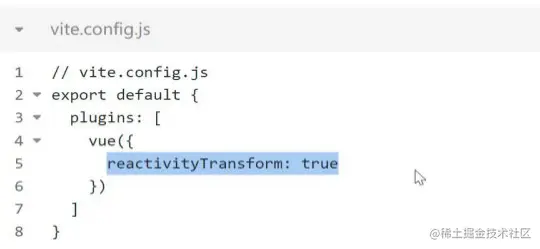
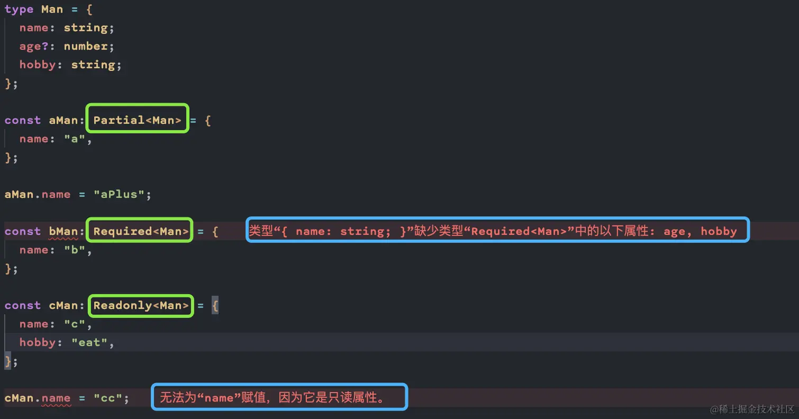
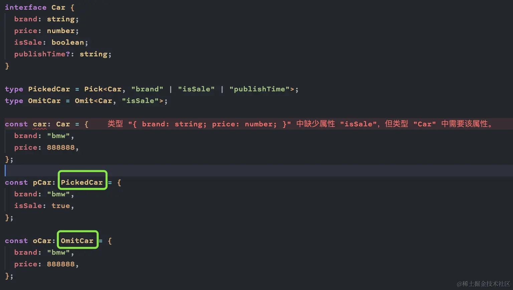
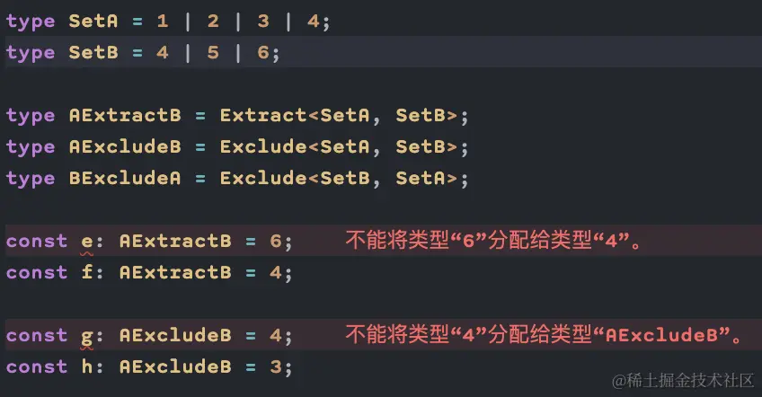

# Typescript面试题

待定面试题：[50+ TypeScript 面试问答 （2024） - GeeksforGeeks](https://www.geeksforgeeks.org/typescript-interview-questions/?ref=lbp)

# Typescript知识点

面试题涉及了 TypeScript 语言的各个方面，包括`基本语法`、`类型系统`、`函数`、`类`、`模块化`、`泛型`、`装饰器`等。在面试中，常见的 TypeScript 面试题主要围绕以下几个方面展开：

- **类型系统**：考察对 TypeScript 类型系统的理解，包括基本类型、联合类型、交叉类型、接口、类型别名、类型推断、类型守卫等。
- **函数和类**：涉及函数参数类型、返回值类型、箭头函数、函数重载、类的定义、继承、访问修饰符等概念。

- **泛型**：考察在函数、类和接口中如何使用泛型来增加代码的灵活性和复用性。

- **模块化**：问题可能涉及 ES6 模块化的语法、导入导出方式以及模块解析等内容。
- **装饰器**：了解对装饰器的使用，包括类装饰器、方法装饰器、属性装饰器以及参数装饰器的定义和应用。

- **编译配置**：熟悉 tsconfig.json 中的配置选项，包括编译目标、模块系统、严格模式等。

- **工程化实践**：了解 TypeScript 在项目中的实际应用，如与 JavaScript 的混用、第三方库的声明文件使用、类型声明等。

## 什么是 TypeScript？

TypeScript 是带有类型的 JavaScript。它是 Microsoft 创建的 JavaScript 超集。

TypeScript 将可选类型、类、async/await 等类型添加到纯 JavaScript 中。

这是 TypeScript 函数的一个简单示例：

```javascript
function greet(name: string): string {
	return "Hello, " + name;
}

console.log(greet("Michael"));
```


## TypeScript的基本数据类型有哪些？

TypeScript有三种常用的基本数据类型：`string`、`number`和`boolean`。

它们与JavaScript中的同名类型相对应。

## 在TypeScript中，如何声明数组？

在TypeScript中，可以使用以下方式声明数组：

```typescript
const myArray: number[] = [1, 2, 3, 4];
```

## TypeScript中的可选链如何工作？

可选链（Optional Chaining）允许您在访问对象属性或方法时避免出现null或undefined的错误。例如：

```typescript
const user = {
  name: 'Alice',
  address: {
    city: 'Wonderland'
  }
};
const cityName = user?.address?.city; // 'Wonderland'
```

## TypeScript中如何创建函数重载？

函数重载允许您为同一个函数提供多个不同的参数类型和返回类型。例如：

```typescript
function greet(name: string): string;
function greet(age: number): string;
function greet(arg: string | number): string {
  if (typeof arg === 'string') {
    return `Hello, ${arg}!`;
  } else {
    return `You are ${arg} years old.`;
  }
}
```

## 什么是类型推断？

类型推断是指TypeScript根据变量的值自动推断出其类型。例如：

```typescript
const message = 'Hello, TypeScript'; // TypeScript推断message为string类型
```

## 什么是上下文类型？

上下文类型是指TypeScript根据上下文环境来推断表达式的类型。例如：

```typescript
const numbers = [1, 2, 3]; // TypeScript推断numbers为number[]类型
```


## 如何设计 Class 的声明？

```js
class Greeter {
	greeting: string;
	constructor(message: string) {
		this.greeting = message;
	}
	greet(): string {
		return "Hello, " + this.greeting;
	}
}
let greeter = new Greeter("world");
// 在声明类的时候，一般类中都会包含，构造函数、对构造函数中的属性进行类型声明、类中的方法。
```


## 如何联合枚举类型的 Key？

```js
enum str {
	A,
	B,
	C,
}
type strUnion = keyof typeof str; // 'A' | 'B' | 'C'
```


## ?.、??、!、!.、\_、 等符号的含义？

`?. 可选链` 遇到 null 和 undefined 可以立即停止表达式的运行。

`?? 空值合并运算符` 当左侧操作数为 null 或 undefined 时，其返回右侧的操作数，否则返回左侧的操作数。

`! 非空断言运算符` x! 将从 x 值域中排除 null 和 undefined

`!. ` 在变量名后添加，可以断言排除 undefined 和 null 类型

`_ 数字分割符` 分隔符不会改变数值字面量的值，使人更容易读懂数字 .e.g 1_101_324。

`** `求幂

## 简单介绍一下 TypeScript 模块的加载机制？

假设有一个导入语句 `import { a } from "moduleA"`;

1. 首先，编译器会尝试定位需要导入的模块文件，通过绝对或者相对的路径查找方式；
2. 如果上面的解析失败了，没有查找到对应的模块，编译器会尝试定位一个`外部模块声明`（.d.ts）；
3. 最后，如果编译器还是不能解析这个模块，则会抛出一个错误 `error TS2307: Cannot find module 'moduleA'.`

## 简单聊聊你对 TypeScript 类型兼容性的理解？

`ts 类型兼容：` 当一个类型 Y 可以赋值给另一个类型 X 时， 我们就可以说类型 X 兼容类型 Y。也就是说两者在结构上是一致的，而不一定非得通过 extends 的方式继承而来

`接口的兼容性：X = Y `只要目标类型 X 中声明的属性变量在源类型 Y 中都存在就是兼容的（ Y 中的类型可以比 X 中的多，但是不能少）

`函数的兼容性：X = Y ` Y 的每个参数必须能在 X 里找到对应类型的参数，参数的名字相同与否无所谓，只看它们的类型（参数可以少但是不能多。与接口的兼容性有区别，原因参考下面《协变、逆变、双变和抗变的理解》）

## 协变、逆变、双变和抗变的理解？

`协变：X = Y `Y 类型可以赋值给 X 类型的情况就叫做协变，也可以说是 X 类型兼容 Y 类型

```typescript
interface X {
	name: string;
	age: number;
}
interface Y {
	name: string;
	age: number;
	hobbies: string[];
}
let x: X = { name: "xiaoming", age: 16 };
let y: Y = { name: "xiaohong", age: 18, hobbies: ["eat"] };
x = y;
```

`逆变：printY = printX` 函数 X 类型可以赋值给函数 Y 类型，因为函数 Y 在调用的时候参数是按照 Y 类型进行约束的，但是用到的是函数 X 的 X 的属性和方法，ts 检查结果是类型安全的。这种特性就叫做逆变，函数的参数有逆变的性质。

```typescript
let printY: (y: Y) => void;
printY = (y) => {
	console.log(y.hobbies);
};
let printX: (x: X) => void;
printX = (x) => {
	console.log(x.name);
};
printY = printX;
```

`双变（双向协变）：X = Y；Y = X`父类型可以赋值给子类型，子类型可以赋值给父类型，既逆变又协变，叫做“双向协变”（ts2.x 之前支持这种赋值，之后 ts 加了一个编译选项 strictFunctionTypes，设置为 true 就只支持函数参数的逆变，设置为 false 则支持双向协变）

`抗变（不变）：`非父子类型之间不会发生型变，只要类型不一样就会报错

## TypeScript 中对象展开会有什么副作用吗？

1. 展开对象后面的属性会覆盖前面的属性；
2. 仅包含对象自身的可枚举属性，不可枚举的属性将会丢失。

## 类型的全局声明和局部声明

如果声明文件内不包含`import、export`，那么这个文件声明的类型就会变成全局声明。反之，若是这个文件包含了`import、export`，那么这个文件包含的类型声明则会是局部声明，不会影响到全局声明。

## TypeScript 中同名的 interface 或者同名的 interface 和 class 可以合并吗？

同名的 interface 会自动合并，同名的 interface 和 class 会自动聚合。

## 如何使 TypeScript 项目引入并识别编译为 JavaScript 的 npm 库包？

1. 选择安装 ts 版本，`npm install @types/包名 --save`；
2. 对于没有类型的 js 库，需要编写同名的.d.ts 文件

## TypeScript 的 tsconfig.json 中有哪些配置项信息？

```json
{
"files": [],
"include": [],
"exclude": [],
"compileOnSave": false,
"extends": "",
"compilerOptions": { ... }
}
```

`files` 是一个数组列表，里面包含指定文件的相对或绝对路径，用来指定待编译文件，编译器在编译的时候只会编译包含在 files 中列出的文件。
`include & exclude` 指定编译某些文件，或者指定排除某些文件。
`compileOnSave：true` 让 IDE 在保存文件的时候根据 tsconfig.json 重新生成文件。
`extends` 可以通过指定一个其他的 tsconfig.json 文件路径，来继承这个配置文件里的配置。
`compilerOptions` 编译配置项，如何对具体的 ts 文件进行编译


## TypeScript 中如何设置模块导入的路径别名？

> 通过 tsconfig.json 中的 paths 项来配置:
>
> ```json
> {
>   "compilerOptions":
>     {
>       "baseUrl": ".",
>       "paths": {
>          "@helper/*": ["src/helper/*"],
>          "@utils/*": ["src/utils/*"],
>          ...
>       }
>    }
> }
> ```

## declare，declare global 是什么？

> `declare` 是用来定义全局变量、全局函数、全局命名空间、js modules、class 等
> `declare global` 为全局对象 `window` 增加新的属性
>
> ```ts
> declare global {
> 	interface Window {
> 		csrf: string;
> 	}
> }
> ```

## 对 TypeScript 类中成员的 public、private、protected、readonly 修饰符的理解？

> `public`: 成员都默认为`public`，被此限定符修饰的成员是可以被外部访问；
> `private`: 被此限定符修饰的成员是只可以被类的内部访问；
> `protected`: 被此限定符修饰的成员是只可以被类的内部以及类的子类访问;
> `readonly`: 关键字将属性设置为只读的。 只读属性必须在声明时或构造函数里被初始化。

## keyof 和 typeof 关键字的作用？

> `keyof 索引类型查询操作符` 获取索引类型的属性名，构成联合类型。
> `typeof` 获取一个变量或对象的类型。

## 简述工具类型 `Exclude`、`Omit`、`Merge`、`Intersection`、`Overwrite`的作用

- `Exclude<T, U>` 从 `T` 中排除出可分配给 `U`的元素。
- `Omit<T, K>` 的作用是忽略`T`中的某些属性。
- `Merge<O1, O2>` 是将两个对象的属性合并。
- `Compute<A & B>` 是将交叉类型合并
- `Intersection<T, U>`的作用是取`T`的属性,此属性同样也存在与`U`。
- `Overwrite<T, U>` 是用`U`的属性覆盖`T`的相同属性。

## 数组定义的两种方式

```typescript
type Foo = Array<string>;
interface Bar {
	baz: Array<{ name: string; age: number }>;
}

type Foo = string[];
interface Bar {
	baz: { name: string; age: number }[];
}
```

## 1. 为什么推荐使用 TypeScript？

TypeScript 是微软公司开发和维护的一种面向对象的编程语言。它是 JavaScript 的超集，包含其所有元素。

其中，强类型和弱类型、静态类型和动态类型是两组不同的概念。

类型强弱是针对类型转换是否显示来区分，静态和动态类型是针对类型检查的时机来区分。

TS 对 JS 的改进主要是静态类型检查，静态类型检查有何意义？标准答案是“静态类型更有利于构建大型应用”。

推荐使用 TypeScript 的原因有：

- TypeScript 是开源的。
- TypeScript 为 JavaScript ide 和实践（如静态检查）提供了高效的开发工具。
- TypeScript 使代码更易于阅读和理解。
- 使用 TypeScript，我们可以大大改进普通的 JavaScript。
- TypeScript 为我们提供了 ES6（ECMAScript 6）的所有优点，以及更高的生产率。
- TypeScript 通过对代码进行类型检查，可以帮助我们避免在编写 JavaScript 时经常遇到的令人痛苦的错误。
- 强大的类型系统，包括泛型。
- TypeScript 只不过是带有一些附加功能的 JavaScript。
- TypeScript 代码可以按照 ES5 和 ES6 标准编译，以支持最新的浏览器。
- 与 ECMAScript 对齐以实现兼容性。
- 以 JavaScript 开始和结束。
- 支持静态类型。
- TypeScript 将节省开发人员的时间。
- TypeScript 是 ES3、ES5 和 ES6 的超集。

## 2. 说说 TypeScript 中命名空间与模块的理解和区别

**命名空间**：命名空间一个最明确的目的就是解决重名问题

命名空间定义了标识符的可见范围，一个标识符可在多个名字空间中定义，它在不同名字空间中的含义是互不相干的

这样，在一个新的名字空间中可定义任何标识符，它们不会与任何已有的标识符发生冲突，因为已有的定义都处于其他名字空间中

**模块**：`TypeScript` 与` ECMAScript` 2015 一样，任何包含顶级 `import` 或者 `export` 的文件都被当成一个模块

相反地，如果一个文件不带有顶级的`import`或者`export`声明，那么它的内容被视为全局可见的

**它们之间的区别**：

- 命名空间是位于全局命名空间下的一个普通的带有名字的 JavaScript 对象，使用起来十分容易。但就像其它的全局命名空间污染一样，它很难去识别组件之间的依赖关系，尤其是在大型的应用中
- 像命名空间一样，模块可以包含代码和声明。 不同的是模块可以声明它的依赖
- 在正常的 TS 项目开发过程中并不建议用命名空间，但通常在通过 d.ts 文件标记 js 库类型的时候使用命名空间，主要作用是给编译器编写代码的时候参考使用

## 3. TypeScript 支持的访问修饰符有哪些？

TypeScript 支持访问修饰符 public，private 和 protected，它们决定了类成员的可访问性。

- 公共（public），类的所有成员，其子类以及该类的实例都可以访问。
- 受保护（protected），该类及其子类的所有成员都可以访问它们。 但是该类的实例无法访问。
- 私有（private），只有类的成员可以访问它们。

如果未指定访问修饰符，则它是隐式公共的，因为它符合 JavaScript 的便利性。

## 4. TypeScript 中有哪些声明变量的方式？

```ts
// 声明类型和值，Declaring type and value in a single statement
let [identifier] : [type-annotation] = value;

// 只声明类型，Declaring type without value
let [identifier] : [type-annotation];

// 只声明值，Declaring its value without type
let [identifier] = value;

// 声明变量无类型和值，Declaring without value and type
let [identifier];
```

## 5. TypeScript 和 JavaScript 的区别是什么？

Typescript 是 JavaScript 的超集，可以被编译成 JavaScript 代码。用 JavaScript 编写的代码，在 TypeScript 中依然有效。Typescript 是纯面向对象的编程语言，包含类和接口的概念。 程序员可以用它来编写面向对象的服务端或客户端程序，并将它们编译成 JavaScript 代码。

## 6. TypeScript 中的 Declare 关键字有什么作用？

我们知道所有的 JavaScript 库/框架都没有 TypeScript 声明文件，但是我们希望在 TypeScript 文件中使用它们时不会出现编译错误。为此，我们使用 declare 关键字。在我们希望定义可能存在于其他地方的变量的环境声明和方法中，可以使用 declare 关键字。

例如，假设我们有一个名为 myLibrary 的库，它没有 TypeScript 声明文件，在全局命名空间中有一个名为 myLibrary 的命名空间。如果我们想在 TypeScript 代码中使用这个库，我们可以使用以下代码:

```ts
declare let myLibrary;
```

TypeScript 运行时将把 myLibrary 变量赋值为任意类型(any)。这是一个问题，我们不会得到智能感知在设计时，但我们将能够使用库在我们的代码。

## 7. 解释一下 TypeScript 中的枚举

枚举是 TypeScipt 数据类型，它允许我们定义一组命名常量。 使用枚举去创建一组不同的案例变得更加容易。 它是相关值的集合，可以是数字值或字符串值。

```ts
enum Gender {
	Male,
	Female,
	Other,
}
console.log(Gender.Male); // Output: 0

//We can also access an enum value by it's number value.
console.log(Gender[1]); // Output: Female
```

## 8. TypeScript 中什么是装饰器？

装饰器是一种特殊类型的声明，它能过被附加到类声明，方法，属性或者参数上，可以修改类的行为

通俗的来说就是一个方法，可以注入到类，方法，属性参数上来扩展类，属性，方法，参数的功能

**装饰器的分类**: 类装饰器、属性装饰器、方法装饰器、参数装饰器

## 9. TypeScript 中的模块是什么？

TypeScript 中的模块是相关变量、函数、类和接口的集合。 你可以将模块视为包含执行任务所需的一切的容器。可以导入模块以轻松地在项目之间共享代码。

```ts
module module_name {
	class xyz {
		sum(x, y) {
			return x + y;
		}
	}
}
```

## 10. TypeScript 的内置数据类型有哪些？

```ts
// 数字类型：用于表示数字类型的值。TypeScript 中的所有数字都存储为浮点值。
let num: number = 1;

// 字符类型： 用于表示字符串类型的值
let str: string = "CoderBin";

// 布尔类型：一个逻辑二进制开关，包含true或false
let flag: boolean = true;

// void 类型：分配给没有返回值的方法的类型。
let unusable: void = undefined;
```

## 11. TypeScript 的主要特点是什么？

- **跨平台**：TypeScript 编译器可以安装在任何操作系统上，包括 Windows、macOS 和 Linux。
- **ES6 特性**：TypeScript 包含计划中的 ECMAScript 2015 (ES6) 的大部分特性，例如箭头函数。
- **面向对象的语言**：TypeScript 提供所有标准的 OOP 功能，如类、接口和模块。
- **静态类型检查**：TypeScript 使用静态类型并帮助在编译时进行类型检查。因此，你可以在编写代码时发现编译时错误，而无需运行脚本。
- **可选的静态类型**：如果你习惯了 JavaScript 的动态类型，TypeScript 还允许可选的静态类型。

## 12. TypeScript 中 never 和 void 的区别？

- void 表示没有任何类型（可以被赋值为 null 和 undefined）。
- never 表示一个不包含值的类型，即表示永远不存在的值。
- 拥有 void 返回值类型的函数能正常运行。拥有 never 返回值类型的函数无法正常返回，无法终止，或会抛出异常。

## 13. TypeScript 中的类型断言是什么？

类型断言可以用来手动指定一个值具体的类型，即允许变量从一种类型更改为另一种类型。

当你比 TS 更了解某个值的类型，并且需要指定更具体的类型时，我们可以使用**类型断言**。

## 14. TS 中 any 和 unknown 有什么区别？

unknown 和 any 的主要区别是 unknown 类型会更加严格：在对 unknown 类型的值执行大多数操作之前，我们必须进行某种形式的检查。而在对 any 类型的值执行操作之前，我们不必进行任何检查。

```ts
let foo: any = 123;
console.log(foo.msg); // 符合TS的语法
let a_value1: unknown = foo; // OK
let a_value2: any = foo; // OK
let a_value3: string = foo; // OK

let bar: unknown = 222; // OK
console.log(bar.msg); // Error
let k_value1: unknown = bar; // OK
let K_value2: any = bar; // OK
let K_value3: string = bar; // Error
```

因为 bar 是一个未知类型(任何类型的数据都可以赋给 `unknown` 类型)，所以不能确定是否有 msg 属性。不能通过 TS 语法检测；而 unknown 类型的值也不能将值赋给 any 和 unknown 之外的类型变量

**总结**: any 和 unknown 都是顶级类型，但是 unknown 更加严格，不像 any 那样不做类型检查，反而 unknown 因为未知性质，不允许访问属性，不允许赋值给其他有明确类型的变量。

## 15. 使用 TS 实现一个判断传入参数是否是数组类型的方法？

unknown 用于变量类型不确定，但肯定可以确定的情形下，比如下面这个示例中，参数总归会有个值，根据这个值的类型进行不同的处理，这里使用 unknown 替代 any 则会更加类型安全。

```ts
function isArray(x: unknown): boolean {
	if (Array.isArray(x)) {
		return true;
	}
	return false;
}
```

## 16. tsconfig.json 有什么作用？

tsconfig.json 文件是 JSON 格式的文件。

在 tsconfig.json 文件中，可以指定不同的选项来告诉编译器如何编译当前项目。

目录中包含 tsconfig.json 文件，表明该目录是 TypeScript 项目的根目录。

```json
// 常用配置
{
	/*
      tsconfig.json是ts编译器的配置文件，ts可以根据它的信息来对待吗进行编译 可以再tsconfig中写注释
      include : 用来指定哪些文件需要被编译
      exclude : 用来指定哪些文件不需要被编译 ：默认node_module
      extends : 用来指定继承的配置文件
      files   : 用来指定被编译的文件列表，只有编译少量文件才使用
      compilerOptions : 编译器的选项是配置文件中非常重要也是非常复杂的配置选项
  */
	"include": [
		// ** : 任意目录 ， * : 任意文件
		"./src/**/*"
	],
	"exclude": ["./src/hello/**/*"],
	// "extends": "./configs/base",
	"files": [
		"1.ts"
		// "2.ts"
	],
	"compilerOptions": {
		// 用来指定 ES 版本 ESNext : 最新版。 'ES3', 'ES5', 'ES6'/'ES2015', 'ES2016', 'ES2017', 'ES2018', 'ES2019', 'ES2020', 'ESNext'
		"target": "ES2020",
		// 指定要使用模块化的规范 : 'None', 'CommonJS', 'AMD', 'System', 'UMD', 'ES6'/'ES2015', 'ES2020' or 'ESNext'
		"module": "ESNext",
		// 用来指定项目中要使用的库 'ES5', 'ES6', 'ES2015', 'ES7', 'ES2016', 'ES2017', 'ES2018', 'ESNext', 'DOM', 'DOM.Iterable',
		//                          'WebWorker', 'ScriptHost', 'ES2015.Core', 'ES2015.Collection', 'ES2015.Generator', 'ES2015.Iterable',
		//                          'ES2015.Promise', 'ES2015.Proxy', 'ES2015.Reflect', 'ES2015.Symbol', 'ES2015.Symbol.WellKnown',
		//                          'ES2016.Array.Include', 'ES2017.object', 'ES2017.Intl', 'ES2017.SharedMemory', 'ES2017.String',
		//                          'ES2017.TypedArrays', 'ES2018.Intl', 'ES2018.Promise', 'ES2018.RegExp', 'ESNext.AsyncIterable',
		//                          'ESNext.Array', 'ESNext.Intl', 'ESNext.Symbol'
		// 运行在浏览器中不用设置，运行在node或其他中才需要设置
		// "lib":[]，
		// 用来指定编译后文件的存放位置
		"outDir": "./dist",
		// 将代码合并为一个文件,设置之后所有的全局作用域中的代码会合并到同一个文件中 但是只能在  'amd' and 'system' 中才能使用
		// "outFile": "./dist/app.js",
		// 是否对js文件进行编译，默认false
		"allowJs": false,
		// 是否检查js代码是否符合语法规范，默认false
		"checkJs": false,
		// 是否移除注释，默认false
		"removeComments": false,
		// 是否不生成编译后文件，默认false
		"noEmit": false,
		// 当有错误时是否生成文件，默认false
		"noEmitOnError": false,
		// 是否生成sourceMap，默认false  这个文件里保存的，是转换后代码的位置，和对应的转换前的位置。有了它，出错的时候，通过断点工具可以直接显示原始代码，而不是转换后的代码。
		"sourceMap": false,

		// 所有的严格检查的总开关，默认false
		"strict": false,
		// 编译后的文件是否开启严格模式，默认false
		"alwaysStrict": false,
		// 不允许隐式的any，默认false(允许)
		"noImplicitAny": false,
		// 不允许隐式的this，默认false(允许)
		"noImplicitThis": false,
		// 是否严格的检查空值，默认false 检查有可能为null的地方
		"strictNullChecks": true,
		// 是否严格检查bind、call和apply的参数列表，默认false  检查是否有多余参数
		"strictBindCallApply": false,
		// 是否严格检查函数的类型，
		"strictFunctionTypes": false,
		// 是否严格检查属性是否初始化，默认false
		"strictPropertyInitialization": false,

		// 是否检查switch语句包含正确的break，默认false
		"noFallthroughCasesInSwitch": false,
		// 检查函数没有隐式的返回值，默认false
		"noImplicitReturns": false,
		// 是否检查检查未使用的局部变量，默认false
		"noUnusedLocals": false,
		// 是否检查未使用的参数，默认false
		"noUnusedParameters": false,

		// 是否检查不可达代码报错，默认false   true，忽略不可达代码 false，不可达代码将引起错误
		"allowUnreachableCode": false
	}
}
```

## 17. TypeScript 中什么是类类型接口？

- 如果接口用于一个类的话，那么接口会表示“行为的抽象”
- 对类的约束，让类去实现接口，类可以实现多个接口
- 接口只能约束类的公有成员（实例属性/方法），无法约束私有成员、构造函数、静态属性/方法

## 18. TS 中什么是方法重载？

方法重载是指在一个类中定义多个同名的方法，但要求每个方法具有不同的参数的类型或参数的个数。 基本上，它在派生类或子类中重新定义了基类方法。

方法覆盖规则：

- 该方法必须与父类中的名称相同。
- 它必须具有与父类相同的参数。
- 必须存在 IS-A 关系或继承。

## 19. TS 中的类是什么，如何定义？

类表示一组相关对象的共享行为和属性。

例如，我们的类可能是 Student，其所有对象都具有该 attendClass 方法。另一方面，John 是一个单独的 type 实例，Student 可能有额外的独特行为，比如 attendExtracurricular.

你使用关键字声明类 class：

```ts
class Student {
	studCode: number;
	studName: string;
	constructor(code: number, name: string) {
		this.studName = name;
		this.studCode = code;
	}
}
```


## 20. 如何在 TS 中实现继承？

继承是一种从另一个类获取一个类的属性和行为的机制。它是面向对象编程的一个重要方面，并且具有从现有类创建新类的能力，继承成员的类称为基类，继承这些成员的类称为派生类。

继承可以通过使用 extend 关键字来实现。我们可以通过下面的例子来理解它。

```ts
class Shape {
	Area: number;
	constructor(area: number) {
		this.Area = area;
	}
}
class Circle extends Shape {
	display(): void {
		console.log("圆的面积: " + this.Area);
	}
}
var obj = new Circle(320);
obj.display();
```

## 21. TS 中的泛型是什么？

TypeScript Generics 是提供创建可重用组件的方法的工具。 它能够创建可以使用多种数据类型而不是单一数据类型的组件。 而且，它在不影响性能或生产率的情况下提供了类型安全性。 泛型允许我们创建泛型类，泛型函数，泛型方法和泛型接口。

在泛型中，类型参数写在左括号（<）和右括号（>）之间，这使它成为强类型集合。 它使用一种特殊的类型变量来表示类型

```ts
function identity<T>(arg: T): T {
	return arg;
}
let output1 = identity<string>("CoderBin");
let output2 = identity<number>(117);
console.log(output1);
console.log(output2);
```

## 22. 说说 TS 中的类及其特性

TypeScript 引入了类，以便它们可以利用诸如封装和抽象之类的面向对象技术的好处。

TypeScript 编译器将 TypeScript 中的类编译为普通的 JavaScript 函数，以跨平台和浏览器工作。

一个类包括以下内容：

- 构造器（Constructor）
- 属性（Properties）
- 方法（Methods）

```ts
class Employee {
	empID: number;
	empName: string;

	constructor(ID: number, name: string) {
		this.empName = name;
		this.empID = ID;
	}

	getSalary(): number {
		return 40000;
	}
}
```

类的其他特性有：

- 继承（Inheritance）
- 封装（Encapsulation）
- 多态（Polymorphism）
- 抽象（Abstraction）

## 23. 解释如何使用 TypeScript mixin

Mixin 本质上是在相反方向上工作的继承。Mixins 允许你通过组合以前类中更简单的部分类来设置构建新类。

相反，类 A 继承类 B 来获得它的功能，类 B 从类 A 需要返回一个新类的附加功能。

## 24. 什么是 TypeScript 映射文件？

- TypeScript Map 文件是一个源映射文件，其中包含有关我们原始文件的信息。
- .map 文件是源映射文件，可让工具在发出的 JavaScript 代码和创建它的 TypeScript 源文件之间进行映射。
- 许多调试器可以使用这些文件，因此我们可以调试 TypeScript 文件而不是 JavaScript 文件。

## 25. TS 中的类型有哪些？

类型系统表示语言支持的不同类型的值。它在程序存储或操作所提供的值之前检查其有效性。

它可以分为两种类型，

- 内置：包括数字(number)，字符串(string)，布尔值(boolean)，无效(void)，空值(null)和未定义(undefined)。
- 用户定义的：它包括枚举(enums)，类(classes)，接口(interfaces)，数组(arrays)和元组(tuple)。

## 26. TS 中的 interface 和 type 有什么区别？

**相同点：**

1. 都可以描述一个对象或者函数

**interface**

```ts
interface User {
	name: string;
	age: number;
}

interface SetUser {
	(name: string, age: number): void;
}
```

**type**

```ts
type User = {
	name: string;
	age: number;
};

type SetUser = (name: string, age: number) => void;
```

1. 都允许拓展（extends）

interface 和 type 都可以拓展，并且两者并不是相互独立的，也就是说 interface 可以 extends type, type 也可以 extends interface 。 虽然效果差不多，但是两者语法不同。

**不同点**

- type 可以而 interface 不行

**type 可以声明基本类型别名，联合类型，元组等类型**

```ts
// 基本类型别名
type Name = string;

// 联合类型
interface Dog {
	wong();
}
interface Cat {
	miao();
}

type Pet = Dog | Cat;

// 具体定义数组每个位置的类型
type PetList = [Dog, Pet];
```

**type 语句中还可以使用 typeof 获取实例的类型进行赋值**

```ts
// 当你想获取一个变量的类型时，使用 typeof
let div = document.createElement("div");
type B = typeof div;
```

**其他骚操作**

```ts
type StringOrNumber = string | number;
type Text = string | { text: string };
type NameLookup = Dictionary<string, Person>;
type Callback<T> = (data: T) => void;
type Pair<T> = [T, T];
type Coordinates = Pair<number>;
type Tree<T> = T | { left: Tree<T>; right: Tree<T> };
```

- interface 可以而 type 不行

**interface 能够声明合并**

```ts
interface User {
	name: string;
	age: number;
}

interface User {
	sex: string;
}

/*
User 接口为 {
  name: string
  age: number
  sex: string 
}
*/
```

一般来说，如果不清楚什么时候用 interface/type，能用 interface 实现，就用 interface , 如果不能就用 type 。

## 27. TS 中的 getter/setter 是什么？你如何使用它们？

Getter 和 setter 是特殊类型的方法，可帮助你根据程序的需要委派对私有变量的不同级别的访问。

Getters 允许你引用一个值但不能编辑它。Setter 允许你更改变量的值，但不能查看其当前值。这些对于实现封装是必不可少的。

例如，新雇主可能能够了解 get 公司的员工人数，但无权 set 了解员工人数。

```ts
const fullNameMaxLength = 10;
class Employee {
	private _fullName: string = "";
	get fullName(): string {
		return this._fullName;
	}
	set fullName(newName: string) {
		if (newName && newName.length > fullNameMaxLength) {
			throw new Error("fullName has a max length of " + fullNameMaxLength);
		}
		this._fullName = newName;
	}
}
let employee = new Employee();
employee.fullName = "Bin Coder";
if (employee.fullName) {
	console.log(employee.fullName);
}
```

## 28. 如何检查 TS 中的 null 和 undefiend？

通过使用一个缓冲检查，我们可以检查空和未定义:

```ts
if (x == null) {
}
```

如果我们使用严格的检查，它将总是对设置为 null 的值为真，而对未定义的变量不为真。

例子

```ts
var a: number;
var b: number = null;
function check(x, name) {
	if (x == null) {
		console.log(name + " == null");
	}
	if (x === null) {
		console.log(name + " === null");
	}
	if (typeof x === "undefined") {
		console.log(name + " is undefined");
	}
}
check(a, "a");
check(b, "b");
```

输出

```ts
"a == null";
"a is undefined";
"b == null";
"b === null";
```

## 29. TypeScript 中 const 和 readonly 的区别是什么？

- const 用于变量，readonly 用于属性
- const 在运行时检查，readonly 在编译时检查
- 使用 const 变量保存的数组，可以使用 push，pop 等方法。但是如果使用 Readonly Array 声明的数组不能使用 push，pop 等方法

## 30. Omit 类型有什么作用

Omit 以一个类型为基础支持剔除某些属性，然后返回一个新类型。 语法如下

```typescript
Omit<Type, Keys>;
```

使用示例

```typescript
interface Todo {
	title: string;
	description: string;
	completed: boolean;
	createdAt: number;
}
type TodoPreview = Omit<Todo, "description">;
```

### private, protected, public type, interface 类型和接口联合类型，交叉类型

### 泛型

### keyof, typeof 的使用

### Utility Type 的实现原理

## type 和 interface 的区别

相同点：

1. 都可以描述 '对象' 或者 '函数'
2. 都允许拓展(extends)

不同点：

1. type 可以声明基本类型，联合类型，元组
2. type 可以使用 typeof 获取实例的类型进行赋值
3. 多个相同的 interface 声明可以自动合并

使用 interface 描述‘数据结构’，使用 type 描述‘类型关系’

interface 可以重复声明，type 不行，继承方式不一样，type 使用交叉类型方式，interface 使用 extends 实现。

在对象扩展的情况下，使用接口继承要比交叉类型的性能更好。建议使用 interface 来描述对象对外暴露的借口，使用 type 将一组类型重命名（或对类型进行复杂编程）。

```ts
interface iMan {
	name: string;
	age: number;
}
// 接口可以进行声明合并
interface iMan {
	hobby: string;
}

type tMan = {
	name: string;
	age: number;
};
// type不能重复定义
// type tMan = {}

// 继承方式不同,接口继承使用extends
interface iManPlus extends iMan {
	height: string;
}
// type继承使用&，又称交叉类型
type tManPlus = { height: string } & tMan;

const aMan: iManPlus = {
	name: "aa",
	age: 15,
	height: "175cm",
	hobby: "eat",
};

const bMan: tManPlus = {
	name: "bb",
	age: 15,
	height: "150cm",
};
```

## any、unkonwn、never

any 和 unkonwn 在 TS 类型中属于最顶层的 Top Type，即所有的类型都是它俩的子类型。而 never 则相反，它作为 Bottom Type 是所有类型的子类型。

## 1. 什么是 TypeScript

`TypeScript`是一种由微软开发的开源编程语言，它是 强类型的 JavaScript 的`超集`。

TypeScript 通过添加`静态类型`、`类`、`接口`和`模块`等功能，使得在大型应用程序中更容易进行维护和扩展。它可以被编译为纯 JavaScript，从而能够在任何支持 JavaScript 的地方运行。使用 TypeScript 可以帮助开发人员在编码过程中避免一些常见的错误，并提供更好的代码编辑功能和工具支持。

TypeScript 支持面向对象编程的概念，如类、接口、继承、泛型等。Typescript 并不直接在浏览器上运行，需要编译器编译成纯 Javascript 来运行。

## 2. 为什么要使用 TypeScript ? TypeScript 相对于 JavaScript 的优势是什么？

增加了静态类型，可以在开发人员编写脚本时检测错误，使得代码质量更好，更健壮。

优势:

1. 杜绝手误导致的变量名写错;
2. 类型可以一定程度上充当文档;
3. IDE 自动填充，自动联想;

## 2. 类型声明和类型推断的区别，并举例应用

类型声明是显式地为变量或函数指定类型，而类型推断是 TypeScript 根据赋值语句右侧的值自动推断变量的类型。例如：

```ts
// 类型声明
let x: number;
x = 10;
// 类型推断
let y = 20; // TypeScript会自动推断y的类型为number
```

## 使用 String、Number、Boolean、Symbol、Object 等给类型做声明

```js
let name: string = "bob";
let decLiteral: number = 6;
let isDone: boolean = false;
let sym: symbol = Symbol();
interface Person {
	name: string;
	age: number;
}
```

## 3. 什么是接口（interface），它的作用，接口的使用场景。接口和类型别名（Type Alias）的区别

接口是用于描述对象的形状的结构化类型。它定义了对象应该包含哪些属性和方法。在 TypeScript 中，接口可以用来约束对象的结构，以提高代码的可读性和维护性。例如：

```ts
interface Person {
	name: string;
	age: number;
}
function greet(person: Person) {
	return `Hello, ${person.name}!`;
}
```

`接口`和`类型别名`的区别：

- `接口`定义了一个契约，描述了对象的形状（属性和方法），以便在多个地方共享。它可以被类、对象和函数实现。
- `类型别名`给一个类型起了一个新名字，便于在多处使用。它可以用于原始值、联合类型、交叉类型等。与接口不同，类型别名可以用于原始类型、联合类型、交叉类型等，而且还可以为任意类型指定名字。

## 4. 什么是泛型（generic），如何创建泛型函数和泛型类，实际用途

`泛型`是一种在定义函数、类或接口时使用类型参数的方式，以增加代码的灵活性和重用性。在 TypeScript 中，可以使用来创建泛型。例如：

```ts
function identity<T>(arg: T): T {
	return arg;
}
// 调用泛型函数
let output = identity<string>("hello");
```

## 5. 枚举（enum）是什么，它的优势，应用案例。枚举和常量枚举的区别

枚举是一种对数字值集合进行命名的方式。它们可以增加代码的可读性，并提供一种便捷的方式来使用一组有意义的常量。例如：

```ts
enum Color {
	Red,
	Green,
	Blue,
}

let selectedColor: Color = Color.Red;
```

枚举和常量枚举的区别:

- `枚举`可以包含计算得出的值，而常量枚举则在编译阶段被删除，并且不能包含计算得出的值，它只能包含常量成员。
- `常量枚举`在编译后会被删除，而普通枚举会生成真实的对象。

## 6. 如何处理可空类型（nullable types）和 undefined 类型，如何正确处理这些类型以避免潜在错误

在 TypeScript 中，可空类型是指一个变量可以存储特定类型的值，也可以存储`null`或`undefined`。（通过使用可空类型，开发者可以明确表达一个变量可能包含特定类型的值，也可能不包含值（即为`null`或`undefined`）。这有助于提高代码的可读性，并使得变量的可能取值范围更加清晰明了）。

为了声明一个可空类型，可以使用联合类型（Union Types），例如 `number | null` 或 `string | undefined`。 例如：

```ts
let numberOrNull: number | null = 10;
numberOrNull = null; // 可以赋值为null

let stringOrUndefined: string | undefined = "Hello";
stringOrUndefined = undefined; // 可以赋值为undefined
```

## 使用 Union Types 时有哪些注意事项？

> **属性或方法访问**: 当 TypeScript 不确定一个联合类型的变量到底是哪个类型的时候，我们只能访问此联合类型的所有类型里共有的属性或方法。
>
> ```js
> function getLength(something: string | number): number {
> 	return something.length;
> }
> // index.ts(2,22): error TS2339: Property 'length' does not exist on type >'string | number'.
> //   Property 'length' does not exist on type 'number'.
> 
> function getString(something: string | number): string {
> 	return something.toString();
> }
> // 公共方法和属性可以访问
> ```

## 7. 什么是联合类型和交叉类型

`联合类型`表示一个值可以是多种类型中的一种，而`交叉类型`表示一个新类型，它包含了多个类型的特性。

- 联合类型示例：

```ts
// typescript
let myVar: string | number;
myVar = "Hello"; // 合法
myVar = 123; // 合法
```

- 交叉类型示例：

```ts
interface A {
	a(): void;
}
interface B {
	b(): void;
}
type C = A & B; // 表示同时具备 A 和 B 的特性
```

## 8. 什么是 TypeScript 中的声明文件（Declaration Files）

声明文件（通常以 `.d.ts` 扩展名结尾）用于描述已有 JavaScript 代码库的类型信息。它们提供了类型定义和元数据，以便在 TypeScript 项目中使用这些库时获得智能感知和类型安全。

## 9. 什么是命名空间（Namespace）和模块（Module）

```
模块
```

- 在一个大型项目中，可以将相关的代码组织到单独的文件，并使用模块来导入和导出这些文件中的功能。
- 在一个 Node.js 项目中，可以使用 import 和 export 关键字来创建模块，从而更好地组织代码并管理依赖关系。

```
命名空间
```

- 在面向对象的编程中，命名空间可以用于将具有相似功能或属性的类、接口等进行分组，以避免全局命名冲突。
- 这在大型的 JavaScript 或 TypeScript 应用程序中特别有用，可以确保代码结构清晰，并且不会意外地重复定义相同的名称。

`模块`提供了一种组织代码的方式，使得我们可以轻松地在多个文件中共享代码，

`命名空间`则提供了一种在全局范围内组织代码的方式，防止命名冲突。

模块示例:

```ts
// greeter.ts
export function sayHello(name: string) {
	return `Hello, ${name}!`;
}
// app.ts
import { sayHello } from "./greeter";
console.log(sayHello("John"));
```

命名空间示例:

```ts
// greeter.ts
namespace Greetings {
	export function sayHello(name: string) {
		return `Hello, ${name}!`;
	}
}
// app.ts
<reference path="greeter.ts" />;
console.log(Greetings.sayHello("John"));
```

在上面的示例中：

- 使用模块时，我们可以使用 `export` 和 `import` 关键字来定义和引入模块中的函数或变量。
- 而在命名空间中，我们使用 namespace 来创建命名空间，并且需要在使用之前使用 `<reference path="file.ts" />`来引入命名空间。

## 10. 什么是类型断言（Type Assertion）

类型断言允许程序员手动指定一个值的类型。这在需要明确告诉编译器某个值的类型时非常有用。

```ts
let someValue: any = "this is a string";
let strLength: number = (someValue as string).length;
```

## 11. TypeScript 中的可选参数和默认参数是什么

- 可选参数允许函数中的某些参数不传值，在参数后面加上问号`?`表示可选。
- 默认参数允许在声明函数时为参数指定`默认值`，这样如果调用时未提供参数值，则会使用默认值。

可选参数示例：

```ts
function greet(name: string, greeting?: string) {
	if (greeting) {
		return `${greeting}, ${name}!`;
	} else {
		return `Hello, ${name}!`;
	}
}
```

默认参数示例：

```ts
function greet(name: string, greeting: string = "Hello") {
	return `${greeting}, ${name}!`;
}
```

## 12. 类型守卫（Type Guards）是什么

类型守卫是一种用于在运行时检查类型的技术，它允许开发人员在特定的作用域内缩小变量的范围，以确保正确推断类型。

```ts
function isString(test: any): test is string {
	return typeof test === "string";
}
if (isString(input)) {
	// input 在此代码块中被收窄为 string 类型
}
```

## 13. 索引类型（Index Types）是什么，好处有什么

索引类型允许我们在 TypeScript 中创建具有动态属性名称的对象，并且能够根据已知的键来获取相应的属性类型。 好处：

**1.动态属性访问**

> 在处理动态属性名的对象时，可以使用索引类型来实现类型安全的属性访问。例如，当从服务器返回的 JSON 数据中提取属性时，可以利用索引类型来确保属性名存在并获取其对应的类型。

**2.代码重用**

> 当需要创建通用函数来操作对象属性时，索引类型可以帮助我们实现更加通用和灵活的代码。例如，一个通用的函数可能需要根据传入的属性名称获取属性值，并进行特定的处理。

```ts
interface ServerData {
  id: number;
  name: string;
  age: number;
  // 可能还有其他动态属性
}
function getPropertyValue(obj: ServerData, key: keyof ServerData): void {
  console.log(obj\[key]); // 确保 obj\[key] 的类型是正确的 // 这里可以直接使用索引类型来获取属性值
}
```

**3.动态扩展对象**

> 当需要处理来自外部来源（比如 API 响应或数据库查询）的动态数据时，索引类型可以让我们轻松地处理这种情况，而不必为每个可能的属性手动定义类型。

```ts
interface DynamicObject {
  [key: string]: number | string; // 允许任意属性名，但属性值必须为 number 或 string 类型

}
function processDynamicData(data: DynamicObject): void {
  for (let key in data) {
    console.log(key + ": " + data\[key]); // 对任意属性进行处理
  }
}
```

**4.类型安全性**

> 索引类型可以增强代码的类型安全性，因为它们可以捕获可能的属性名拼写错误或键不存在的情况。

**5.映射类型**

> TypeScript 还提供了映射类型（Mapped Types）的概念，它们利用索引类型可以根据现有类型自动生成新类型。这在创建新类型时非常有用，特别是当需要在现有类型的基础上添加或修改属性时。

## 14. const 和 readonly 的区别

当在 TypeScript 中使用`const`和`readonly`时，它们的行为有一些显著的区别：

- **const：**
  - `const`用于声明常量值。一旦被赋值后，其值将不能被重新赋值或修改。
  - 常量必须在声明时就被赋值，并且该值不可改变。
  - 常量通常用于存储不会发生变化的值，例如数学常数或固定的配置值。

```ts
const PI = 3.14;
PI = 3.14159; // Error: 无法重新分配常量
```

- **readonly：**
  - `readonly`关键字用于标记类的属性，表明该属性只能在类的构造函数或声明时被赋值，并且不能再次被修改。
  - `readonly`属性可以在声明时或构造函数中被赋值，但之后不能再被修改。
  - `readonly`属性通常用于表示对象的某些属性是只读的，防止外部代码修改这些属性的值。

```ts
class Person {
	readonly name: string;

	constructor(name: string) {
		this.name = name; // 可以在构造函数中赋值
	}
}

let person = new Person("Alice");
person.name = "Bob"; // Error: 无法分配到"name"，因为它是只读属性
```

总结来说，`const`主要用于声明常量值，而`readonly`则用于标记类的属性使其只读。

## TypeScript 中 const 和 readonly 的区别？枚举和常量枚举的区别？接口和类型别名的区别？

`const 和 readonly`: const 可以防止变量的值被修改，readonly 可以防止变量的属性被修改。

`枚举和常量枚举`: 常量枚举只能使用常量枚举表达式，并且不同于常规的枚举，它们在编译阶段会被删除。 常量枚举成员在使用的地方会被内联进来。 之所以可以这么做是因为，常量枚举不允许包含计算成员。

`接口和类型别名`: 两者都可以用来描述对象或函数的类型。与接口不同，类型别名还可以用于其他类型，如基本类型（原始值）、联合类型、元组。

## 15. TypeScript 中 any 类型的作用是什么，滥用会有什么后果

在 TypeScript 中，`any`类型的作用是允许我们在编写代码时不指定具体的类型，从而可以接受任何类型的值，这些值可能来自于动态的内容，比如来自用户输入或第三方代码库。

使用`any`类型相当于放弃了对该值的静态类型检查，使得代码在编译阶段不会对这些值进行类型检查。

主要情况下，`any`类型的使用包括以下几点：

- 当我们不确定一个变量或表达式的具体类型时，可以使用 any 类型来暂时绕过类型检查。
- 在需要与动态类型的 JavaScript 代码交互时，可以使用 any 类型来处理这些动态类型的值。
- 有时候某些操作难以明确地定义其类型，或者需要较复杂的类型推导时，也可以使用 any 类型。

**滥用的后果：**

尽管 any 类型提供了灵活性，但由于它会放弃 TypeScript 的静态类型检查，因此滥用 any 类型可能会降低代码的健壮性和可维护性。当滥用`any`类型时，可能会导致以下后果：

**1.代码可读性下降：**

```ts
let data: any;
// 代码中的使用方式
data.someUnknownMethod(); // 在编译阶段不会报错，但实际上可能是一个错误
```

**2.潜在的运行时错误：**

```ts
let myVariable: any = 123;
myVariable.toUpperCase(); // 在编译阶段不会报错，但在运行时会引发错误
```

**3.类型安全受损：**

```ts
function add(x: any, y: any): any {
	return x + y; // 编译器无法推断返回值的具体类型
}
```

滥用`any`类型会导致代码失去了 TypeScript 强大的类型检查功能，带来了如下问题：

- 可能引入未知的运行时行为和错误。
- 降低了代码的可维护性和可读性，因为难以理解某些变量或参数的具体类型。

因此，在实际开发中，应尽量避免过度使用`any`类型。可以通过合适的类型声明、接口定义和联合类型等方式，提高代码的健壮性和可维护性。

## 5. TypeScript 中 any、never、unknown、null & undefined 和 void 有什么区别？

`any`: 动态的变量类型（失去了类型检查的作用）。

`never`: 永不存在的值的类型。例如：never 类型是那些总是会抛出异常或根本就不会有返回值的函数表达式或箭头函数表达式的返回值类型。

`unknown`: 任何类型的值都可以赋给 unknown 类型，但是 unknown 类型的值只能赋给 unknown 本身和 any 类型。

`null & undefined`: 默认情况下 null 和 undefined 是所有类型的子类型。 就是说你可以把 null 和 undefined 赋值给 number 类型的变量。当你指定了 --strictNullChecks 标记，null 和 undefined 只能赋值给 void 和它们各自。

`void`: 没有任何类型。例如：一个函数如果没有返回值，那么返回值可以定义为 void。

## 16. TypeScript 中的 this 有什么需要注意的

在 TypeScript 中，与 JavaScript 相比，`this`的行为基本上是一致的。然而，TypeScript 提供了类型注解和类型检查，可以帮助开发者更容易地理解和处理`this`关键字的使用。

> 在 noImplicitThis 为 true 的情况下，必须声明 this 的类型，才能在函数或者对象中使用 this。
>
> Typescript 中箭头函数的 this 和 ES6 中箭头函数中的 this 是一致的。

在 TypeScript 中，当将`noImplicitThis`设置为`true`时，意味着在函数或对象中使用 this 时，必须显式声明`this`的类型。这一设置可以帮助开发者更明确地指定 this 的类型，以避免因为隐式的`this`引用而导致的潜在问题。

具体来说，如果将`noImplicitThis`设置为`true`，则在下列情况下必须显式声明 this 的类型：

- 在函数内部使用 this 时，需要使用箭头函数或显示绑定 this。
- 在某些类方法或对象方法中，需要明确定义 this 的类型。

示例代码如下所示：

```ts
class MyClass {
	private value: number = 42;

	public myMethod(this: MyClass) {
		console.log(this.value);
	}

	public myMethod2 = () => {
		console.log(this.value);
	};
}

let obj = new MyClass();
obj.myMethod(); // 此处必须传入合适的 this 类型
```

通过将`noImplicitThis`设置为`true`，TypeScript 要求我们在使用`this`时明确指定其类型，从而在编译阶段进行更严格的类型检查，帮助避免一些可能出现的错误和不确定性。

注：`noImplicitThis`是 TypeScript 编译器的一个配置选项，用于控制在函数或对象方法中使用`this`时的严格性。当将`noImplicitThis`设置为`true`时，意味着必须显式声明`this`的类型，否则会触发编译错误。

## TypeScript 中的 this 和 JavaScript 中的 this 有什么差异？

1. TypeScript：noImplicitThis: true 的情况下，必须去声明 this 的类型，才能在函数或者对象中使用 this。
2. Typescript 中箭头函数的 this 和 ES6 中箭头函数中的 this 是一致的。

## 17. TypeScript 数据类型

在 TypeScript 中，常见的数据类型包括以下几种：

- **基本类型**：
  - `number`: 表示数字，包括整数和浮点数。
  - `string`: 表示文本字符串。
  - `boolean`: 表示布尔值，即`true`或`false`。
  - `null`、`undefined`: 分别表示 null 和 undefined。
  - `symbol`: 表示唯一的、不可变的值。
- **复合类型**：
  - `array`: 表示数组，可以使用`number[]`或`Array<number>`来声明其中元素的类型。
  - `tuple`: 表示元组，用于表示固定数量和类型的数组。
  - `enum`: 表示枚举类型，用于定义具名常量集合。
- **对象类型**：
  - `object`: 表示非原始类型，即除 number、string、boolean、symbol、null 或 undefined 之外的类型。
  - `interface`: 用于描述对象的结构，并且可以重复使用。
- **函数类型**：
  - `function`: 表示函数类型。
  - `void`: 表示函数没有返回值。
  - `any`: 表示任意类型。
- **高级类型**：
  - `union types`: 表示一个值可以是几种类型之一。
  - `intersection types`: 表示一个值同时拥有多种类型的特性。

## 18. interface 可以给 Function/Array/Class（Indexable)做声明吗

在 TypeScript 中，`interface`可以用来声明函数、数组和类（具有索引签名的类）。下面是一些示例代码：

**1. Interface 声明函数**

```ts
interface MyFunc {
	(x: number, y: number): number;
}

let myAdd: MyFunc = function (x, y) {
	return x + y;
};

interface Say {
	(name: string): viod;
}
let say: Say = (name: string):viod => {}
```

在上述示例中，`MyFunc`接口描述了一个函数类型，该函数接受两个参数并返回一个数字。

**2. Interface 声明数组**

```ts
interface StringArray {
	[index: number]: string;
}

let myArray: StringArray;
myArray = ["Bob", "Alice"];


interface NumberArray {
	[index: number]: number;
}
let fibonacci: NumberArray = [1, 1, 2, 3, 5];
```

上面的示例中，`StringArray`接口描述了一个具有数字索引签名的字符串数组。意味着我们可以通过数字索引来访问数组元素。

**3. Interface 声明类（Indexable）**

```ts
interface StringDictionary {
	[index: string]: string;
}

let myDict: StringDictionary = {
	name: "John",
	age: "30",
};


interface PersonalIntl {
    name: string
    sayHi (name: string): string
}
```

在这个例子中，`StringDictionary`接口用于描述具有字符串索引签名的类或对象。这使得我们可以像操作字典一样使用对象的属性。

综上：TypeScript 中的`interface`可以被用来声明函数、数组和具有索引签名的类，从而帮助我们定义和限定这些数据结构的形式和行为。

## 19. TypeScript 中的协变、逆变、双变和抗变是什么

在 TypeScript 中，`协变（Covariance）`、`逆变（Contravariance）`、`双变（Bivariance）`和`抗变（Invariance` 是与类型相关的概念，涉及到参数类型的子类型关系。下面对这些概念进行解释，并提供示例代码。

**协变（Covariance）**

- **区别**：协变意味着子类型可以赋值给父类型。
- **应用场景**：数组类型是协变的，因此可以将子类型的数组赋值给父类型的数组。

`协变`表示类型 T 的子类型可以赋值给类型 U，当且仅当 T 是 U 的子类型。在 TypeScript 中，`数组`是协变的，这意味着可以将子类型的数组赋值给父类型的数组。

```ts
let subtypes: string[] = ["hello", "world"];
let supertype: Object[] = subtypes; // 数组是协变的，这是合法的
```

**逆变（Contravariance）**

- **区别**：逆变意味着超类型可以赋值给子类型。
- **应用场景**：函数参数类型是逆变的，因此可以将超类型的函数赋值给子类型的函数。

`逆变`表示类型 T 的超类型可以赋值给类型 U，当且仅当 T 是 U 的子类型。在 TypeScript 中，`函数参数`是逆变的，这意味着可以将超类型的函数赋值给子类型的函数。

```ts
type Logger<T> = (arg: T) => void;
let logNumber: Logger<number> = (x: number) => console.log(x);
let logAny: Logger<any> = logNumber; // 函数参数是逆变的，这是合法的
```

**双变（Bivariance）**

- **区别**：双变允许参数类型既是协变又是逆变的。
- **应用场景**：对象类型是双变的，这意味着可以将子类型的对象赋值给父类型的对象，同时也可以将超类型的对象赋值给子类型的对象。

`双变`允许参数类型既是`协变`又是`逆变`的。在 TypeScript 中，`普通对象类型`是双变的，这意味着可以将子类型的对象赋值给父类型的对象，并且可以将超类型的对象赋值给子类型的对象。

```ts
interface Animal {
	name: string;
}

interface Dog extends Animal {
	breed: string;
}

let animal: Animal = { name: "Animal" };
let dog: Dog = { name: "Dog", breed: "Labrador" };

animal = dog; // 对象类型是双变的，这是合法的
dog = animal; // 对象类型是双变的，这也是合法的
```

**抗变（Invariance）**

- **区别**：抗变表示不允许类型之间的任何赋值关系。
- **应用场景**：通常情况下，基本类型和类类型是抗变的。

`抗变`表示不允许类型 T 和 U 之间的任何赋值关系，即 T 既不是 U 的子类型，也不是 U 的超类型。在 TypeScript 中，一般情况下，`基本类型`和`类类型`是抗变的。

```ts
let x: string = "hello";
let y: string = x; // 这是合法的

let a: Animal = { name: "Animal" };
let b: Animal = a; // 这也是合法的
```

## 20. TypeScript 中的静态类型和动态类型有什么区别

- `静态类型`是在 **编译期间** 进行类型检查，可以在编辑器或 IDE 中发现大部分类型错误。
- `动态类型`是在 **运行时** 才确定变量的类型，通常与动态语言相关联。

**静态类型（Static Typing）**

- **定义**：静态类型是指在编译阶段进行类型检查的类型系统，通过类型注解或推断来确定变量、参数和返回值的类型。
- **特点**：静态类型能够在编码阶段就发现大部分类型错误，提供了更好的代码健壮性和可维护性。
- **优势**：可以在编辑器或 IDE 中实现代码提示、自动补全和类型检查，帮助开发者减少错误并提高代码质量。

**动态类型（Dynamic Typing）**

- **定义**：动态类型是指在运行时才确定变量的类型，通常与动态语言相关联，允许同一个变量在不同时间引用不同类型的值。
- **特点**：动态类型使得变量的类型灵活多变，在运行时可以根据上下文或条件动态地改变变量的类型。
- **优势**：动态类型可以带来更大的灵活性，适用于一些需要频繁变化类型的场景。

**区别总结**

- **时机差异**：静态类型在编译期间进行类型检查，而动态类型是在运行时才确定变量的类型。
- **代码稳定性**：静态类型有助于在编码阶段发现大部分类型错误，提高代码稳定性；动态类型对类型的要求较为灵活，但可能增加了代码的不确定性。
- **使用场景**：静态类型适合于大型项目和团队，能够提供更强的类型安全性；动态类型适用于快速原型开发和灵活多变的场景，能够更快地迭代和测试代码。

## 21. 介绍 TypeScript 中的可选属性、只读属性和类型断言

- **可选属性** 使用 `?` 来标记一个属性可以存在，也可以不存在。
- **只读属性** 使用 `readonly` 关键字来标记一个属性是只读的。
- **类型断言** 允许将一个实体强制指定为特定的类型，使用 `<Type>` 或 `value as Type`。

**代码示例：**

```ts
// 可选属性
interface Person {
	name: string;
	age?: number; // 可选属性
}

// 只读属性
interface Point {
	readonly x: number;
	readonly y: number;
}
let p1: Point = { x: 10, y: 20 };
p1.x = 5; // Error: 只读属性无法重新赋值

// 类型断言
let someValue: any = "hello";
let strLength: number = (someValue as string).length;
```

## 22. TypeScript 中的模块化是如何工作的，举例说明

**答案：**

- TypeScript 中使用 ES6 模块系统，可以使用 `import` 和 `export` 关键字来导入和导出模块。
- 可以通过 `export default` 导出默认模块，在导入时可以使用 `import moduleName from 'modulePath'`。

**代码示例：**

```ts
// math.ts
export function sum(a: number, b: number): number {
	return a + b;
}
export function subtract(a: number, b: number): number {
	return a - b;
}

// app.ts
import { sum, subtract } from "./math";
console.log(sum(3, 5)); // 输出 8
```


# 3.TypeScript 的类型

## ①、 基础类型

### 1.1 Boolean 、Number 、String 、Symbol

```html
let isDone: boolean = false; // ES5：var isDone = false; let count: number = 10;
// ES5：var count = 10; let name: string = "semliker"; // ES5：var name =
'semlinker'; const sym = Symbol(); let obj = { [sym]: "semlinker", };
console.log(obj[sym]); // semlinker
```

### 1.2 Array、Tuple (元组)

```html
let list: number[] = [1, 2, 3]; // ES5：var list = [1,2,3]; let list:
Array<number>
	= [1, 2, 3]; // Array<number
		>泛型语法 // ES5：var list = [1,2,3];
	</number></number
>
```

**Tuple**

**数组一般由同种类型的值组成，但有时我们需要在单个变量中存储不同类型的值，这时候我们就可以使用元组**。在 JavaScript 中是没有元组的，元组是 TypeScript 中特有的类型，其工作方式类似于数组。

元组可用于定义具有有限数量的未命名属性的类型。每个属性都有一个关联的类型。使用元组时，必须提供每个属性的值。

```typescript
let position: [number, number] = [39.5427, 116.2317];
```

### 1.3 undefined 、 null

默认情况下 `null` 和 `undefined` 是所有类型的子类型。 就是说你可以把 null 和 undefined 赋值给 number 类型的变量。

```typescript
let age: number = null;
let realName: string = undefined;
```

### 1.4 any、unknown 、never

**any**

在 TypeScript 中，任何类型都可以被归为 `any` 类型。这让`any`类型成为了类型系统的顶级类型（也被称作全局超级类型）。但是不建议使用 any，不然就丧失了 TS 提供的保护机制，失去了使用 TS 的意义。

**unknown**

所有类型也都可以赋值给 `unknown`。这使得 `unknown` 成为 TypeScript 类型系统的另一种顶级类型（另一种是 `any`）。它的定义和 `any` 定义很像，但是它是一个安全类型，使用 `unknown` 做任何事情都是不合法的。

**never**

`never`类型表示的是那些永不存在的值的类型。

有些情况下值会永不存在，比如，

- 如果一个函数执行时抛出了异常，那么这个函数永远不存在返回值，因为抛出异常会直接中断程序运行。

- 函数中执行无限循环的代码，使得程序永远无法运行到函数返回值那一步。

  never 类型是任何类型的子类型，也可以赋值给任何类型。

  **没有类型是 never 的子类型**，没有类型可以赋值给 never 类型（除了 never 本身之外）。 即使 `any`也不可以赋值给 never 。


## ②、 函数类型

- 函数的类型实际上指的是：`函数参数`和`返回值`的类型
- 为函数指定类型的两种方式：
  1. 单独指定参数、返回值的类型
  2. 同时指定参数、返回值的类型

**单独指定参数、返回值的类型**：

```typescript
// 函数声明
function add(num1: number, num2: number): number {
	return num1 + num2;
}

// 箭头函数
const add = (num1: number, num2: number): number => {
	return num1 + num2;
};
```

**同时指定参数、返回值的类型:**

```typescript
type AddFn = (num1: number, num2: number) => number;

const add: AddFn = (num1, num2) => {
	return num1 + num2;
};
```

### 2.2 void 类型

如果函数没有返回值，那么，函数返回值类型为：`void`

```js
function greet(name: string): void {
	console.log("Hello", name);
}
```

注意：

- 如果一个函数没有返回值，此时，在 TS 的类型中，应该使用 `void` 类型

```javascript
// 如果什么都不写，此时，add 函数的返回值类型为： void
const add = () => {};
// 这种写法是明确指定函数返回值类型为 void，与上面不指定返回值类型相同
const add = (): void => {};

// 但，如果指定 返回值类型为 undefined，此时，函数体中必须显示的 return undefined 才可以
const add = (): undefined => {
	// 此处，返回的 undefined 是 JS 中的一个值
	return undefined;
};
```

### **2.3 可选参数**

- 使用函数实现某个功能时，参数可以传也可以不传。这种情况下，在给函数参数指定类型时，就用到**可选参数**了
- 比如，数组的 slice 方法，可以 `slice()` 也可以 `slice(1)` 还可以 `slice(1, 3)`

```sql
function mySlice(start?: number, end?: number): void {
  console.log('起始索引：', start, '结束索引：', end)
}
```

- 可选参数：在可传可不传的参数名称后面添加 `?`（问号）
- 注意：**可选参数只能出现在参数列表的最后**，也就是说可选参数后面不能再出现必选参数

### 2.4 默认参数

跟 JS 的写法一样，在入参里定义初始值。

和可选参数不同的是，默认参数可以不放在函数入参的最后面

### 2.5 函数重载

函数重载或方法重载是使用相同名称和不同参数数量或类型创建多个方法的一种能力。

不必太纠结函数重载，知道有这个概念即可，平时一般用泛型来解决类似问题。

## ③、 对象类型

JS 中的对象是由属性和方法构成的，而 **TS 对象的类型就是在描述对象的结构**（有什么类型的属性和方法）

对象类型的写法:

```typescript
// 空对象
let person: {} = {}

// 有属性的对象
let person: { name: string } = {
  name: '同学'
}

// 既有属性又有方法的对象
// 在一行代码中指定对象的多个属性类型时，使用 `;`（分号）来分隔
let person: { name: string; sayHi(): void } = {
  name: 'jack',
  sayHi() {}
}

// 对象中如果有多个类型，可以换行写：
// 通过换行来分隔多个属性类型，可以去掉 `;`
let person: {
  name: string
  sayHi(): void
} = {
  name: 'jack',
  sayHi() {}
}

// 方法的类型也可以使用箭头函数形式
{
    greet(name: string):string,
    greet: (name: string) => string
}
```

### 3.2 对象可选属性

- 对象的属性或方法，也可以是可选的，此时就用到**可选属性**了
- 比如，我们在使用 `axios({ ... })` 时，如果发送 GET 请求，method 属性就可以省略
- 可选属性的语法与函数可选参数的语法一致，都使用 `?` 来表示

```js
type Config = {
  url: string
  method?: string
}

function myAxios(config: Config) {
  console.log(config)
}
```

## ④、 interface 接口类型

当一个对象类型被多次使用时，一般会使用接口（`interface`）来描述对象的类型，达到复用的目的

- 解释：
  1. 使用 `interface` 关键字来声明接口
  2. 接口名称(比如，此处的 IPerson)，可以是任意合法的变量名称，推荐以 `I` 开头
  3. 声明接口后，直接使用接口名称作为变量的类型
  4. 因为每一行只有一个属性类型，因此，属性类型后没有 ;(分号)

```typescript
interface IPerson {
	name: string;
	age: number;
	sayHi(): void;
}

let person: IPerson = {
	name: "jack",
	age: 19,
	sayHi() {},
};
```

### 4.2 接口继承

- 如果两个接口之间有相同的属性或方法，可以将**公共的属性或方法抽离出来，通过继承来实现复用**
- 比如，这两个接口都有 x、y 两个属性，重复写两次，可以，但很繁琐

```typescript
interface Point2D {
	x: number;
	y: number;
}
// 继承 Point2D
interface Point3D extends Point2D {
	z: number;
}
```

### 4.3 interface 和 type 的区别

- interface（接口）和 type（类型别名）的对比：
- 相同点：都可以给对象指定类型
- 不同点:
  - **interface** ：
    - 只能为对象指定类型
    - 可以使用 extends 继承
    - 多个同名的 interface 会合并
  - **type**：
    - 不仅可以为对象指定类型，实际上可以为任意类型指定别名
    - 可以使用&运算符实现继承效果
    - 多个同名的 type 会报错

## ⑤、 联合类型

```typescript
let arr: (number | string)[] = [1, "a", 3, "b"];
```

- 解释：`|`（竖线）在 TS 中叫做**联合类型**，即：由两个或多个其他类型组成的类型，表示可以是这些类型中的任意一种
- 注意：这是 TS 中联合类型的语法，只有一根竖线，不要与 JS 中的或（|| 或）混淆了

## ⑥、字面量类型、枚举(enum)类型

**字面量类型**

```html
const str = 'Hello TS'
```

str 是一个常量(const)，它的值不能变化只能是 'Hello TS'，所以，它的类型为:'Hello TS'

- 注意：此处的 'Hello TS'，就是一个**字面量类型**，也就是说某个特定的字符串也可以作为 TS 中的类型
- 任意的 JS 字面量（比如，对象、数字等）都可以作为类型使用
  - 字面量：`{ name: 'jack' }` `[]` `18` `20` `'abc'` `false` `function() {}`

**枚举类型**

在任何项目开发中，我们都会遇到定义常量的情况，常量就是指不会被改变的值。

TS 中我们使用 `const` 来声明常量，但是有些取值是在一定范围内的一系列常量，比如一周有七天，比如方向分为上下左右四个方向。

这时就可以使用枚举（Enum）来定义。

```scss
s// 创建枚举
enum Direction { Up, Down, Left, Right }

// 使用枚举类型
function changeDirection(direction: Direction) {
  console.log(direction)
}

// 调用函数时，需要应该传入：枚举 Direction 成员的任意一个
// 类似于 JS 中的对象，直接通过 点（.）语法 访问枚举的成员
changeDirection(Direction.Up)
```

**枚举实现原理**

- 枚举是 TS 为数不多的非 JavaScript 类型级扩展(不仅仅是类型)的特性之一
- 因为：其他类型仅仅被当做类型，而枚举不仅用作类型，还提供值(枚举成员都是有值的)
- 也就是说，其他的类型会在编译为 JS 代码时自动移除。但是，**枚举类型会被编译为 JS 代码**

```css
enum Direction {
  Up = 'UP',
  Down = 'DOWN',
  Left = 'LEFT',
  Right = 'RIGHT'
}

// 会被编译为以下 JS 代码：
var Direction;

(function (Direction) {
  Direction['Up'] = 'UP'
  Direction['Down'] = 'DOWN'
  Direction['Left'] = 'LEFT'
  Direction['Right'] = 'RIGHT'
})(Direction || Direction = {})
```

- 说明：枚举与前面讲到的字面量类型+联合类型组合的功能类似，都用来表示一组明确的可选值列表
- 一般情况下，**推荐使用字面量类型+联合类型组合的方式**，因为相比枚举，这种方式更加直观、简洁、高效

# 4. TS 中的 class 类的关键字

**extends**

在 TypeScript 中，我们可以通过 `extends` 关键字来实现继承

**super**

子类没有定义自己的属性，可以不写 super ，但是如果子类有自己的属性，就要用到 super 关键字来把父类的属性继承过来。

**public**

`public`，公有的，一个类里默认所有的方法和属性都是 public。

**private**

`private`，私有的，只属于这个类自己，它的实例和继承它的子类都访问不到。

**protected**

`protected` 受保护的，继承它的子类可以访问，实例不能访问。

**static**

`static` 是静态属性，可以理解为是类上的一些常量，实例不能访问。

**abstract**

`abstract` 关键字来定义抽象类和抽象方法

抽象类，是指**只能被继承，但不能被实例化的类**，就这么简单。

抽象类有两个特点：

- 抽象类不允许被实例化
- 抽象类中的抽象方法必须被子类实现

**# （私有字段）**

私有字段与常规属性（甚至使用 `private` 修饰符声明的属性）不同，私有字段要牢记以下规则：

- 私有字段以 `#` 字符开头，有时我们称之为私有名称；
- 每个私有字段名称都唯一地限定于其包含的类；
- 不能在私有字段上使用 TypeScript 可访问性修饰符（如 public 或 private）；
- 私有字段不能在包含的类之外访问，甚至不能被检测到。

# 5. 类型推断、类型断言、非空断言

## 5.1 **类型推断**

在 TS 中，某些没有明确指出类型的地方，**TS 的类型推论机制会帮助提供类型** 换句话说：由于类型推论的存在，有些场合下的类型注解可以省略不写

发生类型推论的 2 种常见场景:

1. 声明变量并初始化时
2. 决定函数返回值时

```typescript
// 变量 age 的类型被自动推断为：number
let age = 18;

// 函数返回值的类型被自动推断为：number
function add(num1: number, num2: number) {
	return num1 + num2;
}
```

## 5.2 **类型断言**

有时候你会比 TS 更加明确一个值的类型，此时，可以使用类型断言来指定**更具体**的类型。

类型断言好比其他语言里的类型转换，但是不进行特殊的数据检查和解构。它没有运行时的影响，只是在编译阶段起作用。

```javascript
const aLink = document.getElementById('link') as HTMLAnchorElement
```

另一种语法，使用 `<>` 语法，这种语法形式不常用，知道即可:

```javascript
// 尖括号语法，知道即可：
const aLink = <HTMLAnchorElement>document.getElementById('link')
```

## 5.3 **非空断言**

在上下文中当类型检查器无法断定类型时，一个新的后缀表达式操作符 `!` 可以用于断言操作对象是非 null 和非 undefined 类型。**具体而言，x! 将从 x 值域中排除 null 和 undefined 。**

```javascript
const aLink = document.getElementById('link')!
 //如果没有非空断言，使用aLink时会报错，因为页面可能没有link这个标签，得到的就是undefined
```

# 6. 泛型

## 6.1 泛型-基本介绍

- **泛型是可以在保证类型安全前提下，让函数等与多种类型一起工作，从而实现复用**，常用于：函数、接口、class 中
- 需求：创建一个 id 函数，传入什么数据就返回该数据本身(也就是说，参数和返回值类型相同)

```typescript
function id(value: number): number {
	return value;
}
```

- 比如，id(10) 调用以上函数就会直接返回 10 本身。但是，该函数只接收数值类型，无法用于其他类型
- 为了能让函数能够接受任意类型，可以将参数类型修改为 any。但是，这样就失去了 TS 的类型保护，类型不安全

```js
function id(value: any): any {
	return value;
}
```

- **泛型在保证类型安全(不丢失类型信息)的同时，可以让函数等与多种不同的类型一起工作，灵活可复用**
- 实际上，在 C# 和 Java 等编程语言中，泛型都是用来实现可复用组件功能的主要工具之一

## 6.2 泛型函数

定义泛型函数

```python
function id<Type>(value: Type): Type { return value }

function id<T>(value: T): T { return value }
```

- 解释:
  1. 语法：在函数名称的后面添加 `<>`(尖括号)，**尖括号中添加类型变量**，比如此处的 Type
  2. **类型变量 Type，是一种特殊类型的变量，它处理类型而不是值**
  3. **该类型变量相当于一个类型容器**，能够捕获用户提供的类型(具体是什么类型由用户调用该函数时指定)
  4. 因为 Type 是类型，因此可以将其作为函数参数和返回值的类型，表示参数和返回值具有相同的类型
  5. 类型变量 Type，可以是任意合法的变量名称

调用泛型函数

```html
const num = id<number>(10) const str = id<string>('a')</string></number>
```

- 解释：
  1. 语法：在函数名称的后面添加 `<>`(尖括号)，**尖括号中指定具体的类型**，比如，此处的 number
  2. 当传入类型 number 后，这个类型就会被函数声明时指定的类型变量 Type 捕获到
  3. 此时，Type 的类型就是 number，所以，函数 id 参数和返回值的类型也都是 number
- 同样，如果传入类型 string，函数 id 参数和返回值的类型就都是 string
- 这样，通过泛型就做到了让 id 函数与多种不同的类型一起工作，**实现了复用的同时保证了类型安全**

**简化泛型函数调用**

```bash
// 省略 <number> 调用函数
let num = id(10)
let str = id('a')
```

- 解释:
  1. 在调用泛型函数时，**可以省略 `<类型>` 来简化泛型函数的调用**
  2. 此时，TS 内部会采用一种叫做**类型参数推断**的机制，来根据传入的实参自动推断出类型变量 Type 的类型
  3. 比如，传入实参 10，TS 会自动推断出变量 num 的类型 number，并作为 Type 的类型
- 推荐：使用这种简化的方式调用泛型函数，使代码更短，更易于阅读
- 说明：**当编译器无法推断类型或者推断的类型不准确时，就需要显式地传入类型参数**

## 6.3 泛型约束

- 默认情况下，泛型函数的类型变量 Type 可以代表多个类型，这导致无法访问任何属性
- 比如，id('a') 调用函数时获取参数的长度：

```python
function id<Type>(value: Type): Type {
  console.log(value.length)
  return value
}

id('a')
```

- 解释：Type 可以代表任意类型，无法保证一定存在 length 属性，比如 number 类型就没有 length
- 此时，就需要**为泛型添加约束来`收缩类型`(缩窄类型取值范围)**
- 添加泛型约束收缩类型，主要有以下两种方式：1 指定更加具体的类型 2 添加约束

**指定更加具体的类型**

比如，将类型修改为 `Type[]`(Type 类型的数组)，因为只要是数组就一定存在 length 属性，因此就可以访问了

```js
function id<Type>(value: Type[]): Type[] {
	console.log(value.length);
	return value;
}
```

**添加约束**

```typescript
// 创建一个接口
interface ILength {
	length: number;
}

// Type extends ILength 添加泛型约束
// 解释：表示传入的 类型 必须满足 ILength 接口的要求才行，也就是得有一个 number 类型的 length 属性
function id<Type extends ILength>(value: Type): Type {
	console.log(value.length);
	return value;
}
```

- 解释:
  1. 创建描述约束的接口 ILength，该接口要求提供 length 属性
  2. 通过 `extends` 关键字使用该接口，为泛型(类型变量)添加约束
  3. 该约束表示：**传入的类型必须具有 length 属性**
- 注意:传入的实参(比如，数组)只要有 length 属性即可（类型兼容性)

## 6.4 多个类型变量

泛型的类型变量可以有多个，并且**类型变量之间还可以约束**(比如，第二个类型变量受第一个类型变量约束) 比如，创建一个函数来获取对象中属性的值：

```js
function getProp<Type, Key extends keyof Type>(obj: Type, key: Key) {
  return obj[key]
}
let person = { name: 'jack', age: 18 }
getProp(person, 'name')
```

- 解释:
  1. 添加了第二个类型变量 Key，两个类型变量之间使用 `,` 逗号分隔。
  2. **keyof 关键字接收一个对象类型，生成其键名称(可能是字符串或数字)的联合类型**。
  3. 本示例中 `keyof Type` 实际上获取的是 person 对象所有键的联合类型，也就是：`'name' | 'age'`
  4. 类型变量 Key 受 Type 约束，可以理解为：Key 只能是 Type 所有键中的任意一个，或者说只能访问对象中存在的属性

```js
// Type extends object 表示： Type 应该是一个对象类型，如果不是 对象 类型，就会报错
// 如果要用到 对象 类型，应该用 object ，而不是 Object
function getProperty<Type extends object, Key extends keyof Type>(obj: Type, key: Key) {
  return obj[key]
}
```

## 6.5 泛型接口

泛型接口：接口也可以配合泛型来使用，以增加其灵活性，增强其复用性

```typescript
interface IdFunc<Type> {
	id: (value: Type) => Type;
	ids: () => Type[];
}

let obj: IdFunc<number> = {
	id(value) {
		return value;
	},
	ids() {
		return [1, 3, 5];
	},
};
```

- 解释:
  1. 在接口名称的后面添加 `<类型变量>`，那么，这个接口就变成了泛型接口。
  2. 接口的类型变量，对接口中所有其他成员可见，也就是**接口中所有成员都可以使用类型变量**。
  3. 使用泛型接口时，**需要显式指定具体的类型**(比如，此处的 IdFunc)。
  4. 此时，id 方法的参数和返回值类型都是 number;ids 方法的返回值类型是 number[]。

# 7. TS 内置的常用工具类型

## 7.1 typeof

在 TypeScript 中，`typeof` 操作符可以用来获取一个变量声明或对象的类型。

```typescript
interface Person {
	name: string;
	age: number;
}

const sem: Person = { name: "semlinker", age: 33 };
type Sem = typeof sem; // -> Person

function toArray(x: number): Array<number> {
	return [x];
}

type Func = typeof toArray; // -> (x: number) => number[]
```

## 7.2 keyof

`keyof` 操作符是在 TypeScript 2.1 版本引入的，该操作符可以用于获取某种类型的所有键，其返回类型是联合类型。

```ts
interface Person {
	name: string;
	age: number;
}

type K1 = keyof Person; // "name" | "age"
type K2 = keyof Person[]; // "length" | "toString" | "pop" | "push" | "concat" | "join"
type K3 = keyof { [x: string]: Person }; // string | number
```

## 7.3 in

`in` 用来遍历枚举类型：

```python
type Keys = "a" | "b" | "c"

type Obj =  {
  [p in Keys]: any
} // -> { a: any, b: any, c: any }
```

## 7.4 infer

在条件类型语句中，可以用 `infer` 声明一个类型变量并且对它进行使用。

```ts
type ReturnType<T> = T extends (...args: any[]) => infer R ? R : any;
```

以上代码中 `infer R` 就是声明一个变量来承载传入函数签名的返回值类型，简单说就是用它取到函数返回值的类型方便之后使用。

## 7.5 extends

有时候我们定义的泛型不想过于灵活或者说想继承某些类等，可以通过 extends 关键字添加泛型约束。

```ts
interface Lengthwise {
	length: number;
}

function loggingIdentity<T extends Lengthwise>(arg: T): T {
	console.log(arg.length);
	return arg;
}
```

## 7.6 Partial、Readonly、Required

`Partial<T>` 的作用就是将某个类型里的属性全部变为可选项 `?`。

```html
type Partial<T> = { [P in keyof T]?: T[P]; };</T>
```

在以上代码中，首先通过 `keyof T` 拿到 `T` 的所有属性名，然后使用 `in` 进行遍历，将值赋给 `P`，最后通过 `T[P]` 取得相应的属性值。中间的 `?` 号，用于将所有属性变为可选。

```
Readonly<T>
```

将 T 中的所有属性设置为只读

```
Required<T>
```

将 T 中的所有属性设置为必须

## 7.7 Omit

`Omit<T, U>`从类型 `T` 中剔除 `U` 中的所有属性

```typescript
interface IPerson {
	name: string;
	age: number;
}

type IOmit = Omit<IPerson, "age">;
// 这样就剔除了 IPerson 上的 age 属性。
```

# 8. Vue3 中父子传值 , 用 TS 怎么写，怎么设置默认值

```ts
// 用泛型来约束收到的数据
// TS的defineProps写法 , defineProps<....>()
const {msg='123'}

defineProps<{  //设置默认值需要解构，并且添加全局配置
  msg？: string,
  arr: { name: string }[]
}>()
// 用TS来子传父  defineEmits<(...):void>()
const emit = defineEmits<{
  (e: 'changeMsg', val: string): void
  (e: 'addMsg'): void
}>()
```

**默认值的全局配置**



# 9. TS 怎么给引入的第三方库设置类型声明文件

- 目前，几乎所有常用的第三方库都有相应的类型声明文件
- 第三方库的类型声明文件有两种存在形式：
  - 1 、库自带类型声明文件
  - 2、 由 TS 官方给它写的（DefinitelyTyped 提供）

**库自带类型声明文件**：比如，axios

这种情况下，正常导入该库，**TS 就会自动加载库自己的类型声明文件**，以提供该库的类型声明。

**由 DefinitelyTyped 提供**：

- DefinitelyTyped 是一个 github 仓库，用来提供高质量 TypeScript 类型声明
- 可以通过 npm/yarn 来下载该仓库提供的 TS 类型声明包，这些包的名称格式为:`@types/*`比如，@types/react、@types/lodash 等
- 在实际项目开发时，如果你使用的第三方库没有自带的声明文件，VSCode 会给出明确的提示

# 10. 说说你对 TypeScript 装饰器的理解？

装饰器是一种特殊类型的声明，它能够被附加到类声明，方法， 访问符，属性或参数上

是一种在不改变原类和使用继承的情况下，动态地扩展对象功能

同样的，本质也不是什么高大上的结构，就是一个普通的函数，`@expression` 的形式其实是`Object.defineProperty`的语法糖

`expression`求值后必须也是一个函数，它会在运行时被调用，被装饰的声明信息做为参数传入

# 11. 说说对 TypeScript 中命名空间与模块的理解

**模块**

`TypeScript` 与`ECMAScript` 2015 一样，任何包含顶级 `import` 或者 `export` 的文件都被当成一个模块

相反地，如果一个文件不带有顶级的`import`或者`export`声明，那么它的内容被视为全局可见的

**命名空间**

命名空间一个最明确的目的就是解决重名问题

命名空间定义了标识符的可见范围，一个标识符可在多个名字空间中定义，它在不同名字空间中的含义是互不相干的

这样，在一个新的名字空间中可定义任何标识符，它们不会与任何已有的标识符发生冲突，因为已有的定义都处于其他名字空间中

# 12. TS 怎么自定义类型声明文件

**如下两种场景需要提供类型声明文件**

1. 项目内共享类型
2. 为已有 JS 文件提供类型声明

## 12.1 项目内共享类型

将公共的类型定义提取出来，写在 index.d.ts 文件中 , 并导出

```typescript
export interface Token {
	token: string;
	refreshToken: string;
}
```

导入接口并使用

```html
<script setup lang="ts">
	import { Token } from ".";
	function fn(token: Token) {}
</script>
```

## 12.2 为已有 JS 文件提供类型声明

**编写同名的.d.ts 文件**

```bash
demo.ts
utils/index.js
utils/index.d.ts // 这里是重点
```

**定义类型声明文件**

1. 它的作用是提供声明，不需要提供逻辑代码；

2. declare 关键字:用于类型声明，为其他地方(比如，.js 文件)已存在的变量声明类型，而不是创建一个新的变量。

3. - 对于 type、interface 等这些明确就是 TS 类型的(只能在 TS 中使用的)，可以省略 declare 关键字。
   - 对于 let、function 等具有双重含义(在 JS、TS 中都能用)，应该使用 declare 关键字，明确指定此处用于类型声明。

4. ```typescript
   export declare let count = number;
   export declare let songName = string;
   export declare let position = {
   	x: number,
   	y: number,
   };
   export declare function add(x: number, y: number): number {};
   enum Direction {
   	"top",
   	"right",
   	"bottom",
   	"left",
   }
   export declare function changeDirection(direction: Direction): void;
   type FomatPoint = (point: number) => void;
   export declare const fomatPoint: FomatPoint;
   ```


# 常见的工具类型

- Partial：满足部分属性(一个都没满足也可)即可
- Required：所有属性都需要
- Readonly: 包装后的所有属性只读 
- Pick: 选取部分属性
- Omit: 去除部分属性 
- Extract: 交集
- Exclude: 差集 

# 待定

### 1. 解释 TypeScript 中可用的数据**类型**。

TypeScript 中主要有两种类型的数据类型：

**内置数据类型：**这些数据类型已存在于 typescript 中。它们可以直接用于定义具有不同值的变量。

- **字符串：**它表示文本值，如“GeeksforGeeks”或“Computer Science”。
- **数字：**它表示编号值，即 2、28、99 等。
- **布尔值：**它存储 **true** 或 **false** 值。
- **Null：**故意分配给变量的空值。
- **未定义：**表示已声明但未初始化的变量。
- **any：**表示任何数据类型的任意值和不同数据类型的任意数量的值。
- **void：**用于表示特定函数不会返回任何数据类型的任何值。

**用户定义的数据类型：**这些是由用户定义的数据类型，它们可能包含多种数据类型的多个值。

- **数组：**在 typescript 中，数组用于存储任何类型的数据类型的多个值。
- **enums：**指定常量变量的特殊类。
- **classes：**用于以键值对的形式存储不同的数据类型值。
- **接口：**这些表示实体必须遵守的基本语法和蓝图。

### 2. 解释数组在 TypeScript 中的行为。

打字稿中定义的数组与 JavaScript 不同，它们的行为也与 JavaScript 数组不同。在 typescript 中，数组是通过指定静态数据类型来定义的，并且只能存储单一数据类型的多个值。

**例：**

```
const typedArray1:number[] = [1, 23, 28, 56];
console.log(typedArray1);  // 1, 23, 28, 56

const typedArray2:number[] = [1, 23, 28, 56, "GeeksforGeeks"];
console.log(typedArray2); 
// Throws an error: Type 'string' is not assignable to type 'number'.
```

### 3. 我们可以在 TypeScript 中通过多少种方式声明变量？

在 TypeScript 中，有三种方法可以声明变量：

- **使用 var 关键字：**这是声明变量的最古老的方法。

```
var name: string = "GeeksforGeeks";
```

- **使用 let 关键字：**它是在 ES6 或 ECMAScript 2015 中引入的。与使用 var 相比，这是一种安全的变量声明方式**，**因为它具有块范围。

```
let name: string = "GeeksforGeeks";
```

- **使用 const 关键字：** ES6 中也引入了它。它用于声明常量变量，其值在整个代码执行过程中不会更改。

```
const name: string = "GeeksforGeeks"
```

### 4. 如何在 Typescript 中声明显式变量？

在 typeScript 中，可以使用冒号 **（:)** 后跟显式类型的数据类型来声明静态变量。不能将某些其他数据类型的值分配给静态变量。可以分配相同数据类型的值。

#### **语法：**

```
let variable_name: data-type = value;
```

**例：**

```
let company_name: string = "GeeksforGeeks";
company_name = "Cricket";
console.log(company_name); // Prints Cricket

company_name = 28;
console.log(company_name); 
// Throws an error: Type '28' is not assignable to type 'string'.
```

### 5. 如何在TypeScript中声明带有类型化注解的函数？

在 TypeScript 中，您可以通过定义获取的参数类型以及执行后将返回的参数类型来声明函数。

**例：**

```
function annotedFunc(myName: string, age: number): string{
    return `My name is ${myName} and my age is ${age}.`;
}
console.log(annotedFunc("Emrit", 22));

// Prints: My name is Emrit and my age is 22.
console.log(annotedFunc("Neha", "18")); 

// Above statement throws an error: 
// Argument of type '"18"' is not assignable to parameter of type 'number'.
```

### 6. 描述 TypeScript 中的任何类型。

**any** 数据类型将允许您将任何数据类型的值分配给变量。有时，当数据来自其他资源（如 API 调用或用户输入的数据）时。在这种情况下，您可能不知道数据的类型，因此可以使用任何数据类型将任何类型的值分配给变量。

**例：**

```
let studentData: string = `{
    "studentName": "Aakash",
    "studentID": 12345,
    "studentCourse": "B. Tech"
}`;
let student: any = JSON.parse(studentData);

console.log(student.studentName, student.studentID, student.studentCourse);
// Prints: Aakash 12345 B. Tech
```

### 7. 使用TypeScript有什么好处？

使用 TypeScript 有很多优点，下面列出了其中一些：

- TypeScript 代码可以编译为可在每个浏览器上运行的 JavaScript 代码。
- 它允许我们声明强类型或静态类型的变量。
- 它由代码完成、intelliSense 等高级功能组成。
- 它借助模块支持命名空间概念。
- TypeScript 在开发过程中的编译时抛出错误，这与在运行时显示错误的 JavaScript 不同。

### 8. 列出使用 TypeScript 的一些缺点。

使用 TypeScript 也存在一些缺点，如下所示：

- TypeScript 不支持抽象类的概念。
- 代码编译是 TypeScript 中的一个耗时过程。
- 运行 TypeScript 时，需要将 TypeScript 代码转换为 JavaScript 代码的额外步骤。
- 需要添加定义文件才能使用任何外部或第三方库。所有外部库都没有定义文件。
- 所有定义文件的质量都需要正确。

### 9. 解释 TypeScript 中的 void 类型。

它与**任何**类型都相反。**void** 类型表示任何变量的数据类型不可用。它主要用于不返回任何内容的函数。使用 void 关键字定义的变量只能使用 **null** 和 **undefined** 值进行赋值。

**例：**

```
function favGame(): void{
    console.log("My Favourite game is Cricket.");
}
favGame(); 
// Prints: My Favourite game is Cricket.
```

### 10. 什么是 null 类型及其在 TypeScript 中的用法？

**null** 关键字在 TypeScript 和 JavaScript 中被视为数据类型。null 关键字基本上表示值不可用。它可用于检查是否向特定变量提供了值。

**例：**

```
function getData(orgName: string | null, orgDesc: string | null): void {
    if (orgName === null || orgDesc === null) {
        console.log("Not enough values provided to print.");
    }
    else {
        console.log(`Organization Name: ${orgName}, 
        \nOrganization Description: ${orgDesc}`);
    }
}

getData(null, null);
getData("GeeksforGeeks",
    "A Computer Science Portal.");
```

**输出：**

```
Not enough values provided to print.
Organization Name: GeeksforGeeks,
Organization Description: A Computer Science Portal.
```

### 11. 描述在 TypeScript 中创建对象的语法。

对象基本上是键值对的集合，其中每个键都需要是唯一的。在 TypeScript 中，可以通过声明属性名称和要存储的类型来创建对象。

**例：**

```
const myObj: { name: string, desc: string } = {
    name: "GeeksforGeeks",
    desc: "A Computer Science Portal"
};
console.log(myObj);
// Prints: { name: 'GeeksforGeeks', desc: 'A Computer Science Portal' }
```

### 12.我们是否可以指定TypeScript对象的可选属性，如果是，请解释如何操作？

是的，我们可以通过指定在对象中定义也可能不定义的可选属性来声明 TypeScript 对象。我们可以通过使用 **？** 创建对象时，属性名称后面的符号。

**例：**

```
const myObj: { name: string, desc: string, est?: number } = {
    name: "GeeksforGeeks",
    desc: "A Computer Science Portal",
};
console.log(myObj);
// Prints: { name: 'GeeksforGeeks', desc: 'A Computer Science Portal' }
myObj.est = 2008;
console.log(myObj);
// Prints: { name: 'GeeksforGeeks', desc: 'A Computer Science Portal' , est: 2008}
```

### 13. 解释 TypeScript 中未定义的类型。

TypeScript 中的 **undefined** 概念类似于 JavaScript 中的 undefined 概念。undefined 用于指示已声明但未赋值的变量，并且该变量要么被提升，要么处于时间死区。这些变量的内存在内存分配阶段分配，并分配给它们一个**未定义**的值，直到开发人员或程序员分配一个值。

### 14. 什么是从不类型及其在 TypeScript 中的用途？

打字稿中的从不键入表示可能永远不会出现的值。它主要与不返回任何内容且始终抛出异常或错误的函数一起使用。**never** 类型不同于 **void** 类型。因为，不返回任何内容的函数隐式返回 **undefined**，并且这些函数是使用 **void** 关键字推断的。但是，使用 **never** 关键字声明的函数永远不会返回未定义的函数，它只返回 never 类型。never 类型可用于以下情况：

- 具有无限循环。
- 在引发异常或错误的函数中。

**例：**

```
function neverFunc(): never{
    // Function Statements
}
```

### 15. 解释 TypeScript 中枚举的工作原理？

打字稿中的**枚举**用于创建常量的集合。它基本上是一个类，允许我们创建**数值**和**字符串类型的**多个常量。默认情况下，数值常量的值从 **0** 开始，每个常量的值相应增加 **1**。您还可以将初始化值从 0 更改为您选择的任何其他值。它是使用 **enum** 关键字后跟枚举和常量的名称声明的。

**例：**

```
enum demoEnum{
    milk = 1,
    curd,
    butter,
    cheese
}
let btr: demoEnum = demoEnum.butter;
console.log(btr)
// Prints: 3
```

### 16. TypeScript 是严格意义上的静态类型语言吗？

不，TypeScript 不是一种严格的静态类型语言，它是一种可选的静态类型语言，这意味着特定变量必须静态类型化或不静态类型化在我们手中。我们可以使用**任何**类型，并允许变量接受任何类型的数据类型的值。我们还可以定义一个变量具有特定数据类型的变量，如果为其分配了其他数据类型的值，则会抛出错误。

### 17. TypeScript 是否支持模板文本？

是的，TypeScript 支持模板文本。我们可以使用 TypeScript 中的模板文字语法 （“） 插入字符串。不同变量的值可以使用 **${variable_name}** 语法显示在字符串中，同时使用模板文本插入 strig。

### 18. 区分 TyppeScript 文件的 .ts 和 .tsx 文件扩展名。

该**.ts**文件扩展名用于创建一个包含纯TypeScript代码的文件。这些文件主要是为了实现类，函数，reducers和其他纯打字稿代码而创建的。这些文件不包含任何 JSX 代码。另一方面，.**TSX**文件扩展名用于创建包含其中的JSX代码的文件。这些文件主要用于构建 一个在最后返回 JSX 代码的 [react](https://www.geeksforgeeks.org/reactjs-introduction/) 组件。

### 19. 解释 TypeScript 中的 typeof 运算符以及在哪里使用它。

**typeof** 运算符用于检查或获取特定变量的类型。它还可用于将类似的显式类型设置为另一个变量。

**例：**

```
const strVar: string = "GeeksforGeeks";
const numVar: number = 28;
console.log(typeof strVar, typeof numVar); //Prints: string number

const numVar2: typeof numVar = 25;
const strVar2: typeof strVar = "Cricket";
console.log(typeof strVar2, typeof numVar2); //Prints: string number
```

### 20. 解释 TypeScript 中的参数解构。

参数解构只不过是在将对象传递给函数时，将提供或传递的对象属性单独解压缩到一个或多个参数中。可以如下所示：

```
function getOrganisation({ org_name, org_desc }: { org_name: string, org_desc: string }) {
    console.log(`Organization Name: ${org_name}, \nOrganization Description: ${org_desc}`);
}
getOrganisation({ org_name: "GeeksforGeeks", org_desc: "A Computer Science Portal." });

// Prints:
// Organization Name: GeeksforGeeks,
// Organization Description: A Computer Science Portal.
```

### 21. TypeScript 中的接口是什么？

TypeScript 中的接口用于定义该接口的实体必须遵循的语法。接口定义属性、方法和事件，并被视为接口的成员。接口仅包含成员的声明。初始化或赋值将由派生接口的类完成。接口是使用 **interface** 关键字定义的。

**例：**

```
interface interface_name{
    // Define the members like methods properties and events etc.
}
```

### 22. 在什么情况下应该使用类和接口？

我们可以使用类和接口来定义我们自己的自定义数据类型。在不同的用例和情况下，我们可以使用接口和类。

接口可用于定义形状、结构和接触的情况，以指示对象或类在没有实现的情况下的外观。它还可用于对类和对象强制执行某些属性和方法。

另一方面，可以在我们需要封闭数据以将其隐藏在外部代码中并阻止直接访问此数据的地方使用类。它可用于实现面向对象的 Programmin 概念。

### 23. TypeScript 中的类和接口之间有什么区别？

使用 **class** 关键字定义类。这些类可以包含方法、属性和变量。类的方法在实现类时定义。类实例将允许我们访问类中定义的属性和方法。

接口是使用 interface 关键字定义的。它仅包含由派生类实现的属性和方法的声明。

### 24. 如何编译 TypeScript 文件？

TypeScript 代码不直接执行。它需要将 TypeScript 代码转换为 JavaScript。您可以使用 **tsc <file_name>**命令执行 TypeScript 代码并将其转换为 JavaScript。

```
tsc script.ts
```

### 25. 如何合并多个TypeScript文件并将它们转换为单个JavaScript文件？

有一个名为 **–outfile** 的命令，该命令由 JavaScript 文件名和多个 TypeScript 文件组成。如果未提供 JavaScript 文件名，则所有 TypeScript 文件都将合并到该格式指定的第一个 TypeScript 文件中。

```
tsc --outfile combined.js script1.ts script2.ts script3.ts
```

### 26. 如何在更新文件的同时实时编译TypeScript文件？

命令 **–watch** 可用于编译不断更新的打字稿文件。这个文件可以实时编译。

```
tsc --watch realTime.ts
```

### 27. 是否可以使用子类调用基类的构造函数？

是的，如果基类构造函数采用参数，则可以使用子类的构造函数中的 **super（）** 方法调用基类构造函数，并具有所需的参数。

### 28. 如何在 TypeScript 中声明类？

在 TypeScript 中声明类的语法与在 JavaScript 中几乎相同。在 TypeScript 中，还可以对类的变量和方法使用类型化声明。

**例：**

```
 class Cricketer{
    name: string;
    runs: number;

    constructor(name: string, runs: number){
        this.name = name;
        this.runs = runs;
    }

    thisMatchRund(): number{
        this.runs += 139;
        return this.runs;
    }
}
```

### 29. 如何在TypeScript中声明箭头函数？

在 TypeScript 中，我们可以用与普通 JavaScript 中声明相同的格式声明箭头函数。TypeScript 允许我们通过指定参数类型和返回值类型来使用类型化声明。

**例：**

```
const typedArrowFunc = (org_name: string, desc: string): string => {
    let company: string = `Organization: ${org_name}, Description: ${desc}`;
    return company;
}
console.log(typedArrowFunc("GeeksforGeeks", "A Computer Science Portal"));
// Prints: Organization: GeeksforGeeks, Description: A Computer Science Portal
```

### 30. 如何定义一个接受可选参数的函数？

您可以使用 **？**符号，用于要使其成为可选的参数的函数声明中，如下所示：

**例：**

```
function cricketer(c_name: string, runs?: number): void{
    if(!runs){
        console.log(`Cricketer Name: ${c_name}, Runs Scored: Not Available`);
    }
    else{
        console.log(`Cricketer Name: ${c_name}, Runs Scored: ${runs}`);
    }
}
cricketer("Virat Kohli", 26000);
cricketer("Yuzvender Chahal");
// Prints: 
// Cricketer Name: Virat Kohli, Runs Scored: 26000
// Cricketer Name: Yuzvender Chahal, Runs Scored: Not Available
```

### 31. 如何在 TypeScript 中使用继承？

继承是面向对象编程的四大支柱之一。它允许一个类继承或获取其他类的属性和方法，并使用使用继承的类创建的实例来实现它们。可以使用子类名称后跟父类名称后的 **extends** 关键字来实现继承。

```
class Child extends Parent{
    // Properties of child class
}
```

### 32. TypeScript 中的模块是什么？

模块用于创建多个数据类型的集合，其中可能包括类、函数、接口和变量。这些模块有自己的范围。模块中定义的成员不能由其他代码直接访问。使用 **import** 语句导入模块，并使用 **export** 关键字定义模块以导出模块。

**例：**

```
module multiply{
    export function product(a: number, b: number): number{
        return a*b
    }
}
```

### 33. 您可以通过多少种方式对模块进行分类？

TypeScript 中有两种类型的模块：

- **内部模块：**这些模块用于指定类、接口、函数和变量的集合，这些类、接口、函数和变量可以作为单个单元导出到其他模块。
- **外部模块：**这些是单独的 TypeScript 文件，包含更多代码，并且其中至少包含一个导出或导入语句。

### 34. tsconfig.json文件在TypeScript中有什么用？

此文件通过提供编译器选项来帮助编译项目。它还使工作目录成为项目的根目录。

### 35. TypeScript 中的装饰器是什么？

在 TypeScript 中，装饰器是一种语法，可用于定义函数、类、属性等，以修改它们的行为并向它们添加一些元数据。这些基本上是高阶函数，它以目标元素为参数，并借助某些函数返回它的修改版本。

### 36. 控制成员数据可见性的不同方法有哪些？

TypeScript 为我们提供了三种方法来控制成员的可见性，例如类中的方法和属性。

- **私有：**私有成员只能在类内访问。外部代码无法访问它们。
- **Public：**这是成员的默认可见性。通过定义类实例，可以从代码中的任何位置访问这些成员。
- **受保护：**这些成员只能由使用 members 类继承的类访问。 不继承该类的其他代码无法访问这些成员。

### 37. 如何调试TypeScript文件？

可以使用后跟文件名的 **–sourcemap** 命令调试 TypeScript 文件。它将创建一个名为 **fileName.ts.map** 的新文件。

```
tsc --sourcemap script.ts
```

### 38. 如何将.ts文件转换为TypeScript定义文件？

您可以在 TypeScript 编译器的帮助下将 .ts 文件更改为定义文件，方法是使用 **–declaration** 命令，后跟 .ts 文件的名称。定义文件将使 TypeScript 文件可重用。

```
tsc --declaration script.ts
```

### 39. 是否可以在 TypeScript 中创建静态类？

不，TypeScript 不支持静态类。因为，在 typescript 中不需要静态类，因为您可以简单地将任何函数或数据创建为对象，而无需创建包含类。

### 40. 描述匿名函数及其在 TypeScript 中的用途？

匿名函数是声明的不带名称的函数。这些函数主要用于作为回调函数传递给另一个函数，例如在附加事件和调用 setTimeout（） 方法等时。

**例：**

```
myBtn.addEventListener('click', function () {
    // Add click functionality
});
```

### 41. 解释一下 TypeScript 中的联合类型？

TypeScript 中的联合类型表示变量的值可以是指定类型之一。联合类型使用**直垂直条（|）** 以显示变量类型的选项。

**例：**

```
let unionVar: number | boolean = true;
console.log(unionVar); // true

unionVar = 56;
console.log(unionVar); // 56
```

### 42. 解释 TypeScript 中的类型别名？

TypeScript 中的类型别名用于为组合类型或新类型提供新的和含义的名称。类型别名不会创建新类型，而是为其引用的类型创建新名称。

```
type combinedType = number | boolean
```

### 43. 是否可以在 TypeScript 中创建不可变的 Object 属性？

是的，在定义对象时，可以在属性名称之前使用 **readonly** 属性。它使对象的属性在声明对象时要初始化。如果您尝试更新任何不可变属性的值，它将不允许您这样做，因为它是只读属性。

### 44. 什么是“in”运算符，为什么在 TypeScript 中使用它？

**in** 操作器用于检查测试对象中是否存在属性。如果它在对象中找到属性，它将返回 true。否则，它将返回 false。

### 45. TypeScript 中的 Expalin 条件类型？

在 TypeScript 中，我们可以使用三元运算符（condition？ true：false） 将动态类型分配给属性。它将根据三元运算符中定义的条件动态分配类型。

### 46. 解释 TypeScript 中的 noImplicitAny。

**noImplicitAny** 是一个编译器选项，我们可以将其添加到 tsconfig.json 文件中，并使 TypeScript 编译器在任何类型的参数上调用特定类型的函数或方法时引发错误。通常，TypeScript 希望显式类型与参数相关联，但有时我们不需要指定显式类型。在这种情况下，TypeScript 会将显式类型作为**任何类型**分配给该参数，并允许执行操作。但是，如果未为参数定义显式类型，我们可以强制编译器抛出错误。

### 47. 解释 TypeScript 中的类型推断。

类型推断是指自动将显式类型分配给未使用 expicit 类型声明的变量。通常，它是在使用某种数据类型的值同时声明和初始化变量时完成的。

### 48. TypeScript 支持面向对象编程的哪些原则？

TypeScript 支持面向对象编程的所有四个原则：

- 抽象化
- 封装
- 遗产
- 多态性

### 49. 在 TypeScript 中，您可以通过多种方式使用 for 循环？

在 TypeScript 中使用 for 循环主要有三种方式，如下所示：

- **使用简单的 for 循环：**它是简单的 for 循环，用于通过定义和使用变量来遍历任意数量的变量。

```
for(let i=0; i<n; i++){ // code statement}
```

- **使用 for-of 循环：**它可用于在不定义迭代器变量的情况下循环访问数组元素。

```
for(let item of myArr){ // code statement}
```

- **使用 forEach（） 方法：**它是一种采用回调函数并将该功能操作到数组的每个项的方法。

```
myArr.forEach(() => { // code statement})
```

### 50. 在 TypeScript 中解释 Mixins

mixin 用于从可重用组件创建类。它们可以使用不同的分部类来构建。用简单的语言来说，我们可以说，一个函数可以接受一个类，然后返回该类作为结果，而不是一个类扩展另一个类。接受类并返回类的函数称为 mixin。
