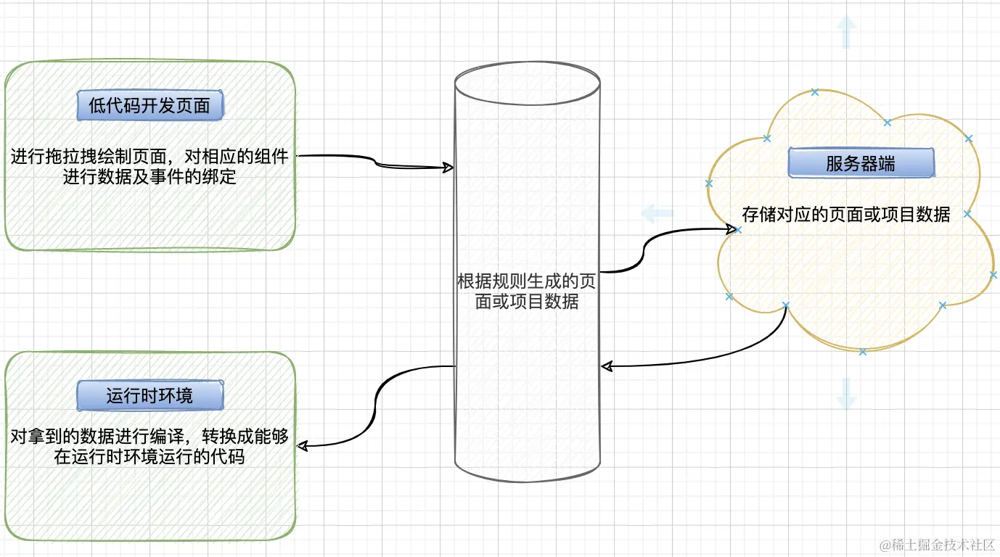
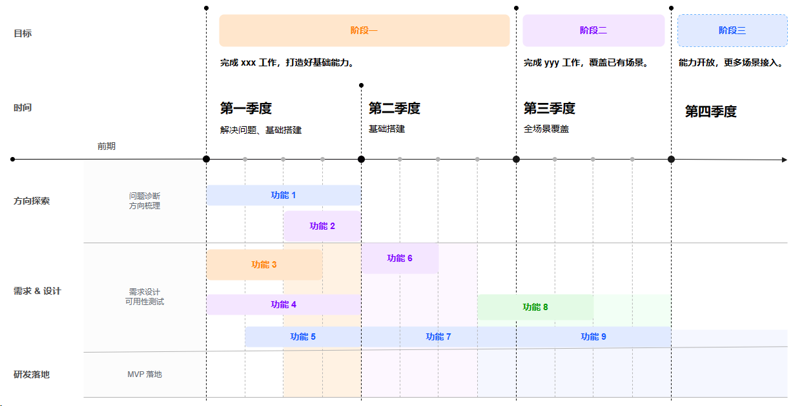

# 前端实际项目业务的实现问题

这里主要是一些生产中真实存在的问题

## 关于模块化

首先模块化的目的是将程序划分为一个个小的结构。在这些结构中编写自己的逻辑代码，有自己的作用域，不会影响到其他的结构。

同时这些结构可以将自己希望暴露的函数、变量、对象等导出给其他结构使用，也可通过某种方式，将另外结构中的函数、变量、对象等导入使用。

## 微前端

随着项目的开发，会出现一个前端项目模块巨多的情况，不利于开发和维护。微前端就能帮助我们解决这个问题，帮我们实现了前端复杂项目的解耦，同时能做到跨团队和跨部门协同开发。 对于微前端，它与技术栈无关（主框架不限制介入应用的技术栈，微应用具有完全的自主权），各个微应用间仓库独立，每个微应用之间状态隔离，运行时状态不共享。 常见的微前端实现方案：

- 基于 iframe 的完全隔离，iframe 是浏览器自带的功能，使用简单，隔离完美，不过它无法保持路由状态，页面一刷新状态就丢失，同时 iframe 中的状态无法突破对应的应用，同时整个应用是全量加载，速度慢。
- 基于 single-spa 路由劫持的方案。qiankun 就是基于这种方案实现的，通过对 single-spa 做一层封装，根据执行环境的修改，来解析微应用的资源，实现了 JS 沙箱、样式隔离等特性。
- 借鉴 WebComponent 思想的 micro-app，通过 CustomElement 结合自定义的 ShadowDom，将微前端封装成一个类 Web Component 组件。

## 前端低代码的认识

低代码平台一般提供一个可视化的编辑页面，供知晓低代码开发规则的人员进行编程，是一种声明式编程。 常见的低代码工作流程如图：



低代码的好处：

- 门槛低，所见即所得，上手容易
- 基于现成组件库开发，开发速度快

低代码的缺点：

- 灵活性差，只适合某些特定领域
- 调试困难，对使用者来说是个黑盒
- 对运行环境有一定要求，兼容性不好，低代码开发的兼容性完全取决于低代码平台的支持

## 前端权限设计思路

项目中，尤其是管理后台必不可少的一个环节就是权限设计。

通常一个系统下的不同用户会对应不同的角色，不同角色会对应不同的组织。

在进入到管理里后台的时候会去请求对应的权限接口，这个接口里有和后台约定好的权限标识内容，如果权限管理不是很复杂，可以将当前用户的所有权限标识一次性返回，前端进行一个持久化存储，之后根据规则处理即可。

如果是个极为复杂的权限管理，甚至存在不同操作导致同一用户对应后续流程权限变化的情况，这里就建议用户首次登录管理后台时，获取的是最高一层权限，即可以看到的页面权限，之后在用户每次做了不同操作，切换页面的时候，根据约定好的规则，在页面路由切换的时候去请求下一个页面对应的权限（可以精确到每个交互动作），这样能更加精确的管理权限。

## 对 web 标准、可用性、可访问性的理解

- 可用性(Usability)：产品是否容易上手，用户能否完成任务，效率如何，以及这过程中用户的主观感受可好，是从用户的角度来看产品的质量。可用性好意味着产品质量高，是企业的核⼼竞争⼒
- 可访问性(Accessibility)：Web 内容对于残障用户的可阅读和可理解性
- 可维护性(Maintainability)：一般包含两个层次，一是当系统出现问题时，快速定位并解决问题的成本，成本低则可维护性好。二是代码是否容易被⼈理解，是否容易修改和增强功能。

## taro 是如何将 react 代码转换成对应的小程序代码或其他平台代码

平时使用 React JSX 进行开发时，要知道 React 将其核心功能分成了三部分：React Core（负责处理核心 API、与终端平台和渲染解耦，提供了 createElement、createClass、Component、Children 等方法）、React Renderer（渲染器，定义了 React Tree 如何构建以接轨不同平台，有 React-dom、React-Natvie 等）、React Reconciler（调和器，负责 diff 算法，接驳 patch 行为。为渲染器提供基础计算能力，主要有 16 版本之前的 Stack Reconciler 和 16 及其之后的 Fiber Reconciler）。

React 团队将 Reconciler 作为一个单独的包发布，任何平台的渲染器函数只要在 HostConfig（宿主配置）内置基本方法，就可以构造自己的渲染逻辑。

有了 react-reconciler 的支持。Taro 团队就是提供了 taro-react（实现了 HostConfig）包来连接 react-reconciler 和 taro-runtime。

开发者写的 React 代码，Taro 通过 CLI 将代码进行 webpack 打包，taro 实现了一套完整的 DOM 和 BOM API 在各个平台的适配，打包完之后，就可以将程序渲染到对应的平台上。 核心就在于对输入的源代码的语法分析，语法树构建，随后对语法树进行转换操作再解析生成目标代码的过程。

## token 可以放在 cookie 里吗？

当被问这个问题的时候，第一时间要想到安全问题。通常回答不可以，因为存在 CSRF（跨站请求伪造）风险，攻击者可以冒用 Cookie 中的信息来发送恶意请求。解决 CSRF 问题，可以设置同源检测（Origin 和 Referer 认证），也可以设置 Samesite 为 Strict。最好嘛，就是不把 token 放在 cookie 里咯。

## 前端埋点的实现，说说看思路

对于埋点方案：一般分为手动埋点（侵入性强，和业务强关联，用于需要精确搜集并分析数据，不过该方式耗时耗力，且容易出现误差，后续要调整，成本较高）、可视化埋点（提供一个可视化的埋点控制台，只能在可视化平台已支持的页面进行埋点）、无埋点（就是全埋点，监控页面发生的一切行为，优点是前端只需要处理一次埋点脚本，不过数据量过大会产生大量的脏数据，需要后端进行数据清洗）。

埋点通常传采用 img 方式来上传，首先所有浏览器都支持 Image 对象，并且记录的过程很少出错，同时不存在跨域问题，请求 Image 也不会阻塞页面的渲染。建议使用 1\*1 像素的 GIF，其体积小。

现在的浏览器如果支持 Navigator.sendBeacon(url, data)方法，优先使用该方法来实现，它的主要作用就是用于统计数据发送到 web 服务器。当然如果不支持的话就继续使用图片的方式来上传数据。

## 说说封装组件的思路

要考虑组件的灵活性、易用性、复用性。 常见的封装思路是，对于视图层面，如相似度高的视图，进行一个封装，提供部分参数方便使用者修改。对于业务复用度较高的，提取出业务组件。

## 项目开发阶段



## 一个 feed 流，有哪些展现方式？如果当前页面可视区有 5 个格子，而你有 20 条信息需要展示，请问有哪些自动展示的算法？

Feed 流的展现方式有多种，主要包括以下几种：

1. **时间线（Timeline）**：按照内容更新的时间顺序展示，用户可以看到最新发布的内容。
2. **权重排序（Rank）**：根据算法计算内容的权重，决定内容展示的先后顺序。
3. **卡片式布局**：以卡片的形式展示内容，适合轻量级和个性化的信息展示。
4. **瀑布流**：多列布局，适合图片和视觉内容的展示。
5. **全屏流**：通常用于视频内容，提供沉浸式体验。

对于一个页面可视区只有 5 个格子，而需要展示 20 条信息的情况，可以采用以下自动展示算法：

1. **分页显示**：将 20 条信息分成多个页面，每个页面显示 5 条，用户可以通过翻页查看更多内容。
2. **无限滚动**：当用户滚动到页面底部时，自动加载并展示下一批内容。
3. **轮播**：在可视区域内自动轮播展示信息，每隔一定时间切换到下一组内容。
4. **懒加载**：只加载进入或即将进入可视区域的内容，当用户滚动页面时，逐步加载其他信息。

这些方法可以有效地管理和展示大量信息，同时保持用户界面的清晰和用户体验的流畅。根据具体的应用场景和用户需求，可以选择最合适的展示方式和算法。

## 移动端的缓存机制有哪几种？

移动端的缓存机制在优化应用性能和用户体验方面非常重要。以下是几种常见的移动端缓存策略：

1. **Service Worker Cache**：
   - 使用 Service Worker 来缓存资源文件，使应用可以在离线状态下访问。
   - 需要在 HTTPS 协议中应用。
2. **HTML5 离线应用缓存**：
   - 使用 Application Cache（AppCache）来定义哪些文件应该缓存，以便在离线时访问。
   - 通过在 HTML 标签中添加 `manifest` 属性来启用应用缓存。
3. **LocalStorage 本地缓存**：
   - 将从网络获取的数据缓存在浏览器的 LocalStorage 中。
   - 适用于轻量级数据，如图片缓存。

这些缓存机制可以有效地提高应用性能，减少网络请求，同时根据具体需求选择合适的缓存策略。

## 小程序如何与 native 通信？

在微信小程序中，与原生（native）通信通常涉及两个方向：从小程序到原生，以及从原生到小程序。这种通信可以通过以下方式实现：

### 1.小程序向原生通信：

- **Webview PostMessage**：小程序内嵌的 Webview 可以使用 `postMessage` 方法向原生发送消息。原生端需要监听 Webview 的消息事件，然后根据消息内容执行相应的操作。这是一种实时的双向通信方式，适用于小程序内嵌 H5 页面与原生之间的交互.
- **URL Schema**：小程序可以通过 URL Schema 向原生发送请求，原生端监听特定的 URL Schema，解析请求参数并执行相应的操作。这种方式适用于一些简单的场景，如启动原生页面或执行特定功能。

### 2.原生向小程序通信：

- **Webview PostMessage**：原生端可以通过 Webview 的 `postMessage` 方法向小程序发送消息。小程序需要在页面中监听 Webview 的消息事件，然后根据消息内容执行相应的操作。这也是一种实时的双向通信方式。
- **URL Schema**：原生端可以通过 URL Schema 向小程序发送请求，小程序监听特定的 URL Schema，解析请求参数并执行相应的操作。

总之，小程序与原生之间的通信可以通过 Webview 的 `postMessage` 或 URL Schema 实现。具体选择哪种方式取决于场景和需求。

## jsbridge 如何实现？

[JSBridge 原理 - 前端 H5 与客户端 Native 交互 - 掘金 (juejin.cn)](https://juejin.cn/post/7355117271213899776)

JSBridge 是一种在混合开发中常用的技术，它允许 Web 端和 Native 端进行双向通信。

实现 JSBridge 主要涉及以下几个步骤：

1. **Native 到 Web 的通信**：
   - 在 Android 中，可以使用 `WebView` 的 `evaluateJavascript` 方法来执行 JavaScript 代码。
   - 在 iOS 中，可以使用 `WKWebView` 的 `evaluateJavaScript` 方法。
2. **Web 到 Native 的通信**：
   - **拦截 URL 请求**：自定义一个 URL Schema，然后在 Native 端拦截所有 WebView 发出的请求。如果请求匹配自定义的 Schema，则 Native 端解析参数并执行相应操作。
   - **注入 JS API**：在 WebView 中注入 JavaScript 代码，这样 Web 端就可以直接调用这些注入的方法来与 Native 端通信。
3. **双向通信**：
   - 通过在一端调用时加入 `callbackId` 来标记对应的回调，另一端接收到调用请求后执行操作，并带有 `callbackId` 进行回调，从而实现双向通信。

这些方法允许 Web 端调用 Native 功能，如访问设备硬件，同时也允许 Native 端执行 Web 端的 JavaScript 代码

## 过万条数据如何加载和渲染？

处理和渲染 Web 前端的过万条数据时，可以采用以下策略：

**虚拟滚动**：

- 只渲染可视区域内的数据，当用户滚动时，动态加载和卸载数据

**分批渲染**：

- 将数据分批次渲染，例如每批渲染 100 条，使用`setTimeout`或`requestAnimationFrame`来控制渲染节奏

**分页加载**：

- 将数据分页，每次只加载和渲染一页数据，用户可以通过翻页查看更多内容

**懒加载**：

- 只加载进入或即将进入可视区域的内容，当用户滚动页面时，逐步加载其他信息

这些方法可以有效地管理和展示大量信息，同时保持用户界面的清晰和用户体验的流畅。根据具体的应用场景和用户需求，可以选择最合适的展示方式和算法。

## 如何在前端解析二进制，流媒体、图片二进制数据怎样渲染到页面上？

MDN 文档：https://developer.mozilla.org/zh-CN/docs/Web/API/XMLHttpRequest_API/Sending_and_Receiving_Binary_Data

在前端解析二进制数据，特别是流媒体和图片，通常涉及以下步骤：

1. **二进制数据的获取**：
   - 使用 `XMLHttpRequest` 或 `fetch` API 从服务器获取二进制数据。设置 `responseType` 为 `'arraybuffer'` 或 `'blob'` 来接收二进制数据.
2. **流媒体的渲染**：
   - 对于视频流，可以使用 `MediaSource` API 和 `URL.createObjectURL` 方法来处理二进制视频流，并将其渲染到 `<video>` 标签中
   - 通过分段请求视频数据并逐步添加到 `MediaSource` 对象中，可以实现流式播放。
3. **图片二进制数据的渲染**：
   - 将二进制数据转换为 `Blob` 对象，然后使用 `URL.createObjectURL` 创建一个临时的 URL，并将其赋值给 `` 标签的 `src` 属性来显示图片
   - 另一种方法是将二进制数据转换为 `Base64` 编码字符串，然后将其作为 `data URL` 赋值给 `` 的 `src` 属性

这些方法允许前端应用直接处理和渲染来自服务器的二进制数据，无论是流媒体还是图片。根据具体的应用场景和性能要求，可以选择最合适的方法来实现。

## web 前端如何解析二进制音频、视频？

在前端解析二进制音频和视频时，我们可以使用不同的技术和 API 来处理流媒体数据。以下是一些方法：

1. **音频解析**：
   - 对于音频，我们可以使用`AudioContext` API 来解析二进制音频数据。这允许我们创建音频源、添加效果、控制音量等。
   - 使用`fetch`或`XMLHttpRequest`获取音频数据，然后将其解码为`AudioBuffer`，并使用`AudioContext`播放。
2. **视频解析**：
   - 对于视频，我们可以使用`<video>`标签来渲染二进制视频数据。设置`src`属性为`blob` URL，然后使用浏览器内置的视频解码器进行播放。
   - 使用`MediaSource` API 来动态生成视频流，然后将其添加到`<video>`标签中。
3. **流式加载**：
   - 对于流式加载，我们可以使用`MediaSource` API，将视频流分段加载并添加到`MediaSource`对象中，从而实现流式播放。
4. **格式支持**：
   - 不同浏览器支持不同的音频和视频格式。我们需要根据浏览器的支持情况选择合适的格式，如 WebM、MP4、Ogg 等。

下面是一个示例，演示如何使用`MediaSource` API 来流式加载和播放二进制视频数据：

```html
<video id="myVideo" controls></video>

<script>
	const videoUrl = "https://example.com/my-video.mp4"; // 替换为你的视频URL
	const videoElement = document.getElementById("myVideo");
	const mediaSource = new MediaSource();

	videoElement.src = URL.createObjectURL(mediaSource);

	mediaSource.addEventListener("sourceopen", async () => {
		const sourceBuffer = mediaSource.addSourceBuffer(
			'video/mp4; codecs="avc1.42E01E, mp4a.40.2"'
		);

		const response = await fetch(videoUrl);
		const videoData = await response.arrayBuffer();

		sourceBuffer.appendBuffer(videoData);
	});
</script>
```

这样，我们就可以使用`MediaSource` API 来流式加载和播放二进制视频数据了。

## web 前端文件如何显示上传百分比？

在 Web 前端显示文件上传百分比，通常涉及以下步骤：

1. 使用 `XMLHttpRequest` 或 `fetch` API 发起文件上传请求。
2. 监听上传过程中的 `progress` 事件来获取已上传的数据量和总数据量。
3. 计算上传百分比并更新进度条或其他 UI 组件。

以下是一个使用 `XMLHttpRequest` 的示例代码：

```javascript
function uploadFile(file) {
	const xhr = new XMLHttpRequest();
	const formData = new FormData();
	formData.append("file", file);

	// 监听上传进度事件
	xhr.upload.addEventListener(
		"progress",
		function (e) {
			if (e.lengthComputable) {
				const percentComplete = Math.round((e.loaded / e.total) * 100);
				// 更新进度条或显示上传百分比
				console.log(percentComplete + "% uploaded");
			}
		},
		false
	);

	// 设置请求完成后的回调函数
	xhr.addEventListener(
		"load",
		function (e) {
			console.log("Upload complete!");
		},
		false
	);

	// 设置请求失败后的回调函数
	xhr.addEventListener(
		"error",
		function (e) {
			console.log("Upload failed.");
		},
		false
	);

	// 设置请求被用户取消后的回调函数
	xhr.addEventListener(
		"abort",
		function (e) {
			console.log("Upload cancelled.");
		},
		false
	);

	// 发送文件数据
	xhr.open("POST", "your-upload-url-here", true);
	xhr.send(formData);
}
```

在这个示例中，我们创建了一个 `uploadFile` 函数，它接受一个文件对象作为参数。我们使用 `FormData` 对象来构建一个表单数据集，然后将文件添加到这个集合中。通过监听 `xhr.upload` 的 `progress` 事件，我们可以获取上传进度，并计算出上传百分比。然后，我们可以使用这个百分比来更新进度条或在控制台中打印出来。

请注意，你需要将 `'your-upload-url-here'` 替换为实际的文件上传处理 URL。此外，根据实际情况，你可能需要添加额外的错误处理和用户反馈机制。

## web 前端如何制作一个富文本，需要考虑哪些结构？

富文本编辑器是一种可内嵌于浏览器、所见即所得的文本编辑器，通常提供类似于 Microsoft Word 的编辑功能，使用户可以对文本进行格式化、插入图片和链接、调整字体样式等操作。在前端开发中，我们可以使用 JavaScript、HTML 和 CSS 来实现富文本编辑器。

以下是制作富文本编辑器时需要考虑的一些结构和步骤：

1. **HTML 元素**：
   - 首先，我们需要一个用于输入和展示文本内容的 HTML 元素，比如一个 `<div>` 标签。这个元素将作为富文本编辑器的容器。
2. **JavaScript 逻辑**：
   - 使用 JavaScript 来处理用户的输入和编辑操作。
   - 监听用户的键盘事件、鼠标事件等，以便实现各种编辑功能。
   - 根据用户的操作，更新 HTML 元素的内容。
3. **CSS 样式**：
   - 使用 CSS 来美化富文本编辑器的界面。
   - 设计工具栏、菜单栏、按钮等界面元素的样式。
   - 考虑不同浏览器之间的差异，确保样式在各个浏览器中一致。
4. **数据结构**：
   - 考虑如何维护富文本编辑器的数据结构，以便在用户编辑时保存和处理文本内容。
   - 可以使用 JSON 或其他数据结构来表示富文本内容，方便后续的序列化和反序列化。
5. **光标和选区管理**：
   - 实现光标的移动、选区的选择和修改。
   - 使用浏览器提供的 Selection 和 Range 对象来处理光标和选区。
6. **图片和链接插入**：
   - 考虑如何让用户插入图片和链接。
   - 实现图片上传、链接输入和展示。
7. **撤销和重做功能**：
   - 考虑如何实现撤销和重做功能，以便用户可以回退和恢复编辑操作。
8. **性能优化**：
   - 如果文本内容很大，需要考虑性能问题，比如如何快速渲染和处理大量文本。

总之，制作一个富文本编辑器需要综合考虑 HTML 结构、JavaScript 逻辑、CSS 样式、数据结构和用户体验，以便实现一个功能完善、易用且美观的编辑器。

## html5 的播放器怎么做？视频直播如何在浏览器里面实现？ HLS 、 RTMP

要在浏览器中实现 HTML5 视频播放器和视频直播，您可以遵循以下步骤：

1. **HTML5 视频播放器**：
   - 使用 `<video>` 标签创建播放器的基本结构。
   - 为播放器添加必要的控件，如播放/暂停按钮、音量控制、进度条等。
   - 可以使用开源库如 Video.js 来快速实现一个功能丰富的视频播放器：https://videojs.com/。
2. **视频直播**：
   - 对于 HLS（HTTP Live Streaming）直播，您可以直接在 `<video>` 标签中指定 HLS 流的 URL。大多数现代浏览器支持 HLS，但如果需要额外的兼容性，可以使用如 hls.js 的库来在不支持的浏览器中播放 HLS 流。
   - 对于 RTMP（Real-Time Messaging Protocol）直播，由于现代浏览器不直接支持 RTMP，您可能需要将 RTMP 流转换为 HLS 或其他支持的格式。这通常需要服务器端的转码服务，例如使用 Nginx 和 FFmpeg 来实现：https://www.codewithfaraz.com/content/342/build-your-own-html5-video-player-with-html-css-and-javascript。

以下是一个简单的 HTML5 视频播放器示例：

```html
<video width="500" controls>
	<source src="path-to-your-video.mp4" type="video/mp4" />
</video>
```

对于视频直播，您可以使用类似的结构，但是 `src` 属性应该指向您的直播流地址。

请注意，实现视频直播还涉及到服务器端的配置和流媒体协议的选择。

可能需要根据具体的应用场景和需求来选择合适的技术和工具。

如果您需要更详细的指导或示例代码，可以参考相关的开源项目和文档。：https://techstacker.com/how-to-embed-mp4-video-html5-with-controls/

## 如何在浏览器里面裁剪图片？如何裁剪视频，对视频做逐帧分析？

在浏览器中裁剪图片和对视频进行逐帧分析可以使用不同的技术和 API。让我为您详细介绍一下这些方法。

## 图片裁剪

### 使用 CSS 属性进行图片裁剪

1. **使用`width`、`height`和`overflow`属性**：
   - 将图片包裹在一个`<div>`元素中，设置指定的宽度和高度，并将`overflow`设置为`hidden`。这样可以裁剪图片，只显示指定区域内的部分。
2. **使用`object-fit`和`object-position`属性**：
   - `object-fit`属性定义了如何调整图片以适应其容器。
   - `object-position`属性定义了图片在容器中的位置。

以下是一个使用`object-fit`的示例代码：

```html

```

## 视频逐帧分析

MDN 文档：https://developer.mozilla.org/docs/Web/API/HTMLVideoElement/requestVideoFrameCallback

参考文章：[使用 requestVideoFrameCallback() 对视频执行高效的每视频帧操作 | Articles | web.dev](https://web.dev/articles/requestvideoframecallback-rvfc?hl=zh-cn)

### 使用`requestVideoFrameCallback()`方法

- `requestVideoFrameCallback()`方法允许您在每个视频帧发送到合成器时注册一个回调函数。
- 这样可以执行有效的逐帧操作，例如视频处理、绘制到画布、视频分析或与外部音频源同步。

以下是使用`requestVideoFrameCallback()`的示例代码：

```javascript
const video = document.querySelector("video");

const doSomethingWithTheFrame = (now, metadata) => {
	// 在这里处理视频帧
	console.log(now, metadata);
	// 重新注册回调以获取下一帧
	video.requestVideoFrameCallback(doSomethingWithTheFrame);
};

// 最初注册回调以获取第一帧
video.requestVideoFrameCallback(doSomethingWithTheFrame);
```

在回调中，`now`是一个`DOMHighResTimeStamp`，`metadata`是一个包含以下属性的`VideoFrameMetadata`字典：

- `presentationTime`：用户代理提交帧进行合成的时间。

请注意，`requestVideoFrameCallback()`的回调速率与实际视频帧率绑定，但在某些情况下可能受到浏览器帧率的限制。

## 如何实现一个具有引导功能的组件库？

在前端开发中，实现一个具有引导功能的组件库可以帮助用户更好地了解和使用您的应用程序。这样的组件库通常包含一些用于展示步骤、提示、高亮元素等的组件，以便引导用户完成特定任务或浏览应用程序的不同部分。

以下是一些步骤和技术，可以帮助您实现这样的组件库：

1. **设计引导流程**：
   - 首先，您需要明确您的引导流程。考虑用户在应用程序中的第一次访问时需要了解哪些内容，以及哪些步骤可以帮助他们更好地使用应用程序。
2. **创建组件**：
   - 开始创建用于引导的组件，例如步骤提示、高亮元素、模态框等。
   - 这些组件可以是 React、Vue 或其他前端框架中的自定义组件。
3. **定义步骤和内容**：
   - 为每个引导步骤定义所需的内容，例如标题、描述、目标元素等。
   - 您可以将这些步骤定义为对象，每个对象包含步骤的详细信息。
4. **控制显示和隐藏**：
   - 实现逻辑，根据用户的操作或应用程序状态来显示或隐藏引导组件。
   - 您可以使用状态管理库（如 Redux 或 Vuex）来管理引导状态。
5. **添加动画和样式**：
   - 为引导组件添加过渡效果和样式，以便它们在屏幕上出现和消失时具有平滑的过渡。
6. **处理用户操作**：
   - 考虑用户在引导过程中的操作，例如点击“下一步”按钮、关闭引导等。
   - 实现相应的事件处理逻辑。
7. **测试和优化**：
   - 在不同的应用场景下测试您的引导组件，确保它们在各种情况下都能正常工作。
   - 根据用户反馈和数据分析，优化引导流程和组件。

一些现有的 React 引导库，例如 React Tour 和 React Joyride，可以帮助您快速实现引导功能。您可以根据您的需求选择合适的库，或者根据您的设计和交互需求自定义实现

如果您希望自定义实现，您可以创建一个 React 组件库，其中包含用于引导的组件，然后在您的应用程序中使用这些组件来实现引导功能。

## 如何封装一个 Form 和 FormItem ，使其能够跟 input 、 select 、 checkbox 、radio 等组件进行 数据存储、数据校验（自定义逻辑）、校验反馈？

封装一个 `Form` 和 `FormItem` 组件，使其能够与 `input`、`select`、`checkbox`、`radio` 等组件进行数据存储、数据校验和校验反馈，通常涉及以下几个关键步骤：

1. **定义 `Form` 组件**：
   - `Form` 组件应该能够接收一个 `model` 对象，该对象包含表单的数据。
   - `Form` 组件还应该能够接收一个 `rules` 对象，用于定义各字段的校验规则。
2. **定义 `FormItem` 组件**：
   - `FormItem` 组件应该能够接收一个 `label` 属性，用于显示字段的标签。
   - `FormItem` 组件还应该接收一个 `prop` 属性，用于指定其对应 `Form` 组件 `model` 中的字段。
3. **数据存储**：
   - 使用 `v-model` 或类似的双向绑定机制，将 `input`、`select`、`checkbox`、`radio` 等组件的值绑定到 `Form` 组件的 `model` 对象中的相应字段。
4. **数据校验**：
   - 实现一个校验方法，该方法根据 `rules` 对象中定义的规则对 `model` 中的数据进行校验。
   - 校验方法可以是同步的也可以是异步的，以支持复杂的校验逻辑。
5. **校验反馈**：
   - 在 `FormItem` 组件中显示校验结果，如果校验失败，应该显示错误信息。
   - 可以使用插槽（slot）来自定义错误信息的显示方式。
6. **事件处理**：
   - `Form` 组件应该提供 `submit` 事件，当表单提交时触发。
   - `Form` 组件还应该提供 `validate` 方法，允许手动触发校验。

以下是一个简单的示例代码，展示了如何封装 `Form` 和 `FormItem` 组件：

```vue
// Form.vue
<template>
	<form @submit.prevent="handleSubmit">
		<slot></slot>
		<!-- 用于插入 FormItem 组件 -->
	</form>
</template>

<script>
export default {
	name: "Form",
	props: {
		model: Object,
		rules: Object,
	},
	methods: {
		validate() {
			// 实现校验逻辑
		},
		handleSubmit() {
			this.validate();
			this.$emit("submit", this.model);
		},
	},
};
</script>

// FormItem.vue
<template>
	<div>
		<label>{{ label }}</label>
		<slot></slot>
		<!-- 用于插入 input/select/checkbox/radio 等 -->
		<!-- 显示校验错误信息 -->
		<span v-if="error">{{ error }}</span>
	</div>
</template>

<script>
export default {
	name: "FormItem",
	props: {
		label: String,
		prop: String,
	},
	data() {
		return {
			error: "", // 用于存储校验错误信息
		};
	},
	inject: ["Form"], // 从父组件 Form 注入
	mounted() {
		// 注册校验逻辑
		this.Form.registerValidation(this.prop, this.validate);
	},
	methods: {
		validate(value) {
			// 实现具体的校验逻辑
		},
	},
};
</script>
```

在这个示例中，`Form` 组件提供了一个 `validate` 方法来执行校验，并在提交表单时触发。`FormItem` 组件则负责显示每个字段的标签和校验错误信息。请注意，这只是一个基本的示例，您可能需要根据实际需求添加更多功能，如异步校验、自定义校验规则等。

## 像 echart 这类图像库的实现原理？

[Apache ECharts](https://echarts.apache.org/en/index.html) 是一个基于 JavaScript 的开源数据可视化图表库，用于创建直观、生动、可交互且可个性化定制的数据可视化图表。它提供了丰富的图表类型、强大的渲染引擎和灵活的配置选项。

以下是 Apache ECharts 的一些实现原理和特点：

1. **图表绘制**：
   - ECharts 使用 Canvas 或 SVG 渲染引擎来绘制图表。
   - Canvas 可以处理大量数据的渲染，而 SVG 支持更丰富的图形效果。
2. **数据处理**：
   - ECharts 使用数据集（datasets）来管理数据。
   - 数据集支持数据转换，如过滤、聚类和回归，以帮助分析多维数据。
3. **配置选项**：
   - ECharts 提供丰富的配置选项，允许用户自定义图表的样式、布局和交互行为。
   - 用户可以通过设置 `option` 对象来定义图表的外观和数据。
4. **交互性**：
   - ECharts 支持交互式操作，如缩放、拖拽、提示框和数据筛选。
   - 用户可以通过鼠标或触摸屏与图表进行交互。
5. **图表类型**：
   - ECharts 提供了 20 多种图表类型，包括折线图、柱状图、饼图、散点图、雷达图等。
   - 用户可以根据需求选择合适的图表类型。
6. **响应式设计**：
   - ECharts 支持响应式设计，可以根据不同的屏幕大小和设备自动调整图表布局。

总之，Apache ECharts 的实现原理涵盖了图表绘制、数据处理、配置选项、交互性和图表类型。它的灵活性和丰富的功能使其成为一个流行的数据可视化库。

## i18n 的国际化方案在 vue、react、JQuery 等框架柱应该是怎样实现？

在不同前端框架（如 Vue、React 和 jQuery）中实现国际化（i18n）方案有不同的方法。让我为您详细介绍一下每个框架的实现方式：

### 1. Vue.js 中的国际化（Vue I18n）：

- Vue I18n 是 Vue.js 的官方国际化插件。
- 它允许您在 Vue.js 应用程序中轻松添加多语言支持。
- 使用 Vue I18n，您可以定义翻译文件、切换语言、格式化日期和数字等。

#### 实现步骤：

1. **安装 Vue I18n**：
   - 使用 npm 或 yarn 安装 Vue I18n：`npm install vue-i18n` 或 `yarn add vue-i18n`。
2. **创建翻译文件**：
   - 在项目中创建一个 `locales` 文件夹，其中包含不同语言的 JSON 文件（例如 `en.json`、`fr.json`）。
   - 在这些文件中定义每个语言的翻译内容。
3. **初始化 Vue I18n**：
   - 在 Vue 应用程序的入口文件中初始化 Vue I18n。
   - 设置默认语言和加载翻译文件。
4. **在组件中使用翻译**：

   - 使用 `$t` 方法来获取翻译后的文本。

   - 在模板中使用 。

   - ```bash
     {{ $t('key') }}
     ```

5. **切换语言**：

   - 创建一个语言切换按钮或下拉菜单，以便用户可以切换应用程序的语言。

### 2. React 中的国际化（i18next）：

- [i18next](https://www.i18next.com/) 是一个通用的国际化框架，可以与 React 集成。
- 它支持多种前端框架和环境。

#### 实现步骤：

1. **安装 i18next**：
   - 使用 npm 或 yarn 安装 i18next：`npm install i18next` 或 `yarn add i18next`。
2. **创建翻译文件**：
   - 在项目中创建一个 `locales` 文件夹，其中包含不同语言的 JSON 文件（例如 `en.json`、`fr.json`）。
   - 在这些文件中定义每个语言的翻译内容。
3. **初始化 i18next**：
   - 在应用程序的入口文件中初始化 i18next。
   - 设置默认语言和加载翻译文件。
4. **在组件中使用翻译**：
   - 使用 `useTranslation` 钩子来获取翻译后的文本。
   - 在组件中使用 `t('key')`。
5. **切换语言**：
   - 创建一个语言切换按钮或下拉菜单，以便用户可以切换应用程序的语言。

### 3. **jQuery 中的国际化（i18next）**：

- [i18next](https://www.i18next.com/) 也可以与 jQuery 集成，提供国际化支持。

#### 实现步骤：

1. **安装 i18next**：
   - 使用 npm 或 yarn 安装 i18next：`npm install i18next` 或 `yarn add i18next`。
2. **创建翻译文件**：
   - 在项目中创建一个 `locales` 文件夹，其中包含不同语言的 JSON 文件（例如 `en.json`、`fr.json`）。
   - 在这些文件中定义每个语言的翻译内容。
3. **初始化 i18next**：
   - 在应用程序的入口文件中初始化 i18next。
   - 设置默认语言和加载翻译文件。
4. **在页面中使用翻译**：
   - 使用 `i18next.t('key')` 来获取翻译后的文本。

总之，不论您使用哪个前端框架，i18next 都可以支持集成

## 数据埋点的意义是什么？应当针对哪些数据进行埋点？如何构建一个埋点系统？

数据埋点在现代应用程序和网站中具有重要意义。它是一种系统性的数据收集方法，用于跟踪用户行为、应用程序性能和其他关键指标。以下是关于数据埋点的一些重要信息：

### 1.数据埋点的意义：

- **决策支持**：数据埋点提供了实时、准确的数据，帮助企业和团队做出明智的决策。这些决策可以涉及产品改进、市场营销策略、用户体验优化等。
- **性能监控**：通过埋点，您可以监控应用程序的性能指标，例如加载时间、响应时间和错误率。这有助于快速识别和解决问题。
- **用户行为分析**：数据埋点允许您跟踪用户在应用程序中的行为，例如页面浏览、按钮点击、转化率等。这有助于了解用户需求和行为模式。
- **产品优化**：通过分析埋点数据，您可以发现用户痛点、流失点和机会，从而优化产品功能和用户体验。

### 2.应当针对哪些数据进行埋点：

- **关键业务指标**：埋点应该关注与业务目标直接相关的指标，例如注册、购买、订阅等。
- **用户行为**：跟踪用户在应用程序中的行为，例如页面浏览、搜索、点击、滚动等。
- **应用程序性能**：监控应用程序的性能指标，例如加载时间、响应时间、错误率等。
- **特定事件**：埋点特定事件，例如广告点击、视频播放、表单提交等。

### 3.构建一个埋点系统的步骤：

- **明确目标**：定义您希望通过埋点系统实现的目标和指标。
- **选择工具**：选择适合您应用程序的数据埋点工具，例如 Google Analytics、Mixpanel、Amplitude 等。
- **设计事件**：确定要跟踪的事件，例如页面浏览、按钮点击、转化等。
- **实施埋点代码**：在应用程序中插入埋点代码，以便在用户执行特定操作时触发事件。
- **数据存储和分析**：将埋点数据存储在数据库或数据仓库中，并使用分析工具进行数据挖掘和可视化。
- **持续优化**：根据数据分析结果，优化埋点策略和事件定义。

总之，数据埋点是一种关键的数据收集方法，有助于支持决策、优化产品和改进用户体验。

## 小程序的实现原理是什么？

小程序的实现原理涉及到渲染层和逻辑层之间的交互，以及整体的架构。让我详细解释一下小程序的运行原理。

### 小程序的运行环境

1. **渲染层**：小程序的界面使用了 **WebView** 进行渲染。在 iOS 上，逻辑层的 JavaScript 代码运行在 **JavaScriptCore** 中，视图层由 **WKWebView** 渲染；在 Android 上，逻辑层的 JavaScript 代码运行在 **V8** 中，视图层由自研的 **XWeb 引擎**基于 **Mobile Chrome** 内核渲染。
2. **逻辑层**：逻辑层采用 **JsCore 线程**运行 JS 脚本，负责逻辑处理、数据请求和接口调用。逻辑层和渲染层之间通过系统层的 **JSBridge** 进行通信。

### 通信模型

小程序采用了一种合适的技术方案，实现渲染层和逻辑层分别由两个线程管理：

- 渲染层的界面使用 **WebView** 进行渲染。
- 逻辑层采用 **JsCore 线程**运行 JS 脚本。

当一个小程序存在多个界面时，渲染层就会存在多个 **WebView** 线程。这两个线程之间的通信会经由微信客户端来做中转。逻辑层发送的网络请求也经由 Native 转发。

### 小程序的核心基础库文件

- **WAservice.js**：提供逻辑层基础的 API 能力，包括消息通信封装、日志组件、全局方法（如 `App`、`Page`、`getApp` 等）。
- **WAWebview.js**：提供视图层基础的 API 能力，包括消息通信封装、日志组件、UI 相关的方法、小程序组件实现和注册、Virtual DOM、Diff 和 Render UI 实现。
- **app-config.json**：小程序完整的配置，包含通过 `app.json` 配置的所有信息。
- **app-service.js**：自己的 JS 代码，全部打包到这个文件。

### 小程序的架构

- **AppView**：视图层，负责 UI 渲染，使用 WebView 进行渲染。加载 WXML 和 WXSS 生成界面并展示给用户。
- **AppService**：逻辑层，采用 JsCore 线程运行 JS 脚本，处理逻辑、数据请求和接口调用。整个小程序只有一个逻辑层，但存在多个界面。

总之，小程序的实现原理涉及到渲染层和逻辑层之间的协作，以及整体的架构设计。

## 前端的项目如何进行优化，移动端呢

**考察点：性能优化**

::: details 查看参考回答

前端性能优化有七大手段：减少请求数量，减少资源大小，优化网络连接，优化资源加载，

- 减少重绘回流，使用性能更好的 API 和构建优化
- 减少请求数量：通过减少重定向，使用缓存，不适用 CSS@import，避免使用空的 src 和 href 等手段
- 减少资源大小：通过压缩 HTML，CSS，JS，图片，此外在安卓下可以使用 webp 格式的图片，它具有更优的图像数据压缩算法，能带来更小的图片体积，还可以开启 gzip,gzip 编码是以后总用来改进 web 应用程序性能的技术，
- 优化网络连接：使用 CDN，使用 DNS 预解析，并行连接，
- 优化资源加载，通过优化资源加载位置和时机，使用资源预加载 preload 和资源预读取 prefetch

减少重绘回流：

- 1：避免使用层级较深的 CSS 选择器，以提高 CSS 渲染效率
- 2、避免使用 CSS 表达式
- 3、给元素适当的定义高度或最小高度，否则元素的动态内容载入时，会出现页面晃动，造成回流
- 4、不要使用 table 布局
- 5、能用 CSS 实现的效果，尽量使用 CSS 而不用 JS 实现
- 6、使用性能更好的 api

:::

## 作为前端开发，如果遇到资源无法加载，会是什么问题，如何解决

**考察点：情景题**

::: details 查看参考回答

我遇到这种网页打不开的情况下首先会打开开发者工具看报错情况，根据 http 状态码来确认是服务器还是客户端的错误，然后再具体问题来分析。

:::

## 说一下有什么方法可以保持前后端实时通信？

1. **`轮询`**：客户端设置定时器，每隔一段时间向服务端发送请求，通过频繁请求达到实时效果。但这种方式会消耗较多流量和 CPU 利用率，且轮询间隔不好控制。
2. **`长轮询`**：客户端和服务端保持一条长连接，服务端有新数据时主动发送给客户端。这种方式对服务器的高并发能力有要求。
3. **`WebSocket`**：一种全双工通信协议，客户端和服务端处于相同地位，可以实时双向通信。
4. **`SSE（Server-Sent Event）`**：服务端与客户端建立的单向通道，只能由服务端传输特定形式的数据给客户端。
5. **`iframe 流`**：在页面中插入一个隐藏的 iframe，利用其 src 属性在服务器和客户端之间创建一条长连接，服务器向 iframe 传输数据来实时更新页面。

## 说一说服务端渲染及优势？

在 JavaScript 中，服务端渲染（Server-Side Rendering，简称 SSR）是一种页面渲染技术，指在服务端（即服务器）完成页面的渲染工作，生成完整的 HTML 页面，然后将这个渲染好的页面直接发送给客户端（即用户的浏览器）。

**优点：**

1. **`搜索引擎优化（SEO）`**：搜索引擎爬虫能够直接解析和理解服务端渲染的 HTML 内容。由于爬虫通常只能抓取到页面的静态内容，而无法执行 JavaScript 代码，因此服务端渲染的页面更易于被搜索引擎识别和索引，从而提高网站在搜索结果中的排名。
2. **`首屏加载性能`**：在客户端渲染中，浏览器需要先下载并执行 JavaScript 代码，然后才能生成和渲染页面内容。而服务端渲染可以直接在服务器端生成完整的 HTML 响应，减少了客户端的处理时间，因此可以更快地提供页面内容给用户，提高了首屏加载的速度。
3. **`改善了用户体验`**：由于服务端渲染可以更快地提供内容，用户等待时间变短，页面白屏时间减少，从而改善了用户体验。此外，由于服务端已经生成了页面的初始状态，用户可以立即与页面进行交互，而无需等待 JavaScript 的下载和执行。
4. **`分担客户端压力`**：在客户端渲染中，大量的计算和渲染工作需要在用户的设备上完成，这可能对设备性能造成一定的压力。而服务端渲染将这些工作转移到服务器上，从而减轻了客户端设备的负担。

**缺点：**

1. 增加了服务端的资源消耗和维护成本；
2. 同时不利于前后端分离，需要前端来维护一个模板层

## 前端如何无感刷新 token；token 还没有刷新完成时，发送了其他请求需要如何处理

在前端开发中，实现无感刷新 token 通常是为了保持用户的登录状态，并确保其访问权限的有效性。下面将介绍如何实现无感刷新 token 的原理以及给出一个示例。

### 前端如何无感刷新 token 实现原理

无感刷新 token 的实现通常基于以下几个步骤：

1. **Token 有效期**：首先，服务器会为每个 token 设置一个有效期，例如 30 分钟或 1 小时。在这个有效期内，用户可以使用 token 访问受保护的资源。
2. **定期检查**：前端应用会在用户活动期间定期检查 token 的有效期。通常通过轮询或心跳机制实现，即在一定时间间隔后发送请求到服务器，检查 token 是否仍然有效。
3. **刷新 Token**：如果服务器返回 token 已失效的信息，前端应用会立即发起一个新的请求到认证服务器，使用 refreshToken 这个 token（**_后端一般会返回一个长 token 和一个短 token，长短指的是过期时间，refreshToken 作为长 token 存在 localstorage 中用来向后端携带这个 token 去请求短 token，accessToken 作为短 token 也是存在 localstorage 中用这个 token 去请求受保护的请求放到请求头 headers 中_**）来获取新的访问 token。
4. **无缝切换**：在获取到新 token 后，前端应用会立即更新本地存储的 token，并使用新 token 继续之前的操作，从而实现了无缝的用户体验。

#### 示例

下面是一个简单的示例，展示了如何在前端实现无感刷新 token：

1. **设置 Token 有效期**：假设服务器为每个 token 设置了 30 分钟的有效期。
2. **定期检查**：前端应用每 5 分钟向服务器发送一个请求，检查当前 token 是否仍然有效。

```js
// 使用 setInterval 定时发送心跳请求

setInterval(() => {
	checkTokenValidity();
}, 5 * 60 * 1000); // 5 分钟
```

1. **检查 Token 有效性**：前端应用发送心跳请求到服务器，服务器返回 token 是否有效的信息。

```js
async function checkTokenValidity() {
	try {
		const response = await fetch("/api/heartbeat", {
			headers: {
				Authorization: `Bearer ${localStorage.getItem("token")}`,
			},
		});

		if (!response.ok) {
			// Token 失效，需要刷新

			refreshToken();
		}
	} catch (error) {
		// 处理错误

		console.error("Error checking token validity:", error);
	}
}
```

1. **刷新 Token**：如果 token 失效，前端应用会发送一个请求到认证服务器，获取新的访问 token。

```js
async function refreshToken() {
	try {
		const response = await fetch("/api/auth/refresh", {
			method: "POST",

			headers: {
				"Content-Type": "application/json",
			},

			body: JSON.stringify({
				refreshToken: localStorage.getItem("refreshToken"),
			}),
		});

		if (response.ok) {
			const data = await response.json();

			// 更新本地存储的 token

			localStorage.setItem("accessToken", data.accessToken);
		} else {
			// 处理刷新 token 失败的情况，例如提示用户重新登录

			console.error("Failed to refresh token:", response.status);
		}
	} catch (error) {
		// 处理错误

		console.error("Error refreshing token:", error);
	}
}
```

在这个示例中，前端应用通过定期检查 token 的有效性，并在 token 失效时无缝刷新 token，从而保持了用户的登录状态，并提供了无缝的用户体验。需要注意的是，为了安全起见，刷新 token 也应该有一定的有效期，并在过期后要求用户重新登录。

### token 还没有刷新完成时，发送了其他请求需要如何处理

如果刷新的 token 还没有返回，但是你已经使用旧的 token 发送了其他三个请求到服务端，那么可能会遇到以下几种情况：

**请求被拒绝**：如果服务端检查到 token 已经过期，它可能会返回一个 401 Unauthorized 或者类似的错误状态码。在这种情况下，你需要捕获这些错误，并在捕获到错误后尝试使用新的 token 重新发送这些请求。

为了处理这些情况，你可以采取以下策略：

- **错误处理**：确保你的应用能够捕获和处理 401 Unauthorized 或其他相关错误。当捕获到这些错误时，你可以尝试使用新的 token 重新发送请求。
- **请求重试机制**：实现一个请求重试机制，当请求失败时，可以自动或手动触发重试，并使用新的 token。你可以使用指数退避策略来避免频繁重试对服务端造成压力。
- **状态管理**：在 token 刷新期间，你可以将应用的状态设置为“正在刷新 token”，并禁止发送新的请求，直到获取到新的 token。这样可以避免使用无效的 token 发送更多请求。
- **队列请求**：在 token 过期后，而不是立即发送请求，你可以将请求放入队列中，等待新的 token 获取后再依次发送。这可以通过使用 Promise.all 或者其他异步处理技术来实现。
- **前端提示**：在 token 过期后，你可以在前端显示一个提示，告知用户正在刷新 token，并可能需要等待一段时间或者重新登录。
  下面是一个简化的示例代码，

### 在捕获到 401 错误后使用新 token 重新发送请求：

```js
// 假设这是你的 API 请求函数

async function apiRequest(url, token) {
	try {
		const response = await fetch(url, {
			headers: {
				Authorization: `Bearer ${token}`,
			},
		});

		if (!response.ok) {
			throw new Error(`Request failed with status ${response.status}`);
		}

		return response.json();
	} catch (error) {
		if (error.message.includes("401") && newToken) {
			// 尝试使用新 token 重新发送请求

			return apiRequest(url, newToken);
		}

		throw error;
	}
}

// 假设这是你的 token 刷新函数

let newToken = null; // 存储新 token 的变量

async function refreshToken() {
	try {
		const response = await fetch("/api/auth/refresh", {
			// ... 发送刷新请求的代码 ...
		});

		if (response.ok) {
			const data = await response.json();

			newToken = data.token;
		}
	} catch (error) {
		// 处理错误
	}
}

// 当 token 过期时调用此函数

async function handleTokenExpiration() {
	try {
		// 尝试刷新 token

		await refreshToken();

		// 假设这是之前因为 token 过期而失败的请求数组

		const failedRequests = [
			/* ... */
		];

		// 使用新 token 重新发送请求

		for (const request of failedRequests) {
			try {
				const response = await apiRequest(request.url, newToken);

				// 处理响应或更新应用状态
			} catch (error) {
				// 处理重新发送请求时的错误
			}
		}
	} catch (error) {
		// 处理刷新 token 或重新发送请求时的错误
	}
}
```

在这个示例中，`apiRequest` 函数会在遇到 401 错误时检查是否有新的 token 可用，并尝试使用新 token 重新发送请求。`handleTokenExpiration` 函数则负责在 token 过期时刷新 token，并重新发送之前失败的请求。

## vue3 table 性能优化，减少 85% 渲染耗时

[vue3 table 性能优化，减少 85% 渲染耗时 - 掘金 (juejin.cn)](https://juejin.cn/post/7194516447932973112)

## 队列请求

队列请求的实现主要是利用队列这种数据结构来管理待处理的请求。当某个请求因为某些原因（比如 token 过期）需要延迟处理时，我们可以将这个请求放入队列中，等待条件满足（比如获取到新的 token）后再从队列中取出请求进行处理。

下面是一个简单的例子来说明队列请求的实现：

### 1. 创建请求队列

首先，我们需要一个队列来存储待处理的请求。这个队列可以是内存中的一个数组、链表，或者使用一些现成的队列库（如 JavaScript 中的`Array.prototype.queue`或`queue-promise`库）。

```js
let requestQueue = []; // 使用数组作为简单的队列实现
```

### 2. 入队操作

当需要延迟处理一个请求时，我们将这个请求添加到队列的末尾。

```js
function enqueueRequest(request) {
	requestQueue.push(request);
}
```

### 3. 出队操作

当条件满足（比如获取到新的 token）时，我们从队列的头部取出一个请求进行处理，并重复这个过程直到队列为空。

```js
async function dequeueAndProcessRequests() {
	while (requestQueue.length > 0) {
		const request = requestQueue.shift(); // 从队列头部取出一个请求

		try {
			const response = await processRequest(request); // 处理请求

			// 处理响应或更新应用状态
		} catch (error) {
			// 处理请求处理过程中的错误

			console.error("Error processing request:", error);
		}
	}
}
```

### 4. 处理请求

`processRequest`函数负责实际处理请求的逻辑。在这个函数中，你可以发送 HTTP 请求、更新 UI 等。

```js
async function processRequest(request) {
	// 这里是处理请求的逻辑，比如发送HTTP请求

	const response = await fetch(request.url, {
		headers: {
			Authorization: `Bearer ${newToken}`, // 使用新的token
		},
	});

	return response.json(); // 返回处理结果
}
```

### 5. 使用示例

当 token 过期时，我们可以将需要延迟处理的请求加入队列，然后尝试刷新 token。一旦获取到新的 token，我们从队列中取出请求并处理它们。

```js
// 假设这是因为token过期而需要延迟处理的请求

const delayedRequest = { url: "/api/data" };

// 将请求加入队列

enqueueRequest(delayedRequest);

// 尝试刷新token

await refreshToken();

// 处理队列中的请求

await dequeueAndProcessRequests();
```

### 注意事项

- **队列大小管理**：如果请求队列变得非常大，可能会消耗大量内存。你可能需要实现一些策略来限制队列的大小，比如设置最大长度、淘汰最旧的请求等。
- **错误处理**：在处理请求和响应时，务必进行适当的错误处理，以避免应用崩溃或产生不可预期的行为。
- **并发控制**：如果你的应用需要处理大量并发请求，你可能需要实现一些机制来控制并发数，比如使用 Promise.all 限制同时处理的请求数量。

## 网站项目线上崩了，说说你是怎么排查线上问题的？

当线上出现问题时，排查和解决问题是至关重要的。

以下是一些排查线上问题的常用方法和步骤：

1. **明确问题**： 首先，需要明确线上出现了什么问题。了解问题的具体表现、发生的时间、影响的范围等。通过收集用户反馈、查看监控系统告警等方式，收集问题相关信息。
2. **收集信息**： 收集与问题相关的各种信息，如日志、指标、用户反馈等。这些信息是排查问题的关键，可以帮助我们了解问题的来龙去脉。
3. **分析问题**： 根据收集到的信息，对问题进行深入分析。这包括分析日志、指标等数据，找出异常点，进一步定位问题原因。
4. **解决问题**： 在定位问题原因后，采取相应的解决措施。这可能涉及到修改代码、调整配置、优化系统架构等。
5. **验证效果**： 在解决问题后，需要验证解决方案的效果。这包括观察系统运行状态、收集用户反馈等，确保问题得到彻底解决。

此外，还有一些具体的排查方法和工具，例如：

- **监控告警**：设置监控系统，及早发现问题。
- **日志埋点**：记录关键指标，帮助了解用户行为和系统性能。
- **分析内存快照**：抓取内存快照，使用工具分析内存泄漏等问题。
- **定位 CPU 使用率最高的进程**：使用 `top` 命令或其他工具查看 CPU 使用率最高的进程。
- **分析 GC 日志**：了解垃圾回收情况，优化内存使用。

总之，排查线上问题需要综合运用不同的方法和工具，根据具体情况灵活选择，以便快速定位和解决问题。

## 项目研发流程

- 主要阶段
  - 需求分析
  - 技术方案设计
  - 开发
  - 联调
  - 测试
  - 上线（和回滚）
  - 项目总结
- 各个阶段的常见问题和解答

## WEB 应用从服务器主动推送 Data 到客户端有那些方式？

html5 websoket

WebSocket 通过 Flash

XHR 长时间连接

XHR Multipart Streaming

不可见的 Iframe

`<script>`标签的长时间连接(可跨域)

## 前端下载超大文件的完整方案

[前端下载超大文件的完整方案 - 掘金 (juejin.cn)](https://juejin.cn/post/7346430066152407040)

## 10 个 Ajax 同时发起请求，全部返回展示结果，并且至多允许三次失败，说出设计思路

这个问题相信很多人会第一时间想到 `Promise.all` ，但是这个函数有一个局限在于如果失败一次就返回了，直接这样实现会有点问题，需要变通下。以下是两种实现思路

```javascript
// 以下是不完整代码，着重于思路 非 Promise 写法
let successCount = 0
let errorCount = 0
let datas = []
ajax(url, (res) => {
     if (success) {
         success++
         if (success + errorCount === 10) {
             console.log(datas)
         } else {
             datas.push(res.data)
         }
     } else {
         errorCount++
         if (errorCount > 3) {
            // 失败次数大于3次就应该报错了
             throw Error('失败三次')
         }
     }
})
// Promise 写法
let errorCount = 0
let p = new Promise((resolve, reject) => {
    if (success) {
         resolve(res.data)
     } else {
         errorCount++
         if (errorCount > 3) {
            // 失败次数大于3次就应该报错了
            reject(error)
         } else {
             resolve(error)
         }
     }
})
Promise.all([p]).then(v => {
  console.log(v);
});
```

## 基于 Localstorage 设计一个 1M 的缓存系统，需要实现缓存淘汰机制

设计思路如下：

- 存储的每个对象需要添加两个属性：分别是过期时间和存储时间。
- 利用一个属性保存系统中目前所占空间大小，每次存储都增加该属性。当该属性值大于 1M 时，需要按照时间排序系统中的数据，删除一定量的数据保证能够存储下目前需要存储的数据。
- 每次取数据时，需要判断该缓存数据是否过期，如果过期就删除。

以下是代码实现，实现了思路，但是可能会存在 Bug，但是这种设计题一般是给出设计思路和部分代码，不会需要写出一个无问题的代码

```javascript
class Store {
  constructor() {
    let store = localStorage.getItem('cache')
    if (!store) {
      store = {
        maxSize: 1024 * 1024,
        size: 0
      }
      this.store = store
    } else {
      this.store = JSON.parse(store)
    }
  }
  set(key, value, expire) {
    this.store[key] = {
      date: Date.now(),
      expire,
      value
    }
    let size = this.sizeOf(JSON.stringify(this.store[key]))
    if (this.store.maxSize < size + this.store.size) {
      console.log('超了-----------');
      var keys = Object.keys(this.store);
      // 时间排序
      keys = keys.sort((a, b) => {
        let item1 = this.store[a], item2 = this.store[b];
        return item2.date - item1.date;
      });
      while (size + this.store.size > this.store.maxSize) {
        let index = keys[keys.length - 1]
        this.store.size -= this.sizeOf(JSON.stringify(this.store[index]))
        delete this.store[index]
      }
    }
    this.store.size += size

    localStorage.setItem('cache', JSON.stringify(this.store))
  }
  get(key) {
    let d = this.store[key]
    if (!d) {
      console.log('找不到该属性');
      return
    }
    if (d.expire > Date.now) {
      console.log('过期删除');
      delete this.store[key]
      localStorage.setItem('cache', JSON.stringify(this.store))
    } else {
      return d.value
    }
  }
  sizeOf(str, charset) {
    var total = 0,
      charCode,
      i,
      len;
    charset = charset ? charset.toLowerCase() : '';
    if (charset === 'utf-16' || charset === 'utf16') {
      for (i = 0, len = str.length; i < len; i++) {
        charCode = str.charCodeAt(i);
        if (charCode <= 0xffff) {
          total += 2;
        } else {
          total += 4;
        }
      }
    } else {
      for (i = 0, len = str.length; i < len; i++) {
        charCode = str.charCodeAt(i);
        if (charCode <= 0x007f) {
          total += 1;
        } else if (charCode <= 0x07ff) {
          total += 2;
        } else if (charCode <= 0xffff) {
          total += 3;
        } else {
          total += 4;
        }
      }
    }
    return total;
  }
}
```

## 有一个游戏叫做 Flappy Bird，就是一只小鸟在飞，前面是无尽的沙漠，上下不断有钢管生成，你要躲避钢管

**然后小明在玩这个游戏时候老是卡顿甚至崩溃，说出原因(3-5 个)以及解决办法(3-5 个)**

**考察点：性能优化**

::: details 查看参考回答

##### 原因可能是

1、内存溢出问题。

2、资源过大问题。

3、资源加载问题。

4、canvas 绘制频率问题

##### 解决办法

1、针对内存溢出问题，我们应该在钢管离开可视区域后，销毁钢管，让垃圾收集器回收钢管，因为不断生成的钢管不及时清理容易导致内存溢出游戏崩溃。

2、针对资源过大问题，我们应该选择图片文件大小更小的图片格式，比如使用 webp、png 格式的图片，因为绘制图片需要较大计算量。

3、针对资源加载问题，我们应该在可视区域之前就预加载好资源，如果在可视区域生成钢管的话，用户的体验就认为钢管是卡顿后才生成的，不流畅。

4、针对 canvas 绘制频率问题，我们应该需要知道大部分显示器刷新频率为 60 次/s,因此游戏的每一帧绘制间隔时间需要小于 1000/60=16、7ms，才能让用户觉得不卡顿。(注意因为这是单机游戏，所以回答与网络无关)

:::

## 页面编码和被请求的资源编码如果不一致如何处理？

若请求的资源编码，如外引 js 文件编码与页面编码不同。可根据外引资源编码方式定义为 charset="utf-8"或"gbk"。

比如：http://www.yyy.com/a.html 中嵌入了一个http://www.xxx.com/test.js
a.html 的编码是 gbk 或 gb2312 的。 而引入的 js 编码为 utf-8 的 ，那就需要在引入的时候

```html
<script src="http://www.xxx.com/test.js&quot" ; charset="utf-8"></script>
```


## 需求：实现一个页面操作不会整页刷新的网站，并且能在浏览器前进、后退时正确响应。给出你的技术实现方案？

通过使用 pushState + ajax 实现浏览器无刷新前进后退，当一次 ajax 调用成功后我们将一条 state 记录加入到 history 对象中。

一条 state 记录包含了 url、title 和 content 属性，在 popstate 事件中可以获取到这个 state 对象，我们可以使用 content 来传递数据。最后我们通过对 window.onpopstate 事件监听来响应浏览器的前进后退操作。

使用 pushState 来实现有两个问题，一个是打开首页时没有记录，我们可以使用 replaceState 来将首页的记录替换，另一个问题是当一个页面刷新的时候，仍然会向服务器端请求数据，因此如果请求的 url 需要后端的配合将其重定向到一个页面。

# 前后端协作

## 跨域问题

- 你了解什么是跨域吗？如何解决跨域问题？
- 谈谈 JSONP 的原理和使用场景。

## 前后端数据交互

- 你知道 RESTful API 吗？它有什么特点？
- 在前端和后端之间传递数据时，你通常使用哪些数据格式？

## 开发流程和职业规划

- 你在开发流程中的角色是什么？如何与后端开发人员协作？
- 谈谈你的职业规划，你对前端和后端的发展有什么看法？

## 项目中遇到的难题

- 你在项目中遇到过哪些前后端协作方面的难题？如何解决的？

## 千万访问量的项目，前端需要注意些什么？


# webSocket 面试题

## webSocket 协议是什么，能简述一下吗？

参考答案：

websocket 协议 HTML5 带来的新协议，相对于 http，它是一个持久连接的协议，它利用 http 协议完成握手，然后通过 TCP 连接通道发送消息，使用 websocket 协议可以实现服务器主动推送消息。

首先，客户端若要发起 websocket 连接，首先必须向服务器发送 http 请求以完成握手，请求行中的 path 需要使用 ws:开头的地址，请求头中要分别加入 upgrade、connection、Sec-WebSocket-Key、Sec-WebSocket-Version 标记

然后，服务器收到请求后，发现这是一个 websocket 协议的握手请求，于是响应行中包含 Switching Protocols，同时响应头中包含 upgrade、connection、Sec-WebSocket-Accept 标记

当客户端收到响应后即可完成握手，随后使用建立的 TCP 连接直接发送和接收消息。

## webSocket 与传统的 http 有什么优势

参考答案：

当页面中需要观察实时数据的变化（比如聊天、k 线图）时，过去我们往往使用两种方式完成:

第一种是短轮询，即客户端每隔一段时间就向服务器发送消息，询问有没有新的数据

第二种是长轮询，发起一次请求询问服务器，服务器可以将该请求挂起，等到有新消息时再进行响应。响应后，客户端立即又发起一次请求，重复整个流程。

无论是哪一种方式，都暴露了 http 协议的弱点，即响应必须在请求之后发生，服务器是被动的，无法主动推送消息。而让客户端不断的发起请求又白白的占用了资源。

websocket 的出现就是为了解决这个问题，它利用 http 协议完成握手之后，就可以与服务器建立持久的连接，服务器可以在任何需要的时候，主动推送消息给客户端，这样占用的资源最少，同时实时性也最高。

## 了解 WebSocket 嘛？

长轮询和短轮询，WebSocket 是长轮询。

具体比如在一个电商场景，商品的库存可能会变化，所以需要及时反映给用户，所以客户端会不停的发请求，然后服务器端会不停的去查变化，不管变不变，都返回，这个是短轮询。

而长轮询则表现为如果没有变，就不返回，而是等待变或者超时（一般是十几秒）才返回，如果没有返回，客户端也不需要一直发请求，所以减少了双方的压力。

## WebSocket 与 Ajax 的区别

#### 本质不同

Ajax 即异步 JavaScript 和 XML，是一种创建交互式网页的应用的网页开发技术

websocket 是 HTML5 的一种新协议，实现了浏览器和服务器的实时通信

#### 生命周期不同

- websocket 是长连接，会话一直保持
- ajax 发送接收之后就会断开

#### 适用范围

- websocket 用于前后端实时交互数据
- ajax 非实时

#### 发起人

- AJAX 客户端发起
- WebSocket 服务器端和客户端相互推送

## 了解 WebSocket 嘛？

长轮询和短轮询，WebSocket 是长轮询。

具体比如在一个电商场景，商品的库存可能会变化，所以需要及时反映给用户，所以客户端会不停的发请求，然后服务器端会不停的去查变化，不管变不变，都返回，这个是短轮询。

而长轮询则表现为如果没有变，就不返回，而是等待变或者超时（一般是十几秒）才返回，如果没有返回，客户端也不需要一直发请求，所以减少了双方的压力。

## 前端如何实现即时通讯？

参考答案：

- 短轮询。即客户端每隔一段时间就向服务器发送消息，询问有没有新的数据
- 长轮询，发起一次请求询问服务器，服务器可以将该请求挂起，等到有新消息时再进行响应。响应后，客户端立即又发起一次请求，重复整个流程。
- websocket，握手完毕后会建立持久性的连接通道，随后服务器可以在任何时候推送新消息给客户端

## WebSocket 的实现和应用

::: details 查看参考回答

参考回答：

### (1)什么是 WebSocket?

WebSocket 是 HTML5 中的协议，支持持久连续，http 协议不支持持久性连接。

Http1.0 和 HTTP1.1 都不支持持久性的链接，HTTP1.1 中的 keep-alive，将多个 http 请求合并为 1 个

### (2)WebSocket 是什么样的协议，具体有什么优点？

HTTP 的生命周期通过 Request 来界定，也就是 Request 一个 Response，那么在 Http1.0 协议中，这次 Http 请求就结束了。在 Http1.1 中进行了改进，是的有一个 connection：Keep-alive，也就是说，在一个 Http 连接中，可以发送多个 Request，接收多个 Response。但是必须记住，在 Http 中一个 Request 只能对应有一个 Response，而且这个 Response 是被动的，不能主动发起。

WebSocket 是基于 Http 协议的，或者说借用了 Http 协议来完成一部分握手，在握手阶段与 Http 是相同的。我们来看一个 websocket 握手协议的实现，基本是 2 个属性，upgrade，connection。

基本请求如下：

```bash
GET /chat HTTP/1.1
Host: server.example.com
Upgrade: websocket
Connection: Upgrade
Sec-WebSocket-Key: x3JJHMbDL1EzLkh9GBhXDw==
Sec-WebSocket-Protocol: chat, superchat
Sec-WebSocket-Version: 13
Origin: http://example.com
```

多了下面 2 个属性：

```bash
Upgrade:webSocket
Connection:Upgrade
```

告诉服务器发送的是 websocket

```bash
Sec-WebSocket-Key: x3JJHMbDL1EzLkh9GBhXDw==
Sec-WebSocket-Protocol: chat, superchat
Sec-WebSocket-Version: 13
```

:::

# 数据处理

- [解锁多种 JavaScript 数组去重姿势](https://juejin.im/post/5b0284ac51882542ad774c45)
- [20 道 JS 原理题助你面试一臂之力！](https://juejin.im/post/5d2ee123e51d4577614761f8#heading-6)
- [一个合格的中级前端工程师需要掌握的 28 个 JavaScript 技巧](https://juejin.im/post/5cef46226fb9a07eaf2b7516)

# HTML5 Web Worker

- [浅谈 HTML5 Web Worker](https://juejin.im/post/59c1b3645188250ea1502e46#heading-0)
- [JavaScript 性能利器 —— Web Worker](https://juejin.im/post/5c10e5a9f265da611c26d634)

# Service Worker

- [借助 Service Worker 和 cacheStorage 缓存及离线开发](https://www.zhangxinxu.com/wordpress/2017/07/service-worker-cachestorage-offline-develop/)
- [JavaScript 是如何工作的：Service Worker 的生命周期及使用场景](https://github.com/qq449245884/xiaozhi/issues/8)
- [面试官：请你实现一个 PWA 我：](https://juejin.im/post/5e26aa785188254c257c462d#heading-24)
