# 前端工程能力面试题

一般来说前端工程包含，项目初始化，项目开发，提交，构建，部署，测试，监控等流程。

工程化就是以工程的角度来解决这些问题。

比如项目初始化我们一般使用`npm init`, 创建页面模板使用`plop`，我们喜欢使用`ES6+`开发，但是需要通过`babel`编码成`ES5`，持续集成的时候我们使用`git/ci cd`，但是为了保持开发规范我们引入了`ESLint`，部署一般使用`git/cd`或者`jenkins`等等。

# 模块化

MDN 文档：[JavaScript 模块 - JavaScript | MDN (mozilla.org)](https://developer.mozilla.org/zh-CN/docs/Web/JavaScript/Guide/Modules)

[一文搞懂 JavaScript 模块化 - 掘金 (juejin.cn)](https://juejin.cn/post/7345105809599889427)

## 模块化介绍？CommonJS、AMD、CMD 和 ESM(ES6 模块)

模块化是一种处理复杂系统分解成更好管理的模块的方式。它可以通过将一个问题分解为多个小而独立、相互作用的组件来处理复杂的大型软件。

在前端开发中，我们常用的模块化规范包括 **CommonJS**、**AMD**、**CMD**、**UMD** 和 **ES6**。

让我们深入了解一下这些规范和它们之间的区别：

### CommonJS (CJS)

CommonJS 的规范中，每个 JavaScript 文件就是一个独立的模块上下文（ module context ），在这个上下文中默认创建的属性都是私有的。也就是说，在一个文件定义的变量（还包括函数和类），都是私有的，对其他文件是不可见的。

CommonJS 是同步加载模块,在浏览器中会出现堵塞情况，所以不适用 AMD 异步，需要定义回调 define 方式。

- 主要用于服务端 Node.js 项目。
- 使用同步加载模块，适用于本地服务器环境。
- 通过 `module.exports` 导出模块，使用 `require` 加载模块。

代码示例：

```javascript
// 定义模块 math.js
const total = 10;
function add(a, b) {
	return a + b;
}
module.exports = { add, total };

// 引用自定义的模块
const math = require("./math");
math.add(2, 5);
```

### AMD (Asynchronous Module Definition)

- 采用异步方式加载模块，不影响后续语句的运行。
- 适用于浏览器端，例如 RequireJS。

代码示例：

```javascript
// 定义模块 model1.js
define(["a", "b", "c"], function (a, b, c) {
	console.log("model1 entry");
	return {
		getHello: function () {
			return "model1";
		},
	};
});

// 引用模块
require(["jquery", "model1"], function ($, model1) {
	console.log(model1.getHello());
});
```

### CMD (Common Module Definition)

- 类似于 AMD，但更强调依赖就近、延迟执行。
- 适用于浏览器端，例如 Sea.js。

代码示例：

```javascript
// 定义模块 model2.js
define(function (require, exports, module) {
	const a = require("./a");
	console.log("model2 entry");
	return {
		getHello: function () {
			return "model2";
		},
	};
});

// 引用模块
seajs.use("model2");
```

### ESM (ES Module)

ES6 一个模块就是一个独立的文件，该文件内部的所有变量，外部无法获取。如果你希望外部能够读取模块内部的某个变量，就必须使用 export 关键字输出该变量 es6 还可以导出类、方法，自动适用严格模式。

- 基于 ES6 的静态模块结构，更高效。
- 使用 `import` 和 `export` 语法。

代码示例：

```javascript
// 定义模块 math.mjs
const total = 10;
export function add(a, b) {
	return a + b;
}

// 引用模块
import { add } from "./math.mjs";
console.log(add(2, 5));
```

总之，不同的模块化规范适用于不同的场景，根据项目需求选择合适的规范。

## 说说对 AMD 和 Commonjs 的理解

- CommonJS 是服务器端模块的规范， Node.js 采用了这个规范。 CommonJS 规范加载模块是同步的，也就是说，只有加载完成，才能执行后面的操作。 AMD 规范则是非同步加载模块，允许指定回调函数
- AMD 推荐的风格通过返回一个对象做为模块对象， CommonJS 的⻛格通过对 module.exports 或 exports 的属性赋值来达到暴露模块对象的目的

当谈到 JavaScript 模块化时，我们经常会遇到两个主要的规范：**CommonJS** 和 **AMD**。让我来详细解释一下它们之间的区别：

### CommonJS (CJS)

- 主要用于 **服务端 Node.js 项目**。
- 使用 **同步加载** 模块，适用于本地服务器环境。
- 通过 `module.exports` 导出模块，使用 `require` 加载模块。

示例代码：

```javascript
// 定义模块 math.js
const basicNum = 0;
function add(a, b) {
	return a + b;
}
module.exports = { add, basicNum };

// 引用自定义的模块
const math = require("./math");
math.add(2, 5);
```

### AMD (Asynchronous Module Definition)

- 采用 **异步方式** 加载模块，不影响后续语句的运行。
- 适用于 **浏览器端**，例如 RequireJS。

示例代码：

```javascript
// 定义模块 model1.js
define(["a", "b", "c"], function (a, b, c) {
	console.log("model1 entry");
	return {
		getHello: function () {
			return "model1";
		},
	};
});

// 引用模块
require(["jquery", "model1"], function ($, model1) {
	console.log(model1.getHello());
});
```

### 总结

- **CommonJS** 适用于 **服务端**，采用同步加载模块。
- **AMD** 适用于 **浏览器端**，采用异步加载模块，有助于并行下载文件。
- 选择规范时，根据项目需求和运行环境来决定使用哪种模块化规范。

## mjs 是什么？

`.mjs` 是一个文件扩展名，代表 **ECMAScript 模块**（ES Modules）文件。这是一种 JavaScript 文件，使用 ECMAScript 模块规范编写，与传统的 `.js` 文件（使用 CommonJS 模块规范）相比，`.mjs` 文件采用了更现代化的模块化编程方式。以下是 `.mjs` 文件的一些主要特点：

- **导入和导出语法**：`.mjs` 文件使用 `import` 和 `export` 语法来导入和导出模块，而 `.js` 文件使用 `require()` 函数和 `module.exports` 对象进行导入和导出。
- **静态解析**：`.mjs` 文件中的 `import` 和 `export` 语句在编译时进行解析，这意味着模块的导入和导出必须在代码运行之前进行。
- **作用域**：在 `.mjs` 文件中，变量和函数的作用域是模块作用域，不会成为全局对象的一部分，减少了全局变量污染的可能性。
- **默认异步加载**：ECMAScript 模块默认支持异步加载，有助于提高代码的执行性能。
- **文件扩展名**：通常约定将 ECMAScript 模块保存为 `.mjs` 文件，而将 CommonJS 模块保存为 `.js` 文件，以区分两种不同类型的模块。

`.mjs` 文件已经成为加快 JavaScript Web 应用性能和保证可维护性的重要工具。

## 请解释什么是前端模块化以及它的优势

- 前端模块化是将复杂的前端代码分解成独立、可重用、可维护的小模块的过程。它的优势包括提高代码的可维护性、可测试性，减少命名冲突，以及更好的代码组织和结构。

## CommonJS 和 AMD 规范有什么区别？

- CommonJS 是同步加载模块的规范，主要用于服务器端，如 Node.js。
- AMD 是异步加载模块的规范，允许指定回调函数，适用于浏览器端。

## require.js 和 SeaJS 在模块化开发中分别解决了哪些问题？

- require.js 实现了 JavaScript 文件的异步加载，有助于管理模块之间的依赖性，便于代码的编写和维护。
- SeaJS 也是一个模块加载器，它推崇依赖就近，需要时再进行加载，使得执行顺序和书写顺序一致。

## ES6 模块与 CommonJS 模块有什么不同？

- ES6 模块使用 `import` 和 `export` 语法，支持静态分析和静态检测，而 CommonJS 使用 `require` 和 `module.exports`。
- ES6 模块加载是编译时输出接口，CommonJS 是运行时加载。

## 为什么我们需要前端模块化？

随着前端应用的复杂性增加，模块化可以帮助我们更好地管理和维护代码，避免变量冲突，提高代码复用率，以及更容易地进行单元测试。

## CMD 和 AMD 规范的主要区别是什么？

CMD 规范推崇依赖就近，需要时再进行加载，而 AMD 规范推崇依赖前置，提前执行。这影响了模块的加载方式和执行顺序。

## 在模块化开发中，如何处理模块间的依赖关系？

可以使用模块打包工具如 webpack 来管理模块间的依赖关系，它通过构建依赖图来确保模块按正确的顺序加载。

## 模块化开发中的循环依赖是什么，如何解决？

循环依赖是指两个或多个模块互相引用对方，形成闭环。解决方法包括重新设计模块间的依赖关系，或者使用特定的模块加载器或打包工具来处理循环依赖。

## 1、说说你对前端模块化开发的认识。

**相关认识如下：**

（1）异步模块定义（AMD）规范是 require. js 推广的、对模块定义的规范。

（2）通用模块定义（CMD）规范是 SeaJS 推广的、对模块定义的规范。

（3）AMD 提前执行，CMD 延迟执行

（4）AMD 推荐的风格是通过 module transport 规范暴露接口，即通过返回一个对象暴露模块接口；CommonJs 的风格是通过对 module.exports 或 exports 的属性赋值来达到暴露模块接口的目的。

## 2、说说你对 CommonJS 和 AMD 的理解。

CommonJS 是服务器端模抉的规范， Node. js 采用了这个规范。CommonJS 规范同步加载模块，也就是说，只有加载完成，才能执行后面的操作。AMD 规范则非同步加载模块，允许指定回调函数。

AMD 推荐的风格是通过 module transport 规范暴露接口，即通过返回一个对象来暴露模块接口， CommonJS 的风格是通过对 module.exports 或 exports 的属性赋值来达到暴露模块对象的目的。

## 3、模块化开发的好处是什么？

在 Web 开发中，通常将项目的实现划分成许多模块。模块化开发其实就是将功能相关的代码封装在一起，方便维护和重用。另外，模块之间通过 API 进行通信

## 4、require.js 解决了什么问题？

解决了以下问题：

（1）实现了 JavaScript 文件的异步加载。

（2）有助于管理模块之间的依赖性。

（3）便于代码的编写和维护。

## 5、前端模块化解决了哪些问题？

解决了以下问题：

（1）各个模块的命名空间独立，A 模块的变量 x 不会覆盖 B 模块的变量 x。

（2）模块的依赖关系，通过模块管理工具（如 webpack、 require.js 等）进行管理。

## 6、如何实现前端模块化开发？

require. js、 SeaJS 都是适用于 web 浏览器端的模块加载器，使用它们可以更好地组织 Javascript 代码。

## 7、模块化的 JavaScript 开发的优势是什么？

优势如下：

（1）将功能分离出来

（2）具有更好的代码组织方式

（3）可以按需加载。

（4）避免了命名冲突。

（5）解决了依赖管理问题

## 8、你了解 CommonJS 规范吗？

定义模块，即一个单独的文件就是一个模块，文件中的作用域独立，文件中定义的变量是无法被其他文件引用的。如果需要使用这些变量，需要将其定义为全局变量（不建议）。

输出模块指模块只有一个接口对象，即使用 module. exports 对象可以将需要输出的内容放入到该对象中。

加载模块指通过 require 加载，例如 var module= require（'/ moduleFile. js），该 module 的值对应文件内部的 module exports 对象，然后就可以通过 module 名称引用模块中暴露的接口变量或接口函数了。

## 9、谈谈你对 CMD（ Common module Definition，通用模块定义）规范的理解。

就近依赖，需要时再进行加载，所以执行顺序和书写顺序一致；这一点与 AMD 不同，AMD 是在使用模块之前将依赖模块全部加载完成，但由于网络等其他因素可能导致依赖模块下载的先后顺序不一致，这就造成执行顺序可能与书写顺序不一致。

## 10、你了解 EMAScript 6 模块规范吗？

相关了解如下：

（1）类似于 Commonjs，语法更简洁

（2）类似于 AMD，直接支持异步加载和配置模块加载

（3）对于结构可以做静态分析、静态检测。

（4）比 CommonJS 更妤地支持循环依赖。

## 11、为什么要通过模块化方式进行开发？

原因如下：

（1）高内聚低耦合，有利于团队开发。当项目很复杂时，将项目划分为子模块并分给不同的人开发，最后再组合在一起，这样可以降低模块与模块之间的依赖关系，实现

低耦合，模块中又有特定功能体现高内聚特点。

（2）可重用，方便维护。模块的特点就是有特定功能，当两个项目都需要某种功能时，定义一个特定的模块来实现该功能，这样只需要在两个项目中都引入这个模块就能够实现该功能，不需要书写重复性的代码。

另外，当需要变更该功能时，直接修改该模块，这样就能够修改所有项目的功能，维护起来很方便。

## 12、AMD 与 CMD 的区别是什么？

区别如下：

（1）对于依赖的模块，AMD 提前执行，CMD 延迟执行，不过 require.JS 从 2.0 版本开始，也改成可以延迟执行（根据写法不同，处理方式不同）。

（2）CMD 推崇依赖就近，AMD 推崇依赖前置。

## 13、为什么需要前端模块化？

JavaScript 以前只用于实现网页的特效、表单的验证等简单的功能，只需要少量的代码就可以完成这些功能。但随着技术的发展，需要使用 JavaScript 处理越来越多的事情，以前许多本来由后台处理的内容都转移到前端来处理，这使代码量急剧膨胀。

如果还是像以前一样书写代码，那么对于后期的维护将非常困难。同时在开发中，我们难免会需要一些“轮子”，如果没有模块（ Model）这个概念，我们将很难简便地使用别人制造的“轮子”。

所以，我们需要前端模块化。

## 14、前端模块化是否等同于 JavaScript 模块化？

前端开发相对其他语言来说比较特殊，因为我们实现一个页面功能总是需要 JavaScript、CSS 和 HTML 三者相互交织。

如果一个功能只有 JavaScript 实现了模块化， CSS 和 Template 还处于原始状态，那么调用这个功能的时候并不能完全通过模块化的方式，这样的模块化方案并不是完整的。

所以我们真正需要的是一种可以将 JavaScript 、CSS 和 HTML 同时都考虑进去的模块化方案，而非只使用 JavaScript 模块化方案。综上所述，前端模块化并不等同于 JavaScript 模块化。

## 15、JavaScript 模块化是否等同于异步模块化？

主流的 JavaScript 模块化方案都使用“异步模块定义”的方式，这种方式给开发带来了极大的不便，所有的同步代码都需要修改为异步方式。

当在前端开发中使用“ CommonJs”模块化开发规范时，开发者可以使用自然、容易理解的模块定义和调用方式，不需要关注模块是否异步，不需要改变开发者的开发行为。因此 JavaScript 模块化并不等同于异步模块化。

## 16、require.JS 与 SeaJS 的异同是什么？

### 相同之处如下：

require.JS 和 SeaiJS 都是模块加载器，倡导的是一种模块化开发理念，核心价值是让 JavaScript 的模块化开发变得更简单自然。

### 不同之处如下：

（1）定位有差异。require.JS 想成为浏览器端的模块加载器，同时也想成为 rhino/node 等环境的模块加载器。SeaJS 则专注于 Web 浏览器端，同时通过 node 扩展的方式可以很方便地运行在 Node 服务器端

（2）遵循的规范不同。require.JS 遵循的是 AMD 规范， SeaJS 遵循的是 CMD 规范。规范的不同，导致了两者 API 的不同。SeaJS 更简洁优雅，更贴近 CommonJS Modules/1.1 和 Node Modules 规范。

（3） require.JS 尝试让第三方类库修改自身来支持 require.JS。SeaJS 不强推，采用自主封装的方式来“海纳百川”。

## 17、系统在设计上遵循几个原则？

遵循以下原则：

（1）在编译时纳入所有依赖。

（2）去中心化，实现分布式

（3）内置命名和封装。

## 18、什么是模块化规范？

服务器端规范主要是 CommonJS, Node.js 用的就是 CommonJS 规范客户端规范主要有推崇依赖前置的 AMD 和推崇依赖就近的 CMD。AMD 规范的实现主要有 require.js。

CMD 规范的主要实现有 SeaJS。但是 SeaJS 已经停止维护了，因为在 EMAScript 6 中提供了 EMAScript Module 模块化规范，随着 EMAScript 6 的普及，第三方的模块化规范的实现将会慢慢地被淘汰。

# npm 包管理器

## 什么是 NPM？它主要用于什么？

- **NPM** 是 JavaScript 运行环境 Node.js 的默认包管理器。
- 它主要用于安装 Node.js 包、管理版本和处理各种项目包的依赖关系。

## 全局安装和本地安装 NPM 包有什么区别？

- **全局安装**：将包系统范围内安装，可在任何项目中使用，通常用于命令行工具。
- **本地安装**：仅在当前项目目录中安装包，确保不同项目之间不会因不同的包版本而相互干扰。

## 如何使用 NPM 更新包？

- 使用 `npm update <package-name>` 命令来更新特定的包。
- 使用 `npm update` 命令来更新所有已安装的包。

## 什么是 package.json 文件？它包含哪些信息？

- **package.json** 是 Node.js 项目中的关键文件，用作项目清单。
- 它包含项目的元数据，如名称、版本、描述、作者和许可证。
- 还列出了应用程序运行所需的依赖项，这些依赖项在“dependencies”或“devDependencies”下指定。

## NPM 的 package-lock.json 文件是什么？

- **package-lock.json** 是一个自动生成的文件，用于确保项目的依赖项版本一致性。
- 它记录了每个依赖项的确切版本，以避免不同环境中的不一致性。

# Git

## 1.什么是 Git？

**答**：Git 是一个版本控制系统，用于跟踪计算机文件的变化。Git 是一个跟踪计算机文件变化的版本控制系统，用于帮助协调一个项目中几个人的工作，同时跟踪一段时间的进展。换句话说，我们可以说它是一个促进软件开发中源代码管理的工具。

## 2.什么是 Git 仓库？

**答**：Git 仓库指的是一个用于存放源代码的地方。Git 仓库是指存放所有 Git 文件的地方。这些文件既可以存储在本地仓库，也可以存储在远程仓库。

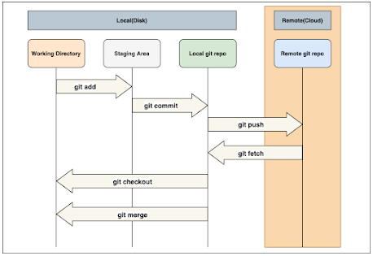

## 3.有哪些 Git 命令及其功能？

**答案**：

- `Git config` - 配置用户名和电子邮件地址
- `Git add` - 添加一个或多个文件到暂存区域
- `Git diff` - 查看对文件的修改情况
- `Git init` - 初始化一个空的 Git 仓库
- `Git commit` - 将更改提交到头部，但不提交到远程仓库

这里有一个 git 命令的大列表。

## 4.使用 Git 有什么好处？

**答案**：

- 更快的发布周期
- 易于团队协作
- 广泛的接受度
- 保持源代码的完整性
- 拉动请求

## 5.如何解决 Git 中的冲突？

**解答**：下面的步骤可以帮助你解决 Git 中的冲突。

- 识别造成冲突的文件。
- 对这些文件进行所需的修改
- 使用 git add 命令添加文件。
- 最后一步是在 git commit 命令的帮助下提交文件的修改。

## 6.如何发现一个分支是否已经被合并了？

**答案**是。有两个命令可以确定这两种不同的事情。

- git branch --merged -- 返回已被合并到当前分支的分支列表。
- git branch --no-merged --返回尚未合并的分支的列表。

## 7.Git 仓库的各种托管功能是什么？

**答案**：Github

- Github
- Gitlab
- Bitbucket
- SourceForge
- GitEnterprise

## 8.git pull 和 git fetch 的区别是什么？

**答**：Git pull 命令从中央仓库的某个分支拉出新的修改或提交，并更新你的仓库。Git pull 命令从中央仓库的某个特定分支拉取新的修改或提交，并更新本地仓库中的目标分支。另一方面，git fetch 也用于同样的目的，但它的工作方式略有不同。

当你执行 git fetch 时，它从所需的分支拉出所有新的提交，并将其存储在本地仓库的一个新分支中。如果您想在目标分支中反映这些变化，git fetch 之后必须进行 git merge。你的目标分支只有在合并了目标分支和取来的分支之后才会被更新。

[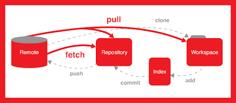](https://link.juejin.cn?target=https%3A%2F%2Fmedium.com%2Fjavarevisited%2F7-best-courses-to-master-git-and-github-for-programmers-d671859a68b2)

## 9.一个提交对象包含什么？

**答**：提交对象包含哪些内容？提交对象包含以下组件。

- 一组文件，代表项目在某一特定时间点的状态
- 对父级提交对象的引用
- 一个 SHA-1 名称，这是一个 40 个字符的字符串，可以唯一地识别提交对象。

## 10.git remote'和'git clone'有什么区别？

**答**：'git remote add'在你的 git 配置中创建了一个条目，指定了一个特定 URL 的名称，而'git clone'通过复制位于该 URL 的现有仓库来创建一个新的 git 仓库。

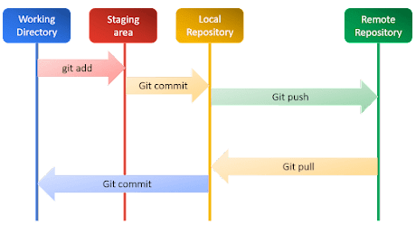

## 11.什么是 SubGit？

**答**：SubGit 是一个 SVG 的工具。SubGit 是一个用于 SVN 向 Git 迁移的工具。它可以为本地或远程的 Subversion 仓库创建一个可写的 Git 镜像，只要你愿意就可以同时使用 Subversion 和 Git。

## 12.Git 使用的是什么语言？

**答**：Git 使用 C 语言。Git 使用'C'语言。GIT 的速度很快，'C'语言通过减少与高级语言相关的运行时间的开销而使之成为可能。

## 13.复原和重设的区别是什么？

**答**：Git reset 是一个强大的命令，它可以让你的工作更有效率。

- Git reset 是一个强大的命令，用于撤销对 Git 仓库状态的局部修改。Git 重置的操作对象是 "Git 的三棵树"，即：提交历史（HEAD）、暂存索引和工作目录。
- Git 的 Revert 命令创建了一个新的提交，撤销了前一个提交的修改。这个命令为项目添加了一个新的历史。它并不修改现有的历史。

## 14.有哪些最流行的 Git 仓库托管功能？

**答**：以下是 Git 仓库托管功能的列表。以下是 Git 仓库托管功能的列表。

- Pikacode
- Assembla
- Visual Studio Online
- GitHub
- GitEnterprise
- 蝵蝏
- 豆茎网
- 云计算
- 淘宝网
- 淘宝网
- Perforce
- 雾溪窑洞

## 15.有哪些适用于 LINUX 的最佳图形化 GIT 客户端？

**答**：一些最好的 LINUX 的 GIT 客户端是：Planio Perforce Fog Creek Kiln 一些适用于 LINUX 的最好的 GIT 客户端是。

- Git Cola
- Git-g
- 智能 GIT
- Giggle
- Git GUI

## 16.有哪些为数不多的 Git 仓库托管服务？

**答案**：是。

- Pikacode
- Visual Studio Online
- GitHub
- GitEnterprise
- SourceForge.net

## 17.在 Git 中，"钩子 "包括哪些内容？

**答**：这个目录由 shell 脚本组成，如果运行相应的 Git 命令，就会激活这些脚本。这个目录由 shell 脚本组成，如果你运行相应的 Git 命令，这些脚本就会被激活。例如，git 会在你运行提交后尝试执行提交后脚本。

## **18.Git 和 GitHub 的区别是什么？**

**答**：Git 是一个版本控制系统。Git 是一个版本控制系统，用于管理源代码历史。而 GitHub 则是一个基于云的托管服务，用于管理 Git 仓库。GitHub 的目的是帮助更好地管理开源项目。

## 19.在 Git 中，重定位的语法是什么？

**答**：Git 中重命名的语法是什么？Git 重置的语法是 "git rebase [new-commit]"

## 20.git reset "的功能是什么？

**回答**："Git Reset "的功能是什么？Git reset "的功能是将你的索引以及工作目录重置为你最后一次提交的状态。

## 你们公司项目是如何使用 Git 用作管理的？

答：主要通过 git 来进行项目版本控制的说几个 git 常用命令？

- 初始化一个仓库：git init
- 查看分支：git branch
- 将已修改或未跟踪的文件添加到暂存区：git add [file] 或 git add .
- 提交至本地仓库：git commit -m "提及记录 xxxx"
- 本地分支推送至远程分支：git push
- 查看当前工作目录和暂存区的状态: git status
- 查看提交的日志记录： git log
- 从远程分支拉取代码：git pull
- 合并某分支(xxx)到当前分支： git merge xxx
- 切换到分支 xxx：git checkout xxx
- 创建分支 xxx 并切换到该分支：git checkout -b xxx
- 删除分支 xxx：git branch -d xxx
- 将当前分支到改动保存到堆栈中：git stash
- 恢复堆栈中缓存的改动内容：git stash pop

## 说一下多人操作同一个文件，如果出现冲突该如何解决？

答：当遇到多人协作修改同一个文件时出现冲突，我先将远程文件先 git pull 下来，手动修改冲突代码后，再 git add ,git commit,git push 再上传到远程仓库。

如果 pull 也 pull 不下来提示冲突的话，可以先通过 git stash 暂存下来，然后再 pull 拉取，然后 git stash pop，取出原来写的，手动修改，然后提交。

## git merge 和 git rebase 的区别？

相同点：

`git merge`和`git rebase`两个命令都用于从⼀个分⽀获取内容并合并到当前分⽀。

不同点：

1. `git merge`会⾃动创建⼀个新的`commit`，如果合并时遇到冲突的话，只需要修改后重新`commit`。

- 优点：能记录真实的`commit`情况，包括每个分⽀的详情
- 缺点：由于每次`merge`会⾃动产⽣⼀个`commit`，因此在使用⼀些可视化的 git 工具时会看到这些自动产生的`commit`，这些`commit`对于程序员来说没有什么特别的意义，多了反而会影响阅读。

1. `git rebase`会合并之前的`commit`历史。

- 优点：可以得到更简洁的提交历史，去掉了 merge 产生的`commit`
- 缺点：因为合并而产生的代码问题，就不容易定位，因为会重写提交历史信息

场景：

- 当需要保留详细的合并信息，建议使用`git merge`, 尤其是要合并到`master`上
- 当发现⾃⼰修改某个功能时提交比较频繁，并觉得过多的合并记录信息对自己来说没有必要，那么可尝试使用`git rebase`

## 对 GitFlow 的理解？

GitFlow 重点解决的是由于源代码在开发过程中的各种冲突导致开发活动混乱的问题。重点是对各个分支的理解。

- `master`：主分支。
- `develop`：主开发分支，平行于`master`分支。
- `feature`：功能分支，必须从`develop`分支建立，开发完成后合并到`develop`分支。
- `release`：发布分支，发布的时候用，一般测试时候发现的 bug 在该分支进行修复。从`develop`分支建立，完成后合并回`develop`与`master`分支。
- `hotfix`：紧急修复线上 bug 使用，必须从`master`分支建立，完成后合并回`develop`与`master`分支。

如果有合作开发经验，且开发过程规范的话，这部分问题不大，描述一下日常的开发流程即可。不了解的话，推荐阅读：[从零开始，学会 Git 和 Gitflow 工作流](https://juejin.cn/post/6844903517811900424)

## git 和 svn 的区别

git 和 svn 最大的区别在于 git 是分布式的，而 svn 是集中式的。

因此我们不能再离线的情况下使用 svn。如果服务器出现问题，就没有办法使用 svn 来提交代码。

svn 中的分支是整个版本库的复制的一份完整目录，而 git 的分支是指针指向某次提交，因此 git 的分支创建更加开销更小并且分支上的变化不会影响到其他人。svn 的分支变化会影响到所有的人。

svn 的指令相对于 git 来说要简单一些，比 git 更容易上手。

GIT 把内容按元数据方式存储，而 SVN 是按文件：因为 git 目录是处于个人机器上的一个克隆版的版本库，它拥有中心版本库上所有的东西，例如标签，分支，版本记录等。

GIT 分支和 SVN 的分支不同：svn 会发生分支遗漏的情况，而 git 可以同一个工作目录下快速的在几个分支间切换，很容易发现未被合并的分支，简单而快捷的合并这些文件。

GIT 没有一个全局的版本号，而 SVN 有 GIT 的内容完整性要优于 SVN：GIT 的内容存储使用的是 SHA-1 哈希算法。这能确保代码内容的完整性，确保在遇到磁盘故障和网络问题时降低对版本库的破坏。

## git pull 和 git fetch 的区别

git fetch 只是将远程仓库的变化下载下来，并没有和本地分支合并。

git pull 会将远程仓库的变化下载下来，并和当前分支合并。

## git rebase 和 git merge 的区别

git merge 和 git rebase 都是用于分支合并，关键在 commit 记录的处理上不同：

git merge 会新建一个新的 commit 对象，然后两个分支以前的

commit 记录都指向这个新 commit 记录。这种方法会保留之前每个分支的 commit 历史。

git rebase 会先找到两个分支的第一个共同的 commit 祖先记录，然后将提取当前分支这之后的所有 commit 记录，然后将这个 commit 记录添加到目标分支的最新提交后面。经过这个合并后，两个分支合并后的 commit 记录就变为了线性的记录了。

## 你的 git 工作流是怎样的?

参考回答：

GitFlow 是由 Vincent Driessen 提出的一个 git 操作流程标准。包含如下几个关键

分支：

master 主分支 develop 主开发分支，包含确定即将发布的代码

feature 新功能分支，一般一个新功能对应一个分支，对于功能的拆分需要比较合理，以避免一些后面不必要的代码冲突

release 发布分支，发布时候用的分支，一般测试时候发现的

bug 在这个分支进行修复 hotfixhotfix 分支，紧急修 bug 的时候用

GitFlow 的优势有如下几点：

• 并行开发：GitFlow 可以很方便的实现并行开发：每个新功能都会建立一个新
的 feature 分支，从而和已经完成的功能隔离开来，而且只有在新功能完成开发的情况下，其对应的 feature 分支才会合并到主开发分支上（也就是我们经常说的 develop 分支）。另外，如果你正在开发某个功能，同时又有一个新的功能需要开发，你只需要提交当前 feature 的代码，然后创建另外一个 feature 分支并完成新功能开发。然后再切回之前的 feature 分支即可继续完成之前功能的开发。

• 协作开发：GitFlow 还支持多人协同开发，因为每个 feature 分支上改动的代码都只是为了让某个新的 feature 可以独立运行。同时我们也很容易知道每个人都在干啥。

• 发布阶段：当一个新 feature 开发完成的时候，它会被合并到 develop 分支，这个分支主要用来暂时保存那些还没有发布的内容，所以如果需要再开发新的 feature，我们只需要从 develop 分支创建新分支，即可包含所有已经完成的 feature 。

• 支持紧急修复：GitFlow 还包含了 hotfix 分支。这种类型的分支是从某个已经发布的 tag 上创建出来并做一个紧急的修复，而且这个紧急修复只影响这个已经发布的 tag，而不会影响到你正在开发的新 feature。

然后就是 GitFlow 最经典的几张流程图，一定要理解：

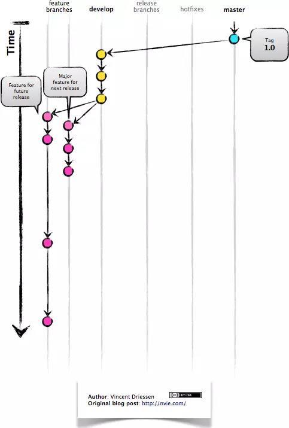

feature 分支都是从 develop 分支创建，完成后再合并到 develop 分支上，
等待发布。

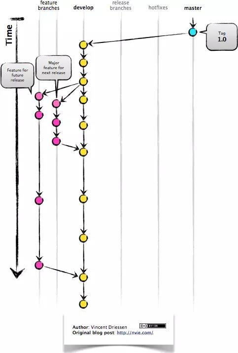

当需要发布时，我们从 develop 分支创建一个 release 分支

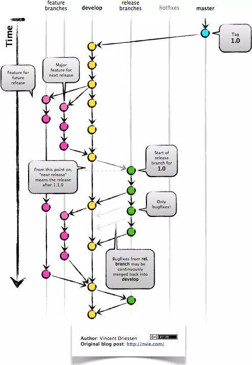

然后这个 release 分支会发布到测试环境进行测试，如果发现问题就在这个分支直接进行修复。在所有问题修复之前，我们会不停的重复发布->测试->修复->重新发布->重新测试这个流程。

发布结束后，这个 release 分支会合并到 develop 和 master 分支，从而保证不会有代码丢失。

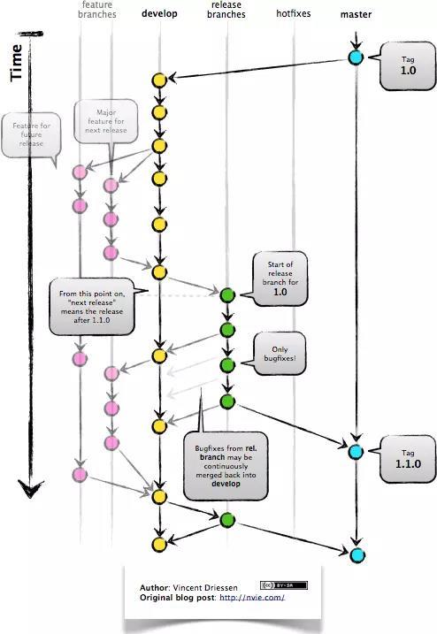

master 分支只跟踪已经发布的代码，合并到 master 上的 commit 只能来
自 release 分支和 hotfix 分支。

hotfix 分支的作用是紧急修复一些 Bug。

它们都是从 master 分支上的某个 tag 建立，修复结束后再合并到 develop 和 master 分支上。

## rebase 与 merge 的区别?

参考回答：

git rebase 和 git merge 一样都是用于从一个分支获取并且合并到当前分支.

假设一个场景,就是我们开发的[feature/todo]分支要合并到 master 主分支，那么用 rebase 或者 merge 有什么不同呢?

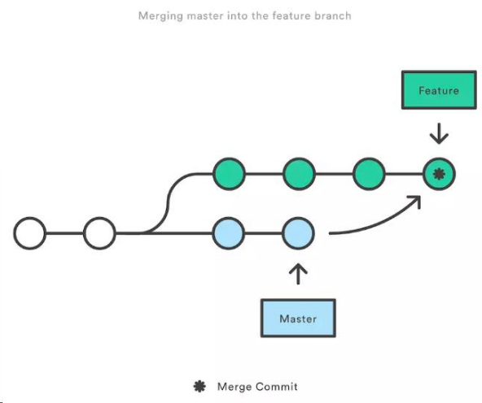

marge 特点：自动创建一个新的 commit 如果合并的时候遇到冲突，仅需要修改后重新 commit

o 优点：记录了真实的 commit 情况，包括每个分支的详情

o 缺点：因为每次 merge 会自动产生一个 merge commit，所以在使用一
些 git 的 GUI tools，特别是 commit 比较频繁时，看到分支很杂乱。

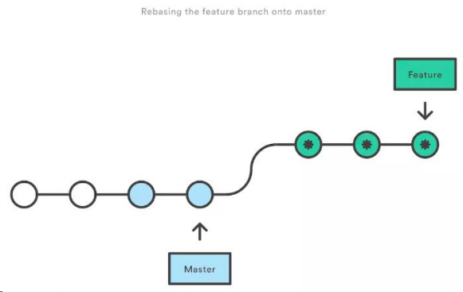

rebase 特点：会合并之前的 commit 历史

o 优点：得到更简洁的项目历史，去掉了 merge commit
o 缺点：如果合并出现代码问题不容易定位，因为 re-write 了 history
因此,当需要保留详细的合并信息的时候建议使用 git merge，特别是需要将分支合并进入 master 分支时；当发现自己修改某个功能时，频繁进行了 git commit 提交时，发现其实过多的提交信息没有必要时，可以尝试 git rebase.

## git reset、git revert 和 git checkout 有什么区别

参考回答：

这个问题同样也需要先了解 git 仓库的三个组成部分：工作区（Working
Directory）、暂存区（Stage）和历史记录区（History）。

o 工作区：在 git 管理下的正常目录都算是工作区，我们平时的编辑工作都是在工作区完成

o 暂存区：临时区域。里面存放将要提交文件的快照

o 历史记录区：git commit 后的记录区

三个区的转换关系以及转换所使用的命令：

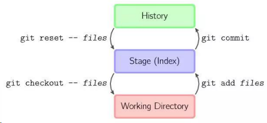

git reset、git revert 和 git checkout 的共同点：用来撤销代码仓库中的某些更
改。

然后是不同点：

首先，从 commit 层面来说：

- o git reset 可以将一个分支的末端指向之前的一个 commit。然后再下次 git 执行垃圾回收的时候，会把这个 commit 之后的 commit 都扔掉。git reset 还支持三种标记，用来标记 reset 指令影响的范围：
  - ▪ --mixed：会影响到暂存区和历史记录区。也是默认选项
  - ▪ --soft：只影响历史记录区
  - ▪ --hard：影响工作区、暂存区和历史记录区
    - 注意：因为 git reset 是直接删除 commit 记录，从而会影响到其他开发人员的分支，所以不要在公共分支（比如 develop）做这个操作。
  - ▪ git checkout 可以将 HEAD 移到一个新的分支，并更新工作目录。因为可能会覆盖本地的修改，所以执行这个指令之前，你需要 stash 或者 commit 暂存区和工作区的更改。
- o git revert 和 git reset 的目的是一样的，但是做法不同，它会以创建新的 commit 的方式来撤销 commit，这样能保留之前的 commit 历史，比较安全。另外，同样因为可能会覆盖本地的修改，所以执行这个指令之前，你需要 stash 或者 commit 暂存区和工作区的更改。

然后，从文件层面来说：

- o git reset 只是把文件从历史记录区拿到暂存区，不影响工作区的内容，而且不支持 --mixed、--soft 和 --hard。
- o git checkout 则是把文件从历史记录拿到工作区，不影响暂存区的内容。
- o git revert 不支持文件层面的操作。

# 代码规范

## ESLint 和 stylelint 的作用是什么？

- `ESLint`: 用于检查 JavaScript 代码规范。
- `stylelint`: 用于检查 CSS 代码规范。

## ESLint 是什么，它是如何帮助提高代码质量的？

ESLint 是一个插件化的 JavaScript 代码检测工具，它可以帮助开发者在编码过程中发现问题，而不是在执行过程中。

## stylelint 与 ESLint 有什么不同？它主要用于什么目的？

stylelint 是专门用于样式表的代码质量工具，它与 ESLint 不同，因为 ESLint 主要针对 JavaScript。stylelint 帮助维护一致的样式代码风格。

## 如何在项目中配置 ESLint？

通常，可以通过`.eslintrc`文件或`package.json`中的`eslintConfig`字段来配置 ESLint。也可以使用命令行工具`eslint --init`来生成配置文件。

## ESLint 的`rules`配置项是做什么用的？请举例说明。

`rules`配置项用于定义代码检查的规则，例如`"eqeqeq": "warn"`表示使用警告级别的错误提示当代码中使用了双等号（==）而不是三等号（===）。

## stylelint 是如何帮助开发者维护 CSS 代码一致性的？

stylelint 通过一系列预定义的规则或自定义规则来检查 CSS 代码，确保代码风格的一致性，比如缩进、空格、属性顺序等。

## 在团队协作中，为什么代码规范工具像 ESLint 和 stylelint 是必要的？

在多人开发项目中，统一的代码风格可以减少维护成本，避免因个人编码习惯不同而导致的代码冲突，提高代码的可读性和可维护性。

## 如何将 ESLint 与其他工具（如 webpack 或 git 钩子）集成？

- 可以通过 webpack 的`eslint-loader`或 git 钩子脚本在提交代码前自动运行 ESLint，以确保提交的代码符合规范。

## ESLint 中的`extends`配置项有什么用途？

`extends`配置项允许开发者继承一种或多种规则集，如`airbnb`或`@vue/standard`，这样可以快速采用一套成熟的代码规范。

## 如何自定义 ESLint 的规则？

可以在`.eslintrc`文件的`rules`部分添加自定义规则，或修改现有规则的错误级别。

## stylelint 支持哪些 CSS 预处理器？

stylelint 支持多种 CSS 预处理器，如 Sass、Less 和 Stylus，可以通过相应的插件来扩展其功能。

# 构建工具

## 前端工程化的好处是什么？

- 提高代码质量和可维护性。
- 自动化构建、打包和优化前端资源。
- 模块化和组件化，提高代码复用性。

# Vite

### 1. 如何指定 vite 插件 的执行顺序？

可以使用 `enforce` 修饰符来强制插件的位置:

- pre：在 Vite 核心插件之前调用该插件
- post：在 Vite 构建插件之后调用该插件

### 2. Vite 是否支持 commonjs 写法？

纯业务代码，一般建议采用 ESM 写法。如果引入的三方组件或者三方库采用了 CJS 写法，vite 在预构建的时候就会将 CJS 模块转化为 `ESM` 模块。

### 3. 为什么说 vite 比 webpack 要快

1. `vite` 不需要做全量的打包
2. `vite` 在解析模块依赖关系时，利用了 `esbuild`，更快（esbuild 使用 Go 编写，并且比以 JavaScript 编写的打包器预构建依赖快 10-100 倍）
3. `按需加载`：在 HMR（热更新）方面，当改动了一个模块后，vite 仅需让浏览器重新请求该模块即可，不像 webpack 那样需要把该模块的相关依赖模块全部编译一次，效率更高。
4. 由于现代浏览器本身就支持 `ES Module`，会自动向依赖的 Module 发出请求。vite 充分利用这一点，将开发环境下的模块文件，就作为浏览器要执行的文件，而不是像 webpack 那样进行打包合并。
5. `按需编译`：当浏览器请求某个模块时，再根据需要对模块内容进行编译，这种按需动态编译的方式，极大的缩减了编译时间。
6. webpack 是先打包再启动开发服务器，vite 是直接启动开发服务器，然后按需编译依赖文件。由于 vite 在启动的时候`不需要打包`，也就意味着不需要分析模块的依赖、不需要编译，因此启动速度非常快。

### 4. vite 对比 webpack ，优缺点在哪？

`（1）优点`：

1. **更快的冷启动**： Vite 借助了浏览器对 ESM 规范的支持，采取了与 Webpack 完全不同的 unbundle 机制
2. **更快的热更新**： Vite 采用 unbundle 机制，所以 dev server 在监听到文件发生变化以后，只需要通过 ws 连接通知浏览器去重新加载变化的文件，剩下的工作就交给浏览器去做了。

`（2）缺点`：

1. **开发环境下首屏加载变慢**：由于 unbundle 机制， Vite 首屏期间需要额外做其它工作。不过首屏性能差只发生在 dev server 启动以后第一次加载页面时发生。之后再 reload 页面时，首屏性能会好很多。原因是 dev server 会将之前已经完成转换的内容缓存起来
2. **开发环境下懒加载变慢**：由于 unbundle 机制，动态加载的文件，需要做 resolve 、 load 、 transform 、 parse 操作，并且还有大量的 http 请求，导致懒加载性能也受到影响。
3. **webpack 支持的更广**：由于 Vite 基于 ES Module，所以代码中不可以使用 CommonJs；webpack 更多的关注兼容性, 而 Vite 关注浏览器端的开发体验。

> 当需要打包到生产环境时，`Vite`使用传统的 rollup 进行打包，所以，vite 的优势是体现在开发阶段，缺点也只是在开发阶段存在。

### 5. Vite 和 webpack 的区别

Vite 和 Webpack 都是现代化的前端构建工具，它们可以帮助开发者优化前端项目的构建和性能。虽然它们的目标是相似的，但它们在设计和实现方面有许多不同之处。

两者原理图：

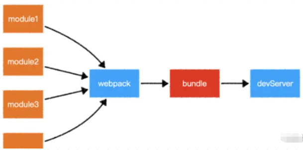

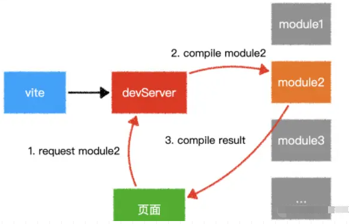

区别如下：

**（1）构建原理：** Webpack 是一个静态模块打包器，通过对项目中的 JavaScript、CSS、图片等文件进行分析，生成对应的静态资源，并且可以通过一些插件和加载器来实现各种功能；Vite 则是一种基于浏览器原生 ES 模块解析的构建工具。

**（2）打包速度：** Webpack 的打包速度相对较慢，Vite 的打包速度非常快。

**（3）配置难度：** Webpack 的配置比较复杂，因为它需要通过各种插件和加载器来实现各种功能；Vite 的配置相对简单，它可以根据不同的开发场景自动配置相应的环境变量和配置选项。

**（4）插件和加载器：** Webpack 有大量的插件和加载器可以使用，可以实现各种复杂的构建场景，例如代码分割、按需加载、CSS 预处理器等；Vite 的插件和加载器相对较少

**（5）Vite 是按需加载，webpack 是全部加载：** 在 HMR（热更新）方面，当改动了一个模块后，vite 仅需让浏览器重新请求该模块即可，不像 webpack 那样需要把该模块的相关依赖模块全部编译一次，效率更高。

**（6）webpack 是先打包再启动开发服务器，vite 是直接启动开发服务器，然后按需编译依赖文件** 由于 vite 在启动的时候不需要打包，也就意味着不需要分析模块的依赖、不需要编译，因此启动速度非常快。当浏览器请求某个模块时，再根据需要对模块内容进行编译，这种按需动态编译的方式，极大的缩减了编译时间。

### 6. Vite 常见的配置

**（1）css.preprocessorOptions：** 传递给 CSS 预处理器的配置选项，例如，我们可以定义一个全局变量文件，然后再引入这个文件：

src/assets/styles/variables.scss

```css
$injectedColor: orange;
$injectedFontSize: 16px;
```

vite.config.js

```js
import { defineConfig } from "vite";

export default defineConfig({
	css: {
		preprocessorOptions: {
			scss: {
				additionalData: `@import '/src/assets/styles/variables.scss';`, // 引入全局变量文件
			},
		},
	},
});
```

**（2）css.postcss：** PostCSS 也是用来处理 CSS 的，只不过它更像是一个工具箱，可以添加各种插件来处理 CSS（解决浏览器样式兼容问题、浏览器适配等问题）。例如：移动端使用 postcss-px-to-viewport 对不同设备进行布局适配：

```javascript
// vite.config.js
import { defineConfig } from "vite";
import postcssPxToViewport from "postcss-px-to-viewport";

export default defineConfig({
	css: {
		postcss: {
			plugins: [
				// viewport 布局适配
				postcssPxToViewport({
					viewportWidth: 375,
				}),
			],
		},
	},
});
```

这样我们书写的 px 单位就会转为 vw 或 vh ，很轻松地解决了适配问题

**（3）resolve.alias：** 定义路径别名也是我们常用的一个功能，我们通常会给 scr 定义一个路径别名：

```javascript
// vite.config.js
import { defineConfig } from "vite";
import path from "path";

export default defineConfig({
	resolve: {
		alias: {
			"@": path.resolve(__dirname, "./src"), // 路径别名
		},
	},
});
```

**（4）resolve.extensions：** 导入时想要省略的扩展名列表。默认值为 ['.mjs', '.js', '.ts', '.jsx', '.tsx', '.json'] 。

```javascript
// vite.config.js
import { defineConfig } from "vite";
import path from "path";

export default defineConfig({
	resolve: {
		extensions: [".js", ".ts", ".json"], // 导入时想要省略的扩展名列表
	},
});
```

**（5）optimizeDeps.force：** 是否开启强制依赖预构建。node_modules 中的依赖模块构建过一次就会缓存在 node_modules/.vite/deps 文件夹下，下一次会直接使用缓存的文件。而有时候我们想要修改依赖模块的代码，做一些测试或者打个补丁，这时候就要用到强制依赖预构建。

```javascript
// vite.config.js
import { defineConfig } from "vite";

export default defineConfig({
	optimizeDeps: {
		force: true, // 强制进行依赖预构建
	},
});
```

**（6）server.host：** 指定服务器监听哪个 IP 地址。默认值为 localhost ，只会监听本地的 127.0.0.1。

```javascript
// vite.config.js
import { defineConfig } from "vite";

export default defineConfig({
	server: {
		host: true, // 监听所有地址
	},
});
```

**（7）server.proxy：** 反向代理也是我们经常会用到的一个功能，通常我们使用它来解决跨域问题：

```javascript
// vite.config.js
import { defineConfig } from 'vite'

export default defineConfig({
  server: {
    proxy: {
      '/api': {
        target: 'http://jsonplaceholder.typicode.com',
        changeOrigin: true,
        rewrite: (path) => path.replace(/^/api/, '')
      }
    }
  }
})
```

**（8）base：** 开发或生产环境服务的公共基础路径。

```javascript
// vite.config.js
import { defineConfig } from "vite";

export default defineConfig({
	base: "/foo/", // 开发或生产环境服务的公共基础路径
});
```

**（9）build.outdir：** 指定打包文件的输出目录，默认值为 dist。

```javascript
// vite.config.js
import { defineConfig } from "vite";

export default defineConfig({
	build: {
		outDir: "build", // 打包文件的输出目录
	},
});
```

**（10）build.assetsDir：** 指定生成静态资源的存放目录，默认值为 assets。

```javascript
// vite.config.js
import { defineConfig } from "vite";

export default defineConfig({
	build: {
		assetsDir: "static", // 静态资源的存放目录
	},
});
```

**（11）build.assetsInlineLimit：** 图片转 base64 编码的阈值。为防止过多的 http 请求，Vite 会将小于此阈值的图片转为 base64 格式，可根据实际需求进行调整。

```javascript
// vite.config.js
import { defineConfig } from "vite";

export default defineConfig({
	build: {
		assetsInlineLimit: 4096, // 图片转 base64 编码的阈值
	},
});
```

**（12）plugins：** 插件相信大家都不陌生了，我们可以使用官方插件，也可以社区插件。

```javascript
// vite.config.js
import { defineConfig } from "vite";
import vue from "@vitejs/plugin-vue";
import { viteMockServe } from "vite-plugin-mock";

export default defineConfig({
	plugins: [vue(), viteMockServe()],
});
```

# Webpack

## 基本使用

- 安装配置
- dev-server
- 解析 ES6
- 解析样式
- 解析图片文件
- 常见 loader 和 plugin

## 高级特性

- 多入口
- 抽离和压缩 css
- 抽离公共代码
- 懒加载
- 处理 React 和 vue

## 性能优化

优化构建速度

- 优化 babel-loader
- lgnorePlugin
- noParse
- happyPack
- ParallelUglifyPlugin
- 自动刷新
- 热更新
- DllPlugin

优化产出代码

- 使用生产环境
- 小图片 base64 编码
- bundle 加 hash
- 使用 CDN
- 提取公共改代码
- 懒加载
- scope hosting

## 谈谈你对 webpack 的看法（理解）

`webpack` 是一个用于现代 JavaScript 应用程序的**静态模块打包工具**。我们可以使用`webpack`管理项目模块依赖。它能够很好地管理、打包 Web 开发中所用到的 HTML 、Javascript 、 CSS 以及各种静态文件（图片、字体等），让开发过程更加高效。对于不同类型的资源， webpack 有对应的模块加载器。

因为在`webpack`看来，项目中的所有资源皆为模块，通过分析模块间的依赖关系，在其内部构建出一个依赖图，最终编绎输出模块为 HTML、JavaScript、CSS 以及各种静态文件（图片、字体等），让我们的开发过程更加高效。

webpack 模块打包器会分析模块间的依赖关系，最后 生成了优化且合并后的静态资源。

`webpack`的主要作用如下：

- `模块打包`。可以将不同模块的文件打包整合在一起，并且保证它们之间的引用正确，执行有序。利用打包我们就可以在开发的时候根据我们自己的业务自由划分文件模块，保证项目结构的清晰和可读性。
- `编译兼容`。在前端的“上古时期”，手写一堆浏览器兼容代码一直是令前端工程师头皮发麻的事情，而在今天这个问题被大大的弱化了，通过`webpack`的`Loader`机制，不仅仅可以帮助我们对代码做`polyfill`，还可以编译转换诸如`.less`，`.vue`，`.jsx`这类在浏览器无法识别的格式文件，让我们在开发的时候可以使用新特性和新语法做开发，提高开发效率。
- `能力扩展`。通过`webpack`的`Plugin`机制，我们在实现`模块化打包`和`编译兼容`的基础上，可以进一步实现诸如按需加载，代码压缩等一系列功能，帮助我们进一步提高自动化程度，工程效率以及打包输出的质量。

## webpack 的构建流程？

`webpack`的运行流程是一个串行的过程，从启动到结束会依次执行以下流程：

- `初始化参数`：从配置文件和 Shell 语句中读取与合并参数，得出最终的参数
- `开始编译`：用上一步得到的参数初始化 Compiler 对象，加载所有配置的插件，执行对象的 run 方法开始执行编译
- `确定入口`：根据配置中的 entry 找出所有的入口文件
- `编译模块`：从入口文件出发，调用所有配置的 loader 对模块进行翻译，再找出该模块依赖的模块，再递归本步骤直到所有入口依赖的文件都经过了本步骤的处理
- `完成模块编译`：在经过上一步使用 loader 翻译完所有模块后，得到了每个模块被翻译后的最终内容以及它们之间的依赖关系
- `输出资源`：根据入口和模块之间的依赖关系，组装成一个个包含多个模块的 Chunk，再把每个 Chunk 转换成一个单独的文件加入到输出列表，这步是可以修改输出内容的最后机会
- `输出完成`：在确定好输出内容后，根据配置确定输出的路径和文件名，把文件内容写入到文件系统

在以上过程中，`webpack`会在特定的时间点广播出特定的事件，插件在监听到感兴趣的事件后会执行特定的逻辑，并且插件可以调用`webpack`提供的 API 改变`webpack`的运行结果。

**简单说：**

- 初始化：启动构建，读取与合并配置参数，加载 Plugin，实例化 Compiler
- 编译：从 entry 出发，针对每个 Module 串行调用对应的 loader 去翻译文件的内容，再找到该 Module 依赖的 Module，递归地进行编译处理
- 输出：将编译后的 Module 组合成 Chunk，将 Chunk 转换成文件，输出到文件系统中

## 常见的 loader 有哪些？

默认情况下，`webpack`只支持对`js`和`json`文件进行打包，但是像`css`、`html`、`png`等其他类型的文件，`webpack`则无能为力。因此，就需要配置相应的`loader`进行文件内容的解析转换。

常用的`loader`如下：

- `image-loader`：加载并且压缩图片文件。
- `less-loader`： 加载并编译 LESS 文件。
- `sass-loader`：加载并编译 SASS/SCSS 文件。
- `css-loader`：加载 CSS，支持模块化、压缩、文件导入等特性，使用`css-loader`必须要配合使用`style-loader`。
- `style-loader`：用于将 CSS 编译完成的样式，挂载到页面的 style 标签上。需要注意 `loader` 执行顺序，`style-loader` 要放在第一位，`loader` 都是从后往前执行。
- `babel-loader`：把 ES6 转换成 ES5
- `postcss-loader`：扩展 CSS 语法，使用下一代 CSS，可以配合 `autoprefixer` 插件自动补齐 CSS3 前缀。
- `eslint-loader`：通过 ESLint 检查 JavaScript 代码。
- `vue-loader`：加载并编译 Vue 组件。
- `file-loader`：把文件输出到一个文件夹中，在代码中通过相对 URL 去引用输出的文件 (处理图片和字体)
- `url-loader`：与 `file-loader` 类似，区别是用户可以设置一个阈值，大于阈值会交给 `file-loader` 处理，小于阈值时返回文件 base64 形式编码 (处理图片和字体)

[更多 loader，点击此处查看官方文档](https://www.webpackjs.com/loaders/)

## 常见的 plugin 有哪些？

`webpack`中的`plugin`赋予其各种灵活的功能，例如打包优化、资源管理、环境变量注入等，它们会运行在`webpack`的不同阶段（钩子 / 生命周期），贯穿了`webpack`整个编译周期。目的在于**解决 loader 无法实现的其他事**。

常用的`plugin`如下：

- `HtmlWebpackPlugin`：简化 HTML 文件创建 (依赖于 html-loader)
- `mini-css-extract-plugin`: 分离样式文件，CSS 提取为独立文件，支持按需加载 (替代 extract-text-webpack-plugin)
- `clean-webpack-plugin`: 目录清理

[更多 plugin，点击此处查看官方文档](https://www.webpackjs.com/plugins/)

## loader 和 plugin 的区别？

`loader`是文件加载器，能够加载资源文件，并对这些文件进行一些处理，诸如编译、压缩等，最终一起打包到指定的文件中；`plugin`赋予了`webpack`各种灵活的功能，例如打包优化、资源管理、环境变量注入等，目的是解决 `loader`无法实现的其他事。

在运行时机上，`loader` 运行在打包文件之前；`plugin`则是在整个编译周期都起作用。

在配置上，`loader`在`module.rules`中配置，作为模块的解析规则，类型为数组。每一项都是一个 Object，内部包含了 `test(类型文件)`、`loader`、`options (参数)`等属性；`plugin`在 `plugins`中单独配置，类型为数组，每一项是一个 `plugin` 的实例，参数都通过构造函数传入。

## webpack 的热更新原理是？

`模块热替换(HMR - hot module replacement)`，又叫做`热更新`，在不需要刷新整个页面的同时更新模块，能够提升开发的效率和体验。热更新时只会局部刷新页面上发生了变化的模块，同时可以保留当前页面的状态，比如复选框的选中状态等。

热更新的核心就是客户端从服务端拉去更新后的文件，准确的说是 chunk diff (chunk 需要更新的部分)，实际上`webpack-dev-server`与浏览器之间维护了一个`websocket`，当本地资源发生变化时，`webpack-dev-server`会向浏览器推送更新，并带上构建时的`hash`，让客户端与上一次资源进行对比。客户端对比出差异后会向`webpack-dev-server`发起 Ajax 请求来获取更改内容(文件列表、hash)，这样客户端就可以再借助这些信息继续向`webpack-dev-server`发起 jsonp 请求获取该`chunk`的增量更新。

后续的部分(拿到增量更新之后如何处理？哪些状态该保留？哪些又需要更新？)由`HotModulePlugin` 来完成，提供了相关 API 以供开发者针对自身场景进行处理，像`react-hot-loader`和`vue-loader`都是借助这些 API 实现热更新。

## 如何提高 webpack 的构建速度？

1. 代码压缩

   - JS 压缩
     `webpack 4.0`默认在生产环境的时候是支持代码压缩的，即`mode=production`模式下。 实际上`webpack 4.0`默认是使用`terser-webpack-plugin`这个压缩插件，在此之前是使用 `uglifyjs-webpack-plugin`，两者的区别是后者对 ES6 的压缩不是很好，同时我们可以开启 `parallel`参数，使用多进程压缩，加快压缩。

   - CSS 压缩
     CSS 压缩通常是去除无用的空格等，因为很难去修改选择器、属性的名称、值等。可以使用另外一个插件：`css-minimizer-webpack-plugin`。

   - HTML 压缩

     使用

     ```bash
     HtmlWebpackPlugin
     ```

     插件来生成 HTML 的模板时候，通过配置属性

     ```bash
     minify
     ```

     进行 html 优化。

     ```js
     module.exports = {
     	plugin: [
     		new HtmlwebpackPlugin({
     			minify: {
     				minifyCSS: false, // 是否压缩css
     				collapseWhitespace: false, // 是否折叠空格
     				removeComments: true, // 是否移除注释
     			},
     		}),
     	],
     };
     ```

2. 图片压缩
   配置`image-webpack-loader`

3. Tree Shaking
   `Tree Shaking`是一个术语，在计算机中表示消除死代码，依赖于 ES Module 的静态语法分析（不执行任何的代码，可以明确知道模块的依赖关系）。 在`webpack`实现`Tree shaking`有两种方案：

   - usedExports：通过标记某些函数是否被使用，之后通过

     ```
     Terser
     ```

     来进行优化的

     ```html
     module.exports = { ... optimization:{ usedExports } }
     ```

     使用之后，没被用上的代码在

     ```
     webpack
     ```

     打包中会加入

     ```
     unused harmony export mul
     ```

     注释，用来告知

     ```
     Terser
     ```

     在优化时，可以删除掉这段代码。

   - sideEffects：跳过整个模块/文件，直接查看该文件是否有副作用

     ```
     sideEffects
     ```

     用于告知

     ```
     webpack compiler
     ```

     哪些模块时有副作用，配置方法是在

     ```
     package.json
     ```

     中设置

     ```
     sideEffects
     ```

     属性。如果

     ```
     sideEffects
     ```

     设置为

     ```
     false
     ```

     ，就是告知

     ```
     webpack
     ```

     可以安全的删除未用到的

     ```
     exports
     ```

     。如果有些文件需要保留，可以设置为数组的形式，如：

     ```json
     "sideEffecis":[
         "./src/util/format.js",
         "*.css" // 所有的css文件
     ]
     ```

4. 缩小打包域
   排除`webpack`不需要解析的模块，即在使用`loader`的时候，在尽量少的模块中去使用。可以借助 `include`和`exclude`这两个参数，规定`loader`只在那些模块应用和在哪些模块不应用。

5. 减少 ES6 转为 ES5 的冗余代码
   使用`bable-plugin-transform-runtime`插件

6. 提取公共代码
   通过配置`CommonsChunkPlugin`插件，将多个页面的公共代码抽离成单独的文件

更多优化构建速度方式，推荐阅读：[浅谈 webpack 性能优化（内附 webpack 学习笔记）](https://zhuanlan.zhihu.com/p/139498741)

## 打包体积 优化思路

- 提取第三方库或通过引用外部文件的方式引入第三方库
- 代码压缩插件 UglifyJsPlugin
- 服务器启用 gzip 压缩
- 按需加载资源文件 require.ensure
- 优化 devtool 中的 source-map
- 剥离 css 文件，单独打包
- 去除不必要插件，通常就是开发环境与生产环境用同一套配置文件导致

## 打包效率

- 开发环境采用增量构建，启用热更新
- 开发环境不做无意义的工作如提取 css 计算文件 hash 等
- 配置 devtool
- 选择合适的 loader
- 个别 loader 开启 cache 如 babel-loader
- 第三方库采用引入方式
- 提取公共代码
- 优化构建时的搜索路径 指明需要构建目录及不需要构建目录
- 模块化引入需要的部分

## Loader

编写一个 loader

loader 就是一个 node 模块，它输出了一个函数。当某种资源需要用这个
loader 转换时，这个函数会被调用。并且，这个函数可以通过提供给它的
this 上下文访问 Loader API 。 reverse-txt-loader

```js
// 定义
module.exports = function(src) {
    // src是原文件内容（abcde），下面对内容进行处理，这里是反转
    var result = src.split('').reverse().join('');
    // 返回JavaScript源码，必须是String或者Buffer
    return `module.exports = '${result}'`;
}
// 使用
{
    test: /\.txt$/,
    use: [
        {
        	'./path/reverse-txt-loader'
        }
    ]
},
```

## 说一下 webpack 的一些 plugin，怎么使用 webpack 对项目进行优化

#### 构建优化

- 减少编译体积 ContextReplacementPugin 、 IgnorePlugin 、 babel-plugin、import 、 babel-plugin-transform-runtime
- 并行编译 happypack 、 thread-loader 、 uglifyjsWebpackPlugin 开启并行
- 缓存 cache-loader 、 hard-source-webpack-plugin 、 uglifyjsWebpackPlugin 开启缓存、 babel-loader 开启缓存
- 预编译 dllWebpackPlugin && DllReferencePlugin 、 auto-dll-webapck-plugin

#### 性能优化

- 减少编译体积 Tree-shaking 、 Scope Hositing
- hash 缓存 webpack-md5-plugin
- 拆包 splitChunksPlugin 、 import() 、 require.ensure

## 优化打包速度

- 减少文件搜索范围：比如通过别名——loader 的 test ， include & exclude
- Webpack4 默认压缩并行
- Happypack 并发调用
- babel 也可以缓存编译

## webpack 用来干什么的

参考回答：

webpack 是一个现代 JavaScript 应用程序的静态模块打包器(module bundler)。当 webpack 处理应用程序时，它会递归地构建一个依赖关系图(dependency graph)，其中包含应用程序需要的每个模块，然后将所有这些模块打包成一个或多个 bundle。

## webpack 和 gulp 区别（模块化与流的区别）

参考回答：

gulp 强调的是前端开发的工作流程，我们可以通过配置一系列的 task，定义 task 处理的事务（例如文件压缩合并、雪碧图、启动 server、版本控制等），然后定义执行顺序，来让 gulp 执行这些 task，从而构建项目的整个前端开发流程。

webpack 是一个前端模块化方案，更侧重模块打包，我们可以把开发中的所有资源（图片、js 文件、css 文件等）都看成模块，通过 loader（加载器）和 plugins（插件）

对资源进行处理，打包成符合生产环境部署的前端资源。

## webpack 和 gulp 区别（模块化与流的区别）

**考察点：自动化工具**

::: details 查看参考回答

gulp 强调的是前端开发的工作流程，我们可以通过配置一系列的 task，定义 task 处理的事务（例如文件压缩合并、雪碧图、启动 server、版本控制等），然后定义执行顺序，来让 gulp 执行这些 task，从而构建项目的整个前端开发流程。

webpack 是一个前端模块化方案，更侧重模块打包，我们可以把开发中的所有资源（图片、js 文件、css 文件等）都看成模块，通过 loader（加载器）和 plugins（插件）对资源进行处理，打包成符合生产环境部署的前端资源。

:::

## webpack 与 grunt、gulp 的不同？

Grunt、Gulp 是基于任务运⾏的⼯具： 它们会⾃动执⾏指定的任务，就像流⽔线，把资源放上去然后通过不同插件进⾏加⼯，它们包含活跃的社区，丰富的插件，能方便的打造各种⼯作流。

Webpack 是基于模块化打包的⼯具: ⾃动化处理模块，webpack 把⼀切当成模块，当 webpack 处理应用程序时，它会递归地构建⼀个依赖关系图 (dependency graph)，其中包含应用程序需要的每个模块，然后将所有这些模块打包成⼀个或多个 bundle。

因此这是完全不同的两类⼯具,而现在主流的方式是用 npm script 代替 Grunt、Gulp，npm script 同样可以打造任务流。

## webpack、rollup、parcel 优劣？

webpack 适用于⼤型复杂的前端站点构建: webpack 有强⼤的 loader 和插件⽣态,打包后的⽂件实际上就是⼀个立即执⾏函数，这个立即执⾏函数接收⼀个参数，这个参数是模块对象，键为各个模块的路径，值为模块内容。立即执⾏函数内部则处理模块之间的引用，执⾏模块等,这种情况更适合⽂件依赖复杂的应用开发。

rollup 适用于基础库的打包，如 vue、d3 等: Rollup 就是将各个模块打包进⼀个⽂件中，并且通过 Tree-shaking 来删除无用的代码, 可以最⼤程度上降低代码体积,但是 rollup 没有 webpack 如此多的的如代码分割、按需加载等⾼级功能，其更聚焦于库的打包，因此更适合库的开发。

parcel 适用于简单的实验性项目: 他可以满足低⻔槛的快速看到效果,但是⽣态差、报错信息不够全面都是他的硬伤，除了⼀些玩具项目或者实验项目不建议使用。

## 对 webpack 的理解

webpack 是一个前端打包器，帮助开发者将 js 模块（各种类型的模块化规范）打包成一个或多个 js 脚本。webpack 的工作过程可以分为依赖解析过程和代码打包过程，首先执行对应的 build 命令，webpack 首先分析入口文件，会递归解析 AST 获取对应依赖，得到一个依赖图。然后为每一个模块添加包裹函数（webpack 的模块化），从入口文件为起点，递归执行模块，进行拼接 IIFE（立即调用函数表达式：保证了模块变量不会影响全局作用域），产出对应的 bundle。

## webpack 中 plugin 和 loader 分别做什么？它们之间的执行顺序？

- loader：用于将不同类型的文件转换成 webpack 可以识别的文件（webpack 只认识 js 和 json）。
- plugin：存在于 webpack 整个生命周期中，是一种基于事件机制工作的模式，可以在 webpck 打包过程对某些节点做某些定制化处理。同时 plugin 可以对 loader 解析过程中做一些处理，协同处理文件。
- 执行顺序：两者不存在明显的先后顺序，不过 webpack 在初始化处理时，会优先识别到 plugin 中的内容。

## webpack 常见的优化方案

- 基于 esm 的 tree shaking
- 对 balel 设置缓存，缩小 babel-loader 的处理范围,及精准指定要处理的目录。
- 压缩资源（mini-css-extract-plugin，compression-webpack-plugin）
- 配置资源的按需引入（第三方组件库）
- 配置 splitChunks 来进行按需加载（根据）
- 设置 CDN 优化

```js
rules: [
    {
        test: /\.m?js$/,
        exclude: /node_modules/
        include: path.resolve(__dirname, 'src'）,
        use: {
            loader: 'babel-loader?cacheDirectory'
        }
    }，

]
```

## vite 和 webpak 的区别

vite 在开环境时基于 ESBuild 打包，相比 webpack 的编译方式，大大提高了项目的启动和热更新速度。

## 有哪些常见的 Loader？

file-loader：把⽂件输出到⼀个⽂件夹中，在代码中通过相对 URL 去引用输出的⽂件

url-loader：和 file-loader 类似，但是能在⽂件很小的情况下以 base64 的方式把⽂件内容注入到代码中去

source-map-loader：加载额外的 Source Map ⽂件，以方便断点调试

image-loader：加载并且压缩图片⽂件

babel-loader：把 ES6 转换成 ES5

css-loader：加载 CSS，⽀持模块化、压缩、⽂件导入等特性

style-loader：把 CSS 代码注入到 JavaScript 中，通过 DOM 操作去加载 CSS。

eslint-loader：通过 ESLint 检查 JavaScript 代码

注意：在 Webpack 中，loader 的执行顺序是从右向左执行的。因为 webpack 选择了 compose 这样的函数式编程方式，这种方式的表达式执行是从右向左的。

## 有哪些常见的 Plugin？

define-plugin：定义环境变量

html-webpack-plugin：简化 html ⽂件创建

uglifyjs-webpack-plugin：通过 UglifyES 压缩 ES6 代码

webpack-parallel-uglify-plugin: 多核压缩，提⾼压缩速度

webpack-bundle-analyzer: 可视化 webpack 输出⽂件的体积

mini-css-extract-plugin: CSS 提取到单独的⽂件中，⽀持按需加载

## bundle，chunk，module 是什么？

bundle：是由 webpack 打包出来的⽂件；

chunk：代码块，⼀个 chunk 由多个模块组合而成，用于代码的合并和分割；

module：是开发中的单个模块，在 webpack 的世界，⼀切皆模块，⼀个模块对应⼀个⽂件，webpack 会从配置的 entry 中递归开始找出所有依赖的模块。

## Loader 和 Plugin 的不同？

不同的作用：

Loader 直译为"加载器"。Webpack 将⼀切⽂件视为模块，但是 webpack 原⽣是只能解析 js ⽂件，如果想将其他⽂件也打包的话，就会用到 loader 。 所以 Loader 的作用是让 webpack 拥有了加载和解析⾮ JavaScript ⽂件的能⼒。

Plugin 直译为"插件"。Plugin 可以扩展 webpack 的功能，让 webpack 具有更多的灵活性。在 Webpack 运⾏的⽣命周期中会⼴播出许多事件，Plugin 可以监听这些事件，在合适的时机通过 Webpack 提供的 API 改变输出结果。

不同的用法：

Loader 在 module.rules 中配置，也就是说他作为模块的解析规则而存在。 类型为数组，每⼀项都是⼀个 Object ，里面描述了对于什么类型的⽂件（ test ），使用什么加载( loader )和使用的参数（ options ）

Plugin 在 plugins 中单独配置。类型为数组，每⼀项是⼀个 plugin 的实例，参数都通过构造函数传入。

## webpack 热更新的实现原理？

webpack 的热更新⼜称热替换（Hot Module Replacement），缩写为 HMR。这个机制可以做到不用刷新浏览器而将新变更的模块替换掉旧的模块。

原理：

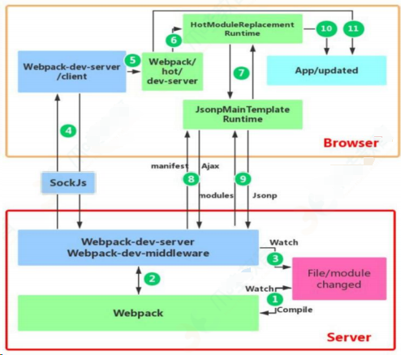

首先要知道 server 端和 client 端都做了处理⼯作：

第⼀步，在 webpack 的 watch 模式下，⽂件系统中某⼀个⽂件发⽣修改，webpack 监听到⽂件变化，根据配置⽂件对模块重新编译打包，并将打包后的代码通过简单的 JavaScript 对象保存在内存中。

第二步是 webpack-dev-server 和 webpack 之间的接口交互，而在这⼀步，主要是 dev-server 的中间件 webpack- dev-middleware 和 webpack 之间的交互，webpack-dev-middleware 调用 webpack 暴露的 API 对代码变化进⾏监 控，并且告诉 webpack，将代码打包到内存中。

第三步是 webpack-dev-server 对⽂件变化的⼀个监控，这⼀步不同于第⼀步，并不是监控代码变化重新打包。当我们在配置⽂件中配置了 evServer.watchContentBase 为 true 的时候，Server 会监听这些配置⽂件夹中静态⽂件的变化，变化后会通知浏览器端对应用进⾏ live reload。注意，这⼉是浏览器刷新，和 HMR 是两个概念。

第四步也是 webpack-dev-server 代码的⼯作，该步骤主要是通过 sockjs（webpack-dev-server 的依赖）在浏览器端和服务端之间建立⼀个 websocket ⻓连接，将 webpack 编译打包的各个阶段的状态信息告知浏览器端，同时也包括第三步中 Server 监听静态⽂件变化的信息。浏览器端根据这些 socket 消息进⾏不同的操作。当然服务
端传递的最主要信息还是新模块的 hash 值，后面的步骤根据这⼀ hash 值来进⾏模块热替换。

webpack-dev-server/client 端并不能够请求更新的代码，也不会执⾏ 热 更 模 块 操 作 ， 而 把 这 些 ⼯ 作 ⼜ 交 回 给 了 webpack。

webpack/hot/dev-server 的 ⼯ 作 就 是 根 据 webpack-dev-server/client 传给它的信息以及 dev-server 的配置决定是刷新浏览器呢还是进⾏模块热更新。当然如果仅仅是刷新浏览器，也就没有后面那些步骤了。

HotModuleReplacement.runtime 是客户端 HMR 的中枢，它接收到上⼀ 步 传 递 给 他 的 新 模 块 的 hash 值 ， 它 通 过 JsonpMainTemplate.runtime 向 server 端发送 Ajax 请求，服务端返回⼀个 json，该 json 包含了所有要更新的模块的 hash 值，获
取到更新列表后，该模块再次通过 jsonp 请求，获取到最新的模块代码。这就是上图中 7、8、9 步骤。

而第 10 步是决定 HMR 成功与否的关键步骤，在该步骤中，HotModulePlugin 将会对新旧模块进⾏对比，决定是否更新模块，在决定更新模块后，检查模块之间的依赖关系，更新模块的同时更新模块间的依赖引用。

最后⼀步，当 HMR 失败后，回退到 live reload 操作，也就是进⾏浏览器刷新来获取最新打包代码。

## Webpack 与 Grunt、Gulp 的不同？

- Grunt 和 Gulp 是基于任务运行的工具，通过插件执行指定的任务，类似流水线。
- Webpack 是基于模块化打包的工具，将所有模块打包成一个或多个 bundle。

## Webpack、Rollup、Parcel 的优劣？

- Webpack 适用于大型复杂的前端站点构建，有强大的 loader 和插件生态。
- Rollup 适用于基础库的打包，通过 Tree-shaking 删除无用代码，适合库的开发。
- Parcel 超快的打包速度，适用于简单的实验性项目。

# Rollup

## Rollup 是什么，它与 Webpack 有什么不同？

Rollup 是一个 JavaScript 模块打包器，专注于打包 JavaScript 库。与 Webpack 相比，Rollup 通常生成更小、更简洁的代码包。

## Rollup 能输出哪些格式的代码包？

Rollup 能输出多种格式，包括`amd`, `cjs`, `esm`, `iife`, `umd`, 和`system`。

## 什么是 Tree-shaking，Rollup 是如何实现的？

Tree-shaking 是一种通过移除未使用的代码来减少最终代码包大小的技术。Rollup 在构建过程中静态分析代码，识别并排除死代码。

## 如何在 Rollup 配置中处理 CSS 和图片等资源？

可以使用插件如`rollup-plugin-css-only`和`rollup-plugin-image`来处理 CSS 和图片资源。

## Rollup 插件的作用是什么？请举例说明。

Rollup 插件可以扩展 Rollup 的功能，例如`rollup-plugin-babel`用于将 ES6 代码转换为 ES5，`rollup-plugin-terser`用于压缩输出的代码。

## 如何在 Rollup 中配置多个入口文件？

可以在`rollup.config.js`中使用`input`选项来指定一个对象，其中的键值对表示入口文件和它们的路径。

## Rollup 的代码分割功能如何工作？

Rollup 的代码分割功能允许将代码拆分成多个包，可以通过动态导入语法（如`import()`）来实现。

## 在 Rollup 中如何处理环境变量或配置不同的构建环境？

可以使用`rollup-plugin-replace`插件来在构建时替换环境变量，或者在`rollup.config.js`中根据`process.env.NODE_ENV`来设置不同的配置。

## Rollup 的`watch`模式是做什么用的？

`watch`模式允许 Rollup 监听文件变化，并在代码修改后自动重新构建。

## 如何优化 Rollup 的构建性能？

可以通过减少模块数量、使用缓存、合理配置插件等方式来优化构建性能。

## Rollup 的插件系统是如何工作的？

Rollup 的插件系统允许开发者通过插件来扩展 Rollup 的功能，如转换文件类型、压缩代码等。插件可以在打包过程的不同阶段执行特定任务。

## 如何使用 Rollup 进行代码拆分（Code Splitting）？

Rollup 支持代码拆分，可以通过动态`import()`语法来实现模块的懒加载，从而将代码分割成多个包。

## Rollup 中的`external`选项有什么用途？

`external`选项用于指定不应该被 Rollup 打包的外部依赖，这些依赖将保持为`import`语句，由使用环境提供。

## Rollup 如何处理循环依赖？

Rollup 可以处理循环依赖，但可能需要开发者确保循环依赖中的模块不会在运行时立即执行，以避免引用错误。

## Rollup 和 Webpack 在打包策略上有什么不同？

Rollup 专注于 ES 模块打包，通常用于库的打包，强调代码的简洁和效率。Webpack 则更适合应用程序打包，提供了更多的功能和插件。

## 如何在 Rollup 配置文件中设置环境变量？

可以使用`rollup-plugin-replace`插件来在构建时替换环境变量，或者在`rollup.config.js`中使用`process.env`来访问环境变量。

## Rollup 的`treeshaking`功能是如何工作的？

`treeshaking`功能通过静态分析来识别未使用的代码片段，并在最终的打包文件中排除它们，以减少文件大小。

## Rollup 是否支持热更新（Hot Module Replacement）？

Rollup 本身不支持热更新，但可以通过插件或与其他工具（如`rollup-plugin-serve`和`rollup-plugin-livereload`）结合来实现类似功能。

## Rollup 如何优化打包后的文件大小？

除了`treeshaking`，Rollup 还可以通过插件（如`rollup-plugin-terser`）来压缩代码，以及利用其有效的模块合并策略来减少冗余代码。

## 在 Rollup 中如何处理多语言和国际化？

可以使用`rollup-plugin-json`来导入 JSON 文件，结合国际化库（如`i18next`）来实现多语言支持。

# Babel

- polyfill
- runtime

## 关于 babel 的理解

babel 是一个工具链，主要用于将 ES2015+代码转换为当前和旧浏览器或环境中向后兼容的 Js 版本。这句话比较官方，其实 babel 就是一个语法转换工具链，它会将我们书写的代码（vue 或 react）通过相关的解析（对应的 Preset），主要是词法解析和语法解析，通过 babel-parser 转换成对应的 AST 树，再对得到的抽象语法树根据相关的规则配置，转换成最终需要的目标平台识别的 AST 树，再得到目标代码。

在日程的 Webpack 使用主要有三个插件：babel-loader、babel-core、babel-preset-env。 babel 本质上会运行 babel-loader 一个函数，在运行时会匹配到对应的文件，根据 babel.config.js（.balelrc）的配置（这里会配置相关的 babel-preset-env,它会告诉 babel 用什么规则去进行代码转换）去将代码进行一个解析和转换（转换依靠的是 babel-core），最终得到目标平台的代码。

## Babel 是什么，它的作用是什么？

Babel 是一个 JavaScript 编译器，用于将新版本的 JavaScript 代码转换为旧版浏览器可以理解和执行的代码，也可以将一种语言中的代码转换为另一种语言。

它主要用于将现代 ECMAScript（ES）代码转换为向后兼容的版本，以确保跨浏览器的兼容性：让开发者可以使用最新的 JavaScript 语法和特性，而不必担心浏览器的兼容性问题。

此外，Babel 还可以将非 JavaScript 语言的代码转换为 JavaScript，因此它也可用于编译 React 代码。

## Babel 与其他 JavaScript 编译器（如 Webpack 和 Grunt）有何不同？

Babel 与 Webpack 和 Grunt 这样的工具有一些关键的不同之处：

### 1.转译与构建：

- **Babel** 是一个 **JavaScript 转译器**，主要用于将 ES6+ 代码转换成向后兼容的 JavaScript 版本，以便在当前和旧版浏览器或环境中运行。它专注于语法转换，但不涉及其他构建步骤。
- **Webpack** 是一个 **模块打包器**，它可以处理项目的所有资源，如 JavaScript、CSS 和图片。Webpack 通过加载器和插件系统，可以集成 Babel 来转译 JavaScript，同时还处理模块依赖和资源优化。
- **Grunt** 是一个 **任务运行器**，它可以自动执行重复的任务如压缩、编译、单元测试、代码检查等。Grunt 也可以通过插件来使用 Babel。

### 2.配置与插件：

- Babel 通过 `.babelrc` 或 `babel.config.js` 文件进行配置，可以使用插件来转译新的 JavaScript 特性或实验性语法。
- Webpack 使用 `webpack.config.js` 文件进行配置，通过加载器（如 `babel-loader`）和插件来扩展其功能。
- Grunt 使用 `Gruntfile.js` 文件进行配置，通过任务和插件来定义和运行自动化任务。

### 3.使用场景：

- Babel 常用于 **语言特性转译**，使开发者能够使用最新的 JavaScript 语言特性而不必担心兼容性问题。
- Webpack 常用于 **应用程序打包**，特别是在单页应用程序（SPA）中，它可以优化资源加载和代码分割。
- Grunt 常用于 **自动化常规开发任务**，如文件压缩、代码合并等，以简化开发流程。

总的来说，Babel 专注于 JavaScript 代码的语法转译，而 Webpack 和 Grunt 更多地涉及项目构建和任务自动化的方面。

## Babel 的核心库有哪些作用？

Babel 的核心库允许您将 JavaScript 代码从一种版本转译为另一种版本。这对于需要与旧浏览器兼容的代码特别有用。

## **使用 Babel 的常见用例有哪些？**

Babel 可以用于多种不同的任务，包括编译代码、代码检查和代码翻译。

## 是否可以配置 Babel 仅编译某些文件？如果可以，如何配置？

是的，您可以通过在 Babel 配置文件中指定“ignore”选项来配置仅编译某些文件。该选项接受一个文件模式的数组，与这些模式匹配的文件将被 Babel 忽略。

## 是否可以在服务器上运行 Babel？如果可以，如何操作？

是的，您可以使用 Babel Node.js 包在服务器上运行 Babel。您需要先安装该包，然后可以使用 Babel CLI 来编译代码。

## Babel 如何将 ES6+代码转换为可在旧版浏览器中运行的代码？

Babel 使用插件来解析和转换 JavaScript 代码，包括将 ES6+语法转换为 ES5 语法的插件。

这样，即使浏览器不支持 ES6+语法，也可以通过 Babel 转换为兼容的 ES5 语法，以确保在旧版浏览器中正常运行。

## Babel 的插件和预设有什么区别？

Babel 的插件是用于解析和转换 JavaScript 代码的工具，可以执行各种任务，例如将 ES6+语法转换为 ES5 语法、处理模块化代码、优化代码等。

而预设是一组预定义的插件集合，用于执行特定的转换任务，可以简化配置过程。

## Babel 的配置文件是什么？如何创建和使用配置文件？

Babel 的配置文件是一个名为`.babelrc`的文件，用于指定 Babel 的配置选项。配置文件使用 JSON 格式，可以指定插件、预设、转换规则等。配置文件应与要转换的代码位于同一目录下，并在 Babel 编译过程中被自动加载和使用。

## Babel 支持哪些 JavaScript 语法和特性？

Babel 支持广泛的 JavaScript 语法和特性，包括 ES6、ES7、ES8 等版本的语法。它可以转换箭头函数、解构赋值、模板字符串、类、模块化导入导出等 ES6 语法，以及一些实验性的 JavaScript 特性。

## Babel 可以转换 React 的 JSX 语法吗？如何配置 Babel 来支持 JSX？

Babel 可以转换 React 的 JSX 语法。要配置 Babel 来支持 JSX，需要安装`@babel/preset-react`预设，并在 Babel 配置文件中添加该预设。

## Babel 可以转换 TypeScript 代码吗？如何配置 Babel 来支持 TypeScript？

Babel 可以转换 TypeScript 代码。要配置 Babel 来支持 TypeScript，需要安装`@babel/preset-typescript`预设，并在 Babel 配置文件中添加该预设。

## Babel 的原理是什么?

babel 的转译过程也分为三个阶段，这三步具体是：

解析 Parse: 将代码解析⽣成抽象语法树（AST），即词法分析与语法分析的过程；

转换 Transform: 对于 AST 进⾏变换⼀系列的操作，babel 接受得到 AST 并通过 babel-traverse 对其进⾏遍历，在此过程中进⾏添加、更新及移除等操作；

⽣成 Generate: 将变换后的 AST 再转换为 JS 代码, 使用到的模块是 babel-generator。

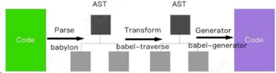

ES6、7 代码输入 -> babylon 进行解析 -> 得到 AST （抽象语法树）-> plugin 用 b abel-traverse 对 AST 树进行遍历转译 -> 得到新的 AST 树 -> 用 babel-generator 通过 AST 树生成 ES5 代码

# 前端测试

- 编写自动化测试用例。
- 运行单元测试、集成测试和端到端测试。

## 什么是单元测试？请举例说明如何进行前端单元测试。

单元测试是指对软件中的最小可测试单元进行检查和验证。例如，在前端开发中，可以使用 Jest 或 Mocha 等测试框架来对组件或函数进行测试。

## 请解释什么是端到端测试（E2E Testing）

端到端测试是一种测试方法，它模拟真实用户场景以验证整个系统的流程。在前端领域，通常使用 Cypress 或 Selenium 等工具进行 E2E 测试。

## 如何进行性能测试？你通常使用哪些工具？

性能测试是为了确定应用的响应速度和稳定性。前端性能测试可以使用 Lighthouse、WebPageTest 等工具来进行。

## 什么是 Mock 测试？

Mock 测试是在测试过程中，对于不容易构造或获取的对象，创建一个虚拟的对象来进行测试，以便完成测试方法。

## 描述一下你如何进行交互式测试

交互式测试通常涉及用户界面和用户体验的测试，可以通过手动测试或使用自动化工具来模拟用户操作。

## 前端测试中常见的问题有哪些？

常见问题包括跨浏览器兼容性、响应式设计的适应性、用户交互的一致性和准确性，以及性能优化等。

## 如何确保你的代码在不同的浏览器和设备上都能正常工作？

可以通过跨浏览器测试工具，如 BrowserStack，来在不同的浏览器和设备上运行测试用例，确保代码的兼容性。

## 解释一下前端安全测试的重要性

前端安全测试是为了防止 XSS、CSRF 等攻击，确保用户数据的安全和应用的可靠性。

## 你如何测试前端应用的用户体验？

用户体验测试通常涉及用户访谈、问卷调查、可用性测试等方法，以评估应用的易用性和满足用户需求的程度。

## 什么是可视回归测试？

可视回归测试是一种自动化测试，用于检测应用界面的变化。通过比较基线图像和最新的屏幕截图，来识别界面上的任何不期望的变化。

## 描述一下你如何使用 Jest 进行单元测试

Jest 是一个流行的 JavaScript 测试框架，可以用来测试函数、组件等。可以通过编写测试用例并使用`expect`和`toMatch`等匹配器来验证代码的行为。

## 解释一下什么是集成测试，并给出一个例子

集成测试是指测试多个组件或系统的组合是否能够正常工作。例如，测试一个表单提交的流程，包括输入验证、提交请求和响应处理。

## 前端自动化测试中，Selenium 和 Puppeteer 有什么区别？

Selenium 是一个自动化测试工具，可以用于多种浏览器，而 Puppeteer 是一个 Chrome 开发团队维护的库，专门用于无头浏览器（Headless Chrome）的自动化测试。

## 如何进行性能测试？你通常使用哪些工具？

性能测试是为了确定应用的响应速度和稳定性。前端性能测试可以使用 Lighthouse、WebPageTest 等工具来进行。

## 什么是 Mock 测试？

Mock 测试是在测试过程中，对于不容易构造或获取的对象，创建一个虚拟的对象来进行测试，以便完成测试方法。

## 描述一下你如何进行交互式测试

交互式测试通常涉及用户界面和用户体验的测试，可以通过手动测试或使用自动化工具来模拟用户操作。

## 前端测试中常见的问题有哪些？

常见问题包括跨浏览器兼容性、响应式设计的适应性、用户交互的一致性和准确性，以及性能优化等。

## 如何确保你的代码在不同的浏览器和设备上都能正常工作？

可以通过跨浏览器测试工具，如 BrowserStack，来在不同的浏览器和设备上运行测试用例，确保代码的兼容性。

## 解释一下前端安全测试的重要性

前端安全测试是为了防止 XSS、CSRF 等攻击，确保用户数据的安全和应用的可靠性。

## 你如何测试前端应用的用户体验？

用户体验测试通常涉及用户访谈、问卷调查、可用性测试等方法，以评估应用的易用性和满足用户需求的程度。

# 前端部署

- 部署到服务器或云服务。
- 配置域名和 SSL 证书。

## 前端项目的部署流程是什么？

- 开发环境部署（dev）
- 测试环境部署（sit、uat）
- 生产环境部署

## 什么样的前端代码是好的

- 高复用低耦合，这样文件小，好维护，而且好扩展。
- 具有可用性、健壮性、可靠性、宽容性等特点
- 遵循设计模式的六大原则

## 你觉得前端工程的价值体现在哪

- 为简化用户使用提供技术支持（交互部分）
- 为多个浏览器兼容性提供支持
- 为提高用户浏览速度（浏览器性能）提供支持
- 为跨平台或者其他基于 webkit 或其他渲染引擎的应用提供支持
- 为展示数据提供支持（数据接口）

## 平时如何管理你的项目

- 先期团队必须确定好全局样式（ globe.css ），编码模式( utf-8 ) 等；
- 编写习惯必须一致（例如都是采用继承式的写法，单样式都写成一行）；
- 标注样式编写⼈，各模块都及时标注（标注关键样式调用的地方）；
- 页面进行标注（例如 页面 模块 开始和结束）；
- CSS 跟 HTML 分文件夹并行存放，命名都得统一（例如 style.css ）；
- JS 分文件夹存放 命名以该 JS 功能为准的英文翻译。
- 图片采用整合的 images.png png8 格式文件使用 - 尽量整合在一起使用方便将来的管理。

## 如何确保网站用户友好？

确保网站用户友好的方法包括：

- **响应式设计**：确保网站在不同设备上都能正常显示。
- **易于导航**：设计清晰的导航结构，使用户能够轻松找到所需的信息。
- **快速加载速度**：优化资源加载时间，以提高用户体验。
- **可访问性**：遵循无障碍标准，以确保所有用户都能访问网站。

## 您最喜欢哪种类型的前端开发项目？为什么？

这是一个开放性问题，可以根据自己的经验和兴趣来回答。

可以谈论您在哪些类型的项目中感到最有成就感，或者您对哪些技术栈最感兴趣。

# 前端监控

## 两个监控目的

- 设置日志记录和错误监控。
- 监控应用程序性能和用户体验和用户行为。

## 解下前端监控该用什么方式实现

前端监控一般分为三种，分别为页面埋点、性能监控以及异常监控。

了解下前端监控该用什么方式实现。

毕竟大部分公司都只是使用到了第三方的监控工具，而不是选择自己造轮子。

### 1、页面埋点

页面埋点应该是大家最常写的监控了，一般起码会监控以下几个数据：

- PV / UV
- 停留时长
- 流量来源
- 用户交互

对于这几类统计，一般的实现思路大致可以分为两种，分别为手写埋点和无埋
点的方式。

相信第一种方式也是大家最常用的方式，可以自主选择需要监控的数据然后在相应的地方写入代码。这种方式的灵活性很大，但是唯一的缺点就是工作量较大，每个需要监控的地方都得插入代码。

另一种无埋点的方式基本不需要开发者手写埋点了，而是统计所有的事件并且定时上报。这种方式虽然没有前一种方式繁琐了，但是因为统计的是所有事件，所以还需要后期过滤出需要的数据。

### 2、性能监控

性能监控可以很好的帮助开发者了解在各种真实环境下，页面的性能情况是如何的。

对于性能监控来说，我们可以直接使用浏览器自带的 Performance API 来实现这个功能。

对于性能监控来说，其实我们只需要调用 `performance.getEntriesByType('navigation')` 这行代码就行了。

对，你没看错，一行代码我们就可以获得页面中各种详细的性能相关信息我们可以发现这行代码返回了一个数组，内部包含了相当多的信息，从数据开始在网络中传输到页面加载完成都提供了相应的数据

我们可以发现这行代码返回了一个数组，内部包含了相当多的信息，从数据开
始在网络中传输到页面加载完成都提供了相应的数据

### 3、异常监控

对于异常监控来说，以下两种监控是必不可少的，分别是代码报错以及接口异常上报。

对于代码运行错误，通常的办法是使用 window.onerror 拦截报错。该方法能拦截到大部分的详细报错信息，但是也有例外

1. 对于跨域的代码运行错误会显示 Script error . 对于这种情况我们需要给 script 标签添加 crossorigin 属性
2. 对于某些浏览器可能不会显示调用栈信息，这种情况可以通过 arguments.callee.caller 来做栈递归
3. 对于异步代码来说，可以使用 catch 的方式捕获错误。比如 Promise 可以直接使用 catch 函数， async await 可以使用 try catch
4. 但是要注意线上运行的代码都是压缩过的，需要在打包时生成 sourceMap 文件便于 debug
5. 对于捕获的错误需要上传给服务器，通常可以通过 img 标签的 src 发起一个请求。
6. 另外接口异常就相对来说简单了，可以列举出出错的状态码。一旦出现此类的状态码就可以立即上报出错。接口异常上报可以让开发⼈员迅速知道有哪些接口出现了大面积的报错，以便迅速修复问题。

### 前端错误的分类

即时运行错误：代码错误

资源加载错误

#### 1、前端错误分类

前端错误分为两大类：

- 即时运行错误（代码错误）
- 资源加载错误

#### 2、错误的捕获方式

##### 即时运行错误的捕获方式

- try...catch
- window.onerror

##### 资源加载错误捕获：

- object.onerror
- performance.getEntries()
- Error 事件捕获

window.onerror 只能捕获即时运行错误，不能捕获资源加载错误，因为资源加载错误不会冒泡。

资源加载错误可以通过捕获 Error 来拿到，代码演示：

```html
<!DOCTYPE html>
<html>
	<head>
		<meta charset="utf-8" />
		<meta http-equiv="X-UA-Compatible" content="IE=edge" />
		<title>错误监控</title>
		<link rel="stylesheet" href="" />
		<script type="text/javascript">
			window.addEventListener(
				"error",
				function (e) {
					console.log("捕获了错误：", e);
				},
				true
			);
		</script>
	</head>
	<body>
		<script src="//baidu.con/test.js" charset="utf-8"></script>
	</body>
</html>
```

延伸：跨域的 is 运行错误可以捕获吗，错误提示什么，应该怎么处理?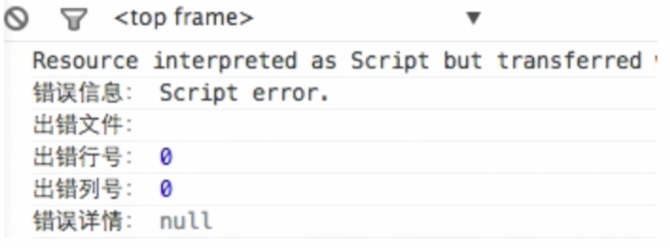

1、在 script 标签增加：`crossorigin` 属性（客户端做）

2、设置 js 资源响应头：`Access-Control-Allow-Origin:*（服务端做）`

#### 3、上报错误的基本原理

1. 采用 Ajax 通信的方式上报（基本没用）
2. 利用 Image 对象上报（基本都用这种方式）

```html
<script type="text/javascript">
	new Image().src = "http://www.baidu.com/test?t=hahha";
</script>
```

## 请谈谈前端监控的思路？

前端监控一般分为三种，分别是页面埋点、性能监控以及异常监控。

- **页面埋点**：监控用户行为，如 PV/UV、停留时长、流量来源和用户交互。可以手写埋点或使用无埋点方式。
- **性能监控**：使用 Performance API 获取页面加载的关键时间节点和性能指标，如首次渲染时间、首次可交互时间等。
- **异常监控**：捕获代码运行错误和接口异常，帮助开发者快速定位问题。

## 如何实现前端性能监控？

使用 Performance API 获取页面性能指标，如首次渲染时间、首次可交互时间等。计算关键性能指标并上报给服务器。

## 如何处理和分析监控到的数据？

收集到的数据需要格式化处理后上报给服务器。可以使用数据可视化工具制作统计图表。

## 什么是无埋点监控？它与传统的埋点监控有何不同？

无埋点监控是自动化的数据收集方法，不需要手动添加监控代码。传统的埋点需要在特定的用户交互点插入代码。

## 请解释一下性能监控中的关键性能指标？

- 首次渲染时间（First Paint Time，FPT）
- 首次可交互时间（Time to Interactive，TTI）
- 白屏时间
- 页面完全加载时间

## 请解释前端监控的目的是什么？

前端监控的目的是为了确保网页或应用的性能、稳定性和用户体验。它涉及到跟踪和记录用户与网页的交互、页面性能指标以及任何可能出现的错误或异常。

## 前端监控步骤有哪些

以下步骤：

### 1.用户行为监控：

我们可以通过埋点技术来跟踪用户的点击、页面浏览、购买等行为。例如，当用户点击一个商品时，我们可以记录这一行为，并收集相关数据，如点击时间、停留时间和用户的转化率。

### 2.性能监控：

使用 Performance API 来监控网站加载速度、响应时间和其他关键性能指标。这些数据可以帮助我们了解用户在网站上的体验，并对潜在的性能瓶颈进行优化。

### 3.错误监控：

通过 `window.onerror` 事件或者类似的错误捕获机制来监控运行时错误。我们还可以监控网络请求失败，如 API 调用返回错误状态码。

### 4.数据上报与分析：

收集到的数据需要被发送到后端服务器，然后通过数据可视化工具进行分析。这样，我们可以生成报告，了解用户行为模式、网站性能问题以及常见的错误类型。

### 5.监控报警系统：

设置阈值和警报，当监控到的数据超出正常范围时，系统会自动发送警报给开发团队，以便他们可以及时响应并解决问题。

通过这样的监控系统，我们不仅可以提高用户满意度，还可以提升网站的整体性能和稳定性。这是前端监控在实际中的应用，它帮助我们更好地理解用户需求，优化用户体验，并确保网站的稳定运行。

## 前端监控通常包括哪些类型？

前端监控一般分为三种：**页面埋点**、**性能监控**以及**异常监控**

- 页面埋点监控用户行为，如 PV/UV、停留时长、流量来源和用户交互。
- 性能监控关注页面加载的各个阶段，如 DNS 查询耗时、TCP 连接耗时、内容加载耗时等。
- 异常监控捕捉代码错误和接口异常，帮助开发者快速定位问题。

## 如何实现前端性能监控？

可以利用浏览器提供的 **Performance API** 来实现前端性能监控。通过这个 API，可以获取到页面加载的关键时间节点和性能指标，如首次渲染时间、首次可交互时间等。

## 前端异常监控通常如何操作？

前端异常监控通常使用 `window.onerror` 方法来捕获运行时错误。对于跨域的代码错误，需要给 script 标签添加`crossorigin`属性。对于异步代码错误，可以使用`catch`方法或`try...catch`语句来捕获。

## 什么是无埋点监控？它与传统的埋点监控有何不同？

无埋点监控是一种自动化的数据收集方法，它不需要开发者在代码中手动添加监控代码。相比之下，传统的埋点监控需要在特定的用户交互点插入代码来收集数据。无埋点监控通过记录所有事件并定时上报，但可能需要后期过滤出需要的数据。

## 如何处理和分析监控到的数据？

监控到的数据通常需要格式化处理后上报给服务器。然后，可以使用数据可视化工具来制作统计图表，从而实现更加精准、个性化的性能耗时统计。

# 性能优化

## 前端性能优化措施

**考察点：性能优化**

::: details 查看参考回答

- 减少 HTTP 请求
- 使用内容发布网络(CDN)
- 添加本地缓存
- 压缩资源文件
- 将 CSS 样式表放在顶部，把 javascript 放在底部(浏览器的运行机制决定)
- 避免使用 CSS 表达式
- 减少 DNS 查询
- 使用外部 javascript 和 CSS
- 避免重定向
- 图片 lazyLoad

:::

## 如何进行网站性能优化

#### content 方面

- 减少 HTTP 请求：合并文件、 CSS 精灵、 inline Image
- 减少 DNS 查询： DNS 缓存、将资源分布到恰当数量的主机名
- 减少 DOM 元素数量

#### Server 方面

- 使用 CDN
- 配置 ETag
- 对组件使用 Gzip 压缩

#### Cookie 方面

- 减小 cookie 大小

#### css 方面

- 将样式表放到页面顶部
- 不使用 CSS 表达式
- 使用 `<link>` 不使用 @import

#### Javascript 方面

- 将脚本放到页面底部
- 将 javascript 和 css 从外部引入
- 压缩 javascript 和 css
- 删除不需要的脚本
- 减少 DOM 访问

#### 图片方面

- 优化图片：根据实际颜色需要选择色深、压缩
- 优化 css 精灵
- 不要在 HTML 中拉伸图片

## 如何优化前端网页？

优化前端网页的方法包括：

- **压缩和合并资源**：减小 CSS、JavaScript 和图像文件的大小，以加快页面加载速度。
- **使用浏览器缓存**：通过设置适当的缓存策略，减少资源的重复加载。
- **异步加载资源**：将不必要的资源延迟加载，以提高页面的初始加载速度。
- **使用内容分发网络（CDN）**：通过将资源分发到全球各地的服务器，加速资源的加载。

## 如何提高网站性能？

优化网站性能的方法包括：

- **减少 HTTP 请求**：合并和压缩资源，减少页面上的请求次数。
- **使用响应式设计**：确保网站在不同设备上都能正常显示。
- **优化图像**：使用适当的图像格式和大小，以减少加载时间。
- **使用浏览器缓存**：设置适当的缓存策略，减少资源的加载时间。

## 如何减少页面加载时间？

- 优化图片大小和格式。
- 使用浏览器缓存策略。
- 减少 HTTP 请求，例如通过合并文件。
- 使用 CDN 来加速资源加载。
- 压缩 CSS、JavaScript 文件。
- 延迟加载非首屏内容。

## 什么是关键渲染路径？如何优化它？

关键渲染路径是浏览器将 HTML、CSS 和 JavaScript 转换成屏幕上的像素的步骤。优化它包括：

- 最小化关键资源数量。
- 减少关键资源大小。
- 缩短关键资源的请求链。

## 如何实现代码分割以提高性能？

使用工具如 Webpack 进行模块打包时，可以配置代码分割，以按需加载模块。

## 如何优化 Web 字体的加载？

- 选择仅包含所需字符集的字体文件。
- 使用`font-display`属性来控制字体加载的行为。

## 如何优化 JavaScript 执行？

- 避免长时间运行的 JavaScript 任务。
- 使用 Web Workers 来处理复杂计算。
- 利用浏览器的异步加载和执行能力，如`async`和`defer`属性。

## 如何优化 CSS 渲染？

- 避免使用大量复杂的选择器。
- 使用`transform`和`opacity`属性来实现动画，这些属性不会触发布局更改。

## 如何减少回流（Reflow）和重绘（Repaint）？

- 通过改变类名来集中应用样式更改。
- 使用`transform`和`opacity`进行动画，因为它们可以在合成阶段处理。

## 如何利用浏览器缓存提高性能？

- 设置合适的 HTTP 缓存头，如`Cache-Control`和`ETag`。

## 如何优化图片加载？

- 使用图片懒加载技术。
- 选择正确的图片格式，如 WebP。
- 实现响应式图片，根据设备加载不同大小的图片。

## 移动端性能优化有哪些特别的考虑？

- 关注触摸事件的响应性。
- 优化动画和滚动性能。
- 考虑网络连接的不稳定性和数据使用。

当然可以！以下是一些关于前端性能优化的面试题，供您参考：

## 请谈谈你对重构的理解

网站重构是指在不改变外部行为的前提下，简化结构、添加可读性，且在网站前端保持一致的行为。也就是说，在不改变 UI 的情况下，对网站进行优化，在扩展的同时保持一致的 UI。

对于传统的网站来说，重构通常包括以下方面：

- 把表格（table）布局改为 DV+CSS。
- 使网站前端兼容现代浏览器。
- 对移动平台进行优化。
- 针对搜索引擎进行优化。

深层次的网站重构应该考虑以下方面：

- 减少代码间的耦合，让代码保持弹性。
- 严格按规范编写代码。
- 设计可扩展的 API。
- 代替旧的框架、语言（如 VB）。
- 增强用户体验。
- 对速度进行优化，如压缩 JavaScript、CSS、image 等前端资源（通常由服务器来解决）。
- 优化程序的性能，如数据读写。
- 采用 CDN 来加速资源加载。
- 优化 JavaScript DOM。
- 缓存 HTTP 服务器的文件。

## 如果一个页面上有大量的图片（大型电商网站），网页加载很慢，可以用哪些方法优化这些图片的加载，从而提升用户体验？

- 对于图片懒加载，可以为页面添加一个滚动条事件，判断图片是否在可视区域内或者即将进入可视区域，优先加载。
- 如果为幻灯片、相册文件等，可以使用图片预加载技术，对于当前展示图片的前一张图片和后一张图片优先下载。
- 如果图片为 CSS 图片，可以使用 CSS Sprite、SVG sprite、Icon font、Base64 等技术。
- 如果图片过大，可以使用特殊编码的图片，加载时会先加载一张压缩得特别小的缩略图，以提高用户体验。
- 如果图片展示区域小于图片的真实大小，则应在服务器端根据业务需要先行进行图片压缩，图片压缩后，图片大小与展示的就一致了。

## 谈谈性能优化问题

可以在以下层面优化性能：

- 缓存利用：缓存 Ajax，使用 CDN、外部 JavaScript 和 CSS 文件缓存，添加 Expires 头，在服务器端配置 Etag，减少 DNS 查找等。
- 请求数量：合并样式和脚本，使用 CSS 图片精灵，初始首屏之外的图片资源按需加载，静态资源延迟加载。
- 请求带宽：压缩文件，开启 GZIP。
- CSS 代码：避免使用 CSS 表达式、高级选择器、通配选择器。
- JavaScript 代码：用散列表来优化查找，少用全局变量，用 innerHTML 代替 DOM 操作，减少 DOM 操作次数，优化 JavaScript 性能，用 setTimeout 避免页面失去响应，缓存 DOM 节点查找的结果，避免使用 with，多个变量声明合并。
- HTML 代码：避免图片和 iFrame 等 src 属性为空。
- 避免在页面的主体布局中使用表，表要在其中的内容完全下载之后才会显示出来，显示的速度比 DIV+CSS 布局慢。
- 最好别频繁去操作 DOM 节点，最好把需要操作的样式，提前写成 class，之后需要修改。只需要修改一次，
- 需要修改的时候，直接修改 className，做成一次性更新多条 css DOM 属性，一次回流重绘总比多次回流重绘要付出的成本低得多；
- 动画实现的速度的选择，动画速度越快，回流次数越多，也可以选择使用 `requestAnimationFrame`
- 每次访问 DOM 的偏移量属性的时候，例如获取一个元素的 scrollTop、scrollLeft、scrollWidth、offsetTop、offsetLeft、offsetWidth、offsetHeight 之类的属性，浏览器为了保证值的正确也会回流取得最新的值，所以如果你要多次操作，最取完做个缓存。更加不要 for 循环中访问 DOM 偏移量属性，而且使用的时候，最好定义一个变量，把要需要的值赋值进去，进行值缓存，把回流重绘的次数减少；
- 将频繁运行的动画变为图层，图层能够阻止该节点回流影响别的元素。比如对于 `video` 标签，浏览器会自动将该节点变为图层。

## 如何利用浏览器缓存提高页面性能？

可以通过设置合适的 HTTP 缓存头，如`Cache-Control`和`ETag`，来利用浏览器缓存。这样可以减少不必要的网络请求，加快页面加载速度。

## 什么是 Service Worker，它如何用于性能优化？

Service Worker 是一种运行在浏览器背后的脚本，可以用来拦截和处理网络请求，包括可编程的缓存文件。它允许开发者控制网页如何响应资源请求，从而可以创建有效的离线体验，减少数据使用，加快加载速度。

## 如何优化 Web 字体的加载？

可以通过选择仅包含所需字符集的字体文件、使用`font-display`属性来控制字体加载的行为，以及预加载字体资源来优化 Web 字体的加载。

## 如何减少 JavaScript 的加载时间？

可以通过异步加载、延迟加载、代码分割、压缩和混淆代码以及利用浏览器缓存来减少 JavaScript 的加载时间。

## 如何优化 CSS 渲染？

可以通过减少 CSS 文件大小、合并 CSS 文件、使用 CSS 预处理器、避免复杂的选择器以及利用 CSS 的硬件加速特性来优化 CSS 渲染。

## 如何减少回流（Reflow）和重绘（Repaint）？

可以通过避免频繁的 DOM 操作、使用`transform`和`opacity`属性进行动画、使用`visibility`替换`display: none`以及避免使用表格布局等方法来减少回流和重绘。

## 如何利用 CDN 来提高性能？

通过使用 CDN（内容分发网络），可以将静态资源分布到全球各地的服务器上，从而减少资源加载时间，提高用户访问速度。

## 如何优化移动端的性能？

可以通过优化图片、减少 HTTP 请求、使用本地存储、优化 JavaScript 执行、避免过度使用 Web 字体以及适当使用触摸事件来优化移动端的性能。
