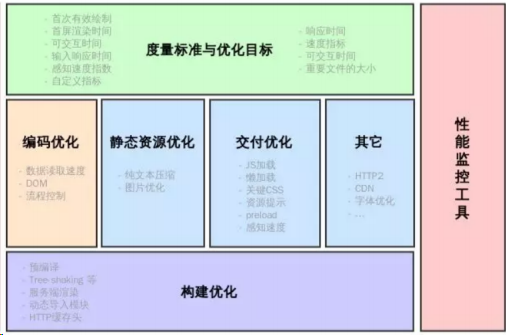
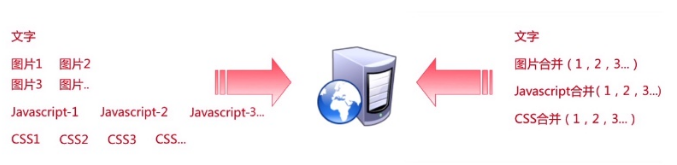
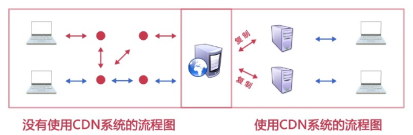
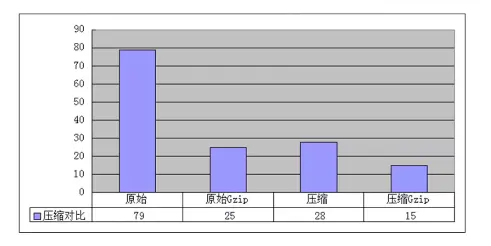
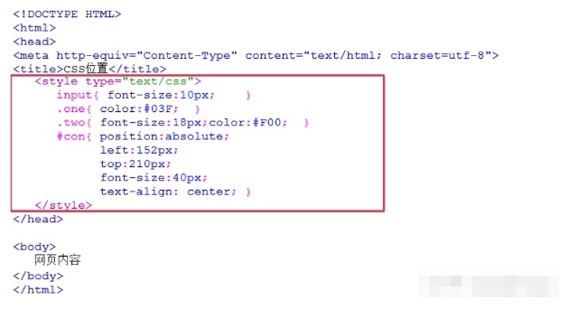
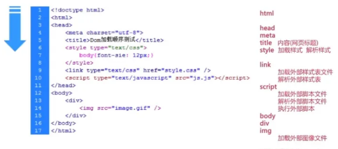
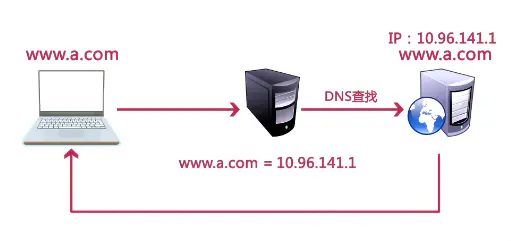
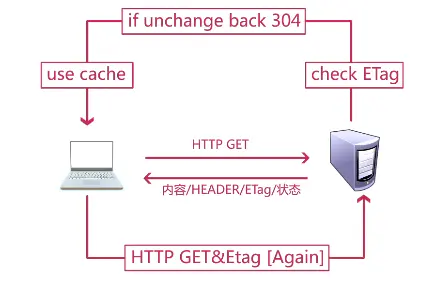
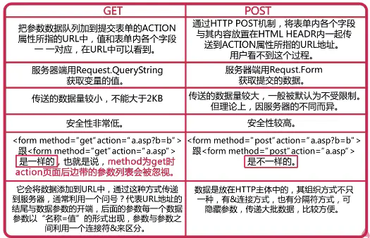

# 前端性能优化

## 前端可以做的性能优化有哪些呢？

前端优化大概可以有以下几个方向：

- 网络优化
- 页面渲染优化
- `JS`优化
- 图片优化
- `webpack`打包优化
- `React`优化
- `Vue`优化

## HTML 的页面性能

> 面试必考，这五个最好都能记住。异步加载和浏览器缓存都会延伸了问，其他三个只要说出来即可。

提升页面性能的方法有哪些？

1. 资源压缩合并，减少 HTTP 请求
2. 非核心代码异步加载（异步加载的方式，异步加载的区别）
3. 利用浏览器缓存（缓存的分类，缓存原理）
4. 使用 CDN
5. 预解析 DNS

```html
// 强制打开
<a>
	标签的 dns 解析
	<meta http-equiv="x-dns-prefetch-controller" content="on" />
	//DNS预解析
	<link rel="dns-prefetch" href="//host_name_to_prefetch.com"
/></a>
```

## 列举优化网络性能方法

参考答案：

#### 1.优化打包体积

利用一些工具压缩、混淆最终打包代码，减少包体积

#### 2.多目标打包

利用一些打包插件，针对不同的浏览器打包出不同的兼容性版本，这样一来，每个版本中的兼容性代码就会大大减少，从而减少包体积

#### 3.压缩

现代浏览器普遍支持压缩格式，因此服务端的各种文件可以压缩后再响应给客户端，只要解压时间小于优化的传输时间，压缩就是可行的

#### 4.CDN

利用 CDN 可以大幅缩减静态资源的访问时间，特别是对于公共库的访问，可以使用知名的 CDN 资源，这样可以实现跨越站点的缓存

#### 5.缓存

对于除 HTML 外的所有静态资源均可以开启协商缓存，利用构建工具打包产生的文件 hash 值来置换缓存

#### 6.http2

开启 http2 后，利用其多路复用、头部压缩等特点，充分利用带宽传递大量的文件数据

#### 7.雪碧图

对于不使用 HTTP2 的场景，可以将多个图片合并为雪碧图，以达到减少文件的目的

#### 8.defer、async

通过 defer 和 async 属性，可以让页面尽早加载 js 文件

#### 9.prefetch、preload

通过 prefetch 属性，可以让页面在空闲时预先下载其他页面可能要用到的资源

通过 preload 属性，可以让页面预先下载本页面可能要用到的资源

#### 10.多个静态资源域

对于不使用 HTTP2 的场景，将相对独立的静态资源分到多个域中保存，可以让浏览器同时开启多个 TCP 连接，并行下载

## 1.谈谈你对前端性能优化的理解？

**请求数量**：合并脚本和样式表，CSS Sprites，拆分初始化负载，划分主域

**请求带宽**：开启 GZip，精简 JavaScript，移除重复脚本，图像优化，将 icon 做成字体

**缓存利用**：使用 CDN，使用外部 JavaScript 和 CSS，添加 Expires 头，减少 DNS 查找，配置 ETag，使 AjaX 可缓存

**页面结构**：将样式表放在顶部，将脚本放在底部，尽早刷新文档的输出

**代码校验**：避免 CSS 表达式，避免重定向

**浏览器缓存机制的优点有：**

- 降低服务器压力，减少请求次数。
- 提升性能，本地资源加载比请求服务器快。
- 减少带宽消耗，产生很小的网络消耗。

## 2.网站 TDK 三大标签 SEO 优化

网站 TDK 三大标签 SEO 优化是提升网站在搜索引擎中排名的关键步骤。TDK 分别指的是 Title（标题）、Description（描述）和 Keywords（关键词）。以下是针对这三个标签的 SEO 优化建议：

1. **Title 标签优化**：
   - 确保标题准确反映页面内容，同时吸引用户点击。
   - 将品牌名或网站名放在标题的开始或结束位置，提高品牌知名度。
   - 使用简洁明了的语言，避免冗长和复杂的句子。
   - 关键词应自然地融入标题中，避免堆砌和过度优化。
2. **Description 标签优化**：
   - 简要描述页面的主要内容和特色，吸引用户进一步了解。
   - 使用有吸引力的语言，激发用户的兴趣。
   - 在描述中提及目标关键词，但不要重复过多。
   - 确保描述与页面内容相关，避免误导用户。
3. **Keywords 标签优化**：
   - 选择与页面内容紧密相关的关键词，避免选择过于宽泛或无关的关键词。
   - 将关键词按照重要性和相关性进行排序，最重要的关键词放在前面。
   - 限制关键词的数量，避免过多关键词导致优化过度。
   - 使用逗号或空格分隔关键词，保持格式规范。

**除了 TDK 标签的优化，还需要注意以下几点**：

- 确保网站内容的质量和原创性，提高用户体验。
- 优化网站结构，确保页面之间的链接畅通无阻。
- 提高网站的加载速度，避免用户因等待而流失。
- 利用社交媒体和其他推广渠道，提高网站的知名度和曝光率。

通过针对 TDK 三大标签的 SEO 优化以及其他方面的综合优化措施，可以有效提升网站在搜索引擎中的排名和曝光率，从而吸引更多潜在客户并提升业务转化率。

## 3.简述几种减少页面加载时间的方法?

减少页面加载时间的方法多种多样，以下是一些常见且有效的策略：

1. **优化图片和媒体资源**：
   - `压缩图片`：使用专业的图像编辑工具或在线服务来减小图片的文件大小，同时保持视觉质量。
   - `选择适当的图片格式`：如 GIF、PNG、JPEG 和 WebP，每种格式都有其适用场景，需要根据具体需求来选择。
   - `使用懒加载`：对于非首屏或用户滚动后才能看到的图片，采用懒加载技术，只在需要时加载，以减少初始加载时间。
2. **优化代码和资源文件**：
   - `压缩和合并 CSS、JavaScript 文件`：通过工具如 UglifyJS、Terser 等来压缩代码，同时合并多个文件以减少 HTTP 请求次数。
   - `使用 CDN`：内容分发网络（CDN）可以确保用户从最近的服务器获取资源，从而加快加载速度。
   - `缓存`：利用浏览器缓存机制，将资源缓存在本地，减少重复请求。
3. **减少 HTTP 请求**：
   - `合并请求`：通过合并多个 CSS、JavaScript 文件或者通过雪碧图（CSS Sprites）合并小图标来减少 HTTP 请求的数量。
   - `使用 HTTP/2`：HTTP/2 协议支持多路复用，可以在一个连接中并行处理多个请求，从而显著提高加载速度。
4. **优化服务器响应**：
   - `启用服务器端的 Gzip 压缩`：压缩传输的数据，减少网络传输的带宽需求。
   - `优化数据库查询`：减少不必要的数据库操作，优化查询语句，提高查询速度。
5. **使用异步和延迟加载**：
   - `异步加载`：对于非关键资源，如广告、统计脚本等，可以使用异步加载方式，避免阻塞主线程。
   - `延迟加载`：对于非首屏内容或用户交互后才需要的资源，可以延迟加载，提高首屏加载速度。
6. **代码拆分和按需加载**：
   - `代码拆分`：将大型代码库拆分成较小的块或模块，根据需要加载，避免不必要的资源浪费。
   - `按需加载`：根据用户的交互或路由变化，动态加载所需的代码和资源。
7. **优化前端渲染**：
   - `使用虚拟滚动`：对于大量数据的列表或表格，使用虚拟滚动技术，只渲染视口内的数据，提高渲染性能。
   - `避免重绘和重排`：通过优化 CSS 选择器和布局，减少浏览器的重绘和重排操作，提高渲染速度。

这些方法可以单独或组合使用，根据实际需求和项目特点进行选择和调整。在实施这些优化措施时，还需要注意保持代码的可读性和可维护性，避免过度优化带来的副作用。

## 4.请说出几种缩短页面加载时间的方法?

缩短页面加载时间的方法有很多，以下是几种常见且有效的策略：

1. **优化图片和媒体资源**：
   - `压缩图片`：使用专业的工具来减小图片的文件大小，同时保持其视觉质量。这可以显著减少页面的总体积，从而加快加载速度。
   - `选择适当的图片格式`：根据图片的内容和用途选择最合适的格式，如 JPEG、PNG 或 WebP，以平衡文件大小和图像质量。
2. **代码和资源优化**：
   - `压缩和合并 CSS、JavaScript 文件`：通过工具来压缩代码，同时合并多个文件以减少 HTTP 请求的数量。这可以减少传输时间和解析时间。
   - `使用内容分发网络（CDN）`：CDN 可以将静态资源（如图片、CSS 和 JavaScript 文件）缓存在全球各地的服务器上，使用户从最近的服务器获取资源，从而缩短加载时间。
3. **减少 HTTP 请求**：
   - `合并 CSS 和 JavaScript 文件`：通过合并多个文件来减少 HTTP 请求的数量，从而加快页面加载速度。
   - `使用 CSS Sprites`：将多个小图标合并到一个图片中，并通过 CSS 背景定位来显示，以减少 HTTP 请求。
4. **启用缓存**：
   - `利用浏览器缓存`：通过设置 HTTP 缓存头信息，让浏览器将资源缓存在本地，当用户再次访问时可以直接从本地加载，减少请求时间。
   - `服务器端缓存`：服务器端也可以实现缓存机制，存储经常访问的页面或数据，减少数据库查询或计算时间。
5. **使用异步加载和懒加载**：
   - `异步加载`：对于非关键的脚本或样式，使用异步加载方式，避免阻塞页面的渲染。
   - `懒加载`：对于图片或视频等媒体资源，使用懒加载技术，只在用户滚动到视口范围内时才加载，减少初始加载时间。
6. **优化数据库查询**：
   - 如果页面涉及数据库查询，优化查询语句和数据库结构，减少查询时间，提高响应速度。
7. **使用更高效的编程技术和框架**：
   - `使用 Web Workers`：对于需要大量计算的任务，可以使用 Web Workers 在后台线程中执行，避免阻塞主线程。
   - `选择轻量级的 JavaScript 框架`：选择体积小、性能好的 JavaScript 框架或库，减少代码的冗余和加载时间。

这些方法并不是孤立的，通常需要根据项目的实际情况和需求进行综合考虑和组合使用，以达到最佳的页面加载性能。同时，还需要注意保持代码的可读性和可维护性，避免过度优化带来的副作用。

## 5.简述如何对网站的文件和资源进行优化?

1. **压缩文件大小**：使用工具对图片、CSS 和 JavaScript 文件进行压缩，减小文件体积，从而加快加载速度。特别关注那些占用大量带宽的图片资源，可以考虑使用更高效的图片格式或压缩算法。
2. **合并文件**：通过合并多个 CSS 和 JavaScript 文件来减少 HTTP 请求的数量。这可以通过服务器端脚本或构建工具实现，从而减少用户浏览器的加载负担。
3. **使用 CDN（内容分发网络）**：CDN 可以将网站的静态资源（如图片、视频和 JavaScript 文件）缓存到全球各地的服务器上，用户可以从离自己最近的服务器获取资源，从而显著提高加载速度。
4. **启用浏览器缓存**：通过设置适当的 HTTP 缓存头信息，让浏览器将资源缓存在本地。当用户再次访问网站时，浏览器可以直接从本地缓存中加载资源，减少网络请求。
5. **异步和延迟加载**：对于非关键资源或用户滚动后才能看到的内容，使用异步加载或延迟加载技术。这可以确保用户首先看到页面的主要内容，同时后台加载其他资源，提高页面加载的感知速度。
6. **优化数据库查询**：如果网站涉及数据库操作，优化数据库查询语句和索引，减少查询时间，提高数据访问速度。
7. **使用 HTTP/2 协议**：HTTP/2 协议支持多路复用和头部压缩，可以显著提高网络传输效率，减少页面加载时间。
8. **代码拆分和按需加载**：对于大型应用，可以考虑将代码拆分成多个小模块，并根据需要加载。这可以通过使用现代前端框架或构建工具实现。
9. **避免重定向**：减少不必要的重定向，因为每次重定向都会增加额外的 HTTP 请求和加载时间。
10. **移除重复和无用脚本**：检查网站代码，移除重复的 JavaScript 和 CSS 代码，以及不再使用的库和插件，以减少文件体积和加载时间。

综上所述，对网站的文件和资源进行优化是一个综合性的任务，需要综合考虑文件大小、请求数量、网络传输效率等多个方面。通过实施上述策略，可以显著提高网站的加载速度和用户体验。

## 6.浏览器特性检测，特性推断和浏览器 UA 字符串嗅探的区别?

浏览器特性检测、特性推断和浏览器 UA 字符串嗅探是前端开发中常用的技术手段，它们各自有着不同的作用，但也存在一些差异。

**`浏览器特性检测`** 主要是检查浏览器是否支持某段代码，并据此决定运行不同的代码，以便浏览器始终能够正常运行代码功能，不会出现崩溃和错误。这种方法的优势在于它的准确性，因为它直接测试了浏览器的实际能力，而不是基于假设或预先设定的条件。

**`特性推断`** 与特性检测类似，也会对功能可用性进行检查。但在判断通过后，它还会假设其他相关功能也可用，并尝试使用这些功能。例如，如果浏览器支持某个特定的 API，特性推断可能会进一步假设其他相关的 API 也是可用的。然而，这种推断并不总是准确的，因此它可能会导致在某些浏览器中出现问题。

**`浏览器 UA 字符串嗅探`** 则是通过读取浏览器报告的字符串来判断浏览器的类型、版本等信息。这个字符串包含了关于用户代理（即浏览器）的详细信息，允许网络协议对等方识别请求的来源。然而，这种方法存在一些局限性。首先，UA 字符串可以被用户或某些软件修改，因此它可能并不总是准确的。其次，随着浏览器的发展，新的版本和特性不断涌现，而 UA 字符串可能无法及时反映这些变化。

总的来说，`浏览器特性检测`是一种准确且可靠的方法，能够确保代码在不同浏览器中的兼容性。`特性推断`则基于一定的假设，可能会在某些情况下导致问题。而`浏览器 UA 字符串嗅探`虽然方便，但可能不够准确，且无法适应浏览器的发展变化。因此，在实际开发中，应根据具体需求和场景选择合适的技术手段。

## 7.哪些常见的前端 Web 性能优化的方法?

前端 Web 性能优化是一个涉及多个方面的复杂过程，下面是一些常见的前端 Web 性能优化方法：

1. **代码压缩与合并**：通过压缩 CSS、JavaScript 等文件，减少文件大小，加快加载速度。同时，合并多个文件可以减少 HTTP 请求次数，进一步提升性能。
2. **使用 CDN**：内容分发网络（CDN）可以将静态资源部署到全球各地的服务器上，用户可以从最近的服务器获取资源，从而缩短加载时间。
3. **图片优化**：使用适当的图片格式和压缩算法，减少图片大小。同时，使用懒加载技术，只在用户滚动到视口范围内时才加载图片，减少初始加载时间。
4. **减少 HTTP 请求**：通过合并 CSS、JavaScript 文件，使用 CSS Sprites 等技术，减少 HTTP 请求次数，加快页面加载速度。
5. **利用浏览器缓存**：通过设置 HTTP 缓存头信息，让浏览器将资源缓存在本地，当用户再次访问时可以直接从本地加载，减少请求时间。
6. **异步加载与延迟执行**：对于非关键的脚本或样式，使用异步加载方式，避免阻塞页面的渲染。同时，对于某些操作，可以延迟执行，提高页面初始加载速度。
7. **优化数据库查询**：如果网站涉及数据库操作，优化数据库查询语句和索引，减少查询时间，提高数据访问速度。
8. **使用 Web Workers**：对于需要大量计算的任务，可以使用 Web Workers 在后台线程中执行，避免阻塞主线程，提高页面响应速度。
9. **前端路由优化**：对于单页面应用（SPA），优化前端路由机制，减少不必要的页面跳转和重新加载，提高用户体验。
10. **监控与性能分析**：使用性能监控工具对网站进行实时监控和分析，找出性能瓶颈并进行针对性优化。

需要注意的是，不同的网站和项目可能具有不同的特点和需求，因此在选择和应用优化方法时需要根据实际情况进行权衡和调整。同时，前端 Web 性能优化是一个持续的过程，需要不断关注和调整以保持最佳性能。

## 8.哪些常见操作会前端造成内存泄漏?

前端开发中，一些常见的操作可能导致内存泄漏，以下是一些主要的例子：

1. **未正确解绑事件处理程序**：如果在 DOM 元素上添加了事件监听器，但是在元素被移除之前没有被正确移除，那么事件处理程序仍会保留在内存中，导致内存泄漏。
2. **定时器未清理**：使用`setInterval`或`setTimeout`创建的定时器，如果在不再需要时没有被`clearInterval`或`clearTimeout`取消，那么它们会继续存在于内存中，可能导致内存泄漏。
3. **闭包导致内存泄漏**：在 JavaScript 中，闭包可以保留其外部环境的引用，如果闭包被不当地使用，比如事件处理回调，导致 DOM 对象和脚本中对象双向引用，就可能引发内存泄漏。
4. **未释放资源**：在使用如`XMLHttpRequest`这样的 API 发送请求时，如果没有正确处理和释放资源，可能会导致内存泄漏。
5. **DOM 元素引用未释放**：在 JavaScript 中引用了 DOM 元素，但在页面生命周期结束前没有释放这些引用，那么这些 DOM 元素将不会被垃圾回收机制回收，从而导致内存泄漏。在单页应用（SPA）中，特别需要注意在组件销毁时释放对 DOM 元素的引用。
6. **循环引用**：如果两个或多个对象相互引用，且没有被垃圾回收机制检测到，那么这些对象将不会被回收，导致内存泄漏。
7. **意外的全局变量**：函数中如果意外地定义了全局变量，那么每次执行该函数都会生成该变量，且不会随着函数执行结束而释放，这也可能导致内存泄漏。
8. **console.log 的对象**：在开发过程中，使用`console.log`打印对象进行调试是很常见的。但是，被`console.log`的对象在某些浏览器中可能不会被垃圾回收，特别是在开发者工具打开的情况下，这也可能引发内存泄漏。

## 9.如何进行响应式测试?

响应式测试主要是为了确保网站或应用在各种设备和屏幕尺寸上都能良好地显示和运行。以下是一些关键的响应式测试步骤和考虑因素：

1. **设备模拟和测试**：
   - 使用设备模拟器来模拟不同的设备和屏幕尺寸，检查网站的响应式设计和布局是否正确。
   - 在真实的设备上进行测试，确保网站或应用在不同设备上的显示效果、性能和可用性。
2. **浏览器测试**：
   - 使用浏览器的测试工具来模拟不同的设备和屏幕尺寸，并检查响应式设计和布局。
   - 不要制作只能在某个特定浏览器上运行的网站或应用，确保跨浏览器兼容性。
3. **自动化测试**：
   - 使用自动化测试工具来快速测试网站的响应式设计和布局，发现并修复问题。
4. **检查关键元素和交互**：
   - 确保所有重要的元素在不同屏幕尺寸上都能正确显示，特别是在较小的屏幕上。
   - 检查不同设备间的内边距、填充差异，确保内容在不同设备上都有适当的空间。
   - 验证动态数据是否正确显示。
5. **测试 UI 和数据处理逻辑**：
   - 对于 UI 显示，关注响应式 SDK 在不同尺寸设备上的通用响应式能力，以及兼容性适配测试。
   - 对于数据处理逻辑，验证数据合并、数据过滤、数据映射及数据补全等逻辑处理在不同设备和屏幕尺寸下的正确性。
6. **考虑业界厂商的屏幕尺寸变化能力**：
   - 验证系统是否支持旋转屏幕设置。
   - 对于支持分屏的设备（如 Android Pad 或某些华为 Pad），测试平行视界能力。
   - 验证 iPad 的浮窗、分屏能力是否得到正确支持。
7. **使用专门的测试工具**：
   - Viewport Resizer：一个基于浏览器的工具，用于测试任何网站的响应特性。
   - Responsive Design Bookmarklet：一个书签工具，可以快速选择并测试不同分辨率下的响应式网站。
   - Responsive Web Design Testing Tool：界面简单的工具，用于测试响应式网站。
   - Edge Reflow：一个工具，用于响应式设计的可视化创作，提高网页开发效率。
   - StudioPress Responsive Testing Tool：支持在多种设备上展示网站效果，并在移动设备和平板上展示网站布局。
8. **制定测试计划**：
   - 制定响应式设计的测试计划，包括测试目标、测试用例和测试环境等，确保测试的全面性和有效性。
9. **调试和修复问题**：
   - 使用调试工具查找和修复响应式设计中的问题，例如样式冲突、JavaScript 错误等。

通过这些步骤和工具，可以有效地进行响应式测试，确保网站或应用在各种设备和屏幕尺寸上都能提供优秀的用户体验。

## 10.简述移动端性能如何优化?

1. **减少 HTTP 请求**：通过合并 CSS 和 JS 文件、使用 CSS Sprites、使用字体图标等方式来减少 HTTP 请求。
2. **压缩和合并 CSS 和 JS 文件**：通过压缩和合并 CSS 和 JS 文件来减小文件大小，提高页面加载速度。
3. **使用缓存**：通过使用浏览器缓存、CDN 缓存等方式来缓存页面资源，提高页面加载速度。
4. **减少 DOM 操作**：在移动设备上，DOM 操作是非常消耗性能的操作之一，减少 DOM 操作可以提高页面性能。
5. **优化图片**：通过使用合适的图片格式、压缩图片大小、使用懒加载等方式来优化图片，提高页面加载速度。
6. **减少渲染次数**：通过减少不必要的重绘和回流，可以显著提高页面的加载速度。
7. **内存优化**：采用对象复用、垃圾回收优化、内存泄漏检测等方法来减少应用崩溃风险。

## 11.简述哪些方法可以提升网站前端性能?

提升网站前端性能的方法多种多样，下面列举了一些常见且有效的策略：

1. **优化代码和压缩文件**：通过优化 HTML、CSS 和 JavaScript 代码，减少不必要的空格、注释和无用代码，可以降低文件大小并提高解析速度。同时，使用压缩工具对 CSS 和 JavaScript 文件进行压缩，能够进一步减少文件大小，加快加载速度。
2. **使用 CDN（内容分发网络）**：CDN 可以将网站的静态资源分发到全球各地的服务器节点上，这样用户就可以从离自己最近的服务器获取资源，从而加快网页的加载速度。
3. **减少 HTTP 请求**：通过合并 CSS 和 JavaScript 文件、使用 CSS Sprites 技术等方式，可以减少页面所需的 HTTP 请求次数，降低网络延迟，提高加载速度。
4. **图片优化**：图片是网页中占用带宽较大的资源，因此优化图片对提升前端性能至关重要。可以使用压缩算法减小图片大小，选择适当的图片格式，以及使用懒加载技术延迟加载非关键图片。
5. **异步加载和并行加载**：通过将一些非关键的脚本或资源标记为异步加载，或者利用浏览器的并行处理能力进行并行加载，可以充分利用网络资源，提高页面的加载速度。
6. **利用浏览器缓存**：通过设置 HTTP 缓存头信息，可以让浏览器将资源缓存在本地，当用户再次访问时可以直接从本地加载，减少请求时间。
7. **减少重绘和重排**：重绘和重排是浏览器在渲染页面时消耗性能较多的操作。通过优化 CSS 选择器的使用、避免频繁修改样式属性、使用 transform 代替 top/left 等方式，可以减少重绘和重排的发生，提高页面性能。
8. **响应式设计**：为不同设备提供适应性布局和样式，可以提高页面在不同屏幕尺寸上的显示效果，并减少不必要的资源加载，从而提升前端性能。
9. **使用 Web Workers**：对于需要大量计算的任务，可以使用 Web Workers 在后台线程中执行，避免阻塞主线程，提高页面的响应速度。
10. **代码拆分和懒加载**：对于大型应用，可以将代码拆分成多个小块，并根据需要懒加载这些块。这可以减少初始加载时间，并提高用户体验。

这些策略并非孤立存在，它们通常需要结合使用，以最大化地提升网站前端性能。此外，定期使用性能分析工具对网站进行监测和调优也是非常重要的。

## 12.简述如何分析井对代码进行性能优化?

代码性能优化是一个持续的过程，旨在提高代码的运行效率，减少资源消耗，从而提升用户体验和系统的整体性能。下面是一些关键步骤，用于分析和优化代码性能：

1. **性能分析**：
   - `代码审查`：首先，对代码进行仔细审查，找出可能存在的性能瓶颈。这包括检查是否存在冗余的计算、不必要的循环、内存泄漏等问题。
   - `使用性能分析工具`：利用专业的性能分析工具（如 JProfiler、VisualVM 等）对代码进行监控和分析，找出执行时间长、资源消耗大的函数或方法。
2. **优化算法和数据结构**：
   - `优化算法`：检查代码中使用的算法，看是否有更高效的算法可以替代。例如，使用哈希表代替线性搜索，使用动态规划解决重复计算问题等。
   - `选择合适的数据结构`：根据数据的特性和访问模式，选择合适的数据结构。例如，如果经常需要查找元素，那么使用哈希表或二叉搜索树可能比使用数组更有效。
3. **减少 I/O 和网络操作**：
   - `批量处理`：尽量减少对数据库的 I/O 操作，通过批量插入、更新和删除来提高效率。
   - `缓存策略`：利用缓存技术，减少对远程服务的调用，提高响应速度。
4. **多线程和并发处理**：
   - `利用多线程`：对于可以并行处理的任务，使用多线程可以显著提高性能。但要注意线程安全和资源竞争的问题。
   - `异步处理`：对于耗时较长的任务，使用异步处理可以避免阻塞主线程，提高用户体验。
5. **内存管理**：
   - `避免内存泄漏`：确保及时释放不再使用的内存资源，避免内存泄漏。
   - `对象重用`：尽量重用对象，减少对象的创建和销毁开销。例如，使用对象池来管理频繁创建和销毁的对象。
6. **代码优化技巧**：
   - `使用 final 修饰符`：为类和方法指定 final 修饰符，可以使 Java 编译器有机会内联这些方法，从而提高运行效率。
   - `局部变量优先`：尽量使用局部变量，因为它们存储在栈中，访问速度更快。
   - `减少重复计算`：对于重复的计算结果，可以将其存储起来，避免重复计算。
7. **持续监控和调整**：
   - `定期性能测试`：定期对代码进行性能测试，确保性能持续优化。
   - `根据反馈调整`：根据用户反馈和系统监控数据，不断调整和优化代码性能。

通过以上步骤，可以对代码进行全面的性能分析和优化。需要注意的是，优化是一个持续的过程，需要不断地对代码进行审查和调整，以适应不断变化的系统需求和环境。

## 13.简述 Css，如何优化性能?

优化 CSS 性能的方法有很多，以下是一些常见的方法：

1. **减少选择器的复杂性**：避免使用过于复杂的选择器，因为它们会增加浏览器的解析时间。尽量使用 ID 选择器或类选择器，避免使用属性选择器或伪类。
2. **压缩 CSS**：通过压缩 CSS 代码，可以减小文件大小，加快下载速度。可以使用工具如 CSS Compressor 或 UglifyCSS 进行压缩。
3. **避免使用 @import**：@import 会导致额外的 HTTP 请求，影响页面加载速度。尽量将多个 CSS 文件合并成一个文件。
4. **避免使用滤镜**：某些 CSS 滤镜（如 filter 属性）可能会导致浏览器进行大量的渲染工作，影响性能。如果可能，尽量避免使用它们。
5. **使用 CSS3 动画代替 JavaScript**：CSS3 动画通常比 JavaScript 动画更快，因为它们可以直接由浏览器硬件加速。
6. **减少布局的复杂性**：避免使用过于复杂的布局，因为它们会增加浏览器的渲染时间。尽量使用简单的布局，并减少嵌套层级。
7. **使用 CSS3 属性**：CSS3 属性通常比旧版 CSS 属性更快，因为它们经过了优化。例如，使用 transform 和 transition 属性代替 top 和 left 属性进行动画。
8. **避免使用表格布局**：表格布局通常比 CSS 布局更慢，因为它们需要更多的渲染工作。尽量使用 CSS 布局。
9. **使用 CSS 预处理器**：如 Sass、Less 等，它们可以帮助你编写更简洁、更易于维护的 CSS 代码，并自动处理一些优化任务，如自动添加供应商前缀等。
10. **考虑使用 CSS-in-JS 方案**：在某些情况下，使用 CSS-in-JS 方案（如 styled-components、emotion 等）可以更有效地控制样式的加载和应用，从而优化性能。

这些方法并不是孤立的，通常需要根据实际情况综合使用多种方法来达到最佳的 CSS 性能优化效果。同时，性能优化也需要权衡各种因素，如代码的可读性、可维护性、可扩展性等。

## 14.哪些方法能提升移动端 CsS3 动画体验?

1. **使用 transform 和 opacity 等属性触发硬件加速** ：这些属性可以利用 GPU 加速，提高动画的流畅度和性能。
2. **减少 DOM 操作** ：DOM 操作是移动端 CSS3 动画的瓶颈之一，尽量减少 DOM 操作的次数，避免频繁的 DOM 查询和操作，使用缓存和局部变量等方式来优化 DOM 操作。
3. **使用动画缓动函数**： 动画缓动函数可以让动画更加自然和流畅，可以使用一些常用的缓动函数，例如 linear、ease-in、ease-out、ease-in-out 等。
4. **使用合适的动画时长**：动画时长对于移动端 CSS3 动画的体验非常重要，时长过长或过短都会影响动画的效果和流畅度。可以根据具体情况来调整动画时长，避免过长或过短。
5. **使用适当的动画类型**： 不同的动画类型适用于不同的场景和需求，可以根据具体情况来选择合适的动画类型，例如 transform、transition、animation 等。

这些方法并不是孤立的，通常需要根据实际情况综合使用多种方法来达到最佳的移动端 CSS3 动画体验效果。同时，也需要注意动画的设计和实现方式，避免过度使用动画或设计过于复杂的动画效果，以免影响用户的体验和性能。

## 15.针对 HTML，如何优化性能?

1. **减少 HTTP 请求**：合并多个 CSS 和 JavaScript 文件，使用 CSS Sprites 来减少图片请求，减少页面中的外部资源引用。
2. **压缩和缓存**：压缩 HTML、CSS 和 JavaScript 文件，减小文件大小，提高加载速度。使用浏览器缓存来减少重复请求。
3. **使用 CDN 加速**：将静态资源（如图片、CSS 和 JavaScript 文件）存放在 CDN（内容分发网络）上，利用 CDN 的分布式节点来加速资源的传输。
4. **延迟加载**：对于页面中的一些非关键资源，可以延迟加载，即在页面加载完成后再进行加载，提高页面的初始加载速度。
5. **优化图片**：使用适当的图片格式（如 JPEG、PNG、WebP），压缩图片大小，使用懒加载技术加载图片。
6. **简化 HTML 结构**：避免嵌套过深的标签结构，减少不必要的标签和属性，提高解析速度。
7. **使用异步加载**：对于一些不影响页面展示的脚本，可以使用异步加载，使页面在加载脚本时不被阻塞。
8. **避免重定向**：减少页面的重定向次数，避免不必要的网络请求。
9. **使用合适的 DOCTYPE 声明**：正确声明文档类型，避免浏览器进入兼容模式，提高渲染速度。
10. **优化 CSS 和 JavaScript**：合理组织 CSS 和 JavaScript 代码，减少冗余和重复代码，使用压缩工具进行压缩。

## 16.简述 Javascript，如何优化性能?

JavaScript 的性能优化是一个广泛而深入的主题，它涉及到多个方面，包括代码优化、DOM 操作优化、事件处理优化、网络请求优化等。以下是一些常见的 JavaScript 性能优化方法：

1. **代码优化**：
   - `避免全局查找`：尽量使用局部变量而非全局变量，因为局部变量查找速度更快。
   - `减少重复代码`：使用函数和对象来减少重复代码，提高代码的可维护性和复用性。
   - `使用适当的数据结构`：根据数据的特性选择合适的数据结构，如数组、对象、Map、Set 等，以提高数据访问和操作的速度。
2. **DOM 操作优化**：
   - `减少 DOM 操作次数`：尽量合并多次 DOM 操作，使用 DocumentFragment 或离线 DOM 进行批量操作，然后再一次性添加到真实 DOM 中。
   - `避免使用昂贵的 DOM 操作`：如`innerHTML`、`cloneNode(true)`等，这些操作可能导致浏览器重排或重绘。
   - `利用事件委托`：将事件监听器添加到父元素上，通过事件冒泡来处理子元素的事件，减少事件监听器的数量。
3. **事件处理优化**：
   - `避免频繁的事件绑定和解绑`：使用事件委托、事件代理或防抖（debounce）、节流（throttle）等技术来减少事件处理函数的执行次数。
   - `使用 requestAnimationFrame 进行动画处理`：将动画的每一帧处理放在浏览器的下一次重绘之前，以提高动画的流畅性和性能。
4. **网络请求优化**：
   - `合并和压缩请求`：通过合并多个小请求为一个请求，或使用 gzip 等压缩算法减少请求大小，降低网络传输成本。
   - `利用缓存`：利用浏览器缓存机制，减少不必要的网络请求。
   - `使用 CDN`：将静态资源托管到 CDN 上，加快资源的加载速度。
5. **Web Worker 和 OffscreenCanvas**：
   - `使用 Web Worker 进行后台处理`：将计算密集型或长时间运行的任务放在 Web Worker 中执行，避免阻塞主线程。
   - `利用 OffscreenCanvas 进行离屏渲染`：在 Web Worker 中使用 OffscreenCanvas 进行渲染，然后将结果传输回主线程，提高渲染性能。
6. **代码拆分和懒加载**：
   - `按需加载代码`：通过代码拆分和懒加载技术，将代码拆分成多个小块，并根据需要加载执行，减少初始加载时间。
7. **利用性能分析工具**：
   - `使用 Chrome DevTools 等性能分析工具`：对代码进行性能分析，找出性能瓶颈，有针对性地进行优化。

综上所述，JavaScript 性能优化是一个综合性的任务，需要我们从多个方面入手，通过代码优化、DOM 操作优化、事件处理优化、网络请求优化等手段来提高应用的性能。同时，不断学习和掌握新的优化技术和工具也是非常重要的。

## 17.请简述 Vue 的性能优化可以从哪几个方面去思考设计?

Vue 的性能优化是一个综合性的过程，涉及到代码结构、渲染机制、数据管理等多个方面。以下是一些关于 Vue 性能优化的关键思考点：

1. **代码拆分与懒加载**：
   - 将 Vue 组件按功能或页面进行拆分，并通过路由懒加载或异步组件的方式，实现组件的按需加载，减少初始加载时间。
   - 使用 Webpack 等工具进行代码分割，将不同的代码块打包成单独的文件，进一步提高加载效率。
2. **优化渲染性能**：
   - 利用 Vue 的 `v-for` 指令进行列表渲染时，为每项数据提供一个唯一的 `key` 属性，以帮助 Vue 更高效地识别和更新 DOM 元素。
   - 避免在模板中使用复杂的计算逻辑，而是将这些逻辑放在计算属性或方法中，以减少不必要的渲染。
   - 使用 `v-show` 和 `v-if` 根据条件进行渲染，但需注意 `v-if` 是真正的条件渲染，而 `v-show` 则是通过 CSS 进行显示和隐藏。
3. **减少不必要的重渲染**：
   - 利用 `v-once` 指令来防止不必要的重渲染，对于不需要频繁更新的元素，可以使用该指令。
   - 使用 Vue 的生命周期钩子，如 `shouldComponentUpdate`，来控制组件是否需要重渲染。
4. **数据管理与响应式系统**：
   - 合理使用 Vue 的响应式系统，避免不必要的数据监听和更新。
   - 对于大型项目，可以考虑使用 Vuex 或其他状态管理库来管理全局状态，减少组件间的直接通信和依赖。
5. **计算属性与侦听器**：
   - 优化计算属性，确保它们只依赖于必要的数据，并在数据变化时进行高效计算。
   - 使用侦听器（watchers）来观察和响应 Vue 实例上的数据变化，但需注意避免在侦听器中执行复杂的操作。
6. **使用性能分析工具**：
   - 使用 Vue Devtools 或其他性能分析工具来监控和分析 Vue 应用的性能瓶颈，以便有针对性地进行优化。
7. **优化第三方库与插件**：
   - 仔细选择和使用第三方库和插件，确保它们与 Vue 的版本兼容且性能良好。
   - 对于不必要的库和插件，考虑移除或替换为更轻量级的替代方案。
8. **服务端渲染与预渲染**：
   - 对于需要快速首屏加载的场景，可以考虑使用服务端渲染（SSR）或预渲染技术来提前生成页面内容。

综上所述，Vue 的性能优化需要从多个方面综合考虑，包括代码拆分、渲染性能、数据管理、性能分析工具等多个方面。通过合理的优化措施，可以提高 Vue 应用的性能和用户体验。

## 18.Vue 首屏白屏如何解决?

Vue 首屏白屏问题通常是由于多种原因导致的，以下是一些建议和解决方案，帮助你解决这一问题：

1. **路由优化**：
   - 检查路由配置是否正确，确保没有重复的路由或未配置的路由。
   - 考虑将路由模式从 `history` 改为 `hash`，因为 `history` 模式需要后端配合处理，如果后端配置不当，可能会导致首屏白屏。
   - 使用懒加载（路由懒加载或组件懒加载）来按需加载组件，减少初始加载时间。
2. **优化网络请求**：
   - 优化应用程序的网络请求，使用 HTTP/2 协议、CDN 加速等方式来加速页面加载。
   - 合并静态资源，减少请求次数。
   - 确保异步请求数据在渲染前已正确加载，使用 Vue 的生命周期钩子或异步操作钩子来控制数据加载的时机。
3. **代码优化**：
   - 使用代码分割、压缩代码、移除不必要的代码等方式来优化代码体积。
   - 使用 Vue 的 `v-if`、`v-show` 等指令来按需渲染元素，避免不必要的渲染。
   - 优化渲染性能，使用 Vue 提供的优化工具，如使用 `v-for` 指令的 `key` 属性来优化列表渲染性能。
4. **检查入口文件**：
   - 确认入口文件是否正确引入了所需的 JavaScript 和 CSS 文件，确保路径正确、文件存在且没有拼写错误。
   - 确保在 `index.html` 文件中正确引入了 Vue 的 CDN 链接。
   - 在 `main.js` 中确保正确引入了 Vue 和其他依赖。
5. **调试语法错误**：
   - 使用 Vue 的开发工具进行调试，查找组件中的语法错误，如拼写错误、缺少分号等。
6. **使用服务端渲染或预渲染**：
   - 对于需要快速首屏加载的场景，可以考虑使用服务端渲染（SSR）或预渲染技术来提前生成页面内容。
7. **利用缓存**：
   - 合理使用缓存，如浏览器缓存或 Vue 组件缓存，来减少不必要的计算和渲染。
8. **检查浏览器兼容性**：
   - 确保目标浏览器支持 Vue 和相关技术栈，特别是 ES6 语法。
9. **使用性能分析工具**：
   - 使用 Vue Devtools 或其他性能分析工具来监控和分析 Vue 应用的性能瓶颈，以便有针对性地进行优化。

综上所述，解决 Vue 首屏白屏问题需要从多个方面入手，包括路由配置、网络请求优化、代码优化、入口文件检查、语法错误调试、服务端渲染或预渲染、缓存利用、浏览器兼容性检查以及性能分析工具的使用等。通过综合应用这些策略，你可以有效地解决 Vue 首屏白屏问题，提高应用的性能和用户体验。

## 19.简述前端如何优化脚本的执行?

前端优化脚本执行的方法主要有以下几点：

1.**减少 HTTP 请求**：合并和压缩 JavaScript 文件，减少 HTTP 请求次数和文件大小，加快文件下载速度，提高网站的整体性能。可以使用构建工具，如 Webpack、gulp 等自动化工具来完成合并和压缩。

2.**异步加载脚本**：将 JavaScript 代码放在 HTML 文档的底部，并使用 async 或 defer 属性异步加载脚本，避免阻塞页面的渲染。

3.**避免全局变量**：使用全局变量会降低脚本的执行效率，应当尽量使用局部变量，减少作用域查找的次数和耗时。

4.**减少 DOM 操作**：频繁的 DOM 操作会影响脚本的性能。可以通过改变元素时使用元素的 class 属性来引用样式，而不是直接操作元素的行间样式来减少 DOM 操作。

5.**缓存 DOM 选择与计算**：对于频繁使用的 DOM 选择和计算，可以进行缓存，避免重复计算和选择，提高执行效率。

6.**使用事件代理**：通过事件代理，可以减少事件监听器的数量，提高性能。

7.**优化循环和算法**：在循环中避免不必要的计算和 DOM 操作，选择适合任务的数据结构和算法，以提高代码的执行效率。

这些方法可以根据具体的应用场景和性能需求进行综合考虑和选择，以提高前端脚本的执行效率。

## 20.简述前端如何优化渲染?

前端优化渲染是提高页面加载速度和响应速度的关键环节，以下是一些建议来优化前端的渲染性能：

1. **减少 HTTP 请求**：通过合并 CSS、JavaScript 和图片等文件，减少 HTTP 请求的数量，从而加快页面加载速度。使用工具如 Webpack 或 Gulp 进行资源合并和压缩，可以进一步减小文件大小，提高加载效率。
2. **优化图片资源**：对图片进行压缩、使用合适的图片格式，以及使用图片懒加载等技术，减少图片对渲染性能的影响。同时，考虑使用 CSS Sprites 或 SVG 图标代替小图标，减少请求次数。
3. **使用 CSS3 代替 JavaScript 动画**：CSS3 动画和变换具有更高的性能，因为它们可以直接由浏览器的渲染引擎处理，而无需 JavaScript 引擎的参与。此外，避免使用昂贵的 CSS 表达式或动态属性，以减少重绘和回流的发生。
4. **缓存静态资源**：利用浏览器缓存机制，将 CSS、JavaScript 和图片等静态资源缓存到本地，减少重复加载。设置合适的缓存头，如`Cache-Control`和`Expires`，确保资源在有效期内被缓存。
5. **优化 DOM 操作**：尽量减少 DOM 操作，特别是频繁的读写操作。使用文档片段（DocumentFragment）进行批量操作，然后将结果一次性添加到 DOM 中。同时，利用虚拟 DOM 库（如 React）来提高渲染效率，减少真实 DOM 的操作。
6. **使用懒加载**：对于非关键性内容或资源，如图片、视频等，可以采用懒加载策略，即在需要时再进行加载，提高页面初始加载速度。
7. **优化 JavaScript 执行**：减少全局变量的使用，避免不必要的计算和循环。使用事件委托和防抖/节流技术来优化事件处理。同时，将计算密集型任务放在 Web Worker 中执行，避免阻塞主线程。
8. **代码拆分和按需加载**：将代码拆分成多个小块，并根据需要加载执行。使用 Webpack 等构建工具进行代码拆分和按需加载，提高加载速度。
9. **利用 CDN**：使用内容分发网络（CDN）来托管静态资源，使资源更接近用户，提高加载速度。
10. **监控和分析性能**：使用性能分析工具（如 Chrome DevTools、Lighthouse 等）监控和分析页面渲染性能，找出性能瓶颈，针对性地进行优化。

通过综合运用上述建议，你可以显著优化前端的渲染性能，提升用户体验。请注意，不同的项目和应用场景可能需要不同的优化策略，因此在实际开发中需要根据具体情况进行调整和优化。

## 21.简述如何合理设置 DNS 缓存?

合理设置 DNS 缓存对于提高网络性能和用户体验至关重要。以下是关于如何合理设置 DNS 缓存的一些建议：

1. **理解 TTL 设置**：TTL（Time to Live）决定了 DNS 记录在缓存中保留的时间。较短的 TTL 值可以提高 DNS 解析速度和可靠性，因为客户端会频繁地获取最新的 DNS 记录。然而，这也会增加 DNS 服务器的负担和网络流量。因此，在设置 TTL 时，需要根据实际情况权衡这些因素。
2. **考虑网络环境和应用需求**：不同的网络环境和应用对 DNS 缓存的需求可能不同。例如，对于动态内容较多的网站，可能需要设置较短的 TTL 值，以确保客户端能够及时获取最新的 DNS 记录。而对于静态内容较多的网站，可以设置较长的 TTL 值，以减少 DNS 查询次数和减轻服务器负担。
3. **预热机制**：在系统启动或服务升级后，使用预热机制对 DNS 缓存进行填充或刷新。这可以确保在实际使用前，缓存中已有足够的 DNS 记录，从而提高解析速度和成功率。
4. **监控和分析**：使用 DNS 监控工具定期分析缓存的性能和命中率。这有助于发现潜在的问题并进行调整。例如，如果发现缓存命中率较低，可能需要考虑调整 TTL 值或优化查询策略。
5. **安全性考虑**：确保 DNS 缓存的安全性，防止恶意攻击和篡改。采用安全的 DNS 协议（如 DNSSEC）和加密技术，保护 DNS 查询和响应的完整性。
6. **备份和恢复**：定期对 DNS 缓存进行备份，以防止数据丢失或损坏。同时，建立恢复机制，确保在出现问题时能够迅速恢复缓存服务。

总之，合理设置 DNS 缓存需要综合考虑网络环境、应用需求、安全性和性能等因素。通过合理的配置和监控，可以确保 DNS 缓存为网络性能和用户体验提供最佳支持。

## 22.在设计可视化工具时，如何提升用户的操作体验和效率？

在设计可视化工具时，提升用户的操作体验和效率是至关重要的。以下是一些建议，可以帮助您实现这一目标：

1. **简洁明了的界面设计**：保持界面清晰、简洁，避免过多的元素和复杂性。确保用户能够迅速理解并找到所需的功能。
2. **直观的操作流程**：设计易于理解的操作流程，使用户能够轻松完成任务。考虑用户的习惯和预期，使操作尽可能符合直觉。
3. **提供清晰的反馈**：在用户执行操作时，提供及时、明确的反馈。这有助于用户了解他们的操作是否成功，以及在需要时进行调整。
4. **强大的搜索和筛选功能**：对于包含大量数据或功能的可视化工具，提供高效的搜索和筛选功能可以帮助用户快速找到所需信息。
5. **自定义和灵活性**：允许用户根据自己的需求自定义工具的设置和功能。这可以提高用户的满意度和工具的实用性。
6. **智能建议和推荐**：基于用户的历史数据和操作，提供智能建议和推荐。这可以帮助用户更快地找到他们需要的信息或功能。
7. **详细的帮助文档和教程**：提供易于理解的帮助文档和教程，帮助用户更好地理解和使用工具。考虑使用视频、图表和示例等多种形式来呈现信息。
8. **响应式设计**：确保工具在各种设备和屏幕尺寸上都能良好地运行和显示。这包括桌面、平板和手机等设备。
9. **持续收集反馈并改进**：通过用户调查、反馈和数据分析等方式，持续了解用户的需求和痛点，并根据这些信息对工具进行改进和优化。
10. **集成和协作功能**：如果工具需要多个用户一起使用，提供易于协作的功能，如共享项目、实时编辑和版本控制等。

通过以上这些方法，您可以提升用户在使用可视化工具时的操作体验和效率。请记住，持续关注用户需求并持续改进是保持工具竞争力的关键。

## 23.说一说性能优化有哪些性能指标，如何量化？

性能优化中常用的性能指标有：

1. **加载速度**：页面加载完成所需的时间，可以使用工具如 Lighthouse、WebPageTest 等来测量。
2. **第一个请求响应时间（TTFB）**：浏览器发送请求到服务器，服务器返回第一个字节数据的时间，可以使用 Network 工具来测量。
3. **页面加载时间**：页面所有资源加载完成所需的时间，可以使用 Performance 工具来测量。
4. **交互动作的反馈时间**：用户进行操作到得到反馈的时间，可以通过用户测试和代码分析来量化。
5. **帧率 FPS**：页面动画的流畅度，可以使用 Chrome DevTools 的 FPS 工具来测量。
6. **异步请求完成时间**：页面异步请求返回数据的时间，可以通过分析网络请求来量化。

量化这些性能指标需要使用相应的工具和方法，如 Chrome DevTools、Lighthouse、WebPageTest 等，它们可以提供详细的数据和报告，帮助开发者分析和优化网站性能。

## 什么情况下会重绘和回流，常见的改善方案

浏览器请求到对应页面资源的时候，会将 HTML 解析成 DOM，把 CSS 解析成 CSSDOM，然后将 DOM 和 CSSDOM 合并就产生了 Render Tree。在有了渲染树之后，浏览器会根据流式布局模型来计算它们在页面上的大小和位置，最后将节点绘制在页面上。

那么当 Render Tree 中部分或全部元素的尺寸、结构、或某些属性发生改变，浏览器就会重新渲染页面，这个就是浏览器的回流。常见的回流操作有：页面的首次渲染、浏览器窗口尺寸改变、部分元素尺寸或位置变化、添加或删除可见的 DOM、激活伪类、查询某些属性或调用方法（各种宽高的获取，滚动方法的执行等）。

当页面中的元素样式的改变不影响它在文档流的位置时（如 color、background-color 等），浏览器对应元素的样式，这个就是重绘。

可见：**回流必将导致重绘，重绘不一定会引起回流。回流比重绘的代价更高**。

常见改善方案：

- 在进行频繁操作的时候，使用防抖和节流来控制调用频率。
- 避免频繁操作 DOM，可以利用 DocumentFragment，来进行对应的 DOM 操作，将最后的结果添加到文档中。
- 灵活使用 display: none 属性，操作结束后将其显示出来，因为 display 的属性为 none 的元素上进行的 DOM 操作不会引发回流和重绘。
- 获取各种会引起重绘/回流的属性，尽量将其缓存起来，不要频繁的去获取。
- 对复杂动画采用绝对定位，使其脱离文档流，否则它会频繁的引起父元素及其后续元素的回流。

## 一次请求大量数据怎么优化，数据多导致渲染慢怎么优化

个人觉得这就是个伪命题，首先后端就不该一次把大量数据返回前端，但是会这么问，那么我们作为面试的就老老实实回答呗。

首先大量数据的接收，那么肯定是用异步的方式进行接收，对数据进行一个分片处理，可以拆分成一个个的小单元数据，通过自定义的属性进行关联。这样数据分片完成。接下来渲染的话，由于是大量数据，如果是长列表的话，这里就可以使用虚拟列表（当前页面需要渲染的数据拿到进行渲染，然后对前面一段范围及后面一段范围，监听对应的滚动数据来切换需要渲染的数据，这样始终要渲染的就是三部分）。当然还有别的渲染情况，比如 echarts 图标大量点位数据优化等。

# 网络优化

## DNS 预解析

link 标签的 rel 属性设置 dns-prefetch，提前获取域名对应的 IP 地址

## 使用缓存

减轻服务端压力，快速得到数据(强缓存和协商缓存可以看[这里](https://juejin.cn/post/7178783712363708475#heading-27))

## 使用 CDN（内容分发网络）

用户与服务器的物理距离对响应时间也有影响。

内容分发网络（CDN）是一组分散在不同地理位置的 web 服务器，用来给用户更高效地发送内容。典型地，选择用来发送内容的服务器是基于网络距离的衡量标准的。例如：选跳数（hop）最少的或者响应时间最快的服务器。

## 压缩响应

压缩组件通过减少 HTTP 请求产生的响应包的大小，从而降低传输时间的方式来提高性能。从 HTTP1.1 开始，Web 客户端可以通过 HTTP 请求中的 Accept-Encoding 头来标识对压缩的支持（这个请求头会列出一系列的压缩方法）

如果 Web 服务器看到请求中的这个头，就会使用客户端列出的方法中的一种来压缩响应。Web 服务器通过响应中的 `Content-Encoding` 头来告知 Web 客户端使用哪种方法进行的压缩

目前许多网站通常会压缩 HTML 文档，脚本和样式表的压缩也是值得的（包括 XML 和 JSON 在内的任何文本响应理论上都值得被压缩）。但是，图片和 PDF 文件不应该被压缩，因为它们本来已经被压缩了。

## 使用多个域名

Chrome 等现代化浏览器，都会有同域名限制并发下载数的情况，不同的浏览器及版本都不一样，使用不同的域名可以最大化下载线程，但注意保持在 2~4 个域名内，以避免 DNS 查询损耗。

## 避免图片 src 为空

虽然 src 属性为空字符串，但浏览器仍然会向服务器发起一个 HTTP 请求：

IE 向页面所在的目录发送请求； Safari、Chrome、Firefox 向页面本身发送请求； Opera 不执行任何操作。

# 页面渲染优化

Webkit 渲染引擎流程：

- 处理 HTML 并构建 DOM 树
- 处理 CSS 构建 CSS 规则树(CSSOM)
- DOM Tree 和 CSSOM Tree 合成一棵渲染树 Render Tree。
- 根据渲染树来布局，计算每个节点的位置
- 调用 GPU 绘制，合成图层，显示在屏幕上

## 避免 css 阻塞

css 影响 renderTree 的构建，会阻塞页面的渲染，因此应该**尽早（将 CSS 放在 head 标签里）和尽快（启用 CDN 实现静态资源加载速度的优化)的**将 css 资源加载

## 降低 css 选择器的复杂度

浏览器读取选择器，遵循的原则是从选择器的右边到左边读取。

- 减少嵌套：最多不要超过三层，并且后代选择器的开销较高，慎重使用
- 避免使用通配符，对用到的元素进行匹配即可
- 利用继承，避免重复匹配和定义
- 正确使用类选择器和 id 选择器

## 避免使用 CSS 表达式

css 表达式会被频繁地计算。

## 避免 js 阻塞

js 可以修改 CSSOM 和 DOM，因此 js 会阻塞页面的解析和渲染，并且会等待 css 资源的加载。也就是说 js 会抢走渲染引擎的控制权。所以我们需要给 js 资源添加 defer 或者 async，延迟 js 脚本的执行。

## 使用外链式的 js 和 css

在现实环境中使用外部文件通常会产生较快的页面，因为 JavaScript 和 CSS 有机会被浏览器缓存起来。对于内联的情况，由于 HTML 文档通常不会被配置为可以进行缓存的，所以每次请求 HTML 文档都要下载 JavaScript 和 CSS。所以，如果 JavaScript 和 CSS 在外部文件中，浏览器可以缓存它们，HTML 文档的大小会被减少而不必增加 HTTP 请求数量。

## 使用字体图标 iconfont 代替图片图标

- 图片会增加网络请求次数，从而拖慢页面加载时间
- iconfont 可以很好的缩放并且不会添加额外的请求

## 首屏加载优化

- 使用骨架屏或者动画优化用户体验
- 资源按需加载，首页不需要的资源延迟加载

## 减少重绘和回流

- 增加多个节点使用 documentFragment：不是真实 dom 的部分，不会引起重绘和回流

- 用 translate 代替 top ，因为 top 会触发回流，但是 translate 不会。所以 translate 会比 top 节省了一个 layout 的时间

- 使用 `visibility` 替换 `display: none` ，因为前者只会引起重绘，后者会引发回流（改变了布局）；`opacity` 代替 `visiability`，`visiability`会触发重绘（paint），但 opacity 不会。

- 把 DOM 离线后修改，比如：先把 DOM 给 `display:none` (有一次 Reflow)，然后你修改 100 次，然后再把它显示出来

- 不要把 DOM 结点的属性值放在一个循环里当成循环里的变量

  ```javascript
  for (let i = 0; i < 1000; i++) {
  	// 获取 offsetTop 会导致回流，因为需要去获取正确的值
  	console.log(document.querySelector(".test").style.offsetTop);
  }
  ```

- 尽量少用 table 布局，table 布局的话，每次有单元格布局改变，都会进行整个 tabel 回流重绘；

- 最好别频繁去操作 DOM 节点，最好把需要操作的样式，提前写成 class，之后需要修改。只需要修改一次，需要修改的时候，直接修改 className，做成一次性更新多条 css DOM 属性，一次回流重绘总比多次回流重绘要付出的成本低得多；

- 动画实现的速度的选择，动画速度越快，回流次数越多，也可以选择使用 `requestAnimationFrame`

- 每次访问 DOM 的偏移量属性的时候，例如获取一个元素的 scrollTop、scrollLeft、scrollWidth、offsetTop、offsetLeft、offsetWidth、offsetHeight 之类的属性，浏览器为了保证值的正确也会回流取得最新的值，所以如果你要多次操作，最取完做个缓存。更加不要 for 循环中访问 DOM 偏移量属性，而且使用的时候，最好定义一个变量，把要需要的值赋值进去，进行值缓存，把回流重绘的次数减少；

- 将频繁运行的动画变为图层，图层能够阻止该节点回流影响别的元素。比如对于 `video` 标签，浏览器会自动将该节点变为图层。

# JS 中的性能优化

## 使用事件委托

## 防抖和节流

## 尽量不要使用[JS 动画](https://zh.javascript.info/js-animation)

[css3 动画](https://www.runoob.com/css3/css3-animations.html)和[canvas 动画](https://juejin.cn/post/7008811592733655077)都比 JS 动画性能好

## 多线程

复杂的计算开启 webWorker 进行计算，避免页面假死

## 计算结果缓存

减少运算次数，比如 vue 中的 computed

# 图片的优化

## 雪碧图

借助减少 http 请求次数来进行优化

## 图片懒加载

在图片即将进入可视区域的时候进行加载（判断图片进入可视区域请参考[这里](https://juejin.cn/post/7178783712363708475#heading-28)）

## 使用 CSS3 代替图片

有很多图片使用 CSS 效果（渐变、阴影等）就能画出来，这种情况选择 CSS3 效果更好

## 图片压缩

压缩方法有两种，一是通过在线网站进行压缩，二是通过 webpack 插件 image-webpack-loader。它是基于 [imagemin](https://link.segmentfault.com/?enc=6SFBEjb9/rzIZGfOUStOJw==.%2Bf0Zw4j1CQG%2B3h9FDEUcmMrWACqiCYz06EmP4BxMagRAdgpHKY5LqwmVWYq9L/ENvVhS9SUbVatpPn6kZMHKp%2B/xXnsenceQ5QcMKwcb8ks=) 这个 Node 库来实现图片压缩的。

## 使用渐进式 jpeg

使用渐进式 jpeg，会提高用户体验 [参考文章](https://www.biaodianfu.com/progressive-jpeg.html)

## 使用 webp 格式的图片

webp 是一种新的图片文件格式，它提供了有损压缩和无损压缩两种方式。在相同图片质量下，webp 的体积比 png 和 jpg 更小。

# webpack 打包优化

## 缩小 loader 匹配范围

- 优化 loader 配置
- test、include、exclude 三个配置项来缩小 loader 的处理范围
- 推荐 include

```js
include: path.resolve(__dirname, "./src"),
```

## resolve.modules

resolve.modules 用于配置 webpack 去哪些目录下寻找第三方模块，默认是 node_modules。

寻找第三方，默认是在当前项目目录下的 node_modules 里面去找，如果没有找到，就会去上一级目录../node_modules 找，再没有会去../../node_modules 中找，以此类推，和 Node.js 的模块寻找机制很类似。

如果我们的第三方模块都安装在了项⽬根⽬录下，就可以直接指明这个路径。

```js
module.exports = {
	resolve: {
		modules: [path.resolve(__dirname, "./node_modules")],
	},
};
```

## resolve.extensions

resolve.extensions 在导⼊语句没带⽂件后缀时，webpack 会⾃动带上后缀后，去尝试查找⽂件是否存在。

- 后缀尝试列表尽量的小
- 导⼊语句尽量的带上后缀。

如果想优化到极致的话，不建议用 extensionx, 因为它会消耗一些性能。虽然它可以带来一些便利。

## 抽离 css

借助 mini-css-extract-plugin:本插件会将 CSS 提取到单独的文件中，为每个包含 CSS 的 JS 文件创建一个 CSS 文件，并且支持 CSS 和 SourceMaps 的按需加载。。

```js
const MiniCssExtractPlugin = require("mini-css-extract-plugin");
 {
 test: /\.less$/,
 use: [
 // "style-loader", // 不再需要style-loader，用MiniCssExtractPlugin.loader代替
  MiniCssExtractPlugin.loader,
  "css-loader", // 编译css
  "postcss-loader",
  "less-loader" // 编译less
 ]
 },
plugins: [
  new MiniCssExtractPlugin({
   filename: "css/[name]_[contenthash:6].css",
   chunkFilename: "[id].css"
  })
 ]
```

## 代码压缩

### JS 代码压缩

mode:production，使用的是 terser-webpack-plugin

```java
module.exports = {
    // ...
    optimization: {
        minimize: true,
        minimizer: [
            new TerserPlugin({}),
        ]
    }
}
```

### CSS 代码压缩

css-minimizer-webpack-plugin

```java
module.exports = {
    // ...
    optimization: {
        minimize: true,
        minimizer: [
            new CssMinimizerPlugin({})
        ]
    }
}
```

### Html 文件代码压缩

```java
module.exports = {
    ...
    plugin:[
        new HtmlwebpackPlugin({
            ...
            minify:{
                minifyCSS:false, // 是否压缩css
                collapseWhitespace:false, // 是否折叠空格
                removeComments:true // 是否移除注释
            }
        })
    ]
}
```

设置了`minify`，实际会使用另一个插件`html-minifier-terser`

### 文件大小压缩

对文件的大小进行压缩，减少`http`传输过程中宽带的损耗

```
npm install compression-webpack-plugin -D
new ComepressionPlugin({
    test:/.(css|js)$/,  // 哪些文件需要压缩
    threshold:500, // 设置文件多大开始压缩
    minRatio:0.7, // 至少压缩的比例
    algorithm:"gzip", // 采用的压缩算法
})
```

### 图片压缩

一般来说在打包之后，一些图片文件的大小是远远要比 `js` 或者 `css` 文件要来的大，所以图片压缩较为重要

配置方法如下：

```yaml
module: {
  rules: [
    {
      test: /.(png|jpg|gif)$/,
      use: [
        {
          loader: 'file-loader',
          options: {
            name: '[name]_[hash].[ext]',
            outputPath: 'images/',
          }
        },
        {
          loader: 'image-webpack-loader',
          options: {
            // 压缩 jpeg 的配置
            mozjpeg: {
              progressive: true,
              quality: 65
            },
            // 使用 imagemin**-optipng 压缩 png，enable: false 为关闭
            optipng: {
              enabled: false,
            },
            // 使用 imagemin-pngquant 压缩 png
            pngquant: {
              quality: '65-90',
              speed: 4
            },
            // 压缩 gif 的配置
            gifsicle: {
              interlaced: false,
            },
            // 开启 webp，会把 jpg 和 png 图片压缩为 webp 格式
            webp: {
              quality: 75
            }
          }
        }
      ]
    },
  ]
}
```

## Tree shaking 去除死代码

`Tree Shaking` 是一个术语，在计算机中表示消除死代码，依赖于`ES Module`的静态语法分析（不执行任何的代码，可以明确知道模块的依赖关系）

在`webpack`实现`Tree shaking`有两种不同的方案：

- usedExports：通过标记某些函数是否被使用，之后通过 Terser 来进行优化的
- sideEffects：跳过整个模块/文件，直接查看该文件是否有副作用

两种不同的配置方案， 有不同的效果

#### usedExports

配置方法也很简单，只需要将`usedExports`设为`true`

```html
module.exports = { ... optimization:{ usedExports } }
```

使用之后，没被用上的代码在`webpack`打包中会加入`unused harmony export mul`注释，用来告知 `Terser` 在优化时，可以删除掉这段代码

#### sideEffects

`sideEffects`用于告知`webpack compiler`哪些模块时有副作用，配置方法是在`package.json`中设置`sideEffects`属性

如果`sideEffects`设置为 false，就是告知`webpack`可以安全的删除未用到的`exports`

如果有些文件需要保留，可以设置为数组的形式

```json
"sideEffecis":[
    "./src/util/format.js",
    "*.css" // 所有的css文件
]
```

上述都是关于`javascript`的`tree shaking`，`css`同样也能够实现`tree shaking`

#### css tree shaking

`css`进行`tree shaking`优化可以安装`PurgeCss`插件

```
npm install purgecss-plugin-webpack -D
const PurgeCssPlugin = require('purgecss-webpack-plugin')
module.exports = {
    ...
    plugins:[
        new PurgeCssPlugin({
            path:glob.sync(`${path.resolve('./src')}/**/*`), {nodir:true}// src里面的所有文件
            satelist:function(){
                return {
                    standard:["html"]
                }
            }
        })
    ]
}
```

- paths：表示要检测哪些目录下的内容需要被分析，配合使用 glob
- 默认情况下，Purgecss 会将我们的 html 标签的样式移除掉，如果我们希望保留，可以添加一个 safelist 的属性

## `babel-plugin-transform-runtime`减少 ES6 转化 ES5 的冗余

Babel 插件会在将 ES6 代码转换成 ES5 代码时会注入一些辅助函数。在默认情况下， Babel 会在每个输出文件中内嵌这些依赖的辅助函数代码，如果多个源代码文件都依赖这些辅助函数，那么这些辅助函数的代码将会出现很多次，造成代码冗余。为了不让这些辅助函数的代码重复出现，可以在依赖它们时通过 `require('babel-runtime/helpers/createClass') `的方式导入，这样就能做到只让它们出现一次。`babel-plugin-transform-runtime` 插件就是用来实现这个作用的，将相关辅助函数进行替换成导入语句，从而减小 babel 编译出来的代码的文件大小。

## 代码分离

将代码分离到不同的`bundle`中，之后我们可以按需加载，或者并行加载这些文件

默认情况下，所有的`JavaScript`代码（业务代码、第三方依赖、暂时没有用到的模块）在首页全部都加载，就会影响首页的加载速度

代码分离可以分出更小的`bundle`，以及控制资源加载优先级，提供代码的加载性能

这里通过`splitChunksPlugin`来实现，该插件`webpack`已经默认安装和集成，只需要配置即可

默认配置中，chunks 仅仅针对于异步（async）请求，我们可以设置为 initial 或者 all

```css
module.exports = {
	...
    optimization: {
		splitchunks: {
			chunks: "all";
		}
	}
}
```

`splitChunks`主要属性有如下：

- Chunks，对同步代码还是异步代码进行处理
- minSize： 拆分包的大小, 至少为 minSize，如何包的大小不超过 minSize，这个包不会拆分
- maxSize： 将大于 maxSize 的包，拆分为不小于 minSize 的包
- minChunks：被引入的次数，默认是 1

## 多线程打包提升打包速度

当需要优化 Webpack 构建速度时，多线程打包是一个有效的策略。默认情况下，Webpack 是单线程的，但我们可以通过以下方法充分利用 CPU 资源来提高打包速度：

1.**Thread-loader**：Thread-loader 是 Webpack 官方推出的多线程方案。它可以在一个单独的 worker 池中运行 loader，从而并行处理资源加载逻辑。你可以将 thread-loader 放在其他 loader 之前，以实现多线程打包。例如：

```javascript
module.exports = {
	// ...
	module: {
		rules: [
			{
				test: /\.js$/,
				use: "thread-loader", // 使用 thread-loader 替换原来的 Loader 配置
				// ...
			},
			// ...
		],
	},
};
```

Thread-loader 可以显著提高构建性能，但需要根据项目的实际情况进行调试和优化

2.**HappyPack**：HappyPack 是一个使用多进程方式运行文件加载器（Loader）序列的 Webpack 组件库。它可以替代原有的 Loader 配置，从而提升构建性能。不过需要注意的是，作者已明确表示不会继续维护 HappyPack，推荐使用 Webpack 官方推出的相似方案：Thread-loader。

使用 HappyPack 的基本步骤如下：

- 首先安装依赖：`yarn add happypack`
- 替换原有 loader 配置为 `happypack/loader`
- 创建 HappyPack 插件实例并将原有 loader 配置迁移到插件中

示例：

```javascript
const HappyPack = require("happypack");

module.exports = {
	// ...
	module: {
		rules: [
			{
				test: /\.js$/,
				use: "happypack/loader",
				// ...
			},
			// ...
		],
	},
	plugins: [
		new HappyPack({
			loaders: [
				{
					loader: "babel-loader",
					options: {
						presets: ["@babel/preset-env"],
					},
				},
				"eslint-loader",
			],
		}),
	],
};
```

配置完毕后，再次启动 `npx webpack` 命令即可使用 HappyPack 的多进程能力提升构建性能

3.**其他优化策略**：除了多线程打包，还可以考虑其他优化策略，如合理使用 resolve.extensions、resolve.modules 和 resolve.alias，使用 DLLPlugin 插件、cache-loader、terser 等。

总之，根据项目的实际情况，选择合适的优化策略，以提高 Webpack 构建速度

# vue 性能优化

## vue 如何做性能优化

1. v-for 添加 key
2. 路由懒加载
3. 第三方插件按需引入
4. 合理使用 computed 和 watch
5. v-for 的同时避免使用 v-if
6. destory 时销毁事件：比如 addEventListener 添加的事件、setTimeout、setInterval、bus.$on 绑定的监听事件等

# react 性能优化

1. map 循环展示添加 key

2. 路由懒加载

3. 第三方插件按需引入

4. 使用 scu，memo 或者 pureComponent 避免不必要的渲染

5. 合理使用 useMemo、memo、useCallback

   他们三个的应用场景都是缓存结果，当依赖值没有改变时避免不必要的计算或者渲染。

   - useCallback 是针对**函数**进行“记忆”的，当它依赖项没有发生改变时，那么该函数的引用并不会随着组件的刷新而被重新赋值。当我们觉得一个函数不需要随着组件的更新而更新引用地址的时候，我们就可以使用 useCallback 去修饰它。
   - React.memo 是对**组件**进行 “记忆”，当它接收的 props 没有发生改变的时候，那么它将返回上次渲染的结果，不会重新执行函数返回新的渲染结果。
   - React.useMemo 是针对 **值计算** 的一种“记忆“，当依赖项没有发生改变时，那么无需再去计算，直接使用之前的值，对于组件而言，这带来的一个好处就是，可以减少一些计算，避免一些多余的渲染。当我们遇到一些数据需要在组件内部进行计算的时候，可以考虑一下 React.useMemo

## 怎么看网站的性能如何

**考察点：浏览器**

::: details 查看参考回答

检测页面加载时间一般有两种方式，一种是被动去测：

就是在被检测的页面置入脚本或探针，当用户访问网页时，探针自动采集数据并传回数据库进行分析，

另一种主动监测的方式，即主动的搭建分布式受控环境，模拟用户发起页面访问请求，主动采集性能数据并分析，在检测的精准度上，专业的第三方工具效果更佳，比如说性能极客

:::

## 前端优化策略

**考察点：性能优化**

::: details 查看参考回答

- 减少 HTTP 请求
- 使用内容发布网络（CDN）
- 添加本地缓存
- 压缩资源文件
- 将 CSS 样式表放在顶部，把 javascript 放在底部（浏览器的运行机制决定）
- 避免使用 CSS 表达式
- 减少 DNS 查询
- 使用外部 javascript 和 CSS
- 避免重定向
- 图片 lazyLoad

:::

## web 性能优化

**考察点：性能优化**

::: details 查看参考回答

- 降低请求量：合并资源，减少 HTTP 请求数，minify / gzip 压缩，webP，lazyLoad。
- 加快请求速度：预解析 DNS，减少域名数，并行加载，CDN 分发。
- 缓存：HTTP 协议缓存请求，离线缓存 manifest，离线数据缓存 localStorage。
- 渲染：JS/CSS 优化，加载顺序，服务端渲染，pipeline。

:::

## 前端性能优化

**考察点：性能优化**

::: details 查看参考回答

降低请求量：合并资源，减少 HTTP 请求数，minify / gzip 压缩，webP，lazyLoad。

加快请求速度：预解析 DNS，减少域名数，并行加载，CDN 分发。

缓存：HTTP 协议缓存请求，离线缓存 manifest，离线数据缓存 localStorage。

渲染：JS/CSS 优化，加载顺序，服务端渲染，pipeline。

:::

## Web 性能优化



## 怎么看网站的性能如何

参考回答：

检测页面加载时间一般有两种方式，一种是被动去测：就是在被检测的页面置入脚本或探针，当用户访问网页时，探针自动采集数据并传回数据库进行分析，另一种主动监测的方式，即主动的搭建分布式受控环境，模拟用户发起页面访问请求，主动采集性能数据并分析，在检测的精准度上，专业的第三方工具效果更佳，比如说性能极客。

## 前端优化

参考回答：

降低请求量：合并资源，减少 HTTP 请求数，minify / gzip 压缩，webP lazyLoad。

加快请求速度：预解析 DNS，减少域名数，并行加载，CDN 分发。

缓存：HTTP 协议缓存请求，离线缓存 manifest，离线数据缓存 localStorage。

渲染：JS/CSS 优化，加载顺序，服务端渲染，pipeline。

## 说一下 web worker

文档：[使用 Web Workers - Web API 接口参考 | MDN (mozilla.org)](https://developer.mozilla.org/zh-CN/docs/Web/API/Web_Workers_API/Using_web_workers)

参考回答：

在 HTML 页面中，如果在执行脚本时，页面的状态是不可相应的，直到脚本执行完成后，页面才变成可相应。web worker 是运行在后台的 js，独立于其他脚本，不会影响页面你的性能。并且通过 postMessage 将结果回传到主线程。这样在进行复杂操作的时候，就不会阻塞主线程了。

如何创建 web worker：

- 检测浏览器对于 web worker 的支持性
- 创建 web worker 文件（js，回传函数等）
- 创建 web worker 对象

## 从 V8 中看 JS 性能优化

注意：该知识点属于性能优化领域。

### 1 测试性能工具 Audits

Chrome 已经提供了一个大而全的性能测试工具 Audits

选择想测试的功能然后点击 Run audits ，工具就会自动运行帮助我们测试问题并且给出一个完整的报告

测试性能后给出的一个报告，可以看到报告中分别为性能、体验、SEO 都给出了打分，并且每一个指标都有详细的评估

评估结束后，工具还提供了一些建议便于我们提高这个指标的分数

我们只需要一条条根据建议去优化性能即可。

### 2 Performance 工具

可以详细的看到每个时间段中浏览器在处理什么事情，哪个过程最消耗时间，便于我们更加详细的了解性能瓶颈

## JS 性能优化

JS 是编译型还是解释型语⾔其实并不固定。首先 JS 需要有引擎才能运行起来，无论是浏览器还是在 Node 中，这是解释型语⾔的特性。但是在 V8 引擎下，⼜引入了 TurboFan 编译器，他会在特定的情况下进行优化，将代码编译成执行效率更高的 Machine Code ，当然这个编译器并不是 JS 必须需要的，只是为了提高代码执行性能，所以总的来说 JS 更偏向于解释型语⾔。

那么这一小节的内容主要会针对于 Chrome 的 V8 引擎来讲解。

在这一过程中， JS 代码首先会解析为抽象语法树（ AST ），然后会通过解
释器或者编译器转化为 Bytecode 或者 Machine Code

从上图中我们可以发现， JS 会首先被解析为 AST ，解析的过程其实是略慢
的。代码越多，解析的过程也就耗费越长，这也是我们需要压缩代码的原因之
一。另外一种减少解析时间的方式是预解析，会作用于未执行的函数，这个我
们下面再谈这里需要注意一点，对于函数来说，应该尽可能避免声明嵌套函数（类也是函数），因为这样会造成函数的重复解析

```js
function test1() {
	// 会被重复解析
	function test2() {}
}
```

然后 Ignition 负责将 AST 转化为 Bytecode ， TurboFan 负责编译出优化后的 Machine Code ，并且 Machine Code 在执行效率上优于 Bytecode

那么我们就产生了一个疑问，什么情况下代码会编译为 Machine Code ？

JS 是一⻔动态类型的语⾔，并且还有一大堆的规则。简单的加法运算代码，内部就需要考虑好几种规则，比如数字相加、字符串相加、对象和字符串相加等等。这样的情况也就势必导致了内部要增加很多判断逻辑，降低运行效率。

```js
function test(x) {
	return x + x;
}
test(1);
test(2);
test(3);
test(4);
```

对于以上代码来说，如果一个函数被多次调用并且参数一直传入 number 类型，那么 V8 就会认为该段代码可以编译为 Machine Code ，因为你固定了类型，不需要再执行很多判断逻辑了。

但是如果一旦我们传入的参数类型改变，那么 Machine Code 就会被 DeOptimized 为 Bytecode ，这样就有性能上的一个损耗了。所以如果我们希望代码能多的编译为 Machine Code 并且 DeOptimized 的次数减少，就应该尽可能保证传入的类型一致。

那么你可能会有一个疑问，**到底优化前后有多少的提升呢**，接下来我们就来实践测试一下到底有多少的提升

```js
const { performance, PerformanceObserver } = require("perf_hooks");
function test(x) {
	return x + x;
}
// node 10 中才有 PerformanceObserver
// 在这之前的 node 版本可以直接使用 performance 中的 API
const obs = new PerformanceObserver((list, observer) => {
	console.log(list.getEntries());
	observer.disconnect();
});
obs.observe({ entryTypes: ["measure"], buffered: true });
performance.mark("start");
let number =
	10000000 %
	// 不优化代码
	NeverOptimizeFunction(test);
while (number--) {
	test(1);
}
performance.mark("end");
performance.measure("test", "start", "end");
```

以上代码中我们使用了 performance API ，这个 API 在性能测试上⼗分好用。不仅可以用来测量代码的执行时间，还能用来测量各种网络连接中的时间消耗等等，并且这个 API 也可以在浏览器中使用。

从上图中我们可以发现，优化过的代码执行时间只需要 9ms ，但是不优化过的代码执行时间却是前者的二⼗倍，已经接近 200ms 了。在这个案例中，我相信大家已经看到了 V8 的性能优化到底有多强，只需要我们符合一定的规则书写代码，引擎底层就能帮助我们自动优化代码。

另外，编译器还有个骚操作 Lazy-Compile ，当函数没有被执行的时候，会对函数进行一次预解析，直到代码被执行以后才会被解析编译。对于上述代码来说， test 函数需要被预解析一次，然后在调用的时候再被解析编译。但是对于这种函数⻢上就被调用的情况来说，预解析这个过程其实是多余的，那么有什么办法能够让代码不被预解析呢？

```js
(function test(obj) {
	return x + x;
});
```

但是不可能我们为了性能优化，给所有的函数都去套上括号，并且也不是所有
函数都需要这样做。我们可以通过 optimize-js 实现这个功能，这个库会分
析一些函数的使用情况，然后给需要的函数添加括号，当然这个库很久没⼈维
护了，如果需要使用的话，还是需要测试过相关内容的。

其实很简单，我们只需要给函数套上括号就可以了

## 性能优化

总的来说性能优化这个领域的很多内容都很碎片化，这一章节我们将来学习这
些碎片化的内容。

### 1 图片优化

#### 计算图片大小

对于一张 100 _ 100 像素的图片来说，图像上有 10000 个像素点，如果每个像素的值是 RGBA 存储的话，那么也就是说每个像素有 4 个通道，每个通道 1 个字节（ 8 位 = 1 个字节），所以该图片大小大概为 39KB （ 10000 _ 1 \* 4 / 1024 ）。

但是在实际项目中，一张图片可能并不需要使用那么多颜⾊去显示，我们可以通过减少每个像素的调⾊板来相应缩小图片的大小。

了解了如何计算图片大小的知识，那么对于如何优化图片，想必大家已经有 2 个思路了：

1. 减少像素点
2. 减少每个像素点能够显示的颜⾊

### 2 图片加载优化

不用图片。很多时候会使用到很多修饰类图片，其实这类修饰图片完全可以用 CSS 去代替。
对于移动端来说，屏幕宽度就那么点，完全没有必要去加载原图浪费带宽。一般图片都用 CDN 加载，可以计算出适配屏幕的宽度，然后去请求相应裁剪好的图片。

小图使用 base64 格式

将多个图标文件整合到一张图片中（雪碧图）

选择正确的图片格式：

- 对于能够显示 WebP 格式的浏览器尽量使用 WebP 格式。因为 WebP 格式具有更好的图像数据压缩算法，能带来更小的图片体积，而且拥有⾁眼识别无差异的图像质量，缺点就是兼容性并不好
- 小图使用 PNG ，其实对于大部分图标这类图片，完全可以使用 SVG 代替
- 照片使用 JPEG

### 3 DNS 预解析

DNS 解析也是需要时间的，可以通过预解析的方式来预先获得域名所对应的 IP 。

```html
<link rel="dns-prefetch" href="//blog.poetries.top" />
```

考虑一个场景，滚动事件中会发起网络请求，但是我们并不希望用户在滚动过
程中一直发起请求，而是隔一段时间发起一次，对于这种情况我们就可以使用

### 4 节流

理解了节流的用途，我们就来实现下这个函数

```js
// func是用户传入需要防抖的函数
// wait是等待时间
const throttle = (func, wait = 50) => {
	// 上一次执行该函数的时间
	let lastTime = 0;
	return function (...args) {
		// 当前时间
		let now = +new Date();
		// 将当前时间和上一次执行函数时间对比
		// 如果差值大于设置的等待时间就执行函数
		if (now - lastTime > wait) {
			lastTime = now;
			func.apply(this, args);
		}
	};
};
setInterval(
	throttle(() => {
		console.log(1);
	}, 500),
	1
);
```

### 5 防抖

考虑一个场景，有一个按钮点击会触发网络请求，但是我们并不希望每次点击
都发起网络请求，而是当用户点击按钮一段时间后没有再次点击的情况才去发
起网络请求，对于这种情况我们就可以使用防抖。

理解了防抖的用途，我们就来实现下这个函数

### 6 预加载

在开发中，可能会遇到这样的情况。有些资源不需要⻢上用到，但是希望尽早获取，这时候就可以使用预加载。

预加载其实是声明式的 fetch ，强制浏览器请求资源，并且不会阻塞 onload 事件，可以使用以下代码开启预加载

```html
<link rel="preload" href="http://blog.poetries.top" />
```

预加载可以一定程度上降低首屏的加载时间，因为可以将一些不影响首屏但重
要的文件延后加载，唯一缺点就是兼容性不好。

### 7 预渲染

可以通过预渲染将下载的文件预先在后台渲染，可以使用以下代码开启预渲染

```html
<link rel="prerender" href="http://blog.poetries.top" />
```

预渲染虽然可以提高页面的加载速度，但是要确保该页面大概率会被用户在之
后打开，否则就是白白浪费资源去渲染。

### 8 懒执行

懒执行就是将某些逻辑延迟到使用时再计算。该技术可以用于首屏优化，对于
某些耗时逻辑并不需要在首屏就使用的，就可以使用懒执行。懒执行需要唤醒，一般可以通过定时器或者事件的调用来唤醒。

### 9 懒加载

懒加载就是将不关键的资源延后加载。

懒加载的原理就是只加载自定义区域（通常是可视区域，但也可以是即将进入可视区域）内需要加载的东⻄。对于图片来说，先设置图片标签的 src 属性为一张占位图，将真实的图片资源放入一个自定义属性中，当进入自定义区域时，就将自定义属性替换为 src 属性，这样图片就会去下载资源，实现了图片懒加载。

懒加载不仅可以用于图片，也可以使用在别的资源上。比如进入可视区域才开始播放视频等等。

### 10 CDN

CDN 的原理是尽可能的在各个地方分布机房缓存数据，这样即使我们的根服
务器远在国外，在国内的用户也可以通过国内的机房迅速加载资源。

因此，我们可以将静态资源尽量使用 CDN 加载，由于浏览器对于单个域名有并发请求上限，可以考虑使用多个 CDN 域名。并且对于 CDN 加载静态资源需要注意 CDN 域名要与主站不同，否则每次请求都会带上主站的 Cookie ，平白消耗流量

## 雅虎军规 14 条

> 前言：雅虎军规是雅虎的开发人员在总结了网站的不合理部分后，提出的优化网站性能提高的一套方法规则，非常适合初学者绕过这些坎。这篇博文，是我在网络上搜集的一些关于雅虎军规的内容，图片归原作者所有，总结一起，供大家参考使用，希望对你们以后的开发过程中有所帮助。

### 1.尽可能的减少 http 请求数

**HTTP**：从客户端到服务器端的请求消息。包括消息首行中，对资源的请求方法资源的标识符以及使用的协议。

**请求过程**：当你打开网页的时候，你所看到的文字，图片，多媒体，这一切内容，都是你从服务器获取的，每一个内容的获取，就是一个 http 请求。



### 2.使用 CDN（内容分发网络）

**CDN**：内容分发网络，意思就是尽可能避开互联网上有可能影响数据传输速度和稳定性的瓶颈和环节，使内容传输的更快、更稳定。

**通俗来说**：就是在离你最近的地方，放置一台性能好、链接顺畅的副本服务器，让你能够以最近的距离，最快的速度获取内容。



### 3.添加 Expire/Cache-Control 头

**Expire 头**：内容是一个时间值，值就是资源在本地的过期时间，存在本地；在本地缓存阶段，找到一个对应的资源值，当前时间还没有超过资源的过期时间，就直接使用这个资源，不会发送 http 请求。

**Cache-Control 头 C**：是 http 协议中常用的头部之一，负责页面的缓存机制，如果该头部指示缓存，缓存的内容也会存在本地，操作流程和 expire 相似，但也有不同的地方，Cache-Control 有更多的选项，而且有更多的处理方式。

### 4.启用 Gzip 压缩

- Gzip 压缩就是文件在服务器上进行压缩，然后在传输。
- 这样可以显著的减少文件的大小。压缩完毕之后，浏览器会对压缩之后的文件进行解压缩。目前市面上的浏览器都能很好的支持 Gzip。
- 在 Yahoo，所有的文件都要求被压缩。

下图是我们使用一个 79kb 的 JavaScript 文件进行压缩的例子。



这个 Gzip 需要我们启用我们的智慧在服务器上配置了。

### 5.将 css 放在页面最上面

为了提高游览器加载速度，建议把 CSS 样式放在`html`的`head`标签内。



在 IE 浏览器中，将 CSS 放在底部，他禁止了页面内容的顺序显示。IE 阻止了页面的显示，以免重画元素。在地网速的情况下，用户打开网页就只能看见空白页了。

但是在 Firefox 浏览其中，虽然不会阻止页面内容的显示 ，但是在加载完 CSS 样式后，部分元素可能会重画。这就会导致闪错的情况。所以，为了避免页面显示空白或者闪错的问题，我们应该将 Css 样式放在页面的头部 head 下。

### 6.将 script 放在页面最下面

页面 DOM 加载顺序



为了顺利加载各种资源，把 js 放在页面最下面，可以正常运行脚本，也为获取 DOM 元素更流畅。

### 7.避免在 CSS 中使用 Expressions


例子：

```html
<!doctype html>
<html>
<head>
  <meta charset="utf-8">
  <title>Css Expression测试</title>

  <script type="text/javascript">
    var i = 0;
    function scare() {
      1++;
      document.getElementById('run').value = i;
      return;
    }
  </script>

  <style type="text/css">
    ul a { width: expression(this.offsetWidth > 750 ? scare() : scare());}
  </style>

</head>
<body>
  当移动鼠标时，css Expression计算了<input id="run"/>次
  <u1>
    <li><a href="http://enme.me">aaa</a></li>
    <li><a href="http://enme.me">bbb</a></li>
    <li><a href="http://enme.me">cccc</a></li>
  </ul>
</body>
</html>
```

这个功能只在早期的 IE 浏览器中可以使用，IE8 之后就没有这个功能了。

Css Expressions 这个共能就是在 CSS 样式中插入 JS 代码，他不符合 web 标准、效率低下、有可能带来安全隐患。

### 8.把 js 和 css 文件放到外部文件中

**情况 1**：写在页面内，如果只是的单独一个页面使用 js 和 css 文件，可以写在页面里面；还有就是不经常访问的页面；并且脚本和样式很少。

这样写可以：

- 减少页面请求
- 提升页面渲染速度

**情况 2**：单独提取，如果是大量页面复用，那就需要引入 js 和 css 文件。

这样写可以：

- 提高 js 和 css 的复用性
- 缩小页面体积
- 提高了 js 的 css 的可维护性

### 9.减少 DNS 查询

**DNS**：（Domain Name System，域名系统），万维网上作为域名和 IP 地址相互映射的一个分布式数据库，能够使用户更方便的访问互联网，而不用去记住能够被机器直接读取的 IP 数串。通过域名，最终得到该域名对应的 IP 地址的过程叫做域名解析（或主机名解析）。



**缓存时间对比**:

- 当缓存时间长时：减少 DNS 的重复查找，节省时间。
- 当缓存时间短时：及时的检测网站服务器的变化，保证正确性。

现在的浏览器做的比较好，都有个缓存机制。但是主流的三大浏览器的缓存时间不同。他们的缓存时间如图。


缓存时间长时：减少 DNS 的重复查找，节省时间。
缓存时间短时：能够及时检测到网站服务器的变化，保证正确性。

**域名**：（Domain Name），简称域名、网域，是由一串用点分隔的名字组成的 Internet 上某一台计算机或计算机组的名称，用于在数据传输时标识计算机的电子方位（有时也指地理位置）。

可以使用单域名和多域名


### 10.压缩 JavaScript 和 CSS

- 减少 JavaScript 和 Css 文件大小。文件体积小了，下载速度了就快了。
- 减小文件体积的方法
  - 去除不必要的空白符、格式符、注释符
  - 简写方法名、参数压缩 JS 脚本

建议：在网站上线项目前，将 JavaScript 和 Css 都进行压缩，使线上版本是最轻量级的，大幅提升网站性能。

### 11.避免重定向

> 重定向就是原始的请求重新转向了其他请求。

通俗的说就是用户想访问的页面 A 被重新指向了页面 B

因为重定向尤其存在的意义，所以在 HTTP 协议中有两个状态码来标识。

_状态码_：

- 301（Moved Permanently）：被移动到了另外的位置。
  - 表示用户请求的页面，比如 a.com 被移动到另外的位置 b.bom。用户需要去另外一个位置去下载内容。
- 302 Found：被找到了，不在原始位置，临时重定向。
  - 表示所请求的页面被找到了，但不在原始位置。服务器会回复用户一个地址，然后浏览器在通过这个地址找到相应的资源。
- 即：301 表示永久的重定向，302 表示临时的重定向。

为什么避免重定向：多了一次请求。

对于我们用户来说，301 和 302 没有什么区别，都是但是对于搜索引擎来说的完全不同的两个概念。
我们知道互联网会不定期的对网站的内容进行扫描（俗称蜘蛛爬网），来完善索引机构。如果网站用的是 301 永久重定向，那么蜘蛛在爬网的过程中，会只能分析，删除老的地址，添加新的地址。如果是 302 重定向，蜘蛛只会认为是普通的链接跳转。


为什么要使用重定向呢，其实无论是 301 还是 302 重定向都增加了浏览器到服务器的之间的往返次数，增加了访问时间。

### 12.移除重复的脚本

例子:

test.html

```html
<!DOCTYPE html>
<html>
	<head>
		<meta charset="utf-8" />
		<meta http-equiv="X-UA-Compatible" content="IE=edge" />
		<title>移除重复的脚步</title>
		<meta name="viewport" content="width=device-width, initial-scale=1" />
	</head>
	<body>
		<input id="test" type="text" value="" />
		<script>
			var number = 0;
		</script>
		<script src="./test.js"></script>
		<!-- 引用1次 正常 1 -->
		<script src="./test.js"></script>
		<!-- 引用2次 不正常 2 -->
	</body>
</html>
```

test.js

```js
//js dom
number++;
document.getElementById("test").value = number;
```

### 13.配置实体标签（ETag）

> ETag 全称 EntityTag （实体标签）。它包含在响应头当中，从字面意思来讲就是某个实体的标识。属于 Http 协议，自然所有的 web 服务都支持。

> ETag：使用特殊的字符串来标识某个请资源版本

当用户向服务器发从请求时，服务器会对比两边的 ETag，如果两边的 ETag 一致就意味着该资源没有被修改过，和以前是一样的。这时服务器会返回 304 码，告诉浏览器对比一致，可以使用以前的资源。



这就是配置 ETag 的好处，它减轻了服务器的负担。

### 14.使用 Ajax 缓存

即“Asynchronous Javascript And XML”（异步 JavaScript 和 XML），是指一种创建交互式网页应用的网页开发技术。

他可以使网站在不刷新页面的情况下加载数据，可以使网站分批加载，实现局部更新。

Ajax 仍然是通过发送数据请求的方式向服务器索要数据，实现局部的刷新。所以在这里我们对数据也是有必要进行缓存的，但是不是所有的 ajax 数据都进行缓存的，如果所有的数据请求都进行缓存，那么 ajax 就没有它存在的必要了，和默默无闻的静态数据没有什么区别。

Ajax 请求的时候把需要的数据缓存在浏览器里面，用的时候取出，减少 HTTP 请求

**方法**：get 和 post

- POST：Post 请求时每次都要发给服务器请求的，服务器每次都会返回一个状态码 200。因为这个方法是每次都需要执行的，所以他是不被缓存的。
- get：get 请求，除非制定不同的地址，否知同一个地址不重复执行。它返回的状态码是 304 。所以他的数据是被缓存的。

那么什么时候使用 Post 什么时候使用 Get 呢，下图列出了 Post 和 Get 的区别。



### YSlow 网站性能分析插件

YSlow 是 Yahoo 研发 的一款插件，专门用来分析网站的性能。他是基于浏览器的一款插件，在 Firefox 浏览器里兼容性比较好。
YSlow 会对浏览器性能做分析，给出意见和规则，让我们一步步的优化我们的网站。

> 注意：在安装 YSlow 的同时还要安装 firebug 插件

## 面试问题

### 题目：提升页面性能的方法有哪些?

1、资源压缩合并，减少 HTTP 请求

2、非核心代码异步加载 —> 异步加载的方式 —> 异步加载的区别

3、利用浏览器缓存 —> 缓存的分类 —> 缓存的原理

4、使用 CDN

5、预解析 DNS

```html
<meta http-equiv="x-dns-prefetch-control" content="on" />
<link rel="dns-prefetch" href="//host_name_to_prefetch.com" />
```

#### 异步加载

JavaScript 加载的方式

```html
<head>
	<!-- 内联脚本 -->
	<script>
		alert("这是内联脚本！");
	</script>
	<!-- 外联脚本 -->
	<script src="test.js"></script>
</head>
```

浏览器会立即加载并执行指定的脚本，“立即”指的是在渲染该 `script` 标签之下的文档元素之前，也就是说不等待后续载入的文档元素，读到就加载并执行。

1、异步加载的方式

在 script 标签的属性值

- 1）动态脚本加载

  - **1、直接 document.write**

  - ```html
    <script language="javascript">
    	document.write("<script src='test.js'><\/script>");
    </script>
    ```

  - **2、动态改变已有 script 的 src 属性**

  - ```html
    <script src="" id="s1"></script>
    <script language="javascript">
    	s1.src = "test.js";
    </script>
    ```

  - **3、动态创建 script 元素**

  - ```html
    <script>
    	var oHead = document.getElementsByTagName("HEAD").item(0);
    	var oScript = document.createElement("script");
    	oScript.type = "text/javascript";
    	oScript.src = "test.js";
    	oHead.appendChild(oScript);
    </script>
    ```

- 2）defer

  - 这个布尔属性被设定用来通知浏览器该脚本将在文档完成解析后，触发 DOMContentLoaded 事件前执行。如果缺少 src 属性（即内嵌脚本），该属性不应被使用，因为这种情况下它不起作用。对动态嵌入的脚本使用 `async=false` 来达到类似的效果。

  - 有 `defer`，加载后续文档元素的过程将和 `script.js` 的加载并行进行（异步），但是 `script.js` 的执行要在所有元素解析完成之后，`DOMContentLoaded` 事件触发之前完成。

  - ```html
    <script defer src="myscript.js"></script>
    ```

- 3）async

  - 该布尔属性指示浏览器是否在允许的情况下异步执行该脚本。该属性对于内联脚本无作用 (即没有 src 属性的脚本）。也就是说，async 属性告诉浏览器先把文件下载下来，在“时机成熟”的时候再执行。异步脚本一定会在页面的 load 事件前执行，但可能会在 DOMContentLoaded 事件触发之前或之后执行。而且更加需要注意的是，标记为 async 的脚本并不保证按照指定他们的先后顺序执行。所以，确保各个异步脚本互不依赖非常重要。

  - 有 `async`，加载和渲染后续文档元素的过程将和 `script.js` 的加载与执行并行进行（异步）。

  - ```html
    <script async src="script.js"></script>
    ```

练习代码

```html
<!DOCTYPE html>
<html>
	<head>
		<meta charset="utf-8" />
		<title>性能优化</title>
		<!-- <script src="./defer1.js" charset="utf-8" defer></script>
    <script src="./defer2.js" charset="utf-8" defer></script> -->
		<script src="./async1.js" charset="utf-8" async></script>
		<script src="./async2.js" charset="utf-8" async></script>
	</head>
	<body>
		<div class="">
			test
			<script type="text/javascript">
				console.log("write");
				document.write("<span>write</span>");
			</script>
			<script type="text/javascript">
				for (var i = 0; i < 200000; i++) {
					if (i % 20000 === 0) {
						console.log(i);
					}
				}
			</script>
		</div>
	</body>
</html>
```

2、异步加载的区别


- 1）defer 是在 HTML 所有资源解析结束之后才会执行，如果是多个，按照加载的顺序依次执行
- 2）async 是在加载完之后立即执行，浏览器空间时就会执行，依然有可能造成渲染阻塞，如果是多个，执行顺序和加载顺序无关

相同点：

- 加载文件时不阻塞页面渲染；
- 对于 inline 的 script 无效；
- 使用这两个属性的脚本中不能调用 document.write 方法；
- 有脚本的 onload 的事件回调；
- 允许不定义属性值，仅仅使用属性名；

不同点：

- html 的版本 html4.0 中定义了 defer；html5.0 中定义了 async；这将造成由于浏览器版本的不同而对其支持的程度不同；
- 执行时刻：每一个 async 属性的脚本都在它下载结束之后立刻执行，同时会在 window 的 load 事件之前执行。所以就有可能出现脚本执行顺序被打乱 的情况；每一个 defer 属性的脚本都是在页面解析完毕之后，按照原本的顺序执行，同时会在 document 的 DOMContentLoaded 之前执 行。

**这两个属性会有三种可能的组合：**

- 如果 async 为 true，那么脚本在下载完成后异步执行。
- 如果 async 为 false，defer 为 true，那么脚本会在页面解析完毕之后执行。
- 如果 async 和 defer 都为 false，那么脚本会在页面解析中，停止页面解析，立刻下载并且执行。

> 注意：在现实当中，延迟脚本并不一定会按照顺序执行，也不一定会在 DOMContentLoaded 事件触发前执行，因此最好只包含一个延迟脚本。

> **注意：**defer 属性在浏览器之间表现并不一致。(这里可用 onload 的代替)

如果同时指定了两个属性，则会遵从 async 属性，而忽略 defer 属性。

---

#### 浏览器缓存

##### 缓存的分类

###### 1）强缓存

**Expires** Expires:Thu, 21 Jan 2022 23:39:02 GMT

**Cache-Control** Cache-Control:max-age=3600

###### 2）协商缓存

**Last-Modified If-Modified-Since** Last-Modified: Wed, 26 Jan 2022 00:35:11 GMT

**Etag** **If-None-Match**

### 如何渲染几万条数据并不卡住界面

这道题考察了如何在不卡住页面的情况下渲染数据，也就是说不能一次性将几
万条都渲染出来，而应该一次渲染部分 DOM ，那么就可以通过 requestAnimationFrame 来每 16 ms 刷新一次

```html
<!DOCTYPE html>
<html lang="en">
	<head>
		<meta charset="UTF-8" />
		<meta name="viewport" content="width=device-width, initial-scale=1.0" />
		<meta http-equiv="X-UA-Compatible" content="ie=edge" />
		<title>Document</title>
	</head>

	<body>
		<ul>
			控件
		</ul>
		<script>
			setTimeout(() => {
				// 插入⼗万条数据
				const total = 100000;
				// 一次插入 20 条，如果觉得性能不好就减少
				const once = 20;
				// 渲染数据总共需要几次
				const loopCount = total / once;
				let countOfRender = 0;
				let ul = document.querySelector("ul");
				function add() {
					// 优化性能，插入不会造成回流
					const fragment = document.createDocumentFragment();
					for (let i = 0; i < once; i++) {
						const li = document.createElement("li");
						li.innerText = Math.floor(Math.random() * total);
						fragment.appendChild(li);
					}
					ul.appendChild(fragment);
					countOfRender += 1;
					loop();
				}
				function loop() {
					if (countOfRender < loopCount) {
						window.requestAnimationFrame(add);
					}
				}
				loop();
			}, 0);
		</script>
	</body>
</html>
```

### 项目做过哪些性能优化？

- 减少 HTTP 请求数
- 减少 DNS 查询
- 使用 CDN
- 避免重定向
- 图片懒加载
- 减少 DOM 元素数量
- 减少 DOM 操作
- 使用外部 JavaScript 和 CSS
- 压缩 JavaScript 、 CSS 、字体、图片等
- 优化 CSS Sprite
- 使用 iconfont
- 字体裁剪
- 多域名分发划分内容到不同域名
- 尽量减少 iframe 使用
- 避免图片 src 为空
- 把样式表放在 link 中
- 把 JavaScript 放在页面底部

# 待定

### 1. 网络相关

#### DNS预解析

DNS 解析也是需要时间的，可以通过预解析的方式来预先获得域名所对应的 IP。

预解析的实现：

1. 用meta信息来告知浏览器, 当前页面要做DNS预解析:`<meta http-equiv="x-dns-prefetch-control" content="on" />`
2. 在页面header中使用link标签来强制对DNS预解析: `<link rel="dns-prefetch" href="http://bdimg.share.baidu.com" />`

注：dns-prefetch需慎用，多页面重复DNS预解析会增加重复DNS查询次数。

PS：DNS预解析主要是用于网站前端页面优化，在SEO中的作用湛蓝还未作验证，但作为增强用户体验的一部分rel="dns-prefetch"或许值得大家慢慢发现。

```html
<link rel="dns-prefetch" href="//yuchengkai.cn" />
```

#### 缓存

缓存对于前端性能优化来说是个很重要的点，良好的缓存策略可以降低资源的重复加载提高网页的整体加载速度。

**缓存到底存在那里**

内存（200 from memory catch）or 磁盘（200 from disk catch）：Chrome会根据本地内存的使用率来决定缓存到底是存在内存还是存在磁盘。内存的使用率高则放在磁盘，否则放到内存。这也解释了为什么统一资源有时在内存有时在磁盘。

**缓存的好处**

- 减少服务器压力
- 节省带宽
- 性能提升：本地比请求远程更快

通常浏览器缓存策略分为两种：强缓存和协商缓存。

**强缓存**

实现强缓存可以通过两种响应头实现：`Expires` 和 `Cache-Control` 。强缓存表示在缓存期间不需要请求，`state code` 为 200

```html
Expires: Wed, 22 Oct 2018 08:41:00 GMT
```

`Expires` 是 HTTP / 1.0 的产物，表示资源会在 `Wed, 22 Oct 2018 08:41:00 GMT` 后过期，需要再次请求。并且 `Expires` 受限于本地时间，如果修改了本地时间，可能会造成缓存失效。

```html
Cache-control: max-age=30
```

`Cache-Control` 出现于 HTTP / 1.1，优先级高于 `Expires` 。该属性表示资源会在 30 秒后过期，需要再次请求。

**Cache-Control的取值**

- private：资源只被浏览器缓存，中间的服务器不允许缓存
- public：资源也被中间人缓存
- max-age：缓存有效期，单位毫秒
- no-store：资源不需要缓存
- no-cache：资源被缓存但是立即过期，相当于 max-age=0

**协商缓存**

如果缓存过期了，我们就可以使用协商缓存来解决问题。协商缓存需要请求，如果缓存有效会返回 304。

协商缓存需要客户端和服务端共同实现，和强缓存一样，也有两种实现方式。

###### Last-Modified 和 If-Modified-Since

`Last-Modified` 表示本地文件最后修改日期，`If-Modified-Since` 会将 `Last-Modified` 的值发送给服务器，询问服务器在该日期后资源是否有更新，有更新的话就会将新的资源发送回来。

但是如果在本地打开缓存文件，就会造成 `Last-Modified` 被修改，所以在 HTTP / 1.1 出现了 `ETag` 。

###### ETag 和 If-None-Match

`ETag` 类似于文件指纹，`If-None-Match` 会将当前 `ETag` 发送给服务器，询问该资源 `ETag` 是否变动，有变动的话就将新的资源发送回来。并且 `ETag` 优先级比 `Last-Modified` 高。

#### 选择合适的缓存策略

对于大部分的场景都可以使用强缓存配合协商缓存解决，但是在一些特殊的地方可能需要选择特殊的缓存策略

- 对于某些不需要缓存的资源，可以使用 `Cache-control: no-store` ，表示该资源不需要缓存
- 对于频繁变动的资源，可以使用 `Cache-Control: no-cache` 并配合 `ETag` 使用，表示该资源已被缓存，但是每次都会发送请求询问资源是否更新。
- 对于代码文件来说，通常使用 `Cache-Control: max-age=31536000` 并配合策略缓存使用，然后对文件进行指纹处理，一旦文件名变动就会立刻下载新的文件

#### 预加载

在开发中，可能会遇到这样的情况。有些资源不需要马上用到，但是希望尽早获取，这时候就可以使用预加载。

预加载其实是声明式的 `fetch` ，强制浏览器请求资源，并且不会阻塞 `onload` 事件，可以使用以下代码开启预加载

```html
<link rel="preload" href="http://example.com" />
```

预加载可以一定程度上降低首屏的加载时间，因为可以将一些不影响首屏但重要的文件延后加载，唯一缺点就是兼容性不好。

#### 预渲染

可以通过预渲染将下载的文件预先在后台渲染，可以使用以下代码开启预渲染

```html
<link rel="prerender" href="http://example.com" />
```

预渲染虽然可以提高页面的加载速度，但是要确保该页面百分百会被用户在之后打开，否则就白白浪费资源去渲染

### 2. 优化渲染过程

##### 懒执行

懒执行就是将某些逻辑延迟到使用时再计算。该技术可以用于首屏优化，对于某些耗时逻辑并不需要在首屏就使用的，就可以使用懒执行。懒执行需要唤醒，一般可以通过定时器或者事件的调用来唤醒。

##### 懒加载

懒加载就是将不关键的资源延后加载。

懒加载的原理就是只加载自定义区域（通常是可视区域，但也可以是即将进入可视区域）内需要加载的东西。对于图片来说，先设置图片标签的 `src` 属性为一张占位图，将真实的图片资源放入一个自定义属性中，当进入自定义区域时，就将自定义属性替换为 `src` 属性，这样图片就会去下载资源，实现了图片懒加载。

懒加载不仅可以用于图片，也可以使用在别的资源上。比如进入可视区域才开始播放视频等等。

### 3. 文件优化

##### 图片优化

##### 计算图片大小

对于一张 100 _ 100 像素的图片来说，图像上有 10000 个像素点，如果每个像素的值是 RGBA 存储的话，那么也就是说每个像素有 4 个通道，每个通道 1 个字节（8 位 = 1 个字节），所以该图片大小大概为 39KB（10000 _ 1 * 4 / 1024）。

但是在实际项目中，一张图片可能并不需要使用那么多颜色去显示，我们可以通过减少每个像素的调色板来相应缩小图片的大小。

了解了如何计算图片大小的知识，那么对于如何优化图片，想必大家已经有 2 个思路了：

- 减少像素点
- 减少每个像素点能够显示的颜色

##### 图片加载优化

1. 不用图片。很多时候会使用到很多修饰类图片，其实这类修饰图片完全可以用 CSS 去代替。
2. 对于移动端来说，屏幕宽度就那么点，完全没有必要去加载原图浪费带宽。一般图片都用 CDN 加载，可以计算出适配屏幕的宽度，然后去请求相应裁剪好的图片。
3. 小图使用 base64 格式
4. 将多个图标文件整合到一张图片中（雪碧图）
5. 选择正确的图片格式：
   - 对于能够显示 WebP 格式的浏览器尽量使用 WebP 格式。因为 WebP 格式具有更好的图像数据压缩算法，能带来更小的图片体积，而且拥有肉眼识别无差异的图像质量，缺点就是兼容性并不好
   - 小图使用 PNG，其实对于大部分图标这类图片，完全可以使用 SVG 代替
   - 照片使用 JPEG

##### 其他文件优化

- CSS 文件放在 `head` 中
- 服务端开启文件压缩功能
- 将 `script` 标签放在 `body` 底部，因为 JS 文件执行会阻塞渲染。当然也可以把 `script` 标签放在任意位置然后加上 `defer` ，表示该文件会并行下载，但是会放到 HTML 解析完成后顺序执行。对于没有任何依赖的 JS 文件可以加上 `async` ，表示加载和渲染后续文档元素的过程将和 JS 文件的加载与执行并行无序进行。
- 执行 JS 代码过长会卡住渲染，对于需要很多时间计算的代码可以考虑使用 `Webworker`。`Webworker`可以让我们另开一个线程执行脚本而不影响渲染

##### CDN

静态资源尽量使用 CDN 加载，由于浏览器对于单个域名有并发请求上限，可以考虑使用多个 CDN 域名。对于 CDN 加载静态资源需要注意 CDN 域名要与主站不同，否则每次请求都会带上主站的 Cookie。

### 4. 其他

##### 使用 webpack优化项目

- 对于 Webpack4，打包项目使用 production 模式，这样会自动开启代码压缩
- 使用 ES6 模块来开启 tree shaking，这个技术可以移除没有使用的代码
- 优化图片，对于小图可以使用 base64 的方式写入文件中
- 按照路由拆分代码，实现按需加载
- 给打包出来的文件名添加哈希，实现浏览器缓存文件

##### 监控

对于代码运行错误，通常的办法是使用 `window.onerror` 拦截报错。该方法能拦截到大部分的详细报错信息，但是也有例外

- 对于跨域的代码运行错误会显示 `Script error.` 对于这种情况我们需要给 `script` 标签添加 `crossorigin` 属性
- 对于某些浏览器可能不会显示调用栈信息，这种情况可以通过 `arguments.callee.caller` 来做栈递归

对于异步代码来说，可以使用 `catch` 的方式捕获错误。比如 `Promise` 可以直接使用 `catch` 函数，`async await` 可以使用 `try catch`

但是要注意线上运行的代码都是压缩过的，需要在打包时生成 sourceMap 文件便于 debug。

对于捕获的错误需要上传给服务器，通常可以通过 `img` 标签的 `src` 发起一个请求。

### 5. 谈谈对重构的理解

网站重构是指在**不改变外部行为**的前提下，简化结构、添加可读性。且在网站前端保持一致的行为。也就是说，在不改变UI的情况下，对网站进行优化，在扩展的同时保持一致的UI

对于传统的网站来说，重构通常包括以下几个方面：

- 把表格（table）布局改为 DIV+CSS
- 使网站前端兼容现代浏览器
- 对移动平台进行优化
- 针对搜索引擎进行优化

深层次的网站重构应该考虑以下方面：

- 减少代码间的耦合
- 让代码保持弹性
- 严格按照规范编写代码
- 设计可扩展的API
- 代替旧的框架、语言
- 增强用户体验
- 对速度进行优化
- 压缩 JavaScript，CSS，image等前端资源（通常由服务器来解决）
- 优化程序的性能
- 采用CDN来加速资源加载
- 优化 JavaScript DOM
- 缓存HTTP服务器文件

### 6. 如果一个页面上有大量图片，优化图片加载

- **将图片服务和应用服务分离**：对于服务器来说,图片始终是最消耗系统资源的,如果将图片服务和应用服务放在同一服务器的话,应用服务器很容易会因为图片的高I/O负载而崩溃,所以当网站存在大量的图片读写操作时,建议使用图片服务器。

- 小图片比较多时可以使用**CSS Sprite** 、SVG sprite、Icon font 、Base64

- **图片压缩**：借助一些第三方软件来进行压缩,压缩后分辨率不变,肉眼看不失真； 我们项目中对使用的图片基本都会进行压缩再上传。

- **图片懒加载**：图片懒加载,简单来说就是在页面渲染过程中,图片不会一次性全部加载,会在需要的时候加载,比如当滚动条滚动到某一个位置时触发事件加载图片。 为优化回流，可以先设置占位符

  **实现方案1**

  ```bash
  document.documentElement.clientHeight
  document.documentElement.scrollTop
  element.offsetTop
  ```

  如果：clientHeight+scroolTop>offsetTop，则图片进入了可视区内，则被请求。

  

  **实现方案2®** 我们滚动条向下滚动的时候，bound.top值会变得越来越小，也就是图片到可视区顶部的距离也越来越小，所以当bound.top == clientHeight时，说明土片马上就要进入可视区了，只要我们在滚动，图片就会进入可视区，那么就需要请求资源了。也就是说，在bound.top<=clientHeight时，图片是在可视区域内的。

  ```javascript
  var imgs = document.querySelectorAll('img');
  function isIn(el) {
      var bound = el.getBoundingClientRect(); 
      var clientHeight = window.innerHeight;
      return bound.top <= clientHeight;
  } 
  function check() {
      Array.from(imgs).forEach(function(el){
          if(isIn(el)){
              loadImg(el);
          }
      })
  }
  function loadImg(el) {
      if(!el.src){
          var source = el.dataset.src;
          el.src = source;
      }
  }
  
  window.onload = window.onscroll = function () { 
      check();
  }
  ```

### 6. 图片过大加载优化方案

- 如果是相册之类的可以预加载，在展示当前图片的时候，就加载它的前一个和后一个图片
- 加载的时候可以先加载一个压缩率非常高的缩略图，以提高用户体验,点击或加载到之后再查看清晰图
- 使用渐进式jpeg，会提高用户体验 参考文章[5]
- 如果展示区域小于图片的真实大小，可以在服务端先压缩到合适的尺寸

### 7. 针对CSS，如何性能优化？

- 正确使用 `display`属性， `display`属性会影响页面的渲染，因此要注意以下几个方面
  - `display：inline`后不应该在使用 `width、height、margin、padding、float`
  - `display：inline-block`后不应该在使用 `float`
  - `display：block`后不应该在使用 `vertical-aligin`
  - `display：table-*`后不应该在使用 `margin`或 `float`
- 不滥用 `float`
- 不声明过多的 `font-size`
- 当值为0 时不需要单位
- 标准化各种浏览器前缀，并注意以下几个方面
  - 浏览器无前缀应放在最后面
  - CSS动画只用（-webkit-无前缀）两种即可
  - 其他区前缀包括 `-webkit-、-moz-、-ms-`、无前缀
- 避免让选择符像正则表达式。
- 避免使用CSS表达式（又称动态属性）、高级选择器、通配选择器
- 尽量使用 `id、class`选择器设置样式（避免使用style属性设置行内样式）
- 尽量使用CSS3动画
- 减少重绘和回流
- 为图片表明高度和宽度（如果浏览器没有找到这两个参数，它需要一边下载图片一遍计算大小。当浏览器知道高度和宽度这两个参数之后，即时图片暂时无法显示，页面上也会流出图片的空位，然后继续加载后面的内容，从而优化加载时间，提升浏览体验）

### 8. 针对HTML，如何性能优化？

- 对于资源加载，按需加载或异步加载
- 首次加载的资源不超过1024kb，即越小越好
- 压缩HTML、CSS、JavaScript文件
- 减少DOM节点
- 避免空src（空src在部分浏览器中会导致无效请求而且会重新加载当前页面，影响速度和效率）

### 9. 针对JavaScript，如何性能优化？

- 缓存DOM的选择和计算
- 尽量使用事件委托模式，避免批量绑定事件
- 使用 `touchstart、touchend`代替 `click`
- 合理使用 `retuestAnimationFrame`动画代替 `setTimeout`
- 适当使用 `canvas`
- 尽量避免在高频事件中（如 `TouchMove、Scroll`事件 ）中修改视图，这会导致多次渲染
- 少用全局变量
- 用innerHTML代替DOM操作，减少DOM操作次数
- 缓存DOM节点查找的结果

### 10. 如何优化服务器端？

- 启用 Gzip压缩
- 延长资源缓存时间，合理设置资源的过期时间，对于以下昌吉不更新的静态资源过期时间设置的长一些
- 减少 `Cookie`头信息的大小，头信息越大，资源传输速度越慢
- 图片或者CSS、JavaScript文件均可以使用CDN来加速

### 11. 优化服务端接口

- 接口合并：如果一个页面需要请求两部分以上的数据接口，则建议合并成一个，以减少http请求数
- 减少数据量：去掉接口返回的数据中不需要的数据
- 缓存数据：首次加载请求后，缓存数据；对于非首次请求，优先使用上次请求的数据，这样可以提升非首次请求的响应速度

### 12. 如何优化脚本的执行？

- 把CSS写在页面头部，把JavaScript程序写在页面尾部或异步操作中
- 避免图片和IFrame等的空src，空src会重新加载当前页面，影响速度和效率
- 尽量避免重设置图片大小，多次重设会引发图片的多次重绘，影响性能
- 图片避免使用 DataURL。DataURL图片没有使用图片的压缩算法，文件会变大，并且在解码后在渲染，加载慢耗时长

### 15. 如何优化渲染？

- 通过HTML设置 Viewport元标签，Viewport可以加速页面的渲染，如以下代码所示。

  ```html
  <meta name="viewport" content="width=device-width,initial-scale=1">
  ```

- 减少DOM节点数量，DOM节点太多会影响页面的渲染，应尽量减少DOM节点数量

- 尽量使用CSS3动画，合理使用 `requestAnimationFrame`动画代替 `setTimeout`，适当使用 `canvas`动画

- 对于高频事件优化 `TouchMove、Scroll`事件可导致多次渲染

- 提升GPU的速度，用CSS中的属性（ `CSS3 transitions、CSS3 SD transforms、Opacity、Canvas、WebGL、Video` ）来处罚GPU渲染

### 14. 如何设置DNS缓存？

在浏览器地址栏中输入URL以后，浏览器首先要查询域名（hostname）对应服务器的IP地址，一般需要耗费20-120ms的时间。DNS查询完成之前，浏览器无法识别服务器的IP，因此不下载任何数据。基于性能考虑，ISP运营商、局域网路由、操作系统、客户端（浏览器）均会有响应的DNS缓存机制。

- IE缓存30min，可以通过注册表中的 DNSCacheTimeout项设置
- Firefox混存1min，通过 network.dnsCacheExpiration配置
- 在Chrome中通过依次单击“设置->选项->高级选项”，并勾选“用预提取DNS提高网页载入速度”选项来配置缓存时间。
