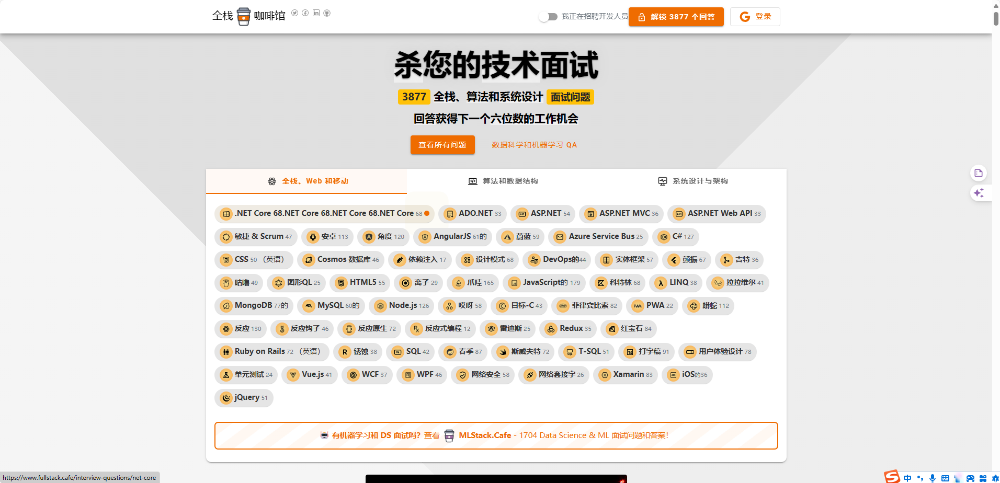

# 开源面试题

# 博客文章

[前端常见面试题总结 – 大厂面试每日一题 (shanyue.tech)](https://q.shanyue.tech/fe)

[qdleader/qdleader: 前端面试 前端知识点 面试题大全 js vue react node git element typescript ts next 支付 微信公众平台 每日持续更新 前端周刊 vue3 react18 vite redux 前端 (github.com)](https://github.com/qdleader/qdleader)

# haizlin/fe-interview

GitHub：https://github.com/haizlin/fe-interview

官网：[前端面试每日3+1-以前端面试题来驱动学习，提倡每日学习与思考，每天进步一点！ (h-camel.com)](http://www.h-camel.com/index.html)

前端面试每日 3+1，以面试题来驱动学习，提倡每日学习与思考，每天进步一点！每天早上5点纯手工发布面试题（死磕自己，愉悦大家），6000+道前端面试题全面覆盖，HTML/CSS/JavaScript/Vue/React/Nodejs/TypeScript/ECMAScritpt/Webpack/Jquery/小程序/软技能……

# h5bp/Front-end-Developer-Interview-Questions

start：59K

一个有用的前端相关问题列表，您可以使用它来面试潜在的候选人、测试自己或完全忽略。

GitHub：[h5bp/Front-end-Developer-Interview-Questions：一个有用的前端相关问题列表，可用于面试潜在候选人、测试自己或完全忽略。 (github.com)](https://github.com/h5bp/Front-end-Developer-Interview-Questions)

官网：[前端工作面试问题 ★ Front-end Developer Interview Questions (h5bp.org)](https://h5bp.org/Front-end-Developer-Interview-Questions/translations/chinese/)

[yangshun/tech-interview-handbook：💯为忙碌的软件工程师精心策划的编码面试准备材料 (github.com)](https://github.com/yangshun/tech-interview-handbook)

# yangshun/front-end-interview-handbook

⚡️ 为忙碌的工程师准备前端面试资料

GitHub：[yangshun/front-end-interview-handbook：⚡️忙碌工程师的前端面试准备材料 (github.com)](https://github.com/yangshun/front-end-interview-handbook)

官网：[frontendinterviewhandbook.com](https://frontendinterviewhandbook.com/)

中文版：[Introduction | Front End Interview Handbook](https://www.frontendinterviewhandbook.com/zh/introduction)

# 前端面试复习笔记❤️ 💝 💘

GitHub：[CavsZhouyou/Front-End-Interview-Notebook: :ant:前端面试复习笔记 (github.com)](https://github.com/CavsZhouyou/Front-End-Interview-Notebook)

# 前端系统设计面试

GitHub：[greatfrontend/awesome-front-end-system-design：用于面试和学习的精选前端系统设计资源 (github.com)](https://github.com/greatfrontend/awesome-front-end-system-design)

官网：[前端系统设计指南｜概念、技术和问题 | GreatFrontEnd](https://www.greatfrontend.com/zh-CN/system-design)

# 前端面试所需的所有材料

GitHub：[PriontoAbdullah/Frontend-Interview-Preparation-for-Interns-and-Junior-Developers：🔥🚀在这里，您可以找到更新鲜的前端面试所需的所有材料。💡📚 有用的前端相关问题、答案、笔记、博客、视频、代码示例🎁列表 您可以作为潜在候选人参加面试准备并测试自己。💣 (github.com)](https://github.com/PriontoAbdullah/Frontend-Interview-Preparation-for-Interns-and-Junior-Developers)

# 前端面试问题和答案

[wwwebman/front-end-interview-questions：我们的前端面试问题和答案可以帮助您更好、更快地准备面试 (github.com)](https://github.com/wwwebman/front-end-interview-questions)

# 有关前端开发人员职位的问题的答案

GitHub：[FedorovAlexander/Front-end-Job-Interview-Questions： 有关前端开发人员职位的问题的答案。](https://github.com/FedorovAlexander/Front-end-Job-Interview-Questions)

## 2023 前端面试题 + 知识库汇总

[evestorm/front-end-interview: 🌈 2023 前端面试题 + 知识库汇总，你值得拥有～ (github.com)](https://github.com/evestorm/front-end-interview)

# 前端开发面试题大收集，前端面试集锦(7年没更新)

GitHub：[paddingme/Front-end-Web-Development-Interview-Question: 前端开发面试题大收集，前端面试集锦 :gift_heart: :cupid: (github.com)](https://github.com/paddingme/Front-end-Web-Development-Interview-Question)

# 前端面试(两年没更新)

前端面试过程中浏览器，计算机网络，数据结构与算法，HTML，CSS，JS，Vue，React已经实战经验等相关的面试知识

GitHub：[lf2021/Front-End-Interview: 总结了前端面试过程中浏览器，计算机网络，数据结构与算法，HTML，CSS，JS，Vue，React已经实战经验等相关的面试知识。 (github.com)](https://github.com/lf2021/Front-End-Interview)

文档：[Front-End-Interview | 总结了前端面试过程中浏览器，计算机网络，数据结构与算法，HTML，CSS，JS，Vue，React已经实战经验等相关的面试知识。 (lf2021.github.io)](https://lf2021.github.io/Front-End-Interview/)

# MEGA 面试指南（3年没更新）

GitHub：[danieldelcore/mega-interview-guide： MEGA 面试指南， JavaSciript， Front End， Comp Sci (github.com)](https://github.com/danieldelcore/mega-interview-guide)

# 在线前端知识和面试题

[顶级前端开发人员面试问答（2024 年） (geeksforgeeks.org)](https://www.geeksforgeeks.org/front-end-developer-interview-questions/)

[HTML 面试问答 （2024） - GeeksforGeeks](https://www.geeksforgeeks.org/html-interview-questions-answers-set-1/)

# 全栈面试题

[JavaScript 开发人员的 52 Node.js面试问题（已回答） |全栈咖啡馆 (fullstack.cafe)](https://www.fullstack.cafe/blog/node-js-interview-questions)

