# React 面试题

[前 50+ 名 React 面试问题和答案（2024 年） (geeksforgeeks.org)](https://www.geeksforgeeks.org/react-interview-questions/?ref=lbp)

[sudheerj/reactjs-interview-questions：前 500 名 ReactJS 面试问题和答案列表。编码练习题即将推出！！ (github.com)](https://github.com/sudheerj/reactjs-interview-questions)

# 在准备 React 的面试题时，可以按照以下知识点进行分类：

### 1.React 基础：

- React 和虚拟 DOM 的概念
- JSX 语法和组件
- Props 和 State 的区别和用法
- 生命周期方法和钩子函数

### 2.React 组件：

- 类组件和函数组件的区别
- 组件状态管理和生命周期
- 高阶组件（HOC）和自定义钩子（Hooks）
- 组件的键（Key）和引用（Ref）

### 3.React 状态管理：

- 使用 Context API 进行状态管理
- Redux 的工作原理和使用场景
- MobX 和其他状态管理库的比较

### 4.React 路由：

- React Router 的配置和导航
- 路由参数和嵌套路由
- 路由守卫和懒加载

### 5.React 性能优化：

- 使用 PureComponent 和 React.memo
- 虚拟列表和窗口化技术
- 代码分割和懒加载组件

### 6.React 测试：

- Jest 和 Enzyme 的使用
- 单元测试和集成测试
- Mocking 和快照测试

### 7.React 新特性：

- React 16+ 的新特性，如 Hooks 和 Concurrent Mode
- React Fiber 架构
- React Suspense 和异步组件

### 8.React 工具和生态系统：

- 使用 Create React App 创建新项目
- Webpack 和 Babel 在 React 中的应用
- React DevTools 和其他调试工具

### 9.React 与其他技术的结合：

- React 与 TypeScript 的结合
- React Native 和跨平台开发
- 服务端渲染（SSR）和静态站点生成（SSG）

这些分类可以帮助你系统地准备 React 面试题。如果需要更详细的面试题和答案，可以参考以下资源：

- [103 个关于「React 的高频面试」问题整理，适合面试或者全面学习](https://zhuanlan.zhihu.com/p/438358521)
- [React 面试问题（含答案和示例）](https://www.freecodecamp.org/chinese/news/react-interview-questions-and-answers/)
- [必须要会的 50 个 React 面试题](https://bing.com/search?q=React+面试题+按知识点分类)
- [React 必知必会的 35 个面试题](https://segmentfault.com/a/1190000018604138)
- [React 常用面试题（一）——面试必备](https://juejin.cn/post/6959425716865744933)

### 1、react 生命周期

**考察点：react 生命周期**

::: details 查看参考回答

React 生命周期分为三种状态：

- 1、 初始化
- 2、更新
- 3、销毁

具体见下图

参考 <https://www.cnblogs.com/qiaojie/p/6135180.html>


:::

### 2、组件什么时候用 state

**考察点：组件**

::: details 查看参考回答

组件中用到的一个变量是不是应该作为组件 State，可以通过下面的 4 条依据进行判断：

- 这个变量是否是通过 Props 从父组件中获取？如果是，那么它不是一个状态。
- 这个变量是否在组件的整个生命周期中都保持不变？如果是，那么它不是一个状态。
- 这个变量是否可以通过其他状态（State）或者属性(Props)计算得到？如果是，那么它不是一个状态。
- 这个变量是否在组件的 render 方法中使用？如果不是，那么它不是一个状态。这种情况下，这个变量更适合定义为组件的一个普通属性。

参考 <https://blog.csdn.net/xuchaobei123/article/details/73810490>

:::

### 3、受控组件和非受控组件

**考察点：react**

::: details 查看参考回答

在 HTML 中，标签`<input>`、`<textarea>`、`<select>`的值的改变通常是根据用户输入进行更新。

在 React 中，可变状态通常保存在组件的状态属性中，并且只能使用 setState() 更新，而呈现表单的 React 组件也控制着在后续用户输入时该表单中发生的情况，以这种由 React 控制的输入表单元素而改变其值的方式，称为：“受控组件”。

:::

### 4、react 和 angular 的区别

**考察点：框架**

::: details 查看参考回答

React 对比 Angular 是思想上的转变，它也并不是一个库，是一种开发理念，组件化，分治的管理，数据与 view 的一体化。它只有一个中心,发出状态，渲染 view，对于虚拟 dom 它并没有提高渲染页面的性能，它提供更多的是利用 jsx 便捷生成 dom 元素，利用组件概念进行分治管理页面每个部分(例如 header section footer slider)

:::

### 5、介绍一下 react

**考察点：react**

::: details 查看参考回答

React 是一个用于构建用户界面的 JAVASCRIPT 库。React 主要用于构建 UI，很多人认为 React 是 MVC 中的 V（视图）

React 特点有：

- 1、声明式设计 −React 采用声明范式，可以轻松描述应用。
- 2、高效 −React 通过对 DOM 的模拟，最大限度地减少与 DOM 的交互。
- 3、灵活 −React 可以与已知的库或框架很好地配合。
- 4、JSX − JSX 是 JavaScript 语法的扩展。React 开发不一定使用 JSX ，但我们建议使
  用它。
- 5、组件 − 通过 React 构建组件，使得代码更加容易得到复用，能够很好的应用在大项
  目的开发中。
- 6、单向响应的数据流 − React 实现了单向响应的数据流，从而减少了重复代码，这也是
  它为什么比传统数据绑定更简单。

:::

### 6、React 单项数据流

**考察点：react**

::: details 查看参考回答

在 React 中，数据是单向流动的，是从上向下的方向，即从父组件到子组件的方向。

state 和 props 是其中重要的概念，如果顶层组件初始化 props，那么 React 会向下遍历整颗组件树，重新渲染相关的子组件。其中 state 表示的是每个组件中内部的的状态，这些状态只在组件内部改变。

把组件看成是一个函数，那么他接受 props 作为参数，内部由 state 作为函数的内部参数，返回一个虚拟 dom 的实现。

:::

### 7、react 生命周期函数和 react 组件的生命周期

::: details 查看参考回答

React 的组件在第一次挂在的时候首先获取父组件传递的 props，接着获取初始的 state 值，接着经历挂载阶段的三个生命周期函数，也就是 ComponentWillMount，render，ComponentDidMount。这三个函数分别代表组件将会挂载，组件渲染，组件挂载完毕三个阶段。

**在组件挂载完成后**，组件的 props 和 state 的任意改变都会导致组建进入更新状态，在**组件更新阶段**，如果 props 改变，则进入 ComponentWillReceiveProps 函数，接着进入 ComponentShouldUpdate 进行判断是否需要更新，如果是 state 改变则直接进入 ComponentShouldUpdate 判定，这个默认是 true，当判定不需要更新的话，组件继续运行，需要更新的话则依次进入 ComponentWillMount，render，ComponentDidMount 三个函数，当组件卸载时，会首先进入生命周期函数 ComponentWillUnmount,之后才进行卸载，如图


React 的生命周期函数：

初始化阶段：getDefaultProps：获取实例的默认属性，getInitialState：获取每个实例的初始化状态，ComponentWillMount：组件将被装载，渲染到页面上，render：组件在这里生成虚拟的 DOM 节点，ComponentDidMount：组件真正被装载之后

运行中状态： componentWillReceiveProps:组件将要接收到属性的时候调用

shouldComponentUpdate：组件接受到新属性或者新状态的时候（可以返回 false，接收数据后不更新，阻止 render 调用，后面的函数不会被继续执行了）shouldComponentUpdate 这个方法用来判断是否需要调用 render 方法重新描绘 dom。

因为 dom 的描绘非常消耗性能，如果我们能在 shouldComponentUpdate 方法中能够写出更优化的 dom diff 算法，可以极大的提高性能。componentWillUpdate：组件即将更新不能修改属性和状态， render：组件重新描绘

componentDidUpdate：组件已经更新，销毁阶段： componentWillUnmount：组件即将销毁

:::

### 9、reactJs 的组件交流

**考察点：react**

::: details 查看参考回答

React 组件之间的交流方式可以分为以下三种

1、父组件向子组件传值:主要是利用 props 来进行交流

2、子组件向父组件传值：子组件通过控制自己的 state 然后告诉父组件的点击状态。然后
在父组件中展示出来，如图：

3、没有任何嵌套关系的组件之间传值：如果组件之间没有任何关系，组件嵌套层次比较深

（个人认为 2 层以上已经算深了），或者你为了一些组件能够订阅、写入一些信号，不想让组件

之间插入一个组件，让两个组件处于独立的关系。对于事件系统，这里有 2 个基本操作步骤：

订阅（subscribe）/监听（listen）一个事件通知，并发送（send）/触发（trigger）/发布（publish）/发送（dispatch）一个事件通知那些想要的组件。

:::

### 10、有了解过 react 的虚拟 DOM 吗，虚拟 DOM 是怎么对比的呢

**考察点：react**

::: details 查看参考回答

当然是使用的 diff 算法，diff 算法有三种优化形式：

- **tree diff**：将新旧两颗 DOM 树按照层级遍历，只对同级的 DOM 节点进行比较，即同一父节点下的所有子节点，当发现节点已经不存在，则该节点及其子节点会被完全删除，不会进一步比较
- **component diff**：不同组件之间的对比，如果组件类型相同，暂不更新，否则删除旧的组件，再创建一个新的组件，插入到删除组件的位置
- **element diff**：在类型相同的组件内，再继续对比组件内部的元素

参考：<https://juejin.im/post/5a3200fe51882554bd5111a0>

:::

### 11、react 和 Vue 的原理，区别，亮点，作用

**考察点：react**

::: details 查看参考回答

我曾经看过 vue 作者尤雨溪的一个专访，他说过这样一段话(大概内容)：做框架的时候我们也很纠结，到底是定制内容少一点好还是定制内容多一点好。定制少了，很多人不知道一些情况应该怎么处理，所以他就乱来，写的代码乱七八糟，性能也不好，然后他就会认为你的框架没做好，有的人还去网上喷你。但是当大家经验越来越丰富，反而希望受到框架的限制越少越好。因为随着经验的增加，大家都知道了各种场景下应该怎么处理，优化自己的代码。限制越少，自我发挥的空间就越大。

最终我们可以看到，纠结之后，vue 的选择居于 react 与 angular 之间，框架自身的语法比 react 多一点，但是又比 angular 少一点。

也正是由于选择的不同，所呈现出来的写法与思考方式就一定会有所差异，不论优劣，但肯定会导致不同的偏好。

react 的简单在于，它的核心 API 其实非常少。所以我们会看到很多地方在说 react 其实是一个 UI 库，并不是一个完整的框架。他只是告诉我们如何创建组件以及组件之间如何进行数据传递。甚至于创建组件的方式正是使用 ES6 的 class 语法(createClass 将会在 react 16 被丢弃)。因此开发中 react 的使用对于 ES6 的语法依赖非常高。因为 react 自身本来就没有多少强限制的语法。我们只需要掌握组件里的 props，state，ref，生命周期，就好像没有过多额外的知识了。就连如果想要在 jsx 模板来遍历渲染，还得使用原生的 map 方法。而 react 的高阶组件，理解之后发现，其实就是 JavaScript 函数式编程中所涉及到的思维方式。所以在我看来，react 的最大特点就是简单并且与原生 JavaScript 非常接近。即给开发者带来的束缚非常少。一个功能的实现，如果你知道使用原生 JavaScript 如何实现，那么你就一定能够很轻松的知道使用 react 如何实现。

当然，核心 API 简单并不代表上手容易。在使用之初，如果你经验缺乏，那么你用 react 写出来的页面，性能可能会非常差。因为无意识的，你的组件可能会有非常多的多余的渲染。比如很多人在学习 react 的时候，会接触到一个倒计时的例子，这个例子使用修改组件中 state 的方式来实现。但是其实后来大家会慢慢知道，这种方式是非常错误的。因为 state 的每次修改，都会导致组件及其所有子组件的重新渲染。这是成本非常高的行为。当然，我还知道很多人，在调试 react 的时候，由于高频的重复渲染直接把浏览器都卡死的。这些问题都是尤雨溪所担心的限制过少带来的。

网上有的自以为牛的人，用着 react/vue 这样的框架，其实写着很烂的代码，恐怖的是他们还嘲讽这嘲讽那的。还遇到过一个人，口口声声说自己用了 angular 好多年，说 angular 真的好垃圾啊，性能好差啊，什么什么的各种黑，结果连 track by 都不会用。而 react 由于没有真正意义上的双向绑定。因此在处理一些复杂场景会非常麻烦，比如复杂的表单验证。

而相对而言，vue 提供的能力则更多一点，这些便捷的能力会让初学者感觉到非常的幸福，

因为很多效果只需要一些简单的代码既可以实现。我大概列举几条我个人认为非常棒的能力：

#### 统一管理的计算属性

JavaScript 的表达式非常便利，无论是 vue 还是 react，表达式的能力是必不可少的。但正如 vue 官方文档所说，在模板中放入太多的逻辑会让模板过重且难以维护。而 vue 的组件中提供了一个计算属性来统一管理表达式。

```vue
<template>
	<div id="example">
		<p>Original message: "{{ message }}"</p>
		<p>Computed reversed message: "{{ reversedMessage }}"</p>
	</div>
</template>
<script>
export default {
	name: "example",
	data() {
		return {
			message: "Hello",
		};
	},
	computed: {
		reversedMessage: function () {
			return this.message.split("").reverse().join("");
		},
	},
};
</script>
```

class 的动态语法让我感觉非常爽，在实践中我们会发现非常多这样的场景，需要根据不同的状态来决定一个元素 class 的具体值。而如果仅仅只是简单的表达式或者条件判断在 jsx 模板中，例如下面这个样子就会让人感觉非常难受

```html
<p className={active ? 'note active' : 'note'}></p>
```

当稍微复杂一点的逻辑还这样处理就是难受到忍不了了。而 vue 中支持的语法则非常轻松的搞定了这个问题。

```js
// 可以放在任何你觉得舒服的位置

const pcls = {
    active: active,
    note: true
}
<p class={pcls}></p>
```

这样我们继续添加更多的 class 名也不会造成额外的复杂度了。

当然，这仅仅只是一个工具方法就能搞定的问题，在使用 react 时，大家可以借助 classnames
来完成同样的功能。但 vue 是直接支持了。

#### 双向绑定

由于 react 并不支持双向绑定，因此在复杂的表单验证时实现起来非常痛苦。而 vue 在以单向数据流为核心的同时，又没有完全抛弃双向绑定，这让在这样复杂的表单验证场景开发效率比 react 高出非常多。这也是 vue 省事儿的一个方面。

#### 修饰符

我们在写事件处理逻辑时，常常需要 e.preventDefault 等操作。vue 提供的修饰符功能可以帮助我们省去这些代码，极为方便。用多了就会发现，真 TM 好用。

```html
<!-- 阻止单击事件冒泡 -->
<a v-on:click.stop="doThis"></a>

<!-- 提交事件不再重载页面 -->
<form v-on:submit.prevent="onSubmit"></form>

<!-- 修饰符可以串联 -->
<a v-on:click.stop.prevent="doThat"></a>

<!-- 只有修饰符 -->
<form v-on:submit.prevent></form>

<!-- 添加事件侦听器时使用事件捕获模式 -->
<div v-on:click.capture="doThis">...</div>

<!-- 只当事件在该元素本身（而不是子元素）触发时触发回调 -->
<div v-on:click.self="doThat">...</div>
```

当然，还有按键修饰符等，可以去官网进一步查看学习。

vue 提供的方便可爱的语法糖还有很多，就不细说，大家可以在官网上一一体验。正如文章开头所说，vue 会有一些语法限制，而这些语法限制在某种程度上来说降低了我们的开发成本，提高了开发效率。这大概也就是很多人认为 vue 更加简单易学的原因所在吧。

就从学习难易程度上来说，react 之所以上手更加困难，主要的原因并不在于 react 本身，而在于围绕 react 的丰富的生态圈。正是由于 react 本身足够简单，所以我们需要掌握的 react 组件就更多。比如 react-router，react-redux 等。而且很多好用的，功能特别棒的组件在我们涉猎不广的时候都不知道。例如我在学习 ant-design 源码的时候，常常会惊讶于发现原来这里有一个组件可以这样用，真的好棒！而我在学习 vue 的时候又会惊讶的发现，原来这么棒的组件 vue 直接都已经支持了！

所以后来我才发现，原来 vue 与 react 既然如此相似。

我仍然更加偏好于 react。但仅仅只是因为 react 的语法更加接近于 ES6 而已。

:::

### 12、项目里用到了 react，为什么要选择 react，react 有哪些好处

**考察点：react**

::: details 查看参考回答

（1）声明式设计

（2）高效：通过对 DOM 的模拟，最大限度的减少与 DOM 的交互。

（3）灵活：可以与已知的框架或库很好的配合。

（4）JSX：是 js 语法的扩展，不一定使用，但建议用。

（5）组件：构建组件，使代码更容易得到复用，能够很好地应用在大项目的开发中。

（6）单向响应的数据流：React 实现了单向响应的数据流，从而减少了重复代码，这也
是解释了它为什么比传统数据绑定更简单。

:::

### 13、怎么获取真正的 dom

**考察点：react**

::: details 查看参考回答

ReactDOM.findDOMNode()或 this.refs

:::

### 14、选择 react 的原因

::: details 查看参考回答

略

:::

### 15、 react 的生命周期函数

**考察点：生命周期**

::: details 查看参考回答

#### 初始化

##### 1、getDefaultProps()

设置默认的 props，也可以用 dufaultProps 设置组件的默认属性.

##### 2、getInitialState()

在使用 es6 的 class 语法时是没有这个钩子函数的，可以直接在 constructor 中定义 this.state。此时可以访问 this.props

##### 3、componentWillMount()

组件初始化时只调用，以后组件更新不调用，整个生命周期只调用一次，此时可以修改 state。

##### 4、 render()

react 最重要的步骤，创建虚拟 dom，进行 diff 算法，更新 dom 树都在此进行。此时就不能更改 state 了。

##### 5、componentDidMount()

组件渲染之后调用，只调用一次。

#### 更新

##### 6、componentWillReceiveProps(nextProps)

组件初始化时不调用，组件接受新的 props 时调用。

##### 7、shouldComponentUpdate(nextProps, nextState)

react 性能优化非常重要的一环。组件接受新的 state 或者 props 时调用，我们可以设置在此对比前后两个 props 和 state 是否相同，如果相同则返回 false 阻止更新，因为相同的属性状态一定会生成相同的 dom 树，这样就不需要创造新的 dom 树和旧的 dom 树进行 diff 算法对比，节省大量性能，尤其是在 dom 结构复杂的时候

##### 8、componentWillUpdata(nextProps, nextState)

组件初始化时不调用，只有在组件将要更新时才调用，此时可以修改 state

##### 9、render()

#### 组件渲染

##### 10、componentDidUpdate()

组件初始化时不调用，组件更新完成后调用，此时可以获取 dom 节点。

#### 卸载

##### 11、componentWillUnmount()

组件将要卸载时调用，一些事件监听和定时器需要在此时清除。

:::

### 16、setState 之后的流程

**考察点：react**

::: details 查看参考回答

在代码中调用 setState 函数之后，React 会将传入的参数对象与组件当前的状态合并，然后触发所谓的调和过程（Reconciliation）。 经过调和过程，React 会以相对高效的方式根据新的状态构建 React 元素树并且着手重新渲染整个 UI 界面。在 React 得到元素树之后，React 会自动计算出新的树与老树的节点差异，然后根据差异对界面进行最小化重渲染。 在差异计算

算法中，React 能够相对精确地知道哪些位置发生了改变以及应该如何改变，这就保证了按需更新，而不是全部重新渲染。

:::

### 17、react 高阶组件知道吗？

**考察点：高阶组件**

::: details 查看参考回答

高阶组件接收 React 组件作为参数，并且返回一个新的 React 组件。高阶组件本质上也是一个函数，并不是一个组件。

:::

### 18、React 的 jsx，函数式编程

::: details 查看参考回答

略

:::

### 19、React 的生命周期

**考察点：生命周期**

::: details 查看参考回答

React 生命周期分为三种状态 1、 初始化 2、更新 3、销毁

具体见下图


:::

### 20、 说说自己理解的 react

**考察点：react**

::: details 查看参考回答

React 是用于构建用户界面的 JavaScript 库。React 可以创建交互式 UI。为应用程序中的每个状态建立的视图，并且 React 将在数据更改时进行更新，呈现正确的组件。另外，我们也可以构建管理自己状态的封装组件，然后将它们组合成复杂的 UI。因为组件用 JS 编写而不是模板，所以可以通过应用传递数据，并使状态与 DOM 分离

:::

### 21、react 的组件是通过什么去判断是否刷新的

**考察点：react**

::: details 查看参考回答

通过 state 是否改变

:::

### 4、React Native

## 类组件和函数式组件的区别

在 React 中，有两种创建组件的方式，一种式类组件，一种是函数式组件。类组件是使用 ES6 类创建的，而函数是组件是使用 JavaScript 函数进行创建的。

#### 类组件

使用 ES6 类进行创建，并集成于 React.Component 类。同时具有一下特点：

- 具有生命周期
- 可以使用状态
- 可以使用 this 关键字访问组件示例

#### 函数式组件

函数式组件是 React 中较新类型的组件，React 16.8 新增的特性。它使用 JS 函数进行创建，但是没有生命周期和状态。

- 没有生命周期
- 没有状态
- 不能使用 this 访问组件实例

#### 类组件和函数式组件的区别

以下是类组件和函数式组件的主要区别：

| 特性          | 类组件                             | 函数式组件                         |
| ------------- | ---------------------------------- | ---------------------------------- |
| 创建方式      | 使用 ES6 类                        | 使用 JavaScript 函数               |
| 继承          | 继承自 `React.Component` 类        | 无                                 |
| 生命周期方法  | 具有生命周期方法                   | 无生命周期方法                     |
| 状态          | 可以使用状态                       | 不能使用状态                       |
| `this` 关键字 | 可以使用 `this` 关键字访问组件实例 | 不能使用 `this` 关键字访问组件实例 |
| 性能          | 性能略差                           | 性能略好                           |
| 可读性        | 可读性略差                         | 可读性略好                         |

#### 选择类组件还是函数式组件

因该考虑以下几点因素：

- 组件是否需要状态
- 组件是否需要生命周期方法
- 组件的复杂度
- 代码的可读性

### 一、React 组件通信的方式有哪些？

- **⽗组件向⼦组件通讯:** ⽗组件可以向⼦组件通过传 props 的方式，向⼦组件进⾏通讯
- **⼦组件向⽗组件通讯:** props+回调的方式，⽗组件向⼦组件传递 props 进⾏通讯，此 props 为作用域为⽗组件⾃身的函 数，⼦组件调用该函数，将⼦组件想要传递的信息，作为参数，传递到⽗组件的作用域中。
- **兄弟组件通信:** 找到这两个兄弟节点共同的⽗节点,进行状态提升，结合上面两种方式由⽗节点转发信息进⾏通信
- **跨层级通信**:
  - props 层层传递回调函数。
  - Context 设计⽬的是为了共享那些对于⼀个组件树而⾔是“全局”的数据，例如当前认证的用户、主题或⾸选语⾔，对于跨越多层的全局数据通过 Context 通信再适合不过。
- **非嵌套关系的组件通信：**
  - (发布订阅模式): 发布者发布事件，订阅者监听事件并做出反应,我们可以通过引⼊ event 模块进⾏通信
  - (全局状态管理⼯具): 借助 Redux 或者 Mobx 等全局状态管理⼯具进⾏通信,这种⼯具会维护⼀个全局状态中⼼ Store,并根据不同的事件产⽣新的状态

### 二、哪些方法会触发 React 重新渲染以及如何避免不必要的重新渲染？

- 触发 React 重新渲染：
  - setState() 、useState 被调用
  - props 发生变化
  - 组件依赖的上下文 context 发生变化
  - 自定义 hook 发生变化
  - forceUpdate 强制组件重新渲染
- 如何避免不必要的重新渲染：
  - React.memo：包裹函数式组件，react 渲染之前会先做属性值的对比，如果没有变化，则不重新渲染。
  - useMemo：缓存计算结果，只有在依赖项变化时才重现计算结果，而不是每次都渲染，避免因为计算开销大会导致渲染时间长。
  - useCallback：缓存函数，只有在依赖项变化时才重现创建函数，而不是每次都创建。
  - React.PureComponent/shouldComponentUpdate：控制是否重新渲染类组件。
  - key：增加 key，提升就进复用率。

### 三、受控组件和非受控组件的区别？

- **受控组件：** 组件的展示完全由传入的属性决定。比如说，如果一个输入框中的值完全由传入的 value 属性决定，而不是由用户输入决定，那么就是受控组件，写法是：。
- **非受控组件：** 表单组件可以有自己的内部状态，而且它的展示值是不受控的。比如 input 在非受控状态下的写法是：< input onChange={handleChange}/>。
  - 使用场景：1.必须手动操作 DOM 的 2.文件上传 3.富文本编辑，需要传入 DOM 元素

### 四、高阶组件是什么，和普通组件有什么区别？适用什么场景？

- 概念：高阶组件（HOC）就是一个函数，且该函数接受一个组件作为参数，并返回一个新的组件，它只是一种组件的**设计模式**，这种设计模式是由 react 自身的**组合性质**必然产生的。我们将它们称为纯组件，因为它们可以接受任何动态提供的子组件，但它们不会修改或复制其输入组件中的任何行为。
- 适用场景：
- **代码复用，逻辑抽象**：当多个组件有相似的逻辑时，可以使用高阶组件来共享这些逻辑。
- **渲染劫持：** 高阶组件可以读取、修改、甚至替换被包裹组件的元素树，React 中权限封装，无权限返回替换。
- **State 和 Props 的抽象、更改**：连接 Redux 或 MobX，高阶组件可以用来包裹组件并连接到应用的状态管理库。

### 五、为什么 React 自定义组件首字母要大写？

- **JSX 解析规则**：在 JSX 中，React 使用首字母大小写来区分自定义组件和原生 HTML 标签。首字母大写被解释为自定义组件，而首字母小写则被视为普通的 HTML 标签。
- **Babel 转换过程**：当使用 Babel 转换 JSX 代码时，它根据元素的首字母大小写来决定如何转换。首字母大写的组件会被保留其名称并传递给 React.createElement，而小写字母开头的则被视为普通 HTML 标签并转换为对应的字符串。
- **组件渲染识别：** 这种首字母大小写的约定让 React 可以正确识别和渲染自定义组件和原生 DOM 元素，保证了 JSX 的灵活性和表现力。
- **代码清晰和一致性：** 遵循这个约定有助于维持代码的清晰性和一致性，使得代码的阅读和维护变得更加容易。

React.createElement 的基本语法如下：

```jsx
React.createElement(type, [props], [...children]);
```

- **type**: 这个参数是一个字符串（对于 HTML 或 SVG 标签）或一个 React 组件（可以是类组件或函数组件）。这决定了将要创建的元素类型。
- **props**: 这是一个对象，包含了传递给 React 元素的属性（或“props”）。对于 HTML 标签，这些属性就是常见的 HTML 属性；对于 React 组件，这些属性将会成为组件的 props。
- **children**: 这些参数代表元素的子元素。它们可以是字符串、数字、React 元素，或者这些类型的数组。这里也可以传递 null 或 undefined，表示没有子元素。

```html
const element = React.createElement('div', { className: 'container' }, 'Hello,
world!');
```

### 六、Redux 模块

#### 1.Redux 的工作流程是什么？

- 1. 通过 createStore，生成 Store
- 1. 用户定义 action 行为，并使用 dispatch 发起 action
- 1. 当前 Store 中对应的 reducer 会处理 Action 返回新的 State
- 1. State—旦有变化，Store 就会调用监听(subscribe)函数，来更新 View

#### 2.说一说你理解的 Redux 中间件机制?

在 Redux 中，中间件的作用类似于服务器框架（如 Express 或 Koa）中的中间件。它们提供了一种方式来增强 Redux 的 dispatch 函数。通过使用中间件，我们可以在 action 被发送到 reducer 之前执行额外的操作，例如：

- 日志记录：记录每个 action 的信息和状态变化。
- 异步操作：处理异步逻辑，例如 API 请求。
- 错误处理：捕获和上报异常信息。

##### 中间件的实现

中间件的基本结构是一个嵌套的三层高阶函数，这种结构允许中间件访问到 Redux 的 dispatch 和 getState 方法，以及下一个中间件。以下是一个简单的日志记录中间件的例子：

```javascript
function logger(store) {
	return function (next) {
		return function (action) {
			console.log("dispatching", action);
			let result = next(action);
			console.log("next state", store.getState());
			return result;
		};
	};
}
```

在这个例子中，logger 函数接收 store 对象，并返回一个函数。这个返回的函数接收下一个中间件作为参数 next，然后再返回一个新的函数，这个新函数接收 action 并进行处理。

##### 应用中间件

为了在 Redux 应用中使用中间件，我们需要使用 applyMiddleware 函数。这个函数允许我们将多个中间件绑定到 Redux store。下面是如何在 Redux store 中应用中间件的例子：

```javascript
import { createStore, applyMiddleware } from "redux";
import rootReducer from "./reducers";

const store = createStore(
	rootReducer,
	applyMiddleware(logger /* 其他中间件 */)
);
```

#### 3.Redux 中异步的请求怎么处理？

###### redux-thunk

优点：

- 体积小: redux-thunk 的实现方式很简单,只有不到 20 ⾏代码

- 使用简单: redux-thunk 没有引⼊像 redux-saga 或者 redux-observable 额外的范式,上⼿简单

  缺点:

- 样板代码过多: 与 redux 本身⼀样,通常⼀个请求需要⼤量的代码,而且很多都是重复性质的。

- 耦合严重: 异步操作与 redux 的 action 偶合在⼀起,不方便管理。

- 功能孱弱: 有⼀些实际开发中常用的功能需要⾃⼰进⾏封装

例子：

```javascript
import { createStore, applyMiddleware } from "redux";
import thunk from "redux-thunk";
import rootReducer from "./reducers";

const store = createStore(rootReducer, applyMiddleware(thunk));
const fetchSomeData = () => {
	return (dispatch) => {
		dispatch({ type: "FETCH_DATA_REQUEST" });
		fetch("https://some-api.com/data")
			.then((response) => response.json())
			.then((data) => dispatch({ type: "FETCH_DATA_SUCCESS", payload: data }))
			.catch((error) => dispatch({ type: "FETCH_DATA_FAILURE", error }));
	};
};
```

###### redux-saga

优点：

- 异步解耦：把异步操作单独分离出来放在 saga 文件中。当我们提交普通 action 的时候，如果匹配到了 saga 文件中的监听器就会被拦截下来，然后调用 saga 里配置的方法进行异步操作。如果没匹配上就走提交普通 action 的逻辑。总体来说逻辑较为清晰，但是使用成本增加。
- 异常处理: 受益于 generator function 的 saga 实现，代码异常/请求失败 都可以直接通过 try/catch 语法直接捕获处理
- 功能强⼤: redux-saga 提供了⼤量的 Saga 辅助函数和 Effect 创建器供开发者使用,开发者无须封装或者简单封装即可使用。
- 灵活: redux-saga 可以将多个 Saga 可以串⾏/并⾏组合起来,形成⼀个⾮常实用的异步 flow

缺点：

- 额外的学习成本: redux-saga 不仅在使用难以理解的 generator function,而且有数⼗个 API,学习成本远超 redux-thunk
- 体积庞⼤: 体积略⼤,代码近 2000 ⾏，min 版 25KB 左右
- 功能过剩: 实际上并发控制等功能很难用到,但是我们依然需要引⼊这些代码

###### 介绍一下 redux-toolkit

Redux Toolkit 是 Redux 官方推荐的工具集，旨在简化 Redux 应用的编写和维护。它提供了一系列工具和函数，帮助开发者以更简洁和模块化的方式编写 Redux 代码。Redux Toolkit 主要解决了 Redux 在使用过程中的一些常见问题，比如繁琐的设置、过多的样板代码以及复杂的配置。 **主要特性**

1. 配置 Store 简化：提供 configureStore() 方法来自动设置 store。这个方法默认集成了常见的中间件，简化了 store 的配置。
2. 创建 Reducer 和 Action 简化：通过 createSlice() 方法，可以在一个函数中同时定义 reducer 和相关的 actions。这减少了样板代码，并使得逻辑更加集中。
3. 不可变性管理：内置了 Immer 库，允许在 reducer 中以更直观的方式修改 state，而无需手动保证 state 的不可变性。
4. 异步逻辑处理：提供 createAsyncThunk 函数用于处理异步逻辑，使得在 Redux 应用中处理异步操作变得更简单。
5. 扩展性和可重用性：鼓励将 Redux 逻辑切割成更小的片段，通过提供的 API，这些片段可以轻松重用和测试。

创建 Redux-Store

```javascript
// store.js
import { configureStore } from "@reduxjs/toolkit";
import userReducer from "../features/userSlice";

export const store = configureStore({
	reducer: {
		user: userReducer,
	},
});
```

创建 Slice 使用 createSlice 来同时定义 reducer 和 actions：

```javascript
// features/userSlice.js
import { createSlice } from '@reduxjs/toolkit';

export const userSlice = createSlice({
  name: 'user',
  initialState: {
    value: 0,
  },
  reducers:
      {
        increment: state => {
          // Immer 让我们直接 "修改" state
          state.value += 1;
        },
        decrement: state => {
          state.value -= 1;
        },
        incrementByAmount: (state, action) => {
          state.value += action.payload;
        },
      },
  });
// 自动生成 action creators
export const { increment, decrement, incrementByAmount } = userSlice.actions;

export default userSlice.reducer;

在这个示例中，`createSlice` 自动为每个 reducer 函数生成对应的 action creator 和 action type。这样可以减少需要编写和维护的代码量。
#### 在组件中使用 Redux Toolkit
然后，可以在 React 组件中使用这些 slices 和生成的 actions：
// App.js
import React from 'react';
import { useSelector, useDispatch } from 'react-redux';
import { increment, decrement, incrementByAmount } from './features/userSlice';

function App() {
  const count = useSelector(state => state.user.value);
  const dispatch = useDispatch();

  return (
    <div>
      <div>{count}</div>
      <button onClick={() => dispatch(increment())}>Increment</button>
      <button onClick={() => dispatch(decrement())}>Decrement</button>
      <button onClick={() => dispatch(incrementByAmount(2))}>Increment by 2</button>
    </div>
  );
}

export default App;

```

#### 4.Redux 请求中间件如何处理并发？

使用 redux-Saga 处理并发 Redux-Saga 使用 ES6 Generator 函数来管理副作用（如数据获取、访问浏览器缓存等）。对于并发请求，可以使用 all 效果指令（Effect）来同时触发多个任务。

```jsx
import { call, put, all } from "redux-saga/effects";

// 模拟两个异步请求的函数
function fetchUser() {
	return fetch("/api/user").then((response) => response.json());
}

function fetchPosts() {
	return fetch("/api/posts").then((response) => response.json());
}

// Saga 处理两个并发请求
function* fetchUserAndPosts() {
	try {
		// 使用 all 同时发起请求
		const [user, posts] = yield all([call(fetchUser), call(fetchPosts)]);

		// 当两个请求都完成时，dispatch actions
		yield put({ type: "FETCH_USER_SUCCESS", payload: user });
		yield put({ type: "FETCH_POSTS_SUCCESS", payload: posts });
	} catch (error) {
		// 如果任何一个请求失败，dispatch 一个失败的 action
		yield put({ type: "FETCH_FAILED", error });
	}
}
```

#### 5.Redux 和 Vuex 有什么区别，它们的共同思想？

**Redux** Redux 是一个用于 JavaScript 应用的状态管理库，广泛用于 React（也可以用于其他框架或库）：

- 单一状态树（Store）：Redux 使用一个单一的、不可变的状态树来存储整个应用的状态。
- Action：状态更改是通过发送（dispatch）action 来表示的。Action 是描述“发生了什么”的普通 JavaScript 对象。
- Reducer：Reducer 函数决定如何根据 action 更改状态。Reducer 必须是纯函数，它接收前一个状态和一个 action，返回新状态。
- 中间件：Redux 支持中间件，用于处理副作用（如异步操作或日志记录）。

**Vuex** Vuex 是专为 Vue.js 设计的状态管理模式和库：

- 状态管理（State）：Vuex 也使用单一状态树，存储整个应用的状态。
- Mutation：更改 Vuex 的状态的唯一方法是通过提交（commit）mutation。Mutation 必须是同步函数。
- Action：Action 类似于 Redux 中的 action，用于提交 mutation。不同的是，它们可以包含异步操作。
- Module：Vuex 允许将 store 分割成模块，每个模块可以拥有自己的状态、mutation、action 和 getter。

**共同思想** 尽管 Redux 和 Vuex 的实现细节有所不同，但它们在状态管理方面有着共同的理念：

- **集中式状态管理**：它们都提倡将应用的状态集中存储在单一的状态树中，这使得状态更容易追踪和调试。
- **可预测性**：通过明确的规则和模式（如 Redux 的 reducer 或 Vuex 的 mutation）来管理状态更改，使得应用的状态变得可预测和一致。
- **维护性和组织性**：通过提供一种清晰的方式组织代码和管理数据流，帮助开发者构建大型、复杂的应用程序。

**主要区别**

- **框架依赖**：Redux 是一个独立的库，可以与任何 UI 层一起使用，但通常与 React 一起使用；Vuex 专为 Vue.js 设计。
- **异步操作**：Redux 本身不支持异步操作，需要中间件（如 redux-thunk 或 redux-saga）；Vuex 的 action 支持异步操作。
- **API 和设计哲学**：Redux 倾向于函数式编程风格，Vuex 更紧密地集成了 Vue.js 的响应式系统。

#### 6.Redux 的缺点：

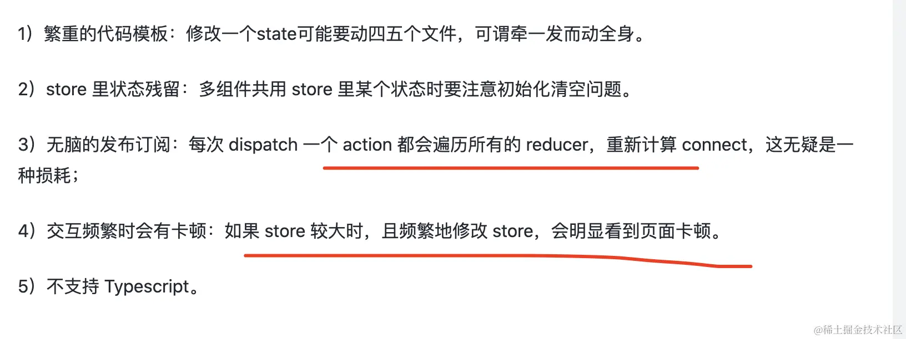 **1)繁重的代码模板:修改一个 state 可能要动四五个文件，可谓牵一发而动全身。** **2)store 里状态残留:多组件共用 store 里某个状态时要注意初始化清空问题。** **3)无脑的发布订阅:每次 dispatch 一个 action 都会遍历所有的 reducer，重新计算 connect，这无疑是一种损耗;** **4)交互频繁时会有卡顿:如果 store 较大时，且频繁地修改 store，会明显看到页面卡顿。** **5)不支持 Typescript。**

### 七、虚拟 DOM

#### 1.VDom 是什么？

**虚拟 DOM 的概念：**

1. **轻量级的 JavaScript 对象**：虚拟 DOM 是真实 DOM 的一种抽象，它是由普通的 JavaScript 对象组成的树结构。每个 JavaScript 对象都对应着真实 DOM 树中的一个节点。
2. **同步与真实 DOM 的变化**：在 React 应用中，每当组件的状态变化时，React 会先在虚拟 DOM 上进行相应的更新。这意味着每次状态变化并不会直接引起真实 DOM 的更新。

#### 2.为什么要用虚拟 dom？

1. **性能提升：** 保证性能下限，在不进行手动优化的情况下，提供过得去的性能。操作真实 DOM 是昂贵的（性能开销较大），因为它会导致浏览器的重绘和重排。虚拟 DOM 允许 React 在内存中进行所有的计算，减少了直接操作真实 DOM 的次数，从而提升性能。
2. **跨平台：** 虚拟 DOM 是平台无关的，这意味着相同的组件可以在不同的环境中渲染，如浏览器、服务器（SSR）或原生应用（React Native）。

#### 3.虚拟 DOM 的引入与直接操作原生 DOM 相比，哪一个效率更高，为什么？

在整个 DOM 操作的演化过程中，其实主要矛盾并不在于性能，而在于开发体验和开发效率。虚拟 DOM 并不一定会带来更好的性能，React 官方也从来没有把虚拟 DOM 作为性能层面的卖点对外输出过。虚拟 DOM 的优越之处在于，它能够在提供更爽、更高效的研发模式的同时，仍然保持一个还不错的性能。 总结：

1. **开发体验与效率**：虚拟 DOM 主要提升了开发体验和效率。它允许开发者通过更声明式的编程方式来管理 UI，专注于数据和状态，而不是复杂的 DOM 操作。这种方法简化了代码，提高了可维护性和开发效率，特别是在构建大型和复杂的应用时。
2. **性能的平衡和适用性**：虚拟 DOM 在性能方面提供了一种平衡。它通过减少不必要的 DOM 操作和优化批量更新，避免了一些性能瓶颈。虽然在某些简单操作中，直接操作原生 DOM 可能更快，但在处理大量数据和复杂的 UI 更新时，虚拟 DOM 可以提供更稳定和预测性更强的性能。虚拟 DOM 的性能优势并非绝对，而是依赖于特定的应用场景和需求。
3. **React 官方的立场**：React 官方从未声称虚拟 DOM 主要是为了性能优化。相反，React 卖点强调的是组件化开发和声明式 UI，这提高了开发的灵活性和效率。

### 八、Dom Diff 算法

#### 1.Dom Diff 是什么？

React 在执行 render 过程中会产生新的虚拟 DOM, 在浏览器平台下, 为了尽量减少 DOM 的创建, React 会对新旧虚拟 DOM 进行 diff 算法找到它们之间的差异, 尽量复用 DOM 从而提高性能; 所以 diff 算法主要就是用于查找新旧虚拟 DOM 之间的差异。

#### 2.大致流程：

对新旧两棵树做深度优先遍历，避免对两棵树做完全比较，因此算法复杂度可以达到 O(n)。然后给每个节点生成一个唯一的标志。 在遍历的过程中，每遍历到一个节点，就将新旧两棵树作比较，并且只对同一级别的元素进行比较：

- 只进行同一层级的比较，如果跨层级的移动则视为创建和删除操作。
- 如果是不同类型的元素，则认为是创建了新的元素，而不会递归比较他们的孩子。
- 如果是列表元素等比较相似的内容，可以通过 key 来唯一确定是移动还是创建或删除操作。

#### 3.React diff 算法具体策略：

##### 1.tree diff：同级元素比较：

react 会对 fiber 树进行分层比较，只比较同级元素，当出现节点跨层级移动时，并不会出现想象中的移动操作，而是将旧节点删除，然后重新创建新节点。 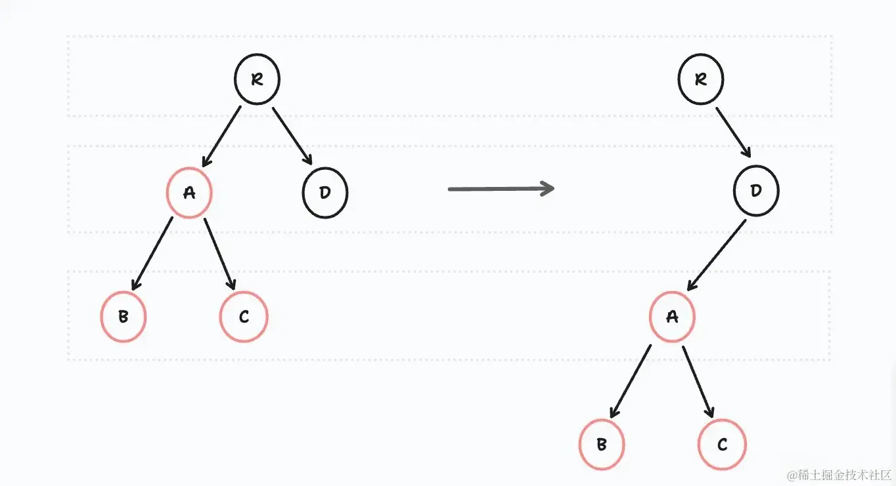

##### 2.component diff：组件之间的比较

- **对同种类型组件对比**，按照层级比较继续比较虚拟 DOM 树即可，但有种特殊的情况，当组件 A 如果变化为组件 B 的时候，有可能虚拟 DOM 并没有任何变化，所以用户可以通过 shouldComponentUpdate() 来判断是否需要更新，判断是否计算。
- **对于不同组件来说**，React 会直接判定该组件为 Dirty component（脏组件），无论结构是否相似，只要判断为脏组件就会直接替换整个组件的所有节点。
- **更新过程：** 先在新节点下面创建新的元素，创建完成后，删除老节点下面的变动元素。

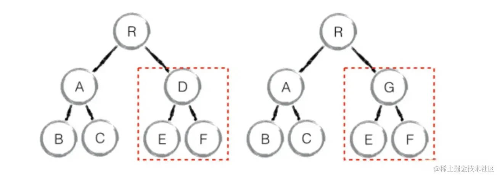

##### 3.element diff：节点比较：

element 同一层级的节点的比较规则, 根据每个节点在对应层级的唯一 key 作为标识, 并且对于同一层级的节点操作只有 3 种, 分别为 INSERT_MARKUP(插入)MOVE_EXISTING(移动)REMOVE_NODE(删除)

- **插入（INSERT_MARKUP）:** 如果是全新的节点，需要对新节点执行插入操作。
- **移动（MOVE_EXISTING）:** 新节点某个类型组件或元素节点存在旧节点里，通过 key 来进行直接移动复用。
- **删除（REMOVE_NODE）:** 旧节点中某个组件或节点类型在新节点中也有，但对应的 element 不同则不能直接复用和更新，需要执行删除操作，或者旧组件或节点不在新节点里的，也需要执行删除操作。

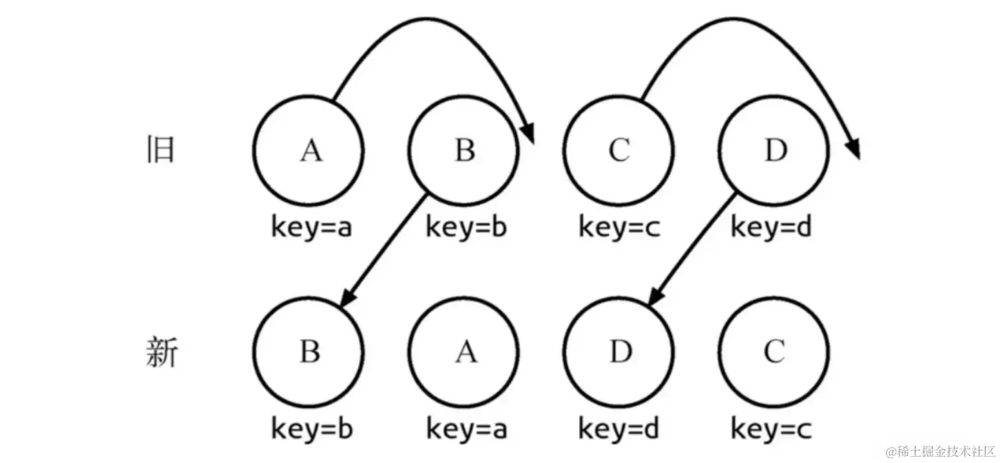 **注意事项：**

1. key 的值必须保证 唯一 且 稳定, 有了 key 属性后, 就可以与组件建立了一种对应关系, react 根据 key 来决定是销毁还是重新创建组件, 是更新还是移动组件。
2. index 的使用存在的问题: 大部分情况下可能没有啥问题, 但是如果涉及到数据变更(更新、新增、删除), 这时 index 作为 key 会导致展示错误的数据, 其实归根结底, 使用 index 的问题在于两次渲染的 index 是相同的, 所以组件并不会重新销毁创建, 而是直接进行更新。

### 九、JSX 本质是什么？

#### 1.概念：

JSX 是** JavaScript 的扩展 **，浏览器没办法解析原始的 JSX 代码，需要通过**Babel 转译**，Babel 会把 JSX 中标签都转换为 React.createElement 函数调用，JSX 就是 React.createElement 函数调用的语法糖。

#### 2.处理流程：

1. 调用 createElement，对用户传入数据进行处理，并调用 ReactElement 函数。
2. 调用 ReactElement 函数，返回 ReactElement 对象，即虚拟 DOM。
3. 调用 ReactDOM.render 方法，将虚拟 DOM 转换为真实 DOM。

#### 3.fiber 架构下，jsx 怎么转换为真实 dom？

1. **JSX 到 render function 的转换**：React 使用 JSX 来描述页面。在构建过程中，Babel 编译器将 JSX 转换为 render 函数。
2. **生成虚拟 DOM（VDOM）** ：当 render 函数执行时，它产生虚拟 DOM（VDOM）。虚拟 DOM 是对真实 DOM 的轻量级表示，用于描述页面的结构和内容。
3. **虚拟 DOM 转换为 Fiber 节点**：在 Fiber 架构中，虚拟 DOM 不会直接用于渲染。相反，它首先被转换为 Fiber 节点。这些 Fiber 节点包含了额外的信息和结构，使得 React 能够更有效地管理更新过程。
4. **协调（Reconciliation）过程**：将虚拟 DOM 转换为 Fiber 节点的过程称为协调（Reconciliation）。在协调过程中，React 会比较新旧虚拟 DOM，确定实际需要在真实 DOM 上执行的更新。
5. **Commit 阶段**：一旦所有必要的变更被确定，React 会在 Commit 阶段一次性将这些变更应用到真实的 DOM 上。这包括创建、更新或删除 DOM 节点。
6. **中断和恢复**：与早期 React 版本相比，Fiber 架构的一个关键特性是其渲染过程可以被中断和恢复。这允许 React 根据需要暂停渲染工作，以确保高优先级的任务（如用户输入）能够及时处理。

### 十、Hooks 相关专栏

#### 1.Hooks 解决了什么问题？

- **更好的逻辑组织和代码分离**：Hooks 允许开发者按照逻辑关系而非生命周期方法来组织代码，这使得相关代码更加集中和一致，提高了代码的可维护性。
- Hoc 高阶组件，render props 使得使**组件结构复杂化**。复杂组件变得难以理解。
- **在函数组件中使用状态和其他 React 特性：** 扩展了函数组件的功能。

#### 2.useMemo 和 useCallback 有什么区别？

##### useMemo

- useMemo 用于对复杂的计算结果进行记忆化。当你有一段计算逻辑，但只希望在特定的依赖项改变时才重新计算时，可以使用 useMemo。
- 它接受一个“创建”函数和一个依赖项数组。只有当依赖项发生变化时，这个“创建”函数才会被执行。
- useMemo 返回的是“创建”函数的返回值。

```scss
sconst computedValue = useMemo(() => computeExpensiveValue(a, b), [a, b]);
```

##### useCallback

- useCallback 用于对函数本身进行记忆化。当你将函数作为 props 传递给子组件，或者在依赖于函数的 useEffect 中使用函数时，使用 useCallback 可以防止组件不必要的重新渲染。
- 它接受一个内联函数和一个依赖项数组。只有当依赖项发生变化时，这个函数才会被重新创建。
- useCallback 返回的是记忆化的函数本身。

```html
const memoizedCallback = useCallback(() => { return doSomething(a, b); }, [a,
b]);
```

#### 3.useEffect 和 useLayoutEffect 有什么区别?

- useEffect 的执行时机是组件渲染到屏幕(render)之后延迟执行，而 useLayoutEffect 的执行时机是在所有的 DOM 变更之后同步调用 effect。
- useEffect 中的延迟执行，指的是 effect 会在组件渲染任务调度函数结束后，再单独调用一次任务调度函数，好处是，effect 的调用可以单独进行，不会加长组件渲染的任务时间，也就不会**阻碍组件的渲染**了。
- useLayoutEffect 的同步，但它在 DOM 更新完成后立即同步执行，也就是在浏览器进行任何**绘制之前**。这意味着你可以在浏览器绘制前读取布局并同步重新渲染。由于 useLayoutEffect 会阻塞浏览器的绘制，不当使用可能会导致性能问题。

总结来说，两者的主要区别在于**执行时机**：useEffect 在所有的 DOM 更改之后**异步执行**，**不会阻塞**页面渲染，而 useLayoutEffect 则在 DOM 更新之后立即**同步执行**，适用于对 DOM 布局和样式有影响的操作。在大多数情况下，useEffect 已足够使用，但在需要同步更改 DOM 或者避免闪烁时，应该使用 useLayoutEffect。

#### 4.useEffect：执行副作用：

使用方法：

- **副作用函数**：在组件渲染到屏幕之后执行。
- **依赖项数组**：指定了 useEffect 执行的依赖。如果依赖项没有改变，副作用函数在重新渲染时不会再次执行。

```scss
suseEffect(() => {
  fetch('some-api').then(response => {
    // 处理响应
  });
}, []); // 空数组表示只在组件挂载时执行一次
```

- 如果不传递第二个参数（依赖项数组），副作用函数将在每次渲染后都执行。
- 如果依赖项数组为空（[]），这意味着副作用函数仅在组件第一次渲染（挂载）后执行一次，并且在组件卸载时执行清理（如果提供了清理函数）
- 如果依赖项数组中包含变量或属性，副作用函数将在这些依赖项改变时执行。

#### 5.useEffect 是怎么判断依赖项变化的？

useEffect 的依赖项是使用了 === 全等符号来进行判断的，如果依赖项是数组或者对象，即使值没有变化，引用地址也会变化，所以每次判断的结果都不一样，就会每次都会调用回调函数了。 由于这种**浅比较**的机制，当使用对象或数组作为依赖项时，需要特别注意。如果这些对象或数组在每次组件渲染时都被重新创建，即使它们包含的数据实际上没有变化，useEffect 也会重复执行。为了避免这种情况，可以使用 useMemo 或 useCallback 来缓存这些对象或函数，以确保它们的引用在渲染之间保持不变。

#### 6.useState 为什么返回数组而不是对象？

如果 useState 返回的是数组，你可以按照自己的想法对变量进行命名，代码看起来也会更加干净。而如果是对象，你的命名必须要和 useState 内部实现返回的对象同名，比较麻烦，而且如果你要多次使用 useState ，就必须得重命名返回值。 **避免解构时的命名冲突、灵活的命名避免记忆负担、遵循 Hooks 设计的简洁性**

#### 7.useState 和 useReducer 有啥区别？

- useState 和 useReducer 都是用于函数组件内部定义状态的，区别在于，useState 用于简单的状态管理和局部状态更新，而 useReducer 用于复杂的状态逻辑和全局状态管理。
- useState 实际是一个自带了 reducer 功能的 useReducer 语法糖。
- 当你使用 useState 时，如果 state 没有发生变化，那么组件就不会更新。而使用了 useReducer 时，在 state 没有发生变化时，组件依然会更新。大家在使用时候，千万要注意这点的区别。

案例：

```javascript
import React, { useReducer } from "react";

// 定义 reducer 函数
const countReducer = (state, action) => {
	switch (action.type) {
		case "INCREMENT":
			return { count: state.count + 1 };
		case "DECREMENT":
			return { count: state.count - 1 };
		default:
			return state;
	}
};

function Counter() {
	// 使用 useReducer 初始化状态和派发动作函数
	const [state, dispatch] = useReducer(countReducer, { count: 0 });
	return (
		<div>
			<p>Count: {state.count}</p>
			<button onClick={() => dispatch({ type: "INCREMENT" })}>增加</button>
			<button onClick={() => dispatch({ type: "DECREMENT" })}>减少</button>
		</div>
	);
}

export default Counter;
```

#### 8.setState 到底是同步还是异步？

- React 18 之前，React 采用了一种同步和异步处理的机制，进入 React 调度流程的操作是异步处理，包括合成事件，而未进入调度流程的原生事件（如 setTimeout、setInterval）是同步处理。这种同步处理方式可能会导致性能浪费，因为多次调用 setState 会重复触发多次渲染，即使只需要渲染最后一次的结果。
- 从 React 18 开始，通过使用 createRoot 创建应用，所有事件都会自动进行批量处理，而不再区分同步和异步。这意味着无论是合成事件还是原生事件，都会进入 React 的调度流程，以实现性能的优化。但如果仍然使用 render 方法进行渲染，事件处理流程仍然与 React 18 之前的机制相同，可能会导致不必要的性能问题。react18 引入了 Automatic Batching(自动批处理机制)。

#### 9.setState 调用的原理:

1. 调用 setState 入口函数，入口函数类似一个**分发器**，根据入参不同，将其分发到不同的功能函数中。
2. enqueueSetState 方法将新的 state 放进组件的状态队列里，并调用 enqueueUpdate 来处理将要更新的实例对象；
3. 调用 enqueueUpdate 函数执行更新。该函数中有个关键对象：batchingStrategy，该对象所具备的 isBatchingUpdates 属性直接决定了当下是要走更新流程，还是应该排队等待；如果轮到执行，就调用 batchedUpdates 方法来直接发起更新流程。

#### 10.setState 的第二个参数作用是什么？

setState 的第二个参数是一个可选的回调函数。这个回调函数将在组件重新渲染后执行。等价于在 componentDidUpdate 生命周期内执行。

#### 11.useRef：在多次渲染之间共享数据:

**定义：** 我们可以把 useRef 看作是在函数组件之外创建的一个**容器空间**。在这个容器上，我们可以通过唯一的 current 属设置一个值，从而在函数组件的**多次渲染之间共享**这个值。

- 使用 useRef 保存的数据一般是和 UI 的渲染无关的，因此当 ref 的值发生变化时，是不会触发组件的重新渲染的，这也是 useRef 区别于 useState 的地方。
- 除了存储跨渲染的数据之外，useRef 还有一个重要的功能，就是保存某个 DOM 节点的引用。

#### 12.useContext：定义全局状态

Context 提供了一个方便在多个组件之间共享数据的机制。 **缺点：**

- **会让调试变得困难**，因为你很难跟踪某个 Context 的变化究竟是如何产生的。
- **让组件的复用变得困难**，因为一个组件如果使用了某个 Context，它就必须确保被用到的地方一定有这个 Context 的 Provider 在其父组件的路径上。

#### 13.React18 中为什么要用 createRoot 代替 render？

1. **优化性能**：createRoot 为 React 引入的并发特性打下了基础，使得 React 可以更加智能地调度和优化渲染过程。
2. **更好的错误处理和警告**：新的渲染器提供了更好的错误处理和警告机制，有助于识别和解决开发中的问题。

#### 14.React Hook 的使用限制有哪些？为什么要加这些限制？

限制:

- **只能在函数组件的最顶层调用 Hooks：** 不能在循环、条件语句或嵌套函数内调用 Hooks。这是为了确保 Hooks 在每次组件渲染时都以相同的顺序被调用，这对于 React 正确地追踪 Hook 状态非常重要。
- **只能在 React 函数组件或自定义 Hooks 中调用 Hooks：** 不应在普通的 JavaScript 函数中调用 Hooks。这是为了确保你只在 React 的上下文中使用 Hooks，从而使得状态管理和副作用的处理符合 React 的模式。

为什么要加这些限制？ React 中每个组件都有一个对应的 FiberNode 对象，这个对象上有个属性叫 memoizedState，在函数组件中，fiber.memoizedState 存储的就是**Hooks 单链表**，单链表中每个 hook 节点没有名字和 key，只能通过顺序来记录他们的唯一性。 如果在循环、条件或者嵌套中使用 hook，当组件更新时，这个 hooks 顺序会乱套，单链表的稳定性就破坏了。 总结：

- **无命名和 Key**: Hooks 在单链表中是没有名字和 key 的，它们完全依赖于声明的顺序来维持唯一性和状态的连续性。
- **顺序依赖**: React 依赖于 Hooks 被调用的顺序来正确地映射和更新状态。这个顺序在组件的多次渲染之间应该是一致的。

### 十一、React 如何加载异步组件

使用 React.lazy 和 Suspense：

1. **React.lazy:** 这是一个函数，允许你定义一个动态加载的组件。它接收一个函数，这个函数必须调用 **import()** ，返回一个 Promise，该 Promise 需要 resolve 一个 default export 的 React 组件。
2. **Suspense**: Suspense 组件用于包裹懒加载的组件。它允许你指定一个加载指示器（比如一个 spinner），这个指示器会在懒加载的组件被加载和渲染之前显示。。。。

```javascript
import React, { Suspense } from "react";

const LazyComponent = React.lazy(() => import("./LazyComponent"));

function App() {
	return (
		<div>
			<Suspense fallback={<div>Loading...</div>}>
				<LazyComponent />
			</Suspense>
		</div>
	);
}
```

### 十二、React 事件系统

#### 1.react 为什么需要合成事件？

- **跨浏览器兼容**：合成事件首先抹平了浏览器之间的兼容问题，另外这是一个跨浏览器原生事件包装器，赋予了跨浏览器开发的能力；
- **性能优化**：对于原生浏览器事件来说，浏览器会给监听器创建一个事件对象。如果你有很多的事件监听，那么就需要分配很多的事件对象，造成高额的内存分配问题。**React 通过合成事件实现了事件委托机制，** 对于合成事件来说，有一个事件池专门来管理它们的创建和销毁，当事件需要被使用时，就会从池子中复用对象，事件回调结束后，就会销毁事件对象上的属性，从而便于下次复用事件对象 **。**

#### 2.react 合成事件特点：

1. 我们在 jsx 中绑定的事件(demo 中的 handerClick，handerChange),根本就没有注册到真实的 dom 上。是绑定在 document 上统一管理的。
2. 真实的 dom 上的 click 事件被单独处理,已经被 react 底层替换成空函数。
3. react 并不是一开始，把所有的事件都绑定在 document 上，而是采取了一种按需绑定，比如发现了 onClick 事件,再去绑定 document click 事件。

#### 3.react 事件原理：

**react 对事件是如何合成的**:构建初始化 React 合成事件和原生事件的对应关系，合成事件和对应的事件处理插件关系。 react 事件是怎么绑定的（在 react 中，我们写了一个 button，上面绑定了一个 click 事件，请问 react 是怎么处理的？）: 第一步，会将你写的 click 事件，绑定到 button 对应的 fiber 树上，就像这样：

```css
// button 对应 fiber
memoizedProps = {
   onClick:function handerClick(){},
   className:'button'
}
```

第二步，进入 diff 阶段，会先判断该事件是不是合成事件，如果是合成事件，则会将用户写的事件向 document 注册。 第三步，在注册事件监听器函数中，先找到 React 合成事件对应的原生事件集合，比如 onClick -> ['click'] , onChange -> [blur , change , input , keydown , keyup]，然后遍历依赖项的数组，绑定事件。 第四步，统一对所有事件进行处理，添加事件监听器 addEventListener，绑定对应事件。 **react 事件触发流程：**

1. 首先通过统一的事件处理函数 dispatchEvent,进行批量更新 batchUpdate。
2. 然后执行事件对应的处理插件中的 extractEvents，合成事件源对象,每次 React 会从事件源开始，从上遍历类型为 hostComponent 即 dom 类型的 fiber,判断 props 中是否有当前事件比如 onClick,最终形成一个事件执行队列，React 就是用这个队列，来模拟事件捕获->事件源->事件冒泡这一过程。
3. 最后通过 runEventsInBatch 执行事件队列，如果发现阻止冒泡，那么 break 跳出循环，最后重置事件源，放回到事件池中，完成整个流程。 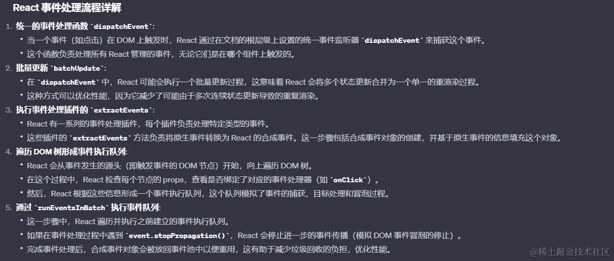

#### 4.react 17 对事件系统的改变：

1. **事件绑定到根容器上:** 事件统一绑定 container 上，ReactDOM.render(app， container);而不是 document 上，有利于多个 React 版本共存，例如微前端的场景。 2.**原生捕获事件的支持:** 支持了原生捕获事件的支持， 对齐了浏览器原生标准。同时 onScroll 事件不再进行事件冒泡。onFocus 和 onBlur 使用原生 focusin， focusout 合成。
2. **取消事件池** React 17 取消事件池复用，也就解决了在 setTimeout 打印，找不到 e.target 的问题。

### 十三、React-fiber

#### 1.什么是并发？和并行有啥区别？

- 并发：具备处理多个任务的能力，但不是在同一时刻处理，每次只会处理一个任务，交替处理多个任务。
- 并行：具备处理多个任务的能力，同一时刻可以处理多个任务。

具体举例：

- 你吃饭吃到一半，电话来了，你一直到吃完了以后才去接，这就说明你不支持并发也不支持并行。
- 你吃饭吃到一半，电话来了，你停了下来接了电话，接完后继续吃饭，这说明你支持并发。
- 你吃饭吃到一半，电话来了，你一边打电话一边吃饭，这说明你支持并行。

#### 2.为什么要推出 Fiber 架构？

Fiber 是对 React 核心算法（即调和过程）的重写。 首先 React 组件的渲染主要经历两个阶段:

- 协调阶段(Reconciler): 这个阶段 React 用新数据生成新的虚拟 DOM, 遍历新旧虚拟 DOM, 然后通过 Diff 算法, 快速找出需要更新的元素, 放到更新队列中去
- 渲染阶段(Renderer): 这个阶段 React 根据所在的渲染环境, 遍历更新队列, 将对应元素更新(在浏览器中, 就是更新对应的 DOM 元素)

###### React 传统的协调机制

在引入 Fiber 之前，React 使用的是一种递归的方式来遍历组件树，对比旧的虚拟 DOM 和新的虚拟 DOM 来确定哪些部分需要更新。这个过程称为协调（Reconciliation）。虽然虚拟 DOM 提高了更新的效率，但这种递归处理方式有一些缺点：

1. **无法中断**：一旦开始，整个虚拟 DOM 的对比过程就必须一气呵成，无法中断。对于大型应用，这可能导致主线程被长时间占用，从而影响到用户的交互体验。
2. **UI 阻塞问题**：由于无法中断，所有的更新都有相同的优先级，React 无法优化那些更紧急的任务（如动画或用户输入）。

**Fiber 是 React 16 中采用的新协调（reconciliation）引擎**，主要目标是支持虚拟 DOM 的渐进式渲染。 Fiber 将原有的 Stack Reconciler 替换为 Fiber Reconciler，提高了复杂应用的可响应性和性能。主要通过以下方式达成目标：

- 对大型复杂任务的分片。
- 对任务划分优先级，优先调度高优先级的任务。
- 调度过程中，可以对任务进行**暂停、挂起、恢复**等操作。

参考：[《React Fiber 详细解析》](https://link.juejin.cn?target=https%3A%2F%2Fzhuanlan.zhihu.com%2Fp%2F424967867)

#### 3.Fiber 和虚拟 DOM 的区别？

每一个 DOM 节点对应一个 Fiber 对象，Fiber 通过多向链表树的形式来记录节点之间的关系，它与传统的虚拟 DOM 最大的区别是多加了几个属性，通过这种链表的形式，可以很轻松的找到每一个节点的下一个节点或上一个节点，更好的去实现时间切片功能。 React** 用空间换时间**，更高效的操作可以方便根据优先级进行操作。同时可以根据当前节点找到其他节点，在下面提到的挂起和恢复过程中起到了关键作用。

- return：向上链接整颗树
- child：向下链接整棵树
- sibling：横向链接整颗树

链表的好处：

- 操作更高效，比如顺序调整、删除，只需要改变节点的指针指向就好了。
- 不仅可以根据当前节点找到下一个节点，在多向链表中，还可以找到他的父节点或者兄弟节点。

链表的缺点：

- 比顺序结构数据更占用空间，因为每个节点对象还保存有指向下一个对象的指针。
- 不能自由读取，必须找到他的上一个节点。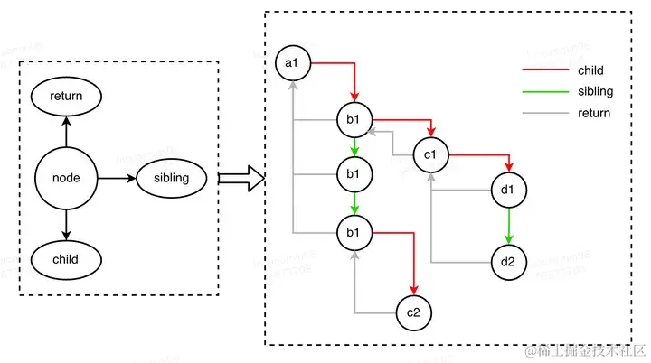

关键词：**Fiber 节点、链表结构、任务的中断与恢复** **区别总结：**

1. **数据结构**：在传统的虚拟 DOM 中，React 使用递归的方式处理组件树。这种方式虽然简单，但它不能中断。Fiber 架构通过链表和可中断的任务单元，提供了更灵活的更新机制。
2. **优先级调度**：Fiber 架构允许 React 对不同的更新任务分配不同的优先级。高优先级的任务（如用户输入）可以打断低优先级的任务（如后台数据同步），从而提高应用的响应性。
3. **空间换时间**：虽然 Fiber 节点的链表结构比传统虚拟 DOM 更占用空间（因为每个节点都需要额外的指针），但它提供了更高效的操作方式，尤其是在处理大量节点和复杂更新时。

#### 4.Scheduler（调度器）是什么？

参考[《自底向上盘一盘 Scheduler》](https://juejin.cn/post/7145359419915075615) **Fiber 架构中的 Scheduler（调度器**），React 在 setState 后不再直接启动“协调”过程，而是把本次更新注册到 Scheduler，再由 Scheduler 根据浏览器剩余空闲时间、优先级等因素派发给 Reconciler（协调器），并通过中断查询控制协调的中断重启。（协调就是我们说的包含 Diffing 的虚拟 DOM 构建计算过程）

#### 5.Scheduler（调度器）有哪些模块？

###### 5.1 SchedulerHostConfig：基于浏览器 API，实现时间片管理，有两个关键方法，主要解决两个问题：

1. 浏览器什么时候有空？有空的话，通知我
2. 什么时候让出线程给浏览器？ **requestHostCallback**：注册一个在帧间空闲时间执行的回调函数（及其过期时间），并可以通过 cancelHostCallback 取消它。
   1. 因 requestIdleCallback**兼容性堪忧**，所以用 MessageChannel 的空闲回调模拟实现
   2. 可能当前帧已经不够执行回调，就需要挪到下一帧。为此引入了 requestAnimationFrame API 来实现

**shouldYieldToHost**：随时判断是否需要让出线程（避免卡帧）

1. React 能相对准确获取到当前帧的结束时间戳，如果当前时间超过帧结束时间，说明已经卡到帧了，需要让出。

###### 5.2Scheduler 调度实现，主要做以下事情：

1. 维护一个任务池
2. 定义应用优先级决定任务池的调用顺序
3. 派发任务（调 requestHostCallback）
4. 及时中断（在 shouldYieldToHost 时终止派发）

###### 5.3React 优先级管理： 两套优先级体系 一套转换体系

参考《[React 中的优先级管理](https://juejin.cn/post/6993139933573546021#heading-3)》

- **2 套优先级体系**
  1. **fiber 优先级(LanePriority)** ，位于 react-reconciler 包, 也就是 Lane(车道模型)，用来处理与 fiber 构造过程相关的优先级
     1. Lane 是对于 expirationTime 的重构，Lane 类型被定义为二进制变量, 利用了位掩码的特性, 在频繁运算的时候占用内存少, 计算速度快。参考=》[React 算法之位运算](https://link.juejin.cn?target=https%3A%2F%2Fgithub.com%2F7kms%2Freact-illustration-series%2Fblob%2Fv17.0.2%2Fdocs%2Falgorithm%2Fbitfield.md%23react-%E7%AE%97%E6%B3%95%E4%B9%8B%E4%BD%8D%E8%BF%90%E7%AE%97)
     2. lane 可以简单理解为一些数字，数值越小，表明优先级越高。但是为了计算方便，采用二进制的形式来表示。
        1. 场景题：
        2. 先点击 B 按钮，然后快速点击 A 按钮，请问 Reatc 对这段代码的更新流程是什么样？

```css
<p>You clicked {count} times</p>
  <button onClick={() => setCount(count + 1)}>
A按钮
  </button>
  <button onClick={() => startTransition(() => { setCount(count + 1) })}>
B按钮
  </button>

```

假设 B 按钮先点击， B 更新开始，中途触发了 A 按钮点击，进而触发 A 更新。那么此时就会通过 lane 进行对比，A 按钮是属于紧急更新，而 B 按钮的 startTransition 是过渡更新，紧急更新优先级高于过渡更新。此时会中断 B 更新，开始 A 更新。直到 A 更新完成时，再重新开始 B 更新。 （startTransition 是 React 18 中引入的一个新特性，用于标记更新的优先级较低，允许 React 延迟这些更新的处理以保持应用的响应性。） **React17 Lanes 模型相比 React16 expirationTime 模型有什么优势？** 1.expirationTimes 模型只能区分是否>=expirationTimes 决定节点是否更新 **。** 2.lanes 模型可以选定一个更新区间，并且动态的向区间中增减优先级，可以处理更细粒度的更新。

```html
// 判断: 单task与batchTask的优先级是否重叠 //1. 通过expirationTime判断 const
isTaskIncludedInBatch = priorityOfTask >= priorityOfBatch; //2. 通过Lanes判断
const isTaskIncludedInBatch = (task & batchOfTasks) !== 0; //
当同时处理一组任务, 该组内有多个任务, 且每个任务的优先级不一致 // 1.
如果通过expirationTime判断. 需要维护一个范围(在Lane重构之前,
源码中就是这样比较的) const isTaskIncludedInBatch = taskPriority <=
highestPriorityInRange && taskPriority >= lowestPriorityInRange; //2.
通过Lanes判断 const isTaskIncludedInBatch = (task & batchOfTasks) !== 0;
```

1. **调度优先级(SchedulerPriority)** : 位于 scheduler 包，用来处理与 scheduler 调度中心相关的优先级：
   1. 定义了五种优先级，以及它们对应的过期时间

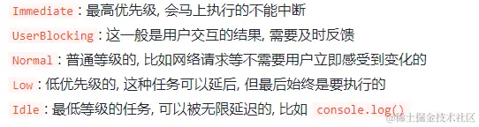

- 1 套转换体系：
  - **优先级等级(ReactPriorityLevel)** : 位于 react-reconciler 包中的 SchedulerWithReactIntegration.js, 负责 fiber 优先级和调度优先级的转换，好实现协同处理。

#### 6.React fiber 是如何实现时间切片的？

###### 6.1 概念：

本质上是将渲染任务拆分为多个小任务，以便提高应用程序的响应性和性能，主要依赖于两个功能：任务分割和任务优先级。

- **任务分割（Time Slicing）** ：任务分割是指将一个大的渲染任务切割成多个小任务，每个小任务只负责一小部分 DOM 更新。React Fiber 使用 Fiber 节点之间的父子关系，将一个组件树分割成多个”片段“，每个“片段”内部是一颗 Fiber 子树，通过在 Fiber 树上进行遍历和操作，实现时间切片。
- **任务优先级（Prioritization）** ：React Fiber 提供了一套基于优先级的算法来决定哪些任务应该先执行，哪些任务可以放到后面执行。React Fiber 将任务分成多个优先级级别，较高优先级的任务在进行渲染时会优先进行，从而确保应用程序的响应性和性能。

###### 6.2 基本流程：

1. React Fiber 会将渲染任务划分成多个小任务，每个小任务一般只负责一小部分 DOM 更新。
2. React Fiber 将这些小任务保存到任务队列中，并按照优先级进行排序和调度。
3. 当浏览器处于空闲状态时，React Fiber 会从任务队列中取出一个高优先级的任务并执行，直到任务完成或者时间片用完。
4. 如果任务完成，则将结果提交到 DOM 树上并开始下一个任务。如果时间片用完，则将任务挂起，并将未完成的工作保存到 Fiber 树中，返回控制权给浏览器。
5. 当浏览器再次处于空闲状态时，React Fiber 会再次从任务队列中取出未完成的任务并继续执行，直到所有任务完成。

###### 6.3React 实现时间切片的发展历史

1. **使用 requestIdleCallback：**
   - 初始尝试使用 requestIdleCallback 来实现时间切片。
   - 问题：
     - 不稳定：一帧的执行时间存在偏差，导致工作执行不稳定。
     - 兼容性：不同浏览器（特别是 Safari）支持不佳。
2. **初步方案：requestAnimationFrame + MessageChannel：**
   - 通过 requestAnimationFrame 来计算一帧的过期时间。
   - 使用 MessageChannel 创建宏任务，确保任务在下次事件循环中执行，从而不阻塞页面渲染。
   - 问题：
     - 过于依赖显示器的刷新率，存在设备依赖性和不稳定性。
3. **新方案：高频短间隔调度：**
   - 利用宏任务机制，以高频（5ms 间隔 setTimeout(()=>{},5)）对任务进行切片执行。
   - 目的是在每个宏任务执行间让出控制权给浏览器，以便进行必要的渲染工作。
   - 选择宏任务而非微任务，因为宏任务允许在每次事件循环后将控制权交还给浏览器。
   - API 执行优先级：
     - 首选 setImmediate（仅在特定环境下可用）。
     - 其次选择 MessageChannel。
     - 兜底方案为 setTimeout。
     - 优先使用 MessageChannel 而不是 setTimeout 的原因是 MessageChannel 能更快地被触发，相较于 setTimeout 即使设置为 0，执行间隔也更短。

### 十四、React 中两大工作循环 scheduler 任务调度循环和 fiber 构造循环有什么区别？

**区别：**

1. scheduler 任务调度循环源码位于 scheduler.js，控制了所有任务的调度，包括 fiber 构造循环，fiber 构造循环源码位于 ReactFiberWorkLoop.js，控制 fiber 的构造。
2. 「任务调度循环」是以「最小顶堆」为数据结构,堆顶是优先级最高的任务,循环执行堆的顶点, 直到堆被清空.
3. 任务调度循环的逻辑偏向宏观, 它调度的是每一个任务(task), 而不关心这个任务具体是干什么的，具体任务就是调用函数去执行「fiber 的构造循环」和「消费任务调度循环的任务」 **联系：** fiber 构造循环是任务调度循环中的任务的一部分.它们是从属关系，每个任务都会重新构造一个 fiber 树.更具体一点,fiber 构造循环(ReactFiberWorkLoop())被封装到了一个 task 里,给到任务调度循环,然后由任务调度循环决定什么时候执行.

### 十五、React 18 都新增了哪些新特性和新 API？

#### 1.新特性：

- **ReactDOM.createRoot：启用 React 18 中的并发功能(concurrency 并发渲染)。**
- **setState 自动批处理（Automatic Batching**）：
  1. 在 React 18 之前，我们只在 React 事件处理函数 中进行批处理更新。默认情况下，在 promise、setTimeout、原生事件处理函数中、或任何其它事件内的更新都不会进行批处理。
  2. 在 18 之后，任何情况都会自动执行批处理，多次更新始终合并为一次。
- **flushSync：**
  - 批量更新是一个破坏性的更新，如果想退出批量更新，可以使用 flushSync。
- **关于 React 组件的返回值：**
  - 在 React 17 中，如果你需要返回一个空组件，React 只允许返回 null。如果你显式的返回了 undefined，控制台则会在运行时抛出一个错误。
  - 在 React 18 中，不再检查因返回 undefined 而导致崩溃。既能返回 null，也能返回 undefined（但是 React 18 的 dts 文件还是会检查，只允许返回 null，你可以忽略这个类型错误）。
- **Strict Mode：**
  - 当你使用严格模式时，React 会对每个组件进行两次渲染，以便你观察一些意想不到的结果。在 React 17 中，取消了其中一次渲染的控制台日志，以便让日志更容易阅读。为了解决社区对这个问题的困惑，在 React 18 中，官方取消了这个限制。如果你安装了 React DevTools，第二次渲染的日志信息将显示为灰色，以柔和的方式显示在控制台。
- **去掉了对 IE 浏览器的支持**，react18 引入的新特性全部基于现代浏览器，如需支持需要退回到 react17 版本。

#### 2.新 API：

- **useId:** 同一个组件在客户端和服务端生成相同的唯一的 ID。
- **Suspense：** 在 v16/v17 中，Suspense 主要是配合 React.lazy 进行 code spliting。在 v18 中，Suspense 加入了 fallback 属性，用于将读取数据和指定加载状态分离，可以实现自定义 loading 内容，数据加载成功后，loading 自动消失。
- **useDeferredValue：**
  - 可以让我们延迟渲染不紧急的部分，类似于防抖但没有固定的延迟时间，延迟的渲染会在紧急的部分先出现在浏览器屏幕以后才开始，并且可中断不会阻塞用户输入 **。**
  - 场景：一遍输入 input，一边根据输入内容渲染结果，传统方案中渲染列表会占据线程，阻塞用户输入，形成卡顿，useDeferredValue 会降低优先级，实现渲染列表不卡顿 input 输入。
- **useTransition：** 用于改进用户体验，特别是在执行可能导致界面延迟的操作。
- **useSyncExternalStore：** 能够通过强制同步更新数据让 React 组件在 CM 下安全地有效地读取外接数据源。
- **useInsertionEffect：** 这个 Hooks 执行时机在 DOM 生成之后，useLayoutEffect 之前，它的工作原理大致和 useLayoutEffect 相同，只是此时无法访问 DOM 节点的引用，一般用于提前注入 脚本。

##### 15.2.1. 什么是 Automatic Batching 机制？

答：当连续两个 state 发生变更的时候，放在一起执行处理，这样页面只更新渲染一次。在 18 之前也有类似的机制，不过是只在 react 合成事件中有效，在 setTimeout，promise，自定义事件中无效。现在在 18 版本中，可以全面生效。

##### 15.2.2. 什么是 concurrency 并发渲染？

答：concurrency 是一种理念，它把用户的行为分为低优先级和高优先级，这样就会有更多的 cpu 资源来优先渲染高优先级的任务。可以通过 useTransition 这个 hook 对执行的函数进行降级处理，或者通过 useDeferredValue 把数据带入到慢速渲染通道中。

##### 15.2.3 useTranstion 和 useDeferredValue 的区别？

答：useTranstion 是处理一个执行的函数或多个执行的函数，使之降级。useDeferredValue 是把数据进入到慢速渲染通道中，只对单个数据进行处理。

### 十六、Vue 和 React 的区别

**相同点：**

1. 都使用 Virtural DOM。
2. 都使用组件化思想，流程基本一致。
3. 都是响应式，数据驱动视图。
4. 都有成熟的社区，都支持服务端渲染。

**不同点：**

- **核心思想不同：**
  - Vue 推崇灵活易用（渐进式开发体验），数据可变，双向数据绑定（依赖收集）。
  - React 推崇函数式编程（纯组件），数据不可变以及单向数据流。
- **响应式原理不同：**
- **vue:**
  1. Vue 依赖收集，自动优化，数据可变。
  2. Vue 递归监听 data 的所有属性,直接修改。
  3. 当数据改变时，自动找到引用组件重新渲染。
- **react:**
  1. React 基于状态机，手动优化，数据不可变，需要 setState 驱动新的 State 替换老的 State。
  2. 当数据改变时，以组件为根目录，默认全部重新渲染。
- **diff 算法不同：**
  - **相似点:**
    1. 都是基于两个假设（使得算法复杂度降为 O(n)）：
    2. 不同的组件产生不同的 DOM 结构。当 type 不相同时，对应 DOM 操作就是直接销毁老的 DOM，创建新的 DOM。
    3. 同一层次的一组子节点，可以通过唯一的 key 区分。
  - **源码实现不同:**
    - Vue 基于 snabbdom 库，它有较好的速度以及模块机制。Vue Diff 使用双向链表，边 patch，边更新 DOM。（v2 使用双向链表，v3 使用最长递增子序列）
    - React 主要使用 diff 队列保存需要更新哪些 DOM，得到 patch 树，再统一操作批量更新 DOM。(**仅向右移动**)

> 参考文章： [Vue2 和 Vue3 和 React 三者的 diff 算法有什么区别？](https://juejin.cn/post/7109104086049357861?from=search-suggest) [认识 React、Vue2、Vue3 三者的 diff 算法与对比](https://juejin.cn/post/7318446267033452570?searchId=2024011810193173928CB3D7F2AF837C9D#heading-4)

### 十七、为什么 React 不能像 Vue 一样，渲染时候精确到当前组件的粒度？

- 在 react 中，组件的状态是不能被修改的，setState 没有修改原来那块内存中的变量，而是去新开辟一块内存； 而 vue 则是直接修改保存状态的那块原始内存。(不可变数据 VS 可变数据)
- react 中，调用 setState 方法后，会自顶向下重新渲染组件，自顶向下的含义是，该组件以及它的子组件全部需要渲染；而 vue 使用 Object.defineProperty（vue@3 迁移到了 Proxy）对数据的设置（setter）和获取（getter）做了劫持，也就是说，vue 能准确知道视图模版中哪一块用到了这个数据，并且在这个数据修改时，告诉这个视图，你需要重新渲染了。
- 所以当一个数据改变，react 的组件渲染是很消耗性能的——父组件的状态更新了，所有的子组件得跟着一起渲染，它不能像 vue 一样，精确到当前组件的粒度。

### 十八、说一说你对 React 中 Fragment 的理解？

在 React 中，组件返回的元素只能有一个根元素，Fragment 它允许组件返回多个元素而不需要额外的父 DOM 元素来包裹它们。这个特性在 React 16 中被引入，为组件的渲染提供了更多的灵活性和效率。

###### Fragment 的作用

1. **避免额外的 DOM 元素**：

   - 在使用 Fragment 之前，如果你想从一个组件返回多个元素，你需要用一个额外的 DOM 元素（如

     ）来包裹它们。这可能导致不必要的 DOM 层级和性能问题。

   - 使用 Fragment，你可以返回一个元素列表而不添加额外的 DOM 节点。这在某些布局中非常有用，尤其是当你不希望因为额外的包裹元素而破坏 CSS 样式或布局时。

2. **简化 DOM 结构**：

   - Fragment 帮助保持 DOM 结构的简洁和清晰，这对于维护和理解代码是非常重要的。

3. **关键列表渲染**：

   - 在渲染列表时，Fragment 可以用来避免额外的包裹元素，同时仍然可以在列表项周围添加 key 属性，这对于 React 的列表渲染性能优化是重要的。

### 十九、对 React context 的理解

当你不想在组件树中通过逐层传递 props 或者 state 的方式来传递数据时，可以使用 Context 来实现跨层级的组件数据传递。 当 React 组件提供的 Context 对象其实就好比一个提供给子组件访问的作用域，而 Context 对象的属性可以看成作用域上的活动对象。由于组件 的 Context 由其父节点链上所有组件通 过 getChildContext（）返回的 Context 对象组合而成，所以，组件通过 Context 是可以访问到其父组件链上所有节点组件提供的 Context 的属性。

### 二十、 类组件与函数组件有什么异同？

###### 相同：

组件是 React 的最小编码单位，所以无论是函数组件还是类组件，在使用方式和最终呈现效果上都是完全一致的。

###### 不同：

1. 它们在开发时的心智模型上却存在巨大的差异。类组件是基于面向对象编程的，它主打的是继承、生命周期等核心概念；而函数组件内核是函数式编程，主打的是 immutable、没有副作用、引用透明等特点。
2. 性能优化上，类组件主要依靠 shouldComponentUpdate 阻断渲染来提升性能，而函数组件依靠 React.memo 缓存渲染结果来提升性能。
3. 从上手程度而言，类组件更容易上手，从未来趋势上看，由于 React Hooks 的推出，函数组件成了社区未来主推的方案。
4. 类组件在未来时间切片与并发模式中，由于生命周期带来的复杂度，并不易于优化。而函数组件本身轻量简单，且在 Hooks 的基础上提供了比原先更细粒度的逻辑组织与复用，更能适应 React 的未来发展。

### 二十一、react-router 路由

##### React-Router 的实现原理是什么？

###### 客户端路由的实现思想：

1. 基于 Hash 的路由：
   - 这种路由方式利用了 URL 的 hash（#后面的部分）。
   - 当 hash 变化时，页面不会重新加载，但可以通过监听 **hashchange** 事件来响应 URL 的变化。
   - 这种方式的优点是兼容性好，适用于老旧浏览器。
2. 基于 H5 History 路由：
   - HTML5 引入了一个新的 **History** API，允许开发者直接操作浏览器的**历史记录栈**。
   - 使用 history.pushState 和 history.replaceState 方法可以改变 URL 而不重新加载页面。
   - 通过 history.go、history.forward、history.back 等 API 可以控制浏览器的历史记录导航。

###### React-Router 的实现思想：

1. 基于 History 库：
   - React Router 使用了 history 库来抽象化这些底层机制，提供了一个统一的 API。
   - 通过这个库，React Router 能够无缝地在不同类型的历史记录（hash、browser、memory）之间切换，同时磨平了浏览器之间的差异。
2. 路由匹配和渲染：
   - React Router 维护了一个路由配置的列表。
   - 每次 URL 发生变化时，React Router 会根据当前的 URL 和这个列表匹配，找到对应的组件（Component），然后进行渲染。
3. History 类型：
   - createHashHistory：用于老版本浏览器，基于 URL 的 hash 部分。
   - createBrowserHistory：用于现代浏览器，基于 HTML5 History API。
   - createMemoryHistory：主要用于非浏览器环境，如服务器端渲染（SSR）或测试，历史记录保存在内存中。

总的来说，React Router 的实现依赖于底层的** URL 变化机制**，通过 history 库对这些机制进行封装和抽象，提供了一套易用且功能强大的路由管理解决方案。无论是基于 hash 还是基于 HTML5 History API 的路由，React Router 都能够提供一致的开发体验，并且使得路由的变化和组件的渲染能够高效地协同工作。

###### react-router 里的 Link 标签和 a 标签的区别？

从最终渲染的 DOM 来看，这两者都是链接，都是 a 标签，区别是 ∶ 是 react-router 里实现路由跳转的链接，一般配合 使用，react-router 接管了其默认的链接跳转行为，区别于传统的页面跳转， 的“跳转”行为只会触发相匹配的对应的页面内容更新，而不会刷新整个页面。

### 二十二、在 react 中如何处理异常

在 React 中处理异常主要依赖于错误边界（**Error Boundary**）。错误边界是 React 组件，它可以捕获其子组件树中发生的 JavaScript 错误，并记录这些错误，并显示一个备用 UI，而不是使整个组件树崩溃。 错误边界是一个使用了 static **getDerivedStateFromError**() 或 **componentDidCatch**() 这两个生命周期方法的类组件。

```javascript
class ErrorBoundary extends React.Component {
	constructor(props) {
		super(props);
		this.state = { hasError: false };
	}

	static getDerivedStateFromError(error) {
		// 更新状态，以便下一次渲染能够显示备用UI
		return { hasError: true };
	}

	componentDidCatch(error, errorInfo) {
		// 你也可以将错误日志上报给服务器
		logErrorToMyService(error, errorInfo);
	}

	render() {
		if (this.state.hasError) {
			// 你可以渲染任何自定义的备用UI
			return <h1>出错了。</h1>;
		}

		return this.props.children;
	}
}
<ErrorBoundary>
	<MyComponent />
</ErrorBoundary>;
```

错误边界主要用于捕获以下类型的错误：

- 渲染期间的错误。
- 生命周期方法中的错误。
- 构造函数中的错误（在渲染树中）。

### 二十三、React 性能优化方案

#### 1.跳过不必要的组件更新：

- PureComponent：用于类组件中，同时对 props 和 state 的变化前和变化后的值进行浅对比，对每个 props 值进行基本的值对比，如果值类型是复杂类型，如引用类型（对象），并不会深入遍历每个属性的变化，如果都没发生变化则会跳过重渲染。
- React.memo：用于函数组件中，功能和 PureComponent 一样。
- shouldComponentUpdate：
  - 在每次渲染（render）之前被调用，并且根据该函数的返回值（true/false）来决定是否调用渲染函数（return true 触发渲染，return false 阻止渲染）。
  - 但是组件的首次渲染或者调用 forceUpdate() 方法时不会触发调用。
- 使用 useCallback 和 useMemo 缓存函数的引用或值：
  - useCallback：是 useMemo 的语法糖，是「useMemo 的返回值为函数」时的特殊情况，缓存的是函数的引用。
  - useMemo：缓存计算数据的值。
- 状态下放，缩小状态影响范围：如果一个状态只在某部分子树中使用，那么可以将这部分子树提取为组件，并将该状态移动到该组件内部。
- 列表项使用 key 属性；
- useMemo 返回虚拟 DOM：利用 useMemo 可以缓存计算结果的特点，如果 useMemo 返回的是组件的虚拟 DOM，则将在 useMemo 依赖不变时，跳过组件的 Render 阶段。
- Hooks 按需更新：
  - 如果自定义 Hook 暴露多个状态，而调用方只关心某一个状态，那么其他状态改变就不应该触发组件重新 Render。
  - [codesandbox.io/s/hooks-anx…](https://link.juejin.cn?target=https%3A%2F%2Fcodesandbox.io%2Fs%2Fhooks-anxugengxin-tinzp%3Ffile%3D%2Fsrc%2Fhooks.js)
- 使用 immutable 解决 memo 浅比较陷阱：
  - memo 使用 Object.is()进行浅比较，深拷贝又需要递归耗费性能。
  - immutable.js 会将引用对象变成一个 immutable 对象，改变某一属性的时候，会更新当前属性以及它所有的父节点属性，其余属性保持不变，实现数据复用，提高深层次比较效率。
  -

#### 2.减少提交阶段耗时：

- React 工作流提交阶段的第二步就是执行提交阶段钩子，它们的执行会阻塞浏览器更新页面。如果在提交阶段钩子函数中更新组件 State，会再次触发组件的更新流程，造成两倍耗时。
- 避免在 didMount、didUpdate、willUnmount、useLayoutEffect 和特殊场景下的 useEffect 中更新组件 State。

#### 3.前端通用优化

- debounce、throttle 优化频繁触发的回调。
- 组件按需挂载：
  - 懒加载
  - 懒渲染：当组件进入或即将进入可视区域时才渲染组件：通过 react-visibility-observer 进行监听
  - 虚拟列表：react-window

### 二十四、React 动态 import 怎么实现？

###### 动态 Import() 与 ESM

1. ESM（ECMAScript Modules）：
   - ESM 是 ECMAScript（JavaScript 标准）的官方模块系统。
   - import 语句用于导入模块中的绑定（函数、对象、原始值等）。
2. 动态 Import()：
   - 动态 import()是一种异步加载 ESM 模块的方式。
   - 它返回一个 Promise 对象，该对象解析为一个模块命名空间对象，加载完成后获取 Module 并在 then 中注册回调函数,其中包含了导入模块的所有导出。
   - 与静态 import 声明不同，动态 import()可以在代码的任何地方调用，提供更灵活的加载方式。

###### Webpack 中的 Code-Splitting

1. 检测动态 Import()：
   - 当 Webpack 构建过程中检测到 import()语句时，它会自动将相关模块作为一个新的代码块（chunk）进行处理。
   - 这意味着该模块会被分离到独立的文件中，而非包含在主 bundle 文件中。
2. 优化加载：
   - 这种代码分割的技术允许应用仅在需要时加载某些代码块，而不是一开始就加载整个应用的所有代码。
   - 这对于提高应用的初始加载速度和整体性能非常有帮助，尤其是对于大型应用。
3. 实例：

```html
import("./moduleA").then(moduleA => { // 使用模块A的代码 moduleA.doSomething();
});
```

在这个例子中，moduleA 只有在 import()调用时才会被加载。

###### 实践中的应用

在 React 等前端框架中，结合 React.lazy 和 Suspense 使用动态 import()，可以实现组件级别的懒加载，从而进一步优化应用的性能。

###### 注意事项

- 确保使用的构建工具（如 Webpack）和环境支持 ESM 和动态 import()。
- 动态导入的模块可能不会立即可用，需要处理好异步加载的状态，如加载中、加载失败等。

### 二十五、React 的 patch 流程：

1. React 新版架构新增了一个 Scheduler 调度器主要用于调度 Fiber 节点的生成和更新任务
2. 当组件更新时，Reconciler 协调器执行组件的 render 方法生成一个 Fiber 节点之后再递归的去生成 Fiber 节点的子节点
3. 每一个 Fiber 节点的生成都是一个单独的任务，会以回调的形式交给 Scheduler 进行调度处理，在 Scheduler 里会根据任务的优先级去执行任务
4. 任务的优先级的指定是根据车道模型，将任务进行分类，每一类拥有不同的优先级，所有的分类和优先级都在 React 中进行了枚举
5. Scheduler 按照优先级执行任务时，会异步的执行，同时每一个任务执行完成之后，都会通过 requestIdleCallBack 去判断下一个任务是否能在当前渲染帧的剩余时间内完成
6. 如果不能完成就发生中断，把线程的控制权交给浏览器，剩下的任务则在下一个渲染帧内执行
7. 整个 Reconciler 和 Scheduler 的任务执行完成之后，会生成一个新的 workInProgressFiber 的新的节点树，之后 Reconciler 触发 Commit 阶段通知 Render 渲染器去进行 diff 操作，也就是我们说的 patch 流程

###### 1. Scheduler（调度器）

- 任务调度：Scheduler 是 React 新架构中的一个关键部分，它负责调度组件的渲染更新任务。Scheduler 会根据任务的优先级来决定执行顺序，确保更重要的更新（如用户交互）能够优先处理。
- 优先级和车道模型：React 中的任务分为不同的优先级，这些优先级是根据所谓的“车道模型”来分类的。不同类型的更新（如同步更新、异步更新）会被分配到不同的车道，并拥有不同的优先级。

###### 2. Reconciler（协调器）

- Fiber 节点的生成：当组件状态更新时，Reconciler 开始工作，执行组件的 render 方法来生成新的 Fiber 节点。Fiber 架构允许 Reconciler 以单个任务的形式处理组件树的更新。
- 递归子节点：生成 Fiber 节点后，Reconciler 递归地处理子节点，为每个子节点创建新的 Fiber 任务。

###### 3. 任务的执行与中断

- 异步执行和中断：Scheduler 会根据优先级异步执行任务。在执行每个任务后，通过 requestIdleCallback 检查当前帧的剩余时间，如果时间不足以完成下一个任务，则该任务会被中断，控制权交回给浏览器。
- 任务继续：中断的任务会在下一个渲染帧继续执行。

###### 4. Commit 阶段

- workInProgressFiber 树：完成所有任务后，Reconciler 会生成一棵新的 workInProgressFiber 树。
- Diff 操作：在 Commit 阶段，Reconciler 通知渲染器进行 DOM 更新的 Diff 操作，即 patch 流程。这包括添加、删除或更新 DOM 节点。

###### 5. 总结

- 这个过程提高了 React 应用的性能和响应性，使其能够处理大量的更新，同时保持良好的用户交互体验。
- 通过将任务分解并利用浏览器的空闲时间，React 能够更智能地安排工作，避免长时间阻塞主线程，减少界面卡顿。

### 1.React18 有哪些更新？

- 并发模式
- 更新 render API
- 自动批处理
- Suspense 支持 SSR
- startTransition
- useTransition
- useDeferredValue
- useId
- 提供给第三方库的 Hook

### 2. JSX 是什么，它和 JS 有什么区别

JSX 是 JavaScript 语法的扩展，它允许编写类似于 HTML 的代码。它可以编译为常规的 JavaScript 函数调用，从而为创建组件标记提供了一种更好的方法。

JSX 代码如下：

```html
<div className="sidebar" />
```

它转换为以下 JS 代码：

```css
React.createElement(
  'div',
  {className: 'sidebar'}
)
```

**进一步阅读**

- [JSX 简介](https://zh-hans.reactjs.org/docs/introducing-jsx.html)
- [深入理解 JSX](https://zh-hans.reactjs.org/docs/jsx-in-depth.html)

### 3.简述 React 的生命周期

React 的生命周期主要分为三个阶段：MOUNTING、RECEIVE_PROPS、UNMOUNTING

- 组件挂载时（组件状态的初始化，读取初始 state 和 props 以及两个生命周期方法，只会在初始化时运行一次）
  - componentWillMount 会在 render 之前调用（在此调用 setState，是不会触发 re-render 的，而是会进行 state 的合并。因此此时的 this.state 不是最新的，在 render 中才可以获取更新后的 this.state。）
  - componentDidMount 会在 render 之后调用
- 组件更新时（组件的更新过程是指父组件向下传递 props 或者组件自身执行 setState 方法时发生的一系列更新的动作）
  - 组件自身的 state 更新，依次执行
    - shouldComponentUpdate（会接收需要更新的 props 和 state，让开发者增加必要的判断条件，在其需要的时候更新，不需要的时候不更新。如果返回的是 false，那么组件就不再向下执行生命周期方法。）
    - componentWillUpdate
    - render（能获取到最新的 this.state)
    - componentDidUpdate（能获取到最新的 this.state)
  - 父组件更新 props 而更新
    - componentWillReceiveProps（在此调用 setState，是不会触发 re-render 的，而是会进行 state 的合并。因此此时的 this.state 不是最新的，在 render 中才可以获取更新后的 this.state。
    - shouldComponentUpdate
    - componentWillUpdate
    - render
    - componentDidUpdate
- 组件卸载时
  - componentWillMount（我们常常会在组件的卸载过程中执行一些清理方法，比如事件回收、清空定时器）

新版的生命周期函数增加了 getDerivedStateFromProps，这个生命周期其实就是将传入的 props 映射到 state 中。在 React 16.4 之后，这个函数每次会在 re-render 之前调用，

getDerivedStateFromProps 的作用是

- 无条件的根据 prop 来更新内部 state，也就是只要有传入 prop 值， 就更新 state
- 只有 prop 值和 state 值不同时才更新 state 值。

但是盲目使用这个生命周期会有一些问题

- 直接复制 props 到 state 上
- 如果 props 和 state 不一致就更新 state

### 4.React 事件机制和原生 DOM 事件流有什么区别

react 中的事件是绑定到 document 上面的，

而原生的事件是绑定到 dom 上面的，

因此相对绑定的地方来说，dom 上的事件要优先于 document 上的事件执行

### 5.Redux 工作原理

Redux 是 React 的第三方状态管理库，创建于上下文 API 存在之前。它基于一个称为存储的状态容器的概念，组件可以从该容器中作为 props 接收数据。更新存储区的唯一方法是向存储区发送一个操作，该操作被传递到一个 reducer 中。reducer 接收操作和当前状态，并返回一个新状态，触发订阅的组件重新渲染。

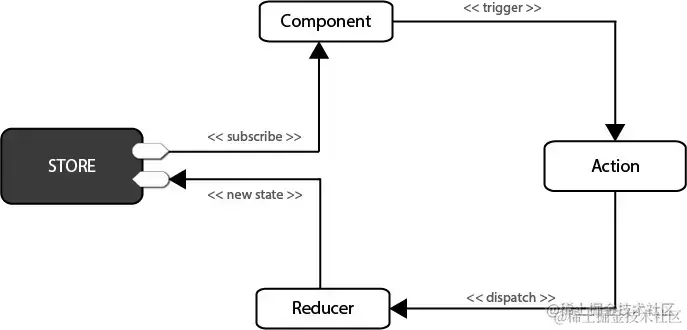

**进一步阅读**

- [Redux 入门](https://redux.js.org/introduction/getting-started)
- [深入研究 Redux](https://www.sitepoint.com/redux-deep-dive/)

### 6.React-Router 工作原理? react-router-dom 有哪些组件

路由器组件，路由匹配组件，导航组件

react-router 的依赖库 history

```python
1、BrowserHistory：用于支持 HTML5 历史记录 API 的现代 Web 浏览器（请参阅跨浏览器兼容性） \
2、HashHistory：用于旧版Web浏览器\
3、MemoryHistory：用作参考实现，也可用于非 DOM 环境，如 React Native 或测试

BrowserHistory：pushState、replaceState
HashHistory：location.hash、location.replace
```

### 7.React hooks 解决了什么问题? 函数组件与类组件的区别

Hooks 解决了我们五年来编写和维护成千上万的组件时遇到的各种各样看起来不相关的问题。无论你正在学习 React，或每天使用，或者更愿尝试另一个和 React 有相似组件模型的框架，你都可能对这些问题似曾相识。

在 React 16.8 版本（引入钩子）之前，使用基于类的组件来创建需要维护内部状态或利用生命周期方法的组件（即`componentDidMount`和`shouldComponentUpdate`）。基于类的组件是 ES6 类，它扩展了 React 的 Component 类，并且至少实现了`render()`方法。

类组件：

```jsx
class Welcome extends React.Component {
	render() {
		return <h1>Hello, {this.props.name}</h1>;
	}
}
```

函数组件是无状态的（同样，小于 React 16.8 版本），并返回要呈现的输出。它们渲染 UI 的首选只依赖于属性，因为它们比基于类的组件更简单、更具性能。

函数组件：

```javascript
function Welcome(props) {
	return <h1>Hello, {props.name}</h1>;
}
```

注意：在 React 16.8 版本中引入钩子意味着这些区别不再适用（请参阅 14 和 15 题）。

**进一步阅读**

- [React 中对比函数式组件和类组件](https://www.freecodecamp.org/news/functional-components-vs-class-components-in-react/)
- [React 中函数与类组件比对](https://medium.com/@Zwenza/functional-vs-class-components-in-react-231e3fbd7108)

### 8.SetState 是同步还是异步的，setState 做了什么

在 React 中，`setState()`函数通常被认为是异步的，这意味着调用 setState()时不会立刻改变 react 组件中 state 的值，setState 通过触发一次组件的更新来引发重汇，多次 setState 函数调用产生的效果会合并

调用 setState 时，React 会做的第一件事情是将传递给 setState 的对象合并到组件的当前状态。这将启动一个称为和解（reconciliation）的过程。和解（reconciliation）的最终目标是以最有效的方式，根据这个新的状态来更新 UI。 为此，React 将构建一个新的 React 元素树（您可以将其视为 UI 的对象表示）。

一旦有了这个树，为了弄清 UI 如何响应新的状态而改变，React 会将这个新树与上一个元素树相比较

### 9.什么是 fiber，fiber 解决了什么问题

React15 的 `StackReconciler` 方案由于递归不可中断问题，如果 Diff 时间过长（JS 计算时间），会造成页面 UI 的无响应（比如输入框）的表现，`vdom` 无法应用到 `dom` 中。

为了解决这个问题，React16 实现了新的基于 `requestIdleCallback` 的调度器（因为 `requestIdleCallback` 兼容性和稳定性问题，自己实现了 `polyfill`），通过任务优先级的思想，在高优先级任务进入的时候，中断 `reconciler`。

为了适配这种新的调度器，推出了 `FiberReconciler`，将原来的树形结构（vdom）转换成 Fiber 链表的形式（child/sibling/return），整个 Fiber 的遍历是基于循环而非递归，可以随时中断。

更加核心的是，基于 Fiber 的链表结构，对于后续（React 17 lane 架构）的异步渲染和 （可能存在的）worker 计算都有非常好的应用基础

### 10.React 中在哪捕获错误？

官网例子：

```javascript
class ErrorBoundary extends React.Component {
	constructor(props) {
		super(props);
		this.state = { hasError: false };
	}

	static getDerivedStateFromError(error) {
		// 更新 state 使下一次渲染能够显示降级后的 UI
		return { hasError: true };
	}

	componentDidCatch(error, errorInfo) {
		// 你同样可以将错误日志上报给服务器
		logErrorToMyService(error, errorInfo);
	}

	render() {
		if (this.state.hasError) {
			// 你可以自定义降级后的 UI 并渲染
			return <h1>Something went wrong.</h1>;
		}

		return this.props.children;
	}
}
```

使用

```html
<ErrorBoundary>
	<MyWidget />
</ErrorBoundary>
```

但是错误边界不会捕获：

```javascript
try {
} catch (err) {}
///异步代码（例如 setTimeout 或 requestAnimationFrame 回调函数）
///服务端渲染
///它自身抛出来的错误（并非它的子组件)
```

### 11. React 组件传值有哪些方式

父传子：props 子传父：通过在父组件引入的子组件中传递一个函数并传参数，子组件去触发这个函数更改参数完成数据更新

跨多层组件传值：通过 context api 完成

### 12. react 无状态组件和 class 类组件的区别

- 直观区别，函数组件代码量较少，相比类组件更加简洁
- 函数组件看似只是一个返回 react 元素的函数，其实体现的是无状态组件的思想，函数组件中没有 this， 没有 state，也没有生命周期，这就决定了函数组件都是展示性组件，接收 props，渲染 dom，而不关注其他逻辑
- 因为函数组件不需要考虑组件状态和组件生命周期方法中的各种比较校验，所以有很大的性能提升空间

### 13.react 如何做到和 vue 中 keep-alive 的缓存效果

React Keep Alive 提供了 ，你必须把 放在 Provider 里面，并且每个 组件都必须拥有一个唯一的 key

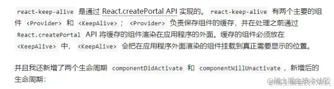

### 14.React 如何做路由监听

componentDidMount(){ this.context.router.history.listen((route)=>{ if(route.pathname==='/xxx'){ console.log(1); } }); } 还可以用高阶组件

### 15.React 有哪几种方式改变 state

this.forceUpdate this.setState :key 值传递不同也可以 replaceState 也可以改变

### 16.React 有哪几种创建组件方法

React 有三种构建组件的方式

- React.createClass
- ES6 class
- 无状态函数

React.createClass 是 React 最传统、兼容性最好的方法。该方法构建一个组件对象, 当组件被调用时，就会创建几个组件实例

ES6 class 方式和 createClass 类似，只是从调用内部方法变成了用类来实现。

无状态组件创建时始终保持一个实例，避免了不必要的检查和内存分配。

### 17.react 中 props 和 state 有什么区别

props 是传递给组件的（类似于函数的形参），而 state 是在组件内被组件自己管理的（类似于在一个函数内声明的变量）

props 是不可修改的，所有 React 组件都必须像纯函数一样保护它们的 props 不被更改。 由于 props 是传入的，并且它们不能更改，因此我们可以将任何仅使用 props 的 React 组件视为 pureComponent，也就是说，在相同的输入下，它将始终呈现相同的输出。 state 是在组件中创建的，一般在 constructor 中初始化 state state 是多变的、可以修改，每次 setState 都异步更新的。

- [深入理解 Props & State](https://zhuanlan.zhihu.com/p/44784850)

### 18.React 中 keys 的作用是什么？

Keys 是 React 用于追踪哪些列表中元素被修改、被添加或者被移除的辅助标识。

在 React 中渲染集合时，向每个重复的元素添加关键字对于帮助 React 跟踪元素与数据之间的关联非常重要。key 应该是唯一 ID，最好是 UUID 或收集项中的其他唯一字符串：

```javascript
<ul>
	{todos.map((todo) => (
		<li key={todo.id}>{todo.text}</li>
	))}
	;
</ul>
```

在集合中添加和删除项目时，不使用键或将索引用作键会导致奇怪的行为。

**进一步阅读**

- [列表 & key](https://zh-hans.reactjs.org/docs/lists-and-keys.html%23keys)
- [React 中 key 属性](https://kentcdodds.com/blog/understanding-reacts-key-prop)

### 19.React 中 refs 的作用是什么？

Refs 是 React 提供给我们的安全访问 DOM 元素或者某个组件实例的句柄。

我们可以为元素添加 ref 属性然后在回调函数中接受该元素在 DOM 树中的句柄，该值会作为回调函数的第一个参数返回：

```jsx
class CustomForm extends Component {
	handleSubmit = () => {
		console.log("Input Value: ", this.input.value);
	};
	render() {
		return (
			<form onSubmit={this.handleSubmit}>
				<input type="text" ref={(input) => (this.input = input)} />
				<button type="submit">Submit</button>
			</form>
		);
	}
}
```

上述代码中的 input 域包含了一个 ref 属性，该属性声明的回调函数会接收 input 对应的 DOM 元素，我们将其绑定到 this 指针以便在其他的类函数中使用。

另外值得一提的是，refs 并不是类组件的专属，函数式组件同样能够利用闭包暂存其值：

```javascript
function CustomForm({ handleSubmit }) {
	let inputElement;
	return (
		<form onSubmit={() => handleSubmit(inputElement.value)}>
			<input type="text" ref={(input) => (inputElement = input)} />
			<button type="submit">Submit</button>
		</form>
	);
}
```

**进一步阅读**

- [何时使用 Refs](https://zh-hans.reactjs.org/docs/refs-and-the-dom.html%23gatsby-focus-wrapper)

### 20.React diff 原理

- 把树形结构按照层级分解，只比较同级元素。
- 列表结构的每个单元添加唯一的 key 属性，方便比较。
- React 只会匹配相同 class 的 component（这里面的 class 指的是组件的名字）
- 合并操作，调用 component 的 setState 方法的时候, React 将其标记为 dirty 到每一个事件循环结束, React 检查所有标记 dirty 的 component 重新绘制.
- 选择性子树渲染。开发人员可以重写 shouldComponentUpdate 提高 diff 的性能。

**进一步阅读**

- [不可思议的 React diff](https://zhuanlan.zhihu.com/p/20346379)
- [手把手教你学会 React diff 原理](https://zhuanlan.zhihu.com/p/140489744)

### 21.受控组件和非受控组件有什么区别？

在 HTML 文档中，许多表单元素（例如`、、`）都保持自己的状态。不受控制的组件将 DOM 视为这些输入状态的真实源。在受控组件中，内部状态用于跟踪元素值。当输入值改变时，React 会重新渲染输入。

在与非 React 代码集成时，不受控制的组件非常有用（例如，如果您需要支持某种 jQuery 表单插件）。

**进一步阅读**

- [受控组件](https://zh-hans.reactjs.org/docs/forms.html%23controlled-components)
- [非受控组件](https://zh-hans.reactjs.org/docs/uncontrolled-components.html)
- [受控输入与非受控输入](https://goshakkk.name/controlled-vs-uncontrolled-inputs-react/)

### 22. 为什么虚拟 dom 会提高性能?

虚拟 dom 相当于在 js 和真实 dom 中间加了一个缓存，利用 dom diff 算法避免了没有必要的 dom 操作，从而提高性能。

具体实现步骤如下：

用 JavaScript 对象结构表示 DOM 树的结构；然后用这个树构建一个真正的 DOM 树，插到文档当中

当状态变更的时候，重新构造一棵新的对象树。然后用新的树和旧的树进行比较，记录两棵树差异

把 2 所记录的差异应用到步骤 1 所构建的真正的 DOM 树上，视图就更新了。

参考链接： [如何理解虚拟 DOM?](https://www.zhihu.com/question/29504639?sort=created)

### 说说看类组件的生命周期，函数组件使用哪些 hook 来代替的哪些生命周期

- 类组件生命周期

1. 初始化阶段，类组件会执行 constructor（其只会在初始化阶段执行一次，使用 super(props)确保 props 传递成功，同时做一些初始化操作，如声明 state，绑定 this 等）。接下来，如果存在 getDerivedStateFromProps 就执行 getDerivedStateFromProps（该函数传入两个参数（nextProps，prevState），其作用是：代替 componentWillMount 和 componentWillReceiveProps;在组件初始化或更新时，将 props 映射到 state；其返回值会与 state 合并，可作为 shouldComponentUpdate 的第二个参数 newState，用于判断是否需要渲染），不存在的话 componentWillMount（由于存在隐匿风险已经废弃，不建议使用）将会被执行，到此 mountClassComponent 函数咨询完成，之后会执行 render（创建 React.element 元素的过程）渲染函数，形成 children，接下来 React 会调用 reconcileChildren 方法深度调和 children。react 调和完所有的 fiber 节点，就会进入到 commit 阶段，然后会执行 componentDidMount（其执行时机和 componentDidUpdate 一样，只是一个是初始化阶段，一个是更新阶段，此时 DOM 已经挂载，可以进行 DOM 操作，同时可以向服务端请求数据，渲染视图）。

```js
constructor ->
getDerivedStateFromProps ->
componentWillMount ->
render ->
componentDidMount
```

1. 更新阶段，类组件会判断是否存在 getDerivedStateFromProps，不存在会执行 componentWillReceiveProps，存在就执行 getDerivedStateFromProps（返回的值用于合成新的 state）。之后执行 shouldComponentUpdate（用于性能优化），传入新的 props、state、context，根据其返回值来决定是否执行 render 函数。接下来执行 componentWillUpdate，到这里 updateClassInstance 方法执行完毕。接下来进入 render 函数，得到最新的 React Element 元素，然后继续调和子节点。 之后进入 commit 阶段，会执行 getSnapshotBeforeUpdate（会返回一个 DOM 修改前的快照，作为传递给 compontDidUpdate 的第三个参数，该参数不限于 DOM 的信息，可以时 DOM 计算出的产物），然后会执行 compontDidUpdate（此时 dom 已经修改完成，可以进行 dom 操作；不能再这个函数里执行 setState 操作，否则会导致无限循环）。这就是一个完整的更新。

```js
componentWillReciveProps(props改变)/getDrivedStateFromProp ->
shouldComponentUpdate ->
componentWillUpdate ->
render ->
getSnapshotBeforeUpdate ->
componentDidUpdate
```

1. 销毁阶段，类组件会先执行 componentWillUnmount（清除一些定时器、事件监听器）

- 函数组件的生命周期替代方案

useEffect:其第一个参数 cb，返回的 destory 作为下一次 cb 执行之前调用，用于清楚上一次 cb 产生的副作用；第二个参数是依赖项，为一个数组，依赖改变，执行上一次 cb 返回的 destory，和执行新的 effect 的 cb。 useEffect 的执行，React 采用的异步调用的逻辑，对于每一个 effect 的 cb，React 会将其放入到事件队列中，等主线程完成，DOM 更新，js 执行完毕，视图绘制完成，才执行，故，effect 的回调不会阻塞浏览器的视图绘制。

```js
useEffect(() => {
	return destory;
}, dep);
```

useLayoutEffect：不同于 useEffect 的是，其采用了同步执行，它是在 DOM 更新前，浏览器绘制之前执行，适合在这个时候修改 DOM，这样浏览器只会绘制一次。如果将修改 DOM 操作放在 useEffect 中，会导致浏览器的重绘和回流。故 useLayoutEffect 的 cb 会阻塞浏览器绘制。

```js
useLayoutEffect(() => {
	// deal Dom
}, dep);
```

### 对于 Fiber 架构理解

Fiber 出现在 React16 版本，在 15 及以前的版本，React 更新 DOM 都是使用递归的方式进行遍历，每次更新都会从应用根部递归执行，且一旦开始，无法中断，这样层级越来越深，结构复杂度高的项目就会出现明显的卡顿。fiber 架构出现就是为了解决这个问题，fiber 是在 React 中最小粒度的执行单元，可以将 fiber 理解为是 React 的虚拟 DOM。在 React 中，更新 fiber 的过程叫做调和，每一个 fiber 都可以作为一个执行单元进行处理，同时每个 fiber 都有一个优先级 lane（16 版本是 expirationTime）来判断是否还有空间或时间来执行更新，如果没有时间更新，就会把主动权交给浏览器去做一些渲染（如动画、重排、重绘等），用户就不会感觉到卡顿。然后，当浏览器空闲了（requestIdleCallback），就通过 scheduler（调度器）将执行恢复到执行单元上，这样本质上是中断了渲染，不过题改了用户的体验。React 实现的 fiber 模式是一个具有链表和指针的异步模型。

fiber 作为 react 创建的 element 和真实 DOM 之间的桥梁，每一次更新的触发会在 React element 发起，经过 fiber 的调和，然后更新到真实 DOM 上。fiber 上标识了各种不同类型的 element，同时记录了对应和当前 fiber 有关的其他 fiber 信息（return 指向父级、child 指向子级、sibling 指向兄弟）。

在 React 应用中，应用首次构建时，会创建一个 fiberRoot 作为整个 React 应用的根基。然后当 ReactDOM.render 渲染出来时，会创建一个 rootFiber 对象（一个 Ract 应用可以用多个 rootFiber，但只能有一个 fiberRoot），当一次挂载完成时，fiberRoot 的 current 属性会指向对应 rootFiber。挂载完成后，会进入正式渲染阶段，在这个阶段必须知道一个 workInProgerss 树（它是正在内存在构建的 Fiber 树，在一次更新中，所有的更新都发生在 workInProgeress 树上，更新完成后，将变成 current 树用于渲染视图）,当前的 current 树（rootFiber）的 alternate 会作为 workInProgerss，同时会用 alternate 将 workInProgress 与 current 树进行关联（该关联只有在初始化第一次创建 alternate 时进行）。

```js
currentFiber.alternate = workInProgressFiber;
workInProgressFiber.alternate = currentFiber;
```

关联之后，会在心间的 alternate 上，完成整个 fiber 树的遍历。最后 workInProgerss 会作为最新的渲染树，来称为 fiberRoot 指向的 current Fiber 树。

之后更新的时候依旧会重新创建一颗 workInProgerss 树，复用 current 上面的 alternate，由于初始化的 rootfiber 有 alternate，对于剩余的字节点，React 都会创建一份，进行相同的关联。待渲染完毕之后，workInProgerss 树再次变成 current 树。

### 使用 Hooks 开发常见的优化措施

- 使用函数来初始化 useState 的值，减少初始值的计算
- 使用 useMemo 来缓存计算结果，减少计算次数（大数据结构使用即可，没必要为了缓存而缓存）
- 使用 useCallback 来缓存函数（建议不经常变化的函数使用）
- 使用 React.memo 缓存子组件，避免组件因无关 state 的更新而频繁重新计算出现卡顿的情况（合理使用，不要为了缓存而缓存）

## React 的事件和普通的 HTML 事件有什么不同？

区别：

- 对于事件名称命名方式，原生事件为全小写，react 事件采用小驼峰；

- 对于事件函数处理语法，原生事件为字符串，react 事件为函数；

- react 事件不能采用 return false 的方式来阻止浏览器的默认行

- 为，而必须要地明确地调用 preventDefault()来阻止默认行为。

- 合成事件是 react 模拟原生 DOM 事件所有能力的一个事件对象，其优点如下：

  - 兼容所有浏览器，更好的跨平台；

  - 将事件统一存放在一个数组，避免频繁的新增与删除（垃圾回收）。

  - 方便 react 统一管理和事务机制。

  - 事件的执行顺序为原生事件先执行，合成事件后执行，合成事件会冒泡绑定到 document 上，所以尽量避免原生事件与合成事件混用，如果原生事件阻止冒泡，可能会导致合成事件不执行，因为需要冒泡到 document 上合成事件才会执行。

## React 组件中怎么做事件代理？它的原理是什么？

React 基于 Virtual DOM 实现了一个 SyntheticEvent 层（合成事件层），定义的事件处理器会接收到一个合成事件对象的实例，它符合 W3C 标准，且与原生的浏览器事件拥有同样的接口，支持冒泡机制，所有的事件都自动绑定在最外层上。

在 React 底层，主要对合成事件做了两件事：

事件委派：React 会把所有的事件绑定到结构的最外层，使用统一的事件监听器，这个事件监听器上维持了一个映射来保存所有组件内部事件监听和处理函数。

自动绑定：React 组件中，每个方法的上下文都会指向该组件的实例，即自动绑定 this 为当前组件。

## React 高阶组件、Render props、hooks 有什么区别，为什么要不断迭代

这三者是目前 react 解决代码复用的主要方式：

高阶组件（HOC）是 React 中用于复用组件逻辑的一种高级技巧。HOC 自身不是 React API 的一部分，它是一种基于 React 的组合特性而形成的设计模式。具体而言，高阶组件是参数为组件，返回值为新组件的函数。

render props 是指一种在 React 组件之间使用一个值为函数的 prop 共享代码的简单技术，更具体的说，render prop 是一个用于告知组件需要渲染什么内容的函数 prop。

通常，render props 和高阶组件只渲染一个子节点。让 Hook 来服务这个使用场景更加简单。这两种模式仍有用武之地，（例如，一个虚拟滚动条组件或许会有一个 renderltem 属性，或是一个可见的容器组件或许会有它自己的 DOM 结构）。但在大部分场景下，Hook 足够了，并且能够帮助减少嵌套。

### （1）HOC

官方解释 ∶

高阶组件（HOC）是 React 中用于复用组件逻辑的一种高级技巧。HOC 自身不是 React API 的一部分，它是一种基于 React 的组合特性而形成的设计模式。

简言之，HOC 是一种组件的设计模式，HOC 接受一个组件和额外的参数（如果需要），返回一个新的组件。HOC 是纯函数，没有副作用。

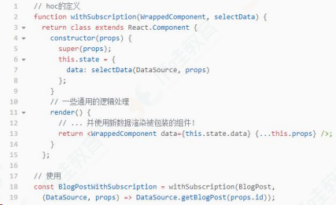

HOC 的优缺点 ∶

优点 ∶ 逻辑服用、不影响被包裹组件的内部逻辑。

缺点 ∶ hoc 传递给被包裹组件的 props 容易和被包裹后的组件重名，进而被覆盖

### （2）Render props

官方解释 ∶

"render prop"是指一种在 React 组件之间使用一个值为函数的 prop 共享代码的简单技术

具有 render prop 的组件接受一个返回 React 元素的函数，将 render 的渲染逻辑注入到组件内部。在这里，"render"的命名可以是任何其他有效的标识符。

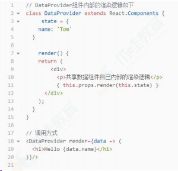

由此可以看到，render props 的优缺点也很明显 ∶

优点：数据共享、代码复用，将组件内的 state 作为 props 传递给调用者，将渲染逻辑交给调用者。

缺点：无法在 return 语句外访问数据、嵌套写法不够优雅

### （3）Hooks

官方解释 ∶

Hook 是 React 16.8 的新增特性。它可以让你在不编写 class 的情况下使用 state 以及其他的 React 特性。通过自定义 hook，可以复用代码逻辑。

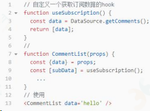

以上可以看出，hook 解决了 hoc 的 prop 覆盖的问题，同时使用的方式解决了 render props 的嵌套地狱的问题。hook 的优点如下 ∶

使用直观；

解决 hoc 的 prop 重名问题；

解决 render props 因共享数据 而出现嵌套地狱的问题；

能在 return 之外使用数据的问题。

需要注意的是：hook 只能在组件顶层使用，不可在分支语句中使用。

### 总结 ∶

Hoc、render props 和 hook 都是为了解决代码复用的问题，但是 hoc 和 render props 都有特定的使用场景和明显的缺点。hook 是 react16.8 更新的新的 API，让组件逻辑复用更简洁明了，同时也解决了 hoc 和 render props 的一些缺点。

## Component, Element, Instance 之间有什么区别和联系？

元素：一个元素 element 是一个普通对象(plain object)，描述了对于一个 DOM 节点或者其他组件 component，你想让它在屏幕上呈现成什么样子。元素 element 可以在它的属性 props 中包含其他元素(译注:用于形成元素树)。创建一个 React 元素 element 成本很低。元素 element 创建之后是不可变的。

组件：一个组件 component 可以通过多种方式声明。可以是带有一个 render()方法的类，简单点也可以定义为一个函数。这两种情况下，它都把属性 props 作为输入，把返回的一棵元素树作为输出。

实例：一个实例 instance 是你在所写的组件类 component class 中使用关键字 this 所指向的东西(译注:组件实例)。它用来存储本地状态和响应生命周期事件很有用。

函数式组件(Functional component)根本没有实例 instance。类组件(Class component)有实例 instance，但是永远也不需要直接创建一个组件的实例，因为 React 帮我们做了这些。

## React.createClass 和 extends Component 的区别有哪些？

React.createClass 和 extends Component 的 bai 区别主要在于：

### （1）语法区别

createClass 本质上是一个工厂函数，extends 的方式更加接近最新
的 ES6 规范的 class 写法。两种方式在语法上的差别主要体现在方法
的定义和静态属性的声明上。
createClass 方式的方法定义使用逗号，隔开，因为 creatClass 本
质上是一个函数，传递给它的是一个 Object；而 class 的方式定义
方法时务必谨记不要使用逗号隔开，这是 ES6 class 的语法规范。

### （2）propType 和 getDefaultProps

React.createClass：通过 proTypes 对象和 getDefaultProps()方法
来设置和获取 props.
React.Component：通过设置两个属性 propTypes 和 defaultProps

### （3）状态的区别

React.createClass：通过 getInitialState()方法返回一个包含初
始值的对象
React.Component：通过 constructor 设置初始状态
78

### （4）this 区别

React.createClass：会正确绑定 this
React.Component：由于使用了 ES6，这里会有些微不同，属性并不
会自动绑定到 React 类的实例上。

### （5）Mixins

React.createClass：使用 React.createClass 的话，可以在创建组
件时添加一个叫做 mixins 的属性，并将可供混合的类的集合以数组
的形式赋给 mixins。
如果使用 ES6 的方式来创建组件，那么 React mixins 的特性将不
能被使用了。

## React 如何判断什么时候重新渲染组件？

组件状态的改变可以因为 props 的改变，或者直接通过 setState 方法改变。组件获得新的状态，然后 React 决定是否应该重新渲染组件。

只要组件的 state 发生变化，React 就会对组件进行重新渲染。这是因为 React 中的 shouldComponentUpdate 方法默认返回 true，这就是导致每次更新都重新渲染的原因。

当 React 将要渲染组件时会执行 shouldComponentUpdate 方法来看它是否返回 true（组件应该更新，也就是重新渲染）。所以需要重写 shouldComponentUpdate 方法让它根据情况返回 true 或者 false 来告诉 React 什么时候重新渲染什么时候跳过重新渲染。

## React 中可以在 render 访问 refs 吗？为什么？

不可以，render 阶段 DOM 还没有生成，无法获取 DOM。DOM 的获取

需要在 pre-commit 阶段和 commit 阶段：

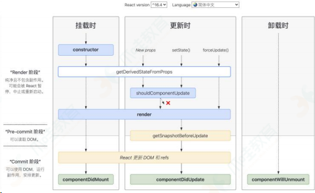

## React setState 调用之后发生了什么？是同步还是异步？

### （1）React 中 setState 后发生了什么

在代码中调用 setState 函数之后，React 会将传入的参数对象与组件当前的状态合并，然后触发调和过程(Reconciliation)。经过调和过程，React 会以相对高效的方式根据新的状态构建 React 元素树并且着手重新渲染整个 UI 界面。

在 React 得到元素树之后，React 会自动计算出新的树与老树的节点差异，然后根据差异对界面进行最小化重渲染。在差异计算算法中，React 能够相对精确地知道哪些位置发生了改变以及应该如何改变，这就保证了按需更新，而不是全部重新渲染。

如果在短时间内频繁 setState。React 会将 state 的改变压入栈中，在合适的时机，批量更新 state 和视图，达到提高性能的效果。

### （2）setState 是同步还是异步的

假如所有 setState 是同步的，意味着每执行一次 setState 时（有可能一个同步代码中，多次 setState），都重新 vnode diff + dom 修改，这对性能来说是极为不好的。如果是异步，则可以把一个同步代码中的多个 setState 合并成一次组件更新。所以默认是异步的，但是在一些情况下是同步的。

setState 并不是单纯同步/异步的，它的表现会因调用场景的不同而不同。在源码中，通过 isBatchingUpdates 来判断 setState 是先存进 state 队列还是直接更新，如果值为 true 则执行异步操作，为 false 则直接更新。

异步：在 React 可以控制的地方，就为 true，比如在 React 生命周期事件和合成事件中，都会走合并操作，延迟更新的策略。

同步：在 React 无法控制的地方，比如原生事件，具体就是在 addEventListener 、setTimeout、setInterval 等事件中，就只能同步更新。

一般认为，做异步设计是为了性能优化、减少渲染次数：

setState 设计为异步，可以显著的提升性能。如果每次调用 setState 都进行一次更新，那么意味着 render 函数会被频繁调用，界面重新渲染，这样效率是很低的；最好的办法应该是获取到多个更新，之后进行批量更新；

如果同步更新了 state，但是还没有执行 render 函数，那么 state 和 props 不能保持同步。state 和 props 不能保持一致性，会在开发中产生很多的问题；

## React 组件的 state 和 props 有什么区别？

### （1）props

props 是一个从外部传进组件的参数，主要作为就是从父组件向子组件传递数据，它具有可读性和不变性，只能通过外部组件主动传入新的 props 来重新渲染子组件，否则子组件的 props 以及展现形式不会改变。

### （2）state

state 的主要作用是用于组件保存、控制以及修改自己的状态，它只能在 constructor 中初始化，它算是组件的私有属性，不可通过外部访问和修改，只能通过组件内部的 this.setState 来修改，修改 state 属性会导致组件的重新渲染。

### （3）区别

props 是传递给组件的（类似于函数的形参），而 state 是在组件内被组件自己管理的（类似于在一个函数内声明的变量）。

props 是不可修改的，所有 React 组件都必须像纯函数一样保护它们的 props 不被更改。

state 是在组件中创建的，一般在 constructor 中初始化 state。

state 是多变的、可以修改，每次 setState 都异步更新的。

## React 中的 props 为什么是只读的？

this.props 是组件之间沟通的一个接口，原则上来讲，它只能从父组件流向子组件。React 具有浓重的函数式编程的思想。

提到函数式编程就要提一个概念：纯函数。它有几个特点：

- 给定相同的输入，总是返回相同的输出。
- 过程没有副作用。
- 不依赖外部状态。

this.props 就是汲取了纯函数的思想。props 的不可以变性就保证的
相同的输入，页面显示的内容是一样的，并且不会产生副作用

## React 中怎么检验 props？验证 props 的目的是什么？

React 为我们提供了 PropTypes 以供验证使用。当我们向 Props 传入的数据无效（向 Props 传入的数据类型和验证的数据类型不符）就会在控制台发出警告信息。它可以避免随着应用越来越复杂从而出现的问题。并且，它还可以让程序变得更易读。

当然，如果项目汇中使用了 TypeScript，那么就可以不用 PropTypes 来校验，而使用 TypeScript 定义接口来校验 props。

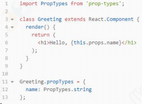

## React 废弃了哪些生命周期？为什么？

被废弃的三个函数都是在 render 之前，因为 fber 的出现，很可能因为高优先级任务的出现而打断现有任务导致它们会被执行多次。另外的一个原因则是，React 想约束使用者，好的框架能够让人不得已写出容易维护和扩展的代码，这一点又是从何谈起，可以从新增加以及即将废弃的生命周期分析入手

### componentWillMount

首先这个函数的功能完全可以使用 componentDidMount 和 constructor 来代替，异步获取的数据的情况上面已经说明了，而如果抛去异步获取数据，其余的即是初始化而已，这些功能都可以在 constructor 中执行，除此之外，如果在 willMount 中订阅事件，但在服务端这并不会执行 willUnMount 事件，也就是说服务端会导致内存泄漏所以 componentWilIMount 完全可以不使用，但使用者有时候难免因为各 种各样的情况在 componentWilMount 中做一些操作，那么 React 为了约束开发者，干脆就抛掉了这个 API

### componentWillReceiveProps

在老版本的 React 中，如果组件自身的某个 state 跟其 props 密切相关的话，一直都没有一种很优雅的处理方式去更新 state，而是需要在 componentWilReceiveProps 中判断前后两个 props 是否相同，如果不同再将新的 props 更新到相应的 state 上去。这样做一来会破坏 state 数据的单一数据源，导致组件状态变得不可预测，另一方面也会增加组件的重绘次数。类似的业务需求也有很多，如一个可以横向滑动的列表，当前高亮的 Tab 显然隶属于列表自身的时，根据传入的某个值，直接定位到某个 Tab。为了解决这些问题，React 引入了第一个新的生命周期：

getDerivedStateFromProps。它有以下的优点 ∶

- ●getDSFP 是静态方法，在这里不能使用 this，也就是一个纯函数，开发者不能写出副作用的代码
- ● 开发者只能通过 prevState 而不是 prevProps 来做对比，保证了 state 和 props 之间的简单关系以及不需要处理第一次渲染时 prevProps 为空的情况
- ● 基于第一点，将状态变化（setState）和昂贵操作（tabChange）区分开，更加便于 render 和 commit 阶段操作或者说优化。

### componentWillUpdate

与 componentWillReceiveProps 类似，许多开发者也会在 componentWillUpdate 中根据 props 的变化去触发一些回调 。 但不论是 componentWilReceiveProps 还 是 componentWilUpdate，都有可能在一次更新中被调用多次，也就是说写在这里的回调函数也有可能会被调用多次，这显然是不可取的。与 componentDidMount 类似， componentDidUpdate 也不存在这样的问题，一次更新中 componentDidUpdate 只会被调用一次，所以将原先写在 componentWillUpdate 中 的 回 调 迁 移 至 componentDidUpdate 就可以解决这个问题。

另外一种情况则是需要获取 DOM 元素状态，但是由于在 fber 中，render 可打断，可能在 wilMount 中获取到的元素状态很可能与实际需要的不同，这个通常可以使用第二个新增的生命函数的解决 getSnapshotBeforeUpdate(prevProps, prevState)

### getSnapshotBeforeUpdate(prevProps, prevState)

返回的值作为 componentDidUpdate 的第三个参数。与 willMount 不同的是，getSnapshotBeforeUpdate 会在最终确定的 render 执行之前执行，也就是能保证其获取到的元素状态与 didUpdate 中获取到的元素状态相同。官方参考代码：

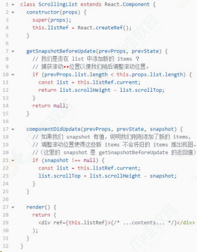

## React 16.X 中 props 改变后在哪个生命周期中处理

在 getDerivedStateFromProps 中进行处理。

这个生命周期函数是为了替代 componentWillReceiveProps 存在的，所以在需要使用 componentWillReceiveProps 时，就可以考虑使用 getDerivedStateFromProps 来进行替代。

两者的参数是不相同的，而 getDerivedStateFromProps 是一个静态函数，也就是这个函数不能通过 this 访问到 class 的属性，也并不推荐直接访问属性。而是应该通过参数提供的 nextProps 以及 prevState 来进行判断，根据新传入的 props 来映射到 state。

需要注意的是，如果 props 传入的内容不需要影响到你的 state，那么就需要返回一个 null，这个返回值是必须的，所以尽量将其写到函数的末尾：

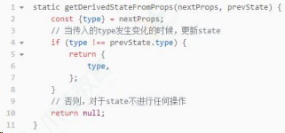

## React 16 中新生命周期有哪些

关于 React16 开始应用的新生命周期：

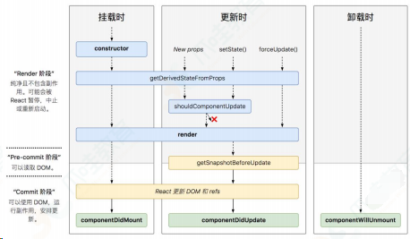

可以看出，React16 自上而下地对生命周期做了另一种维度的解读：

Render 阶段：用于计算一些必要的状态信息。这个阶段可能会被 React 暂停，这一点和 React16 引入的 Fiber 架构（我们后面会重点讲解）是有关的；

Pre-commit 阶段：所谓“commit”，这里指的是“更新真正的 DOM 节点”这个动作。所谓 Pre-commit，就是说我在这个阶段其实还并没有去更新真实的 DOM，不过 DOM 信息已经是可以读取的了；

Commit 阶段：在这一步，React 会完成真实 DOM 的更新工作。Commit 阶段，我们可以拿到真实 DOM（包括 refs）。

与此同时，新的生命周期在流程方面，仍然遵循“挂载”、“更新”、“卸载”这三个广义的划分方式。它们分别对应到：

挂载过程：

- constructor
- getDerivedStateFromProps
- render
- componentDidMount

更新过程：

- getDerivedStateFromProps
- shouldComponentUpdate
- render
- getSnapshotBeforeUpdate
- componentDidUpdate

卸载过程：

- componentWillUnmount

## React-Router 的实现原理是什么？

客户端路由实现的思想：

- 基于 hash 的路由：通过监听 hashchange 事件，感知 hash 的变化
- 改变 hash 可以直接通过 location.hash=xxx

基于 H5 history 路由：

改变 url 可以通过 history.pushState 和 resplaceState 等，会将 URL 压入堆栈，同时能够应用 history.go() 等 API 监听 url 的变化可以通过自定义事件触发实现

react-router 实现的思想：

基于 history 库来实现上述不同的客户端路由实现思想，并且能够保存历史记录等，磨平浏览器差异，上层无感知通过维护的列表，在每次 URL 发生变化的回收，通过配置的 路由路径，匹配到对应的 Component，并且 render

## react-router 里的 Link 标签和 a 标签的区别

从最终渲染的 DOM 来看，这两者都是链接，都是 标签，区别是：

`<Link>`是 react-router 里实现路由跳转的链接，一般配合`<Route>`使用，react-router 接管了其默认的链接跳转行为，区别于传统的页面跳转，`<Link> `的“跳转”行为只会触发相匹配的`<Route>`对应的页面内容更新，而不会刷新整个页面。

`<Link>`做了 3 件事情：

有 onclick 那就执行 onclick
click 的时候阻止 a 标签默认事件

根据跳转 href(即是 to)，用 history (web 前端路由两种方式之一，history & hash)跳转，此时只是链接变了，并没有刷新页面而`<a>`标签就是普通的超链接了，用于从当前页面跳转到 href 指向的另一个页面(非锚点情况)。

a 标签默认事件禁掉之后做了什么才实现了跳转?

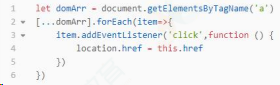

## 对 Redux 的理解，主要解决什么问题

React 是视图层框架。Redux 是一个用来管理数据状态和 UI 状态的 JavaScript 应用工具。随着 JavaScript 单页应用（SPA）开发日趋复杂， JavaScript 需要管理比任何时候都要多的 state（状态），Redux 就是降低管理难度的。（Redux 支持 React、Angular、jQuery 甚至纯 JavaScript）。

在 React 中，UI 以组件的形式来搭建，组件之间可以嵌套组合。但 React 中组件间通信的数据流是单向的，顶层组件可以通过 props 属性向下层组件传递数据，而下层组件不能向上层组件传递数据，兄弟组件之间同样不能。这样简单的单向数据流支撑起了 React 中的数据可控性。

当项目越来越大的时候，管理数据的事件或回调函数将越来越多，也将越来越不好管理。管理不断变化的 state 非常困难。如果一个 model 的变化会引起另一个 model 变化，那么当 view 变化时，就可能引起对应 model 以及另一个 model 的变化，依次地，可能会引起另一个 view 的变化。直至你搞不清楚到底发生了什么。state 在什么时候，由于什么原因，如何变化已然不受控制。 当系统变得错综复杂的时候，想重现问题或者添加新功能就会变得举步维艰。如果

这还不够糟糕，考虑一些来自前端开发领域的新需求，如更新调优、服务端渲染、路由跳转前请求数据等。state 的管理在大项目中相当复杂。

- Redux 提供了一个叫 store 的统一仓储库，组件通过 dispatch 将
- state 直接传入 store，不用通过其他的组件。并且组件通过
- subscribe 从 store 获取到 state 的改变。使用了 Redux，所有的
- 组件都可以从 store 中获取到所需的 state，他们也能从 store 获
- 取到 state 的改变。这比组件之间互相传递数据清晰明朗的多。

主要解决的问题：

单纯的 Redux 只是一个状态机，是没有 UI 呈现的，react- redux 作用是将 Redux 的状态机和 React 的 UI 呈现绑定在一起，当你 dispatchaction 改变 state 的时候，会自动更新页面。

## Redux 状态管理器和变量挂载到 window 中有什么区别

两者都是存储数据以供后期使用。但是 Redux 状态更改可回溯——Time travel，数据多了的时候可以很清晰的知道改动在哪里发生，完整的提供了一套状态管理模式。

随着 JavaScript 单页应用开发日趋复杂，JavaScript 需要管理比任何时候都要多的 state （状态）。 这些 state 可能包括服务器响应、缓存数据、本地生成尚未持久化到服务器的数据，也包括 UI 状态，如激活的路由，被选中的标签，是否显示加载动效或者分页器等等。

管理不断变化的 state 非常困难。如果一个 model 的变化会引起另一个 model 变化，那么当 view 变化时，就可能引起对应 model 以及另一个 model 的变化，依次地，可能会引起另一个 view 的变化。

直至你搞不清楚到底发生了什么。state 在什么时候，由于什么原因，如何变化已然不受控制。 当系统变得错综复杂的时候，想重现问题或者添加新功能就会变得举步维艰。

如果这还不够糟糕，考虑一些来自前端开发领域的新需求，如更新调优、服务端渲染、路由跳转前请求数据等等。前端开发者正在经受前所未有的复杂性，难道就这么放弃了吗?当然不是。

这里的复杂性很大程度上来自于：我们总是将两个难以理清的概念混淆在一起：变化和异步。 可以称它们为曼妥思和可乐。如果把二者分开，能做的很好，但混到一起，就变得一团糟。一些库如 React 视图在视图层禁止异步和直接操作 DOM 来解决这个问题。美中不足的是，React 依旧把处理 state 中数据的问题留给了你。Redux 就是
为了帮你解决这个问题。

## Redux 和 Vuex 有什么区别，它们的共同思想

### （1）Redux 和 Vuex 区别

Vuex 改进了 Redux 中的 Action 和 Reducer 函数，以 mutations 变化函数取代 Reducer，无需 switch，只需在对应的 mutation 函数里改变 state 值即可

Vuex 由于 Vue 自动重新渲染的特性，无需订阅重新渲染函数，只要生成新的 State 即可

Vuex 数据流的顺序是 ∶View 调用 store.commit 提交对应的请求到 Store 中对应的 mutation 函数->store 改变（vue 检测到数据变化自动渲染）

通俗点理解就是，vuex 弱化 dispatch，通过 commit 进行 store 状态的一次更变；取消了 action 概念，不必传入特定的 action 形式进行指定变更；弱化 reducer，基于 commit 参数直接对数据进行转变，使得框架更加简易;

### （2）共同思想

单—的数据源

变化可以预测

本质上 ∶ redux 与 vuex 都是对 mvvm 思想的服务，将数据从视图中抽离的一种方案。

## Redux 中间件是怎么拿到 store 和 action? 然后怎么处理?

redux 中间件本质就是一个函数柯里化。redux applyMiddleware Api 源码中每个 middleware 接受 2 个参数，Store 的 getState 函数和 dispatch 函数，分别获得 store 和 action，最终返回一个函数。该函数会被传入 next 的下一个 middleware 的 dispatch 方法，并返回一个接收 action 的新函数，这个函数可以直接调用 next（action），或者在其他需要的时刻调用，甚至根本不去调用它。调用链中最后一个 middleware 会接受真实的 store 的 dispatch 方法作为 next 参数，并借此结束调用链。所以，middleware 的函数签名是（{ getState，dispatch })=> next => action。

## React Hooks 解决了哪些问题？

React Hooks 主要解决了以下问题：

### （1）在组件之间复用状态逻辑很难

React 没有提供将可复用性行为“附加”到组件的途径（例如，把组件连接到 store）解决此类问题可以使用 render props 和 高阶组件。但是这类方案需要重新组织组件结构，这可能会很麻烦，并且会使代码难以理解。由 providers，consumers，高阶组件，render props 等其他抽象层组成的组件会形成“嵌套地狱”。尽管可以在 DevTools
过滤掉它们，但这说明了一个更深层次的问题：React 需要为共享状态逻辑提供更好的原生途径。

可以使用 Hook 从组件中提取状态逻辑，使得这些逻辑可以单独测试并复用。Hook 使我们在无需修改组件结构的情况下复用状态逻辑。

这使得在组件间或社区内共享 Hook 变得更便捷。

### （2）复杂组件变得难以理解

在组件中，每个生命周期常常包含一些不相关的逻辑。例如，组件常常在 componentDidMount 和 componentDidUpdate 中获取数据。但是，同一个 componentDidMount 中可能也包含很多其它的逻辑，如设置事件监听，而之后需在 componentWillUnmount 中清除。相互关联且需要对照修改的代码被进行了拆分，而完全不相关的代码却在同一个方法中组合在一起。如此很容易产生 bug，并且导致逻辑不一致。

在多数情况下，不可能将组件拆分为更小的粒度，因为状态逻辑无处不在。这也给测试带来了一定挑战。同时，这也是很多人将 React 与状态管理库结合使用的原因之一。但是，这往往会引入了很多抽象概念，需要你在不同的文件之间来回切换，使得复用变得更加困难。

为了解决这个问题，Hook 将组件中相互关联的部分拆分成更小的函数（比如设置订阅或请求数据），而并非强制按照生命周期划分。你还可以使用 reducer 来管理组件的内部状态，使其更加可预测。

### （3）难以理解的 class

除了代码复用和代码管理会遇到困难外，class 是学习 React 的一大屏障。我们必须去理解 JavaScript 中 this 的工作方式，这与其他语言存在巨大差异。还不能忘记绑定事件处理器。没有稳定的语法提案，这些代码非常冗余。大家可以很好地理解 props，state 和自顶向下的数据流，但对 class 却一筹莫展。即便在有经验的 React 开发者之间，对于函数组件与 class 组件的差异也存在分歧，甚至还要区分两种组件的使用场景。

为了解决这些问题，Hook 使你在非 class 的情况下可以使用更多的 React 特性。 从概念上讲，React 组件一直更像是函数。而 Hook 则拥抱了函数，同时也没有牺牲 React 的精神原则。Hook 提供了问题的解决方案，无需学习复杂的函数式或响应式编程技术

## React Hook 的使用限制有哪些？

React Hooks 的限制主要有两条：

不要在循环、条件或嵌套函数中调用 Hook；

在 React 的函数组件中调用 Hook。

那为什么会有这样的限制呢？Hooks 的设计初衷是为了改进 React 组件的开发模式。在旧有的开发模式下遇到了三个问题。

组件之间难以复用状态逻辑。过去常见的解决方案是高阶组件、render props 及状态管理框架。

复杂的组件变得难以理解。生命周期函数与业务逻辑耦合太深，导致关联部分难以拆分。

人和机器都很容易混淆类。常见的有 this 的问题，但在 React 团队中还有类难以优化的问题，希望在编译优化层面做出一些改进。这三个问题在一定程度上阻碍了 React 的后续发展，所以为了解决这三个问题，Hooks 基于函数组件开始设计。然而第三个问题决定了 Hooks 只支持函数组件。

那为什么不要在循环、条件或嵌套函数中调用 Hook 呢？因为 Hooks 的设计是基于数组实现。在调用时按顺序加入数组中，如果使用循环、条件或嵌套函数很有可能导致数组取值错位，执行错误的 Hook。当然，实质上 React 的源码里不是数组，是链表。

这些限制会在编码上造成一定程度的心智负担，新手可能会写错，为了避免这样的情况，可以引入 ESLint 的 Hooks 检查插件进行预防。

## React diff 算法的原理是什么？

实际上，diff 算法探讨的就是虚拟 DOM 树发生变化后，生成 DOM 树更新补丁的方式。它通过对比新旧两株虚拟 DOM 树的变更差异，将更新补丁作用于真实 DOM，以最小成本完成视图更新。

具体的流程如下：

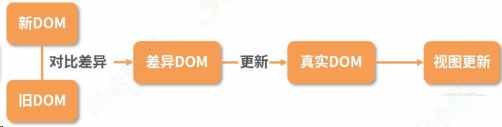

- 真实的 DOM 首先会映射为虚拟 DOM；
- 当虚拟 DOM 发生变化后，就会根据差距计算生成 patch，这个 patch
- 是一个结构化的数据，内容包含了增加、更新、移除等；
- 根据 patch 去更新真实的 DOM，反馈到用户的界面上。

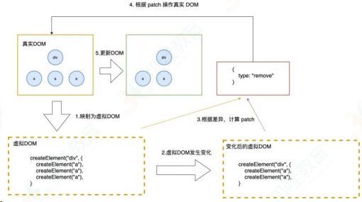

一个简单的例子：

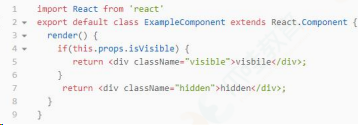

这里，首先假定 ExampleComponent 可见，然后再改变它的状态，让它不可见 。映射为真实的 DOM 操作是这样的，React 会创建一个 div 节点。

```html
<div class="visible">visible</div>
```

当把 visbile 的值变为 false 时，就会替换 class 属性为 hidden，并重写内部的 innerText 为 hidden。这样一个生成补丁、更新差异的过程统称为 diff 算法。

diff 算法可以总结为三个策略，分别从树、组件及元素三个层面进行复杂度的优化：

策略一：忽略节点跨层级操作场景，提升比对效率。（基于树进行对比）

这一策略需要进行树比对，即对树进行分层比较。树比对的处理手法是非常“暴力”的，即两棵树只对同一层次的节点进行比较，如果发现节点已经不存在了，则该节点及其子节点会被完全删除掉，不会用于进一步的比较，这就提升了比对效率。

策略二：如果组件的 class 一致，则默认为相似的树结构，否则默认为不同的树结构。（基于组件进行对比）

在组件比对的过程中：

- 如果组件是同一类型则进行树比对；
  如果不是则直接放入补丁中。
- 只 要 父 组 件 类 型 不 同 ， 就 会 被 重 新 渲 染 。 这 也 就 是 为 什 么 shouldComponentUpdate、PureComponent 及 React.memo 可以提高性能的原因。

策略三：同一层级的子节点，可以通过标记 key 的方式进行列表对比。（基于节点进行对比）

元素比对主要发生在同层级中，通过标记节点操作生成补丁。节点操作包含了插入、移动、删除等。其中节点重新排序同时涉及插入、移动、删除三个操作，所以效率消耗最大，此时策略三起到了至关重要的作用。通过标记 key 的方式，React 可以直接移动 DOM 节点，降低内耗。

## React key 是干嘛用的 为什么要加？key 主要是解决哪一类问题的

Keys 是 React 用于追踪哪些列表中元素被修改、被添加或者被移除的辅助标识。在开发过程中，我们需要保证某个元素的 key 在其同级元素中具有唯一性。

在 React Diff 算法中 React 会借助元素的 Key 值来判断该元素是新近创建的还是被移动而来的元素，从而减少不必要的元素重渲染此外，React 还需要借助 Key 值来判断元素与本地状态的关联关系。

注意事项：

- key 值一定要和具体的元素—一对应；
- 尽量不要用数组的 index 去作为 key；
- 不要在 render 的时候用随机数或者其他操作给元素加上不稳定的 key，这样造成的性能开销比不加 key 的情况下更糟糕。

## React 与 Vue 的 diff 算法有何不同？

diff 算法是指生成更新补丁的方式，主要应用于虚拟 DOM 树变化后，更新真实 DOM。所以 diff 算法一定存在这样一个过程：触发更新 → 生成补丁 → 应用补丁。

React 的 diff 算法，触发更新的时机主要在 state 变化与 hooks 调用之后。此时触发虚拟 DOM 树变更遍历，采用了深度优先遍历算法。但传统的遍历方式，效率较低。为了优化效率，使用了分治的方式。将单一节点比对转化为了 3 种类型节点的比对，分别是树、组件及元素，以此提升效率。

树比对：由于网页视图中较少有跨层级节点移动，两株虚拟 DOM 树只对同一层次的节点进行比较。

组件比对：如果组件是同一类型，则进行树比对，如果不是，则直接放入到补丁中。

元素比对：主要发生在同层级中，通过标记节点操作生成补丁，节点操作对应真实的 DOM 剪裁操作。

以上是经典的 React diff 算法内容。自 React 16 起，引入了 Fiber 架构。为了使整个更新过程可随时暂停恢复，节点与树分别采用了 FiberNode 与 FiberTree 进行重构。fiberNode 使用了双链表的结构，可以直接找到兄弟节点与子节点。整个更新过程由 current 与 workInProgress 两株树双缓冲完成。workInProgress 更新完成后，再通过修改 current 相关指针指向新节点。

Vue 的整体 diff 策略与 React 对齐，虽然缺乏时间切片能力，但这并不意味着 Vue 的性能更差，因为在 Vue 3 初期引入过，后期因为收益不高移除掉了。除了高帧率动画，在 Vue 中其他的场景几乎都可以使用防抖和节流去提高响应性能。

## react 最新版本解决了什么问题，增加了哪些东西

React 16.x 的三大新特性 Time Slicing、Suspense、 hooks

Time Slicing（解决 CPU 速度问题）使得在执行任务的期间可以随时暂停，跑去干别的事情，这个特性使得 react 能在性能极其差的机器跑时，仍然保持有良好的性能

Suspense（解决网络 IO 问题）和 lazy 配合，实现异步加载组件。能暂停当前组件的渲染， 当完成某件事以后再继续渲染，解决从 react 出生到现在都存在的「异步副作用」的问题，而且解决得非的优雅，使用的是 T 异步但是同步的写法，这是最好的解决异步问题的方式

提供了一个内置函数 componentDidCatch，当有错误发生时，可以友好地展示 fallback 组件; 可以捕捉到它的子元素（包括嵌套子元素）抛出的异常; 可以复用错误组件。

### （1）React16.8

加入 hooks，让 React 函数式组件更加灵活，hooks 之前，React 存在很多问题：

在组件间复用状态逻辑很难

复杂组件变得难以理解，高阶组件和函数组件的嵌套过深。

class 组件的 this 指向问题

难以记忆的生命周期

hooks 很好的解决了上述问题，hooks 提供了很多方法

useState 返回有状态值，以及更新这个状态值的函数

useEffect 接受包含命令式，可能有副作用代码的函数。

useContext 接受上下文对象（从 React.createContext 返回的值）并返回当前上下文值，useReducer useState 的替代方案。接受类型为 （state，action）=> newState 的 reducer，并返回与 dispatch 方法配对的当前状态。

useCalLback 返回一个回忆的 memoized 版本，该版本仅在其中一个输入发生更改时才会更改。纯函数的输入输出确定性 o useMemo 纯的一个记忆函数 o useRef 返回一个可变的 ref 对象，其 Current 属性被初始化为传递的参数，返回的 ref 对象在组件的整个生命周期内保持不变。

useImperativeMethods 自定义使用 ref 时公开给父组件的实例值

useMutationEffect 更新兄弟组件之前，它在 React 执行其 DOM 改变的同一阶段同步触发 useLayoutEffect DOM 改变后同步触发。使用它来从 DOM 读取布局并
同步重新渲染

### （2）React16.9

重命名 Unsafe 的生命周期方法。新的 UNSAFE\_前缀将有助于在代码 review 和 debug 期间，使这些有问题的字样更突出废弃 javascrip:形式的 URL。以 javascript:开头的 URL 非常容易遭受攻击，造成安全漏洞。

废弃"Factory"组件。 工厂组件会导致 React 变大且变慢。

act（）也支持异步函数，并且你可以在调用它时使用 await。

使用 `<React.ProfiLer>` 进行性能评估。在较大的应用中追踪性能回归可能会很方便

### （3）React16.13.0

支持在渲染期间调用 setState，但仅适用于同一组件

可检测冲突的样式规则并记录警告

废弃 unstable_createPortal，使用 CreatePortal

将组件堆栈添加到其开发警告中，使开发人员能够隔离 bug 并调试其程序，这可以清楚地说明问题所在，并更快地定位和修复错误。

## 在 React 中页面重新加载时怎样保留数据？

这个问题就设计到了数据持久化，主要的实现方式有以下几种：

Redux：将页面的数据存储在 redux 中，在重新加载页面时，获取 Redux
中的数据；

data.js：使用 webpack 构建的项目，可以建一个文件，data.js，将数据保存 data.js 中，跳转页面后获取；

sessionStorge：在进入选择地址页面之前，componentWillUnMount 的时候，将数据存储到 sessionStorage 中，每次进入页面判断 sessionStorage 中有没有存储的那个值，有，则读取渲染数据；没有，则说明数据是初始化的状态。返回或进入除了选择地址以外的页面，清掉存储的 sessionStorage，保证下次进入是初始化的数据

history API：History API 的 pushState 函数可以给历史记录关联一个任意的可序列化 state，所以可以在路由 push 的时候将当前页面的一些信息存到 state 中，下次返回到这个页面的时候就能从 state 里面取出离开前的数据重新渲染。react-router 直接可以支持。这个方法适合一些需要临时存储的场景。

## 为什么使用 jsx 的组件中没有看到使用 react 却需要引入 react？

本质上来说 JSX 是 React.createElement(component,props, ...children)方法的语法糖。在 React 17 之前，如果使用了 JSX，其实就是在使用 React， babel 会把组件转换为 CreateElement 形式。在 React 17 之后，就不再需要引入，因为 babel 已经可以帮我们自动引入 react。

## Redux 中间件是什么？接受几个参数？柯里化函数两端的参数具体是什么？

Redux 的中间件提供的是位于 action 被发起之后，到达 reducer 之前的扩展点，换而言之，原本 view -→> action -> reducer ->store 的数据流加上中间件后变成了 view -> action -> middleware-> reducer -> store ，在这一环节可以做一些"副作用"的操作，如异步请求、打印日志等。

applyMiddleware 源码：

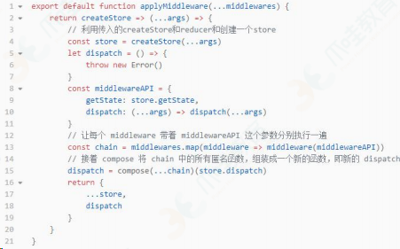

从 applyMiddleware 中可以看出 ∶

redux 中间件接受一个对象作为参数，对象的参数上有两个字段：dispatch 和 getState，分别代表着 Redux Store 上的两个同名函数。

柯里化函数两端一个是 middewares，一个是 store.dispatch

## 组件通信的方式有哪些

⽗组件向子组件通讯: ⽗组件可以向子组件通过传 props 的方式，向子组件进⾏通讯

子组件向⽗组件通讯: props+回调的方式，⽗组件向子组件传递 props 进⾏通讯，此 props 为作用域为⽗组件⾃身的函 数，子组件调用该函数，将子组件想要传递的信息，作为参数，传递到⽗组件的作用域中

兄弟组件通信: 找到这两个兄弟节点共同的⽗节点,结合上面两种方式由⽗节点转发信息进⾏通信

跨层级通信: Context 设计目的是为了共享那些对于⼀个组件树而⾔是“全局”的数据，例如当前认证的用户、主题或首选语⾔，对于跨越多层的全局数据通过 Context 通信再适合不过

发布订阅模式: 发布者发布事件，订阅者监听事件并做出反应,我们可以通过引入 event 模块进⾏通信

全局状态管理⼯具: 借助 Redux 或者 Mobx 等全局状态管理⼯具进⾏通信,这种⼯具会维护⼀个全局状态中⼼ Store,并根据不同的事件产⽣新的状态

## 使用

- create-react-app
- 基本用法
  - JSX 语法
  - 条件
  - 列表渲染
  - 事件
  - 组件和 props（类型检查）
  - state 和 setState
  - 组件声明周期
- 高级使用
  - 函数组件
  - 受控和非受控组件
  - refs
  - Protals
  - context
  - 异步组件（懒加载）
  - 性能优化
  - shouldComponentUpdate
  - 纯组件
  - 不可变值 immutablejs
  - 高阶组件

## 周边工具

- redux
  - store
  - reducer
  - action
  - dispatch
  - 单项数据流模型
  - 中间件 redux-thunkredux-saga
- react-redux
  - provider
  - connect
  - mapStateToProps
  - mapDispatchToProps
- react-router

## 待定面试题

### React 的生命周期 mount 和 update 描述下

### React 的生命周期中的 isBatchingUpdates 了解吗？ Transaction 知道吗

### React 的 vdom 如何实现？ jsx 是怎样解析的？

### React 的 Fiber`是什么？具有什么样的特性？

### React 的 diff/patch 算法原理

### React 的组件逻辑（受控、非受控）？如何设计一个组件库

### React 的数据流， Redux 、 Mobx 、 Rxjs ，发布订阅模式、观察者模式， flux 和 no-flux

### React 的事件注册和事件分发知道吗？

### Redux 解决了什么痛点（有什么优点），⼜有什么缺点

### Redux 的中间件有哪些？ redux-actions 、 redux-promise 、 redux-thunk 、redux-saga 、 redux-immutable 了解过哪些？说说中间件的意义

### Redux 有什么优化方案？

### SSR 了解过吗？怎样做？了解 Koa 么？

### React-Native 了解过吗？ JavascriptCore 是什么？

## 原理

- 函数式编程
- vdom 和 diff 算法
- JSX 本质
- 合成事件
- setState 和 batchUpdate
- 组件渲染过程
- 前端路由

## 1 生命周期

在 V16 版本中引入了 Fiber 机制。这个机制一定程度上的影响了部分生命
周期的调用，并且也引入了新的 2 个 API 来解决问题

在之前的版本中，如果你拥有一个很复杂的复合组件，然后改动了最上层组件
的 state ，那么调用栈可能会很长

调用栈过长，再加上中间进行了复杂的操作，就可能导致长时间阻塞主线程，带来不好的用户体验。 Fiber 就是为了解决该问题而生

Fiber 本质上是一个虚拟的堆栈帧，新的调度器会按照优先级自由调度这些帧，从而将之前的同步渲染改成了异步渲染，在不影响体验的情况下去分段计算更新

对于如何区别优先级， React 有自己的一套逻辑。对于动画这种实时性很高的东⻄，也就是 16 ms 必须渲染一次保证不卡顿的情况下， React 会每 16 ms（以内） 暂停一下更新，返回来继续渲染动画

对于异步渲染，现在渲染有两个阶段： reconciliation 和 commit 。前者过程是可以打断的，后者不能暂停，会一直更新界面直到完成。

#### 1.Reconciliation 阶段

- componentWillMount
- componentWillReceiveProps
- shouldComponentUpdate
- componentWillUpdate

#### 2.Commit 阶段

- componentDidMount
- componentDidUpdate
- componentWillUnmount

因为 Reconciliation 阶段是可以被打断的，所以 Reconciliation 阶段会执行的生命周期函数就可能会出现调用多次的情况，从而引起 Bug 。由此对于 Reconciliation 阶段调用的几个函数，除了 shouldComponentUpdate 以外，其他都应该避免去使用，并且 V16 中也引入了新的 API 来解决这个问题。

getDerivedStateFromProps 用于替换 componentWillReceiveProps ，该函数会在初始化和 update 时被调用

```js
class ExampleComponent extends React.Component {
	// Initialize state in constructor,
	// Or with a property initializer.
	state = {};
	static getDerivedStateFromProps(nextProps, prevState) {
		if (prevState.someMirroredValue !== nextProps.someValue) {
			return {
				derivedData: computeDerivedState(nextProps),
				someMirroredValue: nextProps.someValue,
			};
		}
		// Return null to indicate no change to state.
		return null;
	}
}
```

getSnapshotBeforeUpdate 用于替换 componentWillUpdate ，该函数会
在 update 后 DOM 更新前被调用，用于读取最新的 DOM 数据

更多详情：http://blog.poetries.top/2018/11/18/react-lifecircle

## setState

setState 在 React 中是经常使用的一个 API ，但是它存在一些的问题经常会导致初学者出错，核⼼原因就是因为这个 API 是异步的。

首先 setState 的调用并不会⻢上引起 state 的改变，并且如果你一次调用了多个 setState ，那么结果可能并不如你期待的一样。

```js
handle() {
    // 初始化 `count` 为 0
    console.log(this.state.count) // -> 0
    this.setState({ count: this.state.count + 1 })
    this.setState({ count: this.state.count + 1 })
    this.setState({ count: this.state.count + 1 })
    console.log(this.state.count) // -> 0
}
```

第一，两次的打印都为 0 ，因为 setState 是个异步 API ，只有同步代码运行完毕才会执行。 setState 异步的原因我认为在于， setState 可能会导致 DOM 的重绘，如果调用一次就⻢上去进行重绘，那么调用多次就会造成不必要的性能损失。设计成异步的话，就可以将多次调用放入一个队列中，在恰当的时候统一进行更新过程。

```js
Object.assign(
	{},
	{ count: this.state.count + 1 },
	{ count: this.state.count + 1 },
	{ count: this.state.count + 1 }
);
```

当然你也可以通过以下方式来实现调用三次 setState 使得 count 为 3

```js
handle() {
    this.setState((prevState) => ({ count: prevState.count + 1 }))
    this.setState((prevState) => ({ count: prevState.count + 1 }))
    this.setState((prevState) => ({ count: prevState.count + 1 }))
}
```

如果你想在每次调用 setState 后获得正确的 state ，可以通过如下代码实现

```js
handle() {
    this.setState((prevState) => ({ count: prevState.count + 1 }), () => {
    	console.log(this.state)
    })
}
```

更多详情：http://blog.poetries.top/2018/12/20/react-setState

## React 中 keys 的作用是什么？

Keys 是 React 用于追踪哪些列表中元素被修改、被添加或者被移除的辅助
标识

在开发过程中，我们需要保证某个元素的 key 在其同级元素中具有唯一性。在 ReactDiff 算法中 React 会借助元素的 Key 值来判断该元素是新近创建的还是被移动而来的元素，从而减少不必要的元素重渲染。此外，React 还需要借助 Key 值来判断元素与本地状态的关联关系，因此我们绝不可忽视转换函数中 Key 的重要性

## 传入 setState 函数的第二个参数的作用是什么？

该函数会在 setState 函数调用完成并且组件开始重渲染的时候被调用，我们
可以用该函数来监听渲染是否完成：

```js
this.setState({ username: "tylermcginnis33" }, () =>
	console.log("setState has finished and the component has re-rendere")
);
this.setState((prevState, props) => {
	return {
		streak: prevState.streak + props.count,
	};
});
```

## React 中 refs 的作用是什么

Refs 是 React 提供给我们的安全访问 DOM 元素或者某个组件实例的句柄
可以为元素添加 ref 属性然后在回调函数中接受该元素在 DOM 树中的句柄，该值会作为回调函数的第一个参数返回

## 在生命周期中的哪一步你应该发起 AJAX 请求

我们应当将 AJAX 请求放到 componentDidMount 函数中执行，主要原因有下
React 下一代调和算法 Fiber 会通过开始或停止渲染的方式优化应用性能，其会影响到 componentWillMount 的触发次数。对于 componentWillMount 这个生命周期函数的调用次数会变得不确定， React 可能会多次频繁调用 componentWillMount 。如果我们将 AJAX 请求放到 componentWillMount 函数中，那么显而易见其会被触发多次，自然也就不是好的选择。

如果我们将 AJAX 请求放置在生命周期的其他函数中，我们并不能保证请求仅在组件挂载完毕后才会要求响应。如果我们的数据请求在组件挂载之前就完成，并且调用了 setState 函数将数据添加到组件状态中，对于未挂载的组件则会报错。而在 componentDidMount 函数中进行 AJAX 请求则能有效避免这个问题。

## shouldComponentUpdate 的作用

shouldComponentUpdate 允许我们手动地判断是否要进行组件更新，根据组
件的应用场景设置函数的合理返回值能够帮我们避免不必要的更新

## 如何告诉 React 它应该编译生产环境版

通常情况下我们会使用 Webpack 的 DefinePlugin 方法来将 NODE_ENV 变量值设置为 production 。编译版本中 React 会忽略 propType 验证以及其他的告警信息，同时还会降低代码库的大小， React 使用了 Uglify 插件来移除生产环境下不必要的注释等信息

## 7 概述下 React 中的事件处理逻辑

为了解决跨浏览器兼容性问题， React 会将浏览器原生事件（ Browser Native Event ）封装为合成事件（ SyntheticEvent ）传入设置的事件处理器中。这里的合成事件提供了与原生事件相同的接口，不过它们屏蔽了底层浏览器的细节差异，保证了行为的一致性。另外有意思的是， React 并没有直接将事件附着到子元素上，而是以单一事件监听器的方式将所有的事件发送到顶层进行处理。这样 React 在更新 DOM 的时候就不需要考虑如何去处理附着在 DOM 上的事件监听器，最终达到优化性能的目的

## 8 createElement 与 cloneElement 的区别是什么

createElement 函数是 JSX 编译之后使用的创建 React Element 的函数，而 cloneElement 则是用于复制某个元素并传入新的 Props

## 9 redux 中间件

中间件提供第三方插件的模式，自定义拦截 action -> reducer 的过程。

变为 action -> middlewares -> reducer 。这种机制可以让我们改变数据流，实现如异步 action ， action 过滤，⽇志输出，异常报告等功能

- redux-logger ：提供⽇志输出
- redux-thunk ：处理异步操作
- redux-promise ：处理异步操作， actionCreator 的返回值是 promise

## 10 redux 有什么缺点

一个组件所需要的数据，必须由父组件传过来，而不能像 flux 中直接从 store 取。

当一个组件相关数据更新时，即使父组件不需要用到这个组件，父组件还是会重新 render ，可能会有效率影响，或者需要写复杂的 shouldComponentUpdate 进行判断。

## 11 react 组件的划分业务组件技术组件？

- 根据组件的职责通常把组件分为 UI 组件和容器组件。
- UI 组件负责 UI 的呈现，容器组件负责管理数据和逻辑。
- 两者通过 React-Redux 提供 connect 方法联系起来

## 12 react 生命周期函数

### 初始化阶段

- getDefaultProps：获取实例的默认属性
- getInitialState：获取每个实例的初始化状态
- componentWillMount ：组件即将被装载、渲染到页面上
- render：组件在这里生成虚拟的 DOM 节点
- omponentDidMount：组件真正在被装载之后

### 运行中状态

- componentWillReceiveProps：组件将要接收到属性的时候调用
- shouldComponentUpdate：组件接受到新属性或者新状态的时候（可以返回 false，接收数据后不更新，阻止 render 调用，后面的函数不会被继续执行了）
- componentWillUpdate：组件即将更新不能修改属性和状态
- render：组件重新描绘
- componentDidUpdate：组件已经更新

### 销毁阶段

componentWillUnmount：组件即将销毁

## 13 react 性能优化是哪个周期函数

shouldComponentUpdate 这个方法用来判断是否需要调用 render 方法重新描绘 dom。因为 dom 的描绘非常消耗性能，如果我们能在 shouldComponentUpdate 方 法中能够写出更优化的 dom diff 算法，可以极大的提高性能

## react 的虚拟 dom 是怎么实现的

首先说说为什么要使用 Virturl DOM ，因为操作真实 DOM 的耗费的性能代价太高，所以 react 内部使用 js 实现了一套 dom 结构，在每次操作在和真实 dom 之前，使用实现好的 diff 算法，对虚拟 dom 进行比较，递归找出有变化的 dom 节点，然后对其进行更新操作。

为了实现虚拟 DOM ，我们需要把每一种节点类型抽象成对象，每一种节点类型有自己的属性，也就是 prop，每次进行 diff 的时候， react 会先比较该节点类型，假如节点类型不一样，那么 react 会直接删除该节点，然后直接创建新的节点插入到其中，假如节点类型一样，那么会比较 prop 是否有更新，假如有 prop 不一样，那么 react 会判定该节点有更新，那么重渲染该节点，然后在对其子节点进行比较，一层一层往下，直到没有子节点

## react 的渲染过程中，兄弟节点之间是怎么处理的？也就是 key 值不一样的时候

通常我们输出节点的时候都是 map 一个数组然后返回一个 ReactNode ，为了方便 react 内部进行优化，我们必须给每一个 reactNode 添加 key ，这个 key prop 在设计值处不是给开发者用的，而是给 react 用的，大概的作用就是给每一个 reactNode 添加一个身份标识，方便 react 进行识别，在重渲染过程中，如果 key 一样，若组件属性有所变化，则 react 只更新组件对应的属性；没有变化则不更新，如果 key 不一样，则 react 先销毁该组件，然后重新创建该组件

## 介绍一下 react

1. 以前我们没有 jquery 的时候，我们大概的流程是从后端通过 ajax 获取到数据然后使用 jquery 生成 dom 结果然后更新到页面当中，但是随着业务发展，我们的项目可能会越来越复杂，我们每次请求到数据，或则数据有更改的时候，我们⼜需要重新组装一次 dom 结构，然后更新页面，这样我们手动同步 dom 和数据的成本就越来越高，而且频繁的操作 dom，也使我们页面的性能慢慢的降低。
2. 这个时候 mvvm 出现了，mvvm 的双向数据绑定可以让我们在数据修改的同时同步 dom 的更新，dom 的更新也可以直接同步我们数据的更改，这个特定可以大大降低我们手动去维护 dom 更新的成本，mvvm 为 react 的特性之一，虽然 react 属于单项数据流，需要我们手动实现双向数据绑定。
3. 有了 mvvm 还不够，因为如果每次有数据做了更改，然后我们都全量更新 dom 结构的话，也没办法解决我们频繁操作 dom 结构(降低了页面性能)的问题，为了解决这个问题，react 内部实现了一套虚拟 dom 结构，也就是用 js 实现的一套 dom 结构，他的作用是讲真实 dom 在 js 中做一套缓存，每次有数据更改的时候，react 内部先使用算法，也就是鼎鼎有名的 diff 算法对 dom 结构进行对比，找到那些我们需要新增、更新、删除的 dom 节点，然后一次性对真实 DOM 进行更新，这样就大大降低了操作 dom 的次数。 那么 diff 算法是怎么运作的呢?
   首先，diff 针对类型不同的节点，会直接判定原来节点需要卸载并且用新的节点来装载卸载的节点的位置；针对于节点类型相同的节点，会对比这个节点的所有属性，如果节点的所有属性相同，那么判定这个节点不需要更新，如果节点属性不相同，那么会判定这个节点需要更新，react 会更新并重渲染这个节点。
4. react 设计之初是主要负责 UI 层的渲染，虽然每个组件有自己的 state，state 表示组件的状态，当状态需要变化的时候，需要使用 setState 更新我们的组件，但是，我们想通过一个组件重渲染它的兄弟组件，我们就需要将组件的状态提升到父组件当中，让父组件的状态来
5. 控制这两个组件的重渲染，当我们组件的层次越来越深的时候，状态需要一直往下传，无疑加大了我们代码的复杂度，我们需要一个状态管理中⼼，来帮我们管理我们状态 state。
6. 这个时候，redux 出现了，我们可以将所有的 state 交给 redux 去管理，当我们的某一个 state 有变化的时候，依赖到这个 state 的组件就会进行一次重渲染，这样就解决了我们的我们需要一直把 state 往下传的问题。redux 有 action、reducer 的概念，action 为唯一修改 state 的来源，reducer 为唯一确定 state 如何变化的入口，这使得 redux 的数据流非常规范，同时也暴露出了 redux 代码的复杂，本来那么简单的功能，却需要完成那么多的代码。
7. 后来，社区就出现了另外一套解决方案，也就是 mobx，它推崇代码简约易懂，只需要定义一个可观测的对象，然后哪个组价使用到这个可观测的对象，并且这个对象的数据有更改，那么这个组件就会重渲染，而且 mobx 内部也做好了是否重渲染组件的生命周期
   shouldUpdateComponent，不建议开发者进行更改，这使得我们使用 mobx 开发项目的时
   候可以简单快速的完成很多功能，连 redux 的作者也推荐使用 mobx 进行项目开发。但是，随着项目的不断变大，mobx 也不断暴露出了它的缺点，就是数据流太随意，出了 bug 之后不好追溯数据的流向，这个缺点正好体现出了 redux 的优点所在，所以针对于小项目来说，社区推荐使用 mobx，对大项目推荐使用 redux

## 为什么虚拟 dom 会提高性能

虚拟 dom 相当于在 js 和真实 dom 中间加了一个缓存，利用 dom diff 算
法避免了没有必要的 dom 操作，从而提高性能

具体实现步骤如下：

- 用 JavaScript 对象结构表示 DOM 树的结构；然后用这个树构建一个真正的 DOM 树，插到文档当中
- 当状态变更的时候，重新构造一棵新的对象树。然后用新的树和旧的树进行比较，记录两棵树差异
- 把 2 所记录的差异应用到步骤 1 所构建的真正的 DOM 树上，视图就更新

## 15 diff 算法?

- 把树形结构按照层级分解，只比较同级元素。
- 给列表结构的每个单元添加唯一的 key 属性，方便比较。
- React 只会匹配相同 class 的 component （这里面的 class 指的是组件的名=字）
- 合并操作，调用 component 的 setState 方法的时候, React 将其标记为 - dirty
- 到每一个事件循环结束, React 检查所有标记 dirty 的 component 重新绘制.
- 选择性子树渲染。开发⼈员可以重写 shouldComponentUpdate 提高 diff 的性能

## 16 react 性能优化方案

- 重写 shouldComponentUpdate 来避免不必要的 dom 操作
- 使用 production 版本的 react.js
- 使用 key 来帮助 React 识别列表中所有子组件的最小变化

## 16 简述 flux 思想

Flux 的最大特点，就是数据的"单向流动"。

- 用户访问 View
- View 发出用户的 Action
- Dispatcher 收到 Action ，要求 Store 进行相应的更新
- Store 更新后，发出一个 "change" 事件
- View 收到 "change" 事件后，更新页面

## 说说你用 react 有什么坑点？

1. JSX 做表达式判断时候，需要强转为 boolean 类型

如果不使用 !!b 进行强转数据类型，会在页面里面输出 0 。

```jsx
render() {
 const b = 0;
 return <div>
     {
     !!b && <div>这是一段文本</div>
     }
 </div>
}
```

2. 尽量不要在 componentWillReviceProps 里使用 setState，如果一定要使用，那么需要判断结束条件，不然会出现无限重渲染，导致页面崩溃
3. 给组件添加 ref 时候，尽量不要使用匿名函数，因为当组件更新的时候，匿名函数会被当做新的 prop 处理，让 ref 属性接受到新函数的时候，react 内部会先清空 ref，也就是会以 null 为回调参数先执行一次 ref 这个 props，然后在以该组件的实例执行一次 ref，所以用匿名函数做 ref
   的时候，有的时候去 ref 赋值后的属性会取到 null
4. 遍历子节点的时候，不要用 index 作为组件的 key 进行传入

## 18 我现在有一个 button，要用 react 在上面绑定点击事件，要怎么做？

```jsx
class Demo {
	render() {
		return (
			<button
				onClick={(e) => {
					alert("我点击了按钮");
				}}
			>
				按钮
			</button>
		);
	}
}
```

你觉得你这样设置点击事件会有什么问题吗？

由于 onClick 使用的是匿名函数，所有每次重渲染的时候，会把该 onClick 当做一个新的 prop 来处理，会将内部缓存的 onClick 事件进行重新赋值，所以相对直接使用函数来说，可能有一点的性能下降

修改

```jsx
class Demo {
 onClick = (e) => {
 alert('我点击了按钮')
 }
 render() {
 return <button onClick={this.onClick}>
 按钮
 </button>
 }

```

## 性能优化

在 shouldComponentUpdate 函数中我们可以通过返回布尔值来决定当前组件是否需要更新。这层代码逻辑可以是简单地浅比较一下当前 state 和之前的 state 是否相同，也可以是判断某个值更新了才触发组件更新。一般来说不推荐完整地对比当前 state 和之前的 state 是否相同，因为组件更新触发可能会很频繁，这样的完整对比性能开销会有点大，可能会造成得不偿失的情况。

当然如果真的想完整对比当前 state 和之前的 state 是否相同，并且不影响性能也是行得通的，可以通过 immutable 或者 immer 这些库来生成不可变对象。这类库对于操作大规模的数据来说会提升不错的性能，并且一旦改变数据就会生成一个新的对象，对比前后 state 是否一致也就方便多了，同时也很推荐阅读下 immer 的源码实现

另外如果只是单纯的浅比较一下，可以直接使用 PureComponent ，底层就是实现了浅比较 state

```jsx
class Test extends React.PureComponent {
	render() {
		return <div>PureComponent</div>;
	}
}
```

这时候你可能会考虑到函数组件就不能使用这种方式了，如果你使用 16.6.0 之后的版本的话，可以使用 React.memo 来实现相同的功能

```jsx
const Test = React.memo(() => <div>PureComponent</div>);
```

通过这种方式我们就可以既实现了 shouldComponentUpdate 的浅比较，⼜
能够使用函数组件

## 通信

### 1.父子通信

父组件通过 props 传递数据给子组件，子组件通过调用父组件传来的函数传递数据给父组件，这两种方式是最常用的父子通信实现办法。

这种父子通信方式也就是典型的单向数据流，父组件通过 props 传递数据，子组件不能直接修改 props ， 而是必须通过调用父组件函数的方式告知父组件修改数据。

### 2.兄弟组件通信

对于这种情况可以通过共同的父组件来管理状态和事件函数。比如说其中一个
兄弟组件调用父组件传递过来的事件函数修改父组件中的状态，然后父组件将
状态传递给另一个兄弟组件

### 3.跨多层次组件通信

如果你使用 16.3 以上版本的话，对于这种情况可以使用 Context API

```jsx
// 创建 Context，可以在开始就传入值
const StateContext = React.createContext()
class Parent extends React.Component {
 render () {
 return (
 // value 就是传入 Context 中的值
 <StateContext.Provider value='yck'>
 <Child />
 </StateContext.Provider>
 )
 }
}
class Child extends React.Component {
 render () {
 return (
 <ThemeContext.Consumer>
 // 取出值
 {context => (
 name is { context }
 )}
 </ThemeContext.Consumer>
 );
 }
}
```

### 4.任意组件

这种方式可以通过 Redux 或者 Event Bus 解决，另外如果你不怕麻烦的
话，可以使用这种方式解决上述所有的通信情况

## HOC 是什么？相比 mixins 有什么优点？

很多⼈看到高阶组件（ HOC ）这个概念就被吓到了，认为这东⻄很难，其实
这东⻄概念真的很简单，我们先来看一个例子。

```js
function add(a, b) {
	return a + b;
}
```

现在如果我想给这个 add 函数添加一个输出结果的功能，那么你可能会考虑
我直接使用 console.log 不就实现了么。说的没错，但是如果我们想做的更
加优雅并且容易复用和扩展，我们可以这样去做

```js
function withLog(fn) {
	function wrapper(a, b) {
		const result = fn(a, b);
		console.log(result);
		return result;
	}
	return wrapper;
}
const withLogAdd = withLog(add);
withLogAdd(1, 2);
```

其实这个做法在函数式编程里称之为高阶函数，大家都知道 React 的思想中是存在函数式编程的，高阶组件和高阶函数就是同一个东⻄。我们实现一个函数，传入一个组件，然后在函数内部再实现一个函数去扩展传入的组件，最后返回一个新的组件，这就是高阶组件的概念，作用就是为了更好的复用代码。

其实 HOC 和 Vue 中的 mixins 作用是一致的，并且在早期 React 也是使用
mixins 的方式。但是在使用 class 的方式创建组件以后， mixins 的方式就不能使用了，并且其实 mixins 也是存在一些问题的，比如

1. 隐含了一些依赖，比如我在组件中写了某个 state 并且在 mixin 中使用了，就这存在了一个依赖关系。万一下次别⼈要移除它，就得去 mixin 中查找依赖

2. 多个 mixin 中可能存在相同命名的函数，同时代码组件中也不能出现相同命名的函数，否则就是重写了，其实我一直觉得命名真的是一件麻烦事。
3. 雪球效应，虽然我一个组件还是使用着同一个 mixin ，但是一个 mixin 会被多个组件使用，可能会存在需求使得 mixin 修改原本的函数或者新增更多的函数，这样可能就会产生一个维护成本

HOC 解决了这些问题，并且它们达成的效果也是一致的，同时也更加的政治正确（毕竟更加函数式了）

## 事件机制

React 其实自己实现了一套事件机制，首先我们考虑一下以下代码：

```jsx
const Test = ({ list, handleClick }) => ({
    list.map((item, index) => (
    	<span onClick={handleClick} key={index}>{index}</span>
    ))
})
```

- 以上类似代码想必大家经常会写到，但是你是否考虑过点击事件是否绑定在了每一个标签上？事实当然不是， JSX 上写的事件并没有绑定在对应的真实 DOM 上，而是通过事件代理的方式，将所有的事件都统一绑定在了 document 上。这样的方式不仅减少了内存消耗，还能在组件挂载销毁时统一订阅和移除事件。
- 另外冒泡到 document 上的事件也不是原生浏览器事件，而是 React 自己实现的合成事件（ SyntheticEvent ）。因此我们如果不想要事件冒泡的话，调用 event.stopPropagation 是无效的，而应该调用 event.preventDefault

那么实现合成事件的目的是什么呢？总的来说在我看来好处有两点，分别是：

1. 合成事件首先抹平了浏览器之间的兼容问题，另外这是一个跨浏览器原生事件包装器，赋予了跨浏览器开发的能⼒
2. 对于原生浏览器事件来说，浏览器会给监听器创建一个事件对象。如果你有很多的事件监听，那么就需要分配很多的事件对象，造成高额的内存分配问题。但是对于合成事件来说，有一个事件池专⻔来管理它们的创建和销毁，当事件需要被使用时，就会从池子中复用对象，事件回调结束后，就会销毁事件对象上的属性，从而便于下次复用事件对象。

## 比较 React 和 Vue

### 1) 相同点

1. 都有组件化开发和 Virtual DOM

2. 都支持 props 进行父子组件间数据通信

3. 都支持数据驱动视图, 不直接操作真实 DOM, 更新状态数据界面就自动更新

4. 都支持服务器端渲染

5. 都有支持 native 的方案,React 的 React Native,Vue 的 Weex

### 2) 不同点

1. 数据绑定: vue 实现了数据的双向绑定,react 数据流动是单向的

2. 组件写法不一样, React 推荐的做法是 JSX , 也就是把 HTML 和 CSS 全都写进 JavaScript 了,即'all in js'; Vue 推荐的做法是 webpack+vue-loader 的单文件组件格式,即 html,css,js 写在同一个文件

3. state 对象在 react 应用中不可变的,需要使用 setState 方法更新状态;在 vue 中,state 对象不是必须的,数据由 data 属性在 vue 对象中管理

4. virtual DOM 不一样,vue 会跟踪每一个组件的依赖关系,不需要重新渲染整个组件树.而对于 React 而言,每当应用的状态被改变时,全部组件都会重新渲染,所以 react 中会需要 shouldComponentUpdate 这个生命周期函数方法来进行控制

5. React 严格上只针对 MVC 的 view 层,Vue 则是 MVVM 模式

## 1.Redux 管理状态的机制

### 1) 对 Redux 基本理解

1. redux 是一个独立专门用于做状态管理的 JS 库, 不是 react 插件库

2. 它可以用在 react, angular, vue 等项目中, 但基本与 react 配合使用

3. 作用: 集中式管理 react 应用中多个组件共享的状态和从后台获取的数据

### 2) Redux 的工作原理


### 3)Redux 使用扩展

1. 使用 react-redux 简化 redux 的编码

2. 使用 redux-thunk 实现 redux 的异步编程

3. 使用 Redux DevTools 实现 chrome 中 redux 的调试

## 其他面试题

### 1.redux 中间件的原理是什么?

redux 官方源码库：[Redux (github.com)](https://github.com/reduxjs)

中间件关键源码：[redux-thunk](https://github.com/reduxjs/redux-thunk)

源码源码实现在此目录：redux-thunk/src/index.ts

```typescript

```

### 2.你会把数据统一放到 redux 中管理，还是共享数据放在 redux 中管理?

所有数据统一放到 redux 中管理

1.从项目开发业务复杂度和工程性来看，统一管理数据，可维护性和可扩展性上，数据全部都是一致的，问题定位快

2.

### 3.componentWillReceiveProps(已废弃) 的调用时机

### 4.react 性能优化的最佳实践

### 5.虚拟 dom 是什么? 为什么虚拟 dom 会提升代码性能。

### 6.webpack 中，是借助 Loader 完成的 JSX 代码的转化，还是 babel?

### 7.调用 setState 后，发生了什么

### 8.setState 是异步的，这个点你在什么时候遇到过坑

### 9.refs 的作用是什么，你在什么业务场景下使用过 refs

### 10.ref 是一个函数，有什么好处?

### 11.高阶组件你是怎么理解的，它本质是一个什么东西?

### 12.受控组件与非受控组件的区别

### 13.函数组件和 hooks

### 14.this 指向问题你一般怎么解决

### 15.函数组件怎么性能优化

### 16.感个生命周期里发送 ajax?

### 17.ssr 的原理是什么?

### 18.redux-saga 的设计思想是什么? 什么是 sideEffects

### 19.react，jquery，vue 是否有可能共存在一个项目中?

### 20.组件是什么? 类是什么? 类被编译成什么?

### 21.你是如何跟着社区成长的?

### 22.如何避免 ajax 数据重新获取

### 23.react-router4 的核心思想是什么，和 react-router3 有什么区别

### 24.immutable.js 和 redux 的最佳实践

### 25.reselect 是做什么使用的?

### 26.react-router 的基本原理，hashHistory，browserHisotry

### 27.什么情况下使用异步组件

### 28.XSs 攻击在 react 中如何防范?

### 29.getDerivedStateFromProps， getDerivedStateFromProps

## Redux

### 1、redux 用处

::: details 查看参考回答

在组件化的应用中，会有着大量的组件层级关系，深嵌套的组件与浅层父组件进行数据交互，变得十分繁琐困难。而 redux，站在一个服务级别的角度，可以毫无阻碍地将应用的状态传递到每一个层级的组件中。redux 就相当于整个应用的管家。

:::

### 2、redux 里常用方法

**考察点：redux**

::: details 查看参考回答

- 提供 getState() 方法获取 state；
- 提供 dispatch(action) 方法更新 state；
- 通过 subscribe(listener) 注册监听器;
- 等等

:::

## React 基本使用

### 1.React 组件如何通讯

### 2.JSX 本质是什么

### 3.context 是什么，有何用途 ?

### 4.shouldComponentUpdate 的用途

### 5.描述 redux 单项数据流

### 6.setState 是同步还是异步?(场景图，见下页)

### 7.框架综合应用：基于 React 设计一个 todolist ( 组件结构，redux state 数据结构)

## React 高级特性

### 高级特性

### 周边插件

## React 原理

# 待定

### angularJs 和 React 区别

::: details 查看参考回答

React 对比 Angular 是思想上的转变，它也并不是一个库，是一种开发理念，组件化，分治的管理，数据与 view 的一体化。

它只有一个中心，发出状态，渲染 view，对于虚拟 dom 它并没有提高渲染页面的性能，它提供更多的是利用 jsx 便捷生成 dom 元素，利用组件概念进行分治管理页面每个部分(例如 header section footer slider)

:::

### 说说 vue react angularjs jquery 的区别

**考察点：框架**

::: details 查看参考回答

JQuery 与另外几者最大的区别是，JQuery 是事件驱动，其他两者是数据驱动。

JQuery 业务逻辑和 UI 更改该混在一起， UI 里面还参杂这交互逻辑，让本来混乱的逻辑更加混乱。

Angular，vue 是双向绑定，而 React 不是其他还有设计理念上的区别等

:::

### redux 中间件

参考回答：

中间件提供第三方插件的模式，自定义拦截 action -> reducer 的过程。变为
action -> middlewares -> reducer 。这种机制可以让我们改变数据流，实现如异步 action ，action 过滤，日志输出，异常报告等功能。

常见的中间件： redux-logger：提供日志输出；redux-thunk：处理异步操作；

redux-promise：处理异步操作；actionCreator 的返回值是 promise

### redux 有什么缺点

参考回答：

1.一个组件所需要的数据，必须由父组件传过来，而不能像 flux 中直接从 store 取。

2.当一个组件相关数据更新时，即使父组件不需要用到这个组件，父组件还是会重新 render，可能会有效率影响，或者需要写复杂的 shouldComponentUpdate 进行判断。

### React 组件的划分业务组件技术组件？

参考回答：

根据组件的职责通常把组件分为 UI 组件和容器组件。UI 组件负责 UI 的呈现，容器组件负责管理数据和逻辑。两者通过 React-Redux 提供 connect 方法联系起来。

### React 生命周期函数

参考回答：

一、初始化阶段：

- getDefaultProps:获取实例的默认属性
- getInitialState:获取每个实例的初始化状态
- componentWillMount：组件即将被装载、渲染到页面上
- render:组件在这里生成虚拟的 DOM 节点
- componentDidMount:组件真正在被装载之后

二、运行中状态：

- componentWillReceiveProps:组件将要接收到属性的时候调用
- shouldComponentUpdate:组件接受到新属性或者新状态的时候（可以返回 false，接收数据后不更新，阻止 render 调用，后面的函数不会被继续执行了）
- componentWillUpdate:组件即将更新不能修改属性和状态
- render:组件重新描绘
- componentDidUpdate:组件已经更新

三、销毁阶段：

- componentWillUnmount:组件即将销毁

### React 性能优化是哪个周期函数？

参考回答：

shouldComponentUpdate 这个方法用来判断是否需要调用 render 方法重新描绘 dom。

因为 dom 的描绘非常消耗性能，如果我们能在 shouldComponentUpdate 方法中能够写出更优化的 dom diff 算法，可以极大的提高性能。

### 为什么虚拟 dom 会提高性能?

参考回答：

虚拟 dom 相当于在 js 和真实 dom 中间加了一个缓存，利用 dom diff 算法避免了没有必要的 dom 操作，从而提高性能。

具体实现步骤如下：

- 1.用 JavaScript 对象结构表示 DOM 树的结构；然后用这个树构建一个真正的 DOM 树，插到文档当中；
- 2.当状态变更的时候，重新构造一棵新的对象树。然后用新的树和旧的树进行比较，记录两棵树差异；

把 2 所记录的差异应用到步骤 1 所构建的真正的 DOM 树上，视图就更新了。

### diff 算法?

参考回答：

1.把树形结构按照层级分解，只比较同级元素。

2.给列表结构的每个单元添加唯一的 key 属性，方便比较。

3.React 只会匹配相同 class 的 component（这里面的 class 指的是组件的名字）

4.合并操作，调用 component 的 setState 方法的时候, React 将其标记为 dirty。到每一个事件循环结束, React 检查所有标记 dirty 的 component 重新绘制.
6．选择性子树渲染。开发人员可以重写 shouldComponentUpdate 提高 diff 的性能。

### React 性能优化方案

参考回答：

- 1）重写 shouldComponentUpdate 来避免不必要的 dom 操作。
- 2）使用 production 版本的 React.js。
- 3）使用 key 来帮助 React 识别列表中所有子组件的最小变化

### 简述 flux 思想

参考回答：

Flux 的最大特点，就是数据的"单向流动"。

- 1.用户访问 View
- 2.View 发出用户的 Action
- 3.Dispatcher 收到 Action，要求 Store 进行相应的更新
- 4.Store 更新后，发出一个"change"事件
- 5.View 收到"change"事件后，更新页面

### React 项目用过什么脚手架？Mern? Yeoman?

参考回答：

Mern：MERN 是脚手架的工具，它可以很容易地使用 Mongo, Express, React and NodeJS 生成同构 JS 应用。它最大限度地减少安装时间，并得到您使用的成熟技术来加速开发。

### 你了解 React 吗？

参考回答：

了解，React 是 facebook 搞出来的一个轻量级的组件库，用于解决前端视图层的一些问题，就是 MVC 中 V 层的问题，它内部的 Instagram 网站就是用 React 搭建的。

### React 解决了什么问题？

参考回答：

解决了三个问题：

1.组件复用问题

2.性能问题

3.兼容性问题

### React 的协议？

参考回答：

React 遵循的协议是“BSD 许可证 + 专利开源协议”，这个协议比较奇葩，如果你的产品跟 facebook 没有竞争关系，你可以自由的使用 React，但是如果有竞争关系，你的 React 的使用许可将会被取消

### 了解 shouldComponentUpdate 吗？

参考回答：

React 虚拟 dom 技术要求不断的将 dom 和虚拟 dom 进行 diff 比较，如果 dom 树比价大，这种比较操作会比较耗时，因此 React 提供了 shouldComponentUpdate 这种补丁函数，如果对于一些变化，如果我们不希望某个组件刷新，或者刷新后跟原来其实一样，就可以使用这个函数直接告诉 React，省去 diff 操作，进一步的提高了效率。

## React 17 带来了哪些改变

> 最重要的是以下三点：

- 新的 `JSX` 转换逻辑
- 事件系统重构
- `Lane 模型`的引入

**1. 重构 JSX 转换逻辑**

在过去，如果我们在 React 项目中写入下面这样的代码：

```javascript
function MyComponent() {
	return <p>这是我的组件</p>;
}
```

React 是会报错的，原因是 React 中对 JSX 代码的转换依赖的是 `React.createElement` 这个函数。因此但凡我们在代码中包含了 JSX，那么就必须在文件中引入 React，像下面这样：

```javascript
import React from "react";
function MyComponent() {
	return <p>这是我的组件</p>;
}
```

而 `React 17 则允许我们在不引入 React 的情况下直接使用 JSX`。这是因为在 React 17 中，编译器会自动帮我们引入 JSX 的解析器，也就是说像下面这样一段逻辑：

```javascript
function MyComponent() {
	return <p>这是我的组件</p>;
}
```

会被编译器转换成这个样子：

```javascript
import { jsx as jsx } from "react/jsx-runtime";
function MyComponent() {
	return jsx("p", { children: "这是我的组件" });
}
```

`react/jsx-runtime` 中的 JSX 解析器将取代 `React.createElement` 完成 `JSX` 的编译工作，这个过程对开发者而言是自动化、无感知的。因此，新的 JSX 转换逻辑带来的最显著的改变就是降低了开发者的学习成本。

`react/jsx-runtime` 中的 JSX 解析器看上去似乎在调用姿势上和 `React.createElement` 区别不大，那么它是否只是 `React.createElement` 换了个马甲呢？当然不是，它在内部实现了 `React.createElement` 无法做到的性能优化和简化。在一定情况下，它可能会略微改善编译输出内容的大小

**2. 事件系统重构**

事件系统在 React 17 中的重构要从以下两个方面来看：

- 卸掉历史包袱
- 拥抱新的潮流

**2.1 卸掉历史包袱：放弃利用 document 来做事件的中心化管控**

> React 16.13.x 版本中的事件系统会通过将所有事件冒泡到 document 来实现对事件的中心化管控

这样的做法虽然看上去已经足够巧妙，但仍然有它不聪明的地方——document 是整个文档树的根节点，操作 document 带来的影响范围实在是太大了，这将会使事情变得更加不可控

> 在 React 17 中，React 团队终于正面解决了这个问题：事件的中心化管控不会再全部依赖 `document`，管控相关的逻辑被转移到了每个 React 组件自己的[容器](https://cloud.tencent.com/product/tke) DOM 节点中。比如说我们在 ID 为 root 的 DOM 节点下挂载了一个 React 组件，像下面代码这样：

```javascript
const rootElement = document.getElementById("root");
ReactDOM.render(<App />, rootElement);
```

那么事件管控相关的逻辑就会被安装到 `root 节点`上去。这样一来， React 组件就能够自己玩自己的，再也无法对全局的事件流构成威胁了

**2.2 拥抱新的潮流：放弃事件池**

在 React 17 之前，合成事件对象会被放进一个叫作"事件池"的地方统一管理。这样做的目的是能够实现事件对象的复用，进而提高性能：每当事件处理函数执行完毕后，其对应的合成事件对象内部的所有属性都会被置空，意在为下一次被复用做准备。这也就意味着事件逻辑一旦执行完毕，我们就拿不到事件对象了，React 官方给出的这个例子就很能说明问题，请看下面这个代码

```javascript
function handleChange(e) {
	// This won't work because the event object gets reused.
	setTimeout(() => {
		console.log(e.target.value); // Too late!
	}, 100);
}
```

> 异步执行的 `setTimeout` 回调会在 `handleChange` 这个事件处理函数执行完毕后执行，因此它拿不到想要的那个事件对象 `e`。

要想拿到目标事件对象，必须显式地告诉 React——我永远需要它，也就是调用 `e.persist()` 函数，像下面这样：

```javascript
function handleChange(e) {
	// Prevents React from resetting its properties:
	e.persist();
	setTimeout(() => {
		console.log(e.target.value); // Works
	}, 100);
}
```

在 React 17 中，我们不需要 `e.persist()`，也可以随时随地访问我们想要的事件对象。

**3. Lane 模型的引入**

初学 React 源码的同学由此可能会很自然地认为：`优先级就应该是用 Lane 来处理的`。但事实上，`React 16 中处理优先级采用的是 expirationTime 模型`。

> `expirationTime` 模型使用 `expirationTime`(一个时间长度) 来描述任务的优先级；而 `Lane 模型`则使用`二进制数来表示任务的优先级`：

`lane 模型`通过将不同优先级赋值给一个位，通过 `31 位的位运算`来操作优先级。

`Lane 模型`提供了一个新的优先级排序的思路，相对于 `expirationTime` 来说，它对优先级的处理会更细腻，能够覆盖更多的边界条件。

### React 的工作原理？

参考回答：

React 会创建一个虚拟 DOM(virtual DOM)。当一个组件中的状态改变时，React 首先会通过 "diffing" 算法来标记虚拟 DOM 中的改变，第二步是调节
(reconciliation)，会用 diff 的结果来更新 DOM。

### 使用 React 有何优点？

参考回答：

- 1.只需查看 render 函数就会很容易知道一个组件是如何被渲染的
- 2.JSX 的引入，使得组件的代码更加可读，也更容易看懂组件的布局，或者组件之间是如何互相引用的
- 3.支持服务端渲染，这可以改进 SEO 和性能
- 4.易于测试
- 5.React 只关注 View 层，所以可以和其它任何框架(如 Backbone.js, Angular.js)一起使用

### 展示组件(Presentational component)和容器组件(Container component)之间有何不同？

参考回答：

1.展示组件关心组件看起来是什么。展示专门通过 props 接受数据和回调，并且几乎不会有自身的状态，但当展示组件拥有自身的状态时，通常也只关心 UI 状态而不是数据的状态。

2.容器组件则更关心组件是如何运作的。容器组件会为展示组件或者其它容器组件提供数据和行为(behavior)，它们会调用 Flux actions，并将其作为回调提供给展示组件。容器组件经常是有状态的，因为它们是(其它组件的)数据源

### 类组件(Class component)和函数式组件(Functional component)之间有何不同？

参考回答：

- 1.类组件不仅允许你使用更多额外的功能，如组件自身的状态和生命周期钩子，也能使组件直接访问 store 并维持状态
- 2.当组件仅是接收 props，并将组件自身渲染到页面时，该组件就是一个 '无状态组件(stateless component)'，可以使用一个纯函数来创建这样的组件。这种组件也被称为哑组件(dumb components)或展示组件

### (组件的)状态(state)和属性(props)之间有何不同？

参考回答：

- State 是一种数据结构，用于组件挂载时所需数据的默认值。State 可能会随着时间的推移而发生突变，但多数时候是作为用户事件行为的结果。
- Props(properties 的简写)则是组件的配置。props 由父组件传递给子组件，并且就子组件而言，props 是不可变的(immutable)。组件不能改变自身的 props，但是可以把其子组件的 props 放在一起(统一管理)。Props 也不仅仅是数据--回调函数也可以通过 props 传递。

### 应该在 React 组件的何处发起 Ajax 请求？

参考回答：

在 React 组件中，应该在 componentDidMount 中发起网络请求。这个方法会在组件第一次“挂载”(被添加到 DOM)时执行，在组件的生命周期中仅会执行一次。更重要的是，你不能保证在组件挂载之前 Ajax 请求已经完成，如果是这样，也就意味着你将尝试在一个未挂载的组件上调用 setState，这将不起作用。在 componentDidMount 中发起网络请求将保证这有一个组件可以更新了。

### 在 React 中，refs 的作用是什么？

参考回答：

Refs 可以用于获取一个 DOM 节点或者 React 组件的引用。何时使用 refs 的好的示例有管理焦点/文本选择，触发命令动画，或者和第三方 DOM 库集成。你应该避免使用 String 类型的 Refs 和内联的 ref 回调。Refs 回调是 React 所推荐的。

### 何为高阶组件(higher order component)？

参考回答：

高阶组件是一个以组件为参数并返回一个新组件的函数。HOC 运行你重用代码、逻辑和引导抽象。最常见的可能是 Redux 的 connect 函数。除了简单分享工具库和简单的组合，HOC 最好的方式是共享 React 组件之间的行为。

如果你发现你在不同的地方写了大量代码来做同一件事时，就应该考虑将代码重构为可重用的 HOC。

### 使用箭头函数(arrow functions)的优点是什么？

参考回答：

1.作用域安全：在箭头函数之前，每一个新创建的函数都有定义自身的 this 值(在构造函数中是新对象；在严格模式下，函数调用中的 this 是未定义的；如果函数被 称为“对象方法”，则为基础对象等)，但箭头函数不会，它会使用封闭执行上下文的 this 值。

2.简单：箭头函数易于阅读和书写

3.清晰：当一切都是一个箭头函数，任何常规函数都可以立即用于定义作用域。开发者总是可以查找 next-higher 函数语句，以查看 this 的值

### 为什么建议传递给 setState 的参数是一个 callback 而不是一个对象？

参考回答：

因为 this.props 和 this.state 的更新可能是异步的，不能依赖它们的值去计算下一个 state。

### 除了在构造函数中绑定 this，还有其它方式吗？

参考回答：

可以使用属性初始值设定项(property initializers)来正确绑定回调，create-React-app 也是默认支持的。在回调中你可以使用箭头函数，但问题是每次组件渲染时都会创建一个新的回调。

### 怎么阻止组件的渲染？

参考回答：

在组件的 render 方法中返回 null 并不会影响触发组件的生命周期方法

### 当渲染一个列表时，何为 key？设置 key 的目的是什么？

参考回答：

Keys 会有助于 React 识别哪些 items 改变了，被添加了或者被移除了。Keys 应该被赋予数组内的元素以赋予(DOM)元素一个稳定的标识，选择一个 key 的最佳方法是使用一个字符串，该字符串能惟一地标识一个列表项。很多时候你会使用数据中的 IDs 作为 keys，当你没有稳定的 IDs 用于被渲染的 items 时，可以使用项目索引作为渲染项的 key，但这种方式并不推荐，如果 items 可以重新排序，就会导致 re-render 变慢

### (在构造函数中)调用 super(props) 的目的是什么？

参考回答：

在 super() 被调用之前，子类是不能使用 this 的，在 ES2015 中，子类必须在
constructor 中调用 super()。传递 props 给 super() 的原因则是便于(在子类中)能在 constructor 访问 this.props。

### 何为 JSX ？

参考回答：

JSX 是 JavaScript 语法的一种语法扩展，并拥有 JavaScript 的全部功能。JSX 生
产 React "元素"，你可以将任何的 JavaScript 表达式封装在花括号里，然后将其嵌入到 JSX 中。

在编译完成之后，JSX 表达式就变成了常规的 JavaScript 对象，这意味着你可以在 if 语句和 for 循环内部使用 JSX，将它赋值给变量，接受它作为参数，并从函数中返回它。

### 1. 什么是 ReactJS？

[ReactJS](https://www.geeksforgeeks.org/reactjs-introduction/) 是一个 JavaScript 库，用于为 MVC 架构中的视图层构建可重用的组件。它非常高效，并使用虚拟 DOM 来渲染组件。它适用于客户端，并用 JSX 编写。

### 2. 解释MVC架构？

[模型-视图-控制器 （MVC）](https://www.geeksforgeeks.org/mvc-framework-introduction/) 框架是一种体系结构/设计模式，它将应用程序分为三个主要逻辑组件：模型、视图和控制器。每个体系结构组件都是为了处理应用程序的特定开发方面而构建的。它将业务层、逻辑层和表示层彼此隔离

### 3. 解释 React 的构建块？

React 的五个主要构建块是：

- 组件：这些是返回 HTML 的可重用代码块。
- JSX：它代表 JavaScript 和 XML，允许你在 React 中编写 HTML。
- 道具和状态：道具类似于函数参数，而状态类似于变量。
- 上下文：这允许数据作为层次结构中的道具通过组件传递。
- 虚拟 DOM：它是实际 DOM 的轻量级副本，使 DOM 操作更容易。

### 4. 解释 React 中的道具和状态与差异

道具用于将数据从一个组件传递到另一个组件。状态是本地数据存储，仅是组件的本地数据存储，不能传递给其他组件。

这是 [props 和 state In react 的区别表](https://www.geeksforgeeks.org/what-are-the-differences-between-props-and-state/)

|                道具                |                         州                         |
| :--------------------------------: | :------------------------------------------------: |
|  数据从一个组件传递到另一个组件。  |                数据仅在组件内传递。                |
|     它是不可变的（不能修改）。     |              它是可变的（可以修改）。              |
| 道具可以与状态和功能组件一起使用。 | 该状态只能与状态组件/类组件一起使用（16.0 之前）。 |
|           道具是只读的。           |            状态既是读取的，也是写入的。            |

### 5. React 中的虚拟 DOM 是什么？

React 使用[虚拟 DOM](https://www.geeksforgeeks.org/reactjs-virtual-dom/)，它就像实际 DOM 的轻量级副本（DOM 的虚拟表示）。因此，对于原始 DOM 中存在的每个对象，React Virtual DOM 中都有一个对象。它是一样的，但它没有权力直接更改文档的布局。操作 DOM 很慢，但操作 Virtual DOM 很快，因为屏幕上没有绘制任何内容。因此，每当我们的应用程序状态发生变化时，虚拟 DOM 都会首先更新，而不是真正的 DOM。

### 6. 什么是JSX？

[JSX ](https://www.geeksforgeeks.org/jsx-full-form/)基本上是常规 JavaScript 的语法扩展，用于创建 React 元素。然后将这些元素渲染到 React DOM。所有的 React 组件都是用 JSX 编写的。要在用 JSX 编写的一段代码中嵌入任何 JavaScript 表达式，我们必须将该表达式括在大括号 {} 中。

JSX 示例：用大括号 { } 书写的名称表示 JSX

Javascript 的


```javascript
const name = "Learner";

const element = (
  <h1>
    Hello,
    {name}.Welcome to GeeksforGeeks.
  </h1>
);
```

### 7. [React 中的组件及其类型是什么？](https://www.geeksforgeeks.org/reactjs-components/)

组件是 React 的核心构建块之一。换句话说，我们可以说你将在 React 中开发的每个应用程序都将由称为组件的部分组成。组件使构建 UI 的任务变得更加容易。

在 React 中，我们主要有两类组件：

- 功能组件：功能组件只是 javascript 函数。我们可以通过编写 javascript 函数在 React 中创建一个函数组件。
- 类组件：类组件比功能组件复杂一些。功能组件不知道程序中的其他组件，而类组件可以相互协作。我们可以将数据从一个类组件传递到另一个类组件。

### 8. 浏览器如何读取JSX？

一般来说，浏览器不能读取 JSX，只能读取纯 JavaScript。Web 浏览器在转译器的帮助下读取 JSX。转译器用于将 JSX 转换为 JavaScript。使用的转译器称为 Babel

### 9. 解释创建 react 应用程序和打印 Hello World 的步骤？

要安装 React，首先，请确保计算机上安装了 Node。安装 Node 后。打开终端并键入以下命令。

```
npx create-react-app <<Application_Name>>
```

导航到该文件夹。

```
cd <<Application_Name>>
```

这是 ReactJS Hello World 的第一条代码！

Javascript 的


```javascript
import React from "react";
import "./App.css";
function App() {
  return <div className="App">Hello World !</div>;
}
export default App;
```

键入以下命令以运行应用程序

```
npm start
```

### 10. [如何在 React 中创建事件？](https://www.geeksforgeeks.org/how-to-create-an-event-in-react/)

若要创建事件，请编写以下代码。

Javascript 的


```javascript
function Component() {
  doSomething(e);
  {
    e.preventDefault();
    // Some more response to the event
  }
  return <button onEvent={doSomething}></button>;
}
```

### 11.[ 解释一下在 react 中创建 List？](https://www.geeksforgeeks.org/reactjs-lists/)

在开发任何网站的 UI 时，列表都非常有用。列表主要用于在网站上显示菜单，例如导航栏菜单。要在 React 中创建列表，请使用数组的 map 方法，如下所示。

Javascript 的


```javascript
import React from "react";
import ReactDOM from "react-dom";

const numbers = [1, 2, 3, 4, 5];

const updatedNums = numbers.map((number) => {
  return <li>{number}</li>;
});

ReactDOM.render(<ul>{updatedNums}</ul>, document.getElementById("root"));
```

### 12. [React 中的键是什么？](https://www.geeksforgeeks.org/reactjs-keys/)

“key”是您在 React 中创建元素列表时需要包含的特殊字符串属性。键在 React 中用于标识列表中的哪些项目被更改、更新或删除。换句话说，我们可以说键用于为列表中的元素提供标识。

### 13. [如何在 React 中写评论？](https://www.geeksforgeeks.org/how-to-write-comments-in-reactjs/)

在 React 中写注释有两种方法。

- 多行注释：我们可以在 React 中使用星号格式 /* */ 编写多行注释。
- 单行注释：我们可以在 React 中使用双正斜杠 // 编写单行注释。

### 14[. 解释一下 React 和 Angular 之间的区别？](https://www.geeksforgeeks.org/difference-between-react-js-and-angular-js/)

|    田    |                           React.js                           |                              角                              |
| :------: | :----------------------------------------------------------: | :----------------------------------------------------------: |
|   用作   | React.js 是一个 JavaScript 库。正如它所指示的那样，react js 更新仅存在虚拟 DOM，并且数据流始终在单个方向上。 | Angular 是一个框架。Angular 更新了 Real DOM，并且在架构中确保了双向的数据流。 |
|   建筑   |       React.js更简化，因为它遵循 MVC，即模型视图控制。       | 该体系结构很复杂，因为它遵循 MVVM 模型，即 Model View-ViewModel。 |
| 可扩展性 |                     它具有高度可扩展性。                     |                 它的可扩展性不如 React JS。                  |
| 数据绑定 |             它支持单向数据绑定，即单向数据绑定。             |             它支持双向数据绑定，即两个数据绑定。             |
|  DOM的   |                     它有一个虚拟的DOM。                      |                       它有常规的DOM。                        |

### 15. 解释 React 中 render 方法的用法？

[React](https://www.geeksforgeeks.org/explain-the-purpose-of-render-in-reactjs/) 使用名为 render（） 的函数将 HTML 渲染到网页。该函数的目的是在指定的 HTML 元素中显示指定的 HTML 代码。在 render（） 方法中，我们可以读取 props 和 state，并将我们的 JSX 代码返回到我们应用程序的根组件。

### 16. [React 中的状态是什么？](https://www.geeksforgeeks.org/reactjs-state-react/)

状态是 React 组件类的一个实例，可以定义为一组控制组件行为的可观察属性的对象。换言之，组件的 State 是一个对象，它包含一些信息，这些信息可能会在组件的生命周期内发生变化。

### 17. [在 React 中解释道具？](https://www.geeksforgeeks.org/reactjs-props-set-1/)

React 允许我们使用称为 props（代表属性）的东西将信息传递给组件。道具是可以在组件内部使用的对象

我们可以从传递道具的组件类中访问内部的任何道具。道具可以按如下方式访问：

```
this.props.propName;
```

### 18. React 中的高阶组件是什么？

[高阶组件](https://www.geeksforgeeks.org/react-js-higher-order-components/)或 HOC 是重用组件功能逻辑的高级方法。它只是获取原始组件并返回增强组件。HOC 是有益的，因为它们易于编码和读取。此外，有助于摆脱在每个组件中复制相同的逻辑。

### 19. 解释一下 React 中函数组件和类组件之间的区别？

这里我们有 [React 中函数和类组件的差异表](https://www.geeksforgeeks.org/differences-between-functional-components-and-class-components/)

|                           功能部件                           |                            类组件                            |
| :----------------------------------------------------------: | :----------------------------------------------------------: |
| 函数组件只是一个普通的 JavaScript 纯函数，它接受 props 作为参数 |        类组件需要你从 React 扩展。组件并创建渲染函数         |
|                        未使用渲染方法                        |            它必须具有返回 JSX 的 render（） 方法             |
|                       也称为无状态组件                       |                       也称为有状态组件                       |
| React 生命周期方法（例如，componentDidMount）不能在功能组件中使用。 | React 生命周期方法可以在类组件中使用（例如，componentDidMount）。 |
|                       不使用构造函数。                       |                    构造函数用于存储状态。                    |

### 20. 解释 React 中的单向数据绑定？

ReactJS 使用单向[数据绑定](https://www.geeksforgeeks.org/reactjs-data-binding/)，可以是 Component to View 或 View to Component。它也被称为单向数据流，这意味着数据只有一种方式可以传输到应用程序的其他部分。从本质上讲，这意味着子组件无法更新来自父组件的数据。它易于调试，不易出错。

## React 中级面试问题

在这里，我们涵盖了所有中级反应面试问题和答案，适合应届生以及拥有 1-2 年经验的经验丰富的专业人士。

### 1. [什么是 React 中的条件渲染？](https://www.geeksforgeeks.org/reactjs-conditional-rendering/)

当 react 中有多个组件并且我们想根据自己的喜好和某些条件渲染组件时，我们使用条件渲染。在条件渲染中，指定一个条件，如果传递该条件，则渲染此组件。

让我们看一下这个示例代码来理解条件呈现。

```
{isLoggedIn == false ? <DisplayLoggedOut /> : <DisplayLoggedIn />}
```

在这里，如果布尔值 isLoggedIn 为 false，则将呈现 DisplayLoggedOut 组件，否则将呈现 DisplayLoggedIn 组件。

### 2. [什么是react路由器？](https://www.geeksforgeeks.org/reactjs-router/)

React Router 是 React 中路由的标准库。它支持在 React 应用程序中各种组件的视图之间导航，允许更改浏览器 URL，并使 UI 与 URL 保持同步。

要安装 react router，请键入以下命令。

```
npm i react-router-dom
```

### 3[. 解释 react-router 的组件](https://www.geeksforgeeks.org/reactjs-router/)

react-router 的主要组件是：

1. Router（通常作为 BrowserRouter 导入）：它是用于存储所有其他组件的父组件。其中的所有内容都将成为路由功能的一部分
2. 切换：切换组件用于仅渲染与位置匹配的第一条路由，而不是渲染所有匹配的路由。
3. 路由：此组件检查当前 URL 并显示与该确切路径关联的组件。所有路由都放置在交换机组件内。
4. 链接：链接组件用于创建指向不同路由的链接。

### 4.[ 解释组件的生命周期方法](https://www.geeksforgeeks.org/reactjs-lifecycle-components/)

一个 React 组件可以经历其生命周期的四个阶段，如下所示。

- 初始化：这是使用给定的 Props 和默认状态构建组件的阶段。这是在组件类的构造函数中完成的。
- 挂载：挂载是渲染方法本身返回的 JSX 渲染的阶段。
- 更新：更新是更新组件状态并重新绘制应用程序的阶段。
- 卸载：顾名思义，卸载是组件生命周期的最后一步，从页面中删除组件。

### 5. [说明组件安装阶段使用的方法](https://www.geeksforgeeks.org/reactjs-lifecycle-methods-order-in-mounting/)

挂载是组件生命周期的阶段，此时组件的初始化完成，组件挂载到 DOM 上并首次呈现在网页上。安装阶段由两个这样的预定义功能组成，如下所述

- componentWillMount（） 函数：此函数在组件挂载到 DOM 之前调用。
- componentDidMount（） 函数：在组件挂载到 DOM 上后立即调用此函数。

### 6. [React 中的 this.setState 函数是什么？](https://www.geeksforgeeks.org/reactjs-setstate/)

我们使用 setState（） 方法来更改状态对象。它确保组件已更新，并调用重新呈现组件。组件的状态对象可能包含多个属性，React 允许使用 setState（） 函数仅更新这些属性的子集，以及使用多个 setState（） 方法独立更新每个属性值。

### 7. [ref 在 React 中有什么用？](https://www.geeksforgeeks.org/reactjs-refs/)

Refs 是 React 提供的一个函数，用于访问 DOM 元素和您可能自己创建的 React 元素。它们用于我们想要更改子组件的值，而不使用道具和所有组件的情况。它们具有广泛的功能，因为我们可以对它们使用回调。

使用 ref 的语法是

```
const node = this.myCallRef.current;
```

### 8. [React 中的钩子是什么？](https://www.geeksforgeeks.org/introduction-to-react-hooks/)

钩子是 React 16.8 中新增的。它们允许开发人员使用状态和其他 React 功能，而无需编写类。Hooks 不违反任何现有的 React 概念。相反，Hooks 提供了一个直接的 API 来响应 props、state、context、refs 和 lifecycle 等概念

### 9. [解释 React 中的 useState 钩子？](https://www.geeksforgeeks.org/what-is-usestate-in-react/)

React 中最常用的钩子是 useState（） 钩子。它允许功能组件在每次渲染之前操作 DOM 元素。使用这个钩子，我们可以在函数中声明一个状态变量，但只能使用单个 useState（） 钩子声明一个状态变量。每当使用 useState（） 钩子时，状态变量的值都会更改，并且新变量将存储在堆栈的新单元格中。

我们必须使用以下语法在 React 中导入这个钩子

```
import {useState} from 'react'
```

### 10. [解释一下 react 中的 useEffect 钩子？](https://www.geeksforgeeks.org/reactjs-useeffect-hook/)

React 中的 useEffect 钩子消除了使用基于类的组件的副作用。它被用作 componentDidUpdate（） 方法的替代品。useEffect 钩子接受两个参数，其中第二个参数是可选的。

```
useEffect(function, dependency)
```

依赖项决定在渲染后何时再次更新组件。

### 11. [什么是 React Fragments？](https://www.geeksforgeeks.org/reactjs-fragments/)

当我们尝试渲染多个根元素时，我们必须将整个内容放在“div”标签中，这不被许多开发人员所喜爱。因此，从 React 16.2 版本开始，引入了 Fragments，我们使用它们来代替无关的“div”标签。以下语法用于在 react 中创建片段。

```
<React.Fragment>  
    <h2>Child-1</h2>   
    <p> Child-2</p>   
</React.Fragment>  
```

### 12. [什么是 react 开发者工具？](https://www.geeksforgeeks.org/what-is-react-developer-tool/)

React Developer Tools 是 React JavaScript 库的 Chrome DevTools 扩展。如果您正在处理React.js应用程序，这是一个非常有用的工具。此扩展程序将 React 调试工具添加到 Chrome 开发者工具中。它可以帮助您检查和编辑构建页面的 React 组件树，并且对于每个组件，可以检查道具、状态、钩子等。

### 13. [如何在 ReactJS 中使用样式？](https://www.geeksforgeeks.org/how-to-use-styles-in-reactjs/)

CSS 模块是一种在本地限定 CSS 文件内容范围的方法。我们可以通过将 CSS 文件命名为 App.modules.css 来创建一个 CSS 模块文件，然后可以使用下面提到的特殊语法将其导入App.js文件中。

语法：

```
import styles from './App.module.css';
```

### 14. [解释 React 中的样式化组件？](https://www.geeksforgeeks.org/react-styled-components-module/)

样式组件模块允许我们在 React 中以非常模块化和可重用的方式在 JavaScript 中编写 CSS。我们可以使用 styled-component 来增强开发人员体验，而不是为 React 项目使用一个全局 CSS 文件。它还删除了组件和样式之间的映射 - 将组件用作低级样式构造

安装样式化组件的命令是

```
npm i styled-components
```

使用下面的代码，我们可以在 React 中自定义按钮的样式

- Javascript 的

```
import styled from ``'styled-components'`` ` `const Button = styled.div` ``  ``width : 100px ; ``  ``cursor: pointer ; ``  ``text-decoration : none; ``` `` ` `export ``default` `Button;
```

### 15. [什么是螺旋桨钻孔及其缺点？](https://www.geeksforgeeks.org/what-is-prop-drilling-and-how-to-avoid-it/)

螺旋桨钻孔基本上是由于最终关卡的要求，几乎每个关卡都发送相同数据的情况。Prop Drilling 的问题在于，每当需要来自父组件的数据时，它都必须来自每个级别，而不管那里不需要它，而只是最后需要它。

### 16. [反应中的受控成分和不受控成分是什么？](https://www.geeksforgeeks.org/controlled-vs-uncontrolled-components-in-reactjs/)

受控组件是由其父组件管理的组件，其值使用 props 进行更新，而不受控制的组件保持自己的状态，数据流仅在组件内部完成，这与将数据从父组件传递到子组件的受控组件不同

### 17. [react 中的 useRef hook 是什么？](https://www.geeksforgeeks.org/react-js-useref-hook/)

useRef 是一个钩子，允许直接在功能组件中创建对 DOM 元素的引用。useRef 返回一个可变的 ref 对象。此对象具有一个名为 .current 的属性。该值保留在 refContainer.current 属性中。这些值是从返回对象的当前属性访问的。

语法：

```
const refContainer = useRef(initialValue);
```

### 18. [解释一下 React 中的 componentDidMount 方法？](https://www.geeksforgeeks.org/reactjs-componentdidmount-method/)

componentDidMount（） 方法允许我们在组件已经放置在 DOM（文档对象模型）中时执行 React 代码。此方法是在 React 生命周期的 Mounting 阶段调用的，即在组件渲染之后。

### 19.[ React 中 ES6 和 ES5 语法的区别](https://www.geeksforgeeks.org/how-reactjs-es6-syntax-is-different-compared-to-es5/)

不同语法的差异如下表所示

| 语法     | ES5系列                                      | ES6系列                             |
| -------- | -------------------------------------------- | ----------------------------------- |
| 进口     | var React = require（'反应'）;               | 从 'react' 导入 React;              |
| 出口     | module.exports = 组件;                       | 导出默认组件;                       |
| 函数定义 | var sum = function（x， y） { 返回 x + y; }; | var sum = （x，y）=>{ return x+y }; |

### 20. [React 中的合成事件是什么？](https://www.geeksforgeeks.org/what-are-synthetic-events-in-reactjs/)

为了作为一个跨浏览器的应用程序工作，React 创建了一个与原生浏览器相同的包装器，以避免为多个浏览器的多个方法创建多个实现，为跨浏览器的所有事件创建通用名称。另一个好处是，当 React 重用事件对象时，它提高了应用程序的性能。

### 21. 什么是 React 中的条件渲染？

React 中的[条件渲染](https://www.geeksforgeeks.org/reactjs-conditional-rendering/)涉及根据指定的条件有选择地渲染组件。通过评估这些条件，开发人员可以控制显示哪些组件，从而允许在 React 应用程序中使用动态和响应式用户界面。

让我们看一下这个示例代码来理解条件呈现。

```
{isLoggedIn == false ? <DisplayLoggedOut /> : <DisplayLoggedIn />}
```

在这里，如果布尔值 isLoggedIn 为 false，则将呈现 DisplayLoggedOut 组件，否则将呈现 DisplayLoggedIn 组件。

### 22. 什么是react路由器？

[React Router](https://www.geeksforgeeks.org/reactjs-router/) 是 React 中路由的标准库。它支持在 React 应用程序中各种组件的视图之间导航，允许更改浏览器 URL，并使 UI 与 URL 保持同步。

要安装 react router，请键入以下命令。

```
npm i react-router-dom
```

### 23. 解释 react-router 的组件

[react-router 的主要组件](https://www.geeksforgeeks.org/reactjs-router/)是：

1. Router（通常作为 BrowserRouter 导入）：它是用于存储所有其他组件的父组件。其中的所有内容都将成为路由功能的一部分
2. 切换：切换组件用于仅渲染与位置匹配的第一条路由，而不是渲染所有匹配的路由。
3. 路由：此组件检查当前 URL 并显示与该确切路径关联的组件。所有路由都放置在交换机组件内。
4. 链接：链接组件用于创建指向不同路由的链接。

### 24.[ 解释组件的生命周期方法](https://www.geeksforgeeks.org/reactjs-lifecycle-components/)

一个 React 组件可以经历其生命周期的四个阶段，如下所示。

- 初始化：这是使用给定的 Props 和默认状态构建组件的阶段。这是在组件类的构造函数中完成的。
- 挂载：挂载是渲染方法本身返回的 JSX 渲染的阶段。
- 更新：更新是更新组件状态并重新绘制应用程序的阶段。
- 卸载：顾名思义，卸载是组件生命周期的最后一步，从页面中删除组件。

### 25[. 解释组件安装阶段使用的方法](https://www.geeksforgeeks.org/reactjs-lifecycle-methods-order-in-mounting/)

挂载是组件生命周期的阶段，此时组件的初始化完成，组件挂载到 DOM 上并首次呈现在网页上。安装阶段由两个这样的预定义功能组成，如下所述

- componentWillMount（） 函数：此函数在组件挂载到 DOM 之前调用。
- componentDidMount（） 函数：在组件挂载到 DOM 上后立即调用此函数。

### 26. [React 中的 this.setState 函数是什么？](https://www.geeksforgeeks.org/reactjs-setstate/)

我们使用 setState（） 方法来更改状态对象。它确保组件已更新，并调用重新呈现组件。组件的状态对象可能包含多个属性，React 允许使用 setState（） 函数仅更新这些属性的子集，以及使用多个 setState（） 方法独立更新每个属性值。

### 27. ref 在 React 中有什么用？

[Refs ](https://www.geeksforgeeks.org/reactjs-refs/)是 React 提供的一个函数，用于访问 DOM 元素和您可能自己创建的 React 元素。它们用于我们想要更改子组件的值，而不使用道具和所有组件的情况。它们具有广泛的功能，因为我们可以对它们使用回调。

使用 ref 的语法是

```
const node = this.myCallRef.current;
```

### 28. React 中的钩子是什么？

 [钩子](https://www.geeksforgeeks.org/reactjs-hooks/)是 React 16.8 中新增的。它们允许开发人员使用状态和其他 React 功能，而无需编写类。Hooks 不违反任何现有的 React 概念。相反，Hooks 提供了一个直接的 API 来响应 props、state、context、refs 和 lifecycle 等概念

### 29. 解释 React 中的 useState 钩子？

React 中最常用的钩子是[ useState（）](https://www.geeksforgeeks.org/what-is-usestate-in-react/) 钩子。它允许功能组件在每次渲染之前操作 DOM 元素。使用这个钩子，我们可以在函数中声明一个状态变量，但只能使用单个 useState（） 钩子声明一个状态变量。每当使用 useState（） 钩子时，状态变量的值都会更改，并且新变量将存储在堆栈的新单元格中。

我们必须使用以下语法在 React 中导入这个钩子

```
import {useState} from 'react'
```

### 30. 解释一下 react 中的 useEffect 钩子？

React 中的 [useEffect](https://www.geeksforgeeks.org/reactjs-useeffect-hook/) 钩子消除了使用基于类的组件的副作用。它被用作 componentDidUpdate（） 方法的替代品。useEffect 钩子接受两个参数，其中第二个参数是可选的。

```
useEffect(function, dependency)
```

依赖项决定在渲染后何时再次更新组件。

### 31. [什么是 React Fragments？](https://www.geeksforgeeks.org/reactjs-fragments/)

当我们尝试渲染多个根元素时，我们必须将整个内容放在“div”标签中，这不被许多开发人员所喜爱。因此，从 React 16.2 版本开始，引入了 Fragments，我们使用它们来代替无关的“div”标签。以下语法用于在 react 中创建片段。

```
<React.Fragment>  
    <h2>Child-1</h2>   
    <p> Child-2</p>   
</React.Fragment>  
```

### 32. 什么是 react 开发者工具？

[React Developer Tools](https://www.geeksforgeeks.org/what-is-react-developer-tool/) 是 React JavaScript 库的 Chrome DevTools 扩展。如果您正在处理React.js应用程序，这是一个非常有用的工具。此扩展程序将 React 调试工具添加到 Chrome 开发者工具中。它可以帮助您检查和编辑构建页面的 React 组件树，并且对于每个组件，可以检查道具、状态、钩子等。

### 33. [如何在 ReactJS 中使用样式？](https://www.geeksforgeeks.org/how-to-use-styles-in-reactjs/)

CSS 模块是一种在本地限定 CSS 文件内容范围的方法。我们可以通过将 CSS 文件命名为 App.modules.css 来创建一个 CSS 模块文件，然后可以使用下面提到的特殊语法将其导入App.js文件中。

语法：

```
import styles from './App.module.css';
```

### 34. 解释 React 中的样式化组件？

[样式组件](https://www.geeksforgeeks.org/react-styled-components-module/)模块允许我们在 React 中以非常模块化和可重用的方式在 JavaScript 中编写 CSS。我们可以使用 styled-component 来增强开发人员体验，而不是为 React 项目使用一个全局 CSS 文件。它还删除了组件和样式之间的映射 - 将组件用作低级样式构造

安装样式化组件的命令是

```
npm i styled-components
```

使用下面的代码，我们可以在 React 中自定义按钮的样式

Javascript 的


```javascript
import styled from 'styled-components'

const Button = styled.div`
width : 100px ;
cursor: pointer ;
text-decoration : none;
`

export default Button;
```

### 35. [什么是支柱钻孔及其缺点？](https://www.geeksforgeeks.org/what-is-prop-drilling-and-how-to-avoid-it/)

螺旋桨钻孔基本上是由于最终关卡的要求，几乎每个关卡都发送相同数据的情况。Prop Drilling 的问题在于，每当需要来自父组件的数据时，它都必须来自每个级别，而不管那里不需要它，而只是最后需要它。

> 如需进一步阅读，请查看我们关于[中级 ReactJS 中级面试问题的](https://www.geeksforgeeks.org/reactjs-interview-questions-and-answers-intermediate-level/)专门文章。在里面，你会发现20多个问题，有详细的答案。

## 有经验的 React 面试问题

在这里，我们涵盖了高级反应面试问题，并为经验丰富的专业人士提供了答案，他们拥有超过 5+ 年的经验。

### 36. React 中的自定义钩子是什么？

[自定义钩子](https://www.geeksforgeeks.org/reactjs-custom-hooks/)是普通的 JavaScript 函数，其名称以“use”开头，它们可以调用其他钩子。我们使用自定义钩子来维护 DRY 概念，即不要重复自己。它帮助我们编写一次逻辑，并在代码中的任何位置使用它。

### 37. [如何优化 React 代码？](https://www.geeksforgeeks.org/how-to-optimize-the-performance-of-react-app/)

我们可以通过以下做法来改进我们的 react 代码：

- 在构造函数中使用绑定函数
- 消除内联属性的使用，因为它们会减慢加载过程
- 使用 React 片段避免额外的标签
- 延迟加载

### 38. React 中的 useref 和 createRef 和有什么不一样？

这是 [React 中 useref 和 createRef 的区别表](https://www.geeksforgeeks.org/difference-between-useref-and-createref-in-reactjs/)

|                       使用参考文献                       |                     创建参考                     |
| :------------------------------------------------------: | :----------------------------------------------: |
|                      这是一个钩子。                      |                  这是一个函数。                  |
|                它自始至终使用相同的引用。                |           它每次都会创建一个新的引用。           |
|           它在功能组件的重新渲染之间保存其值。           |        它为每次重新渲染创建一个新的引用。        |
|               它返回一个可变的 ref 对象。                |            它返回一个只读 ref 对象。             |
| 使用 useRef 创建的引用可以在整个组件生命周期内持续存在。 | 使用 createRef 创建的 ref 可以在整个组件中引用。 |
|                     它用于功能组件。                     |                  它用于类组件。                  |

### 39. 什么是react-redux？

[React-redux ](https://www.geeksforgeeks.org/introduction-to-react-redux/)是一种状态管理工具，它使得将这些状态从一个组件传递到另一个组件变得更加容易，而不管它们在组件树中的位置如何，从而防止了应用程序的复杂性。随着应用程序中组件数量的增加，将状态作为道具传递给多个组件变得很困难。为了克服这种情况，我们使用 react-redux

### 40. [使用 react-redux 有什么好处？](https://www.geeksforgeeks.org/what-are-the-advantages-of-using-redux-with-reactjs/)

它们是使用 react-redux 的几个好处，例如：

- 它提供集中式状态管理，即整个应用程序的单个存储
- 它优化了性能，因为它可以防止组件的重新渲染
- 使调试过程更容易
- 由于它提供了持久的状态管理，因此长时间存储数据变得更加容易

### 41.[ 解释一下 react-redux 的核心组件？](https://www.geeksforgeeks.org/whats-the-typical-flow-of-data-like-in-a-react-with-redux-app/)

react 中有四个 redux 的基本概念，它们决定了数据如何流经组件

- Redux Store：它是一个保存应用程序状态的对象
- Acrtion Creators：这些是返回操作（对象）的 unction
- 操作：操作是简单的对象，通常具有两个属性 - 类型和有效负载
- Reducer：Reducer 是更新应用程序状态以响应操作的纯函数

### 42. 如何在 React 中组合多个 reducer？

在使用 Redux 时，我们有时需要多个 reducer。在许多情况下，需要多个动作，导致需要多个减速机。但是，在创建 Redux 商店时，这可能会成为问题。为了管理多个 reducer，我们在 redux 中有一个称为 combineReducers 的函数。这基本上有助于将多个减速机组合成一个单元并使用它们。

语法：

```
import { combineReducers } from "redux";
const rootReducer = combineReducers({
    books: BooksReducer,
    activeBook: ActiveBook
});
```

### 43. 什么是上下文 API？

[上下文 API](https://www.geeksforgeeks.org/explain-new-context-api-in-react/) 用于在代码中的任何位置传递全局变量。当需要在许多嵌套组件之间共享状态时，它会有所帮助。它重量轻，使用方便，创建上下文只需要调用 React.createContext（）。它消除了安装其他依赖项或第三方库（如 redux）进行状态管理的需要。它有两个属性：Provider 和 Consumer。

### 44. 在 ContextAPI 中解释提供者和消费者？

提供程序用于为整个应用程序提供上下文，而使用者使用最近的提供程序提供的上下文。换句话说，提供者充当父级，它将状态传递给其子级，而消费者使用已传递的状态。

### 45. 在 React 中解释 CORS？

在 ReactJS 中，[跨域资源共享 （CORS）](https://www.geeksforgeeks.org/reactjs-cors-options/) 是指允许您向部署在不同域中的服务器发出请求的方法。作为参考，如果前端和后端位于两个不同的域，我们需要 CORS。

我们可以使用两种方法在前端设置 CORS 环境：

- 公理
- 获取

### 46. 什么是公理以及如何在 React 中使用它？

[Axios](https://www.geeksforgeeks.org/axios-in-react-a-guide-for-beginners/) 是一个流行的库，主要用于向 REST 端点发送异步 HTTP 请求。此库对于执行 CRUD 操作非常有用。

- 这个流行的库用于与后端通信。Axios 支持 JS ES6 原生的 Promise API。
- 使用 Axios，我们在应用程序中发出 API 请求。一旦提出请求，我们就会在 Return 中获取数据，然后我们在项目中使用这些数据。

要在 react 中安装 aixos 包，请使用以下命令。

```
npm i axios
```

### 47[. 编写一个程序来创建一个具有递增和递减的计数器？](https://geeksforgeeks.org/how-to-create-a-simple-counter-using-reactjs/)

Javascript 的


```javascript
import React, { useState } from "react";

const App = () => {

// Counter is a state initialized to 0
const [counter, setCounter] = useState(0)

// Function is called everytime increment
// button is clicked
const handleClick1 = () => {

// Counter state is incremented
setCounter(counter + 1)
}

// Function is called everytime decrement
// button is clicked
const handleClick2 = () => {

// Counter state is decremented
setCounter(counter - 1)
}

return (
<div>
    <div>
        {counter}
    </div>
    <div className="buttons">
        <button onClick={handleClick1}>
            Increment
        </button>
        <button onClick={handleClick2}>
            Decrement
        </button>
    </div>
</div>
)
}

export default App
```

### 48[. 解释为什么以及如何使用回调更新组件的状态？](https://www.geeksforgeeks.org/how-to-update-the-state-of-react-components-using-callback/)

建议使用基于回调的方法使用 setState 更新状态，因为它预先解决了将来可能发生的许多错误。我们可以使用以下语法通过回调更新状态

```
this.setState(st => {
    return(
        st.stateName1 = state1UpdatedValue,
        st.stateName2 = state2UpdatedValue
    )
})
```

### 49. 什么是 React-Material UI？

[React Material UI](https://www.geeksforgeeks.org/react-material-ui/) 是一个利用 React 库的框架，提供用于创建 React 应用程序的预构建组件。它由 Google 于 2014 年开发，与 Angular.js 和 Vue.js 等 JavaScript 框架兼容。它以其优质的设计和易于定制而闻名，受到开发人员的青睐，可以快速开发。

### 50. [redux 中的 flux 架构是什么？](https://www.geeksforgeeks.org/redux-and-the-flux-architecture/)

[Flux 是](https://www.geeksforgeeks.org/redux-and-the-flux-architecture/) Facebook 在使用 React 时在内部使用的一种架构。它只是一个替代品，一个增强了 React 的架构，也增强了单向数据流的想法。

### 1. [React 中的自定义钩子是什么？](https://www.geeksforgeeks.org/reactjs-custom-hooks/)

自定义钩子是普通的 JavaScript 函数，其名称以“use”开头，它们可以调用其他钩子。我们使用自定义钩子来维护 DRY 概念，即不要重复自己。它帮助我们编写一次逻辑，并在代码中的任何位置使用它。

### 2. [如何优化 React 代码？](https://www.geeksforgeeks.org/how-to-optimize-the-performance-of-react-app/)

我们可以通过以下做法来改进我们的 react 代码：

- 在构造函数中使用绑定函数
- 消除内联属性的使用，因为它们会减慢加载过程
- 使用 React 片段避免额外的标签
- 延迟加载

### 3. [React 中的 useref 和 createRef 和有什么不一样？](https://www.geeksforgeeks.org/difference-between-useref-and-createref-in-reactjs/)

|                       使用参考文献                       |                     创建参考                     |
| :------------------------------------------------------: | :----------------------------------------------: |
|                      这是一个钩子。                      |                  这是一个函数。                  |
|                它自始至终使用相同的引用。                |           它每次都会创建一个新的引用。           |
|           它在功能组件的重新渲染之间保存其值。           |        它为每次重新渲染创建一个新的引用。        |
|               它返回一个可变的 ref 对象。                |            它返回一个只读 ref 对象。             |
| 使用 useRef 创建的引用可以在整个组件生命周期内持续存在。 | 使用 createRef 创建的 ref 可以在整个组件中引用。 |
|                     它用于功能组件。                     |                  它用于类组件。                  |

### 4.[ 什么是react-redux？](https://www.geeksforgeeks.org/introduction-to-react-redux/)

React-redux 是一种状态管理工具，它使得将这些状态从一个组件传递到另一个组件变得更加容易，而不管它们在组件树中的位置如何，从而防止了应用程序的复杂性。随着应用程序中组件数量的增加，将状态作为道具传递给多个组件变得很困难。为了克服这种情况，我们使用 react-redux

### 5. [使用 react-redux 有什么好处？](https://www.geeksforgeeks.org/what-are-the-advantages-of-using-redux-with-reactjs/)

它们是使用 react-redux 的几个好处，例如：

- 它提供集中式状态管理，即整个应用程序的单个存储
- 它优化了性能，因为它可以防止组件的重新渲染
- 使调试过程更容易
- 由于它提供了持久的状态管理，因此长时间存储数据变得更加容易

### 6[. 解释一下 react-redux 的核心组件？](https://www.geeksforgeeks.org/whats-the-typical-flow-of-data-like-in-a-react-with-redux-app/)

react 中有四个 redux 的基本概念，它们决定了数据如何流经组件

- Redux Store：它是一个保存应用程序状态的对象
- Acrtion Creators：这些是返回操作（对象）的 unction
- 操作：操作是简单的对象，通常具有两个属性 - 类型和有效负载
- Reducer：Reducer 是更新应用程序状态以响应操作的纯函数

### 7. 如何在 React 中组合多个 reducer？

在使用 Redux 时，我们有时需要多个 reducer。在许多情况下，需要多个动作，导致需要多个减速机。但是，在创建 Redux 商店时，这可能会成为问题。为了管理多个 reducer，我们在 redux 中有一个称为 combineReducers 的函数。这基本上有助于将多个减速机组合成一个单元并使用它们。

语法：

```
import { combineReducers } from "redux";
const rootReducer = combineReducers({
    books: BooksReducer,
    activeBook: ActiveBook
});
```

### 8. [什么是上下文 API？](https://www.geeksforgeeks.org/explain-new-context-api-in-react-16/)

上下文 API 用于在代码中的任何位置传递全局变量。当需要在许多嵌套组件之间共享状态时，它会有所帮助。它重量轻，使用方便，创建上下文只需要调用 React.createContext（）。它消除了安装其他依赖项或第三方库（如 redux）进行状态管理的需要。它有两个属性：Provider 和 Consumer。

### 9. 在 ContextAPI 中解释提供者和消费者？

提供程序用于为整个应用程序提供上下文，而使用者使用最近的提供程序提供的上下文。换句话说，提供者充当父级，它将状态传递给其子级，而消费者使用已传递的状态。

### 10. [在 React 中解释 CORS？](https://www.geeksforgeeks.org/reactjs-cors-options/)

在 ReactJS 中，跨域资源共享 （CORS） 是指允许您向部署在不同域中的服务器发出请求的方法。作为参考，如果前端和后端位于两个不同的域，我们需要 CORS。

我们可以使用两种方法在前端设置 CORS 环境：

- 公理
- 获取

### 11. [什么是公理以及如何在 React 中使用它？](https://www.geeksforgeeks.org/axios-in-react-a-guide-for-beginners/)

Axios 是一个流行的库，主要用于向 REST 端点发送异步 HTTP 请求。此库对于执行 CRUD 操作非常有用。

- 这个流行的库用于与后端通信。Axios 支持 JS ES6 原生的 Promise API。
- 使用 Axios，我们在应用程序中发出 API 请求。一旦提出请求，我们就会在 Return 中获取数据，然后我们在项目中使用这些数据。

要在 react 中安装 aixos 包，请使用以下命令。

```
npm i axios
```

### 12. [编写一个程序来创建一个具有递增和递减的计数器？](https://www.geeksforgeeks.org/reactjs-interview-question-and-answers-advance-level/geeksforgeeks.org/how-to-create-a-simple-counter-using-reactjs/)

- Javascript 的

```
import React, { useState } from ``"react"``; `` ` `const App = () => { ``   ` `  ``// Counter is a state initialized to 0 ``  ``const [counter, setCounter] = useState(0) `` ` `  ``// Function is called everytime increment ``  ``// button is clicked ``  ``const handleClick1 = () => { `` ` `    ``// Counter state is incremented ``    ``setCounter(counter + 1) ``  ``} `` ` `  ``// Function is called everytime decrement ``  ``// button is clicked ``  ``const handleClick2 = () => { `` ` `    ``// Counter state is decremented ``    ``setCounter(counter - 1) ``  ``} `` ` `  ``return` `( ``    ``<div> ``      ``<div> ``        ``{counter} ``      ``</div> ``      ``<div className=``"buttons"``> ``        ``<button onClick={handleClick1}> ``          ``Increment ``        ``</button> ``        ``<button onClick={handleClick2}> ``          ``Decrement ``        ``</button> ``      ``</div> ``    ``</div> ``  ``) ``} `` ` `export ``default` `App
```

### 13. [解释为什么以及如何使用回调更新组件的状态？](https://www.geeksforgeeks.org/how-to-update-the-state-of-react-components-using-callback/)

建议使用基于回调的方法使用 setState 更新状态，因为它预先解决了将来可能发生的许多错误。我们可以使用以下语法通过回调更新状态

```
this.setState(st => {
    return(
        st.stateName1 = state1UpdatedValue,
        st.stateName2 = state2UpdatedValue
    )
})
```

### 14.[ 什么是 React-Material UI？](https://www.geeksforgeeks.org/react-material-ui/)

React Material UI 是一个基于 React 库构建的框架，其中包含用于创建 React 应用程序的预定义组件。Material UI 基本上是 Google 在 2014 年构建的一种设计语言，适用于除 React 之外的各种 JavaScript 框架，例如 Angular.js 和 Vue.js。Material UI的内置设计质量及其易于实现使其成为大多数开发人员的首选。内置组件也是可定制的，因此有助于轻松重新创建设计。

### 15. [redux 中的 flux 架构是什么？](https://www.geeksforgeeks.org/redux-and-the-flux-architecture/)

Flux 是 Facebook 在使用 React 时在内部使用的一种架构。它只是一个替代品，一个增强了 React 的架构，也增强了单向数据流的想法。

### 16. [解释一下 react 中的 useMemo 钩子？](https://www.geeksforgeeks.org/react-js-usememo-hook/)

useMemo 是 react 的功能组件中使用的钩子，它返回一个记忆值。在计算机科学中，记忆是一个概念，通常用于我们下次不需要使用给定参数重新计算函数，因为它返回缓存的结果。记忆函数会记住一组给定输入的输出结果。

### 17.[ React useState Hook 会立即更新吗？](https://www.geeksforgeeks.org/does-react-usestate-hook-update-immediately/)

React 不会立即更新，尽管乍一看似乎是即时的。React 通过按调用顺序对状态进行排队来跟踪状态。React 将要进行的所有更改排队，并在组件重新渲染后进行更新，这不是立即的。这就是 React 知道哪个值对应于哪个状态的方式。每次组件尝试重新渲染时，它都会按照队列进行。

### 18. [何时使用 useCallback、useMemo 和 useEffect？](https://www.geeksforgeeks.org/when-to-use-usecallback-usememo-and-useeffect/)

- useEffect 是一个函数，可以用作生命周期方法的替代方法，例如功能组件中的 componentDidMount、componenetWillUnmount、componentDidUpdate
- 当我们想防止 chld 组件进行不必要的渲染时，可以使用 useCallback。它有助于解决副作用
- 当我们想根据缓存值重新渲染时，会使用 useMemo，因为可以使应用程序更快

### 19. 解释一下 React 中的路由器类型？

React 中基本上有三种类型的路由器：

- 内存路由器：内存路由器将 URL 更改保存在内存中，而不是在用户浏览器中。
- 浏览器路由器：它使用 HTML 5 历史 API（即 pushState、replaceState 和 popState API）来使您的 UI 与 URL 保持同步
- 哈希路由器：哈希路由器使用客户端哈希路由。它使用 URL 的哈希部分（即 window.location.hash）来使 UI 与 URL 保持同步。

### 20. [什么是 React 中的 StrictMode？](https://www.geeksforgeeks.org/what-is-strictmode-in-react/)

React StrictMode 可以看作是一个辅助组件，它允许开发人员有效地编码，并提请他们注意可能意外添加到应用程序中的任何可疑代码。StrictMode 可以应用于应用程序的任何部分，而不一定应用于整个应用程序

