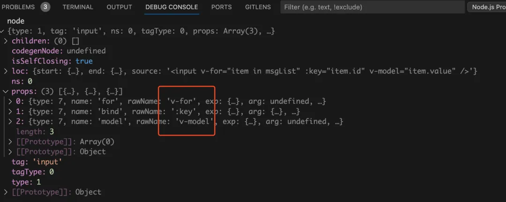

# Vue 原理面试题

- 组件化和 MVVM
- 响应式原理
- vdom 和 diff 算法
- 模板编译
- 组件渲染过程
- 前端路由

# 待定

[抽丝剥茧带你复习vue源码（2023年面试版本） - 掘金 (juejin.cn)](https://juejin.cn/post/7195517440344211512)

# Vue2 原理面试题

## Vue2 中怎么重置 data?

使用 `Object.assign()`，`vm.$data` 可以获取当前状态下的 data。

`vm.$options.data(this)` 可以获取到组件初始化状态下的 data。

## 为什么 Vue2 组件中 data 必须是一个函数？

或者会问：**为什么 data 函数里面要 return 一个对象**

```vue
<script>
export default {
	data() {
		return {
			// 返回一个唯一的对象，不要和其他组件共用一个对象进行返回
			menu: MENU.data,
			poi: POILIST.data,
		};
	},
};
</script>
```

### 简单回答：

因为一个组件是可以共享的，但他们**的 data 是私有的，所以每个组件都要 return 一个新的 data 对象，返回一个唯一的对象，不要和其他组件共用一个对象**。

### 完整回答：

#### 场景一：`new Vue({data: ...})`

这种场景主要为项目入口或者多个`html`页面各实例化一个`Vue`时，这里的`data`即可用对象的形式，也可用工厂函数返回对象的形式。因为，这里的`data`只会出现一次，不存在重复引用而引起的数据污染问题。

**在 `new Vue()` 中，可以是函数也可以是对象**，因为 `new Vue()` 的方式是生成一个根组件，该组件不会复用，不会产生数据污染。

#### 场景二：组件中的 data 选项

在每一次创建`组件实例`时，Vue 都会去初始化这个组件的状态。

**在组件中，data 必须为函数**，目的是为了防止多个组件实例对象之间共用一个 data，产生数据污染；而采用函数的形式，initData 时会将其作为工厂函数都会返回全新的 data 对象。

#### 详细原理

- JavaScript对象是引用类型的数据，当多个实例引用同一个对象时，只要一个实例对这个对象进行操作，其他实例中的数据也会发生变化。
- 
- `data`是一个组件的`私有属性`，但是`一个组件`可以被`其它多个组件`使用，之所以必须是一个函数，是因为函数作用域是`私有作用域`，保证变量不会被污染。
- 如果`data`是一个对象，当重用组件时，都指向同一个`data`，会互相影响；
- 而使用返回对象的函数，由于每次返回的都是一个新对象，引用地址不同，则不会出现这个问题。
- 而在 Vue 中，更多的是想要复用组件，那就需要每个组件都有自己的数据，这样组件之间才不会相互干扰。

- 所以组件的数据不能写成对象的形式，而是要写成函数的形式。数据以函数返回值的形式定义，这样当每次复用组件的时候，就会返回一个新的 data，也就是说每个组件都有自己的私有数据空间，它们各自维护自己的数据，不会干扰其他组件的正常运行。

- Vue 内部也帮我们做了`异常处理`，当我们的`data不是一个函数`时，会`抛出异常`。

#### 从源码层面了解：src\core\instance\state.js - initData()

在生成组件`vnode`的过程中，组件会在生成构造函数的过程中执行合并策略：

```js
// data合并策略
strats.data = function (parentVal, childVal, vm) {
	if (!vm) {
		if (childVal && typeof childVal !== "function") {
			process.env.NODE_ENV !== "production" &&
				warn(
					'The "data" option should be a function ' +
						"that returns a per-instance value in component " +
						"definitions.",
					vm
				);

			return parentVal;
		}
		return mergeDataOrFn(parentVal, childVal);
	}

	return mergeDataOrFn(parentVal, childVal, vm);
};
```

如果合并过程中发现子组件的数据不是函数，即`typeof childVal !== 'function'`成立，进而在开发环境会在控制台输出警告并且直接返回`parentVal`，说明这里压根就没有把`childVal`中的任何`data`信息合并到`options`中去。

上面讲到组件 data 必须是一个函数，不知道大家有没有思考过这是为什么呢？

在我们定义好一个组件的时候，vue 最终都会通过 Vue.extend()构成组件实例

这里我们模仿组件构造函数，定义 data 属性，采用对象的形式

```javascript
function Component() {}
Component.prototype.data = {
	count: 0,
};

// 创建两个组件实例
const componentA = new Component();
const componentB = new Component();
// 修改componentA组件data属性的值，componentB中的值也发生了改变

console.log(componentB.data.count); // 0
componentA.data.count = 1;
console.log(componentB.data.count); // 1

// 产生这样的原因这是两者共用了同一个内存地址，componentA修改的内容，同样对componentB产生了影响

// 如果我们采用函数的形式，则不会出现这种情况（函数返回的对象内存地址并不相同）
function Component() {
	this.data = this.data();
}
Component.prototype.data = function () {
	return {
		count: 0,
	};
};
```

## Vue2 data 中某一个属性的值发生改变后，视图会立即同步执行重新渲染吗？

不会立即同步执行重新渲染。Vue 实现响应式并不是数据发生变化之后 DOM 立即变化，而是按一定的策略进行 DOM 的更新。Vue 在更新 DOM 时是异步执行的。只要侦听到数据变化， Vue 将开启一个队列，并缓冲在同一事件循环中发生的所有数据变更。

如果同一个 watcher 被多次触发，只会被推入到队列中一次。这种在缓冲时去除重复数据对于避免不必要的计算和 DOM 操作是非常重要的。然后，在下一个的事件循环 tick 中，Vue 刷新队列并执行实际（已去重的）工作。

## Vue2 声明组件的 state 是用 data 方法，为什么 data 是通过一个 function 来返回一个对象，而不是直接写一个对象呢？

**从语法上说**：如果不用 function 返回就会出现语法错误导致编译不通过。

**从原理上的话**：大概就是组件可以被多次创建，如果不使用 function 就会使所有调用该组件的页面公用同一个数据域，这样就失去了组件的概念了。

## vue-loader 是什么？用途有哪些？

`vue-loader` 是解析`.vue` 文件的一个加载器，跟 `template/js/style` 转换成 js 模块。

**用途**：js 可以写 es6、style 样式可以 scss 或 less、template 可以加 jade 等

- 是用于处理单文件组件的 `webpack-loader`，有了它之后，我们可以把代码分割为`<template>`、`<script>`和`<style>`，代码会异常清晰
- `webpack`打包时，会以`loader`的方式调用`vue-loader`
- `vue-loader`被执行时，它会对`SFC`中的每个语言块用单独的`loader`处理。最后将这些单独的块装配成最终的组件模块。

## Vue2.7 向后兼容的内容

- `composition API`
- `SFC <script setup>`
- `SFC CSS v-bind`

## Vue delete 原理

- 先判断是否为数组，如果是数组就调用 `splice`
- 然后判断`target`对象有这个属性的话，就 `delete` 删除这个属性；
- 还要判断是否是响应式的，如果是就需要通知视图更新

## new Vue 这个过程中究竟做了什么？

- 在 new Vue 的时候，会做一些初始化操作
- 内部会初始化组件绑定的事件，初始化组件的父子关系：`parentparent `、`parentchildren`、 `$root`
- 初始化响应式数据 data、computed、props、watch、methods。同时也初始化了 provider、inject 方法。内部会对数据进行劫持，对象采用 `defineProperty`，数组采用方法重写
- 再看一些用户是否传入了 el 属性和 template 或者 render。render 的优先级更高，如果用户写的是 template，会做模板编译，将 template 转化成 render 函数
- 内部挂载的时候会产生一个 watcher，会调用 render 函数来触发依赖收集。内部还会给所有的响应式数据增加 dep 属性，让属性记录当前的 watcher（用户后续修改的时候，可以触发 watcher 重新渲染）
- vue 更新的时候采用虚拟 DOM 的方式，进行 diff 算法更新

## new Vue() 做了什么

- 合并配置
- 初始化生命周期
- 初始化事件
- 初始化`render`函数
- 调用 `beforecreate`钩子函数
- 初始化`state`，包括`data`、`props`、`computed`
- 调用 `created `钩子函数
- 然后按照生命周期，调用 `vm.$mount` 挂载渲染；

## vue2 数据式原理

也叫：vue 数据驱动原理？ 数据更新原理？数据绑定原理？数据响应原理？响应式 原理？

官网详解：https://vuejs.bootcss.com/guide/reactivity.html

#### 代码解析

```js
var obj = {};
var obox = document.getElementById("box");
// es5 定义属性的方法
Object.defineProperty(obj, "name", {
	get() {
		console.log("我被访问了");
		return obox.innerHTML;
	},
	set(data) {
		console.log("有人修改了name值", data);
		obox.innerHTML = data;
	},
});
```

- (1) 数据通过 object.defineProperty 进行 get set 拦截，

- (2) 通知 watcher ，观察者模式， 订阅发布模式，触发 组件重新渲染，创建新的虚拟 dom(js 对象模拟 dom 树) 对比旧的虚拟 dom ，找到不同的地方， 以最小的代价更新节点。

## vue2 为什么要求组件模板只能有一个根元素

从三方面考虑

- 1.`new Vue({el:'#app'})`
- 2.单文件组件中，template 下的元素 div。其实就是"树”状数据结构中的"根”。
- 3.diff 算法要求的，源码中，`patch.js` 里 `patchVnode()`。

### 第一

实例化 Vue 时

```vue
<body>
	<div id="app"></div>
</body>
<script>
var vm = new Vue({
	el: "#app",
});
</script>
```

如果我在 body 下这样

```vue
<body>
	<div id="app1"></div>
	<div id="app2"></div>
</body>
```

Vue 其实并不知道哪一个才是我们的入口。如果同时设置了多个入口，那么 vue 就不知道哪一个才是这个类。

### 第二

vue 开发环境下，使用单文件组件时：

```vue
<template>
	<div></div>
</template>
```

template 这个标签，它有三个特性：

- 1.**隐藏性**：该标签不会显示在页面的任何地方，即便里面有多少内容，它永远都是隐藏的状态，设置了 display: none;
- 2.**任意性**：该标签可以写在任何地方，甚至是 head、body、sciprt 标签内;
- 3.**无效性**：该标签里的任何 HTML 内容都是无效的，不会起任何作用;只能 innerHTML 来获取到里面的内容

一个 vue 单文件组件就是一个 vue 实例，如果 template 下有多个 div 那么如何指定 vue 实例的根入口呢，为了让组件可以正常生成一个 vue 实例，这个 div 会自然的处理成程序的入口，通过这个根节点，来递归遍历整个 vue 树下的所有节点，并处理为 vdom，最后再渲染成真正的 HTML，插入在正确的位置。

### 第三

diff 算法中 patchVnode 方法，用来比较新旧节点，我们一起来看下源码

vue 源码：`vdom/patch.js` - `patchVnode`方法

#### 总结

1. new Vue({el:'#app'})
2. 单文件组件中，template 下的元素 div。其实就是"树"状数据结构中的"根"。
3. diff 算法要求的，源码中，patch.js 里 patchVnode()。

## 说一下你对单向数据流的理解

答：**单向数据流**主要是 vue 组件间传递数据是单向的，即数据总是由父组件传递给子组件，子组件在其内部维护自己的数据，但它无权修改父组件传递给它的数据，当开发者尝试这样做的时候，vue 将会报错。这样做是为了组件间更好的维护。

在开发中可能有多个子组件依赖于父组件的某个数据，假如子组件可以修改父组件数据的话，一个子组件变化会引发所有依赖这个数据的子组件发生变化，所以 vue 不推荐子组件修改父组件的数据

## Vue 中封装的数组方法有哪些，其如何实现页面更新

- "push","pop", "shift", "unshift", "splice", "sort", "reverse"
- 在 Vue 中，对响应式处理利用的是 Object.defineProperty 对数据进行拦截，而这个方法并不能监听到数组内部变化，数组长度变化，数组的截取变化等，所以需要对这些操作进行 hack，让 Vue 能监听到其中的变化。

## NextTick 原理分析

- 对于实现 macrotasks ，会先判断是否能使用 setImmediate ，不能的话降级为 MessageChannel ，以上都不行的话就使用 setTimeout
- Vue 的 nextTick 其本质是对 JavaScript 执行原理 EventLoop 的一种应用。
- nextTick 的核心是利用了如 Promise 、MutationObserver、setImmediate、setTimeout 的原生 JavaScript 方法来模拟对应的微/宏任务的实现，本质是为了利用 JavaScript 的这些异步回调任务队列来实现 Vue 框架中自己的异步回调队列。
- nextTick 不仅是 Vue 内部的异步队列的调用方法，同时也允许开发者在实际项目中使用这个方法来满足实际应用中对 DOM 更新数据时机的后续逻辑处理

问题

- 如果是同步更新，则多次对一个或多个属性赋值，会频繁触发 UI/DOM 的渲染，可以减少一些无用渲染
- 同时由于 VirtualDOM 的引入，每一次状态发生变化后，状态变化的信号会发送给组件，组件内部使用 VirtualDOM 进行计算得出需要更新的具体的 DOM 节点，然后对 DOM 进行更新操作，每次更新状态后的渲染过程需要更多的计算，而这种无用功也将浪费更多的性能，所以异步渲染变得更加至关重要

## $nextTick 原理及作用

Vue 的 `nextTick` 其本质是对 `JavaScript` 执行原理 `EventLoop` 的一种应用。 `nextTick`是将回调函数放到一个异步队列中，保证在异步更新 DOM 的`watcher`后面，从而获取到更新后的 DOM。

因为在`created()`钩子函数中，页面的 DOM 还未渲染，这时候也没办法操作 DOM，所以，此时如果想要操作 DOM，必须将操作的代码放在`nextTick()`的回调函数中。

### VDOM：三个 part

- 虚拟节点类，将真实 DOM 节点用 js 对象的形式进行展示，并提供 render 方法，将虚拟节点渲染成真实 DOM
- 节点 diff 比较：对虚拟节点进行 js 层面的计算，并将不同的操作都记录到 patch 对象
- re-render ：解析 patch 对象，进行 re-render

#### 补充 1：VDOM 的必要性？

- 创建真实 DOM 的代价高：真实的 DOM 节点 node 实现的属性很多，而 vnode 仅仅实现一些必要的属性，相比起来，创建一个 vnode 的成本比较低。
- 触发多次浏览器重绘及回流：使用 vnode ，相当于加了一个缓冲，让一次数据变动所带来的所有 node 变化，先在 vnode 中进行修改，然后 diff 之后对所有产生差异的节点集中一次对 DOM tree 进行修改，以减少浏览器的重绘及回流。

#### 补充 2：vue 为什么采用 vdom？

引入 Virtual DOM 在性能方面的考量仅仅是一方面。

- 性能受场景的影响是非常大的，不同的场景可能造成不同实现方案之间成倍的性能差距，所以依赖细粒度绑定及 Virtual DOM 哪个的性能更好还真不是一个容易下定论的问题。
- Vue 之所以引入了 Virtual DOM ，更重要的原因是为了解耦 HTML 依赖，这带来两个非常重要的好处是：
  - 不再依赖 HTML 解析器进行模版解析，可以进行更多的 AOT 工作提高运
    行时效率：通过模版 AOT 编译， Vue 的运行时体积可以进一步压缩，运
    行时效率可以进一步提升；
  - 可以渲染到 DOM 以外的平台，实现 SSR 、同构渲染这些高级特性，
    Weex 等框架应用的就是这一特性。

综上， Virtual DOM 在性能上的收益并不是最主要的，更重要的是它使得 Vue 具备了现代框架应有的高级特性。

### Patch 过程 nextTick 原理

### watch 和 computed 原理

### computed 是怎么收集依赖的？

### watchEffect 是怎么收集依赖的？

## Vue 的 nextTick 的原理是什么？

#### 1）为什么需要 nextTick

Vue 是异步修改 DOM 的并且不鼓励开发者直接接触 DOM，但有时候业务需要必须对数据更改--刷新后的 DOM 做相应的处理，这时候就可以使用 Vue.nextTick(callback)这个 api 了。

#### 2）理解原理前的准备

首先需要知道事件循环中宏任务和微任务这两个概念(这其实也是面试常考点)。

常见的宏任务有 script, setTimeout, setInterval, setImmediate, I/O, UI rendering

常见的微任务有 process.nextTick(Nodejs),Promise.then(), MutationObserver;

#### 3）理解 nextTick

而 nextTick 的原理正是 vue 通过异步队列控制 DOM 更新和 nextTick 回调函数先后执行的方式。如果大家看过这部分的源码，会发现其中做了很多 isNative()的判断，因为这里还存在兼容性优雅降级的问题。可见 Vue 开发团队的深思熟虑，对性能的良苦用心。

## $nextTick 原理及作用

[细聊 Vue 中的 nextTick（面试常考！！！附带手写 nextTick 代码） - 掘金 (juejin.cn)](https://juejin.cn/post/7345499817316188160)

Vue 的 nextTick 其本质是对 JavaScript 执行原理 EventLoop 的一种应用。

nextTick 的 核 心 是 利 用 了 如 Promise 、 MutationObserver 、setImmediate、setTimeout 的原生 JavaScript 方法来模拟对应的微/宏任务的实现，本质是为了利用 JavaScript 的这些异步回调任务队列来实现 Vue 框架中自己的异步回调队列。

nextTick 不仅是 Vue 内部的异步队列的调用方法，同时也允许开发者在实际项目中使用这个方法来满足实际应用中对 DOM 更新数据时机的后续逻辑处理

nextTick 是典型的将底层 JavaScript 执行原理应用到具体案例中的示例，引入异步更新队列机制的原因：

如果是同步更新，则多次对一个或多个属性赋值，会频繁触发 UI/DOM 的渲染，可以减少一些无用渲染

同时由于 VirtualDOM 的引入，每一次状态发生变化后，状态变化的信号会发送给组件，组件内部使用 VirtualDOM 进行计算得出需要更新的具体的 DOM 节点，然后对 DOM 进行更新操作，每次更新状态后的渲染过程需要更多的计算，而这种无用功也将浪费更多的性能，所以异步渲染变得更加至关重要

Vue 采用了数据驱动视图的思想，但是在一些情况下，仍然需要操作 DOM。有时候，可能遇到这样的情况，DOM1 的数据发生了变化，而 DOM2 需要从 DOM1 中获取数据，那这时就会发现 DOM2 的视图并没有更新，这时就需要用到了 nextTick 了。

由于 Vue 的 DOM 操作是异步的，所以，在上面的情况中，就要将 DOM2 获取数据的操作写在$nextTick 中。

```js
this.$nextTick(() => {
	// 获取数据的操作...
});
```

所以，在以下情况下，会用到 nextTick：

在数据变化后执行的某个操作，而这个操作需要使用随数据变化而变化的 DOM 结构的时候，这个操作就需要方法在 nextTick()的回调函数中。

在 vue 生命周期中，如果在 created()钩子进行 DOM 操作，也一定要放在 nextTick()的回调函数中。

因为在 created()钩子函数中，页面的 DOM 还未渲染，这时候也没办法操作 DOM，所以，此时如果想要操作 DOM，必须将操作的代码放在 nextTick()的回调函数中。

## 你知道 nextTick 的原理吗?

nextTick 官方文档的解释，它可以在 DOM 更新完毕之后执行一个回调

```js
// 修改数据
vm.msg = "Hello";
// DOM 还没有更新
Vue.nextTick(function () {
	// DOM 更新了
});
```

尽管 MVVM 框架并不推荐访问 DOM，但有时候确实会有这样的需求，尤其是和第三方插件进行配合的时候，免不了要进行 DOM 操作。而 nextTick 就提供了一个桥梁，确保我们操作的是更新后的 DOM。

### NextTick 原理分析

nextTick 可以让我们在下次 DOM 更新循环结束之后执行延迟回调，用于
获得更新后的 DOM 。

- 在 Vue 2.4 之前都是使用的 microtasks ，但是 microtasks 的优先级过高，在某些情况下可能会出现比事件冒泡更快的情况，但如果都使用 macrotasks ⼜可能会出现渲染的性能问题。所以在新版本中，会默认使用 microtasks ，但在特殊情况下会使用 macrotasks ，比如 v-on 。
- macrotasks 任务的实现：`setImmediate` / `MessageChannel` / `setTimeout`
- 对于实现 macrotasks ，会先判断是否能使用 setImmediate ，不能的话降级为 MessageChannel ，以上都不行的话就使用 setTimeout

```js
if (typeof setImmediate !== "undefined" && isNative(setImmediate)) {
	macroTimerFunc = () => {
		setImmediate(flushCallbacks);
	};
} else if (
	typeof MessageChannel !== "undefined" &&
	(isNative(MessageChannel) ||
		// PhantomJS
		MessageChannel.toString() === "[object MessageChannelConstructor]")
) {
	const channel = new MessageChannel();
	const port = channel.port2;
	channel.port1.onmessage = flushCallbacks;
	macroTimerFunc = () => {
		port.postMessage(1);
	};
} else {
	macroTimerFunc = () => {
		setTimeout(flushCallbacks, 0);
	};
}
```

以上代码很简单，就是判断能不能使用相应的 API

### 问：Vue 如何检测到 DOM 更新完毕呢？

H5 新增的能监听到 DOM 改动的 API：`MutationObserver`

#### 理解 MutationObserver

MutationObserver 是 HTML5 新增的属性，用于监听 DOM 修改事件，能够监听到节点的属性、文本内容、子节点等的改动，是一个功能强大的利器。

```js
//MutationObserver基本用法
var observer = new MutationObserver(function () {
	//这里是回调函数
	console.log("DOM被修改了！");
});
var article = document.querySelector("article");

observer.observer(article);
```

vue 是不是用 MutationObserver 来监听 DOM 更新完毕的呢？

vue 的源码中实现 nextTick 的地方：

```js
//vue@2.2.5 /src/core/util/env.js
if (
	typeof MutationObserver !== "undefined" &&
	(isNative(MutationObserver) ||
		MutationObserver.toString() === "[object MutationObserverConstructor]")
) {
	var counter = 1;
	var observer = new MutationObserver(nextTickHandler);
	var textNode = document.createTextNode(String(counter));
	observer.observe(textNode, {
		characterData: true,
	});
	timerFunc = () => {
		counter = (counter + 1) % 2;
		textNode.data = String(counter);
	};
}
```

### JavaScript 事件循环机制（Event Loop）

在 js 的运行环境中，通常伴随着很多事件的发生，比如用户点击、页面渲染、脚本执行、网络请求，等等。为了协调这些事件的处理，浏览器使用事件循环机制。

简要来说，事件循环会维护一个或多个任务队列（task queues），以上提到的事件作为任务源往队列中加入任务。有一个持续执行的线程来处理这些任务，每执行完一个就从队列中移除它，这就是一次事件循环。


```js
for (let i = 0; i < 100; i++) {
	dom.style.left = i + "px";
}
```

事实上，这 100 次 for 循环同属一个 task，浏览器只在该 task 执行完后进行一次 DOM 更新。

只要让 nextTick 里的代码放在 UI render 步骤后面执行，岂不就能访问到更新后的 DOM 了？

> vue 就是这样的思路，并不是用 MO 进行 DOM 变动监听，而是用队列控制的方式达到目的。那么
> vue 又是如何做到队列控制的呢？我们可以很自然的想到 setTimeout，把 nextTick 要执行的代码
> 当作下一个 task 放入队列末尾。
> vue 的数据响应过程包含：数据更改->通知 Watcher->更新 DOM。而数据的更改不由我们控制，
> 可能在任何时候发生。如果恰巧发生在重绘之前，就会发生多次渲染。这意味着性能浪费，是 vue
> 不愿意看到的。
> 所以，vue 的队列控制是经过了深思熟虑的。在这之前，我们还需了解 event loop 的另一个重要概
> 念，microtask。

### microtask 微任务

每一次事件循环都包含一个 microtask 队列，在循环结束后会依次执行队列中的 microtask 并移除，然后再开始下一次事件循环。

在执行 microtask 的过程中后加入 microtask 队列的微任务，也会在下一次事件循环之前被执行。也就是说，macrotask 总要等到 microtask 都执行完后才能执行，microtask 有着更高的优先级。

microtask 的这一特性，是做队列控制的最佳选择。vue 进行 DOM 更新内部也是调用 nextTick 来做异步队列控制。

而当我们自己调用 nextTick 的时候，它就在更新 DOM 的那个 microtask 后追加了我们自己的回调函数，从而确保我们的代码在 DOM 更新后执行，同时也避免了 setTimeout 可能存在的多次执行问题。

常见的 microtask 有：`Promise`、`MutationObserver`、`Object.observe(废弃)`，以及 nodejs 中的`process.nextTick`

看到了 MutationObserver，vue 用 MutationObserver 是想利用它的 microtask 特性，而不是想做 DOM 监听。核心是 microtask，用不用 MutationObserver 都行的。事实上，vue 在 2.5 版本中已经删去了 MutationObserver 相关的代码，因为它是 HTML5 新增的特性，在 iOS 上尚有 bug。

那么最优的 microtask 策略就是 Promise 了，而令人尴尬的是，Promise 是 ES6 新增的东西，也存在兼容问题呀。所以 vue 就面临一个降级策略。

### vue 的降级策略

上面我们讲到了，队列控制的最佳选择是 microtask，而 microtask 的最佳选择是`Promise`但如果当前环境不支持 Promise，vue 就不得不降级为 macrotask 来做队列控制了。

macrotask 有哪些可选的方案呢？前面提到了 setTimeout 是一种，但它不是理想的方案。因为 setTimeout 执行的最小时间间隔是约 4ms 的样子，略微有点延迟。

在 vue2.5 的源码中，macrotask 降级的方案依次是：setImmediate、MessageChannel、setTimeout.setImmediate 是最理想的方案了，可惜的是只有 IE 和 nodejs 支持。

MessageChannel 的 onmessage 回调也是 microtask，但也是个新 API，面临兼容性的尴尬。

所以最后的兜底方案就是`setTimeout`了，尽管它有执行延迟，可能造成多次渲染，算是没有办法的办法了。

### 总结

1. vue 用异步队列的方式来控制 DOM 更新和 nextTick 回调先后执行

2. microtask 因为其高优先级特性，能确保队列中的微任务在一次事件循环前被执行完毕
3. 因为兼容性问题，vue 不得不做了 microtask 向 macrotask 的降级方案

# Vue3 原理面试题

## Vue3 双向数据绑定原理

Vue3 中的双向数据绑定原理和 Vue2 有所不同。Vue3 使用了 Proxy 对象来实现双向数据绑定，而不是 Vue2 中使用的 Object.defineProperty。

具体地说，当页面中的数据发生变化时，会触发 Proxy 对象的 set 方法，从而修改源数据；当源数据发生变化时，会触发 Proxy 对象的 get 方法，从而重新渲染页面。

下面是一个简单的示例：

1.创建一个 Vue 实例，并在 data 中定义一个变量 message：

```javascript
const app = Vue.createApp({
	data() {
		return {
			message: "Hello Vue3!",
		};
	},
});
```

2.将 message 绑定到页面上的一个 input 元素：

```vue
<input v-model="message" />
```

3.输入框中的值发生变化时，会触发 Proxy 对象的 set 方法，从而更新 message 的值：

```javascript
const data = {
	message: "Hello Vue3!",
};

const proxy = new Proxy(data, {
	set(target, key, value) {
		if (target[key] !== value) {
			target[key] = value;
			// 更新页面
		}
		return true;
	},
});
```

4.当 message 的值发生变化时，会触发 Proxy 对象的 get 方法，从而重新渲染页面：

```javascript
const data = {
	message: "Hello Vue3!",
};

const proxy = new Proxy(data, {
	get(target, key) {
		console.log("get", target, key);
		return Reflect.get(target, key);
	},
	set(target, key, value) {
		console.log("set", target, key, value);
		if (target[key] !== value) {
			target[key] = value;
			// 重新渲染页面
		}
		return true;
	},
});
```

通过**Proxy 对象的 get 和 set 方法**实现双向数据绑定，这也是 Vue3 中双向数据绑定的原理。

> Vue3 使用**Proxy 对象**实现双向数据绑定，当**数据**变化时会自动更新相关的**视图**，而当**视图**被修改时也会自动更新对应的**数据**。
>
> 通过拦截属性的读取、赋值、删除等操作来实现**响应式更新**，从而实现高效的**双向绑定效果**。

## Vue3.0 里为什么要用 Proxy 替代 defineProperty ？

### 分析

Vue3 中最重大的更新之一就是响应式模块`reactivity`的重写。主要的修改就是`Proxy`替换`defineProperty`实现响应式。

此变化主要是从性能方面考量。

### 思路

- 属性拦截的几种方式
- defineProperty 的问题
- Proxy 的优点
- 其他考量

### 回答范例

- JS 中做属性拦截常见的方式有三：: [defineProperty](https://developer.mozilla.org/en-US/docs/Web/JavaScript/Reference/Global_Objects/Object/defineProperty)，[getter](https://developer.mozilla.org/en-US/docs/Web/JavaScript/Reference/Functions/get)/[setters](https://developer.mozilla.org/en-US/docs/Web/JavaScript/Reference/Functions/set) 和[Proxies](https://developer.mozilla.org/en-US/docs/Web/JavaScript/Reference/Global_Objects/Proxy).
- Vue2 中使用`defineProperty`的原因是，2013 年时只能用这种方式。由于该 API 存在一些局限性，比如对于数组的拦截有问题，为此 vue 需要专门为数组响应式做一套实现。另外不能拦截那些新增、删除属性；最后`defineProperty`方案在初始化时需要深度递归遍历待处理的对象才能对它进行完全拦截，明显增加了初始化的时间。
- 以上两点在 Proxy 出现之后迎刃而解，不仅可以对数组实现拦截，还能对 Map、Set 实现拦截；另外 Proxy 的拦截也是懒处理行为，如果用户没有访问嵌套对象，那么也不会实施拦截，这就让初始化的速度和内存占用都改善了。
- 当然 Proxy 是有兼容性问题的，IE 完全不支持，所以如果需要 IE 兼容就不合适

### 知其所以然

Proxy 属性拦截的原理：利用 get、set、deleteProperty 这三个 trap 实现拦截

```javascript
function reactive(obj) {
	return new Proxy(obj, {
		get(target, key) {},
		set(target, key, val) {},
		deleteProperty(target, key) {},
	});
}
```

Object.defineProperty 属性拦截原理：利用 get、set 这两个 trap 实现拦截

```javascript
function defineReactive(obj, key, val) {
	Object.defineReactive(obj, key, {
		get(key) {},
		set(key, val) {},
	});
}
```

很容易看出两者的区别！

## Vue3.0 里为什么要用 Proxy API 替代 defineProperty API ？

1、`vue2`中采用 `defineProperty`来劫持整个对象，然后进行深度遍历所有属性，给每个属性添加 getter 和 setter，实现响应式。但是存在以下的问题：

- 检测不到对象属性的添加和删除
- 数组 API 方法无法监听到
- 需要对每个属性进行遍历监听，如果嵌套对象，需要深层监听，造成性能问题

2、proxy：监听是针对一个对象的，那么对这个对象的所有操作会进入监听操作。

总结：

- Object.defineProperty 只能遍历对象属性进行劫持
- Proxy 直接可以劫持整个对象，并返回一个新对象，我们可以只操作新的对象达到响应式目的
- Proxy 可以直接监听数组的变化（push、shift、splice）
- Proxy 有多达 13 种拦截方法,不限于 apply、ownKeys、deleteProperty、has 等等，这是 Object.defineProperty 不具备的

## Vue3 中为什么采用 Proxy 代替 definePrototype

- definePrototype：

  - 来劫持整个对象，然后进行深度遍历，给每个属性添加 `getter` 和 `setter`，实现响应式，但是存在以下问题：

    - 检测不到对象属性的添加和删除；
    - 数组 API 方法无法监听到；
    - 需要对每个属性进行深度遍历，如果是嵌套对象，需要深层次监听，造成性能问题；

- Proxy：

  - 监听整个对象，那么整个对象的所有操作都会进入监听操作；

- 总结：

  - `Object.definePrototype` 只能遍历对象属性进行劫持；
  - `Proxy` 直接可以劫持整个对象，便返回一个新对象，我们可以操作新对象达到响应式目的；
  - `Proxy` 可以直接监听数组的变化；
  - Proxy 有 13 种拦截方法，不限于 apply、ownKeys、deleteProperty、has 等等，这是 Object.defineProperty 不具备的；

## 手写 vue3 组合式 API

文档：[3. 手写组合 API | Vue3+TS 快速上手 (24kcs.github.io)](https://24kcs.github.io/vue3_study/chapter4/03_手写组合API.html#_1-shallowreactive-与-reactive)

### 1.shallowReactive 与 reactive

```js
// *****shallowReactive (浅的劫持，浅的监视，浅的响应数据) 与 reactive(深的响应数据监视)*****

// 定义一个reactiveHandler处理对象
const reactiveHandler = {
	// 获取属性值
	get(target, prop) {
		if (prop === "_is_reactive") return true;
		const result = Reflect.get(target, prop);
		console.log("拦截了读取数据", prop, result);
		return result;
	},
	// 修改属性值或者是添加属性
	set(target, prop, value) {
		const result = Reflect.set(target, prop, value);
		console.log("拦截了修改数据或者是添加属性", prop, value);
		return result;
	},
	// 删除某个属性
	deleteProperty(target, prop) {
		const result = Reflect.deleteProperty(target, prop);
		console.log("拦截了删除数据", prop);
		return result;
	},
};
// 定义一个shallowReactive函数,传入一个目标对象
function shallowReactive(target) {
	// 判断当前的目标对象是不是object类型(对象/数组)
	if (target && typeof target === "object") {
		return new Proxy(target, reactiveHandler);
	}
	// 如果传入的数据是基本类型的数据,那么就直接返回
	return target;
}
// 定义一个reacive函数，传入一个目标对象
function reactive(target) {
	// 判断当前的目标对象是不是object类型（对象/数组）
	if (target && typeof target === "object") {
		// 对数组或是对象中的所有数据进行reactive的递归处理
		// 先判断当前的数据是不是数组
		if (Array.isArray(target)) {
			// 数组的数据要进行遍历操作
			target.forEach((item, index) => {
				// 如果还是数组，递归调用自己
				target[index] = reactive(item);
			});
		} else {
			// 如果是是对象数据也要进行遍历操作
			Object.keys(target).forEach((key) => {
				// 如果还是数组，递归调用自己
				target[key] = reactive(target[key]);
			});
		}

		return new Proxy(target, reactiveHandler);
	}
	// 如果传入的数据是基本类型的数据，那么就直接返回
	return target;
}
```

调用

```js
// *****shallowReactive (浅的劫持，浅的监视，浅的响应数据) 与 reactive(深的响应数据监视)*****

const proxyUser1 = shallowReactive({
	name: "夏明",
	car: {
		color: "red",
	},
});
// 拦截到了读和写的数据
// proxyUser1.name +='=='
// 拦截到了读取数据,但是拦截不到写的数据
// proxyUser1.car.color+'=='
// 拦截到了删除数据
// delete proxyUser1.name
// 只拦截到了读,但是拦截不到删除
// delete proxyUser1.car.color

const proxyUser2 = reactive({
	name: "夏明",
	car: {
		color: "red",
	},
});

// 拦截到了读和修改的数据
// proxyUser2.name +='=='
// 拦截到了读和修改数据
// proxyUser2.car.color+'=='
// 拦截到了删除数据
// delete proxyUser2.name
// 拦截到了读和拦截到了删除
// delete proxyUser2.car.color
```

shallowRef 与 ref

shallowReadonly 与 readonly

isRef, isReactive 与 isReadonly

## Vue3 和 Vue2 的响应式原理

### 什么是响应式

`响应式`就是在我们修改数据之后，无需`手动`触发视图更新，视图会自动更新。

### Vue2 响应式实现

`Vue2`中，响应式系统是通过`依次遍历`data 返回的对象，将里面每一个属性通过`Object.defineProperty`进行定义，然后在`属性描述符`中添加`get/set`，实现`getter/setter方法`，在`访问属性`时，在 getter 函数中`收集依赖`（记录哪些方法或变量在使用这个属性），在`修改属性`时，在 setter 函数中`派发依赖`（将收集到的依赖依次更新），从而达到`响应式`。

### Vue3 响应式实现

`Vue3`中，响应式系统是通过`ES6中的Proxy`实现对一个对象的`代理`，然后设置`handler.get/handler.set`，在对`代理对象`进行操作时，可以触发`get/set`，和`Object.defineProperty类似`，get 中实现`收集依赖`，在 set 中实现`派发依赖`，从而达到`响应式`的效果。

## Vue3 为什么要改为 Proxy 实现响应式？

既然 Vue3 要更改响应式的实现方式，那么说明`Vue2的响应式实现一定是有缺点的`。

### Object.defineProperty()实现响应式的缺点

1. `Object.defineProperty`只能对`对象的属性`进行监听，也就是说当我们想对`某个对象`进行监听时，必须将这个对象`遍历`，然后对其中的每一个属性进行监听。如果说对象中的某个属性又是一个对象，那就需要`递归遍历`，将每一层都进行监听，这样的性能肯定是比较低的。
2. `Object.defineProperty`只能对`已有属性`进行监听，也就是说，在 Vue2 中，`created()阶段`Vue 内部已经帮我们把 data 中的属性遍历完毕并且对每个属性进行监听了，如果在之后的阶段我们给某个对象`使用obj.xx的方式`给对象添加了一个新属性，这个属性就`不再是响应式了`，这也是为什么我们在添加新属性时，需要使用`this.$set`的方式。
3. `Object.defineProperty`不能监听`数组长度的改变`，这也就造成了我们在使用一些`影响原数组`的数组方法时，它监听不到，比如我们使用`pop、shift、push`等，这也是为什么`Vue2要重写部分数组原型方法`。

> `Object.defineProperty`不能监听数组长度变化，但是它是可以监听数组内容变化的，前提是我们需要像对象一样，把数组进行遍历，然后对`每一个索引值`进行监听。之所以 Vue2 没有对数组的每一项进行监听，是因为`数组的长度有可能会很长`，一般来说对象的属性值并不会有太多，而数组中的数据可能`长达上万甚至数十万`，如果对数组进行遍历监听每一项，代价无疑是巨大的。

### Proxy 改变了什么

1. 首先针对 Object.defineProperty 的第一个缺点，`Proxy`的作用是`返回一个代理对象`，因此它不需要再`遍历/深度遍历`一个对象，而是只需要将`原对象作为参数传入`，就可以返回该对象的`代理对象`，并且它的第二个参数`handler`提供了`13种`方法，能够监听代理对象的各种操作。
2. 针对 Object.defineProperty 的第二个缺点，当我们对`代理对象`使用`obj.xx`的方式添加一个新属性时，它依旧能够对新添加的数据进行监听。
3. 针对 Object.defineProperty 的第三个缺点，`Proxy`不仅可以监听数组索引值的变化，还能够监听`原型方法（pop、push）`等。

## Vue3 是如何变得更快的？**（底层，源码）**

### a. diff 方法优化

- Vue2.x 中的虚拟 dom 是进行全量的对比。

- Vue3.0 中新增了静态标记（PatchFlag）：

  在与上次虚拟结点进行对比的时候，值对比带有 patch flag 的节点，并且可以通过 flag 的信息得知当前节点要对比的具体内容化。

### b. hoistStatic 静态提升

- Vue2.x : 无论元素是否参与更新，每次都会重新创建。
- Vue3.0 : 对不参与更新的元素，只会被创建一次，之后会在每次渲染时候被不停的复用。

### c. cacheHandlers 事件侦听器缓存

- 默认情况下 onClick 会被视为动态绑定，所以每次都会去追踪它的变化但是因为是同一个函数，所以没有追踪变化，直接缓存起来复用即可。


## Virtual(虚拟) DOM 的 diff 算法

### 对比虚拟 DOM

(1)把树按照层级分解

- 父级

- 子级

- 孙级

- 减少无效对比

(2) 同 key 值对比

- 辅助对比

(3)同组件对比

- 如果标签节点相同，内容不同，diff 算法把文本内容替换，成为一个新的 DOM

## vue2 和 vue3 的对比

- 1.Vue3 支持大多数的 Vue2 的特性

- 2.Vue 中设计了一套强大的组合 APi 代替了 Vue2 中的 option API ,复用性更强了

- 3.更好的支持 TS(TypeScript)

- 4.最主要: Vue3 中使用了 Proxy 配合 Reflect 代替了 Vue2 中 Object.defineProperty()方法实现数据的响应式(数据代理)

- 5.重写了虚拟 DOM,速度更快了

- 6.新的组件: Fragment(片段) / Teleport(瞬移) / Suspense(不确定)

- 7.设计了一个新的脚手架工具,vite

## vue2 和 vue3 响应式的对比

### vue2 的响应式

#### 核心

- 对象：通过 defineProperty 对 对象的已有属性值的读取和修改进行劫持(监视/拦截)

- 数组：通过重写数组更新数组一系列更新元素的方法来实现元素修改的劫持

#### 例子

```js
Object.defineProperty(data, "count", {
	get() {},
	set() {},
});
```

#### 问题

对象直接新添加的属性或删除已有属性，界面不会自动更新

直接通过下标替换元素或更新 length，界面不会自动更新 `arr[1] = {}`

视图数据不更新 问题解决方法

```js
data () {
    return {
        student: {
            name: '',
            sex: ''
        }
    }
}
mounted () {
    this.student.age = 24
}
```

视图不更新

- 原因是：受 ES5 的限制，Vue.js 不能检测到对象属性的添加或删除。因为 Vue.js 在初始化实例时将属性转为 getter/setter，所以属性必须在 data 对象上才能让 Vue.js 转换它，才能让它是响应的。

要处理这种情况，我们可以使用$set()方法，既可以新增属性,又可以触发视图更新。

使用$set 方法

```js
mounted () {
    this.$set(this.student,"age", 24)
}
```

### Vue3 的响应式

#### 核心

- 通过 Proxy(代理对象)：拦截对 data 任意属性的任意(13 种)操作，包括属性值的读写，属性的添加，属性的删除等...

- 通过 Reflect(反射对象)：动态对被代理对象的相应属性进行特定的操作

- 文档：

  - https://developer.mozilla.org/zh-CN/docs/Web/JavaScript/Reference/Global_Objects/Proxy

  - https://developer.mozilla.org/zh-CN/docs/Web/JavaScript/Reference/Global_Objects/Reflect

#### 代码例子

```js
// 目标对象
const user = { name: "佐助", age: 20, wife: { name: "小樱", age: 19 } };
// 把目标对象变成代理对象
// 参数1:user---->target目标对象
// 参数2:handler---->处理器对象,用来监视数据,及数据的操作
const proxyUser = new Proxy(user, {
	// 获取目标对象的某个属性值
	get(target, prop) {
		console.log("get方法调用了");
		return Reflect.get(target, prop);
	},
	// 修改目标对象的属性值
	// 为目标对象添加新的属性
	set(target, prop, val) {
		console.log("set方法调用了");
		return Reflect.set(target, prop, val);
	},
	// 删除目标对象上的某个属性
	deleteProperty(target, prop) {
		console.log("delete方法调用了");
		return Reflect.deleteProperty(target, prop);
	},
});
// 通过代理对象获取目标对象中的某个属性值
console.log(proxyUser.name);
// 通过代理对象更新目标对象上的某个属性值
proxyUser.name = "鸣人";
console.log(user);
// 通过代理对象向目标对象中添加一个新的属性
proxyUser.gender = "男";
console.log(user);
delete proxyUser.name;
console.log(user);
// 更新目标对象中的某个属性对象中的属性值
proxyUser.wife.name = "雏田";
console.log(user);
```


## Vue3 响应式

### Vue3 响应式的特点

- 众所周知 `Vue2` 数据响应式是通过 `Object.defineProperty()` 劫持各个属性 `get` 和 `set`，在数据变化时发布消息给`订阅者`，触发相应的监听回调，而这个`API`存在很多问题；

- Vue3 中为了解决这些问题，使用 Proxy 结合 Reflect 代替 Object.defineProperty，

  - 支持监听`对象`和`数组`的变化，
  - 对象嵌套属性只代理第一层，运行时递归，用到才代理，也不需要维护特别多的依赖关系，性能取得很大进步；
  - 并且能拦截对象`13`种方法，动态属性增删都可以拦截，新增数据结构全部支持，

- `Vue3` 提供了 `ref` 和 `reactive` 两个`API`来实现响应式；

### 什么是 Proxy

`Proxy`是`ES6`中的方法，`Proxy`用于创建一个目标对象的代理，在对目标对象的操作之前提供了拦截，可以对外界的操作进行过滤和改写，这样我们可以不直接操作对象本身，而是通过操作对象的`代理对象`来间接来操作对象；

### defineProperty 和 Proxy 的区别

- `Object.defineProperty` 是 `Es5` 的方法，`Proxy` 是 `Es6` 的方法
- `defineProperty` 是劫持对象属性，`Proxy` 是代理整个对象；
- `defineProperty` 监听对象和数组时，需要迭代对象的每个属性；
- `defineProperty` 不能监听到对象新增属性，`Proxy` 可以
- `defineProperty` 不兼容 `IE8`，`Proxy` 不兼容 `IE11`
- `defineProperty` 不支持 `Map`、`Set` 等数据结构
- `defineProperty` 只能监听 `get`、`set`，而 `Proxy` 可以拦截多达`13`种方法；
- `Proxy` 兼容性相对较差，且无法通过 `pollyfill` 解决；所以`Vue3`不支持`IE`；

### 为什么需要 Reflect

- 使用 `Reflect` 可以修正 `Proxy` 的`this`指向问题；
- `Proxy` 的一些方法要求返回 `true/false` 来表示操作是否成功，比如`set`方法，这也和 `Reflect` 相对应；
- 之前的诸多接口都定义在 `Object` 上，历史问题导致这些接口越来越多越杂，所以干脆都挪到 `Reflect` 新接口上，目前是`13`种标准行为，可以预期后续新增的接口也会放在这里；

```js
class User {
	#name = "Guest";

	getName() {
		return this.#name;
	}
}

const user = new User();

const userProxy = new Proxy(user, {});

// 此时，`getName` 的 this 指向代理对象 userProxy
// 但 userProxy 对象并没有 #name 私有属性，导致报错
alert(userProxy.getName()); // Error

// 解决方案：使用 Reflect
user = new Proxy(user, {
	get(target, prop, receiver) {
		let value = Reflect.get(...arguments);
		return typeof value == "function" ? value.bind(target) : value;
	},
});
```

### Vue3 响应式对数组的处理

- `Vue2` 对数组的监听做了特殊的处理，在 `Vue3` 中也需要对数组做特殊的处理；
- `Vue3` 对数组实现代理时，也对数组原型上的一些方法进行了重写；

**原因：**

- 比如使用 `push`、`pop`、`shift`、`unshift`、`splice`这些方法操作响应式数组对象时，会隐式地访问和修改数组的`length`属性，所以我们需要让这些方法间接读取`length`属性时禁止进行依赖追踪；
- 还比如使用 `includes`、`indexOf `等对数组元素进行查找时，可能是使用`代理对象`进查找，也可能使用原始值进行查找，所以就需要重写查找方法，让查找时先去`响应式对象`中查找，没找到再去`原始值`中查找；

### Vue3 惰性响应式

- `Vue2`对于一个深层属性嵌套的对象做响应式，就需要递归遍历这个对象，将每一层数据都变成响应式的；
- 而在`Vue3`中使用 `Proxy` 并不能监听到对象内部深层次的属性变化，因此它的处理方式是在 `getter` 中去`递归响应式`，**这样的好处是真正访问到的内部属性才会变成响应式，减少性能消耗**

### Proxy 只会代理对象的第一层，Vue3 如何处理

- 判断当前 `Reflect.get` 的返回值是否为 `Object`，如果是则再通过 `reactive` 方法做代理，这样就实现了深度观测
- 检测数组的时候可能触发了多个 `get/set`，那么如何防止触发多次呢？我们可以判断 `key` 是否是当前被代理的 `target` 自身属性；

### Vue3 解构丢失响应式

- 对`Vue3`响应式数据使用`ES6解构`出来的是一个`引用对象类型`时，它还是响应式的，但是结构出的是`基本数据类型`时，响应式会丢失。
- 因为`Proxy`只能监听对象的第一层，深层对象的监听`Vue是`通过`reactive`方法再次代理，所以返回的引用仍然是一个`Proxy`对象；而基本数据类型就是值；

### Vue3 响应式 对 Set、Map 做的处理

- `Vue3` 对 `Map、Set`做了很多特殊处理，这是因为`Proxy`无法直接拦截 `Set、Map`，因为 `Set、Map`的方法必须得在它们自己身上调用；`Proxy` 返回的是代理对象；
- 所以 `Vue3` 在这里的处理是，封装了 `toRaw()` 方法返回原对象，通过`Proxy`的拦截，在调用诸如 `set`、`add`方法时，在原对象身上调用方法；

> 其实还有一个方法是，用`Class`搞一个子类去继承 `Set`、`Map`，然后用子类`new`的对象就可以通过`proxy`来代理，而`Vue`没有采用此方法的原因，猜测是：`calss`只兼容到` Edge13`

## Vue3 响应式原理

vue3 响应式是使用 ES6 的 proxy 和 Reflect 相互配合实现数据响应式，解决了 vue2 中视图不能自动更新的问题。

proxy 是深度监听，所以可以监听对象和数组内的任意元素，从而可以实现视图实时更新。

详细的原理可查看：[vue3.0 响应式原理(超详细)](https://juejin.cn/post/6858899262596448270)

总结响应式大致分为三个阶段:

- `初始化阶段`：初始化阶段通过组件初始化方法形成对应的`proxy对象`，然后形成一个负责渲染的`effect`。
- `get依赖收集阶段`：通过`解析template`，替换`真实data`属性，来触发`get`,然后通过`stack方法`，通过`proxy对象`和`key`形成对应的`deps`，将负责渲染的`effect`存入`deps`。（这个过程还有其他的 effect，比如 watchEffect 存入 deps 中 ）。
- `set派发更新阶段`：当我们 `this[key] = value` 改变属性的时候，首先通过`trigger`方法，通过`proxy对象`和`key`找到对应的`deps`，然后给`deps`分类分成`computedRunners`和`effect`,然后依次执行，如果需要`调度`的，直接放入调度。

> Proxy 只会代理对象的第⼀层，那么 Vue3 ⼜是怎样处理这个问题的呢？

判断当前 Reflect.get 的返回值是否为 Object，如果是则再通过 reactive 方法做代理， 这样就实现了深度观测。

> 监测数组的时候可能触发多次 get/set，那么如何防⽌触发多次呢？

我们可以判断 key 是否为当前被代理对象 target ⾃身属性，也可以判断旧值与新值是否相等，只有满⾜以上两个条件之⼀时，才有可能执⾏ trigger。

## Vue3 中的响应式系统有什么改变

1. **Proxy 代替了 Object.defineProperty**：Vue3 中使用 Proxy 对象来实现响应式数据，而不再使用 Object.defineProperty。Proxy 提供了更强大和灵活的拦截器，**可以监听对象的任何变化**，包括新增、删除和修改属性。
2. **Composition API**：Vue3 引入了 Composition API，允许开发者将逻辑代码按功能组织，提高代码的可读性和可维护性。Composition API 还可以更好地与 TypeScript 等工具集成，提供更好的开发体验。
3. **更灵活的响应式数据**：Vue3 中可以通过 reactive 函数手动创建响应式数据，而不再需要像 Vue2 中那样依赖于 data 选项。这样可以更灵活地管理数据的响应式状态。

## Vue3 响应式原理

- Vue 响应式使用的是 ES6 的`Proxy`和`Reflect`相互配合实现数据响应式，解决了 Vue2 中试图不能自动更新的问题；

- `Proxy`是深度监听，所以可以监听对象和数组内的任意元素，从而可以实现视图实时更新；

- 响应式大致分为三个阶段：

  - 初始化阶段

    ：

    - 初始化阶段通过组件初始化方法形成对应的`proxy`对象，然后形成一个负责渲染的`effct`；

  - get 依赖收集阶段

    ：

    - 通过解析`template`，替换真实`data`属性，来触发`get`，然后通过`satck`方法，通过`proxy对象`和`key`形成对应的`deps`，将负责渲染的`effect`存入`deps`。（这个过程还有其他的 effect，比如 watchEffect 存入 deps 中 ）。

  - set 派发更新阶段

    ：

    - 当我们 `this[key] = value` 改变属性的时候，首先通过`trigger`方法，通过`proxy对象`和`key`找到对应的`deps`，然后给`deps`分类分成`computedRunners`和`effect`,然后依次执行，如果需要`调度`的，直接放入调度。

> Proxy 只会代理对象的第⼀层，那么 Vue3 ⼜是怎样处理这个问题的呢？
>
> - 判断当前 Reflect.get 的返回值是否为 Object，如果是则再通过 reactive 方法做代理， 这样就实现了深度观测。

> 监测数组的时候可能触发多次 get/set，那么如何防⽌触发多次呢？
>
> - 我们可以判断 key 是否为当前被代理对象 target ⾃身属性，也可以判断旧值与新值是否相等，只有满⾜以上两个条件之⼀时，才有可能执⾏ trigger。

## Vue 响应式原理是什么？vue3 的响应式有何不同

Vue 在初始化数据时，会使用`Object.defineProperty`重新定义 data 中的所有属性，当页面使用对应属性时，首先会进行依赖收集(收集当前组件的`watcher`)如果属性发生变化会通知相关依赖进行更新操作(`发布订阅`)。

Vue3.x 改用`Proxy`替代 Object.defineProperty。因为 Proxy 可以直接监听对象和数组的变化，并且有多达 13 种拦截方法。并且作为新标准将受到浏览器厂商重点持续的性能优化。

> ❝
>
> Proxy 只会代理对象的第一层，那么 Vue3 又是怎样处理这个问题的呢？
>
> ❞

（很简单啊）

判断当前 Reflect.get 的返回值是否为 Object，如果是则再通过`reactive`方法做代理， 这样就实现了深度观测。

> ❝
>
> 监测数组的时候可能触发多次 get/set，那么如何防止触发多次呢？
>
> ❞

我们可以判断 key 是否为当前被代理对象 target 自身属性，也可以判断旧值与新值是否相等，只有满足以上两个条件之一时，才有可能执行 trigger。

## Ref 和 Reactive 定义响应式数据

- 在 `vue2` 中， 定义数据都是在`data`中， 而`vue3`中对响应式数据的声明，可以使用 `ref` 和`reactive`，`reactive`的参数必须是`对象`，而`ref`可以处理`基本数据类型`和`对象`
- `ref`在`JS`中读值要加`.value`，可以用`isRef`判断是否`ref`对象，`reactive`不能改变本身，但可以改变内部的值
- 在`模板`中访问从 `setup` 返回的 `ref` 时，会自动`解包`；因此无须再在模板中为它写 `.value`；
- `Vue3`区分 `ref` 和 `reactive` 的原因就是 `Proxy` 无法对原始值进行代理，所以需要一层对象作为包裹；

### Ref 原理

- `ref`内部封装一个`RefImpl`类，并设置`get`/`set`，当通过`.value`调用时就会触发劫持，从而实现响应式。
- 当接收的是对象或者数组时，内部仍然是 `reactive` 去实现一个响应式；

### Reactive 原理

- `reactive`内部使用`Proxy`代理传入的对象，从而实现响应式。
- 使用 `Proxy` 拦截数据的更新和获取操作，再使用 `Reflect` 完成原本的操作（`get`、`set`）

### 使用注意点

- `reactive`内部如果接收`Ref`对象会自动`解包`（`脱ref`）；
- `Ref` 赋值给 `reactive` 属性 时，也会自动解包；
- 值得注意的是，当访问到某个`响应式数组`或 `Map`这样的原生集合类型中的 `ref` 元素时，不会执行 `ref` 的解包。
- 响应式转换是深层的，会影响到所有的嵌套属性，如果只想要浅层的话，只要在前面加`shallow`即可（`shallowRef`、`shallowReactive`）

## Vue3 初始化的一个大概流程

#### 初始化的一个大概流程

createApp() => mount() => render() => patch() => processComponent() => mountComponent()

#### 简易版流程编写

- 1.Vue.createApp() 实际执行的是 renderer 的 createApp()
- 2.renderer 是 createRenderer 这个方法创建

- 3.renderer 的 createApp()是 createAppAPI()返回的

- 4.createAppApi 接受到 render 之后，创建一个 app 实例，定义 mount 方法

- 5.mount 会调用 render 函数。将 vnode 转换为真实 dom

- createRenderer() => renderer => renderer.createApp() <= createAppApi()

```vue
<div id="app"></div>

<script>
// 3.createAppAPI
const createAppAPI = (render) => {
	return function createApp(rootComponent) {
		// 返回应用程序实例
		const app = {
			mount(rootContainer) {
				// 挂载vnode => dom
				const vnode = {
					tag: rootComponent,
				};
				// 执行渲染
				render(vnode, rootContainer);
			},
		};
		return app;
	};
};

// 1. 创建createApp
const Vue = {
	createApp(options) {
		//实际执行的为renderer的createApp()
		// 返回app实例
		return renderer.createApp(options);
	},
};

// 2.实现renderer工厂函数
const createRenderer = (options) => {
	// 实现patch
	const patch = (n1, n2, container) => {
		// 获取根组件配置
		const rootComponent = n2.tag;
		const ctx = { ...rootComponent.data() };
		// 执行render获取vnode
		const vnode = rootComponent.render.call(ctx);

		// 转换vnode => dom
		const parent = options.querySelector(container);
		const child = options.createElement(vnode.tag);
		if (typeof vnode.children === "string") {
			child.textContent = vnode.children;
		} else {
			//array
		}
		// 追加
		options.insert(child, parent);
	};

	// 实现render
	const render = (vnode, container) => {
		patch(container.vnode || null, vnode, container);
		container.vnode = vnode;
	};

	// 该对象就是renderer
	return {
		render,
		createApp: createAppAPI(render),
	};
};

const renderer = createRenderer({
	querySelector(el) {
		return document.querySelector(el);
	},
	createElement(tag) {
		return document.createElement(tag);
	},
	insert(child, parent) {
		parent.appendChild(child);
	},
});

Vue.createApp({
	data() {
		return {
			bar: "hello,vue3",
		};
	},
	render() {
		return {
			tag: "h1",
			children: this.bar,
		};
	},
}).mount("#app");
</script>
```

## Vue3.x 响应式数据

可以从以下方面展开回答：

- _Vue3.x_ 响应式数据原理是什么？
- _Proxy_ 只会代理对象的第一层，那么 _Vue3_ 又是怎样处理这个问题的呢？
- 监测数组的时候可能触发多次 _get/set_，那么如何防止触发多次呢？

参考答案：

**Vue3.x 响应式数据原理是什么？**

在 Vue 2 中，响应式原理就是使用的 Object.defineProperty 来实现的。但是在 Vue 3.0 中采用了 Proxy，抛弃了 Object.defineProperty 方法。

究其原因，主要是以下几点：

1. Object.defineProperty 无法监控到数组下标的变化，导致通过数组下标添加元素，不能实时响应
2. Object.defineProperty 只能劫持对象的属性，从而需要对每个对象，每个属性进行遍历，如果，属性值是对象，还需要深度遍历。Proxy 可以劫持整个对象，并返回一个新的对象。
3. Proxy 不仅可以代理对象，还可以代理数组。还可以代理动态增加的属性。
4. Proxy 有多达 13 种拦截方法
5. Proxy 作为新标准将受到浏览器厂商重点持续的性能优化

**Proxy 只会代理对象的第一层，那么 Vue3 又是怎样处理这个问题的呢？**

判断当前 Reflect.get 的返回值是否为 Object，如果是则再通过 reactive 方法做代理， 这样就实现了深度观测。

**监测数组的时候可能触发多次 get/set，那么如何防止触发多次呢？**

我们可以判断 key 是否为当前被代理对象 target 自身属性，也可以判断旧值与新值是否相等，只有满足以上两个条件之一时，才有可能执行 trigger。

## vue3响应式原理

在Vue 3中，响应式原理主要基于Proxy和Reflect两个ES6的特性。

Vue 3的响应式系统通过使用Proxy来代理对象，并使用Reflect来拦截对对象的操作，从而实现对对象的观察和响应。以下是Vue 3响应式原理的主要步骤：

- **初始化阶段**：在创建组件实例时，Vue会对组件的data选项进行处理。Vue会遍历data选项中的属性，并使用Proxy将它们转换为响应式属性。
- **响应式代理**：通过使用Proxy，Vue创建了一个代理对象来包裹原始的数据对象。代理对象拦截对属性的访问和修改操作。
- **Getter拦截**：当访问代理对象的属性时，Proxy会拦截getter操作，并返回属性的值。同时，Vue会收集当前组件的依赖关系，并建立响应式依赖。
- **Setter拦截**：当修改代理对象的属性时，Proxy会拦截setter操作，并更新属性的值。同时，Vue会通知依赖该属性的相关组件进行更新。
- **依赖追踪**：Vue会使用一个专门的数据结构，称为Reactive Effect（响应式副作用），来追踪组件的依赖关系。当一个属性被访问时，Vue会将当前正在执行的副作用函数与该属性建立关联。
- **触发更新**：当代理对象的属性发生变化时，Vue会触发与该属性相关的副作用函数，从而更新相关组件的视图。

通过上述步骤，Vue 3实现了对组件数据的响应式追踪和更新。Proxy拦截对象的访问和修改操作，而Reflect提供了操作对象的方法。这种机制使得Vue能够在属性被访问和修改时自动进行依赖收集和更新，从而实现了高效的响应式系统。

## 关于 vue3 双向绑定的实现

vue3 实现双向绑定的核心是 Proxy（代理的使用），它会对需要响应式处理的对象进行一层代理，对象的所有操作（get、set 等）都会被 Prxoy 代理到。在 vue 中，所有响应式对象相关的副作用函数会使用 weakMap 来存储。当执行对应的操作时，会去执行操作中所收集到的副作用函数。

```js
// WeakMap常用于存储只有当key所引用的对象存在时（没有被回收）才有价值的消息，十分贴合双向绑定场景
const bucket = new WeakMap(); // 存储副作用函数

let activeEffect; // 用一个全局变量处理被注册的函数

const tempObj = {}; // 临时对象，用于操作

const data = { text: "hello world" }; // 响应数据源

// 用于清除依赖
function cleanup(effectFn) {
	for (let i = 0; i < effectFn.deps.length; i++) {
		const deps = effectFn.deps[i];
		deps.delete(effectFn);
	}
	effectFn.deps.length = 0;
}

// 处理依赖函数
function effect(fn) {
	const effectFn = () => {
		cleanup(effectFn);
		activeEffect = effectFn;
		fn();
	};
	effectFn.deps = [];
	effectFn();
}

// 在get时拦截函数调用track函数追踪变化
function track(target, key) {
	if (!activeEffect) return; //
	let depsMap = bucket.get(target);
	if (!depsMap) {
		bucket.set(target, (depsMap = new Map()));
	}
	let deps = depsMap.get(key);
	if (!deps) {
		depsMap.set(key, (deps = new Set()));
	}

	deps.add(activeEffect);

	activeEffect.deps.push(deps);
}

// 在set拦截函数内调用trigger来触发变化
function trigger(target, key) {
	const depsMap = bucket.get(target);
	if (!depsMap) return;
	const effects = depsMap.get(key);
	const effectsToRun = new Set(effects);
	effectsToRun.forEach((effectFn) => effectFn());
	// effects && effects.forEach(fn => fn());
}

const obj = new Proxy(data, {
	// 拦截读取操作
	get(target, key) {
		if (!activeEffect) return; //
		console.log("get -> key", key);
		track(target, key);
		return target[key];
	},

	// 拦截设置操作
	set(target, key, newValue) {
		console.log("set -> key: newValue", key, newValue);
		target[key] = newValue;
		trigger(target, key);
	},
});

effect(() => {
	tempObj.text = obj.text;
	console.log("tempObj.text :>> ", tempObj.text);
});

setTimeout(() => {
	obj.text = "hi vue3";
}, 1000);
```


## 手写Vue3响应式

[第三节:vue3源码响应系统:reactive创建响应式代理 - 简书 (jianshu.com)](https://www.jianshu.com/p/1c37eecd272d)

要手写Vue 3的Proxy响应式系统，可以按照以下步骤实现：

创建一个reactive函数，接受一个普通对象作为参数，并返回一个响应式代理对象。

```js

```


## 手写vue2响应式

要手写Vue 2的响应式系统，需要实现以下几个核心部分：依赖追踪、响应式数据的代理和触发更新。

下面是一个简化版本的手写Vue 2响应式系统的示例：

依赖追踪1 个用法

```js
// 依赖追踪1 个用法
class Dep {
    // 1 个用法
    constructor(){
        this.subscribers =new Set();
    }
    // 1 个用法
    depend(){
        if(activeEffect){
            this.subscribers.add(activeEffect)
        }
    }
    // 1个用法
    notify(){
        this.subscribers.forEach(effect =>{
            effect();
		});
    }
}
```

响应式数据的代理

```js
// 1 个用法
function reactive(obj){
    0bject.keys(obj).forEach(key => {
        let value = obj[key];
        const dep = new Dep();
        
        0bject.defineProperty(obj, key, {
            get(){
                dep.depend();
                return value;
            }
            set(newValue){
            	value = newValue;
            	dep.notify();
        	}
    	})
	});

	return obj;
}
```

副作用函数

```js
// 副作用函数
Let activeEffect = null;

// 1 个用法
function effect(callback){
    activeEffect = callback;
    callback();
    activeEffect = null;
}

// 示例使用
const data =reactive(obj:{
	count: 0
});

effect(callback: () => {
    console.log(Count:${data.count}); 
});

data.count++; // 触发更新，输出“Count:1"
comsole.log(data.count++)
console.log(data.count++)
```

在上述示例中，我们定义了一个Dep类用于追踪依赖关系，其中的depend方法用于收集当前活动的副作用函数，notify方法用于触发更新。

然后，我们使用reactive函数对数据对象进行代理，将属性的访问和修改操作转换为依赖的收集和触发更新。在get方法中，我们收集依赖，即将活动的副作用函数添加到依赖中。在set方法中，我们更新属性的值，并触发依赖的更新。

最后，我们定义了effect函数用于执行副作用函数，并在执行前将其设置为活动的副作用函数。这样，在访问响应式数据时，会触发依赖收集，当数据发生变化时，会触发依赖的更新。

请注意，上述示例是一个简化版本，仅用于说明Vue 2响应式的基本原理。在实际应用中，Vue 2的响应式系统还包含了更多的功能和优化，如递归代理、数组处理、派发更新等。完整的Vue 3响应式系统是基于Proxy和Reflect的，并且处理了更多的细节，以提供更高效和全面的响应式能力。

## Vue3 里为什么要用 Proxy API 替代 defineProperty API？

**响应式优化（高频，重点）**

这是在面试中问的最多的一个问题，无论是大厂还是中小型公司，都喜欢问，也是 Vue 更新的重点。

a. defineProperty API 的局限性最大原因是**它只能针对单例属性做监听**。

- Vue2.x 中的响应式实现正是基于 defineProperty 中的 descriptor，对 data 中的属性做了遍历 + 递归，为每个属性设置了 getter、setter。
- 这也就是为什么 Vue 只能对 data 中预定义过的属性做出响应的原因，在 Vue 中使用下标的方式直接修改属性的值或者添加一个预先不存在的对象属性是无法做到 setter 监听的，这是 defineProperty 的局限性。

b. Proxy API 的监听是针对一个对象的，那么对这个对象的所有操作会进入监听操作， 这就完全可以代理所有属性，将会带来很大的性能提升和更优的代码。

- Proxy 可以理解成，在目标对象之前架设一层“拦截”，外界对该对象的访问，都必须先通过这层拦截，因此提供了一种机制，可以对外界的访问进行过滤和改写。

**c. 响应式是惰性的**

- 在 Vue.js 2.x 中，对于一个深层属性嵌套的对象，要劫持它内部深层次的变化，就需要递归遍历这个对象，执行 Object.defineProperty 把每一层对象数据都变成响应式的，这无疑会有很大的性能消耗。
- 在 Vue.js 3.0 中，使用 Proxy API 并不能监听到对象内部深层次的属性变化，因此它的处理方式是在 getter 中去递归响应式，这样的好处是真正访问到的内部属性才会变成响应式，简单的可以说是按需实现响应式，减少性能消耗。
- 基础用法：

## Vue3 编译做了哪些优化？（底层，源码）

### a. 生成 Block tree

- Vue.js 2.x 的数据更新并触发重新渲染的粒度是组件级的，单个组件内部 需要遍历该组件的整个 vnode 树。
- 在 2.0 里，渲染效率的快慢与组件大小成正相关：组件越大，渲染效率越慢。并且，对于一些静态节点，又无数据更新，这些遍历都是性能浪费。
- Vue.js 3.0 做到了通过编译阶段对静态模板的分析，编译生成了 Block tree。
- Block tree 是一个将模版基于动态节点指令切割的嵌套区块，每个 区块内部的节点结构是固定的，每个区块只需要追踪自身包含的动态节点。
  所以，在 3.0 里，渲染效率不再与模板大小成正相关，而是与模板中动态节点的数量成正相关。

Diff `<p>` textContent

```vue
<template>
    <div id="content">
        <p class="text">Lorem ipsum</p>
        <p class="text">Lorem ipsum</p>
        <p class="text">{{ message }}</p>
        <p class="text">Lorem ipsum</p>
        <p class="text">Lorem ipsum</p>
    </div>
</template>
```

- 节点结构完全不会改变
- 只有一个动态节点

### b. slot 编译优化

- Vue.js 2.x 中，如果有一个组件传入了 slot，那么每次父组件更新的时候，会强制使子组件 update，造成性能的浪费。
- Vue.js 3.0 优化了 slot 的生成，使得非动态 slot 中属性的更新只会触发子组件的更新。
  动态 slot 指的是在 slot 上面使用 v-if，v-for，动态 slot 名字等会导致 slot 产生运行时动态变化但是又无法被子组件 track 的操作。

- c. diff 算法优化（此知识点进大厂可能会问到，由于篇幅较长，大家可以去官网看下）

## Vue3 新特性 —— Composition API 与 React.js 中 Hooks 的异同点**（难点问题）**

### a. React.js 中的 Hooks 基本使用

- React Hooks 允许你 "勾入" 诸如组件状态和副作用处理等 React 功能中。

  Hooks 只能用在函数组件中，并允许我们在不需要创建类的情况下将状态、副作用处理和更多东西带入组件中。

- React 核心团队奉上的采纳策略是不反对类组件，所以你可以升级 React 版本、在新组件中开始尝试 Hooks，并保持既有组件不做任何更改。

- 案例：

```jsx
import { React, usestate, useEffect } from 'react';

const NoteForm = ({onNotesent}) => {
    const [currentNote,setCurrentNote] = usestate("");
    useEffect(() => {
        console.log(`Current note: ${currenthote}`);
    });
    
	return (
    	<form
        	onSubmit={ e => {
            	onNoteSent(currentNote);
                setcurrentNote("");
                e.preventDefault();
            }}
        >
        <label>
        	<span>Note:</span>
        	<input
                value-{currenthote}
                onChange={e =>{
                    const val - e,target.value && e.target.value.toUppercase()[0]];
                    const validNotes =["A", "B", "C", "C", "E", "F", "G"];
                    setCurrentNote(validNotes.includes(val) ? val : "");
                }}
        	/>
            </label>
            <button type="submit">Send</button>
        
        </form>
    );
}
```

- useState 和 useEffect 是 React Hooks 中的一些例子，使得函数组件中也能增加状态和运行副作用。
- 我们也可以自定义一个 Hooks，它打开了代码复用性和扩展性的新大门。

### b. Vue Composition API 基本使用

- Vue Composition API 围绕一个新的组件选项 setup 而创建。

  setup() 为 Vue 组件提供了状态、计算值、watcher 和生命周期钩子。

- 并没有让原来的 API（Options-based API）消失。

  允许开发者 结合使用新旧两种 API（向下兼容）。

### c. 原理

- React hook 底层是基于链表实现，调用的条件是每次组件被 render 的时候都会顺序执行所有的 hooks。

- vue hook 只会被注册调用一次，vue 能避开这些麻烦的问题，原因在于它对数据的响应是基于 proxy 的，对数据直接代理观察。

  （这种场景下，只要任何一个更改 data 的地方，相关的 function 或者 template 都会被重新计算，因此避开了 react 可能遇到的性能上的问题）。

- react 中，数据更改的时候，会导致重新 render，重新 render 又会重新把 hooks 重新注册一次，所以 react 复杂程度会高一些。

## Composition API 实现原理

在 Vue 3 中，Composition API 如何改进了组件的逻辑组织？请结合实际项目经验，举例说明如何使用`setup()`函数、`ref`和`reactive`来优化组件结构。

### 解答

- **`setup()`函数**：它是一个特殊的生命周期钩子，用于集中定义组件的响应式状态、计算属性、方法以及副作用（如监听和定时器）。相比选项式 API，`setup()`允许我们将关注点分离，按逻辑而非选项类别组织代码，提升代码可读性和复用性。例如，在一个购物车组件中，我们可以将商品筛选逻辑、数量计算和添加商品到购物车的操作全部放在`setup()`中，形成一个清晰的功能模块。
- **`ref`**：用于创建响应式的引用类型变量，其值可以通过`.value`属性访问和修改。相比于 Vue 2 中的`data`属性，`ref`更易于在组件内外传递和在`setup()`中使用。比如，我们可能有一个商品详情组件，其中的商品价格就是一个`ref`，当后台接口返回新价格时，只需更新`price.value`即可触发视图更新。
- **`reactive`**：用于创建响应式的对象或数组。与`ref`不同，`reactive`创建的是一个 Proxy 对象，可以直接访问其属性而无需`.value`。这对于管理复杂的数据结构（如用户信息、订单列表等）非常有用。例如，在一个用户个人资料编辑页面，我们可以使用`reactive`创建一个包含姓名、邮箱、地址等属性的用户对象，当用户在表单中修改这些信息时，相应属性会自动更新，触发视图刷新。

## Vue3 为什么要用 proxy？

在 Vue2 中， 0bject.defineProperty 会改变原始数据，而 Proxy 是创建对象的虚拟表示，并提供 set 、get 和 deleteProperty 等处理器，这些处理器可在访问或修改原始对象上的属性时进行拦截，有以下特点 ∶

- 不需用使用 `Vue.$set` 或 `Vue.$delete` 触发响应式。
- 全方位的数组变化检测，消除了 Vue2 无效的边界情况。
- 支持 Map，Set，WeakMap 和 WeakSet。

Proxy 实现的响应式原理与 Vue2 的实现原理相同，实现方式大同小异 ∶

- get 收集依赖
- Set、delete 等触发依赖
- 对于集合类型，就是对集合对象的方法做一层包装：原方法执行后执行依赖相关的收集或触发逻辑。

## Proxy 相比 defineProperty 的优势在哪里

参考答案：

Vue3.x 改用 Proxy 替代 Object.defineProperty

原因在于 Object.defineProperty 本身存在的一些问题：

- Object.defineProperty 只能劫持对象属性的 getter 和 setter 方法。
- Object.definedProperty 不支持数组(可以监听数组,不过数组方法无法监听自己重写)，更准确的说是不支持数组的各种 API(所以 Vue 重写了数组方法。

而相比 Object.defineProperty，Proxy 的优点在于：

- Proxy 是直接代理劫持整个对象。
- Proxy 可以直接监听对象和数组的变化，并且有多达 13 种拦截方法。

目前，Object.definedProperty 唯一比 Proxy 好的一点就是兼容性，不过 Proxy 新标准也受到浏览器厂商重点持续的性能优化当中。

数组变化也能监听到

不需要深度遍历监听

```js
let data = { a: 1 };
let reactiveData = new Proxy(data, {
	get: function (target, name) {
		// ...
	},
	// ...
});
```

## Proxy 基本使用

Proxy 文档：[Proxy - JavaScript | MDN (mozilla.org)](https://developer.mozilla.org/zh-CN/docs/Web/JavaScript/Reference/Global_Objects/Proxy)

Reflect 文档：[Reflect - JavaScript | MDN (mozilla.org)](https://developer.mozilla.org/zh-CN/docs/Web/JavaScript/Reference/Global_Objects/Reflect)

1.Proxy.revocable(target, handler)创建一个可撤销的代理对象，返回一个包含proxy和revoke属性的对象。proxy表示创建的代理对象，revoke是一个函数，用于撤销代理。

2.Proxy.revocable() 示例：

```js
const { proxy, revoke } = Proxy.revocable(target, handler);
// 使用代理对象
console.log(proxy.name);
// 撒销代理
revoke();
```

3.new Proxy(target, handler) 通过new Proxy()创建一个代理对象，接受两个参数：target表示要代理的目标对象，handler表示拦截器对象，用于定义代理行为。

4.handler.get(target, property, receiver) 拦截对目标对象的属性读取操作。当读取目标对象的属性时，会调用handler.get方法。

5.handler.set(target, property, value, receiver) 拦截对目标对象的属性赋值操作。当给目标对象的属性赋值时，会调用handler.set方法。

6.handler.has(target, property) 拦截in操作符，判断属性是否存在于目标对象中。当使用in操作符检查属性是否存在时，会调用handler.has方法。

7.handler.deleteProperty(target, property) 拦截对目标对象属性的删除操作。当删除目标对象的属性时，会调用handler.deleteProperty方法。

8.handler.apply(target, thisArg, argumentsList)拦截对目标对象的函数调用。当调用目标对象的函数时，会调用handler.apply方法。

9.handler.construct(target, argumentsList, newTarget)拦截对目标对象的new操作符，用于创建对象实例。当使用new操作符创建对象实例时，会调用handler.construct方法。

10.handler.defineProperty(target, property, descriptor)拦截对目标对象的属性定义操作。当定义目标对象的属性时，会调用handler.defineProperty方法。

11.handler.getOwnPropertyDescriptor(target, property)拦截对目标对象的属性描述符的获取操作。当获取目标对象属性的描述符时，会调用handler.getOwnPropertyDescriptor方法。

这些API提供了丰富的方法来定义和操作代理对象的行为。通过实现拦截器对象中的方法，可以自定义代理对象的各种操作行为，以满足不同的需求。请注意，这些API只是Proxy对象的一部分，还有其他API可用于更细粒度的拦截和操作。更多详细信息和示例可以参考相关的文档和规范。


Proxy 和 Reflect 结合使用：

```js
// const data = {
//     name: 'zhangsan',
//     age: 20,
// }
const data = ["a", "b", "c"];

const proxyData = new Proxy(data, {
	get(target, key, receiver) {
		// 只处理本身（非原型的）属性
		const ownKeys = Reflect.ownKeys(target);
		if (ownKeys.includes(key)) {
			console.log("get", key); // 监听
		}

		const result = Reflect.get(target, key, receiver);
		return result; // 返回结果
	},
	set(target, key, val, receiver) {
		// 重复的数据，不处理
		if (val === target[key]) {
			return true;
		}

		const result = Reflect.set(target, key, val, receiver);
		console.log("set", key, val);
		// console.log('result', result); // true
		return result; // 是否设置成功
	},
	deleteProperty(target, key) {
		const result = Reflect.deleteProperty(target, key);
		console.log("delete property", key);
		// console.log('result', result); // true
		return result; // 是否删除成功
	},
});
```

- 和 Proxy 能力一一对应
- 规范化、标准化、函数式
- 替代掉 Object 上的工具函数
- 

## Proxy 实现响应式

index.html

```vue
<!DOCTYPE html>
<html>
	<head>
		<meta charset="UTF-8" />
		<meta
			name="viewport"
			content="width=device-width, initial-scale=1, minimum-scale=1,maximum-scale=1,user-scalable=no"
		/>
		<meta name="format-detection" content="telephone=no" />
		<title>Observe demo</title>
	</head>
	<body>
		<p>响应式 demo</p>

		<!-- <script src="./observe.js"></script> -->
		<script src="./proxy-observe.js"></script>
	</body>
</html>
```

proxy-observe.js

```js
// 创建响应式
function reactive(target = {}) {
	if (typeof target !== "object" || target == null) {
		// 不是对象或数组，则返回
		return target;
	}

	// 代理配置
	const proxyConf = {
		get(target, key, receiver) {
			// 只处理本身（非原型的）属性
			const ownKeys = Reflect.ownKeys(target);
			if (ownKeys.includes(key)) {
				console.log("get", key); // 监听
			}

			const result = Reflect.get(target, key, receiver);

			// 深度监听
			// 性能如何提升的？
			return reactive(result);
		},
		set(target, key, val, receiver) {
			// 重复的数据，不处理
			if (val === target[key]) {
				return true;
			}

			const ownKeys = Reflect.ownKeys(target);
			if (ownKeys.includes(key)) {
				console.log("已有的 key", key);
			} else {
				console.log("新增的 key", key);
			}

			const result = Reflect.set(target, key, val, receiver);
			console.log("set", key, val);
			// console.log('result', result); // true
			return result; // 是否设置成功
		},
		deleteProperty(target, key) {
			const result = Reflect.deleteProperty(target, key);
			console.log("delete property", key);
			// console.log('result', result); // true
			return result; // 是否删除成功
		},
	};

	// 生成代理对象
	const observed = new Proxy(target, proxyConf);
	return observed;
}

// 测试数据
const data = {
	name: "zhangsan",
	age: 20,
	info: {
		city: "beijing",
		a: {
			b: {
				c: {
					d: {
						e: 100,
					},
				},
			},
		},
	},
};

const proxyData = reactive(data);
```

## Proxy 的问题

- Proxy 能规避 Object.defineProperty 的问题
- Proxy 兼容性不好，且无法 polyfill

## Proxy 与 Object.defineProperty 的优劣对比?

#### Proxy 的优势如下：

- Proxy 可以直接监听对象而非属性
- Proxy 可以直接监听数组的变化
- Proxy 有多达 13 种拦截方法,不限于 apply、ownKeys、deleteProperty、has 等等是 Object.defineProperty 不具备的
- Proxy 返回的是一个新对象,我们可以只操作新的对象达到目的,而 Object.defineProperty 只能遍历对象属性直接修改
- Proxy 作为新标准将受到浏览器⼚商重点持续的性能优化，也就是传说中的新标准的性能红利

#### Object.defineProperty 的优势如下：

兼容性好，支持 IE9

## proxy 和 defineProperty 的区别

- Vue 在实例初始化时遍历 data 中的所有属性，并使用 Object.defineProperty 把这些属性全部转为 getter/setter。这样当追踪数据发生变化时，setter 会被自动调用。
- Object.defineProperty 是 ES5 中一个无法 shim 的特性，这也就是 Vue 不支持 IE8 以及更低版本浏览器的原因。
- 但是这样做有以下问题：
  - 添加或删除对象的属性时，Vue 检测不到。因为添加或删除的对象没有在初始化进行响应式处理，只能通过`$set` 来调用 Object.defineProperty()处理。
  - 无法监控到数组下标和长度的变化。
- Vue3 使用 Proxy 来监控数据的变化。Proxy 是 ES6 中提供的功能，其作用为：用于定义基本操作的自定义行为（如属性查找，赋值，枚举，函数调用等）。相对于 Object.defineProperty()，其有以下特点：
  - Proxy 直接代理整个对象而非对象属性，这样只需做一层代理就可以监听同级结构下的所有属性变化，包括新增属性和删除属性。
  - Proxy 可以监听数组的变化。

## defineProperty 和 proxy 的区别

Vue 在 实 例 初 始 化 时 遍 历 data 中 的 所 有 属 性 ， 并 使 用 Object.defineProperty 把这些属性全部转为 getter/setter。这样当追踪数据发生变化时，setter 会被自动调用。

Object.defineProperty 是 ES5 中一个无法 shim 的特性，这也就是 Vue 不支持 IE8 以及更低版本浏览器的原因。

但是这样做有以下问题：

1.添加或删除对象的属性时，Vue 检测不到。因为添加或删除的对象没 有 在 初 始 化 进 行 响 应 式 处 理 ， 只 能 通 过 $set 来 调 用 Object.defineProperty()处理。

2.无法监控到数组下标和长度的变化。

Vue3 使用 Proxy 来监控数据的变化。Proxy 是 ES6 中提供的功能，其作用为：用于定义基本操作的自定义行为（如属性查找，赋值，枚举，函数调用等）。相对于 Object.defineProperty()，其有以下特点：

- 1.Proxy 直接代理整个对象而非对象属性，这样只需做一层代理就可以监听同级结构下的所有属性变化，包括新增属性和删除属性。
- 2.Proxy 可以监听数组的变化。

## defineProperty 和 proxy 的区别

Vue 在实例初始化时遍历 data 中的所有属性，并使用 `Object.defineProperty` 把这些属性全部转为 getter/setter。并 劫持各个属性 getter 和 setter，在数据变化时发布消息给订阅者，触发相应的监听回调，而这之间存在几个问题

- 初始化时需要遍历对象所有 key，如果对象层次较深，性能不好
- 通知更新过程需要维护大量 dep 实例和 watcher 实例，额外占用内存较多
- Object.defineProperty 无法监听到数组元素的变化，只能通过劫持重写数方法
- 动态新增，删除对象属性无法拦截，只能用特定 set/delete API 代替
- 不支持 Map、Set 等数据结构

Vue3 使用 Proxy 来监控数据的变化。Proxy 是 ES6 中提供的功能，其作用为：用于定义基本操作的自定义行为（如属性查找，赋值，枚举，函数调用等）。相对于`Object.defineProperty()`，其有以下特点：

1. **Proxy 直接代理整个对象而非对象属性**，这样只需做一层代理就可以监听同级结构下的所有属性变化，包括新增属性和删除属性。
2. 它的处理方式是在 getter 中去递归响应式，这样的好处是真正访问到的内部属性才会变成响应式，简单的可以说是按需实现响应式，减少性能消耗。
3. Proxy 可以监听数组的变化

## Vue3 为什么要用 proxy？

在 Vue2 中， 0bject.defineProperty 会改变原始数据，而 Proxy 是创建对象的虚拟表示，并提供 set 、get 和 deleteProperty 等

处理器，这些处理器可在访问或修改原始对象上的属性时进行拦截，有以下特点 ∶
不需用使用 Vue.$set 或 Vue.$delete 触发响应式。

全方位的数组变化检测，消除了 Vue2 无效的边界情况。

支持 Map，Set，WeakMap 和 WeakSet。

Proxy 实现的响应式原理与 Vue2 的实现原理相同，实现方式大同小异 ∶

get 收集依赖

Set、delete 等触发依赖

对于集合类型，就是对集合对象的方法做一层包装：原方法执行后执行依赖相关的收集或触发逻辑。

## Vue3 里为什么要用 Proxy API 替代 defineProperty API？

参考回答：

**响应式优化。**

#### a. defineProperty API 的局限性最大原因是它只能针对单例属性做监听。

Vue2.x 中的响应式实现正是基于 defineProperty 中的 descriptor，对 data 中的属性做了遍历 + 递归，为每个属性设置了 getter、setter。

这也就是为什么 Vue 只能对 data 中预定义过的属性做出响应的原因，在 Vue 中使用下标的方式直接修改属性的值或者添加一个预先不存在的对象属性是无法做到 setter 监听的，这是 defineProperty 的局限性。

#### b. Proxy API 的监听是针对一个对象的

那么对这个对象的所有操作会进入监听操作，这就完全可以代理所有属性，将会带来很大的性能提升和更优的代码。

Proxy 可以理解成，在目标对象之前架设一层“拦截”，外界对该对象的访问，都必须先通过这层拦截，因此提供了一种机制，可以对外界的访问进行过滤和改写。

#### c. 响应式是惰性的

在 Vue.js 2.x 中，对于一个深层属性嵌套的对象，要劫持它内部深层次的变化，就需要递归遍历这个对象，执行 Object.defineProperty 把每一层对象数据都变成响应式的，这无疑会有很大的性能消耗。

在 Vue.js 3.0 中，使用 Proxy API 并不能监听到对象内部深层次的属性变化，因此它的处理方式是在 getter 中去递归响应式，这样的好处是真正访问到的内部属性才会变成响应式，简单的可以说是按需实现响应式，减少性能消耗。

基础用法：

```js
let datas = {
    num: 0
}

let proxy = new Proxy(datas, handler);

const handler = {
  get(obj, prop) {
    return prop in obj ? obj[prop] : 37;
  },
  set(obj, prop, val) {
    obj[prop] += val;
  },
};
```

## Vue3 编译做了哪些优化？

参考回答：

##### a. 生成 Block tree

Vue.js 2.x 的数据更新并触发重新渲染的粒度是组件级的，单个组件内部 需要遍历该组件的整个 vnode 树。在 2.0 里，渲染效率的快慢与组件大小成正相关：组件越大，渲染效率越慢。并且，对于一些静态节点，又无数据更新，这些遍历都是性能浪费。

Vue.js 3.0 做到了通过编译阶段对静态模板的分析，编译生成了 Block tree。

Block tree 是一个将模版基于动态节点指令切割的嵌套区块，每个 区块内部的节点结构是固定的，每个区块只需要追踪自身包含的动态节点。所以，在 3.0 里，渲染效率不再与模板大小成正相关，而是与模板中动态节点的数量成正相关。

#### b. slot 编译优化

Vue.js 2.x 中，如果有一个组件传入了 slot，那么每次父组件更新的时候，会强制使子组件 update，造成性能的浪费。

Vue.js 3.0 优化了 slot 的生成，使得非动态 slot 中属性的更新只会触发子组件的更新。动态 slot 指的是在 slot 上面使用 v-if，v-for，动态 slot 名字等会导致 slot 产生运行时动态变化但是又无法被子组件 track 的操作。

#### c. diff 算法优化

## Vue3 新特性 —— Composition API 与 React.js 中 Hooks 的异同点

参考回答：

#### a. React.js 中的 Hooks 基本使用

React Hooks 允许你 "勾入" 诸如组件状态和副作用处理等 React 功能中。

Hooks 只能用在函数组件中，并允许我们在不需要创建类的情况下将状态、副作用处理和更多东西带入组件中。

React 核心团队奉上的采纳策略是不反对类组件，所以你可以升级 React 版本、在新组件中开始尝试 Hooks，并保持既有组件不做任何更改。

案例：

```jsx

```


useState 和 useEffect 是 React Hooks 中的一些例子，使得函数组件中也能增加状态和运行副作用。

我们也可以自定义一个 Hooks，它打开了代码复用性和扩展性的新大门。

#### b. Vue Composition API 基本使用

Vue Composition API 围绕一个新的组件选项 setup 而创建。setup() 为 Vue 组件提供了状态、计算值、watcher 和生命周期钩子。

并没有让原来的 API（Options-based API）消失。允许开发者 结合使用新旧两种 API（向下兼容）。


#### c. 原理

React hook 底层是基于链表实现，调用的条件是每次组件被 render 的时候都会顺序执行所有的 hooks。

Vue hook 只会被注册调用一次，Vue 能避开这些麻烦的问题，原因在于它对数据的响应是基于 proxy 的，对数据直接代理观察。（这种场景下，只要任何一个更改 data 的地方，相关的 function 或者 template 都会被重新计算，因此避开了 React 可能遇到的性能上的问题）。

React 中，数据更改的时候，会导致重新 render，重新 render 又会重新把 hooks 重新注册一次，所以 React 复杂程度会高一些。

## Vue3 是如何变得更快的？（底层，源码）

参考回答：

#### a. diff 方法优化

Vue2.x 中的虚拟 dom 是进行全量的对比。

Vue3.0 中新增了静态标记（PatchFlag）：在与上次虚拟结点进行对比的时候，值对比带有 patch flag 的节点，并且可以通过 flag 的信息得知当前节点要对比的具体内容化。

#### b. hoistStatic 静态提升

Vue2.x : 无论元素是否参与更新，每次都会重新创建。

Vue3.0 : 对不参与更新的元素，只会被创建一次，之后会在每次渲染时候被不停的复用。

#### c. cacheHandlers 事件侦听器缓存

默认情况下 onClick 会被视为动态绑定，所以每次都会去追踪它的变化但是因为是同一个函数，所以没有追踪变化，直接缓存起来复用即可。

## 说说你对 proxy 的理解

参考回答：

vue 的数据劫持有两个缺点:

- 1、无法监听通过索引修改数组的值的变化
- 2、无法监听 object 也就是对象的值的变化

所以 vue2.x 中才会有$set 属性的存在

proxy 是 es6 中推出的新 api，可以弥补以上两个缺点，所以 vue3.x 版本用 proxy 替换 object.defineproperty。

## 既然 Vue 通过数据劫持可以精准探测数据变化，为什么还需要虚拟 DOM 进行 diff 检测差异?

考点：Vue 的变化侦测原理

前置知识: 依赖收集、虚拟 DOM、响应式系统

现代前端框架有两种方式侦测变化,一种是 pull 一种是 push

pull: 其代表为 React，我们可以回忆一下 React 是如何侦测到变化的,我们通常会用 setState API 显式更新,然后 React 会进行一层层的 Virtual Dom Diff 操作找出差异,然后 Patch 到 DOM 上，React 从一开始就不知道到底是哪发生了变化,只是知道「有变化了」，然后再进行比较暴⼒的 Diff 操作查找「哪发生变化了」，另外一个代表就是 Angular 的脏检查操作。

push: Vue 的响应式系统则是 push 的代表,当 Vue 程序初始化的时候就会对数据 data 进行依赖的收集，一但数据发生变化,响应式系统就会立刻得知，因此 Vue 是一开始就知道是「在哪发生变化了」，但是这⼜会产生一个问题,如果你熟悉 Vue 的响应式系统就知道，通常一个绑定一个数据就需要一个 Watcher，一但我们的绑定细粒度过高就会产生大量的 Watcher，这会带来内存以及依赖追踪的开销，而细粒度过低会无法精准侦测变化，因此 Vue 的设计是选择中等细粒度的方案，在组件级别进行 push 侦测的方式,也就是那套响应式系统,通常我们会第一时间侦测到发生变化的组件，然后在组件内部进行 Virtual Dom Diff 获取更加具体的差异，而 Virtual Dom Diff 则是 pull 操作，Vue 是 push+pull 结合的方式进行变化侦测的。

## Vue 为什么没有类似于 React 中 shouldComponentUpdate 的生命周期？

考点: Vue 的变化侦测原理

前置知识: 依赖收集、虚拟 DOM、响应式系统

根本原因是 Vue 与 React 的变化侦测方式有所不同

React 是 pull 的方式侦测变化,当 React 知道发生变化后，会使用 Virtual Dom Diff 进行差异检测,但是很多组件实际上是肯定不会发生变化的,这个时候需要用 shouldComponentUpdate 进行手动操作来减少 diff，从而提高程序整体的性能。

Vue 是 pull+push 的方式侦测变化的,在一开始就知道那个组件发生了变化,因此在 push 的阶段并不需要手动控制 diff，而组件内部采用的 diff 方式实际上是可以引入类似于 shouldComponentUpdate 相关生命周期的,但是通常合理大小的组件不会有过量的 diff，手动优化的价值有限，因此目前 Vue 并没有考虑引入 shouldComponentUpdate 这种手动优化的生命周期。

## Vue 中的 key 到底有什么用？

key 是为 Vue 中的 vnode 标记的唯一 id，通过这个 key，我们的 diff 操作可以更准确、更快速 diff 算法的过程中，先会进行新旧节点的首尾交叉对比，当无法匹配的时候会用新节点的 key 与旧节点进行比对，然后超出差异。

diff 程可以概括为：oldCh 和 newCh 各有两个头尾的变量 StartIdx 和 EndIdx，它们的 2 个变量相互比较，一共有 4 种比较方式。

如果 4 种比较都没匹配，如果设置了 key，就会用 key 进行比较，在比较的过程中，变量会往中间靠，一旦 StartIdx>EndIdx 表明 oldCh 和 newCh ⾄少有一个已经遍历完了，就会结束比较,这四种比较方式就是首、尾、旧尾新头、旧头新尾。

- 准确：如果不加 key，那么 vue 会选择复用节点(Vue 的就地更新策略)，导致之前节点的状态被保留下来，会产生一系列的 bug。
- 快速：key 的唯一性可以被 Map 数据结构充分利用，相比于遍历查找的时间复杂度 O(n)，Map 的时间复杂度仅仅为 O(1)。

## vue3 响应式 api 如何编写

```js
var activeEffect = null;
function effect(fn) {
	activeEffect = fn;
	activeEffect();
	activeEffect = null;
}
var depsMap = new WeakMap();
function gather(target, key) {
	// 避免例如console.log(obj1.name)而触发gather
	if (!activeEffect) return;
	let depMap = depsMap.get(target);
	if (!depMap) {
		depsMap.set(target, (depMap = new Map()));
	}
	let dep = depMap.get(key);
	if (!dep) {
		depMap.set(key, (dep = new Set()));
	}
	dep.add(activeEffect);
}
function trigger(target, key) {
	let depMap = depsMap.get(target);
	if (depMap) {
		const dep = depMap.get(key);
		if (dep) {
			dep.forEach((effect) => effect());
		}
	}
}
function reactive(target) {
	const handle = {
		set(target, key, value, receiver) {
			Reflect.set(target, key, value, receiver);
			trigger(receiver, key); // 设置值时触发自动更新
		},
		get(target, key, receiver) {
			gather(receiver, key); // 访问时收集依赖
			return Reflect.get(target, key, receiver);
		},
	};
	return new Proxy(target, handle);
}

function ref(name) {
	return reactive({
		value: name,
	});
}
```

## 说一下 vue3 是如何变得更快的？

参考答案：

**优化 Diff 算法**

相比 _Vue 2_，_Vue 3_ 采用了更加优化的渲染策略。去掉不必要的虚拟 _DOM_ 树遍历和属性比较，因为这在更新期间往往会产生最大的性能开销。

这里有三个主要的优化：

- 首先，在 _DOM_ 树级别。

在没有动态改变节点结构的模板指令（例如 _v-if_ 和 _v-for_）的情况下，节点结构保持完全静态。

当更新节点时，不再需要递归遍历 _DOM_ 树。所有的动态绑定部分将在一个平面数组中跟踪。这种优化通过将需要执行的树遍历量减少一个数量级来规避虚拟 _DOM_ 的大部分开销。

- 其次，编译器积极地检测模板中的静态节点、子树甚至数据对象，并在生成的代码中将它们提升到渲染函数之外。这样可以避免在每次渲染时重新创建这些对象，从而大大提高内存使用率并减少垃圾回收的频率。
- 第三，在元素级别。

编译器还根据需要执行的更新类型，为每个具有动态绑定的元素生成一个优化标志。

例如，具有动态类绑定和许多静态属性的元素将收到一个标志，提示只需要进行类检查。运行时将获取这些提示并采用专用的快速路径。

综合起来，这些技术大大改进了渲染更新基准，_Vue 3.0_ 有时占用的 _CPU_ 时间不到 _Vue 2_ 的十分之一。

**体积变小**

重写后的 _Vue_ 支持了 _tree-shaking_，像修剪树叶一样把不需要的东西给修剪掉，使 _Vue 3.0_ 的体积更小。

需要的模块才会打入到包里，优化后的 _Vue 3.0_ 的打包体积只有原来的一半（_13kb_）。哪怕把所有的功能都引入进来也只有 _23kb_，依然比 _Vue 2.x_ 更小。像 _keep-alive、transition_ 甚至 _v-for_ 等功能都可以按需引入。

并且 _Vue 3.0_ 优化了打包方法，使得打包后的 _bundle_ 的体积也更小。

官方所给出的一份惊艳的数据：打包大小减少 _41%_，初次渲染快 _55%_，更新快 _133%_，内存使用减少 _54%_。

## 一个 vue 文件是如何渲染成浏览器上面的真实 DOM？

就简单说了一下先是编译成 render 函数、然后根据 render 函数生成虚拟 DOM，最后就是根据虚拟 DOM 生成真实 DOM。

## 那 render 函数又是怎么生成的呢？

[看不懂来打我，vue3 如何将 template 编译成 render 函数 (qq.com)](https://mp.weixin.qq.com/s?__biz=MzkzMzYzNzMzMQ==&mid=2247484305&idx=1&sn=6f228cb6b4aa2c7d2a5ae70d716d36a2&scene=21#wechat_redirect)

底层其实是调用的一个叫`baseCompile`的函数。在`baseCompile`函数中主要有三部分，执行`baseParse`函数将 template 模版转换成`模版AST抽象语法树`，接着执行`transform`函数处理掉 vue 内置的指令和语法糖就可以得到`javascript AST抽象语法树`，最后就是执行`generate`函数递归遍历`javascript AST抽象语法树`进行字符串拼接就可以生成 render 函数。

## 说说 vue3 是怎么处理内置的 v-for、v-model 等指令？

先来看一下我画的`transform`函数执行流程图，让你对整个流程有个大概的印象，后面的内容看着就不费劲了。

如下图：


从上面的流程图可以看到`transform`函数的执行过程主要分为下面这几步：

- 在`transform`函数中调用`createTransformContext`函数生成上下文对象。在上下文对象中存储了当前正在转换的 node 节点的信息，后面的`traverseNode`、`traverseChildren`、`nodeTransforms`数组中的转换函数、`directiveTransforms`对象中的转换函数都会依赖这个上下文对象。
- 然后执行`traverseNode`函数，`traverseNode`函数是一个典型的洋葱模型。第一次执行`traverseNode`函数的时候会进入洋葱模型的第一层，先将`nodeTransforms`数组中的转换函数全部执行一遍，对第一层的 node 节点进行第一次转换，将转换函数返回的回调函数存到第一层的`exitFns`数组中。经过第一次转换后 v-for 等指令已经被初次处理了。
- 然后执行`traverseChildren`函数，在`traverseChildren`函数中对当前 node 节点的子节点执行`traverseNode`函数。此时就会进入洋葱模型的第二层，和上一步一样会将`nodeTransforms`数组中的转换函数全部执行一遍，对第二层的 node 节点进行第一次转换，将转换函数返回的回调函数存到第二层的`exitFns`数组中。
- 假如第二层的 node 节点已经没有了子节点，洋葱模型就会从“进入阶段”变成“出去阶段”。将第二层的`exitFns`数组中存的回调函数全部执行一遍，对 node 节点进行第二次转换，然后出去到第一层的洋葱模型。经过第二次转换后 v-for 等指令已经被完全处理了。
- 同样将第一层中的`exitFns`数组中存的回调函数全部执行一遍，由于此时第二层的 node 节点已经全部处理完了，所以在`exitFns`数组中存的回调函数中就可以根据子节点的情况来处理父节点。
- 执行`nodeTransforms`数组中的`transformElement`转换函数，会返回一个回调函数。在回调函数中会调用`buildProps`函数，在`buildProps`函数中只有当 node 节点中有对应的指令才会执行`directiveTransforms`对象中对应的转换函数。比如当前 node 节点有 v-model 指令，才会去执行`transformModel`转换函数。v-model 等指令也就被处理了。

### 举个例子

还是同样的套路，我们通过 debug 一个简单的 demo 来带你搞清楚`transform`函数内具体是如何处理 vue 内置的 v-for、v-model 等指令。demo 代码如下：

```vue
<template>
	<div>
		<input v-for="item in msgList" :key="item.id" v-model="item.value" />
		<p>标题是：{{ title }}</p>
	</div>
</template>

<script setup lang="ts">
import { ref } from "vue";

const msgList = ref([
	{
		id: 1,
		value: "",
	},
	{
		id: 2,
		value: "",
	},
	{
		id: 3,
		value: "",
	},
]);
const title = ref("hello word");
</script>
```

在上面的代码中，我们给 input 标签使用了 v-for 和 v-model 指令，还渲染了一个 p 标签。p 标签中的内容由`foo`变量、`bar`字符串、`baz`变量拼接而来的。

我们在上一篇 [看不懂来打我，vue3 如何将 template 编译成 render 函数](https://mp.weixin.qq.com/s?__biz=MzkzMzYzNzMzMQ==&mid=2247484305&idx=1&sn=6f228cb6b4aa2c7d2a5ae70d716d36a2&scene=21#wechat_redirect) 文章中已经讲过了，将 template 模版编译成**模版 AST 抽象语法树**的过程中不会处理 v-for、v-model 等内置指令，而是将其当做普通的 props 属性处理。

比如我们这个 demo，编译成**模版 AST 抽象语法树**后。input 标签对应的 node 节点中就增加了三个 props 属性，name 分别为 for、bind、model，分别对应的是 v-for、v-bind、v-model。真正处理这些 vue 内置指令是在`transform`函数中。

### `transform`函数

本文中使用的 vue 版本为**3.4.19**，`transform`函数在**node_modules/@vue/compiler-core/dist/compiler-core.cjs.js**文件中。找到`transform`函数的代码，打上断点。

从上一篇文章我们知道了`transform`函数是在 node 端执行的，所以我们需要启动一个`debug`终端，才可以在 node 端打断点。这里以 vscode 举例，首先我们需要打开终端，然后点击终端中的`+`号旁边的下拉箭头，在下拉中点击`Javascript Debug Terminal`就可以启动一个`debug`终端。


接着在`debug`终端中执行`yarn dev`（这里是以`vite`举例）。在浏览器中访问 http://localhost:5173/，此时断点就会走到`transform`函数中了。我们在 debug 终端中来看看调用`transform`函数时传入的`root`变量，如下图：


从上图中我们可以看到`transform`函数接收的第一个参数`root`变量是一个**模版 AST 抽象语法树**，为什么说他是**模版 AST 抽象语法树**呢？因为这棵树的结构和 template 模块中的结构一模一样，`root`变量也就是**模版 AST 抽象语法树**是对 template 模块进行描述。

根节点的 children 下面只有一个 div 子节点，对应的就是最外层的 div 标签。div 节点 children 下面有两个子节点，分别对应的是 input 标签和 p 标签。input 标签中有三个 props，分别对应 input 标签上面的 v-for 指令、key 属性、v-model 指令。从这里我们可以看出来此时 vue 内置的指令还没被处理，在执行 parse 函数生成**模版 AST 抽象语法树**阶段只是将其当做普通的属性处理后，再塞到 props 属性中。

p 标签中的内容由两部分组成：

```vue
<p>标题是：{{ title }}</p>
```

此时我们发现 p 标签的 children 也是有两个，分别是写死的文本和`title`变量。

我们接着来看`transform`函数，在我们这个场景中简化后的代码如下：

```js
function transform(root, options) {
	const context = createTransformContext(root, options);
	traverseNode(root, context);
}
```

从上面的代码中可以看到`transform`函数内主要有两部分，从名字我想你应该就能猜出他们的作用。传入**模版 AST 抽象语法树**和`options`，调用`createTransformContext`函数生成`context`上下文对象。传入**模版 AST 抽象语法树**和`context`上下文对象，调用`traverseNode`函数对树中的 node 节点进行转换。

### `createTransformContext`函数

在讲`createTransformContext`函数之前我们先来了解一下什么是**context（上下文）**。

### 什么是上下文

上下文其实就是在某个范围内的“全局变量”，在这个范围内的任意地方都可以拿到这个“全局变量”。举两个例子：

在 vue 中可以通过 provied 向整颗组件树提供数据，然后在树的任意节点可以通过 inject 拿到提供的数据。比如：

根组件 App.vue，注入上下文。

```js
const count = ref(0);
provide("count", count);
```

业务组件 list.vue，读取上下文。

```js
const count = inject("count");
```

在 react 中，我们可以使用`React.createContext` 函数创建一个上下文对象，然后注入到组件树中。

```js
const ThemeContext = React.createContext("light");

function App() {
	const [theme, setTheme] = useState("light");
	// ...
	return (
		<ThemeContext.Provider value={theme}>
			<Page />
		</ThemeContext.Provider>
	);
}
```

在这颗组件树的任意层级中都能拿到上下文对象中提供的数据：

```js
const theme = useContext(ThemeContext);
```

树中的节点一般可以通过 children 拿到子节点，但是父节点一般不容易通过子节点拿到。在转换的过程中我们有的时候需要拿到父节点进行一些操作，比如将当前节点替换为一个新的节点，又或者直接删掉当前节点。

所以在这里会维护一个 context 上下文对象，对象中会维护一些状态和方法。比如当前正在转换的节点是哪个，当前转换的节点的父节点是哪个，当前节点在父节点中是第几个子节点，还有`replaceNode`、`removeNode`等方法。

### 上下文中的一些属性和方法

我们将断点走进`createTransformContext`函数中，简化后的代码如下：

```js
function createTransformContext(
	root,
	{
		nodeTransforms = [],
		directiveTransforms = {},
		// ...省略
	}
) {
	const context = {
		// 所有的node节点都会将nodeTransforms数组中的所有的转换函数全部执行一遍
		nodeTransforms,
		// 只执行node节点的指令在directiveTransforms对象中对应的转换函数
		directiveTransforms,
		// 需要转换的AST抽象语法树
		root,
		// 转换过程中组件内注册的组件
		components: new Set(),
		// 转换过程中组件内注册的指令
		directives: new Set(),
		// 当前正在转换节点的父节点，默认转换的是根节点。根节点没有父节点，所以为null。
		parent: null,
		// 当前正在转换的节点，默认为根节点
		currentNode: root,
		// 当前转换节点在父节点中的index位置
		childIndex: 0,
		replaceNode(node) {
			// 将当前节点替换为新节点
		},
		removeNode(node) {
			// 删除当前节点
		},
		// ...省略
	};
	return context;
}
```

从上面的代码中可以看到`createTransformContext`中的代码其实很简单，第一个参数为需要转换的**模版 AST 抽象语法树**，第二个参数对传入的`options`进行解构，拿到`options.nodeTransforms`数组和`options.directiveTransforms`对象。

`nodeTransforms`数组中存了一堆转换函数，在树的递归遍历过程中会将`nodeTransforms`数组中的转换函数全部执行一遍。`directiveTransforms`对象中也存了一堆转换函数，和`nodeTransforms`数组的区别是，只会执行 node 节点的指令在`directiveTransforms`对象中对应的转换函数。比如 node 节点中只有 v-model 指令，那就只会执行`directiveTransforms`对象中的`transformModel`转换函数。这里将拿到的`nodeTransforms`数组和`directiveTransforms`对象都存到了`context`上下文中。

在`context`上下文中存了一些状态属性：

- root：需要转换的 AST 抽象语法树。
- components：转换过程中组件内注册的组件。
- directives：转换过程中组件内注册的指令。
- parent：当前正在转换节点的父节点，默认转换的是根节点。根节点没有父节点，所以为 null。
- currentNode：当前正在转换的节点，默认为根节点。
- childIndex：当前转换节点在父节点中的 index 位置。

在`context`上下文中存了一些方法：

- replaceNode：将当前节点替换为新节点。
- removeNode：删除当前节点。

### `traverseNode`函数

接着将断点走进`traverseNode`函数中，在我们这个场景中简化后的代码如下：

```js
function traverseNode(node, context) {
	context.currentNode = node;
	const { nodeTransforms } = context;
	const exitFns = [];
	for (let i = 0; i < nodeTransforms.length; i++) {
		const onExit = nodeTransforms[i](node, context);
		if (onExit) {
			if (isArray(onExit)) {
				exitFns.push(...onExit);
			} else {
				exitFns.push(onExit);
			}
		}
		if (!context.currentNode) {
			return;
		} else {
			node = context.currentNode;
		}
	}

	traverseChildren(node, context);

	context.currentNode = node;
	let i = exitFns.length;
	while (i--) {
		exitFns[i]();
	}
}
```

从上面的代码中我们可以看到`traverseNode`函数接收两个参数，第一个参数为当前需要处理的 node 节点，第一次调用时传的就是树的根节点。第二个参数是上下文对象。

我们再来看`traverseNode`函数的内容，内容主要分为三部分。分别是：

- 将`nodeTransforms`数组内的转换函数全部执行一遍，如果转换函数的执行结果是一个回调函数，那么就将回调函数 push 到`exitFns`数组中。
- 调用`traverseChildren`函数处理子节点。
- 将`exitFns`数组中存的回调函数依次从末尾取出来挨个执行。

### `traverseChildren`函数

我们先来看看第二部分的`traverseChildren`函数，代码很简单，简化后的代码如下：

```js
function traverseChildren(parent, context) {
	let i = 0;
	for (; i < parent.children.length; i++) {
		const child = parent.children[i];
		context.parent = parent;
		context.childIndex = i;
		traverseNode(child, context);
	}
}
```

在`traverseChildren`函数中会去遍历当前节点的子节点，在遍历过程中会将`context.parent`更新为当前的节点，并且将`context.childIndex`也更新为当前子节点所在的位置。然后再调用`traverseNode`函数处理当前的子节点。

所以在`traverseNode`函数执行的过程中，`context.parent`总是指向当前节点的父节点，`context.childIndex`总是指向当前节点在父节点中的 index 位置。如下图：

traverseChildren

### 进入时执行的转换函数

我们现在回过头来看第一部分的代码，代码如下：

```js
function traverseNode(node, context) {
	context.currentNode = node;
	const { nodeTransforms } = context;
	const exitFns = [];
	for (let i = 0; i < nodeTransforms.length; i++) {
		const onExit = nodeTransforms[i](node, context);
		if (onExit) {
			if (isArray(onExit)) {
				exitFns.push(...onExit);
			} else {
				exitFns.push(onExit);
			}
		}
		if (!context.currentNode) {
			return;
		} else {
			node = context.currentNode;
		}
	}
	// ...省略
}
```

首先会将`context.currentNode`更新为当前节点，然后从 context 上下文中拿到由转换函数组成的`nodeTransforms`数组。

在 [看不懂来打我，vue3 如何将 template 编译成 render 函数](https://mp.weixin.qq.com/s?__biz=MzkzMzYzNzMzMQ==&mid=2247484305&idx=1&sn=6f228cb6b4aa2c7d2a5ae70d716d36a2&scene=21#wechat_redirect) 文章中我们已经讲过了`nodeTransforms`数组中主要存了下面这些转换函数，代码如下：

```js
const nodeTransforms = [
  transformOnce,
  transformIf,
  transformMemo,
  transformFor,
  transformFilter,
  trackVForSlotScopes,
  transformExpression
  transformSlotOutlet,
  transformElement,
  trackSlotScopes,
  transformText
]
```

很明显我们这里的 v-for 指令就会被`nodeTransforms`数组中的`transformFor`转换函数处理。

看到这里有的小伙伴就会问了，怎么没有在`nodeTransforms`数组中看到处理`v-model`指令的转换函数呢？处理`v-model`指令的转换函数是在`directiveTransforms`对象中。在`directiveTransforms`对象中主要存了下面这些转换函数：

```js
const directiveTransforms = {
	bind: transformBind,
	cloak: compilerCore.noopDirectiveTransform,
	html: transformVHtml,
	text: transformVText,
	model: transformModel,
	on: transformOn,
	show: transformShow,
};
```

`nodeTransforms`和`directiveTransforms`的区别是，在递归遍历转换 node 节点时，每次都会将`nodeTransforms`数组中的所有转换函数都全部执行一遍。比如当前转换的 node 节点中没有使用 v-if 指令，但是在转换当前 node 节点时还是会执行`nodeTransforms`数组中的`transformIf`转换函数。

而`directiveTransforms`是在递归遍历转换 node 节点时，只会执行 node 节点中存在的指令对应的转换函数。比如当前转换的 node 节点中有使用 v-model 指令，所以就会执行`directiveTransforms`对象中的`transformModel`转换函数。由于 node 节点中没有使用 v-html 指令，所以就不会执行`directiveTransforms`对象中的`transformVHtml`转换函数。

我们前面讲过了 context 上下文中存了很多属性和方法。包括当前节点的父节点是谁，当前节点在父节点中的 index 位置，替换当前节点的方法，删除当前节点的方法。这样在转换函数中就可以通过 context 上下文对当前节点进行各种操作了。

将转换函数的返回值赋值给`onExit`变量，如果`onExit`不为空，说明转换函数的返回值是一个回调函数或者由回调函数组成的数组。将这些回调函数 push 进`exitFns`数组中，在退出时会将这些回调函数倒序全部执行一遍。

执行完回调函数后会判断上下文中的`currentNode`是否为空，如果为空那么就 return 掉整个`traverseNode`函数，后面的`traverseChildren`等函数都不会执行了。如果`context.currentNode`不为空，那么就将本地的`node`变量更新成 context 上下文中的`currentNode`。

为什么需要判断 context 上下文中的`currentNode`呢？原因是经过转换函数的处理后当前节点可能会被删除了，也有可能会被替换成一个新的节点，所以在每次执行完转换函数后都会更新本地的 node 变量，保证在下一个的转换函数执行时传入的是最新的 node 节点。

### 退出时执行的转换函数回调

我们接着来看`traverseNode`函数中最后一部分，代码如下：

```js
function traverseNode(node, context) {
	// ...省略
	context.currentNode = node;
	let i = exitFns.length;
	while (i--) {
		exitFns[i]();
	}
}
```

由于这段代码是在执行完`traverseChildren`函数再执行的，前面已经讲过了在`traverseChildren`函数中会将当前节点的子节点全部都处理了，所以当代码执行到这里时所有的子节点都已经处理完了。**所以在转换函数返回的回调函数中我们可以根据当前节点转换后的子节点情况来决定如何处理当前节点。**

在处理子节点的时候我们会将`context.currentNode`更新为子节点，所以在处理完子节点后需要将`context.currentNode`更新为当前节点。这样在执行转换函数返回的回调函数时，`context.currentNode`始终就是指向的是当前的 node 节点。

请注意这里是倒序取出`exitFns`数组中存的回调函数，在进入时会按照顺序去执行`nodeTransforms`数组中的转换函数。在退出时会倒序去执行存下来的回调函数，比如在`nodeTransforms`数组中`transformIf`函数排在`transformFor`函数前面。`transformIf`用于处理 v-if 指令，`transformFor`用于处理 v-for 指令。在进入时`transformIf`函数会比`transformFor`函数先执行，所以在组件上面同时使用 v-if 和 v-for 指令，会是 v-if 指令先生效。在退出阶段时`transformIf`函数会比`transformFor`函数后执行，所以在`transformIf`回调函数中可以根据`transformFor`回调函数的执行结果来决定如何处理当前的 node 节点。

`traverseNode`函数其实就是典型的**洋葱模型**，依次从父组件到子组件挨着调用`nodeTransforms`数组中所有的转换函数，然后从子组件到父组件倒序执行`nodeTransforms`数组中所有的转换函数返回的回调函数。`traverseNode`函数内的设计很高明，如果你还没反应过来，别着急我接下来会讲他高明在哪里。

### 洋葱模型`traverseNode`函数

我们先来看看什么是洋葱模型，如下图：


洋葱模型就是：从外面一层层的进去，再一层层的从里面出来。

第一次进入`traverseNode`函数的时候会进入洋葱模型的第 1 层，先依次将`nodeTransforms`数组中所有的转换函数全部执行一遍，对当前的 node 节点进行第一次转换。如果转换函数的返回值是回调函数或者回调函数组成的数组，那就将这些回调函数依次 push 到第 1 层定义的`exitFns`数组中。

然后再去处理当前节点的子节点，处理子节点的`traverseChildren`函数其实也是在调用`traverseNode`函数，此时已经进入了洋葱模型的第 2 层。同理在第 2 层也会将`nodeTransforms`数组中所有的转换函数全部执行一遍，对第 2 层的 node 节点进行第一次转换，并且将返回的回调函数依次 push 到第 2 层定义的`exitFns`数组中。

同样的如果第 2 层节点也有子节点，那么就会进入洋葱模型的第 3 层。在第 3 层也会将`nodeTransforms`数组中所有的转换函数全部执行一遍，对第 3 层的 node 节点进行第一次转换，并且将返回的回调函数依次 push 到第 3 层定义的`exitFns`数组中。

请注意此时的第 3 层已经没有子节点了，那么现在就要从一层层的进去，变成一层层的出去。首先会将第 3 层`exitFns`数组中存的回调函数依次从末尾开始全部执行一遍，会对第 3 层的 node 节点进行第二次转换，此时第 3 层中的 node 节点已经被全部转换完了。

由于第 3 层的 node 节点已经被全部转换完了，所以会出去到洋葱模型的第 2 层。同样将第 2 层`exitFns`数组中存的回调函数依次从末尾开始全部执行一遍，会对第 2 层的 node 节点进行第二次转换。值得一提的是由于第 3 层的 node 节点也就是第 2 层的 children 节点已经被完全转换了，所以在执行第 2 层转换函数返回的回调函数时就可以根据子节点的情况来处理父节点。

同理将第 2 层的 node 节点全部转换完了后，会出去到洋葱模型的第 1 层。将第 1 层`exitFns`数组中存的回调函数依次从末尾开始全部执行一遍，会对第 1 层的 node 节点进行第二次转换。

当出去阶段的第 1 层全部处理完后了，`transform`函数内处理内置的 v-for 等指令也就处理完了。执行完`transform`函数后，描述 template 解构的**模版 AST 抽象语法树**也被处理成了描述 render 函数结构的**javascript AST 抽象语法树**。后续只需要执行`generate`函数，进行普通的字符串拼接就可以得到 render 函数。

### 继续 debug

搞清楚了`traverseNode`函数，接着来 debug 看看 demo 中的 v-for 指令和 v-model 指令是如何被处理的。

- v-for 指令对应的是`transformFor`转换函数。
- v-model 指令对应的是`transformModel`转换函数。

### `transformFor`转换函数

通过前面我们知道了用于处理`v-for`指令的`transformFor`转换函数是在`nodeTransforms`数组中，每次处理 node 节点都会执行。我们给`transformFor`转换函数打 3 个断点，分别是：

- 进入`transformFor`转换函数之前。
- 调用`transformFor`转换函数，第 1 次对 node 节点进行转换之后。
- 调用`transformFor`转换函数返回的回调函数，第 2 次对 node 节点进行转换之后。

我们将代码走到第 1 个断点，看看执行`transformFor`转换函数之前 input 标签的 node 节点是什么样的，如下图：



从上图中可以看到 input 标签的 node 节点中还是有一个 v-for 的 props 属性，说明此时 v-for 指令还没被处理。

我们接着将代码走到第 2 个断点，看看调用`transformFor`转换函数第 1 次对 node 节点进行转换之后是什么样的，如下图：


从上图中可以看到原本的 input 的 node 节点已经被替换成了一个新的 node 节点，新的 node 节点的 children 才是原来的 node 节点。并且 input 节点 props 属性中的 v-for 指令也被消费了。新节点的`source.content`里存的是`v-for="item in msgList"`中的`msgList`变量。新节点的`valueAlias.content`里存的是`v-for="item in msgList"`中的`item`。请注意此时`arguments`数组中只有一个字段，存的是`msgList`变量。

我们接着将代码走到第 3 个断点，看看调用`transformFor`转换函数返回的回调函数，第 2 次对 node 节点进行转换之后是什么样的，如下图：


从上图可以看到`arguments`数组中多了一个字段，input 标签现在是当前节点的子节点。按照我们前面讲的洋葱模型，input 子节点现在已经被转换完成了。所以多的这个字段就是 input 标签经过`transform`函数转换后的 node 节点，将转换后的 input 子节点存到父节点上面，后面生成 render 函数时会用。

### `transformModel`转换函数

通过前面我们知道了用于处理`v-model`指令的`transformModel`转换函数是在`directiveTransforms`对象中，只有当 node 节点中有对应的指令才会执行对应的转换函数。我们这里 input 上面有 v-model 指令，所以就会执行`transformModel`转换函数。

我们在前面的 [看不懂来打我，vue3 如何将 template 编译成 render 函数](https://mp.weixin.qq.com/s?__biz=MzkzMzYzNzMzMQ==&mid=2247484305&idx=1&sn=6f228cb6b4aa2c7d2a5ae70d716d36a2&scene=21#wechat_redirect) 文章中已经讲过了处理`v-model`指令是调用的`@vue/compiler-dom`包的`transformModel`函数，很容易就可以找到`@vue/compiler-dom`包的`transformModel`函数，然后打一个断点，让断点走进`transformModel`函数中，如下图：


从上面的图中我们可以看到在`@vue/compiler-dom`包的`transformModel`函数中会调用`@vue/compiler-core`包的`transformModel`函数，拿到返回的`baseResult`对象后再一些其他操作后直接`return baseResult`。

从左边的 call stack 调用栈中我们可以看到`transformModel`函数是由一个`buildProps`函数调用的，`buildProps`函数是由`postTransformElement`函数调用的。而`postTransformElement`函数则是`transformElement`转换函数返回的回调函数，`transformElement`转换函数是在`nodeTransforms`数组中。

所以`directiveTransforms`对象中的转换函数调用其实是由`nodeTransforms`数组中的`transformElement`转换函数调用的。如下图：


看名字你应该猜到了`buildProps`函数的作用是生成 props 属性的。点击 Step Out 将断点跳出`transformModel`函数，走进`buildProps`函数中，可以看到`buildProps`函数中调用`transformModel`函数的代码如下图：


从上图中可以看到执行`directiveTransforms`对象中的转换函数不仅可以对节点进行转换，还会返回一个 props 数组。比如我们这里处理的是 v-model 指令，返回的 props 数组就是由 v-model 指令编译而来的 props 属性，这就是所谓的 v-model 语法糖。

看到这里有的小伙伴会疑惑了`v-model`指令不是会生成`modelValue`和`onUpdate:modelValue`两个属性，为什么这里只有一个`onUpdate:modelValue`属性呢？

答案是只有给自定义组件上面使用`v-model`指令才会生成`modelValue`和`onUpdate:modelValue`两个属性，对于这种原生 input 标签是不需要生成`modelValue`属性的，而且 input 标签本身是不接收名为`modelValue`属性，接收的是 value 属性。

### 总结

现在我们再来看看最开始讲的流程图，我想你应该已经能将整个流程串起来了。

如下图：


`transform`函数的执行过程主要分为下面这几步：

- 在`transform`函数中调用`createTransformContext`函数生成上下文对象。在上下文对象中存储了当前正在转换的 node 节点的信息，后面的`traverseNode`、`traverseChildren`、`nodeTransforms`数组中的转换函数、`directiveTransforms`对象中的转换函数都会依赖这个上下文对象。
- 然后执行`traverseNode`函数，`traverseNode`函数是一个典型的洋葱模型。第一次执行`traverseNode`函数的时候会进入洋葱模型的第一层，先将`nodeTransforms`数组中的转换函数全部执行一遍，对第一层的 node 节点进行第一次转换，将转换函数返回的回调函数存到第一层的`exitFns`数组中。经过第一次转换后 v-for 等指令已经被初次处理了。
- 然后执行`traverseChildren`函数，在`traverseChildren`函数中对当前 node 节点的子节点执行`traverseNode`函数。此时就会进入洋葱模型的第二层，和上一步一样会将`nodeTransforms`数组中的转换函数全部执行一遍，对第二层的 node 节点进行第一次转换，将转换函数返回的回调函数存到第二层的`exitFns`数组中。
- 假如第二层的 node 节点已经没有了子节点，洋葱模型就会从“进入阶段”变成“出去阶段”。将第二层的`exitFns`数组中存的回调函数全部执行一遍，对 node 节点进行第二次转换，然后出去到第一层的洋葱模型。经过第二次转换后 v-for 等指令已经被完全处理了。
- 同样将第一层中的`exitFns`数组中存的回调函数全部执行一遍，由于此时第二层的 node 节点已经全部处理完了，所以在`exitFns`数组中存的回调函数中就可以根据子节点的情况来处理父节点。
- 执行`nodeTransforms`数组中的`transformElement`转换函数，会返回一个回调函数。在回调函数中会调用`buildProps`函数，在`buildProps`函数中只有当 node 节点中有对应的指令才会执行`directiveTransforms`对象中对应的转换函数。比如当前 node 节点有 v-model 指令，才会去执行`transformModel`转换函数。v-model 等指令也就被处理了。

## vue3 早已具备抛弃虚拟 DOM 的能力

[vue3 早已具备抛弃虚拟 DOM 的能力了 (qq.com)](https://mp.weixin.qq.com/s/5VAzF5C-KceluQhUNR_25Q)

## Vue3 Diff 算法和 Vue2 的区别

我们知道在数据变更触发页面重新渲染，会生成虚拟 DOM 并进行 patch 过程，这一过程在 Vue3 中的优化有如下

**编译阶段的优化：**

- 事件缓存：将事件缓存(如: @click)，可以理解为变成静态的了
- 静态提升：第一次创建静态节点时保存，后续直接复用
- 添加静态标记：给节点添加静态标记，以优化 Diff 过程

由于编译阶段的优化，除了能更快的生成虚拟 DOM 以外，还使得 Diff 时可以跳过"永远不会变化的节点"，

**Diff 优化如下**

- Vue2 是全量 Diff，Vue3 是静态标记 + 非全量 Diff
- 使用最长递增子序列优化了对比流程

根据尤大公布的数据就是 Vue3 `update` 性能提升了 `1.3~2 倍`

## Vue3 在 diff 阶段都优化了哪些？

`Vue3`的 diff 算法优化点如下：

- `静态提升`：在`模板编译时`，会将没有用到`动态变量`的`节点或属性(class、style这些元素属性)`进行`静态提升`，在进行 render 时，直接复用旧节点。而在`Vue2中`，无论元素是否使用了`动态变量`，每次更新都会`重新创建`，这也是为什么`Vue3`最好使用`template`而不是 render 函数，因为模板编译时会帮我们做优化；
- `预字符串化`：当编译器遇到`大量的静态节点时`，会将这一整部分变成字符串，`减少VNode的创建`，渲染为`静态节点`，而在 Vue2 中，则会将这些节点一个个变成虚拟节点；
- `缓存事件处理函数`：在 Vue3 中，会将 dom 元素绑定的事件进行`缓存`，在进行 patch 的时候会使用缓存中的事件处理函数；
- `Block Tree`：在 Vue3 中，`Block`用于提取那些`动态属性`的节点，从而在进行更新时，可以精准的比较`Block中的内容`，只更新那些使用动态节点的节点；
- `patchFlags`：`patchFlags`是编译器生成的`优化提示`，它标记了节点的哪些属性是`动态的`，从而在进行更新时，精确的对某些属性进行更新；
- `shapeFlags`：`shapeFlags`也是一个标识，它标识了当前虚拟节点的类型，从而可以在进行 diff 时能够省去`类型判断`，对不同类型做不同的更新处理。

## Vue3 性能提升主要是通过哪几方面体现的？

### **1、编译阶段优化**

回顾`Vue2`，我们知道每个组件实例都对应一个 `watcher 实例`，它会在组件渲染的过程中把用到的数据`property`记录为依赖，当依赖发生改变，触发`setter`，则会通知`watcher`，从而使关联的组件重新渲染。

因此，`Vue3`在编译阶段，做了进一步优化：

#### ① **`diff算法优化`**

`vue3`在`diff`算法中相比`vue2`增加了`静态标记`，其作用是为了会发生变化的地方添加一个`flag标记`，下次发生变化的时候`直接`找该地方进行比较。

#### ② **`静态提升`**

Vue3 中对`不参与更新`的元素，会做静态提升，`只会被创建一次`，在渲染时直接复用。免去了重复的创建操作，优化内存。

没做静态提升之前，未参与更新的元素也在`render函数`内部，会重复`创建阶段`。
做了静态提升后，未参与更新的元素，被`放置在render 函数外`，每次渲染的时候只要`取出`即可。同时该元素会被打上`静态标记值为-1`，特殊标志是`负整数`表示永远不会用于 `Diff`。

#### ③ **`事件监听缓存`**

默认情况下绑定事件行为会被视为动态绑定（`没开启事件监听器缓存`），所以`每次`都会去追踪它的变化。`开启事件侦听器缓存`后，没有了静态标记。也就是说下次`diff算法`的时候`直接使用`。

#### ④ **`SSR优化`**

当静态内容大到一定量级时候，会用`createStaticVNode`方法在客户端去生成一个`static node`，这些`静态node`，会被直接`innerHtml`，就不需要创建对象，然后根据对象渲染。

### **2、源码体积**

相比`Vue2`，`Vue3`整体体积`变小`了，除了移出一些`不常用的API`，最重要的是`Tree shanking`。

任何一个函数，如`ref、reavtived、computed`等，仅仅在`用到`的时候才`打包`，`没用到`的模块都`被摇掉`，打包的整体体积`变小`。

### **3、响应式系统**

`vue2`中采用 `defineProperty`来劫持整个对象，然后进行深度遍历所有属性，给`每个属性`添加`getter和setter`，实现响应式。

`vue3`采用`proxy`重写了响应式系统，因为`proxy`可以对`整个对象进行监听`，所以不需要深度遍历。

- 可以监听动态属性的添加
- 可以监听到数组的索引和数组 length 属性
- 可以监听删除属性

## Vue3 性能提升主要是体现在哪些方面

#### 1.响应式系统

- Vue.js 2.x 中响应式系统的核心是 Object.defineProperty，劫持整个对象，然后进行深度遍历所有属性，给每个属性添加`getter`和`setter`，实现响应式
- Vue.js 3.x 中使用 Proxy 对象重写响应式系统
  - 可以监听动态新增的属性
  - 可以监听删除的属性
  - 可以监听数组的索引和 length 属性

* 实现原理:

  - 通过 Proxy（代理）: 拦截对象中任意属性的变化, 包括：属性值的读写、属性的添加、属性的删除等。

  - 通过 Reflect（反射）: 对源对象的属性进行操作。

  - MDN 文档中描述的 Proxy 与 Reflect：

    - Proxy：[Proxy - JavaScript | MDN](https://developer.mozilla.org/zh-CN/docs/Web/JavaScript/Reference/Global_Objects/Proxy)

    - Reflect：[Reflect - JavaScript | MDN](https://developer.mozilla.org/zh-CN/docs/Web/JavaScript/Reference/Global_Objects/Reflect)

```javascript
new Proxy(data, {
  // 拦截读取属性值
  get (target, prop) {
      return Reflect.get(target, prop)
  },
  // 拦截设置属性值或添加新属性
  set (target, prop, value) {
      return Reflect.set(target, prop, value)
  },
  // 拦截删除属性
  deleteProperty (target, prop) {
      return Reflect.deleteProperty(target, prop)
  }
})

proxy.name = 'tom'   ![]
```

#### 2.编译阶段

- Vue.js 2.x 通过标记静态节点，优化 diff 的过程
- Vue.js 3.x
  - vue.js 3.x 中标记和提升所有的静态节点，diff 的时候只需要对比动态节点内容；
  - Fragments（升级 vetur 插件): template 中不需要唯一根节点，可以直接放文本或者同级标签
  - 静态提升(hoistStatic),当使用 hoistStatic 时,所有静态的节点都被提升到 render 方法之外.只会在应用启动的时候被创建一次,之后使用只需要应用提取的静态节点，随着每次的渲染被不停的复用。
  - patch flag, 在动态标签末尾加上相应的标记,只能带 patchFlag 的节点才被认为是动态的元素,会被追踪属性的修改,能快速的找到动态节点,而不用逐个逐层遍历，提高了虚拟 dom diff 的性能。
  - 缓存事件处理函数 cacheHandler,避免每次触发都要重新生成全新的 function 去更新之前的函数

#### 3.源码体积

- 相比 Vue2，Vue3 整体体积变小了，除了移出一些不常用的 AP
- tree shanking
  - 任何一个函数，如 ref、reavtived、computed 等，仅仅在用到的时候才打包
  - 通过编译阶段的静态分析，找到没有引入的模块并打上标记,将这些模块都给摇掉

# Vue2 和 3 公共原理

## 声明式编程和命令式编程是什么？分别有什么优缺点？两者对比如何？

当谈到编程范式时，**声明式编程**和**命令式编程**是两个重要的概念。让我们来详细探讨一下它们的含义、优缺点以及两者之间的对比。

### 声明式编程（Declarative Programming）

声明式更关注的是结果。就以 vue 为例，在页面上要展示一个变量，那么就要先定义这个变量，后边通过改变这个变量，来触发页面的刷新。我们只需要结果，vue 内部去处理过程，这就是声明式编程

**含义**：声明式编程关注的是“**做什么**”，而不是“**怎么做**”。在声明式编程中，我们描述了期望的结果，而不需要详细说明如何实现这个结果。

优点：

- **可读性高**：声明式代码通常更易于理解，因为它直接表达了目标。
- **抽象层次高**：它隐藏了底层的实现细节，使代码更简洁。
- **易于维护**：由于不需要关心具体的步骤，所以在修改需求时更容易维护。

缺点：

- **性能问题**：某些情况下，声明式代码可能不如命令式代码高效。
- **限制**：某些复杂的操作可能无法用纯粹的声明式方式表达。

### 命令式编程（Imperative Programming）

命令式更关注的是过程。例如 jquery，想通过点击事件改变页面中的一个元素，那么首先就要获取这个元素，在给元素添加点击事件，执行事件，进而改变页面元素，这种按步骤一步一步操作的，就是命令式编程。

**含义**：命令式编程关注的是“**怎么做**”，它需要明确指定每个步骤以达到目标。

优点：

- **精确控制**：可以精确地控制每个操作，适用于复杂的业务逻辑。
- **性能优化**：可以针对性地优化性能。
- **灵活性**：可以根据具体需求进行定制。

缺点：

- **可读性差**：命令式代码通常较长，难以理解。
- **维护困难**：修改需求时，需要逐步修改每个步骤。
- **容易出错**：手动管理状态和控制流可能导致错误。

### 两者对比

命令式编程更为严谨，但是步骤多，开发效率慢。声明式编程开发效率高，可读性相对较差些。

思维方式：

- **声明式**：关注“**做什么**”。
- **命令式**：关注“**怎么做**”。

代码示例：

- **声明式**：使用高阶函数如 `filter`、`map`、`reduce`。
- **命令式**：使用循环和条件语句。

适用场景：

- **声明式**：适用于简单、清晰的问题，如数据转换、UI 渲染等。
- **命令式**：适用于需要精确控制、性能优化或复杂业务逻辑的问题。

总之，两者都有自己的优点和适用场景。在实际开发中，根据具体需求选择合适的编程方式是很重要的。    

## Vue 为什么不直接操作 dom？

答：

因为操作 dom 对象后，会触发一些浏览器行为，比如布局（layout）和绘制（paint）。

paint 是一个耗时的过程，然而 layout 是一个更耗时的过程，我们无法确定 layout 一定是自上而下或是自下而上进行的，甚至一次 layout 会牵涉到整个文档布局的重新计算。

浏览器的 layout 是 lazy 的，也就是说：在 js 脚本执行时，是不会去更新 DOM 的，任何对 DOM 的修改都会被暂存在一个队列中，在当前 js 的执行上下文完成执行后，会根据这个队列中的修改，进行一次 layout。


## Vue 渲染过程

### 模版 编译原理 & 流程

解析 `template`模板，生成`ast语法树`，再使用`ast语法树`生成`render`函数字符串，编译流程如下：

- 解析阶段：使用大量的`正则表达式`对`template`字符串进行解析，转化为`抽象语法树AST`。
- 优化阶段：遍历`AST`，找到其中的一些`静态节点`并进行标记，方便在进行`diff`比较时，直接跳过这一些静态节点，`优化性能`
- 生成阶段： 将最终的`AST`转化为`render`函数

### 视图 渲染更新流程

- 监听数据的变化，当数据发生变化时，`Render` 函数执行生成 `vnode` 对象

## Vue编译的过程

- 将模板解析为 AST
  - 最主要的事情还是通过各种各样的正则表达式去匹配模板中的内容，然后将内容提取出来做各种逻辑操作，接下来会生成一个最基本的 AST 对象
- 优化 AST
  - 对静态节点做优化
- 将 AST 转换为 render 函数

## 使用 Object.defineProperty() 来进行数据劫持有什么缺点？

- 在对一些属性进行操作时，使用这种方法无法拦截，比如通过下标方式修改数组数据或者给对象新增属性，这都不能触发组件的重新渲染，因为 Object.defineProperty 不能拦截到这些操作。更精确的来说，对于数组而言，大部分操作都是拦截不到的，只是 Vue 内部通过重写函数的方式解决了这个问题。
- 在 Vue3.0 中已经不使用这种方式了，而是通过使用 Proxy 对对象进行代理，从而实现数据劫持。使用 Proxy 的好处是它可以完美的监听到任何方式的数据改变，唯一的缺点是兼容性的问题，因为 Proxy 是 ES6 的语法。

## 谈谈 MVVM

- MVVM 分为 Model、View、ViewModel：
- Model 代表数据模型，数据和业务逻辑都在 Model 层中定义；
- View 代表 UI 视图，负责数据的展示；
- ViewModel 负责监听 Model 中数据的改变并且控制视图的更新，处理用户交互操作；
- Model 和 View 并无直接关联，而是通过 ViewModel 来进行联系的，Model 和 ViewModel 之间有着双向数据绑定的联系。因此当 Model 中的数据改变时会触发 View 层的刷新，View 中由于用户交互操作而改变的数据也会在 Model 中同步。
- 这种模式实现了 Model 和 View 的数据自动同步，因此开发者只需要专注于数据的维护操作即可，而不需要自己操作 DOM。

## 组件化和 MVVM(数据驱动视图)模型

### 组件化

组件化可以追溯到 asp，jsp，php 的后端的模板引擎的渲染时代

传统组件，只是静态渲染，更新还要依赖于操作 DOM

数据驱动视图——Vue MVVM

数据驱动视图——React setState

### MVVM 模型

View 视图层 => 通过对 DOM 的监听 通知 => Model 模型层

Model 模型层操作数据更新 => 指导 => View 视图层更新数据


## 组件渲染/更新的过程

- 一个组件染到页面，修改 data 触发更新(数据动视图)
- 其背后原理是什么，需要掌握哪些要点 ?
- 考察对流程了解的全面程度

文档：[深入响应式原理 — Vue.js (vuejs.org)](https://v2.cn.vuejs.org/v2/guide/reactivity.html)

### 初次渲染过程

- 解析模板为 render 函数(或在开发环境已完成，vue-loader)
- 触发响应式，监听 data 属性 getter setter
- 执行 render 函数，生成 vnode ，patch(elem, vnode)

### 更新过程

- 修改 data，触发 setter (此前在 getter 中已被监听)
- 重新执行 render 函数，生成 newVnode
- patch(vnode, newVnode)

### 异步渲染

- 回顾 $nextTick()
- 汇总 data 的修改，一次性更新视图
- 减少 DOM 操作次数，提高性能

---

### 总结

- 渲染和响应式的关系
- 渲染和模板编译的关系
- 渲染和 vdom 的关系

- 初次渲染过程
- 更新过程
- 异步渲染

## Vue 实例挂载过程中发生了什么？

挂载过程指的是 `app.mount()`过程，这是一个初始化过程，整体上做了两件事情：`初始化`和`建立更新机制`。

初始化会创建组件实例、初始化组件状态、创建各种响应式数据。

建立更新机制这一步会立即执行一次组件的更新函数，这会首次执行组件渲染函数并执行`patch`将`vnode` 转换为 `dom`； 同时首次执行渲染函数会创建它内部响应式数据和组件更新函数之间的依赖关系，这使得以后数据发生变化时会执行对应的更新函数。


## Vue 是如何收集依赖的？

依赖收集发生在`defineReactive()`方法中，在方法内`new Dep()`实例化一个`Dep()`实例，然后在`getter`中通过`dep.depend()`方法对数据依赖进行收集，然后在`settter`中通过`dep.notify()`通知更新。整个`Dep`其实就是一个观察者，吧收集的依赖存储起来，在需要的时候进行调用。在收集数据依赖的时候，会为数据创建一个`Watcher`，当数据发生改变通知每个`Watcher`，由`Wathcer`进行更新渲染。

### 


## Vue 的 核心设计思想 原理

请深入剖析 Vue 的**核心设计思想**，包括**响应式系统**、**组件化开发**和**虚拟 DOM**。请详细阐述这些设计思想背后的原理，它们如何协同工作以实现高效的应用开发，并对比传统 Web 开发模式，探讨 Vue 设计选择的优势。

### 1. 响应式系统

Vue.js 的响应式系统基于观察者模式实现，其核心在于数据驱动视图更新。具体原理如下：

- **数据代理与依赖收集**：Vue 通过`Object.defineProperty()`（Vue 2）或`Proxy`（Vue 3）对数据对象进行代理，当访问或修改代理后的数据时，Vue 能够追踪到这些操作并记录对应的依赖关系。对于 Vue 2，它利用 getter/setter 捕获数据访问与修改；对于 Vue 3，`Proxy`提供了更全面、透明的拦截机制，无需转换对象属性为 getter/setter。
- **依赖更新与视图渲染**：当数据发生变化时，Vue 会触发与之关联的所有依赖（通常是组件中的计算属性、watcher 或模板表达式）的更新。这些依赖会重新计算其值，并触发视图更新。Vue 2 使用双向绑定和依赖队列来批量更新依赖；Vue 3 则使用调度器（`scheduler`）来更精细地控制更新过程，进一步提升性能。

Vue 的响应式系统相较于传统 Web 开发中手动操作 DOM 更新，优势明显：

- **简化数据绑定**：开发者只需声明式地在模板中使用数据，无需关心数据变化时如何手动更新 DOM。
- **高效更新**：通过依赖追踪和批量更新，Vue 只对真正受影响的部分进行 DOM 操作，避免了不必要的渲染开销。
- **易于理解与调试**：响应式系统的逻辑相对集中，开发者可以更容易地追踪数据流动和视图更新过程。

**2. 组件化开发**

Vue 倡导组件化开发模式，组件是 Vue 应用的基本组成单元，具备以下特点：

- **封装性**：每个组件封装了自己的视图（模板或渲染函数）、逻辑（JavaScript）和样式（CSS/Sass/Less 等），形成高内聚、低耦合的代码块。
- **复用性**：通过 props 向下传递数据，通过自定义事件向上传递消息，组件之间形成了清晰的数据和事件通信机制，易于复用。
- **层次化与组合**：组件可以嵌套形成树状结构，复杂的 UI 由简单组件通过组合与配置构建，符合“单一职责原则”。

相比传统的 HTML、CSS、JavaScript 分离开发，Vue 的组件化开发具有以下优势：

- **代码组织与维护**：组件化的结构使得代码更易于理解和维护，特别是对于大型应用，通过模块化划分降低了复杂度。
- **开发效率**：组件可复用性高，减少了重复编码，同时 Vue 的单文件组件（`.vue`）格式整合了视图、逻辑和样式，提供了流畅的开发体验。
- **设计与协作**：组件化有助于团队成员围绕 UI 组件进行分工合作，遵循设计系统，提升整体应用的一致性和协调性。

**3. 虚拟 DOM**

Vue 采用了虚拟 DOM（VDOM）技术来提高 DOM 操作的效率。VDOM 是一种轻量级的内存数据结构，用于描述真实 DOM 树。其工作原理如下：

- **生成与更新**：每当组件状态变化时，Vue 会重新计算组件的 VNode（虚拟节点），即生成新的虚拟 DOM 树。这个过程比直接操作 DOM 快得多，因为无需考虑浏览器的 DOM API 调用和布局渲染。
- **差异比较与 patching**：新旧两棵虚拟 DOM 树通过高效的 diff 算法进行比较，找出最小化的更新操作集。这些操作随后被应用于真实 DOM，只更新或替换实际有变化的部分。

Vue 使用虚拟 DOM 相比直接操作 DOM 的优势：

- **性能优化**：避免了不必要的 DOM 操作，尤其是在大规模数据更新时，显著提升了应用性能。
- **跨平台能力**：由于 VDOM 与具体的渲染环境解耦，Vue 可以轻松适应不同的平台（如服务器端渲染、Weex、NativeScript 等），只需提供对应的渲染器。


## 谈一谈对 vue 组件化原理的理解？

回答总体思路：

组件化定义、优点、使用场景和注意事项等方面展开陈述，同时要强调 vue 中组件化的一些特点。

源码分析 1：组件定义

```vue
// 组件定义 Vue.component('comp', { template: '
<div>this is a component</div>
' })
```

> vue 的组件定义源码 ：`src\core\global-api\assets.js`

```vue
<template>
	<div>this is a component</div>
</template>
```

> vue-loader 会编译 template 为 render 函数，最终导出的依然是组件配置对象

源码分析 2：组件化优点

`lifecycle.js` - `mountComponent()`

组件、Watcher、渲染函数和更新函数之间的关系

源码分析 3：组件化实现

构造函数，`src\core\global-api\extend.js`

实例化及挂载，`src\core\vdom\patch.js` - `createElm()`

总结

1. 组件是独立和可复用的代码组织单元。组件系统是 Vue 核心特性之一，它使开发者使用小型、独立和通常可复用的组件构建大型应用；
2. 组件化开发能大幅提高应用开发效率、测试性、复用性等；

3. 组件使用按分类有：页面组件、业务组件、通用组件；
4. vue 的组件是基于配置的，我们通常编写的组件是组件配置而非组件，框架后续会生成其构造函数，它们基于 VueComponent，扩展于 Vue；
5. vue 中常见组件化技术有：属性 prop，自定义事件，插槽等，它们主要用于组件通信、扩展等；
6. 合理的划分组件，有助于提升应用性能；
7. 组件应该是高内聚、低耦合的；
8. 遵循单向数据流的原则。

## 对响应式数据的理解

vue2 中的对象使用 Object.defineProperty 对数据进行劫持，给每个属性进行重写，添加 getter 和 setter 方法。

- ① 当新增属性和删除属性时，无法监控变化，需要通过 set 和 set 和 set 和 delete 来实现。多层对象则会递归来实现劫持，数组的话会单独处理，通过重写数组的方法来实现。
- ② 由于遍历，性能会有些差。
- ③ 对于 map 和 set 的数据也不支持。

vue2 的不足之处：① ② ③

vue3 则使用 proxy 来实现数据劫持。

## 说一说 vue 响应式理解？

响应式实现：

- object.defineProperty
- proxy(兼容性不太好)


observer 类

```js
/** observer 类会附加到每一个被侦测的object上
 * 一旦被附加上，observer会被object的所有属性转换为getter/setter的形式
 * 当属性发生变化时候及时通知依赖
 */
// Observer 实例
export class Observer {
	constructor(value) {
		this.value = value;
		if (!Array.isArray(value)) {
			// 判断是否是数组
			this.walk(value); // 劫持对象
		}
	}
	walk(obj) {
		// 将会每一个属性转换为getter/setter 形式来侦测数据变化
		const keys = Object.keys(obj);
		for (let i = 0; i < keys.length; i++) {
			defineReactive(obj, keys[i], obj[key[i]]); // 数据劫持方法
		}
	}

	defineReactive(data, key, val) {
		// 递归属性
		if (typeof val === "object") {
			new Obeserve(val);
		}
		let dep = new Dep();
		Object.defineProperty(data, key, {
			enumerable: true,
			configurable: true,
			get: function () {
				dep.depend();
				return val;
			},
			set: function (newVal) {
				if (val === newVal) {
					return;
				}
				val = newVal;
				dep.notify();
			},
		});
	}
}
```

> 定义了 observer 类，用来将一个正常的 object 转换成被侦测的 object 然后判断数据类型
> 只有 object 类型才会调用 walk 将每一个属性转换成 getter/setter 的形式来侦测变化
> 最后在 defineReactive 中新增 new Observer（val）来递归子属性
> 当 data 中的属性变化时，与这个属性对应的依赖就会接收通知

dep 依赖收集

> getter 中收集依赖，那么这些依赖收集到那？

```js
export default class Dep {
	constructor() {
		this.subs = []; // 观察者集合
	}
	// 添加观察者
	addSub(sub) {
		this.subs.push(sub);
	}
	// 移除观察者
	removeSub(sub) {
		remove(this.subs, sub);
	}
	depend() {
		// 核心，如果存在 ，则进行依赖收集操作
		if (window.target) {
			this.addDep(window.target);
		}
	}
	notify() {
		const subs = this.subs.slice(); // 避免污染原来的集合
		// 如果不是异步执行，先进行排序，保证观察者执行顺序
		if (process.env.NODE_ENV !== "production" && !config.async) {
			subs.sort((a, b) => a.id - b.id);
		}
		for (let i = 0, l = subs.length; i < l; i++) {
			subs[i].update(); // 发布执行
		}
	}
}
function remove(arr, item) {
	if (arr.length) {
		const index = arr.indexOf(item);
		if (index > -1) {
			return arr.splice(index, 1);
		}
	}
}
```

> 收集的依赖时 window.target ,他到以是什么？
> 当属性变化时候我们通知谁？

watcher

是一个中介的角色，数据发生变化时通知它，然后它再去通知其他地方

```js
export default class Watcher {
	constructor(vm, expOrFn, cb) {
		// 组件实例对象
		// 要观察的表达式，函数，或者字符串，只要能触发取值操作
		// 被观察者发生变化后的回调
		this.vm = vm; // Watcher有一个 vm 属性，表明它是属于哪个组件的
		// 执行this.getter()及时读取数据
		this.getter = parsePath(expOrFn);
		this.cb = cb;
		this.value = this.get();
	}
	get() {
		window.target = this;
		let value = this.getter.call(this.vm, this.vm);
		window.target = undefined;
		return value;
	}
	update() {
		const oldValue = this.value;
		this.value = this.get();
		this.cb.call(this.vm, this.value, oldValue);
	}
}
```

### 总结

data 通过 Observer 转换成了 getter/setter 的形式来追踪变化
当外界通过 Watcher 读取数据的，会触发 getter 从而将 watcher 添加到依赖中

当数据变化时，会触发 setter 从而向 Dep 中的依赖（watcher）发送通知

watcher 接收通知后，会向外界发送通知，变化通知到外界后可能会触发视图更新，也有可能触发用户的某个回调函数等

什么是响应式

我们先来看个例子：

```vue
<div id="app">
	<div>Price :￥{{ price }}</div>
	<div>Total:￥{{ price * num }}</div>
	<div>Taxes: ￥{{ totalPrice }}</div>
	<button @click="changePrice">改变价格</button>
</div>

var app = new Vue({
    el: '#app',
    data() {
        return { price: 5.0, num: 2 };
    },
    computed: {
        totalPrice() { return this.price * this.num * 1.03; }
    },
    methods: {
        changePrice() { this.price = 10; }
    }
})
```


上例中当 price 发生变化的时候， Vue 就知道自己需要做三件事情：

- 更新页面上 price 的值
- 计算表达式 price num 的值，更新页面
- 调用 totalPrice 函数，更新页面

数据发生变化后，会重新对页面渲染，这就是 Vue 响应式 ！

想完成这个过程，我们需要：

- 侦测数据的变化
- 收集视图依赖了哪些数据
- 数据变化时，自动“通知”需要更新的视图部分，并进行更新

对应专业俗语分别是：

- 数据劫持 / 数据代理
- 依赖收集
- 发布订阅模式

## Vue 源码中使用了哪些设计模式？

- 单例模式：单例模式就是整个程序有且仅有一个实例，Vuex 中的 store
- 工厂模式：传入参数就可以创建实例
- 发布订阅模式：event bus，需要手动订阅和手动触发
- 观察者模式：自动通知，如数据变化，页面自动更新（如：watcher 和&dep）

## 说一下你对 vue 事件绑定原理的理解？

参考答案：

_vue_ 中的事件绑定是有两种，一种是原生的事件绑定，另一种是组件的事件绑定。

原生的事件绑定在普通元素上是通过 _@click_ 进行绑定，在组件上是通过 _@click.native_ 进行绑定，组件中的 _nativeOn_ 是等价于 on 的。组件的事件绑定的 @click 是 vue 中自定义的 on 方法来实现的，必须有 on 方法来实现的，必须有 on 方法来实现的，必须有 emit 才可以触发。

**原生事件绑定原理**

在 runtime 下的 patch.js 中 createPatchFunction 执行了之后再赋值给 patch。

createPatchFunction 方法有两个参数，分别是 nodeOps 存放操作 dom 节点的方法和 modules，modules 是有两个数组拼接起来的，modules 拼接完的数组中有一个元素就是 events，事件添加就发生在这里。

events 元素关联的就是 events.js 文件，在 events 中有一个 updateDOMListeners 方法，在 events 文件的结尾导出了一个对象，然后对象有一个属性叫做 create，这个属性关联的就是 updateDOMListeners 方法。

在执行 createPatchFunction 方法时，就会将这两个参数传入，在 createPatchFunction 方法中接收了一个参数 backend，在该方法中一开始进行 backend 的解构，就是上面的 nodeOps 和 modules 参数，解构完之后进入 for 循环。

在 createPatchFunction 开头定义了一个 cbs 对象。for 循环遍历一个叫 hooks 的数组。hooks 是文件一开头定义的一个数组，其中包括有 create，for 循环就是在 cbs 上定义一系列和 hooks 元素相同的属性，然后键值是一个数组，然后数组内容是 modules 里面的一些内容。这时就把 events 文件中导出来的 create 属性放在了 cbs 上。

当我们进入首次渲染的时候，会执行到 patch 函数里面的 createElm 方法，这个方法中就会调用 invokeCreateHooks 函数，用来处理事件系统，这里就是真正准备进行原生事件绑定的入口。invokeCreateHooks 方法中，遍历了 cbs.create 数组里面的内容。然后把 cbs.create 里面的函数全部都执行一次，在 cbs.create 其中一个函数就是 updateDOMListeners。

updateDOMListeners 就是用来添加事件的方法，在这方法中会根据 vnode 判断是否有定义一个点击事件。如果没有点击事件就 return。有的话就继续执行，给 on 进行赋值，然后进行一些赋值操作，将 vnode.elm 赋值给 target，elm 这个属性就是指向 vnode 所对应的真实 dom 节点，这里就是把我们要绑定事件的 dom 结点进行缓存，接下来执行 updateListeners 方法。在接下来执行 updateListeners 方法中调用了一个 add 的方法，然后在 app 方法中通过原生 addEventListener 把事件绑定到 dom 上。

**组件事件绑定原理**

在组件实例初始化会调用 initMixin 方法中的 Vue.prototype.\_init，在 init 函数中，会通过 initInternalComponent 方法初始化组件信息，将自定义的组件事件放到\_parentListeners 上，下来就会调用 initEvents 来初始化组件事件，在 initEvents 中会实例上添加一个 \_event 对象，用于保存自定义事件，然后获取到 父组件给 子组件绑定的自定义事件，也就是刚才在初始化组件信息的时候将自定义的组件事件放在了\_parentListeners 上，这时候 vm.$options.\_parentListeners 就是自定义的事件。

最后进行判断，如果有自定义的组件事件就执行 updateComponentListeners 方法进行事件绑定，在 updateComponentListeners 方法中会调用 updateListeners 方法，并传传一个 add 方法进行执行，这个 add 方法里就是$on 方法。

## Vue 的数据为什么频繁变化但只会更新一次？

参考答案：

这是因为 _vue_ 的 _DOM_ 更新是一个异步操作，在数据更新后会首先被 _set_ 钩子监听到，但是不会马上执行 _DOM_ 更新，而是在下一轮循环中执行更新。

具体实现是 _vue_ 中实现了一个 _queue_ 队列用于存放本次事件循环中的所有 _watcher_ 更新，并且同一个 _watcher_ 的更新只会被推入队列一次，并在本轮事件循环的微任务执行结束后执行此更新(_UI Render_ 阶段)，这就是 _DOM_ 只会更新一次的原因。

这种在缓冲时去除重复数据对于避免不必要的计算和 _DOM_ 操作是非常重要的。然后，在下一个的事件循环“_tick_”中，_vue_ 刷新队列并执行实际 (已去重的) 工作。_vue_ 在内部对异步队列尝试使用原生的 _Promise.then、MutationObserver_ 和 _setImmediate_，如果执行环境不支持，则会采用 _setTimeout(fn, 0)_ 代替。

## Vue 如何检测数组的变化

（1）数组考虑到性能原因，没有采用 Object.defineProperty 来对数组的每一项进行拦截，而是选择重写数组(push、shift、pop、unshift、splice、sort、reverse)方法

（2）数组中如何是对象数据类型也会进行递归劫持。

（3）缺点：数组的索引和长度变化时无法监控到的

## Vue 中封装的数组方法有哪些，其如何实现页面更新

在 Vue 中，对响应式处理利用的是 Object.defineProperty 对数据进行拦截，而这个方法并不能监听到数组内部变化，数组长度变化，数组的截取变化等，所以需要对这些操作进行 hack，让 Vue 能监听到其中的变化。

vue 将被侦听的数组的变更方法进行了包裹，所以它们也将会触发视图更新。这些被包事过的方法包括：

- push()
- pop()
- shift()
- unshift()
- splice()
- sort()
- reverse()

那 Vue 是如何实现让这些数组方法实现元素的实时更新的呢，下面是 Vue 中对这些方法的封装：

```js
// 缓存数组类型
const arrayProto = Array.prototype;
// 实现 arrayProto.__proto__ = Array.prototype
export const arrayMethods = Object.create(arrayProto);
// 需要进行功能拓展的方法
const methodsToPatch = [
	"push",
	"pop",
	"shift",
	"unshift",
	"splice",
	"sort",
	"reverse",
];

/**
 * Intercept mutating methods and emit events
 */
methodsToPatch.forEach(function (method) {
	// 缓存原生数组的方法
	const original = arrayProto[method];
	def(arrayMethods, method, function mutator(...args) {
        // 执行并缓存原生数组的功能
		const result = original.apply(this, args);
        // 响应式处理
		const ob = this._ob__;
		let inserted;
		switch (method) {
            // push、unshift方法会新增索引，所以要手动observer
			case "push":
			case "unshift":
				inserted = args;
				break;
            // splice方法，如果传入第三个参数，也会有索引加入，所以也要手动observer
			case "splice":
				inserted = args.slice(2);
				break;
		}
		if (inserted) ob.observeArray(inserted); // 获取插入的值，并设置响应监听
		// notify change
		if (__DEV__) {
			ob.dep.notify({
				type: TriggerOpTypes.ARRAY_MUTATION,
				target: this,
				key: method,
			});
		} else {
			ob.dep.notify(); // 通知依赖更新
		}
        // 返回原生数组方法的执行结果
		return result;
	});
});
```


简单来说就是，重写了数组中的那些原生方法，首先获取到这个数组的**ob**，也就是它的 Observer 对象，如果有新的值，就调用 observeArray 继续对新的值观察变化（也就是通过 `target__proto__== arrayMethods` 来改变了数组实例的型），然后手动调用 notify，通知渲染 watcher，执行 update。

## Vue 重写了哪些数组方法

`Vue2`一共重写了`7个`数组原型上的方法，这些方法都会改变`原数组`。分别是`pop`、`push`、`unshift`、`shift`、`splice`、`sort`、`reverse`。

```js
const arrayProto = Array.prototype;
export const arrayMethods = Object.create(arrayProto);

const methodsToPatch = [
	"push",
	"pop",
	"shift",
	"unshift",
	"splice",
	"sort",
	"reverse",
];

/**
 * Intercept mutating methods and emit events
 */
methodsToPatch.forEach(function (method) {
	// cache original method
	const original = arrayProto[method];
	def(arrayMethods, method, function mutator(...args) {
		const result = original.apply(this, args);
		const ob = this._ob__;
		let inserted;
		switch (method) {
			case "push":
			case "unshift":
				inserted = args;
				break;
			case "splice":
				inserted = args.slice(2);
				break;
		}
		if (inserted) ob.observeArray(inserted);
		// notify change
		if (__DEV__) {
			ob.dep.notify({
				type: TriggerOpTypes.ARRAY_MUTATION,
				target: this,
				key: method,
			});
		} else {
			ob.dep.notify();
		}
		return result;
	});
});
```

从源码可以看出，在调用数组这七个方法时，依旧会`调用原来的这些方法`，只是在调用完成之后会`触发依赖更新`，如果是`push`、`unshift`、`splice`这些可能会新增属性的，会将新增的属性变为响应式，然后触发依赖更新。

## 为什么 Vue 的数据更新要是异步的

我们可能在一个方法中`更新多次数据`，如果是同步执行，那么可能会有许多次更新操作，开销会很大，使用`异步更新`，能够将一次事件循环内的多次数据更改合并成一次，减少更新操作。

## Vue 模版编译原理

vue 中的模板 template 无法被浏览器解析并渲染，因为这不属于浏览器的标准，不是正确的 HTML 语法，所有需要将 template 转化成一个 JavaScript 函数，这样浏览器就可以执行这一个函数并渲染出对应的 HTML 元素，就可以让视图跑起来了，这一个转化的过程，就成为模板编译。模板编译又分三个阶段，解析 parse，优化 optimize，生成 generate，最终生成可执行函数 render。

解析阶段：使用大量的正则表达式对 template 字符串进行解析，将标签、指令、属性等转化为抽象语法树 AST。

优化阶段：遍历 AST，找到其中的一些静态节点并进行标记，方便在页面重渲染的时候进行 diff 比较时，直接跳过这一些静态节点，优化 runtime 的性能。

生成阶段：将最终的 AST 转化为 render 函数字符串。

## 聊聊你对 Vue.js 的 template 编译的理解？

答：简而言之，就是先转化成 AST 树，再得到的 render 函数返回 VNode（Vue 的虚拟 DOM 节点）详情步骤：

首先，通过 compile 编译器把 template 编译成 AST 语法树（abstract syntax tree 即 源代码的抽象语法结构的树状表现形式），compile 是 createCompiler 的返回值，createCompiler 是用以创建编译器的。另外 compile 还负责合并 option。

然后，AST 会经过 generate（将 AST 语法树转化成 render funtion 字符串的过程）得到 render 函数，render 的返回值是 VNode，VNode 是 Vue 的虚拟 DOM 节点，里面有（标签名、子节点、文本等等）

## 说一下 Vue complier 的实现原理是什么样的？

在使用 vue 的时候，我们有两种方式来创建我们的 HTML 页面，第一种情况，也是大多情况下，我们会使用模板 template 的方式，因为这更易读易懂也是官方推荐的方法；第二种情况是使用 render 函数来生成 HTML，它比 template 更接近最终结果。

complier 的主要作用是解析模板，生成渲染模板的 render， 而 render 的作用主要是为了生成 VNode

complier 主要分为 3 大块：

- parse：接受 template 原始模板，按着模板的节点和数据生成对应的 ast
- optimize：遍历 ast 的每一个节点，标记静态节点，这样就知道哪部分不会变化，于是在页面需要更新时，通过 diff 减少去对比这部分 DOM，提升性能
- generate 把前两步生成完善的 ast，组成 render 字符串，然后将 render 字符串通过 new Function 的方式转换成渲染函数

## 说一下 vue 模版编译的原理是什么

参考答案：

简单说，_Vue_ 的编译过程就是将 _template_ 转化为 _render_ 函数的过程。会经历以下阶段：

- 生成 AST 树
- 优化
- codegen

首先解析模版，生成 _AST_ 语法树(一种用 _JavaScript_ 对象的形式来描述整个模板)。 使用大量的正则表达式对模板进行解析，遇到标签、文本的时候都会执行对应的钩子进行相关处理。

_Vue_ 的数据是响应式的，但其实模板中并不是所有的数据都是响应式的。有一些数据首次渲染后就不会再变化，对应的 _DOM_ 也不会变化。那么优化过程就是深度遍历 _AST_ 树，按照相关条件对树节点进行标记。这些被标记的节点(静态节点)我们就可以跳过对它们的比对，对运行时的模板起到很大的优化作用。

编译的最后一步是将优化后的 _AST_ 树转换为可执行的代码。

## 说一下 Vue complier 的实现原理是什么样的？

参考答案：

在使用 vue 的时候，我们有两种方式来创建我们的 HTML 页面，第一种情况，也是大多情况下，我们会使用模板 template 的方式，因为这更易读易懂也是官方推荐的方法；第二种情况是使用 render 函数来生成 HTML，它比 template 更接近最终结果。

complier 的主要作用是解析模板，生成渲染模板的 render， 而 render 的作用主要是为了生成 VNode

complier 主要分为 3 大块：

- parse：接受 template 原始模板，按着模板的节点和数据生成对应的 ast
- optimize：遍历 ast 的每一个节点，标记静态节点，这样就知道哪部分不会变化，于是在页面需要更新时，通过 diff 减少去对比这部分 DOM，提升性能
- generate 把前两步生成完善的 ast，组成 render 字符串，然后将 render 字符串通过 new Function 的方式转换成渲染函数

## Vue complier 实现

模板解析这种事，本质是将数据转化为一段 html ，最开始出现在后端，经过各种处理吐给前端。随着各种 mv 的兴起，模板解析交由前端处理。

总的来说， Vue complier 是将 template 转化成一个 render 字符串。

可以简单理解成以下步骤：

- parse 过程，将 template 利用正则转化成 AST 抽象语法树。
- optimize 过程，标记静态节点，后 diff 过程跳过静态节点，提升性能。
- generate 过程，生成 render 字符串

## 如何将 template 转换成 render 函数

vue 中含有模板编译的功能，它的主要作用就是将用户编写的 remplate 编译为 js 可以执行的 render 函数。

（1）将 template 目标转换成 ast 语法树 - parseHTML

（2）对静态语法做静态标记 - markup diff 算法来优化的 静态节点 跳过 diff 操作

（3）重新生成代码 - codeGen

## 说说从 template 到 render 处理过程

### 分析

问我们 template 到 render 过程，其实是问 vue`编译器`工作原理。

### 思路

1. 引入 vue 编译器概念
2. 说明编译器的必要性
3. 阐述编译器工作流程

### 回答范例

1. Vue 中有个独特的编译器模块，称为“compiler”，它的主要作用是将用户编写的 template 编译为 js 中可执行的 render 函数。
2. 之所以需要这个编译过程是为了便于前端程序员能高效的编写视图模板。相比而言，我们还是更愿意用 HTML 来编写视图，直观且高效。手写 render 函数不仅效率底下，而且失去了编译期的优化能力。
3. 在 Vue 中编译器会先对 template 进行解析，这一步称为 parse，结束之后会得到一个 JS 对象，我们成为抽象语法树 AST，然后是对 AST 进行深加工的转换过程，这一步成为 transform，最后将前面得到的 AST 生成为 JS 代码，也就是 render 函数。

### 知其所以然

vue3 编译过程窥探：

[github1s.com/vuejs/core/…](https://github1s.com/vuejs/core/blob/HEAD/packages/compiler-core/src/compile.ts%23L61-L62)

测试，test-v3.html

### 可能的追问

1. Vue 中编译器何时执行？
2. react 有没有编译器？

## 可以实现一个响应式吗？

实现一个`简单的响应式`，首先我们要知道响应式其实就是通过`Proxy中的handler参数中的get/set来实现的（vue2是通过Object.defineProperty()）`，然后在`get中收集哪些函数使用了当前变量`，然后在`set中在变量更新时重新执行这些记录的函数`，让它们`用最新的值再次执行一遍`。

```js
// 存储每个响应式对象以及对应的依赖 key: 响应式对象, value: Map()(Map中的key是响应式对象的属性,value是对应属性的依赖)
const targetDep = new WeakMap();

// 存储当前需要被收集的依赖
let activeEffect = undefined;

// 定义一个方法，传入一个对象，返回一个该对象的代理，并且给代理对象设置get/set
function reactive(target) {
	if (target === null || typeof target !== "object") {
		console.log("请传入一个对象");
		return;
	}

	const objProxy = new Proxy(target, {
		get(target, key, receiver) {
			// 收集依赖
			track(target, key);
			return Reflect.get(target, key, receiver);
		},
		set(target, key, newValue, receiver) {
			if (newValue !== target[key]) {
				// 派发依赖
				trigger(target, key);
			}
			return Reflect.set(target, key, newValue, receiver);
		},
	});
	return objProxy;
}

// 定义一个函数收集依赖
function track(target, key) {
	if (!activeEffect) return;

	let dep = targetDep.get(target);
	if (!dep) {
		dep = new Map();
		targetDep.set(target, dep);
	}
	let propertyDep = dep.get(key);
	if (!propertyDep) {
		propertyDep = new Set();
		dep.set(key, propertyDep);
	}
	propertyDep.add(activeEffect);
}

// 定义一个函数派发依赖
function trigger(target, key) {
	const dep = targetDep.get(target);
	if (!dep) return;
	const propertyDep = dep.get(key);
	if (!propertyDep) return;
	// 在Vue中,并不会立即将函数立即执行,而是在内部维护了一个任务队列,将需要更新的任务放进任务队列,然后在微任务中统一执行,这样有两个好处,
	// 第一个是如果是同步执行,setter函数还没有返回值,此时对象的属性还没有更新完成,拿到的还是旧值。
	// 第二个是如果是同步执行,如果在一个函数中多次修改同一变量时,会触发多次派发依赖。
	propertyDep.forEach((item) => {
		// 这里简单模拟，不添加异步队列了
		item && Promise.resolve().then(() => item());
	});
}

// 定义一个函数，接收一个函数，将接收的函数赋值给全局的activeEffect变量，用于依赖收集，然后执行一遍该函数，触发里面用到变量的一些get，最后将全局变量置空
function effect(fn) {
	activeEffect = fn;
	fn();
	activeEffect = undefined;
}

// example
const obj = reactive({
	count: 1,
});

effect(() => {
	console.log(`count:`, obj.count); //count: 1, count: 2 第一次是在effect函数中执行（为了触发obj的get），打印1； 第二次是set时触发了依赖更新，打印2
});

obj.count = 2;
```

## vue2.x 和 vue3.x 渲染器的 diff 算法分别说一下？

简单来说，diff 算法有以下过程

- 同级比较，再比较子节点
- 先判断一方有子节点一方没有子节点的情况(如果新的 children 没有子节点，将旧的子节点移除)
- 比较都有子节点的情况(核心 diff)
- 递归比较子节点

正常 Diff 两个树的时间复杂度是`O(n^3)`，但实际情况下我们很少会进行`跨层级的移动DOM`，所以 Vue 将 Diff 进行了优化，从`O(n^3) -> O(n)`，只有当新旧 children 都为多个子节点时才需要用核心的 Diff 算法进行同层级比较。

Vue2 的核心 Diff 算法采用了`双端比较`的算法，同时从新旧 children 的两端开始进行比较，借助 key 值找到可复用的节点，再进行相关操作。相比 React 的 Diff 算法，同样情况下可以减少移动节点次数，减少不必要的性能损耗，更加的优雅。

Vue3.x 借鉴了 [ivi](https://localvoid/ivi)算法和 [inferno](https://infernojs/inferno)算法

在创建 VNode 时就确定其类型，以及在`mount/patch`的过程中采用`位运算`来判断一个 VNode 的类型，在这个基础之上再配合核心的 Diff 算法，使得性能上较 Vue2.x 有了提升。(实际的实现可以结合 Vue3.x 源码看。)

该算法中还运用了`动态规划`的思想求解最长递归子序列。

# 模板编译原理

## Vue 模版编译原理

模版编译主要过程：`template ---> ast ---> render`，分别对象三个方法

- `parse` 函数解析 `template`
- `optimize` 函数优化静态内容
- `generate` 函数创建 `render` 函数字符串

调用`parse`方法，将`template`转化为`AST`（抽象语法树），`AST`定义了三种类型，一种`html`标签，一种文本，一种插值表达式，并且通过 `children` 这个字段层层嵌套形成了树状的结构。

`optimize`方法对`AST`树进行静态内容优化，分析出哪些是静态节点，给其打一个标记，为后续更新渲染可以直接跳过静态节点做优化。

`generate`将`AST`抽象语法树编译成 `render`字符串，最后通过`new Function(render)`生成可执行的`render`函数

## Vue 的模版编译原理

Vue 中有个独特的编译器模块，称为`compiler`，它的主要作用是将用户编写的`template`编译为 js 中可执行的`render`函数。
在 Vue 中，编译器会先对`template`进行解析，这一步称为`parse`，结束之后得到一个 JS 对象，称之为`抽象语法树AST`；然后是对`AST`进行深加工的转换过程，这一步称为`transform`，最后将前面得到的`AST`生成 JS 代码，也就是`render`函数。

## 模板编译

- 模板是 vue 开发中最常用的部分，即与使用相关联的原理
- 它不是 html，有指令、插值、JS 表达式，到底是什么?
- 面试不会直接问，但会通过“组件渲染和更新过程”考察

### 模板编译

- 前置知识：JS 的 with 语法
- 使用`vue-template-complier` 库将模板编译为 render 函数
- 执行 render 函数生成 vnode

### with 语法

MDN 文档：[with - JavaScript | MDN (mozilla.org)](https://developer.mozilla.org/zh-CN/docs/Web/JavaScript/Reference/Statements/with)

- 改变 {} 内自由变量的查找规则，当做 obi 属性来查找
- 如果找不到匹配的 obj 属性，就会报错
- with 要慎用，它打破了作用域规则，易读性变差

```js
// 普通的对象和with对比
const obj = { a: 100, b: 200 };

console.log(obj.a);
console.log(obj.b);
console.log(obj.c);

// 使用 with ，能改变 {} 内自由变量的查找方式
// 将 {} 内自由变量，当做 obj 的属性来查找
with (obj) {
	console.log(a);
	console.log(b);
	console.log(c); // 会报错 ! ! !
}
```

### 编译模板

- 模板不是 html，有指令、插值、JS 表达式，能实现判断、循环
- html 是标签语言，只有 JS 才能实现判断、循环(图灵完备的)
- 因此，模板一定是转换为某种 JS 代码，即编译模板

安装 vue-template-complier 库

示例代码：

```js
const compiler = require("vue-template-compiler");

// 插值
// const template = `<p>{{message}}</p>`
// with(this){return createElement('p',[createTextVNode(toString(message))])}
// h -> vnode
// createElement -> vnode

// // 表达式
// const template = `<p>{{flag ? message : 'no message found'}}</p>`
// // with(this){return _c('p',[_v(_s(flag ? message : 'no message found'))])}

// // 属性和动态属性
// const template = `
//     <div id="div1" class="container">
//         
//     </div>
// `
// with(this){return _c('div',
//      {staticClass:"container",attrs:{"id":"div1"}},
//      [
//          _c('img',{attrs:{"src":imgUrl}})])}

// // 条件
// const template = `
//     <div>
//         <p v-if="flag === 'a'">A</p>
//         <p v-else>B</p>
//     </div>
// `
// with(this){return _c('div',[(flag === 'a')?_c('p',[_v("A")]):_c('p',[_v("B")])])}

// 循环
// const template = `
//     <ul>
//         <li v-for="item in list" :key="item.id">{{item.title}}</li>
//     </ul>
// `
// with(this){return _c('ul',_l((list),function(item){return _c('li',{key:item.id},[_v(_s(item.title))])}),0)}

// 事件
// const template = `
//     <button @click="clickHandler">submit</button>
// `
// with(this){return _c('button',{on:{"click":clickHandler}},[_v("submit")])}

// v-model
const template = `<input type="text" v-model="name">`;
// 主要看 input 事件
// with(this){return _c('input',{directives:[{name:"model",rawName:"v-model",value:(name),expression:"name"}],attrs:{"type":"text"},domProps:{"value":(name)},on:{"input":function($event){if($event.target.composing)return;name=$event.target.value}}})}

// render 函数
// 返回 vnode
// patch

// 编译
const res = compiler.compile(template);
console.log(res.render);

// ---------------分割线--------------

// // 从 vue 源码中找到缩写函数的含义
// function installRenderHelpers (target) {
//     target.o = markOnce;
//     target.n = toNumber;
//     target.s = toString;
//     target.l = renderList;
//     target.t = renderSlot;
//     target.q = looseEqual;
//     target.i = looseIndexOf;
//     target.m = renderStatic;
//     target.f = resolveFilter;
//     target.k = checkKeyCodes;
//     target.b = bindObjectProps;
//     target.v = createTextVNode;
//     target.e = createEmptyVNode;
//     target.u = resolveScopedSlots;
//     target.g = bindObjectListeners;
//     target.d = bindDynamicKeys;
//     target.p = prependModifier;
// }
```

- 模板编译为 render 函数，执行 render 函数返回 vnode
- 基于 vnode 再执行 patch 和 diff
- 使用 webpack vue-loader，会在开发环境下编译模板(重要)

### vue 组件中使用 render 代替 template

```js
Vue.component("heading", {
	// template
	render: function (createElement) {
		return createElement("h" + this.level, [
			createElement(
				"a",
				{
					attrs: {
						name: "headerId",
						href: "#" + "headerId",
					},
				},
				"this is a tag"
			),
		]);
	},
});
```

- 看完模板编译，再讲这个 render，就比较好理解了
- 在有些复杂情况中，不能用 template，可以考虑用 render
- React 一直都用 render (没有模板)，和这里一样

# 响应式原理面试题

## 响应式原理

Vue2 响应式原理基础是 Object.defineProperty；Vue3 响应式原理基础是 Proxy。

- Object.defineProperty 基本用法：直接在一个对象上定义新的属性或修改现有的属性，并返回对象。

```javascript
let obj = {};
let name = "leo";
Object.defineProperty(obj, "name", {
	enumerable: true, // 可枚举（是否可通过 for...in 或 Object.keys() 进行访问）
	configurable: true, // 可配置（是否可使用 delete 删除，是否可再次设置属性）
	// value: '',   // 任意类型的值，默认undefined
	// writable: true,   // 可重写
	get() {
		return name;
	},
	set(value) {
		name = value;
	},
});
```

> Tips： `writable` 和 `value` 与 `getter` 和 `setter` 不共存。

搬运 Vue2 核心源码，略删减。

```javascript
function defineReactive(obj, key, val) {
  // 一 key 一个 dep
  const dep = new Dep()

  // 获取 key 的属性描述符，发现它是不可配置对象的话直接 return
  const property = Object.getOwnPropertyDescriptor(obj, key)
  if (property && property.configurable === false) { return }

  // 获取 getter 和 setter，并获取 val 值
  const getter = property && property.get
  const setter = property && property.set
  if((!getter || setter) && arguments.length === 2) { val = obj[key] }

  // 递归处理，保证对象中所有 key 被观察
  let childOb = observe(val)

  Object.defineProperty(obj, key, {
    enumerable: true,
    configurable: true,
    // get 劫持 obj[key] 的 进行依赖收集
    get: function reactiveGetter() {
      const value = getter ? getter.call(obj) : val
      if(Dep.target) {
        // 依赖收集
        dep.depend()
        if(childOb) {
          // 针对嵌套对象，依赖收集
          childOb.dep.depend()
          // 触发数组响应式
          if(Array.isArray(value)) {
            dependArray(value)
          }
        }
      }
    }
    return value
  })
  // set 派发更新 obj[key]
  set: function reactiveSetter(newVal) {
    ...
    if(setter) {
      setter.call(obj, newVal)
    } else {
      val = newVal
    }
    // 新值设置响应式
    childOb = observe(val)
    // 依赖通知更新
    dep.notify()
  }
}
```

那 Vue3 为何会抛弃它呢？那肯定是因为它存在某些局限性。

主要原因：无法监听对象或数组新增、删除的元素。

Vue2 相应解决方案：针对常用数组原型方法 push、pop、shift、unshift、splice、sort、reverse 进行了 hack 处理；提供 Vue.set 监听对象/数组新增属性。对象的新增/删除响应，还可以 new 个新对象，新增则合并新属性和旧对象；删除则将删除属性后的对象深拷贝给新对象。

- Proxy Proxy 是 ES6 新特性，通过第 2 个参数 handler 拦截目标对象的行为。相较于 Object.defineProperty 提供语言全范围的响应能力，消除了局限性。

局限性：

(1)、对象/数组的新增、删除

(2)、监测 .length 修改

(3)、Map、Set、WeakMap、WeakSet 的支持

基本用法：创建对象的代理，从而实现基本操作的拦截和自定义操作。

```javascript
let handler = {
  get(obj, prop) {
    return prop in obj ? obj[prop] : '';
  },
  set() {
    // ...
  },
  ...
};
```

搬运 vue3 的源码 reactive.ts 文件。

```javascript
function createReactiveObject(target, isReadOnly, baseHandlers, collectionHandlers, proxyMap) {
  ...
  // collectionHandlers: 处理Map、Set、WeakMap、WeakSet
  // baseHandlers: 处理数组、对象
  const proxy = new Proxy(
    target,
    targetType === TargetType.COLLECTION ? collectionHandlers : baseHandlers
  )
  proxyMap.set(target, proxy)
  return proxy
}
```


## Vue 的响应式原理

Vue 2 中的数据响应式会根据数据类型做不同的处理。如果是对象，则通过

```js
Object.defineProperty(obj, key, descriptor);
```

拦截对象属性访问，当数据被访问或改变时，感知并作出反应；如果是数组，则通过覆盖数组原型的方法，扩展它的 7 个变更方法（push、pop、shift、unshift、splice、sort、reverse），使这些方法可以额外的做更新通知，从而做出响应。

缺点：

- 初始化时的递归遍历会造成性能损失；
- 通知更新过程需要维护大量 `dep` 实例和 `watcher` 实例，额外占用内存较多；
- 新增或删除对象属性无法拦截，需要通过 `Vue.set` 及 `delete` 这样的 API 才能生效；
- 对于`ES6`中新产生的`Map`、`Set`这些数据结构不支持。

Vue 3 中利用`ES6`的`Proxy`机制代理需要响应化的数据。可以同时支持对象和数组，动态属性增、删都可以拦截，新增数据结构均支持，对象嵌套属性运行时递归，用到时才代理，也不需要维护特别多的依赖关系，性能取得很大进步。

## 说一说你对 vue 响应式理解？

### 分析

这是一道必问题目，但能回答到位的比较少。如果只是看看一些网文，通常没什么底气，经不住面试官推敲，但像我们这样即看过源码还造过轮子的，回答这个问题就会比较有底气啦。

### 答题思路：

1. 啥是响应式？
2. 为什么 vue 需要响应式？
3. 它能给我们带来什么好处？
4. vue 的响应式是怎么实现的？有哪些优缺点？
5. vue3 中的响应式的新变化

---

### 回答范例：

1. 所谓数据响应式就是**能够使数据变化可以被检测并对这种变化做出响应的机制**。
2. MVVM 框架中要解决的一个核心问题是连接数据层和视图层，通过**数据驱动**应用，数据变化，视图更新，要做到这点的就需要对数据做响应式处理，这样一旦数据发生变化就可以立即做出更新处理。
3. 以 vue 为例说明，通过数据响应式加上虚拟 DOM 和 patch 算法，开发人员只需要操作数据，关心业务，完全不用接触繁琐的 DOM 操作，从而大大提升开发效率，降低开发难度。
4. vue2 中的数据响应式会根据数据类型来做不同处理，如果是**对象则采用 Object.defineProperty()的方式定义数据拦截，当数据被访问或发生变化时，我们感知并作出响应；如果是数组则通过覆盖数组对象原型的 7 个变更方法**，使这些方法可以额外的做更新通知，从而作出响应。这种机制很好的解决了数据响应化的问题，但在实际使用中也存在一些缺点：比如初始化时的递归遍历会造成性能损失；新增或删除属性时需要用户使用 Vue.set/delete 这样特殊的 api 才能生效；对于 es6 中新产生的 Map、Set 这些数据结构不支持等问题。
5. 为了解决这些问题，vue3 重新编写了这一部分的实现：利用 ES6 的 Proxy 代理要响应化的数据，它有很多好处，编程体验是一致的，不需要使用特殊 api，初始化性能和内存消耗都得到了大幅改善；另外由于响应化的实现代码抽取为独立的 reactivity 包，使得我们可以更灵活的使用它，第三方的扩展开发起来更加灵活了。

---

### 知其所以然

vue2 响应式：

[github1s.com/vuejs/vue/b…](https://github1s.com/vuejs/vue/blob/HEAD/src/core/observer/index.js%23L135-L136)

vue3 响应式：

[github1s.com/vuejs/core/…](https://github1s.com/vuejs/core/blob/HEAD/packages/reactivity/src/reactive.ts%23L89-L90)

[github1s.com/vuejs/core/…](https://github1s.com/vuejs/core/blob/HEAD/packages/reactivity/src/ref.ts%23L67-L68)

## 响应式原理

文档：[深入响应式原理 — Vue.js (vuejs.org)](https://v2.cn.vuejs.org/v2/guide/reactivity.html)

- 组件 data 的数据一旦变化，立刻触发视图的更新
- 实现数据驱动视图的第一步
- 考察 Vue 原理组件化和 MVVM 模型

### 核心 API：Object.defineProperty

MDN 的文档：[Object.defineProperty() - JavaScript | MDN (mozilla.org)](https://developer.mozilla.org/zh-CN/docs/Web/JavaScript/Reference/Global_Objects/Object/defineProperty)

如何实现响应式，代码演示：

```js
const data = {};
const name = '张三'；

Object.defineProperty(data, "name", {
    get: function() {
        console.log('get');
        return name;
    },
    set: function(newVal) {
        console.log('set');
        name = newVal
    }
});

// 测试
console.log(data.name); // get 方法
data.name = '李四';
```

简易的响应式方法编写：observe.js

```js
// 触发更新视图
function updateView() {
	console.log("视图更新");
}

// 重新定义数组原型，监听数组变化：为了修改数组也能触发视图更新
const oldArrayProperty = Array.prototype;
// 创建新对象，原型指向 oldArrayProperty ，再扩展新的方法不会影响原型
const arrProto = Object.create(oldArrayProperty);
// 数组常用方法的遍历监听：触发视图更新
["push", "pop", "shift", "unshift", "splice"].forEach((methodName) => {
	arrProto[methodName] = function () {
		updateView(); // 触发视图更新
		oldArrayProperty[methodName].call(this, ...arguments);
		// Array.prototype.push.call(this, ...arguments)
	};
});

// 重新定义属性，监听起来
function defineReactive(target, key, value) {
	// 深度监听
	observer(value);

	// 核心 API
	Object.defineProperty(target, key, {
		get() {
			return value;
		},
		set(newValue) {
			if (newValue !== value) {
				// 深度监听
				observer(newValue);

				// 设置新值
				// 注意，value 一直在闭包中，此处设置完之后，再 get 时也是会获取最新的值
				value = newValue;

				// 触发更新视图
				updateView();
			}
		},
	});
}

// 监听对象属性
function observer(target) {
	if (typeof target !== "object" || target === null) {
		// 不是对象或数组
		return target;
	}

	// 不能使用：因为会污染全局的 Array 原型
	// Array.prototype.push = function () {
	//     updateView()
	//     ...
	// }

	if (Array.isArray(target)) {
		target._proto__ = arrProto;
	}

	// 重新定义各个属性（for in 也可以遍历数组）
	for (let key in target) {
		defineReactive(target, key, target[key]);
	}
}

// 准备数据
const data = {
	name: "zhangsan",
	age: 20,
	info: {
		address: "北京", // 需要深度监听
	},
	nums: [10, 20, 30],
};

// 监听数据
observer(data);

// 测试
// data.name = 'lisi'
// data.age = 21
// // console.log('age', data.age)
// data.x = '100' // 新增属性，监听不到 —— 所以有 Vue.set
// delete data.name // 删除属性，监听不到 —— 所有已 Vue.delete
// data.info.address = '上海' // 深度监听
data.nums.push(4); // 监听数组
```

Vue 的源码里实现响应式的是这个文件：observe.js

### Object.defineProperty 的一些缺点——(Vue3.0 启用 Proxy)

- 深度监听，需要递归到底，一次性计算量大
- 无法监听新增属性/删除属性，所以 Vue 单独设置了两个 API：Vue.set/Vue.delete，赋值新增和删除属性
- 无法监听原生数组，需要特殊处理

## Vue2 的响应式

### 原理

简单来说就一句话：

- `Vue` 是采用数据劫持结合`观察者`（`发布者-订阅者`）模式的方式，通过`Object.defineProperty()`来劫持各个属性的`setter`，`getter`，在数据变动时发布消息给订阅者（`watcher`），触发相应的监听回调来更新`DOM`；

### Vue 响应式的创建、更新流程

- 当一个 `Vue` 实例创建时，`vue` 会遍历 `data` 选项的属性，用 `Object.defineProperty` 为它们设置 `getter/setter` 并且在内部追踪相关依赖，在属性被访问和修改时分别调用 `getter` 和`setter` 。
- 每个组件实例都有相应的 `watcher` 程序实例，它会在组件渲染的过程中把属性记录为依赖，之后当依赖项的 `setter` 被调用时，会通知 `watcher` 重新计算，观察者 `Wacher` 自动触发重新 `render` 当前组件，生成新的虚拟 `DOM` 树
- `Vue` 框架会遍历并对比`新旧虚拟` `DOM` 树中每个节点的差别，并记录下来，最后将所有记录的不同点，局部修改到真实 `DOM` 树上。（判断新旧节点的过程在`vue2`和`vue3`也有不同）

### Vue2 响应式的缺点

Object.defineProperty

是可以监听通过数组下标修改数组的操作，通过遍历每个数组元素的方式

- 但是 `Vue2` 无法监听，原因是性能代码和用户体验不成正比，其次即使监听了，也监听不了数组的原生方法进行操作；
- 出于性能考虑，`Vue2` 放弃了对数组元素的监听，改为对数组原型上的 `7` 种方法进行劫持；

- `Object.defineProperty` 无法检测直接通过 `.length` 改变数组长度的操作；

- `Object.defineProperty` 只能监听属性，所以需要对对象的每个属性进行遍历，因为如果对象的属性值还是对象，还需要深度遍历。因为这个`api`并不是劫持对象本身。

- 也正是因为 `Object.defineProperty` 只能监听属性而不是对象本身，所以对象新增的属性没有响应式；因此新增响应式对象的属性时，需要使用 `Set` 进行新增；

- 不支持 `Map`、`Set` 等数据结构

### Vue2 如何解决数组响应式问题

`push`、`pop`、`shift`、`unshift`、`splice`、`sort`、`reverse`这七个数组方法，在`Vue2`内部重写了所以可以监听到，除此之外可以使用 `set()`方法，`Vue.set()`对于数组的处理其实就是调用了`splice`方法

### v-model 双向绑定原理

`v-model`本质上是语法糖，`v-model` 默认会解析成名为 `value`的 `prop` 和名为 `input` 的事件。这种语法糖的方式是典型的双向绑定；

## 使用 Object.defineProperty() 来进行数据劫持有什么缺点？

该方法只能监听到数据的修改，监听不到数据的新增和删除，从而不能触发组件更新渲染。vue2 中会对数组的新增删除方法`push、pop、shift、unshift、splice、sort、reserve`通过重写的形式，在拦截里面进行手动收集触发依赖更新。

## Vue2 的 Object.defineProperty() 和 Vue3 的 Proxy 相比有什么区别？

`Vue3`采用了`Proxy`代理的方式，`Proxy`是 ES6 引入的一个新特性，它提供了一个用于创建代理对象的构造函数。它是对整个对象的监听和拦截，可以对对象所有操作进行处理。而`Object.defineProperty`只能监听单个属性的读写，无法监听新增、删除等操作。

# 虚拟 DOM 和Diff算法面试题

## 虚拟 DOM（Virtual DOM）和虚拟 DOM 的 diff 算法

- Virtual DOM 是实现 vue 和 React 的重要基石
- diff 算法是 Virtual DOM 中最核心、最关键的部分
- Virtual DOM 是一个热门话题，也是面试中的热门问题

### 为什么需要 Virtual DOM？

- DOM 操作非常耗费性能
- 以前用 jQuery，可以自行控制 DOM 操作的时机，手动调整
- Vue 和 React 是数据驱动视图，如何有效控制 DOM 操作
  - 有了一定复杂度，想减少计算次数比较难
  - 能不能把计算，更多的移为 JS 计算？因为 JS 执行速度很快
  - vdom-用 JS 模拟 DOM 结构，计算出最小的变更，操作 DOM

### 使用 JS 模拟 DOM 结构

```vue
<!DOCTYPE html>
<html lang="en">
	<head>
		<meta charset="UTF-8" />
		<meta http-equiv="X-UA-Compatible" content="IE=edge" />
		<meta name="viewport" content="width=device-width, initial-scale=1.0" />
		<title>使用 JS 模拟 DOM 结构</title>
	</head>
	<body>
		<div id="div1" class="container">
			<p>vdom</p>
			<ul style="font-size: 20px;">
				<li>a</li>
			</ul>
		</div>
	</body>
	<script>
		let dom = {
			tag: "div",
			props: {
				classNmae: "container",
				id: "div1",
			},
			children: [
				{
					tag: "p",
					children: "vdom",
				},
				{
					tag: "ul",
					props: { style: "fons-size: 20px" },
					children: [
						{
							tag: "li",
							children: "a",
						},
						// ...
					],
				},
			],
		};
	</script>
</html>
```

### 通过 snabbdom 库学习虚拟 DOM(Virtual DOM)

snabbdom 库开源地址：https://github.com/snabbdom/snabbdom

- 简洁强大的 Virtual DOM 库，易学易用
- Vue 参考它实现的 Virtual DOM 和 diff
- Vue3.0 重写了 Virtual DOM 的代码，优化了性能
- 但 Virtual DOM 的基本理念不变，面试考点也不变
- React Virtual DOM 具体实现和 Vue 也不同，但不妨碍统一学习

### diff 算法

- diff 算法是 Virtual DOM 中最核心、最关键的部分
- diff 算法能在日常使用 vue React 中体现出来(如 key)
- diff 算法是前端热门话题，面试“宠儿”

#### 概述

- diff 即对比，是一个广泛的概念，如 linux diff 命令、git diff 等
- 两个 js 对象也可以做 diff，如：https://github.com/cujojs/jiff
- 两棵树做 diff，如这里的 Virtual DOM 的 diff

#### 树 diff 的时间复杂度 O(n^3)

- 第一，遍历 tree1;第二，遍历 tree2
- 第三，排序
- 1000 个节点，要计算 1 亿次，算法不可用

#### 优化时间复杂度到 O(n)

- 只比较同一层级，不跨级比较
- tag 不相同，则直接删掉重建，不再深度比较
- tag 和 key，两者都相同，则认为是相同节点，不再深度比较

### snabbdom 库的 源码解析

snabbdom 库开源地址：https://github.com/snabbdom/snabbdom

通过看源码页的 Example 例子使用的方法，查看源码

克隆 snabbdom 源码，查看源码的`src/h.ts` 文件，找到 h 方法，按照这个思路然后一步步往下找跳转其他方法：

`h、vnode、patch、diff、key`

## 对比新旧 `VNode` 对象，通过`Diff算法`（`双端比较`）生成真实`DOM`；

### Vue runtime-compiler 与 runtime-only

(1) `runtime-compiler`的步骤

`template`--> `ast`--> `render`函数 --> `VDom`--> 真实 DOM

(2) `runtime-only`的步骤

`render`函数 --> `VDom`--> 真实 DOM

不过 `runtime-only` 版本的体积较小。但是无法使用 `template` 选项

### 渲染流程图


## VirtualDOM & Diff 算法

##### 虚拟 DOM 的产生和本质

- 由于在浏览器中操作`DOM`是很昂贵的。频繁的操作`DOM`，会产生一定的性能问题。使用虚拟`DOM`可以减少直接操作`DOM`的次数，减少浏览器的重绘及回流
- `Virtual DOM` 本质就是用一个原生的`JS`对象去描述一个`DOM`节点。是对真实`DOM`的一层抽象
- `Virtual DOM` 映射到真实`DOM`要经历`VNode`的`create`、`diff`、`patch`等阶段

##### 虚拟 DOM 的作用

- 将真实元素节点抽象成 `VNode`，有效减少直接操作 `dom` 次数，从而提高程序性能
- 方便实现跨平台：可以使用虚拟`DOM`去针对不同平台进行渲染；

##### Diff 算法 实现原理

- 首先，对比新旧节点（`VNode`）本身，判断是否为同一节点，如果不为相同节点，则删除该节点重新创建节点进行替换；
- 如果为相同节点，就要判断如何对该节点的子节点进行处理，这里有四种情况：
  - `旧节点`有`子节点`，`新节点`没有`子节点`，就直接删除`旧节点`的`子节点`；
  - `旧节点`没有`子节点`，`新节点`有`子节点`，就将`新节点`的`子节点`添加到`旧节点`上；
  - `新旧节点`都没有`子节点`，就判断是否有`文本节点`进行对比；
  - `新旧节点`都有`子节点`，就进行`双端比较`；（值得一提的是）

##### Diff 算法 的执行时机

`Vue` 中 `Diff算法` 执行的时刻是组件更新的时候，更新函数会再次执行 `render` 函数获得最新的`虚拟DOM`，然后执行`patch`函数，并传入新旧两次`虚拟DOM`，通过比对两者找到变化的地方，最后将其转化为对应的`DOM`操作。

##### DIFF 算法为什么是 O(n) 复杂度而不是 O(n^3)

- 正常`Diff`两个树的时间复杂度是`O(n^3)`，但实际情况下我们很少会进行跨层级的移动`DOM`，所以`Vue`将`Diff`进行了优化，只对同层的子节点进行比较，放弃跨级的节点比较，使得时间复杂从`O(n^3)`降低至`O(n)`。

##### Vue2 Diff 算法 双端比较 原理

使用了四个`指针`，分别指向新旧两个 `VNode` 的头尾，它们不断的往中间移动，当处理完所有 `VNode` 时停止，每次移动都要比较 `头头`、`头尾` 排列组合共`4`次对比，来去寻找 `key` 相同的可复用的节点来进行移动复用；

##### Vue3 Diff 算法 最长递增子序列

`vue3` 为了尽可能的减少移动，采用 `贪心` + `二分查找` 去找`最长递增子序列`；

## Diff 算法

- 在新老虚拟 DOM 对比时：
- 首先，对比节点本身
  - 没有新节点，直接触发旧节点的 destory 钩子
  - 没有旧节点，说明是页面刚开始初始化的时候，此时，根本不需要比较了，直接全是新建，所以只调用 createElm
  - 旧节点和新节点自身一样，通过 sameVnode 判断节点是否一样，一样时，直接调用 patchVnode 去处理这两个节点
  - 旧节点和新节点自身不一样，当两个节点不一样的时候，直接创建新节点，删除旧节点
- 如果为相同节点，进行 patchVnode，判断如何对该节点的子节点进行处理，先判断一方有子节点一方没有子节点的情况(如果新的 children 没有子节点，将旧的子节点移除)
  - 新节点是否是文本节点，如果是，则直接更新 dom 的文本内容为新节点的文本内容
  - 新节点和旧节点如果都有子节点，则处理比较更新子节点
  - 只有新节点有子节点，旧节点没有，那么不用比较了，所有节点都是全新的，所以直接全部新建就好了，新建是指创建出所有新 DOM，并且添加进父节点
  - 只有旧节点有子节点而新节点没有，说明更新后的页面，旧节点全部都不见了，那么要做的，就是把所有的旧节点删除，也就是直接把 DOM 删除
- 比较如果都有子节点，则进行 updateChildren，判断如何对这些新老节点的子节点进行操作（diff 核心）。
  - 设置新旧 VNode 的头尾指针
  - 新旧头尾指针进行比较，循环向中间靠拢，根据情况调用 patchVnode 进行 patch 重复流程、调用 createElem 创建一个新节点，从哈希表寻找 key 一致的 VNode 节点再分情况操作
- 匹配时，找到相同的子节点，递归比较子节点
- 在 diff 中，只对同层的子节点进行比较，放弃跨级的节点比较，使得时间复杂从 O(n3)降低值 O(n)，也就是说，只有当新旧 children 都为多个子节点时才需要用核心的 Diff 算法进行同层级比较。

## diff 算法

### 1.概念：

`diff`算法是一种对比算法，通过对比旧的虚拟 DOM 和新的虚拟 DOM，得出是哪个虚拟节点发生了改变，找出这个虚拟节点并只更新这个虚拟节点所对应的真实节点，而不用更新其他未发生改变的节点，实现精准地更新真实 DOM，进而提高效率。

### 2.对比方式：

`diff`算法的整体策略是：`深度优先，同层比较`。比较只会在同层级进行, 不会跨层级比较；比较的过程中，循环从两边向中间收拢。

- 首先判断两个节点的`tag`是否相同，不同则删除该节点重新创建节点进行替换。

- `tag`相同时，先替换属性，然后对比子元素，分为以下几种情况：
  - 新旧节点都有子元素时，采用双指针方式进行对比。新旧头尾指针进行比较，循环向中间靠拢，根据情况调用`patchVnode`进行`patch`重复流程、调用`createElem`创建一个新节点，从哈希表寻找 `key`一致的`VNode`节点再分情况操作。
  - 新节点有子元素，旧节点没有子元素，则将子元素虚拟节点转化成真实节点插入即可。
  - 新节点没有子元素，旧节点有子元素，则清空子元素，并设置为新节点的文本内容。
  - 新旧节点都没有子元素时，即都为文本节点，则直接对比文本内容，不同则更新。

## Vue 为什么要设置 key？

- vue 中 key 值的作用可以分为两种情况来考虑：
  - 第一种情况是 v-if 中使用 key。由于 Vue 会尽可能高效地渲染元素，通常会复用已有元素而不是从头开始渲染。因此当使用 v-if 来实现元素切换的时候，如果切换前后含有相同类型的元素，那么这个元素就会被复用。如果是相同的 input 元素，那么切换前后用户的输入不会被清除掉，这样是不符合需求的。因此可以通过使用 key 来唯一的标识一个元素，这个情况下，使用 key 的元素不会被复用。这个时候 key 的作用是用来标识一个独立的元素。
  - 第二种情况是 v-for 中使用 key。用 v-for 更新已渲染过的元素列表时，它默认使用“就地复用”的策略。如果数据项的顺序发生了改变，Vue 不会移动 DOM 元素来匹配数据项的顺序，而是简单复用此处的每个元素。因此通过为每个列表项提供一个 key 值，来以便 Vue 跟踪元素的身份，从而高效的实现复用。这个时候 key 的作用是为了高效的更新渲染虚拟 DOM。
- key 是为 Vue 中 vnode 的唯一标记，通过这个 key，diff 操作可以更准确、更快速
  - 更准确：因为带 key 就不是就地复用了，在 sameNode 函数 a.key === b.key 对比中可以避免就地复用的情况。所以会更加准确。
  - 更快速：利用 key 的唯一性生成 map 对象来获取对应节点，比遍历方式更快

## 为什么不建议用 index 作为 key?

- 使用 index 作为 key 和没写基本上没区别，因为不管数组的顺序怎么颠倒，index 都是 0, 1, 2...这样排列，导致 Vue 会复用错误的旧子节点，做很多额外的工作。

## 什么是虚拟 DOM？

参考回答：

虚拟 dom 是相对于浏览器所渲染出来的真实 dom 的，在 react，vue 等技术出现之前，我们要改变页面展示的内容只能通过遍历查询 dom 树的方式找到需要修改的 dom 然后修改样式行为或者结构，来达到更新 ui 的目的。

这种方式相当消耗计算资源，因为每次查询 dom 几乎都需要遍历整颗 dom 树，如果建立一个与 dom 树对应的虚拟 dom 对象（ js 对象），以对象嵌套的方式来表示 dom 树，那么每次 dom 的更改就变成了 js 对象的属性的更改，这样一来就能查找 js 对象的属性变化要比查询 dom 树的性能开销小。

## 你可以实现一个虚拟 DOM 吗

**先看浏览器对`HTML`的理解**：

```vue
<div>
	<h1>My title</h1>
	Some text content
	<!-- TODO: Add tagline -->
</div>
```

当浏览器读到这些代码时，它会建立一个 DOM 树来保持追踪所有内容，如同你会画一张家谱树来追踪家庭成员的发展一样。 上述 HTML 对应的 DOM 节点树如下图所示：


```markdown
每个元素都是一个节点。每段文字也是一个节点。甚至注释也都是节点。一个节点就是页面的一个部分。就像家谱树一样，每个节点都可以有孩子节点 (也就是说每个部分可以包含其它的一些部分)。

**再看`Vue`对`HTML template`的理解**

Vue 通过建立一个**虚拟 DOM** 来追踪自己要如何改变真实 DOM。因为它所包含的信息会告诉 Vue 页面上需要渲染什么样的节点，包括及其子节点的描述信息。我们把这样的节点描述为“虚拟节点 (virtual node)”，也常简写它为“**VNode**”。“虚拟 DOM”是我们对由 Vue 组件树建立起来的整个 VNode 树的称呼。

简言之，浏览器对 HTML 的理解是 DOM 树，Vue 对`HTML`的理解是虚拟 DOM，最后在`patch`阶段通过 DOM 操作的 api 将其渲染成真实的 DOM 节点。
```

#### 如何实现虚拟 DOM

首先可以看看`vue`中`VNode`的结构

源码位置：src/core/vdom/vnode.js

```js
export default class VNode {
	tag: string | void;
	data: VNodeData | void;
	children: ?Array<VNode>;
	text: string | void;
	elm: Node | void;
	ns: string | void;
	context: Component | void; // rendered in this component's scope
	functionalContext: Component | void; // only for functional component root nodes
	key: string | number | void;
	componentOptions: VNodeComponentOptions | void;
	componentInstance: Component | void; // component instance
	parent: VNode | void; // component placeholder node
	raw: boolean; // contains raw HTML? (server only)
	isStatic: boolean; // hoisted static node
	isRootInsert: boolean; // necessary for enter transition check
	isComment: boolean; // empty comment placeholder?
	isCloned: boolean; // is a cloned node?
	isOnce: boolean; // is a v-once node?

	constructor(
		tag?: string,
		data?: VNodeData,
		children?: ?Array<VNode>,
		text?: string,
		elm?: Node,
		context?: Component,
		componentOptions?: VNodeComponentOptions
	) {
		/*当前节点的标签名*/
		this.tag = tag;
		/*当前节点对应的对象，包含了具体的一些数据信息，是一个VNodeData类型，可以参考VNodeData类型中的数据信息*/
		this.data = data;
		/*当前节点的子节点，是一个数组*/
		this.children = children;
		/*当前节点的文本*/
		this.text = text;
		/*当前虚拟节点对应的真实dom节点*/
		this.elm = elm;
		/*当前节点的名字空间*/
		this.ns = undefined;
		/*编译作用域*/
		this.context = context;
		/*函数化组件作用域*/
		this.functionalContext = undefined;
		/*节点的key属性，被当作节点的标志，用以优化*/
		this.key = data && data.key;
		/*组件的option选项*/
		this.componentOptions = componentOptions;
		/*当前节点对应的组件的实例*/
		this.componentInstance = undefined;
		/*当前节点的父节点*/
		this.parent = undefined;
		/*简而言之就是是否为原生HTML或只是普通文本，innerHTML的时候为true，textContent的时候为false*/
		this.raw = false;
		/*静态节点标志*/
		this.isStatic = false;
		/*是否作为跟节点插入*/
		this.isRootInsert = true;
		/*是否为注释节点*/
		this.isComment = false;
		/*是否为克隆节点*/
		this.isCloned = false;
		/*是否有v-once指令*/
		this.isOnce = false;
	}

	// DEPRECATED: alias for componentInstance for backwards compat.
	/* istanbul ignore next https://github.com/answershuto/learnVue*/
	get child(): Component | void {
		return this.componentInstance;
	}
}
```

这里对`VNode`进行稍微的说明：

- 所有对象的 `context` 选项都指向了 `Vue` 实例
- `elm` 属性则指向了其相对应的真实 `DOM` 节点

```bash
vue `是通过` createElement`生成`VNode
```

源码位置：src/core/vdom/create-element.js

```typescript
export function createElement(
	context: Component,
	tag: any,
	data: any,
	children: any,
	normalizationType: any,
	alwaysNormalize: boolean
): VNode | Array<VNode> {
	if (Array.isArray(data) || isPrimitive(data)) {
		normalizationType = children;
		children = data;
		data = undefined;
	}
	if (isTrue(alwaysNormalize)) {
		normalizationType = ALWAYS_NORMALIZE;
	}
	return _createElement(context, tag, data, children, normalizationType);
}
```

上面可以看到`createElement` 方法实际上是对 `_createElement` 方法的封装，对参数的传入进行了判断

```js
export function _createElement(
    context: Component,
    tag?: string | Class<Component> | Function | Object,
    data?: VNodeData,
    children?: any,
    normalizationType?: number
): VNode | Array<VNode> {
    if (isDef(data) && isDef((data: any)._ob__)) {
        process.env.NODE_ENV !== 'production' && warn(
            `Avoid using observed data object as vnode data: ${JSON.stringify(data)}\n` +
            'Always create fresh vnode data objects in each render!',
            context`
        )
        return createEmptyVNode()
    }
    // object syntax in v-bind
    if (isDef(data) && isDef(data.is)) {
        tag = data.is
    }
    if (!tag) {
        // in case of component :is set to falsy value
        return createEmptyVNode()
    }
    ...
    // support single function children as default scoped slot
    if (Array.isArray(children) &&
        typeof children[0] === 'function'
    ) {
        data = data || {}
        data.scopedSlots = { default: children[0] }
        children.length = 0
    }
    if (normalizationType === ALWAYS_NORMALIZE) {
        children = normalizeChildren(children)
    } else if ( === SIMPLE_NORMALIZE) {
        children = simpleNormalizeChildren(children)
    }
  	// 创建VNode
    ...
}
```

可以看到`_createElement`接收 5 个参数：

- `context` 表示 `VNode` 的上下文环境，是 `Component` 类型
- tag 表示标签，它可以是一个字符串，也可以是一个 `Component`
- `data` 表示 `VNode` 的数据，它是一个 `VNodeData` 类型
- `children` 表示当前 `VNode`的子节点，它是任意类型的
- `normalizationType` 表示子节点规范的类型，类型不同规范的方法也就不一样，主要是参考 `render` 函数是编译生成的还是用户手写的

根据`normalizationType` 的类型，`children`会有不同的定义

```vue
if (normalizationType === ALWAYS_NORMALIZE) { children =
normalizeChildren(children) } else if ( === SIMPLE_NORMALIZE) { children =
simpleNormalizeChildren(children) }
```

`simpleNormalizeChildren`方法调用场景是 `render` 函数是编译生成的

`normalizeChildren`方法调用场景分为下面两种：

- `render` 函数是用户手写的
- 编译 `slot`、`v-for` 的时候会产生嵌套数组

无论是`simpleNormalizeChildren`还是`normalizeChildren`都是对`children`进行规范（使`children` 变成了一个类型为 `VNode` 的 `Array`），这里就不展开说了

规范化`children`的源码位置在：src/core/vdom/helpers/normalzie-children.js

在规范化`children`后，就去创建`VNode`

```javascript
let vnode, ns
// 对tag进行判断
if (typeof tag === 'string') {
  let Ctor
  ns = (context.$vnode && context.$vnode.ns) || config.getTagNamespace(tag)
  if (config.isReservedTag(tag)) {
    // 如果是内置的节点，则直接创建一个普通VNode
    vnode = new VNode(
      config.parsePlatformTagName(tag), data, children,
      undefined, undefined, context
    )
  } else if (isDef(Ctor = resolveAsset(context.$options, 'components', tag))) {
    // component
    // 如果是component类型，则会通过createComponent创建VNode节点
    vnode = createComponent(Ctor, data, context, children, tag)
  } else {
    vnode = new VNode(
      tag, data, children,
      undefined, undefined, context
    )
  }
} else {
  // direct component options / constructor
  vnode = createComponent(tag, data, context, children)
}
createComponent`同样是创建`VNode
```

源码位置：src/core/vdom/create-component.js

```javascript
export function createComponent(
	Ctor: Class<Component> | Function | Object | void,
	data: ?VNodeData,
	context: Component,
	children: ?Array<VNode>,
	tag?: string
): VNode | Array<VNode> | void {
	if (isUndef(Ctor)) {
		return;
	}
	// 构建子类构造函数
	const baseCtor = context.$options.base;

	// plain options object: turn it into a constructor
	if (isObject(Ctor)) {
		Ctor = baseCtor.extend(Ctor);
	}

	// if at this stage it's not a constructor or an async component factory,
	// reject.
	if (typeof Ctor !== "function") {
		if (process.env.NODE_ENV !== "production") {
			warn(`Invalid Component definition: ${String(Ctor)}`, context);
		}
		return;
	}

	// async component
	let asyncFactory;
	if (isUndef(Ctor.cid)) {
		asyncFactory = Ctor;
		Ctor = resolveAsyncComponent(asyncFactory, baseCtor, context);
		if (Ctor === undefined) {
			return createAsyncPlaceholder(asyncFactory, data, context, children, tag);
		}
	}

	data = data || {};

	// resolve constructor options in case global mixins are applied after
	// component constructor creation
	resolveConstructorOptions(Ctor);

	// transform component v-model data into props & events
	if (isDef(data.model)) {
		transformModel(Ctor.options, data);
	}

	// extract props
	const propsData = extractPropsFromVNodeData(data, Ctor, tag);

	// functional component
	if (isTrue(Ctor.options.functional)) {
		return createFunctionalComponent(Ctor, propsData, data, context, children);
	}

	// extract listeners, since these needs to be treated as
	// child component listeners instead of DOM listeners
	const listeners = data.on;
	// replace with listeners with .native modifier
	// so it gets processed during parent component patch.
	data.on = data.nativeOn;

	if (isTrue(Ctor.options.abstract)) {
		const slot = data.slot;
		data = {};
		if (slot) {
			data.slot = slot;
		}
	}

	// 安装组件钩子函数，把钩子函数合并到data.hook中
	installComponentHooks(data);

	//实例化一个VNode返回。组件的VNode是没有children的
	const name = Ctor.options.name || tag;
	const vnode = new VNode(
		`vue-component-${Ctor.cid}${name ? `-${name}` : ""}`,
		data,
		undefined,
		undefined,
		undefined,
		context,
		{ Ctor, propsData, listeners, tag, children },
		asyncFactory
	);
	if (__WEEX__ && isRecyclableComponent(vnode)) {
		return renderRecyclableComponentTemplate(vnode);
	}

	return vnode;
}
```

稍微提下`createComponent`生成`VNode`的三个关键流程：

- 构造子类构造函数`Ctor`
- `installComponentHooks`安装组件钩子函数
- 实例化 `vnode`

#### 小结

`createElement` 创建 `VNode` 的过程，每个 `VNode` 有 `children`，`children` 每个元素也是一个`VNode`，这样就形成了一个虚拟树结构，用于描述真实的`DOM`树结构

## 虚拟 DOM

### 概念：

虚拟 DOM，顾名思义就是虚拟的 DOM 对象，它本身就是一个 JS 对象，只不过是通过不同的属性去描述一个视图结构。

### 虚拟 DOM 的好处：

(1) 性能提升
直接操作 DOM 是有限制的，一个真实元素上有很多属性，如果直接对其进行操作，同时会对很多额外的属性内容进行了操作，这是没有必要的。如果将这些操作转移到 JS 对象上，就会简单很多。另外，操作 DOM 的代价是比较昂贵的，频繁的操作 DOM 容易引起页面的重绘和回流。如果通过抽象 VNode 进行中间处理，可以有效减少直接操作 DOM 次数，从而减少页面的重绘和回流。
(2) 方便跨平台实现
同一 VNode 节点可以渲染成不同平台上对应的内容，比如：渲染在浏览器是 DOM 元素节点，渲染在 Native（iOS、Android）变为对应的控件。Vue 3 中允许开发者基于 VNode 实现自定义渲染器（renderer），以便于针对不同平台进行渲染。

### 结构：

没有统一的标准，一般包括`tag`、`props`、`children`三项。
`tag`：必选。就是标签，也可以是组件，或者函数。
`props`：非必选。就是这个标签上的属性和方法。
`children`：非必选。就是这个标签的内容或者子节点。如果是文本节点就是字符串；如果有子节点就是数组。换句话说，如果判断`children`是字符串的话，就表示一定是文本节点，这个节点肯定没有子元素。

## 虚拟 DOM

采用虚拟 DOM 的更新技术在性能这块，理论上是不可能比原生 Js 操作 DOM 高的。不过在大部分情况下，开发者很难写出绝对优化的命令式代码。所以虚拟 DOM 就是用来解决这一问题，让开发者系的代码在性能上得到保障，甚至无限接近命令式代码的性能。 通常情况下，纯 Js 层面的操作远比 DOM 操作快。虚拟 DOM 就是用 Js 来模拟出 DOM 结构，通过 diff 算法来计算出最小的变更，通过对应的渲染器，来渲染到页面上。

同时虚拟 DOM 也为跨平台开发提供了极大的便利，开发者写的同一套代码（有些需要针对不同平台做区分），通过不同的渲染规则，就可以生成不同平台的代码。

在 vue 中会通过**渲染器**来将虚拟 DOM 转换为对应平台的真实 DOM。如 renderer(vnode， container)，该方法会根据 vnode 描述的信息（如 tag、props、children）来创建 DOM 元素，根据规则为对应的元素添加属性和事件，处理 vnode 下的 children。

## 虚拟 DOM 的解析过程

虚拟 DOM 的解析过程：

首先对将要插入到文档中的 DOM 树结构进行分析，使用 js 对象将其表示出来，比如一个元素对象，包含 TagName、props 和 Children 这些属性。然后将这个 js 对象树给保存下来，最后再将 DOM 片段插入到文档中。

当页面的状态发生改变，需要对页面的 DOM 的结构进行调整的时候，首先根据变更的状态，重新构建起一棵对象树，然后将这棵新的对象树和旧的对象树进行比较，记录下两棵树的的差异。

最后将记录的有差异的地方应用到真正的 DOM 树中去，这样视图就更新了。

## Vue 中 key 的作用

vue 中 key 值的作用可以分为两种情况来考虑：

第一种情况是 v-if 中使用 key。由于 Vue 会尽可能高效地渲染元素，通常会复用已有元素而不是从头开始渲染。因此当使用 v-if 来实现元素切换的时候，如果切换前后含有相同类型的元素，那么这个元素就会被复用。如果是相同的 input 元素，那么切换前后用户的输入不会被清除掉，这样是不符合需求的。因此可以通过使用 key 来
唯一的标识一个元素，这个情况下，使用 key 的元素不会被复用。

这个时候 key 的作用是用来标识一个独立的元素。

第二种情况是 v-for 中使用 key。用 v-for 更新已渲染过的元素列表时，它默认使用“就地复用”的策略。如果数据项的顺序发生了改变，Vue 不会移动 DOM 元素来匹配数据项的顺序，而是简单复用此处的每个元素。因此通过为每个列表项提供一个 key 值，来以便 Vue 跟踪元素的身份，从而高效的实现复用。这个时候 key 的作用是为了高效的更新渲染虚拟 DOM。

key 是为 Vue 中 vnode 的唯一标记，通过这个 key，diff 操作可以更准确、更快速、更准确：因为带 key 就不是就地复用了，在 sameNode 函数 a.key=== b.key 对比中可以避免就地复用的情况。所以会更加准确。

更快速：利用 key 的唯一性生成 map 对象来获取对应节点，比遍历方式更快

## 谈谈虚拟 DOM

- 虚拟 DOM 把整个 DOM 树抽象成了一个 js 对象，这样开发者就可以直接操作对象，而不需要频繁的操作 DOM，提升性能。
- 在 vue 运行时，它将虚拟 DOM 和真实的 DOM 树同步，当数据发生变化时，Vue 会重新计算虚拟的 DOM 树，通过 diff 算法比对差异，查找和标记发生变化的节点，并将他们更新到实际 DOM 数上。
- 虚拟 DOM 不依赖于真实平台环境，从而可以实现跨平台。

### 补充：VDOM 是如何做 diff 的？

- 组件挂载结束后，会记录第一次生成的 VDOM -- oldVnode
- 当响应式数据发生变化时，将会引起组件重新渲染，此时就会生成新的 VDOM --newVnode
- 使用 oldVnode 和 newVnode 做 diff 操作，将更改的部分应到真实 DOM 上，从而转换为操作最少量的 dom，高效更新视图


## 对虚拟 DOM 的理解

虚拟 DOM 就是用 JS 对象来表述 DOM 节点，是对真实 DOM 的一层抽象。可以通过一些列操作使这个棵树映射到真实 DOM 上。

如在`Vue`中，会把代码转换为虚拟 DOM，在最终渲染到页面，在每次数据发生变化前，都会缓存一份虚拟 DOM，通过`diff`算法来对比新旧虚拟 DOM 记录到一个对象中按需更新，最后创建真实 DOM，从而提升页面渲染性能。

## 虚拟 DOM 就一定比真实 DOM 更快吗

**虚拟 DOM 不一定比真实 DOM 更快，而是在特定情况下可以提供更好的性能。**

在复杂情况下，虚拟 DOM 可以比真实 DOM 操作更快，因为它是在内存中维护一个虚拟的 DOM 树，将真实 DOM 操作转换为对虚拟 DOM 的操作，然后通过`diff`算法找出需要更新的部分，最后只变更这部分到真实 DOM 就可以。在频繁变更下，它可以批量处理这些变化从而减少对真实 DOM 的访问和操作，减少浏览器的回流重绘，提高页面渲染性能。

而在一下简单场景下，直接操作真实 DOM 可能会更快，当更新操作很少或者只是局部改变时，直接操作真实 DOM 比操作虚拟 DOM 更高效，省去了虚拟 DOM 的计算、对比开销。

## 虚拟 DOM 的解析过程

- 首先对将要插入到文档中的 DOM 树结构进行分析，使用 js 对象将其表示出来，比如一个元素对象，包含 `TagName`、`props` 和 `Children` 这些属性。然后将这个 js 对象树给保存下来，最后再将 DOM 片段插入到文档中。
- 当页面的状态发生改变，需要对页面的 DOM 的结构进行调整的时候，首先根据变更的状态，重新构建起一棵对象树，然后将这棵新的对象树和旧的对象树进行比较，记录下两棵树的的差异。
- 最后将记录的有差异的地方应用到真正的 DOM 树中去，这样视图就更新了。

## 对虚拟 DOM 的理解？

- 从本质上来说，Virtual Dom 是一个 JavaScript 对象，通过对象的方式来表示 DOM 结构。将页面的状态抽象为 JS 对象的形式，配合不同的渲染工具，使跨平台渲染成为可能。通过事务处理机制，将多次 DOM 修改的结果一次性的更新到页面上，从而有效的减少页面渲染的次数，减少修改 DOM 的重绘重排次数，提高渲染性能。
- 虚拟 DOM 是对 DOM 的抽象，这个对象是更加轻量级的对 DOM 的描述。它设计的最初目的，就是更好的跨平台，比如 Node.js 就没有 DOM，如果想实现 SSR，那么一个方式就是借助虚拟 DOM，因为虚拟 DOM 本身是 js 对象。 在代码渲染到页面之前，vue 会把代码转换成一个对象（虚拟 DOM）。以对象的形式来描述真实 DOM 结构，最终渲染到页面。在每次数据发生变化前，虚拟 DOM 都会缓存一份，变化之时，现在的虚拟 DOM 会与缓存的虚拟 DOM 进行比较。在 vue 内部封装了 diff 算法，通过这个算法来进行比较，渲染时修改改变的变化，原先没有发生改变的通过原先的数据进行渲染。
- 另外现代前端框架的一个基本要求就是无须手动操作 DOM，一方面是因为手动操作 DOM 无法保证程序性能，多人协作的项目中如果 review 不严格，可能会有开发者写出性能较低的代码，另一方面更重要的是省略手动 DOM 操作可以大大提高开发效率。

## 虚拟 DOM 的解析过程

- 首先对将要插入到文档中的 DOM 树结构进行分析，使用 js 对象将其表示出来，比如一个元素对象，包含 TagName、props 和 Children 这些属性。然后将这个 js 对象树给保存下来，最后再将 DOM 片段插入到文档中。
- 当页面的状态发生改变，需要对页面的 DOM 的结构进行调整的时候，首先根据变更的状态，重新构建起一棵对象树，然后将这棵新的对象树和旧的对象树进行比较，记录下两棵树的的差异。
- 最后将记录的有差异的地方应用到真正的 DOM 树中去，这样视图就更新了。

## 既然 Vue 通过数据劫持可以精准探测数据的变化，为什么还需要虚拟 DOM 进行 diff 检测差异？

Vue 内部设计原因导致的，vue 设计的是每个组件一个 watcher（渲染 watcher），没有采用一个属性对于一个 watcher，这样会导致大量 watcher 的产生，造成内存浪费，如果颗粒度过低也会无法精准检测变化。所以采用 diff 算法+组件级 watcher。

现代前端框架有两种方式侦测变化，一种是 pull，一种是 push。

**pull**

其代表为 _React_，我们可以回忆一下 _React_ 是如何侦测到变化的。

我们通常会用 _setState API_ 显式更新,然后 _React_ 会进行一层层的 _Virtual Dom Diff_ 操作找出差异，然后 _Patch_ 到 _DOM_ 上，_React_ 从一开始就不知道到底是哪发生了变化,只是知道「有变化了」,然后再进行比较暴力的 `diff` 操作查找「哪发生变化了」，另外一个代表就是 _Angular_ 的脏检查操作。

**push**

_Vue_ 的响应式系统则是 _push_ 的代表，当 _Vue_ 程序初始化的时候就会对数据 _data_ 进行依赖的收集，一但数据发生变化，响应式系统就会立刻得知，因此 _Vue_ 是一开始就知道是「在哪发生变化了」

但是这又会产生一个问题，通常绑定一个数据就需要一个 _Watcher_，一但我们的绑定细粒度过高就会产生大量的 _Watcher_，这会带来内存以及依赖追踪的开销，而细粒度过低会无法精准侦测变化，因此 _Vue_ 的设计是选择中等细粒度的方案，在组件级别进行 _push_ 侦测的方式，也就是那套响应式系统。

通常我们会第一时间侦测到发生变化的组件,然后在组件内部进行 _Virtual Dom Diff_ 获取更加具体的差异，而 _Virtual Dom Diff_ 则是 _pull_ 操作，_Vue_ 是 _push + pull_ 结合的方式进行变化侦测的。

## Vue 中 key 的作用？

`key`的作用主要是`为了更加高效的更新虚拟 DOM`。

Vue 判断两个节点是否相同时，主要是判断两者的`key`和`元素类型tag`。因此，如果不设置`key` ，它的值就是 undefined，则可能永远认为这是两个相同的节点，只能去做更新操作，将造成大量的 DOM 更新操作。

使用 key 来给每个节点做一个唯一标识

key 的作用主要是为了高效的更新虚拟 DOM。另外 vue 中在使用相同标签名元素的过渡切换时，也会使用到 key 属性，其目的也是为了让 vue 可以区分它们，否则 vue 只会替换其内部属性而不会触发过渡效果。

## Vue 中的 Key

### Key 的作用

`key`主要是为了更高效的更新虚拟 DOM：它会告诉`diff`算法，在更改前后它们是同一个 DOM 节点，这样在`diff`新旧`vnodes`时更高效。

- 如果不使用 `key`，它默认使用“就地复用”的策略。而使用 `key` 时，它会基于 `key` 的变化重新排列元素顺序，并且会移除 `key` 不存在的元素。

- 它也可以用于强制替换元素/组件而不是重复使用它。当你遇到如下场景时它可能会很有用：

  - 完整地触发组件的生命周期钩子
  - 触发过渡（给`transition`内的元素加上`key`，通过改变`key`来触发过度）

- 在 `Vue` 源码的判断中，`Diff`时去判断两个节点是否相同时主要判断两者的`key`和`元素类型`（`tag`），因此如果不设置`key`，它的值就是 `undefined`；

### 什么是就地复用 & 就地更新

[Vue2-就地更新](https://v2.cn.vuejs.org/v2/guide/list.html%23%E7%BB%B4%E6%8A%A4%E7%8A%B6%E6%80%81)

当 `Vue` 正在更新使用 `v-for` 渲染的元素列表时，它默认使用“`就地复用`”的策略。如果数据项的顺序被改变，`Vue` 将不会移动 `DOM` 元素来匹配数据项的顺序，而是就地更新每个元素，并且确保它们在每个索引位置正确渲染。

> 这个默认的模式是高效的，但是只适用于不依赖子组件状态或临时 DOM 状态 (例如：表单输入值) 的列表渲染输出。

### 使用 key 的注意点

- 有相同父元素的子元素必须有`独特的key`。重复的 `key` 会造成渲染错误。
- `v-for` 循环中尽量不要使用 `index` 作为 `key` 值

### 为什么不建议使用 index 作为 key 值

因为在数组中`key`的值会跟随数组发生改变（比如在数组中添加或删除元素、排序），而`key`值改变，`diff`算法就无法得知在更改前后它们是同一个`DOM`节点。会出现渲染问题。

### 用 index 作为 key 值带来问题的例子

`v-for`渲染三个输入框，用`index`作为 key 值，删除第二项，发现在视图上显示被删除的实际上是第三项，因为原本的`key`是`1,2,3`，删除后`key`为`1,2`，所以`3`被认为删除了

## Vue 中 key 的作用

`key`的作用主要是为了高效的更新虚拟 DOM，其原理是`vue`在`patch`过程中通过`key`可以精准判断两个节点是否是同一个，从而避免频繁更新不同元素，减少`DOM`操作量，提高性能。

## 你知道 vue 中 key 的作用和工作原理吗？说说你对它的理解。

vue 源码中找答案：`src\core\vdom\patch.js` - `updateChildren()`

测试代码如下：

```vue
<!DOCTYPE html>
<html>
	<head>
		<title>03-key的作用及原理?</title>
	</head>
	<body>
		<div id="demo">
			<p v-for="item in items" :key="item">{{ item }}</p>
		</div>
		<script src="../../dist/vue.js"></script>
		<script>
			// 创建实例
			const app = new Vue({
				el: "#demo",
				data: { items: ["a", "b", "c", "d", "e"] },
				mounted() {
					setTimeout(() => {
						this.items.splice(2, 0, "f");
					}, 2000);
				},
			});
		</script>
	</body>
</html>
```

上面案例重现的是以下过程


不使用 key


使用 key

```js
// 首次循环patch A
A B C D E
A B F C D E

// 第2次循环patch B
B C D E
B F C D E

// 第3次循环patch E
C D E
F C D E

// 第4次循环patch D
C D
F C D

// 第5次循环patch C
C
F C

// oldCh全部处理结束，newCh中剩下的F，创建F并插入到C前面
```

结论

1. key 的作用主要是为了高效的更新虚拟 DOM，其原理是 vue 在 patch 过程中通过 key 可以精准判断两个节点是否是同一个，从而避免频繁更新不同元素，使得整个 patch 过程更加高效，减少 DOM 操作量，提高性能。
2. 另外，若不设置 key 还可能在列表更新时引发一些隐蔽的 bug
3. vue 中在使用相同标签名元素的过渡切换时，也会使用到 key 属性，其目的也是为了让 vue 可以区分它们，否则 vue 只会替换其内部属性而不会触发过渡效果。

## Vue 中 key 的作用和原理

（1）key 的概念

- key 的特殊 attribute 主要用在 vue 的虚拟 DOM 算法，在新旧 nodes 比对时，辨识 VNodes。如果不使用 key，Vue 会使用一种最大限度减少动态元素，并且尽可能的尝试就地修改/复用相同类型元素的算法
- 当 Vue 正在更新使用 v-for 渲染的元素列表时，他默认使用的是“就地更新”的策略。如果数据项的顺序被修改，Vue 不会移动 DOM 元素来匹配数据项的顺序，而是就地更新每个元素，并且确保他们在每个索引位置正确渲染

（2）key 的作用

- Vue 在 patch 过程中，通过 key 可以判断两个虚拟节点是否是相同节点(可以复用老节点)
- 没有 key 会导致更新的时候出现问题
- 尽量不要使用索引来作为 key

## v-for 的 key 是做什么的

`key`的作用就是标识当前`VNode节点`，一般用于`v-for`中。使用`key`进行标识的元素，在进行`更新`操作时会将`更新前后两个key相同的元素`视作同一元素，进行对比，然后进行相应的更新操作，如果没有`key`，就只能按`顺序`进行对比，在`合理的场景使用合理的key`可以提升`更新时的渲染性能`。

## 为什么不建议使用 index 作为 v-for 的 key

比如说有以下代码：

```vue
<template>
	<div class="wrap">
		<span v-for="(item, index) in arr" :key="index">{{ item }}</span>
	</div>
</template>

<script setup>
import { ref, onMounted } from "vue";

const arr = ref([1, 2, 3, 4, 5]);

onMounted(() => {
	arr.value.unshift(0);
});
</script>
```

在第一次渲染时，渲染了 5 个 span 标签，它们的 key 分别为`0、1、2、3、4`。这时 v-for 遍历的数组`头部`插入了一项新的值，页面进行`更新`，渲染了 6 个 span 标签，它们的 key 变成了`0、1、2、3、4、5`，虽然新的`1、2、3、4、5`就是之前的`0、1、2、3、4`，但是在进行更新时，会拿`key`相同的去对比，这样一来就变成了`旧的1和新的1（相当于旧的0）`、`旧的2和新的2（相当于旧的1）`......以此类推，明明本来只是`新增了一个节点，其它节点都不用改变`，但是现在却变成了`每个节点都需要更新`，影响了渲染性能。这也是为什么不提倡使用`索引值index`作为 key 的原因，因为它`并没有对更新时的渲染起到任何优化作用`。

## Vue 中 diff 算法原理

（1）diff 概念

vue 基于虚拟 DOM 来做更新。diff 的核心就是比较两个虚拟节点的差异，Vue 的 diff 算法是平级比较，不会考虑跨级比较的情况。内部采用深度递归的方式 + 双指针的方式进行比较。

（2）diff 比较流程

1. 先比较是否有相同节点：key 标签
2. 相同节点比较属性，并复用老节点（将老的虚拟 dom 复用给新的虚拟节点 dom）
3. 比较子节点，考虑老节点和新节点的子节点的情况。
   1. 老节点有子节点，新节点没有子节点：直接删除
   2. 老节点没有子节点，新节点有子节点：直接插入
   3. 老节点有子节点，新节点有子节点：更新子节点 updateChildren
4. 优化比较：头头、尾尾、头尾、尾头
5. 对比查找进行复用

vue3 中采用最长递增子序列来实现 diff 优化。

- 最长递增子序列：在一个给定的数值序列中，找到一个子序列，使得这个子序列元素的数值依次递增，并且这个子序列的长度尽可能的大。最长递增子序列的元素在原序列中不一定是连续的。

## 怎么理解 vue 中的 diff 算法？


源码分析 1：必要性，`core/instance/lifecycle.js` - `mountComponent()`

- 组件中可能存在很多个 data 中的 key 使用

源码分析 2：执行方式，`core/vdom/patch.js` - `patchVnode()`

- patchVnode 是 diff 发生的地方，整体策略：深度优先，同层比较

源码分析 3：高效性，`core/vdom/patch.js` - `updateChildren()`

测试代码：

```vue
<!DOCTYPE html>
<html>
	<head>
		<title>Vue源码剖析</title>
		<script src="../../dist/vue.js"></script>
	</head>
	<body>
		<div id="demo">
			<h1>虚拟DOM</h1>
			<p>{{ foo }}</p>
		</div>
		<script>
			// 创建实例
			const app = new Vue({
				el: "#demo",
				data: { foo: "foo" },
				mounted() {
					setTimeout(() => {
						this.foo = "fooooo";
					}, 1000);
				},
			});
		</script>
	</body>
</html>
```

总结
1.diff 算法是虚拟 DOM 技术的必然产物：通过新旧虚拟 DOM 作对比（即 diff），将变化的地方更新在真实 DOM 上；另外，也需要 diff 高效的执行对比过程，从而降低时间复杂度为 O(n^3)。

2.vue 2.x 中为了降低 Watcher 粒度，每个组件只有一个 Watcher 与之对应，只有引入 diff 才能精确找到发生变化的地方。

3.vue 中 diff 执行的时刻是组件实例执行其更新函数时，它会比对上一次渲染结果 oldVnode 和新的渲染结果 newVnode，此过程称为 patch。

4.diff 过程整体遵循深度优先、同层比较的策略；两个节点之间比较会根据它们是否拥有子节点或者文本节点做不同操作；比较两组子节点是算法的重点，首先假设头尾节点可能相同做 4 次比对尝试，如果没有找到相同节点才按照通用方式遍历查找，查找结束再按情况处理剩下的节点；借助 key 通常可以非常精确找到相同节点，因此整个 patch 过程非常高效。

## 说说你对虚拟 DOM 的理解？

### 分析

现有框架几乎都引入了虚拟 DOM 来对真实 DOM 进行抽象，也就是现在大家所熟知的 VNode 和 VDOM，那么为什么需要引入虚拟 DOM 呢？围绕这个疑问来解答即可！

### 思路

1. vdom 是什么
2. 引入 vdom 的好处
3. vdom 如何生成，又如何成为 dom
4. 在后续的 diff 中的作用

---

### 回答范例

1. 虚拟 dom 顾名思义就是虚拟的 dom 对象，它本身就是一个 `JavaScript` 对象，只不过它是通过不同的属性去描述一个视图结构。

2. 通过引入 vdom 我们可以获得如下好处：

   **将真实元素节点抽象成 VNode，有效减少直接操作 dom 次数，从而提高程序性能**

   - 直接操作 dom 是有限制的，比如：diff、clone 等操作，一个真实元素上有许多的内容，如果直接对其进行 diff 操作，会去额外 diff 一些没有必要的内容；同样的，如果需要进行 clone 那么需要将其全部内容进行复制，这也是没必要的。但是，如果将这些操作转移到 JavaScript 对象上，那么就会变得简单了。
   - 操作 dom 是比较昂贵的操作，频繁的 dom 操作容易引起页面的重绘和回流，但是通过抽象 VNode 进行中间处理，可以有效减少直接操作 dom 的次数，从而减少页面重绘和回流。

   **方便实现跨平台**

   - 同一 VNode 节点可以渲染成不同平台上的对应的内容，比如：渲染在浏览器是 dom 元素节点，渲染在 Native( iOS、Android) 变为对应的控件、可以实现 SSR 、渲染到 WebGL 中等等
   - Vue3 中允许开发者基于 VNode 实现自定义渲染器（renderer），以便于针对不同平台进行渲染。

---

1. vdom 如何生成？在 vue 中我们常常会为组件编写模板 - template， 这个模板会被编译器 - compiler 编译为渲染函数，在接下来的挂载（mount）过程中会调用 render 函数，返回的对象就是虚拟 dom。但它们还不是真正的 dom，所以会在后续的 patch 过程中进一步转化为 dom。

   

2. 挂载过程结束后，vue 程序进入更新流程。如果某些响应式数据发生变化，将会引起组件重新 render，此时就会生成新的 vdom，和上一次的渲染结果 diff 就能得到变化的地方，从而转换为最小量的 dom 操作，高效更新视图。

---

### 知其所以然

vnode 定义：

[github1s.com/vuejs/core/…](https://github1s.com/vuejs/core/blob/HEAD/packages/runtime-core/src/vnode.ts%23L127-L128)

观察渲染函数：21-vdom/test-render-v3.html

创建 vnode：

- createElementBlock:

[github1s.com/vuejs/core/…](https://github1s.com/vuejs/core/blob/HEAD/packages/runtime-core/src/vnode.ts%23L291-L292)

- createVnode:

[github1s.com/vuejs/core/…](https://github1s.com/vuejs/core/blob/HEAD/packages/runtime-core/src/vnode.ts%23L486-L487)

- 首次调用时刻：

[github1s.com/vuejs/core/…](https://github1s.com/vuejs/core/blob/HEAD/packages/runtime-core/src/apiCreateApp.ts%23L283-L284)

---

mount:

[github1s.com/vuejs/core/…](https://github1s.com/vuejs/core/blob/HEAD/packages/runtime-core/src/renderer.ts%23L1171-L1172)

调试 mount 过程：mountComponent

21-vdom/test-render-v3.html

---

## 你了解 diff 算法吗？

### 分析

必问题目，涉及 vue 更新原理，比较考查理解深度。

---

### 思路

1. diff 算法是干什么的
2. 它的必要性
3. 它何时执行
4. 具体执行方式
5. 拔高：说一下 vue3 中的优化

---

### 回答范例

1.Vue 中的 diff 算法称为 patching 算法，它由 Snabbdom 修改而来，虚拟 DOM 要想转化为真实 DOM 就需要通过 patch 方法转换。

2.最初 Vue1.x 视图中每个依赖均有更新函数对应，可以做到精准更新，因此并不需要虚拟 DOM 和 patching 算法支持，但是这样粒度过细导致 Vue1.x 无法承载较大应用；Vue 2.x 中为了降低 Watcher 粒度，每个组件只有一个 Watcher 与之对应，此时就需要引入 patching 算法才能精确找到发生变化的地方并高效更新。

3.vue 中 diff 执行的时刻是组件内响应式数据变更触发实例执行其更新函数时，更新函数会再次执行 render 函数获得最新的虚拟 DOM，然后执行 patch 函数，并传入新旧两次虚拟 DOM，通过比对两者找到变化的地方，最后将其转化为对应的 DOM 操作。

---

4.patch 过程是一个递归过程，遵循深度优先、同层比较的策略；以 vue3 的 patch 为例：

- 首先判断两个节点是否为相同同类节点，不同则删除重新创建
- 如果双方都是文本则更新文本内容
- 如果双方都是元素节点则递归更新子元素，同时更新元素属性
- 更新子节点时又分了几种情况：
  - 新的子节点是文本，老的子节点是数组则清空，并设置文本；
  - 新的子节点是文本，老的子节点是文本则直接更新文本；
  - 新的子节点是数组，老的子节点是文本则清空文本，并创建新子节点数组中的子元素；
  - 新的子节点是数组，老的子节点也是数组，那么比较两组子节点，更新细节 blabla

1. vue3 中引入的更新策略：编译期优化 patchFlags、block 等

---

### 知其所以然

patch 关键代码

[github1s.com/vuejs/core/…](https://github1s.com/vuejs/core/blob/HEAD/packages/runtime-core/src/renderer.ts%23L354-L355)

调试 [test-v3.html](https://link.juejin.cn?target=text-v3.html)

---

## 能说说 key 的作用吗？

### 分析：

这是一道特别常见的问题，主要考查大家对虚拟 DOM 和 patch 细节的掌握程度，能够反映面试者理解层次。

---

### 思路分析：

1. 给出结论，key 的作用是用于优化 patch 性能
2. key 的必要性
3. 实际使用方式
4. 总结：可从源码层面描述一下 vue 如何判断两个节点是否相同

---

### 回答范例：

1. key 的作用主要是为了更高效的更新虚拟 DOM。
2. vue 在 patch 过程中**判断两个节点是否是相同节点是 key 是一个必要条件**，渲染一组列表时，key 往往是唯一标识，所以如果不定义 key 的话，vue 只能认为比较的两个节点是同一个，哪怕它们实际上不是，这导致了频繁更新元素，使得整个 patch 过程比较低效，影响性能。
3. 实际使用中在渲染一组列表时 key 必须设置，而且必须是唯一标识，应该避免使用数组索引作为 key，这可能导致一些隐蔽的 bug；vue 中在使用相同标签元素过渡切换时，也会使用 key 属性，其目的也是为了让 vue 可以区分它们，否则 vue 只会替换其内部属性而不会触发过渡效果。
4. 从源码中可以知道，vue 判断两个节点是否相同时主要判断两者的 key 和元素类型等，因此如果不设置 key，它的值就是 undefined，则可能永远认为这是两个相同节点，只能去做更新操作，这造成了大量的 dom 更新操作，明显是不可取的。

---

### 知其所以然

上面案例重现的是以下过程


如果使用 key

```js
// 首次循环patch A
A B C D E
A B F C D E

// 第2次循环patch B
B C D E
B F C D E

// 第3次循环patch E
C D E
F C D E

// 第4次循环patch D
C D
F C D

// 第5次循环patch C
C
F C

// oldCh全部处理结束，newCh中剩下的F，创建F并插入到C前面
```

---

源码中找答案：

判断是否为相同节点

[github1s.com/vuejs/core/…](https://github1s.com/vuejs/core/blob/HEAD/packages/runtime-core/src/vnode.ts%23L342-L343)

更新时的处理

[github1s.com/vuejs/core/…](https://github1s.com/vuejs/core/blob/HEAD/packages/runtime-core/src/renderer.ts%23L1752-L1753)

---

如果使用 key

```js
// 首次循环patch A
A B C D E
A B F C D E

// 第2次循环patch B
B C D E
B F C D E

// 第3次循环patch E
C D E
F C D E

// 第4次循环patch D
C D
F C D

// 第5次循环patch C
C
F C

// oldCh全部处理结束，newCh中剩下的F，创建F并插入到C前面
```

源码中找答案：

判断是否为相同节点

[github1s.com/vuejs/core/…](https://github1s.com/vuejs/core/blob/HEAD/packages/runtime-core/src/vnode.ts%23L342-L343)

更新时的处理

[github1s.com/vuejs/core/…](https://github1s.com/vuejs/core/blob/HEAD/packages/runtime-core/src/renderer.ts%23L1752-L1753)

## DIFF 算法的原理

在新老虚拟 DOM 对比时：

首先，对比节点本身，判断是否为同一节点，如果不为相同节点，则删除该节点重新创建节点进行替换

如果为相同节点，进行 patchVnode，判断如何对该节点的子节点进行处理，先判断一方有子节点一方没有子节点的情况(如果新的 children 没有子节点，将旧的子节点移除)

比较如果都有子节点，则进行 updateChildren，判断如何对这些新老节点的子节点进行操作（diff 核心）。

匹配时，找到相同的子节点，递归比较子节点

在 diff 中，只对同层的子节点进行比较，放弃跨级的节点比较，使得时间复杂从 O(n 3)降低值 O(n)，也就是说，只有当新旧 children

都为多个子节点时才需要用核心的 Diff 算法进行同层级比较。

## DIFF 算法原理

`diff`的目的是找出差异，最小化的更新视图。 `diff`算法发生在视图更新阶段，当数据发生变化的时候，`diff`会对新旧虚拟 DOM 进行对比，只渲染有变化的部分。

1. 对比是不是同类型标签，不是同类型直接替换

2. 如果是同类型标签，执行`patchVnode`方法，判断新旧`vnode`是否相等。如果相等，直接返回。

3. 新旧 `vnode`不相等，需要比对新旧节点，比对原则是以新节点为主，主要分为以下几种。

   1. `newVnode` 和 `oldVnode`都有文本节点，用新节点替换旧节点。
   2. `newVnode`有子节点，`oldVnode`没有，新增`newVnode`的子节点。
   3. `newVnode`没有子节点，`oldVnode`有子节点，删除`oldVnode`中的子节点。

4. `newVnode`和`oldVnode`都有子节点，通过`updateChildren`对比子节点。

**双端 diff**

`updateChildren`方法用来对比子节点是否相同，将新旧节点同级进行比对，减少比对次数。会创建 4 个指针，分别指向新旧两个节点的首尾，首和尾指针向中间移动。

每次对比下两个头指针指向的节点、两个尾指针指向的节点，头和尾指向的节点，是不是 key 是一样的，也就是可复用的。如果是重复的，直接 patch 更新一下，如果是头尾节点，需要进行移动位置，结果以新节点的为主。

如果都没有可以复用的节点，就从旧的`vnode`中查找，然后进行移动，没有找到就插入一个新节点。

当比对结束后，此时新节点还有剩余，就批量增加，如果旧节点有剩余就批量删除。


## 怎么看 Vue 的 diff 算法

diff 算法是一种通过同层的树节点进行比较的高效算法

diff 整体策略为：深度优先，同层比较

比较只会在同层级进行，不会跨层级比较

比较的过程中，循环从两边向中间收拢

- 当数据发生改变时，订阅者 watcher 就会调用 patch 给真实的 DOM 打补丁
- 通过 isSameVnode 进行判断，相同则调用 patchVnode 方法
- patchVnode 做了以下操作：
  - 找到对应的真实 dom，称为 el
  - 如果都有都有文本节点且不相等，将 el 文本节点设置为 Vnode 的文本节点
  - 如果 oldVnode 有子节点而 VNode 没有，则删除 el 子节点
  - 如果 oldVnode 没有子节点而 VNode 有，则将 VNode 的子节点真实化后添加到 el
  - 如果两者都有子节点，则执行 updateChildren 函数比较子节点
- updateChildren 主要做了以下操作：
  - 设置新旧 VNode 的头尾指针
  - 新旧头尾指针进行比较，循环向中间靠拢，根据情况调用 patchVnode 进行 patch 重复流程、调用 createElem 创建一个新节点，从哈希表寻找 key 一致的 VNode 节点再分情况操作

## Vue 的 diff 算法详细分析

**1. 是什么**

`diff` 算法是一种通过同层的树节点进行比较的高效算法

其有两个特点：

- 比较只会在同层级进行, 不会跨层级比较
- 在 diff 比较的过程中，循环从两边向中间比较

`diff` 算法在很多场景下都有应用，在 `vue` 中，作用于虚拟 `dom` 渲染成真实 `dom` 的新旧 `VNode` 节点比较

**2. 比较方式**

`diff`整体策略为：深度优先，同层比较

1.比较只会在同层级进行, 不会跨层级比较


2.比较的过程中，循环从两边向中间收拢


下面举个`vue`通过`diff`算法更新的例子：

新旧`VNode`节点如下图所示：


第一次循环后，发现旧节点 D 与新节点 D 相同，直接复用旧节点 D 作为`diff`后的第一个真实节点，同时旧节点`endIndex`移动到 C，新节点的 `startIndex` 移动到了 C


第二次循环后，同样是旧节点的末尾和新节点的开头(都是 C)相同，同理，`diff` 后创建了 C 的真实节点插入到第一次创建的 D 节点后面。同时旧节点的 `endIndex` 移动到了 B，新节点的 `startIndex` 移动到了 E


第三次循环中，发现 E 没有找到，这时候只能直接创建新的真实节点 E，插入到第二次创建的 C 节点之后。同时新节点的 `startIndex` 移动到了 A。旧节点的 `startIndex` 和 `endIndex` 都保持不动


第四次循环中，发现了新旧节点的开头(都是 A)相同，于是 `diff` 后创建了 A 的真实节点，插入到前一次创建的 E 节点后面。同时旧节点的 `startIndex` 移动到了 B，新节点的`startIndex` 移动到了 B


第五次循环中，情形同第四次循环一样，因此 `diff` 后创建了 B 真实节点 插入到前一次创建的 A 节点后面。同时旧节点的 `startIndex`移动到了 C，新节点的 startIndex 移动到了 F


新节点的 `startIndex` 已经大于 `endIndex` 了，需要创建 `newStartIdx` 和 `newEndIdx` 之间的所有节点，也就是节点 F，直接创建 F 节点对应的真实节点放到 B 节点后面


**3. 原理分析**

当数据发生改变时，`set`方法会调用`Dep.notify`通知所有订阅者`Watcher`，订阅者就会调用`patch`给真实的`DOM`打补丁，更新相应的视图

源码位置：`src/core/vdom/patch.js`

```javascript
function patch(oldVnode, vnode, hydrating, removeOnly) {
	if (isUndef(vnode)) {
		// 没有新节点，直接执行destory钩子函数
		if (isDef(oldVnode)) invokeDestroyHook(oldVnode);
		return;
	}

	let isInitialPatch = false;
	const insertedVnodeQueue = [];

	if (isUndef(oldVnode)) {
		isInitialPatch = true;
		createElm(vnode, insertedVnodeQueue); // 没有旧节点，直接用新节点生成dom元素
	} else {
		const isRealElement = isDef(oldVnode.nodeType);
		if (!isRealElement && sameVnode(oldVnode, vnode)) {
			// 判断旧节点和新节点自身一样，一致执行patchVnode
			patchVnode(oldVnode, vnode, insertedVnodeQueue, null, null, removeOnly);
		} else {
			// 否则直接销毁及旧节点，根据新节点生成dom元素
			if (isRealElement) {
				if (oldVnode.nodeType === 1 && oldVnode.hasAttribute(SSR_ATTR)) {
					oldVnode.removeAttribute(SSR_ATTR);
					hydrating = true;
				}
				if (isTrue(hydrating)) {
					if (hydrate(oldVnode, vnode, insertedVnodeQueue)) {
						invokeInsertHook(vnode, insertedVnodeQueue, true);
						return oldVnode;
					}
				}
				oldVnode = emptyNodeAt(oldVnode);
			}
			return vnode.elm;
		}
	}
}
```

`patch`函数前两个参数位为`oldVnode` 和 `Vnode` ，分别代表新的节点和之前的旧节点，主要做了四个判断：

- 没有新节点，直接触发旧节点的`destory`钩子
- 没有旧节点，说明是页面刚开始初始化的时候，此时，根本不需要比较了，直接全是新建，所以只调用 `createElm`
- 旧节点和新节点自身一样，通过 `sameVnode` 判断节点是否一样，一样时，直接调用 `patchVnode`去处理这两个节点
- 旧节点和新节点自身不一样，当两个节点不一样的时候，直接创建新节点，删除旧节点

下面主要讲的是`patchVnode`部分

```javascript
function patchVnode(oldVnode, vnode, insertedVnodeQueue, removeOnly) {
	// 如果新旧节点一致，什么都不做
	if (oldVnode === vnode) {
		return;
	}

	// 让vnode.el引用到现在的真实dom，当el修改时，vnode.el会同步变化
	const elm = (vnode.elm = oldVnode.elm);

	// 异步占位符
	if (isTrue(oldVnode.isAsyncPlaceholder)) {
		if (isDef(vnode.asyncFactory.resolved)) {
			hydrate(oldVnode.elm, vnode, insertedVnodeQueue);
		} else {
			vnode.isAsyncPlaceholder = true;
		}
		return;
	}
	// 如果新旧都是静态节点，并且具有相同的key
	// 当vnode是克隆节点或是v-once指令控制的节点时，只需要把oldVnode.elm和oldVnode.child都复制到vnode上
	// 也不用再有其他操作
	if (
		isTrue(vnode.isStatic) &&
		isTrue(oldVnode.isStatic) &&
		vnode.key === oldVnode.key &&
		(isTrue(vnode.isCloned) || isTrue(vnode.isOnce))
	) {
		vnode.componentInstance = oldVnode.componentInstance;
		return;
	}

	let i;
	const data = vnode.data;
	if (isDef(data) && isDef((i = data.hook)) && isDef((i = i.prepatch))) {
		i(oldVnode, vnode);
	}

	const oldCh = oldVnode.children;
	const ch = vnode.children;
	if (isDef(data) && isPatchable(vnode)) {
		for (i = 0; i < cbs.update.length; ++i) cbs.update[i](oldVnode, vnode);
		if (isDef((i = data.hook)) && isDef((i = i.update))) i(oldVnode, vnode);
	}
	// 如果vnode不是文本节点或者注释节点
	if (isUndef(vnode.text)) {
		// 并且都有子节点
		if (isDef(oldCh) && isDef(ch)) {
			// 并且子节点不完全一致，则调用updateChildren
			if (oldCh !== ch)
				updateChildren(elm, oldCh, ch, insertedVnodeQueue, removeOnly);

			// 如果只有新的vnode有子节点
		} else if (isDef(ch)) {
			if (isDef(oldVnode.text)) nodeOps.setTextContent(elm, "");
			// elm已经引用了老的dom节点，在老的dom节点上添加子节点
			addVnodes(elm, null, ch, 0, ch.length - 1, insertedVnodeQueue);

			// 如果新vnode没有子节点，而vnode有子节点，直接删除老的oldCh
		} else if (isDef(oldCh)) {
			removeVnodes(elm, oldCh, 0, oldCh.length - 1);

			// 如果老节点是文本节点
		} else if (isDef(oldVnode.text)) {
			nodeOps.setTextContent(elm, "");
		}

		// 如果新vnode和老vnode是文本节点或注释节点
		// 但是vnode.text != oldVnode.text时，只需要更新vnode.elm的文本内容就可以
	} else if (oldVnode.text !== vnode.text) {
		nodeOps.setTextContent(elm, vnode.text);
	}
	if (isDef(data)) {
		if (isDef((i = data.hook)) && isDef((i = i.postpatch))) i(oldVnode, vnode);
	}
}
```

**`patchVnode`主要做了几个判断：**

- 新节点是否是文本节点，如果是，则直接更新`dom`的文本内容为新节点的文本内容
- 新节点和旧节点如果都有子节点，则处理比较更新子节点
- 只有新节点有子节点，旧节点没有，那么不用比较了，所有节点都是全新的，所以直接全部新建就好了，新建是指创建出所有新`DOM`，并且添加进父节点
- 只有旧节点有子节点而新节点没有，说明更新后的页面，旧节点全部都不见了，那么要做的，就是把所有的旧节点删除，也就是直接把`DOM` 删除

子节点不完全一致，则调用`updateChildren`

```javascript
function updateChildren (parentElm, oldCh, newCh, insertedVnodeQueue, removeOnly) {
    let oldStartIdx = 0 // 旧头索引
    let newStartIdx = 0 // 新头索引
    let oldEndIdx = oldCh.length - 1 // 旧尾索引
    let newEndIdx = newCh.length - 1 // 新尾索引
    let oldStartVnode = oldCh[0] // oldVnode的第一个child
    let oldEndVnode = oldCh[oldEndIdx] // oldVnode的最后一个child
    let newStartVnode = newCh[0] // newVnode的第一个child
    let newEndVnode = newCh[newEndIdx] // newVnode的最后一个child
    let oldKeyToIdx, idxInOld, vnodeToMove, refElm

    // removeOnly is a special flag used only by <transition-group>
    // to ensure removed elements stay in correct relative positions
    // during leaving transitions
    const canMove = !removeOnly

    // 如果oldStartVnode和oldEndVnode重合，并且新的也都重合了，证明diff完了，循环结束
    while (oldStartIdx <= oldEndIdx && newStartIdx <= newEndIdx) {
      // 如果oldVnode的第一个child不存在
      if (isUndef(oldStartVnode)) {
        // oldStart索引右移
        oldStartVnode = oldCh[++oldStartIdx] // Vnode has been moved left

      // 如果oldVnode的最后一个child不存在
      } else if (isUndef(oldEndVnode)) {
        // oldEnd索引左移
        oldEndVnode = oldCh[--oldEndIdx]

      // oldStartVnode和newStartVnode是同一个节点
      } else if (sameVnode(oldStartVnode, newStartVnode)) {
        // patch oldStartVnode和newStartVnode， 索引左移，继续循环
        patchVnode(oldStartVnode, newStartVnode, insertedVnodeQueue)
        oldStartVnode = oldCh[++oldStartIdx]
        newStartVnode = newCh[++newStartIdx]

      // oldEndVnode和newEndVnode是同一个节点
      } else if (sameVnode(oldEndVnode, newEndVnode)) {
        // patch oldEndVnode和newEndVnode，索引右移，继续循环
        patchVnode(oldEndVnode, newEndVnode, insertedVnodeQueue)
        oldEndVnode = oldCh[--oldEndIdx]
        newEndVnode = newCh[--newEndIdx]

      // oldStartVnode和newEndVnode是同一个节点
      } else if (sameVnode(oldStartVnode, newEndVnode)) { // Vnode moved right
        // patch oldStartVnode和newEndVnode
        patchVnode(oldStartVnode, newEndVnode, insertedVnodeQueue)
        // 如果removeOnly是false，则将oldStartVnode.eml移动到oldEndVnode.elm之后
        canMove && nodeOps.insertBefore(parentElm, oldStartVnode.elm, nodeOps.nextSibling(oldEndVnode.elm))
        // oldStart索引右移，newEnd索引左移
        oldStartVnode = oldCh[++oldStartIdx]
        newEndVnode = newCh[--newEndIdx]

      // 如果oldEndVnode和newStartVnode是同一个节点
      } else if (sameVnode(oldEndVnode, newStartVnode)) { // Vnode moved left
        // patch oldEndVnode和newStartVnode
        patchVnode(oldEndVnode, newStartVnode, insertedVnodeQueue)
        // 如果removeOnly是false，则将oldEndVnode.elm移动到oldStartVnode.elm之前
        canMove && nodeOps.insertBefore(parentElm, oldEndVnode.elm, oldStartVnode.elm)
        // oldEnd索引左移，newStart索引右移
        oldEndVnode = oldCh[--oldEndIdx]
        newStartVnode = newCh[++newStartIdx]

      // 如果都不匹配
      } else {
        if (isUndef(oldKeyToIdx)) oldKeyToIdx = createKeyToOldIdx(oldCh, oldStartIdx, oldEndIdx)

        // 尝试在oldChildren中寻找和newStartVnode的具有相同的key的Vnode
        idxInOld = isDef(newStartVnode.key)
          ? oldKeyToIdx[newStartVnode.key]
          : findIdxInOld(newStartVnode, oldCh, oldStartIdx, oldEndIdx)

        // 如果未找到，说明newStartVnode是一个新的节点
        if (isUndef(idxInOld)) { // New element
          // 创建一个新Vnode
          createElm(newStartVnode, insertedVnodeQueue, parentElm, oldStartVnode.elm)

        // 如果找到了和newStartVnodej具有相同的key的Vnode，叫vnodeToMove
        } else {
          vnodeToMove = oldCh[idxInOld]
          /* istanbul ignore if */
          if (process.env.NODE_ENV !== 'production' && !vnodeToMove) {
            warn(
              'It seems there are duplicate keys that is causing an update error. ' +
              'Make sure each v-for item has a unique key.'
            )
          }

          // 比较两个具有相同的key的新节点是否是同一个节点
          //不设key，newCh和oldCh只会进行头尾两端的相互比较，设key后，除了头尾两端的比较外，还会从用key生成的对象oldKeyToIdx中查找匹配的节点，所以为节点设置key可以更高效的利用dom。
          if (sameVnode(vnodeToMove, newStartVnode)) {
            // patch vnodeToMove和newStartVnode
            patchVnode(vnodeToMove, newStartVnode, insertedVnodeQueue)
            // 清除
            oldCh[idxInOld] = undefined
            // 如果removeOnly是false，则将找到的和newStartVnodej具有相同的key的Vnode，叫vnodeToMove.elm
            // 移动到oldStartVnode.elm之前
            canMove && nodeOps.insertBefore(parentElm, vnodeToMove.elm, oldStartVnode.elm)

          // 如果key相同，但是节点不相同，则创建一个新的节点
          } else {
            // same key but different element. treat as new element
            createElm(newStartVnode, insertedVnodeQueue, parentElm, oldStartVnode.elm)
          }
        }

        // 右移
        newStartVnode = newCh[++newStartIdx]
      }
    }
```

**`while`循环主要处理了以下五种情景：**

- 当新老 `VNode` 节点的 `start` 相同时，直接 `patchVnode` ，同时新老 `VNode` 节点的开始索引都加 1
- 当新老 `VNode` 节点的 `end`相同时，同样直接 `patchVnode` ，同时新老 `VNode` 节点的结束索引都减 1
- 当老 `VNode` 节点的 `start` 和新 `VNode` 节点的 `end` 相同时，这时候在 `patchVnode` 后，还需要将当前真实 `dom` 节点移动到 `oldEndVnode` 的后面，同时老 `VNode` 节点开始索引加 1，新 `VNode` 节点的结束索引减 1
- 当老 `VNode` 节点的 `end` 和新 `VNode` 节点的 `start` 相同时，这时候在 `patchVnode` 后，还需要将当前真实 `dom` 节点移动到 `oldStartVnode` 的前面，同时老 `VNode` 节点结束索引减 1，新 `VNode` 节点的开始索引加 1
- 如果都不满足以上四种情形，那说明没有相同的节点可以复用，则会分为以下两种情况：
  - 从旧的 `VNode` 为 `key` 值，对应 `index` 序列为 `value` 值的哈希表中找到与 `newStartVnode` 一致 `key` 的旧的 `VNode` 节点，再进行`patchVnode`，同时将这个真实 `dom`移动到 `oldStartVnode` 对应的真实 `dom` 的前面
  - 调用 `createElm` 创建一个新的 `dom` 节点放到当前 `newStartIdx` 的位置

**小结**

- 当数据发生改变时，订阅者`watcher`就会调用`patch`给真实的`DOM`打补丁

- 通过`isSameVnode`进行判断，相同则调用`patchVnode`方法

- `patchVnode` 做了以下操作：

  - 找到对应的真实`dom`，称为`el`
  - 如果都有都有文本节点且不相等，将`el`文本节点设置为`Vnode`的文本节点
  - 如果`oldVnode`有子节点而`VNode`没有，则删除`el`子节点
  - 如果`oldVnode`没有子节点而`VNode`有，则将`VNode`的子节点真实化后添加到`el`
  - 如果两者都有子节点，则执行`updateChildren`函数比较子节点

- `updateChildren`主要做了以下操作：
  - 设置新旧`VNode`的头尾指针
  - 新旧头尾指针进行比较，循环向中间靠拢，根据情况调用`patchVnode`进行`patch`重复流程、调用`createElem`创建一个新节点，从哈希表寻找 `key`一致的`VNode` 节点再分情况操作


## Vue3 中 diff 算法的认识

#### Vue3 Diff 算法详细介绍

Vue3 中的 Diff 算法是一种用于计算虚拟 DOM 树差异的算法，它用于在更新数据时尽可能高效地更新真实 DOM。

DIFF 算法的核心思想是**最小路径更新**，即只更新虚拟 dom 中受数据影响的最小部分。实现步骤：

1. **深度优先遍历虚拟 DOM 树**：从根节点开始，深度优先遍历虚拟 DOM 树，同时每个节点生成一个唯一的 Key。

2. **比较新旧虚拟 DOM 树**：使用 key 匹配新旧虚拟 DOM 树中的节点，如果节点的 key 相同，则比较它们的属性和子节点。如果节点的 key 不同，则认为该节点已删除或新增。

3. 生成更新操作列表

   ：根据新旧虚拟 DOM 树的差异，生成一个更新操作列表。更新操作包括：

   - 插入节点
   - 删除节点
   - 更新节点属性
   - 移动节点

4. **应用更新操作**：根据更新操作列表，更新真实 DOM。

Vue3 Diff 算法相比 Vue2 中的 Diff 算法有以下改进：

- **更快**: 由于采用了“最小路径更新”的思想，Vue3 Diff 算法可以只更新受数据更新影响的最小部分虚拟 DOM 树，因此速度更快。
- **更少内存使用**: Vue3 Diff 算法不再使用“最小公共子序列”算法来比较两个虚拟 DOM 树，因此内存使用更少。
- **更易于理解**: Vue3 Diff 算法的实现更加简单易懂。

#### Vue3 Diff 算法示例

以下示例演示了 Vue3 Diff 算法如何工作：

```vue
<div id="app">
	<p>{{ count }}</p>
	<button @click="increment">+</button>
</div>
const app = Vue.createApp({ data() { return { count: 0, }; }, methods: {
increment() { this.count++; }, }, }); app.mount("#app");
```

初始状态下，虚拟 DOM 树如下：

```vue
<div id="app">
	<p>0</p>
	<button>+</button>
</div>
```

当用户点击按钮时，`count` 值增加 1，虚拟 DOM 树变为：

```vue
<div id="app">
	<p>1</p>
	<button>+</button>
</div>
```

Vue3 Diff 算法会计算两个虚拟 DOM 树之间的差异，并生成更新操作列表。更新操作列表如下：

```json
[
	{
		"type": "update",
		"node": {
			"id": "app"
		},
		"attr": {
			"textContent": "1"
		}
	}
]
```

根据更新操作列表，Vue3 会更新真实 DOM，将文本内容更新为 “1”。

总结：Vue3 Diff 算法是一种高效的虚拟 DOM 树差异计算算法，它可以使 Vue3 在更新数据时更加高效。

## Vue2 和 Vue3 的 diff 算法有什么不同？

`diff`算法就是比较`新旧虚拟节点（VNode）`，对旧节点进行`更新、删除、新增`操作，然后更新到真实的 DOM 上。

- diff 算法只会`同层对比`，不会跨层级，比如一个旧节点不会与新节点的子节点去进行对比；
- diff 算法一般都是从`两端开始对比`，逐渐向中间收拢；

### （1）Vue2 的 diff 算法流程

```js
let oldStartIdx = 0;
let newStartIdx = 0;
let oldEndIdx = oldCh.length - 1;
let oldStartVnode = oldCh[0];
let oldEndVnode = oldCh[oldEndIdx];
let newEndIdx = newCh.length - 1;
let newStartVnode = newCh[0];
let newEndVnode = newCh[newEndIdx];
let oldKeyToIdx, idxInOld, vnodeToMove, refElm;
```

1. 设置各种`变量`，记录当前的头尾索引值和新旧节点的信息，如`新旧节点的头节点、新旧节点的尾节点、新旧节点的长度`等；

```js
while (oldStartIdx <= oldEndIdx && newStartIdx <= newEndIdx) {
  if (isUndef(oldStartVnode)) {
    oldStartVnode = oldCh[++oldStartIdx] // Vnode has been moved left
  } else if (isUndef(oldEndVnode)) {
    oldEndVnode = oldCh[--oldEndIdx]
  }
```

1. 当`旧节点头部索引值 <= 旧节点总长度`并且`新节点头部当前索引值 <= 新节点总长度`时，执行以下代码，第一个判断，如果`当旧节点头部索引值的VNode是空`，那就将`头部的VNode变为第1项`（如果第一项还是空，那就变成第二项...依此类推），如果`当旧节点尾部索引值的VNode为空`，旧将`尾部的VNode变为前一项`。

```js
else if (sameVnode(oldStartVnode, newStartVnode)) {
    patchVnode(
      oldStartVnode,
      newStartVnode,
      insertedVnodeQueue,
      newCh,
      newStartIdx
    )
    oldStartVnode = oldCh[++oldStartIdx]
    newStartVnode = newCh[++newStartIdx]
}
```

1. 如果`旧节点头部节点和新节点头部节点相同`，那么就会执行`patch`，进行更新，然后指针变化，开始第二个节点的对比；

```js
else if (sameVnode(oldEndVnode, newEndVnode)) {
    patchVnode(
      oldEndVnode,
      newEndVnode,
      insertedVnodeQueue,
      newCh,
      newEndIdx
    )
    oldEndVnode = oldCh[--oldEndIdx]
    newEndVnode = newCh[--newEndIdx]
}
```

1. 如果头部不同，就会判断`旧节点尾部节点和新节点尾部节点是否相同`，如果相同，就执行`patch`，然后指针前移，开始前一个节点的对比；

```js
else if (sameVnode(oldStartVnode, newEndVnode)) {
    // Vnode moved right
    patchVnode(
      oldStartVnode,
      newEndVnode,
      insertedVnodeQueue,
      newCh,
      newEndIdx
    )
    canMove &&
      nodeOps.insertBefore(
        parentElm,
        oldStartVnode.elm,
        nodeOps.nextSibling(oldEndVnode.elm)
      )
    oldStartVnode = oldCh[++oldStartIdx]
    newEndVnode = newCh[--newEndIdx]
  }
```

1. 如果`头头、尾尾都不相同`，接下来就会判断`旧的头部和新的尾部是否相同`，如果相同，就会将`旧头和新尾进行patch`，并且将`旧的头部真实节点`插入到`旧的尾部真实节点之后`，然后旧节点指针后移，新节点指针前移；

```js
else if (sameVnode(oldEndVnode, newStartVnode)) {
    // Vnode moved left
    patchVnode(
      oldEndVnode,
      newStartVnode,
      insertedVnodeQueue,
      newCh,
      newStartIdx
    )
    canMove &&
      nodeOps.insertBefore(parentElm, oldEndVnode.elm, oldStartVnode.elm)
    oldEndVnode = oldCh[--oldEndIdx]
    newStartVnode = newCh[++newStartIdx]
  }
```

1. 如果`旧头部和新尾部还不相同`，就会对比`旧尾部和新头部`，如果相同，就将`旧尾和新头进行patch`，并且将`旧的尾部真实节点`插入到`旧的头部真实节点之前`，然后旧节点指针前移，新节点指针后移。

```js
else {
    if (isUndef(oldKeyToIdx))
      oldKeyToIdx = createKeyToOldIdx(oldCh, oldStartIdx, oldEndIdx)
    idxInOld = isDef(newStartVnode.key)
      ? oldKeyToIdx[newStartVnode.key]
      : findIdxInOld(newStartVnode, oldCh, oldStartIdx, oldEndIdx)
    if (isUndef(idxInOld)) {
      // New element
      createElm(
        newStartVnode,
        insertedVnodeQueue,
        parentElm,
        oldStartVnode.elm,
        false,
        newCh,
        newStartIdx
      )
    } else {
      vnodeToMove = oldCh[idxInOld]
      if (sameVnode(vnodeToMove, newStartVnode)) {
        patchVnode(
          vnodeToMove,
          newStartVnode,
          insertedVnodeQueue,
          newCh,
          newStartIdx
        )
        oldCh[idxInOld] = undefined
        canMove &&
          nodeOps.insertBefore(
            parentElm,
            vnodeToMove.elm,
            oldStartVnode.elm
          )
      } else {
        // same key but different element. treat as new element
        createElm(
          newStartVnode,
          insertedVnodeQueue,
          parentElm,
          oldStartVnode.elm,
          false,
          newCh,
          newStartIdx
        )
      }
    }
    newStartVnode = newCh[++newStartIdx]
  }
```

1. 如果上述场景都不满足，就要进行`最复杂`的 diff 了，这时首先会将`旧的VNode列表`从`oldStartIdx到oldEndIdx`的数据进行遍历，然后将它们的`key`和`索引`建立`映射关系`，存到一个表中记录。然后看`当前新的节点的key是否在表中存在`，如果不存在，说明这是新增的节点，直接创建新节点。如果存在，就会去判断`是不是可以复用的，类型一样的节点`，如果是就执行`patch`，如果不是`就创建新节点`。

```js
if (oldStartIdx > oldEndIdx) {
	refElm = isUndef(newCh[newEndIdx + 1]) ? null : newCh[newEndIdx + 1].elm;
	addVnodes(
		parentElm,
		refElm,
		newCh,
		newStartIdx,
		newEndIdx,
		insertedVnodeQueue
	);
} else if (newStartIdx > newEndIdx) {
	removeVnodes(oldCh, oldStartIdx, oldEndIdx);
}
```

1. `while循环`结束之后，判断`如果oldStartIdx > oldEndIdx成立`说明`旧的VNode节点先遍历完成了`（遍历完成之后，最后一次++index 会让 startIdx > endIdx），那么就说明`旧的VNode节点更少`，然后就把新节点多出来的节点进行创建然后添加到真实 dom 中，反之说明`旧的VNode节点更多`，需要`删除节点`，那就把旧节点多出来的从真实 dom 进行删除。至此，整个 diff 算法结束。

### （2）Vue3 的 diff 算法流程

```js
const c1 = n1 && n1.children
const prevShapeFlag = n1 ? n1.shapeFlag : 0
const c2 = n2.children

const { patchFlag, shapeFlag } = n2
// fast path
if (patchFlag > 0) {
  if (patchFlag & PatchFlags.KEYED_FRAGMENT) {
    // this could be either fully-keyed or mixed (some keyed some not)
    // presence of patchFlag means children are guaranteed to be arrays
    patchKeyedChildren(
      c1 as VNode[],
      c2 as VNodeArrayChildren,
      container,
      anchor,
      parentComponent,
      parentSuspense,
      isSVG,
      slotScopeIds,
      optimized
    )
    return
  }
```

1. 首先会根据新节点的`patchFlag标识`去判断子代是否为`全都有key或者一部分有key`，patchFlag 的存在保证了`子代是一个数组`，此时执行`有key的diff算法`。

```js
else if (patchFlag & PatchFlags.UNKEYED_FRAGMENT) {
    // unkeyed
    patchUnkeyedChildren(
      c1 as VNode[],
      c2 as VNodeArrayChildren,
      container,
      anchor,
      parentComponent,
      parentSuspense,
      isSVG,
      slotScopeIds,
      optimized
    )
    return
  }
}
```

1. 如果子代`全都没有key`，直接进行`没key的diff算法`。

```js
// children has 3 possibilities: text, array or no children.
// children有三种情况: 文本节点, 数组节点, 或者没有节点
if (shapeFlag & ShapeFlags.TEXT_CHILDREN) {
  // text children fast path
  // 文本节点快速方式
  if (prevShapeFlag & ShapeFlags.ARRAY_CHILDREN) {
    unmountChildren(c1 as VNode[], parentComponent, parentSuspense)
  }
  if (c2 !== c1) {
    hostSetElementText(container, c2 as string)
  }
}
```

1. 如果`没有patchFlag或者patchFlag <= 0`，那么子节点有`三种情况`，分别为`文本节点、数组节点、空节点`。第一次先会根据新节点的`shapeFlag标识`判断子节点是不是`文本节点`，如果条件满足，就会去判断旧节点的`shapeFlag标识`，判断旧节点的子节点是不是`数组节点`，如果旧的是数组，新的是文本，直接把`旧节点卸载`。如果旧节点的子节点不是数组节点，那要么是空节点，要么是文本节点，此时判断`新旧节点是否全等`，如果不等，就直接执行`更新或插入新的文本节点`。

```js
 else {
  if (prevShapeFlag & ShapeFlags.ARRAY_CHILDREN) {
    // prev children was array
    // 旧VNode的子节点是数组节点
    if (shapeFlag & ShapeFlags.ARRAY_CHILDREN) {
      // two arrays, cannot assume anything, do full diff
      patchKeyedChildren(
        c1 as VNode[],
        c2 as VNodeArrayChildren,
        container,
        anchor,
        parentComponent,
        parentSuspense,
        isSVG,
        slotScopeIds,
        optimized
      )
    } else {
      // no new children, just unmount old
      // 没有新节点, 只是卸载掉旧节点
      unmountChildren(c1 as VNode[], parentComponent, parentSuspense, true)
    }
  } else {
    // prev children was text OR null
    // new children is array OR null
    // 旧的VNode的子节点是文本节点或者空节点
    // 新的VNode的子节点是数组节点或者空节点
    if (prevShapeFlag & ShapeFlags.TEXT_CHILDREN) {
      hostSetElementText(container, '')
    }
    // mount new if array
    if (shapeFlag & ShapeFlags.ARRAY_CHILDREN) {
      mountChildren(
        c2 as VNodeArrayChildren,
        container,
        anchor,
        parentComponent,
        parentSuspense,
        isSVG,
        slotScopeIds,
        optimized
      )
    }
  }
}
```

1. 如果新节点的子节点`不是文本节点`，那就分情况判断，如果`旧节点的子节点是数组节点并且新节点的子节点也是数组节点`，就会直接执行`有key的diff方式`。如果`旧节点的子节点是数组节点，但是新节点的子节点不是数组节点`，说明新节点是`空节点`，直接卸载掉旧节点。

   如果`旧节点的子节点不是数组节点`，那么旧节点只可能为`文本或空节点`，新节点只可能为`数组或空节点`，如果`旧节点为文本节点`，直接将文本变为空的，这时再去判断`新节点的子节点是不是数组节点`，如果是的话就`重新创建一个数组节点`，如果不是的话，旧的文本节点依旧变成空节点了也就不需要做其它操作了。

2. 在这整个过程中，最重要的是两个方法`patchUnkeyedChildren` 和`patchKeyedChildren`，分别是`没key的diff算法`和`有key时的diff算法`。

```js
 const patchUnkeyedChildren = (
    c1: VNode[],
    c2: VNodeArrayChildren,
    container: RendererElement,
    anchor: RendererNode | null,
    parentComponent: ComponentInternalInstance | null,
    parentSuspense: SuspenseBoundary | null,
    isSVG: boolean,
    slotScopeIds: string[] | null,
    optimized: boolean
  ) => {
    c1 = c1 || EMPTY_ARR
    c2 = c2 || EMPTY_ARR
    const oldLength = c1.length
    const newLength = c2.length
    const commonLength = Math.min(oldLength, newLength)
    let i
    for (i = 0; i < commonLength; i++) {
      const nextChild = (c2[i] = optimized
        ? cloneIfMounted(c2[i] as VNode)
        : normalizeVNode(c2[i]))
      patch(
        c1[i],
        nextChild,
        container,
        null,
        parentComponent,
        parentSuspense,
        isSVG,
        slotScopeIds,
        optimized
      )
    }
    if (oldLength > newLength) {
      // remove old
      unmountChildren(
        c1,
        parentComponent,
        parentSuspense,
        true,
        false,
        commonLength
      )
    } else {
      // mount new
      mountChildren(
        c2,
        container,
        anchor,
        parentComponent,
        parentSuspense,
        isSVG,
        slotScopeIds,
        optimized,
        commonLength
      )
    }
  }
```

1. 这是`无key时`的 diff 算法，它会直接按照`新旧节点较小的长度`进行遍历，然后一项一项进行对比，其中`optimized`的作用是标识了`渲染时是否进行了优化`（比如可能某些节点做了静态提升，那么 optimized 为 true 时就会去判断当前节点是否进行了静态提升，如果有静态提升就会克隆之前的节点进行复用）。遍历对比完之后去判断`新旧节点的长度`，如果旧的更长，说明需要进行`删除操作`，如果新的更长，说明需要进行`新增节点的操作`。

```js
const patchKeyedChildren = (
    c1: VNode[],
    c2: VNodeArrayChildren,
    container: RendererElement,
    parentAnchor: RendererNode | null,
    parentComponent: ComponentInternalInstance | null,
    parentSuspense: SuspenseBoundary | null,
    isSVG: boolean,
    slotScopeIds: string[] | null,
    optimized: boolean
  ) => {
    let i = 0
    const l2 = c2.length
    let e1 = c1.length - 1 // prev ending index
    let e2 = l2 - 1 // next ending index
```

1. 这是`有key时`的 diff 算法，先声明了一些变量以及传入参数。

```js
// 1. sync from start
// (a b) c
// (a b) d e
while (i <= e1 && i <= e2) {
  const n1 = c1[i]
  const n2 = (c2[i] = optimized
    ? cloneIfMounted(c2[i] as VNode)
    : normalizeVNode(c2[i]))
  if (isSameVNodeType(n1, n2)) {
    patch(
      n1,
      n2,
      container,
      null,
      parentComponent,
      parentSuspense,
      isSVG,
      slotScopeIds,
      optimized
    )
  } else {
    break
  }
  i++
}
```

1. `有key时`第一个判断，从`头部依次对比`，第一个不同时，指针就会向后移对比第二个，直到不满足条件退出循环。这时，每次匹配到一个`相同的节点`就会进行`patch`。

```js
// 2. sync from end
// a (b c)
// d e (b c)
while (i <= e1 && i <= e2) {
  const n1 = c1[e1]
  const n2 = (c2[e2] = optimized
    ? cloneIfMounted(c2[e2] as VNode)
    : normalizeVNode(c2[e2]))
  if (isSameVNodeType(n1, n2)) {
    patch(
      n1,
      n2,
      container,
      null,
      parentComponent,
      parentSuspense,
      isSVG,
      slotScopeIds,
      optimized
    )
  } else {
    break
  }
  e1--
  e2--
}
```

1. `有key时`第二个判断，从`尾部依次对比`，最后一个不同时，指针就会向前移对比倒数第二个，直到不满足条件退出循环。这时，每次匹配到一个`相同的节点`就会进行`patch`。

```js
// 3. common sequence + mount
// (a b)
// (a b) c
// i = 2, e1 = 1, e2 = 2
// (a b)
// c (a b)
// i = 0, e1 = -1, e2 = 0
if (i > e1) {
  if (i <= e2) {
    const nextPos = e2 + 1
    const anchor = nextPos < l2 ? (c2[nextPos] as VNode).el : parentAnchor
    while (i <= e2) {
      patch(
        null,
        (c2[i] = optimized
          ? cloneIfMounted(c2[i] as VNode)
          : normalizeVNode(c2[i])),
        container,
        anchor,
        parentComponent,
        parentSuspense,
        isSVG,
        slotScopeIds,
        optimized
      )
      i++
    }
  }
}
```

1. `有key时`的第三种判断，这时根据规律，当`e1 < i <= e2`时，说明新旧节点`有公共序列并且需要新增节点`，这时就会把新节点多出来的去和空节点进行 patch，相当于新增了。

```js
// 4. common sequence + unmount
// (a b) c
// (a b)
// i = 2, e1 = 2, e2 = 1
// a (b c)
// (b c)
// i = 0, e1 = 0, e2 = -1
else if (i > e2) {
  while (i <= e1) {
    unmount(c1[i], parentComponent, parentSuspense, true)
    i++
  }
}
```

1. `有key时`的第四种判断，这时根据规律，当`e2 < i`时，说明新旧节点`有公共序列并且需要删除旧节点`，这时就会把旧节点多出来的节点进行遍历，然后依次删除。

```js
// 5. unknown sequence
// [i ... e1 + 1]: a b [c d e] f g
// [i ... e2 + 1]: a b [e d c h] f g
// i = 2, e1 = 4, e2 = 5
const s1 = i // prev starting index
const s2 = i // next starting index

// 5.1 build key:index map for newChildren
// 建立一个Map集合, 这个集合的key是VNode的key, value为索引值
const keyToNewIndexMap: Map<string | number | symbol, number> = new Map()
for (i = s2; i <= e2; i++) {
    const nextChild = (c2[i] = optimized
      ? cloneIfMounted(c2[i] as VNode)
      : normalizeVNode(c2[i]))
    if (nextChild.key != null) {
      if (__DEV__ && keyToNewIndexMap.has(nextChild.key)) {
        warn(
          `Duplicate keys found during update:`,
          JSON.stringify(nextChild.key),
          `Make sure keys are unique.`
        )
      }
      keyToNewIndexMap.set(nextChild.key, i)
    }
}
```

1. 当节点`无序时`，首先第一步，会建立一个`Map集合`，里面会将新节点的所有子节点的`key和索引`作为`key:value`的形式存储进该集合。

```js
// 5.2 loop through old children left to be patched and try to patch
// matching nodes & remove nodes that are no longer present
let j
let patched = 0
const toBePatched = e2 - s2 + 1
let moved = false
// used to track whether any node has moved
let maxNewIndexSoFar = 0
// works as Map<newIndex, oldIndex>
// Note that oldIndex is offset by +1
// and oldIndex = 0 is a special value indicating the new node has
// no corresponding old node.
// used for determining longest stable subsequence
const newIndexToOldIndexMap = new Array(toBePatched)
for (i = 0; i < toBePatched; i++) newIndexToOldIndexMap[i] = 0

for (i = s1; i <= e1; i++) {
    const prevChild = c1[i]
    if (patched >= toBePatched) {
      // 已经patch过的 >= 准备要patch的，说明都被patch过了，那当前节点就是多余的了，直接进行删除
      unmount(prevChild, parentComponent, parentSuspense, true)
      continue
    }
    // 设置遍历寻找新节点中该节点的索引
    let newIndex
    // 如果旧的节点的key不为空，直接去新节点的`key:value`表中去查找新索引
    if (prevChild.key != null) {
      newIndex = keyToNewIndexMap.get(prevChild.key)
    } else {
      // 旧的节点没有key，尝试去新节点中找到和旧节点类型一样的那个节点，然后拿到新的索引
      for (j = s2; j <= e2; j++) {
        if (
          newIndexToOldIndexMap[j - s2] === 0 &&
          isSameVNodeType(prevChild, c2[j] as VNode)
        ) {
          newIndex = j
          break
        }
      }
    }
    // 如果新节点中没有当前节点的索引，说明新节点中当前节点已经不存在了，直接删除即可
    if (newIndex === undefined) {
      unmount(prevChild, parentComponent, parentSuspense, true)
    } else {
      // 找到新索引之后，更新当前节点新索引对应的旧索引
      // 比如拿官方例子来说
      // [i ... e1 + 1]: a b [c d e] f g
      // [i ... e2 + 1]: a b [e d c h] f g
      // i = 2， s1 = i s2 = i，此时第一次循环，s1 = 2， s2 = 2，i = 2，e1[i] = c
      // 找到c在新节点的索引为4，那么newIndexToOldIndexMap[4-2] = 2 + 1（arr[2] = 3）
      // 意思就是说需要更新的这一部分列表，第二项的数据对应的是旧节点的第3个数据
      // 很多人在这里有疑问，c不是旧节点的第二个数据吗？怎么会变成第三个？为什么要i + 1?
      // 这是因为创建newIndexToOldIndexMap数组时，给每一项默认赋值了0，当前项的值为0时，说明还没有建立映射关系
      // 因此使用i+1的方式建立对应关系，我们可以理解为newIndexToOldIndexMap[2] = 2，只是存储时在旧节点的索引值上加了1
      newIndexToOldIndexMap[newIndex - s2] = i + 1
      // 如果新节点的索引>=maxNewIndexSoFar，就更新maxNewIndexSoFar的值，否则就需要进行移动
      // 比如第一次循环，c的newIndex为4，那么maxNewIndexSoFar就会被更新成4
      // 第二次循环，d的newIndex为3，3 < 4，说明在新节点中，d的位置在c之前，需要进行移动
      // 如果说新节点的顺序也是c、d、e、h，那么第一次循环，maxNewIndexSoFar的值就是2，
      // 第二次循环，d的newIndex是3，3>2说明d排在c之后，和旧节点情况一样，不用移动
      if (newIndex >= maxNewIndexSoFar) {
        maxNewIndexSoFar = newIndex
      } else {
        // 标记为需要移动
        moved = true
      }
      patch(
        prevChild,
        c2[newIndex] as VNode,
        container,
        null,
        parentComponent,
        parentSuspense,
        isSVG,
        slotScopeIds,
        optimized
      )
      patched++
    }
}
```

1. 第二步，会`跳过那些已经patch过的节点`，对其它没有 patch 过的节点进行 patch，并且会`移除那些已经不存在的旧节点`。这里面首先会创建一个`新节点的索引和旧节点索引对照关系的一个数组`，用于获取`无序序列的最长递增子序列`。然后`遍历旧节点`，找到在`新节点中存在的节点`，进行复用，执行 patch，并且更新`索引对应关系表`，如果有多余的节点，就进行删除。

```js
// 5.3 move and mount
// generate longest stable subsequence only when nodes have moved
const increasingNewIndexSequence = moved
? getSequence(newIndexToOldIndexMap)
: EMPTY_ARR
j = increasingNewIndexSequence.length - 1
// looping backwards so that we can use last patched node as anchor
for (i = toBePatched - 1; i >= 0; i--) {
    const nextIndex = s2 + i
    const nextChild = c2[nextIndex] as VNode
    const anchor =
      nextIndex + 1 < l2 ? (c2[nextIndex + 1] as VNode).el : parentAnchor
    if (newIndexToOldIndexMap[i] === 0) {
      // mount new
      patch(
        null,
        nextChild,
        container,
        anchor,
        parentComponent,
        parentSuspense,
        isSVG,
        slotScopeIds,
        optimized
      )
    } else if (moved) {
      // move if:
      // There is no stable subsequence (e.g. a reverse)
      // OR current node is not among the stable sequence
      if (j < 0 || i !== increasingNewIndexSequence[j]) {
        move(nextChild, container, anchor, MoveType.REORDER)
      } else {
        j--
      }
    }
}
```

1. 最后一步，如果`需要移动`，就会生成一个`最长递增子序列`，然后遍历`需要patch的序列`，看看序列中有没有`对应的旧节点索引值为0的`，如果有，说明这些节点在旧节点中不存在，就需要执行`新增节点的操作`。如果存在，并且`需要移动`，就会将这些节点移动到对应的位置。至此，整个 diff 算法完成。

### （3）最长递增子序列为什么可以优化

加入`旧节点子元素列表的key`为[1,2,3,4,5]，经过数据变化，新的节点顺序变动，`key`变成了[1,3,5,2,4]，如果我们不进行任何优化，那么只有 1 是可复用的，我们需要把`2、3、4、5`四个节点分别移动到`对应位置`，需要移动`4次`。如果我们算出来了`新节点列表的最长递增子序列`（[1,2,4]），那么我们可以保持这三个元素`不做变动`，只将`3、5`两个元素进行移动，只需要移动`2次`。这就是为什么`最长递增子序列`可以`减少操作dom的次数`，从而达到优化的原因。

### （4）总结

在 Vue2 中，diff 算法采用的是双指针进行`头头相比、尾尾相比、头尾相比`，最终通过`映射关系`来确认可复用的节点，进行更新。

在 Vue3 中，diff 算法分为`有key和无key和快速diff三种方式`，`快速diff`通过静态标记，对一些`文本`、`空节点`进行快速更新，`无key方式`简单粗暴对比每一项，判断是否可以复用节点，`有key的方式`依旧采用双指针，但是只进行`头头相比、尾尾相比`，最终会根据求取`无序列表的最长递增子序列`的方式，对能复用的节点进行 patch，需要移动的节点进行`移动节点`，最终完成 diff 更新。

## Vue 中的 Key 的作用是什么？

参考答案：

**key 的作用主要是为了高效的更新虚拟 DOM**。另外 _vue_ 中在使用相同标签名元素的过渡切换时，也会使用到 _key_ 属性，其目的也是为了让 _vue_ 可以区分它们，否则 _vue_ 只会替换其内部属性而不会触发过渡效果。

解析：

其实不只是 _vue_，_react_ 中在执行列表渲染时也会要求给每个组件添加上 _key_ 这个属性。

要解释 _key_ 的作用，不得不先介绍一下虚拟 _DOM_ 的 `diff` 算法了。

我们知道，_vue_ 和 _react_ 都实现了一套虚拟 _DOM_，使我们可以不直接操作 _DOM_ 元素，只操作数据便可以重新渲染页面。而隐藏在背后的原理便是其高效的 `diff` 算法。

_vue_ 和 _react_ 的虚拟 _DOM_ 的 `diff` 算法大致相同，其核心有以下两点：

> - 两个相同的组件产生类似的 _DOM_ 结构，不同的组件产生不同的 _DOM_ 结构。
> - 同一层级的一组节点，他们可以通过唯一的 _id_ 进行区分。

基于以上这两点，使得虚拟 _DOM_ 的 `diff` 算法的复杂度从 _O(n^3)_ 降到了 _O(n)_。

当页面的数据发生变化时，`diff` 算法只会比较同一层级的节点：

> - 如果节点类型不同，直接干掉前面的节点，再创建并插入新的节点，不会再比较这个节点以后的子节点了。
> - 如果节点类型相同，则会重新设置该节点的属性，从而实现节点的更新。

当某一层有很多相同的节点时，也就是列表节点时，`diff` 算法的更新过程默认情况下也是遵循以上原则。

比如一下这个情况：


我们希望可以在 _B_ 和 _C_ 之间加一个 _F_，`diff` 算法默认执行起来是这样的：


即把 _C_ 更新成 _F_，_D_ 更新成 _C_，_E_ 更新成 _D_，最后再插入 _E_

是不是很没有效率？

所以我们需要使用 _key_ 来给每个节点做一个唯一标识，`diff` 算法就可以正确的识别此节点，找到正确的位置区插入新的节点。


## Vue2 和 Vue3 定义数据变量和方法的改变

- `vue2`：定义数据变量是`data(){}`，创建的方法要在`methods:{}`中。
- `vue3`：直接在`setup(){}`中，在这里面定义的变量和方法因为最终要在模板中使用，所以最后都得 `return`。

## Vue2 和 Vue3 生命周期钩子函数的不同

`vue2`中的生命周期

- `beforeCreate` 组件创建之前
- `created` 组件创建之后
- `beforeMount` 组价挂载到页面之前执行
- `mounted` 组件挂载到页面之后执行
- `beforeUpdate` 组件更新之前
- `updated` 组件更新之后

`vue3`中的生命周期

- `setup` 开始创建组件
- `onBeforeMount` 组价挂载到页面之前执行
- `onMounted` 组件挂载到页面之后执行
- `onBeforeUpdate` 组件更新之前
- `onUpdated` 组件更新之后
  而且`Vue3.x` 生命周期在调用前需要先进行引入。

# 双向数据绑定

## 响应式双向绑定

Vue的响应式系统和双向绑定虽然紧密相关，但它们是两个不同的概念。

1. **响应式系统**： 响应式是 Vue 的核心特性之一，它使得 Vue.js 能够知道何时需要更新视图。这是一个单向的过程，即数据的变化会驱动 DOM 视图的更新。在 Vue 2 中，这是通过 `Object.defineProperty` 实现的，而在 Vue 3 中，使用了 `Proxy` 对象来实现更强大的响应式系统。
2. **双向绑定**： 双向绑定则是指数据和视图之间的相互通信。当视图中的输入值发生变化时，绑定的数据也会更新；反之，数据的变化也会反映在视图上。在 Vue 中，这通常是通过 `v-model` 指令来实现的，它是一个语法糖，背后是对 `input` 事件的监听和 `value` 属性的动态绑定。

总结来说，响应式系统关注的是如何将数据的变化反映到视图上，而双向绑定则是在此基础上实现了视图到数据的反向更新。

这两者共同协作，为 Vue 应用提供了强大的数据流管理能力。

## 你对双向绑定的理解以及它实现的原理

Vue 中双向绑定靠的是 v-model 指令，可以将一个动态值绑定到视图上，修改视图上的值，数据对于的值也会同步改变。

组件上的 v-model 就是 value+input 事件的语法糖（vue3 中为 `modalValue` 和 `update:modalValue` 的语法糖）

表单上 v-model：文本为 `value+input`；复选框为 `checked+change`

问题：如果有多个属性想做双向绑定，怎么办？

vue2 不支持。

vue3 可以通过如下（通过：改名字）：

```vue
// v-model 等同于 v-model:modalValue
<my-com v-model="value1" v-model:a="valueA" v-model:b="valueB"></my-com>
```

## 能说一说双向绑定使用和原理吗？

### 题目分析：

双向绑定是`vue`的特色之一，开发中必然会用到的知识点，然而此题还问了实现原理，升级为深度考查。

---

### 思路分析：

1. 给出双绑定义
2. 双绑带来的好处
3. 在哪使用双绑
4. 使用方式、使用细节、vue3 变化
5. 原理实现描述

---

### 回答范例：

1. vue 中双向绑定是一个指令`v-model`，可以绑定一个响应式数据到视图，同时视图中变化能改变该值。
2. `v-model`是语法糖，默认情况下相当于`:value`和`@input`。使用`v-model`可以减少大量繁琐的事件处理代码，提高开发效率。
3. 通常在表单项上使用`v-model`，还可以在自定义组件上使用，表示某个值的输入和输出控制。
4. 通过`<input v-model="xxx">`的方式将 xxx 的值绑定到表单元素 value 上；对于 checkbox，可以使用`true-value`和 false-value 指定特殊的值，对于 radio 可以使用 value 指定特殊的值；对于 select 可以通过 options 元素的 value 设置特殊的值；还可以结合.lazy,.number,.trim 对 v-mode 的行为做进一步限定；`v-model`用在自定义组件上时又会有很大不同，vue3 中它类似于`sync`修饰符，最终展开的结果是 modelValue 属性和 update:modelValue 事件；vue3 中我们甚至可以用参数形式指定多个不同的绑定，例如 v-model:foo 和 v-model:bar，非常强大！
5. `v-model`是一个指令，它的神奇魔法实际上是 vue 的编译器完成的。我做过测试，包含`v-model`的模板，转换为渲染函数之后，实际上还是是 value 属性的绑定以及 input 事件监听，事件回调函数中会做相应变量更新操作。编译器根据表单元素的不同会展开不同的 DOM 属性和事件对，比如 text 类型的 input 和 textarea 会展开为 value 和 input 事件；checkbox 和 radio 类型的 input 会展开为 checked 和 change 事件；select 用 value 作为属性，用 change 作为事件。

---

### 可能的追问：

1. `v-model`和`sync`修饰符有什么区别
2. 自定义组件使用`v-model`如果想要改变事件名或者属性名应该怎么做

---

### 知其所以然：

测试代码，[test.html](https://link.juejin.cn?target=./test.html)

观察输出的渲染函数：

```js
// <input type="text" v-model="foo">
_c("input", {
	directives: [
		{ name: "model", rawName: "v-model", value: foo, expression: "foo" },
	],
	attrs: { type: "text" },
	domProps: { value: foo },
	on: {
		input: function ($event) {
			if ($event.target.composing) return;
			foo = $event.target.value;
		},
	},
});
```

---

```js
// <input type="checkbox" v-model="bar">
_c("input", {
	directives: [
		{ name: "model", rawName: "v-model", value: bar, expression: "bar" },
	],
	attrs: { type: "checkbox" },
	domProps: {
		checked: Array.isArray(bar) ? _i(bar, null) > -1 : bar,
	},
	on: {
		change: function ($event) {
			var $$a = bar,
				$$el = $event.target,
				$$c = $$el.checked ? true : false;
			if (Array.isArray($$a)) {
				var $$v = null,
					$$i = _i($$a, $$v);
				if ($$el.checked) {
					$$i < 0 && (bar = $$a.concat([$$v]));
				} else {
					$$i > -1 && (bar = $$a.slice(0, $$i).concat($$a.slice($$i + 1)));
				}
			} else {
				bar = $$c;
			}
		},
	},
});
```

---

```js
// <select v-model="baz">
//     <option value="vue">vue</option>
//     <option value="react">react</option>
// </select>
_c(
	"select",
	{
		directives: [
			{ name: "model", rawName: "v-model", value: baz, expression: "baz" },
		],
		on: {
			change: function ($event) {
				var $$selectedVal = Array.prototype.filter
					.call($event.target.options, function (o) {
						return o.selected;
					})
					.map(function (o) {
						var val = "_value" in o ? o.value : o.value;
						return val;
					});
				baz = $event.target.multiple ? $$selectedVal : $$selectedVal[0];
			},
		},
	},
	[
		_c("option", { attrs: { value: "vue" } }, [_v("vue")]),
		_v(" "),
		_c("option", { attrs: { value: "react" } }, [_v("react")]),
	]
);
```

## 能说一说双向绑定使用和原理吗？

**题目分析：**

> 双向绑定是 vue 的特色之一，开发中必然会用到的知识点，然而此题还问了实现原理，升级为深度考查。 思路分析：

- 给出双绑定义
- 双绑带来的好处
- 在哪使用双绑
- 使用方式、使用细节、vue3 变化
- 原理实现描述

回答范例：

1. vue 中双向绑定是一个指令 v-model，可以绑定一个响应式数据到视图，同时视图中变化能改变该值。
2. v-model 是语法糖，默认情况下相当于:value 和@input。使用 v-model 可以减少大量繁琐的事件处理代码，提高开发效率。
3. 通常在表单项上使用 v-model，还可以在自定义组件上使用，表示某个值的输入和输出控制。
4. 通过`<input v-model="xxx">`的方式将 xxx 的值绑定到表单元素 value 上；
   1. 对于 checkbox，可以使用 true-value 和 false-value 指定特殊的值，对于 radio 可以使用 value 指定特殊的值；
   2. 对于 select 可以通过 options 元素的 value 设置特殊的值；
   3. 还可以结合.lazy,.number,.trim 对 v-mode 的行为做进一步限定；
   4. v-model 用在自定义组件上时又会有很大不同，vue3 中它类似于 sync 修饰符，最终展开的结果是 modelValue 属性和 update:modelValue 事件；
   5. vue3 中我们甚至可以用参数形式指定多个不同的绑定，例如 v-model:foo 和 v-model:bar，非常强大！
5. v-model 是一个指令，它的神奇魔法实际上是 vue 的编译器完成的。我做过测试，包含 v-model 的模板，转换为渲染函数之后，实际上还是是 value 属性的绑定以及 input 事件监听，事件回调函数中会做相应变量更新操作。编译器根据表单元素的不同会展开不同的 DOM 属性和事件对，比如 text 类型的 input 和 textarea 会展开为 value 和 input 事件；checkbox 和 radio 类型的 input 会展开为 checked 和 change 事件；select 用 value 作为属性，用 change 作为事件。

## v-model 的原理是什么

`v-model`就是`v-bind:xxx`和`@xxx`的语法糖，默认为`v-bind:value`和`@input`，在 input 标签上使用`v-model`时，类似于这样：

```vue
<template>
	<div class="wrap">
		<input v-model="value" type="text" />
	</div>
</template>

<script>
export default {
	data() {
		return {
			value: 1,
		};
	},
};
</script>

<!-- 等价于 -->
<template>
	<div class="wrap">
		<input :value="value" type="text" @input="changeVal" />
	</div>
</template>

<script>
export default {
	data() {
		return {
			value: 1,
		};
	},
	methods: {
		changeVal(e) {
			this.value = e.target.value;
		},
	},
};
</script>
```

### Vue2

在 Vue2 中，如果我们想改变`v-model`绑定的值和事件，可以给组件添加`model配置项`，比如这样：

```vue
<!-- 子组件 -->
<template>
	<div class="wrap">
		<input :value="name" type="text" @input="changeName" />
	</div>
</template>

<script>
export default {
	model: {
		prop: "name",
		event: "changeName",
	},
	props: {
		name: String,
	},
	methods: {
		changeName(e) {
			this.$emit("changeName", e.target.value);
			setTimeout(() => {
				console.log(this.$parent.name);
			}, 2000);
		},
	},
};
</script>

<!-- 父组件 -->
<template>
	<div id="app">
		<HelloWorld v-model="name" />
	</div>
</template>

<script>
import HelloWorld from "./components/HelloWorld.vue";
export default {
	name: "App",
	components: {
		HelloWorld,
	},
	data() {
		return {
			name: "Lee",
		};
	},
};
</script>
```

### Vue3

在 Vue3 中，移除了`.sync`修饰符，使用`v-model`来替代。此时在自定义组件中`v-model`代表的含义为`v-model:moduleValue`，也就相当于`:module-value="xxx" && @update:module-value="newValue => xxx = newValue"`。并且在 Vue3 中，v-model 可以`传参`，默认参数就是`moduleValue`，我们也可以改为`v-model:a`，这时就代表我们给`子组件的一个名为a的props属性传参`，并且接收了一个`@update:a的回调`。

## Vue 的双向数据绑定原理是什么？

vue.js 是采用数据劫持结合发布者-订阅者模式的方式，通过 Object.defineProperty() 来劫持各个属性的 setter ， getter ，在数据变动时发布消息给订阅者，触发相应的监听回调。

具体步骤：

- 第一步：需要 observe 的数据对象进行递归遍历，包括子属性对象的属性，都加上 setter 和 getter 这样的话，给这个对象的某个值赋值，就会触发 setter ，那么就能监听到了数据变化
- 第二步：compile 解析模板指令，将模板中的变量替换成数据，然后初始化渲染页面视图，并将每个指令对应的节点绑定更新函数，添加监听数据的订阅者，一旦数据有变动，收到通知，更新视图
- 第三步：Watcher 订阅者是 Observer 和 Compile 之间通信的桥梁，主要做的事情是：
  - 1、在自身实例化时往属性订阅器(dep)里面添加自己
  - 2、自身必须有一个 update()方法
  - 3、待属性变动 dep.notice()通知时，能调用自身的 update()方法，并触发 Compile 中绑定的回调，则功成身退。
- 第四步：MVVM 作为数据绑定的入口，整合 Observer、Compile 和 Watcher 三者，通过 Observer 来监听自己的 model 数据变化，通过 Compile 来解析编译模板指令，最终利用 Watcher 搭起 Observer 和 Compile 之间的通信桥梁，达到数据变化 -> 视图更新；视图交互变化(input) -> 数据 model 变更的双向绑定效果。


ps：16 题答案同样适合”vue data 是怎么实现的？”此面试题。

## 你知道 vue 双向数据绑定的原理吗?

### 什么是双向数据绑定？

数据变化更新视图，视图变化更新数据


输入框内容变化时，data 中的数据同步变化 view => model

data 中的数据变化时，文本节点的内容同步变化 model => view

### 设计思想：观察者模式

Vue 的双向数据绑定的设计思想为观察者模式。

**Dep 对象**：Dependency 依赖的简写，包含有三个主要属性 id, subs, target 和四个主要函数 addSub,removeSub, depend, notify，是观察者的依赖集合，负责在数据发生改变时，使用 notify()触发保存在 subs 下的订阅列表，依次更新数据和 DOM。

**Observer 对象**：即观察者，包含两个主要属性 value, dep。做法是使用 getter/setter 方法覆盖默认的取值和赋值操作，将对象封装为响应式对象，每一次调用时更新依赖列表，更新值时触发订阅者。绑定在对象的* ob *原型链属性上。

```js
new Vue({
    el: '#app',
    data: {
    	count: 100
    },
    ...
});
```

初始化函数 initMixin：

```js
Vue.prototype.init = function (options) {
    ...
    var vm = this;
    ...
    initLifecycle(vm);
    initEvents(vm);
    initRender(vm);
    callHook(vm, 'beforeCreate');
    // 这里就是我们接下来要跟进的初始化Vue参数
    initState(vm);
    initInjections(vm);
    callHook(vm, 'created');
    ...
};
```

初始化参数 initState：

```js
function initState(vm) {
	vm.watchers = [];
	var opts = vm.$options;
	if (opts.props) {
		initProps(vm, opts.props);
	}
	if (opts.methods) {
		initMethods(vm, opts.methods);
	}
	// 我们的count在这里初始化
	if (opts.data) {
		initData(vm);
	} else {
		observe((vm.data = {}), true /* asRootData */);
	}
	if (opts.computed) {
		initComputed(vm, opts.computed);
	}
	if (opts.watch) {
		initWatch(vm, opts.watch);
	}
}
```

initData：

```js
function initData (vm) {
    var data = vm.$options.data;
    data = vm.data = typeof data === 'function'
    ? data.call(vm)
    : data || {};
    if (!isPlainObject(data)) {
    	data = {};
	}
...
// observe data
observe(data, true /* asRootData */);
```

将 data 参数设置为响应式：

```js
/**
 * Attempt to create an observer instance for a value,
 * returns the new observer if successfully observed,
 * or the existing observer if the value already has one.
 */
function observe(value, asRootData) {
	if (!isObject(value)) {
		return;
	}
	var ob;
	if (hasOwn(value, "__ob__") && value._ob__ instanceof Observer) {
		ob = value._ob__;
	} else if (
		/* 为了防止value不是单纯的对象而是Regexp或者函数之类的，或者是vm实例再或者是不可扩展的 */
		observerState.shouldConvert &&
		!isServerRendering() &&
		(Array.isArray(value) || isPlainObject(value)) &&
		Object.isExtensible(value) &&
		!value.isVue
	) {
		ob = new Observer(value);
	}
	if (asRootData && ob) {
		ob.vmCount++;
	}
	return ob;
}
```

Observer 类：

```js
/**
* Observer class that are attached to each observed
* object. Once attached, the observer converts target
* object's property keys into getter/setters that
* collect dependencies and dispatches updates.
*/
var Observer = function Observer (value) {
    this.value = value;
    this.dep = new Dep();
    this.vmCount = 0;
    // def函数是defineProperty的简单封装
    def(value, '__ob__', this);
    if (Array.isArray(value)) {
        // 在es5及更低版本的js里，无法完美继承数组，这里检测并选取合适的函数
        // protoAugment函数使用原型链继承，copyAugment函数使用原型链定义（即对每个数组
        defineProperty）
        var augment = hasProto
        ? protoAugment
        : copyAugment;
        augment(value, arrayMethods, arrayKeys);
        this.observeArray(value);
    } else {
    	this.walk(value);
    }
};
```

observerArray：

```js
/**
 * Observe a list of Array items.
 */
Observer.prototype.observeArray = function observeArray(items) {
	for (var i = 0, l = items.length; i < l; i++) {
		observe(items[i]);
	}
};
```

Dep 类：

```js
/**
 * A dep is an observable that can have multiple
 * directives subscribing to it.
 */
var Dep = function Dep() {
	this.id = uid$1++;
	this.subs = [];
};
```

walk 函数：

```js
/**
 * Walk through each property and convert them into
 * getter/setters. This method should only be called when
 * value type is Object.
 */
Observer.prototype.walk = function walk(obj) {
	var keys = Object.keys(obj);
	for (var i = 0; i < keys.length; i++) {
		defineReactive$$1(obj, keys[i], obj[keys[i]]);
	}
};
```

defineReactive：

```js
/**
 * Define a reactive property on an Object.
 */
function defineReactive$$1(obj, key, val, customSetter) {
	var dep = new Dep();
	var property = Object.getOwnPropertyDescriptor(obj, key);
	if (property && property.configurable === false) {
		return;
	}
	// cater for pre-defined getter/setters
	var getter = property && property.get;
	var setter = property && property.set;
	var childOb = observe(val);
	Object.defineProperty(obj, key, {
		enumerable: true,
		configurable: true,
		get: function reactiveGetter() {
			var value = getter ? getter.call(obj) : val;
			if (Dep.target) {
				dep.depend();
				if (childOb) {
					childOb.dep.depend();
				}
				if (Array.isArray(value)) {
					dependArray(value);
				}
			}
			return value;
		},
		set: function reactiveSetter(newVal) {
			var value = getter ? getter.call(obj) : val;
			// 脏检查，排除了NaN !== NaN的影响
			if (newVal === value || (newVal !== newVal && value !== value)) {
				return;
			}
			if (setter) {
				setter.call(obj, newVal);
			} else {
				val = newVal;
			}
			childOb = observe(newVal);
			dep.notify();
		},
	});
}
```

Dep.target&depend()：

```js
// the current target watcher being evaluated.
// this is globally unique because there could be only one
// watcher being evaluated at any time.
Dep.target = null;
Dep.prototype.depend = function depend() {
	if (Dep.target) {
		Dep.target.addDep(this);
	}
};
Dep.prototype.notify = function notify() {
	// stablize the subscriber list first
	var subs = this.subs.slice();
	for (var i = 0, l = subs.length; i < l; i++) {
		subs[i].update();
	}
};
```

addDep()：

```js
/**
 * Add a dependency to this directive.
 */
Watcher.prototype.addDep = function addDep(dep) {
	var id = dep.id;
	if (!this.newDepIds.has(id)) {
		this.newDepIds.add(id);
		this.newDeps.push(dep);
		if (!this.depIds.has(id)) {
			// 使用push()方法添加一个订阅者
			dep.addSub(this);
		}
	}
};
```

dependArray()：

```js
/**
 * Collect dependencies on array elements when the array is touched, since
 * we cannot intercept array element access like property getters.
 */
function dependArray(value) {
	for (var e = void 0, i = 0, l = value.length; i < l; i++) {
		e = value[i];
		e && e._ob__ && e._ob_.dep.depend();
		if (Array.isArray(e)) {
			dependArray(e);
		}
	}
}
```

数组的更新检测：

```js
/*
 * not type checking this file because flow doesn't play well with
 * dynamically accessing methods on Array prototype
 */
var arrayProto = Array.prototype;
var arrayMethods = Object.create(arrayProto);
["push", "pop", "shift", "unshift", "splice", "sort", "reverse"].forEach(
	function (method) {
		// cache original method
		var original = arrayProto[method];
		def(arrayMethods, method, function mutator() {
			var arguments$1 = arguments;
			// avoid leaking arguments:
			// http://jsperf.com/closure-with-arguments
			var i = arguments.length;
			var args = new Array(i);
			while (i--) {
				args[i] = arguments$1[i];
			}
			var result = original.apply(this, args);
			var ob = this._ob__;
			var inserted;
			switch (method) {
				case "push":
					inserted = args;
					break;
				case "unshift":
					inserted = args;
					break;
				case "splice":
					inserted = args.slice(2);
					break;
			}
			if (inserted) {
				ob.observeArray(inserted);
			}
			// notify change
			ob.dep.notify();
			return result;
		});
	}
);
```

总结：
从上面的代码中我们可以一步步由深到浅的看到 Vue 是如何设计出双向数据绑定的，最主要的两点：

- 使用 getter/setter 代理值的读取和赋值，使得我们可以控制数据的流向。
- 使用观察者模式设计，实现了指令和数据的依赖关系以及触发更新。

## Vue 实现双向数据绑定原理是什么？

参考答案：

Vue2.x 采用数据劫持结合发布订阅模式（PubSub 模式）的方式，通过 Object.defineProperty 来劫持各个属性的 setter、getter，在数据变动时发布消息给订阅者，触发相应的监听回调。

当把一个普通 Javascript 对象传给 Vue 实例来作为它的 data 选项时，Vue 将遍历它的属性，用 Object.defineProperty 将它们转为 getter/setter。用户看不到 getter/setter，但是在内部它们让 Vue 追踪依赖，在属性被访问和修改时通知变化。

Vue 的数据双向绑定整合了 Observer，Compile 和 Watcher 三者，通过 Observer 来监听自己的 model 的数据变化，通过 Compile 来解析编译模板指令，最终利用 Watcher 搭起 Observer 和 Compile 之间的通信桥梁，达到数据变化->视图更新，视图交互变化（例如 input 操作）->数据 model 变更的双向绑定效果。

Vue3.x 放弃了 Object.defineProperty ，使用 ES6 原生的 Proxy，来解决以前使用 Object.defineProperty 所存在的一些问题。

## v-model 双向绑定的原理是什么？

参考答案：

v-model 本质就是 :value + input 方法的语法糖。可以通过 model 属性的 prop 和 event 属性来进行自定义。原生的 v-model，会根据标签的不同生成不同的事件和属性。

例如：

1. text 和 textarea 元素使用 value 属性和 input 事件
2. checkbox 和 radio 使用 checked 属性和 change 事件
3. select 字段将 value 作为 prop 并将 change 作为事件

以输入框为例，当用户在输入框输入内容时，会触发 input 事件，从而更新 value。而 value 的改变同样会更新视图，这就是 vue 中的双向绑定。双向绑定的原理，其实现思路如下：

首先要对数据进行劫持监听，所以我们需要设置一个监听器 Observer，用来监听所有属性。如果属性发上变化了，就需要告诉订阅者 Watcher 看是否需要更新。

因为订阅者是有很多个，所以我们需要有一个消息订阅器 Dep 来专门收集这些订阅者，然后在监听器 Observer 和订阅者 Watcher 之间进行统一管理的。

接着，我们还需要有一个指令解析器 Compile，对每个节点元素进行扫描和解析，将相关指令对应初始化成一个订阅者 Watcher，并替换模板数据或者绑定相应的函数，此时当订阅者 Watcher 接收到相应属性的变化，就会执行对应的更新函数，从而更新视图。

因此接下去我们执行以下 3 个步骤，实现数据的双向绑定：

1. 实现一个监听器 Observer，用来劫持并监听所有属性，如果有变动的，就通知订阅者。
2. 实现一个订阅者 Watcher，可以收到属性的变化通知并执行相应的函数，从而更新视图。
3. 实现一个解析器 Compile，可以扫描和解析每个节点的相关指令，并根据初始化模板数据以及初始化相应的订阅器。

## 如何理解双向数据绑定

我们都知道 Vue 是数据双向绑定的框架，双向绑定由三个重要部分构成

- 数据层（Model）：应用的数据及业务逻辑
- 视图层（View）：应用的展示效果，各类 UI 组件
- 业务逻辑层（ViewModel）：框架封装的核心，它负责将数据与视图关联起来

而上面的这个分层的架构方案，可以用一个专业术语进行称呼：MVVM 这里的控制层的核心功能便是 “数据双向绑定” 。自然，我们只需弄懂它是什么，便可以进一步了解数据绑定的原理

#### 理解 ViewModel

它的主要职责就是：

- 数据变化后更新视图
- 视图变化后更新数据

当然，它还有两个主要部分组成

- 监听器（Observer）：对所有数据的属性进行监听
- 解析器（Compiler）：对每个元素节点的指令进行扫描跟解析,根据指令模板替换数据,以及绑定相应的更新函数

## v-model 双向绑定的原理是什么？

`v-model`本质就是一个语法糖，可以看成是`value + input`方法的语法糖。 可以通过 model 属性的`prop`和`event`属性来进行自定义。原生的 v-model，会根据标签的不同生成不同的事件和属性 。

## 双向数据绑定 v-model 的实现原理

- input 元素的动态绑定属性 :value = this.name
- 绑定@input 事件：`this.name = $event.target.value`
- data 更新触发 re-render

在 input 标签的基础上自定义`v-model`

input 组件

```vue
<template>
	<div>
		<input
			type="text"
			:value="text"
			@input="$emit('change', $event.target.value)"
		/>
	</div>
	<!-- 
		1.上面的 input 使用了 :value 而不是 v-model
		2.上面的 change 和 model.event 要对应起来
		3.text 属性对应起来
	-->
</template>

<script>
export default {
    model: {
        prop: 'text', // 对应的 props text
        event: 'change' // 触发事件
    }
    props: {
        text: String,
        default() {
            return ''
        }
    }
}
</script>
```

父组件

```vue
<CustomVModel v-model="name" />
```

## 说一下 vue 双向数据绑定的原理

答：核心主要利用 ES5 中的 Object.defineProperty 实现的，然后利用里面的 getter 和 setter 来实现双向数据绑定的，大致就这些，其实要实现起来比这个要复杂一些，不过我大致了解过。

## 请简单实现双向数据绑定 mvvm

```vue
<input id="input" />

const data = {}; const input = dhocument.getElementById("input");
Object.defineProperty(data, "text", { set(value) { input.value = value;
this.value = value; }, }); input.onChange = function (e) { data.text =
e.target.value; };
```

## Vue 双向绑定原理

Vue 数据双向绑定是通过数据劫持结合发布者-订阅者模式的方式来实现的。利用了 Object.defineProperty() 这个方法重新定义了对象获取属性值(get)和设置属性值(set)。

## 双向数据绑定的原理

采用**数据劫持**结合**发布者-订阅者模式**的方式，`data`数据在初始化的时候，会实例化一个`Observe`类，在它会将`data`数据进行递归遍历，并通过`Object.defineProperty`方法，给每个值添加上一个`getter`和一个`setter`。在数据读取的时候会触发`getter`进行依赖（Watcher）收集，当数据改变时，会触发`setter`，对刚刚收集的依赖进行触发，并且更新`watcher`通知视图进行渲染。

### 响应式原理双向绑定原理

- Object.defineProperty（vue） ：劫持数据的 getter 和 setter
- 脏值检测（ angularjs ）：通过特定事件进行轮循 发布/订阅模式：通过消息发布并将消息进行订阅

Vue 内部使用了 Object.defineProperty() 来实现数据响应式，通过这个函数可以监听到 set 和 get 的事件

```js
var data = { name: "poetries" };
observe(data);
let name = data.name; // -> get value
data.name = "yyy"; // -> change value
function observe(obj) {
	// 判断类型
	if (!obj || typeof obj !== "object") {
		return;
	}
	Object.keys(obj).forEach((key) => {
		defineReactive(obj, key, obj[key]);
	});
}
function defineReactive(obj, key, val) {
	// 递归子属性
	observe(val);
	Object.defineProperty(obj, key, {
		// 可枚举
		enumerable: true,
		// 可配置
		configurable: true,
		// 自定义函数
		get: function reactiveGetter() {
			console.log("get value");
			return val;
		},
		set: function reactiveSetter(newVal) {
			console.log("change value");
			val = newVal;
		},
	});
}
```

以上代码简单的实现了如何监听数据的 set 和 get 的事件，但是仅仅如此是不够的，因为自定义的函数一开始是不会执行的。只有先执行了依赖收集，从能在属性更新的时候派发更新，所以接下来我们需要先触发依赖收集

```vue
<div>{{name}}</div>
```

在解析如上模板代码时，遇到 就会进行依赖收集。

接下来我们先来实现一个 Dep 类，用于解耦属性的依赖收集和派发更新操作

```js
// 通过 Dep 解耦属性的依赖和更新操作
class Dep {
	constructor() {
		this.subs = [];
	}
	// 添加依赖
	addSub(sub) {
		this.subs.push(sub);
	}
	// 更新
	notify() {
		this.subs.forEach((sub) => {
			sub.update();
		});
	}
}
// 全局属性，通过该属性配置 Watcher
Dep.target = null;
```

以上的代码实现很简单，当需要依赖收集的时候调用 addSub ，当需要派发更新的时候调用 notify 。

接下来我们先来简单的了解下 Vue 组件挂载时添加响应式的过程。在组件挂
载时，会先对所有需要的属性调用 Object.defineProperty() ，然后实例化 Watcher ，传入组件更新的回调。在实例化过程中，会对模板中的属性进行求值，触发依赖收集。

因为这一小节主要目的是学习响应式原理的细节，所以接下来的代码会**简略的表达触发依赖收集时的操作**。

```js
class Watcher {
	constructor(obj, key, cb) {
		// 将 Dep.target 指向自己
		// 然后触发属性的 getter 添加监听
		// 最后将 Dep.target 置空
		Dep.target = this;
		this.cb = cb;
		this.obj = obj;
		this.key = key;
		this.value = obj[key];
		Dep.target = null;
	}
	update() {
		// 获得新值
		this.value = this.obj[this.key];
		// 调用 update 方法更新 Dom
		this.cb(this.value);
	}
}
```

以上就是 Watcher 的简单实现，在执行构造函数的时候将 Dep.target 指向自身，从而使得收集到了对应的 Watcher ，在派发更新的时候取出对应的 Watcher 然后执行 update 函数。

接下来，需要对 defineReactive 函数进行改造，在自定义函数中添加依赖收集和派发更新相关的代码

```js
function defineReactive(obj, key, val) {
	// 递归子属性
	observe(val);
	let dp = new Dep();
	Object.defineProperty(obj, key, {
		enumerable: true,
		configurable: true,
		get: function reactiveGetter() {
			console.log("get value");
			// 将 Watcher 添加到订阅
			if (Dep.target) {
				dp.addSub(Dep.target);
			}
			return val;
		},
		set: function reactiveSetter(newVal) {
			console.log("change value");
			val = newVal;
			// 执行 watcher 的 update 方法
			dp.notify();
		},
	});
}
```

以上所有代码实现了一个简易的数据响应式，核⼼思路就是手动触发一次属性
的 getter 来实现依赖收集。

现在我们就来测试下代码的效果，只需要把所有的代码复制到浏览器中执行，就会发现页面的内容全部被替换了

```js
var data = { name: "poetries" };
observe(data);
function update(value) {
	document.querySelector("div").innerText = value;
}
// 模拟解析到 `{{name}}` 触发的操作
new Watcher(data, "name", update);
// update Dom innerText
data.name = "yyy";
```

#### Object.defineProperty 的缺陷

- 以上已经分析完了 Vue 的响应式原理，接下来说一点 Object.defineProperty 中的缺陷。
- 如果通过下标方式修改数组数据或者给对象新增属性并不会触发组件的重新渲染，因为 Object.defineProperty 不能拦截到这些操作，更精确的来说，对于数组而⾔，大部分操作都是拦截不到的，只是 Vue 内部通过重写函数的方式解决了这个问题。
- 对于第一个问题， Vue 提供了一个 API 解决

```typescript
export function set(target: Array < any > | Object, key: any, val: any): any {
	// 判断是否为数组且下标是否有效
	if (Array.isArray(target) && isValidArrayIndex(key)) {
		// 调用 splice 函数触发派发更新
		// 该函数已被重写
		target.length = Math.max(target.length, key)
		target.splice(key, 1, val)
		return val
	}
	// 判断 key 是否已经存在
	if (key in target && !(key in Object.prototype)) {
		target[key] = val
		return val
	}
	const ob = (target: any)._ob__
	// 如果对象不是响应式对象，就赋值返回
	if (!ob) {
		target[key] = val
		return val
	}
	// 进行双向绑定
	defineReactive(ob.value, key, val)
	// 手动派发更新
	ob.dep.notify()
	return val
}
```

对于数组而⾔， Vue 内部重写了以下函数实现派发更新

```js
// 获得数组原型
const arrayProto = Array.prototype;
export const arrayMethods = Object.create(arrayProto);
// 重写以下函数
const methodsToPatch = [
	"push",
	"pop",
	"shift",
	"unshift",
	"splice",
	"sort",
	"reverse",
];
methodsToPatch.forEach(function (method) {
	// 缓存原生函数
	const original = arrayProto[method];
	// 重写函数
	def(arrayMethods, method, function mutator(...args) {
		// 先调用原生函数获得结果
		const result = original.apply(this, args);
		const ob = this._ob__;
		let inserted;
		// 调用以下几个函数时，监听新数据
		switch (method) {
			case "push":
			case "unshift":
				inserted = args;
				break;
			case "splice":
				inserted = args.slice(2);
				break;
		}
		if (inserted) ob.observeArray(inserted);
		// 手动派发更新
		ob.dep.notify();
		return result;
	});
});
```

#### 2 编译过程

想必大家在使用 Vue 开发的过程中，基本都是使用模板的方式。那么你有过「模板是怎么在浏览器中运行的」这种疑虑嘛？

首先直接把模板丢到浏览器中肯定是不能运行的，模板只是为了方便开发者进行开发。Vue 会通过编译器将模板通过几个阶段最终编译为 render 函数，然后通过执行 render 函数生成 Virtual DOM 最终映射为真实 DOM 。

接下来我们就来学习这个编译的过程，了解这个过程中大概发生了什么事情。这个过程其中⼜分为三个阶段，分别为：

- 将模板解析为 AST
- 优化 AST
- 将 AST 转换为 render 函数

在第一个阶段中，最主要的事情还是通过各种各样的正则表达式去匹配模板中的内容，然后将内容提取出来做各种逻辑操作，接下来会生成一个最基本的 AST 对象

```json
{
 // 类型
 type: 1,
 // 标签
 tag,
 // 属性列表
 attrsList: attrs,
 // 属性映射
 attrsMap: makeAttrsMap(attrs),
 // 父节点
 parent,
 // 子节点
 children: []
}
```

- 然后会根据这个最基本的 AST 对象中的属性，进一步扩展 AST 。
- 当然在这一阶段中，还会进行其他的一些判断逻辑。比如说对比前后开闭标签是否一致，判断根组件是否只存在一个，判断是否符合 HTML5 Content Model 规范等等问题。
- 接下来就是优化 AST 的阶段。在当前版本下， Vue 进行的优化内容其实还是不多的。只是对节点进行了静态内容提取，也就是将永远不会变动的节点提取了出来，实现复用 Virtual DOM ，跳过对比算法的功能。在下一个大版本中， Vue 会在优化 AST 的阶段继续发⼒，实现更多的优化功能，尽可能的在编译阶段压榨更多的性能，比如说提取静态的属性等等优化行为。
- 最后一个阶段就是通过 AST 生成 render 函数了。其实这一阶段虽然分支有很多，但是最主要的目的就是遍历整个 AST ，根据不同的条件生成不同的代码罢了。

## 双向数据绑定的原理

- Vue.js 是采用数据劫持结合发布者-订阅者模式的方式，通过 Object.defineProperty()来劫持各个属性的 setter，getter，在数据变动时发布消息给订阅者，触发相应的监听回调。主要分为以下几个步骤：
- 需要 observe 的数据对象进行递归遍历，包括子属性对象的属性，都加上 setter 和 getter 这样的话，给这个对象的某个值赋值，就会触发 setter，那么就能监听到了数据变化
- compile 解析模板指令，将模板中的变量替换成数据，然后初始化渲染页面视图，并将每个指令对应的节点绑定更新函数，添加监听数据的订阅者，一旦数据有变动，收到通知，更新视图
- Watcher 订阅者是 Observer 和 Compile 之间通信的桥梁，主要做的事情是:
  - ① 在自身实例化时往属性订阅器(dep)里面添加自己
  - ② 自身必须有一个 update()方法
  - ③ 待属性变动 dep.notice()通知时，能调用自身的 update()方法，并触发 Compile 中绑定的回调，则功成身退。
- MVVM 作为数据绑定的入口，整合 Observer、Compile 和 Watcher 三者，通过 Observer 来监听自己的 model 数据变化，通过 Compile 来解析编译模板指令，最终利用 Watcher 搭起 Observer 和 Compile 之间的通信桥梁，达到数据变化 -> 视图更新；视图交互变化(input) -> 数据 model 变更的双向绑定效果。

## Vue2 和 Vue3 双向数据绑定原理发生了改变

### 1. Vue2: `object.defineProperty()`

vue2 数据双向绑定是由数据劫持结合发布-订阅的模式实现的，通过`object.defineProperty()`来劫持对象属性的`getter`和`setter`操作，在数据变动时发布消息给订阅者，触发响应的监听回调。

```javascript
object.defineProperty(obj, name, {
	get: function resultGetter() {},
	set: function resultSetter() {},
});
```

- `observer`：数据监听器，监听数据对象进行遍历，包括子属性对象的属性都加上`getter`和`setter`。
- `compile`：解析模板指令，将模板中的遍历替换成数据，然后初始化渲染页面视图，并将每个指令对应节点绑定更新函数，添加监听数据的订阅者，一旦数据又变化，收到通知，更新视图。
- `watcher`：订阅者是`observer`和 c`ompile`之间的通信桥梁，在自身实例化时往消息订阅器 dep 里添加自己，自身必须有个`updata()`方法，待属性变动`dep.notice()`通知时，能调用自身的`updata()`方法，并触发`compiler`中绑定的回调。
- `depend`: 消息订阅器，当有多个订阅者的时候，需要有一个统一维护者。`depend`用来收集订阅者，内部维护了一个数组。

### 2. Vue3: `Proxy`

`vue3`中使用了`ES6`的`Proxy` API 对数据代理。

相比`vue2.x`，使用`proxy`的优势如下：

- `defineProperty`只能监听某个属性，不能对全对象监听
- 可以省去`for in`，闭包等内容来提升效率(直接绑定整个对象即可)
- 可以监听数组，不用再去单独的对数组做特异性操作`vue3.x`可以检测到数组内部数据的变化。

