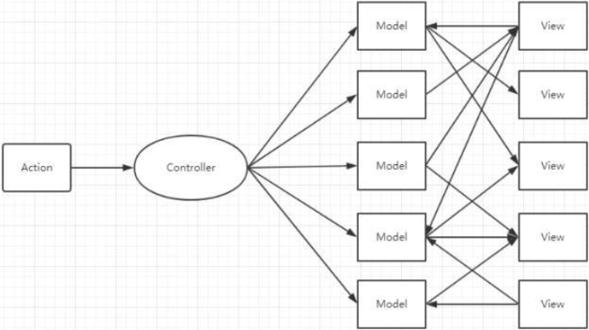

# Vue面试题

# 待定Vue面试题

[fe-interview/lib/Vue.md at master · haizlin/fe-interview (github.com)](https://github.com/haizlin/fe-interview/blob/master/lib/Vue.md)

[vue面试题（一）-CSDN博客](https://blog.csdn.net/Likestarr/article/details/135059297)

[vue核心面试题汇总【查缺补漏】 - 掘金 (juejin.cn)](https://juejin.cn/post/7161036677182898207)

[2023前端面试系列-- Vue 篇 - 掘金 (juejin.cn)](https://juejin.cn/post/7191325434486161467)

# 一、Vue 基础

- 响应式基础
- 模板语法和数据绑定
- 计算属性 computed 和侦听器 watch
- Class 与 Style 绑定
- 循环、条件渲染和列表渲染
- 事件、修饰符

## Vue 是什么

`Vue`是一款基于`MVVM`架构的`渐进式框架`，它主要用于构建`单页面应用（spa）`，它的特点有`声明式渲染`、`响应式`两大点。

### （1）什么是 MVVM

`MVVM`就是`Model-View-ViewModel`的缩写，它是一种`架构模式`，是`MVC（Model-View-Controller）`的改进版。

- `Model`：指的就是负责`应用的数据处理以及整体业务逻辑`（相当于后端）；
- `View`：指的就是`展示给用户的界面`（相当于 HTML 页面）；
- `MVVM中的ViewModel`：指的就是`视图模型`，它是`View`和`Module`沟通的桥梁，用于展示数据、处理用户交互、并且更新模型，并且`视图`会与`视图模型`进行关联，将`视图`中的一些方法和属性封装在`视图模型中`，然后通过`视图模型`和`模型`之间获取、更新数据，然后将真实的数据反映到`视图`中。


`MVVM`的架构的优点有：

- `低耦合`：视图（View）可以`独立于Model变化和修改`，`一个ViewModel`可以绑定到`不同的View上`，当`View变化`的时候`Model可以不变`，当`Model变化`的时候`View也可以不变`；
- `可复用`：可以将`一个ViewModule`的逻辑给`多个View`使用；
- `独立开发`：开发人员可以专注于`业务逻辑和数据的开发（ViewModel）`，设计人员可以专注于页面设计；
- `可测试`：因为`ViewModel`是独立于界面的，因此测试人员可以专注于`业务逻辑`，而无需依赖具体的页面实现；

### （2）什么是渐进式框架

`渐进式框架`指的就是一种`框架概念`，一般来说，使用渐进式框架时，无需引入其所有功能，而是`需要什么就用什么`，就拿`Vue`来说，我们可以引入一个`vue.js的文件`，然后在`其它框架中`去使用`Vue`，也可以使用它的`脚手架`，来进行构建一个 Vue 项目，这完全取决于用户想怎么使用，而框架为我们提供了`多种使用方式`以及`各个模块的功能`。

`渐进式框架`的`优点`有：

- `灵活`：开发者可以`按需引入`框架的各个功能；
- `可维护性`：开发者可以先`少量引入框架部分功能`，然后在需要的时候引入其它功能，防止项目从一开始就变得`结构复杂`、`难以维护`。

### （3）什么是 SPA 页面

`SPA`就是`单页面应用`，这是一种`网站的设计模式`，它的意思就是一个网站中，只有一个`HTML文件`，用户在进行页面交互时，或者刷新页面时，只是利用`JavaScript动态变换HTML的内容`，而`并非真正意义上的变换页面`。

`SPA应用`的优点：

- `良好的交互体验`：因为用户在交互时，只是动态刷新局部内容，并不用请求新的`HTML文件`，因此也就不会造成`长时间的页面白屏`；
- `良好的工作模式`：更好的实现`前后端分离`，让不同岗位的工程师专注于自己的领域，提升代码的性能以及复用性；
- `路由`：使用`前端路由`，通过`浏览器的API`来模拟`前进后退`操作，让用户在使用感知上并无变化。

`SPA应用`的缺点：

- `首页开销大`：因为所有的资源都需要在首页进行加载，因此资源过多时会产生`白屏问题`；
- `内存占用较大`：在 SPA 中，一旦页面加载完成，所有的页面内容和状态都保存在内存中，如果页面过于复杂或用户长时间停留在页面上，可能导致内存占用较大，影响设备性能；
- `不利于SEO`：SPA 页面在初始化时只有 HTML 的基本骨架，其它内容需要依赖于 JavaScript 的异步加载，浏览器不能完整的捕获到页面内容，不利于 SEO。

### （4）什么是声明式渲染

`声明式渲染`，就是你只需要告诉框架你的`目的`，至于它内部如何达成你的目的，你无需关心。与之对应的是`命令式渲染`，你需要一步步操作，让框架执行你的操作，最终达成你的目的。

比如原生 js 的编程，我们想改变标签的内容：

```vue
<div>原内容</div>
<script>
// 获取到标签
const node = document.getElementsByTagName("div")[0];
node.innerText = "新内容";
</script>
```

而在 Vue 中，我们只需要：

```vue
<template>
	<div>{{ msg }}</div>
</template>

<script>
export default {
	data() {
		return {
			msg: "原内容",
		};
	},
	methods: {
		change() {
			this.msg = "新内容";
		},
	},
};
</script>
```

看似 Vue 更麻烦，是因为我们使用了 Vue 的组件模板，看起来繁杂了。但是这只是一个标签的情况下，如果想给`多个标签修改内容`，在我们原生开发的过程中，每次都要`先获取标签`，然后修改标签内容，但是在 Vue 中，我们只需要将`标签和内容建立联系`，然后只修改内容，就可以自动让标签中的内容也更改。这得益于 Vue 强大的`模板编译`以及`响应式`。

## Vue 的两个核心或最大特点是什么？

数据驱动和组件系统：

数据驱动：ViewModel，保证数据和视图的一致性。

- 数据驱动就是让我们只关注数据层，只要数据变化，页面（即视图层）会自动更新，至于如何操作 dom，完全交由 vue 去完成，咱们只关注数据，数据变了，页面自动同步变化了，很方便。

组件系统：应用类 UI 可以看作全部是由组件树构成的。

- 组件化就是可以将页面和页面中可复用的元素都看做成组件，写页面的过程，就是写组件，然后页面是由这些组件“拼接“起来的组件树


## 谈一谈对 vue 设计原则的理解？

在 vue 的官网上写着大大的定义和特点：

- 渐进式 JavaScript 框架
- 易用、灵活和高效

所以阐述此题的整体思路按照这个展开即可，参考以下

### 1.渐进式 JavaScript 框架

与其它大型框架不同的是，Vue 被设计为可以自底向上逐层应用。

Vue 的核心库只关注视图层，不仅易于上手，还便于与第三方库或既有项目整合。

另一方面，当与[现代化的工具链](https://v2.cn.vuejs.org/v2/guide/single-file-components.html)以及[各种支持类库](https://github.com/vuejs/awesome-vue#libraries--plugins)结合使用时，Vue 也完全能够为复杂的单页应用提供驱动。

### 2.易用性

vue 提供数据响应式、声明式模板语法和基于配置的组件系统等核心特性。这些使我们只需要关注应用的核心业务即可，只要会写 js、html 和 css 就能轻松编写 vue 应用。

### 3.灵活性

渐进式框架的最大优点就是灵活性，如果应用足够小，我们可能仅需要 vue 核心特性即可完成功能；

随着应用规模不断扩大，我们才可能逐渐引入路由、状态管理、vue-cli 等库和工具，不管是应用体积还是学习难度都是一个逐渐增加的平和曲线。

### 4.高效性

超快的虚拟 DOM 和 diff 算法使我们的应用拥有最佳的性能表现。

追求高效的过程还在继续，vue3 中引入 Proxy 对数据响应式改进以及编译器中对于静态内容编译的改进都会让 vue 更加高效。

## 你怎么理解 vue 是一个渐进式的框架？

我觉得渐进式就是不必一开始就用 Vue 所有的全家桶，可以根据场景，按需使用想要的插件。也可以说就使用 vue 不需要太多的要求。

## 谈谈你对 vue 的理解

Vue 是一套用于构建用户界面的渐进式框架，核心是数据驱动和组件化开发，它的目标是通过 API 实现响应数据绑定和视图更新。

（1）声明式框架

（2）MVVM 模式

（3）采用虚拟 DOM

- 高内聚、低耦合、单向数据流。

（4）区分编译时（打包）和运行时（浏览器）

（5）组件化开发

- 更新范围，只重新渲染变化的组件。

## 说一下 Vue 的优缺点

轻量级框架：只关注视图层，是一个构建数据的视图集合，大小只有几十 kb ；

简单易学：国人开发，中文文档，不存在语言障碍 ，易于理解和学习；


Vue 是一个构建数据驱动的 Web 界面的渐进式框架。 Vue 的目标是通过尽可能简单的 API 实现响应的数据绑定和组合的视图组件。核心是一个响应的数据绑定系统。 关于 Vue 的优点，主要有响应式编程、组件化开发、虚拟 DOM

#### 响应式编程

这里的响应式不是 @media 媒体查询中的响应式布局，而是指 Vue 会自动对页面中某些数据的变化做出响应。这也就是 Vue 最大的优点，通过 MVVM 思想实现数据的双向绑定，让开发者不用再操作 DOM 对象，有更多的时间去思考业务逻辑。

双向数据绑定：保留了 angular 的特点，在数据操作方面更为简单；

视图，数据，结构分离：使数据的更改更为简单，不需要进行逻辑代码的修改，只需要操作数据就能完成相关操作；


这里的响应式不是 @media 媒体查询中的响应式布局，而是指 Vue 会自动对页面中某些数据的变化做出响应。这也就是 Vue 最大的优点，通过 MVVM 思想实现数据的双向绑定，让开发者不用再操作 DOM 对象，有更多的时间去思考业务逻辑。

#### 组件化开发

组件化：保留了 react 的优点，实现了 html 的封装和重用，在构建单页面应用方面有着独特的优势；

Vue 通过组件，把一个单页应用中的各种模块拆分到一个一个单独的组件（component）中，我们只要先在父级应用中写好各种组件标签（占坑），并且在组件标签中写好要传入组件的参数（就像给函数传入参数一样，这个参数叫做组件的属性），然后再分别写好各种组件的实现（填坑），然后整个应用就算做完了。

组件化开发的优点：提高开发效率、方便重复使用、简化调试步骤、提升整个项目的可维护性、便于协同开发。

#### 虚拟 DOM

虚拟 DOM：dom 操作是非常耗费性能的，不再使用原生的 dom 操作节点，极大解放 dom 操作，但具体操作的还是 dom 不过是换了另一种方式；

在传统开发中，用 JQuery 或者原生的 JavaScript DOM 操作函数对 DOM 进行频繁操作的时候，浏览器要不停的渲染新的 DOM 树，导致在性能上面的开销特别的高。 而 Virtual DOM 则是虚拟 DOM 的英文，简单来说，他就是一种可以预先通过 JavaScript 进行各种计算，把最终的 DOM 操作计算出来并优化，由于这个 DOM 操作属于预处理操作，并没有真实的操作 DOM，所以叫做虚拟 DOM。最后在计算完毕才真正将 DOM 操作提交，将 DOM 操作变化反映到 DOM 树上。

运行速度更快：相比较于 react 而言，同样是操作虚拟 dom，就性能而言， vue 存在很大的优势。

### 优点：

- 1、数据驱动视图，对真实 dom 进行抽象出 virtual dom（本质就是一个 js 对
  象），并配合 diff 算法、响应式和观察者、异步队列等手段以最小代价更新 dom，渲染页面
- 2、组件化，组件用单文件的形式进行代码的组织编写，使得我们可以在一个文件里编写 html+css（scoped 属性配置 css 隔离）js 并且配合 Vue-loader 之后，支持更强大的预处理器等功能
- 3、强大且丰富的 API 提供一系列的 api 能满足业务开发中各类需求
- 4、由于采用虚拟 dom，让 Vue ssr 先天就足
- 5、生命周期钩子函数，选项式的代码组织方式，写熟了还是蛮顺畅的，但仍然有优化空间（Vue3 composition-api）
- 6、生态好，社区活跃

### 缺点：

- 1、由于底层基于 Object.defineProperty 实现响应式，而这个 api 本身不支持 IE8 及以下浏览器
- 2、csr 的先天不足，首屏性能问题（白屏）
- 3、由于百度等搜索引擎爬虫无法爬取 js 中的内容，故 spa 先天就对 seo 优化，心有余力不足（谷歌的 puppeteer 就挺牛逼的，实现预渲染底层也是用到了这个工具）

## Vue 特性

#### 轻量

Vue.js 库的体积非常小的，并且不依赖其他基础库。

#### 双向数据绑定

对于一些富交互、状态机类似的前端 UI 界面，数据绑定非常简单、方便。

#### 指令

内置指令统一为(`v—*`)，也可以自定义指令，通过对应表达值的变化就可以修改对应的 DOM。

#### 插件化

Vue.js 核心不包含 Router、AJAX、表单验证等功能，但是可以非常方便地根据需要加载对应插件。

#### 组件化

组件可以扩展 HTML 元素，封装可重用的代码。允许我们使用小型、自包含和通常可复用的组件构建大型应用。

## 对 MVVM 的理解

`MVVM`是`Model-View-ViewModel`的简写，是一种软件架构设计思想模式，`MVVM` 分为 `Model`、`View`、`ViewModel`。

`MVVM`本质是`MVC`模型的升级版：也就是把`MVC`中的`Controller`演变成`ViewModel`。

核心点 `数据驱动视图`：

- `Model`代表数据模型，数据和业务逻辑都在`Model`层中定义；
- `View`代表 UI 视图：看到的页面，负责数据的展示；
- `ViewModel`是 `View`和`Model`之间的桥梁，负责监听`Model`中数据的改变并且控制视图的更新，处理用户交互操作；
  - `Model`和`View`并无直接关联，通过`ViewModel`来进行联系的，数据会绑定到 `ViewModel`层并自动将数据渲染到页面中，视图变化的时候会通知`ViewModel`层更新数据。
  - `Model`和`ViewModel`之间有着双向数据绑定的联系
  - 因此当`Model`中的数据改变时会触发`View`层的刷新，`View`中由于用户交互操作而改变的数据也会在`Model`中同步。


ViewModel 通过双向数据绑定把 View 层和 Model 层连接了起来，而 View 和 Model 之间的 同步工作完全是自动的，无需人为干涉，因此开发者只需关注业务逻辑，不需要手动操作 DOM，不需要关注数据状态的同步问题，复杂的数据状态维护完全由 MVVM 来统一管理。

所以vue 数据驱动，通过数据来显示视图层而不是节点操作。

## MVVM 模型的优缺点?

MVVM（Model-View-ViewModel）模型是一种软件架构模式，主要用于应用程序的用户界面设计。

它的优缺点如下：

**优点**:

1. **分离视图（View）和模型（Model）**: 降低代码耦合，提高视图或逻辑的重用性。视图可以独立于Model变化和修改，一个ViewModel可以绑定到不同的View上。
2. **提高可测试性**: ViewModel的存在可以帮助开发者更好地编写测试代码。
3. **自动更新DOM**: 利用双向绑定，数据更新后视图自动更新，减少手动DOM操作的需要。

**缺点**:

1. **Bug难以调试**: 双向绑定可能导致Bug迅速传播到其他位置，定位问题源头变得困难。
2. **内存消耗**: 大型模块中Model可能会很大，长期持有不释放内存会导致更多的内存消耗。
3. **视图状态管理复杂**: 对于大型图形应用程序，维护和构建ViewModel的成本较高。

MVVM模式适用于需要将用户界面与业务逻辑分离的场景，特别是在复杂的用户界面交互中。它可以提高代码的可维护性和可测试性，但也可能带来更高的内存消耗和调试难度。

## 说说 Vue 的 MVVM 实现原理

Vue.js 是一个实现 MVVM 模式的前端框架，其核心是实现视图（View）和模型（Model）之间的自动同步，即所谓的双向数据绑定。

Vue.js 的 MVVM 实现原理主要依赖以下几个关键技术：

1. **数据劫持**: Vue.js 使用 `Object.defineProperty` 方法劫持各个属性的 `getter` 和 `setter`，在数据变动时能够通知订阅者，触发相应的监听回调。这是实现双向绑定的基础。
2. **依赖收集**: 当渲染函数被首次执行时，会访问响应式数据的 `getter`，此时会进行依赖收集，将当前的组件实例收集为依赖。
3. **指令解析器（Compile）**: 解析模板中的 Vue 指令，并将模板中的变量与数据绑定起来，当数据变化时，Compile 会接收到通知并更新视图。
4. **观察者（Watcher）**: Watcher 的作用是连接 Observer 和 Compile 的桥梁，它订阅了数据的变化通知，并在数据变化时执行回调函数，更新视图。
5. **虚拟 DOM**: Vue.js 使用虚拟 DOM 来提高性能，只有当数据变化时，才会重新渲染组件，而不是直接操作 DOM。
6. **响应式更新队列**: Vue.js 会将所有的数据变更放入一个队列中，并在适当的时候一次性处理这些变更，以避免不必要的重复渲染。

通过这些机制，Vue.js 能够确保当数据变化时，视图能够自动更新，同时也能在视图变化时更新数据，从而实现了 MVVM 模式中的双向数据绑定

## 对 MVC、MVP 和 MVVM 的理解？

答题思路：此题涉及知识点很多，很难说清、说透，因为 mvc、mvp 这些我们前端程序员自己甚至都没用过。但是恰恰反映了前端这些年从无到有，从有到优的变迁过程，因此沿此思路回答将十分清楚。

### Web1.0 时代

在 web1.0 时代，并没有前端的概念。

开发一个 web 应用多数采用 ASP.NET/Java/PHP 编写，项目通常由多个 aspx/jsp/php 文件构成，每个文件中同时包含了 HTML、CSS、JavaScript、C#/Java/PHP 代码，系统整体架构可能是这样子的


这种架构的好处是简单快捷，但是，缺点也非常明显：

1. **业务体系增大，调试困难：**随着业务体系的增大，后台service也会逐步膨胀，大致需要建设一个开发服务器进行存放，这会导致一个问题就是前端无法在本地进行调试，每次进行修改之后，都必须上传到开发服务器进行测试（况且开发服务器可能本身就不稳定）。
2. **JSP代码难以维护：**或许人少的时候，学JSP挺简单的。但是，一旦团队人数增多，JSP内参杂的业务逻辑也会逐渐增加，这会导致的是JSP本身难以维护。

为了让开发更加便捷，代码更易维护，前后端职责更清晰。便衍生出 MVC 开发模式和框架，前端展示以模板的形式出现。典型的框架就是 Spring、Structs、Hibernate。整体框架如图所示：


使用这种分层架构，职责清晰，代码易维护。但这里的 MVC 仅限于后端，前后端形成了一定的分离，前端只完成了后端开发中的 view 层。

但是，同样的这种模式存在着一些：

1. **前端页面开发效率不高：**其实，早期的时候根本也没啥前端开发工程师，有的只是页面仔。更多公司可能也有后端的人使用js在写页面的。因此，问题就暴露了出来，前端所做出来的页面需要放到后端环境去运行，使得前端开发的效率并不是特别之高，因为对于后端环境的依赖程度比较大。
2. **前后端职责不清：**由于前端并未做太多的工作，以至于后端的开发体量比较庞大。就拿路由管理来举例子，本来路由管理可以由前端开发的人员来进行开发和管理。但是，使用这种架构时，后端需要去维护一个庞大的路由表，增加了后端的开发量。

### web 2.0 时代：ajax 技术

自从 Gmail 的出现，ajax 技术开始风靡全球。有了 ajax 之后，前后端的职责就更加清晰了。因为前端可以通过 Ajax 与后端进行数据交互，因此，整体的架构图也变化成了下面这幅图：


通过 ajax 与后台服务器进行数据交换，前端开发人员，只需要开发页面这部分内容，数据可由后台进行提供。而且 ajax 可以使得页面实现部分刷新，减少了服务端负载和流量消耗，用户体验也更佳。这时，才开始有专职的前端工程师。同时前端的类库也慢慢的开始发展，最著名的就是 jQuery 了。

当然，此架构也存在问题：缺乏可行的开发模式承载更复杂的业务需求，页面内容都杂糅在一起，一旦应用规模增大，就会导致难以维护了。因此，前端的 MVC 也随之而来。

#### 前后端分离后的架构演变——MVC、MVP 和 MVVM

##### MVC

前端的 MVC 与后端类似，具备着 View、Controller 和 Model。

Model：负责保存应用数据，与后端数据进行同步

Controller：负责业务逻辑，根据用户行为对 Model 数据进行修改

View：负责视图展示，将 model 中的数据可视化出来。

三者形成了一个如图所示的模型：


这样的模型，在理论上是可行的。但往往在实际开发中，并不会这样操作。因为开发过程并不灵活。例如，一个小小的事件操作，都必须经过这样的一个流程，那么开发就不再便捷了。

在实际场景中，我们往往会看到另一种模式，如图：


这种模式在开发中更加的灵活，backbone.js 框架就是这种的模式。

但是，这种灵活可能导致严重的问题：

1.**数据流混乱**。如下图：



2.**View 比较庞大，而 Controller 比较单薄**：由于很多的开发者都会在 view 中写一些逻辑代码，逐渐的就导致 view 中的内容越来越庞大，而 controller 变得越来越单薄。

既然有缺陷，就会有变革。前端的变化中，似乎少了 MVP 的这种模式，是因为 AngularJS 早早地将 MVVM 框架模式带入了前端。MVP 模式虽然前端开发并不常见，但是在安卓等原生开发中，开发者还是会考虑到它。

##### MVP

MVP 与 MVC 很接近，P 指的是 Presenter，presenter 可以理解为一个中间人，它负责着 View 和 Model 之间的数据流动，防止 View 和 Model 之间直接交流。我们可以看一下图示：


我们可以通过看到，presenter 负责和 Model 进行双向交互，还和 View 进行双向交互。这种交互方式，相对于 MVC 来说少了一些灵活，VIew 变成了被动视图，并且本身变得很小。虽然它分离了 View 和 Model。但是应用逐渐变大之后，导致 presenter 的体积增大，难以维护。要解决这个问题，或许可以从 MVVM 的思想中找到答案。

##### MVVM

首先，何为 MVVM 呢？MVVM 可以分解成(Model-View-VIewModel)。ViewModel 可以理解为在 presenter 基础上的进阶版。如图所示：


ViewModel 通过实现一套数据响应式机制自动响应 Model 中数据变化；

同时 Viewmodel 会实现一套更新策略自动将数据变化转换为视图更新；

通过事件监听响应 View 中用户交互修改 Model 中数据。

这样在 ViewModel 中就减少了大量 DOM 操作代码。

MVVM 在保持 View 和 Model 松耦合的同时，还减少了维护它们关系的代码，使用户专注于业务逻辑，兼顾开发效率和可维护性。

### 总结

- 这三者都是框架模式，它们设计的目标都是为了解决 Model 和 View 的耦合问题。
- MVC 模式出现较早主要应用在后端，如 Spring MVC、ASP.NET MVC 等，在前端领域的早期也有应用，如 Backbone.js。它的优点是分层清晰，缺点是数据流混乱，灵活性带来的维护性问题。
- MVP 模式在是 MVC 的进化形式，Presenter 作为中间层负责 MV 通信，解决了两者耦合问题，但 P 层过于臃肿会导致维护问题。
- MVVM 模式在前端领域有广泛应用，它不仅解决 MV 耦合问题，还同时解决了维护两者映射关系的大量繁杂代码和 DOM 操作代码，在提高开发效率、可读性同时还保持了优越的性能表现。

MVC（Model-View-Controller）、MVP（Model-View-Presenter）和 MVVM（Model-View-ViewModel）都是软件架构设计模式，它们的目的是通过分离关注点来改善代码的组织方式，提高代码的可维护性和可读性。下面是对这三种模式的简要理解：

**MVC**:

- **Model（模型）**: 负责数据和业务逻辑。
- **View（视图）**: 负责显示用户界面。
- **Controller（控制器）**: 起到模型与视图之间的协调作用，接收用户输入并调用模型和视图完成用户请求。 在MVC中，Model和View可能有耦合，即MVC仅仅将应用抽象，并未限制数据流。

**MVP**:

- **Model**: 与MVC中的Model相同。
- **View**: 与MVC中的View相同，但不直接与Model通信。
- **Presenter**: 替代了MVC中的Controller，作为Model和View之间的中介，处理所有的业务逻辑。 MVP模式限制了Model和View之间通信，让Model和View解耦更彻底，代码更容易被复用。但Presenter的负担很重，需要知道View和Model的结构，并且在Model变化时候需要手动操作View，增加编码负担。

**MVVM**:

- **Model**: 与MVC和MVP中的Model相同。
- **View**: 负责展示，可以通过ViewModel自动更新，不需要直接与Model交互。
- **ViewModel**: 替代了MVP中的Presenter，自动同步数据到视图，用VM代替P之后，MVVM自动从Model映射到View（实现方式是模板渲染），不需要用户手动操作视图，这样代码更简单不易出错，代码更好阅读和维护。 MVVM通过自动同步数据更新到视图，解决了MVP中手动同步的痛点，简化了代码。

总的来说，这三种模式都是为了解决开发过程中的维护问题和文件管理问题，目的都是为了将业务（Model）和视图（View）的实现代码分离。没有所谓最好的架构，只有适合项目和实际问题的架构。选择哪一种模式取决于项目的具体需求和团队的偏好

## MVVM、MVC、MVP 的区别

MVC、MVP 和 MVVM 是三种常见的软件架构设计模式，主要通过分离关注点的方式来组织代码结构，优化开发效率。

在开发单页面应用时，往往一个路由页面对应了一个脚本文件，所有的页面逻辑都在一个脚本文件里。页面的渲染、数据的获取，对用户事件的响应所有的应用逻辑都混合在一起，这样在开发简单项目时，可能看不出什么问题，如果项目变得复杂，那么整个文件就会变得冗长、混乱，这样对项目开发和后期的项目维护是非常不利的。

### （1）MVC

MVC 通过分离 Model、View 和 Controller 的方式来组织代码结构。

其中 View 负责页面的显示逻辑，Model 负责存储页面的业务数据，以及对相应数据的操作。并且 View 和 Model 应用了观察者模式，当 Model 层发生改变的时候它会通知有关 View 层更新页面。

Controller 层是 View 层和 Model 层的纽带，它主要负责用户与应用的响应操作，当用户与页面产生交互的时候，Controller 中的事件触发器就开始工作了，通过调用 Model 层，来完成对 Model 的修改，然后 Model 层再去通知 View 层更新。


### （2）MVVM

MVVM 分为 Model、View、ViewModel：

Model 代表数据模型，数据和业务逻辑都在 Model 层中定义；
View 代表 UI 视图，负责数据的展示；

ViewModel 负责监听 Model 中数据的改变并且控制视图的更新，处理用户交互操作；

Model 和 View 并无直接关联，而是通过 ViewModel 来进行联系的，Model 和 ViewModel 之间有着双向数据绑定的联系。因此当 Model 中的数据改变时会触发 View 层的刷新，View 中由于用户交互操作而改变的数据也会在 Model 中同步。

这种模式实现了 Model 和 View 的数据自动同步，因此开发者只需要专注于数据的维护操作即可，而不需要自己操作 DOM。


### （3）MVP

MVP 模式与 MVC 唯一不同的在于 Presenter 和 Controller。

在 MVC 模式中使用观察者模式，来实现当 Model 层数据发生变化的时候，通知 View 层的更新。这样 View 层和 Model 层耦合在一起，当项目逻辑变得复杂的时候，可能会造成代码的混乱，并且可能会对代码的复用性造成一些问题。

MVP 的模式通过使用 Presenter 来实现对 View 层和 Model 层的解耦。MVC 中的 Controller 只知道 Model 的接口，因此它没有办法控制 View 层的更新，MVP 模式中，View 层的接口暴露给了 Presenter 因此可以在 Presenter 中将 Model 的变化和 View 的变化绑定在一起，以此来实现 View 和 Model 的同步更新。

这样就实现了对 View 和 Model 的解耦，Presenter 还包含了其他的响应逻辑。


## Vue 中 computed 和 watch 的作用是什么，有什么区别？

### 相同

都是观察数据变化的

### computed

`computed`称为`计算属性`，它`必须拥有返回值`，它的值可以是`固定的`，也可以是`依赖其它响应式数据计算出来的`，它进行一些`同步运算处理`，当它依赖其它值时，只有当其它值改变时，它才会触发更新。

- 仅当用户取值时才会执行对于的方法

- 计算属性不支持异步逻辑

- 具有缓存作用，data依赖的值不变，不会再次执行

- 属性改变后，通知计算属性重新计算

- 具有响应式的返回值

- 提高性能

computed原理描述：

- conputed 本质是一个惰性的观察者；当计算数据存在于 data 或者 props 里时会被警告；
- 每一个计算属性内部都维护了一个 `dirty:true` 的属性。当 dirty 为 true 的时候，就会执行用户的方法，拿到值后把值川村起来 `this.value`，dirty 改为 false。再次取值，dirty 为 false，直接返回值。
- 更改数据的时候，dirty 会被修改为 true，并且会触发更新，页面重新渲染，重新计算计算属性的值

实现时，主要如下：

- 初始化 data ， 使用 Object.defineProperty 把这些属性全部转为 getter/setter 。
- 初始化 computed , 遍历 computed 里的每个属性，每个 computed 属性都是一个 watch 实例。每个属性提供的函数作为属性的 getter ，使用 Object.defineProperty 转化。
- Object.defineProperty getter 依赖收集。用于依赖发生变化时，触发属性重新计算。
- 若出现当前 computed 计算属性嵌套其他 computed 计算属性时，先进行其他的依赖收集

vue 初次运行会对 computed 属性做初始化处理（initComputed），初始化的时候会对每一个 computed 属性用 watcher 包装起来 ，这里面会生成一个 dirty 属性值为 true；然后执行 defineComputed 函数来计算，计算之后会将 dirty 值变为 false，这里会根据 dirty 值来判断是否需要重新计算；如果属性依赖的数据发生变化，computed 的 watcher 会把 dirty 变为 true，这样就会重新计算 computed 属性的值。


当组件实例触发生命周期函数 beforeCreate 后，它会做一系列事情，其中就包括对 computed 的处理。

它会遍历 computed 配置中的所有属性，为每一个属性创建一个 Watcher 对象，并传入一个函数，该函数的本质其实就是 computed 配置中的 getter，这样一来，getter 运行过程中就会收集依赖

但是和渲染函数不同，为计算属性创建的 Watcher 不会立即执行，因为要考虑到该计算属性是否会被渲染函数使用，如果没有使用，就不会得到执行。因此，在创建 Watcher 的时候，它使用了 lazy 配置，lazy 配置可以让 Watcher 不会立即执行。

收到 lazy 的影响，Watcher 内部会保存两个关键属性来实现缓存，一个是 value，一个是 dirty

value 属性用于保存 Watcher 运行的结果，受 lazy 的影响，该值在最开始是 undefined

dirty 属性用于指示当前的 value 是否已经过时了，即是否为脏值，受 lazy 的影响，该值在最开始是 true

Watcher 创建好后，vue 会使用代理模式，将计算属性挂载到组件实例中

当读取计算属性时，vue 检查其对应的 Watcher 是否是脏值，如果是，则运行函数，计算依赖，并得到对应的值，保存在 Watcher 的 value 中，然后设置 dirty 为 false，然后返回。

如果 dirty 为 false，则直接返回 watcher 的 value

巧妙的是，在依赖收集时，被依赖的数据不仅会收集到计算属性的 Watcher，还会收集到组件的 Watcher

当计算属性的依赖变化时，会先触发计算属性的 Watcher 执行，此时，它只需设置 dirty 为 true 即可，不做任何处理。

由于依赖同时会收集到组件的 Watcher，因此组件会重新渲染，而重新渲染时又读取到了计算属性，由于计算属性目前已为 dirty，因此会重新运行 getter 进行运算

而对于计算属性的 setter，则极其简单，当设置计算属性时，直接运行 setter 即可。


### watch

`watch`称为`监听`，它需要监听`一个响应式数据`，当它监听的数据改变时，它会处理回调任务，可以在回调中做一些`异步操作`。

- 监控数据的变化，当值发生变化时候会触发回调

- 监控基本类型的，直接使用。

- 监控对象，可以指定某一个属性，也可以配置 `deep:true` 属性监控整个对象

  注意点：异步要注意竞态问题，vue3 提供了第三个入参 onCleanup 函数，让用户更加方便的解决清理问题。

watch 的 参数：

- deep：深度监听
- immediate ：组件加载立即触发回调函数执行

### computed 和 watch的区别以及选择?

#### 分析

1. 先看[computed](https://cn.vuejs.org/api/reactivity-core#computed), [watch](https://cn.vuejs.org/api/reactivity-core#watch)两者定义，列举使用上的差异
2. 列举使用场景上的差异，如何选择
3. 使用细节、注意事项
4. vue3 变化

computed 特点：具有响应式的返回值

```js
const count = ref(1);
const plusOne = computed(() => count.value + 1);
```

watch 特点：侦测变化，执行回调

```js
const state = reactive({ count: 0 });
watch(
	() => state.count,
	(count, prevCount) => {
		/* ... */
	}
);
```

### 回答范例

1. `computed` 计算属性可以**从组件数据派生出新数据**，最常见的使用方式是设置一个函数，返回计算之后的结果，computed 和 methods 的差异是它具备缓存性，如果依赖项不变时不会重新计算。 `watch` 侦听器**可以侦测某个响应式数据的变化并执行副作用**，常见用法是传递一个函数，执行副作用，watch 没有返回值，但可以执行异步操作等复杂逻辑。
2. `computed` 计算属性常用场景是简化行内模板中的复杂表达式，模板中出现太多逻辑会是模板变得臃肿不易维护。`watch`侦听器常用场景是状态变化之后做一些额外的 DOM 操作或者异步操作。选择采用何用方案时首先看是否需要派生出新值，基本能用计算属性实现的方式首选计算属性。
3. `computed` 计算属性的本质是一个惰性求值的观察者`computed watcher`，具有缓存性，只有当依赖变化后，第一次访问 `computed` 属性，才会计算新的值
4. 从使用场景上说，`computed` 适用一个数据被多个数据影响，而 `watch` 适用一个数据影响多个数据；
5. 使用过程中有一些细节，比如计算属性也是可以传递对象，成为既可读又可写的计算属性。watch 可以传递对象，设置 deep、immediate 等选项。
6. vue3 中 watch 选项发生了一些变化，例如不再能侦测一个点操作符之外的字符串形式的表达式； reactivity API 中新出现了 watch、watchEffect 可以完全替代目前的 watch 选项，且功能更加强大。


- computed 属性默认会走**缓存**，只有依赖数据发生变化，才会重新计算，不支持异步，有异步导致数据发生变化时，无法做出相应改变；
- watch 不依赖缓存，一旦数据发生变化就直接触发响应操作，支持异步。


- `computed`计算属性将会混入到 vue 的实例中，所以需要监听自定义变量；watch 监听 data 、props 里面数据的变化；
- computed 有缓存，它依赖的值变了才会重新计算，watch 没有；
- watch 支持异步，computed 不支持；
- watch 是一对多（监听某一个值变化，执行对应操作）；computed 是多对一（监听属性依赖于其他属性）
- watch 监听函数接收两个参数，第一个是最新值，第二个是输入之前的值；
- computed 属性是函数时，都有 get 和 set 方法，默认走 get 方法，get 必须有返回值（return）

- `computed`是有缓存的，读取 computed 属性时，如果`依赖的值没有变化`，就会读取缓存的内容，而`watch`没有缓存，只要数据改动，就会触发回调；


- `computed`必须要有返回值，`watch`不需要有返回值；
- `computed`在初始化时就会执行一次，而`watch`初始化时默认`不会执行`，如果我们想让它执行，可以设置它的`immediate`属性为`true`；
- `computed`相当于创建了一个新的`响应式属性`，而`watch`相当于监听`原有的响应式属性`，然后执行回调；
- `computed`中处理的是`同步操作`，而`watch`可以处理`异步任务`。

### 区别2

#### 1.定义/语义区别

**watch**

```vue
<input type="text" v-model="foo" />

var vm = new Vue({ el: '#demo', data: { foo: 1 }, watch: { foo: function
(newVal,oldVal) { console.log(newVal+''+oldVal) } } }) vm.foo = 2 // 2 1
```

**computed**

```js
var vm = new Vue({
	el: "#demo",
	data: {
		firstName: "Foo",
		lastName: "Bar",
	},
	computed: {
		fullName: function () {
			return this.firstName + " " + this.lastName;
		},
	},
});
vm.fullName; // Foo Bar computed内部的函数调用的时候不需要加()
```

#### 2.功能区别

watch 更通用，computed 派生功能都能实现，计算属性底层来自于 watch，但做了更多，例如缓存。

#### 3.用法区别

##### watch 侦听器

watch 需要在数据变化时执行异步或开销较大的操作时使用，简单讲，当一条数据影响多条数据的时候，例如 搜索数据、值变化要和后端交互

`watch`用于监听数据的变化，并在变化时执行一些操作。它可以监听单个数据或者数组，当数据发生变化时会执行对应的回调函数，和`computed`不同的是`watch`不会有缓存。

到某一数据的变化从而触发函数。当数据为对象类型时，对象中的属性值变化时需要使用深度侦听`deep`属性，也可在页面第一次加载时使用立即侦听`immdiate`属性。

##### computed 计算属性

computed 更简单/更高效，优先使用

对于任何复杂逻辑或一个数据属性在它所依赖的属性发生变化时，也要发生变化，简单讲。当一个属性受多个属性影响的时候，例如 购物车商品结算时

`computed`计算属性，通过对已有的属性值进行计算得到一个新值。它需要依赖于其他的数据，当数据发生变化时，`computed`会自动计算更新。`computed`属性值会被缓存，只有当依赖数据发生变化时才会重新计算，这样可以避免重复计算提高性能。

#### 4.使用场景区别

- computed 适用于一个数据受多个数据影响使用；
- watch 适合一个数据影响多个数据使用。

`computed` 计算属性一般用在模板渲染中，某个值是依赖其它响应对象甚至是计算属性而来；而侦听属性适用于观测某个值的变化去完成一段复杂的业务逻辑。

- 当需要进行数值计算，并且依赖于其它数据时，应该使用 computed，因为可以利用 computed 的缓存特性，避免每次获取值时都要重新计算。
- 当需要在数据变化时执行异步或开销较大的操作时，应该使用 watch，使用 watch 选项允许执行异步操作 ( 访问一个 API )，限制执行该操作的频率，并在得到最终结果前，设置中间状态。这些都是计算属性无法做到的。

既能用 computed 实现又可以用 watch 监听来实现的功能，推荐用 computed，重点在于 computed 的缓存功能。

- computed 计算属性是用来声明式的描述一个值依赖了其它的值，当所依赖的值或者变量改变时，计算属性也会跟着改变；

- watch 监听的是已经在 data 中定义的变量，当该变量变化时，会触发 watch 中的方法。

- 


### 可能追问

1. watch 会不会立即执行？
2. watch 和 watchEffect 有什么差异

### 数据放在 computed 和 methods 的区别

- `computed` 内定义的视为一个变量；而 `methods` 内定义的是函数，必须加`括号()`；
- 在依赖数据不变的情况下，`computed` 内的值只在初始化的时候计算一次，之后就直接返回结果；而 `methods` 内调用的每次都会重写计算。

### Computed 的实现原理

`computed` 本质是一个惰性求值的观察者`computed watcher`。其内部通过`this.dirty` 属性标记计算属性是否需要重新求值。

- 当 `computed` 的依赖状态发生改变时,就会通知这个惰性的 `watcher`,`computed watcher` 通过 `this.dep.subs.length` 判断有没有订阅者,
- 有订阅者就是重新计算结果判断是否有变化，变化则重新渲染。
- 没有的话,仅仅把 `this.dirty = true` (当计算属性依赖于其他数据时，属性并不会立即重新计算，只有之后其他地方需要读取属性的时候，它才会真正计算，即具备 `lazy`（懒计算）特性。)

### Watch 的 实现原理

`Watch` 的本质也是一个观察者 `watcher`，监听到值的变化就执行回调；

- `watch` 的初始化在 `data` 初始化之后，此时的`data`已经通过 `Object.defineProperty` 设置成了响应式；
- `watch` 的 `key` 会在 `Watcher` 里进行值的读取，也就是立即执行 `get` 获取 `value`，此时如果有 `immediate`属性就立马执行 `watch` 对应的回调函数；
- 当 `data` 对应的 `key` 发生变化时，触发回调函数的执行；

### watch 怎么深度监听对象变化

参考回答：

deep 设置为 true 就可以监听到对象的变化

```js
let vm = new Vue({
	el: "#first",
	data: { msg: { name: "北京" } },
	watch: {
		msg: {
			handler(newMsg, oldMsg) {
				console.log(newMsg);
			},
			immediate: true,
			deep: true,
		},
	},
});
```

### computed 和 watch源码的实现

computed 的实现：https://github1s.com/vuejs/core/blob/HEAD/packages/reactivity/src/computed.ts%23L79-L80

ComputedRefImpl：https://github1s.com/vuejs/core/blob/HEAD/packages/reactivity/src/computed.ts%23L26-L27

缓存性

https://github1s.com/vuejs/core/blob/HEAD/packages/reactivity/src/computed.ts%23L59-L60

https://github1s.com/vuejs/core/blob/HEAD/packages/reactivity/src/computed.ts%23L45-L46

watch 的实现

https://github1s.com/vuejs/core/blob/HEAD/packages/runtime-core/src/apiWatch.ts%23L158-L159

## created 和 mounted 的区别

created：在模板渲染成 html 前调用，即通常初始化某些属性值，然后再渲染成视图。

mounted：在模板渲染成 html 后调用，通常是初始化页面完成后，再对 html 的 dom 节点进行一些需要的操作。

## computed计算属性的缓存和methods 方法调用的区别

计算属性必须返回结果

计算属性是基于它的依赖缓存的。一个计算属性所依赖的数据发生变化时，它才会重新取值。

使用计算属性还是 methods 取决于是否需要缓存，当遍历大数组和做大量计算时，应当使用计算属性，除非你不希望得到缓存。

计算属性是根据依赖自动执行的，methods 需要事件调用。


首先从表现形式上面来看， `computed` 和 `methods` 的区别大致有下面 _4_ 点：

1. 在使用时，`computed` 当做属性使用，而 `methods` 则当做方法调用
2. `computed` 可以具有 _getter_ 和 _setter_，因此可以赋值，而 `methods` 不行
3. `computed` 无法接收多个参数，而 `methods` 可以
4. `computed` 具有缓存，而 `methods` 没有

而如果从底层来看的话， `computed` 和 `methods` 在底层实现上面还有很大的区别。

`vue` 对 `methods` 的处理比较简单，只需要遍历 `methods` 配置中的每个属性，将其对应的函数使用 `bind` 绑定当前组件实例后复制其引用到组件实例中即可

而 `vue` 对 `computed` 的处理会稍微复杂一些。

## 计算属性和 watch 以及 methods 的区别

### 作用机制上：

watch 和 computed 都是以 Vue 的依赖追踪机制为基础的，当某一个数据发生变化的时候， 所有依赖这个数据的相关数据，自动发生变化，也就是自动调用相关的函数去实现数据的变动

methods 里面是用来定义函数的，它需要手动调用才能执行。而不像 watch 和 computed 那样， “自动执行”预先定义的函数，相比于 watch / compute，methods 不处理数据逻辑关系，只提供可调用的函数，类似储存函数的一个库。

### 从性质上：

methods：里面定义的是函数，你显然需要像"fuc()"这样去调用它（假设函数为 fuc）。 

computed：是计算属性，事实上和和 data 对象里的数据属性是同一类的（使用上）。

 watch：类似于监听机制+事件机制，回调函数自动调用。

## 在 Vue 中要获取当前时间你会放到 computed 还是 methods 里？

放在 `computed` 里面。

因为 `computed` 只有在它的相关依赖发生改变时才会重新求值。相比而言，方法只要发生重新渲染，`methods` 调用总会执行所有函数。

## 为什么不建议用 index 作为 key?

如果将数组下标作为`key`值，那么当列表发生变化时，可能会导致`key`值发生改变，从而引发不必要的组件重新渲染，甚至会导致性能问题。例如，当删除列表中某个元素时，其后面的所有元素的下标都会发生改变，导致`Vue`重新渲染整个列表。

## v-if 和 v-for 哪个优先级更高？如果两个同时出现，应该怎么优化得到更好的性能？

### 两者优先级问题

- 在 `Vue2` 中，`v-for` 的优先级高于 `v-if` ，放在一起会先执行循环再判断条件；如果两者同时出现的话，会带来性能方面的浪费（每次都会先循环渲染再进行条件判断），所以编码的时候不应该将它俩放在一起；
- 再 `Vue3` 中， `v-if` 的优先级高于 `v-for` ；因为 `v-if` 先执行，此时 `v-for` 未执行，所以如果使用 `v-for` 定义的变量就会报错；

在`Vue2`中，会先通过`v-for`遍历，然后对每一项使用`v-if`判断，不满足条件的不会渲染，但是这种方式并不好，相当于对很多个标签都添加了`v-if`，每次渲染之前都要判断。于是在`Vue3`中，`v-if`的优先级要`高于v-for`了，相当于在`v-for外层包裹了一层`，但是这时的判断条件肯定是错的，因此在`vue3中`同一标签使用`v-for和v-if`时，会报错。

```vue
<div v-if="item === 1" v-for="item in 6" :key="index">
	<span>{{ item }}</span>
</div>

<!-- 等价于 -->
<template v-if="item === 1">
	<!-- 此时肯定会报错 -->
	<div v-for="item in 6" :key="index">
		<span>{{ item }}</span>
	</div>
</template>
```

### 在 Vue2 中

会先通过`v-for`遍历，然后对每一项使用`v-if`判断，不满足条件的不会渲染，但是这种方式并不好，相当于对很多个标签都添加了`v-if`，每次渲染之前都要判断。

会导致循环后再判断，浪费性能。

这意味着 v-if 将分别重复运行于每个 v-for 循环中。当你想为仅有的一些项渲染节点时，这种优先级的机制会十分有用，如下：

```vue
<li v-for="todo in todos" v-if="!todo.isComplete">{{ todo }}</li>
```

上面的代码只传递了未完成的 todos。而如果你的目的是有条件地跳过循环的执行，那么可以将 v-if 置于外层元素 (或`<template>`)上 vue 中 keep-alive 组件的作用**keep-alive：主要用于保留组件状态或避免重新渲染。**

比如： 有一个列表页面和一个 详情页面，那么用户就会经常执行打开详情=>返回列表=>打开详情这样的话 列表 和 详情 都是一个频率很高的页面，那么就可以对列表组件使用`<keep-alive></keep-alive>`进行缓存，这样用户每次返回列表的时候，都能从缓存中快速渲染，而不是重新渲染。

1、属性：include:字符串或正则表达式。只有匹配的组件会被缓存。

exclude：字符串或正则表达式。任何匹配的组件都不会被缓存。

2、用法：包裹动态组件时，会缓存不活动的组件实例，而不是销毁它们。和`<transition>`相似，`<keep-alive>`是一个抽象组件：它自身不会渲染一 DOM 元素，也不会出现在父组件链中。当组件在`<keep-alive>` 内被切换，在 2.2.0 及其更高版本中，

**activated 和 deactivated 生命周期 将会在 树内的所有嵌套组件中触发**。

### 在 Vue3 中

v-if 的优先级高于 v-for


### 解决v-for 与 v-if同时使用的问题

- v-for 和 v-if 应避免在同一个标签里使用：在外层新增嵌套 `template` 模板标签，在`template层`上进行 `v-if` 判断，然后在`内部`进行 `v-for` 循环。
- 如果遇到v-for 与 v-if同时使用的场景：条件出现在循环内部，可以考虑用计算属性来优化：通过计算属性搭配 v-if 条件，来计算出需要 v-for 的数据，提前过滤掉那些不需要显示的项。

---

### 回答范例：

1. 实践中**不应该把 v-for 和 v-if 放一起**
2. 在**vue2 中**，**v-for 的优先级是高于 v-if**，把它们放在一起，输出的渲染函数中可以看出会先执行循环再判断条件，哪怕我们只渲染列表中一小部分元素，也得在每次重渲染的时候遍历整个列表，这会比较浪费；另外需要注意的是在**vue3 中则完全相反，v-if 的优先级高于 v-for**，所以 v-if 执行时，它调用的变量还不存在，就会导致异常
3. 通常有两种情况下导致我们这样做：
   - 为了**过滤列表中的项目** (比如 `v-for="user in users" v-if="user.isActive"`)。此时定义一个计算属性 (比如 `activeUsers`)，让其返回过滤后的列表即可（比如`users.filter(u=>u.isActive)`）。
   - 为了**避免渲染本应该被隐藏的列表** (比如 `v-for="user in users" v-if="shouldShowUsers"`)。此时把 `v-if` 移动至容器元素上 (比如 `ul`、`ol`)或者外面包一层`template`即可。
4. 文档中明确指出**永远不要把 `v-if` 和 `v-for` 同时用在同一个元素上**，显然这是一个重要的注意事项。
5. 源码里面关于代码生成的部分，能够清晰的看到是先处理 v-if 还是 v-for，顺序上 vue2 和 vue3 正好相反，因此产生了一些症状的不同，但是不管怎样都是不能把它们写在一起的。

---

### 源码

Vue2：https://github1s.com/vuejs/vue/blob/HEAD/src/compiler/codegen/index.ts

Vue3：https://github1s.com/vuejs/core/blob/HEAD/packages/compiler-core/src/codegen.ts


#### vue2 源码中找答案：`compiler/codegen/index.ts`

```vue
<p v-for="item in items" v-if="condition">
```

做个测试如下

```html
<!DOCTYPE html>
<html>
	<head>
		<title>Vue事件处理</title>
	</head>
	<body>
		<div id="demo">
			<h1>v-for和v-if谁的优先级高？应该如何正确使用避免性能问题？</h1>
			<!-- <p v-for="child in children" v-if="isFolder">{{child.title}}</p> -->
			<template v-if="isFolder">
				<p v-for="child in children">{{ child.title }}</p>
			</template>
		</div>
		<script src="../../dist/vue.js"></script>
		<script>
			// 创建实例
			const app = new Vue({
				el: "#demo",
				data() {
					return { children: [{ title: "foo" }, { title: "bar" }] };
				},
				computed: {
					isFolder() {
						return this.children && this.children.length > 0;
					},
				},
			});
			console.log(app.$options.render);
		</script>
	</body>
</html>
```

两者同级时，渲染函数如下：

```js
(function anonymous() {
	with (this) {
		return _c(
			"div",
			{ attrs: { id: "demo" } },
			[
				_c("h1", [
					_v("v-for和v-if谁的优先 级高？应该如何正确使用避免性能问题？"),
				]),
				_v(" "),
				_l(children, function (child) {
					return isFolder ? _c("p", [_v(_s(child.title))]) : _e();
				}),
			],
			2
		);
	}
});
```

> \_l 包含了 isFolder 的条件判断

两者不同级时，渲染函数如下

```js
(function anonymous() {
	with (this) {
		return _c(
			"div",
			{ attrs: { id: "demo" } },
			[
				_c("h1", [
					_v("v-for和v-if谁的优先 级高？应该如何正确使用避免性能问题？"),
				]),
				_v(" "),
				isFolder
					? _l(children, function (child) {
							return _c("p", [_v(_s(child.title))]);
					  })
					: _e(),
			],
			2
		);
	}
});
```

> 先判断了条件再看是否执行`_l`

**结论：**

1.显然 v-for 优先于 v-if 被解析（把你是怎么知道的告诉面试官）

2.如果同时出现，每次渲染都会先执行循环再判断条件，无论如何循环都不可避免，浪费了性能。

## v-if 和 v-for 为什么不建议放在一起使用？

**Vue 2 中**：`v-for`的优先级比`v-if`高，这意味着`v-if`将分别重复运行于每一个`v-for`循环中。如果要遍历的数组很大，而真正要展示的数据很少时，将造成很大的性能浪费。

**Vue 3 中**：则完全相反，`v-if`的优先级高于`v-for`，所以`v-if`执行时，它调用的变量还不存在，会导致异常。

通常有两种情况导致要这样做：

- 为了过滤列表中的项目，比如：`v-for = "user in users" v-if = "user.active"`。这种情况，可以定义一个计算属性，让其返回过滤后的列表即可。
- 为了避免渲染本该被隐藏的列表，比如`v-for = "user in users"  v-if = "showUsersFlag"`。这种情况，可以将`v-if`移至容器元素上或在外面包一层`template`即可。

## Vue2 和 Vue3 怎样挂载全局属性

### 在Vue2中

可以通过将一些`公共属性`挂载到`Vue`的原型上，实现各个组件的共享，在组件中可以通过`this`来访问。

```js
Vue.prototype.a = "a";
```

### 在Vue3中

不再导出`Vue构造函数了`，并且在`composition API`中无法使用`this`，因此如果我们想挂载全局属性，应该使用这种方法：

```js
// 添加
import { createApp } from "vue";
import App from "./App.vue";

const app = createApp(App);

app.config.globalProperties.a = "a";

app.mount("#app");


// 使用
import { getCurrentInstance } from "vue";
const { a } = getCurrentInstance().appContext.config.globalProperties;
```

## v-if 和 v-show 的相同点和区别

### 相同点

都可以动态判断来控制DOM元素的显示

### 区别

#### 1.控制手段不同

- `v-if`不会渲染 DOM 元素，隐藏是：直接删除 DOM元素，显示再重新渲染DOM，切换渲染消耗更高。
- `v-show`操作的是：加载页面时先渲染DOM元素(初始渲染消耗更高)，通过给DOM元素添加样式(display: none)，切换当前 DOM 的显示和隐藏，但DOM元素仍然存在。

#### 2.编译过程不同

`v-if`编译过程：切换有一个局部编译/卸载的过程，切换过程中合适的销毁和重建内部的事件监听和子组件；

`v-show`编译过程：只是简单的基于 css 样式切换显示和隐藏(在 display: none 和 display: block 之间切换)。

#### 3.编译条件不同

`v-if` 是Vue 底层的编译，是惰性的，如果初始条件为假，则什么也不做；只有在条件第一次变为真时才开始局部编译; 

`v-show` 是在任何条件下，无论首次条件是否为真，都被编译，然后被缓存，而且 DOM 元素保留；

#### 4.触发生命周期不同

`v-show`由 false 变为 true 的时候不会触发组件的生命周期；

`v-if`由 false 变为 true 的时候，触发组件的`beforeCreate`、`created`、`beforeMount`、`mounted`钩子，由 true 变为 false 的时候触发组件的`beforeDestory`、`destoryed`钩子。

#### 5.性能消耗不同

`v-if`有更高的切换消耗；

`v-show`有更高的初始渲染消耗。

#### 6.综上使用场景：

`v-show`在初始渲染时有更高的开销，但是切换开销很小，如果需要非常频繁地切换，则使用`v-show`较好，如：手风琴菜单，tab 页签等； 

如果在运行时条件很少改变，则使用`v-if`较好，如：用户登录之后，根据权限不同来显示不同的内容。

- 当属性初始为 false 时，组件就不会被渲染，直到条件为 true ，并且切换条件时会触发销毁/挂载组件，所以总的来说在切换时开销更高，更适合不经常切换的场景。

- 并且基于 v-if 的这种惰性渲染机制，可以在必要的时候才去渲染组件，减少整个页面的初始渲染开销。

## Class 与 Style 如何动态绑定

`Class` 可以通过对象语法和数组语法进行动态绑定

### 对象语法：

```vue
<div v-bind:class="{ active: isActive, 'text-danger': hasError }"></div>

<script>
data: {
  isActive: true,
  hasError: false
}
</script>
```

### 数组语法：

```vue
<div v-bind:class="[isActive ? activeClass : '', errorClass]"></div>

<script>
data: {
  activeClass: 'active',
  errorClass: 'text-danger'
}
</script>
```

`Style` 也可以通过对象语法和数组语法进行动态绑定

### 对象语法：

```vue
<div v-bind:style="{ color: activeColor, fontSize: fontSize + 'px' }"></div>

<script>
data: {
  activeColor: 'red',
  fontSize: 30
}
</script>
```

### 数组语法：

```vue
<div v-bind:style="[styleColor, styleSize]"></div>

<script>
data: {
  styleColor: {
     color: 'red'
   },
  styleSize:{
     fontSize:'23px'
  }
}
</script>
```

## Vue 中常见的修饰符

在 vue 中修饰符可以分为 3 类：

- 事件修饰符
- 按键修饰符
- 鼠标修饰符
- 表单修饰符

### （1）事件修饰符

在事件处理程序中调用 `event.preventDefault` 或 `event.stopPropagation` 方法是非常常见的需求。尽管可以在 `methods` 中轻松实现这点，但更好的方式是： `methods` 只有纯粹的数据逻辑，而不是去处理 `DOM` 事件细节。

为了解决这个问题，`vue` 为 `v-on` 提供了事件修饰符。通过由点 . 表示的指令后缀来调用修饰符。

- `.stop`：调用 event.stopPropagation()，阻止事件冒泡；
- `.prevent`：调用 event.preventDefault()，阻止默认事件；
- `.self`：只有事件在当前元素自身触发时，才会调用函数；
- `.capture`：添加事件侦听器时使用 capture 模式--捕获模式——事件捕获由外到内：内部元素的事件在被内部元素处理`之前`，先被`外部元素处理`；
- `.once`：该事件只会触发一次；
- `.passive`：以 { passive: true } 模式添加侦听器：一般用于`触摸事件`的监听器，可以用来`改善移动端设备的滚动性能`；
- `.{keyCode | keyAlias}`：只当事件是从特定键触发时才触发回调。
- `.native`：监听组件根元素的原生事件。

（1）`.stop`

阻止单击事件继续传播。

```vue
<!--这里只会触发a-->
<div @click="divClick"><a v-on:click.stop="aClick">点击</a></div>
```

（2）`.prevent`

阻止标签的默认行为。

```vue
<a href="http://www.baidu.com" v-on:click.prevent="aClick">点击</a>
```

（3）`.capture`

事件先在有`.capture`修饰符的节点上触发，然后在其包裹的内部节点中触发。

```vue
<!--这里先执行divClick事件，然后再执行aClick事件-->
<div @click="divClick"><a v-on:click="aClick">点击</a></div>
```

（4）`.self`

只当在 event.target 是当前元素自身时触发处理函数，即事件不是从内部元素触发的。

```vue
<!--在a标签上点击时只会触发aClick事件，只有点击phrase的时候才会触发divClick事件-->
<div @click.self="divClick">phrase<a v-on:click="aClick">点击</a></div>
```

（5）`.once`

不像其它只能对原生的 DOM 事件起作用的修饰符，`.once` 修饰符还能被用到自定义的组件事件上，表示当前事件只触发一次。

```vue
<a v-on:click.once="aClick">点击</a>
```

（6）`.passive`

`.passive` 修饰符尤其能够提升移动端的性能

```vue
<!-- 滚动事件的默认行为 (即滚动行为) 将会立即触发 -->
<!-- 而不会等待 `onScroll` 完成 -->
<!-- 这其中包含 `event.preventDefault()` 的情况 -->
<div v-on:scroll.passive="onScroll">...</div>
```

（7）`.native`

如果是在自己封装的组件或者是使用一些第三方的 UI 库时，会发现并不起效果，这时就需要用`.native` 修饰符了，如：

```vue
<el-input
	v-model="inputName"
	placeholder="搜索你的文件"
	@keyup.enter.native="searchFile(params)"
>
</el-input>
```

### （2）按键键值修饰符

- `.enter`：仅在`Enter`键时调用；
- `.page-down`：仅在`PageDown`键时调用；
- `.tab`：仅在`tab`键(制表键)时调用；
- `.delete`：仅在`delete`(删除)或 `Backspace`(退格)键时调用；
- `.esc`：仅在`esc`(返回)键时调用；
- `.space`：仅在`space`(空格)键时调用；
- `.up`：仅在`up`(上)键时调用；
- `.down`：仅在`down`(下)键时调用；
- `.ctrl`：仅在`ctrl`键时调用；
- `.alt`：仅在`alt`键时调用；
- `.shift`：仅在`shift`键时调用；
- `.meta`：在`Windows`上是`Win键`，在`Mac`上是`Command键`，不同机器上键位不同。

### （3）鼠标按键修饰符

- `.left`：鼠标左键触发；
- `.right`：鼠标右键触发；
- `.middle`：鼠标中键触发；

### （4）表单修饰符

vue 同样也为表单控件也提供了修饰符，常见的有 `.lazy`、`.number` 和 `.trim`

- `.lazy`：在文本框失去焦点时才会渲染
- `.number`：将文本框中所输入的内容转换为 number 类型
- `.trim`：可以自动过滤输入首尾的空格

（1）`.lazy`

在默认情况下，`v-model` 在每次 `input` 事件触发后将输入框的值与数据进行同步 ，可以添加 `lazy` 修饰符，从而转为在 `change` 事件之后进行同步:

```vue
<input v-model.lazy="msg">
```

（2）`.number`

如果想自动将用户的输入值转为数值类型，可以给 `v-model` 添加 `number` 修饰符：

```vue
<input v-model.number="age" type="number">
```

（3）`.trim`

如果要自动过滤用户输入的首尾空白字符，可以给 `v-model` 添加 `trim` 修饰符：

```vue
<input v-model.trim="msg">
```


### （5）双向绑定修饰符：`.sync` 修饰符

`.sync`修饰符是Vue2的`v-bind:xxx`和`@update:xxx`的语法糖

> 在 Vue3 中已被移除，使用`v-model:xxx替代`。

Vue2中使用

有时候，我们需要对一个 prop 进行“双向绑定”，这时可以使用.sync 来实现。

v-model 默认只能双向绑定一个属性，通过.sync 修饰符，就可以绑定多个属性

```vue
<my-com :属性名.sync="xxx">
```

my-com 组件里通过：`$emit('update:属性名', value)` 来触发。

完整例子：

```vue
<!-- 子组件 -->
<script>
export default {
	name: "HelloWorld",
	props: {
		name: {
			type: String,
			default: "",
		},
	},
	methods: {
		changeName() {
			this.$emit("update:name", "child");
		},
	},
};
</script>


<!-- 父组件 -->
<template>
	<div id="app">
		<HelloWorld :name.sync="name" ref="Child" />
	</div>
</template>

<script>
import HelloWorld from "./components/HelloWorld.vue";
export default {
	name: "App",
	components: {
		HelloWorld,
	},
	data() {
		return {
			name: "Lee",
		};
	},
};
</script>


<!-- 等同于 -->
<template>
	<div id="app">
		<HelloWorld :name="name" @update:name="changeName" />
	</div>
</template>

<script>
import HelloWorld from "./components/HelloWorld.vue";
export default {
	name: "App",
	components: {
		HelloWorld,
	},
	data() {
		return {
			name: "Lee",
		};
	},
	methods: {
		changeName(val) {
			this.name = val;
		},
	},
};
</script>
```

### 使用场景

#### v-on 指令常用修饰符：

- .stop：调用 event.stopPropagation()，禁止事件冒泡。
- .prevent：调用 event.preventDefault()，阻止事件默认行为。
- .capture：添加事件侦听器时使用 capture 模式。
- .self：只当事件是从侦听器绑定的元素本身触发时才触发回调。
- .{keyCode | keyAlias}：只当事件是从特定键触发时才触发回调。
- .native：监听组件根元素的原生事件。
- .once：只触发一次回调。
- .left： (2.2.0) 只当点击鼠标左键时触发。
- .right：(2.2.0) 只当点击鼠标右键时触发。
- .middle：(2.2.0) 只当点击鼠标中键时触发。
- .passive(2.3.0) 以 { passive: true } 模式添加侦听器

注意： 如果是在自己封装的组件或者是使用一些第三方的 UI 库时，会发现并不起效果，这时就需要用`·.native 修饰符了，如：

```vue
<el-input
  v-model="inputName"
  placeholder="搜索你的文件"
  @keyup.enter.native="searchFile(params)"
>
</el-input>
```

#### v-bind 指令常用修饰符：

.prop - 被用于绑定 DOM 属性 (property)。(差别在哪里？)

.camel - (2.1.0+) 将 kebab-case 特性名转换为 camelCase. (从 2.1.0 开始支持)

.sync (2.3.0+) 语法糖，会扩展成一个更新父组件绑定值的 v-on 侦听器。

#### v-model 指令常用修饰符：

.lazy - 取代 input 监听 change 事件

.number - 输入字符串转为数字

.trim - 输入首尾空格过滤

## Vue 如何监听键盘事件？

参考回答：

#### 1.@keyup. 方法

```vue
<template>
	<input
		ref="myInput"
		type="text"
		value="hello world"
		autofocus
		@keyup.enter="handleKey"
	/>
</template>
<script>
export default {
	methods: {
		handleKey(e) {
			console.log(e);
		},
	},
};
</script>
```

#### 2.adEventListener

```vue
<script>
export default {
	mounted() {
		document.addEventListener("keyup", this.handleKey);
	},
	beforeDestroy() {
		document.removeEventListener("keyup", this.handleKey);
	},
	methods: {
		handleKey(e) {
			console.log(e);
		},
	},
};
</script>
```


## 为何 v-for 中要用 key

- 必须用 key，且不能是 index 和 random，因为使用 index 会导致 bug
- diff 算法中通过 tag 和 key 来判断，是否是 sameNode
- 减少渲染次数，提升渲染性能

## 在给 vue 中的元素设置 key 值时可以使用 Math 的 random 方法么？

参考答案：

`random` 是生成随机数，有一定概率多个 `item 会生成相同的值，不能保证唯一。

如果是根据数据来生成 `item`，数据具有 `id` 属性，那么就可以使用 `id` 来作为 `key`。

如果不是根据数据生成 `item`，那么最好的方式就是使用时间戳来作为 `key`。或者使用诸如 `uuid` 之类的库来生成唯一的 `id`。

## Vue 事件中如何使用 event 对象？

注意在事件中要使用 $ 符号

```vue
<a href="javascript:void(0);" data-id="12" @click="showEvent($event)">event</a>

<script>
// js部分 
showEvent(event){ // 获取自定义data-id
	console.log(event.target.dataset.id) // 阻止事件冒泡
    event.stopPropagation(); //阻止默认 
    event.preventDefault() 
}
</script>
```

## Vue 如何监听键盘事件中的按键？

在 Vue 中，已经为常用的按键设置了别名，这样我们就无需再去匹配 keyCode ，直接使用别名就能监听按键的事件。

```vue
<input @keyup.enter="function">
```

| 别名    | 实际键值                                         |
| ------- | ------------------------------------------------ |
| .delete | delete（删除）/BackSpace（退格）                 |
| .tab    | Tab                                              |
| .enter  | Enter（回车）                                    |
| .esc    | Esc（退出）                                      |
| .space  | Space（空格键）                                  |
| .left   | Left（左箭头）                                   |
| .up     | Up（上箭头）                                     |
| .right  | Right（右箭头）                                  |
| .down   | Down（下箭头）                                   |
| .ctrl   | Ctrl                                             |
| .alt    | Alt                                              |
| .shift  | Shift                                            |
| .meta   | (window 系统下是 window 键，mac 下是 command 键) |

另外，Vue 中还支持组合写法：

| 组合写法                 | 按键组合     |
| ------------------------ | ------------ |
| @keyup.alt.67=”function” | Alt + C      |
| @click.ctrl=”function”   | Ctrl + Click |

但是，如果是在自己封装的组件或者是使用一些第三方的 UI 库时，会发现并不起效果，这时就需要用到 .native 修饰符了，如：

```vue
<el-input
	v-model="inputName"
	placeholder="搜索你的文件"
	@keyup.enter.native="searchFile(params)"
></el-input>
```

如果遇到 `.native` 修饰符也无效的情况，可能就需要用到 `$listeners` 了。

## 对 Vue 的SPA单页应用的理解？有什么优缺点

- 只有一个页面，多个页面组件
- 页面切换速度快，用户体验较好，服务端压力小
- 不利于 SEO 搜索引擎优化
- 首屏渲染时间会相对较长

单页 Web 应用（single page web application，简写成：SPA）是一种前端应用程序的架构模式，就是只有一张 Web 页面的应用，通过在加载单个 HTML 页面，并在用户与应用程序交互时，使用 `JavaScript` 动态地更新页面内容的 Web 应用程序，从而实现无刷新的用户体验。

我们开发的`Vue`项目大多是借助个官方的`CLI`脚手架，快速搭建项目，直接通过`new Vue`构建一个实例，并将`el:'#app'`挂载参数传入，最后通过`npm run build`的方式打包后生成一个`index.html`，称这种只有一个`HTML`的页面为单页面应用。


### 1.SPA概念

`SPA（Single-page  application）`，即单页面应用，它是一种网络应用程序或网站的模型，通过动态重写当前页面来与用户交互，这种方法避免了页面之间切换时打断用户体验。在`SPA`中，所有必要的代码（HTML、JavaScript 和 CSS）都通过单个页面的加载而检索，或者根据需要（通常是响应用户操作）动态装载适当的资源并添加到页面。页面在任何时间点都不会重新加载，也不会将控制转移到其他页面。举个例子，就像一个杯子，上午装的是牛奶，中午装的是咖啡，下午装的是茶，变得始终是内容，杯子始终不变。

### 2.MPA概念

`MPA（Muti-page application）`，即多页面应用。在`MPA`中，每个页面都是一个主页面，都是独立的，每当访问一个页面时，都需要重新加载 Html、CSS、JS 文件，公共文件则根据需求按需加载。

### 3.`SPA`与`MPA`的区别：

|                  | SPA                         | MPA                                   |
| ---------------- | --------------------------- | ------------------------------------- |
| 组成             | 一个主页面和多个页面片段    | 多个主页面                            |
| url 模式         | hash 模式                   | history 模式                          |
| SEO 搜索引擎优化 | 难实现，可使用 SSR 方式改善 | 容易实现                              |
| 数据传递         | 容易                        | 通过 url、cookie、localStorage 等传递 |
| 页面切换         | 速度快，用户体验良好        | 切换加载资源，速度慢，用户体验差      |
| 维护成本         | 相对容易                    | 相对复杂                              |

### 4.`SPA`的优缺点：

#### 优点

- **用户体验好**：`SPA` 提供了流畅、快速的用户体验，在页面加载后，只有需要的数据和资源会被加载，减少了页面刷新的延迟。
- **响应式交互**：由于 `SPA` 依赖于异步数据加载和前端路由，可以实现实时更新和动态加载内容，使用户可以快速地与应用程序交互。
- **组件化—代码复用**：`SPA` 通常采用组件化开发的方式，代码结构和组织方式更加规范化，提高了代码的可维护性和可扩展性。
- **服务器负载较低**：由于只有初始页面加载时需要从服务器获取 `HTML`、`CSS` 和 `JavaScript` 文件，减轻了服务器的负载。
- 具有桌面应用的即时性、网站的可移植性和可访问性
- 用户体验好、快，内容的改变不需要重新加载整个页面
- **前后端分离**：良好的前后端分离，分工更明确

#### 缺点

- **首次加载时间(首次渲染速度相对较慢)**：`SPA` 首次加载时需要下载较大的 `JavaScript` 文件，这可能导致初始加载时间较长。
- **不利于SEO（搜索引擎优化—不利于搜索引擎的抓取）**：由于 `SPA` 的内容是通过 `JavaScript` 动态生成的，单页页面，数据在前端渲染，搜索引擎的爬虫可能无法正确地获取和索引页面的内容。
- **内存占用**：`SPA` 在用户浏览应用程序时保持单个页面的状态，这可能导致较高的内存占用。
- **安全性**：由于 `SPA` 通常使用 `API` 进行数据获取，因此需要特别注意安全性。
- **页面导航不可用**：如果一定要导航需要自行实现前进、后退。（由于是单页面不能用浏览器的前进后退功能，所以需要自 己建立堆栈管理）

## SPA 单页和多页面有什么区别

### 概念

SPA 单页面应用（SinglePage Web Application），指只有一个主页面的应用，一开始只需要加载一次 js、css 等相关资源。所有内容都包含在主页面，对每一个功能模块组件化。单页应用跳转，就是切换相关组件，仅仅刷新局部资源。

MPA 多页面应用 （MultiPage Application），指有多个独立页面的应用，每个页面必须重复加载 js、css 等相关资源。多页应用跳转，需要整页资源刷新。

### 区别

| 对比项\模式 | SPA                                                          | MPA                                                          |
| ----------- | ------------------------------------------------------------ | ------------------------------------------------------------ |
| 结构        | 一个主页面 + 许多模块的组件                                  | 许多完整的页面                                               |
| 体验        | 页面切换快，体验佳；当初次加载文件过多时，需要做相关的调优。 | 页面切换慢，网速慢的时候，体验尤其不好                       |
| 资源文件    | 组件公用的资源只需要加载一次                                 | 每个页面都要自己加载公用的资源                               |
| 适用场景    | 对体验度和流畅度有较高要求的应用，不利于 SEO(可借助 SSR 优化SEO) | 适用于对 SEO 要求较高的应用                                  |
| 过渡动画    | Vue 提供了transition 的封装组件，容易实现                    | 很难实现                                                     |
| 内容更新    | 相关组件的切换，即局部更新                                   | 整体 HTML 的切换，费钱(重复HTTP 请求)                        |
| 路由模式    | 可以使用 hash，也可以使用history                             | 普通链接跳转                                                 |
| 数据传递    | 因为单页面，使用全局变量就好(Vuex/Pinia)                     | cookie、localStorage等缓存方案，URL参数，调用接口保存等      |
| 相关成本    | 前期开发成本较高，后期维护较为容                             | 前期开发成本低，后期维护就比较麻烦，因为可能一个功能需要改很多地方 |

**页面加载方式**：在多页面应用中，每个页面都是独立的 HTML 文件，每次导航时需要重新加载整个页面。而在 `SPA` 中，初始加载时只加载一个 HTML 页面，后续的导航通过 `JavaScript` 动态地更新页面内容，无需重新加载整个页面。

**用户体验**：`SPA` 提供了流畅、快速的用户体验，因为页面切换时无需等待整个页面的重新加载，只有需要的数据和资源会被加载，减少了页面刷新的延迟。多页面应用则可能会有页面刷新的延迟，给用户带来较长的等待时间。

**代码复用**：`SPA` 通常采用组件化开发的方式，可以在不同的页面中复用组件，提高代码的可维护性和可扩展性。多页面应用的每个页面都是独立的，组件复用的机会较少。

**路由管理**：在多页面应用中，页面之间的导航和路由由服务器处理，每个页面对应一个不同的 `URL`。而在 `SPA` 中，前端负责管理页面的导航和路由，通过前端路由库（如 `React Router` 或 `Vue Router`）来管理不同路径对应的组件。

**SEO（搜索引擎优化）**：由于多页面应用的每个页面都是独立的 HTML 文件，搜索引擎可以直接索引和抓取每个页面的内容，有利于搜索引擎优化。相比之下，`SPA` 的内容是通过 `JavaScript` 动态生成的，搜索引擎的爬虫可能无法正确地获取和索引页面的内容，需要采取额外的优化措施。

**服务器负载**：`SPA` 只需初始加载时获取 `HTML`、`CSS` 和 `JavaScript` 文件，后续的页面更新和数据获取通常通过 API 请求完成，减轻了服务器的负载。而多页面应用每次导航都需要从服务器获取整个页面的内容。

## vue 中的 spa 应用如何优化首屏加载速度?

优化首屏加载可以从这几个方面开始：

- **请求优化**：CDN 将第三方的类库放到 CDN 上，能够大幅度减少生产环境中的项目体积，另外 CDN 能够实时地根据网络流量和各节点的连接、负载状况以及到用户的距离和响应时间等综合信息将用户的请求重新导向离用户最近的服务节点上。
- **缓存**：将长时间不会改变的第三方类库或者静态资源设置为强缓存，将 max-age 设置为一个非常长的时间，再将访问路径加上哈希达到哈希值变了以后保证获取到最新资源，好的缓存策略有助于减轻服务器的压力，并且显著的提升用户的体验
- **gzip**：开启 gzip 压缩，通常开启 gzip 压缩能够有效的缩小传输资源的大小。
- http2：如果系统首屏同一时间需要加载的静态资源非常多，但是浏览器对同域名的 tcp 连接数量是有限制的(chrome 为 6 个)超过规定数量的 tcp 连接，则必须要等到之前的请求收到响应后才能继续发送，而 http2 则可以在多个 tcp 连接中并发多个请求没有限制，在一些网络较差的环境开启 http2 性能提升尤为明显。
- **懒加载**：当 url 匹配到相应的路径时，通过 import 动态加载页面组件，这样首屏的代码量会大幅减少，webpack 会把动态加载的页面组件分离成单独的一个 chunk.js 文件
- **预渲染**：由于浏览器在渲染出页面之前，需要先加载和解析相应的 html、css 和 js 文件，为此会有一段白屏的时间，可以添加 loading，或者骨架屏幕尽可能的减少白屏对用户的影响体积优化
- **合理使用第三方库**：对于一些第三方 ui 框架、类库，尽量使用按需加载，减少打包体积
- **使用可视化工具分析打包后的模块体积**：`webpack-bundle- analyzer` 这个插件在每次打包后能够更加直观的分析打包后模块的体积，再对其中比较大的模块进行优化
- **提高代码使用率**：利用代码分割，将脚本中无需立即调用的代码在代码构建时转变为异步加载的过程
- **封装**：构建良好的项目架构，按照项目需求就行全局组件，插件，过滤器，指令，utils 等做一 些公共封装，可以有效减少我们的代码量，而且更容易维护资源优化
- **图片懒加载**：使用图片懒加载可以优化同一时间减少 http 请求开销，避免显示图片导致的画面抖动，提高用户体验
- **使用 svg 图标**：相对于用一张图片来表示图标，svg 拥有更好的图片质量，体积更小，并且不需要开启额外的 http 请求
- **压缩图片**：可以使用 `image-webpack-loader`，在用户肉眼分辨不清的情况下一定程度上压缩图片
- 减小入口文件积
- 静态资源本地缓存
- UI 框架按需加载
- 图片资源的压缩
- 组件重复打包
- 开启 GZip 压缩
- 使用 SSR

`SPA页面`首页白屏的原因是因为`所有资源`都需要在首页加载，因此优化首页白屏就是要优化首页资源的加载。

- 第三方库如果能进行`按需引入`就采用按需引入，如果不行可以采取`CDN`的方式引入；
- 尽量减少图片资源，使用字体图标或精灵图，对大图使用 TinyPng 对图片资源进行压缩，并且使用 CDN 引入图片；
- 代码层面，检查首页代码是否有`长耗时的同步任务`阻塞了页面的渲染；
- 开启 gzip 压缩；
- 打包出来的 index.html 文件中的`script标签`，使用`defer异步加载`或者放到`body`之后；
- 利用 webpack 等打包工具进行分包，避免首页一次性加载太多资源；

# 二、Vue 组件

- 生命周期
- 组件注册和通信
- props（类型和默认值）
- 自定义事件
- 插槽和动态组件
- 异步组件和高级异步组件
- Vue 实例和生命周期
- v-on 和$emit

## Vue 实例挂载的过程中发生了什么?

### 分析

挂载过程完成了最重要的两件事：

1. 初始化
2. 建立更新机制

把这两件事说清楚即可！

### 回答范例

1. 挂载过程指的是 app.mount()过程，这个过程中整体上做了两件事：**初始化**和**建立更新机制**
2. 初始化会创建组件实例、初始化组件状态，创建各种响应式数据
3. 建立更新机制这一步会立即执行一次组件更新函数，这会首次执行组件渲染函数并执行 patch 将前面获得 vnode 转换为 dom；同时首次执行渲染函数会创建它内部响应式数据之间和组件更新函数之间的依赖关系，这使得以后数据变化时会执行对应的更新函数。

### 知其所以然

测试代码，test-v3.html mount 函数定义

https://github1s.com/vuejs/core/blob/HEAD/packages/runtime-core/src/apiCreateApp.ts%23L277-L278

首次 render 过程

https://github1s.com/vuejs/core/blob/HEAD/packages/runtime-core/src/renderer.ts%23L2303-L2304

### 可能的追问

1. 响应式数据怎么创建
2. 依赖关系如何建立

## Vue生命周期

vue 生命周期是指 Vue 实例对象从创建之初到销毁的过程，Vue 所有功能的实现都是围绕其生命周期进行的，在生命周期的不同阶段调用对应的钩子函数实现组件数据管理和 DOM 渲染两大重要功能。

Vue 的生命周期：从开始创建、初始化数据、编译模板、挂载 Dom→ 渲染、更新 → 渲染、销毁等一系列过程。

### Vue2 生命周期

- Vue2 生命周期：[生命周期钩子 | Vue.js (vuejs.org)](https://cn.vuejs.org/guide/essentials/lifecycle.html#lifecycle-diagram)

- Vue2 生命周期图示：[Vue 实例 — Vue.js (vuejs.org)](https://v2.cn.vuejs.org/v2/guide/instance.html#生命周期图示)


Vue2 的生命周期可以分为 `8` 个阶段：**创建前/后，载入前/后，更新前/后，销毁前/后。**以及`keep-alive` 组件的独有生命周期、errorCaptured：捕获一个来自子孙组件的错误时被调用。

vue2 生命周期的这八个阶段：

#### 1）创建前(beforeCreate)

对应的钩子函数为 beforeCreate。

此阶段为实例初始化之后，此时的数据观测和初始化事件还未开始，不能访问`data`、`props`、`computed`、`watch`、`methods`上的数据方法，不能获得 DOM 节点，`this`也无法访问。

#### 2）创建后（created）

对应的钩子函数为 created。在这个阶段 vue 实例已经创建，仍然不能获取 DOM 元素。

实例创建完成，可以访问`data`、`computed`、`watch`、`methods`上的数据方法，但此时渲染节点还未挂在到 DOM 上，所以不能访问DOM。

在这里可以通过 `vm.$nextTick` 来访问 DOM。

#### 3）载入前（beforeMount）

对应的钩子函数是 beforeMount。

在这一阶段，虽然依然得不到具体的 DOM 元素，但 vue 挂载的根节点已经创建，`template模板编译`已导入渲染函数编译。下面 vue 对 DOM 的操作将围绕这个根元素继续进行；

此时开始创建 `VDOM` 虚拟DOM，但还没有渲染到页面上(即将开始渲染)

beforeMount 这个阶段是过渡性的，一般一个项目只能用到一两次。

#### 4）载入后（mounted）

对应的钩子函数是 mounted。mounted 是平时我们使用最多的函数了，一般我们的异步请求都写在这里。在这个阶段，数据和 DOM 都已被渲染出来。

Vue 实例已经挂载完毕，虚拟DOM 已渲染到页面上，数据完成双向绑定，可以访问操作 DOM元素；访问子组件等：使用$refs 属性对 DOM 进行操作。。

#### 5）更新前（beforeUpdate）

对应的钩子函数是 beforeUpdate。

在这一阶段，vue 遵循数据驱动 DOM 的原则。beforeUpdate 函数在数据更新后虽然没立即更新数据，但是 DOM 中的数据会改变，这是 Vue 双向数据绑定的作用。

发生在更新之前，也就是响应式数据发生更新，虚拟 dom 重新渲染之前被触发，你可以在当前阶段进行更改数据，不会造成重渲染。

此时`view`层还未更新，可用于获取更新前各种状态

#### 6）更新后（updated）

对应的钩子函数是 updated。

发生在更新完成之后，当前阶段组件 DOM 已完成更新。

DOM 重新渲染，此时数据和界面都是新的。

完成`view`层的更新，更新后，所有状态已是最新

要注意的是避免在此期间更改数据，因为这可能会导致无限循环的更新。

#### 7）销毁前（beforeDestroy）

对应的钩子函数是 beforeDestroy。在上一阶段 Vue 已经成功的通过数据驱动 DOM 更新，当我们不再需要 vue 操纵 DOM 时，就要销毁 Vue,也就是清除 vue 实例与 DOM 的关联，调用 destroy 方法可以销毁当前组件。在销毁前，会触发 beforeDestroy 钩子函数。

组件实例销毁前调用，这时候能够获取到`this`，在当前阶段实例完全可以被使用，可以在这时进行善后收尾工作，比如清除计时器或订阅的取消。

#### 8）销毁后(destroyed)

对应的钩子函数是 destroyed。

在销毁后，会触发 destroyed 钩子函数。

组件实例实例销毁后调用，这时实例完全被销毁。

发生在实例销毁之后，这个时候只剩下了 DOM 空壳。

组件已被拆解，数据绑定被卸除，监听被移出，子实例也统统被销毁。

销毁一个实例。可清理它与其它实例的连接，解绑它的全部指令及事件监听器

errorCaptured

#### 9）`keep-alive` 独有的生命周期： `activated` 和 `deactivated`

`keep-alive` 独有的生命周期，分别为 `activated` 和 `deactivated`。

用 `keep-alive` 包裹的组件在切换时不会进行销毁，而是缓存到内存中并执行 `deactivated` 钩子函数，命中缓存渲染后会执行 `actived` 钩子函数。

- `activated(实例激活)`：`特殊`的生命周期函数，只在`当前组件`设置了`keep-alive`时调用，因为设置`keep-alive`时，组件`不会销毁`，监听不到组件的`销毁以及创建`，该生命周期函数代表`当前组件处于活跃状态`（当前组件没有展示）；
- `deactivated(实例失效)`：和`activated`类似，只是它代表`当前组件处于非活跃状态`。

#### 10）errorCaptured：捕获一个来自子孙组件的错误时被调用

当捕获一个来自子孙组件的错误时被调用。

（版本2.5.0+ 增加的）

```js
(err: Error, vm: Component, info: string) => ?boolean 
```

此钩子会收到三个参数：错误对象、发生错误的组件实例以及一个包含错误来源信息的字符串。

此钩子可以返回 false 以阻止该错误继续向上传播。

_____

vue 的生命周期的思想贯穿在组件开发的始终，通过熟悉其生命周期调用不同的钩子函数，我们可以准确的控制数据流和其对 DOM 的影响；

vue 生命周期的思想是 Vnode 和 MVVM 的生动体现和继承。

### Vue2生命周期的原理和实现

####  init

- initLifecycle/Event ，往 vm 上挂载各种属性
- callHook: beforeCreated : 实例刚创建
- initInjection/initState : 初始化注入和 data 响应性
- created: 创建完成，属性已经绑定， 但还未生成真实 dom`
- 进行元素的挂载： $el / vm.$mount()
- 是否有 template : 解析成 render function
  - .vue 文件: vue-loader 会将 `<template>` 编译成 render function
- beforeMount : 模板编译/挂载之前
- 执行 render function ，生成真实的 dom ，并替换到 dom tree 中
- mounted : 组件已挂载

#### update

- 执行 diff 算法，比对改变是否需要触发 UI 更新
- flushScheduleQueue
- watcher.before : 触发 beforeUpdate 钩子 - watcher.run() : 执行 watcher 中的 notify ，通知所有依赖项更新 UI
- 触发 updated 钩子: 组件已更新
- actived / deactivated(keep-alive) : 不销毁，缓存，组件激活与失活
- destroy
  - beforeDestroy : 销毁开始
  - 销毁自身且递归销毁子组件以及事件监听
    - remove() : 删除节点
    - watcher.teardown() : 清空依赖
    - vm.$off() : 解绑监听
  - destroyed : 完成后触发钩子

上面是 vue2 的声明周期的简单梳理，接下来我们直接以代码的形式来完成 vue2 的初始化。

```js
new Vue({});
// 初始化Vue实例
function _init() {
	// 挂载属性
	initLifeCycle(vm);
	// 初始化事件系统，钩子函数等
	initEvent(vm);
	// 编译slot、vnode
	initRender(vm);
	// 触发钩子
	callHook(vm, "beforeCreate");
	// 添加inject功能
	initInjection(vm);
	// 完成数据响应性 props/data/watch/computed/methods
	initState(vm);
	// 添加 provide 功能
	initProvide(vm);
	// 触发钩子
	callHook(vm, "created");
	// 挂载节点
	if (vm.$options.el) {
		vm.$mount(vm.$options.el);
	}
}
// 挂载节点实现
function mountComponent(vm) {
	// 获取 render function
	if (!this.options.render) {
		// template to render
		// Vue.compile = compileToFunctions
		let { render } = compileToFunctions();
		this.options.render = render;
	}
	// 触发钩子
	callHook("beforeMounte");
	// 初始化观察者
	// render 渲染 vdom，
	vdom = vm.render();
	// update: 根据 diff 出的 patchs 挂载成真实的 dom
	vm.update(vdom);
	// 触发钩子
	callHook(vm, "mounted");
}
// 更新节点实现
function queueWatcher(watcher) {
	nextTick(flushScheduleQueue);
}
// 清空队列
function flushScheduleQueue() {
	// 遍历队列中所有修改
	for () {
		// beforeUpdate
		watcher.before();

		// 依赖局部更新节点
		watcher.update();
		callHook("updated");
	}
}
// 销毁实例实现
Vue.prototype.$destory = function () {
	// 触发钩子
	callHook(vm, "beforeDestory");
	// 自身及子节点
	remove();
	// 删除依赖
	watcher.teardown();
	// 删除监听
	vm.$off();
	// 触发钩子
	callHook(vm, "destoryed");
};
```

#### 1.实例化`new Vue()`

显而易见，这个就是实例化。实例化之后，会执行以下操作。根据 Vue 的源码，我们可以看到 Vue 的本质就是一个 function , new Vue 的过程就是初始化参数、生命周期、事件等一系列过程

**源码路径**：`src/core/instance/index.js`

#### 2.初始化事件 生命周期函数

`Init Events & Lifecycle`

首先就是初始化事件和生命周期函数。这时候，这个对象身上只有默认一些生命周期函数和默认的事件，其他的东西都未创建。

#### 3.beforeCreate 创建前

接着就是 beforeCreate（创建前） 执行。但是这个时候拿不到 data 里边的数据。data 和 methods 中的数据都还没初始化。

#### 4.注射响应

`Init injections & reactivity`

injections(注射器) reactivity(响应) 给数据添加观察者

#### 5.created 创建后

created 创建后 执行。因为上边给数据添加了观察者，所以现在就可以访问到 data 里的数据了。

这个钩子也是常用的，可以请求数据了。如果要调用 methods 中的方法或者操作 data 中数据，要在 created 里操作。要因为请求数据是异步的，所以发送请求宜早不宜迟，通常在这个时候发送请求。

`源码路径`：`src/core/instance/init.js` - `initMixin`

#### 6.是否存在 el

`Has "el" option?`

el 指明挂载目标。这个步骤就是判断一下是否有写 el ，如果没有就判断有没有调用实例上的$mount('') 方法调用。

`源码路径`：`src/core/instance/init.js`

#### 7.判断是否有 template

`Has "template" option?`

如果有 template 则渲染 template 里的内容。

如果没有 则渲染 el 指明的挂载对象里的内容。

`源码路径`：`src/platforms/web/entry-runtime-with-compiler.js` - `$mount`

#### 8.beforeMount 挂载前

beforeMount 挂载前 执行。

#### 9.替换 el

`Create vm.Sel and replace "el" with it`

这个时候会在实例上创建一个 el ，替换掉原来的 el 。也是真正的挂载。

#### 10.mounted 挂载后

mounted 挂载后 执行。这个时候 DOM 已经加载完成了，可以操作 DOM 了。只要执行完了 mounted，就表示整个 vue 实例已经初始化完毕了。这个也是常用的钩子。一般操作 DOM 都是在这里。

`源码路径`：`src/platforms/web/runtime/index.js` - `$mount` -> `src/core/instance/lifecycle.js` - `mountComponent`

#### 11.dataChange

`when data changes`

当数据有变动时，会触发下面这两个钩子。

- beforeUpdate
- update

`源码路径`：`src/core/instance/lifecycle.js`

- 在 beforeUpdate 更新前 和 updated 更新后 之间会进行 DOM 的重新渲染和补全。
- 接着是 updated 更新后

`源码路径`：`src/core/observer/scheduler.js` - `callUpdatedHooks`

#### 12.callDestroy

`when vm.$destroy() is called`

- beforeDestroy 销毁前 和 destroy 销毁后 这两个钩子是需要我们手动调用实例上的 $destroy 方法才会触发的。
- 当 $destroy 方法调用后。
- `beforeDestroy` 销毁前触发

- 移除数据劫持、事件监听、子组件属性 所有的东西还保留 只是不能修改
  - `Teardown watchers, child components and event listeners`
- destroy 销毁后触发

`源码路径`：`src/core/instance/lifecycle.js  lifecycleMixin` - `$destroy`

新增钩子

- activated：keep-alive 组件激活时调用。
- 类似 created 没有真正创建，只是激活
- deactivated：keep-alive 组件停用时调用。
- 类似 destroyed 没有真正移除，只是禁用
- 在 2.2.0 及其更高版本中，activated 和 deactivated 将会在 树内的所有嵌套组件中触发。

顺序验证代码如下：

```vue
<body>
	<div id="app">{{msg}}</div>
	<script>
		let vm = new Vue({
			el: "#app", // 指明 VUE实例 的挂载目标 （只在 new 创建的实例中遵守）
			data: { msg: "kaikeba" },
			beforeCreate() {
				console.log("创建前");
			},
			created() {
				console.log("创建后");
			},
			beforeMount() {
				console.log("挂载前");
			},
			mounted() {
				console.log("挂载后");
			},
			beforeUpdate() {
				alert("更新前");
			},
			updated() {
				alert("更新后");
			},
			beforeDestroy() {
				alert("销毁前");
			},
			destroyed() {
				alert("销毁后");
			},
		});
		option;
		// vm.$mount('#app') // 等价于 el:"#app"
		vm.$destroy();
		// init events, init lifecycle 初始事件，初始化生命周期钩子函数
		// init injections （注射器） reactivity （响应） 给数据添加观察者
		// Compile el's outerHTML as template 编译el的outerHTML作为模板
		// 在beforeMount mounted 之间 create vm.$el and replace “el” with it 会创建一个 el 代替自己的el对象
		// virtual DOM re-render and patch 虚拟DOM重新渲染和修补
		// when vm.$destroy() is called 当销毁函数vm.$destroy()调用时 才会调用销毁前后的生命周期
		// teardown watchs child components and event listeners 移除数据劫持、事件监听、子组件属性 所有的东西还保留 只是不能修改
	</script>
</body>
```

总结：

- 1.beforeCreate：在实例初始化之后，数据观测（data observe）和 event/watcher 事件配置之前被调用，这时无法访问 data 及 props 等数据；
- 2.created：在实例创建完成后被立即调用，此时实例已完成数据观测（data observer），属性和方法的运算，watch/event 事件回调，挂载阶段还没开始， $el 尚不可用。
- 3.beforemount:在挂载开始之前被调用，相关的 render 函数首次被调用。
- 4.mounted：实例被挂载后调用，这时 el 被新创建的 vm. $el 替换，若根实例挂载到了文档上的元素上，当mounted被调用时vm.$el 也在文档内。注意 mounted 不会保证所有子组件一起挂载。
- 5.beforeupdata：数据更新时调用，发生在虚拟 dom 打补丁前，这时适合在更新前访问现有 dom，如手动移除已添加的事件监听器。
- 6.updated：在数据变更导致的虚拟 dom 重新渲染和打补丁后，调用该钩子。当这个钩子被调用时，组件 dom 已更新，可执行依赖于 dom 的操作。多数情况下应在此期间更改状态。 如需改变，最好使用 watcher 或计算属性取代。注意 updated 不会保证所有的子组件都能一起被重绘。
- 7.beforedestory：在实例销毁之前调用。在这时，实例仍可用。
- 8.destroyed：实例销毁后调用，这时 vue 实例的所有指令都被解绑，所有事件监听器被移除，所有子实例也被销毁。

### vue3 生命周期


Vue3.0 中可以继续使用 Vue2.x 中的生命周期钩子，但有有两个被更名：

- `beforeDestroy`改名为 `beforeUnmount`

- `destroyed`改名为 `unmounted`

Vue3的Composition API 形式的生命周期钩子对比Vue2

- 在`Vue3`中，去掉了`beforeCreate`、`created`两个生命周期函数，用`setup`来替代（也就是说在 setup 中写的代码，相当于之前在这两个函数中写的代码）；
  - `beforeCreate`===>`setup()`
  - `created`=======>`setup()`

- 在`Vue3`中，生命周期函数并没有改变，只是在每个生命周期函数前面加上了一个`on`：
  - `beforeMount` 挂载之前 改名 `onBeforeMount`
    - `beforeMount` ===>`onBeforeMount`

  - `mounted` 挂载之后 改名 `onMounted`
    - `mounted`=======>`onMounted`

  - `beforeUpdate` 数据更新之前 改名 `onBeforeUpdate`
    - `beforeUpdate`===>`onBeforeUpdate`

  - `updated` 数据更新之后 改名 `onUpdated`
    - `updated` =======>`onUpdated`

  - `errorCaptured` 报错 改名 `onErrorCaptured`

- `beforeDestroy` 销毁前 改名 `onBeforeUnmount`，可在此进行清除定时器，进行事件监听，发布订阅。
  - `beforeUnmount` ==>`onBeforeUnmount`

- `destoryed` 销毁后 改名 `onUnmounted`
  - `unmounted` =====>`onUnmounted`


### 总结

不难发现 3.0 中钩子函数最大的变化就是 setup 代替了 2.0 中的 beforeCreate 和 created，而对应其它几个函数来说都是名称上发生了一些变化，其功能基本上还是一样的。

Vue 3 中还新增了是 3 个用于调试和服务端渲染的场景。

### 生命周期函数和钩子函数概念

生命周期函数和钩子函数在 Vue.js 中通常被用来描述相同的概念，但是它们并不完全是同一个东西。让我来解释一下：

1. **生命周期函数：** Vue.js 组件的生命周期函数是指在组件生命周期中自动执行的一系列方法，用于控制组件的行为。这些生命周期函数包括 `beforeCreate`、`created`、`beforeMount`、`mounted`、`beforeUpdate`、`updated`、`beforeDestroy` 和 `destroyed`。它们按照组件的创建、更新和销毁阶段被调用。
2. **钩子函数：** 在 Vue.js 中，钩子函数通常指的是在组件生命周期的不同阶段执行的回调函数。这些回调函数与生命周期函数是一一对应的，例如在 `created` 阶段执行的回调函数就被称为 `created` 钩子函数，而在 `mounted` 阶段执行的回调函数就被称为 `mounted` 钩子函数。这些钩子函数允许开发者在组件的不同生命周期中执行自定义的逻辑。

因此，虽然生命周期函数和钩子函数在描述上有些交叉，但从概念上来说，生命周期函数是组件的生命周期阶段，而钩子函数是在这些阶段中执行的回调函数。

### 生命周期函数的用法

#### 1. Vue.js 生命周期概述

Vue.js 组件的生命周期可以分为三个阶段：创建阶段、更新阶段和销毁阶段。在每个阶段，Vue.js 提供了一系列钩子函数，允许开发者在组件的不同生命周期中执行相关逻辑。

#### 2. 创建阶段

在组件的创建阶段，Vue.js 主要执行组件的初始化工作，包括实例化、数据观测、编译模板等。

- **beforeCreate：** 在实例初始化之后，数据观测 (data observation) 和 event/watcher 事件配置之前被调用。
- **created：** 实例已经创建完成之后被调用。在这一步，实例已经完成了数据观测等配置，但是尚未挂载到页面上。

#### 3. 更新阶段

在组件的更新阶段，Vue.js 会根据数据的变化重新渲染组件，更新视图。

- **beforeMount：** 在挂载开始之前被调用：相关的 render 函数首次被调用。
- **mounted：** el 被新创建的 vm.$el 替换，并挂载到实例上去之后调用该钩子。
- **beforeUpdate：** 数据更新时调用，发生在虚拟 DOM 重新渲染和打补丁之前。
- **updated：** 数据更新导致虚拟 DOM 重新渲染和打补丁后调用。

#### 4. 销毁阶段

在组件销毁阶段，Vue.js 会执行清理工作，释放相关资源。

- **beforeDestroy：** 实例销毁之前调用。在这一步，实例仍然完全可用。
- **destroyed：** 实例销毁之后调用。在这一步，Vue 实例的所有指令和事件监听器都已被移除，所有子实例也已被销毁。

#### 5. 钩子函数应用场景

- **beforeCreate 和 created：** 适合用于初始化数据、配置事件等操作。
- **mounted：** 适合用于发起网络请求、操作 DOM 元素等任务。
- **beforeDestroy 和 destroyed：** 适合用于清理定时器、取消网络请求等收尾工作。

### DOM 渲染在哪个周期中就已经完成

**DOM 渲染在mounted周期中就已经完成**

注意 `mounted` 不会承诺所有的子组件也都一起被挂载。如果你希望等到整个视图都渲染完毕，可以用 `vm.$nextTick` 替换掉 `mounted`

### 父子组件 生命周期 顺序

创建过程自上而下，挂载过程自下而上

#### 加载渲染过程

父 `beforeCreate`->父 `created`->父 `beforeMount`->子 `beforeCreate`->子 `created`->子 `beforeMount`->子 `mounted`->父 `mounted`

#### 子组件更新过程

父 `beforeUpdate`-> 子 `beforeUpdate`-> 子`updated `-> 父 `updated`

#### 父组件更新过程

父 `beforeUpdate`-> 父 `updated`

#### 销毁过程

父 `beforeDestroy`->子 `beforeDestroy`->子 `destroyed`->父 `destroyed`

### 生命周期钩子是如何实现的

`Vue` 的生命周期钩子核心实现是利用`发布订阅模式`先把`用户传入`的的`生命周期钩子`订阅好（`内部采用数组的方式存储`）然后在创建组件实例的过程中会依次执行对应的钩子方法（`发布`）

Vue 实例有⼀个完整的⽣命周期，也就是从开始创建、初始化数据、编译模版、挂载 Dom -> 渲染、更新 -> 渲染、卸载 等⼀系列过程，称这是 Vue 的⽣命周期。

1.beforeCreate（创建前）：数据观测和初始化事件还未开始，此时 data 的响应式追踪、event/watcher 都还没有被设置，也就是说不能访问到 data、computed、watch、methods 上的方法和数据。

2.created（创建后） ：实例创建完成，实例上配置的 options 包括 data、computed、watch、methods 等都配置完成，但是此时渲染得节点还未挂载到 DOM，所以不能访问到 $el 属性。

3.beforeMount（挂载前）：在挂载开始之前被调用，相关的 render 函数首次被调用。实例已完成以下的配置：编译模板，把 data 里面的数据和模板生成 html。此时还没有挂载 html 到页面上。

4.mounted（挂载后）：在 el 被新创建的 vm.$el 替换，并挂载到实例上去之后调用。实例已完成以下的配置：用上面编译好的 html 内容替换 el 属性指向的 DOM 对象。完成模板中的 html 渲染到 html 页面中。此过程中进行 ajax 交互。

5.beforeUpdate（更新前）：响应式数据更新时调用，此时虽然响应式数据更新了，但是对应的真实 DOM 还没有被渲染。

6.updated（更新后） ：在由于数据更改导致的虚拟 DOM 重新渲染和打补丁之后调用。此时 DOM 已经根据响应式数据的变化更新了。调用时，组件 DOM 已经更新，所以可以执行依赖于 DOM 的操作。然而在大多数情况下，应该避免在此期间更改状态，因为这可能会导致更新无限循环。该钩子在服务器端渲染期间不被调用。

7.beforeDestroy（销毁前）：实例销毁之前调用。这一步，实例仍然完全可用，this 仍能获取到实例。

8.destroyed（销毁后）：实例销毁后调用，调用后，Vue 实例指示的所有东西都会解绑定，所有的事件监听器会被移除，所有的子实例也会被销毁。该钩子在服务端渲染期间不被调用。

另外还有 keep-alive 独有的生命周期，分别为 activated 和 deactivated。用 keep-alive 包裹的组件在切换时不会进行销毁，而是缓存到内存中并执行 deactivated 钩子函数，命中缓存渲染后会执行 activated 钩子函数。

## 解释一下对 Vue 生命周期的理解

可以从以下方面展开回答：

- 什么是 vue 生命周期
- vue 生命周期的作用是什么
- vue 生命周期有几个阶段
- 第一次页面加载会触发哪几个钩子
- DOM 渲染在哪个周期就已经完成
- 多组件（父子组件）中生命周期的调用顺序说一下

## 第一次页面加载会触发哪几个钩子？

Vue2会触发：beforeCreate 、created 、beforeMount、mounted。

Vue3会触发：setup、onBeforeMount、onMounted

## DOM 渲染在哪个周期中就已经完成？

DOM 渲染在 Vue2的 `mounted` 或 Vue3的 `onMounted` 中就已经完成了

## 什么是 vue 生命周期

对于 vue 来讲，生命周期就是一个 vue 实例从创建到销毁的过程。

## vue 生命周期的作用是什么

在生命周期的过程中会运行着一些叫做生命周期的函数，给予了开发者在不同的生命周期阶段添加业务代码的能力。

其实和回调是一个概念，当系统执行到某处时，检查是否有 hook(钩子)，有的话就会执行回调。

通俗的说，hook 就是在程序运行中，在某个特定的位置，框架的开发者设计好了一个钩子来告诉我们当前程序已经运行到特定的位置了，会触发一个回调函数，并提供给我们，让我们可以在生命周期的特定阶段进行相关业务代码的编写。

## vue 生命周期有几个阶段

它可以总共分为 8 个阶段：创建前/后, 载入前/后,更新前/后,销毁前/销毁后。

1. beforeCreate：是 new Vue( ) 之后触发的第一个钩子，在当前阶段 data、methods、computed 以及 watch 上的数据和方法都不能被访问。
2. created：在实例创建完成后发生，当前阶段已经完成了数据观测，也就是可以使用数据，更改数据，在这里更改数据不会触发 updated 函数。可以做一些初始数据的获取，在当前阶段无法与 DOM 进行交互，如果非要想，可以通过 vm.$nextTick 来访问 DOM 。
3. beforeMount：发生在挂载之前，在这之前 template 模板已导入渲染函数编译。而当前阶段虚拟 DOM 已经创建完成，即将开始渲染。在此时也可以对数据进行更改，不会触发 updated。
4. mounted：在挂载完成后发生，在当前阶段，真实的 DOM 挂载完毕，数据完成双向绑定，可以访问到 DOM 节点，使用 $refs 属性对 DOM 进行操作。
5. beforeUpdate：发生在更新之前，也就是响应式数据发生更新，虚拟 DOM 重新渲染之前被触发，你可以在当前阶段进行更改数据，不会造成重渲染。
6. updated：发生在更新完成之后，当前阶段组件 DOM 已完成更新。要注意的是避免在此期间更改数据，因为这可能会导致无限循环的更新。
7. beforeDestroy：发生在实例销毁之前，在当前阶段实例完全可以被使用，我们可以在这时进行善后收尾工作，比如清除计时器。
8. destroyed：发生在实例销毁之后，这个时候只剩下了 DOM 空壳。组件已被拆解，数据绑定被卸除，监听被移出，子实例也统统被销毁。


## DOM 渲染在哪个周期就已经完成

DOM 渲染是在 mounted 阶段完成，此阶段真实的 DOM 挂载完毕，数据完成双向绑定，可以访问到 DOM 节点。

## 多组件（父子组件）中生命周期的调用执行顺序

组件的调用顺序都是先父后子，渲染完成的顺序是先子后父。组件的销毁操作是先父后子，销毁完成的顺序是先子后父。

**加载渲染过程**：`父组件 beforeCreate` => `父组件 created` => `父组件 beforeMount` => `子组件 beforeCreate - created - beforeMount - mounted` => `父组件 mounted`

**子组件更新过程**：`父组件 beforeUpdate` => `子组件 beforeUpdate - updated` => `父组件 updated`

**父组件更新过程**：`父组件 beforeUpdate` => `父组件 updated`

**组件卸载销毁过程**：`父组件 beforeDestory` => `子组件 beforeDestory - destoryed` => `父组件 destoryed`

父组件等待子组件完成后，才会执行收尾操作。

## Vue2 的初始化过程你有过了解吗，做了哪些事情

new Vue 走到了 vue 的构造函数中：`src\core\instance\index.js`文件。

```bash
this.init(options)
```

然后从 Mixin 增加的原型方法看，initMixin(Vue)，调用的是为 Vue 增加的原型方法\_init

```js
// src/core/instance/init.js

function initMixin (Vue) {
  Vue.prototype.init = function (options) {
     var vm = this; 创建vm,
     ...
     // 合并options 到 vm.$options
     vm.$options = mergeOptions(
       resolveConstructorOptions(vm.constructor),
       options || {},
       vm
     );
  }
  ...
   initLifecycle(vm); //初始生命周期
   initEvents(vm); //初始化事件
   initRender(vm); //初始render函数
   callHook(vm, 'beforeCreate'); //执行 beforeCreate生命周期钩子
   ...
   initState(vm);  //初始化data，props，methods computed，watch
   ...
   callHook(vm, 'created');  //执行 created 生命周期钩子

   if (vm.$options.el) {
      vm.$mount(vm.$options.el); //这里也是重点，下面需要用到
   }
 }
```

#### 总结

所以，从上面的函数看来，new vue 所做的事情，就像一个流程图一样展开了，分别是

- 合并配置
- 初始化生命周期
- 初始化事件
- 初始化渲染
- 调用 `beforeCreate` 钩子函数
- init injections and reactivity（这个阶段属性都已注入绑定，而且被 `$watch` 变成 reactivity，但是 `$el` 还是没有生成，也就是 DOM 没有生成）
- 初始化 state 状态（初始化了 data、props、computed、watcher）
- 调用 created 钩子函数。

在初始化的最后，检测到如果有 el 属性，则调用 vm.$mount 方法挂载 vm，挂载的目标就是把模板渲染成最终的 DOM。

## 简述 Vue 的生命周期以及每个阶段做的事

必问题目，考查 vue 基础知识。

### 思路

1. 给出概念
2. 列举生命周期各阶段
3. 阐述整体流程
4. 结合实践
5. 扩展：vue3 变化

---

### 回答范例

1.每个 Vue 组件实例被创建后都会经过一系列初始化步骤，比如，它需要数据观测，模板编译，挂载实例到 dom 上，以及数据变化时更新 dom。这个过程中会运行叫做生命周期钩子的函数，以便用户在特定阶段有机会添加他们自己的代码。

2.Vue 生命周期总共可以分为 8 个阶段：**创建前后, 载入前后, 更新前后, 销毁前后**，以及一些特殊场景的生命周期。vue3 中新增了三个用于调试和服务端渲染场景。

---

| Vue2生命周期  | Vue3生命周期      | 描述                       |
| ------------- | ----------------- | -------------------------- |
| beforeCreate  | setup             | 组件实例被创建之初         |
| created       | setup             | 组件实例已经完全创建       |
| beforeMount   | onBeforeMount     | 组件挂载之前               |
| mounted       | onMounted         | 组件挂载到实例上去之后     |
| beforeUpdate  | onBeforeUpdate    | 组件数据发生变化，更新之前 |
| updated       | onUpdated         | 数据数据更新之后           |
| beforeDestroy | **beforeUnmount** | 组件实例销毁之前           |
| destroyed     | **unmounted**     | 组件实例销毁之后           |

---

| Vue2生命周期  | Vue3生命周期        | 描述                                     |
| ------------- | ------------------- | ---------------------------------------- |
| activated     | activated           | keep-alive 缓存的组件激活时              |
| deactivated   | deactivated         | keep-alive 缓存的组件停用时调用          |
| errorCaptured | onErrorCaptured     | 捕获一个来自子孙组件的错误时被调用       |
| -             | **renderTracked**   | 调试钩子，响应式依赖被收集时调用         |
| -             | **renderTriggered** | 调试钩子，响应式依赖被触发时调用         |
| -             | **serverPrefetch**  | ssr only，组件实例在服务器上被渲染前调用 |

---

3.`Vue3`生命周期流程图：


---

4.结合实践：

**beforeCreate**：通常用于插件开发中执行一些初始化任务

**created**：组件初始化完毕，可以访问各种数据，获取接口数据等

**mounted**：dom 已创建，可用于获取访问数据和 dom 元素；访问子组件等。

**beforeUpdate**：此时`view`层还未更新，可用于获取更新前各种状态

**updated**：完成`view`层的更新，更新后，所有状态已是最新

**beforeunmount**：实例被销毁前调用，可用于一些定时器或订阅的取消

**unmounted**：销毁一个实例。可清理它与其它实例的连接，解绑它的全部指令及事件监听器

### 可能的追问

1. setup 和 created 谁先执行？
2. setup 中为什么没有 beforeCreate 和 created？

---

### 知其所以然

vue3 中生命周期的派发时刻：

https://github1s.com/vuejs/core/blob/HEAD/packages/runtime-core/src/componentOptions.ts%23L554-L555

vue2 中声明周期的派发时刻：

https://github1s.com/vuejs/vue/blob/HEAD/src/core/instance/init.js%23L55-L56

## Ajax接口请求一般放在哪个生命周期中？为什么要这样做？

接口请求可以放在钩子函数 `created`、`beforeMount`、`mounted` 中进行调用，因为在这三个钩子函数中，`data` 已经创建，可以将服务端端返回的数据进行赋值。

但是推荐在 `created` 钩子函数中调用异步请求，因为在 `created` 钩子函数中调用异步请求有以下优点：

- 能更快获取到服务端数据，减少页面 `loading` 时间
- `SSR` 不支持 `beforeMount`、`mounted` 钩子函数，所以放在 `created` 中有助于代码的一致性
- `created` 是在模板渲染成 `html` 前调用，即通常初始化某些属性值，然后再渲染成视图。如果在 `mounted` 钩子函数中请求数据可能导致页面闪屏问题

## 何时需要使用 beforeDestory 这个生命周期

- 解绑自定义事件：`event.$off`
- 清除定时器
- 解绑自定义的 DOM 事件，如 window scroll 等

## Vue 中如何进行组件的使用？

要使用组件，首先需要使用 import 来引入组件，然后在 components 属性中注册组件，之后就可以在模板中使用组件了。

## Vue 如何实现全局组件的注册？

Vue2可以使用 `Vue.component` 方法来实现全局组件的注册。

Vue3 使用

## Vue2 在 created 和 mounted 这两个生命周期中请求数据有什么区别呢？

参考回答：

看实际情况，一般在 created（或 beforeRouter） 里面就可以，如果涉及到需要页面加载完成之后的话就用 mounted。

在 created 的时候，视图中的 html 并没有渲染出来，所以此时如果直接去操作 html 的 dom 节点，一定找不到相关的元素

而在 mounted 中，由于此时 html 已经渲染出来了，所以可以直接操作 dom 节点，（此时 document.getelementById 即可生效了）。

## ❤Vue 组件通信

### 通信种类

- 1.父组件向子组件通信
- 2.子组件向父组件通信
- 3.隔代跨层组件间通信

- 4.兄弟组件间通信

### v-bind & props(父传子) + $emit/emit(子传父)

`父组件`通过`v-bind:xxx`的形式传递参数，子组件通过在组件实例的`props`属性中声明需要的参数以及类型，来接受父组件的数据，然后父组件在子组件上注册监听事件


```vue
<!-- 父组件 -->
<template>
	<HelloWorld v-bind:name="name" :age="age" just-str="字符串可以省略v-bind" />
</template>

<script setup>
import { ref } from "vue";
import HelloWorld from "./components/HelloWorld.vue";

const name = ref("Lee");
const age = ref(18);
</script>

<!-- 子组件 -->
<script setup>
import { defineProps } from "vue";
import { onMounted } from "vue";

const props = defineProps({
	name: String,
	age: Number,
	justStr: String,
});

onMounted(() => {
	console.log(props.name); // Lee
	console.log(props.age); // 18
	console.log(props.justStr); // 字符串可以省略v-bind
});
</script>
```

当父组件中有一个对象，想把对象中`所有的属性`传递给子组件，但是又不想一个个去写`v-bind`，这时候可以把`父组件`这么做：

```vue
<template>
	<HelloWorld v-bind="obj" />
</template>

<script setup>
import { ref } from "vue";
import HelloWorld from "./components/HelloWorld.vue";

const obj = ref({
	name: "Lee",
	age: 18,
	justStr: "字符串可以省略v-bind",
});
</script>
```


子组件通过 `$emit` 触发事件来向父组件发送数据，父组件通过`@eventname`的方式接收子组件的事件以及参数。

- a. 绑定监听：`<MyComp @eventName="callback" />`
- b. 触发(分发)事件：`this.$emit("eventName", data)`

```vue
<!-- 子组件 -->
<script setup>
import { defineEmits } from "vue";
import { onMounted } from "vue";

const emits = defineEmits(["tellMyFather"]);

onMounted(() => {
	emits("tellMyFather", "通知父组件");
	emits("tellMyFather", {
		data: "通知父组件",
	});
});
</script>

<!-- 父组件 -->
<template>
	<HelloWorld @tell-my-father="getEvent" />
</template>

<script setup>
import HelloWorld from "./components/HelloWorld.vue";

// 每次抛出都会接收
const getEvent = (data) => {
	console.log(data); // 第一次：通知父组件 第二次：{data: '通知父组件'}
};
</script>
```


实现通信例子：

**父组件 A 通过`props`向子组件 B 传递值， B 组件传递 A 组件通过`$emit`A 组件通过`v-on/@`触发**

#### Vue2

**1）父组件=>子组件传值（父组件通过 props 向下传递数据给子组件）**

父组件：

```vue
<template>
	<div id="app">
		<Child v-bind:child="users"></Child>
		//前者自定义名称便于子组件调用，后者要传递数据名
	</div>
</template>
<script>
import Child from "./components/Child"; //子组件
export default {
	name: "App",
	data() {
		return {
			users: ["Eric", "Andy", "Sai"],
		};
	},
	components: {
		Child: Child,
	},
};
</script>
```

子组件：

```vue
<template>
	<div class="hello">
		<ul>
			<li v-for="item in child">{{ item }}</li>
			//遍历传递过来的值渲染页面
		</ul>
	</div>
</template>
<script>
export default {
	name: "Hello World",
	props: {
		child: {
			// 这个就是父组件中子标签自定义名字
			type: Array, // 对传递过来的值进行校验
			required: true, // 必传，不传会报错
		},
	},
};
</script>
```

**2）子组件=>父组件传值（子组件通过 events 给父组件发送消息，实际上是子组件把自己的数据发送到父组件）**

子组件：

```vue
<template>
	<div>
		<h1 @click="changeTitle">{{ title }}</h1>
		//绑定一个点击事件
	</div>
</template>
<script>
export default {
	name: "header",
	data() {
		return {
			title: "Vue.js Demo",
		};
	},
	methods: {
		changeTitle() {
			this.$emit("titleChanged", "子向父组件传值"); //自定义事件  传递值“子向父组件传值”
		},
	},
};
</script>
```

父组件：

```vue
<template>
	<div id="app">
		<header v-on:titleChanged="updateTitle"></header>
		//与子组件titleChanged自定义事件保持一致 //
		updateTitle($event)接受传递过来的文字
		<h2>{{ title }}</h2>
	</div>
</template>
<script>
import Header from "./components/Header";
export default {
	name: "App",
	data() {
		return {
			title: "传递的是一个值",
		};
	},
	methods: {
		updateTitle(e) {
			// 声明这个函数
			this.title = e;
		},
	},
	components: {
		"app-header": Header,
	},
};
</script>
```


#### Vue3

```vue

```


### $refs + (父子组件实例 ~~$children(Vue3废弃)~~、$parent) (父子组件通信)


`ref`也可以访问组件实例；通过父链/子链也可以通信（`$parent`/~~$children~~）；

通过 ref 属性给子组件设置一个名字。父组件通过 `$refs` 组件名来获得子组件，子组件通过 `$parent` 获得父组件，这样也可以实现通信。

注意：这两种都是直接得到组件实例，使用后可以直接调用组件的方法或访问数据。我们先来看个用 ref 来访问组件的

~~$children(Vue3废弃)~~：[$children |Vue 3 迁移指南 (vuejs.org)](https://v3-migration.vuejs.org/zh/breaking-changes/children.html)

**ref 例子**：对 component-a 组件的 属性和方法 操作

component-a 组件的 属性和方法

```js
export default {
	data() {
		return { title: "Vue.js" };
	},
	methods: {
		sayHello() {
			window.alert("Hello");
		},
	},
};
```

引用 component-a 组件并操作

```vue
<template>
	<component-a ref="comA"></component-a>
</template>
<script>
export default {
	mounted() {
		const comA = this.$refs.comA;
		console.log(comA.title); // Vue.js
		comA.sayHello(); // 弹窗
	},
};
</script>
```

注：这两种方法的弊端是，无法在跨级或兄弟间通信。

> 我们想在 component-a 中，访问到引用它的页面中（这里就是 parent.vue）的两个 component-b 组件，那这种情况下，就得配置额外的插件或工具了，比如 Vuex 和 Bus 的解决方案。

#### $parent/$children(Vue3 被移除)

父组件

```vue
<script>
import HelloWorld from "./components/HelloWorld.vue";
export default {
	name: "App",
	components: {
		HelloWorld,
	},
	data() {
		return {
			name: "father",
		};
	},
	mounted() {
		console.log(this.$children.name); // vue2可以访问到
	},
};
</script>
```

子组件

```vue
<script>
export default {
	name: "HelloWorld",
	data() {
		return {
			name: "child",
		};
	},
	mounted() {
		console.log(this.$parent.name); // father
	},
};
</script>
```


### $parent/$refs(兄弟、父子组件)

通过 `$parent/$refs` 来获取到兄弟组件，也可以进行通信。

### provied/inject(祖孙后代：父子、爷孙组件等)

使用 provide/inject，在父组件中通过 provide 提供变量，在子组件中通过 inject 来将变量注入到组件中。不论子组件有多深，只要调用了 inject 那么就可以注入 provide 中的数据。

#### Vue2

使用例子：

a.vue

```js
// 这种绑定是不可响应的
export default { provide: { name: "王者峡谷" } };
```

b.vue

```js
export default {
	inject: ["name"],
	mounted() {
		console.log(this.name);
		// 输出王者峡谷
	},
};
```

> A.vue，我们设置了一个 `provide:name`，值为王者峡谷，将 name 这个变量提供给它的所有子组件。

> B.vue ，通过 inject 注入了从 A 组件中提供的 name 变量，组件 B 中，直接通过 this.name 访问这个变量了。

> 这就是 provide / inject API 最核心的用法。

> 需要注意的是：provide 和 inject 绑定并不是可响应的。这是刻意为之的。然而，如果你传入了一个可监听的对象，那么其对象的属性还是可响应的----vue 官方文档,所以，上面 A.vue 的 name 如果改变了，B.vue 的 this.name 是不会改变的。

**provide 与 inject 怎么实现数据响应式**

**方法 1**：provide 祖先组件的实例，然后在子孙组件中注入依赖，这样就可以在子孙组件中直接修改祖先组件的实例的属性，不过这种方法有个缺点就是这个实例上挂载很多没有必要的东西比如 props，methods

**方法 2**：使用 2.6 最新 API Vue.observable 优化响应式 provide(推荐)

例子：

组件 D、E 和 F 获取 A 组件传递过来的 color 值，并能实现数据响应式变化，即 A 组件的 color 变化后，组件 D、E、F 会跟着变。核心代码如下：

A 组件

```vue
<template>
	<div>
		<h1>A 组件</h1>
		<button @click="() => changeColor()">改变color</button>
		<ChildrenB />
		<ChildrenC />
	</div>
</template>

<script>
data() {
	return {
		color: "blue"
		};
},

provide() {
	return {
		theme: {
			color: this.color
			// 这种方式绑定的数据并不是可响应的
		}

		// 即A组件的color变化后，组件D、E、F不会跟着变
		};
},

provide() {
	return {
		theme: this
		//方法一：提供祖先组件的实例
		};
	},
	methods: {
		changeColor(color) {
			if (color) {
				this.color = color;
			} else {
				this.color = this.color === "blue" ? "red" : "blue";
				}
		}
	}

	// 方法二:使用2.6最新API Vue.observable 优化响应式 provide

	provide() {
		this.theme = Vue.observable({
			color: "blue"
		});
		return {
			theme: this.theme
		};
	},
	methods: {
		changeColor(color) {
			if (color) {
				this.theme.color = color;
			} else {
				this.theme.color = 	this.theme.color === "blue" ? "red" : "blue";
			}
		}
	}
</script>
```

F 组件

```vue
<template functional>
	<div class="border2">
		<h3 :style="{ color: injections.theme.color }">F 组件</h3>
	</div>
</template>
<script>
export default {
	inject: {
		theme: {
			//函数式组件取值不一样
			default: () => ({}),
		},
	},
};
</script>
```

注：provide 和 inject 主要为高阶插件/组件库提供用例，能在业务中熟练运用，可以达到事半功倍的效果！

#### Vue3

`provide/inject`用于`多级组件间的传参`，只需要在需要传参的地方使用`provide`，在它的`其它后代组件`中使用`inject`，就可以获取到传来的值。

```vue
<!-- 父组件 -->
<script setup>
import HelloWorld from "./components/HelloWorld.vue";
import { provide } from "vue";

provide("name", "Lee");
</script>

<!-- 后代组件 -->
<script setup>
import { inject, onMounted } from "vue";

const name = inject("name");

onMounted(() => {
	console.log(name); // Lee
});
</script>
```


### $attrs/~~$listeners(Vue3废弃)~~(父子、多层组件通信)(Vue2.4+)

- `$attrs`：包含了父作用域中不被 prop 所识别 (且获取) 的特性绑定 (class 和 style 除外)。当一个组件没有声明任何 prop 时，这里会包含所有父作用域的绑定 (class 和 style 除外)，并且可以通过 `v-bind="$attrs"` 传入内部组件。通常配合 interitAttrs 选项一起使用。
- ~~$listeners(Vue3废弃)~~：包含了父作用域中的 (不含 .native 修饰器的) v-on 事件监听器。它可以通过 `v-on="$listeners"` 传入内部组件
  - Vue3废弃文档：[移除 $listeners | Vue 3 迁移指南 (vuejs.org)](https://v3-migration.vuejs.org/zh/breaking-changes/listeners-removed.html)

使用例子：

index.vue

```vue
<template>
	<div>
		<h2>王者峡谷</h2>
		<child-com1
			:foo="foo"
			:boo="boo"
			:coo="coo"
			:doo="doo"
			title="前端工匠"
		></child-com1>
	</div>
</template>
<script>
const childCom1 = () => import("./childCom1.vue");
export default {
	components: { childCom1 },
	data() {
		return {
			foo: "Javascript",
			boo: "Html",
			coo: "CSS",
			doo: "Vue",
		};
	},
};
</script>
```

childCom1.vue

```vue
<template class="border">
	<div>
		<p>foo: {{ foo }}</p>
		<p>childCom1的$attrs: {{ $attrs }}</p>
		<child-com2 v-bind="$attrs"></child-com2>
	</div>
</template>
<script>
const childCom2 = () => import("./childCom2.vue");
export default {
	components: {
		childCom2,
	},
	inheritAttrs: false, // 可以关闭自动挂载到组件根元素上的没有在props声明的属性
	props: {
		foo: String, // foo作为props属性绑定
	},
	created() {
		console.log(this.$attrs);
		// { "boo": "Html", "coo": "CSS", "doo": "Vue", "title": "前端工匠" }
	},
};
</script>
```

childCom2.vue

```vue
<template>
	<div class="border">
		<p>boo: {{ boo }}</p>
		<p>childCom2: {{ $attrs }}</p>
		<child-com3 v-bind="$attrs"></child-com3>
	</div>
</template>
<script>
const childCom3 = () => import("./childCom3.vue");
export default {
	components: {
		childCom3,
	},
	inheritAttrs: false,
	props: {
		boo: String,
	},
	created() {
		console.log(this.$attrs);
		// {"coo": "CSS", "doo": "Vue", "title": "前端工匠" }
	},
};
</script>
```

childCom3.vue

```vue
<template>
	<div class="border">
		<p>childCom3: {{ $attrs }}</p>
	</div>
</template>
<script>
export default {
	props: {
		coo: String,
		title: String,
	},
};
</script>
```

所示`$attrs`表示没有继承数据的对象，格式为{属性名：属性值}。Vue2.4 提供了`$attrs , $listeners` 来传递数据与事件，跨级组件之间的通讯变得更简单。

简单来说：`$attrs与$listeners` 是两个对象，`$attrs` 里存放的是父组件中绑定的非 `Props` 属性，`$listeners`里存放的是父组件中绑定的非原生事件。


`$attrs`的值是`父组件传过来的值中，没有被当前组件props接收的值`。

`$listeners`的值是`后代组件传过来的事件中，没有被当前组件接收的方法`。

也就是说，它们一个是为了`传递属性`，一个是为了`传递方法`。

```vue
<!-- 父组件 -->
<template>
	<HelloWorld v-bind="obj" />
</template>

<script setup>
import HelloWorld from "./components/HelloWorld.vue";
import { ref } from "vue";

const obj = ref({
	name: "Lee",
	age: 18,
	height: 180,
});
</script>

<!-- 后代组件 -->
<script setup>
import { useAttrs, onMounted, defineProps } from "vue";

defineProps({
	name: String,
});

// 在setup语法糖中，使用useAttrs接收attrs，vue2中使用$attrs，composition api中作为setup函数的参数
const attrs = useAttrs();

onMounted(() => {
	// 因为父组件传来的name已经被当前组件接收，因此attrs的值只有age和height
	console.log(attrs); // 1.  Proxy(Object) {age: 18, height: 180}
});
</script>
```

利用这种方法，就能实现`父组件向孙组件甚至更深层级的组件传参`。

`$listeners`就不多做赘述了，毕竟是已经删除的内容，它的使用就是在`后代组件中抛出一个事件`，然后在中间传递的过程中使用`v-on监听事件`，最后在需要接收事件的组件上使用`@eventname`接收事件。

### Vue2的eventBus(也叫`$emit`自定义事件)(任意组件之间通信)

~~event.$on(Vue3废弃)~~、~~event.$off(Vue3废弃)~~、`event.$emit`

在`Vue2`中，可以通过`新建一个文件夹，然后new一个Vue实例`，去实现一个`事件总线`，它可以在`任何组件`之间通过`$emit发送事件`、`$on监听事件`、`$once监听一次事件`、`$off停止监听事件`，即使是两个`毫无关系的组件`，想进行消息传递时，只需要其中一个组件使用`$emit发送一个事件`，在另一个组件中使用`$on/$once监听该事件`，然后执行相应的逻辑，在`组件销毁或非激活态`的时候`使用$off停止监听`，就可以做到`跨层级的通信`。

在`Vue3`中，移除了`事件总线`，但是依然有一些`第三方库`实现了该功能，比如`Mitt`，使用方式也和 Vue2 中的相似。

之所以移除了事件总线，是因为在使用该功能时，很容易导致`代码的混乱`，不同的组件`抛出各种事件`，这些事件又被各种组件接收，太多时就会产生`难以溯源`的情况，不知道这些事件都是从哪个组件发出来的，让代码变得`难以维护`。并且有些开发者在使用时，不遵守规范，`只使用$on，不使用$off关闭`，浪费性能。

废弃API：[事件 API | Vue 3 迁移指南 (vuejs.org)](https://v3-migration.vuejs.org/zh/breaking-changes/events-api.html)

**工作原理：**

1. 创建一个全局的 Vue 实例作为事件总线。
2. 组件可以通过该事件总线实例的 `$emit()` 方法触发事件，并传递数据。
3. 其他组件可以通过 `$on()` 方法监听这些事件，并在事件发生时执行相应的操作。

**优点：**

- 简单易用，适用于简单的应用场景。
- 无需安装额外的库或依赖，直接使用 Vue2 的特性。

**缺点：**

- 全局事件总线可能导致事件命名冲突和不可预测性。
- 不适用于大型应用程序或需要严格状态管理的场景。

使用 eventBus 的方法，它的本质是通过创建一个空的 Vue2 实例来作为消息传递的对象，通信的组件引入这个实例，通信的组件通过在这个实例上监听和触发事件，来实现消息的传递。

使用 eventBus ，其实就是创建一个事件中心，相当于中转站，可以用它来传递事件和接收事件。

可以给变量名：`$bus`

**实现例子**：

创建 bus 文件：bus.js

```js
import Vue from 'vue'

export defult new Vue()
```

gg 组件

```vue
<template id="a">
	<div>
		<h3>gg组件</h3>
		<button @click="sendMsg">将数据发送给dd组件</button>
	</div>
</template>
<script>
import bus from "./bus";
export default {
	methods: {
		sendMsg() {
			bus.$emit("sendTitle", "传递的值");
		},
	},
};
</script>
```

dd 组件

```vue
<template>
	<div>接收gg传递过来的值：{{ msg }}</div>
</template>
<script>
import bus from './bus'
export default {
    data(){
        return {
            mag: ''
        }
    }
    mounted(){
        bus.$on('sendTitle', (val) => {
            this.mag = val
        })
    }
}
</script>
```

### vue2 的 Vue.observable

原理就是创建一个响应式对象，可以实现让组件共享数据，不管是平级 跨级或者父子组件，类似于 pinia 或者 vuex 类的状态管理工具。但是有缺陷，数据修改比较随意，开发中用的不多，vue3 也不会用这个 api。

### 消息订阅与发布

需要引入消息订阅与发布的实现库, 如: pubsub-js、mitt(Vue3推荐)

- a. 订阅消息：`PubSub.subscribe('msg', (msg, data)=>{})`
- b. 发布消息：`PubSub.publish('msg', data)`

优点: 此方式可用于任意关系组件间通信


### Vuex/Pinia(任意组件之间通信)

`Vuex`和`pinia`都是`状态管理工具`，通常在`Vue2中使用Vuex`，在`Vue3中`作者更推崇我们使用`pinia`，同时`pinia也兼容了Vue2`。

什么是状态管理工具呢，我们可以把它看作是一个`仓库（store）`，当有一些`公共的属性和方法`时，我们可以存储到这个 store 中，不管是`父子、爷孙`，甚至`毫无关系`的两个组件，都可以向`store中存储数据`，而其它组件想使用这些数据时，直接从`store获取`，就实现了`跨层级的数据共享和传参`。

如果业务逻辑复杂，很多组件之间需要同时处理一些公共的数据，这个时候采用上面这一些方法可能不利于项目的维护。

这个时候可以使用 Vuex/Pinia ， Vuex/Pinia的思想就是将这一些公共的数据抽离出来，将它作为一个全局的变量来管理，然后其他组件就可以对这个公共数据进行读写操作，这样达到了解耦的目的。

#### Vuex


#### Pinia

使用 Pinia 管理状态时，你可以通过在组件中使用 `useStore` 钩子来获取整个 store 实例，并从中获取数据。

```js
import { useStore } from "pinia";

export default {
	setup() {
		const store = useStore();
		const message = store.message;
		return {
			message,
		};
	},
};
```

总的来说，在 Vue.js 中实现组件传值的步骤可以概括为：定义数据、传递数据、接收数据、触发事件、监听事件等。根据具体的场景和需求，选择合适的传值方式，并按照以上步骤进行相应的操作，即可完成组件间的数据传递。

### slot插槽(父向子)

是什么：专门用来实现父向子传递带数据的标签

- a. 子组件
- b. 父组件

注意：通信的标签模板是在父组件中解析好后再传递给子组件的

### $root


## 总结 Vue 通信方案

- 通过 props 传递

- 通过 $emit 触发自定义事件
- 使用 ref
- EventBus
- `$parent`或`$root`
- attrs 与 listeners
- Provide 与 Inject
- Vuex

组件间通信的分类可以分成以下

- 父子关系的组件数据传递选择 props 与 $emit进行传递，也可选择ref

- 兄弟关系的组件数据传递可选择`$bus`，其次可以选择`$parent` 进行传递
- 祖先与后代组件数据传递可选择 attrs 与 listeners 或者 Provide 与 Inject
- 复杂关系的组件数据传递可以通过 vuex 存放共享的变量

### 1.父子组件通信：

- 父向子传递数据是通过`props`，子向父是通过`$emit`触发事件；

- 通过父链/子链也可以通信（`$parent`/`$children`）；

- `ref`也可以访问组件实例；

- `provide` + `inject`；
- `$attrs`/`$listeners`。

### 2.兄弟组件通信：

全局事件总线`EventBus`、`Vuex|Pinia`。

### 3.跨层级组件通信：

全局事件总线`EventBus`、`Vuex|Pinia`、`provide`+`inject`、`$attrs`/`$listeners`。

### 组件传参的各种方式图例


## vue.sync 的作用

`vue.sync`可以让父子组件的`prop`进行“双向绑定”，可允许子组件修改父组件传来的`prop`，父组件中的值也随着变化。

##### V-model 和 sync 的区别

- 在 `Vue2` 中，`v-model` 只能使用一次，而 `sync` 能使用多次；
- 在 `Vue3` 中，删除了`sync`，但是`v-model`可以以 `v-model:xxx` 的形式使用多次；

## 为什么 new 一个 Vue2 实例可以使用事件总线

因为`Vue2`每个实例上有`$emit`、`$on`、`$off`、`$once`等方法，我们的每个组件`都是一个Vue实例`，因此它们是不可以共享的，但是当创建一个公共的 Vue 实例时，将此实例导入我们需要使用`事件总线`的文件，然后调用实例上的`$emit`方法，抛出事件，在需要接收事件的页面调用`$on`方法，这两个页面访问的是`同一个实例上的方法`，事件和数据就可以共享了。

## 实现事件总线：eventBus

事件总线是`发布订阅者模式`的一个场景。

实现事件总线，有几个关键点，需要创建一个集合去记录`订阅者和发布者的映射关系`。`on`方法用于`监听事件`，也就是`订阅者`，`emit`用于`派发事件`，也就是`发布者`，然后可以通过`off`去`取消监听`。

```js
function eventBus() {
	// 创建map集合，记录事件名称以及该事件触发的回调集合
	const map = new Map();

	return {
		// 订阅事件
		on(eventName, callback) {
			// 获取到该事件名对应的回调
			const handlers = map.get(eventName);
			if (handlers) {
				handlers.push(callback);
			} else {
				map.set(eventName, [callback]);
			}
		},
		// 发布事件
		emit(eventName, param) {
			// 获取到该事件名对应的所有回调
			const handlers = map.get(eventName);
			if (handlers) {
				handlers.forEach((handler) => {
					handler(param);
				});
			}
		},
		// 取消某个回调
		off(eventName, callback) {
			// 获取到该事件名对应的回调
			const handlers = map.get(eventName);
			if (handlers) {
				if (callback) {
					// 判断准备取消的回调是否在记录中
					const index = handlers.indexOf(callback);
					if (index < 0) {
						return new Error("回调不存在");
					}
					// 删除该回调
					handlers.splice(index, 1);
				} else {
					map.set(eventName, []);
				}
			}
		},
	};
}
```

## 子组件是否可以直接改变父组件的数据？

1.所有的`prop`都遵循着单项绑定原则，`props`因父组件的更新而变化，自然地将新状态向下流往子组件，而不会逆向传递。这避免了子组件意外修改父组件的状态的情况，不然应用的数据流将很容易变得混乱而难以理解。
另外，每次父组件更新后，所有的子组件中的`props`都会被更新为最新值，这就意味着不应该子组件中去修改一个`prop`，若这么做了，Vue 会在控制台上抛出警告。

2.实际开发过程中通常有两个场景导致要修改`prop`：

- `prop`被用于传入初始值，而子组件想在之后将其作为一个局部数据属性。这种情况下，最好是新定义一个局部数据属性，从`props`获取初始值即可。

- 需要对传入的`prop`值做进一步转换。最好是基于该`prop`值定义一个计算属性。

3.实践中，如果确实要更改父组件属性，应`emit`一个事件让父组件变更。当对象或数组作为`props`被传入时，虽然子组件无法更改`props`绑定，但仍然**可以**更改对象或数组内部的值。这是因为 JS 的对象和数组是按引用传递，而对于 Vue 来说，禁止这样的改动虽然可能，但是有很大的性能损耗，比较得不偿失。

## EventBus 与 mitt 区别？

[Vue3.0 通关秘籍](https://juejin.cn/post/7142769223041974286#heading-55)

`Vue2` 中我们使用 `EventBus` 来实现跨组件之间的一些通信，它依赖于 `Vue` 自带的 `$on/$emit/$off` 等方法，这种方式使用非常简单方便，但如果使用不当也会带来难以维护的毁灭灾难。

而 `Vue3` 中移除了这些相关方法，这意味着 `EventBus` 这种方式我们使用不了， `Vue3` 推荐尽可能使用 `props/emits`、`provide/inject`、`vuex` 等其他方式来替代。

当然，如果 `Vue3` 内部的方式无法满足你，官方建议使用一些外部的辅助库，例如：[mitt](https://github.com/developit/mitt)。

优点

- 非常小，压缩后仅有 `200 bytes`。
- 完整 `TS` 支持，源码由 `TS` 编码。
- 跨框架，它并不是只能用在 `Vue` 中，`React`、`JQ` 等框架中也可以使用。
- 使用简单，仅有 `on`、`emit`、`off` 等少量实用 API。

## vue 中子组件调用父组件的方法

Vue 中子组件调用父组件的方法，这里有三种方法提供参考

### 方法 1：是直接在子组件中通过 this.$parent.event 来调用父组件的方法

父组件

```vue
<template>
	<div>
		<child></child>
	</div>
</template>
<script>
import child from "~/components/dam/child";
export default {
	components: {
		child,
	},
	methods: {
		fatherMethod() {
			console.log("测试");
		},
	},
};
</script>
```

子组件

```vue
<template>
	<div>
		<button @click="childMethod()">点击</button>
	</div>
</template>
<script>
export default {
	methods: {
		childMethod() {
			this.$parent.fatherMethod();
		},
	},
};
</script>
```

### 方法 2：在子组件里用 $emit 向父组件触发一个事件，父组件监听这个事件就行了。

父组件

```vue
<template>
	<div>
		<child @fatherMethod="fatherMethod"></child>
	</div>
</template>
<script>
import child from "~/components/dam/child";
export default {
	components: {
		child,
	},
	methods: {
		fatherMethod() {
			console.log("测试");
		},
	},
};
</script>
```

子组件

```vue
<template>
	<div>
		<button @click="childMethod()">点击</button>
	</div>
</template>
<script>
export default {
	methods: {
		childMethod() {
			this.$emit("fatherMethod");
		},
	},
};
</script>
```

### 方法 3：是父组件把方法传入子组件中，在子组件里直接调用这个方法

父组件

```vue
<template>
	<div>
		<child :fatherMethod="fatherMethod"></child>
	</div>
</template>
<script>
import child from "~/components/dam/child";
export default {
	components: {
		child,
	},
	methods: {
		fatherMethod() {
			console.log("测试");
		},
	},
};
</script>
```

子组件

```vue
<template>
	<div>
		<button @click="childMethod()">点击</button>
	</div>
</template>
<script>
export default {
	props: {
		fatherMethod: {
			type: Function,
			default: null,
		},
	},
	methods: {
		childMethod() {
			if (this.fatherMethod) {
				this.fatherMethod();
			}
		},
	},
};
</script>
```

## 子组件可以直接改变父组件的数据吗？

### 分析

> 这是一个实践知识点，组件化开发过程中有个`单项数据流原则`，不在子组件中修改父组件是个常识问题。

### 思路

1. 讲讲单项数据流原则，表明为何不能这么做
2. 举几个常见场景的例子说说解决方案
3. 结合实践讲讲如果需要修改父组件状态应该如何做

文档：[Props | Vue.js (vuejs.org)](https://vuejs.org/guide/components/props)

### 回答：

**子组件不可以直接改变父组件的数据。**

这样做主要是为了维护父子组件的单向数据流。每次父级组件发生更新时，子组件中所有的 prop 都将会刷新为最新的值。如果这样做了，Vue 会在浏览器的控制台中发出警告。

Vue 提倡单向数据流，即父级 props 的更新会流向子组件，但是反过来则不行。这是为了防止意外的改变父组件状态，使得应用的数据流变得难以理解，导致数据流混乱。如果破坏了单向数据流，当应用复杂时，debug 的成本会非常高。

只能通过 `$emit` 派发一个自定义事件，父组件接收到后，由父组件修改。


1. 所有的 prop 都使得其父子之间形成了一个单向下行绑定：父级 prop 的更新会向下流动到子组件中，但是反过来则不行。这样会防止从子组件意外变更父级组件的状态，从而导致你的应用的数据流向难以理解。另外，每次父级组件发生变更时，子组件中所有的 prop 都将会刷新为最新的值。这意味着你不应该在一个子组件内部改变 prop。如果你这样做了，Vue 会在浏览器控制台中发出警告。
2. 实际开发过程中有两个场景会想要修改一个属性：

- `这个 prop 用来传递一个初始值；这个子组件接下来希望将其作为一个本地的 prop 数据来使用`。在这种情况下，最好定义一个本地的 data，并将这个 prop 用作其初始值：

```js
const props = defineProps(["initialCounter"]);
const counter = ref(props.initialCounter);

const props = defineProps(["foo"]); // ❌ 下面行为会被警告, props是只读的!
props.foo = "bar";
```

- `这个 prop 以一种原始的值传入且需要进行转换`。在这种情况下，最好使用这个 prop 的值来定义一个计算属性：

```js
const props = defineProps(["size"]);
// prop变化，计算属性自动更新
const normalizedSize = computed(() => props.size.trim().toLowerCase());
```

实践中如果确实想要改变父组件属性应该`emit一个事件让父组件去做这个变更`。注意虽然我们不能直接修改一个传入的对象或者数组类型的 prop，但是我们还是能够直接改内嵌的对象或属性。

实际开发过程中有两个场景会想要修改一个属性：

- **这个 prop 用来传递一个初始值；这个子组件接下来希望将其作为一个本地的 prop 数据来使用。**在这种情况下，最好定义一个本地的 data，并将这个 prop 用作其初始值：

  ```js
  const props = defineProps(["initialCounter"]);
  const counter = ref(props.initialCounter);
  ```

- **这个 prop 以一种原始的值传入且需要进行转换。**在这种情况下，最好使用这个 prop 的值来定义一个计算属性：

  ```js
  const props = defineProps(["size"]);
  // prop变化，计算属性自动更新
  const normalizedSize = computed(() => props.size.trim().toLowerCase());
  ```

实践中如果确实想要改变父组件属性应该 emit 一个事件让父组件去做这个变更。注意虽然我们不能直接修改一个传入的对象或者数组类型的 prop，但是我们还是能够直接改内嵌的对象或属性。

## vue2 的 Vue.observable 有了解过吗？说说看

原理就是创建一个响应式对象，可以实现让组件共享数据，不管是平级 跨级或者父子组件，类似于 pinia 或者 vuex 类的状态管理工具。但是有缺陷，数据修改比较随意，开发中用的不多，vue3 也不会用这个 api。

## 说说options API 中的 provide/inject

在使用`optionsApi`（一般在 Vue2 时使用）时，可以这样使用`provide/inject`。

```vue
<!-- 父组件 -->
<script>
export default {
	name: "App",
	provide: {
		name: "Lee",
	},
};
</script>

<!-- 子组件 -->
<script>
export default {
	name: "HelloWorld",
	inject: ["name"],
	mounted() {
		console.log(this.name); // Lee
	},
};
</script>
```

但是这种传参有一个缺点，那就是参数`不是响应式`的，如果传递`data中的数据呢`？

```vue
<!-- 父组件 -->
<template>
	<HelloWorld ref="Child" />
	<button @click="change">改变属性值</button>
</template>

<script>
import HelloWorld from "./components/HelloWorld.vue";
export default {
	name: "App",
	components: {
		HelloWorld,
	},
	provide() {
		return {
			name: this.name,
		};
	},
	data() {
		return {
			name: "Lee",
		};
	},
	methods: {
		change() {
			this.name = "Father";
			console.log(this.$refs.Child.name); // Lee
		},
	},
};
</script>

<!-- 子组件 -->
<script>
export default {
	name: "HelloWorld",
	inject: ["name"],
	mounted() {
		console.log(this.name); // Lee
	},
};
</script>
```

传递`data`中的数据时，`provide`就要写成一个函数，返回一个`对象`，虽然传递的是`data中的数据`，但是`依旧不是响应式的`。

想要将它变成响应式，一共有三种方法：`传递父组件实例`、`使用Vue.observable`、`使用computed`。

### 传递父组件实例

```vue
<!-- 父组件 -->
<template>
	<HelloWorld ref="Child" />
	<button @click="change">改变属性值</button>
</template>

<script>
import HelloWorld from "./components/HelloWorld.vue";
export default {
	name: "App",
	components: {
		HelloWorld,
	},
	provide() {
		return {
			father: this,
		};
	},
	data() {
		return {
			name: "Lee",
		};
	},
	methods: {
		change() {
			this.name = "Father";
			console.log(this.$refs.Child.father.name); // Father
		},
	},
};
</script>

<!-- 子组件 -->
<script>
export default {
	name: "HelloWorld",
	inject: ["father"],
	mounted() {
		console.log(this.father.name); // Lee
	},
};
</script>
```

### 使用 Vue.observable

`Vue.observable`是`Vue2.6.0`之后新增的一个 API，它的作用就是`让一个对象变成响应式的`。

```vue
<!-- 父组件 -->
<template>
	<HelloWorld ref="Child" />
	<button @click="change">改变属性值</button>
</template>

<script>
import HelloWorld from "./components/HelloWorld.vue";
import Vue from "vue";
export default {
	name: "App",
	components: {
		HelloWorld,
	},
	provide() {
		this.name = Vue.observable({
			value: "Lee",
		});
		return {
			name: this.name,
		};
	},
	mounted() {
		console.log(this.name); // 1.  {value: 'Lee'}
	},
	methods: {
		change() {
			this.name.value = "Father";
			console.log(this.$refs.Child.name.value); // Father
		},
	},
};
</script>

<!-- 子组件 -->
<script>
export default {
	name: "HelloWorld",
	inject: ["name"],
	mounted() {
		console.log(this.name.value); // Lee
	},
};
</script>
```

### 使用 computed

在`Vue3`中，已经无法使用`Vue.observable`了，但是 vue3 提供了`computed函数`。

```vue
<!-- 父组件 -->
<template>
	<HelloWorld ref="Child" />
	<button @click="change">改变属性值</button>
</template>

<script>
import HelloWorld from "./components/HelloWorld.vue";
import { computed } from "vue";
export default {
	name: "App",
	components: {
		HelloWorld,
	},
	provide() {
		return {
			name: computed(() => this.name),
		};
	},
	data() {
		return {
			name: "Lee",
		};
	},
	methods: {
		change() {
			this.name = "Father";
			console.log(this.$refs.Child.name.value); // Father
		},
	},
};
</script>

<!-- 子组件 -->
<script>
export default {
	name: "HelloWorld",
	inject: ["name"],
	mounted() {
		console.log(this.name.value); // Lee
	},
};
</script>
```


## 说一下 Vue 子组件和父组件创建和挂载顺序

这题考查大家对创建过程的理解程度。

### 思路分析

1. 给结论
2. 阐述理由

---

### 回答范例

1.创建过程自上而下，挂载过程自下而上；即：

- parent created
- child created
- child mounted
- parent mounted

2.之所以会这样是因为 Vue 创建过程是一个递归过程，先创建父组件，有子组件就会创建子组件，因此创建时先有父组件再有子组件；

3.子组件首次创建时会添加 mounted 钩子到队列，等到 patch 结束再执行它们，可见子组件的 mounted 钩子是先进入到队列中的，因此等到 patch 结束执行这些钩子时也先执行。

---

### 知其所以然

观察 beforeCreated 和 created 钩子的处理

https://github1s.com/vuejs/core/blob/HEAD/packages/runtime-core/src/componentOptions.ts%23L554-L555

https://github1s.com/vuejs/core/blob/HEAD/packages/runtime-core/src/componentOptions.ts%23L741-L742

观察 beforeMount 和 mounted 钩子的处理

https://github1s.com/vuejs/core/blob/HEAD/packages/runtime-core/src/renderer.ts%23L1310-L1311

测试代码，test-v3.html

## Vue2 中的 ref 是什么？作用是什么？

`ref `被用来给元素或子组件注册引用信息。引用信息将会注册在父组件的 `$refs` 对象上。

如果在普通的 `DOM` 元素上使用，引用指向的就是 `DOM` 元素；如果用在子组件上，引用就指向组件实例。

`ref` 的作用是被用来给元素或子组件注册引用信息。引用信息将会注册在父组件的 `$refs` 对象上。其特点是：

- 如果在普通的 `DOM` 元素上使用，引用指向的就是 `DOM` 元素
- 如果用在子组件上，引用就指向组件实例

所以常见的使用场景有：

1. 基本用法，本页面获取 `DOM` 元素
2. 获取子组件中的 `data`
3. 调用子组件中的方法

## ❤Vue2的Vue.extend

[组合选项 | Vue.js (vuejs.org)](https://cn.vuejs.org/api/options-composition.html#extends)

`extends` 是为选项式 API 设计的，不会处理 `setup()` 钩子的合并。

有时候由于业务需要我们可能要去动态的`生成一个组件`并且要独立`渲染到其它元素节点`中，这时它们就派上了用场；

### extend 原理

- `Vue.extend` 作用是扩展组件生成一个构造器，它接受一个组件对象，使用原型继承的方法返回了`Vue`的子类，并且把传入组件的`options`和父类的`options`进行了合并；通常会与 `$mount` 一起使用。
- 所以，我们使用`extend`可以将组件转为构造函数，在实例化这个这个构造函数后，就会得到组件的真实`Dom`，这个时候我们就可以使用 `$mount` 去挂载到`DOM`上；

从实现角度来看，`extends` 几乎和 `mixins` 相同。通过 `extends` 指定的组件将会当作第一个 mixin 来处理。

然而，`extends` 和 `mixins` 表达的是不同的目标。`mixins` 选项基本用于组合功能，而 `extends` 则一般更关注继承关系。

同 `mixins` 一样，所有选项 (`setup()` 除外) 都将使用相关的策略进行合并。

### 使用示例：

这个 API 很少用到，作用是扩展组件生成一个构造器，通常会与 $mount 一起使用。

```js
// 创建组件构造器
let Component = Vue.extend({
	template: "<div>test</div>",
});
// 挂载到 #app 上
new Component().$mount("#app");


// 除了上面的方式，还可以用来扩展已有的组件
let SuperComponent = Vue.extend(Component);
new SuperComponent({
	created() {
		console.log(1);
	},
});
new SuperComponent().$mount("#app");
```


2

```vue
<div id="mount-point"></div>

<script>
// 创建构造器 
var Profile = Vue.extend({ 
    template: '<p>{{firstName}} {{lastName}} aka {{alias}}</p>
', 
    data: function () { 
        return { 
            firstName: 'Walter', 
            lastName: 'White', 
            alias: 'Heisenberg' 
        }
	} 
}) 
// 创建 Profile 实例，并挂载到一个元素上。 
new Profile().$mount('#mount-point')
</script>
```


## Vue2 中 mixin 与 extend 区别？

mixin 和 extends 均是用于合并、拓展组件的，两者均通过 mergeOptions 方法实现合并。

mixins 接收一个混入对象的数组，其中混入对象可以像正常的实例对象一样包含实例选项，这些选项会被合并到最终的选项中。Mixin 钩子按照传入顺序依次调用，并在调用组件自身的钩子之前被调用。

extends 主要是为了便于扩展单文件组件，接收一个对象或构造函数。

`mixin` 全局注册混合对象（组件复用），会影响到所有之后创建的 vue 实例，而 `Vue.extend` 是对单个实例进行扩展。


同名钩子函数（bind，inserted，update，componentUpdate，unbind）将混合为一个数组，因此都将被调用，混合对象的钩子将在组件自身钩子之前调用 methods，components，directives 将被混为同一个对象。

两个对象的键名（方法名，属性名）冲突时，取组件（而非 mixin）对象的键值对。


## Vue2 中mixin 和 mixins 区别

mixin 用于全局混入，会影响到每个组件实例，通常插件都是这样做初始化的

```js
Vue.mixin({
	beforeCreate() {
		// ...逻辑
		// 这种方式会影响到每个组件的 beforeCreate 钩子函数
	},
});
```

- 虽然文档不建议我们在应用中直接使用 mixin ，但是如果不滥用的话也是很有帮助的，比如可以全局混入封装好的 ajax 或者一些工具函数等等。
- mixins 应该是我们最常使用的扩展组件的方式了。如果多个组件中有相同的业务逻辑，就可以将这些逻辑剥离出来，通过 mixins 混入代码，比如上拉下拉加载数据这种逻辑等等。
- 另外需要注意的是 mixins 混入的钩子函数会先于组件内的钩子函数执行，并且在遇到同名选项的时候也会有选择性的进行合并，具体可以阅读 文档。


- `mixin` 用于全局混入，会影响到每个组件实例，通常插件都是这样做初始化的。
- `mixins` 用于多组件抽离。如果多个组件中有相同的业务逻辑，就可以将这些逻辑剥离出来，通过 `mixins` 混入代码，比如上拉下拉加载数据这种逻辑等等。
- 另外需要注意的是 `mixins` 混入的钩子函数会先于组件内的钩子函数执行，并且在遇到同名选项的时候也会有选择性的进行合并，具体可以阅读 文档。

## Vue2 中的Vue.mixin 的使用场景和原理

mixin 可以用来扩展组件，将公共逻辑抽离出来，在需要该逻辑的组件里进行混入，采用策略模式针对不通的属性进行合并。如果混入的数据和组件本身的数据产生冲突，以组件自身的为准。

分为局部混入和全局混入。局部混入一般是复用逻辑，全局混入一般是编写插件。

```js
// 全局混入
Vue.mixin(mixin);
// 局部混入
new Vue({ mixins: [mixins] });
```

合并策略（核心就是对象的合并处理）：

1. props、methods、inject、computed 同名时会被替换
2. data 会被合并
3. 生命周期和 watch 会被合并成队列
4. components（组件）、directives（指令）、filters（过滤器）会在原型链上叠加

## Vue.mixin

在日常的开发中，我们经常会遇到在不同的组件中经常会需要用到一些相同或者相似的代码，可以通过 `Vue` 的 `mixin` 功能抽离公共的业务逻辑。

`mixin`（混入）， 它提供了一种非常灵活的方式，来分发 Vue 组件中的可复用功能。

使用场景： 不同组件中经常会用到一些相同或相似的代码，这些代码的功能相对独立。可以通过 mixin 将相同或相似的代码提出来。

公共逻辑：mixin.js

```js
export default {
	data() {
		return {
			city: "北京",
		};
	},
	methods: {
		showName() {
			// eslint-disable-next-line
			console.log(this.name);
		},
	},
	mounted() {
		// eslint-disable-next-line
		console.log("mixin mounted", this.name);
	},
};
```

组件使用公共逻辑混入 mixin.js 例子：MixinDemo.vue

```vue
<template>
	<div>
		<p>{{ name }} {{ major }} {{ city }}</p>
		<button @click="showName">显示姓名</button>
	</div>
</template>

<script>
import myMixin from "./mixin";

export default {
	mixins: [myMixin], // 可以添加多个，会自动合并起来
	data() {
		return {
			name: "张三",
			major: "web 前端",
		};
	},
	mounted() {
		// eslint-disable-next-line
		console.log("component mounted", this.name);
	},
	methods: {},
};
</script>
```

mixin 并不是完美的解决方案，会有一些问题

- 变量来源不明确，不利于阅读
- 多 mixin 可能会造成命名冲突
- mixin 和组件可能出现多对多的关系，复杂度较高

Vue 3 提出的 Composition API 旨在解决这些问题

#### mixin的缺点：

1. 变量来源不明确
2. 多 mixin 可能会造成命名冲突（解决方式：Vue 3 的组合 API）
3. mixin 和组件出现多对多的关系，使项目复杂度变高。

## Vue 中相同逻辑如何进行抽离？

### Vue2

在 Vue 2 中，mixins 是创建可重用组件逻辑的主要方式。

可以使用 `vue` 里面的混入（mixin）技术。混入（mixin）提供了一种非常灵活的方式，来将 vue 中相同的业务逻辑进行抽离。

例如：

- 在 data 中有很多是公用数据
- 引用封装好的组件也都是一样的
- methods、watch、computed 中也都有大量的重复代码

当然这个时候可以将所有的代码重复去写来实现功能，但是我们并不不推荐使用这种方式，无论是工作量、工作效率和后期维护来说都是不建议的，这个时候 _mixin_ 就可以大展身手了。

一个混入对象可以包含任意组件选项。当组件使用混入对象时，所有混入对象的选项将被“混合”进入该组件本身的选项。说白了就是给每个生命周期，函数等等中间加入一些公共逻辑。

**混入技术特点**

- 当组件和混入对象含有同名选项时，这些选项将以恰当的方式进行“合并”。比如，数据对象在内部会进行递归合并，并在发生冲突时以组件数据优先。
- 同名钩子函数将合并为一个数组，因此都将被调用。另外，混入对象的钩子将在组件自身钩子之前调用。
- 值为对象的选项，例如 methods、components 和 directives，将被合并为同一个对象。两个对象键名冲突时，取组件对象的键值对。

### Vue3

尽管在 Vue 3 中保留了 mixins 支持，但对于组件间的逻辑复用，[使用组合式 API 的组合式函数](https://cn.vuejs.org/guide/reusability/composables.html)是现在更推荐的方式。


## Vue.extend 和 Vue.component 的区别？

参考答案：

Vue.extend 用于创建一个基于 Vue 构造函数的“子类”，其参数应为一个包含组件选项的对象。

Vue.component 用来注册全局组件。

Vue3中使用 `app.component()`注册全局组件

[组件注册 | Vue.js (vuejs.org)](https://cn.vuejs.org/guide/components/registration.html)

[应用实例 API | Vue.js (vuejs.org)](https://cn.vuejs.org/api/application.html#app-component)

## scoped 的实现原理

`vue-loader`构建时会动态给 `scoped css` 块与相应的 `template` 标签加上随机哈希串 `data-v-xxx`

vue 中的 scoped 属性的效果主要通过 PostCSS 转译实现的。PostCSS 给一个组件中的所有 DOM 添加了一个独一无二的动态属性，然后，给 CSS 选择器额外添加一个对应的属性选择器来选择该组件中 DOM，这种做法使得样式只作用于含有该属性的 DOM，即组件内部 DOM。

例如：

转译前

```vue
<template>
	<div class="example">hi</div>
</template>

<style scoped>
.example {
	color: red;
}
</style>
```

转译后：

```vue
<template>
	<div class="example" data-v-5558831a>hi</div>
</template>

<style>
.example[data-v-5558831a] {
	color: red;
}
</style>
```


## scoped 是如何实现样式穿透的？

### 什么场景下需要 `scoped` 样式穿透。

在很多项目中，会出现这么一种情况，即：引用了第三方组件，需要在组件中局部修改第三方组件的样式，而又不想去除 `scoped` 属性造成组件之间的样式污染。此时只能通过特殊的方式，穿透 `scoped`。

有三种常用的方法来实现样式穿透。

### 方法一：使用 `::v-deep` 操作符( >>> 的别名)

如果希望`scoped` 样式中的一个选择器能够作用得“更深”，例如影响子组件，可以使用 `>>>` 操作符：

vue2

```vue
<style scoped>
.a >>> .b {
	/* ... */
}
</style>

<style lang="scss" scoped>
.wrap /deep/ .box {
	background: red;
}
</style>
```

vue3

```vue
<style scoped lang="scss">
::v-deep(.el-input-group__append) {
  padding: 0 10px;
}
</style>
```


上述代码将会编译成：

```css
.a[data-v-f3f3eg9] .b {
	/* ... */
}
```

后面的类名没有 data 属性，所以能选到子组件里面的类名。

有些像 `Sass` 之类的预处理器无法正确解析 `>>>`，所以需要使用 `::v-deep` 操作符来代替。

### 方法二：使用两个`style`标签

定义一个含有 `scoped` 属性的 style 标签之外，再定义一个不含有 `scoped` 属性的 `style` 标签，即在一个 vue 组件中定义一个全局的 style 标签，一个含有作用域的 style 标签：

```vue
<style>
/* global styles */
</style>

<style scoped>
/* local styles */
</style>
```

此时，我们只需要将修改第三方样式的 css 写在第一个 style 中即可。

### 方法三：在组件的外层 DOM 上添加唯一的 class 来区分不同组件

上面的方法一需要单独书写一个不含有 scoped 属性的 style 标签，可能会造成全局样式的污染。

更推荐的方式是在组件的外层 DOM 上添加唯一的 class 来区分不同组件，在书写样式时就可以正常针对针对这部分 DOM 书写样式。

## slot 是什么？有什么作用？原理是什么？

插槽是利用 slot 标签进行占位，在使用组件的时候，组件标签内容会分发到对于的 slot 中。

通过插槽可以更好的让用户对组件进行扩展和定制化，可以通过 name 来定义具名插槽，指定渲染的位置。

可以设置后备内容，为插槽指定默认值：我是插槽的默认值


`slot`插槽，一般在封装组件的时候使用，在组件内不知道以那种形式来展示内容时，可以用`slot`来占据位置，最终展示形式由父组件以内容形式传递过来

### 主要分为三种插槽：

#### 默认插槽：

又名匿名插槽，当`slot`没有指定`name`属性值的时候一个默认显示插槽，一个组件内只有有一个匿名插槽。

子组件用`<slot>`标签来确定渲染的位置，标签里面可以放`DOM`结构作为后备内容，当父组件在使用的时候，可以直接在子组件的标签内写入内容，该部分内容将插入子组件的`<slot>`标签位置。如果父组件使用的时候没有往插槽传入内容，后备内容就会显示在页面。

#### 具名插槽：

带有具体名字的插槽，也就是带有`name`属性的`slot`，一个组件可以出现多个具名插槽。

子组件用`name`属性来表示插槽的名字，没有指定`name`的插槽，会有隐含的名称叫做 `default`。父组件中在使用时在默认插槽的基础上通过`v-slot`指令指定元素需要放在哪个插槽中，`v-slot`值为子组件插槽`name`属性值。使用`v-slot`指令指定元素放在哪个插槽中，必须配合`<template>`元素，且一个`<template>`元素只能对应一个预留的插槽，即不能多个`<template>` 元素都使用`v-slot`指令指定相同的插槽。`v-slot`的简写是`#`，例如`v-slot:header`可以简写为`#header`。

子组件：通过`:slotData="website"`传递数据到父组件

```vue
<template>
	<a :href="url">
		<!-- 传递该插槽可使用的数据到父组件：在父组件可以使用这个组件的website的对象的数据 -->
		<slot :slotData="website">
			{{ website.subTitle }}
			<!-- 默认值显示 subTitle ，即父组件不传内容时 -->
		</slot>
	</a>
</template>

<script>
export default {
	props: ["url"],
	data() {
		return {
			website: {
				url: "http://wangEditor.com/",
				title: "wangEditor",
				subTitle: "轻量级富文本编辑器",
			},
		};
	},
};
</script>
```

父组件：通过 `v-slot="slotProps"` 接收子组件的传递过来的数据

```vue
<template>
	<!-- 引入组件 -->
	<ScopedSlotDemo :url="website.url">
		<!-- 插槽内容：通过v-slot来获取改组件传过来的数据 -->
		<template v-slot="slotProps">
			{{ slotProps.slotData.title }}
		</template>
	</ScopedSlotDemo>
</template>
```


#### 作用域插槽：

默认插槽、具名插槽的一个变体，可以是匿名插槽，也可以是具名插槽，该插槽的不同点是在子组件渲染作用域插槽时，可以将子组件内部的数据传递给父组件，让父组件根据子组件的传递过来的数据决定如何渲染该插槽。

子组件在`<slot>`标签上绑定`props`数据，以将子组件数据传给父组件使用。父组件获取插槽绑定 props 数据的方法：

1. scope="接收的变量名"：`<template scope="接收的变量名">`
2. slot-scope="接收的变量名"：`<template slot-scope="接收的变量名">`
3. v-slot:插槽名="接收的变量名"：`<template v-slot:插槽名="接收的变量名">`

### 实现原理

当子组件`vm`实例化时，获取到父组件传入的`slot`标签的内容，存放在`vm.$slot`中，默认插槽为`vm.$slot.default`，具名插槽为`vm.$slot.xxx`，xxx 为插槽名，当组件执行渲染函数时候，遇到`slot`标签，使用`$slot`中的内容进行替换，此时可以为插槽传递数据，若存在数据，则可称该插槽为作用域插槽。


## 说说你对 slot 的理解？slot 使用场景有哪些

### 一、slot 是什么

在 HTML 中 `slot` 元素 ，作为 `Web Components` 技术套件的一部分，是 Web 组件内的一个占位符

该占位符可以在后期使用自己的标记语言填充

举个栗子

```vue
<template id="element-details-template">
	<slot name="element-name">Slot template</slot>

	<element-details>
		<span slot="element-name">1</span>
	</element-details>
	<element-details>
		<span slot="element-name">2</span>
	</element-details>
</template>
```

`template`不会展示到页面中，需要用先获取它的引用，然后添加到`DOM`中，

```javascript
customElements.define(
	"element-details",
	class extends HTMLElement {
		constructor() {
			super();
			const template = document.getElementById(
				"element-details-template"
			).content;
			const shadowRoot = this.attachShadow({ mode: "open" }).appendChild(
				template.cloneNode(true)
			);
		}
	}
);
```

在`Vue`中的概念也是如此

`Slot` 艺名插槽，花名“占坑”，我们可以理解为`solt`在组件模板中占好了位置，当使用该组件标签时候，组件标签里面的内容就会自动填坑（替换组件模板中`slot`位置），作为承载分发内容的出口

### 二、使用场景

通过插槽可以让用户可以拓展组件，去更好地复用组件和对其做定制化处理

如果父组件在使用到一个复用组件的时候，获取这个组件在不同的地方有少量的更改，如果去重写组件是一件不明智的事情

通过`slot`插槽向组件内部指定位置传递内容，完成这个复用组件在不同场景的应用

比如布局组件、表格列、下拉选、弹框显示内容等。

## 插槽与作用域插槽的区别是什么？

插槽的作用是：子组件提供了可替换模板，父组件可以更换模板的内容。

作用域插槽：子组件将数据返给父组件的能力，子组件一样可以复用，同时父组件也可以重新组织内容和样式。

## Vue 中如何扩展一个组件

此题属于实践题，考察大家对 vue 常用 api 使用熟练度，答题时不仅要列出这些解决方案，同时最好说出他们异同。

### 答题思路：

1. 按照逻辑扩展和内容扩展来列举，
   - 逻辑扩展有：mixins、extends、composition api；
   - 内容扩展有 slots；
2. 分别说出他们使用方法、场景差异和问题。
3. 作为扩展，还可以说说 vue3 中新引入的 composition api 带来的变化

### 回答范例：

#### 1.常见的组件扩展方法有：mixins(Vue2)，slots，extends(Vue2) 等

##### 1.1 混入 mixins 是分发 Vue 组件中可复用功能的非常灵活的方式。混入对象可以包含任意组件选项。

当组件使用混入对象时，所有混入对象的选项将被混入该组件本身的选项。

```js
// 复用代码：它是一个配置对象，选项和组件里面一样
const mymixin = {
	methods: {
		dosomething() {},
	},
};

// 全局混入：将混入对象传入
Vue.mixin(mymixin);


// 局部混入：做数组项设置到mixins选项，仅作用于当前组件
const Comp = {
	mixins: [mymixin],
};
```

---

##### 1.2 slot插槽主要用于 vue 组件中的内容分发，也可以用于组件扩展。

子组件 Child

```vue
<div>
	<slot>这个内容会被父组件传递的内容替换</slot>
</div>
```

父组件 Parent

```vue
<div>
	<Child>来自老爹的内容</Child>
</div>
```

如果要精确分发到不同位置可以使用具名插槽，如果要使用子组件中的数据可以使用作用域插槽。

**默认插槽和匿名插槽**

slot 用来获取组件中的原内容。

```vue
<template id="hello">
	<div>
		<h3>kaikeba</h3>
		<slot>如果没有原内容，则显示该内容</slot>// 默认插槽
	</div>
</template>
<script>
var vm = new Vue({
	el: "#app",
	components: {
		"my-hello": {
			template: "#hello",
		},
	},
});
</script>
```

**具名插槽**

```vue
<div id="itany">
	<my-hello>
		<ul slot="s1">
			<li>aaa</li>
			<li>bbb</li>
			<li>ccc</li>
		</ul>
		<ol slot="s2">
			<li>111</li>
			<li>222</li>
			<li>333</li>
		</ol>
	</my-hello>
</div>
<template id="hello">
	<div>
		<slot name="s2"></slot>
		<h3>welcome to kaikeba</h3>
		<slot name="s1"></slot>
	</div>
</template>
<script>
var vm = new Vue({
	el: "#itany",
	components: {
		"my-hello": {
			template: "#hello",
		},
	},
});
</script>
```


---

##### 1.3 组件选项中还有一个不太常用的选项 extends，也可以起到扩展组件的目的

```js
// 扩展对象
const myextends = {
	methods: {
		dosomething() {},
	},
};
// 组件扩展：做数组项设置到extends选项，仅作用于当前组件
// 跟混入的不同是它只能扩展单个对象
// 另外如果和混入发生冲突，该选项优先级较高，优先起作用
const Comp = {
	extends: myextends,
};
```

---

#### 2.vue3 中引入的 `composition api`

混入的数据和方法**不能明确判断来源**且可能和当前组件内变量**产生命名冲突**，vue3 中引入的 `composition api`，可以很好解决这些问题，利用独立出来的响应式模块可以很方便的编写独立逻辑并提供响应式的数据，然后在 setup 选项中组合使用，增强代码的可读性和维护性。例如：

```js
// 复用逻辑1
function useXX() {}
// 复用逻辑2
function useYY() {}
// 逻辑组合
const Comp = {
	setup() {
		const { xx } = useXX();
		const { yy } = useYY();
		return { xx, yy };
	},
};
```

### 可能的追问

Vue.extend 方法你用过吗？它能用来做组件扩展吗？

---

### 知其所以然

mixins 原理：

https://github1s.com/vuejs/core/blob/HEAD/packages/runtime-core/src/apiCreateApp.ts%23L232-L233

https://github1s.com/vuejs/core/blob/HEAD/packages/runtime-core/src/componentOptions.ts%23L545

slots 原理：

https://github1s.com/vuejs/core/blob/HEAD/packages/runtime-core/src/componentSlots.ts%23L129-L130

https://github1s.com/vuejs/core/blob/HEAD/packages/runtime-core/src/renderer.ts%23L1373-L1374

https://github1s.com/vuejs/core/blob/HEAD/packages/runtime-core/src/helpers/renderSlot.ts%23L23-L24

## 说一下 vue 封装组件

vue 封装组件涉及三个部分：

- 1、**事件触发**：v-on、$emit
- 2、**prop 允许外部环境传递数据给组件**：传参通过 props
- 3、**slot 插槽允许外部环境将内容插入到组件的视图结构内**：slot 作用主要是可以实现内容分发，组件标签内嵌套内容，可通过`<slot></slot>`来定义占位的内容
  - 分为具名的 slot 和匿名的 slot

在编写可复用组件的时候，时刻考虑组件是否可复用是有好处的。一次性组件跟其他组件紧密耦合没关系，但是可复用组件一定要定义一个清晰的公开接口。

## 请说下封装 vue 组件的过程？

组件可以提升整个项目的开发效率。能够把页面抽象成多个相对独立的模块，解决了我们传统项目开发：效率低、难维护、复用性等问题。

### Vue2

使用 Vue.extend 方法创建一个组件，然后使用 Vue.component 方法注册组件。子组件需要数据，可以在 props 中接受定义。而子组件修改好数据后，想把数据传递给父组件。可以采用 emit 方法。

### Vue3


## ❤keep-alive组件

文档：[KeepAlive | Vue.js (vuejs.org)](https://cn.vuejs.org/guide/built-ins/keep-alive.html)

keep-alive 是 Vue 的内置组件，能在组件切换的过程中缓存组件的实例，而不是销毁它们。在组件再次重新激活的时候，可以通过缓存的实例拿到之前渲染的 DOM 进行渲染，无需重新生成节点。

作用：实现组件缓存，保持组件的状态，避免反复渲染导致的性能问题。

被 keep-alive 包裹的组件会多两个钩子函数：activated 和 deactivated

- 用 `keep-alive` 包裹动态组件时，可以实现组件缓存，当组件切换时不会对当前组件进行卸载。
- `keep-alive` 的中还运用了 `LRU`(最近最少使用) 算法，选择最近最久未使用的组件予以淘汰。

### 工作原理

Vue.js 内部将 DOM 节点，抽象成了一个个的 VNode 节点，`keep-alive`组件的缓存也是基于 VNode 节点的。它将满足条件的组件在 cache 对象中缓存起来，重新渲染的时候再将 VNode 节点从 cache 对象中取出并渲染。

`keep-alive`内部其实是一个函数式组件，没有`template`标签。在`render`中通过获取组件的`name`和`include、exclude`进行匹配。匹配不成功，则不需要进行缓存，直接返回该组件的`vnode`。

匹配成功就进行缓存，获取组件的`key`在`cache`中进行查找，如果存在，则将他原来位置上的` key` 给移除，同时将这个组件的 `key` 放到数组最后面（`LRU`）也就实现了`max`功能。

不存在的话，就需要对组件进行缓存。将当前组件`push(key)`添加到尾部，然后再判断当前缓存的`max`是否超出指定个数，如果超出直接将第一个组件销毁（缓存淘汰策略 LRU）。

> LRU（**Least recently used**，最近最少使用）算法根据数据的历史访问记录来进行淘汰数据，其核心思想是“如果数据最近被访问过，那么将来被访问的几率也更高”。

### 实现原理

在`vue`的生命周期中，用 `keep-alive` 包裹的组件在切换时不会进行销毁，而是缓存到内存中并执行 `deactivated` 钩子函数，命中缓存渲染后会执行 `actived` 钩子函数。

在具体的实现上，keep-alive 在内部维护了一个 key 数组和一个缓存对象

```kotlin
// keep-alive 内部的声明周期函数

created () {

this.cache = Object.create(null)

this.keys = []

}
```

key 数组记录目前缓存的组件 key 值，如果组件没有指定 key 值，则会为其自动生成一个唯一的 key 值

cache 对象以 key 值为键，vnode 为值，用于缓存组件对应的虚拟 DOM

在 keep-alive 的渲染函数中，其基本逻辑是判断当前渲染的 vnode 是否有对应的缓存，如果有，从缓存中读取到对应的组件实例；如果没有则将其缓存。

当缓存数量超过 max 数值时，keep-alive 会移除掉 key 数组的第一个元素。

### 属性 include、exclude、max

- `include`：要缓存的组件 name，为数组、字符串 或正则表达式。只有名称匹配的组件会被缓存。
- `exclude`：不需要缓存的组件 name，为数组、字符串 或 正则表达式。(优先级大于 include)。任何名称匹配的组件都不会被缓存。
- max：最大缓存的组件个数，当缓存的实例超过该数时，vue 会移除最久没有使用的组件缓存。
  - 比如规定了`max=10`，当缓存的组件达到 10 个时，如果又添加进来一个`新的需要缓存的组件`，就会在`已缓存的10个组件中`找出`最久没有被访问的`，然后将新的组件替换（LRU 算法）。

### 两个生命周期 activated / deactivated

用来得知当前组件是否处于活跃状态。

- 当`keep-alive`中的组件被点击时，`activated`生命周期函数被激活执行一次，切换到其它组件时，`deactivated`被激活。

  - 当组件被换掉时，会被缓存到内存中、触发 deactivated 生命周期；

    当组件被切回来时，再去缓存里找这个组件、触发 activated 钩子函数。

- 同时，beforeDestroy 和 destroyed 就不会再被触发了，因为组件不会被真正销毁。

- 如果没有`keep-alive`包裹，没有办法触发`activated`生命周期函数。

### LRU 算法

- `LRU`算法 就是维护一个队列；
- 当新数据来时，将新数据插入到尾部；
- 当缓存命中时，也将数据移动到尾部；
- 当队列满了，就把头部的数据丢弃；


#### 使用场景

1.动态组件可以采用 keep-alive 进行缓存

```vue
<keep-alive :include="array | string" :exclude="array | string" :max="count">
    <component :is="component"></component>
</keep-alive>
```

2.在路由视图中使用 keep-alive（也可以通过 name 定义命名视图）

```vue
<keep-alive :include="array | string" :exclude="array | string" :max="count">
    <router-link></router-link>
</keep-alive>
```

3.也可以通过 meta 属性指定哪些页面需要缓存。需要在路由规则里配置参数

```vue
<div id="app">
	<keep-alive>
		// 需要缓存的组件
		<router-view v-if="$route.meta.keepAlive" />
	</keep-alive>
	// 不需要缓存的组件
	<router-view v-if="!$route.meta.keepAlive" />
</div>
```


## 组件状态缓存保持的组件：keep-alive

`<keep-alive></keep-alive>`组件包裹的组件状态会被缓存保持住，不会被销毁

KeepAlive 父组件：实现 tab 切换

```vue
<template>
	<div>
		<button @click="changeState('A')">A</button>
		<button @click="changeState('B')">B</button>
		<button @click="changeState('C')">C</button>

		<keep-alive>
			<!-- tab 切换 -->
			<KeepAliveStageA v-if="state === 'A'" />
			<!-- v-show -->
			<KeepAliveStageB v-if="state === 'B'" />
			<KeepAliveStageC v-if="state === 'C'" />
		</keep-alive>
	</div>
</template>

<script>
import KeepAliveStageA from "./KeepAliveStateA";
import KeepAliveStageB from "./KeepAliveStateB";
import KeepAliveStageC from "./KeepAliveStateC";

export default {
	components: {
		KeepAliveStageA,
		KeepAliveStageB,
		KeepAliveStageC,
	},
	data() {
		return {
			state: "A",
		};
	},
	methods: {
		changeState(state) {
			this.state = state;
		},
	},
};
</script>
```

三个子组件：

KeepAliveStateA

```vue
<template>
	<p>state A</p>
</template>

<script>
export default {
	mounted() {
		// eslint-disable-next-line
		console.log("A mounted");
	},
	destroyed() {
		// eslint-disable-next-line
		console.log("A destroyed");
	},
};
</script>
```

KeepAliveStateB

```vue
<template>
	<p>state B</p>
</template>

<script>
export default {
	mounted() {
		// eslint-disable-next-line
		console.log("B mounted");
	},
	destroyed() {
		// eslint-disable-next-line
		console.log("B destroyed");
	},
};
</script>
```

KeepAliveStateC

```vue
<template>
	<p>state C</p>
</template>

<script>
export default {
	mounted() {
		// eslint-disable-next-line
		console.log("C mounted");
	},
	destroyed() {
		// eslint-disable-next-line
		console.log("C destroyed");
	},
};
</script>
```

## 怎么缓存当前的组件？缓存后怎么更新？

缓存组件使用 keep-alive 组件，这是一个非常常见且有用的优化手段，vue3 中 keep-alive 有比较大的更新，能说的点比较多。

### 思路

1. 缓存用 keep-alive，它的作用与用法
2. 使用细节，例如缓存指定/排除、结合 router 和 transition
3. 组件缓存后更新可以利用 activated 或者 beforeRouteEnter
4. 原理阐述

---

### 回答范例

1.开发中缓存组件使用 keep-alive 组件，keep-alive 是 vue 内置组件，keep-alive 包裹动态组件 component 时，会缓存不活动的组件实例，而不是销毁它们，这样在组件切换过程中将状态保留在内存中，防止重复渲染 DOM。

```vue
<keep-alive>
  <component :is="view"></component>
</keep-alive>
```

2.结合属性 include 和 exclude 可以明确指定缓存哪些组件或排除缓存指定组件。

vue3 中结合 vue-router 时变化较大，之前Vue2是`keep-alive`包裹`router-view`，现在Vue3需要反过来用`router-view`包裹`keep-alive`：

```vue
<router-view v-slot="{ Component }">
  <keep-alive>
    <component :is="Component"></component>
  </keep-alive>
</router-view>
```

---

缓存后如果要获取数据，解决方案可以有以下两种：

beforeRouteEnter：在有 vue-router 的项目，每次进入路由的时候，都会执行`beforeRouteEnter`

```js
beforeRouteEnter(to, from, next){
  next(vm=>{
    console.log(vm)
    // 每次进入路由执行
    vm.getData()  // 获取数据
  })
},
```

actived：在`keep-alive`缓存的组件被激活的时候，都会执行`actived`钩子

```js
activated(){
	  this.getData() // 获取数据
},
```

---

keep-alive 是一个通用组件，它内部定义了一个 map，缓存创建过的组件实例，它返回的渲染函数内部会查找内嵌的 component 组件对应组件的 vnode，如果该组件在 map 中存在就直接返回它。由于 component 的 is 属性是个响应式数据，因此只要它变化，keep-alive 的 render 函数就会重新执行。

---

### 知其所以然

KeepAlive 定义

https://github1s.com/vuejs/core/blob/HEAD/packages/runtime-core/src/components/KeepAlive.ts%23L73-L7

缓存定义

https://github1s.com/vuejs/core/blob/HEAD/packages/runtime-core/src/components/KeepAlive.ts%23L102-L103

缓存组件

https://github1s.com/vuejs/core/blob/HEAD/packages/runtime-core/src/components/KeepAlive.ts%23L215-L216

获取缓存组件

https://github1s.com/vuejs/core/blob/HEAD/packages/runtime-core/src/components/KeepAlive.ts%23L241-L242

测试缓存特性，test-v3.html

## 组件中写 name 选项有什么作用？

- 1.项目使用 keep-alive 时，可搭配组件 name 进行缓存功能
- 2.vue-devtools 调试工具里显示的组见名称是由 vue 中组件 name 决定的
- 3.可以通过 name 标识组件的具体名称，方便调试和查找对应组件（跨级组件通信时非常重要）
- 4.DOM 做递归组件时需要调用自身 name：增加 name 选项会在 component 属性中增加组件自身，实现组件的递归调用（ 递归组件：组件自身调用自身 ）

## 对 Vue 组件化的理解

1.组件是独立和可复用的代码组织单元。组件系统是 Vue 核心特性之一，它使开发者使用小型、独立和通常可复用的组件构建大型应用；

2.组件化开发能大幅提高应用开发效率、测试性、复用性等；

3.组件使用按分类有：页面组件、业务组件、通用组件；

4.vue 的组件是基于配置的，我们通常编写的组件是组件配置而非组件，框架后续会生成其构造函数，它们基于 VueComponent，扩展于 Vue；

5.vue 中常见组件化技术有：属性 prop，自定义事件，插槽等，它们主要用于组件通信、扩展等；6.合理的划分组件，有助于提升应用性能；

6.组件应该是高内聚、低耦合的；

7.遵循单向数据流的原则。

## v-for 产生的列表，实现 active 的切换

```vue
<div v-for="(desc, tableIndex) in descriptions.firstface">
    <ul class="controller-checkboxs clearfix" >
        <li
        @click="currentIndex=index,currentTable=tableIndex"
        class="controller-checkbox-item"
        :class="{active:index===currentIndex&&tableIndex==currentTable}"
        v-for="(ctrlValue,index) in desc.args">
        </li>
    </ul>
</div>
```

## 说一下 vue 如何实现局部样式的？

**或者说如何实现组件之间样式不冲突的和实现原理是什么？**

**或者说如何让 CSS 样式值只在当前的组件中起作用**

css 没有局部样式的概念，vue 脚手架通过实现了，即在 style 标签上添加 scoped

```vue
<style scoped>

</style>
```

scoped 的实现原理：vue 通过 postcss 给每个 dom 元素添加一个以 data-开头的随机自定义属性实现的。


## Vue 中递归组件的理解

递归组件就是层层递进，最后拼接到一起，特点就是层级分明。例如组件库里的树组件，其实现就是通过递归的方式。

### 核心思路：

（1）循环出一级类别

（2）判断如果有多级，再调用自身

每个组件都会有一个 name 属性，这个 name 其实就是为了帮助我们实现递归的。

代码逻辑也很简单，重点在我的子组件。但父组件传过来的树形数据结构到子组件后，我们需要拿到数据并做遍历，然后再下一行加入核心逻辑：

if 发现我们有子数据，那么我们直接调用自身组件，也就是直接使用 name 值做组件声明。最关键的是要把子数据结构再传入我们自身组件，那么我们就成功的实现了数据的层层遍历。

## 什么是递归组件？

概念：组件是可以在它们自己的模板中调用自身的。

递归组件，一定要有一个结束的条件，否则就会使组件循环引用，最终出现的错误，我们可以使用 `v-if="false"` 作递归组件的结束条件。

当遇到 `v-if` 为 `false` 时，组件将不会再进行渲染。

既然要用递归组件，那么对我们的数据格式肯定是需要满足递归的条件的。就像下边这样，这是一个树状的递归数据。

```js
// tree组件数据
list: [
	{
		name: "web全栈工程师",
		cList: [
			{ name: "vue" },
			{
				name: "react",
				cList: [
					{
						name: "javascrict",
						cList: [{ name: "css" }],
					},
				],
			},
		],
	},
	{ name: "web高级工程师" },
	{
		name: "web初级工程师",
		cList: [{ name: "javascript" }, { name: "css" }],
	},
];
```

案例：

```vue
<template>
	<div>
		<ul>
			<li v-for="(item, index) in list" :key="index">
				<p>{{ item.name }}</p>
				<tree-muen :list="list" />
			</li>
		</ul>
	</div>
</template>
<script>
export default {
    components: {
    	treeMuen
    },
    data () {
    	return {
            list: [
                {
                    name: "web全栈工程师",
                    cList: [
                        { name: "vue" },
                        {
                            name: "react",
                            cList: [
                                {
                                    name: "javascrict",
                                    cList: [{ name: "css" }],
                                },
                            ],
                        },
                    ],
                },
                { name: "web高级工程师" },
                {
                    name: "web初级工程师",
                    cList: [{ name: "javascript" }, { name: "css" }],
                },
            ];
        }
    },
    methods: {}
}
</script>
```

总结：

通过 props 从父组件拿到数据，递归组件每次进行递归的时候都会 tree-menus 组件传递下一级 treeList 数据，整个过程结束之后，递归也就完成了，对于折叠树状菜单来说，我们一般只会去渲染一级的数据，当点击一级菜单时，再去渲染一级菜单下的结构，如此往复。

那么 v-if 就可以实现我们的这个需求，当 v-if 设置为 false 时，递归组件将不会再进行渲染，设置为 true 时，继续渲染。

## 动态、异步组件

动态组件：

```vue
<component :is="NextTickName" />
<!--组件名：NextTickName-->

<!-- 使用场景：多个组件在对象中集合v-for遍历出来 -->
```

异步组件：

```js
export default {
	components: {
		// 异步导入组件
		FormDemo: () => import("../BaseUse/FormDemo"),
	},
};
```

## 动态组件的使用方法

（1）基本用法

```vue
// currentTabComponent可以包括已注册组件的名字或者一个组件的选项对象
<component :is="currentTabComponent"></component>
```

（2）进阶用法

2.1 搭配异步组件，延迟加载

```vue
<template>
	<div>
		<button @click="loadComponent">load component</button>
		<component :is="currentComponent" />
	</div>
</template>
<script>
data(){
    return { currentComponent:null }
},
methods: {
    async loadComponent(){
        const component = await import('./componentA.vue')
        this.currentComponent = component.default
    }
}
</script>
```

2.2 使用命名视图

使用 vue-router 时候，需要通过 router-view 来定义视图出口。有时候需要多个视图出口，渲染不同的内容的时候，我们来可以通过 name 属性来定义命名视图。

```vue
<template>
	<!-- 默认name为defaut -->
	<router-view></router-view>
	<!-- 此处渲染Header组件内容 -->
	<router-view name="header"></router-view>
	<!-- 此处渲染footer组件内容 -->
	<router-view name="footer"></router-view>
</template>
<script>
// 路由层面配置
routes: [
	{
		path: "/",
		name: "home",
		components: { header: Header, footer: Footer, default: MainBody },
	},
];
</script>
```

2.3 传入动态 props

动态组件传递 props 和其他组件都一样，通过 v-bind 来动态绑定动态数据。

```html
<component :is="currentTabComponent" :message="message" />
```

## Vue 中异步组件的作用和原理

### 1、概念

Vue 允许你以一个工厂函数的方式，定义你的组件，这个工厂函数会异步解析你的组件定义，在需要的时候再去加载。推荐做法是将异步组件和 webpack 的 code-splitting 功能一起搭配使用。

### 2、写法

#### 2.1 回调写法

```javascript
{
    components: {
        "my-component": (resolve, reject) => {
            setTimeout(function(){
                resolve({
                    render(h){
                        return h('div', 'hello')
                    }
                })
            }, 1000)
        }
    }
}
```

#### 2.2 promise 写法（类似路由懒加载的写法，引入异步组件）

```javascript
{
    components: {
        "my-component": ()=>{
            import(/*webpackChunkName: "B4"*/ "./component/B4.vue")
        }
    }
}
```

#### 2.3 对象写法

```go
const asyncComponent = () => {
    // 需要加载的组件，应该是一个Promise
    components: import("./myComponent.vue"),
    // 加载中展示的组件
    loading: LoadingComponent,
    // 加载失败时展示的组件
    error: ErrorComponent,
    // 展示加载时组件的时间，毫秒
    delay: 200,
    // 超过时间没有加载出，则使用失败的组件。默认值是：Infinity
    timeout: 3000
}
```

### 3、异步组件的原理

1. 默认渲染异步占位符节点
2. 组件加载完毕后，调用$forceUpdate 强制更新，渲染加载完毕后的组件

## 为什么要使用异步组件

1. 节省打包出的结果，异步组件分开打包，采用`jsonp`的方式进行加载，有效解决文件过大的问题。
2. 核心就是包组件定义变成一个函数，依赖`import()` 语法，可以实现文件的分割加载。

```javascript
components: {
	AddCustomerSchedule: (resolve) => import("../components/AddCustomer"); // require([])
}
```

原理

```javascript
export function ( Ctor: Class<Component> | Function | Object | void, data: ?VNodeData, context: Component, children: ?Array<VNode>, tag?: string ): VNode | Array<VNode> | void {
    // async component
    let asyncFactory
    if (isUndef(Ctor.cid)) {
        asyncFactory = Ctor
        Ctor = resolveAsyncComponent(asyncFactory, baseCtor) // 默认调用此函数时返回 undefiend
        // 第二次渲染时Ctor不为undefined
        if (Ctor === undefined) {
            return createAsyncPlaceholder( // 渲染占位符 空虚拟节点
                asyncFactory,
                data,
                context,
                children,
                tag
            )
        }
    }
}
function resolveAsyncComponent ( factory: Function, baseCtor: Class<Component> ): Class<Component> | void {
    if (isDef(factory.resolved)) {
        // 3.在次渲染时可以拿到获取的最新组件
        return factory.resolved
    }
    const resolve = once((res: Object | Class<Component>) => {
        factory.resolved = ensureCtor(res, baseCtor)
        if (!sync) {
            forceRender(true) //2. 强制更新视图重新渲染
        } else {
            owners.length = 0
        }
    })
    const reject = once(reason => {
        if (isDef(factory.errorComp)) {
            factory.error = true forceRender(true)
        }
    })
    const res = factory(resolve, reject)// 1.将resolve方法和reject方法传入，用户调用 resolve方法后
    sync = false
    return factory.resolved
}
```


## 何时要使用异步组件

- 加载的大组件

- 路由异步加载：

```js
export default {
	components: {
		// 异步导入组件
		FormDemo: () => import("../BaseUse/FormDemo"),
	},
};
```

## 函数式组件

我们可以将组件标记为 `functional`，来表示这个组件不需要实例化，无状态，没有生命周期

### 优点

- 由于函数式组件不需要实例化，无状态，没有生命周期，所以渲染性能要好于普通组件
- 函数式组件结构比较简单，代码结构更清晰

## 函数式组件优势和原理

### 函数式组件特点：

- stateless：无状态，不需要管理任何状态
- instanceless：无实例，也就没有 this
- 没有生命周期函数，不需要初始化
- 只接受一些 props 的函数
- 渲染开销很低，渲染相对较快
- 函数式组件没有 this，参数就靠 context 来传递
  - context 包括：children、props、parent、data、linstener、injections、slots

### 函数组件的特点

1. 函数式组件需要在声明组件是指定 `functional:true`
2. 不需要实例化，所以没有`this`,`this`通过`render`函数的第二个参数`context`来代替
3. 没有生命周期钩子函数，不能使用计算属性，`watch`
4. 不能通过`$emit` 对外暴露事件，调用事件只能通过`context.listeners.click`的方式调用外部传入的事件
5. 因为函数式组件是没有实例化的，所以在外部通过`ref`去引用组件时，实际引用的是`HTMLElement`
6. 函数式组件的`props`可以不用显示声明，所以没有在`props`里面声明的属性都会被自动隐式解析为`prop`,而普通组件所有未声明的属性都解析到`$attrs`里面，并自动挂载到组件根元素上面(可以通过`inheritAttrs`属性禁止)

```vue
<script>
// 定义一个函数式组件 
export default{ 
    name: 'functional-button', 
    functional: true, 
    render(createElement, context){ 
        return createElement('button', context.children) 
    } 
} // app中引入函数式组件
</script>
<template>
	<FunctionalButton> click me </FunctionalButton>
</template>
```


### 优点

1. 由于函数式组件不需要实例化，无状态，没有生命周期，所以渲染性能要好于普通组件
2. 函数式组件结构比较简单，代码结构更清晰

### 使用场景：

- 一个简单的展示组件，作为容器组件使用 比如 `router-view` 就是一个函数式组件
- “高阶组件”——用于接收一个组件作为参数，返回一个被包装过的组件

例子

```javascript
Vue.component("functional", {
	// 构造函数产生虚拟节点的
	functional: true, // 函数式组件 // data={attrs:{}}
	render(h) {
		return h("div", "test");
	},
});
const vm = new Vue({
	el: "#app",
});
```

源码相关

```javascript
// functional component
if (isTrue(Ctor.options.functional)) {
	// 带有functional的属性的就是函数式组件
	return createFunctionalComponent(Ctor, propsData, data, context, children);
}

// extract listeners, since these needs to be treated as
// child component listeners instead of DOM listeners
const listeners = data.on; // 处理事件
// replace with listeners with .native modifier
// so it gets processed during parent component patch.
data.on = data.nativeOn; // 处理原生事件

// install component management hooks onto the placeholder node
installComponentHooks(data); // 安装组件相关钩子 （函数式组件没有调用此方法，从而性能高于普通组件）
```

# 三、Vue 模板指令、插件

- 内置指令（v-if、v-for、v-show、v-bind、v-model）
- 自定义指令
- 插件的使用和开发

## v-model 双向绑定？

### 1.概念：

Vue 中双向绑定是一个指令`v-model`，可以绑定一个响应式数据到视图，同时视图的变化能改变该值。

`v-model`是语法糖，默认情况下相当于`:value`和`@input`，使用`v-model`可以减少大量繁琐的事件处理代码，提高开发效率。

### 2.使用：

通常在表单项上使用`v-model`，还可以在自定义组件上使用，表示某个值的输入和输出控制。

### 3.原理：

`v-model`是一个指令，双向绑定实际上是 Vue 的编译器完成的，通过输出包含`v-model`模版的组件渲染函数，实际上还是`value`属性的绑定及`input`事件监听，事件回调函数中会做相应变量的更新操作。

Vue 中数据双向绑定是一个指令`v-model`，可以绑定一个响应式数据到视图，同时视图的变化能改变该值。

- **当作用在表单上**：通过`v-bind:value`绑定数据，`v-on:input`来监听数据变化并修改`value`
- **当作用在组件上**：本质上是一个父子通信语法糖，通过`props`和`$emit`实现。

#### Vue3

[组件 v-model | Vue.js (vuejs.org)](https://cn.vuejs.org/guide/components/v-model.html)

## Vue2 自定义 v-model

v-bind:value="xxx" 和 @input，意思是绑定了一个 value 属性的值，子组件可对 value 属性监听，通过$emit('input', xxx)的方式给父组件通讯。

自己实现 v-model 方式的组件也是这样的思路。

在 input 标签的基础上自定义 `v-model`

input 组件

```vue
<template>
	<div>
		<input
			type="text"
			:value="text"
			@input="$emit('change', $event.target.value)"
		/>
	</div>
	<!--
		1.上面的 input 使用了 :value 而不是 v-model
		2.上面的 change 和 model.event 要对应起来
		3.text 属性对应起来
	-->
</template>

<script>
export default {
    model: {
        prop: 'text', // 对应的 props text
        event: 'change' // 触发事件
    }
    props: {
        text: String,
        default() {
            return '';
        }
    }
}
</script>
```

父组件

```vue
<CustomVModel v-model="name" />
```

## Vue3 自定义 v-model


## v-model 语法糖的组件中的使用

```vue
<input type="text" v-model="mes">
```

此时 mes 值就与 input 的值进行双向绑定

实际上上面的代码是下面代码的语法糖。

```vue
<input v-bind:value="mes" v-on:input="mes = $event.target.value" />
```

要理解这行代码，首先你要知道 input 元素本身有个 oninput 事件，这是 HTML5 新增加的，类似 onchange ，每当输入框内容发生变化，就会触发 oninput ，把最新的 value 传递给 mes。从而实现了 v-model

#### v-model 用在组件上的时候

我们知道 v-model 可以实现数据的双向绑定，但是，如果说这是一个复杂的输入框，在项目中也经常使用。此时我们我们就把这个输入框封装成组件，那怎么利用 v-mode 让父组件的值与子组件 input 框里的

值双向绑定起来。看下面的例子:

1）父组件

```vue
<InputBox v-model="mes"></InputBox>
```

根据上面讲的 v-model 语法糖，所以 InputBox 那行代码也可以写成

```vue
<InputBox v-bind:value="value" v-on:input="mes= $event.target.value"></InputBox>
```

2）子组件

```vue
<template>
    <div>
        <input type="text" ref="input" :value="value"
           v-on:input="inputNew($event.target.value)">
    </div>
</template>


<script>
    export default {
        props: {
            value:{
                default: 100
            }
		},
        data(){
            return{}
		},
        created(){
        },
        methods:{
            inputNew(value){
                this.$emit("input", value)
            }
        }
    }
</script>
```

所以说：

- 1）接受一个 value prop
- 2）在有新的值时触发 input 事件并将新值作为参数 。

这样，我们就可以看到子组件和父组件的值就可以联动起来。但是我们看到 v-model 中的事件是 input,如果碰到单选复选按钮这种 check 事件，那我们就需要去自定义 v-model

#### v-model 自定义

父组件

```vue
<InputCheckout v-model="foo"></InputCheckout>
<InputBox v-bind:value="value" v-on:input="mes = $event.target.value">
</InputBox>
```

但是单选复选框不会触发 input 事件，只会触发 change 事件。所以在子组件我们需要自定义 v-model。我们来看看代码：

```vue
<tempLate>
    <div>
    	<input 
           type="checkbox"
           @change="newValue($event.target.checked)"
           :checked="checked"
           >
    </div>
</template>
<script>
export default {
    props:['checked'],
    // 这里就不用 value 了，而是 checke
    model:{
        prop: 'checked', 
        event: 'changeEvent'
    },
    data(){
        return {}
    },
    created(){},
	methods:{
        newValue(val){
            this.$emit('changeEvent', val)
        }
    }
</script>
```

## Vue.delete

删除对象或数组中元素，通过 key 或数组索引，可以触发视图更新

- Vue.set(array, indexOfItem, newValue)
- this.array.$set(indexOfItem, newValue)
- Vue.set(obj, keyOfItem, newValue)
- this.obj.$set(keyOfItem, newValue)

#### 数组修改

```js
Vue.delete(array, indexOfItem);
this.array.$delete(indexOfItem);
```

#### 对象修改

```vue
Vue.delete(obj, keyOfItem) this.obj.$delete(keyOfItem)
```

### 数组对象直接修改属性，可以触发视图更新

```js
this.array[0].show = true;
this.array.forEach(function (item) {
	item.show = true;
});
```

### splice 方法修改数组，可以触发视图更新

```js
this.array.splice(indexOfItem, 1, newElement);
```

### 数组整体修改，可以触发视图更新

```js
var tempArray = this.array;
tempArray[0].show = true;
this.array = tempArray;
```

### 用 Object.assign 或 lodash.assign 可以为对象添加响应式属性，可以触发视图更新

```js
// Object.assign的单层的覆盖前面的属性，不会递归的合并属性
this.obj = Object.assign({}, this.obj, { a: 1, b: 2 });
// assign与Object.assign一样
this.obj = .assign({}, this.obj, { a: 1, b: 2 });
// merge会递归的合并属性
this.obj = .merge({}, this.obj, { a: 1, b: 2 });
```

### Vue 包含一组观察数组变异的方法，使用它们改变数组也会触发视图更新

```bash
push()      向数组的末尾添加一个或多个元素，并返回新的长度。
pop()       删除最后一个元素，把数组长度减 1，并且返回它删除的元素的值。
shift()     把数组的第一个元素从其中删除，并返回第一个元素的值。
unshift()   向数组的开头添加一个或更多元素，并返回新的长度。
splice()    向/从数组中添加/删除项目，然后返回被删除的项目。 该方法会改变原始数组。
sort()      对数组的元素进行排序。
reverse()   颠倒数组中元素的顺序。
```

不变异的方法:

```bash
filter()
concat()
slice()
他们返回的是一个新数组，使用这些方法时，可以用新数组来替换原始数组
```

原理:

-- Vue 在检测到数组变化时，并不是直接重新渲染整个列表，而是最大化复用 DOM 元素。替换的数组中，含有相同元素的项不会被重新渲染，因此可以大胆的用新数组来替换旧数组，不用担心性能问题。

-- 值得注意的是：

以下变动的数组中 Vue 是不能检测到的，也不会触发视图更新。

- 1.通过索引直接设置项， 比如 `this.books[3]={...}`
- 2.修改数组长度， 比如 `this.books.length = 1;`

两个问题都可以用 splice 来解决：

第一个问题 还可以用 set 方法 `this.$set(this.books,3,{...})`

## 删除数组用 delete 和 Vue.delete 有什么区别？

- delete：只是被删除数组成员变为 empty / undefined，其他元素键值不变
- Vue.delete：直接删了数组成员，并改变了数组的键值（对象是响应式的，确保删除能触发更新视图，这个方法主要用于避开 Vue 不能检测到属性被删除的限制）

## Vue 中 v-html 会导致哪些问题

### v-html 的原理

会先移除节点下的所有节点，调用`html`方法，通过`addProp`添加`innerHTML`属性，归根结底还是设置`innerHTML`为`v-html`的值。

### v-html 会导致哪些问题

- 可能会导致 `xss` 攻击
- `v-html` 会替换掉标签内部的子元素

```javascript
let template = require('vue-template-compiler');
let r = template.compile(`<div v-html="'<span>hello</span>'"></div>`)

// with(this){return _c('div',{domProps: {"innerHTML":_s('<span>hello</span>')}})}
console.log(r.render);

// _c 定义在core/instance/render.js
// _s 定义在core/instance/render-helpers/index,js
if (key === 'textContent' || key === 'innerHTML') {
    if (vnode.children) vnode.children.length = 0
    if (cur === oldProps[key]) continue 
    // #6601 work around Chrome version <= 55 bug where single textNode 
    // replaced by innerHTML/textContent retains its parentNode property
    if (elm.childNodes.length === 1) {
        elm.removeChild(elm.childNodes[0])
    }
}
```

## v-on 可以监听多个方法吗？

可以监听多个方法。关于监听多个方法提供了几种不同的写法：

写法一：

```vue
<div v-on="{ 事件类型: 事件处理函数, 事件类型: 事件处理函数 }"></div>
```

写法二：

```vue
<div @事件类型="“事件处理函数”" @事件类型="“事件处理函数”"></div>
```

写法三：在一个事件里面书写多个事件处理函数

```vue
<div @事件类型="“事件处理函数1，事件处理函数2”"></div>
```

写法四：在事件处理函数内部调用其他的函数

```vue

```

v-on 可以监听多个方法

```vue
<template>
	<div class="about">
		<button @click="myclick('hello', 'world', '你好世界', $event)">
			点我text
		</button>
		<!-- v-on在vue2.x中测试,以下两种均可-->
		<button v-on="{ mouseenter: onEnter, mouseleave: onLeave }">
			鼠标进来1
		</button>
		<button @mouseenter="onEnter" @mouseleave="onLeave">鼠标进来2</button>
		<!-- 一个事件绑定多个函数，按顺序执行，这里分隔函数可以用逗号也可以用分号-->
		<button @click="a(), b()">点我ab</button>
		<button @click="one()">点我onetwothree</button>
		<!-- v-on修饰符 .stop .prevent .capture .self 以及指定键.{keyCode|keyAlias} -->
		<!-- 这里的.stop 和 .prevent也可以通过传入&event进行操作 -->
		<!-- 全部按键别名有：enter tab delete esc space up down left right -->
		<form @keyup.delete="onKeyup" @submit.prevent="onSubmit">
			<input type="text" placeholder="在这里按delete" />
			<button type="submit">点我提交</button>
		</form>
	</div>
</template>
<script>
export default {
	methods: {
		//这里是es6对象里函数写法
		a() {
			console.log("a");
		},
		b() {
			console.log("b");
		},
		one() {
			console.log("one");
			this.two();
			this.three();
		},
		two() {
			console.log("two");
		},
		three() {
			console.log("three");
		},
		myclick(msg1, msg2, msg3, event) {
			console.log(msg1 + msg2 + "--" + msg3);
			console.log(event);
		},
		onKeyup() {
			console.log("you press 'delete'");
		},
		onSubmit() {
			console.log("sumited");
		},
		onEnter() {
			console.log("mouse enter");
		},
		onLeave() {
			console.log("mouse leave");
		},
	},
};
</script>
```

## Vue2 常用的属性、指令有哪些

### **属性**：

- `data`：用于定义组件的初始数据。
- `props`：用于传递数据给子组件。
- `computed`：用于定义计算属性。
- `methods`：用于定义组件的方法。
- `watch`：用于监听组件的数据变化。
- `components`：用于注册子组件。可以通过 `components` 属性将其他组件注册为当前组件的子组件，从而在模板中使用这些子组件。

### **指令**：

- `v-if`：条件渲染指令，根据表达式的真假来决定是否渲染元素。
- `v-show`：条件显示指令，根据表达式的真假来决定元素的显示和隐藏。
- `v-for`：列表渲染指令，用于根据数据源循环渲染元素列表。
- `v-bind`：属性绑定指令，用于动态绑定元素属性到 `Vue` 实例的数据。
- `v-on`：事件绑定指令，用于监听 `DOM` 事件，并执行对应的 `Vue` 方法。
- `v-model`：双向数据绑定指令，用于在表单元素和 `Vue` 实例的数据之间建立双向绑定关系。
- `v-text`：文本插值指令，用于将数据插入到元素的文本内容中。
- `v-html`：`HTML` 插值指令，用于将数据作为 `HTML` 解析并插入到元素中。

## Vue2的Set() 方法：动态添加删除属性，实现数据响应？

文档：[API — Vue.js (vuejs.org)](https://v2.cn.vuejs.org/v2/api/#Vue-set)

可手动添加响应式数据，解决数据变化视图未更新问题。当在项目中直接设置数组的某一项的值，或者直接设置对象的某个属性值，会发现页面并没有更新。

这是因为 `Object.defineProperty()` 的限制，监听不到数据变化，可通过`this.$set(数组或对象，数组下标或对象的属性名，更新后的值)` 解决。

### 什么情况要用 set()

在两种情况下修改数据 `Vue` 是不会触发视图更新的

- 在实例创建之后添加新的属性到实例上（给响应式对象新增属性）
- 直接更改数组下标来修改数组的值

### set() 的原理

- 目标是对象，就用 `defineReactive` 给新增的属性去添加 `getter` 和 `setter`；
- 目标是数组，就直接调用数组本身的 `splice` 方法去触发响应式
- 
- 给对应和数组本身都增加了`dep`属性
- 当给对象新增不存在的属性则触发对象依赖的`watcher`去更新
- 当修改数组索引时，我们调用数组本身的`splice`去更新数组（数组的响应式原理就是重新了`splice`等方法，调用`splice`就会触发视图更新）

### Vue.set 响应式新增与修改数据

vue 主要通过用 `this.$set(对象, '属性', 值)` 实现动态添加属性，以实现数据的响应注意是添加，我记忆中如果是修改引用类型属性的值，是可以自动渲染的。

可以设置对象或数组的值，通过 key 或数组索引，可以触发视图更新

调用方法：

```
Vue.set(target, key, value )
```

- `target`：要更改的数据源(可以是对象或者数组)
- `key`：要更改的具体数据
- `value` ：重新赋的值

```vue
<div id="app">{{user.name}} {{user.age}}</div>
<div id="app"></div>
<script>
// 1. 依赖收集的特点：给每个属性都增加一个dep属性，dep属性会进行收集，收集的是watcher
// 2. vue会给每个对象也增加一个dep属性
const vm = new Vue({
	el: "#app",
	data: {
		// vm.data
		user: { name: "poetry" },
	},
});
// 对象的话：调用defineReactive在user对象上定义一个age属性，增加到响应式数据中，触发对象本身的watcher，ob.dep.notify()更新
// 如果是数组 通过调用 splice方法，触发视图更新
vm.$set(vm.user, "age", 20); // 不能给根属性添加，因为给根添加属性 性能消耗太大，需要做很多处理

// 修改肯定是同步的 -> 更新都是一步的  queuewatcher
</script>
```

#### 数组修改

```js
Vue.set(array, indexOfItem, newValue);
this.array.$set(indexOfItem, newValue);
```

#### 对象修改

```js
Vue.set(obj, keyOfItem, newValue);
this.obj.$set(keyOfItem, newValue);
```

### 实现原理

`$set`解决的就是`对象/数组添加新属性不是响应式`的问题，因此它的核心就是调用此方法，`vue内部帮助我们把添加的属性变成响应式`。

#### 相关源码

```javascript
// src/core/observer/index.js 44
export class Observer {
	// new Observer(value)
	value: any;
	dep: Dep;
	vmCount: number; // number of vms that have this object as root $data

	constructor(value: any) {
		this.value = value;
		this.dep = new Dep(); // 给所有对象类型增加dep属性
	}
}
// src/core/observer/index.js 201
export function set(target: Array<any> | Object, key: any, val: any): any {
	// 1.是开发环境 target 没定义或者是基础类型则报错
	if (
		process.env.NODE_ENV !== "production" &&
		(isUndef(target) || isPrimitive(target))
	) {
		warn(
			`Cannot set reactive property on undefined, null, or primitive value: ${(target: any)}`
		);
	}
	// 2.如果是数组 Vue.set(array,1,100); 调用我们重写的splice方法 (这样可以更新视图)
	if (Array.isArray(target) && isValidArrayIndex(key)) {
		target.length = Math.max(target.length, key);
		// 利用数组的splice变异方法触发响应式
		target.splice(key, 1, val);
		return val;
	}
	// 3.如果是对象本身的属性，则直接添加即可
	if (key in target && !(key in Object.prototype)) {
		target[key] = val; // 直接修改属性值
		return val;
	}
	// 4.如果是Vue实例 或 根数据data时 报错,（更新_data 无意义）
	const ob = (target: any)._ob__;
	if (target.isVue || (ob && ob.vmCount)) {
		process.env.NODE_ENV !== "production" &&
			warn(
				"Avoid adding reactive properties to a Vue instance or its root $data " +
					"at runtime - declare it upfront in the data option."
			);
		return val;
	}
	// 5.如果不是响应式的也不需要将其定义成响应式属性
	if (!ob) {
		target[key] = val;
		return val;
	}
	// 6.将属性定义成响应式的
	defineReactive(ob.value, key, val);
	// 通知视图更新
	ob.dep.notify();
	return val;
}
```

**我们阅读以上源码可知，vm.$set 的实现原理是：**

- **如果目标是数组** ，直接使用数组的 `splice` 方法触发相应式；
- **如果目标是对象** ，会先判读属性是否存在、对象是否是响应式，最终如果要对属性进行响应式处理，则是通过调用 `defineReactive` 方法进行响应式处理（ `defineReactive` 方法就是 `Vue` 在初始化对象时，给对象属性采用 `Object.defineProperty` 动态添加 `getter` 和 `setter` 的功能所调用的方法）

#### 执行过程

1. 判断传入的对象是否为`数组`，并且`key是否为一个正确的索引`，如果是，就会`修改数组长度为key和原数组长度的最大值`，然后调用数组的`splice`方法进行更新数组，我们知道`splice方法也是不能被defineProperty监听的`，为什么这里要调用此方法呢？这是因为 Vue 内部帮我们重写了数组原型的该方法。
2. 如果传入的是一个对象，那么就判断`传入的key值是否在对象中`，并且`不是在对象的原型上`，如果已经在对象中的话，不管`当前对象是否为响应式对象`，直接通过`target[key] = val`修改属性值就行了（如果原对象是响应式，那么它已有的属性肯定是响应式的，如果不是，那它已有的属性也不需要是响应式）。
3. 如果传入的对象是`vue实例`，那么就会抛出警告；
4. 最后通过`target._ob__`判断传入的对象是否为`响应式的`，如果`不是响应式`，那么给非响应式对象添加属性时，也不需要是响应式，直接使用`target[key]=val`就行了，如果对象`是一个响应式的`，那么给它添加新属性，也必须要变成响应式，于是就会调用`defineReactive方法将该属性添加getter/setter（本质就是使用Object.defineProperty）`将其变成响应式。

## vue 中的Vue.set对象更改检测的注意事项

还是由于 JavaScript 的限制，Vue 不能检测对象属性的添加或删除：

```js
var vm = new Vue({
	data: {
		a: 1,
	},
});
// `vm.a` 现在是响应式的
vm.b = 2;
// `vm.b` 不是响应式的
```

对于已经创建的实例，Vue 不允许动态添加根级别的响应式属性。

但是，可以使用 `Vue.set(object, propertyName, value)` 方法向嵌套对象添加响应式属性。

例如，对于：

```js
var vm = new Vue({
	data: {
		userProfile: {
			name: "Anika",
		},
	},
});
```

你可以添加一个新的 age 属性到嵌套的 userProfile 对象：

```js
Vue.set(vm.userProfile, "age", 27);
```

你还可以使用 vm.$set 实例方法，它只是全局 Vue.set 的别名：

```js
vm.$set(vm.userProfile, "age", 27);
```

有时你可能需要为已有对象赋值多个新属性，比如使用 Object.assign() 或 \.extend()。在这种情况下，你应该用两个对象的属性创建一个新的对象。所以，如果你想添加新的响应式属性，不要像这样：

```js
Object.assign(vm.userProfile, {
	age: 27,
	favoriteColor: "Vue Green",
});
```

你应该这样做：

```js
vm.userProfile = Object.assign({}, vm.userProfile, {
	age: 27,
	favoriteColor: "Vue Green",
});
```

## 说一下在 Vue2 中如何检测数组的变化？

参考答案：

使用了函数劫持的方式，重写了数组的方法，Vue 将 data 中的数组进行了原型链重写，指向了自己定义的数组原型方法。这样当调用数组 api 时，可以通知依赖更新。如果数组中包含着引用类型，会对数组中的引用类型再次递归遍历进行监控。这样就实现了监测数组变化。

Vue2.x 中实现检测数组变化的方法，是将数组的常用方法进行了重写。Vue 将 data 中的数组进行了原型链重写，指向了自己定义的数组原型方法。这样当调用数组 api 时，可以通知依赖更新。如果数组中包含着引用类型，会对数组中的引用类型再次递归遍历进行监控。这样就实现了监测数组变化。

流程:

1. 初始化传入 data 数据执行 initData
2. 将数据进行观测 new Observer
3. 将数组原型方法指向重写的原型
4. 深度观察数组中的引用类型

有两种情况无法检测到数组的变化。

1. 当利用索引直接设置一个数组项时，例如 `vm.items[indexOfItem] = newValue`
2. 当修改数组的长度时，例如 `vm.items.length = newLength`

不过这两种场景都有对应的解决方案。

**利用索引设置数组项的替代方案**

```js
// 使用该方法进行更新视图

// vm.$set，Vue.set的一个别名

vm.$set(vm.items, indexOfItem, newValue)
```

**修改数组的长度的替代方案**

```js
// 使用该方法进行更新视图

// Array.prototype.splice

vm.items.splice(indexOfItem, 1, newValue);
```

## Vue.use 插件机制

### 概述

- `Vue`是支持插件的，可以使用 `Vue.use` 来安装 `Vue.js` 插件。如果插件是一个对象，必须提供`install`方法。如果插件是一个函数，它会被作为 `install` 方法。`install` 方法调用时，会将 `Vue` 作为参数传入。
- 该方法需要在调用 `new Vue()` 之前被调用。
- 当 `install` 方法被同一个插件多次调用，插件将只会被安装一次。

#### 插件的功能：

- 添加全局指令、全局过滤器、全局组件
- 通过全局混入来添加一些组件选项
- 添加 Vue 实例方法，通过把他们添加到 `Vue.prototype` 上实现

```javascript
let plugin1 = {
	install(_vue, ...args) {
		console.log(_vue, args);
	},
};
let plugin2 = (_vue, ...args) => {
	console.log(_vue, args);
};
Vue.use(plugin1);
Vue.use(plugin2);
```


### 原理

`Vue.use`的原理其实不复杂，它的功能主要就是两点：安装`Vue`插件、已安装插件不会重复安装；

- 先声明一个数组，用来存放安装过的插件，如果已安装就不重复安装；
- 然后判断 `plugin` 是不是对象，如果是对象就判断对象的 `install` 是不是一个方法，如果是就将参数传入并执行 `install` 方法，完成插件的安装；
- 如果 `plugin` 是一个方法，就直接执行；
- 最后将 `plugin` 推入上述声明的数组中，表示插件已经安装；
- 最后返回 `Vue` 实例

## 在 Vue 中使用插件的步骤

- 采用`ES6`的`import ... from ...`语法或`CommonJS`的`require()`方法引入插件
- 使用全局方法`Vue.use(plugin)`使用插件,可以传入一个选项对象`Vue.use(MyPlugin, { someOption: true })`

## Vue.use 怎么实现的链式调用

`Vue.use`的作用是给`Vue实例`注册插件。

```js
export function initUse(Vue: GlobalAPI) {
	Vue.use = function (plugin: Function | any) {
		const installedPlugins =
			this.installedPlugins || (this.installedPlugins = []);
		if (installedPlugins.indexOf(plugin) > -1) {
			return this;
		}

		// additional parameters
		const args = toArray(arguments, 1);
		args.unshift(this);
		if (isFunction(plugin.install)) {
			plugin.install.apply(plugin, args);
		} else if (isFunction(plugin)) {
			plugin.apply(null, args);
		}
		installedPlugins.push(plugin);
		return this;
	};
}
```

在 Vue2 的`Vue.use`的源码中我们可以看到，Vue.use 的参数是`一个函数或者一个any类型`，然后会拿到`已经注册的插件`，看传入的插件是否已经被注册，如果已经被注册就会直接返回`this`，如果没有被注册，就会看`参数是否有install属性，并且该属性是否为一个函数`，或者直接判断`参数是不是一个函数`，如果满足这两种情况，会`调用参数或参数中的install方法注册插件`。最后返回`this`。

而这里返回的`this`就是`Vue`，因此我们调用完`Vue.use`，它的返回值还是一个 Vue，我们又可以通过`.use`去注册下一个插件，这样就可以实现了链式调用。

## Vue 自定义指令

Vue2文档：[自定义指令 — Vue.js (vuejs.org)](https://v2.cn.vuejs.org/v2/guide/custom-directive.html)

Vue3文档：[自定义指令 | Vue.js (vuejs.org)](https://cn.vuejs.org/guide/reusability/custom-directives.html)

### 概述

除了内置的 `v-model`、`v-show`指令之外，`Vue`还允许注册`自定义指令`；

可以用来做 `权限控制`、`按钮防抖节流`、`图片按需加载等`；

### 自定义指令的钩子函数（生命周期）

- `bind`：只调用一次，指令第一次绑定到元素时调用，用这个钩子函数可以定义一个在绑定时执行一次的初始化动作。
- `inserted`：被绑定元素插入父节点时调用 (仅保证父节点存在，但不一定已被插入文档中)。
- `update`：被绑定于元素所在的模板更新时调用，而无论绑定值是否变化。通过比较更新前后的绑定值，可以忽略不必要的模板更新。
- `componentUpdated`：被绑定元素所在模板完成一次更新周期时调用。
- `unbind`：只调用一次，指令与元素解绑时调用。

钩子函数的参数 (包括 el，binding，vnode，oldVnode)

- `el`：指令所绑定的元素，可以用来直接操作 DOM 。
- `binding`：一个对象，包含以下属性：
  - `name`：指令名
  - `value`：指令的绑定值
  - `oldValue`：指令绑定的前一个值
  - `expression`：绑定值的字符串形式
  - `arg`：传给指令的参数
  - `modifiers`：一个包含修饰符的对象。
- `vnode`：Vue 编译生成的虚拟节点。
- `oldVnode`：上一个虚拟节点，仅在 update 和 componentUpdated 钩子中可用。

### Vue3 指令的钩子函数

- `created`: 已经创建出元素，但在绑定元素 `attributes`之前触发
- `beforeMount`：元素被插入到页面上之前
- `mounted`：父元素以及父元素下的所有子元素都插入到页面之后
- `beforeUpdate`： 绑定元素的父组件更新前调用
- `updated`：在绑定元素的父组件及他自己的所有子节点都更新后调用
- `beforeUnmount`：绑定元素的父组件卸载前调用
- `unmounted`：绑定元素的父组件卸载后

指令回调中传递四个参数：

- 绑定指令的节点元素
- 绑定值，里面包含表达式值、装饰符、参数等
- 当前 `vnode` 值
- 变更前的 `vnode` 值

### 实现 Vue 自定义指令

在 `bind` 和 `update` 时触发相同行为，而不关心其它的钩子，就简写即可。

```js
Vue.directive("permission", function (el, binding, vnode) {
	//在这里检查页面的路由信息和权限表数组的信息是否匹配
	const permissionKey = binding.arg;
	Vue.nextTick(() => {
		if (el.parentNode) el.parentNode.removeChild(el);
	});
});
```

#### 一、注册全局指令：

全局自定义指令：`Vue.directive('指令名', { inserted(el) { } })`

```js
// 注册一个全局自定义指令 `v-focus`
Vue.directive("focus", {
	// 当被绑定的元素插入到 DOM 中时……
	inserted: function (el, binding) {
		// 当前指令绑定的dom元素
		//console.log(el);
		// 指令传入的参数、修饰符、值 v-指令名称:参数.修饰符=值
		// console.log(binding)
		// 聚焦元素
		el.focus();
	},
});
```

#### 二、注册局部指令： 组件中也接受一个 directives 的选项

局部自定义指令：`directives:{ }`

```js
directives: {
    focus: {
        // 指令的定义
        inserted: function (el) {
        	el.focus()
        }
    }
}
```

使用也很简单：直接在元素上面使用 v-focus 即可：

```vue
<input type="text" v-focus />
```

下面再举一个自定义指令的小例子：拖拽

```js
Vue.directive("drag", {
	// 当指令绑定到元素上的时候执行
	bind(el, binding) {
		// console.log('bind');
		// 当前指令绑定的dom元素
		//console.log(el);
		// 指令传入的参数、修饰符、值 v-指令名称:参数.修饰符=值
		// console.log(binding)
		el.onmousedown = function (e) {
			var e = e || event;
			let disX = e.clientX - el.offsetLeft;
			let disY = e.clientY - el.offsetTop;
			document.onmousemove = function (e) {
				var e = e || event;
				let L = e.clientX - disX;
				let T = e.clientY - disY;
				if (binding.modifiers.limit) {
					if (L < 0) {
						L = 0;
					}
				}
				el.style.left = L + "px";
				el.style.top = T + "px";
			};
			document.onmouseup = function () {
				document.onmousemove = null;
			};
			return false;
		};
	},
});
```

使用也很简单，只用在元素上添加 v-drag 或者 v-drag.limit

```vue
<div id="div1" v-drag.limit></div>
<div id="div2" v-drag></div>
```


### Vue 常用指令

- `v-model`：多用于表单元素实现双向数据绑定（同 angular 中的 ng-model）
- `v-for`：格式： `v-for="字段名 in(of) 数组 json"` 循环数组或 json(同 angular 中的 ng-repeat)，需要注意从 vue2 开始取消了 `$index`
- `v-show`：显示内容 （同 angular 中的 ng-show）
- `v-hide`：隐藏内容（同 angular 中的 ng-hide）
- `v-if`：显示与隐藏 （dom 元素的删除添加 同 angular 中的 ng-if 默认值为 false）
- `v-if/v-else-if/v-else`：用于`条件渲染`，在标签上使用`v-if`时，需要传入判断条件，满足条件的才会渲染，不满足的不会渲染；
- `v-bind`：动态绑定 作用： 及时对页面的数据进行更改
- `v-on:click`：给标签绑定函数，`v-on`可以缩写为`@`，例如绑定一个点击函数 函数必须写在 methods 里面
- `v-text`：解析文本
- `v-html`：解析 html 标签
- `v-bind:class`：三种绑定方法 
  - 1、对象型 '{red:isred}' 
  - 2、三元型 'isred?"red":"blue"' 
  - 3、数组型
- `[{red:"isred"},{blue:"isblue"}]`
- `v-once`：进入页面时 只渲染一次 不在进行渲染
- `v-cloak`：防止闪烁
- `v-pre`：把标签内部的元素原位输出：跳过这个元素和它的子元素的编译过程。可以用来显示原始Mustache 标签。跳过大量没有指令的节点会加快编译。
- `v-slot`：只能用于`template`标签上，用于`绑定插槽`，传入指定的插槽名从而绑定对应的插槽，语法糖为`#`；
- `v-memo`：用于`缓存节点`，需要传入一个`数组`，如果下次更新时，数组中的元素都没有改变，那么该标签和它的子节点就会使用缓存，不进行更新，当传入一个`空数组时`，效果和`v-once一样`，通常可以和`v-for`一起使用，来达到优化的效果；

## 自定义指令的应用场景

指令的目的就是将操作 DOM 的逻辑进行复用

### 1、指令的生命周期

1. bind：只调用一次，指令第一次绑定到元素时候调用
2. inserted： 被绑定元素插入父节点时调用
3. update：组件的 VNode 更新时候调用，但可能发生在其子 VNode 更新之前
4. componentUpdated：指令所在组件 VNode 以及其子 VNode 全部更新后调用
5. unbind：只调用一次，指令与元素解绑的时候调用

### 2、常见的指令编写

- 图片懒加载 v-lazy
- 防抖 v-debounce
- 按钮权限 v-has
- 自动聚焦 v-focus
- 加载中 v-loading

## 自定义指令（v-check、v-focus）的方法有哪些？它有哪些钩子函数？还有哪些钩子函数参数？

**全局定义指令**：在 vue 对象的 directive 方法里面有两个参数，一个是指令名称，另外一个是函数。

**组件内定义指令**：directives

**钩子函数**：bind（绑定事件触发）、inserted(节点插入的时候触发)、update（组件内相关更新）

**钩子函数参数**：el、binding

## 说出至少 4 种 vue 当中的指令和它的用法？

v-if：判断是否隐藏；

v-for：数据循环出来；

v-bind:class：绑定一个属性；

v-model：实现双向绑定

## v-once 的使用场景有哪些

v-once 是 Vue 的内置指令，作用是仅渲染组件和元素一次，并跳过未来对其更新。

随后的重新渲染，元素、组件以及其所有的子节点都将被视为静态内容并跳过。这可以用于优化更新性能。

使用场景：为已知一些组件不需要更新

**Vue3.2 之后，增加了 v-memo 指令，通过依赖列表的方式控制页面的渲染。**

```vue
// 只有在依赖项value1 value2发生变化的时候，内部元素才会重新渲染
<div v-memo="[value1, value2]">
    {{ message }}
</div>
```

### v-once原理：

编译器发现元素上面有`v-once`时，会将首次计算结果存入缓存，组件再次渲染时就会从缓存获取，避免再次计算。

## Vue2 过滤器的应用场景有哪些？

过滤器不会改变原始数据，它只是对数据进行加工处理后，返回过滤后的数据，最终将过滤后的数据展示在页面上。我们也可以将它理解成是纯函数。

### 1、注册过滤器

全局注册：

```js
Vue.filter(name, callback);
```

局部注册：

```js
new Vue({ filters: { ... } })
```

### 2、使用过滤器

```js
{
	{
		xxx | 过滤器;
	}
}

或: 属性 = "xxx | 过滤器";


// 过滤器也可以串联：
{
	{
		xxx | 过滤器1 | 过滤器2;
	}
}
或: 属性 = "xxx | 过滤器 | 过滤器 2";
```

### 3、传参

```js
// message 是作为第一个参数被传递的，参数 1 参数 2 分别作为第 2 3 参数传递

{
	{
		message | 过滤器("参数1", "参数2");
	}
}
```

全局和局部命名重复时，以局部为准。

常用场景：单位转换、时间格式化、文本格式化等

> Vue3 放弃了过滤器。

## Vue2 中自定义过滤器

过滤器是一个通过输入数据，能够及时对数据进行处理并返回一个数据结果的简单函数。Vue 有很多很便利的过滤器，过滤器通常会使用管道标志 “ | ”。

使用:

```vue
<td>{{item.ctime | dataFormat('yyyy-mm-dd')}}</td>
```

#### 自定义全局过滤器

虽然 VueJs 给我们提供了很多强有力的过滤器，但有时候还是不够。值得庆幸的，Vue 给我们提供了一个干净简洁的方式来定义我们自己的过滤器，之后我们就可以利用管道 “ | ” 来完成过滤。

定义一个全局的自定义过滤器，需要使用 `Vue.filter()` 构造器。这个构造器需要两个参数。

```js
// 定义一个全局过滤器
Vue.filter("dataFormat", function (input, pattern = "") {
	var dt = new Date(input);
	// 获取年月日
	var y = dt.getFullYear();
	var m = (dt.getMonth() + 1).toString().padStart(2, "0");
	var d = dt.getDate().toString().padStart(2, "0");
	// 如果 传递进来的字符串类型，转为小写之后，等于 yyyy-mm-dd，那么就返回 年-月-日
	// 否则，就返回 年-月-日 时：分：秒
	if (pattern.toLowerCase() === "yyyy-mm-dd") {
		return `${y}-${m}-${d}`;
	} else {
		// 获取时分秒
		var hh = dt.getHours().toString().padStart(2, "0");
		var mm = dt.getMinutes().toString().padStart(2, "0");
		var ss = dt.getSeconds().toString().padStart(2, "0");
		return `${y}-${m}-${d} ${hh}:${mm}:${ss}`;
	}
});
```

#### 自定义私有过滤器

```js
    filters: { // 私有局部过滤器，只能在 当前 VM 对象所控制的 View 区域进行使用
    dataFormat(input, pattern = "") { // 在参数列表中 通过 pattern="" 来指定形参默认值，防止报错
        var dt = new Date(input);
        // 获取年月日
        var y = dt.getFullYear();
        var m = (dt.getMonth() + 1).toString().padStart(2, '0');
        var d = dt.getDate().toString().padStart(2, '0');
        // 如果 传递进来的字符串类型，转为小写之后，等于 yyyy-mm-dd，那么就返回 年-月-日
        // 否则，就返回 年-月-日 时：分：秒
        if (pattern.toLowerCase() === 'yyyy-mm-dd') {
        	return `${y}-${m}-${d}`;
        } else {
            // 获取时分秒
            var hh = dt.getHours().toString().padStart(2, '0');
            var mm = dt.getMinutes().toString().padStart(2, '0');
            var ss = dt.getSeconds().toString().padStart(2, '0');
            return `${y}-${m}-${d} ${hh}:${mm}:${ss}`;
        }
    }
}
```

# 四、Vue 高级特性

组合在了组件知识内

- 自定义 v-model
- $nextTick
- refs
- slot
- 动态组件
- 异步组件
- keep-alive
- 动画实现

## Vue的$nextTick

Vue2 和 Vue3 中使用nextTick 的方式和 `实现的原理` 都不一样。

Vue2文档：[API — Vue.js (vuejs.org)](https://v2.cn.vuejs.org/v2/api/#Vue-nextTick)

`$nextTick`是 Vue.js 提供的一个异步更新 DOM 的方法。

**在下次 DOM 更新循环结束之后执行延迟回调。在修改数据之后立即使用这个方法，获取更新后的 DOM。**

`nextTick` 是 Vue 提供的一个全局 API，由于 Vue 的异步更新策略，导致我们对数据修改后不会直接体现在 DOM 上，此时如果想要立即获取更新后的 DOM 状态，就需要借助该方法。

因为 Vue 的更新是`异步`的，如果你想在改变某个属性之后立即去操作 DOM，可能结果并不是你想要的，而`nextTick`允许你在当前 DOM 更新循环结束之后执行一个回调函数，这样可以`确保在回调函数中操作的DOM是最新的`。

Vue 在更新 DOM 时是异步执行的。当数据发生变化，Vue 将开启一个异步更新队列，并缓冲在同一事件循环中发生的所有数据变更。如果同一个 `watcher` 被多次触发，只会被推入队列一次。这种在缓冲时去除重复数据对于避免不必要的计算和 DOM 操作是非常重要的。`nextTick`方法会在队列中加入一个回调函数，确保该函数在前面的 DOM 操作完成后才调用。

因为 Vue 的异步更新队列，$nextTick 是用来知道什么时候 DOM 更新完成的。详细解读：我们先来看这样一个场景：有一个 div，默认用 v-if 将它隐藏，点击一个按钮后，改变 v-if 的值，让它显示出来，同时拿到这个 div 的文本内容。

如果 v-if 的值是 false，直接去获取 div 内容是获取不到的，因为此时 div 还没有被创建出来，那么应该在点击按钮后，改变 v-if 的值为 true，div 才会被创建，此时再去获取。

使用场景：

1. 如果想要在修改数据后立刻得到更新后的`DOM`结构，可以使用`Vue.nextTick()`
2. 在`created`生命周期中进行`DOM`操作

vue 中的 nextTick 主要用于处理数据动态变化后，DOM 还未及时更新的问题，用 nextTick 就可以获取数据更新后最新 DOM 的变化适用场景：

第一种：有时需要根据数据动态的为页面某些 dom 元素添加事件，这就要求在 dom 元素渲染完毕时去设置，但是 created 与 mounted 函数执行时一般 dom 并没有渲染完毕，所以就会出现获取不到，添加不了事件的问题，这回就要用到 nextTick 处理

第二种：在使用某个第三方插件时 ，希望在 vue 生成的某些 dom 动态发生变化时重新应用该插件，也会用到该方法，这时候就需要在 $nextTick 的回调函数中执行重新应用插件的方法，例如：应用滚动插件 better-scroll 时

第三种：数据改变后获取焦点


- `$nextTick` 可以让我们在下次 `DOM` 更新结束之后执行回调，用于获得更新后的 `DOM`；
- `使用场景`在于响应式数据变化后想获取`DOM`更新后的情况；

用法：将回调延迟到下次 DOM 更新循环之后执行。在修改数据之后立即使用它，然后等待 DOM 更新。

它跟全局方法 Vue.nextTick 一样，不同的是回调的 this 自动绑定到调用它的实例上。

Vue 是异步染（原理部分会详细讲解）

data 改变之后，DOM 不会立刻渲染

$nextTick 会在 DOM 渲染之后被触发，以获取最新 DOM 节点

```vue
<template>
	<div id="app">
		<ul ref="ul1">
			<li v-for="(item, index) in list" :key="index">
				{{ item }}
			</li>
		</ul>
		<button @click="addItem">添加一项</button>
	</div>
</template>

<script>
export default {
	name: "app",
	data() {
		return {
			list: ["a", "b", "c"],
		};
	},
	methods: {
		addItem() {
			this.list.push(`${Date.now()}`);
			this.list.push(`${Date.now()}`);
			this.list.push(`${Date.now()}`);

			// 1. 异步渲染，$nextTick 待 DOM 渲染完再回调
			// 3. 页面渲染时会将 data 的修改做整合，多次 data 修改只会渲染一次
			this.$nextTick(() => {
				// 获取 DOM 元素
				const ulElem = this.$refs.ul1;
				// eslint-disable-next-line
				console.log(ulElem.childNodes.length);
			});
		},
	},
};
</script>


<div id="app">
	<div id="div" v-if="showDiv">这是一段文本</div>
	<button @click="getText">获取div内容</button>
</div>
<script>
	var app = new Vue({
		el: "#app",
		data: { showDiv: false },
		methods: {
			getText: function () {
				this.showDiv = true;
				var text = document.getElementById("div").innnerHTML;
				console.log(text);
			},
		},
	});
</script>
```

**$nextTick 就是用来知道什么时候 DOM 更新完成的**，所以上面的示例代码需要修改为：

```vue
<div id="app">
	<div id="div" v-if="showDiv">这是一段文本</div>
	<button @click="getText">获取div内容</button>
</div>
<script>
	var app = new Vue({
		el: "#app",
		data: { showDiv: false },
		methods: {
			getText: function () {
				this.showDiv = true;
				this.$nextTick(function () {
					var text = document.getElementById("div").innnerHTML;
					console.log(text);
				});
			},
		},
	});
</script>
```

这时再点击事件，控制台就打印出 div 的内容“这是一段文本“了。

理论上，我们应该不用去主动操作 DOM，因为 Vue 的核心思想就是数据驱动 DOM，但在很多业务里，我们避免不了会使用一些第三方库，比如 popper.js、swiper 等，这些基于原生 javascript 的库都有创建和更新及销毁的完整生命周期，与 Vue 配合使用时，就要利用好$nextTick。

### $nextTick() 的应用场景

在 vue 的生命周期 created() 钩子函数中进行 dom 操作，一定要放在 $nextTick() 函数中执行。

在 created() 钩子函数执行的时候 DOM 其实并未进行任何渲染，而此时进行 DOM 操作无异于徒劳，所以此处一定要将 DOM 操作的代码放进 nextTick() 的回调函数中。

mounted() 钩子函数，因为该钩子函数执行时，所有的 DOM 挂载和 渲染都已完成，此时在该钩子函数中进行任何 DOM 操作都不会有问题，在数据变化后要执行某个操作，而这个操作需要随数据改变而改变 DOM 结构时，这个操作都是需要放置$nextTick() 的回调函数中。

### Vue2使用$nextTick

在 Vue2 中，我们可以直接使用`this.$nextTick`去使用该函数。

```js
function flushCallbacks() {
  pending = false
  const copies = callbacks.slice(0)
  callbacks.length = 0
  for (let i = 0; i < copies.length; i++) {
    copies[i]()
  }
}

// Promise is available, we will use it:
/* istanbul ignore next, $flow-disable-line */
if (typeof Promise !== 'undefined' && isNative(Promise)) {
  const p = Promise.resolve()
  timerFunc = () => {
    p.then(flushCallbacks)
    // In problematic UIWebViews, Promise.then doesn't completely break, but
    // it can get stuck in a weird state where callbacks are pushed into the
    // microtask queue but the queue isn't being flushed, until the browser
    // needs to do some other work, e.g. handle a timer. Therefore we can
    // "force" the microtask queue to be flushed by adding an empty timer.
    if (isIOS) setTimeout(noop)
  }
  isUsingMicroTask = true
} else if (
  !isIE &&
  typeof MutationObserver !== 'undefined' &&
  (isNative(MutationObserver) ||
    // PhantomJS and iOS 7.x
    MutationObserver.toString() === '[object MutationObserverConstructor]')
) {
  // Use MutationObserver where native Promise is not available,
  // e.g. PhantomJS, iOS7, Android 4.4
  // (#6466 MutationObserver is unreliable in IE11)
  let counter = 1
  const observer = new MutationObserver(flushCallbacks)
  const textNode = document.createTextNode(String(counter))
  observer.observe(textNode, {
    characterData: true
  })
  timerFunc = () => {
    counter = (counter + 1) % 2
    textNode.data = String(counter)
  }
  isUsingMicroTask = true
} else if (typeof setImmediate !== 'undefined' && isNative(setImmediate)) {
  // Fallback to setImmediate.
  // Technically it leverages the (macro) task queue,
  // but it is still a better choice than setTimeout.
  timerFunc = () => {
    setImmediate(flushCallbacks)
  }
} else {
  // Fallback to setTimeout.
  timerFunc = () => {
    setTimeout(flushCallbacks, 0)
  }
}

export function nextTick(cb?: (...args: any[]) => any, ctx?: object) {
  let _resolve
  callbacks.push(() => {
    if (cb) {
      try {
        cb.call(ctx)
      } catch (e: any) {
        handleError(e, ctx, 'nextTick')
      }
    } else if (_resolve) {
      _resolve(ctx)
    }
  })
  if (!pending) {
    pending = true
    timerFunc()
  }
  // $flow-disable-line
  if (!cb && typeof Promise !== 'undefined') {
    return new Promise(resolve => {
      _resolve = resolve
    })
  }
}
```

从 Vue2 的 nextTick 的源码实现中我们可以看到，传入 nextTick 的回调函数，会放入`callbacks数组中`，然后会`遍历callbacks数组`，依次执行其中的函数。具体在什么时机执行呢？如果`支持Promise`，就使用`Promise.then`，否则就使用`MutationObserver`，这两种是`微任务`，如果都不支持，会判断是否支持`setImmediate`（Node 中），如果不支持则会使用`setTimeout`的方式来进行异步执行。

如何确保 nextTick 的内容`一定会在`数据更新之后执行呢？

这个其实是无法完全保证的，我们对数据的更新`也是通过nextTick添加到异步任务队列`进行异步更新的，当我们在数据更新之后手动调用`nextTick`时，我们的代码就会放在`数据更新之后`进行执行了。比如我们先改变了数据，Vue 内部的任务队列此时会有`[a]`一个任务，这个任务就是准备更新数据的任务，此时我们`手动调用nextTick`，这时任务队列就会有`[a,b]`两个任务，到时候执行时先执行 a，然后才会去执行我们的回调任务。

### Vue3使用$nextTick

Vue3 中，由于无法访问`this`，因此在使用时变成了`导入nextTick函数`进行调用，并且该函数`返回一个Promise对象`，我们可以使用`await或者.then`来获取异步操作的结果。

```js
export function nextTick<T = void, R = void>(
	this: T,
	fn?: (this: T) => R
): Promise<Awaited<R>> {
	const p = currentFlushPromise || resolvedPromise;
	return fn ? p.then(this ? fn.bind(this) : fn) : p;
}
```

由此可见，Vue3 中的`nextTick`只是利用了`promise`来实现的（我感觉是因为 Vue3 已经打算放弃兼容那些低版本浏览器了，因此才会这么做），而`nextTick的回调`其实就像相当于放在`Promise.then()`中来执行的。当然还有各种细节，有兴趣的可以去看下源码（在 runtime-core 文件夹下的 src 文件夹中的 scheduler.ts 文件）。

### NextTick 的原理

- `$nextTick` 本质是对`事件循环`原理的一种应用，它主要使用了`宏任务`和`微任务`，采用`微任务`优先的方式去执行 `nextTick` 包装的方法；

- 并且根据不同环境，为了`兼容性`做了很多`降级处理`：

- 2.6 版本中的降级处理：Promise > MutationObserver > setImmediate > setTimeout
  - 因为 `Vue`是异步更新的，`NextTick` 就在更新`DOM`的`微任务`队列后追加了我们自己的回调函数

### nextTick 的作用是什么？他的实现原理是什么？

作用：vue 更新 DOM 是异步更新的，数据变化，DOM 的更新不会马上完成，nextTick 的回调是在下次 DOM 更新循环结束之后执行的延迟回调。

实现原理：nextTick 主要使用了宏任务和微任务。根据执行环境分别尝试采用

- Promise：可以将函数延迟到当前函数调用栈最末端
- MutationObserver ：是 H5 新加的一个功能，其功能是监听 DOM 节点的变动，在所有 DOM 变动完成后，执行回调函数
- setImmediate：用于中断长时间运行的操作，并在浏览器完成其他操作（如事件和显示更新）后立即运行回调函数
- 如果以上都不行则采用 setTimeout 把函数延迟到 DOM 更新之后再使用，原因是宏任务消耗大于微任务，优先使用微任务，最后使用消耗最大的宏任务。


在下次 DOM 更新循环结束之后执行延迟回调。nextTick 主要使用了宏任务和微任务。根据执行环境分别尝试采用

- Promise
- MutationObserver
- setImmediate
- 如果以上都不行则采用 setTimeout

定义了一个异步方法，多次调用 nextTick 会将方法存入队列中，通过这个异步方法清空当前队列。

### Vue 的异步更新策略原理

- `Vue`的 `DOM` 更新是异步的，当数据变化时，`Vue` 就会开启一个队列，然后把在同一个 `事件循环` 中观察到数据变化的 `watcher` 推送进这个队列；
- 同时如果这个 `watcher` 被触发多次，只会被推送到队列一次；
- 而在下一个 `事件循环` 时，`Vue`会清空这个队列，并进行必要的 `DOM` 更新；
- 这也就是响应式的数据 `for` 循环改变了`100`次视图也只更新一次的原因；

> 为什么`Vue`采用异步渲染呢：

`Vue` 是组件级更新，如果不采用异步更新，那么每次更新数据都会对当前组件进行重新渲染

### Vue.nextTick 和 vm.$nextTick 区别

- 两者都是在 `DOM` 更新之后执行回调；
- 然而 `vm.$nextTick` 回调的 `this` 自动绑定到调用它的实例上；

### NextTick 的版本迭代变化

`Vue`在`2.4`版本、`2.5`版本和`2.6`版本中对于`nextTick`进行反复变动，原因是浏览器对于**微任务**的不兼容性影响、**微任务**和**宏任务**各自优缺点的权衡。

- `2.4`的整体优先级：`Promise` **>** `MutationObserver` **>** `setTimeout`
- `2.5`的整体优先级：`Promise`> `setImmediate`> `MessageChannel`> `setTimeout`
- `2.6`的整体优先级：`Promise` **>** `MutationObserver` **>** `setImmediate` **>** `setTimeout`

#### 2.4 版本的 NextTick

在 `Vue 2.4` 和之前都优先使用 `microtasks`，但是 `microtasks`的优先级过高，在某些情况下可能会出现比事件冒泡更快的情况，但如果都使用 `macrotasks`又可能会出现渲染的性能问题。

`2.4`的`$nexttick`是采用`微任务`，兼容降级`宏任务`，但是由于微任务的优先级太高了，执行的比较快，会导致一个问题：在连续事件发生的期间（比如`冒泡事件`），`微任务`就已经执行了，所以会导致事件不断的被触发；但是如果全部都改成 `macroTask`，对一些有重绘和动画的场景也会有性能的影响。

#### 2.5 版本的 NextTick

`2.5`的`$nexttick`一样是采用`微任务`，兼容降级`宏任务`，然后暴露出了一个`withMacroTask`方法：用于处理一些 `DOM` 交互事件，如 `v-on` 绑定的事件回调函数的处理，会强制走 `macrotask`。

**但是这样又引出了一些其余问题，在**`vue2.6`**里的注释是说：**

- 在重绘之前状态发生改变会有轻微的问题；也就是`css`定义` @``media `查询，`window`监听了`resize`事件，触发事件是需要的是`state`变化，样式也要变化，但是是宏任务，就产生了问题。
- 而且使用`macrotasks`在任务队列中会有几个特别奇怪的行为没办法避免。有些时候由于使用 `macroTask` 处理 `DOM` 操作，会使得有些时候触发和执行之间间隔太大

#### 2.6 版本的 NextTick

`2.6`的`&nexttick`由于以上问题，又回到了在任何地方优先使用`microtasks`的方案。

### 源码解读

组件更新函数入队：

https://github1s.com/vuejs/core/blob/HEAD/packages/runtime-core/src/renderer.ts%23L1547-L1548

入队函数：

https://github1s.com/vuejs/core/blob/HEAD/packages/runtime-core/src/scheduler.ts%23L84-L85

nextTick 定义：

https://github1s.com/vuejs/core/blob/HEAD/packages/runtime-core/src/scheduler.ts%23L58-L59

测试案例，test-v3.html

## 谈谈你对 nextTick 的理解

Vue 中视图更新是异步的，使用 nextTick 方法可以保证用户定义的逻辑在更新之后执行的，可以拿到渲染后的 dom 元素

多次调用 nextTick 的话，会被合并执行。

## Vue 中的 `$nextTick` 有什么作用

```javascript
const callbacks = [];
let pending = false;

/**
 * 完成两件事：
 *   1、用 try catch 包装 flushSchedulerQueue 函数，然后将其放入 callbacks 数组
 *   2、如果 pending 为 false，表示现在浏览器的任务队列中没有 flushCallbacks 函数
 *     如果 pending 为 true，则表示浏览器的任务队列中已经被放入了 flushCallbacks 函数，
 *     待执行 flushCallbacks 函数时，pending 会被再次置为 false，表示下一个 flushCallbacks 函数可以进入
 *     浏览器的任务队列了
 * pending 的作用：保证在同一时刻，浏览器的任务队列中只有一个 flushCallbacks 函数
 * @param {*} cb 接收一个回调函数 => flushSchedulerQueue
 * @param {*} ctx 上下文
 * @returns
 */
export function nextTick(cb?: Function, ctx?: Object) {
	let _resolve;
	// 用 callbacks 数组存储经过包装的 cb 函数
	callbacks.push(() => {
		if (cb) {
			// 用 try catch 包装回调函数，便于错误捕获
			try {
				cb.call(ctx);
			} catch (e) {
				handleError(e, ctx, "nextTick");
			}
		} else if (_resolve) {
			_resolve(ctx);
		}
	});
	if (!pending) {
		pending = true;
		// 执行 timerFunc，在浏览器的任务队列中（首选微任务队列）放入 flushCallbacks 函数
		timerFunc();
	}
	// $flow-disable-line
	if (!cb && typeof Promise !== "undefined") {
		return new Promise((resolve) => {
			_resolve = resolve;
		});
	}
}
```

官方对其的定义

在下次 DOM 更新循环结束之后执行延迟回调。在修改数据之后立即使用这个方法，获取更新后的 DOM

什么意思呢？

我们可以理解成，Vue 在更新 DOM 时是异步执行的。当数据发生变化，Vue 将开启一个异步更新队列，视图需要等队列中所有数据变化完成之后，再统一进行更新

Vue 的异步更新机制的核心是利用了浏览器的异步任务队列来实现的，首选微任务队列，宏任务队列次之。

- 当响应式数据更新后，会调用 dep.notify 方法，通知 dep 中收集的 watcher 去执行 update 方法，watcher.update 将 watcher 自己放入一个 watcher 队列（全局的 queue 数组）。
- 然后通过 nextTick 方法将一个刷新 watcher 队列的方法（flushSchedulerQueue）放入一个全局的 callbacks 数组中。
- 如果此时浏览器的异步任务队列中没有一个叫 flushCallbacks 的函数，则执行 timerFunc 函数，将 flushCallbacks 函数放入异步任务队列。如果异步任务队列中已经存在 flushCallbacks 函数，等待其执行完成以后再放入下一个 flushCallbacks 函数。
- flushCallbacks 函数负责执行 callbacks 数组中的所有 flushSchedulerQueue 函数。
- flushSchedulerQueue 函数负责刷新 watcher 队列，即执行 queue 数组中每一个 watcher 的 run 方法，从而进入更新阶段，比如执行组件更新函数或者执行用户 watch 的回调函数。

## 说一下 vue 转场动画如何实现的

答：vue 转场动画主要通过 vue 中的提供的 transition 组件实现的，例如；

```vue
<transition name="名称">
    <router-view></router-view>
</transition>
```

其中 name 为转场的名称，自己定义，可通过定义进入和离开两种转场动画，格式为：

- `.名称-enter {}`：将要进入动画
- `.名称-enter-active {}`：定义进入的过程动画
- `.名称-leave {}`：将要离开的动画
- `.名称-leave-active {}`：定义离开过程中的动画

# 4.1 Vue SSR服务端渲染 和 Nuxt.js

## 如何使用 vue 的服务端渲染(SSR)

Vue 的服务端渲染（SSR）是一种技术，它允许 Vue 组件在服务器上渲染成 HTML 字符串，然后发送到浏览器，最终在浏览器端激活成为可交互的应用。这种方法可以提高首屏加载速度，改善 SEO，并且对于内容到达时间与转化率直接相关的应用来说至关重要。下面是使用 Vue 进行服务端渲染的基本步骤：

1. **创建 Vue 实例**： 首先，你需要在服务器上创建一个 Vue 实例。

   ```javascript
   import { createSSRApp } from 'vue';
   const app = createSSRApp({
     // ... 应用的根组件
   });
   ```

2. **创建渲染器**： 使用 `vue/server-renderer` 提供的 `renderToString` 函数来创建一个渲染器。

   ```javascript
   import { renderToString } from 'vue/server-renderer';
   ```

3. **渲染为 HTML 字符串**： 将 Vue 实例渲染为 HTML 字符串。

   ```javascript
   renderToString(app).then(html => {
     // 处理渲染后的 HTML ...
   });
   ```

4. **服务器设置**： 设置服务器以处理请求并返回渲染后的 HTML。
   例如，使用 Express.js：

   ```javascript
   import express from 'express';
   const server = express();
   
   server.get('*', (req, res) => {
     // 创建 Vue 实例并渲染为 HTML
     renderToString(app).then(html => {
       res.send(`<!DOCTYPE html><html><body>${html}</body></html>`);
     });
   });
   
   server.listen(3000);
   ```

5. **客户端激活**： 在客户端，Vue 会“激活”这些静态标记，使其变为可交互的应用。

请注意，服务端渲染涉及到一些开发限制和更多的构建配置要求。例如，某些浏览器特定的代码只能在特定的生命周期钩子中使用，一些外部库可能需要特殊处理才能在服务端渲染的应用中运行。此外，服务端渲染的应用需要一个 Node.js 服务器运行环境，这与完全静态的 SPA 不同，后者可以部署在任意的静态文件服务器上。

以上是 Vue SSR 的基本概念和步骤。如果你需要更详细的指导和示例，可以参考 Vue.js 官方文档中的[服务端渲染 (SSR) 指南](https://cn.vuejs.org/guide/scaling-up/ssr.html)。这将为你提供更深入的信息和更复杂的配置选项。

## 说一下 Vue SSR 的实现原理

SSR 也就是服务端渲染，`也就是将Vue在客户端把标签渲染成HTML的工作放在服务端完成，然后再把html直接返回给客户端`。

SSR 有着更好的 SEO、并且首屏加载速度更快等优点。不过它也有一些缺点，比如我们的开发条件会受到限制，服务器端渲染只支持`beforeCreate`和`created`两个钩子，当我们需要一些外部扩展库时需要特殊处理，服务端渲染应用程序也需要处于 Node.js 的运行环境。还有就是服务器会有更大的负载需求。

- app.js 作为客户端与服务端的公用入口，导出 Vue 根实例，供客户端 entry 与服务端 entry 使用。客户端 entry 主要作用挂载到 DOM 上，服务端 entry 除了创建和返回实例，还需要进行路由匹配与数据预获取。
- webpack 为客服端打包一个 ClientBundle，为服务端打包一个 ServerBundle。
- 服务器接收请求时，会根据 url，加载相应组件，获取和解析异步数据，创建一个读取 Server Bundle 的 BundleRenderer，然后生成 html 发送给客户端。
- 客户端混合，客户端收到从服务端传来的 DOM 与自己的生成的 DOM 进行对比，把不相同的 DOM 激活，使其可以能够响应后续变化，这个过程称为客户端激活（也就是转换为单页应用）。为确保混合成功，客户 端与服务器端需要共享同一套数据。在服务端，可以在渲染之前获取数据，填充到 store 里，这样，在客户端挂载到 DOM 之前，可以直接从 store 里取数据。首屏的动态数据通过 window.INITIAL_STATE_ 发送到客户端
- VueSSR 的原理，主要就是通过 vue-server-renderer 把 Vue 的组件输出成一个完整 HTML，输出到客户端，到达客户端后重新展开为一个单页应用。

## 关于 Vue SSR 的理解？

`SSR`即`服务端渲染（Server Side Render）`，就是将 Vue 在客户端把标签渲染成 html 的工作放在服务端完成，然后再把 html 直接返回给客户端。

### 优点：

有着更好的 SEO，并且首屏加载速度更快。

### 缺点：

开发条件会受限制，服务器端渲染只支持 beforeCreate 和 created 两个钩子，当我们需要一些外部扩展库时需要特殊处理，服务端渲染应用程序也需要处于 Node.js 的运行环境。服务器会有更大的负载需求。

## 在 Vue 项目中你是如何做的 SSR 渲染

与传统 SPA (单页应用程序 (Single-Page Application)) 相比，服务器端渲染 (SSR) 的优势主要在于：

- 更好的 SEO，由于搜索引擎爬虫抓取工具可以直接查看完全渲染的页面。
- 更快的内容到达时间 (time-to-content)，特别是对于缓慢的网络情况或运行缓慢的设备。

Vue.js 是构建客户端应用程序的框架。默认情况下，可以在浏览器中输出 Vue 组件，进行生成 DOM 和操作 DOM。然而，也可以将同一个组件渲染为服务器端的 HTML 字符串，将它们直接发送到浏览器，最后将这些静态标记"激活"为客户端上完全可交互的应用程序

服务器渲染的 Vue.js 应用程序也可以被认为是"同构"或"通用"，因为应用程序的大部分代码都可以在服务器和客户端上运行

- Vue SSR 是一个在 SPA 上进行改良的服务端渲染
- 通过 Vue SSR 渲染的页面，需要在客户端激活才能实现交互
- Vue SSR 将包含两部分：服务端渲染的首屏，包含交互的 SPA

使用 ssr 不存在单例模式，每次用户请求都会创建一个新的 vue 实例
实现 ssr 需要实现服务端首屏渲染和客户端激活
服务端异步获取数据 asyncData 可以分为首屏异步获取和切换组件获取
首屏异步获取数据，在服务端预渲染的时候就应该已经完成
切换组件通过 mixin 混入，在 beforeMount 钩子完成数据获取

## 实现 Vue SSR

### 其基本实现原理

- app.js 作为客户端与服务端的公用入口，导出 Vue 根实例，供客户端 entry 与服务端 entry 使用。客户端 entry 主要作用挂载到 DOM 上，服务端 entry 除了创建和返回实例，还进行路由匹配与数据预获取。
- webpack 为客服端打包一个 Client Bundle ，为服务端打包一个 Server Bundle 。
- 服务器接收请求时，会根据 url ，加载相应组件，获取和解析异步数据，创建一个读取 Server Bundle 的 BundleRenderer ，然后生成 html 发送给客户端。
- 客户端混合，客户端收到从服务端传来的 DOM 与自己的生成的 DOM 进行对比，把不相同的 DOM 激活，使其可以能够响应后续变化，这个过程称为客户端激活 。为确保混合成功，客户端与服务器端需要共享同一套数据。在服务端，可以在渲染之前获取数据，填充到 stroe 里，这样，在客户端挂载到 DOM 之前，可以直接从 store 里取数据。首屏的动态数据通过 window.**INITIAL_STATE** 发送到客户端
  - Vue SSR 的实现，主要就是把 Vue 的组件输出成一个完整 HTML , vue-server-renderer 就是⼲这事的
- Vue SSR 需要做的事多点（输出完整 HTML），除了 complier -> vnode ，还需如数据获取填充⾄ HTML 、客户端混合（ hydration ）、缓存等等。 相比于其他模板引擎（ ejs , jade 等），最终要实现的目的是一样的，性能上可能要差点

# 五、Vue Router

**Vue Router 开源地址**：https://github.com/vuejs/router

**Vue Router 官网**：[介绍 | Vue Router (vuejs.org)](https://router.vuejs.org/zh/introduction.html)

## Vue Router 知识路径

Vue Router 是 Vue.js 的官方路由管理器，用于构建单页面应用（SPA）。它和 Vue.js 的核心深度集成，让构建单页面应用变得易如反掌。以下是 Vue Router 的核心特点和功能：

1. **声明式路由映射**：Vue Router 允许你通过简单的配置来定义路由和组件之间的关系。这样，当用户访问一个特定的 URL 时，可以轻松地展示对应的组件。
2. **嵌套路由**：对于需要多层布局的应用，Vue Router 提供了嵌套路由的功能。这意味着在一个主视图内，你可以有多个子视图。
3. **模块化、组件化的路由配置**：路由配置是模块化和组件化的，这使得管理大型应用中的路由变得更加容易。
4. **细粒度导航控制**：Vue Router 提供了一系列的导航钩子函数，如 `beforeEach` 和 `afterEach`，这些函数可以在路由改变前后执行，允许你进行更细粒度的导航控制。
5. **链接活动类**：当用户导航到一个路由时，Vue Router 可以自动为对应的链接元素添加 “active” CSS 类，这样可以方便地高亮当前活动的路由链接。
6. **历史模式和哈希模式**：Vue Router 支持两种模式来管理浏览器的历史记录。其中，HTML5 历史模式使用 pushState API 来管理浏览器历史，而哈希模式则使用 URL 的哈希部分。

## Vue Router 的使用

`SPA单页面应用`其中特点之一就是`更改HTML显示内容`，来模拟页面跳转。而`vue-router`可以帮助我们做到这一点。

### （1）路由模式

`vue-router`提供了三种路由模式，分别是`Hash模式`、`History模式`以及在 Vue-Router4.x 新增的`Memory模式`（一般不会用于浏览器环境），开发者可以通过设置`mode（vue-router4.x之后为history）`属性，去选择不同的路由模式。

### （2）Hash 模式实现原理

`Hash模式`下，URL 的样子是这样的`https://xxx.com#123`。

`Hash模式`是 vue-router 的默认使用方式。这种方式是利用了`URL的hash`，`URL的hash`就是`#`，也可以称之为`锚点`，只改变 URL 中`#`之后的部分其实是相当于更改了`网页的位置`，也相当于更改了`window.location.hash`的属性值，但是网页地址还是没有改变，因此`不会进行刷新网页`，在进行请求接口时，也只会向`#`之前的地址进行请求，并不会带上`#`之后的内容，因此不会对服务端产生影响。

每次改变`#之后`的内容时，都会在浏览器的`历史记录`中增加一个记录，使用浏览器的`后退/前进`功能可以回到上一次或下一次的页面位置，而根据`#之后的值`，我们就可以`渲染不同的页面`，从而达到`模拟页面跳转`的操作，而且可以通过`hashchange`监听 URL-hash 的变化。

### （3）History 模式实现原理

`Hash模式`下，URL 会出现一个`#`符号，影响美观，而`History模式`不会有这个符号，因此当我们不想要这个符号时，可以设置为`History模式`。

`History模式`是利用了`HTML5中新增的history API`来进行 URL 管理，主要利用`pushState()`和`replaceState()`来改变 URL，使用这两种方法，可以给浏览器的历史记录添加一条新纪录或者替换记录，但是这两种方法改变 URL 时，`不会立即`向服务器发送请求，只有在执行`history.back()`、`history.forward()`、`history.go()`的时候才会向服务器发送请求，可以通过监听`popstate事件`，来监听浏览器的`前进回退操作`，然后进行`路由的匹配`。

`History模式`需要服务端的支持，因为它在进行浏览器`前进/回退操作`时会发送请求，如果这时没有匹配到资源，就会出现`404`，因此需要服务端对这种场景做处理。

### （4）vue-router 的使用和配置

```js
// router文件夹下index.js文件
import {
	createRouter,
	createWebHistory,
	createWebHashHistory,
} from "vue-router";
// 导入组件
import HomePage from "@/components/home-page.vue";
import SecondPage from "@/components/second-page.vue";

// 定义路由,将路由路径和组件进行映射
const routes = [
	{
		path: "/",
		component: HomePage,
	},
	{
		path: "/second",
		// 可以设置路由的name属性
		name: "second",
		component: SecondPage,
	},
];

// 创建路由
const router = createRouter({
	// 设置history模式路由
	history: createWebHistory(),
	// 设置hash模式路由
	history: createWebHashHistory(),
	routes,
});

// 导出路由实例
export default router;

// Vue项目入口main.js文件
import { createApp } from "vue";
import App from "./App.vue";
import router from "@/router";

const app = createApp(App);

app.use(router).mount("#app");
```

### （5）路由跳转方法

`vue-router`提供了`router-link`标签来实现路由的跳转，相当于一个`a标签`，但是可以使用`vue-router`提供的一些方法；

`vue-router`还提供了`push`、`replace`、`go`、`forward`、`back`等常用方法进行`编程式导航`。

- `push`：用于跳转下一个页面，会在历史记录添加一条新纪录；
- `replace`：和 push 相同，只是会将当前历史记录替换掉；
- `go`：可以传入一个数字，如果是负数则代表后退几条历史记录，如果是正数则代表前进；
- `forward`：相当于 go(1)；
- `back`：相当于 go(-1)；

此外，在 Vue2 中，可以通过`this.$router`去执行相应的方法，而在 Vue3 中，则需要先引入`useRouter`组合式 API，然后调用该方法得到一个 router 对象，才能够执行相应的方法。

### （6）路由的传参

路由的传参方式一共有两种，一种是`query`，另一种是`params`。

- `query`参数会在 URL 显式存在，`params`一般不会出现在 URL 上（动态路由除外）；
- `query`传参可以和`path`属性一起使用，`params`不能和`path`属性一起使用，只能和`name`属性一起使用；
- `params`传参在刷新页面时会`参数丢失`（动态路由不会），而`query`传参不会有这种情况。

```vue
// 第一个页面通过query方式传参
<script setup>
import { useRouter } from "vue-router";

const router = useRouter();

const jumpPage = () => {
	router.push({
		path: "/second",
		query: {
			a: 1,
			b: 2,
		},
	});
};
</script>
// 跳转后的URL为 http://localhost:8080/second?a=1&b=2 
// 第一个页面通过params方式传参
<script setup>
import { useRouter } from "vue-router";

const router = useRouter();

const jumpPage = () => {
	// 报警告：[Vue Router warn]: Path "/second" was passed with params but they will be ignored. Use a named route alongside params instead.
	// router.push({
	//   path: '/second',
	//   params: {
	//     a: 1,
	//     b: 2
	//   }
	// })
	router.push({
		name: "second",
		params: {
			a: 1,
			b: 2,
		},
	});
};
</script>
// 跳转后的URL为 http://localhost:8080/second
```

如何获取传递的参数呢？

Vue2 中可以通过`this.$route.query/this.$route.params`来获取，而 Vue3 中可以通过引入`useRoute`，然后调用该函数，得到 route 对象，访问`route.params/route.query`。

```vue
// in second-page.vue
<script setup>
import { useRoute } from "vue-router";

const route = useRoute();

// console.log(route.query)
console.log(route.params); // [Vue Router warn]: Discarded invalid param(s) "a", "b" when navigating.
</script>
```

> 在 vue-router`4.14版本之前`，是可以访问到`params传参内容的`，但是这种传参方式一直是`不被提倡的`，因为刷新页面会使参数丢失。虽然这种情况可以通过`vuex或pinia等工具进行缓存`，在刷新页面时重新赋值，但是这种操作也会带来一定的风险。于是在 4.14 版本之后，如果`没有使用动态路由`，直接使用 params 传参，参数是不会被下个页面接收的。

### （7）动态路由

`动态路由`就是路由的 URL 并不固定，是根据传入的参数动态决定的，动态路由的参数`必须通过params`传递，并且可以在`params中接收`。

```js
const routes = [
	{
		path: "/",
		component: HomePage,
	},
	// 此时second就是一个动态路由，它可以接收两个参数a、b
	{
		path: "/second/:a/:b",
		name: "second",
		component: SecondPage,
	},
];
```

此时进行 params 传参：

```vue
<!-- home-page.vue -->
<script setup>
import { useRouter } from "vue-router";

const router = useRouter();

const jumpPage = () => {
	router.push({
		name: "second",
		params: {
			a: 1,
			b: 2,
		},
	});
};
</script>

<!-- second-page -->
<script setup>
import { useRoute } from "vue-router";

const route = useRoute();

console.log(route.params); // {a: '1', b: '2'}
</script>
```

此时 params 的参数就可以被`正常接收了`，也就是说在 vue-router`4.14版本之后`，如果我们想要通过 params 的方式给下个页面传递参数，那么必须使用`动态路由`，也就是说必须先将要传递的参数定义在路由中。

### （8）路由中的 props

每个路由对象中可以设置`props`属性，默认为 false，设置为 true 表示通过`params传参的参数会作为组件的props传入`。

但是这种通过路由传递过来的参数，类型都会变成`string`，因此在使用时要注意。

此外`props属性`还可以被设置成`函数`或者`其它一些特殊场景的处理`，可以看：[将 props 传递给路由组件 | Vue Router (vuejs.org)](https://router.vuejs.org/zh/guide/essentials/passing-props.html#将-props-传递给路由组件)

### （9）$router和$route 的区别

`$router`在 Vue3 中以`useRouter`的方式使用，`$route`在 Vue3 中以`useRoute`的方式使用。

这是`$router`包含的内容：


这是`$route`包含的内容：


从中可以看到，`$router`中包含了路由的一些公共方法，比如`跳转`、`路由拦截`等，而`$route`则包含了一些`当前路由的属性`，比如`params`、`query`、`hash`等。

- 我们可以把`$router`视为`全局的路由对象`，操作路由一些方法时，使用`$router`；
- 我们可以把`$route`视为`当前活跃的路由对象`，当访问当前路由信息的时候，使用`$route`；

### （10）一个页面使用多个路由

可以使用多个`router-view`，设置`不同的name`，然后在路由中配置不同 name 映射的组件。

```vue
<!-- App.vue主文件 -->
<template>
	<div class="router-wrap">
		<router-view name="left" class="router-item"></router-view>
		<router-view class="router-item"></router-view>
		<router-view name="right" class="router-item"></router-view>
	</div>
</template>

<script setup></script>


<style scoped>
.router-wrap {
	display: flex;
}
.router-item {
	width: calc(100vw / 3);
	height: 100vh;
}
</style>

<script setup>
// 路由文件 
import { createRouter, createWebHistory } from 'vue-router' 
// 导入组件 
import HomePage from '@/components/home-page.vue' 
import SecondPage from '@/components/second-page.vue' 
import LastPage from '@/components/last-page.vue'
    
// 定义路由,将路由路径和组件进行映射 
const routes = [ 
    { 
        path: '/', 
      	components: { 
            // 设置不同name对应的组件 
            left: HomePage, 
            default: SecondPage, right: LastPage 
        } 
    } 
] 

// 创建路由 
const router = createRouter({ 
    // 设置history模式路由 
    history: createWebHistory(), routes 
}) 
// 导出路由实例
export default router
</script>
```

### （11）设置 404 页面

在`Vue2`中，vue-router 为我们提供了一个`*通配符`，可以匹配到那些`未定义的路由`，从而可以让我们对这种场景进行一些处理，在`Vue3`中，删掉了`*通配符`，具体使用方法可以看：[从 Vue2 迁移 | Vue Router (vuejs.org)](https://router.vuejs.org/zh/guide/migration/#删除了-星标或通配符-路由)。

### （12）路由的懒加载

`路由懒加载`就是将路由组件的`静态导入`变为`动态导入`，从而实现只有在`第一次进入页面时`，才会进行加载，后续将使用缓存。

就拿我们上面定义的路由文件来说，它们可以通过懒加载改造成这样：

```js
import { createRouter, createWebHistory } from "vue-router";

const HomePage = () => import("@/components/home-page.vue");

const routes = [
	{
		path: "/",
		component: HomePage,
	},
	{
		path: "/second",
		name: "second",
		component: () => import("@/components/second-page.vue"),
	},
];

const router = createRouter({
	history: createWebHistory(),
	routes,
});

export default router;
```

`component/components`接收一个`返回Promise组件`的函数，这样就实现了`路由的懒加载`，在我们使用`脚手架`进行开发时，借助`webpack`之类的打包工具，可以将代码打包时进行`分包`。

比如在 webpack 中，我们可以通过`魔法注释`和`分包配置`，将路由组件打包到不同的包里去：

```js
import { createRouter, createWebHistory } from "vue-router";

const HomePage = () =>
	import(/* webpackChunkName: "group-a" */ "@/components/home-page.vue");

const routes = [
	{
		path: "/",
		component: HomePage,
	},
	{
		path: "/second",
		name: "second",
		component: () =>
			import(/* webpackChunkName: "group-b" */ "@/components/second-page.vue"),
	},
];

const router = createRouter({
	history: createWebHistory(),
	routes,
});

export default router;
```

### （13）路由的导航守卫

路由的`导航守卫`可以分为`全局前置守卫`、`全局解析守卫`、`全局后置钩子`、`路由独享守卫`、`组件内的守卫`等几大类。

#### 全局前置守卫

`全局前置守卫`就是`router.beforeEach`，从名字来看，它的含义代表在进入路由`之前`。它一共有三个参数`to`、`from`、`next（可选）`。

- 当一个导航触发时，全局前置守卫按照创建顺序调用。守卫是`异步解析执行`，此时导航在所有守卫` resolve 完之前`一直处于`等待中`，也就是说等待我们的全局前置守卫执行完毕才会进入导航；
- 第一个参数`to`代表要导航去哪个路由；
- 第二个参数`from`代表从哪里来，或者说准备要离开的路由；
- 返回值可以是`false`，代表`取消导航`，回到 from 的位置；
- 返回值可以是一个`路由地址`，比如`return({name: second})`，那么将会中断当前导航，相当于重新创建一个`to为{name:second}`的导航；
- 返回值如果是`undefined或者true`，说明导航是有效的，直接调用下一个导航守卫；
- 第三个参数`next()`，它可以`直接调用`，也可以`传入一个路由地址`，直接调用相当于直接调用下一个导航守卫，这个参数已经被`移除`，但是目前还支持使用，最好还是不要使用，以防哪天官方移除该属性，如果使用，请保证`在同一逻辑处理下，该函数只被调用了一次`。

#### 全局解析守卫

`全局解析守卫`就是`router.beforeResolve`，和`router.beforeEach`类似，每次进入导航之前都会调用，但是它会在`导航被确认之前`、`所有组件内守卫和异步路由守卫被解析之后`再进行调用。

#### 全局后置钩子

`全局后置钩子`就是`afterEach`，它在导航完成之后调用，因此它不需要调用`next`，也不会改变导航本身，一般的作用就是`分析、更改页面标题`。

#### 路由独享守卫

`路由独享守卫`就是`beforeEnter`，它是定义在`路由文件中`的，只会在从`不同路由进入`时触发，如果只是`params、query、hash的改变`，不会触发该守卫，比如`/user/1`到`/user/2`并不会触发，因为这只是相当于`params的改变`，只有从`/home到/user/2`的时候才会被触发。

`路由独享守卫`可以接收`多个函数`，可以将一个`函数数组`传递给该属性，触发守卫时数组中所有函数都会被触发。

#### 组件内的守卫

`组件内的守卫`一共有三种，分别为`beforeRouteEnter`、`beforeRouteUpdate`、`beforeRouteLeave`，用法类似于组件的`生命周期`，只是在这些守卫里`访问不到组件实例`，因为守卫发生在`导航确认之前`。但是可以在它的 next 中传入一个`回调函数`，回调函数接收`组件实例作为参数`，等到组件实例可以被访问时触发该回调，做一些相应的处理。

- `beforeRouteEnter`不能访问组件实例，其它两个可以；
- `beforeRouteUpdate`会在组件实例复用时触发，比如`动态路由`，因为只是参数不同，但是会将路由复用。

#### 完整的导航解析流程

- 导航被触发；
- 在失活的组件里调用`beforeRouteLeave`守卫；
- 调用全局的`beforeEach`守卫；
- 在重用的组件里调用`beforeRouteUpdate`守卫；
- 在路由配置里调用`beforeEnter`守卫；
- 解析异步路由组件；
- 在被激活的组件里调用`beforeRouteEnter`守卫；
- 调用全局的`beforeResolve`守卫；
- 导航被确认；
- 调用全局`afterEach`钩子；
- 触发 dom 更新；
- 调用`beforeRouteEnter`守卫中 next 的`回调函数`，创建好的组件实例会作为回调函数的参数传入。

## Vue Router3 和 4 版本区别

文档：[从 Vue2 迁移 | Vue Router (vuejs.org)](https://router.vuejs.org/zh/guide/migration/)

Vue Router 3 和 Vue Router 4 之间有一些关键的区别，主要是因为 Vue Router 4 是专门为 Vue 3 设计的，而 Vue Router 3 是为 Vue 2 设计的。以下是一些主要的区别：

1. **创建路由实例**:
   - Vue Router 4 使用`createRouter`方法来创建路由实例。
   - Vue Router 3 使用`new VueRouter()`来创建实例。
2. **路由模式**:
   - Vue Router 4 引入了`createWebHistory`、`createWebHashHistory`和`createMemoryHistory`方法来创建不同的路由模式。
   - Vue Router 3 中，路由模式是通过传递`history`、`hash`或`abstract`来指定的。
3. **动态路由和懒加载**:
   - Vue Router 4 支持动态路由和路由级别的代码分割，这意味着可以为每个路由生成一个单独的代码块（chunk），并在访问路由时懒加载。
4. **Composition API**:
   - Vue Router 4 与 Vue 3 的 Composition API 兼容，允许开发者使用`setup`函数中的路由钩子。
5. **类型支持**:
   - Vue Router 4 提供了更好的 TypeScript 支持。

这些变化使得 Vue Router 4 更加灵活和强大，特别是在使用 Vue 3 构建单页应用程序时。如果你正在使用 Vue 3，推荐使用 Vue Router 4 来充分利用其新特性和改进。

# 5.1 Vue Router 面试题

## Vue-router 路由模式 hash、history 和 abstract 和它们区别

### Hash 模式(默认)

简介： hash 模式是开发中默认的模式，它的 URL 带着一个#，例如：http://www.abc.com/#/vue，它的 hash 值就是#/vue。

hash 是 URL 中的锚点，代表的是网页中的一个位置，单单改变#后的部分，浏览器只会加载相应位置的内容，不会重新加载页面。

- 即#是用来指导浏览器动作的，对服务器端完全无用，HTTP 请求中，不包含#。
- 每一次改变#后的部分，都会在浏览器的访问历史中增加一个记录，使用”后退”按钮，就可以回到上一个位置。

特点：hash 值会出现在 URL 里面，但是不会出现在 HTTP 请求中，对后端完全没有影响。所以改变 hash 值，不会重新加载页面。这种模式的浏览器支持度很好，低版本的 IE 浏览器也支持这种模式。hash 路由被称为是前端路由，已经成为 SPA（单页面应用）的标配。

- 在浏览器中符号`#`以及`#`后面的字符称之为`hash`，用`window.location.hash`读取； 特点：`hash`虽然在`URL`中，但不被包括在`HTTP`请求中；用来指导浏览器动作，对服务端安全无用，`hash`不会重加载页面。
- 使用 URL 的 hash（`#`）来模拟一个完整的 URL，因此当 URL 改变时，页面不会重新加载。
- Hash 模式的 URL 看起来像这样：`http://example.com/#/user/id`。
- 这种模式的优点是兼容性好，不需要服务器端配置。
- 缺点是 URL 中会有额外的`#`符号，可能不够美观。

```js
import { createRouter, createWebHashHistory } from "vue-router";

const router = createRouter({
	history: createWebHashHistory(),
	routes: [
		// 定义路由配置
	],
});
```

原理：是通过`onhashchange()`事件监听`hash`值变化，在页面`hash`值发生变化后，`window`就可以监听到事件改变，并按照规则加载相应的代码。`hash`值变化对应的 URL 都会被记录下来，这样就能实现浏览器历史页面前进后退。

```js
window.onhashchange = function (event) {
	console.log(event.oldURL, event.newURL);
	let hash = location.hash.slice(1);
};
```

使用 onhashchange()事件的好处就是，在页面的 hash 值发生变化时，无需向后端发起请求，window 就可以监听事件的改变，并按规则加载相应的代码。除此之外，hash 值变化对应的 URL 都会被浏览器记录下来，这样浏览器就能实现页面的前进和后退。虽然是没有请求后端服务器，但是页面的 hash 值和对应的 URL 关联起来了。

### H5 History 模式 (需要服务端支持)

history 模式的 URL 中没有#，它使用的是传统的路由分发模式，即用户在输入一个 URL 时，服务器会接收这个请求，并解析这个 URL，然后做出相应的逻辑处理。

这样相对`hash`模式更好看，但是需要后台配置支持。

特点 ： 当 使 用 history 模 式 时 ， URL 就 像 这 样 ：http://abc.com/user/id。相比 hash 模式更加好看。但是，history 模式需要后台配置支持。如果后台没有正确配置，访问时会返回 404。

- `history`采用`HTML5`的新特性；且提供了两个新方法：`pushState（）`，`replaceState（）`可以对浏览器历史记录栈进行修改，以及`popState`事件的监听到状态变更。
- 利用 HTML5 的 History API 来实现，允许你改变 URL 而不重新加载页面。
- History 模式的 URL 看起来像传统的 URL：`http://example.com/user/id`。
- 这种模式可以使 URL 看起来更美观，更适合 SEO。
- 缺点是需要服务器端支持，如果服务器没有正确配置，直接访问非首页的 URL 可能会返回 404 错误。
- 使用 History 模式时，你的服务器需要进行相应的配置，以确保在直接访问路由时能够正确返回页面：https://router.vuejs.org/guide/essentials/history-mode.html。

```js
import { createRouter, createWebHistory } from "vue-router";

const router = createRouter({
	history: createWebHistory(),
	routes: [
		// 定义路由配置
	],
});
```

虽然 history 模式丢弃了丑陋的#。但是，它也有自己的缺点，就是在刷新页面的时候，如果没有相应的路由或资源，就会刷出 404 来。

vue-router 如果想要切换到 history 模式，就要进行以下配置（后端也要进行配置）：

```js
const router = new VueRouter({
    mode: 'history',
    routes: [...]
})
```

`history`原理：是使用`HTML5 history`提供的`pushState`、`replaceState`两个 API，用于浏览器记录历史浏览栈，并且在修改 URL 时不会触发页面刷新和后台数据请求。

API： history api 可以分为两大部分，切换历史状态和修改历史状态：

- 修 改 历 史 状 态 ： 包 括 了 HTML5 History Interface 中 新 增 的 pushState() 和 replaceState() 方法，这两个方法应用于浏览器的历史记录栈，提供了对历史记录进行修改的功能。只是当他们进行修改时，虽然修改了 url，但浏览器不会立即向后端发送请求。如果要做到改变 url 但又不刷新页面的效果，就需要前端用上这两个 API。
- 切换历史状态： 包括 forward()、back()、go()三个方法，对应浏览器的前进，后退，跳转操作。

### 两种模式比较

调用 history.pushState() 相比于直接修改 hash，存在以下优势：

pushState() 设置的新 URL 可以是与当前 URL 同源的任意 URL；而 hash 只可修改 # 后面的部分，因此只能设置与当前 URL 同文档的 URL；

pushState() 设置的新 URL 可以与当前 URL 一模一样，这样也会把记录添加到栈中；而 hash 设置的新值必须与原来不一样才会触发动作将记录添加到栈中；

pushState() 通过 stateObject 参数可以添加任意类型的数据到记录中；而 hash 只可添加短字符串；

pushState() 可额外设置 title 属性供后续使用。

hash 模式下，仅 hash 符号之前的 url 会被包含在请求中，后端如果没有做到对路由的全覆盖，也不会返回 404 错误；history 模式下，前端的 url 必须和实际向后端发起请求的 url 一致，如果没有对用的路由处理，将返回 404 错误。

hash 模式和 history 模式都有各自的优势和缺陷，还是要根据实际情况选择性的使用。

当比较 Vue Router 的 **hash 模式** 和 **history 模式** 时，以下是一些关键区别：

**1.URL 格式**:

- **Hash 模式**使用 URL 中的`#`符号来模拟完整的 URL 路径，例如：`http://example.com/#/user/id`。
- **History 模式**的 URL 更接近传统的路径，没有额外的`#`，例如：`http://example.com/user/id`。

**2.美观性**:

- **Hash 模式**的 URL 包含`#`，可能不够美观。
- **History 模式**的 URL 更清晰，更适合 SEO，因为它不包含`#`。

**3.兼容性**:

- **Hash 模式**在所有浏览器中都能正常工作，不需要服务器端配置。
- **History 模式**需要服务器端支持，因为它使用 HTML5 的 History API。

**4.直接访问**:

- **Hash 模式**下，直接访问带有`#`的 URL 仍然可以正常显示页面。
- **History 模式**下，直接访问非首页的 URL 可能会返回 404 错误，除非服务器正确配置。

综上所述，如果你更关心 URL 的美观和 SEO，推荐使用**history 模式**。但如果你需要兼容较旧的浏览器或无法控制服务器配置，那么**hash 模式**是更好的选择。

### abstract 模式

支持所有 JavaScript 运行环境，如 Node.js 服务器端

abstract 模式是使用一个不依赖于浏览器的浏览历史虚拟管理后端。

根据平台差异可以看出，在 Weex 环境中只支持使用 abstract 模式。

不过，vue-router 自身会对环境做校验，如果发现没有浏览器的 API，vue-router 会自动强制进入 abstract 模式，所以 在使用 vue-router 时只要不写 mode 配置即可，默认会在浏览器环境中使用 hash 模式，在移动端原生环境中使用 abstract 模式。

（当然，你也可以明确指定在所有情况下都使用 abstract 模式）。

## 了解 H5的 history API有哪些方法吗？说下它们的区别

> `history` 这个对象在`html5`的时候新加入两个`api` `history.pushState()` 和 `history.repalceState()` 这两个`API`可以在不进行刷新的情况下，操作浏览器的历史纪录。唯一不同的是，前者是新增一个历史记录，后者是直接替换当前的历史记录。

从参数上来说：

```javascript
window.history.pushState(state, title, url);

//state：需要保存的数据，这个数据在触发popstate事件时，可以在event.state里获取
//title：标题，基本没用，一般传null
//url：设定新的历史纪录的url。新的url与当前url的origin必须是一样的，否则会抛出错误。url可以时绝对路径，也可以是相对路径。
//如 当前url是 https://www.baidu.com/a/,执行history.pushState(null, null, './qq/')，则变成 https://www.baidu.com/a/qq/，
//执行history.pushState(null, null, '/qq/')，则变成 https://www.baidu.com/qq/

window.history.replaceState(state, title, url);
//与pushState 基本相同，但她是修改当前历史纪录，而 pushState 是创建新的历史纪录
```

另外还有：

- `window.history.back()` 后退
- `window.history.forward()`前进
- `window.history.go(1)` 前进或者后退几步
- `window.history.go(0);`   刷新当前页面

从触发事件的监听上来说：

- `window.history.pushState()`和`window.history.replaceState()`不能被`window.history.popstate`事件所监听
- 而后面三者可以，且用户点击浏览器前进后退键时也可以

## 说说 Vue Router 的 hash 模式

### 简介：

 hash 模式是开发中默认的模式，它的 URL 带着一个#，例如：`www.abc.com/#/vue`，它的 hash 值就是`#/vue`。

### 特点：

hash 值会出现在 URL 里面，但是不会出现在 HTTP 请求中，对后端完全没有影响。所以改变 hash 值，不会重新加载页面。这种模式的浏览器支持度很好，低版本的 IE 浏览器也支持这种模式。hash 路由被称为是前端路由，已经成为 SPA（单页面应用）的标配。

### 原理： 

hash 模式的主要原理就是 onhashchange() 事件。

使用 onhashchange() 事件的好处就是，在页面的 hash 值发生变化时，无需向后端发起请求，window 就可以监听事件的改变，并按规则加载相应的代码。

除此之外，hash 值变化对应的 URL 都会被浏览器记录下来，这样浏览器就能实现页面的前进和后退。

虽然是没有请求后端服务器，但是页面的 hash 值和对应的 URL 关联起来了。

## 完整的 vue-router 导航解析流程

- 1）导航被触发。
- 2）在失活的组件里调用离开守卫。
- 3）调用全局的 beforeEach 守卫。
- 4）在重用的组件里调用 beforeRouteUpdate 守卫 (2.2+)。
- 5）在路由配置里调用 beforeEnter 。
- 6）解析异步路由组件。
- 7）在被激活的组件里调用 beforeRouteEnter 。
- 8）调用全局的 beforeResolve 守卫 (2.5+)。
- 9）导航被确认。
- 10）调用全局的 afterEach 钩子。
- 11）触发 DOM 更新。

调用 beforeRouteEnter 守卫中传给 next 的回调函数，创建好的组件实例会作为回调函数的参数传入。


## vue-router 有哪些钩子函数?

有的时候，需要通过路由来进行一些操作，比如最常见的登录权限验证，当用户满足条件时，才让其进入导航，否则就取消跳转，并跳到登录页面让其登录。

路由守卫有三种：**全局前置守卫**、**路由独享守卫** 和 **组件内守卫**。

### 全局守卫

#### 全局前置守卫：`router.beforeEach`

`beforeEach(to, from, next)`：在**路由切换之前**触发，to 和 from 分别表示即将进入的和离开的路由对象，next 是一个必须被调用的函数，用于切换路由。

在每个路由进入之前触发，可以进行一些全局的拦截(判断是否登录了，没登录就跳转到登录页)、用户权限验证等操作。

beforeEach ()参数

- to ：即将要进入的目标路由对象

- from：当前正要离开的路由对象

- next：路由控制参数

- next()：如果一切正常，则调用这个方法进入下一个钩子

- next(false)：取消导航（即路由不发生改变）

- next('/login')：当前导航被中断，然后进行一个新的导航

- next(error)：如果一个 Error 实例，则导航会被终止且该错误会被传递给 router.onError ()

```js
router.beforeEach((to, from, next) => {
	// to: 即将进入的目标
	// from:当前导航正要离开的路由
	return false; // 返回false用于取消导航
	return { name: "Login" }; // 返回到对应name的页面
	next({ name: "Login" }); // 进入到对应的页面
	next(); // 放行
});


// 全局路由导航守卫
vueRouter.beforeEach(function (to, from, next) {
	const nextRoute = ["detail"];
	const auth = sessionStorage.getItem("username");
	let FROMPATH = from.path;
	// 跳转至上述 3 个页面
	if (nextRoute.indexOf(to.name) >= 0) {
		// 上述数组中的路径，是相当于有权限的页面，访问数组列表中的页面就应该是在登陆状态下
		if (!auth) {
			let params = Object.assign({ frompath: FROMPATH }, from.query);
			next({ path: "/newlogin", query: params });
		}
	}
	// 已登录的情况再去登录页，跳转至首页
	if (to.name === "newlogin") {
		if (auth) {
			// vueRouter.push({name: 'index'});
			next({ path: "/" });
		}
	}
	next();
});

// 判断登录
router.beforeEach((to, from, next) => {
	let ifInfo = Vue.prototype.$common.getSession("userData"); // 判断是否登录的存储信息
	if (!ifInfo) {
		// sessionStorage里没有储存user信息
		if (to.path == "/") {
			//如果是登录页面路径，就直接next()
			next();
		} else {
			//不然就跳转到登录
			Message.warning("请重新登录！");
			window.location.href = Vue.prototype.$loginUrl;
		}
	} else {
		return next();
	}
});

// 
router.beforeEach((to, from, next) => {
	console.log(to.fullPath);
	if (to.fullPath != "/login") {
		// 如果不是登录组件
		if (!localStorage.getItem("username")) {
			// 如果没有登录，就先进入login组件进行登录
			next("/login");
		} else {
			// 如果登录了，那就继续
			next();
		}
	} else {
		// 如果是登录组件，那就继续。
		next();
	}
});
```

#### 全局解析守卫：`router.beforeResolve`

```js
router.beforeResolve((to) => {
	if (to.meta.canCopy) {
		return false; // 也可取消导航
	}
});
```

#### 全局后置钩子：`router.afterEach`

`afterEach(to, from)`：在**路由切换之后**触发，to 和 from 分别表示进入的和离开的路由对象。

在每个路由离开之后触发，可以进行一些全局的收尾操作，比如清除全局状态等。

- 常用自动让页面返回最顶端
- 用法相似，少了 next 参数

```js
router.afterEach((to, from) => {
    // 登录用户信息参数获取
	logInfo(to.fullPath);
    // 跳转之后滚动条回到顶部
	window.scrollTo(0, 0);
});
```

#### 导航错误钩子，导航发生错误调用：onError

```js
router.onError((error) => {
	logError(error);
});
```

### 路由独享

#### 路由独享的守卫：`beforeEnter`

beforeEnter(to, from, next)：在当前路由配置的 beforeEnter 属性中定义，与全局 beforeEach 相同。

路由独享守卫，beforeEnter 可以传入单个函数，也可传入多个函数。

```js
beforeEnter(to,from,next) {}

export default [
	{
		path: "/",
		name: "login",
		component: login,
		beforeEnter: (to, from, next) => {
			console.log("即将进入登录页面");
			next();
		},
	},
];


const router = new VueRouter({
	routes: [
		{
			path: "/foo",
			component: Foo,
			beforeEnter: (to, from, next) => {
				// ...
			},
			beforeEnter: (route) => {
				// ...
			},
		},
	],
});
```

### 组件内的守卫钩子

#### `beforeRouteEnter` 、 `beforeRouteUpdate` 、 `beforeRouteLeave`

- `beforeRouteEnter(to, from, next)`：在组件被**激活之前**触发，to 和 from 分别表示即将进入的和离开的路由对象，next 是一个必须被调用的函数，用于切换路由。
  - 在进入该路由前，可以进行一些异步操作，比如获取数据等。
  - 该组件的对应路由被 comfirm 前调用。
  - 此时实例还没被创建，所以不能获取实例（this）
- `beforeRouteUpdate(to, from, next)`：在组件被**复用时**触发，to 和 from 分别表示当前路由对象和上一个路由对象，next 是一个必须被调用的函数，用于切换路由。
  - 在路由更新（参数发生变化）时触发。
  - 当前路由改变，但改组件被复用时候调用
  - 该函数内可以访问组件实例(this)
- `beforeRouteLeave(to, from, next)`：在**离开当前路由配置时**触发，to 和 from 分别表示即将进入的和离开的路由对象，next 是一个必须被调用的函数，用于切换路由。
  - 在离开当前路由时，可以进行一些确认操作，比如提示用户保存未保存的数据等。
  - 当导航离开组件的对应路由时调用。
  - 该函数内可以访问获取组件实例（this）

这三个钩子都有三个参数 ∶to、from、next

适用场景：动态设置页面标题，判断用户登录权限等:

```js
const Home = {
	template: `...`,
	beforeRouteEnter(to, from) {
        // 在渲染该组件的对应路由被 confirm 前调用
		// 此时组件实例还未被创建，不能获取this
        // 因为当钩子执行前，组件实例还没被创建
        next(target => {
            if (from.path == '/classProcess') {
                target.isFromProcess = true
            }
        })
	},
	beforeRouteUpdate(to, from) {
		// 当前路由改变，但是组件被复用的时候调用，此时组件已挂载好
        // 在当前路由改变，但是该组件被复用时调用
		// 举例来说，对于一个带有动态参数的路径 /foo/:id，在 /foo/1 和 /foo/2 之间跳转的时候，
		// 由于会渲染同样的 Foo 组件，因此组件实例会被复用。而这个钩子就会在这个情况下被调用。
		// 可以访问组件实例 `this`
        
	},
	beforeRouteLeave(to, from) {
		// 导航离开渲染组件的对应路由时调用
        // 可以访问组件实例 `this`
	},
};
```

以上所有钩子函数都有三个参数：to、from 和 next。其中，to 表示即将进入的路由对象；from 表示当前离开的路由对象；next 是一个必须被调用的函数，用于进行路由切换。

to（去的那个路由）

from（离开的路由）

next（一定要用这个函数才能去到下一个路由，如果不用就拦截）

> 这些钩子函数都有两个参数，**to**和**from**。其中 beforeEach 还有一个**next 函数**作为参数。

### Vue 路由钩子在生命周期函数的体现

#### 1.完整的路由导航解析流程（不包括其他生命周期）

- 触发进入其他路由。
- 调用要离开路由的组件守卫 beforeRouteLeave
- 调用局前置守卫 ∶ beforeEach
- 在重用的组件里调用 beforeRouteUpdate
- 调用路由独享守卫 beforeEnter。
- 解析异步路由组件。
- 在将要进入的路由组件中调用 beforeRouteEnter
- 调用全局解析守卫 beforeResolve
- 导航被确认。
- 调用全局后置钩子的 afterEach 钩子。
- 触发 DOM 更新（mounted）。
- 执行 beforeRouteEnter 守卫中传给 next 的回调函数

#### 2.触发钩子的完整顺序

路由导航、keep-alive、和组件生命周期钩子结合起来的，触发顺序，假设是从 a 组件离开，第一次进入 b 组件 ∶

- beforeRouteLeave：路由组件的组件离开路由前钩子，可取消路由离开。
- beforeEach：路由全局前置守卫，可用于登录验证、全局路由 loading 等。
- beforeEnter：路由独享守卫
- beforeRouteEnter：路由组件的组件进入路由前钩子。
- beforeResolve：路由全局解析守卫
- afterEach：路由全局后置钩子
- beforeCreate：组件生命周期，不能访问 tAis。
- created：组件生命周期，可以访问 tAis，不能访问 dom。
- beforeMount：组件生命周期
- deactivated：离开缓存组件 a，或者触发 a 的 beforeDestroy 和 destroyed 组件销毁钩子。
- mounted：访问/操作 dom。
- activated：进入缓存组件，进入 a 的嵌套子组件（如果有的话）。
- 执行 beforeRouteEnter 回调函数 next。

#### 3.导航行为被触发到导航完成的整个过程

- 导航行为被触发，此时导航未被确认。
- 在失活的组件里调用离开守卫 beforeRouteLeave。
- 调用全局的 beforeEach 守卫。
- 在重用的组件里调用 beforeRouteUpdate 守卫(2.2+)。
- 在路由配置里调用 beforeEnteY。
- 解析异步路由组件（如果有）。
- 在被激活的组件里调用 beforeRouteEnter。
- 调用全局的 beforeResolve 守卫（2.5+），标示解析阶段完成。
- 导航被确认。
- 调用全局的 afterEach 钩子。
- 非重用组件，开始组件实例的生命周期：beforeCreate&created、beforeMount&mounted
- 触发 DOM 更新。
- 用创建好的实例调用 beforeRouteEnter 守卫中传给 next 的回调函数。
- 导航完成

### 路由监测变化

监听到路由对象发生变化，从而对路由变化做出响应

```js
const user = {
    template:'<div></div>',
    watch: {
        '$route' (to, from){
            // 对路由做出响应
            // to , from 分别表示从哪跳转到哪，都是一个对象
            // to.path ( 表示的是要跳转到的路由的地址 eg: /home );
    	}
    }
}
// 多了一个watch，这会带来依赖追踪的内存开销，
// 修改
const user = {
    template:'<div></div>',
    watch: {
        '$route.query.id' {
        	// 请求个人描述
        },
        '$route.query.page' {
        	// 请求列表
        }
    }
}
```

总结：

路由中的导航钩子有三种

- 全局
- 组件
- 路由配置

在做页面登陆权限时候可以使用到路由导航配置 （举例两三个即可）

监听路由变化怎么做

> 使用 watch 来对$route 监听

## router 和 route 的区别

**$router** 是 VueRouter 的实例对象，通过 `Vue.use(VueRouter)` 和 `VueRouter` 构造函数得到一个 router 的实例对象，是一个全局的路由对象，包含了所有路由的对象和属性：路由跳转方法( push 、 replace )、钩子函数等。

**$route** 是一个跳转的路由对象，每一个路由都会有一个 route 对象，是一个局部的对象，是当前组件的路由管理，指当前激活的路由对象，包含当前 url 解析得到的数据，可以从对象里获取一些数据：`name`、`path`、`params`、`query`、`fullPath`、`matched`、`name`等路由信息参数。

## 如何配置 Vue-router 的异步加载

```js
export default new VueRouter({
	routers: [
		{
			path: "/",
			component: () =>
				import(
					/* webpackChunkName: "navigator" */
					"./../components/Navigator"
				),
		},
		{
			path: "/feedback",
			component: () =>
				import(
					/* webpackChunkName: "feedback" */
					"./../components/FeedBack"
				),
		},
	],
});
```

## 实现vue-router路由懒加载

当打包构建 Vue 应用时，JavaScript 包可能会变得非常大，影响页面加载速度。为了提高应用的加载效率，我们可以使用**路由懒加载**，即在路由被访问时才加载对应的组件。

vue 路由懒加载主要解决打包后文件过大的问题，事件触发才加载对应组件中的 js**说一下如何解决 vue 首屏加载慢或白屏？**

通过路由懒加载，我们可以更高效地加载 Vue 应用的组件，提高用户体验和性能。

以下是如何在 Vue Router 中实现路由懒加载的方法：

### 1.使用异步组件:

首先，将异步组件定义为返回一个 Promise 的工厂函数，该函数应该 resolve 组件本身：

```javascript
const Foo = () =>
	Promise.resolve({
		/* 组件定义对象 */
	});
}
```

然后，在 Webpack 2 及以上版本中，可以使用动态 import 语法来定义代码分块点：

```javascript
import("./Foo.vue"); // 返回Promise
```

结合这两者，就可以定义一个能够被 Webpack 自动代码分割的异步组件：

```javascript
// 方法1：
const Foo = () => import("./Foo.vue");

// 方法2：
const Foo = (resolve) => {
	import("./Foo.vue").then((module) => {
		resolve(module);
	});
};
```

### 2.Webpack 按组分块:

有时候我们想把某个路由下的所有组件都打包在同个异步块（chunk）中。

使用命名 chunk，一个特殊的注释语法来提供 chunk name（需要 Webpack > 2.4）：

```javascript
const Foo = () => import(/* webpackChunkName: "group-foo" */ "./Foo.vue");
const Bar = () => import(/* webpackChunkName: "group-foo" */ "./Bar.vue");
const Baz = () => import(/* webpackChunkName: "group-foo" */ "./Baz.vue");
```

Webpack 会将任何一个异步模块与相同的块名称组合到相同的异步块中。

在路由配置中，不需要改变任何内容，只需要像往常一样使用这些异步组件。例如：

```javascript
const router = new VueRouter({
	routes: [
		{ path: "/foo", component: Foo },
		// 其他路由配置
	],
});
```

## vue-router 的动态路由匹配

**定义 vue-router 的动态路由，获取传过来的动态参数？**

我们经常需要把某种模式匹配到的所有路由，全都映射到同个组件。例如，我们有一个 User 组件，对于所有 ID 各不相同的用户，都要使用这个组件来渲染。

那么，我们可以在 vue-router 的路由路径中使用“动态路径参数”(dynamic segment) 来达到这个效果：

```js
const User = {
	template: "<div>User</div>",
};
const router = new VueRouter({
	routes: [
		// 动态路径参数 以冒号开头
		{ path: "/user/:id", component: User },
	],
});
```

现在呢，像 /user/foo 和 /user/bar 都将映射到相同的路由。

一个“路径参数”使用冒号 : 标记。当匹配到一个路由时，参数值会被设置到 this.$route.params ，可以在每个组件内使用。于是，我们可以更新 User 的模板，输出当前用户的 ID：

```js
const User = {
	template: "<div>User {{ $route.params.id }}</div>",
};
```

你可以在一个路由中设置多段“路径参数”，对应的值都会设置到$route.params 中。例如：

| 模式                            | 匹配路径              | $route.params                         |
| ------------------------------- | --------------------- | ------------------------------------- |
| `/user/:username`               | `/user/evan`          | `{ username: 'evan' }`                |
| `/user/:username/post/:post_id` | `/user/evan/post/123` | `{ username: 'evan', post_id:'123' }` |

除了 `$route.params` 外， `$route` 对象还提供了其它有用的信息，例如， `$route.query` (如果 URL 中有查询参数)、 `$route.hash` 等等。


Vue Router 中的**动态路由**允许我们根据 URL 中的参数来动态匹配不同的路由。这对于传递数据或参数以及根据实时网络变化显示不同内容的页面非常有用。

在 router 目录下的 index.js 文件中，在 Vue Router 中，我们可以使用**动态段**来定义动态路由。动态段使用冒号（`:`）来表示 URL 路径中的动态部分。

### 对 path 属性加上/:id。

```js
const router = new VueRouter({
	routes: [
		{
			path: "/user/:id",
			component: User, // 这里的User组件将会接收动态参数id
		},
	],
});
```

在上面的示例中，`/user/:id`表示用户访问的 URL 路径中的`:id`部分是动态的。

### 获取动态参数：使用 router 对象的 arams.id

在组件中，我们可以通过`$route.params`来获取动态参数。

例如，在`User`组件中，我们可以这样获取`id`

参数：

```javascript
export default {
	computed: {
		userId() {
			return this.$route.params.id;
		},
	},
};
```

现在，`this.userId`将包含从 URL 中获取的动态参数值。


### 如何响应动态路由参数的变化

在 Vue 中，你可以使用以下方法来响应动态路由参数的变化：

#### 1.使用`watch`属性：

在组件中，你可以通过监听`$route`对象来检测路由参数的变化。例如：

```vue
<template>
	<div>
		<p>用户ID: {{ userId }}</p>
	</div>
</template>

<script>
export default {
	data() {
		return {
			userId: null,
		};
	},
	watch: {
		"$route.params.id"(newId) {
			// 处理新的用户ID
			this.userId = newId;
		},
	},
};
</script>
```

#### 2.使用`beforeRouteUpdate`导航守卫：

如果你希望在路由参数变化之前执行一些操作，你可以使用`beforeRouteUpdate`导航守卫。例如：

```javascript
const routes = [
	{
		path: "/users/:id",
		component: User,
		beforeRouteUpdate(to, from, next) {
			// 处理路由参数变化前的逻辑
			next();
		},
	},
];
```

#### 3.使用`key`属性：

在`<router-view>`元素上添加`key`属性，让 Vue 跟踪视图的变化。这样，当路由参数发生变化时，组件会被销毁并重新创建，触发组件的生命周期钩子。例如：

```vue
<router-view :key="$route.fullPath"></router-view>
```

## vue-router 如何定义嵌套路由？

在 Vue Router 中，**嵌套路由**允许我们在一个路由内部嵌套其他路由，从而构建更复杂的用户界面。例如，我们可以在一个用户页面内嵌套显示用户的个人资料、照片等不同组件。


### 在 Vue Router 中定义嵌套路由的步骤如下：

1. **创建组件**：首先，你需要为每个路由级别创建 Vue 组件。例如，你可能有一个`User`组件，以及`UserProfile`和`UserPosts`作为子组件。
2. **配置父路由**：在你的路由配置中，定义一个父路由，它将包含子路由。父路由会有一个`children`属性，这是一个包含子路由对象的数组。
3. **定义子路由**：在`children`数组中，你可以定义任意数量的子路由。每个子路由都会有自己的`path`和`component`。
4. **使用`<router-view>`**：在父组件的模板中，使用`<router-view>`标签来渲染匹配的子路由组件。

下面是一个简单的代码示例：

```javascript
// 1. 导入组件
import User from "./components/User.vue";
import UserProfile from "./components/UserProfile.vue";
import UserPosts from "./components/UserPosts.vue";

// 2. 定义路由
const routes = [
	{
		path: "/user/:id",
		component: User,
		children: [
			{
				// 当 "/user/:id/profile" 匹配成功，
				// UserProfile 将被渲染到 User 的 <router-view> 内部
				path: "profile",
				component: UserProfile,
			},
			{
				// 当 "/user/:id/posts" 匹配成功，
				// UserPosts 将被渲染到 User 的 <router-view> 内部
				path: "posts",
				component: UserPosts,
			},
		],
	},
];

// 3. 创建 router 实例
const router = new VueRouter({
	routes, // (缩写) 相当于 routes: routes
});

// 4. 创建和挂载根实例
const app = new Vue({
	router,
}).$mount("#app");
```

在这个例子中，`User`组件是父组件，它的模板中应该包含一个`<router-view>`标签来渲染子路由`UserProfile`和`UserPosts`。

当访问`/user/:id/profile`时，`UserProfile`组件会被渲染；

当访问`/user/:id/posts`时，`UserPosts`组件会被渲染。

### 使用嵌套路由:

在父级路由的组件中，我们可以使用`<router-view>`来渲染子路由的内容。

例如，在`UserRoot`组件中，我们可以这样使用嵌套的`<router-view>`：

```html
<template>
	<div>
		<h1>User Page</h1>
		<router-view></router-view>
		<!-- 渲染子路由的内容 -->
	</div>
</template>
```

通过嵌套路由，我们可以构建更复杂的用户界面，将不同的组件嵌套在一起，提高应用的可维护性和扩展性。

更多关于嵌套路由的信息，可以参考 Vue Router 的 [官方文档](https://router.vuejs.org/zh/guide/essentials/nested-routes.html)。

## vue-router 的路由跳转传参路由传参方式？

- `vue-router`导航有两种方式：`声明式导航`和`编程式导航`
- `声明式跳转`就是使用 `router-link` 组件，添加 `:to=` 属性的方式
- `编程式跳转`就是 `router.push`

- 使用`query`方法传入的参数使用`this.$route.query`接受
- 使用`params`方式传入的参数使用`this.$route.params`接受
- 如果不仅仅考虑用路由的话，还可以用`vuex`、`localstorage`等

### 几种路由跳转几种方式的区别

- this.$router.push：跳转到指定 url 路径，并想 history 栈中添加一个记录，点击后退会返回到上一个页面
- this.$router.replace：跳转到指定 url 路径，但是 history 栈中不会有记录，点击返回会跳转到上上个页面 (就是直接替换了当前页面)
- this.$router.go(n)：向前或者向后跳转 n 个页面，n 可为正整数或负整数

### 1.声明式导航：`router-link`

标签直接拼接参数实现跳转

```vue
<router-link :to="'/users?userId:1'"></router-link>
<router-link :to="{ name: 'users', params: { userId: 1 } }"></router-link>
<router-link :to="{ path: '/users', query: { userId: 1 } }"></router-link>
```

- a.首先：to 需要绑定；
- b.传参使用类似与对象的形式；
- c.name 就是我们在配置路由时候取的名字；
- d.参数也是采用对象的形式。

router-link 标签直接拼接参数实现跳转

```vue
<router-link to="/t?index=1">
	<button class="btn btn-default">点击跳转</button>
</router-link>
```

router-link 标签使用 to 属性结合 query 实现跳转，里面是参数字典

```vue
<router-link :to="{ path: '/t', query: { index: 1 } }">
     <button class="btn btn-default">点击跳转</button>
</router-link>
```

接收参数

```vue
<p>传递的名字是：{{$route.params.username}}</p>
```

### 2.编程式导航：$router.push

**this.$router.push() (@click 函数里面调用)**

#### 1）使用 name 传递

之前一直在配置路由的时候出现一个 name,但不知道他具体有什么用，在路由里他可以用来传递参数。

在 index.js 中将路由的 name 都写好

```js
export default new Router({
    // 这些分别都是路由的名字，我们要获取这些name
    routes:[ // 配置路由，这里是个数组，每一个连接都是一个对象
        {
            path:'/', // 路径，就是我们之前打开1ocalhost:8080一样，#后面接
            name: 'HelloWorld', // 路由名称叫helloworld
            component: HelloWorld // 对应的组件模板
        },{
            path: '/hellovue'
            name: 'hellovue'
            component:hellovue
        },{

            path:'/mycenter
            component:mycenter,
            children: [
                { path: '/', name: 'mycenter', component: mycenter },
                { path: 'myinfo', name: 'myinfo', Gomponent: myinfo },
        		// path内可以直接带参数
        		{ path:'myjob/:jobid/:jobtitle', name:'myjob', omponent: myjob },
            ]
    	}
	]
})
```

接收参数：

在我们需要接收它的页面里添加

```vue
<p>我是router-name:{{$route.name}}</p>

<a>jobid是:{{$route.params.jobid}},</a>
<a>jobtitle是:{{$route.params.jobtitle}}</a>
```

比如我在这里是在 APP.vue 中接收的，我希望切换每个页面都能看见参数。

但这种方法不太常用。

#### 2）通过`params`传参

```js
this.$router.push({
    name: 'users',
    params: {
        userId: 1
    }
});
// 路由配置
{
    path: '/users',
    name: 'users',
    component: User
}
// 跳转后获取路由参数
this.$route.params.userId // 为 1
```

#### 3）通过`query`传参

```js
this.$router.push({ path: "/路径?参数=1" });

this.$router.push({
    path: '/users',
    query: {
        userId: 1
    }
});
// 路由配置
{
    path: '/users',
    name: 'users',
    component: User
}
// 跳转后获取路由参数
this.$route.query.userId


// 接收参数;
this.$route.query.index;
```

#### 4）动态路由

```js
this.$router.push('/users/${userId}');
// 路由配置
{
    path: '/users/:userId',
    name: 'users',
    component: User
}

// 跳转后获取路由参数
this.$route.params.userId
```

### 路由传参方式

#### params 传参

- 路由配置： `/index/:id`
- 路由跳转：`this.$router.push({name: 'index', params: {id: "zs"}});`
- 路由参数获取：`$route.params.id`
- 最后形成的路由：`/index/zs`

#### query 传参

- 路由配置：`/index`正常的路由配置
- 路由跳转：`this.$rouetr.push({path: 'index', query:{id: "zs"}});`
- 路由参数获取：`$route.query.id`
- 最后形成的路由：`/index?id=zs`

#### query 和 params 区别

- 获取参数方式不一样，一个通过 `$route.params`，一个通过 `$route.query`
- 参数的生命周期不一样，`query`参数在 URL 地址栏中显示不容易丢失，`params`参数不会在地址栏显示，刷新后会消失

- query 类似 get，跳转之后页面 url 后面会拼接参数，类似?id=1，非重要性的可以这样传，密码之类还是用 params 刷新页面 id 还在
- params 类似 post，跳转之后页面 url 后面不会拼接参数，但是刷新页面 id 会消失

## `<router-link></router-link>` 组件及其属性

支持用户在具有路由功能的应用中 (点击) 导航 通过 to 属性指定目标地址

### 一：router-link 组件的 props：

#### to

表示目标路由的链接。当被点击后，内部会立刻把 to 的值传到 router.push()
有组件引用组件中有 router-view 组件

```vue
<router-link :to="/Home">Home</router-link>
渲染结果：
<a href="Home">Home</a>

<router-link
	:to="{ path: 'register', query: { name: 'fjw' } }"
>router</router-link>
渲染结果：
<a href="/register?name=fjw">router</a>
```

#### tag：

指定 `<router-link>` 组件最终被渲染成什么标签；非必须；如果没有 tag 属性，router-link 最终会被渲染成 a 标签。在上面的栗子中，渲染成了 li 标签。

```vue
<router-link :to="/Home" tag="li">Home</router-link>
渲染结果：
<li>Home</li>
此时依旧会监听点击事件，触发导航
```

#### replace：

当点击时，会调用 router.replace() 而不是 router.push()，于是导航后不会留下 history 记录。

```vue
<router-link :to="{ path: '/abc' }" replace></router-link>
```

#### append：

则在当前 (相对) 路径前添加基路径。/a 导航到一个相对路径 b，如果没有配置 append，则路径为 /b，如果配了，则为 /a/b

```vue
<router-link :to="{ path: 'relative/path' }" append></router-link>
```

#### active-class：

表示激活这个链接时，添加的 class，默认是 router-link-class。默认值可以通过路由的构造选项 linkActiveClass 来全局配置。

#### exact：

"是否激活" 默认类名的依据是 inclusive match (全包含匹配)。

```vue
<!-- 这个链接只会在地址为 / 的时候被激活 -->
<router-link to="/" exact>
```

#### event：

默认值: 'click' 声明可以用来触发导航的事件。可以是一个字符串或是一个包含字符串的数组。

## Vue-router 跳转和 location.href 有什么区别

使用 `location.href= /url` 来跳转，简单方便，但是刷新了页面；

使用 `history.pushState( /url )` ，无刷新页面，静态跳转；

引进 router ，然后使用 `router.push(/url)` 来跳转，使用了 diff 算法，实现了按需加载，减少了 dom 的消耗。

其实使用 `router` 跳转和使用 `history.pushState()` 没什么差别的，因为 `vue-router` 就是用了 `history.pushState()` ，尤其是在 history 模式下。

## Vue3 和 Vue2 路由的区别

### Router 实例化方式：

在 Vue2 中，使用 VueRouter 实例来定义路由

而在 Vue3 中，使用**createRouter**函数来创建路由实例。

### History 模式：

在 Vue3 中，对于`history`模式的路由，需要使用 **createWebHistory**函数来创建路由实例

在 Vue2 中则是直接配置 mode 参数为`history`。

### 路由守卫：

在 Vue2 中，路由守卫是通过`router.beforeEach和router.afterEach`来实现的。

在 Vue3 中，路由守卫是通过`router.beforeRouteEnter、router.beforeRouteUpdate和router.beforeRouteLeave`来实现的。

### 动态路由匹配：

在 Vue3 中，动态路由匹配的写法有所改变，需要使用`params`属性来获取动态参数

在 Vue2 中则是直接在 `$route.params` 中获取。

## createWebhistory 和 createwebhashhistory 的区别

在 Vue.js 中，Vue Router 是非常重要的路由管理工具，它提供了多种路由模式来满足不同的需求。其中，createWebHistory 和 createWebHashHistory 是两种常用的路由模式，它们在 URL 的处理方式上有着显著的区别。

### 1. createWebHistory

**原理：** createWebHistory 使用 HTML5 History API 来管理路由，它通过浏览器的 History API 来改变 URL，实现路由的跳转和管理。在使用 createWebHistory 时，URL 中的路由信息是以正常的路径形式呈现，不带有#号。

**应用场景：**

- 适用于支持 HTML5 History API 的现代浏览器，如 Chrome、Firefox、Safari 等。
- 适用于需要更加友好的 URL 形式，不带有#号，更符合用户的预期和习惯。
- 适用于需要利用浏览器的前进和后退按钮进行导航的场景。

**优点：**

- URL 更加美观，不带有#号，提升了用户体验。
- 支持 HTML5 History API，能够利用浏览器的前进和后退按钮进行导航。

**缺点：**

- 不兼容低版本的浏览器，需要特殊处理。
- 在部署时需要服务器端的配置支持，以避免刷新页面时出现 404 错误。

### 2. createWebHashHistory

**原理：** createWebHashHistory 使用浏览器的 URL 的哈希（#）部分来管理路由，它通过监听浏览器的 hashchange 事件来实现路由的跳转和管理。在使用 createWebHashHistory 时，URL 中的路由信息是以哈希（#）的形式呈现。

**应用场景：**

- 适用于兼容性要求较高的场景，哈希模式在大多数浏览器中都能正常工作。
- 适用于不支持 HTML5 History API 的浏览器，如 IE9 及以下版本。

**优点：**

- 兼容性较好，适用于大多数现代浏览器以及不支持 HTML5 History API 的旧版本浏览器。
- 不需要服务器端的特殊配置，可以直接部署上线。

**缺点：**

- URL 带有#号，不够美观，可能会影响用户体验。
- 无法利用浏览器的前进和后退按钮进行导航，需要自行实现路由的导航逻辑。

### 结论

createWebHistory 和 createWebHashHistory 是 Vue Router 提供的两种常用的路由模式，它们在 URL 的处理方式上有着显著的区别。createWebHistory 使用 HTML5 History API 来管理路由，URL 中不带有#号，适用于现代浏览器；而 createWebHashHistory 使用 URL 的哈希部分来管理路由，URL 中带有#号，兼容性较好，适用于不支持 HTML5 History API 的浏览器。

在实际开发中，根据项目的需求和目标浏览器的兼容性要求，合理选择适当的路由模式非常重要。如果项目不需要考虑兼容性问题，并且希望 URL 更加友好美观，可以选择 createWebHistory；如果项目需要兼容性较好，并且不介意 URL 中带有#号，可以选择 createWebHashHistory。

深入理解 createWebHistory 和 createWebHashHistory 的原理和应用场景，可以帮助我们更好地选择合适的路由模式，提升 Vue.js 应用的开发效率和用户体验。

## vue-router 有哪些组件？

`router-link`、`router-view`

## 如何处理 404 Not Found 路由

在 Vue 中处理 404 Not Found 路由，通常涉及到使用 Vue Router 的动态路由匹配功能。这里有一些步骤和代码示例来帮助你设置 404 页面：

### 1.定义 404 组件：

首先，你需要创建一个表示 404 错误的 Vue 组件，例如`NotFound.vue`。

```vue
<template>
	<div>
		<h1>404，你的页面走丢了</h1>
	</div>
</template>

<script>
export default {
	name: "NotFound",
};
</script>
```

### 2.配置路由：

在你的路由配置文件中，添加一个通配符路由`*`或`/:catchAll(.*)`，并将其指向 404 组件。

```javascript
import NotFound from "@/views/NotFound.vue";

const routes = [
	// ...其他路由
	{ path: "/:catchAll(.*)", name: "NotFound", component: NotFound },
];
```

### 3.使用路由守卫：

你可以使用`router.beforeEach`守卫来检查用户是否访问了未定义的路由，并重定向到 404 页面。

```javascript
router.beforeEach((to, from, next) => {
	if (!to.matched.length) {
		next({ name: "NotFound" });
	} else {
		next();
	}
});
```

### 4.服务器配置：

如果你使用的是单页应用(SPA)，你还需要确保服务器配置正确，以便所有的路由请求都返回到 Vue 的入口文件，然后由 Vue Router 处理路由。

以上步骤应该可以帮助你在 Vue 应用中处理 404 Not Found 路由。如果你需要更详细的指导或示例，Vue Router 的[官方文档](https://router.vuejs.org/zh/guide/advanced/navigation-guards.html)提供了全面的信息和指南。


# 5.2 Vue Router 原理

Vue Router 是 Vue.js 的官方路由管理库，用于实现单页面应用（SPA）中不同页面之间的切换。

## Vue Router 原理和实现

让我们深入了解一下 Vue Router 的工作原理。

### 前端路由的核心原理

#### 什么是前端路由？

在 Web 前端单页应用（SPA）中，路由描述了 URL 与页面之间的映射关系。这种映射是单向的，即 URL 变化引起 UI 更新，而无需刷新整个页面。

#### 如何实现前端路由？

`前端路由`的本质就是监听 `URL` 的变化，然后匹配路由规则，显示相应的页面，并且无须刷新页面。

要实现前端路由，我们需要解决两个核心问题：

1. 如何改变 URL 但不引起页面刷新？
2. 如何检测 URL 的变化？

下面，我们分别使用 hash 和 history 两种实现方式来回答这两个问题。

### 1. 基于 Hash 的实现方式（对应 HashHistory）

hash（“#”）符号的本来作用是加在 URL 中指示网页中的位置：

```text
http://www.example.com/index.html#print
```

\#符号本身以及它后面的字符称之为 hash(也就是我之前为什么地址栏都会有一个‘#’)，可通过 window.location.hash 属性读取。它具有如下特点：

1.hash 虽然出现在 URL 中，但不会被包括在 HTTP 请求中。它是用来指导浏览器动作的，对服务器端完全无用，因此，改变 hash 不会重新加载页面

2.可以为 hash 的改变添加监听事件：

```text
window.addEventListener("hashchange", funcRef, false)
```

3.每一次改变 hash（window.location.hash），都会在浏览器的访问历史中增加一个记录

利用 hash 的以上特点，就可以来实现前端路由“更新视图但不重新请求页面”的功能了。

### 2. History （对应 HTML5History）

[History](https://developer.mozilla.org/zh-CN/docs/Web/API/History)是浏览器历史记录栈提供的接口，通过 back(), forward(), go()等方法，我们可以读取浏览器历史记录栈的信息，进行各种跳转操作。

从 HTML5 开始，History interface 提供了两个新的方法：pushState(), replaceState()使得我们可以对浏览器历史记录栈进行修改：

```js
window.history.pushState(stateObject, title, URL);
window.history.replaceState(stateObject, title, URL);
```

stateObject: 当浏览器跳转到新的状态时，将触发 popState 事件，该事件将携带这个 stateObject 参数的副本 title: 所添加记录的标题 URL: 所添加记录的 URL

### 这两个方法有个共同的特点：

当调用他们修改浏览器历史记录栈后，虽然当前 URL 改变了，但浏览器不会刷新页面，这就为单页应用前端路由“更新视图但不重新请求页面”提供了基础。 浏览器历史记录可以看作一个「栈」。

栈是一种后进先出的结构，可以把它想象成一摞盘子

- 用户每点开一个新网页，都会在上面加一个新盘子，叫「入栈」。
- 用户每次点击「后退」按钮都会取走最上面的那个盘子，叫做「出栈」。而每次浏览器显示的自然是最顶端的盘子的内容。

### ❤Vue Router 源码分析 ❤

#### 模式参数

Vue Router 通过管理路由与组件的动态映射，实现了单页面应用的不同页面之间的切换。它监听 URL 变化，映射匹配的路由配置，然后渲染目标组件。各种路由钩子也让我们可以更好地控制路由导航。

在 Vue 项目中，我们可以选择使用 hash 模式或 history 模式。默认情况下，Vue Router 使用 hash 模式，但我们也可以通过设置`mode`属性来切换到 history 模式。

```javascript
export default new VueRouter({
	// mode: 'history', // 后端支持可开启
	routes: constantRouterMap, // [...]
});
```

创建 VueRouter 的实例对象时，mode 以构造函数参数的形式传入。带着问题阅读源码，我们就可以从 VueRouter 类的定义入手。

一般插件对外暴露的类都是定义在源码 src 根目录下的 index.js 文件中，打开该文件，可以看到 VueRouter 类的定义，摘录与 mode 参数有关的部分如下：

```javascript
export default class VueRouter {
	mode: string; // 传入的字符串参数，指示history类别
	history: HashHistory | HTML5History | AbstractHistory; // 实际起作用的对象属性，必须是以上三个类的枚举
	fallback: boolean; // 如浏览器不支持，'history'模式需回滚为'hash'模式

	constructor(options: RouterOptions = {}) {
		let mode = options.mode || "hash"; // 默认为'hash'模式
		this.fallback = mode === "history" && !supportsPushState; // 通过supportsPushState判断浏览器是否支持'history'模式
		if (this.fallback) {
			mode = "hash";
		}
		if (!inBrowser) {
			mode = "abstract"; // 不在浏览器环境下运行需强制为'abstract'模式
		}
		this.mode = mode;

		// 根据mode确定history实际的类并实例化
		switch (mode) {
			case "history":
				this.history = new HTML5History(this, options.base);
				break;
			case "hash":
				this.history = new HashHistory(this, options.base, this.fallback);
				break;
			case "abstract":
				this.history = new AbstractHistory(this, options.base);
				break;
			default:
				if (process.env.NODE_ENV !== "production") {
					assert(false, `invalid mode: ${mode}`);
				}
		}
	}

	init(app: any /* Vue component instance */) {
		const history = this.history;

		// 根据history的类别执行相应的初始化操作和监听
		if (history instanceof HTML5History) {
			history.transitionTo(history.getCurrentLocation());
		} else if (history instanceof HashHistory) {
			const setupHashListener = () => {
				history.setupListeners();
			};
			history.transitionTo(
				history.getCurrentLocation(),
				setupHashListener,
				setupHashListener
			);
		}

		history.listen((route) => {
			this.apps.forEach((app) => {
				app.route = route;
			});
		});
	}

	// VueRouter类暴露的以下方法实际是调用具体history对象的方法
	push(location: RawLocation, onComplete?: Function, onAbort?: Function) {
		this.history.push(location, onComplete, onAbort);
	}

	replace(location: RawLocation, onComplete?: Function, onAbort?: Function) {
		this.history.replace(location, onComplete, onAbort);
	}
}
```

##### 可以看出：

1. 作为参数传入的字符串属性 mode 只是一个标记，用来指示实际起作用的对象属性 history 的实现类，两者对应关系如下：

   modehistory'history'

   HTML5History'hash'HashHistory

   'abstract'AbstractHistory

2. 在初始化对应的 history 之前，会对 mode 做一些校验：若浏览器不支持 HTML5History 方式（通过 supportsPushState 变量判断），则 mode 强制设为'hash'；若不是在浏览器环境下运行，则 mode 强制设为'abstract'

3. VueRouter 类中的 onReady(), push()等方法只是一个代理，实际是调用的具体 history 对象的对应方法，在 init()方法中初始化时，也是根据 history 对象具体的类别执行不同操作

在浏览器环境下的两种方式，分别就是在 HTML5History，HashHistory 两个类中实现的。他们都定义在 src/history 文件夹下，继承自同目录下 base.js 文件中定义的 History 类。

这样就有了两种模式。确定好了 vue-router 使用哪种模式后，就到了 init。 先来看看 router 的 init 方法就干了哪些事情，在 [src/index.js](https://github.com/vuejs/vue-router/blob/dev/src/index.js) 中

```js
init (app: any /* Vue component instance */) {
// ....
    const history = this.history

    if (history instanceof HTML5History) {
      history.transitionTo(history.getCurrentLocation())
    } else if (history instanceof HashHistory) {
      const setupHashListener = () => {
        history.setupListeners()
      }
      history.transitionTo(
        history.getCurrentLocation(),
        setupHashListener,
        setupHashListener
      )
    }

    history.listen(route => {
      this.apps.forEach((app) => {
        app.route = route
      })
    })
  }
// ....
// VueRouter类暴露的以下方法实际是调用具体history对象的方法
  push (location: RawLocation, onComplete?: Function, onAbort?: Function) {
    this.history.push(location, onComplete, onAbort)
  }

  replace (location: RawLocation, onComplete?: Function, onAbort?: Function) {
    this.history.replace(location, onComplete, onAbort)
  }
}
```

如果是 HTML5History，则执行

```js
history.transitionTo(history.getCurrentLocation());
```

如果是 Hash 模式，则执行

```js
const setupHashListener = () => {
	history.setupListeners();
};
history.transitionTo(
	history.getCurrentLocation(),
	setupHashListener,
	setupHashListener
);
```

可以看出，两种模式都执行了 transitionTo( )函数。 接下来看一下两种模式分别是怎么执行的，首先看一下 Hash 模式

#### HashHistory.push()

我们来看 HashHistory 中的 push()方法：

```js
push (location: RawLocation, onComplete?: Function, onAbort?: Function) {
  this.transitionTo(location, route => {
    pushHash(route.fullPath)
    onComplete && onComplete(route)
  }, onAbort)
}

function pushHash (path) {
  window.location.hash = path
}
```

transitionTo()方法是父类中定义的是用来处理路由变化中的基础逻辑的，push()方法最主要的是对 window 的 hash 进行了直接赋值：

window.location.hash = route.fullPath hash 的改变会自动添加到浏览器的访问历史记录中。

那么视图的更新是怎么实现的呢，我们来看父类 History 中 transitionTo()方法的这么一段：

```js
transitionTo (location: RawLocation, onComplete?: Function, onAbort?: Function) {
  // 调用 match 得到匹配的 route 对象
  const route = this.router.match(location, this.current)
  this.confirmTransition(route, () => {
    this.updateRoute(route)
    ...
  })
}
updateRoute (route: Route) {
  this.cb && this.cb(route)
}
listen (cb: Function) {
  this.cb = cb
}
```

可以看到，当路由变化时，调用了 History 中的 this.cb 方法，而 this.cb 方法是通过 History.listen(cb)进行设置的。回到 VueRouter 类定义中，找到了在 init()方法中对其进行了设置：

```js
init (app: any /* Vue component instance */) {

  this.apps.push(app)

  history.listen(route => {
    this.apps.forEach((app) => {
      app.route = route
    })
  })
}
```

**代码中的 app 指的是 Vue 的实例，.route 本不是本身的组件中定义的内置属性，而是在 Vue.use(Router)加载 vue-router 插件的时候，通过 Vue.mixin()方法，全局注册一个混合，影响注册之后所有创建的每个 Vue 实例，该混合在 beforeCreate 钩子中通过 Vue.util.defineReactive()定义了响应式的[route](https//router.vuejs.org/zh-cn/api/route-object.html))。**

**所谓响应式属性，即当\_route 值改变时，会自动调用 Vue 实例的 render()方法，更新视图。vm.render()是根据当前的[route](https://router.vuejs.org/zh-cn/api/route-object.html)的 path，name 等属性，来将路由对应的组件渲染到`<router-view></router-view>`** **所以总结下来，从路由改变到视图的更新流程如下：**

```js
this.$router.push(path)  -->  HashHistory.push() -->  History.transitionTo()
-->
const  route = this.router.match(location, this.current) // 会进行地址匹配，得到一个对应当前地址的route(路由信息对象)
-->
History.updateRoute(route)
 -->
 app.route=route // (Vue实例的_route改变)   由于_route属性是采用vue的数据劫持，当_route的值改变时，会执行响应的render( )
-- >
vm.render()   // 具体是在<router-view></router-view> 中render
 -->
window.location.hash = route.fullpath // (浏览器地址栏显示新的路由的path)
```

#### HashHistory.replace()

说完了 HashHistory.push()，该说 HashHistory.replace()了。

```js
replace (location: RawLocation, onComplete?: Function, onAbort?: Function) {
  this.transitionTo(location, route => {
    replaceHash(route.fullPath)
    onComplete && onComplete(route)
  }, onAbort)
}

function replaceHash (path) {
  const i = window.location.href.indexOf('#')
  window.location.replace(
    window.location.href.slice(0, i >= 0 ? i : 0) + '#' + path
  )
}
```

可以看出来，HashHistory.replace 它与 push()的实现结构上基本相似，不同点在于它不是直接对 window.location.hash 进行赋值，而是调用 window.location.replace 方法将路由进行替换。这样不会将新路由添加到浏览器访问历史的栈顶，而是替换掉当前的路由。

#### 监听地址栏

可以看出来，上面的过程都是在代码内部进行路由的改变的，比如项目中常见的`this.$router.push()`，`<router-link to=''>`等方法。

然后将浏览器的地址栏置为新的 hash 值。那么如果直接在地址栏中输入 URL 从而改变路由呢，例如


我将 dashboadr 删除，然后置为 article/hotSpot，然后回车，vue 又是如何处理的呢？

```js
setupListeners () {
  window.addEventListener('hashchange', () => {
    if (!ensureSlash()) {
      return
    }
    this.transitionTo(getHash(), route => {
      replaceHash(route.fullPath)
    })
  })
}
```

该方法设置监听了浏览器事件 hashchange，调用的函数为 replaceHash，即在浏览器地址栏中直接输入路由相当于代码调用了 replace()方法.后面的步骤自然与 HashHistory.replace()相同，一样实现页面渲染。

#### HTML5History

History interface 是浏览器历史记录栈提供的接口，通过 back(), forward(), go()等方法，我们可以读取浏览器历史记录栈的信息，进行各种跳转操作。

从 HTML5 开始，History interface 提供了两个新的方法：pushState(), replaceState()使得我们可以对浏览器历史记录栈进行修改：

```js
window.history.pushState(stateObject, title, URL);
window.history.replaceState(stateObject, title, URL);
```

- stateObject: 当浏览器跳转到新的状态时，将触发 popState 事件，该事件将携带这个 stateObject 参数的副本
- title: 所添加记录的标题
- URL: 所添加记录的 URL

这两个方法有个共同的特点：当调用他们修改浏览器历史记录栈后，虽然当前 URL 改变了，但浏览器不会立即发送请求该 URL（the browser won't attempt to load this URL after a call to pushState()），这就为单页应用前端路由“更新视图但不重新请求页面”提供了基础。

我们来看 vue-router 中的源码：

```js
push (location: RawLocation, onComplete?: Function, onAbort?: Function) {
  const { current: fromRoute } = this
  this.transitionTo(location, route => {
    pushState(cleanPath(this.base + route.fullPath))
    handleScroll(this.router, route, fromRoute, false)
    onComplete && onComplete(route)
  }, onAbort)
}

replace (location: RawLocation, onComplete?: Function, onAbort?: Function) {
  const { current: fromRoute } = this
  this.transitionTo(location, route => {
    replaceState(cleanPath(this.base + route.fullPath))
    handleScroll(this.router, route, fromRoute, false)
    onComplete && onComplete(route)
  }, onAbort)
}

// src/util/push-state.js
export function pushState (url?: string, replace?: boolean) {
  saveScrollPosition()
  // try...catch the pushState call to get around Safari
  // DOM Exception 18 where it limits to 100 pushState calls
  const history = window.history
  try {
    if (replace) {
      history.replaceState({ key: _key }, '', url)
    } else {
      _key = genKey()
      history.pushState({ key: _key }, '', url)
    }
  } catch (e) {
    window.location[replace ? 'replace' : 'assign'](url)
  }
}

export function replaceState (url?: string) {
  pushState(url, true)
}
```

HTML5History 模式的 vue-router 代码结构以及更新视图的逻辑与 hash 模式基本类似，和 HashHistory 的步骤基本一致，只是 HashHistory 的 push 和 replace()变成了`HTML5History.pushState()`和`HTML5History.replaceState()`

对 window.location.hash 直接进行赋值 window.location.replace()改为了调用 history.pushState()和 history.replaceState()方法。

在 HTML5History 中添加对修改浏览器地址栏 URL 的监听是直接在构造函数中执行的，对 HTML5History 的 popstate 事件进行监听：

```js
constructor (router: Router, base: ?string) {

  window.addEventListener('popstate', e => {
    const current = this.current
    this.transitionTo(getLocation(this.base), route => {
      if (expectScroll) {
        handleScroll(router, route, current, true)
      }
    })
  })
}
```

当然了 HTML5History 用到了 HTML5 的新特特性，是需要特定浏览器版本的支持的，前文已经知道，浏览器是否支持是通过变量 supportsPushState 来检查的：

```js
// src/util/push-state.js
export const supportsPushState =
	inBrowser &&
	(function () {
		const ua = window.navigator.userAgent;

		if (
			(ua.indexOf("Android 2.") !== -1 || ua.indexOf("Android 4.0") !== -1) &&
			ua.indexOf("Mobile Safari") !== -1 &&
			ua.indexOf("Chrome") === -1 &&
			ua.indexOf("Windows Phone") === -1
		) {
			return false;
		}

		return window.history && "pushState" in window.history;
	})();
```

以上就是 hash 模式与 history 模式源码的导读，这两种模式都是通过浏览器接口实现的，除此之外 vue-router 还为非浏览器环境准备了一个 abstract 模式，其原理为用一个数组 stack 模拟出浏览器历史记录栈的功能。当然，以上只是一些核心逻辑

#### 两种模式比较

hash 模式 会在浏览器的 URL 中加入'#'，而 HTM5History 就没有'#'号，URL 和正常的 URL 一样。 另外： history.pushState()相比于直接修改 hash 主要有以下优势：

1. pushState 设置的新 URL 可以是与当前 URL 同源的任意 URL；而 hash 只可修改#后面的部分，故只可设置与当前同文档的 URL
2. pushState 设置的新 URL 可以与当前 URL 一模一样，这样也会把记录添加到栈中；而 hash 设置的新值必须与原来不一样才会触发记录添加到栈中
3. pushState 通过 stateObject 可以添加任意类型的数据到记录中；而 hash 只可添加短字符串
4. pushState 可额外设置 title 属性供后续使用

##### history 模式的一个问题

我们知道对于单页应用来讲，理想的使用场景是仅在进入应用时加载 index.html，后续在的网络操作通过 Ajax 完成，不会根据 URL 重新请求页面，但是难免遇到特殊情况，比如用户直接在地址栏中输入并回车，浏览器重启重新加载应用等。

hash 模式仅改变 hash 部分的内容，而 hash 部分是不会包含在 HTTP 请求中的：

```text
http://oursite.com/#/user/id   // 如重新请求只会发送http://oursite.com/
```

故在 hash 模式下遇到根据 URL 请求页面的情况不会有问题。

而 history 模式则会将 URL 修改得就和正常请求后端的 URL 一样

```text
http://oursite.com/user/id
```

在此情况下重新向后端发送请求，如后端没有配置对应/user/id 的路由处理，则会返回 404 错误。官方推荐的解决办法是在服务端增加一个覆盖所有情况的候选资源：如果 URL 匹配不到任何静态资源，则应该返回同一个 index.html 页面，这个页面就是你 app 依赖的页面。同时这么做以后，服务器就不再返回 404 错误页面，因为对于所有路径都会返回 index.html 文件。

为了避免这种情况，在 Vue 应用里面覆盖所有的路由情况，然后在给出一个 404 页面。或者，如果是用 Node.js 作后台，可以使用服务端的路由来匹配 URL，当没有匹配到路由的时候返回 404，从而实现 fallback。

## 如果让你从零开始写一个 vue 路由，说说你的思路

### 思路分析：

首先思考 vue 路由要解决的问题：用户点击跳转链接内容切换，页面不刷新。

- 借助 hash 或者 history api 实现 url 跳转页面不刷新
- 同时监听 hashchange 事件或者 popstate 事件处理跳转
- 根据 hash 值或者 state 值从 routes 表中匹配对应 component 并渲染之

---

### 回答范例：

一个 SPA 应用的路由需要解决的问题是**页面跳转内容改变同时不刷新**，同时路由还需要以插件形式存在，所以：

1. 首先我会定义一个

   ```
   createRouter
   ```

   函数，返回路由器实例，实例内部做几件事：

   - 保存用户传入的配置项
   - 监听 hash 或者 popstate 事件
   - 回调里根据 path 匹配对应路由

2. 将 router 定义成一个 Vue 插件，即实现 install 方法，内部做两件事：

   - 实现两个全局组件：router-link 和 router-view，分别实现页面跳转和内容显示
   - 定义两个全局变量：$route和$router，组件内可以访问当前路由和路由器实例

---

### 知其所以然：

- createRouter 如何创建实例

[github1s.com/vuejs/route…](https://github1s.com/vuejs/router/blob/HEAD/src/router.ts%23L355-L356)

- 事件监听

[github1s.com/vuejs/route…](https://github1s.com/vuejs/router/blob/HEAD/src/history/html5.ts%23L314-L315) RouterView

- 页面跳转 RouterLink

[github1s.com/vuejs/route…](https://github1s.com/vuejs/router/blob/HEAD/src/RouterLink.ts%23L184-L185)

- 内容显示 RouterView

[github1s.com/vuejs/route…](https://github1s.com/vuejs/router/blob/HEAD/src/RouterView.ts%23L43-L44)

## Vue Router 路由的两个模式的原理和实现

### hash 模式

- hash 变化会触发网页跳转，即浏览器的前进、后退
- hash 变化不会刷新页面，SPA 必需的特点
- hash 永远不会提交到 server 端(前端自生自灭)

### 实现 hash 路由

MDN 的`location.hash`文档：[Location: hash - Web API 接口参考 | MDN (mozilla.org)](https://developer.mozilla.org/zh-CN/docs/Web/API/Location/hash)

```html
<!DOCTYPE html>
<html lang="en">
	<head>
		<meta charset="UTF-8" />
		<meta name="viewport" content="width=device-width, initial-scale=1.0" />
		<meta http-equiv="X-UA-Compatible" content="ie=edge" />
		<title>hash test</title>
	</head>
	<body>
		<p>hash test</p>
		<button id="btn1">修改 hash</button>

		<script>
			// hash 变化，包括：
			// a. JS 修改 url
			// b. 手动修改 url 的 hash
			// c. 浏览器前进、后退
			window.onhashchange = (event) => {
				console.log("old url", event.oldURL);
				console.log("new url", event.newURL);

				console.log("hash:", location.hash);
			};

			// 页面初次加载，获取 hash
			document.addEventListener("DOMContentLoaded", () => {
				console.log("hash:", location.hash);
			});

			// JS 修改 url
			document.getElementById("btn1").addEventListener("click", () => {
				location.href = "#/user";
			});
		</script>
	</body>
</html>
```

### history 模式

- https://github.com/xxx 刷新页面
- https://github.com/xxx/yyy 前端跳转，不刷新页面
- https://github.com/xxx/yyy/zzz 前端跳转，不刷新页面

### 实现 history 路由

MDN history API 文档：[History - Web API 接口参考 | MDN (mozilla.org)](https://developer.mozilla.org/zh-CN/docs/Web/API/History)

```html
<!DOCTYPE html>
<html lang="en">
	<head>
		<meta charset="UTF-8" />
		<meta name="viewport" content="width=device-width, initial-scale=1.0" />
		<meta http-equiv="X-UA-Compatible" content="ie=edge" />
		<title>history API test</title>
	</head>
	<body>
		<p>history API test</p>
		<button id="btn1">修改 url</button>

		<script>
			// 页面初次加载，获取 path
			document.addEventListener("DOMContentLoaded", () => {
				console.log("load", location.pathname);
			});

			// 打开一个新的路由
			// 【注意】用 pushState 方式，浏览器不会刷新页面
			document.getElementById("btn1").addEventListener("click", () => {
				const state = { name: "page1" };
				console.log("切换路由到", "page1");
				history.pushState(state, "", "page1"); // 重要！！
			});

			// 监听浏览器前进、后退
			window.onpopstate = (event) => {
				// 重要！！
				console.log("onpopstate", event.state, location.pathname);
			};

			// 需要 server 端配合，可参考
			// https://router.vuejs.org/zh/guide/essentials/history-mode.html#%E5%90%8E%E7%AB%AF%E9%85%8D%E7%BD%AE%E4%BE%8B%E5%AD%90
		</script>
	</body>
</html>
```

### 总结

- hash - window.onhashchange
- H5 history - `history.pushState` 和 `window.onpopstate`
- H5 history 需要后端支持

### 两者选择

- to B 的系统，推荐用 hash，简单易用，对 url 规范不敏感
- to C 的系统，可以考虑选择 H5 history，但需要服务端支持
- 能选择简单的，就别用复杂的，要考虑成本和收益

## 路由实现原理

涉及面试题：前端路由原理？两种实现方式有什么区别？

前端路由实现起来其实很简单，本质就是监听 URL 的变化，然后匹配路由规
则，显示相应的页面，并且无须刷新页面。目前前端使用的路由就只有两种实
现方式

### 1.Hash 模式

www.test.com/#/ 就是 Hash URL ，当 # 后面的哈希值发生变化时，可以通过 hashchange 事件来监听到 URL 的变化，从而进行跳转页面，并且无论哈希值如何变化，服务端接收到的 URL 请求永远是：www.test.com

```js
window.addEventListener("hashchange", () => {
	// ... 具体逻辑
});
```

Hash 模式相对来说更简单，并且兼容性也更好

### 2.History 模式

History 模式是 HTML5 新推出的功能，主要使用 history.pushState 和 history.replaceState 改变 URL

通过 History 模式改变 URL 同样不会引起页面的刷新，只会更新浏览器的历史记录。

```js
// 新增历史记录
history.pushState(stateObject, title, URL);
// 替换当前历史记录
history.replaceState(stateObject, title, URL);
```

当用户做出浏览器动作时，比如点击后退按钮时会触发 popState 事件

```js
window.addEventListener("popstate", (e) => {
	// e.state 就是 pushState(stateObject) 中的 stateObject
	console.log(e.state);
});
```

### 两种模式对比

- **Hash** 模式只可以更改 # 后面的内容， History 模式可以通过 API 设置任意的同源 URL
- **History** 模式可以通过 API 添加任意类型的数据到历史记录中， Hash 模式只能更改哈希值，也就是字符串
- **Hash** 模式无需后端配置，并且兼容性好。 History 模式在用户手动输入地址或者刷新页面的时候会发起 URL 请求，后端需要配置 index.html 页面用于匹配不到静态资源的时候

## 如何监听 pushstate 和 replacestate 的变化呢？

`History.replaceState` 和 `pushState` 不会触发 `popstate` 事件，所以我们可以通过在方法中创建一个新的全局事件来实现 `pushstate` 和 `replacestate` 变化的监听。

具体做法为：

```js
var _wr = function (type) {
	var orig = history[type];
	return function () {
		var rv = orig.apply(this, arguments);
		var e = new Event(type);
		e.arguments = arguments;
		window.dispatchEvent(e);
		return rv;
	};
};
history.pushState = _wr("pushState");
history.replaceState = _wr("replaceState");
```

这样就创建了 _2_ 个全新的事件，事件名为 `pushState` 和 `replaceState`，我们就可以在全局监听：

```js
window.addEventListener("replaceState", function (e) {
	console.log("THEY DID IT AGAIN! replaceState 111111");
});
window.addEventListener("pushState", function (e) {
	console.log("THEY DID IT AGAIN! pushState 2222222");
});
```

这样就可以监听到 `pushState` 和 `replaceState` 行为。

## 说一下 vue 路由或前端路由实现原理

答：前端路由实现原理主要通过以下两种技术实现的

第一种：利用 H5 的 history API 实现

主要通过 history.pushState 和 history.replaceState 来实现，不同之处在于，pushState 会增加一条新的历史记录，而 replaceState 则会替换当前的历史记录[发布项目时,需要配置下 apache]

第二种：利用 url 的 hash 实现

我们经常在 url 中看到 #，这个 # 有两种情况，一个是我们所谓的锚点，路由里的 # 不叫锚点，我们称之为 hash，我们说的就是 hash,主要利用监听哈希值的变化来触发事件 —— hashchange 事件来做页面局部更新

总结：hash 方案兼容性好，而 H5 的 history 主要针对高级浏览器。

以下为具体的 API 的区别:

this.$router.push(location, onComplete?, onAbort?)这个方法会向 history 栈添加一个新的记录，所以，当用户点击浏览器后退按钮时，则回到之前的 URL。并且点击 `<router-link :to="...">`等同于调用 router.push(...)。

this.$router.replace(location, onComplete?, onAbort?)这个方法不会向 history 添加新记录，而是跟它的方法名一样 —— 替换掉当前的 history 记录，所以，当用户点击浏览器后退按钮时，并不会回到之前的 URL。

this.$router.go(n)这个方法的参数是一个整数，意思是在 history 记录中向前或者后退多少步，类似 window.history.go(n)。

以上也可能会形成一个新的面试题:**replace 和 push 的区别**

**可以说,以前在一个项目里面配置了一个二级路由,里面有 tab 切换部分(详情,评价,说明),因为返回上一页的时候,不能在这几个选项卡之间来回切换.所以我使用了 this.$router.replace 方法,不计入 history 记录中,所以不会出现,反复切换的 bug**

## 路由守卫原理

`runGuardQueue(guards)`链式的执行用户在各级别注册的守卫钩子函数，通过则继续下一个级别的守卫，不通过进入`catch`流程取消原本导航

```javascript
// 源码
runGuardQueue(guards)
	.then(() => {
		// check global guards beforeEach
		guards = [];
		for (const guard of beforeGuards.list()) {
			guards.push(guardToPromiseFn(guard, to, from));
		}
		guards.push(canceledNavigationCheck);

		return runGuardQueue(guards);
	})
	.then(() => {
		// check in components beforeRouteUpdate
		guards = extractComponentsGuards(
			updatingRecords,
			"beforeRouteUpdate",
			to,
			from
		);

		for (const record of updatingRecords) {
			record.updateGuards.forEach((guard) => {
				guards.push(guardToPromiseFn(guard, to, from));
			});
		}
		guards.push(canceledNavigationCheck);

		// run the queue of per route beforeEnter guards
		return runGuardQueue(guards);
	})
	.then(() => {
		// check the route beforeEnter
		guards = [];
		for (const record of to.matched) {
			// do not trigger beforeEnter on reused views
			if (record.beforeEnter && !from.matched.includes(record)) {
				if (isArray(record.beforeEnter)) {
					for (const beforeEnter of record.beforeEnter)
						guards.push(guardToPromiseFn(beforeEnter, to, from));
				} else {
					guards.push(guardToPromiseFn(record.beforeEnter, to, from));
				}
			}
		}
		guards.push(canceledNavigationCheck);

		// run the queue of per route beforeEnter guards
		return runGuardQueue(guards);
	})
	.then(() => {
		// NOTE: at this point to.matched is normalized and does not contain any () => Promise<Component>

		// clear existing enterCallbacks, these are added by extractComponentsGuards
		to.matched.forEach((record) => (record.enterCallbacks = {}));

		// check in-component beforeRouteEnter
		guards = extractComponentsGuards(
			enteringRecords,
			"beforeRouteEnter",
			to,
			from
		);
		guards.push(canceledNavigationCheck);

		// run the queue of per route beforeEnter guards
		return runGuardQueue(guards);
	})
	.then(() => {
		// check global guards beforeResolve
		guards = [];
		for (const guard of beforeResolveGuards.list()) {
			guards.push(guardToPromiseFn(guard, to, from));
		}
		guards.push(canceledNavigationCheck);

		return runGuardQueue(guards);
	})
	// catch any navigation canceled
	.catch((err) =>
		isNavigationFailure(err, ErrorTypes.NAVIGATION_CANCELLED)
			? err
			: Promise.reject(err)
	);
```

源码位置：[router.ts - vuejs/router - GitHub1s](https://github1s.com/vuejs/router/blob/HEAD/packages/router/src/router.ts#L808-L809)

# 六、Vuex

**Vuex 官网文档**：[Vuex 是什么？ | Vuex (vuejs.org)](https://vuex.vuejs.org/zh/)

- 状态管理和 Store 概念
- State、Getters、Mutations、Actions
- 模块化和命名空间

**Vuex 的 GitHub 地址**：https://github.com/vuejs/vuex

## Vuex 版本相关

文档：https://vuex.vuejs.org/zh/guide/migrating-to-4-0-from-3-x.html

Vuex3 和 Vuex4 之间有一些关键的区别，主要包括：

1. **安装过程**的变化：为了与 Vue 3 的初始化过程保持一致，Vuex 4 的安装方式发生了变化。现在应该使用`createStore`方法来创建 store 实例。
2. **TypeScript 支持**的改进：Vuex 4 删除了`this.$store`在 Vue 组件中的全局类型声明，需要开发者声明自己的模块补充。
3. **打包产物**的更新：Vuex 4 的打包产物已经与 Vue 3 配套，例如全局构建为 IIFE 而不是 UMD，并且生产环境版本已经压缩过。
4. **新特性**：Vuex 4 引入了新的 API，如`useStore`组合式函数，用于在组合式 API 中与 store 进行交互。
5. **响应性控制**的改进：Vuex 4 通过引入`markRaw`和`shallowRef`的概念，对响应性进行了进一步改进，使得状态管理更加精细和高效。
6. **插件接口**的改进：Vuex 4 中，插件是通过`store`的`subscribe`方法来实现的，这种插件接口比较简单，只能监听全部的状态变化。

总的来说，Vuex 4 相比于 Vuex 3 提供了更多功能和性能上的改进，并且更适配 Vue 3 的特性。如果你正在使用 Vue 3，那么 Vuex 4 将是更好的选择。

如果你还在使用 Vue 2，那么可以继续使用 Vuex 3，直到你准备好迁移到 Vue 3。

## Vuex 的基本使用

- state : 状态中⼼
- mutations : 更改状态
- actions : 异步更改状态
- getters : 获取状态
- modules : 将 state 分成多个 modules ，便于管理

在 Vue 中使用：

- dispatch

- commit

- mapState

- mapGetters

- mapActions

- mapMutations

### 1 vuex 介绍

Vuex 实现了一个单向数据流，在全局拥有一个 State 存放数据，当组件要更改 State 中的数据时，必须通过 Mutation 提交修改信息， Mutation 同时提供了订阅者模式供外部插件调用获取 State 数据的更新。

而当所有异步操作(常见于调用后端接口异步获取更新数据)或批量的同步操作需要走 Action ，但 Action 也是无法直接修改 State 的，还是需要通过 Mutation 来修改 State 的数据。最后，根据 State 的变化，渲染到视图上。

### 2 vuex 中核心概念

`state` ： vuex 的唯一数据源，如果获取多个 state ，可以使用 ...mapState 。

```js
export const store = new Vuex.Store({
    // 注意Store的S大写
    <!-- 状态储存 -->
    state: {
        productList: [
            {
                name: 'goods 1',
                price: 100
            }
        ]
    }
})
```

`getter` : 可以将 getter 理解为计算属性， getter 的返回值根据他的依赖缓存起来，依赖发生变化才会被重新计算。

```js
import Vue from "vue";
import Vuex from "vuex";
Vue.use(Vuex);

export const store = new Vuex.Store({
	state: {
		productList: [
			{
				name: "goods 1",
				price: 100,
			},
		],
	},
	// 辅助对象 mapGetter
	getters: {
		getSaledPrice: (state) => {
			let saleProduct = state.productList.map((item) => {
				return {
					name: "**" + item.name + "**",
					price: item.price / 2,
				};
			});
			return saleProduct;
		},
	},
});
```

获取 getter 计算后的值

```js
// 获取getter计算后的值
export default {
	data() {
		return {
			productList: this.$store.getters.getSaledPrice,
		};
	},
};
```

`mutation` ：更改 state 中唯一的方法是提交 mutation 都有一个字符串和一个回调函数。回调函数就是使劲进行状态修改的地方。并且会接收 state 作为第一个参数 payload 为第二个参数， payload 为自定义函数， mutation 必须是同步函数。

辅助对象 mapMutations

```js
// 辅助对象 mapMutations
mutations: {
    <!-- payload 为自定义函数名-->
    reducePrice: (state, payload) => {
        return state.productList.forEach((product) => {
        	product.price -= payload;
        })
    }
}
```

页面使用

```vue
methods: { reducePrice(){ this.$store.commit('reducePrice', 4) } }
```

`action` ： action 类似 mutation 都是修改状态，不同之处,

> action 提交的 mutation 不是直接修改状态
> action 可以包含异步操作，而 mutation 不行
> action 中的回调函数第一个参数是 context ，是一个与 store 实例具有相同属性的
> 方法的对象
> action 通过 store.dispatch 触发， mutation 通过 store.commit 提交

```js
actions: {
	// 提交的是mutation，可以包含异步操作
	reducePriceAsync: (context, payload) => {
		setTimeout(() => {
			context.commit("reducePrice", payload); // reducePrice为上一步mutation中的属性
		}, 2000);
	};
}
```

页面使用

```vue
// 辅助对象 mapActions methods: { reducePriceAsync(){
this.$store.dispatch('reducePriceAsync', 2) }, }
```

`module` ：由于是使用单一状态树，应用的所有状态集中到比较大的对象，当应用变得非常复杂是， store 对象就有可能变得相当臃肿。为了解决以上问题， vuex 允许我们将 store 分割成模块，每个模块拥有自己的 state,mutation,action,getter ,甚至是嵌套子模块从上至下进行同样方式分割。

```js
const moduleA = {
    state: {...},
    mutations: {...},
    actions: {...},
    getters: {...}
}
const moduleB = {
    state: {...},
    mutations: {...},
    actions: {...},
    getters: {...}
}
const store = new Vuex.Store({
    a: moduleA,
    b: moduleB
})
store.state.a
store.state.b
```

### 3 vuex 中数据存储 localStorage

vuex 是 vue 的状态管理器，存储的数据是响应式的。但是并不会保存起来，刷新之后就回到了初始状态，具体做法应该在 vuex 里数据改变的时候把数据拷贝一份保存到 localStorage 里面，刷新之后，如果 localStorage 里有保存的数据，取出来再替换 store 里的 state 。

例：

```js
let defaultCity = "上海";
try {
	// 用户关闭了本地存储功能，此时在外层加个try...catch
	if (!defaultCity) {
		// f复制一份
		defaultCity = JSON.parse(window.localStorage.getItem("defaultCity"));
	}
} catch (e) {
	console.log(e);
}
export default new Vuex.Store({
	state: {
		city: defaultCity,
	},
	mutations: {
		changeCity(state, city) {
			state.city = city;
			try {
				window.localStorage.setItem("defaultCity", JSON.stringify(state.city));
				// 数据改变的时候把数据拷贝一份保存到localStorage里面
			} catch (e) {}
		},
	},
});
```

注意：vuex 里保存的状态，都是数组，而 localStorage 只支持字符串。

### 总结：

- 首先说明 Vuex 是一个专为 Vue.js 应用程序开发的状态管理模式。它采用集中式存储管理应用的所
- 有组件的状态，并以相应的规则保证状态以一种可预测的方式发生变化。
- vuex 核心概念 重点同步异步实现 action mutation
- vuex 中做数据存储 --------- local storage
- 如何选用 vuex

# 6.1 Vuex 面试题

## Vuex 是什么？

Vuex 是专门为 Vuejs 官方设计提供的应用程序集中式管理的状态管理工具。采用集中式存储管理应用的所有组件的状态，并以相应的规则保证状态以一种可预测的方式发生变化

简单来说，就是用来集中管理数据；

`Vuex`实现了一个单向数据流，在全局拥有一个`State`存放数据，当组件要更改`State`中的数据时，必须通过`Mutation`提交修改信息，`Mutation`同时提供了订阅者模式供外部插件调用获取`State`数据的更新。

而当所有异步操作(常见于调用后端接口异步获取更新数据)或批量的同步操作需要走`Action`，但`Action`也是无法直接修改`State`的，还是需要通过`Mutation`来修改 State 的数据。最后，根据`State`的变化，渲染到视图上。

优点：对组件间关系没有限制, 且相比于 pubsub 库管理更集中, 更方便

## Vuex 的具体工作

- vuex 是一种状态管理机制，将全局组件的共享状态抽取出来为一个 store，以一个单例模式存在，应用任何一个组件中都可以使用
- vuex 更改 state 的唯一途径是通过 mutation，mutation 需要 commit 触发，action 实际触发是 mutation，其中 mutation 处理同步任务，action 处理异步任务

## Vuex 有哪几种属性?

**有五种，分别是 State 、 Getter 、 Mutation 、 Action 、 Module**

- state => 存储的单一状态，存储的基本数据(数据源存放地)
- getters => 从基本数据派生出来的数据：是 store 的计算属性，对 state 的加工，是派生出来的数据。就像 computed 计算属性一样，getter 返回的值会根据它的依赖被缓存起来，只有当它的依赖值发生改变才会被重新计算
- mutations => 同步提交更改数据的方法：使用 store.commit 方法更改 state 存储的状态
- actions => 像一个装饰器，包裹 mutations 提交，使之可以异步：不是直接变更状态（actions 可以包含任何异步操作）。
- modules => 模块化 Vuex：
- store 分隔的模块，每个模块都有自己的 state、getters、mutations、actions

```js
const moduleA = {
	state: {...},
	mutations:{...},
	actions:{...},
	getters:{...}
}

const moduleB = {
	state: {...},
	mutations: {...},
	actions: {...}
}

const store = new Vuex.Store({
	modules: {
		a: moduleA,
		b: moduleB
	}
})

store.state.a     // ->  moduleA的状态
store.state.b     // -> moduleB 的状态
```

### 处理 store 的辅助函数

Vuex 提供了 mapState、MapGetters、MapActions、mapMutations 等辅助函数给开发在 vm 中处理 store

## Vuex 的 State 特性是？

一、Vuex 就是一个仓库，仓库里面放了很多对象。其中 state 就是数据源存放地，对应于与一般 Vue 对象里面的 data

二、state 里面存放的数据是响应式的，Vue 组件从 store 中读取数据，若是 store 中的数据发生改变，依赖这个数据的组件也会发生更新

三、它通过 mapState 把全局的 state 和 getters 映射到当前组件的 computed 计算属性中

## Vuex 的 Getter 特性

A、getters 可以对 State 进行计算操作，它就是 Store 的计算属性

B、 虽然在组件内也可以做计算属性，但是 getters 可以在多组件之间复用

C、 如果一个状态只在一个组件内使用，是可以不用 getters

## vuex 的 Mutation 特性

Action 类似于 mutation，不同在于：

- Action 提交的是 mutation，而不是直接变更状态。
- Action 可以包含任意异步操作

## 不用 Vuex 会带来什么问题？

一、可维护性会下降，你要想修改数据，你得维护三个地方

二、可读性会下降，因为一个组件里的数据，你根本就看不出来是从哪来的

三、增加耦合，大量的上传派发，会让耦合性大大的增加，本来 Vue 用 Component 就是为了减少耦合，现在这么用，和组件化的初衷相背。

但兄弟组件有大量通信的，建议一定要用，不管大项目和小项目，因为这样会省很多事

## Vuex 是什么？核心流程？

Vuex 是一个专为 Vue.js 应用程序开发的状态管理模式。每一个 Vuex 应用的核心就是 store（仓库）。“store” 基本上就是一个容器，它包含着你的应用中大部分的状态 ( state )。

- Vuex 的状态存储是响应式的。当 Vue 组件从 store 中读取状态的时候，若 store 中的状态发生变化，那么相应的组件也会相应地得到高效更新。
- 改变 store 中的状态的唯一途径就是显式地提交 (commit) mutation。这样可以方便地跟踪每一个状态的变化。

核心流程中的主要功能：


- Vue Components 是 vue 组件，组件会触发（dispatch）一些事件或动作，也就是图中的 Actions;
- 在组件中发出的动作，肯定是想获取或者改变数据的，但是在 vuex 中，数据是集中管理的，不能直接去更改数据，所以会把这个动作提交（Commit）到 Mutations 中;
- 然后 Mutations 就去改变（Mutate）State 中的数据;
- 当 State 中的数据被改变之后，就会重新渲染（Render）到 Vue Components 中去，组件展示更新后的数据，完成一个流程。

## Vuex 解决了什么问题？

解决两个问题

- 多个组件依赖于同一状态时，对于多层嵌套的组件的传参将会非常繁琐，并且对于兄弟组件间的状态传递无能为力。
- 来自不同组件的行为需要变更同一状态。以往采用父子组件直接引用或者通过事件来变更和同步状态的多份拷贝。以上的这些模式非常脆弱，通常会导致无法维护的代码。

## Vuex 中的 action 和 mutation 有何区别

- action 中处理异步，mutation 不可以
- mutation 做原子操作
- action 可以整合包含多个 mutation
- Mutation 专注于修改 State，理论上是修改 State 的唯一途径；Action 业务代码、异步请求。
- Mutation：必须同步执行；Action：可以异步，但不能直接操作 State。
- 在视图更新时，先触发 actions，actions 再触发 mutation
- mutation 的参数是 state，它包含 store 中的数据；store 的参数是 context，它是 state 的父级，包含 state、getters
- action 处理异步，action 中可以提交 mutation。mutation 处理同步逻辑，修改数据
- 在 action 里可以多次进行 commit 操作，也可以调用其他的 action
- 在非 mutation 里修改数据，严格模式下是会发生异常
- dispatch 会将 action 包装成 promise，mutation 不会进行包装

## 为什么 Vuex 的 mutation 中不能做异步操作？

Vuex 中所有的状态更新的唯一途径都是 mutation，异步操作通过 Action 来提交 mutation 实现，这样可以方便地跟踪每一个状态的变化，从而能够实现一些工具帮助更好地了解我们的应用。

每个 mutation 执行完成后都会对应到一个新的状态变更，这样 devtools 就可以打个快照存下来，然后就可以实现 time-travel 了。

如果 mutation 支持异步操作，就没有办法知道状态是何时更新的，无法很好的进行状态的追踪，给调试带来困难。

## 有使用过 Vuex 的 module 吗？什么情况下会使用

使用单一状态树，应用所有的状态会集中到一个比较大对象，当应用比较复杂时，store 对象就会变得比较臃肿，这个时候就最好使用模块。

Vuex 允许我们将 store 分割成模块（module），每个模块都有自己的 state、getter、mutation、action，甚至还会有自己的子模块

## vuex 有什么优缺点？在开发过程中有遇到什么问题吗？

**Vuex** 是 **Vue.js** 中的状态管理系统。它是一个集中式存储，遵循严格的规则，帮助管理 Vue 应用程序中所有组件的状态。虽然 Vuex 是一个强大的工具，但它并不总是适用于所有场景。让我们来看看一些 Vuex 的优缺点。

### Vuex 的优点：

1. **集中式状态管理**：Vuex 将整个模块的状态抽象出来，存储在一个中心化的地方，使组件之间可以共享状态。这有助于避免组件之间状态管理的复杂性。
2. **单一数据源**：Vuex 被称为“单一数据源”，因为它将应用程序的状态集中存储在一个地方。这有助于更好地跟踪和维护应用程序的状态。
3. **方便的状态变更**：通过 Vuex，您可以轻松地在组件之间共享状态，并在需要时更改状态。

### Vuex 的缺点：

**1.冗长的代码**：Vuex 需要遵循一定的模式，以确保状态的更改是有意义的。因此，使用 Vuex 的代码通常会比不使用它的代码更冗长。例如，下面是一个使用 Vuex 的基本 todo 组件与一个不使用 Vuex 的组件的对比：

使用 Vuex 的 todo 组件

```vue
<template>
  <div>
    <ul>
      <li v-for="todo in todos" :key="todo.id">{{ todo.text }}</li>
    </ul>
  </div>
</template>

<script>
import { mapState } from 'vuex';

export default {
  computed: {
    ...mapState(['todos']),
  },
};
</script>
```

不使用 Vuex 的 todo 组件

```vue
<template>
  <div>
    <ul>
      <li v-for="todo in localTodos" :key="todo.id">{{ todo.text }}</li>
    </ul>
  </div>
</template>

<script>
export default {
  data() {
    return {
      localTodos: this.$store.state.todos,
    };
  },
};
</script>
```

使用 Vuex 的代码更长，但它确实提供了更好的状态管理。

**2.不适用于简单应用**：

对于简单的应用程序，使用 Vuex 可能会显得过于繁琐。如果您的应用程序状态较少且组件之间的通信不复杂，您可以考虑不使用 Vuex。

## 说一下你对 vuex 的理解

答：

vuex 是一个状态管理工具，主要解决大中型复杂项目的数据共享问题，主要包括 state，actions，mutations，getters 和 modules 5 个要素

主要流程：组件通过 dispatch 到 actions，actions 是异步操作，再 actions 中通过 commit 到 mutations，mutations 再通过逻辑操作改变 state，从而同步到组件，更新其数据状态，而 getters 相当于组件的计算属性对，组件中获取到的数据做提前处理的。

再说到辅助函数的作用。

### 概念：

Vuex 是 Vue 专用的状态管理库，它以全局方式集中管理应用的状态，并以相应的规则保证状态以一种可预测的方式发生变化。

### 解决的问题：

Vuex 主要解决的问题是多组件之间状态共享。利用各种通信方式，虽然也能够实现状态共享，但是往往需要在多个组件之间保持状态的一致性，这种模式很容易出问题，也会使程序逻辑变得复杂。Vuex 通过把组件的共享状态抽取出来，以全局单例模式管理，这样任何组件都能用一致的方式获取和修改状态，响应式的数据也能够保证简洁的单向流动，使代码变得更具结构化且易于维护。

### 什么时候用:

Vuex 并非是必须的，它能够管理状态，但同时也带来更多的概念和框架。如果我们不打算开发大型单页应用或应用里没有大量全局的状态需要维护，完全没有使用 Vuex 的必要，一个简单的 store 模式就够了。反之，Vuex 将是自然而然的选择。

### 用法：

Vuex 将全局状态放入`state`对象中，它本身是一颗状态树，组件中使用`store`实例的`state`访问这些状态；

然后用配套的`mutation`方法修改这些状态，并且只能用`mutation`修改状态，在组件中调用`commit`方法提交`mutation`；

如果应用中有异步操作或复杂逻辑组合，需要编写`action`，执行结束如果有状态修改仍需提交`mutation`，组件中通过`dispatch`派发`action`。

最后是模块化，通过`modules`选项组织拆分出去的各个子模块，在访问状态（state）时需注意添加子模块的名称，如果子模块有设置`namespace`，那么提交`mutation`和派发`action`时还需要额外的命名空间前缀。

## 谈谈 Vuex

### 简介

- Vuex 是一个专门为 Vue.js 应用程序开发的状态管理模式。采用集中式存储管理应用的所有组件的状态。核心就是解决数据的共享。
- 以相应的规则保证状态以一种可预测的方式发生变化

### Vuex 的核心概念

- `state`：是 `vuex` 的数据存放地；`state` 里面存放的数据是响应式的，`vue` 组件从 `store` 读取数据，若是 `store` 中的数据发生改变，依赖这相数据的组件也会发生更新；它通过 `mapState` 把全局的 `state` 和 `getters` 映射到当前组件的 `computed` 计算属性
- `getter`：可以对 state 进行计算操作；
- `mutation`：用来更改 `Vuex` 中 `store` 的 状态
- `action`：类似于 `mutation` ，但不同于 `action` 提交的是 `mutation`，而不是直接变更 `state`，且 `action` 可以包含异步操作；
- `module`： 面对复杂的应用程序，当管理的状态比较多时；我们需要将`vuex`的`store`对象分割成模块(`modules`)。

### Vuex 状态修改

- 组件中同步修改： commit() => mutation => 修改状态
- 组件中异步修改： dispatch() => actions => commit() => mutation => 修改状态

### mutation 和 action 的区别

- 修改`state`顺序，先触发`Action`，`Action`再触发`Mutation`。
- `mutation` 专注于修改 `state`，理论上要是修改 `state` 的唯一途径，而`action`可以处理业务代码和异步请求等
- `mutation` 必须同步执行，而 `action` 可以异步；

### mutation 同步的意义

同步的意义在于每一个 `mutaion` 执行完成后都可以对应到一个新的状态，这样 `devtools` 就可以打一个快照下来；

### 模块 和 命名空间 的作用

**模块化：**

- 如果使用单一状态树，应用的所有状态会集中到一个比较大的对象。所以 `Vuex` 允许我们将 `store` 分割成模块（`module`）。
- 每个模块拥有自己的 `state`、`mutation`、`action`、`getter`、甚至是嵌套子模块。

**命名空间：**

- 默认情况下，模块内部的 `action`、`mutation` 和 `getter` 是注册在全局命名空间的，这样使得多个模块能够对同一 `mutation` 或 `action` 作出响应。
- 如果希望你的模块具有更高的封装度和复用性，你可以通过添加 `namespaced: true` 的方式使其成为带命名空间的模块。
- 当模块被注册后，它的所有 `getter`、`action` 及 `mutation` 都会自动根据模块注册的路径调整命名。

### 缺点

Vuex 中 store 只有一份，对于复杂的数据，则需要依赖与模块。Vuex 状态是一个树状结构，最终会将模块的状态挂载到跟模块上。

- 模块需要增加 namespaced：true（独立的命名空间）
- 更改状态 mutation 和 action 选取
- 模块和状态的名字冲突

### 原理

Vuex3：核心就是创建一个 new Vue 实例，进行数据共享。

Vuex4：核心就是通过创建一个响应式对象，进行数据共享 reactive()

## Vuex 的核心概念（如何使用 vuex 实现状态管理）

Vuex 是 Vue.js 应用的状态管理模式，它采用集中式存储管理所有组件的状态，并以相应的规则保证状态以一种可预测的方式发生变化。以下是 Vuex 的五大核心概念，它们共同构成了 Vuex 的架构和使用方法：

1.**State**: State 是 Vuex 中的核心，用于存储全局状态。它是单一状态树，所有组件的共享状态都集中到这里。

```javascript
const store = new Vuex.Store({
  state: {
    count: 0
  }
});
```

2.**Getters**: Getters 类似于 Vue 中的计算属性，用于从 State 中派生出一些状态，以便于组件使用。

```javascript
const store = new Vuex.Store({
  state: {
    todos: [
      { id: 1, text: '...', done: true },
      { id: 2, text: '...', done: false }
    ]
  },
  getters: {
    doneTodos: state => {
      return state.todos.filter(todo => todo.done);
    }
  }
});
```

3.**Mutations**: Mutations 是改变 State 的唯一方法，它们是同步的事务。

```javascript
const store = new Vuex.Store({
  state: {
    count: 1
  },
  mutations: {
    increment (state) {
      // 变更状态
      state.count++;
    }
  }
});
```

4.**Actions**: Actions 类似于 Mutations，但是它们可以包含任意异步操作。

```javascript
const store = new Vuex.Store({
  state: {
    count: 1
  },
  actions: {
    incrementAsync ({ commit }) {
      setTimeout(() => {
        commit('increment');
      }, 1000);
    }
  }
});
```

5.**Modules**: 当应用变得非常复杂时，可以将 Store 分割成模块（Modules）。每个模块拥有自己的 state、mutations、actions、getters。

```javascript
const moduleA = {
  state: () => ({ ... }),
  mutations: { ... },
  actions: { ... },
  getters: { ... }
}

const store = new Vuex.Store({
  modules: {
    a: moduleA
  }
});
```

使用 Vuex 进行状态管理的基本步骤包括：创建一个 Store，定义 State、Getters、Mutations 和 Actions，然后在 Vue 组件中通过 `this.$store` 访问状态或者触发状态变化。

Vuex 提供了一种机制来集中管理应用中所有组件的状态，并以一种可预测的方式来确保状态的变化。这使得状态变化可以被跟踪和调试，有助于大型应用的开发和维护。

## Vuex 状态管理库的使用

**优点：**

- 提供了一种集中式的状态管理方案，适用于复杂的应用场景。
- 严格的状态管理机制确保了状态的可预测性和可维护性。
- 支持插件和开发者工具，方便调试和扩展。

**缺点：**

- 对于小型应用来说可能会显得繁琐，增加了一些额外的复杂度。
- 需要额外学习和理解 Vuex 的概念和工作原理。

### 如何在组件中使用这些数据

#### 1. 中央事件总线

使用中央事件总线时，你可以通过在组件中访问全局的事件总线实例来获取 Vue 的数据。

```js
// 在组件中获取 Vue 数据
const data = this.$data;
const message = this.$root.message;
```

#### 2. Vuex

使用 Vuex 管理状态时，你可以通过在组件中使用 `mapState` 辅助函数或直接访问 Vuex store 实例来获取 Vue 的数据。

```js
// 使用 mapState 辅助函数
import { mapState } from "vuex";

export default {
	computed: {
		...mapState(["message"]),
	},
};
// 或者直接访问 store 实例
const message = this.$store.state.message;
```

## Vuex 进行状态管理

在大型项目中，如何有效地使用 Vuex 进行状态管理？请描述 Vuex 的核心概念（如 state、mutations、actions、getters），并阐述它们在解决跨组件通信和状态一致性问题上的作用。

### 解答

Vuex 是 Vue 生态中广泛使用的状态管理库，它通过集中管理应用的状态（state），提供了一系列核心概念来确保状态的清晰、可控和一致性：

- **State**：是整个应用层级的共享状态对象，存储全局数据。所有组件都可以通过`this.$store.state`或者`mapState`辅助函数访问状态。
- **Mutations**：是唯一更改 Vuex 状态的地方，每个 mutation 都有一个字符串类型的事件类型（type）和一个回调函数（handler）。回调函数负责执行实际的状态变更，且必须是同步的。组件通过`commit`方法触发 mutation 来更新状态。这种方式确保了状态变更的可跟踪性和可调试性。
- **Actions**：用于处理异步操作和触发多个 mutation。Actions 通过`dispatch`方法触发，可以包含异步逻辑（如 API 请求），并在内部调用 mutations 来更新状态。将异步操作隔离在 actions 中，有助于保持 mutation 的纯函数性质，并使复杂的业务流程更具可读性和可维护性。
- **Getters**：类似于计算属性，用于从 state 派生出新的状态。Getters 接收 state 作为输入，返回经过处理的值。其他组件或 actions 可以通过`this.$store.getters`或`mapGetters`辅助函数来访问这些派生状态，无需直接依赖底层 state，从而简化组件逻辑并提高代码复用性。

在大型项目中，Vuex 通过上述核心概念解决了跨组件通信和状态一致性问题：

- **跨组件通信**：全局状态在 store 中统一管理，各组件无需通过繁琐的 props drilling 或事件广播来传递数据，只需直接访问或通过映射辅助函数使用 store 中的状态和 getter，大大简化了组件间的交互。
- **状态一致性**：所有的状态变更都通过定义明确的 mutation 进行，确保了任何状态变化都有迹可循。Actions 作为异步操作的集中处理点，保证了即使在复杂的异步场景下，状态变更也能有序进行。同时，借助 Vuex 的中间件、模块化和严格模式等功能，可以进一步强化状态管理的规范性和健壮性。

## 如何监听 Vuex 中数据的变化

- 通过 Vue 的 watch 监控 Vuex 中数据的变化
- 通过 store 的 subscribe 监控状态变化（多在插件里使用，平时业务基本用不到）

## vuex 中数据存储 localStorage

`vuex` 是 `vue` 的状态管理器，存储的数据是响应式的。但是并不会保存起来，刷新之后就回到了初始状态，具体做法应该在`vuex`里数据改变的时候把数据拷贝一份保存到`localStorage`里面，刷新之后，如果`localStorage`里有保存的数据，取出来再替换`store`里的`state`。

```js
let defaultCity = "上海";
try {
	// 用户关闭了本地存储功能，此时在外层加个try...catch
	if (!defaultCity) {
		// f复制一份
		defaultCity = JSON.parse(window.localStorage.getItem("defaultCity"));
	}
} catch (e) {
	console.log(e);
}
export default new Vuex.Store({
	state: {
		city: defaultCity,
	},
	mutations: {
		changeCity(state, city) {
			state.city = city;
			try {
				window.localStorage.setItem("defaultCity", JSON.stringify(state.city));
				// 数据改变的时候把数据拷贝一份保存到localStorage里面
			} catch (e) {}
		},
	},
});
```

注意：vuex 里，保存的状态，都是数组，而 localStorage 只支持字符串，所以需要用 JSON 转换：

```js
JSON.stringify(state.subscribeList); // array -> string

JSON.parse(window.localStorage.getItem("subscribeList")); // string -> array
```

## vuex 如何实现数据持久化（即刷新后数据还保留）？

答：因为 vuex 中的 state 是存储在内存中的，一刷新就没了，例如登录状态，解决方案有：

第一种：利用 H5 的本地存储(localStorage，sessionStorage)

第二种：下载持久化存储插件，例如：vuex-along，vuex-persist、vuex-persistedstate

下面以 vuex-persistedstate 库为例：

```bash
npm i vuex-persistedstate --save
```

引入配置：在 store 下的 indexjs 中

```js
import createPersistedState from "vuex-persistedstate";
const store = new VuexStore({
	// ...
	plugins: [createPersistedState()],
});
```

## Vue 中 ajax 请求代码应该写在组件的 methods 中还是 vuex 的 actions 中？

一、如果请求来的数据是不是要被其他组件公用，仅仅在请求的组件内使用，就不需要放入 vuex 的 state 里。

二、如果被其他地方复用，这个很大几率上是需要的，如果需要，请将请求放入 action 里，方便复用，并包装成 promise 返回，在调用处用 async await 处理返回的数据。如果不要复用这个请求，那么直接写在 vue 文件里很方便。

## 为什么要用 Vuex 或者 Redux

由于传参的方法对于多层嵌套的组件将会非常繁琐，并且对于兄弟组件间的状态传递无能为力。我们经常会采用父子组件直接引用或者通过事件来变更和同步状态的多份拷贝。以上的这些模式非常脆弱，通常会导致代码无法维护。

所以需要把组件的共享状态抽取出来，以一个全局单例模式管理。在这种模式下，组件树构成了一个巨大的"视图"，不管在树的哪个位置，任何组件都能获取状态或者触发行为。

另外，通过定义和隔离状态管理中的各种概念并强制遵守一定的规则，代码将会变得更结构化且易维护。

## Vuex3 和 Vue4 有什么区别

Vuex3：核心就是创建一个 new Vue 实例，进行数据共享。

Vuex4：核心就是通过创建一个响应式对象，进行数据共享 reactive()

## Redux 和 Vuex 有什么区别，它们的共同思想

### （1）Redux 和 Vuex 区别

- Vuex 改进了 Redux 中的 Action 和 Reducer 函数，以 mutations 变化函数取代 Reducer，无需 switch，只需在对应的 mutation 函数里改变 state 值即可
- Vuex 由于 Vue 自动重新渲染的特性，无需订阅重新渲染函数，只要生成新的 State 即可
- Vuex 数据流的顺序是 ∶View 调用 store.commit 提交对应的请求到 Store 中对应的 mutation 函数->store 改变（vue 检测到数据变化自动渲染）

通俗点理解就是，vuex 弱化 dispatch，通过 commit 进行 store 状态的一次更变;取消了 action 概念，不必传入特定的 action 形式进行指定变更;弱化 reducer，基于 commit 参数直接对数据进行转变，使得框架更加简易;

### （2）共同思想

- 单—的数据源
- 变化可以预测
- 本质上：redux 与 vuex 都是对 mvvm 思想的服务，将数据从视图中抽离的一种方案; 形式上：vuex 借鉴了 redux，将 store 作为全局的数据中心，进行 mode 管理;

## Vuex 和 localStorage 的区别

Vuex 是状态管理，是为了解决跨组件之间数据共享问题的，一个组件的数据变化会映射到使用这个数据的其他组件当中。如果刷新页面，之前存储的 vuex 数据全部都会被初始化掉。

localStorage 是 H5 提供的一个更简单的数据存储方式，之前是用 cookie 存放数据，但是 cookie 的数据量太小，所以就用 localStorage，它可以有 5M 的限制，不受刷新页面的控制，长久保存。

- `Vuex`存储在内存中，页面关闭刷新就会消失。而`localstorage`存储在本地，读取内存比读取硬盘速度要快
- `Vuex`应用于组件之间的传值，`localstorage`主要用于不同页面之间的传递
- `Vuex`是响应式的，`localstorage`需要刷新

### （1）最重要的区别

- vuex 存储在内存中
- localstorage 则以文件的方式存储在本地，只能存储字符串类型的数据，存储对象需要 JSON 的 stringify 和 parse 方法进行处理。 读取内存比读取硬盘速度要快

### （2）应用场景

- Vuex 是一个专为 Vue.js 应用程序开发的状态管理模式。它采用集中式存储管理应用的所有组件的状态，并以相应的规则保证状态以一种可预测的方式发生变化。vuex 用于组件之间的传值。
- localstorage 是本地存储，是将数据存储到浏览器的方法，一般是在跨页面传递数据时使用 。
- Vuex 能做到数据的响应式，localstorage 不能

### （3）永久性

- 刷新页面时 vuex 存储的值会丢失，localstorage 不会。
- 注意： 对于不变的数据确实可以用 localstorage 可以代替 vuex，但是当两个组件共用一个数据源（对象或数组）时，如果其中一个组件改变了该数据源，希望另一个组件响应该变化时，localstorage 无法做到，原因就是区别。

## Vuex 和单纯的全局对象有什么区别？

Vuex 的状态存储是响应式的。当 Vue 组件从 store 中读取状态的时候，若 store 中的状态发生变化，那么相应的组件也会相应地得到高效更新。

不能直接改变 store 中的状态。改变 store 中的状态的唯一途径就是显式地提交 (commit) mutation。这样可以方便地跟踪每一个状态的变化，从而能够实现一些工具帮助更好地了解我们的应用。

每一个 Vuex 应用的核心就是 store（仓库）。“store”基本上就是一个容器，它包含着你的应用中大部分的状态 (state)。Vuex 和单纯的全局对象有以下两点不同：

- **1、Vuex 的状态存储是响应式的。**当 Vue 组件从 store 中读取状态的时候，若 store 中的状态发生变化，那么相应的组件也会相应地得到高效更新。
- **2、你不能直接改变 store 中的状态。**改变 store 中的状态的唯一途径就是显式地提交 (commit) mutation。这样使得我们可以方便地跟踪每一个状态的变化，从而让我们能够实现一些工具帮助我们更好地了解我们的应用。

# 6.2 Vuex 原理

## 待定原理源码解析

[Vuex 实现原理解析——vuex 原理](https://blog.51cto.com/u_15581727/5177034)

## Vuex 的原理

Vuex 是一个专为 Vue.js 应用程序开发的状态管理模式。它采用集中式存储管理应用的所有组件的状态，并以 Vue 的响应式系统保证状态以可预测的方式发生变化。

每一个 Vuex 应用的核心就是 store（仓库）。

“store” 基本上就是一个容器，它包含着你的应用中大部分的状态 ( state )。

Vuex 的状态存储是响应式的。当 Vue 组件从 store 中读取状态的时候，若 store 中的状态发生变化，那么相应的组件也会相应地得到高效更新。

改 变 store 中 的 状 态 的 唯 一 途 径 就 是 显 式 地 提 交 (commit)mutation。这样可以方便地跟踪每一个状态的变化。

Vuex 为 Vue Components 建立起了一个完整的生态圈，包括开发中的 API 调用一环。


### Vuex 的核心概念包括：

1. State：单一状态树，用一个对象包含全应用的状态。
2. Getters：从 state 中派生出状态。
3. Mutations：同步函数，用于更改 state 中的状态，每个 mutation 都需要是同步函数。
4. Actions：异步函数，用于提交 mutations，而不是直接变更状态。
5. Modules：将 store 分割成模块，每个模块拥有自己的 state、getters、mutations、actions 和 modules。
6. 辅助函数：Vuex 提供了 mapState、MapGetters、MapActions、mapMutations 等辅助函数给开发在 vm 中处理 store。

### （1）核心流程中的主要功能：

① Vue Components 是我们的 vue 组件，组件会触发（dispatch）一些事件或动作，也就是图中的 Actions；

② 我们在组件中发出的动作，肯定是想获取或者改变数据的，但是在 vuex 中，数据是集中管理的，我们不能直接去更改数据，所以会把这个动作提交（Commit）到 Mutations 中；

③ 然后 Mutations 就去改变（Mutate）State 中的数据；

④ 当 State 中的数据被改变之后，就会重新渲染（Render）到 Vue Components 中去，组件展示更新后的数据，完成一个流程。

### （2）各模块在核心流程中的主要功能：

**Vue Components：**Vue 组件。HTML 页面上，负责接收用户操作等交互行为，执行 dispatch 方法触发对应 action 进行回应。

**dispatch：**操作行为触发方法，是唯一能执行 action 的方法。

**actions：**操作行为处理模块。负责处理 Vue Components 接收到的所有交互行为。包含同步/异步操作，支持多个同名方法，按照注册的顺序依次触发。向后台 API 请求的操作就在这个模块中进行，包括触发其他 action 以及提交 mutation 的操作。该模块提供了 Promise 的封装，以支持 action 的链式触发。

**commit：**状态改变提交操作方法。对 mutation 进行提交，是唯一能执行 mutation 的方法。

**mutations：**状态改变操作方法。是 Vuex 修改 state 的唯一推荐方法，其他修改方式在严格模式下将会报错。该方法只能进行同步操作，且方法名只能全局唯一。操作之中会有一些 hook 暴露出来，以进行 state 的监控等。

**state：**页面状态管理容器对象。集中存储 Vue components 中 data 对象的零散数据，全局唯一，以进行统一的状态管理。页面显示所需的数据从该对象中进行读取，利用 Vue 的细粒度数据响应机制来进行高效的状态更新。

**getters：**state 对象读取方法。图中没有单独列出该模块，应该被包含在了 render 中，Vue Components 通过该方法读取全局 state 对象。

### 什么情况下应该使用 Vuex

虽然 Vuex 可以帮助我们管理共享状态，但也附带了更多的概念和框架。这需要对短期和长期效益进行权衡。

如果您不打算开发大型单页应用，使用 Vuex 可能是繁琐冗余的。确实是如此——如果您的应用够简单，您最好不要使用 Vuex。

一个简单的 global event bus 就足够您所需了。但是，如果您需要构建一个中大型单页应用，您很可能会考虑如何更好地在组件外部管理状态，Vuex 将会成为自然而然的选择。

### 总结

Vuex 实现了一个单向数据流，在全局拥有一个 State 存放数据，当组件要更改 State 中的数据时，必须通过 Mutation 提交修改信息，Mutation 同时提供了订阅者模式供外部插件调用获取 State 数据的更新。

而当所有异步操作(常见于调用后端接口异步获取更新数据)或批量的同步操作需要走 Action ，但 Action 也是无法直接修改 State 的，还是需要通过 Mutation 来修改 State 的数据。最后，根据 State 的变化，渲染到视图上。

### 原理数据图


- `Vue Components` 负责接收用户操作交互行为，执行 dispatch 触发对应的 action 进行回应
- `dispatch`唯一能执行 action 的方法
- `action`用来接收 components 的交互行为，包含异步同步操作
- `commit`对 mutation 进行提交，唯一能执行 mutation 的方法
- `mutation`唯一可以修改 state 状态的方法
- `state`页面状态管理容器，用于存储状态
- `getters`读取 state 方法

Vue 组件接收交互行为，调用`dispatch`方法触发`action`相关处理，若页面状态需要改变，则调用`commit`方法提交`mutation`修改`state`，通过`getters`获取到`state`新值，重新渲染`Vue Components`，界面随之更新。

Vuex 是通过全局注入 store 对象，来实现组件间的状态共享。在大型复杂的项目中（多级组件嵌套），需要实现一个组件更改某个数据，多个组件自动获取更改后的数据进行业务逻辑处理，这时候使用 vuex 比较合适。

假如只是多个组件间传递数据，使用 vuex 未免有点大材小用，其实只用使用组件间常用的通信方法即可。

## Vuex 的设计思想

Vuex 的设计思想，借鉴了 Flux、Redux，将数据存放到全局的 store，再将 store 挂载到每个 vue 实例组件中，利用 Vue.js 的细粒度数据响应机制来进行高效的状态更新。

看了 Vuex 设计思想，心里难免会有这样的疑问：

- vuex 的 store 是如何挂载注入到组件中呢？
- vuex 的 state 和 getters 是如何映射到各个组件实例中响应式更新状态呢？

## Vuex 的原理解析

我们来看下 vuex 的源码，分析看看上面 2 个疑惑的问题：

### 疑问 1：vuex 的 store 是如何挂载注入到组件中呢？

1、在 vue 项目中先安装 vuex，核心代码如下：

```js
import Vuex from 'vuex';
Vue.use(vuex);// vue的插件机制
```

2、利用 vue 的 [插件机制](https://cn.vuejs.org/v2/guide/plugins.html)，使用 Vue.use(vuex)时，会调用 vuex 的 install 方法，装载 vuex，install 方法的代码如下：

```js
export function install (_Vue) {
  if (Vue && _Vue === Vue) {
    if (process.env.NODE_ENV !== 'production') {
      console.error(
        '[vuex] already installed. Vue.use(Vuex) should be called only once.'
      )
    }
    return
  }
  Vue = _Vue
  applyMixin(Vue)
}
```

3、applyMixin 方法使用 vue[混入机制](https://cn.vuejs.org/v2/guide/mixins.html)，vue 的生命周期 beforeCreate 钩子函数前混入 vuexInit 方法，核心代码如下：

```js
Vue.mixin({ beforeCreate: vuexInit });

function vuexInit () {
    const options = this.$options
    // store injection
    if (options.store) {
      this.$store = typeof options.store === 'function'
        ? options.store()
        : options.store
    } else if (options.parent && options.parent.$store) {
      this.$store = options.parent.$store
    }
}
```

分析源码，我们知道了 vuex 是利用 vue 的 mixin 混入机制，在 beforeCreate 钩子前混入 vuexInit 方法，vuexInit 方法实现了 store 注入 vue 组件实例，并注册了 vuex store 的引用属性$store。store 注入过程如下图所示：


### 疑问 2：vuex 的 state 和 getters 是如何映射到各个组件实例中响应式更新状态呢？

> store 实现的源码在 src/store.js

1、我们在源码中找到 resetStoreVM 核心方法：

```javascript
function resetStoreVM(store, state, hot) {
	const oldVm = store.vm;

	// 设置 getters 属性
	store.getters = {};
	const wrappedGetters = store.wrappedGetters;
	const computed = {};
	// 遍历 wrappedGetters 属性
	forEachValue(wrappedGetters, (fn, key) => {
		// 给 computed 对象添加属性
		computed[key] = partial(fn, store);
		// 重写 get 方法
		// store.getters.xx 其实是访问了store.vm[xx]，其中添加 computed 属性
		Object.defineProperty(store.getters, key, {
			get: () => store.vm[key],
			enumerable: true, // for local getters
		});
	});

	const silent = Vue.config.silent;
	Vue.config.silent = true;
	// 创建Vue实例来保存state，同时让state变成响应式
	// store.vm.data.$$state = store.state
	store.vm = new Vue({
		data: {
			$$state: state,
		},
		computed,
	});
	Vue.config.silent = silent;

	// 只能通过commit方式更改状态
	if (store.strict) {
		enableStrictMode(store);
	}
}
```

从上面源码，我们可以看出 Vuex 的 state 状态是响应式，是借助 vue 的 data 是响应式，将 state 存入 vue 实例组件的 data 中；Vuex 的 getters 则是借助 vue 的计算属性 computed 实现数据实时监听。

computed 计算属性监听 data 数据变更主要经历以下几个过程：


## vuex 的实现的底层原理

### (1)实现一个受保护的 state

通过 new 去初始化一个 vue 实例，利用 vue 中的 data 是响应式的。在 data 中定义

state（不会被代理）属性，值就是传递 state 对象，然后通过访问 get 的方式去访问 state。在 get 中返回的值式：this.vm.data.state（不会被代理）属性，值就是传递 state 对象，然后通过访问 get 的方式去访问 state。

在 get 中返回的值式：this.vm.data.state

```javascript
this.vm = new Vue({
    data: {
      // 在一个属性前面加上两个$, 那么这个属性是不被代理的
      $$state: options.state
    }
})

// 通过访问器的方式来访问state
get state() {
	return this.vm.data.$$state
}
```

### (2) 实现单项数据流

定义 commit 方法和 dispatch 方法，这两个方法都分别接受两个参数 type（传递的数据类型）和 payload(载荷信息)，获取到 mutations 和 actions 这两个选项。然后分别在 commit 和 dispatch 方法中通过 type 属性获取到函数并执行。commit 中的函数执行的时候需要传递 state 和 payload 作为参数；dispatch 中的函数在执行的时候需要传递 store 作为参数

```javascript
commit(type, payload) {
    const entry = options.mutations[type]
    entry && entry(state, payload)
}
dispatch(type, payload) {
    const entry = options.actions[type]
    entry && entry(store, payload)
}
```

### (3) getters 的实现

getters 的实现借助了 vue 中的 computed 属性。遍历 getters 中的所有 key，并在 computed 中通过 key 声明一个无参函数，并返回一个带有参数的 state 的函数（这个函数就是定义在 getters 中的函数），然后通过 object.defineproperty 一个 getters 对象。只提供 get 方法。在 get 方法中返回计算属性 computed 的结果

```javascript
const computed = {};
 const getters = {}
 Object.keys(options.getters).forEach(key => {
   const fn = options.getters(key);
   computed[key] = function() {
     return fn(state)
   }
 })
 Object.defineProperty(getters, key, {
   // 定义get方式即可
   get() {

   }
 })
 new Vue({
   computed:
 })
```

## 待定

### store 是怎么注册的？

1、 Vuex 在 vue 的生命周期中的初始化钩子前插入一段 Vuex 初始化代码，给 Vue 的实例注入一个`$store`的属性，这就是为什么我们在 Vue 的组件中可以通过`this.$store.xxx`,访问到 Vuex 的各种数据和状态

```js
export default function (Vue) {
	// 获取当前Vue的版本
	const version = Number(Vue.version.split(".")[0]);

	if (version >= 2) {
		// 2.x通过hook的方式注入
		Vue.mixin({ beforeCreate: vuexInit });
	} else {
		// 兼容1.x
		//使用自定义的_init方法替换Vue对象原型的_init方法，实现注入
		const _init = Vue.prototype.init;
		Vue.prototype.init = function (options = {}) {
			options.init = options.init ? [vuexInit].concat(options.init) : vuexInit;
			_init.call(this, options);
		};
	}

	function vuexInit() {
		const options = this.$options;
		// store 注入
		if (options.store) {
			this.$store =
				typeof options.store === "function" ? options.store() : options.store();
		} else if (options.parent && options.parent.$store) {
			// 子组件从其父组件引用$store属性
			this.$store = options.parent.$store;
		}
	}
}
```

### getters 实现

```js
// 实现getters原理
let getters = options.getters || {};
// console.log(getters);
// this.getters = getters; //不是直接挂载到 getters上 这样只会拿到整个 函数体
this.getters = {};
// console.log(Object.keys(getters))  // ["myAge","myName"]
Object.keys(getters).forEach((getterName) => {
	// console.log(getterName)  // myAge
	// 将getterName 放到this.getters = {}中
	// console.log(this.state);
	Object.defineProperty(this.getters, getterName, {
		// 当你要获取getterName（myAge）会自动调用get方法
		// 箭头函数中没有this
		get: () => {
			return getters[getterName](this.state);
		},
	});
});
```

从上面源码，我们可以看出 Vuex 的 state 状态是响应式，是借助 vue 的 data 是响应式，将 state 存入 vue 实例组件的 data 中；Vuex 的 getters 则是借助 vue 的计算属性 computed 实现数据实时监听。

### mutation 是怎么实现的？

```js
let mutations = options.mutations || {}
// console.log(mutations);
this.mutations = {};
Object.keys(mutations).forEach(mutationName=>{
    // console.log(mutationName);
    this.mutations[mutationName] = (payload) =>{
        this.mutations[mutationName](this.state,payload)
    }
})


function registerMutation (store, type, handler, local) {
	// 获取 type(module.mutations的key) 对应的mutations，没有就创建一个空数组
	const entry = store.mutations[type] || (store.mutations[type] = [])
	// push处理过的mutation handler
	entry.push(function wrappedMutationHandler (payload) {
		// 调用用户定义的handler，并传入state和payload
		handler.call(store, local.state, payload)
	}
}
```

- registerMutation 是对 store 的 mutation 的初始化
- 接受 4 个参数，store 为当前 Store 实例，type 为 mutation 的 key，handler 为 mutation 执行的回调函数，path 为当前模块的路径

> mutation 的作用就是同步修改当前模块的 state
>
> - 函数首先通过 type 拿到对应的 mutation 对象数组，
> - 然后把一个 mutation 的包装函数 push 到这个数组中
> - 这个函数接收一个参数 payload，这就是我们在定义 mutation 的时候接收的额外参数
> - 这个函数执行的时候会调用 mutation 的回调函数
> - 并通过 getNestedState(store.state,path)方法得到当前模块的 state，和 playload 一起作为回调函数的参数

### actions 实现

```js
// actions的原理
let actions = options.actions || {};
this.actions = {};
forEach(actions, (actionName, value) => {
	this.actions[actionName] = (payload) => {
		value(this, payload);
	};
});
```

### mutation 和 action 有什么区别？

#### 1 mutation

1、 mutation： 更改 Vuex 的 store 中的状态的唯一方法是提交 mutation
2、 Vuex 中的 mutation 非常类似于： 每个 mutation 都有一个字符串的事件类型(type) 和一个回调函数（[handler](https://so.csdn.net/so/search?q=handler&spm=1001.2101.3001.7020)）
3、 这个回调函数就是我们实际进行状态更改的地方，并且它会接收 state 作为第一个参数

```js
const store = new Vue.Store({
	state: {
		count: 1,
	},
	mutations: {
		increment(state) {
			// 变更状态
			state.count++;
		},
	},
});
```

4、 不能直接调用一个 mutation handler
5、 这个选项更像是事件注册：“当触发一个类型为 increment 的 mutation 时，调用此函数”
6、 要唤醒一个 mutation handler，需要以相应的 type 调用 store.commit 方法
`store.commit('increment')`

### 2 Actions

1、 Action: 类似于 mutation，不同在于：

- Action 提交的是 mutation，而不是直接变更状态
- Action 可以包含任意异步操作

```js
const store = new Vuex.Store({
	state: {
		count: 0,
	},
	mutations: {
		increment(state) {
			state.count++;
		},
	},
	actions: {
		increment(context) {
			content.commit("increment");
		},
	},
});
```

- 事实上在 vuex 里面 actions 只是一个架构性的概念，只是一个函数
- vuex 真正限制你的只有 mutation 必须是同步的的这一点

### commit dispatch 是怎么实现的？

> mutation 是通过 commit 来触发的

```js
commit (_type,_paylod,_options) {
	// 解析参数
	const {
		type,
		payload,
		options
	} = unifyObjectStyle(_type,_payload,_options)

	// 根据 type 获取所有对应的处理过的mutation函数集合
	const mutation = { type, payload }
	const entry = this.mutations[type]
	if (!entry) {
		if (process.env.NODE.ENV !== 'production') {
			console.error(`[vuex] unknown mutation type: ${type}`)
		}
		return
	}
	// 执行mutation函数
	this.withCommit(() => {
		entry.forEach(function commitIterator (handler) {
			handler(payload)
		})
	})

	// 执行所有的订阅者函数
	this.subscribers.forEach(sub => sub(mutations, this.state))

	if (
		process.env.NODE_ENV ！== ’production‘ &&options && options.silent
	){
		console.warn(
			`[vuex] mutation type: ${type}.Silent option has been removed.` + `Use the filter functionablity in the vue-devtools`
		)
	}

}


commit(type,payload){
    this.mutations[type](payload)
}

// type是actions的类型
dispatch=(type,payload)=>{
    this.actions[type](payload)
}
```

- commit 支持 3 个参数，type 表示 mutation 的类型，payload 表示额外的参数
- 根据 type 查找对应的 mutation，找不到就输出一条错误信息，否则遍历这个 type 对应的 mutation 对象数组，执行 handler(payload)方法，这个方法就是之前定义的 wrappedMutationHandler(handler), 执行它就相当于执行了 registerMutation 注册的回调函数

## 如果让你从零开始写一个 vuex，说说你的思路

### 思路分析

这个题目很有难度，首先思考`vuex`解决的问题：存储用户全局状态并提供管理状态 API。

- `vuex`需求分析
- 如何实现这些需求

### 回答范例

1. 官方说`vuex`是一个状态管理模式和库，并确保这些状态以可预期的方式变更。可见要实现一个`vuex`

- 要实现一个`Store`存储全局状态
- 要提供修改状态所需 API：`commit(type, payload), dispatch(type, payload)`

1. 实现`Store`时，可以定义`Store`类，构造函数接收选项`options`，设置属性`state`对外暴露状态，提供`commit`和`dispatch`修改属性`state`。这里需要设置`state`为响应式对象，同时将`Store`定义为一个`Vue`插件
2. `commit(type, payload)`方法中可以获取用户传入`mutations`并执行它，这样可以按用户提供的方法修改状态。 `dispatch(type, payload)`类似，但需要注意它可能是异步的，需要返回一个`Promise`给用户以处理异步结果

### 实践

`Store`的实现：

```javascript
class Store {
	constructor(options) {
		this.state = reactive(options.state);
		this.options = options;
	}
	commit(type, payload) {
		this.options.mutations[type].call(this, this.state, payload);
	}
}
```

### vuex 简易版

```javascript
/**
 * 1 实现插件，挂载$store
 * 2 实现store
 */

let Vue;

class Store {
	constructor(options) {
		// state响应式处理
		// 外部访问： this.$store.state.***
		// 第一种写法
		// this.state = new Vue({
		//   data: options.state
		// })

		// 第二种写法：防止外界直接接触内部vue实例，防止外部强行变更
		this.vm = new Vue({
			data: {
				$$state: options.state,
			},
		});

		this.mutations = options.mutations;
		this.actions = options.actions;
		this.getters = {};
		options.getters && this.handleGetters(options.getters);

		this.commit = this.commit.bind(this);
		this.dispatch = this.dispatch.bind(this);
	}

	get state() {
		return this.vm.data.$$state;
	}

	set state(val) {
		return new Error("Please use replaceState to reset state");
	}

	handleGetters(getters) {
		Object.keys(getters).map((key) => {
			Object.defineProperty(this.getters, key, {
				get: () => getters[key](this.state),
			});
		});
	}

	commit(type, payload) {
		let entry = this.mutations[type];
		if (!entry) {
			return new Error(`${type} is not defined`);
		}

		entry(this.state, payload);
	}

	dispatch(type, payload) {
		let entry = this.actions[type];
		if (!entry) {
			return new Error(`${type} is not defined`);
		}

		entry(this, payload);
	}
}

const install = (_Vue) => {
	Vue = _Vue;

	Vue.mixin({
		beforeCreate() {
			if (this.$options.store) {
				Vue.prototype.$store = this.$options.store;
			}
		},
	});
};

export default { Store, install };
```

##### 验证方式

```javascript
import Vue from "vue";
import Vuex from "./vuex";
// this.$store
Vue.use(Vuex);

export default new Vuex.Store({
	state: {
		counter: 0,
	},
	mutations: {
		// state从哪里来的
		add(state) {
			state.counter++;
		},
	},
	getters: {
		doubleCounter(state) {
			return state.counter * 2;
		},
	},
	actions: {
		add({ commit }) {
			setTimeout(() => {
				commit("add");
			}, 1000);
		},
	},
	modules: {},
});
```

## vuex 原理解析并实现一个简单的 vuex

### vuex 的作用

> Vuex 是一个专为 Vue.js 应用程序开发的状态管理模式 + 库。它采用集中式存储管理应用的所有组件的状态，并以相应的规则保证状态以一种可预测的方式发生变化。

**简单介绍**

1. State 仓库，vuex 使用单一状态树，每一个应用最好仅包含一个 store 实例，不建议直接修改 state 的值，最好是通过 commit 方法调用 mutation 任务进行修改，方便后期数据的追踪；
2. Mutations，定义方法动态修改 state 中的数据，不建议包含逻辑业务处理，处理一些同步任务；
3. Actions，定义方法执行异步任务一些复杂的逻辑代码，view 层通过 store.dispath 分发 Action 任务；
4. Getter，类似 vue 实例中的计算属性特点，用来过滤、规范、改造数据；
5. Module，项目特别复杂的时候使用，每一个模块拥有自己的 state，mutation，Action，getter，代码逻辑更加清晰；库内的数据。

### vuex 的用法

1. 先新建一个文件引入 Vuex，Vue， 然后使用 Vue.use(Vuex) 注册组件。
2. 再暴露实例化的一个 Store 类。
3. 在 main.js 中引入，在实例化 Vue 的时候作为参数传入。

所以我们在模拟 vuex 功能写代码时需要暴露 install 函数 **（Vue.use(Vuex)会自动调用 Vuex 的 install 方法安装插件）** 和 Store 类。

```js
import Vue from "vue";
import Vuex from "../vuex";

Vue.use(Vuex);
export default new Vuex.Store({
	namespaced: true,
	state: {},
	getters: {},
	mutations: {},
	actions: {},
	modules: {},
});
```

### 一点思考

开始撸代码前先想一想最简单的 vuex 是怎么工作的呢？使用过 vuex 的同学知道，我们可以将状态及状态的操作方法分别配置在多个文件中，但最后在使用的的时候都可以通过 this.$store.state.xxx 访问状态、dispatch 触发 action 方法、 commit 触发 mutations 方法等等。而且其他文件中的配置与 Store 类的配置一致。**由此可以联想到 vuex 简单使用是将多个文件中的配置都合并到了 Store 类上作为配置使用**。

### 开始实现

#### 暴露 Store 类和 install 方法

还记得前面说过什么吗？vuex 要暴露 Store 类和 install 方法。
index.js

```js
import { Store, install } from "./store";
export default {
	Store,
	install,
};
```

#### forEach 工具函数

可以看到在文件开头引入了 forEach，它是我们写的一个工具函数，**作用是遍历一个对象中的所有的属性，并返回该函数的属性名和属性值**。

```js
export const forEach = (obj = {}, fu) => {
	Object.keys(obj).forEach((key) => fu(obj[key], key));
};
```

#### 核心部分

下面是 vuex 的核心部分，定义了 Store 类和 install 方法。

##### Store 类

Store 类的构造函数中会分别调用工具函数 forEach 将传入的 getters、mutattions、actions 添加到对象上。同时定义 commit 函数，使实例可以调用 mutatiaons 中的方法，定义 dispatch 函数，使实例可以调用 actions 中的方法。

**重点**

- **Vuex 是通过 new 一个 vue 实例，并把 state 作为 vue 的 data 利用 vue 的响应式系统把 state 中的数据变为了 响应式数据。**
- **getter 本质上是依赖了 vue 的 computed 实现了缓存机制。**

store.js

```js
import { forEach } from "./util";
import applyMixin from "./mixin";
let Vue;
class Store {
	constructor(options) {
		// 保存getters
		this.getters = {};
		const computed = {};
		// 遍历得到所有getters
		forEach(options.getters, (fu, fuName) => {
			// 增加缓存机制
			computed[fuName] = () => {
				return fu(this.state);
			};
			Object.defineProperty(this.getters, fuName, {
				get: () => this.vm[fuName],
			});
		});
		// 发布订阅者模式，将用户定义的mutation和actions先保存起来，当调用commit十九调用订阅的mutation，调用dipatch时就调用订阅action
		this.mutations = {};
		forEach(options.mutations, (fu, fuName) => {
			this.mutations[fuName] = (payload) => fu.call(this, this.state, payload);
		});

		this.actions = {};
		forEach(options.actions, (fu, fuName) => {
			this.actions[fuName] = (payload) => fu.call(this, this, payload);
		});
		// 让数据变为响应式
		this.vm = new Vue({
			data: {
				//内部状态
				$$state: options.state,
			},
			computed, //计算属性会将自己的属性放到实例上
		});
	}
	// 可以使用本方法调用订阅的actions方法
	dispatch = (fuName, payload) => {
		this.actions[fuName](payload);
	};
	// 可以使用本方法调用订阅的mutation方法
	commit = (fuName, payload) => {
		this.mutations[fuName](payload);
	};
	// 类的属性访问器，当访问这个实例的state属性时会执行此方法
	get state() {
		return this.vm.data.$$state;
	}
}
// 定义的install方法
const install = (_Vue) => {
	Vue = _Vue;
	applyMixin(Vue);
};
export { Store, install };
```

##### install 方法

在上面的文件中还定义了 install 方法，该方法在执行 Vue.use(Vuex) 时会自动调用，install 方法中主要是调用 mixin 方法，在 beforeCreate 勾子中为每个组件都混入一个`$store` 属性，他们都指向同一个 `$store` 实例。这样就可以通过 `this.$store` 拿到同一个实例达到数据共享的目的。

mixin.js

```js
const applyMixin = (Vue) => {
	Vue.mixin({
		// 每个组件都会混入beforeCreate函数定义一个$store属性，指向同一个Sotre
		beforeCreate() {
			// 如果是根组件就为根组件添加$store属性
			if (this.$options && this.$options.store) {
				this.$store = this.$options.store;
			} else {
				// 如果是子组件就将根组件的$store属性值赋值给当前组件的$store属性
				this.$store = this.$parent && this.$parent.$store;
			}
		},
	});
};
export default applyMixin;
```

### 总结

vuex 原理还是很简单，很好理解的，要点在于对 Vue.mixin 的方法的应用，该方法可以让所有组件共享一个 $store 实例，实现数据共享。另一要点就是对 getters、mutattions、actions 的搜集，以及 state 的响应式和 getter 的缓存机制十分巧妙。最后的难点是 vuex 的模块与命名空间的实现，它的嵌套模块递归处理很复杂，当然本项目里边并未涉及，感兴趣的小伙伴可以自己去看一看。

## Vuex 实现原理

### 准备工作：新建 Vue 项目

首先把不需要的文件和代码全删了，经典化结构，如下：


#### App.vue 代码：

```vue
<template>
	<div>
		<!-- vuex 把状态放到一个公共的地方，哪个组件使用，就直接可以从公共的地方获取状态 -->
	</div>
</template>
<script>
export default {
	name: "app",
};
</script>
```

#### main.js 代码：

```javascript
import Vue from "vue";
import App from "./App.vue";
import store from "./store";
import router from "vue-router";

Vue.config.productionTip = false;

new Vue({
	name: "main",
	router, //封装了 router-view router-link $router $route
	store, //写到这里，说明全部的组件都可以使用store
	render: (h) => h(App),
}).$mount("#app");
```

#### store.js 代码：

```javascript
import Vue from "vue";
//把里面的全删了，自己写

// 引入自己的写的vuex,里面有一个对象{install}，当你use时，会自动调用这个方法
//导入vuex {install Store}
import Vuex from "./vuex";

Vue.use(Vuex);

//需要创建一个仓库并导出
//当new的时候,给Vuex.js中传入了一堆的东西
export default new Vuex.Store({
	state: {
		name: "Fan",
	},
	//getters中虽然是一个方法，但是用时，可以把他当作属性
	getters: {
		// 说白了，就是vue中data中的computed
	},
	// 改变状态：异步请求数据  事件
	mutations: {},
	actions: {},
});
```

vuex.js 文件中的代码先不写，下面开始写

### 实现 state

上面准备工作做好，接下来就实现我们的 state

在 vuex.js 中写如下代码（具体说明和操作已在代码中注释）：

vuex/store.js

```javascript
// 定义一个Vue,让全局都可以使用这个Vue
let Vue;

// state实现
class Store {
	// 当new的时候,给Vuex.js中传入了一堆的东西，在这里接收需要用constructor
	constructor(options) {
		// console.log(options);   // 打印出{state: {…}, getters: {…}, mutations: {…}, actions: {…}}，就可以拿到里面的数据了

		/*-------------------------------state原理-------------------------------------------------------------*/
		// 给每个组件的$store上挂一个state，让每个组件都可以用  this.$store.state
		// //数据变化要更新视图 （vue的核心逻辑依赖收集）
		this.state = options.state;

		//在state上面传入一个name:'Fan'打印一下
		// console.log(this.state);    //打印结果  {name: "Fan"}
		/*-------------------------------------------------------------------------------------------------*/
	}
}

// install本质上就是一个函数
const install = (_Vue) => {
	// console.log('......');  //测试能不能调到这个方法,经测试可以调到
	//把构造器赋给全局Vue
	Vue = _Vue;

	// 混入：把store挂载到每个组件上面，这样数据才能互通共享
	// 以下可以抽离：
	// 需要将根组件中注入的store 分派给每一个组件 （子组件） Vue.mixin
	// import applyMixin from "./mixin";
	// applyMixin(Vue);
	Vue.mixin({
		beforeCreate() {
			// 表示在组件创建之前自动调用，每个组件都有这个钩子
			// console.log(this.$options.name) //this表示每个组件,测试，可以打印出mian.js和App.vue中的name main和app

			// 保证每一个组件都能得到仓库
			// 判断如果是main.js的话，就把$store挂到上面
			if (this.$options && this.$options.store) {
				this.$store = this.$options.store;
			} else {
				// 如果不是根组件的话，也把$store挂到上面,因为是树状组件，所以用这种方式
				this.$store = this.$parent && this.$parent.$store;

				// 在App.vue上的mounted({console.log(this.$store)})钩子中测试，可以得到store ---> Store {}
			}
		},
	});
};

// 导出
export default {
	Vue,
	install,
	Store,
};
```

这样的话，全部的组件都可以使用 this.$store.state 这个方法了

#### mixin 抽离成模块

```js
export default function applyMixin(Vue) {
	// 父子组件的beforecreate执行顺序
	Vue.mixin({
		// 内部会把生命周期函数 拍平成一个数组
		beforeCreate: vuexInit,
	});
}

// 组件渲染时从父=》子

function vuexInit() {
	// 给所有的组件增加$store 属性 指向我们创建的store实例
	const options = this.$options; // 获取用户所有的选项
	if (options.store) {
		// 根实例（只有根实例才会有store属性）
		this.$store = options.store;
	} else if (options.parent && options.parent.$store) {
		// 儿子 或者孙子....
		// 后面的每一个都从其父组件拿到store
		this.$store = options.parent.$store;
	}
}
```

### 实现 getters

首先在 store.js 中的 getters 中定义两个方法，用来测试：

```javascript

// getters中虽然是一个方法，但是用时，可以把他当作属性
getters:{   // 说白了，就是vue中data中的computed
    myName(state){
        return state.name+'Jun'
    },
    myAge(){

    }
},
```

然后在 vuex.js 文件中的 Store 类的 constructor 中来写我们的代码，如下：

```javascript
class Store {
	//当new的时候,给Vuex.js中传入了一堆的东西，在这里接收需要用constructor
	constructor(options) {
		// console.log(options);   //打印出{state: {…}, getters: {…}, mutations: {…}, actions: {…}}，就可以拿到里面的数据了

		/*------------------------------------state原理--------------------------------------------------------*/
		//给每个组件的$store上挂一个state，让每个组件都可以用  this.$store.state
		// this.state = options.state
		/*-------------------------------------------------------------------------------------------------*/

		/* --------------------------------状态响应式原理---------------------------------------------------------------- */
		// 上面那种写法不完美，当改变数据的时候，不能动态的渲染，所以需要把data中的数据做成响应式的
		//_s在下面的 get state方法中使用
		this.s = new Vue({
			data: {
				// 只有data中的数据才是响应式
				state: options.state,
			},
		});

		//在state上面传入一个name:'Fan'打印一下
		// console.log(this.state);    //打印结果  {name: "Fan"}
		/* ------------------------------------------------------------------------------------------------ */

		/*---------------------------------getters原理-----------------------------------------------------------*/
		//得到仓库中的getters,如果人家不写getters的话，就默认为空
		let getters = options.getters || {};
		// console.log(getters);   //打印出一个对象，对象中是一个方法  {myName: ƒ}

		//给仓库上面挂载一个getters,这个getters和上面的那一个getters不一样,一个是得到，一个是挂载
		this.getters = {};

		//不好理解,因为人家会给你传多个方法，所以使用这个api处理得到的getters,得到一个数组
		//把store.js中的getters中再写一个方法myAge，用来测试
		// console.log(Object.keys(getters));  //打印出  ["myName", "myAge"]

		//遍历这个数组，得到每一个方法名
		Object.keys(getters).forEach((getter) => {
			// console.log(getter);    //打印出  myName   myAge
			Object.defineProperty(this.getters, getter, {
				//当你要获取getter的时候，会自动调用get这个方法
				//一定要用箭头函数，要不然this指向会出现问题
				get: () => {
					console.log(this);
					return getters[getter](this.state);
				},
			});
		});
		/*-------------------------------------------------------------------------------------------------*/
	}
	get state() {
		return this.s.state;
	}
}
```

然后在 App.vue 中测试：

```vue
<template>
	<div>
		<!-- vuex 把状态放到一个公共的地方，哪个组件使用，就直接可以从公共的地方获取状态 -->
		{{ this.$store.state.name }}
		<!-- 打印出 Fan -->
		{{ this.$store.getters.myName }}
		<!-- 打印出 FanJun -->
	</div>
</template>
<script>
export default {
	name: "app",
	mounted() {
		console.log(this.$store);
	},
};
</script>
```

### 实现 mutations

先用人家的试一下：

在 App.vue 中定义一个 add 方法,上面定义一个按钮用来触发这个方法，代码：

```vue
<template>
	<div>
		<!-- vuex 把状态放到一个公共的地方，哪个组件使用，就直接可以从公共的地方获取状态 -->
		{{ this.$store.state.name }}
		<!-- 打印出 Fan -->
		{{ this.$store.getters.myName }}
		<!-- 打印出 FanJun -->
		<hr />
		{{ this.$store.state.age }}
		<button @click="add()">Add</button>
	</div>
</template>
<script>
export default {
	name: "app",
	mounted() {
		console.log(this.$store);
	},
	methods: {
		add() {
			//commit一个mutations
			this.$store.commit("add", 10);
		},
	},
};
</script>
```

在 store.js 中用人家的 vuex：

```javascript
import Vue from "vue";
import Vuex from "vuex";
Vue.use(Vuex);
export default new Vuex.Store({
	state: {
		name: "Fan",
		age: 10,
	},
	//getters中虽然是一个方法，但是用时，可以把他当作属性
	getters: {
		// 说白了，就是vue中data中的computed
		myName(state) {
			return state.name + "Jun";
		},
		myAge() {},
	},
	// 改变状态：异步请求数据  事件
	mutations: {
		add(state, payload) {
			state.age += payload;
		},
	},
});
```

这次当点击 Add 按钮的时候，就能实现 加 10 操作

#### 然后自己写：

在 store.js 中写上 mutations，并且定义两个方法：

```javascript
// 改变状态：异步请求数据  事件
mutations:{
	add(state,payload){
		state.age += payload
	},
	sub(){

	}
},
```

然后在 vuex.js 中的类 Store 中实现：

```javascript
class Store {
	//当new的时候,给Vuex.js中传入了一堆的东西，在这里接收需要用constructor
	constructor(options) {
		// console.log(options);   //打印出{state: {…}, getters: {…}, mutations: {…}, actions: {…}}，就可以拿到里面的数据了

		/*-------------------------------state原理-------------------------------------------------------------*/
		//给每个组件的$store上挂一个state，让每个组件都可以用  this.$store.state
		// this.state = options.state
		/*----------------------------------------------------------------------------------------------------*/

		/* --------------------------------状态响应式原理---------------------------------------------------------------- */
		// 上面那种写法不完美，当改变数据的时候，不能动态的渲染，所以需要把data中的数据做成响应式的
		//_s在下面的 get state() 方法中使用
		this.s = new Vue({
			data: {
				// 只有data中的数据才是响应式
				state: options.state,
			},
		});

		//在state上面传入一个name:'Fan'打印一下
		// console.log(this.state);    //打印结果  {name: "Fan"}
		/* ----------------------------------------------------------------------------------------------------------------- */

		/* ----------------------------------getters原理------------------------------------------------------------- */

		//得到仓库中的getters,如果人家不写getters的话，就默认为空
		let getters = options.getters || {};
		// console.log(getters);   //打印出一个对象，对象中是一个方法  {myName: ƒ}

		//给仓库上面挂载一个getters,这个getters和上面的那一个getters不一样,一个是得到，一个是挂载
		this.getters = {};

		//不好理解,因为人家会给你传多个方法，所以使用这个api处理得到的getters,得到一个数组
		//把store.js中的getters中再写一个方法myAge，用来测试
		// console.log(Object.keys(getters));  //打印出  ["myName", "myAge"]

		//遍历这个数组，得到每一个方法名
		Object.keys(getters).forEach((getter) => {
			// console.log(getter);    //打印出  myName   myAge
			Object.defineProperty(this.getters, getter, {
				//当你要获取getter的时候，会自动调用get这个方法
				//一定要用箭头函数，要不然this指向会出现问题
				get: () => {
					// console.log(this);
					return getters[getter](this.state);
				},
			});
		});
		/* -------------------------------------------------------------------------------------------------- */

		/* ---------------------------------------mutatios原理----------------------------------------------------------- */
		//和getters思路差不多

		//得到mutations
		let mutations = options.mutations || {};
		// console.log(mutations);     //{add: ƒ}

		//挂载mutations
		this.mutations = {};

		//拿到对象中的一堆方法
		Object.keys(mutations).forEach((mutation) => {
			// console.log(mutation);  //add sub
			this.mutations[mutation] = (payload) => {
				mutations[mutation](this.state, payload);
			};
		});

		//打印看一下，正确
		// console.log(mutations);     //{add: ƒ, sub: ƒ}

		//但是他比较恶心，需要实现commit,在下面实现
		/* -------------------------------------------------------------------------------------------------- */
	}

	//给store上挂一个commit,接收两个参数，一个是类型，一个是数据
	commit(type, payload) {
		//{add: ƒ, sub: ƒ}
		//把方法名和参数传给mutations
		this.mutations[type](payload);
	}

	get state() {
		return this.s.state;
	}
}
```

在 App.vue 中测试：

```vue
<template>
	<div>
		<!-- vuex 把状态放到一个公共的地方，哪个组件使用，就直接可以从公共的地方获取状态 -->
		{{ this.$store.state.name }}
		<!-- 打印出 Fan -->
		{{ this.$store.getters.myName }}
		<!-- 打印出 FanJun -->
		<hr />
		{{ this.$store.state.age }}
		<button @click="add()">Add</button>
	</div>
</template>
<script>
export default {
	name: "app",
	mounted() {
		// console.log(this.$store);
	},
	methods: {
		add() {
			//commit一个mutations
			this.$store.commit("add", 10);
		},
	},
};
</script>
```

##### 因为代码比较冗余，所以我简化了代码，就是把公共的方法 Object.keys(obj).forEach(key => { callback(key, obj[key]) })抽离出来。

可以下载源码看一下，这里就不多说了

### 实现 actions

同样的，在 vuex.js 中的类 Store 中实现，因为我简化了代码，所以整体复制下来看一下，

这里把 dispatch 和 commit 方法换成了箭头函数，防止 this 指向出现问题

```javascript
//定义一个Vue,让全局都可以使用这个Vue
let Vue;

// forEach是用来循环一个对象
const forEach = (obj, callback) => {
	// 把数组中的每一个key得到  objc[key]
	// key  value  ----> callback
	Object.keys(obj).forEach((key) => {
		callback(key, obj[key]);
	});
};

class Store {
	//当new的时候,给Vuex.js中传入了一堆的东西，在这里接收需要用constructor
	constructor(options) {
		// console.log(options);   //打印出{state: {…}, getters: {…}, mutations: {…}, actions: {…}}，就可以拿到里面的数据了

		/*-------------------------------state原理-------------------------------------------------------------*/
		//给每个组件的$store上挂一个state，让每个组件都可以用  this.$store.state
		// this.state = options.state
		/*----------------------------------------------------------------------------------------------------*/

		/* ---------------------------------------状态响应式原理--------------------------------------------------------- */
		// 上面那种写法不完美，当改变数据的时候，不能动态的渲染，所以需要把data中的数据做成响应式的
		//_s在下面的 get state方法中使用
		this.s = new Vue({
			data: {
				// 只有data中的数据才是响应式
				state: options.state,
			},
		});
		/* ----------------------------------------------------------------------------------------------------------------- */

		/* ----------------------------------------getters原理------------------------------------------------------- */
		//在state上面传入一个name:'Fan'打印一下
		// console.log(this.state);    //打印结果  {name: "Fan"}

		//得到仓库中的getters,如果人家不写getters的话，就默认为空
		let getters = options.getters || {};
		// console.log(getters);   //打印出一个对象，对象中是一个方法  {myName: ƒ}

		//给仓库上面挂载一个getters,这个getters和上面的那一个getters不一样,一个是得到，一个是挂载
		this.getters = {};

		//不好理解,因为人家会给你传多个方法，所以使用这个api处理得到的getters,得到一个数组
		//把store.js中的getters中再写一个方法myAge，用来测试
		// console.log(Object.keys(getters));  //打印出  ["myName", "myAge"]

		forEach(getters, (getterName, value) => {
			Object.defineProperty(this.getters, getterName, {
				get: () => {
					return value(this.state);
				},
			});
		});
		/* -------------------------------------------------------------------------------------------------- */

		/* ----------------------------------------mutatios原理---------------------------------------------------------- */
		//和getters思路差不多

		//得到mutations
		let mutations = options.mutations || {};
		// console.log(mutations);     //{add: ƒ}

		//挂载mutations
		this.mutations = {};

		forEach(mutations, (mutationName, value) => {
			this.mutations[mutationName] = (payload) => {
				value(this.state, payload);
			};
		});

		//打印看一下，正确
		// console.log(mutations);     //{add: ƒ, sub: ƒ}
		//但是他需要实现commit,在下面实现
		/* -------------------------------------------------------------------------------------------------- */

		/* ---------------------------------------------actions原理----------------------------------------------------- */
		//和上面两种大同小异，不多注释了
		let actions = options.actions || {};
		this.actions = {};
		forEach(actions, (action, value) => {
			this.actions[action] = (payload) => {
				value(this, payload);
			};
		});
		/* -------------------------------------------------------------------------------------------------- */
	}
	// type是actions的类型
	dispatch = (type, payload) => {
		this.actions[type](payload);
	};

	//给store上挂一个commit,接收两个参数，一个是类型，一个是数据
	commit = (type, payload) => {
		//{add: ƒ, sub: ƒ}
		this.mutations[type](payload);
	};

	get state() {
		return this.s.state;
	}
}

//install本质上就是一个函数
const install = (_Vue) => {
	// console.log('......');  //测试能不能调到这个方法,经测试可以调到
	//把构造器赋给全局Vue
	Vue = _Vue;

	//混入
	Vue.mixin({
		beforeCreate() {
			//表示在组件创建之前自动调用，每个组件都有这个钩子
			// console.log(this.$options.name) //this表示每个组件,测试，可以打印出mian.js和App.vue中的name main和app

			//保证每一个组件都能得到仓库
			//判断如果是main.js的话，就把$store挂到上面
			if (this.$options && this.$options.store) {
				this.$store = this.$options.store;
			} else {
				//如果不是根组件的话，也把$store挂到上面,因为是树状组件，所以用这种方式
				this.$store = this.$parent && this.$parent.$store;

				//在App.vue上的mounted()钩子中测试，可以得到store ---> Store {}
			}
		},
	});
};

//导出
export default {
	install,
	Store,
};
```

在 mutations 中添加一个异步方法：

```javascript
mutations: {
	add(state, payload) {
		state.age += payload
	},
	sub() {

	},
	asyncSub(state, payload) {
		state.age -= payload
	}
},
```

在 store.js 中写一个 actions

```javascript
actions: {
	asyncSub({commit}, payload) {
		setTimeout(() => {
			commit("asyncSub", payload)
		}, 2000)
	}
}
```

最后在 App.vue 中定义方法测试：

```vue
<template>
	<div>
		<!-- vuex 把状态放到一个公共的地方，哪个组件使用，就直接可以从公共的地方获取状态 -->
		{{ this.$store.state.name }}
		<!-- 打印出 Fan -->
		{{ this.$store.getters.myName }}
		<!-- 打印出 FanJun -->
		<hr />
		{{ this.$store.state.age }}
		<!-- 同步加 -->
		<button @click="add">Add</button>
		<!-- 异步减 -->
		<button @click="sub">Async Sub</button>
	</div>
</template>
<script>
export default {
	name: "app",
	mounted() {
		// console.log(this.$store);
		// 是异步的
		setTimeout(() => {
			this.$store.state.age = 666;
		}, 1000);
		// 是同步的
		console.log(this.$store.state);
	},
	methods: {
		add() {
			//commit一个mutations
			this.$store.commit("add", 10);
		},
		sub() {
			this.$store.dispatch("asyncSub", 10);
		},
	},
};
</script>
```

### 删去注释的 vuex.js 代码

其实并没有多少代码

```javascript
let Vue;
const forEach = (obj, callback) => {
	Object.keys(obj).forEach((key) => {
		callback(key, obj[key]);
	});
};
class Store {
	constructor(options) {
		this.s = new Vue({
			data: {
				state: options.state,
			},
		});
		let getters = options.getters || {};
		this.getters = {};
		forEach(getters, (getterName, value) => {
			Object.defineProperty(this.getters, getterName, {
				get: () => {
					return value(this.state);
				},
			});
		});
		let mutations = options.mutations || {};
		this.mutations = {};
		forEach(mutations, (mutationName, value) => {
			this.mutations[mutationName] = (payload) => {
				value(this.state, payload);
			};
		});

		let actions = options.actions || {};
		this.actions = {};
		forEach(actions, (actionName, value) => {
			this.actions[actionName] = (payload) => {
				value(this, payload);
			};
		});
	}
	dispatch = (type, payload) => {
		this.actions[type](payload);
	};
	commit = (type, payload) => {
		this.mutations[type](payload);
	};
	get state() {
		return this.s.state;
	}
}
const install = (_Vue) => {
	Vue = _Vue;
	Vue.mixin({
		beforeCreate() {
			if (this.$options && this.$options.store) {
				this.$store = this.$options.store;
			} else {
				this.$store = this.$parent && this.$parent.$store;
			}
		},
	});
};
export default { install, Store };
```

### 总述

```javascript
// 定义一个Vue,让全局都可以使用这个Vue
let Vue;

// forEach是用来循环一个对象
const forEach = (obj, callback) => {
	// 把数组中的每一个key得到  objc[key]
	// key  value  ----> callback
	Object.keys(obj).forEach((key) => {
		callback(key, obj[key]);
	});
};

class Store {
	// 当new的时候,给Vuex.js中传入了一堆的东西，在这里接收需要用constructor
	constructor(options) {
		// console.log(options);   // 打印出{state: {…}, getters: {…}, mutations: {…}, actions: {…}}，就可以拿到里面的数据了

		//给每个组件的$store上挂一个state，让每个组件都可以用  this.$store.state
		// this.state = options.state
		/* --------------------------------------------状态响应式原理---------------------------------------------------- */
		// 上面那种写法不完美，当改变数据的时候，不能动态的渲染，所以需要把data中的数据做成响应式的
		//_s在下面的 get state方法中使用
		this.s = new Vue({
			data: {
				// 只有data中的数据才是响应式
				state: options.state,
			},
		});
		/* ----------------------------------------------------------------------------------------------------------------- */
		/* ----------------------------------------getters原理------------------------------------------------------- */
		//在state上面传入一个name:'Fan'打印一下
		// console.log(this.state);    //打印结果  {name: "Fan"}

		//得到仓库中的getters,如果人家不写getters的话，就默认为空
		let getters = options.getters || {};
		// console.log(getters);   //打印出一个对象，对象中是一个方法  {myName: ƒ}

		//给仓库上面挂载一个getters,这个getters和上面的那一个getters不一样,一个是得到，一个是挂载
		this.getters = {};

		//不好理解,因为人家会给你传多个方法，所以使用这个api处理得到的getters,得到一个数组
		//把store.js中的getters中再写一个方法myAge，用来测试
		// console.log(Object.keys(getters));  //打印出  ["myName", "myAge"]

		forEach(getters, (getterName, value) => {
			Object.defineProperty(this.getters, getterName, {
				get: () => {
					return value(this.state);
				},
			});
		});
		/* -------------------------------------------------------------------------------------------------- */

		/* ------------------------------------------------mutatios原理-------------------------------------------------- */
		//和getters思路差不多

		//得到mutations
		let mutations = options.mutations || {};
		// console.log(mutations);     //{add: ƒ}

		//挂载mutations
		this.mutations = {};

		forEach(mutations, (mutationName, value) => {
			this.mutations[mutationName] = (payload) => {
				value(this.state, payload);
			};
		});

		// 打印看一下，正确
		// console.log(mutations);     //{add: ƒ, sub: ƒ}
		// 但是他需要实现commit,在下面实现
		/* -------------------------------------------------------------------------------------------------- */
		/* --------------------------------------------------actions原理------------------------------------------------ */
		//和上面两种大同小异，不多注释了
		let actions = options.actions || {};
		this.actions = {};
		forEach(actions, (action, value) => {
			this.actions[action] = (payload) => {
				value(this, payload);
			};
		});
		/* -------------------------------------------------------------------------------------------------- */
	}
	// type是actions的类型
	dispatch = (type, payload) => {
		this.actions[type](payload);
	};

	// 给store上挂一个commit,接收两个参数，一个是类型，一个是数据
	commit = (type, payload) => {
		//{add: ƒ, sub: ƒ}
		this.mutations[type](payload);
	};

	get state() {
		return this.s.state;
	}
}

// install本质上就是一个函数
const install = (_Vue) => {
	// console.log('......');  //测试能不能调到这个方法,经测试可以调到
	//把构造器赋给全局Vue
	Vue = _Vue;

	// 混入
	Vue.mixin({
		beforeCreate() {
			// 表示在组件创建之前自动调用，每个组件都有这个钩子
			// console.log(this.$options.name) //this表示每个组件,测试，可以打印出mian.js和App.vue中的name main和app

			/* ------------------------------------------state原理--------------------------------------------------------- */
			// 保证每一个组件都能得到仓库
			// 判断如果是main.js的话，就把$store挂到上面
			if (this.$options && this.$options.store) {
				this.$store = this.$options.store;
			} else {
				// 如果不是根组件的话，也把$store挂到上面,因为是树状组件，所以用这种方式
				this.$store = this.$parent && this.$parent.$store;

				// 在App.vue上的mounted()钩子中测试，可以得到store ---> Store {}
			}
		},
		/* ------------------------------------------------------------------------------------------------------------- */
	});
};

// 导出
export default {
	install,
	Store,
};
```

## vuex 原理以及简易实现

### 先来看下 vuex 的基本用法

```js
import Vue from "vue";
import Vuex from "vuex";
// 1.Vue.use(Vuex);  Vuex是一个对象 install方法
// 2.Vuex中有一个Store类
// 3.混入到组件中 增添store属性

Vue.use(Vuex); // 使用这个插件  内部会调用Vuex中的install方法

const store = new Vuex.Store({
	state: {
		// -> data
		age: 10,
	},
	getters: {
		// 计算属性
		myAge(state) {
			return state.age + 20;
		},
	},
	mutations: {
		// method=> 同步的更改state  mutation的参数是状态
		changeAge(state, payload) {
			state.age += payload; // 更新age属性
		},
	},
	actions: {
		// 异步操作做完后将结果提交给mutations
		changeAge({ commit }, payload) {
			setTimeout(() => {
				commit("changeAge", payload);
			}, 1000);
		},
	},
});
export default store;
```

通过用法可以知道：

1. Vuex 是一个对象，它作为 vue 的插件，必然有 install 方法；
2. Vuex 中有一个 Store 类，在使用的时候有使用 new;
3. 需要将 store 混入到组件中。

于是可以梳理好入口文件

vuex/index.js

```js
import { Store, install } from "./store";

// 这个文件是入口文件，核心就是导出所有写好的方法
export default {
	Store,
	install,
};
```

### store 文件

vuex/store.js

```js
export let Vue;

export class Store {}

// _vue 是Vue的构造函数
export const install = (_vue) => {
	// 需要保存Vue,用户传入的Vue构造函数
	Vue = _vue;
};
```

接下来就是把 store 挂载到每个组件上面，这样数据才能互通共享，很显然，通过 Vue.mixin 在 Vue 生命周期 beforeCreate 可以为每个组件注入 store；

```js
import applyMixin from "./mixin";
export let Vue;

export class Store {}

// _vue 是Vue的构造函数
export const install = (_vue) => {
	// 需要保存Vue,用户传入的Vue构造函数
	Vue = _vue;
	// 需要将根组件中注入的store 分派给每一个组件 （子组件） Vue.mixin
	applyMixin(Vue);
};
```

vuex/mixin.js

```js
export default function applyMixin(Vue) {
	// 父子组件的beforecreate执行顺序
	Vue.mixin({
		// 内部会把生命周期函数 拍平成一个数组
		beforeCreate: vuexInit,
	});
}

// 组件渲染时从父=》子

function vuexInit() {
	// 给所有的组件增加$store 属性 指向我们创建的store实例
	const options = this.$options; // 获取用户所有的选项
	if (options.store) {
		// 根实例（只有根实例才会有store属性）
		this.$store = options.store;
	} else if (options.parent && options.parent.$store) {
		// 儿子 或者孙子....
		// 后面的每一个都从其父组件拿到store
		this.$store = options.parent.$store;
	}
}
```

接下来就是处理 state,getters,mutations,actions

### state 实现

```js
export class Store {
	constructor(options) {
		const state = options.state; //数据变化要更新视图 （vue的核心逻辑依赖收集）
		this.vm = new Vue({
			data: {
				// 属性如果是通过$开头的 默认不会将这个属性挂载到vm上
				$$store: state,
			},
		});
	}
	get state() {
		// 属性访问器   new Store().state  Object.defineProperty({get()})
		return this.vm.data.$$state;
	}
}
```

首先来处理 `state,options` 是用户传入的，其中有 `state,getters,mutations,actions`，自然可以在 options.state 中取到，但是此时 state 还不是响应式，可以借助 new Vue 中 data 的数据是响应式处理这个问题，将 `state` 挂载到 `$state` 上，这个属性是不会被 vue 暴露出去（可能是内部做了处理）。当我们在组件中去获取值的时候，比如 `this.store.state.age` 时候 `this.store.state` 就走到到了访问器 `get state()` 就会将整个仓库的 state 返回出去，而且数据是响应式的。至于为什么在 `_vm.data` 上，需要去看下 vue 源码实现。

### getters 实现

```js
export class Store {
	constructor(options) {
		// 1.处理state
		const state = options.state; //数据变化要更新视图 （vue的核心逻辑依赖收集）
		this.vm = new Vue({
			data: {
				// 属性如果是通过$开头的 默认不会将这个属性挂载到vm上
				$$store: state,
			},
		});

		// 2.处理getters属性 具有缓存的 computed 带有缓存 （多次取值是如果值不变是不会重新取值）
		this.getters = {};
		Object.key(options.getters).forEach((key) => {
			Object.defineProperty(this.getters, key, {
				get: () => options.getters[key](this.state),
			});
		});
	}
	get state() {
		// 属性访问器   new Store().state  Object.defineProperty({get()})
		return this.vm.data.$$state;
	}
}
```

通过循环用户传进来的 getters,再通过 Object.defineProperty 把每一个 getter 放入 store 中。不过目前每一次取值都会重新计算，没有缓存功能，不符合 vue 计算属性的用法以及定义。

先来改造下对象遍历这个方法，因为这个方法后面用的比较多。

vuex/util.js

```js
export const forEachValue = (obj, callback) => {
	Object.keys(obj).forEach((key) => callback(obj[key], key));
};
```

```js
export class Store {
	constructor(options) {
		// 1.处理state
		const state = options.state; //数据变化要更新视图 （vue的核心逻辑依赖收集）
		this.vm = new Vue({
			data: {
				// 属性如果是通过$开头的 默认不会将这个属性挂载到vm上
				$$store: state,
			},
		});

		// 2.处理getters属性 具有缓存的 computed 带有缓存 （多次取值是如果值不变是不会重新取值）
		this.getters = {};
		forEachValue(options.getters, (fn, key) => {
			Object.defineProperty(this.getters, key, {
				get: () => fn(this.state),
			});
		});
	}
	get state() {
		// 属性访问器   new Store().state  Object.defineProperty({get()})
		return this.vm.data.$$state;
	}
}
```

逻辑都是一样的，接着处理下缓存功能。

```js
export class Store {
	constructor(options) {
		// 1.处理state
		const state = options.state; //数据变化要更新视图 （vue的核心逻辑依赖收集）
		const computed = {};

		// 2.处理getters属性 具有缓存的 computed 带有缓存 （多次取值是如果值不变是不会重新取值）
		this.getters = {};
		forEachValue(options.getters, (fn, key) => {
			// 将用户的getters 定义在实例上， 计算属性是如何实现缓存
			computed[key] = () => fn(this.state);
			// 当取值的时候执行计算属性的逻辑，此时就有缓存功能
			Object.defineProperty(this.getters, key, {
				get: () => fn(this.vm[key]),
			});
		});

		this.vm = new Vue({
			data: {
				// 属性如果是通过$开头的 默认不会将这个属性挂载到vm上
				$$store: state,
			},
			computed,
		});
	}
	get state() {
		// 属性访问器   new Store().state  Object.defineProperty({get()})
		return this.vm.data.$$state;
	}
}
```

computed 具有缓存功能，可以在用户传入的 getters 的时候，将用户的 getters 定义在实例上，computed[key] = () => fn(this.state) ，在取值的时候 fn(this.\_vm[key])执行计算属性的逻辑。vuex 的作者真是脑洞大开，鬼才啊，这都能想到。

mutation 都有一个字符串的 事件类型 (type) 和 一个 回调函数 (handler)

- 对传入的属性进行遍历订阅
- 通过 commit 方法触发调用。

### mutation 实现

```js
// 3.实现mutations
this.mutations = {};
forEachValue(options.mutations, (fn, key) => {
	this.mutations[key] = (payload) => fn(this.state, payload);
});

commit = (type, payload) => {
	//保证当前this 当前store实例
	this.mutations[type](payload);
};
```

> commit 使用箭头函数是为了保证调用的都是当前实例，一是通过 this.commit(type,data)，二是在 action 中被解构使用 changeAge({commit},payload){}

actions 和 dispath 也是如此。

完整的 Store 类

```js
export class Store {
	constructor(options) {
		// 1.处理state
		const state = options.state; //数据变化要更新视图 （vue的核心逻辑依赖收集）
		const computed = {};

		// 2.处理getters属性 具有缓存的 computed 带有缓存 （多次取值是如果值不变是不会重新取值）
		this.getters = {};
		forEachValue(options.getters, (fn, key) => {
			// 将用户的getters 定义在实例上， 计算属性是如何实现缓存
			computed[key] = () => fn(this.state);
			// 当取值的时候执行计算属性的逻辑，此时就有缓存功能
			Object.defineProperty(this.getters, key, {
				get: () => fn(this.vm[key]),
			});
		});

		this.vm = new Vue({
			data: {
				// 属性如果是通过$开头的 默认不会将这个属性挂载到vm上
				$$store: state,
			},
			computed,
		});

		// 3.实现mutations
		this.mutations = {};
		forEachValue(options.mutations, (fn, key) => {
			this.mutations[key] = (payload) => fn(this.state, payload);
		});

		// 4.实现actions
		this.actions = {};
		forEachValue(options.actions, (fn, key) => {
			this.actions[key] = (payload) => fn(this, payload);
		});
	}

	commit = (type, payload) => {
		//保证当前this 当前store实例
		this.mutations[type](payload);
	};

	dispatch = (type, payload) => {
		this.mutations[type](payload);
	};

	get state() {
		// 属性访问器   new Store().state  Object.defineProperty({get()})
		return this.vm.data.$$state;
	}
}
```

### 完整的 store.js

```js
import applyMixin from "./mixin";
import { forEachValue } from "./util";
export let Vue;

export class Store {
	constructor(options) {
		// 1.处理state
		const state = options.state; //数据变化要更新视图 （vue的核心逻辑依赖收集）
		const computed = {};

		// 2.处理getters属性 具有缓存的 computed 带有缓存 （多次取值是如果值不变是不会重新取值）
		this.getters = {};
		forEachValue(options.getters, (fn, key) => {
			// 将用户的getters 定义在实例上， 计算属性是如何实现缓存
			computed[key] = () => fn(this.state);
			// 当取值的时候执行计算属性的逻辑，此时就有缓存功能
			Object.defineProperty(this.getters, key, {
				get: () => fn(this.vm[key]),
			});
		});

		this.vm = new Vue({
			data: {
				// 属性如果是通过$开头的 默认不会将这个属性挂载到vm上
				$$store: state,
			},
			computed,
		});

		// 3.实现mutations
		this.mutations = {};
		forEachValue(options.mutations, (fn, key) => {
			this.mutations[key] = (payload) => fn(this.state, payload);
		});

		// 4.实现actions
		this.actions = {};
		forEachValue(options.actions, (fn, key) => {
			this.actions[key] = (payload) => fn(this, payload);
		});
	}

	commit = (type, payload) => {
		//保证当前this 当前store实例
		this.mutations[type](payload);
	};

	dispatch = (type, payload) => {
		this.mutations[type](payload);
	};

	get state() {
		// 属性访问器   new Store().state  Object.defineProperty({get()})
		return this.vm.data.$$state;
	}
}

// _vue 是Vue的构造函数
export const install = (_vue) => {
	// 需要保存Vue,用户传入的Vue构造函数
	Vue = _vue;
	// 需要将根组件中注入的store 分派给每一个组件 （子组件） Vue.mixin
	applyMixin(Vue);
};
```

简易版的 vuex 到此完成。接下来就是要处理 module。

## 完整版 Vuex 实现

我们实现了一个简易版的 Vuex，对 state,actions,mutations,getters 进行了功能的实现。但是没有对 modules 进行处理，其实 modules 才是 Vuex 中最核心并且是最难实现的。

> Vuex 允许我们将 store 分割成大大小小的对象，每个对象也都拥有自己的 state、getter、mutation、action，高可维护性这个对象我们把它叫做 module（模块），在模块中还可以继续嵌套子模块。

- state: 所有模块中的 state 中数据最终都会嵌套在一棵树上。类似于如下
- 

- 模块内部的 action、mutation 和 getter 默认可是注册在全局命名空间的，这样使得多个模块能够对同一 mutation 或 action 作出响应。因此在订阅 mutation 和 action 时必须存储在数组中，每次触发，数组中的方法都要执行。

  

Vuex 中可以为每个模块添加 namespaced: true 来标记为当前模块划分一个命名空间，接下来看下具体怎么实现一个完整的 Vuex。

### 具体实现

总体思路可以分为以下：

1. 模块收集。就是把用户传给 store 的数据进行格式化，格式化成我们想要的结构（树）
2. 安装模块。需要将子模块通过模块名定义在跟模块上
3. 把状态 state 和 getters 定义到当前的 vm 上。

### 模块收集

```js
import ModuleCollection from "./module/module-collection";
export let Vue;

export class Store {
	constructor(options) {
		const state = options.state; // 数据变化要更新视图 （vue的核心逻辑依赖收集）

		// 1.模块收集
		this.modules = new ModuleCollection(options);
	}
}
```

ModuleCollection 类的实现

这个类是收集模块，格式化数据用的，那我们先要知道需要什么样的格式。

```js
this.root = {
   _raw: '根模块',
    _children:{
      a:{
          _raw:"a模块",
          _children:{
              c:{
                  .....
              }
          },
          state:'a的状态'
        },
        b:{
          _raw:"b模块",
          _children:{},
         state:'b的状态'
        }
    },
    state:'根模块自己的状态'
 }
```

最终需要的是这样一个数结构。

```js
export default class ModuleCollection {
	constructor(options) {
		// 注册模块 需要用到栈结构数据，[根，a],每次循环递归的时候将其入栈。这样每个模块可以清楚的知道自己的父级是谁
		this.register([], options);
	}

	register(path, rootModule) {
		// 格式化后的结果
		let newModule = {
			_raw: rootModule, // 用户定义的模块
			_children: {}, // 模块的儿子
			state: {}, // 当前模块的状态
		};

		if (path.length === 0) {
			// 说明是根模块
			this.root = newModule;
		}

		// 用户在模块中传了modules属性
		if (rootModule.modules) {
			// 循环模块 module模块的定义 moduleName模块的名字
			forEachValue(rootModule.modules, (module, moduleName) => {
				this.register(path.concat(moduleName), module);
			});
		}
	}
}
```

第一次进来的时候 path 是空数组，root 就是用户传进去的模块对象；如果模块有 modules 属性，需要循环去注册这个模块。path.concat(moduleName) 就返回了[a,c]类似的格式。 接下来看下 path 不为空的时候

```js
if (path.length === 0) {
	// 说明是根模块
	this.root = newModule;
} else {
	// this.register(path.concat(moduleName), module); 递归注册前会把module 的名放在 path的位
	this.root.children[path[path.length - 1]] = newModule;
}
```

path[path.length -1] 可以取到最后一项，也就是模块的儿子模块。这里我们用的是 this.root.\_children[path[path.length -1]] = newModule。这样写会把有多层路径的模块最后一项也提到和它平级，因此需要确定这个模块的父级是谁，再把当前模块挂到父级就 okl 了

```js
if (path.length === 0) {
	// 说明是根模块
	this.root = newModule;
} else {
	// this.register(path.concat(moduleName), module); 递归注册前会把module 的名放在 path的位
	// path.splice(0, -1) 是最后一项，是需要被挂的模块
	let parent = path.splice(0, -1).reduce((memo, current) => {
		return memo.children[current];
	}, this.root);
	parent.children[path[path.length - 1]] = newModule;
}
```

### 模块的安装

将所有 module 收集后需要对收集到数据进行整理

- state 数据要合并。 **通过 Vue.set(parent,path[path.length-1],rootModule.state)，既可以合并，又能使使 module 数据成为响应式数据;**
- action 和 mutation 中方法订阅（数组）

```js
// 1.模块收集
this.modules = new ModuleCollection(options);

// 2.安装模块 根模块的状态中 要将子模块通过模块名 定义在根模块上
installModule(this, state, [], this.modules.root);
```

this 就是 store, 需要完成 installModule 方法。installModule 中传入的有当前模块，这个模块可能有自己的方法。为此先改造下代码，创建 Module 类。

```js
import { forEachValue } from "../util";

class Module {
	get namespaced() {
		return !!this.raw.namespaced;
	}

	constructor(newModule) {
		this.raw = newModule;
		this.children = {};
		this.state = newModule.state;
	}

	getChild(key) {
		return this.children[key];
	}

	addChild(key, module) {
		this.children[key] = module;
	}

	// 给模块继续扩展方法
}

export default Module;
```

ModuleCollection 中相应的地方稍作修改。

```js
import Module from "./module";

export default class ModuleCollection {
	constructor(options) {
		// 注册模块 需要用到栈结构数据，[根，a],每次循环递归的时候将其入栈。这样每个模块可以清楚的知道自己的父级是谁
		this.register([], options);
	}

	register(path, rootModule) {
		// 格式化后的结果
		let newModule = new Module(rootModule);

		if (path.length === 0) {
			// 说明是根模块
			this.root = newModule;
		} else {
			// this.register(path.concat(moduleName), module); 递归注册前会把module 的名放在 path的位
			// path.splice(0, -1) 是最后一项，是需要被挂的模块
			let parent = path.splice(0, -1).reduce((memo, current) => {
				return memo.getChild(current);
			}, this.root);
			parent.addChild(path[path.length - 1], newModule);
		}

		// 用户在模块中传了modules属性
		if (rootModule.modules) {
			// 循环模块 module模块的定义 moduleName模块的名字
			forEachValue(rootModule.modules, (module, moduleName) => {
				this.register(path.concat(moduleName), module);
			});
		}
	}
}
```

```js
function installModule(store, rootState, path, module) {
	// 这里我需要遍历当前模块上的 actions、mutation、getters 都把他定义在store的_actions, _mutations, _wrappedGetters 中
}
```

installModule 就需要循环对当前模块处理对应的 actions、mutation、getters。为此可以对 Module 类增加方法，来让其内部自己处理。

```js
import { forEachValue } from "../util";

class Module {
	constructor(newModule) {
		this.raw = newModule;
		this.children = {};
		this.state = newModule.state;
	}

	getChild(key) {
		return this.children[key];
	}

	addChild(key, module) {
		this.children[key] = module;
	}

	// 给模块继续扩展方法
	forEachMutation(fn) {
		if (this.raw.mutations) {
			forEachValue(this.raw.mutations, fn);
		}
	}

	forEachAction(fn) {
		if (this.raw.actions) {
			forEachValue(this.raw.actions, fn);
		}
	}

	forEachGetter(fn) {
		if (this.raw.getters) {
			forEachValue(this.raw.getters, fn);
		}
	}

	forEachChild(fn) {
		forEachValue(this.children, fn);
	}
}

export default Module;
```

```js
function installModule(store, rootState, path, module) {
	// 这里我需要遍历当前模块上的 actions、mutation、getters 都把他定义在store的_actions, _mutations, _wrappedGetters 中

	// 处理mutation
	module.forEachMutation((mutation, key) => {
		store.mutations[key] = store.mutations[key] || [];
		store.mutations[key].push((payload) => {
			mutation.call(store, module.state, payload);
		});
	});

	// 处理action
	module.forEachAction((action, key) => {
		store.actions[key] = store.actions[key] || [];
		store.actions[key].push((payload) => {
			action.call(store, store, payload);
		});
	});

	// 处理getter
	module.forEachGetter((getter, key) => {
		store.wrappedGetters[key] = function () {
			return getter(module.state);
		};
	});

	// 处理children
	module.forEachChild((child, key) => {
		// 递归加载
		installModule(store, rootState, path.concat(key), child);
	});
}
```

此时，已经把每个模块的 actions、mutation、getters 都挂到了 store 上，接下来需要对 state 处理。

```js
// 将所有的子模块的状态安装到父模块的状态上
// 需要注意的是vuex 可以动态的添加模块
if (path.length > 0) {
	let parent = path.slice(0, -1).reduce((memo, current) => {
		return memo[current];
	}, rootState);
	// 如果这个对象本身不是响应式的 那么Vue.set 就相当于  obj[属性 ]= 值
	Vue.set(parent, path[path.length - 1], module.state);
}
```

到此已经完成模块的安装，接下里是要把这些放到 Vue 实例上面

### 模块与实例的关联

```js
constructor(options) {

  const state = options.state; // 数据变化要更新视图 （vue的核心逻辑依赖收集）
  this.mutations = {};
  this.actions = {};
  this.wrappedGetters = {};

  // 1.模块收集
  this.modules = new ModuleCollection(options);

  // 2.安装模块 根模块的状态中 要将子模块通过模块名 定义在根模块上
  installModule(this, state, [], this.modules.root);

  // 3,将状态和getters 都定义在当前的vm上
  resetStoreVM(this, state);

}
```

```js
function resetStoreVM(store, state) {
	const computed = {}; // 定义计算属性
	store.getters = {}; // 定义store中的getters
	forEachValue(store.wrappedGetters, (fn, key) => {
		computed[key] = () => {
			return fn();
		};
		Object.defineProperty(store.getters, key, {
			get: () => store.vm[key], // 去计算属性中取值
		});
	});
	store.vm = new Vue({
		data: {
			$$state: state,
		},
		computed, // 计算属性有缓存效果
	});
}
```

相对应的 Store 类做以下修改

```js
export class Store {
	constructor(options) {
		const state = options.state; // 数据变化要更新视图 （vue的核心逻辑依赖收集）
		this.mutations = {};
		this.actions = {};
		this.wrappedGetters = {};

		// 1.模块收集
		this.modules = new ModuleCollection(options);

		// 2.安装模块 根模块的状态中 要将子模块通过模块名 定义在根模块上
		installModule(this, state, [], this.modules.root);

		// 3,将状态和getters 都定义在当前的vm上
		resetStoreVM(this, state);
	}

	commit = (type, payload) => {
		// 保证当前this 当前store实例
		this.mutations[type].forEach((mutation) => mutation.call(this, payload));
	};

	dispatch = (type, payload) => {
		this.actions[type].forEach((action) => action.call(this, payload));
	};

	get state() {
		// 属性访问器   new Store().state  Object.defineProperty({get()})
		return this.vm.data.$$state;
	}
}
```

### 命名空间 nameSpaced

默认情况下，模块内部的 action、mutation 和 getter 是注册在**全局命名空间**的——这样使得多个模块能够对同一 mutation 或 action 作出响应。

如果希望你的模块具有更高的封装度和复用性，你可以通过添加 `namespaced: true` 的方式使其成为带命名空间的模块。当模块被注册后，它的所有 getter、action 及 mutation 都会自动根据模块注册的路径调整命名。

[图片上传失败...(image-a03e51-1599730267452)]

平常写上面基本上都要加上 namespaced，防止命名冲突，方法重复多次执行。现在就算每个 modules 的方法命一样，也默认回加上这个方法别包围的所有父结点的 key，核心就是 **path** 变量，在安装模块的时候把 path 处理下：

```js
// 我要给当前订阅的事件 增加一个命名空间
let namespace = store.modules.getNamespaced(path); // 返回前缀即可
```

**store.\_modules**就是模块收集好的模块，给它增加一个获取命名空间的方法。

给 ModuleCollection 类增加一个 getNamespaced 方法，其参数就是 path。

```js
// 获取命名空间, 返回一个字符串
getNamespaced(path) {
  let root = this.root; // 从根模块找起来
  return path.reduce((str, key) => { // [a,c]
    root = root.getChild(key); // 不停的去找当前的模块
    return str + (root.namespaced ? key + '/' : '')
  }, ''); // 参数就是一个字符串
}
```

当然 Module 类也需要增加一个属性访问器

```js
get namespaced() {
  return !!this.raw.namespaced
}
```

接下来就是在处理 mutation,action,getters 的时候 key 的值加上 namespace 就可以了。

```js
// 处理mutation
module.forEachMutation((mutation, key) => {
	store.mutations[namespace + key] = store.mutations[namespace + key] || [];
	store.mutations[namespace + key].push((payload) => {
		mutation.call(store, module.state, payload);
	});
});

// 处理action
module.forEachAction((action, key) => {
	store.actions[namespace + key] = store.actions[namespace + key] || [];
	store.actions[namespace + key].push((payload) => {
		action.call(store, store, payload);
	});
});

// 处理getter
module.forEachGetter((getter, key) => {
	store.wrappedGetters[namespace + key] = function () {
		return getter(module.state);
	};
});
```

namespaces 核心就是对数据格式的处理，来进行发布与订阅。

### 插件

> Vuex 的 store 接受 `plugins` 选项，这个选项暴露出每次 mutation 的钩子。Vuex 插件就是一个函数，它接收 store 作为唯一参数

使用的时候：

```js
const store = new Vuex.Store({
	// ...
	plugins: [myPlugin],
});
```

在插件中不允许直接修改状态——类似于组件，只能通过提交 mutation 来触发变化

先来看下一个 vuex 本地持久化的一个插件

```js
function persists() {
	return function (store) {
		// store是当前默认传递的
		let data = localStorage.getItem("VUEX:STATE");
		if (data) {
			store.replaceState(JSON.parse(data));
		}
		store.subscribe((mutation, state) => {
			localStorage.setItem("VUEX:STATE", JSON.stringify(state));
		});
	};
}
```

插件返回一个函数，函数的参数就是 store。其中 replaceState, subscribe 是关键点，也是 vuex 其中的 2 个 api,接下来实现一下这 2 个方法。

```js
export class Store {
	constructor(options) {
		const state = options.state; //数据变化要更新视图 （vue的核心逻辑依赖收集）
		this.mutations = {};
		this.actions = {};
		this.wrappedGetters = {};

		// 1.模块收集
		this.modules = new ModuleCollection(options);

		// 2.安装模块 根模块的状态中 要将子模块通过模块名 定义在根模块上
		installModule(this, state, [], this.modules.root);

		// 3,将状态和getters 都定义在当前的vm上
		resetStoreVM(this, state);

		// 插件内部会依次执行
		options.plugins.forEach((plugin) => plugin(this));
	}

	commit = (type, payload) => {
		//保证当前this 当前store实例
		this.mutations[type].forEach((mutation) => mutation.call(this, payload));
	};

	dispatch = (type, payload) => {
		this.actions[type].forEach((action) => action.call(this, payload));
	};

	get state() {
		// 属性访问器   new Store().state  Object.defineProperty({get()})
		return this.vm.data.$$state;
	}
}
```

options.plugins.forEach(plugin=>plugin(this))就是让所有插件依次执行,参数就是**store**.

```js
this.subscribes = [];
// ...
subscribe(fn){
  this.subscribes.push(fn);
}
```

subscribe 就介绍一个函数，放入到一个数组或者队列中去。

```js
// 处理mutation
module.forEachMutation((mutation, key) => {
	store.mutations[namespace + key] = store.mutations[namespace + key] || [];
	store.mutations[namespace + key].push((payload) => {
		mutation.call(store, module.state, payload);
		store.subscribes.forEach((fn) => {
			fn(mutation, rootState);
		});
	});
});
```

相应的在安装模块处理 mutation 的时候，需要让订阅的 store.\_subscribes 执行。fn 的参数就是 mutation 和根状态。

```js
replaceState(state){
  // 替换掉最新的状态
  this.vm.data.$$state = state
}
```

这是最简单的改变状态的方法，但此时虽然是 ok 的，但是 mutation 提交的还是旧值，mutation.call(store, module.state, payload)这个地方还是有点问题，module.state 拿到的不是最新的状态。

```js
function getState(store, path) {
	// 获取最新的状态 可以保证视图更新
	return path.reduce((newState, current) => {
		return newState[current];
	}, store.state);
}
```

可以通过这个方法能获取到最新的转态，相应的在处理 mutation,getters 的地方做相应调整。

```js
// 处理mutation
module.forEachMutation((mutation, key) => {
	store.mutations[namespace + key] = store.mutations[namespace + key] || [];
	store.mutations[namespace + key].push((payload) => {
		mutation.call(store, getState(store, path), payload);
		store.subscribes.forEach((fn) => {
			fn(mutation, store.state);
		});
	});
});

// 处理getter
module.forEachGetter((getter, key) => {
	store.wrappedGetters[namespace + key] = function () {
		return getter(getState(store, path));
	};
});
```

之前的 mutation.state 全部替换成 getState 去获取最新的值。n(mutation, rootState) 也替换为 fn(mutation, store.state)，这样就可以了。当然源码中并没有 getState 去或获取最新状态的方法。

### Vuex 中的辅助方法

> 所谓辅助函数，就是辅助我们平时使用，说白了就是让我们偷懒。

我们在页面组件中可能会这样使用

```vue
<template>
	<div id="app">
		我的年龄是:{{ this.$store.getters.age }}
		<button @click="$store.commit('changeAge', 5)">同步更新age</button>
		<button @click="$store.commit('b/changeAge', 10)">异步更新age</button>
	</div>
</template>
<script>
export default {
	computed: {},
	mounted() {
		console.log(this.$store);
	},
};
</script>
```

this.$store.getters.age 这样用当然是可以，但是就是有点啰嗦，我们可以做以下精简

```js
computed:{
    age() {
    return this.$store.getters.age
  }
}
```

this.$store.getters.age 直接替换成 age，效果肯定是一样的。但是写了在 computed 中写了 age 方法，感觉还是啰嗦麻烦，那再来简化一下吧,先看下用法：

```js
computed:{
    ...mapState(['age'])
}
```

mapState 实现

```js
export function mapState(stateArr) {
	let obj = {};
	for (let i = 0; i < stateArr.length; i++) {
		let stateName = stateArr[i];
		obj[stateName] = function () {
			return this.$store.state[stateName];
		};
	}
	return obj;
}
```

那如法炮制，mapGetters

```js
export function mapGetters(gettersArr) {
	let obj = {};
	for (let i = 0; i < gettersArr.length; i++) {
		let gettName = gettersArr[i];
		obj[gettName] = function () {
			return this.$store.getters[gettName];
		};
	}
	return obj;
}
```

mapMutations

```js
export function mapMutations(obj) {
	let res = {};
	Object.entries(obj).forEach(([key, value]) => {
		res[key] = function (...args) {
			this.$store.commit(value, ...args);
		};
	});
	return res;
}
```

mapActions

```js
export function mapActions(obj) {
	let res = {};
	Object.entries(obj).forEach(([key, value]) => {
		res[key] = function (...args) {
			this.$store.dispatch(value, ...args);
		};
	});
	return res;
}
```

其中这些方法都是在一个 helpers 文件中。在 vuex/index 文件中将其导入。

```js
import { Store, install } from "./store";

// 这个文件是入口文件，核心就是导出所有写好的方法
export default {
	Store,
	install,
};

export * from "./helpers";
```

### createNamespacedHelpers

可以通过使用 `createNamespacedHelpers` 创建基于某个命名空间辅助函数。它返回一个对象，对象里有新的绑定在给定命名空间值上的组件绑定辅助函数。

```js
export const createNamespacedHelpers = (namespace) => ({
	mapState: mapState.bind(null, namespace),
	mapGetters: mapGetters.bind(null, namespace),
	mapMutations: mapMutations.bind(null, namespace),
	mapActions: mapActions.bind(null, namespace),
});
```

### 总结

vuex 的核心功能基本是完成，也能实现基本功能，不过看源码对很多细节做了处理，边界做了判断。而且其中用到 了很多设计模式以及很多技巧和算法。

通过自己实现一遍 vuex，可以加深对 vuex 的理解和使用。

# 七、Pinia

**Pinia 官网**：https://pinia.vuejs.org/zh/

**Pinia 的开源地址**：https://github.com/vuejs/pinia

## 使用 Pinia

[Pinia](https://github.com/vuejs/pinia) 是 `Vue` 官方团队成员专门开发的一个全新状态管理库，并且 `Vue` 的官方状态管理库已经更改为了 `Pinia`。在 [Vuex](https://github.com/vuejs/vuex) 官方仓库中也介绍说可以把 `Pinia` 当成是不同名称的 `Vuex 5`，这也意味不会再出 `5` 版本了。

> 当然，`Pinia` 可不是 `Vue3` 专属，它同样也是适用于 `Vue2` 的。

### 优点

- 更加轻量级，压缩后提交只有`1.6kb`。
- 完整的 `TS` 的支持，`Pinia` 源码完全由 `TS` 编码完成。
- 移除 `mutations`，只剩下 `state` 、 `actions` 、 `getters` 。
- 没有了像 `Vuex` 那样的模块镶嵌结构，它只有 `store` 概念，并支持多个 `store`，且都是互相独立隔离的。当然，你也可以手动从一个模块中导入另一个模块，来实现模块的镶嵌结构。
- 无需手动添加每个 `store`，它的模块默认情况下创建就自动注册。
- 支持服务端渲染（`SSR`）。
- 支持 `Vue DevTools`。
- 更友好的代码分割机制。

### 安装

```javascript
npm install pinia --save
// or
npm i pinia -S
```

### 基本使用

#### 初始化并挂载 Pinia

我们还是根据老传统，在`src` 文件夹下，新建 `store/index.js` 文件：

```javascript
import { createPinia } from "pinia";

const pinia = createPinia();

export default pinia;
```

在 `main.js` 文件中进行全局挂载：

```javascript
import { createApp } from "vue";
import App from "./App.vue";
import pinia from "./store";

const app = createApp(App);

app.use(pinia);
app.mount("#app");
```

#### 创建 store

完成 `Pinia` 的初始化后，就可以来定义 `store` 进入具体使用了，而定义 `store` 一共有三种不同形式的写法，下面我们一一列举。

创建 `src/store/modules/user.js` 文件：

```javascript
import { defineStore } from "pinia";

// options API模式
export const usePersonStore = defineStore("person", {
	state: () => {
		return {
			name: "人类",
		};
	},
	actions: {
		updateName(newName) {
			this.name = newName;
		},
	},
	getters: {
		// getters基本与Vue的计算属性一致
		getFullName() {
			return "Full" + this.name;
		},
	},
});

// 对象形式
export const useTeacherStore = defineStore({
	id: "teacher",
	state: () => {
		return {
			name: "老师",
		};
	},
	actions: {
		updateName(newName) {
			this.name = newName;
		},
	},
	getters: {
		getFullName() {
			return "Full" + this.name;
		},
	},
});

// setup模式
import { computed, ref } from "vue";
export const useStudentStore = defineStore("student", () => {
	const name = ref("学生");

	function updateName(newName) {
		name.value = newName;
	}

	const getFullName = computed(() => "Full" + name.value);

	return { name, updateName, getFullName };
});
```

上面例子中，我们列举了同个 `DEMO` 不同的三种写法，它们效果都一样，第一和第二种类似，比较简单；第三种适合 `Vue3` 的 `script setup` 的形式。

需要我们注意的是其中的 `id` 是必填且需要唯一的。

#### 具体业务组件中使用 store

在 `App.vue` 中使用：

```vue
<template>
	<div>
		<h1>Pinia</h1>
		<div>
			state: {{ personStore.name }} ****** getter: {{ personStore.getFullName }}
		</div>
		<div>
			state: {{ studentStore.name }} ****** getter:
			{{ studentStore.getFullName }}
		</div>
		<div>
			state: {{ teacherStore.name }} ****** getter:
			{{ teacherStore.getFullName }}
		</div>
		<button @click="updateName">点击</button>
	</div>
</template>

<script>
import {
	usePersonStore,
	useStudentStore,
	useTeacherStore,
} from "@/store/modules/user.js";

export default {
	setup() {
		const personStore = usePersonStore();
		const studentStore = useStudentStore();
		const teacherStore = useTeacherStore();

		function updateName() {
			personStore.updateName("人类-updated");
			studentStore.updateName("学生-updated");
			teacherStore.updateName("老师-updated");
		}

		return {
			personStore,
			studentStore,
			teacherStore,
			updateName,
		};
	},
};
</script>
```

上面我们通过 `actions` 来修改 `state` ，当然你也可以直接就去 `state` ，但是更推荐使用前者。`actions` 支持同步与异步，也支持 `await` 形式。

### 第三种修改 state 方法-$patch()

在 `Pinia` 中，一共有三种修改 `state` 的方式：

- 直接修改 `state` 。
- 通过 `actions` 修改。
- 通过 `$patch` 批量修改。

新建 `src/store/modules/count.js` 文件：

```javascript
import { defineStore } from "pinia";

export const useCountStore = defineStore("count", {
	state: () => {
		return {
			count1: 0,
			count2: 0,
			count3: 0,
		};
	},
});
```

在 `App.vue` 中使用：

```vue
<template>
	<div>
		<h1>Pinia</h1>
		<div>count1: {{ countStore.count1 }}</div>
		<div>count2: {{ countStore.count2 }}</div>
		<div>count3: {{ countStore.count3 }}</div>
		<button @click="updateName">点击</button>
	</div>
</template>

<script>
import { useCountStore } from "@/store/modules/count.js";

export default {
	setup() {
		const countStore = useCountStore();

		function updateName() {
			// 直接修改
			// countStore.count1++;
			// countStore.count2++;
			// countStore.count3++;

			// 通过$patch批量修改
			countStore.$patch((state) => {
				state.count1++;
				state.count2++;
				state.count3++;
			});
			// $patch的另外一种形式
			// countStore.$patch({
			//   count1: 2,
			//   count2: 2,
			//   count3: 2
			// })
		}

		return { countStore, updateName };
	},
};
</script>
```

上面我们展示了直接修改与通过 `$patch()` 方法进行批量修改的两种形式，它们效果一样。

#### 那它们有些什么更具体的区别呢？

通过 `$patch()` 修改 `state` 更具性能优势，也就是`$patch()` 方法是经过性能调优的

1. **$patch() 修改状态：**
   - `$patch()` 是 Pinia 提供的一个方法，用于在 store 中直接修改状态。它是异步的，会触发状态的变化通知，并且支持批量修改。这意味着你可以在同一函数调用中一次性修改多个状态。
   - 使用 `$patch()` 直接修改状态是最直接的方式，适用于简单的状态变更，或者不需要进行复杂逻辑处理的情况。
2. **直接修改状态：**
   - 与 `$patch()` 不同，直接修改状态并不会触发状态变化通知。这意味着不会触发响应式更新，导致 UI 不会自动更新。
   - 直接修改状态适用于不需要响应式更新的情况，或者在你确定需要手动控制何时更新 UI 时。
3. **通过 actions 修改状态：**
   - 在 Pinia 中，actions 是用于封装业务逻辑并修改状态的地方。通过在 actions 中修改状态，你可以进行复杂的逻辑处理、异步操作，然后再修改状态。
   - 使用 actions 修改状态可以使代码更加清晰、可维护，并且能够更好地跟踪状态的修改历史和流程。

总的来说，直接修改状态和使用 `$patch()` 都是同步的方式，而通过 actions 修改状态则可以进行异步操作。选择使用哪种方式取决于你的需求和代码结构，但通常推荐使用 actions 来修改状态，以保持代码的可维护性和可扩展性。

### Pinia 解构方法-storeToRefs

上面的例子中，我们都是通过 `.xxx` 来访问数据，但是当很多数据被使用时，为了更简洁的使用这些数据，我们都会采用解构的方式来优化。

`ES6` 中普通的解构形式虽然能获取到值，但是却会失去响应式。

`Pinia` 为我们提供了 [storetorefs](https://pinia.vuejs.org/api/modules/pinia.html%23storetorefs) API 方便一次性获取所有的数据，并且它们依旧是具备响应式的。

新建 `src/store/modules/info.js` 文件：

```javascript
import { defineStore } from "pinia";

export const useInfoStore = defineStore("info", {
	state: () => {
		return {
			name: "橙某人",
			age: 18,
		};
	},
});
```

在 `App.vue` 文件中使用：

```vue
<template>
	<div>
		<h1>Pinia</h1>
		<div>{{ name }}</div>
		<div>{{ age }}</div>
		<button @click="update">点击</button>
	</div>
</template>

<script>
import { useInfoStore } from "@/store/modules/info.js";
import { storeToRefs } from "pinia";

export default {
	setup() {
		const infoStore = useInfoStore();
		const { name, age } = storeToRefs(infoStore); // 解构

		function update() {
			infoStore.name = "YDYDYDQ";
			infoStore.age = 20;
		}

		return { name, age, update };
	},
};
</script>
```

### store 互相调用

新建 `src/store/modules/other.js` 文件：

```javascript
import { defineStore } from "pinia";

export const useOtherStore = defineStore("other", {
	state: () => {
		return {
			hobby: ["吃饭", "睡觉", "打豆豆"],
		};
	},
});
```

在 `src/store/modules/info.js` 文件中引入：

```javascript
import { defineStore } from "pinia";
import { useOtherStore } from "./other";

export const useInfoStore = defineStore("info", {
	state: () => {
		return {
			name: "橙某人",
			age: 18,
		};
	},
	getters: {
		getHobby() {
			return useOtherStore().hobby; // 获取爱好列表
		},
	},
});
```

### Getter/Setter 函数

首先，pinia 支持“getter”和“setter”函数，可以让我们更加灵活地定义状态的访问和修改方式。具体的代码如下：

```javascript
import { defineStore } from "pinia";

export const useCounterStore = defineStore({
	id: "counter",
	state: () => ({
		_count: 0,
	}),
	getters: {
		count: (state) => state.count,
		doubleCount: (state) => state.count * 2,
	},
	actions: {
		increment() {
			this.count++;
		},
	},
});
```

在这个例子中，我们定义了一个名为“count”的 getter 函数和一个名为“doubleCount”的 getter 函数，它们分别返回状态“\_count”的值和它的两倍。我们可以通过“counterStore.count”和“counterStore.doubleCount”来获取它们的返回值。

### Actions 函数和异步支持

另外，pinia 还支持“actions”函数，它们可以让我们更加细粒度地控制状态的修改和异步操作。具体的代码如下：

```javascript
import { defineStore } from "pinia";

export const useCounterStore = defineStore({
	id: "counter",
	state: () => ({
		_count: 0,
	}),
	getters: {
		count: (state) => state.count,
		doubleCount: (state) => state.count * 2,
	},
	actions: {
		increment() {
			this.count++;
		},
		async incrementAsync() {
			await new Promise((resolve) => setTimeout(resolve, 1000));
			this.count++;
		},
	},
});
```

在这个例子中，我们定义了一个名为“increment”的“actions”函数和一个名为“incrementAsync”的异步“actions”函数，它们分别用来同步和异步增加状态“\_count”的值。

### Subscribe 函数订阅状态变化

另外，pinia 还支持“subscribe”函数，它可以让我们订阅状态的变化，并在状态变化时执行一些操作。具体的代码如下：

```javascript
import { defineStore } from "pinia";
export const useCounterStore = defineStore({
	id: "counter",
	state: () => ({
		_count: 0,
	}),
	getters: {
		count: (state) => state.count,
		doubleCount: (state) => state.count * 2,
	},
	actions: {
		increment() {
			this.count++;
		},
	},
});

//****** subscribe ********
const counterStore = useCounterStore();
counterStore.subscribe(({ count }) => {
	console.log(`count is now ${count}`);
});
```

在这个例子中，我们使用“subscribe”函数来订阅状态的变化，并在状态变化时打印一条日志。

### 数据持久化

项目中的状态管理一般我们需要把它进行数据持久化，否则一刷新就会造成数据丢失。

#### 方式 1：`Pinia` 配套有个插件 [pinia-plugin-persist](https://seb-l.github.io/pinia-plugin-persist/) 可以用来实现数据持久化。

##### 安装

```bash
npm i pinia-plugin-persist -S
```

##### 初始化

```javascript
import { createPinia } from "pinia";
import piniaPluginPersist from "pinia-plugin-persist";

const pinia = createPinia();
pinia.use(piniaPluginPersist);

export default pinia;
```

##### 在对应的 `store` 中开启缓存：

```javascript
// info.js
import { defineStore } from "pinia";
import { useOtherStore } from "./other";

export const useInfoStore = defineStore("info", {
	state: () => {
		return {
			name: "橙某人",
			age: 18,
		};
	},
	getters: {
		getHobby() {
			return useOtherStore().hobby;
		},
	},
	persist: {
		enabled: true, // 开启缓存
	},
});
```

##### 开启缓存后，默认数据是缓存在 `sessionStorage` 里面的。


#### 方式 2：也可以指定成 `localStorage` 作为缓存：

```javascript
// info.js
import { defineStore } from "pinia";
import { useOtherStore } from "./other";

export const useInfoStore = defineStore("info", {
	state: () => {
		return {
			name: "jack",
			age: 18,
		};
	},
	getters: {
		getHobby() {
			return useOtherStore().hobby;
		},
	},
	persist: {
		enabled: true, // 开启缓存
		strategies: [
			{
				key: "infoStore", // 修改缓存的key
				storage: localStorage, // 指定localStorage作为缓存
				paths: ["name"], // 只缓存name
			},
		],
	},
});
```

# 7.1 Pinia 面试题

## 什么是 Pinia？

- 在`Vue3`中，可以使用传统的`Vuex`来实现状态管理，也可以使用最新的`pinia`来实现状态管理，我们来看看官网如何解释`pinia`的：`Pinia` 是 `Vue` 的存储库，它允许您跨组件/页面共享状态。
- 实际上，`pinia`就是`Vuex`的升级版，官网也说过，为了尊重原作者，所以取名`pinia`，而没有取名`Vuex`，所以大家可以直接将`pinia`比作为`Vue3`的`Vuex`

[Pinia](https://github.com/vuejs/pinia) 是 `Vue` 官方团队成员专门开发的一个全新状态管理库，并且 `Vue` 的官方状态管理库已经更改为了 `Pinia`。

在 [Vuex](https://github.com/vuejs/vuex) 官方仓库中也介绍说可以把 `Pinia` 当成是不同名称的 `Vuex 5`，这也意味不会再出 `5` 版本了。

优点

- 更加轻量级，压缩后提交只有`1.6kb`。
- 完整的 `TS` 的支持，`Pinia` 源码完全由 `TS` 编码完成。
- 移除 `mutations`，只剩下 `state` 、 `actions` 、 `getters` 。
- 没有了像 `Vuex` 那样的模块镶嵌结构，它只有 `store` 概念，并支持多个 `store`，且都是互相独立隔离的。当然，你也可以手动从一个模块中导入另一个模块，来实现模块的镶嵌结构。
- 无需手动添加每个 `store`，它的模块默认情况下创建就自动注册。
- 支持服务端渲染（`SSR`）。
- 支持 `Vue DevTools`。
- 更友好的代码分割机制。

> `Pinia` 配套有个插件 [pinia-plugin-persist](https://seb-l.github.io/pinia-plugin-persist/)进行数据持久化，否则一刷新就会造成数据丢失

## 为什么要使用 pinia？

- `Vue2` 和 `Vue3` 都支持，这让我们同时使用 `Vue2` 和 `Vue3` 的小伙伴都能很快上手。
- `Pinia`中只有`state`、`getter`、`action`，抛弃了 `Vuex` 中的 `Mutation`，`Vuex` 中 `mutation` 一直都不太受小伙伴们的待见，`Pinia`直接抛弃它了，这无疑减少了我们工作量。
- `Pinia` 中 `action` 支持同步和异步，`Vuex` 不支持
- 良好的 `Typescript` 支持，毕竟我们`Vue3`都推荐使用`TS`来编写，这个时候使用 `Pinia` 就非常合适了
- 无需再创建各个模块嵌套了，`Vuex` 中如果数据过多，我们通常分模块来进行管理，稍显麻烦，而 `pinia` 中每个`store` 都是独立的，互相不影响。
- **Pinia** 体积非常小，只有 `1KB` 左右。
- `Pinia` 支持插件来扩展自身功能。
- `Pinia` 支持服务端渲染

## pinia 和 Vuex 的使用和区别

Pinia 和 Vuex 都是**Vue.js 状态管理库**，但它们在**实现方法**和**设计理念**上有所不同。

Pinia 是一个新近发布的状态管理库，它旨在提供更简单、更优雅的方式来处理 Vue.js 应用程序的状态管理。

Pinia 的重点在于使用**Vue 3 的 Composition API**，以及提供更好的类型支持和更好的测试体验。

Pinia 的架构更加**分散式**，没有全局存储，而是针对每个组件实例创建自己的状态存储。

Vuex 是一个比较成熟、广为人知的状态管理库，它被广泛使用在 Vue.js 应用程序中。

Vuex 提供了一个**中央存储管理应用程序状态的机制**，并提供了一系列 API 来管理该状态。

它的架构是**集中式**的，所有的状态都存储在一个全局对象中，组件通过 Vuex 提供的 API 来访问状态。

因此，Pinia 和 Vuex 在实现方法和设计理念上有所不同，开发人员可以根据应用程序的需要来选择合适的状态管理库。

> Pinia 是 Vue 3 的状态管理库，使用 Composition API 构建，提供了更好的类型推断和响应式数据管理。
>
> Vuex 是 Vue 2 的状态管理库，使用对象和选项 API 构建，提供了类似于 Flux 架构的状态管理模式。
>
> Pinia 相较于 Vuex 更加轻量级，具有更好的性能和灵活性，并且可以与任何 Vue 3 应用程序一起使用。

`Vuex`是`Vue2`官方提供的一个状态管理工具；而`pinia`是`Vue3`官方推荐的一个状态管理工具。

- 它们都是用于储存和读取`公共属性和方法`的一个工具；
- 它们中存取的数据都是`响应式的`，但是刷新页面会丢失数据，因此需要进行`持久化处理`；

### （1）Vuex

`Vuex`一共有五个属性`state`、`getter`、`mutation`、`action`、`module`。

- `state`：主要是用于管理 store 的一个`容器`，可以在这里面定义一些`公用属性`；
- `getter`：类似于 Vue 组件实例的`computed`，主要用于做一些计算，也可以用于`访问state中的属性`；
- `mutation`：主要用于对`state的内容`进行同步修改，是`修改state内容`唯一被官方推荐使用的手段，可以使用`commit('mutation')`来调用`mutation`；
- `action`：主要进行一些`异步操作`，然后通过`mutation`来该变`state的内容`，调用`action`的方法时使用`dispatch`；
- `module`：用于将 store 分模块，否则所有属性存在一个 store 中时会造成冗余，而且某些场景下，可能不同数据属于不同的业务，将其分为多模块的方式比较好。

### （2）pinia

`pinia`在`Vuex`的基础上去掉了`mutation`，将`action`作为`同步和异步`共用的操作方法，并且去掉了`module`属性，因为每定义一个 store 就相当于一个模块。因此它一共有`三个属性`：`state`、`getter`、`action`。

`pinia`的各个属性和`Vuex`类似。

### （3）区别

- 使用方式不同，`pinia`和`vuex`是两个不同的库，因此在使用方式上有些`细微差别`；
- `pinia`支持 compositionApi 的格式，更加贴合 Vue3；
- `pinia`的语法和使用方式更加简洁，调用`action`的方法时无需使用`dispatch`；

## pinia 的好处

- pinia 和 vuex4 一样，也是 vue **官方** 状态管理工具(作者是 Vue 核心团队成员）

- pinia 相比 vuex4，对于 vue3 的 **兼容性** 更好

- pinia 相比 vuex4，具备完善的 **类型推荐** => 对 TS 支持很友好

- pinia 同样支持 vue 开发者工具

- **Pinia** 的 API 设计非常接近 Vuex 5 的提案

  **pinia 核心概念**

  - state: 状态
  - actions: 修改状态（包括同步和异步，pinia 中没有 mutations）
  - getters: 计算属性

  vuex 只能有一个根级别的状态, pinia 直接就可以定义多个根级别状态

## Pinia 与 Vuex 相比有什么优劣势？

Pinia 相对于 Vuex 来说，主要的优势是它采用了更加简单、更加轻量级的 API 设计。在 Pinia 中，我们只需要定义一个 store，然后在组件中使用`$store`来访问它，而不需要像 Vuex 那样需要定义 mutations、actions 等一系列概念。此外，Pinia 通过 TypeScript 的类型系统来提供了更强大的类型检查和智能提示功能。

**Pinia 的核心原理是什么？** Pinia 的核心原理是将应用的状态分解为多个独立的 store，并通过 provide/inject 机制来将它们注入到 Vue 组件中。每个 store 由一个名为`defineStore`的工厂函数创建，它接收一个名为`id`的参数，用于标识该 store，以及一个名为`state`的对象，用于定义该 store 的状态。

**如何在 Pinia 中定义一个 store？** 在 Pinia 中，我们可以通过`defineStore`函数来定义一个 store。例如：

```javascript
import { defineStore } from "pinia";
export const useCounterStore = defineStore({
	id: "counter",
	state: () => ({
		count: 0,
	}),
});
```

在上面的例子中，我们定义了一个名为`useCounterStore`的 store，它的标识符是`counter`，并且它的状态包含一个名为`count`的属性，初始值为 0。

## 如何在组件中使用 Pinia？

在组件中，我们可以通过`useStore`函数来访问**Pinia**中的**store**，并通过`computed`属性来监听它们的变化。

例如：

```javascript
// main.ts
import { createApp } from "vue";
import App from "./App.vue";
import { createPinia } from "pinia";

const pinia = createPinia();
const app = createApp(App);
app.use(pinia);
app.mount("#app");

// 创建 store
// store/user.ts
import { defineStore } from "pinia";

export const useUsersStore = defineStore("users", {
	state: () => ({
		name: "test",
		age: 20,
		sex: "男",
	}),
});
```

在组件中使用：

```vue
<!-- src/App.vue -->
<template>
	<p>姓名：{{ name }}</p>
	<p>年龄：{{ age }}</p>
	<p>性别：{{ sex }}</p>
</template>

<script setup>
import { ref } from "vue";
import { useUsersStore } from "@/store";

const store = useUsersStore();
const name = ref < string > store.name;
const age = ref < number > store.age;
const sex = ref < string > store.sex;
</script>
```

## 如何在 Pinia 中定义一个 store？

使用 **defineStore** 函数来定义一个 **store**。

- 该函数接收两个参数：
  - **id**：一个字符串，用于标识该 **store** 的唯一 ID。
  - **state**：一个对象，用于定义该 **store** 的状态。

## pinia 与 vuex 的对比

- 在规划 vuex 下一个迭代版本的时候，发现 pinia 已经实现了 Vuex5 的许多想法，因此 pinia 就作为了 Vuex 的代替方案
- pinia 更轻便，使用起来更简单方便，可以像写 composable 函数一样来写 store
- 更好的 typeScript 支持
- 支持 vueDevtools，对状态的变化进行追踪
- 废弃了 mutations，对于模块的管理更加扁平化
- 支持在 vue2 和 vue3 中进行使用，并且支持 mapStates，mapGetters，mapActions 等方法

# 7.2 Pinia 原理解析

在`Pinia`中，状态存储是指一个包含状态和修改状态的方法的对象。使用`defineStore`函数创建状态存储，每个状态存储都有一个唯一的`id`属性用于区分不同的状态存储。在状态存储中，状态使用`state`属性定义，修改状态的方法使用`actions`属性定义。

在 Vue 3 应用程序中，可以使用`inject`和`provide`函数在组件中访问状态存储。使用`inject`函数将状态存储注入到组件中，并将其存储在一个变量中，然后就可以在组件中使用该变量来访问状态存储中的状态和修改状态的方法。

Pinia 的工作原理主要是利用了 Vue 3 提供的`reactive`函数和`watch`函数。当状态存储中的状态发生变化时，Pinia 会自动更新依赖于该状态的组件。在组件中，可以使用`computed`和`watch`函数来监听状态存储中的状态，当状态发生变化时，组件会自动更新。

Pinia 还提供了一些高级功能，如插件、中间件和钩子函数等。通过这些功能，开发者可以扩展 Pinia 的功能，并根据具体需求进行定制化。

总的来说，Pinia 是一个非常实用的状态管理库，可以帮助开发者更好地管理 Vue 3 应用程序的状态，并提高开发效率和代码可维护性。

以下是对 Pinia 工作原理的总结：

> 1. 创建 Pinia 实例：
>
> `createPinia()` 用于生成 Pinia 实例，这个实例你可以将其看作为一个全局的 store 容器，用来保存所有的 Vuex store。
>
> 2. 创建 Store：
>
> 使用 `createStore` 可以创建一个新的 store，这个 store 可看做是一个独立的状态管理空间，其中包含了 state、getters 和 actions，被创建的 store 实例会被自动添加到 Pinia 实例中。
>
> 3. 使用 Store：
>
> 我们通过在组件中调用用 `createStore` 创建的 store 函数，来获取对应的 Pinia store 的实例。然后，我们就可以访问其中的 state、getters，或者执行 actions 里定义的方法。
>
> 4. 监听 Store 变化：
>
> 我们可以使用 Vue 的 `watch` 和 `watchEffect` 函数来监听 store 中 state 或 getters 的变化，以便在这些内容改变时执行相应的操作。
>
> 5. 整合到 Vue App 中：
>
> 创建的 Pinia 实例需要使用 `app.use()` 安装到 Vue App 中，以便 Pinia 与 Vue App 一同工作，提供全局的状态管理能力。

如果你已经熟悉 Vue 或 Vuex，那么你在学习和使用 Pinia 时应该会觉得很自然，因为其设计思想和使用方式与 Vue、Vuex 非常接近，但同时也提供了更加灵活和便利的特性。

## 待定

[分析 pinia 源码之前必须知道的 API](https://juejin.cn/post/7124279061035089927)

[Pinia 源码分析【1】- 源码分析环境搭建](https://juejin.cn/post/7117131804229763079)

[Pinia 源码分析【2】- createPinia](https://juejin.cn/post/7119788423501578277)

[pinia 源码分析【3】- defineStore](https://juejin.cn/post/7121661056044236831)

[pinia 源码分析【4】- Pinia Methods](https://juejin.cn/post/7123504805892325406)

[Pinia 原理解读 - 初始化流程与数据仓库的实现 - 掘金 (juejin.cn)](https://juejin.cn/post/7210175991837736997)

[🍍 深入解析 Pinia 源码：一份全面的指南 - 掘金 (juejin.cn)](https://juejin.cn/post/7225038708965818426)

[Pinia 原理解读 - 相关 methods 与 api 的解析 - 掘金 (juejin.cn)](https://juejin.cn/post/7213548316981968954)

## 手写 pinia

简易版 Pinia 的实现中包括以下关键部分：

1. 创建一个 Pinia 对象，它包含一个响应式的 Map，用于存储所有的 store。
2. 设定在 Vue 类型系统 的安装方法，它将 Pinia 实例提供给整个 Vue 应用。
3. 设定一个 **`createStore`** 方法，用于创建或获取一个 store。store 是通过处理选项参数（如：id, state, getters, actions）生成的。
4. 设定一个 **`useStore`** 方法，通过 store id 来获取 store。使用 `computed()` 函数确保返回的 store 是响应式的。

#### 具体代码实现：

```javascript
// 引入所需的 Vue Composition API 相关函数
import { createStore as createVuexStore, reactive, computed } from "vue";

// 创建 Pinia 对象
function createPinia() {
	// 用 reactive 创建响应式存储对象
	const stores = reactive(new Map());

	return {
		// 安装 Pinia 到 Vue 应用
		install(app) {
			// 在 Vue 应用中注册 Pinia 实例
			app.provide("pinia", this);
		},

		// 创建名为 "createStore" 的方法，用于根据选项创建或获取 store
		createStore(options) {
			// 如果 stores 已经存在相应的 store，则直接返回这个 store
			if (stores.has(options.id)) {
				return stores.get(options.id);
			}

			// 使用 Vue createVuexStore 函数创建响应式 store
			const store = createVuexStore({
				id: options.id,
				state: options.state,
				getters: options.getters,
				actions: options.actions,
			});

			// 将新创建的 store 添加到 stores 中
			stores.set(options.id, store);

			// 返回创建的 store
			return store;
		},

		// 使用 store 的名字获取 store
		useStore(id) {
			// 返回一个计算属性，其值为获取到的 store
			return computed(() => stores.get(id));
		},
	};
}

// 创建 Store
function createStore(options) {
	// 返回一个使用 store 的函数，需要在 setup() 中调用
	return function useStore(pinia = inject("pinia")) {
		// 调用 pinia 的 createStore 方法创建或获取对应的 store
		return pinia.createStore(options);
	};
}

export { createPinia, createStore };
```

#### 然后，是它的实际使用了：

1.首先，我们要在应用层面使用 `createPinia` 创建 Pinia 实例并安装到 Vue 应用中：

```javascript
import { createApp } from "vue";
import App from "./App.vue";
import { createPinia } from "./pinia";

// 创建 Pinia 实例
const pinia = createPinia();

// 创建 Vue 应用
const app = createApp(App);

// 使用 Pinia
app.use(pinia);

// 挂载到 DOM
app.mount("#app");
```

2.然后，我们可以通过 `createStore`方法创建一个名为 `useCounterStore`

的 store：

```javascript
import { createStore } from "./pinia";

export const useCounterStore = createStore({
	id: "counter",
	state: () => ({
		count: 0,
	}),
	getters: {
		isZero: (state) => state.count === 0,
	},
	actions: {
		increment() {
			this.state.count++;
		},
	},
});
```

3.在 Vue 组件中，可以使用 `useCounterStore`来获取和使用这个 store：

```javascript
import { computed } from 'vue';
import { useCounterStore } from './store';

export default {
  setup() {
    const store = useCounterStore();

    // 使用状态
    console.log(store.state.count); // 0

    // 使用 getter 计算属性
    const isZero = computed(() => store.getters.isZero);
    console.log(isZero.value); // true

    // 使用 actions
    store.actions.increment();
    console.log(store.state.count); // 1
  }
```

上文中已经描述了 get、set 和使用 store 中的 actions 的基本用法，下面我将说明如果你要监听 store 的变化应该如何操作。

Vue 的 Composition API 提供了 `watch` 和 `watchEffect` 函数，能让你监听 reactive object （响应式对象）或者 ref （引用对象）的值变化。当你需要监听 store 中的数据变化时，可以使用这两个函数。

以下示例展示了如何监听 state 和 getters 的变化：

```javascript
import { watch, watchEffect } from "vue";
import { useCounterStore } from "./store";

export default {
	setup() {
		const store = useCounterStore();

		// 监听 state 变化
		watch(
			() => store.state.count,
			(newCount, oldCount) => {
				console.log(`Count changed from ${oldCount} to ${newCount}`);
			}
		);

		// 监听 getter 变化
		watch(
			() => store.getters.isZero,
			(newVal) => {
				console.log(`isZero changed to ${newVal}`);
			}
		);

		// 使用 watchEffect 监听 state 变化，不需要提供一个函数作为源
		watchEffect(() => {
			console.log(`Count is now ${store.state.count}`);
		});
	},
};
```

在这个例子中，我们使用 `watch` 监听 count 和 isZero 的变化，当这两个值改变时，对应的回调函数就会被执行。同时我们也用 `watchEffect` 监听了 count，这样只要 count 变化，即使值还是原值，对应的回调函数也会执行。当你在组件 setup 函数中设置了监听，当组件卸载后，监听也会自动停止。

## 最简版本的 pinia 实现


```js
import { piniaSymbol } from "./rootStore";
export function createPinia() {
	const pinia = {
		_s: new Map(), // 用来存储所有的store
		install(app) {
			app.provide(piniaSymbol, pinia);
		},
	};
	return pinia;
}
```

在这段代码中 createPinia 方法返回了一个 pinia 对象，因为 pinia 是一个 vue 插件，所有一定有一个 install 方法，在 install 里面将创建的 pinia 对象通过 provide 注入到每一个组件中，这样在组件中就可以使用 inject 来获取到这个 pinia，同时给 pinia 添加一个`_s`属性，这个`_s`是一个 Map 对象，用来保存后续使用 defineStore 创建出来的 store，piniaSymbol 是一个 Symbol 值

```js
export function defineStore(id, { state, getters, actions }) {
	const store = reactive({});
	// 将state挂载到store上
	if (state && typeof state === "function") {
		const _state = state();
		for (let key in _state) {
			store[key] = _state[key];
		}
	}

	// 将getters挂载到store上
	if (getters && Object.keys(getters).length > 0) {
		for (let getter in getters) {
			store[getter] = computed(getters[getter].bind(store, store));
		}
	}
	function wrapAction(methodName) {
		return function () {
			actions[methodName].apply(store, arguments);
		};
	}

	// 将actions挂载到store上
	if (actions && Object.keys(actions).length > 0) {
		for (let methodName in actions) {
			store[methodName] = wrapAction(methodName);
		}
	}
	return () => {
		const pinia = inject(piniaSymbol);
		if (!pinia.s.has(id)) {
			pinia.s.set(id, store);
		}
		const _store = pinia.s.get(id);
		return _store;
	};
}
```

上面这段代码，实现了 defineStore 方法，这个方法返回了一个使用 reactive 包括的 store 对象，对没错，pinia 的 store 就是一个用 reactive 包裹的对象

为什么要用 reactive 进行包裹呢？

因为要让 store 具有响应性，核心的地方就在下面这段代码，defineStore 是在 vue 组件中使用的，那么我们就可以使用 inject 获取到前面在 createPinia 中注入的 pinia 对象，这样就能够实现不同组件状态共享了，因为所有组件共享的都是同一个 pinia，然后将我们创建的 store 对象添加到 pinia 的 `_s` 属性上，传入的 id 作为 `_s` 的 key 值，store 作为 `_s` 的 value 值，这里进行一下判断，如果`_s` 已经存在这个 store 了就不在继续添加，最后再从 `_s` 中读取出来这个 store 进行返回。

```js
return () => {
	const pinia = inject(piniaSymbol);
	if (!pinia.s.has(id)) {
		pinia.s.set(id, store);
	}
	const _store = pinia.s.get(id);
	return _store;
};
```

我们创建的 store 是一个空对象，需要将传入的 state，getters，和 actions 进行处理合并到 store 上面，如下合并 state

```js
if (state && typeof state === "function") {
	const _state = state();
	for (let key in _state) {
		store[key] = _state[key];
	}
}
```

需要注意，合并 getters 需要使用 computed 进行包裹，因为 getters 的内容是会根据 state 的值的变化进行变化的，所以 getter 的内容很明显是一个 computed，需要使用 bind 来改变 this 指向，让 getter 里面的 this 都指向当前 store，代码如下

```js
if (getters && Object.keys(getters).length > 0) {
	for (let getter in getters) {
		store[getter] = computed(getters[getter].bind(store, store));
	}
}
```

接下来就是合并 actions，我们使用一个柯里化函数 wrapAction 进行包裹，抽离出来一个 wrapAction 的目的，是为了后续方便在这里进行拓展，这里使用 apply 来改变 this 指向，使得 action 方法里的 this 指向当前 store，代码如下

```js
function wrapAction(methodName) {
	return function () {
		actions[methodName].apply(store, arguments);
	};
}

// 将actions挂载到store上
if (actions && Object.keys(actions).length > 0) {
	for (let methodName in actions) {
		store[methodName] = wrapAction(methodName);
	}
}
```

总结一下，pinia 能实现在不同的组件状态共享，是因为每个 store 都是一个单例模式 vueuse 的 createSharedComposable 也是一个单例模式，也能用来实现状态共享的问题

```js
export function createSharedComposable(composable) {
	let state;
	return function () {
		if (!state) {
			state = composable();
		}
		return state;
	};
}
```

上面这个最简版的 pinia 实现可以说就是 pinia 的实现精髓了

## 搞定 Pinia 的使用与原理

### 简介

本质是一个插件，基于 reactive 实现响应式仓库（全局共享）（[可以先看响应式原理](https://juejin.cn/post/7239617977363071035)）

### Pinia & Vuex

#### vuex：

- ts 兼容性不好
- 命名空间的缺陷(只能有一个 store)
- mutation 和 action 有区别

#### pinia：

- 更简洁的 API
- ts 兼容性更好
- 无命名空间的缺陷(可以创建多个 store)
- 删除了 mutation，统一在 action 中开发

### 使用方法

#### 引入

```ts
// main.ts
import { createApp } from "vue";
import App from "./App.vue";
import { createPinia } from "@/my-pinia";

const app = createApp(App);
const pinia = createPinia();
console.log("createPinia", createPinia);
// 注册pinia
app.use(pinia);

app.mount("#app");
```

#### 创建 store

```ts
// stores/count.ts

// 方式1
import { reactive, computed, toRefs } from "vue";
import { defineStore } from "@/my-pinia";
// export const useCountStore = defineStore("counter", {
//   state: () => ({ count: 1 }),
//   getters: {
//     doubleCount: (store) => store.count * 2,
//   },
//   actions: {
//     // 同步异步都在actions中完成
//     addCount() {
//       this.count++;
//     },
//   },
// });

// 方式2

export const useCountStore = defineStore("count", () => {
	const state = reactive({
		count: 0,
	});
	const doubleCount = computed(() => state.count * 2);
	const addCount = () => state.count++;
	return {
		...toRefs(state),
		doubleCount,
		addCount,
	};
});
```

#### 页面调用

```vue
<script setup>
import { useCountStore } from "./stores/count";

const store = useCountStore();
</script>

<template>
	<div>
		{{ store.count }}
		<div>原数:{{ store.count }} getters:{{ store.doubleCount }}</div>
		<button @click="store.addCount">增加</button>
	</div>
</template>
```

### 核心实现

- 通过在 app 中注入一个对象`pinia.state`，触达每一个子组件，在定义时给`state`追加`store`。
- 在获取时通过`inject`将`store`传入组件中。

#### createPinia.js ： 创建插件并注入

1.管理 state 及其下的 store：

- 基于`effectScope`生成`scope`，`scope`管理`state`，`state`内部存放所有的`store`，用于批量管理其中的响应式数据（**控制响应式数据是否刷新视图**）。
- 每个`store`内部也有一个`scope`，管理内部的属性是否刷新视图。

2.注入`pinia`：通过`provide`将`pinia`注入到`app`上，各组件实例可以获取到该`pinia`

```js
import { markRaw, effectScope, ref } from "vue";
import { symbolPinia } from "./rootStore";
export function createPinia() {
	/**
	 *  用法
	 *      const pinia = createPinia();app.use(pinia);
	 *  所以createPinia返回一个pinia插件
	 *
	 *  pinia需要有的能力
	 *      不被响应式[markRaw]
	 *      能被挂载到全局上
	 */

	// 创建一个独立的scope，将所有的store都丢进去，后期可以统一管理store
	const scope = effectScope(true);

	const state = scope.run(() => ref({}));

	// 创建一个静态属性(markRaw)，无法被响应式[表层]
	const pinia = markRaw({
		install(app) {
			// app.use(pinia)时，会调用pinia的install方法并传入app

			// 将pinia挂载到所有组件的属性上，组件可通过inject获取
			app.provide(symbolPinia, pinia);

			// vue2语法
			app.config.globalProperties.$pinia = pinia;
			pinia.a = app;
		},
		_a: null, //挂载app实例，后期可能用到
		_e: scope, //指向effectScope
		_s: new Map(),
		state,
	});
	return pinia;
}
```

#### defineStore.js ： 创建 store

**每一个`store`都是一个响应式对象`reactive`**

```js
import {
	effectScope,
	getCurrentInstance,
	inject,
	reactive,
	computed,
	toRefs,
} from "vue";
import { symbolPinia } from "@/my-pinia/rootStore.js";
export function defineStore(idOrOptions, setup) {
	// 整合参数 defineStore({id:'xx'}) defineStore('id',setup) defineStore('id',options)

	let id;
	let options;
	if (typeof idOrOptions == "string") {
		id = idOrOptions;
		options = setup;
	} else {
		id = idOrOptions.id;
		options = idOrOptions;
	}

	const isSetupStore = typeof setup === "function";

	function useStore() {
		// 保证useStore是在setup中执行的，只有在setup中才能通过组件实例注入父组件属性
		const currentInstant = getCurrentInstance();

		// 注入app中的pinia对象
		const pinia = currentInstant && inject(symbolPinia);

		// 判断pinia中是否有该store
		if (!pinia.s.has(id)) {
			// 第一次创建store
			if (isSetupStore) {
				createSetupStore(id, options, pinia);
			} else {
				createOptionStore(id, options, pinia);
			}
		}

		// 获取pinia.s中的store并返回
		const store = pinia.s.get(id);

		return store;
	}

	return useStore;
}
```

#### createSetupStore ： 根据传入的函数返回 store

```ts
// 函数式store(传入一个setup函数并返回对象)
function createSetupStore(id, setup, pinia) {
	// ！！！这是最终挂载到state上的store，每个store都是一个响应式对象

	let store = reactive({});

	let scope;

	/**
	 * 在根scope上再运行一次run，则此run也会被scope收集控制
	 * setupScope => setup()
	 */
	const setupScope = pinia.e.run(() => {
		// 创建一个scope，让store本身也有停止本身收集依赖的能力
		scope = effectScope();
		// 内部的setup也会被pinia控制
		return scope.run(() => setup());
	});

	// 包装action，将其this指向store
	function wrapAction(name, action) {
		return function () {
			// 此处可以有额外逻辑，且返回值也可以经过处理
			return action.apply(store, arguments);
		};
	}

	for (let key in setupScope) {
		let prop = setupScope[key];
		if (typeof prop === "function") {
			/**
			 * 切片编程：此处主要目的是修改其this指向为当前store
			 *          也可以加若干逻辑在其中
			 */
			setupScope[key] = wrapAction(key, prop);
		}
	}

	// 覆盖store并挂载方法于store中。
	Object.assign(store, setupScope);
	// 挂载到pinia上
	pinia.s.set(id, store);

	return store;
}
```

#### createOptionStore（建议写法） ：根据传入的配置返回 store

将选项配置整合一下再调用`createSetupStore`

```ts
// 普通的store(state、getters...)：根据id和options，创建并挂载store至pinia中
function createOptionStore(id, options, pinia) {
	// 取出当前store的配置
	let { state, getters, actions } = options;

	let store = reactive({});

	// 提供一个setup函数
	function setup() {
		// 将state挂载到pinia上的state中
		pinia.state.value[id] = state ? state() : {};
		// pinia.state => markRaw({state})
		// state只被proxy，但是没有响应式，因此需要将其响应式
		// 将其state返回的值变为响应式的，便于computed收集依赖
		const localStore = toRefs(pinia.state.value[id]);
		return Object.assign(
			localStore,
			actions,
			// 将getters用computed缓存，并暴露到store上

			Object.keys(getters).reduce((computedGetters, name) => {
				//   getters: {
				//     doubleCount: (store) => store.count * 2,
				//   },
				computedGetters[name] = computed(() => {
					// 如果此处pinia.state.value[id]不拿toRefs包裹
					// 则返回的是一个具体值，computed无法收集到store中的数据变化
					return getters[name].call(store, store);
				}); // 改变其this，并把store传入，两种写法
				return computedGetters;
			}, {})
		);
	}
	store = createSetupStore(id, setup, pinia);
	return store;
}
```

#### 主文件（lib/index.js）

```js
// index.js
export { createPinia } from "./createPinia";
export { defineStore } from "./defineStore";

// rootStore.js
export const symbolPinia = Symbol();
```

### 其余方法[补充]

- `$patch`：批量更改 store 中的属性，本质上是合并对象（**深拷贝**）

- `$reset`：重置 store 中的 state 为初始值（**保存刚开始的值，调用时覆盖即可**）

- `$subscribe`：监听对应 store 中 state 所有的属性，当属性变化时触发回调**watch(()=>store)**

- `$onAction`：监听 store 中的 actions，当调用 actions 时触发回调（**发布订阅，在 wrapAction 中发布**）

  ```js
  function wrapAction(name, action) {
  	return function () {
  		// 触发action的时候 可以触发一些额外的逻辑
  		const afterCallbacklist = [];
  		const onErrorCallbackList = [];
  
  		function after(callback) {
  			afterCallbacklist.push(callback);
  		}
  		function onError(callback) {
  			onErrorCallbackList.push(callback);
  		}
  		// 触发action
  		triggersubscription(actionsubscribes, { after, onError, store, name });
  
  		let ret;
  
  		try {
  			ret = action.apply(store, arguments); //直接出错
  		} catch (error) {
  			triggerSubscription(onErrorCallbackList, error);
  		}
  
  		if (ret instanceof Promise) {
  			return ret
  				.then((value) => {
  					triggerSubscription(aftercallbacktist, value);
  				})
  				.catch((error) => {
  					triggerSubscription(onErrorCallbackList, error);
  					return Promise.reject(error);
  				});
  		} else {
  			triggerSubscription(aftercallbacklist, ret);
  			// 返回值也可以做处理
  			return ret;
  		}
  	};
  }
  ```

- `$dispose`：**删除 store(停止收集依赖，视图不根据数据更新了[effectScope.stop])**

- `mapHelpers（辅助函数，只能用于vue2）`

  - `mapState`：

    ```js
    // mapActions
    export function mapState(useStore, keysOrMapper){
        return Array.isArray(keysOrMapper)? keysOrMapper.reduce((reduced, key)=>{
            reduced[key] = function(){
                return usestore()[key];
            }
            return reduced
            // {count:function(){ useStore()['count']}}}
        ,{}):Object.keys(keysOrMapper).reduce((reduced, key)=>{
            reduced[key] = function(){
                const store =usestore();
                const storeKey = keysOrMapper[key];
                return store[storeKey]
            }
            return reduced
    	},{})
    }
    ```

    `mapAction`：

    ```js
    // mapActions
    export function mapActions(useStore, keysOrMapper){
        return Array.isArray(keysOrMapper)? keysOrMapper.reduce((reduced, key)=>{
            reduced[key] = function(...args){
                return usestore()[key](...args);
            }
            return reduced
            // {count:function(){ useStore()['count']}}}
        ,{}):Object.keys(keysOrMapper).reduce((reduced, key)=>{
            reduced[key] = function(...args){
                const store =usestore();
                const storeKey = keysOrMapper[key];
                return store[storeKey](...args)
            }
            return reduced
    	},{})
    }
    ```

## pinia 源码实现解析

### 创建 pinia 实例

从基础介绍可以看到，通过 `createPinia` 方法创建的了一个 pinia 实例， `createPinia` 方法的源码主要分为两步

1. 定义用于存储全部 store 的 state 对象和插件列表
2. 初始化 pinia 实例，注册至 devtool 之后返回 pinia 实例

```ts
export function createPinia(): Pinia {
	const scope = effectScope(true);
	// 定义用于存储全部 store 的 state 对象
	const state = scope.run<Ref<Record<string, StateTree>>>(() =>
		ref<Record<string, StateTree>>({})
	)!;

	// 定义插件离列表和待安装的插件
	let _p: Pinia["_p"] = [];
	let toBeInstalled: PiniaPlugin[] = [];

	// 定义 pinia 实例
	const pinia: Pinia = markRaw({
		install(app: App) {
			/*...*/
		},

		use(plugin) {
			/*...*/
		},

		_p,
		_a: null,
		_e: scope,
		_s: new Map<string, StoreGeneric>(),
		state,
	});

	// 注册 devtool
	if (USE_DEVTOOLS && typeof Proxy !== "undefined") {
		pinia.use(devtoolsPlugin);
	}

	return pinia;
}
```

在 pinia 实例中，定义的两个方法，`pinia.install` 方法用于向 vue 中注册 pinia，在 `app.use` 执行过程中会直接调用 `install` 方法。`install` 方法执行过程分为

1. 设置当前激活的 pinia 实例
2. 将 pinia 实例通过 `provide` 方法注册到全局，便于所有子组件调用
3. 注册 devtool 和插件

`pinia.use` 方法用于向 pinia 中注册插件，将传入的 plugin 放入插件数组并返回当前 pinia 实例

```ts
const pinia: Pinia = markRaw({
	install(app: App) {
		setActivePinia(pinia);
		if (!isVue2) {
			pinia.a = app;
			// 重要：将 pinia 实例注册到全局，便于所有子组件调用
			app.provide(piniaSymbol, pinia);
			app.config.globalProperties.$pinia = pinia;
			// 注册 devtool
			if (USE_DEVTOOLS) {
				registerPiniaDevtools(app, pinia);
			}
			// 注册插件
			toBeInstalled.forEach((plugin) => _p.push(plugin));
			toBeInstalled = [];
		}
	},

	use(plugin) {
		if (!this.a && !isVue2) {
			toBeInstalled.push(plugin);
		} else {
			_p.push(plugin);
		}
		return this;
	},

	_p,
	_a: null,
	_e: scope,
	_s: new Map<string, StoreGeneric>(),
	state,
});
```

此外 pinia 实例还包含一些内部属性，比较重要的是的 `pinia.s` 属性和 `pinia.state` 属性，前者用于储存 id 和 store 实例的 map 映射，避免重复创建，后者用于存储全部 store 的 state

```ts
const pinia: Pinia = markRaw({
	_p, // pinia 插件
	_a: null, // vue app实例
	_e: scope, // pinia 实例的 effect scope
	// 核心：存储 id 和 store 实例的 map 映射，避免重复创建
	_s: new Map<string, StoreGeneric>(),
	state, // 存储全部 store 的 state
});
```

### 定义 store

在全局创建并注册 pinia 实例后，接下来我们可以定义需要全局管理状态的 store。定义 store 需要通过 `defineStore` 方法，`defineStore` 方法首先根据传入参数，判断是 options 定义还是 setup 定义，然后定义内部函数 `useStore` 并返回

```ts
export function defineStore(
	idOrOptions: any,
	setup?: any,
	setupOptions?: any
): StoreDefinition {
	let id: string;
	let options;

	// 通过第二个参数是否是 function 类型，判断是否是 setup 形式的 store
	const isSetupStore = typeof setup === "function";
	// idOrOptions 可以是丢像或者 string，通过类型确定 store id 和 options
	if (typeof idOrOptions === "string") {
		id = idOrOptions;
		options = isSetupStore ? setupOptions : setup;
	} else {
		options = idOrOptions;
		id = idOrOptions.id;
	}

	function useStore(pinia?: Pinia | null, hot?: StoreGeneric): StoreGeneric {
		//...
	}

	// 返回 store 的创建结果
	useStore.$id = id;
	return useStore;
}
```

`useStore` 方法执行过程主要分为三步

1. 获取 vue 实例，如果 vue 实例存在，通过 inject 方法将 pinia 注入到当前 vue 实例
2. 设置当前激活的 pinia 实例
3. 判断缓存中是否存在 store id，如果存在直接取出 store 实例并返回，不存在则根据 options 还是 setup 类型创建 store

```ts
function useStore(pinia?: Pinia | null, hot?: StoreGeneric): StoreGeneric {
	// 获取当前 vue 实例
	const currentInstance = getCurrentInstance();
	// 如果 vue 实例存在，通过 inject 方法将 pinia 注入到当前 vue 实例并使用
	pinia = currentInstance && inject(piniaSymbol, null);
	// 设置为当前激活的 pinia 实例
	if (pinia) setActivePinia(pinia);
	pinia = activePinia!;

	// 如果在缓存中没有定义该 store id，则创建
	if (!pinia.s.has(id)) {
		// setup 和 options 两种 store 的定义
		if (isSetupStore) {
			createSetupStore(id, setup, options, pinia);
		} else {
			createOptionsStore(id, options as any, pinia);
		}
	}

	// 缓存中存在 store 实例，直接取出并返回
	const store: StoreGeneric = pinia.s.get(id)!;
	return store as any;
}
```

#### createOptionsStore

在 option 类型的定义方法 `createOptionsStore` 中，定义了一个 `setup` 方法，并将相关参数传入了 `createSetupStore` 方法创建一个 store 并返回，所以创建 store 的核心方式还是通过 `createSetupStore` 方法

```ts
function createOptionsStore(
	id: Id,
	options: DefineStoreOptions<Id, S, G, A>,
	pinia: Pinia,
	hot?: boolean
): Store<Id, S, G, A> {
	const { state, actions, getters } = options;

	function setup() {
		//...
	}

	// store
	store = createSetupStore(id, setup, options, pinia, hot, true);

	return store as any;
}
```

再详细看一下内部定义的 `setup` 函数，函数的主要功能就是将 state、getters、actions 合并到一个对象中返回，保持和 setup 定义的一致性，便于后续统一处理

```ts
function setup() {
	// 创建 state 空对象
	if (!initialState) {
		/* istanbul ignore if */
		if (isVue2) {
			set(pinia.state.value, id, state ? state() : {});
		} else {
			pinia.state.value[id] = state ? state() : {};
		}
	}

	// 获取 state 属性
	const localState = toRefs(pinia.state.value[id]);

	// 将 state、getters、actions 合并到一个对象中返回
	return assign(
		localState,
		actions,
		Object.keys(getters || {}).reduce((computedGetters, name) => {
			computedGetters[name] = markRaw(
				computed(() => {
					setActivePinia(pinia);
					const store = pinia.s.get(id)!;
					if (isVue2 && !store.r) return;
					return getters![name].call(store, store);
				})
			);
			return computedGetters;
		}, {} as Record<string, ComputedRef>)
	);
}
```

#### createSetupStore

`createSetupStore` 方法很长，我们逐步拆解为每个步骤进行解读

1.在 setup 场景下，创建一个 state 空对象

```ts
function createSetupStore(/*相关参数*/): Store<Id, S, G, A> {
	// 1. 在 setup 场景下，创建一个 state 空对象
	const initialState = pinia.state.value[$id] as UnwrapRef<S> | undefined;
	if (!isOptionsStore && !initialState && (!__DEV__ || !hot)) {
		if (isVue2) {
			set(pinia.state.value, $id, {});
		} else {
			pinia.state.value[$id] = {};
		}
	}
}
```

2.创建 partialStore 属性，内部主要包括自定义的方法，在通过 reactive 将 partialStore 转换为响应式 store，并将 store 存储到 pinia.`_s` map 对象中

```ts
function createSetupStore(/*相关参数*/): Store<Id, S, G, A> {
	// 2. 创建 partialStore 属性，内部主要包括自定义的方法，在通过 reactive 将 partialStore 转换为响应式 store
	const partialStore = {
		_p: pinia,
		$id,
		$onAction: addSubscription.bind(null, actionSubscriptions),
		$patch,
		$reset,
		$subscribe,
		$dispose,
	} as _StoreWithState<Id, S, G, A>;
	const store: Store<Id, S, G, A> = reactive(
		partialStore
	) as unknown as Store<Id, S, G, A>;
	// 将 store 存储到 pinia.s map 对象中
	pinia.s.set($id, store);
}
```

3.执行 `setup` 方法，获取 store 数据并且遍历处理。

`setup` 返回值主要分为两类，ref / reactive 和 Function，在遍历过程中将 ref / reactive 和 Function 挂载到 store 实例上

```ts
function createSetupStore(/*相关参数*/): Store<Id, S, G, A> {
	// 执行 setup 方法，获取 store 数据
	const setupStore = pinia.e.run(() => {
		scope = effectScope();
		return scope.run(() => setup());
	})!;

	// 遍历 store 数据
	for (const key in setupStore) {
		const prop = setupStore[key];

		// 处理返回属性是 ref 或 reactive 的情况
		if ((isRef(prop) && !isComputed(prop)) || isReactive(prop)) {
			// 非 optionsStore 的情况下
			if (!isOptionsStore) {
				// 合并 initialState
				if (initialState && shouldHydrate(prop)) {
					if (isRef(prop)) {
						prop.value = initialState[key];
					} else {
						mergeReactiveObjects(prop, initialState[key]);
					}
				}
				// 将 prop 赋值给 pinia.state.value[$id][key]
				if (isVue2) {
					set(pinia.state.value[$id], key, prop);
				} else {
					pinia.state.value[$id][key] = prop;
				}
			}
		}
		// 处理返回函数，即 action
		else if (typeof prop === "function") {
			// 函数进过包装处理
			const actionValue = wrapAction(key, prop);
			// 挂载到 store 实例
			if (isVue2) {
				set(setupStore, key, actionValue);
			} else {
				setupStore[key] = actionValue;
			}
			optionsForPlugin.actions[key] = prop;
		}
	}
}
```

4.定义 `$state` 属性的 get 和 set 方法，可以直接通过 `$state` 方法

```ts
function createSetupStore(/*相关参数*/): Store<Id, S, G, A> {
	Object.defineProperty(store, "$state", {
		get: () => pinia.state.value[$id],
		set: (state) => {
			$patch(($state) => {
				assign($state, state);
			});
		},
	});
}
```

5.注册 devtool、安装自定义的 plugin，最后返回 store 实例

```ts
function createSetupStore(/*相关参数*/): Store<Id, S, G, A> {
	// 注册 devtool
	if (USE_DEVTOOLS) {
		const nonEnumerable = {
			writable: true,
			configurable: true,
			enumerable: false,
		};

		(
			["_p", "_hmrPayload", "_getters", "_customProperties"] as const
		).forEach((p) => {
			Object.defineProperty(
				store,
				p,
				assign({ value: store[p] }, nonEnumerable)
			);
		});
	}

	// 安装 plugin
	pinia.p.forEach((extender) => {
		if (USE_DEVTOOLS) {
			const extensions = scope.run(() =>
				extender({
					store,
					app: pinia.a,
					pinia,
					options: optionsForPlugin,
				})
			)!;
			Object.keys(extensions || {}).forEach((key) =>
				store.customProperties.add(key)
			);
			assign(store, extensions);
		} else {
			assign(
				store,
				scope.run(() =>
					extender({
						store,
						app: pinia.a,
						pinia,
						options: optionsForPlugin,
					})
				)!
			);
		}
	});

	return store;
}
```

至此 `createSetupStore` 方法创建 store 实例的方法就结束了

### 实现流程图


## Pinia 源码实现分析

### pinia 源码的 createPinia 方法分析

createPinia 实现的源码

```js
import { ref, effectScope } from "vue";
import { piniaSymbol } from "./rootStore";

export function createPinia() {
	const scope = effectScope();
	const state = scope.run(() => ref({})); // 用来存储每个store的state
	const _p = []; // 收集插件
	const pinia = {
		_s: new Map(), // 用map来收集所有的store
		_e: scope,
		use(plugin) {
			// 用来注册插件
			_p.push(plugin);
			return this;
		},
		_p,
		install(app) {
			app.provide(piniaSymbol, pinia); // 通过provide将pinia注入到vue组件中
			app.config.globalProperties.$pinia = pinia;
			pinia.a = app; // 将vue根实例挂载到_a属性上
		},
		_a: null,
		state,
	};
	return pinia;
}
```

createPinia 的代码功能

| 对象    | 功能              | 作用                                                         |
| ------- | ----------------- | ------------------------------------------------------------ |
| install | 注册函数          | 保存当前pinia，注入到vue，将pinia加入到vue全局变量           |
| _s      | 保存所有的store   | 以store的id为key，store对象为value，储存每个store            |
| _e      | effectScope       | 用来存储所有的副作用函数，便于统一管理(例如销毁)             |
| use     | 注册插件          | 调用use方法的时候会将插件定义的方法，push到 `_p` 中          |
| _p      | 插件集合          | 用来保存所有的插件                                           |
| _a      | 当前vue实例       |                                                              |
| state   | 保存所有store数据 | 以store的id为key，state为value，储存store的可访问变量 `pinia.state.valuel[id]= state ? state():{}` |

### pinia 的 defineStore 的实现

第一步，先分析入参和返回结果 defineStore 的入参有三种形式

```js
const store = defineStore("id", {
	state: () => {},
	getter: () => {},
	actions: {},
});
const store = defineStore({
	// options入参
	id,
	state: () => {},
	getter: () => {},
	actions: {},
});
const store = defineStore("id", () => {
	state, getters, actions;
}); // setup的形式入参
```

处理入参

```js
// id + options
// options
// id + setup方法
export function defineStore(idOrOptions, setup) {
	let id;
	let options;
	if (typeof idOrOptions === "string") {
		id = idOrOptions;
		options = setup;
	} else {
		options = idOrOptions;
		id = idOrOptions.id;
	}
	const isSetUpStore = typeof setup === "function";
}
```

处理返回函数

```js
export function defineStore(idOrOptions, setup) {
	let id;
	let options;
	if (typeof idOrOptions === "string") {
		id = idOrOptions;
		options = setup;
	} else {
		options = idOrOptions;
		id = idOrOptions.id;
	}
	// setUp可能是一个函数
	const isSetUpStore = typeof setup === "function";

	function useStore() {
		let instance = getCurrentInstance();
		const pinia = instance && inject(piniaSymbol);
		if (!pinia.s.has(id)) {
			// 第一次useStore
			if (isSetUpStore) {
				createSetUpStore(id, setup, pinia);
			} else {
				createOptionsStore(id, options, pinia);
			}
		}
		const store = pinia.s.get(id);
		return store;
	}
	return useStore;
}
```

这里处理 options 的定义方式，和 setup 也就是 composables 定义的方式是不一样的，处理 options 使用 createOptionsStore

```js
function createOptionsStore(id, options, pinia) {
	const { state, actions, getters } = options;
	let scope;
	const store = reactive({}); // store 就是一个响应式对象

	function setup() {
		// 对用户传递的state，actions，getters做处理
		const localState = (pinia.state.value[id] = state ? state() : {});
		// getters
		return Object.assign(
			localState, // 用户的状态
			actions, // 用户的动作
			// 使用computed对getters进行封装
			Object.keys(getters || {}).reduce((memo, name) => {
				memo[name] = computed(() => {
					return getters[name].apply(store, localState);
				});
				return memo;
			}, {})
		);
	}

	const setupStore = pinia.e.run(() => {
		scope = effectScope();
		return scope.run(() => setup());
	});

	function wrapAction(name, action) {
		return function () {
			let ret = action.apply(store, arguments);
			// action 执行后可能是promise
			return ret;
		};
	}
	for (let key in setupStore) {
		const prop = setupStore[key];
		if (typeof prop === "function") {
			setupStore[key] = wrapAction(key, prop); // 函数劫持
		}
	}
	// pinia.e.stop() // 停止全部
	// scope.stop() // 停止自己
	Object.assign(store, setupStore);
	pinia.s.set(id, store);
	return store;
}
```

处理 setupStore 使用 createSetUpStore

```js
function createSetUpStore(id, setup, pinia, isOption) {
	let scope;
	const store = reactive({}); // store 就是一个响应式对象
	const initialState = pinia.state.value[id]; // setup默认是没有初始化状态的
	if (!initialState && !isOption) {
		pinia.state.value[id] = {};
	}

	const setupStore = pinia.e.run(() => {
		scope = effectScope();
		return scope.run(() => setup());
	});

	function wrapAction(name, action) {
		return function () {
			let ret = action.apply(store, arguments);
			// action 执行后可能是promise
			return ret;
		};
	}
	for (let key in setupStore) {
		const prop = setupStore[key];
		if (typeof prop === "function") {
			setupStore[key] = wrapAction(key, prop); // 函数劫持
		}
		if ((isRef(prop) && !isComputed(prop)) || isReactive(prop)) {
			if (!isOption) {
				console.log("props", key);
				pinia.state.value[id][key] = prop;
			}
		}
	}
	// pinia.e.stop() // 停止全部
	// scope.stop() // 停止自己
	Object.assign(store, setupStore);
	pinia.s.set(id, store);
	return store;
}
```

将两个函数相同的部分抽离出来优化 createOptionsStore 方法，最终实现如下

```js
function createOptionsStore(id, options, pinia) {
	const { state, actions, getters } = options;

	function setup() {
		// 对用户传递的state，actions，getters做处理
		const localState = (pinia.state.value[id] = state ? state() : {});
		// getters
		return Object.assign(
			localState, // 用户的状态
			actions, // 用户的动作
			// 使用computed对getters进行封装
			Object.keys(getters || {}).reduce((memo, name) => {
				memo[name] = computed(() => {
					const store = pinia.s.get(id);
					return getters[name].apply(store, localState);
				});
				return memo;
			}, {})
		);
	}
	return createSetUpStore(id, setup, pinia, true);
}
```

### pinia 的内置方法实现

#### $patch

> 除了用 `store.count++` 直接改变 store，可以调用 `$patch` 方法。它允许你用一个 `state` 的补丁对象在同一时间更改多个属性

```js
function mergeRectiveObject(target, state) {
	for (let key in state) {
		let oldValue = target[key];
		let newValue = state[key];
		if (isObject(oldValue) && isObject(newValue)) {
			mergeRectiveObject(oldValue, newValue); // 递归合并
		} else {
			target[key] = newValue;
		}
	}
	return target;
}

function $patch(partialStateOrMutatior) {
	if (typeof partialStateOrMutatior === "object") {
		// 用新的状态合并老的状态
		mergeRectiveObject(pinia.state.value[id], partialStateOrMutatior);
	} else {
		partialStateOrMutatior(pinia.state.value[id]);
	}
}
const partialStore = {
	$patch,
};
const store = reactive(partialStore); // store 就是一个响应式对象
```

$patch 的原理就是对象的深度合并

#### $reset

> $reset 用来重置 store 的状态

```js
store.$reset = function () {
	const initState = state ? state() : {};
	store.$patch((state) => {
		Object.assign(state, initState);
	});
};
```

$reset 这个方法只支持 options 的传参形式，不支持 composables 的传参形式，因为 composables 的传参，在 setup 函数执行的时候，state 的值可能会被修改，不好拿到初始值，在 composables 中有更好的方式处理，直接通过 actions 改变 state 的值就行了,官方的代码是这样子的

```js
  const $reset = isOptionsStore
    ? function $reset(this: _StoreWithState<Id, S, G, A>) {
        const { state } = options as DefineStoreOptions<Id, S, G, A>
        const newState = state ? state() : {}
        // we use a patch to group all changes into one single subscription
        this.$patch(($state) => {
          assign($state, newState)
        })
      }
    : /* istanbul ignore next */
    __DEV__
    ? () => {
        throw new Error(
          `🍍: Store "${$id}" is built using the setup syntax and does not implement $reset().`
        )
      }
    : noop
```

#### $subScribe

$subScribe 用于订阅状态的变化，当转态发生变化需要执行某些操作，可以使用此方法

```js
const partialStore = {
	$patch,
	$subscribe(callback, options = {}) {
		// 每次状态变化都会执行订阅
		scope.run(() =>
			watch(
				pinia.state.value[id],
				(state) => {
					callback({ storeId: id }, state);
				},
				options
			)
		);
	},
};
```

$subScribe 的实现很简单，只是用 watch 去监听 store 上的 state 状态值的变化，然后执行回调函数。

#### $onAction

> 用于监听 action 的调用，store.$onAction({after，error}) => { })，在 action 执行完成之后调用 after 回调函数 要实现此功能很明显是使用的发布订阅者模式，因此需要实现一个发布订阅的工具函数

```js
export function addSubscription(subscriptions, callback) {
	subscriptions.push(callback);
	const removeSubscription = () => {
		const index = removeSubscriptions.indexof(callback);
		idx > -1 && subscriptions.splice(idx, 1);
	};
	return removeSubscription;
}
export function triggerSubscription(subscriptions, ...args) {
	subscriptions.slice().forEach((cb) => cb(...args));
	// 这里的slice(), 没有传递参数，只返回一个原数组的浅拷贝，这是常见的用法，用来遍历数组的副本，而不修改原始数据
}
let actionSubscriptions = [];
const partialStore = {
	$onAction: addSubscription.bind(null, actionSubscriptions),
};
const store = reactive(partialStore);
```

在执行$onAction 的时候，先将方法订阅添加到 actionSubscriptions 这个对象里面，在执行 actions 动作的时候进行触发

```js
function wrapAction(name, action) {
	return function () {
		const afterCallbackList = [];
		const onErrorCallbackList = [];
		function after(callback) {
			afterCallbackList.push(callback);
		}
		function onError(callback) {
			onErrorCallbackList.push(callback);
		}
		triggerSubscription(actionSubscriptions, { after, onError });

		let ret;
		try {
			ret = action.apply(store, arguments);
			triggerSubscription(afterCallbackList, ret);
		} catch (e) {
			triggerSubscription(onErrorCallbackList, e);
		}

		if (ret instanceof Promise) {
			return ret
				.then((value) => {
					return triggerSubscription(afterCallbackList, value);
				})
				.catch((e) => {
					triggerSubscription(onErrorCallbackList, e);
					return Promise.resolve(e);
				});
		}
		// action 执行后可能是promise
		return ret;
	};
}
```

#### $disPose

> 此方法用来注销 store

```js
const partialStore = {
	$dispose() {
		scope.stop();
		actionSubscriptions = [];
		pinia.s.delete(id);
	},
};
```

#### $state

> $state 可以用来直接修改 store 的状态

```js
Object.defineProperty(store, "$state", {
	get: () => pinia.state.value[id],
	set: (state) => $patch(($state) => Object.assign($state, state)),
});
```

### storeToRefs

> 使用 storeToRefs 可以让 store 里面的内容解构不丢失响应式

回顾一下 toRef 与 toRefs 的实现

```js
function toRef(obj, key) {
	const wrapper = {
		get value() {
			return obj[key];
		},
	};
	return wrapper;
}

function toRefs(obj) {
	const ret = {};
	for (const key in obj) {
		ret[key] = toRef(obj, key);
	}
	return ret;
}
import { toRaw, toRef, isRef, isReactive } from "vue";
export function storeToRefs(store) {
	store = toRaw(store);
	const refs = {};
	for (let key in store) {
		// 排除对函数的操作
		if (isRef(value) || isReactive(value)) {
			refs[key] = toRef(store, key);
		}
	}
	return refs;
}
```

storeToRefs 的实现跟 toRefs 的实现一样，只是排除了对函数的处理

### pinia 插件的实现

```js
pinia.use((store) => {
	store.hello = "Hello pinia";
});
// createPinia.js
const _p = [];
const pinia = {
	use(plugin) {
		_p.push(plugin);
	},
	_p,
};

// store.js
function createSetUpStore() {
	const store = reactive({});
	pinia.p.forEach((plugin) => {
		plugin({ store });
	});
	return store;
}
```

从上面代码发现插件的实现非常简单

### vue2 中插件的实现原理

pinia 在 vue2 中使用要借助 PiniaVuePlugin

```js
import { createPinia, PiniaVuePlugin } from "pinia";
Vue.use(PiniaVuePlugin);
const pinia = createPinia();
new Vue({
	el: "#app",
	pinia,
});
```

实现源码如下

```js
export const PiniaVuePlugin: Plugin = function (_Vue) {
  // Equivalent of
  // app.config.globalProperties.$pinia = pinia
  _Vue.mixin({
    beforeCreate() {
      const options = this.$options
      if (options.pinia) {
        const pinia = options.pinia as Pinia
        // HACK: taken from provide(): https://github.com/vuejs/composition-api/blob/main/src/apis/inject.ts#L31
        /* istanbul ignore else */
        if (!(this as any).provided) {
          const provideCache = {}
          Object.defineProperty(this, '_provided', {
            get: () => provideCache,
            set: (v) => Object.assign(provideCache, v),
          })
        }
        ;(this as any).provided[piniaSymbol as any] = pinia

        // propagate the pinia instance in an SSR friendly way
        // avoid adding it to nuxt twice
        /* istanbul ignore else */
        if (!this.$pinia) {
          this.$pinia = pinia
        }

        pinia.a = this as any
        if (IS_CLIENT) {
          // this allows calling useStore() outside of a component setup after
          // installing pinia's plugin
          setActivePinia(pinia)
        }
        if (USE_DEVTOOLS) {
          registerPiniaDevtools(pinia.a, pinia)
        }
      } else if (!this.$pinia && options.parent && options.parent.$pinia) {
        this.$pinia = options.parent.$pinia
      }
    },
    destroyed() {
      delete this.pStores
    },
  })
}
```

实现原理，**获取 Vue 实例，通过 mixin 实现数据共享**，将 vuex 也是通过同样的原理进行实现的、 手写版本代码仓库：https://github.com/PoliWen/myPinia

# 八、Vue性能优化

文档：[性能优化 | Vue.js (vuejs.org)](https://cn.vuejs.org/guide/best-practices/performance)

- 组件的懒加载和代码分割
- 性能调优技巧和最佳实践

## vue 为什么采用异步渲染

参考答案：

因为如果不采用异步更新，那么每次更新数据都会对当前组件进行重新渲染；

所以为了性能考虑，`Vue` 会在本轮数据更新后，再去异步更新视图。

异步渲染的原理：

1. 调用 `notify( )` 方法，通知 `watcher` 进行更新操作
2. 依次调用 `watcher` 的 `update` 方法
3. 对 `watcher` 进行去重操作（通过 id）放到队列里
4. 执行完后异步清空这个队列，`nextTick`（flushSchedulerQueue）进行批量更新操作

## vue 如何快速定位那个组件出现性能问题的

参考答案：

用 timeline 工具。 

通过 timeline 来查看每个函数的调用时常，定位出哪个函数的问题，从而能判断哪个组件出了问题。

## 怎么快速定位哪个组件出现性能问题

文章：[如何使用 chrome Timeline 工具-CSDN 博客](https://blog.csdn.net/weixin_44786530/article/details/126965084)

用 chrome timeline 工具。 大意是通过 timeline 来查看每个函数的调用时常，定位出哪个函数的问题，从而能判断哪个组件出了问题


## Vue 应用的性能优化

如何诊断和优化 Vue 应用的性能？请列举几种常见的性能瓶颈和相应的优化手段，并说说如何利用 Vue DevTools 进行性能分析。

#### 解答

诊断和优化 Vue 应用的性能通常涉及以下几个常见瓶颈及其应对策略：

**1.过度渲染**：当不必要的组件或 DOM 节点频繁更新时，会导致性能下降。优化手段包括：

- 使用`v-if`替代`v-show`避免不必要的渲染。
- 利用`<Suspense>`组件进行懒加载或异步组件加载，延迟非关键内容的渲染。
- 通过`computed`属性或`watch`函数避免在模板中进行复杂计算。
- 对于大型列表，使用`v-for`配合`key`属性，并考虑使用`vue-virtual-scroller`等虚拟滚动库。

**2.庞大的组件树或深层嵌套**：可能导致渲染性能下降和内存消耗增加。优化手段包括：

- 通过组件拆分、组合和抽象，减少组件树深度。
- 使用`provide/inject`或 Vuex 进行跨层级状态传递，避免层层传递 props。
- 合理使用`slot`和` teleport`进行内容分发和定位。

**3.资源加载与网络优化**：

- 使用 Webpack、Vite 等构建工具进行代码分割和懒加载。
- 压缩和优化图片、字体等静态资源，使用 CDN 加速内容分发。
- 预加载或预渲染关键路由或资源以提升首屏加载速度。

使用 Vue DevTools 进行性能分析主要包括以下步骤：

- 安装并启用 Vue DevTools 浏览器插件。
- 在需要分析的页面打开开发者工具，切换到 Vue 面板。
- 刷新页面或触发特定操作，DevTools 会记录组件渲染、状态变更等过程。
- 使用**Performance**或**Timeline** tab 分析组件渲染时间、重渲染原因（如哪些 mutation、action 导致状态变更）、DOM 更新细节等。
- 查看**Components** tab 了解组件层级、props 和状态，识别可能的冗余或过度渲染。
- 根据分析结果针对性地优化代码，然后重复上述步骤验证优化效果。

## 如何实现 vue 项目中的性能优化？

### 编码阶段

- 尽量减少 `data` 中的数据，`data` 中的数据都会增加 `getter` 和 `setter`，会收集对应的 `watcher`
- `v-if` 和 `v-for` 不能同标签内使用：`v-for`遍历避免同时使用`v-if`。实际上在 Vue 3 中已经是一个错误用法了。
- 如果需要使用 `v-for` 给每项元素绑定事件时使用事件代理
- `SPA` 页面采用 `keep-alive` 缓存组件：避免重复创建组件实例，且能保留缓存组件状态。
- `v-once`。不再变化的数据使用`v-once`。
- `v-if`和`v-show`酌情使用：在更多的情况下，使用 `v-if` 替代 `v-show`
- 合理使用 key 属性：`key` 保证唯一
- 采用函数式组件，没生命周期和响应式数据，开销低
- 使用路由懒加载、异步组件将包进行拆分，有效拆分应用大小，访问时才异步加载。
- 防抖、节流
- 第三方模块按需导入
- 长列表滚动到可视区域动态加载：长列表性能优化，可采用虚拟列表。
- 图片懒加载：
- 数据层级不应过深，合理设置响应式数据：数据重写递归
- 通过 `Object.freeze` 方法冻结属性：冻结的不会重写 get 和 set 方法
- 使用数据时，缓存值的结果，不频繁取值
- 控制颗粒度，Vue 采用组件级更新，将复杂页面组件化，拆分组件
- 事件销毁：自定义事件、DOM 事件及时销毁，组件销毁后把全局变量和定时器销毁。
- 第三方插件按需引入。
- 子组件分割。较重的状态组件适合拆分。
- 合理使用 `computed`
- v-for 时加 key，以及避免 v-for 和 v-if 同时使用
- 合理使用异步组件
- data 层级不要太深
- 使用 vue-loader 在开发环境做模板编译(预编译)
- 服务端渲染。

1、`v-if`和`v-show`

- 频繁切换时使用`v-show`，利用其缓存特性
- 首屏渲染时使用`v-if`，如果为`false`则不进行渲染

2、`v-for`的`key`

- 列表变化时，循环时使用唯一不变的`key`，借助其本地复用策略
- 列表只进行一次渲染时，`key`可以采用循环的`index`

3、`watch`侦听器和 `compouter` 计算属性

- 侦听器`watch`用于数据变化时引起其他行为
- 多使用`compouter`计算属性顾名思义就是新计算而来的属性，如果依赖的数据未发生变化，不会触发重新计算

4、合理使用生命周期

- 在`destroyed`阶段进行绑定事件或者定时器的销毁
- 使用动态组件的时候通过`keep-alive`包裹进行缓存处理，相关的操作可以在`actived`阶段激活

5、数据响应式处理

- 不需要响应式处理的数据可以通过`Object.freeze`处理，或者直接通过`this.xxx = xxx`的方式进行定义
- 需要响应式处理的属性可以通过`this.$set`的方式处理，而不是`JSON.parse(JSON.stringify(XXX))`的方式

6、路由加载方式

- 页面组件可以采用异步加载的方式

7、插件引入

- 第三方插件可以采用按需加载的方式，比如`element-ui`。

8、减少代码量

- 采用`mixin`的方式抽离公共方法
- 抽离公共组件
- 定义公共方法至公共`js`中
- 抽离公共`css`

### 字体图标的使用

- 有些图片图标尽可能使用字体图标

### SPA单页应用如何优化首屏加载速度较慢的问题

1. 使用路由懒加载、异步组件，实现组件拆分，减少入口文件体积
2. 抽离公共代码，采用 splitChunks 进行代码分割
3. 组件采用按需加载方式
4. 静态资源缓存，采用 HTTP 缓存，使用 localStorage 实现缓存资源
5. 图片资源压缩，小图片采用 base64 方式内嵌到代码里，减少 http 请求
6. 打包时开启 gzip 压缩处理，compression-webpack-plugin 插件
7. 静态资源采用 CDN 加速，终极手段
8. 使用 SSR(Service Side Render:服务端渲染)对首屏做好服务端渲染。后台直接返回渲染好的 HTML

### 打包优化

#### 编译方式

- 如果线上需要`template`的编译，可以采用完成版`vue.esm.js`
- 如果线上无需`template`的编译，可采用运行时版本`vue.runtime.esm.js`，相比完整版体积要小大约`30%`

#### webpack

- 压缩代码
- `Tree Shaking/Scope Hoisting`
- 使用 `cdn` 加载第三方模块
- 多线程打包 `happypack`
- `splitChunks` 抽离公共文件
- `sourceMap` 优化

#### vite


### 用户体验

- 骨架屏
- `PWA`
- 客户端缓存

还可以使用缓存(客户端缓存、服务端缓存)优化、服务端开启 `gzip` 压缩等。

### 渲染方式

- 使用SSR服务端渲染：服务端渲染，如果是需要`SEO`的网站可以采用服务端渲染的方式
- 前端渲染，一些企业内部使用的后端管理系统可以采用前端渲染的方式

### SEO 优化

- 预渲染
- 服务端渲染 `SSR`
- 合理使用 `meta` 标签


## 了解哪些 Vue 性能优化方法？

答题思路：根据题目描述，这里主要探讨 Vue 代码层面的优化

### 1.路由懒加载

```js
const router = new VueRouter({
	routes: [{ path: "/foo", component: () => import("./Foo.vue") }],
});
```

### 2.keep-alive 缓存页面

```vue
<template>
	<div id="app">
		<keep-alive>
			<router-view />
		</keep-alive>
	</div>
</template>
```

### 3.使用 v-show 复用 DOM

```vue
<template>
	<div class="cell">
		<!--这种情况用v-show复用DOM，比v-if效果好-->
		<div v-show="value" class="on">
			<Heavy :n="10000" />
		</div>
		<section v-show="!value" class="off">
			<Heavy :n="10000" />
		</section>
	</div>
</template>
```

### 4.v-for 遍历避免同时使用 v-if

```vue
<template>
	<ul>
		<li v-for="user in activeUsers" :key="user.id">
			{{ user.name }}
		</li>
	</ul>
</template>
<script>
export default {
	computed: {
		activeUsers: function () {
			return this.users.filter(function (user) {
				return user.isActive;
			});
		},
	},
};
</script>
```

### 5.长列表性能优化

1.如果列表是纯粹的数据展示，不会有任何改变，就不需要做响应化

```vue
export default { data: () => ({ users: [] }), async created() { const users =
await axios.get("/api/users"); this.users = Object.freeze(users); } };
```

2.如果是大数据长列表，可采用虚拟滚动，只渲染少部分区域的内容

```vue
<recycle-scroller class="items" :items="items" :item-size="24">
    <template v-slot="{ item }">
        <FetchItemView
        :item="item"
        @vote="voteItem(item)"
        />
    </template>
</recycle-scroller>
```

> 参考：[vue-virtual-scroller](https://github.com/Akryum/vue-virtual-scroller)、[vue-virtual-scroll-list](https://github.com/tangbc/vue-virtual-scroll-list)

### 6.事件的销毁

Vue 组件销毁时，会自动解绑它的全部指令及事件监听器，但是仅限于组件本身的事件。

```vue
created() { this.timer = setInterval(this.refresh, 2000) }, beforeDestroy() {
clearInterval(this.timer) }
```

### 7.图片懒加载

对于图片过多的页面，为了加速页面加载速度，所以很多时候我们需要将页面内未出现在可视区域内的图片先不做加载， 等到滚动到可视区域后再去加载。

```vue

```

> 参考项目：[vue-lazyload](https://github.com/hilongjw/vue-lazyload)

### 8.第三方插件组件按需引入

像 element-ui 这样的第三方组件库可以按需引入避免体积太大。

```js
import Vue from "vue";
import { Button, Select } from "element-ui";

Vue.use(Button);
Vue.use(Select);
```

### 9.无状态的组件标记为函数式组件

```vue
<template functional>
	<div class="cell">
		<div v-if="props.value" class="on"></div>
		<section v-else class="off"></section>
	</div>
</template>
<script>
export default {
	props: ["value"],
};
</script>
```

### 10.子组件分割

```vue
<template>
	<div>
		<ChildComp />
	</div>
</template>
<script>
export default {
	components: {
		ChildComp: {
			methods: {
				heavy() {
					/* 耗时任务 */
				},
			},
			render(h) {
				return h("div", this.heavy());
			},
		},
	},
};
</script>
```

### 11.变量本地化

```vue
<template>
	<div :style="{ opacity: start / 300 }">
		{{ result }}
	</div>
</template>
<script>
import { heavy } from "@/utils";
export default {
	props: ["start"],
	computed: {
		base() {
			return 42;
		},
		result() {
			const base = this.base; // 不要频繁引用this.base
			let result = this.start;
			for (let i = 0; i < 1000; i++) {
				result += heavy(base);
			}
			return result;
		},
	},
};
</script>
```

### 12.SSR

略

```vue

```


## vue 首屏加载优化

把不常改变的库放到 `index.html` 中，通过 cdn 引入，然后找到 `build/webpack.base.conf.js` 文件，在 `module.exports = { }` 中添加以下代码

```json
externals: {
    'vue': 'Vue',
    'vue-router': 'VueRouter',
    'element-ui': 'ELEMENT',
},
```

- 这样 webpack 就不会把 `vue.js`，`vue-router`，`element-ui` 库打包了。
- vue 路由的懒加载：import 或者 require 懒加载。
- 不生成 map 文件：找到 `config/index.js`，修改为 `productionSourceMap: false`
- vue 组件尽量不要全局引入
- 使用更轻量级的工具库

## vue 初始化页面闪动问题

使用 vue 开发时，在 vue 初始化之前，由于 div 是不归 vue 管的，所以我们写的代码在还没有解析的情况下会容易出现花屏现象，看到类似于 `{{}}` 的字样，虽然一般情况下这个时间很短暂，但是还是有必要让解决这个问题的。

首先：在 css 里加上以下代码：

```css
[v-cloak] {
	display: none;
}
```

如 果 没 有 彻 底 解 决 问 题 ， 则 在 根 元 素 加 上 `style="display:
none;"` ，`:style="{ display: 'block' }"`

# 九、Vue 项目实践

## 实际工作中，你总结的 vue 最佳实践有哪些？

### Vue官网文档思路

风格指南：[Style Guide | Vue.js (vuejs.org)](https://cn.vuejs.org/style-guide/)

性能：[性能优化 | Vue.js (vuejs.org)](https://cn.vuejs.org/guide/best-practices/performance)

安全：[安全 | Vue.js (vuejs.org)](https://cn.vuejs.org/guide/best-practices/security.html)

访问性：[无障碍访问 | Vue.js (vuejs.org)](https://cn.vuejs.org/guide/best-practices/accessibility.html)

发布：[生产部署 | Vue.js (vuejs.org)](https://cn.vuejs.org/guide/best-practices/production-deployment)

### 回答范例

我从编码风格、性能、安全等方面说几条：

#### 1.编码风格方面：

- 命名组件时使用“多词”风格避免和 HTML 元素冲突
- 使用“细节化”方式定义属性而不是只有一个属性名
- 属性名声明时使用“驼峰命名”，模板或 jsx 中使用“肉串命名”
- 使用 v-for 时务必加上 key，且不要跟 v-if 写在一起

#### 2.性能方面：

- 路由懒加载减少应用尺寸
- 利用 SSR 减少首屏加载时间
- 利用 v-once 渲染那些不需要更新的内容
- 一些长列表可以利用虚拟滚动技术避免内存过度占用
- 对于深层嵌套对象的大数组可以使用 shallowRef 或 shallowReactive 降低开销
- 避免不必要的组件抽象

---

#### 3.安全：

- 不使用不可信模板，例如使用用户输入拼接模板：`template: <div> + userProvidedString + </div>`
- 小心使用 `v-html`，`:url`，`:style` 等，避免 `html`、`url`、样式等注入

#### 4.等等......

## 从 0 到 1 自己构架一个 vue 项目，说说有哪些步骤、哪些重要插件、目录结构你会怎么组织

综合实践类题目，考查实战能力。没有什么绝对的正确答案，把平时工作的重点有条理的描述一下即可。

### 思路

1. 构建项目，创建项目基本结构
2. 引入必要的插件：
3. 代码规范：prettier，eslint
4. 提交规范：husky，lint-staged
5. 其他常用：svg-loader，vueuse，nprogress
6. 常见目录结构

---

### 回答范例

1. 从 0 创建一个项目我大致会做以下事情：项目构建、引入必要插件、代码规范、提交规范、常用库和组件
2. 目前 vue3 项目我会用 vite 或者 create-vue 创建项目
3. 接下来引入必要插件：路由插件 vue-router、状态管理 vuex/pinia、ui 库我比较喜欢 element-plus 和 antd-vue、http 工具我会选 axios
4. 其他比较常用的库有 vueuse，nprogress，图标可以使用 vite-svg-loader
5. 下面是代码规范：结合 prettier 和 eslint 即可
6. 最后是提交规范，可以使用 husky，lint-staged，commitlint

---

目录结构我有如下习惯：

-  `.vscode`：用来放项目中的 vscode 配置
- `plugins`：用来放 vite 插件的 plugin 配置
- `public`：用来放一些诸如 页头 icon 之类的公共文件，会被打包到 dist 根目录下
- `src`：用来放项目代码文件
- `api`：用来放 http 的一些接口配置
- `assets`：用来放一些 CSS 之类的静态资源
- `components`：用来放项目通用组件
- `layout`：用来放项目的布局
- `router`：用来放项目的路由配置
- `store`：用来放状态管理 Pinia 的配置
- `utils`：用来放项目中的工具方法类
- `views`：用来放项目的页面文件

## 请说出 vue.cli 项目中 src 目录每个文件夹和文件的用法？

答：

assets 文件夹是放静态资源；

components 是放组件；

router 是定义路由相关的配置；

view 视图；

app.vue 是一个应用主组件；

main.js 是入口文件；

## vue-cli 工程相关

- 构建 `vue-cli` 工程都用到了哪些技术？他们的作用分别是什么？
- `vue-cli` 工程常用的 `npm` 命令有哪些？

参考答案：

### 构建 vue-cli 工程都用到了哪些技术？他们的作用分别是什么？

- vue.js：vue-cli 工程的核心，主要特点是双向数据绑定和组件系统。
- vue-router：vue 官方推荐使用的路由框架。
- vuex：专为 Vue.js 应用项目开发的状态管理器，主要用于维护 vue 组件间共用的一些 变量 和 方法。
- axios（或者 fetch、ajax）：用于发起 GET 、或 POST 等 http 请求，基于 Promise 设计。
- vux 等：一个专为 vue 设计的移动端 UI 组件库。
- webpack：模块加载和 vue-cli 工程打包器。
- eslint：代码规范工具

### vue-cli 工程常用的 npm 命令有哪些？

- 下载 node_modules 资源包的命令：`npm install`
- 启动 vue-cli 开发环境的 npm 命令：`npm run dev`
- vue-cli 生成 生产环境部署资源 的 npm 命令：`npm run build`
- 用于查看 vue-cli 生产环境部署资源文件大小的 npm 命令：`npm run build --report`

## 在 vue-cli 中的安装 scss 使用步骤是？有哪几大特性？

### css 的预编译

#### 使用步骤

- 第一步：用 npm 下三个 loader（sass-loader、css-loader、node-sass）
- 第二步：在 build 目录找到 webpack.base.config.js，在那个 extends 属性中加一个拓展.scss
- 第三步：还是在同一个文件，配置一个 module 属性
- 第四步：然后在组件的 style 标签加上 lang 属性 ，例如：lang=”scss”

#### 有哪几大特性

- 1、可以用变量，例如（$变量名称=值）；
- 2、可以用混合器，例如（）
- 3、可以嵌套

## Vue2 项目结构介绍

- build 文件夹：用于存放 webpack 相关配置和脚本。
- config 文件夹：主要存放配置文件，比如配置开发环境的端口号、开启热加载或开启 gzip 压缩等。
- dist 文件夹：默认命令打包生成的静态资源文件。
- node_modules：存放 npm 命令下载的开发环境和生产环境的依赖包。
- src：存放项目源码及需要引用的资源文件。
- src 下 assets：存放项目中需要用到的资源文件，css、js、images 等。
- src 下 componets：存放 vue 开发中一些公共组件。
- src 下 emit：自己配置的 vue 集中式事件管理机制。
- src 下 router：vue-router vue 路由的配置文件。
- src 下 service：自己配置的 vue 请求后台接口方法。
- src 下 page：存在 vue 页面组件的文件夹。
- src 下 util：存放 vue 开发过程中一些公共的 js 方法。
- src 下 vuex：存放 vuex 为 vue 专门开发的状态管理器。
- src 下 app.vue：整个工程的 vue 根组件。
- src 下 main.js：工程的入口文件。
- static：存入一些静态资源资源目录，我们可以把一些图片，字体，json 数据放在这里。
- index.html：设置项目的一些 meta 头信息和提供 html 元素节点，用于挂载 vue。
- package.json：对项目的描述以及对项目部署和启动、打包的 npm 命令管理。
- .eslintrc.js：Eslint 代码检查配置文件
- .babelrc：ES6 配置
- .gitignore：忽略提交到远程仓库的配置

## axios 是什么？怎样使用它？怎么解决跨域的问题？

axios 的是一种异步请求，用法和 ajax 类似，安装 即可使用。

```bash
npm install axios --save
```

请求中包括 get、post、put、patch、delete 等五种请求方式，解决跨域可以在请求头中添加 Access-Control-Allow-Origin，也可以在 index.js 文件中更改 proxyTable 配置等解决跨域问题。

然后发送的是跨域，需在配置文件中 config/index.js 进行设置。

## Vue 项目中你是如何解决跨域的呢

#### 跨域是什么

跨域本质是浏览器基于**同源策略**的一种安全手段

同源策略（Sameoriginpolicy），是一种约定，它是浏览器最核心也最基本的安全功能

所谓同源（即指在同一个域）具有以下三个相同点

- 协议相同（protocol）
- 主机相同（host）
- 端口相同（port）

反之非同源请求，也就是协议、端口、主机其中一项不相同的时候，这时候就会产生跨域

> 一定要注意跨域是浏览器的限制，你用抓包工具抓取接口数据，是可以看到接口已经把数据返回回来了，只是浏览器的限制，你获取不到数据。用 postman 请求接口能够请求到数据。这些再次印证了跨域是浏览器的限制。

## 描述使用 axios 实现登录功能的流程？

后台如果是 Tp5 则定义一个资源路由。js 中使用 import 进来，然后.get 或.post。返回在.then 函数中如果成功，失败则是在.catch 函数中

## 有封装过 axios 吗？主要封装哪方面？

1. 设置请求超时时间
2. 根据项目环境，设置请求路径（测试环境、生产环境）
3. 设置请求拦截，添加 token 等
4. 设置响应拦截，对响应的状态码进行判断，对数据进行格式化
5. 添加请求队列，实现 loading 效果
6. 登录超时，token 失效，跳转登录页
7. 维护取消请求 token，在页面切换时通过导航守卫可以取消上个页面中正在发送的请求

## 在 vue 项目中如何引入第三方库（比如 jQuery）？有哪些方法可以做到？

参考回答：

#### 1、绝对路径直接引入

在 index.html 中用 script 引入

```vue
<script src="./static/jquery-1.12.4.js"></script>
```

然后在 webpack 中配置 external

```js
externals: { 'jquery': 'jQuery' }
```

在组件中使用时 import

```js
import $ from "jquery";
```

#### 2 、在 webpack 中配置 alias

```js
resolve: { extensions: ['.js', '.vue', '.json'], alias: { '@':
resolve('src'), 'jquery': resolve('static/jquery-1.12.4.js') } }
```

然后在组件中 import

#### 3、在 webpack 中配置 plugins

```js
plugins: [new webpack.ProvidePlugin({ $: "jquery" })];
```

全局使用，但在使用 eslint 情况下会报错，需要在使用了 $ 的代码前添加 `/_
eslint-disable_/` 来去掉 ESLint 的检查。

## 要做权限管理怎么做？如何控制到按钮级别？

> 综合实践题目，实际开发中经常需要面临权限管理的需求，考查实际应用能力。 
>
> 权限管理一般需求是两个：页面权限和按钮权限，从这两个方面论述即可。

### （1）登录鉴权

用户登录后返回 token，前端将 token 保存到本地，作为用户登录的凭证，每次发送请求的时候都要携带 token。

后端对 token 进行验证。当页面刷新时我们可以使用 token 来获得用户权限

### （2）访问权限

根据用户是否登录来判断能不能访问某个页面，通过路由守卫来实现判断用户是否有此权限

### （3）页面权限

前端配置的路由分为两部分“通用路由配置”和“需要权限的路由配置”。在权限路由中增加访问权限 meta（备注）。

用户登录后可得到对应的权限列表。通过权限列表筛查出对应符合的路由信息，最后通过 addRoutes 方法，动态添加路由


具体实现的时候分后端和前端两种方案：

前端方案会**把所有路由信息在前端配置**，通过路由守卫要求用户登录，用户**登录后根据角色过滤出路由表**。

比如我会配置一个`asyncRoutes`数组，需要认证的页面在其路由的`meta`中添加一个`roles`字段，等获取用户角色之后取两者的交集，若结果不为空则说明可以访问。此过滤过程结束，剩下的路由就是该用户能访问的页面，**最后通过`router.addRoutes(accessRoutes)`方式动态添加路由**即可。

后端方案会**把所有页面路由信息存在数据库**中，用户登录的时候根据其角色**查询得到其能访问的所有页面路由信息**返回给前端，前端**再通过`addRoutes`动态添加路由**信息


**服务端返回的路由信息如何添加到路由器中？**

```js
// 前端组件名和组件映射表
const map = {
  //xx: require('@/views/xx.vue').default // 同步的方式
  xx: () => import('@/views/xx.vue') // 异步的方式
}
// 服务端返回的asyncRoutes
const asyncRoutes = [
  { path: '/xx', component: 'xx',... }
]
// 遍历asyncRoutes，将component替换为map[component]
function mapComponent(asyncRoutes) {
  asyncRoutes.forEach(route => {
    route.component = map[route.component];
    if(route.children) {
      route.children.map(child => mapComponent(child))
    }
 })
}
mapComponent(asyncRoutes)
```


### （4）按钮权限

按钮权限一般采用自定义指令来实现。

当用户登录时，后端会返回用户的权限。在按钮上使用此指令，指令内部会盘点是否有此按钮权限，如果没有则会移除按钮


按钮权限的控制通常会实现一个指令，例如 v-permission，将按钮要求角色通过值传给 v-permission 指令，在指令的 moutned 钩子中可以判断当前用户角色和按钮是否存在交集，有则保留按钮，无则移除按钮。


纯前端方案的优点是实现简单，不需要额外权限管理页面，但是维护起来问题比较大，有新的页面和角色需求就要修改前端代码重新打包部署；

服务端方案就不存在这个问题，通过专门的角色和权限管理页面，配置页面和按钮权限信息到数据库，应用每次登陆时获取的都是最新的路由信息，可谓一劳永逸！

---

### 源码相关

路由守卫

https://github1s.com/PanJiaChen/vue-element-admin/blob/HEAD/src/permission.js

路由生成

https://github1s.com/PanJiaChen/vue-element-admin/blob/HEAD/src/store/modules/permission.js

动态追加路由

https://github1s.com/PanJiaChen/vue-element-admin/blob/HEAD/src/permission.js

---

### 可能的追问

类似`Tabs`这类组件能不能使用`v-permission`指令实现按钮权限控制？

```vue
<el-tabs>
	<el-tab-pane label="用户管理" name="first">用户管理</el-tab-pane>
	<el-tab-pane label="⻆⾊管理" name="third">⻆⾊管理</el-tab-pane>
</el-tabs>
```

---

服务端返回的路由信息如何添加到路由器中？

```js
// 前端组件名和组件映射表
const map = {
  //xx: require('@/views/xx.vue').default // 同步的方式
  xx: () => import('@/views/xx.vue') // 异步的方式
}
// 服务端返回的asyncRoutes
const asyncRoutes = [
  { path: '/xx', component: 'xx',... }
]
// 遍历asyncRoutes，将component替换为map[component]
function mapComponent(asyncRoutes) {
  asyncRoutes.forEach(route => {
    route.component = map[route.component];
    if(route.children) {
      route.children.map(child => mapComponent(child))
    }
	})
}
mapComponent(asyncRoutes)
```

## assets 和 static 的区别

**相同点**： assets 和 static 两个都是存放静态资源文件。项目中所需要的资源文件图片，字体图标，样式文件等都可以放在这两个文件下，这是相同点

**不相同点**：assets 中存放的静态资源文件在项目打包时，也就是运行 npm run build 时会将 assets 中放置的静态资源文件进行打包上传，所谓打包简单点可以理解为压缩体积，代码格式化。而压缩后的静态资源文件最终也都会放置在 static 文件中跟着 index.html 一同上传至服务器。static 中放置的静态资源文件就不会要走打包压缩格式化等流程，而是直接进入打包好的目录，直接上传至服务器。

因为避免了压缩直接进行上传，在打包时会提高一定的效率，但是 static 中的资源文件由于没有进行压缩等操作，所以文件的体积也就相对于 assets 中打包后的文件提交较大点。在服务器中就会占据更大的空间。

**建议**： 将项目中 template 需要的样式文件 js 文件等都可以放置在 assets 中，走打包这一流程。减少体积。

而项目中引入的第三方的资源文件如 iconfoont.css 等文件可以放置在 static 中，因为这些引入的第三方文件已经经过处理，不再需要处理，直接上传。

## Vue 中如何编写可复用的组件？

组件，是一个具有一定功能，且不同组件间功能相对独立的模块。高内聚、低耦合。

开发可复用性的组件应遵循以下原则：

- 1）规范化命名：组件的命名应该跟业务无关，而是依据组件的功能命名。
- 2）数据扁平化：定义组件接口时，尽量不要将整个对象作为一个 prop 传进来。每个 prop 应该是一个简单类型的数据。这样做有下列几点好处：
  - (1) 组件接口清晰。
  - (2) props 校验方便。
  - (3) 当服务端返回的对象中的 key 名称与组件接口不一样时，不需要重新构造一个对象。扁平化的 props 能让我们更直观地理解组件的接口。
- 3）可复用组件只实现 UI 相关的功能，即展示、交互、动画，如何获取数据跟它无关，因此不要在组件内部去获取数据。
- 4）可复用组件应尽量减少对外部条件的依赖，所有与 vuex 相关的操作都不应在可复用组件中出现。
- 5）组件在功能独立的前提下应该尽量简单，越简单的组件可复用性越强。
- 6）组件应具有一定的容错性。
- 7）组件应当避免对其父组件的依赖，不要通过 this.parent 来操作父组件的示例。父组件也不要通过 this.children 来引用子组件的示例，而是通过子组件的接口与之交互。
- 8）可复用组件除了定义一个清晰的公开接口外，还需要有命名空间。命名空间可以避免与浏览器保留标签和其他组件的冲突。特别是当项目引用外部 UI 组件或组件迁移到其他项目时，命名空间可以避免很多命名冲突的问题。

## 解决非工程化项目初始化页面闪动问题

vue 页面在加载的时候闪烁花括号 `{}`，`v-cloak` 指令和 css 规则如 `[v-cloak]{display: none}`一起用时，这个指令可以隐藏未编译的 Mustache 标签直到实例准备完毕。

```vue
/*css样式*/ [v-cloak] { display: none; }
<!--html代码-->
<div id="app" v-cloak>
    <ul>
    	<li v-for="item in tabs">{{item.text}}</li>
    </ul>
</div>
```

## Vue 弹窗后如何禁止滚动条滚动？

```js
/***滑动限制***/
stop(){
var mo=function(e){e.preventDefault();};
document.body.style.overflow='hidden';
document.addEventListener("touchmove",mo,false);//禁止页面滑动
},
/***取消滑动限制***/
move(){
var mo=function(e){e.preventDefault();};
document.body.style.overflow='';//出现滚动条
document.removeEventListener("touchmove",mo,false);
}
```

```html
<script>
function toggleBody(isPin) {
	if (isPin) {
		document.body.style.height = "100vh";
		document.body.style["overflow-y"] = "hidden";
	} else {
		document.body.style.height = "unset";
		document.body.style["overflow-y"] = "auto";
	}
}
toggleBody(1); // 在跳出弹窗的时候
toggleBody(0); // 弹窗消失的时候
</script>
```

### 超长的页面怎么办呢

上面直接限制 body 固然有效，但如果一个页面很长很长，超出了 100vh，而我正好滚到中间时弹出弹窗。

此时若直接限制 body 的 `overflow: hidden` 则会让页面一下弹到顶部，显然不是好的做法。那么，又该怎么做呢？

对移动端，可以引入 `touch-action`，限制为 `none`，在弹窗消失时再变回 `auto`。但 ios 的 `safari` 上不支持该属性（可以去 caniuse 上查查）。如果我们的 app 在 ios 上用的是 safari 内核，就起不到效果了。

这时候，就需要结合 `event.preventDefault` 属性来用了。

注意在绑定 `addEventListener` 的时候，需要多传一个 `options`，强调这个事件不是 passive 的，否则谷歌等新版浏览器会报错。同时最好也指定 `capture: true`，这样可以早点禁止该事件。

报错是：`Unable to preventDefault inside passive event listener due to target being treated as passive.`

这是因为谷歌从 chrome51 之后引入的新优化。事实上，谷歌建议一般情况下，将 passive 标志添加到每个没有调用 `preventDefault()` 的 `wheel`、`mousewheel`、`touchstart` 和 `touchmove` 事件侦听器。但是，对于这种禁止了默认事件的 `eventListener`，在这种情况下，反而是要强调它不是消极监听的。因为滚动都不能滚了，无所谓什么优化了。

代码如下（vue 版本的）：

```html
<script>
watch: {
	show(v) {
		this.toggleContainerTouchAction(v)
        if (v) {
            document.body.addEventListener('touchmove', 
               this.stopTouch, 
            	{ passive: false, capture: true }
            )
        } else {
			document.body.removeEventListener('touchmove',
                  this.stopTouch, { capture: true }
            )
        } 
    },
},     
    
methods: {
	toggleContainerTouchAction(v) {
        const container = document.querySelector('.container');
        if (!container) { return }
        container.style['touch-action'] = v ? 'none' : 'auto' }, 
        stopTouch(e) {
		e.preventDefault()
    },
},
</script>
```

## 说一下 vue 第三方 ui 样式库如何实现样式穿透的（ui 库和 less/sass 穿透问题） >>> /deep/

```bash
外层类名 >>> 第三方组件 {
	样式
}

wrapper >>> .swiper-pagination-bullet-active {
	background:#fff
}

sass和less的样式穿透 使用/deep)

外层/deep/第三方组件{
	样式
}

.wrapper /deep/.swiper-pagination-bullet-active{
	background: #fff;
}
```

## vue 脚手架是你们公司搭建的，还是用的 vue 的脚本架？webpack 了解多少？

答：

我们公司用的 vue 官方的脚手架（vue-cli）

webpack 是一个前端模块化打包构建工具，vue 脚手架本身就用的 webpack 来构建的，webpack 本身需要的入口文件通过 entry 来指定，出口通过 output 来指定，默认只支持 js 文件，其他文件类型需要通过对应的 loader 来转换，例如：less 需要 less、less-loader、sass 需要 sass-loader,css 需要 style-loader、css-loader 来实现。

当然本身还有一些内置的插件来对文件进行压缩合并等操作

## 说一下 vue 开发环境和线上环境如何切换

答：

Vue2主要通过检测 `process.env.NODE_ENV==="production"`和 `process.env.NODE_ENV==="development"`环境，来设置线上和线下环境地址，从而实现线上和线下环境地址的切换

```js
process.env.NODE_ENV==="production"
process.env.NODE_ENV==="development"
```


Vue3通过


## 说一下你们项目中 Vue2 如何跨域的

答：跨域前端和后端都可以实现，如果只针对 vue，vue 本身可以通过代理的方式可以实现，具体实现：

在 config 中的 index.js 中配置 proxy 来实现：


## Vue 中的 http 请求是如何管理的

答：vue 中的 http 请求如果散落在 vue 各种组件中，不便于后期维护与管理，所以项目中通常将业务需求统一存放在一个目录下管理，例如 src 下的 API 文件夹，这里面放入组件中用到的所有封装好的 http 请求并导出，再其他用到的组件中导入调用。

如下面封装的 HTTP 请求
说一下你对 axios 拦截器的理解：

答：axios 拦截器可以让我们在项目中对后端 http 请求和响应自动拦截处理，减少请求和响应的代码量，提升开发效率同时也方便项目后期维护

例如：


或者对公共的数据做操作


## 从`0`到`1`构建一个`Vue`项目你需要做哪些内容

- 脚手架：选用合适的初始化脚手架(`vue-cli2.0`或者`vue-cli3.0`)
- 请求：数据`axios`请求的配置
- 登录：登录注册系统
- 路由：路由管理页面
- 数据：`vuex`全局数据管理
- 权限：权限管理系统
- 埋点：埋点系统
- 插件：第三方插件的选取以及引入方式
- 错误：错误页面
- 入口：前端资源直接当静态资源，或者服务端模板拉取
- `SEO`：如果考虑`SEO`建议采用`SSR`方案
- 组件：基础组件/业务组件
- 样式：样式预处理起，公共样式抽取
- 方法：公共方法抽离

## 移动端如何实现一个比较友好的 header 组件

参考答案：

`Header` 一般分为左、中、右三个部分，分为三个区域来设计，中间为主标题，每个页面的标题肯定不同，所以可以通过 `vue props` 的方式做成可配置对外进行暴露，左侧大部分页面可能都是回退按钮，但是样式和内容不尽相同，右侧一般都是具有功能性的操作按钮，所以左右两侧可以通过 `vue slot` 插槽的方式对外暴露以实现多样化，同时也可以提供 `default slot` 默认插槽来统一页面风格。

## Vue 项目中如何解决跨域问题

跨域是浏览器同源策略导致的，协议、主机名、端口不同都会导致跨域问题。

服务端和服务端之间进行通信是没有跨域问题的。

一般常用的解决方式有以下几种：

1. CORS(Cross-Origin Resource Sharing，跨域资源共享)。由服务端设置，允许指定的客户端访问服务器
2. 构建工具中设置反向代理，使用 Nginx 做反向代理
3. 使用 Websocket 进行通信
4. 搭建 BFF(Backend For Frontend)层解决跨域问题

## 本地项目开发完，部署到服务器上报 404 是什么原因

`hash` 路由模式刷新不会有这个问题

`history` 路由模式刷新时候会向服务端发起请求，服务端无法响应对于的资源，所以会出现 404。这个时候就需要后端最一些配置，增加一个覆盖所有情况的候选资源：如果 url 匹配不到任何静态资源，那就返回同一个 index.html 页面。这就是 app 依赖的页面

## Vue 项目中的错误如何处理

### （1）errorCapture 钩子

可以捕获来自后代组件的错误。如果全局的 config.errorHandler 被定义，所有的错误仍会发送它。因此这些错误仍然会向单一的分析服务的地方进行汇报

组件错误会沿着组件层级一层一层的往上抛，如果 errorCapture 返回了 false，则阻断传播。

### （2）全局设置错误处理

```javascript
Vue.config.errorHandler = (err, vm, info) => {
	console.log(err, vm, info);
};
```

### （3）接口异常处理

```js
instance.inteceptors.response.use((res)=>{ ... },(err) => {
    let res = err.respponse
    if(res.status > 400){
        handleError(res)  // 统一处理错误信息
    }
})
```


# 十、Vue 3 新特性面试题

Vue3文档：[简介 | Vue.js (vuejs.org)](https://cn.vuejs.org/guide/introduction.html)

Vue3开源地址：https://github.com/vuejs/core

## Vue Macros：探索更多的宏和语法糖到 Vue 中

Vue3新功能灰度：[Vue Macros (vue-macros.dev)](https://vue-macros.dev/zh-CN/)

GitHub：https://github.com/vue-macros/vue-macros

教程：[你不知道的 Vue 最新功能：Vue Macros (qq.com)](https://mp.weixin.qq.com/s/GmJEFm-mtcLTbsyGyk6_5w)

体验超现代 Vue

探索更多的宏和语法糖到 Vue 中。


## 说一说 Vue3.x 对比 Vue2.x 变化

**参考文档**：[Vue 3 迁移指南 (vuejs.org)](https://v3-migration.vuejs.org/zh/)

1. **源码组织方式变化**：使用 TypeScript 重写

   - `Vue3`对`TypeScript`的支持更加友好，提供了更强大的类型推断和检查。

2. **代码书写方面**：Composition API 和setup语法糖：Vue3基于函数的 API，更加灵活组织组件代码逻辑，提高代码可维护性（vue2 用的是 `options api`）

   - Vue3提供了 setup 的方式，配合组合式 API，可以建立组合逻辑、创建响应式数据、创建通用函数、注册生命周期钩子等。
   - Vue2.x 中 的 组 件 是 通 过 声 明 的 方 式 传 入 一 系 列 option， 和 TypeScript 的结合需要通过一些装饰器的方式来做，虽然能实现功能，但是比较麻烦。
   - Vue3 修改了组件的声明方式，改成了类式的写法，这样使得和 TypeScript 的结合变得很容易
   - Vue2 是选项 API（Options API），一个逻辑会散乱在文件不同位置（data、props、computed、watch、生命周期钩子等），导致代码的可读性变差。当需要修改某个逻辑时，需要上下来回跳转文件位置。
   - Vue3 组合式 API（Composition API）则很好地解决了这个问题，可将同一逻辑的内容写到一起，增强了代码的可读性、内聚性，其还提供了较为完美的逻辑复用性方案。

3. **响应式系统监测机制**：Vue3 中响应式数据原理基于 Proxy 来实现的，利用代理来拦截对象的基本操作，配合 Refelect.方法来完成响应式的操作，可监听动态新增删除属性，以及数组变化。比 `Vue2` 的 `Object.defineProperty()` 的 getter 和 setter响应式有着更好的性能和更准确的数据变化追踪能力。

   - 检测属性的添加和删除；
   - 检测数组索引和长度的变更；
   - 支持 Map、Set、WeakMap 和 WeakSet。
   - 组件实例初始化的速度提高 100％
   - 使用 Proxy 节省以前一半的内存开销，加快速度，但是存在低浏览器版本的不兼容。
   - 为了继续支持 IE11，Vue 3 将发布一个支持旧观察者机制和新 Proxy 版本的构建。

4. 更容易扩展

   - 独立的响应化模块
   - 自定义渲染器

5. **SFC CSS 变量**：SFC 内样式可以绑定动态数据

   ```vue
   <script setup>
   const theme = { color: "red" };
   </script>
   <style scoped>
   p {
   	color: v-bind("theme.color");
   }
   </style>
   ```

   

6. **生命周期的变化**：使用 setup 代替了之前的 beforeCreate 和 created

7. **Props 的使用变化**：vue2 通过 this 获取 props 里面的内容，vue3 直接通过 props

8. **父子组件传值的Emits 选项**：vue3 在向父组件传回数据时，如使用的自定义名称，如 backData，则需要在 emits 中定义一下

   - `父子传参不同`，子组件通过`defineProps()`进行接收，并且接收这个函数的返回值进行数据操作。

9. **Vuex 状态管理**：创建Vuex状态管理实例的方式改变，Vue2 为 `new Store` , Vue3 为 `createStore`

10. **Route 获取页面实例与路由信息**：vue2 通过 this 获取 router 实例，vue3 通过使用 getCurrentInstance/ userRoute 和 userRouter 方法获取当前组件实例

11. **虚拟 DOM 重写**：

    - 期待更多的编译时提示来减少运行时开销，使用更有效的代码来创建虚拟节点。

    - 组件快速路径+单个调用+子节点类型检测

      - 跳过不必要的条件分支

      - JS 引擎更容易优化

12. **编译优化**：vue2 通过标记静态根节点优化 diff，Vue3 标记和提升所有静态根节点，diff 的时候只需要对比动态节点内容：静态提升、patchFlags、block 等

13. **打包体积优化**：移除了一些不常用的 api（inline-template、filter），打包体积更小

14. 删除`filters`和`mixin`，用`methods`和`hooks`(Composition API+setup语法糖)替代；

15. 移除了`$children、$listeners`等属性；

16. `v-model`可以传参；


- **性能改进**：Vue 3在性能方面有显著提升。通过使用Proxy代理对象而不是Object.defineProperty来实现响应式，提高了响应式系统的效率。此外，编译器也进行了优化，生成更高效的渲染函数。
- **组合式API**：Vue 3引入了组合式API，它提供了一种新的组织组件逻辑的方式。与Vue 2的选项式API相比，组合式API更灵活、可重用，并且更易于测试和理解。
- **更好的TypeScript支持**：Vue 3对TypeScript的支持更加完善，包括对类型推导的改进、组合式API的类型推断以及更准确的类型定义。
- **更小的包大小**：Vue 3的核心包体积比Vue 2小很多，并且可以根据需要按需引入模块，减少了打包大小。
- **更快的渲染**：Vue 3使用了虚拟DOM的优化算法，减少了不必要的DOM操作，从而提升了渲染性能。
- **Teleport组件**：Vue 3引入了Teleport组件，它提供了一种方便的方式将组件的内容渲染到DOM树的其他位置，有助于处理模态框、弹出菜单等场景。
- **Composition API全局可用**：Vue 3中的组合式API可以在所有组件中使用，而不仅仅局限于单文件组件。
- **更灵活的自定义渲染**：Vue 3引入了渲染函数API，使开发人员可以更灵活地控制组件的渲染过程，包括动态组件、异步渲染等。
- **更好的Tree Shaking支持**：Vue 3的代码结构更加模块化，使得Tree Shaking（摇树优化）更加高效，可以更好地消除无用代码，减少打包体积。
- **改进的插件系统**：Vue 3对插件系统进行了改进，使得开发人员可以更容易地创建和使用插件，并提供了更丰富的生命周期钩子。
- **更多的优化和改进**：Vue 3还带来了许多其他优化和改进，包括更好的错误处理、更好的TypeScript类型推导、改进的事件处理、更高效的内部机制等。
- **更好的响应式系统**：Vue 3采用了基于Proxy的响应式系统，相较于Vue 2的基于Object.defineProperty的实现，在性能和功能上都有所改进。Proxy可以捕获更多类型的操作，并且能够直接监听嵌套属性的变化。
- **Fragments片段**：Vue 3引入了Fragments片段，它允许在模板中返回多个根级元素，而不需要使用额外的容器元素。
- **静态节点提升**：Vue 3通过静态节点提升（Static Node Hoisting）优化渲染性能。在编译阶段，Vue 3会对模板进行分析，将静态节点提升为常量，减少了运行时的开销。
- **更强大的异步组件**：Vue 3提供了更强大的异步组件加载功能。可以使用`<Suspense>`组件和`<teleport>`来实现组件的延迟加载和异步渲染。
- **更好的TypeScript类型推导**：Vue 3改进了对TypeScript的支持，提供了更准确的类型推导和类型定义，使得在使用TypeScript开发Vue应用时更加流畅。


### 在 API 特性方面：

- `Composition API`：可以更好的逻辑复用和代码组织，同一功能的代码不至于像以前一样太分散，虽然 `Vue2` 中可以用 `minxin` 来实现复用代码，但也存在问题，比如：方法或属性名会冲突、代码来源也不清楚等
- `SFC Composition API`语法糖：
- `Teleport`传送门：可以让子组件能够在视觉上跳出父组件(如父组件`overflow:hidden`)
- `Fragments`：支持多个根节点，`Vue2` 中，编写每个组件都需要一个父级标签进行包裹，而`Vue3` 不需要，内部会默认添加 `Fragments`；
- `SFC CSS`变量：支持在 `<style></style>` 里使用 `v-bind`，给 `CSS` 绑定 `JS` 变量(`color: v-bind(str)`)，且支持 `JS` 表达式 (需要用引号包裹起来)；
- `Suspense`：可以在组件渲染之前的等待时间显示指定内容，比如`loading`；
- `v-memo`：新增指令可以缓存 `html` 模板，比如 `v-for` 列表不会变化的就缓存，简单说就是用内存换时间

### 在 框架 设计层面：

- `代码打包体积更小`：许多`Vue`的`API`可以被`Tree-Shaking`，因为使用了`es6module`，`tree-shaking` 依赖于 `es6`模块的静态结构特性；

- `响应式 的优化`：用 `Proxy` 代替 `Object.defineProperty`，可以监听到数组下标变化，及对象新增属性，因为监听的不是对象属性，而是对象本身，还可拦截 `apply`、`has` 等方法；

- 虚拟 DOM 的优化：保存静态节点直接复用(静态提升)、以及添加更新类型标记（patchflag）（动态绑定的元素）

  - `静态提升`：静态提升就是不参与更新的静态节点，只会创建一次，在之后每次渲染的时候会不停的被复用；
  - `更新类型标记`：在对比`VNode`的时候，只对比带有`更新类型标记`的节点，大大减少了对比`Vnode`时需要遍历的节点数量；还可以通过 `flag` 的信息得知当前节点需要对比的内容类型；
  - `优化的效果`：`Vue3`的渲染效率不再和模板大小成正比，而是与模板中的动态节点数量成正比；

- `Diff`算法 的优化：`Diff算法` 使用 `最长递增子序列` 优化了对比流程，使得 `虚拟DOM` 生成速度提升 `200%`

### 虚拟DOM优化

Vue3 相比于 Vue2，虚拟 DOM 上增加 patchFlag 字段。我们借助 Vue3 Template Explorer 来看。

```vue
<div id="app">
	<h1>vue3虚拟DOM讲解</h1>
	<p>今天天气真不错</p>
	<div>{{ name }}</div>
</div>
```

渲染函数如下所示。

```javascript
import { createElementVNode as _createElementVNode, toDisplayString as _toDisplayString, openBlock as _openBlock, createElementBlock as _createElementBlock, pushScopeId as _pushScopeId, popScopeId as _popScopeId } from vue

const _withScopeId = n => (_pushScopeId(scope-id),n=n(),_popScopeId(),n)
const _hoisted_1 = { id: app }
const _hoisted_2 = /*#__PURE__*/ _withScopeId(() => /*#__PURE__*/_createElementVNode(h1, null, vue3虚拟DOM讲解, -1 /* HOISTED */))
const _hoisted_3 = /*#__PURE__*/ _withScopeId(() => /*#__PURE__*/_createElementVNode(p, null, 今天天气真不错, -1 /* HOISTED */))

export function render(_ctx, _cache, $props, $setup, $data, $options) {
  return (_openBlock(), _createElementBlock(div, _hoisted_1, [
    _hoisted_2,
    _hoisted_3,
    _createElementVNode(div, null, _toDisplayString(_ctx.name), 1 /* TEXT */)
  ]))
}
```

注意第 3 个\_createElementVNode 的第 4 个参数即 patchFlag 字段类型。

字段类型情况：1 代表节点为动态文本节点，那在 diff 过程中，只需比对文本对容，无需关注 class、style 等。除此之外，发现所有的静态节点（HOISTED 为 -1），都保存为一个变量进行静态提升，可在重新渲染时直接引用，无需重新创建。

```javascript
// patchFlags 字段类型列举
export const enum PatchFlags {
  TEXT = 1,   // 动态文本内容
  CLASS = 1 << 1,   // 动态类名
  STYLE = 1 << 2,   // 动态样式
  PROPS = 1 << 3,   // 动态属性，不包含类名和样式
  FULL_PROPS = 1 << 4,   // 具有动态 key 属性，当 key 改变，需要进行完整的 diff 比较
  HYDRATE_EVENTS = 1 << 5,   // 带有监听事件的节点
  STABLE_FRAGMENT = 1 << 6,   // 不会改变子节点顺序的 fragment
  KEYED_FRAGMENT = 1 << 7,   // 带有 key 属性的 fragment 或部分子节点
  UNKEYED_FRAGMENT = 1 << 8,   // 子节点没有 key 的fragment
  NEED_PATCH = 1 << 9,   // 只会进行非 props 的比较
  DYNAMIC_SLOTS = 1 << 10,   // 动态的插槽
  HOISTED = -1,   // 静态节点，diff阶段忽略其子节点
  BAIL = -2   // 代表 diff 应该结束
}
```


### 在 兼容性 方面：

- `Vue3` 不兼容 `IE11`，因为`IE11`不兼容`Proxy`

### 其余 特点

- `v-if`的优先级高于`v-for`，不会再出现`vue2`的`v-for`，`v-if`混用问题；
- `vue3`中`v-model`可以以`v-model:xxx`的形式使用多次，而`vue2`中只能使用一次；多次绑定需要使用`sync`
- `Vue3` 用 `TS` 编写，使得对外暴露的 `api` 更容易结合 `TypeScript`。

### 性能提升

- 响应式性能提升，由原来的 `Object.defineProperty` 改为基于`ES6`的 `Proxy` ，使其速度更快
- 重写了 `Vdom` (diff 算法优化，增加静态标志)
- 进行模板编译优化（静态提升，不参与更新的元素只被创建一次）
- 更加高效的组件初始化
- Vue 3 使用了一种新的 Virtual DOM 实现，提高了渲染性能。另外，Vue 3 引入了编译器优化，减少了运行时开销。
- **体积减小**：Vue 3 的核心库体积比 Vue 2 更小，有利于降低首屏加载时间。

### 更好的支持 `typeScript`

- `Vue.js 2.x` 选用 `Flow` 做类型检查，来避免一些因类型问题导致的错误，但是 Flow 对于一些复杂场景类型的检查，支持得并不好。
- `Vue.js 3.0` 抛弃了 `Flow` ，使用 `TypeScript` 重构了整个项目
- `TypeScript` 提供了更好的类型检查，能支持复杂的`类型推断`
- 改进的 TypeScript 支持，编辑器能提供强有力的类型检查和错误及警告

### 新增 `Composition API`

`Composition API` 是 `vue3` 新增的功能，比 `mixin` 更强大。它可以把各个功能模块`独立`开来，提高代码逻辑的可复用性，同时代码压缩性更强。

在 `Vue3` 中，定义 `methods`、`watch`、`computed`、`data`数据等都放在了 `setup()` 函数中。

```
setup()`函数会在`created()`生命周期之前执行。执行顺序为：`beforeCreate > setup > created
```

### Options API 与 Composition API

Vue3 组件可以用两种不同的 API 风格编写：Options API 和 Composition API。

#### 1. Options API

使用 Options API，我们使用选项对象定义组件的逻辑，例如 data、methods 和 mounted。由选项定义的属性在 this 内部函数中公开，指向组件实例，如下所示。

```vue
<template>
	<button @click="increment">count is: {{ count }}</button>
</template>

<script>
export default {
	data() {
		return {
			count: 0,
		};
	},
	methods: {
		increment() {
			this.count++;
		},
	},
	mounted() {
		console.log(`The initial count is ${this.count}.`);
	},
};
</script>
```

#### 2. Composition API

使用 Composition API，我们使用导入的 API 函数定义组件的逻辑。在 SFC 中，Composition API 通常使用

```vue
<template>
	<button @click="increment">Count is: {{ count }}</button>
</template>

<script setup>
import { ref, onMounted } from "vue";
const count = ref(0);

function increment() {
	count.value++;
}
onMounted(() => {
	console.log(`The initial count is ${count.value}.`);
});
</script>
```


### Tree-shaking：通过摇树优化核心库体积

摇树优化后会将不需要的模块修剪掉，真正需要的模块打到包内。优化后的项目体积只有原来的一半，加载速度更快。

基于 tree shaking 优化，提供了更多的内置功能。

- `Vue3`支持更好的`Tree Shanking`，可以更加精确的按需要引入模块
- 基于 tree shaking 优化，提供了更多的内置功能。
- Vue3 支持 Tree-shaking，可以更好地优化打包体积

### 静态树提升(Static Tree Hoisting)

使用静态树提升，这意味着 Vue 3 的编译器将能够检测到什么是静态的，然后将其提升，从而降低了渲染成本。

- 跳过修补整棵树，从而降低渲染成本
- 即使多次出现也能正常工作

### 静态属性提升

使用静态属性提升，Vue 3 打补丁时将跳过这些属性不会改变的节点。

### 自定义渲染器(Custom Renderer API)

实现 DOM 的方式进行 WebGL 编程。

支持自定义渲染器，从而使得 weex 可以通过自定义渲染器的方式来扩展，而不是直接 fork 源码来改的方式。

Vue 3 提供了一套自定义渲染器 API，使得开发者能够更容易地创建自定义渲染器或跨平台应用。

### 生命周期钩子改变

文档：[组合式 API：生命周期钩子 | Vue.js (vuejs.org)](https://cn.vuejs.org/api/composition-api-lifecycle.html)

对于生命周期来说，整体上变化不大，只是大部分生命周期钩子名称上 + “on”，功能上是类似的。

- setup()：开始创建组件之前，在 beforeCreate 和 created 之前执行。创建的是 data 和 method
- onBeforeMount()：组件挂载到节点上之前执行的函数。
- onMounted()：组件挂载完成后执行的函数。
- onBeforeUpdate()：组件更新之前执行的函数。
- onUpdated()：组件更新完成之后执行的函数。
- onBeforeUnmount()：组件卸载之前执行的函数。
- onUnmounted()：组件卸载完成后执行的函数

若组件被`<keep-alive>`包含，则多出下面两个钩子函

- onActivated()：被包含在中的组件，会多出两个生命周期钩子函数。被激活时执行 。
- onDeactivated()：比如从 A 组件，切换到 B 组件，A 组件消失时执行。

SSR服务器渲染钩子

- `onServerPrefetch()`：注册一个异步函数，在组件实例在服务器上被渲染之前调用。

常用生命周期对比如下表所示。

| vue2          | vue3            |
| ------------- | --------------- |
| beforeCreate  | setup()         |
| created       | setup()         |
| beforeMount   | onBeforeMount   |
| mounted       | onMounted       |
| beforeUpdate  | onBeforeUpdate  |
| updated       | onUpdated       |
| beforeDestroy | onBeforeUnmount |
| destroyed     | onUnmounted     |
| errorCaptured | onErrorCaptured |

> Tips： setup 是围绕 beforeCreate 和 created 生命周期钩子运行的，所以不需要显式地去定义。

此外，Vue3 中引入了新的生命周期钩子：

1. onRenderTracked：当一个响应式对象被追踪时触发
2. onRenderTriggered：当一个组件重新渲染时触发

选项式 API 和 组合式 API 生命周期钩子对比：

| 选项式 API      | Hook inside `setup` |
| --------------- | ------------------- |
| beforeCreate    | Not needed          |
| created         | Not needed          |
| beforeMount     | onBeforeMount       |
| mounted         | onMounted           |
| beforeUpdate    | onBeforeUpdate      |
| updated         | onUpdated           |
| beforeUnmount   | onBeforeUnmount     |
| unmounted       | onUnmounted         |
| errorCaptured   | onErrorCaptured     |
| renderTracked   | onRenderTracked     |
| renderTriggered | onRenderTriggered   |
| activated       | onActivated         |
| deactivated     | onDeactivated       |


不过有一点需要注意，Vue3 在组合式 API（Composition API，下面展开）中使用生命周期钩子时需要先引入，而 Vue2 在选项 API（Options API）中可以直接调用生命周期钩子，如下所示：

```vue
// vue3
<script setup>
import { onMounted } from 'vue';   // 使用前需引入生命周期钩子

onMounted(() => {
  // ...
});

// 可将不同的逻辑拆开成多个onMounted，依然按顺序执行，不会被覆盖
onMounted(() => {
  // ...
});
</script>

// vue2
<script>
export default {           
    mounted() {   
        // 直接调用生命周期钩子
    	// ...
  	},
}
</script>
```


### 新增组件

#### `Fragment` 片段组件：

不再限制 `template` 只有一个根节点，**Vue3 的 template 模板支持多个根标签**。允许 Vue 组件返回多个根元素，而不必包裹在一个无意义的父元素中，这有助于保持 HTML 结构的语义正确性，减少不必要的 DOM 节点。

熟悉 Vue2 的应该清楚，在模板中如果使用多个根节点时会报错，如下所示

```vue
// vue2中在template里存在多个根节点会报错
<template>
  <header></header>
  <main></main>
  <footer></footer>
</template>

// 只能存在一个根节点，需要用一个<div>来包裹着
<template>
  <div>
    <header></header>
    <main></main>
    <footer></footer>
  </div>
</template>
```

但是，Vue3 支持多个根节点，也就是 fragment。即以下多根节点的写法是被允许的。

```vue
<template>
	<header></header>
	<main></main>
	<footer></footer>
</template>
```


#### `Teleport` 传送门

允许将组件渲染到 DOM 树的任意位置(可以将子组件渲染到任意位置)，特别适用于创建模态框、提示信息、下拉菜单等需要脱离当前组件上下文显示的内容。这有助于避免 z-index 问题、样式穿透问题，以及保持 DOM 结构的清晰。组件的布局更加灵活。

Vue3 提供 Teleport 组件可将部分 DOM 移动到 Vue app 之外的位置。比如项目中常见的 Dialog 弹窗。

```vue
<button @click="dialogVisible = true">显示弹窗</button>
<teleport to="body">
  <div class="dialog" v-if="dialogVisible">
    我是弹窗，我直接移动到了body标签下  </div>
</teleport>
```


#### `Suspense` 异步组件

该组件的作用是`等待`，等待异步组件时渲染一些额外的内容，让应用有更好的用户体验。可以在异步组件加载时显示 loading 状态，提升用户体验。

Vue3 提供 Suspense 组件，允许程序在等待异步组件加载完成前渲染兜底的内容，如 loading ，使用户的体验更平滑。

使用它，需在模板中声明，并包括两个命名插槽：default 和 fallback。Suspense 确保加载完异步内容时显示默认插槽，并将 fallback 插槽用作加载状态。

```vue
<tempalte>
  <suspense>
    <template #default>
      <List />
    </template>
    <template #fallback>
      <div>
        Loading...
      </div>
    </template>
  </suspense>
</template>
```

在 List 组件（有可能是异步组件，也有可能是组件内部处理逻辑或查找操作过多导致加载过慢等）未加载完成前，显示 Loading...（即 fallback 插槽内容），加载完成时显示自身（即 default 插槽内容）。

### 新API

- `Vue3`全局 API 名称发生了变化，同时新增了`watchEffect`、`Hooks`等功能

### diff 算法方面

- 在 vue2 中使用的是双端 diff 算法：是一种同时比较新旧两组节点的两个端点的算法（比头、比尾、头尾比、尾头比）。一般情况下，先找出变更后的头部，再对剩下的进行双端 diff。
- 在 vue3 中使用的是快速 diff 算法：它借鉴了文本 diff 算法的预处理思路，先处理新旧两组节点中相同的前置节点和后置节点。当前置节点和后置节点全部处理完毕后，如果无法通过简单的挂载新节点或者卸载已经不存在的节点来更新，则需要根据节点间的索引关系，构造出一个最长递增子序列。最长递增子序列所指向的节点即为不需要移动的节点。

### Diff 算法优化

搬运 Vue3 patchChildren 源码。结合上文与源码，patchFlag 帮助 diff 时区分静态节点，以及不同类型的动态节点。一定程度地减少节点本身及其属性的比对。

```javascript
function patchChildren(n1, n2, container, parentAnchor, parentComponent, parentSuspense, isSVG, optimized) {
  // 获取新老孩子节点
  const c1 = n1 && n1.children
  const c2 = n2.children
  const prevShapeFlag = n1 ? n1.shapeFlag : 0
  const { patchFlag, shapeFlag } = n2

  // 处理 patchFlag 大于 0
  if(patchFlag > 0) {
    if(patchFlag && PatchFlags.KEYED_FRAGMENT) {
      // 存在 key
      patchKeyedChildren()
      return
    } els if(patchFlag && PatchFlags.UNKEYED_FRAGMENT) {
      // 不存在 key
      patchUnkeyedChildren()
      return
    }
  }

  // 匹配是文本节点（静态）：移除老节点，设置文本节点
  if(shapeFlag && ShapeFlags.TEXT_CHILDREN) {
    if (prevShapeFlag & ShapeFlags.ARRAY_CHILDREN) {
      unmountChildren(c1 as VNode[], parentComponent, parentSuspense)
    }
    if (c2 !== c1) {
      hostSetElementText(container, c2 as string)
    }
  } else {
    // 匹配新老 Vnode 是数组，则全量比较；否则移除当前所有的节点
    if (prevShapeFlag & ShapeFlags.ARRAY_CHILDREN) {
      if (shapeFlag & ShapeFlags.ARRAY_CHILDREN) {
        patchKeyedChildren(c1, c2, container, anchor, parentComponent, parentSuspense,...)
      } else {
        unmountChildren(c1 as VNode[], parentComponent, parentSuspense, true)
      }
    } else {

      if(prevShapeFlag & ShapeFlags.TEXT_CHILDREN) {
        hostSetElementText(container, '')
      }
      if (shapeFlag & ShapeFlags.ARRAY_CHILDREN) {
        mountChildren(c2 as VNodeArrayChildren, container,anchor,parentComponent,...)
      }
    }
  }
}
```

patchUnkeyedChildren 源码如下所示。

```javascript
function patchUnkeyedChildren(c1, c2, container, parentAnchor, parentComponent, parentSuspense, isSVG, optimized) {
  c1 = c1 || EMPTY_ARR
  c2 = c2 || EMPTY_ARR
  const oldLength = c1.length
  const newLength = c2.length
  const commonLength = Math.min(oldLength, newLength)
  let i
  for(i = 0; i < commonLength; i++) {
    // 如果新 Vnode 已经挂载，则直接 clone 一份，否则新建一个节点
    const nextChild = (c2[i] = optimized ? cloneIfMounted(c2[i] as Vnode)) : normalizeVnode(c2[i])
    patch()
  }
  if(oldLength > newLength) {
    // 移除多余的节点
    unmountedChildren()
  } else {
    // 创建新的节点
    mountChildren()
  }

}
```

### 打包优化

Tree-shaking：模块打包 webpack、rollup 等中的概念。移除 JavaScript 上下文中未引用的代码。主要依赖于 import 和 export 语句，用来检测代码模块是否被导出、导入，且被 JavaScript 文件使用。

以 nextTick 为例子，在 Vue2 中，全局 API 暴露在 Vue 实例上，即使未使用，也无法通过 tree-shaking 进行消除。

```javascript
import Vue from "vue";

Vue.nextTick(() => {
	// 一些和DOM有关的东西
});
```

Vue3 中针对全局和内部的 API 进行了重构，并考虑到 tree-shaking 的支持。因此，全局 API 现在只能作为 ES 模块构建的命名导出进行访问。

```javascript
import { nextTick } from "vue"; // 显式导入

nextTick(() => {
	// 一些和DOM有关的东西
});
```

通过这一更改，只要模块绑定器支持 tree-shaking，则 Vue 应用程序中未使用的 api 将从最终的捆绑包中消除，获得最佳文件大小。

受此更改影响的全局 API 如下所示。

- Vue.nextTick
- Vue.observable （用 Vue.reactive 替换）
- Vue.version
- Vue.compile （仅全构建）
- Vue.set （仅兼容构建）
- Vue.delete （仅兼容构建）

内部 API 也有诸如 transition、v-model 等标签或者指令被命名导出。只有在程序真正使用才会被捆绑打包。Vue3 将所有运行功能打包也只有约 22.5kb，比 Vue2 轻量很多。

### 编译上的优化

- vue3 新增了 PatchFlags 来标记节点类型（动态节点收集与补丁标志），会在一个 Block 维度下的 vnode 下收集到对应的 dynamicChildren（动态节点），在执行更新时，忽略 vnode 的 children，去直接找到动态节点数组进行更新，这是一种高效率的靶向更新。
- 静态属性提升：vue3 提供了静态提升方式来优化重复渲染静态节点的问题，结合静态提升，还对静态节点进行预字符串化，减少了虚拟节点的性能开销，降低了内存占用。
- vue3 会将内联事件进行缓存，每次渲染函数重新执行时会优先取缓存里的事件

### 更好的错误处理

Vue3 对错误处理进行了优化，提供了更好的错误提示和调试信息。

### 更好的组件性能

Vue3 对组件的更新和渲染进行了优化，提升了组件的性能。

### 优化 slots作用域插槽 生成

Vue2.x 的机制导致作用域插槽变了，父组件会重新渲染，而 Vue3 把作用域插槽改成了函数的方式，这样只会影响子组件的重新渲染，提升了渲染的性能。

vue3 中可以单独重新渲染父级和子级

- 确保实例正确的跟踪依赖关系
- 避免不必要的父子组件重新渲染

### 其它方面的更改

支持自定义渲染器，从而使得 weex 可以通过自定义渲染器的方式来扩展，而不是直接 fork 源码来改的方式。

支持 Fragment（多个根节点）和 Protal（在 dom 其他部分渲染组建内容）组件，针对一些特殊的场景做了处理。

更好的调试支持

### 跨平台

编译器核心和运行时核心与平台无关，使得 Vue 更容易与任何平台（Web、Android、iOS）一起使用

### v-if 和 v-for 的优先级的改变

在 vue2 中，`v-for` 的优先级比`v-if`更高；而在 vue3 中，`v-if`具有比`v-for`更高的优先级。

### ssr 渲染性能提升


### 事件缓存

Vue3 的`cacheHandler`可在第一次渲染后缓存我们的事件。相比于 Vue2 无需每次渲染都传递一个新函数。加一个 click 事件。

```vue
<div id="app">
  <h1>vue3事件缓存讲解</h1>
  <p>今天天气真不错</p>
  <div>{{name}}</div>
  <span onCLick=() => {}><span>
</div>
```

渲染函数如下所示。

```javascript
import { createElementVNode as _createElementVNode, toDisplayString as _toDisplayString, openBlock as _openBlock, createElementBlock as _createElementBlock, pushScopeId as _pushScopeId, popScopeId as _popScopeId } from vue

const _withScopeId = n => (_pushScopeId(scope-id),n=n(),_popScopeId(),n)
const _hoisted_1 = { id: app }
const _hoisted_2 = /*#__PURE__*/ _withScopeId(() => /*#__PURE__*/_createElementVNode(h1, null, vue3事件缓存讲解, -1 /* HOISTED */))
const _hoisted_3 = /*#__PURE__*/ _withScopeId(() => /*#__PURE__*/_createElementVNode(p, null, 今天天气真不错, -1 /* HOISTED */))
const _hoisted_4 = /*#__PURE__*/ _withScopeId(() => /*#__PURE__*/_createElementVNode(span, { onCLick: () => {} }, [
  /*#__PURE__*/_createElementVNode(span)
], -1 /* HOISTED */))

export function render(_ctx, _cache, $props, $setup, $data, $options) {
  return (_openBlock(), _createElementBlock(div, _hoisted_1, [
    _hoisted_2,
    _hoisted_3,
    _createElementVNode(div, null, _toDisplayString(_ctx.name), 1 /* TEXT */),
    _hoisted_4
  ]))
}
```

观察以上渲染函数，你会发现 click 事件节点为静态节点（HOISTED 为 -1），即不需要每次重新渲染。


### TypeScript 支持

Vue3 由 TypeScript 重写，相对于 Vue2 有更好的 TypeScript 支持。

- Vue2 Options API 中 option 是个简单对象，而 TypeScript 是一种类型系统，面向对象的语法，不是特别匹配。
- Vue2 需要 vue-class-component 强化 vue 原生组件，也需要 vue-property-decorator 增加更多结合 Vue 特性的装饰器，写法比较繁琐。

### 原理源码参考

体验编译器优化：https://sfc.vuejs.org/

reactive 实现：https://github1s.com/vuejs/core/blob/HEAD/packages/reactivity/src/reactive.ts%23L90-L91


### 高可维护性源代码

Vue 3 将带来更可维护的源代码。它不仅会使用 TypeScript，而且许多包被解耦，更加模块化。


### 总结： 

**vue3 性能更高，体积更小，更利于复用，代码维护更方便**


## Vue2 和 Vue3 的生命周期对比

### 关于 Vue 3 中的生命周期建议阅读官方文档

[组合式 API：生命周期钩子--官方文档](https://cn.vuejs.org/api/composition-api-lifecycle.html)

[选项式 API：生命周期选项--官方文档](https://cn.vuejs.org/api/options-lifecycle.html)

Vue 的生命周期可以分为 8 个阶段：创建前后、挂载前后、更新前后、销毁前后，以及一些特殊场景的生命周期。

- 基本上就是在 `Vue2` 生命周期钩子函数名基础上加了 `on`；
- `beforeDestory` 和 `destoryed` 更名为 `onBeforeUnmount` 和 `onUnmounted`；
- 然后用 `setup` 代替了两个钩子函数 `beforeCreate` 和 `created`；
- 新增了两个开发环境用于调试的`钩子`，在组件更新时 `onRenderTracked` 会跟踪组件里所有变量和方法的变化、每次触发渲染时 `onRenderTriggered` 会返回发生变化的新旧值，可以让我们进行有针对性调试；
- 新增服务端渲染的场景的API：`onServerPrefetch`

| Vue 2 中的生命周期钩子 | Vue 3 选项式 API 的生命周期选项 | Vue 3 组合 API 中生命周期钩子 | 描述                                                   |
| ---------------------- | ------------------------------- | ----------------------------- | ------------------------------------------------------ |
| `beforeCreate`         | `beforeCreate`                  | `setup()`                     | 创建前，此时`data`和 `methods`的数据都还没有初始化     |
| `created`              | `created`                       | `setup()`                     | 创建后，`data`中有值，尚未挂载，可以进行一些`Ajax`请求 |
| `beforeMount`          | `beforeMount`                   | `onBeforeMount`               | 挂载前，会找到虚拟`DOM`，编译成`Render`                |
| `mounted`              | `mounted`                       | `onMounted`                   | 挂载后，`DOM`已创建，可用于获取访问数据和`DOM`元素     |
| `beforeUpdate`         | `beforeUpdate`                  | `onBeforeUpdate`              | 更新前，可用于获取更新前各种状态                       |
| `updated`              | `updated`                       | `onUpdated`                   | 更新后，所有状态已是最新                               |
| `beforeDestroy`        | `beforeUnmount`                 | `onBeforeUnmount`             | 销毁前，可用于一些定时器或订阅的取消                   |
| `destroyed`            | `unmounted`                     | `onUnmounted`                 | 销毁后，可用于一些定时器或订阅的取消                   |
| `activated`            | `activated`                     | `onActivated`                 | `keep-alive`缓存的组件激活时                           |
| `deactivated`          | `deactivated`                   | `onDeactivated`               | `keep-alive`缓存的组件停用时                           |
| `errorCaptured`        | `errorCaptured`                 | `onErrorCaptured`             | 捕获一个来自子孙组件的错误时调用                       |
| —                      | `renderTracked`                 | `onRenderTracked`             | 调试钩子，响应式依赖被收集时调用                       |
| —                      | `renderTriggered`               | `onRenderTriggered`           | 调试钩子，响应式依赖被触发时调用                       |
| —                      | `serverPrefetch`                | `onServerPrefetch`            | 组件实例在服务器上被渲染前调用                         |


### 图片例对比


### 父子组件的生命周期：

- `加载渲染阶段`：父 beforeCreate -> 父 created -> 父 beforeMount -> 子 beforeCreate -> 子 created -> 子 beforeMount -> 子 mounted -> 父 mounted
- `更新阶段`：父 beforeUpdate -> 子 beforeUpdate -> 子 updated -> 父 updated
- `销毁阶段`：父 beforeDestroy -> 子 beforeDestroy -> 子 destroyed -> 父 destroyed

## Vue 3中的组合式API是什么，与选项式API有什么区别？

Vue 3中引入了组合式API（Composition API），它是一种新的组织组件逻辑的方式，与Vue 2中的选项式API有一些区别。

**选项式API**是Vue 2中常用的API风格，通过在组件的选项中定义数据、计算属性、方法和生命周期钩子来组织组件的逻辑。这种方式在小型组件中运作良好，但在大型组件或复杂业务逻辑的情况下，组件选项会变得冗长且难以维护。

**组合式API**是Vue 3中新增的一种API风格，它允许将组件的逻辑按照功能划分为多个可复用的逻辑块，称为"composition"。每个逻辑块都可以包含自己的状态、计算属性、方法和生命周期钩子，可以独立编写、测试和重用。这种方式使得组件的逻辑更加模块化，便于组织和维护。

与选项式API相比，组合式API具有以下一些区别：

- **组合式API更灵活**：通过组合式API，开发人员可以更自由地组织和复用组件的逻辑，不再局限于选项的声明顺序。
- **更好的逻辑复用**：组合式API使得逻辑块可以独立编写和测试，可以更方便地在不同组件之间进行复用，提高了代码的可维护性和可重用性。
- **更好的代码组织**：组合式API允许开发人员根据功能将代码逻辑分离到多个逻辑块中，使代码结构更清晰、易于理解和维护。
- **更好的类型推导**：组合式API提供了更好的TypeScript类型推导支持，能够更准确地推导出逻辑块中的类型。
- **更好的代码可读性**：组合式API使得组件的逻辑更加直观和可读。逻辑块可以根据功能进行命名，让其他开发人员更容易理解组件的结构和功能。
- **更好的响应式处理**：在组合式API中，可以使用ref和reactive等函数来创建响应式数据。相比于Vue 2中的数据对象和data选项，组合式API提供了更明确的响应式处理方式。
- **更好的副作用处理**：组合式API中，可以使用onMounted、onUpdated和onUnmounted等函数来处理组件的副作用逻辑，使副作用代码更集中、可控。
- **更好的测试性**：组合式API使得组件的逻辑块可以独立测试。可以通过单元测试方式，针对每个逻辑块进行测试，更容易定位和修复问题。
- **更好的代码编辑器支持**：由于组合式API使用了函数调用的方式，编辑器更容易提供代码补全、错误提示等功能，提升开发效率和体验。
- **兼容选项式API**：组合式API并不完全取代选项式API，Vue 3仍然支持选项式API，这意味着可以在Vue 3项目中同时使用选项式API和组合式API，使得项目的迁移过程更加平滑。
- **更好的生命周期钩子管理**：组合式API使用onXxx函数来管理生命周期钩子，使得组件的生命周期逻辑更加清晰和直观。可以将相关的生命周期逻辑放在同一个逻辑块中，方便统一管理。

这些是Vue 3组合式API的一些区别和特点，它们使得Vue 3中的组件开发更加灵活、可维护和可测试。开发人员可以根据项目的需求和复杂度选择合适的API风格，或者在项目中结合使用两种API风格

### 1.Options Api

`Options API`，即大家常说的选项 API，即以`.vue`为后缀的文件，通过定义`methods`，`computed`，`watch`，`data`等属性与方法，共同处理页面逻辑

如下图：


可以看到`Options`代码编写方式，如果是组件状态，则写在`data`属性上，如果是方法，则写在`methods`属性上...

用组件的选项 (`data`、`computed`、`methods`、`watch`) 组织逻辑在大多数情况下都有效

然而，当组件变得复杂，导致对应属性的列表也会增长，这可能会导致组件难以阅读和理解

### 2.Composition Api

在 Vue3 Composition API 中，组件根据逻辑功能来组织的，一个功能所定义的所有 API 会放在一起（更加的高内聚，低耦合）

即使项目很大，功能很多，我们都能快速的定位到这个功能所用到的所有 API


### 3.对比

下面对`Composition Api`与`Options Api`进行两大方面的比较

- 逻辑组织
- 逻辑复用

#### 逻辑组织

##### Options API

假设一个组件是一个大型组件，其内部有很多处理逻辑关注点（对应下图不用颜色）


可以看到，这种碎片化使得理解和维护复杂组件变得困难

选项的分离掩盖了潜在的逻辑问题。此外，在处理单个逻辑关注点时，我们必须不断地“跳转”相关代码的选项块

##### Compostion API

而`Compositon API`正是解决上述问题，将某个逻辑关注点相关的代码全都放在一个函数里，这样当需要修改一个功能时，就不再需要在文件中跳来跳去

下面举个简单例子，将处理`count`属性相关的代码放在同一个函数了

```js
function useCount() { 
    let count = ref(10); 
    let double = computed(() => { return count.value * 2; }); 
    const handleConut = () => { count.value = count.value * 2;
}; 
    console.log(count); 
    return { count, double, handleConut, }; 
}
```

组件上中使用`count`

```js
export default defineComponent({
	setup() {
		const { count, double, handleConut } = useCount();
		return {
			count,
			double,
			handleConut,
		};
	},
});
```

再来一张图进行对比，可以很直观地感受到 `Composition API`在逻辑组织方面的优势，以后修改一个属性功能的时候，只需要跳到控制该属性的方法中即可


#### 逻辑复用

在`Vue2`中，我们是用过`mixin`去复用相同的逻辑

下面举个例子，我们会另起一个`mixin.js`文件

```javascript
export const MoveMixin = {
	data() {
		return {
			x: 0,
			y: 0,
		};
	},

	methods: {
		handleKeyup(e) {
			console.log(e.code);
			// 上下左右 x y
			switch (e.code) {
				case "ArrowUp":
					this.y--;
					break;
				case "ArrowDown":
					this.y++;
					break;
				case "ArrowLeft":
					this.x--;
					break;
				case "ArrowRight":
					this.x++;
					break;
			}
		},
	},

	mounted() {
		window.addEventListener("keyup", this.handleKeyup);
	},

	unmounted() {
		window.removeEventListener("keyup", this.handleKeyup);
	},
};
```

然后在组件中使用

```vue
<template>
	<div>Mouse position: x {{ x }} / y {{ y }}</div>
</template>
<script>
import mousePositionMixin from "./mouse";
export default {
	mixins: [mousePositionMixin],
};
</script>
```

使用单个`mixin`似乎问题不大，但是当我们一个组件混入大量不同的 `mixins` 的时候

```js
mixins: [mousePositionMixin, fooMixin, barMixin, otherMixin];
```

会存在两个非常明显的问题：

- 命名冲突
- 数据来源不清晰

现在通过`Compositon API`这种方式改写上面的代码

```javascript
import { onMounted, onUnmounted, reactive } from "vue";
export function useMove() {
	const position = reactive({
		x: 0,
		y: 0,
	});

	const handleKeyup = (e) => {
		console.log(e.code);
		// 上下左右 x y
		switch (e.code) {
			case "ArrowUp":
				// y.value--;
				position.y--;
				break;
			case "ArrowDown":
				// y.value++;
				position.y++;
				break;
			case "ArrowLeft":
				// x.value--;
				position.x--;
				break;
			case "ArrowRight":
				// x.value++;
				position.x++;
				break;
		}
	};

	onMounted(() => {
		window.addEventListener("keyup", handleKeyup);
	});

	onUnmounted(() => {
		window.removeEventListener("keyup", handleKeyup);
	});

	return { position };
}
```

在组件中使用

```vue
<template>
	<div>Mouse position: x {{ x }} / y {{ y }}</div>
</template>

<script>
import { useMove } from "./useMove";
import { toRefs } from "vue";
export default {
	setup() {
		const { position } = useMove();
		const { x, y } = toRefs(position);
		return {
			x,
			y,
		};
	},
};
</script>
```

可以看到，整个数据来源清晰了，即使去编写更多的 hook 函数，也不会出现命名冲突的问题

### 小结

- 在逻辑组织和逻辑复用方面，`Composition API`是优于`Options API`
- 因为`Composition API`几乎是函数，会有更好的类型推断。
- `Composition API`对 `tree-shaking` 友好，代码也更容易压缩
- `Composition API`中见不到`this`的使用，减少了`this`指向不明的情况
- 如果是小型组件，可以继续使用`Options API`，也是十分友好的

## 什么是 Composition API？它解决了什么问题？

Composition API 是 Vue 3 中引入的一种新的 API，它提供了一种新的方式来组织和重用组件的逻辑。

### Options API 的问题

(1) 优点：**`易于学习和使用`**，每个代码有着明确的位置 (例如：数据放 data 中, 方法放 methods 中)

(2) 缺点：相似的逻辑，不容易复用，在大项目中尤为明显

(3) 虽然 optionsAPI 可以通过 mixins 提取相同的逻辑，但是也并不是特别好维护

- **难以维护**：`Vue2` 中只能固定用 `data`、`computed`、`methods` 等选项来组织代码，在组件越来越复杂的时候，一个功能相关的`属性`和`方法`就会在文件上中下到处都有，很分散，变越来越难维护
- **不清晰的数据来源、命名冲突**： `Vue2` 中虽然可以用 `minxins` 来做逻辑的提取复用，但是 `minxins`里的属性和方法名会和组件内部的命名冲突，还有当引入多个 `minxins` 的时候，我们使用的属性或方法是来于哪个 `minxins` 也不清楚

### Composition API 作用和对比 Options API 的优势

- **更灵活的代码组织**：`Composition API` 是基于逻辑相关性组织代码的，将零散分布的逻辑组合在一起进行维护，也可以将单独的功能逻辑拆分成单独的文件；提高可读性和可维护性。
- **更好的逻辑复用**：解决了过去 `Options API` 中 `mixins` 的各种缺点；
- **同时兼容`Options API`**；
- **更好的类型推导**：`组合式 API`主要利用基本的变量和函数，它们本身就是类型友好的。用`组合式 API`重写的代码可以享受到完整的类型推导

### Composition API 命名冲突

在使用组合式`API`时，可以通过在解构变量时对变量进行`重命名`来避免相同的键名

### Composition API 主要解决了以下问题

1. 在大型复杂组件中，使用 Options API（Vue 2 中的 API）可能导致逻辑分散在不同的生命周期钩子和属性中，难以维护和阅读。
2. 逻辑重用方面，Options API 依赖 Mixins，但 Mixins 存在命名冲突、来源不明等问题。

通过引入 `ref`、`reactive` 和 `computed` 等函数，Composition API 允许开发者将相关逻辑组合在一起，提高代码的可维护性和可读性。同时，它也使得逻辑重用更加容易，不再依赖 Mixins。

## SFC Composition API (script setup)语法糖

是在`单文件组件`中使用`组合式 API `的编译时语法糖。

- 有了它，我们可以编写更简洁的代码；
- 在添加了`setup`的`script`标签中，定义的变量、函数，均会自动暴露给模板（`template`）使用，不需要通过`return`返回
- 引入的组件可以自动注册，不需要通过`components `进行注册

### setup 生命周期

- `setup`是`vue3.x`新增的，它是组件内使用`Composition API`的入口，在组件创建挂载之前就执行；
- 由于在执行`setup`时尚未创建组件实例，所以在`setup`选型中没有`this`，要获取组件实例要用`getCurrentInstance()`
- `setup`中接受的`props`是响应式的， 当传入新的`props`时，会及时被更新。


OptionsAPI：

- 选项式 API，通过定义`data、computed、watch、method`等属性与方法，共同处理页面逻辑；
- 缺点：
  - 当组件变得复杂的时候，导致对应属性的列表也会增长，可能会导致组件难以阅读和后期维护成本变高；

CompositionAPI：

- 组合式 API，组件根据逻辑功能来组织，一个功能所定义的所有 API 会放在一起（高内聚，低耦合）；
- 优点：
  - 内部的功能容易碎片化，像某一个功能相关的数据放在一块，容易阅读和维护（不用翻来翻去找）；
  - 将某个逻辑关注点相关的代码全都放在一个函数里，这样，当需要修改一个功能时，就不再需要在文件中跳来跳去；
  - 逻辑复用：
    - 在 Vue2 中，当混入多个`mixin`会存在两个非常明显的问题：命名冲突，数据来源不清晰；
    - 而组合式 API 可以通过编写多个函数就很好的解决了；

总结：

- 在逻辑组织和逻辑复用这方面，组合式 API 是优于选项式 API 的；
- 组合式 API 中见不到 this 的使用，减少了 this 指向不明的情况；
- 组合式 API 几乎都是函数，会有更好的类型推断；

1、**`Options Api`**：选项 API，即以 vue 为后缀的文件，通过定义`methods`，`computed`，`watch`，`data`等属性与方法，共同处理页面逻辑。
用组件的选项 (`data、computed、methods、watch`) 组织逻辑在大多数情况下都有效。然而，当组件变得复杂，导致对应属性的列表也会增长，这可能会导致组件难以阅读和理解。

2、**`Composition API`** 中，组件根据逻辑功能来组织的，一个功能所定义的所有 `API` 会放在一起（ 更加的 **`高内聚，低耦合`** ）。

3、`Composition Api` 相对`Options Api`的两大优点：

- 逻辑组织
  - `Options Api`在处理一个大型的组件时，内部的逻辑点容易碎片化，可能同时存在于`method,computed,watch`等 API 中，我们必须不断地“跳转”相关代码的选项块，这种碎片化使得理解和维护复杂组件变得困难。
  - `Composition Api`将某个逻辑关注点相关的代码全都放在一个函数里，这样，当需要修改一个功能时，就不再需要在文件中跳来跳去。
- 逻辑复用
  - 在`vue2.0`中，当混入多个`mixin`会存在两个非常明显的问题：命名冲突、数据来源不清晰
  - 而`Composition Api`可以通过编写多个`hooks函数`就很好的解决了

**`总结`**

- 在逻辑组织和逻辑复用方面，`Composition API`是优于`Options API`
- 因为`Composition API`几乎是`函数`，会有更好的`类型推断`。
- `Composition API` 对 `tree-shaking` 友好，`代码也更容易压缩`
- `Composition API`中见不到`this`的使用，减少了`this`指向不明的情况
- 如果是小型组件，可以继续使用`Options API`，也是十分友好的

## Vue3 中 CompositionAPI 的优势是什么

- Vue2 中采用的是选项式 API(options api)，用户提供 data、methods、props、computed 等。编写业务代码，复杂逻辑时会存在反复横跳的问题，来回上下找相关代码。组合式 API 可以将相关代码放到一起，方便维护。
- Vue2 中所有的属性都是 this 访问的，this 存在指向明确的问题
- Vue2 采用 mixins 实现组件之间的逻辑共享，但是会有数据来源不明确、命名冲突等问题。Vue3 采用 CompositionAPI，提供公共逻辑也比较方便
- 简单的组件可以采用 option API，复杂的组件组合式 api 优势更明显。

## 都说 Composition API 和 React Hook 很像，请问他们的区别是什么

从 React Hook 从实现的角度来看，React Hook 是基于 useState 的调用顺序来确定下一个 re 渲染时间状态从哪个 useState 开始，所以有以下几个限制

- 不在循环中、条件、调用嵌套函数 Hook
- 必须确保它总是在你这边 React Top level 调用函数 Hook
- 使用useEffect(效果)、useMemo(备忘录) 等函数必须手动确定依赖关系

和 Composition API 是基于 Vue 的响应系统，和 React Hook 相比

- 声明在 setup 函数内，一次组件实例化只调用一次 setup，而 React Hook 每次重渲染都需要调用 Hook，使得 React 的 GC 比 Vue 更有压力，性能也相对于 Vue 来说也较慢
- Compositon API 你不必担心调用的顺序，它也可以在循环中、条件、在嵌套函数中使用
- 响应式系统自动实现依赖关系收集，而且组件的性能优化是由 Vue 内部完成的，而 React Hook 的依赖关系需要手动传递，并且依赖关系的顺序必须得到保证，让路 useEffect、useMemo 等等，否则组件性能会因为依赖关系不正确而下降。

虽然 Compositon API 看起来比 React Hook 好用，但是其设计思想也是借鉴 React Hook 的。

## 在Vue 3中如何处理响应式数据？

在Vue 3中，可以使用 `ref` 和 `reactive` 两个函数来处理响应式数据。

**使用ref函数**：`ref`函数用于创建一个包装了响应式数据的引用对象。它接受一个参数作为初始值，并返回一个包含 `value` 属性的响应式对象。

```typescript
import (ref ) from 'vue';
const count = ref(0);
console,log(count.value);// 输出初始值:0
count.value++; //修 改响应式数据
console.log(count.value); // 输出修改后的值:1
```

在模板中使用ref对象时，直接使用 `.value` 来访问和修改响应式数据。

**使用reactive函数**：`reactive`函数用于创建一个包装了响应式数据的响应式对象。它接受一个普通对象作为参数，并返回一个响应式代理对象，该代理对象会追踪其属性的变化。

```typescript
import { reactive } from 'vue';

const state = reactive({
    count:0,
    message: 'Hello, Vue 3!"
});

console.log(state.count); // 输出初始值:0
state.count++ ; // 修改响应式数据
console.log(state.count); // 输出修改后的值:1
```

在模板中使用reactive对象时，可以直接访问和修改其属性，Vue会自动追踪并更新相关的视图。

注意：对于reactive对象，其内部的属性也会被自动设置为响应式的。因此，可以直接修改state对象的属性，而无需使用 `.value`。


以上是在Vue 3中处理响应式数据的两种常用方式。根据具体的使用场景和需求，可以选择合适的方式来处理响应式数据。

## setup 函数

`setup()` 函数是 vue3 中，专门为组件提供的新属性。它为我们使用 vue3 的 `Composition API` 新特性提供了统一的入口，`setup` 函数会在 `beforeCreate` 、`created` 之前执行，vue3 也是取消了这两个钩子，统一用`setup`代替, 该函数相当于一个生命周期函数，vue 中过去的`data`，`methods`，`watch`等全部都用对应的新增`api`写在`setup()`函数中

```
setup()` 接收两个参数 `props` 和 `context`。

它里面不能使用 `this`，而是通过 context 对象来代替当前执行上下文绑定的对象，context 对象有四个属性：`attrs`、`slots`、`emit`、`expose
```

里面通过 `ref` 和 `reactive` 代替以前的 data 语法，`return` 出去的内容，可以在模板直接使用，包括变量和方法

```vue
<template>
	<div class="container">
		<h1 @click="say()">{{ msg }}</h1>
	</div>
</template>

<script>
export default {
	setup(props, context) {
		console.log("setup执行了");
		console.log(this); // undefined
		// 定义数据和函数
		const msg = "hi vue3";
		const say = () => {
			console.log(msg);
		};
		// Attribute (非响应式对象，等同于 $attrs)
		context.attrs;
		// 插槽 (非响应式对象，等同于 $slots)
		context.slots;
		// 触发事件 (方法，等同于 $emit)
		context.emit;
		// 暴露公共 property (函数)
		context.expose;

		return { msg, say };
	},
	beforeCreate() {
		console.log("beforeCreate执行了");
		console.log(this);
	},
};
</script>
```

## setup 语法下怎么设置 name 属性

1.安装插件

```bash
yarn add vite-plugin-vue-setup-extend -D
```

2.配置 `vite.config.ts`

```javascript
import vueSetupExtend from "vite-plugin-vue-setup-extend";

export default defineConfig({
	plugins: [vue(), vueSetupExtend()],
});
```

3.在标签中使用

```vue
<script setup name="MyCom">
// 必须在script标签里面写一点类容，这个插件才会生效,哪怕是注释
</script>
```

## setup 语法糖 （script setup 语法）

`scrtpt setup` 是 `vue3` 在单文件组件 (SFC) 中使用组合式 API 的编译时语法糖。

简化了`组合式 API` 的写法，并且运行性能更好。使用 `script setup` 语法糖的特点：

1. 属性和方法无需返回，直接使用；
2. 引入`组件`的时候，会`自动注册`，无需通过 `components` 手动注册。
3. 使用`defineProps`接收父组件传递的值；
4. 使用`useAttrs`获取属性，`useSlots`获取插槽，`defineEmits`获取自定义事件；
5. 默认不会对外暴露任何属性，如果有需要使用`defineExpose`；


要使用这个语法，需要将 `setup` attribute 添加到 `<script>` 代码块上：

格式：

```vue
<script setup>
console.log("hello script setup");
</script>
```

顶层的绑定会自动暴露给模板，所以定义的变量，函数和 import 导入的内容都可以直接在模板中直接使用

```vue
<template>
	<div>
		<h3>根组件</h3>
		<div>点击次数：{{ count }}</div>
		<button @click="add">点击修改</button>
	</div>
</template>

<script setup>
import { ref } from "vue";

const count = ref(0);
const add = () => {
	count.value++;
};
</script>
```

使用 `setup` 语法糖时，不用写 `export default {}`，子组件只需要 `import` 就直接使用，不需要像以前一样在 components 里注册，属性和方法也不用 return。

并且里面不需要用 `async` 就可以直接使用 `await`，因为这样默认会把组件的 `setup` 变为 `async setup`

用语法糖时，props、attrs、slots、emit、expose 的获取方式也不一样了

3.0~3.2 版本变成了通过 import 引入的 API：`defineProps`、`defineEmit`、`useContext`(在 3.2 版本已废弃)，useContext 的属性 `{ emit, attrs, slots, expose }`

3.2+版本不需要引入，而直接调用：`defineProps`、`defineEmits`、`defineExpose`、`useSlots`、`useAttrs`

## setup 语法糖(script setup)的一些常用 API

在使用`setup语法糖（script setup）`时，已经不能像 `Vue2和setup函数` 那样去定义`props` 或者 `emits` 了，取而代之的是各种各样的`宏`。

- `defineProps`：用于定义组件的 `props`；
- `defineEmits`：用于定义组件的 `emits`；
- `defineOptions`：用于定义组件的一些信息`name`等；
- `withDefaults`：用于定义`props的默认值`；
- `defineExpose`：`script setup`的组件默认是`关闭的`（外界访问不到实例），需要通过该方法导出那些需要`被外界访问的属性`；
- `useSlots、useAttrs`：相当于 Vue2 的 `$slots` 和 `$attrs`，它们是真实的函数，在`setup函数`中也可以使用；

### script setup 的优点

- 更简洁的代码；
- 和 ts 更好的融合；
- 更好的运行时性能；
- 更好的 ide 类型推导；

## vue3 有哪些新的组件

#### 1.Fragment

- 在 Vue2 中：组件必须有一个根标签

- 在 Vue3 中：组件可以没有根标签，内部会将多个标签包含在一个 Fragment 虚拟元素中

- 好处：减少标签层级，减小内存占用

#### 2.Teleport

什么是 Teleport？—— `Teleport` 是一种能够将我们的**组件 html 结构**移动到指定位置的技术。

```vue
<teleport to="移动位置">
	<div v-if="isShow" class="mask">
		<div class="dialog">
			<h3>我是一个弹窗</h3>
			<button @click="isShow = false">关闭弹窗</button>
		</div>
	</div>
</teleport>
```

#### 3.Suspense

等待异步组件时渲染一些额外内容，让应用有更好的用户体验

使用步骤：

异步引入组件

```javascript
import { defineAsyncComponent } from "vue";
const Child = defineAsyncComponent(() => import("./components/Child.vue"));
```

使用`Suspense`包裹组件，并配置好`default` 与 `fallback`

```vue
<template>
	<div class="app">
		<h3>我是App组件</h3>
		<Suspense>
			<template v-slot:default>
				<Child />
			</template>
			<template v-slot:fallback>
				<h3>加载中.....</h3>
			</template>
		</Suspense>
	</div>
</template>
```


## 什么是Teleport 传送门？如何使用？

`Teleport`是`vue3`推出的新组件，允许将子组件渲染到 DOM 树中的其他位置，而不是局限于当前组件的位置。这在处理模态框、通知等场景时非常有用。

比如日常开发中很多子组件会用到`dialog`，此时`dialog`就会被嵌到一层层子组件内部，处理嵌套组件的定位、`z-index`和样式都变得困难。

`Dialog`从用户感知的层面，应该是一个独立的组件，我们可以用`<Teleport>`包裹`Dialog`, 此时就建立了一个传送门，传送到任何地方：`<teleport to="#footer">`


以下是一个 Teleport 的使用示例：

```vue
<!-- App.vue -->
<template>
	<div id="app">
		<h1>Hello World</h1>
		<modal>
			<h2>这是一个模态框</h2>
		</modal>
	</div>
	<div id="modal-root"></div>
</template>
<!-- Modal.vue -->
<template>
	<teleport to="#modal-root">
		<div class="modal">
			<slot></slot>
		</div>
	</teleport>
</template>
```

在这个例子中，虽然 `modal` 组件是 `App.vue` 的子组件，但实际上它的内容被 Teleport 渲染到了 `#modal-root` 元素中。

## Fragments

`Fragments` 的出现，让 `Vue3` 一个组件可以有多个根节点（`Vue2` 一个组件只允许有一个根节点）

- 因为虚拟`DOM`是单根树形结构的，`patch` 方法在遍历的时候从根节点开始遍历，这就要求了只有一个根节点；
- 而 `Vue3` 允许多个根节点，就是因为引入了 `Fragment`，这是一个抽象的节点，如果发现组件是多根的，就会创建一个 `Fragment` 节点，将多根节点作为它的 `children`


## isRef、unRef、toRef、toRefs、storeToRefs 的用法

```js
const obj = reactive({ age: 0 });
const count = ref(0);
```

### （1）isRef

检查某个值是否为 ref 类型

```js
isRef(obj); // false
isRef(count); // true
```

### （2）unRef

如果参数是 ref，则返回内部的值，如果不是，则返回参数本身

```js
unref(count); // 0
unRef(obj); // Proxy(age:0)
```

### （3）toRef

基于响应式对象上的一个属性，创建一个对于的 ref。这样创建的 ref 与其源属性保持同步：改变源属性的值将会同步更新 ref 的值，反之亦然。

```js
const age = toRef(obj, "age");
isRef(age); //
const changeAge = () => {
	// 以下两种方式更改数据后，obj.age 和 age都会同步改变
	obj.age++;
	// age.value ++;
};
```

### （4）toRefs

将一个非 ref 对象（普通对象或者 reactive 创建的对象）转成一个普通对象，对象里的每个属性都是具有响应式的 ref。

使用的时候也可以直接将非 ref 对象里的属性解构出来，解构出的值具有响应式。

对象的每个属性都是指向源对象响应属性的 ref，每个单独的 ref 都是使用 toRef()创建的

```js
const obj = ref({ age: 1 });
const obj1 = { a: 12 };
const nameObj = reactive({ name: "herry" });
const { age } = toRefs(obj); // age:  undefined
const { name } = toRefs(nameObj); // name: ObjectRefImpl {}
// objA还是普通对象，只是对象objA里的每个属性都有响应式
const objA = toRefs(obj1); // objA:    {objA: ObjectRefImpl}
```

### （5）storeToRefs

作用跟 toRefs 基本相同，都是作为解构对象使用，解构后的每个值都保持响应式。

区别是：

toRefs 是 vue 的，处理的是组件内的响应式数据

storeToRefs 是 pinia 的，处理的是 pinia 内的数据


## reactive、 shallowReactive 函数

### reactive

`reactive()` 函数接收一个普通对象，返回一个响应式的数据对象, 相当于 `Vue 2.x` 中的 `Vue.observable()` API，响应式转换是“深层”的——它影响所有嵌套属性。基于 proxy 来实现，想要使用创建的响应式数据也很简单，创建出来之后，在`setup`中`return`出去，直接在`template`中调用即可

### shallowReactive

创建一个响应式代理，它跟踪其自身属性的响应性`shallowReactive`生成非递归响应数据，只监听第一层数据的变化，但不执行嵌套对象的深层响应式转换 (暴露原始值)。

## vue3 中的 ref、shallowRef 、isRef、toRef、toRefs

- **ref**：用来根据给定的值创建一个响应式的数据对象，接收一个内部值，生成对应的响应式数据，该内部值挂载在 ref 对象的 value 属性上；

  - 该对象可以用于模版和 reactive。使用 ref 是为了解决值类型在 setup、computed、合成函数等情况下的响应式丢失问题。

  - `ref()` 函数调用的返回值是一个对象，这个对象上只包含一个 `value` 属性, 只在 setup 函数内部访问`ref`函数需要加`.value`，其用途创建独立的原始值

  - `reactive` 将解包所有深层的 `refs`，同时维持 ref 的响应性。当将 `ref`分配给 `reactive` property 时，ref 将被自动解包

    ```ts
    setup() {
        const count = ref<number>(10)
        const obj = reactive({
            t: 100,
    		count
        })
        // 通过reactive 来获取ref 的值时,不需要使用.value两性:ref 将被自动解包console.log(obj.count);//10
    console.log(obj.count ===count.value);/ true
    ```

- **shallowRef**：`ref()` 的浅层作用形式。`shallowRef()` 常常用于对大型数据结构的性能优化或是与外部的状态管理系统集成

  **isRef**：`isRef()` 用来判断某个值是否为 `ref()` 创建出来的对象

- **toRef**：为响应式对象（reactive）的一个属性创建对应的 ref，且该方式创建的 ref 与源属性保持同步。

- **toRefs**：将响应式对象转换成普通对象，对象的每个属性都是对应的 ref，两者间保持同步。使用 toRefs 进行对象解构。

  - **使用场景: 如果对一个响应数据, 进行解构 或者 展开, 会丢失他的响应式特性!**

    原因: vue3 底层是对 对象 进行监听劫持

    作用: 对一个响应式对象的所有内部属性, 都做响应式处理

    1. reactive/ref 的响应式功能是赋值给对象的, 如果给对象解构或者展开, 会让数据丢失响应式的能力
    2. **使用 toRefs 可以保证该对象展开的每个属性都是响应式的**

```js
function ref(val) {
	const wrapper = { value: val };
	Object.defineProperty(wrapper, "__v_isRef", { value: true });
	return reactive(wrapper);
}

function toRef(obj, key) {
	const wrapper = {
		get value() {
			return obj[key];
		},
		set value(val) {
			obj[key] = val;
		},
	};
	Object.defineProperty(wrapper, "__v_isRef", { value: true });
	return wrapper;
}

function toRefs(obj) {
	const ret = {};
	for (const key in obj) {
		ret[key] = toRef(obj, key);
	}

	return ret;
}

// 自动脱ref
function proxyRefs(target) {
	return new Proxy(target, {
		get(target, key, receiver) {
			const value = Reflect.get(target, key, receiver);
			return value._v_isRef ? value.value : value;
		},
		set(target, key, newValue, receiver) {
			const value = target[key];
			if (value._v_isRef) {
				value.value = newValue;
				return true;
			}
			return Reflect.set(target, key, newValue, receiver);
		},
	});
}
```

## Vue3 的 ref 与 reactive 的区别？

ref 与 reactive 是 `Vue3` 新推出的主要 `API` 之一，它们主要用于响应式数据的创建。

- ref：既可以处理基本类型，也可以处理引用类型。
- reactive：处理引用类型的数据。

### 使用ref 与 reactive

**ref**：用于创建一个响应式的基本类型值。使用 `ref()` 函数创建，通过 `.value` 访问和修改值。

```javascript
import { ref } from "vue";

const count = ref(0);
console.log(count.value); // 0
count.value++;
console.log(count.value); // 1
```

**reactive**：用于创建一个响应式的对象。使用 `reactive()` 函数创建，直接访问和修改属性值。

```javascript
import { reactive } from "vue";

const state = reactive({
	count: 0,
});
console.log(state.count); // 0
state.count++;
console.log(state.count); // 1
```


### reactive源码

```js
export function reactive(target: object) {
	// if trying to observe a readonly proxy, return the readonly version.
	if (isReadonly(target)) {
		return target;
	}
	return createReactiveObject(
		target,
		false,
		mutableHandlers,
		mutableCollectionHandlers,
		reactiveMap
	);
}
```

从源码可以看出，`reactive`需要传入一个`对象`，如果是一个只读的对象，那就返回原对象，否则就调用`createReactiveObject()`函数，返回一个`经过Proxy代理的对象`。

### ref源码

```js
function createRef(rawValue: unknown, shallow: boolean) {
  if (isRef(rawValue)) {
    return rawValue
  }
  return new RefImpl(rawValue, shallow)
}

class RefImpl<T> {
  private _value: T
  private _rawValue: T

  public dep?: Dep = undefined
  public readonly __v_isRef = true

  constructor(
    value: T,
    public readonly __v_isShallow: boolean
  ) {
    this.rawValue = __v_isShallow ? value : toRaw(value)
    this.value = __v_isShallow ? value : toReactive(value)
  }

  get value() {
    trackRefValue(this)
    return this.value
  }

  set value(newVal) {
    const useDirectValue =
      this._v_isShallow || isShallow(newVal) || isReadonly(newVal)
    newVal = useDirectValue ? newVal : toRaw(newVal)
    if (hasChanged(newVal, this.rawValue)) {
      this.rawValue = newVal
      this.value = useDirectValue ? newVal : toReactive(newVal)
      triggerRefValue(this, newVal)
    }
  }
}
```

从源码可以看出，创建一个`ref变量`，如果传入的变量已经是一个 ref 变量了，就直接返回这个变量，如果不是就会返回一个`new RefImpl()`，new 这个类又做了什么呢？其实就是把我们传入的变量进行`toReactive`然后赋值给`this.value`，当我们访问`value`的时候，通过 get 函数，给我们返回了`this.value`。说白了就是给我们的变量`包裹了一层对象`，然后转变成了`reactive`对象。

### `ref`与`reactive`有以下区别：

1. `ref`与`reactive` 它们主要用于响应式数据的创建；
2. `ref`函数可以接收原始数据类型和引用数据类型；
3. 使用`ref`声明的数据，在 JS 中使用的时候，需要添加`.value`的后缀；
4. `reactive`函数只能接收**引用数据类型**；`ref` 函数可以接收**原始数据类型**与**引用数据类型**。
5. `ref`底层还是使用`reactive`来做，`ref`是在`reactive`上进行了封装，增强了其能力，使其支持了对原始数据类型的处理；
6. Vue3 中，`reactive`能做的`ref`能做，`reactive`不能做的`ref`也能做；


既然都是用`reactive`实现的，为什么不都用`reactive`呢？这就要说到它们的区别了。

- Vue3 的响应式原理是基于`Proxy`的，而`Proxy只能代理对象`，如果我们要实现一个`基本数据类型的响应式`怎么办呢？只能通过将它变成`对象的方式`；
- `reactive`只能传入一个对象，而`ref`可以传入任何类型；
- `ref`声明的变量，我们在访问时，除了模板之外，必须使用`xxx.value`，而`reactive不用`；
- `reactive`声明的变量可能会造成`响应式丢失`，这也是为什么官方`更推荐使用ref的原因`；

### reactive 响应式丢失

```vue
<script setup>
import { reactive } from "vue";
let obj = reactive({
	a: 1,
	b: 2,
});

obj = {
	a: 2,
	b: 1,
};
</script>
```

乍一看这种方式挺正常的，但是这种方式会引起`响应式丢失`，第一次使用`reactive`创建对象`obj`时，obj 是一个正常的`被Proxy代理的对象`，它是响应式的。但是当我们给`obj重新赋值`时，相当于改变了 obj 的`内存地址`，此时`obj变成了一个非响应式的普通对象`，于是造成了`响应式丢失`。

为什么`ref`不会产生这种问题呢？

```vue
<script setup>
import { ref } from "vue";
let obj = ref({
	a: 1,
	b: 2,
});

obj.value = {
	a: 2,
	b: 1,
};
</script>
```

当我们使用`ref`创建响应式变量时，其实是类似这样的：

```vue
<script setup>
import { reactive } from "vue";
let obj = reactive({
	value: {
		a: 1,
		b: 2,
	},
});

obj.value = {
	a: 2,
	b: 1,
};
</script>
```

这时我们改变的其实是`obj对象的value属性`，并没有更改整个对象，于是不会造成`响应式丢失`。

如果想使用`reactive`，一定要确保修改对象时`修改的是对象的某个属性`，如果想对`reactive对象重新赋值`，就必须要`再次包裹一层reactive`，但是不建议这么做。

使用`reactive`时，进行解构操作，也会`丢失响应式`，这是因为在解构赋值中，如果是`原始类型`就是按照`值传递`，如果是`引用数据类型`就会按照`引用类型地址传递`，因此解构出来的值并不是一个响应式的。

## readonly、isReadonly、shallowReadonly 函数

### readonly

传入`ref`或 `reactive`对象,并返回一个原始对象的只读代理,对象内部任何嵌套的属性也都是只读的、 并且是递归只读。

### isReadonly

检查对象是否是由 `readonly` 创建的只读对象

### shallowReadonly

`shallowReadonly` 作用只处理对象最外层属性的响应式（浅响应式）的只读，但不执行嵌套对象的深度只读转换 (暴露原始值)

## `readonly`和`const`有什么区别？

- `const`是赋值保护，使用`const`定义的变量，该变量不能重新赋值。但如果`const`赋值的是对象，那么对象里面的东西是可以改的。原因是`const`定义的变量不能改说的是，对象对应的那个地址不能改变
- 而`readonly`是属性保护，不能给属性重新赋值

## computed、watch 函数

### computed

该函数用来创造计算属性，和过去一样，它返回的值是一个 ref 对象。 里面可以传方法，或者一个对象，对象中包含`set()`、`get()`方法

### watch

`watch` 函数用来侦听特定的数据源，并在回调函数中执行副作用。默认情况是懒执行的，也就是说仅在侦听的源数据变更时才执行回调。

#### 使用watch侦听器

```javascript
// 监听单个ref
const money = ref(100);
watch(money, (value, oldValue) => {
	console.log(value);
});

// 监听多个ref
const money = ref(100);
const count = ref(0);
watch([money, count], (value) => {
	console.log(value);
});

// 监听ref复杂数据
const user = ref({
	name: "zs",
	age: 18,
});
watch(
	user,
	(value) => {
		console.log("user变化了", value);
	},
	{
		// 深度监听，，，当ref的值是一个复杂数据类型，需要深度监听
		deep: true,
		immediate: true,
	}
);

// 监听对象的某个属性的变化
const user = ref({
	name: "zs",
	age: 18,
});
watch(
	() => user.value.name,
	(value) => {
		console.log(value);
	}
);
```

## watch 和 watchEffect 的共同点和区别？

`watch` 和 `watchEffect` 都是监听器，`watchEffect` 是一个副作用函数。

### 它们的使用方法

#### （1）watch

接收两个入参，第一个为侦听的对象，第二个为回调函数。

侦听一个或多个响应式数据源，在数据源变化的时候调用一个回调函数

作用是对传入的某个或多个值的变化进行监听；触发时会返回新值和老值；也就是说第一次不会执行，只有变化时才会重新执行；`watch`加`Immediate`也可以立即执行。

#### （2）watchEffect

接收一个入参，立即执行，后续的回调函数也是自身。

是传入一个函数,会立即执行，所以**默认第一次也会执行一次**；不需要传入监听内容，会**自动收集函数内的数据源作为依赖**，在依赖变化的时候又会重新执行该函数，如果没有依赖就不会执行；而且不会返回变化前后的新值和老值

立即运行一个函数，然后被动地追踪它的依赖，当这些依赖改变时，重新执行该函数

```scss
// 1.getter函数 2.cb
watch(
    ()=>state.name,  // 数据变化之后，会执行回调函数
    (newValue, oldValue) => {}
)

// getter函数
watchEffect(()=>{
    // 数据变化后，会再次执行这个getter函数
    app.innerHTML = state.name
})
```

### 共同点是 `watch` 和 `watchEffect` 会共享以下四种行为：

- `停止监听`：组件卸载时都会自动停止监听
- `清除副作用`：onInvalidate 会作为回调的第三个参数传入
- `副作用刷新时机`：响应式系统会缓存副作用函数，并异步刷新，避免同一个 tick 中多个状态改变导致的重复调用
- `监听器调试`：开发模式下可以用 onTrack 和 onTrigger 进行调试

### 它们之间的区别有：

- `watch` ：既要指明监视的数据源，也要指明监视的回调。而 `watchEffect` 可以自动监听数据源作为依赖。不用指明监视哪个数据，监视的回调中用到哪个数据，那就监视哪个数据。

- `watch` 可以访问`改变之前和之后`的值，`watchEffect` 只能获取`改变后`的值。

- `watch` 运行的时候`不会立即执行`，值改变后才会执行，而 `watchEffect` 运行后可`立即执行`。这一点可以通过 `watch` 的配置项 `immediate` 改变。

- `watchEffect`有点像 `computed` ：

  - 但 `computed` 注重的计算出来的值（回调函数的返回值）， 所以必须要写返回值。
  - 而 `watcheffect`注重的是过程（回调函数的函数体），所以不用写返回值。

  ```js
  // watchEffect所指定的回调中用到的数据只要发生变化，则直接重新执行回调
  watchEffect(() => {
  	const x1 = sum.value;
  	const x2 = person.age;
  	console.log("watchEffect配置的回调执行了");
  });
  ```

- `watch`与 `vue2.x`中 `watch` 配置功能一致，但也有两个小坑

  - 监视 `reactive` 定义的响应式数据时，`oldValue` 无法正确获取，强`制开启`了深度监视（deep 配置失效）
  - 监视 `reactive` 定义的响应式数据中`某个属性`时，`deep配置有效`。

```javascript
let sum = ref(0)
let msg = ref('你好啊')
let person = reactive({
	name:'张三',
	age:18,
	job:{
		j1:{
			salary:20
		}
	}
})

//情况1：监视ref定义的响应式数据
watch(sum,(newValue, oldValue)=>{
	console.log("sum变化了", newValue, oldValue),(immediate:true)
})
//情况2：监视多个ref定义的响应式数据
watch([sum, msg],(newValue, oldValue)=>{
	console.log("sum或msg变化了", newValue, oldValue),(immediate:true)
})
//情况3：监视reactive定义的响应式数据
//若watch监视的是reactive定义的响应式数据，则无法正确获得oldValue，且强制开启了深度监视。
watch(person,(newValue, oldValue)=>{
	console.log("person变化了", newValue, oldValue),(immediate:true,deep:false) //此处的deep配置不再生效。
})
//情况4：监视reactive所定义的一个响应式数据中的某个属性
watch(()=>person.name,(newValue, oldValue)=>{
	console.log("person.name变化了", newValue, oldValue)
})
//情况5：监视reactive所定义的一个响应式数据中的某些属性
watch([()=>person.name, ()=>person.age],(newValue, oldValue)=>{
	console.log("person.name或person.age变化了", newValue, oldValue)
})
//特殊情况：
watch(()=>person.job,(newValue, oldValue)=>{
	console.log("person.job变化了", newValue, oldValue)
}, {deep:true})
```


## Vue3 怎么让全局组件有类型提示

vue3 中如果注册的是局部组件，那么 props 是有类型提示的，但是如果注册的是全局组件，props 就没有类型提示了


**解决办法**

```typescript
// 在src目录下新建一个文件 global.d.ts
import XtxSkeleton from "@/components/XtxSkeleton/XtxSkeleton.vue";

// 参考：
declare module "vue" {
	export interface GlobalComponents {
		XtxSkeleton: typeof XtxSkeleton;
	}
}
export {};
```

## 如何在 Vue 3 中实现自定义指令？

Vue 3 中的自定义指令与 Vue 2 有所不同，主要包括以下钩子函数：

- `beforeMount`：在指令挂载到 DOM 之前调用
- `mounted`：在指令挂载到 DOM 之后调用
- `beforeUpdate`：在指令所在组件的 VNode 更新之前调用
- `updated`：在指令所在组件的 VNode 更新之后调用
- `beforeUnmount`：在指令从 DOM 卸载之前调用
- `unmounted`：在指令从 DOM 卸载之后调用

### 以下是一个自定义指令的示例，用于监听页面元素的点击事件：

```javascript
import { Directive } from "vue";

const onClickOutside: Directive = {
	beforeMount(el, binding) {
		el.clickOutsideHandler = (event) => {
			if (!el.contains(event.target)) {
				binding.value(event);
			}
		};
		document.addEventListener("click", el.clickOutsideHandler);
	},
	beforeUnmount(el) {
		document.removeEventListener("click", el.clickOutsideHandler);
	},
};

export default onClickOutside;
```

### 在组件中使用自定义指令：

```vue
<template>
	<div v-on-click-outside="handleClickOutside">点击外部区域时触发事件</div>
</template>

<script>
import onClickOutside from "./directives/onClickOutside";

export default {
	directives: {
		onClickOutside,
	},
	methods: {
		handleClickOutside() {
			console.log("Clicked outside");
		},
	},
};
</script>
```

### 注册全局自定义指令

```javascript
// app.directive('指令名', 配置对象)
app.directive('lazy'，{  
    mounted(el){
        .......
    }
})
```


## Vite 和 Webpack 的区别

都是现代化打包工具

启动方式不一样：vite 在启动的时候不需要打包，所以不用分析模块与模块之间的依赖关系，不用进行编译。这种方式就类似于我们在使用某个 UI 框架的时候，可以对其进行按需加载。同样的，vite 也是这种机制，当浏览器请求某个模块时，再根据需要对模块内容进行编译。按需动态编译可以缩减编译时间，当项目越复杂，模块越多的情况下，vite 明显优于 webpack.

热更新方面，Vite效率更高：当改动了某个模块的时候，也只用让浏览器重新请求该模块，不需要像 webpack 那样将模块以及模块依赖的模块全部编译一次。

**缺点**

vite 相关生态没有 webpack 完善，vite 可以作为开发的辅助。

## Vue3 的 v-model 语法

1. 父组件给子组件传入一个 modelValue 的属性
2. 子组件通知父组件的 `update:modelValue` 事件，将修改后的值传给父组件
3. 父组件监听 `update:modelValue`，修改对应的值

父组件

```vue
// 原生写法
<son :model-value="money" @update:modelValue="val=>money = val" />
// v-mode语法糖写法
<son v-model="money" v-mode:house="house" />
```

子组件

```vue
<button @click="$emit('update:modelValue',modelValue+100)">点我加钱 </button>
```

**好处是什么**

为了整合 `.sync` 和 `v-model`

在 Vue2 中，v-mode 只能绑定一个属性，如果需要绑定多个属性则需要借助 `.sync` 修饰符

`.sync` 修饰符在 Vue3 中已`被移除`，直接被 v-model 取代。

## Vue3 中的模板语法有哪些变化

1. **v-model 指令**：在 Vue3 中，v-model 指令不再支持修饰符，如.sync 和.lazy，而是通过自定义指令来实现类似的功能。
2. **v-if 和 v-for 指令**：在 vue2 中，`v-for` 的优先级比`v-if`更高；而在 vue3 中，`v-if`具有比`v-for`更高的优先级。
3. **模板中的事件修饰符**：在 Vue3 中，事件修饰符不再使用.native 和.sync，而是使用 on 和 model。

## Vue3 中异步组件加载有什么改进

1. **Suspense 组件**：Vue3 引入了 Suspense 组件，可以更方便地处理异步组件的加载和错误处理。使用 Suspense 组件可以在异步组件加载过程中显示 loading 状态，同时也可以处理异步组件加载失败的情况。
2. **新的异步组件加载方式**：在 Vue3 中，异步组件的加载方式有所改进，使用 import()函数可以更加简洁地定义异步组件。同时，Vue3 还提供了 defineAsyncComponent 函数来定义异步组件，使得异步组件的定义更加灵活。
3. **支持多个异步组件同时加载**：在 Vue3 中，可以同时加载多个异步组件，而不需要等待前一个异步组件加载完成后再加载下一个。这样可以提高页面加载速度和性能。

## Vue 3 中如何进行组件通信？

Vue 3 提供了多种组件通信方法，包括：

1. **Props 和 Events**：父组件通过 props 向子组件传递数据，子组件通过事件向父组件传递数据。
2. **Provide 和 Inject**：祖先组件通过 provide 提供数据或方法，后代组件通过 inject 获取数据或方法。
3. **Vuex**：使用 Vuex 状态管理库进行全局状态管理。

以下是 Provide 和 Inject 的使用示例：

```javascript
// ParentComponent.vue
import { provide } from 'vue';

export default {
  setup() {
    const theme = 'dark';
    provide('theme', theme);
  },
};
// ChildComponent.vue
import { inject } from 'vue';

export default {
  setup() {
    const theme = inject('theme');
    console.log(theme); // "dark"
  },
};
```

## Vue2/Vue3 组件通信方式？

[Vue3 的 8 种和 Vue2 的 12 种组件通信，值得收藏](https://juejin.cn/post/6999687348120190983)

Vue3 通信方式：

- props
- $emit
- expose / ref
- $attrs
- v-model
- provide / inject（原理：原型链）
- Vuex/pinia
- mitt

Vue2.x 组件通信共有 12 种

- props
- $emit / v-on
- .sync
- v-model
- ref
- children/children / children/parent
- attrs/attrs / attrs/listeners
- provide / inject
- EventBus
- Vuex
- $root
- slot


## vue3+TypeScript 如何父传子，子传父

以下是一个简单的示例，展示如何在 Vue 3 中使用 TypeScript 实现父传子，子传父。

父组件：App.vue

```vue
<template>
	<ChildComponent :num="count" @add="increment" />
</template>

<script lang="ts">
import { defineComponent, reactive } from "vue";
import ChildComponent from "./ChildComponent.vue";

export default defineComponent({
	name: "App",
	components: { ChildComponent },
	setup() {
		const state = reactive({
			count: 0,
		});

		const increment = () => {
			state.count++;
		};

		return {
			...state,
			increment,
		};
	},
});
</script>
```

子组件：ChildComponent.vue

```vue
<template>
	<div>
		<button @click="add">Add</button>
		<p>{{ num }}</p>
	</div>
</template>

<script lang="ts">
import { defineComponent, PropType, emit } from "vue";

export default defineComponent({
	name: "ChildComponent",
	props: {
		num: {
			type: Number,
			required: true,
		},
	},
	setup(props, { emit }) {
		const add = () => {
			emit("add");
		};

		return {
			add,
		};
	},
});
</script>
```

在这个示例中，父组件通过 props 将`count`传递给子组件，并在子组件中显示它。子组件通过`@add`事件触发`increment`函数来让父组件增加`count`的值。

> Vue3 结合 TypeScript 可以很方便实现父组件向子组件传递数据，以及子组件向父组件传递事件。
>
> 通过使用**@Prop**和**@Emit**装饰器来定义数据的传递和事件的触发，可以避免数据类型不符等问题。同时，通过使用**泛型**约束，可以进一步增强代码的类型安全。

## provide/inject 怎么使用?

"provide"和"inject"是 Vue.js 中的依赖注入机制。在 Vue.js 中，组件是通过属性传递数据的方式进行通信的。但是，如果组件之间存在复杂的依赖关系，则需要使用依赖注入来解决。

"provide"用于提供一个对象，在当前组件和其子组件中可用。例如，我们可以在父组件中提供一个对象：

```javascript
provide: {
	message: "Hello, Vue!";
}
```

然后，在子组件中可以通过"inject"来注入该对象：

```javascript
inject: ["message"];
```

这样，子组件就可以访问父组件提供的"message"属性了。

另外，我们还可以通过"provide"提供一个方法或者组件实例等，然后在子组件中通过"inject"来注入并使用它们。例如：

```javascript
provide: {
  getData: this.getData,
  myComponent: this
}

...

inject: ['getData', 'myComponent']
```

注入的"getData"可以直接调用父组件提供的方法，而"myComponent"则可以访问父组件的实例方法和属性。

> Provide 和 inject 都可以用来在 Vue 组件中注入依赖项。
>
> **provide 是在父组件中提供依赖项，inject 是在子组件中注入依赖项。**
>
> 例如，可以在父组件中使用 provide 提供一个计数器，然后在子组件中使用 inject 注入这个计数器来进行计数操作。

## 说说 Vue 3 中 Tree shaking 特性？举例说明一下？

### 1、Tree shaking是什么？

- `Tree shaking` 是一种通过`清除多余代码`方式来优化项目`打包体积`的技术，专业术语叫 `Dead code elimination`
- 简单来讲，就是在保持代码`运行结果不变`的前提下，去除无用的代码

**在`Vue2`中，无论我们使用什么功能，它们最终都会出现在生产代码中。**

主要原因是`Vue`实例在项目中是单例的，捆绑程序无法检测到该对象的哪些属性在代码中被使用到。

**而`Vue3`源码引入`tree shaking`特性，将全局 `API` 进行分块。**

如果您不使用其某些功能，它们将不会包含在您的基础包中

### 2、如何使用Tree shaking优化代码？

`Tree shaking`是基于`ES6`模板语法（`import`与`exports`），主要是借助`ES6`模块的`静态编译`思想，在`编译时`就能确定模块的`依赖关系`，以及`输入`和`输出`的变量。

`Tree shaking`无非就是做了两件事：

- 编译阶段利用`ES6 Module`判断哪些模块已经加载
- 判断那些模块和变量未被使用或者引用，进而删除对应代码

### 3、Tree shaking的作用（好处）?

通过`Tree shaking`，`Vue3`给我们带来的好处是：

- 减少程序体积（更小）
- 减少程序执行时间（更快）
- 便于将来对程序架构进行优化（更友好）


# 十一、Vue 测试

- 单元测试和端到端测试
- 测试工具和策略
- Mocking 和测试组件

# 十二、Vue 与其他技术的结合

- Vue 与 TypeScript
- Vue 与移动端框架的结合

## mint-ui 是什么？怎么使用？说出至少三个组件使用方法？

基于 vue 的前端组件库。npm 安装，然后 import 样式和 js，vue.use（mintUi）全局引入。

在单个组件局部引入：

```vue
import { Toast } from 'mint-ui'
```

- 组件一：Toast(‘登录成功’)；
- 组件二：mint-header；
- 组件三：mint-swiper

# 十三、其他 vue 面试题

## Vue 与 React 的相同和区别

详细可以参阅：[Vue 对比其他框架 — Vue.js (vuejs.org)](https://v2.cn.vuejs.org/v2/guide/comparison.html)

### 相同点

#### 1.Virtual DOM：

`Vue` 和 `React` 都使用虚拟 DOM 技术，通过在 `JavaScript` 和真实 DOM 之间建立一个轻量级的虚拟 DOM 层，实现高效的 DOM 更新和渲染。

(当然`Vue`是在`Vue2.x`才引用的)

也就是能让我们通过操作数据的方式来改变真实的`DOM`状态。

因为其实`Virtual DOM`的本质就是一个`JS`对象，它保存了对真实`DOM`的所有描述，是真实`DOM`的一个映射，所以当我们在进行频繁更新元素的时候，改变这个`JS`对象的开销远比直接改变真实`DOM`要小得多。

#### 2.组件化的开发思想(Composable)：

`Vue` 和 `React` 都采用了组件化开发的方式，将用户界面划分为独立、可复用的组件，从而使代码更加模块化、可维护和可扩展。

建议将应用分拆成一个个功能明确的模块，再将这些模块整合在一起以满足我们的业务需求。

#### 3.响应式更新(props)：

`Vue`和`React`中都有`props`的概念，允许父组件向子组件传递数据。

`Vue` 和 `React` 都支持响应式更新，即当数据发生变化时，会自动更新相关的组件和视图，以保持用户界面的同步性。

#### 4.集成能力(构建工具、Chrome 插件、配套框架)：

两者构建工具以及 Chrome 插件、配套框架都很完善。

都有自己的构建工具，能让你得到一个根据最佳实践设置的项目模板；

`Vue` 和 `React` 都具有良好的集成能力，可以与其他库和框架进行整合，例如 `Vue` 可以与 `Vuex`、`Vue Router` 等配套使用，`React` 可以与 `Redux`、`React Router` 等配套使用。

比如构建工具，`React`中可以使用`CRA`，`Vue`中可以使用对应的脚手架`vue-cli`。对于配套框架`Vue`中有`vuex、vue-router`，`React`中有`react-router、redux`。

都将注意力集中保持在核心库，而将其他功能如路由和全局状态管理交给相关的库；

#### 5.都支持 SSR服务端渲染


#### 6.实现 webComponents 规范


#### 7.数据驱动


### 不同点

#### 1.模版的编写：

最大的不同就是模版的编写，`Vue`鼓励你去写近似常规`HTML`的模板，`React`推荐你使用`JSX`去书写。

#### 2.状态管理与对象属性：

在`React`中，应用的状态是比较关键的概念，也就是`state`对象，它允许你使用`setState`去更新状态。但是在`Vue`中，`state`对象并不是必须的，数据是由`data`属性在`Vue`对象中进行管理。

#### 3.虚拟`DOM`的处理方式不同：

`Vue`中的虚拟`DOM`控制了颗粒度，组件层面走`watcher`通知，而组件内部走`vdom`做`diff`，这样，既不会有太多`watcher`，也不会让`vdom`的规模过大。而`React`走了类似于`CPU`调度的逻辑，把`vdom`这棵树，微观上变成了链表，然后利用浏览器的空闲时间来做`diff`

#### 4.简易程度

Vue 上手简单，进阶式框架，白话说你可以学一点，就可以在你项目中去用一点，你不一定需要一次性学习整个 Vue 才能去使用它，而 React，恐怕如果你这样会面对项目束手无策。

#### 5.语法上

语法上 Vue 并不限制你必须 es6+完全 js 形式编写页面，可以视图和 js 逻辑尽可能分离，减少很多人看不惯 React-jsx 的恶心嵌套，毕竟都是作为前端开发者，还是更习惯于 html 干净。

Vue 使用了模板语法，相比于 JSX 来说没有那么灵活，但是完全可以脱离工具链，通过直接编写 render 函数就能在浏览器中运行。

React 需要使用 JSX ，有一定的上手成本，并且需要一整套的工具链支持，但是完全可以通过 JS 来控制页面，更加的灵活。

#### 6.数据流

Vue 中默认支持双向绑定，组件与 DOM 之间可以通过 v-model 双向绑定。但是，父子组件之间，props 在 是单向数据流

React 一直提倡的是单向数据流，他称之为 onChange/setState()模式。不过由于我们一般都会用 Vuex 以及 Redux 等单向数据流的状态管理框架，因此很多时候我们感受不到这一点的区别了。


Vue 是双向数据流（当然为了实现单数据流方便管理组件状态，vuex 便出现了）， react 是单向数据流。

Vue 的表单可以使用 v-model 支持双向绑定，相比于 React 来说开发上更加方便，当然了 v-model 其实就是个语法糖，本质上和 React 写表单的方式没什么区别

#### 监听数据变化的实现原理不同

Vue 通过 getter/setter 以及一些函数的劫持，能精确快速的计算出 Virtual DOM 的差异。这是由于它在渲染过程中，会跟踪每一个组件的依赖关系，不需要重新渲染整个组件树。

React 默认是通过比较引用的方式进行的，如果不优化，每当应用的状态被改变时，全部子组件都会重新渲染，可能导致大量不必要的 VDOM 的重新渲染。

Vue 不需要特别的优化就能达到很好的性能，而对于 React 而言，需要通过
PureComponent/shouldComponentUpdate 这个生命周期方法来进行控制。如果你的应用中，交互复杂，需要处理大量的 UI 变化，那么使用 Virtual DOM 是一个好主意。如果你更新元素并不频繁，那么 Virtual DOM 并不一定适用，性能很可能还不如直接操控 DOM。

#### 7.改变数据方式不同

Vue 修改状态相比来说要简单许多， React 需要使用 setState 来改变状态，并且使用这个 API 也有一些坑点。并且 Vue 的底层使用了依赖追踪，页面更新渲染已经是最优的了，但是 React 还是需要用户手动去优化这方面的问题。

#### 8.模板渲染方式的不同

vue 的 vdom 是追踪每个组件的依赖关系，不会渲染整个组件树， react 每当应该状态被改变时，全部子组件都会 re-render。

在表层上，模板的语法不同

- React 是通过 JSX 渲染模板
- 而 Vue 是通过一种拓展的 HTML 语法进行渲染

在深层上，模板的原理不同，这才是他们的本质区别：

- React 是在组件 JS 代码中，通过原生 JS 实现模板中的常见语法，比如插值，条件，循环等，都是通过 JS 语法实现的
- Vue 是在和组件 JS 代码分离的单独的模板中，通过指令来实现的，比如条件语句就需要 v-if 来实现。对这一点，我个人比较喜欢 React 的做法，因为他更加纯粹更加原生，而 Vue 的做法显得有些独特，会把 HTML 弄得很乱。举个例子，说明 React 的好处：react 中 render 函数是支持闭包特性的，所以我们 import 的组件在 render 中可以直接调用。但是在 Vue 中，由于模板中使用的数据都必须挂在 this 上进行一次中转，所以我们 import 一个组件完了之后，还需要在 components 中。再声明下，这样显然是很奇怪但又不得不这样的做法。

#### 9.生态上

在生态上来说，两者其实没多大的差距，当然 React 的用户是远远高于 Vue 的

#### 高阶组件

react 可以通过高阶组件（HOC）来扩展，而 Vue 需要通过 mixins 来扩展。

高阶组件就是高阶函数，而 React 的组件本身就是纯粹的函数，所以高阶函数对 React 来说易如反掌。相反 Vue.js 使用 HTML 模板创建视图组件，这时模板无法有效的编译，因此 Vue 不能采用 HOC 来实现。

#### 模版语法不同：

`react`采用 JSX 语法，`vue`使用基于 HTML 的模版语法

#### 数据绑定不同：

`vue` 使用双向数据绑定，`react` 则需要手动控制组件的状态和属性。

#### 状态管理不同：

`vue`使用`vuex`状态管理，`react`使用`redux`状态管理

#### 组件通信不同：

`vue`使用`props`和事件的方式进行父子组件通信，`react`则通过`props`和回调函数的方式进行通信。

#### 生命周期不同：

`vue`有 8 个生命周期钩子，`react`有 10 个

#### 响应式原理不同：

`vue`使用双向绑定来实现数据更新，`react`则通过单向数据流来实现

## Vue 与 Angular 的区别？

- `Angular`采用`TypeScript`开发，而`Vue`可以使用`javascript`也可以使用`TypeScript`
- `AngularJS`依赖对数据做脏检查，所以`Watcher`越多越慢；`Vue.js`使用基于依赖追踪的观察并且使用异步队列更新，所有的数据都是独立触发的。
- `AngularJS`社区完善，`Vue`的学习成本较小


### 一、定位 ：

虽然 `Vue.js` 被定义为 `MVC framework`，但其实 `Vue` 本身还是一个 `library`，加了一些其他的工具，可以被当成一个 `framework`，而 `Angular 2` 虽然还是一个 `framework`，但其实在设计之初，`Angular 2` 的团队站在了更高的角度，希望做一个 `platform`。

### 二、文档：

vue.js 的更加亲切，中文支持

### 三、性能：

angular 所有的数据和方法都是挂载在$scope 上。而 vue 的数据和方法都是挂载在 vue 上，只是数据挂载在 vue 的 data，方法挂载在 vue 的 methods 上，vue 的代码风格更加优雅，json 格式书写代码。Vue.js 有更好的性能，并且非常非常容易优化，因为它不使用脏检查。Angular，当 watcher 越来越多时会变得越来越慢，因为作用域内的每一次变化，所有 watcher 都要重新计算。

### 其它区别：

渲染性能：Vue> react >angular。

使用场景：

- Vue React 覆盖中小型，大型项目。
- angular 一般用于大型（因为比较厚重）。

## 说一下 Vue、React、Angular 和 对于 Vue 是一套渐进式框架的理解

渐进式代表的含义是：没有多做职责之外的事，vue.js 只提供了 vue-cli 生态中最核心的组件系统和双向数据绑定，就好像 vuex、vue-router 都属于围绕 vue.js 开发的库。

### 使用 Angular，必须接受以下东西：

- 1）必须使用它的模块机制。
- 2）必须使用它的依赖注入。
- 3）必须使用它的特殊形式定义组件（这一点每个视图框架都有，这是难以避免的）

所以 Angular 是带有比较强的排它性的，如果你的应用不是从头开始，而是要不断考虑是否跟其他东西集成，这些主张会带来一些困扰。

### 使用 React，你必须理解：

- 1）函数式编程的理念。
- 2）需要知道它的副作用。
- 3）什么是纯函数。
- 4）如何隔离、避免副作用。
- 5）它的侵入性看似没有 Angular 那么强，主要因为它是属于软性侵入的。

### Vue 与 React、Angular 的不同是，但它是渐进的：

- 1）可以在原有的大系统的上面，把一两个组件改用它实现，就是当成 jQuery 来使用。
- 2）可以整个用它全家桶开发，当 Angular 来使用。
- 3）可以用它的视图，搭配你自己设计的整个下层使用。
- 4）可以在底层数据逻辑的地方用 OO 和设计模式的那套理念。
- 5）可以函数式，它只是个轻量视图而已，只做了最核心的东西。

## 说说 Vue React angularjs jquery 的区别

参考回答：

JQuery 与另外几者最大的区别是，JQuery 是事件驱动，其他两者是数据驱动。

JQuery 业务逻辑和 UI 更改该混在一起， UI 里面还参杂这交互逻辑，让本来混乱的逻辑更加混乱。

Angular，Vue 是双向绑定，而 React 不是

其他还有设计理念上的区别等。

## 说一下 vue 和 jquey 的区别

jquery 主要是玩 dom 操作的“神器“，强大的选择器，封装了好多好用的 dom 操作方法和如何获取 ajax 方法 例如：`$.ajax()`非常好用

vue：主要用于数据驱动和组件化，很少操作 dom，当然 vue 可能通过 ref 来选择一个 dom 或组件

## Vue 为什么没有类似于 React 中 shouldComponentUpdate 的生命周期

考点: `Vue`的变化侦测原理

前置知识：依赖收集、虚拟`DOM`、响应式系统

> 根本原因是`Vue`与`React`的变化侦测方式有所不同

当 React 知道发生变化后，会使用`Virtual Dom Diff`进行差异检测，但是很多组件实际上是肯定不会发生变化的，这个时候需要 `shouldComponentUpdate` 进行手动操作来减少`diff`，从而提高程序整体的性能

- _React_ 是 pull 的方式侦测变化，当 _React_ 知道发生变化后，会使用 `Virtual Dom Diff` 进行差异检测,但是很多组件实际上是肯定不会发生变化的，这个时候需要用 `shouldComponentUpdate` 进行手动操作来减少 `diff`，从而提高程序整体的性能。

`Vue`在一开始就知道那个组件发生了变化，不需要手动控制`diff`，而组件内部采用的`diff`方式实际上是可以引入类似于`shouldComponentUpdate`相关生命周期的，但是通常合理大小的组件不会有过量的 `diff`，手动优化的价值有限，因此目前`Vue`并没有考虑引入`shouldComponentUpdate`这种手动优化的生命周期

- `Vue` 是 `pull+push` 的方式侦测变化的，在一开始就知道那个组件发生了变化，因此在 `push`_的阶段并不需要手动控制 `diff`，而组件内部采用的 `diff` 方式实际上是可以引入类似于 `shouldComponentUpdate` 相关生命周期的，但是通常合理大小的组件不会有过量的 `diff`，手动优化的价值有限，因此目前 `Vue` 并没有考虑引入 `shouldComponentUpdate` 这种手动优化的生命周期。


# 十四、Vite 面试题

## 什么是 Vite

**Vite** 是一个由 Vue.js 的创作者尤雨溪开发的现代前端构建工具。是新一代的前端构建工具。

它的法语意思是“快速的”，发音类似于“veet”。Vite 的设计目标是提供一个更快速、更轻量的开发体验。它主要有以下特点：

1. **快速的冷启动**：不需要打包操作，可以迅速启动开发环境。
2. **按需编译**：只有当请求时才编译模块，大大加快了重载和热更新的速度。
3. **丰富的内建功能**：例如模块热更新（HMR）。
4. **生产环境优化**：使用 Rollup 打包代码，预配置输出高度优化的静态资源。

Vite 利用浏览器原生 ES 模块导入来实现快速的开发环境启动。在开发环境下，它允许浏览器直接解析 `import`，从而跳过打包步骤。对于生产环境，Vite 则使用 Rollup 进行高效的打包和优化。

Vite 的插件 API 和 JavaScript API 提供了高度的可扩展性，并且具有完整的类型支持。这使得 Vite 不仅适用于 Vue 应用程序，也可以用于 React、Preact、Svelte 等其他框架的开发。

Vite 的出现是前端工具链发展的一个新方向，它的设计理念和特性使得开发者能够享受到更快速、更流畅的开发体验。

## Vite 核心原理

- `Vite`其核心原理是利用浏览器现在已经支持`ES6`的`import`，碰见`import`就会发送一个`HTTP`请求去加载文件。
- `Vite`启动一个 `koa` 服务器拦截这些请求，并在后端进行相应的处理将项目中使用的文件通过简单的分解与整合，然后再以`ESM`格式返回给浏览器。
- `Vite`整个过程中没有对文件进行打包编译，做到了真正的按需加载，所以其运行速度比原始的`webpack`开发编译速度快出许多！

它具有以下特点：

- **快速的冷启动**：采用`No Bundle`和`esbuild`预构建，速度远快于`Webpack`
- **高效的热更新**：基于`ESM`实现，同时利用`HTTP`头来加速整个页面的重新加载，增加缓存策略：源码模块使用协商缓存，依赖模块使用强缓；因此一旦被缓存它们将不需要再次请求。
- **基于 `Rollup` 打包**：生产环境下由于`esbuild`对`css`和`代码分割`并使用`Rollup`进行打包；

## 基于 ESM 的 Dev server

- 在`Vite`出来之前，传统的打包工具如`Webpack`是先解析依赖、打包构建再启动开发服务器，`Dev Server` 必须等待所有模块构建完成后才能启动，当我们修改了 `bundle`模块中的一个子模块， 整个 `bundle` 文件都会重新打包然后输出。项目应用越大，启动时间越长。

- 而`Vite`利用浏览器对`ESM`的支持，当 `import` 模块时，浏览器就会下载被导入的模块。先启动开发服务器，当代码执行到模块加载时再请求对应模块的文件，本质上实现了动态加载。

## Vite基于 ESM 的 HMR 热更新

所有的 `HMR` 原理：

目前所有的打包工具实现热更新的思路都大同小异：主要是通过`WebSocket`创建浏览器和服务器的通信监听文件的改变，当文件被修改时，服务端发送消息通知客户端修改相应的代码，客户端对应不同的文件进行不同的操作的更新。

`Vite` 的表现：

- `Vite` 监听文件系统的变更，只用对发生变更的模块重新加载，这样`HMR` 更新速度就不会因为应用体积的增加而变慢

- 而 `Webpack` 还要经历一次打包构建。

- 所以 `HMR` 场景下，`Vite` 表现也要好于 `Webpack`。

## Vite基于 Esbuild 的依赖预编译优化

`Vite`预编译之后，将文件缓存在`node_modules/.vite/`文件夹下

##### 为什么需要预编译 & 预构建

- 支持 `非ESM` 格式的依赖包：`Vite`是基于浏览器原生支持`ESM`的能力实现的，因此必须将`commonJs`的文件提前处理，转化成 `ESM` 模块并缓存入 `node_modules/.vite`

- 减少模块和请求数量：Vite 将有许多内部模块的 ESM 依赖关系转换为单个模块，以提高后续页面加载性能。

  - 如果不使用`esbuild`进行预构建，浏览器每检测到一个`import`语句就会向服务器发送一个请求，如果一个三方包被分割成很多的文件，这样就会发送很多请求，会触发浏览器并发请求限制；

## 为什么用 Esbuild

`Esbuild` 打包速度很快，比类似的工具快`10`~`100`倍，

## Esbuild 为什么这么快

- `Esbuild` 使用 `Go` 语言编写，可以直接被转化为机器语言，在启动时直接执行；

- 而其余大多数的打包工具基于 `JS` 实现，是解释型语言，需要边运行边解释；

- `JS` 本质上是单线程语言，`GO`语言天生具有多线程的优势，充分利用 `CPU` 资源；

