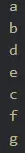
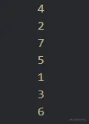
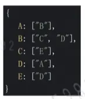
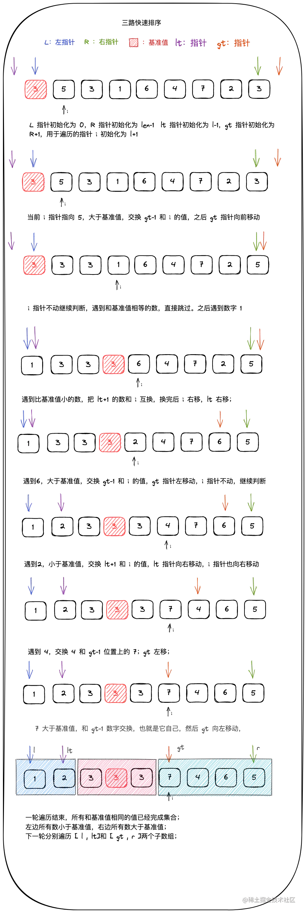
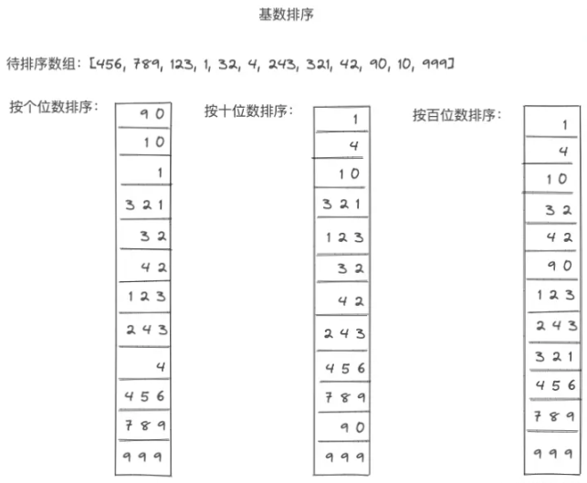

算法前端问的不太多，建议先复习其他的，有精力了再复习算法。

# 什么是算法

算法其实就是解决一个问题的完整步骤描述，是指完成一个任务准确而完整的步骤描述。

算法的设计很多时候需要取决于数据结构，而算法的实现更依赖于采用的数据结构。

### 运算操作

为了完成各种运算，计算机提供了一套最基本的功能操作：

1. 算术运算：加、减、乘、除；
2. 逻辑运算：与、或、非；
3. 比较运算：大于，小于，等于，不等于；
4. 数据转送：输入、输出，赋值。

### 提出一个问题的算法是一个从抽象到具体的过程

- 分析问题，选择数据结构，得出初步的解决方法
- 将解决方法合理地拆分，整理成许多步骤
- 为重复的步骤选择合理的循环变量
- 使用易转化为程序实现的自然语言简练地描述算法

### 算法分析的重要指标

1. 时间复杂度：指算法代码运行所需要的时间，即算法的时间代价。
2. 空间复杂度：对一个算法代码在运行过程中所需要的辅助存储空间大小的度量。

接下来就开始逐步剖析时间和空间复杂度了

# 时间复杂度和空间复杂度

在算法设计中，评估算法的效率是非常重要的。复杂度分析用于衡量算法在时间和空间方面的性能。了解算法的时间复杂度和空间复杂度可以帮助我们选择合适的算法来解决问题，并进行性能优化。

## 时间复杂度

在说时间复杂度之前，我们首先要理解一个概念：代码执行次数，也可称之为语句频度或时间频度，用 `T(n)` 表示。

我们用例子来一步一步阐述，首先我们来看函数 `fn1`

```js
function fn1() {
	console.log("句末");
	console.log("isboyjc");
}
```

我们来看这个函数中的语句会执行多少次

很明显此函数内部只有两个语句，即 `console.log("句末")` 和 `console.log("isboyjc")`，那么我们说这个函数体内代码执行次数是 2

我们再来看函数 `fn2`

```js
function fn2(n) {
	for (let i = 0; i < n; i++) {
		console.log("句末");
	}
}
```

我们先来看函数 `fn2` 中有几条可执行语句

```js
let i = 0;
i < n;
i++;
console.log("句末");
```

我们假设 `n = 3`，然后依次带入进去，看看各个执行语句执行了多少次

`let i = 0` 此条声明语句只在第一次 `for` 循环声明时执行 1 次

`i < n` 此条语句执行次数根据形参 n 的大小变化，`n = 3` 时，即 `i=0,i=1,i=2,i=3` 时会执行，即此条语句执行次数为 `n + 1` 次

`i++` 此条语句执行次数也是根据形参 n 的大小变化，`n = 3` 时，即 `i=0,i=1,i=2` 时会执行，即 n 次

`console.log("句末")` 此条语句执行次数还是根据形参 n 的大小变化，`n = 3` 会执行 3 次，那么此语句在函数内部即会执行 n 次

```js
1 + (n + 1) + n + n = (3n + 2)
```

那么函数 `fn2` 内共执行 `3n + 2` 次

一段代码的总执行次数我们通常会用 `T(n)` 来表示，那么调用一次上面 `fn1/fn2` 两函数的总执行次数即

```js
T(n) = 2	// fn1
T(n) = 3n + 2 	// fn2
```

上面的 n，指的是为问题的规模，即输入数据的大小或者说数量，你也可以简单的理解为 `T` 就是函数本身，`n` 就是参数，也就是说

函数 `fn1` 任何情况下执行次数都为 2

函数 `fn2` 的总执行次数会根据 n 的大小变化而产生一个变化

我们思考一下，我们可以使用一段代码的执行总次数来衡量执行速度吗？

答案当然是不行的，当代码行数比较多的时候，我们一条一条的数来计算执行总次数太麻烦了，例如函数中套用函数时、循环中套用循环时，想要精确计算执行次数都是非常麻烦的

所以，在算法中，我们一般用 `T(n)` 简化后的估算值来表达代码执行的速度，通常我们用大些字母 `O` 来表示，即大 `O` 表示法，由于是估算，它表示的是代码执行时间随数据规模增长的变化趋势，所以，也叫作渐进时间复杂度（asymptotic time complexity），简称时间复杂度

明确了这个概念以后，我们就可以来算时间复杂度了，还是用上面 `fn1/fn2` 两函数例

```js
// fn1
T(n) = 2

// fn2
T(n) = 3n + 2
```

首先我们来看函数 `fn1`，它的执行总次数为 2，一个 `常数(常数级)`，也就是说此函数无论何时它的总执行次数都是 2，是一个不变的值，那么我们使用时间复杂度 `O` 来表示时直接估算为 1 就可以，即时间复杂度为 `O(1)`

我们再来看函数 `fn2` ，它的执行次数 `T(n)` 是 `3n + 2` 即 `常数*n + 常数`，这里我们完全可以看成 `常数*n` 和 `+常数` 两部分，随着 n 的增大，只有前一个部分会有变化，后面是不变的，所以在表示时间复杂度时就可以忽略后面不变的常数，即 `常数*n`，而 `常数*n` 中过的常数我们也可以直接当做 1，或者说忽略掉这个作为系数的常数，那么最终可以得出函数 `fn2` 的时间复杂度为 n，即 `O(n)`

**PS：晓得可能有人把数学知识还给老师了，所以解释下**

**常数：** 常数就是指平常的数值，可简单的理解为固定不变的数值

**系数：** 系数指代数式的单项式中的数字因数，例如 `a = 1 * a` ，则它的系数为 1，`2b = 2 * b` ，则它的系数为 2

我们再来举个例子，如下面这个多项式代指一个函数的 `T(n)`，求它的时间复杂度

```js
T(n) = 10n^4 + 100n^2 + 1000
```

其实，对于多项式，我们只需要保留最高次项就行了，也就说，保留 n 的最高次方数就可以了，这个例子中保留的也就是 n 的 4 次方，系数和常数皆可以忽略，最终得到的时间复杂度即为 `O(n^4)`

**结论：**

```
T(n)` 为常数时，时间复杂度为 `O(1)` ，反之时间复杂度为 `O(保留T(n)的最高次项并去掉最高次项的系数)
```

接下来，我们看几个例子来判断下几段代码的时间复杂度

**例 1：**

```js
function fn01() {
	console.log("你看这是啥");
	console.log("这是一个输出");
	console.log("哈哈哈");
	let a = 1;
	return a;
}
```

上面这个函数 `fn01` 中只有一条条的语句，共执行 5 次，毫无变化，时间复杂度即 `O(1)` ，此为常数级时间复杂度

**例 2：**

```js
function fn02(n) {
	for (let i = 0; i < n; i++) {
		console.log("这是一个输出🎓");
	}
}
```

如上，函数 `fn02` 同上文中的例子 `fn2`，一个循环，时间复杂度即为 `O(n)` ，此为线性级时间复杂度

**例 3：**

```js
function fn03(n) {
	for (let i = 0; i < n; i++) {
		console.log("外层循环");
		for (let j = 0; j < n; j++) {
			console.log("内层循环");
		}
	}
}
```

这个题和上面就不太一样了，我们先单独看内部的循环，内部循环大概会执行 n 次，再来看外部循环又会执行 n 次，最终也就是 `n * n = n^2`，即函数 `fn03` 的时间复杂度为 `O(n^2)` ，此为平方级时间复杂度，如果是三层循环也就是时间复杂度为 `O(n^3)` 时，即立方级时间复杂度

从这里我们就可以看出来，一段代码有多少层循环，时间复杂度就是 n 的多少次方，所以尽量避免多层循环嵌套

**例 4：**

我们再来看下面这个函数 `fn04`

```js
function fn04(n) {
	for (let i = 0; i < n; i++) {
		console.log("外层循环");
		for (let j = 0; j < n; j++) {
			console.log("内层循环");
		}
	}

	for (let i = 0; i < n; i++) {
		console.log("哈哈哈");
	}
}
```

此函数中有一个双循环，有一个单循环，即执行次数大概是 `n^2 + n`，根据我们上面说的保留最高次项，那么函数 `fn04` 的时间复杂度即为 `O(n^2)`

**例 5：**

算法中肯定不只是上面那种寻常的循环，再来看下面这一个

```js
function fn05(n) {
	for (let i = 0; i < n; i++) {
		console.log("外层循环");
		for (let j = i; j < n; j++) {
			console.log("内层循环");
		}
	}
}
```

其实遇到这种，我们直接带入进去试一试即可知其规律

当 `i = 0` 时，里层循环会执行 n 次

当 `i = 1` 时，里层循环会执行 n - 1 次

当 `i = 2` 时，里层循环会执行 n - 2 次

当 `i = 3` 时，里层循环会执行 n - 3 次

这个时候我们就发现了规律，每当 i 增加 1，里层循环就少执行 1 次，那么就简单了

当 `i = n - 2` 时，里层循环会执行 2 次

当 `i = n - 1` 时，里层循环会执行 1 次

最终我们把 n 个里层循环的执行次数相加即可得出最终的一个不精确的总执行次数

```js
T(n) = n + (n - 1) + (n - 2) + ... + 3 + 2 + 1
```

如上，这是一个等差数列，嗯，晓得，会补充

如果一个数列从第二项起，每一项与它的前一项的差等于同一个常数，这个数列就叫做等差数列，而这个常数叫做等差数列的公差，公差常用字母 d 表示

例如：`1,3,5,7,9……（2n-1)` ，等差数列 `S(n)` 的通项公式为：`S(n) = S1 + (n-1) * d`，前 n 项和公式如下

```js
S(n) = n*S1 + n*(n - 1)*d/2

// 或

S(n) = n*(S1 + Sn)/2
```

如此我们计算结果就成，我们上面的数列中，公差 d 为 -1，带入公式即可，第二个公式简单，用第二个好了，计算结果都是一样的

```js
// n*(S1 + Sn)/2

n*(n + 1)/2 = (n^2 + n)/2 = (1/2)n^2 + (1/2)n
```

最终我们得到了 `(1/2)n^2 + (1/2)n` ，按照上文中取最高次项去掉系数，即时间复杂度为 `O(n^2)`

**例 6：**

再来看一个例子

```js
function fn06(n) {
	for (let i = 1; i < n; i *= 2) {
		console.log("isboyjc");
	}
}
```

还是老样子，如果你不晓得怎么看，可以先带入几个参数试一下，看一看规律

我们可以分别使用 `n=2, n=4, n=8, n=16`，观察其循环中打印次数，当然你也可以直接运行一下代码，过程不过多阐述了，我们直接看结果

```js
n=2		时打印1次 T(n)=1
n=4		时打印2次 T(n)=2
n=8		时打印3次 T(n)=3
n=16 		时打印4次 T(n)=4
```

对于执行次数产生主要影像的就是循环语句中的 `i*=2`，每次循环 i 都会变成自身的两倍，仔细观察我们就可以得出这样一个规律性结果

```js
n=2		时打印1次 T(n)=1 // 2^1 = 2
n=4		时打印2次 T(n)=2 // 2^2 = 4
n=8		时打印3次 T(n)=3 // 2^3 = 8
n=16 		时打印4次 T(n)=4 // 2^4 = 16
```

根据上面的规律我们不难发现，那么`2^执行次数=n`，即 `2^T(n)=n` ，我们求 `T(n)`，调个就行了，也就是以 2 为底 n 的对数，即 `T(n)=log_2 n`

**PS：又来补数学了**

**对数：** 假如 `a^n=b`，即 a 的 n 次方等于 b，我们求 n 的值，那么这里为了方便表示就可以写成 `log_a b`，即以 a 为底 b 的对数，a 是底数，b 是真数，而 n 就是对数

你可能会在纠结为什么只观察循环中的打印次数而不计算其所有的执行次数，原因上面也说过了，这些固有的常数及系数完全可以忽略，好吧，我们再最后推一遍

中间输出为 `log_2 n` 次，`let i = 1` 只会执行一次，`i<n` 会执行 `log_2 n + 1` 次，`i*=2` 也会执行 `log_2 n` 次，加起来就是 `log_2 n + log_2 n + 1 + log_2 n`，即 `3log_2 n + 2`，除去系数 3 和常数 2，我们得出了 `log_2 n` ，在时间复杂度的计算中 `log` 的底数也是可以省略的，所以最终函数 `fn06` 的时间复杂度为 `O(log n)` ，也就是对数级时间复杂度

**例 7：**

最后在给大家来一个例子吧

```js
function fn07(n, m) {
	for (let i = 0; i < n; i++) {
		while (j < m) {
			console.log("你看懂了吗");
			j = j * 2;
		}
	}
}
```

如上图，此函数有两个参数，对应了里外两个循环，我们先从内部循环看起，眼熟吗？其实内部循环和上题函数 `fn06` 中的循环是一样的，只是一个用的 `for` ，一个用的 `while`，上题中的时间复杂度我们就不再叙述了，那么内层循环时间复杂度为 `O(log n)`

我们再来看外层循环，也是上面解释过的，单看外层循环时间复杂度是 `O(n)`

两个循环是嵌套关系，相乘就可以了，所以函数 `fn07` 的时间复杂度即为 `O(n*log n)` ，也就是线性对数级时间复杂度

正如此函数输出，你看懂了吗？

**码字太累，看个图吧：**

找了一张网图（侵删），使用图表来更加清晰的展示了常见的时间复杂度曲线


如上图，横坐标为 n ，可以看到，不同时间复杂度随着 n 的增大操作次数或者说执行时间的递增趋势

常见的时间复杂度量级有

- 常数级 `O(1)`
- 对数级 `O(log n)`
- 线性级 `O(n)`
- 线性对数级 `O(n*log n)`
- 平方级 `O(n^2)`
- 立方级 `O(n^3)`
- K 次方级 `O(n^k)`
- 指数级 `O(2^n)`

上面从上到下依次时间复杂度越来越大，执行效率越来越低，大部分常用的在上面的图表中都有展示

所以在程序或是刷题中，我们应该尽量使用低时间复杂度的方法

时间复杂度就到此为止了，我们也列举了常见的时间复杂度，接下来我们来看看空间复杂度。

取最坏情况下的算法执行步骤，忽略常数项，低次项。

- 通常使用最差的时间复杂度来衡量一个算法的好坏。
- 常数时间 O(1) 代表这个操作和数据量没关系，是一个固定时间的操作，比如说四则运算。
- 对于一个算法来说，可能会计算出操作次数为 aN + 1 ， N 代表数据量。那么该算法的时间复杂度就是 O(N) 。因为我们在计算时间复杂度的时候，数据量通常是非常大的，这时候低阶项和常数项可以忽略不计。
- 当然可能会出现两个算法都是 O(N) 的时间复杂度，那么对比两个算法的好坏就要通过对比低阶项和常数项了

### 简易版

它的作用就是用来`定义描述算法的运行时间`

- **O(1)**

```javascript
let i = 0;
i += 1;
```

- **O(n)：** 如果是 O(1) + O(n) 则还是 O(n)

```javascript
for (let i = 0; i < n; i += 1) {
	console.log(i);
}
```

- **O(n^2)：** O(n) \* O(n), 也就是双层循环，自此类推： O(n^3)...

```javascript
for (let i = 0; i < n; i += 1) {
	for (let j = 0; j < n; j += 1) {
		console.log(i, j);
	}
}
```

- **O(logn)：** 就是求 log 以 2 为底的多少次方等于 n

```javascript
// 这个例子就是求2的多少次方会大于i，然后就会结束循环。 这就是一个典型的 O(logn)
let i = 1;
while (i < n) {
	console.log(i);
	i *= 2;
}
```

## 空间复杂度

空间复杂度其实就是对一个算法或者说一段代码在运行过程中占用存储空间大小表达方式

我们上面讲过了时间复杂度，那么再来说空间复杂度会简单的很多

空间复杂度也就是 `S(n)` ，它同样会用大 O 表示法来表示，我们直接上例子

**例 1：**

```js
function fn001(n) {
	for (let i = 0; i < n; i++) {
		console.log("空间复杂度");
	}
}
```

首先，我们知道，空间复杂度和存储空间有关，而存储空间是由什么决定的，肯定是声明的变量啊，我们直接来找函数 `fn001` 中的变量声明，只有一个 `i` ，也就是说此函数只有开辟了一块空间供 `i` 使用，那么空间复杂度 `S(n)` 即为 `O(1)` ，你可能会说 `i` 不是一直在变吗，是的它是在变，但是不管怎么变，它还是一个数字，占用空间大小都一致

空间复杂度和时间复杂度一样，当代码里声明的变量是一个常量，不会根据传入值的变化而变化，那么也它的空间复杂度是 `O(1)`

**例 2：**

```js
function fn002(n) {
	let arr = [];
	while (n--) {
		arr.push(n);
	}
}
```

这个例子中我们声明了一个数组，我们知道数组中是可以存各种类型的，在循环中，我们根据 `n` 的大小向数组 `arr` 中 `push` 元素，所以，`n` 多大，数组就有多少元素，就占用了多少空间，所以空间复杂度`S(n) = O(n)`

**空间复杂度小结**

空间复杂度里，只列出了两个例子，是因为一般情况下，我们用不到其他的，空间复杂度一般只会是 `O(1)/O(n)/O(n^2)`，其它的很少见，当然也有，我们在知道了时间复杂度再分析空间复杂度也很好分析，就不过多赘述了

关于分析空间复杂度，其实我们直接从声明的变量入手就可以，看函数体内声明的变量根据传入值的变化而变化来分析

另外，这里我们没有列举递归情况，**请注意**，递归就是函数套函数，像俄罗斯套娃一样的，这中间其实有一个问题，我们知道，递归函数，每层递归里都会开辟一个递归栈，每次递归产生的变量等空间消耗都会存在递归栈中，这也是一个空间，不管你有没有声明变量，只要递归了递归栈它都存在，也就是说只要存在递归的情况，基本上最少的空间复杂度也是 `O(n)` 了，所以我们尽可能的在能使用迭代的情况下就不使用递归

### 简易版

和时间复杂度一样，空间复杂度也是用大 O 表示，比如 O(1)、 O(n)...

它用来`定义描述算法运行过程中临时占用的存储空间大小`

> 占用越少 代码写的就越好

- **O(1)：** 单个变量，所以占用永远是 O(1)

```javascript
let i = 0;
i += 1;
```

- **O(n)：** 声明一个数组， 添加 n 个值， 相当于占用了 n 个空间单元

```javascript
const arr = [];
for (let i = 0; i < n; i += 1) {
	arr.push(i);
}
```

- **O(n^2)：** 类似一个矩阵的概念，就是二维数组的意思

```javascript
const arr = [];
for (let i = 0; i < n; i += 1) {
	arr.push([]);
	for (let j = 0; j < n; j += 1) {
		arr[i].push(j);
	}
}
```

## 时间 VS 空间

开头我们说了，评价一个算法的效率我们主要是从它的时间和空间两个维度看，但是，通常我们在算法中，时间和空间就是鱼和熊掌的关系，这时候可能一道算法题有两种解法，一种时间复杂度低，但空间复杂度稍高，另一种则反之

这个时候怎么办呢？细品就知道了，在开发中，我们一般都是时间优于空间的，你想啊，一个程序，用户不会关心的占用了多少内存，但是他会关心你这个程序他在使用时的执行速度，况且，空间也就是磁盘，现阶段磁盘我们可以花钱扩容，时间上就没这么简单了，所以某些相对的情况下，空间换时间是可以令人接受的

虽说空间换时间可行，但也不能一味的空间换时间，我们还是要尽可能降低两个维度的复杂度，少数对立情况下，可空间换时间

我们在刷算法的时候，不是刷完了就完事了，我们还要去分析我们的题解对应的时间及空间复杂度，可以分析多种题解之间的复杂度，对比找出最优解

在面试的时候，假如面试官给你一道算法题，当你知道好几种解法的时候，完全可以很装 B 的问一下，您喜欢时间至上还是空间至上呢，我都能解，奥利给，说完他就会让你都写了 😄

开个玩笑哈，面试的时候尽量写出多种解法并给面试官解释各种解法时间及空间复杂度的不同。

递归深度 N\*每次递归所要创建的变量数。

### 技巧

链表转数组：迭代就行了
反转链表：链表先转栈是㇐种办法，但是太慢了；反转其实是改变箭头方向，可以利用 prev 存储前㇐个节点，依次迭代修改 next。
双指针遍历：指针相遇即结束
快慢指针：判断环
dummy header（虚拟节点）：用于生成链表
hashtable：值作为 key，值出现的次数作为 value 排序

# 数据结构

## 什么是数据结构

数据结构其实就是是程序存储组织数据的方式，一个数据结构是由程序中的数据元素按照某种逻辑关系组织起来的，是若干个数据元素的组合。

数据结构是程序中处理数据的基本单位，在程序中作为一个整体来使用。

- 例如一个数字 1 或者一个字符 `A`，它是一种数据结构
- 例如一个日期 `2020年12月14日`，它由年月日这 3 种格式组成，也是一种数据结构
- 例如一个数组 `[1, 'a', '2020年12月14日']`，它是由数字、字符、日期格式组合而成，也是一种数据结构

通俗来说，用一定格式组成的数据都是数据结构，我们比较常见的数据结构有字符串、数组、对象、堆、栈、链表、树、哈希表等等，你可能对着其中的一些数据结构并不了解，不要担心，你并不需要立刻知道它们都是什么，对于前端来说，我们使用 `JavaScript` 这个令我们又爱又恨的语言，它本身就存在的数据结构很少，那么对于像链表、树等等这些结构都是通过对象来模拟的，这点要先知道

在许多程序设计当中，数据结构的选择是一个基本的设计考虑因素，系统实现的困难程度和系统构造的质量都严重依赖于是否选择了最优的数据结构，选择最优的数据结构能够有效的提高运行的效率和节约存储空间的使用，但是要知道，没有十全十美的数据结构，每种数据结构都有局限性同样也有优点，要根据需求来选择合适的数据结构

## 基本的数据结构

了解和学习基本的数据结构，如数组、链表、栈、队列、哈希表、树和图。这些是解决算法问题的基础。

- 数组（线性表）：由相同元素的集合所组成的数据结构，存储在一块连续的内存单元，根据元素的索引可以计算出该元素对应的存储地址。

- 链表（单向链表，双向链表，循环链表）：由一连串节点组成，每个节点包含任意的实例数据和一个或两个用来指向下一个/上一个节点位置的链接。
- 栈：一种特殊串联形式的抽象数据类型，可由链表或数组实现，通过链表或数组的栈顶（Top）指针对数据进行压栈（Push）和出栈（Pop）操作，其特点是 LIFO。
- 队列：先进先出（FIFO）的线性表，一般用链表和数组来实现，只允许在后端（back or rear）插入，在前端（front）删除。
- 哈希表：
- 散列表：根据键（key）直接访问内存存储位置的一种数据结构，通过计算一个关于键值的函数，将所需查询的数据映射到表中的一个位置来访问记录，映射函数叫做散列函数，存放记录的数组叫散列表（散列函数和哈希冲突是实现散列表最重要的两个环节）。
- 堆（最大堆，最小堆）：是计算机科学中一种特别的树状数据结构，也是一种特殊的二叉树。
- 树：二叉树：实现抽象数据类型的数据结构，如：二叉树、红⿊树、霍夫曼树。
- 图：表示物件与物件之间的关系，图论的基本研究对象。
- 字符串：前缀树（字典树） ／ 后缀树：

## 数据结构与算法有什么关系？

可以容纳数据的结构称为数据结构

算法是用来对数据结构进行处理的方法 ；数据结构是静态的，算法是动态的。

# 算法基础和进阶路径

在算法设计中，有许多常见的算法技巧，它们可以帮助解决各种复杂的问题。以下是一些常见的算法技巧：

1. **贪心算法（Greedy Algorithms）**：
   - 贪心算法是一种在每一步都选择当前状态下最优解的策略，希望最终能够达到全局最优解。它通常适用于一些优化问题，比如最短路径、最小生成树等。
2. **分治算法（Divide and Conquer）**：
   - 分治算法将问题分解成规模更小的子问题，然后递归地解决这些子问题，最后将子问题的解合并起来得到原问题的解。经典例子包括快速排序、归并排序等。
3. **动态规划（Dynamic Programming）**：
   - 动态规划是一种将问题分解成重叠子问题并保存子问题解的方法。它通常适用于具有重叠子问题和最优子结构性质的问题，比如最长公共子序列、背包问题等。
4. **回溯算法（Backtracking）**：
   - 回溯算法是一种通过不断试错并回溯的方式来求解问题的方法。它通常用于求解排列组合、图的搜索等问题，经常与递归结合使用。
5. **搜索算法（Search Algorithms）**：
   - 搜索算法用于在搜索空间中寻找目标解。常见的搜索算法包括深度优先搜索（DFS）、广度优先搜索（BFS）、A\*搜索等。
6. **分支限界算法（Branch and Bound）**：
   - 分支限界算法是一种通过分支、剪枝和限界等技术来减少搜索空间的方法，用于求解组合优化问题和决策问题。
7. **排列组合技巧**：
   - 排列组合技巧用于解决与排列和组合相关的问题，比如全排列、组合求和等。
8. **位运算技巧**：
   - 位运算技巧常用于优化算法和解决一些位操作相关的问题，比如位运算的与、或、异或等操作。
9. **启发式算法（Heuristic Algorithms）**：
   - 启发式算法是一种通过启发式规则来指导搜索过程的方法，常用于求解 NP 难问题，如模拟退火、遗传算法等。

这些算法技巧通常结合使用，根据具体问题的性质和要求选择合适的技巧来设计算法。

## 算法基础

学习基本算法，包括排序算法（如冒泡、选择、插入、快速、归并排序），搜索算法（如线性搜索和二分搜索），以及其他常见算法。

## 算法进阶

深入学习更复杂的算法，如动态规划、贪心算法、回溯算法等。

**深入学习常见算法和数据结构**：

- 学习更高级的数据结构和算法，比如哈希表、堆、图的遍历算法、动态规划等。
- 深入了解每种数据结构和算法的原理、应用场景和复杂度分析。

# 根据数据结构实现算法

待定文章：[万字总结 JS 数据结构与常用的算法 - 掘金 (juejin.cn)](https://juejin.cn/post/7094056264283471908#heading-4)

## BFS：广度优先遍历

BFS：广度优先遍历，就是我们在处理一个数据结构的时候，可以理解为是铺张开的，多条线同时进行，你走一步我也走一步，多条线路一起推进的算法。

 如上图所示的树形结构，我们一层一层的遍历，定义一个额外的数组 queue 来放置我们需要处理的节点，只要当 queue 中的节点处理完之后，我们再继续处理下一层的节点。

同样的题目：

> 题目：给你两棵二叉树的根节点 `p` 和 `q` ，编写一个函数来检验这两棵树是否相同。 如果两个树在结构上相同，并且节点具有相同的值，则认为它们是相同的。

例如：


```js
输入： p = [1,2,3], q = [1,2,3]
输出： true
```

如果我们用 BFS 的解法来做也是可以的：

- BFS 的主体思想就是我们每条线都要一步一步的走，那么我们就可以创建一个数组 queue 来存储我们接下来要遍历节点
- 然后我们不断的从 queue 中取出我们要遍历的节点，同时判断这个节点到底是否符合我们的要求，如果符合那么就将它的子节点推入一个备用数组 tmp，如果不符合要求，那么可以直接中断遍历，return false

这里因为是有两棵树，所以我们可以创建两个数组 queue1,queue2，同时创建两个备用数组 tmp1,tmp2 每次遍历的时候，比较从两个 queue 中相同位置取出的节点，如果整棵树的节点都遍历完毕之后，仍然没有 return false，那么就说明所有节点都是符合要求的，那么 return true 即可；

```js
/**
 * @param {TreeNode} p
 * @param {TreeNode} q
 * @return {boolean}
 */
var isSameTree = function (p, q) {
	if (p == null && q == null) {
		return true;
	} else if (p == null || q == null) {
		return false;
	}
	var queue1 = [p];
	var queue2 = [q];
	var tmp1 = [];
	var tmp2 = [];
	while (queue1.length != 0 || queue2.length != 0) {
		// 这里如果两个queue的长度不一致，说明同层的节点数目都是不一致的，必然不是相同的树
		if (queue1.length != queue2.length) return false;
		for (var i = 0; i < queue1.length; i++) {
			if (queue1[i] == null && queue2[i] == null) {
				continue;
			} else if (queue1[i] == null || queue2[i] == null) {
				return false;
			} else if (queue1[i].val != queue2[i].val) {
				return false;
			} else {
				tmp1.push(queue1[i].left);
				tmp1.push(queue1[i].right);
				tmp2.push(queue2[i].left);
				tmp2.push(queue2[i].right);
			}
		}
		queue1 = tmp1;
		queue2 = tmp2;
		tmp1 = [];
		tmp2 = [];
	}
	return true;
};
```

再看前面的这个路径问题

> 给你二叉树的根节点 `root` 和一个整数目标和 `targetSum` ，找出所有 **从根节点到叶子节点** 路径总和等于给定目标和的路径。
>
> **叶子节点** 是指没有子节点的节点。


```js
输入： root = [5,4,8,11,null,13,4,7,2,null,null,5,1], targetSum = 22
输出： [[5,4,11,2],[5,8,4,5]]
```

这里我们尝试用 BFS 的思想来解题：

- 根据上一道题目的解法，我们知道 BFS 的一个常用操作就是**创建一个队列**，用这个队列数组去存储接下来要去操作的节点，所以，这里我们同样定义一个任务队列的数组 queue
- _然后我们会遇到一个比较麻烦的问题，就是我要怎么知道每次累加到当前节点的时候，累加的和以及遍历过节点的数组是什么样的呢，不然到最后叶子节点的时候，我们要怎么确定这条路径是不是我们想要的答案呢？_
- 为了解决我们上面遇到的这两个问题，我们可以**创建一个 Map**，用来记录走到当前节点时，**累加和(sum)是多少，路径(arr)是怎样的**。而这种方法也是在算法中很常用的方法，叫*哈希表*，也不是什么高大上的东西，**就是我们前端日常使用的 object，Map，都可以作为容器来使用**。说直白点，就是找个地方用 key - value 的形式存储我们的每个节点，这样当我们要用的时候，随时取用。
- **整理一下上面的思路**，就是我们通过不断的从 queue 中取值，然后看这个节点有没有子节点，如果没有子节点，那么我们就判断是否等于 targetSum，等于就推入我们的答案数组 ans；
- 如果该节点不是叶子节点，那么就将这个节点的左子节点推入 queue,右子节点推入 queue，并将到达对应节点时的累加和以及路径记录在 Map 中。
- 大家可以尝试写一下，下面是我写的 BFS 解法，写完可以对照理一下思路

```js
/**
 * @param {TreeNode} root
 * @param {number} targetSum
 * @return {number[][]}
 */
var pathSum = function (root, targetSum) {
	if (!root) return [];
	var ans = [];
	var queue = [root];
	var m = new Map();
	m.set(root, {
		sum: root.val,
		arr: [root.val],
	});

	while (queue.length) {
		let tNode = queue.shift();
		let x = m.get(tNode);
		if (tNode.left == null && tNode.right == null) {
			if (x.sum == targetSum) {
				ans.push(x.arr);
			}
		} else {
			if (tNode.left) {
				m.set(tNode.left, {
					sum: x.sum + tNode.left.val,
					arr: [...x.arr, tNode.left.val],
				});
				queue.push(tNode.left);
			}
			if (tNode.right) {
				m.set(tNode.right, {
					sum: x.sum + tNode.right.val,
					arr: [...x.arr, tNode.right.val],
				});
				queue.push(tNode.right);
			}
		}
	}
	return ans;
};
```

### 1. 打开转盘锁

```js
/**
 * @param {string[]} deadends
 * @param {string} target
 * @return {number}
 */
var openLock = function (deadends, target) {
	let queue = new Queue();
	let visited = new Set();
	let step = 0;
	queue.push("0000");
	visited.add("0000");
	while (!queue.isEmpty()) {
		let size = queue.size();
		for (let i = 0; i < size; i++) {
			let str = queue.pop();
			if (deadends.includes(str)) continue;
			if (target === str) {
				return step;
			}
			for (let j = 0; j < 4; j++) {
				let plusStr = plusOne(str, j);
				let minusStr = minusOne(str, j);
				if (!visited.has(plusStr)) {
					queue.push(plusStr);
					visited.add(plusStr);
				}
				if (!visited.has(minusStr)) {
					queue.push(minusStr);
					visited.add(minusStr);
				}
			}
		}
		step++;
	}
	return -1;
};

function plusOne(str, index) {
	let strArr = str.split("");
	if (strArr[index] === "9") {
		strArr[index] = "0";
	} else {
		strArr[index] = (Number(strArr[index]) + 1).toString();
	}
	return strArr.join("");
}

function minusOne(str, index) {
	let strArr = str.split("");
	if (strArr[index] === "0") {
		strArr[index] = "9";
	} else {
		strArr[index] = (Number(strArr[index]) - 1).toString();
	}
	return strArr.join("");
}
class Queue {
	constructor() {
		this.items = [];
		this.count = 0;
		this.lowerCount = 0;
	}
	push(elem) {
		this.items[this.count++] = elem;
	}
	pop() {
		if (this.isEmpty()) {
			return;
		}
		const elem = this.items[this.lowerCount];
		delete this.items[this.lowerCount];
		this.lowerCount++;
		return elem;
	}
	isEmpty() {
		if (this.size() === 0) return true;
		return false;
	}
	size() {
		return this.count - this.lowerCount;
	}
}
```

### 2. 二叉树的最小深度

```js
/**
 * Definition for a binary tree node.
 * function TreeNode(val) {
 * this.val = val;
 * this.left = this.right = null;
 * }
 */
/**
 * @param {TreeNode} root
 * @return {number}
 */
var minDepth = function (root) {
	if (root == null) return 0;
	let depth = 1;
	let queue = new Queue();
	queue.push(root);
	while (!queue.isEmpty()) {
		let size = queue.size();
		for (let i = 0; i < size; i++) {
			const node = queue.pop();
			if (node.left == null && node.right == null) return depth;
			if (node.left) {
				queue.push(node.left);
			}
			if (node.right) {
				queue.push(node.right);
			}
		}
		depth++;
	}
	return depth;
};
class Queue {
	constructor() {
		this.items = [];
		this.count = 0;
		this.lowerCount = 0;
	}
	push(elem) {
		this.items[this.count++] = elem;
	}
	pop() {
		if (this.isEmpty()) {
			return;
		}
		const elem = this.items[this.lowerCount];
		delete this.items[this.lowerCount];
		this.lowerCount++;
		return elem;
	}
	isEmpty() {
		if (this.size() === 0) return true;
		return false;
	}
	size() {
		return this.count - this.lowerCount;
	}
}
```

## DFS：深度优先遍历

DFS：深度优先遍历，顾名思义就是我们在处理一个数据结构的时候是选择一条线，一直走到底，处理完成之后再回来处理第二条线。

如上图所示的树形结构，我们是先处理树的左子节点，一直走到最底层节点，已经没有子节点了，才会返回处理倒数第二层数的右子节点。

举个例子： 看一道力扣的简单题：

> 题目：给你两棵二叉树的根节点 `p` 和 `q` ，编写一个函数来检验这两棵树是否相同。 如果两个树在结构上相同，并且节点具有相同的值，则认为它们是相同的。

例如：


```js
输入： p = [1,2,3], q = [1,2,3]
输出： true
```

这里题目中输入的 p=[1,2,3],实际上内部转换的数据结构是这样的：

```js
{
    val: 1,
    left: {
        val: 2,
        left: null,
        right: null
    },
    right: {
        val: 3,
        left: null,
        right: null
    }
}
```

对于这个题，我们采用 DFS 的思路，就是先比较两棵树根节点是否相同，如果相同，我们继续比较它的左子节点，如果左子节点相同，那么就继续往下进行，比较左子节点的左子节点，以此类推。当左子节点一路比较下来 val 值都是相同的话，那么我们就回过头，走第二条线。在遍历的过程中一旦遇到节点 val 值不相等的情况，就不必再继续遍历，直接 return false 即可。

而这里有两个关键点，也是 DFS 的关键点，如果我们想比较整棵树是否相同，那我们其实就是判断，，当前节点的 val 值是否相同，两棵树的左右子树是否相同，而比较左右子树是否相同，我们同样可以用当前写的函数来去进行比较，也就是递归的调用自身；第二点，就是一定要记得写结束条件，我们的深度遍历到底要在什么情况下回头，不再继续往下遍历。

对于这个题目，我们的结束条件就是：

- p 和 q 如果都是 null 的情况下，说明这两个节点就是相同的，因为他们没有子节点了，这一条线路比较下来是 ok 的，可以 return true；
- p 和 q 如果是一个为 null,一个不会 null，说明这两个节点一定不相同，而且也不必再往下比较了，直接返回 false 即可；
- 而排除以上两种情况之后，那么 p,q 就都是一个不为空的树，那此时我们就可以比较 p.val 和 q.val 到底是否相同，不相同，那么就直接返回 false，如果相同，我们继续递归调用函数，比较 p.left 和 q.left 以及 p.right 和 q.right 即可。

```js
var isSameTree = function (p, q) {
	if (p == null && q == null) {
		return true;
	} else if (p == null || q == null) {
		return false;
	} else if (p.val != q.val) {
		return false;
	} else {
		return isSameTree(p.left, q.left) && isSameTree(p.right, q.right);
	}
};
```

上面这个题只是简单的了解了一下，到底什么是 DFS，以及 DFS 到底要怎么用，接下来这道题可能就需要再多多思考一下了。

路径问题（题目难度：中等）

> 给你二叉树的根节点 `root` 和一个整数目标和 `targetSum` ，找出所有 **从根节点到叶子节点** 路径总和等于给定目标和的路径。
>
> **叶子节点** 是指没有子节点的节点。


```js
输入： root = [5,4,8,11,null,13,4,7,2,null,null,5,1], targetSum = 22
输出： [[5,4,11,2],[5,8,4,5]]
```

根据题目分析，我们要求的是整个路径的和与 targetSum 的值相等，那么我们这条路径就是一个有效的路径。用 DFS 来做的话，简单说就是从根节点开始一直走到叶子节点，如果这一条路走来所有节点 val 值之和等于 targetSum 那么这条路径我们就可以放在答案数组中，如果不等，那么无事发生，不需要放进答案数组。

思路：

- 我们可以思考，我们要定义的这个 dfs 函数需要哪些参数
- 首先我们要计算累加和，那就需要知道当前遍历到的节点的值是多少，拿到当前节点的信息，那么定义一个参数为 tNode 代表当前节点
- 然后因为我们需要知道到叶子节点的时候前面节点的累加和，所以还需要一个参数 sum
- 而且最后题目中要求，如果符合题意，那么返回的结果需要是一个一路走来所有 val 值组成的数组，那么我们还需要一个记录路径的数组 arr
- 至此，我们的参数定义完成，这三个参数基本上可以满足我们写 dfs 函数了

```js
/**
 * @param {TreeNode} root
 * @param {number} targetSum
 * @return {number[][]}
 */
var pathSum = function (root, targetSum) {
	function dfs(tNode, arr, sum) {}
};
```

开始编写 dfs 函数：

- 首先确定 dfs 函数结束条件： 当我们的节点是叶子节点的时候，进行判断，如果路径上 val 累加之和等于 targetSum 的话，我们就将路径放在答案数组；如果不等，那么无事发生，说明这条线并不是我们要的答案，继续进行其他线即可。
- 如果不是叶子节点（也就是当前节点还有左子节点或者右子节点），那么我们递归调用 dfs 函数，同时将累加和 sum 和路径数组 arr 处理之后传递下去。

```js
/**
 * @param {TreeNode} root
 * @param {number} targetSum
 * @return {number[][]}
 */
var pathSum = function (root, targetSum) {
	if (!root) return [];
	var ans = [];
	function dfs(tNode, arr, sum) {
		if (tNode.left == null && tNode.right == null) {
			if (sum + tNode.val == targetSum) {
				ans.push([...arr, tNode.val]);
				return;
			}
		} else {
			if (tNode.left) {
				dfs(tNode.left, [...arr, tNode.val], sum + tNode.val);
			}
			if (tNode.right) {
				dfs(tNode.right, [...arr, tNode.val], sum + tNode.val);
			}
		}
	}
	dfs(root, [], 0);
	return ans;
};
```

这里用展开运算符处理了 dfs 方法中的 arr，是因为我们在 js 中，数组的存放位置是堆，而我们每次传递的 arr 只是指向真正数组存放位置的一个指针而已，所以如果我们一条线遍历完之后，没有再对我们维护的 arr 进行处理的话，就会出现问题，所以这里我们用展开运算符，_每次都处理成一个新数组_。但这样就会导致，我们每次都创建一个新数组向下传递，也就是说我们每次都会*开辟新的空间去存放数组*，所以这里我们可以优化一下：

```js
var pathSum = function (root, targetSum) {
	if (!root) return [];
	var ans = [];
	function dfs(tNode, arr, sum) {
		if (tNode.left == null && tNode.right == null) {
			if (sum + tNode.val == targetSum) {
				ans.push([...arr, tNode.val]);
				return;
			}
		} else {
			if (tNode.left) {
				arr.push(tNode.val);
				dfs(tNode.left, arr, sum + tNode.val);
				arr.pop();
			}
			if (tNode.right) {
				arr.push(tNode.val);
				dfs(tNode.right, arr, sum + tNode.val);
				arr.pop();
			}
		}
	}
	dfs(root, [], 0);
	return ans;
};
```

在每次递归调用的时候，将当前节点的 val 推入数组，当我们下面的线走完之后，将 arr 通过 pop 还原回原来的状态，再去处理另一条线路的节点。这样就不需要像原来那样不断的开辟新数组了。

### 1.岛屿的最大面积

```js
/**
 * @param {number[][]} grid
 * @return {number}
 */
let maxX, maxY;
let visited;
let globalMaxArea;
var maxAreaOfIsland = function (grid) {
	visited = new Set();
	maxX = grid.length;
	maxY = grid[0].length;
	globalMaxArea = 0;
	for (let i = 0; i < maxX; i++) {
		for (let j = 0; j < maxY; j++) {
			if (grid[i][j] === 1) {
				visited.add(`(${i}, ${j})`);
				globalMaxArea = Math.max(globalMaxArea, dfs(grid, i, j));
			}
			visited.clear();
		}
	}
	return globalMaxArea;
};
function dfs(grid, x, y) {
	let res = 1;
	for (let i = -1; i <= 1; i++) {
		for (let j = -1; j <= 1; j++) {
			if (Math.abs(i) === Math.abs(j)) continue;
			const newX = x + i;
			const newY = y + j;
			if (newX >= maxX || newX < 0 || newY >= maxY || newY < 0) continue;
			if (visited.has(`(${newX}, ${newY})`)) continue;
			visited.add(`(${newX}, ${newY})`);
			const areaCnt = grid[newX][newY];
			if (areaCnt === 1) {
				const cnt = dfs(grid, newX, newY);
				res += cnt;
			}
		}
	}
	return res;
}
```

### 2.相同的树

```js
/**
 * Definition for a binary tree node.
 * function TreeNode(val) {
 * this.val = val;
 * this.left = this.right = null;
 * }
 */
/**
 * @param {TreeNode} p
 * @param {TreeNode} q
 * @return {boolean}
 */
var isSameTree = function (p, q) {
	if (p == null && q == null) return true;
	if (p == null || q == null) return false;
	if (p.val !== q.val) return false;
	return isSameTree(p.left, q.left) && isSameTree(p.right, q.right);
};
```

## 栈

### 概念

栈是一个线性结构，在计算机中是一个相当常见的数据结构。

栈的特点是只能在某一端添加或删除数据，遵循**先进后出**的原则


### 实现

每种数据结构都可以用很多种方式来实现，其实可以把栈看成是数组的一个子集，所以这里使用数组来实现

```js
class Stack {
	constructor() {
		this.stack = [];
	}
	push(item) {
		this.stack.push(item);
	}
	pop() {
		this.stack.pop();
	}
	peek() {
		return this.stack[this.getCount() - 1];
	}
	getCount() {
		return this.stack.length;
	}
	isEmpty() {
		return this.getCount() === 0;
	}
}

// 实现栈：js中没有栈的数据类型，但我们可以通过Array来模拟
const stack = [];

stack.push(1); // 入栈
stack.push(2); // 入栈

const item1 = stack.pop(); //出栈的元素
```

### 应用

匹配括号，可以通过栈的特性来完成

```js
var isValid = function (s) {
	let map = {
		"(": -1,
		")": 1,
		"[": -2,
		"]": 2,
		"{": -3,
		"}": 3,
	};
	let stack = [];
	for (let i = 0; i < s.length; i++) {
		if (map[s[i]] < 0) {
			stack.push(s[i]);
		} else {
			let last = stack.pop();
			if (map[last] + map[s[i]] != 0) return false;
		}
	}
	if (stack.length > 0) return false;
	return true;
};
```

### 1.最小栈【栈】

```js
/**
 * initialize your data structure here.
 */
var MinStack = function () {
	this.stack = [];
	this.minArr = [];
	this.count = 0;
	this.min = Number.MAX_SAFE_INTEGER;
};
/**
 * @param {number} x
 * @return {void}
 */
MinStack.prototype.push = function (x) {
	this.min = Math.min(this.min, x);
	this.minArr[this.count] = this.min;
	this.stack[this.count] = x;
	this.count++;
};
/**
 * @return {void}
 */
MinStack.prototype.pop = function () {
	const element = this.stack[this.count - 1];
	if (this.count - 2 >= 0) this.min = this.minArr[this.count - 2];
	else this.min = Number.MAX_SAFE_INTEGER;
	delete this.stack[this.count - 1];
	delete this.minArr[this.count - 1];
	this.count--;
	return element;
};
/**
 * @return {number}
 */
MinStack.prototype.top = function () {
	if (this.count >= 1) {
		return this.stack[this.count - 1];
	}
	return null;
};
/**
 * @return {number}
 */
MinStack.prototype.getMin = function () {
	const element = this.minArr[this.count - 1];
	return element;
};
/**
 * Your MinStack object will be instantiated and called as such:
 * var obj = new MinStack()
 * obj.push(x)
 * obj.pop()
 * var param_3 = obj.top()
 * var param_4 = obj.getMin()
 */
```

### 2. 下一个更大元素

```js
/**
 * @param {number[]} nums
 * @return {number[]}
 */
var nextGreaterElements = function (nums) {
	let ans = [];
	let stack = new Stack();
	const n = nums.length;
	for (let i = 2 * n - 1; i >= 0; i--) {
		while (!stack.isEmpty() && stack.top() <= nums[i % n]) {
			stack.pop();
		}
		ans[i % n] = stack.isEmpty() ? -1 : stack.top();
		stack.push(nums[i % n]);
	}
	return ans;
};
class Stack {
	constructor() {
		this.count = 0;
		this.items = [];
	}
	top() {
		if (this.isEmpty()) return undefined;
		return this.items[this.count - 1];
	}
	push(element) {
		this.items[this.count] = element;
		this.count++;
	}
	pop() {
		if (this.isEmpty()) return undefined;
		const element = this.items[this.count - 1];
		delete this.items[this.count - 1];
		this.count--;
		return element;
	}
	isEmpty() {
		return this.size() === 0;
	}
	size() {
		return this.count;
	}
}
```

### 3. 【面试真题】有效的括号

```js
/**
 * @param {string} s
 * @return {boolean}
 */
var isValid = function (s) {
	if (s.length === 0) {
		return true;
	}
	if (s.length % 2 !== 0) {
		return false;
	}
	let map = {
		")": "(",
		"]": "[",
		"}": "{",
	};
	let left = ["(", "[", "{"];
	let right = [")", "]", "}"];
	let stack = new Stack();
	for (let i = 0; i < s.length; i++) {
		if (!right.includes(s[i])) {
			stack.push(s[i]);
		} else {
			const matchStr = map[s[i]];
			while (!stack.isEmpty()) {
				const element = stack.pop();
				if (left.includes(element) && matchStr !== element) return;
				false;
				if (element === matchStr) break;
			}
		}
	}
	return stack.isEmpty();
};
class Stack {
	constructor() {
		this.count = 0;
		this.items = [];
	}
	push(element) {
		this.items[this.count] = element;
		this.count++;
	}
	pop() {
		if (this.isEmpty()) return undefined;
		const element = this.items[this.count - 1];
		delete this.items[this.count - 1];
		this.count--;
		return element;
	}
	isEmpty() {
		return this.size() === 0;
	}
	size() {
		return this.count;
	}
}
```

### 4.简化路径

```js
/**
 * @param {string} path
 * @return {string}
 */
var simplifyPath = function (path) {
	let newPath = path.split("/");
	newPath = newPath.filter((item) => item !== "");
	const stack = new Stack();
	for (let s of newPath) {
		if (s === "..") stack.pop();
		else if (s !== ".") stack.push(s);
	}
	if (stack.isEmpty()) return "/";
	let str = "";
	while (!stack.isEmpty()) {
		const element = stack.pop();
		str = "/" + element + str;
	}
	return str;
};
function handleBack(stack, tag, num) {
	if (!stack.isEmpty()) return num;
	const element = stack.pop();
	if (element === "..") return handleBack(stack, tag, num + 1);
	else {
		stack.push(element);
		return num;
	}
}
class Stack {
	constructor() {
		this.count = 0;
		this.items = [];
	}
	push(element) {
		this.items[this.count] = element;
		this.count++;
	}
	pop() {
		if (this.isEmpty()) return undefined;
		const element = this.items[this.count - 1];
		delete this.items[this.count - 1];
		this.count--;
		return element;
	}
	size() {
		return this.count;
	}
	isEmpty() {
		return this.size() === 0;
	}
}
```

### 1）十进制转二进制

```js
// 时间复杂度 O(n) n为二进制的长度
// 空间复杂度 O(n) n为二进制的长度
const dec2bin = (dec) => {
	// 创建一个字符串
	let res = "";

	// 创建一个栈
	let stack = [];

	// 遍历数字 如果大于0 就可以继续转换2进制
	while (dec > 0) {
		// 将数字的余数入栈
		stack.push(dec % 2);

		// 除以2
		dec = dec >> 1;
	}

	// 取出栈中的数字
	while (stack.length) {
		res += stack.pop();
	}

	// 返回这个字符串
	return res;
};
```

### 2）判断字符串的有效括号

```js
// 时间复杂度O(n) n为s的length
// 空间复杂度O(n)
const isValid = (s) => {
	// 如果长度不等于2的倍数肯定不是一个有效的括号
	if (s.length % 2 === 1) return false;

	// 创建一个栈
	let stack = [];

	// 遍历字符串
	for (let i = 0; i < s.length; i++) {
		const c = s[i];

		// 如果是左括号就入栈
		if (c === "(" || c === "{" || c === "[") {
			stack.push(c);
		} else {
			// 如果不是左括号 且栈为空 肯定不是一个有效的括号 返回false
			if (!stack.length) return false;

			// 拿到最后一个左括号
			const top = stack[stack.length - 1];

			// 如果是右括号和左括号能匹配就出栈
			if (
				(top === "(" && c === ")") ||
				(top === "{" && c === "}") ||
				(top === "[" && c === "]")
			) {
				stack.pop();
			} else {
				// 否则就不是一个有效的括号
				return false;
			}
		}
	}
	return stack.length === 0;
};
```

## 队列

### 概念

队列一个线性结构，特点是在某一端添加数据，在另一端删除数据，遵循**先进先出**的原则


### 实现

这里会讲解两种实现队列的方式，分别是单链队列和循环队列

### 单链队列

```js
class Queue {
	constructor() {
		this.queue = [];
	}
	enQueue(item) {
		this.queue.push(item);
	}
	deQueue() {
		return this.queue.shift();
	}
	getHeader() {
		return this.queue[0];
	}
	getLength() {
		return this.queue.length;
	}
	isEmpty() {
		return this.getLength() === 0;
	}
}

// 同样 js中没有栈的数据类型，但我们可以通过 Array来模拟一个
const queue = [];

// 入队
queue.push(1);
queue.push(2);

// 出队
const first = queue.shift();
const end = queue.shift();
```

因为单链队列在出队操作的时候需要 O(n) 的时间复杂度，所以引入了循环队列。循环队列的出队操作平均是 O(1) 的时间复杂度

### 循环队列

```js
class SqQueue {
	constructor(length) {
		this.queue = new Array(length + 1);
		// 队头
		this.first = 0;
		// 队尾
		this.last = 0;
		// 当前队列大小
		this.size = 0;
	}
	enQueue(item) {
		// 判断队尾 + 1 是否为队头
		// 如果是就代表需要扩容数组
		// % this.queue.length 是为了防止数组越界
		if (this.first === (this.last + 1) % this.queue.length) {
			this.resize(this.getLength() * 2 + 1);
		}
		this.queue[this.last] = item;
		this.size++;
		this.last = (this.last + 1) % this.queue.length;
	}
	deQueue() {
		if (this.isEmpty()) {
			throw Error("Queue is empty");
		}
		let r = this.queue[this.first];
		this.queue[this.first] = null;
		this.first = (this.first + 1) % this.queue.length;
		this.size--;
		// 判断当前队列大小是否过小
		// 为了保证不浪费空间，在队列空间等于总长度四分之一时
		// 且不为 2 时缩小总长度为当前的一半
		if (this.size === this.getLength() / 4 && this.getLength() / 2 !== 0) {
			this.resize(this.getLength() / 2);
		}
		return r;
	}
	getHeader() {
		if (this.isEmpty()) {
			throw Error("Queue is empty");
		}
		return this.queue[this.first];
	}
	getLength() {
		return this.queue.length - 1;
	}
	isEmpty() {
		return this.first === this.last;
	}
	resize(length) {
		let q = new Array(length);
		for (let i = 0; i < length; i++) {
			q[i] = this.queue[(i + this.first) % this.queue.length];
		}
		this.queue = q;
		this.first = 0;
		this.last = this.size;
	}
}
```

### 1）最近的请求次数

```js
var RecentCounter = function () {
	// 初始化队列
	this.q = [];
};

// 输入 inputs = [[],[1],[100],[3001],[3002]] 请求间隔为 3000ms
// 输出 outputs = [null,1,2,3,3]

// 时间复杂度 O(n) n为剔出老请求的长度
// 空间复杂度 O(n) n为最近请求的次数
RecentCounter.prototype.ping = function (t) {
	// 如果传入的时间小于等于最近请求的时间，则直接返回0
	if (!t) return null;

	// 将传入的时间放入队列
	this.q.push(t);

	// 如果队头小于 t - 3000 则剔除队头
	while (this.q[0] < t - 3000) {
		this.q.shift();
	}

	// 返回最近请求的次数
	return this.q.length;
};
```

## 栈和队列

- 栈结构：先入后出，类比成一个箱子
- 队列结构：先入先出，类比成一个管道

### 栈

```js
function Stack() {
	this.arr = [];
	this.push = function (value) {
		this.arr.push(value);
	};
	this.pop = function () {
		return this.arr.pop();
	};
}
var stack = new Stack();
stack.push(1);
stack.push(2);
stack.push(3);
console.log(stack.arr);
stack.pop();
console.log(stack.arr);
```

### 队列

```js
function Queue() {
	this.arr = [];
	this.push = function (value) {
		this.arr.push(value);
	};
	this.pop = function () {
		return this.arr.shift();
	};
}
var queue = new Queue();
queue.push(1);
queue.push(2);
queue.push(3);
console.log(queue.arr);
queue.pop();
console.log(queue.arr);
```

### 1.有效括号

给定一个只包括 '('，')'，'{'，'}'，'['，']' 的字符串，判断字符串是否有效。

有效字符串需满足：

左括号必须用相同类型的右括号闭合。 左括号必须以正确的顺序闭合。 注意空字符串可被认为是有效字符串。

#### 示例：

```bash
输入: "()"
输出: true
```

#### 代码实现

```js
/**
 * @param {string} s
 * @return {boolean}
 */
var isValid = function (s) {
	let stack = [];
	for (let i = 0; i < s.length; i++) {
		let ch = s.charAt(i);
		if (ch == "(" || ch == "[" || ch == "{") stack.push(ch);
		if (!stack.length) return false;
		if (ch == ")" && stack.pop() !== "(") return false;
		if (ch == "]" && stack.pop() !== "[") return false;
		if (ch == "}" && stack.pop() !== "{") return false;
	}
	return stack.length === 0;
};
```

### 2.多维数组 flatten

将多维数组转化为一维数组。

示例：

```bash
[1, [2, [3, [4, 5]]], 6] -> [1, 2, 3, 4, 5, 6]
```

代码实现

```js
/**
* @constructor
* @param {NestedInteger[]} nestedList
* @return {Integer[]}
  */
let flatten = (nestedList) => {
let result = [];
let fn = function (target, ary) {
for (let i = 0; i < ary.length; i++) {
let item = ary[i];
if (Array.isArray(ary[i])) {
fn(target, item);
} else {
target.push(item);
}
}
}
fn(result, nestedList)
return result;
```

同时可采用 reduce 的方式, 一行就可以解决，非常简洁。

```js
let flatten = (nestedList) =>
	nestedList.reduce(
		(pre, cur) => pre.concat(Array.isArray(cur) ? flatten(cur) : cur),
		[]
	);
```

### 3.普通的层次遍历

给定一个二叉树，返回其按层次遍历的节点值。 （即逐层地，从左到右访问所有节点）。
示例：

```bash
3
/ \
9 20
  / \
 15 7
```

结果应输出：

```bash
[
    [3],
    [9,20],
    [15,7]
]
```

实现

```js
/**

* @param {TreeNode} root
* @return {number[][]}
  */
var levelOrder = function (root) {
	if (!root) return [];
	let queue = [];
	let res = [];
	let level = 0;
	queue.push(root);
	let temp;
	while (queue.length) {
		res.push([]);
		let size = queue.length;
		// 注意一下: size -- 在层次遍历中是一个非常重要的技巧
		while (size--) {
			// 出队
			let front = queue.shift();
			res[level].push(front.val);
			// 入队
			if (front.left) queue.push(front.left);
			if (front.right) queue.push(front.right);
		}
		level++;
	}
	return res;
};
```

### 4.二叉树的锯齿形层次遍历

给定一个二叉树，返回其节点值的锯齿形层次遍历。（即先从左往右，再从右往左进行下一层遍历，以此类推，层与层之间交替进行）。

例如：

给定二叉树 [3,9,20,null,null,15,7] 输出应如下：

```bash
3
/ \
9 20
  / \
  15 7
```

返回锯齿形层次遍历如下：

```bash
[
    [3],
    [20,9],
    [15,7]
]
```

#### 思路

这一题思路稍微不同，但如果把握住层次遍历的思路，就会非常简单。

#### 代码实现

```js
var zigzagLevelOrder = function (root) {
	if (!root) return [];
	let queue = [];
	let res = [];
	let level = 0;

	queue.push(root);
	let temp;
	while (queue.length) {
		res.push([]);
		let size = queue.length;
		while (size--) {
			// 出队
			let front = queue.shift();
			res[level].push(front.val);
			if (front.left) queue.push(front.left);
			if (front.right) queue.push(front.right);
		}
		// 仅仅增加下面一行代码即可
		if (level % 2) res[level].reverse();
		level++;
	}
	return res;
};
```

### 5.二叉树的右视图

给定一棵二叉树，想象自己站在它的右侧，按照从顶部到底部的顺序，返回从右侧所能看到的节点值。

示例：

```bash
输入: [1,2,3,null,5,null,4]
输出: [1, 3, 4]

解释:

 1        <---
/ \
2 3       <---
 \ \
  5 4     <---
```

#### 思路

右视图？如果你以 DFS 即深度优先搜索的思路来想，你会感觉异常的痛苦。

但如果用广度优先搜索的思想，即用层序遍历的方式，求解这道题目也变得轻而易举。

#### 代码实现

```js
/**

* @param {TreeNode} root
* @return {number[]}
  */
var rightSideView = function (root) {
	if (!root) return [];
	let queue = [];
	let res = [];
	queue.push(root);
	while (queue.length) {
		res.push(queue[0].val);
		let size = queue.length;
		while (size--) {
			// 一个size的循环就是一层的遍历，在这一层只拿最右边的结点
			let front = queue.shift();
			if (front.right) queue.push(front.right);
			if (front.left) queue.push(front.left);
		}
	}
	return res;
};
```

### 6.完全平方数

给定正整数 n，找到若干个完全平方数（比如 1, 4, 9, 16, ...）使得它们的和等于 n。你需要让组成和的完全平方数的个数最少。

#### 示例：

```bash
输入: n = 12
输出: 3
解释: 12 = 4 + 4 + 4.
```

#### 思路

这一题其实最容易想到的思路是动态规划，我们放到后面专门来拆解。实际上用队列进行图的建模，也是可以顺利地用广度优先遍历的方式解决的。


看到这个图，你可能会有点懵，我稍微解释一下你就明白了。

在这个无权图中，每一个点指向的都是它可能经过的上一个节点。举例来说，对 5 而言，可能是 4 加上了 1 的平方 转换而来，也可能是 1 加上了 2 的平方 转换而来，因此跟 1 和 2 都有联系，依次类推。

那么我们现在要做了就是寻找到 从 n 转换到 0 最短的连线数 。

举个例子， n = 8 时，我们需要找到它的邻居节点 4 和 7 ，此时到达 4 和到达 7 的步数都为 1, 然后分别从 4 和 7 出发，4 找到邻居节点 3 和 0 ，达到 3 和 0 的步数都为 2，考虑到此时已经到达 0，遍历终止，返回到达 0 的步数 2 即可。

Talk is cheap, show me your code. 我们接下来来一步步实现这个寻找的过程。

#### 实现

接下来我们来实现第一版的代码。

```js
/**

* @param {number} n
* @return {number}
  */
var numSquares = function (n) {
	let queue = [];
	queue.push([n, 0]);
	while (queue.length) {
		let [num, step] = queue.shift();
		for (let i = 1; ; i++) {
			let nextNum = num - i * i;
			if (nextNum < 0) break;
			// 还差最后一步就到了，直接返回 step + 1
			if (nextNum == 0) return step + 1;
			queue.push([nextNum, step + 1]);
		}
	}
	// 最后是不需要返回另外的值的，因为 1 也是完全平方数，所有的数都能用 1 来组合
};
```

这个解法从功能上来讲是没有问题的，但是其中隐藏了巨大的性能问题

那为什么会出现这样的问题？

出就出在这样一行代码：

```js
queue.push([nextNum, step + 1]);
```

只要是大于 0 的数，统统塞进队列。要知道 2 - 1 = 1， 5 - 4 = 1， 9 - 8 = 1 ......这样会重复非常多的 1 ,依次类推，也会重复非常多的 2 , 3 等等等等。

这样大量的重复数字不仅仅消耗了更多的循环次数，同时也造成更加巨大的内存空间压力。

因此，我们需要对已经推入队列的数字进行标记，避免重复推入。改善代码如下：

```js
var numSquares = function (n) {
	let map = new Map();
	let queue = [];
	queue.push([n, 0]);
	map.set(n, true);
	while (queue.length) {
		let [num, step] = queue.shift();
		for (let i = 1; ; i++) {
			let nextNum = num - i * i;
			if (nextNum < 0) break;
			if (nextNum == 0) return step + 1;
			// nextNum 未被访问过
			if (!map.get(nextNum)) {
				queue.push([nextNum, step + 1]);
				// 标记已经访问过
				map.set(nextNum, true);
			}
		}
	}
};
```

### 7.单词接龙

给定两个单词（beginWord 和 endWord）和一个字典，找到从 beginWord 到 endWord 的最短转换序列的长度。转换需遵循如下规则：

- 每次转换只能改变一个字母。
- 转换过程中的中间单词必须是字典中的单词。

#### 说明：

- 1）如果不存在这样的转换序列，返回 0。
- 2）所有单词具有相同的长度。
- 3）所有单词只由小写字母组成。
- 4）字典中不存在重复的单词。
- 5）你可以假设 beginWord 和 endWord 是非空的，且二者不相同。

#### 示例：

```bash
输入:
beginWord = "hit",
endWord = "cog",
wordList = ["hot","dot","dog","lot","log","cog"]
输出: 5
解释: 一个最短转换序列是 "hit" -> "hot" -> "dot" -> "dog" -> "cog",
返回它的长度 5。
```

#### 思路

这一题是一个更加典型的用图建模的问题。如果每一个单词都是一个节点，那么只要和这个单词仅有一个字母不同，那么就是它的相邻节点。

这里我们可以通过 BFS 的方式来进行遍历。实现如下：

```js
/**

* @param {string} beginWord
* @param {string} endWord
* @param {string[]} wordList
* @return {number}
  */
var ladderLength = function (beginWord, endWord, wordList) {
	// 两个单词在图中是否相邻
	const isSimilar = (a, b) => {
		let diff = 0;
		for (let i = 0; i < a.length; i++) {
			if (a.charAt(i) !== b.charAt(i)) diff++;
			if (diff > 1) return false;
		}
		return true;
	};
	let queue = [beginWord];
	let index = wordList.indexOf(beginWord);
	if (index !== -1) wordList.splice(index, 1);
	let res = 2;
	while (queue.length) {
		let size = queue.length;
		while (size--) {
			let front = queue.shift();
			for (let i = 0; i < wordList.length; i++) {
				if (!isSimilar(front, wordList[i])) continue;
				// 找到了
				if (wordList[i] === endWord) {
					return res;
				} else {
					queue.push(wordList[i]);
				}
				// wordList[i]已经成功推入，现在不需要了，删除即可
				// 这一步性能优化，相当关键，不然100%超时
				wordList.splice(i, 1);
				i--;
			}
		}
		// 步数 +1
		res += 1;
	}
	return 0;
};
```

### 8.优先队列

所谓优先队列，就是一种特殊的队列, 其底层使用堆的结构，使得每次添加或者删除，让队首元素始终是优先级最高的。关于优先级通过什么字段、按照什么样的比较方式来设定，可以由我们自己来决定。

要实现优先队列，首先来实现一个堆的结构。

### 9.关于堆的说明

可能你以前没有接触过堆这种数据结构，但是其实是很简单的一种结构，其本质就是一棵二叉树。但是这棵二叉树比较特殊，除了用数组来依次存储各个节点(节点对应的数组下标和层序遍历的序号一致)之外，它需要保证任何一个父节点的优先级大于子节点，这也是它最关键的性质，因为保证了根元素一定是优先级最高的。

举一个例子：


现在这个堆的数组就是: [10, 7, 2, 5, 1]

因此也会产生两个非常关键的操作——siftUp 和 siftDown。

对于 siftUp 操作，我们试想一下现在有一个正常的堆，满足任何父元素优先级大于子元素，这时候向这个堆的数组末尾又添加了一个元素，那现在可能就不符合 堆 的结构特点了。那么现在我将新增的节点和其父节点进行比较，如果父节点优先级小于它，则两者交换，不断向上比较直到根节点为止，这样就保证了堆的正确结构。而这样的操作就是 siftUp。

siftDown 是与其相反方向的操作，从上到下比较，原理相同，也是为了保证堆的正确结构。

### 10.实现一个最大堆

最大堆，即堆顶元素为优先级最高的元素。

```js
// 以最大堆为例来实现一波
/**

* @param {number[]} nums
* @param {number} k
* @return {number[]}
  */
class MaxHeap {
	constructor(arr = [], compare = null) {
		this.data = arr;
		this.size = arr.length;
		this.compare = compare;
	}
	getSize() {
		return this.size;
	}
	isEmpty() {
		return this.size === 0;
	}
	// 增加元素
	add(value) {
		this.data.push(value);
		this.size++;
		// 增加的时候把添加的元素进行 siftUp
		this._siftUp(this.getSize() - 1);
	}
	// 找到优先级最高的元素
	findMax() {
		if (this.getSize() === 0) return;
		return this.data[0];
	}
	// 让优先级最高的元素(即队首元素)出队
	extractMax() {
		// 1.保存队首元素
		let ret = this.findMax();
		// 2.让队首和队尾元素交换位置
		this._swap(0, this.getSize() - 1);
		// 3. 把队尾踢出去，size--
		this.data.pop();
		this.size--;
		// 4. 新的队首 siftDown
		this._siftDown(0);
		return ret;
	}
	toString() {
		console.log(this.data);
	}
	_swap(i, j) {
		[this.data[i], this.data[j]] = [this.data[j], this.data[i]];
	}
	_parent(index) {
		return Math.floor((index - 1) / 2);
	}
	_leftChild(index) {
		return 2 * index + 1;
	}
	_rightChild(index) {
		return 2 * index + 2;
	}
	_siftUp(k) {
		// 上浮操作，只要子元素优先级比父节点大，父子交换位置，一直向上直到根节点
		while (k > 0 && this.compare(this.data[k], this.data[this._parent(k)])) {
			this._swap(k, this._parent(k));
			k = this._parent(k);
		}
	}
	_siftDown(k) {
		// 存在左孩子的时候
		while (this._leftChild(k) < this.size) {
			let j = this._leftChild(k);
			// 存在右孩子而且右孩子比左孩子大
			if (
				this._rightChild(k) < this.size &&
				this.compare(this.data[this._rightChild(k)], this.data[j])
			) {
				j++;
			}
			if (this.compare(this.data[k], this.data[j])) return;
			// 父节点比子节点小，交换位置
			this._swap(k, j);
			// 继续下沉
			k = j;
		}
	}
}
```

### 11.实现优先队列

有了最大堆作铺垫，实现优先队列就易如反掌，废话不多说，直接放上代码。

```js
class PriorityQueue {
	// max 为优先队列的容量
	constructor(max, compare) {
		this.max = max;
		this.compare = compare;
		this.maxHeap = new MaxHeap([], compare);
	}
	getSize() {
		return this.maxHeap.getSize();
	}
	isEmpty() {
		return this.maxHeap.isEmpty();
	}
	getFront() {
		return this.maxHeap.findMax();
	}
	enqueue(e) {
		// 比当前最高的优先级的还要高，直接不处理
		if (this.getSize() === this.max) {
			if (this.compare(e, this.getFront())) return;
			this.dequeue();
		}
		return this.maxHeap.add(e);
	}
	dequeue() {
		if (this.getSize() === 0) return null;
		return this.maxHeap.extractMax();
	}
}
```

可能会有人问: 你怎么保证这个优先队列是正确的呢?

我们不妨来做一下测试：

```js
let pq = new PriorityQueue(3);
pq.enqueue(1);
pq.enqueue(333);
console.log(pq.dequeue());
console.log(pq.dequeue());
pq.enqueue(3);
pq.enqueue(6);
pq.enqueue(62);
console.log(pq.dequeue());
console.log(pq.dequeue());
console.log(pq.dequeue());
```

结果如下:

```bash
333
1
62
6
3
```

可见，这个优先队列的功能初步满足了我们的预期。

### 12.前 K 个高频元素

给定一个非空的整数数组，返回其中出现频率前 k 高的元素。

#### 示例：

```bash
输入: nums = [1,1,1,2,2,3], k = 2
输出: [1,2]
```

#### 说明：

- 可以假设给定的 k 总是合理的，且 1 ≤ k ≤ 数组中不相同的元素的个数。
- 算法的时间复杂度必须优于 O(n log n) , n 是数组的大小。

#### 思路

首先要做的肯定是统计频率，那之后如何来选取频率前 K 个元素同时又保证时间复杂度小于 O(n log n)呢？

当然，这是一道典型的考察优先队列的题，利用容量为 K 的优先队列每次踢出不符合条件的值，那么最后剩下的即为所求。整个时间复杂度成为 O（n log K），明显是小于 O(n log n) 的。

既然是优先队列，就涉及到如何来定义优先级的问题。

倘若我们以高频率为高优先级，那么队首始终是高频率的元素，因此每次出队是踢出出现频率最高的元素，假设优先队列容量为 K，那照这么做，剩下的是频率最低的 K 个元素，显然不符合题意。

因此，我们需要的是每次出队时踢出频率最低的元素，这样最后剩下来的就是频率最高 K 个元素。

是不是我们为了踢出频率最低的元素，还要重新写一个小顶堆的实现呢？

完全不需要！就像我刚才所说的，合理地定义这个优先级的比较逻辑即可。接下来我们来具体实现一下。

#### 代码实现

```js
var topKFrequent = function (nums, k) {
	let map = {};
	let pq = new PriorityQueue(k, (a, b) => map[a] - map[b] < 0);
	for (let i = 0; i < nums.length; i++) {
		if (!map[nums[i]]) map[nums[i]] = 1;
		else map[nums[i]] = map[[nums[i]]] + 1;
	}
	let arr = Array.from(new Set(nums));
	for (let i = 0; i < arr.length; i++) {
		pq.enqueue(arr[i]);
	}
	return pq.maxHeap.data;
};
```

### 13.合并 K 个排序链表

合并 k 个排序链表，返回合并后的排序链表。请分析和描述算法的复杂度。

示例：

```bash
输入：
[
    1->4->5,
    1->3->4,
    2->6
]
输出: 1->1->2->3->4->4->5->6
```

这一题我们之前在链表实现过，殊不知，它也可以利用优先队列完美解决。

```js
/**

* @param {ListNode[]} lists
* @return {ListNode}
  */
var mergeKLists = function (lists) {
	let dummyHead = (p = new ListNode());
	// 定义优先级的函数，重要！
	let pq = new PriorityQueue(lists.length, (a, b) => a.val <= b.val);
	// 将头结点推入优先队列
	for (let i = 0; i < lists.length; i++) if (lists[i]) pq.enqueue(lists[i]);
	// 取出值最小的节点，如果 next 不为空，继续推入队列
	while (pq.getSize()) {
		let min = pq.dequeue();
		p.next = min;
		p = p.next;
		if (min.next) pq.enqueue(min.next);
	}
	return dummyHead.next;
};
```

### 14.什么是双端队列？

双端队列是一种特殊的队列，首尾都可以添加或者删除元素，是一种加强版的队列。

JS 中的数组就是一种典型的双端队列。push、pop 方法分别从尾部添加和删除元素，unshift、shift 方法分别从首部添加和删除元素。

### 15.滑动窗口最大值

给定一个数组 nums，有一个大小为 k 的滑动窗口从数组的最左侧移动到数组的最右侧。你只可以看到在滑动窗口内的 k 个数字。滑动窗口每次只向右移动一位。

返回滑动窗口中的最大值。

#### 示例：

```bash
输入: nums = [1,3,-1,-3,5,3,6,7], 和 k = 3
输出: [3,3,5,5,6,7]
解释:
滑动窗口的位置 最大值

--------------- -----

[1 3 -1] -3 5 3 6 7 3
1 [3 -1 -3] 5 3 6 7 3
1 3 [-1 -3 5] 3 6 7 5
1 3 -1 [-3 5 3] 6 7 5
1 3 -1 -3 [5 3 6] 7 6
1 3 -1 -3 5 [3 6 7] 7
```

#### 要求：时间复杂度应为线性。

#### 思路

这是典型地使用双端队列求解的问题。

建立一个双端队列 window，每次 push 进来一个新的值，就将 window 中目前 前面所有比它小的值 都删除。利用双端队列的特性，可以从后往前遍历，遇到小的就删除之，否则停止。

这样可以保证队首始终是最大值，因此寻找最大值的时间复杂度可以降到 O(1)。由于 window 中会有越来越多的值被淘汰，因此整体的时间复杂度是线性的。

#### 代码实现

代码非常的简洁，但是如果要写出 bug free 的代码还是有相当的难度的，希望你能自己独立实现一遍。

```js
var maxSlidingWindow = function (nums, k) {
	// 异常处理
	if (nums.length === 0 || !k) return [];
	let window = [],
		res = [];
	for (let i = 0; i < nums.length; i++) {
		// 先把滑动窗口之外的踢出
		if (window[0] !== undefined && window[0] <= i - k) window.shift();
		// 保证队首是最大的
		while (nums[window[window.length - 1]] <= nums[i]) window.pop();
		window.push(i);
		if (i >= k - 1) res.push(nums[window[0]]);
	}
	return res;
};
```

### 16.栈实现队列

使用栈实现队列的下列操作：

push(x) -- 将一个元素放入队列的尾部。 pop() -- 从队列首部移除元素。 peek() -- 返回队列首部的元素。 empty() -- 返回队列是否为空。

#### 示例：

```js
let queue = new MyQueue();
queue.push(1);
queue.push(2);
queue.peek(); // 返回 1
queue.pop(); // 返回 1
queue.empty(); // 返回 fals
```

#### 思路

既然栈是先进后出, 要想得到先进先出的效果，我们不妨用两个栈。

当进行 push 操作时，push 到 stack1 ，而进行 pop 和 peek 的操作时，我们通过 stack2 。

当然这其中有一个特殊情况，就是 stack2 是空，如何来进行 pop 和 peek ? 很简单，把 stack1 中的元素依次 pop 并推入 stack2 中，然后正常地操作 stack2 即可，如下图所示：


这就就能保证先入先出的效果了。

#### 代码实现

```js
var MyQueue = function () {
	this.stack1 = [];
	this.stack2 = [];
};
MyQueue.prototype.push = function (x) {
	this.stack1.push(x);
};
// 将 stack1 的元素转移到 stack2
MyQueue.prototype.transform = function () {
	while (this.stack1.length) {
		this.stack2.push(this.stack1.pop());
	}
};
MyQueue.prototype.pop = function () {
	if (!this.stack2.length) this.transform();
	return this.stack2.pop();
};
MyQueue.prototype.peek = function () {
	if (!this.stack2.length) this.transform();
	return this.stack2[this.stack2.length - 1];
};
MyQueue.prototype.empty = function () {
	return !this.stack1.length && !this.stack2.length;
};
```

### 17.队列实现栈

和上一题的效果刚好相反，用队列 先进先出 的方式来实现 先进后出 的效果。

#### 思路


以上面的队列为例，push 操作好说，直接从在队列末尾推入。但 pop 和 peek 呢？

回到我们的目标，我们的目标是拿到队尾的值，也就是 3 。这就好办了，我们让前面的元素统统出队，只留队尾元素即可，剩下的元素让另外一个队列保存。


#### 代码实现

实现过程中，值得注意的一点是， queue1 始终保存前面的元素，queue2 始终保存队尾元素（即栈顶元素） 。

但是当 push 的时候有一个陷阱，就是当 queue2 已经有元素的时候，不能将新值 push 到 queue1 ，因为此时的栈顶元素应该更新。此时对于新的值来说，应先 push 到 queue2， 然后将 旧的栈顶 从 queue2 出队，推入 queue1 ，这样就实现了更新栈顶的操作。

```js
var MyStack = function () {
	this.queue1 = [];
	this.queue2 = [];
};
MyStack.prototype.push = function (x) {
	if (!this.queue2.length) this.queue1.push(x);
	else {
		// queue2 已经有值
		this.queue2.push(x);
		// 旧的栈顶移到 queue1 中
		this.queue1.push(this.queue2.shift());
	}
};
MyStack.prototype.transform = function () {
	while (this.queue1.length !== 1) {
		this.queue2.push(this.queue1.shift());
	}
	// queue2 保存了前面的元素
	// 让 queue1 和 queue2 交换
	// 现在queue1 包含前面的元素，queue2 里面就只包含队尾的元素
	let tmp = this.queue1;
	this.queue1 = this.queue2;
	this.queue2 = tmp;
};
MyStack.prototype.pop = function () {
	if (!this.queue2.length) this.transform();
	return this.queue2.shift();
};
MyStack.prototype.top = function () {
	if (!this.queue2.length) this.transform();
	return this.queue2[0];
};

MyStack.prototype.empty = function () {
	return !this.queue1.length && !this.queue2.length;
};
```

## 树

### 树简介

- 一种分层数据的抽象模型
- 前端工作中常见的树包括：DOM 树，级联选择，树形控件....
- js 中没有树，但是可以用 Array 和 Object 构建树
- 树的常用操作：深度/广度优先遍历 , 先中后序遍历 **几个概念**：
- 拥有相同父节点的节点，互称为兄弟节点
- 节点的深度：从根节点到该节点所经历的边的个数
- 节点的高度：节点到叶节点的最长路径

**注意点**：

- 仅有唯一一个根节点，没有节点则为空树
- 除根节点外，每个节点都有并仅有唯一一个父节点
- 节点间不能形成闭环

> js 中没有树 但是可以用 **Object 和 Array 构建树**

### 树的深度/广度优先遍历

深度优先遍历： 尽可能深的搜索树的分支:递归

1. 访问根节点
2. 对根节点的 children 挨个进行深度优先遍历


```js
const tree = {
	val: "a",
	children: [
		{
			val: "b",
			children: [
				{
					val: "d",
					children: [],
				},
				{
					val: "e",
					children: [],
				},
			],
		},
		{
			val: "c",
			children: [
				{
					val: "f",
					children: [],
				},
				{
					val: "g",
					children: [],
				},
			],
		},
	],
};
const dfs = (root) => {
	console.log(root.val);
	root.children.forEach(dfs);
};

dfs(tree);
```

打印结果



广度优先遍历:先访问离根节点最近的节点

1. 新建一个队列, 把根节点入队
2. 把对头出队并访问
3. 把对头的 children 挨个入队
4. 重复第二,第三,直到队列为空


```js
const bfc = (root) => {
	const q = [root];
	while (q.length > 0) {
		const n = q.shift();
		console.log(n.val);
		n.children.forEach((child) => {
			q.push(child);
		});
	}
};
```

打印结果：


### 1）普通树

```js
// 这就是一个常见的普通树形结构
const tree = {
	val: "a",
	children: [
		{
			val: "b",
			children: [
				{
					val: "d",
					children: [],
				},
				{
					val: "e",
					children: [],
				},
			],
		},
		{
			val: "c",
			children: [
				{
					val: "f",
					children: [],
				},
				{
					val: "g",
					children: [],
				},
			],
		},
	],
};
```

#### > 深度优先遍历

- 尽可能深的搜索树的分支,就比如遇到一个节点就会**直接去遍历他的子节点**，**不会立刻去遍历他的兄弟节点**
- 口诀：
  - 访问根节点
  - 对根节点的 children 挨个进行深度优先遍历

```js
// 深度优先遍历
const dfs = (tree) => {
	tree.children.forEach(dfs);
};
```

#### > 广度优先遍历

- 先访问离根节点最近的节点, 如果有兄弟节点就会**先遍历兄弟节点**，**再去遍历自己的子节点**
- 口诀
  - 新建一个队列 并把根节点入队
  - 把队头出队并访问
  - 把队头的 children 挨个入队
  - 重复第二 、三步 直到队列为空

```js
// 广度优先遍历
const bfs = (tree) => {
	const q = [tree];

	while (q.length > 0) {
		const n = q.shift();
		console.log(n.val);
		n.children.forEach((c) => q.push(c));
	}
};
```

### 2）二叉树

树中每个节点 **最多只能有两个子节点**


```js
const bt = {
	val: 1,
	left: {
		val: 2,
		left: null,
		right: null,
	},
	right: {
		val: 3,
		left: {
			val: 4,
			left: null,
			right: null,
		},
		right: {
			val: 5,
			left: null,
			right: null,
		},
	},
};
```

#### > 二叉树的先序遍历

- 访问根节点
- 对根节点的左子树进行先序遍历
- 对根节点的右子树进行先序遍历

```js
// 先序遍历 递归
const preOrder = (tree) => {
	if (!tree) return;

	console.log(tree.val);

	preOrder(tree.left);
	preOrder(tree.right);
};

// 先序遍历 非递归
const preOrder2 = (tree) => {
	if (!tree) return;

	// 新建一个栈
	const stack = [tree];

	while (stack.length > 0) {
		const n = stack.pop();
		console.log(n.val);

		// 负负为正
		if (n.right) stack.push(n.right);
		if (n.left) stack.push(n.left);
	}
};
```

#### > 二叉树的中序遍历

- 对根节点的左子树进行中序遍历
- 访问根节点
- 对根节点的右子树进行中序遍历


```js
// 中序遍历 递归
const inOrder = (tree) => {
	if (!tree) return;
	inOrder(tree.left);
	console.log(tree.val);
	inOrder(tree.right);
};

// 中序遍历 非递归
const inOrder2 = (tree) => {
	if (!tree) return;

	// 新建一个栈
	const stack = [];

	// 先遍历所有的左节点
	let p = tree;
	while (stack.length || p) {
		while (p) {
			stack.push(p);
			p = p.left;
		}

		const n = stack.pop();
		console.log(n.val);

		p = n.right;
	}
};
```

#### > 二叉树的后序遍历

- 对根节点的左子树进行后序遍历
- 对根节点的右子树进行后序遍历
- 访问根节点


```js
// 后序遍历 递归
const postOrder = (tree) => {
	if (!tree) return;

	postOrder(tree.left);
	postOrder(tree.right);
	console.log(tree.val);
};

// 后序遍历 非递归
const postOrder2 = (tree) => {
	if (!tree) return;

	const stack = [tree];
	const outputStack = [];

	while (stack.length) {
		const n = stack.pop();
		outputStack.push(n);
		// 负负为正
		if (n.left) stack.push(n.left);
		if (n.right) stack.push(n.right);
	}

	while (outputStack.length) {
		const n = outputStack.pop();
		console.log(n.val);
	}
};
```

#### > 二叉树的最大深度

```js
// 给一个二叉树，需要你找出其最大的深度，从根节点到叶子节点的距离

// 时间复杂度 O(n) n为树的节点数
// 空间复杂度 有一个递归调用的栈 所以为 O(n) n也是为二叉树的最大深度
var maxDepth = function (root) {
	let res = 0;

	// 使用深度优先遍历
	const dfs = (n, l) => {
		if (!n) return;
		if (!n.left && !n.right) {
			// 没有叶子节点就把深度数量更新
			res = Math.max(res, l);
		}
		dfs(n.left, l + 1);
		dfs(n.right, l + 1);
	};

	dfs(root, 1);

	return res;
};
```

#### > 二叉树的最小深度

```js
// 给一个二叉树，需要你找出其最小的深度， 从根节点到叶子节点的距离

// 时间复杂度O(n) n是树的节点数量
// 空间复杂度O(n) n是树的节点数量
var minDepth = function (root) {
	if (!root) return 0;

	// 使用广度优先遍历
	const q = [[root, 1]];

	while (q.length) {
		// 取出当前节点
		const [n, l] = q.shift();

		// 如果是叶子节点直接返回深度就可
		if (!n.left && !n.right) return l;
		if (n.left) q.push([n.left, l + 1]);
		if (n.right) q.push([n.right, l + 1]);
	}
};
```

#### > 二叉树的层序遍历


```js
// 需要返回 [[1], [2,3], [4,5]]

// 时间复杂度 O(n) n为树的节点数
// 空间复杂度 O(n)
var levelOrder = function (root) {
	if (!root) return [];

	// 广度优先遍历
	const q = [root];
	const res = [];
	while (q.length) {
		let len = q.length;

		res.push([]);

		// 循环每层的节点数量次
		while (len--) {
			const n = q.shift();

			res[res.length - 1].push(n.val);

			if (n.left) q.push(n.left);
			if (n.right) q.push(n.right);
		}
	}

	return res;
};
```

## 二叉树的先中后序遍历(深度优先)

### 二叉树是什么?


- 树中每个节点最多只能有两个子节点
- 在 js 中通常用 Object 来模拟二叉树

```js
const binaryTree = {
	val: 1,
	left: {
		val: 2,
		left: null,
		right: null,
	},
	right: {
		val: 3,
		left: null,
		right: null,
	},
};
```

### 先序遍历算法

1. 访问`根`节点
2. 对根节点的`左`子树进行先序遍历
3. 对根节点的`右`子树进行先序遍历

遍历顺序如图 

定义一棵树

```js
const binaryTree = {
	val: 1,
	left: {
		val: 2,
		left: {
			val: 4,
			left: null,
			right: null,
		},
		right: {
			val: 5,
			left: {
				val: 7,
				left: null,
				right: null,
			},
			right: null,
		},
	},
	right: {
		val: 3,
		left: null,
		right: {
			val: 6,
			left: null,
			right: null,
		},
	},
};
```

递归版:

```js
const preorder = (root) => {
	if (!root) return;
	console.log(root.val);
	preorder(root.left);
	preorder(root.right);
};
preorder(binaryTree);
```

非递归(栈特性):

```js
const preorder = (root) => {
	if (!root) return;
	const stack = [root];
	while (stack.length) {
		const n = stack.pop();
		console.log(n.val);
		n.right && stack.push(n.right);
		n.left && stack.push(n.left);
	}
};
preorder(binaryTree);
```

打印结果:


### 中序遍历算法

1. 对根节点的`左`子树进行中序遍历
2. 访问`根`接节点
3. 对根节点的`右`子树进行中序遍历

遍历顺序如图 

还是使用 binaryTree 这个树 递归版实现:

```js
const inorder = (root) => {
	if (!root) return;
	inorder(root.left);
	console.log(root.val);
	inorder(root.right);
};
inorder(binaryTree);
```

非递归版实现:

```js
const inorder = (root) => {
	if (!root) return;
	const stack = [];
	let p = root;
	while (stack.length || p) {
		while (p) {
			stack.push(p);
			p = p.left;
		}
		const n = stack.pop();
		console.log(n.val);
		p = n.right;
	}
};
inorder(binaryTree);
```

打印结果:



### 后序遍历算法

1. 对根节点的`左`子树进行中序遍历
2. 对根节点的`右`子树进行中序遍历
3. 访问`根`接节点


还是使用 binaryTree 这个树 递归版实现:

```js
const postorder = (root) => {
	if (!root) return;
	postorder(root.left);
	postorder(root.right);
	console.log(root.val);
};
postorder(binaryTree);
```

非递归版实现:

```js
const inorder = (root) => {
	if (!root) return;
	const outputStack = [];
	const stack = [root];
	while (stack.length) {
		const n = stack.pop();
		outputStack.push(n);
		if (n.left) stack.push(n.left);
		if (n.right) stack.push(n.right);
	}
	while (outputStack.length) {
		const n = outputStack.pop();
		console.log(n.val);
	}
};
inorder(binaryTree);
```

打印结果:


## 前端与树

### 遍历 JSON 的所有节点值

使用深度优先遍历

```js
const json = {
	a: { b: { c: 1 } },
	d: [1, 2],
};
// 深度优先遍历
const dfs = (n, path) => {
	console.log(n, path);
	Object.keys(n).forEach((k) => {
		dfs(n[k], path.concat(k));
	});
};
dfs(json, []);
```

打印结果


### 二叉树

树拥有很多种结构，二叉树是树中最常用的结构，同时也是一个天然的递归结构。

二叉树拥有一个根节点，每个节点⾄多拥有两个子节点，分别为：左节点和右节点。树的最底部节点称之为叶节点，当一颗树的叶数量数量为满时，该树可以称之为满二叉树

### 二分搜索树

二分搜索树也是二叉树，拥有二叉树的特性。但是区别在于二分搜索树每个节点的值都比他的左子树的值大，比右子树的值小

这种存储方式很适合于数据搜索。如下图所示，当需要查找 6 的时候，因为需要查找的值比根节点的值大，所以只需要在根节点的右子树上寻找，大大提高了搜索效率

#### 实现

```js
class Node {
	constructor(value) {
		this.value = value;
		this.left = null;
		this.right = null;
	}
}
class BST {
	constructor() {
		this.root = null;
		this.size = 0;
	}
	getSize() {
		return this.size;
	}
	isEmpty() {
		return this.size === 0;
	}
	addNode(v) {
		this.root = this._addChild(this.root, v);
	}
	// 添加节点时，需要比较添加的节点值和当前
	// 节点值的大小
	_addChild(node, v) {
		if (!node) {
			this.size++;
			return new Node(v);
		}
		if (node.value > v) {
			node.left = this._addChild(node.left, v);
		} else if (node.value < v) {
			node.right = this._addChild(node.right, v);
		}
		return node;
	}
}
```

以上是最基本的二分搜索树实现，接下来实现树的遍历。

对于树的遍历来说，有三种遍历方法，分别是先序遍历、中序遍历、后序遍历。

三种遍历的区别在于何时访问节点。在遍历树的过程中，每个节点都会遍历三次，分别是遍历到自己，遍历左子树和遍历右子树。如果需要实现先序遍历，那么只需要第一次遍历到节点时进行操作即可。

```js
class Xxx {
	// 先序遍历可用于打印树的结构
	// 先序遍历先访问根节点，然后访问左节点，最后访问右节点。
	preTraversal() {
		this._pre(this.root);
	}
	_pre(node) {
		if (node) {
			console.log(node.value);
			this._pre(node.left);
			this._pre(node.right);
		}
	}
	// 中序遍历可用于排序
	// 对于 BST 来说，中序遍历可以实现一次遍历就
	// 得到有序的值
	// 中序遍历表示先访问左节点，然后访问根节点，最后访问右节点。
	midTraversal() {
		this._mid(this.root);
	}
	_mid(node) {
		if (node) {
			this._mid(node.left);
			console.log(node.value);
			this._mid(node.right);
		}
	}
	// 后序遍历可用于先操作子节点
	// 再操作父节点的场景
	// 后序遍历表示先访问左节点，然后访问右节点，最后访问根节点。
	backTraversal() {
		this._back(this.root);
	}
	_back(node) {
		if (node) {
			this._back(node.left);
			this._back(node.right);
			console.log(node.value);
		}
	}
}
```

以上的这几种遍历都可以称之为深度遍历，对应的还有种遍历叫做⼴度遍历，
也就是一层层地遍历树。对于⼴度遍历来说，我们需要利用之前讲过的队列结
构来完成

```js
breadthTraversal() {
	if (!this.root) return null;
	let q = new Queue();
	// 将根节点入队
	q.enQueue(this.root);
	// 循环判断队列是否为空，为空
	// 代表树遍历完毕
	while (!q.isEmpty()) {
		// 将队首出队，判断是否有左右子树
		// 有的话，就先左后右入队
		let n = q.deQueue();
		console.log(n.value);
		if (n.left) q.enQueue(n.left);
		if (n.right) q.enQueue(n.right);
	}
}
```

接下来先介绍如何在树中寻找最小值或最大数。因为二分搜索树的特性，所以
最小值一定在根节点的最左边，最大值相反

```js
getMin() {
	return this._getMin(this.root).value;
}
_getMin(node) {
	if (!node.left) return node;
	return this._getMin(node.left);
}
getMax() {
	return this._getMax(this.root).value;
}
_getMax(node) {
	if (!node.right) return node;
	return this._getMin(node.right);
}
```

向上取整和向下取整，这两个操作是相反的，所以代码也是类似的，这里只介
绍如何向下取整。既然是向下取整，那么根据二分搜索树的特性，值一定在根
节点的左侧。只需要一直遍历左子树直到当前节点的值不再大于等于需要的
值，然后判断节点是否还拥有右子树。如果有的话，继续上面的递归判断

```js
floor(v) {
	let node = this._floor(this.root, v);
	return node ? node.value : null;
}
_floor(node, v) {
	if (!node) return null;
	if (node.value === v) return v;
	// 如果当前节点值还比需要的值大，就继续递归
	if (node.value > v) {
		return this._floor(node.left, v);
	}
	// 判断当前节点是否拥有右子树
	let right = this._floor(node.right, v);
	if (right) return right;
	return node;
}
```

排名，这是用于获取给定值的排名或者排名第几的节点的值，这两个操作也是
相反的，所以这个只介绍如何获取排名第几的节点的值。对于这个操作而⾔，
我们需要略微的改造点代码，让每个节点拥有一个 size 属性。该属性表示该节
点下有多少子节点（包含自身）

```js
class Node {
	constructor(value) {
		this.value = value;
		this.left = null;
		this.right = null;
		// 修改代码
		this.size = 1;
	}

	// 新增代码
	_getSize(node) {
		return node ? node.size : 0;
	}
	_addChild(node, v) {
		if (!node) {
			return new Node(v);
		}
		if (node.value > v) {
			// 修改代码
			node.size++;
			node.left = this._addChild(node.left, v);
		} else if (node.value < v) {
			// 修改代码
			node.size++;
			node.right = this._addChild(node.right, v);
		}
		return node;
	}
	select(k) {
		let node = this._select(this.root, k);
		return node ? node.value : null;
	}
	_select(node, k) {
		if (!node) return null;
		// 先获取左子树下有几个节点
		let size = node.left ? node.left.size : 0;
		// 判断 size 是否大于 k
		// 如果大于 k，代表所需要的节点在左节点
		if (size > k) return this._select(node.left, k);
		// 如果小于 k，代表所需要的节点在右节点
		// 注意这里需要重新计算 k，减去根节点除了右子树的节点数量
		if (size < k) return this._select(node.right, k - size - 1);
		return node;
	}
}
```

接下来讲解的是二分搜索树中最难实现的部分：删除节点。因为对于删除节点
来说，会存在以下几种情况

- 需要删除的节点没有子树
- 需要删除的节点只有一条子树
- 需要删除的节点有左右两条树
- 对于前两种情况很好解决，但是第三种情况就有难度了，所以先来实现相对简单的操作：
  - 删除最小节点，对于删除最小节点来说，是不存在第三种情况的，删除最大节点操作是和删除最小节点相反的，所以这里也就不再赘述

```js
delectMin() {
	this.root = this._delectMin(this.root);
	console.log(this.root);
}
_delectMin(node) {
	// 一直递归左子树
	// 如果左子树为空，就判断节点是否拥有右子树
	// 有右子树的话就把需要删除的节点替换为右子树
	if ((node != null) & !node.left) return node.right;
	node.left = this._delectMin(node.left);
	// 最后需要重新维护下节点的 `size`
	node.size = this._getSize(node.left) + this._getSize(node.right) + 1;
	return node;
}
```

- 最后讲解的就是如何删除任意节点了。对于这个操作， T.Hibbard 在 1962 年提出了解决这个难题的办法，也就是如何解决第三种情况。
- 当遇到这种情况时，需要取出当前节点的后继节点（也就是当前节点右子树的最小节点）来替换需要删除的节点。然后将需要删除节点的左子树赋值给后继结点，右子树删除后继结点后赋值给他。
- 你如果对于这个解决办法有疑问的话，可以这样考虑。因为二分搜索树的特性，父节点一定比所有左子节点大，比所有右子节点小。那么当需要删除父节点时，势必需要拿出一个比父节点大的节点来替换父节点。这个节点肯定不存在于左子树，必然存在于右子树。然后⼜需要保持父节点都是比右子节点小的，那么就可以取出右子树中最小的那个节点来替换父节点

```js
delect(v) {
	this.root = this._delect(this.root, v);
}
_delect(node, v) {
	if (!node) return null;
	// 寻找的节点比当前节点小，去左子树找
	if (node.value < v) {
		node.right = this._delect(node.right, v);
	} else if (node.value > v) {
		// 寻找的节点比当前节点大，去右子树找
		node.left = this._delect(node.left, v);
	} else {
		// 进入这个条件说明已经找到节点
		// 先判断节点是否拥有拥有左右子树中的一个
		// 是的话，将子树返回出去，这里和 `_delectMin` 的操作一样
		if (!node.left) return node.right;
		if (!node.right) return node.left;
		// 进入这里，代表节点拥有左右子树
		// 先取出当前节点的后继结点，也就是取当前节点右子树的最小值
		let min = this._getMin(node.right);
		// 取出最小值后，删除最小值
		// 然后把删除节点后的子树赋值给最小值节点
		min.right = this._delectMin(node.right);
		// 左子树不动
		min.left = node.left;
		node = min;
	}
	// 维护 size
	node.size = this._getSize(node.left) + this._getSize(node.right) + 1;
	return node;
}
```

### 1、二叉树层序遍历

**考察点：树**

::: details 查看参考回答

思路：先建立一棵二叉树。再进行队列遍历

```js
function tree(obj) {
	var obj = obj.split(")");
	obj.pop();
	var newobj = [];
	for (var i = 0; i < obj.length; i++) {
		newobj.push(obj[i].replace("(", ""));
	}
	var root = {
		value: null,
		left: null,
		right: null,
		have: 0,
	};
	var u;
	for (var i = 0; i < newobj.length; i++) {
		var a1 = newobj[i].split(",")[0];

		var a2 = newobj[i].split(",")[1];
		u = root;
		if (a2 !== "") {
			for (var j = 0; j < a2.length; j++) {
				if (a2[j] === "L") {
					if (u.left === null) {
						u.left = newnode();
						u = u.left;
					} else {
						u = u.left;
					}
				} else if (a2[j] === "R") {
					if (u.right === null) {
						u.right = newnode();
						u = u.right;
					} else {
						u = u.right;
					}
				}
			}
			if (u.have === 1) {
			} else {
				u.value = a1;

				u.have = 1;
			}
		} else {
			root.value = a1;
			u.have = 1;
		}
	}
	return root;
}
// 建立新结点
function newnode() {
	return { value: null, left: null, right: null, have: 0 };
}
// 队列遍历
function bfs() {
	var root = tree("(11,LL)(7,LLL)(8,R)(5,)(4,L)(13,RL)(2,LLR)(1,RRR)(4,RR)");
	var front = 0,
		rear = 1,
		n = 0;
	var q = [],
		ans = [];
	q[0] = root;
	while (front < rear) {
		var u = q[front++];
		if (u.have !== 1) {
			return;
		}
		ans[n++] = u.value;

		if (u.left !== null) {
			q[rear++] = u.left;
		}
		if (u.right !== null) {
			q[rear++] = u.right;
		}
	}
	console.log(ans.join(" "));
}
bfs();
```

:::

### 2、B 树的特性，B 树和 B+树的区别

**考察点：数据结构**

::: details 查看参考回答

一个 m 阶的 B 树满足以下条件：

每个结点至多拥有 m 棵子树；

根结点至少拥有两颗子树（存在子树的情况下）；

除了根结点以外，其余每个分支结点至少拥有 m/2 棵子树；

所有的叶结点都在同一层上；

有 k 棵子树的分支结点则存在 k-1 个关键码，关键码按照递增次序进行排列；

关键字数量需要满足 ceil(m/2)-1 <= n <= m-1；

B 树和 B+树的区别：

以一个 m 阶树为例。

关键字的数量不同；B+树中分支结点有 m 个关键字，其叶子结点也有 m 个，其关键字只是起到了一个索引的作用，但是 B 树虽然也有 m 个子结点，但是其只拥有 m-1 个关键字。

存储的位置不同；B+树中的数据都存储在叶子结点上，也就是其所有叶子结点的数据组合起来就是完整的数据，但是 B 树的数据存储在每一个结点中，并不仅仅存储在叶子结点上。

分支结点的构造不同；B+树的分支结点仅仅存储着关键字信息和儿子的指针（这里的指针指的是磁盘块的偏移量），也就是说内部结点仅仅包含着索引信息。

查询不同；B 树在找到具体的数值以后，则结束，而 B+树则需要通过索引找到叶子结点中的数据才结束，也就是说 B+树的搜索过程中走了一条从根结点到叶子结点的路径。

:::

### AVL 树

#### 概念

二分搜索树实际在业务中是受到限制的，因为并不是严格的 O(logN)，在极端
情况下会退化成链表，比如加入一组升序的数字就会造成这种情况。

AVL 树改进了二分搜索树，在 AVL 树中任意节点的左右子树的高度差都不大于
1，这样保证了时间复杂度是严格的 O(logN)。基于此，对 AVL 树增加或删除节点时可能需要旋转树来达到高度的平衡。

#### 实现

因为 AVL 树是改进了二分搜索树，所以部分代码是于二分搜索树重复的，对于重复内容不作再次解析。

对于 AVL 树来说，添加节点会有四种情况

图片暂缺...

- 对于左左情况来说，新增加的节点位于节点 2 的左侧，这时树已经不平衡，需要旋转。
- 因为搜索树的特性，节点比左节点大，比右节点小，所以旋转以后也要实现这个特性。
- 旋转之前： new < 2 < C < 3 < B < 5 < A ，右旋之后节点 3 为根节点，这时候需要将节点 3 的右节点加到节点 5 的左边，最后还需要更新节点的高度。
- 对于右右情况来说，相反于左左情况，所以不再赘述。
- 对于左右情况来说，新增加的节点位于节点 4 的右侧。对于这种情况，需要通过两次旋转来达到目的。

首先对节点的左节点左旋，这时树满足左左的情况，再对节点进行一次右旋就可以达到目的。

```js
class Node {
	constructor(value) {
		this.value = value;
		this.left = null;
		this.right = null;
		this.height = 1;
	}
}
class AVL {
	constructor() {
		this.root = null;
	}
	addNode(v) {
		this.root = this._addChild(this.root, v);
	}
	_addChild(node, v) {
		if (!node) {
			return new Node(v);
		}
		if (node.value > v) {
			node.left = this._addChild(node.left, v);
		} else if (node.value < v) {
			node.right = this._addChild(node.right, v);
		} else {
			node.value = v;
		}
		node.height =
			1 + Math.max(this._getHeight(node.left), this._getHeight(node.right));
		let factor = this._getBalanceFactor(node);
		// 当需要右旋时，根节点的左树一定比右树高度高
		if (factor > 1 && this._getBalanceFactor(node.left) >= 0) {
			return this._rightRotate(node);
		}
		// 当需要左旋时，根节点的左树一定比右树高度矮
		if (factor < -1 && this._getBalanceFactor(node.right) <= 0) {
			return this._leftRotate(node);
		}
		// 左右情况
		// 节点的左树比右树高，且节点的左树的右树比节点的左树的左树高
		if (factor > 1 && this._getBalanceFactor(node.left) < 0) {
			node.left = this._leftRotate(node.left);
			return this._rightRotate(node);
		}
		// 右左情况
		// 节点的左树比右树矮，且节点的右树的右树比节点的右树的左树矮
		if (factor < -1 && this._getBalanceFactor(node.right) > 0) {
			node.right = this._rightRotate(node.right);
			return this._leftRotate(node);
		}
		return node;
	}
	_getHeight(node) {
		if (!node) return 0;
		return node.height;
	}
	_getBalanceFactor(node) {
		return this._getHeight(node.left) - this._getHeight(node.right);
	}
	// 节点右旋
	// 5 2
	// / \ / \
	// 2 6 ==> 1 5
	// / \ / / \
	// 1 3 new 3 6
	// /
	// new
	_rightRotate(node) {
		// 旋转后新根节点
		let newRoot = node.left;
		// 需要移动的节点
		let moveNode = newRoot.right;
		// 节点 2 的右节点改为节点 5
		newRoot.right = node;
		// 节点 5 左节点改为节点 3
		node.left = moveNode;
		// 更新树的高度
		node.height =
			1 + Math.max(this._getHeight(node.left), this._getHeight(node.right));
		newRoot.height =
			1 +
			Math.max(this._getHeight(newRoot.left), this._getHeight(newRoot.right));

		// 返回新根节点
		return newRoot;
	}
	// 节点左旋
	// 4 6
	// / \ / \
	// 2 6 ==> 4 7
	// / \ / \ \
	// 5 7 2 5 new
	// \
	// new
	_leftRotate(node) {
		// 旋转后新根节点
		let newRoot = node.right;
		// 需要移动的节点
		let moveNode = newRoot.left;
		// 节点 6 的左节点改为节点 4
		newRoot.left = node;
		// 节点 4 右节点改为节点 5
		node.right = moveNode;
		// 更新树的高度
		node.height =
			1 + Math.max(this._getHeight(node.left), this._getHeight(node.right));
		newRoot.height =
			1 +
			Math.max(this._getHeight(newRoot.left), this._getHeight(newRoot.right));
		return newRoot;
	}
}
```

### Trie

#### 概念

在计算机科学，trie，⼜称前缀树或字典树，是一种有序树，用于保存关联数组，其中的键通常是字符串。

简单点来说，这个结构的作用大多是为了方便搜索字符串，该树有以下几个特
点根节点代表空字符串，每个节点都有 N（假如搜索英文字符，就有 26 条） 条链接，每条链接代表一个字符节点不存储字符，只有路径才存储，这点和其他的树结构不同从根节点开始到任意一个节点，将沿途经过的字符连接起来就是该节点对应的字符串

#### 实现

总得来说 Trie 的实现相比别的树结构来说简单的很多，实现就以搜索英文
字符为例。

```js
class TrieNode {
	constructor() {
		// 代表每个字符经过节点的次数
		this.path = 0;
		// 代表到该节点的字符串有几个
		this.end = 0;
		// 链接
		this.next = new Array(26).fill(null);
	}
}
class Trie {
	constructor() {
		// 根节点，代表空字符
		this.root = new TrieNode();
	}
	// 插入字符串
	insert(str) {
		if (!str) return;
		let node = this.root;
		for (let i = 0; i < str.length; i++) {
			// 获得字符先对应的索引
			let index = str[i].charCodeAt() - "a".charCodeAt();
			// 如果索引对应没有值，就创建
			if (!node.next[index]) {
				node.next[index] = new TrieNode();
			}
			node.path += 1;
			node = node.next[index];
		}
		node.end += 1;
	}
	// 搜索字符串出现的次数
	search(str) {
		if (!str) return;
		let node = this.root;
		for (let i = 0; i < str.length; i++) {
			let index = str[i].charCodeAt() - "a".charCodeAt();
			// 如果索引对应没有值，代表没有需要搜素的字符串
			if (!node.next[index]) {
				return 0;
			}
			node = node.next[index];
		}
		return node.end;
	}
	// 删除字符串
	delete(str) {
		if (!this.search(str)) return;
		let node = this.root;
		for (let i = 0; i < str.length; i++) {
			let index = str[i].charCodeAt() - "a".charCodeAt();
			// 如果索引对应的节点的 Path 为 0，代表经过该节点的字符串
			// 已经一个，直接删除即可
			if (--node.next[index].path == 0) {
				node.next[index] = null;
				return;
			}
			node = node.next[index];
		}
		node.end -= 1;
	}
}
```

### 并查集

#### 概念

并查集是一种特殊的树结构，用于处理一些不交集的合并及查询问题。该结构中每个节点都有一个父节点，如果只有当前一个节点，那么该节点的父节点指向自己。

这个结构中有两个重要的操作，分别是：

- Find ：确定元素属于哪一个子集。它可以被用来确定两个元素是否属于同一子集。
- Union ：将两个子集合并成同一个集合。

#### 实现

```js
class DisjointSet {
	// 初始化样本
	constructor(count) {
		// 初始化时，每个节点的父节点都是自己
		this.parent = new Array(count);
		// 用于记录树的深度，优化搜索复杂度
		this.rank = new Array(count);
		for (let i = 0; i < count; i++) {
			this.parent[i] = i;
			this.rank[i] = 1;
		}
	}
	find(p) {
		// 寻找当前节点的父节点是否为自己，不是的话表示还没找到
		// 开始进行路径压缩优化
		// 假设当前节点父节点为 A
		// 将当前节点挂载到 A 节点的父节点上，达到压缩深度的目的
		while (p != this.parent[p]) {
			this.parent[p] = this.parent[this.parent[p]];
			p = this.parent[p];
		}
		return p;
	}
	isConnected(p, q) {
		return this.find(p) === this.find(q);
	}
	// 合并
	union(p, q) {
		// 找到两个数字的父节点
		let i = this.find(p);
		let j = this.find(q);
		if (i === j) return;
		// 判断两棵树的深度，深度小的加到深度大的树下面
		// 如果两棵树深度相等，那就无所谓怎么加
		if (this.rank[i] < this.rank[j]) {
			this.parent[i] = j;
		} else if (this.rank[i] > this.rank[j]) {
			this.parent[j] = i;
		} else {
			this.parent[i] = j;
			this.rank[j] += 1;
		}
	}
}
```

## 二叉树和二叉搜索树

二叉树中的节点最多只能有两个子节点:一个是左侧子节点,另一个是右侧子节点。这些定义有助于我们写出更高效的向树中插入、查找和删除节点的算法。

对于二叉搜索树，我们一般需要实现如下方法：

- insert(key): 向书中插入一个新的键。
- search(key): 在树中查找一个键，如果节点存在，则返回 true，否则返回 false。
- inOrderTraverse: 通过中序遍历方式遍历所有节点。
- preOrderTraverse: 通过先序遍历方式遍历所有节点。
- postOrderTraverse: 通过后序遍历方式遍历所有节点。
- min: 返回树中最小的键/值。
- max: 返回树中最大的健/值。
- remove(key): 从树中移除某个键。

### 1. 二叉搜索树的遍历

二叉搜索树(BST)是二叉树的一种,但是它只允许你在左侧节点存储(比父节点)小的值, 在右侧节点存储(比父节点)大(或者等于)的值。

中序遍历是一种以上行顺序访问 BST 所有节点的遍历方式,也就是以从最小到最大的顺序访问所有节点。中序遍历的一种应用就是对树进行排序操作。

先序遍历是以优先于后代节点的顺序访问每个节点的。先序遍历的一种应用是打印一个结构化的文档。先序遍历和中序遍历的不同点是,先序遍历会先访问节点本身,然后再访问它的左侧子节点，最后是右侧子节点。

后序遍历则是先访问节点的后代节点,再访问节点本身。后序遍历的一种应用是计算一个目录和它的子目录中所有文件所占空间的大小。

树中有三种经常执行的搜索类型，最小值，最大值，搜索特定的值。

### 2. 二叉搜索树的实现与基本使用

下面的 minNode 方法允许我们从树中任意一个节点开始寻找最小的键。我们可以使用它来找到一棵 树或它的子树中最小的键。因此,我们在调用 minNode 方法的时候传入树的根节点(行{1}), 因为我们想要找到整棵树的最小键。

可以把代码中的几个内部方法也写成二叉树结构的属性，这样可以灵活引用。这里我们就不具体修改了。

```js
function BinarySearchTree() {
	function Node(key) {
		this.key = key;
		this.left = null;
		this.right = null;
	}
	this.root = null;

	if (typeof this.insert !== "function" && typeof this.insert !== "string") {
		//内部私有方法，用于插入节点
		function insertNode(node, newNode) {
			if (node.key > newNode.key) {
				if (node.left === null) {
					node.left = newNode;
				} else {
					insertNode(node.left, newNode);
				}
			} else {
				if (node.right === null) {
					node.right = newNode;
				} else {
					insertNode(node.right, newNode);
				}
			}
		}
		BinarySearchTree.prototype.insert = function (key) {
			var newNode = new Node(key);
			if (this.root === null) {
				this.root = newNode;
			} else {
				insertNode(this.root, newNode);
			}
		};
		BinarySearchTree.prototype.inOrderTraverse = function (callback) {
			//中序遍历的私有方法,从小到大遍历
			function inOrderTraverseNode(node, callback) {
				if (node !== null) {
					inOrderTraverseNode(node.left, callback);
					callback(node.key);
					inOrderTraverseNode(node.right, callback);
				}
			}
			inOrderTraverseNode(this.root, printNode);
		};
		BinarySearchTree.prototype.preOrderTraverse = function (callback) {
			function preOrderTraverseNode(node, callback) {
				if (node !== null) {
					callback(node.key);
					preOrderTraverseNode(node.left, callback);
					preOrderTraverseNode(node.right, callback);
				}
			}
			preOrderTraverseNode(this.root, callback);
		};
		BinarySearchTree.prototype.postOrderTraverse = function (callback) {
			function postOrderTraverseNode(node, callback) {
				if (node !== null) {
					postOrderTraverseNode(node.left, callback);
					postOrderTraverseNode(node.right, callback);
					callback(node.key);
				}
			}
			postOrderTraverseNode(this.root, callback);
		};
		BinarySearchTree.prototype.min = function () {
			function minNode(node) {
				if (node) {
					while (node && node.left !== null) {
						node = node.left;
					}
					return node.key;
				}
				return null;
			}
			//调用内部方法
			return minNode(this.root);
		};
		BinarySearchTree.prototype.max = function () {
			function maxNode(node) {
				if (node) {
					while (node && node.right !== null) {
						node = node.right;
					}
					return node.key;
				}
				return null;
			}
			//调用内部方法
			return maxNode(this.root);
		};
		BinarySearchTree.prototype.search = function (key) {
			function searchNode(node, key) {
				if (node === null) {
					return false;
				}
				if (node.key < key) {
					return searchNode(node.right, key);
				} else if (node.key > key) {
					return searchNode(node.left, key);
				} else {
					return true;
				}
			}
			return searchNode(this.root, key);
		};
		BinarySearchTree.prototype.remove = function (key) {
			function findMinNode(node) {
				if (node) {
					while (node && node.left !== null) {
						node = node.left;
					}
					return node;
				}
				return null;
			}
			function removeNode(node, key) {
				if (node === null) {
					return null;
				}
				if (key < node.key) {
					node.left = removeNode(node.left, key);
					return node;
				} else if (key > node.key) {
					node.right = removeNode(node.right, key);
					return node;
				} else {
					//键等于node.key
					//第一种情况，一个叶节点
					if (node.left === null && node.right === null) {
						node = null;
						return node;
					}
					//第二种情况 一个只有一个子节点的节点
					if (node.left === null) {
						node = node.right;
						return node;
					} else if (node.right === null) {
						node = node.left;
						return node;
					}
					//第三种情况 一个有两个子节点的节点
					var aux = findMinNode(node.right);
					node.key = aux.key;
					node.right = removeNode(node.right, aux.key);
					return node;
				}
			}
			this.root = removeNode(this.root, key);
		};
	}
}
```

二叉树基本使用：


```js
//遍历节点操作
function printNode(value) {
	console.log(value);
}
var tree = new BinarySearchTree();
tree.insert(11);
tree.insert(7);
tree.insert(15);
tree.insert(5);
tree.insert(3);
tree.insert(9);
tree.insert(8);
tree.insert(10);
tree.insert(13);
tree.insert(12);
tree.insert(14);
tree.insert(20);
tree.insert(18);
tree.insert(25);
tree.insert(6);
//中序遍历
tree.inOrderTraverse(printNode); //3 5 6 7 8 9 10 11 12 13 14 15 18 20 25
//先序遍历
tree.preOrderTraverse(printNode); //11 7 5 3 6 9 8 10 15 13 12 14 20 18 25
//后序遍历
tree.postOrderTraverse(printNode); //3 6 5 8 10 9 7 12 14 13 18 25 20 15 11
console.log(tree.min());
console.log(tree.max());
//搜索
console.log(tree.search(1) ? "Key 1 found." : "Key 1 not found."); //Key 1 not found.
console.log(tree.search(8) ? "Key 8 found." : "Key 8 not found."); //Key 8 found.
//移除节点
tree.remove(15);
tree.inOrderTraverse(printNode); ////3 5 6 7 8 9 10 11 12 13 14 15 18 20 25
//console.log(tree.remove(100));
```

### 1. 二叉树的最近公共祖先

```js
/**
 * Definition for a binary tree node.
 * function TreeNode(val) {
 * this.val = val;
 * this.left = this.right = null;
 * }
 */
/**
 * @param {TreeNode} root
 * @param {TreeNode} p
 * @param {TreeNode} q
 * @return {TreeNode}
 */
let visited;
let parent;
var lowestCommonAncestor = function (root, p, q) {
	visited = new Set();
	parent = new Map();
	dfs(root);
	while (p != null) {
		visited.add(p.val);
		p = parent.get(p.val);
	}
	while (q != null) {
		if (visited.has(q.val)) {
			return q;
		}
		q = parent.get(q.val);
	}
	return null;
};
function dfs(root) {
	if (root.left != null) {
		parent.set(root.left.val, root);
		dfs(root.left);
	}
	if (root.right != null) {
		parent.set(root.right.val, root);
		dfs(root.right);
	}
}
```

### 2. 二叉搜索树中的搜索

```js
/**
 * Definition for a binary tree node.
 * function TreeNode(val) {
 * this.val = val;
 * this.left = this.right = null;
 * }
 */
/**
 * @param {TreeNode} root
 * @param {number} val
 * @return {TreeNode}
 */
var searchBST = function (root, val) {
	if (root == null) return null;
	if (root.val === val) return root;
	if (root.val > val) {
		return searchBST(root.left, val);
	} else if (root.val < val) {
		return searchBST(root.right, val);
	}
};
```

### 3. 删除二叉搜索树中的节点

```js
/**
 * Definition for a binary tree node.
 * function TreeNode(val) {
 * this.val = val;
 * this.left = this.right = null;
 * }
 */
/**
 * @param {TreeNode} root
 * @param {number} key
 * @return {TreeNode}
 */
var deleteNode = function (root, key) {
	if (root == null) return null;
	if (root.val === key) {
		if (root.left == null && root.right == null) return null;
		if (root.left == null) return root.right;
		if (root.right == null) return root.left;
		if (root.left != null && root.right != null) {
			let target = getMinTreeMaxNode(root.left);
			root.val = target.val;
			root.left = deleteNode(root.left, target.val);
		}
	}
	if (root.val < key) {
		root.right = deleteNode(root.right, key);
	} else if (root.val > key) {
		root.left = deleteNode(root.left, key);
	}
	return root;
};
function getMinTreeMaxNode(root) {
	if (root.right == null) return root;
	return getMinTreeMaxNode(root.right);
}
```

### 4. 完全二叉树的节点个数

```js
/**
 * Definition for a binary tree node.
 * function TreeNode(val) {
 * this.val = val;
 * this.left = this.right = null;
 * }
 */
/**
 * @param {TreeNode} root
 * @return {number}
 */
var countNodes = function (root) {
	if (root == null) return 0;
	let l = root,
		r = root;
	let lh = 0,
		rh = 0;
	while (l != null) {
		l = l.left;
		lh++;
	}
	while (r != null) {
		r = r.right;
		rh++;
	}
	if (lh === rh) {
		return Math.pow(2, lh) - 1;
	}
	return 1 + countNodes(root.left) + countNodes(root.right);
};
```

### 5. 二叉树的锯齿形层序遍历

```js
/**
 * Definition for a binary tree node.
 * function TreeNode(val) {
 * this.val = val;
 * this.left = this.right = null;
 * }
 */
/**
 * @param {TreeNode} root
 * @return {number[][]}
 */
let res;
var zigzagLevelOrder = function (root) {
	if (root == null) return [];
	res = [];
	BFS(root, true);
	return res;
};
function BFS(root, inOrder) {
	let arr = [];
	let resItem = [];
	let node;
	let stack1 = new Stack();
	let stack2 = new Stack();
	// 判断交换时机
	let flag;
	stack1.push(root);
	res.push([root.val]);
	inOrder = !inOrder;
	while (!stack1.isEmpty() || !stack2.isEmpty()) {
		if (stack1.isEmpty()) {
			flag = "stack1";
		} else if (stack2.isEmpty()) {
			flag = "stack2";
		}
		// 决定取那个栈里面的元素
		if (flag === "stack2" && !stack1.isEmpty()) node = stack1.pop();
		else if (flag === "stack1" && !stack2.isEmpty()) node = stack2.pop();
		if (inOrder) {
			if (node.left) {
				if (flag === "stack1") {
					stack1.push(node.left);
				} else {
					stack2.push(node.left);
				}
				resItem.push(node.left.val);
			}
			if (node.right) {
				if (flag === "stack1") {
					stack1.push(node.right);
				} else {
					stack2.push(node.right);
				}
				resItem.push(node.right.val);
			}
		} else {
			if (node.right) {
				if (flag === "stack1") {
					stack1.push(node.right);
				} else {
					stack2.push(node.right);
				}
				resItem.push(node.right.val);
			}
			if (node.left) {
				if (flag === "stack1") {
					stack1.push(node.left);
				} else {
					stack2.push(node.left);
				}
				resItem.push(node.left.val);
			}
		}
		// 判断下次翻转的时机
		if (
			(flag === "stack2" && stack1.isEmpty()) ||
			(flag === "stack1" && stack2.isEmpty())
		) {
			inOrder = !inOrder;
			// 需要翻转了，就加一轮值
			if (resItem.length > 0) {
				res.push(resItem);
			}
			resItem = [];
		}
	}
}
class Stack {
	constructor() {
		this.count = 0;
		this.items = [];
	}
	push(element) {
		this.items[this.count] = element;
		this.count++;
	}
	pop() {
		if (this.isEmpty()) return undefined;
		const element = this.items[this.count - 1];
		delete this.items[this.count - 1];
		this.count--;
		return element;
	}
	size() {
		return this.count;
	}
	isEmpty() {
		return this.size() === 0;
	}
}
```

### 1.前序遍历

#### 示例：

```bash
示例:
输入: [1,null,2,3]
  1
   \
    2
   /
  3
输出: [1,2,3]
```

#### 递归方式

```js
/**

* @param {TreeNode} root
* @return {number[]}
  */
var preorderTraversal = function (root) {
	let arr = [];
	let traverse = (root) => {
		if (root == null) return;
		arr.push(root.val);
		traverse(root.left);
		traverse(root.right);
	};
	traverse(root);
	return arr;
};
```

#### 非递归方式

```js
var preorderTraversal = function (root) {
	if (root == null) return [];
	let stack = [],
		res = [];
	stack.push(root);
	while (stack.length) {
		let node = stack.pop();
		res.push(node.val);
		// 左孩子后进先出，进行先左后右的深度优先遍历
		if (node.right) stack.push(node.right);
		if (node.left) stack.push(node.left);
	}
	return res;
};
```

### 2.中序遍历

给定一个二叉树，返回它的中序 遍历。

示例：

```bash
输入: [1,null,2,3]
 1
  \
   2
  /
 3
输出: [1,3,2]
```

#### 递归方式：

```js
/**

* @param {TreeNode} root
* @return {number[]}
  */
var inorderTraversal = function (root) {
	let arr = [];
	let traverse = (root) => {
		if (root == null) return;
		traverse(root.left);
		arr.push(root.val);
		traverse(root.right);
	};
	traverse(root);
	return arr;
};
```

#### 非递归方式：

```js
var inorderTraversal = function (root) {
	if (root == null) return [];
	let stack = [],
		res = [];
	let p = root;
	while (stack.length || p) {
		while (p) {
			stack.push(p);
			p = p.left;
		}
		let node = stack.pop();
		res.push(node.val);
		p = node.right;
	}
	return res;
};
```

### 3.后序遍历

给定一个二叉树，返回它的 后序 遍历。

#### 示例：

```bash
输入: [1,null,2,3]
  1
   \
    2
   /
  3
输出: [3,2,1]
```

#### 递归方式

```js
/**

* @param {TreeNode} root
* @return {number[]}
  */
var postorderTraversal = function (root) {
	let arr = [];
	let traverse = (root) => {
		if (root == null) return;
		traverse(root.left);
		traverse(root.right);
		arr.push(root.val);
	};
	traverse(root);
	return arr;
};
```

#### 非递归方式

```js
var postorderTraversal = function (root) {
	if (root == null) return [];
	let stack = [],
		res = [];
	let visited = new Set();
	let p = root;
	while (stack.length || p) {
		while (p) {
			stack.push(p);
			p = p.left;
		}
		let node = stack[stack.length - 1];
		// 如果右孩子存在，而且右孩子未被访问
		if (node.right && !visited.has(node.right)) {
			p = node.right;
			visited.add(node.right);
		} else {
			res.push(node.val);
			stack.pop();
		}
	}
	return res;
};
```

### 4.最大深度

给定一个二叉树，找出其最大深度。

二叉树的深度为根节点到最远叶子节点的最长路径上的节点数。

说明: 叶子节点是指没有子节点的节点。

示例： 给定二叉树 [3,9,20,null,null,15,7]：

```bash
3
/ \
9 20
  / \
 15  7
```

#### 递归实现

实现非常简单，直接贴出代码：

```js
/**

* @param {TreeNode} root
* @return {number}
  */
var maxDepth = function (root) {
	// 递归终止条件
	if (root == null) return 0;
	return Math.max(maxDepth(root.left) + 1, maxDepth(root.right) + 1);
};
```

#### 非递归实现

采用层序遍历的方式，非常好理解。

```js
var maxDepth = function (root) {
	if (root == null) return 0;
	let queue = [root];
	let level = 0;
	while (queue.length) {
		let size = queue.length;
		while (size--) {
			let front = queue.shift();
			if (front.left) queue.push(front.left);
			if (front.right) queue.push(front.right);
		}
		// level ++ 后的值代表着现在已经处理完了几层节点
		level++;
	}
	return level;
};
```

### 5.最小深度

给定一个二叉树，找出其最小深度。

最小深度是从根节点到最近叶子节点的最短路径上的节点数量。

说明: 叶子节点是指没有子节点的节点。

#### 示例：

给定二叉树 [3,9,20,null,null,15,7]：

```bash
3
/ \
9 20
  / \
 15  7
```

返回它的最小深度 2.

#### 递归实现

在实现的过程中，如果按照最大深度的方式来做会出现一个陷阱，即：

```js
/**

* @param {TreeNode} root
* @return {number}
  */
var minDepth = function (root) {
	// 递归终止条件
	if (root == null) return 0;
	return Math.min(minDepth(root.left) + 1, minDepth(root.right) + 1);
};
```

当 root 节点有一个孩子为空的时候，此时返回的是 1， 但这是不对的，最小高度指的是根节点到最近叶子节点的最小路径，而不是到一个空节点的路径。

因此我们需要做如下的调整：

```js
var minDepth = function (root) {
	if (root == null) return 0;
	// 左右孩子都不为空才能像刚才那样调用
	if (root.left && root.right)
		return Math.min(minDepth(root.left), minDepth(root.right)) + 1;
	// 右孩子为空了，直接忽略之
	else if (root.left) return minDepth(root.left) + 1;
	// 左孩子为空，忽略
	else if (root.right) return minDepth(root.right) + 1;
	// 两个孩子都为空，说明到达了叶子节点，返回 1
	else return 1;
};
```

这样程序便能正常工作了。

#### 非递归实现

类似于 最大高度 问题，采用了层序遍历的方式，很容易理解。

```js
var minDepth = function (root) {
	if (root == null) return 0;
	let queue = [root];
	let level = 0;
	while (queue.length) {
		let size = queue.length;
		while (size--) {
			let front = queue.shift();
			// 找到叶子节点
			if (!front.left && !front.right) return level + 1;
			if (front.left) queue.push(front.left);
			if (front.right) queue.push(front.right);
		}
		// level ++ 后的值代表着现在已经处理完了几层节点
		level++;
	}
	return level;
};
```

### 6.对称二叉树

给定一个二叉树，检查它是否是镜像对称的。

例如，二叉树 [1,2,2,3,4,4,3] 是对称的。

```bash
   1
  / \
 2   2
/ \ / \
3 4 4 3
```

但是下面这个 [1,2,2,null,3,null,3] 则不是镜像对称的：

```bash
   1
  / \
 2  2
  \  \
   3  3
```

#### 递归实现

递归方式的代码是非常干练和优雅的，希望你先自己实现一遍，然后对比改进。

```js
/**
 * @param {TreeNode} root
 * @return {boolean}
 */
var isSymmetric = function (root) {
	let help = (node1, node2) => {
		// 都为空
		if (!node1 && !node2) return true;
		// 一个为空一个不为空，或者两个节点值不相等
		if (!node1 || !node2 || node1.val !== node2.val) return false;
		return help(node1.left, node2.right) && help(node1.right, node2.left);
	};
	if (root == null) return true;
	return help(root.left, root.right);
};
```

#### 非递归实现

非递归实现用一个队列保存访问过的节点，每次取出两个节点，进行比较。

```js
var isSymmetric = function (root) {
	if (root == null) return true;
	let queue = [root.left, root.right];
	let node1, node2;
	while (queue.length) {
		node1 = queue.shift();
		node2 = queue.shift();
		// 两节点均为空
		if (!node1 && !node2) continue;
		// 一个为空一个不为空，或者两个节点值不相等
		if (!node1 || !node2 || node1.val !== node2.val) return false;
		queue.push(node1.left);
		queue.push(node2.right);
		queue.push(node1.right);
		queue.push(node2.left);
	}
	return true;
};
```

### 7.二叉树的最近公共祖先

对于一个普通的二叉树: root = [3,5,1,6,2,0,8,null,null,7,4]


```bash
输入: root = [3,5,1,6,2,0,8,null,null,7,4], p = 5, q = 1
输出: 3
解释: 节点 5 和节点 1 的最近公共祖先是节点 3。
```

#### 思路分析

思路一: 首先遍历一遍二叉树，记录下每个节点的父节点。然后对于题目给的 p 节点，根据这个记录表不断的找 p 的上层节点，直到根，记录下 p 的上层节点集合。然后对于 q 节点，根据记录不断向上找它的上层节点，在寻找的过程中一旦发现这个上层节点已经包含在刚刚的集合中，说明发现了最近公共祖先，直接返回。

思路二: 深度优先遍历二叉树，如果当前节点为 p 或者 q，直接返回这个节点，否则查看左右孩子，左孩子中不包含 p 或者 q 则去找右孩子，右孩子不包含 p 或者 q 就去找左孩子，剩下的情况就是左右孩子中都存在 p 或者 q, 那么此时直接返回这个节点。

##### 祖先节点集合法

```js
/**

* @param {TreeNode} root
* @param {TreeNode} p
* @param {TreeNode} q
* @return {TreeNode}
  */
var lowestCommonAncestor = function (root, p, q) {
	if (root == null || root == p || root == q) return root;
	let set = new Set();
	let map = new WeakMap();
	let queue = [];
	queue.push(root);
	// 层序遍历
	while (queue.length) {
		let size = queue.length;
		while (size--) {
			let front = queue.shift();
			if (front.left) {
				queue.push(front.left);
				// 记录父亲节点
				map.set(front.left, front);
			}
			if (front.right) {
				queue.push(front.right);
				// 记录父亲节点
				map.set(front.right, front);
			}
		}
	}
	// 构造 p 的上层节点集合
	while (p) {
		set.add(p);
		p = map.get(p);
	}
	while (q) {
		// 一旦发现公共节点重合，直接返回
		if (set.has(q)) return q;
		q = map.get(q);
	}
};
```

可以看到整棵二叉树遍历了一遍，时间复杂度大致是 O(n)，但是由于哈希表的存在，空间复杂度比较高，接下来我们来用另一种遍历的方式，可以大大减少空间的开销。
深度优先遍历法代码非常简洁、美观，不过更重要的是体会其中递归调用的过程，代码是自顶向下执行的，我建议大家用自底向上的方式来理解它，即从最左下的节点开始分析，相信你会很好的理解整个过程。

```js
var lowestCommonAncestor = function (root, p, q) {
	if (root == null || root == p || root == q) return root;
	let left = lowestCommonAncestor(root.left, p, q);
	let right = lowestCommonAncestor(root.right, p, q);
	if (left == null) return right;
	else if (right == null) return left;
	return root;
};
```

### 8.二叉搜索树的最近公共祖先

给定如下二叉搜索树: root = [6,2,8,0,4,7,9,null,null,3,5]

```bash
输入: root = [6,2,8,0,4,7,9,null,null,3,5], p = 2, q = 8
输出: 6
解释: 节点 2 和节点 8 的最近公共祖先是 6。
```

#### 实现

二叉搜索树作为一种特殊的二叉树，当然是可以用上述的两种方式来实现的。

不过借助二叉搜索树有序的特性，我们也可以写出另外一个版本的深度优化遍历。

```js
/**

* @param {TreeNode} root
* @param {TreeNode} p
* @param {TreeNode} q
* @return {TreeNode}
  */
var lowestCommonAncestor = function (root, p, q) {
	if (root == null || root == p || root == q) return root;
	// root.val 比 p 和 q 都大，找左孩子
	if (root.val > p.val && root.val > q.val)
		return lowestCommonAncestor(root.left, p, q);
	// root.val 比 p 和 q 都小，找右孩子
	if (root.val < p.val && root.val < q.val)
		return lowestCommonAncestor(root.right, p, q);
	else return root;
};
```

同时也可以采用非递归的方式：

```js
var lowestCommonAncestor = function (root, p, q) {
	let node = root;
	while (node) {
		if (p.val > node.val && q.val > node.val) node = node.right;
		else if (p.val < node.val && q.val < node.val) node = node.left;
		else return node;
	}
};
```

是不是被二叉树精简而优雅的代码惊艳到了呢？希望你能好好体会其中遍历的过程，然后务必自己独立实现一遍，保证对这种数据结构足够熟悉，增强自己的编程内力。

### 9.二叉树的直径

给定一棵二叉树，你需要计算它的直径长度。一棵二叉树的直径长度是任意两个结点路径长度中的最大值。这条路径可能穿过根结点。

#### 示例：给定二叉树

```bash
     1
    / \
   2   3
    / \
   4   5
```

返回 3，它的长度是路径 [4,2,1,3] 或者 [5,2,1,3]。

注意：两结点之间的路径长度是以它们之间边的数目表示。

#### 思路

所谓的 求直径 , 本质上是求树中节点左右子树 高度和的最大值 。

注意，这里我说的是 树中节点 , 并非根节点。因为会有这样一种情况：

```bash
         1
        /
       2
      / \
     4   5
    /     \
   8       6
            \
             7
```

那这个时候，直径最大的路径是: 8 -> 4 -> 2-> 5 -> 6 -> 7。交界的元素并不是根节点。这是这个问题特别需要注意的地方，不然无解。

#### 初步求解

目标已经确定了，求树中节点左右子树 高度和的最大值 。开干！

```js
/**

* @param {TreeNode} root
* @return {number}
  */
var diameterOfBinaryTree = function (root) {
	// 求最大深度
	let maxDepth = (node) => {
		if (node == null) return 0;
		return Math.max(maxDepth(node.left) + 1, maxDepth(node.right) + 1);
	};
	let help = (node) => {
		if (node == null) return 0;
		let rootSum = maxDepth(node.left) + maxDepth(node.right);
		let childSum = Math.max(help(node.left), help(node.right));
		return Math.max(rootSum, childSum);
	};
	if (root == null) return 0;
	return help(root);
};
```

这样一段代码放到 LeetCode 是可以通过，但时间上却不让人很满意，为什么呢？

因为在反复调用 maxDepth 的过程，对树中的一些节点增加了很多不必要的访问。比如：

```js
         1
        /
       2
      / \
     4   5
    /     \
   8       6
            \
             7
```

我们看什么时候访问节点 8，maxDepth(节点 2)的时候访问， maxDepth(节点 4)的时候又会访问，如果节点层级更高，重复访问的次数更加频繁，剩下的节点 6、节点 7 都是同理。每一个节点访问的次数大概是 O(logK)(设当前节点在第 K 层)。那能不能把这个频率降到 O(1) 呢？

答案是肯定的，接下来我们来优化这个算法。

#### 优化解法

```js
var diameterOfBinaryTree = function (root) {
	let help = (node) => {
		if (node == null) return 0;
		let left = node.left ? help(node.left) + 1 : 0;
		let right = node.right ? help(node.right) + 1 : 0;
		let cur = left + right;
		if (cur > max) max = cur;
		// 这个返回的操作相当关键
		return Math.max(left, right);
	};
	let max = 0;
	if (root == null) return 0;
	help(root);
	return max;
};
```

在这个过程中设置了一个 max 全局变量，深度优先遍历这棵树，每遍历完一个节点就更新 max ，并通过返回值的方式 自底向上 把当前节点左右子树的最大高度传给父函数使用，使得每个节点只需访问一次即可。

现在提交我们优化后的代码，时间消耗明显降低。

### 10.二叉树的所有路径

给定一个二叉树，返回所有从根节点到叶子节点的路径。

说明：叶子节点是指没有子节点的节点。

示例：

```bash
输入:
     1
    /  \
   2    3
    \
     5
输出: ["1->2->5", "1->3"]
```

解释：所有根节点到叶子节点的路径为: 1->2->5, 1->3

#### 递归解法

利用 DFS(深度优先遍历) 的方式进行遍历。

```js
/**

* @param {TreeNode} root
* @return {string[]}
  */
var binaryTreePaths = function (root) {
	let path = [];
	let res = [];
	let dfs = (node) => {
		if (node == null) return;
		path.push(node);
		dfs(node.left);
		dfs(node.right);
		if (!node.left && !node.right)
			res.push(path.map((item) => item.val).join("->"));
		// 注意每访问完一个节点记得把它从path中删除，达到回溯效果
		path.pop();
	};
	dfs(root);
	return res;
};
```

#### 非递归解法

接下来我们通过 非递归的后序遍历 的方式来实现一下, 顺便复习一下后序遍历的实现。

```js
var binaryTreePaths = function (root) {
	if (root == null) return [];
	let stack = [];
	let p = root;
	let set = new Set();
	res = [];
	while (stack.length || p) {
		while (p) {
			stack.push(p);
			p = p.left;
		}
		let node = stack[stack.length - 1];
		// 叶子节点
		if (!node.right && !node.left) {
			res.push(stack.map((item) => item.val).join("->"));
		}
		// 右孩子存在，且右孩子未被访问
		if (node.right && !set.has(node.right)) {
			p = node.right;
			set.add(node.right);
		} else {
			stack.pop();
		}
	}
	return res;
};
```

### 11.二叉树的最大路径和

给定一个非空二叉树，返回其最大路径和。

本题中，路径被定义为一条从树中任意节点出发，达到任意节点的序列。该路径至少包含一个节点，且不一定经过根节点。

示例：

```bash
输入: [-10,9,20,null,null,15,7]
-10
/ \
9 20
/ \
15 7
输出: 42
```

#### 递归解

```js
/**

* @param {TreeNode} root
* @return {number}
  */
var maxPathSum = function (root) {
	let help = (node) => {
		if (node == null) return 0;
		let left = Math.max(help(node.left), 0);
		let right = Math.max(help(node.right), 0);
		let cur = left + node.val + right;
		// 如果发现某一个节点上的路径值比max还大，则更新max
		if (cur > max) max = cur;
		// left 和 right 永远是"一根筋"，中间不会有转折
		return Math.max(left, right) + node.val;
	};
	let max = Number.MIN_SAFE_INTEGER;
	help(root);
	return max;
};
```

### 12.验证二叉搜索树

给定一个二叉树，判断其是否是一个有效的二叉搜索树。

假设一个二叉搜索树具有如下特征：

节点的左子树只包含小于当前节点的数。 节点的右子树只包含大于当前节点的数。 所有左子树和右子树自身必须也是二叉搜索树。

#### 示例 1：

```bash
输入:
     2
    / \
   1   3
输出: true
```

#### 方法一：中序遍历

通过中序遍历，保存前一个节点的值，扫描到当前节点时，和前一个节点的值比较，如果大于前一个节点，则满足条件，否则不是二叉搜索树。

```js
/**

* @param {TreeNode} root
* @return {boolean}
  */
var isValidBST = function (root) {
	let prev = null;
	const help = (node) => {
		if (node == null) return true;
		if (!help(node.left)) return false;
		if (prev !== null && prev >= node.val) return false;
		// 保存当前节点，为下一个节点的遍历做准备
		prev = node.val;
		return help(node.right);
	};
	return help(root);
};
```

#### 方法二: 限定上下界进行 DFS

二叉搜索树每一个节点的值，都有一个上界和下界，深度优先遍历的过程中，如果访问左孩子，则通过当前节点的值来更新左孩子节点的上界，同时访问右孩子，则更新右孩子的下界，只要出现节点值越界的情况，则不满足二叉搜索树的条件。

```bash
  parent
  /   \
left right
```

假设这是一棵巨大的二叉树的一个部分(parent、left、right 都是实实在在的节点)，那么全部的节点排完序一定是这样：

...left, parent, right...

可以看到左孩子的 最严格的上界 是该节点, 同时, 右孩子的 最严格的下界 也是该节点。我们按照这样的规则来进行更新上下界。

#### 递归实现：

```js
var isValidBST = function (root) {
	const help = (node, max, min) => {
		if (node == null) return true;
		if (node.val >= max || node.val <= min) return false;
		// 左孩子更新上界，右孩子更新下界，相当于边界要求越来越苛刻
		return help(node.left, node.val, min) && help(node.right, max, node.val);
	};
	return help(root, Number.MAX_SAFE_INTEGER, Number.MIN_SAFE_INTEGER);
};
```

#### 非递归实现：

```js
var isValidBST = function (root) {
	if (root == null) return true;
	let stack = [root];
	let min = Number.MIN_SAFE_INTEGER;
	let max = Number.MAX_SAFE_INTEGER;
	root.max = max;
	root.min = min;
	while (stack.length) {
		let node = stack.pop();
		if (node.val <= node.min || node.val >= node.max) return false;
		if (node.left) {
			stack.push(node.left);
			// 更新上下界
			node.left.max = node.val;
			node.left.min = node.min;
		}
		if (node.right) {
			stack.push(node.right);
			// 更新上下界
			node.right.max = node.max;
			node.right.min = node.val;
		}
	}
	return true;
};
```

### 13.将有序数组转换为二叉搜索树

将一个按照升序排列的有序数组，转换为一棵高度平衡二叉搜索树。

本题中，一个高度平衡二叉树是指一个二叉树每个节点 的左右两个子树的高度差的绝对值不超过 1。

#### 示例：

```bash
给定有序数组: [-10,-3,0,5,9],
一个可能的答案是：[0,-3,9,-10,null,5]，它可以表示下面这个高度平衡二叉搜索树：
     0
    /  \
   -3   9
   /  /
 -10 5
```

#### 递归实现

```js
/**

* @param {number[]} nums
* @return {TreeNode}
  */
var sortedArrayToBST = function (nums) {
	let help = (start, end) => {
		if (start > end) return null;
		if (start === end) return new TreeNode(nums[start]);
		let mid = Math.floor((start + end) / 2);
		// 找出中点建立节点
		let node = new TreeNode(nums[mid]);
		node.left = help(start, mid - 1);
		node.right = help(mid + 1, end);
		return node;
	};
	return help(0, nums.length - 1);
};
```

递归程序比较好理解，不断地调用 help 完成整棵树树的构建。那如何用非递归来解决呢？我觉得这是一个非常值得大家思考的问题。希望你能动手试一试，如果实在想不出来，可以参考下面我写的非递归版本。

其实思路跟递归的版本是一样的，只不过实现起来是用栈来实现 DFS 的效果。

```js
* /**
* @param {number[]} nums
* @return {TreeNode}
  */
  var sortedArrayToBST = function(nums) {
  if(nums.length === 0) return null;
  let mid = Math.floor(nums.length / 2);
  let root = new TreeNode(nums[mid]);
  // 说明: 1. index 指的是当前元素在数组中的索引
  // 2. 每一个节点的值都是区间中点，那么 start 属性就是这个区间的起点，end 为其终点
  root.index = mid; root.start = 0; root.end = nums.length - 1;
    let stack = [root];
while(stack.length) {
let node = stack.pop();
// node 出来了，它本身包含了一个区间，[start, ..., index, ... end]
// 下面判断[node.start, node.index - 1]之间是否还有开发的余地
if(node.index - 1 >= node.start) {
let leftMid = Math.floor((node.start + node.index)/2);
let leftNode = new TreeNode(nums[leftMid]);
node.left = leftNode;
// 初始化新节点的区间起点、终点和索引
leftNode.start = node.start;
leftNode.end = node.index - 1;
leftNode.index = leftMid;
stack.push(leftNode);
}
// 中间夹着node.index, 已经有元素了，这个位置不能再开发
// 下面判断[node.index + 1, node.end]之间是否还有开发的余地
if(node.end >= node.index + 1) {
let rightMid = Math.floor((node.index + 1 + node.end)/2);
let rightNode = new TreeNode(nums[rightMid]);
node.right = rightNode;
// 初始化新节点的区间起点、终点和索引
rightNode.start = node.index + 1;
rightNode.end = node.end;
rightNode.index = rightMid;
stack.push(rightNode);
}
}
return root;
};
```

### 14.二叉树展开为链表

给定一个二叉(搜索)树，原地将它展开为链表。

例如，给定二叉树

```bash
     1
    / \
   2   5
  / \   \
  3  4   6
```

将其展开为：

```bash
1
 \
  2
   \
    3
     \
      4
       \
        5
         \
          6
```

#### 递归方式

采用后序遍历，遍历完左右孩子我们要做些什么呢？用下面的图来演示一下：


非递归方式采用非递归的后序遍历方式，思路跟之前的完全一样。

```js
/**

* @param {TreeNode} root
* @return {void} Do not return anything, modify root in-place instead.
  */
var flatten = function (root) {
	if (root == null) return;
	flatten(root.left);
	flatten(root.right);
	if (root.left) {
		let p = root.left;
		while (p.right) {
			p = p.right;
		}
		p.right = root.right;
		root.right = root.left;
		root.left = null;
	}
};
```

#### 非递归方式

采用非递归的后序遍历方式，思路跟之前的完全一样。

```js
var flatten = function (root) {
	if (root == null) return;
	let stack = [];
	let visited = new Set();
	let p = root;
	// 开始后序遍历
	while (stack.length || p) {
		while (p) {
			stack.push(p);
			p = p.left;
		}
		let node = stack[stack.length - 1];
		// 如果右孩子存在，而且右孩子未被访问
		if (node.right && !visited.has(node.right)) {
			p = node.right;
			visited.add(node.right);
		} else {
			// 以下为思路图中关键逻辑
			if (node.left) {
				let p = node.left;
				while (p.right) {
					p = p.right;
				}
				p.right = node.right;
				node.right = node.left;
				node.left = null;
			}
			stack.pop();
		}
	}
};
```

### 15.不同的二叉搜索树 II

给定一个整数 n，生成所有由 1 ... n 为节点所组成的二叉搜索树。

示例：

```bash
输入: 3
输出:
[
    [1,null,3,2],
    [3,2,null,1],
    [3,1,null,null,2],
    [2,1,3],
    [1,null,2,null,3]
]
解释:

以上的输出对应以下 5 种不同结构的二叉搜索树：
1       3   3     2    1
 \     /   /     / \    \
  3   2   1     1   3    2
  /  /     \              \
2   1       2              3
```

#### 递归解法

递归创建子树

```js
/**

* @param {number} n
* @return {TreeNode[]}
  */
var generateTrees = function (n) {
	let help = (start, end) => {
		if (start > end) return [null];
		if (start === end) return [new TreeNode(start)];
		let res = [];
		for (let i = start; i <= end; i++) {
			// 左孩子集
			let leftNodes = help(start, i - 1);
			// 右孩子集
			let rightNodes = help(i + 1, end);
			for (let j = 0; j < leftNodes.length; j++) {
				for (let k = 0; k < rightNodes.length; k++) {
					let root = new TreeNode(i);
					root.left = leftNodes[j];
					root.right = rightNodes[k];
					res.push(root);
				}
			}
		}
		return res;
	};
	if (n == 0) return [];
	return help(1, n);
};
```

#### 非递归解法

```js
var generateTrees = function (n) {
	let clone = (node, offset) => {
		if (node == null) return null;
		let newnode = new TreeNode(node.val + offset);
		newnode.left = clone(node.left, offset);
		newnode.right = clone(node.right, offset);
		return newnode;
	};
	if (n == 0) return [];
	let dp = [];
	dp[0] = [null];
	// i 是子问题中的节点个数，子问题: [1], [1,2], [1,2,3]...逐步递增，直到[1,2,3...,n]
	for (let i = 1; i <= n; i++) {
		dp[i] = [];
		for (let j = 1; j <= i; j++) {
			// 左子树集
			for (let leftNode of dp[j - 1]) {
				// 右子树集
				for (let rightNode of dp[i - j]) {
					let node = new TreeNode(j);
					// 左子树结构共享
					node.left = leftNode;
					// 右子树无法共享，但可以借用节点个数相同的树，每个节点增加一个偏移量
					node.right = clone(rightNode, j);
					dp[i].push(node);
				}
			}
		}
	}
	return dp[n];
};
```

## 堆

### 堆是什么

- 堆是一种特殊的`完全二叉树` 完全二叉树如图: 
- 所有的节点都大于等于(最大堆)或小于等于(最小堆)他的节点
- js 中通常用数组表述堆
- 左侧子节点的位置是`2 * index + 1`
- 右侧子节点的位置是`2 * index + 2`
- 父节点的位置是`(index - 1) / 2`


#### 简述

- 堆通常是一个可以被看做一棵树的数组对象。
- 堆的实现通过构造二叉堆，实为二叉树的一种。这种数据结构具有以下性质。

  - 1.任意节点小于（或大于）它的所有子节点

  - 2.堆总是一棵完全树。即除了最底层，其他层的节点都被元素填满，且最底层从左到右填入。

- 将根节点最大的堆叫做最大堆或大根堆，根节点最小的堆叫做最小堆或小堆。
- 优先队列也完全可以用堆来实现，操作是一模一样的。

### 堆的应用

- 对能高效快速地找出最大值和最小值, 时间复杂度:O(1)
- 找出第 K 个最大(小)元素

### 数组中第 K 个最大元素

1. 构建一个最小堆, 并将元素依次插入堆中
2. 当堆的容量超过 K, 就是删除堆顶
3. 插入结束后, 堆顶就是第 K 个最大元素

```js
// 输入 [3,2,1,5,6,4] 和 k = 2
// 输出 5

// 时间复杂度 O(n * logK) K就是堆的大小
// 空间复杂度 O(K) K是参数k
var findKthLargest = function (nums, k) {
	// 使用上面js实现的最小堆类，来构建一个最小堆
	const h = new MinHeap();

	// 遍历数组
	nums.forEach((n) => {
		// 把数组中的值依次插入到堆里
		h.insert(n);

		if (h.size() > k) {
			// 进行优胜劣汰
			h.pop();
		}
	});

	return h.peek();
};
```

### 前 K 个高频元素

```js
// nums = [1,1,1,2,2,3], k = 2
// 输出: [1,2]

// 时间复杂度 O(n * logK)
// 空间复杂度 O(k)
var topKFrequent = function (nums, k) {
	// 统计每个元素出现的频率
	const map = new Map();

	// 遍历数组 建立映射关系
	nums.forEach((n) => {
		map.set(n, map.has(n) ? map.get(n) + 1 : 1);
	});

	// 建立最小堆
	const h = new MinHeap();

	// 遍历映射关系
	map.forEach((value, key) => {
		// 由于插入的元素结构发生了变化，所以需要对 最小堆的类 进行改造一下,改造的方法我会写到最后
		h.insert({ value, key });
		if (h.size() > k) {
			h.pop();
		}
	});
	return h.heap.map((item) => item.key);
};

// 改造上移和下移操作即可
// shiftUp(index) {
//   if (index == 0) return;
//   const parentIndex = this.getParentIndex(index);
//   if (this.heap[parentIndex] && this.heap[parentIndex].value > this.heap[index].value) {
//     this.swap(parentIndex, index);
//     this.shiftUp(parentIndex);
//   }
// }
// shiftDown(index) {
//   const leftIndex = this.getLeftIndex(index);
//   const rightIndex = this.getRightIndex(index);

//   if (this.heap[leftIndex] && this.heap[leftIndex].value < this.heap[index].value) {
//     this.swap(leftIndex, index);
//     this.shiftDown(leftIndex)
//   }

//   if (this.heap[rightIndex] && this.heap[rightIndex].value < this.heap[index].value) {
//     this.swap(rightIndex, index);
//     this.shiftDown(rightIndex)
//   }
// }
```

### js 实现最小堆类

- 构建一个类

1. 在类里, 声明一个数组, 用来装元素
2. 主要方法: 插入, 删除堆顶, 获取堆顶, 获取堆大小

- 插入

1. 将值插入堆的底部,即数组的尾部
2. 然后上移: 将这个值和它的防父节点进行交换, 直到父节点小于等于这个插入的值
3. 大小为 k 的堆中插入元素的时间复杂度为 O(logk)

- 删除堆顶

1. 用数组尾部元素替换堆顶(直接删除堆顶会破坏堆结构)
2. 然后下移: 将新堆顶和它的子节点进行交换, 直到子节点大于等于这个新堆顶
3. 大小为 k 的堆中删除堆顶得时间复杂度为 O(logk)

```js
// js实现最小堆类
class MinHeap {
	constructor() {
		// 元素容器
		this.heap = [];
	}

	// 交换节点的值
	swap(i1, i2) {
		[this.heap[i1], this.heap[i2]] = [this.heap[i2], this.heap[i1]];
	}

	//  获取父节点
	getParentIndex(index) {
		// 除以二， 取余数
		return (index - 1) >> 1;
	}

	// 获取左侧节点索引
	getLeftIndex(i) {
		return (i << 1) + 1;
	}

	// 获取右侧节点索引
	getRightIndex(i) {
		return (i << 1) + 2;
	}

	// 上移
	shiftUp(index) {
		if (index == 0) return;

		// 获取父节点
		const parentIndex = this.getParentIndex(index);

		// 如果父节点的值大于当前节点的值 就需要进行交换
		if (this.heap[parentIndex] > this.heap[index]) {
			this.swap(parentIndex, index);

			// 然后继续上移
			this.shiftUp(parentIndex);
		}
	}

	// 下移
	shiftDown(index) {
		// 获取左右节点索引
		const leftIndex = this.getLeftIndex(index);
		const rightIndex = this.getRightIndex(index);

		// 如果左子节点小于当前的值
		if (this.heap[leftIndex] < this.heap[index]) {
			// 进行节点交换
			this.swap(leftIndex, index);

			// 继续进行下移
			this.shiftDown(leftIndex);
		}

		// 如果右侧节点小于当前的值
		if (this.heap[rightIndex] < this.heap[index]) {
			this.swap(rightIndex, index);
			this.shiftDown(rightIndex);
		}
	}

	// 插入元素
	insert(value) {
		// 插入到堆的底部
		this.heap.push(value);

		// 然后上移： 将这个值和它的父节点进行交换，知道父节点小于等于这个插入的值
		this.shiftUp(this.heap.length - 1);
	}

	// 删除堆项
	pop() {
		// 把数组最后一位 转移到数组头部
		this.heap[0] = this.heap.pop();

		// 进行下移操作
		this.shiftDown(0);
	}

	// 获取堆顶元素
	peek() {
		return this.heap[0];
	}

	// 获取堆大小
	size() {
		return this.heap.length;
	}
}
```

### 实现大根堆

堆的每个节点的左边子节点索引是 i _ 2 + 1 ，右边是 i _ 2 + 2 ，父节点是 (i - 1) /2 。

- 堆有两个核⼼的操作，分别是 shiftUp 和 shiftDown 。前者用于添加元素，后者用于删除根节点。
- shiftUp 的核⼼思路是一路将节点与父节点对比大小，如果比父节点大，就和父节点交换位置。
- shiftDown 的核⼼思路是先将根节点和末尾交换位置，然后移除末尾元素。接下来循环判断父节点和两个子节点的大小，如果子节点大，就把最大的子节点和父节点交换

```js
class MaxHeap {
	constructor() {
		this.heap = [];
	}
	size() {
		return this.heap.length;
	}
	empty() {
		return this.size() == 0;
	}
	add(item) {
		this.heap.push(item);
		this._shiftUp(this.size() - 1);
	}
	removeMax() {
		this._shiftDown(0);
	}
	getParentIndex(k) {
		return parseInt((k - 1) / 2);
	}
	getLeftIndex(k) {
		return k * 2 + 1;
	}
	_shiftUp(k) {
		// 如果当前节点比父节点大，就交换
		while (this.heap[k] > this.heap[this.getParentIndex(k)]) {
			this._swap(k, this.getParentIndex(k));
			// 将索引变成父节点
			k = this.getParentIndex(k);
		}
	}
	_shiftDown(k) {
		// 交换首位并删除末尾
		this._swap(k, this.size() - 1);
		this.heap.splice(this.size() - 1, 1);
		// 判断节点是否有左孩子，因为二叉堆的特性，有右必有左
		while (this.getLeftIndex(k) < this.size()) {
			let j = this.getLeftIndex(k);
			// 判断是否有右孩子，并且右孩子是否大于左孩子
			if (j + 1 < this.size() && this.heap[j + 1] > this.heap[j]) j++;
			// 判断父节点是否已经比子节点都大
			if (this.heap[k] >= this.heap[j]) break;
			this._swap(k, j);
			k = j;
		}
	}
	_swap(left, right) {
		let rightValue = this.heap[right];
		this.heap[right] = this.heap[left];
		this.heap[left] = rightValue;
	}
}
```

## 集合

### 集合简介

- 一种无序且唯一的数据结构

- ES6 中有集合, 名为 Set

- ```js
  const arr = [1, 1, 1, 2, 2, 3];
  
  // 去重
  const arr2 = [...new Set(arr)];
  
  // 判断元素是否在集合中
  const set = new Set(arr);
  set.has(2); // true
  
  //  交集
  const set2 = new Set([1, 2]);
  const set3 = new Set([...set].filter((item) => set.has(item)));
  ```

- 集合常用操作: 去重,判断某元素是否在集合中,求交集

### 集合的实现

集合是由一组无序且唯一(即不能重复)的项组成的。这个数据结构使用了与有限集合相同 的数学概念,但应用在计算机科学的数据结构中。

集合中常用方法列表：

- add(value):向集合中添加一个新的项。
- remove(value):从集合中移除一个值。
- has(value):如果在集合中，返回 true，否则返回 false。
- clear():清除集合中的所有项。
- size():返回集合所包含元素的数量。
- values():返回一个包含集合中所有值得数组。
- union(otherSet):并集操作，返回一个包含两个集合中所有元素的新集合。
- intersection(otherSet):交集操作，返回一个包含两个集合中共有元素的新集合。
- difference(otherSet):差集操作，返回一个包含左右存在于第一个集合并且不存在于第二个集合的元素的新集合。
- subset(otherSet):子集操作，验证一个给定集合是否是另一个集合的子集，返回 true 和 false。

```js
// 去重
const arr = [1,1,2,3,4,3]
const arr2 = [...new Set(arr)]

// 判断元素是否在集合中
let set = new Set(arr)

// add 方法
set.add(1)
set.add('text')
set.add({a:1,b:2})

// has方法
const has =set.has(3)

// delete方法
set.delete(1)

// 获取size 方法
console.log(set.size)
// 求交集
const set2 = new Set([2,3])
const set3 new Set([...set]).filter(item => set2.has(item))

// 求差集
const set2 = new Set([2,3])
const set4 = new Set([...set]).filter(item => !set2.has(item))

// 数组转为set
set2 = new Set([1,2,3])

// 迭代方法 fot ..of
for (let item of set) console.log(item)
for (let item of set.keys())) console.log(item)
for (let item of set.values()) console.log(item)
for (let item of set.entrise()) console.log(item)
```

补充说明迭代 **内置迭代器:**

可迭代的对象，都内置以下 3 种迭代器

- entries(): 返回一个迭代器，值为键值对
- values(): 返回一个迭代器, 值为集合的值
- keys(): 返回一个迭代器，值为集合中的所有键

```js
let userList = ["ghostwu", "悟空", "八戒"];

for (let name of userList.entries()) {
	console.log(name);
}

let set = new Set([10, 20, 30]);
for (let num of set.entries()) {
	console.log(num);
}

let map = new Map([
	["name", "ghostwu"],
	["age", 22],
]);
for (let detail of map.entries()) {
	console.log(detail);
}
```

实现

```js
function Set() {
	this.items = {};
}
Set.prototype = {
	constructor: Set,
	has: function (value) {
		return value in this.items;
	},
	add: function (value) {
		if (!this.has(value)) {
			this.items[value] = value;
			return true;
		}
		return false;
	},
	remove: function (value) {
		if (this.has(value)) {
			delete this.items[value];
			return true;
		}
		return false;
	},
	clear: function () {
		this.items = {};
	},
	size: function () {
		return Object.keys(this.items).length;
	},
	values: function () {
		return Object.keys(this.items);
	},
	union: function (otherSet) {
		var unionSet = new Set();
		var values = this.values();
		for (var i = 0; i < values.length; i++) {
			unionSet.add(values[i]);
		}
		values = otherSet.values();
		for (var i = 0; i < values.length; i++) {
			unionSet.add(values[i]);
		}
		return unionSet;
	},
	intersection: function (otherSet) {
		var intersectionSet = new Set();
		var values = this.values();
		for (var i = 0; i < values.length; i++) {
			if (otherSet.has(values[i])) {
				intersectionSet.add(values[i]);
			}
		}
		return intersectionSet;
	},
	difference: function (otherSet) {
		var differenceSet = new Set();
		var values = this.values();
		for (var i = 0; i < values.length; i++) {
			if (!otherSet.has(values[i])) {
				differenceSet.add(values[i]);
			}
		}
		return differenceSet;
	},
	subset: function (otherSet) {
		if (this.size() > otherSet.size()) {
			return false;
		} else {
			var values = this.values();
			for (var i = 0; i < values.length; i++) {
				if (!otherSet.has(values[i])) {
					return false;
				}
			}
		}
		return true;
	},
};
```

### 集合的使用

```js
var set = new Set();
set.add(1);
console.log(set.values()); //["1"]
console.log(set.has(1)); //true
console.log(set.size()); //1
set.add(2);
console.log(set.values()); //["1","2"]
console.log(set.has(2)); //true
console.log(set.size()); //2
set.remove(2);
console.log(set.values()); //["1"]
```

交集、并集、子集、差集的使用。

```js
// 并集测试
var setA = new Set();
setA.add(1);
setA.add(2);
setA.add(3);
var setB = new Set();
setB.add(3);
setB.add(4);
setB.add(5);
setB.add(6);
var setAB = setA.union(setB);
console.log(setAB.values()); // ["1", "2", "3", "4", "5", "6"]
//交集测试
setA = new Set();
setA.add(1);
setA.add(2);
setA.add(3);
setB = new Set();
setB.add(2);
setB.add(3);
setB.add(4);
var intersectionAB = setA.intersection(setB);
console.log(intersectionAB.values()); // ["2", "3"]
//差集侧事故
setA = new Set();
setA.add(1);
setA.add(2);
setA.add(3);
setB = new Set();
setB.add(2);
setB.add(3);
setB.add(4);
var differenceAB = setA.difference(setB);
console.log(differenceAB.values()); //["1"]
//子集测试
setA = new Set();
setA.add(1);
setA.add(2);
var setB = new Set();
setB.add(1);
setB.add(2);
setB.add(3);
setC = new Set();
setC.add(2);
setC.add(3);
setC.add(4);
console.log(setA.subset(setB)); //true
console.log(setA.subset(setC)); //false
```

### 两个数组的交集

```js
// 时间复杂度 O(n^2) n为数组长度
// 空间复杂度 O(n)  n为去重后的数组长度
const intersection = (nums1, nums2) => {
	// 通过数组的filter选出交集
	// 然后通过 Set集合 去重 并生成数组
	return [...new Set(nums1.filter((item) => nums2.includes(item)))];
};
```

## 字典和散列表

集合、字典和散列表可以存储不重复的值。在集合中,我们感兴趣的是每个值本身,并把它 当作主要元素。在字典中,我们用[键,值]的形式来存储数据。在散列表中也是一样(也是以[键, 值]对的形式来存储数据)。

### 字典

集合表示一组互不相同的元素(不重复的元素)。

在字典中，存储的是[键,值] 对，其中键名是用来查询特定元素的。

字典和集合很相似，集合以[值,值]的形式存储元素,字 典则是以[键,值]的形式来存储元素。字典也称作映射。

### 字典简介

- 与集合相似, 字典也是一种存储为一值的数据结构, 但他是以**键值对**的形式存储
- ES6 中有字典-->Map(映射)
- 常见操作 增(`set`) 删(`delete`) 改(`set`) 查(`get`)

```js
const m = new Map();

//增
m.set("a", "aaa");

// 删
m.delete("a");
m.clear();

// 改
m.set("a", "aaaaa");

// 查
m.get("a");
```

使用 Map 取两个数组的交集

```js
var intersection = function (nums1, nums2) {
	// new Set(nums1) 去重
	return [...new Set(nums1)].filter((item) => nums2.includes(item));
};
```

### 下面是字典需要实现的方法：

- set(key,value): 向字典中添加新元素。
- remove(key): 通过使用键值来从字典中语出键值对应的数据值。
- has(key): 如果某个键值存在于这个字典中，否则返回 true，反之则返回 false。
- get(key): 通过键值查询特定的数值并且返回。
- clear(): 将这个字典中的所有元素全部删除。
- size(): 返回字典中包含元素的数量。
- keys(): 将字典所包含的所有键名以数组的形式返回。
- values(): 将字典所包含的所有数值以数组的形式返回。
- getItems(): 返回字典。

#### 1.字典的实现

```js
function Dictionary() {
	this.items = {};
}
Dictionary.prototype = {
	constructor: Dictionary,
	has: function (key) {
		return key in this.items;
	},
	set: function (key, value) {
		this.items[key] = value;
	},
	remove: function (key) {
		if (this.has(key)) {
			delete this.items[key];
			return true;
		}
		return false;
	},
	get: function (key) {
		return this.has(key) ? this.items[key] : undefined;
	},
	values: function () {
		var values = [];
		for (var key in this.items) {
			if (this.has(key)) {
				values.push(key);
			}
		}
		return values;
	},
	clear: function () {
		this.items = {};
	},
	size: function () {
		return Object.keys(this.items).length;
	},
	keys: function () {
		return Object.keys(this.items);
	},
	getItems: function () {
		return this.items;
	},
};
```

#### 2.字典的基本使用

```js
var dictionary = new Dictionary();
console.log(dictionary.size()); //0
dictionary.set("first", "huang");
dictionary.set("second", "cheng");
dictionary.set("third", "du");
console.log(dictionary.has("first")); //true
console.log(dictionary.get("second")); //cheng
console.log(dictionary.values()); // ["first", "second", "third"]
dictionary.remove("second");
console.log(dictionary.keys()); //["first", "third"]
console.log(dictionary.getItems()); //{ first="huang",  third="du"}
```

### 散列表

HashTable 类,也叫 HashMap 类,是 Dictionary 类的一种散列表实现方式。散列算法的作用是尽可能快地在数据结构中找到一个值。在之前的章节中,你已经知道如果 要在数据结构中获得一个值(使用 get 方法),需要遍历整个数据结构来找到它。如果使用散列 函数,就知道值的具体位置,因此能够快速检索到该值。散列函数的作用是给定一个键值,然后 返回值在表中的地址。

#### 1.基本版的散列表实现

在散列表中我们通过散列函数来确定键值对的关系。基本方法如下：

- put(key,value): 向散列表增加一个新的选项(也可能是更新散列表)。
- remove(key): 根据键值从散列表中移除值。
- get(key): 返回根据键值检索到的特定值。

对于 HashTable 类来说,我们不需要像 ArrayList 类一样从 table 数组中将位置也移除。由 于元素分布于整个数组范围内,一些位置会没有任何元素占据,并默认为 undefined 值。我们也 不能将位置本身从数组中移除(这会改变其他元素的位置),否则,当下次需要获得或移除一个 元素的时候,这个元素会不在我们用散列函数求出的位置上。

```js
// lose-los散列函数
function loseloseHashCode(key) {
	var hash = 0;
	for (var i = 0; i < key.length; i++) {
		hash += key.charCodeAt(i);
	}
	return hash % 37;
}

function HashTable() {
	this.table = [];
}
HashTable.prototype = {
	constructor: HashTable,
	put: function (key, value) {
		var position = loseloseHashCode(key);
		console.log(position + "- " + key);
		this.table[position] = value;
	},
	get: function (key) {
		return this.table[loseloseHashCode(key)];
	},
	remove: function (key) {
		this.table[loseloseHashCode(key)] = undefined;
	},
};

var hash = new HashTable();
hash.put("Gandalf", "gandalf@email.com");
hash.put("John", "johnsnow@email.com");
hash.put("Tyrion", "tyrion@email.com");
console.log(hash.get("Gandalf")); //gandalf@email.com
console.log(hash.get("Loiane")); //undefined
hash.remove("Gandalf");
console.log(hash.get("Gandalf")); //undefined
```

有时候,一些键会有相同的散列值。不同的值在散列表中对应相同位置的时候,我们称其为冲突。当这种情况发生的时候就要去解决它。处理冲突有几种方法:分离链接、线性探查和双散列法,我们会介绍前两种方法。对于分离链接和线性探查来说,只需要重写三个方法:put、get 和 remove。这三个方法在 每种技术实现中都是不同的。

#### 2.分离链接版散列表

为了实现一个使用了分离链接的 HashTable 实例,我们需要一个新的辅助类来表示将要加入 LinkedList 实例的元素。我们管它叫 ValuePair 类。

- 分离链接：分离链接法包括为散列表的每一个位置创建一个链表并将元素存储在里面。它是解决冲突的最简单的方法,但是它在 HashTable 实例之外还需要额外的存储空间。

```js
function HashTable() {
	this.table = [];
	//lose-los散列函数
	function loseloseHashCode(key) {
		var hash = 0;
		for (var i = 0; i < key.length; i++) {
			hash += key.charCodeAt(i);
		}
		//console.log(key + " - " + (hash % 37));
		return hash % 37;
	}

	function ValuePair(key, value) {
		this.key = key;
		this.value = value;
		this.toString = function () {
			return "[" + this.key + " - " + this.value + "]";
		};
	}
	if (typeof this.put !== "function" && typeof this.put !== "string") {
		HashTable.prototype.put = function (key, value) {
			var position = loseloseHashCode(key);
			if (this.table[position] === undefined) {
				this.table[position] = new LinkedList();
			}
			this.table[position].append(new ValuePair(key, value));
		};
		HashTable.prototype.get = function (key) {
			var position = loseloseHashCode(key);
			if (this.table[position] !== undefined) {
				var current = this.table[position].getHead();
				while (current.next) {
					if (current.element.key === key) {
						return current.element.value;
					}
					current = current.next;
				}
				//第一个元素或者最后一个元素
				if (current.element.key === key) {
					return current.element.value;
				}
			} else {
				return undefined;
			}
		};
		HashTable.prototype.remove = function (key) {
			var position = loseloseHashCode(key);
			if (this.table[position] !== undefined) {
				var current = this.table[position].getHead();
				while (current.next) {
					if (current.element.key === key) {
						this.table[position].remove(current.element);
						if (this.table[position].isEmpty()) {
							this.table[position] = undefined;
						}
						return true;
					}
					current = current.next;
				}
				//检查是否是第一个或者最后一个
				if (current.element.key === key) {
					this.table[position].remove(current.element);
					if (this.table[position].isEmpty()) {
						this.table[position] = undefined;
					}
					return true;
				}
			}
			return false;
		};
	}
}
var hash = new HashTable();
hash.put("Gandalf", "gandalf@email.com");
hash.put("John", "johnsnow@email.com");
//下面两个hash值相同
hash.put("Aaron", "huang@gmail.com");
hash.put("Tyrion", "tyrion@email.com");
console.log(hash.get("Gandalf")); //gandalf@email.com
console.log(hash.get("Loiane")); //undefined
hash.remove("Gandalf");
console.log(hash.get("Gandalf")); //undefined
```

### 3.线性探查版散列表

- 另一种解决冲突的方法是线性探查。当想向表中某个位置加入一个新元素的时候,如果索引为 index 的位置已经被占据了,就尝试 index+1 的位置。如果 index+1 的位置也被占据了,就尝试 index+2 的位置,以此类推。

```js
function HashTable() {
	this.table = []; //lose-los散列函数
	function loseloseHashCode(key) {
		var hash = 0;
		for (var i = 0; i < key.length; i++) {
			hash += key.charCodeAt(i);
		}
		//console.log(key + " - " + (hash % 37));
		return hash % 37;
	}

	function ValuePair(key, value) {
		this.key = key;
		this.value = value;
		this.toString = function () {
			return "[" + this.key + " - " + this.value + "]";
		};
	}
	if (typeof this.put !== "function" && typeof this.put !== "string") {
		HashTable.prototype.put = function (key, value) {
			var position = loseloseHashCode(key);
			if (this.table[position] === undefined) {
				this.table[position] = new ValuePair(key, value);
			} else {
				var index = position + 1;
				while (this.table[index] !== undefined) {
					index++;
				}
				this.table[index] = new ValuePair(key, value);
			}
		};
		HashTable.prototype.get = function (key) {
			var position = loseloseHashCode(key);
			if (this.table[position] !== undefined) {
				if (this.table[position].key === key) {
					return this.table[position].value;
				} else {
					var index = position + 1;
					//index不超过数组的长度
					while (
						(this.table[index] === undefined ||
							this.table[index].key !== key) &&
						index < this.table.length
					) {
						index++;
					}
					if (this.table[index] && this.table[index].key === key) {
						return this.table[index].value;
					} else {
						return undefined;
					}
				}
			} else {
				return undefined;
			}
		};
		HashTable.prototype.remove = function (key) {
			var position = loseloseHashCode(key);
			if (this.table[position] !== undefined) {
				if (this.table[position].key === key) {
					this.table[position] = undefined;
					return true;
				} else {
					var index = position + 1;
					while (
						this.table[index] === undefined ||
						this.table[index].key !== key
					) {
						index++;
					}
					if (this.table[index].key === key) {
						this.table[index] = undefined;
						return true;
					}
				}
			} else {
				return false;
			}
		};
	}
}
var hash = new HashTable();
hash.put("Gandalf", "gandalf@email.com");
hash.put("John", "johnsnow@email.com");
//下面两个hash值相同
hash.put("Aaron", "huang@gmail.com");
hash.put("Tyrion", "tyrion@email.com");
console.log(hash.get("Gandalf")); //gandalf@email.com
console.log(hash.get("Loiane")); //undefined
console.log(hash.remove("Gandalf")); //true
console.log(hash.get("Gandalf")); //undefined
```

### 1）两数之和

```js
// nums = [2, 7, 11, 15] target = 9

// 时间复杂度O(n) n为nums的length
// 空间复杂度O(n)
var twoSum = function (nums, target) {
	// 建立一个字典数据结构来保存需要的值
	const map = new Map();
	for (let i = 0; i < nums.length; i++) {
		// 获取当前的值，和需要的值
		const n = nums[i];
		const n2 = target - n;

		// 如字典中有需要的值，就匹配成功
		if (map.has(n2)) {
			return [map.get(n2), i];
		} else {
			// 如没有，则把需要的值添加到字典中
			map.set(n, i);
		}
	}
};
```

### 2）两个数组的交集

```js
// nums1 = [1,2,2,1], nums2 = [2,2]
// 输出：[2]

// 时间复杂度 O(m + n) m为nums1长度 n为nums2长度
// 空间复杂度 O(m) m为交集的数组长度
const intersection = (nums1, nums2) => {
	// 创建一个字典
	const map = new Map();

	// 将数组1中的数字放入字典
	nums1.forEach((n) => map.set(n, true));

	// 创建一个新数组
	const res = [];

	// 将数组2遍历 并判断是否在字典中
	nums2.forEach((n) => {
		if (map.has(n)) {
			res.push(n);

			// 如果在字典中，则删除该数字
			map.delete(n);
		}
	});

	return res;
};
```

### 3）字符的有效的括号

```js
// 用字典优化

// 时间复杂度 O(n) n为s的字符长度
// 空间复杂度 O(n)
const isValid = (s) => {
	// 如果长度不等于2的倍数肯定不是一个有效的括号
	if (s.length % 2 !== 0) return false;

	// 创建一个字典
	const map = new Map();
	map.set("(", ")");
	map.set("{", "}");
	map.set("[", "]");

	// 创建一个栈
	const stack = [];

	// 遍历字符串
	for (let i = 0; i < s.length; i++) {
		// 取出字符
		const c = s[i];

		// 如果是左括号就入栈
		if (map.has(c)) {
			stack.push(c);
		} else {
			// 取出栈顶
			const t = stack[stack.length - 1];

			// 如果字典中有这个值 就出栈
			if (map.get(t) === c) {
				stack.pop();
			} else {
				// 否则就不是一个有效的括号
				return false;
			}
		}
	}

	return stack.length === 0;
};
```

### 4）最小覆盖字串

```js
// 输入：s = "ADOBECODEBANC", t = "ABC"
// 输出："BANC"

// 时间复杂度 O(m + n) m是t的长度 n是s的长度
// 空间复杂度 O(k) k是字符串中不重复字符的个数
var minWindow = function (s, t) {
	// 定义双指针维护一个滑动窗口
	let l = 0;
	let r = 0;

	// 建立一个字典
	const need = new Map();

	//  遍历t
	for (const c of t) {
		need.set(c, need.has(c) ? need.get(c) + 1 : 1);
	}

	let needType = need.size;

	// 记录最小子串
	let res = "";

	// 移动右指针
	while (r < s.length) {
		// 获取当前字符
		const c = s[r];

		// 如果字典里有这个字符
		if (need.has(c)) {
			// 减少字典里面的次数
			need.set(c, need.get(c) - 1);

			// 减少需要的值
			if (need.get(c) === 0) needType -= 1;
		}

		// 如果字典中所有的值都为0了 就说明找到了一个最小子串
		while (needType === 0) {
			// 取出当前符合要求的子串
			const newRes = s.substring(l, r + 1);

			// 如果当前子串是小于上次的子串就进行覆盖
			if (!res || newRes.length < res.length) res = newRes;

			// 获取左指针的字符
			const c2 = s[l];

			// 如果字典里有这个字符
			if (need.has(c2)) {
				// 增加字典里面的次数
				need.set(c2, need.get(c2) + 1);

				// 增加需要的值
				if (need.get(c2) === 1) needType += 1;
			}
			l += 1;
		}
		r += 1;
	}
	return res;
};
```

## 数组(线性表)

### 数组的常用方法如下:

- concat: 链接两个或者更多数据，并返回结果。
- every: 对数组中的每一项运行给定的函数，如果该函数对每一项都返回 true，则返回 true。
- filter: 对数组中的每一项运行给定函数，返回改函数会返回 true 的项组成的数组。
- forEach: 对数组中的每一项运行给定函数，这个方法没有返回值。
- join: 将所有的数组元素链接成一个字符串。
- indexOf: 返回第一个与给定参数相等的数组元素的索引，没有找到则返回-1。
- lastIndexOf: 返回在数组中搜索到的与给定参数相等的元素的索引里最大的值。
- map: 对数组中的每一项运行给定函数，返回每次函数调用的结果组成的数组。
- reverse: 颠倒数组中元素的顺序，原先第一个元素现在变成最后一个，同样原先的最后一个元素变成现在的第一个。
- slice: 传入索引值，将数组中对应索引范围内的元素作为新元素返回。
- some: 对数组中的每一项运行给定函数，如果任一项返回 true，则返回 true。
- sort: 按照字母顺序对数组排序，支持传入指定排序方法的函数作为参数。
- toString: 将数组作为字符串返回。
- valueOf: 和 toString 相似，将数组作为字符串返回。

### 数组合并

concat 方法可以向一个数组传递数组、对象或是元素。数组会按照该方法传入的参数顺序 连接指定数组。

```js
var zero = 0;
var positiveNumbers = [1, 2, 3];
var negativeNumbers = [-1, -2, -3];
var numbers = negativeNumbers.concat(zero, positiveNumbers);
console.log(numbers); //输出结果： [-1, -2, -3, 0, 1, 2, 3]
```

### 迭代器函数

reduce 方法接收一个函数作为参数,这个函数有四个参数：previousValue、currentValue、index 和 array。

这个函数会返回一个将被叠加到累加器的 值,reduce 方法停止执行后会返回这个累加器。如果要对一个数组中的所有元素求和,这就很有用了。

```js
var isEven = function (x) {
	return x % 2 == 0 ? true : false;
};
var numbers = [1, 2, 3, 4, 5, 6, 7, 8, 9, 10, 11, 12, 13, 14, 15];
//every方法会迭代数组中的每个元素,直到返回false。
var result = numbers.every(isEven);
console.log(result); //false
//some方法会迭代数组的每个元 素,直到函数返回true.
result = numbers.some(isEven);
console.log(result); //true
//forEach对每一项运行给定的函数，没有返回值
numbers.forEach(function (item, index) {
	console.log(item % 2 == 0);
});
//map会迭代数组中的每个值，并且返回迭代结果
var myMap = numbers.map(isEven);
console.log(myMap); // [false, true, false, true, false, true, false, true, false, true, false, true, false, true, false]
//filter方法返回的新数组由使函数返回true的元素组成
var myFilter = numbers.filter(isEven);
console.log(myFilter); // [2, 4, 6, 8, 10, 12, 14]
//reduct函数
var myReduce = numbers.reduce(function (previous, current, index) {
	return previous + "" + current;
});
console.log(myReduce); //123456789101112131415
```

### 线性数据结构之数组

> 一维数据结构：（线性数据结构）

线性的数据结构强调存储与顺序

数组：底层上数组定长

数组特性：

1. 存储在物理空间上是连续的
2. 底层的数组长度是不可变的 (JS 引擎做出优化导致学的是可变的)
3. 数组的变量指向的是数组第一个元素的位置

```js
var a={1,2,3,4,5,6,7,8}
a[1], a[2], a[3]   //方括号表示的是存储地址的偏移。
```

1. 操作系统小知识：通过偏移查询数据性能最好

   优点：查询性能最好。指定查询某个位置。

   缺点：

   1. 因为空间必须连续，所以如果数组比较大，当系统的空间碎片较多的时候，容易存不下
   2. 因为数组的长度是固定的，所以数组的内容难以添加和删除

> 深究操作系统课程

```js
var a = [1, 2, 3, 4, 5];
var arr = new Array(10); //初始化数组长度
```

### 线性数据结构之链表

```js
var b = {
	value: 2,
	next: null,
};
// 实验得知：b要定义在a声明的前面
var a = {
	value: 1,
	next: b, //不是嵌套关系，而是引用关系
};
console.log(a.next == b); //两个对象比较，比较的是地址
```

链表的特点：

1. 空间上不是连续的。
2. 每存放一个值，都要多开销一个引用空间。

优点：

> 单链表。我想传递一个链表，我必须传递链表的根节点。
> **每一个节点都认为自己是根节点(因为每个节点都记录自己和 next)**。

1. 只要内存足够大，就能存的下，不用担心空间碎片的问题
2. 链表的添加和删除非常容易

缺点：

1. 查询速度慢。(查询某个位置)
2. 链表每一个节点都需要创建一个指向 next 的引用，浪费一些空间。
3. 当节点内数据越多的时候(即 value 越多)，这部分多开销(即 next)的内存影响较少。

创建链表

```javascript
function Node(value) {
	this.value = value;
	this.next = null;
}
var a = new Node(1);
var b = new Node(2);
var c = new Node(3);
var d = new Node(4);
a.next = b;
b.next = c;
c.next = d;
d.next = null;
console.log(a.value);
console.log(a.next.value);
console.log(a.next.next.value);
console.log(a.next.next.next.value);
```

### 线性数据结构之遍历

> 遍历：将集合中的每一个元素进行获取并查看

数组遍历

```javascript
var arr = [1, 2, 3, 4, 5, 6, 7, 8];
function bianArr(arr) {
	if (arr == null) {
		// undefined==null也会跳出，容错性较好
		return;
	} //算法只要报错就没分	严谨性判断
	for (var i = 0; i < arr.length; i++) {
		console.log(arr[i]);
	}
}
bianArr(arr);
```

链表遍历

```javascript
function Node(value) {
	this.value = value;
	this.next = null;
}
var node1 = new Node(1);
var node2 = new Node(2);
var node3 = new Node(3);
var node4 = new Node(4);
var node5 = new Node(5);
node1.next = node2;
node2.next = node3;
node3.next = node4;
node4.next = node5;

function bianLink(root) {
	var temp = root; // 寄存
	while (true) {
		//不知道循环次数，用while(true)
		if (temp != null) {
			console.log(temp.value);
		} else {
			break;
		}
		temp = temp.next;
	}
}
bianLink(node1);
```

### 线性数据结构的递归遍历

数组的递归遍历 不推荐

```js
var arr = [1, 2, 3, 4, 5, 6, 7, 8];
function bianArr(arr, i) {
	if (arr == null || arr.length <= i) return;
	//考虑数组长度和是否为空
	console.log(arr[i]);
	// bianArr(arr,i++);为什么不行
	bianArr(arr, i + 1);
}
bianArr(arr, 0);
```

链表的递归遍历 推荐

```js
function Node(value) {
	this.value = value;
	this.next = null;
}
var node1 = new Node(1);
var node2 = new Node(2);
var node3 = new Node(3);
var node4 = new Node(4);
var node5 = new Node(5);
node1.next = node2;
node2.next = node3;
node3.next = node4;
node4.next = node5;
//递归遍历，必须有出口
function bianLink(root) {
	//
	if (root == null) {
		return;
	}
	console.log(root.value);
	bianLink(root.next);
}
bianLink(node1);
```

### 扁平数组转成树形结构

#### 数组与结构

##### 扁平数组

```json
[
	{
		"id": "01",
		"name": "张大大",
		"pid": "",
		"job": "项目经理"
	},
	{
		"id": "02",
		"name": "小亮",
		"pid": "01",
		"job": "产品leader"
	},
	{
		"id": "03",
		"name": "小美",
		"pid": "01",
		"job": "UIleader"
	},
	{
		"id": "04",
		"name": "老马",
		"pid": "01",
		"job": "技术leader"
	},
	{
		"id": "05",
		"name": "老王",
		"pid": "01",
		"job": "测试leader"
	},
	{
		"id": "06",
		"name": "老李",
		"pid": "01",
		"job": "运维leader"
	},
	{
		"id": "07",
		"name": "小丽",
		"pid": "02",
		"job": "产品经理"
	},
	{
		"id": "08",
		"name": "大光",
		"pid": "02",
		"job": "产品经理"
	},
	{
		"id": "09",
		"name": "小高",
		"pid": "03",
		"job": "UI设计师"
	},
	{
		"id": "10",
		"name": "小刘",
		"pid": "04",
		"job": "前端工程师"
	},
	{
		"id": "11",
		"name": "小华",
		"pid": "04",
		"job": "后端工程师"
	},
	{
		"id": "12",
		"name": "小李",
		"pid": "04",
		"job": "后端工程师"
	},
	{
		"id": "13",
		"name": "小赵",
		"pid": "05",
		"job": "测试工程师"
	},
	{
		"id": "14",
		"name": "小强",
		"pid": "05",
		"job": "测试工程师"
	},
	{
		"id": "15",
		"name": "小涛",
		"pid": "06",
		"job": "运维工程师"
	}
]
```

##### 树形结构

```json
[
	{
		"id": "01",
		"name": "张大大",
		"pid": "",
		"job": "项目经理",
		"children": [
			{
				"id": "02",
				"name": "小亮",
				"pid": "01",
				"job": "产品leader",
				"children": [
					{
						"id": "07",
						"name": "小丽",
						"pid": "02",
						"job": "产品经理",
						"children": []
					},
					{
						"id": "08",
						"name": "大光",
						"pid": "02",
						"job": "产品经理",
						"children": []
					}
				]
			},
			{
				"id": "03",
				"name": "小美",
				"pid": "01",
				"job": "UIleader",
				"children": [
					{
						"id": "09",
						"name": "小高",
						"pid": "03",
						"job": "UI设计师",
						"children": []
					}
				]
			},
			{
				"id": "04",
				"name": "老马",
				"pid": "01",
				"job": "技术leader",
				"children": [
					{
						"id": "10",
						"name": "小刘",
						"pid": "04",
						"job": "前端工程师",
						"children": []
					},
					{
						"id": "11",
						"name": "小华",
						"pid": "04",
						"job": "后端工程师",
						"children": []
					},
					{
						"id": "12",
						"name": "小李",
						"pid": "04",
						"job": "后端工程师",
						"children": []
					}
				]
			},
			{
				"id": "05",
				"name": "老王",
				"pid": "01",
				"job": "测试leader",
				"children": [
					{
						"id": "13",
						"name": "小赵",
						"pid": "05",
						"job": "测试工程师",
						"children": []
					},
					{
						"id": "14",
						"name": "小强",
						"pid": "05",
						"job": "测试工程师",
						"children": []
					}
				]
			},
			{
				"id": "06",
				"name": "老李",
				"pid": "01",
				"job": "运维leader",
				"children": [
					{
						"id": "15",
						"name": "小涛",
						"pid": "06",
						"job": "运维工程师",
						"children": []
					}
				]
			}
		]
	}
]
```

#### 转换算法

##### 「扁平数组」转「树形结构」

```js
function treeing(arr) {
	let tree = [];
	const map = {};
	for (let item of arr) {
		// 一个新的带children的结构
		let newItem = (map[item.id] = {
			...item,
			children: [],
		});
		if (map[item.pid]) {
			// 父节点已存进map则在父节点的children添加新元素
			let parent = map[item.pid];
			parent.children.push(newItem);
		} else {
			// 没有父节点，在根节点添加父节点
			tree.push(newItem);
		}
	}
	return tree;
}
```

##### 「树形结构」转「扁平数组」

```js
function flatten(tree, arr = []) {
	tree.forEach((item) => {
		const { children, ...props } = item;
		// 添加除了children的属性
		arr.push(props);
		if (children) {
			// 递归将所有节点加入到结果集中
			flatten(children, arr);
		}
	});
	return arr;
}
```

## 链表

### 概念

链表是一个线性结构，同时也是一个天然的递归结构。链表结构可以充分利用计算机内存空间，实现灵活的内存动态管理。

但是链表失去了数组随机读取的优点，同时链表由于增加了结点的指针域，空间开销比较大。

多个元素组成的列表，元素存储不连续，`通过 next 指针来链接`, 最底层为 null

就类似于 **父辈链接关系** 吧， 比如： 你爷爷的儿子是你爸爸，你爸爸的儿子是你，而你假如目前还没有结婚生子，那你就暂时木有儿子


### 数组 vs 链表

- 数组：增删非收尾元素是往往需要移动元素
- 链表：增删非收尾元素,不需要移动元素,只需要更改 next 指针即可

### js 中的链表

- js 没有链表的数据结构
- 可以用 Object 模拟链表

js 中类似于链表的典型就是原型链, 但是 js 中没有链表这种数据结构，我们可以通过一个**object 来模拟链表**

```js
const a = { val: "a" };
const b = { val: "b" };
const c = { val: "c" };
const d = { val: "d" };
a.next = b;
b.next = c;
c.next = d;

// 遍历链表
let point = a;
while (point) {
	console.log(point.val);
	point = point.next;
}

// 插入：(c-d)中插入d
const e = { val: "e" };
c.next = e;
e.next = d;

// 删除 (删除e)
c.next = d;
```

leetcode 练习:第 83 题-删除链表重复元素

```js
var deleteDuplicates = function (head) {
	// 定义链表的一个头部的指针
	let p = head;
	while (p && p.next) {
		if (p.val === p.next.val) {
			// 删除链表的一项
			p.next = p.next.next;
		} else {
			// 不相同的时候再移动指针
			p = p.next;
		}
	}
	return head;
};
```

- 前端原型链的链表[ JavaScript 一文搞定理解原型与原型链](https://juejin.cn/post/6991381838698643470) 手写一个 instanceof

```js
function myInstanceof(A, B) {
	// 遍历链表
	let p = A;
	while (p) {
		p = p.__proto__;
		// B的 prototype 属性是否出现在A实例对象的原型链上
		if (p === B.prototype) {
			return true;
		}
	}
	return false;
}
function Foo() {}
var f = new Foo();
console.log(myInstanceof(f, Foo)); // true
console.log(myInstanceof(f, Object)); // true
```

### 单向链表

```js
class Node {
	constructor(v, next) {
		this.value = v;
		this.next = next;
	}
}
class LinkList {
	constructor() {
		// 链表长度
		this.size = 0;
		// 虚拟头部
		this.dummyNode = new Node(null, null);
	}
	find(header, index, currentIndex) {
		if (index === currentIndex) return header;
		return this.find(header.next, index, currentIndex + 1);
	}
	addNode(v, index) {
		this.checkIndex(index);
		// 当往链表末尾插入时，prev.next 为空
		// 其他情况时，因为要插入节点，所以插入的节点
		// 的 next 应该是 prev.next
		// 然后设置 prev.next 为插入的节点
		let prev = this.find(this.dummyNode, index, 0);
		prev.next = new Node(v, prev.next);
		this.size++;
		return prev.next;
	}
	insertNode(v, index) {
		return this.addNode(v, index);
	}
	addToFirst(v) {
		return this.addNode(v, 0);
	}
	addToLast(v) {
		return this.addNode(v, this.size);
	}
	removeNode(index, isLast) {
		this.checkIndex(index);
		index = isLast ? index - 1 : index;
		let prev = this.find(this.dummyNode, index, 0);
		let node = prev.next;
		prev.next = node.next;
		node.next = null;
		this.size--;
		return node;
	}
	removeFirstNode() {
		return this.removeNode(0);
	}
	removeLastNode() {
		return this.removeNode(this.size, true);
	}
	checkIndex(index) {
		if (index < 0 || index > this.size) throw Error("Index error");
	}
	getNode(index) {
		this.checkIndex(index);
		if (this.isEmpty()) return;
		return this.find(this.dummyNode, index, 0).next;
	}
	isEmpty() {
		return this.size === 0;
	}
	getSize() {
		return this.size;
	}
}
```

### 双向链表

```js
function Node(value) {
	this.value;
	this.next = null;
	this.pre = null;
}

var node1 = new Node(1);
var node2 = new Node(2);
var node3 = new Node(3);
var node4 = new Node(4);
var node5 = new Node(5);

node1.next = node2;
node2.pre = node1;
node2.next = node3;
node3.pre = node2;
node3.next = node4;
node4.pre = node3;
node4.next = node5;
node5.pre = node4;

// 双向链表的优点，无论给出哪一个节点，都能对整个链表进行遍历。
// 双向链表的缺点，多耗费一个引用的空间，而且构建双向链表比较复杂。
```

### 1.简单的反转链表

反转一个单链表。

示例：

```bash
输入: 1->2->3->4->5->NULL
输出: 5->4->3->2->1->NULL
```

#### &循环解决方案

这道题是链表中的经典题目，充分体现链表这种数据结构 操作思路简单 , 但是 实现上 并没有那么简单的特点。

那在实现上应该注意一些什么问题呢？

保存后续节点。作为新手来说，很容易将当前节点的 next 指针直接指向前一个节点，但其实当前节点的下一个节点 的指针也就丢失了。因此，需要在遍历的过程当中，先将下一个节点保存，然后再操作 next 指向。

链表结构声定义如下:

```js
function ListNode(val) {
	this.val = val;
	this.next = null;
}
```

实现如下:

```js
/**
 * @param {ListNode} head
 * @return {ListNode}
 */
let reverseList = (head) => {
	if (!head) return null;
	let pre = null,
		cur = head;
	while (cur) {
		// 关键: 保存下一个节点的值
		let next = cur.next;
		cur.next = pre;
		pre = cur;
		cur = next;
	}
	return pre;
};
```

由于逻辑比较简单，代码直接一气呵成。不过仅仅写完还不够，对于链表问题，边界检查的习惯能帮助我们进一步保证代码的质量。

但作为系统性的训练而言，单单让程序通过未免太草率了，我们后续会尽可能地用不同的方式去解决相同的问题，达到融会贯通的效果，也是对自己思路的开拓，有时候或许能达到更优解。

#### 递归解决方案

由于之前的思路已经介绍得非常清楚了，因此在这我们贴上代码，大家好好体会：

```js
let reverseList = (head) => {
	let reverse = (pre, cur) => {
		if (!cur) return pre;
		// 保存 next 节点
		let next = cur.next;
		cur.next = pre;
		return reverse(cur, next);
	};
	return reverse(null, head);
};
```

### 反转链表

```js
/**

* Definition for singly-linked list.
* function ListNode(val) {
* 	this.val = val;
* 	this.next = null;
* }
*/
/**
 * @param {ListNode} head
 * @return {ListNode}
 */
var reverseList = function (head) {
	if (head == null || head.next == null) return head;
	let last = reverseList(head.next);
	head.next.next = head;
	head.next = null;
	return last;
};
```

### 合并 K 个升序链表

```js
/**
 * Definition for singly-linked list.
 * function ListNode(val) {
 * this.val = val;
 * this.next = null;
 * }
 */
/**
 * @param {ListNode[]} lists
 * @return {ListNode}
 */
var mergeKLists = function (lists) {
	if (lists.length === 0) return null;
	return mergeArr(lists);
};
function mergeArr(lists) {
	if (lists.length <= 1) return lists[0];
	let index = Math.floor(lists.length / 2);
	const left = mergeArr(lists.slice(0, index));
	const right = mergeArr(lists.slice(index));
	return merge(left, right);
}
function merge(l1, l2) {
	if (l1 == null && l2 == null) return null;
	if (l1 != null && l2 == null) return l1;
	if (l1 == null && l2 != null) return l2;
	let newHead = null,
		head = null;
	while (l1 != null && l2 != null) {
		if (l1.val < l2.val) {
			if (!head) {
				newHead = l1;
				head = l1;
			} else {
				newHead.next = l1;
				newHead = newHead.next;
			}
			l1 = l1.next;
		} else {
			if (!head) {
				newHead = l2;
				head = l2;
			} else {
				newHead.next = l2;
				newHead = newHead.next;
			}
			l2 = l2.next;
		}
	}
	newHead.next = l1 ? l1 : l2;
	return head;
}
```

### K 个一组翻转链表

```js
/**
 * Definition for singly-linked list.
 * function ListNode(val) {
 * this.val = val;
 * this.next = null;
 * }
 */
/**
 * @param {ListNode} head
 * @param {number} k
 * @return {ListNode}
 */
var reverseKGroup = function (head, k) {
	let a = head,
		b = head;
	for (let i = 0; i < k; i++) {
		if (b == null) return head;
		b = b.next;
	}
	const newHead = reverse(a, b);
	a.next = reverseKGroup(b, k);
	return newHead;
};
function reverse(a, b) {
	let prev = null,
		cur = a,
		nxt = a;
	while (cur != b) {
		nxt = cur.next;
		cur.next = prev;
		prev = cur;
		cur = nxt;
	}
	return prev;
}
```

### 环形链表

```js
/**
 * Definition for singly-linked list.
 * function ListNode(val) {
 * this.val = val;
 * this.next = null;
 * }
 */
/**
 * @param {ListNode} head
 * @return {boolean}
 */
var hasCycle = function (head) {
	if (head == null || head.next == null) return false;
	let slower = head,
		faster = head;
	while (faster != null && faster.next != null) {
		slower = slower.next;
		faster = faster.next.next;
		if (slower === faster) return true;
	}
	return false;
};
```

### 排序链表

```js
/**
 * Definition for singly-linked list.
 * function ListNode(val) {
 * this.val = val;
 * this.next = null;
 * }
 */
/**
 * @param {ListNode} head
 * @return {ListNode}
 */
var sortList = function (head) {
	if (head == null) return null;
	let newHead = head;
	return mergeSort(head);
};
function mergeSort(head) {
	if (head.next != null) {
		let slower = getCenter(head);
		let nxt = slower.next;
		slower.next = null;
		console.log(head, slower, nxt);
		const left = mergeSort(head);
		const right = mergeSort(nxt);
		head = merge(left, right);
	}
	return head;
}
function merge(left, right) {
	let newHead = null,
		head = null;
	while (left != null && right != null) {
		if (left.val < right.val) {
			if (!head) {
				newHead = left;
				head = left;
			} else {
				newHead.next = left;
				newHead = newHead.next;
			}
			left = left.next;
		} else {
			if (!head) {
				newHead = right;
				head = right;
			} else {
				newHead.next = right;
				newHead = newHead.next;
			}
			right = right.next;
		}
	}
	newHead.next = left ? left : right;
	return head;
}
function getCenter(head) {
	let slower = head,
		faster = head.next;
	while (faster != null && faster.next != null) {
		slower = slower.next;
		faster = faster.next.next;
	}
	return slower;
}
```

### 相交链表

```js
/**
 * Definition for singly-linked list.
 * function ListNode(val) {
 * this.val = val;
 * this.next = null;
 * }
 */
/**
 * @param {ListNode} headA
 * @param {ListNode} headB
 * @return {ListNode}
 */
var getIntersectionNode = function (headA, headB) {
	let lastHeadA = null;
	let lastHeadB = null;
	let originHeadA = headA;
	let originHeadB = headB;
	if (!headA || !headB) {
		return null;
	}
	while (true) {
		if (headB == headA) {
			return headB;
		}
		if (headA && headA.next == null) {
			lastHeadA = headA;
			headA = originHeadB;
		} else {
			headA = headA.next;
		}
		if (headB && headB.next == null) {
			lastHeadB = headB;
			headB = originHeadA;
		} else {
			headB = headB.next;
		}
		if (lastHeadA && lastHeadB && lastHeadA != lastHeadB) {
			return null;
		}
	}
	return null;
};
```

### 2.区间反转

反转从位置 m 到 n 的链表。请使用一趟扫描完成反转。

说明: 1 ≤ m ≤ n ≤ 链表长度。

#### 示例：

```bash
输入: 1->2->3->4->5->NULL, m = 2, n = 4
输出: 1->4->3->2->5->NULL
```

#### 思路

这一题相比上一个整个链表反转的题，其实是换汤不换药。我们依然有两种类型的解法：循环解法和递归解法。

需要注意的问题就是 前后节点 的保存(或者记录)，什么意思呢？看这张图你就明白了。


关于前节点和后节点的定义，大家在图上应该能看的比较清楚了，后面会经常用到。

反转操作上一题已经拆解过，这里不再赘述。值得注意的是反转后的工作，那么对于整个区间反转后的工作，其实就是一个移花接木的过程，首先将前节点的 next 指向区间终点，然后将区间起点的 next 指向后节点。因此这一题中有四个需要重视的节点: 前节点 、 后节点 、 区间起点 和 区间终点 。接下来我们开始实际的编码操作。

#### 循环解法

```js
/**
 * @param {ListNode} head
 * @param {number} m
 * @param {number} n
 * @return {ListNode}
 */
var reverseBetween = function (head, m, n) {
	let count = n - m;
	let p = (dummyHead = new ListNode());
	let pre, cur, start, tail;
	p.next = head;
	for (let i = 0; i < m - 1; i++) {
		p = p.next;
	}
	// 保存前节点
	front = p;
	// 同时保存区间首节点
	pre = tail = p.next;
	cur = pre.next;
	// 区间反转
	for (let i = 0; i < count; i++) {
		let next = cur.next;
		cur.next = pre;
		pre = cur;
		cur = next;
	}
	// 前节点的 next 指向区间末尾
	front.next = pre;
	// 区间首节点的 next 指向后节点(循环完后的cur就是区间后面第一个节点，即后节点)
	tail.next = cur;
	return dummyHead.next;
};
```

#### 递归解法

对于递归解法，唯一的不同就在于对于区间的处理，采用递归程序进行处理，大家也可以趁着复习一下递归反转的实现。

```js
var reverseBetween = function (head, m, n) {
	// 递归反转函数
	let reverse = (pre, cur) => {
		if (!cur) return pre;
		// 保存 next 节点
		let next = cur.next;
		cur.next = pre;
		return reverse(cur, next);
	};
	let p = (dummyHead = new ListNode());
	dummyHead.next = head;
	let start, end; // 区间首尾节点
	let front, tail; // 前节点和后节点
	for (let i = 0; i < m - 1; i++) {
		p = p.next;
	}
	front = p; // 保存前节点
	start = front.next;
	for (let i = m - 1; i < n; i++) {
		p = p.next;
	}
	end = p;
	tail = end.next; //保存后节点
	end.next = null;
	// 开始穿针引线啦，前节点指向区间首，区间首指向后节点
	front.next = reverse(null, start);
	start.next = tail;
	return dummyHead.next;
};
```

### 3.两个一组翻转链表

给定一个链表，两两交换其中相邻的节点，并返回交换后的链表。

你不能只是单纯的改变节点内部的值，而是需要实际的进行节点交换。

#### 示例：

```bash
给定 1->2->3->4, 你应该返回 2->1->4->3.
```

#### 思路

如图所示，我们首先建立一个虚拟头节点(dummyHead)，辅助我们分析。


首先让 p 处在 dummyHead 的位置，记录下 p.next 和 p.next.next 的节点，也就是 node1 和 node2。

随后让 node1.next = node2.next, 效果：


然后让 node2.next = node1, 效果：


最后，dummyHead.next = node2，本次翻转完成。同时 p 指针指向 node1, 效果如下：


依此循环，如果 p.next 或者 p.next.next 为空，也就是 找不到新的一组节点 了，循环结束。

#### 循环解决

思路清楚了，其实实现还是比较容易的，代码如下:

```js
var swapPairs = function (head) {
	if (head == null || head.next == null) return head;
	let dummyHead = (p = new ListNode());
	let node1, node2;
	dummyHead.next = head;
	while ((node1 = p.next) && (node2 = p.next.next)) {
		node1.next = node2.next;
		node2.next = node1;
		p.next = node2;
		p = node1;
	}
	return dummyHead.next;
};
```

#### 递归方式

```js
var swapPairs = function (head) {
	if (head == null || head.next == null) return head;

	let node1 = head,
		node2 = head.next;
	node1.next = swapPairs(node2.next);
	node2.next = node1;
	return node2;
};
```

### 4.K 个一组翻转链表

给你一个链表，每 k 个节点一组进行翻转，请你返回翻转后的链表。

k 是一个正整数，它的值小于或等于链表的长度。

如果节点总数不是 k 的整数倍，那么请将最后剩余的节点保持原有顺序。

#### 示例 :

```bash
给定这个链表：1->2->3->4->5
当 k = 2 时，应当返回: 2->1->4->3->5
当 k = 3 时，应当返回: 3->2->1->4->5
```

说明：

- 你的算法只能使用常数的额外空间。
- 你不能只是单纯的改变节点内部的值，而是需要实际的进行节点交换。

#### 思路

思路类似 No.3 中的两个一组翻转。唯一的不同在于两个一组的情况下每一组只需要反转两个节点，而在 K 个一组的情况下对应的操作是将 K 个元素 的链表进行反转。

#### 递归解法

以下代码的注释中 首节点 、 尾结点 等概念都是针对反转前的链表而言的。

```js
/**
 * @param {ListNode} head
 * @param {number} k
 * @return {ListNode}
 */
var reverseKGroup = function (head, k) {
	let pre = null,
		cur = head;
	let p = head;
	// 下面的循环用来检查后面的元素是否能组成一组
	for (let i = 0; i < k; i++) {
		if (p == null) return head;
		p = p.next;
	}
	for (let i = 0; i < k; i++) {
		let next = cur.next;
		cur.next = pre;
		pre = cur;
		cur = next;
	}
	// pre为本组最后一个节点，cur为下一组的起点
	head.next = reverseKGroup(cur, k);
	return pre;
};
```

#### 循环解法

重点都放在注释里面了。

```js
var reverseKGroup = function (head, k) {
	let count = 0;
	// 看是否能构成一组，同时统计链表元素个数
	for (let p = head; p != null; p = p.next) {
		if (p == null && i < k) return head;
		count++;
	}
	let loopCount = Math.floor(count / k);
	let p = (dummyHead = new ListNode());
	dummyHead.next = head;
	// 分成了 loopCount 组，对每一个组进行反转
	for (let i = 0; i < loopCount; i++) {
		let pre = null,
			cur = p.next;
		for (let j = 0; j < k; j++) {
			let next = cur.next;
			cur.next = pre;
			pre = cur;
			cur = next;
		}
		// 当前 pre 为该组的尾结点，cur 为下一组首节点
		let start = p.next; // start 是该组首节点
		// 开始穿针引线！思路和2个一组的情况一模一样
		p.next = pre;
		start.next = cur;
		p = start;
	}
	return dummyHead.next;
};
```

### 5.如何检测链表形成环？

给定一个链表，判断链表中是否形成环。

#### 思路

思路一: 循环一遍，用 Set 数据结构保存节点，利用节点的内存地址来进行判重，如果同样的节点走过两次，则表明已经形成了环。

思路二: 利用快慢指针，快指针一次走两步，慢指针一次走一步，如果 两者相遇 ，则表明已经形成了环。

可能你会纳闷，为什么思路二用两个指针在环中一定会相遇呢？

其实很简单，如果有环，两者一定同时走到环中，那么在环中，选慢指针为参考系，快指针每次 相对参考系 向前走一步，终究会绕回原点，也就是回到慢指针的位置，从而让两者相遇。如果没有环，则两者的相对距离越来越远，永远不会相遇。

接下来我们来编程实现。

#### 方法一: Set 判重

```js
/**
 * @param {ListNode} head
 * @return {boolean}
 */
var hasCycle = (head) => {
	let set = new Set();
	let p = head;
	while (p) {
		// 同一个节点再次碰到，表示有环
		if (set.has(p)) return true;
		set.add(p);
		p = p.next;
	}
	return false;
};
```

#### 方法二: 快慢指针

```js
var hasCycle = function (head) {
	let dummyHead = new ListNode();
	dummyHead.next = head;
	let fast = (slow = dummyHead);
	// 零个结点或者一个结点，肯定无环
	if (fast.next == null || fast.next.next == null) return false;
	while (fast && fast.next) {
		fast = fast.next.next;
		slow = slow.next;
		// 两者相遇了
		if (fast == slow) {
			return true;
		}
	}
	return false;
};
```

### 6.如何找到环的起点

给定一个链表，返回链表开始入环的第一个节点。 如果链表无环，则返回 null。
说明：不允许修改给定的链表。

#### 思路分析

刚刚已经判断了如何判断出现环，那如何找到环的节点呢？我们来分析一波。


看上去比较繁琐，我们把它做进一步的抽象：


设快慢指针走了 x 秒，慢指针一秒走一次。
对快指针，有: 2x - L = m _ S + Y -----①
对慢指针，有: x - L = n _ S + Y -----②
其中，m、n 均为自然数。
① - ② _ 2 得：
L = (m - n) _ S - Y-----③

好，这是一个非常重要的等式。我们现在假设有一个新的指针在 L 段的最左端，慢指针现在还在相遇处。

让 新指针 和 慢指针 都每次走一步，那么，当 新指针 走了 L 步之后到达环起点，而与此同时，我们看看慢指针情况如何 。

由 ③ 式，慢指针走了 (m - n) _ S - Y 个单位，以环起点为参照物，相遇时的位置为 Y，而现在由 Y + (m - n) _ S - Y 即 (m - n) \* S ，得知慢指针实际上参照环起点，走了整整(m - n)圈。也就是说，慢指针此时也到达了环起点。 :::tip 结论 现在的解法就很清晰了，当快慢指针相遇之后，让新指针从头出发，和慢指针同时前进，且每次前进一步，两者相遇的地方，就是环起点。

#### 编程实现

懂得原理之后，实现起来就容易很多了。

```js
/**

* @param {ListNode} head
* @return {ListNode}
  */
var detectCycle = function (head) {
	let dummyHead = new ListNode();
	dummyHead.next = head;
	let fast = (slow = dummyHead);
	// 零个结点或者一个结点，肯定无环
	if (fast.next == null || fast.next.next == null) return null;
	while (fast && fast.next) {
		fast = fast.next.next;
		slow = slow.next;
		// 两者相遇了
		if (fast == slow) {
			let p = dummyHead;
			while (p != slow) {
				p = p.next;
				slow = slow.next;
			}
			return p;
		}
	}
	return null;
};
```

### 7.合并两个有序链表

将两个有序链表合并为一个新的有序链表并返回。新链表是通过拼接给定的两个链表的所有节点组成的。

#### 示例：

```bash
输入：1->2->4, 1->3->4
输出：1->1->2->3->4->4
```

#### 递归解法

递归解法更容易理解，我们先用递归来做一下:

```js
/**
* @param {ListNode} l1
* @param {ListNode} l2
* @return {ListNode}
  */
var mergeTwoLists = function(l1, l2) {
const merge = (l1, l2) => {
if(l1 == null) return l2;
if(l2 == null) return l1;
if(l1.val > l2.val) {
l2.next = merge(l1, l2.next);
return l2;
}else {
l1.next = merge(l1.next, l2);
return l1;
}
}
return merge(l1, l2);
};
var mergeTwoLists = function(l1, l2) {
if(l1 == null) return l2;
if(l2 == null) return l1;
```

#### 循环解法

```js
var mergeTwoLists = function (l1, l2) {
	if (l1 == null) return l2;
	if (l2 == null) return l1;

	let p = (dummyHead = new ListNode());
	let p1 = l1,
		p2 = l2;
	while (p1 && p2) {
		if (p1.val > p2.val) {
			p.next = p2;
			p = p.next;
			p2 = p2.next;
		} else {
			p.next = p1;
			p = p.next;
			p1 = p1.next;
		}
	}
	// 循环完成后务必检查剩下的部分
	if (p1) p.next = p1;
	else p.next = p2;
	return dummyHead.next;
};
```

### 8.合并 K 个有序链表

合并 k 个排序链表，返回合并后的排序链表。请分析和描述算法的复杂度。

#### 示例：

```bash
输入:
[
1->4->5,
1->3->4,
2->6
]
输出: 1->1->2->3->4->4->5->6
```

#### 自上而下(递归)实现

```js
/**
 * @param {ListNode[]} lists
 * @return {ListNode}
 **/
var mergeKLists = function (lists) {
	// 上面已经实现
	var mergeTwoLists = function (l1, l2) {
		/*上面已经实现*/
	};
	const _mergeLists = (lists, start, end) => {
		if (end - start < 0) return null;
		if (end - start == 0) return lists[end];
		let mid = Math.floor(start + (end - start) / 2);
		return mergeTwoList(
			_mergeLists(lists, start, mid),
			_mergeLists(lists, mid + 1, end)
		);
	};
	return _mergeLists(lists, 0, lists.length - 1);
};
```

#### 自下而上实现

在自下而上的实现方式中，为每一个链表绑定了一个虚拟头指针(dummyHead)，为什么这么做？

这是为了方便链表的合并，比如 l1 和 l2 合并之后，合并后链表的头指针就直接是 l1 的 dummyHead.next 值，等于说两个链表都合并到了 l1 当中，方便了后续的合并操作。

```js
9. var mergeKLists = function(lists) {
   var mergeTwoLists = function(l1, l2) {/*上面已经实现*/};
   // 边界情况
   if(!lists || !lists.length) return null;
   // 虚拟头指针集合
   let dummyHeads = [];
   // 初始化虚拟头指针
   for(let i = 0; i < lists.length; i++) {
   let node = new ListNode();
   node.next = lists[i];
   dummyHeads[i] = node;
   }
   // 自底向上进行merge
   for(let size = 1; size < lists.length; size += size){
   for(let i = 0; i + size < lists.length;i += 2 * size) {
   dummyHeads[i].next = mergeTwoLists(dummyHeads[i].next, dummyHeads[i + size].next);
  }
  }
  return dummyHeads[0].next;
  };
```

多个链表的合并到这里就实现完成了，这种归并的方式同时也是对链表进行归并排序的核心代码。

### 9.判断回文链表

请判断一个单链表是否为回文链表。

#### 示例 1：

```bash
输入: 1->2
输出: false
```

#### 示例 2：

```bash
输入: 1->2->2->1
输出: true
```

你能否用 O(n) 时间复杂度和 O(1) 空间复杂度解决此题？

#### 思路分析

这一题如果不考虑性能的限制，其实是非常简单的。但考虑到 O(n) 时间复杂度和 O(1) 空间复杂度，恐怕就值得停下来好好想想了。

题目的要求是单链表，没有办法访问前面的节点，那我们只得另辟蹊径:

找到链表中点，然后将后半部分反转，就可以依次比较得出结论了。下面我们来实现一波。

#### 代码实现

其实关键部分的代码就是找中点了。先亮剑：

```js
let dummyHead = (slow = fast = new ListNode());
dummyHead.next = head;
// 注意注意，来找中点了
while (fast && fast.next) {
	slow = slow.next;
	fast = fast.next.next;
}
```

为什么边界要设成这样？

不妨来分析一下，分链表节点个数为 奇数 和 偶数 的时候分别讨论。

**当链表节点个数为奇数**


**试着模拟一下， fast 为空的时候，停止循环, 状态如下：**


**当链表节点个数为偶数**


**模拟走一遍，当 fast.next 为空的时候，停止循环，状态如下：**


对于 fast 为空 和 fast.next 为空 两个条件，在奇数的情况下，总是 fast 为空 先出现，偶数的情况下，总是 fast.next 先出现。

也就是说: 一旦 fast 为空 , 链表节点个数一定为奇数，否则为偶数。因此两种情况可以合并来讨论，当 fast 为空或者 fast.next 为空，循环就可以终止了。

完整实现如下：

```js
/**

* @param {ListNode} head
* @return {boolean}
  */
var isPalindrome = function (head) {
	let reverse = (pre, cur) => {
		if (!cur) return pre;
		let next = cur.next;
		cur.next = pre;
		return reverse(cur, next);
	};
	let dummyHead = (slow = fast = new ListNode());
	dummyHead.next = head;
	// 注意注意，来找中点了, 黄金模板
	while (fast && fast.next) {
		slow = slow.next;
		fast = fast.next.next;
	}
	let next = slow.next;
	slow.next = null;
	let newStart = reverse(null, next);
	for (
		let p = head, newP = newStart;
		newP != null;
		p = p.next, newP = newP.next
	) {
		if (p.val != newP.val) return false;
	}
	return true;
};
```

### 10.前序遍历判断回文链表

利用链表的后续遍历，使用函数调用栈作为后序遍历栈，来判断是否回文

```js
/**
 *
 */
var isPalindrome = function (head) {
	let left = head;
	function traverse(right) {
		if (right == null) return true;
		let res = traverse(right.next);
		res = res && right.val === left.val;
		left = left.next;
		return res;
	}
	return traverse(head);
};
```

通过 快、慢指针找链表中点，然后反转链表，比较两个链表两侧是否相等，来判断是否是回文链表

```js
/**
 *
 */
var isPalindrome = function (head) {
	// 反转 slower 链表
	let right = reverse(findCenter(head));
	let left = head;
	// 开始比较
	while (right != null) {
		if (left.val !== right.val) {
			return false;
		}
		left = left.next;
		right = right.next;
	}
	return true;
};
function findCenter(head) {
	let slower = head,
		faster = head;
	while (faster && faster.next != null) {
		slower = slower.next;
		faster = faster.next.next;
	}
	// 如果 faster 不等于 null，说明是奇数个，slower 再移动一格
	if (faster != null) {
		slower = slower.next;
	}
	return slower;
}
function reverse(head) {
	let prev = null,
		cur = head,
		nxt = head;
	while (cur != null) {
		nxt = cur.next;
		cur.next = prev;
		prev = cur;
		cur = nxt;
	}
	return prev;
}
```

### 链表的逆置

```javascript
function Node(value) {
	this.value = value;
	this.next = null;
}
var node1 = new Node(1);
var node2 = new Node(2);
var node3 = new Node(3);
var node4 = new Node(4);
var node5 = new Node(5);
node1.next = node2;
node2.next = node3;
node3.next = node4;
node4.next = node5;

/*
找到最后一个节点
function nizhi(root){
if(root.next != null){
return nizhi(root.next);
}else{
return root;
}
console.log(nizhi(node1))//找到了最后一个节点
}

// 以上行为有缺陷：每个节点都认为自己是根节点，不能实现最后一个节点指向上一个节点
*/
// 思想：递归先找出口
function nizhi(root) {
	if (root.next.next == null) {
		//代表当前节点是倒数第二个节点
		root.next.next = root; //让最后一个节点指向自己(倒数第二个节点)
		return root.next; //return 最后一个节点是root.next
	} else {
		// 当前节点不是倒数第二个节点
		var result = nizhi(root.next); // 不是的话就递归
		root.next.next = root; //老规矩：下一个的指向指向自己
		root.next = null; //第一个必须有指向，指向空
		return result;
	}
}
// console.log(nizhi(node1))

//输出逆置后的顺序
var newRoot = nizhi(node1);
function bianLink(root) {
	if (root == null) return;
	console.log(root.value);
	bianLink(root.next);
}
bianLink(newRoot);
```

### 1）手写 instanceOf

```js
const myInstanceOf = (A, B) => {
	// 声明一个指针
	let p = A;

	// 遍历这个链表
	while (p) {
		if (p === B.prototype) return true;
		p = p.__proto__;
	}

	return false;
};

myInstanceOf([], Object);
```

### 2）删除链表中的节点

```js
// 时间复杂和空间复杂度都是 O(1)
const deleteNode = (node) => {
	// 把当前链表的指针指向下下个链表的值就可以了
	node.val = node.next.val;
	node.next = node.next.next;
};
```

### 3）删除排序链表中的重复元素

```js
// 1 -> 1 -> 2 -> 3 -> 3
// 1 -> 2 -> 3 -> null

// 时间复杂度 O(n) n为链表的长度
// 空间复杂度 O(1)
const deleteDuplicates = (head) => {
	// 创建一个指针
	let p = head;

	// 遍历链表
	while (p && p.next) {
		// 如果当前节点的值等于下一个节点的值
		if (p.val === p.next.val) {
			// 删除下一个节点
			p.next = p.next.next;
		} else {
			// 否则继续遍历
			p = p.next;
		}
	}

	//  最后返回原来链表
	return head;
};
```

### 4）反转链表

```js
// 1 -> 2 -> 3 -> 4 -> 5 -> null
// 5 -> 4 -> 3 -> 2 -> 1 -> null

// 时间复杂度 O(n) n为链表的长度
// 空间复杂度 O(1)
var reverseList = function (head) {
	// 创建一个指针
	let p1 = head;

	// 创建一个新指针
	let p2 = null;

	// 遍历链表
	while (p1) {
		// 创建一个临时变量
		const tmp = p1.next;

		// 将当前节点的下一个节点指向新链表
		p1.next = p2;

		// 将新链表指向当前节点
		p2 = p1;

		// 将当前节点指向临时变量
		p1 = tmp;
	}

	// 最后返回新的这个链表
	return p2;
};

reverseList(list);
```

## 图

### 1.图的相关概念

由一条边连接在一起的顶点称为相邻顶点。一个顶点的度是其相邻顶点的数量。如果图中不存在环,则称该图是无环的。

如果图中每两个顶点间都存在路径,则该图是连通的。

图可以是无向的(边没有方向)或是有向的(有向图)。

图还可以是未加权的或是加权的。

图最常见的实现是邻接矩阵。每个节点都和一个整数相关联,该整数将作为数组的索引。我 们用一个二维数组来表示顶点之间的连接。如果索引为 i 的节点和索引为 j 的节点相邻,则 array[i][j] === 1,否则 array[i][j] === 0,邻接矩阵如下图所示:


我们也可以使用一种叫作邻接表的动态数据结构来表示图。邻接表由图中每个顶点的相邻顶点列表所组成。存在好几种方式来表示这种数据结构。我们可以用列表(数组)、链表,甚至是 散列表或是字典来表示相邻顶点列表。下面的示意图展示了邻接表数据结构。


我们还可以用关联矩阵来表示图。在关联矩阵中,矩阵的行表示顶点,列表示边。如下图所示,我们使用二维数组来表示两者之间的连通性,如果顶点 v 是边 e 的入射点,则 array[v][e] === 1; 否则,array[v][e]===0。关联矩阵通常用于边的数量比顶点多的情况下,以节省空间和内存。


尽管邻接表可能对大多数问题来说都是更好的选择,但以上两种表示法都很有用,且它们有 着不同的性质(例如,要找出顶点 v 和 w 是否相邻,使用邻接矩阵会比较快)。在后面示例中, 我们将会使用邻接表表示法。

### 图简介

- 图是网络结构的抽象模型, 是一组由边连接的节点
- 图可以表示任何二元关系, 比如路,航班
- js 没有图, 可以用 Array Object 模拟

> js 中可以利用**Object 和 Array 构建图**

### 图的表示法

#### 邻接矩阵


#### 邻接表




### 示例


```js
// 上图可以表示为
const graph = {
	0: [1, 2],
	1: [2],
	2: [0, 3],
	3: [3],
};

// 深度优先遍历，对根节点没访问过的相邻节点挨个进行遍历
{
	// 记录节点是否访问过
	const visited = new Set();
	const dfs = (n) => {
		visited.add(n);

		// 遍历相邻节点
		graph[n].forEach((c) => {
			// 没访问过才可以，进行递归访问
			if (!visited.has(c)) {
				dfs(c);
			}
		});
	};

	// 从2开始进行遍历
	dfs(2);
}

// 广度优先遍历
{
	const visited = new Set();
	// 新建一个队列， 根节点入队， 设2为根节点
	const q = [2];
	visited.add(2);
	while (q.length) {
		// 队头出队，并访问
		const n = q.shift();
		console.log(n);
		graph[n].forEach((c) => {
			// 对没访问过的相邻节点入队
			if (!visited.has(c)) {
				q.push(c);
				visited.add(c);
			}
		});
	}
}
```

### 图的遍历

- 深度优先遍历: 尽可能深的搜索图的分支

1. 访问根节点
2. 对根节点的`没访问过得相邻节点`挨个进行深度优先遍历

 定义一个图

```js
const graph = {
	0: [1, 2],
	1: [2],
	2: [0, 3],
	3: [3],
};
```

使用深度优先遍历

```js
const visited = new Set();
const dfs = (n) => {
	console.log(n);
	visited.add(n);
	graph[n].forEach((c) => {
		if (!visited.has(c)) {
			dfs(c);
		}
	});
};
dfs(2);
```

打印结果


- 广度优先遍历: 先访问离根节点最近的节点

1. 新建一个队列, 把根节点入队
2. 把队头出队并访问
3. 把队头的`没访问过得相邻节点`入队
4. 重复第二 三步, 直到队列为空


```js
const bfs = (node) => {
	const visited = new Set();
	visited.add(node);
	const q = [node];
	while (q.length) {
		const n = q.shift();
		console.log(n);
		graph[n].forEach((c) => {
			if (!visited.has(c)) {
				q.push(c);
				visited.add(c);
			}
		});
	}
};
bfs(2);
```

打印结果:


### 2.图的遍历

和树数据结构类似，我们可以访问图的所有节点。有两种算法可以对图进行遍历:广度优先 搜索(Breadth-First Search,BFS)和深度优先搜索(Depth-First Search,DFS)。图遍历可以用来寻找特定的顶点或寻找两个顶点之间的路径,检查图是否连通,检查图是否含有环等。

图遍历算法的思想是必须追踪每个第一次访问的节点,并且追踪有哪些节点还没有被完全探索。对于两种图遍历算法,都需要明确指出第一个被访问的顶点。

完全探索一个顶点要求我们查看该顶点的每一条边。对于每一条边所连接的没有被访问过的顶点,将其标注为被发现的,并将其加进待访问顶点列表中。

为了保证算法的效率,务必访问每个顶点至多两次。连通图中每条边和顶点都会被访问到。广度优先搜索算法和深度优先搜索算法基本上是相同的,只有一点不同,那就是待访问顶点 列表的数据结构。


### 3.广度优先搜索

广度优先搜索算法会从指定的第一个顶点开始遍历图,先访问其所有的相邻点,就像一次访问图的一层。换句话说,就是先宽后深地访问顶点。

广度优先搜索和深度优先搜索都需要标注被访问过的顶点。为此,我们将使用一个辅助数组 color。由于当算法开始执行时,所有的顶点颜色都是白色(行{1}),所以我们可以创建一个辅 助函数 initializeColor,为这两个算法执行此初始化操作。

我们会用到一个队列结构。[队列的实现](<https://link.juejin.cn?target=http%3A//huang303513.github.io/2016/12/08/Javascript%E7%9A%84%E6%95%B0%E6%8D%AE%E7%BB%93%E6%9E%84%E4%B8%8E%E7%AE%97%E6%B3%95(%E4%B8%80).html>)。

### 3.1 广度优先搜索的基本实现

```js
// 广度优先搜索算法 v表示初始节点，callback表示回调。
Graph.prototype.bfs = function (v, callback) {
	var color = initializeColor(this.vertices);
	var queue = new Queue(); //存储待访问和待探索的节点
	queue.enqueue(v);
	while (!queue.isEmpty()) {
		var u = queue.dequeue();
		//获取u的相邻节点列表
		var neighbors = this.adjList.get(u);
		color[u] = "grey";
		for (var i = 0; i < neighbors.length; i++) {
			var w = neighbors[i];
			//如果从没有标记过，则标记为grey，加入队列
			if (color[w] === "white") {
				color[w] = "grey";
				queue.enqueue(w);
			}
		}
		//所有相邻节点都被标记了，所以改为黑色
		color[u] = "black";
		//如果对于标记过得节点有操作，通过callback操作
		if (callback) {
			callback(u);
		}
	}
};
```

### 3.2 广度优先实现最短路径查找

给定一个图 G 和源顶点 v,找出对每个顶点 u,u 和 v 之间最短路径的距离。

```js
// 用BFS实现最短路径
Graph.prototype.BFS = function (v, callback) {
	var color = initializeColor(this.vertices);
	var queue = new Queue(); //存储待访问和待探索的节点
	var d = [];
	var pred = [];
	queue.enqueue(v);
	for (var i = 0; i < this.vertices.length; i++) {
		d[this.vertices[i]] = 0;
		pred[this.vertices[i]] = null;
	}
	while (!queue.isEmpty()) {
		var u = queue.dequeue();
		//获取u的相邻节点列表
		var neighbors = this.adjList.get(u);
		color[u] = "grey";
		for (var i = 0; i < neighbors.length; i++) {
			var w = neighbors[i];
			//如果从没有标记过，则标记为grey，加入队列
			if (color[w] === "white") {
				color[w] = "grey";
				d[w] = d[u] + 1;
				pred[w] = u;
				queue.enqueue(w);
			}
		}
		//所有相邻节点都被标记了，所以改为黑色
		color[u] = "black";
		//如果对于标记过得节点有操作，通过callback操作
		if (callback) {
			callback(u);
		}
	}
	return {
		distances: d,
		predecessors: pred,
	};
};
```

### 3.3 深度优先搜索基本实现

```js
// 深度优先基本实现
Graph.prototype.dfs = function (callback) {
	var self = this;
	function dfsVisit(u, color, callback) {
		color[u] = "grey";
		if (callback) {
			callback(u);
		}
		var neighbors = self.adjList.get(u);
		for (var i = 0; i < neighbors.length; i++) {
			var w = neighbors[i];
			if (color[w] === "white") {
				dfsVisit(w, color, callback);
			}
		}
		color[u] = "black";
	}
	var color = initializeColor(this.vertices);
	for (var i = 0; i < this.vertices.length; i++) {
		if (color[this.vertices[i]] === "white") {
			dfsVisit(this.vertices[i], color, callback);
		}
	}
};
```

### 3.4 深度优先搜索实现拓扑排序

当我们需要编排一些任务或步骤的执行顺序时,这称为拓扑排序。

```js
// DFS可以实现输出被访问顶点的顺序，可以用于拓扑排序实现。
Graph.prototype.DFS = function () {
	var time = 0;
	var self = this;
	function DFSVisit(u, color, d, f, p) {
		//console.log('discovered ' + u);
		color[u] = "grey";
		d[u] = ++time;
		var neighbors = self.adjList.get(u);
		for (var i = 0; i < neighbors.length; i++) {
			var w = neighbors[i];
			if (color[w] === "white") {
				p[w] = u;
				DFSVisit(w, color, d, f, p);
			}
		}
		color[u] = "black";
		f[u] = ++time;
		//console.log('explored ' + u);
	}
	var color = initializeColor(this.vertices);
	var d = [];
	var f = [];
	var p = [];
	var time = 0;
	for (var i = 0; i < this.vertices.length; i++) {
		f[this.vertices[i]] = 0;
		d[this.vertices[i]] = 0;
		p[this.vertices[i]] = null;
	}
	for (var i = 0; i < this.vertices.length; i++) {
		if (color[this.vertices[i]] === "white") {
			DFSVisit(this.vertices[i], color, d, f, p);
		}
	}
	return {
		discovery: d,
		finished: f,
		predecessors: p,
	};
};
```

### 4.图的实现

我们会实现一个邻接表的图结构。我们使用一个数组来存储图中所有顶点的名字,以及一个字典来存储邻接表字典将会使用顶点的名字作为键,邻接顶点列表作为值。vertices 数组和 adjList 字典两者都是我们 Graph 类的私有属性。

```js
function Graph() {
	this.vertices = []; //点数组
	this.adjList = new Dictionary();
	if (
		typeof this.addVertex !== "function" &&
		typeof this.addVertex !== "string"
	) {
		//私有方法，标记节点颜色 未被访问过是white 被发现是grey 已被探索black。
		function initializeColor(vertices) {
			var color = [];
			for (var i = 0; i < vertices.length; i++) {
				color[vertices[i]] = "white";
			}
			return color;
		}
		//添加节点
		Graph.prototype.addVertex = function (v) {
			this.vertices.push(v);
			this.adjList.set(v, []); //给节点v设置一个空数组作为值。
		};
		//添加边
		Graph.prototype.addEdge = function (v, w) {
			this.adjList.get(v).push(w); //先获取v节点对应的数组，然后把w推入数组中，这样就表示一条v到w的线
			this.adjList.get(w).push(v);
		};
		//广度优先d
		//搜索算法 v表示初始节点，callback表示回调。
		Graph.prototype.bfs = function (v, callback) {
			var color = initializeColor(this.vertices);
			var queue = new Queue(); //存储待访问和待探索的节点
			queue.enqueue(v);
			while (!queue.isEmpty()) {
				var u = queue.dequeue();
				//获取u的相邻节点列表
				var neighbors = this.adjList.get(u);
				color[u] = "grey";
				for (var i = 0; i < neighbors.length; i++) {
					var w = neighbors[i];
					//如果从没有标记过，则标记为grey，加入队列
					if (color[w] === "white") {
						color[w] = "grey";
						queue.enqueue(w);
					}
				}
				//所有相邻节点都被标记了，所以改为黑色
				color[u] = "black";
				//如果对于标记过得节点有操作，通过callback操作
				if (callback) {
					callback(u);
				}
			}
		};
		//用BFS实现最短路径
		Graph.prototype.BFS = function (v, callback) {
			var color = initializeColor(this.vertices);
			var queue = new Queue(); //存储待访问和待探索的节点
			var d = [];
			var pred = [];
			queue.enqueue(v);
			for (var i = 0; i < this.vertices.length; i++) {
				d[this.vertices[i]] = 0;
				pred[this.vertices[i]] = null;
			}
			while (!queue.isEmpty()) {
				var u = queue.dequeue();
				//获取u的相邻节点列表
				var neighbors = this.adjList.get(u);
				color[u] = "grey";
				for (var i = 0; i < neighbors.length; i++) {
					var w = neighbors[i];
					//如果从没有标记过，则标记为grey，加入队列
					if (color[w] === "white") {
						color[w] = "grey";
						d[w] = d[u] + 1;
						pred[w] = u;
						queue.enqueue(w);
					}
				}
				//所有相邻节点都被标记了，所以改为黑色
				color[u] = "black";
				//如果对于标记过得节点有操作，通过callback操作
				if (callback) {
					callback(u);
				}
			}
			return {
				distances: d,
				predecessors: pred,
			};
		};
		//深度优先基本实现
		Graph.prototype.dfs = function (callback) {
			var self = this;
			function dfsVisit(u, color, callback) {
				color[u] = "grey";
				if (callback) {
					callback(u);
				}
				var neighbors = self.adjList.get(u);
				for (var i = 0; i < neighbors.length; i++) {
					var w = neighbors[i];
					if (color[w] === "white") {
						dfsVisit(w, color, callback);
					}
				}
				color[u] = "black";
			}
			var color = initializeColor(this.vertices);
			for (var i = 0; i < this.vertices.length; i++) {
				if (color[this.vertices[i]] === "white") {
					dfsVisit(this.vertices[i], color, callback);
				}
			}
		};
		//DFS可以实现输出被访问顶点的顺序
		Graph.prototype.DFS = function () {
			var time = 0;
			var self = this;
			function DFSVisit(u, color, d, f, p) {
				//console.log('discovered ' + u);
				color[u] = "grey";
				d[u] = ++time;
				var neighbors = self.adjList.get(u);
				for (var i = 0; i < neighbors.length; i++) {
					var w = neighbors[i];
					if (color[w] === "white") {
						p[w] = u;
						DFSVisit(w, color, d, f, p);
					}
				}
				color[u] = "black";
				f[u] = ++time;
				//console.log('explored ' + u);
			}
			var color = initializeColor(this.vertices);
			var d = [];
			var f = [];
			var p = [];
			var time = 0;
			for (var i = 0; i < this.vertices.length; i++) {
				f[this.vertices[i]] = 0;
				d[this.vertices[i]] = 0;
				p[this.vertices[i]] = null;
			}
			for (var i = 0; i < this.vertices.length; i++) {
				if (color[this.vertices[i]] === "white") {
					DFSVisit(this.vertices[i], color, d, f, p);
				}
			}
			return {
				discovery: d,
				finished: f,
				predecessors: p,
			};
		};
		Graph.prototype.toString = function () {
			var s = "";
			for (var i = 0; i < this.vertices.length; i++) {
				s += this.vertices[i] + " -> ";
				var neighbors = this.adjList.get(this.vertices[i]);
				for (var j = 0; j < neighbors.length; j++) {
					s += neighbors[j] + " ";
				}
				s += ",";
			}
			return s;
		};
	}
}
```

### 5.图的基本使用

```js
var graph = new Graph();
var myVertices = ["A", "B", "C", "D", "E", "F", "G", "H", "I"];
//添加点
for (var i = 0; i < myVertices.length; i++) {
	graph.addVertex(myVertices[i]);
}
//添加点之间的关系
graph.addEdge("A", "B");
graph.addEdge("A", "C");
graph.addEdge("A", "D");
graph.addEdge("C", "D");
graph.addEdge("C", "G");
graph.addEdge("D", "G");
graph.addEdge("D", "H");
graph.addEdge("B", "E");
graph.addEdge("B", "F");
graph.addEdge("E", "I");
//console.log(graph.toString());//A -> B C D ,B -> A E F ,C -> A D G ,D -> A C G H ,E -> B I ,F -> B ,G -> C D ,H -> D ,I -> E
function printNode(value) {
	console.log("Visited vertex: " + value);
}

//广度搜索算法
//graph.bfs(myVertices[0],printNode);
//上行输出结果，节点的访问顺序
// Visited vertex: A
// Visited vertex: B
// Visited vertex: C
// Visited vertex: D
// Visited vertex: E
// Visited vertex: F
// Visited vertex: G
// Visited vertex: H
// Visited vertex: I

//广度优先搜索的使用:最短路径算法
var shortestPathA = graph.BFS(myVertices[0]);
//console.log(shortestPathA);
//上行输出结果：
// { distances: [ A: 0, B: 1, C: 1, D: 1, E: 2, F: 2, G: 2, H: 2, I: 3 ],
//   predecessors:
//    [ A: null,
//      B: 'A',
//      C: 'A',
//      D: 'A',
//      E: 'B',
//      F: 'B',
//      G: 'C',
//      H: 'D',
//      I: 'E' ]

//深入优先搜索算法
//graph.dfs(printNode);
//上一行运行结果，节点的访问顺序
// Visited vertex: A
// Visited vertex: B
// Visited vertex: E
// Visited vertex: I
// Visited vertex: F
// Visited vertex: C
// Visited vertex: D
// Visited vertex: G
// Visited vertex: H

//深度优先搜索查找访问过程：
graph = new Graph();
myVertices = ["A", "B", "C", "D", "E", "F"];
for (i = 0; i < myVertices.length; i++) {
	graph.addVertex(myVertices[i]);
}
graph.addEdge("A", "C");
graph.addEdge("A", "D");
graph.addEdge("B", "D");
graph.addEdge("B", "E");
graph.addEdge("C", "F");
graph.addEdge("F", "E");
var result = graph.DFS();
// 上面运行输出：
// discovered A
// discovered C
// discovered F
// discovered E
// discovered B
// discovered D
// explored D
// explored B
// explored E
// explored F
// explored C
// explored A
```

### 1）有效数字

```js
// 生成数字关系图 只有状态为 3 5 6 的时候才为一个数字
const graph = {
	0: { blank: 0, sign: 1, ".": 2, digit: 6 },
	1: { digit: 6, ".": 2 },
	2: { digit: 3 },
	3: { digit: 3, e: 4 },
	4: { digit: 5, sign: 7 },
	5: { digit: 5 },
	6: { digit: 6, ".": 3, e: 4 },
	7: { digit: 5 },
};

// 时间复杂度 O(n) n是字符串长度
// 空间复杂度 O(1)
var isNumber = function (s) {
	// 记录状态
	let state = 0;

	// 遍历字符串
	for (c of s.trim()) {
		// 把字符进行转换
		if (c >= "0" && c <= "9") {
			c = "digit";
		} else if (c === " ") {
			c = "blank";
		} else if (c === "+" || c === "-") {
			c = "sign";
		} else if (c === "E" || c === "e") {
			c = "e";
		}

		// 开始寻找图
		state = graph[state][c];

		// 如果最后是undefined就是错误
		if (state === undefined) return false;
	}

	// 判断最后的结果是不是合法的数字
	if (state === 3 || state === 5 || state === 6) return true;
	return false;
};
```

## 字符串

### 1.【面试真题】最长回文子串【双指针】

```js
/**
 * @param {string} s
 * @return {string}
 */
var longestPalindrome = function (s) {
	if (s.length === 1) return s;
	let maxRes = 0,
		maxStr = "";
	for (let i = 0; i < s.length; i++) {
		let str1 = palindrome(s, i, i);
		let str2 = palindrome(s, i, i + 1);
		if (str1.length > maxRes) {
			maxStr = str1;
			maxRes = str1.length;
		}
		if (str2.length > maxRes) {
			maxStr = str2;
			maxRes = str2.length;
		}
	}
	return maxStr;
};
function palindrome(s, l, r) {
	while (l >= 0 && r < s.length && s[l] === s[r]) {
		l--;
		r++;
	}
	return s.slice(l + 1, r);
}
```

### 2.最长公共前缀【双指针】

```js
/**
 * @param {string[]} strs
 * @return {string}
 */
var longestCommonPrefix = function (strs) {
	if (strs.length === 0) return "";
	let first = strs[0];
	if (first === "") return "";
	let minLen = Number.MAX_SAFE_INTEGER;
	for (let i = 1; i < strs.length; i++) {
		const len = twoStrLongestCommonPrefix(first, strs[i]);
		minLen = Math.min(len, minLen);
	}
	return first.slice(0, minLen);
};
function twoStrLongestCommonPrefix(s, t) {
	let i = 0,
		j = 0;
	let cnt = 0;
	while (i < s.length && j < t.length) {
		console.log(s[i], t[j], cnt);
		if (s[i] === t[j]) {
			cnt++;
		} else {
			return cnt;
		}
		i++;
		j++;
	}
	return cnt;
}
```

### 3.无重复字符的最长子串【双指针】

```js
/**
 * @param {string} s
 * @return {number}
 */
var lengthOfLongestSubstring = function (s) {
	let window = {};
	let left = 0,
		right = 0;
	let maxLen = 0,
		maxStr = "";
	while (right < s.length) {
		let c = s[right];
		right++;
		if (window[c]) window[c]++;
		else window[c] = 1;
		while (window[c] > 1) {
			let d = s[left];
			left++;
			window[d]--;
		}
		if (maxLen < right - left) {
			maxLen = right - left;
		}
	}
	return maxLen;
};
```

### 4.【面试真题】 最小覆盖子串【滑动窗口】

```js
/**
 * @param {string} s
 * @param {string} t
 * @return {string}
 */
var minWindow = function (s, t) {
	let need = {},
		window = {};
	for (let c of t) {
		if (!need[c]) need[c] = 1;
		else need[c]++;
	}
	let left = 0,
		right = 0;
	let valid = 0,
		len = Object.keys(need).length;
	let minLen = s.length + 1,
		minStr = "";
	while (right < s.length) {
		const d = s[right];
		right++;
		if (!window[d]) window[d] = 1;
		else window[d]++;
		if (need[d] && need[d] === window[d]) {
			valid++;
		}
		console.log("left - right", left, right);
		while (valid === len) {
			if (right - left < minLen) {
				minLen = right - left;
				minStr = s.slice(left, right);
			}
			console.lo;
			let c = s[left];
			left++;
			window[c]--;
			if (need[c] && window[c] < need[c]) {
				valid--;
			}
		}
	}
	return minStr;
};
```

# 二维数据结构

> 二维数组

> 二维拓扑结构（图）—离散数学图论

```js
var arr = new Array(4);
for (var i = 0; i < arr.length; i++) {
	arr[i] = new Array(8);
}
function Node(value) {
	this.value = value;
	this.neighbor = [];
}
var a = new Node("a");
var b = new Node("b");
var c = new Node("c");
var d = new Node("d");
var e = new Node("e");
var f = new Node("f");
a.neighbor.push(b);
a.neighbor.push(c);
a.neighbor.push(f);
b.neighbor.push(a);
b.neighbor.push(d);
b.neighbor.push(e);
c.neighbor.push(a);
d.neighbor.push(b);
e.neighbor.push(b);
```

## 树形结构

特殊的二维拓扑结构——树形结构

树形结构——有向无环图

树是图的一种

树形结构有一个根节点，树形结构没有回路

叶子节点：下面没有其他节点

节点：既不是根节点，又不是叶子节点的普通节点

树的度：这棵树有最多叉的节点有多少个叉，就有多少度

树的深度：树最深有几层，树的深度就为几

## 满二叉树

树的度最多为 2 的树形结构

特性

1. 二叉树的根节点 A
2. 子节点：某个节点下面的节点
3. 父节点：上级节点
4. 叶子节点：CDE
5. 节点：B

满二叉树：

1. 所有的叶子节点都在最底层
2. 每个非叶子节点都有两个子节点

## 完全二叉树

国内：

1. 叶子节点都在最后一层或倒数第二层
2. 叶子节点都**向左聚拢**

国际:

1. 叶子节点都在最后一层或倒数第二层
2. 如果有叶子节点，必然有两个叶子节点

## 子树的概念

子树：（树枝）二叉树中，每一个节点或叶子节点，都是一棵树的根节点

> 链表每一个节点都认为自己是根节点

> 二叉树中每一个节点都认为自己是根节点

左子树、右子树：相对谁而言。

## 遍历

传递二叉树要传根节点

前序遍历：（先根次序遍历）——根左（左边的子树）右

中序遍历：（中根次序遍历）——左根右

后序遍历：（后根次序遍历）——左右根

## 前序遍历

```js
function Node(value) {
	this.value = value;
	this.left = null;
	this.right = null;
}
var a = new Node("a");
var b = new Node("b");
var c = new Node("c");
var d = new Node("d");
var e = new Node("e");
var f = new Node("f");
var g = new Node("g");

a.left = c;
a.right = b;
c.left = f;
c.right = g;
b.left = d;
b.right = e;
function f1(root) {
	//传入根节点
	if (root == null) return;
	console.log(root.value);
	f1(root.left);
	f1(root.right);
}
f1(a);
```

## 二叉树的中序遍历

```js
function Node(value) {
	this.value = value;
	this.left = null;
	this.right = null;
}
var a = new Node("a");
var b = new Node("b");
var c = new Node("c");
var d = new Node("d");
var e = new Node("e");
var f = new Node("f");
var g = new Node("g");

a.left = c;
a.right = b;
c.left = f;
c.right = g;
b.left = d;
b.right = e;
function f1(root) {
	//传入根节点
	if (root == null) return;
	f1(root.left);
	console.log(root.value);
	f1(root.right);
}
f1(a);
```

1. 给出二叉树，写出前中后序遍历
2. 写出代码
3. 给出前中序还原二叉树，写出后序遍历
4. 给出后中序还原二叉树，写出前序遍历
5. 代码实现

> 必须有中序才能还原二叉树

## 前中序还原二叉树

前序：ACFGBDE —— A CFGBDE（A 是根节点）— A CFG BDE（C B 是根节点）

中序：FCGADBE ——- FCG(左子树 3) A DBE(右子树 3)

> 后序：FGCDEBA

## 后中序还原二叉树

中序：FCGADBE —— FCG(左子树 3) A DBE(右子树 3)

后序：FGCDEBA ——- FGCDEB A（A 是根节点）

> 前序：ACFGBDE

## 代码前中序还原二叉树

```js
var qian = ["a", "c", "f", "g", "b", "d", "e"];
var zhong = ["f", "c", "g", "a", "d", "b", "e"];
function Node(value) {
	this.value = value;
	this.left = null;
	this.right = null;
}
function f1(qian, zhong) {
	if (
		qian == null ||
		zhong == null ||
		qian.length == 0 ||
		zhong.length == 0 ||
		qian.length != zhong.length
	)
		return null;
	var root = new Node(qian[0]);
	var index = zhong.indexOf(root.value); //找到根节点在中序遍历中的位置
	// indexOf() 方法可返回某个指定的字符串值在字符串中首次出现的位置。\
	//slice左闭右开
	var qianLeft = qian.slice(1, 1 + index); //前序遍历的左子树
	var qianRight = qian.slice(1 + index, qian.length); //前序遍历的右子树
	var zhongLeft = qian.slice(0, index); //中序遍历的左子树
	var zhongRight = qian.slice(index + 1, zhong.length); //中序遍历的右子树
	root.left = f1(qianLeft, zhongLeft);
	root.right = f1(qianRight, zhongRight);
	return root;
}
var root = f1(qian, zhong);
console.log(root.left);
console.log(root.right);
```

## 代码后中序还原二叉树

```js
var zhong = ["f", "c", "g", "a", "d", "b", "e"];
var hou = ["f", "g", "c", "d", "e", "b", "a"];
function Node(value) {
	this.value = value;
	this.left = null;
	this.right = null;
}
function f1(zhong, hou) {
	if (
		hou == null ||
		zhong == null ||
		hou.length == 0 ||
		zhong.length == 0 ||
		hou.length != zhong.length
	)
		return null;
	var root = new Node(hou[hou.length - 1]);
	var index = zhong.indexOf(root.value);
	var leftZhong = zhong.slice(0, index);
	var rightZhong = zhong.slice(index + 1, zhong.length);
	var leftHou = hou.slice(0, index);
	var rightHou = hou.slice(index, hou.length - 1);
	root.left = f1(leftZhong, leftHou);
	root.right = f1(rightZhong, rightHou);
	return root;
}
var root = f1(zhong, hou);
console.log(root.left);
console.log(root.right);
```

## 二叉树的深搜和广搜

二叉树的搜索：树的搜索、图的搜索、爬虫的逻辑、搜索引擎的爬虫算法

> 深度优先搜索：更适合探索未知

> 广度优先搜索：更适合探索局域

## 代码实现二叉树的深度优先搜索

```js
function Node(value) {
	this.value = value;
	this.left = null;
	this.right = null;
}
var a = new Node("a");
var b = new Node("b");
var c = new Node("c");
var d = new Node("d");
var e = new Node("e");
var f = new Node("f");
var g = new Node("g");
a.left = c;
a.right = b;
c.left = f;
c.right = g;
b.left = d;
b.right = e;
//对于二叉树来说，深度优先搜素和前序遍历的顺序一样
function deepSearch(root, target) {
	if (root == null) return false;
	if (root.value == target) return true;
	var left = deepSearch(root.left, target);
	var right = deepSearch(root.right, target);
	return left || right;
}
console.log(deepSearch(a, "f"));
```

## 代码实现二叉树的广度优先搜索

```js
function Node(value) {
	this.value = value;
	this.left = null;
	this.right = null;
}
var a = new Node("a");
var b = new Node("b");
var c = new Node("c");
var d = new Node("d");
var e = new Node("e");
var f = new Node("f");
var g = new Node("g");
a.left = c;
a.right = b;
c.left = f;
c.right = g;
b.left = d;
b.right = e;
function f1(rootList, target) {
	if (rootList == null || rootList.length == 0) return false;
	var childList = [];
	//当前层所有节点的子节点都在这个list中，这样传入下一层级的时候，就可以遍历整个层级的节点
	for (i = 0; i < rootList.length; i++) {
		console.log(rootList[i].value);
		if (rootList[i] != null && rootList[i].value == target) {
			return true;
		} else {
			childList.push(rootList[i].left);
			childList.push(rootList[i].right);
		}
	}
	return f1(childList, target);
}
console.log(f1([a], "f"));
```

## 二叉树的比较

二叉树左右子树互换后不是一颗二叉树

```js
function Node(value) {
	this.value = value;
	this.left = null;
	this.right = null;
}
var a1 = new Node("a");
var b1 = new Node("b");
var c1 = new Node("c");
var d1 = new Node("d");
var e1 = new Node("e");
var f1 = new Node("f");
var g1 = new Node("g");
a1.left = c1;
a1.right = b1;
c1.left = f1;
c1.right = g1;
b1.left = d1;
b1.right = e1;
var a2 = new Node("a");
var b2 = new Node("b");
var c2 = new Node("c");
var d2 = new Node("d");
var e2 = new Node("e");
var f2 = new Node("f");
var g2 = new Node("g");
a2.left = c2;
a2.right = b2;
c2.left = f2;
// c2.right = g2;
b2.left = d2;
b2.right = e2;
function compareTree(root1, root2) {
	//都是空算相等吗？算
	if (root1 == root2) return true; //是同一颗树
	if ((root1 == null && root2 != null) || (root2 == null && root1 != nul))
		return false;
	if (root1.value != root2.value) return false; //相同位置的值不相等
	var leftBool = compareTree(root1.left, root2.left); //左子树是否相等
	var rightBool = compareTree(root1.right, root2.right); //右子树是否相等
	return leftBool && rightBool; //左右都相等才相等
	//以上三句简化：
	//return compareTree(root1.left, root2.left) && compareTree(root1.right, root2.right)
}
console.log(compareTree(a1, a2));
//遇到二叉树比较问题，必须确定，左右两颗子树交换位置，即左右互换算不算同一颗
//以上：不算
//笔试没有特殊说明默认互换不是同一颗树；面试问一下
```

## 二叉树左右子树互换后的比较

二叉树左右子树互换后是一颗二叉树

```js
function Node(value) {
	this.value = value;
	this.left = null;
	this.right = null;
}
var a1 = new Node("a");
var b1 = new Node("b");
var c1 = new Node("c");
var d1 = new Node("d");
var e1 = new Node("e");
var f1 = new Node("f");
var g1 = new Node("g");
a1.left = c1;
a1.right = b1;
c1.left = f1;
c1.right = g1;
b1.left = d1;
b1.right = e1;
var a2 = new Node("a");
var b2 = new Node("b");
var c2 = new Node("c");
var d2 = new Node("d");
var e2 = new Node("e");
var f2 = new Node("f");
var g2 = new Node("g");
// a2.left = c2;
// a2.right = b2;
a2.right = c2;
a2.left = b2;
c2.left = f2;
c2.right = g2;
b2.left = d2;
b2.right = e2;
function compareTree(root1, root2) {
	if (root1 == root2) return true;
	if ((root1 == null && root2 != null) || (root2 == null && root1 != nul))
		return false;
	if (root1.value != root2.value) return false;
	return (
		(compareTree(root1.left, root2.left) &&
			compareTree(root1.right, root2.right)) ||
		(compareTree(root1.left, root2.right) &&
			compareTree(root1.right, root2.left))
	);
}
console.log(compareTree(a1, a2));
```

## 二叉树的 diff 算法

```js
function Node(value) {
	this.value = value;
	this.left = null;
	this.right = null;
}
var a1 = new Node("a");
var b1 = new Node("b");
var c1 = new Node("c");
var d1 = new Node("d");
var e1 = new Node("e");
var f1 = new Node("f");
var g1 = new Node("g");
a1.left = c1;
a1.right = b1;
c1.left = f1;
c1.right = g1;
b1.left = d1;
b1.right = e1;
var a2 = new Node("a");
var b2 = new Node("b");
var c2 = new Node("c");
var d2 = new Node("x");
var e2 = new Node("e");
var f2 = new Node("f");
var g2 = new Node("g");
a2.left = c2;
a2.right = b2;
c2.left = f2;
// c2.right = g2;
b2.left = d2;
b2.right = e2;
f2.right = g2;
//新增了什么，修改了什么，删除了什么

// {type:"新增",origin:null,now :c2},
// {type:"修改",origin:c1,now:c2},
// {type:"删除".origin:c2,now:null}
function diffTree(root1, root2, diffList) {
	if (root1 == root2) return diffList;
	if (root1 == null && root2 != null) {
		//新增了节点
		diffList.push({ type: "新增", origin: null, now: root2 });
	} else if (root1 != null && root2 == null) {
		//删除了节点
		diffList.push({ type: "删除", origin: root1, now: null });
	} else if (root1.value != root2.value) {
		//相同位置节点值不同了，修改了节点
		diffList.push({ type: "修改", origin: root1, now: root2 });
		diffTree(root1.left, root2.left, diffList); //修改不一定改儿孙
		diffTree(root1.right, root2.right, diffList);
	} else {
		diffTree(root1.left, root2.left, diffList);
		diffTree(root1.right, root2.right, diffList);
	}
}
var diffList = [];
diffTree(a1, a2, diffList);
console.log(diffList);
```

## 图的最小生成树问题

希望将所有村庄联通，花费最小

树：有向无环图

> 普利姆算法——加点法

> 克鲁斯卡尔算法——加边法

## 普利姆算法

1. 选一个点作为起点
2. 找到以当前选中点为起点路径最短的边
3. 如果这个边的另一端没有被联通起来，那么就联结
4. 如果这个边的另一端也早就被连进来了，则看倒数第二短的边
5. 重复 2-4 直到所有的点都联通为止

## 克鲁斯卡尔算法

1. 选择最短的边进行连接
2. 要保证边连接的两端至少有一个点是新的要点
3. 或者这个边是将两个部落进行连接的
4. 重复 1-3 直到将所有的点都连接到一起

## 代码实现

表示一个图，可以使用点集合和边集合

点集合：[a,b,c,d,e,f]

|     | A   | B   | C   | D   | E   |
| :-- | :-- | :-- | :-- | :-- | :-- |
| A   | 0   | 4   | 7   | max | max |
| B   | 4   | 0   | 8   | 6   | max |
| C   | 7   | 8   | 0   | 5   | max |
| D   | max | 6   | 5   | 0   | 7   |
| E   | max | max |     | 7   | 0   |

实现：

```javascript
var max = 1000000;
var pointSet = [];
var distance = [
	[0, 4, 7, max, max],
	[4, 0, 8, 6, max],
	[7, 8, 0, 5, max],
	[max, 6, 5, 0, 7],
	[max, max, max, 7, 0],
];

function Node(value) {
	this.value = value;
	this.neighbor = [];
}

var a = new Node("A");
var b = new Node("B");
var c = new Node("C");
var d = new Node("D");
var e = new Node("E");

pointSet.push(a);
pointSet.push(b);
pointSet.push(c);
pointSet.push(d);
pointSet.push(e);

//得到当前str对应的那一列的行
function getIndex(str) {
	for (var i = 0; i < pointSet.length; i++) {
		if (str == pointSet[i].value) return i;
	}
	return -1; //愚蠢的错误，要写在for外面
}

//需要传入点的集合，边的集合，当前已经连接进入的集合
// 此方法，根据当前已经有的节点，来进行判断，获取到距离最短的点
function getMinDisNode(pointSet, distance, nowPointSet) {
	var fromNode = null; //线段的起点
	var minDisNode = null; //线段的终点
	var minDis = max;
	//根据当前已有的这些点为起点，依次判断连接其他的点的距离是多少
	for (var i = 0; i < nowPointSet.length; i++) {
		var nowPointIndex = getIndex(nowPointSet[i].value); //获取当前节点的序号
		for (var j = 0; j < distance[nowPointIndex].length; j++) {
			var thisNode = pointSet[j]; //thisNode表示distance中的点，但是这个点不是对象。
			if (
				nowPointSet.indexOf(thisNode) < 0 && //首先这个点不能是已经接入的点
				distance[nowPointIndex][j] < minDis
			) {
				//其次点之间的距离得是目前的最短距离
				fromNode = nowPointSet[i];
				minDisNode = thisNode;
				minDis = distance[nowPointIndex][j]; //更新最小距离
			}
		}
	}
	fromNode.neighbor.push(minDisNode); //起点和终点相连：即互相是邻居
	minDisNode.neighbor.push(fromNode);
	return minDisNode;
}

function prim(pointSet, distance, start) {
	var nowPointSet = [];
	nowPointSet.push(start);
	//获取最小代价的边
	while (true) {
		var minDisNode = getMinDisNode(pointSet, distance, nowPointSet);
		nowPointSet.push(minDisNode); //又连进来一个点
		if (nowPointSet.length == pointSet.length) {
			//所有的点都连进来了
			break;
		}
	}
}

prim(pointSet, distance, pointSet[2]); //'C'

console.log(pointSet);
```

javascript

```javascript
var max = 1000000;
var pointSet = [];
var distance = [
	[0, 4, 7, max, max],
	[4, 0, 8, 6, max],
	[7, 8, 0, 5, max],
	[max, 6, 5, 0, 7],
	[max, max, max, 7, 0],
];

function Node(value) {
	this.value = value;
	this.neighbor = [];
}

var a = new Node("A");
var b = new Node("B");
var c = new Node("C");
var d = new Node("D");
var e = new Node("E");

pointSet.push(a);
pointSet.push(b);
pointSet.push(c);
pointSet.push(d);
pointSet.push(e);

function canLink(resultList, tempBegin, tempEnd) {
	var beginIn = null;
	var endIn = null;
	for (var i = 0; i < resultList.length; i++) {
		if (resultList[i].indexOf(tempBegin) > -1) {
			beginIn = resultList[i];
		}
		if (resultList[i].indexOf(tempEnd) > -1) {
			endIn = resultList[i];
		}
	}
	//两个点都是新的点（都不在任何部落里）——可以连接，产生新的部落
	// begin在A部落，end没有部落 —— A部落扩张一个村庄
	// end在A部落，begin没有部落 ——A部落扩张一个村庄
	// begin在A部落，end在B部落 ——将AB两个部落合并
	// begin和end在同一个部落，——不可以连接
	if (beginIn != null && endIn != null && beginIn == endIn) {
		return false;
	}
	return true;
}

function link(resultList, tempBegin, tempEnd) {
	var beginIn = null;
	var endIn = null;
	for (var i = 0; i < resultList.length; i++) {
		if (resultList[i].indexOf(tempBegin) > -1) {
			beginIn = resultList[i];
		}
		if (resultList[i].indexOf(tempEnd) > -1) {
			endIn = resultList[i];
		}
	}
	if (beginIn == null && endIn == null) {
		// 两个点都是新的点（都不在任何部落里）——可以连接，产生新的部落
		var newArr = [];
		newArr.push(tempBegin);
		newArr.push(tempEnd);
		resultList.push(newArr);
	} else if (beginIn != null && endIn == null) {
		// begin在A部落，end没有部落 —— A部落扩张一个村庄
		beginIn.push(tempEnd);
	} else if (beginIn == null && endIn != null) {
		// end在A部落，begin没有部落 ——A部落扩张一个村庄
		endIn.push(tempBegin);
	} else if (beginIn != null && endIn != null && beginIn != endIn) {
		// begin在A部落，end在B部落 ——将AB两个部落合并
		var allIn = beginIn.concat(endIn);
		var needRemove = resultList.indexOf(endIn);
		resultList.splice(needRemove, 1);
		needRemove = resultList.indexOf(beginIn);
		resultList.splice(needRemove, 1);
		resultList.push(allIn);
	}
	tempBegin.neighbor.push(tempEnd);
	tempEnd.neighbor.push(tempBegin);
}

function kruskal(pointSet, distance) {
	var resultList = []; //这里是二维数组，此数组代表的是有多少个"部落"

	while (true) {
		var minDis = max;
		var begin = null;
		var end = null;
		for (var i = 0; i < distance.length; i++) {
			for (var j = 0; j < distance[i].length; j++) {
				//遍历二维数组
				var tempBegin = pointSet[i];
				var tempEnd = pointSet[j];
				if (
					i != j && //去掉自己到自己的距离，因为都为0
					distance[i][j] < minDis &&
					canLink(resultList, tempBegin, tempEnd)
				) {
					minDis = distance[i][j];
					begin = tempBegin;
					end = tempEnd;
				}
			}
		}
		link(resultList, begin, end);
		if (resultList.length == 1 && resultList[0].length == pointSet.length) {
			//只存在一个部落并且部落里的村庄数=所有
			break;
		}
	}
}

kruskal(pointSet, distance);
console.log(pointSet);
```

## 二叉搜索树

问题：有一万个数，写一个方法，进行查找，查找给定的数，返回是否存在。尽可能性能好

```javascript
var arr = [];
for (var i = 0; i < 10000; i++) {
	arr[i] = Math.floor(Math.random() * 10000);
}
var num = 0;
function search(arr, target) {
	for (var i = 0; i < arr.length; i++) {
		num += 1;
		if (arr[i] == target) return true;
	}
	return false;
}
console.log(search(arr, 1000));
console.log(num);
```

性能差：1.数据结构;2.算法
问题出在数据结构上
二叉搜索树(二叉排序树)

1. 二叉树
2. 有排序的效果，左子树节点都比当前节点小，右子树节点都比当前节点大

## 二叉搜索树

```javascript
var arr = [];

for (var i = 0; i < 10000; i++) {
	arr[i] = Math.floor(Math.random() * 10000);
}

function Node(value) {
	this.value = value;
	this.left = null;
	this.right = null;
}

var num = 0;
function search(arr, target) {
	for (var i = 0; i < arr.length; i++) {
		num += 1;
		if (arr[i] == target) return true;
	}
	return false;
}

function addNode(root, num) {
	if (root == null) return;
	if (root.value == num) return; //重复的数
	if (root.value < num) {
		//目标值比当前节点大
		if (root.right == null) root.right = new Node(num);
		//如果右侧为空，则创建节点
		else addNode(root.right, num); //如果右侧不为空，则向右侧进行递归
	} else {
		//目标值比当前节点小
		if (root.left == null) root.left = new Node(num);
		else addNode(root.left, num);
	}
}

function buildSearchTree(arr) {
	if (arr == null || arr.length == 0) return null;
	var root = new Node(arr[0]);
	for (var i = 1; i < arr.length; i++) {
		addNode(root, arr[i]);
	}
	return root;
}

var num2 = 0;
function searchByTree(root, target) {
	//二叉搜索树查找过程 前序遍历
	if (root == null) return false;
	num2 += 1;
	if (root.value == target) return true;
	if (root.value > target) return searchByTree(root.left, target);
	else return searchByTree(root.right, target);
}

console.log(search(arr, 1000));
console.log(num);

var root = buildSearchTree(arr);

console.log(searchByTree(root, 1000));
console.log(num2);
```

## 平衡二叉树

根节点的左子树与右子树高度差不超过 1；
这颗二叉树的每个子树都符合第一条

```javascript
function Node(value) {
	this.value = value;
	this.left = null;
	this.right = null;
}

var a = new Node("a");
var b = new Node("b");
var c = new Node("c");
var d = new Node("d");
var e = new Node("e");
var f = new Node("f");
var g = new Node("g");
var h = new Node("h");
var j = new Node("j");

a.left = b;
a.right = c;
b.left = d;
// b.right = e;
c.left = f;
c.right = g;
d.right = h;
// e.right = j;

function getDeep(root) {
	//获取深度
	if (root == null) return 0;
	var leftDeep = getDeep(root.left);
	var rightDeep = getDeep(root.right);
	return Math.max(leftDeep, rightDeep) + 1; //加上当前一层
}

function isBalance(root) {
	if (root == null) return true;
	var leftDeep = getDeep(root.left);
	var rightDeep = getDeep(root.right);
	if (Math.abs(leftDeep - rightDeep) > 1) {
		//不平衡
		return false;
	} else {
		return isBalance(root.left) && isBalance(root.right); //两边同时平衡
	}
}

console.log(isBalance(b));
```

## 二叉树的单旋

> 不平衡变成平衡

某一节点不平衡，如果左边浅，右边深，进行左单旋
旋转节点：不平衡的节点为旋转节点（2）
新根：旋转之后称为根节点的节点（5)
变化分支：父级节点发生变化的那个分支
不变分支：父级节点不变的那个分支

左单旋时：
旋转节点：当前不平衡的节点
新根：右子树的根节点
变化分支：旋转节点的右子树的左子树
不变分支：旋转节点的右子树的右子树

右单旋时：
旋转节点：当前不平衡的节点
新根：左子树的根节点
变化分支：旋转节点的左子树的右子树
不变分支：旋转节点的右子树的左子树

左单旋：

1. 找到新根 5
2. 找到变化分支
3. 当前旋转节点的右子树为变化分支
4. 新根的左孩子为旋转节点
5. 返回新的根节点

javascript

```javascript
function Node(value) {
	this.value = value;
	this.left = null;
	this.right = null;
}

var node2 = new Node("2");
var node5 = new Node("5");
var node3 = new Node("3");
var node6 = new Node("6");

node2.right = node5;
node5.left = node3;
node5.right = node6;

function getDeep(root) {
	if (root == null) return 0;
	var leftDeep = getDeep(root.left);
	var rightDeep = getDeep(root.right);
	return Math.max(leftDeep, rightDeep) + 1;
}

function isBalance(root) {
	if (root == null) return true;
	var leftDeep = getDeep(root.left);
	var rightDeep = getDeep(root.right);
	if (Math.abs(leftDeep - rightDeep) > 1) {
		//不平衡
		return false;
	} else {
		return isBalance(root.left) && isBalance(root.right);
	}
}

function leftRotate(root) {
	// 找到新根
	var newRoot = root.right;
	// 找到变化分支
	var changeTree = root.right.left;
	// 当前旋转节点的右孩子为变化分支
	root.right = changeTree;
	// 新根的左孩子为旋转节点
	newRoot.left = root;
	// 返回新的根节点
	return newRoot;
}

function rightRotate(root) {
	// 找到新根
	var newRoot = root.left;
	// 找到变化分支
	var changeTree = root.left.right;
	// 当前旋转节点的左孩子为变化分支
	root.left = changeTree;
	// 新根的右孩子为旋转节点
	newRoot.right = root;
	// 返回新的根节点
	return newRoot;
}

function change(root) {
	//返回平衡之后的根节点
	if (isBalance(root)) return root;
	// 推荐用后序的方式来判断，先变子节点，后变根节点
	if (root.left != null) root.left = change(root.left); // change后根节点root就变了
	if (root.right != null) root.right = change(root.right);
	var leftDeep = getDeep(root.left);
	var rightDeep = getDeep(root.right);
	if (Math.abs(leftDeep - rightDeep) < 2) {
		return true;
	} else if (leftDeep > rightDeep) {
		//不平衡，左边深，需要右旋
		return rightRotate(root);
	} else {
		//不平衡，右边深，需要左旋
		return leftRotate(root);
	}
}

console.log(isBalance(node2));

var newRoot = change(node2);

console.log(isBalance(newRoot));
console.log(newRoot);
```

## 二叉树的双旋

> 单旋不能满足所有
> **变化分支不可是唯一的变化分支**
> 如果是 要先进行反向旋转
> 二叉树的双旋（左右双旋，右左双旋）
> **右左双旋：当要对某个节点进行左单旋，如果变化分支是唯一的最深分支，那么要对新根进行右单旋，然后左单旋**
> 反之左右双旋

```javascript
function Node(value) {
	this.value = value;
	this.left = null;
	this.right = null;
}

var node8 = new Node("8");
var node7 = new Node("7");
var node6 = new Node("6");
var node5 = new Node("5");
var node2 = new Node("2");

node8.left = node7;
node7.left = node6;
node6.left = node5;
node5.left = node2;

function getDeep(root) {
	if (root == null) return 0;
	var leftDeep = getDeep(root.left);
	var rightDeep = getDeep(root.right);
	return Math.max(leftDeep, rightDeep) + 1;
}

function isBalance(root) {
	if (root == null) return true;
	var leftDeep = getDeep(root.left);
	var rightDeep = getDeep(root.right);
	if (Math.abs(leftDeep - rightDeep) > 1) {
		//不平衡
		return false;
	} else {
		return isBalance(root.left) && isBalance(root.right);
	}
}

function leftRotate(root) {
	// 找到新根
	var newRoot = root.right;
	// 找到变化分支
	var changeTree = root.right.left;
	// 当前旋转节点的右孩子为变化分支
	root.right = changeTree;
	// 新根的左孩子为旋转节点
	newRoot.left = root;
	// 返回新的根节点
	return newRoot;
}

function rightRotate(root) {
	// 找到新根
	var newRoot = root.left;
	// 找到变化分支
	var changeTree = root.left.right;
	// 当前旋转节点的左孩子为变化分支
	root.left = changeTree;
	// 新根的右孩子为旋转节点
	newRoot.right = root;
	// 返回新的根节点
	return newRoot;
}

function change(root) {
	//返回平衡之后的根节点
	if (isBalance(root)) return root;
	if (root.left != null) root.left = change(root.left);
	if (root.right != null) root.right = change(root.right);
	var leftDeep = getDeep(root.left);
	var rightDeep = getDeep(root.right);
	if (Math.abs(leftDeep - rightDeep) < 2) {
		return root;
	} else if (leftDeep > rightDeep) {
		//不平衡，左边深，需要右旋
		var changeTreeDeep = getDeep(root.left.right);
		var noChangeTreeDeep = getDeep(root.left.left);
		if (changeTreeDeep > noChangeTreeDeep) {
			//变化树比较深
			root.left = leftRotate(root.left); //左子树进行左单旋
		}
		return rightRotate(root);
	} else {
		//不平衡，右边深，需要左旋
		var changeTreeDeep = getDeep(root.right.left);
		var noChangeTreeDeep = getDeep(root.right.right);
		if (changeTreeDeep > noChangeTreeDeep) {
			root.right = rightRotate(root.right);
		}
		return leftRotate(root);
	}
	return root;
}

function addNode(root, num) {
	if (root == null) return;
	if (root.value == num) return;
	if (root.value < num) {
		//目标值比当前节点大
		if (root.right == null) root.right = new Node(num);
		//如果右侧为空，则创建节点
		else addNode(root.right, num); //如果右侧不为空，则向右侧进行递归
	} else {
		//目标值比当前节点小
		if (root.left == null) root.left = new Node(num);
		else addNode(root.left, num);
	}
}

function buildSearchTree(arr) {
	if (arr == null || arr.length == 0) return null;
	var root = new Node(arr[0]);
	for (var i = 1; i < arr.length; i++) {
		addNode(root, arr[i]);
	}
	return root;
}

var num2 = 0;
function searchByTree(root, target) {
	if (root == null) return false;
	num2 += 1;
	if (root.value == target) return true;
	if (root.value > target) return searchByTree(root.left, target);
	else return searchByTree(root.right, target);
}
var arr = [];
for (var i = 0; i < 10000; i++) {
	arr.push(Math.floor(Math.random() * 10000));
}

var root = buildSearchTree(arr);
// console.log(searchByTree(root, 1000));
// console.log(num2);

var newRoot = change(root);
// num2 = 0;
// console.log(searchByTree(newRoot, 1000));
// console.log(num2);
console.log(isBalance(newRoot));

// console.log(isBalance(node8));
//
// var newRoot = change(node8);
//
// console.log(isBalance(newRoot));//目前还是不能平衡，因为还有特殊情况 需要左左双旋，右右双旋
// console.log(newRoot);
```

## 左 左 双 旋 与 右 右 双 旋

```javascript
function Node(value) {
	this.value = value;
	this.left = null;
	this.right = null;
}

var node8 = new Node("8");
var node7 = new Node("7");
var node6 = new Node("6");
var node5 = new Node("5");
var node2 = new Node("2");

node8.left = node7;
node7.left = node6;
node6.left = node5;
node5.left = node2;

function getDeep(root) {
	if (root == null) return 0;
	var leftDeep = getDeep(root.left);
	var rightDeep = getDeep(root.right);
	return Math.max(leftDeep, rightDeep) + 1;
}

function isBalance(root) {
	if (root == null) return true;
	var leftDeep = getDeep(root.left);
	var rightDeep = getDeep(root.right);
	if (Math.abs(leftDeep - rightDeep) > 1) {
		//不平衡
		return false;
	} else {
		return isBalance(root.left) && isBalance(root.right);
	}
}

function leftRotate(root) {
	// 找到新根
	var newRoot = root.right;
	// 找到变化分支
	var changeTree = root.right.left;
	// 当前旋转节点的右孩子为变化分支
	root.right = changeTree;
	// 新根的左孩子为旋转节点
	newRoot.left = root;
	// 返回新的根节点
	return newRoot;
}

function rightRotate(root) {
	// 找到新根
	var newRoot = root.left;
	// 找到变化分支
	var changeTree = root.left.right;
	// 当前旋转节点的左孩子为变化分支
	root.left = changeTree;
	// 新根的右孩子为旋转节点
	newRoot.right = root;
	// 返回新的根节点
	return newRoot;
}

function change(root) {
	//返回平衡之后的根节点
	if (isBalance(root)) return root;
	if (root.left != null) root.left = change(root.left);
	if (root.right != null) root.right = change(root.right);
	var leftDeep = getDeep(root.left);
	var rightDeep = getDeep(root.right);
	if (Math.abs(leftDeep - rightDeep) < 2) {
		return root;
	} else if (leftDeep > rightDeep) {
		//不平衡，左边深，需要右旋
		var changeTreeDeep = getDeep(root.left.right);
		var noChangeTreeDeep = getDeep(root.left.left);
		if (changeTreeDeep > noChangeTreeDeep) {
			root.left = leftRotate(root.left);
		}
		var newRoot = rightRotate(root);
		newRoot.right = change(newRoot.right); //每次右旋了之后有可能再次右旋。再来一遍，右侧分支进行再次平衡，右侧分支的高度变了，所以要对自己再做一次平衡，
		newRoot = change(newRoot); //对自己再做一次平衡
		return newRoot;
	} else {
		//不平衡，右边深，需要左旋
		var changeTreeDeep = getDeep(root.right.left);
		var noChangeTreeDeep = getDeep(root.right.right);
		if (changeTreeDeep > noChangeTreeDeep) {
			root.right = rightRotate(root.right);
		}
		var newRoot = leftRotate(root);
		newRoot.left = change(newRoot.left);
		newRoot = change(newRoot);
		return newRoot;
	}
	return root;
}

function addNode(root, num) {
	if (root == null) return;
	if (root.value == num) return;
	if (root.value < num) {
		//目标值比当前节点大
		if (root.right == null) root.right = new Node(num);
		//如果右侧为空，则创建节点
		else addNode(root.right, num); //如果右侧不为空，则向右侧进行递归
	} else {
		//目标值比当前节点小
		if (root.left == null) root.left = new Node(num);
		else addNode(root.left, num);
	}
}

function buildSearchTree(arr) {
	if (arr == null || arr.length == 0) return null;
	var root = new Node(arr[0]);
	for (var i = 1; i < arr.length; i++) {
		addNode(root, arr[i]);
	}
	return root;
}

var num2 = 0;
function searchByTree(root, target) {
	if (root == null) return false;
	num2 += 1;
	if (root.value == target) return true;
	if (root.value > target) return searchByTree(root.left, target);
	else return searchByTree(root.right, target);
}
var arr = [];
for (var i = 0; i < 10000; i++) {
	arr.push(Math.floor(Math.random() * 10000));
}

var root = buildSearchTree(arr);
console.log(searchByTree(root, 1000));
console.log(num2);

var newRoot = change(root);
num2 = 0;
console.log(searchByTree(newRoot, 1000));
console.log(num2);
console.log(isBalance(newRoot));

// console.log(isBalance(node8));
//
// var newRoot = change(node8);
//
// console.log(isBalance(newRoot));
// console.log(newRoot);
```

进行了一系列操作后，性能还未达到极致，需要再次探索。
​

## 234 树的由来

## 树的深度优先搜索

```javascript
function Node(value) {
	this.value = value;
	this.childs = [];
}

var a = new Node("a");
var b = new Node("b");
var c = new Node("c");
var d = new Node("d");
var e = new Node("e");
var f = new Node("f");

a.childs.push(c);
a.childs.push(f);
a.childs.push(b);
b.childs.push(d);
b.childs.push(e);

function deepSearch(root, target) {
	if (root == null) return false;
	if (root.value == target) return true;
	var result = false;
	for (var i = 0; i < root.childs.length; i++) {
		result |= deepSearch(root.childs[i], target);
	}
	return result ? true : false;
}

console.log(deepSearch(a, "n"));
```

## 树的广度优先搜索

```javascript
function Node(value) {
	this.value = value;
	this.childs = [];
}

var a = new Node("a");
var b = new Node("b");
var c = new Node("c");
var d = new Node("d");
var e = new Node("e");
var f = new Node("f");

a.childs.push(c);
a.childs.push(f);
a.childs.push(b);
b.childs.push(d);
b.childs.push(e);

function bfs(roots, target) {
	if (roots == null || roots.length == 0) return false;
	var childs = [];
	for (var i = 0; i < roots.length; i++) {
		if (roots[i].value == target) {
			return true;
		} else {
			childs = childs.concat(roots[i].childs);
		}
	}
	return bfs(childs, target);
}

console.log(bfs([a], "n"));
```

# ❤算法分类

以下标有 ❤ 的是重点记忆的前端算法

## ❤ 排序算法

### 各个排序算法复杂度

| 排序算法 | 平均时间复杂度 | 最好情况     | 最坏情况     | 空间复杂度 | 排序方式  | 稳定性 |
| -------- | -------------- | ------------ | ------------ | ---------- | --------- | ------ |
| 冒泡排序 | O(n^2)         | O(n)         | O(n^2)       | O(1)       | In-place  | 稳定   |
| 选择排序 | O(n^2)         | O(n^2)       | O(n^2)       | O(1)       | In-place  | 不稳定 |
| 插入排序 | O(n^2)         | O(n)         | O(n log^2 n) | O(1)       | In-place  | 稳定   |
| 希尔排序 | O(n log n)     | O(n log^2 n) | O(n log n)   | O(1)       | In-place  | 不稳定 |
| 归并排序 | O(n log n)     | O(n log n)   | O(n log n)   | O(n)       | Out-place | 稳定   |
| 快速排序 | O(n log n)     | O(n log n)   | O(n^2)       | O(log n)   | In-place  | 不稳定 |
| 堆排序   | O(n log n)     | O(n log n)   | O(n log n)   | O(1)       | In-place  | 不稳定 |
| 计数排序 | O(n + k)       | O(n + k)     | O(n + k)     | O(k)       | Out-place | 稳定   |
| 桶排序   | O(n + k)       | O(n + k)     | O(n^2)       | O(n + k)   | Out-place | 稳定   |
| 基数排序 | O(n \* k)      | O(n \* k)    | O(n \* k)    | O(n + k)   | Out-place | 稳定   |

冒泡排序、快速排序、归并排序等这几种是基本算法。

选择排序快速排序动态规划滑动窗口

### ❤ 冒泡排序

冒泡排序（Bubble Sort）是一种简单的排序算法，它重复地遍历要排序的列表，比较每对相邻的项，并按顺序交换它们，直到没有任何一对项需要交换为止。这个算法的名称由于越小的元素会像气泡一样逐渐“浮”到列表的顶部而得名。

**「时间复杂度 O(n\*n 就是 n^2」**

以下是冒泡排序的实现步骤：

1. 遍历数组，比较相邻的两个元素。
2. 如果顺序不对（前面的元素比后面的大），则交换它们。
3. 重复以上步骤，直到没有任何一对元素需要交换。


下面是使用 JavaScript 实现冒泡排序的代码：

```javascript
// 最外层循环控制的内容是循环次数
// 每一次比较的内容都是相邻两者之间的大小关系
function bubbleSort(arr) {
	// 缓存数组长度
	const n = arr.length;
	// 外层循环用于控制从头到尾的比较+交换到底有多少轮
	for (let i = 0; i < n - 1; i++) {
		// 内层循环用于完成每一轮遍历过程中的重复比较+交换
		for (let j = 0; j < n - i - 1; j++) {
			// 比较相邻的元素：若相邻元素前面的数比后面的大
			if (arr[j] > arr[j + 1]) {
				// 交换元素
				const temp = arr[j];
				arr[j] = arr[j + 1];
				arr[j + 1] = temp;
			}
		}
	}
	return arr;
}

// 示例用法
const array = [64, 34, 25, 12, 22, 11, 90];
console.log("排序前：", array);
console.log("排序后：", bubbleSort(array));
```

这段代码中，外层循环控制了迭代次数，内层循环用于比较并交换元素的位置。通过不断地比较相邻的元素并交换它们，最终实现了整个数组的排序。

#### 实现2

```html
<!DOCTYPE html>
<html>
	<head>
		<meta charset="UTF-8" />
		<title></title>
	</head>

	<body>
		<script type="text/javascript">
			var arr = [32, 4, 67, 82, 21, 11];

			/// 轮数：数组的元素长度-1
			for (var i = 0; i < arr.length - 1; i++) {
				// 次数：数组的长度-1，再减去轮数(从0开始的轮数)
				for (var j = 0; j < arr.length - 1 - i; j++) {
					// 判断前一个大于后一个数时进行交换
					if (arr[j] > arr[j + 1]) {
						// 借助第三方变量交换两个变量的值
						var temp = arr[j];
						arr[j] = arr[j + 1];
						arr[j + 1] = temp;
					}
				}
			}
			console.log(arr);
		</script>
	</body>
</html>
```


### ❤ 选择排序

选择排序（Selection Sort）是一种简单的排序算法，它的基本思想是每次从待排序的数据元素中选出最小（或最大）的一个元素，放在已排序序列的末尾（或开头），直到所有元素排序完成。

**「时间复杂度 O(n\*n)」**

选择排序算法步骤：

- 在未排序序列中找到最小（大）元素，存放到排序序列的起始位置
- 从剩余未排序元素中继续寻找最小（大）元素，然后放到已排序序列的末尾。
- 重复第二步，直到所有元素均排序完毕。


```js
function selectionSort(arr) {
    // 缓存数组长度
    let len = arr.length;
    let minIndex, temp;

    // 一共需要排序len-1次
    for (let i = 0; i < len - 1; i++) {
        minIndex = i;
        for (let j = i + 1; j < len; j++) {
            // 寻找最小的数
            if (arr[j] < arr[minIndex]) {
                // 将最小数的索引保存
                minIndex = j;
            }
        }
        // 每一趟保证第i位为最小值
        temp = arr[i];
        arr[i] = arr[minIndex];
        arr[minIndex] = temp;
    }
    return arr;
}


// 实现2
let selectSort = function (arr, flag = 0) {
    // 缓存数组长度
    let len = arr.length,
    // 定义 minIndex，缓存当前区间最小值的索引，注意是索引
	let minIndex;

    // 一共需要排序len-1次
    for (let i = 0; i < len - 1; i++) {
        // 初始化 minIndex 为当前区间第一个元素
        minIndex = i;
        // i、j分别定义当前区间的上下界，i是左边界，j是右边界
        for (let j = i + 1; j < len; j++) {
            // 若 j 处的数据项比当前最小值还要小，则更新最小值索引为 j
            if (arr[j] < arr[minIndex])
                minIndex = j;
        }
        // 每一趟保证第i位为最小值
        if (minIndex !== i) {
            [arr[i], arr[minIndex]] = [arr[minIndex], arr[i]]
        }
    }

    return flag ? arr.reverse() : arr
}


let arr = [2, 9, 6, 7, 4, 3, 1, 7, 0, -1, -2]
console.log(selectSort(arr, 1))
```

实现 3：以下是选择排序的实现步骤：

1. 遍历数组，将当前位置的元素设为最小值。
2. 内层循环从当前位置的下一个元素开始，找到最小值所在的位置。
3. 如果找到比当前位置小的元素，就更新最小值的索引。
4. 在内层循环结束后，如果最小值的索引不是当前位置，就交换这两个位置的元素。

下面是使用 JavaScript 实现选择排序的代码：

```javascript
function selectionSort(arr) {
	const n = arr.length;
	for (let i = 0; i < n - 1; i++) {
		let minIndex = i;
		// 寻找 [i, n) 区间里的最小值
		for (let j = i + 1; j < n; j++) {
			if (arr[j] < arr[minIndex]) {
				minIndex = j;
			}
		}
		// 将最小值交换到当前位置
		if (minIndex !== i) {
			const temp = arr[i];
			arr[i] = arr[minIndex];
			arr[minIndex] = temp;
		}
	}
	return arr;
}

// 示例用法
const array = [64, 34, 25, 12, 22, 11, 90];
console.log("排序前：", array);
console.log("排序后：", selectionSort(array));
```

这段代码中，外层循环控制了当前位置，内层循环从当前位置的下一个元素开始，寻找最小值的位置，并在内层循环结束后将最小值交换到当前位置。通过不断地选择最小值并交换，最终实现了整个数组的排序。

实现 4：

```javascript
var arr = [4, 1, 6, 9, 3, 2, 7, 8];

function compare(a, b) {
	if (a < b) return true;
	else return false;
}
function exchange(arr, a, b) {
	var temp = arr[a];
	arr[a] = arr[b];
	arr[b] = temp;
}
function sort(arr) {
	for (var i = 0; i < arr.length; i++) {
		// 循环全部圈数
		var maxIndex = 0; //最大的数的序号
		for (var j = 0; j < arr.length - i; j++) {
			//一圈下来谁是最大的
			if (compare(arr[maxIndex], arr[j])) {
				maxIndex = j; //j是最大的
			}
		}
		exchange(arr, maxIndex, arr.length - 1 - i);
	}
}
sort(arr);
console.log(arr);
// 任何一种排序算法，都没有优劣之分，只有是否适合的场景 越乱，越适合选择排序；越有序，越适合冒泡排序
```

### ❤ 插入排序

插入排序（Insertion Sort）是一种简单直观的排序算法，其基本思想是：构建有序序列，对于未排序的数据，在已排序序列中从后向前扫描，找到相应位置并插入。

**「时间复杂度: O(n\*n 就是 n^2)」**

以下是插入排序的实现步骤：

1. 将数组分成已排序区间和未排序区间，初始时已排序区间只包含第一个元素，其余元素属于未排序区间。
2. 遍历未排序区间，依次将元素插入到已排序区间的合适位置，使得插入后的已排序区间仍然有序。
3. 重复上述步骤，直到未排序区间为空。


下面是使用 JavaScript 实现插入排序的代码：

```javascript
function insertionSort(arr) {
	const n = arr.length;
	for (let i = 1; i < n; i++) {
		// 当前要插入的元素
		const key = arr[i];
		let j = i - 1;
		// 将 key 与已排序区间的元素进行比较并插入
		while (j >= 0 && arr[j] > key) {
			arr[j + 1] = arr[j]; // 向后移动元素
			j--;
		}
		arr[j + 1] = key; // 插入 key 到合适位置
	}
	return arr;
}

// 示例用法
const array = [64, 34, 25, 12, 22, 11, 90];
console.log("排序前：", array);
console.log("排序后：", insertionSort(array));
```

在这段代码中，外层循环遍历未排序区间，内层循环将当前元素与已排序区间的元素进行比较，并找到合适的位置插入当前元素。通过不断地插入元素，最终完成整个数组的排序。

### 希尔排序

希尔排序（Shell Sort）是插入排序的一种改进版本，也称为“缩小增量排序”。希尔排序的基本思想是将原始数组按照一定的间隔分成若干个子序列，对每个子序列进行插入排序，然后逐步缩小间隔，直到间隔为 1，最终进行一次完整的插入排序。但希尔排序是非稳定排序算法。

希尔排序是基于插入排序的以下两点性质而提出改进方法的：

- 插入排序在对几乎已经排好序的数据操作时，效率高，即可以达到线性排序的效率；
- 但插入排序一般来说是低效的，因为插入排序每次只能将数据移动一位；

希尔排序的基本思想是：先将整个待排序的记录序列分割成为若干子序列分别进行直接插入排序，待整个序列中的记录`基本有序`时，再对全体记录进行依次直接插入排序。


希尔排序算法步骤：

- 选择一个增量序列 t1，t2，……，tk，其中 ti > tj, tk = 1；
- 按增量序列个数 k，对序列进行 k 趟排序；
- 每趟排序，根据对应的增量 ti，将待排序列分割成若干长度为 m 的子序列，分别对各子表进行直接插入排序。仅增量因子为 1 时，整个序列作为一个表来处理，表长度即为整个序列的长度。

```js
function shellSort(arr) {
	let len = arr.length,
		temp,
		gap = 1;
	while (gap < len / 3) {
		// 动态定义间隔序列
		gap = gap * 3 + 1;
	}
	for (gap; gap > 0; gap = Math.floor(gap / 3)) {
		for (var i = gap; i < len; i++) {
			temp = arr[i];
			for (var j = i - gap; j >= 0 && arr[j] > temp; j -= gap) {
				arr[j + gap] = arr[j];
			}
			arr[j + gap] = temp;
		}
	}
	return arr;
}
```

以下是希尔排序的实现步骤：

1. 选择一个增量序列，通常为 gap = n / 2（其中 n 是数组长度），然后将数组按照 gap 分成若干组。
2. 对每组进行插入排序。
3. 缩小增量，重复步骤 1 和 2，直到增量为 1。
4. 最后一次以增量为 1 的插入排序完成排序。

下面是使用 JavaScript 实现希尔排序的代码：

```javascript
function shellSort(arr) {
	const n = arr.length;
	let gap = Math.floor(n / 2); // 初始增量
	while (gap > 0) {
		// 对每个子序列进行插入排序
		for (let i = gap; i < n; i++) {
			const temp = arr[i];
			let j = i;
			// 插入排序
			while (j >= gap && arr[j - gap] > temp) {
				arr[j] = arr[j - gap];
				j -= gap;
			}
			arr[j] = temp;
		}
		// 缩小增量
		gap = Math.floor(gap / 2);
	}
	return arr;
}

// 示例用法
const array = [64, 34, 25, 12, 22, 11, 90];
console.log("排序前：", array);
console.log("排序后：", shellSort(array));
```

在这段代码中，我们首先选择一个增量 gap，然后对每个子序列进行插入排序，完成一轮排序后，再缩小增量继续排序，直到增量为 1。通过不断地减小增量并对子序列进行排序，最终实现了整个数组的排序。

### ❤ 归并排序(分而治之)

将两个有序数列合并成一个有序数列，我们称之为“归并”

归并排序是建立在归并操作上的一种有效的排序算法。该算法是采用分治法（Divide and Conquer）的一个典型的应用。 合并排序法是将两个（或两个以上）有序表合并成一个新的有序表，即把待排序序列分为若干个子序列，每个子序列是有序的。然后再把有序子序列合并为整体有序序列。 将已有序的子序列合并，得到完全有序的序列；即先使每个子序列有序，再使子序列段间有序。若将两个有序表合并成一个有序表，称为 2-路归并。


基本思想与过程：先递归的分解数列，再合并数列（分治思想的典型应用）

**「时间复杂度: O(nlog(n))」**

**空间复杂度：O (n)**

两个阶段

1. **分割阶段**：将待排序数组分成两个子数组，直到每个子数组的大小为 1。
2. **合并阶段**：将两个有序子数组合并成一个有序数组，然后逐层向上合并，直到合并成完整的有序数组。

归并排序算法分析：

1. 将一个数组拆成 A、B 两个小组，两个小组继续拆，直到每个小组只有一个元素为止。
2. 按照拆分过程逐步合并小组，由于各小组初始只有一个元素，可以看做小组内部是有序的，合并小组可以被看做是合并两个有序数组的过程。
3. 对左右两个小数列重复第二步，直至各区间只有 1 个数。


```js
// 合并数组
function merge(leftArr, rightArr) {
	let result = [];
	while (leftArr.length > 0 && rightArr.length > 0) {
		if (leftArr[0] < rightArr[0])
			// 把最小的最先取出，放到结果集中
			result.push(leftArr.shift());
		else result.push(rightArr.shift());
	}
	// 剩下的就是合并，这样就排好序了
	return result.concat(leftArr).concat(rightArr);
}
// merge方法实现2
function merge(left, right) {
	let res = [];
	let i = 0;
	let j = 0;
	while (i < left.length && j < right.length) {
		if (left[i] < right[j]) {
			res.push(left[i]);
			i++;
		} else {
			res.push(right[j]);
			j++;
		}
	}
	if (i < left.length) {
		res.push(...left.slice(i));
	} else {
		res.push(...right.slice(j));
	}
	return res;
}

function mergeSort(array) {
	if (array.length == 1) return array;
	// 求出中点
	let middle = Math.floor(array.length / 2);
	// 分割数组
	let left = array.slice(0, middle),
		right = array.slice(middle);
	// 递归合并与排序
	return merge(mergeSort(left), mergeSort(right));
}

var arr = mergeSort([32, 12, 56, 78, 76, 45, 36]);
console.log(arr); // [12, 32, 36, 45, 56, 76, 78]
```

在这段代码中，`mergeSort` 函数负责递归地将数组分成左右两部分并排序，而 `merge` 函数则负责合并两个有序数组为一个有序数组。通过递归和合并操作，最终实现了归并排序。

### ❤ 快速排序(分而治之)

快速排序是 1964 年由 **[托尼·霍尔（图灵奖得主，美国国家科学院外籍院士，美国国家工程院外籍院士，英国皇家工程院院士，英国皇家学会院士）\_](https://baike.baidu.com/item/托尼·霍尔/65848?fromtitle=东尼·霍尔&fromid=9811542)** 开发的一种排序算法。

快速排序（Quick Sort）是一种基于分治思想的排序算法，它的基本思想是选择一个基准元素，然后将数组分成两部分，左边的部分包含所有小于基准元素的值，右边的部分包含所有大于基准元素的值。接着递归地对左右两部分进行快速排序，直到每个部分只包含一个元素为止。

快速排序由于排序效率在同为 O(N\*logN)的几种排序方法中效率较高，因此经常被采用，再加上快速排序思想----分治法也确实实用。快速排序是一种既不浪费空间又可以快一点的排序算法。

**「时间复杂度：O(nlogn)」**

#### 快速排序算法步骤：

- 1.**选择基准**：从数组中选择一个基准元素。
- 2.**分区过程**：将比这个“基准”大的数全放到“基准”的右边，小于或等于“基准”的数全放到“基准”的左边，基准元素位于正确的位置。
- 3.**递归排序**：对基准元素左右两边的子数组递归地进行快速排序，直到各区间只有一个数。


#### 简单快速排序：

```js
var arr = [4, 1, 6, 9, 3, 2, 8, 7];
function quickSort(arr) {
	// 如果不是空数组，则没有对应的push方法，导致报错
	if (arr == null || arr.length == 0) return [];
	// 选班长，小的站在左边，大的站在右边
	var leader = arr[0];
	var left = [];
	var right = [];
	for (var i = 1; i < arr.length; i++) {
		if (arr[i] < leader) left.push(arr[i]);
		else right.push(arr[i]);
	}
	left = quickSort(left);
	right = quickSort(right);
	left.push(leader);
	return left.concat(right);
}
console.log(quickSort(arr));
```

#### 标准快速排序

```js
var arr = [4, 1, 6, 9, 3, 2, 8, 7];

function swap(arr, a, b) {
	var temp = arr[a];
	arr[a] = arr[b];
	arr[b] = temp;
}

function quickSort2(arr, begin, end) {
	if (begin >= end - 1) return;
	var left = begin;
	var right = end;
	do {
		do left++;
		while (left < right && arr[left] < arr[begin]);
		do right--;
		while (right > left && arr[right] > arr[begin]);
		if (left < right) swap(arr, left, right);
	} while (left < right);
	var swapPoint = left == right ? right - 1 : right;
	swap(arr, begin, swapPoint);
	quickSort2(arr, begin, swapPoint);
	quickSort2(arr, swapPoint + 1, end);
}

function quickSort(arr) {
	quickSort2(arr, 0, arr.length); //取到0 娶不到arr.length
}

quickSort(arr);
console.log(arr);
```

```js
var quickSort = function (arr) {
	// 递归出口就是数组长度为1
	if (arr.length <= 1) {
		return arr;
	}
	// 基准位置（理论上可任意选取）：获取中间值的索引，使用Math.floor向下取整；
	var pivotIndex = Math.floor(arr.length / 2);
	// 基准数
	// - 使用splice截取中间值，第一个参数为截取的索引，第二个参数为截取的长度；
	// - 如果此处使用pivot=arr[index]; 那么将会出现无限递归的错误；
	// - splice影响原数组
	var pivot = arr.splice(pivotIndex, 1)[0];
	var left = [];
	var right = [];
	for (var i = 0; i < arr.length; i++) {
		if (arr[i] < pivot) {
			left.push(arr[i]);
		} else {
			right.push(arr[i]);
		}
	}
	// 链接左数组、基准数构成的数组、右数组
	return quickSort(left).concat([pivot], quickSort(right));
};

// 实现2
function quickSort(arr) {
	if (arr.length < 2) {
		return arr;
	}
	const cur = arr[arr.length - 1];
	const left = arr.filter((v, i) => v <= cur && i !== arr.length - 1);
	const right = arr.filter((v) => v > cur);
	return [...quickSort(left), cur, ...quickSort(right)];
}
// console.log(quickSort([3, 6, 2, 4, 1]));
```

#### 基础版本

我们可以选择最左边的数作为基准值，同时初始化两个指针 i 和 j，我们可以通过图示直观的理解流程：


我们再使用一个更直观的图来理解这个过程。


- 整个数组其实被划分成三个区域，分别是**基准值区域**，**小于等于基准值区域**，**大于基准值区域**：
- 在 `j` 指针逐渐增大的过程中，遇到比基准值大的就扩大**蓝色部分的区域**，遇到小于等于基准值的，就把这个值放到**绿色区域**，当 `j` 遍历到数组末尾的时候，数组就会被分成了绿蓝两部分
- 最后再把基准值放到 `i` 的位置，这时候基准值的左边都是小于等于基准值，右边都是大于基准值的，换句话说，`i` 这个位置就是基准值在最终排序中的位置，下次切割的时候基准值就可以不参与下次遍历，用代码表示就是下次只需要递归处理 `[0,i-1]` `[i-1,j]`两个子数组。

根据这个逻辑我们可以写出下面的代码，包含一些必要的注释：

```js
function partition(array, L, R) {
	let i = L;
	let pivot = array[L];
	for (let j = L + 1; j <= R; j++) {
		//增大绿色部分长度
		if (array[j] <= pivot) {
			[array[i + 1], array[j]] = [array[j], array[i + 1]];
			i++;
		}
		//否则每次 j++都在增大蓝色部分长度
	}
	//把基准值放在中间，不参与下次遍历
	[array[L], array[i]] = [array[i], array[L]];
	swap(array, L, i);
	return i;
}
function sortArray(array, L = 0, R = array.length - 1) {
	//特殊情况
	if (R - L < 1) return array;
	//寻找切割点
	let pivotIndex = partition(array, L, R);
	sortArray(array, L, pivotIndex - 1);
	sortArray(array, pivotIndex + 1, R);

	return array;
}
```

但是当我们这样写的时候，在实际应用中，却发现运行时间可能有时候会不尽如人意。

在这里我们需要说明一下所谓的**复杂度的退化问题**，快速排序之所以可以快是因为使用递归可以同时处理两边的子数组，才有了这个 `O(nlog(n))` 的复杂度，但是当每次拆分的时候左右两个子数组的数量严重不相等，甚至说每次切分的时候都有一个子数组的长度为 `0`，那么我们其实需要遍历的次数就和选择排序每一轮需要寻找的次数一致了,也就是说会接近 O(n2)。所以快速排序的 **快** 的关键在于切分出来的子数组长度是否足够接近。依照这个理论，我们上面这个算法有什么问题呢？思考下面两种场景：

- **参数数组中有大量重复值**
- **参数数组已经是一个有序的数组**

**重复值：** 在上面的代码中，我们遍历遇到和基准点相同的项的时候，我们选择放进绿色区域，当大量重复值都被放进绿色区域的时候，就会出现绿色区域每次分割的时候都比蓝色区域长度大得多，于是就会造成我们说的**复杂度提升问题**。

**数组已经有序：** 数组已经有序的情况，每次选第一个为基准值，就会造成一个极端情况，就是拆分过程中某边的子数组长度会一直为 `0`，这样复杂度一下子就直接拉满了。

**那么我们要怎么解决这两个问题呢？**

#### 双路快速排序

简单的说就是让 `i`，`j` 两个指针分别从右往左，从左往右来遍历数组，遇到和基准值相等的数的时候，直接忽略不管，这样就不会因为重复值影响拆分数组的大小了。

具体可分为以下几个步骤：

1.选取最左边为基准点

2.先遍历 R 指针，直到 R 指向小于基准点的数或者 L，R 相遇停止

3.再遍历 L 指针，直到 L 指向大于基准点的数据或者 L，R 相遇停止

4.交换 L 和 R 的值，后循环 2-3 步骤

5.L，R 相遇，交换 L 指针和基准点的值，返回 L 指针作为新的切割点

下面是该过程图解：

 根据这个过程我们可以写出如下代码：

```js
function sortArray(array, L = 0, R = array.length - 1) {
	if (R - L < 1) return array;
	//找到切分点
	let pivotIndex = partition(array, L, R);
	//分割点的前一个节点才是左子数组的边界
	if (L < pivotIndex - 1) {
		//继续切分小于基准值的子数组
		sortArray(array, L, pivotIndex - 1);
	}
	//分割点是右子数组的边界
	if (pivotIndex + 1 < R) {
		//继续切分大于基准值的子数组
		sortArray(array, pivotIndex + 1, R);
	}
	return array;
}
function partition(array, L, R) {
	//找一个基准值
	let povotindex = L;
	let pivot = array[L];
	while (L < R) {
		//右指针比较移动逻辑
		while (L < R && array[R] >= pivot) {
			R--;
		}
		//左指针比较移动逻辑
		while (L < R && array[L] <= pivot) {
			L++;
		}
		if (L < R) {
			[array[L], array[R]] = [array[R], array[L]];
		}
	}
	//L==R的时候要把基准值换到中间
	[array[povotindex], array[L]] = [array[L], array[povotindex]];
	return L;
}
```

#### 花式选择基准值

那如何解决有序数组的高复杂度问题呢？操作有序数组会有较高的复杂度，是因为我们基准值选的太死板。每次第一个，没有花样。我们可以换个思路取基准值，减小出现极端情况的概率，这里我们提供两种方案：

- **取区间的随机数，然后和 L 交换**
- **取 `L` `R` `mid` 三个数中第二大的数，然后和 `L` 交换**

#### 三路快速排序

细心的同学可能注意到，**双路快速排序虽然解决了重复元素的分边的问题，但是没有解决重复元素的重复参与排序的问题。** 三路快速排序就是来解决这个问题的，如果和之前一样我们把数组看做一块区域的话，三路快速排序相当于单独划出了一块区域来存放等于基准值的数组项，如下所示：

**初始化：**


**遍历结束：**


我们除了使用 `L`， `R` 两个指针之外，我们添加 `lt` 和 `gt` 两个指针确定**小于基准值**和**大于基准值**的边界，从而可以去确定所有**等于基准值**的范围。思路是这样，编码方式可以多种多样，这里提供一种参考方式：

- 全程闭区间，所以 `l` 和 `r` 初始化分别为 `0` 和 `len-1`
- `lt` 初始化为 `l-1`，`gt` 初始化为 `r+1`，未遍历之前，我们假定所有待遍历部分都等于基准值，在遍历过程中逐渐缩小范围。
- **我们让 `l` 和数组中的其他一个随机值互换位置，然后选择 `l` 作为基准值，为了更好理解我们下面的图假设随机到了 `3` 这个值**
- 设置一个变量 `i`，`i` 从 `l+1` 开始遍历（因为 `l` 是基准值，不用判断了）
  - 当 `arr[i] < pivot`的时候，交换 `lt+1` 和 `i` 位置的值，`lt` 向右移动，`i` 向右移动；
  - 当 `arr[i] > pivot` 的时候，交换 `gt-1` 和 `i` 位置的值，`gt` 向左移动，**i 不移动**，继续循环判断；
  - 当 `arr[i] == pivot` 的时候，`i` 向右移动
- 当 i 和 gt 指针重合时，所有的数组项都已经遍历过了。
- 切割递归子数组，左子数组为 `[l,lt]`，右子数组为 `[gt,r]`

我们通过流程图来辅助理解一下：



于是我们可以得到以下代码（必要的注释已经写在代码上）：

```js
var sortArray = function (nums) {
	quickSort3Ways(nums, 0, nums.length - 1);
	return nums;
};
var swap = function (arr, i, j) {
	[arr[i], arr[j]] = [arr[j], arr[i]];
};
var quickSort3Ways = function (arr, l, r) {
	//取随机基准值
	swap(arr, l, Math.floor(Math.random() * (r - l + 1) + l));
	let pivot = arr[l];
	//定义等于基准值元素的左边界
	let lt = l - 1;
	//定义等于基准值元素的右边界
	let gt = r + 1;
	//定义循环变量
	let i = l + 1;
	//注意这里的循环结束条件
	while (i < gt) {
		//arr[i]比基准值小，放在 l 和 lt 之间
		if (arr[i] < pivot) {
			swap(arr, i, lt + 1);
			lt++;
			i++;
		} else if (arr[i] > pivot) {
			swap(arr, gt - 1, i);
			gt--;
		} else {
			i++;
		}
	}
	//剩余数组有效才进入继续排序
	if (l < lt) {
		quickSort3Ways(arr, l, lt);
	}
	if (r > gt) {
		quickSort3Ways(arr, gt, r);
	}
};
```

总的来说，快速排序的关键点有两个：

- **找一个好的基准点**
- **处理好重复值**

至于如何遍历，那就是**八仙过海各显神通**了。

### 堆排序

堆排序（Heap Sort）是一种利用堆的数据结构进行排序的算法，它的基本思想是利用堆这种数据结构来维护一组数据，并使其具有堆的性质（最大堆或最小堆）。在堆排序中，通常使用最大堆，将待排序的数组构建成一个最大堆，然后依次取出堆顶元素（最大值），并重新调整剩余元素，使其继续满足最大堆的性质，最终得到有序序列。

以下是堆排序的实现步骤：

1. **构建最大堆**：将待排序的数组构建成一个最大堆。
2. **取出堆顶元素**：将堆顶元素（最大值）取出并放入已排序序列中。
3. **调整堆**：调整剩余元素，使其重新满足最大堆的性质。
4. **重复**：重复步骤 2 和 3，直到所有元素都被取出。

下面是使用 JavaScript 实现堆排序的代码：

```javascript
function heapSort(arr) {
	// 构建最大堆
	buildMaxHeap(arr);

	// 取出堆顶元素，并调整堆
	for (let i = arr.length - 1; i > 0; i--) {
		// 将堆顶元素（最大值）与当前堆的最后一个元素交换位置
		swap(arr, 0, i);
		// 调整剩余元素，使其重新满足最大堆的性质
		heapify(arr, i, 0);
	}

	return arr;
}

function buildMaxHeap(arr) {
	const n = arr.length;
	// 从最后一个非叶子节点开始，依次向上调整堆
	for (let i = Math.floor(n / 2) - 1; i >= 0; i--) {
		heapify(arr, n, i);
	}
}

function heapify(arr, n, i) {
	let largest = i; // 初始化最大值的索引
	const left = 2 * i + 1;
	const right = 2 * i + 2;

	// 找出当前节点与其左右子节点中的最大值
	if (left < n && arr[left] > arr[largest]) {
		largest = left;
	}
	if (right < n && arr[right] > arr[largest]) {
		largest = right;
	}

	// 如果最大值不是当前节点，则将最大值与当前节点交换，并继续调整堆
	if (largest !== i) {
		swap(arr, i, largest);
		heapify(arr, n, largest);
	}
}

function swap(arr, i, j) {
	const temp = arr[i];
	arr[i] = arr[j];
	arr[j] = temp;
}

// 示例用法
const array = [64, 34, 25, 12, 22, 11, 90];
console.log("排序前：", array);
console.log("排序后：", heapSort(array));
```

在这段代码中，我们首先构建一个最大堆，然后从堆顶依次取出最大值，并调整剩余元素，重复这个过程直到所有元素都被取出。通过这种方式，最终实现了堆排序。

### ❤ 计数排序

计数排序（Counting Sort）是一种非比较性的排序算法，它适用于排序一定范围内的整数，例如小于等于某个数的非负整数。计数排序的基本思想是统计待排序数组中每个元素出现的次数，然后根据统计结果将元素放置到正确的位置上。

从名称上就知道，它的思想：就是把数组元素作为数组的下标，然后用一个临时数组统计该元素出现的次数。

数组的数据必须是整数，而且最大最小值相差的值不要过大，对于**「数据是负数的话，我实现的方案对此有优化」**。

**「时间复杂度：O(n+k)」**

以下是计数排序的实现步骤：

1. **统计计数**：遍历待排序数组，统计每个元素出现的次数。
2. **累计计数**：将统计计数数组中的每个元素与其前一个元素相加，得到每个元素在排序后的数组中的起始位置。
3. **排序**：根据统计结果将元素放置到正确的位置上，同时更新计数数组。
4. **复制回原数组**：将排序后的数组复制回原始数组。


下面是使用 JavaScript 实现计数排序的代码：

```javascript
function countingSort(arr) {
	const n = arr.length;
	if (n <= 1) {
		return arr; // 基线条件：数组长度为1或0时，直接返回该数组
	}

	// 找到最大值和最小值
	let max = arr[0];
	let min = arr[0];
	for (let i = 1; i < n; i++) {
		if (arr[i] > max) {
			max = arr[i];
		}
		if (arr[i] < min) {
			min = arr[i];
		}
	}

	// 统计计数数组：并统计对应元素个数
	const countArray = new Array(max - min + 1).fill(0);
	for (let i = 0; i < n; i++) {
		countArray[arr[i] - min]++;
	}

	// 累计计数数组
	for (let i = 1; i < countArray.length; i++) {
		countArray[i] += countArray[i - 1];
	}

	// 排序
	const sortedArray = new Array(n);
	for (let i = n - 1; i >= 0; i--) {
		sortedArray[countArray[arr[i] - min] - 1] = arr[i];
		countArray[arr[i] - min]--;
	}

	return sortedArray;
}

// 示例用法
const array = [64, 34, 25, 12, 22, 11, 90];
console.log("排序前：", array);
console.log("排序后：", countingSort(array));
```

在这段代码中，我们首先找到待排序数组中的最大值和最小值，然后创建一个计数数组，统计每个元素出现的次数。接着累计计数数组，得到每个元素在排序后的数组中的起始位置，最后根据统计结果将元素放置到正确的位置上，完成计数排序。

实现 2

```javascript
// 计数排序
let countingSort = function(arr, flag = 0) {
    let min = arr[0],
        max = arr[0],
        len = arr.length;
    // 求最大最小值
    for(let i = 0; i < len; i++) {
        max = Math.max(arr[i], max)
        min = Math.min(arr[i], min)
    }
    // 1.计算出差值d,最小值小于0,加上本身add

    let d =  max - min,
        add = min < 0 ? -min : 0;
    //2.创建统计数组并统计对应元素个数    
    let countArray  = new Array(d+1+add).fill(0)
    for(let i = 0; i < len; i++){
        let demp = arr[i]- min + add
        countArray[ demp ] += 1 
    }
    
    //3.统计数组做变形，后面的元素等于前面的元素之和,也就是排名数组
    let sum = 0;

    // 这里需要遍历的是countArray数组长度
    for(let i = 0; i < d+1+add; i++){
        sum += countArray[i]
        countArray[i] = sum;
    }
    let res = new Array(len)
    4.遍历原始数组,从统计数组中找到正确位置,输出到结果数组
    for(let i = 0; i < len; i++){
        let demp = arr[i] -min + add
        res[ countArray[demp] -1 ] = arr[i]
        countArray[demp] --;
    }
    return flag ? res.reverse() : res
}

let arr = [2, 9, 6, 7, 4, 3, 1, 7,0,-1,-2]
console.log(countingSort(arr))
```

### 桶排序

桶排序（Bucket Sort）是一种排序算法，它的基本思想是将待排序的数据分到有限数量的桶中，然后对每个桶中的数据进行排序，最后将各个桶中的数据按照顺序拼接起来，得到排序后的结果。

以下是桶排序的实现步骤：

1. **分桶**：根据待排序数据的范围，将数据分到有限数量的桶中。
2. **排序**：对每个桶中的数据进行排序，可以使用任何排序算法，也可以递归使用桶排序。
3. **合并**：将各个桶中的数据按照顺序拼接起来，得到排序后的结果。

下面是使用 JavaScript 实现桶排序的代码：

```javascript
function bucketSort(arr) {
	const n = arr.length;
	if (n <= 1) {
		return arr; // 基线条件：数组长度为1或0时，直接返回该数组
	}

	// 计算桶的数量，这里暂时设置为 10
	const bucketCount = 10;
	const buckets = new Array(bucketCount);

	// 分桶
	const max = Math.max(...arr);
	const min = Math.min(...arr);
	const bucketSize = Math.ceil((max - min + 1) / bucketCount);
	for (let i = 0; i < n; i++) {
		const bucketIndex = Math.floor((arr[i] - min) / bucketSize);
		if (!buckets[bucketIndex]) {
			buckets[bucketIndex] = [];
		}
		buckets[bucketIndex].push(arr[i]);
	}

	// 排序桶中的数据
	for (let i = 0; i < bucketCount; i++) {
		if (buckets[i]) {
			buckets[i].sort((a, b) => a - b); // 可以使用任何排序算法
		}
	}

	// 合并桶中的数据
	const sortedArray = [];
	for (let i = 0; i < bucketCount; i++) {
		if (buckets[i]) {
			sortedArray.push(...buckets[i]);
		}
	}

	return sortedArray;
}

// 示例用法
const array = [64, 34, 25, 12, 22, 11, 90];
console.log("排序前：", array);
console.log("排序后：", bucketSort(array));
```

在这段代码中，我们首先计算桶的数量，然后根据待排序数据的范围将数据分到相应的桶中。接着对每个桶中的数据进行排序，这里使用了数组的内置排序方法。最后将各个桶中的数据按照顺序拼接起来，得到排序后的结果。

### 基数排序

基数排序（Radix Sort）是一种多关键字排序算法，它将待排序的整数按照位数从低位到高位或从高位到低位依次进行排序。基数排序的基本思想是通过将数据按照每一位的值进行分组，然后依次对每一位进行排序，直到所有位都被考虑过，最终得到有序序列。

我们以**十进制**举例，基数排序是分别按照个位，十位，百位...依次对数组进行排序从而确定最终的排序数组。以数组`[456, 789, 123, 1, 32, 4, 243, 321, 42, 90, 10, 999]` 来举例，我们使用图来描述一下过程。



我们需要思考 的问题有两个：

1.如何确定一堆数要排序几次？也就是说要排到百位还是千位还是万位？

> 我们可以直接取最大数的最高位为界限。

2.我们如何在编码的时候做到可以高位均一致的情况下按照低位的排序结果维持数字在数组中的顺序？比如 `32`和 `33`两个数在个位数排序的时候 `32` 在 `33` 的前面，在十位数排序的时候两个是相等的，那么要如何维持 `32` 还是在 `33` 前面呢？

这里就需要插入一些必要的关于**算法稳定性**的讨论：

### 算法的稳定性讨论

#### 什么叫算法的稳定性？

如果排序前后相同元素的相对位置不变，则说该算法具有稳定性，如果排序后相同元素相对位置发生了变化，则说明该算法不具有稳定性。

#### 算法稳定性重要吗？

如果只是单纯的数字排序，稳定性没啥重要，但是当数组元素是对象，且已经按照某个键值排好序后要求按照另一个键值排序时候，往往会要求二次排序的时候需要保持一次排序的相对顺序，也就对稳定性有了要求。

#### 全家桶中的算法稳定性分析

| 算法名   | 是否稳定 |
| -------- | -------- |
| 冒泡排序 | 稳定     |
| 选择排序 | 不稳定   |
| 插入排序 | 稳定     |
| 归并排序 | 稳定     |
| 快速排序 | 不稳定   |
| 计数排序 | 稳定     |
| 桶排序   | 稳定     |
| 基数排序 | 稳定     |

了解完算法稳定性之后，我们就有第二个小问题的答案了 - 选择一种稳定的排序算法，为单次位排序提供稳定性，这里我们选择计数排序。

在确定了循环次数和单次循环方法后，我们可以写出如下代码：

```js
function radixSort(arr, radixBase = 10) {
	if (arr.length < 2) {
		return arr;
	}
	const max = Math.max(...arr);
	let significantDigit = 1;
	//确认循环次数
	while (max / significantDigit >= 1) {
		arr = countingSortForRadix(arr, radixBase, significantDigit);
		//每次循环结束根据基数改变筛选条件，从个位到十位到百位
		significantDigit *= radixBase;
	}
	return arr;
}
function countingSortForRadix(arr, radixBase, significantDigit) {
	let bucketsIndex;
	//计数排序 统计数组
	const buckets = new Array(radixBase).fill(0);
	//结果数组
	const res = [];
	//根据位上的值添加到统计数组中
	for (let i = 0; i < arr.length; i++) {
		bucketsIndex = Math.floor((arr[i] / significantDigit) % radixBase);
		buckets[bucketsIndex]++;
	}
	//累加统计数组，确认每个数的最终位置
	for (let i = 1; i < radixBase; i++) {
		buckets[i] += buckets[i - 1];
	}
	//还原结果数组
	for (let i = arr.length - 1; i >= 0; i--) {
		bucketsIndex = Math.floor((arr[i] / significantDigit) % radixBase);
		res[--buckets[bucketsIndex]] = arr[i];
	}
	console.log(res);
	return res;
}
```

以下是基数排序的实现步骤：

1. **按位分组**：将待排序的整数按照某一位的值进行分组，例如按照个位、十位、百位等进行分组。
2. **对每一位进行排序**：对分组后的每一位进行排序，可以使用任何稳定的排序算法，例如计数排序、桶排序等。
3. **重复步骤 1 和 2**：重复以上步骤，直到所有位都被考虑过。
4. **合并分组**：将所有分组合并起来，得到排序后的结果。

下面是使用 JavaScript 实现基数排序的代码：

```javascript
function radixSort(arr) {
	const n = arr.length;
	if (n <= 1) {
		return arr; // 基线条件：数组长度为1或0时，直接返回该数组
	}

	// 找到数组中的最大值
	const max = Math.max(...arr);
	// 获取最大值的位数
	const maxDigits = String(max).length;

	// 对每一位进行排序
	for (let i = 0; i < maxDigits; i++) {
		// 初始化10个桶
		const buckets = Array.from({ length: 10 }, () => []);

		// 将每个元素放入相应的桶中
		for (let j = 0; j < n; j++) {
			const digit = Math.floor(arr[j] / Math.pow(10, i)) % 10;
			buckets[digit].push(arr[j]);
		}

		// 合并所有桶中的元素
		arr = buckets.flat();
	}

	return arr;
}

// 示例用法
const array = [64, 34, 25, 12, 22, 11, 90];
console.log("排序前：", array);
console.log("排序后：", radixSort(array));
```

在这段代码中，我们首先找到数组中的最大值，并确定最大值的位数。然后对每一位进行排序，首先按照个位进行分组，然后按照十位、百位等进行分组，最后将所有分组合并起来，得到排序后的结果。

## 排序算法面试题

#### 1、知道的排序算法 说一下冒泡快排的原理

**考察点：算法**

::: details 查看参考回答

**冒泡排序**：重复地走访过要排序的元素列，依次比较两个相邻的元素，如果他们的顺序（如从大到小、首字母从 A 到 Z）错误就把他们交换过来。走访元素的工作是重复地进行直到没有相邻元素需要交换，也就是说该元素已经排序完成。

**快速排序**：通过一趟排序将要排序的数据分割成独立的两部分，其中一部分的所有数据都比另外一部分的所有数据都要小，然后再按此方法对这两部分数据分别进行快速排序，整个排序过程可以递归进行，以此达到整个数据变成有序序列。

:::

#### 2、说一下你了解的数据结构 区别

::: details 查看参考回答

略

:::

#### 3、Heap 排序方法的原理？复杂度？

**考察点：排序**

::: details 查看参考回答

堆排序（英语：Heapsort）是指利用堆这种数据结构所设计的一种排序算法。堆是一个近似
完全二叉树的结构，并同时满足堆积的性质：即子结点的键值或索引总是小于（或者大于）它的
父节点。

复杂度：O (nlgn)

:::

#### 4、几种常见的排序算法，手写

**考察点：数据结构算法**

::: details 查看参考回答

基本排序算法：冒泡，选择，插入，希尔，归并，快排

##### 冒泡排序：

冒泡排序 是一种简单的排序算法。它重复地走访过要排序的数列，一次比较两个元素，如果它们的顺序错误就把它们交换过来。走访数列的工作是重复地进行直到没有再需要交换，也就是说该数列已经排序完成。这个算法的名字由来是因为越小的元素会经由交换慢慢“浮”到数列的顶端。
时间复杂度：

- 最佳情况：T(n) = O(n)
- 最差情况：T(n) = O(n^2)
- 平均情况：T(n) = O(n^2)

```js
function bubbleSort(data) {
	var temp = 0;
	for (var i = data.length; i > 0; i--) {
		for (var j = 0; j < i - 1; j++) {
			if (data[j] > data[j + 1]) {
				temp = data[j];
				data[j] = data[j + 1];
				data[j + 1] = temp;
			}
		}
	}
	return data;
}

// 冒泡排序2
function bubbleSort(arr) {
	if (!arr || arr.length === 0) {
		return;
	}
	for (let i = 0; i < arr.length; i++) {
		for (let j = 0; j < i; j++) {
			if (arr[i] < arr[j]) {
				//交换两个元素的位置
				[arr[i], arr[j]] = [arr[j], arr[i]];
			}
		}
	}
	return arr;
}

let arr = [2, 5, 1, 8, 19, 3, 32];
console.log("排序前: ", arr);
console.log("冒泡排序后: ", bubbleSort(arr));

// 输出
排序前: [2, 5, 1, 8, 19, 3, 32];
冒泡排序后: [1, 2, 3, 5, 8, 19, 32];
```

##### 选择排序：

选择排序(Selection-sort) 是一种简单直观的排序算法。它的工作原理：首先在未排序序列中找到最小（大）元素，存放到排序序列的起始位置，然后，再从剩余未排序元素中继续寻找最小（大）元素，然后放到已排序序列的末尾。以此类推，直到所有元素均排序完毕。
时间复杂度：

- 最佳情况：T(n) = O(n^2)
- 最差情况：T(n) = O(n^2)
- 平均情况：T(n) = O(n^2)

```js
function selectionSort(data) {
	if (!data || data.length === 0) {
		return arr;
	}
	for (let i = 0; i < data.length; i++) {
		var min = data[i];
		var temp;
		var index = 1;
		for (var j = i + 1; j < data.length; j++) {
			if (data[j] < min) {
				temp = data[j];
				data[j] = min;
				min = temp;
			}
		}
		temp = data[i];
		data[i] = min;
		data[index] = temp;
	}
}

// 方法2
function selectSort(arr) {
	if (!arr || arr.length === 0) {
		return arr;
	}
	for (let i = 0; i < arr.length; i++) {
		let minIndex = i;
		for (let j = i; j < arr.length; j++) {
			//找出最小元素的下标
			if (arr[j] < arr[i]) {
				minIndex = j;
			}
		}
		//交换两个元素的位置
		[arr[i], arr[minIndex]] = [arr[minIndex], arr[i]];
	}
	return arr;
}
```

插入排序：

```js
function insertSort(data) {
	var len = data.length;
	for (var i = 0; i < len; i++) {
		var key = data[i];
		var j = i - 1;
		while (j >= 0 && data[j] > key) {
			data[j + 1] = data[i];

			j--;
		}
		data[j + 1] = key;
	}
	return data;
}
```

希尔排序：

```js
function shallSort(array) {
	var increment = array.length;
	var i;
	var temp; //暂存
	do {
		//设置增量
		increment = Math.floor(increment / 3) + 1;
		for (i = increment; i < array.length; i++) {
			if (array[i] < array[i - increment]) {
				temp = array[i];
				for (var j = i - increment; j >= 0 && temp < array[j]; j -= increment) {
					array[j + increment] = array[j];
				}
				array[j + increment] = temp;
			}
		}
	} while (increment > 1);
	return array;
}
```

归并排序：

```js
function mergeSort(array) {
	var len = array.length;
	if (len < 2) {
		return array;
	}
	var middle = Math.floor(len / 2),
		left = array.slice(0, middle),
		right = array.slice(middle);
	return merge(mergeSort(left), mergeSort(right));
}
function merge(left, right) {
	var result = [];
	while (left.length && right.length) {
		if (left[0] <= right[0]) {
			result.push(left.shift());
		} else {
			result.push(right.shift());
		}
	}
	while (left.length) result.push(left.shift());
	while (right.length) result.push(right.shift());
	return result;
}
```

快速排序

```js
function quickSort(arr) {
	if (arr.length == 0) return [];
	var left = [];
	var right = [];
	var pivot = arr[0];
	for (var i = 0; i < arr.length; i++) {
		if (arr[i] < pivot) {
			left.push(arr[i]);
		} else {
			right.push(arr[i]);
		}
	}
	return quickSort(left).concat(pivot, quickSort(right));
}
```

:::

#### 5、数组的去重，尽可能写出多个方法

**考察点：数据结构与算法**

::: details 查看参考回答

首先介绍最简单的双层循环方法：

```js
var array = ["1", "2", 1, "1", "4", "9", "1"];
function unique(array) {
	var res = [];
	for (var i = 0, arraylen = array.length; i < array.length; i++) {
		for (var j = 0, reslen = array.length; j < array.length; j++) {
			if (array[i] == res[j]) break;
		}
		if (j === reslen) {
			res.push(array[i]);
		}
	}
	return res;
}
console.log(unique(array));
```

2、用 indexOf 简化内层循环：indexOf 函数返回某个指定的字符在字符串中第一次出现的位置

```js
var array = ["1", "2", 1, "1", "4", "9", "1"];
function unique(array) {
	var res = [];
	for (var i = 0, len = array.length; i < len; i++) {
		var current = array[i];
		if (res.indexOf(current) === -1) {
			res.push(current);
		}
	}
	return res;
}
console.log(unique(array));

// 排序后去重
var array = ["1", "2", 1, "1", "4", "9", "1"];
function unique(array) {
	// res 用来存储结果
	var res = [];
	var sortArray = array.concat().sort();
	console.log(sortArray);
	var seen;
	for (var i = 0, len = sortArray.length; i < len; i++) {
		if (!i || seen !== sortArray[i]) {
			res.push(sortArray[i]);
		}
		seen = sortArray[i];
	}

	return res;
}
console.log(unique(array));

// ES6 的方法，使用 set 和 map 数据结构，以 set 为例，它类似于数组，但是成员的值都是唯一的，没有重复的值，很适合这个题目
var array = ["1", "2", 1, "1", "4", "4", "1"];
function unique(array) {
	// res 用来存储结果
	return Array.from(new Set(array));
}
console.log(unique(array));

// 或者更简化点
var array = ["1", "2", 1, "1", "4", "4", "1"];
function unique(array) {
	// res 用来存储结果
	return [...new Set(array)];
}
console.log(unique(array));
```

:::

#### 6、如果有一个大的数组，都是整型，怎么找出最大的前 10 个数

**考察点：数据结构与算法**

::: details 查看参考回答

排序数组，输出前 10 个

:::

#### 7、知道数据结构里面的常见的数据结构

**考察点：数据结构与算法**

::: details 查看参考回答

常见的数据结构有链表，栈，队列，树，更深一点的就还有图，但是考的不怎么多

:::

#### 8、找出数组中第 k 大的数组出现多少次

比如数组【1，2，4，4，3，5】第二大的数字是 4，出现两次，所以返回 2

**考察点：数据结构算法**

::: details 查看参考回答

对数组进行排序，找到第 k 大的数，然后看第 k 大的数有几个，返回

:::

#### 9、合并两个有序数组

**考察点：数据结构算法**

::: details 查看参考回答

即是采用归并排序即可

:::

### 排序算法的稳定性？

## ❤ 搜索(查找)算法

搜索算法有很多种，它们可以根据搜索的对象和搜索的策略进行分类。以下是一些常见的搜索算法：

1. **线性搜索（Sequential Search）**：从头到尾逐个检查数据结构中的元素，直到找到目标元素或遍历完整个数据结构。
2. **二分搜索（Binary Search）**：针对有序数组，通过比较中间元素和目标值，每次将搜索范围缩小一半，直到找到目标元素或搜索范围为空。
3. **广度优先搜索（Breadth-First Search，BFS）**：从起始顶点开始，逐层地访问其邻居节点，直到找到目标节点或遍历完整个图。
4. **深度优先搜索（Depth-First Search，DFS）**：从起始顶点开始，沿着一条路径尽可能深地搜索直到到达最深处，然后回溯并探索其他路径，直到找到目标节点或遍历完整个图。
5. **哈希表搜索（Hash Table Search）**：利用哈希函数将关键字映射到哈希表中的位置，然后在该位置上进行搜索。
6. **回溯搜索（Backtracking Search）**：在决策树上进行深度优先搜索，当搜索到不满足条件的节点时，回溯到上一个节点进行其他选择。
7. **剪枝搜索（Pruning Search）**：在搜索过程中通过一些条件判断来减少搜索空间，从而提高搜索效率。
8. **启发式搜索（Heuristic Search）**：根据某种启发式函数来评估每个状态的“好坏程度”，然后优先探索评估值较好的状态，例如 A\* 算法。

其他搜索算法：

1. **A\* 算法**：是一种启发式搜索算法，结合了广度优先搜索和启发式搜索的特点，通过估价函数来评估每个状态的“好坏程度”，并按照评估值排序优先队列。A\* 算法在搜索过程中同时考虑了当前状态的代价和启发式评估值，以期望更快地找到最优解。
2. **Alpha-Beta 剪枝算法**：是一种用于博弈树搜索的剪枝算法，用于减少搜索空间并提高搜索效率。Alpha-Beta 剪枝算法通过设定上界（alpha）和下界（beta），在搜索过程中动态地剪掉不可能包含最优解的子树，从而减少搜索节点的数量。
3. **蚁群算法**：是一种启发式搜索算法，受到蚂蚁觅食行为的启发。蚁群算法通过模拟蚂蚁在解空间中的随机搜索和信息素的释放与更新，从而在解空间中寻找到较优解。
4. **遗传算法**：是一种群体搜索算法，模拟了生物进化的过程，通过对个体的基因编码、交叉和变异操作，不断演化出适应环境的优秀解。遗传算法适用于求解复杂的优化问题，具有全局搜索能力和较好的鲁棒性。

### 各个搜索算法复杂度

下面是各个搜索算法的复杂度以及特点的表格：

| 搜索算法     | 平均时间复杂度 | 最好情况时间复杂度 | 最坏情况时间复杂度 | 空间复杂度 | 排序方式 | 稳定性         |
| ------------ | -------------- | ------------------ | ------------------ | ---------- | -------- | -------------- |
| 二分搜索     | O(log n)       | O(1)               | O(log n)           | O(1)       | 有序数组 | 是             |
| 线性搜索     | O(n)           | O(1)               | O(n)               | O(1)       | 无       | 是             |
| 深度优先搜索 | O(b^m)         | O(b^m)             | O(b^m)             | O(bm)      | 无       | 否             |
| 广度优先搜索 | O(b^d)         | O(b^d)             | O(b^d)             | O(b^d)     | 无       | 是             |
| 剪枝搜索     | 取决于剪枝条件 | 取决于剪枝条件     | 取决于剪枝条件     | O(bm)      | 无       | 取决于具体实现 |
| 启发式搜索   | 取决于估价函数 | 取决于估价函数     | 取决于估价函数     | O(b^d)     | 优先队列 | 取决于具体实现 |

其中，符号含义为：

- n：输入规模
- m：搜索深度
- b：分支因子（每个节点的子节点数量）
- d：目标深度
- O：大 O 符号表示复杂度的上界

线性搜索、二分搜索等基本搜索算法

### 线性搜索

线性搜索（Sequential Search），也称为顺序搜索，是一种简单直观的搜索算法。它的基本思想是从数据结构的起始位置开始逐个检查元素，直到找到目标元素或遍历完整个数据结构。

以下是线性搜索的实现步骤：

1. 从数据结构的起始位置开始，逐个检查元素。
2. 如果当前元素等于目标元素，则返回该元素的索引或找到标志。
3. 如果已经遍历完整个数据结构仍然没有找到目标元素，则返回未找到标志。

下面是使用 JavaScript 实现线性搜索的代码：

```javascript
function linearSearch(arr, target) {
	const n = arr.length;
	for (let i = 0; i < n; i++) {
		if (arr[i] === target) {
			return i; // 找到目标元素，返回索引
		}
	}
	return -1; // 遍历完整个数组仍未找到目标元素，返回未找到标志
}

// 示例用法
const array = [64, 34, 25, 12, 22, 11, 90];
const target = 22;
console.log("数组：", array);
console.log("目标元素：", target);
console.log("线性搜索结果：", linearSearch(array, target));
```

在这段代码中，我们通过遍历数组逐个检查元素，如果找到目标元素，则返回其索引；如果遍历完整个数组仍未找到目标元素，则返回未找到标志（通常是 -1）。通过这种方式，实现了线性搜索。

### ❤ 顺序搜索

### ❤ 二分搜索(分而治之)

二分搜索（Binary Search）是一种高效的搜索算法，它适用于已排序的数组。二分搜索的基本思想是通过比较目标元素与数组中间元素的大小关系，每次将搜索范围缩小一半，直到找到目标元素或搜索范围为空。

**时间复杂度 log2(n)**

以下是二分搜索的实现步骤：

1. **初始化**：设定搜索范围的起始位置为数组的起始位置（left）和结束位置为数组的结束位置（right）。
2. **循环条件**：当起始位置小于等于结束位置时，执行循环。
3. **中间位置**：计算搜索范围的中间位置（mid）。
4. **比较中间元素**：比较目标元素与中间元素的大小关系。
   - 如果目标元素等于中间元素，则找到目标元素，返回中间位置。
   - 如果目标元素小于中间元素，则将搜索范围缩小为左半部分（left 到 mid - 1）。
   - 如果目标元素大于中间元素，则将搜索范围缩小为右半部分（mid + 1 到 right）。
5. **更新搜索范围**：根据比较结果更新搜索范围。
6. **重复步骤 2-5**，直到找到目标元素或搜索范围为空。

下面是使用 JavaScript 实现二分搜索的代码：

```javascript
function binarySearch(arr, target) {
	let left = 0;
	let right = arr.length - 1;

	while (left <= right) {
		const mid = Math.floor((left + right) / 2);

		if (arr[mid] === target) {
			return mid; // 找到目标元素，返回索引
		} else if (arr[mid] < target) {
			left = mid + 1; // 目标元素在右半部分，更新搜索范围为右半部分
		} else {
			right = mid - 1; // 目标元素在左半部分，更新搜索范围为左半部分
		}
	}

	return -1; // 搜索范围为空，未找到目标元素
}

// 示例用法
const array = [11, 12, 22, 25, 34, 64, 90];
const target = 22;
console.log("数组：", array);
console.log("目标元素：", target);
console.log("二分搜索结果：", binarySearch(array, target));

// 实现2
function binarySearch(arr, target, start, end) {
	let targetIndex = -1;

	let mid = Math.floor((start + end) / 2);

	if (arr[mid] === target) {
		targetIndex = mid;
		return targetIndex;
	}

	if (start >= end) {
		return targetIndex;
	}

	if (arr[mid] < target) {
		return search(arr, target, mid + 1, end);
	} else {
		return search(arr, target, start, mid - 1);
	}
}
// const dataArr = [1, 2, 3, 4, 5, 6, 7, 8, 9];
// const position = binarySearch(dataArr, 6, 0, dataArr.length - 1);
// if (position !== -1) {
//   console.log(`目标元素在数组中的位置:${position}`);
// } else {
//   console.log("目标元素不在数组中");
// }
```

在这段代码中，我们通过不断地将搜索范围缩小一半来实现二分搜索。通过比较目标元素与中间元素的大小关系，每次更新搜索范围，直到找到目标元素或搜索范围为空。

### 广度优先搜索

广度优先搜索（Breadth-First Search，BFS）是一种图遍历算法，用于搜索或遍历图中的节点。它的基本思想是从起始节点开始，逐层地访问其邻居节点，直到找到目标节点或遍历完整个图。BFS 通常借助队列来实现。

以下是广度优先搜索的实现步骤：

1. **初始化**：将起始节点放入队列中，并标记起始节点为已访问。
2. **循环**：从队列中取出一个节点，并检查其未访问的邻居节点。
3. **标记并入队**：对每个未访问的邻居节点进行标记，并将其放入队列中。
4. **重复**：重复步骤 2 和 3，直到队列为空或找到目标节点。

下面是使用 JavaScript 实现广度优先搜索的代码：

```javascript
function breadthFirstSearch(graph, startNode, targetNode) {
	const visited = {}; // 用于记录已访问的节点
	const queue = []; // 创建一个队列

	queue.push(startNode); // 将起始节点放入队列
	visited[startNode] = true; // 标记起始节点为已访问

	while (queue.length > 0) {
		const currentNode = queue.shift(); // 从队列中取出一个节点

		if (currentNode === targetNode) {
			return true; // 找到目标节点，返回 true
		}

		const neighbors = graph[currentNode]; // 获取当前节点的邻居节点数组

		for (let i = 0; i < neighbors.length; i++) {
			const neighbor = neighbors[i];

			if (!visited[neighbor]) {
				visited[neighbor] = true; // 标记邻居节点为已访问
				queue.push(neighbor); // 将邻居节点放入队列
			}
		}
	}

	return false; // 遍历完整个图仍未找到目标节点，返回 false
}

// 示例用法
const graph = {
	A: ["B", "C"],
	B: ["A", "D", "E"],
	C: ["A", "F"],
	D: ["B"],
	E: ["B", "F"],
	F: ["C", "E"],
};

const startNode = "A";
const targetNode = "F";
console.log("起始节点：", startNode);
console.log("目标节点：", targetNode);
console.log(
	"是否找到目标节点：",
	breadthFirstSearch(graph, startNode, targetNode)
);
```

在这段代码中，我们通过维护一个队列和一个已访问的节点记录来实现广度优先搜索。首先将起始节点放入队列中，并标记为已访问。然后循环遍历队列，取出一个节点，并对其未访问的邻居节点进行标记并放入队列中，直到找到目标节点或遍历完整个图。

### 深度优先搜索

深度优先搜索（Depth-First Search，DFS）是一种图遍历算法，用于搜索或遍历图中的节点。它的基本思想是从起始节点开始，沿着一条路径尽可能深地搜索直到到达最深处，然后回溯并探索其他路径，直到找到目标节点或遍历完整个图。

以下是深度优先搜索的实现步骤：

1. **初始化**：将起始节点放入栈中，并标记起始节点为已访问。
2. **循环**：从栈中取出一个节点，并检查其未访问的邻居节点。
3. **递归**：对每个未访问的邻居节点进行递归搜索。
4. **回溯**：当当前路径上的所有节点都已访问过或没有未访问的邻居节点时，回溯到上一个节点并继续搜索其他路径。

下面是使用 JavaScript 实现深度优先搜索的代码：

```javascript
function depthFirstSearch(graph, startNode, targetNode) {
	const visited = {}; // 用于记录已访问的节点
	const stack = []; // 创建一个栈

	stack.push(startNode); // 将起始节点放入栈
	visited[startNode] = true; // 标记起始节点为已访问

	while (stack.length > 0) {
		const currentNode = stack.pop(); // 从栈中取出一个节点

		if (currentNode === targetNode) {
			return true; // 找到目标节点，返回 true
		}

		const neighbors = graph[currentNode]; // 获取当前节点的邻居节点数组

		for (let i = 0; i < neighbors.length; i++) {
			const neighbor = neighbors[i];

			if (!visited[neighbor]) {
				visited[neighbor] = true; // 标记邻居节点为已访问
				stack.push(neighbor); // 将邻居节点放入栈
			}
		}
	}

	return false; // 遍历完整个图仍未找到目标节点，返回 false
}

// 示例用法
const graph = {
	A: ["B", "C"],
	B: ["A", "D", "E"],
	C: ["A", "F"],
	D: ["B"],
	E: ["B", "F"],
	F: ["C", "E"],
};

const startNode = "A";
const targetNode = "F";
console.log("起始节点：", startNode);
console.log("目标节点：", targetNode);
console.log(
	"是否找到目标节点：",
	depthFirstSearch(graph, startNode, targetNode)
);
```

在这段代码中，我们通过维护一个栈和一个已访问的节点记录来实现深度优先搜索。首先将起始节点放入栈中，并标记为已访问。然后循环遍历栈，取出一个节点，并对其未访问的邻居节点进行标记并放入栈中，直到找到目标节点或遍历完整个图。

### 哈希表搜索

哈希表搜索并不是一种特定的搜索算法，而是一种基于哈希表数据结构的搜索方式。在哈希表中，通过哈希函数将关键字映射到哈希表中的位置，从而实现快速的搜索、插入和删除操作。哈希表搜索通常是在已经构建好的哈希表上进行的。

以下是使用哈希表搜索的基本步骤：

1. **构建哈希表**：根据数据集合构建哈希表，并选择合适的哈希函数来映射关键字到哈希表中的位置。
2. **搜索操作**：通过哈希函数将目标关键字映射到哈希表中的位置，并检查该位置上是否存在目标关键字。

如果存在，则返回对应的值或标志，表示找到目标；如果不存在，则表示未找到目标。

下面是一个简单的使用 JavaScript 实现的哈希表搜索示例：

```javascript
class HashTable {
	constructor() {
		this.table = {}; // 使用对象来模拟哈希表
	}

	// 哈希函数：将关键字映射到哈希表中的位置
	hash(key) {
		let hash = 0;
		for (let i = 0; i < key.length; i++) {
			hash += key.charCodeAt(i);
		}
		return hash % 31; // 使用一个较小的质数作为哈希表的大小
	}

	// 插入操作：将键值对插入哈希表中
	insert(key, value) {
		const index = this.hash(key);
		this.table[index] = value;
	}

	// 搜索操作：通过关键字搜索哈希表中的值
	search(key) {
		const index = this.hash(key);
		return this.table[index];
	}
}

// 示例用法
const hashTable = new HashTable();
hashTable.insert("apple", 10);
hashTable.insert("banana", 20);
hashTable.insert("orange", 30);

console.log("搜索 'apple'：", hashTable.search("apple")); // 输出 10
console.log("搜索 'banana'：", hashTable.search("banana")); // 输出 20
console.log("搜索 'orange'：", hashTable.search("orange")); // 输出 30
console.log("搜索 'grape'：", hashTable.search("grape")); // 输出 undefined，未找到
```

在这段代码中，我们通过构建一个简单的哈希表类 `HashTable`，并实现了插入和搜索操作。通过哈希函数将关键字映射到哈希表中的位置，然后在搜索操作中根据关键字找到对应位置上的值。

### 回溯搜索

回溯搜索（Backtracking Search）是一种深度优先搜索（DFS）的变体，通常用于解决组合问题、排列问题、子集问题等。它的基本思想是通过在解空间中深度优先地搜索，当搜索到不满足条件的节点时，回溯到上一个节点进行其他选择。

以下是回溯搜索的基本步骤：

1. **选择决策**：从候选解空间中选择一个决策进行搜索。
2. **验证约束**：对当前选择的决策进行验证，检查是否满足问题的约束条件。
3. **递归搜索**：如果当前选择的决策满足约束条件，则进入下一层递归继续搜索；如果不满足约束条件，则回溯到上一个节点。
4. **回溯**：当当前路径上的所有节点都已搜索完毕或不能满足约束条件时，回溯到上一个节点进行其他选择，直到找到问题的解或遍历完整个解空间。

下面是一个简单的使用 JavaScript 实现的回溯搜索示例：

```javascript
function backtrackingSearch(candidate, constraints, depth, maxDepth, solution) {
	// 检查当前解是否满足约束条件
	if (constraints(candidate)) {
		// 如果当前解满足约束条件，检查是否是目标解
		if (depth === maxDepth) {
			// 如果当前深度等于最大深度，找到了目标解，返回 true
			return true;
		}

		// 选择决策
		const choices = generateChoices(candidate);

		// 递归搜索
		for (let choice of choices) {
			// 做出决策
			candidate.push(choice);

			// 进入下一层递归搜索
			if (
				backtrackingSearch(
					candidate,
					constraints,
					depth + 1,
					maxDepth,
					solution
				)
			) {
				// 如果在下一层递归中找到了目标解，返回 true
				return true;
			}

			// 回溯，撤销决策
			candidate.pop();
		}
	}

	// 未找到目标解，返回 false
	return false;
}

// 示例：解决子集问题
function findSubsets(nums) {
	const subsets = [];
	const constraints = () => true; // 所有解都满足约束条件
	backtrackingSearch([], constraints, 0, nums.length, subsets);
	return subsets;
}

// 生成候选解空间
function generateChoices(candidate) {
	return [true, false]; // 子集问题中，每个元素有选和不选两种选择
}

// 示例用法
const nums = [1, 2, 3];
console.log("原始集合：", nums);
console.log("所有子集：", findSubsets(nums));
```

在这段代码中，我们使用回溯搜索解决了子集问题。通过递归地从候选解空间中选择决策并验证约束条件，不断深度优先地搜索解空间，直到找到目标解或遍历完整个解空间。

### 剪枝搜索

剪枝搜索（Pruning Search）是一种在搜索过程中通过一些条件判断来减少搜索空间的算法，从而提高搜索效率。剪枝搜索通常用于解决组合问题、排列问题、图搜索等，在搜索过程中根据问题的特点，通过一些条件来判断某些分支或子问题不可能包含目标解，从而避免不必要的搜索。

以下是剪枝搜索的基本步骤：

1. **选择决策**：从候选解空间中选择一个决策进行搜索。
2. **验证约束**：对当前选择的决策进行验证，检查是否满足问题的约束条件。
3. **剪枝条件**：根据问题的特点和剪枝策略，判断当前路径下是否还有可能包含目标解。
4. **递归搜索**：如果当前选择的决策满足约束条件且未触发剪枝条件，则进入下一层递归继续搜索；如果触发了剪枝条件，则不再继续搜索当前分支。
5. **回溯**：当当前路径上的所有节点都已搜索完毕或不能满足约束条件时，回溯到上一个节点进行其他选择，直到找到问题的解或遍历完整个解空间。

下面是一个简单的使用 JavaScript 实现的剪枝搜索示例：

```javascript
function pruningSearch(
	candidate,
	constraints,
	pruningCondition,
	depth,
	maxDepth,
	solution
) {
	// 检查当前解是否满足约束条件
	if (constraints(candidate)) {
		// 如果当前解满足约束条件，检查是否是目标解
		if (depth === maxDepth) {
			// 如果当前深度等于最大深度，找到了目标解，返回 true
			return true;
		}

		// 选择决策
		const choices = generateChoices(candidate);

		// 递归搜索
		for (let choice of choices) {
			// 做出决策
			candidate.push(choice);

			// 剪枝条件：根据问题特点判断是否需要剪枝
			if (!pruningCondition(candidate)) {
				// 进入下一层递归搜索
				if (
					pruningSearch(
						candidate,
						constraints,
						pruningCondition,
						depth + 1,
						maxDepth,
						solution
					)
				) {
					// 如果在下一层递归中找到了目标解，返回 true
					return true;
				}
			}

			// 回溯，撤销决策
			candidate.pop();
		}
	}

	// 未找到目标解，返回 false
	return false;
}

// 示例：解决组合问题
function findCombinations(nums, target) {
	const combinations = [];
	const constraints = () => true; // 所有解都满足约束条件
	const pruningCondition = (candidate) => {
		// 剪枝条件：当前路径下的和已经大于目标值，不再继续搜索当前分支
		return candidate.reduce((acc, curr) => acc + curr, 0) <= target;
	};
	pruningSearch(
		[],
		constraints,
		pruningCondition,
		0,
		nums.length,
		combinations
	);
	return combinations;
}

// 生成候选解空间
function generateChoices(candidate) {
	return [true, false]; // 组合问题中，每个元素有选和不选两种选择
}

// 示例用法
const nums = [2, 3, 6, 7];
const target = 7;
console.log("原始数组：", nums);
console.log("目标值：", target);
console.log("所有和为目标值的组合：", findCombinations(nums, target));
```

在这段代码中，我们使用剪枝搜索解决了组合问题。通过递归地从候选解空间中选择决策并验证约束条件，在递归过程中根据问题特点判断是否需要剪枝，从而避免不必要的搜索，提高搜索效率。

### 启发式搜索

启发式搜索（Heuristic Search）是一种基于估价函数的搜索算法，通常用于在大规模搜索空间中找到最优解。它通过评估每个状态的“好坏程度”，并优先探索评估值较好的状态，从而在搜索过程中尽可能地朝着目标移动，提高搜索效率。

以下是启发式搜索的基本步骤：

1. **初始化**：将起始状态放入优先队列中，并设定初始的估价值。
2. **循环**：从优先队列中取出一个状态进行探索。
3. **生成邻居状态**：根据当前状态生成所有可能的邻居状态。
4. **评估邻居状态**：对每个邻居状态使用估价函数进行评估，得到评估值。
5. **加入优先队列**：将所有未访问过的邻居状态加入优先队列，并按照评估值排序。
6. **重复**：重复步骤 2-5，直到找到目标状态或优先队列为空。

下面是一个简单的使用 JavaScript 实现的启发式搜索示例：

```javascript
class Node {
	constructor(state, heuristicValue) {
		this.state = state; // 当前状态
		this.heuristicValue = heuristicValue; // 估价值
	}
}

function heuristicSearch(startState, goalState, heuristicFunction) {
	const visited = new Set(); // 已访问的状态集合
	const priorityQueue = []; // 优先队列，按照估价值排序

	// 将起始状态放入优先队列中
	priorityQueue.push(new Node(startState, heuristicFunction(startState)));

	while (priorityQueue.length > 0) {
		// 从优先队列中取出一个状态进行探索
		const currentNode = priorityQueue.shift();

		// 如果当前状态是目标状态，则找到了目标解
		if (currentNode.state === goalState) {
			return currentNode.state;
		}

		// 将当前状态标记为已访问
		visited.add(currentNode.state);

		// 生成当前状态的所有邻居状态
		const neighbors = generateNeighbors(currentNode.state);

		// 对每个邻居状态进行评估并加入优先队列
		for (let neighbor of neighbors) {
			if (!visited.has(neighbor)) {
				priorityQueue.push(new Node(neighbor, heuristicFunction(neighbor)));
			}
		}

		// 根据估价值重新排序优先队列
		priorityQueue.sort((a, b) => a.heuristicValue - b.heuristicValue);
	}

	// 未找到目标解
	return null;
}

// 示例：解决八数码问题
function heuristicFunction(state) {
	// 使用曼哈顿距离作为估价函数
	const goalState = [1, 2, 3, 4, 5, 6, 7, 8, 0]; // 目标状态
	let distance = 0;
	for (let i = 0; i < state.length; i++) {
		if (state[i] !== 0) {
			const goalIndex = goalState.indexOf(state[i]);
			const goalRow = Math.floor(goalIndex / 3);
			const goalCol = goalIndex % 3;
			const currRow = Math.floor(i / 3);
			const currCol = i % 3;
			distance += Math.abs(goalRow - currRow) + Math.abs(goalCol - currCol);
		}
	}
	return distance;
}

// 生成当前状态的所有邻居状态（八数码问题中移动 0 的位置）
function generateNeighbors(state) {
	const neighbors = [];
	const zeroIndex = state.indexOf(0);
	const moves = [-3, 3, -1, 1]; // 上、下、左、右移动
	for (let move of moves) {
		const newIndex = zeroIndex + move;
		if (newIndex >= 0 && newIndex < state.length) {
			const newState = [...state];
			[newState[zeroIndex], newState[newIndex]] = [
				newState[newIndex],
				newState[zeroIndex],
			];
			neighbors.push(newState);
		}
	}
	return neighbors;
}

// 示例用法
const startState = [1, 2, 3, 4, 5, 6, 0, 7, 8]; // 初始状态
const goalState = [1, 2, 3, 4, 5, 6, 7, 8, 0]; // 目标状态
console.log("初始状态：", startState);
console.log("目标状态：", goalState);
console.log(
	"启发式搜索结果：",
	heuristicSearch(startState, goalState, heuristicFunction)
);
```

在这段代码中，我们使用启发式搜索解决了八数码问题。通过评估每个状态的“好坏程度”（使用曼哈顿距离作为估价函数），并按照评估值排序优先队列，从而在搜索过程中优先探索评估值较好的状态，以期望更快地达到目标状态或找到更优解。

## 图算法

用于解决图论中的各种问题，如最短路径、最小生成树、最大流等。

### 图的深度优先

**不要形成环，防止死循环—-找过的点就不找了**

```javascript
function Node(value) {
	this.value = value;
	this.neighbor = [];
}

var a = new Node("a");
var b = new Node("b");
var c = new Node("c");
var d = new Node("d");
var e = new Node("e");

a.neighbor.push(b);
a.neighbor.push(c);
b.neighbor.push(a);
b.neighbor.push(c);
b.neighbor.push(d);
c.neighbor.push(a);
c.neighbor.push(b);
c.neighbor.push(d);
d.neighbor.push(b);
d.neighbor.push(c);
d.neighbor.push(e);
e.neighbor.push(d);

function deepSearch(node, target, path) {
	if (node == null) return false;
	if (path.indexOf(node) > -1) return false; //这个点找过了
	if (node.value == target) return true;
	path.push(node);
	var result = false;
	for (var i = 0; i < node.neighbor.length; i++) {
		result |= deepSearch(node.neighbor[i], target, path); //一真为真
	}
	return result ? true : false;
}

console.log(deepSearch(b, "d", [])); //b节点开始，找d是不是在里面，返回找过的路径
```

### 图的广度优先

```javascript
function Node(value) {
	this.value = value;
	this.neighbor = [];
}

var a = new Node("a");
var b = new Node("b");
var c = new Node("c");
var d = new Node("d");
var e = new Node("e");

a.neighbor.push(b);
a.neighbor.push(c);
b.neighbor.push(a);
b.neighbor.push(c);
b.neighbor.push(d);
c.neighbor.push(a);
c.neighbor.push(b);
c.neighbor.push(d);
d.neighbor.push(b);
d.neighbor.push(c);
d.neighbor.push(e);
e.neighbor.push(d);

function bfs(nodes, target, path) {
	if (nodes == null || nodes.length == 0) return false;
	var nextNodes = [];
	for (var i = 0; i < nodes.length; i++) {
		if (path.indexOf(nodes[i]) > -1) continue; //存在的话看下一个
		path.push(nodes[i]); //代表填过了  不存在就push进去
		if (nodes[i].value == target) return true;
		else nextNodes = nextNodes.concat(nodes[i].neighbor); //把它的邻居全添加到下一步要走的路里
	}
	return bfs(nextNodes, target, path);
}

console.log(bfs([c], "n", []));
```

## 字符串算法

用于解决字符串处理问题，如字符串匹配、字符串编辑距离、最长公共子序列等。

## 动态规划算法

用于解决优化问题，通过将问题分解为子问题并记录已解决的子问题的结果，从而避免重复计算，提高计算效率。

待定文章：[「算法与数据结构」一张脑图带你看动态规划算法之美 - 掘金 (juejin.cn)](https://juejin.cn/post/6872115031501340679)

### 动态规划：斐波那契数列

```javascript
// 动态规划，笔试遇到动态规划是后面的大题

// 0, 1, 1, 2, 3, 5, 8, 13, 21 ……
// 给出第n位，问第n位值为几？

function fibo(n) {
	if (n <= 0) return -1;
	if (n == 1) return 0;
	if (n == 2) return 1;
	var a = 0;
	var b = 1;
	var c = 0;
	for (var i = 3; i <= n; i++) {
		c = a + b;
		a = b;
		b = c;
	}
	return c;
}

// f(n) = f(n-1) + f(n-2);
function fibo2(n) {
	if (n <= 0) return -1;
	if (n == 1) return 0;
	if (n == 2) return 1;
	return fibo2(n - 1) + fibo2(n - 2);
}

console.log(fibo2(7));
```

### 动态规划：青蛙跳台阶

```javascript
// 一个青蛙，一次只能跳一级台阶，或者跳两级台阶。
// 问：这个青蛙跳上n级台阶有多少种跳法。

// 如果这只青蛙，跳上了第n级台阶，那么最后一次跳跃之前，他一定在n-1级台阶或n-2级台阶上。
// 那么跳上n级台阶有多少种情况就变成了两个子问题
// 跳上n-1级台阶的跳法 加上 跳上n-2级台阶的跳法。

// 按照此逻辑递推，跳上n-1级台阶可以拆解为两个子问题
// 既：跳上n-2级台阶的跳法 加上 跳上n-3级台阶的跳法

// f(n) = f(n-1) + f(n-2)

function jump(n) {
	if (n <= 0) return -1; //0级
	if (n == 1) return 1; //一级 一种
	if (n == 2) return 2; //两级 两种
	return jump(n - 1) + jump(n - 2);
}
```

#### 爬楼梯

```js
// 正在爬楼梯, 需要n阶才能到达楼顶
// 每次只能爬 1 或者 2 个台阶, 有多少中不同的方法可以到达楼顶

// 时间复杂度 O(n) n是楼梯长度
// 空间复杂度 O(1)
var climbStairs = function (n) {
	if (n < 2) return 1;

	let dp0 = 1;
	let dp1 = 1;

	for (let i = 2; i <= n; i++) {
		[dp0, dp1] = [dp1, dp1 + dp0];
	}

	return dp1;
};
```

### 1.最长递增子序列

```js
/**
 * @param {number[]} nums
 * @return {number}
 */
var lengthOfLIS = function (nums) {
	let maxLen = 0,
		n = nums.length;
	let dp = [];
	for (let i = 0; i < n; i++) {
		dp[i] = 1;
	}
	for (let i = 0; i < n; i++) {
		for (let j = 0; j < i; j++) {
			if (nums[i] > nums[j]) {
				dp[i] = Math.max(dp[i], dp[j] + 1);
			}
		}
		maxLen = Math.max(maxLen, dp[i]);
	}
	return maxLen;
};
```

### 2. 【面试真题】 零钱兑换

```js
/**
 * @param {number[]} coins
 * @param {number} amount
 * @return {number}
 */
var coinChange = function (coins, amount) {
	if (amount === 0) return 0;
	let dp = [];
	for (let i = 0; i <= amount; i++) {
		dp[i] = amount + 1;
	}
	dp[0] = 0;
	for (let i = 0; i <= amount; i++) {
		for (let j = 0; j < coins.length; j++) {
			if (i >= coins[j]) {
				dp[i] = Math.min(dp[i - coins[j]] + 1, dp[i]);
			}
		}
	}
	return dp[amount] === amount + 1 ? -1 : dp[amount];
};
```

### 3. 【面试真题】 最长公共子序列

```js
/**
 * @param {string} text1
 * @param {string} text2
 * @return {number}
 */
var longestCommonSubsequence = function (text1, text2) {
	let n1 = text1.length,
		n2 = text2.length;
	let dp = [];
	for (let i = -1; i < n1; i++) {
		dp[i] = [];
		for (let j = -1; j < n2; j++) {
			dp[i][j] = 0;
		}
	}
	for (let i = 0; i < n1; i++) {
		for (let j = 0; j < n2; j++) {
			if (text1[i] === text2[j]) {
				dp[i][j] = Math.max(dp[i][j], dp[i - 1][j - 1] + 1);
			} else {
				dp[i][j] = Math.max(dp[i - 1][j], dp[i][j - 1]);
			}
		}
	}
	return dp[n1 - 1][n2 - 1];
};
```

### 4. 编辑距离

```js
/**
 * @param {string} word1
 * @param {string} word2
 * @return {number}
 */
var minDistance = function (word1, word2) {
	let len1 = word1.length,
		len2 = word2.length;
	let dp = [];
	for (let i = 0; i <= len1; i++) {
		dp[i] = [];
		for (let j = 0; j <= len2; j++) {
			dp[i][j] = 0;
			if (i === 0) {
				dp[i][j] = j;
			}
			if (j === 0) {
				dp[i][j] = i;
			}
		}
	}
	for (let i = 1; i <= len1; i++) {
		for (let j = 1; j <= len2; j++) {
			if (word1[i - 1] === word2[j - 1]) {
				dp[i][j] = dp[i - 1][j - 1];
			} else {
				dp[i][j] = Math.min(
					dp[i - 1][j] + 1,
					dp[i][j - 1] + 1,
					dp[i - 1][j - 1] + 1
				);
			}
		}
	}
	return dp[len1][len2];
};
```

### 5. 【面试真题】最长回文子序列

```js
/**
 * @param {string} s
 * @return {number}
 */
var longestPalindromeSubseq = function (s) {
	let dp = [];
	for (let i = 0; i < s.length; i++) {
		dp[i] = [];
		for (let j = 0; j < s.length; j++) {
			dp[i][j] = 0;
		}
		dp[i][i] = 1;
	}
	for (let i = s.length - 1; i >= 0; i--) {
		for (let j = i + 1; j < s.length; j++) {
			if (s[i] === s[j]) {
				dp[i][j] = dp[i + 1][j - 1] + 2;
			} else {
				dp[i][j] = Math.max(dp[i + 1][j], dp[i][j - 1]);
			}
		}
	}
	return dp[0][s.length - 1];
};
```

### 6. 【面试真题】最大子序和

```js
/**
 * @param {number[]} nums
 * @return {number}
 */
var maxSubArray = function (nums) {
	let maxSum = -Infinity;
	let dp = [],
		n = nums.length;
	for (let i = -1; i < n; i++) {
		dp[i] = 0;
	}
	for (let i = 0; i < n; i++) {
		dp[i] = Math.max(nums[i], dp[i - 1] + nums[i]);
		maxSum = Math.max(maxSum, dp[i]);
	}
	return maxSum;
};
```

### 7. 【面试真题】 买卖股票的最佳时机

```js
/**
 * @param {number[]} prices
 * @return {number}
 */
var maxProfit = function (prices) {
	let dp = [];
	for (let i = -1; i < prices.length; i++) {
		dp[i] = [];
		for (let j = 0; j <= 1; j++) {
			dp[i][j] = [];
			dp[i][j][0] = 0;
			dp[i][j][1] = 0;
			if (i === -1) {
				dp[i][j][1] = -Infinity;
			}
			if (j === 0) {
				dp[i][j][1] = -Infinity;
			}
			if (j === -1) {
				dp[i][j][1] = -Infinity;
			}
		}
	}
	for (let i = 0; i < prices.length; i++) {
		for (let j = 1; j <= 1; j++) {
			dp[i][j][0] = Math.max(dp[i - 1][j][0], dp[i - 1][j][1] + prices[i]);
			dp[i][j][1] = Math.max(dp[i - 1][j][1], dp[i - 1][j - 1][0] - prices[i]);
		}
	}
	return dp[prices.length - 1][1][0];
};
```

## 贪心算法

**贪心算法**（英语：greedy algorithm），又称**贪婪算法**，是一种在每一步选择中都采取在当前状态下最好或最优（即最有利）的选择，从而希望导致结果是最好或最优的算法。-- 维基百科

**贪心算法**是算法设计中的一种方法。期盼通过每个阶段的`局部最优`选择，从而达到全局最优，但是结果并不一定是最优的。常见的反面例子如：零钱兑换问题。

### 使用场景

`二叉树`等算法题，解题经常用到贪心算法。

详细可参考以下例题讲解，通过刷以下题集以加深和巩固对于模拟算法的理解。

### 例题讲解

**题目：** [分糖果问题](https://www.nowcoder.com/practice/76039109dd0b47e994c08d8319faa352)

**描述**

一群孩子做游戏，现在请你根据游戏得分来发糖果，要求如下：

1. 每个孩子不管得分多少，起码分到一个糖果。
2. 任意两个相邻的孩子之间，得分较多的孩子必须拿多一些糖果。(若相同则无此限制) 给定一个数组 arr 代表得分数组，请返回最少需要多少糖果。

要求: 时间复杂度为 O(n)，空间复杂度为 O(n)

**示例 1**

输入：

```js
[1, 1, 2];
```

返回值：

```
4
```

说明：

```
最优分配方案为 1, 1, 2
```

**示例 2**

输入：

```csharp
[1, 1, 1]
```

返回值：

```
3
```

说明：

```
最优分配方案是 1, 1, 1
```

**题解：**

```js
/**
 * 解法：贪心
 * 思路：
 *   要想分出最少的糖果，利用贪心思想，肯定是相邻位置没有增加的情况下大家都分到1,
 *   相邻位置有增加的情况下，分到糖果数加1就好。什么情况下会增加糖果，相邻位置有得
 *   分差异，可能是递增可能是递减，如果是递增的话，糖果依次加1，如果是递减糖果依次减1?
 *   这不符合最小，必须从1开始加才是最小，那我们可以反向加1.
 * 时间复杂度：O(n)，单独遍历两次.
 * 空间复杂度：O(n)。记录每个位置糖果数的辅助数组.
 */
export function candy(arr: number[]): number {
	const len = arr.length;
	if (len <= 1) return len;
	let nums: number[] = [];
	for (let i = 0; i < len; i++) {
		nums[i] = 1;
	}
	for (let i = 1; i < len; i++) {
		if (arr[i] > arr[i - 1]) {
			// 如果右边在递增，每次增加一个
			nums[i] = nums[i - 1] + 1;
		}
	}

	let res = nums[len - 1]; // 记录总糖果数
	for (let i = len - 2; i >= 0; i--) {
		if (arr[i] > arr[i + 1] && nums[i] <= nums[i + 1]) {
			// 如果左边更大但是糖果树更小
			nums[i] = nums[i + 1] + 1;
		}
		res += nums[i]; // 累加和
	}

	return res;
}
```

### 题集&题解

| 序号 | 题目                                                                                   | 题解                                                                 | 难度     |
| ---- | -------------------------------------------------------------------------------------- | -------------------------------------------------------------------- | -------- |
| 1    | [分糖果问题](https://www.nowcoder.com/practice/76039109dd0b47e994c08d8319faa352)       | [题解](https://blog.nowcoder.net/n/8b2f62e23a054fa58f721209f6da3f8d) | `medium` |
| 2    | [主持人调度（二）](https://www.nowcoder.com/practice/4edf6e6d01554870a12f218c94e8a299) | [题解](https://link.juejin.cn?target=)                               | `medium` |

### 1）分发饼干

```js
// 每个孩子都有一个胃口g. 每个孩子只能拥有一个饼干
// 输入: g = [1,2,3], s = [1,1]
// 输出: 1
// 三个孩子胃口值分别是1,2,3  但是只有两个饼干,所以只能让胃口1的孩子满足

// 时间复杂度 O(nlogn)
// 空间复杂度 O(1)
var findContentChildren = function (g, s) {
	// 对饼干和孩子胃口进行排序
	g.sort((a, b) => a - b);
	s.sort((a, b) => a - b);

	// 是第几个孩子
	let i = 0;

	s.forEach((n) => {
		// 如果饼干能满足第一个孩子
		if (n >= g[i]) {
			// 就开始满足第二个孩子
			i += 1;
		}
	});

	return i;
};
```

### 2）买卖股票的最佳时机 Ⅱ

```js
// 时间复杂度 O(n) n为股票的数量
// 空间复杂度 O(1)
var maxProfit = function (prices) {
	// 存放利润
	const profit = 0;
	for (let i = 1; i < prices.length; i++) {
		// 不贪 如有更高的利润就直接卖出
		if (prices[i] > prices[i - 1]) {
			profit += prices[i] - prices[i - 1];
		}
	}

	return profit;
};
```

## 分治算法

将问题分解成若干个子问题，递归地求解子问题，然后合并子问题的解来得到原问题的解。

## 递归

递归：<https://segmentfault.com/a/1190000009857470>

[「前端进阶」你真的懂递归吗？ - 掘金 (juejin.cn)](https://juejin.cn/post/6844904161872461831)

### 1、尾递归

**考察点：尾递归**

::: details 查看参考回答

如果一个函数中所有递归形式的调用都出现在函数的末尾，我们称这个递归函数是尾递归的。

当递归调用是整个函数体中最后执行的语句且它的返回值不属于表达式的一部分时，这个递归调用就是尾递归。

:::

### 2、如何写一个大数阶乘？递归的方法会出现什么问题？

**考察点：算法**

::: details 查看参考回答

```js
function factorial(n) {
	return n > 1 ? n * factorial(n - 1) : 1;
}
```

递归方法会有计算溢出的问题

:::

### 3、把多维数组变成一维数组的方法

**考察点：数组扁平化**

::: details 查看参考回答

法一：递归

```js
function flatten(arr) {
	var result = [];

	for (var i = 0, len = arr.length; i < len; i++) {
		if (Array.isArray(arr[i])) {
			result = result.concat(flatten(arr[i]));
		} else {
			result.push(arr[i]);
		}
	}
	return result;
}
```

法二：toString

```js
function flatten(arr) {
	return arr
		.toString()
		.split(",")
		.map(function (item) {
			return +item;
		});
}
```

法三：reduce

```js
function flatten(arr) {
	return arr.reduce(function (prev, next) {
		return prev.concat(Array.isArray(next) ? flatten(next) : next);
	}, []);
}
```

法四：rest 运算符

```js
function flatten(arr) {
	while (arr.some((item) => Array.isArray(item))) {
		arr = [].concat(...arr);
	}
	return arr;
}
```

参考：<https://github.com/mqyqingfeng/Blog/issues/36>

:::

## 回溯算法

回溯算法是算法设计中的一种思想，一种**渐进式**寻找并构建问题解决方式的策略，会先从一个可能的动作开始解决问题，如不行，就**回溯选择另外一个动作**，直到找到一个解

简单来说：一种试探性的搜索算法，通过尝试所有可能的候选解，并在搜索过程中不断回溯到上一步，直到找到问题的解。

### 1.N 皇后

```js
/**
 * @param {number} n
 * @return {string[][]}
 */
let result = [];
var solveNQueens = function (n) {
	result = [];
	let board = [];
	for (let i = 0; i < n; i++) {
		board[i] = [];
		for (let j = 0; j < n; j++) {
			board[i][j] = ".";
		}
	}
	backtrack(0, board, n);
	return result;
};
function deepClone(board) {
	let res = [];
	for (let i = 0; i < board.length; i++) {
		res.push(board[i].join(""));
	}
	return res;
}
function backtrack(row, board, n) {
	if (row === n) {
		result.push(deepClone(board));
		return;
	}
	for (let j = 0; j < n; j++) {
		if (checkInValid(board, row, j, n)) continue;
		board[row][j] = "Q";
		backtrack(row + 1, board, n);
		board[row][j] = ".";
	}
}
function checkInValid(board, row, column, n) {
	// 行
	for (let i = 0; i < n; i++) {
		if (board[i][column] === "Q") return true;
	}
	for (let i = row - 1, j = column + 1; i >= 0 && j < n; i--, j++) {
		if (board[i][j] === "Q") return true;
	}
	for (let i = row - 1, j = column - 1; i >= 0 && j >= 0; i--, j--) {
		if (board[i][j] === "Q") return true;
	}
	return false;
}
```

### ❤2.全排列

```js
/**
 * @param {number[]} nums
 * @return {number[][]}
 */
let results = [];
var permute = function (nums) {
	results = [];
	backtrack(nums, []);
	return results;
};
function backtrack(nums, track) {
	if (nums.length === track.length) {
		results.push(track.slice());
		return;
	}
	for (let i = 0; i < nums.length; i++) {
		if (track.includes(nums[i])) continue;
		track.push(nums[i]);
		backtrack(nums, track);
		track.pop();
	}
}
```

2

```js
// 输入 [1, 2, 3]
// 输出 [[1, 2, 3], [1, 3, 2], [2, 1, 3], [2, 3, 1], [3, 1, 2], [3, 2, 1]]

// 时间复杂度 O(n!) n! = 1 * 2 * 3 * ··· * (n-1) * n;
// 空间复杂度 O(n)
var permute = function (nums) {
	// 存放结果
	const res = [];

	const backTrack = (path) => {
		// 递归结束条件
		if (path.length === nums.length) {
			res.push(path);
			return;
		}

		// 遍历传入数组
		nums.forEach((n) => {
			// 如果子数组中有这个元素就是死路， 需要回溯回去走其他路
			if (path.includes(n)) return;

			// 加入到子数组里
			backTrack(path.concat(n));
		});
	};

	backTrack([]);

	return res;
};
```

### 3.括号生成

```js
/**
 * @param {number} n
 * @return {string[]}
 */
var generateParenthesis = function (n) {
	let validRes = [];
	backtrack(n * 2, validRes, "");
	return validRes;
};
function backtrack(len, validRes, bracket) {
	if (bracket.length === len) {
		if (isValidCombination(bracket)) {
			validRes.push(bracket);
		}
		return;
	}
	for (let str of ["(", ")"]) {
		bracket += str;
		backtrack(len, validRes, bracket);
		bracket = bracket.slice(0, bracket.length - 1);
	}
}
function isValidCombination(bracket) {
	let stack = new Stack();
	for (let i = 0; i < bracket.length; i++) {
		const str = bracket[i];
		if (str === "(") {
			stack.push(str);
		} else if (str === ")") {
			const top = stack.pop();
			if (top !== "(") return false;
		}
	}
	return stack.isEmpty();
}
class Stack {
	constructor() {
		this.count = 0;
		this.items = [];
	}
	push(element) {
		this.items[this.count] = element;
		this.count++;
	}
	pop() {
		if (this.isEmpty()) return;
		const element = this.items[this.count - 1];
		delete this.items[this.count - 1];
		this.count--;
		return element;
	}
	size() {
		return this.count;
	}
	isEmpty() {
		return this.size() === 0;
	}
}
```

### 4.复原 IP 地址

```js
/**
 * @param {string} s
 * @return {string[]}
 */
var restoreIpAddresses = function (s) {
	if (s.length > 12) return [];
	let res = [];
	const track = [];
	backtrack(s, track, res);
	return res;
};
function backtrack(s, track, res) {
	if (track.length === 4 && s.length === 0) {
		res.push(track.join("."));
		return;
	}
	let len = s.length >= 3 ? 3 : s.length;
	for (let i = 0; i < len; i++) {
		const c = s.slice(0, i + 1);
		if (parseInt(c) > 255) continue;
		if (i >= 1 && parseInt(c) < parseInt(1 + "0".repeat(i))) continue;
		track.push(c);
		backtrack(s.slice(i + 1), track, res);
		track.pop();
	}
}
```

### 5.子集

```js
/**
 * @param {number[]} nums
 * @return {number[][]}
 */
var subsets = function (nums) {
	if (nums.length === 0) return [[]];
	let resArr = [];
	backtrack(nums, 0, [], resArr);
	return resArr;
};
function backtrack(nums, index, subArr, resArr) {
	if (Array.isArray(subArr)) {
		resArr.push(subArr.slice());
	}
	if (index === nums.length) {
		return;
	}
	for (let i = index; i < nums.length; i++) {
		subArr.push(nums[i]);
		backtrack(nums, i + 1, subArr, resArr);
		subArr.pop(nums[i]);
	}
}
```

2

```js
// 输入 [1,2,3]
// 输出 [ [3], [1], [2], [1,2,3], [1,3], [2,3], [1,2], [] ]

// 时间复杂度 O(2 ^ N) 每个元素都有两种可能
// 空间复杂度 O(N)
var subsets = function (nums) {
	// 存放结果数组
	const res = [];

	const backTrack = (path, l, start) => {
		// 递归结束条件
		if (path.length === l) {
			res.push(path);
			return;
		}

		// 遍历输入的数组长度 起始位置是start
		for (let i = start; i < nums.length; i++) {
			// 递归调用 需要保证子集的有序, start为 i+1
			backTrack(path.concat(nums[i]), l, i + 1);
		}
	};

	// 遍历输入数组长度
	for (let i = 0; i <= nums.length; i++) {
		// 传入长度 起始索引
		backTrack([], i, 0);
	}

	return res;
};
```

## 随机算法

通过随机性的方式来搜索解决方案，例如蒙特卡洛方法和随机化算法等。

## 并行算法

利用多个处理器同时处理数据来加速算法的执行，适用于大规模数据处理和高性能计算。

## 机器学习算法

通过数据驱动的方法从样本数据中学习模式和规律，用于分类、回归、聚类等任务。

## 数值算法

用于解决数值计算问题，如求解线性方程组、数值积分、数值微分等。

## 波兰式和逆波兰式

理论：<http://www.cnblogs.com/chenying99/p/3675876.html>

源码：<https://github.com/Tairraos/rpn.jis/blob/master/rpn.jis>

# 算法实践

[2023 前端算法不完全指南 - 掘金 (juejin.cn)](https://juejin.cn/post/7091468546294677512)

# 算法刷题

## 刷题网站

LeetCode：https://leetcode.cn/

HackerRank：

牛客：[牛客网在线编程*算法篇*面试必刷 TOP101 (nowcoder.com)](https://www.nowcoder.com/exam/oj)

## 开源算法刷题项目

### javascript-algorithms

项目地址：**https://github.com/trekhleb/javascript-algorithms**

`javascript-algorithms` 项目由 trekhleb 大神创建，旨在收集和实现各种常见的 JavaScript 算法和数据结构，并提供了详细的解释和示例。

该项目包含了超过 200 种算法和数据结构，涵盖了排序、搜索、图论、加密等多个领域。

所有算法都分好了类 分好了难度等级

有数据结构、算法、范式算法三大类

每个大类包含了若干小类

重点是它每个算法都提供了实现代码，而且还有对应的文档说明

同时还有中、英、日、韩等数十种语言的版本。

#### 项目特色

- 代码简洁易懂，注释详细，方便学习和参考；
- 涵盖了各种常见的算法和数据结构，实用性强；
- 每个算法都提供了多个实现版本，可以进行性能比较；
- 支持多种编程风格，包括面向对象和函数式编程。

### RunningCode | 高频面试算法题聚合站

GitHub：https://github.com/tonyljx/running-leetcode

在线：https://algo.gpthanghai.com/

## 刷题技巧

文章：

[字节跳动最爱考的 64 道算法题（JS 版） - 掘金 (juejin.cn)](https://juejin.cn/post/6947842412102287373)

[leetcode 刷题思路分享-js 篇 - 掘金 (juejin.cn)](https://juejin.cn/post/7168495246978842637)

[LeetCode 快乐数使用 JavaScript 解题|前端学算法 - 掘金 (juejin.cn)](https://juejin.cn/post/7149539647809388580)

[数组回炉重造+6 道前端算法面试高频题解｜刷题打卡 - 掘金 (juejin.cn)](https://juejin.cn/post/6937526265201033230)

[链表+6 道前端算法面试高频题解｜刷题打卡 - 掘金 (juejin.cn)](https://juejin.cn/post/6937960800422199332)

[🌲 树+8 道前端算法面试高频题解全排列｜刷题打卡 - 掘金 (juejin.cn)](https://juejin.cn/post/6938385018267893767)

[前端搞算法再也不难，如何套路解题：滑动窗口类 - 掘金 (juejin.cn)](https://juejin.cn/post/6893435960705417224)

[【算法面试】leetcode 最常见的 150 道前端面试题 --- 简单题上（44 题） - 掘金 (juejin.cn)](https://juejin.cn/post/6987320619394138148)

[【算法面试】leetcode 最常见的 150 道前端面试题 --- 简单题下（44 题） - 掘金 (juejin.cn)](https://juejin.cn/post/6989031479753834504)

[【算法面试】leetcode 最常见的 150 道前端面试题 --- 中等题 2（共 80 题） - 掘金 (juejin.cn)](https://juejin.cn/post/6992775762491211783)

## 算法可视化网站：VisuAlgo

网站：[https://visualgo.net/zh](https://visualgo.net/zh)

在人体的直接感官体验上，动画与图形相对于文字代码往往能带来更有冲击感的视觉效果，也更容易加深大脑对某项事物的认知程度。

而像算法这类，拥有完整逻辑推理计算链条的知识，用动画来展示是再好不过了。


该网站由 Steven Halim 博士推行建立，其初衷是为了帮助新加坡国立大学的学生们，更好的理解数据结构与算法，并进一步强化对各项知识点的吸收。

到了今天，这个网站已被越来越开发者所知晓，并拿来作为学习算法的辅助工具。

网站里面包含了排序、链表、哈希表、二叉搜索树、递归树、循环查找等常见算法动画，而部分高级算法，现今也只能在 VisuAlgo 上找到具体的动画展示效果。


在动画执行的过程中，还会在网站右下角高亮显示当前动画的代码逻辑。

下面我以最为经典的冒泡排序算法为例，给大家做下视频展示：

[VisuAlgo：算法可视化网站 4225 播放 · 13 赞同视频](https://www.zhihu.com/zvideo/1274049932966629376)

不仅于此，该网站还提供了一些算法练习题供学生训练，以便更进一步巩固自己的算法知识。

令人称赞的是，这些问题都是可以直接通过系统自动生成与评测的。问题通过一些规则随机产生，学生答案提交后后台服务器会自动评测。

据网站管理员透露，类似这种在线评测系统，已被世界各校的 CS 讲师采用，仅通过设置系统的在线测验权重，便能很快了解学生的算法掌握程度。

当前网站上共提供 12 个可视化算法模块的问题测验，剩余 8 个可视化模块正在研发中，相信未来 VisuAlgo 的每个可视化模块都能拥有在线测验组件。


由于 VisuAlgo 的使用人群足够广，地理位置跨度大，因此平台管理员也很贴心的添加了各个国家的语言，这其中便包含了中文。

所以，英语能力不太好的同学也无需担心，直接撸起袖子举手手，干就完事儿了。

# 算法面试题

对于大部分公司的面试来说，排序的内容已经足以应付了，由此为了更好的符合大众需求，排序的内容是最多的。

当然如果你还想冲击更好的公司，那么整一个章节的内容都是需要掌握的。对于字节跳动这类⼗分看重算法的公司来说，这一章节是远远不够的，剑指 Offer 应该是你更好的选择

这一章节的内容信息量会很大，不适合在非电脑环境下阅读，请各位打开代码编辑器，一行行的敲代码，单纯阅读是学习不了算法的。

另外学习算法的时候，有一个可视化界面会相对减少点学习的难度，具体可以阅读 [algorithm-visualizer/algorithm-visualizer: :fireworks:](https://github.com/algorithm-visualizer/algorithm-visualizer) 这个仓库

### 3.1 时间复杂度

- 通常使用最差的时间复杂度来衡量一个算法的好坏。
- 常数时间 O(1) 代表这个操作和数据量没关系，是一个固定时间的操作，比如说四则运算。
- 对于一个算法来说，可能会计算出如下操作次数 aN + 1 ， N 代表数据量。那么该算法的时间复杂度就是 O(N) 。因为我们在计算时间复杂度的时候，数据量通常是非常大的，这时候低阶项和常数项可以忽略不计。
- 当然可能会出现两个算法都是 O(N) 的时间复杂度，那么对比两个算法的好坏就要通过对比低阶项和常数项了

### 3.2 位运算

- 位运算在算法中很有用，速度可以比四则运算快很多。
- 在学习位运算之前应该知道十进制如何转二进制，二进制如何转十进制。这里说明下简单的计算方式
- ⼗进制 33 可以看成是 32 + 1 ，并且 33 应该是六位二进制的（因为 33 近似 32 ，而 32 是 2 的五次方，所以是六位），那么 ⼗进制 33 就是 100001 ，只要是 2 的次方，那么就是 1 否则都为 0 那么二进制 100001 同理，首位是 2^5 ，末位是 2^0 ，相加得出 33

#### 左移 <<

```bash
10 << 1 // -> 20
```

左移就是将二进制全部往左移动， 10 在二进制中表示为 1010 ，左移一位后变成 10100 ，转换为十进制也就是 20 ，所以基本可以把左移看成以下公式： a \* (2 ^ b)

#### 算数右移 >>

```bash
10 >> 1 // -> 5
```

算数右移就是将二进制全部往右移动并去除多余的右边， 10 在二进制中表示为 1010 ，右移一位后变成 101 ，转换为十进制也就是 5 ，所以基本可以把右移看成以下公式：int v = a / (2 ^ b)

右移很好用，比如可以用在二分算法中取中间值

```bash
13 >> 1 // -> 6
```

#### 按位操作

##### 按位与

每一位都为 1 ，结果才为 1

```js
8 & 7; // -> 0
// 1000 & 0111 -> 0000 -> 0
```

##### 按位或

其中一位为 1，结果就是 1

```
8 | 7 // -> 15
// 1000 | 0111 -> 1111 -> 15
```

##### 按位异或

每一位都不同，结果才为 1

```bash
8 ^ 7 // -> 15
8 ^ 8 // -> 0
// 1000 ^ 0111 -> 1111 -> 15
// 1000 ^ 1000 -> 0000 -> 0
```

##### 面试题：两个数不使用四则运算得出和

这道题中可以按位异或，因为按位异或就是不进位加法， 8 ^ 8 = 0 如果进位了，就是 16 了，所以我们只需要将两个数进行异或操作，然后进位。那么也就是说两个二进制都是 1 的位置，左边应该有一个进位 1 ，所以可以得出以下公式 a + b = (a ^ b) + ((a & b) << 1) ，然后通过迭代的方式模拟加法

```js
function sum(a, b) {
	if (a == 0) return b;
	if (b == 0) return a;
	let newA = a ^ b;
	let newB = (a & b) << 1;
	return sum(newA, newB);
}
```

### 3.3 排序

#### 冒泡排序

冒泡排序的原理如下，从第一个元素开始，把当前元素和下一个索引元素进行
比较。如果当前元素大，那么就交换位置，重复操作直到比较到最后一个元素，那么此时最后一个元素就是该数组中最大的数。下一轮重复以上操作，但
是此时最后一个元素已经是最大数了，所以不需要再比较最后一个元素，只需
要比较到 length - 1 的位置

##### 以下是实现该算法的代码

```js
function bubble(array) {
	checkArray(array);
	for (let i = array.length - 1; i > 0; i--) {
		// 从 0 到 `length - 1` 遍历
		for (let j = 0; j < i; j++) {
			if (array[j] > array[j + 1]) swap(array, j, j + 1);
		}
	}
	return array;
}
```

#### 插入排序

入排序的原理如下。第一个元素默认是已排序元素，取出下一个元素和当前元素比较，如果当前元素大就交换位置。那么此时第一个元素就是当前的最小数，所以下次取出操作从第三个元素开始，向前对比，重复之前的操作

##### 以下是实现该算法的代码

```
function insertion(array) {
	checkArray(array);
	for (let i = 1; i < array.length; i++) {
		for (let j = i - 1; j >= 0 && array[j] > array[j + 1]; j--)
			swap(array, j, j + 1);
	}
	return array;
}
```

该算法的操作次数是一个等差数列 n + (n - 1) + (n - 2) + 1 ，去掉常数项以后得出时间复杂度是 O(n \* n)

#### 选择排序

选择排序的原理如下。遍历数组，设置最小值的索引为 0 ，如果取出的值比当前最小值小，就替换最小值索引，遍历完成后，将第一个元素和最小值索引上的值交换。如上操作后，第一个元素就是数组中的最小值，下次遍历就可以从索引 1 开始重复上述操作

##### 以下是实现该算法的代码

```js
function selection(array) {
	checkArray(array);
	for (let i = 0; i < array.length - 1; i++) {
		let minIndex = i;
		for (let j = i + 1; j < array.length; j++) {
			minIndex = array[j] < array[minIndex] ? j : minIndex;
		}
		swap(array, i, minIndex);
	}
	return array;
}
```

该算法的操作次数是一个等差数列 n + (n - 1) + (n - 2) + 1 ，去掉常数项以后得出时间复杂度是 O(n \* n)

#### 归并排序

归并排序的原理如下。递归的将数组两两分开直到最多包含两个元素，然后将数组排序合并，最终合并为排序好的数组。假设我有一组数组 [3, 1, 2, 8, 9, 7, 6] ，中间数索引是 3，先排序数组 [3, 1, 2, 8] 。在这个左边数组上，继续拆分直到变成数组包含两个元素（如果数组长度是奇数的话，会有一个拆分数组只包含一个元素）。然后排序数组 [3, 1] 和 [2, 8] ，然后再排序数组 [1, 3, 2, 8] ，这样左边数组就排序完成，然后按照以上思路排序右边数组，最后将数组 [1, 2, 3, 8] 和 [6, 7, 9] 排序

##### 以下是实现该算法的代码

```js
function sort(array) {
	checkArray(array);
	mergeSort(array, 0, array.length - 1);
	return array;
}
function mergeSort(array, left, right) {
	// 左右索引相同说明已经只有一个数
	if (left === right) return;
	// 等同于 `left + (right - left) / 2`
	// 相比 `(left + right) / 2` 来说更加安全，不会溢出
	// 使用位运算是因为位运算比四则运算快
	let mid = parseInt(left + ((right - left) >> 1));
	mergeSort(array, left, mid);
	mergeSort(array, mid + 1, right);
	let help = [];
	let i = 0;
	let p1 = left;
	let p2 = mid + 1;
	while (p1 <= mid && p2 <= right) {
		help[i++] = array[p1] < array[p2] ? array[p1++] : array[p2++];
	}
	while (p1 <= mid) {
		help[i++] = array[p1++];
	}
	while (p2 <= right) {
		help[i++] = array[p2++];
	}
	for (let i = 0; i < help.length; i++) {
		array[left + i] = help[i];
	}
	return array;
}
```

以上算法使用了递归的思想。递归的本质就是压栈，每递归执行一次函数，就
将该函数的信息（比如参数，内部的变量，执行到的行数）压栈，直到遇到终
止条件，然后出栈并继续执行函数。对于以上递归函数的调用轨迹如下

```js
mergeSort(data, 0, 6); // mid = 3
mergeSort(data, 0, 3); // mid = 1
mergeSort(data, 0, 1); // mid = 0
mergeSort(data, 0, 0); // 遇到终止，回退到上一步
mergeSort(data, 1, 1); // 遇到终止，回退到上一步
// 排序 p1 = 0, p2 = mid + 1 = 1
// 回退到 `mergeSort(data, 0, 3)` 执行下一个递归
mergeSort(2, 3); // mid = 2
mergeSort(3, 3); // 遇到终止，回退到上一步
// 排序 p1 = 2, p2 = mid + 1 = 3
// 回退到 `mergeSort(data, 0, 3)` 执行合并逻辑
// 排序 p1 = 0, p2 = mid + 1 = 2
// 执行完毕回退
// 左边数组排序完毕，右边也是如上轨迹
```

该算法的操作次数是可以这样计算：递归了两次，每次数据量是数组的一半，
并且最后把整个数组迭代了一次，所以得出表达式 2T(N / 2) + T(N)（ T 代表时间， N 代表数据量）。根据该表达式可以套用 该公式 得出时间复杂度为 O(N \* logN)

#### 快排

快排的原理如下。随机选取一个数组中的值作为基准值，从左至右取值与基准值对比大小。比基准值小的放数组左边，大的放右边，对比完成后将基准值和第一个比基准值大的值交换位置。然后将数组以基准值的位置分为两部分，继续递归以上操作。

##### 以下是实现该算法的代码

```js
function sort(array) {
	checkArray(array);
	quickSort(array, 0, array.length - 1);
	return array;
}
function quickSort(array, left, right) {
	if (left < right) {
		swap(array, right);
		// 随机取值，然后和末尾交换，这样做比固定取一个位置的复杂度略低
		let indexs = part(
			array,
			parseInt(Math.random() * (right - left + 1)) +
				quickSort(array, left, indexs[0])
		);
		quickSort(array, indexs[1] + 1, right);
	}
}
function part(array, left, right) {
	let less = left - 1;
	let more = right;
	while (left < more) {
		if (array[left] < array[right]) {
			// 当前值比基准值小，`less` 和 `left` 都加一
			++less;
			++left;
		} else if (array[left] > array[right]) {
			// 当前值比基准值大，将当前值和右边的值交换
			// 并且不改变 `left`，因为当前换过来的值还没有判断过大小
			swap(array, --more, left);
		} else {
			// 和基准值相同，只移动下标
			left++;
		}
	}
	// 将基准值和比基准值大的第一个值交换位置
	// 这样数组就变成 `[比基准值小, 基准值, 比基准值大]`
	swap(array, right, more);
	return [less, more];
}
```

该算法的复杂度和归并排序是相同的，但是额外空间复杂度比归并排序少，只需 O(logN) ，并且相比归并排序来说，所需的常数时间也更少

#### 面试题

Sort Colors：该题目来自 LeetCode，题目需要我们将 [2,0,2,1,1,0] 排序成 [0,0,1,1,2,2] ，这个问题就可以使用三路快排的思想

代码的实现

```js
var sortColors = function (nums) {
	let left = -1;
	let right = nums.length;
	let i = 0;
	// 下标如果遇到 right，说明已经排序完成
	while (i < right) {
		if (nums[i] == 0) {
			swap(nums, i++, ++left);
		} else if (nums[i] == 1) {
			i++;
		} else {
			swap(nums, i, --right);
		}
	}
};
```

Kth Largest Element in an Array：该题目来自 LeetCode，题目需要找出数组
中第 K 大的元素，这问题也可以使用快排的思路。并且因为是找出第 K 大元
素，所以在分离数组的过程中，可以找出需要的元素在哪边，然后只需要排序
相应的一边数组就好。

```js
var findKthLargest = function (nums, k) {
	let l = 0;
	let r = nums.length - 1;
	// 得出第 K 大元素的索引位置
	k = nums.length - k;
	while (l < r) {
		// 分离数组后获得比基准树大的第一个元素索引
		let index = part(nums, l, r);
		// 判断该索引和 k 的大小
		if (index < k) {
			l = index + 1;
		} else if (index > k) {
			r = index - 1;
		} else {
			break;
		}
	}
	return nums[k];
};
function part(array, left, right) {
	let less = left - 1;
	let more = right;
	while (left < more) {
		if (array[left] < array[right]) {
			++less;
			++left;
		} else if (array[left] > array[right]) {
			swap(array, --more, left);
		} else {
			left++;
		}
	}
	swap(array, right, more);
	return more;
}
```

#### 堆排序

堆排序利用了二叉堆的特性来做，二叉堆通常用数组表示，并且二叉堆是一颗
完全二叉树（所有叶节点（最底层的节点）都是从左往右顺序排序，并且其他
层的节点都是满的）。二叉堆⼜分为大根堆与小根堆

- 大根堆是某个节点的所有子节点的值都比他小
- 小根堆是某个节点的所有子节点的值都比他大

堆排序的原理就是组成一个大根堆或者小根堆。以小根堆为例，某个节点的左
边子节点索引是 i _ 2 + 1 ，右边是 i _ 2 + 2 ，父节点是 (i - 1) /2

1. 首先遍历数组，判断该节点的父节点是否比他小，如果小就交换位置并继续判断，直到他的父节点比他大
2. 重新以上操作 1 ，直到数组首位是最大值
3. 然后将首位和末尾交换位置并将数组长度减一，表示数组末尾已是最大值，不需要再比较大小
4. 对比左右节点哪个大，然后记住大的节点的索引并且和父节点对比大小，如果子节点大就交换位置
5. 重复以上操作 3 - 4 直到整个数组都是大根堆。

以下是实现该算法的代码

```js
function heap(array) {
	checkArray(array);
	// 将最大值交换到首位
	for (let i = 0; i < array.length; i++) {
		heapInsert(array, i);
	}
	let size = array.length;
	// 交换首位和末尾
	swap(array, 0, --size);
	while (size > 0) {
		heapify(array, 0, size);
		swap(array, 0, --size);
	}
	return array;
}
function heapInsert(array, index) {
	// 如果当前节点比父节点大，就交换
	while (array[index] > array[parseInt((index - 1) / 2)]) {
		swap(array, index, parseInt((index - 1) / 2));
		// 将索引变成父节点
		index = parseInt((index - 1) / 2);
	}
}
function heapify(array, index, size) {
	let left = index * 2 + 1;
	while (left < size) {
		// 判断左右节点大小
		let largest =
			left + 1 < size && array[left] < array[left + 1] ? left + 1 : left;
		// 判断子节点和父节点大小
		largest = array[index] < array[largest] ? largest : index;
		if (largest === index) break;
		swap(array, index, largest);
		index = largest;
		left = index * 2 + 1;
	}
}
```

以上代码实现了小根堆，如果需要实现大根堆，只需要把节点对比反一下就好。

该算法的复杂度是 O(logN)

### 3.4 链表

#### 反转单向链表

该题目来自 LeetCode，题目需要将一个单向链表反转。思路很简单，使用三个变量分别表示当前节点和当前节点的前后节点，虽然这题很简单，但是却是一道面试常考题

以下是实现该算法的代码：

```js
var reverseList = function (head) {
	// 判断下变量边界问题
	if (!head || !head.next) return head;
	// 初始设置为空，因为第一个节点反转后就是尾部，尾部节点指向 null
	let pre = null;
	let current = head;
	let next;
	// 判断当前节点是否为空
	// 不为空就先获取当前节点的下一节点
	// 然后把当前节点的 next 设为上一个节点
	// 然后把 current 设为下一个节点，pre 设为当前节点
	while (current) {
		next = current.next;
		current.next = pre;
		pre = current;
		current = next;
	}
	return pre;
};
```

### 3.5 树

##### 二叉树的先序，中序，后序遍历

- 先序遍历表示先访问根节点，然后访问左节点，最后访问右节点。
- 中序遍历表示先访问左节点，然后访问根节点，最后访问右节点。
- 后序遍历表示先访问左节点，然后访问右节点，最后访问根节点

#### 递归实现

递归实现相当简单，代码如下

```js
function TreeNode(val) {
	this.val = val;
	this.left = this.right = null;
}
var traversal = function (root) {
	if (root) {
		// 先序
		console.log(root);
		traversal(root.left);
		// 中序
		// console.log(root);
		traversal(root.right);
		// 后序
		// console.log(root);
	}
};
```

对于递归的实现来说，只需要理解每个节点都会被访问三次就明白为什么这样实现了

#### 非递归实现

非递归实现使用了栈的结构，通过栈的先进后出模拟递归实现。

##### 以下是先序遍历代码实现

```js
function pre(root) {
	if (root) {
		let stack = [];
		// 先将根节点 push
		stack.push(root);
		// 判断栈中是否为空
		while (stack.length > 0) {
			// 弹出栈顶元素
			root = stack.pop();
			console.log(root);
			// 因为先序遍历是先左后右，栈是先进后出结构
			// 所以先 push 右边再 push 左边
			if (root.right) {
				stack.push(root.right);
			}
			if (root.left) {
				stack.push(root.left);
			}
		}
	}
}
```

##### 以下是中序遍历代码实现

```js
function mid(root) {
	if (root) {
		let stack = [];
		// 中序遍历是先左再根最后右
		// 所以首先应该先把最左边节点遍历到底依次 push 进栈
		// 当左边没有节点时，就打印栈顶元素，然后寻找右节点
		// 对于最左边的叶节点来说，可以把它看成是两个 null 节点的父节点
		// 左边打印不出东⻄就把父节点拿出来打印，然后再看右节点
		while (stack.length > 0 || root) {
			if (root) {
				stack.push(root);
				root = root.left;
			} else {
				root = stack.pop();
				console.log(root);
				root = root.right;
			}
		}
	}
}
```

以下是后序遍历代码实现，该代码使用了两个栈来实现遍历，相比一个栈的遍历来说要容易理解很多

```js
function pos(root) {
	if (root) {
		let stack1 = [];
		let stack2 = [];
		// 后序遍历是先左再右最后根
		// 所以对于一个栈来说，应该先 push 根节点
		// 然后 push 右节点，最后 push 左节点
		stack1.push(root);
		while (stack1.length > 0) {
			root = stack1.pop();
			stack2.push(root);
			if (root.left) {
				stack1.push(root.left);
			}
			if (root.right) {
				stack1.push(root.right);
			}
		}
		while (stack2.length > 0) {
			console.log(s2.pop());
		}
	}
}
```

##### 中序遍历的前驱后继节点

实现这个算法的前提是节点有一个 parent 的指针指向父节点，根节点指向
null

如图所示，该树的中序遍历结果是 4, 2, 5, 1, 6, 3, 7

##### 前驱节点

对于节点 2 来说，他的前驱节点就是 4 ，按照中序遍历原则，可以得出以下结论：

- 如果选取的节点的左节点不为空，就找该左节点最右的节点。对于节点 1 来说，他有左节点 2 ，那么节点 2 的最右节点就是 5
- 如果左节点为空，且目标节点是父节点的右节点，那么前驱节点为父节点。对于节点 5 来说，没有左节点，且是节点 2 的右节点，所以节点 2 是前驱节点
- 如果左节点为空，且目标节点是父节点的左节点，向上寻找到第一个是父节点的右节点的节点。对于节点 6 来说，没有左节点，且是节点 3 的左节点，所以向上寻找到节点 1 ，发现节点 3 是节点 1 的右节点，所以节点 1 是节点 6 的前驱节点

##### 以下是算法实现

```js
function predecessor(node) {
	if (!node) return;
	// 结论 1
	if (node.left) {
		return getRight(node.left);
	} else {
		let parent = node.parent;
		// 结论 2 3 的判断
		while (parent && parent.right === node) {
			node = parent;
			parent = node.parent;
		}
		return parent;
	}
}
function getRight(node) {
	if (!node) return;
	node = node.right;
	while (node) node = node.right;
	return node;
}
```

##### 后继节点

对于节点 2 来说，他的后继节点就是 5 ，按照中序遍历原则，可以得出以下结论：

- 如果有右节点，就找到该右节点的最左节点。对于节点 1 来说，他有右节点 3 ，那么节点 3 的最左节点就是 6
- 如果没有右节点，就向上遍历直到找到一个节点是父节点的左节点。对于节点 5 来说，没有右节点，就向上寻找到节点 2 ，该节点是父节点 1 的左节点，所以节点 1 是后继节点

##### 以下是算法实现

```js
function successor(node) {
	if (!node) return;
	// 结论 1
	if (node.right) {
		return getLeft(node.right);
	} else {
		// 结论 2
		let parent = node.parent;
		// 判断 parent 为空
		while (parent && parent.left === node) {
			node = parent;
			parent = node.parent;
		}
		return parent;
	}
}
function getLeft(node) {
	if (!node) return;
	node = node.left;
	while (node) node = node.left;
	return node;
}
```

##### 树的深度

树的最大深度：该题目来自 Leetcode，题目需要求出一颗二叉树的最大深度

##### 以下是算法实现

```js
var maxDepth = function (root) {
	if (!root) return 0;
	return Math.max(maxDepth(root.left), maxDepth(root.right)) + 1;
};
```

对于该递归函数可以这样理解：一旦没有找到节点就会返回 0，每弹出一次递
归函数就会加一，树有三层就会得到 3

### 3.6 动态规划

动态规划背后的基本思想非常简单。就是将一个问题拆分为子问题，一般来说这些子问题都是非常相似的，那么我们可以通过只解决一次每个子问题来达到减少计算量的目的。

一旦得出每个子问题的解，就存储该结果以便下次使用。

#### 斐波那契数列

斐波那契数列就是从 0 和 1 开始，后面的数都是前两个数之和

```bash
0，1，1，2，3，5，8，13，21，34，55，89....
```

那么显然易见，我们可以通过递归的方式来完成求解斐波那契数列

```js
function fib(n) {
	if (n < 2 && n >= 0) return n;
	return fib(n - 1) + fib(n - 2);
}
fib(10);
```

以上代码已经可以完美的解决问题。但是以上解法却存在很严重的性能问题，
当 n 越大的时候，需要的时间是指数增长的，这时候就可以通过动态规划来
解决这个问题。

##### 动态规划的本质其实就是两点

- 自底向上分解子问题
- 通过变量存储已经计算过的解

##### 根据上面两点，我们的斐波那契数列的动态规划思路也就出来了

- 斐波那契数列从 0 和 1 开始，那么这就是这个子问题的最底层
- 通过数组来存储每一位所对应的斐波那契数列的值

#### 0 - 1 背包问题

该问题可以描述为：给定一组物品，每种物品都有自己的重量和价格，在限定
的总重量内，我们如何选择，才能使得物品的总价格最高。每个问题只能放入
⾄多一次。

假设我们有以下物品

| 物品 ID / 重量 | 价值 |
| -------------- | ---- |
| 1              | 3    |
| 2              | 7    |
| 3              | 12   |

对于一个总容量为 5 的背包来说，我们可以放入重量 2 和 3 的物品来达到背包内的物品总价值最高。

对于这个问题来说，子问题就两个，分别是放物品和不放物品，可以通过以下表格来理解子问题

| 物品 ID/剩余容量 | 0   | 1   | 2   | 3   | 4   | 5   |
| ---------------- | --- | --- | --- | --- | --- | --- |
| 1                | 0   | 3   | 3   | 3   | 3   | 3   |
| 2                | 0   | 3   | 7   | 10  | 10  | 10  |
| 3                | 0   | 3   | 7   | 12  | 15  | 19  |

直接来分析能放三种物品的情况，也就是最后一行

当容量少于 3 时，只取上一行对应的数据，因为当前容量不能容纳物品 3

当容量 为 3 时，考虑两种情况，分别为放入物品 3 和不放物品 3

- 不放物品 3 的情况下，总价值为 10
- 放入物品 3 的情况下，总价值为 12，所以应该放入物品 3

当容量 为 4 时，考虑两种情况，分别为放入物品 3 和不放物品 3

- 不放物品 3 的情况下，总价值为 10
- 放入物品 3 的情况下，和放入物品 1 的价值相加，得出总价值为 15，所以应该放入物品 3

当容量 为 5 时，考虑两种情况，分别为放入物品 3 和不放物品 3

- 不放物品 3 的情况下，总价值为 10
- 放入物品 3 的情况下，和放入物品 2 的价值相加，得出总价值为 19，所以应该放入物品 3

以下代码对照上表更容易理解

```js
/**
 * @param {*} w 物品重量
 * @param {*} v 物品价值
 * @param {*} C 总容量
 * @returns
 */
function knapsack(w, v, C) {
	let length = w.length;
	if (length === 0) return 0;
	// 对照表格，生成的二维数组，第一维代表物品，第二维代表背包剩余容量
	// 第二维中的元素代表背包物品总价值
	let array = new Array(length).fill(new Array(C + 1).fill(null));
	// 完成底部子问题的解
	for (let i = 0; i <= C; i++) {
		// 对照表格第一行， array[0] 代表物品 1
		// i 代表剩余总容量
		// 当剩余总容量大于物品 1 的重量时，记录下背包物品总价值，否则价值为 0
		array[0][i] = i >= w[0] ? v[0] : 0;
	}
	// 自底向上开始解决子问题，从物品 2 开始
	for (let i = 1; i < length; i++) {
		for (let j = 0; j <= C; j++) {
			// 这里求解子问题，分别为不放当前物品和放当前物品
			// 先求不放当前物品的背包总价值，这里的值也就是对应表格中上一行对应的值
			array[i][j] = array[i - 1][j];
			// 判断当前剩余容量是否可以放入当前物品
			if (j >= w[i]) {
				// 可以放入的话，就比大小
				// 放入当前物品和不放入当前物品，哪个背包总价值大
				array[i][j] = Math.max(array[i][j], v[i] + array[i - 1][j - w[i]]);
			}
		}
	}
	return array[length - 1][C];
}
```

#### 最长递增子序列

最长递增子序列意思是在一组数字中，找出最长一串递增的数字，比如

```bash
0, 3, 4, 17, 2, 8, 6, 10
```

对于以上这串数字来说，最长递增子序列就是 0, 3, 4, 8, 10 ，可以通过以下表格更清晰的理解

| 数字 | 0   | 3   | 4   | 17  | 2   | 8   | 6   | 10  |
| ---- | --- | --- | --- | --- | --- | --- | --- | --- |
| 长度 | 1   | 2   | 3   | 4   | 2   | 44  | 5   |     |

通过以上表格可以很清晰的发现一个规律，找出刚好比当前数字小的数，并且在小的数组成的长度基础上加一。

这个问题的动态思路解法很简单，直接上代码

```js
function lis(n) {
	if (n.length === 0) return 0;
	// 创建一个和参数相同大小的数组，并填充值为 1
	let array = new Array(n.length).fill(1);
	// 从索引 1 开始遍历，因为数组已经所有都填充为 1 了
	for (let i = 1; i < n.length; i++) {
		// 从索引 0 遍历到 i
		// 判断索引 i 上的值是否大于之前的值
		for (let j = 0; j < i; j++) {
			if (n[i] > n[j]) {
				array[i] = Math.max(array[i], 1 + array[j]);
			}
		}
	}
	let res = 1;
	for (let i = 0; i < array.length; i++) {
		res = Math.max(res, array[i]);
	}
	return res;
}
```

## 排序算法

### 1. 用最少数量的箭引爆气球

```js
/**
 * @param {number[][]} points
 * @return {number}
 */
var findMinArrowShots = function (points) {
	if (points.length === 0) return 0;
	points.sort((a, b) => a[1] - b[1]);
	let cnt = 1;
	let resArr = [points[0]];
	let curr, last;
	for (let i = 1; i < points.length; i++) {
		curr = points[i];
		last = resArr[resArr.length - 1];
		if (curr[0] > last[1]) {
			resArr.push(curr);
			cnt++;
		}
	}
	return cnt;
};
```

### 2. 合并区间【排序算法+区间问题】

```js
/**
 * @param {number[][]} intervals
 * @return {number[][]}
 */
var merge = function (intervals) {
	if (intervals.length === 0) return [];
	intervals.sort((a, b) => a[0] - b[0]);
	let mergeArr = [intervals[0]];
	let last, curr;
	for (let j = 1; j < intervals.length; j++) {
		last = mergeArr[mergeArr.length - 1];
		curr = intervals[j];
		if (last[1] >= curr[0]) {
			last[1] = Math.max(curr[1], last[1]);
		} else {
			mergeArr.push(curr);
		}
	}
	return mergeArr;
};
```

## 查找：二分查找

```js
/**
 * @param {number[]} nums1
 * @param {number[]} nums2
 * @return {number}
 */
var findMedianSortedArrays = function (nums1, nums2) {
	let m = nums1.length,
		n = nums2.length;
	let i = 0,
		j = 0;
	let newArr = [];
	while (i < m && j < n) {
		if (nums1[i] < nums2[j]) {
			newArr.push(nums1[i++]);
		} else {
			newArr.push(nums2[j++]);
		}
	}
	newArr = newArr.concat(i < m ? nums1.slice(i) : nums2.slice(j));
	const len = newArr.length;
	console.log(newArr);
	if (len % 2 === 0) {
		return (newArr[len / 2] + newArr[len / 2 - 1]) / 2;
	} else {
		return newArr[Math.floor(len / 2)];
	}
};
```

### 1. 判断子序列【二分查找】

```js
/**
 * @param {string} s
 * @param {string} t
 * @return {boolean}
 */
var isSubsequence = function (s, t) {
	let hash = {};
	for (let i = 0; i < t.length; i++) {
		if (!hash[t[i]]) hash[t[i]] = [];
		hash[t[i]].push(i);
	}
	let lastMaxIndex = 0;
	for (let i = 0; i < s.length; i++) {
		if (hash[s[i]]) {
			const index = binarySearch(hash[s[i]], lastMaxIndex);
			console.log("index", index, hash[s[i]]);
			if (index === -1) return false;
			lastMaxIndex = hash[s[i]][index] + 1;
		} else return false;
	}
	return true;
};
function binarySearch(array, targetIndex) {
	let left = 0,
		right = array.length;
	while (left < right) {
		let mid = left + Math.floor((right - left) / 2);
		if (array[mid] >= targetIndex) {
			right = mid;
		} else if (array[mid] < targetIndex) {
			left = mid + 1;
		}
	}
	if (left >= array.length || array[left] < targetIndex) return -1;
	return left;
}
```

### 2. 在排序数组中查找元素的第一个和最后一个位置【二分搜索】

```js
/**
 * @param {number[]} nums
 * @param {number} target
 * @return {number[]}
 */
var searchRange = function (nums, target) {
	const left = leftBound(nums, target);
	const right = rightBound(nums, target);
	return [left, right];
};
function leftBound(nums, target) {
	let left = 0;
	let right = nums.length - 1;
	while (left <= right) {
		let mid = Math.floor(left + (right - left) / 2);
		if (nums[mid] === target) {
			right = mid - 1;
		} else if (nums[mid] < target) {
			left = mid + 1;
		} else if (nums[mid] > target) {
			right = mid - 1;
		}
	}
	if (left >= nums.length || nums[left] !== target) {
		return -1;
	}
	return left;
}
function rightBound(nums, target) {
	let left = 0;
	let right = nums.length - 1;
	while (left <= right) {
		let mid = Math.floor(left + (right - left) / 2);
		if (nums[mid] === target) {
			left = mid + 1;
		} else if (nums[mid] < target) {
			left = mid + 1;
		} else if (nums[mid] > target) {
			right = mid - 1;
		}
	}
	if (right < 0 || nums[right] !== target) {
		return -1;
	}
	return right;
}
```

#### 1、给一个数，去一个已经排好序的数组中寻找这个数的位置（通过快速查找，二分查找）

**考察点：数据结构算法**

::: details 查看参考回答

```js
function binarySearch(target, arr, start, end) {
	var start = start || 0;

	var end = end || arr.length - 1;
	var mid = parseInt(start + (end - start) / 2);
	if (target == arr[mid]) {
		return mid;
	} else if (target > arr[mid]) {
		return binarySearch(target, arr, mid + 1, end);
	} else {
		return binarySearch(target, arr, start, mid - 1);
	}
	return -1;
}
```

:::

## 数组问题

### 1.【面试真题】俄罗斯套娃信封问题【排序+最长上升子序列】

```js
/**
 * @param {number[][]} envelopes
 * @return {number}
 */
var maxEnvelopes = function (envelopes) {
	if (envelopes.length === 1) return 1;
	envelopes.sort((a, b) => {
		if (a[0] !== b[0]) return a[0] - b[0];
		else return b[1] - a[1];
	});
	let LISArr = [];
	for (let [key, value] of envelopes) {
		LISArr.push(value);
	}
	console.log(LISArr);
	return LIS(LISArr);
};
function LIS(arr) {
	let dp = [];
	let maxAns = 0;
	for (let i = 0; i < arr.length; i++) {
		dp[i] = 1;
	}
	for (let i = 1; i < arr.length; i++) {
		for (let j = i; j >= 0; j--) {
			if (arr[i] > arr[j]) {
				dp[i] = Math.max(dp[i], dp[j] + 1);
			}
			maxAns = Math.max(maxAns, dp[i]);
		}
	}
	return maxAns;
}
```

### 2.最长连续递增序列【快慢指针】

```js
/**
 * @param {number[]} nums
 * @return {number}
 */
var findLengthOfLCIS = function (nums) {
	if (nums.length === 0) return 0;
	const n = nums.length;
	let left = 0,
		right = 1;
	let globalMaxLen = 1,
		maxLen = 1;
	while (right < n) {
		if (nums[right] > nums[left]) maxLen++;
		else {
			maxLen = 1;
		}
		left++;
		right++;
		globalMaxLen = Math.max(globalMaxLen, maxLen);
	}
	return globalMaxLen;
};
```

### 3.最长连续序列 【哈希表】

```js
/**
 * @param {number[]} nums
 * @return {number}
 */
var longestConsecutive = function (nums) {
	if (nums.length === 0) return 0;
	const set = new Set(nums);
	const n = nums.length;
	let globalLongest = 1;
	for (let i = 0; i < n; i++) {
		if (!set.has(nums[i] - 1)) {
			let longest = 1;
			let currentNum = nums[i];
			while (set.has(currentNum + 1)) {
				currentNum += 1;
				longest++;
			}
			globalLongest = Math.max(globalLongest, longest);
		}
	}
	return globalLongest;
};
```

### 4.【面试真题】盛最多水的容器【哈希表】

```js
/**
 * @param {number[]} height
 * @return {number}
 */
var maxArea = function (height) {
	let n = height.length;
	let left = 0,
		right = n - 1;
	let maxOpacity = 0;
	while (left < right) {
		let res = Math.min(height[left], height[right]) * (right - left);
		maxOpacity = Math.max(maxOpacity, res);
		if (height[left] < height[right]) left++;
		else right--;
	}
	return maxOpacity;
};
```

### 5.寻找两个正序数组的中位数【双指针】

```js
/**
 * @param {number[]} nums1
 * @param {number[]} nums2
 * @return {number}
 */
var findMedianSortedArrays = function (nums1, nums2) {
	let m = nums1.length,
		n = nums2.length;
	let i = 0,
		j = 0;
	let newArr = [];
	while (i < m && j < n) {
		if (nums1[i] < nums2[j]) {
			newArr.push(nums1[i++]);
		} else {
			newArr.push(nums2[j++]);
		}
	}
	newArr = newArr.concat(i < m ? nums1.slice(i) : nums2.slice(j));
	const len = newArr.length;
	console.log(newArr);
	if (len % 2 === 0) {
		return (newArr[len / 2] + newArr[len / 2 - 1]) / 2;
	} else {
		return newArr[Math.floor(len / 2)];
	}
};
```

### 6.删除有序数组中的重复项【快慢指针】

```js
/**
 * @param {number[]} nums
 * @return {number}
 */
var removeDuplicates = function (nums) {
	if (nums.length <= 1) return nums.length;
	let lo = 0,
		hi = 0;
	while (hi < nums.length) {
		while (nums[lo] === nums[hi] && hi < nums.length) hi++;
		if (nums[lo] !== nums[hi] && hi < nums.length) {
			lo++;
			nums[lo] = nums[hi];
		}
		hi++;
	}
	return lo + 1;
};
```

### 7.和为 K 的子数组【哈希表】

```js
/**
 * @param {number[]} nums
 * @param {number} k
 * @return {number}
 */
var subarraySum = function (nums, k) {
	let cnt = 0;
	let sum0_i = 0,
		sum0_j = 0;
	let map = new Map();
	map.set(0, 1);
	for (let i = 0; i <= nums.length; i++) {
		sum0_i += nums[i];
		sum0_j = sum0_i - k;
		console.log("map", sum0_j, map.get(sum0_j));
		if (map.has(sum0_j)) {
			cnt += map.get(sum0_j);
		}
		let sumCnt = map.get(sum0_i) || 0;
		map.set(sum0_i, sumCnt + 1);
	}
	return cnt;
};
```

### 8.nSum 问题【哈希表】

```js
/**
 * @param {number[]} nums
 * @param {number} target
 * @return {number[]}
 */
var twoSum = function (nums, target) {
	let map2 = new Map();
	for (let i = 0; i < nums.length; i++) {
		map2.set(nums[i], i);
	}
	for (let i = 0; i < nums.length; i++) {
		if (map2.has(target - nums[i]) && map2.get(target - nums[i]) !== i) return;
		[i, map2.get(target - nums[i])];
	}
};
```

### 9.【面试真题】接雨水【暴力+备忘录优化】

```js
/**
 * @param {number[]} height
 * @return {number}
 */
var trap = function (height) {
	let l_max = [],
		r_max = [];
	let len = height.length;
	let maxCapacity = 0;
	for (let i = 0; i < len; i++) {
		l_max[i] = height[i];
		r_max[i] = height[i];
	}
	for (let i = 1; i < len; i++) {
		l_max[i] = Math.max(l_max[i - 1], height[i]);
	}
	for (let j = len - 2; j >= 0; j--) {
		r_max[j] = Math.max(r_max[j + 1], height[j]);
	}
	for (let i = 0; i < len; i++) {
		maxCapacity += Math.min(l_max[i], r_max[i]) - height[i];
	}
	return maxCapacity;
};
```

### 10.跳跃游戏【贪心算法】

```js
/**
 * @param {number[]} nums
 * @return {boolean}
 */
var canJump = function (nums) {
	let faster = 0;
	for (let i = 0; i < nums.length - 1; i++) {
		faster = Math.max(faster, i + nums[i]);
		if (faster <= i) return false;
	}
	return faster >= nums.length - 1;
};
```

## 实现 LazyMan

题目描述:

```css
实现一个LazyMan，可以按照以下方式调用:
LazyMan(“Hank”)输出:
Hi! This is Hank!

LazyMan(“Hank”).sleep(10).eat(“dinner”)输出
Hi! This is Hank!
//等待10秒..
Wake up after 10
Eat dinner~

LazyMan(“Hank”).eat(“dinner”).eat(“supper”)输出
Hi This is Hank!
Eat dinner~
Eat supper~

LazyMan(“Hank”).eat(“supper”).sleepFirst(5)输出
// 等待5秒
Wake up after 5
Hi This is Hank!
Eat supper
```

实现代码如下:

```javascript
class _LazyMan {
	constructor(name) {
		this.tasks = [];
		const task = () => {
			console.log(`Hi! This is ${name}`);
			this.next();
		};
		this.tasks.push(task);
		setTimeout(() => {
			// 把 this.next() 放到调用栈清空之后执行
			this.next();
		}, 0);
	}
	next() {
		const task = this.tasks.shift(); // 取第一个任务执行
		task && task();
	}
	sleep(time) {
		this._sleepWrapper(time, false);
		return this; // 链式调用
	}
	sleepFirst(time) {
		this._sleepWrapper(time, true);
		return this;
	}
	_sleepWrapper(time, first) {
		const task = () => {
			setTimeout(() => {
				console.log(`Wake up after ${time}`);
				this.next();
			}, time * 1000);
		};
		if (first) {
			this.tasks.unshift(task); // 放到任务队列顶部
		} else {
			this.tasks.push(task); // 放到任务队列尾部
		}
	}
	eat(name) {
		const task = () => {
			console.log(`Eat ${name}`);
			this.next();
		};
		this.tasks.push(task);
		return this;
	}
}
function LazyMan(name) {
	return new _LazyMan(name);
}
```

## LRU 算法

题目描述: 

实现代码如下:

```javascript
//  一个Map对象在迭代时会根据对象中元素的插入顺序来进行
// 新添加的元素会被插入到map的末尾，整个栈倒序查看
class LRUCache {
	constructor(capacity) {
		this.secretKey = new Map();
		this.capacity = capacity;
	}
	get(key) {
		if (this.secretKey.has(key)) {
			let tempValue = this.secretKey.get(key);
			this.secretKey.delete(key);
			this.secretKey.set(key, tempValue);
			return tempValue;
		} else return -1;
	}
	put(key, value) {
		// key存在，仅修改值
		if (this.secretKey.has(key)) {
			this.secretKey.delete(key);
			this.secretKey.set(key, value);
		}
		// key不存在，cache未满
		else if (this.secretKey.size < this.capacity) {
			this.secretKey.set(key, value);
		}
		// 添加新key，删除旧key
		else {
			this.secretKey.set(key, value);
			// 删除map的第一个元素，即为最长未使用的
			this.secretKey.delete(this.secretKey.keys().next().value);
		}
	}
}
// let cache = new LRUCache(2);
// cache.put(1, 1);
// cache.put(2, 2);
// console.log("cache.get(1)", cache.get(1))// 返回  1
// cache.put(3, 3);// 该操作会使得密钥 2 作废
// console.log("cache.get(2)", cache.get(2))// 返回 -1 (未找到)
// cache.put(4, 4);// 该操作会使得密钥 1 作废
// console.log("cache.get(1)", cache.get(1))// 返回 -1 (未找到)
// console.log("cache.get(3)", cache.get(3))// 返回  3
// console.log("cache.get(4)", cache.get(4))// 返回  4
```

## 变态青蛙跳台阶

```javascript
//
// 这只青蛙，一次可以跳1级台阶、2级台阶、或n级台阶。
// 问：这只青蛙，跳上n级台阶有多少种方法?

// f(n) = f(n-1) + f(n-2) + f(n-3) + …… + f(2) + f(1) + f(0)

function jump(n) {
	if (n <= 0) return -1;
	if (n == 1) return 1;
	if (n == 2) return 2;
	var result = 0;
	for (var i = 1; i < n; i++) {
		result += jump(n - i);
	}
	return result + 1; // +1代表从0级台阶直接跳上去的情况
}
/*
 * 1,1,1,1,
 * 1,1,2
 * 1,2,1,
 * 2,1,1,
 * 1,3,
 * 3,1,
 * 2,2,
 * 4
 * */
console.log(jump(4));
```

# 20 个常见的前端算法题

参考：[20 个常见的前端算法题，你全都会吗？ - 掘金 (juejin.cn)](https://juejin.cn/post/7158730050718662687)

### 1、两数之和

**题目**： 给定一个数组 nums 和一个目标值 target，在该数组中找出和为目标值的两个数

**输入**：

```bash
nums: [8, 2, 6, 5, 4, 1, 3];
target:7
```

**输出**：

```bash
[2, 5]
```

```js
// 时间复杂度O(n)、 空间复杂度O(n)
function twoNumAdd(arr, target) {
	if (Array.isArray(arr)) {
		// 使用map将遍历过的数字存起来，空间换时间
		let map = {};
		for (let i = 0; i < arr.length; i++) {
			// 从map中查找是否有key 等于 target-nums[i]，如果有，则条件成立，返回结果
			if (map[target - arr[i]] !== undefined) {
				return [target - arr[i], arr[i]];
			} else {
				// 条件不成立，将该值存起来
				map[arr[i]] = i;
			}
		}
	}
	return [];
}
```

### 2、三数之和

**题目**： 给定一个数组 nums，判断 nums 中是否存在三个元素`a，b，c`，使得 `a + b + c = target`，找出所有满足条件且不重复的三元组合

**输入**：

```bash
nums: [5, 2, 1, 1, 3, 4, 6];
target:8
```

**输出**：

```bash
[[1, 1, 6], [1, 2, 5], [1, 3, 4]]
```

```js
// 用`双端指针`的方式，将三数之和转化为两数之和
function findThree(arr, target) {
	// 先将数组从小到大排序
	arr.sort((a, b) => a - b);
	let result = [];
	for (let i = 0; i < arr.length - 2; i++) {
		// 跳过重复的arr[i]值, 比如[2, 1, 1],跳过第二个1
		if (i && arr[i] === arr[i - 1]) continue;
		let left = i + 1;
		let right = arr.length - 1;

		// 双端指针left、right
		while (left < right) {
			let sum = arr[i] + arr[left] + arr[right];
			if (sum > target) {
				right--;
			} else if (sum < target) {
				left++;
			} else {
				// 先取arr[left]，然后left++, 两步合成一步；arr[right--]同样的逻辑
				result.push([arr[i], arr[left++], arr[right--]]);
				while (arr[left] === arr[left - 1]) {
					// 跳过重复的arr[left]值,
					left++;
				}
				while (arr[right] === arr[right + 1]) {
					// 跳过重复的arr[right]值
					right--;
				}
			}
		}
	}
	return result;
}
```

### 3、版本号排序

**题目**： 输入一组版本号，输出从大到小的排序

**输入**：

```bash
['2.1.0.1', '0.402.1', '10.2.1', '5.1.2', '1.0.4.5']
```

**输出**：

```bash
['10.2.1', '5.1.2', '2.1.0.1', '1.0.4.5', '0.402.1']
```

```js
function versionSort(arr) {
	return arr.sort((a, b) => {
		let i = 0;
		const arr1 = a.split(".");
		const arr2 = b.split(".");
		while (true) {
			// 取出相同位置的数字
			const s1 = arr1[i];
			const s2 = arr2[i];
			i++;
			// 若s1 或 s2 不存在，说明相同的位置已比较完成，接下来比较arr1 与 arr2的长度，长的版本号大
			if (s1 === undefined || s2 === undefined) {
				return arr2.length - arr1.length;
			}
			if (s1 === s2) continue;
			// 比较相同位置的数字大小
			return s2 - s1;
		}
	});
}
```

### 4、第一个不重复的字符

**题目**： 输入一个字符串，找到第一个不重复字符的下标

**输入**： 'abcabcde'

**输出**： 6

```js
// 时间复杂度O(n)、 空间复杂度O(n)
function findOneStr(str) {
	if (!str) return -1;
	// 使用map存储每个字符出现的次数
	let map = {};
	let arr = str.split("");
	arr.forEach((item) => {
		let val = map[item];
		// val为undefined时，表示未存储，map[item] = 1；否则map[item] = val + 1
		map[item] = val ? val + 1 : 1;
	});
	// 再遍历一遍找到出现1次的下标
	for (let i = 0; i < arr.length; i++) {
		if (map[arr[i]] == 1) {
			return i;
		}
	}
	return -1;
}
```

### 5、字符串所有排列组合

**题目**： 输入一个字符串，打印出该字符串中，所有字符的排列组合

**输入**： 'abc'

**输出**：

```bash
['abc', 'acb', 'bca', 'bac', 'cab', 'cba']
```

```js
/**
 * 利用回溯算法，计算所有字符串的组合
 * @param {array} list - 字符串列表
 * @param {array} result - 最终的结果
 * @param {string} current - 当前的字符串
 * @param {string} temp - 当前固定的字符
 */
function stringGroup(list = [], result = [], current = "", temp = "") {
	current += temp;
	if (list.length === 0) {
		// 递归的出口，将对应结果添加到list中
		return result.push(current);
	}
	for (let i = 0; i < list.length; i++) {
		// 每次递归 固定第一个字符
		temp = list.shift();
		stringGroup(list, result, current, temp);
		// 将删除的temp重新添加到queue尾部，实现将数组反转的效果，如[a,b,c]反转为[c,b,a]
		list.push(temp);
	}
	// 这里去重是解决str中有重复的字母，比如str为'aacd'
	return [...new Set(result)];
}
```

### 6、冒泡排序

时间复杂度为`O(n²)`，稳定排序算法


```js
function bubbleSort(arr) {
	let length = arr.length;
	// 外层循环用控制 排序进行多少轮
	for (let i = 0; i < length; i++) {
		// 内层循环用于每一轮的数据比较
		// 注意j的长度范围 length - i - 1
		for (let j = 0; j < length - i - 1; j++) {
			// 相邻元素，大的放到后面
			if (arr[j] > arr[j + 1]) {
				// 交换位置
				[arr[j], arr[j + 1]] = [arr[j + 1], arr[j]];
			}
		}
	}
	return arr;
}
```

### 7、选择排序

时间复杂度为`O(n²)`，不稳定


```js
function selectSort(arr) {
	// 定义index存储最小值的下标
	let index;
	// 外层循环用控制 排序进行多少轮
	for (let i = 0; i < arr.length - 1; i++) {
		index = i;
		// 内层循环用于每一轮的数据比较
		// 注意j的起始范围是 i + 1
		for (let j = i + 1; j < arr.length; j++) {
			// 寻找最小值
			if (arr[j] < arr[index]) {
				// 保存最小值的下标
				index = j;
			}
		}
		// 如果 index 不是目前的头部元素，则交换两者
		if (index !== i) {
			[arr[i], arr[index]] = [arr[index], arr[i]];
		}
	}
	return arr;
}
```

### 8、插入排序

时间复杂度为`O(n²)`，稳定


```js
function insertSort(arr) {
	// 从第 2 个元素开始遍历序列
	for (let i = 1; i < arr.length; i++) {
		let j = i;
		//记录要插入的目标元素
		let target = arr[j];
		//从 target 所在位置向前遍历，直至找到一个比目标元素小的元素，目标元素插入到该元素之后的位置
		while (j > 0 && arr[j - 1] > target) {
			//移动前一个元素的位置，将其向后移动一个位置
			arr[j] = arr[j - 1];
			j--;
		}
		arr[j] = target;
	}
	return arr;
}
```

### 9、快速排序

时间复杂度为`O(nlogn)`，不稳定


```js
function quickSort(list) {
	// 当list.length <= 1时，退出递归
	if (list.length <= 1) return list;
	// 找到中间节点
	let mid = Math.floor(list.length / 2);
	// 以中间节点为基准点，比该节点大的值放到right数组中，否则放到left数组中
	let base = list.splice(mid, 1)[0];
	let left = [];
	let right = [];
	list.forEach((item) => {
		if (item > base) {
			right.push(item);
		} else {
			left.push(item);
		}
	});
	// 重新组合数组
	return quickSort(left).concat(base, quickSort(right));
}
```

### 10、归并排序

时间复杂度为`O(nlogn)`，稳定


```js
function MergeSort(array) {
	let len = array.length;

	// 当每个子序列中仅有1个元素时返回
	if (len <= 1) {
		return array;
	}
	// 将给定的列表分为两半
	let num = Math.floor(len / 2);
	let left = MergeSort(array.slice(0, num));
	let right = MergeSort(array.slice(num, array.length));
	return merge(left, right);

	function merge(left, right) {
		let [l, r] = [0, 0];
		let result = [];
		// 从 left 和 right 区域中各个取出第一个元素，比较它们的大小
		while (l < left.length && r < right.length) {
			// 将较小的元素添加到result中，然后从较小元素所在的区域内取出下一个元素，继续进行比较；
			if (left[l] < right[r]) {
				result.push(left[l]);
				l++;
			} else {
				result.push(right[r]);
				r++;
			}
		}
		// 如果 left 或者 right 有一方为空，则直接将另一方的所有元素依次添加到result中
		result = result.concat(left.slice(l, left.length));
		result = result.concat(right.slice(r, right.length));
		return result;
	}
}
```

### 11、列表转成树

**题目**： 输入一组列表如下，转化成树形结构

**输入**：

```js
[
	{ id: 1, title: "child1", parentId: 0 },
	{ id: 2, title: "child2", parentId: 0 },
	{ id: 3, title: "child1_1", parentId: 1 },
	{ id: 4, title: "child1_2", parentId: 1 },
	{ id: 5, title: "child2_1", parentId: 2 },
];
```

**输出**：

```js
tree = [
	{
		id: 1,
		title: "child1",
		parentId: 0,
		children: [
			{
				id: 3,
				title: "child1_1",
				parentId: 1,
			},
			{
				id: 4,
				title: "child1_2",
				parentId: 1,
			},
		],
	},
	{
		id: 2,
		title: "child2",
		parentId: 0,
		children: [
			{
				id: 5,
				title: "child2_1",
				parentId: 2,
			},
		],
	},
];
function listToTree(data) {
	// 使用对象重新存储数据, 空间换时间
	let map = {};
	// treeData存储最后结果
	let treeData = [];
	// 遍历原始数据data，存到map中，id为key，值为数据
	for (let i = 0; i < data.length; i++) {
		map[data[i].id] = data[i];
	}
	// 遍历对象
	for (let i in map) {
		// 根据 parentId 找到的是父节点
		if (map[i].parentId) {
			if (!map[map[i].parentId].children) {
				map[map[i].parentId].children = [];
			}
			// 将子节点放到父节点的 children中
			map[map[i].parentId].children.push(map[i]);
		} else {
			// parentId 找不到对应值，说明是根结点，直接插到根数组中
			treeData.push(map[i]);
		}
	}
	return treeData;
}
```

### 12、深度优先遍历

**题目**： 对树进行遍历，从第一个节点开始，遍历其子节点，直到它的所有子节点都被遍历完毕，然后再遍历它的兄弟节点

**输入**： 上文第 11 题生成的 tree

**输出**：

```bash
[1, 3, 4, 2, 5]
```

```js
// 递归版本
function deepTree(tree, arr = []) {
	if (!tree || !tree.length) return arr;
	tree.forEach((data) => {
		arr.push(data.id);
		// 遍历子树
		data.children && deepTree(data.children, arr);
	});
	return arr;
}

// 非递归版本
function deepTree(tree) {
	if (!tree || !tree.length) return;
	let arr = [];
	let stack = [];
	//先将第一层节点放入栈
	for (let i = 0, len = tree.length; i < len; i++) {
		stack.push(tree[i]);
	}
	let node;
	while (stack.length) {
		// 获取当前第一个节点
		node = stack.shift();
		arr.push(node.id);
		//如果该节点有子节点，继续添加进入栈顶
		if (node.children && node.children.length) {
			stack = node.children.concat(stack);
		}
	}
	return arr;
}
```

### 13、广度优先遍历

**题目**： 以横向的维度对树进行遍历，从第一个节点开始，依次遍历其所有的兄弟节点，再遍历第一个节点的子节点，一层层向下遍历

**输入**： 上文第 11 题生成的 tree

**输出**：

```bash
[1, 2, 3, 4, 5]
```

```js
function rangeTree(tree) {
	var list = []; // 创建一个空数组来存储列表
	var queue = tree; // 创建一个队列，并将根节点添加到队列中

	while (queue.length > 0) {
		// 当队列不为空时循环执行
		var node = queue.shift(); // 从队列中取出一个节点并移除它
		list.push(node); // 将节点添加到列表中

		if (node.children && node.children.length > 0) {
			// 如果节点有子节点
			for (var i = 0; i < node.children.length; i++) {
				queue.push(node.children[i]); // 将子节点加入队列的末尾
			}
		}
	}

	return list; // 返回生成的列表
}
```

### 14、树形结构查找节点

**题目**： 查找树形结构中符合要求的节点

**输入**：

```bash
tree： 上文第 11 题生成的 tree
func： data => data.title === "child2_1"
```

**输出**：

```bash
{ id: 5, parentId: 2, title: "child2_1" }
```

```js
/**
 * 查找节点
 * @param {array} tree - 树
 * @param {function} func - 查找条件
 * */
function findTreeNode(tree, func) {
	if (!tree.length) return null;
	for (let i = 0; i < tree.length; i++) {
		// 条件成立 直接返回
		if (func(tree[i])) return tree[i];
		if (tree[i].children) {
			const res = findTreeNode(tree[i].children, func);
			// 结果存在再返回
			if (res) {
				return res;
			}
		}
	}
	return null;
}

// 测试
findTreeNode(tree, (data) => data.title === "child2_1");
```

### 15、二叉查找树

**题目**： 判断一个数组，是否为某二叉查找树的前序遍历结果，二叉查找树特点是所有的左节点比父节点的值小，所有的右节点比父节点的值大

**输入**：

```bash
[5, 3, 2, 1, 4, 6, 7, 8, 9]
```

**输出**： `true`

```js
function preOrderOfBST(list) {
	if (list && list.length > 0) {
		// 前序遍历，第一个值为根节点
		var root = list[0];
		// 找到数组中，第一个比根节点大的节点，即为右子树的节点
		for (var i = 0; i < list.length; i++) {
			if (list[i] > root) {
				break;
			}
		}
		// 遍历右子树的节点，要求所有右子树的节点都比根节点大
		for (let j = i; j < list.length; j++) {
			if (list[j] < root) {
				return false;
			}
		}
		var left = true;
		// 同理，递归判断左子树是否符合二叉查找树的规则
		if (i > 1) {
			left = preOrderOfBST(list.slice(1, i + 1));
		}
		var right = true;
		// 递归判断右子树是否符合二叉查找树的规则
		if (i < list.length) {
			right = preOrderOfBST(list.slice(i, list.length));
		}
		// 左、右子树都符合要求，则是一个二叉查找树
		return left && right;
	}
}
```

### 16、查找二叉树的路径

**题目**： 查找二叉树和为某一值的路径

**输入**： 二叉树结构如下，找到和为 11 的所有路径


**输出**：

```bash
[[5, 3, 2, 1], [5, 6]]
```

```js
/**
 * 利用回溯算法，找到和为某一值的路径
 * @param {object} node - 二叉树
 * @param {number} num - 目标值
 * @param {array} stack - 栈
 * @param {number} sum - 当前路径的和
 * @param {array} result - 存储所有的结果
 * */
function findPath(node, num, stack = [], sum = 0, result = []) {
	stack.push(node.data);
	sum += node.data;

	// 找到所有的节点路径(包含叶子节点和子节点的所有情况之和)
	if (sum === num) {
		// if (!node.left && !node.right && sum === num) {  // 找到所有的叶子节点路径
		result.push(stack.slice());
	}
	if (node.left) {
		findPath(node.left, num, stack, sum, result);
	}
	if (node.right) {
		findPath(node.right, num, stack, sum, result);
	}
	// 回溯算法：不符合要求，退回来，换一条路再试
	// 叶子节点直接pop；子节点中的所有的节点递归完成后再pop
	stack.pop();
	return result;
}
```

### 17、买卖股票问题

**题目**： 给定一个整数数组，其中第 `i` 个元素代表了第 `i`天的股票价格；
非负整数 `fee` 代表了交易股票的手续费用，求返回获得利润的最大值

**输入**：

```bash
arr: [1, 12, 13, 9, 15, 8, 6, 16];
fee: 2
```

**输出**： 22

```js
/**
 * 贪心算法求解
 * @param {array} list - 股票每天的价格列表
 * @param {number} fee - 手续费
 * */
function buyStock(list, fee) {
	// min为当前的最小值，即买入点
	let min = list[0],
		sum = 0;
	for (let i = 1; i < list.length; i++) {
		// 从1开始，依次判断
		if (list[i] < min) {
			// 寻找数组的最小值
			min = list[i];
		} else {
			// 计算如果当天卖出是否赚钱
			let temp = list[i] - min - fee;
			if (temp > 0) {
				// 赚钱 存数据
				sum += temp;
				// 关键代码：重新计算min，分两种情况，如果后面继续涨，则默认继续持有；若后面跌，则以后面的价格重新买入
				min = list[i] - fee;
			}
		}
	}
	return sum;
}
```

### 18、斐波那契数列

**题目**： 从第 3 项开始，当前项等于前两项之和： `1 1 2 3 5 8 13 21 ……`，计算第 n 项的值

**输入**： 10

**输出**： 89

```js
// 使用动态规划，将复杂的问题拆分，也就是：`F(N) = F(N - 1) + F(N - 2)`，用数组将已经计算过的值存起来
// **`BigInt`** 是一种内置对象，它提供了一种方法来表示大于 `2^53 - 1` 的整数
function fib(n) {
	// 使用dp数组，将之前计算的结果存起来，防止栈溢出
	if (n < 2) return 1;
	let dp = [1n, 1n];
	for (let i = 2; i <= n; i++) {
		dp[i] = dp[i - 1] + dp[i - 2];
	}
	return dp[n];
}
```

### 19、滑动窗口最大值

**题目**： 给定一个数组 `nums`，有一个大小为 `k` 的滑动窗口，从数组的最左侧移动到数组的最右侧。你只可以看到在滑动窗口中的 k 个数字。滑动窗口每次只向右移动一位，求返回滑动窗口最大值

**输入**：

```bash
nums: [1,3,-1,-3,5,3,6,7]
k: 3
```

**输出**：

```bash
[3, 3, 5, 5, 6, 7]
```


```js
function maxSlidingWindow(nums, k) {
	// window存储当前窗口中数据的下标
	const window = [];
	// result存储窗口中的最大值
	const result = [];
	for (let i = 0; i < nums.length; i++) {
		if (i - window[0] > k - 1) {
			// 剔除窗口长度超出范围时左侧的最大值
			window.shift();
		}
		for (let j = window.length - 1; j >= 0; j--) {
			// 当前窗口的值依次和要插入的值做比较，如果小于要插入的值，剔除掉该值，直到window为空为止（保证window中最左侧的值为最大值）
			if (nums[window[j]] <= nums[i]) {
				window.pop();
			}
		}
		// 添加右侧新加入的值，插入新值时有两种情况：
		// 1、新值为最大值时，则window此时为空；
		// 2、新值不为最大值时，window已剔除掉比新值小的值
		window.push(i);
		if (i >= k - 1) {
			// 窗口是从0开始移动，当移动的距离大于等于目标范围后，以后再往后移动一次，就要写入当前窗口的最大值
			result.push(nums[window[0]]);
		}
	}
	return result;
}
```

### 20、最长递增子序列

**题目**： 一个整数数组 nums，找到其中一组最长递增子序列的值

**输入**：

```bash
[3,5,7,1,2,8]
```

**输出**：

```bash
[3,5,7,8]
```

```js
function lengthOfLIS(nums) {
	if (!nums.length) return 0;
	// 创建一个和原数组等长的数组dp，用来存储每一项的最长递增子序列
	// 比如[1,2,2] 表示第二项和第三项的最长递增子序列都为2
	let dp = new Array(nums.length).fill(1);
	// 双层for循环，每一项都和之前的所有项一一进行比较，计算出该项的最长递增子序列个数，存储到dp中
	for (let i = 0; i < nums.length; i++) {
		// 当前项依次和之前的每一项进行比较，累加出当前项的最长递增子序列
		for (let j = 0; j < i; j++) {
			if (nums[j] < nums[i]) {
				// 比较当前项已有的最大值和之前项最大值，比如当比较到第三项[1,2,2]时，如第三项比第二项大，所以第三项的计算结果为[1,2,3]
				dp[i] = Math.max(dp[i], dp[j] + 1);
			}
		}
	}
	// 取出一组最长递增子序列的具体值（注意：最长递增子序列有可能有多组值，这里是只取出其中一组值）
	// 找到dp中的最大值，该值就是nums的最长递增子序列的个数
	let max = Math.max(...dp);
	let result = [];
	for (let i = max; i >= 1; i--) {
		// 倒序遍历，根据长度获取对应的值
		findArrNode(dp, i, result, nums);
	}
	return result;
}
function findArrNode(dp, value, result, arr) {
	// 找到符合条件最后一项的下标，这样才能保证数组的顺序是正确的
	let index = dp.lastIndexOf(value);
	// 存储对应的值
	result.unshift(arr[index]);
	// 对dp进行截取，保证只取最大项之前的数据
	dp.length = index + 1;
}
```

## 1. 合并两个有序链表

### 题目描述

```bash
将两个升序链表合并为⼀个新的升序链表并返回。新链表是通过拼接给定的两个链表的所有节点组成的。
示例：
输⼊：1->2->4, 1->3->4
输出：1->1->2->3->4->4
```

### 前置知识

- 递归
- 链表

### 思路

本题可以使用递归来解，将两个链表头部较小的⼀个与剩下的元素合并，并返回排好序的链表头，当两条链表中的⼀条为空时终⽌递归。

### 关键点

- 掌握链表数据结构
- 考虑边界情况

### 代码

```js
/**
 * Definition for singly-linked list.
 * function ListNode(val) {
 * this.val = val;
 * this.next = null;
 * }
 */
/**
 * @param {ListNode} l1
 * @param {ListNode} l2
 * @return {ListNode}
 */
const mergeTwoLists = function (l1, l2) {
	if (l1 === null) {
		return l2;
	}
	if (l2 === null) {
		return l1;
	}
	if (l1.val < l2.val) {
		l1.next = mergeTwoLists(l1.next, l2);
		return l1;
	} else {
		l2.next = mergeTwoLists(l1, l2.next);
		return l2;
	}
};
```

**复杂度分析**

M、N 是两条链表 l1、l2 的⻓度

- 时间复杂度：O(M + N)
- 空间复杂度：O(M + N)

### 扩展

你可以使用迭代的方式求解么？

迭代的 CPP 代码如下：

```c
class Solution {
public:
 ListNode* mergeTwoLists(ListNode* a, ListNode* b) {
 ListNode head, *tail = &head;
 while (a && b) {
 if (a->val <= b->val) {
 tail->next = a;
 a = a->next;
 } else {
 tail->next = b;
 b = b->next;
 }
 tail = tail->next;
 }
 tail->next = a ? a : b;
 return head.next;
 }
};
```

迭代的 JS 代码如下：

```js
var mergeTwoLists = function (l1, l2) {
	const prehead = new ListNode(-1);
	let prev = prehead;
	while (l1 != null && l2 != null) {
		if (l1.val <= l2.val) {
			prev.next = l1;
			l1 = l1.next;
		} else {
			prev.next = l2;
			l2 = l2.next;
		}
		prev = prev.next;
	}
	prev.next = l1 === null ? l2 : l1;
	return prehead.next;
};
```

## 2.括号生成

### 题目描述

```bash
数字 n 代表⽣成括号的对数，请你设计⼀个函数，用于能够⽣成所有可能的并且 有效的 括号组合。
示例：
输⼊：n = 3
输出：[
 "((()))",
 "(()())",
 "(())()",
 "()(())",
 "()()()"
 ]
```

### 前置知识

- DFS
- 回溯法

### 思路

本题是 20. 有效括号 的升级版。

由于我们需要求解所有的可能， 因此回溯就不难想到。回溯的思路和写法相对比较固定，并且回溯的优化⼿段⼤多是剪枝。

不难想到， 如果左括号的数⽬小于右括号，我们可以提前退出，这就是这道题的剪枝。 比如`())....` ，后面就不用看了，直接退出即可。回溯的退出条件也不难想到，那就是：

- 左括号数⽬等于右括号数⽬
- 左括号数⽬ + 右括号数⽬ = 2 \* n

由于我们需要剪枝， 因此必须从左开始遍历。（WHY？）

因此这道题我们可以使用深度优先搜索(回溯思想)，从空字符串开始构造，做加法， 即 dfs(左括号数, 右括号数⽬, 路径)， 我们从 dfs(0, 0, '') 开始。

伪代码：

```js
res = []
def dfs(l, r, s):
 if l > n or r > n: return
 if (l == r == n): res.append(s)
 # 剪枝，提⾼算法效率
 if l < r: return
 # 加⼀个左括号
 dfs(l + 1, r, s + '(')
 # 加⼀个右括号
 dfs(l, r + 1, s + ')')
dfs(0, 0, '')
return res
```

由于字符串的不可变性， 因此我们无需 撤销 s 的选择 。但是当你使用 C++ 等语⾔的时候， 就需要注意撤销 s 的选择了。类似：

```js
s.push_back(")");
dfs(l, r + 1, s);
s.pop_back();
```

### 关键点

当 l < r 时记得剪枝

### 代码

```js
/**
 * @param {number} n
 * @return {string[]}
 * @param l 左括号已经用了⼏个
 * @param r 右括号已经用了⼏个
 * @param str 当前递归得到的拼接字符串结果
 * @param res 结果集
 */
const generateParenthesis = function (n) {
	const res = [];
	function dfs(l, r, str) {
		if (l == n && r == n) {
			return res.push(str);
		}
		// l 小于 r 时不满⾜条件 剪枝
		if (l < r) {
			return;
		}
		// l 小于 n 时可以插⼊左括号，最多可以插⼊ n 个
		if (l < n) {
			dfs(l + 1, r, str + "(");
		}
		// r < l 时 可以插⼊右括号
		if (r < l) {
			dfs(l, r + 1, str + ")");
		}
	}
	dfs(0, 0, "");
	return res;
};
```

**复杂度分析**

- 时间复杂度：O(2^N)
- 空间复杂度：O(2^N)

## 3.合并 k 个排序链表

### 题目描述

```bash
合并 k 个排序链表，返回合并后的排序链表。请分析和描述算法的复杂度。
示例:
输⼊:
[
 1->4->5,
 1->3->4,
 2->6
]
输出: 1->1->2->3->4->4->5->6
```

### 前置知识

- 链表
- 归并排序

### 思路

这道题⽬是合并 k 个已排序的链表，号称 leetcode ⽬前 最难 的链表题。

### 关键点

- 分治
- 归并排序(merge sort)

### 代码

```js
/*
 * @lc app=leetcode id=23 lang=javascript
 *
 * [23] Merge k Sorted Lists
 *
 * https://leetcode.com/problems/merge-k-sorted-lists/description/
 *
 */
function mergeTwoLists(l1, l2) {
	const dummyHead = {};
	let current = dummyHead;
	// l1: 1 -> 3 -> 5
	// l2: 2 -> 4 -> 6
	while (l1 !== null && l2 !== null) {
		if (l1.val < l2.val) {
			current.next = l1; // 把小的添加到结果链表
			current = current.next; // 移动结果链表的指针
			l1 = l1.next; // 移动小的那个链表的指针
		} else {
			current.next = l2;
			current = current.next;
			l2 = l2.next;
		}
	}
	if (l1 === null) {
		current.next = l2;
	} else {
		current.next = l1;
	}
	return dummyHead.next;
}
/**
 * Definition for singly-linked list.
 * function ListNode(val) {
 * this.val = val;
 * this.next = null;
 * }
 */
/**
 * @param {ListNode[]} lists
 * @return {ListNode}
 */
var mergeKLists = function (lists) {
	if (lists.length === 0) return null;
	if (lists.length === 1) return lists[0];
	if (lists.length === 2) {
		return mergeTwoLists(lists[0], lists[1]);
	}
	const mid = lists.length >> 1;
	const l1 = [];
	for (let i = 0; i < mid; i++) {
		l1[i] = lists[i];
	}
	const l2 = [];
	for (let i = mid, j = 0; i < lists.length; i++, j++) {
		l2[j] = lists[i];
	}
	return mergeTwoLists(mergeKLists(l1), mergeKLists(l2));
};
```

复杂度分析

- 时间复杂度：O(kn \* logk)
- 空间复杂度：O(logk)

## 4.两两交换链表中的节点

### 题目描述

给定⼀个链表，两两交换其中相邻的节点，并返回交换后的链表。

你不能只是单纯的改变节点内部的值，而是需要实际的进⾏节点交换。


```bash
示例 1：
输⼊：head = [1,2,3,4]
输出：[2,1,4,3]
示例 2：
输⼊：head = []
输出：[]
示例 3：
输⼊：head = [1]
输出：[1]
提示：
链表中节点的数⽬在范围 [0, 100] 内
0 <= Node.val <= 100
```

### 前置知识

链表

### 思路

设置⼀个 dummy 节点简化操作，dummy next 指向 head。

1. 初始化 first 为第⼀个节点
2. 初始化 second 为第⼆个节点
3. 初始化 current 为 dummy
4. first.next = second.next
5. second.next = first
6. current.next = second
7. current 移动两格
8. 重复

### 关键点

1. 链表这种数据结构的特点和使用
2. dummyHead 简化操作

### 代码

```js
/**
 * Definition for singly-linked list.
 * function ListNode(val) {
 * this.val = val;
 * this.next = null;
 * }
 */
/**
 * @param {ListNode} head
 * @return {ListNode}
 */
var swapPairs = function (head) {
	const dummy = new ListNode(0);
	dummy.next = head;
	let current = dummy;
	while (current.next != null && current.next.next != null) {
		// 初始化双指针
		const first = current.next;
		const second = current.next.next;
		// 更新双指针和 current 指针
		first.next = second.next;
		second.next = first;
		current.next = second;
		// 更新指针
		current = current.next.next;
	}
	return dummy.next;
};
```

## 5.K 个一组翻转链表

### 题目描述

```bash
给你⼀个链表，每 k 个节点⼀组进⾏翻转，请你返回翻转后的链表。
k 是⼀个正整数，它的值小于或等于链表的⻓度。
如果节点总数不是 k 的整数倍，那么请将最后剩余的节点保持原有顺序。
示例：
给你这个链表：1->2->3->4->5
当 k = 2 时，应当返回: 2->1->4->3->5
当 k = 3 时，应当返回: 3->2->1->4->5

说明：
你的算法只能使用常数的额外空间。
你不能只是单纯的改变节点内部的值，而是需要实际进⾏节点交换
```

### 前置知识

链表

### 思路

题意是以 k 个 nodes 为⼀组进⾏翻转，返回翻转后的 linked list 。

从左往右扫描⼀遍 linked list ，扫描过程中，以 k 为单位把数组分成若⼲段，对每⼀段进⾏翻转。给定⾸尾 nodes，如何对链表进⾏翻转。

链表的翻转过程，初始化⼀个为 null 的 previous node（prev） ，然后遍历链表的同时，当前 node （curr） 的下⼀个（next）指向前⼀个 node（prev） ，在改变当前 node 的指向之前，用⼀个临时变量记录当前 node 的下⼀个 node（curr.next) . 即

```bash
ListNode temp = curr.next;
curr.next = prev;
prev = curr;
curr = temp;
```

举例如图：翻转整个链表 1->2->3->4->null -> 4->3->2->1->null


这⾥是对每⼀组（ k 个 nodes ）进⾏翻转，

1. 先分组，用⼀个 count 变量记录当前节点的个数
2. 用⼀个 start 变量记录当前分组的起始节点位置的前⼀个节点
3. 用⼀个 end 变量记录要翻转的最后⼀个节点位置
4. 翻转⼀组（ k 个 nodes ）即 (start, end) - start and end exclusively 。
5. 翻转后， start 指向翻转后链表, 区间 （start，end） 中的最后⼀个节点, 返回 start 节点。
6. 如果不需要翻转， end 就往后移动⼀个（ end=end.next )，每⼀次移动，都要 count+1

如图所示 步骤 4 和 5： 翻转区间链表区间 （start， end）


举例如图：

```bash
head=[1,2,3,4,5,6,7,8], k = 3
```


> NOTE: ⼀般情况下对链表的操作，都有可能会引⼊⼀个新的 dummy node ，因为 head 有可能会改变。这⾥ head 从 1->3 ,dummy (List(0)) 保持不变。

复杂度分析

- 时间复杂度: O(n) - n is number of Linked List
- 空间复杂度: O(1)

### 关键点

1. 创建⼀个 dummy node
2. 对链表以 k 为单位进⾏分组，记录每⼀组的起始和最后节点位置
3. 对每⼀组进⾏翻转，更换起始和最后的位置
4. 返回 dummy.next .

### 代码

```js
/**
 * @param {ListNode} head
 * @param {number} k
 * @return {ListNode}
 */
var reverseKGroup = function (head, k) {
	// 标兵
	let dummy = new ListNode();
	dummy.next = head;
	let [start, end] = [dummy, dummy.next];
	let count = 0;
	while (end) {
		count++;
		if (count % k === 0) {
			start = reverseList(start, end.next);
			end = start.next;
		} else {
			end = end.next;
		}
	}
	return dummy.next;
	// 翻转stat -> end的链表
	function reverseList(start, end) {
		let [pre, cur] = [start, start.next];
		const first = cur;
		while (cur !== end) {
			let next = cur.next;
			cur.next = pre;
			pre = cur;
			cur = next;
		}
		start.next = pre;
		first.next = cur;
		return first;
	}
};
```

### 扩展 1

要求从后往前以 k 个为⼀组进⾏翻转。(字节跳动（ByteDance）面试题)

例⼦， 1->2->3->4->5->6->7->8, k = 3 ,

从后往前以 k=3 为⼀组，

- 6->7->8 为⼀组翻转为 8->7->6 ，
- 3->4->5 为⼀组翻转为 5->4->3 .
- 1->2 只有 2 个 nodes 少于 k=3 个，不翻转。

最后返回： 1->2->5->4->3->8->7->6

这⾥的思路跟从前往后以 k 个为⼀组进⾏翻转类似，可以进⾏预处理：

1. 翻转链表
2. 对翻转后的链表进⾏从前往后以 k 为⼀组翻转。
3. 翻转步骤 2 中得到的链表。

例⼦： 1->2->3->4->5->6->7->8, k = 3

1. 翻转链表得到： 8->7->6->5->4->3->2->1
2. 以 k 为⼀组翻转： 6->7->8->3->4->5->2->1
3. 翻转步骤#2 链表： 1->2->5->4->3->8->7->6

## 6.删除排序数组中的重复项

### 题目描述

给定⼀个排序数组，你需要在 原地 删除重复出现的元素，使得每个元素只出现⼀次，返回移除后数组的新⻓度。

不要使用额外的数组空间，你必须在 原地 修改输⼊数组 并在使用 O(1) 额外空间的条件下完成。

示例 1:

给定数组 nums = [1,1,2],
函数应该返回新的⻓度 2, 并且原数组 nums 的前两个元素被修改为 1, 2。
你不需要考虑数组中超出新⻓度后面的元素。

示例 2:
给定 nums = [0,0,1,1,1,2,2,3,3,4],
函数应该返回新的⻓度 5, 并且原数组 nums 的前五个元素被修改为 0, 1, 2, 3, 4。
你不需要考虑数组中超出新⻓度后面的元素。

说明:

为什么返回数值是整数，但输出的答案是数组呢?

请注意，输⼊数组是以「引用」方式传递的，这意味着在函数⾥修改输⼊数组对于调用者是可⻅的。

你可以想象内部操作如下:

```js
// nums 是以“引用”方式传递的。也就是说，不对实参做任何拷⻉
int len = removeDuplicates(nums);
// 在函数⾥修改输⼊数组对于调用者是可⻅的。
// 根据你的函数返回的⻓度, 它会打印出数组中该⻓度范围内的所有元素。
for (int i = 0; i < len; i++) {
 print(nums[i]);
}
```

### 前置知识

- 数组
- 双指针

### 思路

使用快慢指针来记录遍历的坐标。

- 开始时这两个指针都指向第⼀个数字
- 如果两个指针指的数字相同，则快指针向前⾛⼀步
- 如果不同，则两个指针都向前⾛⼀步
- 当快指针⾛完整个数组后，慢指针当前的坐标加 1 就是数组中不同数字的个数

### 关键点

双指针

这道题如果不要求，O(n) 的时间复杂度， O(1) 的空间复杂度的话，会很简单。

但是这道题是要求的，这种题的思路⼀般都是采用双指针

- 如果是数据是无序的，就不可以用这种方式了，从这⾥也可以看出排序在算法中的基础性和重要性。
- 注意 nums 为空时的边界条件

### 代码

```js
/**
 * @param {number[]} nums
 * @return {number}
 */
var removeDuplicates = function (nums) {
	const size = nums.length;
	if (size == 0) return 0;
	let slowP = 0;
	for (let fastP = 0; fastP < size; fastP++) {
		if (nums[fastP] !== nums[slowP]) {
			slowP++;
			nums[slowP] = nums[fastP];
		}
	}
	return slowP + 1;
};
```

复杂度分析

- 时间复杂度：O(N)
- 空间复杂度：O(1)

## 7.两数相除

### 题目描述

```bash
给定两个整数，被除数 dividend 和除数 divisor。将两数相除，要求不使用乘法、除法和 mod 运算符。
返回被除数 dividend 除以除数 divisor 得到的商。
整数除法的结果应当截去（truncate）其小数部分，例如：truncate(8.345) = 8 以及
truncate(-2.7335) = -2
示例 1:
输⼊: dividend = 10, divisor = 3
输出: 3
解释: 10/3 = truncate(3.33333..) = truncate(3) = 3
示例 2:
输⼊: dividend = 7, divisor = -3
输出: -2
解释: 7/-3 = truncate(-2.33333..) = -2
提示：
被除数和除数均为 32 位有符号整数。
除数不为 0。
假设我们的环境只能存储 32 位有符号整数，其数值范围是 [−231, 231 − 1]。
本题中，如果除法结果溢出，则返回 231 − 1。
```

### 前置知识

二分法

### 思路

符合直觉的做法是，减数⼀次⼀次减去被减数，不断更新差，直到差小于 0，我们减了多少次，结果就是多少。

核⼼代码：

```js
let acc = divisor;
let count = 0;
while (dividend - acc >= 0) {
	acc += divisor;
	count++;
}
return count;
```

这种做法简单直观，但是性能却比较差. 下面来介绍⼀种性能更好的方法。


通过上面这样的分析，我们直到可以使用⼆分法来解决，性能有很⼤的提升。

### 关键点

- ⼆分查找
- 正负数的判断中，这样判断更简单。

```js
const isNegative = dividend > 0 !== divisor > 0;
```

或者利用异或：

```js
const isNegative = dividend ^ (divisor < 0);
```

### 代码

```js
/*
 * @lc app=leetcode id=29 lang=javascript
 *
 * [29] Divide Two Integers
 */
/**
 * @param {number} dividend
 * @param {number} divisor
 * @return {number}
 */
var divide = function (dividend, divisor) {
	if (divisor === 1) return dividend;
	// 这种方法很巧妙，即符号相同则为正，不同则为负
	const isNegative = dividend > 0 !== divisor > 0;
	const MAX_INTERGER = Math.pow(2, 31);
	const res = helper(Math.abs(dividend), Math.abs(divisor));
	// overflow
	if (res > MAX_INTERGER - 1 || res < -1 * MAX_INTERGER) {
		return MAX_INTERGER - 1;
	}
	return isNegative ? -1 * res : res;
};
function helper(dividend, divisor) {
	// ⼆分法
	if (dividend <= 0) return 0;
	if (dividend < divisor) return 0;
	if (divisor === 1) return dividend;
	let acc = 2 * divisor;
	let count = 1;
	while (dividend - acc > 0) {
		acc += acc;
		count += count;
	}
	// 直接使用位移运算，比如acc >> 1会有问题
	const last = dividend - Math.floor(acc / 2);
	return count + helper(last, divisor);
}
```

复杂度分析

- 时间复杂度：O(logN)
- 空间复杂度：O(1)

## 8.下一个排列

### 题目描述

```bash
实现获取下⼀个排列的函数，算法需要将给定数字序列重新排列成字典序中下⼀个更⼤的排列。
如果不存在下⼀个更⼤的排列，则将数字重新排列成最小的排列（即升序排列）。
必须原地修改，只允许使用额外常数空间。
以下是⼀些例⼦，输⼊位于左侧列，其相应输出位于右侧列。
1,2,3 " 1,3,2
3,2,1 " 1,2,3
1,1,5 " 1,5,1
```

### 前置知识

回溯法

### 思路

符合直觉的方法是按顺序求出所有的排列，如果当前排列等于 nums，那么我直接取下⼀个但是这种做法不符合 constant space 要求（题⽬要求直接修改原数组）,时间复杂度也太⾼，为 O(n!),肯定不是合适的解。

我们也可以以回溯的⻆度来思考这个问题，即从后往前思考。

让我们先回溯⼀次，即思考最后⼀个数字是如何被添加的


由于这个时候可以选择的元素只有 2，我们无法组成更⼤的排列，我们继续回溯，直到如图：


我们发现我们可以交换 4 和 2 就会变小，因此我们不能进⾏交换。
接下来碰到了 1。 我们有两个选择：

- 1 和 2 进⾏交换
- 1 和 4 进⾏交换

两种交换都能使得结果更⼤，但是 和 2 交换能够使得增值最小，也就是题⽬中的下⼀个更⼤的效果。因此我们 1 和 2 进⾏交换。


还需要继续往⾼位看么？不需要，因为交换⾼位得到的增幅⼀定比交换低位⼤，这是⼀个贪⼼的思想。

那么如何保证增幅最小呢? 其实只需要将 1 后面的数字按照从小到⼤进⾏排列即可。
注意到 1 后面的数已经是从⼤到小排列了（⾮严格递减），我们其实只需要用双指针交换即可，而不需要真正地排序。

1 后面的数⼀定是从⼤到小排好序了吗？当然，否则，我们找到第⼀个可以交换的回溯点就不是 1 了，和 1 是第⼀个可以交换的回溯点⽭盾。因为第⼀个可以交换的回溯点其实就是从后往前第⼀个递减的值。

### 关键点

- 写⼏个例⼦通常会帮助理解问题的规律
- 在有序数组中⾸尾指针不断交换位置即可实现 reverse
- 找到从右边起 第⼀个⼤于 nums[i]的 ，并将其和 nums[i]进⾏交换

### 代码

```js
/*
 * @lc app=leetcode id=31 lang=javascript
 *
 * [31] Next Permutation
 */
function reverseRange(A, i, j) {
	while (i < j) {
		const temp = A[i];
		A[i] = A[j];
		A[j] = temp;
		i++;
		j--;
	}
}
/**
 * @param {number[]} nums
 * @return {void} Do not return anything, modify nums in-place instead.
 */
var nextPermutation = function (nums) {
	// 时间复杂度O(n) 空间复杂度O(1)
	if (nums == null || nums.length <= 1) return;
	let i = nums.length - 2;
	// 从后往前找到第⼀个降序的,相当于找到了我们的回溯点
	while (i > -1 && nums[i + 1] <= nums[i]) i--;
	// 如果找了就swap
	if (i > -1) {
		let j = nums.length - 1;
		// 找到从右边起第⼀个⼤于nums[i]的，并将其和nums[i]进⾏交换
		// 因为如果交换的数字比nums[i]还要小肯定不符合题意
		while (nums[j] <= nums[i]) j--;
		const temp = nums[i];
		nums[i] = nums[j];
		nums[j] = temp;
	}
	// 最后我们只需要将剩下的元素从左到右，依次填⼊当前最小的元素就可以保证是⼤于当前排列的最小值了
	// [i + 1, A.length -1]的元素进⾏反转
	reverseRange(nums, i + 1, nums.length - 1);
};
```

## 9.搜索旋转排列数组

### 题目描述

```bash
给你⼀个升序排列的整数数组 nums ，和⼀个整数 target 。
假设按照升序排序的数组在预先未知的某个点上进⾏了旋转。（例如，数组 [0,1,2,4,5,6,7] 可能变为 [4,5,6,7,0,1,2] ）。

请你在数组中搜索 target ，如果数组中存在这个⽬标值，则返回它的索引，否则返回 -1 。
示例 1：
输⼊：nums = [4,5,6,7,0,1,2], target = 0
输出：4
示例 2：
输⼊：nums = [4,5,6,7,0,1,2], target = 3
输出：-1
示例 3：
输⼊：nums = [1], target = 0
输出：-1
提示：
1 <= nums.length <= 5000
-10^4 <= nums[i] <= 10^4
nums 中的每个值都 独⼀无⼆
nums 肯定会在某个点上旋转
-10^4 <= target <= 10^4
```

### 前置知识

- 数组
- 二分法

### 思路

题⽬要求时间复杂度为 logn，因此基本就是⼆分法了。 这道题⽬不是直接的有序数组，不然就是 easy 了。

⾸先要知道，我们随便选择⼀个点，将数组分为前后两部分，其中⼀部分⼀定是有序的。

具体步骤：

我们可以先找出 mid，然后根据 mid 来判断，mid 是在有序的部分还是无序的部分

假如 mid 小于 start，则 mid ⼀定在右边有序部分。
假如 mid ⼤于等于 start， 则 mid ⼀定在左边有序部分。

注意等号的考虑

然后我们继续判断 target 在哪⼀部分， 我们就可以舍弃另⼀部分了

我们只需要比较 target 和有序部分的边界关系就⾏了。 比如 mid 在右侧有序部分，即[mid,end]

那么我们只需要判断 target >= mid && target <= end 就能知道 target 在右侧有序部分，我们就可以舍弃左边部分了(start = mid + 1)， 反之亦然。

我们以([6,7,8,1,2,3,4,5], 4)为例讲解⼀下：


### 关键点

- ⼆分法
- 找出有序区间，然后根据 target 是否在有序区间舍弃⼀半元素

### 代码

```js
/*
 * @lc app=leetcode id=33 lang=javascript
 *
 * [33] Search in Rotated Sorted Array
 */
/**
 * @param {number[]} nums
 * @param {number} target
 * @return {number}
 */
var search = function (nums, target) {
	// 时间复杂度：O(logn)
	// 空间复杂度：O(1)
	// [6,7,8,1,2,3,4,5]
	let start = 0;
	let end = nums.length - 1;
	while (start <= end) {
		const mid = start + ((end - start) >> 1);
		if (nums[mid] === target) return mid;
		// [start, mid]有序
		// ⚠ 注意这⾥的等号
		if (nums[mid] >= nums[start]) {
			//target 在 [start, mid] 之间
			// 其实target不可能等于nums[mid]， 但是为了对称，我还是加上了等号
			if (target >= nums[start] && target <= nums[mid]) {
				end = mid - 1;
			} else {
				//target 不在 [start, mid] 之间
				start = mid + 1;
			}
		} else {
			// [mid, end]有序
			// target 在 [mid, end] 之间
			if (target >= nums[mid] && target <= nums[end]) {
				start = mid + 1;
			} else {
				// target 不在 [mid, end] 之间
				end = mid - 1;
			}
		}
	}
	return -1;
};
```

复杂度分析

- 时间复杂度：O(logN)
- 空间复杂度：O(1)

## 10.组合总数

### 题目描述

```bash
给定⼀个无重复元素的数组 candidates 和⼀个⽬标数 target ，找出 candidates 中所有可以使数字和为 target 的组合。

candidates 中的数字可以无限制重复被选取。

说明：
所有数字（包括 target）都是正整数。
解集不能包含重复的组合。
示例 1：

输⼊：candidates = [2,3,6,7], target = 7,
所求解集为：
[
 [7],
 [2,2,3]
]

示例 2：
输⼊：candidates = [2,3,5], target = 8,
所求解集为：
[
 [2,2,2,2],
 [2,3,3],
 [3,5]
]

提示：

1 <= candidates.length <= 30
1 <= candidates[i] <= 200
candidate 中的每个元素都是独⼀无⼆的。
1 <= target <= 500
```

### 前置知识

回溯法

### 思路

这道题⽬是求集合，并不是 求极值 ，因此动态规划不是特别切合，因此我们需要考虑别的方法。

这种题⽬其实有⼀个通用的解法，就是回溯法。网上也有⼤神给出了这种回溯法解题的通用写法，这⾥的所有的解法使用通用方法解答。

除了这道题⽬还有很多其他题⽬可以用这种通用解法，具体的题⽬⻅后方相关题⽬部分。

我们先来看下通用解法的解题思路，我画了⼀张图：


每⼀层灰⾊的部分，表示当前有哪些节点是可以选择的， 红⾊部分则是选择路径。1，2，3，4，5，6 则分别表示我们的 6 个⼦集。

### 关键点

- 回溯法
- backtrack 解题公式

### 代码

```js
function backtrack(list, tempList, nums, remain, start) {
	if (remain < 0) return;
	else if (remain === 0) return list.push([...tempList]);
	for (let i = start; i < nums.length; i++) {
		tempList.push(nums[i]);
		backtrack(list, tempList, nums, remain - nums[i], i); // 数字可以重复使用，i + 1代表不可以重复利用
		tempList.pop();
	}
}
/**
 * @param {number[]} candidates
 * @param {number} target
 * @return {number[][]}
 */
var combinationSum = function (candidates, target) {
	const list = [];
	backtrack(
		list,
		[],
		candidates.sort((a, b) => a - b),
		target,
		0
	);
	return list;
};
```

## 11.接雨水

### 题目描述

给定 n 个⾮负整数表示每个宽度为 1 的柱⼦的⾼度图，计算按此排列的柱⼦，下⾬之后能接多少⾬⽔。


```bash
上面是由数组 [0,1,0,2,1,0,1,3,2,1,2,1] 表示的⾼度图，在这种情况下，可以接 6 个单位的⾬⽔（蓝⾊部分表示⾬⽔）。

示例:
输⼊: [0,1,0,2,1,0,1,3,2,1,2,1]
输出: 6
```

### 前置知识

- 空间换时间
- 双指针
- 单调栈

### 思路

这是⼀道⾬⽔收集的问题， 难度为 hard . 如图所示，让我们求下过⾬之后最多可以积攒多少的⽔。

如果采用暴⼒求解的话，思路应该是 height 数组依次求和，然后相加。

伪代码

```js
for (let i = 0; i < height.length; i++) {
	area += (h[i] - height[i]) * 1; // h为下⾬之后的⽔位
}
```

问题转化为求 h，那么 h[i]⼜等于 左右两侧柱⼦的最⼤值中的较小值 ，即 h[i] = Math.min(左边柱⼦最⼤值, 右边柱⼦最⼤值)

如上图那么 h 为 [0, 1, 1, 2, 2, 2 ,2, 3, 2, 2, 2, 1]

问题的关键在于求解 左边柱⼦最⼤值 和 右边柱⼦最⼤值 ,我们其实可以用两个数组来表示 leftMax , rightMax ，以 leftMax 为例，leftMax[i]代表 i 的左侧柱⼦的最⼤值，因此我们维护两个数组即可。

### 关键点

建模 h[i] = Math.min(左边柱⼦最⼤值, 右边柱⼦最⼤值) (h 为下⾬之后的⽔位)

### 代码

```js
/*
 * @lc app=leetcode id=42 lang=javascript
 *
 * [42] Trapping Rain Water
 *
 */
/**
 * @param {number[]} height
 * @return {number}
 */
var trap = function (height) {
	let max = 0;
	let volume = 0;
	const leftMax = [];
	const rightMax = [];
	for (let i = 0; i < height.length; i++) {
		leftMax[i] = max = Math.max(height[i], max);
	}
	max = 0;
	for (let i = height.length - 1; i >= 0; i--) {
		rightMax[i] = max = Math.max(height[i], max);
	}
	for (let i = 0; i < height.length; i++) {
		volume = volume + Math.min(leftMax[i], rightMax[i]) - height[i];
	}
	return volume;
};
```

复杂度分析

- 时间复杂度：O(N)
- 空间复杂度：O(N)

## 12.全排列

### 题目描述

```bash
给定⼀个 没有重复 数字的序列，返回其所有可能的全排列。
示例:
输⼊: [1,2,3]
输出:
[
 [1,2,3],
 [1,3,2],
 [2,1,3],
 [2,3,1],
 [3,1,2],
 [3,2,1]
]
```

### 前置知识

回溯法

### 思路

回溯的基本思路清参考上方的回溯专题。

以 [1,2,3] 为例，我们的逻辑是：

- 先从 [1,2,3] 选取⼀个数。
- 然后继续从 [1,2,3] 选取⼀个数，并且这个数不能是已经选取过的数。

如何确保这个数不能是已经选取过的数？我们可以直接在已经选取的数字中线性查找，也可以将已经选取的数字中放到 hashset 中，这样就可以在 的时间来判断是否已经被选取了，只不过需要额外的空间。

- 重复这个过程直到选取的数字个数达到了 3。

### 关键点

- 回溯法
- backtrack 解题公式

### 代码

```js
function backtrack(list, tempList, nums) {
	if (tempList.length === nums.length) return list.push([...tempList]);
	for (let i = 0; i < nums.length; i++) {
		if (tempList.includes(nums[i])) continue;
		tempList.push(nums[i]);
		backtrack(list, tempList, nums);
		tempList.pop();
	}
}
/**
 * @param {number[]} nums
 * @return {number[][]}
 */
var permute = function (nums) {
	const list = [];
	backtrack(list, [], nums);
	return list;
};
```

复杂度分析

令 N 为数组⻓度。

- 时间复杂度：O(N!)
- 空间复杂度：O(N)

## 13.两数之和

### 题目描述

给定⼀个整数数组 nums 和⼀个⽬标值 target，请你在该数组中找出和为⽬标值的那 两个 整数，并返回他们的数组下标。

你可以假设每种输⼊只会对应⼀个答案。但是，数组中同⼀个元素不能使用两遍。
示例:

给定 nums = [2, 7, 11, 15], target = 9
因为 nums[0] + nums[1] = 2 + 7 = 9

所以返回 [0, 1]

### 思路

对于这道题，我们很容易想到使用两层循环来解决这个问题，但是两层循环的复杂度为 O（n2），我们可以考虑能否换⼀种思路，减小复杂度。

这⾥使用⼀个 map 对象来储存遍历过的数字以及对应的索引值。我们在这⾥使用减法进⾏计算

- 计算 target 和第⼀个数字的差，并记录进 map 对象中，其中两数差值作为 key，其索引值作为 value。
- 再计算第⼆个数字与 target 的差，并与 map 对象中的数值进⾏对比，若相同，直接返回，如果没有相同值，就将这个差值也存⼊ map 对象中。
- 重复第⼆步，直到找到⽬标值。

### 代码

暴⼒循环：

```js
/**
@param {number[]} nums
@param {number} target
@return {number[]}
*/
var twoSum = function (nums, target) {
	var len = nums.length;
	for (var i = 0; i < len; i++) {
		for (var j = 0; j < len; j++) {
			if (nums[i] + nums[j] == target && i != j) {
				return [i, j];
			}
		}
	}
};
```

使用 map 对象存储方法：

```js
/*
@param {number[]} nums
@param {number} target
@return {number[]}
*/
var twoSum = function (nums, target) {
	const maps = {};
	const len = nums.length;
	for (let i = 0; i < len; i++) {
		if (maps[target - nums[i]] !== undefined) {
			return [maps[target - nums[i]], i];
		}
		maps[nums[i]] = i;
	}
};
```

## 14.三数之和

### 题目描述

```bash
给你⼀个包含 n 个整数的数组 nums，判断 nums 中是否存在三个元素 a，b，c ，使得 a + b +c = 0 ？请你找出所有满⾜条件且不重复的三元组。

注意：答案中不可以包含重复的三元组
```

### 解题思路

这个题和之前的两数之和完全不⼀样，不过这⾥依旧可以使用双指针来实现。
我们在使用双指针时，往往数组都是有序的，这样才能不断缩小范围，所以我们要对已知数组进⾏排序。
（1）⾸先我们设置⼀个固定的数，然后在设置两个指针，左指针指向固定的数的后面那个值，右指针指向最后⼀个值，两个指针相向而⾏。
（2）每移动⼀次指针位置，就计算⼀下这两个指针与固定值的和是否为 0，如果是，那么我们就得到⼀组符合条件的数组，如果不是 0，就有⼀下两种情况：
相加之和⼤于 0，说明右侧值⼤了，右指针左移
相加之和小于 0，说明左侧值小了，左指针右移
（3）按照上边的步骤，将前 len-2 个值依次作为固定值，最终得到想要的结果。
因为我们需要三个值的和，所以我们无需最后两个值作为固定值，他们后面已经没有三个值可以进⾏计算了。

### 代码

```js
/**
@param {number[]} nums
@return {number[][]}
*/
var threeSum = function(nums) {
let res = []
let sum = 0
// 将数组元素排序
nums.sort((a,b) => {
return a-b
})
const len =nums.length
for(let i =0; i<len-2; i++){
let j = i+1
let k = len-1
// 如果有重复数字就跳过
if(i>0&& nums[i]===nums[i-1]){
continue
}
while(j<k){
// 三数之和小于0，左指针右移
if(nums[i]+nums[j]+nums[k]<0){
j++
// 处理左指针元素重复的情况
while(j<k&&nums[j]===nums[j-1]){
j++
}
// 三数之和⼤于0，右指针左移
}else if(nums[i]+nums[j]+nums[k]>0){
k--
// 处理右指针元素重复的情况
while(j<k&&nums[k]===nums[k+1]){
k--
}
}else{
// 储存符合条件的结果
res.push([nums[i],nums[j],nums[k]])
j++
k--
 while(j<k&&nums[j]===nums[j-1]){
 j++
 }
 while(j<k&&nums[k]===nums[k+1]){
 k--
 }
 }
}
```

## 15.四数之和

### 题目描述

```bash
给定⼀个包含 n 个整数的数组 nums 和⼀个⽬标值 target，判断 nums 中是否存在四个元素 a，b，c 和 d ，使得 a + b + c + d 的值与 target 相等？找出所有满⾜条件且不重复的四元组。

注意：答案中不可以包含重复的四元组。

示例：
给定数组 nums = [1, 0, -1, 0, -2, 2]，和 target = 0。
满⾜要求的四元组集合为：
[
[-1, 0, 0, 1],
[-2, -1, 1, 2],
[-2, 0, 0, 2]
]
```

### 解题思路

这个题实际上和三数之和类似，我们也使用双指针来解决。

在三数之和中，使用两个指针分别指向两个元素，左指针指向固定数后面的数，右指针指向最后⼀个数。在固定⼀个数，进⾏遍历。左指针不断向右移动，右指针不断向左移动，直⾄遍历完所有的数字。

在四数之和中，我们可以固定两个数字，然后再初始化两个指针，左指针指向固定数之后的数字，右指针指向最后⼀个数字。两层循环进⾏遍历，直⾄遍历完所有的结果。

需要注意的是，当使双指针的时候，往往需要对数组元素进⾏排序。

### 代码

```js
/**
@param {number[]} nums
@param {number} target
@return {number[][]}
*/
var fourSum = function (nums, target) {
	const res = [];
	if (nums.length < 4) {
		return [];
	}
	nums.sort((a, b) => a - b);
	for (let i = 0; i < nums.length - 3; i++) {
		if (i > 0 && nums[i] === nums[i - 1]) {
			continue;
		}
		if (nums[i] + nums[i + 1] + nums[i + 2] + nums[i + 3] > target) {
			break;
		}
		for (let j = i + 1; j < nums.length - 2; j++) {
			// 若与已遍历过的数字相同，就跳过，避免结果中出现重复的数组
			if (j > i + 1 && nums[j] === nums[j - 1]) {
				continue;
			}
			let left = j + 1,
				right = nums.length - 1;
			while (left < right) {
				const sum = nums[i] + nums[j] + nums[left] + nums[right];
				if (sum === target) {
					res.push([nums[i], nums[j], nums[left], nums[right]]);
				}
				if (sum <= target) {
					left++;
					while (nums[left] === nums[left - 1]) {
						left++;
					}
				} else {
					right--;
					while (nums[right] === nums[right + 1]) {
						right--;
					}
				}
			}
		}
	}
	return res;
};
```
