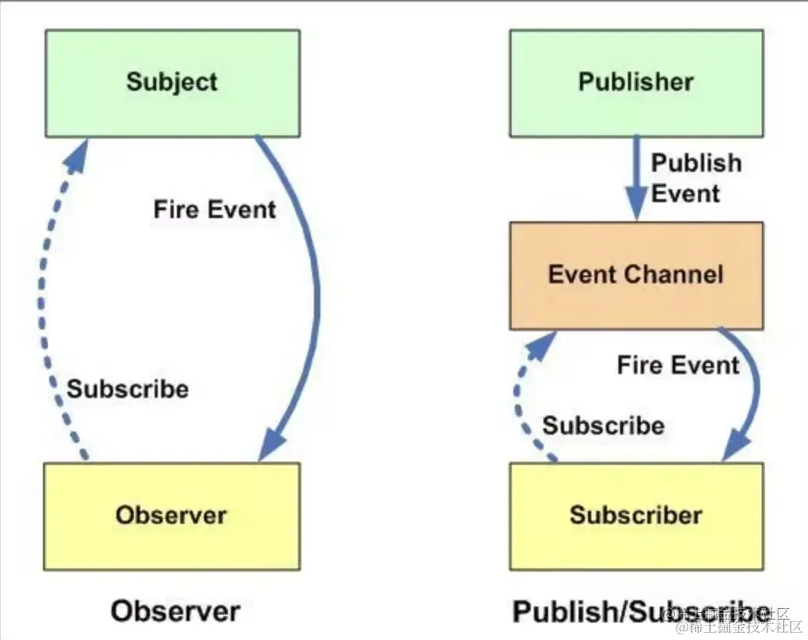

# JS 设计模式面试题

学习书籍：《JavaScript设计模式与开发实践》：[JavaScript设计模式与开发实践 (ituring.com.cn)](https://www.ituring.com.cn/book/1632)

文章：[《JavaScript设计模式与开发实践》最全知识点汇总大全 - 掘金 (juejin.cn)](https://juejin.cn/post/6844903751870840839)

- [JavaScript 中常见的十五种设计模式\_javascript 设计模式\_chenzoff 的博客-CSDN 博客](https://blog.csdn.net/chenzoff/article/details/127672963)
- [八大最常用的 JavaScript 设计模式 - 知乎 (zhihu.com)](https://zhuanlan.zhihu.com/p/465206177)

## JS 设计模式介绍和知识点

设计模式是软件开发人员在软件开发过程中面临的一些具有代表性问题的解决方案。

JavaScript 设计模式是一套经典的解决方案，用于处理常见的软件设计问题。

设计模式总的来说是一个抽象的概念，前⼈通过无数次的实践总结出的一套写代码的方式，通过这种方式写的代码可以让别⼈更加容易阅读、维护以及复用。

在 JavaScript 中，这些模式可以帮助您编写更清晰、更易维护的代码。

- 工厂模式及自定义事件
- 抽离英雄基类
- 设计原则
- 单例模式使用
- 建造者模式
- 装饰者模式使用
- 代理模式
- 观察者模式/发布订阅模式
- 适配器模式...

### 学习目标

- 学会各种设计模式的使用
- 学会面向对象中抽象使用
- 理解类中的继承
- oop 思想规划项目

**设计模式学习网站**：<https://refactoring.guru/>

## 从函数到对象

本节课围绕实现一个验证用户输入的用户名、邮箱、密码的功能，从函数逐渐到对象，使用了多种不同方式去实现，并总结了各种方式的特点。

- 01：函数式编程实现
  - 缺点：全局函数污染全局变量空间（函数也是变量）
- 02：用对象字面量给对象添加方法
  - 对象式定义
  - 点语法调用
  - 缺点：无法复用和继承（即无法用new关键字复制出一个相同的对象）
- 03：使用点语法来给对象添加方法
  - 同上，只不过定义时使用函数，添加方法时使用对象语法；
- 04：用函数方法返回包装对象
  - 调用方法：先利用函数返回一个对象，再调用该对象的方法
  - 缺点：返回的对象与定义的对象没有关联【无法同步】
- 05：使用类的方式：构造函数（使用this赋值）
  - 使用 this定义成员方法；
  - 使用 new 创建新对象
  - 缺点：每次实例化都会对this上的属性进行复制，消耗大
- 06：使用类的方式：构造函数（使用原型赋值）
  - 使用原型赋值，避免类的共用属性和方法被重复实例化赋值，减少性能开销
  - 缺点：每一个方法都要写一次prototype,太多重复
- 07：使用类的方式：构造函数（使用原型对象赋值）
  - 不用每个方法都写prototype,只需要写一次，以原型对象的方式一次性赋值；
  - 缺点：会重写类的prototype属性，导致 constructor 属性丢失
- 08：使用类的方式：构造函数（使用原型对象赋值）--实现链式调用
  - 每个方法都返回 this （即实例对象自身）来实现链式调用

## 面向对象编程基础

- 01：类的属性与方法封装
  - 私有属性：在类内部使用 var 关键字定义，外界访问不到
  - 私有方法：在类内部定义的 function ，外界访问不到
  - 对象公有属性：通过 this 关键字创建的属性，外界可以通过点语法访问到；
  - 对象公有方法：通过 this 关键字创建的方法，外界可以通过点语法访问到；
  - 特权方法： 通过 this 关键字创建的方法，并且以set和get为前缀的方法，方法可以访问私有属性，外界可通过它获得或修改私有属性；
  - 构造器：在初始化实例时利用特权方法为一些私有属性进行初始赋值；
  - 类的静态共有属性：在类外部通过点语法定义的属性，新创建的对象中无法获取它，可以通过类的点语法获取
  - 类的静态共有方法：在类外部通过点语法定义的方法，新创建的对象中无法获取它，可以获得类的点语法获取
  - 公有属性：通过prototype对象添加的属性，所有实例都可以通过原型链访问，并且拿到相同的值
  - 公有方法：通过prototype对象添加的方法，所有实例都可以通过原型链访问，并且只有一份，不会重复创建。
- 02：利用闭包实现类的静态变量
  - 利用闭包添加类的静态私有属性和静态私有方法
  - 缺点：在闭包外部利用原型添加静态公有属性和方法，从形式上看似脱离了闭包这个类
- 03：在闭包内部实现一个完整的类
  - 这样实现，类的定义和与原型添加静态公有属性和方法都在同一个闭包内，更像一个整体
- 04：创建对象的安全模式
  - 利用 instanceof 方法类判断是否使用 new 关键字
  - 可以保证忘记写 new 的时候也能正常实例化对象
- 05：类式继承
  - 将父类的实例赋值给子类的原型
  - 如果父类中的共有属性是引用类型，则子类的一个实例更改该继承过来的共有属性，就会直接影响到其他子类实例
  - 实例化父类时无法对父类构造函数进行初始化
- 06：构造函数继承
  - 利用call来更改子类执行环境为父类，利用绑定的this，子类继承了父类的共有属性。
  - 使用此种方法，继承没有涉及子类的原型，所以父类的原型方法自然不会被子类继承。
  - 如果想被子类继承就必须要放在构造函数中
  - 每个实例都会单独拥有一份，不能共有，违背了代码复用原则。
- 07：组合继承
  - 综合两种继承方式的优点，过滤掉缺点
  - 缺点：父类构造函数执行了两遍
- 08：原型继承
  - 利用过渡对象的原型继承其他对象来生成新的对象
  - 缺点：由于是类式继承的封装，父类对象中的值类型属性被复制，引用类型的属性被共用
- 09：寄生式继承
  - 利用原型继承方法，new 一个新对象
  - 对新对象进行拓展，可以为新对象添加自己私有的方法和属性
  - 返回新对象
  - 由于是对原型继承的二次封装，所以具有一样的缺点
- 10：寄生组合式继承
  - 是寄生继承与构造函数继承的组合方式
  - 在构造函数继承中调用父类的构造函数
  - 在寄生方法中将父类原型的一个副本赋值给子类的原型，并且修正因为重写子类原型而导致子类的constractor属性被修改的问题
  - 缺点：子类再想添加原型方法必须通过 prototype 对象的点语法形式添加
- 11：单继承
  - 利用 for...in 将源对象属性复制到目标对象上
  - 这种方法只能进行浅复制
- 12：多继承
  - 利用函数的 arguments 对象 和 for循环，进行多个对象的继承（属性复制）
  - 将该方法绑定到对象原型上,这样所有对象就可以直接拥有此方法
- 13：多态
  - 多态，就是同一个方法多种调用方式
  - 也是通过判断 arguments对象的长度，不同长度执行不同方法来实现

## 设计模式分类

参考：[快速记忆23种设计模式 - 知乎 (zhihu.com)](https://zhuanlan.zhihu.com/p/128145128)

设计模式是在软件设计中为解决特定问题而提出的一套经过验证的通用解决方案。这些模式有助于在设计阶段采用经验丰富的最佳实践，提高代码的可维护性、可扩展性和重用性。下面详细介绍几种常见的设计模式分类及其具体模式。

总体来说设计模式分为三大类：

1. **创建型模式**，共五种：**工厂方法模式**、抽象工厂模式、**单例模式**、建造者模式、**原型模式**。
2. **结构型模式**，共七种：**适配器模式**、**装饰器模式**、**代理模式**、外观模式、桥接模式、组合模式、享元模式。
3. **行为型模式**，共十一种：策略模式、模板方法模式、**观察者模式/发布订阅模式**、迭代子模式、责任链模式、命令模式、备忘录模式、状态模式、访问者模式、中介者模式、解释器模式。

### 1、创建型模式（Creational Patterns）

- 01-01：无工厂模式
  - 通过类实例化对象
  - 多个相似的对象需要多个相似的类
- 01-02：基类工厂
  - 写多个基类
  - 但是用一个统一的公厂类进行封装，对参数进行swich判断，来返回不同的类实例
  - 调用者只需要记住工厂类，而不必记住其它所有类
  - 如果再有新的类型需求，还需要增加基类，修改工厂类
- 01-03：简单工厂
  - 不用再写多个基类
  - 只有一个工厂类
  - 多个不同对象的相似属性和行为抽象为工厂类的属性和方法
  - 多个不同对象的不同属性和行为使用分支判断类进行分别处理
  - 它的使用场合通常限制在创建单一对象

- **单例模式**（Singleton）：确保一个类只有一个实例，并提供一个全局访问点。
  - 只允许实例化1次的对象类
  - 单例模式常被用来定义命名空间
  - 单例模式的另一个作用是进行代码库的模块管理
  - 单例模式的第三个作用：管理静态变量
  - 单例的可以延迟创建
  - 经常用于管理共享资源，如数据库连接池或配置管理器。例如，一个应用程序中只应该有一个数据库连接池实例，以确保连接管理的一致性。
  - 在应用程序中，配置管理器通常只需要一个实例，以确保整个应用程序中使用的配置信息是一致的。
- **工厂模式**（Factory Method）：定义一个用于创建对象的接口，让子类决定实例化哪个类。
  - 用于创建对象，当对象需要进行预处理或配置时，这个模式特别有用。例如，一个应用程序可能需要根据不同的服务提供商创建不同的支付处理对象。
  - 在创建日志记录器时，可能需要根据不同的环境（如开发环境、测试环境、生产环境）来创建不同类型的日志记录器实例。
  -  01：工厂方法模式前传1———— 类实例化方式
  - 02： 工厂方法模式前传2———— 基类工厂模式
  - 03： 工厂方法模式
    - 将实际创建对象的工作推迟到子类当中
    - 核心类是抽象类
    - 采用安全模式类
    - 将创建对象的基类放在工厂方法类的原型中
- **抽象工厂模式**（Abstract Factory）：提供一个接口以创建相关或依赖对象的家族，而不需要明确指定具体类。
  -  抽象类
    - 可以声明但不能使用的类
    - 用来定义一个产品簇，声明一些必备方法，如果子类中没有重写就会抛出错误
  - 通过对类的工厂抽象使其业务用于对产品类簇的创建，而不负责创建某一类产品的实例
  - 使用抽象工厂来为抽象的父类创建子类
  - 在抽象工厂中让子类继承父类的一个实例（缓存类的实例），以此获得父类的对象属性
  - 由于抽象工厂中的父类是抽象类，而抽象工厂方法不需要实例化，所以抽象工厂添加抽象类直接采用点语法来添加

- **建造者模式**（Builder）：将一个复杂对象的构建与其表示分离，使得同样的构建过程可以创建不同的表示。
  - 将一个复杂对象的构件层与其表示层相互分离，同样的构建过程可采用不同的表示
  - 建造者模式与工厂模式的区别：
    - 工厂模式关心的是创建的最终结果，即对象实例或者类簇，比如一个人
    - 建造者模式关心的是创建的过程，更关注细节，比如这个人穿什么衣服，是男还是女，兴趣爱好是什么等

- **原型模式**（Prototype）：使用一个已创建的实例作为原型，通过复制这个原型来创建新的对象。
  - 构造函数继承基类
    - 使用构造函数继承基类，然后重写基类方法的方式，实现多种子类继承同一父类却能创建不同种类对象的需求
    - 问题：每次子类继承都会执行一遍父类构造函数，如果父类构造函数很耗资源，则无法接受
  - 原型继承
    - 通过将耗资源的方法放入基类的原型来避免重复执行；
    - 通过让子类的原型继承基类的实例，然后重写子类原型上继承自基类的方法来实现继承和子类的差异化实现
    - 无论何时都能对基类活子类的原型进行拓展，所有实例都将自动获得这些新拓展的方法。


### 2、结构型模式（Structural Patterns）

- **适配器模式**（Adapter）：允许将一个类的接口转换成客户期望的另一个接口。
  - 适配器模式是将一个类（对象）的接口（方法或属性）转换成另外一个接口，以满足用户需求，解决接口不兼容问题
  - 用法一：组件库接口适配
  - 用法二： 参数适配
  - 用法三： 数据适配
  - 当系统需要与第三方库或旧系统集成时，适配器模式可以用来解决接口不兼容的问题。
- **装饰器模式**（Decorator）：动态地给对象添加额外的职责。
  - 在不改变原对象的基础上，通过对其进行包装拓展（添加属性或者方法）使原有对象可以满足用户更复杂的需求、
  - 通过缓存对象原有的方法和属性，然后在装饰者方法中调用原有属性和方法和新增的方法和属性来实现功能拓展
  - 与适配器模式的不同：适配器需要了解原有方法的细节，而装饰器则不关心原有方法的实现细节。
  - 用于动态地给对象添加功能。例如，一个流处理库可能允许你动态地添加加密或压缩等功能。
  - 在图形用户界面库中，可以动态地给组件添加新的行为，如滚动条、边框装饰等。
- **代理模式**（Proxy）：为其他对象提供一种代理以控制对这个对象的访问。
  - 由于一个对象不能直接引用另一个对象，所以需要通过代理对象在这两个对象之间起到中介的作用。
  - 常用于控制对对象的访问，可以用于懒加载、权限控制或日志记录。例如，一个远程对象代理可能会处理网络通信的细节，使得客户端代码可以像访问本地对象一样访问远程对象。
  - 在实现网络请求时，可以使用代理模式来添加缓存机制，从而提高数据加载的效率。
- **外观模式**（Facade）：提供一个统一的接口，用来访问子系统中的一群接口。
  - 为一组复杂的子系统接口提供一个更高级的统一接口，通过这个接口使得对子系统接口的访问更容易。
  - 常见的应用为封装一个统一接口来实现不同浏览器的相同功能的兼容。
  - 外观模式的另一个作用：小型代码库中用来封装多个功能，简化底层操作方法

- **桥接模式**（Bridge）：将抽象部分与实现部分分离，使它们可以独立变化。
  - 在系统沿着多个维度变化的同时，又不增加其复杂度并已达到解耦。
  - 主要特点是将实现层与抽象层解耦分离，使两部分可以独立变化
  - 有时会增加开发成本和性能开销

- **组合模式**（Composite Pattern）：将对象组合成树形结构以表示“部分-整体”的层次结构：组合模式允许将对象组合成树形结构，以表示部分-整体的层次结构。它使客户端可以统一处理单个对象和组合对象，而无需区分它们之间的差异。这对于处理树状结构的数据非常有用，例如文件系统中的文件和文件夹。
  - 又称部分-整体模式，将对象组合成树形结构以表示“部分-整体”的层次结构。
  - 组合模式使得用户对单个对象和组合对象的使用具有一致性。
  - 接口要统一，可以通过继承同一个虚拟类来实现。

- **享元模式**（Flyweight Pattern）：运用共享技术有效地支持大量细粒度的对象：享元模式旨在减少对象的内存占用，通过共享相似对象之间的公共状态来实现，来减少内存消耗和提高代码的执行效率。在JavaScript中，它适用于需要大量相似对象的情况，例如文本编辑器中的字符或游戏中的角色。
  - 运用共享技术有效地支持大量的细粒度的对象，避免对象间拥有相同内容造成多余开销
  - 享元模式将数据和方法分成内部数据、内部方法和外部数据、外部方法。
  - 内部方法与内部数据指相似或共有的数据和方法，将这一部分提取出来可以减少开销，提高性能


### 3、行为型模式（Behavioral Patterns）

行为型模式主要关注对象之间的通信和协作。以下是每个模式的简要说明：

- **观察者模式**（Observer）：对象间的一种一对多的依赖关系，当一个对象改变状态时，所有依赖于它的对象都会得到通知。
  
  - 又称发布-订阅者模式或消息机制
  - 用于实现发布/订阅系统，允许对象在状态变化时通知多个观察者。例如，一个事件管理系统可能会在事件发生时通知所有注册的监听器。
  - 是通过被观察者直接通知观察者来实现通信。
  - 在社交网络应用中，当用户发布新动态时，系统需要通知所有关注该用户的其他用户。
  - 识别、实施和改进系统中不同对象之间的通信。
  - **发布订阅模式**（Publish-Subscribe Pattern）：发布者（Publisher）不直接通知订阅者（Subscriber），而是通过消息队列或代理（Broker）来实现通信。
  - 通过消息队列或事件总线等中介来实现发布者和订阅者之间的通信
  - 它定义了一种依赖关系，解决了主体对象与观察者
  - 包含两个基本方法：接收消息、向订阅者发布消息
  - 还需要取消注册方法、消息容器。
  - 接收消息（即消息注册）作用是将订阅者注册的消息推入消息容器，接收两个参数:消息类型和处理动作
  - 发布消息作用是当观察者发布一个消息时将所有订阅者订阅的消息一次执行，接收两个参数：消息类型及行为参数
- **迭代器模式**（Iterator）：提供一种方法顺序访问一个聚合对象中各个元素，而又不暴露该对象的内部表示。

  - 在不暴露对象内部结构的同时，可以顺序地访问聚合对象内部的元素

- **策略模式**（Strategy）：定义一系列算法，把它们一个个封装起来，并且使它们可相互替换。

  - 将定义的一组算法封装起来，使其相互之间可以替换
  - 封装的算法具有一定的独立性，不会随客户端变化而变化
  - 结构上与状态模式很像，在内部封装一个对象，通过返回的接口对象实现对内部对象的调用，但不需要管理状态
  - 典型应用场景：表单验证
  - 允许在运行时选择算法或行为。例如，在一个电子商务应用中，可以根据不同的用户或购物车的内容选择不同的折扣策略。
  - 在电子商务网站中，可以根据不同的促销策略（如打折、满减、返现）来动态选择计算订单总价的算法。
- **模板方法模式**（Template Method）：在一个方法中定义一个算法的骨架，而将一些步骤延迟到子类中。

  - 在父类中定义一个算法的骨架，允许子类在不改变算法结构的情况下重写算法的特定步骤。
  - 虽然模板方法模式通常被归类为行为型模式，但它也可以被视为一种特殊的分类，因为它关注的是算法的骨架和步骤。

    **模板方法模式** 是一种行为设计模式，它定义了一个算法的框架，允许子类在不改变算法结构的前提下，重新定义算法的某些步骤。

    模板方法模式适用于有固定算法步骤但步骤实现需要变化的情况。

    模板方法模式通常涉及以下两个主要组件：

    1. **抽象类 (Abstract Class)**：定义算法的骨架和执行算法的模板方法。它可以包含一些基本操作的实现。
    2. **具体类 (Concrete Classes)**：继承自抽象类，并重写其中的某些步骤，提供这些步骤的具体实现。

- **职责链模式**（Chain of Responsibility）：将请求的发送者和接收者解耦，使多个对象都有机会处理请求，从而避免请求的发送者和接收者之间的耦合关系。

  - 解决请求的发送者与请求的接受者之间的耦合，通过职责链上的多个对象分解请求流程，实现请求在多个对象之间的传递，直到最后一个对象完成请求的处理。
  - 把每件事独立出一个模块对象去处理，完整的需求被分解成相互独立的模块需求
  - 方便进行单元测试，保证每个组件对象的处理逻辑的安全性

- **命令模式**（Command）：将一个请求封装为一个对象，从而使你可用不同的请求对客户进行参数化。

  - 将请求与实现解耦并封装成独立对象，从而使不同的请求对客户端的实现参数化
  - 将创建模块的逻辑封装在一个对象里，这个对象提供一个参数化的请求接口，通过调用这个接口并传递一些参数实现调用命令对象内部的一些方法。
  - 在实现撤销/重做功能时，命令模式可以将操作封装成对象，方便管理操作的历史记录。
- **备忘录模式**（Memento）：在不破坏封装的前提下，捕获一个对象的内部状态，并在该对象之外保存这个状态。

  - 在不破坏对象封装性的前提下，在对象之外捕获并保存该对象内部的状态以便日后对象使用或者对象恢复到以前的某个状态
  - 主要任务是对现有数据或状态做缓存，这些数据或缓存将在可预期的将来再次用到
  - 备忘录对象是对数据缓存器的一次保护性封装，防止外界访问
  - 当数据量过大时会严重占用系统资源
  - 允许保存和恢复对象先前状态的能力，而不暴露其实现细节

- **状态模式**（State）：允许一个对象在其内部状态改变时改变它的行为，看起来好像改变了它的类。

  - 当一个对象的内部状态发生改变时，会导致其行为的改变。
  - 对于分支条件内部独立结果的管理，可以使用状态模式
  - 每一种条件作为对象内部的一种状态，面对不同判断结果，它其实就是选择对象内的一种状态
  - 对于状态模式，主要目的就是将条件判断的不同结果转化为对象内部的状态，既然是状态对象的内部状态，所以一般作为状态对象内部的私有变量，然后提供一个能够调用状态对象内部状态的接口方法对象。这样方便管理状态。
  - 在游戏开发中，角色的状态（如站立、跑动、攻击）可以使用状态模式来管理，使得状态转换更加清晰。
- **访问者模式**（Visitor）：允许添加新的操作到对象结构中的元素，而不改变这些元素的类，表示一个作用于某对象结构中的各元素的操作。

  - 针对于对象结构中的元素，定义在不改变该对象的前提下访问结构中元素的新方法
  - 道call和apply的作用就是更改函数执行时的作用域，这正是访问者模式的精髓，通过这两种方法我们就可以让某个对象在其他作用域中运行
  - 访问者模式解决数据与数据的操作方法之间的耦合，将数据的操作方法独立于数据，使其可以自由化演变。

- **中介者模式**（Mediator）：通过引入一个中介者对象来简化多个对象之间的复杂通信和控制逻辑：用一个中介对象来封装一系列的对象交云。

  - 通过中介者对象封装一系列对象之间的交互，使对象之间不再相互引用，降低他们之间的耦合
  - 主要是通过模块间或对象间的复杂通信，来解决模块间或对象间的耦合
  - 中介者对象的本质是封装多个对象的交互，并且这些对象的交互一般都是在中介者内部实现的。
  - 与观察者模式相比，观察者模式中的订阅者是双向的，而中介者模式中订阅是单向的。

- **解释器模式**（Interpreter）：定义一种语言的文法，并建立一个解释器来解释该语言中的句子：给定一个语言，定义它的文法的一种表示，并定义一个解释器。

  - 对于一种语言，给出其文法形式，并定义一种解释器，通过使用这种解释器来解释语言中定义的句子


### 4、并发(线程池)模式（Concurrency Design Patterns）

**并发型模式**：指的是一组用于处理多线程程序中的并发问题的设计模式。这些模式帮助开发者编写出更安全、更高效、更易于管理的并发代码。并发型模式通常涉及到线程同步、状态管理、线程间通信等方面。一些常见的并发型模式包括：

- **半同步/半异步模式**：结合同步和异步处理来提高性能和响应性，通常用于处理I/O操作。
- **领导者/追随者模式**：多个线程协作处理任务，一个领导者线程接收请求，然后分配给追随者线程处理。
- **生产者/消费者模式**：通过一个共享队列来平衡生产者和消费者之间的工作负载：通过一个共享队列来平衡生产者和消费者之间的工作负载，实现生产者和消费者的解耦。
- **读写锁模式**：允许多个读操作同时进行，但写操作是互斥的，以保证数据一致性。
- **不变模式**（Immutable Pattern）：确保对象一旦被创建，其内部状态就不会改变，从而无需考虑同步问题。
- **Future模式**：通过代理的方式进行异步调用，提前返回一个代理对象，真正的计算结果在将来某个时刻完成并返回。

#### 4.1、线程池模式

线程池模式属于并发型模式。线程池模式主要用于管理并发的线程，以提高资源利用率、降低线程创建和销毁的开销，并优化线程之间的竞争。以下是一些线程池模式的常见分类：

HS/HA半同步/半异步模式：半同步/半异步模式将线程池中的线程分为两类，一部分用于处理同步任务，另一部分用于处理异步任务。这样可以同时满足同步和异步需求，提高系统的性能和响应性。

L/F领导者与跟随者模式：领导者/追随者模式中，一个线程作为领导者接收任务，然后将任务分配给其他追随者线程来执行。这种模式有助于实现任务的分工和协作，提高线程池的效率。

线程池模式通过合理地管理线程，使得多线程程序更加高效、可控和易于维护。


**线程池模式**：是一种创建和管理线程的技术，它通过重用一组固定数量的线程来执行多个任务。线程池可以减少创建和销毁线程的开销，提高响应速度，并提供更好的线程管理。线程池模式通常包括以下几个关键组件：

- **工作队列**：用于存放待处理的任务。
- **工作者线程**：线程池中的线程，负责执行工作队列中的任务。
- **线程池管理器**：负责管理线程池的创建、销毁和任务分配。

这些模式在需要处理大量并发任务的应用程序中非常有用，例如Web服务器、数据库连接池和大型计算任务。

这些模式可以帮助您解决特定的编程问题，提高代码的可维护性和灵活性。

### 5、架构型模式（Architectural Patterns）

用于架构目的的设计模式，包括MVC（模型-视图-控制器）、MVP（模型-视图-表示器）和MVVM（模型-视图-视图模型）等。

- 01 同步模块模式
  - 请求发出后，无论模块是否存在，立即执行后续逻辑，实现模块开发中对模块的立即引用
  - 可以解决多人协作开发时代码互相冲突导致开发进程阻塞的问题
  - 实质是将所有模块按照层级关系绑定到一个单体对象上，使用时调用该单体对象来完成操作；
  - 主要有两个方法，定义模块的define方法和引用模块的module方法
  - 缺点：无法引用尚未加载完成的模块。
- 02 异步模块模式
  - 请求发出后，继续其他业务逻辑，知道模块加载完成后执行后续的逻辑，实现模块开发中对模块加载完成后的引用。
  - 核心思路利用闭包返回模块，对未加载模块进行计数，直到未加载模块为0，然后执行回调
  - 在异步加载脚本文件时，要设置 asycn = true;
- 03 Widget模式
  - 是指借用Web Widget思想将页面分解成部件，针对部件开发，最终组合成完整的页面
  - 此模式多针对与页面视图的构造，它将页面分解为很多个组件（即模块），一个完整的组件包含该模块完整的视图和一套完整的功能；其实就是组件化技术。
  - 模板引擎一般分四步：处理数据=>获取模板=>处理模板=>编译执行；
  - 对于模板内的js语法解析，主要是eval()与new Function()技术来实现
- 04 MVC模式
  - 即模型（model）-视图（view）-控制器（controller）
  - 用一种将业务逻辑、数据、视图分离的方式组织架构代码，主要解决层次混乱问题
- 05 MVP模式
  - 即模型(Model)-视图(View)-管理器(Presenter)
  - View 层不直接引用Model层内的数据，而是通过Presenter层实现对Model层内的数据访问
  - 所有层次的交互都发生在Presenter层中
- 06 MVVM模式
  - 即模型（Model）-视图（View）-视图模型（ViewModel）
  - 为视图层量身定做一套视图模型，并在视图模型中创建属性和方法，为视图层绑定数据并实现交互
  - 这样做以后 View层可以直接使用HTML来完成。

这些模式关注整个系统的结构和组织方式，而不仅仅是单个类或对象。架构模式用于解决系统级别的问题，例如分布式系统、微服务架构、事件驱动架构等。

架构模式是针对软件架构中常见问题的通用、可重用解决方案。它们类似于软件设计模式，但覆盖范围更广，涉及到软件工程中不同问题的解决。以下是一些常见的架构模式：

**分层模式**（Layered Pattern）：将系统分解为多个层次，每层提供特定的服务1。客户端-服务器模式（Client-Server Pattern）：由服务提供者（服务器）和服务请求者（客户端）组成的模式。

**主从模式**（Master-Slave Pattern）：一个主节点控制多个从节点，用于任务分配和结果汇总。

**管道-过滤器模式**（Pipe-Filter Pattern）：数据通过一系列处理步骤（过滤器）流动，每个步骤处理一部分数据。

**代理模式**（Broker Pattern）：组件通过代理进行通信，代理负责组件之间的消息传递和路由。

**点对点模式**（Peer-to-Peer Pattern）：每个节点既是客户端又是服务器，可以直接与其他节点通信。

**事件-总线模式**（Event-Bus Pattern）：组件通过事件总线进行通信，事件源发布消息，监听者订阅并响应消息。

**模型-视图-控制器模式**（Model-View-Controller Pattern）：将应用程序分为三个主要部分，实现输入、处理和输出的分离。

**黑板模式**（Blackboard Pattern）：用于没有确定解决方案策略的问题，组件通过共享的黑板进行通信。

**解释器模式**（Interpreter Pattern）：用于设计解释专用语言编写的程序组件。

这些架构模式有助于解决特定的软件设计问题，提高系统的可维护性和可扩展性。

### 6、企业应用模式

这些模式专注于企业级应用程序的开发，涵盖了业务逻辑、数据持久性、事务管理等方面。一些常见的企业应用模式包括数据访问对象（DAO）、业务代表、服务定位器等。

企业应用模式是一系列解决方案，用于处理常见的企业软件开发问题。这些模式通常涉及到如何组织和管理代码以及数据，以便软件能够在企业环境中高效、可靠地运行。以下是一些常见的企业应用模式：

1. **分层架构模式** (Layered Architecture)：将应用程序分为多个层次，每个层次负责不同的任务，例如表示层、业务逻辑层和数据访问层。

2. **服务层模式** (Service Layer)：定义一个应用程序的操作界面，通常是为了定义核心业务逻辑的操作而设计的。

3. **领域模型模式** (Domain Model)：将复杂的业务逻辑建模为一组相互关联的对象。

   - 用于解决领域驱动设计（DDD）中的问题，帮助将业务需求和软件设计紧密结合。一些常见的领域驱动设计模式包括实体、值对象、聚合等。

     **领域驱动设计 (DDD)** 是一种软件设计方法论，它强调基于领域模型来设计软件系统，以确保软件能够精准地解决特定业务领域的问题。

     DDD适用于复杂业务逻辑的建模。

     DDD中的一些关键概念包括：

     1. **实体 (Entities)**：具有唯一标识的对象，代表系统中的主要概念。
     2. **值对象 (Value Objects)**：描述系统中的某些特性，但没有唯一标识。
     3. **聚合 (Aggregates)**：一组相关对象的集合，通常由一个聚合根管理。
     4. **服务 (Services)**：在领域模型中执行特定任务的无状态操作。
     5. **仓储 (Repositories)**：提供对聚合根的检索和持久化的机制。
     6. **工厂 (Factories)**：负责创建复杂的对象和聚合。
     7. **限界上下文 (Bounded Contexts)**：明确界定领域模型的边界，确保模型的一致性。

4. **数据映射器模式** (Data Mapper)：用于将对象模型表示法映射到基于SQL的关系模型表示法。

5. **活动记录模式** (Active Record)：每个对象包含了对数据库的直接访问逻辑。

6. **数据传输对象模式** (Data Transfer Object, DTO)：用于在不同的应用程序层次之间传输数据。

7. **工作单元模式** (Unit of Work)：维护业务事务中涉及的对象列表和执行的操作。

8. **仓储模式** (Repository)：为领域模型中的对象提供一个查找和存储的接口。

这些模式可以帮助开发者创建更加模块化、可维护和可扩展的企业级应用程序。

### Proto-patterns（原型模式）和 Anti-patterns（反模式）

这些是在设计模式被广泛接受之前的阶段。Proto-patterns 是被开发者社区认可并广泛使用的设计模式，而 Anti-patterns 代表不良实践。

#### 原型模式是什么？

Proto-patterns（原型模式）是指那些在设计模式被广泛接受之前的阶段，由开发者个体提出并在实践中得到验证的设计思想。当一个开发者在解决某一问题时，可能会想到一个独特的解决方案，这个解决方案并没有被广泛认可和文档化，但开发者自身认为它具有可重用性，并认为开发者社区会从中受益。这个阶段被称为 Proto-pattern，意味着这是一个潜在的设计模式，但尚未被完全确认和纳入标准。

一个 Proto-pattern 在变成一个正式的设计模式之前，需要经历一定的测试阶段，由各种开发者和场景验证，以确保该模式在实践中是有用的、并能够提供正确的结果。通常，将一个 Proto-pattern 转变为完全成熟的模式需要大量的工作和文档化。

#### 如何辨别设计模式？

辨别设计模式的方法通常包括以下几个方面：

1. **问题的复发性：** 设计模式是为解决在软件设计中反复出现的问题而提出的，因此首先需要观察问题是否是一种常见的、具有一般性的问题。

2. **通用性：** 设计模式通常是一种通用的解决方案，而不是特定于某个特定应用的解决方案。如果一个解决方案在多个上下文中都适用，可能是一个设计模式。

3. **可重用性：** 设计模式应该是可重用的，可以在不同的情境中应用。如果解决方案只在特定情境下有用，可能更适合被称为特定应用的最佳实践，而不是设计模式。

4. **文档和社区认可：** 成熟的设计模式通常有相应的文档和社区认可。它们被广泛讨论、使用，并有相关的资料可以供开发者学习和参考。

#### 反模式的概念和例子

反模式是指在软件设计和开发中，被认为是不良实践或导致问题的常见做法。这些是反面教材，指导开发者在设计和编码时应该避免的模式。使用 Anti-pattern 可能导致代码不可维护、难以理解、性能低下等问题。

1. **修改 Object 类原型（Modifying Object Class Prototype）：** 在 JavaScript 中修改 Object 类的原型，影响了所有继承自 Object 的对象，可能导致不可预测的行为和潜在的冲突。

```js
Object.prototype.newMethod = function() {
   // 新增的方法
};
```

2. **在不拥有的对象上进行修改（Modifying Objects You Don't Own）：** 修改第三方库或框架中的对象，可能导致兼容性问题和难以维护的代码。

```js
// 在第三方库的对象上添加新方法
thirdPartyLibrary.someObject.newMethod = function() {
   // 新增的方法
};
```

3. **过度使用全局变量（Overusing Global Variables）：** 过度使用全局变量会增加代码的耦合度，降低模块化和可维护性。

```js
// 过度使用全局变量
 var globalVariable = 'some value';

 function exampleFunction() {
     console.log(globalVariable);
 }
```

### 技巧型设计模式

- 01 链模式
  - 通过在对象方法中将当前对象返回，实现对同一个对象方法的链式调用
- 02 委托模式
  - 多个对象接收并处理同一请求，他们将请求委托给另一个对象同一处理请求
  - 利用元素冒泡原理可以将所有子元素上的相同事件绑定到父元素上
- 03 数据访问对象模式
  - 抽象和封装对数据源的访问与存储。
  - 关键在于定义私有前缀和增删改查接口
- 04 节流模式
  - 对重复的业务逻辑进行节流控制，执行最后一次操作并取消其他操作，以提高性能
  - 节流器的关键点在于计数器和事件执行间隔时间的控制，在某个间隔内只允许触发一次。
  - 节流模式可应用于优化滚动事件性能、优化浮层显隐性能、图片懒加载、统计回报次数优化等
- 05 简单模板模式
  - 通过格式化字符串拼凑出视图，以避免创建视图时大量的节点操作。优化内存开销。
  - 从定义可看出其主要针对的是有大量创建视图的高消耗DOM操作场景。
- 06 惰性模式
  - 减少每次代码执行的重复性的分支判断，通过对对象重定义来屏蔽原对象中的分支判断
  - 第一种是在文件加载进来时通过闭包执行该方法对其重新定义（会使页面加载时占用一定资源）
  - 第二种是在第一种方式基础上做一次延迟执行，在函数第一次调用时对其重定义；
- 07 参与者模式
  - 在特定的作用域中执行给定的函数，并将参数原封不动地传递。
  - 主要是利用bind方法，它应用了函数柯里化思想来进行传参和作用域绑定
- 08 等待者模式
  - 通过对多个异步进程监听，来触发未来发生的动作
  - 其实就是简单地实现Promise规范，通过when/then/done/fail来处理请求和回调，通过resolve和reject状态来监听异步的结果。

## 设计原则

设计原则是一组用于指导软件开发过程中的决策和设计的规则。这些原则有助于创建可维护、可扩展和灵活的代码。在面向对象编程中，最著名的设计原则被称为SOLID原则，它包括以下五个基本原则：

### 六大设计原则

[六大设计原则超详细介绍（再不理解你打我） - 知乎 (zhihu.com)](https://zhuanlan.zhihu.com/p/110130347)

- **单一职责原则**（Single Responsibility Principle, SRP）：一个类应该只有一个引起变化的原因。
  - 一个类应该只有一个发生变化的原因。简而言之就是每个类只需要负责自己的那部分，类的复杂度就会降低。
  - 有的叫：合成复用原则—原则是尽量使用合成/聚合的方式，而不是使用继承。
- **开闭原则**（Open/Closed Principle, OCP）：软件实体应当对扩展开放，对修改关闭。
  - 开闭原则就是说对扩展开放，对修改关闭。在程序需要进行拓展的时候，不能去修改原有的代码，实现一个热插拔的效果。所以一句话概括就是：为了使程序的扩展性好，易于维护和升级。想要达到这样的效果，我们需要使用接口和抽象类，后面的具体设计中我们会提到这点。
  - 一个软件实体，如类、模块和函数应该对扩展开放，对修改关闭
- **里氏替换原则**（Liskov Substitution Principle, LSP）：子类应该能够替换掉它们的父类型。

  - 里氏代换原则面向对象设计的基本原则之一。 里氏代换原则中说，任何基类可以出现的地方，子类一定可以出现。 LSP是继承复用的基石，只有当衍生类可以替换掉基类，软件单位的功能不受到影响时，基类才能真正被复用，而衍生类也能够在基类的基础上增加新的行为。
  - 里氏代换原则是对“开-闭”原则的补充。实现“开-闭”原则的关键步骤就是抽象化。而基类与子类的继承关系就是抽象化的具体实现，所以里氏代换原则是对实现抽象化的具体步骤的规范。
  - 所有引用基类的地方必须能透明地使用其子类的对象，也就是说子类对象可以替换其父类对象，而程序执行效果不变。

- **迪米特法则（Law of Demeter）**
  - 又叫作最少知识原则（The Least Knowledge Principle），是面向对象设计的一个重要原则。它的核心思想是“只与你的直接朋友通信”，意味着一个对象(类)应该对其他对象(类)有尽可能少的了解，只和朋友通信，不和陌生人说话。
  - 具体来说，这个原则建议：一个对象应该尽量少地与其他对象发生相互作用。一个对象不应该暴露它的内部组件给其他对象，即不应该持有其他对象的引用。当需要进行跨类通信时，应该通过中介者来实现，以减少类之间的直接依赖。遵循迪米特法则可以帮助减少类之间的耦合度，提高模块的相对独立性，从而使系统更加容易维护和扩展。
  - 这个原则在大型复杂系统的设计中尤其重要，但也要注意过度使用可能会导致过多的中介类，增加系统的复杂度。因此，应该根据具体情况适度应用迪米特法则。

- **接口隔离原则**（Interface Segregation Principle, ISP）：不应该强迫客户依赖于它们不用的方法。
  - 使用多个隔离的接口，比使用单个接口要好。还是一个降低类之间的耦合度的意思，从这儿我们看出，其实设计模式就是一个软件的设计思想，从大型软件架构出发，为了升级和维护方便。所以上文中多次出现：降低依赖，降低耦合。
  - 多个特定的客户端接口要好于一个通用性的总接口
- **依赖倒置原则**（Dependency Inversion Principle, DIP）：高层模块不应该依赖于低层模块，两者都应该依赖于抽象。
  - 1、上层模块不应该依赖底层模块，它们都应该依赖于抽象。
  - 2、抽象不应该依赖于细节，细节应该依赖于抽象


### SOLID五大原则(JavaScript使用的)

#### S – Single Responsibility Principle 单一职责原则（重点）

- 一个程序只做好一件事
- 如果功能过于复杂就拆分开，每个部分保持独立

#### O – OpenClosed Principle 开放/封闭原则（重点）

- 对扩展开放，对修改封闭
- 增加需求时，扩展新代码，而非修改已有代码

#### L – Liskov Substitution Principle 里氏替换原则

- 子类能覆盖父类
- 父类能出现的地方子类就能出现

#### I – Interface Segregation Principle 接口隔离原则

- 保持接口的单一独立
- 类似单一职责原则，这里更关注接口

#### D – Dependency Inversion Principle 依赖倒转原则

- 面向接口编程，依赖于抽象而不依赖于具体
- 使用方只关注接口而不关注具体类的实现

#### 总结

- S 单一职责： 一个程序只做好一件事
- O 开放封闭：对拓展开放，对修改封闭
- L 里氏置换：子类能够覆盖父类，并能出现在父类出现的地方
- I 接口隔离独立
- D 依赖倒置： 使用只关注接口而不关注具体类的实现（组合、策略等）


##### SO体现较多，举个栗子：（比如Promise）

- 单一职责原则：每个then中的逻辑只做好一件事
- 开放封闭原则（对扩展开放，对修改封闭）：如果新增需求，扩展then

##### 再举个栗子：(此例来源-[守候-改善代码的各方面问题](https://juejin.im/post/6844903597092651015#comment))

```typescript
//checkType('165226226326','mobile')
//result：false
let checkType=function(str, type) {
    switch (type) {
        case 'email':
            return /^[\w-]+(\.[\w-]+)*@[\w-]+(\.[\w-]+)+$/.test(str)
        case 'mobile':
            return /^1[3|4|5|7|8][0-9]{9}$/.test(str);
        case 'tel':
            return /^(0\d{2,3}-\d{7,8})(-\d{1,4})?$/.test(str);
        default:
            return true;
    }
}
```

有以下两个问题：

- 如果想添加其他规则就得在函数里面增加 case 。添加一个规则就修改一次！这样违反了开放-封闭原则（对扩展开放，对修改关闭）。而且这样也会导致整个 API 变得臃肿，难维护。
- 比如A页面需要添加一个金额的校验，B页面需要一个日期的校验，但是金额的校验只在A页面需要，日期的校验只在B页面需要。如果一直添加 case 。就是导致A页面把只在B页面需要的校验规则也添加进去，造成不必要的开销。B页面也同理。

建议的方式是给这个 API 增加一个扩展的接口:

```typescript
let checkType=(function(){
    let rules={
        email(str){
            return /^[\w-]+(\.[\w-]+)*@[\w-]+(\.[\w-]+)+$/.test(str);
        },
        mobile(str){
            return /^1[3|4|5|7|8][0-9]{9}$/.test(str);
        }
    };
    // 暴露接口
    return {
        // 校验
        check(str, type){
            return rules[type]?rules[type](str):false;
        },
        // 添加规则
        addRule(type,fn){
            rules[type]=fn;
        }
    }
})();

// 调用方式
// 使用mobile校验规则
console.log(checkType.check('188170239','mobile'));
//添加金额校验规则
checkType.addRule('money',function (str) {
    return /^[0-9]+(.[0-9]{2})?$/.test(str)
});
// 使用金额校验规则
console.log(checkType.check('18.36','money'));
```

此例更详细内容请查看-> [守候i-重构-改善代码的各方面问题](https://juejin.im/post/6844903597092651015#comment)

# 一、创建型模式（Creational Patterns）

## 工厂模式（Factory Pattern）

**工厂模式** （Factory Pattern），封装具体实例创建逻辑和过程，外部只需要根据不同条件返回不同的实例。

- 优点：实现代码复用性，封装良好，抽象逻辑；
- 缺点：增加了代码复杂程度；

工厂模式（Factory Pattern）是最常用的设计模式之一。

在工厂模式中，我们在创建对象时不会对客户端暴露创建逻辑，并且是通过使用一个共同的接口来指向新创建的对象。

定义一个创建对象的接口，让其子类自己决定实例化哪一个工厂类，工厂模式使其创建过程延迟到子类进行。

> 应用实例：您需要一辆汽车，可以直接从工厂里面提货，而不用去管这辆汽车是怎么做出来的，以及这个汽车里面的具体实现。而至于需要哪个牌子的汽车，就到哪个牌子的工厂。

工厂方法模式定义了一个创建对象的接口，但是由子类决定要实例化的类是哪一个。可以将对象的创建和使用分离，使得系统更加灵活。其代码示例如下：

```js
// 定义一个抽象类
class Animal {
  speak() {
    throw new Error('This method must be implemented.');
  }
}

// 实现具体的类
class Dog extends Animal {
  speak() {
    return 'Woof!';
  }
}

class Cat extends Animal {
  speak() {
    return 'Meow!';
  }
}

// 实现工厂方法
class AnimalFactory {
  createAnimal(animalType) {
      switch(animalType) {
        case 'dog':
          return new Dog();
        case 'cat':
          return new Cat();
        default:
          throw new Error(`Invalid animal type: ${animalType}`);
      }
  }
}

// 使用工厂方法创建对象
const animalFactory = new AnimalFactory();
const dog = animalFactory.createAnimal('dog');
console.log(dog.speak()); // Output: Woof!
const cat = animalFactory.createAnimal('cat');
console.log(cat.speak()); // Output: Meow!
```


工厂模式定义一个用于创建对象的接口，这个接口由子类决定实例化哪一个类。该模式使一个类的实例化延迟到了子类。而子类可以重写接口方法以便创建的时候指定自己的对象类型。

```javascript
class Product {
    constructor(name) {
        this.name = name
    }
    init() {
        console.log('init')
    }
    fun() {
        console.log('fun')
    }
}

class Factory {
    create(name) {
        return new Product(name)
    }
}

// use
let factory = new Factory()
let p = factory.create('p1')
p.init()
p.fun()
```

#### 简单工厂模式

```js
class Man {
	constructor(name) {
		this.name = name;
	}
	alertName() {
		alert(this.name);
	}
}
class Factory {
	static create(name) {
		return new Man(name);
	}
}
Factory.create("yck").alertName();
```

当然工⼚模式并不仅仅是用来 new 出实例。

可以想象一个场景。假设有一份很复杂的代码需要用户去调用，但是用户并不关⼼这些复杂的代码，只需要你提供给我一个接口去调用，用户只负责传递需要的参数，⾄于这些参数怎么使用，内部有什么逻辑是不关⼼的，只需要你最后返回我一个实例。这个构造过程就是工⼚。

工⼚起到的作用就是隐藏了创建实例的复杂度，只需要提供一个接口，简单清晰。

在 Vue 源码中，你也可以看到工⼚模式的使用，比如创建异步组件

```js
export function createComponent(
	Ctor: Class<Component> | Function | Object | void,
	data: ?VNodeData,
	context: Component,
	children: ?Array<VNode>,
	tag?: string
): VNode | Array<VNode> | void {
	// 逻辑处理...

	const vnode = new VNode(
		vue-component-${Ctor.cid}${name ? `-${name}` : ""},
		data,
		undefined,
		undefined,
		undefined,
		context,
		{ Ctor, propsData, listeners, tag, children },
		asyncFactory
	);
	return vnode;
}
```

在上述代码中，我们可以看到我们只需要调用 createComponent 传入参数
就能创建一个组件实例，但是创建这个实例是很复杂的一个过程，工⼚帮助我
们隐藏了这个复杂的过程，只需要一句代码调用就能实现功能

#### 适用场景

- 如果你不想让某个子系统与较大的那个对象之间形成强耦合，而是想运行时从许多子系统中进行挑选的话，那么工厂模式是一个理想的选择
- 将new操作简单封装，遇到new的时候就应该考虑是否用工厂模式；
- 需要依赖具体环境创建不同实例，这些实例都有相同的行为,这时候我们可以使用工厂模式，简化实现的过程，同时也可以减少每种对象所需的代码量，有利于消除对象间的耦合，提供更大的灵活性

#### 优点

- 创建对象的过程可能很复杂，但我们只需要关心创建结果。
- 构造函数和创建者分离, 符合“开闭原则”
- 一个调用者想创建一个对象，只要知道其名称就可以了。
- 扩展性高，如果想增加一个产品，只要扩展一个工厂类就可以。
- 屏蔽产品对象的具体实现，使调用者只关注接口；
- 扩展性高，如果需要增加产品，只需要添加工厂类就可以，无需修改源代码；
- 通过名字就可以创建想要的对象。

#### 缺点

- 添加新产品时，需要编写新的具体产品类,一定程度上增加了系统的复杂度
- 考虑到系统的可扩展性，需要引入抽象层，在客户端代码中均使用抽象层进行定义，增加了系统的抽象性和理解难度
- 每增加一个产品类就要增加一个具体的产品类和工厂类，系统中的类成倍增加，增加了类的复杂度。

#### 什么时候不用

当被应用到错误的问题类型上时,这一模式会给应用程序引入大量不必要的复杂性.除非为创建对象提供一个接口是我们编写的库或者框架的一个设计上目标,否则我会建议使用明确的构造器,以避免不必要的开销。

由于对象的创建过程被高效的抽象在一个接口后面的事实,这也会给依赖于这个过程可能会有多复杂的单元测试带来问题。

#### 例子

曾经我们熟悉的JQuery的$()就是一个工厂函数，它根据传入参数的不同创建元素或者去寻找上下文中的元素，创建成相应的jQuery对象。

```javascript
class jQuery {
    constructor(selector) {
        super(selector)
    }
    add() {
        
    }
  // 此处省略若干API
}

window.$ = function(selector) {
    return new jQuery(selector)
}
```

##### vue 的异步组件

在大型应用中，我们可能需要将应用分割成小一些的代码块，并且只在需要的时候才从服务器加载一个模块。为了简化，Vue 允许你以一个工厂函数的方式定义你的组件，这个工厂函数会异步解析你的组件定义。Vue 只有在这个组件需要被渲染的时候才会触发该工厂函数，且会把结果缓存起来供未来重渲染。例如：

```javascript
Vue.component('async-example', function (resolve, reject) {
  setTimeout(function () {
    // 向 `resolve` 回调传递组件定义
    resolve({
      template: '<div>I am async!</div>'
    })
  }, 1000)
})
```


**工厂方法**提供创建对象的接口，对象被创建后可以修改。这样做的好处是，创建对象的逻辑集中在一个地方，这样简化了代码，使得代码更易组织。

这种模式被大量应用。可以通过类和工厂函数（返回对象的函数）来实现：

```javascript
class Alien {
    constructor (name, phrase) {
        this.name = name
        this.phrase = phrase
        this.species = "alien"
    }
    fly = () => console.log("Zzzzzziiiiiinnnnnggggg!!")
    sayPhrase = () => console.log(this.phrase)
}

const alien1 = new Alien("Ali", "I'm Ali the alien!")
console.log(alien1.name) // 输出："Ali"
```

使用类

```javascript
function Alien(name, phrase) {
    this.name = name
    this.phrase = phrase
    this.species = "alien"
}

Alien.prototype.fly = () => console.log("Zzzzzziiiiiinnnnnggggg!!")
Alien.prototype.sayPhrase = () => console.log(this.phrase)

const alien1 = new Alien("Ali", "I'm Ali the alien!")

console.log(alien1.name) // 输出 "Ali"
console.log(alien1.phrase) // 输出 "I'm Ali the alien!"
alien1.fly() // 输出 "Zzzzzziiiiiinnnnnggggg"
```

使用工厂函数


## 抽象工厂模式（Abstract Factory Pattern）

抽象工厂模式（Abstract Factory Pattern）是围绕一个超级工厂创建其他工厂。该超级工厂又称为其他工厂的工厂。

在抽象工厂模式中，接口是负责创建一个相关对象的工厂，不需要显式指定它们的类。每个生成的工厂都能按照工厂模式提供对象。

提供一个创建一系列相关或相互依赖对象的接口，而无需指定它们具体的类。

> 应用实例：对于一个家庭来说，可能有商务女装、商务男装、时尚女装、时尚男装，都是成套的，即一系列具体产品。假设一种情况，在您的家中，某一个衣柜（具体工厂）只能存放某一种这样的衣服（成套，一系列具体产品），每次拿这种成套的衣服时也自然要从这个衣柜中取出了。用 OO 的思想去理解，所有的衣柜（具体工厂）都是衣柜类的（抽象工厂）某一个，而每一件成套的衣服又包括具体的上衣（某一具体产品），裤子（某一具体产品），这些具体的上衣其实也都是上衣（抽象产品），具体的裤子也都是裤子（另一个抽象产品）。

抽象工厂模式：提供了一种封装一组具有相同主题的单个工厂的方式。它有一个接口，用于创建相关或依赖对象的家族，而不需要指定实际实现的类。

其代码示例如下：

```js
// 创建一组主题对象类型的抽象类
class AnimalFood {
  provide() {
    throw new Error('This method must be implemented.');
  }
}

class AnimalToy {
  provide() {
    throw new Error('This method must be implemented.');
  }
}

// 创建一组具体代表家族的对象
class HighQualityDogFood extends AnimalFood {
  provide() {
    return 'High quality dog food';
  }
}

class HighQualityDogToy extends AnimalToy {
  provide() {
    return 'High quality dog toy';
  }
}

class CheapCatFood extends AnimalFood {
  provide() {
    return 'Cheap cat food';
  }
}

class CheapCatToy extends AnimalToy {
  provide() {
    return 'Cheap cat toy';
  }
}

// 创建一个抽象工厂
class AnimalProductsAbstractFactory {
  createFood() {
    throw new Error('This method must be implemented.');
  }

  createToy() {
    throw new Error('This method must be implemented.');
  }
}

// 创建具体工厂类
class HighQualityAnimalProductsFactory extends AnimalProductsAbstractFactory {
  createFood() {
    return new HighQualityDogFood();
  }

  createToy() {
    return new HighQualityDogToy();
  }
}

class CheapAnimalProductsFactory extends AnimalProductsAbstractFactory {
  createFood() {
    return new CheapCatFood();
  }

  createToy() {
    return new CheapCatToy();
  }
}

// 使用具体工厂类来创建相关的对象
const highQualityAnimalProductsFactory = new HighQualityAnimalProductsFactory();
console.log(highQualityAnimalProductsFactory.createFood().provide()); // Output: High quality dog food
console.log(highQualityAnimalProductsFactory.createToy().provide()); // Output: High quality dog toy

const cheapAnimalProductsFactory = new CheapAnimalProductsFactory();
console.log(cheapAnimalProductsFactory.createFood().provide()); // Output: Cheap cat food
console.log(cheapAnimalProductsFactory.createToy().provide()); // Output: Cheap cat toy
```


**抽象工厂**允许在不指定具体类的情况下生成一系列相关的对象。当你想要创建仅共享某些属性和方法的对象时，抽象工厂模式就可以派上用场。

它的工作方式是给客户端提供一个可以交互的抽象工厂。**抽象工厂**通过特定逻辑调用**具体工厂**，具体工厂返回最终的对象。

这样做给工厂模式添加了一个抽象层，我们通过仅和单个工厂函数或者类交互来创建各种不同类型的对象。

让我们来看几个例子。假设我们是汽车公司，我们除了生产小汽车以外，还生产摩托车和卡车。

```javascript
// 每个汽车种类有一个类或者“具体工厂”
class Car {
    constructor () {
        this.name = "Car"
        this.wheels = 4
    }
    turnOn = () => console.log("Chacabúm!!")
}

class Truck {
    constructor () {
        this.name = "Truck"
        this.wheels = 8
    }
    turnOn = () => console.log("RRRRRRRRUUUUUUUUUMMMMMMMMMM!!")
}

class Motorcycle {
    constructor () {
        this.name = "Motorcycle"
        this.wheels = 2
    }
    turnOn = () => console.log("sssssssssssssssssssssssssssssshhhhhhhhhhham!!")
}

// 抽象工厂作为单一交互点和客户端交互
// 接受特定汽车类型作为参数，调用对应类型的具体工厂
const vehicleFactory = {
    createVehicle: function (type) {
        switch (type) {
            case "car":
                return new Car()
            case "truck":
                return new Truck()
            case "motorcycle":
                return new Motorcycle()
            default:
                return null
        }
    }
}

const car = vehicleFactory.createVehicle("car") // Car { turnOn: [Function: turnOn], name: 'Car', wheels: 4 }
const truck = vehicleFactory.createVehicle("truck") // Truck { turnOn: [Function: turnOn], name: 'Truck', wheels: 8 }
const motorcycle = vehicleFactory.createVehicle("motorcycle") // Motorcycle { turnOn: [Function: turnOn], name: 'Motorcycle'
```

## 单例模式（Singleton Pattern）

单例模式（Singleton Pattern）是最简单的设计模式之一。


```javascript
let CreateSingleton = (function () {
	let instance;
	return function (name) {
		if (instance) {
			return instance;
		}
		this.name = name;
		return (instance = this);
	};
})();
CreateSingleton.prototype.getName = function () {
	console.log(this.name);
};
```

代码测试

```javascript
let Winner = new CreateSingleton("Winner");
let Looser = new CreateSingleton("Looser");

console.log(Winner === Looser); // true
console.log(Winner.getName()); // 'Winner'
console.log(Looser.getName()); // 'Winner'
```


单例模式的核心就是保证全局只有一个对象可以访问。因为 JS 是⻔无类的语⾔，所以别的语⾔实现单例的方式并不能套入 JS 中，我们只需要用一个变量确保实例只创建一次就行，以下是如何实现单例模式的例子

```js
class Singleton {
	constructor() {}
}
Singleton.getInstance = (function () {
	let instance;
	return function () {
		if (!instance) {
			instance = new Singleton();
		}
		return instance;
	};
})();
let s1 = Singleton.getInstance();
let s2 = Singleton.getInstance();
console.log(s1 === s2); // true
```

在 Vuex 源码中，你也可以看到单例模式的使用，虽然它的实现方式不大一
样，通过一个外部变量来控制只安装一次 Vuex

```js
let Vue; // bind on install
export function install(_Vue) {
	if (Vue && _Vue === Vue) {
		// 如果发现 Vue 有值，就不重新创建实例了
		return;
	}
	Vue = _Vue;
	applyMixin(Vue);
}
```


**单例模式**确保对象的类只有一个不可更改实例。简言之，单例模式包含一个不能被复制和修改的对象。当你希望应用遵循“真理的单点性”的观点时，这个模式就能发挥作用。

**单例模式** （Singleton Pattern）又称为单体模式，保证一个类只有一个实例，并提供一个访问它的全局访问点。也就是说，第二次使用同一个类创建新对象的时候，应该得到与第一次创建的对象完全相同的对象。

通过静态属性创建单例

```js
class Person {
	static instance = null;
	constructor(name) {
		if (Person.instance) {
			return Person.instance;
		}
		Person.instance = this;
		this.name = name;
	}
}
```

通过函数创建单例

```js
let instance;
function createInstance(...arg) {
	if (!instance) {
		instance = new Game(...arg);
	}
	return instance;
}
```

实现 game 类的单例

- 优：单例模式节约内存开支和实例化时的性能开支，节约性能；
- 缺：单例模式扩展性不强

```html
<!DOCTYPE html>
<html lang="en">
	<head>
		<meta charset="UTF-8" />
		<meta http-equiv="X-UA-Compatible" content="IE=edge" />
		<meta name="viewport" content="width=device-width, initial-scale=1.0" />
		<title>单例模式</title>
	</head>
	<body>
		<button>点击</button>
	</body>
	<script>
		// window document  store
		// 单例模式
		// class Person{
		//     static instance;
		//     constructor(name){
		//         if(!Person.instance){
		//             Person.instance = this;
		//         }else{
		//             return Person.instance;
		//         }
		//         this.name = name;
		//     }
		// }

		// let zhangsan  = new Person("张三");
		// let lisi  = new Person("李四");
		// console.log(zhangsan===lisi);
		// let obj1 = {
		//     name:"张三",
		//     age:20
		// }
		// let obj2 = {
		//     name:"张三",
		//     age:20
		// }
		// console.log(obj1===obj2);
		// class Perosn{
		//     constructor(name){
		//         this.name = name;
		//     }
		// }
		// class Animal{
		//     constructor(name){
		//         this.name = name;
		//     }
		// }

		// // ....

		// // 通用单例
		function createInstance(fn) {
			let instance;
			return function (...args) {
				if (!instance) {
					instance = new fn(...args);
				}
				return instance;
			};
		}

		// let singlePerson = createInstance(Perosn);
		// let zhansan  = new singlePerson("张三");
		// let lisi  = new singlePerson("李四");
		// console.log(zhansan===lisi);

		// 单例应用
		class Dialog {
			constructor() {
				let dialog = document.createElement("div");
				this.dialog = dialog;
				this.dialog.style.display = "none";
				this.isShow = false;
			}
			showDialog() {
				if (!this.isShow) {
					this.dialog.innerHTML = "对话框";
					document.body.appendChild(this.dialog);
					this.dialog.style.display = "block";
					this.isShow = true;
				} else {
					console.log("已经显示了一个");
				}
			}
		}
		let createInstanceFn = createInstance(Dialog);

		let dialog1 = new createInstanceFn();
		// let dialog2 = new createInstanceFn();
		document.querySelector("button").onclick = function () {
			dialog1.showDialog();
			// dialog2.showDialog();
		};
	</script>
</html>
```


比方说，我们想在一个单一对象中包含应用程序的所有配置，而且禁止对该对象进行任何复制或修改。

可以通过对象字面量和类者两种方法来实现：

```javascript
const Config = {
  start: () => console.log('App has started'),
  update: () => console.log('App has updated'),
}

// 通过冻结对象来限制增加新的属性或者修改已有属性
Object.freeze(Config)

Config.start() // "App has started"
Config.update() // "App has updated"

Config.name = "Robert" // 尝试添加一个新的键
console.log(Config) // 添加失败： { start: [Function: start], update: [Function: update] }
```

使用对象的字面量

```javascript
class Config {
    constructor() {}
    start(){ console.log('App has started') }  
    update(){ console.log('App has updated') }
}
  
const instance = new Config()
Object.freeze(instance)
```

使用类

```js
```


ding

```js
const Singleton = (function () {
    let instance;

    function createInstance() {
        // Private method to create a singleton instance
        return { message: 'This is a singleton instance.' };
    }

    return {
        getInstance: function () {
            if (!instance) {
                instance = createInstance();
            }
            return instance;
        }
    };
})();

// Usage
const instance1 = Singleton.getInstance();
const instance2 = Singleton.getInstance();

console.log(instance1 === instance2); // Output: true
```


这种模式涉及到一个单一的类，该类负责创建自己的对象，同时确保只有单个对象被创建。这个类提供了一种访问其唯一的对象的方式，可以直接访问，不需要实例化该类的对象。

保证一个类仅有一个实例，并提供一个访问它的全局访问点。

实现一个单例，主要是用一个变量来标志是否已经创建过该对象，如果是的话，直接返回改对象。

应用场景： 只需要一个的对象，比如线程池、全局缓存、浏览器中的window对象

惰性单例：在需要的时候才创建对象实例。比如点击登录按钮的时候才创建登录窗口，而不是页面加载好的时候就创建。

第一次按按钮的时候就把登录弹窗给加载好，这里实现了惰性。

而当我们如果点击浮窗关闭按钮的时候，该节点会从页面上被删除掉，如果等到下一次还需要重新登录的时候，也只能重新创建节点。但是这样频繁的删除又创建节点，是不合理的。

因此在下面创建了一个变量来表示该节点是否已经被创建了，如果已经被创建，咱们把它的属性变成display:block让它出来，否则让它隐身即可。

这里的单例体现在我们用了一个闭包，将这个div变量给包起来，使得这个私有变量被封装在闭包内部作用域里面，防止全局变量污染，并且该变量也不会在函数运行完之后，被垃圾回收掉，可以很好的控制弹窗的隐身和显身。

```html
<html>
<body>
    <button id="loginBtn">登录</button>
    <script>
        var createLogin = (function(){
            var div;
            return function() {
                if (!div) {
                    div = document.createElement('div');
                    div.innerHTML('我是登录浮窗');
                    div.style.display = none;
                    document.body.appendChild(div)
                }
                return div;
            }
        })()

            document.getElementById('loginBtn').onclick = function() {
                var loginLayer = createLogin();
                loginLayer.style.display = 'block'
            }
    </script>
</body>
```

以上实现了一个惰性单例模式，这显然是违背了单一职责的原则。如果我们需要创建一个iframe呢？那我们还需要把以下判断重写一遍。

```js
var obj;
if (!obj) {
	obj = xxx
}
```

所以，我们需要把**创建对象实例** 和 **管理单例**给分离出来。

```html
<html>
<body>
    <button id="loginBtn">登录</button>
    <script>
        //管理单例
        var getSingle = function(fn) {
            var  result;
            return result || (result = fn.apply(this, arguments)) 
        }

        //创建login实例
        var createLogin = function(){
           
                var div = document.createElement('div');
                div.innerHTML('我是登录浮窗');
                div.style.display = none;
             
                return div;
        }

        var createSingleLogin = getSingle(createLogin)
        
        document.getElementById('loginBtn').onclick = function() {
            var loginLayer = createSingleLogin();
            loginLayer.style.display = 'block'
        }

        //创建iframe实例
        var createiframe = function(){
           var iframe = document.createElement('iframe');
           iframe.innerHTML('我是iframe');
           iframe.style.display = none;
        
           return iframe;
        }

        var createSingleiframe = getSingle(createiframe)
        
        document.getElementById('iframeBtn').onclick = function() {
            var iframeLayer = createSingleLogin();
            iframeLayer.style.display = 'block'
        }

    </script>
</body>
```

单例模式的目的是`确保一个类只有一个实例，并为该实例提供全局访问点`。其代码示例如下：

```js
class Logger {
  constructor() {
    if (!Logger.instance) {
      this.logs = [];
      Logger.instance = this;
    }

    return Logger.instance;
  }

  log(message) {
    this.logs.push(message);
    console.log(`Logger: ${message}`);
  }

  printLogCount() {
    console.log(`Number of logs: ${this.logs.length}`);
  }
}

// 可以使用全局变量来访问实例
const logger = new Logger();
Object.freeze(logger);

// 对于每个实例，输出应该是相同的
logger.log('First message'); // Output: Logger: First message
logger.printLogCount(); // Output: Number of logs: 1

const anotherLogger = new Logger(); // 此时返回一个已经存在的实例
anotherLogger.log('Second message'); // Output: Logger: Second message
anotherLogger.printLogCount(); // Output: Number of logs: 2
```


一个类只有一个实例，并提供一个访问它的全局访问点。

```javascript
class LoginForm {
    constructor() {
        this.state = 'hide'
    }
    show() {
        if (this.state === 'show') {
            alert('已经显示')
            return
        }
        this.state = 'show'
        console.log('登录框显示成功')
    }
    hide() {
        if (this.state === 'hide') {
            alert('已经隐藏')
            return
        }
        this.state = 'hide'
        console.log('登录框隐藏成功')
    }
 }
 LoginForm.getInstance = (function () {
     let instance
     return function () {
        if (!instance) {
            instance = new LoginForm()
        }
        return instance
     }
 })()

let obj1 = LoginForm.getInstance()
obj1.show()

let obj2 = LoginForm.getInstance()
obj2.hide()

console.log(obj1 === obj2)
```

#### 优点

- 划分命名空间，减少全局变量
- 增强模块性，把自己的代码组织在一个全局变量名下，放在单一位置，便于维护
- 且只会实例化一次。简化了代码的调试和维护

#### 缺点

- 由于单例模式提供的是一种单点访问，所以它有可能导致模块间的强耦合 从而不利于单元测试。无法单独测试一个调用了来自单例的方法的类，而只能把它与那个单例作为一个单元一起测试。

#### 场景例子

- 定义命名空间和实现分支型方法
- 登录框
- vuex 和 redux中的store
- 比如全局缓存、全局状态管理等等这些只需要一个对象，就可以使用单例模式。


## 建造者模式(构建者模式)（Builder Pattern）

建造者模式（Builder Pattern）使用多个简单的对象一步一步构建成一个复杂的对象。

一个Builder类会一步一步构造最终的对象。该Builder类是独立于其他对象的。

将一个复杂的构建与其表示相分离，使得同样的构建过程可以创建不同的表示。

> 应用实例：
> 1、去肯德基，汉堡、可乐、薯条、炸鸡翅等是不变的，而其组合是经常变化的，生成出所谓的“套餐”；

建造者模式是一种对象创建设计模式，它旨在`通过一步步的构建流程来创建复杂对象`。其代码示例如下：

```js
// 创建 Product 类
class Sandwich {
  constructor() {
    this.ingredients = [];
  }

  addIngredient(ingredient) {
    this.ingredients.push(ingredient);
  }

  toString() {
    return this.ingredients.join(', ');
  }
}

// 创建一个建造者类
class SandwichBuilder {
  constructor() {
    this.sandwich = new Sandwich();
  }

  reset() {
    this.sandwich = new Sandwich();
  }

  putMeat(meat) {
    this.sandwich.addIngredient(meat);
  }

  putCheese(cheese) {
    this.sandwich.addIngredient(cheese);
  }

  putVegetables(vegetables) {
    this.sandwich.addIngredient(vegetables);
  }

  get result() {
    return this.sandwich;
  }
}

// 创建用户（director）使用的 builder
class SandwichMaker {
  constructor() {
    this.builder = new SandwichBuilder();
  }

  createCheeseSteakSandwich() {
    this.builder.reset();
    this.builder.putMeat('ribeye steak');
    this.builder.putCheese('american cheese');
    this.builder.putVegetables(['peppers', 'onions']);
    return this.builder.result;
  }
}

// 建造一个三明治
const sandwichMaker = new SandwichMaker();
const sandwich = sandwichMaker.createCheeseSteakSandwich();
console.log(`Your sandwich: ${sandwich}`); // Output: Your sandwich: ribeye steak, american cheese, peppers, onions
```


**构造器**模式分“步骤”创建对象。通常我们通过不同的函数和方法向对象添加属性和方法。

构造器的好处在于通过不同实体分开创建属性和方法。

通过类或者构造函数创建的实例通常继承了所有的属性和方法，但是如果使用构造器，我们可以只应用我们需要的“步骤”来创建对象，这样就更灵活。

这个概念和[对象组合](https://www.youtube.com/watch?v=wfMtDGfHWpA&t=3s)相关， 我在[这篇文章](https://chinese.freecodecamp.org/news/object-oriented-javascript-for-beginners/#object-composition)讨论过这个话题。

```javascript
// 声明一个对象
const bug1 = {
    name: "Buggy McFly",
    phrase: "Your debugger doesn't work with me!"
}

const bug2 = {
    name: "Martiniano Buggland",
    phrase: "Can't touch this! Na na na na..."
}

// 这些函数将对象作为参数，并为对象添加方法
const addFlyingAbility = obj => {
    obj.fly = () => console.log(`Now ${obj.name} can fly!`)
}

const addSpeechAbility = obj => {
    obj.saySmthg = () => console.log(`${obj.name} walks the walk and talks the talk!`)
}

// 最后传入对象作为参数，调用构造器函数
addFlyingAbility(bug1)
bug1.fly() // 输出: "Now Buggy McFly can fly!"

addSpeechAbility(bug2)
bug2.saySmthg() // 输出: "Martiniano Buggland walks the walk and talks the talk!"
```

## 原型模式（Prototype Pattern）

也可以叫JavaScript构造函数模式

使用构造函数的方法，即解决了重复实例化的问题，又解决了对象识别的问题，该模式与工厂模式的不同之处在于直接将属性和方法赋值给 this 对象;


原型模式（Prototype Pattern）是用于创建重复的对象，同时又能保证性能。

这种模式是实现了一个原型接口，该接口用于创建当前对象的克隆。当直接创建对象的代价比较大时，则采用这种模式。例如，一个对象需要在一个高代价的数据库操作之后被创建。我们可以缓存该对象，在下一个请求时返回它的克隆，在需要的时候更新数据库，以此来减少数据库调用。

用原型实例指定创建对象的种类，并且通过拷贝这些原型创建新的对象。

> 应用实例：
> 1、细胞分裂；
> 2、的 Object clone() 方法。

原型模式（`Prototype Pattern`）是一种`创建型设计模式`，它可以用于创建对象的成本相对较高，但对于由相同属性的对象可以通过克隆来创建。原型模式将对象的创建过程和对象的使用过程分离，它通过克隆已有对象来创建新的对象，从而避免了昂贵的对象创建过程。在 `JavaScript` 中，原型模式的实现很容易，因为它天然支持对象的 clone（即`浅拷贝`）。

这是一个使用原型模式的示例代码：

```js
// 创建一个原型对象
const carPrototype = {
  wheels: 4,
  color: 'red',
  start() {
    console.log('Starting the car...');
  },
  stop() {
    console.log('Stopping the car...');
  },
};

// 使用Object.create()方法克隆
const car1 = Object.create(carPrototype);
console.log(car1); // Output: {}

car1.wheels = 6;
console.log(car1.wheels); // Output: 6
console.log(car1.color); // Output: red

car1.start(); // Output: Starting the car...
car1.stop(); // Output: Stopping the car...

// 克隆另一个对象
const car2 = Object.create(carPrototype);
console.log(car2); // Output: {}

car2.color = 'blue'; 
console.log(car2.color); // Output: blue
console.log(car2.wheels); // Output: 4

car2.start(); // Output: Starting the car...
car2.stop(); // Output: Stopping the car...
```

在这个例子中，我们创建了一个名为 `carPrototype` 的原型对象。然后，我们通过 `Object.create()` 方法克隆了该原型对象。由于我们使用了浅拷贝，所以在使用前我们可以修改对象的属性，并且 `car2` 和 `car1` 对象的 `start()` 和 `stop()` 方法是相同的，因为它们来自相同的原型对象。

原型模式的一个优点是它`提供了一种简便的方式来创建具有相同属性的对象`。它可以`减少重复代码，并且在创建对象时节省时间和资源`。当然，它也有一些缺点，例如在使用深拷贝时可能会出现意想不到的问题，因为深拷贝将复制所有属性，而这些属性还可能引用其他对象。


原型模式（prototype）是指用原型实例指向创建对象的种类，并且通过拷贝这些原型创建新的对象。

```javascript
class Person {
  constructor(name) {
    this.name = name
  }
  getName() {
    return this.name
  }
}
class Student extends Person {
  constructor(name) {
    super(name)
  }
  sayHello() {
    console.log(`Hello， My name is ${this.name}`)
  }
}

let student = new Student("xiaoming")
student.sayHello()
```

原型模式，就是创建一个共享的原型，通过拷贝这个原型来创建新的类，用于创建重复的对象，带来性能上的提升。


**原型**允许把一个对象作为蓝图创建另一个对象，新对象继承原对象的属性和方法。

如果你已经使用过一段时间的JavaScript，你应该对[原型继承](https://chinese.freecodecamp.org/news/prototypes-and-inheritance-in-javascript/)有一定了解。

原型链继承的结果和使用类相似，只是更为灵活，因为属性和方法可以不通过同一个类在对象之间共享。

```javascript
// 声明一个有两个方法的原型对象
const enemy = {
    attack: () => console.log("Pim Pam Pum!"),
    flyAway: () => console.log("Flyyyy like an eagle!")
}

// 声明另外一个对象，这个对象将继承原型
const bug1 = {
    name: "Buggy McFly",
    phrase: "Your debugger doesn't work with me!"
}

// 使用setPrototypeOf设置对象的原型
Object.setPrototypeOf(bug1, enemy)

// 使用getPrototypeOf来确认我们是否设置成功
console.log(Object.getPrototypeOf(bug1)) // { attack: [Function: attack], flyAway: [Function: flyAway] }

console.log(bug1.phrase) // Your debugger doesn't work with me!
console.log(bug1.attack()) // Pim Pam Pum!
console.log(bug1.flyAway()) // Flyyyy like an eagle!
```


定义3

```js
const Dog = {
    breed: 'Unknown',
    clone: function () {
        const clone = Object.create(this);
        clone.sound = 'Woof';
        return clone;
    }
};

// Usage
const dog1 = Dog.clone();
dog1.breed = 'Labrador';

const dog2 = Dog.clone();
dog2.breed = 'Poodle';

console.log(dog1.sound); // Output: Woof
console.log(dog1.breed); // Output: Labrador

console.log(dog2.sound); // Output: Woof
console.log(dog2.breed); // Output: Poodle
```


# 二、结构型模式（Structural Patterns）

## 适配器模式

适配器用来解决两个接口不兼容的情况，不需要改变已有的接口，通过包装一层的方式实现两个接口的正常协作。

以下是如何实现适配器模式的例子

```js
class Plug {
	getName() {
		return "港版插头";
	}
}
class Target {
	constructor() {
		this.plug = new Plug();
	}
	getName() {
		return this.plug.getName() + " 适配器转二脚插头";
	}
}
let target = new Target();
target.getName(); // 港版插头 适配器转二脚插头
```

在 Vue 中，我们其实经常使用到适配器模式。比如父组件传递给子组件一个
时间戳属性，组件内部需要将时间戳转为正常的日期显示，一般会使用 computed 来做转换这件事情，这个过程就使用到了适配器模式

适配器模式（Adapter Pattern）是作为两个不兼容的接口之间的桥梁。

这种模式涉及到一个单一的类，该类负责加入独立的或不兼容的接口功能。

将一个类的接口转换成客户希望的另外一个接口。适配器模式使得原本由于接口不兼容而不能一起工作的那些类可以一起工作。

> 应用实例：
> 1、读卡器是作为内存卡和笔记本之间的适配器。您将内存卡插入读卡器，再将读卡器插入笔记本，这样就可以通过笔记本来读取内存卡；
> 2、美国电器110V，中国220V，就要有一个变压器将110V转化为220V。

def: 主要解决两个已有接口之间不匹配的问题

```js
const aMap = {
	show: () =>{
		console.log('开始渲染地图A')
	}
}

const bMap = {
	display: () =>{
		console.log('开始渲染地图B')
	}
}

const bMapAdapter = {
	show: () => {
		return bMap.display()
	}
}

const renderMap = (map) =>{
	if (map.show instance of Function) {
		map.show()
	}
}

renderMap(aMap);
renderMap(bMapAdapter);
```

适配器模式（Adapter Pattern）是一种结构型设计模式，它`允许将不兼容的对象包装在适配器中，从而使它们能够在一起工作`。以下是适配器模式的代码示例：

```js
// 目标接口
class Target {
  request() {
    console.log('Target: 请求已被调用');
  }
}

// 需要适配的类
class Adaptee {
  specificRequest() {
    console.log('Adaptee 方法已被访问');
  }
}

// 适配器类，将 Adaptee 转换为 Target
class Adapter extends Target {
  constructor(adaptee) {
    super();
    this.adaptee = adaptee;
  }

  request() {
    this.adaptee.specificRequest();
  }
}

// 使用适配器将客户端与 Adaptee 解耦
const client = new Adapter(new Adaptee());
client.request(); // Output: Adaptee 方法已被访问
```

在上述代码中，我们有一个目标接口 `Target` 和一个需要适配的类 `Adaptee`。我们通过创建一个适配器类 `Adapter` 将 `Adaptee` 转换为 `Target`，并使用适配器进行通信的客户端 `client` 调用 `request()` 方法，从而实现 `Adaptee` 的功能。


将一个类的接口转化为另外一个接口，以满足用户需求，使类之间接口不兼容问题通过适配器得以解决。

```javascript
class Plug {
  getName() {
    return 'iphone充电头';
  }
}

class Target {
  constructor() {
    this.plug = new Plug();
  }
  getName() {
    return this.plug.getName() + ' 适配器Type-c充电头';
  }
}

let target = new Target();
target.getName(); // iphone充电头 适配器转Type-c充电头
```

#### 优点

- 可以让任何两个没有关联的类一起运行。
- 提高了类的复用。
- 适配对象，适配库，适配数据

#### 缺点

- 额外对象的创建，非直接调用，存在一定的开销（且不像代理模式在某些功能点上可实现性能优化)
- 如果没必要使用适配器模式的话，可以考虑重构，如果使用的话，尽量把文档完善

#### 场景

- 整合第三方SDK
- 封装旧接口

```js
// 自己封装的ajax， 使用方式如下
ajax({
    url: '/getData',
    type: 'Post',
    dataType: 'json',
    data: {
        test: 111
    }
}).done(function() {})
// 因为历史原因，代码中全都是：
// $.ajax({....})

// 做一层适配器
var $ = {
    ajax: function (options) {
        return ajax(options)
    }
}
```

- vue的computed

```html
<template>
    <div id="example">
        <p>Original message: "{{ message }}"</p>  <!-- Hello -->
        <p>Computed reversed message: "{{ reversedMessage }}"</p>  <!-- olleH -->
    </div>
</template>
<script type='text/javascript'>
    export default {
        name: 'demo',
        data() {
            return {
                message: 'Hello'
            }
        },
        computed: {
            reversedMessage: function() {
                return this.message.split('').reverse().join('')
            }
        }
    }
</script>
```

##### 原有data 中的数据不满足当前的要求，通过计算属性的规则来适配成我们需要的格式，对原有数据并没有改变，只改变了原有数据的表现形式

#### 不同点

适配器与代理模式相似

- 适配器模式： 提供一个不同的接口（如不同版本的插头）
- 代理模式： 提供一模一样的接口


**适配器**允许两个接口不兼容的对象相互交互。

假设你的应用程序调用一个API并会返回一个[XML](https://www.freecodecamp.org/news/what-is-an-xml-file-how-to-open-xml-files-and-the-best-xml-viewers/)，然后将结果发送给另一个API来处理信息，但是处理信息的API期待的是[JSON](https://www.freecodecamp.org/news/what-is-json-a-json-file-example/)格式。因为格式不兼容，所以你不能直接发送信息，需要先适配结果。 😉

我们可以举一个更简单的例子来具象化这个概念。假设我们有一个以城市为元素的数组，以及一个可以返回拥有最多人口城市的函数。数组中的城市人口以百万为单位计数，但是有一个新城市的人口单位不是百万：

```javascript
// 城市数组
const citiesHabitantsInMillions = [
    { city: "London", habitants: 8.9 },
    { city: "Rome", habitants: 2.8 },
    { city: "New york", habitants: 8.8 },
    { city: "Paris", habitants: 2.1 },
] 

// 待添加的新城市
const BuenosAires = {
    city: "Buenos Aires",
    habitants: 3100000
}

// 适配器函数将城市的人口属性转换成统一的计数单位
const toMillionsAdapter = city => { city.habitants = parseFloat((city.habitants/1000000).toFixed(1)) }

toMillionsAdapter(BuenosAires)

// 将新城市添加到数组
citiesHabitantsInMillions.push(BuenosAires)

// 函数返回人口最多的城市
const MostHabitantsInMillions = () => {
    return Math.max(...citiesHabitantsInMillions.map(city => city.habitants))
}

console.log(MostHabitantsInMillions()) // 8.9
```


两个不兼容的接口之间的桥梁，将一个类的接口转换成客户希望的另外一个接口。适配器模式使得原本由于接口不兼容而不能一起工作的那些类可以一起工作。

```html
<!DOCTYPE html>
<html lang="en">
	<head>
		<meta charset="UTF-8" />
		<meta http-equiv="X-UA-Compatible" content="IE=edge" />
		<meta name="viewport" content="width=device-width, initial-scale=1.0" />
		<title>适配器模式</title>
	</head>
	<body></body>
	<script>
		// 适配器模式
		function getUsers() {
			return [
				{
					name: "zhangsan",
					age: 20,
				},
				{
					name: "lisi",
					age: 30,
				},
			];
		}

		// [{zhangsan:20},{lisi,30}]

		function Adaptor(users) {
			let arr = [];
			for (let i = 0; i < users.length; i++) {
				arr[users[i].name] = users[i].age;
			}
			return arr;
		}

		// let res =  Adaptor(getUsers());
		// console.log(res);
	</script>
</html>
```


## 装饰器模式（Decorator Pattern）

装饰模式不需要改变已有的接口，作用是给对象添加功能。就像我们经常需要给手机戴个保护套防摔一样，不改变手机自身，给手机添加了保护套提供防摔功能。

以下是如何实现装饰模式的例子，使用了 ES7 中的装饰器语法

```js
function readonly(target, key, descriptor) {
	descriptor.writable = false;
	return descriptor;
}
class Test {
	@readonly
	name = "yck";
}
let t = new Test();
t.yck = "111"; // 不可修改
```

在 React 中，装饰模式其实随处可见

```js
import { connect } from "react-redux";
class MyComponent extends React.Component {
	// ...
}
export default connect(mapStateToProps)(MyComponent);
```


装饰器模式（Decorator Pattern）允许向一个现有的对象添加新的功能，同时又不改变其结构。

使用一种更为灵活的方式来动态给一个对象/函数等添加额外信息

- 扩展功能 和继承类似
- 扩展不同类的功能，和原始类并无关联；


```html
<!DOCTYPE html>
<html lang="en">
	<head>
		<meta charset="UTF-8" />
		<meta http-equiv="X-UA-Compatible" content="IE=edge" />
		<meta name="viewport" content="width=device-width, initial-scale=1.0" />
		<title>装饰者模式</title>
	</head>
	<body></body>
	<script>
		//装饰者模式： 功能扩展 extends

		class Yase {
			constructor() {
				this.name = "亚瑟";
			}
			release() {
				console.log("释放技能");
			}
		}

		let yase = new Yase();
		// yase.release();

		function hurt() {
			console.log("造成100点伤害");
		}
		function walk() {
			console.log("走");
		}
		Function.prototype.Decorator = function (fn) {
			let _this = this;
			return function () {
				_this();
				fn();
			};
		};
		// yase.release.Decorator(hurt)();
		// 装饰者链
		yase.release.Decorator(hurt).Decorator(walk)();
	</script>
</html>
```

这种模式创建了一个装饰类，用来包装原有的类，并在保持类方法签名完整性的前提下，提供了额外的功能。

动态地给一个对象添加一些额外的职责。就增加功能来说，装饰器模式相比生成子类更为灵活。

> 应用实例：
> 1、孙悟空有72变，当他变成"庙宇"后，他的根本还是一只猴子，但是他又有了庙宇的功能；
> 2、将一个形状装饰上不同的颜色，同时又不改变形状。

def：不改变对象的基础上，程序运行期间，给对象动态添加职责 -> 不会影响这个类中派生的其他对象

下面介绍一种用AOP装饰函数，其主要就是在通过在函数执行前或者执行后添加新的函数来添加新功能。

```js
Function.prototype.after = function(afterFn) {
    return () => {
        let ret = this( arguments);
        //绑定回原来的函数showLogin，那么arguments就能够用它的
        afterFn.apply(this,arguments);
        return ret;
    }
}
//上面可以参考箭头函数的this指向
// Function.prototype.after = function(afterFn) {
//     var _self = this;
//     return function() {
//         let ret = _self.apply(this, arguments);
//         afterFn.apply(_self,arguments);
//         return ret;
//     }
// }

Function.prototype.before = function(beforeFn) {
    return () => {
        beforeFn.apply(this,arguments);
        return this(arguments)
    }
}

let showLogin = function() {
	console.log('login');
}

const log = function() {
	console.log('after');
}

showLogin = showLogin.after(log); //这里改写了函数，所以上面要重新把原来的函数return出来

document.getElementById('loginBtn').onclick = showLogin
```

应用场景：表单验证（可以直接在beforeFn那里加判断，如果等于true则执行后面的函数，否则直接return） ， Ajax请求前带上token (个人认为这跟axios的拦截器有异曲同工之妙)，数据上报、统计函数执行时间

```js
Function.prototype.before = function(beforeFn) {
    return () => {
    	beforeFn.apply(this,arguments);
   	 	return this(arguments)
    }
}

var ajax = function(type, url, param) {
	console.log(param);
}

var getToken = function() {
	return 'Token'
}

ajax.before(function(type, url, param) {
	param.Token = getToken()
})

ajax(get,'http://xxxx.com', {name:'seve'}) 

//{name:'seven', Token:'Token'}
```


装饰模式（Decorator Pattern）是一种`结构型设计模式`，它允许`在不影响其他对象的情况下，动态地将功能添加到对象中`。以下是装饰模式的代码示例：

```js
// 抽象组件类
class Component {
  operation() {
    console.log('Component：基础操作');
  }
}

// 具体组件类
class ConcreteComponent extends Component {
  operation() {
    console.log('ConcreteComponent：具体操作');
  }
}

// 抽象装饰器类
class Decorator extends Component {
  constructor(component) {
    super();
    this.component = component;
  }

  operation() {
    this.component.operation();
  }
}

// 具体装饰器类
class ConcreteDecoratorA extends Decorator {
  operation() { 
    super.operation();
    console.log('ConcreteDecoratorA：添加操作'); 
  }
}

class ConcreteDecoratorB extends Decorator {
  operation() { 
    super.operation();
    console.log('ConcreteDecoratorB：添加操作'); 
  }
}

// 使用装饰器组合对象
const component = new ConcreteComponent();
const decoratorA = new ConcreteDecoratorA(component);
const decoratorB = new ConcreteDecoratorB(decoratorA);
decoratorB.operation();
```

在上述代码中，我们有一个抽象组件类 `Component` 和一个具体组件类 `ConcreteComponent`。我们创建了两个装饰器类 `ConcreteDecoratorA` 和 `ConcreteDecoratorB`，它们都继承自 `Decorator` 类，并且可以添加新的行为到被装饰的对象上。最后，我们实例化 `ConcreteComponent` 类,将其封装在 `ConcreteDecoratorA` 和 `ConcreteDecoratorB` 类中，最终组成一个具有多个操作的对象。


- 动态地给某个对象添加一些额外的职责，，是一种实现继承的替代方案
- 在不改变原对象的基础上，通过对其进行包装扩展，使原有对象可以满足用户的更复杂需求，而不会影响从这个类中派生的其他对象

```javascript
class Cellphone {
    create() {
        console.log('生成一个手机')
    }
}
class Decorator {
    constructor(cellphone) {
        this.cellphone = cellphone
    }
    create() {
        this.cellphone.create()
        this.createShell(cellphone)
    }
    createShell() {
        console.log('生成手机壳：')
    }
}
// 测试代码
let cellphone = new Cellphone()
cellphone.create()

console.log('------------')
let dec = new Decorator(cellphone)
dec.create()
```

#### 场景例子

- 比如现在有4 种型号的自行车，我们为每种自行车都定义了一个单 独的类。现在要给每种自行车都装上前灯、尾 灯和铃铛这3 种配件。如果使用继承的方式来给 每种自行车创建子类，则需要 4×3 = 12 个子类。 但是如果把前灯、尾灯、铃铛这些对象动态组 合到自行车上面，则只需要额外增加3 个类
- ES7 Decorator [装饰器 - ECMAScript 6入门 (ruanyifeng.com)](https://es6.ruanyifeng.com/#docs/decorator)
- core-decorators

#### 优点

- 装饰类和被装饰类都只关心自身的核心业务，实现了解耦。
- 方便动态的扩展功能，且提供了比继承更多的灵活性。

#### 缺点

- 多层装饰比较复杂。
- 常常会引入许多小对象，看起来比较相似，实际功能大相径庭，从而使得我们的应用程序架构变得复杂起来


**装饰**通过增加一个修饰对象来包裹原来的对象，从而给原来的对象添加新的行为。如果你熟悉React或者高阶组件（HOC），你内心的小铃铛可能会叮当一下。

从技术上讲，React中的组件是函数而不是对象。但如果你仔细思索React上下文（React Context）或者[Memo](https://chinese.freecodecamp.org/news/memoization-in-javascript-and-react/)是怎么运作的，你会发现我们将组件作为子组件传入HOC后，子组件而可以访问某些功能。

在下面的例子里中ContextProvider组件接受子组件作为prop：

```javascript
import { useState } from 'react'
import Context from './Context'

const ContextProvider: React.FC = ({children}) => {

    const [darkModeOn, setDarkModeOn] = useState(true)
    const [englishLanguage, setEnglishLanguage] = useState(true)

    return (
        <Context.Provider value={{
            darkModeOn,
            setDarkModeOn,
            englishLanguage,
            setEnglishLanguage
        }} >
            {children}
        </Context.Provider>
    )
}

export default ContextProvider
```

然后我们包裹整个应用：

```javascript
export default function App() {
  return (
    <ContextProvider>
      <Router>

        <ErrorBoundary>
          <Suspense fallback={<></>}>
            <Header />
          </Suspense>

          <Routes>
              <Route path='/' element={<Suspense fallback={<></>}><AboutPage /></Suspense>}/>

              <Route path='/projects' element={<Suspense fallback={<></>}><ProjectsPage /></Suspense>}/>

              <Route path='/projects/helpr' element={<Suspense fallback={<></>}><HelprProject /></Suspense>}/>

              <Route path='/projects/myWebsite' element={<Suspense fallback={<></>}><MyWebsiteProject /></Suspense>}/>

              <Route path='/projects/mixr' element={<Suspense fallback={<></>}><MixrProject /></Suspense>}/>

              <Route path='/projects/shortr' element={<Suspense fallback={<></>}><ShortrProject /></Suspense>}/>

              <Route path='/curriculum' element={<Suspense fallback={<></>}><CurriculumPage /></Suspense>}/>

              <Route path='/blog' element={<Suspense fallback={<></>}><BlogPage /></Suspense>}/>

              <Route path='/contact' element={<Suspense fallback={<></>}><ContactPage /></Suspense>}/>
          </Routes>
        </ErrorBoundary>

      </Router>
    </ContextProvider>
  )
}
```

接着，我们使用`useContext`钩子，使得应用内所有组件都可以获得定义在Context的状态（state）：

```javascript
const AboutPage: React.FC = () => {

    const { darkModeOn, englishLanguage } = useContext(Context)
    
    return (...)
}

export default AboutPage
```

这个例子可能不是书的作者在写这个模式时想到的确切实现，但我相信想法是一样的：把一个对象放在另一个对象中，这样它就可以访问某些功能。

## 混入/混合模式

混入模式（Mixin）通常指的是面向对象编程中的一种设计模式，也称为“混合”或“混入”。它允许类在不继承的情况下复用代码。在这种模式中，一个类可以通过将一个或多个混入类（mixin）的方法和属性混入到自己的定义中，来增强自身的功能。

Mixin 模式在某种程度上类似于装饰器模式。装饰器模式允许在不改变对象接口的情况下动态地添加功能。类似地，Mixin 模式也允许在不改变对象本身的结构的情况下，将功能添加到对象中。然而，两者之间的主要区别在于实现方式和目的。Mixin 模式更注重于将多个对象的功能组合起来，而装饰器模式更注重于为对象添加额外的功能。

通常，混入类不是为了独立存在的，而是为了被多个类共享的。这种模式使得代码的复用更加灵活，避免了类层次结构的过度膨胀。

```html
<!DOCTYPE html>
<html lang="en">
	<head>
		<meta charset="UTF-8" />
		<meta http-equiv="X-UA-Compatible" content="IE=edge" />
		<meta name="viewport" content="width=device-width, initial-scale=1.0" />
		<title>混入模式</title>
	</head>
	<body></body>
	<script>
		// 混入模式
		class Yase {
			constructor() {
				this.name = "亚瑟";
			}
		}

		class Skills {
			hurt() {
				console.log("造成伤害");
			}
			walk() {
				console.log("走路");
			}
			release() {
				console.log("释放技能");
			}
		}

		// let yase = new Yase();
		// 混入模式
		function mixin(receivingClass, givingClass) {
			if (typeof arguments[2] !== "undefined") {
				for (let i = 2; i < arguments.length; i++) {
					receivingClass.prototype[arguments[i]] =
						givingClass.prototype[arguments[i]];
				}
			}
		}
		mixin(Yase, Skills, "hurt", "walk", "release");

		let yase = new Yase();
		console.log(yase);
		yase.release();
	</script>
</html>
```


## 代理模式

当本体不便于访问的时候，提供一个替身对象来访问本体

在代理模式（Proxy Pattern）中，一个类代表另一个类的功能。

在代理模式中，我们创建具有现有对象的对象，以便向外界提供功能接口。

为其他对象提供一种代理以控制对这个对象的访问。

> 应用实例：
> 1、Windows里面的快捷方式；
> 2、买火车票不一定在火车站买，也可以去代售点；
> 3、一张支票或银行存单是账户中资金的代理。支票在市场交易中用来代替现金，并提供对签发人账号上资金的控制；
> 4、Spring AOP。

注意事项：

1、和适配器模式的区别：适配器模式主要改变所考虑对象的接口，而代理模式不能改变所代理类的接口。

2、和装饰器模式的区别：装饰器模式为了增强功能，而代理模式是为了加以控制。

三种代理模式

### 保护代理

def: 当请求带到标准的时候，则允许访问本体，否则拒绝请求。（由于比较简单这里就不代码演示了）

### 虚拟代理

def: 把开销很大的对象，延迟到真正需要他的时候再去创建。

介绍一种应用场景在开发的过程中，如果直接给img设置src的话，由于请求图片过大或者网络不佳，出现时滞问题，会出现空白，常见的做法是先用一张loading图片进行占位，等异步请求过来之后，再把它填充到img的src里面。下面介绍用虚拟代理实现图片预加载。

```js
var myImage = (function() {
    var imgNode = document.createElement('img');
    document.body.appendChild(imgNode);
    return {
        setSrc: function(src) {
        imgNode.src = src;
    	}
    }
})();


//里面的this.src是
var proxyImage = (function() {
    var img = new Image;   //一个图片对象代理
    img.onload = function() { 
        //这里的this.src是下面绑定了img.src的
        myImage.setSrc(this.src)
	}
    return {	
        setSrc: function(src) {
            //真正加载好之前先加载loading图片
            myImage.setSrc('loading.gif')
            //先添加src属性
            img.src = src
        }
    }
})()

proxyImage.setSrc('https://imgcache.com/aaa.jpg')
```

这个时候有人可能会有疑问，为啥要整个proxy代理这么麻烦呢？直接把proxyImage的逻辑放到myImage还省事，这不香吗？实则不然，如果按照这么做，则违反了单一职责原则。代理负责了预加载图片，将预加载操作完成之后再把请求交给本体myImage。给img节点设置src和预加载两个功能分别隔离在两个对象里面。

**代理和本体接口的一致性**

观察以上代码就会发现proxyImage和myImage都暴露了一个setSrc的接口（闭包return出去的都是对外暴露接口，其他为内在属性）。

这样做的好处是

1、用户可以放心请求代理，只关心是否得到了想要的结果。而代理接手请求的过程中是完全透明的。

2、可能过了一段时间之后，网速快到已经不需要预加载了，不需要改本体myImage的内在逻辑

更多的应用场景有

合并http请求：为了防止点击过快，在代理中设置两秒后合并请求一起发送，这样能够减轻服务器的压力。个人认为，防抖节流效果跟这个有异曲同工之处。

### 缓存代理

def: 把开销大的运算结果放到缓存中，等到下一次再出现该缓存对象的时候，直接可以从缓存中取。举个例子

```js
var mult = function() {
    var a = 1;
    for(let i=0; i < arguments.length;i++) {
    	a = a * arguments[i]
    }
    return a;
}

var cacheFactory = (function(fn){
    var cache = {};
    return function() {
        var args = Array.prototype.join.call(arguments,',');
        if (cache[args]){
            return cache[args];
        }else{
            // this是window
            return fn.apply(this,arguments);
        }
    }
})()

cacheFactory(mult(1,2,4,5))
```


代理模式（Proxy Pattern）是一种`结构型设计模式`，它允许`在访问对象时提供一个占位符或代理，以控制对对象的访问`。以下是代理模式的代码示例：

```js
// 主题接口
class Subject {
  request() {
    console.log('Subject：处理请求');
  }
}

// 真实主题类
class RealSubject extends Subject {
  request() {
    console.log('RealSubject：处理请求');
  }
}

// 代理类
class Proxy extends Subject {
  constructor(realSubject) {
    super();
    this.realSubject = realSubject;
  }

  request() {
    if (this.checkAccess()) {
      this.realSubject.request();
      this.logAccess();
    }
  }

  checkAccess() {
    console.log('Proxy：检查访问权限');
    return true;
  }

  logAccess() {
    console.log('Proxy：记录访问日志');
  }
}

// 使用代理访问真实对象
const realSubject = new RealSubject();
const proxy = new Proxy(realSubject);

proxy.request();
```

在上述代码中，我们有一个主题接口 `Subject` 和一个真实主题类 `RealSubject`。我们创建了一个代理类 `Proxy`，它封装了一个真实主题，并在对其进行访问时提供了额外的功能，例如检查访问权限和记录访问日志。我们通过实例化 `RealSubject` 类并封装它在 `Proxy` 类中，最终通过代理访问真实的主题对象。


是为一个对象提供一个代用品或占位符，以便控制对它的访问

> 假设当A 在心情好的时候收到花，小明表白成功的几率有 60%，而当A 在心情差的时候收到花，小明表白的成功率无限趋近于0。 小明跟A 刚刚认识两天，还无法辨别A 什么时候心情好。如果不合时宜地把花送给A，花 被直接扔掉的可能性很大，这束花可是小明吃了7 天泡面换来的。 但是A 的朋友B 却很了解A，所以小明只管把花交给B，B 会监听A 的心情变化，然后选 择A 心情好的时候把花转交给A，代码如下：

```javascript
let Flower = function() {}
let xiaoming = {
  sendFlower: function(target) {
    let flower = new Flower()
    target.receiveFlower(flower)
  }
}
let B = {
  receiveFlower: function(flower) {
    A.listenGoodMood(function() {
      A.receiveFlower(flower)
    })
  }
}
let A = {
  receiveFlower: function(flower) {
    console.log('收到花'+ flower)
  },
  listenGoodMood: function(fn) {
    setTimeout(function() {
      fn()
    }, 1000)
  }
}
xiaoming.sendFlower(B)
```

#### 场景

- HTML元 素事件代理

```html
<ul id="ul">
  <li>1</li>
  <li>2</li>
  <li>3</li>
</ul>
<script>
  let ul = document.querySelector('#ul');
  ul.addEventListener('click', event => {
    console.log(event.target);
  });
</script>
```

- ES6 的 proxy [Proxy - ECMAScript 6入门 (ruanyifeng.com)](https://es6.ruanyifeng.com/#docs/proxy)
- jQuery.proxy()方法

#### 优点

- 代理模式能将代理对象与被调用对象分离，降低了系统的耦合度。代理模式在客户端和目标对象之间起到一个中介作用，这样可以起到保护目标对象的作用
- 代理对象可以扩展目标对象的功能；通过修改代理对象就可以了，符合开闭原则；

#### 缺点

处理请求速度可能有差别，非直接访问存在开销

#### 不同点

装饰者模式实现上和代理模式类似

- 装饰者模式：  扩展功能，原有功能不变且可直接使用
- 代理模式： 显示原有功能，但是经过限制之后的


**代理**模式为另一个对象提供替代或者占位符。这个想法是控制对原始对象的访问，当请求到达实际的原始对象之前或者之后再执行某种操作。

如果你熟悉[ExpressJS](https://expressjs.com/)的话，这个概念就不陌生。Express是用于开发NodeJS API的框架，其中一个功能就是中间件的使用。中间件是我们可以在请求到达终点之前、之中和之后执行的一段代码。

让我们看一个例子。是一个验证身份令牌的函数，不用太关注验证是如何实现的，但是要注意函数接受令牌作为参数，一旦验证完毕就会调用`next()`函数。

```javascript
const jwt = require('jsonwebtoken')

module.exports = function authenticateToken(req, res, next) {
    const authHeader = req.headers['authorization']
    const token = authHeader && authHeader.split(' ')[1]
  
    if (token === null) return res.status(401).send(JSON.stringify('No access token provided'))
  
    jwt.verify(token, process.env.TOKEN_SECRET, (err, user) => {
      if (err) return res.status(403).send(JSON.stringify('Wrong token provided'))
      req.user = user
      next()
    })
}
```

这个函数就是一个中间件，我们可以API中的任意终点使用这个中间件。只需要将其添加在终点地址之后，终点的函数声明之前：

```javascript
router.get('/:jobRecordId', authenticateToken, async (req, res) => {
  try {
    const job = await JobRecord.findOne({_id: req.params.jobRecordId})
    res.status(200).send(job)

  } catch (err) {
    res.status(500).json(err)
  }
})
```

如果没有提供令牌或者提供了错误的令牌，中间件就会返回相应的错误响应。如果提供了有效令牌，中间件将调用`next()`函数，然后将执行终点函数。

我们可以在终点内部编写相同的代码来验证令牌，这样就用不着中间件了，但使用了抽象的方法，我们可以在不同的终点复用中间件。😉

同样这个例子可能不是作者的确切想法，但我相信这是一个有效的例子。我们控制对象的访问，以便我们可以在特定时刻执行操作。


**代理模式** 为其他对象提供一种代理以控制对这个对象的访问，类似于生活中的中介。

- 为 hero 添加代理模式 控制 伤害的输出

```html
<!DOCTYPE html>
<html lang="en">
	<head>
		<meta charset="UTF-8" />
		<meta http-equiv="X-UA-Compatible" content="IE=edge" />
		<meta name="viewport" content="width=device-width, initial-scale=1.0" />
		<title>代理模式</title>
	</head>
	<body></body>
	<script>
		// 代理模式
		let zhangsan = {
			sellHouse(num) {
				console.log("卖了" + num + "万元");
			},
		};
		// 中介 代理模式
		// zhangsan.sellHouse(100);
		let proxySeller = {
			sellHouse(hasSold, num) {
				if (hasSold) {
					zhangsan.sellHouse(num - 2);
				} else {
					zhangsan.sellHouse(num);
				}
			},
		};

		proxySeller.sellHouse(true, 100);

		// proxy 服务器代理 转发请求
		// Proxy 代理对象 （后面会讲）

		// 创建图片

		class CreateImage {
			constructor() {
				this.img = document.createElement("img");
				document.body.appendChild(this.img);
			}
			setSrc(src) {
				this.img.src = src;
			}
		}
		// let img = new CreateImage();
		let src =
			"https://gimg2.baidu.com/image_search/src=http%3A//youimg1.c-ctrip.com/target/tg/035/063/726/3ea4031f045945e1843ae5156749d64c.jpg&refer=http%3A//youimg1.c-ctrip.com&app=2002&size=f9999,10000&q=a80&n=0&g=0n&fmt=jpeg?sec=1621318136&t=b1dc094a27bb4f111a5787a6d4ca21c5";
		// img.setSrc(src);
		function proxyImg(src) {
			let myImg = new CreateImage();
			let loadImg = new Image();
			myImg.setSrc("./loading.gif");
			loadImg.src = src;
			loadImg.onload = function () {
				myImg.setSrc(src);
			};
		}
		proxyImg(src);
	</script>
</html>
```

## 外观模式（Facade Pattern）

外观模式提供了一个接口，隐藏了内部的逻辑，更加方便外部调用。

个例子来说，我们现在需要实现一个兼容多种浏览器的添加事件方法

```js
function addEvent(elm, evType, fn, useCapture) {
	if (elm.addEventListener) {
		elm.addEventListener(evType, fn, useCapture);
		return true;
	} else if (elm.attachEvent) {
		var r = elm.attachEvent("on" + evType, fn);
		return r;
	} else {
		elm["on" + evType] = fn;
	}
}
```

对于不同的浏览器，添加事件的方式可能会存在兼容问题。如果每次都需要去
这样写一遍的话肯定是不能接受的，所以我们将这些判断逻辑统一封装在一个接口中，外部需要添加事件只需要调用 addEvent 即可。


外观模式（Facade Pattern）隐藏系统的复杂性，并向客户端提供了一个客户端可以访问系统的接口。

这种模式涉及到一个单一的类，该类提供了客户端请求的简化方法和对现有系统类方法的委托调用。

为子系统中的一组接口提供一个一致的界面，外观模式定义了一个高层接口，这个接口使得这一子系统更加容易使用。

> 应用实例：
> 去医院看病，可能要去挂号、门诊、划价、取药，让患者或患者家属觉得很复杂，如果有提供接待人员，只让接待人员来处理，就很方便。

外观模式（Facade Pattern）是一种`结构型设计模式`，`它为一组复杂的子系统提供了一个更简单的接口`。以下是外观模式的代码示例：

```js
// 子系统1
class Subsystem1 {
  operation1() {
    console.log('Subsystem1：执行操作1');
  }
}

// 子系统2
class Subsystem2 {
  operation2() {
    console.log('Subsystem2：执行操作2');
  }
}

// 外观类
class Facade {
  constructor() {
    this.subsystem1 = new Subsystem1();
    this.subsystem2 = new Subsystem2();
  }

  operation() {
    this.subsystem1.operation1();
    this.subsystem2.operation2();
  }
}

// 客户端代码
const facade = new Facade();
facade.operation(); // Output: Subsystem1：执行操作1，Subsystem2：执行操作2
```

在上述代码中，我们有两个子系统 `Subsystem1` 和 `Subsystem2`，它们都提供了复杂的操作。我们通过使用外观模式创建了一个 `Facade` 类，它的接口更加简单，通过组合 `Subsystem1` 和 `Subsystem2` 对象的操作来实现其功能。最后，我们实例化 `Facade` 类并调用操作方法 `operation()`，完成了复杂的功能操作。


为子系统的一组接口提供一个一致的界面，定义了一个高层接口，这个接口使子系统更加容易使用

1. 兼容浏览器事件绑定

```js
let addMyEvent = function (el, ev, fn) {
    if (el.addEventListener) {
        el.addEventListener(ev, fn, false)
    } else if (el.attachEvent) {
        el.attachEvent('on' + ev, fn)
    } else {
        el['on' + ev] = fn
    }
}; 
```

1. 封装接口

```js
let myEvent = {
    // ...
    stop: e => {
        e.stopPropagation();
        e.preventDefault();
    }
};
```

#### 场景

- 设计初期，应该要有意识地将不同的两个层分离，比如经典的三层结构，在数据访问层和业务逻辑层、业务逻辑层和表示层之间建立外观Facade
- 在开发阶段，子系统往往因为不断的重构演化而变得越来越复杂，增加外观Facade可以提供一个简单的接口，减少他们之间的依赖。
- 在维护一个遗留的大型系统时，可能这个系统已经很难维护了，这时候使用外观Facade也是非常合适的，为系系统开发一个外观Facade类，为设计粗糙和高度复杂的遗留代码提供比较清晰的接口，让新系统和Facade对象交互，Facade与遗留代码交互所有的复杂工作。

参考： 大话设计模式

#### 优点

- 减少系统相互依赖。
- 提高灵活性。
- 提高了安全性

#### 缺点

- 不符合开闭原则，如果要改东西很麻烦，继承重写都不合适。


**外观**模式给库、框架以及其他复杂的类集提供简化的接口。

嗯……我们可以举的例子非常多，不是吗？React本身以及各种各样的软件开发相关的库就是基于这个模式。特别是当你思考[声明式编程](https://chinese.freecodecamp.org/news/an-introduction-to-programming-paradigms/#declarative-programming)，会发现这个范式就是使用抽象的方法对开发者隐藏复杂性。

JavaScript中的 `map`、`sort`、`reduce` 和 `filter`函数都是很好的例子，这些函数的背后其实是我们的老朋友`for`循环。

另一个例子是一些UI库，如：[MUI](https://mui.com/)。正如以下示例所展现的这样，库提供了组件，组件带来了内置特性和功能，帮助我们更快、更轻松地构建代码。

这些代码最后都会编译成简单的HTML元素，这是浏览器唯一能理解的东西。组件只是采用了抽象的办法，使得我们的编码过程更容易。

一个外观模式......

```jsx
import * as React from 'react';
import Table from '@mui/material/Table';
import TableBody from '@mui/material/TableBody';
import TableCell from '@mui/material/TableCell';
import TableContainer from '@mui/material/TableContainer';
import TableHead from '@mui/material/TableHead';
import TableRow from '@mui/material/TableRow';
import Paper from '@mui/material/Paper';

function createData(
  name: string,
  calories: number,
  fat: number,
  carbs: number,
  protein: number,
) {
  return { name, calories, fat, carbs, protein };
}

const rows = [
  createData('Frozen yoghurt', 159, 6.0, 24, 4.0),
  createData('Ice cream sandwich', 237, 9.0, 37, 4.3),
  createData('Eclair', 262, 16.0, 24, 6.0),
  createData('Cupcake', 305, 3.7, 67, 4.3),
  createData('Gingerbread', 356, 16.0, 49, 3.9),
];

export default function BasicTable() {
  return (
    <TableContainer component={Paper}>
      <Table sx={{ minWidth: 650 }} aria-label="simple table">
        <TableHead>
          <TableRow>
            <TableCell>Dessert (100g serving)</TableCell>
            <TableCell align="right">Calories</TableCell>
            <TableCell align="right">Fat&nbsp;(g)</TableCell>
            <TableCell align="right">Carbs&nbsp;(g)</TableCell>
            <TableCell align="right">Protein&nbsp;(g)</TableCell>
          </TableRow>
        </TableHead>
        <TableBody>
          {rows.map((row) => (
            <TableRow
              key={row.name}
              sx={{ '&:last-child td, &:last-child th': { border: 0 } }}
            >
              <TableCell component="th" scope="row">
                {row.name}
              </TableCell>
              <TableCell align="right">{row.calories}</TableCell>
              <TableCell align="right">{row.fat}</TableCell>
              <TableCell align="right">{row.carbs}</TableCell>
              <TableCell align="right">{row.protein}</TableCell>
            </TableRow>
          ))}
        </TableBody>
      </Table>
    </TableContainer>
  );
}
```


定义3

```js
class Subsystem1 {
    operation() {
        return 'Subsystem 1 operation';
    }
}

class Subsystem2 {
    operation() {
        return 'Subsystem 2 operation';
    }
}

class Facade {
    constructor(subsystem1, subsystem2) {
        this.subsystem1 = subsystem1;
        this.subsystem2 = subsystem2;
    }

    operation() {
        const result1 = this.subsystem1.operation();
        const result2 = this.subsystem2.operation();
        return `${result1}\n${result2}`;
    }
}

// Usage
const subsystem1 = new Subsystem1();
const subsystem2 = new Subsystem2();
const facade = new Facade(subsystem1, subsystem2);

console.log(facade.operation());
// Output:
// Subsystem 1 operation
// Subsystem 2 operation
```


## 桥接模式（Bridge Pattern）

桥接模式（Bridge Pattern）是用于把抽象化与实现化解耦，使得二者可以独立变化。它通过提供抽象化和实现化之间的桥接结构，来实现二者的解耦。

这种模式涉及到一个作为桥接的接口，使得实体类的功能独立于接口实现类。这两种类型的类可被结构化改变而互不影响。

将抽象部分与实现部分分离，使它们都可以独立的变化。

又称为柄体（Handle and Body）模式或接口（Interface）模式。

> 应用实例：
> 1、猪八戒从天蓬元帅转世投胎到猪，转世投胎的机制将尘世划分为两个等级，即：灵魂和肉体，前者相当于抽象化，后者相当于实现化。生灵通过功能的委派，调用肉体对象的功能，使得生灵可以动态地选择；
> 2、墙上的开关，可以看到的开关是抽象的，不用管里面具体怎么实现的；
> 3、如果要绘制不同的颜色，如红色、绿色、蓝色的矩形、圆形、椭圆、正方形，我们需要根据实际需要对形状和颜色进行组合，那么颜色、形状就是抽象部分，组合后的就是实现部分。

注意事项：对于两个独立变化的维度，使用桥接模式再适合不过了。


桥接模式（Bridge Pattern）是一种结构型设计模式，它`将一个对象的抽象和实现分离开来，从而使它们都可以独立变化`。以下是桥接模式的示例代码：

```js
// 实现类接口
class Implementor {
  operationImpl() {
    console.log('Implementor：执行操作');
  }
}

// 抽象类
class Abstraction {
  constructor(implementor) {
    this.implementor = implementor;
  }

  operation() {
    this.implementor.operationImpl();
  }
}

// 扩展抽象类
class RefinedAbstraction extends Abstraction {
  otherOperation() {
    console.log('RefinedAbstraction：其他操作');
  }
}

// 使用桥接模式
const implementor = new Implementor();
const abstraction = new Abstraction(implementor);
abstraction.operation(); // Output: Implementor：执行操作

const refinedAbstraction = new RefinedAbstraction(implementor);
refinedAbstraction.operation(); // Output: Implementor：执行操作
refinedAbstraction.otherOperation(); // Output: RefinedAbstraction：其他操作
```

在上述代码中，我们有一个实现类接口 `Implementor` 和一个抽象类 `Abstraction`。我们通过创建一个扩展抽象类 `RefinedAbstraction` 来扩展抽象类的功能，它们都使用了某个实现类的实例对象。然后，我们实例化 `Implementor` 并通过在 `Abstraction` 和 `RefinedAbstraction` 类的声明中传递 `Implementor` 对象来创建两个具有不同行为的对象。通过将实现和抽象分离开来，我们可以随意地组合实现与抽象，并使其易于扩展。


桥接模式（Bridge）将抽象部分与它的实现部分分离，使它们都可以独立地变化。

```javascript
class Color {
    constructor(name){
        this.name = name
    }
}
class Shape {
    constructor(name,color){
        this.name = name
        this.color = color 
    }
    draw(){
        console.log(`${this.color.name} ${this.name}`)
    }
}

//测试
let red = new Color('red')
let yellow = new Color('yellow')
let circle = new Shape('circle', red)
circle.draw()
let triangle = new Shape('triangle', yellow)
triangle.draw()
```

#### 优点

- 有助于独立地管理各组成部分， 把抽象化与实现化解耦
- 提高可扩充性

#### 缺点

- 大量的类将导致开发成本的增加，同时在性能方面可能也会有所减少。


## 组合模式（Composite Pattern）

组合模式（Composite Pattern），又叫部分整体模式，是用于把一组相似的对象当作一个单一的对象。组合模式依据树形结构来组合对象，用来表示部分以及整体层次。这种类型的设计模式属于结构型模式，它创建了**对象组的树形结构**。

这种模式创建了一个包含自己对象组的类。该类提供了修改相同对象组的方式。

将对象组合成树形结构以表示"部分-整体"的层次结构。组合模式使得用户对单个对象和组合对象的使用具有一致性。

> 应用实例：
> 1、算术表达式包括操作数、操作符和另一个操作数，其中，另一个操作数也可以是操作数、操作符和另一个操作数。
> 2、在JAVAAWT和SWING中，对于Button和Checkbox是树叶，Container是树枝。

def: 用小的子对象来构建更大的对象，将对象组合成树形结构，以表示“**部分—整体”**的层次结构。**统一对待**树中所有对象。


组合模式（Composite Pattern）是一种结构型设计模式，它使用树形结构来表示`对象的部分-整体层次结构`，并使用户`能够以统一的方式处理单个对象和对象组合`。以下是组合模式的示例代码：

```js
// 抽象构件
class Component {
  constructor(name) {
    this.name = name;
  }

  operation() {
    console.log(`Component ${this.name}：执行操作`);
  }

  add(component) {
    console.log('Component：不支持的操作');
  }

  remove(component) {
    console.log('Component：不支持的操作');
  }

  getChild(index) {
    console.log('Component：不支持的操作');
  }
}

// 叶子节点
class Leaf extends Component {
  constructor(name) {
    super(name);
  }
}

// 树枝节点
class Composite extends Component {
  constructor(name) {
    super(name);
    this.children = [];
  }

  add(component) {
    this.children.push(component);
  }

  remove(component) {
    const index = this.children.indexOf(component);
    if (index >= 0) {
      this.children.splice(index, 1);
    }
  }

  getChild(index) {
    return this.children[index];
  }
}

// 使用组合模式
const root = new Composite('根');
const branch1 = new Composite('树枝1');
const branch2 = new Composite('树枝2');
const leaf1 = new Leaf('叶子1');
const leaf2 = new Leaf('叶子2');
const leaf3 = new Leaf('叶子3');

root.add(branch1);
root.add(branch2);
branch1.add(leaf1);
branch1.add(leaf2);
branch2.add(leaf3);

root.operation(); // Output: Component 根：执行操作
branch1.operation(); // Output: Component 树枝1：执行操作

branch1.remove(leaf2);
branch2.operation(); // Output: Component 树枝2：执行操作

root.getChild(0).operation(); // Output: Component 树枝1：执行操作
```

在上述代码中，我们有一个抽象构件 `Component`，通过创建两个具体构建 `Leaf` 和 `Composite` 来扩展抽象构件的功能。 `Composite` 保持着一个子对象的数组，并实现了在包含其他组件的能力。然后，我们使用所有这些组件来建立一个树形结构， 父节点模型是 `Component` 对象，而子节点可以是 `Component` 对象或 `Composite` 对象。最终，我们可以通过调用操作方法来进行操作。


- 将对象组合成树形结构，以表示“整体-部分”的层次结构。
- 通过对象的多态表现，使得用户对单个对象和组合对象的使用具有一致性。

```js
class TrainOrder {
	create () {
		console.log('创建火车票订单')
	}
}
class HotelOrder {
	create () {
		console.log('创建酒店订单')
	}
}

class TotalOrder {
	constructor () {
		this.orderList = []
	}
	addOrder (order) {
		this.orderList.push(order)
		return this
	}
	create () {
		this.orderList.forEach(item => {
			item.create()
		})
		return this
	}
}
// 可以在购票网站买车票同时也订房间
let train = new TrainOrder()
let hotel = new HotelOrder()
let total = new TotalOrder()
total.addOrder(train).addOrder(hotel).create()
```

#### 场景

- 表示对象-整体层次结构
- 希望用户忽略组合对象和单个对象的不同，用户将统一地使用组合结构中的所有对象（方法）

#### 缺点

如果通过组合模式创建了太多的对象，那么这些对象可能会让系统负担不起。


## 享元模式

享元模式（Flyweight Pattern）主要用于减少创建对象的数量，以减少内存占用和提高性能。这种类型的设计模式属于结构型模式，它提供了减少对象数量从而改善应用所需的对象结构的方式。

享元模式尝试重用现有的同类对象，如果未找到匹配的对象，则创建新对象。

运用共享技术有效地支持大量细粒度的对象。

> 应用实例：
> 1、的String，如果有则返回，如果没有则创建一个字符串保存在字符串缓存池里面；
> 2、数据库的数据池。

享元模式（Flyweight Pattern）是一种结构型设计模式，它`通过共享对象来最小化内存使用和类实例化的数量`。以下是享元模式的示例代码：

```js
// Flyweight 工厂类
class FlyweightFactory {
  constructor() {
    this.flyweights = {};
  }

  getFlyweight(key) {
    if (!this.flyweights[key]) {
      this.flyweights[key] = new ConcreteFlyweight(key);
    }

    return this.flyweights[key];
  }
}

// 具体 Flyweight 类
class ConcreteFlyweight {
  constructor(key) {
    this.key = key;
  }

  operation() {
    console.log(`ConcreteFlyweight ${this.key}: 执行操作`);
  }
}

// 使用享元模式
const factory = new FlyweightFactory();
const flyweight1 = factory.getFlyweight('key');
const flyweight2 = factory.getFlyweight('key');
flyweight1.operation(); // Output: ConcreteFlyweight key: 执行操作
flyweight2.operation(); // Output: ConcreteFlyweight key: 执行操作
console.log(flyweight1 === flyweight2); // Output: true
```

在上述代码中，我们有一个 Flyweight 工厂类 `FlyweightFactory`，用于创建并管理基础的共享 `ConcreteFlyweight` 对象。`ConcreteFlyweight` 对象包含需要共享的数据或状态。我们实例化 `FlyweightFactory`，并通过在 `FlyweightFactory` 的 `getFlyweight()` 方法中获取对象，以及通过多个对象来验证是否共享相同的对象。最终，结果显示 `flyweight1` 跟 `flyweight2` 指向同一个对象，由此证明了共享对象的概念。


运用共享技术有效地支持大量细粒度对象的复用。系统只使用少量的对象，而这些对象都很相似，状态变化很小，可以实现对象的多次复用。由于享元模式要求能够共享的对象必须是细粒度对象，因此它又称为轻量级模式，它是一种对象结构型模式

```javascript
let examCarNum = 0         // 驾考车总数
/* 驾考车对象 */
class ExamCar {
    constructor(carType) {
        examCarNum++
        this.carId = examCarNum
        this.carType = carType ? '手动档' : '自动档'
        this.usingState = false    // 是否正在使用
    }

    /* 在本车上考试 */
    examine(candidateId) {
        return new Promise((resolve => {
            this.usingState = true
            console.log(`考生- ${ candidateId } 开始在${ this.carType }驾考车- ${ this.carId } 上考试`)
            setTimeout(() => {
                this.usingState = false
                console.log(`%c考生- ${ candidateId } 在${ this.carType }驾考车- ${ this.carId } 上考试完毕`, 'color:#f40')
                resolve()                       // 0~2秒后考试完毕
            }, Math.random() * 2000)
        }))
    }
}

/* 手动档汽车对象池 */
ManualExamCarPool = {
    _pool: [],                  // 驾考车对象池
    _candidateQueue: [],        // 考生队列

    /* 注册考生 ID 列表 */
    registCandidates(candidateList) {
        candidateList.forEach(candidateId => this.registCandidate(candidateId))
    },

    /* 注册手动档考生 */
    registCandidate(candidateId) {
        const examCar = this.getManualExamCar()    // 找一个未被占用的手动档驾考车
        if (examCar) {
            examCar.examine(candidateId)           // 开始考试，考完了让队列中的下一个考生开始考试
              .then(() => {
                  const nextCandidateId = this._candidateQueue.length && this._candidateQueue.shift()
                  nextCandidateId && this.registCandidate(nextCandidateId)
              })
        } else this._candidateQueue.push(candidateId)
    },

    /* 注册手动档车 */
    initManualExamCar(manualExamCarNum) {
        for (let i = 1; i <= manualExamCarNum; i++) {
            this._pool.push(new ExamCar(true))
        }
    },

    /* 获取状态为未被占用的手动档车 */
    getManualExamCar() {
        return this._pool.find(car => !car.usingState)
    }
}

ManualExamCarPool.initManualExamCar(3)          // 一共有3个驾考车
ManualExamCarPool.registCandidates([1, 2, 3, 4, 5, 6, 7, 8, 9, 10])  // 10个考生来考试
```

#### 场景例子

- 文件上传需要创建多个文件实例的时候
- 如果一个应用程序使用了大量的对象，而这些大量的对象造成了很大的存储开销时就应该考虑使用享元模式

#### 优点

- 大大减少对象的创建，降低系统的内存，使效率提高。

#### 缺点

- 提高了系统的复杂度，需要分离出外部状态和内部状态，而且外部状态具有固有化的性质， 不应该随着内部状态的变化而变化，否则会造成系统的混乱

享元模式：运用共享技术来有效地支持对象的复用，以减少创建的对象的数量。

- 通过共享对象节约内存资源，提高性能和效率

```html
<!DOCTYPE html>
<html lang="en">
	<head>
		<meta charset="UTF-8" />
		<meta http-equiv="X-UA-Compatible" content="IE=edge" />
		<meta name="viewport" content="width=device-width, initial-scale=1.0" />
		<title>享元模式</title>
	</head>
	<body></body>
	<script>
		// 享元模式

		// let userNumber = 10;  //单数是大人  双数是小孩；
		let horseNum = 0;

		// class CreateHorse{
		//     constructor(type){
		//         horseNum++;
		//         this.horseNum = horseNum;
		//         this.type = type?'大马':'小马';
		//     }
		//     ride(uid){
		//         console.log(`人${uid}在骑${this.horseNum}号${this.type}`);
		//     }
		// }

		// 更多实例
		// for(let i=1;i<=userNumber;i++){
		//     let horse;
		//     if(i%2===0){
		//         horse = new CreateHorse(false);
		//     }else{
		//         horse = new CreateHorse(true);
		//     }
		//     horse.ride(i);
		// }
		// console.log(horseNum);

		// 享元模式
		// let  smallHorse = new CreateHorse(false);
		// let  bigHorse = new CreateHorse(true);
		// for(let i=1;i<=userNumber;i++){
		//     if(i%2===0){
		//         smallHorse.ride(i);
		//     }else{
		//         bigHorse.ride(i);
		//     }
		// }
		// console.log(horseNum);

		// 改进享元模式
		class CreateHorse {
			constructor(type) {
				horseNum++;
				this.horseNum = horseNum;
				this.type = type ? "大马" : "小马";
				this.finish = true;
			}
			ride(uid) {
				return new Promise((resolve) => {
					console.log(`人${uid}在骑${this.horseNum}号${this.type}`);
					this.finish = false;
					setTimeout(() => {
						resolve(`人${uid}在骑${this.horseNum}号${this.type}骑行完毕!!`);
						this.finish = true;
					}, 2000);
				});
			}
		}

		class HorsePool {
			constructor() {
				this.horse = [
					new CreateHorse(true),
					new CreateHorse(true),
					new CreateHorse(true),
				];
				this.people = [1, 2, 3, 4, 5, 6, 7, 8, 9, 10];
			}
			rideHorse() {
				this.people.forEach((uid) => {
					let horse = this.getHorse();
					if (horse) {
						horse.ride(uid).then((res) => {
							console.log(res);
							this.people.shift() && this.rideHorse() && this.people.length;
						});
					}
				});
			}
			getHorse() {
				return this.horse.find((item) => item.finish);
			}
		}

		let horsePool = new HorsePool();
		horsePool.rideHorse();
	</script>
</html>
```


# 三、行为型模式（Behavioral Patterns）

## 策略模式（Strategy Pattern）

在策略模式（Strategy Pattern）中，一个类的行为或其算法可以在运行时更改。

在策略模式中，我们创建表示各种策略的对象和一个行为随着策略对象改变而改变的context对象。策略对象改变context对象的执行算法。

定义一系列的算法，把它们一个个封装起来，并且使它们可相互替换。目的把算法使用和算法的实现分离开来。算法使用(不变)， 算法实现即策略(变)分开来。

> 应用实例：
> 1、诸葛亮的锦囊妙计，每一个锦囊就是一个策略；
> 2、旅行的出游方式，选择骑自行车、坐汽车，每一种旅行方式都是一个策略。

策略模式（宿主节点，类组件节点，函数节点diff）

```js
//算法的实现
var stragies = {
            'S': function (salary){
                return salary * 4
            },
            'A': function (salary){
                return salary * 5
            },
            'B': function (salary){
                return salary * 6
            }
        }


//算法的使用
var calculateBonus = function(level, salary) {
	return stragies[level](salary)
}

console.log(calculateBonus('S', 4000));
console.log(calculateBonus('B',5000));
```

以上代码还有很大的改进空间，比如当一个实例有多个策略的时候，我们可以在算法的使用即calculateBonus改写一下，可以放置一个缓存区来进行存储策略，再一一使用这些策略。

再举以下表单验证🌰

```js
// 算法实现
var strategies = {
    isNonEmpty: function( value, errorMsg ){
        if ( value === '' ){ 
            return errorMsg ;
        } 
    },
    minLength: function( value, length, errorMsg ){ 
        if ( value.length < length ){
            return errorMsg;
        }
    },
    isMobile: function( value, errorMsg ){ // 手机号码格式
        if ( !/(^1[3|5|8][0-9]{9}$)/.test( value ) ){ 
            return errorMsg;
        } 
    }
};

//算法的使用
var Validator = function(){
    this.cache = []; // 保存校验规则
};
Validator.prototype.add = function( 
    var ary = rule.split( ':' ); 
    this.cache.push(function(){ 
        var strategy = ary.shift(); 
        ary.unshift( dom.value ); 
        ary.push( errorMsg ); 
        return strategies[strategy].apply(dom, ary);
    }); 
};
Validator.prototype.start = function(){
    for ( var i = 0, validatorFunc; validatorFunc = this.cache[ i++ ]; ){
        var msg = validatorFunc(); // 开始校验，并取得校验后的返回信息 
        if ( msg ){ // 如果有确切的返回值，说明校验没有通过
              return msg; 
        }
    }
};
var validataFunc = function(){
    var validator = new Validator(); // 创建一个 validator 对象
    /***************添加一些校验规则****************/
    validator.add( registerForm.userName, 'isNonEmpty', '用户名不能为空' );           
    validator.add( registerForm.password, 'minLength:6', '密码长度不能少于 6位');     
    validator.add( registerForm.phoneNumber, 'isMobile', '手机号码格式不正确' );
    var errorMsg = validator.start(); // 获得校验结果
    return errorMsg; // 返回校验结果 
}


//调用
var registerForm = document.getElementById( 'registerForm' ); registerForm.onsubmit = function(){
    var errorMsg = validataFunc(); // 如果 errorMsg 有确切的返回值，说明未通过校验 
    if ( errorMsg ){
        alert ( errorMsg );
        return false; // 阻止表单提交 
    }
};
```


策略模式是一种设计模式，它`定义了一系列算法，并将每个算法封装起来，使它们可以相互替换`。策略模式让算法独立于使用它的客户端而独立变化。这种模式属于行为型模式。 示例代码如下：

```js
class Strategy {
  constructor(name) {
    this.name = name;
  }
  
  execute() {}
}

class StrategyA extends Strategy {
  execute() {
    console.log('Executing strategy A');
  }
} 

class StrategyB extends Strategy {
  execute() {
    console.log('Executing strategy B');
  }
}

class Context {
  constructor(strategy) {
    this.strategy = strategy;
  }
  
  executeStrategy() {
    this.strategy.execute();
  }
}

let context = new Context(new StrategyA('A'));
context.executeStrategy(); // Executing strategy A
 
context.strategy = new StrategyB('B');
context.executeStrategy(); // Executing strategy B
```


定义一系列的算法，把它们一个个封装起来，并且使它们可以互相替换

```html
<html>
<head>
    <title>策略模式-校验表单</title>
    <meta content="text/html; charset=utf-8" http-equiv="Content-Type">
</head>
<body>
    <form id = "registerForm" method="post" action="http://xxxx.com/api/register">
        用户名：<input type="text" name="userName">
        密码：<input type="text" name="password">
        手机号码：<input type="text" name="phoneNumber">
        <button type="submit">提交</button>
    </form>
    <script type="text/javascript">
        // 策略对象
        const strategies = {
          isNoEmpty: function (value, errorMsg) {
            if (value === '') {
              return errorMsg;
            }
          },
          isNoSpace: function (value, errorMsg) {
            if (value.trim() === '') {
              return errorMsg;
            }
          },
          minLength: function (value, length, errorMsg) {
            if (value.trim().length < length) {
              return errorMsg;
            }
          },
          maxLength: function (value, length, errorMsg) {
            if (value.length > length) {
              return errorMsg;
            }
          },
          isMobile: function (value, errorMsg) {
            if (!/^(13[0-9]|14[5|7]|15[0|1|2|3|5|6|7|8|9]|17[7]|18[0|1|2|3|5|6|7|8|9])\d{8}$/.test(value)) {
              return errorMsg;
            }                
          }
        }
        
        // 验证类
        class Validator {
          constructor() {
            this.cache = []
          }
          add(dom, rules) {
            for(let i = 0, rule; rule = rules[i++];) {
              let strategyAry = rule.strategy.split(':')
              let errorMsg = rule.errorMsg
              this.cache.push(() => {
                let strategy = strategyAry.shift()
                strategyAry.unshift(dom.value)
                strategyAry.push(errorMsg)
                return strategies[strategy].apply(dom, strategyAry)
              })
            }
          }
          start() {
            for(let i = 0, validatorFunc; validatorFunc = this.cache[i++];) {
              let errorMsg = validatorFunc()
              if (errorMsg) {
                return errorMsg
              }
            }
          }
        }

        // 调用代码
        let registerForm = document.getElementById('registerForm')

        let validataFunc = function() {
          let validator = new Validator()
          validator.add(registerForm.userName, [{
            strategy: 'isNoEmpty',
            errorMsg: '用户名不可为空'
          }, {
            strategy: 'isNoSpace',
            errorMsg: '不允许以空白字符命名'
          }, {
            strategy: 'minLength:2',
            errorMsg: '用户名长度不能小于2位'
          }])
          validator.add(registerForm.password, [ {
            strategy: 'minLength:6',
            errorMsg: '密码长度不能小于6位'
          }])
          validator.add(registerForm.phoneNumber, [{
            strategy: 'isMobile',
            errorMsg: '请输入正确的手机号码格式'
          }])
          return validator.start()
        }

        registerForm.onsubmit = function() {
          let errorMsg = validataFunc()
          if (errorMsg) {
            alert(errorMsg)
            return false
          }
        }
    </script>
</body>
</html>
```

#### 场景例子

- 如果在一个系统里面有许多类，它们之间的区别仅在于它们的'行为'，那么使用策略模式可以动态地让一个对象在许多行为中选择一种行为。
- 一个系统需要动态地在几种算法中选择一种。
- 表单验证

#### 优点

- 利用组合、委托、多态等技术和思想，可以有效的避免多重条件选择语句
- 提供了对开放-封闭原则的完美支持，将算法封装在独立的strategy中，使得它们易于切换，理解，易于扩展
- 利用组合和委托来让Context拥有执行算法的能力，这也是继承的一种更轻便的代替方案

#### 缺点

- 会在程序中增加许多策略类或者策略对象
- 要使用策略模式，必须了解所有的strategy，必须了解各个strategy之间的不同点，这样才能选择一个合适的strategy


## 模板方法模式（Template Method Pattern）

在模板方法模式（Template Method Pattern）中，一个抽象类公开定义了执行它的方法的方式/模板。它的子类可以按需要重写方法实现，但调用将以抽象类中定义的方式进行。

定义一个操作中的算法的骨架，而将一些步骤延迟到子类中。模板方法使得子类可以不改变一个算法的结构即可重定义该算法的某些特定步骤。

> 应用实例：
> 1、在造房子的时候，地基、走线、水管都一样，只有在建筑的后期才有加壁橱加栅栏等差异；
> 2、西游记里面菩萨定好的81难，这就是一个顶层的逻辑骨架；
> 3、spring中对Hibernate的支持，将一些已经定好的方法封装起来，比如开启事务、获取Session、关闭Session等，程序员不重复写那些已经规范好的代码，直接丢一个实体就可以保存。

模板方法模式是一种行为设计模式。它定义了一个操作中的算法骨架，将某些步骤延迟到子类中实现。模板方法`使得子类可以不改变算法的结构即可重新定义该算法的某些特定步骤`。

示例代码：

```js
class Game {
  setup() {}
  
  start() {
    this.setup();
    this.play();
    this.finish();
  }
  
  play() {}
  
  finish() {}
}

class Chess extends Game {
  setup() {
    console.log('Setting up chess game');
  }
  
  play() {
    console.log('Playing chess');
  }
  
  finish() {
    console.log('Finishing chess game');
  }
}

class TicTacToe extends Game {
  setup() {
    console.log('Setting up TicTacToe game');
  }
  
  play() {
    console.log('Playing TicTacToe');
  }
  
  finish() {
    console.log('Finishing TicTacToe game');
  }
}

let game = new Chess();
game.start();

game = new TicTacToe();
game.start();
```


模板方法模式由两部分结构组成，第一部分是抽象父类，第二部分是具体的实现子类。通常在抽象父类中封装了子类的算法框架，包括实现一些公共方法和封装子类中所有方法的执行顺序。子类通过继承这个抽象类，也继承了整个算法结构，并且可以选择重写父类的方法。

```javascript
class Beverage {
    constructor({brewDrink, addCondiment}) {
        this.brewDrink = brewDrink
        this.addCondiment = addCondiment
    }
    /* 烧开水，共用方法 */
    boilWater() { console.log('水已经煮沸=== 共用') }
    /* 倒杯子里，共用方法 */
    pourCup() { console.log('倒进杯子里===共用') }
    /* 模板方法 */
    init() {
        this.boilWater()
        this.brewDrink()
        this.pourCup()
        this.addCondiment()
    }
}
/* 咖啡 */
const coffee = new Beverage({
     /* 冲泡咖啡，覆盖抽象方法 */
     brewDrink: function() { console.log('冲泡咖啡') },
     /* 加调味品，覆盖抽象方法 */
     addCondiment: function() { console.log('加点奶和糖') }
})
coffee.init() 
```

#### 场景例子

- 一次性实现一个算法的不变的部分，并将可变的行为留给子类来实现
- 子类中公共的行为应被提取出来并集中到一个公共父类中的避免代码重复

#### 优点

- 提取了公共代码部分，易于维护

#### 缺点

- 增加了系统复杂度，主要是增加了的抽象类和类间联系

## 代理模式(JavaScript独有)

代理是为了控制对对象的访问，不让外部直接访问到对象。在现实生活中，也有很多代理的场景。比如你需要买一件国外的产品，这时候你可以通过代购来购买产品。

在实际代码中其实代理的场景很多，也就不举框架中的例子了，比如事件代理就用到了代理模式。

```html
<ul id="ul">
	<li>1</li>
	<li>2</li>
	<li>3</li>
	<li>4</li>
	<li>5</li>
</ul>
<script>
	let ul = document.querySelector("#ul");
	ul.addEventListener("click", (event) => {
		console.log(event.target);
	});
</script>
```

因为存在太多的 li，不可能每个都去绑定事件。这时候可以通过给父节点绑定一个事件，让父节点作为代理去拿到真实点击的节点。

## 观察者模式（Observer Pattern）

当对象间存在一对多关系时，则使用观察者模式（Observer Pattern）。比如，当一个对象被修改时，则会自动通知它的依赖对象。

定义对象间的一种一对多的依赖关系，当一个对象的状态发生改变时，所有依赖于它的对象都得到通知并被自动更新。

> 应用实例：
> 1、拍卖的时候，拍卖师观察最高标价，然后通知给其他竞价者竞价；
> 2、西游记里面悟空请求菩萨降服红孩儿，菩萨洒了一地水招来一个老乌龟，这个乌龟就是观察者，他观察菩萨洒水这个动作。


```javascript
// 定义observe
const queuedObservers = new Set();
const observe = (fn) => queuedObservers.add(fn);

const observable = (obj) =>
	new Proxy(obj, {
		set(target, key, value, receiver) {
			const result = Reflect.set(target, key, value, receiver);
			// notify
			queuedObservers.forEach((observer) => observer());
			return result;
		},
	});
```

代码测试

```javascript
obj = observable({
	name: "789",
});

observe(function test() {
	console.log("触发了");
});

obj.name = "前端柒八九";
// 触发了
// 前端柒八九
```


观察者模式是一种行为设计模式，其中对象之间存在一对多的依赖关系。当一个对象的状态发生变化时，它的所有依赖者都得到通知并自动更新。观察者模式将`对象之间的关系解耦，使得它们可以独立变化`。

示例代码：

```js
class Subject {
  constructor() {
    this.observers = [];
  }
  
  attach(observer) {
    this.observers.push(observer);
  }
  
  detach(observer) {
    const index = this.observers.indexOf(observer);
    if (index > -1) {
      this.observers.splice(index, 1);
    }
  }
  
  notify() {
    for(const observer of this.observers) {
      observer.update(this);
    }
  }
}

class Observer {
  update(subject) {}
}

class ConcreteSubject extends Subject {
  constructor(state) {
    super();
    this.state = state;
  }
  
  set_state(state) {
    this.state = state;
    this.notify();
  }
  
  get_state() {
    return this.state;
  }
} 

class ConcreteObserver extends Observer {
  update(subject) {
    console.log(`Got updated value: ${subject.get_state()}`);
  }
}

let subject = new ConcreteSubject('initial state');
let observer = new ConcreteObserver();

subject.attach(observer);
subject.set_state('new state');
```


定义了一种一对多的关系，让多个观察者对象同时监听某一个主题对象，这个主题对象的状态发生变化时就会通知所有的观察者对象，使它们能够自动更新自己，当一个对象的改变需要同时改变其它对象，并且它不知道具体有多少对象需要改变的时候，就应该考虑使用观察者模式。

- 发布 & 订阅
- 一对多

```javascript
// 主题 保存状态，状态变化之后触发所有观察者对象
class Subject {
  constructor() {
    this.state = 0
    this.observers = []
  }
  getState() {
    return this.state
  }
  setState(state) {
    this.state = state
    this.notifyAllObservers()
  }
  notifyAllObservers() {
    this.observers.forEach(observer => {
      observer.update()
    })
  }
  attach(observer) {
    this.observers.push(observer)
  }
}

// 观察者
class Observer {
  constructor(name, subject) {
    this.name = name
    this.subject = subject
    this.subject.attach(this)
  }
  update() {
    console.log(`${this.name} update, state: ${this.subject.getState()}`)
  }
}

// 测试
let s = new Subject()
let o1 = new Observer('o1', s)
let o2 = new Observer('02', s)

s.setState(12)
```

#### 场景

- DOM事件

```javascript
document.body.addEventListener('click', function() {
    console.log('hello world!');
});
document.body.click()
```

- vue 响应式

#### 优点

- 支持简单的广播通信，自动通知所有已经订阅过的对象
- 目标对象与观察者之间的抽象耦合关系能单独扩展以及重用
- 增加了灵活性
- 观察者模式所做的工作就是在解耦，让耦合的双方都依赖于抽象，而不是依赖于具体。从而使得各自的变化都不会影响到另一边的变化。

#### 缺点

过度使用会导致对象与对象之间的联系弱化，会导致程序难以跟踪维护和理解


**观察者**模式允许你定义一个订阅机制来通知多个对象它们正在观察的对象发生的任何事件。基本上，这就像在给定对象上有一个事件侦听器，当该对象执行我们正在侦听的操作时，我们会采取一些行动。

React的useEffect钩子就是一个很好的例子。 useEffect在我们声明的那一刻执行给定的函数。

钩子分为两个主要部分：可执行函数和依赖数组。如果数组为空，如下例所示，每次渲染组件时都会执行该函数。

```javascript
  useEffect(() => { console.log('The component has rendered') }, [])
```

如果在依赖数组中声明任何变量，则该函数将仅在这些变量发生变化时执行。

```javascript
  useEffect(() => { console.log('var1 has changed') }, [var1])
```

也可以将JavaScript的事件监听器视为观察者模式。另外，响应式编程和库如[RxJS](https://rxjs.dev/)，用来处理异步信息和事件的方法也是这个模式。


- **观察者模式** （Observer Pattern） 定义一个对象与其他对象之间的一种依赖关系，当对象发生某种变化的时候，依赖它的其它对象都会得到更新
  - 自定义事件绑定 addEvent
  - 自定义事件触发 trigger
  - 自定义事件移除 removeEvent
- 实现案例 GameEvent 类

```html
<!DOCTYPE html>
<html lang="en">
	<head>
		<meta charset="UTF-8" />
		<meta http-equiv="X-UA-Compatible" content="IE=edge" />
		<meta name="viewport" content="width=device-width, initial-scale=1.0" />
		<title>观察者模式（自定义事件）</title>
	</head>
	<body>
		<button>点击</button>
	</body>
	<script>
		// 观察者模式 （自定义事件）:定义一个对象与其他对象之间的一种依赖关系，当对象发生某种变化的时候，依赖它的其它对象都会得到更新。解耦 、延迟执行、一对多的依赖关系；
		// 发布订阅 ：三者关系。
		// let obj ={
		//     fn(){
		//         console.log("fn");
		//     }
		// }
		// document.querySelector("button").addEventListener("click",function(){
		//     // console.log("fn1");
		//     obj.fn();
		// })
		// document.querySelector("button").addEventListener("click",function(){
		//     // console.log("fn1");
		//     obj.fn();
		// })

		class Event {
			constructor() {
				// 保存事件
				this.handles = {};
			}
			// 添加事件,监听 、观察
			addEvent(eventName, fn) {
				// {'myevent':[fn1,fn2....],'myevent2':[fn1,fn2..]}
				if (typeof this.handles[eventName] === "undefined") {
					this.handles[eventName] = [];
				}
				this.handles[eventName].push(fn);
			}
			// 触发
			trigger(eventName) {
				this.handles[eventName].forEach((v) => {
					v();
				});
			}
			// 移除事件removeEvent (eventName,fn）;
			removeEvent(eventName, fn) {
				if (!(eventName in this.handles)) {
					return;
				}
				for (let i = 0; i < this.handles[eventName].length; i++) {
					if (this.handles[eventName][i] === fn) {
						this.handles[eventName].splice(i, 1);
						break;
					}
				}
			}
		}

		let obj1 = {
			fn() {
				console.log("fn111");
			},
		};
		let obj2 = {
			fn() {
				console.log("fn222");
			},
		};
		let myevent = new Event();
		// 添加事件(没有执行)
		myevent.addEvent("myevent", obj1.fn);
		myevent.addEvent("myevent", obj2.fn);
		// myevent.removeEvent("myevent",obj1.fn);  //移除obj2.fn
		setTimeout(() => {
			myevent.trigger("myevent");
		}, 1000);

		// vue2  eventBus ：总线模式。 // $bus =  new Vue();   $bus.on() //添加事件  $bus.emit("eventName",fn); //触发
		// 作业：1.移除事件removeEvent(eventName,fn）;
	</script>
</html>
```

自定义事件例子

```html
<!DOCTYPE html>
<html lang="en">
	<head>
		<meta charset="UTF-8" />
		<meta http-equiv="X-UA-Compatible" content="IE=edge" />
		<meta name="viewport" content="width=device-width, initial-scale=1.0" />
		<title>自定义事件管理</title>
	</head>
	<body>
		<div class="box">111</div>
	</body>
	<script>
		// document.querySelector(".box").addEventListener("click",function(){
		//     console.log("click1");
		// })
		// document.querySelector(".box").addEventListener("click",function(){
		//     console.log("click2");
		// })

		let obj1 = {
			fn1() {
				console.log("fn1更新");
			},
		};
		let obj2 = {
			fn2() {
				console.log("fn2更新");
			},
		};

		// 管理事件类
		class MyEvent {
			constructor() {
				this.handles = {};
			}
			addEvent(eventName, fn) {
				// {myevent1:[fn1,fn2...],myevent2:[fn1,fn2...]}
				if (typeof this.handles[eventName] === "undefined") {
					this.handles[eventName] = [];
				}
				this.handles[eventName].push(fn);
			}
			trigger(eventName) {
				if (!(eventName in this.handles)) {
					return;
				}
				this.handles[eventName].forEach((fn) => {
					fn();
				});
			}
		}

		let eventObj = new MyEvent();
		eventObj.addEvent("myevent", obj1.fn1);
		eventObj.addEvent("myevent", obj2.fn2);
		// eventObj.removeEvent("myevent",obj2.fn2)

		setTimeout(() => {
			eventObj.trigger("myevent");
		}, 1000);

		// 作业：1.实现一个removeEvent 可以删除指定的指定以事件。2.通过自定义事件管理init方法，在登录时候延迟执行。
	</script>
</html>
```


定义3

```js
class Observer {
    constructor() {
        this.observers = [];
    }

    subscribe(callback) {
        this.observers.push(callback);
    }

    unsubscribe(callback) {
        this.observers = this.observers.filter(observer => observer !== callback);
    }

    notify(data) {
        this.observers.forEach(observer => observer(data));
    }
}

// Usage
const observer = new Observer();

const callback1 = data => console.log(`Callback 1: ${data}`);
const callback2 = data => console.log(`Callback 2: ${data}`);

observer.subscribe(callback1);
observer.subscribe(callback2);

observer.notify('Data has been updated.'); 
// Output: 
// Callback 1: Data has been updated.
// Callback 2: Data has been updated.
```


## 发布订阅模式（Publish-Subscribe Pattern）

发布-订阅模式也叫做观察者模式。通过一对一或者一对多的依赖关系，当对象发生改变时，订阅方都会收到通知。在现实生活中，也有很多类似场景，比如我需要在购物网站上购买一个产品，但是发现该产品目前处于缺货状态，这时候我可以点击有货通知的按钮，让网站在产品有货的时候通过短信通知我。


```javascript
class Observer {
	caches = {}; // 事件中心

	// eventName事件名-独一无二, fn订阅后执行的自定义行为
	on(eventName, fn) {
		this.caches[eventName] = this.caches[eventName] || [];
		this.caches[eventName].push(fn);
	}

	// 发布 => 将订阅的事件进行统一执行
	emit(eventName, data) {
		if (this.caches[eventName]) {
			this.caches[eventName].forEach((fn) => fn(data));
		}
	}
	// 取消订阅 => 若fn不传, 直接取消该事件所有订阅信息
	off(eventName, fn) {
		if (this.caches[eventName]) {
			const newCaches = fn
				? this.caches[eventName].filter((e) => e !== fn)
				: [];
			this.caches[eventName] = newCaches;
		}
	}
}
```

代码测试

```javascript
ob = new Observer();

l1 = (data) => console.log(`l1`${data}`);
l2 = (data) => console.log(`l2`${data}`);

ob.on("event1", l1);
ob.on("event1", l2);

//发布订阅
ob.emit("event1", 789);
// l1`789
// l2`789

// 取消，订阅l1
ob.off("event1", l1);

ob.emit("event1", 567);
//l2`567
```


在实际代码中其实发布-订阅模式也很常见，比如我们点击一个按钮触发了点击事件就是使用了该模式

```html
<ul id="ul"></ul>
<script>
	let ul = document.querySelector("#ul");
	ul.addEventListener("click", (event) => {
		console.log(event.target);
	});
</script>
```

在 Vue 中，如何实现响应式也是使用了该模式。对于需要实现响应式的对象来说，在 get 的时候会进行依赖收集，当改变了对象的属性时，就会触发派发更新。


发布订阅模式（Publish-Subscribe Pattern）是一种消息传递范式，它允许系统中的各个部分在不直接引用彼此的情况下进行通信。这种模式通过使用消息队列或主题来实现，发布者（Publisher）将消息发布到这些队列或主题中，而订阅者（Subscriber）则订阅这些队列或主题以接收和处理消息。这种模式的核心优势在于它提供了一种松耦合的通信方式，使得发布者和订阅者能够灵活地进行交互，而无需知道对方的具体实现。

**发布订阅模式的关键特点**包括：

- **松耦合**：发布者和订阅者之间不需要相互了解，它们之间的通信是通过消息队列或主题进行的。
- **消息过滤**：订阅者可以根据自己的需求订阅特定类型的消息，而不是接收所有发布的消息。
- **动态网络构建**：新的订阅者可以随时加入并开始接收消息，而发布者无需进行任何修改。
- **异步通信**：消息的发送和接收是异步进行的，发布者在发布消息后可以继续其他处理，而不必等待订阅者的响应。

**使用场景**：

- 当你希望在多个消费者之间广播消息时，例如新闻更新、股票价格变动等。
- 当你的应用程序需要与其他独立开发的应用程序或服务进行通信时，这些应用程序或服务可能使用不同的平台或编程语言。
- 当你需要实现一个事件驱动的架构时，其中某些事件的发生会触发多个处理流程。

**实现发布订阅模式时需要考虑的点**：

- **订阅管理**：如何有效地管理订阅者的订阅和取消订阅。
- **消息传递的可靠性**：确保消息能够可靠地传递到每个订阅者。
- **性能和扩展性**：系统应该能够处理大量的消息和订阅者。
- **安全性**：消息传递过程中的数据安全和访问控制。

发布订阅模式是一种强大的设计模式，它在现代软件架构中扮演着重要的角色，特别是在构建大规模、分布式和微服务架构的系统时

定义对象间的一种一对多的依赖关系，当对象状态发生变化，所有依赖与它的对象都能被通知。

1、主要广泛应用于异步编程中。比如dom监听事件、ajax请求后的回调等等

2、发布和订阅对象分别互不干扰，当发布者改变时不会影响订阅者，当订阅者改变时不改变发布者

优点：1、时间上解耦  2、对象之间解耦

1、订阅一个消息，如果该消息最终未发生，这个订阅者会在内存里面，因此会消耗内存。

2、该模式虽然可以弱化对象之间的关系，但是如果过度使用，对象之间的关系深埋在背后，会导致程序难维护

下面用es6写了一个通用的发布订阅者模式

```js
class Pubsub {
    constructor() {
        this.cache = {}
    }
     //{key: [fn,fn,fn], key2: [fn,fn,fn]}

    // listen是放到cache里面
    listen(key, fn) {
        if (!this.cache[key]) {
            this.cache[key] = [fn]
        }else{
            this.cache[key].push(fn)
        }
    }

    // 根据name,调传进来的fn
    trigger(name,...args) {
        if (this.cache[name]) {
            //  // 创建副本，如果回调函数内继续注册相同事件，会造成死循环
            var fns = this.cache[name]
            for(let fn of fns) {
                fn(...args)

            }
        }
        
    }
}

// class Salesoffice extends Pubsub {
//     constructor() {
//         super() ES6在继承中强制要求，必须在子类调用super，因为子类的this是由父类得来的。
            //super等价于parent.prototype.constructor.call(sub)。
//     }
// }

var pubsub = new Pubsub()

pubsub.listen('suq88',function(price,squ) {
    console.log('价格',price);
    console.log('平方',squ);
})

pubsub.listen('suq108',function(price,squ) {
    console.log('价格',price);
    console.log('平方',squ);
})

pubsub.trigger('suq108',1000,108)
pubsub.trigger('suq88',19900,1088)
```

从需求来看，不一定需要订阅才发布。举个例子，像QQ的离线消息，离线消息放在了服务器之中，等到下一次登入上线的时候可以重新收到这条消息。再比如，获取到信息之后才渲染用户导航模块，而获取用户信息操作是一个ajax异步请求，当ajax请求成功返回之后发布事件，之前订阅的事件可以收到信息。

但是这只是一个理想的状况，有可能ajax返回地比较快，用户导航的模块还没有被加载好（也就是还没有订阅相应的事件），所以需要有先发布后订阅的能力。这个时候，我们可以采取以下方法：

（像QQ离线未读消息一样，只会被重读一次，这种操作也只能进行一次）

1、建立一个存放离线事件的堆栈

2、事件发布的时候如果还没有订阅的，暂时把发布时间这个动作包裹在一个函数里面，再放入堆栈中

3、等有对象来订阅的时候，遍历改堆栈并且执行这些包装函数，重新发布里面的时间


### 观察者模式和发布订阅模式的区别

**观察者模式**和**发布订阅模式**虽然有相似之处，但它们之间存在一些区别：

1. **观察者模式**（Observer Pattern）：
   - 用于实现**松耦合**（loosely coupled）。
   - 一个被观察者（Subject）维护一组观察者（Observer），这些观察者实现相同的接口。
   - 当被观察者状态发生变化时，通知观察者调用相应的方法。
   - 适用于单个应用内部。
2. **发布订阅模式**（Publish-Subscribe Pattern）：
   - 更灵活，是观察者模式的进阶版。
   - 发布者（Publisher）不直接通知订阅者（Subscriber），而是通过消息队列或代理（Broker）来实现通信。
   - 发布者和订阅者之间完全解耦，互不相识。
   - 适用于跨应用的场景，如消息中间件。

总结：

- 观察者模式中只有两个角色：观察者和被观察者。
- 发布订阅模式中除了发布者和订阅者，还有一个经纪人（Broker）。
- 观察者和被观察者是松耦合的关系，而发布者和订阅者则完全不存在耦合。

## 观察者模式 VS 发布订阅模式



1. 从表面上看：
   - 观察者模式里，只有两个角色 —— **观察者** + **被观察者**
   - 而发布订阅模式里，却不仅仅只有发布者和订阅者两个角色，还有一个经常被我们忽略的 —— `{经纪人|Broker}`
2. 往更深层次讲：
   - 观察者和被观察者，是`松耦合`的关系
   - 发布者和订阅者，则完全不存在耦合
3. 从使用层面上讲：
   - 观察者模式，多用于**单个应用内部**
   - 发布订阅模式，则更多的是一种`{跨应用的模式|cross-application pattern}` ，比如我们常用的消息中间件

## 迭代器模式

迭代器模式（Iterator Pattern）是Java和.Net编程环境中非常常用的设计模式。这种模式用于顺序访问集合对象的元素，不需要知道集合对象的底层表示。

迭代器模式属于行为型模式。

提供一种方法顺序访问一个聚合对象中各个元素，而又无须暴露该对象的内部表示。

> 应用实例：的iterator。

迭代器模式是一种行为设计模式，它提供了一种方式来`顺序访问集合对象中的元素`。迭代器模式将遍历集合的责任交给迭代器，而不是集合自己。这样就可以将集合的实现和遍历算法的实现分离开来，从而提供更好的灵活性。

示例代码：

```js
class Iterator {
  constructor(items) {
    this.items = items;
    this.cursor = 0;
  }
  
  has_next() {
    return this.cursor < this.items.length;
  }
  
  next() {
    const item = this.items[this.cursor];
    this.cursor += 1;
    return item;
  }
}

class Collection {
  constructor() {
    this.items = [];
  }
  
  add_item(item) {
    this.items.push(item);
  }
  
  iterator() {
    return new Iterator(this.items);
  }
}

const collection = new Collection();
collection.add_item('item 1');
collection.add_item('item 2');
collection.add_item('item 3');

const iterator = collection.iterator();
while(iterator.has_next()) {
  console.log(iterator.next());
}
```


提供一种方法顺序一个聚合对象中各个元素，而又不暴露该对象的内部表示。

```js
class Iterator {
    constructor(conatiner) {
        this.list = conatiner.list
        this.index = 0
    }
    next() {
        if (this.hasNext()) {
            return this.list[this.index++]
        }
        return null
    }
    hasNext() {
        if (this.index >= this.list.length) {
            return false
        }
        return true
    }
}

class Container {
    constructor(list) {
        this.list = list
    }
    getIterator() {
        return new Iterator(this)
    }
}

// 测试代码
let container = new Container([1, 2, 3, 4, 5])
let iterator = container.getIterator()
while(iterator.hasNext()) {
  console.log(iterator.next())
}
```

#### 场景例子

- Array.prototype.forEach
- jQuery中的$.each()
- ES6 Iterator

#### 特点

- 访问一个聚合对象的内容而无需暴露它的内部表示。
- 为遍历不同的集合结构提供一个统一的接口，从而支持同样的算法在不同的集合结构上进行操作

#### 总结

对于集合内部结果常常变化各异，不想暴露其内部结构的话，但又想让客户代码透明的访问其中的元素，可以使用迭代器模式


**迭代器**用于遍历集合的元素。这在现代编程语言中显得微不足道，但并非如此。

JavaScript内置函数（`for`、`forEach`、`for...of`、`for...in`、`map`、`reduce`、`filter`等）就是手边可以拿来遍历数据结构的方法。

[遍历算法](https://www.freecodecamp.org/news/introduction-to-algorithms-with-javascript-examples/#traversing-algorithms) 以及更为复杂的[树和图这样的数据结构](https://www.freecodecamp.org/news/data-structures-in-javascript-with-examples/)使用的代码也是迭代器的例子。

## 责任链模式

顾名思义，责任链模式（Chain of Responsibility Pattern）为请求创建了一个接收者对象的链。这种模式给予请求的类型，对请求的发送者和接收者进行解耦。

在这种模式中，通常每个接收者都包含对另一个接收者的引用。如果一个对象不能处理该请求，那么它会把相同的请求传给下一个接收者，依此类推。

避免请求发送者与接收者耦合在一起，让多个对象都有可能接收请求，将这些对象连接成一条链，并且沿着这条链传递请求，直到有对象处理它为止。

> 应用实例：红楼梦中的"击鼓传花"。

责任链模式（Chain of Responsibility）是一种行为型设计模式。它可以`让多个对象都有机会处理请求，从而避免将请求的发送者和接收者耦合在一起`。将这些对象连成一个链，并沿着这条链传递请求，直到有一个对象处理它为止。

实现方式：

```js
class Handler {
  constructor() {
    this.nextHandler = null;
  }

  setNextHandler(handler){
    this.nextHandler = handler;
  }

  handleRequest(request) {
    if (this.nextHandler !== null) {
      return this.nextHandler.handleRequest(request);
    }
    return null;
  }
}

class ConcreteHandlerA extends Handler {
  handleRequest(request) {
    if (request === 'A') {
      return `Handle Request ${request}`;
    }
    return super.handleRequest(request);
  }
}

class ConcreteHandlerB extends Handler {
  handleRequest(request) {
    if (request === 'B') {
      return `Handle Request ${request}`;
    }
    return super.handleRequest(request);
  }
}

class ConcreteHandlerC extends Handler {
  handleRequest(request) {
    if (request === 'C') {
      return `Handle Request ${request}`;
    }
    return super.handleRequest(request);
  }
}

const handlerA = new ConcreteHandlerA();
const handlerB = new ConcreteHandlerB();
const handlerC = new ConcreteHandlerC();

handlerA.setNextHandler(handlerB);
handlerB.setNextHandler(handlerC);

console.log(handlerA.handleRequest('A')); // Handle Request A
console.log(handlerA.handleRequest('B')); // Handle Request B
console.log(handlerA.handleRequest('C')); // Handle Request C
console.log(handlerA.handleRequest('D')); // null
```


使多个对象都有机会处理请求，从而避免请求的发送者和接受者之间的耦合关系，将这些对象连成一条链，并沿着这条链传递该请求，直到有一个对象处理它为止

```javascript
// 请假审批，需要组长审批、经理审批、总监审批
class Action {
    constructor(name) {
        this.name = name
        this.nextAction = null
    }
    setNextAction(action) {
        this.nextAction = action
    }
    handle() {
        console.log( `${this.name} 审批`)
        if (this.nextAction != null) {
            this.nextAction.handle()
        }
    }
}

let a1 = new Action("组长")
let a2 = new Action("经理")
let a3 = new Action("总监")
a1.setNextAction(a2)
a2.setNextAction(a3)
a1.handle()
```

#### 场景例子

- JS 中的事件冒泡
- 作用域链
- 原型链

#### 优点

- 降低耦合度。它将请求的发送者和接收者解耦。
- 简化了对象。使得对象不需要知道链的结构
- 增强给对象指派职责的灵活性。通过改变链内的成员或者调动它们的次序，允许动态地新增或者删除责任
- 增加新的请求处理类很方便。

#### 缺点

- 不能保证某个请求一定会被链中的节点处理，这种情况可以在链尾增加一个保底的接受者节点来处理这种即将离开链尾的请求。
- 使程序中多了很多节点对象，可能再一次请求的过程中，大部分的节点并没有起到实质性的作用。他们的作用仅仅是让请求传递下去，从性能当面考虑，要避免过长的职责链到来的性能损耗。


**责任链**将请求通过处理链传递，链条上的每一个处理程序决定要么处理请求，要么将请求传递给链条上的下一个处理程序。

我们可以使用之前示例来演示这个模式，因为Express的中间件就是一种处理程序，要么处理请求，要么将其传递给下一个处理程序。

如果你想要另一个示例，可以考虑任何需要通过步骤来一步一步实现信息处理的系统。在每个步骤中，不同的实体负责执行操作，并且只有在满足特定条件时，信息才会传递给另一个实体。

需要使用API的前端应用程序就是很好的例子：

- 有一个负责渲染UI的函数
- 一旦渲染，另一个函数向API终点发出请求
- 如果终点响应符合预期，则将信息传递给另一个函数，该函数以给定方式对数据进行排序并存储在变量中
- 一旦变量存储了所需的信息，另一个函数负责在UI中呈现它。

可以看到这里有许多不同的实体协作执行任务。每个都负责该任务的一个“步骤”，这有助于代码模块化和关注点分离。👌👌

## 命令模式

命令模式（Command Pattern）是一种数据驱动的设计模式。请求以命令的形式包裹在对象中，并传给调用对象。调用对象寻找可以处理该命令的合适的对象，并把该命令传给相应的对象，该对象执行命令。

将一个请求封装成一个对象，从而使您可以用不同的请求对客户进行参数化。

> 应用实例：电视机是请求的接收者，遥控器是请求的发送者，遥控器上有一些按钮，不同的按钮对应电视机的不同操作。抽象命令角色由一个命令接口来扮演，有三个具体的命令类实现了抽象命令接口，这三个具体命令类分别代表三种操作：打开电视机、关闭电视机和切换频道。

应用场景：向某些对象发送请求，但是不知道请求者是谁，也不知道被请求操作是什么。比如，当客人点菜时，不知道做菜的人是谁以及这道菜的做法是什么。

接收者被当成command对象的属性保存起来，同时约定执行命令操作调用command.execute

```js
 button1 = document.getElementById('button1')

        //设置命令
        const setCommand = (button, command) {
            button.onclick = () => {
                command.execute()
            }
        }

        //业务逻辑

        //菜的做法
        const MenuBar = {
            refresh: function() {
                console.log('refresh');
            },
        }

        //给谁做
        const RefreshMenuBarCommand = (receiver) => {
            return {
                execute: () => {
                    receiver.refresh()
                }
            }
        }

        const refreshMenuBarCommand = RefreshMenuBarCommand(MenuBar)

        //绑定按钮命令
        setCommand(button1, refreshMenuBarCommand)
```

撤销和重做的做法：

1、棋子游戏，当悔棋到第n步的时候，可以把执行过的下棋命令存储在一个历史列表（array）中，然后倒序循环输出依次执行这些undo命令，直到执行到第n步。

2、但是当Canvas操作时，命令模式很难undo某条线，这个时候可以先清除canvas再把之前执行过的命令全部执行一遍，同样用一个历史列表可以做到。

当撤回完时候需要进行通知，我们可以用发布订阅者模式或者回调函数来通知进行下一步操作

另外还能够使用宏命令来进行一组命令的组合

```js
 const colse = {
     execute: function() {
     	console.log('关门');
     }
 }

const openPC = {
	execute: function() {
		console.log('开电脑');
	}
}

const openQQ = {
    execute: function() {
        console.log('打开QQ');
        }
}

//存到缓存里面，当执行的时候再迭代出来
class MacroCommand {
    constructor() {
        this.commandList: []
    }
    
    add: function(command) {
    	this.commandList.push(command)
    }
    
    execute: function() {
        for(let i=0; i < this.commandList.length; i++) {
        	this.commandList[i].execute()
        }
    }

}

var macroCommand = MacroCommand()
macroCommand.add(close)
macroCommand.add(openPC)
macroCommand.add(openQQ)

macroCommand.execute()
```


命令模式（Command）是一种行为型设计模式，`它将请求或操作封装到一个对象中，从而允许你将请求或操作的发起者与具体执行者解耦`。命令模式可以将请求或操作参数化，甚至在运行时动态地组合命令

实现方式：

```js
class Command {
  constructor(receiver) {
    this.receiver = receiver;
  }

  execute() {
    throw new Error('You have to implement the method execute!');
  }
}

class ConcreteCommandA extends Command {
  execute() {
    this.receiver.actionA();
  }
}

class ConcreteCommandB extends Command {
  execute() {
    this.receiver.actionB();
  }
}

class Receiver {
  actionA() {
    console.log('Receiver Action A.');
  }

  actionB() {
    console.log('Receiver Action B.');
  }
}

class Invoker {
  constructor() {
    this.commands = new Map();
  }

  setCommand(key, command) {
    this.commands.set(key, command);
  }

  executeCommand(key) {
    const command = this.commands.get(key);
    if (!command) {
      console.log(`Command ${key} is not found.`);
      return;
    }
    command.execute();
  }
}

const receiver = new Receiver();
const invoker = new Invoker();

invoker.setCommand('A', new ConcreteCommandA(receiver));
invoker.setCommand('B', new ConcreteCommandB(receiver));

invoker.executeCommand('A'); // Receiver Action A.
invoker.executeCommand('B'); // Receiver Action B.
```


将一个请求封装成一个对象，从而让你使用不同的请求把客户端参数化，对请求排队或者记录请求日志，可以提供命令的撤销和恢复功能。

```javascript
// 接收者类
class Receiver {
    execute() {
      console.log('接收者执行请求')
    }
  }
  
// 命令者
class Command {  
    constructor(receiver) {
        this.receiver = receiver
    }
    execute () {    
        console.log('命令');
        this.receiver.execute()
    }
}
// 触发者
class Invoker {   
    constructor(command) {
        this.command = command
    }
    invoke() {   
        console.log('开始')
        this.command.execute()
    }
}
  
// 仓库
const warehouse = new Receiver();   
// 订单    
const order = new Command(warehouse);  
// 客户
const client = new Invoker(order);      
client.invoke()
```

#### 优点

- 对命令进行封装，使命令易于扩展和修改
- 命令发出者和接受者解耦，使发出者不需要知道命令的具体执行过程即可执行

#### 缺点

- 使用命令模式可能会导致某些系统有过多的具体命令类。


定义3

```js
class Command {
    constructor(receiver) {
        this.receiver = receiver;
    }

    execute() {
        throw new Error('execute method must be overridden');
    }
}

class ConcreteCommand extends Command {
    execute() {
        this.receiver.action();
    }
}

class Receiver {
    action() {
        console.log('Receiver is performing an action.');
    }
}

class Invoker {
    constructor(command) {
        this.command = command;
    }

    invoke() {
        this.command.execute();
    }
}

// Usage
const receiver = new Receiver();
const command = new ConcreteCommand(receiver);
const invoker = new Invoker(command);

invoker.invoke(); // Output: Receiver is performing an action.
```


## 备忘录模式

备忘录模式（Memento Pattern）保存一个对象的某个状态，以便在适当的时候恢复对象。

在不破坏封装性的前提下，捕获一个对象的内部状态，并在该对象之外保存这个状态。

> 应用实例：
> 1、后悔药；
> 2、打游戏时的存档；
> 3、Windows里的ctri+z；
> 4、IE中的后退；
> 5、数据库的事务管理。

备忘录模式（Memento）是一种行为型设计模式，它允许你在不暴露对象实现细节的情况下保存和恢复对象的状态。备忘录模式涉及到三个角色：`备忘录（Memento）, 发起人（Originator）, 管理者（Caretaker）`。

实现方式：

```js
class Memento {
  constructor(state) {
    this.state = state;
  }

  getState() {
    return this.state;
  }
}

class Originator {
  constructor(state) {
    this.state = state;
  }

  setState(state) {
    this.state = state;
  }

  createMemento() {
    return new Memento(this.state);
  }

  restoreMemento(memento) {
    this.state = memento.getState();
  }

  getState() {
    return this.state;
  }
}

class Caretaker {
  constructor() {
    this.mementos = [];
  }

  addMemento(memento) {
    this.mementos.push(memento);
  }

  getMemento(index) {
    return this.mementos[index];
  }
}

const originator = new Originator('State A');
const caretaker = new Caretaker();

// Save state
caretaker.addMemento(originator.createMemento());

// change state
originator.setState('State B');

console.log(`Current State: ${originator.getState()}`);

// Restore state
originator.restoreMemento(caretaker.getMemento(0));

console.log(`Current State: ${originator.getState()}`);
```


在不破坏封装性的前提下，捕获一个对象的内部状态，并在该对象之外保存这个状态。这样以后就可将该对象恢复到保存的状态。

```javascript
//备忘类
class Memento{
    constructor(content){
        this.content = content
    }
    getContent(){
        return this.content
    }
}
// 备忘列表
class CareTaker {
    constructor(){
        this.list = []
    }
    add(memento){
        this.list.push(memento)
    }
    get(index){
        return this.list[index]
    }
}
// 编辑器
class Editor {
    constructor(){
        this.content = null
    }
    setContent(content){
        this.content = content
    }
    getContent(){
     return this.content
    }
    saveContentToMemento(){
        return new Memento(this.content)
    }
    getContentFromMemento(memento){
        this.content = memento.getContent()
    }
}

//测试代码

let editor = new Editor()
let careTaker = new CareTaker()

editor.setContent('111')
editor.setContent('222')
careTaker.add(editor.saveContentToMemento())
editor.setContent('333')
careTaker.add(editor.saveContentToMemento())
editor.setContent('444')

console.log(editor.getContent()) //444
editor.getContentFromMemento(careTaker.get(1))
console.log(editor.getContent()) //333

editor.getContentFromMemento(careTaker.get(0))
console.log(editor.getContent()) //222
```

#### 场景例子

- 分页控件
- 撤销组件

#### 优点

- 给用户提供了一种可以恢复状态的机制，可以使用户能够比较方便地回到某个历史的状态

#### 缺点

- 消耗资源。如果类的成员变量过多，势必会占用比较大的资源，而且每一次保存都会消耗一定的内存。


## 状态模式（State Pattern）

在状态模式（State Pattern）中，类的行为是基于它的状态改变的。

在状态模式中，我们创建表示各种状态的对象和一个行为随着状态对象改变而改变的context对象。

允许对象在内部状态发生改变时改变它的行为，对象看起来好像修改了它的类。

> 应用实例：
> 1、打篮球的时候运动员可以有正常状态、不正常状态和超常状态；
> 2、曾侯乙编钟中，'钟是抽象接口'，'钟A'等是具体状态，'曾侯乙编钟'是具体环境（Context）。

状态模式（State）是一种行为型设计模式，它`允许对象在其内部状态发生改变时改变其行为`。状态模式通过将每个状态封装在一个类中，使得对于该状态进行的任何操作都可以在该类中处理。从而将状态转换的代码从主要业务逻辑中抽离出来，`避免出现大量 if-else 语句`。

实现方式：

```js
class Context {
  constructor() {
    this.state = new ConcreteStateA(this);
  }

  setState(state) {
    this.state = state;
  }

  request() {
    this.state.handle();
  }
}

class State {
  constructor(context) {
    this.context = context;
  }

  handle() {
    throw new Error('You have to implement the method handle!');
  }
}

class ConcreteStateA extends State {
  handle() {
    console.log('Handle State A');
    this.context.setState(new ConcreteStateB(this.context));
  }
}

class ConcreteStateB extends State {
  handle() {
    console.log('Handle State B');
    this.context.setState(new ConcreteStateA(this.context));
  }
}

const context = new Context();
context.request(); // Handle State A
context.request(); // Handle State B
context.request(); // Handle State A
```


允许一个对象在其内部状态改变的时候改变它的行为，对象看起来似乎修改了它的类

```javascript
// 状态 （弱光、强光、关灯）
class State {
    constructor(state) {
        this.state = state
    }
    handle(context) {
        console.log(`this is ${this.state} light`)
        context.setState(this)
    }
}
class Context {
    constructor() {
        this.state = null
    }
    getState() {
        return this.state
    }
    setState(state) {
        this.state = state
    }
}
// test 
let context = new Context()
let weak = new State('weak')
let strong = new State('strong')
let off = new State('off')

// 弱光
weak.handle(context)
console.log(context.getState())

// 强光
strong.handle(context)
console.log(context.getState())

// 关闭
off.handle(context)
console.log(context.getState())
```

#### 场景

- 一个对象的行为取决于它的状态，并且它必须在运行时刻根据状态改变它的行为
- 一个操作中含有大量的分支语句，而且这些分支语句依赖于该对象的状态

#### 优点

- 定义了状态与行为之间的关系，封装在一个类里，更直观清晰，增改方便
- 状态与状态间，行为与行为间彼此独立互不干扰
- 用对象代替字符串来记录当前状态，使得状态的切换更加一目了然
- 

#### 缺点

- 会在系统中定义许多状态类
- 逻辑分散


## 访问者模式

在访问者模式（Visitor Pattern）中，我们使用了一个访问者类，它改变了元素类的执行算法。通过这种方式，元素的执行算法可以随着访问者改变而改变。根据模式，元素对象已接受访问者对象，这样访问者对象就可以处理元素对象上的操作。

主要将数据结构与数据操作分离。

主要解决：稳定的数据结构和易变的操作耦合问题。

> 应用实例：您在朋友家做客，您是访问者，朋友接受您的访问，您通过朋友的描述，然后对朋友的描述做出一个判断，这就是访问者模式。

访问者模式（Visitor）是一种行为型设计模式，它`允许你将算法封装在一个或多个访问者类中，从而让你在不改变各个元素类接口的前提下定义作用于这些元素的新操作`。

实现方式：

```js
class Element {
  accept(visitor) {
    throw new Error('You have to implement the method accept!');
  }
}

class ConcreteElementA extends Element {
  accept(visitor) {
    visitor.visitConcreteElementA(this);
  }

  operationA() {
    console.log('Operation A of Concrete Element A.');
  }
}

class ConcreteElementB extends Element {
  accept(visitor) {
    visitor.visitConcreteElementB(this);
  }

  operationB() {
    console.log('Operation B of Concrete Element B.');
  }
}

class Visitor {
  visitConcreteElementA(element) {
    console.log(`Visit Concrete Element A with ${element.operationA()}`);
  }

  visitConcreteElementB(element) {
    console.log(`Visit Concrete Element B with ${element.operationB()}`);
  }
}

const elementA = new ConcreteElementA();
const elementB = new ConcreteElementB();
const visitor = new Visitor();

elementA.accept(visitor);
elementB.accept(visitor);
```


表示一个作用于某对象结构中的各元素的操作。它使你可以在不改变各元素的类的前提下定义作用于这些元素的新操作。

```javascript
// 访问者  
class Visitor {
    constructor() {}
    visitConcreteElement(ConcreteElement) {
        ConcreteElement.operation()
    }
}
// 元素类  
class ConcreteElement{
    constructor() {
    }
    operation() {
       console.log("ConcreteElement.operation invoked");  
    }
    accept(visitor) {
        visitor.visitConcreteElement(this)
    }
}
// client
let visitor = new Visitor()
let element = new ConcreteElement()
element.accept(visitor)
```

#### 场景例子

- 对象结构中对象对应的类很少改变，但经常需要在此对象结构上定义新的操作
- 需要对一个对象结构中的对象进行很多不同的并且不相关的操作，而需要避免让这些操作"污染"这些对象的类，也不希望在增加新操作时修改这些类。

#### 优点

- 符合单一职责原则
- 优秀的扩展性
- 灵活性

#### 缺点

- 具体元素对访问者公布细节，违反了迪米特原则
- 违反了依赖倒置原则，依赖了具体类，没有依赖抽象。
- 具体元素变更比较困难

## 中介者模式（Mediator Pattern）

中介者模式（Mediator Pattern）是用来降低多个对象和类之间的通信复杂性。这种模式提供了一个中介类，该类通常处理不同类之间的通信，并支持松耦合，使代码易于维护。

用一个中介对象来封装一系列的对象交互，中介者使各对象不需要显式地相互引用，从而使其耦合松散，而且可以独立地改变它们之间的交互。

> 应用实例：
> 1、中国加入WTO之前是各个国家相互贸易，结构复杂，现在是各个国家通过WTO来互相贸易；
> 2、机场调度系统；
> 3、MVC框架，其中C（控制器）就是M（模型）和V（视图）的中介者。

中介者模式（Mediator）是一种行为型设计模式，它允许你`减少组件之间的直接依赖关系，将它们通过一个中介者对象进行交互`。通过避免在组件之间显式引用彼此，中介者可以让你更容易地复用组件。

实现方式：

```js
class Mediator {
  constructor() {
    this.components = new Set();
  }

  register(component) {
    component.mediator = this;
    this.components.add(component);
  }

  notify(sender, event) {
    this.components.forEach((component) => {
      if (component !== sender) {
        component.receive(sender, event);
      }
    });
  }
}

class Component {
  constructor(name) {
    this.name = name;
    this.mediator = null;
  }

  send(event) {
    console.log(`Send event ${event} from ${this.name}`);
    this.mediator.notify(this, event);
  }

  receive(sender, event) {
    console.log(`Receive event ${event} from ${sender.name} by ${this.name}`);
  }
}

const mediator = new Mediator();
const componentA = new Component('Component A');
const componentB = new Component('Component B');
const componentC = new Component('Component C');
mediator.register(componentA);
mediator.register(componentB);
mediator.register(componentC);

componentA.send('Hello');  // Send event Hello from Component A, Receive event Hello from Component A by Component B, Receive event Hello from Component A by Component C
```


解除对象与对象之间的紧耦合关系。增加一个中介者对象后，所有的 相关对象都通过中介者对象来通信，而不是互相引用，所以当一个对象发生改变时，只需要通知 中介者对象即可。中介者使各对象之间耦合松散，而且可以独立地改变它们之间的交互。中介者 模式使网状的多对多关系变成了相对简单的一对多关系（类似于观察者模式，但是单向的，由中介者统一管理。）

```typescript
class A {
    constructor() {
        this.number = 0
    }
    setNumber(num, m) {
        this.number = num
        if (m) {
            m.setB()
        }
    }
}
class B {
    constructor() {
        this.number = 0
    }
    setNumber(num, m) {
        this.number = num
        if (m) {
            m.setA()
        }
    }
}
class Mediator {
    constructor(a, b) {
        this.a = a
        this.b = b
    }
    setA() {
        let number = this.b.number
        this.a.setNumber(number * 10)
    }
    setB() {
        let number = this.a.number
        this.b.setNumber(number / 10)
    }
}

let a = new A()
let b = new B()
let m = new Mediator(a, b)
a.setNumber(10, m)
console.log(a.number, b.number)
b.setNumber(10, m)
console.log(a.number, b.number)
```

#### 场景例子

- 系统中对象之间存在比较复杂的引用关系，导致它们之间的依赖关系结构混乱而且难以复用该对象
- 想通过一个中间类来封装多个类中的行为，而又不想生成太多的子类。

#### 优点

- 使各对象之间耦合松散，而且可以独立地改变它们之间的交互
- 中介者和对象一对多的关系取代了对象之间的网状多对多的关系
- 如果对象之间的复杂耦合度导致维护很困难，而且耦合度随项目变化增速很快，就需要中介者重构代码

#### 缺点

- 系统中会新增一个中介者对象，因 为对象之间交互的复杂性，转移成了中介者对象的复杂性，使得中介者对象经常是巨大的。中介 者对象自身往往就是一个难以维护的对象。


定义3

```js
class Mediator {
    constructor() {
        this.colleagues = [];
    }

    addColleague(colleague) {
        this.colleagues.push(colleague);
    }

    mediate(originator, message) {
        this.colleagues.forEach(colleague => {
            if (colleague !== originator) {
                colleague.receive(message);
            }
        });
    }
}

class Colleague {
    constructor(mediator, name) {
        this.mediator = mediator;
        this.name = name;
        this.mediator.addColleague(this);
    }

    send(message) {
        this.mediator.mediate(this, message);
    }

    receive(message) {
        console.log(`${this.name} received: ${message}`);
    }
}

// Usage
const mediator = new Mediator();
const colleague1 = new Colleague(mediator, 'Colleague 1');
const colleague2 = new Colleague(mediator, 'Colleague 2');

colleague1.send('Hello from Colleague 1!');
// Output: Colleague 2 received: Hello from Colleague 1!
```


## 解释器模式

解释器模式（Interpreter Pattern）提供了评估语言的语法或表达式的方式。这种模式实现了一个表达式接口，该接口解释一个特定的上下文。这种模式被用在SQL解析、符号处理引擎等。

给定一个语言，定义它的文法表示，并定义一个解释器，这个解释器使用该标识来解释语言中的句子。

> 应用实例：编译器、运算表达式计算。

解释器模式（Interpreter）是一种行为型设计模式，它能够将一种语言（通常是一种编程语言）或者表达式的文法表示为解析树，并`定义一个解释器，使用该解释器来解释这个语言或者表达式`。

实现方式：

```js
class Context {
  constructor(input) {
    this.input = input;
    this.output = 0;
  }
}

class Expression {
  interpreter(context) {
    throw new Error('You have to implement the method interpreter!');
  }
}

class ThousandExpression extends Expression {
  interpreter(context) {
    const str = context.input;
    if (str.startsWith('M')) {
      context.output += 1000;
      context.input = str.slice(1);
    }
  }
}

class HundredExpression extends Expression {
  interpreter(context) {
    const str = context.input;
    if (str.startsWith('C')) {
      context.output += 100;
      context.input = str.slice(1);
    } else if (str.startsWith('CD')) {
      context.output += 400;
      context.input = str.slice(2);
    } else if (str.startsWith('CM')) {
      context.output += 900;
      context.input = str.slice(2);
    }
  }
}

class TenExpression extends Expression {
  interpreter(context) {
    const str = context.input;
    if (str.startsWith('X')) {
      context.output += 10;
      context.input = str.slice(1);
    } else if (str.startsWith('XL')) {
      context.output += 40;
      context.input = str.slice(2);
    } else if (str.startsWith('XC')) {
      context.output += 90;
      context.input = str.slice(2);
    }
  }
}

class OneExpression extends Expression {
  interpreter(context) {
    const str = context.input;
    if (str.startsWith('I')) {
      context.output += 1;
      context.input = str.slice(1);
    } else if (str.startsWith('IV')) {
      context.output += 4;
      context.input = str.slice(2);
    } else if (str.startsWith('V')) {
      context.output += 5;
      context.input = str.slice(1);
    } else if (str.startsWith('IX')) {
      context.output += 9;
      context.input = str.slice(2);
    }
  }
}

class Interpreter {
  static parse(roman) {
    const context = new Context(roman);
    const tree = [
      new ThousandExpression(),
      new HundredExpression(),
      new TenExpression(),
      new OneExpression(),
    ];
    tree.forEach((expression) => expression.interpreter(context));
    return context.output;
  }
}

console.log(Interpreter.parse('CDXLVIII')); // 448
```


给定一个语言, 定义它的文法的一种表示，并定义一个解释器, 该解释器使用该表示来解释语言中的句子。

此例来自[心谭博客](https://link.juejin.cn?target=https%3A%2F%2Fxin-tan.com%2Fpassages%2F2019-01-25-interpreter-pattern%2F%23_3-%E5%A4%9A%E8%AF%AD%E8%A8%80%E5%AE%9E%E7%8E%B0)

```javascript
class Context {
    constructor() {
      this._list = []; // 存放 终结符表达式
      this._sum = 0; // 存放 非终结符表达式(运算结果)
    }
  
    get sum() {
      return this._sum;
    }
    set sum(newValue) {
      this._sum = newValue;
    }
    add(expression) {
      this._list.push(expression);
    }
    get list() {
      return [...this._list];
    }
  }
  
  class PlusExpression {
    interpret(context) {
      if (!(context instanceof Context)) {
        throw new Error("TypeError");
      }
      context.sum = ++context.sum;
    }
  }
  class MinusExpression {
    interpret(context) {
      if (!(context instanceof Context)) {
        throw new Error("TypeError");
      }
      context.sum = --context.sum;
    }
  }
  
  /** 以下是测试代码 **/
  const context = new Context();
  
  // 依次添加: 加法 | 加法 | 减法 表达式
  context.add(new PlusExpression());
  context.add(new PlusExpression());
  context.add(new MinusExpression());
  
  // 依次执行: 加法 | 加法 | 减法 表达式
  context.list.forEach(expression => expression.interpret(context));
  console.log(context.sum);
```

#### 优点

- 易于改变和扩展文法。
- 由于在解释器模式中使用类来表示语言的文法规则，因此可以通过继承等机制来改变或扩展文法

#### 缺点

- 执行效率较低，在解释器模式中使用了大量的循环和递归调用，因此在解释较为复杂的句子时其速度慢
- 对于复杂的文法比较难维护

# 面试题

## 介绍设计模式：单例，工厂，观察者/发布订阅

**考察点：设计模式**

::: details 查看参考回答

**单例模式**：在它的核心结构中值包含一个被称为单例的特殊类。一个类只有一个实例，即一个类只有一个对象实例。

**工厂模式**：在创建对象时不会对客户端暴露创建逻辑，并且是通过使用一个共同的接口来指向新创建的对象。

**发布订阅模式**：在软件架构中，发布订阅是一种消息范式，消息的发送者（称为发布者）不会将消息直接发送给特定的接收者（称为订阅者）。而是将发布的消息分为不同的类别，无需了解哪些订阅者（如果有的话）可能存在。

同样的，订阅者可以表达对一个或多个类别的兴趣，只接收感兴趣的消息，无需了解哪些发布者（如果有的话）存在。

:::

## 你觉得设计模式怎么样？

**考察点：设计模式**

::: details 查看参考回答

JS 中常用的设计模式中，我最常用的是装饰者模式，在不改变元对象的基础上，对这个对象进行包装和拓展（包括添加属性和方法），从而使这个对象可以有更复杂的功能。

:::

## JavaScript设计模式有哪些？

总体来说设计模式分为三大类：

1. **创建型模式**，共五种：**工厂方法模式**、抽象工厂模式、**单例模式**、建造者模式、**原型模式**。
2. **结构型模式**，共七种：**适配器模式**、**装饰器模式**、**代理模式**、外观模式、桥接模式、组合模式、享元模式。
3. **行为型模式**，共十二种：策略模式、模板方法模式、观察者模式/发布订阅模式、迭代子模式、责任链模式、命令模式、备忘录模式、状态模式、访问者模式、中介者模式、解释器模式。

## 手写单例模式（创建模式）

```javascript
let CreateSingleton = (function () {
	let instance;
	return function (name) {
		if (instance) {
			return instance;
		}
		this.name = name;
		return (instance = this);
	};
})();
CreateSingleton.prototype.getName = function () {
	console.log(this.name);
};
```

代码测试

```js
let Winner = new CreateSingleton('Winner'); 
let Looser = new
CreateSingleton('Looser'); 

console.log(Winner === Looser); // true
console.log(Winner.getName()); // 'Winner'
console.log(Looser.getName()); // 'Winner'
```

实现2：核心要点：用闭包和 Proxy 属性拦截

```js
function proxy(func) {
	let instance;
	let handler = {
		construct(target, args) {
			if (!instance) {
				instance = Reflect.construct(func, args);
			}
			return instance;
		},
	};
	return new Proxy(func, handler);
}
```

## 手写观察者模式（行为模式）

```js
// 定义observe 
const queuedObservers = new Set();
const observe = (fn) => queuedObservers.add(fn);
const observable = (obj) =>
	new Proxy(obj, {
		set(target, key, value, receiver) {
			const result = Reflect.set(target, key, value, receiver); // notify

			queuedObservers.forEach((observer) => observer());
			return;
			result;
		},
	});
```

代码测试

```javascript
obj = observable({
	name: "789",
});

observe(function test() {
	console.log("触发了");
});

obj.name = "前端柒八九";
// 触发了
// 前端柒八九
```

## 手写发布订阅 （行为模式）

```kotlin
class Observer {
  caches = {}; // 事件中心

  // eventName事件名-独一无二, fn订阅后执行的自定义行为
  on (eventName, fn){
    this.caches[eventName] = this.caches[eventName] || [];
    this.caches[eventName].push(fn);
  }

  // 发布 => 将订阅的事件进行统一执行
  emit (eventName, data) {
    if (this.caches[eventName]) {
      this.caches[eventName]
      .forEach(fn => fn(data));
    }
  }
  // 取消订阅 => 若fn不传, 直接取消该事件所有订阅信息
  off (eventName, fn) {
    if (this.caches[eventName]) {
      const newCaches = fn
        ? this.caches[eventName].filter(e => e !== fn)
        : [];
      this.caches[eventName] = newCaches;
    }
  }

}
```

代码测试

```javascript
ob = new Observer();

l1 = (data) => console.log(`l1_${data}`);
l2 = (data) => console.log(`l2_${data}`);

ob.on("event1", l1);
ob.on("event1", l2);

//发布订阅
ob.emit("event1", 789);
// l1_789
// l2_789

// 取消，订阅l1
ob.off("event1", l1);

ob.emit("event1", 567);
//l2_567
```

## 请描述一下 Revealing Module Pattern 设计模式。

暴露模块模式(Revealing Module Pattern)是模块模式的一个变体，目的是维护封装性并暴露在对象中返回的某些变量和方法。

如下所示：

```javascript
var Exposer = (function () {
	var privateVariable = 10;
	var privateMethod = function () {
		console.log("Inside a private method!");
		privateVariable++;
	};
	var methodToExpose = function () {
		console.log("This is a method I want to expose!");
	};
	var otherMethodIWantToExpose = function () {
		privateMethod();
	};
	return {
		first: methodToExpose,
		second: otherMethodIWantToExpose,
	};
})();
Exposer.first(); // 输出: This is a method I want to expose!
Exposer.second(); // 输出: Inside a private method!
Exposer.methodToExpose; // undefined
```

它的一个明显的缺点是无法引用私有方法。
