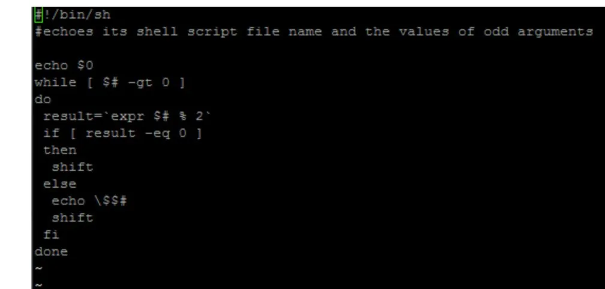
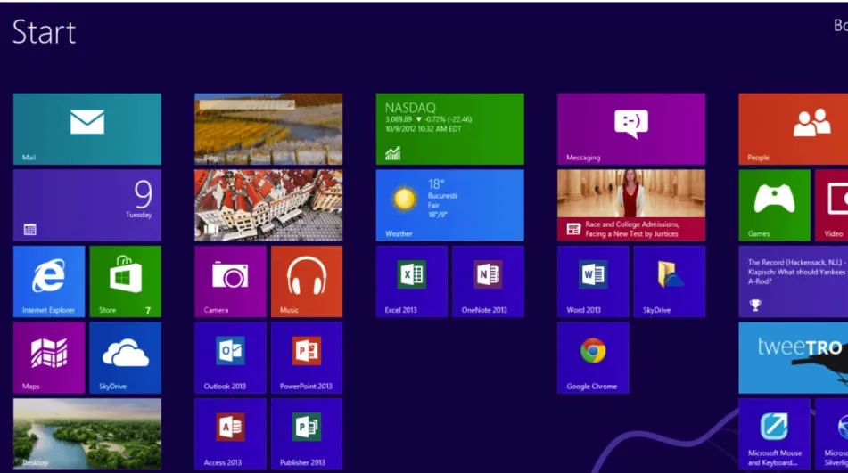
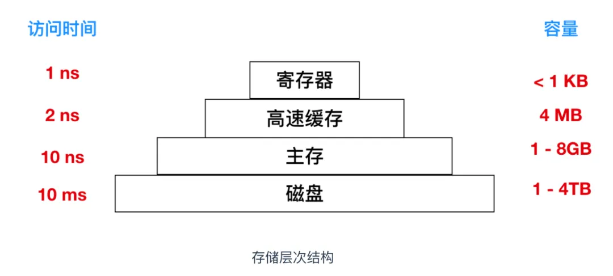
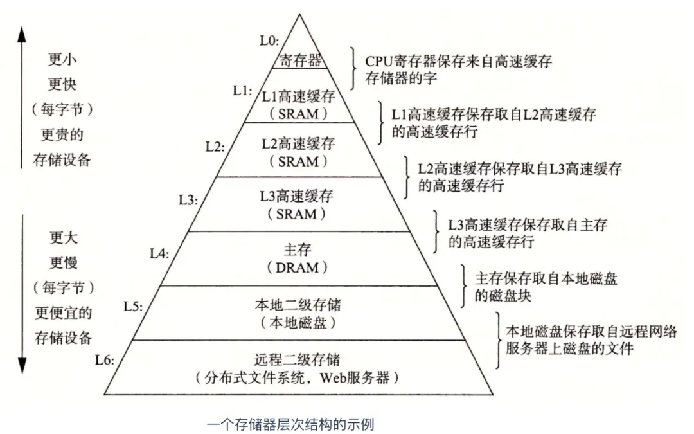
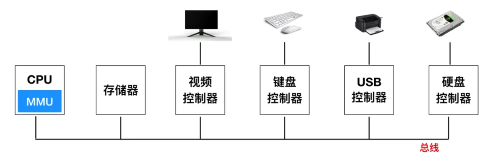
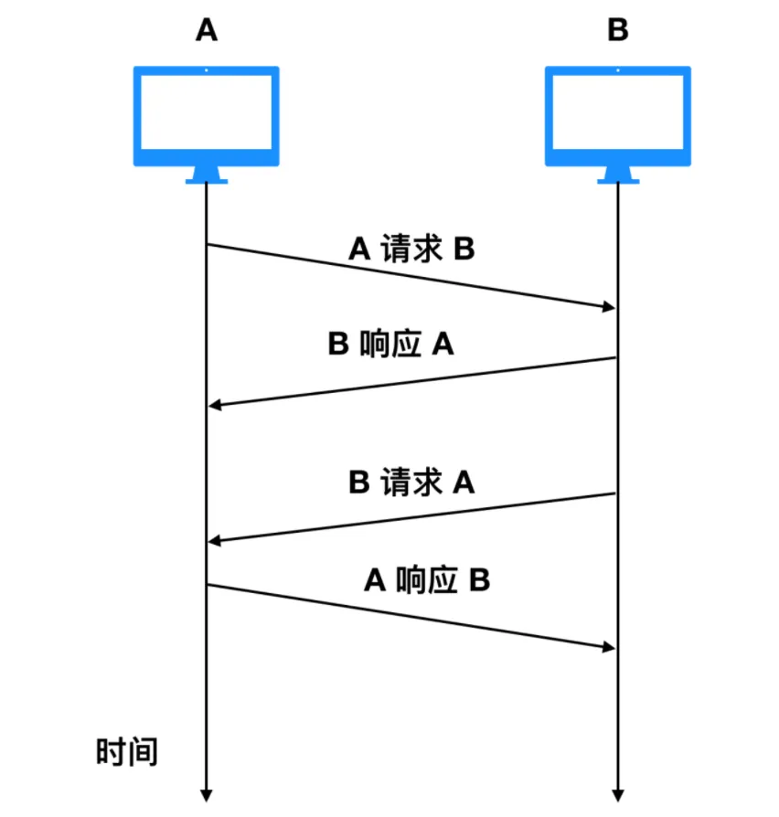

# 操作系统面试题

## 堆和栈的概念存在于数据结构和操作系统内存中，在数据结构中

● 在数据结构中，栈中数据的存取方式为先进后出。
● 堆是一个优先队列，是按优先级来进行排序的，优先级可以按照大小来规定。

## 在操作系统中，内存被分为栈区和堆区

● 栈区内存由编译器自动分配释放，存放函数的参数值，局部变量的值等。其操作方式类似于数据结构中的栈。

● 堆区内存一般由开发着分配释放，若开发者不释放，程序结束时可能由垃圾回收机制回收。

## 1、线程可以分为哪两种？这两种线程在调度与切换速度上有什么不同？

（1）线程可以分为用户级线程和内核级线程两类。

（2）内核级线程的调度由内核的线程调度程序完成，用户级线程则由用户线程包中的一个过程来完成。内核级线程切换慢，用户级线程切换快。

线程是操作系统进行运算调度的最小单位，也被称为轻量级进程。在进程中，可以包含多个线程，每个线程是进程中单一顺序的控制流，可以并行执行不同的任务。线程由线程ID、当前指令指针（PC）、寄存器集合和堆栈组成，它不能独立拥有系统资源，但可以与同属一个进程的其他线程共享该进程所拥有的全部资源。

线程主要分为以下两种类型：

1. **用户级线程（User-Level Thread, ULT）**：
   - 用户级线程完全在用户空间操作，线程管理由应用程序完成，内核不知道线程的存在。
   - 优点：资源消耗低，高效。
   - 缺点：阻塞一个线程会阻塞整个进程，无法充分利用多核CPU。
2. **内核级线程（Kernel-Level Thread, KTL）**：
   - 内核级线程由操作系统内核管理，线程创建和销毁都由系统调用完成。
   - 优点：能参与全局多核处理器资源分配，充分利用多核CPU。
   - 缺点：调度开销较大，数量有限。

**区别**：

- 用户级线程的调度和切换在用户空间进行，开销较低，但阻塞一个线程会阻塞整个进程。
- 内核级线程的调度和切换由内核管理，开销较大，但能充分利用多核CPU。

总之，用户级线程适用于资源消耗敏感的场景，而内核级线程适用于需要充分利用多核CPU的场景。

## 2、请简述虚拟存储系统的4个主要特征

（1）离散性：即进程可以分散地存储在物理内存中。

- 装入虚拟存储器的进程都是离散存放的。
- 多次对换：作业的运行过程中进行换进、换出。

（2）多次性：指不必把进程一次性全部装入内存，可以将执行的代码和数据转入，其他等进程运行需要时再装入。

- 一个作业被分为多次调入内存运行。
- 对换性：作业的运行过程中进行换进、换出。

（3）对换性：指内存中的进程可以换出，以腾出内存空间换入外存中的进程。

- 允许在作业的运行过程中进行换进、换出。
- 可以将暂不使用的程序和数据从内存调置到外存的对换区。

（4）虚拟性：指系统为用户提供了比实际物理内存大的逻辑内存空间。

- 能够从逻辑上对内存容量加以扩充，使用户所看到的内存容量远大于实际内存容量。

## 3、简述树形目录的优点

（1)加快查找速度。（2)便于文件的分类。（3)层次结构清晰。（4)便于管理和保护。（5）解决了重名问题。

树形目录结构在文件系统中具有许多优点，让我们来一一了解：

1. **文件组织结构清晰**：
   - 树形目录是一个层次结构，所有的文件目录都从一个根目录开始，每个目录下可以有若干个子目录和文件。
   - 这种层次结构使得文件组织结构非常清晰，用户可以很方便地查找文件和管理文件。
   - 相比于其他存储方式如链式结构，树形目录结构更直观，更易于理解。
2. **文件访问速度快**：
   - 树形目录结构中，每个目录下的子目录和文件都有自己的名字（文件名或目录名），系统通过这些名字可以在任何地方快速访问到对应的文件或目录。
   - 相比于线性结构，树形目录结构的访问速度更快，用户可以更快速地打开文件或者目录。
3. **方便文件和目录管理**：
   - 文件系统采用树形目录结构可以方便用户对文件和目录进行管理。
   - 用户可以创建、复制、移动、重命名、删除文件和目录，也可以修改文件和目录的属性和权限等等。
   - 这种灵活的管理方式可以更好地保护文件信息的安全性和完整性，避免误操作。
4. **支持多用户**：
   - 在多用户环境中，树形目录结构也能够很好地发挥作用。
   - 每个用户可以有自己的根目录或者子目录，用户可以在自己的目录下创建自己的文件和目录，并设置自己的文件权限，保护自己文件信息的私密性。
   - 另外，在文件系统中管理员也可以对整个系统进行管理，对用户的权限进行管理和监控。
5. **容错性好**：
   - 文件系统采用树形目录结构后，如果某个目录或者文件丢失或损坏，不会影响整个系统的运行，只会影响这个目录或者文件的使用。
   - 这种容错性很好地保证了文件系统的稳定性和可靠性，能够更好地保障文件信息的完整性和可用性。

综上所述，文件系统采用树形目录结构的优点主要包括：结构清晰、访问速度快、方便管理、支持多用户和容错性好。

## 4、提高磁盘I/O速度的方法有哪些

（1)提前读。（2)延迟写。（3）优化物理块的分布。（4）虚拟盘。（5）磁盘高速缓存。

当涉及到提高磁盘I/O速度时，有几种方法可以优化磁盘性能。以下是一些常见的方法：

1. **启用写缓存**：
   - 写缓存是Windows提供的一个令人印象深刻的功能，可以提高存储设备的性能。
   - 启用写缓存后，RAM（物理内存）会收集写命令，然后将其发送到存储设备。
   - 注意：启用此功能可能会在发生断电时导致数据损坏或数据丢失。
   - 操作步骤：
     1. 按下Windows + X键，打开设备管理器。
     2. 展开“磁盘驱动器”。
     3. 双击要启用写缓存的驱动器。
     4. 转到“策略”选项卡。
     5. 勾选“在设备上启用写缓存”，然后点击“确定”。
     6. 对所有存储设备执行相同步骤。
2. **优化/碎片整理**：
   - 对于硬盘驱动器（HDD），操作系统会将数据顺序存储在相邻的扇区中。
   - 当删除数据时，这些数据被标记为可替换。
   - 如果可替换的扇区不足以存储大文件，操作系统会在不同的扇区上存储数据，导致单个文件分散在整个硬盘上。
   - 运行碎片整理可以优化文件存储，提高读取速度。
3. **运行Chkdsk命令**：
   - Chkdsk命令用于检查和修复磁盘上的错误。
   - 打开命令提示符，输入`chkdsk /f`并按Enter键。
4. **删除临时文件**：
   - 临时文件占用磁盘空间，可能影响性能。
   - 使用磁盘清理工具或手动删除临时文件。
5. **优化后台服务、应用程序和存储空间**：
   - 关闭不需要的后台应用程序和服务。
   - 清理不再需要的文件和应用程序。

请注意，这些方法适用于硬盘驱动器（HDD）和固态硬盘（SSD）。选择适合您情况的方法，以提高磁盘I/O速度。

## 5、什么是操作系统进程、线程？进程和线程的区别

**考察点：操作系统**

::: details 查看参考回答

- 进程是具有一定独立功能的程序，他是系统进行资源分配调度的一个独立单位。
- 线程是进程的一个实体，是 cpu 调度分派的基本单位，线程之间基本上不拥有系统资源一个程序至少有一个进程，一个进程至少有一个线程，资源分配给进程，同一个进程下所有线程共享该进程的资源
- 进程是资源管理的基本单位，线程是程序执行的基本单位。
- 线程上下文切换比进程上下文切换要快。
- 进程拥有资源，线程不拥有系统资源，但可以访问隶属于进程的资源。
- 进程切换的开销大于线程切换的开销。

进程和线程是操作系统中的两个重要概念，它们在资源管理、调度和执行上有一些关键区别。让我为您详细解释一下：

1. **进程（Process）**：
   - 进程是一个具有独立功能的程序关于某个数据集合的执行活动。
   - 每个进程都有自己的地址空间、代码、数据和控制块。
   - 进程是系统进行资源分配和调度的独立单位，也是基本的执行单元。
   - 进程之间拥有独立的资源，包括内存、文件描述符、打开的文件等。
   - 进程切换涉及到保存和加载进程的相关信息、状态变更、队列操作和调度算法。
2. **线程（Thread）**：
   - 线程是进程内的执行单元，是CPU调度和分派的基本单位。
   - 线程共享进程的资源，如内存空间、文件描述符等。
   - 每个线程有自己的寄存器和栈，但共享进程的地址空间。
   - 线程之间的切换开销较小，因为它们共享相同的进程上下文。

**区别**：

- **调度**：进程作为资源分配的基本单位，而线程是CPU调度的基本单位。
- **并发性**：不仅进程之间可以并发执行，同一个进程的多个线程之间也可以并发执行。
- **资源拥有**：进程拥有独立的资源，线程共享进程的资源。
- **系统开销**：创建或撤消进程的开销大于创建或撤消线程的开销。

**关系**：

- 一个进程可以包含多个线程，线程共享进程的资源。
- 线程在执行过程中需要协作同步，通常通过信号量、互斥锁等机制实现。

总之，进程和线程在资源管理、调度和执行上存在明显差异，选择使用哪种方式取决于具体的应用场景。

:::

## 虚拟地址空间切换耗时

- 进程切换涉及页表切换和内核栈切换，而线程切换只需内核栈切换。
- 进程切换导致TLB失效，影响虚拟地址转换速度。

## 进程间同步方式

- 临界区：用于同步本进程内的线程。
- 互斥量：用于同步进程间和线程间的访问。
- 信号量：用于控制多个进程对共享资源的访问。

## 进程和线程的区别

- 1.进程，是并发执行的程序在执行过程中分配和管理资源的基本单位，是一个动态概念，竞争计算机系统**资源**的基本单位。
- 2.线程，是进程的一部分，一个没有线程的进程可以被看作是单线程的。线程有时又被称为轻权进程或轻量级进程，也是 **CPU 调度**的一个基本单位。

一个程序至少有一个进程，一个进程至少有一个线程，资源分配给进程，同一个进程下所有线程共享该进程的资源。

## 协程与线程的区别

- 协程是异步机制，线程是抢占式。
- 协程是非抢占式的，一个线程可以有多个协程。
- 协程不被操作系统内核管理，完全由程序控制。

## 并发和并行的区别

- 并发是在一段时间内多个任务都会被处理，但在某一时刻只有一个任务在执行。
- 并行是同一时刻有多个任务在执行，需要多核处理器。

## 6、线程的那些资源共享，那些资源不共享

**考察点：进程**

公司：今日头条

::: details 查看参考回答

线程共享进程的一些资源，但也有一些资源是不共享的。让我详细解释一下：

### 共享的资源：

- **地址空间**：线程在同一个进程中共享相同的地址空间，即它们可以访问相同的内存区域。
- **代码段**：线程共享进程的代码段，这意味着它们可以执行相同的程序代码。
- **文件描述符**：线程共享进程打开的文件描述符，可以同时读写相同的文件。
- **文件等公用资源**：这个是共享的，使用这些公共资源的线程必须同步。Win32 提供了几种同步资源的方式，包括信号、临界区、事件和互斥体。
- **全局变量**：线程可以访问和修改进程的全局变量，它是与具体某一函数无关的，所以也与特定线程无关；因此也是共享的。
- **堆**：由于堆是在进程空间中开辟出来的，所以它是理所当然地被共享的；因此new出来的都是共享的（16位平台上分全局堆和局部堆，局部堆是独享的）
- **静态变量**：虽然对于局部变量来说，它在代码中是“放”在某一函数中的，但是其存放位置和全局变量一样，存于堆中开辟的.bss和.data段，是共享的

### 不共享的资源：

- **栈空间**：每个线程都有自己的栈空间，用于存储局部变量和函数调用信息。栈是线程私有的，不共享。
- **寄存器**：线程拥有自己的寄存器集合，用于存储临时数据和计算结果。
- **线程ID**：每个线程都有唯一的线程ID，不共享。
- **程序计数器**：线程的程序计数器记录当前执行的指令位置，每个线程都有自己的程序计数器。

总之，线程共享进程的大部分资源，但也有一些资源是线程私有的，不与其他线程共享。这种资源共享使得线程之间的通信更高效，但也需要注意线程同步和互斥的问题。

:::

## 7、linux 指令用的多吗，怎么进行进程间通信

::: details 查看参考回答

Linux中的指令在日常使用和系统管理中非常常见。用户可以通过命令行界面（终端）执行各种操作，例如文件管理、进程控制、网络配置等。以下是一些常用的Linux指令：

1. **文件和目录操作**：
   - `ls`：列出目录内容。
   - `cd`：切换目录。
   - `cp`：复制文件或目录。
   - `mv`：移动文件或目录。
   - `rm`：删除文件或目录。
2. **进程管理**：
   - `ps`：显示当前运行的进程。
   - `top`：实时查看系统进程状态。
   - `kill`：终止进程。
   - `nohup`：在后台运行进程。
3. **文件查找和文本处理**：
   - `grep`：在文件中搜索指定文本。
   - `find`：查找文件。
   - `sed`：文本替换和处理。
4. **网络配置和诊断**：
   - `ifconfig`：查看和配置网络接口。
   - `ping`：测试网络连接。
   - `netstat`：显示网络状态。
5. **系统信息和硬件查看**：
   - `uname`：显示系统信息。
   - `df`：查看磁盘空间。
   - `free`：查看内存使用情况。

进程间通信（IPC，Inter-Process Communication）是指在不同进程之间传播或交换信息。Linux中有多种进程间通信的方式，包括：

1. **管道（Pipe）**：半双工通信，适用于具有亲缘关系的进程之间。
2. **FIFO（命名管道）**：有路径名，可以在无关的进程之间交换数据。
3. **消息队列**：进程通过消息队列传递消息。
4. **共享内存**：多个进程共享一块内存区域。
5. **信号量**：用于进程同步和互斥。
6. **Socket（套接字）**：支持不同主机上的两个进程IPC。

这些IPC工具以系统调用或库函数API的形式提供给用户使用。选择合适的IPC方式取决于具体的应用场景和需求。

:::

## 8、kill 指令了解过吗

::: details 查看参考回答

`kill` 是一个在 Linux 系统中常用的命令，用于终止进程或向进程发送信号。让我为您详细解释一下：

- **终止进程**：
  - `kill` 命令可以向指定的进程发送信号，以终止该进程的执行。
  - 如果不指定信号，默认会发送 `TERM` 信号，这会导致进程正常终止。
  - 通常情况下，我们首先尝试使用 `kill` 命令发送 `TERM` 信号，以便进程有机会执行清理操作后再终止。
- **信号**：
  - kill命令可以指定不同的信号，例如：
    - `HUP`（1）：重新加载进程。
    - `KILL`（9）：强制杀死一个进程。
    - `TERM`（15）：正常停止一个进程。
  - 信号的具体含义可以通过 `kill -l` 命令查看。
- **使用示例**：
  - 终止进程：`kill 12345`
  - 强制杀死进程：`kill -KILL 123456`
  - 发送 `SIGHUP` 信号：`kill -HUP pid`
  - 彻底杀死进程：`kill -9 ...`

请注意，`kill` 命令需要谨慎使用，特别是强制终止进程的情况。

:::

## 9、Linux 查询进程指令，查询端口，杀进程

**考察点：Linux**

::: details 查看参考回答

当然了解！让我为您详细解释一下：

**1.查询进程指令**：

- 在Linux中，您可以使用以下命令来查看正在运行的进程：

  - `ps`：显示当前运行的进程。
  - `top`：实时查看系统进程状态。
  - `htop`：改进版的`top`。

- 例如，运行以下命令以查看所有活动进程：

  ```
  top
  ```

  在`top`

  界面中，您可以查看进程ID（PID）、用户、内存和CPU使用情况、运行时间等信息。按下`q`键退出界面。

**2.查询端口**：

- 要检查远程主机上的端口是否可达或打开，您可以使用`nc`（netcat）命令。

- 例如，以下命令将检查主机`192.168.1.15`上的端口`22`是否打开：

  ```
  nc -zv 192.168.1.15 22
  ```

  - `-z`：设置`nc`仅扫描正在监听的守护进程，而不实际向它们发送任何数据。
  - `-v`：启用详细模式。

- 您还可以检查多个端口是否打开，例如：

  ```
  nc -zv 192.168.1.15 80 22 21
  ```

  或者指定一个端口范围：

  ```
  nc -zv 192.168.1.15 20-80
  ```

**3.杀进程**：

- 如果进程变得无响应或占用了过多资源，您可能需要终止它。

- 使用`kill`命令可以终止进程。例如，要终止进程ID为`12345`

  的进程：

  ```
  kill 12345
  ```

- 还可以使用`pkill`或`killall`命令来终止进程。例如：

  ```
  pkill process_name
  ```

  或：

  ```
  killall process_name
  ```

  其中，`process_name`是进程的名称。

总之，这些命令可以帮助您查询进程、检查端口和终止进程。

:::

## 10、进程间的通信方式有哪些

**考察点：操作系统**

::: details 查看参考回答

进程间通信（IPC，Inter-Process Communication）是指在不同进程之间传播或交换信息。实际上，进程的同步与互斥本质上也是一种进程通信，只不过它传输的仅仅是信号量，通过修改信号量，使得进程之间建立联系，相互协调和协同工作，但是它缺乏传递数据的能力。

虽然存在某些情况，进程之间交换的信息量很少，比如仅仅交换某个状态信息，这样进程的同步与互斥机制完全可以胜任这项工作。但是大多数情况下，进程之间需要交换大批数据，比如传送一批信息或整个文件，这就需要通过一种新的通信机制来完成，也就是所谓的进程通信。

以下是Linux内核提供的常见的进程通信机制：

1. **管道（Pipe）**：三种管道
   - 管道是一种半双工通信方式，适用于具有亲缘关系的进程之间。
   - 通过管道，数据只能单向流动，且只能在父子进程之间使用。
   - 1、**无名管道**：半双工的通信方式，数据只能单向流动且只能在具有亲缘关系的进程间使用
   - 2、**高级管道**：将另一个程序当作一个新的进程在当前程序进程中启动，则这个进程算是当前程序的子进程。
   - 3、**有名管道**：也是半双工的通信方式，但是允许没有亲缘进程之间的通信
     - 有名管道（FIFO）允许无亲缘关系进程间的通信。
2. **消息队列**：
   - 进程通过消息队列传递消息。
   - 消息队列允许随机查询，不一定按先进先出的次序读取消息。
   - 消息队列是有消息的链表，存放在内核中，并由消息队列标识符标识，消息队列克服了信号传递信息少，管道只能承载无格式字节流以及缓冲区大小受限的缺点
3. **共享内存**：
   - 多个进程共享一块内存区域，用于高效地传递大量数据。
   - 共享内存就是映射一段能被其他进程所访问的内存。这段共享内存由一个进程创建，但是多个进程可以访问，共享内存是最快的 IPC 方式，往往与其他通信机制配合使用
4. **信号量和PV操作**：
   - 信号量用于进程同步和互斥。
   - PV操作用于操作信号量。
   - 信号量是一个计数器，可以用来控制多个进程对共享资源的访问，它常作为一种锁机制，防止某进程正在访问共享资源时，其他进程也访问该资源
5. **信号**：
   - 进程可以通过发送信号来通知其他进程发生了某个事件。
   - 用于通知接受进程某个事件已经发生
6. **套接字（Socket）**：
   - 支持不同主机上的两个进程IPC。
   - 可用于不同机器之间的进程通信

这些IPC工具以系统调用或库函数API的形式提供给用户使用。根据具体的应用场景和需求，选择合适的IPC方式。

:::

# 程序员必知的 89 个操作系统核心概念

`1. 操作系统（Operating System，OS）`：是管理计算机硬件与软件资源的系统`软件`，同时也是计算机系统的`内核与基石`。操作系统需要处理**管理与配置内存、决定系统资源供需的优先次序、控制输入与输出设备、操作网络与管理文件系统等基本事务**。操作系统也提供一个让用户与系统交互的操作界面。

`2. shell`：它是一个程序，可从键盘获取命令并将其提供给操作系统以执行。在过去，它是类似 Unix 的系统上唯一可用的用户界面。如今，除了命令行界面（CLI）外，我们还具有图形用户界面（GUI）。



`3. GUI (Graphical User Interface)`：是一种`用户界面`，允许用户通过图形图标和音频指示符与电子设备进行交互。



`4. 内核模式(kernel mode)`: 通常也被称为`超级模式（supervisor mode）`，在内核模式下，正在执行的代码具有对底层硬件的完整且不受限制的访问。它可以执行任何 CPU 指令并引用任何内存地址。内核模式通常保留给操作系统的最低级别，最受信任的功能。内核模式下的崩溃是灾难性的；他们将停止整个计算机。超级用户模式是计算机开机时选择的自动模式。

`5. 用户模式(user node)`：当操作系统运行用户应用程序（例如处理文本编辑器）时，系统处于用户模式。当应用程序请求操作系统的帮助或发生中断或系统调用时，就会发生从用户模式到内核模式的转换。在用户模式下，模式位设置为 1。从用户模式切换到内核模式时，它从 1 更改为 0。

`6. 计算机架构(computer architecture)`：在计算机工程中，计算机体系结构是描述计算机系统功能，组织和实现的一组规则和方法。它主要包括指令集、内存管理、I/O 和总线结构

`7. SATA(Serial ATA)`：串行 ATA (Serial Advanced Technology Attachment)，它是一种电脑总线，负责主板和大容量存储设备（如硬盘及光盘驱动器）之间的数据传输，主要用于个人电脑。

`8. 复用(multiplexing)`：也称为共享，在操作系统中主要指示了时间和空间的管理。对资源进行复用时，不同的程序或用户轮流使用它。他们中的第一个开始使用资源，然后再使用另一个，依此类推。

`9. 大型机(mainframes)`：大型机是一类计算机，通常以其大尺寸，存储量，处理能力和高度的可靠性而著称。它们主要由大型组织用于需要大量数据处理的关键任务应用程序。

`10. 批处理(batch system)`: 批处理操作系统的用户不直接与计算机进行交互。每个用户都在打孔卡等脱机设备上准备工作，并将其提交给计算机操作员。为了加快处理速度，将具有类似需求的作业一起批处理并成组运行。程序员将程序留给操作员，然后操作员将具有类似要求的程序分批处理。

`11. OS/360`：OS/360，正式称为 IBM System / 360 操作系统，是由 IBM 为 1964 年发布的其当时新的 System/360 大型机开发的已停产的批处理操作系统。

`12. 多处理系统(Computer multitasking)`：是指计算机同时运行多个程序的能力。多任务的一般方法是运行第一个程序的一段代码，保存工作环境；再运行第二个程序的一段代码，保存环境；…… 恢复第一个程序的工作环境，执行第一个程序的下一段代码。

`13. 分时系统(Time-sharing)`：在计算中，分时是通过多程序和多任务同时在许多用户之间共享计算资源的一种系统

`14. 相容分时系统(Compatible Time-Sharing System)`：最早的分时操作系统，由美国麻省理工学院计算机中心设计与实作。

`15. 云计算(cloud computing)`：云计算是计算机系统资源（尤其是数据存储和计算能力）的按需可用性，而无需用户直接进行主动管理。这个术语通常用于描述 Internet 上可供许多用户使用的数据中心。如今占主导地位的大型云通常具有从中央服务器分布在多个位置的功能。如果与用户的连接相对较近，则可以将其指定为边缘服务器。

`16. UNIX 操作系统`：UNIX 操作系统，是一个强大的多用户、多任务操作系统，支持多种处理器架构，按照操作系统的分类，属于分时操作系统。

`17. UNIX System V`：是 UNIX 操作系统的一个分支。

`18. BSD(Berkeley Software Distribution)`：UNIX 的衍生系统。

`19. POSIX`：可移植操作系统接口，是 IEEE 为要在各种 UNIX 操作系统上运行软件，而定义 API 的一系列互相关联的标准的总称。

`20. MINIX`：Minix，是一个迷你版本的类 UNIX 操作系统。

`21. Linux`：终于到了大名鼎鼎的 Linux 操作系统了，太强大了，不予以解释了，大家都懂。

`22. DOS (Disk Operating System)`：磁盘操作系统（缩写为 DOS）是可以使用磁盘存储设备（例如软盘，硬盘驱动器或光盘）的计算机操作系统。

`23. MS-DOS(MicroSoft Disk Operating System)`：一个由美国微软公司发展的操作系统，运行在 Intel x86 个人电脑上。它是 DOS 操作系统家族中最著名的一个，在 Windows 95 以前，DOS 是 IBM PC 及兼容机中的最基本配备，而 MS-DOS 则是个人电脑中最普遍使用的 DOS 操作系统。

`24. MacOS X`，怎能少的了苹果操作系统？macOS 是苹果公司推出的基于图形用户界面操作系统，为 Macintosh 的主操作系统

`25. Windows NT(Windows New Technology)`：是美国微软公司 1993 年推出的纯 32 位操作系统核心。

`26. Service Pack(SP)`：是程序的更新、修复和（或）增强的集合，以一个独立的安装包的形式发布。许多公司，如微软或 Autodesk，通常在为某一程序而做的修补程序达到一定数量时，就发布一个 Service Pack。

`27. 数字版权管理（DRM）`：他是工具或技术保护措施（TPM）是一组访问控制技术，用于限制对专有硬件和受版权保护的作品的使用。

`28. x86`：x86 是一整套指令集体系结构，由 Intel 最初基于 Intel 8086 微处理器及其 8088 变体开发。采用内存分段作为解决方案，用于处理比普通 16 位地址可以覆盖的更多内存。32 位是 x86 默认的位数，除此之外，还有一个 x86-64 位，是 x86 架构的 64 位拓展，向后兼容于 16 位及 32 位的 x86 架构。

`29. FreeBSD`：FreeBSD 是一个类 UNIX 的操作系统，也是 FreeBSD 项目的发展成果。

`30. X Window System`：X 窗口系统（X11，或简称 X）是用于位图显示的窗口系统，在类 UNIX 操作系统上很常见。

`31. Gnome`：GNOME 是一个完全由自由软件组成的桌面环境。它的目标操作系统是 Linux，但是大部分的 BSD 系统亦支持 GNOME。

`32. 网络操作系统(network operating systems)`：网络操作系统是用于网络设备（如路由器，交换机或防火墙）的专用操作系统。

`33. 分布式网络系统(distributed operating systems)`：分布式操作系统是在独立，网络，通信和物理上独立计算节点的集合上的软件。它们处理由多个 CPU 服务的作业。每个单独的节点都拥有全局集合操作系统的特定软件的一部分。

`34. 程序计数器(Program counter)`：程序计数器 是一个 CPU 中的`寄存器`，用于指示计算机在其程序序列中的`位置`。

`35. 堆栈寄存器(stack pointer)`：堆栈寄存器是计算机 CPU 中的寄存器，其目的是`跟踪调用堆栈`。

`36. 程序状态字(Program Status Word)`: 它是由操作系统维护的 8 个字节（或 64 位）长的数据的集合。它跟踪系统的当前状态。

`37. 流水线(Pipeline)`: 在计算世界中，管道是一组串联连接的数据处理元素，其中一个元素的输出是下一个元素的输入。流水线的元素通常以并行或按时间分割的方式执行。通常在元素之间插入一定数量的缓冲区存储。


`38. 超标量(superscalar)`：超标量 CPU 架构是指在一颗处理器内核中实行了指令级并发的一类并发运算。这种技术能够在相同的 CPU 主频下实现更高的 CPU 流量。

`39. 系统调用(system call)`:  指运行在用户空间的程序向操作系统内核请求需要更高权限运行的服务。系统调用提供用户程序与操作系统之间的接口。大多数系统交互式操作需求在内核态运行。如设备 IO 操作或者进程间通信。

`40. 多线程(multithreading)`：是指从软件或者硬件上实现多个线程并发执行的技术。具有多线程能力的计算机因为有硬件支持而能够在同一时间执行多个线程，进而提升整体处理性能。

`41. CPU 核心(core)`：它是 CPU 的大脑，它接收指令，并执行计算或运算以满足这些指令。一个 CPU 可以有多个内核。

`42. 图形处理器(Graphics Processing Unit)`：又称显示核心、视觉处理器、显示芯片或绘图芯片；它是一种专门在个人电脑、工作站、游戏机和一些移动设备（如平板电脑、智能手机等）上运行绘图运算工作的微处理器。

1. 存储体系结构：顶层的存储器速度最高，但是容量最小，成本非常高，层级结构越向下，其访问效率越慢，容量越大，但是造价也就越便宜。



`44. 高速缓存行(cache lines)`：其实就是把高速缓存分割成了固定大小的块，其大小是以突发读或者突发写周期的大小为基础的。

`45. 缓存命中(cache hit)`：当应用程序或软件请求数据时，会首先发生缓存命中。首先，中央处理单元（CPU）在其最近的内存位置（通常是主缓存）中查找数据。如果在缓存中找到请求的数据，则将其视为缓存命中。



`46. L1 cache`：一级缓存是 CPU 芯片中内置的存储库。L1 缓存也称为`主缓存`，是计算机中`最快`的内存，并且最接近处理器。

`47. L2 cache`: 二级缓存存储库，内置在 CPU 芯片中，包装在同一模块中，或者建在主板上。L2 高速缓存提供给 L1 高速缓存，后者提供给处理器。L2 内存比 L1 内存慢。

`48. L2 cache`: 三级缓存内置在主板上或 CPU 模块内的存储库。L3 高速缓存为 L2 高速缓存提供数据，其内存通常比 L2 内存慢，但比主内存快。L3 高速缓存提供给 L2 高速缓存，后者又提供给 L1 高速缓存，后者又提供给处理器。

`49. RAM((Random Access Memory)`：随机存取存储器，也叫主存，是与 CPU`直接交换数据`的内部存储器。它可以随时读写，而且速度很快，通常作为操作系统或其他正在运行中的程序的`临时`数据存储介质。RAM 工作时可以随时从任何一个指定的地址写入（存入）或读出（取出）信息。它与 ROM 的最大区别是数据的`易失性`，即一旦断电所存储的数据将随之丢失。RAM 在计算机和数字系统中用来暂时存储程序、数据和中间结果。

关注公众号：C语言中文社区，免费领取300G编程资料

`50. ROM (Read Only Memory)`：只读存储器是一种半导体存储器，其特性是**一旦存储数据就无法改变或删除**，且内容不会因为电源关闭而`消失`。在电子或电脑系统中，通常用以存储不需经常变更的程序或数据。

`51. EEPROM (Electrically Erasable PROM)`：电可擦除可编程只读存储器，是一种可以通过电子方式多次复写的半导体存储设备。

`52. 闪存(flash memory)`：是一种电子式可清除程序化只读存储器的形式，允许在操作中被多次擦或写的存储器。这种科技主要用于一般性数据存储，以及在电脑与其他数字产品间交换传输数据，如储存卡与 U 盘。

`53. SSD(Solid State Disks)`：固态硬盘，是一种主要以闪存作为永久性存储器的电脑存储设备。

`54. 虚拟地址(virtual memory)`：虚拟内存是计算机系统`内存管理`的一种机制。它使得应用程序认为它拥有连续可用的内存（一个连续完整的地址空间），而实际上，它通常是被分隔成多个物理内存碎片，还有部分暂时存储在外部磁盘存储器上，在需要时进行数据交换。与没有使用虚拟内存技术的系统相比，使用这种技术的系统使得大型程序的编写变得更容易，对真正的物理内存（例如 RAM）的使用也更有效率。

`55. MMU (Memory Management Unit)`：内存管理单元，有时称作分页内存管理单元。它是一种负责处理中央处理器（CPU）的内存访问请求的计算机硬件。它的功能包括**虚拟地址到物理地址的转换（即虚拟内存管理）、内存保护、中央处理器高速缓存的控制等**。



`56. context switch`：上下文切换，又称环境切换。是一个存储和重建 CPU 状态的机制。要交换 CPU 上的进程时，必需先行存储当前进程的状态，然后再将进程状态读回 CPU 中。

`57. 驱动程序(device driver)`：设备驱动程序，简称驱动程序（driver），是一个允许高级别电脑软件与硬件交互的程序，这种程序创建了一个硬件与硬件，或硬件与软件沟通的接口，经由主板上的总线或其它沟通子系统与硬件形成连接的机制，这样使得硬件设备上的数据交换成为可能。

`58. 忙等(busy waiting)`：在软件工程中，忙碌等待`也称自旋`，是一种以进程反复检查一个条件是否为真的条件，这种机制可能为检查键盘输入或某个锁是否可用。

`59. 中断(Interrupt)`：通常，在接收到来自外围硬件（相对于中央处理器和内存）的异步信号，或来自软件的同步信号之后，处理器将会进行相应的硬件／软件处理。发出这样的信号称为进行`中断请求（interrupt request，IRQ）`。硬件中断导致处理器通过一个`运行信息切换（context switch）`来保存执行状态（以程序计数器和程序状态字等寄存器信息为主）；`软件中断则`通常作为 CPU 指令集中的一个指令，以可编程的方式直接指示这种运行信息切换，并将处理导向一段中断处理代码。中断在计算机多任务处理，尤其是即时系统中尤为有用。

`60. 中断向量(interrupt vector)`：中断向量位于中断向量表中。`中断向量表（IVT）`是将中断处理程序列表与中断向量表中的中断请求列表相关联的数据结构。中断向量表的每个条目（称为中断向量）都是中断处理程序的地址。

`61. DMA (Direct Memory Access)`：直接内存访问，直接内存访问是计算机科学中的一种内存访问技术。它允许某些电脑内部的硬件子系统（电脑外设），可以独立地直接读写系统内存，而不需中央处理器（CPU）介入处理 。

`62. 总线(Bus)`：总线（Bus）是指计算机组件间规范化的交换数据的方式，即以一种通用的方式为各组件提供数据传送和控制逻辑。

`63. PCIe (Peripheral Component Interconnect Express)`：官方简称 PCIe，是计算机总线的一个重要分支，它沿用现有的 PCI 编程概念及信号标准，并且构建了更加高速的串行通信系统标准。

`64. DMI (Direct Media Interface)`：直接媒体接口，是英特尔专用的总线，用于电脑主板上南桥芯片和北桥芯片之间的连接。

`65. USB(Universal Serial Bus)`：是连接计算机系统与外部设备的一种`串口总线`标准，也是一种输入输出接口的技术规范，被广泛地应用于个人电脑和移动设备等信息通讯产品，并扩展至摄影器材、数字电视（机顶盒）、游戏机等其它相关领域。

`66. BIOS(Basic Input Output System)`：是在通电引导阶段运行硬件初始化，以及为操作系统提供运行时服务的固件。它是开机时运行的第一个软件。

`67. 硬实时系统(hard real-time system)`：硬实时性意味着你必须绝对在每个截止日期前完成任务。很少有系统有此要求。例如核系统，一些医疗应用（例如起搏器），大量国防应用，航空电子设备等。

`68. 软实时系统(soft real-time system)`：软实时系统可能会错过某些截止日期，但是如果错过太多，最终性能将下降。一个很好的例子是计算机中的声音系统。

`69. 进程(Process)`：程序本身只是指令、数据及其组织形式的描述，进程才是程序（那些指令和数据）的真正运行实例。若进程有可能与同一个程序相关系，且每个进程皆可以同步（循序）或异步的方式独立运行。

`70. 地址空间(address space)`：地址空间是内存中可供程序或进程使用的有效地址范围。也就是说，它是程序或进程可以访问的内存。存储器可以是物理的也可以是虚拟的，用于执行指令和存储数据。

`71. 进程表(process table)`：进程表是操作系统维护的`数据结构`，该表中的每个条目（通常称为上下文块）均包含有关`进程`的信息，例如进程名称和状态，优先级，寄存器以及它可能正在等待的信号灯。

`72. 命令行界面(command-line interpreter)`：是在图形用户界面得到普及之前使用最为广泛的用户界面，它通常不支持鼠标，用户通过键盘输入指令，计算机接收到指令后，予以执行。

`73. 进程间通信(interprocess communication)`：指至少两个进程或线程间传送数据或信号的一些技术或方法。

`74. 超级用户(superuser)`：也被称为管理员帐户，在计算机操作系统领域中指一种用于进行系统管理的特殊用户，其在系统中的实际名称也因系统而异，如 root、administrator 与 supervisor。

`75. 目录(directory)`:  在计算机或相关设备中，一个目录或文件夹就是一个装有数字文件系统的虚拟`容器`。在它里面保存着一组文件和其它一些目录。

`76. 路径(path name)`：路径是一种电脑文件或目录的名称的通用表现形式，它指向文件系统上的一个唯一位置。

`77. 根目录(root directory)`：根目录指的就是计算机系统中的顶层目录，比如 Windows 中的 C 盘和 D 盘，Linux 中的`/`。

`78. 工作目录(Working directory)`：它是一个计算机用语。用户在操作系统内所在的目录，用户可在此目录之下，用相对文件名访问文件。

`79. 文件描述符(file descriptor)`：文件描述符是计算机科学中的一个术语，是一个用于表述指向文件的引用的抽象化概念。

`80. inode`：索引节点的缩写，索引节点是 UNIX 系统中包含的信息，其中包含有关每个文件的详细信息，例如节点，所有者，文件，文件位置等。

`81. 共享库(shared library)`：共享库是一个包含目标代码的文件，执行过程中多个 a.out 文件可能会同时使用该目标代码。

`82. DLLs (Dynamic-Link Libraries)`：动态链接库，它是微软公司在操作系统中实现`共享函数库`概念的一种实现方式。这些库函数的扩展名是 .DLL、.OCX（包含 ActiveX 控制的库）或者. DRV（旧式的系统驱动程序）。

`83. 客户端(clients)`：客户端是访问服务器提供的服务的计算机硬件或软件。

```
84. 服务端(servers)`：在计算中，服务器是为其他程序或设备提供功能的计算机程序或设备，称为`服务端
```

`85. 主从架构(client-server)`：主从式架构也称`客户端/服务器`架构、`C/S`架构，是一种网络架构，它把客户端与服务器区分开来。每一个客户端软件的实例都可以向一个服务器或应用程序服务器发出请求。有很多不同类型的服务器，例如文件服务器、游戏服务器等。



`86. 虚拟机(Virtual Machines)`：在计算机科学中的体系结构里，是指一种特殊的软件，可以在计算机平台和终端用户之间创建一种环境，而终端用户则是基于虚拟机这个软件所创建的环境来操作其它软件。

`87. Java 虚拟机(Jaav virtual Machines)`：Java 虚拟机有自己完善的硬体架构，如处理器、堆栈、寄存器等，还具有相应的指令系统。JVM 屏蔽了与具体操作系统平台相关的信息，使得 Java 程序只需生成在 Java 虚拟机上运行的目标代码（字节码），就可以在多种平台上不加修改地运行。

`88. 目标文件(object file)`：目标文件是包含`目标代码`的文件，这意味着通常无法直接执行的可重定位格式的机器代码。目标文件有多种格式，相同的目标代码可以打包在不同的目标文件中。目标文件也可以像共享库一样工作。

`89. C preprocessor`：C 预处理器是 C 语言、C++ 语言的预处理器。用于在编译器处理程序之前预扫描源代码，完成头文件的包含, 宏扩展, 条件编译, 行控制等操作。