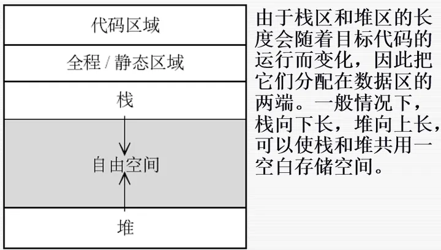

# 编译原理面试题

## 编译原理知识总结

编译原理是计算机科学中非常重要的领域，涵盖了许多关键知识点。以下是一些与编译原理相关的面试题和知识总结：

1. **编译过程概述**：
   - 词法分析、语法分析、语义分析、中间代码生成、代码优化、目标代码生成等阶段。
   - 前端和后端的区别。
   - 表格管理程序和出错处理。
2. **文法和语言**：
   - 句型、句子、语言的定义。
   - 文法的四种类型：0 型、1 型、2 型、3 型。
   - 文法的二义性。
3. **词法分析**：
   - 有穷自动机（DFA 和 NFA）。
   - 正则表达式和有限自动机之间的关系。
4. **自顶向下的语法分析方法**：
   - 确定的自顶向下分析和不确定的自顶向下分析。
   - LL(1)文法和非 LL(1)文法的等价变换。
5. **自底向上优先分析法**：
   - 自下而上的分析方法。
   - 算符优先分析法。
   - LR 分析法。
6. **中间代码生成**：
   - 中间代码的形式。
7. **代码优化**：
   - 优化的种类。
   - 局部优化、循环优化、全局优化。

## 待定

### 问题：编译器如何实现多态？

答案：

在面向对象的语言中，多态意味着能够基于继承关系的不同类型对象对相同的消息可能会执行不同的操作。编译器实现多态的常用方式是通过虚函数表（vtable）或者类似的机制。每个有虚函数的类或者对象都有一个对应的虚函数表，表中元素是该类型的虚函数的地址。实现多态时，根据对象的实际类型查找其对应的虚函数表，然后调用相应的虚函数，这个过程可能在编译时完成，也可能在运行时完成。

### 问题：什么是上下文无关语言？给出一个例子。

答案：上下文无关语言是一种通过上下文无关文法生成的语言。在上下文无关文法中，每个产生式都是一个非终结符生成一串终结符或非终结符的形式。上下文无关语言的一个常见例子是平衡的括号表达式。

### 问题：什么是词法分析和语法分析，它们之间有何区别？

答案：词法分析是将程序源代码分解成有意义的词素或记号的过程，这是编译过程的第一步。语法分析是接收词法分析器生成的记号，并根据某种给定的文法产生一棵解析树或者抽象语法树的过程。词法分析关注的是字面上的字符序列，而语法分析关注的是这些字符序列如何组合成有意义的句子和结构。

### 问题：解释一下 LL 和 LR 解析的区别？

答案：LL 和 LR 解析都是构造解析树（或等价的数据结构）的方法。LL 解析是从左到右扫描输入，递归地产生左派生，因而得名 LL（"Left-to-right, Leftmost derivation"）。LR 解析同样是从左到右扫描输入，但是递归地产生右派生，因而得名 LR（"Left-to-right, Rightmost derivation in reverse"）。LR 解析器因其解析能力强于 LL 解析器，所以在实际编译器实现中较为常用。

### 问题：什么是静态作用域和动态作用域？

答案：作用域规定了约束名字可见和可用的范围。在静态作用域中，名字的可见性和名字的声明位置有关。而在动态作用域中，名字的可见性取决于程序执行的流程，非局部名字默认指向在执行流程中最近声明的同名实体。

### 问题：\*\*什么是优化并在编译过程中的作用是什么？

\*\* 答案：优化是编译流程的一个步骤，其目的在于改进编译器产生的代码，使得改进后的代码消耗更少的资源，如运行更快或占用更少的内存空间。优化可以在各个级别进行，包括在源代码级别，比如常量折叠；在中间代码级别，比如死代码消除；以及在目标代码级别，比如寄存器分配。

### 问题：\*\*解释一下静态类型检查和动态类型检查的区别？

\*\* 答案：静态类型检查是在编译阶段进行的，它检查程序源代码中的类型错误，而并不执行程序。动态类型检查是在运行阶段进行的，只有在程序执行某个操作时，才会检查操作数的类型是否对应该操作。静态类型检查可以在程序运行之前发现可能的错误，而动态类型检查使得类型系统更加灵活。

3. ### 问题：\*\*什么是垃圾收集？简述其作用。

\*\* 答案：垃圾收集是自动管理程序内存的一种机制，主要用于自动回收不再使用的内存。垃圾收集器会追踪那些可能被程序使用的内存，以及那些不会再被使用的内存，对于不再使用的内存，垃圾收集器会自动将其回收以供程序重新使用。

4. ### 问题：\*\*什么是抽象语法树（AST）？

\*\* 答案：抽象语法树是源代码的一种抽象符号表示，它表示了源代码的结构和组成方式，将代码中的元素按照结构层次组织起来，每个节点都代表了源代码中的一种结构。编译器在进行语法分析时，一般会生成抽象语法树。

5. ### 问题：\*\*递归下降解析与预测解析有什么区别？

\*\* 答案：递归下降解析是一种自顶向下的解析方法，通过反复调用语法产生式中的非终结符，试图将输入与产生的句子匹配。预测解析实际上也是递归下降解析的一种，但预测解析不需要回溯，因为它一开始就知道应该选择哪种产生式。

6. ### 问题： \*\*什么是语义分析？

\*\* 答案：语义分析是编译过程中的一个阶段，用于检查语法分析产生的抽象语法树或其他形式的中间表示是否符合源语言的语义规则。语义分析的常见任务包括类型检查，即检查类型相关的错误；对象绑定，即连接变量和变量声明；及其他语言规定的静态语义检查。

7. ### 问题：\*\*如何理解编译时错误与运行时错误的区别？

\*\* 答案：编译时错误又叫静态错误，是指在源代码编译阶段检查到的错误，包括但不限于语法错误，类型错误等。运行时错误是指程序在执行过程中发生的错误，这类错误只有在程序运行时才可能被发现，如除零错误，空指针引用等。

8. ### 问题：\*\*什么是中间代码，并解释其为何重要？

\*\* 答案：编译过程中生成的中间表示的集合称为中间代码。生成中间代码是为了独立于源语言和目标语言，使得编译过程可以分为前端（源语言相关）和后端（目标语言相关）两部分。这样做的好处是可以使得一种编译器前端对应多种后端，从而生成不同机器语言的代码，提供跨平台性。

### 问题：什么是解释器与编译器的主要区别？

\*\* 答案：编译器和解释器都是将高级语言转换为机器语言的工具。编译器工作时，它读取源代码并将其全部转换为机器代码，然后保存为一个可执行文件。解释器则是逐行读取源代码，在读取的同时解释并执行。编译器的优点在于运行速度快，因为它预先转换了所有代码；解释器的优点在于它可以在代码开发阶段提供更好的实时反馈。

### 问题：什么是数据流分析？

答案：数据流分析是编译优化中的一种技术，用于收集程序在运行过程中关于数据如何流动的信息。它通常用于确定变量的可能值，或者确定一个变量在哪里定义或使用等。

### 问题：什么是符号表在编译器中的作用？

答案：符号表是编译器用来收集关于源程序的语义信息的数据结构，如变量名、函数名、常量名等，以及它们的类型，范围，内存位置等。编译器在分析源代码时，会创建并更新符号表，供语法分析，语义分析和代码生成阶段使用。

### 问题：什么是健壮性（robustness）？

答案：健壮性指的是程序在面对错误输入或异常条件时，仍能进行一定的处理，而不是直接崩溃或产生未定义的行为。在编译器上下文中，健壮性可能指的是编译器可以准确报告源代码中的错误，而不是在遇到错误时崩溃。

### 问题：什么是指针常量和常量指针？

答案：指针常量是一个指针的值是固定且不能更改的指针，而常量指针是指向一个常量的指针，这意味着你无法通过这个指针来改变它所指向的值。

### 问题：解释下自下而上解析和自上而下解析的区别？

答案：自上而下解析开始于起始符号，尝试找到与输入匹配的导出。如果无法找到匹配的导出，解析器将执行回溯。自下而上解析开始于输入符号，尝试找到一个与输入符号序列左侧相匹配的导出。自下而上解析通常具有更大的语言覆盖范围，而自上而下解析的实现更简单。

### 问题：解释下词法分析器和语法分析器的区别？

答案：词法分析器是把程序源代码分解成一系列的记号的过程，每个记号对应源代码中的一个词素或标记。语法分析器接收词法分析器输出的记号，生成一个解析树或抽象语法树。

### 问题：为什么我们需要类型系统？

答案：类型系统可以帮助我们在编写程序时防止或检测出某些类型的错误。具有良好类型系统的语言可以使开发人员更清晰地理解他们的代码将如何在运行时进行操作，并帮助编译器生成更有效的代码。

### 问题：什么是死代码消除？

答案：死代码消除是编译器优化的一种类型，它涉及到检测和移除那些不会被执行的代码，或者它们执行的结果不会被程序的其余部分使用。这样可以减少最终程序的大小，并提高执行效率。

### 问题：编译器如何处理全局变量和局部变量？

答案：编译器在处理全局变量时通常会分配固定的存储位置，这样全局变量在整个程序的执行过程中都存在。局部变量通常存储在栈上，当函数被调用时为它们分配空间，当函数返回时释放空间。

### 问题：解释左递归和如何消除它？

答案：左递归是语法分析器处理时可能遇到的一个问题，其在文法产生式中表现为非终结符递归调用自身且调用出现在产生式左侧。若不加修改直接用于递归下降解析器，会导致无限递归。消除左递归的方式包括重写产生式来使用右递归或者转换为等效的非左递归产生式。

### 问题：解释控制流图是什么，以及它在编译器中的作用？

答案：控制流图（CFG）是用于表示程序中控制流的图，节点表示程序中的基本块（一组顺序执行的指令序列），边表示控制流的传递。CFG 在编译器优化中扮演着重要角色，例如在数据流分析和控制流优化中。

### 问题：解释一下间接跳转和它在编译过程中的应用。

答案：间接跳转是指令中使用一个变量或寄存器的值作为跳转地址，而不是静态的地址。在编译过程中，间接跳转通常用于实现多态调用、虚函数以及跳转表等结构。

### 问题：简述寄存器溢出是什么？

答案：寄存器溢出是在寄存器分配阶段发生的，当有更多的变量需要寄存器时，而可用的寄存器不足以容纳时，一些变量就必须被溢出到内存中。这个过程通常会降低程序性能，因为访问内存比访问寄存器要慢。

### 问题：什么是循环展开？

答案：循环展开是一种编译器优化技术，它通过增加每个循环迭代的计算量和减少循环次数来减少循环开销。在具体实施时，编译器会将循环体的多个副本连续排列，以此减少循环条件检查的频率和增加指令的流水线化潜力。

### 问题：如何通过语法制导翻译实现类型转换？

答案：语法制导翻译框架可以通过在语法分析树的节点上附加属性和规则来进行类型检查和类型转换。当语法分析树的节点被访问时，会根据语法制导定义的规则来计算其类型属性，并进行可能的类型转换。

### 问题：解释一下编译器中的前端和后端分别负责什么？

答案：编译器的前端负责分析源代码，包含词法分析，语法分析，语义分析和初步的代码优化。它的目的是理解程序的含义并构建中间表示。编译器的后端则负责将这种中间表示转换成目标机器的代码，进行更多的代码优化和生成机器代码。

### 问题：解释一下内联函数与宏定义在编译时处理的不同之处？

答案：宏定义是由预处理器进行简单的文本替换，而不考虑任何语境信息。相反，内联函数由编译器处理，在调用点展开函数体，并内嵌于该点，这通常伴随着类型检查和其他编译时分析，允许更好的错误检测和性能优化。

### 问题：描述一下编译器如何处理异常？

答案：编译器处理异常涉及到异常的识别、抛出和捕获机制的实现。异常表通常会被生成以记录哪些指令可能抛出异常，以及应当如何处理这些异常。引入异常处理时，编译器确保生成的代码在运行时能够在发现异常时恰当地传递控制流。

### 问题：简述尾递归优化是什么？

答案：尾递归优化是在程序中为了避免不必要的调用堆栈使用而采取的编译器优化技术。如果函数调用是其包含函数的最后一个执行的操作，则可以通过重新使用当前的函数堆栈帧来实现该调用，从而节省空间和时间。

### 问题：什么是链接器以及它如何工作？

答案：链接器是编译过程中的一个工具，用于组合多个编译后的代码文件（通常是目标文件）成为一个单一的可执行文件。它解决跨文件的引用，处理外部依赖，并对地址进行重定位，使程序能够在内存中正确加载和执行。

### 问题：基本块是什么？它在编译中的作用是什么？

答案：一个基本块是一个控制流图中的节点，由一段没有分支（只有进入点和退出点）的指令序列组成。在编译时，基本块作为独立的单元参与数据流分析和优化，并被用于简化处理流程，如代码的重排列和局部优化。

### 问题：描述一下覆盖图与控制流图之间的区别？

答案：覆盖图是描述程序如何调用过程（或函数）的图，显示不同程序单元之间的调用关系。控制流图，另一方面，描述程序内控制流的变化，展示程序内各结构化块如何根据条件或循环进行流转。覆盖图侧重于程序的动态行为，而控制流图侧重于程序的逻辑结构。

### 问题：泛型编程在编译过程中是如何处理的？

答案：泛型编程允许编写代码模板以适用于任何数据类型。在编译时，针对使用泛型代码的每个特定类型，编译器都会生成对应类型的具体实例代码。这样做可以为不同的数据类型重用代码，同时保留类型安全和优化。

### 问题：解释编译器中静态单赋值（SSA）形式的用途。

答案：静态单赋值（SSA）形式是一种中间代码表示，其中每个变量只被赋值一次。它简化了变量的生命周期分析，并被广泛用于支持高级优化技术，比如死代码消除、常数传播、强度削弱和寄存器分配等。

### 问题：编译器中的指令调度是什么意思？

答案：指令调度是编译器中的代码生成阶段的一个环节，目的是重排一组指令的执行顺序，来避免处理器流水线的停顿，并提高执行效率。好的指令调度策略可以使得代码充分利用 CPU 的执行单元，减少因数据依赖或资源冲突造成的延迟。

### 问题：解释逃逸分析及其在编译优化中的作用。

答案：逃逸分析是编译时用来确定一个对象在方法或线程的本地堆栈之外是否可访问的过程。如果一个对象被确定为不逃逸，它可能被分配在栈上而不是堆上，这减少了垃圾收集器的压力并可提高性能。

### 问题：为什么需要将高级语言编译为低级语言？

答案：高级语言提供了丰富的抽象，使得开发更快更容易。然而，计算机硬件只理解低级指令。因此，编译器的作用是将高级抽象转换成低级语言（通常是机器码或汇编语言），使程序通过计算机的处理器执行。

### 问题：解释前向和后向数据流分析的区别。

答案：前向数据流分析从程序的入口点开始，向程序的结束方向移动，并聚合信息，如可用表达式分析。后向数据流分析从程序的出口点开始，向程序的入口点移动，并聚合信息，如活跃变量分析。

### 问题：解释什么是边界情况代码优化？

答案：边界情况代码优化是一种处理循环和条件语句时的技术。例如，在循环中，可能会有针对第一个或最后一个元素的特殊处理，通过边界情况优化可以避免在循环体内的每次迭代中都进行无效检查。

### 问题：描述“常数传播”是如何在编译器中实现的。

答案：常数传播是一个编译器优化技术，它在编译期间将程序中的变量表达式，如果它们的值在编译时就可以知道，替换为它们的值。这样可以减少运行时间计算，减小执行时间和代码大小。

### 问题：描述区间分析(interval analysis)在编译器优化中的作用。

答案：区间分析是一种静态分析技术，用来确定程序中数值变量的可能值范围。通过知晓变量可能的取值区间，编译器可以检测出潜在的运行时错误，比如数组越界，以及进行更进一步的代码优化，比如循环终止条件的预测。

### 1、请解释编译器前端和后端的区别，并描述它们在编译过程中的职责。

编译器是将高级程序语言转换为目标机器语言]的软件工具。它通常由两个主要组件组成：前端和后端。

1.编译器前端： 编译器前端主要负责

源代码的分析和处理。它包括以下阶段：

- 词法分析(Lexical Analysis)：将**源代码**分解成**标记**(Tokens)的过程。词法分析器(Lexer)根据语法规则，将源代码转换为标记流，去除空格、注释等无关内容。
- 语法分析(Syntax Analysis)：将**标记流**转换为**抽象语法树**的过程。语法分析器(Parser)根据语法规则，检查标记流的组织方式是否符合语法规范，生成抽象语法树(Abstract Syntax Tree，AST)。
- 语义分析(Semantic Analysis)：对**抽象语法树**进行**静态语义检查**。语义分析器(Semantic Analyzer)检查标识符的声明和使用是否合法，类型匹配是否正确等，同时构建符号表和类型检查等数据结构。
- 中间代码生成(Intermediate Code Generation)：将**抽象语法树**转换为**中间表示形式**。中间代码生成器(Code Generator)根据语义规则，生成一种介于源代码和目标代码之间的中间表示形式，如三地址码、四元式或虚拟机代码等。

编译器后端： 编译器后端主要负责将**中间表示形式**转换为**目标机器语言**。它包括以下阶段：

- 代码优化(Code Optimization)：对中间表示形式进行优化，以改善程序的性能和效率。代码优化器(Optimizer)通过重排指令、消除冗余、减少存储器访问等技术，提高目标代码的质量。
- 目标代码生成(Code Generation)：将**优化后的中间表示形式**转换为**目标机器语言**。目标代码生成器(Code Generator)根据目标机器的特定规则和约束，生成可执行的目标代码，包括**汇编语言或二进制机器代码**。
- 目标代码优化(Target Code Optimization)：对生成的目标代码进行优化。目标代码优化器(Target Optimizer)在特定的目标机器层面上，对目标代码进行进一步的优化，**以充分利用目标机器的特性和指令集**。

1. 什么是编译器？

\- 编译器是一种将高级语言代码转换为目标代码（通常是机器语言或者中间代码）的程序。它包括词法分析、语法分析、语义分析、代码生成和优化等阶段。

2. 编译器的主要功能是什么？

\- 主要功能包括将源代码转换为目标代码、进行错误检查、优化目标代码以提高性能等。

3. 什么是多态性（Polymorphism）？

\- 多态性是面向对象编程中的一个重要概念，它允许不同的对象对同一个消息做出不同的响应。多态性有两种形式：编译时多态（静态多态）和运行时多态（动态多态）。

4. 编译器如何实现多态？

\- 编译器通过生成适当的代码来实现多态。对于静态多态，编译器会在编译时确定函数的调用地址，以便在运行时直接调用正确的函数。对于动态多态，编译器会生成虚函数表（vtable）来实现函数的动态绑定。

1. **静态多态（重载）**：在编译时，编译器根据函数或操作符的参数数量、类型或顺序来决定调用哪个函数或操作符的过程称为函数重载。编译器在编译阶段根据参数的类型和数量来确定要调用的函数，这种多态性是在编译时静态决定的。
2. **动态多态（覆盖）**：动态多态性是指在运行时根据对象的实际类型来决定调用哪个函数的过程。这是通过虚函数和继承实现的。编译器通过在基类中声明虚函数，并在派生类中重写（覆盖）这些函数来实现动态多态性。在运行时，通过对象的实际类型确定调用的函数。
3. 什么是虚函数表（vtable）？

\- 虚函数表是用来实现动态多态的一种技术。它是一个指针数组，每个类（或者每个包含虚函数的类）都有一个对应的虚函数表，表中存储了虚函数的地址。通过虚函数表，编译器可以在运行时确定调用哪个函数。

6. C++中如何使用虚函数实现多态？

\- 在 C++中，将一个成员函数声明为虚函数可以实现多态。当派生类重写基类的虚函数时，通过基类指针或引用调用该函数时会根据实际对象的类型来动态绑定到正确的函数。

7. 什么是动态绑定（Dynamic Binding）？

\- 动态绑定是指在运行时确定函数或方法的调用对象。它允许程序根据对象的实际类型来调用相应的函数，实现了多态性的特性。

8. 请解释一下静态多态和动态多态的区别。

\- 静态多态（编译时多态）是在编译时确定函数的调用地址，通过函数的名称和参数类型来选择正确的函数。而动态多态（运行时多态）是在运行时确定函数的调用对象，通过对象的实际类型来选择正确的函数。

9. 谈谈编译器优化的一些方法。

\- 编译器优化可以通过改变代码结构、减少计算量、提高内存访问效率等方式来提高程序性能。常见的优化方法包括常量折叠、死代码删除、循环展开、函数内联、指令调度等。

10. 什么是中间代码（Intermediate Code）？

\- 中间代码是编译器生成的一种抽象的、与具体机器无关的代码表示。它通常用于后续的优化和代码生成阶段，可以是类似于三地址码或者其他形式的表示。

2.简要解释编译器的词法分析阶段。
答案：词法分析阶段将输入的字符序列转换为词法单元（Token）序列。它通过识别关键字、标识符、运算符、分隔符等来构建 Token 流。常用的词法分析工具是正则表达式和有限自动机。

3.描述编译器的语法分析阶段的工作原理。
答案：语法分析阶段将词法分析阶段生成的 Token 序列转换为抽象语法树（Abstract Syntax Tree，AST）。它通过解析语法规则来验证语法的正确性，并生成对应的 AST。常用的语法分析工具有递归下降分析器和 LR 分析器

5.编译器如何实现多态？
答案：编译器在处理多态时，需要通过虚函数表（Virtual Function Table）和虚函数指针（Virtual Function Pointer）来实现。虚函数表是一个数据结构，存储着每个类的虚函数地址，而每个对象都会包含一个指向该表的虚函数指针。运行时，编译器通过虚函数指针来查找正确的虚函数。

6.什么是静态绑定（Static Binding）和动态绑定（Dynamic Binding）？
答案：静态绑定是在编译阶段确定方法调用的目标，而动态绑定是在运行时根据对象类型确定方法调用的目标。静态绑定使用的是普通函数的调用方式，而动态绑定使用的是虚函数的调用方式。

7.解释一下编译器中的优化技术。
答案：编译器优化是通过改变代码结构和指令序列，以提高程序的效率和性能。常见的优化技术包括常量折叠、死代码消除、循环展开、函数内联等。

8.介绍一下中间表示（Intermediate Representation）。
答案：中间表示是编译器在不同阶段中使用的一种中间形式，将源代码转换为一个方便分析和优化的形式。常见的中间表示形式有三地址码、四元式、抽象语法树等。

9.简要解释编译器的目标代码生成阶段。
答案：目标代码生成阶段将抽象语法树或其他中间表示形式转换为目标机器的机器代码。它包括指令选择、寄存器分配和代码优化等步骤。

10.什么是堆栈帧（Stack Frame）？
答案：堆栈帧是在函数调用过程中用于存储局部变量、参数和其他相关信息的数据结构。每次函数调用时，都会创建一个新的堆栈帧，并在函数返回后释放。

1.什么是 LL（1）文法？
答案：LL（1）文法是一种上下文无关文法，它具有以下两个特点：（1）对于任意一个句子，在左递归和回溯的过程中，可以唯一确定一个产生式；（2）可以通过向前查看一个输入符号来确定应用哪个产生式。

2.请解释 LR(1)分析算法的工作原理。
答案：LR(1)分析算法通过向前查看一个输入符号来构造 DFA（确定性有限状态自动机）并解决移入-规约冲突。它利用项目集规范族来表示状态，并使用 LR(1)项（产生式的左部、右部、向前查看符号）来操作状态转换和语法动作。

3.请解释代码优化的常见技术之一，循环展开。
答案：循环展开是一种代码优化技术，在循环中将迭代次数较小的循环完全展开成多个重复的操作。这样可以减少循环控制的开销，并且提供更多的机会用于指令级并行性。

4.什么是数据流分析？
答案：数据流分析是一种静态分析技术，用于推断程序的各个程序点上的变量值信息。这种分析可以帮助理解程序行为、检测错误和进行优化。

5.请解释函数内联（Function Inlining）的优势和过程。
答案：函数内联是一种代码优化技术，它将函数调用处的函数体内容直接替换，避免了函数调用的开销。这可以提高程序的执行效率。过程包括选择内联函数、复制函数体、解决变量冲突和更新调用点等步骤。

6.什么是常量传播（Constant Propagation）？
答案：常量传播是一种编译器优化技术，它通过分析程序中的常量值，将变量替换为常量。这样可以消除不必要的变量操作，提高程序的执行效率。

7.解释一下静态单赋值形式（Static Single Assignment, SSA）。
答案：静态单赋值形式是一种中间代码表示形式，它保证每个变量在程序中只被赋值一次。这种形式简化了数据流分析和优化的实现。

8.请解释遮蔽（Shadowing）与同名覆盖（Name Hiding）的区别。
答案：遮蔽指的是在作用域中使用同名标识符来隐藏外部作用域中的标识符，而同名覆盖是在继承的情况下，在派生类中使用与基类中相同名称的成员函数或变量来覆盖基类的成员。

9.什么是中间代码优化？
答案：中间代码优化是指在生成目标代码之前对中间代码进行的一系列优化操作。这些优化可以改善程序的执行速度、减少内存使用和提高代码质量。

10.请解释可重入函数（Reentrant Function）和纯函数（Pure Function）之间的区别。
答案：可重入函数是指可以在多个线程中同时调用而不会产生冲突的函数，它必须是线程安全的。而纯函数是一种没有副作用并且对于相同的输入总是产生相同输出的函数，它不依赖于外部状态。

1.请解释活性变量分析（Live Variable Analysis）。
答案：活性变量分析是一种编译器优化技术，用于确定在程序执行的某个点上，变量是否可能被后续的代码使用。这种分析可以用于减少存储器的使用和计算量。

2.什么是就地优化（Peephole Optimization）？
答案：就地优化是一种编译器优化技术，它通过在目标代码的有限窗口内识别和替换特定模式的指令序列，从而提高程序的执行效率。

3.请解释循环不变代码移动（Loop-Invariant Code Motion）。
答案：循环不变代码移动是一种循环优化技术，它将循环中的那些在循环迭代过程中不会改变的代码移到循环外部，从而减少重复计算的开销。

4.什么是语法制导翻译（Syntax-Directed Translation）？
答案：语法制导翻译是一种编译器设计方法，它通过将语法规则与翻译动作关联，实现对输入源代码的自动翻译。这种翻译方法是基于上下文无关文法的。

5.解释一下线程（Thread）和进程（Process）之间的区别。
答案：进程是计算机中正在运行的程序的实例，它拥有独立的地址空间和资源。而线程是进程的执行单元，共享进程的地址空间和资源。一个进程可以包含多个线程。

6.请解释一下按值传递（Pass-by-Value）和按引用传递（Pass-by-Reference）的区别。
答案：按值传递是指将实参的值拷贝给函数的形参，对形参的修改不会影响实参。而按引用传递是指将实参的引用传递给函数的形参，对形参的修改会影响实参。

7.什么是编译器前端（Compiler Front-end）和后端（Compiler Back-end）？
答案：编译器前端是指编译过程中负责源代码词法分析、语法分析和语义分析等步骤的部分。而编译器后端是指负责目标代码生成、优化和目标代码的组织等步骤的部分。

8.简要解释一下编译器对常量折叠（Constant Folding）的优化。
答案：常量折叠是一种编译器优化技术，它在编译时计算表达式中的常量，并将结果替换为计算结果。这种优化可以提高程序的执行效率。

9.什么是动态链接（Dynamic Linking）？
答案：动态链接是在程序运行时将目标代码与共享库进行链接的过程。动态链接可以减小程序的内存占用，并使多个程序共享同一份库代码。

10.请解释一下面向对象编程中的封装（Encapsulation）。
答案：封装是面向对象编程的一个核心概念，它将数据和对数据的操作封装在一个单元中，通过限制外部对内部作用的访问，实现对象的数据隐私和安全性。

1.解释一下词法分析的过程。
答案：词法分析是将源代码分割成一个个词法单元或记号的过程。它通过识别关键字、标识符、操作符和其他符号，生成一个记号流作为后续语法分析的输入。

2.什么是正则表达式？
答案：正则表达式是一种用于描述字符串模式的形式化表达方式。它可以用来匹配符合某种模式的字符串。

3.请解释一下自动机在词法分析中的作用。
答案：自动机在词法分析中用于识别和处理词法单元。它可以根据预定义的模式进行状态转换，以识别和生成词法记号。

4.什么是语法分析？
答案：语法分析是将词法分析阶段生成的记号流转化为抽象语法树（Abstract Syntax Tree, AST）或语法分析树的过程。它使用文法规则来验证和解析源代码的语法结构。

5.描述一下自顶向下语法分析和自底向上语法分析的区别。
答案：自顶向下语法分析从文法的起始符号开始，逐步构建语法树，而自底向上语法分析从记号流开始，逐步推导至文法的起始符号。

6.请解释一下 LL 语法分析器和 LR 语法分析器。
答案：LL 语法分析器是一种自顶向下的分析器，它根据当前的输入记号和先行符号进行推导。LR 语法分析器是一种自底向上的分析器，它使用一个自动机来进行推导。

7.什么是 LL(1)语法分析器？
答案：LL(1)语法分析器是一种自顶向下的分析器，它可以用于判断一个文法是否是 LL(1)文法，并且能够根据输入记号和向前看符号进行语法分析。

8.解释一下语法制导翻译（Syntax-Directed Translation）。
答案：语法制导翻译是一种基于语法结构的翻译方法，它将语法分析和翻译动作结合在一起，通过在语法规则上附加语义动作来进行翻译。

9.什么是语法制导定义（Syntax-Directed Definition）？
答案：语法制导定义是一种形式化的方法，用于将语言的语法规则与翻译动作相关联，以指导翻译过程中的语义处理。

10.描述一下属性计算和属性继承在语法制导翻译中的作用。
答案：属性计算用于根据语法规则计算和推导属性值，而属性继承用于将属性值从父节点传递到子节点。

11.什么是中间代码？
答案：中间代码是一种抽象的代码表示形式，它介于源代码和目标代码之间。中间代码用于简化编译器的优化和代码生成过程。

12.描述一下常用的中间代码表示形式。
答案：常用的中间代码表示形式包括三地址码、四元式、虚拟机代码和抽象语法树等。

13.什么是基本块（Basic Block）？
答案：基本块是一段连续的代码片段，它没有入口和出口分支。基本块是编译器进行代码优化和生成中间代码的基本单位。

14.请解释一下数据流分析（Data Flow Analysis）。
答案：数据流分析是一种用来获取程序运行时信息的静态分析技术。它可用于识别和优化程序中的常量传播、未使用变量等问题。

15.什么是活跃变量分析（Live Variable Analysis）？
答案：活跃变量分析是一种数据流分析技术，用于确定某个程序点上的变量是否在以后的程序执行中被使用。

16.解释一下代码优化的目的。
答案：代码优化的目的是改进程序的执行效率和资源利用情况，通过使代码更快速、更紧凑或更可靠来提高程序的性能。

17.描述一下局部优化和全局优化的区别。
答案：局部优化仅基于一个基本块或一小段代码进行优化，而全局优化考虑整个程序的结构和上下文进行优化。

18.什么是常量传播（Constant Propagation）？
答案：常量传播是一种代码优化技术，用于将变量的值替换为常量，以消除不必要的变量读取操作。

19.请解释一下循环优化。
答案：循环优化是一种特定于循环结构的代码优化技术，它通过改变循环结构或调整循环内部的代码来提高程序性能。

20.什么是代码生成？
答案：代码生成是编译器的最后一阶段，将优化后的中间代码转换为目标代码的过程。

1.什么是目标代码？
答案：目标代码是编译器生成的与目标计算机体系结构相匹配的可执行代码，它可以直接在目标机器上运行。

2.描述一下常见的代码生成技术。
答案：常见的代码生成技术包括基于栈、寄存器分配、指令选择和指令调度等。

3.什么是寄存器分配？
答案：寄存器分配是指将变量和计算结果分配到可用的寄存器上，以减少内存访问次数，提高代码的执行效率。

4.解释一下指令选择。
答案：指令选择是将中间代码转换为目标机器指令的过程，选择最适合执行所需操作的指令序列。

5.什么是指令调度？
答案：指令调度是一种代码生成技术，通过重新排序指令的执行顺序，以最大程度地利用计算资源，提高程序的性能。

6.描述一下静态单赋值形式（Static Single Assignment, SSA）。
答案：静态单赋值形式是一种中间代码表示形式，保证每个变量在程序中只被赋值一次，使得数据流分析和优化更加方便。

7.什么是链接器？
答案：链接器是将多个目标文件和库文件合并为一个可执行文件的工具。它解决了函数和符号的引用关系，以及地址的重定位等问题。

8.解释一下静态链接和动态链接的区别。
答案：静态链接是在编译时将所有需要的库函数和目标文件复制到可执行文件中，而动态链接是在运行时通过共享库链接的方式加载运行所需的函数和目标文件。

9.什么是中断？
答案：中断是计算机系统在执行期间发生的一种事件，它打断当前程序的执行，转而执行中断服务程序。

10.描述一下异常处理。
答案：异常处理是一种用于处理程序执行期间遇到的错误、异常或意外事件的机制。它提供了一种结构化的方式来处理各种异常情况。

11.什么是垃圾回收（Garbage Collection）？
答案：垃圾回收是一种自动内存管理技术，它负责识别和回收不再使用的内存资源，以提高程序的内存利用率和性能。

12.描述一下常见的垃圾回收算法。
答案：常见的垃圾回收算法包括标记-清除、复制、标记-整理和分代等。

13.什么是编译器优化？
答案：编译器优化是指在保持程序功能不变的前提下，通过改进算法、改变数据存储方式和重组代码等技术手段，提高程序的执行效率和性能。

14.解释一下常见的编译器优化技术。
答案：常见的编译器优化技术包括常量折叠、循环展开、函数内联、指令级并行和向量化等。

15.什么是并行化编译器？
答案：并行化编译器是一种可以将程序自动转换为并行形式的编译器。它通过并行任务划分和调度，将程序并行化以提高执行效率。

16.描述一下常见的并行编程模型。
答案：常见的并行编程模型包括共享内存模型（如 OpenMP）、分布式内存模型（如 MPI）和数据并行模型等。

17.什么是多核编程？
答案：多核编程是指利用计算机系统中的多个处理器核心并行执行任务的编程方式。

18.解释一下动态编译。
答案：动态编译是指在程序运行时将源代码或中间代码实时编译成机器代码，以提高程序性能和灵活性。

19.什么是即时编译器（Just-In-Time Compiler, JIT）？
答案：即时编译器是一种将程序代码实时编译为机器代码并立即执行的编译器。它通常用于提高解释执行语言的执行速度。

20.描述一下前端优化和后端优化的区别。
答案：前端优化是指在源代码级别上进行的优化，包括对算法和数据结构的改进，而后端优化是在生成的中间代码或目标代码上进行的优化，包括指令选择、寄存器分配和代码调度等。

1.什么是词法分析器？
答案：词法分析器是编译器中的一个模块，用于将源代码分解为标记(Token)的序列，每个标记表示源代码中的一个基本语法单位。

2.解释一下语法分析。
答案：语法分析是编译器中的一个重要阶段，它根据语法规则分析源代码，构建抽象语法树（AST）来表示程序的结构。

3.什么是语法制导翻译？
答案：语法制导翻译是一种编译技术，它将语法规则与翻译动作关联起来，在语法分析阶段同时进行翻译。

4.描述一下 LR 分析器。
答案：LR 分析器是一种自底向上的语法分析器，它使用一个状态机来跟踪产生式的推导过程，从而构建语法树。

5.什么是中间代码？
答案：中间代码是编译器生成的一种中间表示形式，通常位于源代码和目标机器代码之间，用于简化代码生成和优化过程。

6.解释一下优化编译器。
答案：优化编译器是一种能够对源代码进行各种优化操作的编译器，以提高程序的执行效率和性能。

7.什么是函数内联优化？
答案：函数内联优化是一种编译器优化技术，它将函数调用处直接替换为函数体中的代码，以减少函数调用的开销和提高程序的执行速度。

8.描述一下数据流分析。
答案：数据流分析是一种静态分析技术，用于推导程序中变量值和程序执行路径的信息，以便进行优化和程序分析。

9.什么是死代码消除？
答案：死代码消除是一种编译器优化技术，用于剔除程序中永远不会被执行到的代码，以减少资源的浪费和提高程序的运行效率。

10.什么是模块化编程？
答案：模块化编程是一种软件开发方法，通过将程序划分为独立的模块，每个模块负责特定功能，以提高代码的可重用性和维护性。

11.解释一下静态类型检查和动态类型检查的区别。
答案：静态类型检查是在编译时进行的类型检查，而动态类型检查是在程序运行时进行的类型检查。

12.什么是代码规范？
答案：代码规范是一组规则和标准，用于指导开发人员编写清晰、易读、可维护和高效的代码。

13.描述一下解释器和编译器的区别。
答案：解释器是逐行解释源代码并执行的工具，而编译器是将整个源代码转换为目标代码的工具。

14.什么是代码优化？
答案：代码优化是一种改进程序性能的技术，通过改善代码结构、减少冗余操作和提高算法效率等手段，以提高程序的执行速度和资源利用率。

15.什么是语义分析？
答案：语义分析是编译器中的一个阶段，它通过检查源代码中的语法结构和上下文信息，确保程序语义的正确性。

16.解释一下符号表。
答案：符号表是编译器中的一种数据结构，用于存储源代码中出现的所有标识符及其相关信息，如类型、作用域和内存地址等。

17.什么是代码生成？
答案：代码生成是编译器中的最后一个阶段，它将中间代码转化为目标机器代码，并进行优化和适应目标平台的调整。

18.描述一下动态内存分配。
答案：动态内存分配是在程序运行时根据需要分配和释放内存的过程，通常使用堆来管理动态分配的内存。

19.什么是代码重用？
答案：代码重用是一种软件开发原则，通过使用已有的代码来实现相似的功能，以减少开发时间，提高代码质量和可维护性。

20.解释一下扫描和解析的区别。
答案：扫描是将源代码分解为标记的过程，而解析是根据语法规则对标记序列进行结构分析，构建语法树。

## 1. 编译器/编译程序

把计算机高级语言 (源语言)编写的程序(源程序)翻译成该计算机的汇编语言或机器语言(目标语言)书写的程序(目标程序)的计算机程序称为**编译器**(或**编译程序**)。

## 2. 图灵机

### (1) 什么是图灵机

图灵机（英语：Turing machine），又称确定型图灵机，是一种将人的计算行为抽象化的数学逻辑机，其更抽象的意义为一种计算模型，可以看作等价于任何有限逻辑数学过程的终极强大逻辑机器。

所谓的图灵机就是指一个抽象的机器，它有一条无限长的纸带，纸带分成了一个一个的小方格，每个方格有不同的颜色。有一个机器头在纸带上移来移去。机器头有一组内部状态，还有一些固定的程序。在每个时刻，机器头都要从当前纸带上读入一个方格信息，然后结合自己的内部状态查找程序表，根据程序输出信息到纸带方格上，并转换自己的内部状态，然后进行移动。

### (2) 图灵机的基本思想

图灵的基本思想是用机器来模拟人们用纸笔进行数学运算的过程，他把这样的过程看作下列两种简单的动作：

1. 在纸上写上或擦除某个符号；
2. 把注意力从纸的一处移动到另一处；

而在每个阶段，人要决定下一步的动作，依赖于（a）此人当前所关注的纸上某个位置的符号和（b）此人当前思维的状态。

## 3. 解释程序

工作方式：边解释边执行。

它以源程序为输入，在执行过程中不产生目标程序（代码），而是边解释边执行，即直接执行源程序中蕴含的操作。

## 4. 编译阶段的组合——前端与后端

- 前端(Front-End)—与目标机无关的部分，包括分析部分(词法、语法、语义分析)、中间代码生成与优化以及这部分的符号表管理错误处理。
- 后端(Back-End)—的与目标机有关部分，包括目标代码生成、与目标机有关的优化以及这部分的符号表管理和错误处理工作。

## 5. 编译器逻辑结构的组成


## 6. 词法分析器的输出

token 序列，每个 token 包括两个方面的内容：token = 字符串（词义）+ 类型（词法）。

## 7. 正则表达式和有穷自动机

### (1) 正则表达式

- 正规表达式（也称正则表达式）：是用特定的运算符及运算对象按规则构造的表达式。
- 每个正规表达式匹配（或代表、或表示）一个字符串的集合（称为正规集）。
- 正规表达式是一种技术手段：用有限的表达式去解决无限个字符串匹配的问题。
- **它是描述语言词法规则的形式化工具。**

### (2) 从正则表达式到有限自动机

- 正规式是单词的一种描述工具。由于正规式的简洁性，趋向于用正规式来描述单词，然后构造等价的有限自动机。
- 有限自动机可以描述输入串被识别的过程，可以根据有限自动机构造词法分析程序。


- 正规式和有限自动机之间可以相互转换，它们之间存在着等价性。

## 8. chomsky 文法

### (1) 分类

- 0 型文法：若文法 G 中任一产生式 α→β，都有 α∈(VN∪VT)+，β∈(VN∪VT)\* ，则称 G 为 0 型文法。
- 1 型文法（上下文有关文法）：若文法 G 中任一产生式 α→β，都有 α∈(VN∪VT)+，β∈(VN∪VT)\* |β|≥|α|， 仅仅 S→ε 除外，则称 G 为 1 型文法。
- 2 型文法：若文法 G 中任一产生式 α→β，都有 α∈VN， β∈(VN∪VT)\* ，则称 G 为 2 型文法，也称为**上下文无关文法**。（对程序设计语言最有用）
- 3 型文法：通常，把右线性文法及左线性文法统称为 3 型文法或**正规文法**。

### (2) 文法和语言

- 0 型文法产生的语言称为**0 型语言**，它可由**图灵机识别**。
- 1 型文法或上下文有关文法(CSG）产生的语言称为 1 型语言或上下文有关语言(CSL)，它可由**线性线界自动机识别**。
- 2 型文法或**上下文无关文法**（CFG）产生的语言称为 2 型语言或**上下文无关语言**（CFL），它可**由下推自动机识别**。
- 3 型**文法或正则(正规)文法**(RG)产生的语言称为 3 型语言**正则(正规)语言**(RL)，它可由**有限自动机识别**。

1. 2 型文法(即上下文无关文法)是描述程序设计语言**语法**的形式化工具；
2. 3 型文法是是描述程序设计语言**词法**的形式化工具；

### (3) 语言之间的关系

- 0 型语言包含 1 型语言。
- 1 型语言包含 2 型语言。
- 2 型语言包含 3 型语言。

## 9. 语法分析

### (1) 自上而下的语法分析（LL 、递归下降）

**a)自上而下的语法分析算法**

- 已知文法 G[S]，对任意输入串 w，若从文法的开始符号 S 出发, 能为 w 构造一个最左推导，则 w 是一个合法的句子，即 w L(G)，否则 w 有语法错误。
- 该算法自上而下为 w 的分析结果建立一棵语法树。

1. 从文法开始符号 S 出发试图为输入符号串构造一个最左推导；
2. 构造最左推导的过程就是选择产生式和匹配符号串的过程；
3. 有时需要重复扫描词法分析输出的单词序列。

**b) 递归下降分析方法**

递归下降分析方法是一种自上而下的语法分析方法，该方法执行一组递归函数判断输入的单词序列是否符合语法规则。

**c) 语法分析的基本步骤**

1. 对程序设计语言的语法规则进行形式化描述（用 2 型文法）；
2. 根据语言的语法描述形式，定义各种基本语法结构的**抽象语法树**；
3. 选择一种合适的**语法分析算法**，并在分析程序中插入动作(…) -----语法分析程序。

**d) LL(1)分析**

LL (1)分析方法是一种自上而下的语法分析方法：

- 第 1 个“L”指的是由左向右地处理输入；
- 第 2 个“L”指的是它为输入串找出一个最左推导；
- 括号中的数字 1 意味着它使用输入单词序列中的一个单词预测分析的动作。

构造 LL(1)分析表的步骤：

1. 求 First 集合；
2. 求 Follow 集合；
3. 构造 LL(1)分析表。

### (2) 自下而上的语法分析（LR）

**a) 自下而上的语法分析方法**

- 从输入单词序列开始，自左至右逐步进行归约，试图将其归约为文法的开始符号。

- 从输入单词序列开始，以单词作为语法树的叶节点，自底向上地构造语法分析的结果----语法树。

- 在自下而上语法分析工作的每一步，都是从当前串中选择一个子串，将它归约到某个非终结符号。

- 自下而上的语法分析算法通常采用**规范归约**，即规范推导的逆过程。

- - 规范规约的每一步是从当前的规范句型中将句柄归约为相应的非终结符。

**b) LR 分析概览**

**LR 分析法**是一种有效的自下而上的语法分析技术，它能适用于大部分上下文无关文法的分析，一般叫 LR(k)分析方法，其中：

1. L 是指自左(Left)向右分析输入单词序列；
2. R 是指分析过程都是构造最右(Right)推导的逆过程(**规范归约**)；
3. 括号中的 k 是指在决定当前分析动作时向右看的单词个数。

- 应用面广：能够通过 LR 分析程序识别所有采用上下文无关文法描述的程序设计语言的语法结构；
- 能有效实现：是无回溯的移进—归约方法；
- 容易查错：LR 分析器能够及时发现语法错误和准确指出错误位置。

## 10. 运行时环境

目标代码运行时，**存储空间的组织**称为目标代码的**运行时环境**。


### (1) 程序执行时的存储器组织

目标代码运行时,操作系统为目标代码的运行分配的存储空间按用途可划分为下面几个部分:



1. 代码区域：目标代码的存储区域，由于代码区在执行之前是固定的，在编译时所有目标代码的地址都是可计算的，程序执行结束后代码区域内存由系统释放。
2. 全程/静态区域：静态数据区用来存放那些具有绝对地址的数据和变量(如静态变量和全程变量)；编译器可以确定其所占用存储空间的大小，初始化的全局变量和静态变量在一块区域，未初始化的全局变量和未初始化的静态变量在相邻的另一块区域，程序执行结束后由系统释放。
3. 栈区：函数中的形参和在函数中定义的局部变量以及局部临时变量（C、C++、Java），这些变量分配在栈区，每次函数执行的时候会在栈中为函数的执行分配相应的存储区，而在函数执行完毕后，释放相应的存储区。
4. 堆区：供用户动态申请存储空间，编译器“不需要”知道究竟得从 heap 中分配多少空间，也不需要知道从 heap 上分配的空间究竟需要存在多久。

在 C 中由 malloc，free 运算产生释放的存储空间，在 C++中 由 new 和 delete 运算符作用的存储空间，以及在 Java 中由 new 分配的存储空间都在堆中进行分配。

### (2) 活动记录

- 在 C 语言中, 采用以函数（或过程）为单位的动态存储分配方案：

- - 当一函数被调用时，就在栈顶为该函数分配所需的数据空间(过程活动记录)，当一个函数工作完毕返回时，它在栈顶的数据空间(过程活动记录)也即释放。

- **过程的活动记录(activation record, AR)是一段连续的存储区，用于存放函数的一次执行所需要的信息，当调用或激活函数时，必须为被调用函数的活动记录分配空间。**

- 活动记录存放的信息至少应包括以下几个部分：


### (3) 堆管理

- 对于允许程序为变量在运行时动态申请和释放存储空间的语言，采用堆式分配是最有效的解决方案。
- 堆式分配的基本思想是，为运行的程序划出适当大的空间(称为堆 Heap)，每当程序申请空间时，就从堆的空闲区找出一块空间分配给程序，每当释放时则回收之。

## AST

## codegen

# vue2 中模板编译原理

## 一、Vue 编译原理这块的整体逻辑主要分三个部分：

1.将模板字符串转换成 element AST（解析器 parser）

2.对 ast 进行静态节点标记，主要用来做虚拟 dom 的渲染优化（优化器 optimizer）

3.使用 element AST 生成 render 函数代码字符串（代码生成器 code generator ）

## 二、模板编译原理源码分析及总结

### 第一步：vue 怎么将 template 转化成 render 函数：

将模板字符串会扔到 while 中去循环，然后 一段一段的截取，把截取到的截取，把截取到的进行解析，直到最后截没了，这时就解析成了 element AST。

#### 1.源码文件转换入口文件路径：src/compiler/index.js

```javascript
// 创建了一个编辑器
export const createCompiler = createCompilerCreator(function baseCompile(
	template: string,
	options: CompilerOptions
): CompiledResult {
	const ast = parse(template.trim(), options); // 将模板转化成ast树
	// 虚拟dom:用一个对象来描述dom元素
	if (options.optimize !== false) {
		// 优化树
		optimize(ast, options);
	}
	const code = generate(ast, options); // 将ast树生成代码
	return {
		ast,
		render: code.render,
		staticRenderFns: code.staticRenderFns,
	};
});
```

#### 2.怎么把 div 变成 render 函数（src/compiler/parser 的文件夹下），下面是截取用到的正则

```javascript
const ncname = `[a-zA-Z_][\\-\\.0-9_a-zA-Z]*`;
const qnameCapture = `((?:${ncname}\\:)?${ncname})`;
const startTagOpen = new RegExp(`^<${qnameCapture}`); // 标签开头的正则 捕获的内容是 标签名
const endTag = new RegExp(`^<\\/${qnameCapture}[^>]*>`); // 匹配标签结尾的  </div>
const attribute =
	/^\s*([^\s"'<>\/=]+)(?:\s*(=)\s*(?:"([^"]*)"+|'([^']*)'+| ([^\s"'=<>`]+)))?/; // 匹配属性的
const startTagClose = /^\s*(\/?)>/; // 匹配标签结束的  >
let root;
let currentParent;
let stack = [];
```

##### （1）parseHTML 生成语法树（模板字符串转换成 element AST 语法树）

```javascript
parseHTML(`<div id="container"><p>hello<span>zf</span></p></div>`);
function parseHTML(html) {
  while (html) {
    let textEnd = html.indexOf('<'); // 判断是否是<开头
    if (textEnd == 0) { // 如果开头是<，textEnd就是0
      const startTagMatch = parseStartTag(); // 是否是开始标签
      if (startTagMatch) {
        start(startTagMatch.tagName, startTagMatch.attrs); // 将标签名和属性传到start方法中
        continue;
      }
      const endTagMatch = html.match(endTag); // 匹配结束标签
      if (endTagMatch) {
        advance(endTagMatch[0].length);
        end(endTagMatch[1]) // 调用end方法
      }
    }
    let text;
    if (textEnd >= 0) { 如果开头不是<，textEnd就会大于0
      rest = html.slice(textEnd)
      while ( // 循环截取完不符合标签形式的字符串
        !endTag.test(rest) &&
        !startTagOpen.test(rest) &&
        !comment.test(rest) &&
        !conditionalComment.test(rest)
      ) {
        // < in plain text, be forgiving and treat it as text
        next = rest.indexOf('<', 1)
        if (next < 0) break
        textEnd += next
        rest = html.slice(textEnd)
      }
      text = html.substring(0, textEnd)
    }
    if (text) {
      advance(text.length);
      chars(text); // 将拿到的字符串存到charts中
    }
  }
  // 字符串截取
  function advance(n) {
    html = html.substring(n);
  }
  function parseStartTag() { // 判断是否是开始标签
    const start = html.match(startTagOpen);
    if (start) {
      const match = { // 拿到元素后会把这个名字存起来放在tagName中
        tagName: start[1],
        attrs: [] // 传入元素的属性放在attrs
      }
      advance(start[0].length); // 将当前的字符串截取
      let attr, end
      // 截取完成后会进行循环，首先判断是不是关闭标签，然后匹配属性，然后将属性也截取掉，并将属性放到attrs中
      while (!(end = html.match(startTagClose)) && (attr = html.match(attribute))) {
        advance(attr[0].length);
        match.attrs.push({ name: attr[1], value: attr[3] })
      }
      // 是否是结束标签，是的话将他截取掉
      if (end) {
        advance(end[0].length);
        return match
      }
    }
  }
}
```

##### （2）start 方法（每当解析到标签的开始位置时，触发该函数）

```javascript
// tag标签名
// attrs属性
// unary 是否是闭合和标签
function start(tag, attrs, unary, start, end) {
	let element: ASTElement = createASTElement(tag, attrs, currentParent);
	if (!root) {
		// 如果root上没东西就将ASTElement树放的root上
		root = element;
	}
	if (!unary) {
		currentParent = element;
		stack.push(element);
	} else {
		closeElement(element);
	}
	currentParent = element;
}
```

##### （3）end 方法（每当解析到标签的结束位置时，触发该函数）

```javascript
end (tag, start, end) {
  const element = stack[stack.length - 1]
  // pop stack
  stack.length -= 1
  currentParent = stack[stack.length - 1]
  if (process.env.NODE_ENV !== 'production' && options.outputSourceRange) {
     element.end = end
   }
   closeElement(element)
}
```

##### （4）charts 方法（每当解析到文本时，触发该函数）

```javascript
function chars(text) {
	// 解析文本
	// 纯文本
	currentParent.children.push({
		type: 3,
		text,
	});
	// 带变量的
	const expression = parseText(text, delimiters);
	currentParent.children.push({
		type: 2,
		expression,
		text,
	});
}
```

##### （5）comment 方法（解析到注释执行）

```javascript
    comment (text: string, start, end) {
      if (currentParent) {
        const child: ASTText = {
          type: 3,
          text,
          isComment: true
        }
        if (process.env.NODE_ENV !== 'production' && options.outputSourceRange) {
          child.start = start
          child.end = end
        }
        currentParent.children.push(child)
      }
    }
```

##### （6）createASTElement 方法（创建 ast 树）

```javascript
// 有名字和属性就可以创建一个ast对象
function createASTElement(
	tag: string,
	attrs: Array<ASTAttr>,
	parent: ASTElement | void
): ASTElement {
	return {
		type: 1,
		tag,
		attrsList: attrs,
		attrsMap: makeAttrsMap(attrs),
		rawAttrsMap: {},
		parent,
		children: [],
	};
}
```

##### （7）parseText（用来解析带变量的文本）

```javascript
export function parseText(
	text: string,
	delimiters?: [string, string]
): TextParseResult | void {
	const tagRE = delimiters ? buildRegex(delimiters) : defaultTagRE;
	if (!tagRE.test(text)) {
		return;
	}
	const tokens = [];
	const rawTokens = [];
	let lastIndex = (tagRE.lastIndex = 0);
	let match, index, tokenValue;
	while ((match = tagRE.exec(text))) {
		index = match.index;
		// push text token
		if (index > lastIndex) {
			rawTokens.push((tokenValue = text.slice(lastIndex, index)));
			tokens.push(JSON.stringify(tokenValue));
		}
		// tag token
		const exp = parseFilters(match[1].trim());
		tokens.push(`_s(${exp})`);
		rawTokens.push({ "@binding": exp });
		lastIndex = index + match[0].length;
	}
	if (lastIndex < text.length) {
		rawTokens.push((tokenValue = text.slice(lastIndex)));
		tokens.push(JSON.stringify(tokenValue));
	}
	return {
		expression: tokens.join("+"),
		tokens: rawTokens,
	};
}
```

#### 总结：

在 compiler 的 index 文件中会创建一个编辑器(createCompilerCreator)，传入了一个 baseCompile 方法，baseCompile 方法将模板转换为 render 函数的。baseCompile 中首先将模板转化成 ast 树，ast 就是用对象来描述真实的 js 语法，然后进行树的优化，标记下哪些树是静态节点，然后将 ast 树再生成为 js 代码。

在将模板编译为 render 函数时，会调用 parseHTML 方法，将模板传入，进行模板循环，判断是否是<开头，如果是的话，textEnd 就等于 0（**在等于 0 下会有两种情况：一个就是开始标签，一个就是结束标签**），然后通过**parseStartTag**方法判断是否是开始标签，parseStartTag 中首先通过字符串的 match 方法匹配标签名，match 方法返回的是一个数组，match 中第一个元素是带<符好的，第二个元素就是标签名，然后将标签名存入 tagName，在追加一个 atrrs 属性用来存放元素的属性，下来会把标签名及标签名前面的字符串进行截取，截取完成后会进行循环，首先判断是不是关闭标签，然后在判断是否存在属性，如果非闭合标签，并且存在属性，然后会将属性截取掉，将属性的 key 和 value 拆分出来存放到 attrs 中，直到循环到结束标签位置，然后将其进行字符串截取，返回一个存放标签名和属性的 json，然后调用**start 方法**。如果不是开始标签就判断它是否是结束标签，如果是就进行结束标签截取，拿到结束标签名，调用 parseEndTag 方法将结束标签名传入，然后调用**end 方法**。

start 方法：将标签名和属性传到 start 方法中，在 start 方法中通过**createASTElement**创建生成一个对象。然后将这个属性赋值给一个 currentParent 全局属性上，并且追加到 stack 中。stack 就是用来记录一个层级关系，记录 DOM 的深度，更准确的说，当解析到一个 开始标签或者文本，无论是什么，stack 中的最后一项永远是当前正在被解析的节点的 parentNode 父节点，通过 stack 解析器就可以把当前正在解析的节点 parent 属性设置为父节点。并不是解析到一个标签的开始部分就把当前标签 push 到 stack 中。所以当解析到一个标签的开始时，要判断当前被解析的标签是否是自闭和标签，如果不是自闭和标签才 push 到 stack 中。

end 方法：将结束标签名，开始位置和结束位置传入，在里面做一个处理是用当前标签名在 stack 从后往前找，将找到的 stack 中的位置往后的所有标签全部删除（意思是，已经解析到当前的结束标签，那么它的子集肯定都是解析过的，试想一下当前标签都关闭了，它的子集肯定也都关闭了，所以需要把当前标签位置往后从 stack 中都清掉）。结束标签不需要解析，只需要将 stack 中的当前标签删掉就好。虽然不用解析，但 vue 还是做了一个优化处理，children 中的最后一项如果是空格' '，，则删除最后这一项，因为最后这一项空格是没有用的。

如果开头不是<，并且**textEnd 大于 0，那它就是一个字符串文本**，但是传入的模板中是有元素标签的。使用**chars 方法**开始做字符串截取，如果文本截取完之后，剩余的模板字符串开头不符合标签的格式规则，那么肯定就是有没截取完的文本，这个时候只需要循环把 textEnd 累加，直到剩余的模板字符串符合标签的规则之后在一次性把 text 从模板字符串中截取出来，截取完调用 chars 方法将字符串存放到 currentParent.children。截取之后就需要对文本进行解析，不过在解析文本之前需要进行预处理，也就是先简单加工一下文本，如果文本不为空，判断父标签是不是 script 或 style，如果是则什么都不管，如果不是需要 decode 一下编码，使用 github 上的 he 这个类库的 decodeHTML 方法。如果文本为空，判断有没有兄弟节点，也就是 parent.children.length 是不是为 0，如果大于 0 返回" "，如果为 0 返回""，结果发现这一次的 text 正好命中最后的那个''，，所以这一次就什么都不用做继续下一轮解析就好。

带变量的文本和不带变量的纯文本是不同的处理方式。带变量的文本是指

```bash
Hello {{ name }}
```

这个 name 就是变量，不带变量的文本是这样的 Hello Berwin 这种没有访问数据的纯文本。

纯文本比较简单，直接将 文本节点的 ast push 到 parent 节点的 children 中就行了。而带变量的文本要多一个解析文本变量的操作，

```bash
{{name}} 经过 parseText 解析后 expression 是`_s(name)`所以 push 到`currentParent.children`中的节点就是`{expression: "_s(name)", text:"{{name}}", type:2}
```

如果开头不是<，并且**textEnd 小于 0，**那么传入的就是一段不存在任何元素标签的字符串文本，直接将它赋值给 text 做文本解析。

就这样一直循环解析，当**textEnd 小于 0 了，**所有的字符串都截没了也就解析完了。解析完毕退出 while 循环，这时候就拿到了 element ASTs。

### 第二步：对 ast 进行静态节点标记，主要用来做虚拟 dom 的渲染优化

1.优化器的目标是找出那些静态节点并打上标记，而静态节点指的是 DOM 不需要发生变化的节点。

2.标记静态节点有两个好处：

（1）每次重新渲染的时候不需要为静态节点创建新节点

（2）在 Virtual DOM 中 patching 的过程可以被跳过

3.优化器的实现原理主要分两步：

（1）用递归的方式将所有节点添加 static 属性，标识是不是静态节点

（2）标记所有静态根节点

4.源码（optimizer.js 中）

（1）markStatic 方法（标记静态节点）

```javascript
function markStatic(node: ASTNode) {
	node.static = isStatic(node); // 先根据自身是不是静态节点做一个标记
	if (node.type === 1) {
		// 如果type是1表示是一个元素节点
		//不要将组件插槽内容设为静态。这样可以避免
		//1.组件无法改变插槽节点
		//2.静态插槽内容无法进行热重新加载
		if (
			!isPlatformReservedTag(node.tag) &&
			node.tag !== "slot" &&
			node.attrsMap["inline-template"] == null
		) {
			return;
		}
		// 用递归标记所有静态节点
		for (let i = 0, l = node.children.length; i < l; i++) {
			//循环 children
			const child = node.children[i];
			markStatic(child);
			if (!child.static) {
				// 如果节点不是静态节点，在将当前节点的标记修改成false
				node.static = false;
			}
		}
		if (node.ifConditions) {
			for (let i = 1, l = node.ifConditions.length; i < l; i++) {
				const block = node.ifConditions[i].block;
				markStatic(block);
				if (!block.static) {
					node.static = false;
				}
			}
		}
	}
}
```

（2）.isStatic 方法（判断是否是静态节点）

```javascript
function isStatic(node: ASTNode): boolean {
	if (node.type === 2) {
		// expression（带变量的动态文本节点）
		return false;
	}
	if (node.type === 3) {
		// text（不带变量的纯文本节点）
		return true;
	}
	// type等于1是元素节点
	return !!(
		node.pre ||
		(!node.hasBindings && // no dynamic bindings
			!node.if &&
			!node.for && // not v-if or v-for or v-else
			!isBuiltInTag(node.tag) && // not a built-in
			isPlatformReservedTag(node.tag) && // not a component
			!isDirectChildOfTemplateFor(node) &&
			Object.keys(node).every(isStaticKey))
	);
}
```

（3）markStaticRoots 方法（标记静态根节点）

```javascript
function markStaticRoots(node: ASTNode, isInFor: boolean) {
	if (node.type === 1) {
		if (node.static || node.once) {
			node.staticInFor = isInFor;
		}
		//要使节点符合静态根，它应该具有不仅仅是静态文本。
		if (
			node.static &&
			node.children.length &&
			!(node.children.length === 1 && node.children[0].type === 3)
		) {
			node.staticRoot = true;
			return;
		} else {
			node.staticRoot = false;
		}
		if (node.children) {
			for (let i = 0, l = node.children.length; i < l; i++) {
				markStaticRoots(node.children[i], isInFor || !!node.for);
			}
		}
		if (node.ifConditions) {
			for (let i = 1, l = node.ifConditions.length; i < l; i++) {
				markStaticRoots(node.ifConditions[i].block, isInFor);
			}
		}
	}
}
```

#### 5.总结：

通过**markStatic**方法对静态节点进行标记，首先根据自身是不是静态节点做一个标记，调用**isStatic**方法，在 isStatic 中如果 type === 2 那肯定不是静态节点返回 false，如果 type===3 那就是静态节点，返回 true。那如果 type 是 1，通过**node.pre**是 true 可以认为当前节点是静态节点。**或者 node.hasBindings**（node.hasBindings 属性是在解析器转换 AST 时设置的，如果当前节点的 attrs 中，有 v-、@、：开头的 attr，就会把 node.hasBindings 设置为 true 那么就不是一个静态节点）**为 false 并且元素节点不能有 if 和 for 属性**（node.if 和 node.for 也是在解析器转换 AST 时设置的，在解析的时候发现节点使用了 v-if，就会在解析的时候给当前节点设置一个 if 属性，就是说元素节点不能使用 v-if v-for v-else 等指令），**并且元素节点不能是 slot 和 component，并且元素节点不能是组件，并且元素节点的父级节点不能是带 v-for 和 template，并且元素节点上不能出现额外的属性**（额外的属性指的是不能出现 ：type，tag，attrsList，attrsMap，plain，parent，children，attrs，staticClass，staticStyle 这几个属性之外的其他属性）**如果出现其他属性则认为当前节点不是静态节点。只有符合上面所有条件的节点才会被认为是静态节点。**

判断元素节点是不是静态节点不能光看它自身是不是静态节点，如果它的子节点不是静态节点，那就算它自身符合上面讲的静态节点的条件，它也不是静态节点。所以在根据自身是不是静态节点做了标记后，然后在循环 children，如果 children 中出现不是静态节点，在将当前节点的标记修改成 false，通过循环，然后对每个不同的子节点走相同的逻辑去循环它的 children，这样递归下来所有的节点都会被打上标记。

标记静态根节点：通过递归调用 markStaticRoots 方法实现，如果当前节点是静态节点，并且有子节点，并且子节点不是单个静态文本节点这种情况会将当前节点标记为根静态节点。所以这里我们如果发现一个节点是静态节点，那就能证明它的所有子节点也都是静态节点，而我们要标记的是静态根节点，所以如果一个静态节点只包含了一个文本节点那就不会被标记为静态根节点。

整体逻辑其实就是递归 AST 语法树，然后将**静态节点**和**静态根节点**进行打标记。

### 第三步：使用 element AST 生成 render 函数代码字符串

1.AST 生成 render 是

```html
// html
<div>
	<p>hello</p>
</div>

render: { with(this){ return _c('div',[_c('p',[_v(_s(hello))])]) } }
```

2.生成后的代码字符串中看到了有几个函数调用\_c \_v \_s:

\_c:对应的是 createElement,，它的作用是创建一个元素。

\_v:的意思是创建一个文本节点。

\_s:是返回参数中的字符串。

3.代码生成器的总体逻辑其实就是使用 element ASTs 去递归，然后拼出一个字符串，这儿使用 with 会不安全，但可以帮助我们解决作用域的问题。

4.源码：

（1）generate 方法

```javascript
function generate ( // render函数生成方法
  ast: ASTElement | void,
  options: CompilerOptions
): CodegenResult {
  const state = new CodegenState(options)
  const code = ast ? genElement(ast, state) : '_c("div")' // 通过genElement方法去生成一个代码字符串
  // 存在ast就获取genElement，如果为空就创建一个div
  return {
    render: `with(this){return ${code}}`, // 将生成的代码字符串拼接到with中
    staticRenderFns: state.staticRenderFns
  }
}
with会不安全，可以帮我们解决作用域的问题
```

（2）genElement 方法（生成代码字符串）

```javascript
export function genElement(el: ASTElement, state: CodegenState): string {
	if (el.parent) {
		el.pre = el.pre || el.parent.pre;
	}

	if (el.staticRoot && !el.staticProcessed) {
		return genStatic(el, state);
	} else if (el.once && !el.onceProcessed) {
		return genOnce(el, state);
	} else if (el.for && !el.forProcessed) {
		return genFor(el, state);
	} else if (el.if && !el.ifProcessed) {
		return genIf(el, state);
	} else if (el.tag === "template" && !el.slotTarget && !state.pre) {
		return genChildren(el, state) || "void 0";
	} else if (el.tag === "slot") {
		return genSlot(el, state);
	} else {
		// component or element
		let code;
		if (el.component) {
			code = genComponent(el.component, el, state);
		} else {
			let data;
			if (!el.plain || (el.pre && state.maybeComponent(el))) {
				data = genData(el, state); // 获取data
			}

			const children = el.inlineTemplate ? null : genChildren(el, state, true); // 获取children
			code = `_c('${el.tag}'${
				data ? `,${data}` : "" // data
			}${
				children ? `,${children}` : "" // children
			})`;
		}
		// module transforms
		for (let i = 0; i < state.transforms.length; i++) {
			code = state.transforms[i](el, code);
		}
		return code;
	}
}
```

（3）genData 方法（生成 data）

```javascript
// 根据ast上的属性和数据拼接一个data字符串
export function genData(el: ASTElement, state: CodegenState): string {
	let data = "{";
	// directives first.
	// directives may mutate the el's other properties before they are generated.
	const dirs = genDirectives(el, state);
	if (dirs) data += dirs + ",";
	// key
	if (el.key) {
		data += `key:${el.key},`;
	}
	// ref
	if (el.ref) {
		data += `ref:${el.ref},`;
	}
	if (el.refInFor) {
		data += `refInFor:true,`;
	}
	// pre
	if (el.pre) {
		data += `pre:true,`;
	}
	// record original tag name for components using "is" attribute
	if (el.component) {
		data += `tag:"${el.tag}",`;
	}
	// module data generation functions
	for (let i = 0; i < state.dataGenFns.length; i++) {
		data += state.dataGenFns[i](el);
	}
	// attributes
	if (el.attrs) {
		data += `attrs:${genProps(el.attrs)},`;
	}
	// DOM props
	if (el.props) {
		data += `domProps:${genProps(el.props)},`;
	}
	// event handlers
	if (el.events) {
		data += `${genHandlers(el.events, false)},`;
	}
	if (el.nativeEvents) {
		data += `${genHandlers(el.nativeEvents, true)},`;
	}
	// slot target
	// only for non-scoped slots
	if (el.slotTarget && !el.slotScope) {
		data += `slot:${el.slotTarget},`;
	}
	// scoped slots
	if (el.scopedSlots) {
		data += `${genScopedSlots(el, el.scopedSlots, state)},`;
	}
	// component v-model
	if (el.model) {
		data += `model:{value:${el.model.value},callback:${el.model.callback},expression:${el.model.expression}},`;
	}
	// inline-template
	if (el.inlineTemplate) {
		const inlineTemplate = genInlineTemplate(el, state);
		if (inlineTemplate) {
			data += `${inlineTemplate},`;
		}
	}
	data = data.replace(/,$/, "") + "}"; // 针对不同属性做处理然后拼接成一个字符串返回去
	// v-bind dynamic argument wrap
	// v-bind with dynamic arguments must be applied using the same v-bind object
	// merge helper so that class/style/mustUseProp attrs are handled correctly.
	if (el.dynamicAttrs) {
		data = `_b(${data},"${el.tag}",${genProps(el.dynamicAttrs)})`;
	}
	// v-bind data wrap
	if (el.wrapData) {
		data = el.wrapData(data);
	}
	// v-on data wrap
	if (el.wrapListeners) {
		data = el.wrapListeners(data);
	}
	return data;
}
```

（4）genChildren

```javascript
// 拼接children字符串
export function genChildren(
	el: ASTElement,
	state: CodegenState,
	checkSkip?: boolean,
	altGenElement?: Function,
	altGenNode?: Function
): string | void {
	const children = el.children;
	if (children.length) {
		const el: any = children[0];
		// optimize single v-for
		if (
			children.length === 1 &&
			el.for &&
			el.tag !== "template" &&
			el.tag !== "slot"
		) {
			const normalizationType = checkSkip
				? state.maybeComponent(el)
					? `,1`
					: `,0`
				: ``;
			return `${(altGenElement || genElement)(el, state)}${normalizationType}`;
		}
		const normalizationType = checkSkip
			? getNormalizationType(children, state.maybeComponent)
			: 0;
		const gen = altGenNode || genNode;
		return `[${children.map((c) => gen(c, state)).join(",")}]${
			normalizationType ? `,${normalizationType}` : ""
		}`;
	}
}
```

（5）genProps 方法

```javascript
// 拼接ast上属性字符串
function genProps(props: Array<ASTAttr>): string {
	let staticProps = ``;
	let dynamicProps = ``;
	for (let i = 0; i < props.length; i++) {
		const prop = props[i];
		const value = __WEEX__
			? generateValue(prop.value)
			: transformSpecialNewlines(prop.value);
		if (prop.dynamic) {
			dynamicProps += `${prop.name},${value},`;
		} else {
			staticProps += `"${prop.name}":${value},`;
		}
	}
	staticProps = `{${staticProps.slice(0, -1)}}`;
	if (dynamicProps) {
		return `_d(${staticProps},[${dynamicProps.slice(0, -1)}])`;
	} else {
		return staticProps;
	}
}
```

（6）genNode

```javascript
function genNode(node: ASTNode, state: CodegenState): string {
	// 根据不同的节点类型执行对应的方法
	if (node.type === 1) {
		return genElement(node, state);
	} else if (node.type === 3 && node.isComment) {
		return genComment(node);
	} else {
		return genText(node);
	}
}
```

5.总结：在进行 ast 生成 render 时，会调用**generate**方法将 ast 传入，最后会返回一个 render 函数。通过**genElement**方法去生成一个 code，在 genElement 中主要逻辑就是用**genData**和**genChildren 获取 data 和**children，然后拼接到\_c 中去，拼完后把拼好的 "\_c(tagName, data, children)"返回。

在**genData 中**根据 AST 上当前节点上都有什么属性，然后针对不同的属性做一些不同的处理，最后拼出一个字符串。在 genData 中如果 ast 上有 atrrs 和 props 会调用**genProps** 进行处理，最后返回一个属性字符串。

在**genChildren**中生成 children 的过程其实就是循环 AST 中当前节点的 children，通过**genNode** 方法把每一项在重新按不同的节点类型去执行 genElement，genComment，genText。如果 genElement 中又有 children 在循环生成，如此反复递归，最后一圈跑完之后能拿到一个完整的 render 函数代码字符串，就是类似"\_c('div',[\_c('p',[_v(_s(hello))])])"这个样子。最后把生成的 code 放到 with 中。

在**generate**方法中主要有两个部分，第一个就是生成一个 code（如果有 ast 就去调用 genElement，如果没有就创建一个空 的 div），第二个就是将 code 放入 with 中 return 出去一个 render。

其原理就是：通过递归去拼一个函数执行代码的字符串，递归的过程根据不同的节点类型调用不同的生成方法，如果发现是一个元素节点就拼一个\_c(tagName, data, children)的函数调用字符串，然后 data 和 children 也是使用 AST 中的属性去拼字符串。如果 children 中还有 children 则递归去拼。最后拼出一个完整的 render 函数代码

#### 涉及知识点：

1.v-pre(node.pre):

跳过此元素及其所有子元素的编译。您可以使用它来显示原始的胡须标签。跳过没有指令的大量节点也可以加快编译速度。

2.str.match

字符串方法，可在字符串内检索指定的值，或找到一个或多个正则表达式的匹配。可通过字符串或者正则检索，返回结果是数组。该数组的内容依赖于 regexp 是否具有全局标志 g。

regexp 没有标志 g，那么 match() 方法就只能在 stringObject 中执行一次匹配。如果没有找到任何匹配的文本， match() 将返回 null。否则，它将返回一个数组，其中存放了与它找到的匹配文本有关的信息。该数组的第 0 个元素存放的是匹配文本，而其余的元素存放的是与正则表达式的子表达式匹配的文本。除了这些常规的数组元素之外，返回的数组还含有两个对象属性。index 属性声明的是匹配文本的起始字符在 stringObject 中的位置，input 属性声明的是对 stringObject 的引用。

regexp 具有标志 g，则 match() 方法将执行全局检索，找到 stringObject 中的所有匹配子字符串。若没有找到任何匹配的子串，则返回 null。如果找到了一个或多个匹配子串，则返回一个数组。不过全局匹配返回的数组的内容与前者大不相同，它的数组元素中存放的是 stringObject 中所有的匹配子串，而且也没有 index 属性或 input 属性。

注意：在全局检索模式下，match() 即不提供与子表达式匹配的文本的信息，也不声明每个匹配子串的位置。如果您需要这些全局检索的信息，可以使用 RegExp.exec()。
