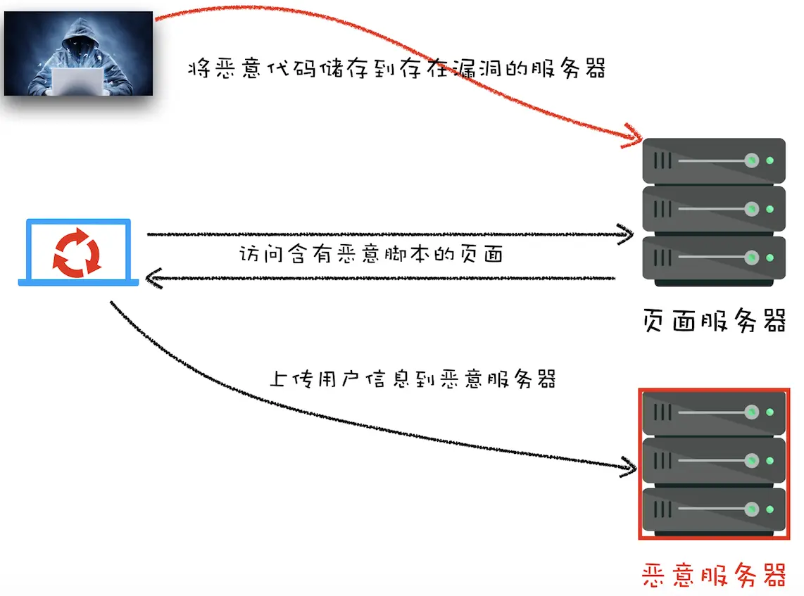
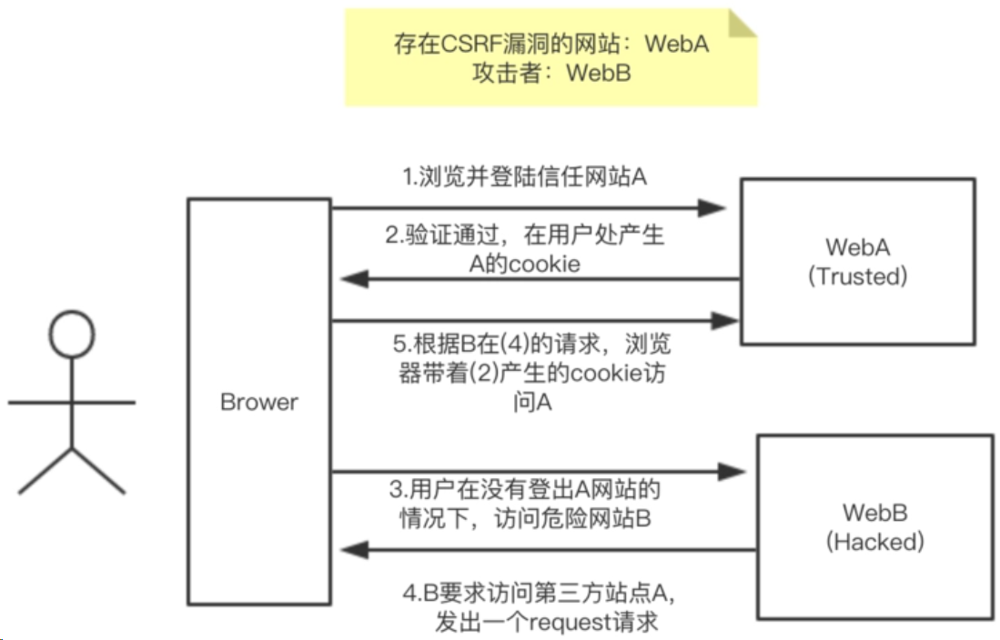
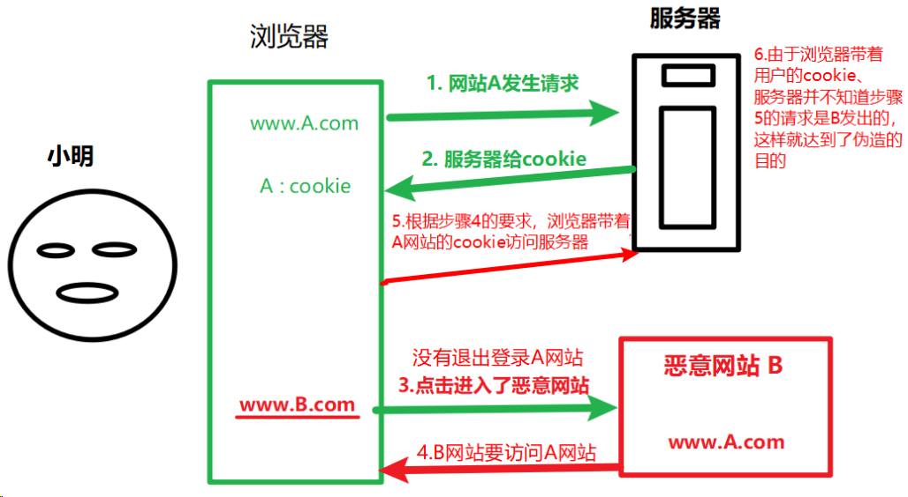
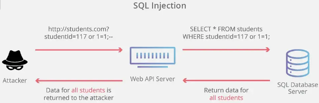
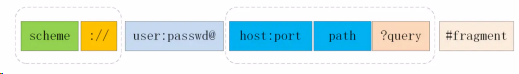
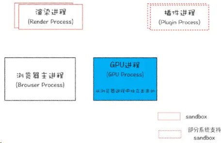
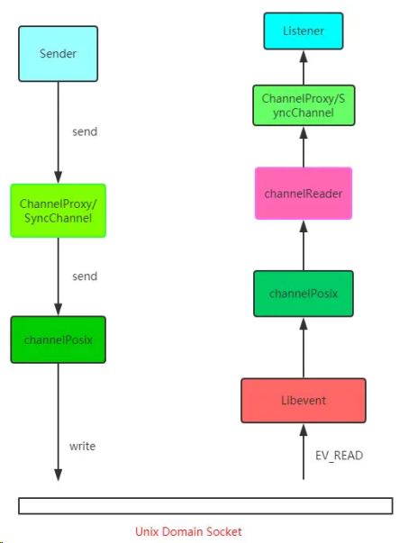
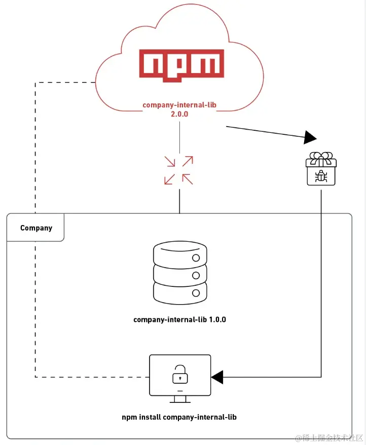

# 网络安全面试题

MDN HTTP 安全文档：[内容安全策略（CSP） - HTTP](https://developer.mozilla.org/zh-CN/docs/Web/HTTP/CSP)

[Web 安全 | MDN (mozilla.org)](https://developer.mozilla.org/zh-CN/docs/Web/Security)

[站点安全 - 学习 Web 开发 | MDN (mozilla.org)](https://developer.mozilla.org/zh-CN/docs/Learn/Server-side/First_steps/Website_security)

# XSS (跨站脚本攻击)

XSS （cross-site scripting）是指跨站脚本攻击。

攻击者利用站点的漏洞，通过在目标网站上注入恶意脚本，当其他用户访问这些被篡改的网页时，恶意脚本会在用户的浏览器上执行，在用户表单提交时，在表单内容中加入一些恶意脚本，从而盗取用户信息如 cookie 等，或者执行其他恶意操作，如破坏页面结构、重定向到其他网站等。

- XSS 是指攻击者将可执行代码注入到网页中，而恶意代码未经过过滤，与网站正常的代码混在一起，导致恶意脚本被执行。
- 攻击场景包括评论区植入 JavaScript 代码、URL 上拼接 JavaScript 代码等。
- XSS 攻击类型包括存储型、反射型和 DOM 型。
- 防范措施：严格对数据进行输出编码，使用 CSP HTTP Header，避免使用 `v-html` 或 `dangerouslySetInnerHTML`。

## 什么是 XSS 攻击？

慕课免费课程：[Web 安全 XSS 攻击防范实例视频教程-慕课网 (imooc.com)](http://www.imooc.com/learn/812)

**XSS 攻击**：XSS(Crossing-Site-Scripting) 是指客户端代码注入攻击，也就是跨站脚本攻击。攻击者可以通过在 Web 应用程序(目标网站)中植入一段使用未经验证或未编码的用户输入来执行恶意脚本。此恶意脚本可能会尝试从访问网站的用户那里窃取敏感信息、伪装成用户，甚至执行其他恶意行为。我们需要通过使用黑名单过滤用户输入来防止攻击（不允许用户输入`<、>` `<script>`等字符序列）。

比如用户输入 `<script>alert('foolish!'')</script>`，未进行处理的话，在展示这段内容时可能会在浏览器提示 foolish。

最开始的时候，这种攻击是通过跨域来实现的，所以叫“跨域脚本”。发展到现在，往 HTML 文件中中插入恶意代码方式越来越多，所以是否跨域注入脚本已经不是唯一的注入手段了，但是 XSS 这个名字却一直保留至今。

注入恶意脚本可以完成这些事情：

1. 窃取 Cookie、localStorage
2. 监听用户行为，比如输入账号密码后之间发给黑客服务器
3. 在网页中生成浮窗广告
4. 获取并修改 DOM 伪造登入表单，破坏页面结构。
5. DOS 攻击，发送合理请求，占用服务器资源，从而使用户无法访问服务器；
6. 流量劫持（将链接指向某网站）；

一般的情况下，XSS 攻击有三种实现方式

- 存储型 XSS 攻击
- 反射型 XSS 攻击
- 基于 DOM 的 XSS 攻击

### XSS 攻击主要分为三种类型

#### 存储类型

攻击者将恶意脚本提交到网站的数据库中，每当用户访问相关页面时，恶意脚本都会执行。

存储的 XSS 攻击，其中攻击者提供的恶意输入被保留并存储在后端数据库或存储库中。每当检索并呈现该内容以显示在网页上时，浏览器都完全不知道它，它要么执行来自数据库的恶意 JavaScript，要么呈现恶意 HTML 标记，而不是将其显示为文本。存储的 XSS 将永久保留在数据库中，并将影响访问受影响网页的所有用户。



从图上看，存储型 XSS 攻击大致步骤如下：

1. 首先攻击者利用站点漏洞将一段恶意 JavaScript 代码提交到网站的数据库中；
2. 然后用户向网站请求包含了恶意 JavaScript 脚本的页面：当用户打开目标网站时，网站服务端将恶意代码从数据库取出，拼接在 HTML 中返回给浏览器。
3. 当用户浏览该页面的时候，恶意脚本被执行，就会将用户的 Cookie 信息等数据上传到服务器。
4. 恶意代码窃取用户数据并发送到攻击者的网站，或者冒充用户的行为，调用目标网站接口执行攻击者指定的操作。

比如常见的场景：

在评论区提交一份脚本代码，假设前后端没有做好转义工作，那内容上传到服务器，在页面渲染的时候就会`直接执行`，相当于执行一段未知的 JS 代码。这就是存储型 XSS 攻击。

这种攻击常见于带有用户保存数据的网站功能，如论坛发帖、商品评论、用户私信等。

#### 反射式类型

攻击者将恶意脚本注入到 URL 中，用户通过点击带有恶意脚本的链接触发攻击。

反射式 XSS 攻击是第二种类型的 XSS 攻击媒介，其中恶意 XSS 有效负载不会存储在数据库表中以进行持久化，但仍会注入到网页的某个参数中，该参数会呈现回用户。浏览器没有意识到这一变化，只是呈现注入的恶意 HTML 或执行注入的恶意 Javascript 代码，再次导致用户的数据被泄露。

反射型 XSS 攻击指的就是恶意脚本作为**「网络请求的一部分」**，随后网站又把恶意的 JavaScript 脚本返回给用户，当恶意 JavaScript 脚本在用户页面中被执行时，黑客就可以利用该脚本做一些恶意操作。

举个例子:

```bash
http://TianTianUp.com?query=<script>alert("你受到了XSS攻击")</script>
```

如上，服务器拿到后解析参数 query，最后将内容返回给浏览器，浏览器将这些内容作为 HTML 的一部分解析，发现是 Javascript 脚本，直接执行，这样子被 XSS 攻击了。

这也就是反射型名字的由来，将恶意脚本作为参数，通过网络请求，最后经过服务器，在反射到 HTML 文档中，执行解析。

##### 反射型 XSS 的攻击步骤：

- 1.攻击者构造出特殊的 URL，其中包含恶意代码。
- 2.用户打开带有恶意代码的 URL 时，网站服务端将恶意代码从 URL 中取出，拼接在 HTML 中返回给浏览器。

- 3.用户浏览器接收到响应后解析执行，混在其中的恶意代码也被执行。
- 4.恶意代码窃取用户数据并发送到攻击者的网站，或者冒充用户的行为，调用目标网站接口执行攻击者指定的操作。

反射型 XSS 跟存储型 XSS 的区别是：存储型 XSS 的恶意代码存在数据库里，反射型 XSS 的恶意代码存在 URL 里。

反射型 XSS 漏洞常见于通过 URL 传递参数的功能，如网站搜索、跳转等。 由于需要用户主动打开恶意的 URL 才能⽣效，攻击者往往会结合多种⼿段诱导用户点击。

主要注意的就是，**「服务器不会存储这些恶意的脚本，这也算是和存储型 XSS 攻击的区别吧」**。

#### 文档型：基于 DOM 或 Type

基于网站脚本的漏洞来攻击用户，无需与服务端交互，仅通过操作 DOM 树即可执行恶意脚本。

基于文档对象模型的 XSS 是第三类 XSS 攻击。在这里，XSS 有效负载不会发送到服务器，但由于实现缺陷和在客户端 JavaScript 的帮助下更改网页的状态/DOM，攻击者使用负责操作网页状态的 JavaScript 来调整获取的有效负载。

基于 DOM 的 XSS 攻击是不牵涉到页面 Web 服务器的。具体来讲，黑客通过各种手段将恶意脚本注入用户的页面中，在数据传输的时候劫持网络数据包

##### DOM 型 XSS 的攻击步骤：

1.攻击者构造出特殊的 URL，其中包含恶意代码。

2.用户打开带有恶意代码的 URL。

3.用户浏览器接收到响应后解析执行，前端 JavaScript 取出 URL 中的恶意代码并执行。

4.恶意代码窃取用户数据并发送到攻击者的网站，或者冒充用户的行为，调用目标网站接口执行攻击者指定的操作。

DOM 型 XSS 跟前两种 XSS 的区别：DOM 型 XSS 攻击中，取出和执行恶意代码由浏览器端完成，属于前端 JavaScript ⾃身的安全漏洞，而其他两种 XSS 都属于服务端的安全漏洞。

常见的劫持手段有：

- WIFI 路由器劫持
- 本地恶意软件

## 不同类型的 XSS 攻击以及如何预防它们

### 客户端：

1. **输入合法性验证**：在服务端对用户输入的数据进行合法性验证，过滤掉不符合规范的字符或代码，确保输入数据的安全性。

2. **转义特殊字符**：对用户输入的内容中的特殊字符进行转义处理，如将 `<` 转换为 `<`，将 `>` 转换为 `>`，防止浏览器将这些字符误解为标签或脚本。

- HTML：对以下这些字符进行转义：

```bash
&：&amp;
<：&alt;
>：&gt;
'：&#x27;
"：&quot;
/：&#x2F;

function escape(str) {
	str = str.replace(/&/g, "&amp;");
	str = str.replace(/</g, "&lt;");
	str = str.replace(/>/g, "&gt;");
	str = str.replace(/"/g, "&quto;");
	str = str.replace(/'/g, "&#39;");
	str = str.replace(/`/g, "&#96;");
	str = str.replace(/\//g, "&#x2F;");
	return str;
}

// 通过转义可以将攻击代码 `<script>alert(1)</script>` 变成
// -> &lt;script&gt;alert(1)&lt;&#x2F;script&gt;
escape("<script>alert(1)</script>");


# 举个例子：
&lt;script&gt;alert(&#39;你受到XSS攻击了&#39;)&lt;/script&gt;

# 这样的代码在 html 解析的过程中是无法执行的。
```

- 但是对于显示富文本来说，显然不能通过上面的办法来转义所有字符，因为这样会把需要的格式也过滤掉。对于这种情况，通常采用白名单过滤的办法，当然也可以通过⿊名单过滤，但是考虑到需要过滤的标签和标签属性实在太多，更加推荐使用白名单的方式

  ```js
  const xss = require('xss')
  let html = xss('<h1 id="title">XSS Demo</h1><script>alert("xss");</script>'
  // -> <h1>XSS Demo</h1>&lt;script&gt;alert("xss");&lt;/script&gt;
  console.log(html)
  ```

  以上示例使用了 js-xss 来实现，可以看到在输出中保留了 h1 标签且过滤了 script 标签

- Javascript：把所有非字母、数字的字符都转义成小于 256 的 ASCII 字符；

  - 例如，将字符`<`转义为`\u003C`，将字符`>`转义为`\u003E`，以此类推。

  - 在 Javascript 中，可以使用以下代码来实现这一点：

    ```js
    function escapeNonAlphanumeric(input) {
    	return input.replace(/[^a-zA-Z0-9]/g, function (match) {
    		return "\\u" + match.charCodeAt(0).toString(16).padStart(4, "0");
    	});
    }

    const originalString = "Hello, <world>!";
    const escapedString = escapeNonAlphanumeric(originalString);
    console.log(escapedString);
    ```

- URL：使用 Javascript 的 encodeURIComponent()方法对用户的输入进行编码，该方法会编码如下字符：, / ? : @ & = + $ #

  - `encodeURIComponent()`会将特定字符编码为 URL 安全的格式，包括逗号、斜杠、问号、冒号、@、&、=、+和$等。

  - 例如，将空格编码为`%20`，将`?`编码为`%3F`，将`&`编码为`%26`，以此类推。

  - 在 Javascript 中，可以使用以下代码来实现 URL 编码：

    ```js
    const userInput = "Hello, world! How are you?";
    const encodedInput = encodeURIComponent(userInput);
    console.log(encodedInput);
    ```

3. 使用白名单过滤输入：仅允许输入字符（例如 A-Z 和 0-9）。

4. 使用黑名单过滤输入：不允许用户输入字符序列，例如 `<script>`、``、`<a>`甚至`<and>`等关键字标签。

5. 对 innerHTML 做过滤的情况

6. `使用脚本过滤器`：引入第三方库或工具，如 Google 的 Closure Library、jQuery 等，对用户输入的数据进行过滤和检查，进一步减少 XSS 攻击的风险。
7. `安全编码`：在编写代码时，使用安全的编码方式，避免直接将用户输入的数据插入到 HTML 或 JavaScript 中，而是使用安全的 API 或函数来处理用户输入。
8. 关键业务用验证码等方式强制校验。

### 服务端

`设置 HTTP 头部`：使用如 Content-Security-Policy、X-Content-Type-Options、X-XSS-Protection 等 HTTP 头部，来增强浏览器的安全策略，阻止恶意脚本的执行。

`限制 cookie 的使用`：设置 cookie 的 HttpOnly 和 Secure 设置，确保 JavaScript 无法访问 cookie，降低攻击者利用 cookie 进行攻击的可能性。同时，尽量在 HTTPS 连接下使用 cookie，以增加数据传输的安全性。

- Set-Cookie 增加 HttpOnly 和 Secure 设置：
  - Secure 属性告诉浏览器仅在请求为 https 的时候发送 cookie。
  - HttpOnly 属性可以防止 XSS，它会禁止 javascript 脚本来访问 cookie。
- Set-Cookie 增加 SameSite 约束
- 设置例子：`Set-Cookie=<cookie-value>`

不使用 Cookie 这种自动携带的身份验证手段，改用 JWT 等自定义 Request Header 的方案。

CSRF Token

#### 利用 CSP

该安全策略的实现基于一个称作 `Content-Security-Policy`的 [HTTP](https://developer.mozilla.org/zh-CN/docs/Glossary/HTTP) 首部。

可以移步[MDN](https://developer.mozilla.org/zh-CN/docs/Web/HTTP/CSP)，有更加规范的解释。我在这里就是梳理一下吧。

CSP，即浏览器中的内容安全策略，它的核心思想大概就是服务器决定浏览器加载哪些资源，具体来说有几个功能 👇

- 限制加载其他域下的资源文件，这样即使黑客插入了一个 JavaScript 文件，这个 JavaScript 文件也是无法被加载的；
- 禁止向第三方域提交数据，这样用户数据也不会外泄；
- 提供上报机制，能帮助我们及时发现 XSS 攻击。
- 禁止执行内联脚本和未授权的脚本；

CSP 本质上就是建立白名单，开发者明确告诉浏览器哪些外部资源可以加载和执行。我们只需要配置规则，如何拦截是由浏览器自己实现的。我们可以通过这种方式来尽量减少 XSS 攻击。

通常可以通过两种方式来开启 CSP：

- 设置 HTTP Header 中的 Content-Security-Policy
- 设置 meta 标签的方式 `<meta http-equiv="Content-Security-Policy">`

这里以设置 HTTP Header 来举例

##### 只允许加载本站资源

```bash
Content-Security-Policy: default-src ‘self’
```

##### 只允许加载 HTTPS 协议图片

```bash
Content-Security-Policy: img-src https://*
```

##### 允许加载任何来源框架

```bash
Content-Security-Policy: child-src 'none'
```

当然可以设置的属性远不止这些，你可以通过查阅 文档 的方式来学习，这里就不过多赘述其他的属性了。对于这种方式来说，只要开发者配置了正确的规则，那么即使网站存在漏洞，攻击者也不能执行它的攻击代码，并且 CSP 的兼容性也不错。

对于这种方式来说，只要开发者配置了正确的规则，那么即使网站存在漏洞，攻击者也不能执行它的攻击代码，并且 CSP 的兼容性也不错。

#### 利用 HttpOnly

由于很多 XSS 攻击都是来盗用 Cookie 的，因此还可以通过使用 HttpOnly 属性来保护我们 Cookie 的安全。这样子的话，JavaScript 便无法读取 Cookie 的值。这样也能很好的防范 XSS 攻击。

通常服务器可以将某些 Cookie 设置为 HttpOnly 标志，HttpOnly 是服务器通过 HTTP 响应头来设置的，下面是打开 Google 时，HTTP 响应头中的一段：

```bash
set-cookie: NID=189=M8l6-z41asXtm2uEwcOC5oh9djkffOMhWqQrlnCtOI; expires=Sat, 18-Apr-2020 06:52:22 GMT; path=/; domain=.google.com; HttpOnly
```

综上所述，防范 XSS 攻击需要综合考虑多个方面，从输入验证、输出转义、HTTP 头部设置、脚本过滤到安全编码等，都需要进行细致的处理。同时，定期更新和修补网站的安全漏洞也是非常重要的。

防止跨站脚本攻击并不难，对用户输入内容的验证是核心。

确保对用户插入的数据进行过滤，内容进行编码。此外，考虑使用[内容安全策略（CSP）](https://blog.bitsrc.io/enhance-javascript-security-with-content-security-policies-5847e5def227)来限制加载的资源和脚本。或者，只需使用 Angular、Vue 和 React 等框架，这些框架都有针对跨站脚本攻击的内置预防机制。

# CSRF (跨站请求伪造)

CSRF（Cross-site request forgery）跨站请求伪造，是一种挟制用户在当前已登录的 Web 应用上执行非本意的操作的攻击方法

它首先引导用户访问一个危险网站，当用户访问网站后，网站会发送请求到被攻击的站点，这次请求会携带用户的 cookie 发送，因此就利用了用户的身份信息完成攻击。

**「CSRF 攻击就是黑客利用了用户的登录状态，并通过第三方的站点来做一些坏事。」**

- CSRF 是攻击者诱导受害者在第三方网站中向被攻击网站发送跨站请求。
- 防范措施：组织第三方域名的访问，使用 CSRF Token 或双重 Cookie。

一般的情况下，点开一个诱导你的链接，攻击者会在你不知情的时候做哪些事情呢

## CSRF 攻击者可以做的事情

#### 1. 自动发起 Get 请求

黑客网页里面可能有一段这样的代码 👇

```html

```

在受害者访问含有这个 img 的页面后，浏览器会自动向`http://bank.example/withdraw?account=xiaoming&amount=10000&for=hacker`发出一次 HTTP 请求。

`bank.example`就会收到包含受害者登录信息的一次跨域请求。

#### 2. 自动发起 POST 请求

黑客网页中有一个表单，自动提交的表单 👇

```html
<form action="http://bank.example/withdraw" method="POST">
	<input type="hidden" name="account" value="xiaoming" />
	<input type="hidden" name="amount" value="10000" />
	<input type="hidden" name="for" value="hacker" />
</form>
<script>
	document.forms[0].submit();
</script>
```

访问该页面后，表单会自动提交，相当于模拟用户完成了一次 POST 操作。

同样也会携带相应的用户 cookie 信息，让服务器误以为是一个正常的用户在操作，让各种恶意的操作变为可能。

#### 3. 引诱用户点击链接

这种需要诱导用户去点击链接才会触发，这类的情况比如在论坛中发布照片，照片中嵌入了恶意链接，或者是以广告的形式去诱导，比如：

```html
<a
	href="http://test.com/csrf/withdraw.php?amount=1000&for=hacker"
	taget="_blank"
>
	重磅消息！！！点击进入修仙世界
	<a
/></a>
```

点击后，自动发送 get 请求，接下来和`自动发 GET 请求`部分同理。

以上三种情况，就是 CSRF 攻击原理，跟 XSS 对比的话，CSRF 攻击并不需要将恶意代码注入 HTML 中，而是跳转新的页面，利用**「服务器的验证漏洞」**和**「用户之前的登录状态」**来模拟用户进行操作

## 攻击原理（过程）

图 1



图 2



1. 用户打开浏览器，访问受信任网站 A，输入用户名和密码请求登录网站 A，并在浏览器中保持登录状态。
2. 在用户信息通过验证后，网站 A 产生 Cookie 信息并返回给浏览器，此时用户登录网站 A 成功，可以正常发送请求到网站 A；
3. 用户未退出网站 A 之前，在同一浏览器中，打开一个 TAB 页访问恶意网站 B，该网站包含针对网站 A 的恶意请求（例如，提交表单或发送 AJAX 请求）。
4. 网站 B 接收到用户请求后，返回一些攻击性代码，并发出一个请求要求访问第三方站点 A；
5. 由于浏览器会自动添加用户在网站 A 上的身份验证信息，这些请求会被发送到网站 A，并被视为用户的有效请求。
6. 浏览器在接收到这些攻击性代码后，根据网站 B 的请求，在用户不知情的情况下携带 Cookie 信息，向网站 A 发出请求。网站 A 并不知道该请求其实是由 B 发起的，所以会根据用户 的 Cookie 信息以 用户 的权限处理该请求，导致来自网站 B 的恶意代码被执行。
7. 网站 A 执行相应的操作，如更改密码、发表评论等，从而导致用户的账户或数据受到损害。

比如：

1. 攻击者伪造一个向网站转账的请求。
2. 攻击者会将请求嵌入在一个超链接中，并将其发送给可能已登录网站的访问者。
3. 访问者点击链接，无意中将请求发送至网站。
4. 网站验证完请求并从访问者账户向攻击者转账。

跨站请求伪造（CSRF）是一种前端安全攻击，它会欺骗特定应用上的认证用户，让他们执行他们不希望执行的请求。

> 这可能是一个伪装过的表单、链接或按钮，在用户发出请求时会更改用户凭据、删除或篡改敏感数据，或无意中从用户的银行账户中转移资金。

> 举例：``，登录的用户访问到这个 img 标签时，会发起转账请求并自动带上登录相关的 cookie。

## 如何防御 CSRF 攻击「防护策略」

攻击者只能借助受害者的`cookie`骗取服务器的信任，但是攻击者并不能凭借拿到**「cookie」**，也看不到 **「cookie」**的内容。另外，对于服务器返回的结果，由于浏览器**「同源策略」**的限制，攻击者也无法进行解析。

> 这就告诉我们，我们要保护的对象是那些可以直接产生数据改变的服务，而对于读取数据的服务，则不需要进行`CSRF`的保护。而保护的关键，是 **「在请求中放入黑客所不能伪造的信息」**

### 1.不使用 cookie

### 2.使用 CSRF Token 验证：为表单添加校验的 token 校验

在每个表单中添加一个唯一的 CSRF Token，该令牌与用户会话相关联。提交表单时，服务器验证该令牌的有效性。攻击者无法获取到有效的令牌，因此无法成功发起 CSRF 攻击。

Django 作为 Python 的一门后端框架，如果是用它开发过的同学就知道，在它的模板(template)中，开发表单时，经常会附上这样一行代码：

```bash

```

这就是 CSRF Token 的典型应用。那它的原理是怎样的呢？

首先，浏览器向服务器发送请求时，服务器生成一个字符串，将其植入到返回的页面中。

然后浏览器如果要发送请求，就必须带上这个字符串，然后服务器来验证是否合法，如果不合法则不予响应。这个字符串也就是 CSRF Token ，通常第三方站点无法拿到这个 token, 因此也就是被服务器给拒绝。

### 3.Referer 验证来源站点（简单易行，但 referer 可能被改变）：服务器检查 referer 字段

确保请求来源于受信任的网站。服务器可以验证请求头中的 Referer 字段，确认请求是否来自合法的源。

这就需要要用到请求头中的两个字段: Origin 和 Referer。

其中，Origin 只包含域名信息，而 Referer 包含了 具体 的 URL 路径。

当然，这两者都是可以伪造的，通过 Ajax 中自定义请求头即可，安全性略差。

### 4.cookie 中使用 sameSite 字段

通过设置 Cookie 的 SameSite 属性为 Strict 或 Lax，限制 Cookie 在跨站点请求中的发送。这有助于减少 CSRF 攻击的风险。

CSRF 攻击 中重要的一环就是自动发送目标站点下的 Cookie ,然后就是这一份 Cookie 模拟了用户的身份。因此在 Cookie 上面下文章是防范的不二之选。

恰好，在 Cookie 当中有一个关键的字段，可以对请求中 Cookie 的携带作一些限制，这个字段就是 SameSite 。

SameSite 可以设置为三个值， Strict 、 Lax 和 None 。

- a. 在 Strict 模式下，浏览器完全禁止第三方请求携带 Cookie。比如请求 sanyuan.com 网站只能在 sanyuan.com 域名当中请求才能携带 Cookie，在其他网站请求都不能。
- b. 在 Lax 模式，就宽松一点了，但是只能在 get 方法提交表单 况或者 a 标签发送 get 请求 的情况下可以携带 Cookie，其他情况均不能。
- c. 在 None 模式下，也就是默认模式，请求会自动携带上 Cookie。

### 5.隐藏令牌（跟 Token 验证差不多，把令牌存到 header 中）

### 6.避免使用 GET 请求进行状态更改操作

由于 GET 请求容易被攻击者篡改，因此应避免使用 GET 请求来修改服务器端的数据。改用 POST、PUT 等请求方法进行状态更改操作。

### 7.实施二次验证

对于涉及敏感操作的请求，可以要求用户进行二次验证，如输入密码、验证码等，确保用户的操作是合法的。

### 8.及时更新和修补安全漏洞

定期更新网站和框架的补丁，确保已知的安全漏洞得到修复。

---

综上所述，防范 CSRF 攻击需要综合考虑多个方面，从验证请求来源、使用 CSRF Token、限制 Cookie 发送、避免使用 GET 请求进行状态更改、实施二次验证到及时更新和修补安全漏洞等，都需要进行细致的处理。这些措施有助于增强网站的安全性，减少 CSRF 攻击的风险。

### 待定：用户操作限制——验证码机制

方法：添加验证码来识别是不是用户主动去发起这个请求，由于一定强度的验证码机器无法识别，因此危险网站不能伪造一个完整的请求。

#### 1. 验证来源站点

在服务器端验证请求来源的站点，由于大量的 CSRF 攻击来自第三方站点，因此服务器跨域禁止来自第三方站点的请求，主要通过 HTTP 请求头中的两个 Header

- Origin Header
- Referer Header

这两个 Header 在浏览器发起请求时，大多数情况会自动带上，并且不能由前端自定义内容。

服务器可以通过解析这两个 Header 中的域名，确定请求的来源域。

其中，**「Origin」**只包含域名信息，而**「Referer」**包含了`具体`的 URL 路径。

在某些情况下，这两者都是可以伪造的，通过`AJax`中自定义请求头即可，安全性略差。

#### 2. 利用 Cookie 的 SameSite 属性

[可以看看 MDN 对此的解释](https://developer.mozilla.org/zh-CN/docs/Web/HTTP/Headers/Set-Cookie/SameSite)

`SameSite`可以设置为三个值，`Strict`、`Lax`和`None`。

1. 在`Strict`模式下，浏览器完全禁止第三方请求携带 Cookie。比如请求`sanyuan.com`网站只能在`sanyuan.com`域名当中请求才能携带 Cookie，在其他网站请求都不能。
2. 在`Lax`模式，就宽松一点了，但是只能在 `get 方法提交表单`况或者`a 标签发送 get 请求`的情况下可以携带 Cookie，其他情况均不能。
3. 在 None 模式下，Cookie 将在所有上下文中发送，即允许跨域发送。

#### 3. **「CSRF Token」**

前面讲到 CSRF 的另一个特征是，攻击者无法直接窃取到用户的信息（Cookie，Header，网站内容等），仅仅是冒用 Cookie 中的信息。

那么我们可以使用 Token，在不涉及 XSS 的前提下，一般黑客很难拿到 Token。

可以看看这篇文章，将了 Token 是怎么操作的 👉[彻底理解 cookie，session，token](https://zhuanlan.zhihu.com/p/63061864)

Token(令牌)做为 Web 领域验证身份是一个不错的选择，当然了，JWT 有兴趣的也可以去了解一下。

Token 步骤如下：

**「第一步:将 CSRF Token 输出到页面中」**

> 首先，用户打开页面的时候，服务器需要给这个用户生成一个 Token，该 Token 通过加密算法对数据进行加密，一般 Token 都包括随机字符串和时间戳的组合，显然在提交时 Token 不能再放在 Cookie 中了（XSS 可能会获取 Cookie），否则又会被攻击者冒用。因此，为了安全起见 Token 最好还是存在服务器的 Session 中，之后在每次页面加载时，使用 JS 遍历整个 DOM 树，对于 DOM 中所有的 a 和 form 标签后加入 Token。这样可以解决大部分的请求，但是对于在页面加载之后动态生成的 HTML 代码，这种方法就没有作用，还需要程序员在编码时手动添加 Token。

**「第二步:页面提交的请求携带这个 Token」**

> 对于 GET 请求，Token 将附在请求地址之后，这样 URL 就变成 [http://url](https://link.zhihu.com/?target=http%3A//url)?csrftoken=tokenvalue。 而对于 POST 请求来说，要在 form 的最后加上： `<input type=”hidden” name=”csrftoken” value=”tokenvalue”/>` 这样，就把 Token 以参数的形式加入请求了。

**「第三步：服务器验证 Token 是否正确」**

> 当用户从客户端得到了 Token，再次提交给服务器的时候，服务器需要判断 Token 的有效性，验证过程是先解密 Token，对比加密字符串以及时间戳，如果加密字符串一致且时间未过期，那么这个 Token 就是有效的。

非常感兴趣的，可以仔细去阅读一下相关的文章，Token 是如何加密的，又是如何保证不被攻击者获取道。

### 总结

CSRF(Cross-site request forgery), 即跨站请求伪造，本质是冲着浏览器分不清发起请求是不是真正的用户本人，所以防范的关键在于在请求中放入黑客所不能伪造的信息。从而防止黑客伪造一个完整的请求欺骗服务器。

**「防范措施」**：验证码机制，验证来源站点，利用 Cookie 的 SameSite 属性，CSRF Token

防止 CSRF 攻击的最简单方法之一就是使用从服务器生成的 CSRF 令牌。你可以与客户端共享这些令牌，这样服务端就可以在收到的每个请求中检查令牌并验证其真实性。如果客户端未能提供准确的令牌，服务器就可以拒绝所请求的操作。

此外，.NET、Joomla、Spring（Spring Security）和 Ruby on Rails 等框架都内置了 CSRF 支持，可防止此类攻击。

# 中间人攻击

MDN 文档：[中间人攻击（MitM） - MDN Web 文档术语表：Web 相关术语的定义 | MDN (mozilla.org)](https://developer.mozilla.org/zh-CN/docs/Glossary/MitM)

## 中间人攻击介绍

中间人（MitM）攻击指攻击者截获并操纵双方之间传输的信息。

> 例如，攻击者可以拦截你与 `Facebook.com` 的连接，窃取你的凭据，然后将你的请求转发给 Facebook。

当攻击者利用不安全的通信渠道（通常通过公共 WiFi）时，就可以发生此类攻击。这种攻击的受害者并不觉得自己受到了攻击，因为他们认为自己正在与服务器进行非常正常和安全的对话，而他们正在共享的信息却在途中被窥探或篡改。

中间人攻击（MITM）是一种会话劫持攻击，攻击者作为中间人，劫持通信双方之间的会话并操纵通信过程，而通信双方并不知情。攻击的目的可以是窃取信息或冒充访问。中间人攻击有多种类型，例如 Wi-Fi 仿冒、HTTPS 欺骗、DNS 欺骗等。

攻击者通过拦截客户端和服务器之间的通信，作为中间人处理双方的数据，从而窃取或篡改信息。这种攻击通常发生在攻击者能够控制或监听客户端和服务器之间的网络连接时，例如公共 Wi-Fi 等不安全网络环境。

在 HTTPS 中间人攻击中，攻击者会拦截服务器向客户端发送的公钥，并用自己的伪造公钥替换它。当客户端使用伪造公钥加密数据并发送给服务器时，攻击者可以拦截并解密这些数据。同时，攻击者还可以用自己的私钥重新加密这些数据，并将其发送给服务器，使得服务器无法察觉异常。通过这种方式，攻击者可以窃取敏感信息，如用户密码、银行账户信息等。

简单来说就是：通信过程被⿊客劫持，就像邮递员可能篡改邮件㇐样。

## 介绍下 HTTPS 中间人攻击

针对 HTTPS 攻击主要有 SSL 劫持攻击和 SSL 剥离攻击两种。

SSL 劫持攻击是指攻击者劫持了客户端和服务器之间的连接，将服务器的合法证书替换为伪造的证书，从而获取客户端和服务器之间传递的信息。这种方式一般容易被用户发现，浏览器会明确的提示证书错误，但某些用户安全意识不强，可能会点击继续浏览，从而达到攻击目的。

SSL 剥离攻击是指攻击者劫持了客户端和服务器之间的连接，攻击者保持自己和服务器之间的 HTTPS 连接，但发送给客户端普通的 HTTP 连接，由于 HTTP 连接是明文传输的，即可获取客户端传输的所有明文数据。

## 中间人攻击原理

1. **截获连接**：攻击者在客户端和服务器之间建立一个新的连接，使得客户端和服务器都认为对方是合法的。
2. **数据篡改**：攻击者可以修改客户端和服务器之间的数据包内容，例如替换证书、修改请求或响应等。
3. **窃取信息**：攻击者可以窃取客户端和服务器之间的敏感信息，例如用户名、密码等。

## 如何防范中间人攻击

1. **使用 HTTPS 协议**：HTTPS 提供了额外的安全保护层，通过 SSL/TLS 协议加密数据传输，保证数据的完整性、保密性和安全性。
2. **不要忽略警告(注意警告信息)**：如果浏览器提示你正在访问的网站有问题，应引起足够的重视。安全证书警告可能是将凭据授予攻击者和保持安全之间的区别。
3. **不要使用公共 Wi-Fi(使用安全的互联网连接)**：如果无法避免使用公共 Wi-Fi，应下载并安装安全防护软件，增加连接的安全性。下载并安装 VPN，为连接添加额外的安全性。同时，留意浏览器的安全警告，如果警告数量突然增加，可能表明存在中间人攻击。
4. 用户认证信息和 IP 做绑定
5. **验证 SSL 证书**：HTTPS 证书通过可信任的第三方机构颁发，用于验证网站的身份。浏览器会检查证书的有效性和完整性，确保用户与真实的网站进行通信。对 SSL 证书的证书链进行校验，也是防范中间人攻击的重要手段。

综上所述，防范 HTTPS 中间人攻击需要综合采取多种措施，从使用 HTTPS、注意警告信息、避免使用公共 Wi-Fi 到验证 SSL 证书等，都需要用户和网络管理员的共同努力。

# 网络劫持

## 网络劫持有哪几种，如何防范？

网络劫持分为两种：

**（1）DNS 劫持: (输入京东被强制跳转到淘宝这就属于 dns 劫持)**

> 修改目标源站

- DNS 强制解析: 通过修改运营商的本地 DNS 记录，来引导用户流量到缓存服务器

- 302 跳转的方式: 通过监控网络出口的流量，分析判断哪些内容是可以进行劫持处理的,再对劫持的内存发起 302 跳转的回复，引导用户获取内容

**（2）HTTP 劫持**：(访问⾕歌但是⼀直有贪玩蓝⽉的⼴告)，由于 http 明⽂传输，运营商会修改你的 http 响应内容(即加⼴告)

- DNS 劫持由于涉嫌违法，已经被监管起来，现在很少会有 DNS 劫持，而 http 劫持依然⾮常盛行，最有效的办法就是全站 HTTPS，将 HTTP 加密，这使得运营商无法获取明⽂，就无法劫持你的响应内容。

## HTTP 劫持是什么？

**HTTP 劫持**（HTTP hijacking）是一种网络攻击技术，攻击者通过各种手段截取用户的 HTTP 请求或响应，篡改其内容或重定向到恶意服务器，从而实施恶意活动。这种攻击可能导致用户信息泄露、身份盗窃、篡改网页内容或植入恶意代码等安全问题。

HTTP 劫持的原理如下：

1. 用户在浏览器中访问某网站，发送 HTTP 请求。
2. 运营商的路由器收到此次 HTTP 请求，标记此 TCP 连接为 HTTP 协议。
3. 运营商的旁路设备可以抢在网站服务器返回数据之前，发送 HTTP 协议的 302 代码进行下载软件的劫持，或直接返回修改后的 HTML 代码插入广告。
4. 网站服务器的真正数据到达后反而会被丢弃。

如果遇到 HTTP 劫持，可以采取以下措施：

1. 向互联网服务提供商（ISP）客服投诉，要求免于被劫持。
2. 使用 HTTPS 协议，加密通信和数字证书验证，确保数据传输的安全性和完整性。
3. 定期更新和维护软件，修复已知漏洞并增强安全性。
4. 防止 DNS 劫持，使用可靠的 DNS 服务提供商并验证 DNS 解析的完整性。
5. 使用 Web 应用防火墙（WAF）监测和阻止恶意请求和攻击。

是指攻击者在客户端和服务器之间同时建立了连接通道，通过某种方式，让客户端请求发送到自己的服务器，然后自己就拥有了控制响应内容的能力，从而给客户端展示错误的信息。

### 如何劫持 https 的请求，提供思路

参考答案：

https 有防篡改的特点，只要浏览器证书验证过程是正确的，很难在用户不察觉的情况下进行攻击。但若能够更改浏览器的证书验证过程，便有机会实现 https 中间人攻击。

所以，要劫持 https，首先要伪造一个证书，并且要想办法让用户信任这个证书，可以有多种方式，比如病毒、恶意软件、诱导等。一旦证书被信任后，就可以利用普通中间人攻击的方式，使用伪造的证书进行攻击。

### HTTP 劫持、DNS 劫持

参考答案：

http 劫持是指攻击者在客户端和服务器之间同时建立了连接通道，通过某种方式，让客户端请求发送到自己的服务器，然后自己就拥有了控制响应内容的能力，从而给客户端展示错误的信息，比如在页面中加入一些广告内容。

DNS 劫持是指攻击者劫持了 DNS 服务器，获得了修改 DNS 解析记录的权限，从而导致客户端请求的域名被解析到了错误的 IP 地址，攻击者通过这种方式窃取用户资料或破坏原有正常服务。

## HTTPS 中间人攻击和 HTTP 劫持的区别

**HTTPS 中间人攻击**和**HTTP 劫持**虽然都涉及到网络通信，但它们是不同的安全问题。

1. **HTTPS 中间人攻击**（Man-in-the-Middle Attack，简称 MITM）：
   - 这是一种恶意攻击，针对使用 HTTPS 协议的通信。
   - 攻击者插入自己作为中间节点，截获用户与服务器之间的通信。
   - 攻击者可以解密、篡改或监视通信内容。
   - 通常通过欺骗用户的证书验证来实现，使用户与攻击者之间的通信似乎是安全的。
   - 目标是获取敏感信息，如登录凭据、银行账户信息等。
2. **HTTP 劫持**：
   - 这是一种攻击技术，攻击者截取用户的 HTTP 请求或响应。
   - 攻击者可以篡改网页内容、重定向到恶意服务器或插入广告。
   - 不一定涉及 HTTPS，因为 HTTP 通信不加密。
   - 目标是植入广告、窃取用户信息或篡改网页内容。

总之，虽然两者都涉及网络通信，但 HTTPS 中间人攻击更专注于破坏加密通信，而 HTTP 劫持更关注于篡改和重定向 HTTP 通信。

# 点击劫持

## 什么是点击劫持？如何防范？

**点击劫持（ClickJacking）** 是一种视觉上的欺骗手段。攻击者使用一个透明的 iframe 页面，覆盖在一个正常网页上，然后诱使用户点击该网页，这时用户就会在不知情的情况下点击那个透明的 iframe。

点击劫持（A.K.A - UI 纠错攻击）是一种欺骗机制，它欺骗用户点击了不是他们想要访问的东西。

它将隐藏元素覆盖在网站上一些可点击的内容之上。在这种情况下，用户实际上是在点击一个非预期元素，而该元素可能会在未经用户同意的情况下触发资金转移等意外操作。

> 例如：攻击者开发一个网站内容为两层，底层是某种让人想要有点击欲望的图或者布局，上层是通过 iframe 嵌套某社交网站的主页，并且设置透明度为完全透明，同时通过定位让 iframe 上的某些操作按钮与底层引导点击区域重叠，这样用户在点击底层引导点击区域时，实际点击的是上层透明的 iframe 上的操作按钮。

## 防范点击劫持的有效措施如下

1. **使用 HTTPS 协议**
2. **强化 DNS 安全**
3. **部署网络防火墙和入侵检测系统**
4. **定期更新和审查浏览器扩展**
5. **提醒用户注意不信任的链接，避免点击可疑的广告，以及定期更新密码等**

为了降低点击劫持攻击的潜在风险，可以使用一种机制，即使用 [X-Frame-Options - HTTP](https://developer.mozilla.org/zh-CN/docs/Web/HTTP/Headers/X-Frame-Options)标头，以确保你的网站没有嵌入到其他网站或 IFrames 中。

## iframe 点击劫持

**涉及面试题：什么是点击劫持？如何防范点击劫持？**

点击劫持是一种视觉欺骗的攻击手段。攻击者将需要攻击的网站通过 iframe 嵌套的方式嵌入自己的网页中，并将 iframe 设置为透明，在页面中透出一个按钮诱导用户点击

### 对于这种攻击方式，推荐防御的方法有两种

#### 1.X-FRAME-OPTIONS

X-FRAME-OPTIONS 是一个 HTTP 响应头，在现代浏览器有一个很好的支
持。这个 HTTP 响应头 就是为了防御用 iframe 嵌套的点击劫持攻击。

该响应头有三个值可选，分别是 DENY ，表示页面不允许通过 iframe 的方式展示 SAMEORIGIN ，表示页面可以在相同域名下通过 iframe 的方式展示 ALLOW-FROM ，表示页面可以在指定来源的 iframe 中展示。

#### 2.JS 防御

对于某些远古浏览器来说，并不能支持上面的这种方式，那我们只有通过 JS 的方式来防御点击劫持了。

```html
<head>
	<style id="click-jack">
		html {
			display: none !important;
		}
	</style>
</head>
<body>
	<script>
		if (self == top) {
			var style = document.getElementById("click-jack");
			document.body.removeChild(style);
		} else {
			top.location = self.location;
		}
	</script>
</body>
```

以上代码的作用就是当通过 iframe 的方式加载页面时，攻击者的网页直接不显示所有内容了。

# SQL 注入攻击



1. 攻击者访问 `http://student.com?studentId=117 or 1=1;` 接口。
2. 服务器生成 SQL（`SELECT *FROM students WHERE studentId=117 or 1=1;`） 访问数据库。
3. 数据库返回所有学生数据给服务端。
4. 服务端接口把所有学生数据返回给攻击者。

SQL 注入是一种存在已久的致命攻击。攻击会操纵数据库查询以获得未经授权的数据库访问权限，从而执行恶意活动，如破坏数据库或窃取敏感数据。

> 简单地说，SQL 注入可让攻击者从你的前端执行 SQL 查询。这可能会导致破坏性操作，使你的数据库宕机！

例如，2020 年对爱沙尼亚中央健康数据库的攻击导致几乎所有爱沙尼亚公民的健康记录泄露，就是近年来发生的大规模 SQL 注入事件的一个令人痛心的例子。

### 如何防止 SQL 注入？

防止 SQL 注入的策略分为两个部分：

1. 首先，需要确保前端输入的字段经过正确过滤和编码。你需要防止用户在输入的字段中插入恶意代码。
2. 前端对内容验证后，后端接口对接收到的参数进行验证和转义同样重要。不要相信你的接口参数，因为任何人都可以获取你的接口地址并开始发送恶意输入。因此，后端也要确保对参数进行验证。此外，利用 [Burp Scanner](https://portswigger.net/burp/documentation/scanner)、[sqlmap](https://sqlmap.org/)、[jSQL Injection](https://github.com/ron190/jsql-injection) 和 [Invicti](https://www.invicti.com/) 等工具来检测应用中潜在的 SQL 攻击和相关漏洞。

# 文件上传漏洞

## 什么是文件上传漏洞？如何防范？

**`文件上传漏洞`** 是 web 安全中一种常见的漏洞形式，攻击者通过利用这种漏洞上传恶意文件（如木马、病毒、WebShell 等）到服务器并执行，从而获取对网站的控制权限。这种漏洞的产生往往是因为文件上传功能在实现时没有对上传的文件进行严格的格式、类型和内容检查。

**防范文件上传漏洞的常用方法包括**：

1. `设置文件上传目录为不可执行`：确保 web 容器无法解析该目录下的文件，即使攻击者上传了恶意脚本，服务器本身也不会执行。
2. `严格检查文件类型`：在服务器端实现文件类型检查机制，结合使用 MIME Type、文件后缀等方式。推荐使用白名单方式，明确允许上传的文件类型，而不是使用黑名单方式，因为黑名单方式已被证明容易被绕过。
3. `对上传的文件进行内容检查`：对于允许上传的图片文件，可以使用图像处理库重新生成图片，从而破坏可能包含的恶意代码。对于其他类型的文件，也可以实施相应的内容检查策略。
4. `使用随机数改写文件名和路径`：这样可以增加攻击者猜测或访问上传文件的难度，从而有效防御恶意文件的执行。
5. `单独设置文件服务器的域名`：通过浏览器同源策略的限制，可以防御一些客户端攻击，例如利用上传的 crossdomain.xml 文件或包含 JavaScript 的 XSS 攻击。
6. `限制上传文件的大小`：设置合理的文件大小限制，防止攻击者上传过大的恶意文件。
7. `实施用户权限控制`：对于文件上传功能，应实施严格的用户权限控制，确保只有经过授权的用户才能上传文件。
8. `使用 Web 应用防火墙（WAF）`：WAF 可以监控和拦截恶意文件上传行为，提供实时的安全防护。

综上所述，防范文件上传漏洞需要综合考虑多个方面，包括设置不可执行的上传目录、严格检查文件类型和内容、使用随机数改写文件名和路径、单独设置文件服务器域名、限制文件大小、实施用户权限控制以及使用 Web 应用防火墙等。通过采取这些措施，可以有效降低文件上传漏洞的风险。

# 前端加密

## 介绍下前端加密的常见场景和方法？

前端加密在网络安全中起着至关重要的作用，它可以在数据传输和存储过程中保护敏感信息，防止未经授权的访问和篡改。以下是前端加密的一些常见场景和方法：

**常见场景**

1. `密码传输`：在用户登录或注册时，前端需要传输用户的密码。如果不对密码进行加密，攻击者可能在传输过程中截获明文密码，导致用户账户被盗。因此，前端需要对密码进行加密处理后再发送给服务器。
2. `数据包加密`：在网页浏览过程中，用户与服务器之间会频繁交换数据。如果这些数据未加密，攻击者可能通过中间人攻击等手段窃取或篡改数据。因此，使用 HTTPS 协议对数据进行加密是前端加密的常见场景之一。
3. `敏感信息展示`：在某些应用中，前端需要展示用户的敏感信息，如银行卡号、身份证号等。为了避免这些信息被恶意爬虫抓取或泄露，前端需要对这些信息进行加密处理。

**加密方法**

1. `对称加密`：使用相同的密钥进行加密和解密。常见的对称加密算法有 AES、DES 等。这种方法加密速度快，但密钥管理较为困难，需要在安全的环境中共享和存储密钥。
2. `非对称加密`：使用公钥进行加密，私钥进行解密。常见的非对称加密算法有 RSA、ECC 等。这种方法安全性高，但加密速度相对较慢。通常用于数字签名和密钥交换等场景。
3. `哈希算法`：将任意长度的数据映射为固定长度的哈希值。常见的哈希算法有 MD5、SHA-256 等。哈希算法主要用于验证数据的完整性，而不是直接加密数据。
4. `混合加密`：结合对称加密和非对称加密的优点，先使用非对称加密交换密钥，然后使用对称加密对实际数据进行加密。这种方法既保证了加密速度，又提高了安全性。

**前端加密的实现方式**

1. `浏览器端加密`：使用 JavaScript 等前端技术实现加密功能。这种方式可以实时加密用户输入的数据，但需要注意防止 JavaScript 代码被篡改或泄露。
2. `与后端协同加密`：前端将数据加密后发送给后端，后端再进行二次加密或验证。这种方式可以提高整体的安全性，但需要确保前后端之间的通信安全。

总之，前端加密是保护用户数据安全的重要手段之一。在实际应用中，需要根据具体场景和需求选择合适的加密方法和实现方式。同时，还需要关注加密算法的安全性、密钥管理以及与其他安全措施的协同配合等问题。

# CORS 跨域安全

跨域主要是针对 Javascript 的限制，防止恶意的脚本窃取/破坏/滥用用户数据。

## 什么是跨域？

## CORS 跨域资源共享？如何防范?

**`CORS（跨域资源共享，Cross-Origin Resource Sharing）`** 是一种 W3C 标准，它允许浏览器向跨源服务器发出 XMLHttpRequest 请求，从而克服了 AJAX 只能同源使用的限制。当一个资源从与该资源本身所在的服务器不同的域、协议或端口请求时，就会发生跨域 HTTP 请求。出于安全原因，浏览器限制从脚本内发起的跨源 HTTP 请求。CORS 机制通过使用额外的 HTTP 头部字段来告诉浏览器，是否允许运行在一个 origin（domain）上的 Web 应用访问来自不同源服务器上的指定资源。

在 CORS 的实现中，涉及到服务器和浏览器两个方面。浏览器发起一个跨域请求时，先进行一次预请求（Preflight Request），以获取服务器对跨域请求的授权。预请求中携带了一些关键信息，如请求方法、请求头等，服务器根据这些信息来决定是否允许跨域请求。当服务器认可请求后，会在响应头中添加相应的字段，如 Access-Control-Allow-Origin、Access-Control-Allow-Methods 等，以告知浏览器允许跨域访问。

同源的判断三要素是 协议、主机（域名/IP）、端口 ，只要三者中任何㇐个不同，就会发生跨域。

注意，即使是二级域名与子域名之间，也存在跨域问题。

PS: IE 并未将端口纳入检测的范围。

**为了防范 CORS 相关的安全风险，可以采取以下措施：**

1. `限制请求来源`：通过配置 CORS 策略，限制只允许特定的域名或 IP 地址进行跨域请求。
2. `验证请求头`：服务器可以验证请求头中的特定字段，如 Origin、Access-Control-Request-Method 等，以确保请求来自合法的源，并且使用正确的请求方法。
3. `使用 HTTPS`：通过 HTTPS 协议加密跨域请求的数据传输，防止数据在传输过程中被窃取或篡改。
4. `定期更新和审查 CORS 配置`：随着业务的发展和安全需求的变化，定期更新和审查 CORS 配置，确保其与当前的安全策略保持一致。

需要注意的是，虽然 CORS 机制提供了一定的安全保护，但它并不能完全消除跨域请求的安全隐患。因此，在实际应用中，还需要结合其他安全措施，如身份验证、访问控制等，来确保跨域资源共享的安全性。

## 为什么要有同源限制？

同源策略指的是：协议，域名，端口相同，同源策略是一种安全协议

举例说明：比如一个⿊客程序，他利用 Iframe 把真正的银行登录页面嵌到他的页面上，当你使用真实的用户名，密码登录时，他的页面就可以通过 Javascript 读取到你的表单中 input 中的内容，这样用户名，密码就轻松到手了。

## 跨域问题的原因

跨域是指在浏览器端，当前页面的协议、域名或端口与目标 URL 不一致时，浏览器会阻止页面发起跨域请求，以保障用户数据安全。

跨域问题的根源在于浏览器的同源策略（Same-Origin Policy），该策略限制了一个源（origin）的文档或脚本如何能与另一个源的资源进行交互。同源策略包括以下几个方面：

- **协议不同**：比如从 http 协议的页面请求 https 协议的资源。
- **域名不同**：比如从 example.com 的页面请求 api.example.com 的资源。
- **端口不同**：比如从 example.com:8080 的页面请求 example.com:3000 的资源。

当浏览器检测到当前请求与目标 URL 不符合同源策略时，就会阻止跨域请求的发送，从而导致跨域问题的产生。

## 跨域产生了哪些限制？有哪些疑惑点？

● 写操作或嵌入操作是允许的，读操作是禁止的：很奇怪吧？你可以在在网站中链接到其他网站，或者提交跨域的表单；你也可以嵌入跨域的图片，视频等
媒体资源，甚⾄嵌入跨域的 iframe（前提是 X-Frame-Options 不被设置为 Deny 等值）；但是你不能通过 canvas 跨域图片的文件细节。

● 为什么 form 不被同源策略限制：form 提交㇐个 action 后，其处理过程完全交由浏览器和目标服务器，是不能指定脚本回调的。而通过 Ajax 发出的请求
是可以获取到响应内容的，这就有极大⻛险，所以浏览器同源策略限制了跨域 Ajax 和 Fetch。但是，这也不是说 form 就是安全的，诱骗表单或 XSS 注入
的恶意表单也是危险性很高的。

● canvas 操作图片的跨域：
● XMLHTTPRequest：无法跨域请求，这个是遇到最多的。
● preflight（预检）：
● Cookie：出于安全考虑，无法跨域读取或设置 cookie（无论是从服务端还是客户端）。只能通过将 cookie 的 domain 设置为㇐个父域名来达到父域名下
站点共享该 cookie 的目的。

## 如何解决跨域问题？

● jsonp
● CORS
● nginx 反向代理
● nodejs 服务代理

### 1.JSONP（JSON with Padding）：动态创建 script 标签

这是一种古老的解决跨域问题的思路。是 json 的一种"使用模式"，可以让网页从别的域名（网站）那获取资料，即跨域读取数据。

ajax 请求受同源策略影响，不允许进行跨域请求，而 script 标签 src 属性中的链接却可以访问跨域的 js 脚本。

利用 script 标签的 src 属性没有跨域限制的特性来实现跨域请求的技术。在需要跨域请求时，事先准备好一个处理服务器数据的函数，通过动态创建 script 标签，将跨域请求的数据封装在一个回调函数中，然后由服务端返回，并执行回调函数，从而实现跨域数据的获取。

优点：简单、兼容性好，可以直接返回 json 格式的数据，方便处理

缺点：只接受 GET 请求方式，同时也有安全性问题，并且对服务器端代码侵入性比较强。

### 2.使用 CORS（Cross-Origin Resource Sharing）

CORS 是一种跨域资源共享的标准，通过服务端设置响应头中的 Access-Control-Allow-Origin 字段来允许跨域请求。服务端在收到跨域请求时，检查 Origin 字段，如果请求的源在白名单内，则在响应头中添加 Access-Control-Allow-Origin 字段，并设置为允许的源，从而允许跨域请求。

实现 CORS 通信的关键是服务器。只要服务器实现了 CORS 接口，就可以跨源通信。

cors 协议已被各种主流浏览器支持，它安全性高，同时也不会侵入服务器代码，是目前最主流的跨域方式

除此之外，远古时期的跨域处理还包括 iframe、form 等，由于它们缺陷非常明显，故很少使用了。

### 图片 ping

优点：可以访问任何 url ，一般用来进行点击追踪，做页面分析常用的方法

缺点：不能访问响应文本，只能监听是否响应

延伸 2：配合 webpack 进行反向代理？

webpack 在 devServer 选项里面提供了一个 proxy 的参数供开发人员进行反向代理

```json
'/api': {
    target: 'http://www.example.com', // your target host
    changeOrigin: true, // needed for virtual hosted sites
    pathRewrite: {
    	'^/api': '' // rewrite path
    }
},

```

然后再配合 http-proxy-middleware 插件对 api 请求地址进行代理

```js
const express = require("express");
const proxy = require("http-proxy-middleware");
// proxy api requests
const exampleProxy = proxy(options); // 这里的 options 就是 webpack 里面的 pro
// mount `exampleProxy` in web server
const app = express();
app.use("/api", exampleProxy);
app.listen(3000);
```

然后再用 nginx 把允许跨域的源地址添加到报头里面即可

说到 nginx ，可以再谈谈 CORS 配置，大致如下：

```json
location / {
    if ($request_method = 'OPTIONS') {
        add_header 'Access-Control-Allow-Origin' '*';
        add_header 'Access-Control-Allow-Methods' 'GET, POST, OPTIONS';
        add_header 'Access-Control-Allow-Credentials' 'true';
        add_header 'Access-Control-Allow-Headers' 'DNT, X-Mx-ReqToken, Keep-Ali
        add_header 'Access-Control-Max-Age' 86400;
        add_header 'Content-Type' 'text/plain charset=UTF-8';
        add_header 'Content-Length' 0;
        return 200;
    }
}
```

### 3.proxy 代理服务器（最常用的方式）

通俗点说就是客户端浏览器发起一个请求会存在跨域问题，但是服务端向另一个服务端发起请求并无跨域，因为跨域问题归根结底源于同源策略，而同源策略只存在于浏览器。那么我们是不是可以通过 Nginx 配置一个代理服务器，反向代理访问跨域的接口，并且我们还可以修改 Cookie 中 domain 信息，方便当前域 Cookie 写入。

在开发环境中，可以通过配置代理服务器来实现跨域请求。代理服务器接收前端请求，然后在后端发起真正的请求，获取数据后再返回给前端，由于请求是由后端发起的，所以不存在跨域问题。

### 4.iframe 跨域通信

使用 iframe 标签可以实现跨域通信。父页面和 iframe 页面属于不同的源，但是它们之间可以通过 postMessage 方法来进行跨域通信，实现数据的传递和交互。

优点：跨域完毕之后 DOM 操作和互相之间的 JavaScript 调用都是没有问题的

缺点：

1.若结果要以 URL 参数传递，这就意味着在结果数据量很大的时候需要分割传递，巨烦。

2.还有一个是 iframe 本身带来的，⺟页面和 iframe 本身的交互本身就有安全性限制。

### 5.WebSocket 协议

WebSocket 是一种全双工通信协议，能够在不受同源策略限制的情况下实现跨域通信。通过 WebSocket 协议，客户端和服务端可以建立持久的连接，实现实时数据的传输和交互。

### 注意事项

- 在使用跨域解决方案时，需要根据具体的业务需求和安全考虑，选择合适的解决方案，并进行相应的配置和调整。
- 在配置 CORS 时，应该谨慎设置 Access-Control-Allow-Origin 字段，避免将所有域都设置为允许跨域访问，造成安全风险。
- 在使用代理服务器或其他跨域方案时，需要注意性能和稳定性等方面的问题，确保跨域请求的稳定和可靠性。

## 同源和同站安全问题

Same Origin 和 Same Site 的判断依据。TLD 和 eTLD。

点击劫持 Click Jacking

⿊客通过㇐个 iframe 嵌套了目标网站，并通过㇐些 opacity 等技巧，在最上层覆盖㇐些恶意网站的链接，诱骗用户点击。用户以为自己访问的是百度，其实是㇐个假百度（⿊客的域名进去的，但是用户没注意域名，只看到界面是百度）。

解决方案：HTTP headers 设置 X-FRAME-OPTIONS，用 deny 或者 sameorigin 是比较安全的，或者通过 allow-from 指定 URI 白名单。

## 什么是跨域？浏览器如何拦截响应？如何解决？

在前后端分离的开发模式中，经常会遇到跨域问题，即 Ajax 请求发出去了，服务器也成功响应了，前端就是拿不到这个响应。接下来我们就来好好讨论一下这个问题。

#### 1）什么是跨域

回顾一下 URI 的组成:



浏览器遵循同源政策( scheme(协议) 、 host(主机) 和 port(端口) 都相同则为 同源 )。非同源站点有这样一些限制:

- 不能读取和修改对方的 DOM
- 不读访问对方的 Cookie、IndexDB 和 LocalStorage
- 限制 XMLHttpRequest 请求。(后面的话题着重围绕这个)

当浏览器向目标 URI 发 Ajax 请求时，只要当前 URL 和目标 URL 不同源，则产生跨域，被称为 跨域请求 。

跨域请求的响应一般会被浏览器所拦截，注意，是被浏览器拦截，响应其实是成功到达客户端了。那这个拦截是如何发生呢？

首先要知道的是，浏览器是多进程的，以 Chrome 为例，进程组成如下：



WebKit 渲染引擎和 V8 引擎都在渲染进程当中。

当 xhr.send 被调用，即 Ajax 请求准备发送的时候，其实还只是在渲染进程的处理。为了防止黑客通过脚本触碰到系统资源，浏览器将每一个渲染进程装进了沙箱，并且为了防止 CPU 芯片一直存在的 Spectre 和 Meltdown 漏洞，采取了 站点隔离 的手段，给每一个不同的站点(一级域名不同)分配了沙箱，互不干扰。

在沙箱当中的渲染进程是没有办法发送网络请求的，那怎么办？只能通过网络进程来发送。那这样就涉及到进程间通信(IPC，Inter Process Communication)了。接下来我们看看 chromium 当中进程间通信是如何完成的，在 chromium 源码中调用顺序如下:



总的来说就是利用 Unix Domain Socket 套接字，配合事件驱动的高性能网络并发库 libevent 完成进程的 IPC 过程。

好，现在数据传递给了浏览器主进程，主进程接收到后，才真正地发出相应的网络请求。

在服务端处理完数据后，将响应返回，主进程检查到跨域，且没有 cors(后面会详细说)响应头，将响应体全部丢掉，并不会发送给渲染进程。这就达到了拦截数据的目的。

接下来我们来说一说解决跨域问题的几种方案。

#### CORS

CORS 其实是 W3C 的一个标准，全称是 跨域资源共享 。它需要浏览器和服务器的共同支持，具体来说，非 IE 和 IE10 以上支持 CORS，服务器需要附加特定的响应头，后面具体拆解。不过在弄清楚 CORS 的原理之前，我们需要清楚两个概念: 简单请求和非简单请求。

浏览器根据请求方法和请求头的特定字段，将请求做了一下分类，具体来说规则是这样，凡是满足下面条件的属于简单请求:

- 请求方法为 GET、POST 或者 HEAD
- 请求头的取值范围: Accept、Accept-Language、Content-Language、Content-Type(只限于三个值 application/x-www-form-urlencoded 、 multipart/form-data 、 text/plain )

浏览器画了这样一个圈，在这个圈里面的就是简单请求, 圈外面的就是非简单请求，然后针对这两种不同的请求进行不同的处理。

#### 简单请求

**请求发出去之前，浏览器做了什么？**

它会自动在请求头当中，添加一个 Origin 字段，用来说明请求来自哪个 源 。服务器拿到请求之后，在回应时对应地添加 Access-Control-Allow-Origin 字段，如果 Origin 不在这个字段的范围中，那么浏览器就会将响应拦截。

因此， Access-Control-Allow-Origin 字段是服务器用来决定浏览器是否拦截这个响应，这是必需的字段。与此同时，其它一些可选的功能性的字段，用来描述如果不会拦截，这些字段将会发挥各自的作用。

Access-Control-Allow-Credentials。这个字段是一个布尔值，表示是否允许发送 Cookie，对于跨域请求，浏览器对这个字段默认值设为 false，而如果需要拿到浏览器的 Cookie，需要添加这个响应头并设为 true , 并且在前端也需要设置 withCredentials 属性:

```bash
let xhr = new XMLHttpRequest();
xhr.withCredentials = true;
```

Access-Control-Expose-Headers。这个字段是给 XMLHttpRequest 对象赋能，让它不仅可以拿到基本的 6 个响应头字段（包括 Cache-Control 、 Content-Language 、 Content-Type 、 Expires 、Last-Modified 和 Pragma ）, 还能拿到这个字段声明的响应头字段。比如这样设置:

```bash
Access-Control-Expose-Headers: aaa
```

那么在前端可以通过 XMLHttpRequest.getResponseHeader('aaa') 拿到 aaa 这个字段的值。

#### 非简单请求

非简单请求相对而言会有些不同，体现在两个方面: 预检请求和响应字段。

我们以 PUT 方法为例。

```bash
var url = 'http://xxx.com';
var xhr = new XMLHttpRequest();
xhr.open('PUT', url, true);
xhr.setRequestHeader('X-Custom-Header', 'xxx');
xhr.send();
```

当这段代码执行后，首先会发送预检请求。这个预检请求的请求行和请求体是下面这个格式:

```bash
OPTIONS / HTTP/1.1
Origin: 当前地址
Host: xxx.com
Access-Control-Request-Method: PUT
Access-Control-Request-Headers: X-Custom-Header
```

预检请求的方法是 OPTIONS ，同时会加上 Origin 源地址和 Host 目标地址，这很简单。同时也会加上两个关键的字段:

- Access-Control-Request-Method, 列出 CORS 请求用到哪个 HTTP 方法
- Access-Control-Request-Headers，指定 CORS 请求将要加上什么请求头

这是 预检请求 。接下来是响应字段，响应字段也分为两部分，一部分是对于预检请求的响应，一部分是对于 CORS 请求的响应。

预检请求的响应。如下面的格式:

```bash
HTTP/1.1 200 OK
Access-Control-Allow-Origin: *
Access-Control-Allow-Methods: GET, POST, PUT
Access-Control-Allow-Headers: X-Custom-Header
Access-Control-Allow-Credentials: true
Access-Control-Max-Age: 1728000
Content-Type: text/html; charset=utf-8
Content-Encoding: gzip
Content-Length: 0
```

其中有这样几个关键的响应头字段:

- Access-Control-Allow-Origin: 表示可以允许请求的源，可以填具体的源名，也可以填 \* 表示允许任意源请求。
- Access-Control-Allow-Methods: 表示允许的请求方法列表。
- Access-Control-Allow-Credentials: 简单请求中已经介绍。
- Access-Control-Allow-Headers: 表示允许发送的请求头字段
- Access-Control-Max-Age: 预检请求的有效期，在此期间，不用发出另外一条预检请求。

在预检请求的响应返回后，如果请求不满足响应头的条件，则触发 XMLHttpRequest 的 onerror 方法，当然后面真正的 CORS 请求也不会发出去了。

CORS 请求的响应。绕了这么一大转，到了真正的 CORS 请求就容易多了，现在它和简单请求的情况是一样的。浏览器自动加上 Origin 字段，服务端响应头返回 Access-Control-Allow-Origin。可以参考以上简单请求部分的内容。

#### JSONP

虽然 XMLHttpRequest 对象遵循同源政策，但是 script 标签不一样，它可以通过 src 填上目标地址从而发出 GET 请求，实现跨域请求并拿到响应。这也就是 JSONP 的原理，接下来我们就来封装一个 JSONP:

```bash
const jsonp = ({ url, params, callbackName }) => {
    const generateURL = () => {
        let dataStr = '';
        for(let key in params) {
        	dataStr += `${key}=${params[key]}&`;
        }
    dataStr += `callback=${callbackName}`;
    return `${url}?${dataStr}`;
	};
    return new Promise((resolve, reject) => {
    // 初始化回调函数名称
    callbackName = callbackName || Math.random().toString.replace(',', '');
    // 创建 script 元素并加入到当前文档中
    let scriptEle = document.createElement('script');
    scriptEle.src = generateURL();
    document.body.appendChild(scriptEle);
    // 绑定到 window 上，为了后面调用
    window[callbackName] = (data) => {
    resolve(data);
    // script 执行完了，成为无用元素，需要清除
    document.body.removeChild(scriptEle);
    }
    });
}
```

当然在服务端也会有响应的操作, 以 express 为例：

```bash
let express = require('express')
let app = express()
app.get('/', function(req, res) {
let { a, b, callback } = req.query
console.log(a); // 1
console.log(b); // 2
// 注意哦，返回给script标签，浏览器直接把这部分字符串执行
res.end(`${callback}('数据包')`);
})
app.listen(3000)
```

前端这样简单地调用一下就好了：

```bash
jsonp({
    url: 'http://localhost:3000',
    params: {
        a: 1,
        b: 2
    }
}).then(data => {
    // 拿到数据进行处理
    console.log(data); // 数据包
})
```

和 CORS 相比，JSONP 最大的优势在于兼容性好，IE 低版本不能使用 CORS 但可以使用 JSONP，缺点也很明显，请求方法单一，只支持 GET 请求。

#### Nginx

Nginx 是一种高性能的 反向代理 服务器，可以用来轻松解决跨域问题。

what？反向代理？我给你看一张图你就懂了。

![Image[154]](./网络安全面试题.assets/Image[154].jpg)

正向代理帮助客户端访问客户端自己访问不到的服务器，然后将结果返回给客户端。

反向代理拿到客户端的请求，将请求转发给其他的服务器，主要的场景是维持服务器集群的负载均衡，换句话说，反向代理帮其它的服务器拿到请求，然后选择一个合适的服务器，将请求转交给它。

因此，两者的区别就很明显了，正向代理服务器是帮客户端做事情，而反向代理服务器是帮其它的服务器做事情。

好了，那 Nginx 是如何来解决跨域的呢？

比如说现在客户端的域名为 client.com，服务器的域名为 server.com，客户端向服务器发送 Ajax 请求，当然会跨域了，那这个时候让 Nginx 登场了，通过下面这个配置:

```bash
server {
    listen 80;
    server_name client.com;
    location /api {
    	proxy_pass server.com;
    }
}
```

Nginx 相当于起了一个跳板机，这个跳板机的域名也是 client.com ，让客户端首先访问

client.com/api ，这当然没有跨域，然后 Nginx 服务器作为反向代理，将请求转发给 server.com ，当响应返回时又将响应给到客户端，这就完成整个跨域请求的过程。

其实还有一些不太常用的方式，大家了解即可，比如 postMessage ，当然 WebSocket 也是一种方式，但是已经不属于 HTTP 的范畴，另外一些奇技淫巧就不建议大家去死记硬背了，一方面从来不用，名字都难得记住，另一方面临时背下来，面试官也不会对你印象加分，因为看得出来是背的。

当然没有背并不代表减分，把跨域原理和前面三种主要的跨域方式理解清楚，经得起更深一步的推敲，反而会让别人觉得你是一个靠谱的人。

#### 正向代理和反向代理？

正向代理隐藏了真实的请求客户端，服务端不知道真实的客户端是谁，客户端请求的服务都被代理服务器代替来请求。

反向代理隐藏了真实的服务端，当发送一个请求时，其背后可能有很多台服务器为我们服务，但具体是哪一台，我们不知道，也不需要知道，我们只需要知道反向代理服务器是谁就好了，反向代理服务器会帮我们把请求转发到真实的服务器那里去。反向代理器一般用来实现负载平衡。

# DDOS 攻击

## 1）什么是 DDOS 攻击

- 分布式拒绝服务攻击(Distributed denial of service attack)
- 向目标系统同时提出数量庞大的服务请求。

## 2）DDOS 攻击方式

- 通过使网络过载来干扰甚至阻断正常的网络通讯；
- 通过向服务器提交大量请求，使服务器超负荷；
- 阻断某一用户访问服务器；
- 阻断某服务与特定系统或个人的通讯。

## 3）如何应对 DDOS 攻击

### 黑名单

DDOS 清洗：对用户请求数据进行实时监控，及时发现 DOS 攻击等异常流量，在不影响正常业务开展的情况下清洗掉这些异常流量。

### CDN 加速

高防服务器：高防服务器主要是指能独立硬防御 50Gbps 以上的服务器，能够帮助网站拒绝服务攻击，定期扫描网络主节点

# SYN Flood 攻击

## 说说半连接队列和 SYN Flood 攻击的关系

三次握手前，服务端的状态从 CLOSED 变为 LISTEN , 同时在内部创建了两个队列：半连接队列和全连接队列，即 SYN 队列和 ACCEPT 队列。

### 半连接队列

当客户端发送 SYN 到服务端，服务端收到以后回复 ACK 和 SYN ，状态由 LISTEN 变为 SYN_RCVD ，此时这个连接就被推入了 SYN 队列，也就是半连接队列。

### 全连接队列

当客户端返回 ACK , 服务端接收后，三次握手完成。这个时候连接等待被具体的应用取走，在被取走之前，它会被推入另外一个 TCP 维护的队列，也就是全连接队列(Accept Queue)。

### SYN Flood 攻击原理

SYN Flood 属于典型的 DoS/DDoS 攻击。其攻击的原理很简单，就是用客户端在短时间内伪造大量不存在的 IP 地址，并向服务端疯狂发送 SYN 。对于服务端而言，会产生两个危险的后果：

1）处理大量的 SYN 包并返回对应 ACK , 势必有大量连接处于 SYN_RCVD 状态，从而占满整个半连接队列，无法处理正常的请求。

2）由于是不存在的 IP，服务端长时间收不到客户端的 ACK ，会导致服务端不断重发数据，直到耗尽服务端的资源。

## 如何应对 SYN Flood 攻击？

- 增加 SYN 连接，也就是增加半连接队列的容量。
- 减少 SYN + ACK 重试次数，避免大量的超时重发。
- 利用 SYN Cookie 技术，在服务端接收到 SYN 后不立即分配连接资源，而是根据这个 SYN 计算出一个 Cookie，连同第二次握手回复给客户端，在客户端回复 ACK 的时候带上这个 Cookie 值，服务端验证 Cookie 合法之后才分配连接资源。

# 安全配置错误攻击


不恰当的设置、默认值和过时的配置往往会导致应用出现安全配置错误问题，从而使网络犯罪分子有机可乘。

> 例如，可能会出现以下情况：启用目录列表可能会泄露敏感信息、密码和仍是默认值的密钥，以及暴露错误处理信息。

## 如何防止安全配置错误问题？

1. 始终确保已更新服务的默认密钥和密码，并定期进行配置审计。
2. 定期审查安全设置也有助于降低可能存在安全配置错误或过时配置漏洞的风险。
3. 在配置相似的生产、开发和测试环境中使用不同的凭据进行自动构建和部署流程，也有助于保护你的应用。

# npm 依赖性利用



> 笔者：上图中公司内部和公共 npm 上都有名为 company-interal-lib 的库，如果你安装时不指定公司的源，你可能会安装 npm 上的包，这个包有安全漏洞。

前端应用由大量第三方库组成，这些库的使用使开发人员的工作变得更加轻松。但开发人员经常疏忽的一点是，这些库有时可能存在安全漏洞。

> 例如，[Log4j](https://llogging.apache.org/log4j/2.x/) 存在一个巨大的漏洞，攻击者可以在 Java 环境中执行远程代码。因此，任何使用 Log4j 的应用程序都会成为这种攻击的受害者！

### 如何防止依赖性利用？

使用广泛使用、维护得当、可靠并经过社区测试的库。

除此之外，定期审计、更新依赖关系和使用[漏洞扫描工具](https://lowasp.org/www-community/Vulnerability_Scanning_Tools)也能确保前端应用的安全。

# 其他安全问题

## cookie 和 token 都存放在 header 中，为什么不会劫持 token？

虽然 Cookie 和 Token 都存放在 HTTP 请求的 Header 中进行传输，但它们具有不同的安全机制，这也是 Token 不易被劫持的原因。

首先，`Cookie` 是一种服务器在客户端保存状态信息的机制，它会在每次 HTTP 请求头中自动发送给服务器。`Cookie 通常用于存储用户身份验证、会话管理等敏感信息`。然而，由于 `Cookie 的特点是每次请求都会自动携带`，因此存在一定的安全风险，容易被攻击者利用进行劫持。

相比之下，`Token` 的设计更注重安全性。Token 是无状态的，服务器不记录哪些用户登录了或者哪些 Token 被发布了，只判断 Token 是否有效。通常会给 Token 设置有效时间，来确保不被劫持。这种机制使得 Token 在传输过程中更难以被攻击者捕获和利用。

另外，Token 的验证方式也与 Cookie 不同。在 Token 的验证过程中，`服务器会验证 Token 的有效性，包括检查其签名和过期时间等`。这种验证方式增加了攻击者伪造或篡改 Token 的难度。

因此，虽然 Cookie 和 Token 都存放在 Header 中，但由于它们的安全机制不同，`Token 相对于 Cookie 具有更高的安全性，不易被劫持`。在实际应用中，为了增强系统的安全性，通常会结合使用多种安全措施，如 HTTPS 协议、安全的加密算法等，来确保用户数据的安全传输和存储。

## 有哪些可能引起前端安全的问题?

**跨站脚本 (Cross-Site Scripting, XSS)**：⼀种代码注入方式，为了与 CSS 区分所以被称作 XSS。早期常见于网络论坛。起因是网站没有对用户的输入进行严格的限制, 使得攻击者可以将脚本上传到帖子让其他人浏览到有恶意脚本的页面，其注入方式很简单包括但不限于 JavaScript / CSS / Flash 等；

**iframe 的滥用**：iframe 中的内容是由第三方来提供的，默认情况下他们不受控制，他们可以在 iframe 中运行 JavaScirpt 脚本、Flash 插件、弹出对话框等等，这可能会破坏前端用户体验；

**跨站点请求伪造（Cross-Site Request Forgeries，CSRF）**: 指攻击者通过设置好的陷阱，强制对已完成认证的用户进行⾮预期的个人信息或设定信息等某些状态更新，属于被动攻击恶意

**第三方库**：无论是后端服务器应用还是前端应用开发，绝⼤多数时候都是在借助开发框架和各种类库进行快速开发，⼀旦第三方库被植入恶意代码很容易引起安全问题。

## 常见的 web 安全及防护原理

### sql 注入原理

就是通过把 SQL 命令插入到 Web 表单递交或输入域名或页面请求的查询字符串，最终达到欺骗服务器执行恶意的 SQL 命令

总的来说有以下几点：

- 永远不要信任用户的输入，要对用户的输入进行校验，可以通过正则表达式，或限制长度，对单引号和双 "-" 进行转换等
- 永远不要使用动态拼装 SQL，可以使用参数化的 SQL 或者直接使用存储过程进行数据查询存取
- 永远不要使用管理员权限的数据库连接，为每个应用使用单独的权限有限的数据库连接
- 不要把机密信息明文存放，请加密或者 hash 掉密码和敏感的信息

### XSS 原理及防范

Xss(cross-site scripting) 攻击指的是攻击者往 Web 页面里插入恶意 html 标签或者 javascript 代码。

比如：

- 攻击者在论坛中放一个看似安全的链接，骗取用户点击后，窃取 cookie 中的用户私密信息；
- 或者攻击者在论坛中加一个恶意表单，当用户提交表单的时候，却把信息传送到攻击者的服务器中，而不是用户原本以为的信任站点

### XSS 防范方法

首先代码里对用户输入的地方和变量都需要仔细检查长度和对 ”<”，”>”，”;”，”’” 等字符做过滤；

其次任何内容写到页面之前都必须加以 encode，避免不小心把 html tag 弄出来。这一个层面做好，⾄少可以堵住超过一半的 XSS 攻击

### XSS 与 CSRF 有什么区别吗？

- XSS 是获取信息，不需要提前知道其他用户页面的代码和数据包。 CSRF 是代替用户完成指定的动作，需要知道其他用户页面的代码和数据包。要完成一次 CSRF 攻击，受害者必须依次完成两个步骤
- 登录受信任网站 A ，并在本地生成 Cookie
- 在不登出 A 的情况下，访问危险网站 B

### CSRF 的防御

- 服务端的 CSRF 方式方法很多样，但总的思想都是一致的，就是在客户端页面增加伪随机数
- 通过验证码的方法

## 有哪些可能引起前端安全的问题?

- 跨站脚本 (Cross-Site Scripting, XSS): ⼀种代码注⼊方式, 为了与 CSS 区分所以被称作 XSS。早期常⻅于网络论坛, 起因是网站没有对用户的输⼊进⾏严格的限制, 使得攻击者可以将脚本上传到帖⼦让其他⼈浏览到有恶意脚本的页面, 其注⼊方式很简单包括但不限于 JavaScript / CSS / Flash 等；
- iframe 的滥用: iframe 中的内容是由第三方来提供的，默认情况下他们不受控制，他们可以在 iframe 中运⾏ JavaScirpt 脚本、Flash 插件、弹出对话框等等，这可能会破坏前端用户体验（但对 ifame 的限制还是比较多的，突出体验这块）；
- 跨站点请求伪造（Cross-Site Request Forgeries，CSRF）: 指攻击者通过设置好的陷阱，强制对已完成认证的用户进⾏⾮预期的个⼈信息或设定信息等某些状态更新，属于被动攻击
- 恶意第三方库: 无论是后端服务器应用还是前端应用开发，绝⼤多数时候都是在借助开发框架和各种类库进⾏快速开发，⼀旦第三方库被植⼊恶意代码很容易引起安全问题。
