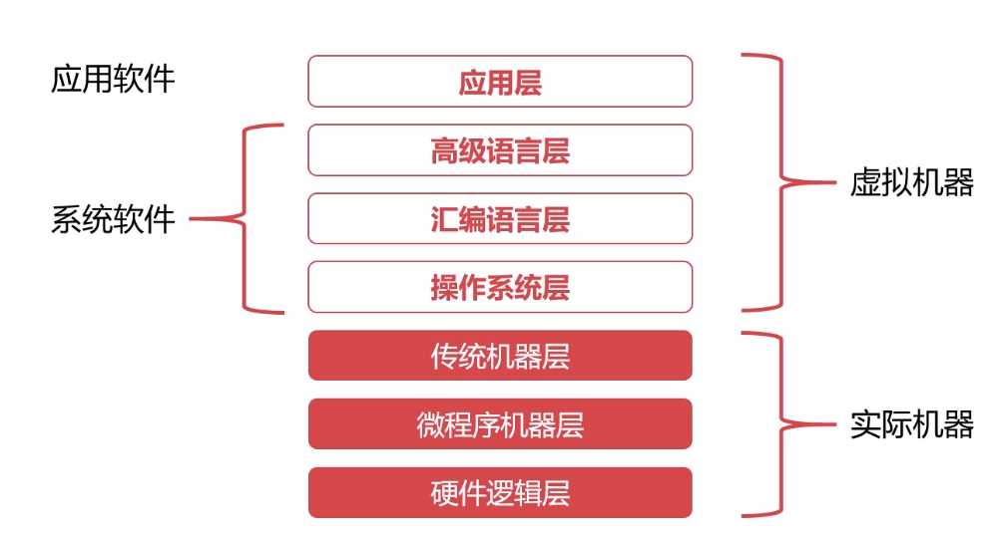
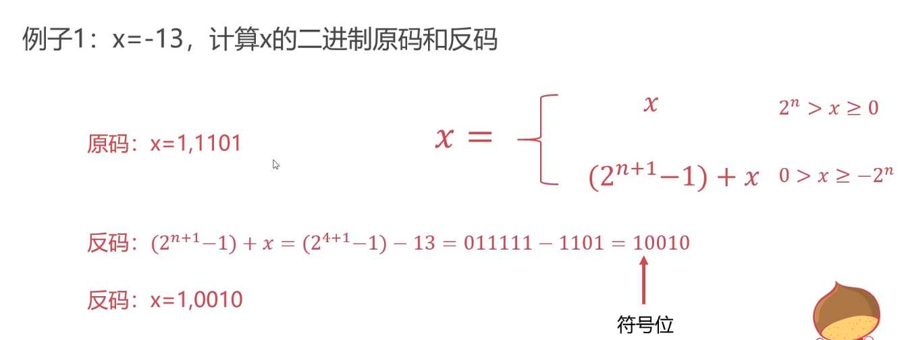

# 计算机组成原理

可以重点复习以下几个主题：

- **数据表示**：了解不同数据类型在计算机中的表示方式。
- **基本计算机结构**：理解CPU、内存、输入/输出设备之间的交互。
- **指令集架构**：熟悉常见的指令集和它们的作用。
- **存储器层次结构**：了解缓存、主存和辅助存储之间的关系。

总的来说，虽然计算机组成原理不是前端面试的重点，但作为计算机科学的基础知识，掌握这些内容对于任何软件开发职位都是有益的。如果你对这方面感兴趣，可以通过阅读相关书籍或在线资源来进一步学习

## 一 计组之概述篇

### 1、计算机的发展历史

第一阶段（1946-1957）：电子管计算机 **特点：集成度低，体积大，功耗高，运行速度慢，操作复杂。** 

第二阶段（1957-1964）：晶体管计算机 **特点：相对电子管计算机，体积小，速度快，功耗低，可靠性高，配备显示器。** 

第三阶段（1964-1980）：集成电路计算机 **特点：操作系统诞生。** 

第四阶段（1980-至 今）：超大规模集成电路计算机 **特点：集成度高，速度快，体积小，价格低，用途广泛。** 第五阶段（ f u t u r e） ：生物计算机&&量子计算机 … 

### 2、计算机的分类

超级计算机、大型计算机、迷你计算机（普通服务器）、工作站、微型计算机（个人计算机） 

### 3、计算机的体系与结构

**冯·诺伊曼体系**：将**程序指令**和**数据**一起存储的计算机设计概念结构，存储器+控制器+运算器+输入设备+输出设备。 


 **现代计算机的结构**：以存储器为核心，解决**冯·诺伊曼体系瓶颈**问题（**CPU与存储设备之间的性能差异**）。 


在这里插入图片描述

### 4、计算机的层次



### 5、计算机的字符与编码集

字符编码集的历史：ASCII码 –> Extended ASCII码 中文编码集：GB2312、GBK、**Unicode(统一码、万国码）** 

## 二 计组之组成篇

### 1、计算机的总线与I/O设备

#### a.计算机的总线（Bus）

概述：连接多个设备或者接入点的数据传输通路。

**作用：解决不同设备之间的通信问题。** 

分类：片内总线（高集成度内部的信息传输线）、系统总线（细分为：数据总线&地址总线&控制总线，是CPU、主内存、IO设备、各组件之间的信息传输线）

总线的仲裁：**为了解决总线使用权的冲突问题**，三种方法：链式查询、计时器定时查询、独立请求。 

#### b.常见的输入输出设备

字符输入设备：键盘  图形输入设备：鼠标、数位板、扫描仪  图像输出设备：显示器、打印机、投影仪 

#### c.输入输出接口的通用设计

数据线：I/O设备与主机进行数据交换的传送线（单向&双向）。

状态线：I/O设备状态向主机报告的信号线。

命令线：CPU向I/O设备发送命令（读写信号、启动停止信号）的信号线。

设备选择线：主机选择I/O设备进行操作的信号线。

#### d.CPU与I/O设备的通信

程序中断：提供低速设备通知CPU的一种异步的方式，CPU可以在高速运转的同时兼顾低速设备的响应。

直接存储器访问（DMA）： 


### 2、计算机的存储器

#### a.存储器的分类：

按照存储介质：半导体存储器（内存、U盘、固态硬盘）、磁存储器（磁带、磁盘） 

按照存取方式：随机存储器RAM（随机读取，与位置无关）、串行存储器（按顺序查找，与位置有关）、只读存储器ROM（只读不写） 

#### b.存储器的层次结构


缓存-主存层次：**局部性原理**，在CPU与主存之间增加一层速度快容量小的Cache，**解决主存速度不足的问题。**

主存-辅存层次：**局部性原理**，主存之外增加辅助存储器，**解决主存容量不足的问题。**

局部性原理：是指CPU访问存储器时，无论是存取指令还是存取数据，所访问的存储单元都趋于聚集在一个较小的连续区域中。 


#### c.计算机的主存储器

内存RAM（随机存取存储器Random Access Memory）：通过**电容**存取数据，**掉电将丢失所有数据。** 

#### d.计算机的辅助存储器

#### e.计算机的高速缓存

工作原理：命中率是衡量缓存的重要性能指标，理论上CPU每次都能从高速缓存取数据的时候，命中率为1。 


 高速缓存的替换时间：当缓存没有数据，需要从主存载入数据的时候。 高速缓存的替换策略：随机算法、**先进先出算法（FIFO)、最不经常使用算法（LFU）、最近最少使用算法（LRU）。** 

### 3、计算机的CPU

#### a.计算机的指令系统

机器指令的形式：操作码（指明指令所要完成的操作）+地址码（给出操作数或操作数的地址）；

机器指令的操作类型：数据传输、算术逻辑操作、移位操作、控制指令；

机器指令的寻址方式：指令寻址（顺序寻址+跳跃寻址）、数据寻址（**立即寻址（速度快**）+**直接寻址（寻找操作数简单**）+**间接寻址（寻址范围大，速度慢**）） 

#### b.计算机的控制器 

作用：控制器是协调和控制计算机运行的。

组成：程序计数器（存储下一条指令的地址）、时序发生器（发送时序脉冲）、**指令译码器**（控制器的主要部件之一，**翻译操作码+地址码**）、**指令寄存器**（控制器的主要部件之一，**从主存或缓存存取计算机指令**）、主存地址寄存器（保存当前CPU正要访问的内存地址单元）、主存数据寄存器（保存当前CPU正要读或写的主存数据）、通用寄存器（比一般专用寄存器大，可以暂时存放或传送数据或指令，可保存ALU的运算中间结果）。 

#### c.计算机的运算器

作用：进行数据运算加工。

组成：数据缓冲器（输入缓冲暂时存放外设送过来的数据，输出缓冲暂时存放送往外设的数据）、**ALU（算术逻辑运算）**、状态字及寄存器（存放运算状态和运算控制信息）、通用寄存器（比一般专用寄存器大，可以暂时存放或传送数据或指令，可保存ALU的运算中间结果）。 

#### d.计算机指令执行的过程

指令执行过程：取指令-分析指令-执行指令 


 CPU的流水线设计：因运算器和控制器不能同时工作，CPU的综合利用率并不高，所以**CPU的流水线设计可以提高CPU的利用率**，提高大概3倍。 

## 三 计组之计算篇

### 进制运算的基础知识

进位制：即进制，是一种计数方式，亦称进位计数法，有限种数字符号来表示无限的数值。 传送门——>[二进制，八进制，十进制，十六进制转换算法_八进制转十六进制公式-CSDN博客](https://blog.csdn.net/meegomeego/article/details/49948241)

### 二进制数据的表示方法

#### a.有符号数和无符号数

 原码表示法：0表示正数，1表示负数，规定符号位位于数值的第一位；表达简单，容易理解，但运算复杂。 

#### b.二进制的补码表示法

 定义：


引入目的：为了消除减法（未完全实现）引入补码的概念，使用正数代替负数。 规律：**负数的补码等于反码+1，如十进制数-7，反码表示为1，1000，补码表示为1，1001。** 举个小例子计算题：


####  c.二进制的反码表示法

 定义：


引入目的：找出原码和补码之间的规律，消除转换过程中的减法操作。 规律：**负数的反码等于原码除符号位外按位取反，如十进制数-7，原码表示为1，0111，反码表示为1，1000**。 举个小例子计算题：



####  d.小数的二进制补码表示

定义：


 上述两个整数的反码补码计算规律同样适用。

### 二进制数据的运算

#### a.定点数与浮点数

定点数：小数点固定在某个位置。 浮点数的表示格式：符号、阶码、尾数 


（4-7--555）

 浮点数的表示范围：单精度± (2-2^-23) × 2127 双精度± (2-2^-52) × 21023 **其中大于浮点数绝对值最大的数为上溢，小于绝对值最小的数据为下溢**。 浮点数的规格化：**尾数使用纯小数、尾数最高位必须是1。** 

#### b.定点数的加减法运算

加法运算：**数值位与符号位一同运算，并将符号位产生的进位自然丢掉（模2^n舍去）。** 


 举两个小栗子计算题（整数和小数）：


减法运算：将B[补码]转换成-B[补码]来计算，**其中-B[补码]=B[补码]连同符号按位取反，末尾加1，例如B[补码]=1，0010101 ，则-B[补码]=0，1101011**。 举个小栗子计算题：


####  c.浮点数的加减法运算

**步骤：**对阶（使得阶码一致，尾数才可以运算）–>尾数求和–>尾数规格化–>舍入–>溢出判断 运算：先进行对阶，后与定点数的加减法相同。 

举个小栗子计算题： 


#### d.浮点数的乘除法运算

乘法：阶码相加，尾数求积。 除法：阶码相减，尾数求商。

## 四 计组之实践篇

1. 实现双向链表 单向链表：节点1–>节点2–>节点3–>节点4–>节点5 其中**每一个节点都有下一个节点的地址或引用。** 双向链表：节点1⇋节点2⇋节点3⇋节点4⇋节点5 **每一个节点都有上一个和下一个节点的地址和引用。** **双向链表优点：可以快速找到上/下节点，也可以快速去掉链表中的某一个节点。** 传送门——>实现双向链表
2. 实现FIFO缓存置换算法 **淘汰缓存时，把最先进入链表的结点淘汰掉。** 传送门——> 实现FIFO缓存置换算法
3. 实现LRU缓存置换算法 传送门——> 实现LRU缓存置换算法
4. 实现LFU缓存置换算法 传送门——> 实现LFU缓存置换算法

# 待定面试题

### 一 巩固习题

1. 计算机的发展历史大概可以分为几个阶段？每个阶段的计算机分别有什么特点？
   分为四个阶段:
   电子管计算机：**集成度低，体积大，功耗高，运行速度慢，操作复杂。**
   晶体管计算机：**相对电子管计算机，体积小，速度快，功耗低，可靠性高，配备显示器。**
   集成电路计算机：**操作系统诞生。**
   超大规模集成电路计算机：**集成度高，速度快，体积小，价格低，用途广泛。**
2. 你了解“摩尔定律”吗？“摩尔定律”对现代计算机产生了什么影响？
     摩尔定律是由英特尔（Intel）创始人之一戈登·摩尔（Gordon Moore）提出来的。其内容为：**当价格不变时，集成电路上可容纳的元器件的数目，约每隔18-24个月便会增加一倍，性能也将提升一倍**。换言之，每一美元所能买到的电脑性能，将每隔18-24个月翻一倍以上。这一定律揭示了信息技术进步的速度。尽管这种趋势已经持续了超过半个世纪，摩尔定律仍应该被认为是观测或推测，而不是一个物理或自然法。
3. 你了解冯诺依曼机吗？你是否可以大概描述冯诺依曼机的基本组成和工作原理？冯诺依曼机相对于之前的计算机有什么重要改进？
     冯诺依曼机有五大组成部分：**输入设备、输出设备、运算器、存储器、控制器**。冯诺依曼机把**程序指令和运行数据存储起来**，使得计算机从专用电路计算机发展成为通用电路计算机。
4. 什么是冯诺依曼瓶颈？冯诺依曼瓶颈对现代计算机产生了什么影响？
     冯诺依曼瓶颈指的是**存储器和运算器之间的访问速率差异巨大**，使得计算机性能无法提升。现代计算机以存储器为核心，根据局部性原理设计了存储器的层次结构，大幅提升计算机性能。
5. 你了解程序解释和程序翻译吗？什么是编译型语言，什么是解释型语言呢？
     编程语言可以分为解释型语言和编译型语言，程序解释指的是程序代码在运行时，逐行翻译成较低层次的编程语言去执行；程序翻译指的是程序代码在编译阶段提前翻译成较低层次的编程语言逻辑，在运行时直接运行。
6. 请你列举十种以上的编程语言，并分别分类他们属于什么类型的语言。
     编译型语言：C、C++、Go、OC，解释型语言：Php、Python、Javascript、Perl、Lua，翻译+解释型语言：Java、C#、Kotlin等。
7. 你了解计算机的层次结构吗？今天的软件和硬件是怎么界定的。
     计算机的层次结构划分是为了方便理解计算机的整一个体系，在不同书籍或领域会有不一样的划分，没有绝对的正确。今天的软件、硬件的划分以硬件电路为界限，从涉及硬件电路逻辑往下的都归为硬件，要注意软件和硬件的划分也是与时俱进的，今天的软件很可能明天就变成了硬件，比如以前编写硬件逻辑代码是软件，而随着高级编程语言的出现和成熟，现在编写硬件逻辑代码已经视为硬件部分了。
8. 请你尝试说明高级语言、汇编语言和机器语言的区别和联系？
     高级语言是方便程序员描述程序逻辑的编程语言，与人类语言接近；汇编语言时方便程序员描述硬件逻辑的编程语言，与底层硬件接近；机器语言时方便计算机理解和运行的编程语言，一般程序员无法理解。
9. CPU的速度一般使用什么做单位？它具有什么物理意义？
     赫兹，是国际单位制中频率的单位，它是每秒中的周期性变动重复次数的计量。1Hz = 1/s，即在单位时间内完成振动的次数，单位为赫兹（1赫兹=1次/秒）。
10. 网络的速度一般使用什么做单位？
      bps，比特率是指每秒传送的比特(bit)数。单位为 bps(Bit Per Second)，比特率越高，每秒传送数据就越多。
11. 20世纪80年代以前的计算机是不支持输入中文的，当时的计算机使用的是什么编码集？
    ASCII编码集。
12. ASCII编码集占用多少个字节？
    ASCII有128个字符，占用7个比特位，扩展ASCII编码机占用8个比特位，一个字节。
13. ‘A’, ‘b’, 'C’对应的ASCII十进制数值分别是多少？
    65、98、67。
14. 你可以使用你熟悉的语言将 72、96、108转换为ASCII码吗？
    Python使用chr函数就可以将十进制数转换为ASCII码对应字符。

```python
>>> chr(72)
'H'
>>> chr(96)
'`'
>>> chr(108)
'l'
```

1. 你知道Unicode编码和UTF-8编码的区别和联系吗？
     Unicode全名为：统一码、万国码，是计算机科学领域里的一项业界标准。Unicode标准有不同的编码实现，比如UTF-8、UTF-16、UTF-32，也即是可以有多种规则来实现Unicode标准，比如UTF-8使用的是不定长字节表示Unicode字符，在表示高位Unicode字符时可以自动扩展，UTF-32使用的是定长4个字节表示Unicode字符。
2. 假设有10000个汉字，6000个日本字，3000个韩国字，1000个特殊字符，如果让你设计一套通用的编码集，请问每个字至少几个比特位？
     10000+6000+3000+1000=19000个字符，最起码使用15个比特位，占2个字节。

### 二 重要概念需要详细了解

1. 摩尔定律
2. 冯诺依曼机
3. 冯诺依曼瓶颈
4. 程序解释
5. 程序翻译
6. 高级语言
7. 汇编语言
8. 机器语言
9. 计算机硬件
10. 计算机软件
11. 计算机的层次结构
12. 计算机编码集


### 一 巩固习题

1. 计算机的总线就像是计算机的“高速公路”，你是否可以说出总线主要的功能和分类？
   总线的功能是**解决不同设备之间的通信问题**。可以分为：片内总线、系统总线，其中系统总线可以分为数据总线、地址总线、控制总线。
2. 什么是总线标准，为什么需要总线标准，现在有哪些常见的总线标准？
   总线标准是系统与各模块、模块与模块之间的一个互连的标准界面。总线标准有利于各模块高效使用总线。USB、PCIe等。
3. 常说的“IO设备”，“I”、“O”分别是什么的缩写？
   Input、Output，输入设备、输出设备。
4. 常见的输入设备可以分为什么种类？
   字符输入设备（键盘等）、图像输入设备（鼠标、数位板、扫描仪）。
5. 常见的输出设备可以分为什么种类？
   主要是图像输出设备（显示器），但在计算机远未普及的时候，显示器属于字符输出设备。
6. 日常常见的计算机外设（显示器、键盘、鼠标、打印机），分别属于什么设备？
   显示器、打印机属于输出设备，键盘、鼠标属于输入设备。
7. 输入输出接口一般需要完成什么工作，可以把接口的线路分为什么线路？
   数据线、状态线、命令线、地址线。
8. DMA的全称是什么？
   DMA：Direct Memory Access，直接内存存取。
9. 你是否可以清晰的表述计算机存储器的层次结构？存储器的层次结构是为了解决什么问题的？
   存储器的层次结构可以简单划分为：缓存-主存-辅存三个层次，**缓存-主存主要是为了解决主存速度不够的问题**；**主存-辅存主要是为了解决主存容量不足的问题**。
10. 程序中断和DMA相比，有什么优劣？
    程序中断和DMA都是计算机IO和低速设备的交互方式，程序中断方式实现简单，**DMA方式效率更高**。
11. 什么是局部性原理，局部性原理对计算机存储系统的设计产生了什么影响？
    局部性原理是指CPU访问存储器时，无论是存取指令还是存取数据，所访问的存储单元都趋于聚集在一个较小的连续区域中。
12. 计算机存储系统的每一个层次分别有什么特点？
    缓存：速度快、位价高；主存：速度适中、位价适中；辅存：速度慢、位价低。
13. 磁盘的调度算法有哪些？
    先来先服务算法、最短寻道时间优先算法、扫描算法、循环扫描算法。
14. 计算机的主存一般是指计算机内存，内存有什么特点？
    主存容量比缓存大、比辅存小，访问速度比缓存慢，比辅存快，主存需要持续通电使用，停电时主存数据将会丢失。
15. 请解释概念：主存、辅存、Cache、RAM、ROM？
    主存：主存储器，即常说的计算机内存条，
    辅存：辅助存储器，即常说的磁盘、U盘、光盘、磁带等，
    Cache：高速缓存，即常说的L1、L2、L3缓存，CPU寄存器等，
    RAM：随机存取存储器（英语：Random Access Memory，缩写：RAM），
    ROM：只读存储器（Read Only Memory，缩写：ROM）。
16. 什么是字？什么是字块？
    字是指存放在一个存储单元中的二进制代码组合；字块是指存储在连续的存储单元中而被看作是一个单元的一组字。
17. 计算机的高速缓存一般是指Cache，Cache一般位于计算机的什么硬件设备上？
    在CPU上。
18. 一般使用什么指标去评估主存-高速缓存的性能？
    命中率。
19. 命中率是怎么定义的？
    
20. 访问效率是怎么定义的？
    
21. 假设CPU执行某段程序共计访问Cache命中4800次，访问主存200次，已知Cache的存取周期是30ns，主存的存取周期是150ns，求Cache-主存系统的平均访问时间和效率，试问该系统的性能提高了多少？
    平均访问时间：(480030+150200)/5000=34.8ns，命中率：4800/5000100%=96%，访问效率e：30/34.8100%=86.2%，性能提升：(150-34.8)/150*100%=76.8%。
22. 计算机的指令一般由操作码和地址码组成，那么计算机指令可以分类为几种类型？
    移位操作指令、数据传输指令、控制指令、算术逻辑操作指令。
23. 对计算机指令数据的寻址有哪几种方式？
    立即寻址、直接寻址、间接寻址。
24. 计算机的运算器主要由什么组成？控制器呢？
    控制器主要由：程序计数器、时序发生器、指令译码器、寄存器、总线组成。运算器主要由：数据缓冲器、ALU、寄存器、状态字寄存器、总线组成。
25. 请简述计算机指令的执行过程。
    指令执行过程：取指令-分析指令-执行指令
    


### 一 巩固习题

1. 除了十进制以外，这个世界上常见的还有什么进制？
   二进制、八进制、十二进制、二十进制、六十进制。
2. 二进制一般使用什么方法转换成十进制？
   整数：按权展开法。
3. 十进制一般使用什么方法转换成二进制？
   整数：重复相除法，小数：重复相乘法。
4. 计算机直接使用原码计算有什么缺点？
   0有两种表示方法，减法运算复杂。
5. 请计算12、124、1023、-1、-127的二进制原码。
   12(0b1100)、124(0b1111100)、1023(0b1111111111)、-1(-0b1)、-127(-0b1111111)
6. 计算机的补码解决了什么问题？
   相比原码的运算过程（特别是减法），补码对于计算机而言运算更加简单。
7. 计算机为了判断运算溢出使用了什么方法？
   双符号位判断法。当双符号位不一致表示溢出。
8. 什么是溢出？什么是上溢？什么是下溢？
   溢出即计算机无法表示数值。上溢是指数值绝对值大于表示范围，下溢是指计算机无法提供有效精度表示数值。
9. 浮点数相比定点数，有什么优势？有什么不足的地方。
   浮点数可以表示更大的数据范围，但是运算耗时更长。
10. 浮点数之间做加减法运算需要几个步骤？每个步骤都是必须的吗？为什么？
    浮点数加减法需要经过以下几个步骤：对阶、尾数求和、尾数规格化、舍入、溢出判断。对阶是为了使得尾数可以进行运算，阶码不一致尾数运算无效，尾数规格化、舍入是为了正确存储结果，溢出判断是为了判断运算过程是否有误，如果溢出将会发出信号进行溢出处理。
11. x=0.1101^1001, y=0.1011^110，请计算x+y的值，x-y的值。
    x+y=`0.1110011^1001`，x-y=`0.1011101^1001`。
12. x=0.1101^111, y=-0.1111^1101，请计算x+y的值，x-y的值。
    x+y=`-0.1110110011^1101`，x-y=`0.1111001101^1101`。


# 面试题

#### Q：冯诺依曼机

A:冯诺依曼机特点

1. 计算机硬件系统由**运算器、存储器、控制器、输入设备和输出设备** 5 大部件组成
2. 指令和数据以同等地位存储在存储器中，并可按地址寻访
3. 指令和数据均用二进制代码表示
4. 指令由操作码和地址码组成
5. 指令在存储器内按顺序存放
6. 早期的冯诺依曼机以**运算器**为中心，输入／输出设备通过运算器与存储器传送数据。现代计算机以**存储器**为中心

#### Q：存储程序？

A：存储程序的概念是指将指令以代码的形式事先输入计算机的主存储器，然后按其在存储器中的首地址执行程序的第一条指令，以后就按该程序的规定顺序执行其他指令，直至程序执行结束

#### Q：在计算机系统结构中，什么是编译？什么是解释？

A：

- 解释：在运行程序的时候才翻译，翻译一句执行一句，边翻译边执行
- 编译：将高级语言转化为汇编语言

#### Q：计算机系统 5 层层次结构？虚拟机是哪几层？

A：微程序机器层、传统机器语言层、操作系统层、汇编语言层、高级语言层

虚拟机：操作系统层、汇编语言层、高级语言层

#### Q：字长？

A：

- 机器字长：计算机能直接处理的二进制位数
- 指令字长：一个指令字中包含的二进制代码位数
- 存储字长：一个存储单元存储二进制代码长度

#### Q：为什么采用补码加减？

A：省去计算机判断符号位或者说判断 +/- 运算的麻烦。采用补码表示后，不管是加法还是减法都是加法运算

#### Q：IEEE 754 标准

A：

#### Q：在计算机中，为什么要采用二进制来表示数据？

A：

- 从可行性来说，采用二进制，只有 0 和 1 两个状态，能够表示 0 、1 两种状态的电子器件很多
- 从运算的简易性来说，二进制数的运算法则少，运算简单
- 从逻辑上来说，由于二进制 0 和 1 正好和逻辑代数的假 (false) 和真 (true) 相对应

#### Q：什么是存储单元，存储字，存储字长，存储体？

A：

- 存储单元：存储一个存储字并具有特定存储地址的存储单位。
- 存储字：一个存储单元中存放的所有二进制数据。
- 存储字长：存储字中存储的所有二进制数据的位数。
- 存储体：有多个存储单元构成的存储器件。

#### Q：主存储器中，什么是 MAR, 什么是 MDR，存储器的最大容量由什么决定？

A：

- MAR：指存储地址寄存器，保存需要访问的存储单元地址，反应存储单元的个数
- MDR：指存储数据寄存器，缓存读出或写入存储单元的数据，反应存储字长

存储器的最大容量由 MAR 寄存器的位数和 MDR 寄存器的位数决定

#### Q：多级存储系统？

A：为了解决存储系统大容量、高速度和低成本 3 个相互制约的矛盾

- “Cache - 主存”层次：解决 CPU 和主存速度不匹配的问题
- “主存 - 辅存”层次：解决存储系统的容量问题

#### Q：大端方式和小端方式？

A：

- 大端方式：字的低位存在内存的高地址中，而字的高位存在内存的低地址中
- 小端方式：字的低位存在内存的低地址中，而字的高位存在内存的高地址中

#### Q：随机存储器

A：

- 静态随机存储器（SRAM）：速度快，集成度低，价格高，不需要刷新，用于高速缓存
- 动态随机存储器（DRAM）：速度慢，集成度高，价格低，需要刷新，用于内存

#### Q：程序访问的局部性

A：

- 时间局部性：如果一个存储项被访问，则可能该项会很快被再次访问
- 空间局部性：如果一个存储项被访问，则该项及其邻近的项也可能很快被访问

#### Q：Cache

A：利用程序访问的局部性原理，把程序中正在使用的部分存放在一个高速的、容量较小的临时存储器中

引入目的：解决 CPU 和主存之间运算速度的差异

#### Q：Cache 与主存的映射方式

A：直接映射、全相联映射、组相联映射

- 直接映射：地址变换速度快，cache 利用率不高，块冲突率高
- 全相联映射：cache 利用率高，块冲突率低，地址变换复杂

#### Q：Cache 替换算法

A：随机算法、先进先出算法（FIFO）、近期最少使用算法（LRU）（最优）

#### Q：Cache 写操作方式

A：

- 全写法：写操作既写入 Cache 又写入主存
- 写回法：只把数据写入 Cache ，当 Cache 中数据被替换出去之后才写入主存

#### Q：虚拟存储器

A：虚拟存储器是指具有请求调入和置换功能，能从逻辑上对内存容量加以扩存的一种存储器系统

- 页式虚拟存储器：把虚拟存储空间和实际空间等分成固定大小的页
- 段式虚拟存储器：把程序按段划分
- 段页式虚拟存储器：将程序按逻辑结构分成段，每段又分成若干个页

#### Q：快表

A：加快地址变换，虚页号变换成主存中实页号

#### Q：一条指令包含哪些部分？

A：操作码字段、地址码字段

指令中的地址可以为四地址（访存 4 次），三地址（访存 4 次），二地址（访存 3 次），一地址（访存 2 次）和零地址

#### Q：寻址方式包括哪两类？

A：指令寻址、数据寻址

#### Q：各种数据寻址方式概念

A：

- 隐含寻址：不显式的给出第二操作数的地址，规定累加器作为第二操作数地址
- 立即（数）寻址：地址字段存放操作数本身，数据以补码形式存放
- 直接寻址：形式地址 A 即为操作数的有效地址 EA
- 间接寻址：形式地址是操作数有效地址所在的存储单元的地址
- 寄存器寻址：在指令字中直接给出操作数所在的寄存器编号，操作数在寄存器中
- 寄存器间接寻址：在指令字中给出操作数所在的寄存器编号，寄存器中给出的是操作数所在主存单元的地址
- 相对寻址：程序计数器 PC 的内容加上指令格式中的形式地址而形成操作数的有效地址，广泛应用于转移指令
- 基址寻址：基址寄存器 BR 的内容加上指令格式中的形式地址而形成操作数的有效地址，利于多道程序设计，可用于编制浮动程序
- 变址寻址：变址寄存器 IX 的内容加上指令格式中的形式地址而形成操作数的有效地址，适用于编制循环程序，处理数组问题

#### Q：CISC 和 RISC

A：

- CISC：复杂指令系统计算机，指令数目多，字长不固定，寻址方式多，寄存器数量少，一般为微程序控制
- RISC：精简指令系统计算机，指令数目少，字长固定，寻址方式少，寄存器数量多，一般为组合逻辑控制

#### Q：指令周期

A：取指周期、间址周期、执行周期、中断周期

#### Q：影响流水线性能的因素

A：数据冲突（数据旁路）、控制冲突（动态预测）

#### Q：总线的两大基本特征

A：分时、共享

#### Q：系统总线按照传输信息的不同，分成哪几类？

A：数据总线（双向）、地址总线（单向）、控制总线（单向）

#### Q：集中式总线判优控制有哪三种方式？

A：链式查询、计数器定时查询、独立请求方式

#### Q：总线通信控制

A：

- 同步通信：总线上各个部件由统一的时钟信号控制
- 异步通信：总线上各部件没有统一的时钟标准，采用应答式通信
  - 不互锁、半互锁、全互锁

#### Q：I/O 控制方式

A：

- 程序查询方式：由程序不断的查询外设的状态，直到外设准备就绪
- 程序中断方式：在计算机执行现行程序的过程中，出现某些急需处理的异常情况或特殊请求，CPU 暂时中止现行程序，而转去对这些异常情况或特殊请求进行处理，在处理完毕后 CPU 又自动返回到现行程序的断点处，继续执行原程序
- DMA 方式：在外设和主存之间开辟一条直接数据通道
- 通道方式：专门管理 I/O 的处理机

#### Q：I/O 设备编址方式

A：统一编址方式、独立编址方式

#### Q：中断服务程序的基本流程

A：

1. 保护现场
2. 执行中断服务程序
3. 恢复现场
4. 开中断
5. 中断返回

#### Q：DMA 工作过程包括哪三部分

A：

1. 预处理
2. 数据传输
3. 后处理

# 面试题1

## 1.1、冯诺伊曼计算机特点

1、硬件系统由五大部件组成：运算器、存储器、控制器、输入设备、输出设备。

2、指令和数据以二进制存放在存储器中，按地址访问。

3、指令在存储器中按顺序存放。

4、指令由操作码和地址码组成。

5、以运算器为中心。（现代计算机以存储器为中心）

## 1.2、存储程序的概念。

将指令以代码的形式事先输入到计算机主存储器中，然后按其在存储器中的首地址执行程序的第一条指令，以后就按照该程序的规定顺序执行其他指令，直至程序执行结束。

## 1.3、冯诺依曼机中数据为什么用二进制编码表示

1、二进制运算规则简单。（通过0，1转换成加法运算）

2、制造两个稳态的物理器件容易。（只需要高、低电平）

3、便于用逻辑门电路实现算术运算。（0，1对应真假）

## 1.4、指令和数据都以二进制存储，CPU如何区分

CPU根据指令周期的不同阶段来区分，取指阶段取出指令，执行阶段取出数据。

## 1.5、机器语言、汇编语言、高级语言的区别与联系

机器语言：由二进制编码组成，是计算机唯一可以直接识别和执行的语言。

汇编语言：用助记符代替二进制的指令代码，容易记忆；必须经过汇编操作转换为机器语言，才能在硬件上执行。

高级语言：需要经过编译程序编译成汇编语言程序，然后经过汇编得到机器语言程序。（C，C++，Java）也可以直接由高级语言程序翻译成机器语言程序。（Python）

## 1.6、翻译程序是什么，有哪些

翻译程序：把高级语言程序转换成机器语言程序（目标代码）的软件。

翻译程序有三种

1、编译程序：将高级语言源程序一次全部翻译成目标程序，每次执行程序时，只要执行目标程序就行。源程序不变就无需重新编译。

2、解释程序：将一条语句翻译成机器目标代码并立即执行，然后接着翻译下一条，不生成目标程序。

3、汇编程序：将汇编语言程序翻译成机器语言程序。

## 1.7、字长、字、指令字长、存储字长

字长（机器字长）：一次整数运算所能处理的二进制数据位数。（如16位机器，16位即为字长）

字长=CPU内部整数运算器位数=通用寄存器位数

字：被处理信息的单位。

指令字长：一个指令字中二进制代码的位数。

存储字长：一个存储单元中二进制代码长度。

指令字长=存储字长 * k（需要k个访存周期来取出一条指令）。

## 2.1、已知X和Y，如何用补码求X-Y

补补[𝑋]补+[−𝑌]补 （不论Y为正或负，由 补[𝑌]补 求 补[−𝑌]补 都是连同符号位取反，加1）

## 2.2、大端存储、小端存储

大端：先存高位字节（左边部分），再存低位字节（右边部分）。（正常思维方式）

小端：先存低位，后存高位。

## 2.3、计算机什么时候会发生溢出

加减法时超出了所能表示的范围，只有两正数或两负数相加才会发生。

## 2.4、怎么有什么方法判断溢出

1、符号位，如正+正=负 或 负+负=正 则溢出。

2、符号位进位和数值最高位进位，如果只有一个发生了进位则溢出。

3、双符号位，不一致就溢出。

## 2.5、浮点数的表示中为什么要用移码表示阶码

1、为了方便对阶操作，比较大小能直接看出来。阶码=移码=偏移常数+真值。

2、简化了对于“0”的判断，当移码的各位都为0的话，那么该移码对应的数据是能够表示的数据中的最小值。

3、可以提高表示数据的精度。因为没有负数。

## 3.1、半导体存储器有哪些

半导体存储器分为RAM和ROM，其中RAM又分SRAM和DRAM。他们都采用随机存取方式。

SRAM：非破坏性读出，无需刷新。易失性存储器，存取速度快，集成度低，功耗大，常用于Cache。

DRAM：破坏性读出，需要刷新。易失性存储器，集成度高、价位低，容量大、功耗低，速度比SRAM慢，常用于主存。

ROM：只能读出，不能写入。非易失性存储器，可作为主存的一部分。

## 3.2、什么是刷新周期，DRAM为什么要刷新，有几种刷新方式，SRAM要刷新吗

刷新周期：从上一次刷新结束到下一次对整个DRAM全部刷新一遍为止，这段时间间隔称为刷新周期。

为什么要刷新：DRAM利用存储元电路中的栅极电容上的电荷来存储信息，电荷一般只能维持1~2ms，所以信息会自动消失。

刷新分为集中式、异步式、分散式。

集中式：用一段固定时间依次对存储器所有行刷新。

分散式：把对每一行的刷新分散到各个工作周期中。

异步式：把对每行的刷新分散到一整个刷新周期中。

SRAM使用双稳态触发器记忆信息，不需要刷新。

## 3.3、Flash存储器有什么特点

支持随机存取，非易失性存储器，集成度高，价格便宜，能快速擦写，写入前需要先擦，所以写比读慢。

## 3.4、Cache有哪些映射方式

直接映射：主存数据块只能装入Cache中唯一位置。

全相联映射：可以装入Cache中任何位置。

组相联映射：将Cache分为若干组，一个主存块可以装入一组内任何位置。

## 3.5、Cache替换策略

1、随机法（RAND）：随机确定块。

2、先进先出（FIFO）：选择最早调入的换。

3、最近最少使用（LRU）：近期最久没用过的。

4、最不经常使用（LFU）：一段时间内最久没用过的。

## 3.6、Cache写策略有哪些

对于写命中

1、全写法（写直通法）：必须同时写入Cache和主存。换出块时，用新块直接覆盖，不必将换出块写入内存。实现简单，保持数据正确性，但增加了访存次数，降低了效率。

2、回写法：只修改Cache的内容，而不立即写入主存，只有当此块被换出时才写回内存。减少了访存次数，但存在不一致的隐患。

对于写不命中

1、写分配：写到Cache和主存中。

2、非写分配：只写入主存。

搭配：非写-全写，写-回写。

## 3.7、Cache总容量包括哪些

存储容量、标记阵列容量。

标记阵列容量：有效位（1位）+标记位+一致性维护位（脏位，采用写回法时）+替换算法控制位（若无替换算法则无此位）。

## 3.8、虚拟存储器

### （1）虚拟存储器概念

具有调入和扩充功能，能从逻辑上对内存容量加以扩充的一种存储器系统。

### （2）虚拟存储器管理方式

分为页式、段式、段页式。

1、页式：虚拟空间和内存空间分成固定大小的页，虚拟页可以装入主存中不同的实际页面位置。页式管理由操作系统完成，对应用程序员透明。

逻辑地址：虚页号+页内地址。 物理地址：页号+页内地址。 页表：页号+每页始址+装入位 等。

2、段式：把主存按段划分管理，每个用户程序分到一个段，只能访问段所对应的主存空间。段长可以任意设定，并且可以放大和缩小。

段表：段名+段起点+装入位+段长 等。段表本身也是一个段。

3、段页式：先按逻辑分成段，再将每段分成若干个页，访存依靠一个段表和若干页表完成。段长必须是页长整数倍，段起点必须是某页起点。

### （3）分页分段系统比较，优缺点：

1、分页：内存分为固定的块，按物理结构划分，有内部碎片。

2、分段：内存块大小不固定，按逻辑结构划分，有外部碎片。

3、段页式：先分段后分页，有内部碎片。

## 3.9、页表和快表

页表（Page）：存放在主存中的虚页号和实页号的对照表，将虚页号变换成主存中实页号的内部地址。

快表（TLB）：为了减少访存次数，将页表中最活跃的几个页表项复制到Cache中，这种Cache中的页表项组成起来就是快表。主存中的页表叫慢表。

TLB是Page的一个很小的副本，所以TLB命中则Page一定命中。

## 4.1、指令的基本格式，各字段作用

操作码+地址码

操作码：指出指令应该执行什么操作，有什么功能。

地址码：给出被操作信息的地址或操作数本身，可以有多个地址码。

## 4.2、相对寻址、基址寻址、变址寻址

1、相对寻址：程序计数器（PC）+形式地址（假设为A，相对于PC所指地址的偏移量），所以有效地址为（PC）+ A。

优点：便于一段代码在程序内部浮动，用于转移指令。

2、基址寻址：将CPU中基址寄存器（BR，BR位数大于A的位数）+ A，即（BR）+ A。基址寄存器面向操作系统，内容由操作系统确定，用户决定用哪个寄存器作为BR。

优点：可以扩大寻址范围，用户不必考虑自己程序位于主存何处，有利于多道程序设计，可用于编制浮动程序。

3、变址寻址：变址寄存器（IX）+ A。IX可以是专用的变址寄存器，也可以是通用寄存器。变址寄存器面向用户，IX的内容可由用户改变（作为偏移量），A不变（作为基地址）。

优点：可以设定A为数组首地址，不断改变IX，很容易遍历数组，适合编制循环程序。

## 4.3、CISC与RISC


图片来自王道

## 5.1、CPU的基本结构


来自王道


来自王道

## 5.2、指令执行过程


来自王道

## 5.3、CPU的功能

指令控制、操作控制、时间控制、数据加工、中断处理。

## 5.4、指令周期、机器周期、时钟周期

指令周期：CPU从主存中取出并执行一条指令的时间。

机器周期（CPU周期）：用从内存读取一条指令字的最短时间来表示。

时钟周期：节拍，T周期，最基本单位。

若干时钟周期表示一个机器周期，若干机器周期表示一个指令周期。

## 5.5、控制器分为哪几种

1、硬布线控制器：微操作控制信号由组合逻辑电路即时产生，即由硬件给出控制信号。

特点：速度快；难以扩充和修改、结构复杂。

2、微程序控制器：采用存储程序的原理，将微操作控制信号以微程序的形式存放在控制存储器中，一条机器指令对应一个微程序，执行指令时只需读出微程序执行，即由软件给出控制信号。

特点：每条指令都要从控制存储器读取，速度慢；可以通过改变控制存储器内容进行扩充和修改，结构规整。

## 5.6、微指令有哪些编码方式

1、直接编码：微指令的控制字段中每一位代表一个微命令。选用或不选用只需将对应位设为1或0。

特点：简单；指令字长太长，n个微命令就要n位操作字段。

2、字段直接编码：将微命令字段分为几个小段，把互斥微命令放在同一段编码，把相容的放不同字段中，每种编码代表一个微命令。

特点：每个小段中包含的信息位不能太多，否则将增加译码复杂性。每个小段需要留出一个状态，表示本字段不发出任何命令。

3、字段间接编码：某些微命令需要另一段的微命令来表示。

## 5.7、微指令和机器指令的关系

一个程序由多条机器指令组成。一条机器指令对应一个微程序。一个微程序由若干条微指令构成。一条机器指令所完成的操作划分成若干条微指令来完成，由微指令进行解释和执行。

一个微指令称为一个微周期，比如取指周期。只有在微程序控制器中，才有微命令的概念。硬布线控制器最小单位是微操作。

## 5.8、影响（阻塞）指令流水线的因素

1、结构相关：多条指令在同一时刻竞争同一资源形成冲突。

解决方法：（1）后面的指令暂停一个时钟周期。（2）单独设置数据存储器和指令存储器。

2、数据相关：必须等前一条指令执行完才能执行后一条指令，称这两条指令数据相关。

解决方法：（1）把数据相关的指令和其后指令都暂停几个时钟周期，直到数据相关问题解决。（2）设置专用通路，直接把前一条指令的计算结果作为自己的输入开始计算。这被称为数据旁路技术。

3、控制相关：流水线遇到转移指令和其他改变PC值的指令而造成断流。

解决方法：（1）尽早生成转移目标地址。（2）预取转移成功和不成功两个控制流方向上的目标指令。（3）加快和提前形成条件码。（4）提高转移方向的猜准率。

## 5.9、流水段越多，指令执行是否越快

并不是，因为流水段缓冲之间的开销会增大，并且控制逻辑变多，更加复杂。

## 6.1、总线的两种基本定时方式

1、同步通信方式：系统采用一个统一的时钟信号来协调发送和接受双方的传送定时关系。

2、异步通信方式：没有统一的时钟，依靠双方相互制约的握手信号来定时控制。分为不互锁、半互锁、全互锁。

## 7.1、I/O端口的编址方式有哪些

1、统一编址：把I/O端口当成存储器单元进行地址分配，采用统一的访存指令访问I/O端口。

优点：不需要专门的I/O指令，可以使端口有较大的编址空间。

缺点：占用了存储器地址，使内存变小，速度慢。

2、独立编址：I/O端口地址与存储器无关，CPU设置专门的I/O指令访存端口。

优点：编程简单清晰。

缺点：I/O指令少，一般只能对端口操作。控制更复杂了。

## 7.2、I/O方式有哪些

1、程序查询方式：利用I/O测试指令测试设备的闲忙。若设备不忙，则执行输入输出指令；若设备忙，则I/O测试指令不断对该设备进行测试，直到设备空闲为止。实现简单，但CPU和IO设备只能串行工作，长期处于忙等状态，CPU利用率低。

2、程序中断方式：引入中断之后，每当设备完成[I](https://link.zhihu.com/?target=https%3A//baike.baidu.com/item/I%2FO%E6%93%8D%E4%BD%9C/469761%3FfromModule%3Dlemma_inlink)/O操作，便以中断请求方式通知CPU，然后进行相应处理。但由于CPU直接控制输入输出操作，每传达一个单位信息（字），都要发生一次中断，因而消耗大量CPU时间。

3、DMA方式：用于高速外部设备与内存之间批量数据的传输。CPU只需在传输开始时设置好所需的控制信息，由DMA控制器控制一个数据块的传输。当本次DMA传送的数据全部完成时才产生中断，请求CPU进行结束处理。

## 7.3、程序中断的过程

中断请求、中断判优、响应中断、中断隐指令、中断向量、中断处理

中断隐指令：完成关中断、保存断点、引出中断服务程序。硬件完成。

中断向量：中断服务程序的入口地址。

## 7.4、中断处理过程


## 7.4、DMA和主存访存的方式有哪些

1、停止CPU访存。要求CPU放弃对相关总线的使用权。

2、DMA和CPU交替访存。将一个CPU周期分为两个周期，分别给DMA和CPU，分时控制。

3、周期挪用。DMA挪用一个或几个存取周期。

DMA优先级会高于CPU，因为如果得不到及时响应，传输的数据可能会丢失。

## 7.5、DMA方式和中断方式的区别

1、中断方式是程序的切换，需要保护和恢复现场；而DMA除了预处理和后处理，其他时候不占用CPU资源。

2、对中断请求的响应只能发生在每条指令执行完时；而对DMA请求的响应可以发生在每个机器周期结束时。

3、中断传送过程需要CPU干预；而DMA传送过程不需要CPU干预。

4、DMA优先级高于中断请求。

5、中断方式能处理异常事件；而DMA只能I/O操作。

6、中断方式靠程序传送数据；DMA靠硬件传送数据。

## 7.6、设备管理应具备哪些功能

1、状态跟踪：跟踪外设状态信息。

2、设备存取：对设备的存取操作。

3、设备分配：设备分配与回收。

4、设备控制：设备驱动，故障处理。

# 面试题2

## 1计算机概述

### 1.1 发展简史

#### 一阶段（1946~1957）

电子管计算机

电子管


第一代计算机"ENIAC"


世界上第一台电子计算机"ENIAC"于1946年2月14日在美国宾夕法尼亚大学诞生，美国人莫克利（JohnW.Mauchly）和艾克特（J.PresperEckert）发明，主要是有大量的电子管组成，主用于科学计算。

主要特点：

- 以电子管作为元器件，所以称电子管计算机
- 用了18000个电子管，占地150平方米，足有两间房子大，重达30吨，耗电功率约150千瓦，每秒钟可进行5000次运算
- 电子管空间占用大，耗电量大，易发热，因而工作的时间不能太长
- 使用机器语言，无系统软件
- 采用磁鼓、小磁芯作为储存器，存储空间有限
- 输入/输出设备简单，采用穿孔纸带或卡片，操作复杂，更换程序需要接线
- 主要用于科学计算，当时美国国防部用它来进行弹道计算


#### 二阶段（1957~1964）

晶体管计算机

- 晶体管


第二代计算机采用的主要元件是晶体管，称为晶体管计算机。计算机软件有了较大发展，程序语言也出现了Fortran，Cobol计算机高级语言，采用了监控程序，这是操作系统的雏形。

主要特点：

1、集成度较高，体积小

2、运算速度快，功耗更低

3、操作简单，交互方便（有显示器了）

#### 三阶段（1964~1980）

中小规模集成电路计算机。

德州仪器的工程师发明了集成电路(IC)


集成电路可在几平方毫米的单晶硅片上集成十几个甚至上百个电子元件。计算机开始采用中小规模的集成电路元件，这一代比上一代更小，耗电更少，功能更强，寿命更长，领域扩大，性能比上一代有很大提高。

主要特点：

1、体积更小，寿命更长。

2、运行计算速度更快。

3、外围设备考试出现多样化。

4、有类似操作系统和应用程序，高级语言进一步发展。

5、应用范围扩大到企业管理和辅助设计等领域。

#### 四阶段（1980~至今）

超大规模集成电路计算机。

这时期的计算机的体积、重量、功耗进一步减少，运算速度、存储容量、可靠性都有很大提高。

主要特点：

1、采用了大规模和超大规模集成电路逻辑元件，体积与第三代相比进一步缩小，可靠性更高，寿命更长。

2、运算速度加快，每秒可达集千万次到几十亿次。

3、系统软件和应用软件获得了巨大的发展，软件配置丰富，程序设计部分自动化。

4、计算机网络技术、多媒体技术、分布式处理技术有了很大的发展，微型计算机大量进入家庭，产品更新速度加快。

5、计算机在办公自动化、数据库管理、图像处理、语言设别和专家系统等各个领域得到应用，电子商务已开始进入家庭，出现个人电脑(PC)，计算机的发展进入到了一个新的历史时期。

#### 未来的计算机

超导计算机、纳米计算机、光计算机、DNA计算机、量子计算机和神经网络计算机等，体积更小，运算速度更快，更加智能化，耗电量更小。

```
程序的CPU执行时间 = 指令数×CPI×Clock Cycle Time
```

所以提升计算机的性能，可以通过指令数/CPI，好像都太难了。

因此工程师们，就在CPU上多放晶体管，不断提升CPU的时钟频率，让CPU更快，程序的执行时间就会缩短。

- 从1978年Intel发布的8086 CPU开始，计算机的主频从5MHz开始，不断攀升
- 1980年代中期的80386能够跑到40MHz
- 1989年的486能够跑到100MHz
- 直到2000年的奔腾4处理器，主频已经到达了1.4GHz

### 1.2 分类

#### 超级计算机

功能最强、运算速度最快、存储容量最大的计算机，多用于国家高科技领域和尖端技术研究。

计算速度单位 TFlop/s。1TFlop/s= 1万亿次浮点计算/s

Intel® Core™ 10090K CPU

```
5.3GHz = 59.45 GFlop/s =  0.05945TFlop/s
```


#### 大型计算机

又称大型机、大型主机、主机等，具有高性能，可处理大量数据与复杂的运算。该领域下IBM占据大份额。IBM Z9，NASA的最后一台大型机，使用的Red Hat Enterprise Linux。

但是造价太高，阿里巴巴提出去 I（IBM）O(Oracle）E（EMC）这种高代价的存储系统维护，而且伸缩性差。

#### 迷你计算机(服务器)

也称为小型机，普通服务器。不需要特殊的空调场所，具备不错的算力，可以完成较复杂的运算。

普通服务器已替代传统的大型机，成为大规模企业计算的核心。

#### 工作站

高端的通用微型计算机，提供比个人计算机更强大的性能。类似于普通台式电脑， 体积较大，但性能强劲。

#### 微型计算机

即个人计算机，是最普通的一类计算机，如台式机，笔记本和一体机。

### 1.3 冯·诺伊曼结构

早期计算机仅含固定用途程序，如果改变程序就得更改结构、重新设计电路。所以需要把程序存储起来，并设计通用电路，即存储程序指令设计通用电路。

- 把需要的程序和数据送至计算机中
- 长期记忆程序、数据、中间结果及最终运算结果的能力
- 具备算术、逻辑运算和数据传送等数据加工处理的能力
- 按照要求将处理结果输出给用户


#### 冯·诺伊曼瓶颈（von Neumann bottleneck）

在CPU与存储器之间的流量（资料传输率）与存储器的容量相比起来相当小，在现代电脑中，流量与CPU的工作效率相比之下非常小，在某些情况下（当CPU需要在巨大的数据上运行一些简单指令时），数据流量就成了整体效率非常严重的限制。CPU将会在数据输入或输出存储器时闲置。由于CPU速度远大于存储器读写速率，因此瓶颈问题越来越严重。


在CPU与存储器间的缓存存储器缓解冯·诺伊曼瓶颈。分支预测（branch prediction）算法的创建也帮助缓和了此问题。


程序翻译与程序解释

## 2 CPU的极限-功耗

[奔腾4的CPU主频从来没有达到过10GHz，最终定格在3.8GHz](https://zh.wikipedia.org/wiki/奔腾4)

奔腾4主频虽高，但实际性能却配不上同样的主频。

于是不仅让AMD获得喘息之机，更代表“主频时代”终结。后面几代Intel CPU主频不但没上升，反而下降。

至今的最高配置Intel X 系列 CPU


主频也不过5GHz。

相较于1978年到2000年，这20年里300倍的主频提升，从2000年到现在的20 年，CPU的主频大概提高3倍。


奔腾4时CPU主频进入瓶颈期


就是因为功耗。CPU，也称作**超大规模集成电路，Very-Large-Scale Integration，VLSI**。

CPU就是让晶体管里面的“开关”不断“打开”/“关闭”，组合完成各种运算和功能。


提高CPU计算速度：

- 增加密度
  同样的面积，多放晶体管。如果CPU的面积大，晶体管之间的距离变更大，电信号传输的时间就会变长，运算速度自然就慢了。
- 提升主频
  让晶体管“打开”/“关闭”更快，但是动作快，就要出汗散热，所以有了CPU上的硅脂、风扇、水冷。但设备散热效果也有极限。

因此，CPU里能够放下的晶体管数量和晶体管的“开关”频率也有限。

一个CPU的功率，可以用这样一个公式来表示：

```
功耗  ≈ 1/2 ×负载电容 × 电压的平方 × 开关频率 × 晶体管数量
```


为提升性能，要不断增加晶体管密度，就要把晶体管造得小一点，即提升“制程”。从28nm到5nm，还要提升主频，让开关频率变快。


但功耗过多，CPU散热就跟不上，公式里功耗和电压平方成正比，即可降低电压。

从5MHz主频的8086到5GHz主频的Intel X，CPU电压从5V下降到了1V。