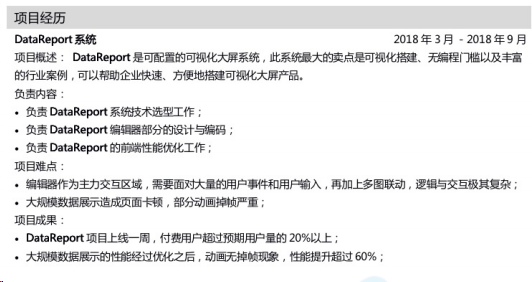
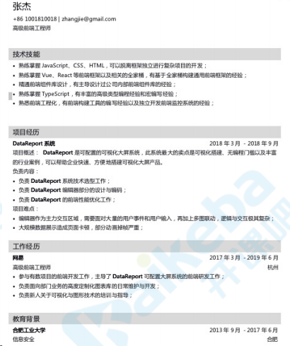

# 模拟面试

[AnsonZnl/interview-nav：面试网站导航，收集 IT 行业各个岗位的优质面试题网站、简历编写指南。 (github。com)](https：//github。com/AnsonZnl/interview-nav)

## 简历怎么写

### 面试官到底想看什么样的简历？

### 简历准备

简历是你进入面试的敲⻔砖，也是留给意向公司的第一印象，所以这个很重要，必须在这上面做足了文章，一份优秀的面试简历是整个面试成败的重中之重，我们会详细分析如何准备简历才能保证简历不被刷掉。

简历通常有这几部分构成：

1. 基本资料
2. 专业技能
3. 工作经历
4. 项目经历
5. 教育背景

我们会逐一进行分析。

### 准备简历模板

万事开头难，简历的编写如果从头开始需要浪费很多时间，其实最快速也最聪明的办法就是先找一份还不错的简历模板，之后我们只需要填写信息即可。

简历模板的选择很讲究，有些简历基本不看内容就会被刷掉，这些简历一般会对面试官进行视觉攻击，让简历给面试官的第一印象就是反感。

有两种坑爹的简历模板：

一种是经典简历模板，真是堪称『经典』，这种简历模板在我上小学的时候就有了，以现在的眼光看有点不够看了，配⾊也比较『魔幻』，加上表格类的简历属于 low 到底端的简历类型，基本上扫一眼就扔了，这种简历只需要 3 秒钟就能被面试官扔到垃圾堆。

另一种是设计感⼗足的简历模板，这种简历设计感⼗足，这五颜六⾊的配⾊一定能亮瞎面试官的双眼，这种花里胡哨的简历同样也是 3 秒钟沉到垃圾堆底部的简历。

以上两类简历模板堪称面试官杀手，我相信只要你用了上述两类模板，绝对连让面试官看第二眼的兴趣都没有。

面试官筛简历要的是高效、清晰、内容突出，不管是 HR 还是技术面试官都想在最快速的情况下看到有效信息，你眼中所谓的『视觉效果』在别⼈眼里就是『视觉噪音』或者『视觉垃圾』，严重影响看简历的⼼情和寻找有效信息的速度。

其实我发现不仅仅是在互联网技术招聘这个领域，大部分企业招聘的简历要求都很简单，清晰、简洁即可，最重要的是要内容清晰，突出主题。

就像这样，颜⾊不超过⿊白灰三⾊，把强调的内容讲清楚，让面试官一眼就看到重点即可：

### 准备个⼈信息

个⼈信息部分主要包括姓名、电话、点子邮箱、求职意向，当然这四个是必填的，其它的都是选填，填好了是加分项，否则很可能减分。

接下来才是重点：

1. github：如果准备一个基本没有更新的博客或者没有任何贡献的 github，那么给面试官一种为了放上去而放上去的感觉，这基本上就是在跟面试官说『这个候选⼈平时根本没有总结提炼的习惯』，所以如果有长期维护的 github 或者博客一定要放上去，质量好的话会非常有用，如果没有千万别放。
2. 学历：如果你的学历是专科、高中毕业之类的，还写在简历头部强调一遍，这就造成了你是『学渣』的印象，没有公司喜欢学渣的，这⼜增加了简历被刷的几率，如果是研究生以上学历可以写，突出一下学历优势，本科学历在技术面试领域基本上敲⻔砖级别的，没必要写。
3. 年龄：如果你是大龄程序员，尤其是你还在求一份低端岗位的时候千万别写，一个大龄程序员在求职一个中低端岗位，说明这些年基本原地踏步，还不能加班，到这里基本上此简历就凉了一半了。
4. 照片：形象优秀的可以贴，尤其是形象优秀的⼥程序媛，其它的最好不要贴，如果要贴的话，最好是贴那种 PS 过的非常职业的证件照，那种平时搞怪的、光着膀子的生活照，基本就是自杀行为。

如果你没有特别之处，直接按下面这种最简单的个⼈信息填写方式即可，切勿给自己加戏：

### 准备专业技能

对于程序员的专业技能其实就是技术栈，对于自己的技术栈如何描述是个很难的问题，比如什么算是精通？什么算是了解？什么是熟悉？

关于对技术技能的描述有很多种，有五种的也有三种的，而且每个⼈对词汇的理解都不一样，我结合相关专家的理解和自己的理解来简单阐述下描述词汇的区别，我们这里只讲三种的了解、熟悉、精通。

了解：使用过某一项技术，能在别⼈指导下完成工作，但不能胜任复杂工作，也不能独立解决问题。

熟悉：大量运用过的某一项技术，能独立完成工作，且能独立完成有一定复杂度的工作，在技术的应用层面不会有太大问题，甚⾄理解一点原理。

精通：不仅可以运用某一⻔技术完成复杂项目，而且理解这项技术背后的原理，可以对此技术进行二次开发，甚⾄本身就是技术源码的贡献者。

我们就以 Vue 这个框架为例，如果你可以用 vue 写一些简单的页面，单独完成某几个页面的开发，但是无法脱离公司脚手架工作，也无法独立从 0 完成一个有一定复杂度的项目，只能称之为了解。

如果你有大量运用 vue 的经验，有从 0 独立完成一定复杂度项目的能⼒，可以完全脱离脚手架进行开发，且对 vue 的原理有一定的了解，可以称之为熟悉。

如果你用 vue 完成过复杂度很高的项目，而且非常熟悉 vue 的原理，是 vue 源码的主要贡献者，亦或者根据 vue 源码进行过魔改（比如 mpvue），你可以称得上精通。

那么有两个坑是候选⼈经常犯的，『杂』和『精』，这种两个坑大量集中在应届生和刚毕业每两年的新手身上，其主要特点是『急于表现自我』、『对技术深度与⼴度出现无知而导致的过度自信』。

首先说说杂，比如你要应聘一个 Java 后端，⽼⽼实实把自己的 java 技术栈写好就行了，强调一下自己擅长什么即可，最好专精某领域比如『高并发』、『高可用』等等，这个时候一些简历非要给自己加戏，自己会的不会的一股脑往上堆，什么逆向、密码学、图形、驱动、AI 都要体现出来，越杂越好，这种简历给⼈的印象就是个什么都不懂的半吊子。

再说说精，一个刚毕业的应届生，出来简历就各种精通，精通 Java、精通 Java 虚拟机、精通 spring 全家桶、精通 kafka 等等，请放⼼，这种简历是不会没头没脑投过来了，这种在大学里就精通各种的天才早被他的各种学长介绍进了大⼚或者外企做某某 Star 重点培养了，往往看到的这种也是半吊子。

### 准备工作经历

工作经历本身不用花太多笔墨去写，面试官主要想看的就是每段工作经历的持续时间、在不同公司担任的职责如何、是否有大⼚的工作经验等等。

那么什么简历在这里给面试官减分呢？

频繁跳槽：比如三年换了四家公司，每个公司呆的时长不要超过一年

常年初级岗：比如工作五六年之后依然在完成一些简单的项目开发

末流公司经历：在技术招聘届，大⼚的优先级最高比如 BAT、TMD 甚⾄微软、⾕歌等外企，知名度独角兽其次，比如商汤、旷视等等，一般的互联网公司排在第三，就是工作中小型的互联网公司一般大家叫不上名字，排在最后的就是外包和传统企业的经历

所以，如果你有频繁跳槽的经历怎么办？在本公司⽼⽼实实等到满一年再跳槽

如果常年初级岗怎么办？想办法晋升或者参与一些业界知名项目，再或者写一个有一定复杂度的私⼈项目。

如果有末流公司经历怎么办？如果是很久以前的末流公司经验可以直接不写，也没⼈在乎你很早之前的工作经历，如果你现在就在末流公司，赶紧想办法跳槽，去不了大⼚，去非知名的互联网公司也算是胜利大逃亡了。

不建议任何形式的简历造假，如果去一些大⼚，分分钟背调出来，与其简历造假，不如现在就行动起来，比如从现在到年底跳槽季，深度参与一个知名开源项目或者做一个有一定复杂度的私⼈项目绰绰有余，除非 996。

### 准备项目经历

项目经历不管对于社招还是校招都是重中之重，很多时候成败就在于项目经历这块，一个普通本科可以通过优秀的项目

经历逆袭 985，一个小⼚的员工也可以获得大⼚的面试机会。

但是必须要说一下项目经历的编写很讲究，这是为后面面试部分铺路的绝佳机会，也是直接让你的简历扑街的重点沦陷区域。

先说容易让简历扑街的几个坑位。

#### 切忌流水账写法

项目经历流水账写法是绝大多数简历的通病，通篇下来就讲了一件事『我⼲了啥』。

##### 大部分简历却是这样的：

> 用 Vue、Vuex、Vue-router、axios 等技术开发电商网站的前端部分，主要负责首页、店铺详情、商品详情、商品列表、订单详情、订单中⼼等相关页面的开发工作，与设计师与后端配合，可要高度还原设计稿。

##### 这个描述有什么问题？

其实看似也没啥问题，但是这种流水账写法太多了，完全无法突出自己的优势展现自己的能⼒。

项目经历是考察重点，面试官想知道候选⼈在一次项目经历中扮演的角⾊、负责的模块、碰到的问题、解决的思路、达成的效果以及最后的总结与沉淀。

而上面的描述只显示了『我⼲了啥』，所以这种项目描述几乎是没意义的，因为对于面试官而⾔他看不到有效信息，没有有效信息的项目描述基本就没价值了，如果这个时候你还没有大⼚经历或者名校背书，基本上也就凉了。

#### 切忌堆积项目

堆积项目这种现象往往出现在没有什么优秀项目经历的简历身上，候选⼈企图以数量优势掩盖质量的劣势，其实往往适得其反，项目经历的一栏最好放 2-3 个项目，非常优秀的项目可能放一个就足够了，举个极端例子如果有一天尤⾬溪写简历，其实只需要在项目经历那些一行『Vue.js 作者』就行了，当然，他并不需要投简历。

有一些项目切忌放上去：

demo 级项目：很多简历居然还在放一些仿 xx 官网的 demo，这是⼗足的减分项，有一些则是东拼⻄凑抄了一些框架的源码搞了个玩具项目，也没有任何价值。

烂大街的项目：这种以 vue 技术栈的为最，由于视频网站的某⻔课程流行，导致大量的仿饿了么、仿 qq 音乐、仿美团、仿去哪⼉，同样 Java 的同学也是仿电商网站、仿大众点评等等，⼗份简历 5 份一模一样的项目，你是面试官会怎么想。

低质量的开源项目：一个大原则就是低 star 的尽量别放（除非是高质量代码的冷⻔项目），长期弃坑的也不要放，不要为了凑数量把低质量的项目暴露出来，好好藏着。
如果只放两个项目，最好的搭配是一个公司内部挑大梁的项目和一个社区内的开源项目，后者之所以可以占据一席之地，是因为通过你的开源项目，面试官可以通过 commit 完整看到你的创造过程，比如工程化建设、commit 规范、代码规范、协作方式、代码能⼒、沟通能⼒等等，这甚⾄比面试都有用，没有比开源项目更能展示你综合素质的东⻄了。

#### 切忌放虚假项目

一个项目做没做过只要是有经验的面试官一问便知，如果你真的靠假项目忽悠过了面试，那这个公司⼋成也有问题，⼈才把关不过硬，你可以想象你的队友都是什么水平，在这种公司大成长价值也不大。

好，如果你说实在没项目可写了，我只能造假了，那么你应该想一下这多层追问。

比如你说你优化了一个前端项目的首屏性能，降低了白屏时间，那么面试官对这个性能优化问题会进行深挖，来考察候选⼈的实际水平：

1. 你的性能优化指标是怎么确定的？平均下来时间减短了多少？
2. 你的性能是如何测试的？有两种主流的性能测试方法你是怎么选的？
3. 你是根据哪些指标进行针对性优化的？
4. 除了你说的这些优化方法还有没有想过通过 xx 来解决？
5. 你的这个优化方法在实际操作中碰到过什么问题吗？有没有进一步做过测试？
6. 我们假设这么一种情况，比如 xxxx，你会这么进行优化？

面试官多层追问的逻辑是这样的：

了解背景 -> 了解方案 -> 深挖方案 -> 模拟场景

首先得了解你性能优化的指标如何，接着需要了解你是这么测试的指标、再怎么进行针对性优化的，再接着提出一些其它解决方案考察你对优化场景的知识储备和方案决策能⼒，最后再模拟一个其它的业务场景，来考察你的技能迁移能⼒，看看是否是对某块领域有一定的了解，而不是只针对某个项目。

如果要真的在面试现场对答如流，那么一定是在某一块领域有一定知识储备的⼈，不是随随便便搞个项目就能蒙混过关的。

#### 合格的项目经历如何写

合格的项目经历必须要有以下几点：

- 项目概述
- 个⼈职责
- 项目难点
- 工作成果

如果你不怕字太多，还可以选择性加入解决方案、选型思路等等，但是由于篇幅限制和为面试铺垫就不太建议写得太多。

项目概述的目的是让面试官理解项目，不是每个⼈面试官都做过你的那种项目，所以需一个简述方便面试官理解。

个⼈职责就是告诉面试官你在本项目中扮演的角⾊，是领导者？主导者？还是跟随者，你负责了哪些模块，承担了多大的工作量，以此来评估你在团队中的作用。

项目难点的目的在于让面试官看到你碰到的技术难题，方便后续面试对项目进行一系列讨论。

工作成果就很明显了，面试官需要看到你在做了上述工作到底达成了什么成绩，这个时候最好以数据说话，比如访问量、白屏时间等等。

像这种项目经历描述就比较合适：

这个时候也切忌展开长篇大论，把技术细节一个个写上去，甚⾄还写了⼼路历程的都是大忌，一方面篇幅太大会造成视觉混乱，另一方面面试官想看到的是『简』历，不是技术总结，面试官要面对上百份简历没那么时间来看你长篇大论，长篇大论大可以在面试中展开。

最好的方法就是一行文字简单得说清楚即可，反正项目面的时候一定会问到，到时候好好把你准备的内容讲给面试官，掌握面试的主动权就是从项目经历这一栏中开始。

### 教育背景

应届生可以写得更详细一点，比如绩点排名怎么样，有没有突出的科目，社招就不要写太多了，简单的入学时间、学校、专业即可，而且写你的最高学历即可，没必要从初中就开始写学历流水账，没有⼈看的。

#### 几点注意事项

自我评价不建议写：技术面试几乎没⼈看你的自我评价，连面试技术问题都嫌『talk is cheap show me thecode』，你的自我评价除了占篇幅没啥用处，充其量算是面试官的⼲扰信息。

简历封面千万别搞：这都是一些简历制作网站骗用户付费的伎俩，不仅是互联网行业，其它行业我也没见过要简历封面这种无用操作的。

- 证书不建议写：应届生可以酌情考虑弄个六级证书什么的，对于社招而⾔，列一堆证书甚⾄是减分项，国内的各种证你也懂的，是有多不自信才沦落到靠一堆证书来证明自己的价值。
- 千万别用技能图表：首先用 90 分、80 分来评价自己的技术本身就没有什么说服⼒，也不可能这么精准，而且什么是 90 分、什么是 80 根本就没有一个公论，所以用一般的比较通用的熟悉、精通描述即可，千万别加戏，面试官或者 HR 没那么多闲工夫去理解你的图表，⽼⽼实实按最通用高效的方式描述自己的技术栈。
  
- 简历最好一页：程序员⼜不是设计师有时候需要作品呈现，如果你的简历超过一页那么一定是出问题了，要么项目、技术栈描述太多太杂占据大量篇幅，要么加了一堆图表或者图画来加戏，当然往往是犯前一个错误的更多。

这是我在网上找到的一个例子很能说明问题：

简历的版面⼨⼟⼨⾦，别说话跟裹脚布一样，精炼的一句话即可描述你的问题。
不建议用任何简历制作网站或者开源的简历制作器：我之前不仅用过上述的东⻄，还付过费，完全是浪费时间和浪费⾦钱，先说简历制作网站基本上都是那种花里胡哨的简历，看起来炫但是基本是面试官最讨厌的那种形式，开源的简历制作器也是类似的，我甚⾄还为了自己的简历魔改过这种制作器，到头来也是浪费时间，记住简历『⿊白灰』三个配⾊，简洁即可，切勿让简历形式喧宾夺主。

这是我整理的简历范本（项目经历可以多写一个）：

简历范本可以去公众号『程序员面试官』后台回复『模板』二字领取。
你可能的疑问如果你读到这里，谢谢你的耐⼼，可能你也会有疑问--『你这篇文章，这不让写，那不让写，我的简历填都填不满，怎么办？』。

实际上一份简历很多部分是已经固定了的，比如个⼈信息、教育背景、工作经历等等，其实能做文章的部分也只有技术栈和项目经历，也就是说后面两个部分是可以靠当下努⼒来改变的。

举个简单的例子，比如你做了 3 年的 Java 开发，公司还是用很⽼旧的 SSM 技术栈，自己其实有点沦为框架小子的意思，只能做一些增删改查这种类型的工作，虽然工作内容都能胜任，但是根本做不了更有挑战性的事情，而外面对 Java 工程师的要求已经越来越高了.

我们完全可以花半年到一年的时间对某个细分领域进行专⻔的学习和实践，我们可以通过写私⼈项目、参与开源项目的方式增加自己的项目经验和项目履历，一段时间后你肯定在某个细分领域⾄少处于一个进阶水平，你的简历也不可能填都填不满。

对于前端工程师也是一样，如果你觉得你逐渐沦为页面仔，自己也没有拿得出手的项目，也不妨多思考之前的项目是不是有的性能部分可以优化，是不是平时的工作有很多重复性的，能不能通过 node 工具或者 vscode 插件来提高效率，⼜或者公司的框架用起来太繁琐，可不可以进行改造升级提高生产⼒。

这个时候可能有⼈⼜问，『我自己工作都多的不行，凭什么还想为公司写什么工具框架？公司会额外付钱吗？』

你写的框架和工具是你未来跳槽中的简历的重要部分，即使它现在不会变现，在你跳槽过程中一定会变现，总之这些额外工作是为你自己打工的，你的现任公司只是因此额外受益了而已。

### 总结

我知道现在并不是跳槽的旺季，可能很多⼈不会看这篇文章，但是当真正跳槽季来临的时候，往往很多⼈⼜开始为填满自己的简历而发愁，当自己的简历⽯沉大海，⼜会冒出这种⾔论：

- 哎呀，还是自己学历不够好，我能⼒没问题就是吃了学历的亏
- 自己没有大⼚的履历真是吃亏，自己能⼒没问题，就是没大⼚背书
- 所在的公司都是一些⽼技术栈，我的简历就太吃亏了，都怪公司

实际情况是，大⼚履历、名校经历、出⾊项目只要有一项拿得出手，就会成为抢手货，更何况随着时间的推移，教育背景就越发不重要，更重要的还是工作履历和项目经历。

与其今后发愁如何填满简历，不如现在行动为自己的简历『打工』。

## 如何通过 HR 面

HR 通常是程序员面试的最后一面，讲道理刷⼈的几率不大，但是依然有⼈倒在了这最后一关上，我们会从 HR 的角度出发来分析如何应对 HR 面。

### HR 面的目的

HR 面往往是把控⼈才质量的最后一关，与前面的技术面不同，HR 面往往侧重员工⻛险的评估与基本的员工素质。

录用⻛险评估，这部分是评估候选⼈是否具备稳定性，是否会带来额外的管理⻛险，是否能⻢上胜任工作，比如频繁的跳槽会带了稳定性的⻛险，HR 会慎重考虑这一点，比如在面试中候选⼈体现出了「杠精」潜质，HR 会担⼼候选⼈在工作中会难以与他⼈协作或者不服从管理，带来管理⻛险，再比如，虽然国家明确规定在招聘中不得有性别、年龄等歧视，但是一个大龄已婚妇⼥会有近期产子的可能性，可能会有长期的产假，HR 也会做出评估。

员工素质评估，这部分评估候选⼈是否具备职场的基本素质，是否有基本的沟通能⼒，是否有团队精神和合作意识等等，比如一个表现极为内向的候选⼈，HR 可能会对其沟通能⼒产生怀疑。

所以在与 HR 交流中要尽量保持踏实稳重、积极乐观的态度，切忌暴露出夸夸其谈、负能量、浮躁等性格缺陷。

### HR 面的常见问题

#### 你对未来 3-5 年的职业规划

目的：这个问题就是考察候选⼈对未来的规划能⼒，主要想通过候选⼈的规划来嗅出候选⼈对工作的态度、稳定性和对技术的追求。

分析：一定要在你的回到中体现对技术的追求、对团队的贡献、对工作的态度，不要谈一些假大空的东⻄，或者薪资、职位这些太过于功利的东⻄，而且最好体现出你的稳定性，如果是校招生或者工作没几年的新⼈最好不要涉及创业这种话题，一方面职场新⼈计划没几年就创业，这种很不切实际，说明候选⼈没法按实际出发，另一方面说明候选⼈的稳定性不够。

还真有候选⼈因为谈创业被 HR 刷的

建议分三部分谈：

1. 首先表示考虑过这个问题(有规划)，如何谈一谈自己的现状(结合实际)。
2. 接着从工作本身出发，谈谈自己会如何出⾊完成本职工作，如何对团队贡献、如何帮助带领团队其他成员创造更多的价值、如何帮助团队扩大影响⼒。
3. 最后从学习出发，谈谈自己会如何精进领域知识、如何通过提升自己专业能⼒，如何反哺团队。

⾄于想成为技术 leader 还是技术专家，就看自己的喜好了。

#### 如何看待加班(996)?

目的：考察候选⼈的抗压能⼒和责任⼼

分析：这个问题几乎是必问的，虽然 996ICU 事件闹得沸沸扬扬，但是官方的态度很暧昧，只口头批评从没有实际行动，基本上是默许企业违反劳动法的，除了个别外企在国内基本没可能找到不加班的公司，所以在这个面试题中尽量体现出自己愿意牺牲自我时间来帮助团队和企业的意愿就行了，而且要强调自己的责任⼼，如果真的是碰到无意义加班，好好学习怎么用 vscode 刷 LeetCode 划水是正道。

建议：

1. 把加班分为紧急加班和长期加班
2. 对于紧急加班，表示这是每个公司都会遇到的情况，自己愿意牺牲时间帮助公司和团队
3. 对于长期加班，如果是自己长期加班那么会磨练自己的技能，提高自己的效率，如果是团队长期加班，自己会帮助团队找到问题，利用自动化工具或者更高效的协作流程来提高整个团队的效率，帮助大家摆脱加班

当然了，就算你提高了团队效率，还是会被安排更多的任务，加班很多时候仅仅是目的，但是你不能说出来啊，尤其是一些候选⼈很强硬得表示长期加班不接受，其实可以回答的更委婉，除非你是真的对这个公司没兴趣，如果以进入这个公司为第一目的，还是做个高姿态比较好。

面对大量超过自己承受能⼒且时间有限的工作时你会怎么办?

目的：考察候选⼈时间管理和处理大量任务的能⼒，当然也会涉及一定的沟通能⼒

分析：程序员的工作内容可能大部分时间并不在写代码上，而是要处理各种会议、需求和沟通，通常都属于工作超负荷的状态，面对上面这种问题不建议以加班的方式来解决，因为主要考察的是你的时间管理能⼒和沟通能⼒，这些要素要在回答中体现出来

建议：

1. 将大量任务分解为紧急且重要、重要但不紧急、紧急但不重要、不重要且不紧急，依次完成上述任务，在这里体现出时间管理的能⼒
2. 与自己的领导沟通将不重要的任务放缓执行或者砍掉，或者派给组内的新⼈处理，在这里体现出沟通能⼒

#### 你之前在上海为什么现在来北京发展?

目的：考察候选⼈的稳定性和职业选择

分析：这个问题一般是上份工作在异地的情况下大概率出现，HR 主要担⼼候选⼈异地换工作可能会不稳定，有短期内离职⻛险，这个时候不建议说"北京互联网公司多，机会多"这种话(合着觉得北京好跳槽?)，回答最好要体现出自己的稳定性，比如"⼥朋友在北京，长期异地，准备来北京一起发展" "家在北京，回北京发展" 等等，潜台词就是以后会在北京发展，不会在多地之间来回摇摆。

#### 为什么从上一家公司离职?

目的：考察离职原因，候选⼈离职⻛险评估

分析：这个问题经常会在跳槽的时候问到，这个时候切忌吐槽上一家公司或者自己的上一任⽼板，尽量从职业发展的角度来回答，凸显自己的稳定性和渴望学习上升的决⼼，⾄于一些敏感话题，比如加班太多、薪资太低这种问题也是可以谈的，毕竟你跳槽的诉求就是解决上家公司碰到的问题，但是不能触碰刚才提到的底线问题，切忌吐槽向。

建议：

1. 因为工资低、离家远、加班多、技术含量低等等原因离职
2. 因为离家远花费在路途上的时间过多，不如用来充电，因为加班多导致没有时间充电，无法提高等等

除了不要有负能量和吐槽向，这个部分可以坦诚得说出来。

#### 你还有其他公司的 Offer 吗?

目的：评估候选⼈是否有短时间内入职其他公司的可能性

分析：很多时候并不是候选⼈完美符合一个岗位的要求，HR 当然想要一个技术更好、要钱更少、技术更匹配的候选⼈，但是候选⼈一般都会有这样或者那样的小问题。

比如，你的表现是可以胜任目前的岗位的，但是这个岗位不是很紧急，HR 可能把你当做备胎，来找一个性价比更高的候选⼈。

比如，你的表现很好，履历优秀，HR 不知道能不能 100%拿下你。

所以如果你很希望加入这个公司，最好要做到「欲擒故纵」，既要体现自身的市场竞争⼒，⼜要给到 HR 一定的压⼒。

所以，即使你已经拿了全北京城互联网公司的 offer 了，也不要说自己 offer 多如⽜⽑，一副满不在乎的样子，这样会给 HR 造成他入职可能性不大的错觉，因为他的选择太多了。

当然，也不要跪在地上舔："加入公司是我的梦想，我只等这一个 offer"，放⼼吧，一定被 hr 放到备胎⼈才库中。

建议：

1. 表明自己有三四个已经确认过的 offer 了(没有 offer 也要吹，但是不要透露具体公司)
2. 但是第一意向还是本公司，如果薪资差距不大，会优先考虑本公司
3. 再透露出，有一两个 offer 催得比较急，希望这边快点出结果

### 如何与 HR 谈薪资?

HR 与你谈论薪资经常有如下套路：

- HR：您期望的薪资是多少？
- 你：25K。

OK，你已经被 HR 成功套路。这个时候你的最高价就是 25K 了，然后 HR 会顺着这个价往下砍，所以你最终的薪资一般都会低于 25K。等你接到 offer，你的⼼里肯定充满了各种“悔恨”：其实当时报价 26、27 甚⾄ 28、29 也是可以的。

正确的回答可以这样，并且还能够反套路一下 HR：

HR：您期望的薪资是多少？

你：就我的面试表现，贵公司最高可以给多少薪水？

哈哈，如果经验不够⽼道的 HR 可能就真会说出一个报价（如 25K）来，然后，你就可以很开⼼地顺着这个价慢慢地往上谈了。所以这种情况下，你最终的薪资肯定是大于 25K 的。当然，经验⽼道的 HR 会给你一句很官方的套话：

HR：您期望的薪资是多少？

你：就我的面试表现，贵公司最高可以给多少薪水？

HR：这个暂且没法确定，要结合您几轮面试结果和用⼈部⻔的意见来综合评定。

如果 HR 这么回答你，我的建议是这样的：

虽然薪资很重要，但是我个⼈觉得这不是最重要的。我有以下建议：

如果你觉得你技术面试效果很好，可以报一个高一点的薪资，这样如果 HR 想要你，会找你商量的。

- 如果你觉得技术面试效果一般，但是你比较想进这家公司，可以报一个折中的薪资。
- 如果你觉得面试效果很好，但是你不想进这家公司，你可以适当“漫天要价”一下。
- 如果你觉得面试效果不好，但是你想进这家公司，你可以开一个稍微低一点的工资。

需要注意的是，面试求职是一个双向选择的过程。面试应该做到不卑不亢，千万不要因为面试结果不好，就低声下⽓地乞求工作，每个⼈的工作经历和经验都是不一样的，技术面试不好，知道自己的短板针对性地补缺补差就行，而不是在⼈事关系上动歪脑筋。

## 面试回答问题的技巧

技术面试通常⾄少三轮：

1. 基础面试：主要考察对岗位和简历中涉及到基础知识部分的提问，包括一部分算法和场景设计的面试题，这一面可能会
   涉及现场 coding。
2. 项目面试：主要考察简历中涉及的项目，会涉及你项目的相关业务知识、扮演角⾊、技术取舍、技术攻坚等等。
3. HR 面试：这一面通常是 HR 把关，主要涉及行为面试，考察候选⼈是否价值观符合公司要求、工作稳定性如何、沟通协作能⼒如何等等。

当然，对于初级岗或者校招生会涉及一轮笔试，相当多的公司会在现场面之前进行一轮电话面试，目的是最快速有效地把不符合要求的候选⼈筛除，对于个别需要跨部⻔协作的岗位会涉及交叉面试，比如前端候选⼈会被后端的面试官面试，一些有管理需求的岗位或者重要岗位可能会涉及总监面试或者 vp 面。

而一个正常的技术面试流程(以项目面为例)分为大致三个部分：

1. 自我介绍
2. 项目(技术)考察
3. 向面试官提问

**那么该如何准备技术面试，如何在面试中掌握主动权呢?**

### 自我介绍

几乎所有的面试都是从自我介绍这个环节开始的，所以我们得搞清楚为什么自我介绍通常作为一个面试的开头。

#### 为什么需要自我介绍

首先，有一个很普遍的问题就是面试官很可能才刚拿到你的简历，他需要在你自我介绍的时候快速浏览你的简历，因为技术

面试的面试官很多是一线的员工，面试候选⼈只是其工作中的一小部分，很多情况下是没有提前看过你的简历的。

其次，自我介绍其实是一个热身，面试官和候选⼈其实是陌生⼈，自我介绍不管是面试还是其他情况下，都是两个陌生⼈彼此交流的起点，也是缓解候选⼈与面试官之间尴尬的一种热身方式。

最后，自我介绍是展示自我、引出接下来技术面试的引子，是你自己指定技术面试方向的一次机会。

知道了以上原因，我们才能进行准备更好的自我介绍。

#### 自我介绍的几个必备要素

自我介绍归根到底是一个热身运动，因此切忌占用大量的篇幅，上来就把自己从出生的经历到大学像流水账一样吐出来的，往往会被没耐⼼的面试官打断，而这也暴露了候选⼈讲话缺乏重点、沟通能⼒一般的缺点。

但是，一些关键信息是必须体现的，就我个⼈而⾔，以下信息是必备的：

- 个⼈信息：⾄少要体现出自己的姓名、岗位和工作年限，应届生则必须要介绍自己的教育背景，如果自己的前东家是个大⼚（比如 BAT）最好提及，自己的学历是亮点（985 或者硕博或者类似于北邮这种 CS 强校）最好提及，其他的什么有没有⼥朋友、是不是独生子没⼈在意，不要占用篇幅。这个部分重点在于「你是谁？」。
- 技术能⼒：简要地介绍自己的技术栈，切忌把自己只是简单使用过，写过几个 Demo 或者看了看文档的所谓「技术栈」也说出来，一旦后面问到算是自找尴尬。这个部分的重点在于「你会什么？」。
- 技能擅长：重点介绍自己擅长的技术，比如性能优化、高并发、系统架构设计或者是沟通协调能⼒等等，切忌夸大其词，要实事求是，这是之后考察的重点。这个部分重点自在于「你擅长什么?」。

#### 自我介绍要有目的性

##### 要重点匹配当前岗位的技术栈

你的面试简历可能包含了各种各样的技术栈，但是在自我介绍过程中需要匹配当前岗位的技术要求。

就比如你目前面试的是移动端 H5 前端的开发岗位，就重点在自我介绍中突出自己在移动前端的经验，而此时大篇幅得讲述自己如何用 Node 支撑公司的 web 项目就显得很不明智。

##### 要在自我介绍中做刻意引导

如果你的自我介绍跟流水账一样，没有任何重点，其实面试官也很难办，因为他都没法往下接话。

而只要你稍作引导，绝大部分面试官就会接你的话茬，比如「你在自我介绍中重点提及了一个项目，碰到了一些难点，然后被你攻克了，效果如何如何好等等」，如果我是面试官一定会问「你的 xx 项目的 xx 难点后来是怎么解决的？」。

面试官的目的是考察候选⼈的能⼒，对候选⼈做出评估，因此需要知道候选⼈擅长什么，是否匹配岗位，面试官绝大多数情况下很乐意你这种有意无意的引导，这样双方的沟通和评估会很顺利，而不是故意刁难候选⼈。

##### 如何准备自我介绍

其实最好的方法也是最笨的方法就是把自我介绍写下来，这个自我介绍一定要体现上面提到的几大必备要素，在面试前简单过几遍，能把自我介绍的内容顺利得表达出来即可，切忌跟背课文一样。

自我介绍的时间最好控制在 1-3 分钟之间，这些时间足够面试官把你的简历过一遍了，面试官看完简历后正好接着你的自我介绍进行提问是最舒服的节奏，别上来开始 10 分钟的演讲，面试官等待的时候会很尴尬，这么长的篇幅说明你的自我介绍一定是流水账式的。

### 技术考察

一个好的技术考察的开始，必须得有自我介绍部分好的铺垫和引导，有一种情况我们经常遇见：

> 候选⼈说了一大堆非重点的自我介绍，面试官一时语塞，完全 get 不到候选⼈的重点，也不知道候选⼈擅长什么、有什么亮点项目，然后就在他简历的技术栈中选了本公司也在用的技术，候选⼈这个时候也开始冒汗，因为这个技术栈并不是他的擅长，回答的也磕磕绊绊，面试官的引导和深入追问也没有达到很好的效果，面试就在这种尴尬的⽓氛中展开了，面试结束后面试官对候选⼈的评价是技术不熟练、没有深入理解原理，候选⼈的感受是，面试官专挑自己不会的问。

所以在前面的部分，一定要做好引导，把面试官的问题引到我们擅长的领域，但是这样还不够，正所谓不打无准备之仗，我们依然需要针对可能出现的问题进行准备。

### 那么如何准备可能的面试题？

比如你擅长前端的性能优化，在自我介绍的部分已经做好了引导，接下来面试官一定会重点考察你性能优化的能⼒，很可能会涉及很有深度的问题，即使你擅长这方面的技术，但是如果没有准备也可能临场乱了阵脚。

### 多重提问

自我多重提问的意思是，当一个技术问题抛出的时候，你可能面对更深层次的追问

依旧以前端性能优化为例，面试官可能的提问：

1. 你把这个手机端的白屏时间减少了 150%以上，是从哪些方面入手优化的?这个问题即使你没做过前端性能优化也能回答个七七⼋⼋，无非是组件分割、缓存、tree shaking 等等，这是第一重比较浅的问题。
2. 我看你用 webpack 中 SplitChunksPlugin 这个插件进行分 chunk 的，你分 chunk 的取舍是什么?哪些库分在同一个 chunk，哪些应该分开你是如何考虑的?如果你提到了 SplitChunksPlugin 插件可能会有类似的追问，如果没有实际操作过的候选⼈这个时候就难以招架了，这个过程一定是需要一定的试错和取舍的。
3. 在分 chunk 的过程中有没有遇到什么坑?怎么解决的?其实 SplitChunksPlugin 这个插件有一个暗坑，那就是 chunk 的 id 自增性导致 id 不固定唯一，很可能一个新依赖就导致 id 全部打乱，使得 http 缓存失效。

以上只是针对 SplitChunksPlugin 插件相关的优化提问，当然也可能从你的性能测试角度、代码层面进行考察，但是思路是类似的。

因此不能把自己准备的问题答案停留在一个很浅显的层面，一方面无法展示自己的技术深度，另一方面在面试官的深度体情况下容易丢分，因此在自己的答案后面多进行自我的追问，看一看能不能把问题做的更深入。

### 答题法则

很多面试相关的宝典都推荐使用 STAR 法则进行问题的应答，我们不想引入这个额外的概念，基础技术面试的部分⽼⽼实实回答面试官的问题即可，通常需要问题运用到这个法则的是项目面，比如让你介绍一下你最得意的项目，回答问题的法则有这几个要点：

- 项目背景：简要说一下项目的背景，让面试官知道这个项目是做什么的
- 个⼈角⾊：让面试官知道你在这个项目中扮演的角⾊
- 难点：让面试官知道你在项目开发过程中碰到的难点
- 解决方案：针对上面的难点你有哪一些解决方案，是如何结合业务进行取舍的
- 总结沉淀：在攻克上述的难点后有没有沉淀出一套通用的解决方案，有没有将自己的方案在大部⻔进行推⼴等等

重点就在于后面三条，也是最体现你个⼈综合素质的一部分，我是面试官的话会非常欣赏那种可以发现问题、找到多种方案、能对多种方案进行比对取舍还可以总结沉淀出通用解决方案回馈团队的⼈。

从上述几点可以体现出一个⼈的技术热情、解决问题的能⼒和总结提高的能⼒。

### 刻意引导

是的，在回答面试官提问的时候也可以做到刻意引导。

我们就举几个简单的例子：

- 除了 Vue 还用过 Angular 吗？ 这个时候很多候选⼈就很实诚回答「没有」，其实我们可以回答的更好，把你知道的说出来展示自己的能⼒才是最重要的，你可以说「我虽然没用过，但是在学习双向绑定原理的时候了解了一下 Angular 脏检查的原理，在学习 Nestjs 的时候了解了依赖注入的原理，跟 Angular 也是类似的」，面试官一定会接着
  问你脏检查和依赖注入的问题，虽然你没有用过 Angular，但是 Angular 的基本原理你都懂，这是很好的加分项，说明候选⼈有深入理解原理的意愿和触类旁通的能⼒
- Vue 如何实现双向绑定的？ 很多候选⼈⽼⽼实实答了 object.defineproperty 如何如何操作，然后就没有了，其实你可以在回答完之后加上一嘴「Vue 3.0 则选择了更好用的 Proxy 来替代 object.defineproperty」或者「除了 object.defineproperty 这种数据劫持的方式，观察者模式和脏检查都可以实现双向绑定」，面试官大概率会问「Proxy 好在哪？」或者「聊聊脏检查」等等，这样下一个问题就会依然在你的可控范围内

我们第一个例子把本来回答不上来的问题，转化为了成功展示自己能⼒的加分项，第二个例子让自己更多的展示了自己的能⼒，而且始终使面试官的问题在自己的可控范围内。

### 向面试官提问

这个部分基本到了面试尾声了，属于做好了不影响大局，但是可能加分，如果做不好很容易踩雷的区域。

首先我们声明几个雷区：

- 切忌问结果：问了也白问，绝大部分公司规定不会透露结果的，你这样让大家很尴尬
- 切忌问工资：除了 HR 跟你谈工资的时候，千万别跟技术面试官谈工资，工资是所有公司的高压线，没法谈论
- 切忌问技术问题：别拿自己不会的技术难题反问面试官，完全没意义，面试官答也不是不答也不是

有几个比较好的提问可供参考：

- 如果我入职这个岗位的话，前三个⽉你希望我能做到些什么?
- 我的这个岗位的前任是为什么离职的，我什么地方能做的更好?
- 你对这个职位理想⼈选的要求是什么?

尽量围绕你的岗位进行提问，这可以使得你更快得熟悉你的工作内容，也让面试官看到你对此岗位的兴趣和热情，重要的是这些问题对于面试官而⾔既可以简略回答，也可以详细的给你讲解，如果他很热情得跟你介绍此岗位相关的情况，说明你可能表现得不错，否则的话，你可能不在他的备选名单里，这个时候就需要你早做打算了。

### 总结

我们用大量篇幅介绍了技术面试中的一些应试技巧，但是归根到底候选⼈的基本功和丰富的项目经验才是硬道理。

如果你看完了整篇文章，并进行了精⼼的准备，他是可以让你从 75 分到 85 分的实用技巧，而不是让你从 55 到 85 的什么秘籍。

## 常见问题

- 自我介绍
- 面试完你还有什么问题要问的吗
- 你有什么爱好?
- 你最大的优点和缺点是什么?
- 你为什么会选择这个行业，职位?
- 你觉得你适合从事这个岗位吗?
- 你有什么职业规划?
- 你对工资有什么要求?
- 如何看待前端开发？
- 未来三到五年的规划是怎样的？
- 你的项目中技术难点是什么？遇到了什么问题？你是怎么解决的？
- 你们部⻔的开发流程是怎样的
- 你认为哪个项目做得最好？
- 说下工作中你做过的一些性能优化处理
- 最近在看哪些前端方面的书？
- 平时是如何学习前端开发的？
- 你最有成就感的一件事
- 你为什么要离开前一家公司？
- 你对加班的看法
- 你希望通过这份工作获得什么？

## 一面

前端的 html + css + javascript 基础知识 + 框架的基本使用

重基础、懂原理，要思考、知进退、势不可挡

- 准备要充分
- 知识要系统
- 沟通要简洁
- 内心要诚实
- 态度要谦虚
- 回答要灵活

## 二面/三面

继承之上的延伸或者 JavaScript|浏览器|Node 运行的原理 + JavaScript 的高级特性

项目怎么样架构，功能怎么实现，使用什么技术栈

有什么特色业务，推动了什么改变了什么

- 知识面要广
- 理解要深刻
- 内心要诚实
- 态度要谦虚
- 回答要灵活
- 要学会赞美

横向扩展、项目结合，做到有的放矢

保证候选人能正常工作---考察使用

多个候选人竞争时，选择有技术追求的---考察原理

看候选人是否能独立承担项目---考察设计能力

## 三面/四面

有经验、懂合作、有担当、懂规矩、察言观色

项目设计能力 + 工作经验和环境

- 准备要充分
- 描述要演练
- 引导找时机
- 优势要发挥
- 回答要灵活

### 业务能力

主动描述

被动回答

- 我做过什么业务?
- 负责的业务有什么业绩?
- 使用了什么技术方案?
- 突破了什么技术难点?
- 遇到了什么问题?
- 最大的收获是什么?

回答例子：

独立负责 360 数据彩票走势图开发

历时 3 周完成所有彩种开发，用户量上涨 15%

区别常规 canvas 方案，使用 vml+svg 方案

解决了走势图高级绘图板的开发

橡皮擦的问题、动态连线计算等

对业务的理解更加深入、对技术图表更有把控

### 团队协作能力

主动描述

对彩票足彩的奖金算法有深入研究，业内第一为 H5、客户端讲解算法并协助完成开发和 PHP、PM 同学在一天的时间内快速支持足彩竞猜活动和 leader 独立负责彩票 PC 站

### 事务推动能力

主动描述

- 对历史算法更新换代
- 推动专题的 CMS 架构
- 主导客服系统的建设
- 完成多项专利的申请

### 带人能力

主动描述

- 带一个社招完成数字彩的开发和维护
- 带一个实习生完成专题活动的开发
- 代码规范、Review

## HR 终面

沟通能力，性格，潜力

会沟通、要上进、好性格、有主见、强逻辑、无可挑剔

- 1、乐观积极
- 2、主动沟通
- 3、逻辑顺畅
- 4、上进有责任心
- 5、有主张，做事果断

### 可能的问题

1、自我介绍

2、为什么要学习前端

3、一个前端工程师要做什么？

4、到现在为止接触过几个项目，有在哪里实习过？

5、让你收获最多的项目，你做了什么？

6、这个系统在代码方面有哪些不合理的地方？

7、个人的优缺点

8、读不读研

9、说说你最荣耀的事

### 1、职业竞争力

#### 1、业务能力

可以做到行业第一

#### 2、思考能力

对同一件事可以从不同角度去思考，找到最优解

#### 3、学习能力

不断学习新的业务和技术，沉淀、总结

#### 4、无上限的付出

对于无法解决的问题可以熬夜、加班

### 2、职业规划

#### 1、目标是什么

在业务上成为专家，在技术上成为行业大牛

#### 2、近阶段的目标

不断的学习积累各方面的经验，以学习为主

#### 3、长期目标

做几件很有价值的事情，如开源作品、技术框架等

#### 4、方式方法

先完成业务上的主要问题，做到极致，然后逐步向目标靠拢

## 问公司

职位和薪资晋升制度是怎么样的

福利制度：社保，上班时间，年假，团建，氛围，薪资构成，年终奖

了解谈判的技巧和策略

1、明确谈判目标是谈判的第一步。
2、了解并重视对手。
3、找出真正的决策者或者有影响力的人。
4、进行情感补偿。做到真诚而不虚假，适当调动对方的情绪，给予情感补偿，让对方有赢的感觉。
5、利用定位调整偏见。谈判就是博弈，让对方感受到你做出了很大的让步
6、坦诚相对，谨守道德。

了解决定薪资的因素和构成

了解决定一个企业薪资的因素，是我们处理好薪资谈判的基础。

包括：

1、行业内的薪资行情。
2、企业内部目前的经营利润情况。
3、公平的分配原则，是不是多劳多得的薪酬制度。
4、薪酬设计是否达到合理标准。
5、以及薪酬除了福利待遇之外，企业是否用薪资对员工进行激励的激励原则。
6、最后就是企业考虑的成本原则，员工的工资是企业成本的最大支出。

薪资构成：基本工资(底薪)占薪资的 30%-60% + 奖金(绩效) + 提成 + 福利补贴 + 加班费

## 理想的工作

一份理想的工作应该满足什么条件?

发展空间：包括行业发展、职业选择是否有兴趣，是否有发展空间、企业内部的氛围和环境是良性竞争还是潜规则、以及能力与目标岗位的匹配

企业品牌和规模：公司品牌的影响力公司规模以及行业地位

企业文化：组织氛困，人际和谐、领导风格，以及企业价值观，是否能够心情愉悦

能力提升：包括专业技能的提升、工作经验的获取包括岗位经验，项目经验，管理经验以及行业经验、实际锻炼的机会是否能够实现工作的多样化以及综合能力的提升

薪资待遇：薪酬福利的合理性和公平性以及性价比福利待遇是否齐全，是否关爱员工

管理规范：管理能力、管理规范以及制度完善。运作效率以及管理方式是否人性化

## 面试后的复盘

复盘

胜不骄、败不馁、总结经验、步步为营、多拿几个 offer
