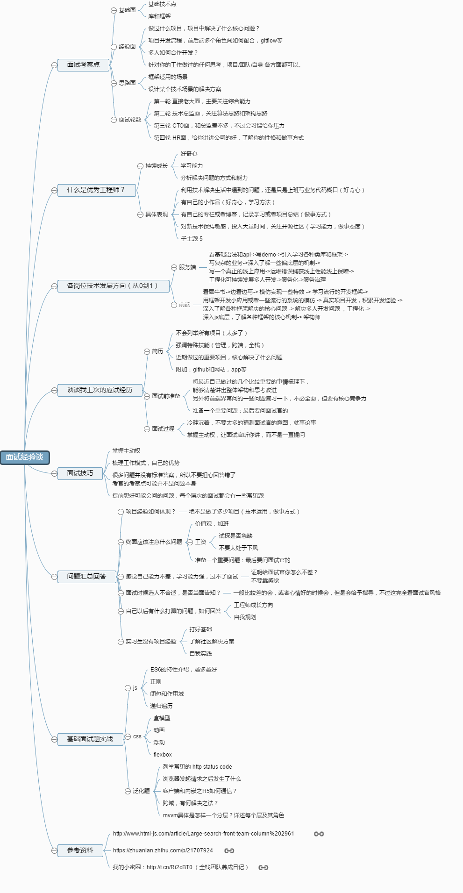

# 面试流程和面试经验

## 前端面试经验思维导图

## 怎么投简历

### 各大招聘网站

Boss 直聘、智联招聘、猎聘、拉钩招聘等...

### 内部员工推荐(内推)

简历会优于自投先行查看

部门负责人内推到自己部门，面试的时候可以灵活处理

可以和推荐人询问公司情况，业务内容等

推荐人可以帮忙查看面试情况遇到面试问题时也可以协助沟通

### 猎头

猎头的信息比较全面，手上拥有较多的资源

在把简历交给猎头之前一定要考察一下对方是否专业如果发现对方不专业或经验不够，要立即结束合作

专业猎头特点

- 会对你面试的公司情况很熟悉
- 会根据你的履历和你深入沟通，并给出相关建议
- 会告诉你他所经手的事实案例，以及帮你分析利益关系
- 会乐意和你认真交朋友，分享一些职场上或生活上的一些想法
- 会及时帮你跟进面试进展，告知你应对策略
- 会给你提供一些资源(比如面试攻略) ，帮你提升通过概率

## 面试

|        | 面试官                 | 考察重点           | 准备方式                                                                             |
| ------ | ---------------------- | ------------------ | ------------------------------------------------------------------------------------ |
| 第一轮 | 岗位所在团队的工程师面 | 基本技能           | 做题，搜索网上面试题和笔试题                                                         |
| 第二轮 | 岗位的直属领导         | 项目经验、思维能力 | 选一个自己参与过的技术复杂度最高的项目阐述解决了什么问题，达到了什么效果，做些算法题 |
| 第三轮 | 其他团队工程师         | 技术水平           | 参考第一轮和第二轮                                                                   |
| 第四轮 | 岗位的部门领导         | 开发流程、解决方案 | 平时多切换角度思考工作中的问题                                                       |
| 第五轮 | 人力资源               | 职业经历、价值观   | 多看书学习，做好职业规划，树立积极价值物                                             |

## 一、自我介绍

### 1.职业经历

- 腾讯
- 百度
- 搜狗
- 百度
- 蚂蚁金服
- 百度

### 2.软素质成长

- 自我管理：时间，情绪，精力，健康

- 提高情商积累人脉：

  “智商不高，情商高的人，贵人相助；智商高，情商不高的人，怀才不遇。”——美国作家丹尼尔·戈尔曼

- 清楚认识自己：多思考多自省，提早作出职业转型规划

## 二、大厂面试流程

### 一面: 自我介绍，基础知识

#### 3.自我介绍

- (1)简单介绍自己工作时间及职业经历；
- (2)简单介绍现在负责的产品项目及所用技术栈；
- (3)未来的发展规划;
- (4)说明目前看机会的原因；

#### 4.基础知识

注：基础概念，底层原理，算法等，会要求手写代码，不会说思路；没有技巧可言，全部靠自己的基础功力

### 二面: 项目，实战问题

#### 1.项目中的问题

(1) 项目的应用场景，整体架构，数据交互方式，包括后端和数据库，及前端技术栈（最好有线上产品可访问）；

(2) 项目中实现复杂交互用到的技术难点，深入学习并覆盖到周边知识点；

(3) 项目中遇到的困难及解决方案（两方面：技术方面，排期沟通等其他方面）；web 全栈架构师注：如果是重构项目要说出设计思路及重构后的优势

#### 2.扩展实战问题

(1) 实现某一功能的思路（可能会手写代码）；

(2) 日常开发经常遇到的一些坑；

(3) 开放性问题，考逻辑思维，例如设计一个 xxx 组件（可能手写代码）

### 三面: 综合素质：（Boss）

- 逻辑思维能力: 可能会问一些智力题或算法题
- 性格:

  - (1) 沟通能力：积极表达；
  - (2) 优缺点：缺点不能是真的缺点；
  - (3) 是否接受加班：实事求是

### 四面: 薪资沟通（HR）

坚持底线，争取预期

## 三、面试准备

### 1.简历

#### 简单清晰，最多两页

- 个人信息
  - 基本信息，联系方式，毕业时间院校等
- 专业技能
  - 不要写“精通”
- 工作经历
  - 实事求是
- 项目经验
  - 切记流水线式介绍，突出难点及技术架构
- 自我评价

### 2.知识点

#### 怎么学？

- 基础：看书，理解，反复巩固 （40%）
- 功能实现：刷题，动手写，总结 （30%）
- 性能优化：刷题，动手写，总结 （10%）
- web 全栈架构师算法：刷题，理解，总结 （10%）
- 设计思想：开源框架设计模式深入理解（10%）

### 3.误区

- 刷题越多越好
- 盲目的投简历
- 死记硬背

## 四、百度项目流程

- 项目 kick-off

- 需求评审
- 交互视觉评审
- 开发设计评审
- 开发联调自测
- 效果确认
- 提测准入
- 测试修复 bug
- 测试通过上线
- 线上回归

## 薪资

真正决定薪资的是面试表现及岗位紧缺程度

- 通过网络工具进行查询的方式最简单，但是可靠性比较低
- 通过目标公司内部熟人了解薪资情况是一种比较直接的方式但有可能内部熟人不方便向你透露他的薪资
- 以招聘方的身份进行登录，来查看其他人简历

## 总结

简历的核心目的在于获取面试资格

在简历内容方面要注意两个原则：

- 用事实数据说话以及有技巧的展示自己
- 推荐通过内推或猎头的方式投递简历

面试前多看看面试题也非常有帮助

除此之外还要准备一个代表性的项目

分享开发过程中的工作经验

可以通过向熟人朋友或猎头打听

以及通过招聘网站查询的方式来消除信息差
